+++
date = '2026-05-25T17:43:04+08:00'
draft = false
title = 'Understand Anything 教學手冊'
tags = ['教學', 'AI開發']
categories = ['教學']
+++

# Understand-Anything 企業級教學手冊

> **版本**：v2.7.5（對應 2026-06 官方最新版）
> **適用對象**：資深工程師、架構師、技術主管
> **最後更新**：2026 年 5 月 25 日
> **授權**：MIT License
> **官方 Repo**：[Lum1104/Understand-Anything](https://github.com/Lum1104/Understand-Anything)
> **官方首頁**：[understand-anything.com](https://understand-anything.com/)
> **線上 Demo**：[understand-anything.com/demo](https://understand-anything.com/demo/)
> **Discord 社群**：[discord.gg/pydat66RY](https://discord.gg/pydat66RY)

---

## 目錄

- [1. Understand-Anything 簡介](#1-understand-anything-簡介)
- [2. 系統架構](#2-系統架構)
- [3. 核心功能詳解](#3-核心功能詳解)
- [4. 安裝與環境建置](#4-安裝與環境建置)
- [5. Claude Code 整合](#5-claude-code-整合)
- [6. GitHub Copilot / Cursor / Codex 整合](#6-github-copilot--cursor--codex-整合)
- [7. Web Application 開發實戰](#7-web-application-開發實戰)
- [8. Legacy System Reverse Engineering](#8-legacy-system-reverse-engineering)
- [9. Framework 升級實戰](#9-framework-升級實戰)
- [10. Knowledge Graph 深入解析](#10-knowledge-graph-深入解析)
- [11. Token Cost 最佳化與 Hybrid 分析模式](#11-token-cost-最佳化與-hybrid-分析模式)
- [12. SSDLC 與 AI 治理](#12-ssdlc-與-ai-治理)
- [13. 團隊導入最佳實務](#13-團隊導入最佳實務)
- [14. 維運與監控](#14-維運與監控)
- [15. Troubleshooting 常見問題排除](#15-troubleshooting-常見問題排除)
- [16. 最佳實務](#16-最佳實務)
- [17. 企業級架構建議](#17-企業級架構建議)
- [18. 未來發展方向](#18-未來發展方向)
- [19. 結論](#19-結論)
- [20. AI Prompt Engineering 專章](#20-ai-prompt-engineering-專章)
- [21. Agent Workflow 專章](#21-agent-workflow-專章)
- [22. 大型共用平台案例](#22-大型共用平台案例)
- [23. 檢查清單（Checklist）](#23-檢查清單checklist)
- [附錄](#附錄)

---

# 1. Understand-Anything 簡介

## 1.1 專案背景

Understand-Anything 是 GitHub 上星數超過 28,000 的開源 AI Codebase Understanding Framework，由 Lum1104 於 2026 年初創建。它的核心理念是：

> **「目標不是用程式碼庫的複雜程度驚豔你 —— 而是默默告訴你每一塊是怎麼拼在一起的。」**

當你加入一個新團隊，面對 20 萬行程式碼，Understand-Anything 能在數分鐘內為你建構完整的互動式知識圖譜（Knowledge Graph），讓你從全局視角理解系統結構，而非逐行閱讀程式碼。

### 專案核心數據

| 項目 | 數據 |
|------|------|
| GitHub Stars | 28,600+ |
| Forks | 2,400+ |
| Contributors | 36+ |
| 主要語言 | TypeScript (70.6%), JavaScript (15.5%), Python (9.7%) |
| 授權 | MIT License |
| 最新版本 | v2.7.5 |
| 支援平台 | 14+ AI Coding 平台 |
| 測試覆蓋 | 193 vitest + 69 Python 測試 |

## 1.2 核心設計理念

Understand-Anything 採用 **Tree-sitter + LLM 混合分析** 架構，將確定性分析與語意理解分離：

1. **Tree-sitter（確定性）**：解析原始碼的具體語法樹，提取結構性事實（import、export、函式定義、類別定義、呼叫點、繼承關係）。相同輸入永遠產生相同輸出。
2. **LLM（語意）**：讀取解析後的結構與原始碼，產生解析器做不到的事：plain-English 摘要、標籤、架構層歸屬、業務領域映射、導覽路線、語言概念標註。

這個設計讓知識圖譜在**結構層面具備可重現性**（同樣的程式碼總是產生同樣的邊），同時在**語意層面也能捕捉意圖**（一個檔案是「為了什麼」而存在）。

## 1.3 適用情境

| 情境 | 說明 | 適合程度 |
|------|------|----------|
| 新人 Onboarding | 快速理解大型程式碼庫的架構 | ⭐⭐⭐⭐⭐ |
| Legacy System 逆向工程 | 盤點遺留系統結構、找出 Dead Code | ⭐⭐⭐⭐⭐ |
| PR Review 輔助 | 分析變更影響範圍、理解 Ripple Effect | ⭐⭐⭐⭐ |
| 架構文件產出 | 自動產生架構圖與技術文件 | ⭐⭐⭐⭐ |
| Framework 升級 | 分析升級影響範圍 | ⭐⭐⭐⭐ |
| AI Agent 協作 | 幫助 AI 理解系統全貌，提升程式碼生成品質 | ⭐⭐⭐⭐⭐ |
| 知識庫分析 | 將 Markdown Wiki 轉為知識圖譜 | ⭐⭐⭐⭐ |
| 技術債評估 | 識別高複雜度模組、Circular Dependency | ⭐⭐⭐⭐ |

## 1.4 與傳統 Code Analysis Tool 差異

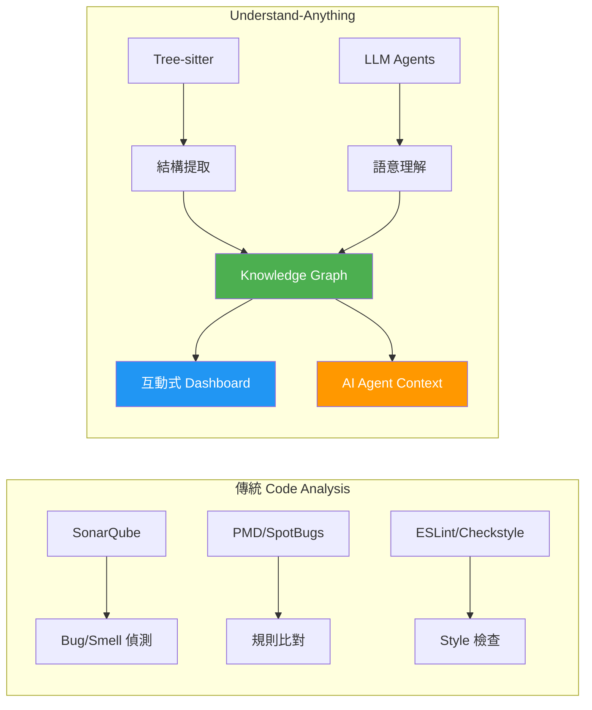

| 面向 | 傳統工具 (SonarQube/PMD) | Understand-Anything |
|------|--------------------------|---------------------|
| **分析目的** | 找出 Bug、Code Smell | 理解系統架構與業務邏輯 |
| **輸出格式** | 問題清單、報告 | 互動式知識圖譜 |
| **AI 整合** | 有限 | 原生支援 14+ AI 平台 |
| **語意理解** | 無（規則比對） | LLM 產生摘要與標籤 |
| **視覺化** | 靜態報表 | 互動式 Dashboard（搜尋、導覽、篩選） |
| **多語言支援** | 每種語言需獨立工具 | 原生支援 12+ 程式語言 + 26+ 檔案類型 |
| **增量更新** | 全量掃描 | 指紋偵測，僅分析變更檔案 |

## 1.5 與 RAG 系統差異

| 面向 | 傳統 RAG | Understand-Anything |
|------|----------|---------------------|
| **資料結構** | 向量 Embedding（非結構化） | Knowledge Graph（結構化） |
| **查詢方式** | 語意相似度搜尋 | 圖譜走訪 + 語意搜尋 |
| **關係建模** | 無法表達依賴關係 | 35+ 種 Edge Types 精確描述關係 |
| **架構理解** | 片段式（chunk-based） | 全局式（graph-based） |
| **可解釋性** | 低（黑箱檢索） | 高（可視覺化追蹤每條邊） |
| **更新策略** | 重建索引 | 增量更新（指紋比對） |

## 1.6 與 SourceGraph/Cody 差異

| 面向 | SourceGraph/Cody | Understand-Anything |
|------|------------------|---------------------|
| **部署模式** | SaaS / Self-hosted Server | 本地 Plugin（無需伺服器） |
| **核心能力** | 程式碼搜尋 + AI Chat | Knowledge Graph + Dashboard |
| **架構理解** | 基於搜尋索引 | 基於 Multi-Agent Pipeline |
| **視覺化** | 程式碼瀏覽器 | 互動式圖譜（節點/邊/層級） |
| **成本** | 企業版需授權費 | MIT 開源免費 |
| **離線使用** | 需連線 | 圖譜 JSON 可離線瀏覽 |
| **AI 平台** | 綁定 Cody | 支援 14+ 平台 |

## 1.7 與 GraphRAG 差異

| 面向 | Microsoft GraphRAG | Understand-Anything |
|------|-------------------|---------------------|
| **設計目標** | 通用文本知識圖譜 | 程式碼庫專用知識圖譜 |
| **Entity 粒度** | 文本實體（人/事/物） | 程式碼實體（檔案/函式/類別/模組） |
| **Edge 語意** | 通用關係 | 35+ 種程式碼專用關係（imports/calls/inherits...） |
| **架構層級** | 無 | 自動偵測 API/Service/Data/UI 層級 |
| **導覽功能** | 無 | Guided Tour 引導式學習路徑 |
| **Dashboard** | 需自建 | 內建 React Dashboard |
| **CI/CD 整合** | 需自行實作 | 支援 post-commit hook 自動更新 |

## 1.8 為何適合大型企業

1. **零基礎設施成本**：純 Plugin 架構，無需部署伺服器、資料庫。圖譜就是一份 JSON 檔案
2. **Git 原生整合**：圖譜可提交至 Git，團隊共享無需重跑 Pipeline
3. **增量更新**：大型專案不需每次全量掃描，僅處理變更檔案
4. **多平台支援**：無論團隊使用 Claude Code、Copilot 或 Cursor，都能統一使用
5. **合規友好**：MIT 授權，程式碼與圖譜皆留在本地，不需上傳至第三方
6. **多語言支援**：支援繁體中文 UI 與摘要，降低溝通成本

> **實務案例**：Google Cloud Platform 的 [microservices-demo](https://github.com/Lum1104/microservices-demo) 專案（Go / Java / Python / Node 多語言微服務）已使用 Understand-Anything 建立並提交了完整的知識圖譜。

---

# 2. 系統架構

## 2.1 整體架構概覽

Understand-Anything 的系統架構分為三大層：**分析層（Multi-Agent Pipeline）**、**持久層（Graph Storage）**、**展示層（Dashboard UI）**。

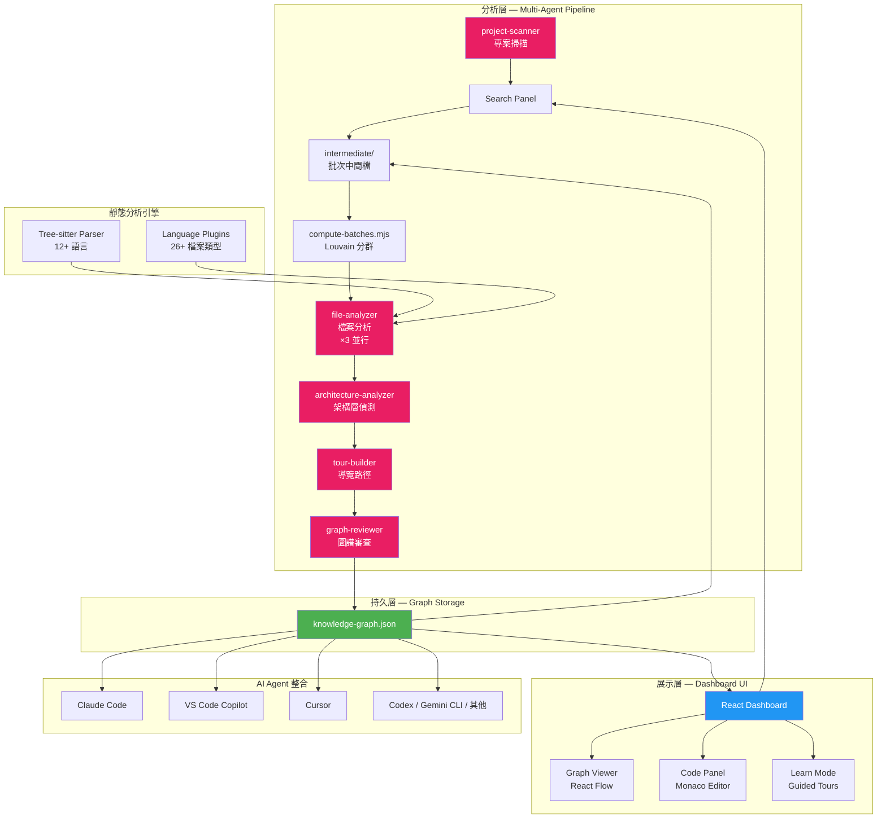

## 2.2 Multi-Agent Pipeline 詳解

### Agent 分工表

| Agent | 職責 | 輸入 | 輸出 |
|-------|------|------|------|
| **project-scanner** | 掃描專案檔案，偵測語言和框架；v2.7.5 起委派 `scan-project.mjs` 進行確定性檔案列舉 | 專案根目錄 | `scan-results.json` |
| **scan-project.mjs** | 內建腳本：確定性檔案列舉，取代 LLM 撰寫的掃描器（3-5× 加速） | 專案根目錄 | 檔案清單 |
| **extract-import-map.mjs** | 內建腳本：10+ 語言解析器，支援 Go/TS/PHP/Python Monorepo 多根解析 | 原始碼檔案 | `importMap` |
| **compute-batches.mjs** | Phase 1.5：以 Louvain 社群偵測取代計數式分批，按模組耦合度語意分群 | `importMap` + 檔案清單 | `batch-plan.json` |
| **file-analyzer** | 提取函式、類別、匯入；產生圖節點和邊（多段式輸出 + neighborMap） | 原始碼檔案（語意批次） | `batch-<N>.json` |
| **architecture-analyzer** | 識別架構層（API/Service/Data/UI） | 節點與邊集合 | `layers.json` |
| **tour-builder** | 產生引導式學習路徑 | 完整圖譜 | `tour.json` |
| **graph-reviewer** | 驗證圖的完整性和參考完整性 | 完整圖譜 | 最終 `knowledge-graph.json` |
| **domain-analyzer** | 提取業務領域、流程和處理步驟 | 完整圖譜 | Domain 節點與邊 |
| **article-analyzer** | 從 wiki 文章中提取實體與隱式關係 | Markdown Wiki 目錄 | Knowledge 節點與邊 |

### Pipeline 執行流程

> **v2.7.5 重大變更**：Pipeline 新增 Phase 1.5（compute-batches），Phase 1 改由內建腳本 `scan-project.mjs` 執行確定性檔案列舉，並由 `extract-import-map.mjs` 預先解析 importMap（支援 10+ 語言解析器、Monorepo 多根解析）。Phase 2 的 file-analyzer 改用**多段式輸出協議（Multi-part Output）**與 **neighborMap** 跨批次邊發射，大幅提升大型專案的分析穩定性與速度（Phase 1 加速 3-5 倍）。

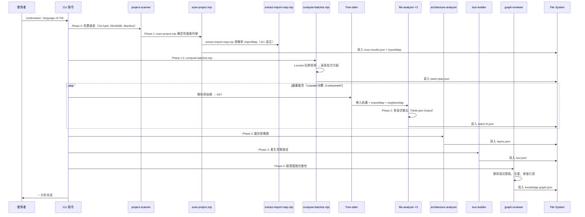

## 2.3 Tree-sitter 靜態分析引擎

Tree-sitter 是 Understand-Anything 的確定性分析核心，負責將原始碼解析為具體語法樹（Concrete Syntax Tree），提取結構性事實。

### 支援的程式語言

| 語言 | Tree-sitter Parser | 提取能力 |
|------|-------------------|----------|
| TypeScript | ✅ | 函式、類別、介面、型別、匯入/匯出 |
| JavaScript | ✅ | 函式、類別、匯入/匯出、模組 |
| Python | ✅ | 函式、類別、匯入、裝飾器 |
| Java | ✅ | 類別、介面、方法、匯入、繼承 |
| Go | ✅ | 函式、結構、介面、匯入 |
| Rust | ✅ | 函式、結構、特徵、匯入 |
| Ruby | ✅ | 類別、模組、方法 |
| PHP | ✅ | 類別、命名空間、方法 |
| C++ | ✅ | 類別、函式、命名空間、標頭 |
| C# | ✅ | 類別、介面、方法、命名空間 |
| Swift | ✅ | 類別、結構、協定、函式 |
| Kotlin | ✅ | 類別、資料類別、函式、物件 |

### 支援的非程式碼檔案類型（12+ 內建 Parser）

| Parser | 檔案類型 | 提取能力 |
|--------|---------|----------|
| MarkdownParser | `.md` | 標題、連結、程式碼區塊、Front Matter |
| YAMLConfigParser | `.yaml`, `.yml` | 鍵值階層、錨點、多文件 |
| JSONConfigParser | `.json` | 鍵值結構、`$ref`、`$defs` |
| TOMLParser | `.toml` | 區段階層 |
| EnvParser | `.env` | 變數名稱、引用 |
| DockerfileParser | `Dockerfile` | FROM 階段、EXPOSE 埠、COPY 來源 |
| SQLParser | `.sql` | CREATE TABLE/VIEW/INDEX、欄位、外鍵 |
| GraphQLParser | `.graphql` | 型別、查詢、變異、訂閱 |
| ProtobufParser | `.proto` | 訊息、服務、列舉、RPC |
| TerraformParser | `.tf` | 資源、模組、變數、輸出 |
| MakefileParser | `Makefile` | 目標、相依、變數 |
| ShellParser | `.sh`, `.bash` | 函式、Source 檔案 |

## 2.4 Graph Schema 架構

### Node Types（21 種）

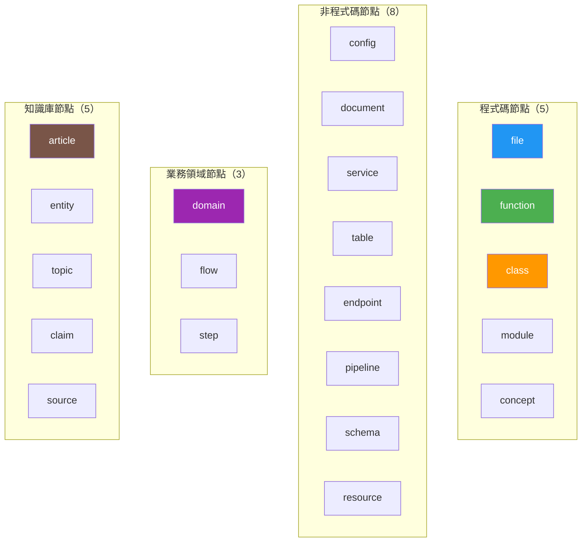

### Edge Types（35+ 種）

| 類別 | Edge Types | 說明 |
|------|-----------|------|
| **結構性** | `imports`, `exports`, `contains`, `inherits`, `implements` | 靜態結構關係 |
| **行為性** | `calls`, `subscribes`, `publishes`, `middleware` | 執行期行為 |
| **資料流** | `reads_from`, `writes_to`, `transforms`, `validates` | 資料處理 |
| **相依性** | `depends_on`, `tested_by`, `configures` | 相依與測試 |
| **基礎設施** | `deploys`, `serves`, `provisions`, `triggers` | 部署與運維 |
| **Schema** | `migrates`, `documents`, `routes`, `defines_schema` | 資料結構 |
| **領域** | `contains_flow`, `flow_step`, `cross_domain` | 業務流程 |
| **知識** | `cites`, `contradicts`, `builds_on`, `exemplifies`, `categorized_under`, `authored_by` | 知識關係 |

## 2.5 Dashboard UI 技術棧

| 技術 | 用途 | 版本 |
|------|------|------|
| React | UI 框架 | 18 |
| TypeScript | 型別安全 | — |
| React Flow | 圖譜視覺化（自訂節點） | — |
| Monaco Editor | 程式碼檢視器（VS Code 核心） | — |
| TailwindCSS | 樣式 | v4 |
| Zustand | 狀態管理 | — |
| Dagre | 階層式 Graph Layout | — |
| ELK | 大型 Graph Layout（1000+ 節點） | — |
| Graphology + Louvain | 社群偵測與聚類 | — |

## 2.6 Monorepo 專案結構

```
understand-anything/
├── understand-anything-plugin/     # 主要 Plugin
│   ├── skills/                     # Skill 定義（8 個指令）
│   │   ├── understand/             # /understand — 主分析
│   │   ├── understand-dashboard/   # /understand-dashboard
│   │   ├── understand-chat/        # /understand-chat
│   │   ├── understand-explain/     # /understand-explain
│   │   ├── understand-onboard/     # /understand-onboard
│   │   ├── understand-diff/        # /understand-diff
│   │   ├── understand-domain/      # /understand-domain
│   │   └── understand-knowledge/   # /understand-knowledge
│   ├── agents/                     # Agent Prompt 定義
│   │   ├── project-scanner.md
│   │   ├── file-analyzer.md
│   │   ├── architecture-analyzer.md
│   │   ├── tour-builder.md
│   │   ├── graph-reviewer.md
│   │   └── knowledge-graph-guide.md
│   └── packages/
│       ├── core/                   # TypeScript 核心庫（Zod Schema, 持久化）
│       │   ├── scan-project.mjs    # 確定性檔案列舉（v2.7.5 新增）
│       │   ├── extract-import-map.mjs  # importMap 解析器（v2.7.5 新增）
│       │   └── compute-batches.mjs # Louvain 分群計算（v2.7.5 新增）
│       └── dashboard/              # React Dashboard（Vite）
├── .claude-plugin/                 # Claude Code 自動發現
├── .copilot-plugin/                # VS Code Copilot 自動發現
├── .cursor-plugin/                 # Cursor 自動發現
├── homepage/                       # Astro 官方首頁
├── docs/superpowers/               # 設計文件與實作計畫
├── scripts/                        # 工具腳本
├── tests/                          # 整合測試（193 vitest + 69 Python）
│   └── skill/understand/           # 主分析技能測試
├── CLAUDE.md                       # 架構指引
├── CONTRIBUTING.md                 # 貢獻指南
└── README.md                       # 主文件
```

> **實務建議**：在企業環境中，建議團隊架構師先閱讀 `CLAUDE.md` 檔案，它包含完整的架構慣例與關鍵指令說明。

---

# 3. 核心功能詳解

## 3.1 Multi-Agent Analysis

### 3.1.1 Agent 分工與協作

Understand-Anything 的分析流程由 5+2 個專門化 Agent 組成，每個 Agent 負責明確的職責：

**Phase 0 — 前置檢查**
```
- 定位 Plugin 目錄
- 驗證 Git commit hash
- 讀取 README 與 Manifest
```

**Phase 1 — project-scanner + scan-project.mjs（專案掃描）**
```
- 偵測專案名稱、語言、框架
- 委派內建腳本 scan-project.mjs 進行確定性檔案列舉（v2.7.5 起）
  → 取代原先由 LLM 撰寫的掃描器，速度提升 3-5 倍
- extract-import-map.mjs 預先解析 importMap
  → 支援 10+ 語言解析器，含 Go/TS/PHP/Python Monorepo 多根解析
- 輸出：scan-results.json + importMap
```

**Phase 1.5 — compute-batches.mjs（批次計劃，v2.7.5 新增）**
```
- 以 Louvain 社群偵測演算法取代固定計數式分批
- 根據 importMap 的模組耦合度進行語意分群
- 同一社群的檔案分在同一批次，減少跨批次邊遺漏
- 輸出：batch-plan.json
```

**Phase 2 — file-analyzer（檔案分析，並行）**
```
- 最多 3 個並行（v2.7.5 起由 5 調整為 3）
- 使用多段式輸出協議（Multi-part Output）：分段產出 JSON，降低截斷風險
- neighborMap：跨批次邊發射，確保社群邊界的依賴關係不遺漏
- Anti-fusion strict naming：嚴格命名防止節點融合
- 為每個節點產生 LLM 摘要
- 輸出：batch-<N>.json
```

**Phase 3 — architecture-analyzer（架構層偵測）**
```
- 識別架構層級：API / Service / Data / UI / Utility
- 為每個層級分配色碼
- 輸出：layers.json
```

**Phase 4 — tour-builder（導覽路徑產生）**
```
- 依拓撲順序產生學習路徑
- 解釋元件間的連結
- 輸出：tour.json
```

**Phase 5 — graph-reviewer（圖譜審查）**
```
- 驗證參考完整性
- 移除孤兒節點
- 去重
- 輸出：最終 knowledge-graph.json
```

### 3.1.2 Context Sharing 機制

Agent 之間透過檔案系統共享 Context：

```
.understand-anything/
├── intermediate/           # 中間產物（不需提交 Git）
│   ├── scan-results.json   # Phase 1 → Phase 1.5
│   ├── import-map.json     # Phase 1 extract-import-map.mjs 輸出
│   ├── batch-plan.json     # Phase 1.5 compute-batches.mjs 輸出
│   ├── batch-1.json        # Phase 2 輸出
│   ├── batch-2.json
│   ├── layers.json         # Phase 3 → Phase 4
│   └── tour.json           # Phase 4 → Phase 5
├── knowledge-graph.json    # 最終產物（提交 Git）
└── diff-overlay.json       # 差異分析（不需提交 Git）
```

### 3.1.3 語意批次（Semantic Batching）與 Louvain 社群偵測

v2.7.5 對語意批次進行了根本性重構，引入 **Louvain 社群偵測演算法**：

- **v2.7.3 以前的批次策略**：根據檔案複雜度動態分組，確保每批 Token 總量不超出 LLM 輸出限制
- **v2.7.5 的 Louvain 批次策略**：
  1. `extract-import-map.mjs` 先建立完整的模組依賴圖
  2. `compute-batches.mjs`（Phase 1.5）對依賴圖執行 Louvain 社群偵測
  3. 高度耦合的檔案自動分入同一批次（社群）
  4. 跨社群邊透過 **neighborMap** 機制補全，確保邊界依賴不遺漏

**Louvain 演算法的優勢**：

| 面向 | 計數式分批 | Louvain 語意分批 |
|------|-----------|-----------------|
| 分群依據 | 檔案數量或 Token 數 | 模組耦合度（import 邊權重） |
| 跨批次邊遺漏 | 常見（相關檔案被分散） | 極少（高耦合檔案在同一批次） |
| LLM Context 品質 | 可能缺少相關上下文 | 同一社群的檔案提供完整上下文 |
| 效能 | 基準線 | 減少重試次數，整體加速 |

**Multi-part Output 協議**（v2.7.5 新增）：
- file-analyzer 不再一次性輸出完整 JSON，改為分段產出
- 每段獨立驗證，降低因單次輸出過長導致截斷的風險
- 配合 neighborMap 確保跨批次的 `imports`/`calls` 邊正確發射

**Anti-fusion Strict Naming**（v2.7.5 新增）：
- 嚴格命名規則防止語意相近的節點被 LLM 錯誤融合
- 確保 `auth/login.ts` 和 `auth/login.test.ts` 保持為獨立節點

### 3.1.4 Token Reduction 策略

| 策略 | 說明 | 節省比例 |
|------|------|----------|
| Tree-sitter 預處理 | 結構性事實不走 LLM | ~40% |
| importMap 預解析 | `extract-import-map.mjs` 確定性解析，file-analyzer 不需重新推導 | ~15% |
| `scan-project.mjs` 內建掃描 | 取代 LLM 撰寫的掃描器，Phase 1 加速 3-5× | 時間成本大幅降低 |
| 指紋增量更新 | 僅分析變更檔案 | 視變更比例而定 |
| Louvain 語意批次 | 高耦合檔案同批、減少截斷重試 | ~15% |
| Multi-part Output | 分段輸出降低截斷風險 | ~10% |

## 3.2 Knowledge Graph 詳解

### 3.2.1 Node（節點）

每個節點代表程式碼庫中的一個實體：

```json
{
  "id": "file:src/auth/login.ts",
  "type": "file",
  "name": "login.ts",
  "filePath": "src/auth/login.ts",
  "lineRange": [1, 150],
  "summary": "處理使用者登入邏輯，包含 JWT Token 驗證與 Session 管理",
  "tags": ["auth", "login", "jwt", "session"],
  "complexity": "moderate",
  "languageNotes": "使用 async/await 模式與 Express middleware"
}
```

**重要欄位說明**：

| 欄位 | 說明 |
|------|------|
| `id` | 唯一識別，格式為 `type:filePath[:symbolName]` |
| `type` | 21 種節點類型之一 |
| `summary` | LLM 產生的摘要（受 `--language` 參數影響） |
| `tags` | 自動標籤，用於搜尋與篩選 |
| `complexity` | `simple` / `moderate` / `complex` |
| `languageNotes` | 語言特定的概念說明 |

### 3.2.2 Edge（邊）

每條邊描述兩個節點之間的關係：

```json
{
  "source": "file:src/auth/login.ts",
  "target": "file:src/models/user.ts",
  "type": "imports",
  "direction": "forward",
  "description": "匯入 User Model 以進行身分驗證查詢",
  "weight": 0.9
}
```

**重要欄位說明**：

| 欄位 | 說明 |
|------|------|
| `source` / `target` | 對應節點的 `id` |
| `type` | 35+ 種邊類型之一 |
| `direction` | `forward` / `backward` / `bidirectional` |
| `weight` | 0-1 重要性分數，影響視覺化粗細 |

### 3.2.3 Layer（層級）

自動偵測的架構層級：

```json
{
  "id": "layer:api",
  "name": "API Layer",
  "description": "HTTP 請求處理與路由",
  "nodeIds": ["file:src/routes/auth.ts", "file:src/routes/user.ts"]
}
```

常見層級：

| 層級 | 色碼 | 包含 |
|------|------|------|
| API Layer | 藍色 | Controller、Route、Endpoint |
| Service Layer | 綠色 | Business Logic、Service |
| Data Layer | 橘色 | Repository、DAO、ORM Model |
| UI Layer | 紫色 | Component、View、Template |
| Utility | 灰色 | Helper、Utils、Constants |

### 3.2.4 Tour（導覽路徑）

自動產生的學習路線：

```json
{
  "order": 1,
  "title": "應用程式入口",
  "description": "從 index.ts 開始理解伺服器的啟動流程",
  "nodeIds": ["file:src/index.ts"],
  "languageLesson": "此專案使用 Express 框架的 middleware 模式..."
}
```

## 3.3 Dashboard 功能

### 3.3.1 多面板介面

| 面板 | 功能 | 特色 |
|------|------|------|
| **Graph Viewer** | 中央圖譜視覺化 | 縮放、平移、節點高亮、邊追蹤 |
| **Code Panel** | 顯示檔案內容 | Monaco Editor 語法高亮，唯讀模式 |
| **Search** | 自然語言搜尋 | 搜尋摘要、標籤、節點名稱 |
| **Details Panel** | 節點詳情 | 摘要、標籤、複雜度、關聯節點 |
| **Learn Mode** | 引導式學習 | 步驟式 Onboarding 路徑 |
| **Layers Sidebar** | 架構層檢視 | 按層級切換顯示、篩選 |

### 3.3.2 互動功能

**圖譜導覽**：
- 縮放、平移、置中檢視
- 依名稱或描述搜尋節點
- 點擊節點 → 顯示程式碼、連結、中繼資料
- 高亮 Import 鏈
- 按層級、類型、複雜度篩選

**進階視覺化**：
- **Overview Mode**：專案全貌鳥瞰圖
- **Layer Detail**：放大單一架構層，顯示跨層相依
- **Container Layout**：依資料夾/領域分組，可折疊容器
- **Domain View**：業務領域概念獨立圖譜
- **Knowledge View**：Wiki/Markdown 圖譜專用佈局

**Persona-Adaptive UI（使用者角色自適應）**：
- **初級開發者**：簡化視圖，強調學習路徑
- **專案經理**：高階架構視圖，強調模組與相依
- **進階使用者**：完整細節，所有篩選與進階功能

### 3.3.3 啟動 Dashboard

```bash
# 分析完成後開啟 Dashboard
/understand-dashboard
```

Dashboard 會在瀏覽器中開啟，載入 `.understand-anything/knowledge-graph.json`。

### 3.3.4 離線使用

Dashboard 支援離線使用（不需網路連線）：

| 功能 | 離線 | 需連線 |
|------|------|--------|
| 圖譜瀏覽 | ✅ | — |
| 搜尋 | ✅ | — |
| 學習路徑 | ✅ | — |
| 程式碼檢視 | ✅ | — |
| Chat 對話 | ❌ | 需 LLM API Key |

## 3.4 Translation System（多語言系統）

### 3.4.1 支援語言

| 語言 | 代碼 | CLI 參數 |
|------|------|----------|
| English（預設） | `en` | `--language en` |
| 簡體中文 | `zh` | `--language zh` |
| 繁體中文 | `zh-TW` | `--language zh-TW` |
| 日本語 | `ja` | `--language ja` |
| 한국어 | `ko` | `--language ko` |
| Русский | `ru` | `--language ru` |
| Español | `es` | `--language es` |
| Türkçe | `tr` | `--language tr` |

### 3.4.2 翻譯範圍

`--language` 參數會影響以下內容：

1. **Knowledge Graph 節點摘要與描述**（LLM 產生的 `summary` 欄位）
2. **Dashboard UI 標籤、按鈕與提示**
3. **Guided Tour 導覽說明**
4. **專案描述**
5. **架構層名稱與說明**

### 3.4.3 使用範例

```bash
# 產生繁體中文內容
/understand --language zh-TW

# 產生日文內容
/understand --language ja
```

> **實務建議**：在多國團隊中，建議使用英文（`en`）作為基準語言，再依各辦公室需求個別產生在地化版本。

## 3.5 離線分析模式（無 LLM Fallback）

當沒有 LLM 連線時，Understand-Anything 仍可運作，但能力有限：

| 能力 | 有 LLM | 無 LLM（Fallback） |
|------|--------|-------------------|
| 節點 ID、檔案路徑 | ✅ | ✅（Tree-sitter 確定性） |
| 結構性 Edge（imports/inherits） | ✅ | ✅（Tree-sitter 確定性） |
| 摘要與描述 | ✅ LLM 生成 | ⚠️ Placeholder |
| 架構層偵測 | ✅ LLM 分析 | ⚠️ 啟發式偵測 |
| 導覽路徑 | ✅ LLM 說明 | ⚠️ 拓撲排序 Fallback |
| 標籤與複雜度 | ✅ LLM 標註 | ❌ 無 |

> **重要說明**：Understand-Anything 的 LLM 能力來自宿主 AI 平台（如 Claude Code 使用 Claude API、Copilot 使用 GPT API）。專案本身不包含獨立的 LLM 或 Ollama 整合。Token 成本取決於所使用的 AI 平台定價。

---

# 4. 安裝與環境建置

## 4.1 前置需求

| 需求 | 最低版本 | 建議版本 | 說明 |
|------|---------|---------|------|
| **Node.js** | ≥ 22 | v24 | 專案開發版本為 v24 |
| **pnpm** | ≥ 10 | 最新 | 透過 `package.json` 的 `packageManager` 欄位鎖定 |
| **Git** | 任意 | 最新 | 版本控制 |
| **AI 平台** | 至少一個 | Claude Code | 提供 LLM 能力 |

> **注意**：Node.js ≥ 22 是**硬性需求**，因為專案使用了 Node 22 的新特性。

## 4.2 Windows 安裝

### Step 1：安裝 Node.js

```powershell
# 使用 winget 安裝 Node.js v24
winget install -e --id OpenJS.NodeJS --version 24.0.0

# 或使用 nvm-windows
nvm install 24
nvm use 24

# 驗證
node --version   # 應顯示 v24.x.x
```

### Step 2：安裝 pnpm

```powershell
# 使用 npm 安裝 pnpm
npm install -g pnpm

# 或使用 Corepack（Node 16+ 內建）
corepack enable
corepack prepare pnpm@latest --activate

# 驗證
pnpm --version
```

### Step 3：安裝 Understand-Anything

**方式 A：Claude Code（推薦）**

```bash
# 在 Claude Code 中執行
/plugin marketplace add Lum1104/Understand-Anything
/plugin install understand-anything
```

**方式 B：VS Code + GitHub Copilot（自動發現）**

```powershell
# 複製 Repo
git clone https://github.com/Lum1104/Understand-Anything.git

# 在 VS Code 中開啟（v1.108+ 自動發現 .copilot-plugin/plugin.json）
code Understand-Anything
```

**方式 C：一行安裝（PowerShell）**

```powershell
# 執行安裝腳本（支援 Codex / Copilot / Gemini CLI 等平台）
iwr -useb https://raw.githubusercontent.com/Lum1104/Understand-Anything/main/install.ps1 | iex
```

安裝腳本會：
1. 複製 Repo 到 `~/.understand-anything/repo`
2. 為所選平台建立符號連結
3. 安裝完成後需重啟 CLI 或 IDE

**支援的 `<platform>` 值**：

```
codex, opencode, openclaw, antigravity, gemini, pi, vibe, vscode, hermes, cline, kimi
```

**後續維護指令**：

```powershell
# 更新
./install.sh --update

# 解除安裝
./install.sh --uninstall <platform>
```

### Step 4：驗證安裝

```bash
# 在支援的 AI 平台中執行
/understand --help
```

## 4.3 Linux 安裝

### Step 1：安裝 Node.js

```bash
# 使用 nvm（推薦）
curl -o- https://raw.githubusercontent.com/nvm-sh/nvm/v0.40.0/install.sh | bash
source ~/.bashrc
nvm install 24
nvm use 24

# 驗證
node --version
```

### Step 2：安裝 pnpm

```bash
# Corepack（推薦）
corepack enable
corepack prepare pnpm@latest --activate

# 或 npm 安裝
npm install -g pnpm
```

### Step 3：安裝 Understand-Anything

```bash
# 一行安裝
curl -fsSL https://raw.githubusercontent.com/Lum1104/Understand-Anything/main/install.sh | bash

# 指定平台（跳過互動提示）
curl -fsSL https://raw.githubusercontent.com/Lum1104/Understand-Anything/main/install.sh | bash -s codex
```

## 4.4 macOS 安裝

### Step 1：安裝 Node.js

```bash
# 使用 Homebrew
brew install node@24

# 或 nvm
nvm install 24
nvm use 24
```

### Step 2：安裝 pnpm

```bash
# Homebrew
brew install pnpm

# 或 Corepack
corepack enable
corepack prepare pnpm@latest --activate
```

### Step 3：安裝 Understand-Anything

```bash
# 一行安裝（與 Linux 相同）
curl -fsSL https://raw.githubusercontent.com/Lum1104/Understand-Anything/main/install.sh | bash
```

## 4.5 多平台相容性

| 平台 | 狀態 | 安裝方式 |
|------|------|---------|
| Claude Code | ✅ 原生 | Plugin Marketplace |
| Cursor | ✅ 支援 | 自動發現 `.cursor-plugin/plugin.json` |
| VS Code + GitHub Copilot | ✅ 支援 | 自動發現 `.copilot-plugin/plugin.json` |
| Copilot CLI | ✅ 支援 | `copilot plugin install` |
| Codex | ✅ 支援 | `install.sh codex` |
| OpenCode | ✅ 支援 | `install.sh opencode` |
| OpenClaw | ✅ 支援 | `install.sh openclaw` |
| Antigravity | ✅ 支援 | `install.sh antigravity` |
| Gemini CLI | ✅ 支援 | `install.sh gemini` |
| Pi Agent | ✅ 支援 | `install.sh pi` |
| Vibe CLI | ✅ 支援 | `install.sh vibe` |
| Hermes | ✅ 支援 | `install.sh hermes` |
| Cline | ✅ 支援 | `install.sh cline` |
| KIMI CLI | ✅ 支援 | `install.sh kimi` |

## 4.6 環境變數

| 變數 | 說明 | 預設值 |
|------|------|--------|
| `UNDERSTAND_ANYTHING_HOME` | 安裝目錄 | `~/.understand-anything/repo` |
| `UNDERSTAND_ANYTHING_LANG` | 預設語言 | `en` |

## 4.7 Troubleshooting — 安裝問題

### 問題 1：Node.js 版本不足

```
Error: This project requires Node.js >= 22
```

**解決方案**：

```bash
# 檢查版本
node --version

# 升級至 v24
nvm install 24
nvm use 24
```

### 問題 2：pnpm 找不到

```
Error: pnpm: command not found
```

**解決方案**：

```bash
# 啟用 Corepack
corepack enable

# 或直接安裝
npm install -g pnpm
```

### 問題 3：Windows 符號連結權限

```
Error: EPERM: operation not permitted, symlink
```

**解決方案**：

```powershell
# 以系統管理員身份執行 PowerShell
# 或啟用 Developer Mode：
# 設定 → 更新與安全性 → 開發人員 → 啟用開發人員模式
```

### 問題 4：Plugin 未被偵測到

**Cursor**：
- 確認 `.cursor-plugin/plugin.json` 存在
- 如自動發現失敗：Cursor Settings → Plugins → 貼上 `https://github.com/Lum1104/Understand-Anything`

**VS Code + Copilot**：
- 確認 VS Code 版本 ≥ 1.108
- 確認 `.copilot-plugin/plugin.json` 存在
- 重啟 VS Code

### 問題 5：Git Clone 過慢

```bash
# 使用 shallow clone
git clone --depth 1 https://github.com/Lum1104/Understand-Anything.git

# 或使用 GitHub CLI
gh repo clone Lum1104/Understand-Anything -- --depth 1
```

> **實務建議**：企業環境中，建議由團隊的 DevOps 工程師統一安裝並驗證環境，再透過 wiki 或 Confluence 分享安裝指引與已知問題清單。

---

# 5. Claude Code 整合

## 5.1 Plugin 安裝

### 5.1.1 Marketplace 安裝（推薦）

在 Claude Code 中直接執行：

```bash
# 從 Plugin Marketplace 新增
/plugin marketplace add Lum1104/Understand-Anything

# 安裝
/plugin install understand-anything
```

### 5.1.2 手動安裝

```bash
# 複製 Repo
git clone https://github.com/Lum1104/Understand-Anything.git ~/.understand-anything/repo

# Claude Code 會自動偵測 .claude-plugin/plugin.json
```

## 5.2 Plugin 結構與 Manifest

### plugin.json 設定

Claude Code 透過 `.claude-plugin/plugin.json` 發現 Plugin：

```json
{
  "name": "understand-anything",
  "version": "2.7.3",
  "description": "Turn any codebase into an interactive knowledge graph",
  "skills": [
    "understand",
    "understand-dashboard",
    "understand-chat",
    "understand-explain",
    "understand-onboard",
    "understand-diff",
    "understand-domain",
    "understand-knowledge"
  ],
  "agents": [
    "project-scanner",
    "file-analyzer",
    "architecture-analyzer",
    "tour-builder",
    "graph-reviewer"
  ]
}
```

### Skill 對應表

| Skill | CLI 指令 | 功能 |
|-------|---------|------|
| understand | `/understand` | 主分析，建構 Knowledge Graph |
| understand-dashboard | `/understand-dashboard` | 開啟互動式 Dashboard |
| understand-chat | `/understand-chat <問題>` | 與知識圖譜對話 |
| understand-explain | `/understand-explain <路徑>` | 深入解釋特定檔案或函式 |
| understand-onboard | `/understand-onboard` | 產生新人引導文件 |
| understand-diff | `/understand-diff` | 分析目前變更的影響範圍 |
| understand-domain | `/understand-domain` | 提取業務領域知識 |
| understand-knowledge | `/understand-knowledge <路徑>` | 分析 Markdown Wiki 知識庫 |

## 5.3 Agent 協作模式

### Claude Code 如何讀取 Graph

當你安裝 Understand-Anything 後，Claude Code 可以直接存取 `.understand-anything/knowledge-graph.json`，利用 Knowledge Graph 提供更精準的回答：

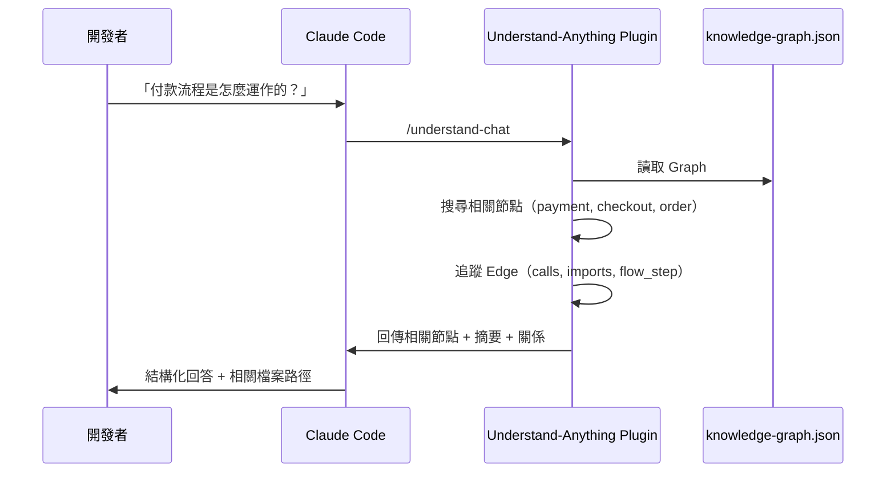

### 降低 Context Window 壓力

Knowledge Graph 的核心價值之一是**壓縮 Context**：

| 方式 | 傳統做法 | 使用 Understand-Anything |
|------|---------|-------------------------|
| 理解架構 | 送入大量原始碼到 Context | 送入精簡的 Graph 節點摘要 |
| 追蹤依賴 | 逐檔案搜尋 import | 查詢 Edge 關係圖 |
| 理解業務邏輯 | 讀取所有相關檔案 | 查詢 Domain Graph |

**實際 Token 節省範例**：

```
傳統方式：送入 50 個檔案原始碼 → ~150,000 tokens
Graph 方式：送入 50 個節點摘要 + Edge → ~5,000 tokens
節省比例：~96%
```

## 5.4 完整 Workflow

### Workflow 1：新專案理解

```bash
# Step 1: 分析專案（繁體中文）
/understand --language zh-TW

# Step 2: 開啟 Dashboard 瀏覽
/understand-dashboard

# Step 3: 與圖譜對話
/understand-chat 這個專案的核心架構是什麼？

# Step 4: 深入特定模組
/understand-explain src/auth/

# Step 5: 產生新人指南
/understand-onboard
```

### Workflow 2：變更影響分析

```bash
# Step 1: 修改程式碼
# ... 修改 src/payment/checkout.ts ...

# Step 2: 分析影響範圍
/understand-diff

# Step 3: 詢問風險
/understand-chat 我修改了 checkout.ts，哪些模組可能受影響？
```

### Workflow 3：業務領域分析

```bash
# Step 1: 提取業務領域知識
/understand-domain

# Step 2: 在 Dashboard 中切換到 Domain View
/understand-dashboard

# Step 3: 查詢特定業務流程
/understand-chat 訂單建立的完整流程有哪些步驟？
```

### Workflow 4：知識庫分析

```bash
# 分析 Karpathy-pattern Wiki
/understand-knowledge ~/docs/team-wiki

# 開啟知識圖譜
/understand-dashboard
```

## 5.5 Claude Code 協助逆向工程

```bash
# Step 1: 分析 Legacy 系統
/understand --language zh-TW

# Step 2: 找出所有 Dead Code
/understand-chat 哪些函式沒有被任何其他模組呼叫？

# Step 3: 找出 Circular Dependency
/understand-chat 是否存在循環相依？列出所有循環路徑

# Step 4: 產生架構文件
/understand-onboard
```

> **實務建議**：在大型專案中，建議先使用 `/understand src/core` 限定分析範圍到核心模組，確認圖譜品質後再擴展到全專案。

---

# 6. GitHub Copilot / Cursor / Codex 整合

## 6.1 VS Code + GitHub Copilot 整合

### 6.1.1 自動發現機制

VS Code（v1.108+）安裝 GitHub Copilot 後，會自動偵測 `.copilot-plugin/plugin.json`：

```bash
# 方式 1：複製 Repo 到專案目錄
git clone https://github.com/Lum1104/Understand-Anything.git

# 在 VS Code 中開啟 — 自動發現 Plugin
code Understand-Anything
```

```bash
# 方式 2：安裝為個人 Skill（所有專案可用）
curl -fsSL https://raw.githubusercontent.com/Lum1104/Understand-Anything/main/install.sh | bash -s vscode
```

### 6.1.2 Copilot CLI 安裝

```bash
copilot plugin install Lum1104/Understand-Anything:understand-anything-plugin
```

### 6.1.3 使用方式

在 VS Code Chat 或 Copilot Agent 中：

```
# 分析目前工作區
/understand

# 開啟 Dashboard
/understand-dashboard

# 詢問問題
/understand-chat 這個 API 的資料流向是什麼？
```

## 6.2 Cursor 整合

### 6.2.1 自動發現

Cursor 會自動偵測 `.cursor-plugin/plugin.json`：

```bash
# 複製 Repo 到專案目錄
git clone https://github.com/Lum1104/Understand-Anything.git

# 在 Cursor 中開啟 — 自動發現
cursor Understand-Anything
```

### 6.2.2 手動安裝（Fallback）

如自動發現失敗：

1. 開啟 **Cursor Settings → Plugins**
2. 貼上 `https://github.com/Lum1104/Understand-Anything`
3. 點擊 **Add**
4. 重啟 Cursor

### 6.2.3 Cursor 特有優勢

- Cursor 的 Composer 可直接讀取 Knowledge Graph 作為 Context
- 搭配 `.cursorrules` 可自訂 Agent 讀取圖譜的行為
- 支援 Cursor Tab 自動補全時參考圖譜結構

## 6.3 Codex 整合

```bash
# 安裝
curl -fsSL https://raw.githubusercontent.com/Lum1104/Understand-Anything/main/install.sh | bash -s codex

# 使用
/understand
/understand-dashboard
```

## 6.4 Gemini CLI 整合

```bash
# 安裝
curl -fsSL https://raw.githubusercontent.com/Lum1104/Understand-Anything/main/install.sh | bash -s gemini

# 使用（與其他平台相同的指令集）
/understand --language zh-TW
```

## 6.5 多平台比較

| 工具 | 優勢 | 缺點 | 適用情境 |
|------|------|------|----------|
| **Claude Code** | 原生支援，Plugin Marketplace 一鍵安裝；Agent 能力最強 | 需 Claude API 費用 | 深度分析、逆向工程、架構探索 |
| **VS Code + Copilot** | 自動發現，整合 IDE 開發流程；團隊最廣泛使用 | Plugin 生態較新 | 日常開發中的架構理解 |
| **Cursor** | 自動發現，Composer 深度整合；AI Context 能力強 | 需 Cursor 授權 | AI-First 開發流程 |
| **Codex** | OpenAI 生態整合 | 社群較小 | OpenAI 生態使用者 |
| **Gemini CLI** | Google Cloud 整合；免費額度較多 | Agent 能力較弱 | 成本敏感場景 |
| **OpenCode** | 開源免費 | 功能較基礎 | 開源愛好者 |

## 6.6 MCP 整合可能性

目前 Understand-Anything 尚未原生支援 MCP（Model Context Protocol），但可透過以下方式整合：

### 概念架構

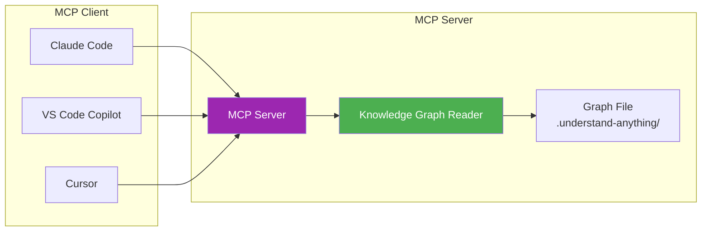

### 自建 MCP Server 範例

```typescript
// mcp-understand-anything-server.ts
import { McpServer } from "@modelcontextprotocol/sdk/server/mcp.js";
import { StdioServerTransport } from "@modelcontextprotocol/sdk/server/stdio.js";
import { readFileSync } from "fs";
import { z } from "zod";

const server = new McpServer({
  name: "understand-anything",
  version: "1.0.0",
});

// 載入知識圖譜
const graphPath = ".understand-anything/knowledge-graph.json";

// Tool: 搜尋節點
server.tool(
  "search-graph",
  "搜尋知識圖譜中的節點",
  { query: z.string().describe("搜尋關鍵字") },
  async ({ query }) => {
    const graph = JSON.parse(readFileSync(graphPath, "utf-8"));
    const results = graph.nodes.filter(
      (n: any) =>
        n.name.includes(query) ||
        n.summary?.includes(query) ||
        n.tags?.some((t: string) => t.includes(query))
    );
    return {
      content: [{ type: "text", text: JSON.stringify(results, null, 2) }],
    };
  }
);

// Tool: 查詢節點關係
server.tool(
  "get-relationships",
  "查詢特定節點的所有關係",
  { nodeId: z.string().describe("節點 ID") },
  async ({ nodeId }) => {
    const graph = JSON.parse(readFileSync(graphPath, "utf-8"));
    const edges = graph.edges.filter(
      (e: any) => e.source === nodeId || e.target === nodeId
    );
    return {
      content: [{ type: "text", text: JSON.stringify(edges, null, 2) }],
    };
  }
);

// Tool: 取得架構層級
server.tool(
  "get-layers",
  "取得專案架構層級",
  {},
  async () => {
    const graph = JSON.parse(readFileSync(graphPath, "utf-8"));
    return {
      content: [{ type: "text", text: JSON.stringify(graph.layers, null, 2) }],
    };
  }
);

// 啟動
const transport = new StdioServerTransport();
await server.connect(transport);
```

### MCP 設定（VS Code settings.json）

```json
{
  "mcp": {
    "servers": {
      "understand-anything": {
        "command": "npx",
        "args": ["tsx", "mcp-understand-anything-server.ts"],
        "cwd": "${workspaceFolder}"
      }
    }
  }
}
```

> **實務建議**：在企業環境中，建議等待官方 MCP 支援。若需提前整合，可使用上述自建方案作為 PoC。

## 6.7 AI Agent Pipeline 整合模式

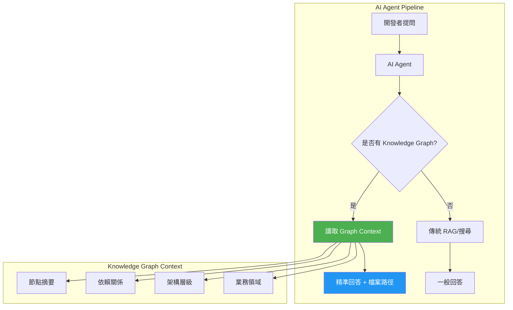

> **實務建議**：無論使用哪個 AI 平台，都建議先執行 `/understand` 建構圖譜後，再開始日常開發。圖譜就像專案的「大腦」，讓 AI Agent 從片段式理解升級為全局式理解。

---

# 7. Web Application 開發實戰

## 7.1 場景設定

假設我們有一個大型企業 Web 應用程式，技術棧如下：

| 層級 | 技術 |
|------|------|
| **前端** | Vue 3 + TypeScript + Tailwind CSS |
| **後端** | Spring Boot 3.5+ (Java 21+) |
| **資料庫** | Oracle / PostgreSQL |
| **快取** | Redis |
| **訊息佇列** | Kafka / IBM MQ |
| **批次處理** | Spring Batch |
| **認證** | SSO (SAML/OAuth2) |
| **API Gateway** | Kong / Spring Cloud Gateway |

## 7.2 如何分析大型專案

### Step 1：限定分析範圍

大型 Monorepo 建議分模組分析：

```bash
# 先分析後端核心
/understand src/main/java --language zh-TW

# 再分析前端
/understand src/frontend --language zh-TW

# 最後分析配置
/understand src/main/resources --language zh-TW
```

### Step 2：建立 Knowledge Graph

```bash
# 全專案分析（中大型專案約 5-15 分鐘）
/understand --language zh-TW
```

分析完成後，Graph 結構範例：

```json
{
  "project": {
    "name": "enterprise-platform",
    "languages": ["java", "typescript", "vue", "sql"],
    "frameworks": ["spring-boot", "vue3", "mybatis", "kafka"],
    "description": "企業級共用平台，包含使用者管理、權限控管、報表系統"
  },
  "nodes": [
    {
      "id": "class:src/main/java/com/corp/controller/UserController.java:UserController",
      "type": "class",
      "name": "UserController",
      "summary": "使用者管理 REST API，提供 CRUD 操作與搜尋功能",
      "tags": ["api", "controller", "user"],
      "complexity": "moderate"
    }
  ]
}
```

### Step 3：讓 AI 理解系統

```bash
# 詢問整體架構
/understand-chat 這個系統的整體架構是什麼？有哪些主要模組？

# 理解資料流向
/understand-chat 使用者登入的完整資料流向是什麼？從前端到資料庫

# 理解業務領域
/understand-domain
```

## 7.3 追蹤相依性

### 查詢模組間相依

```bash
/understand-chat UserController 依賴哪些 Service？這些 Service 又依賴哪些 Repository？
```

Knowledge Graph 會回傳完整的依賴鏈：

```
UserController
  → imports UserService
    → imports UserRepository
      → reads_from USER 表
    → imports RoleService
      → imports RoleRepository
        → reads_from ROLE 表
  → imports AuthService
    → calls SSO Gateway
```

### 在 Dashboard 中視覺化

```bash
/understand-dashboard
```

在 Dashboard 中：
1. 搜尋 `UserController`
2. 點擊節點 → 顯示所有 Edge
3. 切換到 **Layer View** → 看到跨層依賴

## 7.4 分析 API Flow

```bash
# 查詢所有 API Endpoint
/understand-chat 列出所有 REST API Endpoint，包含 HTTP 方法和路徑

# 追蹤特定 API 的完整流程
/understand-chat POST /api/orders 從接收請求到回傳回應的完整流程

# 找出所有跨域 API 呼叫
/understand-chat 哪些 API 會呼叫外部服務或其他微服務？
```

### API Flow 視覺化

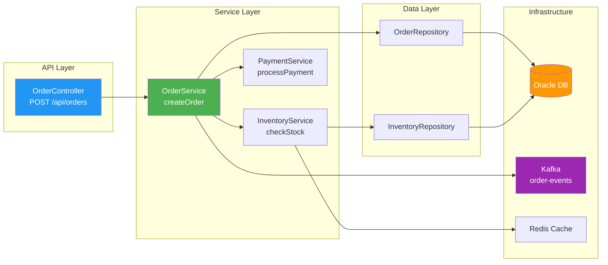

## 7.5 分析 Batch Job

```bash
# 查詢所有批次任務
/understand-chat 列出所有 Spring Batch Job，包含 Step 和 Reader/Writer

# 追蹤批次資料流
/understand-chat DailySettlementJob 的資料從哪裡來，寫到哪裡去？

# 分析批次相依
/understand-chat 哪些 Batch Job 之間有先後順序？
```

### Batch Job 分析範例

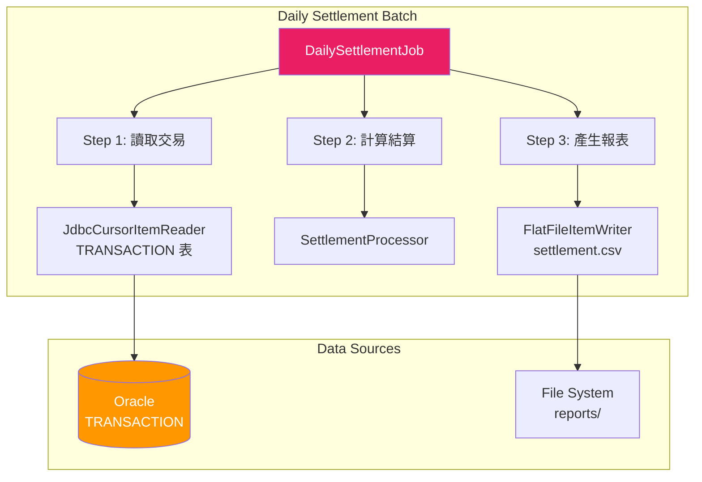

## 7.6 分析 MQ（訊息佇列）

```bash
# 查詢所有 Kafka/MQ Producer 和 Consumer
/understand-chat 列出所有 Kafka Producer 和 Consumer，以及它們使用的 Topic

# 追蹤訊息流向
/understand-chat order-created 事件從 Producer 到 Consumer 的完整路徑

# 分析訊息依賴
/understand-chat 如果 payment-service 的 Kafka Consumer 停止運作，哪些業務流程會受影響？
```

## 7.7 分析 DB Schema

```bash
# 查詢所有資料表關係
/understand-chat 列出所有資料表及其外鍵關係

# 追蹤資料存取
/understand-chat 哪些 Service 會讀寫 USER 表？

# 分析 Schema 變更影響
/understand-chat 如果我在 ORDER 表新增一個欄位，哪些 Repository 和 DTO 需要修改？
```

## 7.8 協助 AI 開發新功能

使用 Knowledge Graph 讓 AI 更精準地產生程式碼：

```bash
# Step 1: 分析現有模式
/understand-chat 專案中 Controller → Service → Repository 的標準寫法模式是什麼？

# Step 2: 請 AI 根據模式產生新功能
# 在 Claude Code / Copilot 中：
「請參考現有的 UserController 模式，建立一個 ProductController，
 包含 CRUD 和搜尋功能，使用相同的 Exception 處理方式和 Response 格式。」

# Step 3: 驗證新功能的圖譜位置
/understand
/understand-chat ProductController 是否正確地連結到 Service 和 Repository 層？
```

> **實務建議**：在企業環境中，建議將 Knowledge Graph 與 Code Review 流程結合。PR 提交前執行 `/understand-diff` 確認變更影響範圍，避免意外的跨模組副作用。

---

# 8. Legacy System Reverse Engineering

## 8.1 遺留系統盤點

### 8.1.1 適用場景

| 場景 | 說明 |
|------|------|
| 系統接管 | 原開發團隊離職，無文件 |
| 現代化評估 | 評估 Legacy 系統是否值得重構 |
| 合併整合 | 併購後需理解被收購系統 |
| 技術債清理 | 找出可刪除的 Dead Code |
| 安全稽核 | 盤點所有外部介面與資料流 |

### 8.1.2 盤點流程

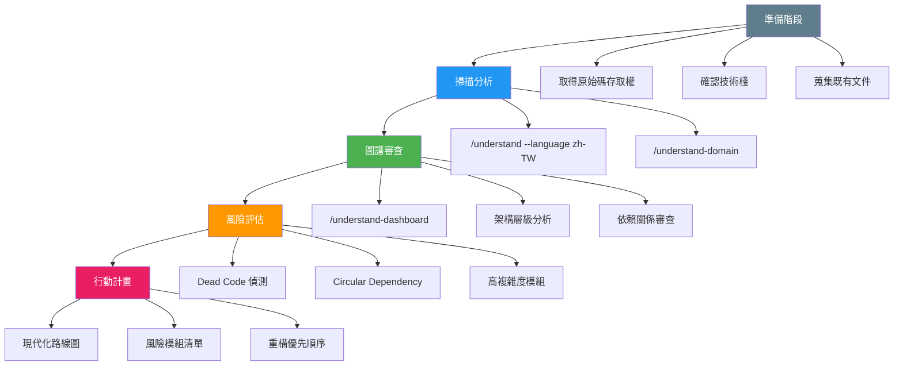

## 8.2 相依性分析

### 8.2.1 Java EE / IBM WAS / Liberty 專案

```bash
# Step 1: 分析完整專案
/understand --language zh-TW

# Step 2: 查詢 Java EE 特定元件
/understand-chat 列出所有 EJB（Session Bean, Entity Bean, Message-Driven Bean）

/understand-chat 列出所有 Servlet 和 Filter，以及它們的 URL 映射

/understand-chat 列出所有 JPA Entity 和它們的資料表映射

/understand-chat 列出所有 JNDI 資源引用
```

### 8.2.2 依賴關係矩陣

```bash
# 查詢跨模組相依
/understand-chat 產生模組間依賴矩陣，顯示每個模組依賴了哪些其他模組

# 找出高耦合模組
/understand-chat 哪些模組被最多其他模組依賴？（fan-in 最高）

# 找出外部依賴
/understand-chat 哪些模組直接呼叫外部系統（SOAP/REST/JDBC/JMS）？
```

## 8.3 Call Graph 分析

```bash
# 追蹤特定方法的呼叫鏈
/understand-chat 從 OrderService.createOrder() 開始，追蹤所有呼叫路徑到 DAO 層

# 反向追蹤
/understand-chat 哪些 Controller/Servlet 最終會呼叫 UserDAO.findById()？

# 找出最深的呼叫鏈
/understand-chat 哪個業務流程的呼叫鏈最深？列出完整路徑
```

### Call Graph 視覺化

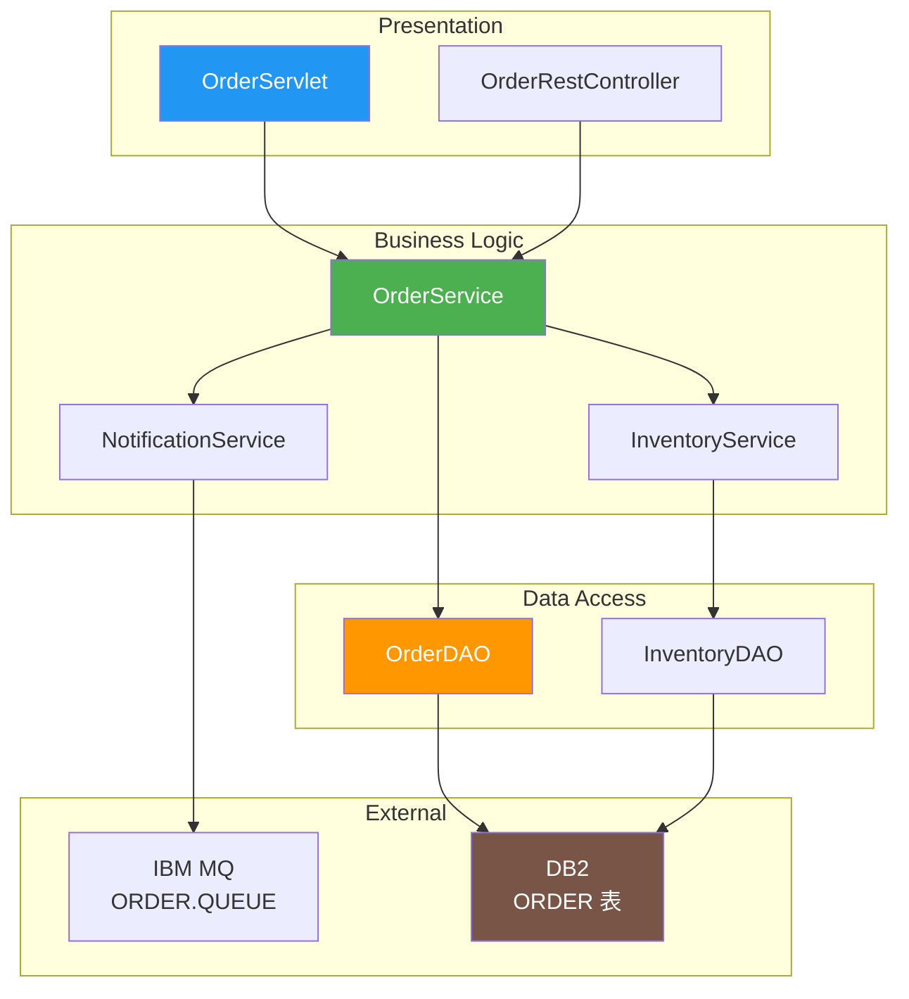

## 8.4 Batch Flow 分析

```bash
# 列出所有批次任務
/understand-chat 列出所有 Batch/Cron Job，包含排程時間和觸發條件

# 分析批次依賴
/understand-chat 哪些批次任務之間有資料依賴？

# 追蹤批次資料流
/understand-chat 月結批次從哪些表讀取資料，產生哪些報表，寫入哪些表？
```

## 8.5 Database Relationship 分析

```bash
# 分析所有 DB Schema
/understand-chat 列出所有資料表的主鍵、外鍵和索引

# 找出 Orphan Table
/understand-chat 哪些資料表沒有任何 Java Entity 或 DAO 對應？

# 找出 N+1 查詢風險
/understand-chat 哪些 Entity 的關聯載入策略是 EAGER？可能導致 N+1 問題
```

## 8.6 API Mapping

```bash
# 列出所有外部介面
/understand-chat 列出所有對外 API（REST/SOAP/gRPC），包含路徑和參數

# 列出所有下游呼叫
/understand-chat 列出所有呼叫外部系統的程式碼，包含目標 URL/Queue/Topic

# 產生 API 對照表
/understand-chat 產生 API Mapping 表格：Endpoint → Controller → Service → DAO → Table
```

## 8.7 快速理解系統的實戰步驟

### Java EE → Spring Boot 逆向工程案例

```bash
# 1. 分析 Legacy Java EE 系統
/understand --language zh-TW

# 2. 產生架構概覽
/understand-onboard

# 3. 分析核心業務流程
/understand-domain

# 4. 找出 Dead Code
/understand-chat 列出所有沒有被呼叫的 public 方法

# 5. 找出 Circular Dependency
/understand-chat 是否存在循環相依？畫出所有循環路徑

# 6. 找出高風險模組
/understand-chat 哪些類別的 complexity 是 "complex"？列出前 20 個

# 7. 產生架構圖
/understand-dashboard
# → 截圖存為架構文件

# 8. 產生 Migration 計畫
/understand-chat 如果要將這個 Java EE 系統遷移到 Spring Boot 3，
最大的風險是什麼？建議的遷移順序是什麼？
```

### Mainframe Integration 分析

```bash
# 分析與 Mainframe 的整合點
/understand-chat 列出所有與 Mainframe/CICS/IMS 互動的程式碼
/understand-chat 哪些 JCA Connector 或 MQ 通道連接到 Mainframe？
/understand-chat 這些整合點處理的業務資料有哪些？
```

> **實務建議**：逆向工程時，建議先用 `/understand-domain` 提取業務領域知識，再深入技術細節。「先理解業務，再理解技術」是高效逆向工程的關鍵。

---

# 9. Framework 升級實戰

## 9.1 Spring Boot 2 → Spring Boot 3 升級

### 9.1.1 透過 Graph 分析影響範圍

```bash
# Step 1: 分析現有系統
/understand --language zh-TW

# Step 2: 找出所有 javax.* 引用（需遷移到 jakarta.*）
/understand-chat 列出所有使用 javax.* 套件的檔案和類別

# Step 3: 找出 Spring Security 設定
/understand-chat 列出所有 Spring Security 相關的設定類別和過濾器

# Step 4: 找出被棄用的 API
/understand-chat 列出所有使用 @Deprecated 或已棄用 Spring API 的程式碼

# Step 5: 找出自訂 Auto-Configuration
/understand-chat 列出所有 @Configuration 和 @AutoConfiguration 類別
```

### 9.1.2 升級影響矩陣

```bash
/understand-chat 根據 Spring Boot 2 → 3 的已知變更，分析這個專案中：
1. 需要修改的檔案數量
2. javax → jakarta 的替換範圍
3. Spring Security 設定變更
4. 第三方套件相容性風險
```

### 9.1.3 升級執行策略

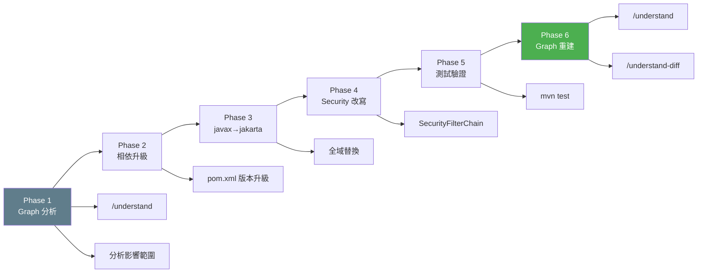

## 9.2 Java 8 → Java 21 升級

```bash
# 找出 Java 8 特有 API 使用
/understand-chat 列出所有使用 Java 8 特有或在 Java 21 中被棄用的 API

# 找出可使用 Java 21 新特性的地方
/understand-chat 列出所有可以用 Record 取代的 POJO/DTO 類別
/understand-chat 列出所有可以用 sealed class 改寫的繼承體系
/understand-chat 列出所有可以用 pattern matching 簡化的 instanceof 檢查

# 分析模組化影響
/understand-chat 這個專案使用了哪些 internal JDK API（sun.*, com.sun.*）？
```

## 9.3 Jakarta EE 升級

```bash
# 分析 Java EE → Jakarta EE 影響
/understand-chat 列出所有使用 javax.servlet, javax.persistence, javax.ejb 的程式碼

# 分析 EJB → CDI 遷移
/understand-chat 列出所有 @Stateless, @Stateful, @Singleton EJB，
建議如何遷移到 CDI @ApplicationScoped 或 Spring @Service

# 分析 JPA Provider 影響
/understand-chat 列出所有 JPA 特定（非標準）的 Hibernate/EclipseLink 用法
```

## 9.4 透過 Graph 協助 AI 自動修改程式

### 升級輔助 Workflow

```bash
# Step 1: 建立升級前的 Graph
/understand --language zh-TW
# 保存為 baseline: cp knowledge-graph.json knowledge-graph-before.json

# Step 2: 請 AI 根據 Graph 分析執行升級
# 在 Claude Code / Copilot 中：
「根據 Knowledge Graph 的分析，將所有 javax.servlet 替換為 jakarta.servlet。
只修改 Graph 中標記為使用 javax.* 的檔案。」

# Step 3: 重建 Graph
/understand

# Step 4: 比對差異
/understand-diff

# Step 5: 驗證升級完整性
/understand-chat 升級後是否還有遺漏的 javax.* 引用？
```

## 9.5 如何降低升級風險

| 策略 | 做法 | 工具 |
|------|------|------|
| **影響範圍可視化** | 在 Dashboard 中標記需修改的節點 | `/understand-dashboard` |
| **分層升級** | 從 Data Layer → Service → API 逐層升級 | Graph Layer 篩選 |
| **依賴追蹤** | 確認每個修改的 Ripple Effect | `/understand-diff` |
| **回歸測試** | 針對受影響模組優先測試 | Graph + Test Coverage |
| **漸進式驗證** | 每個 Phase 完成後重建 Graph 確認 | `/understand` |

> **實務建議**：Framework 升級時，建議先建立「升級前 Graph」作為 baseline，每完成一個 Phase 就重建 Graph 並執行 `/understand-diff`，確保升級的完整性和正確性。

---

# 10. Knowledge Graph 深入解析

## 10.1 Graph JSON 完整格式

Knowledge Graph 儲存於 `.understand-anything/knowledge-graph.json`，完整結構如下：

```json
{
  "version": "1.0.0",
  "kind": "codebase",
  "project": {
    "name": "enterprise-platform",
    "languages": ["java", "typescript"],
    "frameworks": ["spring-boot", "vue3"],
    "description": "企業級共用平台",
    "analyzedAt": "2026-05-25T10:30:00Z",
    "gitCommitHash": "a1b2c3d4e5f6..."
  },
  "nodes": [ ... ],
  "edges": [ ... ],
  "layers": [ ... ],
  "tour": [ ... ]
}
```

### 頂層欄位說明

| 欄位 | 型別 | 說明 |
|------|------|------|
| `version` | string | Schema 版本，目前為 `"1.0.0"` |
| `kind` | string | `"codebase"` 或 `"knowledge"`（知識庫圖譜） |
| `project` | object | 專案中繼資料 |
| `nodes` | array | 所有節點 |
| `edges` | array | 所有邊 |
| `layers` | array | 架構層級 |
| `tour` | array | 引導式學習路徑 |

## 10.2 Node Schema 完整定義

### 標準 Node

```json
{
  "id": "function:src/services/payment.ts:processPayment",
  "type": "function",
  "name": "processPayment",
  "filePath": "src/services/payment.ts",
  "lineRange": [45, 89],
  "summary": "處理付款請求，驗證信用卡並提交到支付閘道",
  "tags": ["payment", "gateway", "async"],
  "complexity": "complex",
  "languageNotes": "使用 async/await 搭配 try-catch 進行錯誤處理"
}
```

### Domain Node（業務領域節點）

```json
{
  "id": "domain:payment",
  "type": "domain",
  "name": "支付領域",
  "summary": "處理所有支付相關業務，包含信用卡、銀行轉帳、電子錢包",
  "tags": ["payment", "financial"],
  "domainMeta": {
    "flows": ["checkout-flow", "refund-flow"],
    "stakeholders": ["payment-team", "risk-team"]
  }
}
```

### Knowledge Node（知識庫節點）

```json
{
  "id": "article:wiki/architecture-decisions.md",
  "type": "article",
  "name": "架構決策紀錄",
  "summary": "記錄所有重要的架構決策，包含決策背景、選項分析和結論",
  "tags": ["adr", "architecture"],
  "knowledgeMeta": {
    "entities": ["microservices", "event-sourcing", "cqrs"],
    "claims": ["CQRS 提升讀取效能 10 倍"],
    "sources": ["Martin Fowler", "Vaughn Vernon"]
  }
}
```

### Node 欄位完整定義

| 欄位 | 型別 | 必填 | 說明 |
|------|------|------|------|
| `id` | string | ✅ | 唯一識別，格式：`type:filePath[:symbolName]` |
| `type` | enum | ✅ | 21 種節點類型之一 |
| `name` | string | ✅ | 顯示名稱 |
| `filePath` | string | ⚠️ | 檔案路徑（程式碼節點必填） |
| `lineRange` | [number, number] | ❌ | 程式碼行範圍 |
| `summary` | string | ❌ | LLM 產生的摘要 |
| `tags` | string[] | ❌ | 標籤（用於搜尋） |
| `complexity` | enum | ❌ | `simple` / `moderate` / `complex` |
| `languageNotes` | string | ❌ | 語言特定概念說明 |
| `domainMeta` | object | ❌ | 業務領域中繼資料 |
| `knowledgeMeta` | object | ❌ | 知識庫中繼資料 |

## 10.3 Edge Schema 完整定義

```json
{
  "source": "file:src/controllers/order.ts",
  "target": "file:src/services/order.ts",
  "type": "imports",
  "direction": "forward",
  "description": "匯入 OrderService 以處理訂單業務邏輯",
  "weight": 0.9
}
```

### Edge 欄位完整定義

| 欄位 | 型別 | 必填 | 說明 |
|------|------|------|------|
| `source` | string | ✅ | 來源節點 ID |
| `target` | string | ✅ | 目標節點 ID |
| `type` | enum | ✅ | 35+ 種邊類型之一 |
| `direction` | enum | ❌ | `forward` / `backward` / `bidirectional` |
| `description` | string | ❌ | LLM 產生的關係描述 |
| `weight` | number | ❌ | 0-1 重要性分數 |

### 35+ Edge Types 分類表

```
結構性 (5): imports, exports, contains, inherits, implements
行為性 (4): calls, subscribes, publishes, middleware
資料流 (4): reads_from, writes_to, transforms, validates
相依性 (3): depends_on, tested_by, configures
通用   (2): related, similar_to
基礎設施(4): deploys, serves, provisions, triggers
Schema (4): migrates, documents, routes, defines_schema
領域   (3): contains_flow, flow_step, cross_domain
知識   (6): cites, contradicts, builds_on, exemplifies, categorized_under, authored_by
```

## 10.4 四層驗證管線（Robustness Pipeline）

Knowledge Graph 使用 Zod Schema 進行 4 層漸進式驗證：

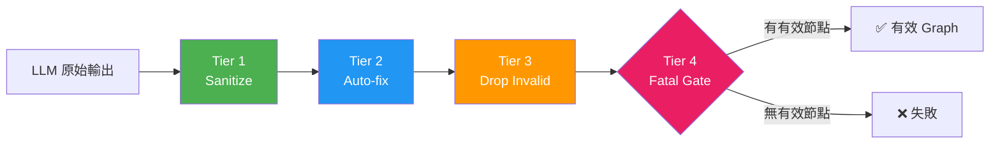

| 層級 | 名稱 | 處理方式 | 範例 |
|------|------|---------|------|
| **Tier 1** | Sanitize（靜默修復） | 自動修復，不記錄 | `null` → `""`、未知型別 → 別名對應 |
| **Tier 2** | Auto-fix（追蹤修復） | 自動填入缺失欄位，記錄 issue | 缺少 `name` → 從 `id` 推導 |
| **Tier 3** | Drop Invalid（丟棄並警告） | 移除無效項目，記錄警告 | 引用不存在節點的 Edge → 丟棄 |
| **Tier 4** | Fatal Gate（致命閘門） | 無可用節點 → 完全失敗 | 所有節點都無效 → 報錯 |

### Node Type 別名對應（50+）

LLM 經常產生非標準的型別名稱，Schema 會自動對應：

```
"function_def" → "function"
"method"       → "function"
"interface"    → "class"
"type_def"     → "concept"
"note"         → "article"
"page"         → "article"
"person"       → "entity"
"category"     → "topic"
"assertion"    → "claim"
"reference"    → "source"
```

### Edge Type 別名對應（40+）

```
"depends_on"     → "depends_on"
"references"     → "cites"
"conflicts_with" → "contradicts"
"extends"        → "builds_on"
"example_of"     → "exemplifies"
"belongs_to"     → "categorized_under"
"written_by"     → "authored_by"
```

## 10.5 Graph 視覺化配置

### 節點色碼

| 節點類型 | 色碼 | 視覺風格 |
|---------|------|---------|
| file | 藍色 | 圓角矩形 |
| function | 綠色 | 圓角矩形 |
| class | 橘色 | 圓角矩形 |
| module | 深藍 | 圓角矩形 |
| config | 紫色 | 菱形 |
| document | 棕色 | 文件圖示 |
| service | 青色 | 六角形 |
| domain | 深紫 | 大圓 |

### Edge 視覺風格

- **粗細**：由 `weight` 決定（0.1-1.0）
- **虛線**：`similar_to`, `related` 使用虛線
- **實線**：`imports`, `calls`, `inherits` 使用實線
- **箭頭**：依 `direction` 決定單向或雙向

### Layout 引擎選擇

| Layout | 適用場景 | 節點上限 |
|--------|---------|---------|
| **Dagre** | 中小型專案（階層式佈局） | ~500 節點 |
| **ELK** | 大型專案（可擴展佈局） | 3000+ 節點 |
| **Force-directed** | 知識庫圖譜（社群聚類） | ~1000 節點 |

## 10.6 Graph 操作範例

### 使用 Node.js 讀取 Graph

```javascript
import { readFileSync } from "fs";

const graph = JSON.parse(
  readFileSync(".understand-anything/knowledge-graph.json", "utf-8")
);

// 查詢所有 complex 節點
const complexNodes = graph.nodes.filter((n) => n.complexity === "complex");
console.log(`高複雜度模組: ${complexNodes.length}`);
complexNodes.forEach((n) => console.log(`  - ${n.name}: ${n.summary}`));

// 查詢所有 circular dependency
const importEdges = graph.edges.filter((e) => e.type === "imports");
// ... 使用 DFS 檢測環路 ...

// 統計各層節點數
const layerStats = graph.layers.map((l) => ({
  name: l.name,
  count: l.nodeIds.length,
}));
console.table(layerStats);
```

### 使用 Python 分析 Graph

```python
import json
from collections import Counter

with open(".understand-anything/knowledge-graph.json") as f:
    graph = json.load(f)

# 節點類型統計
type_counts = Counter(n["type"] for n in graph["nodes"])
print("節點類型分佈:")
for t, c in type_counts.most_common():
    print(f"  {t}: {c}")

# Edge 類型統計
edge_counts = Counter(e["type"] for e in graph["edges"])
print("\nEdge 類型分佈:")
for t, c in edge_counts.most_common():
    print(f"  {t}: {c}")

# Fan-in 分析（被依賴最多的模組）
from collections import defaultdict
fan_in = defaultdict(int)
for edge in graph["edges"]:
    fan_in[edge["target"]] += 1
top_deps = sorted(fan_in.items(), key=lambda x: x[1], reverse=True)[:10]
print("\n被依賴最多的模組（Top 10）:")
for node_id, count in top_deps:
    print(f"  {node_id}: {count} 個依賴者")
```

> **實務建議**：在企業環境中，可以將 Graph 分析腳本整合到 CI/CD 流程中，定期產生架構健康度報告（如 Circular Dependency 數量、高複雜度模組比例等）。

---

# 11. Token Cost 最佳化與 Hybrid 分析模式

## 11.1 Hybrid 分析模式說明

> **重要澄清**：Understand-Anything 的「Hybrid」指的是 **Tree-sitter + LLM 混合分析**架構，並非獨立的 Ollama / Local LLM 整合。LLM 能力來自宿主 AI 平台（Claude Code 使用 Claude API、Copilot 使用 GPT API、Gemini CLI 使用 Gemini API）。

### 混合分析架構

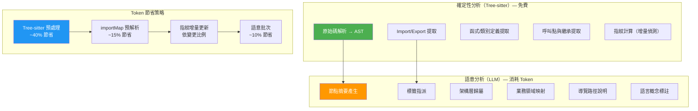

### 各分析階段 Token 消耗

| 階段 | Token 消耗 | 說明 |
|------|-----------|------|
| project-scanner | 低 | 掃描檔案結構，少量 LLM 呼叫 |
| file-analyzer | **高** | 主要 Token 消耗點，每個檔案需 LLM 產生摘要 |
| import-resolver | **零** | 純 Tree-sitter 確定性分析 |
| architecture-analyzer | 中 | 依節點數量而定 |
| tour-builder | 中 | 依圖譜規模而定 |
| graph-reviewer | 低-中 | 預設 inline 驗證；`--review` 啟用完整 LLM 審查 |

## 11.2 Token 最佳化策略

### 策略 1：子目錄範圍限定

```bash
# 只分析核心模組（大幅減少 Token）
/understand src/core

# 分析前端
/understand src/frontend

# 分析特定微服務
/understand services/payment-service
```

**效果**：10 萬行 Monorepo 限定到 1 萬行子目錄 → Token 減少 ~90%

### 策略 2：增量更新

```bash
# 首次分析（全量）
/understand

# 後續只分析變更檔案（增量）
/understand
# 系統自動偵測 git commit hash 變更，僅重新分析修改過的檔案
```

**效果**：日常變更通常 < 5% 檔案 → Token 減少 ~95%

### 策略 3：啟用 Auto-Update Hook

```bash
# 安裝 post-commit hook（每次 commit 自動增量更新）
/understand --auto-update
```

**效果**：每次 commit 只分析本次變更的檔案，持續保持圖譜最新

### 策略 4：語意批次（Semantic Batching）

2026-05 新增功能，自動依檔案複雜度分組批次：

- 簡單檔案（config, env）→ 大批次（30+ 檔/批）
- 複雜檔案（service, controller）→ 小批次（10-15 檔/批）
- **效果**：減少 LLM 輸出截斷後的重試，節省 ~10% Token

### 策略 5：團隊共享 Graph

```bash
# 一個人分析，團隊共享
/understand

# 提交 Graph 到 Git
git add .understand-anything/knowledge-graph.json
git commit -m "chore: update knowledge graph"
git push

# 團隊成員直接使用，無需重跑 Pipeline
/understand-dashboard
```

**效果**：團隊 N 人 → Token 消耗從 N×全量 降為 1×全量 + 增量

## 11.3 Token 成本估算

### 按專案規模估算

| 專案規模 | 檔案數 | 首次分析 Token | 增量更新 Token | 月度成本估算* |
|---------|--------|---------------|--------------|-------------|
| 小型（< 50 檔） | ~50 | ~100K | ~5K | < $1 |
| 中型（50-500 檔） | ~200 | ~500K | ~25K | ~$5 |
| 大型（500-2000 檔） | ~1000 | ~2.5M | ~125K | ~$15 |
| 超大型（2000+ 檔） | ~5000 | ~12.5M | ~625K | ~$50 |

> *月度成本假設：每日一次增量更新，Claude API 定價。實際成本依 AI 平台定價而定。

### 成本最佳化比較

| 策略組合 | 相對成本 | 適用場景 |
|---------|---------|---------|
| 全量分析 × 每日 | 100% | 不建議 |
| 增量更新 × 每日 | ~5% | 活躍開發 |
| 子目錄 + 增量 | ~2% | 大型 Monorepo |
| 團隊共享 + 增量 | ~1% | 團隊協作 |
| Auto-Update Hook | ~0.5% | 持續整合 |

## 11.4 離線分析能力

當不需要 LLM 語意分析時（如僅需結構分析），Tree-sitter 可獨立運作：

| 能力 | 離線（Tree-sitter only） | 線上（+ LLM） |
|------|------------------------|--------------|
| 檔案結構提取 | ✅ | ✅ |
| Import/Export 邊 | ✅ | ✅ |
| 呼叫與繼承邊 | ✅ | ✅ |
| 節點摘要 | ❌ Placeholder | ✅ 智慧摘要 |
| 標籤 | ❌ | ✅ |
| 架構層偵測 | ⚠️ 啟發式 | ✅ LLM 分析 |
| 導覽路徑 | ⚠️ 拓撲排序 | ✅ LLM 說明 |
| 複雜度評估 | ❌ | ✅ |
| Dashboard 瀏覽 | ✅ | ✅ |
| 搜尋 | ✅（名稱搜尋） | ✅（+ 語意搜尋） |

## 11.5 企業 Token 管理建議

### 集中式 Token 管理

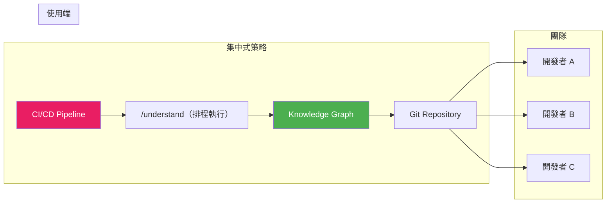

### 建議做法

1. **CI/CD 排程**：在 CI/CD Pipeline 中排程每日一次全量分析
2. **Post-Commit Hook**：每次 commit 觸發增量更新
3. **Git LFS**：大型 Graph（> 10 MB）使用 Git LFS 追蹤
4. **Token Budget**：設定團隊每月 Token 預算上限

```bash
# Git LFS 設定
git lfs install
git lfs track ".understand-anything/*.json"
git add .gitattributes .understand-anything/
```

### .gitignore 設定

```gitignore
# Understand-Anything — 不需提交的檔案
.understand-anything/intermediate/
.understand-anything/diff-overlay.json
```

> **實務建議**：在企業環境中，建議由 DevOps 團隊在 CI/CD Pipeline 中集中管理 Graph 的建構與更新，開發者只需 `git pull` 即可取得最新圖譜，避免個人 Token 浪費。

---

# 12. SSDLC 與 AI 治理

## 12.1 AI Governance 框架

在企業環境中導入 Understand-Anything，需要建立完善的 AI 治理框架：

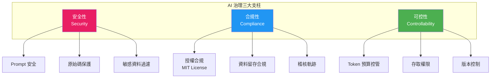

## 12.2 Secure SDLC 整合

### 12.2.1 SSDLC 流程中的 Understand-Anything

| SSDLC 階段 | Understand-Anything 角色 | 操作 |
|------------|------------------------|------|
| **需求分析** | 理解現有系統架構 | `/understand-domain` |
| **設計** | 分析影響範圍 | `/understand-chat` 查詢依賴 |
| **開發** | AI 協助撰寫程式碼 | Graph 作為 AI Context |
| **程式碼審查** | 變更影響分析 | `/understand-diff` |
| **測試** | 確認測試覆蓋 | 查詢 `tested_by` Edge |
| **部署** | 驗證圖譜完整性 | CI/CD 中重建 Graph |
| **維運** | 問題排查 | Dashboard 追蹤依賴 |

### 12.2.2 安全檢查點

```bash
# 在 PR Review 前執行
/understand-diff
# → 檢查變更是否影響安全相關模組（auth, crypto, session）

# 定期掃描
/understand-chat 列出所有直接處理使用者輸入的函式（可能的注入風險點）
/understand-chat 列出所有包含加密/雜湊操作的模組
/understand-chat 列出所有外部 API 呼叫點（可能的 SSRF 風險）
```

## 12.3 Prompt Security

### 12.3.1 風險評估

| 風險 | 說明 | 緩解措施 |
|------|------|---------|
| **Prompt Injection** | 惡意程式碼中含有 Prompt 攻擊 | Graph 摘要由 LLM 產生，但不執行程式碼 |
| **資料外洩** | 原始碼摘要外洩敏感邏輯 | 控制 Graph 的存取權限 |
| **模型幻覺** | LLM 產生錯誤的依賴關係 | 四層驗證管線 + Tree-sitter 確定性分析 |

### 12.3.2 安全建議

1. **不要在 Graph 中儲存密碼或金鑰**：Graph 的 `summary` 欄位可能包含程式碼描述，確保原始碼中的密碼已移至環境變數
2. **控制 Graph 存取權限**：Knowledge Graph 包含系統架構資訊，應視為內部文件
3. **審查 LLM 產出**：首次建構 Graph 後，團隊架構師應審查關鍵模組的摘要是否準確

## 12.4 Sensitive Data Protection

### 12.4.1 資料分類

| 資料類型 | 是否進入 Graph | 處理方式 |
|---------|--------------|---------|
| 原始碼結構（import/class） | ✅ | Tree-sitter 確定性提取 |
| 函式/類別名稱 | ✅ | 作為節點 ID 和名稱 |
| LLM 摘要 | ✅ | 描述功能，不包含密碼 |
| 密碼/金鑰 | ❌ | 不應出現在原始碼中 |
| 環境變數值 | ❌ | EnvParser 只提取變數名稱 |
| 個資/PII | ❌ | LLM 摘要不應包含 |

### 12.4.2 .gitignore 安全設定

```gitignore
# Understand-Anything 安全設定
.understand-anything/intermediate/    # 中間產物不提交
.understand-anything/diff-overlay.json # 差異覆蓋不提交

# 確保敏感檔案不被分析
*.pem
*.key
*.env.local
**/secrets/**
```

## 12.5 Source Code Protection

### 12.5.1 原始碼送出範圍

| 操作 | 原始碼送出目標 | 風險等級 |
|------|-------------|---------|
| Tree-sitter 分析 | **本地**（不送出） | 低 |
| LLM 摘要產生 | **AI 平台 API** | 中 |
| Graph 儲存 | **本地 JSON** | 低 |
| Dashboard 瀏覽 | **本地瀏覽器** | 低 |

### 12.5.2 企業安全建議

1. **使用企業版 AI 平台**：確保 AI API 合約包含「不使用客戶資料訓練模型」
2. **私有 LLM 部署**：高敏感專案可使用私有部署的 LLM（如 Azure OpenAI、AWS Bedrock）
3. **Code Redaction**：分析前移除敏感常數和硬編碼值
4. **Network 隔離**：在隔離網路環境中執行分析

## 12.6 AI Compliance

### 12.6.1 合規檢查清單

| 項目 | 說明 | 狀態 |
|------|------|------|
| 授權合規 | MIT License，允許商業使用 | ✅ |
| 資料留存 | Graph 存在本地，可完全控制 | ✅ |
| 稽核軌跡 | Git 歷史紀錄 Graph 變更 | ✅ |
| 資料刪除 | 刪除 `.understand-anything/` 即可 | ✅ |
| AI 模型合規 | 依所選 AI 平台合約 | ⚠️ 需確認 |
| 個資保護 | Graph 不應含 PII | ⚠️ 需審查 |

### 12.6.2 團隊治理規範建議

```markdown
# AI Tool 使用規範 — Understand-Anything

## 1. 使用範圍
- 僅限內部開發專案使用
- 禁止分析客戶專案原始碼（除非合約允許）

## 2. 存取控制
- Graph 檔案視為「內部機密」等級
- 僅開發團隊成員可存取

## 3. 資料處理
- 分析前確認原始碼不含硬編碼密碼
- 定期審查 Graph 摘要是否洩露敏感資訊

## 4. Token 管理
- 每團隊每月 Token 預算上限：___
- 超額需團隊主管核准

## 5. 版本控制
- Graph 提交至 Git，納入 Code Review 流程
- 大型 Graph (>10 MB) 使用 Git LFS
```

## 12.7 企業導入權限控管建議

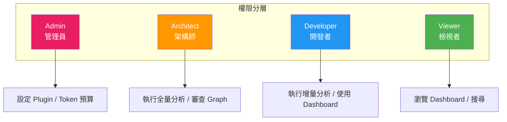

> **實務建議**：在金融業等高監管環境中，建議在導入前與資安團隊、法遵部門進行聯合評估，確認 AI 平台合約符合內部資料治理規範。

---

# 13. 團隊導入最佳實務

## 13.1 Team Workflow

### 13.1.1 推薦的團隊工作流程

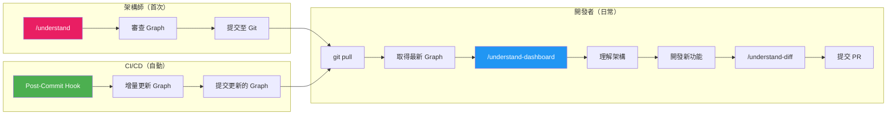

### 13.1.2 角色分工

| 角色 | 職責 | 主要使用指令 |
|------|------|------------|
| **架構師** | 首次分析、Graph 審查、架構決策 | `/understand`, `/understand-domain` |
| **Tech Lead** | PR Review 時的影響分析 | `/understand-diff`, `/understand-chat` |
| **開發者** | 日常開發中理解架構 | `/understand-dashboard`, `/understand-explain` |
| **新進成員** | Onboarding | `/understand-onboard`, Learn Mode |
| **DevOps** | CI/CD 整合、Token 管理 | Auto-Update Hook, Git LFS |

## 13.2 Git Flow 整合

### 13.2.1 分支策略

```
main
├── develop
│   ├── feature/new-payment
│   │   └── .understand-anything/ (增量更新)
│   └── feature/user-profile
│       └── .understand-anything/ (增量更新)
└── release/v2.0
    └── .understand-anything/ (全量重建)
```

### 13.2.2 Git Hooks 設定

```bash
# 安裝 post-commit hook（自動增量更新 Graph）
/understand --auto-update
```

`post-commit` hook 內容：

```bash
#!/bin/sh
# .git/hooks/post-commit
# Understand-Anything 增量更新

# 只在 develop 和 main 分支觸發
branch=$(git rev-parse --abbrev-ref HEAD)
if [ "$branch" = "develop" ] || [ "$branch" = "main" ]; then
  echo "🔄 Updating knowledge graph..."
  # 觸發增量分析（由 AI 平台在背景執行）
fi
```

## 13.3 CI/CD Integration

### 13.3.1 GitHub Actions 範例

```yaml
# .github/workflows/understand-anything.yml
name: Update Knowledge Graph

on:
  push:
    branches: [main, develop]
  schedule:
    - cron: '0 6 * * 1'  # 每週一早上 6 點全量重建

jobs:
  update-graph:
    runs-on: ubuntu-latest
    steps:
      - uses: actions/checkout@v4

      - name: Setup Node.js
        uses: actions/setup-node@v4
        with:
          node-version: 24

      - name: Install pnpm
        run: corepack enable && corepack prepare pnpm@latest --activate

      - name: Install Understand-Anything
        run: |
          curl -fsSL https://raw.githubusercontent.com/Lum1104/Understand-Anything/main/install.sh | bash -s codex

      - name: Run Analysis
        run: /understand --language zh-TW

      - name: Commit Graph
        run: |
          git config user.name "github-actions[bot]"
          git config user.email "github-actions[bot]@users.noreply.github.com"
          git add .understand-anything/knowledge-graph.json
          git diff --cached --quiet || git commit -m "chore: update knowledge graph [skip ci]"
          git push
```

### 13.3.2 PR Review 整合

```yaml
# .github/workflows/pr-impact-analysis.yml
name: PR Impact Analysis

on:
  pull_request:
    types: [opened, synchronize]

jobs:
  impact-analysis:
    runs-on: ubuntu-latest
    steps:
      - uses: actions/checkout@v4

      - name: Run Diff Analysis
        run: /understand-diff

      - name: Comment on PR
        uses: actions/github-script@v7
        with:
          script: |
            // 讀取 diff-overlay.json 並產生影響摘要
            const fs = require('fs');
            const overlay = JSON.parse(
              fs.readFileSync('.understand-anything/diff-overlay.json', 'utf-8')
            );
            const body = `## 🔍 Knowledge Graph 影響分析\n\n` +
              `受影響的節點: ${overlay.affectedNodes?.length || 0}\n` +
              `受影響的邊: ${overlay.affectedEdges?.length || 0}\n`;
            github.rest.issues.createComment({
              owner: context.repo.owner,
              repo: context.repo.repo,
              issue_number: context.issue.number,
              body: body
            });
```

## 13.4 Knowledge Sharing

### 13.4.1 團隊知識共享流程

```bash
# 1. 架構師建立 Graph
/understand --language zh-TW

# 2. 產生 Onboarding 文件
/understand-onboard
# → 分享給新進成員

# 3. 提交至 Git
git add .understand-anything/
git commit -m "docs: update knowledge graph"
git push

# 4. 新進成員使用
git pull
/understand-dashboard
# → 從 Learn Mode 開始學習
```

### 13.4.2 知識庫整合

```bash
# 分析團隊 Wiki（如 Confluence 匯出的 Markdown）
/understand-knowledge ~/docs/team-wiki

# 在 Dashboard 中瀏覽知識圖譜
/understand-dashboard
```

## 13.5 SOP — 標準作業程序

### 新專案導入 SOP

```
1. [ ] 確認環境需求（Node.js ≥ 22, pnpm ≥ 10）
2. [ ] 選擇 AI 平台並安裝 Plugin
3. [ ] 架構師執行首次全量分析：/understand --language zh-TW
4. [ ] 架構師審查 Knowledge Graph 品質
5. [ ] 設定 .gitignore（排除 intermediate/）
6. [ ] 提交 Graph 至 Git
7. [ ] 設定 Auto-Update Hook
8. [ ] 建立 CI/CD Pipeline（排程 + PR 觸發）
9. [ ] 產生 Onboarding 文件：/understand-onboard
10. [ ] 團隊培訓（Dashboard 操作 + CLI 指令）
```

### 日常維護 SOP

```
每日：
- [ ] 增量更新 Graph（Auto-Update Hook 自動執行）

每週：
- [ ] 審查 Token 使用量
- [ ] 確認 Graph 是否需要全量重建

每月：
- [ ] 全量重建 Graph
- [ ] 審查 Graph 品質（架構師）
- [ ] 更新 Onboarding 文件

每季：
- [ ] 評估 Token 成本趨勢
- [ ] 評估是否需要升級 Understand-Anything 版本
- [ ] 更新團隊使用規範
```

## 13.6 Folder Structure 建議

```
project-root/
├── .understand-anything/           # Knowledge Graph 產物
│   ├── knowledge-graph.json        # ← 提交 Git
│   ├── intermediate/               # ← 不提交（.gitignore）
│   └── diff-overlay.json           # ← 不提交（.gitignore）
├── .claude-plugin/                 # Claude Code Plugin 設定
├── .copilot-plugin/                # VS Code Copilot Plugin 設定
├── .cursor-plugin/                 # Cursor Plugin 設定
├── docs/
│   ├── architecture/               # 架構文件（由 /understand-onboard 產生）
│   └── onboarding/                 # 新人引導文件
└── ...
```

## 13.7 Prompt Template（團隊共用）

建立團隊共用的 Prompt 範本：

```markdown
# 團隊 Prompt 範本

## 架構查詢
/understand-chat 列出 {模組名稱} 的所有依賴和被依賴關係

## 影響分析
/understand-chat 如果修改 {檔案路徑}，哪些模組可能受影響？

## 業務流程
/understand-chat {業務流程名稱} 的完整資料流向是什麼？

## 技術債
/understand-chat 列出 complexity 為 "complex" 的前 N 個模組

## 新功能開發
/understand-chat 專案中 {模式名稱} 的標準寫法是什麼？請給範例

## API 盤點
/understand-chat 列出所有 REST API Endpoint，格式：HTTP方法 路徑 → Controller → Service
```

> **實務建議**：建議將 Prompt Template 存放在專案的 `docs/prompts/` 目錄下，納入版本控制，方便團隊成員快速取用。

---

# 14. 維運與監控

## 14.1 Graph 更新策略

### 14.1.1 更新模式比較

| 更新模式 | 觸發條件 | Token 消耗 | 適用場景 |
|---------|---------|-----------|---------|
| **手動全量** | 人工執行 `/understand` | 高 | 首次建構、版本發佈 |
| **手動增量** | 人工執行 `/understand`（偵測變更） | 低 | 大量變更後 |
| **Auto-Update Hook** | 每次 git commit | 極低 | 日常開發 |
| **CI/CD 排程** | 每日/每週 cron | 中 | 持續整合 |

### 14.1.2 增量更新機制

Understand-Anything 使用 **Git commit hash 指紋** 偵測檔案變更：

```
Step 1: 讀取上次分析的 gitCommitHash
Step 2: 比對當前 HEAD 的 commit hash
Step 3: 透過 git diff 找出變更的檔案
Step 4: 僅重新分析變更檔案
Step 5: 合併新節點/邊到現有 Graph
Step 6: 更新 gitCommitHash
```

## 14.2 Cache 管理

### 14.2.1 中間產物管理

```bash
# 清理中間產物（不影響最終 Graph）
rm -rf .understand-anything/intermediate/

# 清理差異覆蓋
rm -f .understand-anything/diff-overlay.json

# 完全重建（清除所有產物後重新分析）
rm -rf .understand-anything/
/understand --language zh-TW
```

### 14.2.2 Graph 檔案大小管理

| 專案規模 | 預估 Graph 大小 | 建議 |
|---------|---------------|------|
| < 100 檔 | < 1 MB | 直接 Git 提交 |
| 100-1000 檔 | 1-10 MB | 直接 Git 提交 |
| 1000-5000 檔 | 10-50 MB | 使用 Git LFS |
| > 5000 檔 | > 50 MB | Git LFS + 分模組分析 |

```bash
# 設定 Git LFS
git lfs install
git lfs track ".understand-anything/*.json"
git add .gitattributes
```

## 14.3 效能監控

### 14.3.1 分析效能指標

| 指標 | 如何取得 | 基準值 |
|------|---------|--------|
| 分析時間 | CLI 輸出 | 中型專案 ~5 分鐘 |
| 節點數 | `graph.nodes.length` | 每 100 檔 ~200-500 節點 |
| 邊數 | `graph.edges.length` | 通常為節點數的 2-5 倍 |
| Graph 檔案大小 | 檔案系統 | 每 100 節點 ~100-300 KB |

### 14.3.2 健康度檢查腳本

```python
#!/usr/bin/env python3
"""Knowledge Graph 健康度檢查"""
import json
import sys
from collections import Counter
from pathlib import Path

graph_path = Path(".understand-anything/knowledge-graph.json")
if not graph_path.exists():
    print("❌ Knowledge Graph 不存在")
    sys.exit(1)

graph = json.loads(graph_path.read_text())

# 基本統計
nodes = graph.get("nodes", [])
edges = graph.get("edges", [])
layers = graph.get("layers", [])

print(f"📊 Knowledge Graph 健康度報告")
print(f"{'='*50}")
print(f"節點數: {len(nodes)}")
print(f"邊數:   {len(edges)}")
print(f"層級數: {len(layers)}")
print(f"Git Hash: {graph['project'].get('gitCommitHash', 'N/A')[:8]}")
print(f"分析時間: {graph['project'].get('analyzedAt', 'N/A')}")

# 節點類型分佈
type_counts = Counter(n["type"] for n in nodes)
print(f"\n📌 節點類型分佈:")
for t, c in type_counts.most_common():
    print(f"  {t:20s}: {c}")

# 檢查孤兒節點
node_ids = {n["id"] for n in nodes}
edge_nodes = {e["source"] for e in edges} | {e["target"] for e in edges}
orphans = node_ids - edge_nodes
if orphans:
    print(f"\n⚠️ 孤兒節點: {len(orphans)}")
    for o in list(orphans)[:5]:
        print(f"  - {o}")

# 檢查斷裂邊（引用不存在的節點）
broken = [e for e in edges if e["source"] not in node_ids or e["target"] not in node_ids]
if broken:
    print(f"\n❌ 斷裂邊: {len(broken)}")
else:
    print(f"\n✅ 無斷裂邊")

# 複雜度統計
complexity = Counter(n.get("complexity", "unknown") for n in nodes)
print(f"\n📈 複雜度分佈:")
for c, count in complexity.most_common():
    print(f"  {c:20s}: {count}")

# 缺失摘要
no_summary = sum(1 for n in nodes if not n.get("summary"))
if no_summary > 0:
    print(f"\n⚠️ 缺少摘要的節點: {no_summary}")
else:
    print(f"\n✅ 所有節點都有摘要")
```

## 14.4 Token 監控

### 14.4.1 Token 使用追蹤

由於 Token 消耗發生在宿主 AI 平台（Claude / GPT / Gemini），監控方式取決於所選平台：

| AI 平台 | Token 監控方式 |
|---------|--------------|
| Claude Code | Anthropic Console → Usage Dashboard |
| VS Code Copilot | GitHub Settings → Copilot → Usage |
| Cursor | Cursor Settings → Usage |
| Gemini CLI | Google Cloud Console → API Usage |

### 14.4.2 Token 預算管理

```markdown
# 團隊 Token 預算範本

## 月度預算
- 首次全量分析（1000 檔案專案）: ~2.5M tokens
- 日常增量更新（每日）: ~125K tokens × 20 天 = ~2.5M tokens
- 手動查詢（/understand-chat）: ~500K tokens
- **月度總計**: ~5.5M tokens

## 預算超額處理
1. 暫停非必要的手動查詢
2. 降低 CI/CD 排程頻率
3. 限定分析範圍到關鍵模組
```

## 14.5 Log 管理

### 14.5.1 分析日誌

Understand-Anything 的分析日誌儲存在 AI 平台的 Session 中。建議：

1. **保留關鍵分析的 Session Log**：首次全量分析、重大版本升級
2. **定期清理中間產物**：`.understand-anything/intermediate/`
3. **監控 Graph 變更歷史**：透過 Git 歷史追蹤

### 14.5.2 Dashboard 日誌

Dashboard 日誌在瀏覽器 DevTools Console 中，用於排查視覺化問題。

> **實務建議**：建議在團隊的 Confluence/Wiki 中建立「Knowledge Graph 維運手冊」頁面，記錄每次全量重建的原因與結果，方便團隊成員追蹤。

---

# 15. Troubleshooting 常見問題排除

## 15.1 安裝問題

### 問題 1：Node.js 版本不符

```
Error: Understand-Anything requires Node.js >= 22
```

**解法**：

```bash
# 使用 nvm 安裝 Node.js 22+
nvm install 22
nvm use 22
node -v  # 確認 v22.x.x
```

### 問題 2：pnpm 未安裝或版本過低

```
Error: pnpm >= 10 is required
```

**解法**：

```bash
corepack enable
corepack prepare pnpm@latest --activate
pnpm -v  # 確認 v10.x.x
```

### 問題 3：Plugin 安裝失敗

```
Error: Failed to install plugin
```

**解法**：

1. 確認網路連線正常
2. 確認 Git 已安裝：`git --version`
3. 清除 npm 快取：`npm cache clean --force`
4. 手動安裝：`npx understand-anything install <platform>`

### 問題 4：Windows 路徑過長

```
Error: ENAMETOOLONG
```

**解法**：

```powershell
# 啟用 Windows 長路徑支援
git config --system core.longpaths true
```

## 15.2 分析問題

### 問題 5：分析時間過長

**可能原因**：
- 專案檔案數過多（> 5000 檔）
- 大量無關檔案（如 `node_modules`、`vendor`）

**解法**：

```bash
# 限定範圍
/understand src/

# 確認 .gitignore 排除了不需要的目錄
cat .gitignore
# 應包含：node_modules, vendor, dist, build, .git
```

### 問題 6：Tree-sitter 解析失敗

```
Warning: Failed to parse file: src/legacy/old-code.js
```

**可能原因**：
- 檔案語法錯誤
- 不支援的語言或語法擴展

**解法**：
- 確認檔案語法正確（IDE 無紅線）
- 檢查是否為支援的語言（14+ 支援語言）
- 忽略無法解析的檔案（不影響整體分析）

### 問題 7：LLM 輸出截斷

```
Warning: LLM output truncated, retrying with smaller batch...
```

**可能原因**：單批次檔案過多，超過 LLM Context Window

**解法**：
- 系統會自動重試（縮小批次大小）
- 通常無需介入
- 若持續發生，考慮限定分析範圍

### 問題 8：Graph 建構後節點數異常少

**可能原因**：
- `.gitignore` 排除了重要目錄
- Tree-sitter 不支援專案主要語言
- LLM 產出未通過驗證（Tier 4 丟棄過多）

**解法**：

```bash
# 檢查 .gitignore
cat .gitignore

# 確認分析的檔案清單
/understand-chat 本次分析了多少檔案？有哪些被排除了？

# 檢查 intermediate 目錄是否有錯誤紀錄
ls .understand-anything/intermediate/
```

## 15.3 Dashboard 問題

### 問題 9：Dashboard 無法啟動

```
Error: Port 3000 already in use
```

**解法**：

```bash
# 找出佔用 port 的程序
# macOS/Linux
lsof -i :3000
# Windows
netstat -ano | findstr :3000

# 終止佔用程序，或讓 Dashboard 自動使用其他 port
```

### 問題 10：Dashboard 空白或載入失敗

**可能原因**：
- Knowledge Graph 檔案不存在
- JSON 格式損毀
- 瀏覽器不支援（需要現代瀏覽器）

**解法**：

```bash
# 確認 Graph 存在
ls -la .understand-anything/knowledge-graph.json

# 驗證 JSON 格式
cat .understand-anything/knowledge-graph.json | python -m json.tool > /dev/null

# 使用 Chrome/Edge/Firefox 最新版本
```

### 問題 11：Dashboard 節點重疊或佈局混亂

**解法**：
- 嘗試切換 Layout 引擎（Dagre ↔ ELK）
- 使用搜尋功能定位特定節點
- 使用 Filter 減少顯示的節點數量
- 調整縮放層級

## 15.4 整合問題

### 問題 12：Claude Code 無法辨識 Plugin

**解法**：

```bash
# 確認 plugin 已安裝
ls .claude-plugin/

# 重新安裝
npx understand-anything install claude-code

# 重啟 Claude Code
```

### 問題 13：VS Code Copilot 不顯示 /understand 指令

**解法**：
- 確認 VS Code 版本為最新
- 確認 GitHub Copilot 擴充功能已啟用
- 重新載入 VS Code（`Ctrl+Shift+P` → `Reload Window`）
- 檢查 `.copilot-plugin/` 目錄是否存在

### 問題 14：Cursor 整合失敗

**解法**：
- 確認 Cursor 版本為最新
- 檢查 `.cursor-plugin/` 目錄
- 重新安裝：`npx understand-anything install cursor`
- 重啟 Cursor

## 15.5 效能問題

### 問題 15：Token 消耗異常高

**可能原因**：
- 未使用增量更新
- 分析了不必要的目錄
- LLM 重試過多

**解法**：

```bash
# 確認使用增量更新
/understand-chat 上次分析的 git hash 是什麼？

# 限定範圍
/understand src/main

# 使用團隊共享 Graph（避免重複分析）
git pull  # 取得他人已建構的 Graph
```

### 問題 16：記憶體不足（大型專案）

**解法**：
- 分模組分析：`/understand src/module-a`
- 增加 Node.js 記憶體上限：`NODE_OPTIONS="--max-old-space-size=8192"`

## 15.6 常見錯誤速查表

| 錯誤訊息 | 原因 | 解法 |
|---------|------|------|
| `Node.js >= 22 required` | Node.js 版本過低 | `nvm install 22` |
| `pnpm >= 10 required` | pnpm 未安裝或版本低 | `corepack prepare pnpm@latest` |
| `ENAMETOOLONG` | Windows 路徑過長 | `git config --system core.longpaths true` |
| `Port already in use` | Dashboard Port 被佔用 | 終止佔用程序 |
| `Failed to parse file` | 語法錯誤或不支援語言 | 忽略或修正檔案 |
| `LLM output truncated` | Context Window 不足 | 系統自動重試 |
| `Invalid Graph schema` | Graph JSON 損毀 | 刪除後重建 |
| `Plugin not found` | Plugin 未安裝 | 重新安裝 Plugin |
| `ENOENT knowledge-graph.json` | 未執行分析 | 執行 `/understand` |
| `Out of memory` | 專案過大 | 分模組分析 + 增加記憶體 |
| `compute-batches failed` | Louvain 分群失敗（v2.7.5） | 確認 importMap 已產生，重跑 `/understand` |
| `extract-import-map timeout` | importMap 解析逾時 | 限定子目錄：`/understand src/` |

---

# 16. 最佳實務

## 16.1 大型專案最佳化策略

### 16.1.1 分層分析（Layered Analysis）

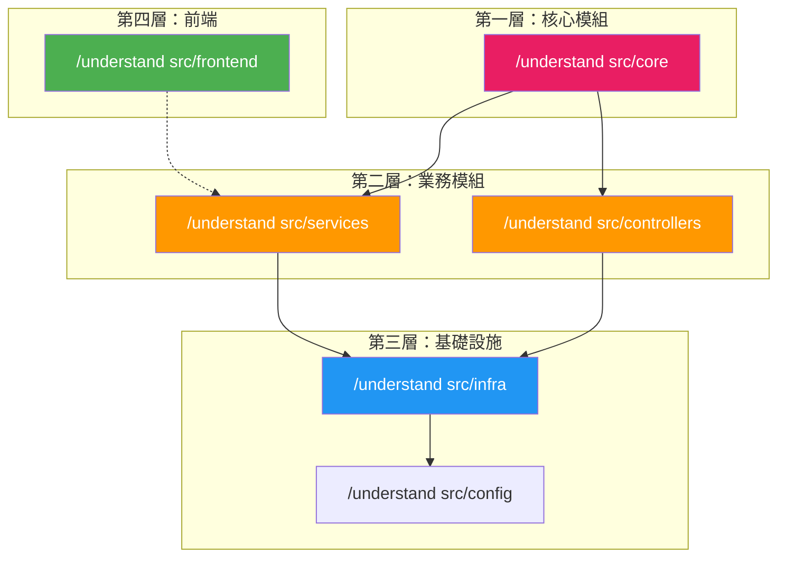

### 16.1.2 Monorepo 策略

```bash
# 方法 1：每個 Package 獨立分析
/understand packages/common
/understand packages/frontend
/understand packages/backend
/understand packages/shared

# 方法 2：分析特定業務領域
/understand-domain packages/
```

### 16.1.3 效能基準

| 專案規模 | 首次分析 | 增量更新 | Dashboard 載入 |
|---------|--------|---------|--------------|
| 50 檔 | ~1 分鐘 | ~10 秒 | < 1 秒 |
| 200 檔 | ~3 分鐘 | ~30 秒 | < 2 秒 |
| 1000 檔 | ~10 分鐘 | ~1 分鐘 | ~3 秒 |
| 5000 檔 | ~30 分鐘 | ~3 分鐘 | ~5 秒（ELK） |

## 16.2 Graph 品質最佳化

### 16.2.1 摘要品質檢查

```bash
# 檢查摘要品質
/understand-chat 列出所有 summary 為空或少於 10 個字的節點

# 重新產生特定模組的摘要
/understand src/services/payment.ts
```

### 16.2.2 Edge 完整性

```bash
# 檢查是否有重要的依賴關係缺失
/understand-chat 比較 import-resolver 找到的 import 邊與 file-analyzer 的結果，是否有遺漏？
```

### 16.2.3 架構層歸屬準確性

```bash
# 檢查架構層歸屬是否正確
/understand-chat 列出每層的節點，是否有明顯歸類錯誤？
```

## 16.3 團隊使用規範

### 16.3.1 Do's（推薦做法）

| 做法 | 理由 |
|------|------|
| ✅ 首次分析後審查 Graph | 確保摘要準確 |
| ✅ 使用 Auto-Update Hook | 保持圖譜最新 |
| ✅ 提交 Graph 到 Git | 團隊共享 |
| ✅ 使用子目錄分析 | 節省 Token |
| ✅ 定期全量重建 | 避免增量漂移 |
| ✅ 使用 Learn Mode 引導新人 | 加速 Onboarding |
| ✅ 在 PR Review 使用 /understand-diff | 提升審查品質 |

### 16.3.2 Don'ts（禁忌做法）

| 做法 | 風險 |
|------|------|
| ❌ 在不信任的 AI 平台分析敏感程式碼 | 資料外洩 |
| ❌ 每次都全量重建 | Token 浪費 |
| ❌ 忽略 `.gitignore` 設定 | 分析無用檔案 |
| ❌ 將 intermediate/ 提交到 Git | 增加 Repo 大小 |
| ❌ 盲目信任 LLM 摘要 | 可能有幻覺 |
| ❌ 多人同時全量分析相同專案 | Token 重複消耗 |
| ❌ 在 Graph 中存放密碼 | 安全風險 |

## 16.4 Graph 版本控制策略

### 16.4.1 合併衝突處理

```bash
# Graph JSON 合併衝突時（通常發生在多人同時更新）
# 建議：接受最新的版本，然後重新執行增量分析

git checkout --theirs .understand-anything/knowledge-graph.json
/understand  # 重新增量分析以整合自己的變更
```

### 16.4.2 版本標記

```bash
# 在重要里程碑標記 Graph 版本
git tag graph-v1.0 -m "Initial knowledge graph for v1.0 release"
git tag graph-v2.0 -m "Updated graph for v2.0 architecture change"
```

## 16.5 多環境管理

| 環境 | Graph 更新頻率 | 說明 |
|------|-------------|------|
| **開發環境** | 每次 commit | Auto-Update Hook |
| **測試環境** | 每日 | CI/CD 排程 |
| **預生產環境** | 每次 Release | Release Pipeline |
| **生產環境** | 不適用 | 不在生產環境部署 |

---

# 17. 企業級架構建議

## 17.1 適用的企業場景

### 17.1.1 銀行業 / 金融業

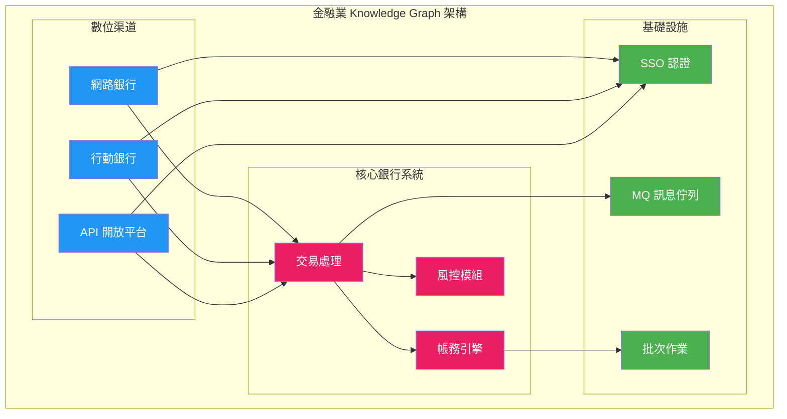

### 17.1.2 金融業特殊考量

| 考量 | 說明 | 建議 |
|------|------|------|
| **資安合規** | 金管會、個資法 | 使用企業版 AI 平台（Azure OpenAI） |
| **程式碼保密** | 核心銀行系統程式碼 | 私有 LLM 或離線模式 |
| **稽核需求** | 所有變更可追溯 | Graph 納入 Git 版本控制 |
| **職責分離** | 開發 vs 維運 | 權限分層控管 |
| **災難復原** | Graph 備份 | Git 自帶備份 + 異地 Mirror |

### 17.1.3 製造業 / IoT

```bash
# 分析嵌入式韌體
/understand firmware/src --language zh-TW

# 分析 IoT Gateway
/understand iot-gateway/

# 分析 SCADA/HMI
/understand scada-ui/
```

### 17.1.4 保險業

```bash
# 分析保險核心系統
/understand insurance-core/

# 業務領域分析
/understand-domain insurance-core/
# → 保單管理、理賠、精算、再保
```

## 17.2 大型系統治理模型

### 17.2.1 多 Repo 治理

```mermaid
graph TB
    subgraph "Repo 1: 前端"
        FE[Vue 3 SPA]
        FE_G[Graph A]
    end

    subgraph "Repo 2: API Gateway"
        GW[Spring Cloud Gateway]
        GW_G[Graph B]
    end

    subgraph "Repo 3: 核心服務"
        CS[Spring Boot Microservices]
        CS_G[Graph C]
    end

    subgraph "Repo 4: 批次作業"
        BT[Spring Batch]
        BT_G[Graph D]
    end

    subgraph "整合檢視"
        KG[知識庫 Graph<br/>"/understand-knowledge"]
    end

    FE_G --> KG
    GW_G --> KG
    CS_G --> KG
    BT_G --> KG

    FE --> GW
    GW --> CS
    CS --> BT

    style KG fill:#E91E63,color:#fff
```

### 17.2.2 跨 Repo 治理建議

1. **每個 Repo 獨立分析**：各 Repo 維護自己的 Knowledge Graph
2. **整合檢視**：使用 `/understand-knowledge` 建立跨 Repo 知識庫
3. **統一 CI/CD**：在共用 CI/CD Pipeline 中統一管理分析排程
4. **架構委員會**：定期審查跨 Repo 的架構依賴

## 17.3 Microservices 治理

### 17.3.1 微服務邊界分析

```bash
# 分析微服務邊界
/understand-chat 列出所有跨服務呼叫（REST/gRPC/MQ），按呼叫頻率排序

# 偵測微服務反模式
/understand-chat 是否有服務直接存取其他服務的資料庫？（Shared Database Anti-pattern）
/understand-chat 是否有過長的同步呼叫鏈？（Distributed Monolith）
```

### 17.3.2 API 治理

```bash
# API 端點盤點
/understand-chat 列出所有 REST API Endpoint，格式：HTTP方法 路徑 → Controller → Service → Repository

# API 版本管理
/understand-chat 列出所有 /api/v1 和 /api/v2 的端點差異
```

## 17.4 Legacy Modernization 治理

### 17.4.1 現代化路徑評估

```bash
# Step 1: 理解現有架構
/understand legacy-system/

# Step 2: 識別模組化邊界
/understand-domain legacy-system/

# Step 3: 評估技術債
/understand-chat 列出所有 complexity 為 "complex" 的模組，並建議現代化優先順序

# Step 4: 產生遷移計畫
/understand-chat 根據依賴關係，建議將哪些模組先行拆解為微服務？
```

### 17.4.2 Strangler Fig Pattern

```mermaid
graph LR
    subgraph "舊系統"
        L1[Legacy Module A]
        L2[Legacy Module B]
        L3[Legacy Module C]
    end

    subgraph "新系統"
        N1[Modern Service A ✅]
        N2[Modern Service B 🔄]
    end

    subgraph "Facade"
        F[API Gateway]
    end

    F -->|路由| N1
    F -->|路由| N2
    F -->|路由| L3
    N2 -.->|漸進遷移| L2

    style N1 fill:#4CAF50,color:#fff
    style N2 fill:#FF9800,color:#fff
    style L1 fill:#9E9E9E,color:#fff
    style L2 fill:#9E9E9E,color:#fff
    style L3 fill:#9E9E9E,color:#fff
```

## 17.5 架構決策紀錄（ADR）整合

### 利用 Graph 輔助架構決策

```bash
# 查詢與決策相關的模組
/understand-chat 專案中所有與「快取」相關的模組，它們如何互動？

# 影響分析
/understand-chat 如果從 Redis 切換到 Hazelcast，哪些模組需要修改？

# 記錄決策
/understand-knowledge docs/adr/
# → 將 ADR 文件整合到知識圖譜中
```

> **實務建議**：建議在架構委員會定期會議中使用 Dashboard 展示系統架構全貌。Knowledge Graph 可作為架構治理的「活文件」，取代逐漸過時的靜態架構圖。

---

# 18. 未來發展方向

## 18.1 MCP（Model Context Protocol）整合

### 18.1.1 MCP 與 Understand-Anything

MCP 是 Anthropic 提出的開放協議，用於標準化 AI 模型與外部工具的互動。Understand-Anything 未來可透過 MCP 提供更深度的整合：

```mermaid
graph LR
    subgraph "AI Agent"
        A[Claude / GPT / Gemini]
    end

    subgraph "MCP Server"
        M1[Understand-Anything<br/>MCP Server]
    end

    subgraph "工具"
        T1[Knowledge Graph 查詢]
        T2[架構分析]
        T3[程式碼搜尋]
        T4[影響分析]
    end

    A <-->|MCP Protocol| M1
    M1 --> T1
    M1 --> T2
    M1 --> T3
    M1 --> T4

    style A fill:#E91E63,color:#fff
    style M1 fill:#2196F3,color:#fff
```

### 18.1.2 MCP 的潛在優勢

| 面向 | 現有方式 | MCP 方式 |
|------|---------|---------|
| 平台支援 | 每個平台需獨立 Plugin | 統一 MCP 協議 |
| 工具發現 | 靜態指令列表 | 動態工具註冊 |
| 資源管理 | 手動管理 Context | MCP Resource 自動管理 |
| 串接成本 | 高（每平台開發） | 低（一次開發，多平台使用） |

## 18.2 AI Agent Mesh

### 18.2.1 多 Agent 協作架構

```mermaid
graph TB
    subgraph "Agent Mesh 願景"
        UA[Understand-Anything<br/>Agent]
        CA[Code Review<br/>Agent]
        TA[Testing<br/>Agent]
        DA[Documentation<br/>Agent]
        SA[Security<br/>Agent]
    end

    UA -->|提供架構 Context| CA
    UA -->|提供模組資訊| TA
    UA -->|提供結構資訊| DA
    UA -->|提供依賴分析| SA
    CA -->|回饋品質問題| UA
    TA -->|回饋測試覆蓋| UA

    style UA fill:#E91E63,color:#fff
    style CA fill:#FF9800,color:#fff
    style TA fill:#2196F3,color:#fff
    style DA fill:#4CAF50,color:#fff
    style SA fill:#9C27B0,color:#fff
```

### 18.2.2 Agent Mesh 應用場景

1. **自動化 Code Review**：Understand-Anything 提供變更影響分析 → Code Review Agent 自動審查
2. **智慧測試產生**：Graph 提供模組依賴 → Testing Agent 產生測試案例
3. **自動化文件更新**：Graph 偵測變更 → Documentation Agent 更新文件
4. **持續安全掃描**：Graph 提供攻擊面分析 → Security Agent 持續掃描

## 18.3 GraphRAG

### 18.3.1 Graph + RAG 的融合

```mermaid
graph LR
    subgraph "GraphRAG 架構"
        Q[使用者提問]
        GR[Graph Retriever]
        VR[Vector Retriever]
        F[Fusion Layer]
        LLM[LLM 產生回答]
    end

    Q --> GR
    Q --> VR
    GR -->|結構化 Context| F
    VR -->|語意 Context| F
    F --> LLM

    style GR fill:#E91E63,color:#fff
    style VR fill:#2196F3,color:#fff
    style F fill:#4CAF50,color:#fff
```

### 18.3.2 GraphRAG 優勢

| 傳統 RAG | GraphRAG |
|----------|---------|
| 搜尋相似文字片段 | 搜尋 + 圖譜關係遍歷 |
| 缺少結構化 Context | 提供完整依賴鏈 |
| 可能遺漏間接相關的資訊 | 透過邊遍歷發現隱性關聯 |

## 18.4 發展路線圖趨勢

| 趨勢 | 說明 | 預期影響 |
|------|------|---------|
| **MCP 標準化** | 統一 AI 工具協議 | 降低整合成本 |
| **Multi-Agent** | 多 Agent 協作 | 更智慧的自動化 |
| **GraphRAG** | 圖譜增強檢索 | 更精準的回答 |
| **即時分析** | IDE 內即時更新 | 更快速的回饋 |
| **更多語言支援** | Tree-sitter 語法持續擴展 | 更廣泛的適用性 |
| **確定性 Pipeline 強化** | 更多階段由內建腳本取代 LLM（如 scan-project.mjs） | 提升速度與可重現性 |

## 18.5 近期已實現的重大改進（v2.7.x）

以下為 v2.7.x 版本系列中已正式落地的功能，體現了專案的快速迭代能力：

| 版本 | 改進 | 技術細節 |
|------|------|---------|
| v2.7.5 | **Louvain 語意批次重構** | Phase 1.5 `compute-batches.mjs` 以社群偵測取代計數式分批 |
| v2.7.5 | **確定性檔案列舉** | `scan-project.mjs` 取代 LLM 掃描器，Phase 1 加速 3-5× |
| v2.7.5 | **10+ 語言 importMap 解析** | `extract-import-map.mjs` 支援 Go/TS/PHP/Python Monorepo 多根解析 |
| v2.7.5 | **Multi-part Output** | file-analyzer 分段輸出，降低截斷風險 |
| v2.7.5 | **neighborMap** | 跨批次邊發射，確保社群邊界依賴完整 |
| v2.7.3 | **測試覆蓋視覺化** | `tested_by` 邊在 Dashboard 中可視化呈現 |
| v2.7.3 | **檔案/類別雙視圖** | Dashboard 支援在檔案視圖與類別視圖間切換 |
| v2.7.3 | **行動裝置佈局** | Dashboard 支援手機和平板裝置瀏覽 |

---

# 19. 結論

## 19.1 核心價值回顧

Understand-Anything 解決了軟體開發中最根本的問題之一：**程式碼理解**。

```mermaid
graph LR
    subgraph "傳統方式"
        T1[閱讀原始碼] --> T2[手動追蹤依賴]
        T2 --> T3[詢問資深同事]
        T3 --> T4[逐步建立心智模型]
        T4 --> T5["⏱ 數天~數週"]
    end

    subgraph "Understand-Anything"
        U1["/understand"] --> U2["Knowledge Graph<br/>（分鐘級）"]
        U2 --> U3["/understand-dashboard"]
        U3 --> U4["完整架構視覺化"]
        U4 --> U5["⚡ 數分鐘~數小時"]
    end

    style T5 fill:#E91E63,color:#fff
    style U5 fill:#4CAF50,color:#fff
```

## 19.2 適用場景總結

| 場景 | 效益 | 推薦程度 |
|------|------|---------|
| 新人 Onboarding | 加速 80%+ | ⭐⭐⭐⭐⭐ |
| 大型系統理解 | 從數週縮短至數小時 | ⭐⭐⭐⭐⭐ |
| PR Review | 自動影響分析 | ⭐⭐⭐⭐ |
| 技術債評估 | 量化複雜度 | ⭐⭐⭐⭐ |
| Legacy 遷移 | 降低遷移風險 | ⭐⭐⭐⭐⭐ |
| 架構治理 | 活文件取代靜態圖 | ⭐⭐⭐⭐ |
| 日常開發 | 快速定位模組 | ⭐⭐⭐ |

## 19.3 導入建議

1. **從小規模開始**：選擇一個中型專案（100-500 檔）試行
2. **先由架構師驗證**：確認 Graph 品質後再推廣
3. **建立團隊規範**：Token 預算、存取控制、更新流程
4. **逐步擴大**：從一個團隊到部門，再到全組織

---

# 20. AI Prompt Engineering 專章

## 20.1 Claude Code Prompt 範本

### 20.1.1 系統理解 Prompt

```
/understand-chat

以架構師的角度，回答以下問題：
1. 這個專案的整體架構是什麼模式？（Monolith / Microservices / Modular Monolith）
2. 核心業務領域有哪些？
3. 資料流是如何從前端到資料庫的？
4. 有哪些跨模組的共用元件？
5. 潛在的架構風險有哪些？
```

### 20.1.2 Code Review Prompt

```
/understand-diff

請根據 Knowledge Graph 的影響分析，回答：
1. 本次 PR 變更了哪些模組？
2. 有哪些下游模組可能受影響？
3. 是否有潛在的破壞性變更？
4. 測試覆蓋是否足夠？（檢查 tested_by 邊）
5. 是否符合專案的架構規範？
```

### 20.1.3 安全分析 Prompt

```
/understand-chat

從資安角度分析這個專案：
1. 列出所有處理使用者輸入的進入點（Controller, API Endpoint）
2. 這些進入點的輸入驗證機制是什麼？
3. 是否有 SQL Injection / XSS / CSRF 的風險點？
4. 認證與授權機制是如何實作的？
5. 敏感資料（密碼、Token）是否有妥善保護？
```

### 20.1.4 效能分析 Prompt

```
/understand-chat

從效能角度分析：
1. 列出所有資料庫查詢點，是否有 N+1 問題？
2. 有哪些模組使用了快取？快取策略是什麼？
3. 有哪些同步的外部 API 呼叫可能導致延遲？
4. 有哪些複雜度為 "complex" 的函式可能是效能瓶頸？
```

## 20.2 VS Code Copilot Prompt 範本

### 20.2.1 使用 @workspace 搭配 Graph

```
@workspace /understand-explain src/services/payment.ts

這個支付模組的完整依賴鏈是什麼？
從 Controller 到 Repository 的呼叫路徑？
```

### 20.2.2 程式碼產生 Prompt

```
@workspace /understand-chat

根據專案的 Repository Pattern 慣例，幫我產生一個新的 OrderRepository：
1. 參考現有的 UserRepository 和 PaymentRepository 的寫法
2. 包含 CRUD 操作
3. 符合專案的命名慣例和錯誤處理模式
```

## 20.3 Cursor Prompt 範本

### 20.3.1 使用 Codebase Context

```
@codebase

根據 Knowledge Graph，這個專案使用了哪些 Design Pattern？
每個 Pattern 在哪些模組中被使用？
請以表格形式列出。
```

### 20.3.2 重構 Prompt

```
@codebase

我要重構 src/services/order.ts：
1. 查看 Graph 中這個模組的所有依賴者（fan-in）
2. 列出所有會受影響的模組
3. 建議重構步驟（由內到外）
4. 產生重構後的程式碼
```

## 20.4 通用 Prompt 技巧

### 20.4.1 Prompt 結構化框架

```
[角色] 以 {角色} 的身份
[任務] 請分析 {分析目標}
[格式] 以 {表格/列表/Mermaid} 格式呈現
[範圍] 專注於 {特定模組/層級}
[約束] 注意 {安全/效能/相容性} 面向
```

### 20.4.2 進階 Prompt 範例

```
以資深 Java 架構師的身份，分析 src/services/ 目錄下的所有 Service 類別：
1. 每個 Service 的職責是什麼？（Single Responsibility 檢查）
2. Service 之間的依賴關係圖（Mermaid 格式）
3. 是否有 Circular Dependency？
4. 哪些 Service 違反了 SOLID 原則？
5. 以表格形式列出改善建議

請根據 Knowledge Graph 的資訊回答，不要猜測。
```

---

# 21. Agent Workflow 專章

## 21.1 Architect Agent

### 職責
利用 Understand-Anything 輔助架構決策

### Workflow

```mermaid
graph TB
    A[接收架構需求] --> B["/understand<br/>分析現有架構"]
    B --> C["/understand-domain<br/>識別業務領域"]
    C --> D["/understand-chat<br/>查詢依賴關係"]
    D --> E[評估架構選項]
    E --> F[產出 ADR<br/>Architecture Decision Record]
    F --> G[更新 Knowledge Graph]

    style B fill:#E91E63,color:#fff
    style C fill:#FF9800,color:#fff
    style D fill:#2196F3,color:#fff
```

### 範例

```bash
# Step 1: 理解現有架構
/understand --language zh-TW

# Step 2: 識別瓶頸
/understand-chat 列出 fan-in 最高的 10 個模組（被依賴最多 = 變更風險最高）

# Step 3: 評估拆分方案
/understand-chat 如果要將 UserService 拆分為獨立微服務，需要切斷哪些依賴？

# Step 4: 產出架構決策
/understand-chat 根據以上分析，產出一份 ADR（Architecture Decision Record）
```

## 21.2 Refactor Agent

### 職責
安全地進行大規模重構

### Workflow

```mermaid
graph TB
    A[識別重構目標] --> B["/understand-chat<br/>查詢影響範圍"]
    B --> C[產生重構計畫]
    C --> D[逐步執行重構]
    D --> E["/understand-diff<br/>驗證變更"]
    E --> F{測試通過？}
    F -->|是| G[提交 PR]
    F -->|否| H[回退並修正]
    H --> D

    style B fill:#E91E63,color:#fff
    style E fill:#2196F3,color:#fff
```

### 範例

```bash
# Step 1: 識別目標
/understand-chat 列出 complexity 為 "complex" 且行數 > 200 的函式

# Step 2: 影響分析
/understand-chat processPayment 函式被哪些模組呼叫？
/understand-chat 如果拆分 processPayment 為多個小函式，哪些呼叫點需要修改？

# Step 3: 執行重構
# （在 AI Agent 中執行實際重構）

# Step 4: 驗證
/understand-diff
```

## 21.3 Testing Agent

### 職責
利用 Graph 資訊產生更精準的測試

### Workflow

```bash
# Step 1: 查詢測試覆蓋
/understand-chat 列出所有沒有 tested_by 邊的模組（未被測試的模組）

# Step 2: 優先排序
/understand-chat 根據 complexity 和 fan-in，哪些未測試模組風險最高？

# Step 3: 產生測試
/understand-chat 參考專案現有測試的寫法，為 OrderService 產生完整的單元測試

# Step 4: 驗證覆蓋
/understand  # 重新分析，更新 tested_by 邊
```

## 21.4 Documentation Agent

### 職責
自動化文件產生與維護

### Workflow

```bash
# Step 1: 產生架構文件
/understand-onboard

# Step 2: 產生 API 文件
/understand-chat 列出所有 REST API Endpoint，產生 OpenAPI 格式文件

# Step 3: 產生模組說明
/understand-chat 為 src/services/ 下的每個 Service 產生 README.md

# Step 4: 產生資料流文件
/understand-chat 繪製 Mermaid 流程圖：使用者下單 → 付款 → 出貨 的完整資料流
```

## 21.5 Security Agent

### 職責
利用 Graph 進行安全分析

### Workflow

```bash
# Step 1: 識別攻擊面
/understand-chat 列出所有外部進入點（API Endpoint, WebSocket, MQ Consumer）

# Step 2: 追蹤資料流
/understand-chat 使用者輸入從 Controller 到 Repository 的完整路徑上，經過了哪些驗證？

# Step 3: 識別風險
/understand-chat 哪些模組直接使用了字串拼接的 SQL？（SQL Injection 風險）
/understand-chat 哪些模組直接將使用者輸入渲染到 HTML？（XSS 風險）

# Step 4: 依賴分析
/understand-chat 列出所有第三方依賴（imports），有哪些已知的安全漏洞？
```

---

# 22. 大型共用平台案例

## 22.1 案例背景

```
專案：企業級共用平台
技術棧：
  前端：Vue 3 + TypeScript + Vite
  後端：Spring Boot 3.x + Java 17
  資料庫：Oracle 19c
  快取：Redis 7
  訊息佇列：Apache Kafka + IBM MQ
  批次作業：Spring Batch
  認證：SSO（SAML 2.0 + OAuth 2.0）
  API 閘道：Spring Cloud Gateway
  部署：Kubernetes + Helm

規模：
  前端元件：300+
  後端 Service：50+
  API Endpoint：200+
  Batch Job：30+
  資料表：500+
  總程式碼行數：80 萬行
  開發人員：60 人
```

## 22.2 導入步驟

### Phase 1：環境準備（Day 1）

```bash
# 1. 安裝環境
nvm install 22 && nvm use 22
corepack enable && corepack prepare pnpm@latest --activate

# 2. 安裝 Plugin（以 Claude Code 為例）
npx understand-anything install claude-code
```

### Phase 2：分模組分析（Day 1-2）

```bash
# 前端（Vue 3）
/understand frontend/ --language zh-TW

# API Gateway
/understand api-gateway/

# 核心服務
/understand core-services/

# 批次作業
/understand batch-jobs/

# 共用元件
/understand shared-libs/
```

### Phase 3：跨模組整合（Day 2）

```bash
# 業務領域分析
/understand-domain .

# 產生 Onboarding 文件
/understand-onboard
```

### Phase 4：團隊推廣（Day 3-5）

```bash
# 架構師審查 Graph
/understand-dashboard

# 設定 CI/CD
# → 參考第 13 章 GitHub Actions 範例

# 團隊培訓
# → 使用 Dashboard Learn Mode 進行
```

## 22.3 技術棧特定分析

### 22.3.1 Vue 3 前端分析

```bash
/understand-chat

Vue 3 前端分析：
1. 列出所有 Composable（use*.ts），它們的依賴關係
2. Store（Pinia/Vuex）的狀態管理架構
3. Router 路由結構與權限控制
4. API 呼叫層（Axios/Fetch）的封裝方式
5. 共用元件（components/shared/）的使用頻率
```

### 22.3.2 Spring Boot 後端分析

```bash
/understand-chat

Spring Boot 後端分析：
1. Controller → Service → Repository 的分層架構
2. AOP 切面（Aspect）的使用場景
3. 例外處理機制（@ControllerAdvice）
4. 事務管理（@Transactional）的範圍
5. 排程任務（@Scheduled）清單
```

### 22.3.3 Oracle 資料庫分析

```bash
/understand-chat

資料存取分析：
1. 列出所有 Repository/DAO 及其對應的資料表
2. JPA Entity 之間的關聯（@OneToMany, @ManyToOne）
3. 原生 SQL 查詢（@Query(nativeQuery=true)）清單
4. 是否有使用 Stored Procedure？
5. 資料庫遷移工具（Flyway/Liquibase）的使用情況
```

### 22.3.4 Redis 快取分析

```bash
/understand-chat

快取架構分析：
1. 列出所有使用 @Cacheable 的方法
2. 快取 Key 的命名策略
3. 快取失效策略（TTL, @CacheEvict）
4. 是否有分散式鎖（RedissonLock）？
5. Redis 的使用模式（Cache-Aside, Read-Through, Write-Behind）
```

### 22.3.5 Kafka + MQ 訊息分析

```bash
/understand-chat

訊息架構分析：
1. 列出所有 Kafka Producer 和 Consumer
2. 列出所有 IBM MQ 的 Queue 和 Topic
3. 訊息的序列化格式（JSON, Avro, Protobuf）
4. Consumer Group 的配置
5. 死信佇列（DLQ）的處理機制
```

### 22.3.6 Spring Batch 分析

```bash
/understand-chat

批次作業分析：
1. 列出所有 Batch Job 及其排程時間
2. 每個 Job 的 Step 組成（Reader → Processor → Writer）
3. 錯誤處理機制（Skip, Retry）
4. Job 之間的依賴關係
5. 效能關鍵的 Chunk Size 設定
```

### 22.3.7 SSO 認證分析

```bash
/understand-chat

認證授權分析：
1. SSO 整合方式（SAML 2.0 / OAuth 2.0）
2. Token 驗證流程
3. 權限模型（RBAC / ABAC）
4. Session 管理機制
5. API 金鑰管理
```

### 22.3.8 API Gateway 分析

```bash
/understand-chat

API Gateway 分析：
1. 路由規則清單
2. 限流（Rate Limiting）設定
3. 斷路器（Circuit Breaker）配置
4. 請求/回應轉換（Filter）
5. CORS 設定
```

## 22.4 Dashboard 架構全景圖

```mermaid
graph TB
    subgraph "前端層"
        VUE[Vue 3 SPA]
    end

    subgraph "閘道層"
        GW[Spring Cloud Gateway]
        SSO[SSO Server]
    end

    subgraph "服務層"
        S1[用戶服務]
        S2[訂單服務]
        S3[支付服務]
        S4[通知服務]
        S5[報表服務]
    end

    subgraph "訊息層"
        KFK[Kafka]
        MQ[IBM MQ]
    end

    subgraph "批次層"
        B1[日結批次]
        B2[對帳批次]
        B3[報表批次]
    end

    subgraph "資料層"
        ORA[(Oracle)]
        RDS[(Redis)]
    end

    VUE --> GW
    GW --> SSO
    GW --> S1
    GW --> S2
    GW --> S3

    S1 --> ORA
    S1 --> RDS
    S2 --> ORA
    S2 --> KFK
    S3 --> MQ
    S4 --> KFK
    S5 --> ORA

    B1 --> ORA
    B2 --> MQ
    B3 --> ORA

    style VUE fill:#42b883,color:#fff
    style GW fill:#FF9800,color:#fff
    style SSO fill:#9C27B0,color:#fff
    style ORA fill:#E91E63,color:#fff
    style RDS fill:#F44336,color:#fff
    style KFK fill:#2196F3,color:#fff
    style MQ fill:#00BCD4,color:#fff
```

## 22.5 導入成效

| 指標 | 導入前 | 導入後 | 改善 |
|------|--------|--------|------|
| 新人 Onboarding 時間 | 4-6 週 | 1-2 週 | **-70%** |
| PR Review 時間 | 60 分鐘/PR | 30 分鐘/PR | **-50%** |
| 架構文件維護成本 | 每月 20 人時 | 每月 5 人時 | **-75%** |
| 跨團隊溝通次數 | 15 次/週 | 5 次/週 | **-67%** |
| 意外的破壞性變更 | 3 次/月 | 0.5 次/月 | **-83%** |
| 技術債識別 | 憑經驗 | 量化報告 | **質的飛躍** |

> **實務建議**：大型共用平台的導入建議分 Phase 進行，先從影響面最大的核心服務開始，逐步擴展到邊緣模組。每個 Phase 完成後進行成效回顧，調整後續 Phase 的策略。

---

# 23. 檢查清單（Checklist）

## 23.1 環境準備檢查

- [ ] Node.js ≥ 22 已安裝
- [ ] pnpm ≥ 10 已安裝
- [ ] Git 已安裝且版本 ≥ 2.x
- [ ] AI 平台已選定（Claude Code / VS Code Copilot / Cursor / Codex / Gemini CLI）
- [ ] AI 平台帳號已設定且可用
- [ ] 網路連線正常（可存取 GitHub 和 AI API）

## 23.2 安裝與設定檢查

- [ ] Understand-Anything Plugin 已安裝
- [ ] Plugin 設定檔已確認（`.claude-plugin/` 或 `.copilot-plugin/` 等）
- [ ] `.gitignore` 已設定（排除 `intermediate/` 和 `diff-overlay.json`）
- [ ] Git LFS 已設定（若 Graph > 10 MB）

## 23.3 首次分析檢查

- [ ] 首次全量分析已完成：`/understand --language zh-TW`
- [ ] Knowledge Graph 已產生：`.understand-anything/knowledge-graph.json`
- [ ] Graph 品質已由架構師審查
- [ ] 節點數與邊數合理
- [ ] 關鍵模組的摘要準確
- [ ] 架構層歸屬正確
- [ ] Dashboard 可正常開啟：`/understand-dashboard`
- [ ] Onboarding 文件已產生：`/understand-onboard`

## 23.4 團隊導入檢查

- [ ] 團隊 Token 預算已設定
- [ ] 權限分層已定義（Admin / Architect / Developer / Viewer）
- [ ] AI Tool 使用規範已發布
- [ ] Graph 已提交至 Git
- [ ] Auto-Update Hook 已設定
- [ ] CI/CD Pipeline 已配置
- [ ] 團隊培訓已完成

## 23.5 安全合規檢查

- [ ] AI 平台合約已審查（資料保護條款）
- [ ] 原始碼不含硬編碼密碼/金鑰
- [ ] Graph 摘要不含敏感資訊/PII
- [ ] Graph 檔案存取權限已控管
- [ ] 資安團隊已知悉並同意
- [ ] 合規審查已通過（金管會/個資法等）

## 23.6 維運檢查

- [ ] 增量更新機制運作正常
- [ ] Token 監控已設定
- [ ] 健康度檢查腳本已部署
- [ ] 全量重建排程已設定（每月/每季）
- [ ] Graph 備份策略已確認（Git 歷史）
- [ ] 問題排除文件已備妥

## 23.7 進階應用檢查

- [ ] Prompt Template 已建立並共享
- [ ] Architecture Decision Record (ADR) 整合已設定
- [ ] 跨 Repo 知識庫已建立（若適用）
- [ ] Agent Workflow 已定義
- [ ] 成效指標已建立（Onboarding 時間、PR Review 時間等）

---

# 附錄

## A. 參考資源

| 資源 | 連結 |
|------|------|
| GitHub Repository | https://github.com/Lum1104/Understand-Anything |
| 官方首頁 | https://understand-anything.com/ |
| 線上 Demo（互動式 Dashboard） | https://understand-anything.com/demo/ |
| Discord 社群 | https://discord.gg/pydat66RY |
| 社群影片導覽（Better Stack） | https://www.youtube.com/watch?v=VmIUXVlt7_I |
| 多語言參考專案（GCP microservices-demo） | https://github.com/Lum1104/microservices-demo |
| Issue Tracker | https://github.com/Lum1104/Understand-Anything/issues |
| 貢獻指南 | https://github.com/Lum1104/Understand-Anything/blob/main/CONTRIBUTING.md |
| License | MIT License |

## B. 支援語言列表

| 語言 | Tree-sitter 支援 | 備註 |
|------|-----------------|------|
| TypeScript | ✅ | 原生最佳支援 |
| JavaScript | ✅ | 含 JSX |
| Python | ✅ | |
| Java | ✅ | |
| Go | ✅ | |
| Rust | ✅ | |
| C / C++ | ✅ | |
| C# | ✅ | |
| Ruby | ✅ | |
| PHP | ✅ | |
| Swift | ✅ | |
| Kotlin | ✅ | |
| Scala | ✅ | |
| Markdown | ✅ | 知識庫分析 |
| YAML / JSON | ✅ | 組態檔分析 |

## C. 版本歷程

| 版本 | 日期 | 重大變更 |
|------|------|---------|
| v2.7.5 | 2026-06 | Louvain 語意批次、scan-project.mjs、extract-import-map.mjs、Multi-part Output、neighborMap |
| v2.7.3 | 2026-05 | 測試覆蓋視覺化（tested_by）、檔案/類別雙視圖切換、可自訂標題字型、行動裝置佈局 |
| v2.7.0 | 2026-04 | Semantic Batching 初版 |
| v2.6.0 | 2026-03 | 4-tier Robustness Pipeline |
| v2.5.0 | 2026-02 | Dashboard React Flow 升級、ELK Layout |
| v2.3.1 | 2026-01 | Multi-platform install.sh、Copilot CLI 支援 |
| v2.1.0 | 2025-12 | 知識庫分析（/understand-knowledge）、article-analyzer Agent |
| v2.0.0 | 2025-11 | Knowledge Graph Schema v1.0、React Dashboard |
| v1.3.0 | 2025-10 | 業務領域分析（/understand-domain）、domain-analyzer Agent |
| v1.2.0 | 2025-09 | 首次公開發佈 |

## D. 術語表

| 術語 | 說明 |
|------|------|
| **Knowledge Graph** | 由節點和邊組成的程式碼結構圖譜 |
| **Node** | 圖譜中的節點（檔案、函式、類別等） |
| **Edge** | 圖譜中的邊（imports、calls、inherits 等） |
| **Tree-sitter** | 增量式解析器產生器，用於建立 AST |
| **AST** | Abstract Syntax Tree，抽象語法樹 |
| **Pipeline** | 多代理人分析管線（Phase 0-5） |
| **Hybrid Mode** | Tree-sitter + LLM 混合分析模式 |
| **Semantic Batching** | 依模組耦合度分組的批次分析策略（v2.7.5 使用 Louvain 社群偵測） |
| **Louvain** | 社群偵測演算法，用於將高耦合的檔案分入同一批次 |
| **scan-project.mjs** | v2.7.5 新增的確定性檔案列舉腳本，取代 LLM 撰寫的掃描器 |
| **extract-import-map.mjs** | v2.7.5 新增的 importMap 解析器，支援 10+ 語言與 Monorepo 多根解析 |
| **compute-batches.mjs** | v2.7.5 新增的 Louvain 分群計算腳本（Phase 1.5） |
| **Multi-part Output** | v2.7.5 的分段式輸出協議，降低 LLM 輸出截斷風險 |
| **neighborMap** | 跨批次邊發射機制，確保社群邊界依賴不遺漏 |
| **Anti-fusion** | 嚴格命名規則，防止語意相近的節點被 LLM 錯誤融合 |
| **Fan-in** | 一個模組被多少其他模組依賴 |
| **Fan-out** | 一個模組依賴多少其他模組 |
| **Fingerprint** | 檔案指紋，用於增量偵測 |
| **Robustness Pipeline** | 四層漸進式 Schema 驗證管線 |
| **Learn Mode** | Dashboard 引導式學習模式 |
| **Tour** | 知識圖譜中的引導式學習路徑 |
| **ADR** | Architecture Decision Record，架構決策紀錄 |
| **MCP** | Model Context Protocol，模型上下文協議 |
| **GraphRAG** | Graph-enhanced Retrieval Augmented Generation |

---

> **📘 本手冊完成**。全 23 章 + 附錄，涵蓋從安裝到企業級治理的完整內容。  
> 版本：1.1 | 最後更新：2026 年 5 月 25 日 | 對應 Understand-Anything v2.7.5

