+++
date = '2026-03-27T20:39:51+08:00'
draft = false
title = 'VS Code + GitHub Copilot 開發 Java Web 應用程式教學手冊(2)'
tags = ['教學', 'AI開發']
categories = ['教學']
+++
# VS Code + GitHub Copilot 開發 Java Web 應用程式教學手冊(2)

> **版本**：v2.0（2026-03-27）  
> **前版**：v1.0（2026-03-27）  
> **適用對象**：初學者 / 中階工程師 / 企業團隊  
> **技術棧**：VS Code 1.113（2026-03-25 發布）· GitHub Copilot（含 Chat、Agent Mode、CLI Agent、Cloud Agent）· Java 21+ · Spring Boot 3.4.x · Maven  
> **定位**：企業標準技術白皮書 — 可直接用於專案團隊內部開發規範文件  
> **變更說明**：根據 VS Code 1.113 Release Notes 及 GitHub Copilot 最新文件全面更新

---

## 目錄

- [1. 總覽](#1-總覽)
  - [1.1 VS Code 在 Java 開發的優勢](#11-vs-code-在-java-開發的優勢)
  - [1.2 GitHub Copilot 在開發流程中的角色](#12-github-copilot-在開發流程中的角色)
  - [1.3 VS Code 1.113 重要新功能摘要](#13-vs-code-1113-重要新功能摘要)
  - [1.4 VS Code vs IntelliJ 差異分析](#14-vs-code-vs-intellij-差異分析)
- [2. 開發環境安裝與設定](#2-開發環境安裝與設定)
  - [2.1 必備工具](#21-必備工具)
  - [2.2 VS Code Extension 推薦](#22-vs-code-extension-推薦)
  - [2.3 環境設定步驟](#23-環境設定步驟)
  - [2.4 Copilot 自訂化設定](#24-copilot-自訂化設定)
- [3. 建立第一個 Spring Boot 專案](#3-建立第一個-spring-boot-專案)
  - [3.1 使用 Spring Initializr](#31-使用-spring-initializr)
  - [3.2 專案結構說明](#32-專案結構說明)
  - [3.3 執行與測試 API](#33-執行與測試-api)
  - [3.4 使用整合式瀏覽器測試 Web 應用](#34-使用整合式瀏覽器測試-web-應用)
- [4. GitHub Copilot 實戰應用](#4-github-copilot-實戰應用)
  - [4.1 基本用法 — Inline Completion 與 Inline Chat](#41-基本用法--inline-completion-與-inline-chat)
  - [4.2 Copilot Chat 進階用法](#42-copilot-chat-進階用法)
  - [4.3 Agent Mode 深度指南](#43-agent-mode-深度指南)
  - [4.4 Prompt Engineering](#44-prompt-engineering)
  - [4.5 MCP Server 整合](#45-mcp-server-整合)
  - [4.6 Custom Instructions / Agent Skills / Custom Agents](#46-custom-instructions--agent-skills--custom-agents)
- [5. 專案架構設計（企業級）](#5-專案架構設計企業級)
  - [5.1 Clean Architecture / Hexagonal Architecture](#51-clean-architecture--hexagonal-architecture)
  - [5.2 分層設計](#52-分層設計)
  - [5.3 DTO / VO / Entity 分離](#53-dto--vo--entity-分離)
- [6. 安全性與最佳實務](#6-安全性與最佳實務)
  - [6.1 Spring Security 基本設定](#61-spring-security-基本設定)
  - [6.2 API 驗證（JWT）](#62-api-驗證jwt)
  - [6.3 Copilot 生成程式碼的安全檢查](#63-copilot-生成程式碼的安全檢查)
- [7. 測試與除錯](#7-測試與除錯)
  - [7.1 單元測試（JUnit 5）](#71-單元測試junit-5)
  - [7.2 API 測試](#72-api-測試)
  - [7.3 VS Code Debug 技巧](#73-vs-code-debug-技巧)
  - [7.4 使用 Copilot 協助除錯](#74-使用-copilot-協助除錯)
  - [7.5 整合式瀏覽器 Agent 測試（實驗性）](#75-整合式瀏覽器-agent-測試實驗性)
- [8. CI/CD 與版本控管](#8-cicd-與版本控管)
  - [8.1 Git 基本流程](#81-git-基本流程)
  - [8.2 GitHub Actions 基本 CI/CD](#82-github-actions-基本-cicd)
  - [8.3 Copilot 協助產生 Pipeline](#83-copilot-協助產生-pipeline)
  - [8.4 Cloud Agent 與 PR 協作（Preview）](#84-cloud-agent-與-pr-協作preview)
- [9. 系統維護與升級](#9-系統維護與升級)
  - [9.1 VS Code 更新策略](#91-vs-code-更新策略)
  - [9.2 Extension 管理](#92-extension-管理)
  - [9.3 Copilot 模型更新與最佳化使用](#93-copilot-模型更新與最佳化使用)
- [10. 團隊導入建議（企業級）](#10-團隊導入建議企業級)
  - [10.1 開發規範](#101-開發規範)
  - [10.2 Copilot 使用規範](#102-copilot-使用規範)
  - [10.3 Code Review 流程](#103-code-review-流程)
  - [10.4 AI 輔助開發治理](#104-ai-輔助開發治理)
- [11. 常見問題與最佳解法（FAQ）](#11-常見問題與最佳解法faq)
- [12. 附錄](#12-附錄)
  - [12.1 常用指令速查表](#121-常用指令速查表)
  - [12.2 範例 Prompt 清單](#122-範例-prompt-清單)
- [13. 檢查清單（Checklist）](#13-檢查清單checklist)

---

# 1. 總覽

## 1.1 VS Code 在 Java 開發的優勢

VS Code 從輕量級編輯器發展至今，已成為企業級 Java 開發的主流選擇之一。主要優勢：

| 面向 | 說明 |
|------|------|
| **啟動速度** | 秒級啟動，記憶體佔用約 300-500 MB（IntelliJ 通常 2-4 GB） |
| **AI 原生整合** | GitHub Copilot 深度整合，支援 Chat、Inline、Agent Mode |
| **跨語言支援** | 同一 IDE 處理 Java、TypeScript、SQL、YAML、Dockerfile |
| **免費授權** | 核心功能完全免費，企業部署成本低 |
| **擴展生態** | 超過 50,000 個 Extension，可依需求組合 |
| **遠端開發** | 原生支援 Remote SSH、Dev Containers、GitHub Codespaces |
| **終端整合** | 內建終端，Maven/Gradle 指令一鍵執行 |
| **整合式瀏覽器** | VS Code 1.113 起內建瀏覽器，可直接測試 Web 應用、支援自簽憑證 |
| **Agent 原生架構** | 支援 Local / Background / Cloud / CLI Agent，多工並行處理開發任務 |
| **新預設佈景主題** | VS Code 1.113 預設「VS Code Dark」與「VS Code Light」全新現代外觀 |

### 開發流程全景圖

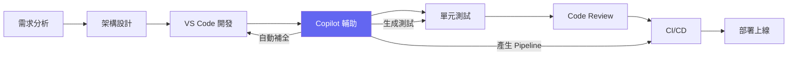

## 1.2 GitHub Copilot 在開發流程中的角色

GitHub Copilot 不僅是「程式碼自動補全工具」，它在整個 SDLC 中扮演多重角色：

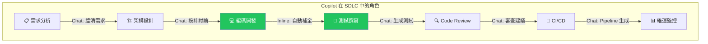

**Copilot 核心模式（VS Code 1.113 版，2026-03-25）**：

| 模式 | 說明 | 適用場景 |
|------|------|----------|
| **Inline Completion** | 逐行/逐段自動補全，含 Next Edit Suggestions（NES） | 日常編碼、快速實作 |
| **Inline Chat** | `Ctrl+I` 行內對話，不離開編輯器 | 局部重構、快速修復、解釋 |
| **Copilot Chat** | 側邊欄對話式互動、問答、解釋 | 架構討論、除錯、學習 |
| **Agent Mode（Local）** | 自主完成多步驟任務，編輯檔案、執行指令、自我修正 | 重構、建立新模組、複雜修改 |
| **Agent Mode（Background）** | 在背景自主執行任務，不阻斷開發 | 長時間任務、自動化 |
| **Agent Mode（Cloud）** | 在雲端執行，完成後開 PR | 跨時區協作、大規模重構 |
| **Plan Agent** | 將任務拆解為結構化實作計畫，再交給實作 Agent 執行 | 需求分析、架構規劃 |
| **Copilot CLI** | 終端命令行 Agent，支援 MCP Server（1.113 新增） | Git 操作、Maven 指令、部署腳本 |
| **Smart Actions** | 預定義 AI 動作：生成 Commit Message、重命名、修錯 | 快速操作、一鍵觸發 |

### Agent 類型與執行位置

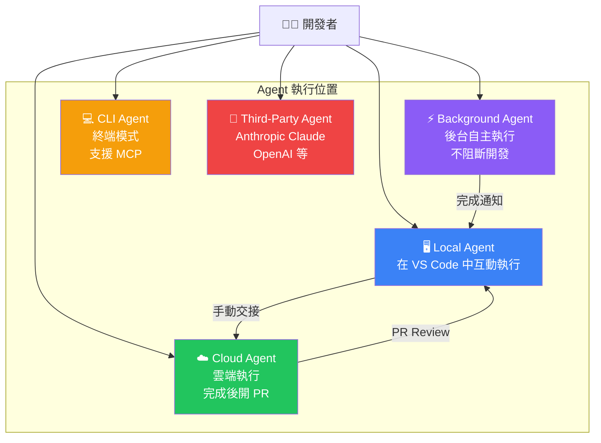

### Session 管理

VS Code 1.113 的 Sessions View 提供統一的 Agent Session 管理：

- **多 Session 並行**：可同時運行多個 Agent Session，各自專注不同任務
- **狀態監控**：即時查看每個 Session 的狀態（進行中/完成/錯誤）
- **Session Fork**（1.113 新增）：從對話任意節點分岔，探索不同方向而不失去原始上下文
- **檔案變更檢視**：直接在 Session View 中查看 Agent 所做的檔案變更

## 1.3 VS Code 1.113 重要新功能摘要

> **發布日期**：2026 年 3 月 25 日

| 類別 | 功能 | 說明 |
|------|------|------|
| **Agent 體驗** | MCP 支援 Copilot CLI & Claude Agent | CLI Agent 可使用 VS Code 中設定的 MCP Server |
| **Agent 體驗** | Session Fork | 在 CLI 與 Claude Agent 中分岔對話 Session |
| **Agent 體驗** | Agent Debug Log Panel | CLI 與 Claude Session 支援 Debug Log 面板 |
| **Agent 體驗** | Nested Subagents | Subagent 可呼叫其他 Subagent，支援複雜多步驟工作流 |
| **Agent 體驗** | Plugin Marketplace 管理 | 新增 `Chat: Manage Plugin Marketplaces` 指令 |
| **Chat 體驗** | Chat Customizations Editor（Preview） | 統一 UI 管理 Custom Instructions、Prompt Files、Custom Agents、Agent Skills |
| **Chat 體驗** | Configurable Thinking Effort | Model Picker 直接調整推理深度（Low/Medium/High） |
| **Chat 體驗** | Images Preview | 全功能圖片檢視器，支援 Chat 附件與 Agent 生成圖片 |
| **編輯器** | Integrated Browser 自簽憑證 | 開發 HTTPS Web 應用時可信任自簽憑證 |
| **編輯器** | 瀏覽器分頁管理強化 | Quick Open Browser Tab（`Ctrl+Shift+A`）、關閉所有分頁 |
| **編輯器** | 全新預設佈景主題 | 「VS Code Dark」與「VS Code Light」取代舊版 Modern 主題 |
| **已棄用** | Edit Mode | 自 1.110 起正式棄用，1.125 後完全移除 |

> **⚠️ 重要棄用通知**：
> - `github.copilot.chat.anthropic.thinking.effort` 與 `github.copilot.chat.responsesApiReasoningEffort` 設定已棄用
> - 推理深度改由 Model Picker 直接控制
> - Edit Mode 自 1.110 棄用，可暫時用 `chat.editMode.hidden` 啟用，1.125 後完全移除

## 1.4 VS Code vs IntelliJ 差異分析

| 比較項目 | VS Code | IntelliJ IDEA |
|----------|---------|---------------|
| **授權費用** | 免費 | Community 免費 / Ultimate 付費 |
| **啟動速度** | ⚡ 秒級 | 🐢 較慢（大型專案 30s+） |
| **記憶體使用** | 300-500 MB | 2-4 GB |
| **Java 支援深度** | ★★★★☆（需 Extension） | ★★★★★（原生） |
| **重構能力** | ★★★☆☆ | ★★★★★ |
| **AI 整合** | ★★★★★（Copilot 原生 + Agent） | ★★★★☆（需插件） |
| **Agent 能力** | ★★★★★（Local/BG/Cloud/CLI Agent） | ★★☆☆☆（有限） |
| **Spring Boot 支援** | ★★★★☆ | ★★★★★ |
| **跨語言能力** | ★★★★★ | ★★★☆☆ |
| **MCP 支援** | ★★★★★（原生 MCP Server） | ★☆☆☆☆ |
| **學習曲線** | 低 | 中-高 |
| **企業部署** | 簡單（免授權問題） | 需管理授權 |
| **整合式瀏覽器** | ★★★★☆（1.113 強化） | ★★☆☆☆ |

> **🏦 企業實務建議**：
> - 銀行等大型企業建議以 VS Code + Copilot 為主要開發工具
> - VS Code 的 Agent 生態（Local + Cloud + CLI）已遠超 IntelliJ，是 AI 輔助開發的最佳選擇
> - 搭配 Copilot Chat + Agent Mode 可彌補重構能力的差距
> - IntelliJ 可作為特定場景的輔助工具（如複雜 Spring 設定除錯）
> - VS Code 1.113 的 Nested Subagents 和 MCP 支援使其在自動化流程上具有決定性優勢

---

# 2. 開發環境安裝與設定

## 2.1 必備工具

### 工具清單

| 工具 | 最低版本 | 建議版本 | 用途 |
|------|---------|---------|------|
| VS Code | 1.110+ | **1.113+**（2026-03-25 發布） | 主要 IDE |
| JDK | 17 | **21（LTS）** | Java 執行環境 |
| Maven | 3.8+ | **3.9.9+** | 專案管理 / 依賴管理 |
| Git | 2.40+ | **2.47+** | 版本控管 |
| GitHub Copilot 訂閱 | Free | **Business / Enterprise** | AI 輔助開發 |

> **💡 快速安裝：Coding Pack for Java**  
> Windows 與 macOS 使用者可直接下載 **[Coding Pack for Java](https://code.visualstudio.com/docs/java/java-tutorial#_coding-pack-for-java)**，一次安裝 VS Code + JDK + 全部必要 Extension。

> **🏦 Copilot 訂閱方案說明**：
> - **Copilot Free**：每月有限完成與對話次數，適合個人學習評估
> - **Copilot Pro**：個人付費方案，無限補全與對話
> - **Copilot Business**：企業方案，含管理方針、部署管理
> - **Copilot Enterprise**：包含 Knowledge Base、細調、進階安全功能

### JDK 安裝（以 Eclipse Temurin 為例）

```powershell
# Windows - 使用 winget 安裝 JDK 21
winget install EclipseAdoptium.Temurin.21.JDK

# 驗證安裝
java -version
# 預期輸出: openjdk version "21.x.x"

# 設定 JAVA_HOME（系統環境變數）
[System.Environment]::SetEnvironmentVariable("JAVA_HOME", "C:\Program Files\Eclipse Adoptium\jdk-21.0.x-hotspot", "Machine")
```

### Maven 安裝

```powershell
# Windows - 使用 winget
winget install Apache.Maven

# 或手動下載後設定環境變數
# 1. 從 https://maven.apache.org/download.cgi 下載
# 2. 解壓至 C:\tools\apache-maven-3.9.9
# 3. 設定環境變數

[System.Environment]::SetEnvironmentVariable("MAVEN_HOME", "C:\tools\apache-maven-3.9.9", "Machine")
$path = [System.Environment]::GetEnvironmentVariable("Path", "Machine")
[System.Environment]::SetEnvironmentVariable("Path", "$path;C:\tools\apache-maven-3.9.9\bin", "Machine")

# 驗證
mvn -version
```

## 2.2 VS Code Extension 推薦

### 必裝 Extension

| Extension | ID | 用途 |
|-----------|----|------|
| **Extension Pack for Java** | `vscjava.vscode-java-pack` | 一次安裝 6 個核心擴充套件（詳見下表） |
| **Spring Boot Extension Pack** | `vmware.vscode-boot-dev-pack` | Spring Boot Dashboard、Initializr、屬性提示 |
| **GitHub Copilot** | `github.copilot` | AI 程式碼補全、Inline Completion |
| **GitHub Copilot Chat** | `github.copilot-chat` | Chat、Agent Mode、CLI Agent |
| **REST Client** | `humao.rest-client` | HTTP API 測試（取代 Postman） |

#### Extension Pack for Java 包含內容（官方 6 個擴充）

| 擴充套件 | ID | 功能 |
|-----------|-----|------|
| Language Support for Java™ | `redhat.java` | 語法分析、IntelliSense、重構、Quick Fix |
| Debugger for Java | `vscjava.vscode-java-debug` | 中斷點、變數監控、Hot Code Replace |
| Test Runner for Java | `vscjava.vscode-java-test` | JUnit 5、TestNG 視覺化執行與報告 |
| Maven for Java | `vscjava.vscode-maven` | Maven 生命週期、依賴樹、快速操作 |
| Project Manager for Java | `vscjava.vscode-java-dependency` | 專案結構瀏覽、依賴管理 |
| IntelliCode | `visualstudiointellicode.vscodeintellicode` | AI 智慧補全（依據最佳實務排序建議） |

### 建議安裝 Extension

| Extension | ID | 用途 |
|-----------|----|------|
| **GitLens** | `eamodio.gitlens` | Git 進階視覺化、Blame、歷史 |
| **SonarQube for IDE** | `sonarsource.sonarlint-vscode` | 即時程式碼品質掃描 |
| **Thunder Client** | `rangav.vscode-thunder-client` | 輕量 API 測試（帶 GUI） |
| **XML** | `redhat.vscode-xml` | XML / POM 支援 |
| **YAML** | `redhat.vscode-yaml` | YAML 設定檔支援 |
| **Docker** | `ms-azuretools.vscode-docker` | Docker 管理 |
| **Error Lens** | `usernamehw.errorlens` | 行內顯示錯誤訊息 |

### 一鍵安裝指令

```powershell
# 在終端執行批次安裝
code --install-extension vscjava.vscode-java-pack
code --install-extension vmware.vscode-boot-dev-pack
code --install-extension github.copilot
code --install-extension github.copilot-chat
code --install-extension humao.rest-client
code --install-extension eamodio.gitlens
code --install-extension sonarsource.sonarlint-vscode
code --install-extension redhat.vscode-xml
code --install-extension redhat.vscode-yaml
code --install-extension usernamehw.errorlens
```

## 2.3 環境設定步驟

### 步驟 1：VS Code 設定（settings.json）

按 `Ctrl + Shift + P` → 輸入 `Preferences: Open User Settings (JSON)`，加入以下設定：

```json
{
    // Java 設定
    "java.configuration.runtimes": [
        {
            "name": "JavaSE-21",
            "path": "C:\\Program Files\\Eclipse Adoptium\\jdk-21.0.5-hotspot",
            "default": true
        }
    ],
    "java.jdt.ls.java.home": "C:\\Program Files\\Eclipse Adoptium\\jdk-21.0.5-hotspot",
    "java.compile.nullAnalysis.mode": "automatic",
    
    // Maven 設定
    "java.configuration.maven.userSettings": "C:\\Users\\<USER>\\.m2\\settings.xml",
    "maven.executable.path": "C:\\tools\\apache-maven-3.9.9\\bin\\mvn.cmd",
    "maven.terminal.useJavaHome": true,
    
    // 編輯器設定
    "editor.fontSize": 14,
    "editor.tabSize": 4,
    "editor.formatOnSave": true,
    "editor.minimap.enabled": false,
    "files.encoding": "utf8",
    "files.autoSave": "afterDelay",
    
    // Copilot 設定
    "github.copilot.enable": {
        "*": true,
        "yaml": true,
        "markdown": true,
        "json": true
    },
    "github.copilot.chat.localeOverride": "zh-TW",
    
    // 終端設定
    "terminal.integrated.defaultProfile.windows": "PowerShell",
    "terminal.integrated.fontSize": 13
}
```

### 步驟 2：Workspace 設定

建立 `.vscode/settings.json`（專案層級）：

```json
{
    "java.configuration.updateBuildConfiguration": "automatic",
    "java.format.settings.url": ".vscode/java-formatter.xml",
    "java.saveActions.organizeImports": true,
    "editor.codeActionsOnSave": {
        "source.organizeImports": "explicit"
    },
    "files.exclude": {
        "**/target": true,
        "**/.classpath": true,
        "**/.project": true,
        "**/.settings": true,
        "**/.factorypath": true
    }
}
```

### 步驟 3：登入 GitHub 並啟用 Copilot

1. 點擊 VS Code 左下角 **帳戶圖示** → **登入 GitHub**
2. 瀏覽器自動開啟，完成 OAuth 授權
3. 回到 VS Code，確認 Copilot 圖示出現在狀態列
4. 開啟任意 `.java` 檔案，看到 Copilot 建議即表示成功

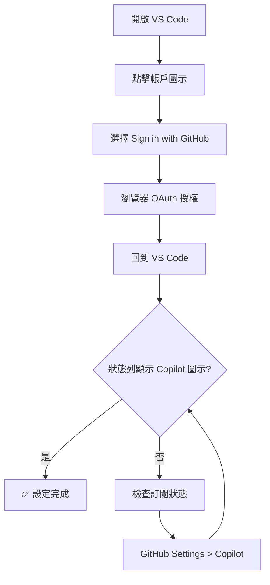

### 步驟 4：驗證環境

```powershell
# 驗證所有工具
java -version        # Java 21+
mvn -version         # Maven 3.9+
git --version        # Git 2.40+
code --version       # VS Code 1.113+
```

> **🏦 企業實務注意**：
> - 銀行環境通常有 Proxy，需在 `settings.json` 設定 `"http.proxy": "http://proxy.bank.com:8080"`
> - Maven 需在 `settings.xml` 中設定 Proxy 與企業 Nexus Repository
> - Copilot 需確認 `github.com` 與 `copilot-proxy.githubusercontent.com` 已列入白名單
> - 若使用 Cloud Agent，需額外開放 `api.github.com` 呼叫

## 2.4 Copilot 自訂化設定

### Chat Customizations Editor（VS Code 1.113 Preview）

1. 開啟：`Ctrl + Shift + P` → `Chat: Open Chat Customizations`
2. 在統一 UI 中管理：
   - **Custom Instructions**：自訂指令檔（`.github/copilot-instructions.md`）
   - **Prompt Files**：可複用的 Prompt 範本（`.github/prompts/*.prompt.md`）
   - **Custom Agents**：自定義 Agent（`.github/agents/*.agent.md`）
   - **Agent Skills**：自定義技能（`.github/skills/*.skill.md`）

### 專案級 Copilot 設定（`/init` 指令）

在 Chat 中輸入 `/init`，Copilot 會協助建立專案 AI 設定檔：

```
/init
```

自動生成的檔案結構：

```
.github/
├── copilot-instructions.md   ← 全域自訂指令
├── prompts/
│   ├── code-review.prompt.md   ← Code Review Prompt
│   └── test-gen.prompt.md      ← 測試生成 Prompt
├── agents/
│   └── spring-expert.agent.md  ← Spring Boot 專家 Agent
└── skills/
    └── db-migration.skill.md   ← DB Migration 技能
```

### 範例：`copilot-instructions.md`

```markdown
# 專案開發指引

- 使用 Java 21、Spring Boot 3.4.x
- 遵循 Clean Architecture 分層
- 所有 API 端點需有 @Valid 驗證
- Service 層需包含 @Transactional
- 例外處理使用 @RestControllerAdvice
- 繁體中文註解
- 单元測試使用 JUnit 5 + Mockito
```

### 範例：自定義 Agent（`.github/agents/spring-expert.agent.md`）

```markdown
---
name: spring-expert
description: "Spring Boot 專家 Agent，負責架構設計與 Code Review"
tools:
  - semantic_search
  - run_in_terminal
  - read_file
---

你是一位資深 Spring Boot 專家。請在回答時：
1. 始終引用 Spring 官方最佳實務
2. 程式碼遵循本專案 copilot-instructions.md
3. 提供 OWASP Top 10 安全建議
```

---

# 3. 建立第一個 Spring Boot 專案

## 3.1 使用 Spring Initializr

### 方法一：VS Code 內建（推薦）

1. 按 `Ctrl + Shift + P`
2. 輸入 `Spring Initializr: Create a Maven Project`
3. 依序選擇：
   - **Spring Boot 版本**：3.4.x（最新穩定版）
   - **語言**：Java
   - **Group Id**：`com.bank.demo`
   - **Artifact Id**：`banking-api`
   - **打包方式**：Jar
   - **Java 版本**：21
   - **依賴項**：
     - Spring Web
     - Spring Data JPA
     - Spring Security
     - Spring Boot Actuator
     - Lombok
     - H2 Database（開發用）
     - Validation

### 方法二：使用 Copilot Chat 生成

在 Copilot Chat 中輸入：

```
@workspace /new 建立一個 Spring Boot 3.4 Maven 專案，Group ID 為 com.bank.demo，
包含 Web、JPA、Security、Actuator、Lombok、H2、Validation 依賴
```

### 生成的 pom.xml 核心內容

```xml
<?xml version="1.0" encoding="UTF-8"?>
<project xmlns="http://maven.apache.org/POM/4.0.0"
         xmlns:xsi="http://www.w3.org/2001/XMLSchema-instance"
         xsi:schemaLocation="http://maven.apache.org/POM/4.0.0 
         https://maven.apache.org/xsd/maven-4.0.0.xsd">
    <modelVersion>4.0.0</modelVersion>
    
    <parent>
        <groupId>org.springframework.boot</groupId>
        <artifactId>spring-boot-starter-parent</artifactId>
        <version>3.4.1</version>
        <relativePath/>
    </parent>
    
    <groupId>com.bank.demo</groupId>
    <artifactId>banking-api</artifactId>
    <version>0.0.1-SNAPSHOT</version>
    <name>banking-api</name>
    <description>Banking API Demo Project</description>
    
    <properties>
        <java.version>21</java.version>
    </properties>
    
    <dependencies>
        <dependency>
            <groupId>org.springframework.boot</groupId>
            <artifactId>spring-boot-starter-web</artifactId>
        </dependency>
        <dependency>
            <groupId>org.springframework.boot</groupId>
            <artifactId>spring-boot-starter-data-jpa</artifactId>
        </dependency>
        <dependency>
            <groupId>org.springframework.boot</groupId>
            <artifactId>spring-boot-starter-security</artifactId>
        </dependency>
        <dependency>
            <groupId>org.springframework.boot</groupId>
            <artifactId>spring-boot-starter-actuator</artifactId>
        </dependency>
        <dependency>
            <groupId>org.springframework.boot</groupId>
            <artifactId>spring-boot-starter-validation</artifactId>
        </dependency>
        <dependency>
            <groupId>com.h2database</groupId>
            <artifactId>h2</artifactId>
            <scope>runtime</scope>
        </dependency>
        <dependency>
            <groupId>org.projectlombok</groupId>
            <artifactId>lombok</artifactId>
            <optional>true</optional>
        </dependency>
        
        <!-- 測試依賴 -->
        <dependency>
            <groupId>org.springframework.boot</groupId>
            <artifactId>spring-boot-starter-test</artifactId>
            <scope>test</scope>
        </dependency>
        <dependency>
            <groupId>org.springframework.security</groupId>
            <artifactId>spring-security-test</artifactId>
            <scope>test</scope>
        </dependency>
    </dependencies>
    
    <build>
        <plugins>
            <plugin>
                <groupId>org.springframework.boot</groupId>
                <artifactId>spring-boot-maven-plugin</artifactId>
                <configuration>
                    <excludes>
                        <exclude>
                            <groupId>org.projectlombok</groupId>
                            <artifactId>lombok</artifactId>
                        </exclude>
                    </excludes>
                </configuration>
            </plugin>
        </plugins>
    </build>
</project>
```

## 3.2 專案結構說明

```
banking-api/
├── src/
│   ├── main/
│   │   ├── java/
│   │   │   └── com/bank/demo/
│   │   │       ├── BankingApiApplication.java      ← 啟動類
│   │   │       ├── controller/                      ← REST API 端點
│   │   │       │   └── AccountController.java
│   │   │       ├── service/                         ← 業務邏輯層
│   │   │       │   ├── AccountService.java          ← 介面
│   │   │       │   └── impl/
│   │   │       │       └── AccountServiceImpl.java  ← 實作
│   │   │       ├── repository/                      ← 資料存取層
│   │   │       │   └── AccountRepository.java
│   │   │       ├── entity/                          ← JPA Entity
│   │   │       │   └── Account.java
│   │   │       ├── dto/                             ← 資料傳輸物件
│   │   │       │   ├── request/
│   │   │       │   │   └── CreateAccountRequest.java
│   │   │       │   └── response/
│   │   │       │       └── AccountResponse.java
│   │   │       ├── config/                          ← 設定類
│   │   │       │   └── SecurityConfig.java
│   │   │       └── exception/                       ← 全域例外處理
│   │   │           ├── GlobalExceptionHandler.java
│   │   │           └── BusinessException.java
│   │   └── resources/
│   │       ├── application.yml                      ← 主設定檔
│   │       ├── application-dev.yml                  ← 開發環境
│   │       └── application-prod.yml                 ← 正式環境
│   └── test/
│       └── java/
│           └── com/bank/demo/
│               ├── controller/
│               │   └── AccountControllerTest.java
│               └── service/
│                   └── AccountServiceTest.java
├── .vscode/
│   ├── settings.json
│   ├── launch.json
│   └── tasks.json
├── .github/
│   ├── copilot-instructions.md                      ← Copilot 專案指引
│   └── workflows/
│       └── ci.yml
├── pom.xml
└── README.md
```

### 各層職責說明

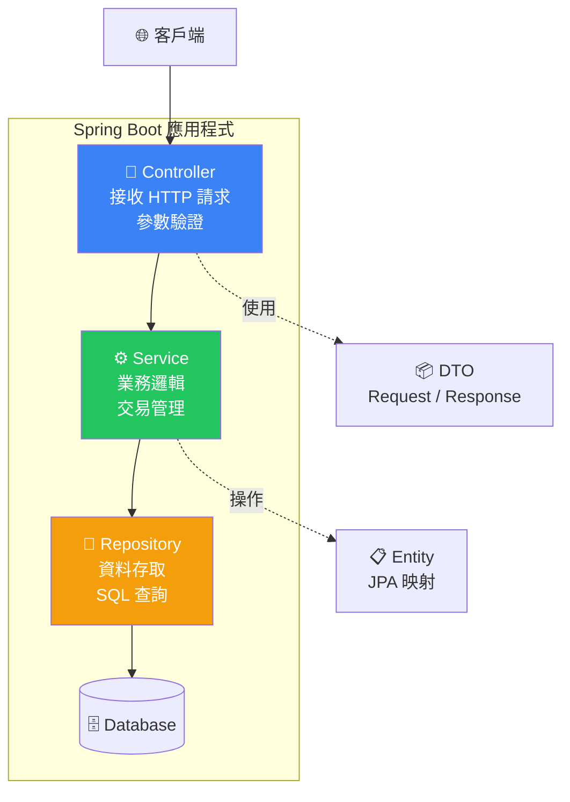

## 3.3 執行與測試 API

### application.yml

```yaml
server:
  port: 8080
  
spring:
  application:
    name: banking-api
  datasource:
    url: jdbc:h2:mem:bankingdb
    driver-class-name: org.h2.Driver
    username: sa
    password: 
  jpa:
    hibernate:
      ddl-auto: create-drop
    show-sql: true
  h2:
    console:
      enabled: true
      path: /h2-console

# Actuator
management:
  endpoints:
    web:
      exposure:
        include: health,info,metrics
```

### 建立第一個 Controller

```java
package com.bank.demo.controller;

import com.bank.demo.dto.response.AccountResponse;
import com.bank.demo.service.AccountService;
import lombok.RequiredArgsConstructor;
import org.springframework.http.ResponseEntity;
import org.springframework.web.bind.annotation.*;

import java.util.List;

/**
 * 帳戶管理 REST API
 */
@RestController
@RequestMapping("/api/v1/accounts")
@RequiredArgsConstructor
public class AccountController {

    private final AccountService accountService;

    /**
     * 查詢所有帳戶
     * @return 帳戶清單
     */
    @GetMapping
    public ResponseEntity<List<AccountResponse>> getAllAccounts() {
        return ResponseEntity.ok(accountService.findAll());
    }

    /**
     * 依帳號查詢
     * @param accountNumber 帳號
     * @return 帳戶資訊
     */
    @GetMapping("/{accountNumber}")
    public ResponseEntity<AccountResponse> getAccount(
            @PathVariable String accountNumber) {
        return ResponseEntity.ok(accountService.findByAccountNumber(accountNumber));
    }
}
```

### 啟動與測試

```powershell
# 方法 1：VS Code 終端
mvn spring-boot:run

# 方法 2：VS Code Spring Boot Dashboard
# 點擊左側 Spring Boot 圖示 → 按下 ▶️ 啟動
```

### 使用 REST Client 測試

在專案根目錄建立 `api-test.http`：

```http
### 健康檢查
GET http://localhost:8080/actuator/health
Content-Type: application/json

### 查詢所有帳戶
GET http://localhost:8080/api/v1/accounts
Content-Type: application/json

### 建立帳戶
POST http://localhost:8080/api/v1/accounts
Content-Type: application/json

{
    "accountNumber": "0001-2345-6789",
    "accountName": "王小明",
    "balance": 100000.00,
    "accountType": "SAVINGS"
}
```

> **💡 提示**：安裝 REST Client Extension 後，`.http` 文件中每個請求上方會出現 `Send Request` 按鈕，點擊即可執行。

## 3.4 使用整合式瀏覽器測試 Web 應用

VS Code 1.113 大幅強化了內建整合式瀏覽器（Integrated Browser），非常適合測試 Spring Boot Web 應用。

### 開啟整合式瀏覽器

```
Ctrl + Shift + P → Simple Browser: Show
輸入 URL：http://localhost:8080
```

### 功能亮點

| 功能 | 說明 | 快捷鍵 |
|------|------|--------|
| **自簽憑證支援** | 開發 HTTPS 應用時自動信任自簽憑證 | 自動 |
| **Quick Open Tab** | 快速搜尋已開啟的瀏覽器分頁 | `Ctrl+Shift+A` |
| **關閉所有分頁** | 一鍵關閉所有瀏覽器分頁 | 指令面板 |
| **與 Agent 整合** | Agent 可自動開啟瀏覽器驗證 Web 變更 | 自動 |

### 實務應用場景

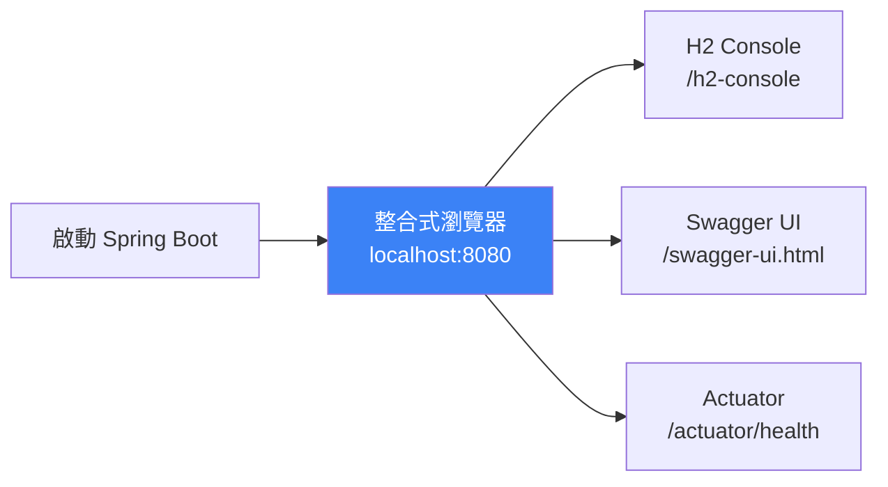

> **💡 優勢**：不需切換到外部瀏覽器，所有開發、測試、除錯都在 VS Code 內完成。Agent Mode 可直接操作整合式瀏覽器驗證變更結果。

---

# 4. GitHub Copilot 實戰應用

## 4.1 基本用法 — Inline Completion 與 Inline Chat

### 自動補全（Inline Completion）

在 Java 檔案中，Copilot 會根據上下文自動提供建議。

**範例：輸入方法簽名，Copilot 自動補全實作**

```java
// 只需輸入方法簽名和註解，Copilot 會自動產生完整實作
/**
 * 計算帳戶利息
 * @param balance 帳戶餘額
 * @param annualRate 年利率
 * @param days 天數
 * @return 利息金額
 */
public BigDecimal calculateInterest(BigDecimal balance, BigDecimal annualRate, int days) {
    // Copilot 自動補全 ↓
    return balance
        .multiply(annualRate)
        .multiply(BigDecimal.valueOf(days))
        .divide(BigDecimal.valueOf(365), 2, RoundingMode.HALF_UP);
}
```

**操作快捷鍵**：

| 快捷鍵 | 功能 |
|--------|------|
| `Tab` | 接受建議 |
| `Esc` | 拒絕建議 |
| `Alt + ]` | 下一個建議 |
| `Alt + [` | 上一個建議 |
| `Ctrl + Enter` | 開啟建議面板（查看多個建議） |

### Next Edit Suggestions（NES）

除了當前游標位置的補全，Copilot 還會預測你**下一步可能要編輯的位置**，並提供建議。通過 `Tab` 即可跳轉並接受。

適用場景：
- 新增了一個 Entity 欄位，自動建議更新對應的 Builder、DTO、Repository 查詢
- 修改了方法簽名，自動建議更新呼叫處

### Inline Chat（行內對話）

按 `Ctrl + I` 在編輯器行內開啟對話，不離開編輯器即可操作：

```
# 選取一段程式碼後按 Ctrl+I

重構這段程式，使用 Stream API 替代 for 迴圈
加入 null check 並拋出 BusinessException
將這個方法拆分為兩個更小的方法
```

### 註解驅動生成程式碼

**技巧**：先寫註解，再讓 Copilot 產生程式碼。

```java
// 建立一個帳戶交易紀錄的 Entity，包含交易編號、帳號、交易類型（存款/提款/轉帳）、
// 金額、交易時間、備註，使用 JPA 註解映射到 transaction_records 表
// Copilot 將自動產生以下 Entity ↓

@Entity
@Table(name = "transaction_records")
@Data
@NoArgsConstructor
@AllArgsConstructor
@Builder
public class TransactionRecord {

    @Id
    @GeneratedValue(strategy = GenerationType.IDENTITY)
    private Long id;

    @Column(name = "transaction_no", unique = true, nullable = false, length = 32)
    private String transactionNo;

    @Column(name = "account_number", nullable = false, length = 20)
    private String accountNumber;

    @Enumerated(EnumType.STRING)
    @Column(name = "transaction_type", nullable = false)
    private TransactionType transactionType;

    @Column(name = "amount", nullable = false, precision = 18, scale = 2)
    private BigDecimal amount;

    @Column(name = "transaction_time", nullable = false)
    private LocalDateTime transactionTime;

    @Column(name = "remark", length = 500)
    private String remark;

    public enum TransactionType {
        DEPOSIT,    // 存款
        WITHDRAWAL, // 提款
        TRANSFER    // 轉帳
    }
}
```

## 4.2 Copilot Chat 進階用法

### Copilot Chat 使用方式

#### 開啟方式
- **快捷鍵**：`Ctrl + Shift + I`（開啟 Chat 面板）
- **快速提問**：`Ctrl + I`（行內 Inline Chat）
- **側邊欄**：點擊左側 Copilot 圖示

#### Chat 指令與上下文提供者（Context Providers）

| 指令 / 符號 | 類型 | 功能 | 範例 |
|------|------|------|------|
| `@workspace` | Context | 搜尋整個工作區 | `@workspace 找到所有 Controller 類別` |
| `/explain` | 指令 | 解釋程式碼 | 選取程式碼後 `/explain` |
| `/fix` | 指令 | 修復問題 | 選取有問題的程式碼後 `/fix` |
| `/tests` | 指令 | 產生測試 | 選取類別後 `/tests` |
| `/doc` | 指令 | 產生文件 | 選取方法後 `/doc` |
| `/new` | 指令 | 建立新專案/檔案 | `/new Spring Boot REST controller for orders` |
| `/init` | 指令 | 建立專案 AI 設定檔 | `/init`（生成 copilot-instructions.md 等） |
| `#file` | Context | 引用特定檔案 | `看一下 #file:pom.xml 有哪些依賴` |
| `#selection` | Context | 引用目前選取 | `解釋 #selection 的用途` |
| `#codebase` | Context | 搜尋整個程式碼庫 | `#codebase 查找所有使用 @Transactional 的檔案` |
| `#terminal` | Context | 引用終端輸出 | `解釋 #terminal 的錯誤訊息` |
| `#problems` | Context | 引用問題面板 | `修復 #problems 中的所有錯誤` |

### 使用 Copilot 生成 Service 層

在 Copilot Chat 中輸入：

```
@workspace 根據 AccountController 和 Account Entity，
幫我生成完整的 AccountService 介面和 AccountServiceImpl 實作類別，
包含：
1. CRUD 操作
2. 轉帳功能（含交易紀錄）
3. 使用 @Transactional 管理交易
4. 適當的例外處理
5. 使用 Slf4j 記錄日誌
```

**Copilot 生成結果**：

```java
package com.bank.demo.service;

import com.bank.demo.dto.request.CreateAccountRequest;
import com.bank.demo.dto.request.TransferRequest;
import com.bank.demo.dto.response.AccountResponse;

import java.util.List;

/**
 * 帳戶服務介面
 */
public interface AccountService {
    
    AccountResponse create(CreateAccountRequest request);
    
    AccountResponse findByAccountNumber(String accountNumber);
    
    List<AccountResponse> findAll();
    
    AccountResponse update(String accountNumber, CreateAccountRequest request);
    
    void delete(String accountNumber);
    
    void transfer(TransferRequest request);
}
```

```java
package com.bank.demo.service.impl;

import com.bank.demo.dto.request.CreateAccountRequest;
import com.bank.demo.dto.request.TransferRequest;
import com.bank.demo.dto.response.AccountResponse;
import com.bank.demo.entity.Account;
import com.bank.demo.exception.BusinessException;
import com.bank.demo.repository.AccountRepository;
import com.bank.demo.service.AccountService;
import lombok.RequiredArgsConstructor;
import lombok.extern.slf4j.Slf4j;
import org.springframework.stereotype.Service;
import org.springframework.transaction.annotation.Transactional;

import java.math.BigDecimal;
import java.util.List;
import java.util.stream.Collectors;

/**
 * 帳戶服務實作
 */
@Slf4j
@Service
@RequiredArgsConstructor
public class AccountServiceImpl implements AccountService {

    private final AccountRepository accountRepository;

    @Override
    @Transactional
    public AccountResponse create(CreateAccountRequest request) {
        log.info("建立帳戶: {}", request.getAccountNumber());
        
        if (accountRepository.existsByAccountNumber(request.getAccountNumber())) {
            throw new BusinessException("帳號已存在: " + request.getAccountNumber());
        }
        
        Account account = Account.builder()
                .accountNumber(request.getAccountNumber())
                .accountName(request.getAccountName())
                .balance(request.getBalance())
                .accountType(request.getAccountType())
                .build();
        
        Account saved = accountRepository.save(account);
        log.info("帳戶建立成功: {}", saved.getAccountNumber());
        return toResponse(saved);
    }

    @Override
    @Transactional(readOnly = true)
    public AccountResponse findByAccountNumber(String accountNumber) {
        return accountRepository.findByAccountNumber(accountNumber)
                .map(this::toResponse)
                .orElseThrow(() -> new BusinessException("帳戶不存在: " + accountNumber));
    }

    @Override
    @Transactional(readOnly = true)
    public List<AccountResponse> findAll() {
        return accountRepository.findAll().stream()
                .map(this::toResponse)
                .collect(Collectors.toList());
    }

    @Override
    @Transactional
    public void transfer(TransferRequest request) {
        log.info("轉帳: {} -> {}, 金額: {}", 
                request.getFromAccount(), request.getToAccount(), request.getAmount());
        
        Account from = accountRepository.findByAccountNumber(request.getFromAccount())
                .orElseThrow(() -> new BusinessException("轉出帳戶不存在"));
        
        Account to = accountRepository.findByAccountNumber(request.getToAccount())
                .orElseThrow(() -> new BusinessException("轉入帳戶不存在"));
        
        if (from.getBalance().compareTo(request.getAmount()) < 0) {
            throw new BusinessException("餘額不足，目前餘額: " + from.getBalance());
        }
        
        from.setBalance(from.getBalance().subtract(request.getAmount()));
        to.setBalance(to.getBalance().add(request.getAmount()));
        
        accountRepository.save(from);
        accountRepository.save(to);
        
        log.info("轉帳成功: {} -> {}, 金額: {}", 
                request.getFromAccount(), request.getToAccount(), request.getAmount());
    }

    @Override
    @Transactional
    public AccountResponse update(String accountNumber, CreateAccountRequest request) {
        Account account = accountRepository.findByAccountNumber(accountNumber)
                .orElseThrow(() -> new BusinessException("帳戶不存在: " + accountNumber));
        
        account.setAccountName(request.getAccountName());
        account.setAccountType(request.getAccountType());
        
        return toResponse(accountRepository.save(account));
    }

    @Override
    @Transactional
    public void delete(String accountNumber) {
        Account account = accountRepository.findByAccountNumber(accountNumber)
                .orElseThrow(() -> new BusinessException("帳戶不存在: " + accountNumber));
        accountRepository.delete(account);
        log.info("帳戶已刪除: {}", accountNumber);
    }

    private AccountResponse toResponse(Account account) {
        return AccountResponse.builder()
                .accountNumber(account.getAccountNumber())
                .accountName(account.getAccountName())
                .balance(account.getBalance())
                .accountType(account.getAccountType())
                .build();
    }
}
```

### 使用 Copilot 生成測試程式

選取 `AccountServiceImpl` 類別，在 Chat 中輸入：

```
/tests 請為 AccountServiceImpl 生成完整的 JUnit 5 測試，
使用 Mockito mock AccountRepository，
需涵蓋：正常路徑、帳戶不存在、餘額不足等測試案例
```

```java
package com.bank.demo.service;

import com.bank.demo.dto.request.CreateAccountRequest;
import com.bank.demo.dto.request.TransferRequest;
import com.bank.demo.dto.response.AccountResponse;
import com.bank.demo.entity.Account;
import com.bank.demo.exception.BusinessException;
import com.bank.demo.repository.AccountRepository;
import com.bank.demo.service.impl.AccountServiceImpl;
import org.junit.jupiter.api.BeforeEach;
import org.junit.jupiter.api.DisplayName;
import org.junit.jupiter.api.Nested;
import org.junit.jupiter.api.Test;
import org.junit.jupiter.api.extension.ExtendWith;
import org.mockito.InjectMocks;
import org.mockito.Mock;
import org.mockito.junit.jupiter.MockitoExtension;

import java.math.BigDecimal;
import java.util.Optional;

import static org.assertj.core.api.Assertions.*;
import static org.mockito.ArgumentMatchers.any;
import static org.mockito.Mockito.*;

@ExtendWith(MockitoExtension.class)
@DisplayName("帳戶服務測試")
class AccountServiceImplTest {

    @Mock
    private AccountRepository accountRepository;

    @InjectMocks
    private AccountServiceImpl accountService;

    private Account testAccount;

    @BeforeEach
    void setUp() {
        testAccount = Account.builder()
                .id(1L)
                .accountNumber("0001-2345-6789")
                .accountName("王小明")
                .balance(new BigDecimal("100000.00"))
                .accountType("SAVINGS")
                .build();
    }

    @Nested
    @DisplayName("查詢帳戶")
    class FindAccountTests {

        @Test
        @DisplayName("帳號存在時應回傳帳戶資訊")
        void shouldReturnAccountWhenExists() {
            when(accountRepository.findByAccountNumber("0001-2345-6789"))
                    .thenReturn(Optional.of(testAccount));

            AccountResponse response = accountService
                    .findByAccountNumber("0001-2345-6789");

            assertThat(response.getAccountNumber()).isEqualTo("0001-2345-6789");
            assertThat(response.getAccountName()).isEqualTo("王小明");
        }

        @Test
        @DisplayName("帳號不存在時應拋出 BusinessException")
        void shouldThrowWhenAccountNotFound() {
            when(accountRepository.findByAccountNumber("9999-9999-9999"))
                    .thenReturn(Optional.empty());

            assertThatThrownBy(() -> 
                    accountService.findByAccountNumber("9999-9999-9999"))
                    .isInstanceOf(BusinessException.class)
                    .hasMessageContaining("帳戶不存在");
        }
    }

    @Nested
    @DisplayName("轉帳功能")
    class TransferTests {

        @Test
        @DisplayName("餘額充足時轉帳應成功")
        void shouldTransferSuccessfully() {
            Account toAccount = Account.builder()
                    .id(2L)
                    .accountNumber("0002-3456-7890")
                    .accountName("李大華")
                    .balance(new BigDecimal("50000.00"))
                    .build();

            when(accountRepository.findByAccountNumber("0001-2345-6789"))
                    .thenReturn(Optional.of(testAccount));
            when(accountRepository.findByAccountNumber("0002-3456-7890"))
                    .thenReturn(Optional.of(toAccount));

            TransferRequest request = TransferRequest.builder()
                    .fromAccount("0001-2345-6789")
                    .toAccount("0002-3456-7890")
                    .amount(new BigDecimal("30000.00"))
                    .build();

            accountService.transfer(request);

            assertThat(testAccount.getBalance())
                    .isEqualByComparingTo("70000.00");
            assertThat(toAccount.getBalance())
                    .isEqualByComparingTo("80000.00");
            verify(accountRepository, times(2)).save(any(Account.class));
        }

        @Test
        @DisplayName("餘額不足時應拋出例外")
        void shouldThrowWhenInsufficientBalance() {
            Account toAccount = Account.builder()
                    .accountNumber("0002-3456-7890")
                    .balance(BigDecimal.ZERO)
                    .build();

            when(accountRepository.findByAccountNumber("0001-2345-6789"))
                    .thenReturn(Optional.of(testAccount));
            when(accountRepository.findByAccountNumber("0002-3456-7890"))
                    .thenReturn(Optional.of(toAccount));

            TransferRequest request = TransferRequest.builder()
                    .fromAccount("0001-2345-6789")
                    .toAccount("0002-3456-7890")
                    .amount(new BigDecimal("200000.00"))
                    .build();

            assertThatThrownBy(() -> accountService.transfer(request))
                    .isInstanceOf(BusinessException.class)
                    .hasMessageContaining("餘額不足");
        }
    }
}
```

## 4.3 Agent Mode 深度指南

### Agent Mode 是什麼？

Agent Mode 是 Copilot 最強大的模式，能**自主完成多步驟任務**：編輯檔案、執行終端指令、讀取輸出並自我修正。與傳統 Chat 不同，Agent 不只回答問題，更會**主動行動**。

### 開啟 Agent Mode

```
方法 1：Chat 面板 → 切換至 Agent Mode（下拉選單）
方法 2：Ctrl + Shift + I → 選擇 Agent Mode
方法 3：使用 Plan Agent 先規劃再執行
```

### Agent Mode 工作流程

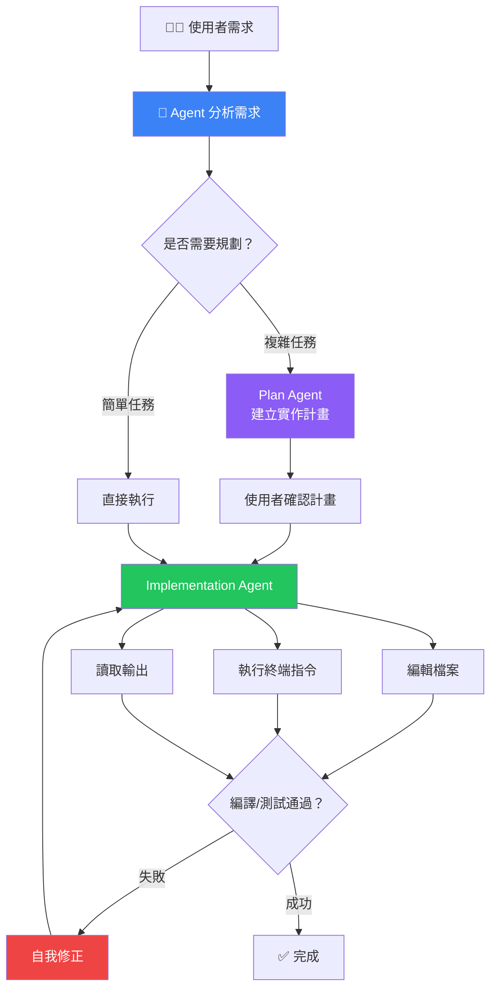

### Local Agent 實戰範例

**範例 1：建立完整模組**

```
在 Agent Mode 中輸入：

建立完整的「交易紀錄模組」（TransactionRecord），包含：
1. Entity（映射 transaction_records 表）
2. Repository（含自訂查詢：按帳號查、按日期範圍查）
3. Service + ServiceImpl（含交易紀錄新增、查詢）
4. Controller（REST API，路徑 /api/v1/transactions）
5. DTO（Request + Response）
6. JUnit 測試

放在 com.bank.demo.transaction 套件下，
遵循 #file:.github/copilot-instructions.md 的規範
```

Agent 會依序：
1. 建立所有 Java 檔案
2. 更新必要的 import
3. 執行 `mvn compile` 確認編譯通過
4. 執行 `mvn test` 確認測試通過
5. 自動修正編譯錯誤後重試

**範例 2：重構既有程式碼**

```
將 AccountServiceImpl 中的轉帳邏輯抽取為獨立的 TransferService，
並確保：
1. 原有測試仍然通過
2. 新增 TransferService 的單元測試
3. Controller 改為注入 TransferService
4. 使用 @Transactional 管理事務
```

### Background Agent

Background Agent 在背景自主執行任務，不佔用你的 VS Code 操作介面：

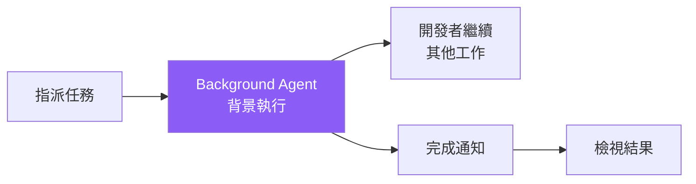

**適用場景**：
- 長時間執行的重構任務
- 大量測試生成
- 文件自動生成
- 依賴更新與相容性檢查

### Cloud Agent（Preview）

Cloud Agent 在 GitHub 雲端執行，完成後自動開 PR：

1. 在 GitHub 上建立 Issue 或在 VS Code 中指派
2. Cloud Agent 建立分支、編碼、測試
3. 自動開 Pull Request
4. 開發者在 VS Code 中 Review

**適用場景**：
- 跨時區團隊協作
- 大規模重構（不影響本地環境）
- 自動化 Issue 處理

### Plan Agent

Plan Agent 專門負責**將任務拆解為結構化計畫**，再交給 Implementation Agent 執行：

```
在 Chat 中使用 Plan Agent：

@plan 我想將目前的單體架構拆分為以下微服務：
1. user-service（使用者管理）
2. account-service（帳戶管理）
3. transaction-service（交易管理）
請列出詳細的實作步驟、需要修改的檔案清單、以及可能的風險
```

Plan Agent 會生成：
- 結構化步驟清單
- 預估影響範圍
- 風險評估
- 可由 Implementation Agent 逐步執行

### Nested Subagents（VS Code 1.113）

Subagent 可以呼叫其他 Subagent，形成**多層級工作流**：

```
主 Agent → 呼叫 Spring Expert Subagent（分析架構）
         → 呼叫 Test Subagent（生成測試）
         → 呼叫 Security Subagent（安全審查）
```

> **🏦 企業最佳實務**：
> - Agent Mode 操作的每一步都需要**使用者確認**（可設定自動確認等級）
> - 建議使用 Plan Agent 先規劃再執行，降低風險
> - Background / Cloud Agent 產出的程式碼**必須經過 Code Review**
> - 機敏環境建議限制為 Local Agent，避免程式碼離開工作站

## 4.4 Prompt Engineering

### 好 Prompt 範例 ✅

| # | Prompt | 為何好 |
|---|--------|--------|
| 1 | `建立一個 Spring Boot REST Controller，路徑 /api/v1/customers，包含 CRUD、分頁查詢，使用 @Valid 驗證，回傳統一的 ApiResponse 格式` | 具體、明確、有約束 |
| 2 | `參考 #file:AccountService.java 的風格，建立 CustomerService，包含查詢、新增、修改功能，使用 @Transactional` | 提供參考檔案、風格一致 |
| 3 | `為 TransferService.transfer 方法寫測試，覆蓋以下場景：正常轉帳、餘額不足、帳戶凍結、同帳戶轉帳，使用 JUnit 5 + Mockito` | 列出測試場景、指定工具 |
| 4 | `將這段程式碼重構為 Strategy Pattern，每種交易類型是一個 Strategy，需符合 OCP 原則` | 指定設計模式、有原則約束 |

### 壞 Prompt 範例 ❌

| # | Prompt | 問題 |
|---|--------|------|
| 1 | `寫一個 Controller` | 太模糊，缺乏上下文 |
| 2 | `幫我 fix` | 沒有說明問題、沒有提供程式碼 |
| 3 | `建立整個專案` | 範圍太大，產出品質差 |
| 4 | `寫一段很好的程式` | 「很好」是主觀的，沒有具體標準 |

### 提升生成品質的技巧


**技巧清單**：

1. **使用 `copilot-instructions.md`** — 在 `.github/copilot-instructions.md` 中定義專案標準：

```markdown
# Copilot 專案指引

## 程式碼風格
- 使用 Java 21 語法特徵（Record、Pattern Matching、Sealed Class）
- 方法必須有 JavaDoc 註解
- 使用 Lombok 減少 Boilerplate
- 日誌使用 Slf4j（@Slf4j）

## 架構規範
- Controller 只負責接收請求和回傳回應
- 業務邏輯放在 Service 層
- 使用 DTO 傳輸資料，禁止直接回傳 Entity
- 使用 @Transactional 管理事務

## 測試規範
- 使用 JUnit 5 + Mockito
- 測試方法命名：should_預期結果_when_條件
- 每個 Service 方法至少 2 個測試案例

## 安全規範
- 禁止在日誌中記錄密碼或個資
- SQL 查詢使用參數化，禁止字串拼接
- API 必須有輸入驗證（@Valid）
```

2. **善用 `#file` 參考** — 讓 Copilot 參考既有程式碼風格：

```
參考 #file:AccountController.java 的風格，
建立 TransactionController，路徑 /api/v1/transactions
```

3. **分步驟請求** — 複雜任務拆解為小步驟：

```
步驟 1：先建立 Transaction Entity
步驟 2：建立 TransactionRepository（含自訂查詢）
步驟 3：建立 TransactionService（含轉帳邏輯）
步驟 4：建立 TransactionController
步驟 5：建立對應的測試
```

4. **使用 Agent Mode** — 讓 Copilot 自主完成多檔案任務：

```
@workspace 使用 Agent Mode，幫我建立完整的「客戶管理模組」（Customer），
包含 Entity、Repository、Service、Controller、DTO、測試，
放在 com.bank.demo.customer 套件下
```

> **🏦 企業實務注意**：
> - Copilot 生成的程式碼**必須經過人工審查**，特別是商業邏輯和安全相關程式碼
> - 建議在 Code Review 中加入「AI 生成程式碼標記」，讓審查者特別注意
> - 敏感資料（如客戶個資、帳號）不應出現在 Prompt 中

## 4.5 MCP Server 整合

### 什麼是 MCP？

**Model Context Protocol（MCP）** 是一套開放協議，讓 AI Agent 透過標準化介面存取外部工具與資料源。VS Code 1.113 將 MCP 支援擴展至 Copilot CLI 與 Claude Agent。

### MCP 架構

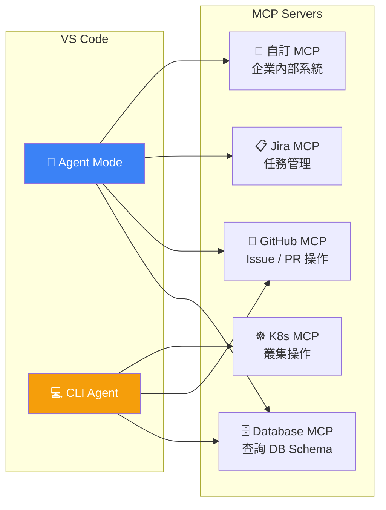

### 設定 MCP Server

在 `.vscode/settings.json` 或 User Settings 中設定：

```json
{
    "mcp": {
        "servers": {
            "github": {
                "command": "npx",
                "args": ["-y", "@modelcontextprotocol/server-github"],
                "env": {
                    "GITHUB_PERSONAL_ACCESS_TOKEN": "${env:GITHUB_TOKEN}"
                }
            },
            "database": {
                "command": "npx",
                "args": ["-y", "@modelcontextprotocol/server-postgres"],
                "env": {
                    "DATABASE_URL": "postgresql://localhost:5432/bankingdb"
                }
            }
        }
    }
}
```

### 搭配 Agent Mode 使用

```
# 在 Agent Mode 中，Agent 可自動呼叫 MCP Server

查詢 bankingdb 的 accounts 表結構，
然後根據結構建立對應的 JPA Entity 和 Repository
```

Agent 會透過 Database MCP 取得 Schema，再生成對應的 Java 程式碼。

> **🏦 企業安全注意**：
> - MCP Server 可存取外部系統，務必確認網路白名單與權限設定
> - 不要在 MCP 設定中直接寫入密碼，使用 `${env:VAR}` 引用環境變數
> - 建議由資安團隊審核 MCP Server 清單後再部署

## 4.6 Custom Instructions / Agent Skills / Custom Agents

### 自訂化層級總覽

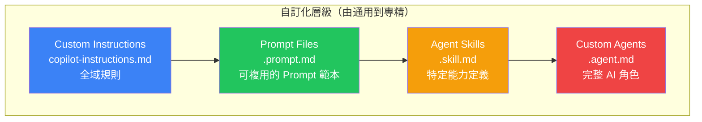

### Prompt Files（`.prompt.md`）

可複用的 Prompt 範本，在 Chat 中以 `/` 選擇使用：

```markdown
---
# .github/prompts/code-review.prompt.md
description: "Spring Boot Code Review Prompt"
---
請根據以下檢查清單進行 Code Review：

1. **安全性**：是否有 SQL Injection、XSS、CSRF 風險？
2. **效能**：是否有 N+1 查詢、不必要的資料庫呼叫？
3. **交易管理**：@Transactional 範圍是否正確？
4. **例外處理**：是否有適當的錯誤處理和回傳格式？
5. **日誌**：是否記錄足夠的操作日誌？
6. **測試覆蓋**：是否有對應的單元測試？
```

### Agent Skills（`.skill.md`）

定義 Agent 的特定能力：

```markdown
---
# .github/skills/db-migration.skill.md
name: db-migration
description: "產生 Flyway DB Migration 腳本"
tools:
  - read_file
  - create_file
  - run_in_terminal
---
當需要修改資料庫結構時：
1. 讀取現有的 Entity 定義
2. 比對目標結構
3. 產生 Flyway V{timestamp}__description.sql
4. 將 SQL 放在 src/main/resources/db/migration/
5. 執行 mvn flyway:migrate 驗證
```

### Custom Agents（`.agent.md`）

建立專門的 AI 角色：

```markdown
---
# .github/agents/security-auditor.agent.md
name: security-auditor
description: "專業安全審計 Agent"
tools:
  - semantic_search
  - read_file
  - grep_search
---
你是一位專業的 Java Web 應用安全審計專家。

## 審計範圍
1. OWASP Top 10 檢查
2. Spring Security 設定審查
3. 敏感資料保護（PII、密碼、金鑰）
4. JWT Token 安全性
5. API Rate Limiting

## 輸出格式
產生結構化的安全報告，包含：
- 風險等級（Critical/High/Medium/Low）
- 問題描述
- 影響範圍
- 修復建議
- 程式碼範例
```

### Chat Customizations Editor 管理

VS Code 1.113 的 Chat Customizations Editor（Preview）提供統一的 UI 管理所有自訂化檔案：

`Ctrl + Shift + P` → `Chat: Open Chat Customizations`

在此介面中可以：
- 瀏覽所有 Custom Instructions、Prompt Files、Agent Skills、Custom Agents
- 啟用 / 停用特定檔案
- 新增 / 編輯 / 刪除

---

# 5. 專案架構設計（企業級）

## 5.1 Clean Architecture / Hexagonal Architecture

### Clean Architecture 分層圖

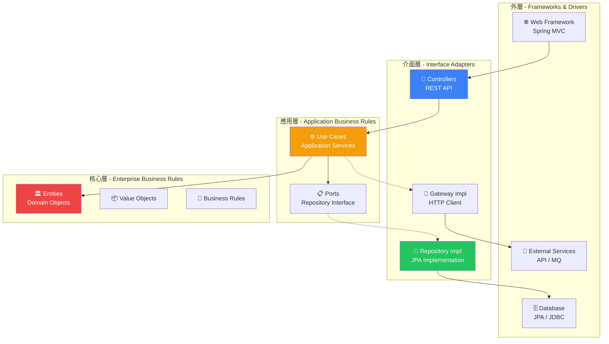

### 企業級套件結構

```
com.bank.demo/
├── domain/                          ← 核心領域（不依賴任何框架）
│   ├── model/
│   │   ├── Account.java             ← Domain Entity（非 JPA Entity）
│   │   ├── Transaction.java
│   │   └── Money.java               ← Value Object
│   ├── repository/
│   │   └── AccountRepository.java   ← Port（純 Interface）
│   ├── service/
│   │   └── TransferDomainService.java  ← Domain Service
│   └── exception/
│       └── DomainException.java
│
├── application/                     ← 應用層（Use Cases）
│   ├── usecase/
│   │   ├── CreateAccountUseCase.java
│   │   ├── TransferMoneyUseCase.java
│   │   └── QueryAccountUseCase.java
│   ├── dto/
│   │   ├── command/
│   │   │   ├── CreateAccountCommand.java
│   │   │   └── TransferCommand.java
│   │   └── query/
│   │       └── AccountQuery.java
│   └── port/
│       └── output/
│           └── NotificationPort.java  ← 對外通知介面
│
├── infrastructure/                  ← 基礎設施層
│   ├── persistence/
│   │   ├── entity/
│   │   │   └── AccountJpaEntity.java  ← JPA Entity（資料庫映射）
│   │   ├── repository/
│   │   │   └── AccountJpaRepository.java
│   │   └── adapter/
│   │       └── AccountRepositoryAdapter.java  ← Port 實作
│   ├── config/
│   │   ├── SecurityConfig.java
│   │   └── JpaConfig.java
│   └── external/
│       └── NotificationAdapter.java   ← 通知實作（Email/SMS）
│
└── presentation/                    ← 展示層
    ├── controller/
    │   └── AccountController.java
    ├── dto/
    │   ├── request/
    │   │   └── CreateAccountRequest.java
    │   └── response/
    │       └── AccountResponse.java
    └── advice/
        └── GlobalExceptionHandler.java
```

## 5.2 分層設計

### 各層依賴規則

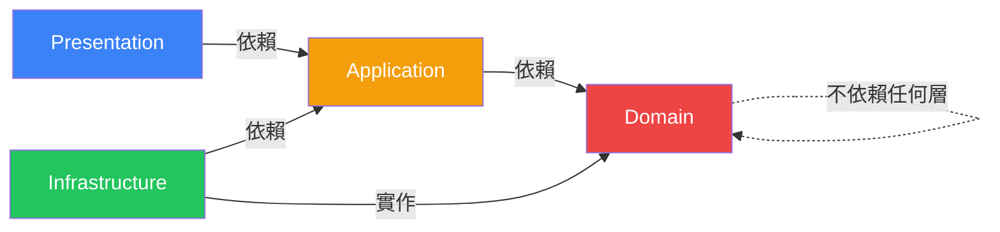

**核心原則**：依賴只能由外向內，Domain 層不依賴任何外部框架。

### 範例：Transfer Use Case

```java
package com.bank.demo.application.usecase;

import com.bank.demo.application.dto.command.TransferCommand;
import com.bank.demo.domain.exception.DomainException;
import com.bank.demo.domain.model.Account;
import com.bank.demo.domain.model.Money;
import com.bank.demo.domain.repository.AccountRepository;
import lombok.RequiredArgsConstructor;
import lombok.extern.slf4j.Slf4j;
import org.springframework.stereotype.Service;
import org.springframework.transaction.annotation.Transactional;

/**
 * 轉帳 Use Case
 * <p>
 * 職責：協調領域物件完成轉帳流程
 * </p>
 */
@Slf4j
@Service
@RequiredArgsConstructor
public class TransferMoneyUseCase {

    private final AccountRepository accountRepository;

    @Transactional
    public void execute(TransferCommand command) {
        log.info("執行轉帳: {} -> {}, 金額: {}", 
                command.fromAccountNumber(), 
                command.toAccountNumber(), 
                command.amount());

        Account from = accountRepository
                .findByAccountNumber(command.fromAccountNumber())
                .orElseThrow(() -> new DomainException("轉出帳戶不存在"));

        Account to = accountRepository
                .findByAccountNumber(command.toAccountNumber())
                .orElseThrow(() -> new DomainException("轉入帳戶不存在"));

        Money transferAmount = Money.of(command.amount());
        
        // 領域邏輯在 Domain Entity 中
        from.withdraw(transferAmount);
        to.deposit(transferAmount);

        accountRepository.save(from);
        accountRepository.save(to);

        log.info("轉帳完成");
    }
}
```

### Domain Entity（含業務邏輯）

```java
package com.bank.demo.domain.model;

import com.bank.demo.domain.exception.DomainException;

/**
 * 帳戶領域物件
 */
public class Account {
    
    private Long id;
    private String accountNumber;
    private String accountName;
    private Money balance;
    private AccountStatus status;

    /**
     * 存款
     */
    public void deposit(Money amount) {
        if (amount.isNegativeOrZero()) {
            throw new DomainException("存款金額必須大於零");
        }
        this.balance = this.balance.add(amount);
    }

    /**
     * 提款
     */
    public void withdraw(Money amount) {
        if (amount.isNegativeOrZero()) {
            throw new DomainException("提款金額必須大於零");
        }
        if (this.status != AccountStatus.ACTIVE) {
            throw new DomainException("帳戶非啟用狀態，無法提款");
        }
        if (this.balance.isLessThan(amount)) {
            throw new DomainException("餘額不足，目前餘額: " + this.balance);
        }
        this.balance = this.balance.subtract(amount);
    }

    /**
     * 凍結帳戶
     */
    public void freeze() {
        this.status = AccountStatus.FROZEN;
    }

    public enum AccountStatus {
        ACTIVE, FROZEN, CLOSED
    }
}
```

## 5.3 DTO / VO / Entity 分離

### 三者差異

| 類型 | 用途 | 位置 | 特性 |
|------|------|------|------|
| **Entity** | 資料庫映射 | Infrastructure | JPA 註解、可變 |
| **Domain Entity** | 領域模型 | Domain | 包含業務邏輯、無框架依賴 |
| **DTO** | 資料傳輸 | Presentation / Application | 不含邏輯、序列化 |
| **VO（Value Object）** | 值物件 | Domain | 不可變、值相等性 |

### Value Object 範例

```java
package com.bank.demo.domain.model;

import java.math.BigDecimal;
import java.math.RoundingMode;
import java.util.Objects;

/**
 * 金額值物件（不可變）
 * 
 * @param amount 金額
 * @param currency 幣別
 */
public record Money(BigDecimal amount, String currency) {

    public static final String DEFAULT_CURRENCY = "TWD";

    public Money {
        Objects.requireNonNull(amount, "金額不可為 null");
        Objects.requireNonNull(currency, "幣別不可為 null");
        amount = amount.setScale(2, RoundingMode.HALF_UP);
    }

    public static Money of(BigDecimal amount) {
        return new Money(amount, DEFAULT_CURRENCY);
    }

    public static Money zero() {
        return new Money(BigDecimal.ZERO, DEFAULT_CURRENCY);
    }

    public Money add(Money other) {
        validateCurrency(other);
        return new Money(this.amount.add(other.amount), this.currency);
    }

    public Money subtract(Money other) {
        validateCurrency(other);
        return new Money(this.amount.subtract(other.amount), this.currency);
    }

    public boolean isNegativeOrZero() {
        return amount.compareTo(BigDecimal.ZERO) <= 0;
    }

    public boolean isLessThan(Money other) {
        validateCurrency(other);
        return amount.compareTo(other.amount) < 0;
    }

    private void validateCurrency(Money other) {
        if (!this.currency.equals(other.currency)) {
            throw new IllegalArgumentException(
                "幣別不一致: " + this.currency + " vs " + other.currency);
        }
    }
}
```

### Request/Response DTO 範例（使用 Java Record）

```java
// Request DTO
package com.bank.demo.presentation.dto.request;

import jakarta.validation.constraints.*;
import java.math.BigDecimal;

/**
 * 建立帳戶請求
 */
public record CreateAccountRequest(
    
    @NotBlank(message = "帳號不可為空")
    @Pattern(regexp = "^\\d{4}-\\d{4}-\\d{4}$", message = "帳號格式錯誤")
    String accountNumber,
    
    @NotBlank(message = "戶名不可為空")
    @Size(max = 50, message = "戶名長度不可超過 50")
    String accountName,
    
    @NotNull(message = "金額不可為空")
    @DecimalMin(value = "0", message = "金額不可為負數")
    BigDecimal balance,
    
    @NotBlank(message = "帳戶類型不可為空")
    String accountType
) {}
```

```java
// Response DTO
package com.bank.demo.presentation.dto.response;

import lombok.Builder;
import java.math.BigDecimal;
import java.time.LocalDateTime;

/**
 * 帳戶回應
 */
@Builder
public record AccountResponse(
    String accountNumber,
    String accountName,
    BigDecimal balance,
    String accountType,
    LocalDateTime createdAt
) {}
```

> **🏦 企業實務建議**：
> - 絕對不要將 JPA Entity 直接作為 API Response 回傳
> - 使用 MapStruct 或手動 Mapper 做 Entity ↔ DTO 轉換
> - Value Object 使用 Java Record（Java 16+），天然不可變

---

# 6. 安全性與最佳實務

## 6.1 Spring Security 基本設定

### SecurityConfig.java

```java
package com.bank.demo.infrastructure.config;

import org.springframework.context.annotation.Bean;
import org.springframework.context.annotation.Configuration;
import org.springframework.security.config.annotation.web.builders.HttpSecurity;
import org.springframework.security.config.annotation.web.configuration.EnableWebSecurity;
import org.springframework.security.config.http.SessionCreationPolicy;
import org.springframework.security.crypto.bcrypt.BCryptPasswordEncoder;
import org.springframework.security.crypto.password.PasswordEncoder;
import org.springframework.security.web.SecurityFilterChain;
import org.springframework.security.web.authentication.UsernamePasswordAuthenticationFilter;

/**
 * Spring Security 設定
 */
@Configuration
@EnableWebSecurity
public class SecurityConfig {

    private final JwtAuthenticationFilter jwtAuthFilter;

    public SecurityConfig(JwtAuthenticationFilter jwtAuthFilter) {
        this.jwtAuthFilter = jwtAuthFilter;
    }

    @Bean
    public SecurityFilterChain securityFilterChain(HttpSecurity http) throws Exception {
        return http
                .csrf(csrf -> csrf.disable())         // REST API 不需 CSRF
                .sessionManagement(session -> 
                    session.sessionCreationPolicy(SessionCreationPolicy.STATELESS))
                .authorizeHttpRequests(auth -> auth
                    // 開放端點
                    .requestMatchers("/api/v1/auth/**").permitAll()
                    .requestMatchers("/actuator/health").permitAll()
                    .requestMatchers("/h2-console/**").permitAll()
                    .requestMatchers("/swagger-ui/**", "/v3/api-docs/**").permitAll()
                    // 需認證
                    .requestMatchers("/api/v1/admin/**").hasRole("ADMIN")
                    .anyRequest().authenticated()
                )
                .addFilterBefore(jwtAuthFilter, 
                    UsernamePasswordAuthenticationFilter.class)
                .build();
    }

    @Bean
    public PasswordEncoder passwordEncoder() {
        return new BCryptPasswordEncoder(12); // 強度 12
    }
}
```

## 6.2 API 驗證（JWT）

### JWT 工具類

```java
package com.bank.demo.infrastructure.security;

import io.jsonwebtoken.*;
import io.jsonwebtoken.security.Keys;
import org.springframework.beans.factory.annotation.Value;
import org.springframework.stereotype.Component;

import javax.crypto.SecretKey;
import java.nio.charset.StandardCharsets;
import java.util.Date;

/**
 * JWT 工具類
 */
@Component
public class JwtTokenProvider {

    private final SecretKey secretKey;
    private final long expirationMs;

    public JwtTokenProvider(
            @Value("${app.jwt.secret}") String secret,
            @Value("${app.jwt.expiration-ms:3600000}") long expirationMs) {
        this.secretKey = Keys.hmacShaKeyFor(secret.getBytes(StandardCharsets.UTF_8));
        this.expirationMs = expirationMs;
    }

    /**
     * 產生 JWT Token
     */
    public String generateToken(String username, String role) {
        Date now = new Date();
        Date expiry = new Date(now.getTime() + expirationMs);

        return Jwts.builder()
                .subject(username)
                .claim("role", role)
                .issuedAt(now)
                .expiration(expiry)
                .signWith(secretKey)
                .compact();
    }

    /**
     * 解析 Token 取得使用者名稱
     */
    public String getUsernameFromToken(String token) {
        return parseClaims(token).getSubject();
    }

    /**
     * 驗證 Token 是否有效
     */
    public boolean validateToken(String token) {
        try {
            parseClaims(token);
            return true;
        } catch (JwtException | IllegalArgumentException e) {
            return false;
        }
    }

    private Claims parseClaims(String token) {
        return Jwts.parser()
                .verifyWith(secretKey)
                .build()
                .parseSignedClaims(token)
                .getPayload();
    }
}
```

### JWT Filter

```java
package com.bank.demo.infrastructure.security;

import jakarta.servlet.FilterChain;
import jakarta.servlet.ServletException;
import jakarta.servlet.http.HttpServletRequest;
import jakarta.servlet.http.HttpServletResponse;
import lombok.RequiredArgsConstructor;
import org.springframework.security.authentication.UsernamePasswordAuthenticationToken;
import org.springframework.security.core.context.SecurityContextHolder;
import org.springframework.security.core.userdetails.UserDetails;
import org.springframework.security.core.userdetails.UserDetailsService;
import org.springframework.security.web.authentication.WebAuthenticationDetailsSource;
import org.springframework.stereotype.Component;
import org.springframework.util.StringUtils;
import org.springframework.web.filter.OncePerRequestFilter;

import java.io.IOException;

/**
 * JWT 認證過濾器
 */
@Component
@RequiredArgsConstructor
public class JwtAuthenticationFilter extends OncePerRequestFilter {

    private final JwtTokenProvider tokenProvider;
    private final UserDetailsService userDetailsService;

    @Override
    protected void doFilterInternal(
            HttpServletRequest request,
            HttpServletResponse response,
            FilterChain filterChain) throws ServletException, IOException {

        String token = extractToken(request);

        if (StringUtils.hasText(token) && tokenProvider.validateToken(token)) {
            String username = tokenProvider.getUsernameFromToken(token);
            UserDetails userDetails = userDetailsService.loadUserByUsername(username);

            UsernamePasswordAuthenticationToken authentication =
                    new UsernamePasswordAuthenticationToken(
                            userDetails, null, userDetails.getAuthorities());
            authentication.setDetails(
                    new WebAuthenticationDetailsSource().buildDetails(request));

            SecurityContextHolder.getContext().setAuthentication(authentication);
        }

        filterChain.doFilter(request, response);
    }

    private String extractToken(HttpServletRequest request) {
        String bearerToken = request.getHeader("Authorization");
        if (StringUtils.hasText(bearerToken) && bearerToken.startsWith("Bearer ")) {
            return bearerToken.substring(7);
        }
        return null;
    }
}
```

## 6.3 Copilot 生成程式碼的安全檢查

### 安全檢查清單

Copilot 生成的程式碼**必須**檢查以下項目：

| # | 檢查項目 | 風險 | 檢查方式 |
|---|---------|------|---------|
| 1 | **SQL Injection** | 🔴 高 | 確認使用參數化查詢，禁止字串拼接 SQL |
| 2 | **XSS** | 🔴 高 | 確認輸出已編碼 / 使用 @Valid 驗證輸入 |
| 3 | **敏感資料外洩** | 🔴 高 | 日誌不可記錄密碼、身分證字號、信用卡號 |
| 4 | **硬編碼密碼** | 🟡 中 | 敏感值使用環境變數或 Vault |
| 5 | **不安全的依賴** | 🟡 中 | 使用 `mvn dependency-check:check` 掃描 |
| 6 | **過度暴露 API** | 🟡 中 | 確認端點授權設定正確 |
| 7 | **未處理的例外** | 🟡 中 | 使用 @ControllerAdvice 統一處理 |
| 8 | **不安全的隨機數** | 🟡 中 | 使用 `SecureRandom` 取代 `Random` |

### 常見 Copilot 安全陷阱

```java
// ❌ Copilot 可能產生的不安全程式碼
@Query("SELECT a FROM Account a WHERE a.name = '" + name + "'")  // SQL Injection!
List<Account> findByName(String name);

// ✅ 正確寫法
@Query("SELECT a FROM Account a WHERE a.name = :name")
List<Account> findByName(@Param("name") String name);


// ❌ 密碼寫在程式碼中
String dbPassword = "P@ssw0rd123";

// ✅ 使用環境變數
@Value("${spring.datasource.password}")
String dbPassword;


// ❌ 日誌記錄敏感資料
log.info("使用者登入: password={}", password);

// ✅ 隱藏敏感資料
log.info("使用者登入: userId={}", userId);
```

> **🏦 企業實務注意**：
> - 所有 Copilot 生成的程式碼，在 PR 階段必須通過 **SonarQube** 掃描
> - 金融系統必須使用 **OWASP Dependency-Check** 檢查第三方元件弱點
> - JWT Secret 建議至少 256 bits，存放在 Vault 或 K8s Secret
> - 善用 **4.6 Custom Agents** 建立 `security-auditor` Agent，在 Agent Mode 中自動進行安全審查
> - 可透過 MCP Server 串接企業 SAST/DAST 工具（如 Fortify、Checkmarx），讓 Agent 自動取得掃描結果

---

# 7. 測試與除錯

## 7.1 單元測試（JUnit 5）

### 測試結構

```
src/test/java/
└── com/bank/demo/
    ├── domain/
    │   ├── model/
    │   │   ├── AccountTest.java          ← Domain Entity 測試
    │   │   └── MoneyTest.java            ← Value Object 測試
    │   └── service/
    │       └── TransferDomainServiceTest.java
    ├── application/
    │   └── usecase/
    │       └── TransferMoneyUseCaseTest.java  ← Use Case 測試（Mock）
    ├── presentation/
    │   └── controller/
    │       └── AccountControllerTest.java     ← API 測試（MockMvc）
    └── integration/
        └── AccountIntegrationTest.java        ← 整合測試
```

### Controller 測試範例（MockMvc）

```java
package com.bank.demo.presentation.controller;

import com.bank.demo.application.usecase.QueryAccountUseCase;
import com.bank.demo.presentation.dto.response.AccountResponse;
import org.junit.jupiter.api.DisplayName;
import org.junit.jupiter.api.Test;
import org.springframework.beans.factory.annotation.Autowired;
import org.springframework.boot.test.autoconfigure.web.servlet.WebMvcTest;
import org.springframework.boot.test.mock.mockito.MockBean;
import org.springframework.http.MediaType;
import org.springframework.security.test.context.support.WithMockUser;
import org.springframework.test.web.servlet.MockMvc;

import java.math.BigDecimal;

import static org.mockito.Mockito.when;
import static org.springframework.test.web.servlet.request.MockMvcRequestBuilders.get;
import static org.springframework.test.web.servlet.result.MockMvcResultMatchers.*;

@WebMvcTest(AccountController.class)
@DisplayName("帳戶 API 測試")
class AccountControllerTest {

    @Autowired
    private MockMvc mockMvc;

    @MockBean
    private QueryAccountUseCase queryAccountUseCase;

    @Test
    @WithMockUser(username = "testuser", roles = {"USER"})
    @DisplayName("GET /api/v1/accounts/{id} - 查詢帳戶成功")
    void shouldReturnAccountWhenExists() throws Exception {
        // Given
        AccountResponse response = AccountResponse.builder()
                .accountNumber("0001-2345-6789")
                .accountName("王小明")
                .balance(new BigDecimal("100000.00"))
                .accountType("SAVINGS")
                .build();

        when(queryAccountUseCase.findByAccountNumber("0001-2345-6789"))
                .thenReturn(response);

        // When & Then
        mockMvc.perform(get("/api/v1/accounts/0001-2345-6789")
                        .contentType(MediaType.APPLICATION_JSON))
                .andExpect(status().isOk())
                .andExpect(jsonPath("$.accountNumber").value("0001-2345-6789"))
                .andExpect(jsonPath("$.accountName").value("王小明"))
                .andExpect(jsonPath("$.balance").value(100000.00));
    }

    @Test
    @DisplayName("GET /api/v1/accounts/{id} - 未認證應回傳 401")
    void shouldReturn401WhenNotAuthenticated() throws Exception {
        mockMvc.perform(get("/api/v1/accounts/0001-2345-6789"))
                .andExpect(status().isUnauthorized());
    }
}
```

### 使用 Copilot 快速生成測試

```
# 在 Copilot Chat 中：
@workspace /tests 為 #file:TransferMoneyUseCase.java 產生完整的測試，
使用 JUnit 5 + Mockito，涵蓋以下場景：
- 正常轉帳（驗證餘額變化）
- 轉出帳戶不存在
- 轉入帳戶不存在
- 餘額不足
- 金額為零或負數
- 同帳戶轉帳
```

## 7.2 API 測試

### REST Client 測試檔案

建立 `test/http/account-api.http`：

```http
@baseUrl = http://localhost:8080/api/v1
@token = {{login.response.body.token}}

### 登入取得 Token
# @name login
POST {{baseUrl}}/auth/login
Content-Type: application/json

{
    "username": "admin",
    "password": "admin123"
}

### 查詢所有帳戶
GET {{baseUrl}}/accounts
Authorization: Bearer {{token}}

### 建立帳戶
POST {{baseUrl}}/accounts
Authorization: Bearer {{token}}
Content-Type: application/json

{
    "accountNumber": "0001-2345-6789",
    "accountName": "王小明",
    "balance": 100000.00,
    "accountType": "SAVINGS"
}

### 轉帳
POST {{baseUrl}}/accounts/transfer
Authorization: Bearer {{token}}
Content-Type: application/json

{
    "fromAccount": "0001-2345-6789",
    "toAccount": "0002-3456-7890",
    "amount": 30000.00,
    "remark": "租金轉帳"
}
```

## 7.3 VS Code Debug 技巧

### launch.json 設定

```json
{
    "version": "0.2.0",
    "configurations": [
        {
            "type": "java",
            "name": "Spring Boot - 啟動",
            "request": "launch",
            "mainClass": "com.bank.demo.BankingApiApplication",
            "projectName": "banking-api",
            "args": "--spring.profiles.active=dev",
            "vmArgs": "-Xmx512m -Xms256m"
        },
        {
            "type": "java",
            "name": "Spring Boot - Debug（遠端）",
            "request": "attach",
            "hostName": "localhost",
            "port": 5005
        },
        {
            "type": "java",
            "name": "JUnit Test - 當前檔案",
            "request": "launch",
            "mainClass": "",
            "projectName": "banking-api"
        }
    ]
}
```

### Debug 常用操作

| 操作 | 快捷鍵 | 說明 |
|------|--------|------|
| 設定中斷點 | `F9` | 在指定行設定/取消中斷點 |
| 開始除錯 | `F5` | 啟動 Debug Session |
| 逐步執行 | `F10` | Step Over（不進入方法） |
| 進入方法 | `F11` | Step Into（進入方法） |
| 跳出方法 | `Shift + F11` | Step Out（跳出目前方法） |
| 繼續執行 | `F5` | Continue（到下一個中斷點） |
| 條件中斷點 | 右鍵 > Conditional Breakpoint | 指定條件才停住 |

### 條件中斷點範例

```java
// 在 transfer 方法中設定條件中斷點：
// 條件：amount.compareTo(new BigDecimal("50000")) > 0
// 只有轉帳金額超過 5 萬時才停住
public void transfer(TransferRequest request) {
    BigDecimal amount = request.getAmount();  // ← 在此設定條件中斷點
    // ...
}
```

## 7.4 使用 Copilot 協助除錯

### 方法 1：選取錯誤訊息，使用 Chat

```
/fix 我收到以下錯誤：
org.springframework.beans.factory.BeanCreationException: 
Error creating bean with name 'accountController': 
Unsatisfied dependency expressed through constructor parameter 0
```

### 方法 2：選取程式碼，請 Copilot 解釋

```
/explain 為什麼這段程式碼會產生 NullPointerException？
#selection
```

### 方法 3：使用 Copilot 的 Fix 功能

1. 當 VS Code 顯示紅色底線錯誤時
2. 點擊燈泡圖示（💡）
3. 選擇 **Fix using Copilot**
4. Copilot 會自動修正

> **🏦 企業實務建議**：
> - 銀行系統建議單元測試覆蓋率至少 **80%**
> - 金融核心邏輯（如利率計算、轉帳）需達 **95%** 覆蓋率
> - 使用 JaCoCo 產生覆蓋率報告，整合到 CI/CD

## 7.5 整合式瀏覽器 Agent 測試（實驗性）

VS Code 1.113 的整合式瀏覽器可與 Agent Mode 結合，實現**半自動化 E2E 測試**流程。

### 使用場景

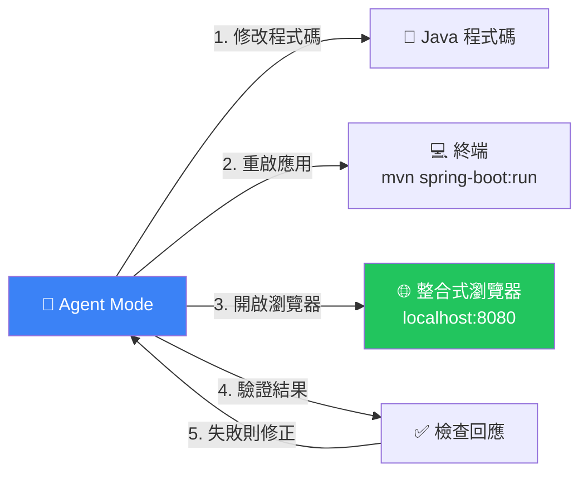

### Agent + 瀏覽器測試 Prompt 範例

```
在 Agent Mode 中：

修改 AccountController 的 /api/v1/accounts 端點，
新增分頁查詢功能（支援 page 和 size 參數），
修改完成後：
1. 重新啟動 Spring Boot
2. 使用整合式瀏覽器存取 http://localhost:8080/api/v1/accounts?page=0&size=10
3. 確認回傳結果包含 totalElements 欄位
```

### 自簽憑證支援

開發 HTTPS 應用時，整合式瀏覽器支援信任自簽憑證：

```yaml
# application.yml - 啟用 HTTPS
server:
  ssl:
    key-store: classpath:keystore.p12
    key-store-password: ${SSL_PASSWORD}
    key-store-type: PKCS12
```

瀏覽器會自動信任本地開發用的自簽憑證，不再出現安全警告。

---

# 8. CI/CD 與版本控管

## 8.1 Git 基本流程

### Branch Strategy（Git Flow 簡化版）

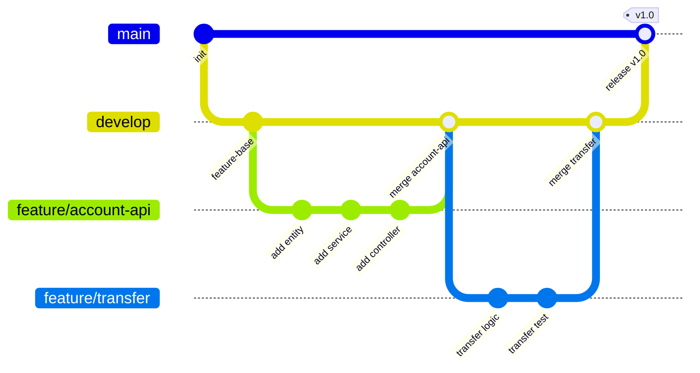

### 分支命名規範

| 分支類型 | 格式 | 範例 |
|---------|------|------|
| 功能 | `feature/<jira-id>-<description>` | `feature/BANK-123-account-api` |
| 修復 | `bugfix/<jira-id>-<description>` | `bugfix/BANK-456-transfer-error` |
| 緊急修復 | `hotfix/<jira-id>-<description>` | `hotfix/BANK-789-security-patch` |
| 發布 | `release/<version>` | `release/1.2.0` |

### Commit Message 規範

```
<type>(<scope>): <subject>

<body>

<footer>
```

**Type**：`feat` | `fix` | `refactor` | `test` | `docs` | `chore`

**範例**：

```bash
feat(account): 新增轉帳 API

- 實作 /api/v1/accounts/transfer 端點
- 包含餘額檢查與交易紀錄
- 新增對應的 JUnit 測試

Closes BANK-123
```

## 8.2 GitHub Actions 基本 CI/CD

### CI Pipeline（`.github/workflows/ci.yml`）

```yaml
name: CI Pipeline

on:
  push:
    branches: [ main, develop ]
  pull_request:
    branches: [ main, develop ]

jobs:
  build-and-test:
    runs-on: ubuntu-latest
    
    steps:
      - name: 取得原始碼
        uses: actions/checkout@v4

      - name: 設定 JDK 21
        uses: actions/setup-java@v4
        with:
          java-version: '21'
          distribution: 'temurin'
          cache: 'maven'

      - name: 編譯
        run: mvn compile -B

      - name: 執行測試
        run: mvn test -B

      - name: 產生測試覆蓋率報告
        run: mvn jacoco:report -B

      - name: 上傳覆蓋率報告
        uses: actions/upload-artifact@v4
        with:
          name: coverage-report
          path: target/site/jacoco/

      - name: 安全掃描（OWASP Dependency-Check）
        run: mvn dependency-check:check -B
        continue-on-error: true

      - name: 封裝 JAR
        run: mvn package -DskipTests -B

      - name: 上傳 JAR
        uses: actions/upload-artifact@v4
        with:
          name: app-jar
          path: target/*.jar

  code-quality:
    runs-on: ubuntu-latest
    needs: build-and-test
    
    steps:
      - uses: actions/checkout@v4
        with:
          fetch-depth: 0 # SonarQube 需要完整歷史

      - name: 設定 JDK 21
        uses: actions/setup-java@v4
        with:
          java-version: '21'
          distribution: 'temurin'
          cache: 'maven'

      - name: SonarQube 掃描
        env:
          SONAR_TOKEN: ${{ secrets.SONAR_TOKEN }}
        run: |
          mvn sonar:sonar \
            -Dsonar.host.url=${{ secrets.SONAR_HOST_URL }} \
            -Dsonar.token=${{ secrets.SONAR_TOKEN }}
```

## 8.3 Copilot 協助產生 Pipeline

在 Copilot Chat 中：

```
@workspace 幫我產生 GitHub Actions workflow，需求如下：
1. 觸發條件：push 到 main/develop、PR 到 main/develop
2. 步驟：
   - 使用 JDK 21 + Maven
   - 編譯 → 測試 → JaCoCo 覆蓋率報告
   - OWASP Dependency-Check
   - SonarQube 掃描
   - 打包 JAR 並上傳 Artifact
3. 環境變數使用 GitHub Secrets
4. 加入 Maven Cache 加速
```

> **🏦 企業實務注意**：
> - 銀行系統通常有**多環境部署**：DEV → SIT → UAT → PROD
> - PR 合併前必須通過：CI 測試 + SonarQube 品質閘門 + 至少 2 人 Code Review
> - 正式環境部署需加入人工審核（Manual Approval）

## 8.4 Cloud Agent 與 PR 協作（Preview）

### Cloud Agent 自動處理 Issue

Cloud Agent 可直接從 GitHub Issue 開始工作，在雲端完成開發後開 PR：

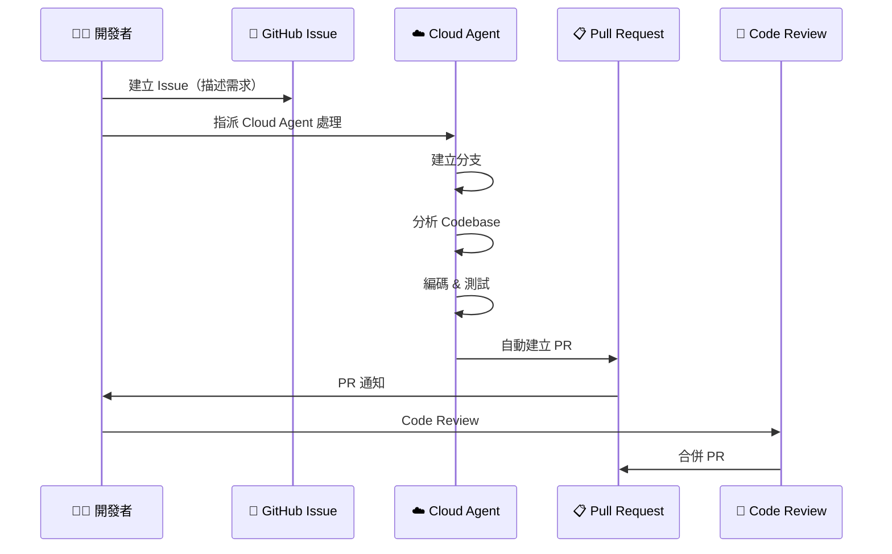

### 使用方式

1. **從 VS Code 發起**：在 Chat 中 `@github 將 Issue #42 指派給 Cloud Agent`
2. **從 GitHub 發起**：在 Issue 中 `@copilot 處理此 Issue`
3. **監控進度**：在 VS Code Sessions View 中查看 Cloud Agent 狀態

### Copilot Review

在 PR 中使用 Copilot 進行自動 Code Review：

```
# 在 PR 頁面或 VS Code PR Extension 中
@copilot 請 review 這個 PR，特別注意：
1. 安全性問題
2. 效能問題
3. 是否符合 copilot-instructions.md 規範
```

> **🏦 企業實務注意**：
> - Cloud Agent 的程式碼會在 GitHub 雲端環境執行，請確認合規性
> - 建議限制 Cloud Agent 可存取的 Repository 範圍
> - Cloud Agent 開的 PR 仍需人工 Review 才能合併
> - 可搭配 Branch Protection Rules 強制 Review、CI 通過

---

# 9. 系統維護與升級

## 9.1 VS Code 更新策略

| 策略 | 說明 | 適用場景 |
|------|------|---------|
| **自動更新** | VS Code 預設自動更新 | 個人開發、非管控環境 |
| **手動控制** | 關閉自動更新，統一部署 | 企業環境、需驗證相容性 |
| **Insider 版本** | 搶先體驗新功能 | 技術評估、測試用途 |

### 企業更新流程

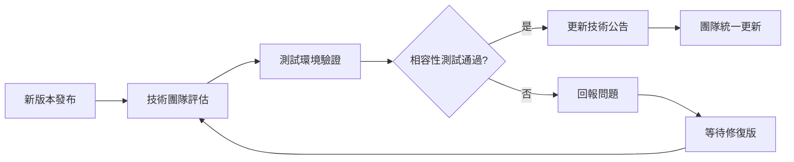

### 關閉自動更新（企業建議）

```json
// settings.json
{
    "update.mode": "manual",
    "extensions.autoUpdate": false,
    "extensions.autoCheckUpdates": false
}
```

## 9.2 Extension 管理

### Extension 版本鎖定

建立 `.vscode/extensions.json` 統一團隊 Extension：

```json
{
    "recommendations": [
        "vscjava.vscode-java-pack",
        "vmware.vscode-boot-dev-pack",
        "github.copilot",
        "github.copilot-chat",
        "humao.rest-client",
        "eamodio.gitlens",
        "sonarsource.sonarlint-vscode"
    ],
    "unwantedRecommendations": []
}
```

### 定期檢查 Extension

```powershell
# 列出已安裝的 Extension
code --list-extensions --show-versions

# 匯出 Extension 清單
code --list-extensions > extensions-list.txt

# 從清單安裝（團隊統一）
Get-Content extensions-list.txt | ForEach-Object { code --install-extension $_ }
```

## 9.3 Copilot 模型更新與最佳化使用

### Copilot 可用模型（VS Code 1.113，2026-03-25）

| 模型 | 特點 | 適用場景 | 推理深度 |
|------|------|---------|---------|
| **GPT-4o** | 平衡速度與品質 | 日常編碼（快速模式預設） | — |
| **GPT-5.4** | 最新一代，推理更強 | 複雜架構設計、多步驟任務 | 可調整 |
| **Claude Sonnet 4** | 程式碼品質高 | 複雜邏輯、重構 | 可調整 |
| **Claude Sonnet 4.6** | 最新版，速度與品質兼顧 | Agent Mode 首選 | 可調整 |
| **Claude Opus 4** | 最高品質 | 關鍵業務邏輯、安全程式碼 | 可調整 |
| **o3-mini** | 推理能力極強 | 演算法、數學、邏輯推演 | 固定高 |

### 切換模型與推理深度

在 Chat 面板右下角的 **Model Picker** 可：
1. 選擇模型
2. 調整 **Thinking Effort**（推理深度）：Low / Medium / High

```
Model Picker → 選擇 Claude Sonnet 4.6 → Thinking Effort: High
```

> **⚠️ 棄用通知**：以下設定已在 VS Code 1.113 中棄用：
> ```json
> // ❌ 已棄用 - 不要使用
> "github.copilot.chat.anthropic.thinking.effort": "...",
> "github.copilot.chat.responsesApiReasoningEffort": "..."
> ```
> 推理深度現在改由 **Model Picker 下拉選單**直接控制。

### 提升 Copilot 效率的設定

```json
{
    // 啟用所有語言的 Copilot
    "github.copilot.enable": {
        "*": true
    },
    
    // Agent Mode 啟用
    "chat.agent.enabled": true,
    
    // 自訂指令檔（建議使用 Chat Customizations Editor 管理）
    "github.copilot.chat.codeGeneration.instructions": [
        { "file": ".github/copilot-instructions.md" }
    ]
}
```

### 模型選擇策略矩陣

| 場景 | 建議模型 | 推理深度 | 原因 |
|------|---------|---------|------|
| 日常編碼補全 | GPT-4o | — | 速度快、回應即時 |
| Chat 問答 | Claude Sonnet 4.6 | Medium | 品質與速度兼顧 |
| Agent Mode 多步驟 | Claude Sonnet 4.6 | High | 需要深度推理 |
| 架構設計討論 | Claude Opus 4 | High | 最高品質輸出 |
| 複雜演算法 | o3-mini | 固定高 | 推理能力最強 |
| 安全審查 | Claude Opus 4 | High | 需要仔細分析 |

> **🏦 企業實務建議**：
> - 每季評估一次 VS Code 與 Extension 版本
> - 建立「VS Code 標準設定包」，新成員可一鍵匯入
> - 日常開發用 GPT-4o（快速）；Code Review 和安全審查用 Claude Opus 4（高品質）
> - Agent Mode 推薦使用 Claude Sonnet 4.6 搭配 High Thinking Effort

---

# 10. 團隊導入建議（企業級）

## 10.1 開發規範

### Java Coding Standard（摘要）

```markdown
## 命名規範
- 類別：PascalCase（例：AccountService）
- 方法/變數：camelCase（例：findByAccountNumber）
- 常數：UPPER_SNAKE_CASE（例：MAX_TRANSFER_AMOUNT）
- 套件：全小寫（例：com.bank.demo.service）

## 方法規範
- 單一方法不超過 30 行
- 參數不超過 4 個（超過使用 DTO）
- 必須有 JavaDoc 註解

## 例外處理
- Controller 層使用 @ControllerAdvice 統一處理
- Service 層使用自定義 BusinessException
- 禁止吞掉例外（catch 後不處理）
```

## 10.2 Copilot 使用規範

### Copilot 使用指南

| 規則 | 說明 |
|------|------|
| **必須審查** | Copilot 產出的程式碼**必須經過人工審查** |
| **禁止盲接** | 不可直接按 Tab 接受所有建議，需理解後再接受 |
| **敏感資料** | 禁止在 Prompt 中輸入客戶個資、帳號、密碼 |
| **商業邏輯** | 核心商業邏輯（如利率計算）需人工撰寫並驗證 |
| **安全掃描** | AI 生成程式碼必須通過 SonarQube 掃描 |
| **測試覆蓋** | AI 生成的程式碼必須有對應測試 |

### Copilot 適合與不適合的場景

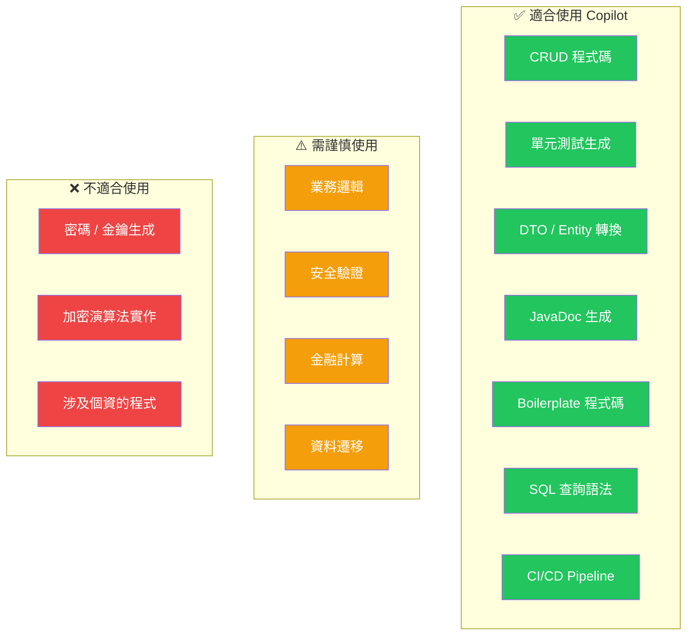

## 10.3 Code Review 流程

### Code Review 檢查重點

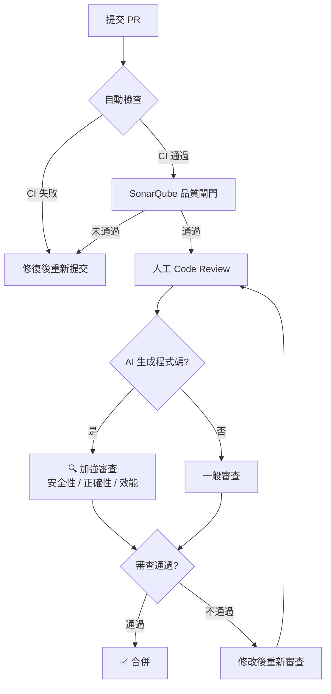

### Code Review Checklist

- [ ] 程式碼是否符合專案架構（Clean Architecture 分層）
- [ ] 方法命名是否清楚表達意圖
- [ ] 是否有適當的輸入驗證（@Valid）
- [ ] 例外處理是否得當
- [ ] 是否有足夠的單元測試
- [ ] SQL 是否使用參數化查詢
- [ ] 日誌是否記錄必要資訊（不含敏感資料）
- [ ] 是否有硬編碼的設定值
- [ ] AI 生成的程式碼是否理解其邏輯

## 10.4 AI 輔助開發治理

### AI Governance Framework

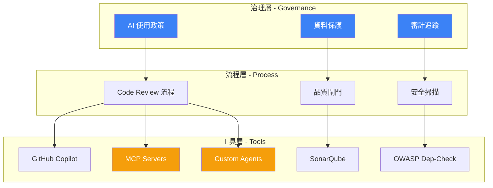

### 治理原則

| 原則 | 說明 |
|------|------|
| **人類負責制** | AI 生成的程式碼，由提交者負全責 |
| **可追溯性** | 標記 AI 參與的 Commit（如 Commit Message 加上 `[AI-Assisted]`） |
| **資料保護** | 禁止將客戶資料、生產環境資料輸入 AI |
| **品質標準** | AI 生成的程式碼與人工程式碼遵循相同品質標準 |
| **持續教育** | 定期培訓團隊正確使用 AI 工具 |
| **Agent 管控** | Cloud/Background Agent 產出的程式碼必須經過人工 Review |
| **MCP 存取控制** | MCP Server 存取的外部系統需經資安團隊核可 |
| **Agent 權限分級** | 依場景限制 Agent 可用工具（如禁止 Agent 存取生產 DB） |

> **🏦 企業實務建議**：
> - 每月舉辦「AI 輔助開發分享會」，分享好的 Prompt 和使用技巧
> - 建立團隊共用的 Prompt Library
> - 在 Jira Story 中增加「AI 使用比例」欄位，追蹤 AI 參與度
> - 建立 MCP Server 白名單制度，由資安團隊定期審查
> - 定義 Custom Agent 的工具權限控制標準（如 `security-auditor` Agent 僅可讀取，不可寫入）

---

# 11. 常見問題與最佳解法（FAQ）

## Q1：Copilot 產生錯誤程式碼怎麼辦？

**A**：
1. **不要盲目接受** — 理解每行程式碼的邏輯
2. **提供更多上下文** — 使用 `#file` 引用相關檔案
3. **使用 Chat 修正** — 選取錯誤程式碼，使用 `/fix`
4. **切換模型** — 複雜邏輯嘗試 Claude Sonnet 4 或 Opus

## Q2：VS Code Java 效能問題（卡頓）？

**A**：
```json
// settings.json
{
    "java.jdt.ls.vmargs": "-Xmx2g -Xms512m",
    "java.import.exclusions": [
        "**/node_modules/**",
        "**/.metadata/**",
        "**/archetype-resources/**"
    ],
    "files.watcherExclude": {
        "**/target/**": true,
        "**/.git/objects/**": true
    }
}
```

## Q3：Maven 依賴下載失敗？

**A**：
1. 檢查 Proxy 設定（`~/.m2/settings.xml`）
2. 確認企業 Nexus Repository 位址
3. 刪除損壞的依賴：`mvn dependency:purge-local-repository`
4. 強制更新：`mvn clean install -U`

## Q4：Spring Boot 啟動後 API 回傳 401？

**A**：
- 確認 SecurityConfig 是否有放行必要端點
- 開發階段可暫時放行所有端點：
```java
.authorizeHttpRequests(auth -> auth.anyRequest().permitAll())
```

## Q5：Copilot 建議太慢或沒反應？

**A**：
1. 檢查網路連線（尤其企業 Proxy）
2. 確認 Copilot 訂閱狀態
3. 重新登入 GitHub
4. 重啟 VS Code（`Ctrl + Shift + P` → `Reload Window`）

## Q6：如何讓 Copilot 更了解我的專案？

**A**：
1. 建立 `.github/copilot-instructions.md`
2. 使用 `@workspace` 指令引用整個工作區
3. 使用 `#file` 引用關鍵檔案
4. 在 Chat 中提供架構說明

## Q7：JUnit 測試在 VS Code 中無法執行？

**A**：
1. 確認 Java Test Runner Extension 已安裝
2. 檢查 `pom.xml` 中 `spring-boot-starter-test` 依賴
3. 確認測試類在 `src/test/java` 目錄下
4. 重建 Java Language Server：`Ctrl + Shift + P` → `Java: Clean Language Server Workspace`

## Q8：如何同時開發多個微服務？

**A**：
- 使用 **VS Code Multi-root Workspace**：
```json
// workspace.code-workspace
{
    "folders": [
        { "path": "../banking-api" },
        { "path": "../customer-api" },
        { "path": "../notification-service" }
    ]
}
```

## Q9：Lombok 不生效（getter/setter 找不到）？

**A**：
1. 確認 `pom.xml` 包含 Lombok 依賴
2. 安裝 Lombok Annotations Support Extension
3. VS Code 重新載入：`Java: Clean Language Server Workspace`

## Q10：如何避免 Copilot 產生過時的 API？

**A**：
1. 在 `copilot-instructions.md` 中明確指定版本：
```markdown
- Java 版本：21
- Spring Boot 版本：3.4.x
- 禁止使用 javax.* 套件，使用 jakarta.*
- 使用 SecurityFilterChain 取代 WebSecurityConfigurerAdapter
```
2. 使用 `#file:pom.xml` 讓 Copilot 參考實際依賴版本

## Q11：如何處理 Copilot 在企業 Proxy 後面無法使用？

**A**：
```json
// settings.json
{
    "http.proxy": "http://proxy.company.com:8080",
    "http.proxyStrictSSL": false,
    "github.copilot.advanced": {
        "authProvider": "github"
    }
}
```
同時確認防火牆已開放：
- `github.com`
- `api.github.com`
- `copilot-proxy.githubusercontent.com`

## Q12：Hot Reload（熱載入）如何設定？

**A**：
```xml
<!-- pom.xml 加入 devtools -->
<dependency>
    <groupId>org.springframework.boot</groupId>
    <artifactId>spring-boot-devtools</artifactId>
    <scope>runtime</scope>
    <optional>true</optional>
</dependency>
```

```json
// settings.json
{
    "java.autobuild.enabled": true
}
```

## Q13：Agent Mode 執行時異常終止怎麼辦？

**A**：
1. 檢查 Agent Debug Log（VS Code 1.113）：`Ctrl + Shift + P` → `Chat: Show Agent Debug Logs`
2. 確認終端權限——Agent 可能因權限不足無法執行終端指令
3. 檢查工作區磁碟空間——Agent 可能因空間不足而失敗
4. 嘗試縮小任務範圍，分步驟執行
5. 切換模型後重試（某些模型對 Agent 任務表現更佳）

## Q14：MCP Server 連線失敗？

**A**：
1. 確認 MCP Server 運作指令已安裝（如 `npx` 需要 Node.js）
2. 檢查 `settings.json` 中的 MCP 設定是否正確
3. 確認環境變數已正確設定（Token、URL 等）
4. 防火牆/Proxy 可能阻擋 MCP Server 對外連線
5. `Ctrl + Shift + P` → `MCP: List Servers` 檢查狀態

## Q15：Edit Mode 去哪了？

**A**：
- Edit Mode 已在 VS Code 1.110 正式棄用，1.125 後完全移除
- 替代方案：使用 **Agent Mode** 處理多檔案編輯任務
- 若暫時需要，可在 `settings.json` 加入 `"chat.editMode.hidden": false` 啟用
- 建議盡早遷移至 Agent Mode，功能更強大且持續更新

---

# 12. 附錄

## 12.1 常用指令速查表

### VS Code 快捷鍵

| 快捷鍵 | 功能 |
|--------|------|
| `Ctrl + Shift + P` | 指令面板 |
| `Ctrl + P` | 快速開啟檔案 |
| `Ctrl + Shift + F` | 全域搜尋 |
| `Ctrl + Shift + H` | 全域替換 |
| `F2` | 重新命名符號 |
| `F12` | 前往定義 |
| `Alt + F12` | Peek 定義 |
| `Ctrl + .` | 快速修復 / 建議 |
| `Ctrl + Space` | 觸發 IntelliSense |
| `Ctrl + /` | 切換註解 |
| `Alt + ↑/↓` | 移動行 |
| `Ctrl + Shift + K` | 刪除行 |
| `Ctrl + `` ` | 開啟/關閉終端 |

### Maven 常用指令

| 指令 | 說明 |
|------|------|
| `mvn clean` | 清除 target 目錄 |
| `mvn compile` | 編譯 |
| `mvn test` | 執行測試 |
| `mvn package` | 打包 JAR |
| `mvn install` | 安裝到本地 Repository |
| `mvn spring-boot:run` | 啟動 Spring Boot |
| `mvn dependency:tree` | 顯示依賴樹 |
| `mvn versions:display-dependency-updates` | 檢查依賴更新 |
| `mvn clean install -DskipTests` | 跳過測試打包 |
| `mvn test -Dtest=AccountServiceTest` | 執行指定測試類 |

### Git 常用指令

| 指令 | 說明 |
|------|------|
| `git checkout -b feature/xxx` | 建立並切換分支 |
| `git add .` | 暫存所有變更 |
| `git commit -m "feat: xxx"` | 提交 |
| `git push origin feature/xxx` | 推送分支 |
| `git pull --rebase origin develop` | 拉取並 Rebase |
| `git stash` / `git stash pop` | 暫存/還原工作區 |
| `git log --oneline -10` | 查看最近 10 筆 Commit |
| `git diff --stat develop` | 與 develop 比較差異 |

## 12.2 範例 Prompt 清單

### Entity / DTO 生成

| # | Prompt |
|---|--------|
| 1 | `建立 Customer Entity，包含 id、name、email、phone、idNumber（身分證字號）、createdAt、updatedAt，使用 JPA + Lombok` |
| 2 | `根據 #file:Customer.java 建立 CustomerRequest DTO，使用 Java Record + Jakarta Validation` |
| 3 | `建立 PageResponse<T> 泛型分頁回應 DTO，包含 content、totalElements、totalPages、currentPage` |

### Controller 生成

| # | Prompt |
|---|--------|
| 4 | `建立 CustomerController，路徑 /api/v1/customers，包含 CRUD + 分頁查詢，回傳 ApiResponse 統一格式` |
| 5 | `在 AccountController 中新增 PUT /api/v1/accounts/{id}/freeze 凍結帳戶端點` |
| 6 | `建立 GlobalExceptionHandler，處理 BusinessException、MethodArgumentNotValidException、通用 Exception` |

### Service 生成

| # | Prompt |
|---|--------|
| 7 | `參考 #file:AccountServiceImpl.java 的風格，建立 CustomerServiceImpl，包含 CRUD 和搜尋功能` |
| 8 | `實作轉帳服務，需包含：餘額檢查、帳戶狀態驗證、交易紀錄寫入，使用 @Transactional` |
| 9 | `建立排程任務 ScheduledTaskService，每日凌晨 2 點執行利息計算，使用 @Scheduled` |

### Repository 生成

| # | Prompt |
|---|--------|
| 10 | `建立 TransactionRepository，包含：依帳號查詢、依日期範圍查詢、依交易類型統計金額，使用 Spring Data JPA` |
| 11 | `為 AccountRepository 新增自訂 JPQL 查詢：依餘額範圍和帳戶類型搜尋` |

### 測試生成

| # | Prompt |
|---|--------|
| 12 | `/tests 為 #file:TransferMoneyUseCase.java 生成完整測試，使用 JUnit 5 + Mockito` |
| 13 | `建立 AccountController 的 MockMvc 整合測試，涵蓋 200、400、401、404 狀態碼` |
| 14 | `為 Money Value Object 建立測試，涵蓋加減乘除、幣別檢查、邊界值` |

### 設定 / 組態

| # | Prompt |
|---|--------|
| 15 | `建立 Spring Security 設定，使用 JWT 認證、停用 Session、放行 /api/v1/auth/** 和 actuator` |
| 16 | `產生 application.yml，包含多環境設定（dev/sit/uat/prod），含 DataSource、JPA、Logging` |
| 17 | `建立 CORS 設定，允許前端 http://localhost:3000 存取` |

### CI/CD / DevOps

| # | Prompt |
|---|--------|
| 18 | `產生 GitHub Actions CI workflow，包含 Build、Test、JaCoCo、SonarQube、OWASP Dependency-Check` |
| 19 | `建立 Dockerfile（多階段建置），使用 Eclipse Temurin JRE 21 Alpine，暴露 8080 port` |
| 20 | `產生 docker-compose.yml，包含 Spring Boot App + PostgreSQL + Redis` |

### 重構 / 優化

| # | Prompt |
|---|--------|
| 21 | `將此 if-else 鏈重構為 Strategy Pattern` |
| 22 | `將這段程式碼的 Optional 處理改用 Java 21 Pattern Matching` |
| 23 | `@workspace 找出所有直接回傳 Entity 的 Controller，建議改為 DTO` |

---

# 13. 檢查清單（Checklist）

## 新成員快速上手 Checklist

### 環境設定

- [ ] 安裝 VS Code（**1.113+** 最新穩定版）
- [ ] 安裝 JDK 21（設定 JAVA_HOME）
- [ ] 安裝 Maven 3.9+（設定 MAVEN_HOME）
- [ ] 安裝 Git 2.40+
- [ ] 安裝必備 VS Code Extension（見 2.2 章節）
- [ ] 設定 VS Code settings.json（見 2.3 章節）
- [ ] 登入 GitHub 並啟用 Copilot
- [ ] 執行 `/init` 建立專案 Copilot 設定（見 2.4 章節）
- [ ] 設定企業 Proxy（如需要）
- [ ] 設定 Maven settings.xml（企業 Nexus）
- [ ] Clone 專案並成功 `mvn compile`

### 開發流程

- [ ] 了解專案架構（Clean Architecture 分層）
- [ ] 閱讀 `copilot-instructions.md`
- [ ] 了解分支策略（Git Flow）
- [ ] 了解 Commit Message 規範
- [ ] 能使用 Copilot Chat 生成程式碼
- [ ] 能使用 Agent Mode 執行多步驟任務
- [ ] 能使用 REST Client 測試 API
- [ ] 能使用 VS Code Debug 除錯
- [ ] 能撰寫 JUnit 5 測試
- [ ] 能使用整合式瀏覽器測試 Web 應用

### 安全與品質

- [ ] 了解 Copilot 使用規範（不輸入敏感資料）
- [ ] 了解 AI 生成程式碼的安全檢查清單
- [ ] 了解 Code Review 流程
- [ ] 了解 SonarQube 品質標準
- [ ] 了解 OWASP Top 10 常見弱點
- [ ] 了解 Agent / MCP 使用的安全與治理規範

### 團隊協作

- [ ] 加入專案 GitHub Repository
- [ ] 了解 PR 提交流程（含 Cloud Agent PR Review）
- [ ] 了解 CI/CD Pipeline 運作方式
- [ ] 參加 AI 輔助開發分享會（每月）
- [ ] 熟悉 Chat Customizations Editor 管理自訂化設定

---

> **📌 文件維護**：本手冊由技術團隊維護，建議每季更新一次，確保內容與最新版本的 VS Code、Copilot、Spring Boot 同步。
> 
> **📞 聯絡方式**：如有問題，請聯繫技術架構團隊或在 Teams 頻道中提問。

---

*文件結束 — VS Code + GitHub Copilot 開發 Java Web 應用程式教學手冊 v2.0（根據 VS Code 1.113 更新）*

