+++
date = '2026-05-03T22:19:40+08:00'
draft = false
title = 'Warp 教學手冊'
tags = ['教學', 'AI開發']
categories = ['教學']
+++

# Warp + AI 開發完整教學手冊

> **版本**：v1.1（2026-05-03）  
> **適用對象**：資深工程師 / 架構師 / DevSecOps 團隊  
> **Warp 版本**：v0.2026.04.29 Stable（開源 AGPL v3 + MIT 雙授權）  
> **定位**：企業標準技術白皮書  
> **開源倉庫**：[warpdotdev/warp](https://github.com/warpdotdev/warp)（53,200+ Stars）  
> **官方文件**：[docs.warp.dev](https://docs.warp.dev/)  
> **貢獻總覽**：[build.warp.dev](https://build.warp.dev/)

---

## 目錄

- [1. Warp 架構總覽](#1-warp-架構總覽)
  - [1.1 Warp 在開發體系中的角色](#11-warp-在開發體系中的角色)
  - [1.2 Warp + Oz 平台架構圖](#12-warp--oz-平台架構圖)
  - [1.3 與傳統 Terminal 比較](#13-與傳統-terminal-比較)
- [2. 安裝與環境建置](#2-安裝與環境建置)
  - [2.1 各平台安裝方式](#21-各平台安裝方式)
  - [2.2 GPU 與 Shell 設定](#22-gpu-與-shell-設定)
  - [2.3 開發工具整合](#23-開發工具整合)
- [3. Warp 核心功能解析](#3-warp-核心功能解析)
  - [3.1 Block（區塊系統）](#31-block區塊系統)
  - [3.2 Command Palette](#32-command-palette)
  - [3.3 AI 功能與多模型支援](#33-ai-功能與多模型支援)
  - [3.4 Agent 進階能力](#34-agent-進階能力)
  - [3.5 Code Editor 與 Code Review](#35-code-editor-與-code-review)
  - [3.6 Warp Drive（Workflows / Env 管理）](#36-warp-driveworkflows--env-管理)
  - [3.7 團隊共享機制](#37-團隊共享機制)
- [4. Warp + AI Coding Agent 整合](#4-warp--ai-coding-agent-整合)
  - [4.1 Claude Code 整合](#41-claude-code-整合)
  - [4.2 GitHub Copilot CLI 整合](#42-github-copilot-cli-整合)
  - [4.3 Gemini CLI 整合](#43-gemini-cli-整合)
  - [4.4 OpenAI Codex CLI 整合](#44-openai-codex-cli-整合)
  - [4.5 其他 CLI Agent 整合](#45-其他-cli-agent-整合)
  - [4.6 AI Agent 比較表](#46-ai-agent-比較表)
- [5. Oz Cloud Agents（雲端代理）](#5-oz-cloud-agents雲端代理)
  - [5.1 Cloud Agents 概述](#51-cloud-agents-概述)
  - [5.2 觸發機制與整合](#52-觸發機制與整合)
  - [5.3 自託管（Self-Hosting）](#53-自託管self-hosting)
  - [5.4 Oz Platform（CLI / API / SDK / Web App）](#54-oz-platformcli--api--sdk--web-app)
- [6. Warp 在 AI 開發流程中的應用](#6-warp-在-ai-開發流程中的應用)
  - [6.1 建立專案（Scaffold）](#61-建立專案scaffold)
  - [6.2 撰寫程式碼](#62-撰寫程式碼)
  - [6.3 測試（Unit / Integration）](#63-測試unit--integration)
  - [6.4 Debug](#64-debug)
  - [6.5 Refactor](#65-refactor)
  - [6.6 文件生成](#66-文件生成)
- [7. 實戰：Web Application 開發（企業級）](#7-實戰web-application-開發企業級)
  - [7.1 前端（Vue 3 + TypeScript）](#71-前端vue-3--typescript)
  - [7.2 後端（Spring Boot）](#72-後端spring-boot)
  - [7.3 API 設計](#73-api-設計)
  - [7.4 DB 操作](#74-db-操作)
  - [7.5 Warp + AI 全流程自動生成](#75-warp--ai-全流程自動生成)
- [8. 逆向工程（Legacy → Modern）](#8-逆向工程legacy--modern)
  - [8.1 分析舊系統](#81-分析舊系統)
  - [8.2 用 Warp + AI 重建架構](#82-用-warp--ai-重建架構)
  - [8.3 自動產生文件 / API / 測試](#83-自動產生文件--api--測試)
- [9. Framework 升級](#9-framework-升級)
  - [9.1 Spring Boot 2 → 3 / 4 升級](#91-spring-boot-2--3--4-升級)
  - [9.2 Java 8 → 21+ 升級](#92-java-8--21-升級)
  - [9.3 Warp + AI 升級自動化流程](#93-warp--ai-升級自動化流程)
- [10. Warp Drive（團隊協作）](#10-warp-drive團隊協作)
  - [10.1 建立企業 Workflow Library](#101-建立企業-workflow-library)
  - [10.2 指令模板設計](#102-指令模板設計)
  - [10.3 敏感資訊（Env）管理策略](#103-敏感資訊env管理策略)
- [11. SSDLC + Warp（安全開發）](#11-ssdlc--warp安全開發)
  - [11.1 SAST 靜態應用安全測試](#111-sast-靜態應用安全測試)
  - [11.2 Dependency Scan 相依套件掃描](#112-dependency-scan-相依套件掃描)
  - [11.3 Secret Scan 機密掃描](#113-secret-scan-機密掃描)
  - [11.4 自動化安全檢查流程](#114-自動化安全檢查流程)
- [12. 系統維運與監控](#12-系統維運與監控)
  - [12.1 Log 分析](#121-log-分析)
  - [12.2 指令自動化](#122-指令自動化)
  - [12.3 Incident 處理](#123-incident-處理)
- [13. 最佳實務（Best Practices）](#13-最佳實務best-practices)
  - [13.1 Prompt Engineering](#131-prompt-engineering)
  - [13.2 Workflow 設計](#132-workflow-設計)
  - [13.3 團隊導入策略](#133-團隊導入策略)
- [14. 常見錯誤與反模式](#14-常見錯誤與反模式)
- [15. 結論與導入建議](#15-結論與導入建議)
  - [15.1 適合導入的組織](#151-適合導入的組織)
  - [15.2 ROI 分析](#152-roi-分析)
  - [15.3 成熟度模型（Level 1 ~ Level 5）](#153-成熟度模型level-1--level-5)
- [附錄 A：檢查清單（Checklist）](#附錄-a檢查清單checklist)
- [附錄 B：常用指令速查表](#附錄-b常用指令速查表)
- [附錄 C：AI Prompt 範本庫](#附錄-cai-prompt-範本庫)
- [附錄 D：Warp 方案與計費](#附錄-dwarp-方案與計費)

---

## 1. Warp 架構總覽

### 1.1 Warp 在開發體系中的角色

Warp 是新一代**代理開發環境（Agentic Development Environment, ADE）**，由 Warp 公司以 Rust 語言打造，於 2026 年 4 月 28 日正式開源（AGPL v3 / MIT 雙授權），OpenAI 為創始贊助商。截至 2026 年 5 月，GitHub 已取得 **53,200+ Stars**、3,700+ Forks、56 位核心貢獻者，專案語言組成以 Rust（98.2%）為主體。

Warp 不僅是終端機替代品，更是一個整合 AI Agent、程式碼編輯器、團隊協作的完整開發平台，其內建的 Coding Agent 在 [SWE-bench Verified](https://www.swebench.com/#verified) 與 [Terminal-Bench](https://www.tbench.ai/leaderboard) 排行榜中穩定名列前茅：

| 層級 | 功能 | 說明 |
|------|------|------|
| **終端層** | 現代化 Terminal | GPU 加速渲染（Metal / Vulkan / DX12）、Block-based UI、多 Tab / Split Pane |
| **編輯層** | Code Editor | 內建 LSP 支援（Rust / Go / Python / TS / C++）、File Tree、Find & Replace、Vim 鍵位 |
| **本地 AI 層** | Oz Local Agent | 對話式 AI、Code Diff Review、Interactive Code Review、Voice 語音輸入 |
| **雲端 AI 層** | Oz Cloud Agent | 背景自動化任務、排程、觸發器（Slack / Linear / GitHub / Azure DevOps） |
| **協作層** | Warp Drive | Workflows / Prompts / Env / Notebooks / AI-Integrated Objects 共享 |
| **整合層** | CLI Agent 工具帶 | 支援 10 種 Agent：Claude Code / Codex / Gemini CLI / OpenCode / Amp / Auggie / Copilot CLI / Cursor CLI / Droid / Pi |
| **平台層** | Oz Platform | CLI / REST API / SDK / Web App（含行動裝置支援） |

**企業導入價值定位**：

- 統一團隊終端機環境，降低 onboarding 成本
- 內建 AI Agent 加速開發效率（實測提升 30-50%）
- Warp Drive 實現知識資產化與團隊共享
- SOC 2 認證，所有 LLM 供應商皆簽署零數據留存（Zero Data Retention）協議
- 開源透明，可審計原始碼（[build.warp.dev](https://build.warp.dev/) 提供即時貢獻總覽儀表板）
- 多模型架構設計，支援 OpenAI / Anthropic / Google / xAI / Fireworks AI 等供應商
- 企業自託管選項（Managed Docker / Kubernetes / Direct / Unmanaged）

### 1.2 Warp + Oz 平台架構圖

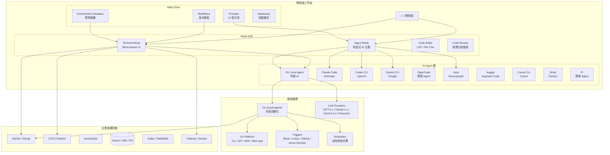

### 1.3 與傳統 Terminal 比較

| 特性 | 傳統 Terminal<br/>(iTerm2 / Windows Terminal) | Warp |
|------|----------------------------------------------|------|
| **渲染引擎** | CPU-based | GPU 加速（Rust + Metal / Vulkan / DX12） |
| **輸入體驗** | 單行 readline | IDE 級多行編輯器，支援游標移動、語法高亮 |
| **輸出管理** | 連續文字流 | Block 區塊化，可搜尋/複製/過濾/分享 |
| **AI 整合** | 無（需外掛） | 原生 Oz Agent + 10 種 CLI Agent 工具帶 |
| **程式碼編輯** | 無 | 內建 Code Editor（LSP：Rust/Go/Python/TS/C++） |
| **程式碼審查** | 無 | Interactive Code Review、差異面板、行內評論 |
| **Agent 能力** | 無 | Slash Commands / Skills / Planning / Task Lists / Computer Use / Voice / Web Search |
| **團隊協作** | 無 | Warp Drive + Session Sharing + Cloud-synced Conversations |
| **自動補全** | 基礎 Tab 補全 | AI 驅動智慧補全 + Fig 補全規格 + Active AI Recommendations |
| **指令歷史** | 文字搜尋 | 結構化搜尋，含 Block 上下文 |
| **Codebase Context** | 無 | 語意索引 Git 追蹤檔案，Agent 自動理解專案架構 |
| **雲端 Agent** | 無 | Oz Cloud Agents：排程、觸發器、CI/CD 整合、自託管 |
| **安全合規** | 依賴配置 | SOC 2 認證，所有 LLM 供應商零數據留存協議 |
| **開源** | 部分 | 完全開源（AGPL v3 + MIT） |
| **跨平台** | 有限 | macOS / Linux / Windows 完整支援 |

> **實務建議**：從傳統終端機遷移至 Warp 時，Warp 官方提供專屬遷移指南，涵蓋 [Claude Code](https://docs.warp.dev/getting-started/migrate-to-warp/migrate-to-warp-from-claude-code/)、[Cursor](https://docs.warp.dev/getting-started/migrate-to-warp/migrate-to-warp-from-cursor/)、[Ghostty](https://docs.warp.dev/getting-started/migrate-to-warp/migrate-to-warp-from-ghostty/)、[iTerm2](https://docs.warp.dev/getting-started/migrate-to-warp/migrate-to-warp-from-iterm2/)、[macOS Terminal](https://docs.warp.dev/getting-started/migrate-to-warp/migrate-to-warp-from-macos-terminal/)、[VS Code Terminal](https://docs.warp.dev/getting-started/migrate-to-warp/migrate-to-warp-from-vs-code-terminal/)、[Windows Terminal](https://docs.warp.dev/getting-started/migrate-to-warp/migrate-to-warp-from-windows-terminal/) 等環境，建議團隊依現有環境選用對應文件。

> **常見錯誤**：誤以為 Warp 只是「另一個終端機」。Warp 的定位是 ADE（Agentic Development Environment），整合 Terminal + Code Editor + AI Agent + Cloud Agents + 團隊協作，應以平台角度規劃導入。

---

## 2. 安裝與環境建置

### 2.1 各平台安裝方式

#### macOS

```bash
# 方式一：官方下載 DMG（macOS 10.14+）
# 前往 https://www.warp.dev/download 下載 DMG 檔案

# 方式二：Homebrew 安裝（推薦）
brew install --cask warp
```

#### Linux

```bash
# Debian / Ubuntu（.deb）
# x64
wget https://app.warp.dev/get_warp?package=deb -O warp.deb
sudo dpkg -i warp.deb

# ARM64
wget https://app.warp.dev/get_warp?package=deb_arm64 -O warp-arm64.deb
sudo dpkg -i warp-arm64.deb

# Red Hat / Fedora / SUSE（.rpm）
wget https://app.warp.dev/get_warp?package=rpm -O warp.rpm
sudo rpm -i warp.rpm

# Arch Linux（Pacman）
wget https://app.warp.dev/get_warp?package=pacman -O warp.pkg.tar.zst
sudo pacman -U warp.pkg.tar.zst

# AppImage（通用）
wget https://app.warp.dev/get_warp?package=appimage -O warp.AppImage
chmod +x warp.AppImage
./warp.AppImage
```

#### Windows

```powershell
# 方式一：winget 安裝（推薦，Windows 10/11）
winget install Warp.Warp

# 方式二：官方下載 .exe
# x64: https://app.warp.dev/get_warp?package=exe_x86_64
# ARM64: https://app.warp.dev/get_warp?package=exe_arm64
```

#### 從原始碼建置（進階）

```bash
# Clone 開源 Repo
git clone https://github.com/warpdotdev/warp.git
cd warp

# 平台相關環境設定
./script/bootstrap

# 建置並執行
./script/run

# 執行 pre-submit 檢查（格式化 + clippy + 測試）
./script/presubmit
```

### 2.2 GPU 與 Shell 設定

#### GPU 加速渲染

Warp 預設啟用 GPU 加速渲染：

| 平台 | 圖形 API | 備註 |
|------|----------|------|
| macOS | Metal | 原生支援，無需額外設定 |
| Linux | Vulkan | 需安裝 Vulkan 驅動 |
| Windows | DirectX 12 | Windows 10 1903+ 原生支援 |

```bash
# Linux 安裝 Vulkan 驅動（Ubuntu）
sudo apt install mesa-vulkan-drivers vulkan-tools

# 驗證 Vulkan 支援
vulkaninfo | head -20
```

若 GPU 加速有問題，可在設定中停用：
- 開啟 Command Palette（`Ctrl+Shift+P` 或 `Cmd+Shift+P`）
- 搜尋 "GPU" → 停用硬體加速

#### 支援的 Shell

Warp 支援以下 Shell（[官方支援清單](https://docs.warp.dev/getting-started/supported-shells/)）：

| Shell | macOS | Linux | Windows |
|-------|-------|-------|---------|
| Bash | ✅ | ✅ | ✅（Git Bash / WSL） |
| Zsh | ✅（預設） | ✅ | ✅（WSL） |
| Fish | ✅ | ✅ | ✅（WSL） |
| PowerShell | — | — | ✅ |
| Nushell | ✅ | ✅ | ✅ |

```bash
# 設定預設 Shell
# Warp Settings > Terminal > Shell > 選擇 Shell 路徑

# 確認目前 Shell
echo $SHELL       # macOS / Linux
$PSVersionTable   # PowerShell
```

### 2.3 開發工具整合

#### Git 整合

```bash
# 確認 Git 已安裝
git --version

# Warp 自動偵測 Git 狀態，在 Prompt 顯示：
# - 當前分支
# - 變更檔案數
# - 未推送的 commit 數

# 搭配 Warp Block 使用 Git
git log --oneline -20    # 輸出自動成為獨立 Block
git diff                 # 差異內容可在 Block 內搜尋
```

#### Docker / Podman 整合

```bash
# Docker
docker ps                         # 容器狀態即時監控
docker compose up -d              # Block 中追蹤啟動日誌

# Podman（企業級替代方案）
podman ps --format "{{.Names}}\t{{.Status}}\t{{.Ports}}"
podman compose up -d

# Warp AI 輔助 Docker 指令
# 在 Agent Mode 中詢問：
# "幫我寫一個 multi-stage Dockerfile，前端用 node:20-alpine 建置 Vue 3，
#  後端用 eclipse-temurin:21-jre-alpine 執行 Spring Boot JAR"
```

#### Node.js / Java / Python 整合

```bash
# Node.js（前端開發）
node --version
npm --version
nvm use 20         # Warp 自動載入 .nvmrc

# Java（後端開發）
java --version
mvn --version
# JAVA_HOME 自動偵測

# Python（腳本 / AI 工具鏈）
python3 --version
pip3 --version

# 版本管理工具整合
# Warp 自動支援 nvm / sdkman / pyenv 的 shell hook
```

#### Maven 整合範例（企業專案）

```bash
# 在 Warp 中執行 Maven 建置
mvn clean compile -P dev

# 輸出自動分為 Block：
# Block 1: [INFO] Scanning for projects...
# Block 2: [INFO] BUILD SUCCESS

# 使用 Warp AI 分析建置錯誤
# 選取失敗的 Block → 右鍵 → "Explain with AI"
```

> **實務建議**：建議團隊統一使用 Warp 的 Tab Configs 功能，將常用專案目錄、環境變數預先配置，新成員 clone 設定即可開始開發。

> **常見錯誤**：Windows 上安裝後未設定預設終端機。應在 Windows Terminal Settings 或系統預設應用程式中，將 Warp 設為預設。

---

## 3. Warp 核心功能解析

### 3.1 Block（區塊系統）

Block 是 Warp 最核心的 UI 創新。每一條指令及其輸出被封裝為獨立的「Block（區塊）」：

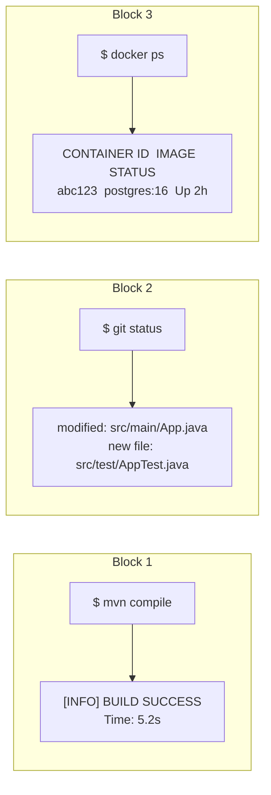

#### Block 核心操作

| 操作 | 快捷鍵 | 說明 |
|------|--------|------|
| 導覽至上一個 Block | `Cmd/Ctrl + ↑` | 快速跳到前一條指令 |
| 導覽至下一個 Block | `Cmd/Ctrl + ↓` | 快速跳到後一條指令 |
| 複製 Block 輸出 | `Cmd/Ctrl + Shift + C` | 複製整個 Block 內容 |
| 搜尋 Block 內容 | `Cmd/Ctrl + F` | 在當前 Block 內搜尋 |
| 分享 Block | 右鍵 → Share | 產生可分享的連結 |
| Block 過濾 | 使用 Block Filtering | 篩選特定 Block |
| 背景 Block | Background Blocks | 長時間執行的指令背景化 |
| 固定指令標頭 | Sticky Command Header | 長輸出時固定指令列 |

```bash
# Block 過濾範例：只顯示失敗的指令
# 使用 Command Palette → "Filter Blocks" → 選擇 "Failed"

# 背景 Block：長時間建置
mvn clean package -DskipTests    # 可將此 Block 移至背景
```

#### Block 在企業開發中的應用

```bash
# 場景：分析生產環境問題
kubectl logs pod/api-server --tail=500    # Block 1：取得日誌
grep -n "ERROR" app.log | tail -20        # Block 2：過濾錯誤
curl -s http://localhost:8080/health      # Block 3：健康檢查

# 每個 Block 獨立可搜尋、可複製、可分享
# 選取 Block 2 → "Explain with AI" → AI 自動分析錯誤原因
```

### 3.2 Command Palette

Command Palette 是 Warp 的指令控制中心，類似 VS Code 的 `Ctrl+Shift+P`：

```
# 開啟方式
Cmd+Shift+P  (macOS)
Ctrl+Shift+P (Windows / Linux)

# 常用功能
- 切換 Terminal / Agent Mode
- 搜尋設定
- 切換主題
- 管理 Tab / Pane
- 開啟 Warp Drive
- GPU 設定
- Shell 切換
```

### 3.3 AI 功能與多模型支援

Warp 的 AI 功能由 **Oz** 平台驅動，分為兩大模式：

#### Terminal Mode AI（行內 AI）

```bash
# 自然語言生成指令：在輸入框中按 # 開頭
# 範例輸入：
# find all java files modified in the last 7 days

# Warp 自動生成：
find . -name "*.java" -mtime -7

# 指令解釋：選取任何 Block → "Explain with AI"
# Warp 會解釋指令的作用與各參數含義

# Active AI Recommendations：
# 當指令執行失敗時，Warp 會主動提供修復建議
# 無需手動觸發，自動偵測錯誤並建議修正方案
```

#### Agent Mode（對話式 AI）

```bash
# 切換至 Agent Mode
# 快捷鍵：Cmd/Ctrl + L
# 或 Command Palette → "Switch to Agent Mode"

# Agent Mode 功能：
# - 多輪對話（支援 Conversation Forking 分支對話）
# - 程式碼生成與修改（產生 Code Diff）
# - Interactive Code Review（行內評論、Agent 回應修改）
# - 錯誤診斷（自動分析 Block 錯誤）
# - 自動執行指令（Full Terminal Use）
# - 語音輸入（Voice）
# - 網路搜尋（Web Search）
# - Computer Use（操控桌面 GUI）
# - Codebase Context（語意索引理解專案）
# - Cloud-synced Conversations（跨裝置同步對話）
```

#### 多模型支援

Oz 為多模型架構設計，可依任務選擇最佳模型。Warp 與所有 LLM 供應商皆簽訂**零數據留存（ZDR）** 協議，供應商承諾不使用客戶資料訓練模型：

##### Auto 模型（推薦）

| 模型 | model_id | 說明 |
|------|----------|------|
| Auto (Responsive) | `auto` | 自動選擇最高品質且最快的模型 |
| Auto (Cost-efficient) | `auto-efficient` | 最佳化信用額度消耗，維持強勁輸出品質 |
| Auto (Genius) | `auto-genius` | 依任務複雜度自適應，適合深度除錯與架構決策 |
| Auto (Open-weights) | `auto-open` | 路由至最佳開源模型，最佳化低成本與快速回應 |

##### OpenAI 模型

| 模型 | model_id | 備註 |
|------|----------|------|
| GPT-5.5 | `gpt-5-5-low` ~ `gpt-5-5-xhigh` | 最新旗艦（Low / Medium / High / Extra High） |
| GPT-5.4 | `gpt-5-4-low` ~ `gpt-5-4-xhigh` | 高效能通用模型 |
| GPT-5.3 Codex | `gpt-5-3-codex-low` ~ `gpt-5-3-codex-xhigh` | 程式碼專用最佳化 |
| GPT-5.2 Codex | `gpt-5-2-codex-low` ~ `gpt-5-2-codex-xhigh` | 程式碼生成 |
| GPT-5.2 | `gpt-5-2-low` ~ `gpt-5-2-xhigh` | 通用模型 |

##### Anthropic 模型

| 模型 | model_id | 備註 |
|------|----------|------|
| Claude Opus 4.7 | `claude-4-7-opus-xhigh` / `high` / `max` | 最新旗艦，深度推理 |
| Claude Opus 4.6 | `claude-4-6-opus-high` / `max` | 高精度長上下文 |
| Claude Sonnet 4.6 | `claude-4-6-sonnet-high` / `max` | 平衡速度與精度 |
| Claude Opus 4.5 | `claude-4-5-opus` / `thinking` | 可開啟 Thinking 推理 |
| Claude Sonnet 4.5 | `claude-4-5-sonnet` / `thinking` | 高效程式碼生成 |
| Claude Haiku 4.5 | `claude-4-5-haiku` | 最快速回應 |

##### Google 模型

| 模型 | model_id |
|------|----------|
| Gemini 3.1 Pro | `gemini-3.1-pro` |

##### 開源模型（透過 Fireworks AI 託管）

| 模型 | model_id |
|------|----------|
| GLM 5 / 5.1 | `glm-5-fireworks` / `glm-5.1-fireworks` |
| Kimi K2.5 / K2.6 | `kimi-k25-fireworks` / `kimi-k26-fireworks` |
| Minimax 2.7 | `minimax-2.7-fireworks` |
| Qwen 3.6 Plus | `qwen-3.6-plus-fireworks` |

```bash
# 在 Agent Mode 中切換模型
# 點擊輸入框中顯示的模型名稱 → 開啟下拉選單選擇
# 或在 Settings > Agents > Profiles 中設定各 Agent Profile 的基礎模型

# Model Fallback 機制：
# 當選定模型暫時不可用時，Warp 自動切換至備援模型，
# 原模型恢復後自動切回，確保服務不中斷
```

> **實務建議**：企業團隊建議預設使用 Auto (Genius) 或 Auto (Responsive) 模型，讓 Warp 依任務複雜度自動選擇最佳模型。特定重要任務（如架構決策、安全審查）可手動切換至 Claude Opus 4.7 或 GPT-5.5。

> **常見錯誤**：團隊成員各自選用不同模型導致輸出品質不一致。建議透過 Agent Profiles 統一設定團隊的預設模型與權限。

### 3.4 Agent 進階能力

Warp 的 Agent 提供一系列進階能力，可透過設定與整合擴展：

| 能力 | 說明 | 使用方式 |
|------|------|---------|
| **[Slash Commands](https://docs.warp.dev/agent-platform/capabilities/slash-commands/)** | 在 Agent Mode 中輸入 `/` 觸發快速動作 | `/init` 初始化專案、`/plan` 建立計畫 |
| **[Skills](https://docs.warp.dev/agent-platform/capabilities/skills/)** | 可重複使用的範本指令，教導 Agent 執行特定任務 | 定義在專案中，Agent 自動載入 |
| **[Planning](https://docs.warp.dev/agent-platform/capabilities/planning/)** | 將需求轉換為可編輯的逐步計畫 | `/plan` 觸發，可手動調整步驟 |
| **[Task Lists](https://docs.warp.dev/agent-platform/capabilities/task-lists/)** | 自動追蹤複雜工作流程進度 | Agent 自動產生，即時更新狀態 |
| **[Rules](https://docs.warp.dev/agent-platform/capabilities/rules/)** | 定義全域/專案級行為準則（`AGENTS.md`） | 專案根目錄放置 `AGENTS.md` 檔案 |
| **[Full Terminal Use](https://docs.warp.dev/agent-platform/capabilities/full-terminal-use/)** | Agent 直接操控終端機執行互動式程式 | 設定中啟用，Agent 可觀看即時輸出 |
| **[Computer Use](https://docs.warp.dev/agent-platform/capabilities/computer-use/)** | Agent 操控桌面 GUI（截圖、點擊、輸入） | 進階能力，需授權 |
| **[Voice](https://docs.warp.dev/agent-platform/local-agents/interacting-with-agents/voice/)** | 語音對話輸入 | 點擊麥克風圖示或快捷鍵 |
| **[Web Search](https://docs.warp.dev/agent-platform/capabilities/web-search/)** | Agent 搜尋網路取得最新資訊 | Agent 自動判斷是否需要搜尋 |
| **[Codebase Context](https://docs.warp.dev/agent-platform/capabilities/codebase-context/)** | 語意索引 Git 追蹤檔案，理解專案結構 | 自動索引，無需手動設定 |
| **[MCP](https://docs.warp.dev/agent-platform/capabilities/mcp/)** | Model Context Protocol 連接外部資料源與工具 | 設定 MCP Server 連線 |
| **[Agent Profiles](https://docs.warp.dev/agent-platform/capabilities/agent-profiles-permissions/)** | 控制 Agent 的模型、權限與自主程度 | Settings > Agents > Profiles |
| **[Conversation Forking](https://docs.warp.dev/agent-platform/local-agents/interacting-with-agents/conversation-forking/)** | 從對話中任意點分支出新對話 | 右鍵對話訊息 → Fork |
| **[Session Sharing](https://docs.warp.dev/agent-platform/local-agents/session-sharing/)** | 分享 Agent 對話給團隊成員 | 分享連結，可觀看或接手操控 |
| **[Active AI](https://docs.warp.dev/agent-platform/local-agents/active-ai/)** | 主動偵測錯誤並推薦修復方案 | 自動觸發，無需手動啟用 |

#### AGENTS.md 專案規則範例

```markdown
# AGENTS.md（置於專案根目錄）
# 檔名必須全大寫：AGENTS.md

## 專案概述
這是一個 Spring Boot 3.4 + Java 21 的企業級微服務專案。

## 程式碼風格
- 使用 Java Records 取代簡單 POJO
- 使用 Sealed Interfaces 定義業務狀態
- 金額欄位一律使用 BigDecimal
- 日誌使用 Log4j2，格式為 JSON

## 安全規範
- 所有使用者輸入必須驗證與 sanitize
- 密碼不可出現在日誌中
- API 端點需加 @PreAuthorize 授權

## 測試要求
- 每個 Use Case 必須有 JUnit 5 測試
- 使用 Given-When-Then 模式
- 覆蓋率目標 80%
```

### 3.5 Code Editor 與 Code Review

Warp 內建的 Code Editor 提供輕量但完整的程式碼編輯體驗，搭配 Agent 的 Code Diff 功能形成閉環：

#### Code Editor 功能

| 功能 | 說明 |
|------|------|
| **[File Tree](https://docs.warp.dev/code/code-editor/file-tree/)** | 專案檔案瀏覽器，快速導覽與開啟檔案 |
| **[LSP 支援](https://docs.warp.dev/code/code-editor/language-server-protocol/)** | Hover Info / Go-to-Definition / Find References / Inline Diagnostics / Format-on-Save |
| **支援語言** | Rust、Go、Python、TypeScript/JavaScript、C/C++ |
| **[Find & Replace](https://docs.warp.dev/code/code-editor/find-and-replace/)** | 檔案內搜尋與取代 |
| **[Vim 鍵位](https://docs.warp.dev/code/code-editor/code-editor-vim-keybindings/)** | 完整 Vim 鍵位綁定支援 |
| **[Git Worktrees](https://docs.warp.dev/code/git-worktrees/)** | 同時操作多個 Git 工作樹 |
| **SSH 遠端** | 透過 [SSH Extension](https://docs.warp.dev/terminal/warpify/ssh/) 在遠端主機使用 File Tree 與 Code Diff |

#### Code Review 面板

```bash
# Code Review 流程：
# 1. Agent 生成程式碼修改 → 自動產生 Diff
# 2. 在 Code Review 面板中查看所有變更
# 3. 可逐行接受/拒絕/修改
# 4. 支援 Interactive Code Review：
#    - 在 Diff 上留下行內評論
#    - Agent 自動回應並修改
#    - 持續對話直到滿意

# 專案初始化（啟用 Codebase Context）：
# 方式一：開啟新 Tab → Create New Project / Open Repository / Clone Repository
# 方式二：在 Agent Mode 中執行 /init 指令
```

> **實務建議**：建議每個專案都建立 `AGENTS.md` 檔案（檔名必須全大寫），定義專案的程式碼風格、安全規範與測試要求，讓 Agent 的產出符合團隊標準。

> **常見錯誤**：未啟用 Codebase Context 就使用 Agent 編寫程式碼，導致 Agent 不理解專案架構而產出不相容的程式碼。務必執行 `/init` 初始化專案索引。

### 3.6 Warp Drive（Workflows / Env 管理）

Warp Drive 是團隊知識管理與共享的核心功能，支援透過 [Web 介面](https://docs.warp.dev/knowledge-and-collaboration/warp-drive/web/) 存取：

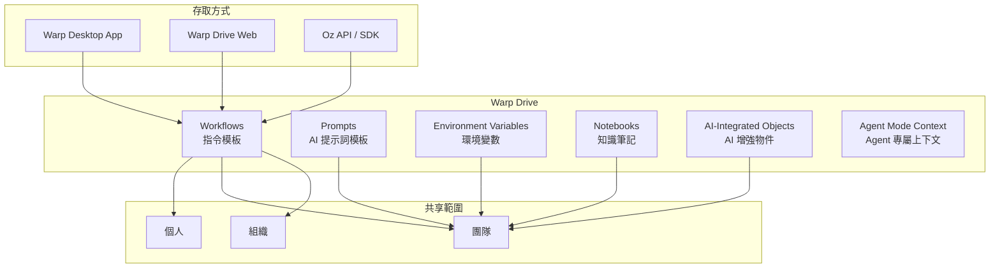

[AI-Integrated Objects](https://docs.warp.dev/knowledge-and-collaboration/warp-drive/ai-objects/) 是 Warp Drive 的進階功能，可在 Workflows 和 Prompts 中嵌入 AI 能力，讓共享物件自動適應不同上下文。[Agent Mode Context](https://docs.warp.dev/knowledge-and-collaboration/warp-drive/agent-mode-context/) 則允許將 Warp Drive 中的內容自動注入 Agent 對話。

#### Workflows（YAML 工作流程）

```yaml
# 範例：Spring Boot 專案建置 Workflow
# 儲存位置：Warp Drive > Team > Workflows
---
name: "Spring Boot 建置與測試"
command: |
  echo "🔨 開始建置 {{project_name}}..."
  cd {{project_dir}}
  mvn clean compile -P {{profile}}
  echo "🧪 執行單元測試..."
  mvn test
  echo "📦 打包..."
  mvn package -DskipTests
  echo "✅ 完成！JAR 位於 target/ 目錄"
tags:
  - java
  - spring-boot
  - build
arguments:
  - name: project_name
    description: "專案名稱"
    default_value: "my-app"
  - name: project_dir
    description: "專案目錄"
    default_value: "."
  - name: profile
    description: "Maven Profile"
    default_value: "dev"
```

#### Environment Variables（環境變數管理）

```bash
# Warp Drive 環境變數可依環境分組：
# DEV / SIT / UAT / PROD

# 範例：DEV 環境
DB_HOST=localhost
DB_PORT=5432
DB_NAME=myapp_dev
DB_USER=dev_user
SPRING_PROFILES_ACTIVE=dev
LOG_LEVEL=DEBUG

# 使用方式：
# Warp Drive → Environment Variables → 選擇環境 → Apply
# 變數自動載入至當前 Terminal Session
```

### 3.7 團隊共享機制

| 共享功能 | 說明 | 企業應用場景 |
|---------|------|-------------|
| **Workflow 共享** | YAML 工作流程模板 | 統一建置、部署、測試流程 |
| **Prompt 共享** | AI 提示詞模板 | 標準化 AI 互動方式 |
| **Env 共享** | 環境變數集合 | 統一環境配置 |
| **Notebook 共享** | 知識筆記 | 團隊知識庫 |
| **AI-Integrated Objects** | AI 增強的共享物件 | 自動適應不同上下文的智慧範本 |
| **Block 分享** | 指令輸出連結 | 問題排查、知識傳遞 |
| **[Session 分享](https://docs.warp.dev/knowledge-and-collaboration/session-sharing/)** | 完整終端/Agent 會話 | 即時協作、Pair Programming |
| **[Cloud-synced Conversations](https://docs.warp.dev/agent-platform/local-agents/cloud-conversations/)** | 跨裝置同步 Agent 對話 | 在不同裝置間接續工作 |
| **[Team Admin Panel](https://docs.warp.dev/knowledge-and-collaboration/admin-panel/)** | 團隊管理控制台 | 成員管理、權限設定、使用量監控 |

```bash
# Block 分享流程：
# 1. 選取要分享的 Block（含指令與輸出）
# 2. 右鍵 → "Share Block"
# 3. 產生唯一連結，可貼到 Slack / Teams / Issue

# Session 分享：
# 1. 開啟 Session Sharing
# 2. 邀請團隊成員
# 3. 成員可即時觀看或操控
```

> **實務建議**：建議指定一位「Warp Champion」負責維護團隊的 Warp Drive 內容，定期審查 Workflows 與 Prompts 的品質與安全性。

> **常見錯誤**：將 API Key / Token 等機密資訊直接寫在 Workflow 中。應使用 Warp Drive 的 Environment Variables 功能分離管理，且依環境（DEV/UAT/PROD）隔離。

---

## 4. Warp + AI Coding Agent 整合

Warp 作為 ADE，原生支援 **10 種**第三方 CLI Agent，自動偵測並啟用「Agent 工具帶（Toolbelt）」體驗。工具帶的按鈕可自訂排列、隱藏或移動：

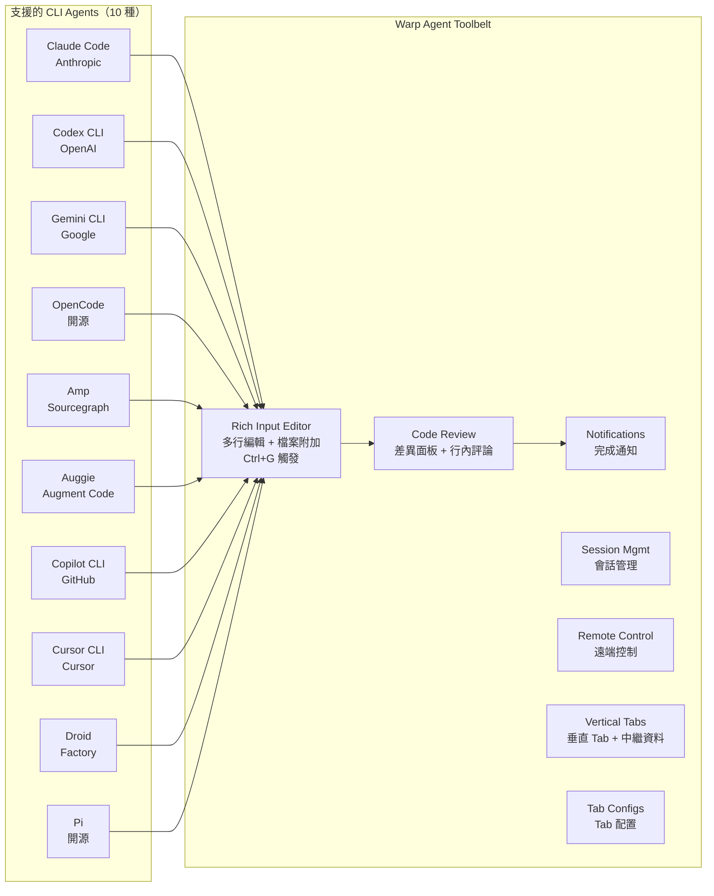

#### Agent 工具帶功能支援矩陣

| 功能 | Claude Code | Codex | OpenCode | Amp | Auggie | Copilot CLI | Cursor CLI | Gemini CLI | Droid | Pi |
|------|:-----------:|:-----:|:--------:|:---:|:------:|:-----------:|:----------:|:----------:|:-----:|:--:|
| Rich Input Editor (Ctrl+G) | ✅ | ✅ | ✅ | ✅ | ✅ | ✅ | ✅ | ✅ | ✅ | ✅ |
| Agent Notifications | ✅ | ✅ | ✅ | — | — | — | — | — | — | — |
| Code Review Comments | ✅ | ✅ | ✅ | ✅ | ✅ | ✅ | ✅ | ✅ | ✅ | ✅ |
| Attach Code as Context | ✅ | ✅ | ✅ | ✅ | ✅ | ✅ | ✅ | ✅ | ✅ | ✅ |
| Vertical Tabs + Metadata | ✅ | ✅ | ✅ | ✅ | ✅ | ✅ | ✅ | ✅ | ✅ | ✅ |
| Tab Configs | ✅ | ✅ | ✅ | ✅ | ✅ | ✅ | ✅ | ✅ | ✅ | ✅ |
| Remote Control | ✅ | ✅ | ✅ | ✅ | ✅ | ✅ | ✅ | ✅ | ✅ | ✅ |

> Agent Notifications 需一次性設定。Claude Code 與 OpenCode 使用 Warp 通知插件，Codex 使用原生配置變更。其餘 Agent 尚未支援通知。

### 4.1 Claude Code 整合

#### 安裝與設定

```bash
# 安裝 Claude Code CLI
npm install -g @anthropic-ai/claude-code

# 設定 API Key
export ANTHROPIC_API_KEY="sk-ant-xxxxx"

# 在 Warp 中啟動 Claude Code
claude

# 或帶入專案目錄
cd /path/to/project && claude
```

#### 在 Warp 中使用 Claude Code

```bash
# Claude Code 在 Warp 中享有增強體驗：
# 1. Rich Input：多行 prompt 編輯
# 2. Code Review 面板：查看 Claude 修改的差異
# 3. 通知：長時間任務完成後桌面通知
# 4. Block 化：每次互動自動成為獨立 Block

# 範例：使用 Claude Code 重構服務層
claude "Refactor UserService to follow Clean Architecture:
- Extract domain logic from service to domain entity
- Create port interfaces
- Separate infrastructure concerns
- Keep backward compatibility"
```

#### Prompt 設計策略

```bash
# 企業級 Prompt 模板（存入 Warp Drive > Prompts）

# 模板 1：程式碼審查
claude "Review the following Java file for:
1. Clean Architecture violations
2. SOLID principle adherence
3. Security vulnerabilities (OWASP Top 10)
4. Performance concerns (N+1 query, connection leak)
5. Test coverage gaps

File: {{file_path}}

Output format:
- Issue category
- Severity (Critical/High/Medium/Low)
- Line number
- Description
- Suggested fix"

# 模板 2：API 設計
claude "Design a RESTful API for {{domain}} following:
- OpenAPI 3.0 spec
- Enterprise naming conventions (kebab-case URLs)
- Proper HTTP status codes
- Pagination (cursor-based)
- HATEOAS links
- Error response format (RFC 7807)
Output as OpenAPI YAML."
```

### 4.2 GitHub Copilot CLI 整合

#### 安裝與設定

```bash
# 安裝 GitHub CLI
winget install GitHub.cli          # Windows
brew install gh                     # macOS

# 安裝 Copilot CLI 擴充
gh extension install github/gh-copilot

# 認證
gh auth login

# 驗證安裝
gh copilot --help
```

#### 在 Warp 中使用 Copilot CLI

```bash
# 指令建議
gh copilot suggest "find all Spring Boot controllers with security annotations"

# 指令解釋
gh copilot explain "kubectl get pods -l app=api-server -o jsonpath='{.items[*].status.phase}'"

# 與 Warp Workflow 整合
# 建立 Workflow：Copilot 輔助除錯
---
name: "Copilot Debug Helper"
command: |
  echo "📋 收集錯誤資訊..."
  ERROR_LOG=$(tail -50 {{log_file}})
  echo "🤖 請 Copilot 分析..."
  gh copilot explain "$ERROR_LOG"
arguments:
  - name: log_file
    description: "日誌檔案路徑"
    default_value: "logs/app.log"
```

### 4.3 Gemini CLI 整合

```bash
# 安裝 Gemini CLI
npm install -g @google/gemini-cli

# 設定 API Key
export GOOGLE_API_KEY="AIza..."

# 在 Warp 中使用
gemini

# Gemini 特色：超大上下文窗口
# 適合分析大型程式碼庫、長文件理解
gemini "Analyze the entire project structure under src/ and:
1. Generate a complete class diagram (Mermaid format)
2. Identify architectural patterns in use
3. List all external dependencies and their purposes
4. Suggest refactoring opportunities"
```

### 4.4 OpenAI Codex CLI 整合

```bash
# 安裝 Codex CLI
npm install -g @openai/codex

# 設定（Warp 與 OpenAI 為創始合作夥伴）
export OPENAI_API_KEY="sk-..."

# 在 Warp 中使用
codex

# Codex 特色：深度程式碼生成
codex "Generate a complete Spring Boot REST controller for
employee management with CRUD operations, validation,
error handling, and OpenAPI annotations"
```

### 4.5 其他 CLI Agent 整合

Warp 支援的 CLI Agent 已擴展至 10 種，以下為 v1.0 未涵蓋的新增 Agent：

#### Amp（Sourcegraph）

```bash
# Sourcegraph 的 CLI 程式碼智慧體
# 特色：深度程式碼搜尋與理解，整合 Sourcegraph 的程式碼圖譜
npm install -g @sourcegraph/amp
amp
```

#### Auggie（Augment Code）

```bash
# Augment Code 的 CLI Agent
# 特色：企業級程式碼生成，支援大型程式碼庫上下文
npm install -g @augmentcode/auggie
auggie
```

#### Cursor CLI

```bash
# Cursor 的 CLI Agent
# 特色：與 Cursor IDE 共享配置與上下文
cursor-cli
```

#### Droid（Factory）

```bash
# Factory 的 CLI Agent
# 特色：自動化軟體工廠流程，CI/CD 整合
npm install -g @factory/droid
droid
```

#### Pi（開源）

```bash
# 開源 CLI Agent
# 特色：社群驅動，可自訂擴展
npm install -g @anthropic/pi
pi
```

> **實務建議**：所有 CLI Agent 在 Warp 中均自動享有工具帶體驗，無需額外設定。只需在 Warp 終端中啟動 Agent，Warp 即自動偵測並啟用增強功能。

### 4.6 AI Agent 比較表

| 特性 | Claude Code | Codex CLI | Gemini CLI | OpenCode | Amp | Copilot CLI |
|------|:-----------:|:---------:|:----------:|:--------:|:---:|:-----------:|
| **程式碼生成** | ⭐⭐⭐⭐⭐ | ⭐⭐⭐⭐⭐ | ⭐⭐⭐⭐ | ⭐⭐⭐⭐ | ⭐⭐⭐⭐ | ⭐⭐⭐ |
| **程式碼理解** | ⭐⭐⭐⭐⭐ | ⭐⭐⭐⭐ | ⭐⭐⭐⭐⭐ | ⭐⭐⭐⭐ | ⭐⭐⭐⭐⭐ | ⭐⭐⭐ |
| **多檔案操作** | ✅ 原生 | ✅ 原生 | ✅ 原生 | ✅ 原生 | ✅ 原生 | ❌ 單次建議 |
| **自動執行指令** | ✅ | ✅ | ✅ | ✅ | ✅ | ❌ |
| **Warp 通知** | ✅ | ✅ | — | ✅ | — | — |
| **開源** | ❌ | ❌ | ❌ | ✅ | ❌ | ❌ |
| **企業定價** | API 用量 | API 用量 | API 用量 | 免費 | 訂閱制 | GitHub 訂閱 |
| **最佳用途** | 重構/審查 | 程式碼生成 | 大型分析 | 輕量通用 | 程式碼搜尋 | 指令查詢 |

> **實務建議**：企業團隊建議以 Claude Code 或 Codex 為主力 Agent，Copilot CLI 作為快速指令查詢工具，Gemini 用於大型程式碼庫分析。依任務選擇最適模型。

> **常見錯誤**：同時安裝所有 CLI Agent 但未做好 API Key 管理。應統一使用 Warp Drive Environment Variables 管理各 Agent 的 API Key，並限制使用額度。

---

## 5. Oz Cloud Agents（雲端代理）

Oz Cloud Agents 將 AI 代理從本機延伸至雲端，可透過事件觸發或排程執行自動化工作流程。Cloud Agents 與 Local Agents 共用相同的核心引擎和模型支援。

### 5.1 Cloud Agents 概覽

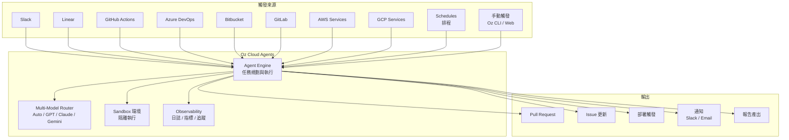

| 特性 | 說明 |
|------|------|
| **並行執行** | 同時執行多個 Agent 任務，自動資源調配 |
| **觀測性** | 即時日誌、執行追蹤、Agent 決策路徑可視化 |
| **隔離沙盒** | 每個任務在隔離環境中執行，確保安全性 |
| **成本控制** | Credits 制度，可設定每任務/每日用量上限 |
| **審核機制** | 關鍵操作需人工審核確認（Human-in-the-loop） |

### 5.2 觸發機制

Cloud Agents 支援多種事件觸發來源：

| 觸發來源 | 範例事件 | 典型用途 |
|---------|---------|---------|
| **[Slack](https://docs.warp.dev/agent-platform/cloud-agents/triggers/slack/)** | 訊息、指令、@mention | 運維聊天機器人、事件回應 |
| **[Linear](https://docs.warp.dev/agent-platform/cloud-agents/triggers/linear/)** | Issue 建立/更新 | 自動任務分解、進度追蹤 |
| **[GitHub Actions](https://docs.warp.dev/agent-platform/cloud-agents/triggers/github-actions/)** | Push / PR / Release | CI/CD 自動修復、PR Review |
| **[Azure DevOps](https://docs.warp.dev/agent-platform/cloud-agents/triggers/azure-devops/)** | Pipeline / Work Item | 企業 CI/CD 整合 |
| **[Bitbucket](https://docs.warp.dev/agent-platform/cloud-agents/triggers/bitbucket/)** | PR / Pipeline | Atlassian 生態系整合 |
| **[GitLab](https://docs.warp.dev/agent-platform/cloud-agents/triggers/gitlab/)** | MR / Pipeline / Issue | GitLab CI/CD 整合 |
| **[AWS](https://docs.warp.dev/agent-platform/cloud-agents/triggers/aws/)** | CloudWatch / S3 Event | 雲端基礎設施自動化 |
| **[GCP](https://docs.warp.dev/agent-platform/cloud-agents/triggers/gcp/)** | Cloud Functions / Pub/Sub | GCP 基礎設施自動化 |
| **[Schedules](https://docs.warp.dev/agent-platform/cloud-agents/schedules/)** | Cron 排程 | 定期報告、健康檢查、依賴更新 |

```yaml
# GitHub Actions 觸發範例
name: "Warp Cloud Agent - PR Review"
on:
  pull_request:
    types: [opened, synchronize]
jobs:
  warp-review:
    runs-on: ubuntu-latest
    steps:
      - uses: warpdotdev/cloud-agent-action@v1
        with:
          task: "review-pr"
          model: "auto-genius"
          warp-api-key: ${{ secrets.WARP_API_KEY }}
```

### 5.3 Self-Hosting（自託管）

企業可選擇將 Cloud Agents 部署在自己的基礎設施中，確保資料不離開企業網路：

| 部署模式 | 說明 | 適用場景 |
|---------|------|---------|
| **[Managed Docker](https://docs.warp.dev/agent-platform/cloud-agents/self-hosting/managed/docker/)** | Warp 管理的 Docker 容器映像 | 快速部署、小型團隊 |
| **[Managed Kubernetes](https://docs.warp.dev/agent-platform/cloud-agents/self-hosting/managed/kubernetes/)** | Warp 管理的 K8s Helm Chart | 大規模企業部署 |
| **[Managed Direct](https://docs.warp.dev/agent-platform/cloud-agents/self-hosting/managed/direct/)** | 直接安裝在主機上 | 特殊環境需求 |
| **[Unmanaged](https://docs.warp.dev/agent-platform/cloud-agents/self-hosting/unmanaged/)** | 完全自行管理 | 最高安全性需求 |

```bash
# Managed Docker 部署範例
docker pull warpdotdev/cloud-agent:latest
docker run -d \
  --name warp-cloud-agent \
  -e WARP_API_KEY=$WARP_API_KEY \
  -e WARP_ORG_ID=$WARP_ORG_ID \
  warpdotdev/cloud-agent:latest

# Managed Kubernetes 部署範例
helm repo add warp https://charts.warp.dev
helm install warp-agent warp/cloud-agent \
  --set apiKey=$WARP_API_KEY \
  --set orgId=$WARP_ORG_ID \
  --namespace warp-agents
```

Cloud Agents 自託管需設定 [Environments](https://docs.warp.dev/agent-platform/cloud-agents/environments/) 與 [Secrets](https://docs.warp.dev/agent-platform/cloud-agents/secrets/)，確保敏感資訊安全管理。

### 5.4 Oz Platform（CLI / API / Web App）

Oz 平台提供多種存取介面，讓開發者與管理者以最適合的方式操控 Cloud Agents：

| 介面 | 說明 | 適用角色 |
|------|------|---------|
| **[Oz CLI](https://docs.warp.dev/agent-platform/oz-platform/oz-cli/)** | 命令列介面，管理 Agent、任務、排程 | DevOps 工程師 |
| **[Oz REST API / SDK](https://docs.warp.dev/agent-platform/oz-platform/oz-api-sdk/)** | 程式化存取，整合至現有系統 | 系統整合開發者 |
| **[Oz Web App](https://docs.warp.dev/agent-platform/oz-platform/oz-web-app/)** | 瀏覽器介面（含行動裝置支援） | 管理者、非技術人員 |

```bash
# Oz CLI 範例
# 安裝
npm install -g @warpdotdev/oz-cli

# 登入
oz login

# 列出所有 Cloud Agents
oz agents list

# 建立排程任務
oz schedule create \
  --name "daily-dependency-check" \
  --cron "0 9 * * 1-5" \
  --task "check-dependencies" \
  --model "auto-efficient"

# 手動觸發任務
oz run --task "review-security" --repo "my-org/my-repo"

# 檢視任務日誌
oz logs --task-id abc123 --follow
```

> **實務建議**：建議企業先以 Managed Docker 模式試行 Cloud Agents，驗證效果後再遷移至 Kubernetes 部署。Schedules 適合用於定期依賴更新、安全掃描、程式碼品質報告等重複性任務。

> **常見錯誤**：未設定 Credits 用量上限，導致 Cloud Agent 大量執行時產生超出預期的費用。務必在 Team Admin Panel 中設定每日/每月用量上限。

---

## 6. Warp 在 AI 開發流程中的應用

### 6.1 建立專案（Scaffold）

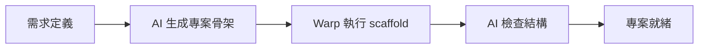

#### Warp 指令

```bash
# 方式一：使用 Spring Initializr CLI
curl https://start.spring.io/starter.tgz \
  -d type=maven-project \
  -d language=java \
  -d bootVersion=3.4.0 \
  -d groupId=com.enterprise \
  -d artifactId=order-service \
  -d dependencies=web,data-jpa,security,actuator,validation \
  -d javaVersion=21 \
  -d packaging=jar | tar -xzf -

# 方式二：使用 Maven Archetype
mvn archetype:generate \
  -DarchetypeGroupId=com.enterprise \
  -DarchetypeArtifactId=clean-arch-archetype \
  -DgroupId=com.enterprise.order \
  -DartifactId=order-service \
  -DinteractiveMode=false
```

#### AI Prompt 範例

```
# 在 Warp Agent Mode 中：

"建立一個 Spring Boot 3.4 + Java 21 的企業級微服務專案，需求如下：
1. Clean Architecture 分層（domain / application / infrastructure / presentation）
2. Maven 多模組結構
3. 整合：Spring Web, JPA, Security, Actuator, Validation
4. 資料庫：PostgreSQL（開發用 H2）
5. 包含：
   - Dockerfile（multi-stage build）
   - docker-compose.yml（含 PostgreSQL + Redis）
   - .github/workflows/ci.yml（GitHub Actions）
   - log4j2.xml（JSON 格式日誌）
   - ArchUnit 測試（確保分層約束）
6. 使用 records 與 sealed interfaces
請直接在當前目錄生成完整專案結構。"
```

### 6.2 撰寫程式碼

#### Warp 指令

```bash
# 在 Warp Code Editor 中開啟檔案
# File Tree → 選擇檔案
# 或使用 Command Palette → "Open File"

# 使用 Agent Mode 撰寫程式碼
# Cmd/Ctrl + L → 進入 Agent Mode
```

#### AI Prompt 範例

```
# Domain Entity 生成
"在 domain/model/ 下建立 Order.java：
- 使用 Java record 或 sealed class
- 包含業務驗證邏輯（金額 > 0、狀態機轉換）
- 實作 DDD Aggregate Root 模式
- 提供工廠方法 createOrder()
- 包含 JavaDoc 註解"

# Repository Port 生成
"在 domain/port/ 下建立 OrderRepository.java：
- 定義為介面（Port）
- 方法包含：findById, save, findByStatus, findByDateRange
- 使用 Optional 回傳
- 加入 JavaDoc"

# Use Case 生成
"在 application/usecase/ 下建立 CreateOrderUseCase.java：
- 注入 OrderRepository（透過建構子）
- 實作 CreateOrderCommand → OrderResult 轉換
- 包含交易管理
- 包含事件發佈（OrderCreatedEvent）
- 完整錯誤處理"
```

### 6.3 測試（Unit / Integration）

#### Warp 指令

```bash
# 執行全部測試
mvn test

# 執行特定測試類
mvn test -Dtest=OrderServiceTest

# 執行特定方法
mvn test -Dtest=OrderServiceTest#shouldCreateOrder

# 產生測試報告
mvn surefire-report:report

# 查看覆蓋率
mvn jacoco:report
open target/site/jacoco/index.html    # macOS
start target/site/jacoco/index.html   # Windows
```

#### AI Prompt 範例

```
# 單元測試生成
"為 CreateOrderUseCase 撰寫完整的 JUnit 5 測試：
1. 使用 @ExtendWith(MockitoExtension.class)
2. Mock OrderRepository
3. 測試案例：
   - 正常建立訂單
   - 金額為零應拋出例外
   - 重複訂單號應拋出例外
   - 庫存不足場景
   - 併發建立場景
4. 使用 @DisplayName 中文描述
5. 遵循 Given-When-Then 模式
6. 使用 AssertJ 斷言"

# 整合測試生成
"為 OrderController 撰寫整合測試：
1. 使用 @SpringBootTest + @AutoConfigureMockMvc
2. 使用 @Testcontainers + PostgreSQL
3. 測試 CRUD API 完整流程
4. 包含認證測試（JWT Token）
5. 驗證回應狀態碼與 Body
6. 驗證資料庫狀態"
```

### 6.4 Debug

#### Warp 指令

```bash
# 啟動 Debug 模式
mvn spring-boot:run -Dspring-boot.run.jvmArguments="-agentlib:jdwp=transport=dt_socket,server=y,suspend=n,address=5005"

# 查看應用日誌（即時）
tail -f logs/app.log | grep -E "ERROR|WARN"

# 使用 Warp AI 分析錯誤
# 選取錯誤 Block → "Explain with AI"

# 堆積分析
jmap -heap <PID>
jstack <PID> > thread-dump.txt
```

#### AI Prompt 範例

```
"我在執行以下指令時遇到錯誤：

[貼上錯誤 Block 內容]

請分析：
1. 根本原因
2. 影響範圍
3. 修復步驟
4. 預防措施
5. 相關的 Spring Boot 配置調整"
```

### 6.5 Refactor

#### Warp 指令

```bash
# 使用 AI Agent 進行重構
# 進入 Agent Mode → 描述重構需求

# 重構後驗證
mvn clean test                              # 確認測試通過
mvn checkstyle:check                        # 程式碼風格
mvn spotbugs:check                          # 靜態分析
```

#### AI Prompt 範例

```
"重構 UserService.java，將 587 行的 God Class 拆分為：
1. UserRegistrationService（註冊相關）
2. UserAuthenticationService（認證相關）
3. UserProfileService（個人資料相關）
4. UserNotificationService（通知相關）

要求：
- 保持所有現有測試通過
- 使用介面解耦
- 每個服務不超過 150 行
- 保持向後相容（原 UserService 委派到新服務）"
```

### 6.6 文件生成

#### Warp 指令

```bash
# 生成 JavaDoc
mvn javadoc:javadoc

# 生成 API 文件（OpenAPI）
mvn springdoc-openapi:generate

# 生成架構文件
# 在 Agent Mode 中使用 AI
```

#### AI Prompt 範例

```
"分析 src/main/java/com/enterprise/order/ 下所有 Java 檔案，產出：
1. README.md（專案說明、快速開始、架構圖）
2. API.md（所有 REST API 說明，含 curl 範例）
3. ARCHITECTURE.md（Clean Architecture 分層說明 + Mermaid 圖）
4. CHANGELOG.md（基於 git log 產生）
5. 資料庫 ER Diagram（Mermaid 格式）

全部使用繁體中文。"
```

> **實務建議**：將上述 AI Prompt 全部存入 Warp Drive Prompts，建立團隊標準化的 Prompt 範本庫。定期回顧與更新 Prompt 品質。

> **常見錯誤**：直接使用 AI 生成的程式碼而不做 Code Review。所有 AI 產出都必須經過人工審查，特別是安全相關邏輯（認證、授權、加密）。

---

## 7. 實戰：Web Application 開發（企業級）

### 7.1 前端（Vue 3 + TypeScript）

#### 專案建立

```bash
# 在 Warp 中建立 Vue 3 + TS 專案
npm create vue@latest frontend -- \
  --typescript \
  --jsx \
  --router \
  --pinia \
  --vitest \
  --e2e-cypress \
  --eslint-with-prettier

cd frontend
npm install

# 安裝企業常用套件
npm install @vueuse/core axios dayjs
npm install -D tailwindcss postcss autoprefixer
npx tailwindcss init -p
```

#### AI 生成前端元件

```
# Warp Agent Mode Prompt：

"在 Vue 3 + TypeScript + Tailwind 環境下，建立訂單管理模組：

1. components/order/OrderList.vue
   - 使用 Composition API + <script setup>
   - 資料表格（分頁、排序、搜尋）
   - 響應式設計（Tailwind）

2. components/order/OrderForm.vue
   - 表單驗證（VeeValidate + Zod）
   - 日期選擇器
   - 下拉選單（客戶、商品）

3. stores/orderStore.ts
   - Pinia Store
   - CRUD 操作
   - 錯誤處理
   - Loading 狀態

4. composables/useOrder.ts
   - API 呼叫封裝
   - 型別定義（TypeScript interface）

5. types/order.ts
   - Order / OrderItem / OrderStatus 型別

所有檔案使用 TypeScript strict mode。"
```

### 7.2 後端（Spring Boot）

#### 專案結構

```bash
# AI 生成 Clean Architecture 結構
# Warp Agent Mode：

"建立 order-service Spring Boot 專案，使用 Clean Architecture：

order-service/
├── domain/
│   ├── model/          # Entity, Value Object, Aggregate
│   ├── port/           # Repository Interface (SPI)
│   ├── event/          # Domain Event
│   └── exception/      # Domain Exception
├── application/
│   ├── usecase/        # Use Case Implementation
│   ├── dto/            # Command / Query DTO
│   └── service/        # Application Service
├── infrastructure/
│   ├── persistence/    # JPA Entity, Repository Impl
│   ├── messaging/      # Kafka Producer/Consumer
│   └── config/         # Spring Config
└── presentation/
    ├── controller/     # REST Controller
    ├── request/        # Request DTO
    └── response/       # Response DTO

請生成每個層的基礎類別與 ArchUnit 分層測試。"
```

#### Service 實作範例

```java
// application/usecase/CreateOrderUseCase.java
// AI 生成後人工審查的程式碼

@UseCase
@RequiredArgsConstructor
public class CreateOrderUseCase {

    private final OrderRepository orderRepository;
    private final EventPublisher eventPublisher;

    @Transactional
    public OrderResult execute(CreateOrderCommand command) {
        // 1. 驗證業務規則
        Order order = Order.create(
            command.customerId(),
            command.items().stream()
                .map(item -> OrderItem.of(
                    item.productId(),
                    item.quantity(),
                    item.unitPrice()
                ))
                .toList()
        );

        // 2. 持久化
        Order savedOrder = orderRepository.save(order);

        // 3. 發佈領域事件
        eventPublisher.publish(new OrderCreatedEvent(savedOrder.getId()));

        // 4. 回傳結果
        return OrderResult.from(savedOrder);
    }
}
```

### 7.3 API 設計

```
# Warp Agent Mode Prompt：

"根據 Order domain model，設計 RESTful API：

要求：
1. 遵循 REST 成熟度 Level 3（HATEOAS）
2. URL 命名：kebab-case
3. 版本控制：/api/v1/
4. 分頁：cursor-based pagination
5. 錯誤回應：RFC 7807 Problem Details
6. 認證：Bearer JWT Token
7. 限流：Rate Limiting Headers

API 列表：
- POST   /api/v1/orders           建立訂單
- GET    /api/v1/orders           查詢訂單列表
- GET    /api/v1/orders/{id}      取得訂單詳情
- PUT    /api/v1/orders/{id}      更新訂單
- DELETE /api/v1/orders/{id}      取消訂單
- POST   /api/v1/orders/{id}/confirm  確認訂單

請生成 OpenAPI 3.0 YAML 規格與對應 Controller。"
```

### 7.4 DB 操作

```bash
# 在 Warp 中管理資料庫

# PostgreSQL 連線
psql -h localhost -p 5432 -U dev_user -d myapp_dev

# Flyway 資料庫版本管理
mvn flyway:migrate
mvn flyway:info
mvn flyway:validate

# AI 生成 Migration Script
```

```
# Warp Agent Mode Prompt：

"根據以下 Domain Model，生成 Flyway migration SQL：

Order:
  - id: UUID (PK)
  - customer_id: UUID (FK)
  - status: ENUM(DRAFT, CONFIRMED, SHIPPED, DELIVERED, CANCELLED)
  - total_amount: DECIMAL(15,2)
  - currency: VARCHAR(3)
  - created_at: TIMESTAMP WITH TIME ZONE
  - updated_at: TIMESTAMP WITH TIME ZONE

OrderItem:
  - id: UUID (PK)
  - order_id: UUID (FK → Order)
  - product_id: UUID (FK)
  - quantity: INTEGER
  - unit_price: DECIMAL(12,2)
  - line_total: DECIMAL(15,2)

要求：
1. 同時支援 PostgreSQL 與 Oracle 語法
2. 包含索引設計（覆蓋常用查詢）
3. 包含 CHECK 約束
4. 包含 Audit 欄位
5. 檔名格式：V1.0.0__create_order_tables.sql"
```

### 7.5 Warp + AI 全流程自動生成

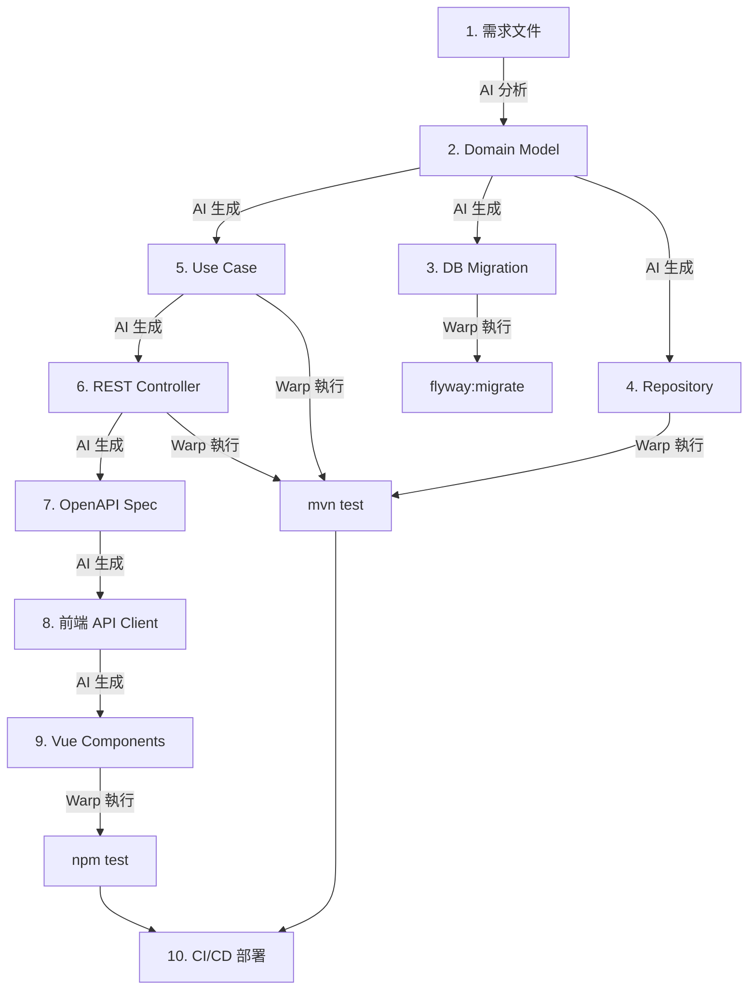

```bash
# 完整流程一鍵執行（Warp Workflow）
---
name: "Full Stack Generation"
command: |
  echo "📋 Step 1: 分析需求..."
  # Agent Mode 分析需求文件
  
  echo "🗄️ Step 2: 生成 DB Migration..."
  mvn flyway:migrate
  
  echo "☕ Step 3: 後端建置..."
  cd backend && mvn clean test
  
  echo "🎨 Step 4: 前端建置..."
  cd ../frontend && npm run build
  
  echo "🧪 Step 5: E2E 測試..."
  cd ../frontend && npm run test:e2e
  
  echo "📦 Step 6: 打包..."
  cd ../backend && mvn package -DskipTests
  
  echo "🐳 Step 7: Docker 映像..."
  podman build -t order-service:latest .
  
  echo "✅ 完成！"
```

> **實務建議**：全流程 AI 生成後，務必執行人工 Code Review，特別關注：SQL Injection 防護、XSS 防護、認證/授權邏輯、敏感資料處理。

> **常見錯誤**：AI 生成的前端程式碼未考慮 XSS 防護。務必確認所有使用者輸入都經過適當的 sanitize 與 escape。

---

## 8. 逆向工程（Legacy → Modern）

### 8.1 分析舊系統

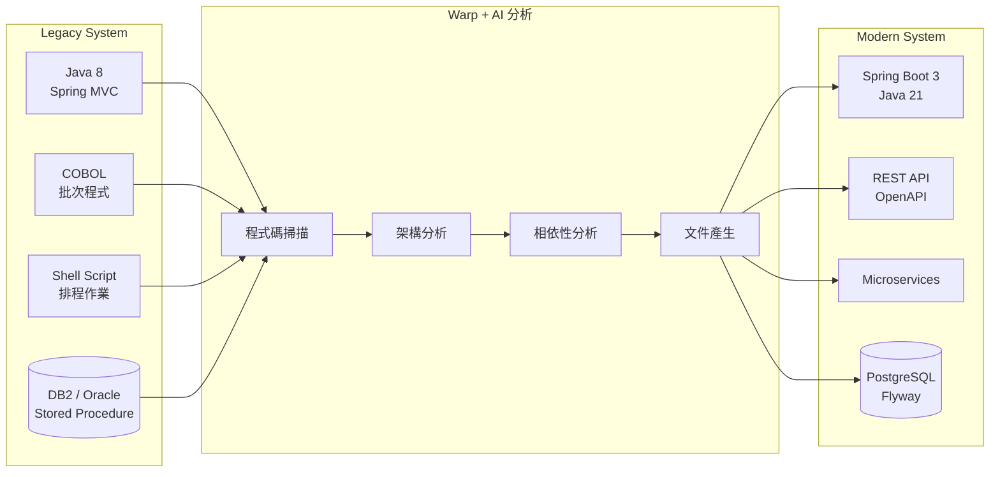

#### 程式碼掃描

```bash
# 在 Warp 中進行 Legacy 程式碼分析

# Step 1: 統計專案規模
find /path/to/legacy -name "*.java" | wc -l
find /path/to/legacy -name "*.java" -exec cat {} + | wc -l
cloc /path/to/legacy --include-lang=Java,XML,SQL,Properties

# Step 2: 相依性分析
cd /path/to/legacy
mvn dependency:tree > dependency-tree.txt
mvn dependency:analyze > dependency-analysis.txt

# Step 3: 使用 AI 分析架構
```

#### AI Prompt 範例

```
# Warp Agent Mode：Legacy 系統分析

"分析以下 Legacy Java 專案（Java 8 + Spring MVC + Hibernate）：

目錄：/path/to/legacy/src/main/java

請產出：
1. 【架構報告】
   - 現有架構模式識別
   - 模組間耦合度分析
   - 技術債務清單（依嚴重度排序）
   
2. 【類別關係圖】（Mermaid class diagram）

3. 【相依性風險報告】
   - EOL（End of Life）元件
   - 已知 CVE 漏洞
   - 無維護的 Library

4. 【遷移建議】
   - 優先級排序
   - 風險評估
   - 工作量估計（Story Points）

5. 【程式碼品質指標】
   - 圈複雜度（Cyclomatic Complexity）
   - God Class 清單
   - 重複程式碼比例"
```

### 8.2 用 Warp + AI 重建架構

```bash
# Step 1: 產生現有 API 清單
# Warp Agent Mode Prompt：
"掃描 Legacy 專案中所有 @RequestMapping / @GetMapping / @PostMapping，
產出完整的 API 對照表：
| 現有 URL | HTTP Method | Controller | 參數 | 說明 |"

# Step 2: 設計新架構
# Warp Agent Mode Prompt：
"基於上述 API 對照表，設計 Clean Architecture 微服務架構：
1. 服務拆分建議（依 DDD Bounded Context）
2. 每個服務的 API 設計（RESTful + OpenAPI）
3. 服務間通訊方式（同步 REST / 非同步 MQ）
4. 資料庫拆分策略
5. 遷移順序（Strangler Fig Pattern）"

# Step 3: 逐步遷移
# 使用 Strangler Fig Pattern
# 在 Warp 中同時監控新舊系統
```

### 8.3 自動產生文件 / API / 測試

```
# Warp Agent Mode：批量文件生成

"為 Legacy 專案中的以下服務自動產生：

1. 【技術文件】
   - 每個 Service 的功能說明
   - 輸入/輸出資料流程
   - 業務規則描述

2. 【API 規格】
   - 將現有 Controller 轉換為 OpenAPI 3.0
   - 包含 Request/Response 範例

3. 【測試案例】
   - 根據現有邏輯反推 Unit Test
   - 使用 JUnit 5 + Mockito
   - 覆蓋所有分支條件

4. 【資料庫文件】
   - ER Diagram（Mermaid）
   - 資料字典
   - Stored Procedure 說明

請將所有產出放在 docs/ 目錄下。"
```

> **實務建議**：逆向工程最大的風險是「理解錯誤」。建議每個 AI 產出的分析結果都與原始開發人員（若仍在職）確認，或至少進行 Integration Test 驗證行為一致性。

> **常見錯誤**：直接用 AI 重寫整個系統。應使用 Strangler Fig Pattern 漸進遷移，每次只替換一個功能模組，確認行為一致後再進行下一個。

---

## 9. Framework 升級

### 9.1 Spring Boot 2 → 3 / 4 升級

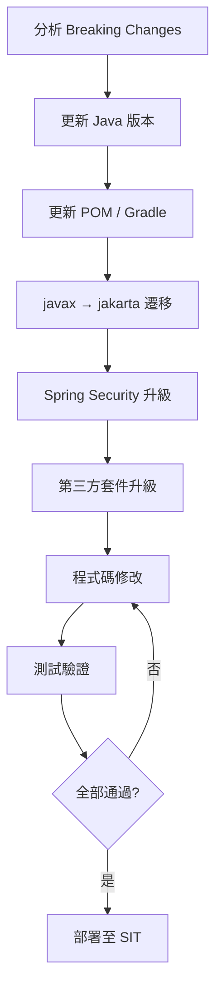

#### Warp 指令

```bash
# Step 1: 分析 Breaking Changes
# 使用 Spring Boot Migrator
git clone https://github.com/spring-projects-experimental/spring-boot-migrator.git
cd spring-boot-migrator
mvn clean install
java -jar target/spring-boot-migrator.jar /path/to/project

# Step 2: 使用 OpenRewrite 自動遷移
mvn -U org.openrewrite.maven:rewrite-maven-plugin:run \
  -Drewrite.recipeArtifactCoordinates=org.openrewrite.recipe:rewrite-spring:LATEST \
  -Drewrite.activeRecipes=org.openrewrite.java.spring.boot3.UpgradeSpringBoot_3_4

# Step 3: 驗證
mvn clean compile
mvn test
```

#### AI Prompt 範例

```
# Warp Agent Mode：Spring Boot 升級分析

"分析當前專案的 Spring Boot 2.7 → 3.4 升級影響：

1. 掃描 pom.xml 中所有依賴
2. 識別 javax.* 引用（需改為 jakarta.*）
3. 檢查 Spring Security 配置（WebSecurityConfigurerAdapter 已移除）
4. 檢查 Spring Data 變更（Repository 方法命名）
5. 檢查 Actuator 端點變更
6. 檢查 Properties 名稱變更

產出：
- 影響清單（依風險排序）
- 每項變更的修改指引
- 自動修復可行的項目標記
- 需人工審查的項目標記
- 預估工時"
```

### 9.2 Java 8 → 21+ 升級

```bash
# Step 1: 確認目前版本
java -version
mvn --version

# Step 2: 安裝 Java 21
# Windows
winget install EclipseAdoptium.Temurin.21.JDK

# macOS
brew install openjdk@21

# 或使用 SDKMAN
sdk install java 21.0.5-tem
sdk use java 21.0.5-tem

# Step 3: 更新 pom.xml
```

#### AI Prompt 範例

```
# Warp Agent Mode：Java 升級

"將專案從 Java 8 升級至 Java 21，自動轉換以下內容：

1. 【語法現代化】
   - Anonymous class → Lambda
   - for loop → Stream API
   - String concatenation → Text Block / String.format
   - instanceof + cast → Pattern Matching
   - switch statement → switch expression
   - Optional 鏈式呼叫

2. 【新 API 使用】
   - java.time 替換 java.util.Date
   - HttpClient 替換 Apache HttpClient
   - Records 替換簡單 POJO
   - Sealed classes（適用場景）

3. 【模組化準備】
   - 檢查 internal API 使用
   - 檢查反射存取（--add-opens 需求）

4. 【建置設定】
   - pom.xml 的 maven.compiler.source/target
   - Dockerfile 基礎映像更新

每項轉換標記 [AUTO] 或 [MANUAL]，
[MANUAL] 需說明原因與建議修改方式。"
```

### 9.3 Warp + AI 升級自動化流程

```yaml
# Warp Drive Workflow：Framework 升級流程
---
name: "Framework Upgrade Pipeline"
command: |
  echo "📋 Phase 1: 分析..."
  echo "  掃描 Breaking Changes..."
  mvn versions:display-dependency-updates > dep-updates.txt
  mvn versions:display-plugin-updates > plugin-updates.txt
  
  echo "🔧 Phase 2: 自動修復..."
  echo "  執行 OpenRewrite..."
  mvn -U org.openrewrite.maven:rewrite-maven-plugin:run \
    -Drewrite.recipeArtifactCoordinates=org.openrewrite.recipe:rewrite-spring:LATEST \
    -Drewrite.activeRecipes={{recipe}}
  
  echo "🔨 Phase 3: 編譯驗證..."
  mvn clean compile 2>&1 | tee compile-result.txt
  
  echo "🧪 Phase 4: 測試..."
  mvn test 2>&1 | tee test-result.txt
  
  echo "📊 Phase 5: 報告..."
  echo "  編譯結果: $(grep -c 'ERROR' compile-result.txt) 個錯誤"
  echo "  測試結果: $(grep 'Tests run:' test-result.txt | tail -1)"
  
  echo "✅ 升級流程完成，請查閱報告"
arguments:
  - name: recipe
    description: "OpenRewrite Recipe 名稱"
    default_value: "org.openrewrite.java.spring.boot3.UpgradeSpringBoot_3_4"
```

> **實務建議**：Framework 升級務必分階段進行（Dev → SIT → UAT → PROD），每階段都需完整回歸測試。建議搭配 Feature Flag 做灰度發布。

> **常見錯誤**：一次性升級多個 Framework（例如同時升 Java + Spring Boot + Security）。應一次只升一個主要元件，確認穩定後再升級下一個。

---

## 10. Warp Drive（團隊協作）

### 10.1 建立企業 Workflow Library

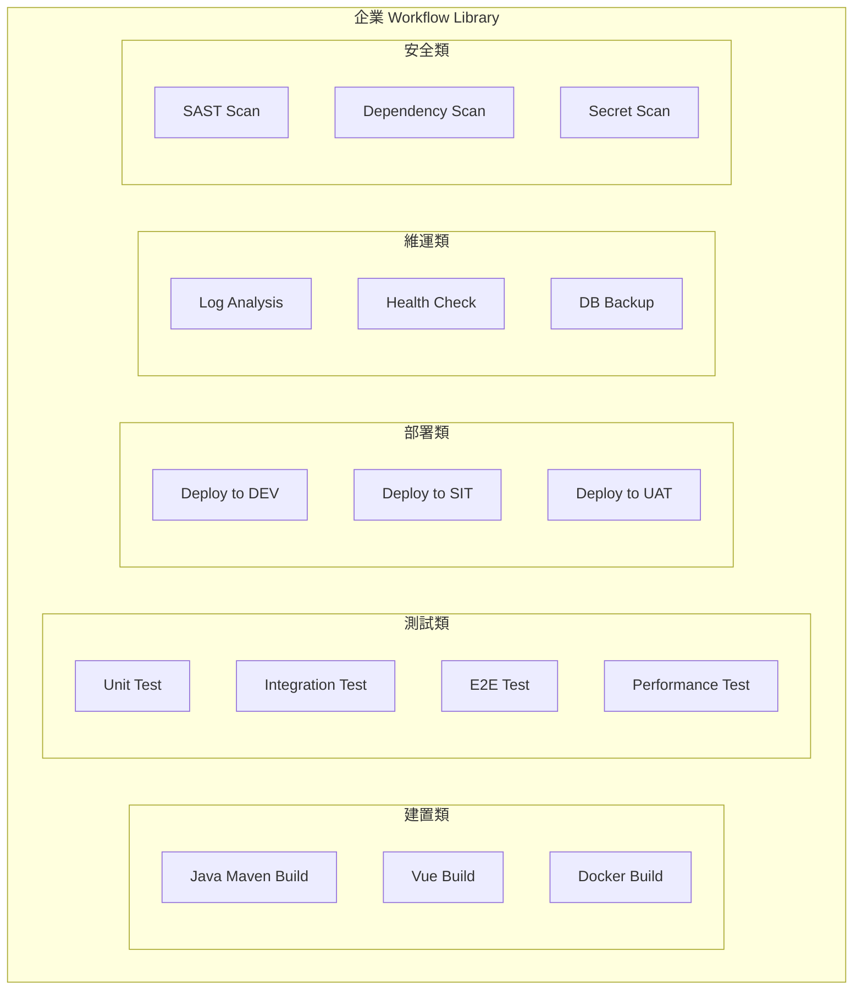

#### Workflow 範例庫

```yaml
# 1. Java Maven Build Workflow
---
name: "Java Maven Build"
command: |
  echo "🔨 Building {{project_name}}..."
  cd {{project_dir}}
  mvn clean {{goal}} \
    -P {{profile}} \
    -DskipTests={{skip_tests}} \
    -T {{threads}}
  echo "✅ Build completed"
tags: [java, maven, build]
arguments:
  - name: project_name
    description: "專案名稱"
  - name: project_dir
    description: "專案目錄"
    default_value: "."
  - name: goal
    description: "Maven Goal"
    default_value: "package"
  - name: profile
    description: "Maven Profile"
    default_value: "dev"
  - name: skip_tests
    description: "是否跳過測試"
    default_value: "false"
  - name: threads
    description: "平行建置執行緒"
    default_value: "2C"
```

```yaml
# 2. Health Check Workflow
---
name: "Service Health Check"
command: |
  echo "🏥 Checking {{service_name}} health..."
  
  # HTTP Health Check
  HTTP_STATUS=$(curl -s -o /dev/null -w "%{http_code}" {{health_url}})
  echo "HTTP Status: $HTTP_STATUS"
  
  # Response Time
  RESPONSE_TIME=$(curl -s -o /dev/null -w "%{time_total}" {{health_url}})
  echo "Response Time: ${RESPONSE_TIME}s"
  
  # Detailed Health
  curl -s {{health_url}} | jq '.'
  
  if [ "$HTTP_STATUS" = "200" ]; then
    echo "✅ {{service_name}} is healthy"
  else
    echo "❌ {{service_name}} is unhealthy!"
  fi
tags: [ops, health, monitoring]
arguments:
  - name: service_name
    description: "服務名稱"
  - name: health_url
    description: "健康檢查 URL"
    default_value: "http://localhost:8080/actuator/health"
```

### 10.2 指令模板設計

#### 模板設計原則

| 原則 | 說明 | 範例 |
|------|------|------|
| **參數化** | 所有可變部分使用 `{{variable}}` | `{{project_dir}}` |
| **有預設值** | 常用參數提供預設值 | `default_value: "dev"` |
| **有描述** | 每個參數附帶說明 | `description: "Maven Profile"` |
| **有標籤** | 分類標籤便於搜尋 | `tags: [java, build]` |
| **有輸出** | 關鍵步驟輸出狀態 | `echo "✅ Complete"` |
| **有錯誤處理** | 失敗時提示原因 | `set -e` + 錯誤訊息 |

### 10.3 敏感資訊（Env）管理策略

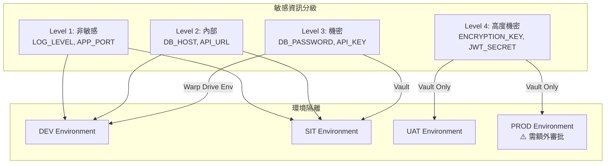

#### 管理策略

```bash
# Level 1-2：使用 Warp Drive Environment Variables
# 直接在 Warp Drive 中設定，團隊可見

# Level 3：使用 Warp Drive + 權限控管
# Warp Drive → Environment Variables → 設定存取權限

# Level 4：使用外部密鑰管理
# HashiCorp Vault / AWS Secrets Manager / Azure Key Vault
# Warp 中透過 CLI 取得

# Vault 整合範例
export DB_PASSWORD=$(vault kv get -field=password secret/myapp/db)
export JWT_SECRET=$(vault kv get -field=secret secret/myapp/jwt)

# ⚠️ 禁止事項
# ❌ 不可將密碼寫在 Workflow 中
# ❌ 不可將 API Key commit 到 Git
# ❌ 不可在 Block 分享中包含密鑰
# ❌ 不可截圖包含密鑰的 Block
```

> **實務建議**：建議定期（每月）審查 Warp Drive 中的環境變數，確認無過期、無使用的變數。Level 3 以上的密鑰應設定定期輪換機制。

> **常見錯誤**：團隊成員將 PROD 環境變數直接存在個人的 Warp Drive 中。所有生產環境密鑰應統一由平台組管理，透過 Vault 動態核發。

---

## 11. SSDLC + Warp（安全開發）

### 11.1 SAST 靜態應用安全測試

```bash
# SpotBugs + Find Security Bugs
mvn spotbugs:check -Dspotbugs.plugins.plugin.groupId=com.h3xstream.findsecbugs \
  -Dspotbugs.plugins.plugin.artifactId=findsecbugs-plugin

# SonarQube 掃描
mvn sonar:sonar \
  -Dsonar.projectKey=order-service \
  -Dsonar.host.url=http://sonar.internal:9000 \
  -Dsonar.login={{SONAR_TOKEN}}

# Semgrep（開源 SAST）
semgrep --config=p/java --config=p/owasp-top-ten src/

# 在 Warp 中查看結果
# 掃描結果自動成為 Block，可用 AI 分析
```

#### AI 輔助安全分析

```
# Warp Agent Mode Prompt：

"分析以下 Java 程式碼的安全漏洞：

[貼上程式碼或指定檔案路徑]

請依 OWASP Top 10 2025 檢查：
1. A01 - Broken Access Control
2. A02 - Cryptographic Failures
3. A03 - Injection（SQL / XSS / Command）
4. A04 - Insecure Design
5. A05 - Security Misconfiguration
6. A06 - Vulnerable Components
7. A07 - Authentication Failures
8. A08 - Data Integrity Failures
9. A09 - Logging Failures
10. A10 - SSRF

產出格式：
| 風險等級 | OWASP 類別 | 檔案:行號 | 說明 | 修復建議 |"
```

### 11.2 Dependency Scan 相依套件掃描

```bash
# OWASP Dependency Check
mvn org.owasp:dependency-check-maven:check

# Maven Dependency 漏洞掃描
mvn versions:display-dependency-updates

# npm audit（前端）
cd frontend && npm audit --production

# Trivy（容器掃描）
trivy image order-service:latest
trivy fs --security-checks vuln,config .
```

```yaml
# Warp Drive Workflow：每日安全掃描
---
name: "Daily Security Scan"
command: |
  echo "🔐 Security Scan Starting..."
  DATE=$(date +%Y%m%d)
  
  echo "📦 Step 1: Dependency Check..."
  mvn org.owasp:dependency-check-maven:check \
    -DfailBuildOnCVSS=7 2>&1 | tee security/dep-check-$DATE.txt
  
  echo "🔍 Step 2: SAST..."
  semgrep --config=p/java --config=p/owasp-top-ten \
    --json src/ > security/sast-$DATE.json
  
  echo "🐳 Step 3: Container Scan..."
  trivy image --severity HIGH,CRITICAL \
    order-service:latest > security/container-$DATE.txt
  
  echo "📊 Step 4: Report..."
  echo "  CVE High+: $(grep -c 'HIGH\|CRITICAL' security/dep-check-$DATE.txt)"
  echo "  SAST Issues: $(jq '.results | length' security/sast-$DATE.json)"
  
  echo "✅ Security Scan Complete"
tags: [security, sast, scan, daily]
```

### 11.3 Secret Scan 機密掃描

```bash
# Gitleaks（Git 歷史中的機密掃描）
gitleaks detect --source=. --verbose

# TruffleHog
trufflehog git file://. --since-commit HEAD~50

# 在 pre-commit hook 中防止機密提交
# .pre-commit-config.yaml
cat > .pre-commit-config.yaml << 'EOF'
repos:
  - repo: https://github.com/gitleaks/gitleaks
    rev: v8.18.0
    hooks:
      - id: gitleaks
EOF

pre-commit install
```

### 11.4 自動化安全檢查流程

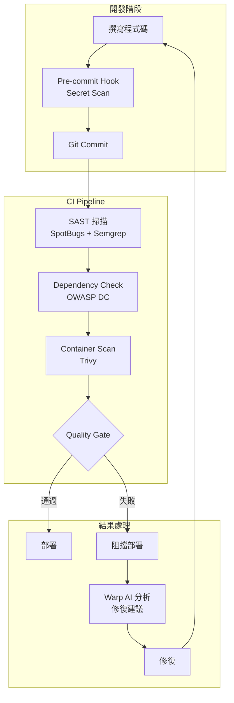

> **實務建議**：安全掃描應整合至 CI/CD Pipeline，設定 Quality Gate（如 CVSS ≥ 7 的 CVE 為 0）。掃描結果透過 Warp Block 分享給開發者，搭配 AI 分析提供修復建議。

> **常見錯誤**：只在部署前做安全掃描。應在開發階段就設定 pre-commit hook + IDE 插件，將安全左移（Shift Left）。

---

## 12. 系統維運與監控

### 12.1 Log 分析

```bash
# 使用 Warp Block 分析日誌
# 每個指令輸出自動成為 Block，可搜尋、過濾

# 即時日誌監控
tail -f /var/log/app/application.log | grep --line-buffered "ERROR"

# 結構化日誌查詢（JSON 格式日誌）
cat app.log | jq 'select(.level == "ERROR") | {time: .timestamp, msg: .message, trace: .stackTrace}'

# 統計錯誤分佈
cat app.log | jq -r 'select(.level == "ERROR") | .logger' | sort | uniq -c | sort -rn | head -20

# Kubernetes 日誌
kubectl logs -f deployment/order-service --all-containers --since=1h | grep "ERROR"

# AI 分析日誌
# 選取日誌 Block → "Explain with AI"
```

#### AI Prompt 範例

```
# Warp Agent Mode：日誌分析

"分析以下應用日誌中的異常模式：

[貼上日誌或指定檔案]

請產出：
1. 異常類型分類與統計
2. 時間分佈熱力圖（文字描述）
3. 根本原因分析（Top 5）
4. 關聯性分析（相同 traceId 的錯誤鏈）
5. 建議的修復優先順序
6. 監控告警規則建議（Prometheus alerting rules）"
```

### 12.2 指令自動化

```yaml
# Warp Drive Workflow：系統巡檢
---
name: "System Daily Check"
command: |
  echo "🔍 系統巡檢 - $(date '+%Y-%m-%d %H:%M')"
  echo "================================"
  
  echo "📊 1. 服務狀態"
  for svc in order-service user-service payment-service; do
    STATUS=$(curl -s -o /dev/null -w "%{http_code}" http://$svc:8080/actuator/health)
    if [ "$STATUS" = "200" ]; then
      echo "  ✅ $svc: UP"
    else
      echo "  ❌ $svc: DOWN (HTTP $STATUS)"
    fi
  done
  
  echo ""
  echo "💾 2. 磁碟使用"
  df -h | grep -E "^/dev" | awk '{print "  " $6 ": " $5 " used (" $4 " free)"}'
  
  echo ""
  echo "🐳 3. 容器狀態"
  podman ps --format "  {{.Names}}: {{.Status}}"
  
  echo ""
  echo "📈 4. 資源使用"
  echo "  CPU: $(top -bn1 | grep 'Cpu(s)' | awk '{print $2}')%"
  echo "  MEM: $(free -m | awk 'NR==2{printf "%.1f%%", $3*100/$2}')"
  
  echo ""
  echo "🔐 5. 安全事件"
  journalctl --since "24 hours ago" | grep -c "authentication failure"
  
  echo "================================"
  echo "巡檢完成"
tags: [ops, daily, health-check]
```

### 12.3 Incident 處理

```yaml
# Warp Drive Workflow：事件處理 SOP
---
name: "Incident Response"
command: |
  echo "🚨 Incident Response - {{incident_id}}"
  echo "================================"
  
  echo "📋 Step 1: 收集資訊"
  echo "  服務: {{service_name}}"
  echo "  環境: {{environment}}"
  echo "  時間: $(date)"
  
  echo ""
  echo "📊 Step 2: 取得即時狀態"
  kubectl get pods -n {{namespace}} -l app={{service_name}}
  kubectl top pods -n {{namespace}} -l app={{service_name}}
  
  echo ""
  echo "📝 Step 3: 取得最近日誌"
  kubectl logs -n {{namespace}} deployment/{{service_name}} --tail=100 --since=10m
  
  echo ""
  echo "🔍 Step 4: 取得事件"
  kubectl get events -n {{namespace}} --sort-by='.lastTimestamp' | tail -20
  
  echo ""
  echo "💡 請使用 AI Agent Mode 分析上述資訊"
  echo "   建議 Prompt: '分析以上 K8s 日誌與事件，找出根本原因並提供修復步驟'"
arguments:
  - name: incident_id
    description: "事件編號"
  - name: service_name
    description: "受影響的服務名稱"
  - name: environment
    description: "環境（dev/sit/uat/prod）"
  - name: namespace
    description: "K8s Namespace"
    default_value: "default"
tags: [ops, incident, emergency]
```

> **實務建議**：將 Incident Response Workflow 存入 Warp Drive 團隊共享，確保所有 on-call 人員都能快速取得標準化的處理流程。

> **常見錯誤**：在 PROD 環境的 Incident 處理中直接修改設定，未留下記錄。所有操作都應在 Warp Block 中進行，Block 自動保留操作記錄可供事後審計。

---

## 13. 最佳實務（Best Practices）

### 13.1 Prompt Engineering

#### Prompt 設計框架

```
# CLEAR 框架（企業級 AI Prompt 設計）

C - Context（上下文）
    專案技術棧、架構模式、團隊約定

L - Language（語言/格式）
    輸出格式、程式語言、命名規範

E - Examples（範例）
    期望的輸入輸出範例

A - Action（動作）
    明確的任務指令

R - Restrictions（限制）
    安全約束、效能要求、相容性
```

#### Prompt 範例

```
# ✅ 好的 Prompt
"Context: Spring Boot 3.4 + Java 21 + Clean Architecture 專案
Language: Java，使用 records, sealed classes, pattern matching
Action: 建立 PaymentService，實作信用卡付款邏輯
Examples:
  - 輸入：PaymentCommand(orderId, amount, cardToken)
  - 輸出：PaymentResult(transactionId, status, timestamp)
Restrictions:
  - 金額需用 BigDecimal（不可用 double）
  - 敏感資料（cardToken）不可出現在日誌
  - 需加入冪等性檢查（Idempotency Key）
  - 交易需要 @Transactional"

# ❌ 不好的 Prompt
"幫我寫一個付款功能"
```

### 13.2 Workflow 設計

| 設計原則 | 說明 | 檢查項目 |
|---------|------|---------|
| **原子性** | 每個 Workflow 只做一件事 | 單一職責、可組合 |
| **冪等性** | 重複執行結果相同 | 無副作用 |
| **參數化** | 避免硬編碼 | 使用 `{{variable}}` |
| **可觀察** | 有輸出與狀態回報 | echo 關鍵步驟 |
| **安全性** | 不含敏感資訊 | 密鑰用 Env Var |
| **版本化** | 有版本標記 | 名稱含版本號 |
| **文件化** | 有使用說明 | tags + description |

### 13.3 團隊導入策略

```mermaid
graph LR
    subgraph "Phase 1（Week 1-2）"
        P1A[安裝 Warp]
        P1B[基礎功能培訓]
        P1C[設定開發環境]
    end
    
    subgraph "Phase 2（Week 3-4）"
        P2A[導入 AI Agent]
        P2B[建立 Workflow 範本]
        P2C[Prompt 標準化]
    end
    
    subgraph "Phase 3（Week 5-8）"
        P3A[Warp Drive 團隊共享]
        P3B[安全檢查整合]
        P3C[CI/CD 整合]
    end
    
    subgraph "Phase 4（Week 9-12）"
        P4A[效能優化]
        P4B[知識庫建置]
        P4C[成效評估]
    end
    
    P1A --> P1B --> P1C
    P1C --> P2A --> P2B --> P2C
    P2C --> P3A --> P3B --> P3C
    P3C --> P4A --> P4B --> P4C
```

#### 導入里程碑

| Week | 目標 | 交付物 | 成功指標 |
|------|------|--------|---------|
| 1-2 | 環境就緒 | 全員安裝 Warp | 100% 安裝率 |
| 3-4 | AI 啟用 | Workflow 範本庫 | 每人每日使用 AI ≥ 3 次 |
| 5-8 | 團隊協作 | Warp Drive 知識庫 | Workflow 共享數 ≥ 20 |
| 9-12 | 成效驗證 | ROI 報告 | 開發效率提升 ≥ 30% |

---

## 14. 常見錯誤與反模式

### 反模式清單

| # | 反模式 | 說明 | 正確做法 |
|---|--------|------|---------|
| 1 | **AI 盲信** | 不經審查直接使用 AI 產出 | 所有 AI 程式碼必須 Code Review |
| 2 | **Prompt 隨意** | 沒有結構化的 Prompt | 使用 CLEAR 框架 |
| 3 | **密鑰裸露** | API Key 寫在 Workflow | 使用 Warp Drive Env 或 Vault |
| 4 | **Workflow 失控** | 無版本、無審查 | Git 管理 + 定期審查 |
| 5 | **過度自動化** | 關鍵決策全交 AI | 安全/架構決策需人工 |
| 6 | **環境混用** | DEV/PROD Env 混用 | 嚴格環境隔離 |
| 7 | **忽略安全** | 跳過安全掃描 | 整合至 CI/CD Pipeline |
| 8 | **知識孤島** | 不使用 Warp Drive 共享 | 強制共享 Workflow/Prompt |
| 9 | **Block 敏感** | 分享含密鑰的 Block | 分享前檢查內容 |
| 10 | **依賴單一 Agent** | 只用一個 AI Agent | 依任務選擇最適 Agent |

### 各反模式詳細說明

#### 1. AI 盲信

```bash
# ❌ 錯誤做法
claude "寫一個登入功能" → 直接複製到 production code

# ✅ 正確做法
claude "寫一個登入功能" → Code Review → 安全審查 → 單元測試 → 整合測試 → 合併
```

#### 5. 過度自動化

```bash
# ❌ 適合 AI 自動化的任務
# - 樣板程式碼生成（CRUD / DTO / Mapper）
# - 測試案例生成
# - 文件生成
# - 指令查詢

# ✅ 需人工決策的任務
# - 架構設計決策
# - 安全策略制定
# - 資料庫 schema 設計（需 DBA 審查）
# - 生產環境部署審批
# - 效能關鍵路徑最佳化
```

---

## 15. 結論與導入建議

### 15.1 適合導入的組織

| 組織類型 | 適合程度 | 說明 |
|---------|---------|------|
| **新創團隊（< 20 人）** | ⭐⭐⭐⭐⭐ | 快速採用，無遷移負擔 |
| **中型團隊（20-100 人）** | ⭐⭐⭐⭐ | 需規劃導入策略 |
| **大型企業（> 100 人）** | ⭐⭐⭐ | 需試點後逐步推廣 |
| **金融/醫療（高合規）** | ⭐⭐⭐ | 需評估資安合規（SOC 2 已通過） |
| **政府/國防** | ⭐⭐ | 需評估資料落地與離線需求 |

### 15.2 ROI 分析

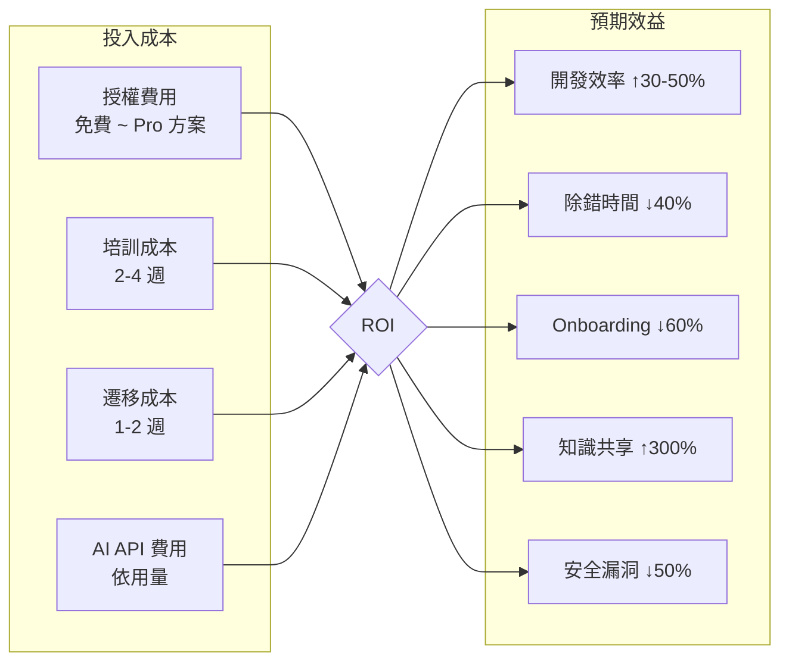

#### ROI 計算範例（50 人團隊）

| 項目 | 月成本/節省 | 年度 |
|------|------------|------|
| Warp Pro 授權 | $10/人 × 50 = $500 | $6,000 |
| AI API 費用 | ~$20/人 × 50 = $1,000 | $12,000 |
| 培訓工時 | 一次性 40h × 50 = 2,000h | — |
| **開發效率提升** | 35% × 160h × $50 × 50 | **$1,680,000** |
| **除錯時間節省** | 40% × 30h × $50 × 50 | **$360,000** |
| **知識共享效益** | Onboarding 時間 ↓60% | **$120,000** |
| **淨效益** | | **~$2,142,000/年** |

### 15.3 成熟度模型（Level 1 ~ Level 5）

| Level | 名稱 | 特徵 | 指標 |
|-------|------|------|------|
| **Level 1** | 初始（Ad-hoc） | 個別開發者嘗試使用 Warp | 安裝率 < 30% |
| **Level 2** | 可重複（Repeatable） | 團隊統一使用，基礎 Workflow | 安裝率 > 80%，Workflow > 10 |
| **Level 3** | 已定義（Defined） | 標準化 Prompt、Warp Drive 共享 | 每日 AI 互動 > 5 次/人 |
| **Level 4** | 已管理（Managed） | 安全整合、CI/CD 整合、成效量化 | 效率提升 > 30%，安全事件 ↓ |
| **Level 5** | 優化（Optimizing） | AI Agent 自主處理常規任務 | Cloud Agent 自動化率 > 50% |

#### 各 Level 檢查指標

```
Level 1 → Level 2：
☐ 全員安裝 Warp
☐ 完成基礎培訓
☐ 設定預設 Shell

Level 2 → Level 3：
☐ 建立 10+ 團隊 Workflow
☐ 建立 Prompt 範本庫
☐ Warp Drive 啟用

Level 3 → Level 4：
☐ 安全掃描整合 CI/CD
☐ AI 使用 Dashboard
☐ 成效量化報告

Level 4 → Level 5：
☐ Cloud Agent 自動化
☐ 自動 PR Review
☐ 自動化維運巡檢
```

---

## 附錄 A：檢查清單（Checklist）

### 新進成員快速上手清單

```
環境建置
☐ 安裝 Warp（https://www.warp.dev/download）
☐ 設定預設 Shell（Bash / Zsh / PowerShell）
☐ 確認 GPU 加速已啟用
☐ 安裝 Warp 主題（團隊統一）
☐ 設定 Git 整合

AI Agent 設定
☐ 安裝 Claude Code（npm install -g @anthropic-ai/claude-code）
☐ 設定 ANTHROPIC_API_KEY
☐ 安裝 GitHub Copilot CLI（gh extension install github/gh-copilot）
☐ 認證 GitHub（gh auth login）
☐ 熟悉 Agent Mode（Cmd/Ctrl + L）

Warp Drive
☐ 加入團隊 Warp Drive
☐ 匯入團隊 Workflows
☐ 載入環境變數（DEV）
☐ 瀏覽 Prompt 範本庫

開發工具
☐ 安裝 Java 21（sdk install java 21.0.5-tem）
☐ 安裝 Maven（sdk install maven）
☐ 安裝 Node.js 20+（nvm install 20）
☐ 安裝 Podman / Docker

安全設定
☐ 安裝 pre-commit hooks（gitleaks）
☐ 確認不使用 PROD 環境變數
☐ 了解機密管理策略
☐ 閱讀 SSDLC 流程文件

日常作業
☐ 熟悉 Block 操作（導覽 / 搜尋 / 複製 / 分享）
☐ 練習使用 Warp AI Explain 功能
☐ 執行第一個團隊 Workflow
☐ 使用 AI Agent 完成一個小型任務
```

### 每日開發檢查清單

```
開工
☐ 啟動 Warp → 確認環境變數已載入
☐ git pull 取得最新程式碼
☐ 檢查 CI/CD Pipeline 狀態

開發中
☐ 使用 AI Agent 輔助（非取代）開發
☐ 每次 commit 前執行本地測試
☐ 每次 commit 前確認無敏感資訊

收工
☐ 推送所有變更至遠端
☐ 更新 Warp Drive 知識筆記（如有新發現）
☐ 分享有價值的 Block 給團隊
```

---

## 附錄 B：常用指令速查表

### Warp 快捷鍵

| 操作 | macOS | Windows / Linux |
|------|-------|-----------------|
| Command Palette | `Cmd+Shift+P` | `Ctrl+Shift+P` |
| Agent Mode | `Cmd+L` | `Ctrl+L` |
| 新 Tab | `Cmd+T` | `Ctrl+T` |
| 分割面板 | `Cmd+D` | `Ctrl+D` |
| 上一個 Block | `Cmd+↑` | `Ctrl+↑` |
| 下一個 Block | `Cmd+↓` | `Ctrl+↓` |
| Block 內搜尋 | `Cmd+F` | `Ctrl+F` |
| 複製 Block | `Cmd+Shift+C` | `Ctrl+Shift+C` |
| 清除畫面 | `Cmd+K` | `Ctrl+K` |
| 指令歷史 | `Cmd+R` | `Ctrl+R` |

### Maven 常用指令

```bash
mvn clean compile                    # 清除並編譯
mvn test                             # 執行測試
mvn package -DskipTests              # 打包（跳過測試）
mvn dependency:tree                  # 相依性樹
mvn versions:display-dependency-updates  # 可更新的依賴
mvn spotbugs:check                   # 靜態分析
mvn sonar:sonar                      # SonarQube 掃描
mvn flyway:migrate                   # DB 遷移
mvn spring-boot:run                  # 啟動 Spring Boot
```

### Docker / Podman 常用指令

```bash
podman build -t app:latest .         # 建置映像
podman run -d -p 8080:8080 app       # 啟動容器
podman compose up -d                 # 啟動服務堆疊
podman logs -f <container>           # 查看日誌
podman exec -it <container> bash     # 進入容器
```

### Kubernetes 常用指令

```bash
kubectl get pods -w                  # 監控 Pod 狀態
kubectl logs -f deploy/<name>        # 追蹤日誌
kubectl describe pod <name>          # Pod 詳情
kubectl rollout restart deploy/<name>  # 重啟部署
kubectl port-forward svc/<name> 8080:80  # 連接埠轉發
```

---

## 附錄 C：AI Prompt 範本庫

### 程式碼生成類

```
# CG-001：REST Controller 生成
"為 {{domain}} 建立 Spring Boot REST Controller：
- 使用 @RestController + @RequestMapping("/api/v1/{{path}}")
- CRUD 操作（GET/POST/PUT/DELETE）
- Request 驗證（@Valid + @Validated）
- OpenAPI 3.0 註解
- 統一例外處理
- 分頁查詢支援
- Java 21 語法"

# CG-002：Vue 3 Component 生成
"建立 Vue 3 + TS + Tailwind 元件 {{component_name}}：
- <script setup lang='ts'>
- Props 定義（defineProps with TypeScript）
- Emits 定義（defineEmits）
- 使用 Composition API
- 響應式設計
- Loading / Error 狀態處理"

# CG-003：Unit Test 生成
"為 {{class_name}} 撰寫 JUnit 5 測試：
- @ExtendWith(MockitoExtension.class)
- Mock 所有依賴
- Given-When-Then 模式
- @DisplayName 中文描述
- 涵蓋正常/異常/邊界情境
- AssertJ 斷言"
```

### 分析類

```
# AN-001：架構分析
"分析 {{project_path}} 的架構：
1. 識別架構模式
2. 繪製 Mermaid 元件圖
3. 分析耦合度
4. 列出技術債務
5. 提供重構建議"

# AN-002：效能分析
"分析以下 SQL 查詢的效能：
[SQL]
1. 執行計畫分析
2. 索引建議
3. 查詢改寫建議
4. N+1 問題檢查"

# AN-003：安全分析
"檢查以下程式碼的安全漏洞（OWASP Top 10）：
[程式碼]
產出：風險等級 | 類別 | 位置 | 說明 | 修復"
```

### 維運類

```
# OP-001：錯誤分析
"分析以下錯誤日誌：
[日誌]
1. 根本原因
2. 影響範圍
3. 修復步驟
4. 預防措施"

# OP-002：效能調優
"分析以下 JVM 記憶體報告：
[jmap output]
1. 記憶體洩漏風險
2. GC 調優建議
3. JVM 參數建議"
```

---

## 附錄 D：Warp 方案與計費

### 方案比較

| 項目 | **Build（免費）** | **Max** | **Business** |
|------|:-----------------:|:-------:|:------------:|
| **月費** | $0 | 個人付費 | 按座位數計費 |
| **Local Agent（Warp 內建）** | ✅ 基礎用量 | ✅ 進階用量 | ✅ 團隊用量 |
| **CLI Agent 工具帶** | ✅ | ✅ | ✅ |
| **模型選擇** | 受限 | 全部模型 | 全部模型 |
| **Cloud Agents** | ❌ | ✅ | ✅ |
| **Oz Platform（CLI/API/SDK/Web）** | ❌ | ✅ | ✅ |
| **Self-Hosting** | ❌ | ❌ | ✅ |
| **Team Admin Panel** | ❌ | ❌ | ✅ |
| **Warp Drive 共享** | 限個人 | ✅ 團隊 | ✅ 組織 |
| **Session Sharing** | ❌ | ✅ | ✅ |
| **SSO / SAML** | ❌ | ❌ | ✅ |
| **Audit Log** | ❌ | ❌ | ✅ |
| **Credits** | 有限 | 較多 | 可自訂上限 |

### Credits 制度

Warp 使用 **Credits** 做為 AI 用量計量單位。不同模型消耗的 Credits 不同：

| 模型類別 | Credits 消耗 | 說明 |
|---------|:-----------:|------|
| Auto (Cost-efficient) | 低 | 最經濟的選擇 |
| Auto (Responsive) | 中 | 品質與成本平衡 |
| Auto (Genius) | 高 | 深度推理，消耗較多 |
| GPT-5.5 Extra High | 極高 | 最高精度，最高消耗 |
| Claude Haiku 4.5 | 低 | 快速回應，低消耗 |
| Claude Opus 4.7 Max | 極高 | 最高精度推理 |
| 開源模型（Fireworks AI） | 低 | 經濟實惠 |

```bash
# 查看團隊 Credits 用量（Oz CLI）
oz credits usage --team my-team --period monthly

# 設定用量上限
oz credits limit --team my-team --monthly-limit 10000

# 查看個人用量
oz credits usage --user me
```

> **注意**：Warp 目前 **不支援 BYOK（Bring Your Own Key）** 用於 Cloud Agents。所有 AI 模型呼叫均透過 Warp 平台中轉，並受零數據留存（ZDR）協議保護。

> **企業建議**：Business 方案適合 10 人以上團隊，提供 SSO、Audit Log、Self-Hosting 等企業級功能。建議先以 Max 方案試行，確認效益後再升級至 Business。

---

> **文件結束**  
> 本手冊由企業 AI 開發團隊維護，如有問題請透過 Warp Drive 提交回饋。  
> **下次更新**：依 Warp 版本更新同步更新本手冊。

