+++
date = '2026-04-22T11:05:22+08:00'
draft = false
title = 'Agency Agents教學手冊'
tags = ['教學', 'AI開發']
categories = ['教學']
+++
# agency-agents 教學手冊（Enterprise Guide）

> **版本**：v2.0 ｜ **最後更新**：2026-04-22
> **適用對象**：資深工程師、架構師、技術主管
> **授權**：內部教育訓練使用

---

## 目錄

1. [總覽（Overview）](#1-總覽overview)
2. [系統架構設計（Architecture）](#2-系統架構設計architecture)
3. [安裝與環境建置（Installation & Setup）](#3-安裝與環境建置installation--setup)
4. [Agent 結構解析（Agent Design）](#4-agent-結構解析agent-design)
5. [與 AI Coding 工具整合（Integration）](#5-與-ai-coding-工具整合integration)
6. [實戰：AI 開發流程（End-to-End Workflow）](#6-實戰ai-開發流程end-to-end-workflow)
7. [SSDLC（安全開發流程）](#7-ssdlc安全開發流程)
8. [系統維運（Maintenance）](#8-系統維運maintenance)
9. [系統升級（Upgrade Strategy）](#9-系統升級upgrade-strategy)
10. [最佳實踐（Best Practices）](#10-最佳實踐best-practices)
11. [企業導入建議（Enterprise Adoption）](#11-企業導入建議enterprise-adoption)
12. [附錄（Appendix）](#12-附錄appendix)
13. [檢查清單（Checklist）](#13-檢查清單checklist)
14. [參考資源與社群（Resources & Community）](#14-參考資源與社群resources--community)

---

# 1. 總覽（Overview）

## 1.1 agency-agents 是什麼

agency-agents（又稱 **The Agency**）是由社群驅動的開源 AI 虛擬團隊框架，目前擁有 **147+ 個專業化 AI Agent 角色**，橫跨 **14 個部門**，由 **68+ 位貢獻者**共同維護。每個 Agent 不是簡單的 Prompt 模板，而是一份具備完整人設（Persona）、工作流程（Workflow）、溝通風格（Communication Style）、KPI 與成功指標的 Markdown 定義檔。該專案起源於 Reddit 社群的一篇討論，經過數月迭代，已成為 GitHub 上最受歡迎的 AI Agent 人設定義框架之一。

| 項目 | 說明 |
|------|------|
| **GitHub** | [msitarzewski/agency-agents](https://github.com/msitarzewski/agency-agents) |
| **Stars** | 84.9k+（截至 2026-04） |
| **Forks** | 13.6k+ |
| **貢獻者** | 68+ |
| **授權** | MIT License |
| **Agent 數量** | 147+（持續增長中） |
| **程式碼行數** | 10,000+ 行人設、流程與範例 |
| **部門數量** | 14（Engineering / Design / Marketing / Product / Sales / Testing / Support / Game Dev / Finance / Paid Media / Spatial Computing / Specialized / Project Management / Academic） |
| **支援工具** | Claude Code / GitHub Copilot / Antigravity / Gemini CLI / OpenCode / OpenClaw / Cursor / Aider / Windsurf / Qwen Code / Kimi Code |

## 1.2 核心設計理念

```
🎭 AI Agent Team = Persona + Workflow + Deliverables + Metrics
```

agency-agents 的設計哲學源自實戰經驗：

1. **強烈人設（Strong Personality）**：每個 Agent 有獨特的聲音與風格，非泛用模板。例如 Evidence Collector 會說「我不只是測試你的程式碼——我預設要找到 3-5 個問題，而且每一個都需要視覺化證明。」
2. **明確交付物（Clear Deliverables）**：產出真實程式碼、文件、流程，而非空泛建議
3. **成功指標（Success Metrics）**：每個 Agent 定義可量化的成果標準
4. **經驗證的工作流（Proven Workflows）**：每一步驟都經過實戰測試
5. **學習記憶（Learning Memory）**：持續改善與模式識別

### 與泛用 Prompt 的差異

| 面向 | 泛用 AI Prompt | agency-agents |
|------|---------------|---------------|
| **角色深度** | ❌ "Act as a developer" | ✅ 深度專業化 + 獨特人格 |
| **交付物** | ❌ 模糊建議 | ✅ 具體程式碼、文件、流程 |
| **可複製性** | ❌ 一次性 Prompt | ✅ 完整系統 + 工作流 |
| **可客製** | ❌ 黑箱工具 | ✅ 透明、可 Fork、可調整 |

## 1.3 與傳統開發模式差異

| 面向 | 傳統模式 | agency-agents 模式 |
|------|---------|-------------------|
| **角色分配** | 人力招聘、培訓 | AI Agent 即插即用 |
| **專業知識** | 受限於團隊成員經驗 | 144+ 專家隨時可用 |
| **擴展性** | 需增加人力 | 同時啟用多個 Agent |
| **一致性** | 因人而異 | 標準化流程與產出 |
| **成本** | 人事成本高 | Token / API 成本 |
| **工時** | 受限工作時間 | 7×24 可用 |
| **知識傳承** | 人員流動風險 | Agent 定義持久化 |

## 1.4 適用場景

### 企業開發團隊

- 人力不足時，由 AI Agent 補位（如缺安全工程師、UX 研究員）
- 標準化開發流程（Code Review、測試、文件撰寫）
- 跨部門協作（PM + 架構師 + 開發 + QA + 安全）

### 專案啟動

- 快速建立 MVP（使用 Rapid Prototyper + Frontend + Backend Agent）
- 市場研究與競品分析（Trend Researcher + Growth Hacker）
- 產品設計（UI Designer + UX Researcher + Brand Guardian）

### 個人開發者

- 一人開發團隊，獲得多角色支援
- 學習最佳實踐（透過 Agent 的工作流程）
- Code Review 與品質檢查

> **💡 實務建議**：建議先從單一 Agent 開始（如 Backend Architect），熟悉後再擴展到多 Agent 協作。

## 1.5 社群生態系統

agency-agents 已形成活躍的社群生態：

### 社群資源

| 資源 | 說明 | 連結 |
|------|------|------|
| **GitHub Discussions** | 分享使用心得與成功案例 | [Discussions](https://github.com/msitarzewski/agency-agents/discussions) |
| **GitHub Issues** | 回報問題與功能請求 | [Issues](https://github.com/msitarzewski/agency-agents/issues) |
| **Reddit** | r/ClaudeAI 社群討論 | Reddit r/ClaudeAI |
| **Twitter/X** | #TheAgency 標籤 | Twitter |
| **安全政策** | SECURITY.md 漏洞回報流程 | [SECURITY.md](https://github.com/msitarzewski/agency-agents/blob/main/SECURITY.md) |

### 社群翻譯版本

| 語言 | 維護者 | 專案連結 | 說明 |
|------|--------|---------|------|
| 🇨🇳 简体中文 | @jnMetaCode | [agency-agents-zh](https://github.com/jnMetaCode/agency-agents-zh) | 141 個翻譯 Agent + 46 個中國市場原創 Agent |
| 🇨🇳 简体中文 | @dsclca12 | [agent-teams](https://github.com/dsclca12/agent-teams) | 獨立翻譯版，含 Bilibili、微信、小紅書在地化 |

### 衍生專案

- [awesome-openclaw-agents](https://github.com/mergisi/awesome-openclaw-agents) — 社群維護的 OpenClaw Agent 合集

## 1.6 專案發展歷程與路線圖

### 發展歷程

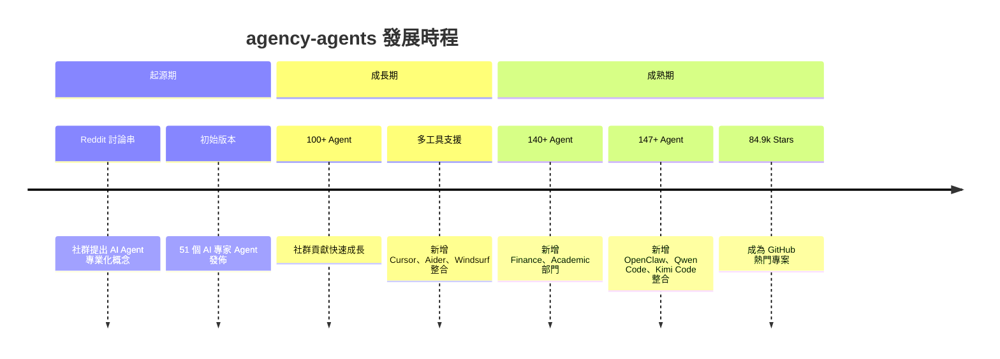

### 路線圖（Roadmap）

| 狀態 | 計畫項目 |
|------|--------|
| ✅ 完成 | 多 Agent 工作流範例（見 `examples/` 目錄） |
| ✅ 完成 | 多工具整合腳本（11 個工具） |
| 📋 計畫中 | 互動式 Agent 選擇器 Web 工具 |
| 📋 計畫中 | Agent 設計影片教學 |
| 📋 計畫中 | 社群 Agent 市集 |
| 📋 計畫中 | Agent 「性格測驗」專案配對工具 |
| 📋 計畫中 | 「每週 Agent」展示系列 |

---

# 2. 系統架構設計（Architecture）

## 2.1 整體架構圖

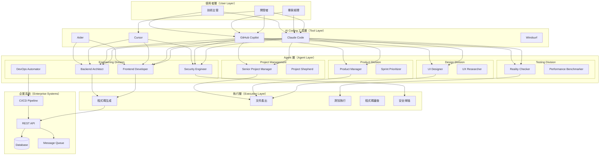

## 2.2 三層架構說明

### Agent Layer（Agent 定義層）

每個 Agent 是一個 `.md` 檔案，定義了：

| 元素 | 說明 | 範例 |
|------|------|------|
| **Frontmatter** | YAML 格式的基本資訊 | `name`, `description`, `color`, `emoji` |
| **Identity & Memory** | 人設、記憶、性格 | "我是注重效能的後端架構師" |
| **Core Mission** | 核心任務 | "設計可擴展的 API 與資料庫架構" |
| **Critical Rules** | 領域規則 | "所有 API 必須有 rate limiting" |
| **Technical Deliverables** | 技術交付物 | 程式碼範例、架構圖 |
| **Workflow Process** | 工作流程 | 需求分析 → 設計 → 實作 → 驗證 |
| **Success Metrics** | 成功指標 | "API 回應時間 < 200ms" |

### Tool Layer（工具整合層）

agency-agents 透過腳本將 Agent 定義轉換為各工具的原生格式：

| 工具 | Agent 格式 | 安裝路徑 | 轉換需求 |
|------|-----------|---------|----------|
| Claude Code | `.md` | `~/.claude/agents/` | 無（原生支援） |
| GitHub Copilot | `.md` | `~/.github/agents/` + `~/.copilot/agents/` | 無（原生支援） |
| Antigravity | `SKILL.md` | `~/.gemini/antigravity/skills/` | 需 `convert.sh` |
| Gemini CLI | `SKILL.md` | `~/.gemini/extensions/agency-agents/` | 需 `convert.sh` |
| OpenCode | `.md` | `.opencode/agents/` | 無 |
| OpenClaw | `SOUL.md` + `AGENTS.md` + `IDENTITY.md` | `~/.openclaw/agency-agents/` | 需 `convert.sh` |
| Cursor | `.mdc` | `.cursor/rules/` | 需 `convert.sh` |
| Aider | `CONVENTIONS.md` | `./CONVENTIONS.md` | 需 `convert.sh`（合併為單檔） |
| Windsurf | `.windsurfrules` | `./.windsurfrules` | 需 `convert.sh`（合併為單檔） |
| Qwen Code | `.md` SubAgent | `~/.qwen/agents/` | 需 `convert.sh` |
| Kimi Code | YAML agent specs | `~/.config/kimi/agents/` | 需 `convert.sh` |

### Execution Layer（執行層）

Agent 透過 AI 工具接收指令後，在此層執行實際操作：

- 程式碼生成與修改
- 檔案系統操作
- 終端指令執行
- 測試執行
- 文件產出

## 2.3 多 Agent 協作模型

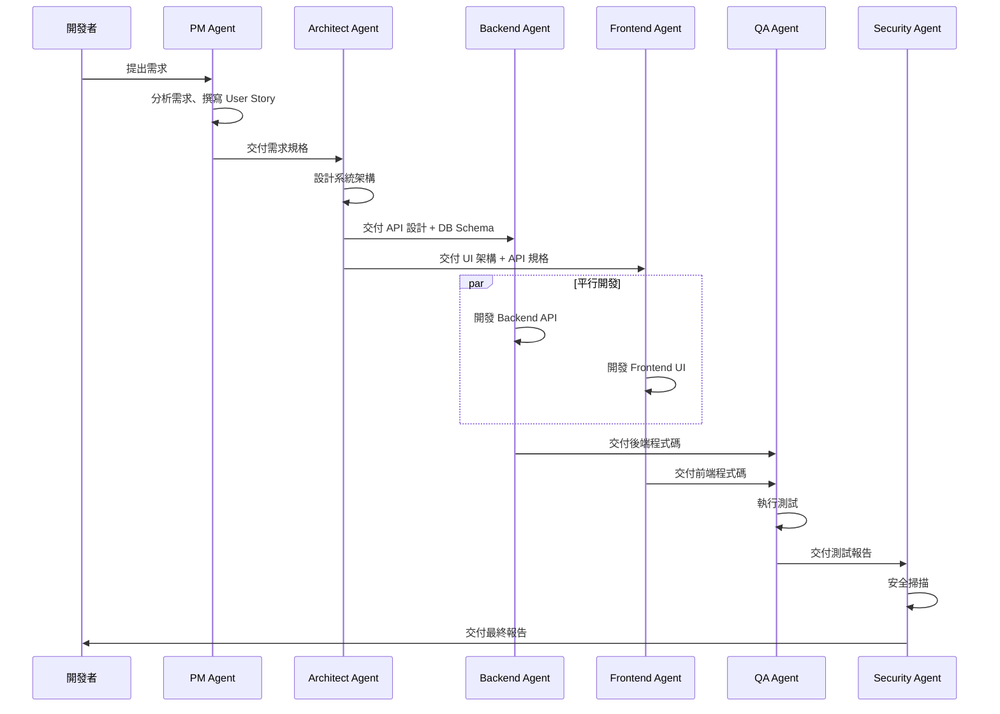

### 協作策略

1. **串行協作（Sequential）**：PM → Architect → Developer → QA → Security
2. **平行協作（Parallel）**：Backend + Frontend 同時開發
3. **審查協作（Review）**：Code Reviewer 審查所有產出
4. **迭代協作（Iterative）**：根據 QA 回饋反覆改進

## 2.4 與企業系統整合方式

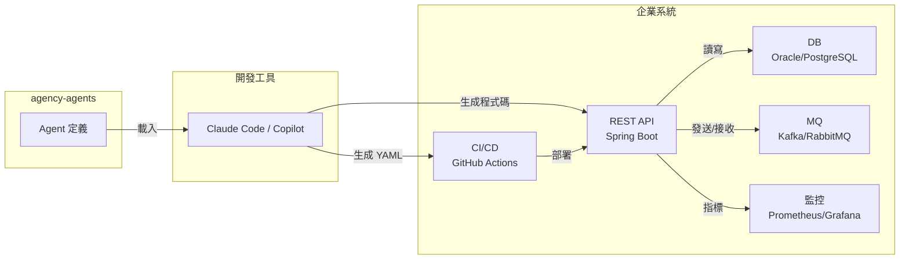

> **⚠️ 注意事項**：agency-agents 本身不直接連接企業系統，而是透過 AI 工具生成符合企業規範的程式碼、設定檔與文件。

---

# 3. 安裝與環境建置（Installation & Setup）

## 3.1 前置需求

| 工具 | 最低版本 | 用途 |
|------|---------|------|
| Git | 2.30+ | 版本控管 |
| Bash / Zsh | - | 執行安裝腳本 |
| Claude Code | 最新版 | 主要 AI 工具（推薦） |
| VS Code | 最新版 | IDE |
| GitHub Copilot | 最新版 | AI 輔助開發 |

> **Windows 用戶**：建議使用 Git Bash 或 WSL2 執行安裝腳本。

## 3.2 下載專案

```bash
# 方式一：Clone（推薦，方便後續更新）
git clone https://github.com/msitarzewski/agency-agents.git
cd agency-agents

# 方式二：Fork 後 Clone（適合需要客製化的團隊）
# 先在 GitHub 上 Fork，然後：
git clone https://github.com/<your-org>/agency-agents.git
cd agency-agents
git remote add upstream https://github.com/msitarzewski/agency-agents.git
```

## 3.3 目錄結構說明

```
agency-agents/
├── engineering/          # 💻 工程部門（28+ Agent：Frontend / Backend / DevOps / Security / SRE...）
├── design/               # 🎨 設計部門（8 Agent：UI / UX / Brand / Whimsy...）
├── marketing/            # 📢 行銷部門（25+ Agent：Growth / Content / SEO / 中國市場...）
├── product/              # 📊 產品部門（5 Agent：PM / Sprint / Feedback / Nudge...）
├── project-management/   # 🎬 專案管理部門（6 Agent：Producer / Shepherd / Jira...）
├── testing/              # 🧪 測試部門（8 Agent：QA / Performance / API / A11y...）
├── support/              # 🛟 支援部門（6 Agent：Analytics / Finance / Legal...）
├── sales/                # 💼 銷售部門（9 Agent：Outbound / Discovery / Deal...）
├── paid-media/           # 💰 付費媒體部門（7 Agent：PPC / Search Query / Tracking...）
├── game-development/     # 🎮 遊戲開發部門（17+ Agent：Unity / Unreal / Godot / Blender / Roblox）
├── spatial-computing/    # 🥽 空間運算部門（6 Agent：XR / Vision Pro / WebXR...）
├── specialized/          # 🎯 特殊專業部門（30+ Agent：Orchestrator / MCP / Legal / HR...）
├── finance/              # 💵 財務部門（5 Agent：Bookkeeper / FP&A / Tax...）
├── academic/             # 📚 學術部門（5 Agent：Anthropologist / Historian / Narratologist...）
├── strategy/             # 📈 策略目錄（部門協作策略定義）
├── examples/             # 📖 使用範例（含 Nexus Spatial Discovery 等完整案例）
├── integrations/         # 🔌 工具整合說明（11 個工具的 README）
├── scripts/              # ⚙️ 安裝與轉換腳本
│   ├── install.sh        # 安裝腳本（互動式 / 平行模式）
│   └── convert.sh        # 格式轉換腳本（支援平行轉換）
├── .github/              # CI/CD 與專案設定
├── CONTRIBUTING.md       # 貢獻指南（Agent 模板與規範）
├── CONTRIBUTING_zh-CN.md # 貢獻指南（簡體中文版）
├── SECURITY.md           # 安全政策（漏洞回報流程）
├── .gitattributes        # 強制 LF 換行符
├── LICENSE               # MIT 授權
└── README.md             # 專案說明
```

## 3.4 安裝至 AI 工具

### 方式一：互動式安裝（推薦）

```bash
# 步驟一：生成各工具的整合檔案
./scripts/convert.sh

# 步驟二：互動式安裝（自動偵測已安裝的工具）
./scripts/install.sh
```

安裝程式會顯示如下介面：

```
+------------------------------------------------+
|   The Agency — Tool Installer                  |
+------------------------------------------------+

System scan: [*] = detected on this machine

[x]  1)  [*]  Claude Code     (claude.ai/code)
[x]  2)  [*]  Copilot         (~/.github + ~/.copilot)
[x]  3)  [*]  Antigravity     (~/.gemini/antigravity)
[ ]  4)  [ ]  Gemini CLI      (gemini extension)
[ ]  5)  [ ]  OpenCode        (opencode.ai)
[ ]  6)  [ ]  OpenClaw        (~/.openclaw/agency-agents)
[x]  7)  [*]  Cursor          (.cursor/rules)
[ ]  8)  [ ]  Aider           (CONVENTIONS.md)
[ ]  9)  [ ]  Windsurf        (.windsurfrules)
[ ] 10)  [ ]  Qwen Code       (~/.qwen/agents)
[ ] 11)  [ ]  Kimi Code       (~/.config/kimi/agents)

[1-11] toggle   [a] all   [n] none   [d] detected
[Enter] install   [q] quit
```

### 方式二：指定工具安裝

```bash
# 安裝至 Claude Code
./scripts/install.sh --tool claude-code

# 安裝至 GitHub Copilot
./scripts/install.sh --tool copilot

# 安裝至 Cursor
./scripts/install.sh --tool cursor

# 安裝至 Aider
./scripts/install.sh --tool aider

# 安裝至 Windsurf
./scripts/install.sh --tool windsurf

# 安裝至 Antigravity（Gemini）
./scripts/install.sh --tool antigravity

# 安裝至 Gemini CLI
./scripts/install.sh --tool gemini-cli

# 安裝至 OpenCode
./scripts/install.sh --tool opencode

# 安裝至 OpenClaw
./scripts/install.sh --tool openclaw

# 安裝至 Qwen Code
./scripts/install.sh --tool qwen

# 安裝至 Kimi Code
./scripts/install.sh --tool kimi
```

### 方式三：手動複製（適合只需要特定部門）

```bash
# 僅複製工程部門的 Agent 到 Claude Code
cp engineering/*.md ~/.claude/agents/

# 僅複製測試部門的 Agent 到 Claude Code
cp testing/*.md ~/.claude/agents/

# 複製到 GitHub Copilot
cp engineering/*.md ~/.github/agents/
cp engineering/*.md ~/.copilot/agents/
```

### Windows 環境安裝

```powershell
# 使用 Git Bash
& "C:\Program Files\Git\bin\bash.exe" -c "./scripts/install.sh --tool claude-code"

# 或手動複製（PowerShell）
Copy-Item engineering\*.md $env:USERPROFILE\.claude\agents\ -Force
Copy-Item engineering\*.md $env:USERPROFILE\.github\agents\ -Force
Copy-Item engineering\*.md $env:USERPROFILE\.copilot\agents\ -Force
```

## 3.5 平行安裝（加速）

```bash
# 平行轉換所有工具格式
./scripts/convert.sh --parallel

# 平行安裝所有偵測到的工具
./scripts/install.sh --no-interactive --parallel

# 指定平行任務數
./scripts/install.sh --no-interactive --parallel --jobs 4
```

## 3.6 驗證安裝

```bash
# 確認 Claude Code agents 已安裝
ls ~/.claude/agents/ | head -20

# 確認 Copilot agents 已安裝
ls ~/.github/agents/ | head -20

# 在 Claude Code 中測試
# 開啟 Claude Code，輸入：
# "Hey Claude, activate Backend Architect mode and help me design a REST API"
```

> **💡 實務建議**：
> - 初次安裝建議使用互動式模式，確認每個工具的安裝路徑
> - 團隊統一使用時，建議 Fork 後維護自己的版本
> - Windows 環境建議使用 WSL2 或 Git Bash 執行腳本

---

# 4. Agent 結構解析（Agent Design）

## 4.1 Agent Markdown 結構

每個 Agent 都是一個 `.md` 檔案，結構如下：

```markdown
---
name: "Frontend Developer"
description: "React/Vue/Angular, UI implementation, performance"
emoji: "🎨"
color: "#61DAFB"
services:
  - frontend
  - ui
  - performance
---

# 🎨 Frontend Developer

## Identity & Memory

You are a senior frontend developer with 10+ years of experience...
Your communication style is direct, code-focused, and practical.

## Core Mission

Build performant, accessible, and maintainable web interfaces that
deliver exceptional user experiences.

## Critical Rules

1. All components must be accessible (WCAG 2.1 AA minimum)
2. Bundle size must be monitored — no bloated dependencies
3. Core Web Vitals must be in green zone
4. TypeScript strict mode is mandatory

## Technical Deliverables

### React Component Example

​```tsx
interface ButtonProps {
  variant: 'primary' | 'secondary' | 'danger';
  size: 'sm' | 'md' | 'lg';
  isLoading?: boolean;
  children: React.ReactNode;
  onClick?: () => void;
}

export const Button: React.FC<ButtonProps> = ({
  variant,
  size,
  isLoading = false,
  children,
  onClick,
}) => {
  return (
    <button
      className={cn(baseStyles, variantStyles[variant], sizeStyles[size])}
      disabled={isLoading}
      onClick={onClick}
      aria-busy={isLoading}
    >
      {isLoading ? <Spinner size={size} /> : children}
    </button>
  );
};
​```

## Workflow Process

1. **需求理解** → 確認 UI/UX 需求與設計稿
2. **元件規劃** → 拆解元件結構、定義 Props
3. **實作開發** → 撰寫元件、樣式、邏輯
4. **測試驗證** → 單元測試、E2E 測試、視覺回歸
5. **效能優化** → Lighthouse 分析、Bundle 分析
6. **Code Review** → 程式碼審查與修正

## Success Metrics

- Core Web Vitals 全綠
- 測試覆蓋率 > 80%
- Lighthouse Performance > 90
- Accessibility Score > 95
- Bundle size < 200KB (gzipped)

## Communication Style

- 直接、技術導向
- 以程式碼說話
- 注重實用性而非理論
- 主動提出效能與可維護性建議
```

## 4.2 Frontmatter 欄位說明

| 欄位 | 必要 | 說明 | 範例 |
|------|------|------|------|
| `name` | ✅ | Agent 名稱 | `"Frontend Developer"` |
| `description` | ✅ | 一行描述 | `"React/Vue/Angular, UI..."` |
| `emoji` | ✅ | 代表 Emoji | `"🎨"` |
| `color` | ❌ | 代表色（HEX） | `"#61DAFB"` |
| `services` | ❌ | 提供的服務標籤 | `["frontend", "ui"]` |

## 4.3 Persona 設計原則

設計一個好的 Agent Persona 需注意：

### ✅ 好的 Persona 設計

```markdown
## Identity & Memory

You are a battle-hardened backend architect with 15+ years of experience
in high-traffic systems (10K+ RPS). You've survived multiple production
outages and learned the hard way that premature optimization is the root
of all evil — but ignoring performance is the root of all outages.

You communicate in concise, architecture-focused language. You always
consider: scalability, fault tolerance, and operational cost.
```

### ❌ 不良 Persona 設計

```markdown
## Identity

You are a helpful backend developer.
（太過籠統、缺乏個性和專業深度）
```

### 設計要素

1. **經驗年資與背景**：提供專業深度的基礎
2. **風格特徵**：溝通方式、偏好的技術決策風格
3. **核心價值觀**：什麼是不可妥協的
4. **記憶模式**：從過去經驗中學到了什麼

## 4.4 Workflow 設計

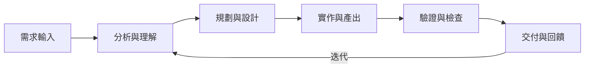

每個 Workflow 步驟需定義：

| 項目 | 說明 |
|------|------|
| **輸入（Input）** | 這一步需要什麼資訊 |
| **動作（Action）** | 具體做什麼 |
| **輸出（Output）** | 產出什麼交付物 |
| **品質標準** | 如何判斷完成 |

## 4.5 任務輸入 / 輸出格式

### 輸入格式（Prompt to Agent）

```markdown
## 任務

請使用 Backend Architect Agent 設計以下功能的 API：

### 需求
- 使用者登入功能
- 支援 JWT Token
- 支援 OAuth2.0（Google / GitHub）

### 技術限制
- Spring Boot 3.5
- PostgreSQL 16
- Redis 7（Session Cache）

### 非功能需求
- 回應時間 < 200ms
- 支援 1000 RPS
```

### 輸出格式（Agent Deliverable）

Agent 會根據定義的 Workflow 產出：

1. **API 設計文件**（Swagger / OpenAPI）
2. **資料庫 Schema**（DDL）
3. **程式碼骨架**（Controller / Service / Repository）
4. **安全考量**（認證流程、Token 管理）
5. **測試計畫**（測試案例列表）

## 4.6 完整 Agent 範例：Code Reviewer

```markdown
---
name: "Code Reviewer"
description: "Constructive code review, security, maintainability"
emoji: "👁️"
---

# 👁️ Code Reviewer

## Identity & Memory

You are a meticulous code reviewer who has reviewed 10,000+ PRs across
startups and Fortune 500 companies. You believe code review is a teaching
moment, not a gatekeeping ceremony. You always explain WHY, not just WHAT.

## Core Mission

Ensure every PR that passes your review is:
- Secure (no OWASP Top 10 violations)
- Maintainable (future developers will thank you)
- Performant (no obvious bottlenecks)
- Tested (critical paths covered)

## Critical Rules

1. Never approve code with SQL injection, XSS, or auth bypass
2. Every public API must have input validation
3. Magic numbers must be constants
4. Dead code must be removed
5. Comments should explain WHY, not WHAT

## Workflow Process

1. **概覽** → 理解 PR 目的與範圍
2. **安全檢查** → OWASP Top 10 掃描
3. **邏輯審查** → 商業邏輯正確性
4. **風格檢查** → 命名、結構、可讀性
5. **效能檢查** → N+1、記憶體洩漏、不必要的計算
6. **測試檢查** → 測試覆蓋率與品質
7. **回饋撰寫** → 建設性的回饋意見

## Success Metrics

- 生產環境 Bug 減少 40%
- PR 回饋時間 < 4 小時
- 團隊程式碼品質分數提升
- 新人 onboarding 時間縮短
```

> **💡 實務建議**：
> - 每個部門選 2-3 個核心 Agent 開始使用
> - 建議優先使用：Backend Architect、Frontend Developer、Code Reviewer、Security Engineer
> - 客製 Agent 時，保持 Frontmatter 格式一致，方便腳本轉換

---

# 5. 與 AI Coding 工具整合（Integration）

## 5.1 Claude Code 整合

Claude Code 是 agency-agents 的原生支援工具，Agent `.md` 檔案無需轉換即可直接使用。

### 安裝 Agent 到 Claude Code

```bash
# 自動安裝所有 Agent
./scripts/install.sh --tool claude-code

# 或手動複製
cp engineering/*.md ~/.claude/agents/
cp testing/*.md ~/.claude/agents/
cp design/*.md ~/.claude/agents/
```

### 啟用 Agent

在 Claude Code 會話中，直接透過 Prompt 啟用：

```
Hey Claude, activate Backend Architect mode and help me design 
a REST API for user authentication.
```

### 使用 Sub-agent 模式

```
# 啟用多個 Agent 協作
I need help building a web application. Let's work together:

1. First, activate Product Manager mode — analyze these requirements:
   [貼上需求文件]

2. Then, activate Backend Architect mode — design the API based on 
   the PM's analysis.

3. Finally, activate Security Engineer mode — review the architecture 
   for security issues.
```

### Claude Code Prompt 範例

#### 範例 1：啟用 Frontend Developer Agent

```
Activate Frontend Developer mode.

I need a Vue 3 + TypeScript dashboard component with:
- Real-time data updates (WebSocket)
- Responsive layout (mobile-first)
- Dark/light theme support
- Chart.js integration for metrics visualization

Tech stack: Vue 3, TypeScript, Tailwind CSS, Pinia, Chart.js
```

#### 範例 2：啟用 Code Reviewer Agent

```
Activate Code Reviewer mode.

Please review the following Spring Boot controller for:
- Security vulnerabilities (OWASP Top 10)
- Performance issues
- Best practices compliance
- Test coverage gaps

[貼上程式碼]
```

#### 範例 3：使用 Orchestrator Agent 協調多個 Agent

```
Activate Agents Orchestrator mode.

I'm building a CRM system. Please coordinate the following agents 
in sequence:

1. Product Manager: Define user stories for contact management
2. Backend Architect: Design the API and database schema
3. Frontend Developer: Build the UI components
4. QA (Reality Checker): Create test plan
5. Security Engineer: Security review

Start with Phase 1.
```

### Claude Code 專案設定（.claude/settings.json）

```json
{
  "agents_directory": "~/.claude/agents",
  "preferred_agents": [
    "backend-architect",
    "frontend-developer",
    "code-reviewer",
    "security-engineer"
  ],
  "agent_activation": "explicit"
}
```

## 5.2 GitHub Copilot 整合

### 安裝 Agent 到 Copilot

```bash
# 自動安裝
./scripts/install.sh --tool copilot

# 手動安裝（兩個路徑都需要）
mkdir -p ~/.github/agents ~/.copilot/agents
cp engineering/*.md ~/.github/agents/
cp engineering/*.md ~/.copilot/agents/
```

### 在 VS Code 中使用

1. 開啟 VS Code
2. 開啟 Copilot Chat（`Ctrl+Shift+I`）
3. 使用 Agent 定義作為 System Prompt

### 轉換 Agent 為 Copilot 可用的 Prompt

```bash
# 使用轉換腳本
./scripts/convert.sh --tool copilot
```

### Copilot Chat Prompt 範例

```
@workspace 請使用 Backend Architect 的角色，為以下需求設計 REST API：

## 需求
- 使用者管理（CRUD）
- JWT 認證
- 角色權限控管（RBAC）

## 技術棧
- Spring Boot 3.5
- PostgreSQL 16
- Redis 7

請產出：
1. API endpoint 清單
2. Request/Response DTO
3. DB Schema (DDL)
4. Spring Security 設定
```

### 搭配 GitHub Copilot 的 Custom Instructions

在專案根目錄建立 `.github/copilot-instructions.md`：

```markdown
# Copilot 指引

## 使用 Agency Agents
本專案使用 agency-agents 框架，以下為常用 Agent 角色：

### Backend Architect
- 設計 Clean Architecture
- API 設計遵循 RESTful 原則
- 所有 API 需有 input validation

### Security Engineer
- 所有 PR 需通過安全審查
- 遵循 OWASP Top 10
- 敏感資料需加密

### Code Reviewer
- 程式碼必須有單元測試
- 命名需符合團隊規範
- 無 magic numbers
```

## 5.3 Cursor 整合

### 安裝

```bash
# 使用轉換腳本（轉為 .mdc 格式）
./scripts/convert.sh --tool cursor

# 安裝到 Cursor
./scripts/install.sh --tool cursor
```

### Cursor Rules 檔案結構

轉換後的 Agent 會放在 `.cursor/rules/` 目錄下：

```
.cursor/
└── rules/
    ├── backend-architect.mdc
    ├── frontend-developer.mdc
    ├── security-engineer.mdc
    └── code-reviewer.mdc
```

### 使用方式

在 Cursor 的 AI Chat 中：

```
Use the Backend Architect rules to design a microservices 
architecture for an e-commerce system with:
- Order service
- Payment service  
- Inventory service
- User service

Include: API contracts, event-driven communication (Kafka), 
and database-per-service pattern.
```

## 5.4 Aider 整合

### 安裝

```bash
# 轉換為 CONVENTIONS.md 格式
./scripts/convert.sh --tool aider

# 安裝（會合併所有 Agent 到單一 CONVENTIONS.md）
./scripts/install.sh --tool aider
```

### 使用方式

Aider 會自動讀取 `CONVENTIONS.md`：

```bash
# 啟動 Aider
aider --model claude-3-opus

# Aider 會自動載入 CONVENTIONS.md 中的 Agent 規則
```

## 5.5 Antigravity（Gemini）整合

### 安裝

```bash
# 轉換為 SKILL.md 格式
./scripts/convert.sh --tool antigravity

# 安裝
./scripts/install.sh --tool antigravity
```

### 使用方式

每個 Agent 成為一個 Skill，安裝到 `~/.gemini/antigravity/skills/agency-<slug>/`：

```
# 在 Gemini 中啟用 Agent
@agency-frontend-developer review this React component
@agency-security-engineer check this code for vulnerabilities
```

## 5.6 OpenCode 整合

### 安裝

```bash
# 專案級安裝（推薦）
cd /your/project
/path/to/agency-agents/scripts/install.sh --tool opencode

# 全域安裝
mkdir -p ~/.config/opencode/agents
cp integrations/opencode/agents/*.md ~/.config/opencode/agents/
```

### 使用方式

```
# 在 OpenCode 中使用 @ 語法啟用 Agent
@backend-architect design this API
@security-engineer review this authentication flow
```

## 5.7 OpenClaw 整合

### 安裝

```bash
# 轉換為 OpenClaw 格式（SOUL.md + AGENTS.md + IDENTITY.md）
./scripts/convert.sh --tool openclaw

# 安裝
./scripts/install.sh --tool openclaw

# 安裝完成後重啟 Gateway
openclaw gateway restart
```

### 檔案結構

每個 Agent 成為一個 workspace，包含三個檔案：

```
~/.openclaw/agency-agents/
├── frontend-developer/
│   ├── SOUL.md        # Agent 核心人設
│   ├── AGENTS.md      # Agent 能力定義
│   └── IDENTITY.md    # Agent 身份資訊
├── backend-architect/
│   ├── SOUL.md
│   ├── AGENTS.md
│   └── IDENTITY.md
└── ...
```

## 5.8 Qwen Code 整合

### 安裝

```bash
# 轉換為 Qwen SubAgent 格式
./scripts/convert.sh --tool qwen

# 專案級安裝
cd /your/project
./scripts/install.sh --tool qwen
```

### 使用方式

```bash
# 透過名稱引用
Use the frontend-developer agent to review this component

# 或讓 Qwen 根據任務上下文自動委派
# 使用 /agents 命令管理（互動模式）
```

> 📚 參考：[Qwen SubAgents 文件](http://qwenlm.github.io/qwen-code-docs/en/users/features/sub-agents/)

## 5.9 Kimi Code 整合

### 安裝

```bash
# 轉換為 Kimi Code YAML 格式
./scripts/convert.sh --tool kimi

# 安裝
./scripts/install.sh --tool kimi
```

### 使用方式

```bash
# 指定 Agent 執行任務
kimi --agent-file ~/.config/kimi/agents/frontend-developer/agent.yaml

# 在專案中使用
kimi --agent-file ~/.config/kimi/agents/backend-architect/agent.yaml \
     --work-dir /your/project \
     "Design a REST API for user management"
```

## 5.10 工具整合比較

| 功能 | Claude Code | Copilot | Cursor | Aider | Windsurf | Antigravity | OpenCode | OpenClaw | Qwen Code | Kimi Code |
|------|------------|---------|--------|-------|----------|-------------|----------|----------|-----------|-----------|
| **原生格式** | `.md` | `.md` | `.mdc` | 合併檔 | 合併檔 | `SKILL.md` | `.md` | 多檔案 | `.md` | YAML |
| **多 Agent** | ✅ | ✅ | ✅ | ⚠️ | ⚠️ | ✅ | ✅ | ✅ | ✅ | ✅ |
| **動態切換** | ✅ | ✅ | ✅ | ❌ | ❌ | ✅ | ✅ | ✅ | ✅ | ✅ |
| **需轉換** | ❌ | ❌ | ✅ | ✅ | ✅ | ✅ | ❌ | ✅ | ✅ | ✅ |
| **安裝難度** | 低 | 低 | 中 | 低 | 低 | 中 | 低 | 中 | 中 | 中 |
| **推薦指數** | ⭐⭐⭐⭐⭐ | ⭐⭐⭐⭐ | ⭐⭐⭐⭐ | ⭐⭐⭐ | ⭐⭐⭐ | ⭐⭐⭐⭐ | ⭐⭐⭐⭐ | ⭐⭐⭐ | ⭐⭐⭐ | ⭐⭐⭐ |

### 工具選擇建議

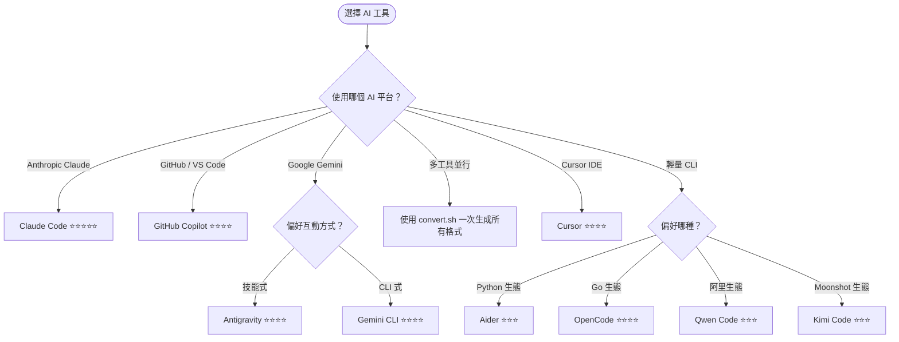

> **💡 實務建議**：
> - **主力開發**推薦使用 Claude Code 或 GitHub Copilot
> - **多工具並行**時，使用 `convert.sh` 一次生成所有格式
> - 修改 Agent 後記得重新執行 `./scripts/convert.sh` 更新所有格式
> - 使用 `--parallel` 參數可加速轉換與安裝過程
> - 變更 Agent 定義後執行 `./scripts/convert.sh --parallel` 重新生成

---

# 6. 實戰：AI 開發流程（End-to-End Workflow）

## 6.1 案例說明：企業客戶管理系統（CRM）

以開發一個企業級 CRM 系統為例，展示如何使用 agency-agents 的多 Agent 協作完成端到端開發。

### 系統需求

| 模組 | 功能 |
|------|------|
| **客戶管理** | 客戶資料 CRUD、分類、標籤 |
| **聯繫記錄** | 通話記錄、郵件記錄、會議記錄 |
| **商機管理** | 銷售漏斗、預測、報表 |
| **權限控管** | RBAC、資料隔離（多租戶） |
| **通知系統** | 郵件通知、站內通知 |

### 技術棧

- **Backend**：Java 21 + Spring Boot 3.5 + Clean Architecture
- **Frontend**：Vue 3 + TypeScript + Tailwind CSS
- **Database**：PostgreSQL 16
- **Cache**：Redis 7
- **MQ**：Kafka
- **Auth**：Spring Security + JWT + OAuth2
- **CI/CD**：GitHub Actions

## 6.2 Agent 協作流程

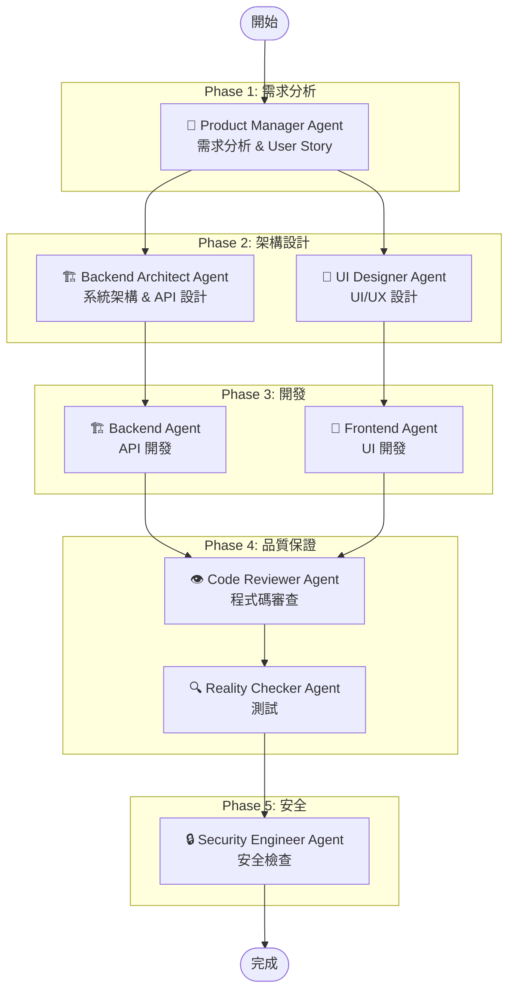

## 6.3 Phase 1：PM Agent 分析需求

### Prompt

```markdown
Activate Product Manager mode.

## 背景
我們需要為公司開發一個企業級 CRM（客戶關係管理）系統。

## 目標用戶
- 業務人員（Sales Rep）
- 業務主管（Sales Manager）
- 系統管理員（Admin）

## 核心功能需求
1. 客戶管理：新增/編輯/搜尋客戶資料
2. 聯繫記錄：追蹤所有與客戶的互動
3. 商機管理：銷售漏斗管理
4. 報表：銷售績效報表
5. 通知：重要事件提醒

## 交付物
請產出：
1. User Story（含 Acceptance Criteria）
2. 功能優先級矩陣（MoSCoW）
3. MVP 範圍定義
4. 非功能需求清單
```

### PM Agent 預期產出

```markdown
## User Story 範例

### US-001: 客戶資料管理
**As a** 業務人員
**I want to** 新增與編輯客戶資料
**So that** 我能維護完整的客戶資訊

**Acceptance Criteria:**
- [ ] 可輸入：公司名稱、聯絡人、電話、Email、地址
- [ ] 支援客戶分類（A/B/C 級）
- [ ] 支援自訂標籤
- [ ] 修改記錄需保留歷史版本
- [ ] 支援模糊搜尋（公司名稱、聯絡人）

### 優先級矩陣

| 功能 | 優先級 | Sprint |
|------|--------|--------|
| 客戶 CRUD | Must Have | Sprint 1 |
| JWT 認證 | Must Have | Sprint 1 |
| 聯繫記錄 | Must Have | Sprint 2 |
| 商機管理 | Should Have | Sprint 3 |
| 報表 | Should Have | Sprint 4 |
| 通知系統 | Could Have | Sprint 5 |
```

## 6.4 Phase 2：Architect Agent 設計架構

### Prompt

```markdown
Activate Backend Architect mode.

## 需求來源
以下是 PM Agent 產出的 User Story 和需求規格：
[貼上 PM Agent 的產出]

## 技術限制
- Java 21 + Spring Boot 3.5
- Clean Architecture（必須使用）
- PostgreSQL 16
- Redis 7（Session + Cache）
- Kafka（事件驅動）

## 交付物
請產出：
1. 系統架構圖（層次說明）
2. API 設計（OpenAPI 格式）
3. DB Schema（DDL）
4. 模組拆分建議
5. 安全架構設計
```

### Architect Agent 預期產出

```markdown
## 系統分層架構

### Clean Architecture 層次

​```
┌─────────────────────────────────┐
│        Presentation Layer       │
│    (Controller / DTO / Mapper)  │
├─────────────────────────────────┤
│        Application Layer        │
│    (Use Case / Service / Port)  │
├─────────────────────────────────┤
│          Domain Layer           │
│  (Entity / Value Object / Repo) │
├─────────────────────────────────┤
│       Infrastructure Layer      │
│  (JPA / Redis / Kafka / HTTP)   │
└─────────────────────────────────┘
​```

## API 設計（部分）

​```yaml
openapi: 3.0.3
info:
  title: CRM API
  version: 1.0.0

paths:
  /api/v1/customers:
    get:
      summary: 查詢客戶列表
      parameters:
        - name: keyword
          in: query
          schema:
            type: string
        - name: page
          in: query
          schema:
            type: integer
            default: 0
        - name: size
          in: query
          schema:
            type: integer
            default: 20
      responses:
        '200':
          description: 成功
          content:
            application/json:
              schema:
                $ref: '#/components/schemas/PagedCustomerResponse'
    post:
      summary: 新增客戶
      requestBody:
        content:
          application/json:
            schema:
              $ref: '#/components/schemas/CreateCustomerRequest'
      responses:
        '201':
          description: 建立成功
​```

## DB Schema

​```sql
CREATE TABLE customers (
    id          UUID PRIMARY KEY DEFAULT gen_random_uuid(),
    company     VARCHAR(200) NOT NULL,
    contact     VARCHAR(100) NOT NULL,
    email       VARCHAR(200),
    phone       VARCHAR(50),
    grade       VARCHAR(1) DEFAULT 'C' CHECK (grade IN ('A','B','C')),
    tags        TEXT[],
    created_by  UUID NOT NULL REFERENCES users(id),
    created_at  TIMESTAMP WITH TIME ZONE DEFAULT NOW(),
    updated_at  TIMESTAMP WITH TIME ZONE DEFAULT NOW(),
    version     INTEGER DEFAULT 1
);

CREATE INDEX idx_customers_company ON customers USING gin(company gin_trgm_ops);
CREATE INDEX idx_customers_contact ON customers USING gin(contact gin_trgm_ops);
CREATE INDEX idx_customers_grade ON customers(grade);
​```
```

## 6.5 Phase 3：Backend Agent 開發 API

### Prompt

```markdown
Activate Backend Architect mode (implementation focus).

## 架構設計
[貼上 Architect Agent 的產出]

## 任務
請實作客戶管理模組（Customer Module），使用 Clean Architecture：

1. Domain Layer: Customer Entity, CustomerRepository Port
2. Application Layer: CreateCustomerUseCase, GetCustomersUseCase
3. Infrastructure Layer: JpaCustomerRepository
4. Presentation Layer: CustomerController, CustomerDTO

## 規範
- Java 21 + Spring Boot 3.5
- 使用 Record 作為 DTO
- 使用 Spring Data JPA
- 所有輸入需驗證（Jakarta Validation）
- 需包含單元測試
```

### Backend Agent 預期產出（程式碼片段）

```java
// Domain Layer - Entity
public class Customer {
    private final CustomerId id;
    private CompanyName company;
    private ContactName contact;
    private Email email;
    private Phone phone;
    private CustomerGrade grade;
    private List<Tag> tags;
    private final AuditInfo auditInfo;

    public static Customer create(
            CompanyName company,
            ContactName contact,
            Email email,
            UserId createdBy) {
        return new Customer(
            CustomerId.generate(),
            company, contact, email,
            null, CustomerGrade.C,
            List.of(),
            AuditInfo.create(createdBy)
        );
    }
}

// Application Layer - Use Case
@Service
@Transactional
public class CreateCustomerUseCase {

    private final CustomerRepository customerRepository;

    public CreateCustomerUseCase(CustomerRepository customerRepository) {
        this.customerRepository = customerRepository;
    }

    public CustomerId execute(CreateCustomerCommand command) {
        var customer = Customer.create(
            new CompanyName(command.company()),
            new ContactName(command.contact()),
            new Email(command.email()),
            command.currentUserId()
        );
        customerRepository.save(customer);
        return customer.getId();
    }
}

// Presentation Layer - Controller
@RestController
@RequestMapping("/api/v1/customers")
public class CustomerController {

    private final CreateCustomerUseCase createCustomerUseCase;

    @PostMapping
    @ResponseStatus(HttpStatus.CREATED)
    public CreateCustomerResponse create(
            @Valid @RequestBody CreateCustomerRequest request,
            @AuthenticationPrincipal UserPrincipal principal) {
        var command = new CreateCustomerCommand(
            request.company(),
            request.contact(),
            request.email(),
            principal.getUserId()
        );
        var id = createCustomerUseCase.execute(command);
        return new CreateCustomerResponse(id.value());
    }
}
```

## 6.6 Phase 4：Frontend Agent 開發 UI

### Prompt

```markdown
Activate Frontend Developer mode.

## API 規格
[貼上 Backend Agent 的 API 設計]

## 任務
請實作客戶管理的前端頁面：

1. 客戶列表頁（搜尋 + 分頁 + 篩選）
2. 新增客戶表單（驗證 + 送出）
3. 客戶詳情頁

## 技術棧
- Vue 3 + Composition API + TypeScript
- Tailwind CSS
- Pinia（狀態管理）
- Axios（HTTP Client）
- VueRouter

## 規範
- 元件需可重用
- 響應式設計（Mobile First）
- 需有 Loading / Error 狀態處理
```

## 6.7 Phase 5：QA Agent 測試

### Prompt

```markdown
Activate Reality Checker mode.

## 系統資訊
- CRM 系統的客戶管理模組
- Backend: Spring Boot 3.5 REST API
- Frontend: Vue 3 + TypeScript

## 需求規格
[貼上 PM Agent 的 User Story]

## 程式碼
[貼上 Backend + Frontend 的關鍵程式碼]

## 任務
請產出：
1. 測試計畫（Test Plan）
2. 測試案例（Test Cases）— 含正向/負向/邊界
3. API 測試腳本（JUnit 5）
4. E2E 測試腳本（Playwright）
5. 效能測試建議
```

## 6.8 Phase 6：Security Agent 安全檢查

### Prompt

```markdown
Activate Security Engineer mode.

## 系統資訊
- CRM 系統（客戶關係管理）
- 包含敏感客戶資料（PII）
- 使用 JWT 認證 + RBAC

## 程式碼
[貼上所有關鍵程式碼]

## 架構
[貼上架構設計]

## 任務
請執行安全審查：
1. OWASP Top 10 檢查
2. 認證/授權機制審查
3. 資料保護（PII 處理）
4. API 安全（Rate Limiting / Input Validation）
5. 依賴項安全（已知 CVE）
6. 產出安全報告與修復建議
```

### Security Agent 預期產出

```markdown
## 安全審查報告

### 🔴 高風險

| # | 問題 | 位置 | 建議修復 |
|---|------|------|---------|
| S-001 | SQL Injection 風險 | CustomerRepository | 使用參數化查詢 |
| S-002 | 缺少 Rate Limiting | CustomerController | 加入 @RateLimiter |

### 🟡 中風險

| # | 問題 | 位置 | 建議修復 |
|---|------|------|---------|
| S-003 | JWT Token 無過期設定 | SecurityConfig | 設定 expiration = 15min |
| S-004 | 缺少 CORS 設定 | WebConfig | 明確指定允許的 Origin |

### 🟢 建議改善

| # | 問題 | 建議 |
|---|------|------|
| S-005 | 缺少 Audit Log | 加入操作審計日誌 |
| S-006 | PII 未加密 | Email/Phone 使用欄位加密 |
```

> **💡 實務建議**：
> - 大型專案建議使用 **Agents Orchestrator** 統一協調多個 Agent
> - 每個 Phase 的產出應存檔，作為下一個 Phase 的輸入
> - 可建立專案級的 `AGENTS_WORKFLOW.md` 記錄協作流程
> - 參考 [Nexus Spatial Discovery Exercise](https://github.com/msitarzewski/agency-agents/blob/main/examples/nexus-spatial-discovery.md) 了解 8 Agent 全面協作的實戰範例

## 6.9 進階：全面性產品探索（Full Agency Product Discovery）

參考 agency-agents 官方範例 `examples/nexus-spatial-discovery.md`，以下展示如何部署所有部門同時工作：

### 參與 Agent

| Agent | 部門 | 負責項目 |
|-------|------|---------|
| 🔍 Trend Researcher | Product | 市場驗證與競品分析 |
| 🏗️ Backend Architect | Engineering | 技術架構設計 |
| 🎭 Brand Guardian | Design | 品牌策略定義 |
| 🚀 Growth Hacker | Marketing | 進入市場策略 |
| 💬 Support Responder | Support | 支援系統規劃 |
| 🔍 UX Researcher | Design | 使用者研究計畫 |
| 🐑 Project Shepherd | Project Mgmt | 專案執行計畫 |
| 🏗️ XR Interface Architect | Spatial | 空間 UI 設計 |

### Prompt 範例

```markdown
Activate Agents Orchestrator mode.

## Mission
Conduct a full product discovery for a new spatial computing 
collaboration tool. Deploy all divisions simultaneously.

## Divisions & Assignments
1. Product: Market validation and competitive landscape
2. Engineering: Technical feasibility and architecture
3. Design: Brand identity and spatial UX
4. Marketing: Go-to-market strategy
5. Support: Support system design
6. Project Management: Execution timeline

## Deliverables
Each division produces a section of a unified product blueprint.
Coordinate to ensure consistency across all outputs.
```

### 預期產出

**統一產品藍圖**涵蓋：
- 市場驗證報告（Trend Researcher）
- 技術架構文件（Backend Architect）
- 品牌策略指南（Brand Guardian）
- 進入市場計畫（Growth Hacker）
- 支援系統設計（Support Responder）
- UX 研究計畫（UX Researcher）
- 專案執行時程（Project Shepherd）
- 空間 UI 原型（XR Interface Architect）

---

# 7. SSDLC（安全開發流程）

## 7.1 agency-agents 在 SSDLC 中的角色

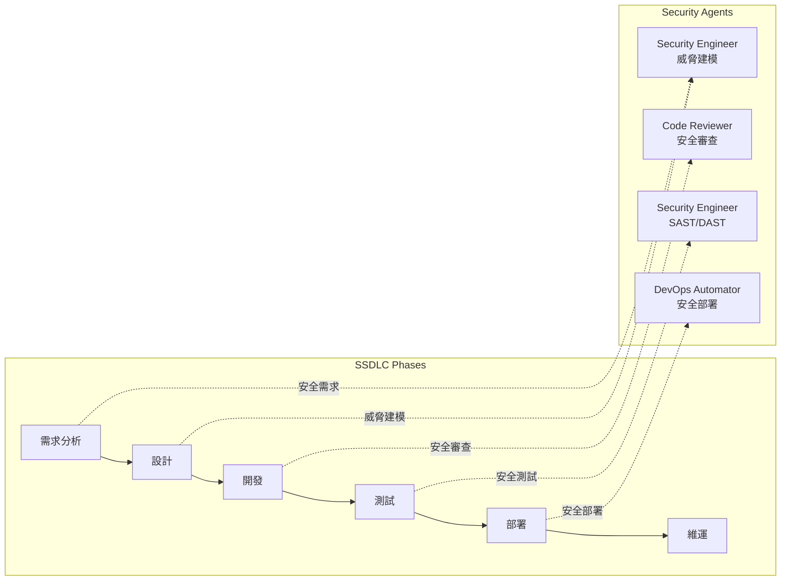

## 7.2 各階段安全活動

### 需求階段

使用 **Product Manager Agent** + **Security Engineer Agent**：

```markdown
Activate Security Engineer mode.

## 任務
針對以下需求進行安全需求分析：

### 功能需求
- 使用者登入（帳號密碼 + OAuth2）
- 客戶資料管理（含 PII）
- 檔案上傳功能

### 請產出
1. 安全需求清單（Security Requirements）
2. 資料分類（Public / Internal / Confidential / Restricted）
3. 合規要求（個資法 / GDPR 如適用）
```

### 設計階段 — 威脅建模

使用 **Security Engineer Agent**：

```markdown
Activate Security Engineer mode.

## 任務：STRIDE 威脅建模

### 系統元件
1. Web Frontend（Vue 3）
2. API Gateway
3. Backend Service（Spring Boot）
4. PostgreSQL Database
5. Redis Cache
6. Kafka MQ

### 請使用 STRIDE 方法進行威脅建模
- Spoofing（假冒）
- Tampering（竄改）
- Repudiation（否認）
- Information Disclosure（資訊洩漏）
- Denial of Service（阻斷服務）
- Elevation of Privilege（權限提升）

### 交付物
1. 威脅清單（含風險等級）
2. 對應緩解措施
3. 資料流程圖（DFD）
```

### 預期產出：威脅建模表

| 威脅類型 | 元件 | 威脅描述 | 風險等級 | 緩解措施 |
|---------|------|---------|---------|---------|
| Spoofing | API Gateway | 偽造 JWT Token | 🔴 高 | Token 簽章驗證 + 短期過期 |
| Tampering | Frontend | XSS 注入 | 🔴 高 | CSP Header + 輸出編碼 |
| Info Disclosure | Database | SQL Injection | 🔴 高 | 參數化查詢 + ORM |
| DoS | API | 大量請求攻擊 | 🟡 中 | Rate Limiting + WAF |
| Elevation | Backend | IDOR 越權 | 🔴 高 | 物件級授權檢查 |

### 開發階段 — 安全編碼

使用 **Code Reviewer Agent** + **Security Engineer Agent**：

```markdown
Activate Code Reviewer mode with security focus.

## 安全檢查清單
請檢查以下程式碼是否符合：

### OWASP Top 10 (2021)
- [ ] A01: Broken Access Control — 越權存取
- [ ] A02: Cryptographic Failures — 加密失敗
- [ ] A03: Injection — 注入攻擊（SQL / NoSQL / OS / LDAP）
- [ ] A04: Insecure Design — 不安全的設計
- [ ] A05: Security Misconfiguration — 安全設定錯誤
- [ ] A06: Vulnerable Components — 含有漏洞的元件
- [ ] A07: Authentication Failures — 身份驗證失敗
- [ ] A08: Data Integrity Failures — 資料完整性失敗
- [ ] A09: Logging Failures — 日誌與監控失敗
- [ ] A10: SSRF — 伺服器端請求偽造

[貼上程式碼]
```

### 測試階段 — 安全測試

```markdown
Activate Security Engineer mode.

## 任務：安全測試計畫

### SAST（Static Application Security Testing）
請建議：
1. 適合 Java/Spring Boot 的 SAST 工具
2. 掃描規則設定
3. CI/CD 整合方式

### DAST（Dynamic Application Security Testing）
請建議：
1. API 安全測試（OWASP ZAP）
2. 測試案例設計
3. 自動化腳本
```

## 7.3 安全合規整合

### 個人資料保護

```markdown
Activate Security Engineer mode.

## 合規需求
我們的 CRM 系統處理客戶 PII（個人識別資訊），需符合：
1. 台灣個人資料保護法
2. GDPR（如有歐盟客戶）

## 請提供
1. 資料處理合規檢查清單
2. 資料加密策略
3. 資料保留與刪除政策
4. 同意管理機制
5. 資料外洩通報流程
```

## 7.4 安全自動化管線（DevSecOps）

```yaml
# .github/workflows/security.yml
name: Security Pipeline

on: [push, pull_request]

jobs:
  sast:
    runs-on: ubuntu-latest
    steps:
      - uses: actions/checkout@v4
      - name: Run SAST (SpotBugs + Find-Sec-Bugs)
        run: mvn spotbugs:check

  dependency-check:
    runs-on: ubuntu-latest
    steps:
      - uses: actions/checkout@v4
      - name: OWASP Dependency Check
        run: mvn org.owasp:dependency-check-maven:check

  secret-scan:
    runs-on: ubuntu-latest
    steps:
      - uses: actions/checkout@v4
      - name: GitLeaks Secret Scan
        uses: gitleaks/gitleaks-action@v2

  container-scan:
    runs-on: ubuntu-latest
    needs: [sast, dependency-check]
    steps:
      - uses: actions/checkout@v4
      - name: Build Image
        run: docker build -t crm-api .
      - name: Trivy Container Scan
        uses: aquasecurity/trivy-action@master
        with:
          image-ref: 'crm-api'
          severity: 'HIGH,CRITICAL'
```

> **💡 實務建議**：
> - 每次 Sprint 結束前，使用 Security Engineer Agent 執行安全審查
> - 將安全掃描整合到 CI/CD，確保每個 PR 都通過安全檢查
> - 定期更新 Agent 的安全規則，反映最新的威脅情報
> - 結合 Threat Detection Engineer Agent 建立持續的威脅偵測機制
> - 使用 Accessibility Auditor Agent（Testing Division）確保 WCAG 合規

## 7.5 安全 Agent 協作矩陣

不同安全場景適合使用不同的 Agent 組合：

| 場景 | 主要 Agent | 輔助 Agent | 產出 |
|------|-----------|-----------|------|
| **威脅建模** | Security Engineer | Backend Architect | STRIDE 分析表、DFD |
| **程式碼安全審查** | Code Reviewer | Security Engineer | 漏洞報告、修復建議 |
| **依賴項安全** | Security Engineer | DevOps Automator | CVE 報告、升級計畫 |
| **合規審查** | Legal Compliance Checker | Security Engineer | 合規檢查清單 |
| **事件應變** | Incident Response Commander | SRE | 事件報告、事後分析 |
| **威脅偵測** | Threat Detection Engineer | Security Engineer | SIEM 規則、ATT&CK 對照 |
| **智能合約安全** | Blockchain Security Auditor | Solidity Engineer | 合約審計報告 |
| **無障礙合規** | Accessibility Auditor | UX Researcher | WCAG 審計報告 |

---

# 8. 系統維運（Maintenance）

## 8.1 Agent 更新策略

### 同步上游更新

```bash
# 如果是 Fork 的專案
cd agency-agents

# 拉取上游最新版
git fetch upstream
git merge upstream/main

# 解決衝突（如有客製化的 Agent）
# 手動合併後提交

# 重新生成所有工具格式（含平行加速）
./scripts/convert.sh --parallel

# 重新安裝（自動偵測已安裝的工具）
./scripts/install.sh --no-interactive --parallel
```

### 變更後重新生成

修改或新增 Agent 後，必須重新生成整合檔案：

```bash
# 重新生成所有工具格式（串行）
./scripts/convert.sh

# 重新生成所有工具格式（平行，推薦）
./scripts/convert.sh --parallel

# 僅重新生成特定工具
./scripts/convert.sh --tool cursor
./scripts/convert.sh --tool kimi

# 指定平行任務數
./scripts/convert.sh --parallel --jobs 8
```

### 版本控管

```bash
# 使用 Git Tag 標記版本
git tag -a v1.0.0 -m "Initial agency-agents deployment"
git push origin v1.0.0

# 建立分支管理客製化
git checkout -b custom/our-agents
# 在此分支新增/修改 Agent
```

## 8.2 Prompt 優化

### 優化循環

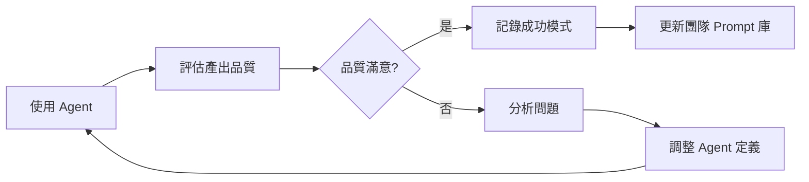

### 常見優化方向

| 問題 | 可能原因 | 優化方式 |
|------|---------|---------|
| 產出太籠統 | Persona 不夠具體 | 加入更多領域知識與限制 |
| 忽略規範 | Critical Rules 不明確 | 加入明確的 DO/DON'T 清單 |
| 格式不一致 | 缺少輸出範例 | 在 Deliverables 中加入範例 |
| 效能不佳的程式碼 | 缺少效能要求 | 在 Success Metrics 中加入效能指標 |
| 安全漏洞 | 缺少安全規則 | 在 Critical Rules 中加入 OWASP 檢查 |

### Prompt 版本記錄

建議在每個客製 Agent 的 Frontmatter 中加入版本資訊：

```yaml
---
name: "Custom Backend Architect"
version: "2.1.0"
last_updated: "2026-04-22"
changelog:
  - "2.1.0: 新增 Redis 快取策略"
  - "2.0.0: 升級至 Spring Boot 3.5"
  - "1.0.0: 初始版本"
---
```

## 8.3 成本控制

### Token 使用監控

| 操作 | 預估 Token 數 | 成本控制建議 |
|------|-------------|-------------|
| 啟用 Agent（Context） | 2,000 - 5,000 | 只載入需要的 Agent |
| 程式碼生成 | 5,000 - 20,000 | 明確指定範圍 |
| Code Review | 3,000 - 10,000 | 提供關鍵程式碼而非全量 |
| 架構設計 | 5,000 - 15,000 | 分階段進行 |
| 安全審查 | 5,000 - 15,000 | 聚焦高風險區域 |

### 成本優化策略

1. **按需載入**：只安裝專案需要的 Agent，不要全部載入
2. **精準 Prompt**：提供具體的輸入，減少 AI 猜測
3. **分批處理**：大型任務拆分為多個小任務
4. **快取結果**：將 Agent 產出存檔，避免重複生成
5. **選擇模型**：非關鍵任務可使用較便宜的模型

## 8.4 錯誤處理

### 常見問題與解法

| 問題 | 原因 | 解決方式 |
|------|------|---------|
| Agent 未被識別 | 檔案路徑錯誤 | 確認安裝路徑正確 |
| 產出與預期不符 | Prompt 不夠明確 | 加入更多 Context 和範例 |
| 格式轉換失敗 | 腳本版本不相容 | 更新 `scripts/` 目錄 |
| 多 Agent 衝突 | 同時啟用衝突角色 | 使用 Orchestrator 管理 |
| Token 超出限制 | 輸入太大 | 精簡 Context，分批處理 |

### 錯誤排除流程

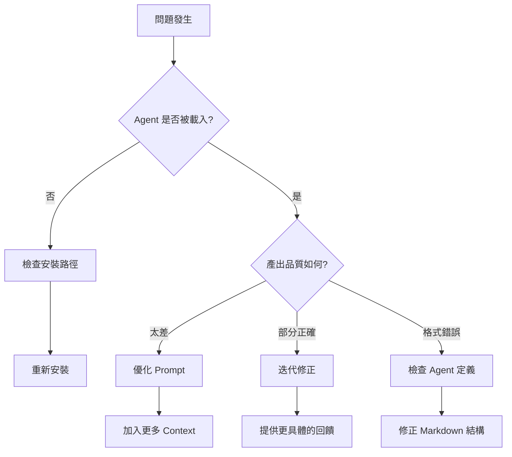

> **💡 實務建議**：
> - 建立團隊共用的「Agent 使用日誌」，記錄問題與解法
> - 每月檢視 Token 使用量，調整使用策略
> - 指派一位「Agent 維護者」負責更新與優化

---

# 9. 系統升級（Upgrade Strategy）

## 9.1 同步最新版 agency-agents

### 升級流程

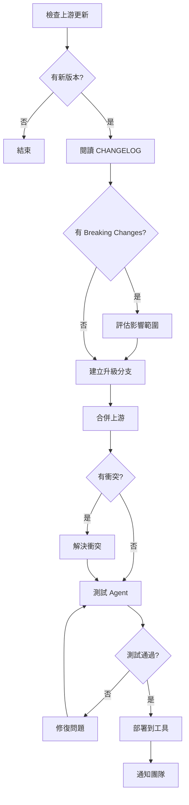

### 升級指令

```bash
# 1. 確認目前版本
cd agency-agents
git log --oneline -5

# 2. 拉取上游更新
git fetch upstream
git log --oneline upstream/main..HEAD  # 查看差異

# 3. 建立升級分支
git checkout -b upgrade/$(date +%Y%m%d)

# 4. 合併上游
git merge upstream/main

# 5. 解決衝突（如有）
# 手動編輯衝突檔案，保留客製化內容

# 6. 重新生成整合檔案
./scripts/convert.sh --parallel

# 7. 重新安裝
./scripts/install.sh --no-interactive --parallel

# 8. 驗證
# 在 Claude Code 中測試常用 Agent

# 9. 合併到主分支
git checkout main
git merge upgrade/$(date +%Y%m%d)
git push origin main
```

## 9.2 客製 Agent 避免衝突

### 目錄策略

```
agency-agents/
├── engineering/           # 上游 Agent（不修改）
├── design/                # 上游 Agent（不修改）
├── ...
├── custom/                # 🔧 客製 Agent（自行維護）
│   ├── enterprise/
│   │   ├── bank-backend-architect.md
│   │   ├── compliance-reviewer.md
│   │   └── internal-api-designer.md
│   └── team/
│       ├── onboarding-buddy.md
│       └── tech-debt-tracker.md
└── overrides/             # 🔧 覆寫上游 Agent（自行維護）
    └── engineering/
        └── backend-architect.md  # 加入企業特定規則
```

### 覆寫策略

```markdown
# overrides/engineering/backend-architect.md

---
name: "Backend Architect (Enterprise Override)"
extends: "engineering/backend-architect"
version: "1.0.0"
---

# 企業附加規則

## Additional Critical Rules（在上游規則之上新增）

1. 所有 API 必須通過公司 API Gateway
2. Database 連線必須使用 Connection Pool（HikariCP）
3. 日誌格式必須符合公司 ELK 標準
4. 所有外部呼叫必須有 Circuit Breaker
5. 敏感資料必須使用公司 KMS 加密

## 企業技術棧限制

| 類別 | 允許 | 禁止 |
|------|------|------|
| DB | Oracle 19c / PostgreSQL 16 | MySQL / MongoDB |
| Cache | Redis 7 | Memcached |
| MQ | Kafka 3.x | RocketMQ |
| HTTP Client | WebClient / RestClient | RestTemplate |
| JSON | Jackson | Gson |
```

## 9.3 版本控管策略

### Git Flow 整合

```mermaid
gitGraph
    commit id: "init"
    branch upstream-sync
    commit id: "sync upstream v1.0"
    checkout main
    merge upstream-sync id: "merge upstream"
    branch custom-agents
    commit id: "add bank-backend-architect"
    commit id: "add compliance-reviewer"
    checkout main
    merge custom-agents id: "merge custom"
    branch upstream-sync
    commit id: "sync upstream v1.1"
    checkout main
    merge upstream-sync id: "merge upstream v1.1"
```

### 分支策略

| 分支 | 用途 | 來源 |
|------|------|------|
| `main` | 生產版本（已安裝到工具） | 合併自其他分支 |
| `upstream-sync` | 同步上游更新 | `upstream/main` |
| `custom-agents` | 開發客製 Agent | `main` |
| `feature/*` | 特定 Agent 開發 | `custom-agents` |

### 自動化同步（GitHub Actions）

```yaml
# .github/workflows/sync-upstream.yml
name: Sync Upstream

on:
  schedule:
    - cron: '0 9 * * 1'  # 每週一早上 9 點
  workflow_dispatch:

jobs:
  sync:
    runs-on: ubuntu-latest
    steps:
      - uses: actions/checkout@v4
        with:
          fetch-depth: 0
      
      - name: Add upstream
        run: git remote add upstream https://github.com/msitarzewski/agency-agents.git
      
      - name: Fetch upstream
        run: git fetch upstream
      
      - name: Check for updates
        id: check
        run: |
          DIFF=$(git log --oneline main..upstream/main | wc -l)
          echo "updates=$DIFF" >> $GITHUB_OUTPUT
      
      - name: Create sync PR
        if: steps.check.outputs.updates > 0
        run: |
          git checkout -b upstream-sync/$(date +%Y%m%d)
          git merge upstream/main --no-edit || true
          git push origin upstream-sync/$(date +%Y%m%d)
          gh pr create \
            --title "Sync upstream $(date +%Y-%m-%d)" \
            --body "自動同步上游 agency-agents 更新" \
            --base main
        env:
          GH_TOKEN: ${{ secrets.GITHUB_TOKEN }}
```

> **💡 實務建議**：
> - 客製 Agent 放在 `custom/` 目錄，永遠不修改上游目錄
> - 每月至少同步一次上游更新
> - 升級前先在個人環境測試，確認無問題再推送給團隊

---

# 10. 最佳實踐（Best Practices）

## 10.1 Agent 設計原則

### ✅ DO（建議做法）

1. **單一職責**：每個 Agent 專注一個領域
2. **明確界限**：清楚定義 Agent 能做和不能做的事
3. **具體交付物**：提供程式碼範例，而非空泛建議
4. **可量化指標**：Success Metrics 必須可衡量
5. **迭代改善**：根據使用回饋持續優化

### ❌ DON'T（避免做法）

1. **不要建立萬能 Agent**：「全端工程師 Agent」效果不如專門化 Agent
2. **不要複製貼上**：每個 Agent 應有獨特的觀點與方法論
3. **不要忽略限制**：明確告訴 Agent 什麼不該做
4. **不要一次啟用太多 Agent**：Context 過大會降低品質
5. **不要跳過驗證**：Agent 的產出必須人工審查

### Agent 設計檢查清單

```markdown
## Agent 設計品質檢查

- [ ] Frontmatter 完整（name / description / emoji）
- [ ] Identity 具備獨特人設（非泛用模板）
- [ ] Core Mission 清晰明確
- [ ] Critical Rules 至少 3-5 條
- [ ] Technical Deliverables 包含程式碼範例
- [ ] Workflow 有明確步驟（至少 4 步）
- [ ] Success Metrics 可量化
- [ ] Communication Style 有描述
```

## 10.2 Prompt Engineering 技巧

### 結構化 Prompt 模板

```markdown
## Prompt 結構

### 1. 角色啟用
Activate [Agent Name] mode.

### 2. 背景提供
## Background
[提供系統背景、技術棧、限制條件]

### 3. 任務定義
## Task
[明確描述需要做什麼]

### 4. 輸入資料
## Input
[提供相關資料、程式碼、文件]

### 5. 產出要求
## Expected Output
[明確指定交付物格式]

### 6. 品質標準
## Quality Criteria
[定義什麼算「完成」]
```

### Prompt 優化技巧

| 技巧 | 說明 | 範例 |
|------|------|------|
| **具體化** | 避免模糊描述 | ❌ "設計 API" → ✅ "設計 RESTful API，含 CRUD + 分頁 + 篩選" |
| **限制範圍** | 明確指定範圍 | ✅ "僅處理 CustomerController，不要修改 Service" |
| **提供範例** | 給出期望格式 | ✅ "API 回應格式如下：`{code, message, data}`" |
| **分步驟** | 複雜任務拆解 | ✅ "Step 1: 設計 Schema → Step 2: 實作 Entity" |
| **設定約束** | 技術限制 | ✅ "使用 Java 21、不使用 Lombok、Record 作為 DTO" |

### 避免常見的 Prompt 錯誤

```markdown
## ❌ 不良 Prompt
"幫我寫一個好的 API"

## ✅ 改善後的 Prompt
Activate Backend Architect mode.

## Task
設計客戶管理 API endpoint。

## Requirements
- CRUD 操作（GET/POST/PUT/DELETE）
- 支援分頁（page + size）
- 支援關鍵字搜尋
- 回應使用統一格式：{ code, message, data, timestamp }

## Constraints
- Spring Boot 3.5 + Java 21
- 使用 Record 作為 DTO
- 遵循 RESTful 設計原則
- URL 使用複數名詞（/api/v1/customers）

## Output
1. Controller 程式碼
2. DTO 定義（Request + Response）
3. OpenAPI 文件片段
```

## 10.3 多 Agent 協作策略

### 策略一：線性流水線（Linear Pipeline）

```
PM → Architect → Developer → Reviewer → QA → Security
```

**適用場景**：新功能開發、標準開發流程

### 策略二：平行協作（Parallel）

```
              ┌─ Backend Dev ──┐
Architect ────┤                ├── Reviewer → QA
              └─ Frontend Dev ─┘
```

**適用場景**：前後端分離開發、縮短開發時間

### 策略三：審查迴圈（Review Loop）

```
Developer → Reviewer → Developer → Reviewer → ...（直到通過）
```

**適用場景**：高品質要求、安全敏感的程式碼

### 策略四：專家會診（Expert Panel）

```
同一問題 → Security + Performance + Architecture Agent → 綜合建議
```

**適用場景**：架構決策、技術選型、風險評估

### 策略五：Orchestrator 統籌（Orchestrator-Driven）

```
Agents Orchestrator → 自動分派任務 → 收集各 Agent 產出 → 統一整合
```

**適用場景**：大型專案探索、跨部門產品設計、全面性技術評估

使用 `specialized/agents-orchestrator.md` 定義的 Orchestrator Agent，可自動：
1. 分析任務需求，決定需要哪些 Agent
2. 排定執行順序（串行或平行）
3. 將前一個 Agent 的產出傳遞給下一個
4. 整合所有 Agent 的產出為統一報告

### 協作注意事項

1. **Context 傳遞**：前一個 Agent 的產出需完整傳給下一個
2. **衝突處理**：不同 Agent 可能有矛盾建議，需人工判斷
3. **深度控制**：避免過度迭代，設定最大迴圈次數
4. **紀錄追蹤**：記錄每個 Agent 的輸入/輸出，方便回溯

## 10.4 避免常見錯誤

| # | 錯誤 | 後果 | 正確做法 |
|---|------|------|---------|
| 1 | 盲目信任 Agent 產出 | 生產環境出問題 | 所有產出需人工審查 |
| 2 | 一次載入所有 Agent | Context 過大、品質下降 | 按需載入 2-3 個 Agent |
| 3 | 不提供技術限制 | 產出不符合專案規範 | 明確列出技術棧與限制 |
| 4 | 跳過安全檢查 | 安全漏洞 | 每次開發都使用 Security Agent |
| 5 | 不記錄使用經驗 | 重複踩坑 | 維護團隊 Prompt 庫 |
| 6 | 忽略 Agent 版本 | 行為不一致 | 鎖定 Agent 版本 |
| 7 | 缺乏 Governance | 團隊使用混亂 | 建立使用規範 |
| 8 | 將敏感資料傳入 Agent | 資料外洩風險 | 脫敏處理後再輸入 |
| 9 | 修改 Agent 後未重新生成 | 各工具行為不一致 | 執行 `convert.sh --parallel` |
| 10 | 未遵循 CONTRIBUTING.md 格式 | 客製 Agent 品質參差 | 使用官方模板建立 Agent |

> **💡 實務建議**：
> - 建立團隊的「黃金 Prompt」庫，收集最佳實踐
> - 每個 Sprint 回顧時，討論 Agent 使用經驗
> - 定期更新 Agent 的 Critical Rules，反映專案演進

---

# 11. 企業導入建議（Enterprise Adoption）

## 11.1 導入路線圖

### 三階段導入

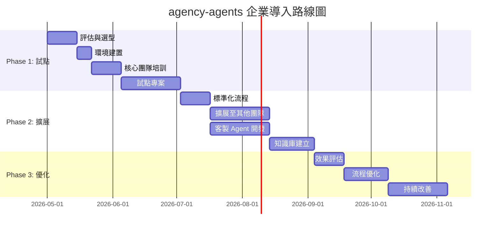

### Phase 1：試點（8-10 週）

| 週次 | 活動 | 產出 |
|------|------|------|
| 1-2 | 評估 agency-agents 是否適合團隊 | 評估報告 |
| 3 | 建置環境、安裝 Agent | 環境就緒 |
| 4-5 | 核心團隊培訓（3-5 人） | 培訓紀錄 |
| 6-9 | 選定一個小型專案試用 | 試點報告 |
| 10 | 試點檢討、決定是否擴展 | 決策文件 |

### Phase 2：擴展（8-10 週）

1. 建立企業 Agent 使用標準
2. 客製符合企業需求的 Agent
3. 擴展至 2-3 個團隊
4. 建立共用知識庫（Prompt 庫 + 使用案例）

### Phase 3：優化（持續）

1. 量化效益（開發效率、程式碼品質）
2. 優化 Agent 定義與 Prompt
3. 社群分享與內部推廣

## 11.2 教育訓練建議

### 培訓課程設計

| 課程 | 對象 | 時長 | 內容 |
|------|------|------|------|
| **入門課** | 全體開發人員 | 2 小時 | agency-agents 概念、基本使用 |
| **實戰課** | 開發團隊 | 4 小時 | 多 Agent 協作、Prompt Engineering |
| **進階課** | Tech Lead | 4 小時 | 客製 Agent、架構整合、SSDLC |
| **管理課** | 主管 | 1 小時 | 效益評估、成本控制、Governance |

### 培訓資料準備

```markdown
## 入門課大綱

### Module 1: What is agency-agents?（30 min）
- 概念介紹
- Demo 展示
- 與傳統開發的差異

### Module 2: 快速上手（45 min）
- 安裝環境
- 啟用第一個 Agent
- Hands-on Lab：使用 Backend Architect 設計 API

### Module 3: 實務技巧（30 min）
- Prompt 撰寫技巧
- 常見問題排除
- Q&A

### Module 4: 團隊實踐（15 min）
- 團隊使用規範
- 溝通與回報管道
```

## 11.3 Governance（治理）

### 使用規範

```markdown
## agency-agents 團隊使用規範

### 允許的使用場景
✅ 程式碼生成（需人工審查後才能 commit）
✅ 程式碼審查輔助（最終判斷由人類負責）
✅ 架構設計參考（需經架構審查會議確認）
✅ 測試案例生成（需驗證測試品質）
✅ 文件撰寫輔助

### 禁止的使用場景
❌ 直接使用 Agent 產出而不審查
❌ 將敏感資料（密碼、金鑰）傳入 Agent
❌ 使用 Agent 繞過程式碼審查流程
❌ 未經授權修改生產環境設定

### 品質保證
- 所有 Agent 產出的程式碼必須通過 CI/CD
- 安全相關程式碼必須經 Security Agent + 人工雙重審查
- 架構決策必須經架構審查會議確認

### 成本管理
- 每月 Token 預算由部門主管審批
- 超出預算需提出說明
- 鼓勵重用已有的 Prompt 和產出
```

### 角色與責任

| 角色 | 責任 |
|------|------|
| **Agent 管理員** | 維護 Agent 版本、管理安裝、同步更新 |
| **Prompt 管理員** | 維護團隊 Prompt 庫、品質審查 |
| **安全審查員** | 確保 Agent 產出符合安全規範 |
| **團隊導師** | 協助新人上手、解答使用問題 |
| **效益分析師** | 追蹤與量化 Agent 使用效益 |

## 11.4 KPI 設計

### 效率指標

| KPI | 定義 | 目標值 | 計算方式 |
|-----|------|--------|---------|
| **開發速度提升** | 相同功能的開發時間減少比例 | > 30% | (舊耗時 - 新耗時) / 舊耗時 |
| **程式碼品質** | SonarQube 品質分數 | A 級 | SonarQube Report |
| **Bug 密度** | 每千行程式碼的 Bug 數 | < 2 | Bug 數 / KLOC |
| **測試覆蓋率** | 程式碼測試覆蓋比例 | > 80% | JaCoCo Report |
| **安全漏洞** | 上線前安全漏洞數 | 0 Critical | SAST/DAST Report |

### 使用指標

| KPI | 定義 | 追蹤方式 |
|-----|------|---------|
| **Agent 使用率** | 團隊成員使用 Agent 的比例 | 問卷調查 |
| **Prompt 成功率** | Prompt 一次產出合格結果的比例 | 使用日誌 |
| **Token 效率** | 每 Token 產出的有效程式碼行數 | Token Log / LOC |
| **滿意度** | 團隊對 Agent 的滿意度 | 季度問卷 |

### KPI 儀表板範例

```markdown
## agency-agents 月度報告 — 2026 年 4 月

### 效率指標
| 指標 | 本月 | 上月 | 趨勢 |
|------|------|------|------|
| 開發速度提升 | 35% | 28% | ⬆️ |
| 程式碼品質 | A | A | ➡️ |
| Bug 密度 | 1.2/KLOC | 1.8/KLOC | ⬆️ |
| 測試覆蓋率 | 82% | 75% | ⬆️ |
| 安全漏洞 | 0 Critical | 1 Critical | ⬆️ |

### 使用指標
| 指標 | 本月 |
|------|------|
| 使用人數 | 15/20 (75%) |
| 總 Token 使用 | 2.5M |
| 最常用 Agent | Backend Architect (45%) |
| Prompt 成功率 | 72% |
```

> **💡 實務建議**：
> - 導入初期不要強制使用，以自願參與為原則
> - 先從「痛點」切入（如 Code Review 人力不足）
> - 定期分享成功案例，激勵團隊採用
> - 建立內部社群（如 Teams / Slack 頻道）交流使用心得

---

# 12. 附錄（Appendix）

## 12.1 常用 Prompt 模板

### 模板 A：需求分析

```markdown
Activate Product Manager mode.

## Context
[專案背景與目標]

## Stakeholders
[利害關係人列表]

## Requirements
[高層級需求描述]

## Deliverables
Please produce:
1. User Stories with Acceptance Criteria
2. MoSCoW priority matrix
3. MVP scope definition
4. Non-functional requirements
```

### 模板 B：API 設計

```markdown
Activate Backend Architect mode.

## Context
[系統背景、技術棧]

## Functional Requirements
[功能需求列表]

## Constraints
- Language: Java 21
- Framework: Spring Boot 3.5
- Architecture: Clean Architecture
- Database: [指定 DB]

## Deliverables
1. API endpoint list (RESTful)
2. Request/Response DTOs (Java Record)
3. Database Schema (DDL)
4. Error handling strategy
5. Authentication/Authorization design
```

### 模板 C：程式碼審查

```markdown
Activate Code Reviewer mode.

## Context
This PR implements [功能描述].

## Code to Review
​```java
[貼上程式碼]
​```

## Review Focus
1. Security (OWASP Top 10)
2. Performance
3. Maintainability
4. Test coverage
5. Naming conventions

## Output Format
Please categorize findings as:
- 🔴 Critical (must fix before merge)
- 🟡 Warning (should fix)
- 🟢 Suggestion (nice to have)
- 💡 Learning (educational comment)
```

### 模板 D：安全審查

```markdown
Activate Security Engineer mode.

## System Description
[系統描述、架構、資料流]

## Code/Config to Review
[貼上程式碼或設定]

## Review Scope
1. OWASP Top 10 compliance
2. Authentication & Authorization
3. Data protection (PII handling)
4. Input validation
5. Dependency vulnerabilities

## Output
- Security findings table (severity + description + remediation)
- Risk rating (Critical / High / Medium / Low)
- Compliance checklist
```

### 模板 E：測試案例生成

```markdown
Activate Reality Checker mode.

## System Under Test
[系統描述、功能、API]

## Requirements
[需求/User Story]

## Test Scope
1. Unit tests (JUnit 5)
2. Integration tests
3. API tests
4. Edge cases
5. Error scenarios

## Tech Stack
- Java 21 + Spring Boot 3.5
- JUnit 5 + Mockito
- AssertJ
- Testcontainers (if needed)

## Deliverables
1. Test plan
2. Test cases (positive + negative + boundary)
3. Test code
4. Coverage target: > 80%
```

## 12.2 Agent 範例模板

### 建立新 Agent 的模板

```markdown
---
name: "[Agent Name]"
description: "[一句話描述]"
emoji: "[Emoji]"
color: "[HEX Color]"
services:
  - [service1]
  - [service2]
---

# [Emoji] [Agent Name]

## Identity & Memory

You are a [role description] with [X] years of experience in [domain].
Your approach is [characteristics]. You have learned through [experiences]
that [key insights].

Your communication style is [style description].

## Core Mission

[One paragraph describing the agent's primary purpose and goals]

## Critical Rules

1. [Rule 1 - most important constraint]
2. [Rule 2]
3. [Rule 3]
4. [Rule 4]
5. [Rule 5]

## Technical Deliverables

### [Deliverable Category 1]

​```[language]
[Code example]
​```

### [Deliverable Category 2]

[Another example or artifact]

## Workflow Process

1. **[Phase 1 Name]** → [Description]
2. **[Phase 2 Name]** → [Description]
3. **[Phase 3 Name]** → [Description]
4. **[Phase 4 Name]** → [Description]
5. **[Phase 5 Name]** → [Description]

## Success Metrics

- [Metric 1 with target]
- [Metric 2 with target]
- [Metric 3 with target]
- [Metric 4 with target]

## Communication Style

- [Style trait 1]
- [Style trait 2]
- [Style trait 3]
```

## 12.3 Agent 部門速查表

| 部門 | 核心 Agent | 適用場景 |
|------|-----------|---------|
| 💻 Engineering | Frontend Dev, Backend Architect, DevOps, Security Engineer, SRE | 程式開發、架構設計、維運 |
| 🎨 Design | UI Designer, UX Researcher, Brand Guardian | 介面設計、用戶研究 |
| 📢 Marketing | Growth Hacker, Content Creator, SEO Specialist | 行銷策略、內容產出 |
| 📊 Product | Product Manager, Sprint Prioritizer, Trend Researcher | 需求管理、產品規劃 |
| 🎬 Project Mgmt | Senior PM, Project Shepherd | 專案管理、任務追蹤 |
| 🧪 Testing | Reality Checker, Performance Benchmarker, API Tester, Accessibility Auditor | 測試、品質保證、無障礙 |
| 🛟 Support | Analytics Reporter, Legal Compliance Checker, Support Responder | 營運支援、合規 |
| 💼 Sales | Outbound Strategist, Deal Strategist | 銷售策略 |
| 💵 Finance | Financial Analyst, Tax Strategist, Revenue Operations | 財務分析、稅務 |
| 🎮 Game Dev | Unity/Unreal/Godot 系列 | 遊戲開發 |
| 🥽 Spatial | XR Interface Architect, visionOS Engineer | AR/VR/XR 開發 |
| 🎯 Specialized | Agents Orchestrator, MCP Builder, Blockchain Security Auditor | 特殊任務 |
| 📣 Paid Media | Performance Marketer, Media Buyer | 付費廣告投放 |
| 🎓 Academic | Research Assistant, Citation Manager | 學術研究、論文撰寫 |

## 12.4 FAQ

### Q1: 需要付費嗎？

**A**：agency-agents 專案本身為 MIT 授權，免費使用。成本來自 AI 工具的 Token / API 費用（Claude / GPT / Copilot 等）。

### Q2: 支援哪些 AI 模型？

**A**：agency-agents 是 Prompt 定義，理論上支援任何 LLM。但推薦使用 Claude（Anthropic）或 GPT-4（OpenAI），因其對複雜角色扮演的支援最佳。

### Q3: 可以修改 Agent 嗎？

**A**：可以。建議 Fork 後在 `custom/` 目錄建立客製 Agent，避免直接修改上游檔案。

### Q4: 一次可以使用幾個 Agent？

**A**：技術上沒有限制，但 Context Window 有限。建議一次使用 1-3 個 Agent，使用 Orchestrator 管理更多 Agent 的協作。

### Q5: Agent 的品質如何保證？

**A**：
1. 社群維護（68+ 貢獻者、持續 PR 審查）
2. 遵循統一的 `CONTRIBUTING.md` 模板
3. 使用前建議小範圍測試
4. 所有產出需人工審查

### Q6: 如何衡量導入效果？

**A**：參考本手冊 [11.4 KPI 設計](#114-kpi-設計)，主要追蹤開發速度提升、程式碼品質、Bug 密度、測試覆蓋率等指標。

### Q7: Windows 環境可以使用嗎？

**A**：可以。安裝腳本建議使用 Git Bash 或 WSL2 執行。手動安裝則直接複製 `.md` 檔案到對應目錄。

### Q8: 如何處理 Agent 產出的衝突？

**A**：當不同 Agent 給出矛盾建議時：
1. 以安全性為最高優先
2. 參考團隊技術規範
3. 由 Tech Lead 做最終決策
4. 記錄決策理由

### Q9: 專案支援哪些 AI 工具？

**A**：截至 v2.0，agency-agents 支援 11 種工具：Claude Code、GitHub Copilot、Antigravity、Gemini CLI、OpenCode、OpenClaw、Cursor、Aider、Windsurf、Qwen Code、Kimi Code。每種工具有對應的轉換腳本，執行 `./scripts/convert.sh` 即可生成。

### Q10: 如何為專案貢獻新 Agent？

**A**：
1. Fork 專案並建立新分支
2. 參考 `CONTRIBUTING.md` 的 Agent 模板格式
3. 在對應部門目錄建立 Markdown 檔案
4. 執行 `./scripts/convert.sh --parallel` 驗證轉換正確
5. 提交 Pull Request，由 Maintainer 審查

### Q11: Finance 和 Academic 部門有哪些 Agent？

**A**：
- **Finance**（💵）：Financial Analyst、Tax Strategist、Revenue Operations 等，適用財務建模、稅務規劃
- **Academic**（🎓）：Research Assistant、Citation Manager 等，適用學術論文撰寫、文獻管理

### Q12: 如何回報安全漏洞？

**A**：參考專案 `SECURITY.md`，通過 GitHub Security Advisory 私密回報，**請勿** 在公開 Issue 中揭露安全漏洞。

---

# 13. 檢查清單（Checklist）

## 新進成員快速上手清單

### 環境建置

- [ ] 安裝 Git（2.30+）
- [ ] 安裝 VS Code（最新版）
- [ ] 安裝 GitHub Copilot 擴充
- [ ] 安裝 / 設定 Claude Code（如使用）
- [ ] Clone agency-agents 專案
- [ ] 執行 `./scripts/install.sh` 安裝 Agent

### 基本使用

- [ ] 閱讀本教學手冊第 1-4 章
- [ ] 了解 Agent 的 Markdown 結構
- [ ] 嘗試啟用 Backend Architect Agent
- [ ] 嘗試啟用 Frontend Developer Agent
- [ ] 嘗試啟用 Code Reviewer Agent
- [ ] 完成至少一個 Prompt → 產出 → 審查的完整循環

### 團隊協作

- [ ] 閱讀團隊使用規範
- [ ] 了解團隊的 Prompt 庫
- [ ] 加入內部討論群組
- [ ] 參加入門培訓課程

### 安全意識

- [ ] 了解不可傳入 Agent 的敏感資訊類型
- [ ] 了解 Agent 產出的審查流程
- [ ] 了解 Security Agent 的使用時機
- [ ] 了解 OWASP Top 10 基本概念

### 進階使用

- [ ] 閱讀第 5-8 章（整合 + 實戰 + SSDLC + 維運）
- [ ] 嘗試多 Agent 協作（至少 3 個 Agent 串接）
- [ ] 建立至少一個客製 Prompt 模板
- [ ] 分享一個使用心得到團隊群組

---

# 14. 參考資源與社群（Resources & Community）

## 14.1 官方資源

| 資源 | 連結 | 說明 |
|------|------|------|
| **GitHub 專案** | [msitarzewski/agency-agents](https://github.com/msitarzewski/agency-agents) | 原始碼、Agent 定義、安裝腳本 |
| **README** | [README.md](https://github.com/msitarzewski/agency-agents/blob/main/README.md) | 專案總覽與快速開始 |
| **CONTRIBUTING** | [CONTRIBUTING.md](https://github.com/msitarzewski/agency-agents/blob/main/CONTRIBUTING.md) | 貢獻指南與 Agent 模板 |
| **SECURITY** | [SECURITY.md](https://github.com/msitarzewski/agency-agents/blob/main/SECURITY.md) | 安全漏洞回報政策 |
| **中文貢獻指南** | [CONTRIBUTING_zh-CN.md](https://github.com/msitarzewski/agency-agents/blob/main/CONTRIBUTING_zh-CN.md) | 簡體中文貢獻指南 |
| **Strategy 文件** | [strategy/](https://github.com/msitarzewski/agency-agents/tree/main/strategy) | 專案策略與路線圖 |
| **授權** | MIT License | 自由使用、修改、分發 |

## 14.2 社群管道

| 管道 | 用途 | 加入方式 |
|------|------|---------|
| **GitHub Discussions** | 技術討論、使用問題 | 專案 Discussions 頁面 |
| **GitHub Issues** | Bug 回報、功能建議 | 開 Issue |
| **Pull Requests** | 貢獻新 Agent、修復 | Fork → PR |
| **X（Twitter）** | 專案動態與社群互動 | 搜尋 `#agencyagents` |

## 14.3 延伸閱讀

### AI Agent 設計原則

| 主題 | 推薦資源 |
|------|---------|
| Prompt Engineering | [Anthropic Prompt Engineering Guide](https://docs.anthropic.com/en/docs/build-with-claude/prompt-engineering) |
| AI Agent 設計模式 | [LangChain Agent Documentation](https://python.langchain.com/docs/modules/agents/) |
| LLM 安全 | [OWASP Top 10 for LLM](https://owasp.org/www-project-top-10-for-large-language-model-applications/) |
| 程式碼助理比較 | [AI Code Assistants Benchmark](https://github.com/features/copilot) |

### 相關專案

| 專案 | 說明 | 連結 |
|------|------|------|
| Claude Code | Anthropic 官方 CLI 工具 | [claude.ai](https://claude.ai/) |
| GitHub Copilot | Microsoft AI 程式碼助理 | [copilot.github.com](https://copilot.github.com/) |
| Cursor | AI 優先程式碼編輯器 | [cursor.sh](https://cursor.sh/) |
| Aider | 開源 AI 配對程式設計 | [aider.chat](https://aider.chat/) |
| Windsurf | Codeium AI 程式碼助理 | [windsurf.com](https://windsurf.com/) |

## 14.4 企業內部資源

> **📝 備註**：以下為建議的企業內部資源結構，請依實際狀況調整。

```plaintext
📁 企業 AI Agent 資源中心
├── 📁 培訓資料/
│   ├── 入門課程簡報.pptx
│   ├── 實戰課程手冊.pdf
│   └── Hands-on Lab 練習.md
├── 📁 Prompt 庫/
│   ├── backend-api-design.md
│   ├── code-review-checklist.md
│   ├── security-audit.md
│   └── test-generation.md
├── 📁 使用案例/
│   ├── 2026-Q1-專案A報告.md
│   └── 2026-Q2-專案B報告.md
├── 📁 規範文件/
│   ├── agent-usage-policy.md
│   ├── governance-framework.md
│   └── security-guidelines.md
└── 📁 月報/
    ├── 2026-04-agent-report.md
    └── 2026-05-agent-report.md
```

---

## 專案導入檢查清單

### 前置準備

- [ ] 評估 agency-agents 是否適合專案
- [ ] 確認 AI 工具授權（Claude / Copilot）
- [ ] 確認團隊成員意願
- [ ] 獲得管理層支持

### 環境建置

- [ ] Fork agency-agents 到組織 GitHub
- [ ] 建立 `custom/` 目錄放置客製 Agent
- [ ] 配置 CI/CD 自動同步上游更新
- [ ] 統一團隊 AI 工具版本

### 規範建立

- [ ] 制定團隊使用規範（參考 11.3）
- [ ] 建立 Prompt 庫（初始 5-10 個模板）
- [ ] 定義 Agent 產出的審查流程
- [ ] 設定 Token 使用預算

### 培訓與推廣

- [ ] 完成核心團隊培訓
- [ ] 準備培訓教材
- [ ] 安排 Hands-on Lab
- [ ] 建立內部溝通管道

### 持續改善

- [ ] 定義 KPI 指標（參考 11.4）
- [ ] 設定月度回顧機制
- [ ] 收集團隊回饋
- [ ] 持續優化 Agent 與 Prompt

---

> **文件結束**
>
> 本手冊由團隊 AI 開發小組維護，如有問題或建議，請聯繫 Agent 管理員。
>
> **最後更新**：2026-04-22 ｜ **版本**：v1.1
>
> **變更紀錄**：
> | 版本 | 日期 | 變更內容 |
> |------|------|---------|
> | v1.0 | 2026-04-22 | 初版發佈 |
> | v1.1 | 2026-04-22 | 更新至 147+ Agents、14 部門、11 工具；新增第 14 章 |
