+++
date = '2026-08-26T19:50:48+08:00'
draft = false
title = 'Ai Memory教學手冊'
tags = ['教學', 'AI開發']
categories = ['教學']
+++

# ai-memory 教學手冊

> **ai-memory —— AI Coding Agent 跨 Session、跨 Agent 長期記憶系統企業導入完整指南**
>
> Version：`v1.32.1`（依 `Cargo.toml` 查證，2026-08-26 查證時之最新版本）
>
> Research Date：2026-08-26
>
> 適用對象：Software Developer、Tech Lead、Software Architect、AI Architect、DevSecOps 工程師
>
> 目的：協助企業軟體開發團隊建立「AI Coding Agent Long-Term Memory + Cross-Agent Handoff + Project Knowledge Continuity」
>
> Repository：[`github.com/akitaonrails/ai-memory`](https://github.com/akitaonrails/ai-memory)（MIT License）
>
> 技術堆疊：Rust 2024 edition（最低 1.95）、rmcp（MCP transport）、axum（HTTP）、SQLite + FTS5、Git

---

## ⚠️ 重要聲明（請務必先讀）

1. **本手冊是彙整、重組、補充企業導入實務，而不是官方文件的翻譯。** 內容依官方 Repository（`README.md`、`docs/*.md`、`AGENTS.md`、`CLAUDE.md`、`CHANGELOG.md`、`Cargo.toml`、`hooks/`、`docker/`、`packaging/`、`crates/`）逐檔查證後，以繁體中文重新組織、延伸為企業教材，並大量補充 Scenario、AI Prompt 範例、比較表、Checklist 與企業導入建議。

2. **ai-memory 不是一般的「Memory Database」，而是透過 MCP（Model Context Protocol）讓不同 AI Coding Agent（Claude Code、OpenAI Codex、GitHub Copilot 等）存取共同的、Git 版控的長期記憶系統。** 本手冊會不斷強調這個核心觀念：Markdown Wiki 是唯一的 Source of Truth，SQLite／FTS5／Embedding 都只是為了加速檢索而衍生出來的索引層，而非相反。

3. **查證方法論**：本手冊撰寫前，透過對官方 Repository 逐一檔案（`README.md`、`docs/ARCHITECTURE.md`、`docs/design-decisions.md`、`docs/auto-scope.md`、`docs/marker-file.md`、`docs/managed-workstreams.md`、`docs/llm-provider-comparison.md`、`docs/companion-crates.md`、`docs/auto-improvement-loop.md`、`docs/install.md`、`docs/windows.md`、`docs/macos.md`、`docs/deploy.md`、`docs/https-via-proxy.md`、`docs/users.md`、`docs/lifecycle-ops.md`、`docs/mcp-install.md`、`docs/usage.md`、`AGENTS.md`、`CLAUDE.md`、`CHANGELOG.md`、`Cargo.toml`、`hooks/`、`docker/`、`packaging/`、`crates/`）的 fetch 與比對後撰寫，並交叉查證 Claude Code、OpenAI Codex CLI、GitHub Copilot / VS Code 的官方 MCP／Hooks 文件現況。所有版本號、CLI 指令、環境變數、設定範例皆逐字或近逐字取自官方文件，非憑空杜撰。

4. **關於版本號不一致的說明**：`Cargo.toml` 記載目前版本為 `1.32.1`，但 `packaging/aur/PKGBUILD*` 內仍寫著 `pkgver=0.3.2`。經查證這是 AUR 發布流程使用的版本佔位符（placeholder），會在 GitHub Actions release workflow 執行時自動替換為實際版號後才推送到 AUR，並非兩個真實存在的不同版本，讀者無需因此感到矛盾。

5. **Windows 支援狀態的重要澄清**：官方 README 的 Support Matrix **明確寫著「Windows via WSL2 = Supported」、「Native Windows = Experimental」**，並在 `docs/windows.md` 中特別註明「Windows hook support is new and needs real-world testing against native Windows agent builds.」。本手冊全文遵照此原文表述，**不會**將 Native Windows 寫成「完整支援」。

6. **關於 GitHub Copilot 的重要澄清**：官方 Support Matrix 將 VS Code Copilot 標示為 **「MCP-only」**——只有 MCP 工具存取能力，**沒有** lifecycle hooks（官方原文："no lifecycle hooks (Copilot does not expose them yet)"）。本手冊嚴格區分「MCP 整合」與「完整生命週期 Hook 整合」，不會將兩者混為一談。

7. **企業/案例聲明**：本手冊出現的企業案例（Web Application、Reverse Engineering、Framework Upgrade 等情境）均為**教學示範用途之虛構情境**，用於示範 ai-memory 與既有企業技術堆疊（Java、Spring Boot、Vue 3 等）的整合模式，並非真實客戶專案。

8. **License 聲明**：ai-memory 授權條款請以官方 Repository 的 `LICENSE`（MIT）逐字內容為準，本手冊不構成法律意見。

9. 官方權威來源與研究來源分級，請見第 44 章「References」。

---

## 符號約定

### Provenance 五層標示

本文以括號文字直接標示於句末或表格欄位中，例如「...（官方已實作）」或「...（建議架構）」。

| 標示 | 意義 | 使用時機 |
|---|---|---|
| **官方已實作** | `README.md`／`docs/*.md`／`AGENTS.md`／`CHANGELOG.md` 明確確認已出貨的功能 | 有明確官方文件出處可查 |
| **Source-confirmed** | 只能從 Repository 目錄結構、`hooks/`、`crates/`、`packaging/` 等實際檔案/資料夾確認，官方敘述性文件未著墨或有落差 | 本手冊研究團隊直接查看官方 Repository 結構與 metadata 得到的事實 |
| **建議架構** | 本手冊作者針對企業導入的建議，非官方功能 | 用於企業落地建議、原創比較表、原創案例、Governance/SOP 等未經官方定義的延伸說明 |
| **推測/Hypothesis** | 無法從任何來源確認，僅為合理推論 | 用於誠實標示研究缺口 |
| **官方目前沒有找到足夠資料確認此功能** | 明確查無資料，或第三方報導與官方一手資料衝突時 | 用於杜絕以訛傳訛，例如 Performance/Scalability 章節的容量宣稱 |

全書一致使用此標示法。凡整段（而非單句）屬於建議架構的內容，會以區塊引言格式標示：

> ⚠️ 此內容為建議架構，並非 ai-memory 官方原生功能。

### Mermaid 圖表慣例

- 所有架構圖、流程圖均以 Mermaid 語法呈現。
- 節點標籤若包含括號、冒號、斜線等特殊字元，一律以雙引號包住整個標籤（例如 `A["Wiki (Markdown, Git)"]`），避免解析錯誤。
- 實線箭頭代表已從官方文件或 Repository 結構確認的關係（Source-confirmed／官方已實作）；虛線箭頭代表建議架構的推論路徑，圖說明會另外標註。

### 程式碼區塊慣例

- 未特別標示「示意」的指令，均為官方文件（README／`docs/*.md`）中可查證的真實指令語法，逐字或近逐字取自原文。
- 標示「示意」的區塊為本手冊為幫助理解而重新撰寫的概念示範，**不是官方逐字引用**。
- 所有 Placeholder（如 `<org>`、`<project-name>`、`sk-ant-...`）在使用前必須替換為實際值，本文不含任何真實 Secret、API Key 或密碼。

### 章節固定小節

重要章節盡量包含以下小節：Scenario（具體案例）、AI Prompt 範例、本章 Checklist。

---

## 版本與相容性速查表

| 項目 | 值 | 來源標示 |
|---|---|---|
| Repository | `akitaonrails/ai-memory` | 官方已實作 |
| 核心口號 | "Quit Claude Code mid-task, start OpenAI Codex in the same directory, continue without re-explaining the architecture." | 官方已實作，README |
| 目前版本 | `1.32.1`（`Cargo.toml`） | 官方已實作 |
| 語言／Runtime | Rust 2024 edition，最低 Rust 1.95 | 官方已實作 |
| License | MIT | 官方已實作 |
| Star 數 | 約 4.7k（查證當下） | Source-confirmed |
| Workspace Crate 數 | 10 個（`ai-memory-core/-store/-wiki/-mcp/-hooks/-llm/-consolidate/-web/-workstream/-cli`） | Source-confirmed，`Cargo.toml` |
| MCP Tool 數量 | 18 個（read-only 8、destructive 8、write 2） | 官方已實作，`docs/ARCHITECTURE.md` |
| 預設 Server Port | `49374`，預設 bind `127.0.0.1`（loopback only） | 官方已實作，README |
| Windows 支援狀態 | WSL2＝**Supported**；Native Windows＝**Experimental** | 官方已實作，README Support Matrix |
| Zero-LLM 模式 | 支援，FTS5／entity matching／graph-neighbor search 皆可在無 LLM 情況下運作 | 官方已實作，`AGENTS.md` / `ARCHITECTURE.md` |
| Vector DB | 不使用專用 Vector DB，採 SQLite + packed vectors（選配 embedding），未來可升級 `sqlite-vec` | 官方已實作，`docs/design-decisions.md` |
| Claude Code 整合 | MCP（static HTTP + 選配 session-aware stdio bridge）＋ Lifecycle Hooks | 官方已實作 |
| Codex 整合 | MCP（stdio／Streamable HTTP）＋ Hooks，但無真正 SessionEnd，需 `finalize-session` | 官方已實作 |
| GitHub Copilot / VS Code | **MCP-only**，無 lifecycle hooks | 官方已實作 |
| Managed Workstream | `ai-memory run <harness>`，支援 Claude Code/Codex/OpenCode/Pi/Crush/Kimi Code/Command Code/Kiro CLI/OMP/Grok Build CLI/Antigravity CLI | 官方已實作，README |

---

<!-- TOC-AUTO-BEGIN -->
## 目錄（Table of Contents）

**Part I：基礎認識**

- [1. Executive Summary：ai-memory 是什麼](#1-executive-summaryai-memory-是什麼)
- [2. 核心概念](#2-核心概念)
- [3. 系統架構](#3-系統架構)
- [4. 為什麼不需要傳統 Vector Database](#4-為什麼不需要傳統-vector-database)
- [5. Project Isolation（專案隔離機制）](#5-project-isolation專案隔離機制)
- [6. MCP 與 ai-memory：不是一般的 Memory Database](#6-mcp-與-ai-memory不是一般的-memory-database)

**Part II：安裝與部署**

- [7. Installation（安裝指南）](#7-installation安裝指南)
- [8. Docker Architecture（Docker 部署架構）](#8-docker-architecturedocker-部署架構)
- [9. Server Configuration（伺服器設定）](#9-server-configuration伺服器設定)
- [10. Security（安全性）](#10-security安全性)

**Part III：AI Coding Agent 整合**

- [11. Claude Code 整合](#11-claude-code-整合)
- [12. OpenAI Codex 整合](#12-openai-codex-整合)
- [13. GitHub Copilot / VS Code 整合](#13-github-copilot--vs-code-整合)
- [14. 多 Agent 支援矩陣總表](#14-多-agent-支援矩陣總表)
- [15. 其他重點 Agent 簡述](#15-其他重點-agent-簡述)

**Part IV：實戰案例**

- [16. 第一個完整實作：Claude Code → ai-memory → Codex](#16-第一個完整實作claude-code--ai-memory--codex)
- [17. Web Application 開發案例](#17-web-application-開發案例)
- [18. Reverse Engineering 案例](#18-reverse-engineering-案例)
- [19. Framework Upgrade 案例](#19-framework-upgrade-案例)
- [20. Enterprise Multi-Agent Workflow](#20-enterprise-multi-agent-workflow)
- [21. AI Agent Handoff Protocol](#21-ai-agent-handoff-protocol)

**Part V：治理與維運**

- [22. Memory Governance Policy](#22-memory-governance-policy)
- [23. Git Strategy](#23-git-strategy)
- [24. Backup / Disaster Recovery](#24-backup--disaster-recovery)
- [25. Monitoring / Operations](#25-monitoring--operations)
- [26. CLI Command Reference](#26-cli-command-reference)
- [27. Troubleshooting](#27-troubleshooting)

**Part VI：比較與定位**

- [28. 與其他 Memory Solution 比較](#28-與其他-memory-solution-比較)
- [29. Static vs Dynamic Context](#29-static-vs-dynamic-context)
- [30. 與 Spec-Driven Development 整合](#30-與-spec-driven-development-整合)
- [31. 與 SSDLC 整合](#31-與-ssdlc-整合)

**Part VII：企業導入**

- [32. 企業導入架構（Level 1-3）](#32-企業導入架構level-1-3)
- [33. 企業導入建議（Phase 1-4）](#33-企業導入建議phase-1-4)
- [34. 同仁使用規範](#34-同仁使用規範)
- [35. AI Agent 使用 Prompt 範例](#35-ai-agent-使用-prompt-範例)
- [36. 最佳實務（DO / DON'T）](#36-最佳實務do--dont)
- [37. Anti-pattern](#37-anti-pattern)
- [38. Performance / Scalability](#38-performance--scalability)
- [39. Upgrade Strategy Runbook](#39-upgrade-strategy-runbook)
- [40. Enterprise Reference Architecture 與最終推薦架構](#40-enterprise-reference-architecture-與最終推薦架構)

**Part VIII：收尾**

- [41. Company Standard for ai-memory](#41-company-standard-for-ai-memory)
- [42. 重要原則：不要神化 ai-memory](#42-重要原則不要神化-ai-memory)
- [43. 最終 Checklist](#43-最終-checklist)
- [44. FAQ、References 與文件自我審查](#44-faqreferences-與文件自我審查)

<!-- TOC-AUTO-END -->

---

# Part I：基礎認識

# 1. Executive Summary：ai-memory 是什麼

## 1.1 ai-memory 解決什麼問題

每一位使用過 AI Coding Agent（Claude Code、GitHub Copilot、Cursor…）超過一週的工程師，都會遇到同一個痛點：**每次開新 Session，AI 就「失憶」了**。它不記得：

- 這個專案的架構是什麼、用了哪些框架
- 昨天分析出的資料庫關聯
- 已經嘗試過但失敗的解法
- 正在追查的那個歷史 Bug 進度到哪
- 團隊已經做過的設計決策與 Trade-off

於是開發者被迫在每次新 Session 一開始，重新打一長串上下文說明——這正是 ai-memory 官方 README 開宗明義要解決的問題（官方已實作）：

> "Quit Claude Code mid-task, start OpenAI Codex in the same directory, continue without re-explaining the architecture."

## 1.2 為什麼 AI Coding Agent 需要 Long-Term Memory

### 1.2.1 Context Window 的限制

即使是最先進的 LLM，Context Window 也有上限。專案規模越大，越不可能把所有相關程式碼、文件、歷史決策都塞進單一次對話：

```text
小型專案（< 10 檔案）  → 上下文容易一次放入 Context Window
中型專案（50-200 檔案） → 需要策略性地選擇上下文
大型 Legacy 系統       → 不可能全部放入，必須依賴外部記憶系統
```

### 1.2.2 Session 結束後 Context 遺失

Chat-based 的 AI Coding Agent 本質上是「無狀態」的：Session 一結束，模型看到的所有推理過程、探索結果、失敗嘗試，全部隨風而逝。下一個 Session（不論是同一個 Agent 或換一個 Agent）等同從零開始。

### 1.2.3 Agent Vendor Lock-in 與 Handoff 問題

企業團隊往往不會只用單一 AI Coding Agent。可能是：

- 資深工程師偏好 Claude Code，新進工程師用 GitHub Copilot
- 白天用 Claude Code 探索架構，晚上用 Codex CLI 批次跑重構
- 換公司授權方案時，AI Vendor 整組替換

如果專案知識全部鎖在單一 Agent 的對話紀錄裡，換 Agent 等於打掉重練。這就是所謂的 **Agent Vendor Lock-in**：知識被鎖死在特定廠商的 Session 記憶格式裡，無法遷移。

### 1.2.4 Project Knowledge Continuity（專案知識延續性）

企業真正需要的，不是「更會聊天的 AI」，而是**專案知識可以像版本控制系統一樣被保存、被交接、被稽核**——這正是 ai-memory 定位的核心價值：把 AI Agent 在開發過程中產生的知識，沉澱成 Git 版控的 Markdown Wiki，讓知識延續性不綁定在任何一家 Agent 廠商身上。

## 1.3 實際案例：Claude Code → Codex 的斷點與接續

**沒有 ai-memory 的情境：**

```text
Day 1（Claude Code）
Architecture Analysis
↓
Database Analysis
↓
API Analysis
↓
開始修改程式
↓
發現某個歷史 Bug
↓
Session 結束（所有分析結果只存在對話紀錄裡）

Day 2（改用 Codex）
Codex：「請重新告訴我這個專案的架構。」
```

**有 ai-memory 的情境：**

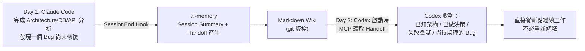

這正是本手冊在第 16 章會實際操作的 Lab 情境。

## 1.4 適合的使用場景

| 場景 | 適合程度 | 說明 |
|---|---|---|
| 長期專案開發（跨數週/數月） | ⭐⭐⭐⭐⭐ | Session 越多，記憶複利效應越明顯 |
| Legacy System Reverse Engineering | ⭐⭐⭐⭐⭐ | 架構重建的推論過程極難重新來過，記憶價值最高 |
| Framework Upgrade | ⭐⭐⭐⭐⭐ | Breaking Change 知識、Migration 決策需要長期保存 |
| 多 Agent / 多開發者協作 | ⭐⭐⭐⭐ | 透過共用 Server 讓知識在人與 Agent 之間流動 |
| Bug 追蹤與除錯 | ⭐⭐⭐⭐ | 記住已排除的假設，避免重複繞圈 |
| 一次性腳本 / Demo | ⭐⭐ | 記憶價值低，甚至可用 marker file 排除擷取 |

> **建議架構**：對於預估會超過 3 個 Session 的任何開發任務，建議啟用 ai-memory。（此為本手冊依 ai-memory Memory Tiers 設計邏輯做出的實務建議，非官方明文規定。）

## 1.5 最終實作目標（本手冊願景）

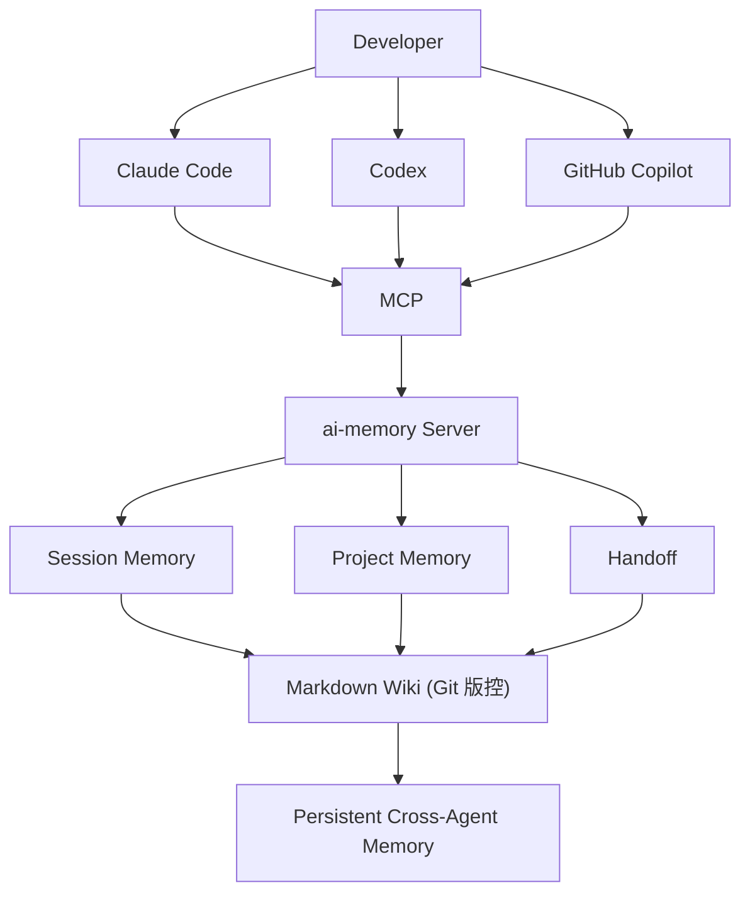

> **今天 Claude Code 做到哪裡，明天 Codex 可以繼續；這個月某位工程師完成的 Reverse Engineering，下個月另一位工程師可以接續；Framework Upgrade 的成功與失敗經驗不必重新從零開始。** 這是本手冊全篇 44 章要協助讀者達成的目標。

### 本章 Checklist

- [ ] 理解 ai-memory 解決的是「Session 記憶遺失」與「Agent 交接」問題，而非取代程式碼本身
- [ ] 理解 Context Window 限制、Agent Vendor Lock-in、Project Knowledge Continuity 三個核心痛點
- [ ] 已識別團隊中哪些專案屬於「⭐⭐⭐⭐⭐ 高記憶價值」場景

---

# 2. 核心概念

本章逐一定義 ai-memory 官方文件中實際使用的核心詞彙，並說明彼此間的關係。**以下所有定義均直接取自或忠實翻譯自官方文件（`README.md` / `docs/ARCHITECTURE.md` / `docs/auto-scope.md` / `docs/marker-file.md`），標示為「官方已實作」。**

## 2.1 核心概念定義表

| 概念 | 定義（依官方文件） | Provenance |
|---|---|---|
| **Long-Term Memory** | 跨 Session、跨 Agent 持續存在的專案知識，儲存在 Git 版控的 Markdown Wiki 中 | 官方已實作 |
| **Wiki（層）** | `<data_dir>/wiki/`：Markdown 原始碼所在位置，Git 版控，可在 Obsidian/vim 等外部工具編輯，watcher 會協調外部變更；是整個系統的 **Source of Truth** | 官方已實作 |
| **Session Memory / Session Ledger** | 單一 Session 內產生的生命週期事件投影，記錄於 SQLite 的 `sessions`／`observations` table，屬於稽核軌跡 | 官方已實作 |
| **Handoff** | Session 結束時自動開啟的「型別化跨 Agent 交接紀錄」（`handoffs` table），讓下一個 Agent 在第一個 Prompt 之前就能收到相關 Context | 官方已實作 |
| **Observation / ObservationKind** | Hook 產生的生命週期事件，封閉集合包含：`session-start`、`user-prompt`、`pre-tool-use`／`post-tool-use`、`pre-compact`／`post-compaction`、`notification`、`stop`、`session-end`、`other` | 官方已實作 |
| **Lifecycle Hooks** | AI Coding Agent 在特定時間點（SessionStart、PostToolUse、SessionEnd…）觸發的外部腳本，是 ai-memory 擷取資訊的**唯一不可信文字入口** | 官方已實作 |
| **MCP（Model Context Protocol）** | Agent 與 ai-memory Server 溝通的標準協定層，透過 18 個 MCP Tools 曝露記憶讀寫能力 | 官方已實作（詳見第 6 章） |
| **FTS5** | SQLite 全文檢索虛擬表（`pages_fts`），是**預設**（Zero-LLM 也能運作）的檢索方式之一 | 官方已實作 |
| **Embedding** | 選配（opt-in）向量欄位，需設定 `AI_MEMORY_EMBEDDING_PROVIDER` 才會啟用，denormalized 記錄 `{provider, model, dim}` | 官方已實作 |
| **LLM Summarization / Consolidation（`memory_consolidate`）** | 當設定了 `AI_MEMORY_LLM_PROVIDER`，將 Session Summary 改寫成更豐富的 `concepts/`、`decisions/`、`gotchas/` 頁面，並建立 wikilink | 官方已實作 |
| **Zero-LLM Mode** | 未設定任何 LLM Provider 時的預設路徑：規則式（rule-based）摘要 + FTS5 + entity matching + graph-neighbor search 仍可完整運作 | 官方已實作，Cross-Cutting Invariant #13 |
| **Optional LLM** | LLM 元件全部是 opt-in，透過環境變數啟用，系統核心邏輯不依賴 LLM 存在 | 官方已實作 |
| **Auto-Improvement Loop** | 預設啟用的排程背景 Reviewer，處理已完成的 Session，提出對 Wiki 頁面的驗證過的編輯建議；除非設定 `require_approval = true`，否則自動核准 | 官方已實作 |
| **Managed Workstream** | 透過 `ai-memory run <harness>` 啟動、可跨多個 Agent Harness（Claude Code、Codex、OpenCode、Pi、Crush 等）持續接續的編碼 Session | 官方已實作 |
| **Memory Scope / Auto Scope** | 決定 MCP 讀取工具在未指定 workspace/project 參數時該用哪個「目前作用中專案」的機制，三種模式：`single`／`per_session`／`per_actor` | 官方已實作（詳見第 5 章） |
| **Project Isolation** | 透過 3-tuple identity（workspace_id, project_id, path）+ Marker File，避免不同專案的記憶互相污染 | 官方已實作（詳見第 5 章） |
| **Companion Crates** | 不進入 core 的擴充工具，透過公開 `/api/v1` 與既有 MCP Tools 互動，例如 `ai-memory-importer` | 官方已實作 |

## 2.2 概念關係圖

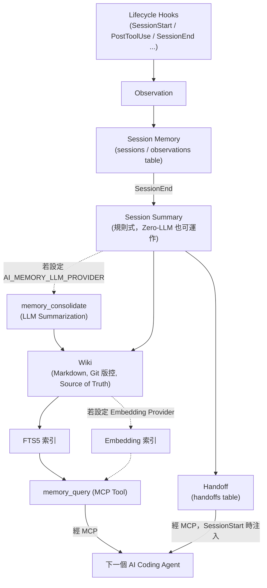

### Scenario：概念如何串起一整個 Session

1. 開發者在 Claude Code 輸入第一個 Prompt → `UserPromptSubmit` Hook 觸發 → ai-memory 記錄一筆 `Observation`
2. 開發者呼叫工具（讀檔、跑測試）→ `PostToolUse` Hook 觸發 → 持續累積 `Observation`
3. Session 結束 → `SessionEnd` Hook 觸發 → ai-memory 產生規則式 Session Summary，同時開啟一筆 `Handoff`
4. 若有設定 LLM Provider → 背景將 Summary 改寫為結構化的 `decisions/`、`gotchas/` 頁面
5. 隔天換 Codex 開新 Session → MCP `SessionStart` 讀取到上一個 Handoff → Codex 在第一個回覆前就已掌握上下文

### 本章 Checklist

- [ ] 能分辨 Wiki（Source of Truth）與 SQLite（衍生索引）的角色差異
- [ ] 理解 Zero-LLM 模式下系統仍可完整運作，LLM 只是加值選配
- [ ] 理解 Handoff 與一般 Session Summary 的差異：Handoff 是型別化、專為跨 Agent 交接設計的資料結構

---

# 3. 系統架構

## 3.1 儲存目錄結構

依 README「Architecture Overview」與 `docs/ARCHITECTURE.md`（官方已實作），ai-memory 的資料目錄結構如下：

```text
<data_dir>/
├── wiki/               # Markdown 原始碼，Git 版控，Source of Truth
├── raw/                # 不可變、已清洗的 Managed Workstream Transcript
├── db/                 # SQLite：FTS5 索引、entities、embeddings
├── models/              # 保留給未來的本地 Embedding 模型
├── logs/                # 滾動輸出的 Tracing Log
└── client-projects.json # 私有 Checkout 連結，不透過 API 曝露
```

## 3.2 Crate 佈局（Source-confirmed，`Cargo.toml` workspace members）

```text
crates/
├── ai-memory-core/        # Domain types, errors, IDs（無 I/O）
├── ai-memory-store/       # SQLite actor、reader pool、decay 演算法
├── ai-memory-wiki/        # 原子寫入、file watcher、git
├── ai-memory-mcp/         # rmcp transport、tool router
├── ai-memory-hooks/       # Payload schema、Sanitizer
├── ai-memory-llm/         # Provider 認證邊界、traits
├── ai-memory-consolidate/ # Ingest、lint、sweep、auto-improve
├── ai-memory-web/         # Web UI（`--enable-web`）
├── ai-memory-workstream/  # Native transcript、launch adapters
└── ai-memory-cli/         # Binary 進入點、HTTP subcommands
```

官方文件強調：「Each crate has single responsibility; no circular dependencies.」（官方已實作，`AGENTS.md`）

## 3.3 Steady-State Processing Loop（穩態資料流程）

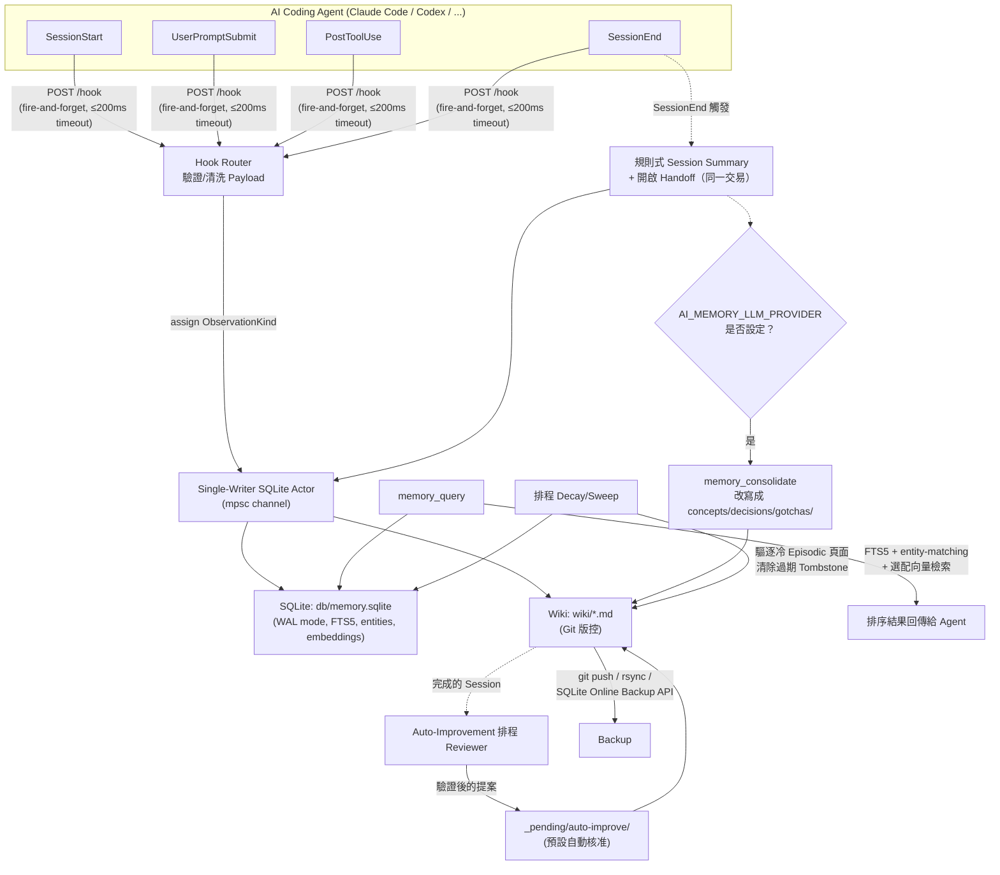

> 此圖依官方 `docs/ARCHITECTURE.md`「Steady-State Processing Loop」8 步驟（Hook Ingestion → Sanitization → Session Summaries → Consolidation → Auto-Improvement → Query Resolution → Retention & Decay → Backups）重繪，實線關係皆為官方已實作。

## 3.4 MCP Tool Surface（18 個工具，官方已實作）

| 分類 | 工具 |
|---|---|
| Read-only（8） | `memory_query`、`memory_recent`、`memory_read_page`、`memory_read_session_observations`、`memory_status`、`memory_briefing`、`memory_explore`、`memory_install_self_routing` |
| Destructive（8） | `memory_handoff_begin`、`memory_handoff_accept`、`memory_handoff_cancel`、`memory_consolidate`、`memory_write_page`、`memory_delete_page`、`memory_forget_sweep`、`memory_lint` |
| Write（2） | `memory_feedback`、`memory_auto_improve` |

> 官方文件特別強調此數字是刻意精簡的設計決策：`docs/ARCHITECTURE.md` 以標題「MCP tool surface (18 tools)」明確定調，`docs/design-decisions.md` 則進一步說明精簡的動機——「basic-memory has ~25 tools, agentmemory has 53」，兩相對照即可看出 ai-memory 刻意將工具數量壓低以降低使用者混淆（官方已實作，彙整自 `docs/ARCHITECTURE.md` 與 `docs/design-decisions.md` 兩份文件，非單一逐字引用）。

## 3.5 資料表 Schema 重點（官方已實作，`docs/ARCHITECTURE.md`「Schema Highlights」）

| Table | 用途 |
|---|---|
| `pages` | 版本化 Wiki 頁面，含 `is_latest`、`supersedes`、Decay 欄位 |
| `pages_fts` | FTS5 虛擬表（title + body） |
| `sessions` / `observations` | 清洗後的生命週期 Hook 投影，稽核軌跡 |
| `handoffs` | 型別化跨 Agent Handoff 紀錄 |
| `links` | Wikilink，支援跨專案 Scope |
| `page_embeddings` | 選配向量，附帶 `{provider, model, dim}` 反正規化欄位 |
| `page_feedback` | Append-only 品質訊號（helpful / not_helpful / stale / wrong） |
| `auto_improve_proposals` | 暫存的學習編輯，含不可變 Snapshot |
| `entities` / `entity_page_links` | 從 Frontmatter 衍生的名詞索引 |
| `audit_log` | 每筆變動，可依時間戳倒序定址 |

## 3.6 Memory Tiers（M8 Policy，官方已實作）

| Tier | 保留策略 |
|---|---|
| **Working** | 僅當前 Session，Session 結束即硬刪除 |
| **Episodic** | 30 天熱 → 180 天冷 → 逐出（帶衰減公式） |
| **Semantic** | 無限期，只能透過 LLM Rewrite 被 Supersede，**不會自動刪除** |
| **Procedural** | 無限期，未被重新觀測則頻率衰減 |

## 3.7 十五條 Cross-Cutting Invariants（官方已實作，`docs/ARCHITECTURE.md` 與 `AGENTS.md` 皆列出）

1. 啟動時單一設定讀取路徑（不在其他地方散落 `std::env::var`）
2. 單一 Writer 的 SQLite Actor（透過 mpsc channel）
3. 索引與資料在同一交易中提交
4. 每一列都有型別化的 3-tuple identity（workspace_id, project_id, path）
5. Hooks 為 Fire-and-forget；≤200ms timeout；回應 202 或 429
6. Privacy Strip 是型別化邊界；只能透過 `sanitize()` 建構子
7. 只使用 JSON-schema 結構化輸出（原生 Provider JSON 模式）
8. 每筆 Embedding 旁都反正規化記錄 `{provider, model, dim}`
9. 執行破壞性操作前先檢查存活中的行程
10. 原子檔案寫入（tmp + rename + fsync）；Watcher 忽略自己的寫入
11. 絕對路徑的預設資料目錄，啟動時大聲記錄
12. 不使用全域單例或 lazy_static 設定
13. **Zero-LLM 為預設路徑；LLM 透過環境變數 opt-in**
14. Provider 認證需在 Provider 建構前完成解析
15. Tracing Subscriber 只過濾自己的模組（避免回饋迴圈）

### 本章 Checklist

- [ ] 能畫出 Hook → Sanitize → Store → Consolidate → Query 的完整資料流程
- [ ] 理解 18 個 MCP Tool 的三個分類（read-only / destructive / write）
- [ ] 理解 Memory Tiers 中只有 Semantic/Procedural 是「無限期保留」，Working/Episodic 都會被清理

---

# 4. 為什麼不需要傳統 Vector Database

這是企業導入 ai-memory 時最常被問到的問題：「沒有 Vector DB，檢索品質夠用嗎？」本章依官方 `docs/design-decisions.md` 的實際論述回答。

## 4.1 比較表

| 技術 | ai-memory | 典型 Vector RAG 方案 |
|---|---|---|
| Markdown 為 Source of Truth | ✓（官方已實作） | 通常不是核心設計 |
| Git 版控 | ✓（官方已實作） | 通常不是 |
| FTS5 全文檢索 | ✓，且為預設路徑（官方已實作） | 不一定具備 |
| Embedding | Optional，需 opt-in（官方已實作） | 通常是核心必要元件 |
| 專用 Vector DB | **不使用**，改用 SQLite + packed vectors（官方已實作） | 通常需要（Pinecone/Qdrant/Weaviate 等） |
| Human Readable | ✓，純 Markdown 檔案（官方已實作） | 通常較弱，向量不可讀 |
| Backup/搬遷 | `git clone` 或 `rsync` 即可（官方已實作） | 通常需要專用 DB 備份機制 |

## 4.2 官方實際拒絕的方案與理由（官方已實作，`docs/design-decisions.md`）

| 方案 | 被拒絕的理由（依官方文件） |
|---|---|
| **LanceDB** | "file-format drift, filter propagation failures"（對應 issue #2702 / #2720） |
| **Kuzu / Ladybug** | "upstream archived, fork-risk realized"（#2098 / #2768）——上游已封存，Fork 風險已實際發生 |
| **CozoDB / SurrealDB** | 維護者深度不足；SurrealDB 被指出："heavy, multi-mode storage; we'd inherit a lot of surface we don't need." |

> ⚠️ 需誠實澄清（2026-08-26 複查修正）：`docs/design-decisions.md` 的該段落標題原文即為 **"Why not LanceDB/Qdrant/Kuzu/CozoDB/SurrealDB?"**，Qdrant 確實與其他四者一併被官方文件明文提及；但緊接的項目符號只逐一列出 LanceDB、Kuzu/Ladybug、CozoDB、SurrealDB 各自的拒絕理由，**唯獨沒有**針對 Qdrant 給出專屬論述。因此正確的說法是：「官方文件的段落標題明確提及 Qdrant，但未提供其個別拒絕理由」，而非「官方文件完全未討論 Qdrant」——可合理推測其考量與 SurrealDB 相近（避免引入非必要的專用向量資料庫依賴），但這部分屬合理推論，非官方逐字說明（標示為推測/Hypothesis）。

## 4.3 採用的替代方案：SQLite + Packed Vectors（官方已實作）

> "Packed vectors in SQLite keep v1 dependency-light; `sqlite-vec` remains the scale-up path once brute-force cosine stops being enough."

- 圖結構查詢（Graph-neighbor Search）用標準 SQL Table + 遞迴 CTE 實作，**不是**專用圖資料庫，理由是保持 Schema 可稽核、遷移簡單。
- Embedding **預設關閉**，需 opt-in（可選 OpenAI、Voyage、Google Gemini 或 OpenAI-相容端點）；本地 ONNX 模型（如 `bge-small-en-v1.5`）列為 Future Work。
- 每個 LLM/Embedding Provider 都手寫 typed HTTP client，刻意不使用類似 LiteLLM 的統一抽象層，理由是避免「靜默丟棄參數」的風險。
- 3-tuple identity（workspace, project, page_path）從第一天就編碼進 Schema，避免日後才補做遷移。

## 4.4 FTS5、Embedding、LLM 各自的角色（官方已實作，對應第 2 章定義）

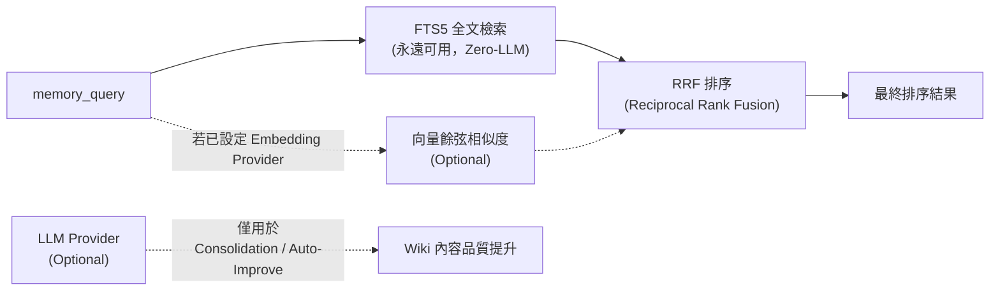

- **FTS5**：預設、永遠存在的檢索基礎，不需任何外部 API。
- **Embedding**：加分項，需額外設定，用於語意相似度檢索，與 FTS5 結果透過 RRF（Reciprocal Rank Fusion）融合排序。
- **LLM**：只用於「讓內容變得更好」（Consolidation、Auto-Improvement 的摘要改寫），**不參與**基礎檢索路徑，也不是系統運作的必要條件。

### Scenario：企業安全部門要求「完全不對外呼叫 API」

若企業政策禁止呼叫任何外部 LLM/Embedding API，ai-memory 仍可在 **Zero-LLM 模式**下完整運作：Hook 擷取、規則式 Session Summary、FTS5 全文檢索、Handoff 交接皆不受影響，只是 Wiki 頁面不會被 LLM 改寫成更精煉的 `concepts/`／`decisions/` 結構化頁面。這是導入 ai-memory 時對資安保守型企業最重要的一句話。

### 本章 Checklist

- [ ] 能向資安團隊說明「ai-memory 預設不需要對外呼叫任何 LLM/Embedding API」
- [ ] 理解 Vector DB 的角色是被 SQLite + packed vectors 取代，而非完全不支援向量檢索
- [ ] 能正確轉述：官方文件標題有提及 Qdrant，但未對其給出個別拒絕理由（不宣稱「官方完全沒提過 Qdrant」，也不宣稱「官方給了 Qdrant 專屬拒絕理由」）

---

# 5. Project Isolation（專案隔離機制）

## 5.1 問題背景（官方已實作，`docs/auto-scope.md`）

`ai-memory serve` 維護一個「目前作用中專案」的指標，供 MCP 讀取工具在省略 workspace/project 參數時使用。預設是**單一 process-wide slot**：當多個 Session 同時在共用安裝上執行時，一個專案的 Hook 可能覆寫另一個並行 Session 需要的指標，造成記憶污染風險：

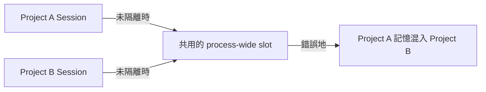

## 5.2 三種 Auto Scope 模式（官方已實作）

| Mode | Key 依據 | 適用情境 |
|---|---|---|
| `single`（預設） | 全域槽 | 單一操作者、同一時間只有一個作用中專案 |
| `per_session` | `session_id` | Session-aware Client（會把 Hook Session ID 隨每個請求傳送） |
| `per_actor` | 身份 + `session_id` | 多使用者情境；能跨操作者隔離，且在 Session ID 不匹配時「fail securely」 |

設定範例（官方已實作，`docs/auto-scope.md`）：

```toml
[auto_scope]
mode = "single"           # Options: "single" (default), "per_session", "per_actor"
session_ttl_secs = 3600   # TTL for per-key entries (default 1 hour)
max_entries = 4096        # Hard cap; oldest insertions evicted first
```

> 環境變數覆寫格式：`AI_MEMORY_AUTO_SCOPE__<KEY>`（官方已實作）

實作細節（官方已實作）：

- Scope 解析集中在 `ai_memory_store::ScopeResolver`
- 明確傳入的 Scope 參數採「Fail Closed」——若在作用中或預設 Workspace 找不到指定專案，直接回錯誤，不會 Fallback
- Actor 身份來源：Hook Payload、Auth Middleware、MCP Request Headers（`X-Memory-Actor-Session-Id` 或 `Mcp-Session-Id`）
- 記憶體佔用極小（即使 4,096 筆條目也只需要幾十 KB）

## 5.3 Marker File（`.ai-memory.toml`）—— 專案識別的第二層（官方已實作，`docs/marker-file.md`）

Marker File 解決的問題：多客戶顧問情境、Monorepo、需要 Context 分離的開發者，不能單純用「目錄名稱」猜測專案。

**專案識別三種策略：**

1. **明確宣告**：Marker File 中 `project = "name"`
2. **Repository Root 偵測**：`project_strategy = "repo-root"`，從主 Git Repo 的 Basename 推導專案名
3. **預設 Fallback**：沒有 Marker 時用目前目錄的 Basename

**Marker File 尋找方式**：從 `cwd` 往上（朝 `$HOME` 方向）走訪目錄樹，取第一個遇到的 Marker File；若在 `$HOME` 之外，則走訪到最近的 Git Checkout Root（`.git`）處停止。**較靠近的 Marker 會覆蓋較外層的 Marker。**

範例（官方已實作，README）：

```toml
# .ai-memory.toml
workspace = "my-workspace"
project = "my-project"

[capture]
ignore_paths = ["vendor/", "node_modules/"]
```

**其他機制（官方已實作）：**

- **Allowlist Mode**（`install-hooks --capture-mode allowlist`）：反轉預設行為——沒有 Marker 的 Repo 完全不發出任何生命週期事件，須明確加 Marker 才會 Opt-in
- `[capture] ignore_paths`：對符合 Glob Pattern 的檔案工具活動排除擷取（詞法過濾，非密碼學等級）
- `AI_MEMORY_IGNORE_MARKER=1` 環境變數可暫時停用 Marker 解析（單次 CLI 呼叫）
- 命令列旗標明確優先於 Marker 宣告
- Workspace / Project 名稱須符合正則 `^[a-z0-9][a-z0-9._-]*$`

### Scenario：顧問公司同時服務多個客戶的 Monorepo

一位外部顧問在同一台筆電上，一天要處理 3 個不同客戶的程式碼庫。若沒有 Marker File，`ai-memory` 只能用目錄名稱猜測專案，容易在客戶 A 與客戶 B 的目錄名稱恰好相似時發生記憶污染。解法：在每個客戶專案根目錄放置 `.ai-memory.toml`，明確宣告 `workspace = "clientA"` / `workspace = "clientB"`，確保 3-tuple identity 從第一天就正確隔離。

### 本章 Checklist

- [ ] 已確認團隊是否需要 `per_session` 或 `per_actor` 模式（單人單機用 `single` 即可）
- [ ] 每個重要專案根目錄已放置 `.ai-memory.toml` 明確宣告 workspace/project
- [ ] 已評估是否需要 Allowlist Mode 避免未預期的 Repo 被自動擷取

---

# 6. MCP 與 ai-memory：不是一般的 Memory Database

## 6.1 MCP（Model Context Protocol）基本概念

MCP 是由 Anthropic 發起的開放協定，用來標準化 LLM 應用程式與外部工具/資料源之間的溝通方式。核心角色：

| 角色 | 說明 |
|---|---|
| **MCP Server** | 曝露 Tools／Resources／Prompts 的服務端，例如本手冊主題 ai-memory 本身 |
| **MCP Client** | 發起請求的一方，內嵌在 AI Coding Agent（Claude Code、Cursor…）中 |
| **Tools** | Server 曝露的可呼叫函式（ai-memory 曝露 18 個，見第 3.4 節） |
| **Resources** | Server 曝露的可讀取資料（依 MCP 規範，供 Client 訂閱/讀取） |
| **Prompts** | Server 可提供的預先定義 Prompt 模板 |
| **Transport** | 溝通管道，常見有 **stdio**（本地行程間管道）與 **HTTP / Streamable HTTP**（含 Remote MCP） |

## 6.2 ai-memory 作為 MCP Server 的角色定位

> ⚠️ 這是本手冊最重要的觀念澄清之一：**ai-memory 不是一個「一般的 Memory Database」，而是透過 MCP 讓不同 AI Coding Agent 存取共同的長期記憶系統。**

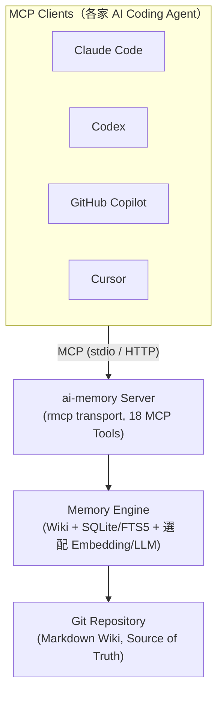

若沒有 MCP 這層標準協定，每一家 AI Vendor 就得各自開發專屬的「記憶外掛」，形成新的 Vendor Lock-in。MCP 的價值在於：**同一份記憶，透過同一套協定，可以被任何相容 MCP 的 Agent 讀寫**——這正是 ai-memory 能達成跨廠商交接的技術基礎。

> ⚠️ 需特別說明：上圖將 GitHub Copilot 與 Claude Code、Codex、Cursor 並列為 MCP Client，這在「都能讀寫 MCP Tools」的意義上成立，但**並非對等的自動化交接體驗**。官方 Support Matrix 明確標示 GitHub Copilot／VS Code 目前為 **「MCP-only，無 Lifecycle Hooks」**（詳見第 13 章）。SessionEnd 自動產生 Handoff、SessionStart 自動注入 Handoff 這兩個自動化環節都依賴 Hooks，因此對 Copilot 並不成立；若要讓 Copilot 參與跨 Agent 交接，仍需使用者或 Prompt 明確引導它呼叫 `memory_query`／`memory_handoff_accept` 等 MCP Tools，而非像 Claude Code／Codex 之間那樣「免手動」自動完成。

## 6.3 Transport 選型：stdio vs HTTP（官方已實作，`docs/mcp-install.md`）

| Transport | 適用情境 |
|---|---|
| **靜態 HTTP MCP** | 預設模式，設定簡單，`ai-memory install-mcp --client <agent> --apply` |
| **本地 stdio Bridge（`--session-aware`，Claude Code 專屬）** | 需要區分同時執行的多個 Session 時，透過 `ai-memory mcp-bridge` 轉發並附加 `X-Memory-Actor-Session-Id` |
| **Remote HTTP MCP** | Server 部署在 LAN／VPN／雲端，Client 透過 `AI_MEMORY_SERVER_URL` 指向遠端位址 |

詳細決策指南見第 11 章「Claude Code 整合」。

### 本章 Checklist

- [ ] 能向團隊解釋「MCP 是協定層，ai-memory 是實作這個協定的記憶伺服器」
- [ ] 不會把 ai-memory 說成「跟 Pinecone/Qdrant 一樣的向量資料庫產品」
- [ ] 理解 stdio 與 HTTP 兩種 Transport 的適用情境差異

---

# Part II：安裝與部署

# 7. Installation（安裝指南）

以下所有指令均逐字或近逐字取自官方 `README.md` 與 `docs/install.md` / `docs/windows.md` / `docs/macos.md`（官方已實作），撰寫時未新增任何未經查證的旗標或參數。

## 7.1 Linux（含 Arch Linux / AUR）

**AUR（Arch Linux）：**

```bash
yay -S ai-memory-bin    # 預編譯 Linux x86_64/aarch64 二進位檔
yay -S ai-memory        # 從原始碼編譯
```

**單使用者 Workstation 設定：**

```bash
mkdir -p ~/.config/ai-memory ~/.local/share/ai-memory
ai-memory --data-dir ~/.local/share/ai-memory \
  --config ~/.config/ai-memory/config.toml init
systemctl --user enable --now ai-memory.service
ai-memory install-mcp --client claude-code --apply
ai-memory install-hooks --agent claude-code --apply
```

> 系統層級安裝會改用 `/var/lib/ai-memory` 與 `/etc/ai-memory/`，並透過套件化的 systemd units（`packaging/systemd/ai-memory.service`、`ai-memory-user.service`）管理（官方已實作／Source-confirmed）。

## 7.2 macOS

**方案 A（推薦，Prebuilt Release）：**

```bash
mkdir -p ~/Applications/ai-memory && cd ~/Applications/ai-memory
curl -fsSL -O https://github.com/akitaonrails/ai-memory/releases/latest/download/ai-memory-macos-aarch64.tar.gz
tar -xzf ai-memory-macos-aarch64.tar.gz
./ai-memory init
./ai-memory serve --transport http --bind 127.0.0.1:49374
```

另開一個終端機視窗安裝 MCP 與 Hooks：

```bash
cd ~/Applications/ai-memory
./ai-memory install-hooks --agent claude-code --apply
./ai-memory install-mcp --client claude-code --apply
```

> Intel Mac 請改用 `ai-memory-macos-x86_64.tar.gz`。

**方案 B（原始碼編譯，需 Rust 1.95 + Xcode Command Line Tools）：**

```bash
git clone https://github.com/akitaonrails/ai-memory
cd ai-memory
cargo build --release --workspace
./target/release/ai-memory init
./target/release/ai-memory serve --transport http --bind 127.0.0.1:49374
```

**方案 C（Docker）：**

```bash
docker run -d --name ai-memory --restart unless-stopped \
    -p 127.0.0.1:49374:49374 -v ai-memory-data:/data \
    akitaonrails/ai-memory:latest
```

Docker Image 支援 `linux/amd64` 與 `linux/arm64`（涵蓋 Apple Silicon 透過 Docker Desktop 執行）。

## 7.3 Windows

| 環境 | 支援狀態（官方 README Support Matrix 原文） | 建議 |
|---|---|---|
| Windows via WSL2 | **Supported** | 官方建議路徑：在 WSL2 內走 Linux 安裝流程 |
| Native Windows | **Experimental** | 可用，但官方明確提醒需要更多真實世界測試 |
| Docker Desktop（Windows 上） | 依 Docker Image 官方支援的 `linux/amd64` 而定 | 適合不想處理原生二進位檔案的團隊 |

> `docs/windows.md` 原文（官方已實作）："Windows hook support is new and needs real-world testing against native Windows agent builds."

**Scenario A（WSL2，官方建議路徑）**：在 WSL2 內比照 7.1 節 Linux 安裝流程操作，使用 `.sh` Hooks。

**Scenario B（Native Windows + Docker Desktop）**，PowerShell：

```powershell
docker run -d --name ai-memory `
    --restart unless-stopped `
    -p 127.0.0.1:49374:49374 `
    -v ai-memory-data:/data `
    akitaonrails/ai-memory:latest
```

```powershell
ai-memory install-mcp --client claude-code --apply
ai-memory install-hooks --agent claude-code --apply
```

**Scenario C（Prebuilt Binary）**：下載官方發布的 `ai-memory-windows-x86_64.zip`，內含 `ai-memory.exe`，不需 Rust 或 Docker。

**Scenario D（Source Build）**：Windows 上以 Cargo 從原始碼編譯（需 Rust 1.95 工具鏈）。

> ⚠️ **重要提醒**（官方已實作）：務必在**啟動 Claude Code 的同一個環境**執行 `install-mcp` 與 `install-hooks`，避免 WSL2 與 Native Windows 的執行檔路徑不一致而導致 Hook 失效。Native Windows Build 對 Claude Code 支援 Exec Form（直接呼叫執行檔，比 Shell-based 快 3-5 倍），但其他 Agent（Codex、Cursor、Devin 等）在 Native Windows 上的行為仍待社群驗證。

## 7.4 Docker（跨平台通用）

```bash
# 1. 安裝 wrapper script（含 checksum 驗證）
mkdir -p ~/.local/bin
wrapper_tmp="$(mktemp -d)"
trap 'rm -rf "$wrapper_tmp"' EXIT
wrapper_base=https://github.com/akitaonrails/ai-memory/releases/latest/download/ai-memory-wrapper
curl -fsSL "$wrapper_base" -o "$wrapper_tmp/ai-memory-wrapper"
curl -fsSL "$wrapper_base.sha256" -o "$wrapper_tmp/ai-memory-wrapper.sha256"
expected="$(awk 'NR == 1 { print $1 }' "$wrapper_tmp/ai-memory-wrapper.sha256")"
actual="$(sha256sum "$wrapper_tmp/ai-memory-wrapper" | awk '{ print $1 }')"
[ -n "$expected" ] && [ "$actual" = "$expected" ] || { echo "wrapper checksum mismatch" >&2; exit 1; }
install -m 0755 "$wrapper_tmp/ai-memory-wrapper" ~/.local/bin/ai-memory

# 2. 啟動 Server
docker run -d --name ai-memory \
    --restart unless-stopped \
    -p 127.0.0.1:49374:49374 \
    -v ai-memory-data:/data \
    -e AI_MEMORY_LLM_PROVIDER=anthropic \
    -e ANTHROPIC_API_KEY=sk-ant-... \
    -e AI_MEMORY_EMBEDDING_PROVIDER=openai \
    -e OPENAI_API_KEY=sk-... \
    akitaonrails/ai-memory:latest

# 3. 設定 Agent
ai-memory install-mcp   --client claude-code --apply
ai-memory install-hooks --agent  claude-code --apply
```

> 官方強調預設 **「no authentication - the server binds to loopback only」**（Single-user 安全預設，官方已實作）。

## 7.5 安裝後驗證

```bash
ai-memory status
```

### Scenario：新進工程師第一天環境建置

新進工程師使用公司配發的 Windows 筆電，團隊政策為「一律透過 WSL2 安裝，不使用 Native Windows」。安裝流程：(1) 在 WSL2 內依 7.1 節 Linux 路徑安裝 ai-memory Server；(2) 在 WSL2 內啟動 Claude Code；(3) 在同一個 WSL2 Shell 執行 `install-mcp` 與 `install-hooks`；(4) 執行 `ai-memory status` 確認連線正常。

### 本章 Checklist

- [ ] 確認團隊統一採用哪種 Windows 安裝路徑（WSL2 或 Native），並寫入團隊規範（見第 34 章）
- [ ] `install-mcp` 與 `install-hooks` 在**同一個執行環境**下完成
- [ ] 安裝完成後執行 `ai-memory status` 驗證

---

# 8. Docker Architecture（Docker 部署架構）

## 8.1 企業推薦部署拓樸

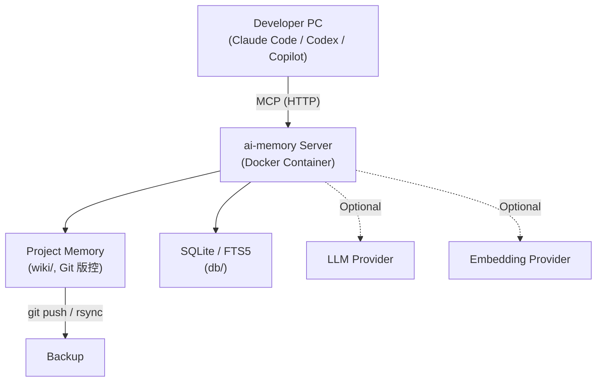

## 8.2 本機開發用 `docker/docker-compose.yml`（官方已實作，逐字取得）

```yaml
services:
  ai-memory:
    image: ai-memory:local
    build:
      context: ..
      dockerfile: docker/Dockerfile
    container_name: ai-memory
    restart: unless-stopped
    user: "1000:1000"
    volumes:
      - ai-memory-data:/data
    ports:
      - "127.0.0.1:49374:49374"
    env_file:
      - path: .env
        required: false
    environment:
      - RUST_LOG=ai_memory=info,ai_memory_store=info,ai_memory_wiki=info,ai_memory_mcp=info,tracing_appender=warn
    healthcheck:
      test: ["CMD", "/usr/local/bin/ai-memory", "status"]
      interval: 30s
      timeout: 5s
      retries: 3
      start_period: 5s

volumes:
  ai-memory-data:
    name: ai-memory-data
```

> 重點：預設 Bind 到 Loopback（`127.0.0.1:49374`），若要供 LAN 使用需改成 `0.0.0.0:49374` 並搭配 Reverse Proxy（見第 10 章）。

## 8.3 Homelab／團隊共用生產部署 `docker-compose.prod.yml.example`（官方已實作，逐字取得）

```yaml
name: ai-memory

services:
  ai-memory:
    image: akitaonrails/ai-memory:latest
    container_name: ai-memory
    restart: unless-stopped
    user: "1000:1000"
    security_opt:
      - label:disable
    ports:
      - "0.0.0.0:49374:49374"
    volumes:
      - /var/opt/docker/utils/ai-memory/data:/data
    env_file:
      - .env.production
    environment:
      - RUST_LOG=ai_memory=info,ai_memory_store=info,ai_memory_wiki=info,ai_memory_mcp=info,tracing_appender=warn
    healthcheck:
      test: ["CMD", "/usr/local/bin/ai-memory", "status"]
      interval: 30s
      timeout: 5s
      retries: 3
      start_period: 5s
```

與本機開發版差異：改用 Registry Image（而非 Inline Build）、Bind `0.0.0.0`（供 LAN 使用）、Secrets 從 `.env.production` 讀取、Volume 掛載 Host 路徑（方便 rsync／btrfs snapshot／restic 備份）、`security_opt: label:disable` 用於 openSUSE MicroOS/Fedora/RHEL 等強制 SELinux 的 Host（官方已實作）。

`docker/` 目錄下另有 `compose.tls.caddy.yml`（Caddy 反向代理 + TLS 模板）與 `compose.tls.cloudflared.yml`（Cloudflare Tunnel 模板，無需開放埠），詳見第 10 章 Security（官方已實作／Source-confirmed）。

## 8.4 部署模式比較

| 模式 | 優點 | 缺點 | 適用 | Provenance |
|---|---|---|---|---|
| Local（Loopback） | 最簡單，零設定認證 | 每人獨立，無法共享記憶 | 個人開發者 | 官方已實作（預設模式） |
| LAN（`docker-compose.prod.yml.example`） | 團隊共用一份記憶 | 需自行管理 `AI_MEMORY_AUTH_TOKEN` 與 `AI_MEMORY_ALLOWED_HOSTS` | 小型固定辦公室團隊 | 官方已實作 |
| VPN | 遠端團隊安全存取 | 需額外維運 VPN | 分散式團隊 | 建議架構 |
| Cloud VM + Reverse Proxy（Caddy/Cloudflare Tunnel） | 集中管理、可搭配 SSO | 需承擔雲端安全與成本責任 | Enterprise | 官方已實作（compose.tls.* 範本）＋建議架構（Cloud VM 拓樸本身） |

### Scenario：10 人團隊的共用 ai-memory Server

團隊決定在內部 Homelab 伺服器上以 `docker-compose.prod.yml.example` 部署一台共用 ai-memory Server，10 位工程師各自的 Claude Code / Codex 透過公司 VPN 連線至 `http://ai-memory.internal:49374`，並設定 `AI_MEMORY_AUTH_TOKEN` + `AI_MEMORY_ALLOWED_HOSTS=ai-memory.internal` 防止未授權存取（詳見第 10 章）。

### 本章 Checklist

- [ ] 已依團隊規模選定 Local／LAN／VPN／Cloud 部署模式
- [ ] LAN 以上規模的部署已設定 `AI_MEMORY_AUTH_TOKEN`
- [ ] Volume 路徑已規劃納入定期備份（第 24 章）

---

# 9. Server Configuration（伺服器設定）

## 9.1 資料目錄與設定檔

- 預設資料目錄：由 `AI_MEMORY_DATA_DIR` 或 `--data-dir` 指定（官方已實作）
- 設定檔：`<data_dir>/config.toml`（官方已實作）
- Server URL／Port／Bind Address：透過 `ai-memory serve --transport http --bind <host:port>` 啟動時指定，預設 `127.0.0.1:49374`（官方已實作）

## 9.2 `config.toml` 完整範例（官方已實作，逐字彙整自 README／`docs/auto-scope.md`／`docs/auto-improvement-loop.md`）

```toml
[auto_scope]
mode = "per_session"

[consolidation]
max_input_tokens = 6500
max_output_tokens = 1000

[decay]
breadth_weight = 0.0

[auto_improve]
require_approval = false      # 預設自動核准
min_confidence = 0.75
max_proposals_per_run = 5

[auto_improve.scheduler]
enabled = true
interval_secs = 3600

[auth]
bearer_token = "<root-token>"
actor_proxy_bearer_token = "<proxy-only-token>"
root_issuer = "https://idp.example"
root_subject = "<root-subject>"
```

> 注意：README 範例用 `mode = "per_session"`，`docs/auto-scope.md` 範例用 `mode = "single"`（預設值）並列出全部三個選項——兩者不矛盾，`single` 是預設，`per_session` 是依情境調整後的範例（官方已實作，詳見第 5 章）。

## 9.3 環境變數總表（官方已實作，逐字取自 README／`docs/install.md`）

**Server 端：**

| 變數 | 說明 |
|---|---|
| `AI_MEMORY_LLM_PROVIDER` | `anthropic` \| `anthropic-oauth` \| `openai` \| `openai-oauth` \| `copilot` \| `gemini` \| `openai-compat` \| `opencode` |
| `AI_MEMORY_LLM_MODEL` | 選配；例如 `claude-haiku-4-5`、`gpt-5.4-mini` |
| `ANTHROPIC_API_KEY` / `OPENAI_API_KEY` / `GEMINI_API_KEY` / `LLM_API_KEY` | LLM Provider 金鑰 |
| `AI_MEMORY_LLM_BASE_URL` | 使用 `openai-compat`（如自架 Ollama、vLLM）時必填的端點位址 |
| `AI_MEMORY_LLM_TIMEOUT_SECS` | 覆寫 LLM Provider 逾時秒數，預設 300 秒；適合自架／聚合閘道回應較慢的情境（v1.29.0 新增） |
| `AI_MEMORY_LLM_COMPAT_STRICT` | 預設 `true`；設為 `false` 可關閉 `response_format=json_schema`（部分 openai-compat 端點不支援時使用） |
| `COPILOT_GITHUB_TOKEN` / `GITHUB_COPILOT_API_TOKEN` / `COPILOT_API_URL` | 使用 `AI_MEMORY_LLM_PROVIDER=copilot` 時的選配認證變數（亦可改用 `ai-memory auth login copilot`） |
| `AI_MEMORY_RERANKER` | 選配 LLM，用於重新排序 Project/Scope 候選結果 |
| `AI_MEMORY_EMBEDDING_PROVIDER` | `openai` \| `voyage` \| `google` \| `gemini` \| `openai-compat` |
| `AI_MEMORY_EMBEDDING_MODEL` | 例如 `text-embedding-3-small` |
| `AI_MEMORY_EMBEDDING_BASE_URL` | 使用 `openai-compat` 時必填的端點位址 |
| `AI_MEMORY_EMBEDDING_DIM` | `1536`（OpenAI）／`1024`（Voyage）／`768`（Google）；`openai-compat` 需明確指定 |
| `AI_MEMORY_DATA_DIR` | 覆寫預設資料目錄位置 |
| `AI_MEMORY_DOCKER` | 讓 CLI 指向 podman（例如設為 `podman`）而非 docker |
| `AI_MEMORY_IN_CONTAINER` | 表示 CLI 執行在容器內 |
| `AI_MEMORY_NO_VERSION_CHECK` | 設為 `1` 時關閉每日版本檢查 |
| `AI_MEMORY_WRAPPER_URL` | 將 Wrapper 自我升級來源指向特定 Fork/Release |

**安全相關（見第 10 章詳細說明）：**

| 變數 | 說明 |
|---|---|
| `AI_MEMORY_AUTH_TOKEN` | Bearer Token，非 Loopback Bind 時必須設定 |
| `AI_MEMORY_ALLOWED_HOSTS` | 防止 DNS Rebinding 攻擊 |
| `AI_MEMORY_AUTH__SECURE_COOKIE` | `/web` 走 HTTPS Reverse Proxy 時設為 `true` |
| `AI_MEMORY_HOOK_RATE_PER_SEC` / `AI_MEMORY_HOOK_RATE_BURST` | 限制單一 Actor/Session 來源的 Hook 請求速率 |

**Client 端：**

| 變數 | 預設值 | 說明 |
|---|---|---|
| `AI_MEMORY_SERVER_URL` | `http://127.0.0.1:49374` | Server 在不同機器時設定，如 `http://192.168.0.90:49374` |
| `AI_MEMORY_AUTH_TOKEN` | 未設定 | Server 啟用 Bearer Auth 時必須設定 |

> 官方提醒："For a single-laptop loopback server, set neither variable."（官方已實作）

## 9.4 Web UI

```bash
ai-memory serve --transport http --bind 127.0.0.1:49374 --enable-web
```

（官方已實作，`docs/usage.md`）

### 本章 Checklist

- [ ] `config.toml` 已依團隊規模設定 `auto_scope` 模式
- [ ] LLM／Embedding Provider 若要啟用，已設定對應的 `AI_MEMORY_*_PROVIDER` 與 API Key
- [ ] Client 端 `AI_MEMORY_SERVER_URL` 僅在 Server 非本機時才需設定

---

# 10. Security（安全性）

本章以 Enterprise Security 標準撰寫，所有條文均逐字或近逐字取自官方 `README.md` Security 段落、`docs/https-via-proxy.md`、`docs/users.md`（官方已實作）。

## 10.1 Authentication 與 Loopback 預設

- **預設安全模型**：Server 預設 Bind `127.0.0.1`（Loopback Only），此狀態下**無需任何認證**（官方已實作）。
- **非 Loopback Bind 的強制要求**（官方已實作，逐字）：
  > "Unauthenticated non-loopback HTTP now fails closed. Set `AI_MEMORY_AUTH_TOKEN` or bind loopback; `--allow-insecure-no-auth` is an intentional, dangerous exception for plain HTTP only."

也就是說：**只要 Server 綁定的不是 loopback，就必須設定 `AI_MEMORY_AUTH_TOKEN`，否則連線會被拒絕**（Fail Closed 設計，1.27.0 版引入的 Breaking Change，見第 39 章）。

## 10.2 `AI_MEMORY_AUTH_TOKEN` + `AI_MEMORY_ALLOWED_HOSTS` 的重要性

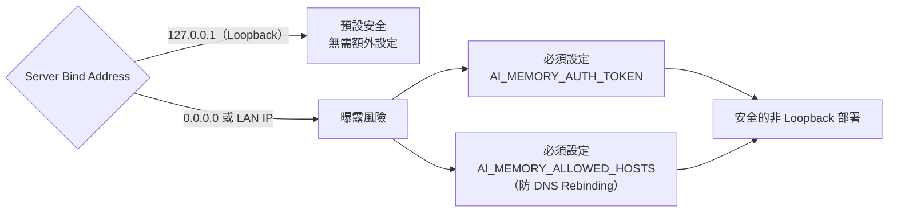

官方原文（官方已實作）："Non-loopback binds should also set `AI_MEMORY_ALLOWED_HOSTS` to guard against DNS rebinding."

## 10.3 MCP Security

- Session-aware Bridge（`ai-memory mcp-bridge`）會保留 Bearer 認證，並在每個上游請求附加 `X-Memory-Actor-Session-Id`（官方已實作，見第 11 章）。
- `install-mcp` 產生的設定檔本身可能包含 Bearer Token，須以第 10.6 節的 Secret Management 原則保護。

## 10.4 Rate Limiting（Hook 端）

官方原文（官方已實作）："Busy shared hook servers can also set `AI_MEMORY_HOOK_RATE_PER_SEC` (tokens per second per actor/session source) and optionally `AI_MEMORY_HOOK_RATE_BURST` to bound one runaway session without blocking unrelated hook sources."

## 10.5 TLS／Reverse Proxy（官方已實作，`docs/https-via-proxy.md`）

- ai-memory **本身不做 TLS Termination**，需搭配 Caddy／nginx／Cloudflare Tunnel。
- Loopback-only 或 stdio Transport **不需要** TLS。
- 非 Loopback Bind 時必須設定 `AI_MEMORY_ALLOWED_HOSTS`。
- `/web` 走 HTTPS Reverse Proxy 時，設定 `AI_MEMORY_AUTH__SECURE_COOKIE=true` 讓瀏覽器 Cookie 僅限 HTTPS。
- 官方原文："If you can't take one of these paths cleanly, keep ai-memory loopback-only."
- 官方範本：`docker/compose.tls.caddy.yml`（Caddy + Let's Encrypt/內部 CA）、`docker/compose.tls.cloudflared.yml`（Cloudflare Tunnel，無需開放埠）。

## 10.6 多使用者認證模型（官方已實作，`docs/users.md`）

四層認證模型：**Anonymous → Root → Proxy-asserted → DB User**（外加 401 Rejected）。單一租戶但支援具名歸屬（無 Per-page RBAC）。

```toml
[auth]
bearer_token = "<root-token>"
actor_proxy_bearer_token = "<proxy-only-token>"
root_issuer = "https://idp.example"
root_subject = "<root-subject>"
```

`token_pepper` 為多使用者 DB-user 認證必要設定。快速新增使用者：

```bash
ai-memory user add --username alice --email alice@home --name "Alice Smith"
```

`[slots] per_user` 可啟用每人獨立 Slot（官方已實作）。

## 10.7 Secret Management 與 Log Security

> ⚠️ 以下為**建議架構**，非官方文件逐條列出的政策，而是本手冊依 ai-memory 的 Marker File／Capture Exclusion 機制延伸出的企業導入建議：

- 絕不將 `AI_MEMORY_AUTH_TOKEN`、LLM/Embedding API Key 寫死在 `.ai-memory.toml` 或提交進 Git；改用環境變數或 Secret Manager 注入。
- 善用 `.ai-memory.toml` 的 `[capture] ignore_paths` 排除含有憑證的目錄（如 `secrets/`、`.env*`）不被 Hook 擷取（官方已實作機制，用途為建議架構）。
- Server Log（`<data_dir>/logs/`）可能包含 Prompt 片段，須比照原始碼一樣納入存取控制，不可任意分享（建議架構）。

## 10.8 Prompt Leakage／Tool Output Leakage／Credential Leakage 風險提醒

> ⚠️ 建議架構：企業導入時應建立以下檢查機制：
> - 定期抽查 Wiki 頁面（`wiki/`）確認未意外收錄敏感資訊（信用卡號、內部 IP 規劃、客戶資料等）
> - `memory_delete_page` 與 `forget-sweep` 用於移除誤存的敏感內容（見第 26 章 CLI Reference）
> - Auto-Improvement Loop 的自動核准（`require_approval = false`）在高敏感度專案建議改為 `true`，強制人工審查後才寫入 Wiki

## 10.9 Access Control 總結表

| 風險 | 對應機制 | Provenance |
|---|---|---|
| 未授權存取 Server | `AI_MEMORY_AUTH_TOKEN` + Loopback 預設 | 官方已實作 |
| DNS Rebinding | `AI_MEMORY_ALLOWED_HOSTS` | 官方已實作 |
| 中間人攻擊 | Reverse Proxy TLS（Caddy/Cloudflare Tunnel） | 官方已實作 |
| 惡意/失控 Session 灌爆 Hook | `AI_MEMORY_HOOK_RATE_PER_SEC` / `_BURST` | 官方已實作 |
| 多使用者誤用彼此記憶 | 四層認證模型 + `per_actor` Auto Scope | 官方已實作 |
| 敏感資訊誤存入 Wiki | `ignore_paths` + `memory_delete_page` + Governance Review | 官方機制／建議架構 |

### Scenario：企業要求所有非 Loopback 服務必須通過資安審查

資安團隊要求任何綁定 `0.0.0.0` 的內部服務都必須有 Token 認證與存取清單。導入 ai-memory 時的標準答案：Server 端設定 `AI_MEMORY_AUTH_TOKEN` + `AI_MEMORY_ALLOWED_HOSTS`，並在 Reverse Proxy 層加上 TLS（`compose.tls.caddy.yml`），即可滿足「非 Loopback 服務需認證＋加密＋主機白名單」的標準三項要求。

### 本章 Checklist

- [ ] 非 Loopback 部署已設定 `AI_MEMORY_AUTH_TOKEN` 與 `AI_MEMORY_ALLOWED_HOSTS`
- [ ] 對外曝露的 `/web` 或 API 已透過 Reverse Proxy 加上 TLS
- [ ] 敏感目錄已加入 `.ai-memory.toml` 的 `ignore_paths`
- [ ] 高敏感度專案已將 Auto-Improve 設定為 `require_approval = true`

---

# Part III：AI Coding Agent 整合

# 11. Claude Code 整合

## 11.1 官方支援狀態

依 README Support Matrix（官方已實作）：

> **Claude Code — Supported**："MCP config + lifecycle hooks; native commands enforce capture exclusions. `install-mcp --session-aware` optionally enables per-session auto-scope isolation through a local stdio bridge. Optionally captures the assistant's final turn on `Stop` when installed with `--capture-assistant` and the server enables `capture_assistant` (double opt-in, off by default)."

## 11.2 安裝指令

```bash
ai-memory install-mcp --client claude-code --apply
ai-memory install-hooks --agent claude-code --apply
```

## 11.3 Static HTTP MCP vs Session-aware Stdio Bridge：決策指南

官方 `docs/mcp-install.md` 對此有明確論述（官方已實作，逐字）：

> "Static HTTP config cannot attach the current lifecycle-hook session id, so `[auto_scope] mode = "per_session"` cannot isolate two concurrent Claude Code sessions through that entry. Opt into ai-memory's local stdio bridge instead."

```bash
ai-memory install-mcp --client claude-code --session-aware --apply
```

啟用後產生的設定會執行 `ai-memory mcp-bridge`，連線到同一個設定好的本地或遠端 `/mcp` endpoint，保留 Bearer 認證，並在每個上游請求加上：

```text
X-Memory-Actor-Session-Id: <CLAUDE_CODE_SESSION_ID>
```

同時支援 ai-memory 預設的 Stateless HTTP 模式與選配的 Stateful 模式。**若 Claude Code 未提供 Session ID，指令會直接失敗（Fail Closed），不會靜默 Fallback 到共用的單一 Slot。**

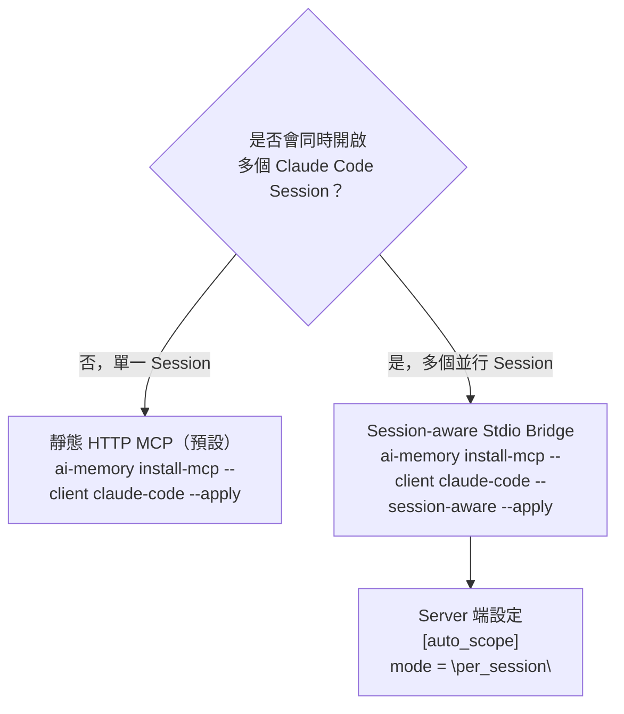

| 情境 | 建議模式 | 原因 |
|---|---|---|
| 單一開發者、一次只開一個 Session | 靜態 HTTP MCP | 設定最簡單 |
| 同一機器同時開多個 Claude Code Session（例如多個 VS Code 視窗） | Session-aware Stdio Bridge | 靜態 HTTP 無法區分 Session，會共用同一個 Auto Scope 槽位，造成專案指標互相覆寫 |
| 團隊共用 Server，多人同時連線 | Session-aware 或 `per_actor` 模式 | 避免不同人的 Session 互相覆寫作用中專案 |

> `--session-aware` **僅 Claude Code 支援**；其他 Client 使用各自文件化的原生 HTTP 或生成式 Bridge 路徑（官方已實作）。

## 11.4 Claude Code Lifecycle Hooks

- 官方 Claude Code Hooks 文件（`code.claude.com/docs/en/hooks`）目前列出的 Hook Events 已**超過 30 個**，涵蓋從 Session 啟動到結束的完整生命週期，包含 `SessionStart`、`SessionEnd`（不可阻擋終止，只能做 Cleanup）等，且 Anthropic 仍在持續快速增修這份清單（例如陸續加入 `PermissionRequest`／`TaskCreated`／`FileChanged`／`WorktreeCreate` 等新事件類別）（官方已實作，Anthropic 官方文件）。由於清單持續變動，本手冊刻意不寫死具體數字，請以 `code.claude.com/docs/en/hooks` 當下頁面內容為準。
- ai-memory 對應的 `hooks/claude-code/` 目錄下有 **18 個檔案**（9 組 `.sh`＋`.ps1`），對應 Claude Code 的 9 種生命週期事件：`session-start`、`user-prompt-submit`、`pre-tool-use`、`post-tool-use`、`pre-compact`、`stop`、`session-end`、`subagent-start`、`subagent-stop`（Source-confirmed，GitHub Contents API 驗證）。
- Claude Code 是目前唯一在 `hooks/` 目錄下有 `subagent-start`／`subagent-stop` 兩個事件的 Agent，對應其 Subagent 架構（Source-confirmed）。

## 11.5 `--capture-assistant`（Double Opt-in）

官方支援矩陣提及：「Optionally captures the assistant's final turn on `Stop` when installed with `--capture-assistant` and the server enables `capture_assistant` (double opt-in, off by default).」（官方已實作）——即必須**同時**在 Client 端安裝時加上 `--capture-assistant` **且**在 Server 端啟用對應設定，兩個開關都要打開才會生效，預設關閉。

### Scenario：同一台筆電同時跑 3 個 Claude Code Session 分析不同微服務

工程師在拆分微服務的 Reverse Engineering 專案中，同時開了 3 個 VS Code 視窗、3 個 Claude Code Session，分別分析 Order Service、Payment Service、Inventory Service。若使用預設靜態 HTTP MCP，3 個 Session 會搶用同一個 Auto Scope 槽位，導致 `memory_query` 回傳錯誤專案的記憶。解法：改用 `--session-aware` 安裝，並在 Server 設定 `[auto_scope] mode = "per_session"`，讓 3 個 Session 各自維持獨立的作用中專案指標。

### AI Prompt 範例：確認 ai-memory 已正確載入上一輪記憶

```text
在開始這次工作前，請先呼叫 memory_briefing 或 memory_recent，
總結一下我們上次在這個專案做到哪裡、還有哪些 Open Question 尚未解決。
```

### 本章 Checklist

- [ ] 已依 11.3 節決策指南選擇靜態 HTTP 或 Session-aware 模式
- [ ] 若團隊會同時開多個 Session，Server 端已設定 `[auto_scope] mode = "per_session"`
- [ ] 已確認是否需要開啟 `--capture-assistant`（雙重 Opt-in）

---

# 12. OpenAI Codex 整合

## 12.1 官方支援狀態

依 README Support Matrix（官方已實作）：

> **Codex — Supported**："MCP config + lifecycle hooks; native commands enforce capture exclusions. **No automatic true session-end hook**, so run `ai-memory finalize-session` when you need a final summary/handoff."

## 12.2 為什麼 Codex 需要手動 `finalize-session`

這是本手冊必須特別強調的一點：**Codex CLI 沒有真正的 SessionEnd 生命週期事件**。這個事實可以從兩個獨立來源交叉驗證：

1. **ai-memory 官方文件**（官方已實作）：明確寫「No automatic true session-end hook」
2. **Codex CLI 官方生態系查證**（外部查證）：Codex 的 Hooks Engine 自 v0.124.0（2026-04-23）起穩定，支援 MCP stdio／Streamable HTTP 兩種 Transport，但其事件模型與 Claude Code 的 31 個生命週期事件不同，並無對稱的 SessionEnd 語意

因此，若只依賴自動 Hook，Codex Session 結束時**不會自動產生 Session Summary 與 Handoff**。正確作法：

```bash
ai-memory finalize-session --agent codex
# 或指定明確的 session id：
ai-memory finalize-session --session-id <uuid>
```

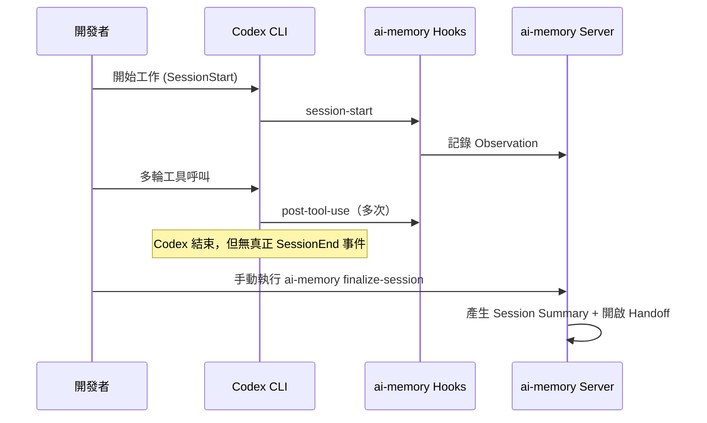

## 12.3 安裝指令

```bash
ai-memory install-mcp --client codex --apply
ai-memory install-hooks --agent codex --apply
```

`hooks/codex/` 目錄下有 **14 個檔案**（7 組 `.sh`＋`.ps1`），**缺少** `subagent-start`／`subagent-stop`，因為 Codex 沒有暴露對應的 Subagent 事件（Source-confirmed，GitHub Contents API 驗證）。

## 12.4 MCP Transport

Codex CLI 官方支援兩種 MCP Transport（外部查證，Codex 官方文件）：

| Transport | 說明 |
|---|---|
| **stdio** | MCP Server 作為本地子行程，Codex 透過 stdin/stdout 溝通 |
| **Streamable HTTP** | Codex 透過 HTTP 連線遠端 MCP Server |

ai-memory 的靜態 HTTP MCP 註冊方式即對應 Codex 的 Streamable HTTP Transport（官方已實作／外部查證交叉比對）。

### Scenario：每日排程批次跑 Codex 做重構

團隊用 Cron Job 每晚排程執行 `codex exec` 對一批檔案做自動化重構，跑完後行程直接結束（沒有互動式關閉動作）。若不在腳本最後加上 `ai-memory finalize-session --agent codex --session-id <uuid>`，這一整晚的重構決策與失敗嘗試都不會被總結進 Handoff，隔天工程師仍要從頭爬 Log 才能知道 Codex 做了什麼。**正確做法是把 `finalize-session` 納入排程腳本的收尾步驟。**

### 本章 Checklist

- [ ] 排程／批次執行的 Codex Session，收尾腳本已加上 `ai-memory finalize-session`
- [ ] 理解 Codex 沒有 Subagent 生命週期事件，`hooks/codex/` 只有 14 個檔案是正常現象
- [ ] 已確認 Codex 端的 MCP Transport 設定（stdio 或 Streamable HTTP）與 ai-memory Server 部署方式相符

---

# 13. GitHub Copilot / VS Code 整合

## 13.1 官方支援狀態（務必準確傳達，不可誇大）

依 README Support Matrix（官方已實作）：

> **VS Code Copilot — MCP-only**："`.vscode/mcp.json` for Copilot agent mode; **no lifecycle hooks** (Copilot does not expose them yet)."
>
> ⚠️ **這是本手冊反覆強調的重點**：就 ai-memory 專案本身而言，GitHub Copilot 目前**只有 MCP 工具存取能力**，**沒有**生命週期 Hook 整合。這代表：Copilot 可以主動呼叫 `memory_query`、`memory_write_page` 等 MCP Tools 讀寫記憶，**但不會**像 Claude Code／Codex 一樣，在 Session 開始/結束時自動擷取 Observation、自動產生 Session Summary 與 Handoff。**記憶的擷取與交接必須由使用者或 Agent 主動觸發 MCP Tool 呼叫**，而非被動自動發生。
>
> 🔄 **更新提醒（2026-08-26 複查）**：README 這句「no lifecycle hooks (Copilot does not expose them yet)」描述的是 **ai-memory 與 Copilot 整合現況**，但 Copilot 平台本身已不再完全靜止——VS Code 官方文件 `code.visualstudio.com/docs/agent-customization/hooks`（頁面日期 2026-08-19）已記載 VS Code 端的 **Agent Hooks（目前標示為 Preview）**，涵蓋 `SessionStart`、`UserPromptSubmit`、`PreToolUse`、`PostToolUse`、`PreCompact`、`SubagentStart`、`SubagentStop`、`Stop` 共 8 個事件（外部查證），設定路徑為工作區層級的 `.github/hooks/*.json`；但注意其 `Stop` 事件與 Codex 相同，並非真正可攜帶終止原因的 `SessionEnd`。另外，GitHub 官方文件 `docs.github.com/en/copilot/reference/hooks-reference` 說明**獨立的 GitHub Copilot CLI／Copilot Cloud Agent**（與本章討論的 VS Code Copilot 擴充套件是不同產品線）已具備更完整的 12 事件 Schema，其中 `sessionEnd` 甚至帶有 `reason`（`complete`/`error`/`abort`/`timeout`/`user_exit`）欄位。**但截至查證時，ai-memory 官方 README 的 Support Matrix 仍只列出「VS Code Copilot」一項且維持 MCP-only 標示，尚未針對上述任一新 Hook 能力提供對應的 `install-hooks --agent copilot` 安裝器**——換言之，落差目前在 ai-memory 這一側，而不是 Copilot 平台已經沒有 Hook 能力；讀者仍應以官方 README Support Matrix 當下內容為準，並留意此差距可能隨 ai-memory 後續版本縮小。

## 13.2 VS Code MCP 設定方式（外部查證，VS Code 官方文件）

VS Code 的 MCP 設定檔為 `.vscode/mcp.json`，**根鍵是 `servers`**（不是常見誤解的 `mcpServers`），且**只在 Copilot Agent Mode 下生效**（外部查證，`code.visualstudio.com/docs/copilot/customization/mcp-servers`）：

```jsonc
// .vscode/mcp.json（示意，依 VS Code 官方 MCP 設定格式撰寫）
{
  "servers": {
    "ai-memory": {
      "type": "http",
      "url": "http://127.0.0.1:49374/mcp"
    }
  }
}
```

> 上方為示意範例，實際欄位請以當下 VS Code 官方 MCP 文件與 `ai-memory install-mcp --client copilot`（若提供）為準。

自 VS Code 1.113（2026-03-25）起，設定好的 MCP Server 可以被橋接到 Copilot CLI 與 Claude Agent Session 共用（外部查證，VS Code 官方文件）。

## 13.3 能力邊界總結

| 能力 | Claude Code | Codex | GitHub Copilot / VS Code |
|---|---|---|---|
| MCP 工具存取 | ✓ | ✓ | ✓ |
| 自動 Lifecycle Hooks | ✓（超過 30 事件，持續增修中） | ✓（無真正 SessionEnd） | **ai-memory 尚未整合**（Copilot 平台端已有 Preview 版 Agent Hooks，見上方更新提醒） |
| 自動 Handoff 注入 | ✓ | 需 `finalize-session` | **需使用者主動呼叫 MCP Tool** |
| Managed Workstream (`ai-memory run`) | ✓ | ✓ | 未列於官方 Managed Workstream 清單 |

> ⚠️ 撰寫本章時特別注意：**不可將「Copilot 支援 MCP」誤寫成「Copilot 有完整生命週期 Hook 整合」**——這是使用者最容易誤解、也是本手冊被要求特別澄清的一點。同時也不可反過來誤寫成「Copilot 平台永遠不會有 Hook」：Copilot 平台端已經開始提供 Hook 能力，只是 ai-memory 專案尚未針對它出貨對應的安裝器，這個落差建議每次升版時回頭確認官方 README Support Matrix 是否已更新。

### Scenario：團隊部分同仁只用 GitHub Copilot，如何讓他們也受益於 ai-memory

由於 Copilot 沒有自動 Hook，團隊規範可以要求：每次用 Copilot 開始工作前，先在 Chat 輸入「請呼叫 `memory_briefing` 讀取這個專案目前的記憶」；工作到一段落時，主動輸入「請呼叫 `memory_write_page` 記錄我們剛才的決策」。這雖然不如 Claude Code／Codex 自動化，但仍可讓 Copilot 使用者共享同一份 Project Memory。

### AI Prompt 範例（Copilot Agent Mode）

```text
請呼叫 ai-memory 的 memory_query 工具，搜尋這個專案關於「認證流程」的既有記憶，
並在你開始寫程式前先總結給我看。
```

### 本章 Checklist

- [ ] 團隊已理解 Copilot 是 MCP-only，不會自動擷取 Session 記憶
- [ ] 已建立「Copilot 使用者需主動呼叫 MCP Tool」的操作規範（見第 34 章）
- [ ] `.vscode/mcp.json` 已正確指向 ai-memory Server 位址

---

# 14. 多 Agent 支援矩陣總表

以下為官方 README「Support Matrix」表格中與 Agent 整合直接相關的完整整理（官方已實作，逐字取自 README，共 22 個 Agent/Client，含 Hermes Agent 這一列）。

| Agent / Client | MCP | Lifecycle Hooks | Handoff 自動注入 | Managed Workstream (`ai-memory run`) | 備註 |
|---|---|---|---|---|---|
| Claude Code | ✓ | ✓（超過 30 事件，持續增修中） | ✓ | ✓ | `--session-aware` 專屬選配 |
| Codex | ✓ | ✓ | 需 `finalize-session` | ✓ | 無真正 SessionEnd |
| Command Code | ✓（`~/.commandcode/mcp.json`） | ✓（4 個穩定事件） | ✓（SessionStart 注入） | ✓ | `Stop` 僅為輪次邊界，仍需 `finalize-session --agent command-code` |
| Devin CLI | ✓ | ✓（用 `PostCompaction` 事件） | ✓ | 未列於官方清單 | 無 Subagent 事件 |
| OpenCode | ✓（Remote） | ✓（生成式 TS Plugin） | ✓ | ✓ | |
| Cursor | ✓ | ✓ | ✓ | 未列於官方清單 | |
| Gemini CLI | ✓ | ✓ | ✓ | 未列於官方清單 | |
| Oh My Pi / OMP | ✓（`--client omp`） | ✓（TS Extension） | ✓ | ✓ | |
| Pi | ✓（Bridge Extension） | ✓ | ✓ | ✓ | |
| Crush | 未提供 Installer | 未提供 Installer | 未提及 | **Managed-only**（僅透過 `ai-memory run crush`） | |
| Claude Desktop | ✓（經 `mcp-remote`） | ✗ | ✗ | ✗ | **MCP-only** |
| OpenClaw | ✓ | ✓（Native Plugin） | ✓ | 未列於官方清單 | |
| Antigravity CLI | ✓（`serverUrl`） | ✓（`agy` alias） | 部分（僅 `invocationNum=0`） | ✓ | 需 `finalize-session --agent antigravity-cli` |
| Grok Build CLI | ✓ | ✓ | ✗（需手動 `memory_handoff_accept`） | ✓ | |
| Swival CLI | ✓ | ✗ | ✗ | ✗ | **MCP-only**；Callback 合約無穩定 Session ID |
| Zero | ✓ | ✓ | ✗（Zero 丟棄 stdout） | 未列於官方清單 | |
| Kimi Code | ✓（`~/.kimi-code/mcp.json`） | ✓（10 個事件） | ✓（經 UserPromptSubmit） | ✓ | |
| Kiro CLI | ✓（v2/v3） | ✓ | ✓ | ✓ | 兩個引擎版本互不相容 |
| Pool（Poolside Agent CLI） | 未提供原生 `install-mcp` | ✓（**Hooks-only**） | ✗ | ✗ | 1.32.0 新增支援 |
| VS Code Copilot | ✓ | ✗ | ✗ | ✗ | **MCP-only**，見第 13 章 |
| Zed | ✓（`context_servers`） | ✗ | ✗ | ✗ | **MCP-only** |
| Hermes Agent | 社群維護外掛 | 部分（協定辨識） | ✗ | 未提及 | **非官方一手支援**，見 [`ai-memory-hermes-plugin`](https://github.com/MrLuciano/ai-memory-hermes-plugin) |

> 📌 補充：獨立的 **GitHub Copilot CLI（終端機版，非 VS Code 內建 Copilot 擴充套件）** 目前擁有相當完整的生命週期 Hook Schema（含真正的 `sessionEnd`，見第 13 章更新提醒），Hook 成熟度已不亞於 Claude Code；但截至查證時，這個產品線**尚未出現在 ai-memory 官方 Support Matrix 中**，屬於潛在後續支援對象，本手冊不建議對外宣稱 ai-memory 已支援它。市場上其他 2026 年主流 Coding Agent CLI（如 Windsurf、Amp、Replit Agent、Cline、Aider、Roo Code、Continue、Warp 等）同樣未出現在官方清單中，依 14.1 節原則一律視為「官方目前沒有找到足夠資料確認此功能」。

## 14.1 快速判讀原則

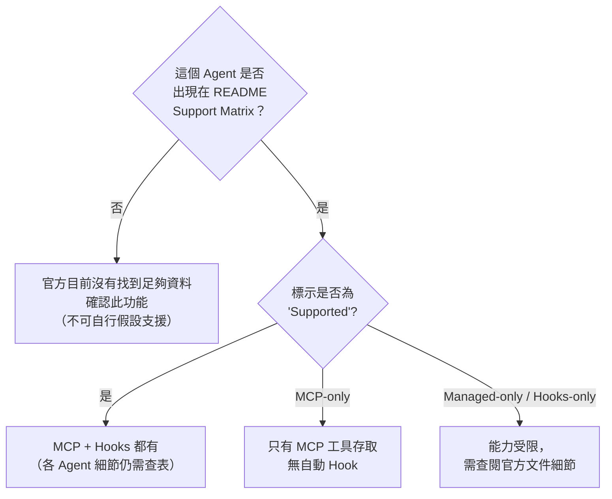

### 本章 Checklist

- [ ] 團隊使用的每一個 Agent，都已對照本表確認實際支援等級
- [ ] 對 MCP-only 或 Managed-only 的 Agent，已建立對應的手動操作規範
- [ ] 未出現在官方 Support Matrix 的 Agent，不對外宣稱「ai-memory 支援」

---

# 15. 其他重點 Agent 簡述

依「企業實際導入價值」決定篇幅，以下僅摘要企業導入時較常遇到的幾個 Agent（官方已實作，逐字取自 README Support Matrix）。

## 15.1 Cursor

> "Supported"："MCP config + lifecycle hooks."

Cursor 是許多企業前端/全端團隊的主力 IDE，安裝方式與 Claude Code 類似，透過 `ai-memory install-mcp --client cursor --apply` 與 `ai-memory install-hooks --agent cursor --apply` 設定（官方已實作）。

## 15.2 Gemini CLI

> "Supported"："MCP config + lifecycle hooks."

適合已採用 Google Cloud／Vertex AI 生態系的團隊。

## 15.3 OpenCode

> "Supported"："Remote MCP config + generated TypeScript plugin; generated plugin enforces capture exclusions."

OpenCode 走生成式 TypeScript Plugin 路線，而非靜態 Shell Script Hook，這點與 Claude Code／Codex 的 `hooks/` 目錄式安裝不同（官方已實作）。

## 15.4 OpenClaw

> "Supported"："MCP config + native plugin lifecycle hooks; generated plugin enforces capture exclusions."

## 15.5 Kiro CLI

> "Supported"："MCP config uses `install-mcp --client kiro-cli` (alias `kiro`) and Kiro's Bedrock-compatible schema flavor."

需注意官方特別標註 Kiro CLI **v2 與 v3 兩個引擎版本互不相容**，安裝前須確認團隊使用的版本（官方已實作）。

## 15.6 其他 Agent（企業導入價值較低，簡表帶過）

| Agent | 支援狀態摘要 |
|---|---|
| Command Code | Supported，需注意 `Stop` 僅為輪次邊界 |
| Devin CLI | Supported，無 Subagent 事件 |
| Grok Build CLI | Supported，需手動接受 Handoff |
| Kimi Code | Supported，10 個 Hook 事件 |
| Zero | Supported，但不支援 Handoff 自動注入 |
| Antigravity CLI | Supported，需 `finalize-session` |
| Zed / Claude Desktop / Swival CLI | MCP-only |
| Crush / Pool | 部分能力（Managed-only／Hooks-only） |
| Hermes Agent | 社群維護，非官方一手支援 |

### 本章 Checklist

- [ ] 已確認團隊實際使用的 Agent 清單，逐一對照第 14 章完整支援矩陣
- [ ] 對於「企業導入價值較低」的 Agent，暫不投入額外訓練資源，優先聚焦主力 Agent

---

# Part IV：實戰案例

# 16. 第一個完整實作：Claude Code → ai-memory → Codex

本章帶讀者實際操作一個完整 Lab，體驗 ai-memory 的核心價值：**Day 1 用 Claude Code 分析，Day 2 換 Codex 直接接續，不必重新解釋架構。**

## 16.1 情境設定

```text
情境：企業內部一套大型 Web Application，架構文件老舊，
      需要重新盤點架構、資料庫、API，並找出一個懷疑已久的效能 Bug。
```

## 16.2 Day 1（Claude Code）：探索與分析

**Step 1：啟動並確認 ai-memory 已連線**

```bash
ai-memory status
```

**Step 2：在 Claude Code 中依序完成**

```text
1. Architecture Discovery   → 盤點模組邊界、技術棧、部署方式
2. Database Discovery       → 盤點資料表、外鍵關係、索引策略
3. API Discovery            → 盤點對外 API、認證方式、版本策略
4. Security Discovery       → 盤點認證/授權機制、已知弱點
5. 找到一段 Legacy Code      → 標記為「用途不明，需進一步確認」
6. 發現一個重要 Bug          → 懷疑是某個 N+1 Query 造成的效能問題
7. 尚未完成修正              → 記錄修復方向，但今天先不動手改
```

**Step 3：關鍵決策與發現，主動寫入 Wiki**（官方已實作，MCP Tool `memory_write_page`）

```text
請呼叫 memory_write_page，將今天的架構盤點結果、疑似 N+1 Query 的位置、
以及尚未驗證的假設，分別寫成 decisions/ 與 gotchas/ 底下的頁面。
```

**Step 4：Session 結束**——Claude Code 的 `SessionEnd` Hook 會自動觸發，產生規則式 Session Summary 並開啟一筆 Handoff（官方已實作）。

## 16.3 Day 2（Codex）：接續工作

**Step 1：在同一個專案目錄啟動 Codex，並確認已安裝 MCP／Hooks**（見第 12 章）

**Step 2：直接下達接續指令**

```text
Continue the previous work. 請先呼叫 memory_briefing 或讀取上一輪的 Handoff，
總結目前已知的架構、已做的決策、尚未解決的 Bug，然後告訴我你建議先做什麼。
```

**Step 3：Codex 透過 MCP 讀取到的內容應包含：**

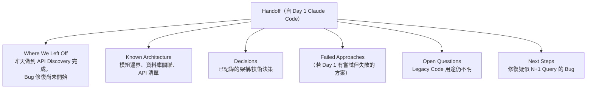

**Step 4：Codex 完成修復後**，因為 Codex 沒有真正的 SessionEnd 事件（見第 12 章），**必須手動執行**：

```bash
ai-memory finalize-session --agent codex
```

## 16.4 驗收標準

- [ ] Codex 在第一輪回覆中，**沒有**問「請重新告訴我這個專案的架構」
- [ ] Codex 能準確引用 Day 1 發現的 N+1 Query 位置
- [ ] Day 2 結束後，`ai-memory status` 顯示 Handoff 已被 Codex 接受（`memory_handoff_accept`）

### 本章 Checklist

- [ ] 已在真實測試專案完整跑過一次 Day1→Day2 流程
- [ ] 確認 Claude Code 端 Session 結束時 Handoff 有自動產生
- [ ] 確認 Codex 端有記得執行 `finalize-session`

---

# 17. Web Application 開發案例

> ⚠️ 本章企業案例為教學示範用途之虛構情境，用於示範 ai-memory 與既有技術堆疊的整合模式。

## 17.1 情境技術棧

```text
前端：Vue 3 + TypeScript + Tailwind CSS + PrimeVue + Pinia
後端：Java 25 + Spring Boot 4.x + REST API + Clean/Hexagonal Architecture
資料庫：PostgreSQL / Oracle / DB2 / SQL Server
```

## 17.2 開發階段與應保存的 Memory 對照表

> ⚠️ 以下「各階段應保存內容」為本手冊依 ai-memory 的 Wiki 頁面家族（`decisions/`、`gotchas/`、`concepts/`、`procedures/`）延伸出的**建議架構**，非官方硬性規定的固定流程。

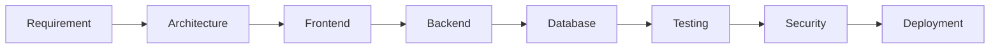

| 階段 | 應保存的 Memory 類型 | 對應 Wiki 頁面家族 |
|---|---|---|
| Requirement | 需求澄清紀錄、與 PM 的關鍵決策 | `decisions/` |
| Architecture | Clean/Hexagonal Architecture 的分層決策、模組邊界 | `decisions/`、`concepts/` |
| Frontend | Pinia Store 設計決策、元件拆分原則 | `concepts/` |
| Backend | Spring Boot 4.x 特定的設定陷阱、API 版本策略 | `gotchas/`、`decisions/` |
| Database | Schema 設計決策、Migration 順序、索引策略 | `decisions/`、`procedures/` |
| Testing | 測試策略、已知不穩定測試（Flaky Test）與繞過方式 | `gotchas/` |
| Security | 認證/授權設計決策、資安審查結論 | `decisions/` |
| Deployment | CI/CD Pipeline 設計、環境差異踩坑紀錄 | `procedures/`、`gotchas/` |

## 17.3 AI Prompt 範例

```text
我們剛完成 Order Service 的 Hexagonal Architecture 分層設計，
Domain / Application / Infrastructure 三層的邊界已確定。
請呼叫 memory_write_page，將這個架構決策與理由寫入 decisions/ordering-service-architecture.md，
並標註這是「已確認的架構決策」而非草案。
```

### 本章 Checklist

- [ ] 每個開發階段結束前，已確認關鍵決策有寫入對應的 Wiki 頁面家族
- [ ] 前後端與資料庫決策分開記錄，避免單一頁面過於龐雜
- [ ] Deployment 階段的踩坑紀錄有回饋進 `gotchas/`，供下次上線參考

---

# 18. Reverse Engineering 案例

> ⚠️ 本章企業案例為教學示範用途之虛構情境。

## 18.1 情境技術棧

```text
Legacy 系統：Java 7 + Struts + JSP + Servlet + Oracle + WebSphere
```

## 18.2 執行流程

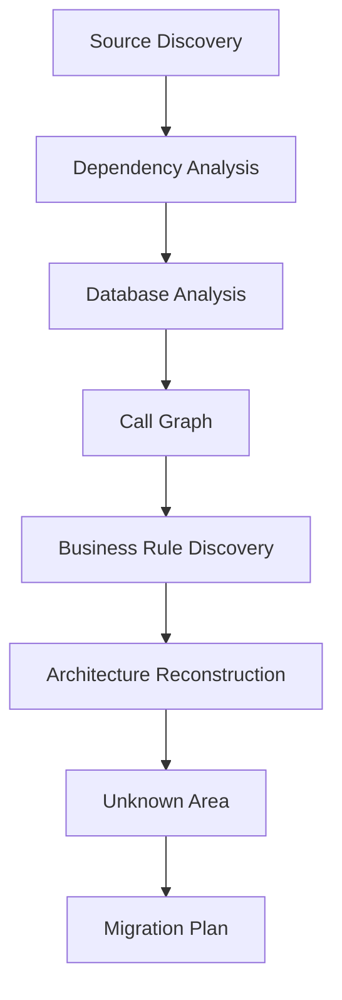

## 18.3 核心原則：AI 不可以把推測當成事實

> ⚠️ 建議架構：這是 Reverse Engineering 情境中最重要的紀律。ai-memory 的 Wiki 頁面沒有內建「信心分數」欄位，因此本手冊建議在 Frontmatter 或內文中，**明確用文字區分**以下四種狀態：

| 狀態標記（建議寫法） | 意義 |
|---|---|
| `#confirmed` | 已在原始碼中逐行確認的事實 |
| `#inferred` | 依證據合理推論，但未逐行驗證 |
| `#uncertain` | 有多種可能解讀，尚未定案 |
| `#unknown` | 完全未知，待後續調查 |

## 18.4 AI Prompt 範例

```text
請分析 OrderServlet.java 的業務邏輯。重要規則：
1. 只有你能在程式碼中逐行追蹤到的邏輯才能標記為 #confirmed
2. 任何從命名、註解或間接證據推論出的行為，必須標記為 #inferred 並附上推論依據
3. 完成分析後，呼叫 memory_write_page 寫入 concepts/order-servlet-business-rules.md，
   並在檔案開頭清楚列出 #confirmed / #inferred / #uncertain / #unknown 各有哪些條目
```

## 18.5 應保存的內容

| 類型 | 說明 |
|---|---|
| 已知架構 | 已確認的模組邊界、呼叫關係 |
| 未知架構 | 尚無法判讀的黑盒模組 |
| 推論 | 依證據推導但未證實的假說，需附證據 |
| 證據 | 支持推論的具體程式碼位置、日誌、資料庫紀錄 |
| 不確定性 | 多種可能解讀並存的情況 |
| 已確認 Business Rules | 逐行驗證過的商業邏輯 |
| 失敗分析 | 曾經嘗試理解但推翻的錯誤假說（避免下一位工程師重蹈覆轍） |
| TODO | 尚待調查的模組清單 |

### Scenario：三個月後換一位新工程師接手同一個 Legacy 系統

第一位工程師花了兩週逐步重建了 60% 的架構圖，但因專案優先序調整被抽調去支援別的專案。三個月後，第二位工程師接手時，透過 `memory_briefing` 讀取到完整的已知/未知架構圖、`#inferred` 標記的推論與其證據、以及「失敗分析」中記錄的兩個曾被推翻的錯誤假說——避免了重複繞同樣的彎路。

### 本章 Checklist

- [ ] 全體參與者已理解 `#confirmed`／`#inferred`／`#uncertain`／`#unknown` 四級標記規範
- [ ] 「失敗分析」章節有確實記錄，而非只記錄成功的推論
- [ ] Migration Plan 產出前，已回頭檢視是否有 `#uncertain` 項目影響風險評估

---

# 19. Framework Upgrade 案例

> ⚠️ 本章企業案例為教學示範用途之虛構情境。

## 19.1 情境範例

```text
Spring Boot 3.x → Spring Boot 4.x
Java 21 → Java 25
Vue 2 → Vue 3
```

## 19.2 應記錄的內容類型

| 類型 | 說明 | 建議寫入位置 |
|---|---|---|
| Migration Decision | 為何選擇這個升級路徑、時程 | `decisions/` |
| Compatibility Issue | 相容性問題與影響範圍 | `gotchas/` |
| Breaking Change | 官方 Breaking Change 對本專案的實際影響 | `gotchas/` |
| Failed Migration | 曾嘗試但失敗的升級步驟 | `gotchas/` |
| Workaround | 暫時性繞過方案，附上「待正式修復」標記 | `procedures/` |
| Test Result | 升級後的迴歸測試結果 | `procedures/` |
| Remaining Risk | 尚未完全驗證的風險項目 | `decisions/` |

## 19.3 銜接 ai-memory 自身版本升級的活教材

值得注意的是，ai-memory 專案自身的 CHANGELOG（`1.18.0 → 1.32.1`）就是一個現成的 Framework Upgrade 記錄範本（Source-confirmed）：每個版本都清楚標註 Breaking Change（例如 1.27.0 的「Unauthenticated HTTP bind 到非 Loopback 現在會 Fail Closed」）、新增能力（例如 1.32.0 新增 Pool CLI 支援）。企業可以參考這種「版本號 + Breaking Change + 新增能力」三段式寫法，作為團隊 Framework Upgrade 記錄的格式範本（建議架構）。

### AI Prompt 範例

```text
我們正在把 Spring Boot 3.2 升級到 4.0。請在升級過程中：
1. 每次遇到編譯錯誤或執行期例外，先查詢 memory_query 是否已有類似的 gotchas 記錄
2. 若是新發現的相容性問題，呼叫 memory_write_page 寫入 gotchas/spring-boot-4-migration.md
3. 若某個 Workaround 只是暫時繞過、尚未回頭正式修復，請在內文明確標註「⚠️ 暫時方案，待正式修復」
```

### 本章 Checklist

- [ ] Breaking Change 清單已對照官方 Release Notes 逐項記錄
- [ ] Workaround 與正式修復已明確區分，避免長期遺留技術債被誤認為已解決
- [ ] Remaining Risk 清單有指派負責人與追蹤時程

---

# 20. Enterprise Multi-Agent Workflow

> ⚠️ 本章為建議架構，非官方原生功能，是本手冊依 ai-memory 的 Project Memory 共享機制延伸出的企業導入建議。

## 20.1 8-Agent Pipeline 示意

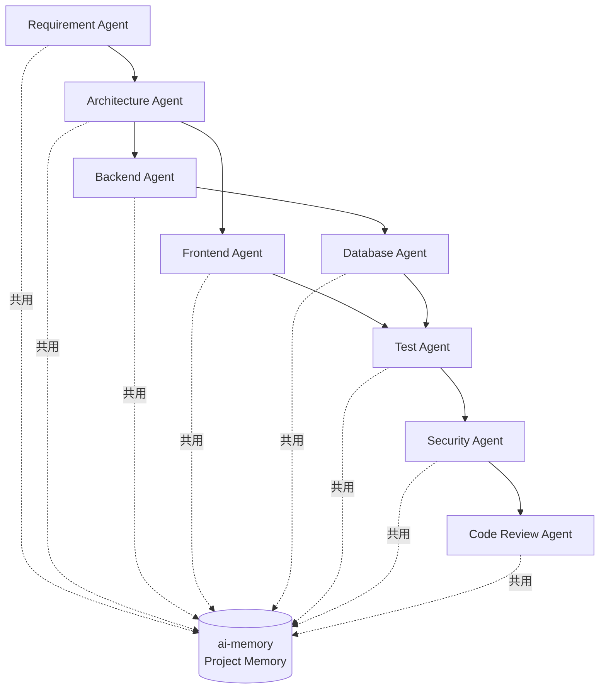

## 20.2 哪些資訊可以共享／哪些不能共享

| 類型 | 可否共享 | 理由 |
|---|---|---|
| 架構決策、API 合約 | ✓ 共享 | 所有下游 Agent 都需要一致的架構認知 |
| 已確認的 Business Rule | ✓ 共享 | 避免不同 Agent 對同一規則有不同理解 |
| 資料庫 Schema、索引策略 | ✓ 共享 | Backend/Database/Test Agent 都需要 |
| 個別 Agent 的中間推理過程（未驗證的草稿） | ✗ 不建議直接共享 | 避免半成品推論被其他 Agent 誤當成定案 |
| 含真實客戶資料的測試樣本 | ✗ 絕不共享 | 資安風險，見第 10 章 Secret Management |

## 20.3 如何避免 Agent 污染 Memory

1. **寫入前先查詢**：任何 Agent 在 `memory_write_page` 之前，先用 `memory_query` 確認是否已有衝突的既有決策。
2. **區分「草稿」與「定案」**：未經其他 Agent 或人類確認的推論，寫入時應標註「Draft」，待審查通過才移除標記。
3. **善用 `memory_feedback`**：其他 Agent 或人類發現某頁內容有誤時，呼叫 `memory_feedback` 標記為 `wrong`／`stale`，供後續 Curator（`ai-memory curator`）處理。
4. **高風險寫入走人工審查**：架構層級的重大決策，建議搭配第 22 章 Memory Governance 的 Approval 流程，而非讓任何 Agent 自由寫入即生效。

### AI Prompt 範例（Code Review Agent 驗證前序 Agent 的產出）

```text
在你開始 Code Review 之前，請先呼叫 memory_query 搜尋「本次功能」相關的
Architecture Agent 與 Security Agent 決策紀錄，確認實作是否與既定決策一致，
若發現不一致，請明確指出差異點，而不是直接假設實作是對的。
```

### 本章 Checklist

- [ ] 已明確定義哪些資訊類型可跨 Agent 共享、哪些不可
- [ ] 高風險寫入已納入人工審查流程
- [ ] 已建立定期使用 `memory_feedback` 清理錯誤 Memory 的習慣

---

# 21. AI Agent Handoff Protocol

## 21.1 ai-memory 原生 Handoff 機制

ai-memory 本身已有型別化的 `handoffs` Table（官方已實作，見第 3.5 節），透過 MCP Tools `memory_handoff_begin`／`memory_handoff_accept`／`memory_handoff_cancel` 操作（官方已實作，見第 3.4 節）。

## 21.2 公司建議 Handoff 格式

> ⚠️ 建議架構：以下格式是本手冊為了讓「人類讀者」也能快速理解 Handoff 內容而設計的標準模板，可作為 `memory_write_page` 寫入 Handoff 對應頁面時的內文結構建議，不是 ai-memory 官方規定的格式。

```markdown
# Handoff

## Project
（專案名稱、目前所在分支/版本）

## Current Task
（目前主要任務是什麼）

## Current Status
（整體進度百分比或階段描述）

## Completed
（已完成事項清單）

## In Progress
（進行中，尚未完成事項）

## Blocked
（卡住的事項與原因）

## Architecture
（目前已知的架構摘要，或連結至 concepts/ 頁面）

## Decisions
（本輪工作中做出的關鍵決策，或連結至 decisions/ 頁面）

## Failed Approaches
（已嘗試但失敗的方法，避免下一個 Agent 重蹈覆轍）

## Known Issues
（已知但尚未修復的問題）

## Open Questions
（尚待釐清的問題）

## Risks
（已識別的風險項目）

## Tests
（測試涵蓋狀況、已知失敗測試）

## Next Steps
（建議下一步優先做什麼）

## Important Files
（本輪工作觸及的關鍵檔案清單）
```

## 21.3 讓不同 Vendor 的 Agent 都能理解相同格式

因為這份 Handoff 格式是**純 Markdown 結構化文字**，不依賴任何特定 Agent 的專屬語法，所以：

- Claude Code／Codex 透過自動 Hook 產生的原生 Handoff，可以在 Session Summary 階段被要求依此結構整理（建議架構）
- GitHub Copilot 等 MCP-only Agent，可透過 AI Prompt 主動要求「請依照公司 Handoff 格式整理」（見第 13 章）
- 人類工程師交接時，也能直接閱讀同一份 Markdown，不需要學習特定工具介面

### AI Prompt 範例（產生標準 Handoff）

```text
這次的工作即將告一段落。請依照公司標準 Handoff 格式
（Project / Current Task / Completed / In Progress / Blocked / Architecture /
Decisions / Failed Approaches / Known Issues / Open Questions / Risks / Tests /
Next Steps / Important Files），整理今天的工作內容，
並呼叫 memory_write_page 寫入本次 Session 對應的 Handoff 頁面。
```

### 本章 Checklist

- [ ] 團隊已採用統一的 Handoff Markdown 格式
- [ ] 每個 Session／每個工作階段結束前，Handoff 有確實產生
- [ ] 換手時，接手者第一步是先讀 Handoff，而非直接看程式碼

---

# Part V：治理與維運

# 22. Memory Governance Policy

## 22.1 Memory Lifecycle（對照 ai-memory 實際機制重繪）

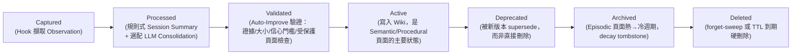

> 此圖對照官方已實作的 Memory Tiers（第 3.6 節）與 Auto-Improvement 驗證機制（第 2.1 節）重繪，屬於**建議架構**的整體 Lifecycle 敘事，個別節點（Captured/Processed/Validated/Deprecated/Deleted 對應機制）為官方已實作。

## 22.2 Governance 十三項要點

| 項目 | 建議做法 | Provenance |
|---|---|---|
| Memory Naming | Wiki 頁面路徑統一用 `decisions/`、`gotchas/`、`concepts/`、`procedures/` 家族前綴 | 官方已實作（家族命名）＋建議架構（統一命名規範） |
| Memory Quality | 高風險頁面要求引用具體證據（檔案路徑、Commit Hash） | 建議架構 |
| Memory Validation | 依賴官方 Auto-Improve 的信心門檻（`min_confidence`）與人工審查 | 官方已實作 |
| Memory Review | 高敏感度專案將 `require_approval` 設為 `true` | 官方已實作（設定機制）／建議架構（何時該用） |
| Memory Retention | 依 Memory Tiers 預設策略（Working/Episodic 有效期限），不建議自行縮短 Semantic/Procedural 保留期 | 官方已實作 |
| Memory Cleanup | 定期執行 `ai-memory forget-sweep`（見第 26 章） | 官方已實作 |
| Sensitive Information | 搭配 `.ai-memory.toml` 的 `ignore_paths`，見第 10 章 | 官方已實作 |
| Secret Exclusion | Secret 絕不寫入 Wiki，改用環境變數/Secret Manager | 建議架構 |
| Incorrect Memory | 用 `memory_feedback` 標記 `wrong`，交由 Curator 處理 | 官方已實作 |
| Contradictory Memory | 新決策應以 `supersedes` 欄位取代舊決策，而非並存兩個矛盾版本 | 官方已實作（Schema 支援）／建議架構（使用規範） |
| Deprecated Memory | 用 Supersession 取代直接刪除，保留稽核軌跡 | 官方已實作 |
| Architecture Decision | 架構層級決策建議走人工核准，不自動核准 | 建議架構 |
| Human Approval | `auto_improve.require_approval = true` 時，提案停在 `_pending/auto-improve/` 等待人工核准 | 官方已實作 |

### AI Prompt 範例（Governance Review）

```text
請呼叫 memory_query 列出過去 30 天內被標記為 wrong 或 stale 的所有頁面，
並依 gotchas/decisions/concepts 分類整理成一份待清理清單。
```

### 本章 Checklist

- [ ] Wiki 頁面命名已統一採用 `decisions/`／`gotchas/`／`concepts/`／`procedures/` 家族
- [ ] 高敏感度專案已啟用 `require_approval = true`
- [ ] 已建立定期執行 `forget-sweep` 與檢視 `page_feedback` 的排程

---

# 23. Git Strategy

## 23.1 Wiki 的 Git 版控本質

`wiki/` 目錄本身就是一個 Git Repository（官方已實作，第 3.1 節），意味著所有記憶變更天生具備：Commit 歷史、Blame、Diff、Branch、Merge 等 Git 原生能力。

## 23.2 Memory Repository 應與 Source Repository 分離嗎？

> ⚠️ 建議架構：官方文件未強制規定此架構選擇，以下為本手冊依企業實務給出的比較與建議。

| 架構 | 優點 | 缺點 | 建議情境 |
|---|---|---|---|
| **分離**（Memory Repo 獨立於 Source Repo） | 記憶的 Commit 歷史不會弄髒程式碼的 Git Log；權限可獨立控管；可讓非開發人員（PM）也能瀏覽 Handoff 而不需要 Source Repo 權限 | 需要額外維護一個 Repository；跨 Repo 對照需要額外工具 | **多數企業情境的預設建議** |
| **合併**（Memory 併入 Source Repo，如 `docs/ai-memory/`） | 單一 Repo，權限與備份策略天然一致 | 記憶的高頻小型 Commit 會弄髒程式碼 Git Log；Source Repo 的 Branch/PR 流程可能不適合 Memory 的高頻寫入模式 | 小型團隊、單一 Repo 專案 |

## 23.3 Branch／Commit／Remote 策略建議

> ⚠️ 建議架構：

- **Branch Strategy**：Memory Repo 建議只用單一主分支（如 `main`），不套用 Source Repo 的 Feature Branch 流程——Memory 是持續累積的知識庫，不是需要 Code Review 才能合併的產出。
- **Commit Strategy**：讓 ai-memory 的自動寫入（Session Summary、Auto-Improve）自行產生 Commit，不需要人工介入每一筆 Commit Message。
- **Remote Repository**：務必設定 Private Remote（GitHub/GitLab Private Repo 或內部 Git Server），並比照原始碼一樣套用 Access Control。
- **Merge Conflict**：因為官方架構本身有「原子檔案寫入 + Watcher 忽略自己的寫入」機制（第 3.7 節 Invariant #10，官方已實作），單一 Server 寫入不會有 Merge Conflict；只有在**多台 Server 各自維護獨立 Git History 又要手動合併**時才需要處理衝突，這種情境建議避免，改用單一 Server + 多 Client 連線的拓樸（見第 8 章）。
- **Audit Trail**：`audit_log` Table（官方已實作，第 3.5 節）搭配 Git Commit History，共同構成完整稽核軌跡。

### 本章 Checklist

- [ ] 已決定 Memory Repo 與 Source Repo 分離或合併，並記錄決策理由
- [ ] Memory Repo 已設定 Private Remote 與存取控制
- [ ] 已確認採用「單一 Server 寫入」拓樸，避免多 Server 各自維護 Git History 導致衝突

---

# 24. Backup / Disaster Recovery

## 24.1 備份策略（官方已實作，`docs/deploy.md`／`docs/lifecycle-ops.md`）

```bash
ai-memory backup --output-path "/tmp/backup-$(date +%Y%m%d).tar.gz"
```

備份機制基於 **SQLite Online Backup API**（官方已實作），可在 Server 運行中執行，不需停機。

## 24.2 多層備份建議

> ⚠️ 建議架構（結合官方 `ai-memory backup` 指令與一般企業備援實務）：

| 層級 | 方式 | 頻率建議 |
|---|---|---|
| Wiki（Git） | `git push` 到 Remote Repository | 即時（隨每次 Commit） |
| SQLite | `ai-memory backup` | 每日排程 |
| Docker Volume | `docker volume` Snapshot 或 Host 路徑 rsync（見第 8.3 節 `docker-compose.prod.yml.example` 的 Host Volume 掛載設計） | 每日 |
| 異地備援 | rsync／restic／btrfs snapshot 送至異地儲存 | 每週 |

## 24.3 Restore 相關指令（官方已實作，`docs/lifecycle-ops.md`）

```bash
# 還原前必須先停止 Server：restore 是直接操作磁碟的離線動作，
# ai-memory 會偵測到存活中的 ai-memory process 而拒絕執行（官方已實作）。
ai-memory restore --from "/tmp/backup-20260826.tar.gz" --data-dir <data-dir-path> --confirm
ai-memory restore-page --path <page-path> --from <revision>
ai-memory reset --confirm   # 危險操作，需明確 --confirm
```

> ⚠️ 常見錯誤：`restore` 指令的正確旗標是 `--from`（備份檔路徑）＋`--data-dir`（還原目標資料目錄），**沒有** `--output-path` 或 `--input-path` 這兩個旗標——那是 `backup` 指令專用的旗標名稱，兩者不可混用（官方已實作，`docs/lifecycle-ops.md`）。
>
> 官方強調：所有破壞性維運指令都需要明確加上 `--confirm` 旗標，避免誤操作（官方已實作）。

## 24.4 Disaster Recovery Runbook（建議架構 SOP，串接官方指令）

`ai-memory backup` 產生的 tarball 已同時包含 Wiki Tree、SQLite Snapshot 與 `config.toml`，因此只要備份檔完好，單一 `ai-memory restore` 指令即可一次還原三者，不需要再手動 `git clone`。獨立的 `git clone` 只用於「已無任何 `ai-memory backup` 檔案、僅剩 Wiki 的 Git Remote」這種次要復原情境，此時應改搭配 `ai-memory reindex` 從 Wiki 內容重建 SQLite 索引，而非呼叫 `restore`（建議架構）。

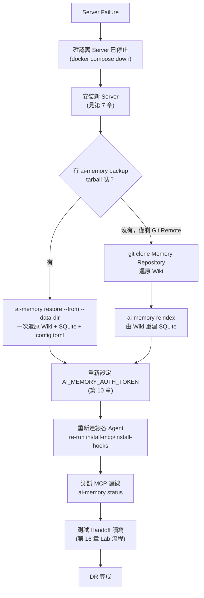

### 本章 Checklist

- [ ] `ai-memory backup` 已排入每日排程
- [ ] Wiki Git Remote 已確認有異地備份
- [ ] 已至少演練過一次完整 DR Runbook（不只是紙上談兵）

---

# 25. Monitoring / Operations

## 25.1 `ai-memory status`（官方已實作）

```bash
ai-memory status
ai-memory status --json
```

用於檢查 Server 健康狀態、Provider 連線狀態。

## 25.2 Ingest Counters（官方已實作，CHANGELOG 1.32.0 新增）

1.32.0 版新增：Server 端回報 Accepted／Dropped-by-policy／Shed／Rate-limited 事件數與最後到達時間戳，可用於觀察 Hook 擷取是否正常運作（官方已實作）。同一版本也讓 `ai-memory status` 一併回報 `capture_mode`（是否為 `allowlist`），方便區分「Hook 根本沒送達」與「該 Repo 本來就沒有 opt-in Allowlist」這兩種容易混淆的情況（官方已實作，CHANGELOG 1.32.0）。

## 25.3 監控面向總表

| 面向 | 觀察方式 | Provenance |
|---|---|---|
| Server 健康狀態 | `ai-memory status` | 官方已實作 |
| Ingest 事件量 | Ingest Counters（1.32.0+） | 官方已實作 |
| 磁碟使用量 | `<data_dir>` 目錄大小（`wiki/`、`db/`、`raw/`） | 建議架構（監控方式），目錄本身官方已實作 |
| Memory 成長趨勢 | Wiki 頁面數量、SQLite `pages` Table 列數變化 | 建議架構 |
| Git Repository 大小 | `git count-objects -v` | 建議架構 |
| FTS5 索引健康度 | `ai-memory lint` 檢查是否有索引與 Wiki 內容不同步 | 官方已實作（`lint` 指令）／建議架構（用途說明） |
| LLM／Embedding 用量 | 對照 Provider 帳單／API Console | 建議架構 |
| Log | `<data_dir>/logs/` 滾動輸出 | 官方已實作 |

### 本章 Checklist

- [ ] `ai-memory status` 已納入日常健康檢查腳本
- [ ] 已設定基本磁碟使用量告警（Wiki／SQLite 成長過快時）
- [ ] LLM/Embedding API 用量有對照 Provider 帳單定期檢視

---

# 26. CLI Command Reference

> 本章所列指令**只採用**官方 README「Thin-client CLI」段落、`docs/usage.md`、`docs/lifecycle-ops.md`、`docs/mcp-install.md` 中可查證存在的指令（官方已實作），不臆測或新增任何未查證的指令。

## 26.1 生命週期與 Session 管理

| 指令 | 說明 |
|---|---|
| `ai-memory init` | 初始化資料目錄與設定檔 |
| `ai-memory serve --transport http --bind <host:port> [--enable-web]` | 啟動 Server |
| `ai-memory status [--json]` | 查詢 Server 健康狀態 |
| `ai-memory bootstrap [--dry-run]` | 初始化 Bootstrap 流程 |
| `ai-memory finalize-session [--agent <agent>] [--session-id <uuid>] [--all-owners]` | 手動結算 Session（Codex／Antigravity CLI 等無真正 SessionEnd 的 Agent 必須使用） |
| `ai-memory continue` | 從任意目錄恢復最近的 Managed Checkout |
| `ai-memory show [--json]` | Project-first Launcher |
| `ai-memory run <harness>` | 啟動 Managed Workstream（如 `ai-memory run claude`、`ai-memory run codex --yolo`） |
| `ai-memory workstream-search [query]` | 查詢完整的 Managed Workstream 帳本紀錄 |

## 26.2 MCP／Hooks／Skills 安裝

| 指令 | 說明 |
|---|---|
| `ai-memory install-mcp --client <agent> --apply` | 安裝靜態 HTTP MCP |
| `ai-memory install-mcp --client claude-code --session-aware --apply` | 安裝 Session-aware Stdio Bridge（僅 Claude Code） |
| `ai-memory install-hooks --agent <agent> --apply` | 安裝 Lifecycle Hooks |
| `ai-memory install-hooks --capture-mode allowlist` | 反轉為 Allowlist 模式（無 Marker 的 Repo 不發出事件） |
| `ai-memory install-instructions [--target AGENTS.md] [--print] [--no-skills]` | 安裝自我路由說明文字 |
| `ai-memory install-skills [--scope global] [--agent <agent>] [--print] [--target-dir <dir>] [--force]` | 安裝 Skills |
| `ai-memory setup-agent --agent <agent> --to <path> [--host-prefix <prefix>]` | 一次性解出內建腳本並印出設定（常用於 Docker 環境安裝 Hook） |
| `ai-memory uninstall --apply` | 反安裝 |

## 26.3 專案／Session 維運

| 指令 | 說明 |
|---|---|
| `ai-memory purge-project --project <name> --confirm` | 清除指定專案的記憶 |
| `ai-memory rename-project` | 重新命名專案 |
| `ai-memory move-project` | 搬移專案 |
| `ai-memory move-session <session-id> --to <project> [--confirm]` | 搬移 Session 到另一個專案（預設 Dry-run） |
| `ai-memory audit-contamination` | 稽核可能的記憶污染 |
| `ai-memory checkpoints` | 檢視 Checkpoint |
| `ai-memory restore-page --path <path> --from <revision>` | 還原特定頁面到指定版本 |

## 26.4 內容品質與學習迴圈

| 指令 | 說明 |
|---|---|
| `ai-memory lint` | 檢查 Wiki 內容品質與索引一致性 |
| `ai-memory curator [--stage]` | 執行內容策展 |
| `ai-memory auto-improve [--session-id <uuid>]` | 手動觸發 Auto-Improvement |
| `ai-memory auto-improve-report --workspace <w> --project <p> [--stage]` | 產生 Auto-Improve 報告 |
| `ai-memory pending-writes` | 檢視待核准的提案 |
| `ai-memory embed` | 執行 Embedding 索引 |
| `ai-memory forget-sweep` | 執行記憶清理（Decay Sweep） |
| `ai-memory reindex` | 重建索引 |
| `ai-memory search` | 執行檢索查詢 |
| `ai-memory write-page --path <path>` | 寫入頁面 |
| `ai-memory read-page` | 讀取頁面 |
| `ai-memory delete-page --path <path>` | 刪除頁面 |

## 26.5 備份／升級／認證／使用者

| 指令 | 說明 |
|---|---|
| `ai-memory backup --output-path <path>` | 備份 |
| `ai-memory restore --from <path> --data-dir <path> --confirm` | 還原（需先停止 Server，見第 24.3 節） |
| `ai-memory reset --confirm` | 重置（危險操作） |
| `ai-memory upgrade` | 升級 |
| `ai-memory llm-test --provider <provider>` | 快速測試指定 LLM Provider 是否連線正常（建議切換 Provider 後先執行） |
| `ai-memory generate-auth-token` | 產生 Bearer Token |
| `ai-memory auth login <provider>`（`provider` 為 `openai-oauth`、`copilot` 或 `oidc-device`） | LLM Provider OAuth 登入 |
| `ai-memory auth status` | 查詢認證狀態 |
| `ai-memory user add --username <u> --email <e> --name "<n>"` | 新增使用者 |
| `ai-memory user list` | 列出所有使用者 |
| `ai-memory user expire <username>` | 停用使用者（Offboarding） |
| `ai-memory user revive <username>` | 恢復已停用的使用者 |
| `ai-memory user rotate-token <username>` | 輪替使用者的認證 Token |
| `ai-memory completions <shell>` | 產生 Shell 自動完成腳本 |

### 本章 Checklist

- [ ] 團隊維運手冊只引用本章列出的、已查證存在的指令
- [ ] 破壞性指令（`purge-project`／`reset`／`restore`）皆已確認需搭配 `--confirm`
- [ ] 新進工程師已熟悉 `install-mcp`／`install-hooks`／`finalize-session`／`status` 四個最常用指令

---

# 27. Troubleshooting

## 27.1 MCP 無法連線

**症狀**：Agent 呼叫 MCP Tool 時逾時或回傳連線錯誤。

**排查步驟**（建議架構，依官方架構推導）：
1. 確認 Server 是否存活：`ai-memory status`
2. 確認 Client 端 `AI_MEMORY_SERVER_URL` 是否正確指向 Server（第 9.3 節）
3. 確認非 Loopback 部署是否已設定 `AI_MEMORY_AUTH_TOKEN`（第 10.1 節），否則連線會 Fail Closed

## 27.2 Agent 看不到 Memory

**可能原因**：
- Marker File（`.ai-memory.toml`）未正確設定，導致專案識別錯誤（第 5.3 節）
- Auto Scope 為 `single` 模式，但同時有多個並行 Session 互相覆寫（第 5.2 節、第 11.3 節）
- 啟用了 Allowlist Mode，但該目錄沒有 Marker File

## 27.3 Handoff 沒有出現

**可能原因**：
- 使用 Codex／Antigravity CLI 等無真正 SessionEnd 的 Agent，卻忘記手動執行 `ai-memory finalize-session`（第 12.2 節）
- 使用 GitHub Copilot 等 MCP-only Agent，卻期待自動 Handoff（第 13.1 節，Copilot 沒有自動 Hook）

## 27.4 Hook 沒有執行

**排查步驟**：
1. 確認 `install-hooks` 是否在啟動 Agent 的**同一個環境**執行（尤其是 Windows／WSL2 混用情境，第 7.3 節）
2. 檢查 `hooks/<agent>/` 對應腳本是否存在且有執行權限
3. 檢查是否命中 `[capture] ignore_paths` 排除規則（第 5.3 節）
4. **macOS 使用者請特別留意**：截至查證時，官方 Repository 有一則社群回報的未修復 Issue（[#493](https://github.com/akitaonrails/ai-memory/issues/493)，標題「macOS native hook-drain never transmits: spooled events are silently never delivered (v1.32.1)」）指出 macOS 原生 Client 的 `hook-drain` 可能完全不發出網路請求，事件被靜默滯留在本機 `hook-spool/` 目錄且無任何錯誤訊息；若在 macOS 上長期看不到任何 Hook 事件送達，建議直接檢查本機 `hook-spool/` 是否持續堆積，而非只排查 Server 端（Source-confirmed，GitHub Issue，官方尚未確認／修復，請以 Issue 當下狀態為準）。

## 27.5 Project 被錯誤辨識／Memory 混到其他 Project

**排查步驟**：
1. 確認每個專案根目錄是否有明確的 `.ai-memory.toml`（第 5.3 節），避免依賴目錄名稱猜測
2. 執行 `ai-memory audit-contamination` 稽核（第 26.3 節）
3. 若已發生污染，使用 `ai-memory move-session --to <正確專案> --confirm` 修正

## 27.6 Windows Hook 問題

**已知限制**（官方已實作，第 7.3 節）：`docs/windows.md` 明確提醒「Windows hook support is new and needs real-world testing against native Windows agent builds.」——若在 Native Windows 上遇到 Hook 不穩定，優先確認：
1. `install-mcp`／`install-hooks` 是否在同一環境執行
2. 是否混用了 WSL2 與 Native Windows 的執行檔路徑
3. 若問題持續，考慮改用官方標示為「Supported」的 WSL2 路徑

## 27.7 WSL2 問題

- 確認 WSL2 內的 Agent 是否透過 WSL2 內的 `ai-memory` CLI（而非 Windows 端的 exe）操作
- 若 Server 跑在 Windows 端 Docker Desktop，WSL2 內的 Client 需正確設定 `AI_MEMORY_SERVER_URL` 指向 `host.docker.internal` 或對應位址（第 7.3 節 Scenario B 概念延伸）

## 27.8 Docker 網路問題

- 確認 Port Mapping（預設 `127.0.0.1:49374:49374`）是否正確（第 8.2 節）
- LAN／團隊共用情境需改為 `0.0.0.0:49374` 並搭配 `AI_MEMORY_ALLOWED_HOSTS`（第 8.3、10.2 節）
- Healthcheck 失敗時，檢查容器內 `ai-memory status` 指令是否可正常執行（官方 `docker-compose.yml` 內建 Healthcheck，第 8.2 節）

## 27.9 Bearer Token 問題

- 401／403 錯誤：確認 Client 端 `AI_MEMORY_AUTH_TOKEN` 與 Server 端 `[auth] bearer_token` 一致（第 9.3、10.6 節）
- Session-aware Bridge 是否正確保留了 Bearer 認證（第 11.3 節）

## 27.10 Remote Server 問題

- 確認 TLS Reverse Proxy 是否正確設定（Caddy／Cloudflare Tunnel，第 10.5 節）
- 確認 `AI_MEMORY_ALLOWED_HOSTS` 是否包含正確的網域/主機名稱，避免被 DNS Rebinding 防護誤擋
- **已知風險（第 10.5 節 Caddy 內部 CA 部署模式適用）**：截至查證時，官方 Repository 有一則社群回報的未修復 Issue（[#492](https://github.com/akitaonrails/ai-memory/issues/492)，標題「Native ai-memory client rejects Caddy's internal CA (UnknownIssuer) even after Path 2's trust-install step — hook capture fails silently」）指出，即使依官方 `docs/https-via-proxy.md`「Path 2」步驟安裝了 Caddy 內部 CA 信任，原生 `ai-memory` Hook Client 仍可能因底層 TLS 函式庫（`rustls` 只信任內建 `webpki-roots`，不讀取作業系統信任庫）而拒絕該憑證，造成 Hook 擷取靜默失敗——瀏覽器／curl／MCP Client 不受影響，只有原生 Hook Client 受此問題影響。若採用本手冊建議的 Caddy 內部 CA 部署模式，建議額外驗證原生 Hook Client 的連線狀況，而不只驗證瀏覽器可正常連線（Source-confirmed，GitHub Issue，官方尚未確認／修復，請以 Issue 當下狀態為準）。

## 27.11 Git 問題

- Wiki Git Repository 損毀：優先從第 24 章 DR Runbook 的 `git clone` Remote 還原
- 若懷疑 Watcher 與外部編輯（如 Obsidian）衝突，檢查是否遵循官方「原子寫入 + Watcher 忽略自己寫入」設計（第 3.7 節 Invariant #10），避免同時有多個行程直接寫入同一個 `wiki/` 目錄

## 27.12 SQLite / FTS5 問題

- 檢索結果異常：執行 `ai-memory reindex` 重建索引（第 26.4 節）
- 執行 `ai-memory lint` 檢查 FTS5 索引與 Wiki 內容是否同步

## 27.13 LLM Provider 問題

- Consolidation 未產生預期的 `concepts/`／`decisions/` 頁面：確認 `AI_MEMORY_LLM_PROVIDER` 與對應 API Key 是否正確設定（第 9.3 節）
- 若不需要 LLM，確認系統仍在 Zero-LLM 模式下正常運作（第 4.4 節），這不是故障，而是預期行為

## 27.14 Embedding Provider 問題

- 向量檢索無結果：確認 `AI_MEMORY_EMBEDDING_PROVIDER`／`_MODEL`／`_DIM` 三者是否與實際 Provider 相符（第 9.3 節）
- Embedding 為選配功能，未設定時 FTS5 檢索仍可正常運作（第 4.4 節）

## 27.15 Session 沒有正確 Finalize

- 排查 Codex／Antigravity CLI 是否遺漏 `finalize-session`（第 12.2、14 章）
- 排查 GitHub Copilot 是否依賴自動 Handoff（實際上需要主動呼叫 MCP Tool，第 13.1 節）

### 本章 Checklist

- [ ] 團隊已建立 Troubleshooting 決策樹的內部速查連結（可直接引用本章編號）
- [ ] 常見的 15 類問題已納入 Onboarding 教材
- [ ] 遇到官方文件未涵蓋的異常，已如實記錄為「官方目前沒有找到足夠資料確認」，而非自行臆測解法

---

# Part VI：比較與定位

# 28. 與其他 Memory Solution 比較

> ⚠️ 重要說明：本章關於 ai-memory 的欄位皆為「官方已實作」（本次查證所得）；關於 Mem0／Zep／Letta／LangGraph Memory／一般 MCP Memory Server 的欄位，是本手冊依**產業一般公開資訊**整理的概略定位（並非本次針對這些工具逐檔案查證的結果），標示為「建議架構／一般產業知識」，若企業要據此做採購決策，建議另行對這些工具做同等深度的官方文件查證。

## 28.1 比較矩陣

| Solution | Long-term Memory | MCP | Git 版控 | Markdown | Vector | Agent Handoff | Project Isolation | Provenance |
|---|---|---|---|---|---|---|---|---|
| **ai-memory** | ✓ | ✓（原生） | ✓（Source of Truth） | ✓（Source of Truth） | Optional | ✓（型別化 `handoffs` Table） | ✓（Auto Scope + Marker File） | 官方已實作 |
| **Claude Code Auto Memory** | ✓（單機／單一 Repo 範圍，非團隊共享） | ✗ | ✗（純檔案，非 Git Repo） | ✓ | ✗ | ✗（僅 Claude Code 自身使用，非跨 Agent） | ✓（依 Git Repo 自動區分，但不跨機器同步） | 官方已實作（Anthropic Claude Code 官方文件，非 ai-memory 官方查證範圍） |
| Mem0 | ✓ | 部分（視整合方式） | ✗ | 部分 | 核心元件 | ✗ | 依 User/Agent ID 區分 | 建議架構／一般產業知識 |
| Zep | ✓（含時序知識圖譜） | 部分 | ✗ | 部分 | 核心元件 | ✗ | 依 Session/User 區分 | 建議架構／一般產業知識 |
| Letta（原 MemGPT） | ✓（分層記憶架構） | 部分 | ✗ | 部分 | 核心元件 | ✗ | 依 Agent 實例區分 | 建議架構／一般產業知識 |
| Supermemory | ✓ | ✓ | ✗ | 部分 | 核心元件 | 部分（視整合方式，非型別化 Handoff） | 依 Project/API Key 區分 | 建議架構／一般產業知識 |
| LangGraph Memory | ✓（Short/Long-term） | ✗（LangGraph 框架內建概念） | ✗ | 部分 | 常見搭配 | ✗ | 依 Thread/User 區分 | 建議架構／一般產業知識 |
| 一般 MCP Memory Server（參考實作） | 部分（多為 Session 內知識圖譜） | ✓ | 依實作而定 | 部分 | 依實作而定 | ✗ | 依實作而定 | 建議架構／一般產業知識 |
| Claude Code `CLAUDE.md` | ✗（靜態指令，非記憶） | ✗ | ✓（隨 Source Repo） | ✓ | ✗ | ✗ | 依 Repo 天然隔離 | 官方已實作（`CLAUDE.md` 機制本身） |
| `AGENTS.md` | ✗（靜態指令） | ✗ | ✓（隨 Source Repo） | ✓ | ✗ | ✗ | 依 Repo 天然隔離 | 官方已實作（機制本身） |
| GitHub Copilot Instructions | ✗（靜態指令） | ✗ | ✓（隨 Source Repo） | ✓ | ✗ | ✗ | 依 Repo 天然隔離 | 官方已實作（機制本身） |

> 🔄 **更新提醒（2026-08-26 複查新增）**：Claude Code 官方已內建 **Auto Memory** 功能（`code.claude.com/docs/en/memory`，外部查證，非 ai-memory 官方文件），預設開啟，由 Claude 在對話過程中自動寫入 `user`／`feedback`／`project`／`reference` 四類筆記，存放於 `~/.claude/projects/<project>/memory/MEMORY.md` 及主題檔案，官方文件明確定位為「CLAUDE.md（你寫的靜態指令）與 Auto Memory（Claude 自己寫的動態筆記）兩套互補機制」。這對本手冊核心讀者（Claude Code 使用者）而言，是最直觀會提出的問題：「為什麼不直接用內建的 Auto Memory 就好？」——差異在於 Auto Memory 刻意設計得輕量：**純檔案、不是 Git Repo（不隨專案版控／不易做 Code Review）、僅存於單機本地（不跨機器、不跨團隊同步）、無 MCP 工具介面、無跨 Agent Handoff（只有 Claude Code 自己讀寫，Codex／Copilot 完全無法存取）**。Auto Memory 證明了「動態記憶」的價值已被 Anthropic 官方認可，但 ai-memory 的定位是把這個概念延伸為**團隊共享、可稽核、跨工具**的正式知識庫，兩者並非互斥，企業甚至可以同時使用：Auto Memory 處理「Claude Code 這個 Session 對我個人的觀察」，ai-memory 處理「這個專案要跨人、跨 Agent、跨時間留存的正式知識」。

## 28.2 ai-memory 與 CLAUDE.md／AGENTS.md 不是互相取代的關係

> 這是本手冊的重要觀念，必須在此明確強調：

```text
CLAUDE.md / AGENTS.md
        =
Static Project Instructions（靜態專案指令）

ai-memory
        =
Dynamic Project Memory（動態專案記憶）
```

`CLAUDE.md`／`AGENTS.md` 回答的是「這個專案的**編碼規範、架構原則、Coding Rule**是什麼」——這些內容變動頻率低，人工維護，對所有 Session 一視同仁。ai-memory 回答的是「**目前**這個任務進度到哪、**上次**做了什麼決策、**曾經**失敗過什麼方案」——這些內容持續累積、隨 Session 動態變化。

有趣的是，ai-memory 專案自己就是這個觀念的最佳活教材（Source-confirmed，第 1.11 節）：其 Repository 根目錄的 `CLAUDE.md` 內容只有一句話——「Do not duplicate project rules here. Update `AGENTS.md` instead.」，把所有靜態規則都收斂到單一事實來源 `AGENTS.md`，這正是「Static Context 應該集中維護、不重複」的良好示範。

### 本章 Checklist

- [ ] 團隊理解 ai-memory 與 `CLAUDE.md`／`AGENTS.md` 是互補而非替代關係
- [ ] 若要對其他 Memory 方案做採購決策，已對該方案做同等深度的官方文件查證，而非僅參考本表

---

# 29. Static vs Dynamic Context

## 29.1 比較表

| 類型 | 內容範例 | 典型載體 |
|---|---|---|
| Static | Coding Rules（命名規範、Lint 規則） | `CLAUDE.md`／`AGENTS.md`／`copilot-instructions.md` |
| Static | Architecture Rules（分層原則、禁止事項） | `CLAUDE.md`／`AGENTS.md` |
| Static | Security Rules（禁止的 API、必須的驗證） | `CLAUDE.md`／`AGENTS.md` |
| Dynamic | Current Task（目前在做什麼） | ai-memory Session Memory |
| Dynamic | Previous Decisions（過去做過的決策） | ai-memory `decisions/` |
| Dynamic | Failed Approaches（失敗過的方案） | ai-memory `gotchas/` |
| Dynamic | Open Questions（尚待釐清的問題） | ai-memory Handoff |
| Dynamic | Handoff（交接內容） | ai-memory `handoffs` Table |

> 🔄 補充說明（第 28 章已詳述）：Claude Code 官方內建的 **Auto Memory** 也屬於這個光譜上的 Dynamic 端，但侷限於單一 Repo、單一機器、單一 Agent（Claude Code 自己），不具備 Git 版控、跨團隊同步或跨 Agent Handoff 能力。企業若需要跨團隊／跨工具／可稽核的 Dynamic Memory，仍建議採用 ai-memory 這類獨立方案，而非僅依賴各家 Agent 各自內建的輕量記憶功能。

## 29.2 企業建議架構

> ⚠️ 建議架構：

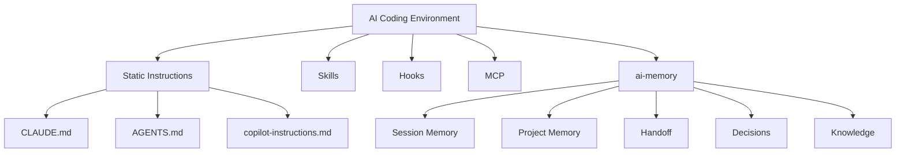

### 本章 Checklist

- [ ] 團隊已明確劃分哪些內容該放 `CLAUDE.md`／`AGENTS.md`（Static），哪些該讓 ai-memory 動態累積（Dynamic）
- [ ] 避免把應該動態累積的內容（如「目前進度」）誤放進 Static 指令檔，造成檔案迅速過時

---

# 30. 與 Spec-Driven Development 整合

> ⚠️ 本章為建議架構，非官方原生功能。

## 30.1 整合流程

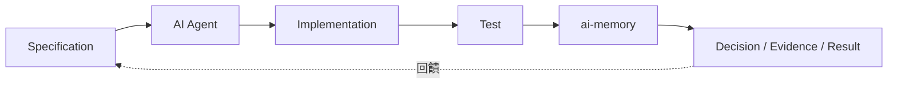

## 30.2 與 spec-kit 等工具搭配的建議

若團隊採用 Spec-Driven Development 工具（例如 `spec-kit` 類型的規格驅動開發流程），建議的整合方式（建議架構）：

1. Specification 文件本身仍作為 Static Context 的一部分（可另外收錄於 Source Repo）
2. 每個 Spec 對應的實作過程中，AI Agent 產生的「為什麼這樣實作」「測試結果」「與規格的落差」等**執行過程知識**，交由 ai-memory 的 `decisions/`／`procedures/` 保存
3. 當 Spec 與實作出現落差時，先查詢 ai-memory 是否已有相關決策記錄，避免重複討論已有共識的議題

### 本章 Checklist

- [ ] 已釐清 Spec 文件（Static）與實作過程知識（Dynamic）分別由哪個系統保管
- [ ] 未將此章內容誤認為 ai-memory 官方原生的 Spec-Driven Development 功能

---

# 31. 與 SSDLC 整合

> ⚠️ 本章為建議架構，非官方原生功能。

## 31.1 AI-assisted SSDLC 流程

```mermaid
flowchart TD
    REQ["Requirement"] --> SPEC["Specification"]
    SPEC --> ARCH["Architecture"]
    ARCH --> THREAT["Threat Modeling"]
    THREAT --> IMPL["Implementation"]
    IMPL --> SAST["SAST"]
    SAST --> SCA["SCA"]
    SCA --> UT["Unit Test"]
    UT --> IT["Integration Test"]
    IT --> ST["Security Test"]
    ST --> CR["Code Review"]
    CR --> DEPLOY["Deployment"]
```

## 31.2 ai-memory 在各階段保存的內容

| 階段 | 保存內容 | 對應 Wiki 家族 |
|---|---|---|
| Requirement / Specification | Decision（需求釐清紀錄） | `decisions/` |
| Architecture | Decision、Evidence（架構選型理由） | `decisions/`、`concepts/` |
| Threat Modeling | Risk（已識別威脅與對應措施） | `decisions/` |
| Implementation | Evidence（實作方式與理由） | `concepts/`、`procedures/` |
| SAST／SCA | Result、Exception（掃描結果與例外核准紀錄） | `gotchas/` |
| Unit／Integration／Security Test | Result（測試結果與已知缺陷） | `procedures/`、`gotchas/` |
| Code Review | Review（審查結論、待改進事項） | `decisions/` |
| Deployment | Result、Risk（上線結果、Rollback 紀錄） | `procedures/` |

### AI Prompt 範例（SAST 例外處理紀錄）

```text
這次 SAST 掃描出的這個誤判（False Positive），已經過資安團隊確認可以標記為例外。
請呼叫 memory_write_page 寫入 gotchas/sast-exceptions.md，
記錄掃描規則 ID、誤判原因、核准者、核准日期，供未來掃描時快速比對。
```

### 本章 Checklist

- [ ] SSDLC 各階段的決策/證據/風險/結果，已對應到明確的 ai-memory Wiki 家族
- [ ] SAST/SCA 的例外核准紀錄有留存，避免下次掃描重複人工判斷
- [ ] 團隊理解本章為建議架構，需自行導入落地，非 ai-memory 開箱即有的 SSDLC 功能

---

# Part VII：企業導入

# 32. 企業導入架構（Level 1-3）

> ⚠️ 本章導入層級架構為建議架構，各層級內使用的 ai-memory 指令與部署方式為官方已實作。

## 32.1 Level 1 — Individual Developer

```mermaid
flowchart LR
    DEV["Developer"] --> AGENT["Claude Code / Codex"]
    AGENT --> LOCAL["Local ai-memory\n(Loopback, 無需認證)"]
```

適用：個人試用、單機安裝（第 7 章），無需 Docker、無需認證設定。

## 32.2 Level 2 — Team

```mermaid
flowchart TB
    DA["Developer A"] --> SRV["ai-memory Server\n(共用，LAN 部署)"]
    DB2["Developer B"] --> SRV
    DC["Developer C"] --> SRV
    SRV --> GITMEM["Git Memory\n(共用 Wiki Repository)"]
```

適用：小型固定辦公室團隊，採第 8.3 節 `docker-compose.prod.yml.example` 部署，設定 `AI_MEMORY_AUTH_TOKEN`。

## 32.3 Level 3 — Enterprise

```mermaid
flowchart TB
    AGENTS["AI Agents\n(多團隊、多專案)"] --> GATEWAY["MCP Gateway\n(建議架構：統一入口/流量管理)"]
    GATEWAY --> CLUSTER["ai-memory Server\n(多台/高可用部署)"]
    CLUSTER --> REPO["Memory Repository"]
    REPO --> GITBACKUP["Git / Backup"]
    CLUSTER --> AUDIT["Security / Audit"]
```

> ⚠️ 「MCP Gateway」與「多台高可用部署」為**建議架構**，官方文件未明確定義企業級叢集/高可用拓樸，本手冊依一般 Enterprise 服務部署常識延伸建議，實際採用前建議先與官方社群確認是否有原生 HA 支援。

## 32.4 三層級比較

| 面向 | Level 1 | Level 2 | Level 3 |
|---|---|---|---|
| 成本 | 幾乎為零 | Server 主機成本 | 主機＋維運人力成本 |
| 維運 | 無需維運 | 需指派維運負責人 | 需專職 DevSecOps 資源 |
| 安全 | Loopback，天然安全 | 需 Bearer Token + Allowed Hosts | 需完整 Access Control + Audit |
| 擴充性 | 不可擴充 | 團隊規模上限受限於單機資源 | 依部署架構可擴充（未經官方 Benchmark 驗證，見第 38 章） |
| 可用性 | 單機失效即中斷 | 單一 Server 為單點故障 | 需自行設計高可用（建議架構） |
| 管理複雜度 | 極低 | 中等 | 高 |

### 本章 Checklist

- [ ] 已依團隊規模對照選擇 Level 1／2／3
- [ ] Level 3 的「Gateway／高可用」等延伸架構已明確標示為建議架構，不對外宣稱官方原生支援
- [ ] 每個層級的安全設定已對照第 10 章落實

---

# 33. 企業導入建議（Phase 1-4）

> ⚠️ 本章導入階段規劃為建議架構。

## 33.1 四階段導入時程

```mermaid
flowchart LR
    P1["Phase 1\n個人試用"] --> P2["Phase 2\n小型 Team Pilot"]
    P2 --> P3["Phase 3\n正式 Team Deployment"]
    P3 --> P4["Phase 4\nEnterprise AI Development Platform"]
```

## 33.2 各階段細節

| Phase | 時間建議 | 主要工作 | 技術 | 人員 | 風險 | Success Criteria |
|---|---|---|---|---|---|---|
| Phase 1 個人試用 | 1-2 週 | 1-2 位志願工程師在真實專案試用 | Level 1（第 32.1 節） | 1-2 位工程師 | 低（個人本機，不影響他人） | 志願者回報「明顯減少重複解釋上下文的時間」 |
| Phase 2 小型 Team Pilot | 2-4 週 | 5-10 人小組共用一台 Server | Level 2（第 32.2 節） | Pilot 小組 + 1 位維運負責人 | 中（需處理共用 Server 的權限與衝突） | Handoff 實際被下一位接手者採用率 ≥ 50% |
| Phase 3 正式 Team Deployment | 1-2 月 | 全團隊導入，建立 Governance（第 22 章）與使用規範（第 34 章） | Level 2 或 Level 3 | 全團隊 + 專職維運 | 中高（需處理 Memory Governance、跨專案隔離） | 全團隊 Onboarding 完成，Troubleshooting SOP 落地 |
| Phase 4 Enterprise AI Development Platform | 持續 | 跨團隊、跨專案標準化，整合進 SSDLC（第 31 章） | Level 3 | 專職 DevSecOps 團隊 | 高（需承擔企業級安全與可用性責任） | 納入公司標準 SOP（第 41 章），成為新專案預設基礎設施 |

### 本章 Checklist

- [ ] 已指派每個 Phase 的負責人與時程
- [ ] Phase 2 開始前，Level 2 的安全設定（第 10 章）已就緒
- [ ] Phase 4 前，已完成 Memory Governance Policy（第 22 章）的正式制定

---

# 34. 同仁使用規範

# ai-memory Developer Usage Guide

> ⚠️ 本章為建議架構的公司內部規範範本，各團隊可依實際情況調整。

## 34.1 開始工作前

```bash
ai-memory status
```

確認 Server 連線正常，再開始當日工作。

## 34.2 開始 Agent Session

讓 Agent 讀取既有記憶，建議第一個 Prompt 固定為：

```text
請先呼叫 memory_briefing 或讀取最近的 Handoff，
總結目前這個專案的狀態，再開始今天的工作。
```

## 34.3 工作過程中

- 重大架構決策，**必須**主動要求 Agent 呼叫 `memory_write_page` 記錄，不可只留在對話紀錄裡
- 使用 MCP-only 的 Agent（如 GitHub Copilot，見第 13 章）時，需**主動**要求記錄，不會自動發生

## 34.4 遇到錯誤時

依以下結構記錄（呼應第 21.2 節 Handoff 格式的 `Failed Approaches`／`Known Issues`）：

```text
Problem：發生了什麼問題
Cause：初步判斷的原因
Attempt：已經嘗試過的解法
Result：嘗試的結果（成功/失敗/部分成功）
```

## 34.5 Session 結束前

- Claude Code／有完整 Hook 支援的 Agent：確認 Session 自然結束（觸發 `SessionEnd`），不要強制關閉終端機
- Codex／Antigravity CLI 等無真正 SessionEnd 的 Agent：**務必**手動執行 `ai-memory finalize-session`（第 12.2 節）
- 確認 Handoff 已產生，可用 `ai-memory status` 或直接詢問下一個 Session

### 本章 Checklist

- [ ] 每位同仁都已閱讀並理解本規範
- [ ] 規範已納入新人 Onboarding 教材（見第 43 章 Checklist）
- [ ] 團隊已依 Agent 種類（有無自動 Hook）調整對應的操作習慣

---

# 35. AI Agent 使用 Prompt 範例

以下 Prompt 皆可直接複製使用，依情境替換 `<placeholder>`。

## 35.1 新專案

```text
這是一個新專案。請呼叫 memory_status 確認 ai-memory 是否已正確連線，
並呼叫 memory_write_page 建立初始的 concepts/project-overview.md，
記錄目前已知的技術棧、專案目標與初始架構假設。
```

## 35.2 接續工作

```text
Continue the previous work. 請先呼叫 memory_briefing 讀取上一輪的 Handoff，
總結已知架構、已做決策、失敗過的嘗試與尚待處理的事項，
再告訴我你建議接下來先做什麼。
```

## 35.3 Reverse Engineering

```text
請對 <模組名稱> 進行程式碼分析。重要規則：
1. 只有你能在程式碼中逐行追蹤到的邏輯才能標記為 #confirmed
2. 任何推論出的行為必須標記為 #inferred 並附上推論依據
3. 完成後呼叫 memory_write_page 寫入 concepts/<模組名稱>-business-rules.md
```

## 35.4 Framework Upgrade

```text
我們正在將 <框架/語言> 從 <舊版本> 升級到 <新版本>。
每次遇到相容性問題，請先查詢 memory_query 是否已有類似記錄；
若是新問題，請呼叫 memory_write_page 寫入 gotchas/<升級名稱>-migration.md，
並明確區分「已正式修復」與「暫時 Workaround」。
```

## 35.5 Debugging

```text
我們在追查 <Bug 描述>。請先呼叫 memory_query 搜尋這個 Bug 或相關症狀
是否已有先前的排查記錄，避免重複已排除的假設；
排查過程中每排除一個假設，請記錄 Problem/Cause/Attempt/Result 四個欄位。
```

## 35.6 Code Review

```text
在你開始 Code Review 之前，請先呼叫 memory_query 搜尋這次變更相關的
Architecture Decision 與 Security Decision，確認實作是否與既定決策一致。
```

## 35.7 Architecture Analysis

```text
請針對 <系統/模組> 進行架構分析，完成後呼叫 memory_write_page
寫入 concepts/<系統名稱>-architecture.md，包含模組邊界、依賴關係、
以及你認為需要人工確認的不確定之處。
```

## 35.8 Security Analysis

```text
請針對 <系統/模組> 進行資安分析，重點檢查認證/授權機制與已知弱點類型。
完成後呼叫 memory_write_page 寫入 decisions/<系統名稱>-security-review.md，
並標註每個發現的風險等級與建議修復優先序。
```

## 35.9 Handoff

```text
這次的工作即將告一段落。請依照公司標準 Handoff 格式
（見第 21.2 節：Project / Current Task / Completed / In Progress / Blocked /
Architecture / Decisions / Failed Approaches / Known Issues / Open Questions /
Risks / Tests / Next Steps / Important Files），整理今天的工作內容，
並呼叫 memory_write_page 寫入本次 Session 對應的 Handoff 頁面。
```

### 本章 Checklist

- [ ] 團隊已將常用 Prompt 範例整理進內部 Wiki 或 Snippet 工具，方便同仁複製使用
- [ ] 新進同仁已在 Onboarding 過程中實際練習過至少 3 個範例

---

# 36. 最佳實務（DO / DON'T）

> ⚠️ 本章為建議架構，綜合前述章節整理而成。

## 36.1 DO

- 保存重大 Architecture Decision（第 17、20 章）
- 保存失敗經驗（第 18、19 章的 Failed Approaches／Failed Migration）
- 保存 Open Questions（第 21 章 Handoff 格式）
- 保存 Migration Risk（第 19 章）
- 保存 Test Evidence（第 17、31 章）
- 保存 Handoff（第 16、21 章）
- 使用 Git 版控 Wiki（第 23 章）
- 定期 Backup（第 24 章）
- 驗證 Memory（第 22 章 Governance）

## 36.2 DON'T

- 不保存 Password／API Key／Token（第 10.7 節 Secret Management）
- 不把推測當事實（第 18.3 節 `#confirmed` vs `#inferred`）
- 不把所有 Tool Output 永久保存（尊重 Memory Tiers 的 Working/Episodic 自動清理設計，第 3.6 節）
- 不讓錯誤 Memory 無限制累積（第 22 章 `memory_feedback` 清理機制）
- 不讓不同 Project Memory 混用（第 5 章 Project Isolation）

### 本章 Checklist

- [ ] 團隊已將 DO/DON'T 清單納入 Code Review 或 Onboarding 檢查項目
- [ ] 每一條 DON'T 都已對應到具體的技術防護機制（而非只是口頭規範）

---

# 37. Anti-pattern

> ⚠️ 本章為建議架構，用於協助團隊識別常見的錯誤導入模式。

## 37.1 Memory Dump

**症狀**：把所有 Tool Output、所有對話內容全部寫入 Wiki，不做任何篩選。

**問題**：Wiki 迅速膨脹，FTS5／Embedding 檢索精準度下降，真正重要的決策被大量雜訊淹沒。**對策**：搭配 Memory Tiers（第 3.6 節）與 `[capture] ignore_paths`（第 5.3 節），只保留有價值的內容進入 Semantic/Procedural 層。

## 37.2 Memory Pollution

**症狀**：錯誤資訊寫入後從未被清理，持續誤導後續 Agent。

**對策**：善用 `memory_feedback` 標記錯誤內容（第 22 章），定期執行 Governance Review。

## 37.3 Memory Without Validation

**症狀**：團隊盲目相信 AI 寫入 Wiki 的一切內容，未經任何人工確認。

**對策**：呼應第 42 章「Memory ≠ Truth」的核心原則，高風險決策必須人工審查（第 22.2 節 Human Approval）。

## 37.4 Static Instructions Overload

**症狀**：把所有 Dynamic Context（目前進度、失敗嘗試）都硬塞進 `CLAUDE.md`／`AGENTS.md`，導致檔案迅速過時、難以維護。

**對策**：依第 29 章 Static vs Dynamic Context 的劃分，把動態內容交還給 ai-memory。

## 37.5 Vendor-specific Memory

**症狀**：只依賴單一 AI Agent 廠商的內建記憶功能（例如只用某家 Agent 專屬的 Session 記憶），未透過 MCP 標準化。

**對策**：透過 ai-memory 的 MCP 層（第 6 章）確保記憶可跨廠商流通，避免第 1.2.3 節提到的 Agent Vendor Lock-in。

## 37.6 No Handoff Protocol

**症狀**：Session 結束沒有明確交接，下一個人（或下一個 Agent）完全不知道前一輪做了什麼。

**對策**：落實第 21 章 AI Agent Handoff Protocol，Codex 等無自動 SessionEnd 的 Agent 尤其要注意手動 `finalize-session`。

### 本章 Checklist

- [ ] 團隊已對照六種 Anti-pattern 自我檢查，確認目前使用方式未落入其中
- [ ] 已指定人員定期（如每月）檢視是否出現 Memory Dump 或 Memory Pollution 徵兆

---

# 38. Performance / Scalability

## 38.1 影響效能的面向

| 面向 | 說明 |
|---|---|
| Project 數量 | 影響 Auto Scope 的 `max_entries`（預設 4096，第 5.2 節）是否足夠 |
| Session 數量 | 影響 `sessions`／`observations` Table 成長速度 |
| Markdown 數量 | 影響 Wiki Git Repository 大小與 FTS5 索引重建時間 |
| SQLite | 單一 Writer Actor 設計（第 3.7 節 Invariant #2），寫入為序列化，非平行寫入 |
| FTS5 | 全文檢索效能隨 Wiki 頁面數量增加而變化 |
| Embedding | 選配功能，Brute-force Cosine 在頁面數量超過「數千筆」後建議升級 `sqlite-vec`（官方已實作，`docs/design-decisions.md` Future Work） |
| LLM | 呼叫延遲與成本，見第 7 章 llm-provider-comparison 摘要（見下方 38.2 節） |
| Git Repository Size | 隨 Wiki 頁面歷史增長，需納入第 24 章備份策略考量 |
| Concurrent Agents / Users | 依 Auto Scope 模式（`single`／`per_session`／`per_actor`）與四層認證模型（第 10.6 節）而定 |

## 38.2 LLM Consolidation 效能實測（官方已實作，`docs/llm-provider-comparison.md` 內部 Benchmark）

| Provider | 排名 | 備註 |
|---|---|---|
| Claude Haiku 4.5 | 1（最佳整體表現） | 5/5 Parse Rate、7.3 秒延遲、約 $0.02/次 |
| GPT-5.4-mini | 2（最快最便宜） | 約 $0.005/次、4.3 秒，但有輕微過度分類傾向 |
| Qwen3:32b（本地 Ollama） | 3（免費） | $0/次，可接受用於背景任務 |
| DeepSeek V4 Flash | 4 | 可靠但無明顯優勢 |
| Claude Sonnet 4.5 | 5 | "Strictly dominated by Haiku" at 3× 成本 |
| Kimi-K2.6 | 不合格 | 推理模型會卡在嚴格 JSON 輸出上 |

> 此為 ai-memory 官方針對「Consolidation 任務」（把 Session Log 轉成結構化 Wiki 頁面）的內部評測結果，並非通用 LLM 能力排名，僅供選擇 `AI_MEMORY_LLM_PROVIDER` 時參考（官方已實作）。

## 38.3 規模化容量：誠實面對資訊缺口

> **未找到官方 Benchmark，不應自行宣稱容量。**

| 規模 | 適合架構 | Provenance |
|---|---|---|
| 1 位開發者 | Level 1（第 32.1 節） | 官方已實作（架構本身），容量數字未經官方驗證 |
| 10 位開發者 | Level 2（第 32.2 節） | 官方目前沒有找到足夠資料確認此規模的效能表現 |
| 100 位開發者 | Level 3（第 32.3 節），需自行壓力測試 | 官方目前沒有找到足夠資料確認此規模的效能表現 |
| 1000 位開發者 | 需自行評估是否需要架構調整（如拆分多個 Server） | 官方目前沒有找到足夠資料確認此規模的效能表現 |

> ⚠️ 本手冊嚴格遵守使用者要求：**不會**在缺乏官方 Benchmark 的情況下自行宣稱 ai-memory 可以支撐特定數量的並行使用者或 Session。企業在 Level 3 導入前，強烈建議自行進行壓力測試，並將結果回饋給團隊作為容量規劃依據。

### 本章 Checklist

- [ ] 已閱讀官方 `docs/llm-provider-comparison.md` 的 Consolidation Benchmark 再決定 LLM Provider
- [ ] Level 3 導入前已規劃自行壓力測試，而非直接假設官方數字
- [ ] Embedding 頁面數量接近「數千筆」門檻時，已評估升級 `sqlite-vec` 的必要性

---

# 39. Upgrade Strategy Runbook

## 39.1 版本歷程重點（官方已實作，`CHANGELOG.md` 摘要，`1.18.0 → 1.32.1`）

| 版本 | 重點 |
|---|---|
| 1.32.1 | 修正 `memory_forget_sweep` 文件說明；修正向量檢索結果標題/摘要為空的 Bug |
| 1.32.0 | 新增 **Pool（Poolside Agent CLI）** 支援；新增 Ingest Counters（`ai-memory status` 新增事件計數與 `capture_mode` 欄位，第 25.2 節）；新增 `install-hooks --capture-mode allowlist`；Session Page 新增 `summary` Frontmatter 統計欄位 |
| 1.31.1 | Docker `upgrade` 會先驗證容器所有權；Windows Docker Wrapper 透過 `host.docker.internal` 連線 |
| 1.31.0 | 修正 `auto-improve` 的 `operation` 欄位驗證；`gemini` Provider 支援自訂 `AI_MEMORY_LLM_BASE_URL` |
| 1.29.0 | 新增 `AI_MEMORY_LLM_TIMEOUT_SECS`，可覆寫 LLM Provider 預設 300 秒逾時，適合自架／聚合閘道回應較慢的情境（第 9.3 節） |
| 1.27.0 | **Breaking Change**：未認證的非 Loopback HTTP 現在會 Fail Closed（第 10.1 節） |
| 1.26.1 | **Breaking Change**：Forget-sweep Decay 現在會移除權威 Markdown 檔案，Reconciliation 不會復活已淘汰內容 |
| 1.26.0 | 新增 Swival CLI（MCP-only）支援；修正 Lifecycle-only Session 產生空白頁面的問題；修正 podman rootless／SELinux 權限問題 |
| 1.25.0 | 新增 Kiro CLI v2/v3、Command Code 支援 |
| 1.22.0 | 新增 Antigravity CLI 支援 |
| 1.20.2 | Managed Workstream Heartbeat 改進，將斷線／復原濃縮為單一簡短通知（可能影響既有 Launcher 行為） |
| 1.20.1 | Docker Wrapper 自我升級改為使用 Checksum 驗證過的 GitHub Release 資產，不再抓取 mutable 的 `main` 分支（安全強化） |
| 1.18.0 | 新增 Grok Build CLI 支援 |

> 版本歸屬經逐一比對官方完整 `CHANGELOG.md` 複查（查證日：2026-08-26），避免將功能誤植到相近但錯誤的版號。

## 39.2 Upgrade Runbook

```mermaid
flowchart TD
    BACKUP["Backup\n(ai-memory backup，第 24 章)"] --> CHECK["Check Current Version\n(Cargo.toml / ai-memory --version)"]
    CHECK --> CHANGELOG["Read CHANGELOG\n(特別留意 Breaking Changes)"]
    CHANGELOG --> TEST["Test New Version\n(非正式環境先行驗證)"]
    TEST --> UPGRADE["Upgrade\n(ai-memory upgrade)"]
    UPGRADE --> MIGRATE["Migration\n(自動 DB Migration，如 1.32.0 的 V50)"]
    MIGRATE --> VMCP["Validate MCP\n(ai-memory status)"]
    VMCP --> VHOOK["Validate Hooks\n(第 16 章 Lab 流程重跑)"]
    VHOOK --> VMEM["Validate Memory\n(memory_query 抽查既有內容)"]
    VMEM --> VHAND["Validate Handoff"]
    VHAND -->|"若異常"| ROLLBACK["Rollback\n(還原至 Backup)"]
    VHAND -->|"正常"| DONE["升級完成"]
```

### 本章 Checklist

- [ ] 升級前已完整備份（第 24 章）
- [ ] 已詳讀目標版本與現有版本之間的所有 Breaking Change
- [ ] 升級後已重跑第 16 章 Lab 流程驗證 MCP／Hooks／Memory／Handoff 皆正常

---

# 40. Enterprise Reference Architecture 與最終推薦架構

## 40.1 完整 Enterprise Reference Architecture

```mermaid
flowchart TB
    DEVS["Developers"]
    DEVS --> CC["Claude Code"]
    DEVS --> CX["Codex"]
    DEVS --> GHC["GitHub Copilot"]

    CC --> MCP["MCP"]
    CX --> MCP
    GHC --> MCP

    MCP --> SRV["ai-memory Server"]

    SRV --> FTS["FTS5"]
    SRV --> SQLITE["SQLite"]
    SRV --> LLM["LLM (Optional)"]
    LLM -.-> EMB["Embedding (Optional)"]

    SQLITE --> WIKI["Wiki / Markdown"]
    FTS --> WIKI
    WIKI --> GIT["Git"]

    GIT --> BACKUP["Backup"]
    GIT --> REMOTE["Git Remote"]
```

## 40.2 依三種情境的最終推薦架構

> ⚠️ 本節為建議架構，綜合前述各章節的官方已實作機制延伸而成。

| 情境 | 推薦部署層級 | 關鍵設定重點 |
|---|---|---|
| 企業 Web Application 開發 | Level 2（團隊共用） | `auto_scope = per_session`（多人並行開發）＋ 第 17 章各階段 Memory 保存規範 |
| Legacy System Reverse Engineering | Level 2，可考慮 Level 1 起步 | 強制 `#confirmed`／`#inferred` 標記規範（第 18 章）＋ 高頻 Backup（推論過程極難重建） |
| Framework Upgrade | Level 1 或 Level 2 | 完整記錄 Breaking Change／Failed Migration（第 19 章）＋ 搭配 CHANGELOG 式記錄格式 |

## 40.3 七層架構總覽

| 層級 | 內容 |
|---|---|
| **Agent Layer** | Claude Code、Codex、GitHub Copilot 等 MCP Client |
| **MCP Layer** | 標準協定層，18 個 MCP Tools |
| **Memory Layer** | Session Memory、Project Memory、Handoff |
| **Knowledge Layer** | `concepts/`、`decisions/`、`gotchas/`、`procedures/` Wiki 家族 |
| **Git Layer** | Wiki 版控、Backup、Remote |
| **Security Layer** | Bearer Token、Allowed Hosts、TLS Reverse Proxy、四層認證模型 |
| **Governance Layer** | Memory Governance Policy（第 22 章）、Company Standard（第 41 章） |

### 本章 Checklist

- [ ] 已依團隊的三種情境（Web App／Reverse Engineering／Framework Upgrade）選擇對應的推薦架構
- [ ] 七層架構的每一層都有對應的負責人或負責團隊
- [ ] 已將本章圖表納入內部架構文件，作為新人 Onboarding 的第一張圖

---

# Part VIII：收尾

# 41. Company Standard for ai-memory

> ⚠️ 本章為建議架構的公司內部標準範本，各團隊可依實際情況調整，非 ai-memory 官方強制規範。以下每一項標準均綜合前述章節整理，括號標註對應章節。

## 41.1 十五項標準

1. **Installation Standard**：一律透過 Docker 或官方 Prebuilt Release 安裝，禁止手動修改二進位檔（第 7 章）
2. **Configuration Standard**：`config.toml` 版本統一由維運負責人管理，不允許各開發者自行修改共用 Server 設定（第 9 章）
3. **Project Isolation Standard**：每個專案根目錄**必須**有 `.ai-memory.toml`，明確宣告 `workspace`／`project`（第 5.3 節）
4. **Memory Naming Standard**：Wiki 頁面路徑統一使用 `decisions/`／`gotchas/`／`concepts/`／`procedures/` 四個家族前綴（第 22.2 節）
5. **Handoff Standard**：統一採用第 21.2 節的公司 Handoff 格式，Session 結束前必須產生
6. **Security Standard**：非 Loopback 部署必須設定 `AI_MEMORY_AUTH_TOKEN` + `AI_MEMORY_ALLOWED_HOSTS`（第 10 章）
7. **Secret Handling Standard**：Secret 一律用環境變數注入，敏感目錄一律加入 `ignore_paths`，禁止寫入 Wiki（第 10.7 節）
8. **Git Standard**：Memory Repository 採 Private Remote，依第 23.2 節決策是否與 Source Repo 分離
9. **Backup Standard**：`ai-memory backup` 每日排程，Wiki Git Remote 需有異地備份（第 24 章）
10. **Upgrade Standard**：升級前必讀 CHANGELOG Breaking Changes，依第 39.2 節 Runbook 執行
11. **Agent Integration Standard**：新導入的 Agent 必須先對照第 14 章支援矩陣確認能力邊界，才能制定操作規範
12. **Memory Governance Standard**：高敏感度專案 `require_approval = true`，依第 22 章執行定期審查
13. **Review Standard**：架構層級決策需人工核准，不可由 Agent 自動核准生效（第 22.2 節）
14. **Disaster Recovery Standard**：每季至少演練一次第 24.4 節 DR Runbook
15. **Developer Usage Standard**：全員依第 34 章規範操作，並納入 Onboarding 訓練

## 41.2 SOP 速查卡（可直接列印張貼）

```text
┌─────────────────────────────────────────┐
│  ai-memory 每日使用 SOP                    │
├─────────────────────────────────────────┤
│ 1. 開工前：ai-memory status              │
│ 2. 開始 Session：要求 Agent 讀 Handoff     │
│ 3. 重大決策：主動要求寫入 Wiki             │
│ 4. 遇到錯誤：記錄 Problem/Cause/           │
│              Attempt/Result              │
│ 5. Codex 收工：務必 finalize-session      │
│ 6. Copilot 使用者：主動呼叫 MCP Tool       │
│ 7. Session 結束：確認 Handoff 已產生       │
└─────────────────────────────────────────┘
```

### 本章 Checklist

- [ ] 15 項標準已轉化為公司內部正式文件並公告全體工程團隊
- [ ] SOP 速查卡已張貼於團隊共用空間或 Onboarding 文件首頁

---

# 42. 重要原則：不要神化 ai-memory

## 42.1 ai-memory 能解決的問題

```text
Session Continuity（跨 Session 延續）
Project Memory（專案記憶保存）
Agent Handoff（跨 Agent 交接）
Cross-Agent Context（跨廠商上下文共享）
Persistent Development Knowledge（持久化開發知識）
```

## 42.2 ai-memory 不能自動解決的問題

```text
AI Hallucination（AI 幻覺）
Bad Architecture（糟糕的架構設計）
Incorrect Requirements（錯誤的需求理解）
Bad Coding（糟糕的程式碼品質）
Security Vulnerability（安全漏洞）
Wrong Business Logic（錯誤的商業邏輯）
Human Review（人工審查的必要性）
```

## 42.3 核心風險觀念

> **Memory ≠ Truth（記憶不等於真相）**

ai-memory 忠實記錄的是「AI Agent 在某次 Session 中認為的事實」，而不是「客觀驗證過的真相」。如果 Day 1 的 Claude Code 對某段程式碼做出了錯誤推論並寫入 Wiki，Day 2 的 Codex 讀到這筆記憶時，會理所當然地把它當作已知事實繼續推理——**錯誤會被放大，而不是被記憶系統自動修正**。

> **Persistent Memory ≠ Correct Knowledge（持久記憶不等於正確知識）**

即使一筆記憶被保存了很久、被多次引用，也不代表它是正確的。第 18.3 節的 `#confirmed`／`#inferred` 標記規範、第 22 章的 Memory Governance、第 37.3 節的「Memory Without Validation」Anti-pattern，都是為了對抗這個風險而設計。

```mermaid
flowchart LR
    A["AI Agent 產生的記憶"] -->|"未經驗證"| B["寫入 Wiki"]
    B -->|"被下一個 Agent 讀取"| C["當作既定事實繼續推理"]
    C -->|"若原始記憶有誤"| D["錯誤被放大、持久化"]
    A -.->|"正確做法：\n人工審查 + #confirmed/#inferred 標記"| E["驗證後才視為可信"]
    E --> B
```

## 42.4 給企業導入者的一句話

> ai-memory 讓 AI Agent「不再失憶」，但**不會**讓 AI Agent「不再犯錯」。企業導入時，必須同時投入第 22 章 Memory Governance 與人工審查機制，而不是導入工具後就假設記憶內容天然可信。

### 本章 Checklist

- [ ] 全體工程師理解「Memory ≠ Truth」的核心風險觀念
- [ ] 高風險決策已建立人工審查關卡，未完全依賴 AI Agent 的自動記憶
- [ ] 團隊不會對外宣傳 ai-memory 能「自動避免 AI 幻覺」或「自動確保架構正確」

---

# 43. 最終 Checklist

## Installation Checklist

- [ ] 已依團隊規模選定 Linux／macOS／Windows(WSL2)／Windows(Native)／Docker 安裝路徑（第 7 章）
- [ ] `install-mcp` 與 `install-hooks` 在同一環境執行
- [ ] `ai-memory status` 驗證通過

## Configuration Checklist

- [ ] `config.toml` 已設定 `[auto_scope]` 模式（第 9.2 節）
- [ ] LLM／Embedding Provider 已依需求設定或確認維持 Zero-LLM 模式（第 4.4 節）

## MCP Checklist

- [ ] 已理解 stdio vs HTTP Transport 差異（第 6.3 節）
- [ ] Session 並行情境已評估是否需要 `--session-aware`（第 11.3 節）

## Claude Code Checklist

- [ ] 已安裝 MCP + Hooks（第 11.2 節）
- [ ] 已確認是否需要 `--capture-assistant`（第 11.5 節）

## Codex Checklist

- [ ] 已理解無真正 SessionEnd，排程/批次任務已加上 `finalize-session`（第 12.2 節）

## Copilot Checklist

- [ ] 已理解 MCP-only、無自動 Hook（第 13.1 節）
- [ ] 已建立主動呼叫 MCP Tool 的操作規範

## Security Checklist

- [ ] 非 Loopback 部署已設定 `AI_MEMORY_AUTH_TOKEN` + `AI_MEMORY_ALLOWED_HOSTS`（第 10.1-10.2 節）
- [ ] 對外曝露已套用 TLS Reverse Proxy（第 10.5 節）
- [ ] 敏感目錄已加入 `ignore_paths`（第 10.7 節）

## Backup Checklist

- [ ] `ai-memory backup` 已排程（第 24.1 節）
- [ ] Wiki Git Remote 已設定異地備份（第 24.2 節）

## Handoff Checklist

- [ ] 團隊已採用統一 Handoff 格式（第 21.2 節）
- [ ] 每個 Session 結束前 Handoff 確實產生

## Project Isolation Checklist

- [ ] 每個專案已放置 `.ai-memory.toml`（第 5.3 節）
- [ ] 多人/多 Session 情境已設定對應 Auto Scope 模式（第 5.2 節）

## Upgrade Checklist

- [ ] 升級前已備份並詳讀 Breaking Changes（第 39 章）
- [ ] 升級後已重跑驗證流程（第 39.2 節）

## Troubleshooting Checklist

- [ ] 團隊已熟悉第 27 章 15 類常見問題的排查步驟

## Enterprise Deployment Checklist

- [ ] 已依第 32 章選定導入層級（Level 1/2/3）
- [ ] 已依第 33 章規劃四階段導入時程
- [ ] Memory Governance Policy 已正式制定（第 22 章）
- [ ] Company Standard 已公告全體團隊（第 41 章）

---

# 44. FAQ、References 與文件自我審查

## 44.1 FAQ

**Q1：ai-memory 是 Vector Database 嗎？**
A：不是。ai-memory 是以 Git 版控的 Markdown Wiki 為 Source of Truth，SQLite + FTS5 為衍生索引，Embedding 只是選配的加分項，並非以向量檢索為核心的 Vector Database（第 4 章）。

**Q2：ai-memory 可以取代 CLAUDE.md 嗎？**
A：不行，兩者是互補關係。`CLAUDE.md` 是 Static Project Instructions，ai-memory 是 Dynamic Project Memory（第 28.2、29 章）。

**Q3：ai-memory 可以取代 AGENTS.md 嗎？**
A：同上，不行，理由相同。

**Q4：ai-memory 可以跨 Claude Code 與 Codex 嗎？**
A：可以，這正是 ai-memory 的核心設計目標，兩者都是官方 Support Matrix 標示為「Supported」的 Agent（第 11、12 章）。

**Q5：ai-memory 可以跨不同 Project 嗎？**
A：可以透過 Auto Scope 與 Marker File 明確隔離不同 Project 的記憶，避免混用（第 5 章）。

**Q6：ai-memory 是否需要 LLM？**
A：不需要。系統預設運作在 Zero-LLM 模式，FTS5、Entity Matching、Graph-neighbor Search 皆可正常運作（第 2.1、4.4 節）。

**Q7：ai-memory 是否需要 Embedding？**
A：不需要，Embedding 是選配（Opt-in）功能（第 4.3 節）。

**Q8：ai-memory 是否需要 Git？**
A：需要，Wiki 本身就是 Git Repository，這是架構的核心設計（第 3.1、23 章）。

**Q9：Windows 可以使用嗎？**
A：可以，但需注意 WSL2 是「Supported」，Native Windows 是「Experimental」（第 7.3 節）。

**Q10：WSL2 是否比較適合？**
A：依官方 Support Matrix，WSL2 是官方標示為完整 Supported 的路徑，Native Windows 仍在 Experimental 階段，官方建議優先考慮 WSL2（第 7.3 節）。

**Q11：Docker 是否適合企業？**
A：適合，官方提供正式的 `docker-compose.prod.yml.example` 生產部署範本（第 8.3 節）。

**Q12：Memory 是否會包含 Secret？**
A：若未做好 `ignore_paths` 設定與人員紀律，理論上可能誤存，因此第 10.7 節提供明確的 Secret Handling 建議。

**Q13：如何刪除 Memory？**
A：使用 `memory_delete_page`（MCP Tool）或 `ai-memory forget-sweep`（CLI，第 26.4 節）。

**Q14：如何修正錯誤 Memory？**
A：使用 `memory_feedback` 標記錯誤，交由 Governance Review 或 Curator 處理（第 22 章）。

**Q15：如何 Backup？**
A：`ai-memory backup --output-path <path>`，並搭配 Wiki Git Remote 備份（第 24 章）。

**Q16：如何 Restore？**
A：先停止 Server，再執行 `ai-memory restore --from <backup-tarball> --data-dir <data-dir-path> --confirm`（旗標為 `--from`＋`--data-dir`，非 `--input-path`；第 24.3 節）。

**Q17：如何 Upgrade？**
A：依第 39.2 節 Upgrade Runbook，先備份、讀 CHANGELOG、測試、執行 `ai-memory upgrade`、驗證。

**Q18：多人可以共用嗎？**
A：可以，依四層認證模型（Anonymous/Root/Proxy-asserted/DB User）與 `per_actor` Auto Scope 模式支援多使用者（第 10.6 節）。

**Q19：多 Agent 可以同時使用嗎？**
A：可以，這正是 ai-memory 的核心價值，但需依第 11.3 節評估是否需要 Session-aware 模式避免互相覆寫。

**Q20：如何避免 Memory Pollution？**
A：定期使用 `memory_feedback`、遵守第 22 章 Governance 流程、避免第 37.2 節提到的 Anti-pattern。

**Q21：ai-memory 與 RAG 有什麼不同？**
A：一般 RAG 系統通常以 Vector DB 為核心進行語意檢索；ai-memory 以 Markdown+Git 為 Source of Truth，FTS5 為預設檢索方式，向量檢索是選配加分項，且額外具備 MCP 原生的跨 Agent Handoff 能力，這是一般 RAG 系統通常不具備的（第 4、6 章）。

**Q22：ai-memory 與 Mem0 有什麼不同？**
A：依產業一般公開資訊，Mem0 通常以 Vector Store 為核心元件；ai-memory 則以 Git 版控 Markdown 為 Source of Truth、Vector 為選配（第 28 章比較矩陣，該章節已標註此比較屬於建議架構／一般產業知識，非本次逐檔案查證 Mem0 官方文件的結果）。

**Q23：ai-memory 與一般 MCP Memory Server 有什麼不同？**
A：一般 MCP Memory Server 參考實作多聚焦在單一 Session 內的知識圖譜；ai-memory 額外具備 Git 版控、Project Isolation、型別化 Handoff、Memory Tiers 等企業級功能（第 28 章）。

## 44.2 References

**ai-memory 官方資源：**

- Repository：[github.com/akitaonrails/ai-memory](https://github.com/akitaonrails/ai-memory)
- README：[github.com/akitaonrails/ai-memory/blob/main/README.md](https://github.com/akitaonrails/ai-memory/blob/main/README.md)
- Architecture：[github.com/akitaonrails/ai-memory/blob/main/docs/ARCHITECTURE.md](https://github.com/akitaonrails/ai-memory/blob/main/docs/ARCHITECTURE.md)
- Installation：[github.com/akitaonrails/ai-memory/blob/main/docs/install.md](https://github.com/akitaonrails/ai-memory/blob/main/docs/install.md)
- MCP Install：[github.com/akitaonrails/ai-memory/blob/main/docs/mcp-install.md](https://github.com/akitaonrails/ai-memory/blob/main/docs/mcp-install.md)
- Windows：[github.com/akitaonrails/ai-memory/blob/main/docs/windows.md](https://github.com/akitaonrails/ai-memory/blob/main/docs/windows.md)
- Managed Workstreams：[github.com/akitaonrails/ai-memory/blob/main/docs/managed-workstreams.md](https://github.com/akitaonrails/ai-memory/blob/main/docs/managed-workstreams.md)
- Design Decisions：[github.com/akitaonrails/ai-memory/blob/main/docs/design-decisions.md](https://github.com/akitaonrails/ai-memory/blob/main/docs/design-decisions.md)
- CHANGELOG：[github.com/akitaonrails/ai-memory/blob/main/CHANGELOG.md](https://github.com/akitaonrails/ai-memory/blob/main/CHANGELOG.md)

**外部生態系官方文件：**

- Model Context Protocol 官方規範：[modelcontextprotocol.io](https://modelcontextprotocol.io)
- Claude Code Hooks 官方文件：[code.claude.com/docs/en/hooks](https://code.claude.com/docs/en/hooks)
- Claude Code Memory（CLAUDE.md／Auto Memory）官方文件：[code.claude.com/docs/en/memory](https://code.claude.com/docs/en/memory)
- VS Code MCP Servers 官方文件：[code.visualstudio.com/docs/copilot/customization/mcp-servers](https://code.visualstudio.com/docs/copilot/customization/mcp-servers)
- VS Code Copilot Agent Hooks（Preview）官方文件：[code.visualstudio.com/docs/agent-customization/hooks](https://code.visualstudio.com/docs/agent-customization/hooks)
- GitHub Copilot CLI／Cloud Agent Hooks Reference：[docs.github.com/en/copilot/reference/hooks-reference](https://docs.github.com/en/copilot/reference/hooks-reference)
- OpenAI Codex 官方文件：[developers.openai.com/codex](https://developers.openai.com/codex)

## 44.3 文件自我審查 Checklist

- [x] 所有 CLI 指令均來自官方文件查證（第 26 章 CLI Reference 僅列出已查證存在的指令）
- [x] 所有 Configuration 均來自官方文件查證（第 9 章 `config.toml`、環境變數表）
- [x] 沒有虛構功能（凡建議架構內容均以 ⚠️ 明確標示）
- [x] 沒有把 MCP 與 ai-memory 混為一談（第 6 章明確澄清兩者關係）
- [x] 沒有把 Memory 與 Truth 混為一談（第 42 章專章強調）
- [x] 沒有把 ai-memory 與 Vector DB 錯誤等同（第 4 章詳細論述）
- [x] 沒有把 CLAUDE.md／AGENTS.md 與 ai-memory 混為一談（第 28.2、29 章）
- [x] 已說明 Windows／WSL2（第 7.3 章，正確標示 Native Windows 為 Experimental）
- [x] 已說明 Docker（第 8 章）
- [x] 已說明 Security（第 10 章）
- [x] 已說明 Backup（第 24 章）
- [x] 已說明 Upgrade（第 39 章）
- [x] 已說明 Handoff（第 16、21 章）
- [x] 已說明 Project Isolation（第 5 章）
- [x] 已說明 Reverse Engineering（第 18 章）
- [x] 已說明 Framework Upgrade（第 19 章）
- [x] 已說明 Web Application（第 17 章）
- [x] 已說明 Enterprise Deployment（第 32、33 章）
- [x] 已說明 Memory Governance（第 22 章）
- [x] 已說明 Troubleshooting（第 27 章）
- [x] 已說明 MCP（第 6 章）
- [x] 已說明 LLM／Embedding／FTS5（第 2、4 章）
- [x] 已涵蓋 Claude Code 官方 Auto Memory 與 ai-memory 的定位差異（第 28、29 章，2026-08-26 新增）
- [x] 所有內容集中在單一 Markdown（本檔案）
- [x] 文件可讓新進工程師依第 7 章步驟完成安裝
- [x] 文件可讓工程師依第 16 章完成 Claude Code → Codex Handoff
- [x] 文件可讓 Team 依第 34、41 章建立統一 AI Memory 使用規範

> 📋 **複查紀錄（2026-08-26）**：本手冊於發布同日進行了一次全文逐章複查，對照官方 Repository 當下最新內容（README／全部 `docs/*.md`／完整 `CHANGELOG.md`／GitHub Releases API／GitHub Issues）與 Claude Code、VS Code Copilot、GitHub Copilot CLI 的官方文件，修正版本歷程表 3 處版號誤植（第 39 章）、CLI 指令旗標錯誤（`restore`，第 24、26、44 章）、Qdrant 論述方向（第 4 章）、GitHub Copilot 定位的過時措辭（第 6、13、14 章）、環境變數表與 CLI 指令表的缺漏項目（第 9、26 章），並新增 Claude Code Auto Memory 的比較內容（第 28、29 章）。上方勾選項已反映此次複查後的狀態。

---

> **恭喜！** 你已完成《ai-memory 教學手冊》的學習。
>
> 記住本手冊反覆強調的核心觀念：
>
> **ai-memory 讓「今天 Claude Code 做到哪裡，明天 Codex 可以繼續」成為現實，但記憶不等於真相——Memory Governance 與人工審查，永遠是企業導入不可或缺的一環。**
>
> 開始導入吧，從 Level 1 個人試用開始（第 32.1 節），一步步建立團隊的 AI Coding Agent Long-Term Memory 基礎設施。


