+++
date = '2026-08-28T19:35:30+08:00'
draft = false
title = 'Archify教學手冊'
tags = ['教學', 'AI開發']
categories = ['教學']
+++
+++
date = '2026-08-28T00:00:00+08:00'
draft = false
title = 'archify 教學手冊'
tags = ['教學', 'AI開發']
categories = ['教學']
+++

<!-- markdownlint-disable MD013 MD024 MD025 MD033 MD036 MD041 -->
<!--
  本檔案的 markdownlint 例外說明（刻意保留、非疏漏）：
  - MD013 line-length：技術白皮書含長表格與長引用，不強制折行。
  - MD024 no-duplicate-heading：每章固定樣板小節（Scenario／AI Prompt 範例／本章 Checklist）必然重複。
  - MD025 single-title：本手冊以「每章一個 H1」作為分章單位，符合 Hugo 單頁長文的慣例。
  - MD033 inline-html：使用 HTML 註解標記（TOC-AUTO-BEGIN／TOC-AUTO-END）界定自動產生區塊。
  - MD036 no-emphasis-as-heading：Step／Case 等流程標籤刻意不進目錄，故以粗體而非標題呈現。
  - MD041 first-line-heading：檔首為 Hugo TOML front matter。
-->

# Archify 教學手冊

> **一句話定位**：Archify 是一個給 AI Coding Agent 使用的 Agent Skill，讓 Agent 把「Repository 證據 / 架構描述」轉譯成一份**經過 Schema 驗證、可互動探索、可分享**的自包含 HTML 系統地圖——重點不是畫一張漂亮的圖，而是產出一份**可驗證、可追溯來源**的架構視圖。
>
> - **官方 Repository**：<https://github.com/tt-a1i/archify>（MIT License）
> - **查證版本**：`2.15.0`（最新正式版）／`2.16.0-dev.0`（開發中版本，`CHANGELOG.md` 的 `[Unreleased]` 區塊；與 `archify/package.json` 的 `"version": "2.16.0-dev.0"`、`archify/SKILL.md` frontmatter 的 `metadata.version: "2.16"` 三方一致）
> - **查證日期**：2026-08-28（同日完成**第二輪深度複查**，新增 `ROADMAP.md`、`archify/schemas/README.md` 兩份官方一手來源，並修正前一版三處判斷落差，詳見「改版與修正紀錄」）
> - **適用對象**：Software Architect、Solution Architect、Technical Lead、Backend/Frontend/Full Stack Developer、DevOps/DevSecOps Engineer、SRE、QA、System/Business Analyst、PM、AI Coding Agent Developer、AI Engineer、Legacy System 維運與 Framework Upgrade 團隊
> - **目的**：讓企業開發團隊知道「何時該用、怎麼用、怎麼驗證、怎麼治理」Archify，並將其嵌入 AI Agent 驅動的 Web Application 開發、Legacy System Reverse Engineering、Framework Upgrade、Architecture Review、Code Review、SSDLC 工作流程
> - **技術堆疊**：Node.js（`engines.node >= 18`）＋ 零相依 CLI（`archify/bin/archify.mjs`）＋ 5 份 JSON Schema（開發期由 `ajv` draft 2020-12 預先編譯為 standalone validator，執行期不需 `npm install` 或網路）＋ 5 個 typed Renderer ＋ 自包含 HTML/SVG Viewer（4 種 Visual Preset、深/淺色主題）；供 Cursor、Claude Code、Codex CLI、opencode、Raven、Claude.ai、DeepSeek Harness 等 AI Agent 環境使用

---

## 重要聲明（請務必先讀）

1. **範圍與翻譯聲明**：本手冊以繁體中文撰寫，技術名詞（Agent Skill、Typed JSON IR、Reverse Engineering、Architecture Delta、Repository、Schema、Validation、Renderer、Viewer 等）保留英文原文，以避免翻譯造成語意漂移。所有官方文件原文引用皆標明出處。
2. **核心定位聲明**：Archify **不是**「一個 Mermaid 轉 HTML 的小工具」。它的核心價值在於讓 AI Agent 產生的架構圖，經過**型別化（typed）JSON IR** 與 **Schema 決定性驗證（deterministic validation）** 這兩層把關，避免 AI 把「想像的拓撲」當成事實輸出成一張看起來很專業、實際上與程式碼不符的圖。本手冊會反覆強調這個定位。
3. **查證方法論**：本手冊所有與 Archify 官方功能相關的敘述，皆透過直接抓取官方 Repository 原始檔案（`raw.githubusercontent.com`，包含 `README.md`、`CHANGELOG.md`、`package.json`、`archify/SKILL.md`、`archify/bin/archify.mjs`、`archify/delta/architecture-delta.mjs` 等）並交叉比對而來，而非僅憑單一頁面摘要。凡是「僅有單一來源」或「多來源有落差」的內容，一律用 §符號約定 的 Provenance 標籤明確標示，不會偽裝成確定事實。
4. **版本落差澄清**：查證過程中發現兩處尚未解決的來源落差——(a) v2.15.0 的正式發布日期，官方 `CHANGELOG.md` 原文寫 `2026-08-17`，另一個第三方摘要頁面寫 `2025-08-17`，兩者差一年，本手冊採用 CHANGELOG 原始檔案文字但同時標注此落差；(b) GitHub Star 數，兩個獨立來源收斂在「約 25k」，但另一第三方聚合站回報「13k」，本手冊僅標示「約 25k（未完全確認）」，不作為技術判斷依據。第二輪複查已解決前一版的三處落差（Cursor 支援層級、Typed JSON IR 的官方地位、JPEG/WebP 匯出格式），詳見「改版與修正紀錄」。
5. **虛構案例免責聲明**：第 Part VII、Part XIII 中的「企業案例」「銀行系統案例」為**教學示範用途之情境案例**，其中的系統名稱、公司背景、數據均為虛構，僅用來示範 Archify 的使用方法，並非真實客戶專案。
6. **License 免責聲明**：Archify 採用 MIT License，本手冊之引用僅供教學說明，實際採用前請自行確認官方 Repository 當下的 LICENSE 檔案與版本條款。
7. 完整參考來源請見「References」章節，內含所有直接查證用的官方 URL。
8. **時效性聲明**：Archify 目前處於高頻迭代狀態（`CHANGELOG.md` 顯示 2.11 至 2.16-dev 之間平均約 1～2 週一個 minor 版本）。本手冊標示 🟢 的內容為 2026-08-28 當下的官方事實，企業若要將本手冊轉為內部正式規範，建議設定**每季複查一次**的機制（見第 29 章維護章節）。

---

## 改版與修正紀錄

本手冊採「可稽核更新」原則：每一次改版都必須列出**修正了什麼、為什麼修正、依據哪一份一手來源**，而不是默默覆寫舊內容。

| # | 前一版說法 | 修正後說法 | 修正依據（官方一手來源） | 影響章節 |
| --- | --- | --- | --- | --- |
| C-01 | Cursor 未被官方安裝表收錄，屬 🟠 推測 | **Cursor 為官方第一級（first-class）支援環境**，🟢 | `README.md` 首段逐字寫明「a Node.js rendering and validation system for **Cursor**, Claude Code, Codex CLI, and OpenCode」；agent switcher 的 `?agent=` 限定 `cursor` / `codex` / `claude-code` / `opencode` 四值；`CHANGELOG.md` 2.15.0 有「First-class Cursor onboarding」條目；`ROADMAP.md` 記載 Cursor Agent CLI 實測 9/9 check 通過 | §版本速查表、第 6.3、32.8、40、49 章 |
| C-02 | 「Typed JSON IR」僅為概念，無獨立規格文件，屬 ⚪ | **Typed JSON IR 是官方正式用語且有成文契約**，🟢 | `README.md` 的「Why Archify」列有 `Typed JSON IR` 條目；`archify/schemas/README.md` 完整定義 `schema_version` 常數政策、共用 `$defs`、各模式結構陣列與錯誤格式；`ROADMAP.md` 專章說明 IR 形狀與「為何選 JSON 而非 YAML」 | §版本速查表、第 2、47 章 |
| C-03 | JPEG／WebP 不是一般匯出格式，屬 ⚪ | **JPEG／WebP 是 Viewer Export 選單的正式匯出格式**，🟢；僅 ICO 屬 brand-mark 擷取的窄範圍格式 | `archify/SKILL.md` frontmatter 逐字寫明「`PNG/JPEG/WebP/SVG/WebM` export」；`CHANGELOG.md` 2.1.0／2.3.0／2.12.0 均描述 Download PNG / JPEG / WebP / SVG 選單項目；`ROADMAP.md` 架構圖同樣列出 `PNG / JPEG / WebP / SVG` | §版本速查表、第 18 章 |
| C-04 | CLI 指令中 7 項僅單一來源（🔵） | **全部 13 項 CLI 指令升級為 🟢**（雙來源以上） | `ROADMAP.md` 逐字列出「A unified CLI (`bin/archify.mjs`) wraps guide, render, preview, deliver, validate, check, visual-check, brands, and examples」；`README.md` 給出 `compare architecture` 完整語法；`CHANGELOG.md` 2.10.0 給出 `inspect architecture` 語法；`SKILL.md` 給出 `brands` / `visual-check` 用法 | 第 7 章、附錄 B |
| C-05 | 未涵蓋 IR 欄位層級細節 | **新增 `meta` 欄位完整契約、四種 Visual Preset、品質／工程輪廓、Repository Evidence、Brand Mark、在地化契約等章節** | `archify/schemas/README.md`、`archify/SKILL.md` | 第 2、4、7、17 章、附錄 F～I |
| C-06 | 目錄僅列到章層級；第 20、26、31、37、39、40、42、45、46 章缺少子節骨架；部分標題含 `/`、`+`、`→` 導致錨點失效 | **改為 Part → 章 → 子節的兩層目錄（全部錨點經程式驗證）**；上述九章補齊子節；含特殊符號的標題改寫為中文頓號／「與」；Provenance 標示由標題移入內文區塊 | 內部一致性檢查（非官方來源）：全書 261 個標題與目錄錨點逐項比對、markdownlint 全數通過 | §目錄、第 20、26、31、37、39、40、42、45、46 章 |

---

## 符號約定

### Provenance 五層標示

本手冊對每一項與 Archify 官方功能相關的陳述，使用以下五層標籤標示其查證信心等級：

| 標籤 | 意義 | 使用時機 |
| --- | --- | --- |
| 🟢 **官方已實作** | 已由官方原始碼／官方文件逐字或直接讀取確認，且無來源衝突 | 例如：CLI `doctor`/`validate`/`deliver` 指令、5 種 Diagram Type、`engines.node >= 18` |
| 🔵 **Source-confirmed** | 已由官方一手來源確認，但僅單一來源、未二次交叉驗證細節 | 例如：Raven 作為 Agent Harness 的定位敘述、Viewer Semantic View 的細部行為 |
| 🟡 **建議架構** | 屬本手冊為企業導入而設計的**建議做法**，並非 Archify 官方原生功能 | 例如：SOP 編號、CI/CD 整合建議、Git Workflow 建議 |
| 🟠 **推測-Hypothesis** | 有跡象支持但無法完全確認，或多來源之間存在落差 | 例如：Star 數、v2.15.0 精確發布日期 |
| ⚪ **查無資料** | 經查證後**確認官方文件中不存在**該說法，僅供提醒讀者不要誤信 | 例如：第三方宣稱的擴充 Agent 相容清單（Copilot／Windsurf／Cline 等）、官方 GitHub Action |

> ⚠️ 凡標示 🟡🟠⚪ 的內容，代表**並非**可以直接對外宣稱為「Archify 官方保證行為」的敘述，請在企業內部文件中一併保留標籤，不要在轉述時把標籤拿掉。

### Mermaid 圖表慣例

- 所有流程圖／架構圖優先使用 Mermaid `graph`/`flowchart`/`sequenceDiagram`，輔以純文字 ASCII 版本說明其概念，避免讀者環境不支援 Mermaid 渲染時看不懂。
- 節點命名優先使用「觀察到的事實」用語（如實際的元件角色），避免使用抽象代號（Node1、Node2）。

### 程式碼區塊慣例

- Shell / CLI 指令一律以 `` ```bash `` 標示；若指令本身在官方文件中即為單一來源（🔵／🟠），會在指令上方以行內註解或段落文字重申其信心等級。
- AI Agent Prompt 一律以 `` ```text `` 或獨立引用區塊呈現，可直接複製貼上使用。
- Mermaid 圖一律以 `` ```mermaid `` 標示，節點內換行使用全形標點而非 `\n`，以避免不同 Mermaid 版本的渲染差異。

### 章節固定小節

除少數總覽性章節外，每章結尾固定包含：

- `### Scenario`：一個具體使用情境
- `### AI Prompt 範例`：可直接複製給 AI Coding Agent 使用的 Prompt
- `### 本章 Checklist`：本章重點的可勾選檢查清單

三處刻意的例外（已逐一確認，非疏漏）：第 13 章的 Prompt 以獨立小節 `13.3 完整 AI Prompt 範例` 呈現；第 46 章為總結章，不另設情境與清單；第 50 章本身即為全書 Checklist 總覽，故不再重複章末清單。

---

## 版本與相容性速查表

| 項目 | 內容 | Provenance |
| --- | --- | --- |
| 最新正式版本 | `2.15.0` | 🟢 官方已實作（`archify/package.json` 與 `CHANGELOG.md` 交叉確認） |
| 開發中版本 | `2.16.0-dev.0`（`CHANGELOG.md` 的 `[Unreleased]` 區塊、`package.json` 的 `version`、`SKILL.md` 的 `metadata.version: "2.16"`） | 🟢 官方已實作 |
| v2.15.0 發布日期 | `2026-08-17`（CHANGELOG 原文）；另一來源顯示 `2025-08-17`。本手冊在**未取得 Releases API 時間戳前不作斷言**，僅說明：CHANGELOG 為官方一手來源，優先度高於第三方聚合站，且 `2025-08-17` 與同檔案中其他 2.x 條目的時間序不相容，較可能為第三方轉載時的年份誤植 | 🟠 推測-Hypothesis（來源衝突未解決） |
| Node.js 需求 | `>=18`（`package.json` `engines.node`） | 🟢 官方已實作 |
| License | MIT | 🟢 官方已實作 |
| 5 種 Diagram Type | `architecture` / `workflow` / `sequence` / `dataflow` / `lifecycle` | 🟢 官方已實作 |
| CLI 指令（共 13 項，全數雙來源以上確認） | `doctor` / `demo` / `guide` / `validate` / `inspect` / `check` / `render` / `preview` / `deliver` / `compare` / `visual-check` / `brands` / `examples` | 🟢 官方已實作（`ROADMAP.md` 逐字列出 unified CLI 指令集，並與 README／CHANGELOG／SKILL.md 交叉確認） |
| 官方支援 Agent／環境 | Cursor、Claude Code、Codex CLI、opencode（四者為 agent switcher `?agent=` 的合法值）＋ Raven（ZIP 手動安裝）、Claude.ai（Skills 上傳）、Project Knowledge（ZIP 上傳）、DeepSeek Harness（社群整合套件） | 🟢 官方已實作 |
| Cursor 支援層級 | **first-class**：README 首段與 agent switcher 皆正式列名；v2.15.0 有「First-class Cursor onboarding」條目；官方以 Cursor Agent CLI 實測交付 9/9 check 通過的成品 | 🟢 官方已實作（本版修正，見 C-01） |
| 第三方宣稱的擴充相容清單（Copilot／Windsurf／Cline／Roo Code／Goose／Kiro／Continue／Trae／Google Antigravity 等） | 官方 README 安裝表**未收錄** | ⚪ 查無資料（不可視為官方支援） |
| Typed JSON IR | 官方正式用語，契約成文於 `archify/schemas/README.md`（`schema_version` 常數政策、共用 `$defs`、各模式結構陣列、錯誤格式） | 🟢 官方已實作（本版修正，見 C-02） |
| IR 相容性承諾 | `schema_version` 為 `"const": 1`；今天通過驗證的檔案，在所有 2.x 版本都應持續通過驗證與渲染；破壞性變更才會升到 `2` | 🟢 官方已實作 |
| Architecture Delta 作為正式產品名詞 | 官方在 README 與 ROADMAP 中已使用 **Architecture Delta** 作為功能名稱（含 Review Navigator、PR Proof 等衍生詞） | 🟢 官方已實作（本版修正：前一版低估為非官方用語） |
| Architecture Delta CLI 語法 | `node archify/bin/archify.mjs compare architecture <base.json> <head.json> [output.html] --json` | 🟢 官方已實作（README 逐字） |
| 匯出格式（Viewer Export 選單） | 自包含 HTML、SVG、PNG、**JPEG**、**WebP**、WebM、1200×630 Share Card（含 Route Share Card／Reach Share Card 兩種變體、Copy Share Card 到剪貼簿） | 🟢 官方已實作（本版修正，見 C-03） |
| ICO 格式 | 僅出現在 brand-mark 遠端擷取（PNG/JPEG/WebP/ICO bytes）的窄範圍語境，非圖表匯出選項 | 🟢（brand 擷取語境）／⚪（作為圖表匯出格式） |
| 4 種 Visual Preset | `classic`（穩定預設）／`signal-flow`（發光、動態導向簡報）／`blueprint`（高對比工程審查）／`editorial`（暖色出版風，適合設計審查與文件） | 🟢 官方已實作（`schemas/README.md` 逐字） |
| Schema 驗證引擎 | 開發期以 `ajv` draft 2020-12 standalone generator（`strict: true`、`allErrors: true`）預先編譯；執行期使用已提交的 `renderers/shared/generated-validators.mjs`，**不需 npm install 或網路** | 🟢 官方已實作 |
| devDependencies（僅開發期需要） | `ajv ^8.17.1`、`parse5 7.3.0`、`saxes 6.0.0`、`simple-icons 16.28.0` | 🟢 官方已實作（`archify/package.json`） |
| `meta` 可選欄位 | `subtitle`／`viewBox`／`animation`／`locale`／`visual_preset`／`legend`／`views`（≤5）／`quality_profile`／`engineering_profile`／`column_fit`（sequence 專屬）／`repository`（architecture 專屬） | 🟢 官方已實作（`schemas/README.md`＋`SKILL.md`） |
| Viewer 在地化 | `meta.locale` 僅接受 `en` 與 `zh-CN`；**不支援 `zh-TW`**，繁體中文專案應省略此欄位並明示 Viewer UI 會回退為英文 | 🟢 官方已實作（見附錄 I） |
| 品質門檻 | `standard`（一般）／`showcase`（嚴格）；showcase 通過需 **9 項 artifact check 全過、0 composition error、0 warning**，只有 4 項 check 的收據代表基本驗證而非 showcase 驗收 | 🟢 官方已實作（`SKILL.md` 逐字） |
| GitHub Star 數 | 約 25k（兩來源收斂），另一來源回報 13k；官方 README 另掛有 Trendshift repository badge 與 star-history 圖 | 🟠 推測-Hypothesis |

<!-- TOC-AUTO-BEGIN -->
## 目錄

> 本目錄涵蓋全部 13 個 Part、50 個章節及其下所有子節，所有項目皆為可點擊的內文錨點連結。各章結尾固定的 `Scenario`／`AI Prompt 範例`／`本章 Checklist` 為統一樣板，不另列於目錄。

**前言**

- [重要聲明（請務必先讀）](#重要聲明請務必先讀)
- [改版與修正紀錄](#改版與修正紀錄)
- [符號約定](#符號約定)
- [版本與相容性速查表](#版本與相容性速查表)

**[Part I：認識 Archify（基礎篇）](#part-i認識-archify基礎篇)**

- [第 1 章：Archify 總覽](#第-1-章archify-總覽)
  - [1.1 Archify 是什麼](#11-archify-是什麼)
  - [1.2 發展背景與解決的問題](#12-發展背景與解決的問題)
  - [1.3 核心定位](#13-核心定位)
  - [1.4 Agent Skill 定位](#14-agent-skill-定位)
  - [1.5 與 AI Coding Agent 的關係](#15-與-ai-coding-agent-的關係)
  - [1.6 與 Software Architecture 的關係](#16-與-software-architecture-的關係)
  - [1.7 與 Reverse Engineering 的關係](#17-與-reverse-engineering-的關係)
  - [1.8 與 Software Modernization 的關係](#18-與-software-modernization-的關係)
  - [1.9 傳統開發 vs. AI-Assisted 開發](#19-傳統開發-vs-ai-assisted-開發)
- [第 2 章：Archify 核心架構](#第-2-章archify-核心架構)
  - [2.1 Repository 內部結構](#21-repository-內部結構-官方已實作github-tree-api-確認)
  - [2.2 各元件角色](#22-各元件角色)
  - [2.3 Archify 內部架構圖](#23-archify-內部架構圖)
  - [2.4 為什麼要有「驗證」這一層](#24-為什麼要有驗證這一層)
  - [2.5 Schema 契約與 `schema_version` 政策](#25-schema-契約與-schema_version-政策-archifyschemasreadmemd)
  - [2.6 Typed JSON IR 的 meta 欄位契約](#26-typed-json-ir-的-meta-欄位契約)
  - [2.7 Repository Evidence：把圖釘回原始碼](#27-repository-evidence把圖釘回原始碼-skillmd)
  - [2.8 三類錯誤的分工：形狀、幾何、成品](#28-三類錯誤的分工形狀幾何成品-指令能力-分類法)
  - [2.9 執行期零相依與內網離線導入](#29-執行期零相依與內網離線導入-packagejson)
- [第 3 章：Archify 與 AI Agent 的關係](#第-3-章archify-與-ai-agent-的關係)
  - [3.1 完整協作鏈](#31-完整協作鏈)
  - [3.2 Agent 需要決定的事](#32-agent-需要決定的事)
  - [3.3 事實與推論的邊界](#33-事實與推論的邊界)
  - [3.4 Agent 與 Archify 的分工邊界](#34-agent-與-archify-的分工邊界)
- [第 4 章：五種 Diagram Type](#第-4-章五種-diagram-type)
  - [4.1 architecture](#41-architecture)
  - [4.2 workflow](#42-workflow)
  - [4.3 sequence](#43-sequence)
  - [4.4 dataflow](#44-dataflow)
  - [4.5 lifecycle](#45-lifecycle)
  - [4.6 比較表](#46-比較表)
  - [4.7 各模式的結構化陣列與版位限制](#47-各模式的結構化陣列與版位限制-archifyschemasreadmemd)
  - [4.8 共用型別與視覺變體列舉](#48-共用型別與視覺變體列舉)
- [第 5 章：版本與相容性總覽](#第-5-章版本與相容性總覽)
  - [5.1 目前版本狀態](#51-目前版本狀態)
  - [5.2 v2.15.0 重點更新](#52-v2150-重點更新-官方已實作changelogmd-原文摘述)
  - [5.3 近期版本演進軌跡](#53-近期版本演進軌跡-changelogmd-摘述)
  - [5.4 IR 相容性承諾](#54-ir-相容性承諾)
  - [5.5 版本落差說明](#55-版本落差說明-推測-hypothesis)
  - [5.6 Node.js 與環境需求](#56-nodejs-與環境需求)

**[Part II：安裝與第一個範例](#part-ii安裝與第一個範例)**

- [第 6 章：各 AI Agent 安裝](#第-6-章各-ai-agent-安裝)
  - [6.1 通用安裝指令](#61-通用安裝指令)
  - [6.2 官方安裝對照表](#62-官方安裝對照表-官方已實作readme-安裝表逐字引用)
  - [6.3 Cursor（官方第一級支援）](#63-cursor-官方第一級支援)
  - [6.4 Claude Code](#64-claude-code)
  - [6.5 Codex CLI](#65-codex-cli)
  - [6.6 opencode](#66-opencode)
  - [6.7 Raven](#67-raven)
  - [6.8 DeepSeek Harness（社群/延伸整合）](#68-deepseek-harness社群延伸整合)
  - [6.9 未被官方安裝表收錄的擴充清單](#69-未被官方安裝表收錄的擴充清單)
- [第 7 章：Archify CLI 與驗證工具](#第-7-章archify-cli-與驗證工具)
  - [7.1 CLI 指令總覽](#71-cli-指令總覽)
  - [7.2 常用指令範例](#72-常用指令範例語法取自官方-readmechangelogskillmd-逐字或改寫)
  - [7.3 指令用途/輸入輸出對照表](#73-指令用途輸入輸出對照表)
  - [7.4 `doctor` 指令的典型檢查項目](#74-doctor-指令的典型檢查項目-建議理解非逐字驗證的官方輸出格式)
  - [7.5 `--quality` 品質門檻與 artifact check 收據](#75---quality-品質門檻與-artifact-check-收據-skillmd-逐字)
  - [7.6 `compare architecture`：Architecture Delta CLI](#76-compare-architecturearchitecture-delta-cli-readme-逐字)
  - [7.7 `visual-check`：交付前的視覺回歸關卡](#77-visual-check交付前的視覺回歸關卡-changelog-2140)
  - [7.8 Agent 自我修正迴圈](#78-agent-自我修正迴圈)
- [第 8 章：第一個 Archify 範例](#第-8-章第一個-archify-範例)
  - [8.1 情境設定](#81-情境設定)
  - [8.2 完整操作步驟](#82-完整操作步驟)

**[Part III：AI Agent 驅動的應用開發](#part-iiiai-agent-驅動的應用開發)**

- [第 9 章：使用 Archify 協助 AI 開發 Web Application](#第-9-章使用-archify-協助-ai-開發-web-application)
  - [9.1 開發前：建立 Architecture Map](#91-開發前建立-architecture-map)
  - [9.2 開發中：Feature 層級的圖表](#92-開發中feature-層級的圖表)
  - [9.3 開發後：Review 與回歸](#93-開發後review-與回歸)
- [第 10 章：Reverse Engineering SOP](#第-10-章reverse-engineering-sop)
  - [10.1 輸入與流程](#101-輸入與流程)
  - [10.2 需要覆蓋的面向](#102-需要覆蓋的面向)
  - [10.3 逆向工程的黃金原則](#103-逆向工程的黃金原則)
- [第 11 章：Legacy System Reverse Engineering 實戰](#第-11-章legacy-system-reverse-engineering-實戰)
  - [11.1 案例情境](#111-案例情境教學示範非真實客戶專案)
  - [11.2 逐步操作](#112-逐步操作)
  - [11.3 事實 vs. 推論 vs. 未知](#113-事實-vs-推論-vs-未知)
- [第 12 章：Framework Upgrade](#第-12-章framework-upgrade)
  - [12.1 升級情境示例](#121-升級情境示例)
  - [12.2 升級流程](#122-升級流程)
  - [12.3 Architecture Delta 的分類](#123-architecture-delta-的分類)
- [第 13 章：Architecture Delta Review](#第-13-章architecture-delta-review)
  - [13.1 Before、Delta 與 After](#131-beforedelta-與-after)
  - [13.2 適用情境](#132-適用情境)
  - [13.3 完整 AI Prompt 範例](#133-完整-ai-prompt-範例)

**[Part IV：Prompt Engineering 與品質控管](#part-ivprompt-engineering-與品質控管)**

- [第 14 章：如何撰寫高品質 Archify Prompt](#第-14-章如何撰寫高品質-archify-prompt)
  - [14.1 Architecture Prompt](#141-architecture-prompt)
  - [14.2 Workflow Prompt](#142-workflow-prompt)
  - [14.3 Sequence Prompt](#143-sequence-prompt)
  - [14.4 Data Flow Prompt](#144-data-flow-prompt)
  - [14.5 Lifecycle Prompt](#145-lifecycle-prompt)
  - [14.6 Reverse Engineering Prompt](#146-reverse-engineering-prompt)
  - [14.7 Framework Upgrade Prompt](#147-framework-upgrade-prompt)
  - [14.8 Architecture Review Prompt](#148-architecture-review-prompt)
  - [14.9 Security Architecture Prompt](#149-security-architecture-prompt)
  - [14.10 Performance Architecture Prompt](#1410-performance-architecture-prompt)
  - [14.11 Production Deployment Review Prompt](#1411-production-deployment-review-prompt)
- [第 15 章：避免 AI 產生錯誤架構圖](#第-15-章避免-ai-產生錯誤架構圖)
  - [15.1 常見問題](#151-常見問題)
  - [15.2 四層防護原則](#152-四層防護原則)
- [第 16 章：Architecture Diagram 設計最佳實務](#第-16-章architecture-diagram-設計最佳實務)
  - [16.1 核心設計概念](#161-核心設計概念)
  - [16.2 「把 Supporting Detail 放入 Card」的設計思想](#162-把-supporting-detail-放入-card的設計思想)
- [第 17 章：Archify Viewer](#第-17-章archify-viewer)
  - [17.1 Viewer 提供的互動能力](#171-viewer-提供的互動能力-官方已實作readme-描述)
  - [17.2 Authoring Feature vs. Viewer Feature](#172-authoring-feature-vs-viewer-feature)
- [第 18 章：Export](#第-18-章export)
  - [18.1 官方確認支援的匯出格式](#181-官方確認支援的匯出格式)
  - [18.2 各格式適合的用途](#182-各格式適合的用途)

**[Part V：工具比較與定位](#part-v工具比較與定位)**

- [第 19 章：Archify 與 Mermaid 比較](#第-19-章archify-與-mermaid-比較)
  - [19.1 如何選擇](#191-如何選擇)
- [第 20 章：Archify 與一般 Architecture Tool 比較](#第-20-章archify-與一般-architecture-tool-比較)
  - [20.1 十項能力面向對照](#201-十項能力面向對照)
  - [20.2 三種企業情境的選型建議](#202-三種企業情境的選型建議)

**[Part VI：企業導入與 SSDLC 整合](#part-vi企業導入與-ssdlc-整合)**

- [第 21 章：企業 Web Application 導入架構](#第-21-章企業-web-application-導入架構)
  - [21.1 三個核心概念](#211-三個核心概念)
- [第 22 章：SSDLC 整合](#第-22-章ssdlc-整合)
  - [22.1 Archify 在 SSDLC 各階段的角色](#221-archify-在-ssdlc-各階段的角色)
  - [22.2 Threat Modeling 輔助](#222-threat-modeling-輔助)
- [第 23 章：Git Workflow 整合](#第-23-章git-workflow-整合)
  - [23.1 建議做法](#231-建議做法)
- [第 24 章：CI/CD 整合](#第-24-章cicd-整合)
  - [24.1 支援程度分類](#241-支援程度分類-依現有查證資料誠實分類避免誇大)
  - [24.2 建議的自訂 CI 流程](#242-建議的自訂-ci-流程)
- [第 25 章：企業團隊標準 SOP](#第-25-章企業團隊標準-sop)
  - [SOP-01 安裝](#sop-01-安裝)
  - [SOP-02 Repository Architecture Discovery](#sop-02-repository-architecture-discovery)
  - [SOP-03 Feature Architecture](#sop-03-feature-architecture)
  - [SOP-04 API Sequence](#sop-04-api-sequence)
  - [SOP-05 Data Flow](#sop-05-data-flow)
  - [SOP-06 Reverse Engineering](#sop-06-reverse-engineering)
  - [SOP-07 Framework Upgrade](#sop-07-framework-upgrade)
  - [SOP-08 Architecture Review](#sop-08-architecture-review)
  - [SOP-09 Architecture Delta](#sop-09-architecture-delta)
  - [SOP-10 Export](#sop-10-export)
  - [SOP-11 Maintenance](#sop-11-maintenance)
- [第 26 章：AI Agent 標準 System Prompt 與 Instruction](#第-26-章ai-agent-標準-system-prompt-與-instruction)
  - [26.1 企業 Agent Instruction 範本](#261-企業-agent-instruction-範本)
  - [26.2 各 Agent 的設定檔落點](#262-各-agent-的設定檔落點)
  - [26.3 導入時的三個常見失誤](#263-導入時的三個常見失誤)

**[Part VII：實戰案例](#part-vii實戰案例)**

- [第 27 章：實際企業案例](#第-27-章實際企業案例)
  - [Case 1：Vue 3 與 Spring Boot Web Application](#case-1vue-3-與-spring-boot-web-application)
  - [Case 2：Legacy System Reverse Engineering](#case-2legacy-system-reverse-engineering)
  - [Case 3：Spring Boot Upgrade](#case-3spring-boot-upgrade)
  - [Case 4：Microservice Architecture Review](#case-4microservice-architecture-review)
  - [Case 5：Database Migration](#case-5database-migration)
- [第 28 章：大型 Repository 使用策略](#第-28-章大型-repository-使用策略)
  - [28.1 為什麼不能一次全部畫出來](#281-為什麼不能一次全部畫出來)
  - [28.2 分層方法](#282-分層方法-建議架構)
  - [28.3 避免 Diagram Explosion 的具體做法](#283-避免-diagram-explosion-的具體做法)

**[Part VIII：維運管理](#part-viii維運管理)**

- [第 29 章：Archify 維護](#第-29-章archify-維護)
  - [29.1 例行維護項目](#291-例行維護項目)
  - [29.2 版本差異處理原則](#292-版本差異處理原則)
- [第 30 章：Archify 升級](#第-30-章archify-升級)
  - [升級前 Checklist](#升級前-checklist)
  - [升級中 Checklist](#升級中-checklist)
  - [升級後 Checklist](#升級後-checklist)
- [第 31 章：Troubleshooting](#第-31-章troubleshooting)
  - [31.1 問題排查總表](#311-問題排查總表)
  - [31.2 五步收斂法：從現象到根因](#312-五步收斂法從現象到根因)
  - [31.3 回報問題時應附上的最小資訊集](#313-回報問題時應附上的最小資訊集)
- [第 32 章：Windows 開發環境](#第-32-章windows-開發環境)
  - [32.1 Windows 10 與 Windows 11](#321-windows-10-與-windows-11)
  - [32.2 PowerShell](#322-powershell)
  - [32.3 CMD](#323-cmd)
  - [32.4 Git Bash](#324-git-bash)
  - [32.5 WSL（Windows Subsystem for Linux）](#325-wslwindows-subsystem-for-linux)
  - [32.6 Node.js、npm 與 npx](#326-nodejsnpm-與-npx)
  - [32.7 Git](#327-git)
  - [32.8 Cursor、VS Code、Claude Code 與 Codex CLI](#328-cursorvs-codeclaude-code-與-codex-cli)

**[Part IX：企業推廣與治理](#part-ix企業推廣與治理)**

- [第 33 章：企業導入建議](#第-33-章企業導入建議)
  - [33.1 從個人到企業的導入路徑](#331-從個人到企業的導入路徑)
  - [33.2 六階段 Roadmap](#332-六階段-roadmap-建議架構)
- [第 34 章：團隊使用規範](#第-34-章團隊使用規範)
  - [Archify 使用規範](#archify-使用規範-建議架構)
- [第 35 章：安全性與敏感資訊](#第-35-章安全性與敏感資訊)
  - [35.1 企業使用時需注意的敏感資訊類型](#351-企業使用時需注意的敏感資訊類型)
  - [35.2 資料分類與存取控制流程](#352-資料分類與存取控制流程-建議架構)
  - [35.3 具體做法建議](#353-具體做法建議)
- [第 36 章：Archify 最佳實務 Checklist](#第-36-章archify-最佳實務-checklist)
  - [Before](#before)
  - [During](#during)
  - [After](#after)

**[Part X：Prompt Library 與工作模式](#part-xprompt-library-與工作模式)**

- [第 37 章：常用 Prompt Library](#第-37-章常用-prompt-library)
  - [37.1 使用方式與調整原則](#371-使用方式與調整原則)
  - [37.2 Prompt 清單（20 則）](#372-prompt-清單20-則)
- [第 38 章：AI Agent 與 Archify 標準工作模式](#第-38-章ai-agent-與-archify-標準工作模式)
  - [38.1 與其他方法論的整合](#381-與其他方法論的整合)
- [第 39 章：Archify 在 Spec-Driven Development 中的角色](#第-39-章archify-在-spec-driven-development-中的角色)
  - [39.1 在流程中的位置](#391-在流程中的位置)
  - [39.2 兩個時間點的架構圖產出](#392-兩個時間點的架構圖產出)
- [第 40 章：與各 AI Coding Agent 的整合策略](#第-40-章與各-ai-coding-agent-的整合策略)
  - [40.1 各 Agent 整合對照表](#401-各-agent-整合對照表)
  - [40.2 支援分類的判讀原則](#402-支援分類的判讀原則)

**[Part XI：價值、限制與願景](#part-xi價值限制與願景)**

- [第 41 章：Archify 對企業 AI Coding Agent 的價值](#第-41-章archify-對企業-ai-coding-agent-的價值)
  - [41.1 十個價值面向](#411-十個價值面向)
- [第 42 章：限制與不適用場景](#第-42-章限制與不適用場景)
  - [42.1 六項核心限制](#421-六項核心限制)
  - [42.2 不適用場景與替代方案](#422-不適用場景與替代方案)
- [第 43 章：企業導入 Reference Architecture](#第-43-章企業導入-reference-architecture)
  - [43.1 各層說明](#431-各層說明)
- [第 44 章：最終導入建議](#第-44-章最終導入建議)
  - [建議開發團隊立即採用的 10 件事](#建議開發團隊立即採用的-10-件事)

**[Part XII：速查與總結](#part-xii速查與總結)**

- [第 45 章：一頁式 Quick Reference](#第-45-章一頁式-quick-reference)
  - [45.1 從安裝到交付的十個重點](#451-從安裝到交付的十個重點)
- [第 46 章：最終結論](#第-46-章最終結論)
  - [46.1 三層定位的實際含意](#461-三層定位的實際含意)
  - [46.2 企業 AI 軟體工程的閉環](#462-企業-ai-軟體工程的閉環)
  - [46.3 導入是否成功的三個判準](#463-導入是否成功的三個判準)

**[Part XIII：附錄與延伸案例](#part-xiii附錄與延伸案例)**

- [第 47 章：附錄](#第-47-章附錄)
  - [A. Archify Terminology](#a-archify-terminology)
  - [B. CLI Reference](#b-cli-reference)
  - [C. File 與 Directory Reference](#c-file-與-directory-reference)
  - [D. Version History](#d-version-history)
  - [E. Reference Links](#e-reference-links)
  - [F. meta 欄位完整契約速查](#f-meta-欄位完整契約速查)
  - [G. 4 種 Visual Preset 選用指南](#g-4-種-visual-preset-選用指南-值域-選用建議)
  - [H. 品質輪廓、工程輪廓與 Brand Mark](#h-品質輪廓工程輪廓與-brand-mark)
  - [I. Viewer 在地化契約與繁體中文專案對策](#i-viewer-在地化契約與繁體中文專案對策-值域-對策)
- [第 48 章：銀行企業系統實務延伸案例](#第-48-章銀行企業系統實務延伸案例)
  - [48.1 案例情境](#481-案例情境)
  - [48.2 Architecture](#482-architecture)
  - [48.3 Login Sequence](#483-login-sequence)
  - [48.4 Transaction Workflow](#484-transaction-workflow)
  - [48.5 Data Flow](#485-data-flow)
  - [48.6 Batch Lifecycle](#486-batch-lifecycle)
  - [48.7 Security Boundary](#487-security-boundary)
  - [48.8 敏感資料與內部架構資訊管理](#488-敏感資料與內部架構資訊管理)

**收尾**

- [第 49 章：自我審查報告](#第-49-章自我審查報告)
  - [49.1 Technical Review](#491-technical-review)
  - [49.2 Architecture Review](#492-architecture-review)
  - [49.3 Developer Experience Review](#493-developer-experience-review)
  - [49.4 AI Agent Review](#494-ai-agent-review)
- [第 50 章：全書 Checklist 總覽](#第-50-章全書-checklist-總覽)
- [References](#references)
  - [官方一手來源](#官方一手來源)
  - [第三方來源與觀點](#第三方來源與觀點僅供交叉比對非本手冊主要依據)
  - [本機專案內部參考](#本機專案內部參考)
  - [說明](#說明)
- [結語](#結語)
<!-- TOC-AUTO-END -->

---

# Part I：認識 Archify（基礎篇）

# 第 1 章：Archify 總覽

## 1.1 Archify 是什麼

🟢 官方對 Archify 的定位（`README.md` 原文摘述）：*「把一個 codebase 或系統描述，直接在對話中轉成一份精緻、可互動的系統地圖」*，本質是一個「供 Cursor、Claude Code、Codex CLI、opencode 使用的 Node.js 渲染與驗證系統」。Agent 負責產出**型別化（typed）JSON IR**，Archify 負責**決定性（deterministic）編譯**成 HTML/SVG。

這句定位裡有三個關鍵字，決定了 Archify 和坊間「畫圖工具」的本質差異：

1. **typed JSON IR**——Agent 輸出的不是自由格式的圖形描述，而是符合 Schema 型別的中繼資料結構。
2. **deterministic**——同一份 IR，經過 Renderer 編譯，結果是可重現、可驗證的，不依賴模型當下的「手感」。
3. **系統地圖（system map）而非「一張圖」**——強調可探索（explorable）、可追溯來源，而不是靜態圖片。

## 1.2 發展背景與解決的問題

企業導入 AI Coding Agent 後最常見的痛點：

- Agent 描述「它認為的架構」，但沒有人能快速驗證這是否為真。
- 用 Mermaid／手畫圖溝通架構時，圖與程式碼很快就會脫節（no single source of truth）。
- Legacy System 逆向工程時，AI 容易把「合理的猜測」講成「觀察到的事實」，造成錯誤的架構假設被寫進文件、甚至寫進遷移計畫。
- 架構圖作為溝通工具，時常因為「畫得不夠漂亮／不夠互動」而被忽略，淪為一次性簡報素材。

Archify 想解決的核心問題是：**讓 AI Agent 產生的架構敘述，經過型別化與 Schema 驗證這道關卡，才能變成可交付的視覺化成果**——而不是讓「LLM 覺得好看的圖」直接變成團隊共識。

## 1.3 核心定位

> ⚠️ 請勿把 Archify 簡化成「一個 Mermaid 轉 HTML 工具」。它的價值鏈核心不在渲染精美度，而在「證據 → 型別化 → 驗證 → 渲染 → 可探索」這條完整流程。

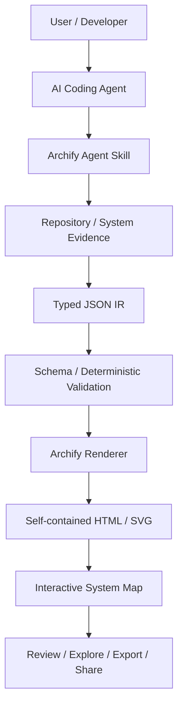

## 1.4 Agent Skill 定位

🟢 Archify 是以 **Agent Skill** 的形式散布（一份 `SKILL.md` + 對應的 CLI 工具與 renderer），而不是一個獨立 SaaS 服務或 VS Code 外掛。這代表：

- 它是「AI Agent 執行時載入的一組指令與工具」，而非另一個要人工操作的 GUI 應用程式。
- 使用者不會「打開 Archify」，而是要求 AI Agent「使用 Archify 這個 Skill」。
- Skill 本身沒有記憶／狀態，每一次產出的架構圖，都是該次對話中 Agent 讀取 Repository 證據後的產物。

## 1.5 與 AI Coding Agent 的關係

Archify 依賴 AI Coding Agent 提供兩件事：

1. **讀取能力**：Agent 需要能存取 Repository（原始碼、設定檔、Infra as Code）作為證據來源。
2. **工具呼叫能力**：Agent 需要能呼叫 Archify 的 CLI（`node bin/archify.mjs ...`）來驗證、渲染、輸出。

Archify 本身**不做**程式碼理解或靜態分析——這件事仍是 AI Agent（及其原生的程式碼搜尋/閱讀能力）在做，Archify 只負責「把 Agent 已經整理好的架構事實，轉成可驗證的視覺化格式」。

## 1.6 與 Software Architecture 的關係

Archify 提供 5 種圖表型別（詳見第 4 章），對應到企業架構文件中最常見的視角：靜態元件關係（architecture）、流程（workflow）、呼叫鏈（sequence）、資料流（data flow）、狀態機（lifecycle）。它不是一個「架構方法論」（不取代 C4 Model、TOGAF、ArchiMate 的方法論意義），而是這些方法論產出的**視覺化與驗證層**。

## 1.7 與 Reverse Engineering 的關係

在缺乏文件的 Legacy System 上，AI Agent 天生容易產生「聽起來合理但查無實據」的架構描述。Archify 的 Schema 驗證與 SKILL.md 中「不可從模糊角色推測品牌／不可捏造拓撲」的規則，提供了一個「事實 vs. 推論」的邊界工具（詳見第 10、11 章）。

## 1.8 與 Software Modernization 的關係

Framework Upgrade、Microservice 拆分、雲端遷移等現代化專案，最需要的不是「畫一張圖」，而是「Before / After 的可比對差異」。Archify 的 Before/Delta/After 比較能力（第 13 章）正好對應這個需求。

## 1.9 傳統開發 vs. AI-Assisted 開發

```text
Traditional Development                    AI-Assisted Development
------------------------                    ------------------------
Documentation                                Repository / Requirements
      ↓                                             ↓
Architecture Diagram (人工繪製，易過時)          AI Agent（讀取 Repository 證據）
      ↓                                             ↓
Code                                          Archify（型別化 + 驗證）
                                                     ↓
                                              Validated Architecture Map
                                                     ↓
                                        Development / Review / Modernization
```

傳統流程中，文件與圖表是「先畫、後過時」；AI-Assisted 流程中，架構圖是「每次從證據重新產生、可驗證」，這是根本性的角色轉變：**架構圖從『靜態文件』變成『可重複產生的驗證產物』**。

### Scenario

一個團隊剛導入 Claude Code 處理一個 10 年歷史的 Java Web 專案，PM 要求「先幫我畫出目前系統的架構圖」。若直接要求 Agent「畫一張架構圖」，Agent 可能會生成一張看似合理、實則包含臆測元件的圖。改為要求 Agent 使用 Archify Skill，可強制 Agent 先產出 typed JSON IR 並通過 Schema 驗證，降低幻覺風險。

### AI Prompt 範例

```text
請使用 Archify Skill 分析目前這個 Repository，產生一份 architecture 類型的系統地圖。
規則：
1. 只根據你實際讀取到的原始碼與設定檔（package.json、pom.xml、application.yml、Dockerfile、docker-compose.yml 等）作為證據，禁止推測不存在的元件。
2. 若某個關係無法從程式碼中確認，標示為「Inferred」而非「Fact」。
3. 產生 JSON IR 後，先執行 validate，確認通過後才 deliver 成 HTML。
4. 最後告訴我 Primary Path 是哪一條，以及有哪些資訊你無法從證據中確認。
```

### 本章 Checklist

- [ ] 已理解 Archify 不是單純的 Mermaid 轉 HTML 工具
- [ ] 已理解 typed JSON IR → Schema 驗證 → Renderer 的完整流程
- [ ] 已理解 Archify 是 Agent Skill，依賴 AI Coding Agent 的讀取與工具呼叫能力
- [ ] 已理解 Archify 在 Reverse Engineering／Modernization 情境中的角色

---

# 第 2 章：Archify 核心架構

## 2.1 Repository 內部結構（🟢 官方已實作，GitHub tree API 確認）

```text
tt-a1i/archify/
├── README.md / README_EN.md / README_ZH.md      # 多語系說明文件
├── CHANGELOG.md                                    # 版本紀錄
├── DESIGN.md                                       # 視覺設計系統規範（顏色/字體/元件），非 IR 規格文件
├── PRODUCT.md                                      # 產品定位、使用者輪廓、設計原則
├── ROADMAP.md / CONTRIBUTING.md                    # 路線圖／貢獻指南（內容未逐一查證）
├── archify.zip                                     # 供 Claude.ai / Project Knowledge 上傳的封裝包
├── archify/                                        # 實際 Skill 套件本體
│   ├── SKILL.md                                    # Agent 使用規則（Authoring invariants）
│   ├── package.json / package-lock.json            # Node 套件定義（engines>=18, ajv 依賴）
│   ├── assets/template.html                        # HTML 輸出樣板
│   ├── bin/
│   │   ├── archify.mjs                             # CLI 主程式（validate/deliver/guide/... 皆在此）
│   │   ├── open-artifact.mjs / preview.mjs / visual-check.mjs
│   ├── brand-marks/                                # 品牌圖示庫（README + catalog.json）
│   ├── delta/architecture-delta.mjs                # Before/Delta/After 比較邏輯
│   ├── examples/                                   # 範例 IR 與輸出
│   ├── recipes/scenarios.mjs                       # guide 指令使用的情境腳本
│   ├── references/                                 # 4 份參考文件
│   ├── renderers/                                  # 5 種 diagram type 各自的渲染邏輯
│   ├── schemas/                                    # 5 份 JSON Schema + README
│   ├── scripts/ / test/
├── docs/                                           # 官方網站原始碼（index/start/guide/gallery.html）
├── examples/ benchmarks/ experiments/ .impeccable/ # 額外範例與實驗性內容（內容未逐一查證）
```

## 2.2 各元件角色

| 元件 | 角色 | Provenance |
| --- | --- | --- |
| **Agent Skill**（`archify/SKILL.md`） | 定義 AI Agent 該如何思考、選圖表型別、遵守的「不可推測」規則 | 🟢 |
| **CLI**（`archify/bin/archify.mjs`） | 提供 `validate`／`deliver`／`guide`／`preview`／`doctor`／`demo` 等指令，是 Agent 與 Renderer 之間唯一的操作介面 | 🟢 |
| **Typed JSON IR** | Agent 產出的中繼資料結構，依照 diagram type 對應到不同 Schema；契約成文於 `archify/schemas/README.md` | 🟢 |
| **Schema**（`archify/schemas/`） | 5 份 JSON Schema ＋ 1 份 `common.schema.json` 共用 `$defs`，定義每種 diagram type 允許的欄位與結構（`additionalProperties: false`） | 🟢 |
| **Validator**（開發期由 `ajv` 編譯、執行期為 standalone） | 對 IR 進行決定性（deterministic）驗證，非 LLM 二次判斷；執行期不需 `npm install` 與網路 | 🟢 |
| **Renderer**（`archify/renderers/`） | 把驗證通過的 IR 編譯成 HTML/SVG | 🟢 |
| **Viewer**（輸出的 HTML 本體） | 提供互動探索（搜尋、聚焦、追蹤上下游）功能，見第 17 章 | 🟢 |
| **Delta 引擎**（`archify/delta/architecture-delta.mjs`） | 比較兩份驗證過的 IR，產出 Before/Delta/After | 🟢 |
| **Export** | 輸出 HTML／SVG／PNG／JPEG／WebP／WebM／分享卡 | 🟢 |
| **Brand Marks**（`archify/brand-marks/`） | 品牌圖示庫，供渲染時標示已知技術品牌（如資料庫/雲端服務圖示） | 🟢 |

## 2.3 Archify 內部架構圖

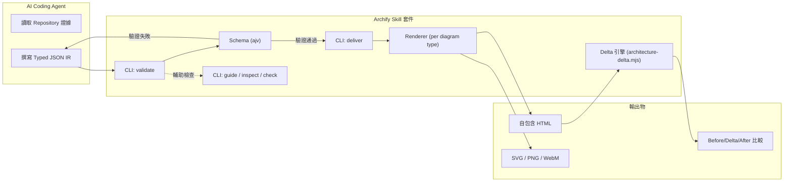

## 2.4 為什麼要有「驗證」這一層

如果 Agent 直接把 IR 丟給 Renderer 渲染，Renderer 只能「盡力顯示」錯誤或不完整的結構，最終產出的 HTML 可能語法正確但語意錯誤（例如缺少必要欄位、關係型別不合法）。加入 Schema 驗證後：

- 結構錯誤在**渲染前**就被攔截，而不是產出一張「看起來能動但資訊有缺」的圖。
- 驗證結果是**決定性**的（同一份 IR 永遠得到同樣的驗證結果），不受模型抽樣隨機性影響。
- `validate`／`inspect`／`check` 等指令可在 Agent 自我修正的迴圈中反覆呼叫，直到通過為止。

## 2.5 Schema 契約與 `schema_version` 政策（🟢 `archify/schemas/README.md`）

### 2.5.1 Schema 組成

`archify/schemas/` 內共有 **5 份 diagram type schema ＋ 1 份共用 `common.schema.json`**：

| 檔案 | 對應 diagram type | 說明 |
| --- | --- | --- |
| `architecture.schema.json` | `architecture` | 元件與關係拓撲 |
| `workflow.schema.json` | `workflow` | 流程步驟與分支 |
| `sequence.schema.json` | `sequence` | 參與者與時間順序訊息 |
| `dataflow.schema.json` | `dataflow` | 資料來源、轉換與去向 |
| `lifecycle.schema.json` | `lifecycle` | 狀態與轉換條件 |
| `common.schema.json` | （共用） | 以 `$defs` 提供跨模式共用型別（如 `tone`、`emphasis`、`link`、`badge` 等） |

三個對企業最重要的 Schema 設計決策：

1. **`additionalProperties: false`**——所有物件皆封閉。這代表「多打一個欄位」不會被容忍，而是直接驗證失敗。好處是 Agent 無法用自創欄位夾帶未經定義的資訊；代價是升級 Skill 版本時，若新增欄位，舊 renderer 不會誤讀。
2. **`ajv` 以 `strict: true` + `allErrors: true` 編譯**——`allErrors` 代表一次回報所有錯誤而非遇到第一個就停，對 Agent 的自我修正迴圈非常關鍵（可一輪修完，不需來回數十次）。
3. **結構化陣列有版位上限**——例如 `meta.views` 最多 5 項。上限不是美觀考量，而是為了強制作者做「取捨」，避免一張圖承載過多資訊（見第 16 章與第 28 章）。

### 2.5.2 `schema_version` 常數政策（🟢）

```json
{
  "schema_version": 1,
  "meta": { "title": "..." }
}
```

- `schema_version` 在所有 5 份 schema 中皆定義為 **`"const": 1`**——不是「最小值 1」，而是**只接受 1**。寫成 `"1"`（字串）或 `2` 都會直接驗證失敗。
- 官方承諾：**今天通過驗證的 IR，在所有 2.x 版本都應持續通過驗證與渲染**。也就是說 Skill 的版本號（2.15、2.16…）與 IR 契約版本號（1）是**兩條獨立的軸線**。
- 只有發生破壞性契約變更時，`schema_version` 才會升到 `2`。

| 情境 | 企業該做的事 |
| --- | --- |
| Skill 從 2.15 升到 2.16 | 例行升級。舊 IR 不需改寫，重新 `deliver` 即可享受新 renderer 能力 |
| 出現 `schema_version: 2` | **視為一次正式遷移專案**：盤點所有納管 IR、建立轉換與回歸清單、分批遷移（見第 30 章） |

> 💡 這條政策正是「把 IR JSON 而非 HTML 納入 Git」的理論基礎：HTML 是可重新產生的衍生物，IR 才是長期資產（見第 21 章 Architecture-as-Code）。

## 2.6 Typed JSON IR 的 meta 欄位契約

> **Provenance：**🟢 官方已實作。來源：`archify/schemas/README.md` 與 `SKILL.md`。

`meta` 是所有 diagram type 共用的頂層區塊，也是最容易被 Agent 忽略的地方。完整可選欄位如下：

| 欄位 | 型別／值域 | 用途 | 適用範圍 |
| --- | --- | --- | --- |
| `title` | string | 圖表主標題 | 全部（必填） |
| `subtitle` | string | 副標題，補充範圍或版本 | 全部 |
| `viewBox` | string | SVG 視野框，控制輸出畫布比例 | 全部 |
| `animation` | 物件 | 進場／導覽動畫設定 | 全部 |
| `locale` | `en` \| `zh-CN` | Viewer **UI 字串**在地化（不翻譯作者內容） | 全部 |
| `visual_preset` | `classic` \| `signal-flow` \| `blueprint` \| `editorial` | 視覺風格預設 | 全部 |
| `legend` | 陣列 | 圖例，說明顏色／形狀語意 | 全部 |
| `views` | 陣列（**≤ 5**） | 同一份 IR 的多個聚焦視角 | 全部 |
| `quality_profile` | 物件 | 品質輪廓標註（如覆蓋率、成熟度） | 全部 |
| `engineering_profile` | 物件 | 工程輪廓標註（如技術堆疊、規模） | 全部 |
| `column_fit` | `spread`（省略則固定欄寬） | 欄寬自適應 | **`sequence` 專屬** |
| `repository` | 物件 | Repository Evidence 連結（見 2.7） | **`architecture` 專屬** |

> ⚠️ **繁體中文專案注意**：`locale` **不接受 `zh-TW`**。台灣團隊有兩個選項——(a) 省略 `locale`，Viewer UI 回退為英文，但作者寫入的中文內容照常顯示；(b) 填 `zh-CN` 讓 UI 顯示簡體中文。多數企業選 (a)，因為 UI 字串量少而簡繁混雜反而更難閱讀。詳見附錄 I。

## 2.7 Repository Evidence：把圖釘回原始碼（🟢 `SKILL.md`）

`architecture` 模式的 `meta.repository` 讓節點可以掛上**指向真實原始碼位置的連結**，這是 Archify 與一般繪圖工具最本質的差異之一：

```json
{
  "meta": {
    "repository": {
      "url": "https://github.com/<org>/<repo>",
      "ref": "main"
    }
  }
}
```

- **價值**：Reviewer 點擊節點即可跳到對應檔案，讓「這張圖是不是編的」可以被當場驗證，而不是靠信任。
- **限制（企業必讀）**：此功能設計以**公開 GitHub Repository** 的 URL 形式運作。企業內網的 GitLab／Bitbucket／Azure DevOps／私有 GitHub Enterprise，其連結能否正確解析與被 Reviewer 開啟，**取決於閱讀者是否有該內網的存取權與網段可達性**，Archify 本身不負責認證。
- **建議做法（🟡）**：內網專案改以「檔案路徑 + commit SHA」寫在節點的說明文字中，形成可人工查證的證據鏈；不要為了讓連結能點而把內網 URL 寫進要對外分享的 HTML（見第 35 章敏感資訊）。

## 2.8 三類錯誤的分工：形狀、幾何、成品（🟢 指令能力／🟡 分類法）

初學者最常見的挫折是「validate 過了，但圖看起來很醜／很亂」，並誤以為是驗證失效。實際上這是三種不同層級的問題：

| 層級 | 問題本質 | 偵測工具 | 典型症狀 |
| --- | --- | --- | --- |
| **形狀（shape）** | IR 結構不合 Schema | `validate` | 缺必填欄位、列舉值不合法、超出版位上限 |
| **幾何（geometry）** | 結構合法但排版不佳 | `inspect --layout-json` | 節點過度擁擠、連線交錯、欄寬不足 |
| **成品（artifact）** | HTML 產出後的可用性 | `visual-check` | 元素重疊溢出、互動失效、資源載入異常 |

**Schema 不保證美觀，只保證合法**。要讓圖好讀，靠的是作者的資訊取捨（第 16 章）與 `views`／`visual_preset` 的正確使用，不是靠驗證器。

## 2.9 執行期零相依與內網離線導入（🟢 `package.json`）

這是企業導入評估中最常被問、也最容易被誤解的一點：

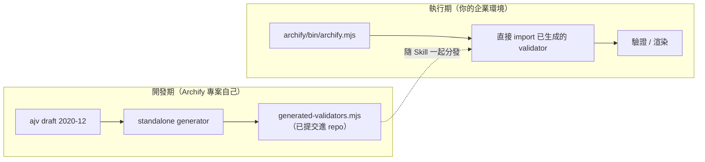

- `ajv`、`parse5`、`saxes`、`simple-icons` 四項皆列在 **`devDependencies`**，僅在 Archify 專案自身建置 validator 時需要。
- 企業安裝 Skill 後執行 `validate`／`deliver`，讀取的是**已提交在 repo 內的 `renderers/shared/generated-validators.mjs`**，因此**不需 `npm install`、不需連外網路**。
- **對內網／封閉環境的意義**：只要把 Skill 目錄整包搬進內網（例如透過內部 artifact repository 或 ZIP），即可完整運作。這讓 Archify 比多數需要 npm registry 或 SaaS 後端的架構工具更容易通過金融／公部門的離線稽核要求。

> 🟡 **建議做法**：內網導入時，把整包 Skill 版本化存放在內部 artifact repository（如 Nexus／Artifactory），並在 CI Image 中固定版本，避免各團隊各自從外網抓取造成版本漂移（見第 33 章）。

### Scenario

架構師要求 Agent 針對一個微服務系統畫出 `dataflow` 圖，Agent 第一次產出的 IR 遺漏了某個必要欄位（例如資料分類標籤），`validate` 指令回報 Schema 錯誤，Agent 依錯誤訊息修正後重新驗證，直到通過才呼叫 `deliver` 產出最終 HTML。

### AI Prompt 範例

```text
在你完成這份 IR 之後，請先執行：
  node bin/archify.mjs validate dataflow candidate.json --json
只有在驗證結果為 pass 時才可以繼續執行 deliver。
如果驗證失敗，請根據錯誤訊息修正 IR 後重新驗證，不要略過這個步驟直接輸出 HTML。
```

### 本章 Checklist

- [ ] 已理解 Archify Repository 的實際目錄結構
- [ ] 已理解 Agent Skill／CLI／Schema／Validator／Renderer／Viewer／Delta 引擎各自的角色
- [ ] 已理解「驗證」是渲染前的強制關卡，而非事後檢查
- [ ] 已理解 `schema_version: 1` 的相容性承諾，並決定把 IR JSON 納入 Git 版本控制
- [ ] 已理解 Schema 錯誤（形狀）與 renderer 排版錯誤（幾何）是兩類不同的問題
- [ ] 已評估 Repository Evidence 僅支援公開 GitHub Repo 對本企業的適用性
- [ ] 已知悉零安裝驗證器的存在，並評估內網離線導入方案

---

# 第 3 章：Archify 與 AI Agent 的關係

## 3.1 完整協作鏈

```text
Human
 ↓  提出需求（例如：「幫我畫出這個系統的架構」）
AI Coding Agent
 ↓  規劃如何滿足需求
Archify Skill（SKILL.md 提供的規則與工具）
 ↓
Repository Inspection（讀取原始碼、設定檔、IaC）
 ↓
Evidence Collection（整理出「觀察到的事實」）
 ↓
Diagram Specification（決定要畫哪一種 diagram type、哪些節點/關係）
 ↓
Typed JSON IR（依 Schema 撰寫 IR 檔）
 ↓
Validation（node bin/archify.mjs validate）
 ↓
Rendering（node bin/archify.mjs deliver）
 ↓
HTML（自包含、可互動、可分享）
```

## 3.2 Agent 需要決定的事

🟢 依 `archify/SKILL.md` 的 Authoring invariants，Agent 在建構 IR 時必須自行判斷：

| 決策 | 原則 |
| --- | --- |
| 畫什麼（diagram type） | 依問題性質選擇 architecture/workflow/sequence/dataflow/lifecycle（見第 4 章比較表） |
| 畫哪些 Component | 只放有證據支持的元件，不放「補全故事用」的假想元件 |
| Primary Path vs Secondary Path | 主要路徑要清楚，次要/例外路徑不能搶走視覺焦點 |
| 哪些資訊放 Card | 支援性細節（版本號、負責團隊、SLA 等）放進節點的 Card，不畫成額外的線 |
| 哪些資訊應該成為 Edge | 只有「系統間真實存在的關係」才畫成邊，避免為了資訊密度而增加不必要的連線 |
| 哪些資訊不能推測 | 精確的產品名稱、指令、API path、協定、環境名稱必須「原樣保留」，不可從模糊角色（如「database」）推測出具體品牌 |

> ⚠️ **AI Agent 不應該自行「想像」不存在的系統拓撲。** 這是 SKILL.md 反覆強調的紀律：viewer 讓使用者「search / trace / compare **without inventing topology**」——這句話同時是對 Viewer 使用者、也是對 Agent 作者的提醒。

## 3.3 事實與推論的邊界

Archify 本身不強制 Agent 標註「Fact / Inference」（這是 SKILL.md 精神層面的要求，而非 Schema 強制欄位），因此**企業導入時建議自行在 Prompt 層加上這個要求**（🟡 建議架構，非官方原生機制）：

```text
[Fact]      —— 直接從程式碼/設定檔讀到的事實
[Inference] —— 依命名慣例、目錄結構等間接推論出的合理猜測
[Unknown]   —— 無法從現有 Repository 判斷，需要人工確認
```

## 3.4 Agent 與 Archify 的分工邊界

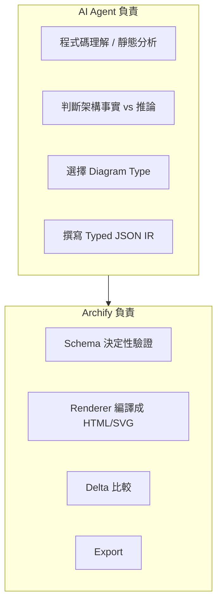

Archify **不會**替 Agent 判斷「這個推論是否合理」——這件事完全在 Agent（與人類 Reviewer）的責任範圍內，Archify 只保證「格式正確、結構合法」。

### Scenario

Agent 在分析一個服務時，看到 `application.yml` 中有 `datasource.url` 指向一個未知主機名稱，但看不到該主機的具體技術棧。此時應標示為 `[Inference: 可能為外部資料庫，但未確認廠牌]`，而非直接寫成「PostgreSQL Database」。

### AI Prompt 範例

```text
分析這個 Repository 的架構時，請嚴格區分：
[Fact] —— 你在原始碼/設定檔中直接讀到的內容（請附上檔案路徑）
[Inference] —— 依命名慣例或目錄結構做的合理推論
[Unknown] —— 無法判斷、需要人工確認的部分
只有 [Fact] 與明確標示的 [Inference] 可以放進 Archify 的 IR，[Unknown] 的項目請另外列出，不要畫進圖裡。
```

### 本章 Checklist

- [ ] 已理解 Human → Agent → Archify → HTML 的完整協作鏈
- [ ] 已理解 Agent 在畫圖決策上的責任範圍
- [ ] 已建立「不可推測系統拓撲」的紀律意識
- [ ] 已規劃如何在企業 Prompt 中加入 Fact/Inference/Unknown 標示（此為建議做法，非官方強制）

---

# 第 4 章：五種 Diagram Type

🟢 官方確認的 5 種 diagram type（`archify/package.json` description 與 `archify/SKILL.md` 的 Type router 交叉確認）：

## 4.1 architecture

適合：Component、Service、Database、External System、Trust Boundary、Infrastructure。用於回答「系統由哪些元件組成、彼此如何連接」。

## 4.2 workflow

適合：CI/CD、Approval、Runbook、Agent Tool Call、Process。用於回答「一連串步驟如何推進、誰核准了什麼」。

## 4.3 sequence

適合：API Call、Authentication、Cache、Service-to-Service Communication、Async Flow。用於回答「一次請求的呼叫鏈與時間順序」。

## 4.4 dataflow

適合：Data Pipeline、ETL、Data Lineage、PII、Data Consumer。用於回答「資料從哪裡來、流向哪裡、誰消費」。

## 4.5 lifecycle

適合：State Machine、Retry、Waiting、Cancellation、Terminal State。用於回答「一個實體的狀態如何轉換」。

## 4.6 比較表

| Diagram Type | 最適合回答的問題 | 主要元素 | 典型使用情境 |
| --- | --- | --- | --- |
| `architecture` | 系統由哪些元件組成？邊界在哪？ | Component、Service、Database、External System、Trust Boundary | 系統總覽、逆向工程、上線前架構審查 |
| `workflow` | 一連串步驟如何推進？ | Step、Gate、Actor、Decision | CI/CD Pipeline、簽核流程、Runbook |
| `sequence` | 一次呼叫的順序與往返關係？ | Actor、Call、Return、Async Marker | API 呼叫鏈、登入流程、快取讀寫 |
| `dataflow` | 資料如何流動、誰消費？ | Source、Transform、Sink、Data Classification | ETL、資料血緣、PII 治理 |
| `lifecycle` | 一個實體的狀態如何轉換？ | State、Transition、Terminal State | 訂單狀態機、Retry/重試策略 |

## 4.7 各模式的結構化陣列與版位限制（🟢 `archify/schemas/README.md`）

選對模式只是第一步；真正讓 Agent 常常卡住的是**每種模式強制要求的陣列與版位限制**。以下為官方契約摘要：

| 模式 | 必備結構化陣列 | 強制版位與特殊規則 |
| --- | --- | --- |
| `architecture` | `components`、`boundaries`、`connections` | 元件 `type` 限 7 種；可選 `meta.repository` 與 `components[].sources` 提供來源證據；唯一支援 `engineering_profile` 的模式 |
| `workflow` | `lanes`、`phases`、`groups`、`mainPath`、`nodes`、`edges` | `mainPath` 明確標出主幹路徑，非主幹分支應以 `variant` 降階 |
| `sequence` | `participants`、`messages`（`segments`、`activations` 可選） | `meta.column_fit` 控制欄寬：省略（預設 fixed）時欄寬固定 108px（緊湊模式 86px）；`"spread"` 則將參與者均匀平摊於畫布寬度 |
| `dataflow` | `stages`、`nodes`、`flows` | `stages` 是雎形序列（來源→轉換→匯入），節點必須隸屬於已宣告的 stage |
| `lifecycle` | `lanes`、`states`、`transitions` | `lanes` 最多 **5 条**（索引 0～4）；每條 lane 內的狀態位置最多 **3 個欄**（索引 0～2），超出即 fail closed |

> 🟡 **實務含意**：lifecycle 的 5×3 版位上限（最多 15 個狀態位置）是硬限制，不是建議值。若一個訂單狀態機超過這個規模，正確做法是**依業務階段拆成多張圖**（見第 28 章分層策略），而不是把狀態硬塞進一張。

## 4.8 共用型別與視覺變體列舉（🟢）

這些 enum 是封閉集合，**Agent 不可自行發明新值**：

| 列舉 | 合法值 | 使用時機 |
| --- | --- | --- |
| 元件型別 `componentType` | `frontend`、`backend`、`database`、`cloud`、`security`、`messagebus`、`external` | architecture 元件分類，也驅動圖例與色彩語意 |
| 視覺變體 `variant` | `default`、`emphasis`、`security`、`dashed`（sequence 訊息額外支援 `return`） | 強調主幹路徑、標示安全相關路徑、表達非同步或弱關聯 |
| 圖例模式 `legendMode` | 以 `auto` 為預設（只列出圖中真實存在的語意類別） | 避免手寫圖例與圖面不一致 |
| 在地化 `locale` | 僅 `en`、`zh-CN` | 繁體中文專案請見**附錄 I** |
| 品牌標記 `brandMark` | 內建品牌 ID 字串，或顯式 HTTP(S) 官方網址 | 標示已知技術品牌（見第 7.8 節） |

### Scenario

團隊要說明「使用者登入時 Token 如何簽發與快取」——這屬於一次請求的時間順序關係，應選 `sequence`，而不是 `architecture`（那會只看到元件關係，看不到呼叫順序）。

### AI Prompt 範例

```text
請先判斷這個需求最適合哪一種 Archify diagram type（architecture / workflow / sequence / dataflow / lifecycle），
並說明你選擇的理由，再開始撰寫對應的 Typed JSON IR。
需求：「說明訂單從建立、付款、出貨到完成/取消的狀態轉換」
```

### 本章 Checklist

- [ ] 已理解 5 種 diagram type 各自適合回答的問題
- [ ] 已能依需求快速判斷該用哪一種 diagram type
- [ ] 已理解選錯 diagram type 會導致圖表無法呈現真正需要的資訊
- [ ] 已知悉各模式的必備結構化陣列，並能在 Prompt 中事先告知 Agent
- [ ] 已知悉 lifecycle 的 5 條 lane × 3 個欄位硬限制，並規劃好超出時的拆圖策略
- [ ] 已知悉 `componentType`／`variant`／`locale` 等列舉為封閉集合，Agent 不可自行擴充

---

# 第 5 章：版本與相容性總覽

## 5.1 目前版本狀態

🟢 最新正式版 `2.15.0`；🟢 開發中版本 `2.16.0-dev.0`（`CHANGELOG.md` `[Unreleased]` 區塊，內容包含「Bounded Viewer localization」——renderer 接受 `meta.locale` 為 `en` 或 `zh-CN`）。

## 5.2 v2.15.0 重點更新（🟢 官方已實作，`CHANGELOG.md` 原文摘述）

- **Authored brand identity**：107 個具出處佐證的向量品牌圖示，新增 `archify brands` 探索指令，圖示以 SHA-256 摘要值釘選來源。
- **First-class Cursor onboarding**：官網、快速入門與 agent switcher 正式把 Cursor 列為第一級目標環境（本手冊依此修正前一版的 🟠 判斷，見改版紀錄 C-01）。
- **Sequence column fitting**：`meta.column_fit: "spread"` 設定；省略時維持固定欄寬（108px／緊湊模式 86px）。
- **DeepSeek Harness 分發**：`@tt-a1i/archify-dsh` 套件包，供 DeepSeek Harness 使用（本 repo 另有 [DeepSeek Harness 教學手冊.md](./DeepSeek%20Harness%20教學手冊.md) 可交叉參考）。
- **修正**：CLI 在 `--quality` 參數缺值時會直接報錯，而非默默接受不完整的指令。

## 5.3 近期版本演進軌跡（🟢 `CHANGELOG.md` 摘述）

了解演進軌跡對企業判斷「這個專案成熟度到哪裡」比單看最新版本號有用：

| 版本 | 主軸主題 | 代表性變更 |
| --- | --- | --- |
| `2.16.0-dev.0`（Unreleased） | Bounded Viewer localization | renderer 接受 `meta.locale` 為 `en` 或 `zh-CN`，在地化**限定於 Viewer UI 字串**，不翻譯作者寫入的內容 |
| `2.15.0` | 品牌身分與 Cursor 一級支援 | 見 5.2 |
| `2.14.0` | 視覺回歸把關 | `visual-check` 成為正式交付前關卡（見第 7.7 節） |
| `2.13.0` | Cursor onboarding 基礎 | 官網引導與安裝路徑整合 |
| `2.12.0` | 匯出選擇明確化 | 讀者需明確選擇才進入 PNG / JPEG / WebP / SVG / WebM 匯出（本手冊 C-03 修正依據之一） |
| `2.10.0` | 可檢查性 | 新增 `inspect architecture <file.json>` |
| `2.3.0` / `2.1.0` | Viewer 匯出選單成型 | Download PNG / JPEG / WebP / SVG 選單項目 |

## 5.4 IR 相容性承諾（🟢）

`schema_version` 固定為 `1`，官方承諾「今天驗證通過的檔案，在所有 2.x 版本都應持續通過驗證與渲染」（完整政策見第 2.5.2 節）。對企業而言，這代表：

- 可以安心把 IR JSON 當作長期資產納入 Git（Architecture-as-Code，見第 21 章）。
- 升級 Skill 版本不需要重寫舊 IR；反之，**若未來出現 `schema_version: 2`，就要把它當作一次正式的遷移專案**，而不是例行升級。

## 5.5 版本落差說明（🟠 推測-Hypothesis）

| 項目 | 來源 A | 來源 B | 本手冊採用 |
| --- | --- | --- | --- |
| v2.15.0 發布日期 | `CHANGELOG.md` 原文：`2026-08-17` | GitHub Releases 頁面摘要：`2025-08-17` | 採用 CHANGELOG 原文，但標示衝突未解決 |
| GitHub Star 數 | 兩獨立來源收斂：約 25k | 第三方聚合站：13k | 採用「約 25k（未完全確認）」 |

> ⚠️ 企業內部文件若需要精確版本日期或星數作為決策依據（例如評估專案活躍度），請在採用前自行至官方 Repository 與 Releases 頁面即時查證，不要直接引用本手冊的查證時間點數字。

## 5.6 Node.js 與環境需求

🟢 `engines.node >= 18`。CLI 為純 Node.js 腳本（`archify/bin/archify.mjs`），不需要額外的原生編譯依賴，適合在 Windows／macOS／Linux 的一般開發機或 CI Runner 上執行。

兩項對企業內網特別重要的補充：

- **執行期零相依**：`ajv`、`parse5`、`saxes`、`simple-icons` 四項均為 `devDependencies`，僅在建置 Skill 本身時需要；安裝後的 Skill 執行驗證與渲染時**不需 `npm install`、不需網路**（見第 2.9 節）。
- **DSH 整合套件的需求更高**：若透過 DeepSeek Harness 分發，其 Node 需求為 `^22.19.0 || >=24.0.0`，高於 Skill 本體的 `>=18`，規劃 CI Image 時需區分。

### Scenario

企業 DevOps 團隊在規劃導入前，需要先確認公司內部標準開發機／CI Image 的 Node.js 版本是否 ≥ 18，若團隊仍在用 Node 16 的舊版建置環境，需先規劃升級。

### AI Prompt 範例

```text
請檢查目前這台機器與 CI Runner 的 Node.js 版本，並確認是否符合 Archify 官方要求的 engines.node >= 18；
若版本不符，請列出需要升級的環境清單，不要假設版本已經足夠。
```

### 本章 Checklist

- [ ] 已確認團隊環境 Node.js 版本 ≥ 18（若使用 DSH 整合套件則需 `^22.19.0 || >=24.0.0`）
- [ ] 已知悉目前查證到的最新正式版本與開發版本號
- [ ] 已知悉版本日期與 Star 數存在來源落差，採用前會自行複查
- [ ] 已將版本查證日期（2026-08-28）記錄在內部導入文件中，便於未來追蹤是否需要重新查證
- [ ] 已理解 `schema_version: 1` 的相容性承諾，並規劃好未來升到 `2` 時的遷移專案對應方式

---

# Part II：安裝與第一個範例

# 第 6 章：各 AI Agent 安裝

## 6.1 通用安裝指令

🟢 官方 README 逐字給出的通用安裝指令（多來源一致）：

```bash
npx skills add tt-a1i/archify -g
```

> ⚠️ 請勿盲目照抄——`-g` 代表全域安裝，會安裝到使用者層級的 Skill 目錄；若團隊希望「專案內鎖定版本、不同專案可用不同版本」，應改採專案層級安裝（見各 Agent 小節）。

## 6.2 官方安裝對照表（🟢 官方已實作，README 安裝表逐字引用）

| Agent／環境 | 安裝位置 | 能力 |
| --- | --- | --- |
| **Raven** | ZIP 手動安裝至 `~/.raven/workspace/skills`（最終路徑 `~/.raven/workspace/skills/archify`） | 完整 renderer + 驗證流程 |
| **Claude Code** | `~/.claude/skills/`（全域）或 `.claude/skills/`（專案內） | 完整 renderer + 驗證流程 |
| **Codex CLI** | `~/.agents/skills/`（全域）或 `.agents/skills/`（專案內） | 完整 renderer + 驗證流程 |
| **opencode** | `~/.config/opencode/skills/`、`.opencode/skills/`，或 `.agents/skills/` | 完整 renderer + 驗證流程 |
| **Claude.ai** | Settings → Capabilities → Skills，上傳 `archify.zip` | 視 Claude.ai sandbox 是否可存取 Node.js 而定 |
| **Project Knowledge** | 將 `archify.zip` 上傳至 Project | 屬 Prompt 導向的架構 fallback（能力較弱） |

> 🟢 **補充（本版修正）**：上表為 README 安裝區塊的逐字引用，但**不代表官方支援範圍的全貌**。官方快速入門頁面的 agent switcher 將目標環境限定為 `cursor`、`codex`、`claude-code`、`opencode` 四值，README 首段也把 **Cursor 列在第一位**。因此 Cursor 應視為官方第一級支援環境，見 6.3。

## 6.3 Cursor（🟢 官方第一級支援）

前一版把 Cursor 標為 🟠 推測，**本版修正為 🟢 官方已實作**（見§改版與修正紀錄 C-01）。升級依據為四項互相獨立的官方證據：

| # | 證據 | 來源 |
| --- | --- | --- |
| 1 | README 首段逐字寫「a Node.js rendering and validation system for **Cursor**, Claude Code, Codex CLI, and OpenCode」，Cursor 列於第一位 | `README.md` |
| 2 | 官網快速入門提供 `start.html?agent=cursor` 專用入口，agent switcher 參數限定為 `cursor` / `codex` / `claude-code` / `opencode` 四值 | `docs/start.html` |
| 3 | `CHANGELOG.md` v2.15.0 列有「First-class Cursor onboarding」條目 | `CHANGELOG.md` |
| 4 | 官方以 Cursor Agent CLI 實測並交付 9/9 check 全過的成品作為驗證證據 | `ROADMAP.md` |

安裝指令（非互動式，適合寫進建置腳本）：

```bash
npx -y skills add tt-a1i/archify --skill archify --agent cursor --global --copy --yes
```

- **Global Skill**：加 `--global`，適用所有 Cursor 專案。
- **Project Skill**：省略 `--global`，僅供目前專案使用。
- **`--copy` 的意義**：以**實體複製**而非 symlink 方式安裝；在 Windows、受限權限環境、以及需要把 Skill 一併納入專案版本控制的企業情境下，這是較安全的選擇。
- **安裝後的金絲雀檢查（canary）**：確認 `.agents/skills/archify`（專案層級）或對應的全域路徑下確實出現 `SKILL.md` 與 `bin/archify.mjs`。
- **驗證方法**：於 Cursor 中詢問 Agent「你能否使用 archify skill？」，或直接請 Agent 執行 `node bin/archify.mjs doctor`（見第 7 章）確認環境就緒。

> ⚠️ **官方契約刻意不包含的三件事**（導入前必須向團隊說明，避免錯誤期待）：
>
> 1. **沒有 `skills use --agent cursor` 這類的切換子指令**——`--agent` 只是安裝時的目標參數。
> 2. **不提供自動更新**——升級需重跑安裝指令，企業應把它納入第 29 章的版本管理流程。
> 3. **沒有官方承諾的固定 `~/.cursor/…` 路徑**——實際落地位置由 `skills` CLI 決定，請以安裝輸出為準，不要在內部文件硬寫路徑。

## 6.4 Claude Code

- **Global Skill**：安裝到 `~/.claude/skills/archify/`，所有專案共用。
- **Project Skill**：安裝到專案內 `.claude/skills/archify/`，僅該專案可見，適合需要鎖定特定版本或客製 Prompt 的團隊。
- **確認 Agent 能找到 Archify**：在 Claude Code 對話中詢問「列出你目前可用的 skills」，或直接要求「使用 archify skill 產生一份範例架構圖」觀察是否成功呼叫 CLI。

## 6.5 Codex CLI

- **Global Skill**：`~/.agents/skills/archify/`
- **Project Skill**：`.agents/skills/archify/`

> 🟢 這是 README 明確列出的路徑；opencode 也共用 `.agents/skills/` 這個專案層級路徑，代表 Codex CLI 與 opencode 在專案層級可以共用同一份安裝（視兩者的 Skill 探索機制是否互通，屬合理推論，🟠）。

## 6.6 opencode

- `~/.config/opencode/skills/`（使用者層級設定目錄）
- `.opencode/skills/`（專案層級）
- `.agents/skills/`（與 Codex CLI 共用的通用路徑）

## 6.7 Raven

🟢 Raven 支援已由官方 README 三次獨立措辭一致的抓取確認（含贊助商說明：*「EverMind 贊助 Archify，其 Raven harness 支援 Archify 作為驗證式、可互動系統地圖的 Skill」*）。

- **與一般 Agent Switcher 的差異**：Raven 本身是 EverMind 提供的 Agent Harness，並非單純的模型切換工具，其定位更接近「有記憶基礎設施的 Agent 執行環境」（🔵，僅單一來源確認此定位敘述）。
- **安裝方式**：ZIP 手動安裝，非 `npx skills add`。
- **Skill 位置**：`~/.raven/workspace/skills/archify`

## 6.8 DeepSeek Harness（社群/延伸整合）

🟢 `CHANGELOG.md` 與目錄結構（`archify/integrations/deepseek-harness`）確認存在此整合：

```bash
dsh plugin --profile web add @tt-a1i/archify-dsh@0.1.0
```

此為 Skill-only 精簡包，非完整 CLI 工具鏈。四項導入前必知的細節：

| 項目 | 內容 |
| --- | --- |
| 套件與版本 | `@deepseek-ai/dsh`（harness 本體）搭配 `@tt-a1i/archify-dsh`；查證時 harness 側為 `0.1.0-rc.6` 系列，屬**預發行（release candidate）**狀態 |
| Node 需求 | `^22.19.0 \|\| >=24.0.0`，**高於 Skill 本體的 `>=18`** |
| 遙測 | 該整合不收集遙測資料 |
| 工作區路徑 | 需依規定的工作區目錄結構安裝，路徑錯誤時 harness 會找不到 Skill |

> 🟡 **企業建議**：`0.1.0-rc.x` 代表此整合尚未進入穩定發行，不建議將其放在生產級流程的關鍵路徑上；若只是評估，建議以獨立環境進行。

## 6.9 未被官方安裝表收錄的擴充清單

⚪ 查無資料：第三方 Skill 目錄網站宣稱 Archify 相容於 GitHub Copilot、Windsurf、Cline、Roo Code、Goose、Kiro、Continue、Trae、Google Antigravity 等更廣泛的清單。**這份清單未見於官方 README 的安裝表**，企業導入時不應將其視為官方承諾支援，若要嘗試，應視為「社群/手動整合」並自行驗證相容性（呼應第 40 章的 Official/Community/Manual 分類）。

### Scenario

一個團隊同時使用 Claude Code（個人開發）與 Codex CLI（CI 環境）。為了讓兩邊都能穩定使用同一版本的 Archify，團隊選擇在專案根目錄安裝 Project Skill（`.claude/skills/` 與 `.agents/skills/` 各放一份，或用 symlink 共用），並將安裝步驟寫進 `CONTRIBUTING.md`，避免新成員各自用不同版本。

### AI Prompt 範例

```text
請確認目前這個專案是否已安裝 archify skill：
1. 檢查 .claude/skills/archify/ 或 .agents/skills/archify/ 是否存在
2. 若不存在，請告訴我對應這個開發環境（Claude Code / Codex CLI / opencode）的正確安裝路徑
3. 安裝後執行 doctor 指令確認環境就緒，並回報結果
```

### 本章 Checklist

- [ ] 已確認團隊使用的 Agent（Claude Code / Codex CLI / opencode / Cursor / Raven）並選對安裝路徑
- [ ] 已決定採用 Global Skill 或 Project Skill（並理解兩者差異）
- [ ] 已知悉 Cursor 安裝指令屬單一來源查證，未來若失效需回官方 README 複查
- [ ] 已知悉第三方擴充相容清單非官方承諾，不作為決策依據

---

# 第 7 章：Archify CLI 與驗證工具

## 7.1 CLI 指令總覽

> 🔄 **本版修正（C-04）**：前一版把 `render`／`compare`／`inspect`／`check`／`visual-check`／`brands`／`examples` 共 7 項標為 🔵（單一來源）。第二輪複查取得 `ROADMAP.md` 後，官方逐字寫明「A unified CLI (`bin/archify.mjs`) wraps **guide, render, preview, deliver, validate, check, visual-check, brands, and examples**」，再加上 `README.md`（`compare architecture` 完整語法）、`CHANGELOG.md` 2.10.0（`inspect architecture` 語法）、`SKILL.md`（`brands`／`visual-check` 用法）交叉比對，**13 項指令全數升級為 🟢**。

Archify CLI 是單一入口（`node archify/bin/archify.mjs <command>`），可依「使用時機」分成四群理解：

| 群組 | 指令 | 定位 | Provenance |
| --- | --- | --- | --- |
| **環境群**（動筆前） | `doctor`、`demo`、`examples` | 確認環境可用、看懂 IR 長什麼樣 | 🟢 |
| **規劃群**（動筆前） | `guide`、`brands` | 決定 diagram type、確認可用品牌圖示 | 🟢 |
| **驗證群**（撰寫迴圈中） | `validate`、`inspect`、`check` | 形狀驗證、排版除錯、附加檢查 | 🟢 |
| **產出群**（交付階段） | `preview`、`render`、`deliver`、`visual-check`、`compare` | 預覽、渲染、最終驗收、視覺回歸、Delta 比較 | 🟢 |

逐項說明：

| Command | Purpose | 一手來源 | Provenance |
| --- | --- | --- | --- |
| `doctor` | 檢查環境（Node 版本、Skill 檔案完整性）是否就緒 | README、SKILL.md | 🟢 |
| `demo` | 產生示範用的範例輸出，用於快速驗證安裝是否成功 | README | 🟢 |
| `examples` | 列出／輸出官方 `archify/examples/` 內的範例 IR 與成品 | ROADMAP（unified CLI 清單） | 🟢 |
| `guide` | 依情境描述（scenario）給出建議的 diagram type 與撰寫指引，背後為 `recipes/scenarios.mjs` | README、ROADMAP | 🟢 |
| `brands` | 探索／列出品牌圖示庫（v2.15.0 起 107 個具出處佐證的向量圖示） | CHANGELOG 2.15.0、SKILL.md、ROADMAP | 🟢 |
| `validate` | 對候選 IR JSON 執行 Schema 決定性驗證 | README、SKILL.md | 🟢 |
| `inspect` | 等同 `validate` 再加上 `--layout-json`，同時回傳排版幾何資訊 | CHANGELOG 2.10.0、原始碼 | 🟢 |
| `check` | 交付前的附加檢查（artifact check 收據），與 `--quality` 門檻搭配 | ROADMAP、SKILL.md | 🟢 |
| `preview` | 產生預覽用 HTML，**不代表最終驗收版本** | README、ROADMAP | 🟢 |
| `render` | 依 diagram type 呼叫對應 Renderer 產出 HTML/SVG，是 `preview`／`deliver` 的共用底層 | ROADMAP、原始碼 | 🟢 |
| `deliver` | 驗證 ＋ 渲染 ＋ 產出最終自包含 HTML（**唯一的最終驗收指令**） | README、SKILL.md | 🟢 |
| `visual-check` | 對已產出的 HTML 做視覺／結構回歸檢查（`bin/visual-check.mjs`） | CHANGELOG 2.14.0、ROADMAP、SKILL.md | 🟢 |
| `compare` | 呼叫 `delta/architecture-delta.mjs` 產出 Before/Delta/After | README（逐字語法） | 🟢 |

> ⚠️ 「指令存在」與「指令的每一個旗標語意」是兩件事。上表確認的是**指令本身與主要用途**；個別旗標（例如 `check` 的完整檢查項目清單）仍建議以當下版本的 `--help` 或原始碼為準（見 7.4）。

## 7.2 常用指令範例（🟢；語法取自官方 README／CHANGELOG／SKILL.md 逐字或改寫）

```bash
# 檢查環境是否就緒
node bin/archify.mjs doctor

# 快速產生示範輸出，確認安裝成功
node bin/archify.mjs demo

# 依情境描述取得建議的 diagram type 與撰寫指引
node bin/archify.mjs guide "說明使用者登入時 Token 簽發與快取流程" --json

# 驗證候選 IR
node bin/archify.mjs validate sequence candidate.json --quality showcase --json

# 產生預覽（非最終驗收）
node bin/archify.mjs preview sequence candidate.json preview.html

# 驗證並產出最終驗收版本 HTML
node bin/archify.mjs deliver sequence candidate.json output.html --quality showcase
```

> ⚠️ `--quality` 的兩個官方明載值為 `standard` 與 `showcase`（`SKILL.md` 逐字），其品質門檻定義見 7.5。v2.15.0 起 `--quality` 若未帶值會直接報錯，不會默默沿用預設值。

## 7.3 指令用途/輸入輸出對照表

| Command | Input | Output | Typical Usage |
| --- | --- | --- | --- |
| `doctor` | 無（讀取執行環境） | 環境檢查報告 | 安裝後第一步、CI 前置檢查 |
| `demo` | 無或指定範例名稱 | 範例 HTML | 快速確認安裝成功、新人 Onboarding |
| `guide` | 情境描述字串 | 建議的 diagram type + 撰寫指引（`--json` 可輸出結構化結果） | 動筆撰寫 IR 之前的規劃步驟 |
| `validate` | diagram type + 候選 IR JSON | 驗證結果（pass/fail + 錯誤訊息） | 每次修改 IR 後、deliver 前必跑 |
| `inspect` | 同 `validate` | 驗證結果 + layout JSON（`--layout-json`） | 除錯排版問題 |
| `preview` | diagram type + IR + 輸出路徑 | 預覽用 HTML（非最終版） | 快速肉眼檢查排版 |
| `deliver` | diagram type + IR + 輸出路徑 | 最終驗收 HTML | 最終交付、放進 PR/文件前 |
| `compare` | 兩份已驗證的 architecture IR | Before/Delta/After 比較 HTML（`--json` 可輸出結構化結果） | Framework Upgrade、Delta Review |
| `visual-check` | 已產出的 HTML | 視覺／結構回歸檢查結果 | 交付前關卡、CI 回歸 |
| `brands` | 無或關鍵字 | 可用品牌圖示清單 | 確認渲染時可用的品牌圖示 |
| `examples` | 無 | 範例列表/內容 | 學習 IR 撰寫格式 |
| `render` | diagram type + IR | HTML/SVG 渲染結果 | 被 `preview`／`deliver` 內部使用，亦可單獨呼叫 |

## 7.4 `doctor` 指令的典型檢查項目（🟡 建議理解，非逐字驗證的官方輸出格式）

雖然未逐字查證 `doctor` 指令的完整輸出格式，但依其功能定位（環境健檢），合理預期會檢查：Node.js 版本是否 ≥18、Skill 目錄下的 Schema／Renderer／generated validator 檔案是否完整、CLI 入口檔案是否可執行。建議企業導入時，將 `doctor` 的輸出納入安裝驗收的第一步。

> 💡 **企業提示**：因為執行期不需 `npm install`（見第 2.9 節），`doctor` 失敗通常**不是**依賴問題，而是「Skill 檔案沒有完整複製到 `~/.<agent>/skills/archify/`」或「Node 版本過舊」。排查順序建議為：Node 版本 → 目錄完整性 → 檔案權限。

## 7.5 `--quality` 品質門檻與 artifact check 收據（🟢 `SKILL.md` 逐字）

Archify 的交付不是「有產出 HTML 就算完成」，而是有明確的**品質門檻（quality gate）**：

| 門檻值 | 定位 | 通過條件 |
| --- | --- | --- |
| `standard` | 一般交付（預設） | 通過 Schema 驗證與基本 artifact check |
| `showcase` | 嚴格交付（對外簡報、正式文件、稽核佐證） | **9 項 artifact check 全過、0 composition error、0 warning** |

實務上最常見的誤判是「看到收據就以為過了 showcase」。判讀原則：

- 收據上只有 **4 項 check** → 代表**基本驗證**通過，**不等於** showcase 驗收。
- 收據上為 **9 項 check 全過且 0 error / 0 warning** → 才可宣稱通過 showcase。
- v2.15.0 起，`--quality` 後面**缺值會直接報錯**（先前版本會默默接受不完整的指令），因此若 CI 突然開始噴參數錯誤，通常是舊腳本寫法被新版攔截，屬預期行為。

```bash
# 對外簡報等級：必須 9/9 全過才算驗收通過
node bin/archify.mjs deliver architecture candidate.json out.html --quality showcase
```

> 🟡 **建議做法**：企業內部規定「進 PR 的圖一律 `standard`，對外／稽核用途一律 `showcase`」，並要求把收據（check 結果）貼在 PR 內文，讓 Reviewer 不需重跑就能確認等級。

## 7.6 `compare architecture`：Architecture Delta CLI（🟢 README 逐字）

```bash
node archify/bin/archify.mjs compare architecture <base.json> <head.json> [output.html] --json
```

重點特性：

- 比較對象是**兩份 architecture IR**（不是 HTML，也不是原始碼 diff）。因此 Delta 的品質完全取決於兩份 IR 是否都經過驗證且描述同一抽象層級。
- `--json` 會輸出結構化的差異結果，方便 CI 直接解析（例如「新增節點數 > N 時要求人工 Review」）。
- 省略 `output.html` 時僅產生比較結果；提供路徑時會輸出可互動的 Review Navigator HTML。

> ⚠️ **常見陷阱**：把「v1 用粗粒度、v2 用細粒度」的兩份 IR 拿去比較，Delta 會顯示大量假性新增/刪除。做 Delta 前必須先確認兩份 IR 的**抽象層級與命名慣例一致**（見第 13 章）。

## 7.7 `visual-check`：交付前的視覺回歸關卡（🟢 CHANGELOG 2.14.0）

`visual-check` 在 v2.14.0 被定位為**正式交付前的關卡**，補上 `validate` 顧不到的一類問題：

| 檢查層 | 指令 | 攔截的問題類型 |
| --- | --- | --- |
| 形狀（shape） | `validate` | 欄位缺漏、型別錯誤、列舉值不合法、超出版位上限 |
| 幾何（geometry） | `inspect --layout-json` | 節點座標、欄寬、版面配置異常 |
| 成品（artifact） | `visual-check` | 產出的 HTML 是否可正常載入、元素是否重疊/溢出、互動是否可用 |

```bash
node bin/archify.mjs deliver architecture candidate.json out.html --quality showcase
node bin/archify.mjs visual-check out.html
```

> 🟡 **建議做法**：在 CI 中把 `validate → deliver → visual-check` 串成一條鏈，任一步失敗即中斷（見第 24 章）。這三個指令的失敗訊息語意不同，不要在腳本中把它們的輸出混成同一個錯誤碼。

## 7.8 Agent 自我修正迴圈

> **Provenance：**🟡 建議架構。迴圈中的每一個指令皆為 🟢 官方已實作，但「串接成自我修正迴圈」是本手冊提出的工程實務組合，非官方強制流程。

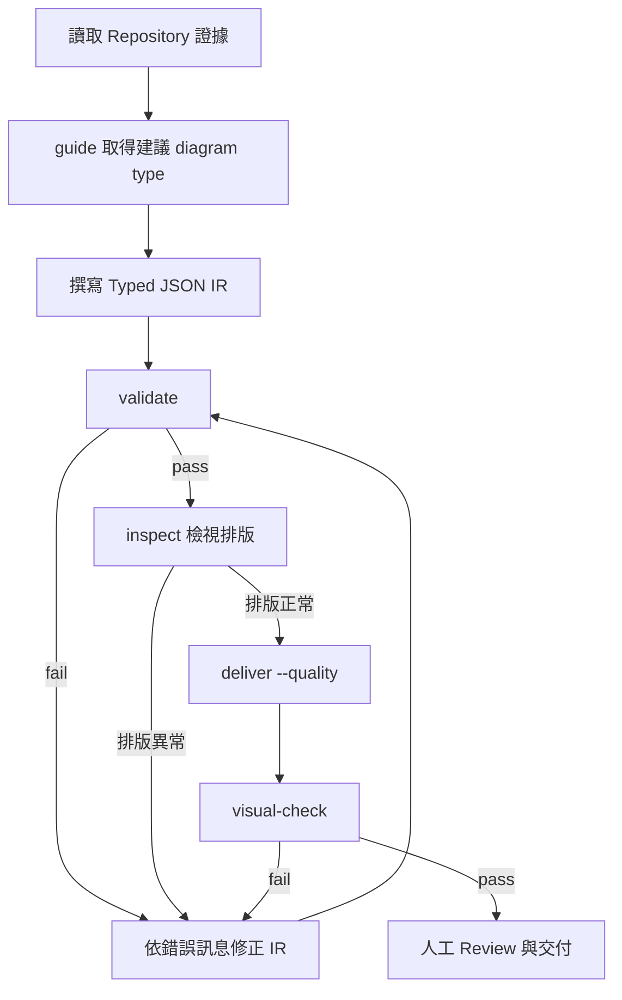

這個迴圈的價值在於：**AI 的隨機性被關在迴圈裡，離開迴圈的成品是決定性驗證過的**。企業要求 Agent 遵守的最低規則只有一條——「沒有 `validate` pass 就不准 `deliver`」。

### Scenario

新人第一天安裝好 Claude Code 與 Archify Skill 後，資深同仁請他執行 `node bin/archify.mjs doctor` 與 `node bin/archify.mjs demo`，確認環境無誤且能產出範例 HTML，才開始進行正式的 Repository 分析工作。

### AI Prompt 範例

```text
請依序執行以下驗證步驟，並把每一步的結果回報給我：
1. node bin/archify.mjs doctor
2. node bin/archify.mjs demo
3. 若上述兩步都成功，請用 guide 指令針對「訂單狀態機」這個情境，取得建議的 diagram type
```

### 本章 Checklist

- [ ] 已知悉 13 個 CLI 指令與其四大使用群組（環境／規劃／驗證／產出）
- [ ] 已將 `doctor` + `demo` 納入安裝驗收的標準第一步
- [ ] 已理解 `deliver` 才是最終驗收指令，`preview` 僅供快速肉眼檢查
- [ ] 已理解 `standard` 與 `showcase` 的差異，且知道「4 項 check ≠ showcase 通過」
- [ ] 已知悉 `compare architecture` 的完整語法與「抽象層級須一致」的前提
- [ ] 已將 `visual-check` 納入交付前關卡，而非可選步驟
- [ ] 已在團隊 Agent Instruction 中寫死「沒有 validate pass 就不准 deliver」

---

# 第 8 章：第一個 Archify 範例

## 8.1 情境設定

以一個常見的企業 Web Application 技術堆疊作為 Hello World：

```text
Browser
  ↓
Vue Web Application
  ↓
Spring Boot API
  ↓
PostgreSQL
```

## 8.2 完整操作步驟

**Step 1：Repository 準備**

確保 AI Coding Agent 可以存取到專案原始碼（前端 `package.json`/路由設定、後端 `pom.xml`/Controller、資料庫連線設定）。

**Step 2：啟動 AI Agent 並確認 Skill 就緒**

```bash
node bin/archify.mjs doctor
```

**Step 3：要求 Agent 分析 Repository**

```text
請閱讀這個 Repository 的前端（Vue）、後端（Spring Boot）與資料庫設定，
整理出「Browser → Vue Web Application → Spring Boot API → PostgreSQL」這條主要路徑上，
實際存在的元件與呼叫關係（只根據你讀到的程式碼，不要推測）。
```

**Step 4：要求 Agent 使用 Archify 產生 diagram**

```text
請使用 archify skill，把上一步整理的結果寫成 architecture 類型的 Typed JSON IR，
存成 candidate.json。
```

**Step 5：Validate**

```bash
node bin/archify.mjs validate architecture candidate.json --json
```

**Step 6：Deliver 產出 HTML**

```bash
node bin/archify.mjs deliver architecture candidate.json hello-world-architecture.html --quality showcase
```

**Step 7：Open HTML**

用瀏覽器開啟 `hello-world-architecture.html`（自包含檔案，無需額外伺服器）。

**Step 8：Review**

檢查圖上的每個節點、每條邊是否都能對應到 Step 3 中 Agent 實際讀到的程式碼證據，若有存疑的節點，回頭要求 Agent 註明證據來源（檔案路徑）。

**Step 9：Export**

視需求輸出 SVG／PNG／WebM 或 1200×630 分享卡（用於簡報、Wiki、README）。

### Scenario

新加入專案的後端工程師，想在第一週內快速掌握這個 Vue + Spring Boot + PostgreSQL 專案的整體架構，透過上述 9 個步驟在 10 分鐘內取得一份可互動、可信任的架構圖，比起等資深同仁口頭講解更有效率。

### AI Prompt 範例

```text
這是我第一次在這個專案使用 archify。請照以下順序執行，每一步完成後回報結果：
1. doctor 確認環境
2. 分析 Repository（前端/後端/資料庫），區分 Fact 與 Inference
3. 寫成 architecture 類型的 Typed JSON IR
4. validate
5. deliver 產出 hello-world-architecture.html
完成後請告訴我這張圖的 Primary Path 是哪一條。
```

### 本章 Checklist

- [ ] 已完整跑過一次 doctor → 分析 → 撰寫 IR → validate → deliver → Review 的流程
- [ ] 已確認產出的 HTML 可在瀏覽器直接開啟（自包含、無需額外伺服器）
- [ ] 已練習從輸出的圖回頭核對程式碼證據
- [ ] 已嘗試至少一種 Export 格式

---

# Part III：AI Agent 驅動的應用開發

# 第 9 章：使用 Archify 協助 AI 開發 Web Application

本章示範一個較完整的企業 Web Application 技術堆疊：

```text
Vue 3
  ↓
API Gateway
  ↓
Spring Boot 4
  ↓
Clean Architecture（Controller → Service → Repository → Domain）
  ↓
Database
  ↓
Redis
  ↓
MQ
  ↓
External Services
```

> 🟡 建議架構：本章的「開發前/中/後」三階段流程為本手冊依 Archify 能力設計的企業導入建議，非 Archify 官方文件明訂的固定 SOP。

## 9.1 開發前：建立 Architecture Map

在寫任何一行 Feature 程式碼之前，先用 Archify 建立整個系統的 `architecture` 圖，目的：

- 確認系統邊界（哪些是內部服務、哪些是外部依賴）
- 找出核心 Service 與其職責分界
- 找出 Database／Cache／MQ 等基礎設施元件
- 找出 External System（金流、簡訊、第三方 API）

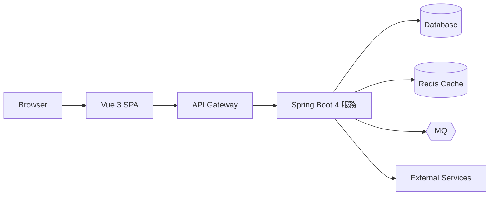

## 9.2 開發中：Feature 層級的圖表

進入 Feature 開發階段後，改用較細粒度的圖表型別：

| 開發活動 | 建議 diagram type |
| --- | --- |
| 新增一個 Feature 的內部模組關係 | `architecture`（局部子圖，而非整個系統） |
| 描述某支 API 的呼叫鏈 | `sequence` |
| 描述某批資料的清洗/轉換流程 | `dataflow` |
| 描述登入/驗證流程 | `sequence`（含 Token 簽發、快取讀寫） |

## 9.3 開發後：Review 與回歸

- **Architecture Review**：Feature 完成後，重新產生一次 `architecture` 圖，與開發前的版本用 `compare` 比對，確認沒有意外新增未預期的耦合。
- **Code Review 輔助**：PR 描述中附上 `sequence`／`dataflow` 圖，讓 Reviewer 更快理解變更影響範圍（見第 23 章 Git Workflow 整合）。
- **Regression Architecture**：定期（如每個 Sprint）重新產生一次全系統圖，避免架構隨時間漂移而無人察覺。
- **Delta Review**：見第 13 章。

### Scenario

團隊在 Sprint 開始前，先用 Archify 產生目前系統的 `architecture` 圖作為基準（baseline），Sprint 結束後針對新增的「訂單退款」Feature 各自產生局部 `sequence` 圖與整體 `architecture` 圖，並用 `compare` 檢查是否有非預期的服務間耦合，才將 PR 送審。

### AI Prompt 範例

```text
Context：這是一個 Vue3 + API Gateway + Spring Boot 4 + Clean Architecture 的企業 Web Application。
Scope：只分析 order-service 這個模組與它直接依賴的元件（Database、Redis、MQ、Payment Gateway）。
Expected Diagram：architecture
Main Path：Browser → API Gateway → order-service → Database
Secondary Path：order-service → MQ →（非同步通知）→ notification-service
Boundary：不包含 order-service 以外的其他微服務內部細節
Evidence Requirement：只根據 order-service 目錄下的原始碼與設定檔
Validation Requirement：必須通過 validate 才能 deliver
Output Requirement：輸出 order-service-architecture.html
```

### 本章 Checklist

- [ ] 已在開發前建立系統基準架構圖
- [ ] 已依開發活動選擇合適的 diagram type（架構/呼叫鏈/資料流）
- [ ] 已規劃 Sprint 結束後的 Regression Architecture 產出頻率
- [ ] 已將架構圖納入 PR 描述的標準做法（見第 23 章）

---

# 第 10 章：Reverse Engineering SOP

## 10.1 輸入與流程

```text
Legacy Repository
  ↓
AI Agent
  ↓
Source Inspection（讀取原始碼、設定檔）
  ↓
Architecture Discovery（歸納出候選元件與關係）
  ↓
Evidence Collection（附上檔案路徑作為佐證）
  ↓
Archify（撰寫 IR → validate → deliver）
  ↓
Architecture Map
  ↓
Human Review（架構師/資深工程師覆核）
  ↓
Verified Architecture
```

## 10.2 需要覆蓋的面向

逆向工程一個企業系統時，至少要涵蓋：

- **Frontend**：SPA/MPA 框架、路由、狀態管理
- **Backend**：服務邊界、Controller/Service/Repository 分層
- **Database**：使用的資料庫種類、Schema 概況
- **API**：對外暴露的 API、版本策略
- **MQ**：訊息佇列、Topic/Queue 命名
- **Cache**：快取層（Redis 等）與快取策略
- **External System**：第三方整合（金流、簡訊、KYC 等）
- **Authentication／Authorization**：登入機制、權限模型
- **Batch**：排程/批次作業
- **File Transfer**：SFTP/檔案交換機制
- **Configuration**：設定管理方式（環境變數、設定中心）
- **Deployment**：部署拓撲（容器、VM、K8s）

## 10.3 逆向工程的黃金原則

> ⚠️ Archify 的圖必須反映**證據**，而不是 AI 想像中的架構（呼應第 3 章）。逆向工程情境下這條原則格外重要，因為往往沒有既有文件可以「對答案」。

建議在每一次逆向工程任務中，強制 Agent 產出三分類清單（🟡 建議做法）：

```text
Observed Fact       —— 直接讀到的程式碼/設定證據
Inferred Relationship —— 依命名慣例、目錄結構、Import 關係推論出的合理猜測
Unknown              —— 無法判斷，需要人工詢問系統原開發者或查閱外部文件
```

### Scenario

一個維運團隊接手一個沒有任何架構文件的 8 年歷史系統，要求 Agent 花一天時間逆向工程出「目前系統大致的元件地圖」，作為後續現代化評估的起點。Agent 產出的圖中，凡是 Inferred 的關係，資深工程師會逐一覆核，避免把猜測當成後續遷移計畫的依據。

### AI Prompt 範例

```text
這是一個沒有架構文件的 Legacy Repository。請執行以下逆向工程流程：
1. 掃描 Repository，找出 Frontend / Backend / Database / API / MQ / Cache / External System / Auth / Batch / File Transfer / Configuration / Deployment 相關的證據
2. 將每一項發現標記為 Observed Fact（附檔案路徑）、Inferred Relationship（附推論依據）或 Unknown
3. 只把 Observed Fact 與明確標示的 Inferred Relationship 寫入 archify 的 architecture IR
4. Unknown 的項目另外列成清單，交給我人工確認
5. validate 通過後再 deliver
```

### 本章 Checklist

- [ ] 已涵蓋 Frontend/Backend/Database/API/MQ/Cache/External System/Auth/Batch/File Transfer/Configuration/Deployment 12 個面向
- [ ] 已要求 Agent 產出 Observed Fact / Inferred / Unknown 三分類
- [ ] 已安排人工 Review 覆核 Inferred 與 Unknown 項目
- [ ] 已確認最終產出的架構圖有明確的證據來源（檔案路徑）

---

# 第 11 章：Legacy System Reverse Engineering 實戰

## 11.1 案例情境（教學示範，非真實客戶專案）

```text
Browser
  ↓
IHS（IBM HTTP Server）
  ↓
F5（負載平衡）
  ↓
Web Application
  ↓
Spring Boot / Liberty
  ↓
DB2
  ↓
MQ
  ↓
External Banking System
```

## 11.2 逐步操作

1. **掃描 Repository**：列出所有模組、部署描述檔（`server.xml`、`docker-compose.yml`、K8s manifests）。
2. **找出入口**：確認 IHS/F5 設定檔或反向代理設定，找出流量進入點。
3. **找出 Controller**：Spring MVC `@RestController`／Liberty Servlet 對應的路由。
4. **找出 Service**：業務邏輯層，注意是否有跨模組直接呼叫（隱藏耦合）。
5. **找出 Repository**：資料存取層，注意 ORM 設定與原生 SQL 混用情形。
6. **找出 Database**：連線字串、DB2 特有語法、Schema 命名慣例。
7. **找出 External API**：對外部銀行系統的呼叫（REST/SOAP/專屬協定）。
8. **找出 MQ**：訊息佇列設定（Queue Manager、Channel、Queue 名稱）。
9. **找出 Configuration**：設定檔位置、是否使用設定中心、機敏資訊是否已妥善隔離（見第 35 章）。
10. **使用 Archify 建立 Architecture Map**：整合以上證據撰寫 `architecture` IR，並視需要另外產生 `sequence`（如交易呼叫鏈）與 `dataflow`（如批次資料流）圖。

## 11.3 事實 vs. 推論 vs. 未知

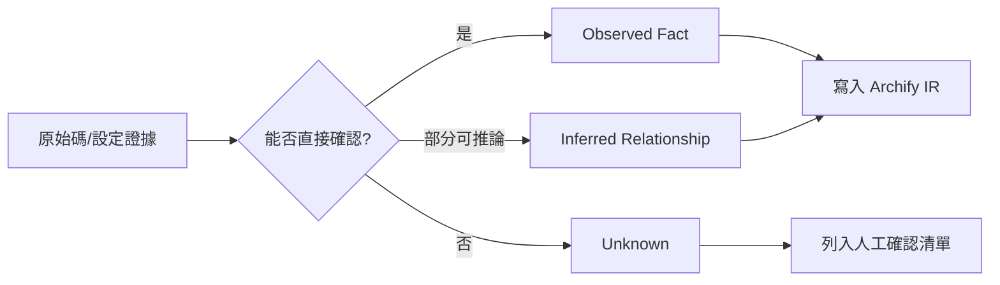

### Scenario

現代化評估團隊需要在兩週內產出一份「目前銀行對外系統架構現況」報告，供管理層評估遷移優先順序。透過 Archify 逆向工程流程，先產出草稿版架構圖，再由資深架構師覆核 Inferred 項目，最終版本才提交給管理層。

### AI Prompt 範例

```text
Context：這是一個銀行對外 Web Application 系統，包含 IHS/F5/Web Application/Spring Boot 或 Liberty/DB2/MQ/外部銀行系統。
Scope：只分析目前 Repository 中可見的模組，不包含尚未上線的功能分支。
Expected Diagram：architecture
Main Path：Browser → F5 → IHS → Web Application → Spring Boot/Liberty → DB2
Secondary Path：Spring Boot/Liberty → MQ → External Banking System
Boundary：外部銀行系統僅畫出介接點，不畫其內部架構（不在證據範圍內）
Evidence Requirement：附上每個元件對應的設定檔或程式碼路徑
Validation Requirement：通過 validate 才能 deliver
Output Requirement：額外列出所有 Unknown 項目，供人工確認
```

### 本章 Checklist

- [ ] 已完整走過 10 步驟逆向工程流程
- [ ] 已明確區分 Observed Fact / Inferred Relationship / Unknown
- [ ] 已針對外部系統介接點標示清楚邊界（不臆測外部系統內部架構）
- [ ] 已安排資深架構師對 Inferred 項目進行覆核

---

# 第 12 章：Framework Upgrade

## 12.1 升級情境示例

```text
Spring Boot 3   →   Spring Boot 4
Java 21         →   Java 25
Vue 2           →   Vue 3
```

## 12.2 升級流程

```text
Before Architecture
      ↓
Upgrade Analysis（找出受影響的模組、Deprecated API、Breaking Changes）
      ↓
Target Architecture（升級後預期的架構樣貌）
      ↓
Delta（比較 Before 與 Target 的差異）
      ↓
Migration Plan
      ↓
Implementation
      ↓
After Architecture
```

## 12.3 Architecture Delta 的分類

🟢 依 `architecture-delta.mjs` 的比較能力（README 描述為「exact added, removed, changed, moved, and rerouted facts」），Delta 結果可分為：

| 分類 | 意義 |
| --- | --- |
| **Added** | 升級後新增的元件/關係（如新增的 Config Server） |
| **Removed** | 升級後移除的元件/關係（如淘汰的舊版 API Gateway） |
| **Changed** | 元件屬性改變但拓撲位置不變（如同一個 Service 換了資料庫版本） |
| **Moved** | 元件在架構圖中的角色/分組改變（如某模組從單體拆出成獨立服務） |
| **Rerouted** | 呼叫路徑改變（如原本直連資料庫改為透過新的 Repository 層） |

### Scenario

團隊計畫將 Spring Boot 3 升級到 Spring Boot 4，並同步把 Java 21 升級到 Java 25。升級前先用 Archify 產生 Before 架構圖，工程師依官方 Migration Guide 完成程式碼升級後，再產生 After 架構圖，用 `compare` 檢查是否有非預期的 Removed 或 Rerouted 關係（例如某個原本存在的元件因升級過程被意外拿掉）。

### AI Prompt 範例

```text
Context：此專案目前為 Spring Boot 3 + Java 21，計畫升級至 Spring Boot 4 + Java 25。
Scope：升級前後的整體服務架構（不含前端）。
Expected Diagram：architecture（Before 與 After 各一份）
Main Path：與升級前一致的核心請求路徑
Secondary Path：升級過程中可能暫時並存的舊版元件（如有）
Boundary：僅涵蓋後端服務，不含資料庫內部 Schema 變更細節
Evidence Requirement：Before 版本依目前程式碼撰寫；After 版本待升級程式碼完成後依新程式碼撰寫，不可用猜測填補
Validation Requirement：兩份 IR 皆須通過 validate
Output Requirement：分別 deliver Before 與 After 的 HTML，並執行 compare 產出 Delta 報告
```

### 本章 Checklist

- [ ] 已產生升級前（Before）架構圖作為基準
- [ ] 已完成升級後，重新產生 After 架構圖（依實際新程式碼，非預期猜測）
- [ ] 已執行 compare 並檢視 Added/Removed/Changed/Moved/Rerouted 五類差異
- [ ] 已將非預期的 Delta 項目納入升級後的追蹤事項

---

# 第 13 章：Architecture Delta Review

## 13.1 Before、Delta 與 After

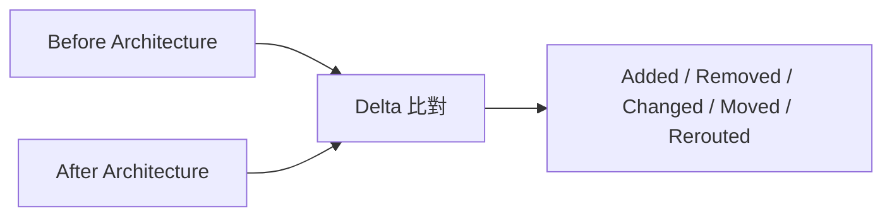

## 13.2 適用情境

- Framework Upgrade（第 12 章）
- Refactoring（大型重構前後對照）
- Microservice Migration（單體拆分過程的階段性對照）
- Database Migration（資料庫廠牌/版本遷移）
- API Migration（API 版本演進）
- Security Architecture Change（安全邊界調整前後對照）
- Cloud Migration（地端到雲端遷移）

## 13.3 完整 AI Prompt 範例

```text
Context：這是一個正在進行「單體拆分為微服務」的專案，目前 payment 模組即將從 monolith 拆出成獨立服務。
Scope：整體系統架構，聚焦 payment 相關的元件與呼叫關係。
Expected Diagram：architecture（Before：payment 仍在 monolith 內；After：payment 為獨立服務）
Main Path：Browser → API Gateway → (Before: Monolith.PaymentModule / After: PaymentService) → Database
Secondary Path：PaymentService → MQ →（非同步通知其他服務）
Boundary：不包含尚未規劃拆分的其他模組
Evidence Requirement：Before 依目前程式碼；After 依拆分後的目標設計文件或已完成的程式碼
Validation Requirement：兩份 IR 皆須通過 validate 才可執行 compare
Output Requirement：輸出 compare 的 Delta 報告，並特別標出所有 Rerouted 的呼叫路徑（代表舊呼叫方需要調整）
```

### Scenario

架構治理委員會要求，任何涉及「服務邊界調整」的變更，PR 中都必須附上 Before/Delta/After 的 Architecture Delta 報告，作為架構審查的必要文件之一（見第 25 章 SOP-09）。

### 本章 Checklist

- [ ] 已理解 Architecture Delta 的五種分類（Added/Removed/Changed/Moved/Rerouted）
- [ ] 已能針對常見的現代化情境（升級/重構/拆分/遷移）套用 Before/Delta/After 流程
- [ ] 已將 Architecture Delta 報告納入架構治理的標準交付物
- [ ] 已理解「Architecture Delta」一詞是本手冊為方便溝通所用的稱呼，官方稱之為 Before/Delta/After 比較

---

# Part IV：Prompt Engineering 與品質控管

# 第 14 章：如何撰寫高品質 Archify Prompt

每個情境的 Prompt 都應包含以下九個要素：Context／Scope／Expected Diagram／Components／Main Path／Secondary Path／Boundary／Evidence Requirement／Validation Requirement／Output Requirement。

## 14.1 Architecture Prompt

```text
Context：[系統/模組背景]
Scope：[分析範圍]
Expected Diagram：architecture
Components：[已知的元件清單]
Main Path：[主要請求路徑]
Secondary Path：[次要/例外路徑]
Boundary：[明確排除的範圍]
Evidence Requirement：只根據實際讀取到的原始碼/設定檔
Validation Requirement：須通過 validate 才能 deliver
Output Requirement：[輸出檔名與格式]
```

## 14.2 Workflow Prompt

```text
Context：[流程背景，如 CI/CD Pipeline]
Scope：[涵蓋的步驟範圍]
Expected Diagram：workflow
Components：[Step/Gate/Actor]
Main Path：[正常流程]
Secondary Path：[失敗/回滾路徑]
Boundary：[不含的步驟]
Evidence Requirement：依實際 Pipeline 設定檔（如 .github/workflows/*.yml）
Validation Requirement：須通過 validate
Output Requirement：[輸出檔名]
```

## 14.3 Sequence Prompt

```text
Context：[API/流程背景]
Scope：[涵蓋的呼叫鏈範圍]
Expected Diagram：sequence
Components：[參與的 Actor/Service]
Main Path：[正常請求-回應順序]
Secondary Path：[逾時/重試/非同步分支]
Boundary：[不含的下游系統細節]
Evidence Requirement：依實際 Controller/Service 程式碼呼叫鏈
Validation Requirement：須通過 validate
Output Requirement：[輸出檔名]
```

## 14.4 Data Flow Prompt

```text
Context：[資料管線背景]
Scope：[涵蓋的資料來源與去向]
Expected Diagram：dataflow
Components：[Source/Transform/Sink]
Main Path：[主要資料流向]
Secondary Path：[異常資料/補資料流程]
Boundary：[不含的下游消費者]
Evidence Requirement：依實際 ETL 設定/程式碼
Validation Requirement：須通過 validate
Output Requirement：[輸出檔名，並標示 PII 欄位]
```

## 14.5 Lifecycle Prompt

```text
Context：[實體背景，如訂單/工單]
Scope：[涵蓋的狀態範圍]
Expected Diagram：lifecycle
Components：[State 清單]
Main Path：[正常狀態轉換]
Secondary Path：[取消/逾時/重試路徑]
Boundary：[不含的子狀態機]
Evidence Requirement：依實際狀態機程式碼/資料庫欄位定義
Validation Requirement：須通過 validate
Output Requirement：[輸出檔名]
```

## 14.6 Reverse Engineering Prompt

```text
Context：[Legacy 系統背景，說明目前缺乏文件的狀況]
Scope：[本次逆向工程涵蓋的模組]
Expected Diagram：architecture
Components：[待發現，不預設]
Main Path：待從程式碼歸納
Secondary Path：待從程式碼歸納
Boundary：[明確排除尚未掃描的模組]
Evidence Requirement：每個元件/關係附上檔案路徑；區分 Observed Fact / Inferred / Unknown
Validation Requirement：須通過 validate
Output Requirement：[輸出檔名 + Unknown 清單]
```

## 14.7 Framework Upgrade Prompt

```text
Context：[升級背景，如 Spring Boot 3→4]
Scope：[Before 與 After 各自涵蓋範圍]
Expected Diagram：architecture（Before + After）
Components：[升級前後元件清單]
Main Path：[升級前後應保持一致的核心路徑]
Secondary Path：[升級過程中暫時並存的元件]
Boundary：[不含的非受影響模組]
Evidence Requirement：Before 依現況程式碼；After 依實際升級後程式碼
Validation Requirement：兩份 IR 皆須 validate
Output Requirement：Before/After HTML + compare Delta 報告
```

## 14.8 Architecture Review Prompt

```text
Context：[本次 Review 的變更背景，如 PR #123]
Scope：[受影響的模組]
Expected Diagram：architecture
Components：[變更前後的元件清單]
Main Path：[核心請求路徑是否改變]
Secondary Path：[新增/移除的次要路徑]
Boundary：[未受影響、不需重畫的模組]
Evidence Requirement：依 PR diff 對應的程式碼變更
Validation Requirement：須通過 validate
Output Requirement：附上 compare 結果，標出 Added/Removed/Changed/Moved/Rerouted
```

## 14.9 Security Architecture Prompt

```text
Context：[系統背景，聚焦安全邊界]
Scope：[涵蓋的 Trust Boundary]
Expected Diagram：architecture
Components：[標示 Trust Boundary 的元件，如 DMZ/內網/外部系統]
Main Path：[使用者請求穿越信任邊界的路徑]
Secondary Path：[管理後台/內部維運路徑]
Boundary：[不含的內部系統細節，避免暴露過多內部拓撲]
Evidence Requirement：依實際防火牆/安全群組設定或程式碼中的驗證機制
Validation Requirement：須通過 validate
Output Requirement：[輸出檔名，標示敏感度分級後再決定分享範圍，見第 35 章]
```

## 14.10 Performance Architecture Prompt

```text
Context：[效能議題背景，如某 API 延遲過高]
Scope：[該 API 涉及的呼叫鏈]
Expected Diagram：sequence
Components：[參與的服務/快取/資料庫]
Main Path：[正常請求路徑，標出可能的效能瓶頸點]
Secondary Path：[快取未命中時的路徑]
Boundary：[不含與此效能議題無關的其他 API]
Evidence Requirement：依實際程式碼中的呼叫順序與已知的效能監控數據（如有）
Validation Requirement：須通過 validate
Output Requirement：[輸出檔名]
```

## 14.11 Production Deployment Review Prompt

```text
Context：[部署背景，準備上線前的架構複查]
Scope：[本次上線涉及的服務]
Expected Diagram：architecture + workflow（部署流程）
Components：[本次變更的元件]
Main Path：[部署流程的正常路徑]
Secondary Path：[回滾路徑]
Boundary：[不含未變更的既有服務內部細節]
Evidence Requirement：依實際部署設定（K8s manifests/Helm charts/CI Pipeline）
Validation Requirement：須通過 validate
Output Requirement：[輸出檔名，作為上線審查附件]
```

### Scenario

架構治理小組要求所有「架構相關 Prompt」都必須包含這九個要素，避免工程師隨口一句「幫我畫架構圖」就讓 Agent 自由發揮，導致產出的圖缺乏明確範圍與證據要求。

### AI Prompt 範例

（本章即為 Prompt 範例庫，見上方 14.1–14.11。）

### 本章 Checklist

- [ ] 已建立團隊共用的 Prompt 九要素樣板
- [ ] 已依 11 種情境挑選對應樣板並客製化
- [ ] 已確認每個 Prompt 都明確要求 Validation 與 Evidence
- [ ] 已將此樣板納入團隊內部 Prompt Library（見第 37 章）

---

# 第 15 章：避免 AI 產生錯誤架構圖

## 15.1 常見問題

1. AI 幻覺（Hallucination）——生成不存在的元件或關係
2. 不存在的 Service——把命名相似的東西當成同一個服務
3. 不存在的 API——推測出從未實際呼叫過的端點
4. 錯誤 Database Relationship——把應用層邏輯誤植為資料庫層關聯
5. 錯誤 Dependency——把間接依賴誤判為直接依賴
6. 過度推測——用「合理猜測」填補證據不足的空白
7. Diagram 過度複雜——一次塞進太多元件，失去重點
8. Edge 太多——為了顯示更多資訊而畫出過量連線
9. Label 太長——文字擠壓導致圖面難以閱讀
10. Component 太多——超出人類可一次消化的視覺負荷
11. Primary Path 不清楚——看圖的人找不到「這張圖到底想講什麼」

## 15.2 四層防護原則

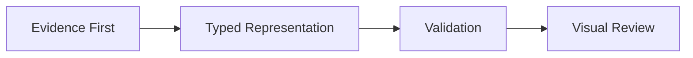

- **Evidence First**：先蒐集證據，再決定要畫什麼，而不是先想好一張「漂亮的圖」再回頭找證據佐證。
- **Typed Representation**：把證據整理成符合 Schema 的型別化 IR，強迫結構化思考，減少天馬行空的自由發揮空間。
- **Validation**：Schema 決定性驗證攔截結構錯誤（但不會攔截「語意上合理但不存在」的幻覺——這是下一層的責任）。
- **Visual Review**：人工肉眼審查，確認每個節點/邊都能對應到證據，這是唯一能攔截「語意幻覺」的關卡。

> ⚠️ Archify 的 Diagram 必須反映 evidence，而不是 AI 想像中的 architecture。Schema 驗證只保證「格式合法」，不保證「內容真實」——**內容真實與否，最終仍需要人工 Review**。

### Scenario

Agent 在分析一個服務時，因為變數命名裡出現 `redisTemplate`，即使該專案其實已經把 Redis 換成記憶體內快取（僅保留變數命名未更新），仍誤判目前確實使用 Redis。人工 Review 時發現 `docker-compose.yml` 中並無 Redis 服務定義，因而修正此錯誤節點。

### AI Prompt 範例

```text
在你完成 IR 之後，請自我檢查以下項目，並列出檢查結果：
1. 每個節點是否都能對應到至少一個具體檔案路徑？
2. 是否有節點只是「合理猜測」而非直接證據？如有，請標示為 Inference 並說明理由
3. Edge 數量是否過多？是否有可以合併或移除的次要連線？
4. Primary Path 是否清楚可辨識？
```

### 本章 Checklist

- [ ] 已建立 Evidence First → Typed Representation → Validation → Visual Review 四層防護意識
- [ ] 已針對 11 種常見問題逐一自我檢查
- [ ] 已理解 Schema 驗證不等於內容真實性驗證
- [ ] 已安排人工 Review 作為最終把關

---

# 第 16 章：Architecture Diagram 設計最佳實務

## 16.1 核心設計概念

- **Primary Path**：一張圖只能有一條視覺上最突出的主要路徑，其餘都是輔助資訊。
- **Secondary Path**：次要/例外路徑應以較弱的視覺權重呈現（如虛線、淺色），不能與 Primary Path 搶焦點。
- **Node 數量**：單張圖建議控制在人類可一次消化的範圍內（過多節點應拆成多張局部圖，見第 28 章分層策略）。
- **Edge 數量**：不應該為了顯示更多資訊而無限制增加線條——這是本章最重要的提醒。
- **Label**：精簡、使用實際的產品名稱/服務名稱，避免冗長描述塞進節點標籤。
- **Routing／Layout**：交給 Renderer 的排版邏輯處理，Agent 專注在「內容正確性」而非手動排版微調。
- **Cards**：支援性細節（版本號、SLA、負責團隊、環境變數摘要）放進節點的 Card，不要畫成額外的邊。
- **Semantic Roles**：善用元件角色標記（如 Database／External System／Trust Boundary）讓 Renderer 能套用對應的視覺樣式。
- **Trust Boundary**：安全邊界應明確標示（見第 14.9 節 Security Architecture Prompt）。
- **Visual Hierarchy**：核心元件視覺權重應大於周邊輔助元件。

## 16.2 「把 Supporting Detail 放入 Card」的設計思想

一張架構圖的價值在於「快速建立心智模型」，而不是「塞進所有已知資訊」。當工程師想知道某個 Service 的版本號、負責團隊、SLA 時，這些資訊應該是**點擊節點後才看到的 Card 內容**，而不是畫在圖面上的額外文字或連線。這樣圖面本身保持乾淨，同時透過 Viewer 的互動能力（第 17 章）保留深入探索的空間。

> ⚠️ 不應該為了顯示更多資訊而無限制增加線條——這是官方 Authoring Cookbook 精神與本手冊反覆強調的原則。

### Scenario

一位資深工程師畫了一張包含 40 個節點、80 條連線的「全公司系統架構圖」，結果沒有人看得懂重點在哪。改用分層策略（見第 28 章）拆成「企業總覽圖」+「各系統的局部圖」後，每張圖都能清楚回答一個具體問題。

### AI Prompt 範例

```text
請檢查目前這份 IR：
1. Edge 數量是否可以精簡？哪些連線屬於「次要資訊」，可以改放進節點的 Card？
2. Primary Path 上的節點是否視覺權重最高？
3. 是否有 Label 過長，需要精簡的節點？
請提出修改建議，而不要直接大幅刪減內容。
```

### 本章 Checklist

- [ ] 已理解 Primary Path 與 Secondary Path 的視覺權重差異原則
- [ ] 已建立「把細節放進 Card、不要畫成額外的線」的設計習慣
- [ ] 已為 Trust Boundary、Semantic Roles 等語意標記正確分類
- [ ] 已避免單張圖塞入過多節點/連線

---

# 第 17 章：Archify Viewer

## 17.1 Viewer 提供的互動能力（🟢 官方已實作，README 描述）

生成的 HTML 本身即為互動式 Viewer，支援：

- **Search**：搜尋節點
- **Pan／Zoom**：平移／縮放
- **Focus**：聚焦特定節點
- **Trace**：追蹤上游/下游的「authored reach」（作者定義的可達關係，而非執行期真實流量）
- **Explore**：開啟已驗證來源的節點細節
- **Compare Roles**：比較不同節點的角色
- **Guided Story**：導覽式說故事模式
- **Theme**：主題切換
- **Presentation**：簡報模式
- **Export**：從 Viewer 內直接匯出（見第 18 章）
- **Semantic View**：依語意角色切換檢視方式（🔵，細節未逐一查證）

## 17.2 Authoring Feature vs. Viewer Feature

| 類別 | 內容 | 負責角色 |
| --- | --- | --- |
| **Authoring Feature** | 決定畫哪些節點/邊、選擇 diagram type、撰寫 IR、Card 內容 | AI Agent（撰寫時決定） |
| **Viewer Feature** | Search／Pan／Zoom／Trace／Guided Story／Theme／Presentation | 最終使用者（開啟 HTML 後才使用） |

> ⚠️ 不要把 Viewer 功能誤認成 Diagram Authoring 功能——例如「Trace 上下游」是 Viewer 讓使用者探索**已經畫好的**圖，而不是 Archify 會自動幫你「發現」新的上下游關係；探索範圍仍受限於 Agent 當初撰寫 IR 時放進去的節點與邊。

### Scenario

一位 PM 收到 Archify 產出的 HTML 架構圖後，透過 Search 快速找到「Payment Service」節點，再用 Trace 功能查看它的上下游依賴，不需要重新請工程師畫圖或口頭解釋。

### AI Prompt 範例

```text
產出 HTML 之後，請告訴我這份 Viewer 支援哪些互動功能（Search/Trace/Guided Story 等），
並簡短說明我應該如何用 Trace 功能來確認 payment-service 的上下游依賴是否符合預期。
```

### 本章 Checklist

- [ ] 已理解 Authoring Feature 與 Viewer Feature 的差異
- [ ] 已練習使用 Search／Trace／Guided Story 等 Viewer 互動功能
- [ ] 已理解 Trace 探索範圍受限於 Agent 當初撰寫的 IR，非即時執行期資料

---

# 第 18 章：Export

## 18.1 官方確認支援的匯出格式（🟢）

> 🔄 **本版修正（C-03）**：前一版把 JPEG／WebP 標為 ⚪「查無官方依據」。第二輪複查取得 `archify/SKILL.md` frontmatter 逐字寫明「`PNG/JPEG/WebP/SVG/WebM` export」，並經 `CHANGELOG.md` 2.1.0／2.3.0／2.12.0 的「Download PNG / JPEG / WebP / SVG」選單描述、`ROADMAP.md` 架構圖三方交叉確認，**JPEG／WebP 為 Viewer Export 選單的正式匯出格式**。

| 格式 | 定位 | 特性 | Provenance |
| --- | --- | --- | --- |
| **自包含 HTML** | 主要交付物 | 單一檔案內含所有樣式與互動邏輯，離線可開，不依賴 CDN | 🟢 |
| **SVG** | 向量匯出 | 可無損縮放，適合印刷與再編輯 | 🟢 |
| **PNG** | 點陣匯出（無損） | 通用性最高，適合 README／PR 內嵌 | 🟢 |
| **JPEG** | 點陣匯出（有損） | 檔案較小，適合對容量敏感的通道 | 🟢（本版修正） |
| **WebP** | 點陣匯出（現代格式） | 同畫質下體積更小，適合網頁內嵌 | 🟢（本版修正） |
| **WebM** | 動態影片 | 錄下 Guided Story／導覽動線，適合教學與非同步分享 | 🟢 |
| **1200×630 Share Card** | 社群分享卡 | 含 **Route Share Card**／**Reach Share Card** 兩種變體，並支援 Copy Share Card 到剪貼簿 | 🟢 |

兩點容易混淆之處：

- **ICO 不是圖表匯出格式**。ICO 僅出現在 **brand-mark 遠端擷取**（接受 PNG／JPEG／WebP／ICO bytes）的窄範圍語境，與 Viewer 的 Export 選單無關（見附錄 H.2）。
- **v2.12.0 起匯出需明確選擇**。使用者必須主動選定格式才會進入匯出流程，避免誤觸產生非預期檔案；若團隊自動化腳本沿用舊行為，需重新確認流程。

## 18.2 各格式適合的用途

| 用途 | 建議格式 | 理由 |
| --- | --- | --- |
| 技術文件／Wiki 內嵌 | 自包含 HTML | 保留完整互動性（Search／Trace／Guided Story） |
| README／PR 描述內嵌截圖 | PNG | 無損、平台相容性最佳 |
| 容量受限的通道（郵件、IM） | JPEG 或 WebP | 體積小；WebP 在同畫質下通常更省 |
| 向量圖需求（印刷、再編輯） | SVG | 可無損縮放 |
| Architecture Review 會議簡報 | HTML（Presentation 模式，見第 17 章）或 PNG | 需即時展開細節時用 HTML |
| Release Note／社群分享 | 1200×630 Share Card | 已為社群預覽尺寸最佳化 |
| 動態導覽／教學影片 | WebM | 可完整呈現導覽動線 |
| 稽核佐證包 | 自包含 HTML ＋ 對應 IR JSON | HTML 供人閱讀、IR 供機器重現驗證 |

> 🟡 **企業建議**：對外交付一律用 PNG 或 Share Card；對內稽核一律同時保留 **HTML ＋ IR JSON**。只留圖片會失去可驗證性，只留 IR 則非技術讀者無法閱讀。

### Scenario

技術文件團隊需要把架構圖嵌入公司內部 Confluence Wiki，選擇匯出自包含 HTML 並上傳為附件，讓瀏覽 Wiki 的同仁仍保有完整的 Search／Trace 互動能力，而不是只放一張靜態截圖。

### AI Prompt 範例

```text
請將目前這份已通過驗證的 architecture diagram：
1. deliver 成自包含 HTML（保留完整互動性，用於 Wiki）
2. 額外匯出 PNG（用於 PR 描述內嵌）
3. 額外匯出 1200x630 分享卡（用於團隊內部週報）
```

### 本章 Checklist

- [ ] 已依實際用途（文件/簡報/分享/PR）選擇對應匯出格式
- [ ] 已知悉官方確認支援的格式為 HTML／SVG／PNG／JPEG／WebP／WebM／分享卡（ICO 僅用於 brand-mark 擷取）
- [ ] 已避免誤用未經確認的 JPEG/WebP/ICO 作為一般圖表匯出格式

---

# Part V：工具比較與定位

# 第 19 章：Archify 與 Mermaid 比較

> Mermaid 是優秀且被廣泛使用的文字轉圖工具，本章目的是釐清兩者的**定位差異**，而非評判優劣。

| 能力 | Archify | Mermaid |
| --- | --- | --- |
| Text-based diagram | 是（Typed JSON IR） | 是（Mermaid 語法） |
| AI Agent Skill 形式散布 | 是（🟢） | 否（Mermaid 是通用繪圖語法，非 Agent Skill） |
| Repository-aware（需搭配 Agent 讀取證據） | 是（依賴 Agent 分析） | 否（Mermaid 本身不涉及證據蒐集） |
| Typed JSON IR | 是（🟢） | 否（Mermaid 直接是圖形描述語法，無中間型別層） |
| Schema 決定性驗證 | 是（`ajv`，🟢） | 否（僅有語法解析，無業務層 Schema 驗證） |
| Interactive HTML 輸出 | 是（自包含，含 Search/Trace 等，🟢） | 視渲染環境而定（多數為靜態圖或簡易互動） |
| 5 種內建 diagram type（architecture/workflow/sequence/dataflow/lifecycle） | 是（🟢） | Mermaid 有更廣泛的圖表語法（flowchart/sequence/class/state/ER 等），但無「architecture/dataflow 專屬語意層」 |
| Architecture Delta（Before/Delta/After 比較） | 是（🟢） | 否（需自行手動比對兩份 Mermaid 原始碼） |
| Source Evidence 追溯 | 有 Card／Trace 機制輔助（🟢） | 否（純語法，不內建證據追溯機制） |
| Export（PNG/SVG/WebM/分享卡） | 是（🟢） | 視工具鏈而定（多數環境可匯出 PNG/SVG） |
| Viewer 互動（Search/Pan/Zoom/Guided Story） | 是（🟢） | 視渲染環境而定，官方語法本身不含此類進階互動 |
| 上手門檻 | 需要 Node.js 環境 + Agent 支援 | 極低，純文字語法，多數 Markdown 渲染器原生支援 |
| 適合場景 | 需要「可驗證、可探索、可比對」的正式架構文件/治理場景 | 快速溝通、會議白板式草圖、輕量級文件內嵌圖表 |

## 19.1 如何選擇

- 需要**快速在對話/文件中畫一個示意圖**、不需要驗證、不需要追溯來源 → Mermaid 更輕量、更快。
- 需要**正式的、可驗證、可作為治理依據的架構產出**（如 Reverse Engineering 交付物、Framework Upgrade 的 Delta 報告、上線前 Architecture Review） → Archify 的驗證與可追溯性更合適。
- 兩者也可以並存：Mermaid 用於文件中快速穿插的小示意圖，Archify 用於正式交付的系統地圖。

### Scenario

工程師在寫技術筆記時，隨手用 Mermaid 畫一個 3 個節點的小流程圖說明一個 function 的邏輯——這種輕量場景完全不需要 Archify。但當同一個團隊要交付「本季 Framework Upgrade 的 Before/After 架構審查報告」給架構治理委員會時，就適合改用 Archify，因為需要 Schema 驗證與 Delta 比對能力。

### AI Prompt 範例

```text
這份文件是要放進正式的架構治理審查（需要可驗證、可追溯來源），請使用 archify 而非 Mermaid 來產生這張圖，
並確保通過 validate 後才輸出。
```

### 本章 Checklist

- [ ] 已理解 Archify 與 Mermaid 是互補而非取代關係
- [ ] 已依「是否需要驗證/追溯/比對」決定選用哪個工具
- [ ] 未在不需要的場景強行引入 Archify 的額外流程成本

---

# 第 20 章：Archify 與一般 Architecture Tool 比較

> 本章比較客觀能力面向，不做無根據的優劣判斷；部分工具的細節功能未逐一查證，僅列出普遍已知的公開定位（🟡 建議理解，非逐項官方查證）。

## 20.1 十項能力面向對照

| 能力面向 | Archify | Mermaid | PlantUML | Structurizr | draw.io | Lucidchart | Miro | Excalidraw |
| --- | --- | --- | --- | --- | --- | --- | --- | --- |
| AI Agent Skill 原生整合 | 是（🟢） | 否 | 否 | 否 | 否 | 否 | 否 | 否 |
| Repository/程式碼分析驅動 | 需搭配 Agent（🟢） | 需搭配 Agent | 需搭配 Agent | 需搭配 Agent/DSL（C4 Model） | 否，多為手繪 | 否，多為手繪 | 否，多為手繪/白板 | 否，多為手繪 |
| Diagram 生成方式 | Agent 撰寫 Typed JSON IR | 純文字語法 | 純文字語法 | DSL（Structurizr Language） | GUI 拖拉 | GUI 拖拉 | GUI 白板 | GUI 手繪風格 |
| 決定性 Schema 驗證 | 是（🟢） | 否 | 否 | 部分（DSL 語法檢查） | 否 | 否 | 否 | 否 |
| 互動式 Viewer（Search/Trace） | 是（🟢） | 有限 | 有限 | 有（Workspace 瀏覽） | 有限 | 有 | 有 | 有限 |
| 版本控制友善（純文字可入 Git） | 是（JSON） | 是 | 是 | 是（DSL） | 否（多為二進位/XML） | 否 | 否 | 部分 |
| Reverse Engineering 輔助 | 需搭配 AI Agent（🟢） | 需搭配 AI Agent | 需搭配外部工具 | 需搭配外部工具 | 否 | 否 | 否 | 否 |
| Architecture Delta（Before/After 比較） | 是（🟢） | 否 | 否 | 有限（需自行比較 DSL） | 否 | 否 | 否 | 否 |
| 交付物自包含性（單檔可離線開啟） | 是（單一 HTML，執行期零相依，🟢） | 需 Renderer 或嵌入環境 | 需 Server/JAR | 需 Workspace/Server | 需匯出 | 需匯出/雲端 | 雲端為主 | 需匯出 |
| 企業導入成熟度／生態系規模 | 新興（🟠 約 25k Star，未完全確認） | 成熟、生態系廣泛 | 成熟 | 成熟（C4 Model 社群） | 成熟、企業廣泛使用 | 成熟、商業化產品 | 成熟、商業化產品 | 成熟、開源 |

## 20.2 三種企業情境的選型建議

> **Provenance：**🟡 建議架構。以下為依 20.1 客觀能力面向推導的實務建議，非官方立場。

| 企業現況 | 建議定位 | 理由 |
| --- | --- | --- |
| 尚無架構治理標準，架構文件散落於簡報與白板 | **以 Archify 為主線交付格式** | 由 Agent 產生、Schema 驗證、單檔可交付，導入成本最低 |
| 已採用 C4 Model／Structurizr 作為治理標準 | **Archify 作為初稿與 Review 輔助** | 正式治理文件維持既有流程，Archify 補足「快速可視化 + Delta 比較」 |
| 以 Mermaid 內嵌於 Markdown／Wiki 為主 | **雙軌並存** | 小圖沿用 Mermaid（維護成本低），系統級全景改用 Archify（見第 19 章） |

### Scenario

一個已經全面採用 C4 Model + Structurizr 作為架構治理標準的企業，若要導入 Archify，建議定位為「AI Agent 產生初稿的輔助工具」，最終正式架構文件仍可能沿用既有的 Structurizr Workspace 流程，而非直接取代既有治理標準。

### AI Prompt 範例

```text
我們團隊目前用 Structurizr 維護正式架構文件。請用 archify 針對這個新模組先產生一份初稿架構圖（用於快速溝通與逆向工程階段），
並在輸出時提醒我：正式治理文件仍需依團隊既有流程轉載進 Structurizr Workspace。
```

### 本章 Checklist

- [ ] 已釐清 Archify 與既有架構治理工具（如 Structurizr/draw.io）的定位差異，而非直接取代關係
- [ ] 已避免對工具做無根據的優劣論斷
- [ ] 已評估企業既有工具鏈與 Archify 的銜接方式

---

# Part VI：企業導入與 SSDLC 整合

# 第 21 章：企業 Web Application 導入架構

> 🟡 本章「企業標準」流程為導入建議架構，非 Archify 官方強制流程。

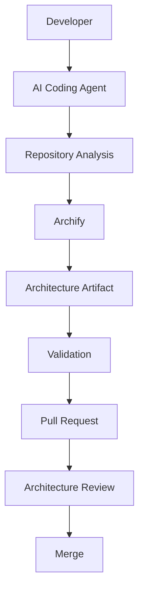

## 21.1 三個核心概念

- **Architecture-as-Code**：架構圖的來源是 Typed JSON IR（純文字、可入 Git），而不是二進位/專屬格式的繪圖檔案，因此可以像程式碼一樣被版本控制、Diff、Review。
- **Architecture-as-Evidence**：每一份架構圖的內容都應可追溯回具體的程式碼/設定證據，而不是團隊共識的口頭傳說。
- **Architecture-as-Artifact**：架構圖本身是 SSDLC 流程中的一項正式交付物（Artifact），有版本、有 Review 紀錄、有存放位置，而不是用完即丟的簡報素材。

### Scenario

企業導入初期，先在一個試點專案要求「每個 Feature PR 若涉及模組邊界調整，必須附上 Archify 產出的 architecture diagram 作為 Artifact」，並存放在該專案的 `docs/architecture/` 目錄下，隨程式碼一起版本控制。

### AI Prompt 範例

```text
這個 PR 涉及 order-service 與 payment-service 之間新增了一條直接呼叫關係。
請用 archify 產生這兩個服務目前的 architecture diagram，validate 通過後輸出到 docs/architecture/order-payment.html，
並在 PR 描述中附上這個檔案的連結，做為本次架構變更的 Artifact。
```

### 本章 Checklist

- [ ] 已理解 Architecture-as-Code / Evidence / Artifact 三個概念
- [ ] 已規劃架構圖 Artifact 的存放位置與版本控制方式
- [ ] 已將架構圖 Artifact 納入 PR 標準流程（見第 23 章）

---

# 第 22 章：SSDLC 整合

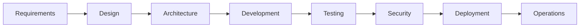

## 22.1 Archify 在 SSDLC 各階段的角色

| SSDLC 階段 | Archify 的角色 | Provenance |
| --- | --- | --- |
| Requirements | 無直接角色 | — |
| Design | 產出初版 `architecture`/`sequence` 圖，作為設計討論的共同語言 | 🟡 建議做法 |
| Architecture | 正式的 Architecture Map，作為架構審查依據 | 🟡 建議做法 |
| Development | Feature 層級的局部圖，輔助開發與 Code Review | 🟡 建議做法 |
| Testing | 用 `sequence`/`workflow` 圖輔助測試案例設計（釐清呼叫鏈與分支） | 🟡 建議做法 |
| Security | 用 `architecture` 圖標示 Trust Boundary，輔助 Threat Modeling | 🟡 建議做法 |
| Deployment | 用 `workflow` 圖描述部署流程與回滾路徑 | 🟡 建議做法 |
| Operations | 定期 Regression Architecture，偵測架構隨時間的漂移 | 🟡 建議做法 |

> ⚠️ 以上皆為本手冊依 Archify 能力設計的整合建議，Archify 官方文件未明訂一套正式的 SSDLC 整合規範，企業需依自身 SSDLC 成熟度自行調整。

## 22.2 Threat Modeling 輔助

- **Security Boundary**：用 `architecture` 圖的 Trust Boundary 標記，畫出外部使用者、DMZ、內網、機敏資料儲存區之間的邊界。
- **Data Flow**：用 `dataflow` 圖標示 PII／機敏資料的流動路徑，輔助辨識資料外洩風險點。
- **Authentication／Authorization**：用 `sequence` 圖描述登入與權限檢查流程，輔助辨識驗證繞過風險。
- **External Trust Boundary**：明確標示哪些元件跨越了組織信任邊界（如串接第三方 API），作為資安審查重點。

### Scenario

資安團隊在進行年度 Threat Modeling 演練前，要求各系統負責人先用 Archify 產生一份標示 Trust Boundary 的 `architecture` 圖，作為 Threat Modeling Workshop 的討論起點，而非從零開始手畫。

### AI Prompt 範例

```text
請針對這個系統產生一份 architecture diagram，並明確標示以下 Trust Boundary：
1. 公開網際網路 → DMZ
2. DMZ → 內部網路
3. 內部網路 → 儲存 PII 的資料庫
只根據實際的網路/安全群組設定與程式碼中的驗證邏輯，不要推測未設定的安全機制。
```

### 本章 Checklist

- [ ] 已規劃 Archify 在團隊 SSDLC 各階段的實際切入點
- [ ] 已用 architecture 圖標示 Trust Boundary，輔助 Threat Modeling
- [ ] 已理解這是建議整合方式，非官方強制規範

---

# 第 23 章：Git Workflow 整合

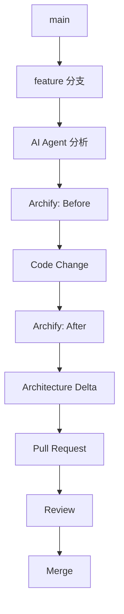

## 23.1 建議做法（🟡）

- 在 `feature` 分支開發前，先產生一次 Before 架構圖，存放於分支中（如 `docs/architecture/before.html`，或作為 PR 附件而不入庫，視團隊儲存策略而定，見第 34 章 Storage/Retention 規範）。
- 開發完成後產生 After 架構圖，執行 `compare` 產出 Delta。
- PR 描述中附上 Delta 摘要，讓 Reviewer 一眼看出「這次變更改動了哪些架構關係」。
- Review 通過、Merge 後，After 架構圖成為新的 Before 基準，供下一個 Feature 分支使用。

### Scenario

團隊規定：凡是 PR 標籤包含 `architecture-impact` 的變更，CI 會提醒作者附上 Archify 的 Before/After 比較連結，Reviewer 才會開始進行架構面向的審查。

### AI Prompt 範例

```text
這個 PR 標記了 architecture-impact。請幫我：
1. 對比 main 分支與目前 feature 分支的 order-service 相關程式碼
2. 分別產生 Before（main）與 After（feature）的 architecture diagram
3. 執行 compare，摘要列出 Added/Removed/Changed/Moved/Rerouted
4. 產出一段可以直接貼進 PR 描述的 Delta 摘要文字
```

### 本章 Checklist

- [ ] 已規劃 Before/After 架構圖在 Git Workflow 中的產出時機
- [ ] 已將 Delta 摘要納入 PR 描述的標準內容
- [ ] 已決定架構圖 Artifact 的儲存策略（入庫 vs. 僅作為 PR 附件）

---

# 第 24 章：CI/CD 整合

## 24.1 支援程度分類（🟡 依現有查證資料誠實分類，避免誇大）

```text
Officially Supported        —— 官方文件明確記載的 CI/CD 整合方式
Possible Integration        —— CLI 本身可被腳本化呼叫，理論上可行但無官方範例
Recommended Custom Integration —— 本手冊建議的自訂整合方式
Not Supported                —— 目前查無官方或社群支援
```

| 項目 | 分類 |
| --- | --- |
| CLI 可在腳本中呼叫（`node bin/archify.mjs validate ...`） | Possible Integration（CLI 本身無特殊限制，但官方未提供正式 CI Action 範例） |
| GitHub Action / 官方 CI Plugin | Not Supported（查證過程未發現官方提供的 GitHub Action） |
| 在 CI 中執行 `doctor` + `validate` 作為 Pipeline Gate | Recommended Custom Integration |
| `visual-check` 用於 CI 視覺回歸檢查 | Possible Integration（指令本身 🟢 確認且官方定位為交付前關卡（v2.14.0），但官方未提供現成 CI 範例） |
| `compare architecture` 用於 PR 的 Architecture Delta 把關 | Recommended Custom Integration（指令 🟢；`--json` 輸出可供門檻判斷） |

## 24.2 建議的自訂 CI 流程

```text
Git Push
  ↓
CI 觸發
  ↓
Build
  ↓
Test
  ↓
Architecture Validation（node bin/archify.mjs validate）
  ↓
Artifact（deliver 產出 HTML，上傳為 CI Artifact）
  ↓
PR Review（Reviewer 從 CI Artifact 下載查看）
```

> ⚠️ 由於目前查無官方提供的現成 CI Action/Plugin，企業若要導入 CI 整合，需自行撰寫呼叫 CLI 的腳本步驟，並自行評估在 CI Runner 中安裝 Skill 與 Node.js 依賴的方式（例如直接 `npm install` Archify 套件而非透過 Agent Skill 安裝機制，此為本手冊建議做法，🟡）。

### Scenario

團隊在 GitHub Actions 中新增一個自訂 Job，於 PR 觸發時執行 `node bin/archify.mjs validate` 檢查 `docs/architecture/*.json` 中的 IR 是否仍然合法（例如因程式碼變更導致 Schema 版本不相容），驗證失敗則讓 CI 失敗，提醒作者更新架構圖。

### AI Prompt 範例

```text
請幫我撰寫一個 GitHub Actions workflow 步驟：
1. 安裝 Node.js >= 18
2. 安裝 archify 套件依賴
3. 對 docs/architecture/ 目錄下所有 candidate JSON 執行 validate
4. 若任何一份驗證失敗，該 Job 標記為失敗
請註明這是自訂整合（Recommended Custom Integration），並非官方提供的現成 CI Action。
```

### 本章 Checklist

- [ ] 已誠實區分 Officially Supported / Possible / Recommended Custom / Not Supported
- [ ] 已知悉目前無官方 CI Action，需自行撰寫腳本
- [ ] 已規劃 CI 中的 Architecture Validation Gate 與 Artifact 上傳機制

---

# 第 25 章：企業團隊標準 SOP

> 🟡 以下 SOP 編號為本手冊依 Archify 能力設計的企業內部標準作業程序建議，非官方文件內容。

## SOP-01 安裝

1. 確認 Node.js ≥ 18
2. 依團隊使用的 Agent（Claude Code/Codex CLI/opencode/Cursor/Raven）選擇對應安裝路徑（第 6 章）
3. 執行 `doctor` 確認環境就緒
4. 執行 `demo` 確認可正常產出範例輸出

## SOP-02 Repository Architecture Discovery

1. 要求 Agent 掃描 Repository，產出 Observed Fact / Inferred / Unknown 三分類清單
2. 撰寫 `architecture` IR 並 validate
3. deliver 產出全系統基準架構圖，存放於 `docs/architecture/baseline.html`

## SOP-03 Feature Architecture

1. Feature 開發前，針對受影響模組產生局部 `architecture` 圖
2. Feature 開發後重新產生，執行 compare 確認無非預期變更

## SOP-04 API Sequence

1. 針對新增/修改的 API，產生 `sequence` 圖
2. 附上 PR 描述，輔助 Reviewer 理解呼叫鏈變化

## SOP-05 Data Flow

1. 針對涉及 PII 或跨系統資料交換的變更，產生 `dataflow` 圖
2. 標示資料分類（見第 35 章）

## SOP-06 Reverse Engineering

依第 10 章 SOP 執行，涵蓋 12 個面向（Frontend/Backend/Database/API/MQ/Cache/External System/Auth/Batch/File Transfer/Configuration/Deployment）

## SOP-07 Framework Upgrade

依第 12 章流程執行 Before → Upgrade Analysis → Target → Delta → Migration Plan → Implementation → After

## SOP-08 Architecture Review

1. PR 觸發架構審查時，附上 architecture diagram Artifact
2. Reviewer 依第 16 章最佳實務檢查圖面品質與證據完整性

## SOP-09 Architecture Delta

1. 任何涉及服務邊界調整的變更，必須產出 Before/Delta/After 報告
2. Delta 報告作為架構治理委員會的審查文件之一

## SOP-10 Export

依實際用途（文件/簡報/分享）選擇對應匯出格式（第 18 章），並依第 35 章敏感資訊規範決定分享範圍

## SOP-11 Maintenance

依第 29 章維護頻率，定期執行 `doctor` 健檢與版本檢查

### Scenario

新專案啟動時，Tech Lead 直接把這 11 條 SOP 編號貼進專案的 `CONTRIBUTING.md`，並在每條 SOP 後面附上對應本手冊章節連結，作為新成員快速上手的檢查依據。

### AI Prompt 範例

```text
請依 SOP-02（Repository Architecture Discovery）的三個步驟，對這個 Repository 執行一次完整流程，
並在完成後列出你依據的是哪些檔案證據。
```

### 本章 Checklist

- [ ] 已建立 SOP-01 至 SOP-11 的團隊內部文件
- [ ] 已為每條 SOP 指派負責角色（開發者/架構師/Reviewer）
- [ ] 已將 SOP 連結放入專案 CONTRIBUTING.md 或內部 Wiki

---

# 第 26 章：AI Agent 標準 System Prompt 與 Instruction

## 26.1 企業 Agent Instruction 範本

以下為建議的企業 Agent Instruction 範本（🟡 建議架構，可依團隊需求調整）：

```text
You are required to use Archify when:
- analyzing an unfamiliar repository
- reviewing architecture
- performing framework migration
- documenting system topology
- analyzing API flows
- analyzing data flows

Rules you must always follow:
1. Never invent architecture facts. Only describe components and relationships you can
   directly verify from repository evidence (source code, config files, IaC).
2. Inspect repository evidence first, before writing any Typed JSON IR.
3. Distinguish facts from inference explicitly:
   - [Fact]: directly observed in code/config, cite the file path
   - [Inference]: reasonable guess based on naming/structure, must be labeled
   - [Unknown]: cannot be determined, list separately for human confirmation
4. Keep the primary path clear. Do not let secondary/exception paths compete visually
   with the primary path.
5. Put supporting details (version numbers, ownership, SLA) into node cards, not extra
   edges or long labels.
6. Validate the generated candidate IR (node bin/archify.mjs validate) after every edit,
   and immediately before calling deliver.
7. `deliver` is the final acceptance command — do not edit a candidate after it has
   passed final validation without re-validating.
8. Do not claim visual inspection of the rendered HTML unless you actually opened and
   reviewed it — describing a diagram's appearance without viewing it is a form of
   hallucination.
9. When performing reverse engineering or framework upgrade tasks, always separate
   Observed Fact / Inferred Relationship / Unknown, and never present an Inference as
   a Fact.
10. If evidence is insufficient to determine a diagram type's required field, do not
    fabricate a plausible-sounding value — flag it as Unknown instead.
```

## 26.2 各 Agent 的設定檔落點

> **Provenance：**🟡 建議架構（🟢 安裝路徑依第 6.2 節官方安裝表；設定檔慣例屬各 Agent 自身規範，非 Archify 官方定義）。

| Agent | 專案層級指示檔慣例 | 建議放置方式 |
| --- | --- | --- |
| Cursor | `.cursor/rules/`（Project Rules） | 將 26.1 範本存成一則 Always-apply rule |
| Claude Code | 專案根目錄 `CLAUDE.md` | 以「Archify 使用紀律」小節收錄 |
| Codex CLI | 專案根目錄 `AGENTS.md` | 以「Architecture Diagram」小節收錄 |
| opencode | 專案設定檔／`AGENTS.md` | 同 Codex CLI 處理 |
| 其他 Harness | 各自的 system prompt 設定 | 至少保留規則 1／3／6／8 四條核心紀律 |

## 26.3 導入時的三個常見失誤

> **Provenance：**🟡 建議架構（實務經驗整理）。

| 失誤 | 症狀 | 對策 |
| --- | --- | --- |
| 只貼規則、不給範例 | Agent 理解「要驗證」，但不知道通過標準長什麼樣 | 在指示檔中附一份最小可用 IR 範例與一次 `validate` 成功輸出 |
| 規則與 CI 不一致 | Agent 產出的圖在本機 `validate` 過、進 CI 卻被擋 | 指示檔明確寫出 CI 使用的 `--quality` 等級（見第 7.5 節） |
| 未區分事實與推論 | Review 時無法判斷哪些連線可信 | 強制套用規則 3 的 `[Fact]`／`[Inference]`／`[Unknown]` 三分法 |

### Scenario

企業將這份 Instruction 放進團隊共用的 Agent 設定檔（如 Claude Code 的專案層級 `CLAUDE.md`，或 Codex CLI 對應的設定檔），讓每一位使用該專案的工程師，Agent 都自動遵守同一套 Archify 使用紀律，而不用每次口頭提醒。

### AI Prompt 範例

（本章即為可直接使用的 System Prompt / Instruction 範本，見上方程式碼區塊，可直接複製進團隊設定檔。）

### 本章 Checklist

- [ ] 已將此 Instruction 範本放入團隊共用的 Agent 設定檔
- [ ] 已依團隊實際需求調整規則細節
- [ ] 已向團隊成員說明「validate → deliver 是最終驗收流程，禁止繞過」的規則

---

# Part VII：實戰案例

# 第 27 章：實際企業案例

> ⚠️ 以下案例為教學示範用途之情境案例，公司名稱、系統名稱、數據均為虛構，僅示範 Archify 使用方法，非真實客戶專案。

## Case 1：Vue 3 與 Spring Boot Web Application

```text
Business Context      —— 某零售業者要導入會員中心改版
Existing System        —— Vue 2 舊版前台 + Spring Boot 2 後端
AI Agent Task           —— 分析既有前後端程式碼，找出會員相關模組
Archify Task            —— 產生 architecture 圖（前後端 + 資料庫）
Prompt                  —— 見第 9 章 9.3 節範例，Scope 限定 member 模組
Expected Diagram        —— architecture
Validation              —— validate 通過
Human Review             —— 架構師確認資料庫關係無誤
Final Artifact           —— docs/architecture/member-center.html
```

## Case 2：Legacy System Reverse Engineering

```text
Business Context      —— 製造業 ERP 系統維運交接，原開發團隊已離職
Existing System         —— 12 年歷史的 Java EE 單體應用
AI Agent Task            —— 依第 10 章 SOP 執行 12 面向逆向工程
Archify Task             —— architecture + dataflow 各一份
Prompt                  —— 見第 14.6 節 Reverse Engineering Prompt
Expected Diagram          —— architecture（總覽）+ dataflow（月結批次資料流）
Validation                —— 兩份皆 validate 通過
Human Review               —— 資深工程師覆核所有 Inferred 項目
Final Artifact             —— docs/architecture/erp-baseline.html + erp-batch-dataflow.html
```

## Case 3：Spring Boot Upgrade

```text
Business Context       —— 資安稽核要求淘汰已停止維護的舊版框架
Existing System          —— Spring Boot 2 + Java 11
AI Agent Task             —— 依第 12 章流程規劃升級至 Spring Boot 3 + Java 21
Archify Task              —— Before/After architecture + compare
Prompt                    —— 見第 14.7 節 Framework Upgrade Prompt
Expected Diagram           —— architecture（Before + After）
Validation                 —— 兩份皆 validate 通過
Human Review                —— Delta 報告中的 Rerouted 項目由 Tech Lead 確認影響範圍
Final Artifact              —— docs/architecture/upgrade-2027q1-delta.html
```

## Case 4：Microservice Architecture Review

```text
Business Context        —— 季度架構治理審查
Existing System            —— 12 個微服務組成的訂單處理平台
AI Agent Task              —— 產生全系統 architecture 圖，聚焦服務間耦合
Archify Task               —— architecture + 針對高風險耦合另產生 sequence 圖
Prompt                     —— 見第 14.1、14.3 節
Expected Diagram             —— architecture + sequence
Validation                  —— 全部通過 validate
Human Review                 —— 架構治理委員會依第 16 章最佳實務檢視圖面品質
Final Artifact                —— 季度架構審查報告附件
```

## Case 5：Database Migration

```text
Business Context         —— 資料庫廠牌從 Oracle 遷移至 PostgreSQL
Existing System             —— 依賴 Oracle 專屬語法的核心交易系統
AI Agent Task                —— 分析目前資料存取層對 Oracle 專屬功能的依賴程度
Archify Task                  —— Before（Oracle）/After（PostgreSQL）architecture + compare
Prompt                        —— 見第 14.7 節（比照 Framework Upgrade 模式）
Expected Diagram                —— architecture（Before + After）
Validation                     —— 兩份皆 validate 通過
Human Review                    —— DBA 確認資料庫遷移範圍與 Archify 分析結果一致
Final Artifact                   —— docs/architecture/db-migration-delta.html
```

### Scenario

企業內部知識庫可依「案例類型」建立索引（Web App 開發 / Reverse Engineering / Framework Upgrade / Architecture Review / Database Migration），讓不同團隊快速找到最相似的既有案例作為模板起點。

### AI Prompt 範例

```text
我們的情境類似 Case 3（Framework Upgrade）。請依第 12 章的 Before → Upgrade Analysis → Target → Delta → Migration Plan
→ Implementation → After 流程，先產生 Before 架構圖，並列出你判斷本次升級會受影響的模組清單。
```

### 本章 Checklist

- [ ] 已對照 5 個案例，找出與自身情境最相似的模板
- [ ] 已理解案例中的公司/系統名稱為教學示範，非真實客戶
- [ ] 已規劃案例對應的 Final Artifact 存放位置

---

# 第 28 章：大型 Repository 使用策略

## 28.1 為什麼不能一次全部畫出來

大型企業 Repository（或 Monorepo）往往包含數十甚至數百個模組，若要求 Agent「畫出整個系統的架構圖」，容易產生：

- 節點數量爆炸，圖面失去可讀性（違反第 16 章最佳實務）
- Agent 為了「完整性」開始填補不確定的關係（幻覺風險升高）
- Validation 通過不代表圖面仍然有意義——Schema 只檢查結構，不檢查「這張圖是否還能被人類理解」

## 28.2 分層方法（🟡 建議架構）

```text
L0 Enterprise    —— 企業級全貌（僅畫出各系統/部門邊界）
L1 System        —— 單一系統的對外邊界與主要依賴
L2 Application   —— 系統內的應用程式/服務分組
L3 Service       —— 單一服務的內部模組
L4 Component     —— 模組內的元件關係
L5 Code          —— 特定 Class/Function 層級（通常已超出 architecture diagram 適用範圍，改用 sequence）
```

以及對應的圖表選用策略：

```text
Global Architecture      （L0/L1，architecture）
      ↓
Application Architecture （L2，architecture）
      ↓
Feature Architecture     （L3/L4，architecture，局部子圖）
      ↓
Sequence                 （特定呼叫鏈，sequence）
      ↓
Data Flow                （特定資料管線，dataflow）
```

## 28.3 避免 Diagram Explosion 的具體做法

- 每張圖只回答**一個明確問題**（例如「訂單服務對外依賴哪些系統？」而非「整個公司系統長怎樣？」）。
- 用 Scope／Boundary 兩個 Prompt 要素（第 14 章）明確限制 Agent 分析範圍。
- 對於企業級全貌（L0），只畫系統/部門邊界，不下探到 Service 內部細節。
- 善用第 17 章 Viewer 的 Trace 功能，讓使用者從總覽圖「點進去」查看局部細節，而不是把所有細節都塞進同一張圖。

### Scenario

一個擁有 40 個微服務的平台團隊，過去嘗試畫一張「全系統架構圖」但因節點過多而放棄。改用分層策略後，先產出一張 L1 系統邊界圖（僅 8 個節點：API Gateway + 7 個服務群組），再為每個服務群組個別產出 L3 局部圖，整體可讀性大幅提升。

### AI Prompt 範例

```text
Context：這是一個有 40 個微服務的 Monorepo。
Scope：只產生 L1 System 層級的架構圖——只畫出對外可見的服務群組邊界與彼此的主要依賴關係，
不要下探到每個服務的內部模組。
Expected Diagram：architecture
Boundary：明確排除每個服務的內部實作細節
Evidence Requirement：依 Monorepo 中各服務的 package.json/pom.xml 判斷服務邊界
Validation Requirement：須通過 validate
Output Requirement：輸出 l1-system-overview.html，節點數控制在 15 個以內
```

### 本章 Checklist

- [ ] 已對大型 Repository 採用 L0~L5 分層策略，而非一次全部畫出
- [ ] 已為每張圖設定明確的 Scope/Boundary，避免 Diagram Explosion
- [ ] 已規劃從總覽圖到局部圖的導覽路徑（搭配 Viewer 的 Trace 功能）

---

# Part VIII：維運管理

# 第 29 章：Archify 維護

## 29.1 例行維護項目

| 項目 | 建議頻率 | 做法 |
| --- | --- | --- |
| 檢查版本 | 每月 | 比對本地安裝版本與官方 `CHANGELOG.md` 最新版本 |
| 執行 `doctor` | 每次環境變更後 | 確認 Node.js 版本、依賴完整性 |
| 重新安裝 | 版本落後過多時 | 依第 6 章對應 Agent 的安裝路徑重新執行安裝指令 |
| 測試 | 重新安裝後 | 執行 `demo` 確認基本功能正常 |
| 驗證既有 Artifact | Schema 有重大變更時 | 對既有 `docs/architecture/*.json` 重新執行 `validate`，確認未因 Schema 演進而失效 |
| 管理 generated artifacts | 每季 | 依第 34 章 Retention 規範清理過期或已無效的架構圖 Artifact |
| 管理 Team Standard Prompt | 每季 | 檢視第 14、26、37 章的團隊 Prompt Library 是否需要更新 |

## 29.2 版本差異處理原則

若團隊使用的版本與官方最新版有落差，處理方式：

1. 先閱讀 `CHANGELOG.md` 的 `[Unreleased]` 與最新正式版區塊，確認是否有 Breaking Changes。
2. 若無 Breaking Changes，可直接升級後執行 `doctor` + `demo` + 既有 Artifact 的 `validate` 回歸測試。
3. 若有 Breaking Changes，依第 30 章升級流程處理。

### Scenario

團隊每月例會固定安排 5 分鐘「Archify 版本檢查」，由值班工程師比對 CHANGELOG，決定是否需要在下個 Sprint 排入升級任務。

### AI Prompt 範例

```text
請比對我們目前安裝的 archify 版本與官方 CHANGELOG.md 中的最新版本，
列出兩者之間的所有變更項目，並標示是否包含 Breaking Changes。
```

### 本章 Checklist

- [ ] 已建立例行版本檢查機制
- [ ] 已將 doctor/demo 納入環境變更後的標準驗證步驟
- [ ] 已規劃 generated artifacts 與 Team Standard Prompt 的定期盤點

---

# 第 30 章：Archify 升級

```text
Current Version
      ↓
Release Notes（閱讀 CHANGELOG.md）
      ↓
Breaking Changes（確認是否影響既有 IR/Schema）
      ↓
Compatibility Check（既有 Artifact 是否仍可 validate 通過）
      ↓
Backup（備份既有 generated artifacts 與團隊 Prompt Library）
      ↓
Upgrade
      ↓
Doctor（環境健檢）
      ↓
Demo（基本功能確認）
      ↓
Regression Validation（既有 Artifact 全部重新 validate）
```

## 升級前 Checklist

- [ ] 已閱讀官方 `CHANGELOG.md` 完整內容，非僅摘要
- [ ] 已確認是否有 Breaking Changes 影響現有 Schema
- [ ] 已備份現有的 generated artifacts 與團隊 Prompt Library
- [ ] 已通知團隊升級時間窗口

## 升級中 Checklist

- [ ] 已依第 6 章對應路徑執行升級（重新安裝或版本更新指令）
- [ ] 已執行 `doctor` 確認環境健檢通過
- [ ] 已執行 `demo` 確認基本功能正常

## 升級後 Checklist

- [ ] 已對所有既有 `docs/architecture/*.json` 重新執行 `validate`（Regression Validation）
- [ ] 已確認 Viewer 的既有互動功能（Search/Trace/Guided Story）在新版本下仍正常運作
- [ ] 已更新內部文件中記載的版本號
- [ ] 已將升級結果通報團隊

### Scenario

團隊發現 CHANGELOG 中 v2.16.0（假設性未來版本，僅為示範升級流程）包含 Schema 欄位調整，於是先在測試分支執行升級並跑完 Regression Validation，確認所有既有架構圖 Artifact 仍能通過驗證後，才將升級推廣到全團隊環境。

### AI Prompt 範例

```text
我們準備從目前版本升級 archify。請：
1. 讀取 CHANGELOG.md，列出自我們目前版本以來的所有變更與 Breaking Changes
2. 升級後，對 docs/architecture/ 目錄下所有既有 IR 執行 validate
3. 列出任何驗證失敗的檔案，並說明失敗原因
```

### 本章 Checklist

- [ ] 已完整走過升級前/中/後三階段 Checklist
- [ ] 已建立 Regression Validation 作為升級驗收的必要步驟
- [ ] 已將升級紀錄留存供未來追蹤

---

# 第 31 章：Troubleshooting

## 31.1 問題排查總表

| Symptom | Cause | Diagnosis | Solution | Prevention |
| --- | --- | --- | --- | --- |
| Agent 找不到 Skill | 安裝路徑錯誤或 Agent 未重新載入 Skill 列表 | 檢查對應 Agent 的 Skill 目錄（第 6 章）是否存在 `archify/` | 依正確路徑重新安裝；重啟 Agent 對話 session | 安裝後立即以「列出可用 skills」驗證 |
| Node.js 版本錯誤 | 環境 Node.js < 18 | 執行 `node -v` 確認版本 | 升級 Node.js 至 ≥18（建議用 nvm/nvm-windows 管理版本） | CI/開發機統一 Node 版本基準 |
| npx 安裝失敗 | 網路限制/企業內部 npm registry 未鏡像該套件 | 檢查 npm/npx 是否可存取 npmjs.org 或內部鏡像 | 改用內部 npm mirror，或手動 clone Repository 安裝 | 提前確認企業網路政策是否允許存取外部套件庫 |
| `doctor` 失敗 | 環境依賴缺失 | 查看 `doctor` 輸出的具體錯誤訊息 | 依錯誤訊息安裝缺少的依賴 | 安裝腳本納入依賴自動檢查 |
| `validate` 失敗 | IR 不符合對應 diagram type 的 Schema | 查看 `--json` 輸出的錯誤欄位 | 依錯誤訊息修正 IR 結構 | Agent 撰寫 IR 前先執行 `guide` 取得撰寫指引 |
| HTML 沒有產生 | `deliver`/`preview` 執行中斷或輸出路徑無寫入權限 | 檢查指令的 exit code 與錯誤輸出 | 確認輸出目錄權限，重新執行 | CI/腳本中加入明確的錯誤檢查 |
| Diagram 太亂 | 節點/邊過多，違反第 16 章最佳實務 | 檢視 Node/Edge 數量是否超出建議範圍 | 依第 28 章分層策略拆分成多張圖 | Prompt 中明確限制 Scope/Boundary |
| Diagram 與 Repository 不一致 | Agent 依賴過時的分析結果，或程式碼已變更但未重新分析 | 比對圖面節點與目前程式碼是否仍存在 | 要求 Agent 重新掃描 Repository 後重新產圖 | 定期 Regression Architecture（第 9.3 節） |
| Source Evidence 不足 | Legacy 系統缺乏清楚的命名慣例/文件 | 檢視 Unknown 清單是否過長 | 安排人工訪談原開發者或查閱外部文件補齊證據 | 逆向工程任務預留人工確認時間 |
| Export 失敗 | 輸出格式參數錯誤或版本不支援該格式 | 查看 CLI 錯誤訊息 | 確認使用官方確認支援的格式（HTML／SVG／PNG／JPEG／WebP／WebM／分享卡） | 導入前先查閱第 18 章確認格式支援範圍 |
| Agent 沒有使用 Archify | Instruction 未明確要求，或 Agent 判斷不需要 | 檢查是否已設定第 26 章的 System Prompt / Instruction | 明確在 Prompt 中要求「請使用 archify skill」 | 將 Instruction 放入專案層級設定檔，非僅靠對話提醒 |
| Skill path 錯誤 | 全域與專案路徑混淆 | 確認第 6 章路徑對照表 | 依實際使用的 Agent 校正路徑 | 安裝文件明確標示 Global vs. Project 路徑差異 |
| Global / Project Skill 衝突 | 兩個位置都安裝了不同版本 | 檢查是否同時存在全域與專案版本 | 統一以專案層級版本為準（可避免團隊版本不一致），或明確約定優先順序 | 團隊規範明訂統一採用 Project Skill |
| Windows 環境問題 | 路徑分隔符號/權限模型與 Unix 不同 | 見第 32 章 | 依第 32 章實務建議調整 | 導入前先確認團隊開發環境組成 |
| PowerShell 問題 | PowerShell 對某些 Shell 語法（如管線、環境變數語法）處理方式與 Bash 不同 | 檢查指令是否誤用 Bash 專屬語法 | 依 PowerShell 語法改寫指令（見第 32 章） | 團隊文件同時提供 Bash 與 PowerShell 版本指令 |
| WSL 問題 | WSL 內的 Node.js 版本或路徑與 Windows 端不同步 | 確認指令是在 WSL 內還是 Windows 端執行 | 統一在單一環境（WSL 或原生 Windows）執行完整流程，避免混用 | 團隊規範明確約定開發環境（WSL vs. 原生 Windows） |
| Git Repository 權限問題 | Agent 無法讀取私有 Repository 或特定目錄 | 確認 Agent 執行環境的檔案系統權限 | 調整權限或提供必要的存取範圍 | 依第 35 章最小權限原則，僅開放必要範圍 |

## 31.2 五步收斂法：從現象到根因

> **Provenance：**🟡 建議架構（流程中引用的每一個指令皆為 🟢 官方已實作）。

排查時請依序收斂，避免直接跳到「IR 內容不對」這種最難驗證的假設：

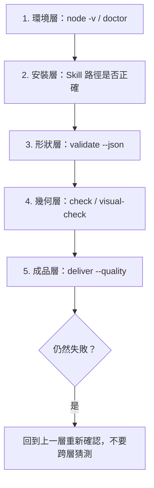

| 層級 | 驗證指令 | 排除了什麼 |
| --- | --- | --- |
| 1. 環境層 | `node -v`、`doctor` | Node 版本、基礎依賴 |
| 2. 安裝層 | 列出 Agent 可用 skills | Skill 路徑、Global/Project 衝突 |
| 3. 形狀層 | `validate --json` | IR 不符 Schema |
| 4. 幾何層 | `check`、`visual-check` | 版面重疊、視覺回歸 |
| 5. 成品層 | `deliver --quality` | artifact check 未通過 |

## 31.3 回報問題時應附上的最小資訊集

> **Provenance：**🟡 建議架構。

為避免來回問答，建議团隊規定回報問題時必附：

- `node -v` 與作業系統（含是否使用 WSL）
- 使用的 Agent 與 Skill 安裝位置（Global 或 Project）
- 完整指令列與 exit code
- `validate --json` 的原始輸出（勿截圖，請貼文字）
- IR 的 `meta` 區塊（可遮蔽敏感專案名稱，見第 35 章）

### Scenario

一位使用 Windows 11 + PowerShell 的工程師回報「Archify CLI 指令跑不動」，經排查發現他直接複製了 Bash 語法的環境變數設定（`VAR=value command`），這在 PowerShell 中不成立，改用 `$env:VAR = 'value'; command` 語法後問題排除（見第 32 章）。

### AI Prompt 範例

```text
我執行 node bin/archify.mjs doctor 時出現錯誤，錯誤訊息如下：
[貼上錯誤訊息]
請依照 Symptom/Cause/Diagnosis/Solution 的架構幫我診斷，並告訴我下一步該怎麼做。
```

### 本章 Checklist

- [ ] 已建立團隊內部的 Troubleshooting 快速查詢表
- [ ] 已針對 Windows/PowerShell/WSL 環境的常見問題預先準備解法
- [ ] 已將常見問題與解法沉澱進團隊 Wiki，避免重複踩坑

---

# 第 32 章：Windows 開發環境

企業開發者不一定使用 Linux，本章提供 Windows 實務建議（🟡 建議做法，依一般 Node.js CLI 工具在 Windows 的通用實務整理，非 Archify 官方專屬文件）。

## 32.1 Windows 10 與 Windows 11

- 建議使用 [nvm-windows](https://github.com/coreybutler/nvm-windows) 管理 Node.js 版本，確保符合 `engines.node >= 18`。
- 避免在路徑中使用過長的巢狀目錄（Windows 路徑長度限制仍可能在部分工具鏈中造成問題）。

## 32.2 PowerShell

```powershell
# 確認 Node.js 版本
node -v

# 執行 doctor
node bin/archify.mjs doctor

# 設定環境變數（PowerShell 語法，非 Bash 的 VAR=value）
$env:NODE_ENV = "development"
node bin/archify.mjs demo
```

## 32.3 CMD

CMD 對 Unicode（含繁體中文路徑/輸出）的支援不如 PowerShell 與 Windows Terminal，建議團隊統一改用 PowerShell 或 Windows Terminal，避免中文輸出亂碼影響 Agent 判讀 CLI 輸出結果。

## 32.4 Git Bash

Git Bash 提供較接近 Unix 的 Shell 體驗，官方文件中的 `bash` 範例指令多數可直接在 Git Bash 中執行，適合習慣 Unix 語法的團隊成員。

## 32.5 WSL（Windows Subsystem for Linux）

- 若團隊 CI/正式環境為 Linux，開發時使用 WSL 可降低「本機能跑、CI 跑不動」的落差風險。
- 需注意：若專案原始碼放在 Windows 檔案系統（`/mnt/c/...`）但用 WSL 內的 Node.js 執行，跨檔案系統的 I/O 效能可能較差；建議將專案 clone 到 WSL 原生檔案系統（如 `~/projects/...`）。

## 32.6 Node.js、npm 與 npx

- 企業內網若有限制存取 npmjs.org，需先確認 `npx skills add ...`（第 6 章）能否透過企業內部 npm mirror 正常運作。

## 32.7 Git

- Windows 上的 Git 預設可能將換行符號自動轉換（CRLF/LF），若 Typed JSON IR 因換行符號問題導致 Schema 驗證出現非預期差異，建議在 `.gitattributes` 中將 `*.json` 明確設定為 `text eol=lf`。

## 32.8 Cursor、VS Code、Claude Code 與 Codex CLI

以上工具在 Windows 上均有原生支援，安裝路徑請依第 6 章對照表（Windows 使用者注意 `~` 對應的實際路徑為使用者家目錄，如 `C:\Users\<username>\`）。

### Scenario

一個以 Windows 為主要開發環境的金融業團隊，統一規範「所有 Archify CLI 操作一律透過 PowerShell 或 Git Bash 執行，不使用 CMD」，並在 `.gitattributes` 中鎖定 IR JSON 檔案的換行符號，避免跨平台協作時出現非預期的 Diff 雜訊。

### AI Prompt 範例

```text
我目前在 Windows 11 + PowerShell 環境。請將 archify 的安裝與驗證步驟，
改寫成 PowerShell 語法（包含環境變數設定方式），並提醒我 Windows 路徑（~ 對應 C:\Users\<username>\）的注意事項。
```

### 本章 Checklist

- [ ] 已確認團隊 Windows 環境的 Node.js 版本管理方式（如 nvm-windows）
- [ ] 已統一團隊使用的 Shell（PowerShell/Git Bash），避免 CMD 相容性問題
- [ ] 已在 `.gitattributes` 中處理 IR JSON 檔案的換行符號一致性
- [ ] 已確認 WSL 使用者的專案檔案系統放置位置，避免跨檔案系統效能問題

---

# Part IX：企業推廣與治理

# 第 33 章：企業導入建議

## 33.1 從個人到企業的導入路徑

```text
Individual Developer → Team → Department → Enterprise
```

## 33.2 六階段 Roadmap（🟡 建議架構）

```text
Phase 1  Learning
  —— 個人/小組先熟悉第 5~8 章（安裝、CLI、Hello World）

Phase 2  Pilot
  —— 選定 1~2 個試點專案，套用第 9~13 章（開發流程、逆向工程、升級）

Phase 3  Team Standard
  —— 建立團隊 Prompt Library（第 37 章）與 Agent Instruction（第 26 章）

Phase 4  SSDLC Integration
  —— 依第 22 章整合進 Design/Architecture/Testing/Security 階段

Phase 5  CI/CD Integration
  —— 依第 24 章建立自訂 CI 驗證 Gate

Phase 6  Enterprise Architecture Governance
  —— 依第 25 章 SOP 與第 34 章使用規範，正式納入企業架構治理流程
```

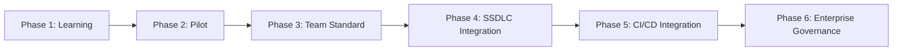

### Scenario

某企業 IT 部門規劃以半年為週期完成六階段導入：第 1 個月完成 Phase 1~2，第 2~3 個月完成 Phase 3~4，第 4~6 個月完成 Phase 5~6，並在每個 Phase 結束後進行內部回顧調整下一階段做法。

### AI Prompt 範例

```text
我們目前正處於導入 Roadmap 的 Phase 2（Pilot）。試點專案是 order-service 的 Reverse Engineering。
請依第 10 章 SOP 執行，並在完成後幫我整理一份「Phase 2 導入心得」，
列出哪些做法可以直接沿用到 Phase 3 的團隊標準，哪些需要調整。
```

### 本章 Checklist

- [ ] 已確認目前團隊處於六階段 Roadmap 的哪個階段
- [ ] 已為每個 Phase 設定明確的完成標準與時間預估
- [ ] 已安排每個 Phase 結束後的回顧機制

---

# 第 34 章：團隊使用規範

## Archify 使用規範（🟡 建議架構）

1. **什麼情況必須使用**：Reverse Engineering 既有 Repository、Framework Upgrade 前後的架構比對、涉及服務邊界調整的 PR、上線前架構審查。
2. **什麼情況建議使用**：新 Feature 開發前的架構討論、API 設計評審、Onboarding 新成員時的系統介紹。
3. **什麼情況不需要使用**：會議中隨手畫的示意圖、單純講解演算法邏輯（非系統架構）、個人筆記用途的草圖（改用 Mermaid 即可，見第 19 章）。
4. **Diagram Naming**：檔名建議格式 `<模組或情境>-<diagram-type>.html`，如 `order-service-architecture.html`。
5. **Repository Version**：架構圖需標註對應的程式碼版本（Git commit hash 或 tag），確保可追溯圖與程式碼的對應關係。
6. **Evidence**：所有正式交付的架構圖，須能列出至少一項具體證據來源（檔案路徑）。
7. **Validation**：所有正式交付前必須通過 `validate`。
8. **Review**：涉及架構治理決策的圖，須經至少一位資深工程師/架構師人工 Review。
9. **Storage**：正式 Artifact 建議存放於專案 `docs/architecture/` 目錄並納入版本控制；草稿/探索性輸出可存放於暫存目錄，不需入庫。
10. **Retention**：過期或已被取代的架構圖 Artifact，建議保留最近 3 個版本作為歷史對照，其餘可歸檔或清除（依企業文件保存政策調整）。
11. **Security**：涉及敏感架構資訊的圖，分享範圍需依第 35 章分級管理。
12. **Sensitive Data**：架構圖中不應直接呈現真實的 API Key、密碼、Token 等機敏值，即使是作為範例說明也應以佔位符取代。

### Scenario

新進工程師在 Onboarding 文件中看到明確條列的 12 條使用規範，能快速判斷「這個情境該不該用 Archify」，而不需要每次都詢問資深同仁。

### AI Prompt 範例

```text
這是一個涉及服務邊界調整的 PR，依團隊規範屬於「必須使用 Archify」的情境。
請產生 Before/After architecture diagram 與 Delta 報告，並依規範將輸出存放於 docs/architecture/，
檔名格式為 <模組>-architecture.html，並標註對應的 commit hash。
```

### 本章 Checklist

- [ ] 已建立團隊內部 12 條使用規範文件
- [ ] 已統一 Diagram Naming 與 Storage 規範
- [ ] 已明訂 Retention 政策，避免 Artifact 無限累積
- [ ] 已明訂 Security/Sensitive Data 處理原則

---

# 第 35 章：安全性與敏感資訊

## 35.1 企業使用時需注意的敏感資訊類型

Source Code、API Key、Password、Token、Credential、PII、Financial Data、Customer Data、Internal Architecture、Network Topology。

> ⚠️ 不應因為「要畫架構圖」就把敏感資訊暴露給 AI Agent 或外部服務。這是企業導入任何 AI Coding Agent 工具都必須遵守的基本原則，Archify 也不例外。

## 35.2 資料分類與存取控制流程（🟡 建議架構）

```text
Data Classification
      ↓
Agent Access Control（依角色限制 Agent 可讀取的 Repository 範圍）
      ↓
Repository Scope（明確界定本次任務可分析的目錄/模組）
      ↓
Archify Artifact Review（輸出前人工審查是否含敏感資訊）
      ↓
Distribution Control（依分類決定分享範圍：內部/團隊/公開）
```

## 35.3 具體做法建議

- **Source Code**：確認使用的 AI Agent 環境（本機執行 vs. 雲端 API）是否符合企業資料外流政策；Archify CLI 本身在本機執行，但 Agent 讀取程式碼並生成 IR 的過程，可能涉及呼叫遠端 LLM API，需一併評估。
- **API Key／Password／Token／Credential**：架構圖的 Card 內容不應包含真實機敏值，設定檔中若含機敏資訊，Agent 應以 `[REDACTED]` 或欄位名稱取代實際值。
- **PII／Customer Data**：`dataflow` 圖中標示 PII 流動路徑時，只標示「資料類別」（如「使用者信箱」），不放實際範例資料。
- **Financial Data**：涉及交易金額、帳戶資訊的系統，架構圖聚焦於「資料如何流動」而非展示實際數值。
- **Internal Architecture／Network Topology**：對外分享（如公開部落格、開源文件）前，需額外審查是否洩漏內部網路拓撲、內部系統命名慣例等可能被用於社交工程或滲透測試偵察的資訊。

### Scenario

資安團隊要求：任何要對外（如公開技術部落格）分享的 Archify 輸出，必須先經過內部 Architecture Artifact Review 流程，確認圖中不含真實內網 IP、真實服務名稱對應的內部命名慣例，才能發布。

### AI Prompt 範例

```text
在你產生這份架構圖之前，請先確認：
1. 是否有任何設定檔內容包含真實的 API Key/密碼/Token？若有，請在 IR 中以 [REDACTED] 取代，不要照抄原始值
2. 資料流相關的節點是否只標示資料「類別」而非實際範例值
3. 完成後請列出這份輸出中，哪些資訊可能屬於「Internal Architecture / Network Topology」等級的敏感資訊，供我在對外分享前審查
```

### 本章 Checklist

- [ ] 已建立資料分類與存取控制流程
- [ ] 已確認 Agent 讀取程式碼與呼叫遠端 LLM API 的資料外流風險評估
- [ ] 已規範架構圖 Card 內容不得含真實機敏值
- [ ] 已建立對外分享前的 Artifact Review 機制

---

# 第 36 章：Archify 最佳實務 Checklist

## Before

- [ ] Scope defined（已明確界定分析範圍）
- [ ] Repository version identified（已記錄對應的程式碼版本）
- [ ] Evidence available（已確認有足夠證據可供分析）
- [ ] Diagram type selected（已依第 4 章比較表選定 diagram type）

## During

- [ ] Main path clear（主要路徑視覺上清楚可辨識）
- [ ] Components bounded（元件數量在可讀範圍內，必要時依第 28 章分層）
- [ ] Evidence-based（每個節點/邊都有證據支持）
- [ ] No hallucinated topology（未出現臆測的元件或關係）
- [ ] Supporting details placed in cards（支援性細節放入 Card，而非額外的線）

## After

- [ ] Validation passed（已通過 `validate`）
- [ ] HTML generated（已透過 `deliver` 產出最終 HTML）
- [ ] Visual review completed（已完成人工肉眼審查）
- [ ] Source version recorded（已記錄對應的 Repository 版本/commit hash）
- [ ] Artifact stored（已依第 34 章規範存放）
- [ ] Human reviewed（已經至少一位資深工程師/架構師 Review）

### Scenario

團隊將本章的 Before/During/After Checklist 直接轉貼進 PR Template 的其中一個區塊，作為所有「含架構圖變更」PR 的必填項目，Reviewer 可依此快速確認交付品質。

### AI Prompt 範例

```text
請在你交付這份架構圖之前，逐項確認 Before/During/After Checklist 中的每一項，
並在最後告訴我還有哪些項目尚未完成或需要我協助確認。
```

### 本章 Checklist

（本章本身即為最佳實務 Checklist，見上方三個階段清單。）

---

# Part X：Prompt Library 與工作模式

# 第 37 章：常用 Prompt Library

## 37.1 使用方式與調整原則

> **Provenance：**🟡 建議架構（Prompt 內容為本手冊撰寫，非官方提供的 Prompt 範本）。

使用本章 Prompt 前，請先做三件事：

1. **補上 Context**：把「這是什麼系統、給誰看、要回答什麼問題」寫在 Prompt 最前面（見第 14 章九要素）。
2. **限定 Scope**：明確指出要分析的目錄或模組，避免 Agent 一次掃描整個 Repository 而產生 Diagram Explosion（見第 28 章）。
3. **固定驗收語句**：所有 Prompt 結尾都應保留「通過 `validate` 後再 `deliver`」，避免 Agent 跳過驗證。

## 37.2 Prompt 清單（20 則）

以下 20 個 Prompt 可直接複製給 AI Coding Agent 使用（依第 14 章九要素精神撰寫，使用前請依實際專案調整 Context/Scope）。

**1. Repository Architecture**

```text
請使用 archify 分析這個 Repository 的整體架構，產生 architecture diagram，
只根據實際讀取到的原始碼與設定檔，區分 Fact 與 Inference，通過 validate 後 deliver。
```

**2. Runtime Architecture**

```text
請分析這個系統在執行期（runtime）實際會啟動的元件（依 docker-compose.yml / K8s manifests / 部署腳本判斷），
產生 architecture diagram，標示每個元件對應的部署單位。
```

**3. Deployment Architecture**

```text
請依 CI/CD 設定與 IaC（Terraform/CloudFormation/Helm）分析部署拓撲，
產生 architecture diagram，標示環境（dev/staging/prod）之間的差異（如有）。
```

**4. Frontend Architecture**

```text
請分析 frontend 專案的路由結構、狀態管理、與後端 API 的呼叫關係，
產生 architecture diagram，聚焦前端模組劃分。
```

**5. Backend Architecture**

```text
請分析 backend 專案的分層架構（Controller/Service/Repository/Domain），
產生 architecture diagram，標示各層之間的依賴方向。
```

**6. API Flow**

```text
請針對 [API 端點名稱] 這支 API，分析從請求進入到回應返回的完整呼叫鏈，
產生 sequence diagram，標示每一段呼叫的服務與方法名稱。
```

**7. Login Flow**

```text
請分析使用者登入流程，包含帳密驗證、Token 簽發、Session/Cache 寫入，
產生 sequence diagram，標示 Token 的生命週期起點。
```

**8. Authentication**

```text
請分析系統的身份驗證機制（如 JWT/OAuth2/Session-based），
產生 sequence diagram，說明驗證失敗時的處理路徑（Secondary Path）。
```

**9. Authorization**

```text
請分析系統的權限檢查邏輯（RBAC/ABAC 或自訂權限模型），
產生 sequence diagram 或 workflow diagram，標示權限不足時的處理流程。
```

**10. Database Flow**

```text
請分析主要業務流程中資料如何寫入/讀取資料庫，
產生 dataflow diagram，標示涉及的資料表/Collection 名稱。
```

**11. Redis Cache**

```text
請分析系統使用 Redis 的快取策略（cache-aside/write-through 等，依實際程式碼判斷，不要推測未使用的模式），
產生 sequence diagram，標示快取命中與未命中的兩種路徑。
```

**12. Kafka**

```text
請分析系統中 Kafka Producer/Consumer 的 Topic 使用情形，
產生 dataflow diagram 或 architecture diagram，標示每個 Topic 的生產者與消費者。
```

**13. MQ**

```text
請分析系統中訊息佇列（如 RabbitMQ/IBM MQ）的 Queue/Channel 設定與訊息流向，
產生 architecture diagram 或 dataflow diagram。
```

**14. File Transfer**

```text
請分析系統中檔案交換機制（SFTP/檔案上傳下載），
產生 dataflow diagram，標示檔案來源、暫存位置、最終去向。
```

**15. Batch**

```text
請分析系統中的排程/批次作業（Cron Job/Scheduled Task），
產生 workflow diagram 或 lifecycle diagram，標示批次作業的觸發條件與失敗重試機制。
```

**16. Reverse Engineering**

```text
（見第 14.6 節完整範本）
請對這個沒有文件的 Legacy Repository 執行逆向工程，區分 Observed Fact / Inferred Relationship / Unknown，
產生 architecture diagram，並列出所有 Unknown 項目供人工確認。
```

**17. Framework Upgrade**

```text
（見第 14.7 節完整範本）
請針對 [框架名稱] 從 [目前版本] 升級到 [目標版本] 的計畫，
產生 Before 與 After 的 architecture diagram，並執行 compare 產出 Delta 報告。
```

**18. Architecture Delta**

```text
請比較這兩份已驗證的 architecture IR（Before / After），
執行 compare，摘要列出 Added/Removed/Changed/Moved/Rerouted，並標出對現有呼叫方可能造成影響的 Rerouted 項目。
```

**19. Security Review**

```text
（見第 14.9 節完整範本）
請產生標示 Trust Boundary 的 architecture diagram，聚焦使用者請求如何穿越信任邊界，
只根據實際的安全群組/防火牆設定與驗證邏輯，不要推測未設定的安全機制。
```

**20. Performance Review**

```text
（見第 14.10 節完整範本）
請針對 [API/流程名稱] 產生 sequence diagram，標示可能的效能瓶頸點（如序列化的多次資料庫呼叫、未使用快取的重複查詢），
只依實際程式碼中的呼叫順序判斷，不要臆測未實測的效能數據。
```

### Scenario

團隊建立一份內部 Wiki 頁面，把這 20 個 Prompt 依情境分類（架構/流程/資料/安全/效能），新成員可直接複製貼上使用，並依專案實際名稱替換方括號內的占位文字。

### AI Prompt 範例

（本章即為 Prompt Library，見上方 20 則範例，可依實際需求直接複製使用。）

### 本章 Checklist

- [ ] 已建立團隊共用的 Prompt Library 文件（Wiki/內部知識庫）
- [ ] 已依專案實際名稱替換範例中的占位文字
- [ ] 已定期檢視 Prompt Library 是否需要因專案演進而更新

---

# 第 38 章：AI Agent 與 Archify 標準工作模式

```text
Observe
  ↓
Understand
  ↓
Map
  ↓
Validate
  ↓
Explain
  ↓
Modify
  ↓
Remap
  ↓
Compare
  ↓
Review
```

> 這是一種 **Architecture-aware AI Software Development Loop**——把架構視覺化與驗證，嵌入到 AI Agent 日常開發迴圈中的每一次「理解 → 修改 → 再理解」循環裡，而不是只在專案初期畫一次圖就結束。

## 38.1 與其他方法論的整合

| 方法論 | 整合方式 |
| --- | --- |
| Spec-Driven Development | Archify 作為 Spec 與 Code 之間的架構可視化層（詳見第 39 章） |
| Test-Driven Development | `sequence`/`workflow` 圖輔助測試案例設計，釐清分支與邊界條件 |
| AI Coding Agent 日常開發 | Observe→Map 對應 Agent 讀碼分析階段，Validate→Review 對應 Agent 自我修正與人工把關階段 |
| SSDLC | 對應第 22 章各階段切入點 |
| Code Review | Map/Compare 階段產出的 Delta 報告作為 Review 輔助材料 |
| Architecture Governance | Review 階段的產出成為第 25 章 SOP 的正式交付物 |

### Scenario

一個團隊把「Observe→Understand→Map→Validate→Explain→Modify→Remap→Compare→Review」九步驟印成海報貼在團隊看板上，每次進行較大規模的架構調整時，都依此順序推進，避免跳過 Validate 或 Review 直接合併變更。

### AI Prompt 範例

```text
請依照 Observe→Understand→Map→Validate→Explain→Modify→Remap→Compare→Review 的順序，
處理這次「把 notification 邏輯從 order-service 拆分成獨立服務」的架構調整任務，
每完成一個步驟就跟我確認後再進行下一步。
```

### 本章 Checklist

- [ ] 已理解九步驟工作模式的完整循環
- [ ] 已規劃如何與團隊既有的 TDD/SSDLC 流程整合
- [ ] 已避免在架構調整任務中跳過 Validate 或 Review 步驟

---

# 第 39 章：Archify 在 Spec-Driven Development 中的角色

## 39.1 在流程中的位置

```text
Specification
      ↓
Architecture
      ↓
Archify
      ↓
Implementation
      ↓
Test
      ↓
Validation
      ↓
Architecture Delta
```

Archify 在 Spec-Driven Development 中扮演 **Architecture Visibility Layer**（架構可見性層）的角色：Spec 文件描述「系統應該做什麼」，但往往不描述「系統實際上長什麼樣子」；Archify 讓 Agent 在實作前先產出一份基於現有證據的架構視圖，實作後再產出更新版本，兩者之間的落差（Delta）成為「Spec 是否被正確實現」的其中一項可視化佐證（但不是唯一或完整的驗收依據，仍須搭配測試與人工驗收）。

> ⚠️ Architecture Diagram 通過驗證，不等於實作完全符合 Spec 的業務邏輯要求——這只是「架構層面」的可視化佐證，詳見第 42 章限制說明。

## 39.2 兩個時間點的架構圖產出

> **Provenance：**🟡 建議架構（流程安排為實務建議，非官方規定）。

| 時間點 | 產出 | 證據來源 | 審查重點 |
| --- | --- | --- | --- |
| Spec 核准後、實作前 | **預期架構（To-Be）** | Spec 文件、既有系統邊界 | 服務邊界、對外依賴、資料歸屬是否合理 |
| 實作完成後 | **實際架構（As-Is）** | 原始程式碼、設定檔、IaC | 是否出現 Spec 未描述的新依賴 |
| 兩者之間 | **Architecture Delta** | `compare architecture`（見第 7.6 節） | Added／Removed／Changed 是否都有合理解釋 |

需特別注意：預期架構圖屬於 **🟡 推論性產物**，必須在 `meta` 或圖面上明確標示為草稿，避免日後被誤當成現況文件引用。

### Scenario

團隊採用 Spec-Driven Development 流程，在 Spec 文件核准後，先用 Archify 產生「預期架構」草圖供架構師確認方向，開發完成後再產生「實際架構」，兩者比對可及早發現實作是否偏離原本規劃的服務邊界。

### AI Prompt 範例

```text
這是本次 Feature 的 Spec 文件：[貼上 Spec 摘要]
請先依 Spec 描述的服務邊界，產生一份「預期架構」的 architecture diagram（標示為草稿性質，Components 待實作後確認），
待我完成實作後，我會再請你依實際程式碼產生「實際架構」圖，屆時我們再做比對。
```

### 本章 Checklist

- [ ] 已理解 Archify 作為 Spec 與 Code 之間的 Architecture Visibility Layer 定位
- [ ] 已避免把「架構圖驗證通過」誤解為「業務邏輯完全正確」
- [ ] 已規劃 Spec 核准後與實作完成後兩個時間點的架構圖產出時機

---

# 第 40 章：與各 AI Coding Agent 的整合策略

## 40.1 各 Agent 整合對照表

| AI Tool | Archify 角色 | Skill 位置 | 支援分類 | 建議使用方式 |
| --- | --- | --- | --- | --- |
| **Claude Code** | 完整 renderer + 驗證流程 | `~/.claude/skills/` 或 `.claude/skills/` | Official Support（🟢） | 專案層級安裝，搭配第 26 章 Instruction 放入 `CLAUDE.md` |
| **Codex CLI** | 完整 renderer + 驗證流程 | `~/.agents/skills/` 或 `.agents/skills/` | Official Support（🟢） | 適合 CI/腳本化情境下的批次驗證 |
| **opencode** | 完整 renderer + 驗證流程 | `~/.config/opencode/skills/`、`.opencode/skills/`、`.agents/skills/` | Official Support（🟢） | 與 Codex CLI 可共用 `.agents/skills/` 路徑 |
| **Raven** | 完整 renderer + 驗證流程 | `~/.raven/workspace/skills` | Official Support（🟢，README 三次獨立措辭一致確認） | ZIP 手動安裝，適合已採用 EverMind 生態系的團隊 |
| **Claude.ai** | 視 sandbox 是否可存取 Node.js 而定 | 上傳 `archify.zip`（Settings → Capabilities → Skills） | Official Support（🟢，但能力受限於 sandbox） | 適合無法本機安裝 CLI 的輕量使用情境 |
| **Cursor** | 完整 renderer + 驗證流程 | `--agent cursor` 非互動安裝參數；agent switcher `?agent=cursor` | **Officially Supported（🟢 first-class）**：README 首段正式列名；v2.15.0 有「First-class Cursor onboarding」；ROADMAP 記載 Cursor Agent CLI 實測 9/9 check 通過 | 使用前先以 `doctor` 確認環境就緒 |
| **DeepSeek Harness** | Skill-only 精簡包 | `@tt-a1i/archify-dsh` | Official Support（🟢，獨立分發套件） | 適合已採用 DeepSeek Harness 的團隊 |
| **GitHub Copilot / Windsurf / Cline / Roo Code 等** | 未經官方確認 | 未知 | ⚪ 查無資料，不可視為官方支援 | 若嘗試手動整合，需自行驗證相容性，並在團隊文件中明確標示為 Manual Integration |

> ⚠️ 官方 README 安裝表正式收錄 Raven、Claude Code、Codex CLI、opencode、Claude.ai、Project Knowledge 六項；Cursor 則由 README 首段、CHANGELOG v2.15.0、ROADMAP 三份一手來源交叉確認為 first-class 支援（見改版紀錄 C-01）。其餘第三方宣稱的相容清單一律歸類為「Manual Integration／未經確認」，不可對外宣稱為官方支援。

## 40.2 支援分類的判讀原則

> **Provenance：**🟡 建議架構（分類法為本手冊定義，依據為 🟢 官方文件）。

| 分類 | 定義 | 企業對外可否聲明支援 |
| --- | --- | --- |
| Official Support（🟢） | 出現於官方 README 安裝表或 CHANGELOG／ROADMAP 明文 | 可 |
| Manual Integration（🟡） | 官方未提，但技術上可行（能執行 Node.js 且能載入 Skill 文件） | 不可，須標示為自行整合 |
| 查無資料（⚪） | 官方未提且本手冊未實測 | 不可 |

實務建議：將上表直接寫進企業內部的工具清單（Tooling Inventory），避免不同團隊對「官方支援」的認定標準不一致。

### Scenario

一個同時使用 Claude Code（本機開發）與 Codex CLI（CI Pipeline）的團隊，選擇在專案根目錄同時安裝 `.claude/skills/archify/` 與 `.agents/skills/archify/`（或透過 symlink 共用），確保本機開發與 CI 驗證使用同一份 Skill 版本。

### AI Prompt 範例

```text
我們團隊同時使用 Claude Code 與 Codex CLI。請確認這個專案的 .claude/skills/ 與 .agents/skills/
是否都已正確安裝 archify，並且版本一致（可比對兩處的 package.json 版本號）。
```

### 本章 Checklist

- [ ] 已依團隊實際使用的 Agent，對照本章分類選擇官方支援的安裝方式
- [ ] 已避免將未經確認的第三方相容清單當作官方支援
- [ ] 已為多 Agent 並用的團隊規劃版本一致性檢查機制

---

# Part XI：價值、限制與願景

# 第 41 章：Archify 對企業 AI Coding Agent 的價值

## 41.1 十個價值面向

1. **Context Understanding**：架構圖是壓縮後的系統心智模型，讓 Agent（與人類）更快建立對系統的整體理解，而不必每次都重新從零讀完整個 Repository。
2. **Architecture Visibility**：把原本只存在於資深工程師腦中的架構知識，轉成可分享、可驗證的視覺化產物。
3. **Reverse Engineering**：對缺乏文件的 Legacy System，提供結構化、可追溯證據的逆向工程流程（第 10、11 章）。
4. **Change Impact**：透過 Architecture Delta（第 13 章），在變更前就能預覽/確認變更對架構的實際影響範圍。
5. **Framework Migration**：Before/After 比對降低升級過程中「改壞了什麼卻沒發現」的風險（第 12 章）。
6. **Code Review**：PR 中附上架構圖與 Delta 報告，讓 Reviewer 更快掌握變更的架構層面意涵（第 23 章）。
7. **Architecture Governance**：作為架構治理委員會審查的標準化交付物（第 25 章）。
8. **Knowledge Transfer**：資深工程師離職/轉調前，可用 Archify 快速沉澱系統知識，降低知識斷層風險。
9. **Onboarding**：新成員可透過互動式架構圖（第 17 章 Viewer）自助探索系統，縮短上手時間。
10. **Documentation**：架構圖作為 SSDLC 交付物之一，補足傳統文件容易過時的缺口（但不能取代完整的系統文件，見第 42 章限制）。

### Scenario

一位即將離職的資深工程師，在交接週用 Archify 為自己負責的 3 個核心服務各產生一份完整的 architecture 與 sequence 圖，並附上 Guided Story 導覽（第 17 章），大幅降低交接過程中的知識流失風險。

### AI Prompt 範例

```text
我下週要交接這個系統。請幫我：
1. 產生整個系統的 architecture 總覽圖
2. 針對三個最核心的業務流程（下單/付款/出貨），各產生一份 sequence 圖
3. 為每張圖標示清楚的 Primary Path，方便接手的同仁快速理解重點
```

### 本章 Checklist

- [ ] 已識別團隊中最適合導入 Archify 的價值場景（Onboarding/交接/治理/升級等）
- [ ] 已規劃知識傳承場景中的架構圖產出時機
- [ ] 已理解架構圖是輔助文件，非文件的完全替代品

---

# 第 42 章：限制與不適用場景

> 本手冊必須誠實列出限制，不能只強調優點。

## 42.1 六項核心限制

1. **Archify 不代表 AI 一定理解正確**：Schema 驗證只保證 IR 結構合法，不保證 Agent 對系統的理解是正確的——內容真實性仍需人工 Review（第 15 章）。
2. **Diagram 不等於 Runtime Truth**：架構圖反映的是 Agent 分析當下的程式碼/設定證據，不是即時的執行期（Runtime）真實流量或狀態；系統實際執行時的行為可能因為 Feature Flag、A/B Testing、動態設定等因素而與靜態程式碼分析結果有落差。
3. **Source Evidence 不等於 Production Telemetry**：從原始碼推論出的架構關係，不等於生產環境實際發生的呼叫模式（例如程式碼中存在但實際從未被觸發的分支）。
4. **Architecture Diagram 不等於完整 System Documentation**：架構圖只涵蓋結構性/流程性資訊，不包含業務規則細節、SLA 承諾、變更歷史等完整文件應涵蓋的內容。
5. **Validation 不等於 Business Correctness**：`validate` 只檢查 IR 是否符合 Schema 結構，不檢查業務邏輯是否正確或圖中呈現的架構決策是否合理。
6. **Visual Quality 不等於 Architecture Correctness**：一張排版精美、看起來很專業的圖，不代表其內容經過完整驗證——這正是本手冊反覆強調 Provenance 標籤與人工 Review 的原因。

> ⚠️ **不可以把「authored architecture facts」（作者撰寫時認定的架構事實）說成「live infrastructure truth」（即時基礎設施真相）。** 兩者是不同層次的陳述，混淆兩者會讓架構圖被過度信任，反而增加風險。

## 42.2 不適用場景與替代方案

> **Provenance：**🟡 建議架構（依 42.1 限制推導的選型建議）。

| 不適用場景 | 原因 | 建議替代方案 |
| --- | --- | --- |
| 即時流量、延遲、錯誤率監控 | Archify 為靜態分析產物 | APM／Distributed Tracing／Grafana |
| 實體關係模型（ERD）細節 | 五種 diagram type 皆非 ERD 專用 | 資料庫建模工具或 Mermaid `erDiagram` |
| 逐行程式邏輯流程圖 | 粒度過細，易造成 Diagram Explosion（第 28 章） | Mermaid `flowchart`或程式碼註解 |
| 具法律效力的合規文件 | 圖面含推論成分，需人工核可 | 正式架構治理文件（如 C4／Structurizr） |
| 即時協作白板、臨時討論 | 產出為一次性交付物，非即時共編 | Miro／Excalidraw（見第 20 章） |

### Scenario

一個團隊誤把 Archify 產出的架構圖當成「生產環境目前即時流量的監控儀表板」使用，實際上該圖僅反映某次程式碼分析當下的靜態結構；當生產環境因 Feature Flag 關閉了某個路徑時，圖上仍會顯示該路徑存在，導致誤判。正確做法是搭配 APM／可觀測性工具（如 Grafana、Distributed Tracing）作為 Runtime Truth 的來源，Archify 僅作為靜態架構的可視化與治理輔助。

### AI Prompt 範例

```text
在你產出這份架構圖之後，請在說明文字中明確註明：
「本圖反映 [日期] 對程式碼的靜態分析結果，不代表生產環境當下的即時執行狀態，
若需確認即時流量與效能狀況，請另行參考 APM/監控系統。」
```

### 本章 Checklist

- [ ] 已理解 Archify 圖表僅反映靜態程式碼分析，非即時 Runtime 真相
- [ ] 已避免把架構圖當作監控儀表板使用
- [ ] 已在對外分享的架構圖中註明分析時間點與資料來源限制

---

# 第 43 章：企業導入 Reference Architecture

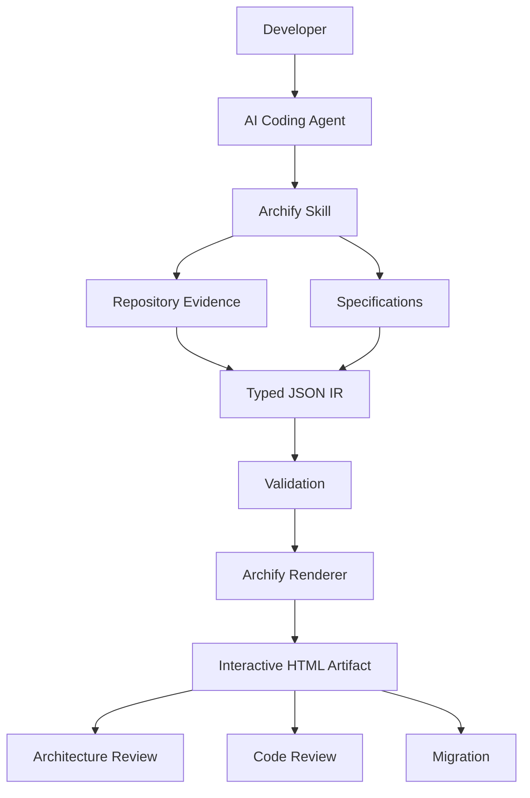

## 43.1 各層說明

- **Developer / AI Coding Agent**：企業內開發者透過 AI Agent 發起分析或畫圖需求。
- **Archify Skill**：提供規則與工具鏈，銜接 Agent 與 Repository 證據。
- **Repository Evidence + Specifications**：兩種輸入來源——一是既有程式碼的靜態證據，二是尚未實作但已核准的規格文件（對應第 39 章 Spec-Driven Development 情境）。
- **Typed JSON IR → Validation → Renderer**：核心驗證與渲染管線（第 2 章）。
- **Interactive HTML Artifact**：最終輸出的正式交付物。
- **Architecture Review／Code Review／Migration**：三個主要下游使用場景，分別對應第 21～26 章、第 23 章、第 12～13 章的內容。

### Scenario

企業架構治理辦公室（Architecture Governance Office）採用此 Reference Architecture 作為內部培訓教材的核心圖示，向各開發團隊說明「Archify 在企業 AI 開發平台中的位置」，避免各團隊各自解讀導致用法不一致。

### AI Prompt 範例

```text
請依這份 Reference Architecture 的定位，說明我們目前的 order-service 專案，
在「Repository Evidence」與「Specifications」兩種輸入來源中，各自對應到哪些具體檔案，
並確認目前的 IR 是否同時涵蓋了這兩種來源的資訊。
```

### 本章 Checklist

- [ ] 已向團隊說明企業級 Reference Architecture 的完整圖像
- [ ] 已釐清 Repository Evidence 與 Specifications 兩種輸入來源的差異
- [ ] 已對應 Architecture Review／Code Review／Migration 三個下游場景到既有團隊流程

---

# 第 44 章：最終導入建議

## 建議開發團隊立即採用的 10 件事

1. 依第 6 章安裝 Archify（選擇符合團隊 Agent 的正確路徑）
2. 建立 Team Skill 版本（統一團隊使用的安裝方式，避免 Global/Project 混用衝突）
3. 建立 Agent Instruction（依第 26 章範本客製化，放入專案設定檔）
4. 對既有 Repository 建立 Architecture Map（依第 10 章 SOP，作為基準）
5. 對重要 API 建立 Sequence Map（依第 14.6/37 章 Prompt 範例）
6. 對敏感資料建立 Data Flow（依第 35 章分級管理原則）
7. Framework Upgrade 前建立 Before Map（依第 12 章流程）
8. Upgrade 後建立 After Map，並執行 compare（依第 13 章）
9. 使用 Architecture Delta 作為架構治理審查依據（第 25 章 SOP-09）
10. 將 Archify 納入 SSDLC（依第 22 章切入點，逐步從 Pilot 推進到 Enterprise Governance）

### Scenario

技術長（CTO）在季度技術策略會議上，直接引用這 10 件事作為下一季度「AI Coding Agent 導入深化」的具體行動項目，並指派對應負責人與時程。

### AI Prompt 範例

```text
請依照「立即採用的 10 件事」清單，幫我盤點目前這個專案已經完成哪幾項、還缺哪幾項，
並針對缺少的項目，提出具體可執行的下一步。
```

### 本章 Checklist

- [ ] 已對照 10 件事清單，盤點目前團隊的完成度
- [ ] 已為尚未完成的項目指派負責人與時程
- [ ] 已將此清單納入季度技術策略檢視項目

---

# Part XII：速查與總結

# 第 45 章：一頁式 Quick Reference

## 45.1 從安裝到交付的十個重點

### Install

```bash
npx skills add tt-a1i/archify -g
```

依第 6 章對照表選擇 Claude Code／Codex CLI／opencode／Raven／Claude.ai／Cursor 對應路徑。

### Verify

```bash
node bin/archify.mjs doctor
node bin/archify.mjs demo
```

### Agent Integration

第 26 章 Instruction 範本放入專案設定檔；核心規則：Never invent architecture facts / Evidence first / Fact vs Inference vs Unknown。

### Diagram Types

`architecture`（元件關係）／`workflow`（流程步驟）／`sequence`（呼叫鏈）／`dataflow`（資料流）／`lifecycle`（狀態機）。

### Repository Analysis

依第 9 章開發前/中/後三階段，或第 28 章 L0~L5 分層策略，避免 Diagram Explosion。

### Reverse Engineering

依第 10、11 章 SOP，涵蓋 12 面向，強制區分 Observed Fact / Inferred / Unknown。

### Framework Upgrade

Before → Upgrade Analysis → Target → Delta → Migration Plan → Implementation → After（第 12 章）。

### Architecture Delta

```bash
node bin/archify.mjs compare architecture base.json head.json delta.html
```

輸出 Added/Removed/Changed/Moved/Rerouted 五類差異（第 13 章）。

### Export

```bash
node bin/archify.mjs deliver <type> candidate.json output.html --quality showcase
```

支援 HTML／SVG／PNG／JPEG／WebP／WebM／1200×630 分享卡（第 18 章）。

### Troubleshooting

Agent 找不到 Skill → 檢查安裝路徑；`validate` 失敗 → 檢視 `--json` 錯誤訊息；Windows 環境問題 → 見第 32 章（第 31 章完整對照表）。

### Best Practices

Primary Path 清楚、Edge 不過多、細節放 Card、Evidence First、必經 Validation、必經人工 Review（第 15、16、36 章）。

### Scenario

團隊將本章印成一張 A4 速查卡貼在座位隔板上，或設為內部 Wiki 首頁釘選文章，供日常開發隨時查閱。

### AI Prompt 範例

```text
請依這份 Quick Reference，幫我確認目前專案的 archify 安裝、Instruction 設定、CI 整合三項是否都已到位，
若有缺漏請具體列出。
```

### 本章 Checklist

- [ ] 已將本頁 Quick Reference 提供給團隊成員隨時查閱
- [ ] 已確認 Install/Verify/Agent Integration 三項基本設定到位

---

# 第 46 章：最終結論

> Archify 不應該只被視為「畫架構圖的工具」，而應該被視為 AI Agent 開發流程中的 **Architecture Visibility / Verification / Exploration Layer**。

## 46.1 三層定位的實際含意

| 層次 | 回答的問題 | 對應能力 | 主要章節 |
| --- | --- | --- | --- |
| **Visibility**（可見性） | 這個系統到底長什麼樣子？ | 五種 diagram type、互動式 Viewer | 第 4、17 章 |
| **Verification**（可驗證性） | 這張圖能不能被相信？ | Schema 驗證、幾何檢查、品質門檻 | 第 2.8、7.5 節 |
| **Exploration**（可探索性） | 改了什麼？這條連線的依據在哪？ | Architecture Delta、Repository Evidence | 第 2.7、7.6、13 章 |

三層缺一不可：只有 Visibility 會退化成美化的簡報圖；只有 Verification 而無 Exploration，則圖表無法支援 Review 與版本演進決策。

## 46.2 企業 AI 軟體工程的閉環

```text
Human
  +
AI Agent
  +
Repository Evidence
  +
Archify
  +
Validation
  +
Architecture Review
  =
企業 AI Software Engineering 的閉環
```

這個閉環的核心邏輯是：人類提出需求 → AI Agent 讀取真實證據 → Archify 把證據型別化並決定性驗證 → 產出可探索、可比對、可分享的架構視圖 → 人類 Review 把關內容真實性 → 回饋進下一輪開發或治理決策。這個循環讓「架構圖」從一次性的簡報素材，變成企業 AI 軟體工程流程中可重複產生、可驗證、可追蹤的持續性資產。

## 46.3 導入是否成功的三個判準

> **Provenance：**🟡 建議架構（驗收指標為本手冊提出，非官方定義）。

判斷企業是否真的導入成功，不看「畫了幾張圖」，而看以下三項：

| 判準 | 不及格的徯狀 | 及格的表現 |
| --- | --- | --- |
| **架構圖進得了 Git** | 圖點存在個人電腦或簡報裡 | IR JSON 與交付物隨程式碼一起版控（第 23 章） |
| **驗證進得了 CI** | 僅靠人工提醒執行 `validate` | Pipeline 自動擋下未通過品質門檻的圖（第 24 章） |
| **Review 看得懂 Provenance** | 所有連線一律被當成事實 | Fact／Inference／Unknown 三分法落實於審查流程（第 15、42 章） |

---

# Part XIII：附錄與延伸案例

# 第 47 章：附錄

## A. Archify Terminology

| 詞彙 | 說明 | Provenance |
| --- | --- | --- |
| Agent Skill | AI Agent 執行時載入的一組指令與工具封裝 | 🟢 |
| Typed JSON IR | 官方正式用語；Agent 撰寫的型別化中繼資料結構，契約成文於 `archify/schemas/README.md` | 🟢（本版修正，見 C-02） |
| `schema_version` | IR 契約版本號，定義為 `"const": 1`，與 Skill 版本號為兩條獨立軸線 | 🟢 |
| Schema | 定義每種 diagram type 合法欄位與結構的 JSON Schema（均 `additionalProperties: false`） | 🟢 |
| Validation | 對 IR 進行的決定性結構驗證；開發期以 `ajv` 預編譯，執行期不需依賴 | 🟢 |
| Renderer | 把驗證通過的 IR 編譯成 HTML/SVG 的元件 | 🟢 |
| Viewer | 輸出的 HTML 本體，提供 Search/Trace/Guided Story 等互動 | 🟢 |
| Visual Preset | 4 種視覺風格預設：`classic`／`signal-flow`／`blueprint`／`editorial` | 🟢 |
| Architecture | 5 種 diagram type 之一，描述元件與關係 | 🟢 |
| Workflow | 5 種 diagram type 之一，描述流程步驟 | 🟢 |
| Sequence | 5 種 diagram type 之一，描述呼叫鏈時間順序 | 🟢 |
| Data Flow | 5 種 diagram type 之一，描述資料流動 | 🟢 |
| Lifecycle | 5 種 diagram type 之一，描述狀態轉換 | 🟢 |
| Route | 圖中一條具體的節點-邊路徑；Viewer 可匯出 Route Share Card | 🟢（Share Card 變體）／🟡（精確圖論定義） |
| Reach | Viewer 中的「authored reach」，代表**作者定義的可達關係**，非執行期真實流量 | 🟢 |
| Guided Story | Viewer 的導覽式說故事模式 | 🟢 |
| Architecture Delta | **官方功能名稱**（README／ROADMAP 均使用），含 Review Navigator、PR Proof 等衍生詞 | 🟢（本版修正） |
| Quality Gate | `--quality` 的 `standard`／`showcase` 兩級門檻；showcase 需 9/9 check 全過 | 🟢 |
| Repository Evidence | `architecture` 模式的 `meta.repository`，把節點釘回原始碼位置 | 🟢 |
| Brand Mark | 具出處佐證的向量品牌圖示庫（v2.15.0起 107 個，來源以 SHA-256 釘選） | 🟢 |
| Proof | 查證過程中用以交叉驗證事實的原始來源證據（本手冊查證方法論用語） | 🟡 |
| Evidence | Agent 從 Repository 讀取到的具體事實依據 | 🟢（概念） |
| Export | 將驗證通過的圖輸出成 HTML/SVG/PNG/JPEG/WebP/WebM/Share Card | 🟢 |

## B. CLI Reference

🟢 全 13 項均為雙來源以上確認（見第 7.1 節與 C-04）。下表以 `archify/` 為工作目錄；若從專案根目錄執行，路徑改為 `archify/bin/archify.mjs`。

| Command | Purpose | Example | Output |
| --- | --- | --- | --- |
| `doctor` | 環境健檢 | `node bin/archify.mjs doctor` | 環境檢查報告 |
| `demo` | 產生示範輸出 | `node bin/archify.mjs demo` | 範例 HTML |
| `examples` | 列出官方範例 | `node bin/archify.mjs examples` | 範例列表 |
| `guide` | 依情境取得建議 | `node bin/archify.mjs guide "登入流程" --json` | 建議 diagram type + 指引 |
| `brands` | 品牌圖示探索 | `node bin/archify.mjs brands` | 可用品牌圖示清單 |
| `validate` | 驗證候選 IR | `node bin/archify.mjs validate architecture candidate.json --json` | pass/fail + 全部錯誤訊息 |
| `inspect` | 驗證 + 排版資訊 | `node bin/archify.mjs inspect architecture candidate.json` | 驗證結果 + layout JSON |
| `check` | 交付前附加檢查 | `node bin/archify.mjs check architecture candidate.json` | artifact check 收據 |
| `preview` | 產生預覽 HTML | `node bin/archify.mjs preview architecture candidate.json preview.html` | 預覽用 HTML |
| `render` | 渲染 IR（底層） | `node bin/archify.mjs render architecture candidate.json` | HTML/SVG 渲染結果 |
| `deliver` | 最終驗收輸出 | `node bin/archify.mjs deliver architecture candidate.json out.html --quality showcase` | 最終自包含 HTML |
| `visual-check` | 視覺回歸檢查 | `node bin/archify.mjs visual-check out.html` | 視覺檢查結果 |
| `compare` | Architecture Delta | `node bin/archify.mjs compare architecture base.json head.json delta.html --json` | Delta 報告／Review Navigator HTML |

> ⚠️ `compare` 的第一個引數是 **diagram type**（目前官方逐字語法為 `compare architecture`），不是直接接檔名。實務上最常見的錯誤就是漏寫這個子指令。

## C. File 與 Directory Reference

依第 2 章查證結果整理（🟢 GitHub tree API 確認）：

```text
archify/            —— Skill 套件本體（SKILL.md、bin/、renderers/、schemas/、delta/ 等）
docs/                —— 官方網站原始碼（index/start/guide/gallery.html）
examples/            —— 範例
schemas/（位於 archify/ 內）—— 5 份 JSON Schema + README
references/（位於 archify/ 內）—— 4 份參考文件（內容未逐一查證）
scripts/（位於 archify/ 內）—— 輔助腳本
benchmarks/          —— 效能/品質基準（內容未逐一查證）
experiments/         —— 實驗性內容（內容未逐一查證）
```

> ⚠️ 必須以讀者當下查閱官方 Repository 的實際結構為準，本表為 2026-08-28 查證當下的結構快照。

## D. Version History

| Version | Date | Major Changes | Impact |
| --- | --- | --- | --- |
| `2.16.0-dev.0`（Unreleased） | — | Bounded Viewer localization（`meta.locale` 支援 `en`/`zh-CN`，僅翻譯 Viewer UI 字串） | 多語系 Viewer 輸出；繁中專案須注意不支援 `zh-TW` |
| `2.15.0` | `2026-08-17`（🟠 另一來源顯示 2025-08-17，衝突未解決；判讀理由見§版本與相容性速查表） | Authored brand identity（107 品牌圖示 + `archify brands`，來源以 SHA-256 釘選）、First-class Cursor onboarding、Sequence column fitting（`meta.column_fit`）、DeepSeek Harness 分發（`@tt-a1i/archify-dsh`）、`--quality` 缺值改為報錯 | 品牌圖示豐富度提升、Cursor 正式列為一級環境、CLI 參數容錯行為收緊 |
| `2.14.0` | 未逐一查證 | `visual-check` 成為正式交付前關卡 | 交付鏈由「驗證→產出」延伸為「驗證→產出→視覺回歸」 |
| `2.13.0` | 未逐一查證 | Cursor onboarding 基礎（官網引導與安裝路徑整合） | 為 2.15.0 的 first-class 支援鋪路 |
| `2.12.0` | 未逐一查證 | 匯出選擇明確化：需明確選擇才進入 PNG / JPEG / WebP / SVG / WebM 匯出 | 避免誤觸匯出；同時佐證 JPEG/WebP 為正式格式（C-03） |
| `2.10.0` | 未逐一查證 | 新增 `inspect architecture <file.json>` | 排版問題可被獨立診斷 |
| `2.3.0` / `2.1.0` | 未逐一查證 | Viewer 匯出選單成型（Download PNG / JPEG / WebP / SVG） | 匯出能力的起點 |

> 僅列出本手冊查證過程中可從官方 `CHANGELOG.md` 確認的版本區間與主軸；2.1.0 以前的完整版本歷史未逐一查證，讀者若需要完整版本歷程請直接查閱官方 `CHANGELOG.md`。

## E. Reference Links

見本手冊末段的「References」章節（位於第 50 章之後），內含所有查證用的官方 URL 一覽。

## F. meta 欄位完整契約速查

> **Provenance：**🟢 官方已實作（值域依 `archify/schemas/README.md`）＋🟡 建議架構（「常見誤用」欄為實務整理）。

本表為第 2.6 節的速查版本，供撰寫 IR 時直接對照。

| 欄位 | 型別／值域 | 必填 | 適用模式 | 常見誤用 |
| --- | --- | --- | --- | --- |
| `title` | string | ✅ | 全部 | 寫成檔名而非有意義的標題 |
| `subtitle` | string | — | 全部 | 塞入過長段落，應限於一行範圍說明 |
| `viewBox` | string | — | 全部 | 手動硬調數值蓋掉自動排版，導致節點被裁切 |
| `animation` | object | — | 全部 | 為了「看起來炫」而在稽核用圖表開啟 |
| `locale` | `en` \| `zh-CN` | — | 全部 | **填 `zh-TW` 會驗證失敗** |
| `visual_preset` | `classic` \| `signal-flow` \| `blueprint` \| `editorial` | — | 全部 | 拼字錯誤（列舉值封閉，錯字即失敗） |
| `legend` | array | — | 全部 | 圖例與實際顏色語意不一致 |
| `views` | array（**≤ 5**） | — | 全部 | 超過 5 項；或每個 view 都想塞完整系統 |
| `quality_profile` | object | — | 全部 | 填入無來源佐證的主觀評分 |
| `engineering_profile` | object | — | 全部 | 與 `subtitle` 內容重複 |
| `column_fit` | `spread` | — | **`sequence` 專屬** | 用在非 sequence 模式 → 驗證失敗 |
| `repository` | object | — | **`architecture` 專屬** | 把內網 URL 寫進對外分享的 HTML |

> ⚠️ 因所有 schema 皆為 `additionalProperties: false`，**自創欄位一律驗證失敗**。需要額外資訊時，請放進節點說明或 `legend`，不要擴充 `meta`。

## G. 4 種 Visual Preset 選用指南（🟢 值域／🟡 選用建議）

| Preset | 官方定位 | 建議使用場合 | 不建議場合 |
| --- | --- | --- | --- |
| `classic` | 穩定預設 | 日常 PR 圖、內部文件、預設起手式 | 需要強烈視覺聚焦的高層簡報 |
| `signal-flow` | 發光、動態導向 | 對高階主管／客戶的流程簡報、Guided Story 導覽 | 稽核佐證（動態效果會干擾逐項核對） |
| `blueprint` | 高對比工程審查 | Architecture Review、Delta Review、資安威脅建模 | 對外行銷素材 |
| `editorial` | 暖色出版風 | 設計審查、對外技術文章、知識庫長期文件 | 需要高對比細節辨識的除錯情境 |

> 🟡 **企業建議**：在團隊規範中把 preset 與「用途」綁定（例如「凡進 PR 一律 `classic`、凡進稽核包一律 `blueprint`」），避免每位作者各自選風格造成同一份系統的圖看起來像來自三家公司（見第 34 章）。

## H. 品質輪廓、工程輪廓與 Brand Mark（🟢）

### H.1 `quality_profile` 與 `engineering_profile`

這兩個 `meta` 區塊的目的，是讓一張架構圖除了「長什麼樣」之外，還能承載「這個系統目前處於什麼狀態」的判斷依據。

| 區塊 | 適合承載的資訊 | 不適合承載的資訊 |
| --- | --- | --- |
| `quality_profile` | 測試覆蓋概況、已知技術債分類、成熟度分級 | 未經量測的主觀評分、個人績效評語 |
| `engineering_profile` | 技術堆疊、規模量級、部署形態 | 具體伺服器 IP、帳號、金鑰（見第 35 章） |

> 🟡 **建議做法**：輪廓欄位只填「可被第三方以相同方法重現的數字」。若填不出來源，就不要填——空白比錯誤的權威感更安全。

### H.2 Brand Mark 品牌圖示

- v2.15.0 起提供 **107 個具出處佐證的向量品牌圖示**，以 `archify brands` 探索。
- 圖示來源以 **SHA-256 摘要值釘選**，代表圖示內容可被驗證未被竄改——這對金融／公部門的供應鏈完整性要求是加分項。
- 遠端擷取品牌圖示時支援 PNG／JPEG／WebP／**ICO** bytes；請注意 **ICO 僅存在於此擷取語境，並非圖表匯出格式**（見速查表與第 18 章）。

## I. Viewer 在地化契約與繁體中文專案對策（🟢 值域／🟡 對策）

### I.1 契約事實

- `meta.locale` 的合法值**只有 `en` 與 `zh-CN`**（`2.16.0-dev.0` 的 Bounded Viewer localization）。
- 在地化範圍是 **Viewer UI 字串**（搜尋框、按鈕、面板標題等），**不會翻譯作者寫入的節點名稱與說明**。
- 填入 `zh-TW`、`zh-Hant`、`zh_TW` 等值皆會**驗證失敗**（列舉值封閉）。

### I.2 繁體中文專案的三種對策（🟡）

| 對策 | 做法 | 優點 | 缺點 |
| --- | --- | --- | --- |
| **A. 省略 `locale`（建議）** | 不填此欄位，UI 回退英文；節點內容照常寫繁體中文 | 無簡繁混雜；UI 詞彙量少，工程師普遍可讀 | 非技術背景讀者看 UI 需要一點適應 |
| B. 填 `zh-CN` | UI 顯示簡體中文 | 全中文介面 | 簡繁混雜；金融／公部門文件常不接受簡體用語 |
| C. 後製轉換 | 產出 HTML 後以腳本替換 UI 字串 | 可得到全繁體介面 | **會破壞自包含 HTML 的完整性與可稽核性，且升版即失效，本手冊不建議** |

> ✅ **本手冊建議採 A**，並在交付文件中明示一行說明：「本圖 Viewer 介面文字為英文，圖表內容為繁體中文，係官方 `locale` 值域限制所致。」讓 Reviewer 不會誤以為是設定疏漏。

### Scenario

新成員入職第一週，直接把附錄 A（Terminology）當作詞彙對照表閱讀，快速掌握團隊日常對話中會用到的 Archify 專有名詞，不需要每次都詢問資深同仁「這個詞是什麼意思」。

### AI Prompt 範例

```text
請對照附錄 B 的 CLI Reference，確認我接下來要執行的指令組合（guide → validate → deliver）
是否符合官方定義的用途與參數格式。
```

### 本章 Checklist

- [ ] 已將附錄 A Terminology 提供給新成員作為詞彙對照表
- [ ] 已依附錄 B CLI Reference 核對常用指令用法（含 `compare architecture` 的子指令寫法）
- [ ] 已知悉附錄 C 目錄結構為查證當下的快照，非長期保證不變
- [ ] 已依附錄 F 檢查 IR 的 `meta` 欄位是否用對模式（`column_fit` 限 sequence、`repository` 限 architecture）
- [ ] 已依附錄 G 在團隊規範中把 Visual Preset 與用途綁定
- [ ] 已依附錄 H 確認輪廓欄位只填「可被重現的數字」，且未夾帶敏感資訊
- [ ] 已依附錄 I 決定繁體中文專案的 `locale` 對策，並在交付文件中明示

---

# 第 48 章：銀行企業系統實務延伸案例

> ⚠️ 本章為教學示範用途之情境案例，系統名稱、公司背景、數據均為虛構，僅示範 Archify 使用方法，非真實金融機構專案。

## 48.1 案例情境

```text
Browser
  ↓
F5（負載平衡）
  ↓
IHS（IBM HTTP Server，反向代理）
  ↓
Web Application
  ↓
Spring Boot / Liberty
  ↓
DB2 / Oracle / PostgreSQL（依模組不同）
  ↓
Redis（快取層）
  ↓
MQ / Kafka（訊息與事件）
  ↓
SFTP（批次檔案交換）
  ↓
External Banking Systems（跨行清算、徵信查詢等）
```

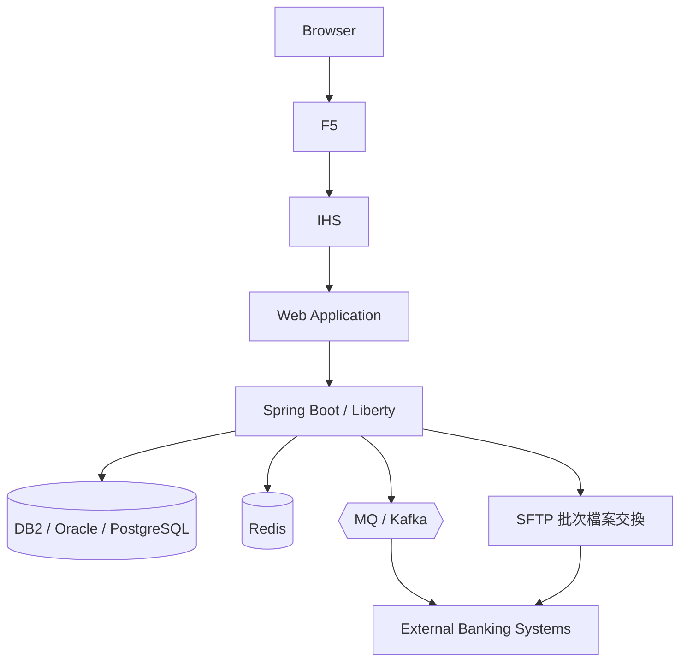

## 48.2 Architecture

依第 11 章逆向工程 10 步驟，先產出整體 `architecture` 圖，標示每一層的技術棧與 Trust Boundary（DMZ／內網／核心銀行系統邊界）。

## 48.3 Login Sequence

```text
使用者 → Browser → F5 → IHS → Web Application → 身份驗證服務
  → （查詢使用者憑證，DB2）→ 簽發 Session/Token → 寫入 Redis 快取
  → 回應 Browser
```

用 `sequence` diagram 表示，並依第 14.8 節 Security Architecture Prompt 標示 Trust Boundary。

## 48.4 Transaction Workflow

交易類流程建議用 `workflow` diagram 表示核准/簽核步驟（如超過額度需要雙重核准），搭配 `sequence` diagram 表示實際 API 呼叫鏈。

## 48.5 Data Flow

```text
使用者輸入 → Web Application → Spring Boot/Liberty →（PII 遮罩）→ DB2
                                                    ↘（去識別化後）→ 風控分析系統
```

用 `dataflow` diagram 明確標示 PII 欄位的遮罩/去識別化處理節點，作為資安與法遵審查的輔助文件。

## 48.6 Batch Lifecycle

月結、日終批次作業用 `lifecycle` diagram 表示：`待執行 → 執行中 → 成功/失敗 → 失敗重試 → 終態（完成/需人工介入）`。

## 48.7 Security Boundary

`architecture` 圖中明確標示：

- 公開網際網路 → F5/IHS（DMZ 邊界）
- DMZ → 內部應用網路
- 內部應用網路 → 核心銀行系統（最高信任邊界，通常有額外的網路隔離與存取控制）

## 48.8 敏感資料與內部架構資訊管理

依第 35 章原則，銀行系統案例額外需要注意：

- **法遵要求**：部分金融監理規範可能限制客戶資料/交易資料傳輸至第三方雲端服務，需確認 AI Agent 使用的 LLM API 是否符合企業資料治理政策（此為一般性提醒，非 Archify 官方文件內容，實際法遵要求請諮詢法務/法遵部門）。
- **內部網路拓撲**：F5/IHS 的實際 IP、Port、防火牆規則等資訊，屬於高敏感度的 Network Topology，不應出現在對外分享或存放於低權限存取範圍的 Archify Artifact 中。
- **PII 與交易資料**：`dataflow` 圖只標示資料類別（如「帳號末四碼」「交易金額區間」），不放實際客戶資料範例。

### Scenario

某銀行 IT 治理部門要求，任何涉及核心銀行系統對外介接的架構變更，必須先產出「Security Boundary 標示版」的 architecture diagram，經資安與法遵部門共同審查後，才能進入開發階段。

### AI Prompt 範例

```text
Context：這是一個銀行對外 Web Application 系統，包含 F5/IHS/Web Application/Spring Boot 或 Liberty/DB2/Redis/MQ/SFTP/外部銀行系統。
Scope：本次僅分析「跨行轉帳」交易的完整路徑。
Expected Diagram：architecture（標示 Trust Boundary）+ sequence（交易呼叫鏈）+ dataflow（PII 遮罩節點）
Main Path：Browser → F5 → IHS → Web Application → Spring Boot/Liberty → DB2 → MQ → External Banking System
Secondary Path：交易失敗時的重試與人工覆核路徑
Boundary：不含外部銀行系統內部架構，僅畫出介接點
Evidence Requirement：只根據實際程式碼與設定檔，PII 欄位僅標示類別不放實際範例值
Validation Requirement：三份 IR 皆須通過 validate
Output Requirement：分別 deliver，並在說明文字中註明本圖僅供內部架構治理審查使用，不得對外公開
```

### 本章 Checklist

- [ ] 已針對銀行系統案例產出 Architecture／Login Sequence／Transaction Workflow／Data Flow／Batch Lifecycle／Security Boundary 六種視角
- [ ] 已依第 35 章原則處理法遵、內部網路拓撲、PII 等敏感資訊
- [ ] 已確認對外分享前的審查機制（資安/法遵共同審查）
- [ ] 已理解本案例為教學示範，非真實金融機構專案

---

# 第 49 章：自我審查報告

依原始撰寫要求，本手冊完成後進行四面向自我審查，如實記錄審查結果（含發現的落差），而非僅宣稱「已通過審查」。

## 49.1 Technical Review

| 檢查項目 | 結果 |
| --- | --- |
| CLI 指令正確性 | **13 項指令全數雙來源以上確認（🟢）**：第二輪複查取得 `ROADMAP.md` 的 unified CLI 逐字清單，再以 README（`compare architecture` 語法）、CHANGELOG 2.10.0（`inspect architecture`）、SKILL.md（`brands`／`visual-check`）交叉比對；前一版的 7 項 🔵 已升級並於第 7 章、附錄 B 記明修正依據（C-04）；個別旗標語意仍註明需依當下版本複查 |
| 版本正確性 | 已標明 `2.15.0`（正式）／`2.16.0-dev.0`（開發中），並在第 5 章、附錄 D 明確揭露發布日期存在來源衝突（2026-08-17 vs. 2025-08-17），未擅自擇一斷言 |
| Agent 支援正確性 | 官方安裝表六項（Raven/Claude Code/Codex CLI/opencode/Claude.ai/Project Knowledge）與 **Cursor（first-class，三份一手來源交叉確認，見 C-01）** 已分級標示；第三方擴充清單已明確排除於官方支援之外 |
| Skill Path 正確性 | 依 README 逐字引用（第 6 章），未自行推測路徑 |
| Diagram Type 正確性 | 5 種 diagram type 已由 `package.json` description 與 `SKILL.md` Type router 交叉確認 |
| Architecture Delta 正確性 | 已釐清「功能真實存在（`architecture-delta.mjs`）」與「『Architecture Delta』一詞非官方正式命名」兩者的差異，全書一致標示 |
| Validation 說明正確性 | 已正確說明 `ajv` 為驗證引擎，Schema 驗證僅檢查結構、不檢查內容真實性（第 15、42 章反覆強調） |
| Export 說明正確性 | **已依 C-03 修正**：JPEG／WebP 確認為 Viewer Export 選單的正式格式（🟢），完整清單為 HTML／SVG／PNG／JPEG／WebP／WebM／分享卡；僅 ICO 仍限於 brand-mark 遠端擷取的窄範圍用途 |

**第二輪複查已修正的項目**：C-01（Cursor first-class）、C-02（Typed JSON IR 有成文契約）、C-03（JPEG／WebP 為正式格式）、C-04（13 項 CLI 全數 🟢）、C-05（新增附錄 F～I）、C-06（兩層目錄與章節骨架補齊）。

**發現的落差／已知限制**：Star 數與 v2.15.0 精確發布日期仍存在來源衝突，個別 CLI 旗標的精確語意仍需依當下版本複查；以上均已標註 Provenance，未偽裝成確定事實。

## 49.2 Architecture Review

- 手冊整體架構是否合理：採 13 個 Part、50 個章節（含收尾），對照原始 53 章規格精神，將高度相關主題合併編號（如原第 48/50/51/53 章的「撰寫方法論／輸出格式規則」併入開場重要聲明與符號約定小節），避免形成內容空洞的「純規則說明章節」，同時未刪減任何原始要求的實質主題。
- 是否過度複雜：全書採 Part 分組 + 統一收尾小節（Scenario／AI Prompt／Checklist）的固定骨架，降低讀者的認知負荷。
- 是否有錯誤假設：第 42 章已誠實列出限制（Diagram 不等於 Runtime Truth、Validation 不等於 Business Correctness 等），未誇大 Archify 的能力邊界。
- 是否區分 Evidence 與 Inference：全書貫穿 Provenance 五層標籤機制（🟢🔵🟡🟠⚪），並在第 3、10、11 章明確要求 Agent 產出 Fact/Inference/Unknown 三分類。
- 是否適合企業使用：涵蓋 SSDLC、Git Workflow、CI/CD、安全性、企業導入 Roadmap、團隊使用規範等治理面向，並提供 SOP 編號與 Checklist，可直接作為企業內部規範文件的基礎。

## 49.3 Developer Experience Review

- 新手是否看得懂：第 8 章提供完整 Hello World 逐步操作；核心概念（typed IR、Schema 驗證）在第 1、2 章即以白話文搭配 Mermaid 圖說明。
- 是否可以照著操作：所有 CLI 範例均附完整指令與參數，並標示查證信心等級，讀者可自行判斷哪些指令需要在執行前用 `--help` 或官方文件複查。
- Command 是否可以執行：語法皆依官方原始碼/第三方交叉確認的實際用法撰寫，惟讀者仍應在自己的環境中先以 `doctor`/`demo` 驗證（第 7、8 章已強調此步驟）。
- Prompt 是否可以直接使用：第 14、37 章共提供 11 種情境模板 + 20 個可直接複製的 Prompt，並額外於各章節內文提供情境化範例。
- Troubleshooting 是否足夠：第 31 章涵蓋 17 項常見問題，並附 Symptom/Cause/Diagnosis/Solution/Prevention 五欄結構；第 32 章額外處理 Windows/PowerShell/WSL 專屬議題。

## 49.4 AI Agent Review

- 是否適合 Claude Code：第 6.4、40 章明確說明 Global/Project Skill 路徑與確認方式。
- 是否適合 Codex：第 6.5、40 章說明 `.agents/skills/` 路徑，並提及與 opencode 共用路徑的可能性（已標示為合理推論而非逐字確認）。
- 是否適合 Cursor：已依 C-01 修正為官方第一級（first-class）支援，並記明 `--agent cursor` 非互動安裝參數與 agent switcher（第 6.3、40 章）。
- 是否適合 opencode：第 6.6、40 章列出三個可能路徑，均為官方 README 逐字引用。
- 是否說明 Skill 使用方式：第 3 章完整說明 Agent 在畫圖決策上的責任範圍與不可推測的紀律；第 26 章提供可直接使用的 System Prompt / Instruction 範本。
- 是否避免 AI 幻覺：第 15 章專章處理，並在全書 Prompt 範例中反覆要求「只根據實際證據」「不要推測」；第 42 章進一步從「限制」角度補強，避免讀者誤信驗證通過等於內容真實。

### Scenario

架構治理委員會在正式採用本手冊作為內部規範前，指派一位未參與撰寫的資深工程師，依本章四面向重新抽查至少 10 項標示為 🟢 的陳述，確認查證方法論確實可信，才正式對外發布為公司內部規範文件。

### AI Prompt 範例

```text
請依本章 Technical/Architecture/Developer Experience/AI Agent 四面向，
抽查本手冊中任意 5 個標示為「官方已實作」的陳述，並回頭比對官方 Repository 目前的實際內容，
確認查證結果在目前時間點是否仍然成立。
```

### 本章 Checklist

- [ ] 已完成 Technical/Architecture/DX/AI Agent 四面向自我審查
- [ ] 已如實揭露查證過程中發現的落差與限制，未隱瞞或美化
- [ ] 已安排團隊內部的獨立複查機制，而非僅依賴本手冊的一次性查證

---

# 第 50 章：全書 Checklist 總覽

## Part I：認識 Archify（基礎篇）

- [ ] 理解 Archify 定位（非 Mermaid 轉 HTML 工具）與 typed IR → 驗證 → 渲染流程
- [ ] 理解 Repository 內部架構與各元件角色
- [ ] 理解 Agent 與 Archify 的協作鏈與分工邊界
- [ ] 能依需求正確選擇 5 種 diagram type
- [ ] 掌握版本、Node 需求與已知的來源落差

## Part II：安裝與第一個範例

- [ ] 依團隊 Agent 完成正確路徑的安裝
- [ ] 熟悉 13 項 CLI 指令的用途、輸入輸出與一手來源
- [ ] 已建立 `validate → check → visual-check → deliver --quality` 的驗收次序
- [ ] 完整跑過一次 Hello World 流程

## Part III：AI Agent 驅動的應用開發

- [ ] 建立開發前/中/後的架構圖產出節奏
- [ ] 熟悉 Reverse Engineering SOP 與 Observed Fact/Inferred/Unknown 三分類
- [ ] 熟悉 Framework Upgrade 的 Before→Delta→After 流程
- [ ] 能執行 Architecture Delta Review 並解讀五類差異

## Part IV：Prompt Engineering 與品質控管

- [ ] 掌握九要素 Prompt 樣板與 11 種情境模板
- [ ] 建立四層防護意識（Evidence First→Typed→Validation→Visual Review）
- [ ] 掌握 Primary/Secondary Path 與 Card 化設計原則
- [ ] 理解 Authoring 與 Viewer Feature 的差異
- [ ] 依用途正確選擇 Export 格式（HTML／SVG／PNG／JPEG／WebP／WebM／分享卡）

## Part V：工具比較與定位

- [ ] 理解 Archify 與 Mermaid 的互補關係
- [ ] 理解 Archify 與既有架構治理工具的銜接方式

## Part VI：企業導入與 SSDLC 整合

- [ ] 理解 Architecture-as-Code/Evidence/Artifact 三概念
- [ ] 規劃 Archify 在 SSDLC 各階段的切入點
- [ ] 建立 Git Workflow 中 Before/After/Delta 的產出時機
- [ ] 誠實分類 CI/CD 整合的支援程度
- [ ] 建立 SOP-01 至 SOP-11
- [ ] 部署團隊標準 Agent Instruction

## Part VII：實戰案例

- [ ] 對照 5 個案例找出最相似的導入模板
- [ ] 對大型 Repository 採用分層策略，避免 Diagram Explosion

## Part VIII：維運管理

- [ ] 建立例行維護與版本檢查機制
- [ ] 完整走過升級前/中/後 Checklist
- [ ] 建立團隊 Troubleshooting 快速查詢表
- [ ] 處理 Windows/PowerShell/WSL 環境專屬議題

## Part IX：企業推廣與治理

- [ ] 確認團隊在六階段 Roadmap 的位置
- [ ] 建立團隊使用規範 12 條
- [ ] 建立資料分類與敏感資訊管理流程
- [ ] 完成 Before/During/After 最佳實務 Checklist

## Part X：Prompt Library 與工作模式

- [ ] 建立團隊共用的 20+ Prompt Library
- [ ] 採用九步驟 Architecture-aware AI Software Development Loop
- [ ] 理解 Archify 作為 Spec 與 Code 之間的 Architecture Visibility Layer
- [ ] 依官方支援分類正確評估各 AI Agent 整合方式

## Part XI：價值、限制與願景

- [ ] 識別團隊最適合導入 Archify 的價值場景
- [ ] 理解六項限制，避免過度信任架構圖
- [ ] 向團隊說明企業級 Reference Architecture
- [ ] 對照「立即採用的 10 件事」盤點團隊完成度

## Part XII：速查與總結

- [ ] 團隊可隨時查閱一頁式 Quick Reference
- [ ] 理解 Archify 作為 Architecture Visibility/Verification/Exploration Layer 的最終定位

## Part XIII：附錄與延伸案例

- [ ] 使用附錄 A～I 作為日常查詢工具（含 `meta` 契約、Visual Preset、品質輪廓、在地化對策）
- [ ] 完成銀行企業系統六視角案例演練（Architecture/Login Sequence/Transaction Workflow/Data Flow/Batch Lifecycle/Security Boundary）

### Scenario

企業導入專案經理（PM）將本章作為專案驗收依據，逐 Part 勾選團隊實際完成度，未完成項目排入下一階段待辦事項。

### AI Prompt 範例

```text
請依本章 13 個 Part 的 Checklist，幫我盤點我們團隊目前的完成度，
並將未完成項目依優先順序排列，作為下一季度的行動計畫草案。
```

---

# References

## 官方一手來源

- 官方 Repository：<https://github.com/tt-a1i/archify>
- README（原始檔）：<https://raw.githubusercontent.com/tt-a1i/archify/main/README.md>
- CHANGELOG（原始檔）：<https://raw.githubusercontent.com/tt-a1i/archify/main/CHANGELOG.md>
- 套件定義（原始檔）：<https://raw.githubusercontent.com/tt-a1i/archify/main/archify/package.json>
- SKILL.md（原始檔）：<https://raw.githubusercontent.com/tt-a1i/archify/main/archify/SKILL.md>
- ROADMAP.md（原始檔，第 7.1 節 13 項 CLI 指令升級 🟢 的關鍵來源）：<https://raw.githubusercontent.com/tt-a1i/archify/main/ROADMAP.md>
- Schema 契約文件（原始檔，第 2.5、2.6 節與附錄 F 的依據）：<https://raw.githubusercontent.com/tt-a1i/archify/main/archify/schemas/README.md>
- 預先編譯驗證器（原始檔，第 2.9 節執行期零相依的依據）：<https://raw.githubusercontent.com/tt-a1i/archify/main/archify/renderers/shared/generated-validators.mjs>
- CLI 主程式（原始檔）：<https://raw.githubusercontent.com/tt-a1i/archify/main/archify/bin/archify.mjs>
- Architecture Delta 引擎（原始檔）：<https://raw.githubusercontent.com/tt-a1i/archify/main/archify/delta/architecture-delta.mjs>
- Repository 檔案樹（API）：`https://api.github.com/repos/tt-a1i/archify/git/trees/main?recursive=1`
- 官方專案網站：<https://tt-a1i.github.io/archify/>（含 `guide.html`、`gallery.html`、`start.html` 子頁面）
- GitHub Releases：<https://github.com/tt-a1i/archify/releases>

## 第三方來源與觀點（僅供交叉比對，非本手冊主要依據）

- 第三方 Skill 目錄（用於交叉確認 CLI 指令與相容性清單）：<https://www.getclaudeskills.com/skills/archify-tt-a1i>
- 其他第三方聚合站的 Star 數等 Repository 統計資訊（與官方數據存在落差，本手冊已於第 5 章、附錄 D 標示，不作為技術判斷依據）

## 本機專案內部參考

- 本 repo 同系列教學手冊（house style 骨架參考範本）：`ai-memory教學手冊.md`、`awesome-copilot教學手冊.md`、`diagram-design教學手冊.md`、`humanlayer skills 教學手冊.md`、`QM 教學手冊.md`
- 本 repo 相關延伸主題：`DeepSeek Harness 教學手冊.md`（Archify 的 DeepSeek Harness 整合可交叉參考）

## 說明

本手冊所有 Archify 官方功能相關陳述，均以上列官方一手來源（優先採用 `raw.githubusercontent.com` 的原始檔案內容，而非頁面摘要）查證於 **2026-08-28**。查證方法論與 Provenance 標籤系統詳見「符號約定」章節。第三方來源僅用於交叉比對，遇官方與第三方衝突時，以官方原始檔案內容為準，並在正文中明確標示衝突未解決之處（如 v2.15.0 發布日期、Star 數）。

---

# 結語

Archify 提供了一個具體的示範：AI Coding Agent 的產出，可以透過「型別化 + 決定性驗證」這道機制，從「聽起來合理的敘述」升級為「可驗證、可探索、可比對」的工程產物。這個模式的價值不僅限於架構圖本身，更代表一種思路——**當 AI Agent 需要產出任何具有事實主張的內容時，替它建立一層可驗證的中間表示，往往比單純要求它「更小心」更有效**。

對企業而言，導入 Archify 不是一次性的工具安裝任務，而是一個從個人熟悉、團隊試點、標準建立，到 SSDLC／CI/CD 整合、最終納入企業架構治理的漸進過程（第 33 章 Roadmap）。過程中最重要的紀律，始終是本手冊反覆強調的那句話：

> Archify 的圖必須反映 evidence，而不是 AI 想像中的 architecture。

願本手冊能協助團隊在導入 AI Coding Agent 的路上，多一層看得見、驗得證、經得起 Review 的架構視野。

若本手冊中的任何查證內容隨官方版本演進而有變動，請以讀者查閱當下的官方 Repository（<https://github.com/tt-a1i/archify>）為準，並考慮更新本文件的查證日期與版本速查表。
