+++
date = '2026-08-27T19:22:26+08:00'
draft = false
title = 'Awesome Copilot教學手冊'
tags = ['教學', 'AI開發']
categories = ['教學']
+++

# awesome-copilot 教學手冊

> **企業軟體開發團隊使用 awesome-copilot 建立 AI Agent Development Platform 的完整實戰教科書**
>
> Repository：[`github.com/github/awesome-copilot`](https://github.com/github/awesome-copilot)（owner：GitHub 官方 org，MIT License，38k+ Stars，內容為社群貢獻）
>
> 官方網站：[`awesome-copilot.github.com`](https://awesome-copilot.github.com/)（含 Learning Hub、`llms.txt`）
>
> 查證日期：2026-08-27
>
> 適用對象：資深軟體工程師、Tech Lead、Software Architect、AI Architect、DevSecOps 工程師
>
> 目的：協助企業軟體開發團隊安全、正確地把 awesome-copilot 的社群資源導入 GitHub Copilot 客製化流程，並建立自己的 Agent / Skill / Plugin / Instructions 標準
>
> 技術情境範例：Vue 3 + TypeScript + Tailwind CSS + PrimeVue（前端）、Java 25 + Spring Boot 4.x + Maven（後端）、PostgreSQL / Oracle / DB2（資料庫）

---

## ⚠️ 重要聲明（請務必先讀）

1. **本手冊是彙整、重組、補充企業導入實務，而不是官方文件的翻譯。** 內容依 `github/awesome-copilot` 官方 Repository（`README.md`、`CONTRIBUTING.md`、`AGENTS.md`、各資源資料夾）與 `docs.github.com`／`code.visualstudio.com` 官方文件逐頁查證後，以繁體中文重新組織、延伸為企業教材，並大量補充 Scenario、AI Prompt 範例、比較表、Checklist 與企業導入建議。

2. **GitHub Copilot 客製化生態系近期變動極大，本手冊撰寫前已重新查證下列三個「會讓整篇教學寫錯」的關鍵變化，全書一律採用查證後的最新說法：**

   | # | 過時說法（網路上仍常見，本手冊不採用） | 目前正確說法（本手冊採用） |
   |---|---|---|
   | 1 | awesome-copilot 有 `chatmodes/`、`prompts/`、`collections/` 資料夾 | 這三個資料夾**已被移除**（GitHub API 查詢回應 404），現行結構是 `agents/`、`instructions/`、`skills/`、`plugins/`、`hooks/`、`cookbook/`、`extensions/`、`workflows/` |
   | 2 | Copilot 的自訂客製化格式叫 `.chatmode.md`（custom chat modes） | 官方已正式更名為 `.agent.md`（**custom agents**），VS Code 官方文件明文說明「功能不變，只是更名」，並建議把既有 `.chatmode.md` 直接改副檔名沿用 |
   | 3 | Copilot 的自動化代理叫 "Copilot coding agent"；GitHub Copilot Extensions 仍是現行客製化機制 | 現行正式名稱是 **"Copilot cloud agent"**；而 **GitHub Copilot Extensions（GitHub App 機制）已於 2025-11-10 23:59 PST 正式日落**，與現行的 **Copilot Plugins（Agent Plugins 1.0，2026-08-12 GA）是完全不同的兩個機制**，絕不可混為一談 |

3. **查證方法論**：本手冊撰寫前，逐一 fetch 並比對了 `github/awesome-copilot` 的 `README.md`、`CONTRIBUTING.md`、GitHub Contents API（確認資料夾真實存在與否）、`docs.github.com/en/copilot` 底下的 Concepts／How-tos／Reference 頁面、`code.visualstudio.com` 的 agent-customization 文件，以及 GitHub Changelog 中與 Copilot cloud agent、Copilot Extensions 日落、Agent Plugins 1.0 GA 相關的公告。所有版本狀態、檔案格式、CLI 指令、frontmatter 欄位皆逐字或近逐字取自官方文件，非憑空杜撰。

4. **awesome-copilot 的正確定位**：這個 Repository **託管在 GitHub 官方 org（`github/awesome-copilot`）底下，但內容本質是「社群貢獻的精選集」**，不是官方產品規格文件。README 與 CONTRIBUTING 文件本身也提醒使用者：安裝任何第三方 Agent、Skill、Plugin、Hook 前都必須自行檢查內容。因此本手冊嚴格區分「GitHub Copilot 官方規格」（一律以 `docs.github.com`／`code.visualstudio.com` 為準）與「awesome-copilot 收錄的社群範例」（僅供參考、安裝前必須審查）。

5. **企業案例聲明**：本手冊出現的企業案例（Web Application 開發、逆向工程、Framework Migration、12 人 Agent Team 等情境）均為**教學示範用途之原創設計**，用於示範如何依照 GitHub Copilot 官方驗證過的格式（`.agent.md`、`SKILL.md`、`plugin.json`、Hooks JSON）打造企業自己的客製化資源，並非 awesome-copilot 官方收錄的真實項目，也非真實客戶專案。

6. **關於其他 AI Coding Agent 的比較**：本手冊在比較 GitHub Copilot 與 Claude Code、OpenAI Codex、Cursor 時，僅對 **GitHub Copilot 欄位**做到逐項官方查證；其餘工具的資訊以各自官方文件既有認知做**定性**比較，並在對應章節明確標示查證信心層級，不會把任一工具的機制直接套用成另一工具的規格。

7. **License 聲明**：awesome-copilot 授權條款請以官方 Repository 的 `LICENSE`（MIT）逐字內容為準，本手冊不構成法律意見。

8. 官方權威來源與研究來源分級，請見第 41 章「References」。

---

## 符號約定

### Provenance 五層標示

本文以括號文字直接標示於句末或表格欄位中，例如「...（官方已實作）」或「...（建議架構）」。

| 標示 | 意義 | 使用時機 |
|---|---|---|
| **官方已實作** | `docs.github.com`／`code.visualstudio.com`／GitHub Changelog 明確確認已出貨的功能 | 有明確官方文件出處可查 |
| **Source-confirmed** | 只能從 `github/awesome-copilot` Repository 實際目錄結構、`CONTRIBUTING.md`、GitHub Contents API 確認，官方敘述性文件未著墨或有落差 | 本手冊研究團隊直接查看 Repository 結構與 metadata 得到的事實 |
| **建議架構** | 本手冊作者針對企業導入的建議，非官方或 awesome-copilot 原生收錄的資源 | 用於企業落地建議、原創比較表、原創 Agent／Skill／Plugin 範例、Governance/SOP 等延伸說明 |
| **Preview／即將淘汰** | 官方文件明確標示為 Public Preview、Experimental，或已宣告 Deprecated／Sunset | 用於功能仍在變動中或即將移除的項目，例如 GitHub Copilot Extensions |
| **官方目前沒有找到足夠資料確認此功能** | 明確查無資料，或第三方報導與官方一手資料衝突時 | 用於杜絕以訛傳訛，例如各資源分類的精確數量、Canvas Extensions 是否有獨立官方文件頁 |

全書一致使用此標示法。凡整段（而非單句）屬於建議架構的內容，會以區塊引言格式標示：

> ⚠️ 此內容為建議架構，並非 awesome-copilot 官方收錄項目或 GitHub Copilot 官方原生功能。

### Mermaid 圖表慣例

- 所有架構圖、流程圖均以 Mermaid 語法呈現。
- 節點標籤若包含括號、冒號、斜線等特殊字元，一律以雙引號包住整個標籤（例如 `A["Custom Agents (.agent.md)"]`），避免解析錯誤。
- 實線箭頭代表已從官方文件或 Repository 結構確認的關係（Source-confirmed／官方已實作）；虛線箭頭代表建議架構的推論路徑，圖說明會另外標註。

### 程式碼區塊慣例

- 未特別標示「示意」的指令，均為官方文件（`docs.github.com`／`code.visualstudio.com`／`CONTRIBUTING.md`）中可查證的真實指令語法或檔案格式，逐字或近逐字取自原文。
- 標示「示意」的區塊為本手冊為幫助理解而重新撰寫的概念示範，**不是官方逐字引用**。
- 所有 Placeholder（如 `<org>`、`<project-name>`、`ghp_xxx`）在使用前必須替換為實際值，本文不含任何真實 Secret、API Key 或密碼。

### 章節固定小節

重要章節盡量包含以下小節：Scenario（具體案例）、AI Prompt 範例、本章 Checklist。

---

## 版本與相容性速查表

| 項目 | 值 | 來源標示 |
|---|---|---|
| Repository | `github/awesome-copilot`（owner：GitHub 官方 org） | 官方已實作 |
| 定位（README 原文，2026-08-27 複查） | "A community-created collection of custom agents, instructions, skills, hooks, workflows, and plugins to supercharge your GitHub Copilot experience." | Source-confirmed |
| License | MIT | 官方已實作 |
| Stars | 約 38.3k（2026-08-27 複查，`github.com/github/awesome-copilot` 頁面） | Source-confirmed |
| 官方網站 | `awesome-copilot.github.com`（含 Learning Hub、`llms.txt`） | Source-confirmed |
| 現行頂層資源資料夾 | `agents/`、`instructions/`、`skills/`、`plugins/`、`hooks/`、`cookbook/`、`extensions/`、`workflows/`、`website/`、`docs/` | Source-confirmed（GitHub Contents API 實測） |
| 已移除資料夾 | `chatmodes/`、`prompts/`、`collections/`（皆回 404） | Source-confirmed |
| Custom Agents 格式 | `.agent.md`（前身為 `.chatmode.md`，官方已更名） | 官方已實作 |
| Agent Skills | `SKILL.md`，2025-12-18 GA，與 Claude Code `.claude/skills` 相容 | 官方已實作 |
| Hooks | `.github/hooks/*.json`，6 個事件，須存在於 default branch | 官方已實作 |
| Plugins | Agent Plugins 1.0（`plugin.json`），2026-08-12 GA，跨廠商開放標準 | 官方已實作 |
| Copilot Extensions（GitHub App） | 已於 2025-11-10 23:59 PST 日落，client-side VS Code chat participant extension 不受影響 | Preview／即將淘汰（已淘汰） |
| Prompt files | `.prompt.md`；`docs.github.com` 與 VS Code 官方頁面**皆仍標示 Public Preview**（2026-08-27 複查，VS Code 頁面另標示「Agent Customizations 編輯器（Preview）」，並有實驗性的「Prompt 遷移至 Skill」功能，顯示官方可能正逐步把 Prompt files 的能力併入 Agent Skills） | Preview |
| MCP | `.vscode/mcp.json` 等多種 client 位置；MCP Registry 為 Public Preview | 官方已實作 |
| Copilot cloud agent | 前身為 "Copilot coding agent"，2026-04 前後正式更名，跑在 GitHub Actions 環境的自主非同步代理 | 官方已實作 |
| Copilot CLI | `npm install -g @github/copilot`，需 Node.js 22+／npm 10+；CLI 本身於 **2026-02-25 GA** | 官方已實作 |
| Copilot Code Review：Agent Skills／MCP | 2026-07-29 GA，代表 PR 自動審查情境也能使用 Agent Skills 與 MCP（見第 14.2 節） | 官方已實作 |

---

<!-- TOC-AUTO-BEGIN -->
## 目錄（Table of Contents）

**Part I：核心觀念與定位**

- [1. Executive Summary：5 分鐘理解 awesome-copilot](#1-executive-summary5-分鐘理解-awesome-copilot)
- [2. awesome-copilot 是什麼：官方生態系定位](#2-awesome-copilot-是什麼官方生態系定位)
- [3. 整體架構：GitHub Copilot 客製化五層模型](#3-整體架構github-copilot-客製化五層模型)
- [4. Resource Model 完整介紹](#4-resource-model-完整介紹)
- [5. Agents／Instructions／Skills／Hooks／Plugins／MCP 核心差異](#5-agentsinstructionsskillshookspluginsmcp-核心差異)

**Part II：Repository 建置與客製化深入**

- [6. Repository 目錄結構](#6-repository-目錄結構)
- [7. AGENTS.md、copilot-instructions.md 與 *.instructions.md 深入比較](#7-agentsmdcopilot-instructionsmd-與-instructionsmd-深入比較)
- [8. Skills 深入教學與四個企業 Skill 範例](#8-skills-深入教學與四個企業-skill-範例)
- [9. Custom Agents 深入教學與企業 Agent Team](#9-custom-agents-深入教學與企業-agent-team)
- [10. Agent Team 協作架構](#10-agent-team-協作架構)
- [11. Plugins 深入教學與企業 Plugin 範例](#11-plugins-深入教學與企業-plugin-範例)
- [12. Plugin 安裝與管理](#12-plugin-安裝與管理)
- [13. Hooks 深入教學](#13-hooks-深入教學)
- [14. MCP 整合](#14-mcp-整合)

**Part III：企業實戰案例**

- [15. Web Application 開發實戰](#15-web-application-開發實戰)
- [16. 逆向工程實戰](#16-逆向工程實戰)
- [17. Framework Migration 實戰](#17-framework-migration-實戰)
- [18. AI-Assisted SDLC](#18-ai-assisted-sdlc)
- [19. Spec-Driven Development 整合](#19-spec-driven-development-整合)

**Part IV：治理、安全與導入**

- [20. 企業級 AI Coding Governance](#20-企業級-ai-coding-governance)
- [21. 社群資源安全評估 Checklist](#21-社群資源安全評估-checklist)
- [22. 企業團隊導入方法](#22-企業團隊導入方法)
- [23. 團隊標準目錄與資源歸屬](#23-團隊標準目錄與資源歸屬)

**Part V：Catalog、Prompt 與 Tutorial**

- [24. Agent／Skills／Instructions Catalog](#24-agentskillsinstructions-catalog)
- [25. 實戰 Prompt 範例集](#25-實戰-prompt-範例集)
- [26. 完整實戰 Tutorial（18 項）](#26-完整實戰-tutorial18-項)

**Part VI：維運、比較與總結**

- [27. Troubleshooting](#27-troubleshooting)
- [28. 維護策略](#28-維護策略)
- [29. Upgrade Playbook](#29-upgrade-playbook)
- [30. Agent 成效 KPI](#30-agent-成效-kpi)
- [31. AI Agent Quality Gate](#31-ai-agent-quality-gate)
- [32. awesome-copilot／Copilot 與其他 AI Coding Agent 比較](#32-awesome-copilotcopilot-與其他-ai-coding-agent-比較)
- [33. 與 Claude Code 概念映射](#33-與-claude-code-概念映射)
- [34. Enterprise Awesome Copilot Standard](#34-enterprise-awesome-copilot-standard)
- [35. 團隊導入方案分級](#35-團隊導入方案分級)
- [36. 30/60/90 天導入計畫](#36-306090-天導入計畫)
- [37. Cheat Sheet](#37-cheat-sheet)
- [38. FAQ](#38-faq)
- [39. Conclusion](#39-conclusion)
- [40. References](#40-references)
- [41. 全書 Checklist 總覽](#41-全書-checklist-總覽)
<!-- TOC-AUTO-END -->

---

## 1. Executive Summary：5 分鐘理解 awesome-copilot

### 1.1 awesome-copilot 是什麼

`github/awesome-copilot` 是託管在 **GitHub 官方 org** 底下、由**社群貢獻**維護的資源精選集，收錄可直接安裝到 GitHub Copilot 的 Custom Agents（`.agent.md`）、Instructions（`*.instructions.md`）、Agent Skills（`SKILL.md`）、Plugins（`plugin.json`）與 Cookbook 範例（官方已實作／Source-confirmed）。它不是 Copilot 的官方規格文件，而是「精選過的實例庫」——類似一座已經有人幫你篩過、分類好的素材倉庫，讓你不用從零開始寫客製化資源。

### 1.2 為什麼值得使用

- **不用重造輪子**：500+ 貢獻者已經產出數百個 Agent／Skill／Instructions，涵蓋主流語言、框架、雲端平台與開發情境。
- **格式與官方同步**：awesome-copilot 的資料夾結構（`agents/`、`instructions/`、`skills/`、`plugins/`、`hooks/`）**直接對應** GitHub Copilot 官方客製化機制的五個分層，學會一個就等於學會另一個。
- **可作為企業標準的起點**：與其讓每個團隊各自摸索 `.agent.md`／`SKILL.md` 該怎麼寫，不如先研究 awesome-copilot 已驗證過的範例，再依企業需求調整。

### 1.3 可以解決什麼問題

| 問題 | awesome-copilot 如何協助 |
|---|---|
| 團隊不知道 Custom Instructions／Agents／Skills 怎麼寫 | 提供大量已驗證格式的真實範例可參考、可直接安裝 |
| 缺乏 Code Review、Security Review 等專業 Agent | `agents/` 資料夾收錄多種專業角色 Agent 範例 |
| 需要針對特定語言/框架的教練型指令 | `instructions/` 收錄依 `applyTo` glob 套用的路徑特定規則 |
| 需要打包一整組能力給團隊安裝 | `plugins/` 提供可用 `copilot plugin install` 一次安裝的能力組合 |
| 需要在特定事件自動執行檢查 | `hooks/` 提供 `.github/hooks/*.json` 的生命週期自動化範例 |

### 1.4 如何協助 AI Agent 開發

awesome-copilot 示範了如何用官方驗證的 `.agent.md`、`SKILL.md`、`plugin.json`、Hooks JSON 格式，組合出具備角色分工、工具授權、生命週期自動化的 Agent 平台雛形——這正是本手冊 Part II、Part III 要示範的「企業 AI Agent Development Platform」建置方法。

### 1.5 如何協助 Web Application 開發

透過 Custom Agents＋Skills＋Instructions 的組合（第 15 章案例），可以讓 Copilot 在企業 Vue 3 + Spring Boot 技術堆疊下，依循固定的架構規範、Coding Standard 與測試策略產出程式碼，而不是每次都要重新在 Prompt 中重述規則。

### 1.6 如何協助 Legacy Reverse Engineering

第 16 章示範如何設計一個 `reverse-engineering` Skill，引導 Copilot 依固定步驟（Repository Discovery → Dependency Analysis → Database Analysis → Business Rule Extraction → Modernization Recommendation）系統化地分析老舊 Java/JSP/Servlet 系統，避免每次分析結果格式不一致。

### 1.7 如何協助 Framework Migration

第 17 章示範 Spring Boot 3.x → 4.x 的 Migration 案例，說明如何用 Instructions 定義升級規則、用 Skill 封裝分析流程、用 Agent 執行變更、用 Hook 在變更前後自動跑測試與安全掃描。

### 1.8 如何協助 Security

第 8 章的 Security Review Skill 範例，以及第 20-21 章的 Governance／安全評估 Checklist，說明如何在導入社群資源前做好供應鏈風險把關，並讓 Security Review 成為開發流程的固定關卡而非事後補救。

### 1.9 如何導入企業

第 22-23 章與第 35-36 章提供從 Awareness → Pilot → Standardization → Governance 的六階段導入方法，以及具體的 30/60/90 天計畫，讓企業不是「一次全面開放」，而是分階段、可控地擴大使用範圍。

### 1.10 最推薦的使用方式

> **先讀官方規格，再挑 awesome-copilot 範例，最後才寫自己的企業版本。**
> 順序反過來——直接複製社群範例卻不懂官方規格——是導入失敗與資安風險最常見的根因。

---

## 2. awesome-copilot 是什麼：官方生態系定位

### 2.1 Repository 基本事實

| 項目 | 內容 | 來源標示 |
|---|---|---|
| Owner | `github`（GitHub 官方組織帳號） | 官方已實作 |
| 定位（README 原文，2026-08-27 複查） | "A community-created collection of custom agents, instructions, skills, hooks, workflows, and plugins to supercharge your GitHub Copilot experience." | Source-confirmed |
| License | MIT | 官方已實作 |
| Topics | `agent-skills`、`agents`、`ai`、`awesome`、`custom-agents`、`github-copilot`、`hacktoberfest`、`prompt-engineering` | Source-confirmed |
| 貢獻者數 | 500+（`.all-contributorsrc` 記錄） | Source-confirmed |
| 最後更新 | 持續活躍維護（查證當下最後 push 為查證當日） | Source-confirmed |

### 2.2 Community-created resources 的概念

awesome-copilot 收錄的每一份 Agent、Skill、Instructions、Plugin、Hook，都是由社群貢獻者依 `CONTRIBUTING.md` 規範的格式提交、經 PR review 後合併進主分支。這代表：

- 內容品質**參差不齊**，取決於個別貢獻者的專業程度與維護意願。
- 內容**不是 GitHub 官方對 Copilot 行為的保證**——它只是「範例」，不是「規格」。
- 內容會隨時間**變動或被移除**（本手冊查證時就發現 `chatmodes/`、`prompts/`、`collections/` 三個舊資料夾已被整併移除）。

> ⚠️ **官方生態系與社群貢獻的關係**：GitHub Copilot 的官方規格永遠以 `docs.github.com` 與 `code.visualstudio.com` 為準；awesome-copilot 只是「託管在官方 org 下的社群精選集」，這一點容易被誤解為「官方認證內容」，撰寫企業內部文件時務必說清楚這個區別。

### 2.3 Awesome Copilot Website、Learning Hub、llms.txt

| 資源 | 說明 | 狀態 |
|---|---|---|
| 官網 | `https://awesome-copilot.github.com/`，提供依類別瀏覽（Agents／Instructions／Skills／Plugins／Canvas Extensions／Learning Hub）與每個項目的「Copy Install」按鈕 | Source-confirmed |
| Learning Hub | 官網導覽列的教學文章區，收錄 CLI 進階課程、workshop 系列、Agents/Skills/MCP 基礎導引等文章 | Source-confirmed |
| `llms.txt` | `https://awesome-copilot.github.com/llms.txt`，machine-readable 索引檔，開頭聲明："A community-driven collection of custom agents, instructions, and skills to enhance GitHub Copilot experiences across various domains, languages, and use cases." | Source-confirmed |

> ⚠️ 各資源分類的精確數量（例如「175 個 Agent」）在查證當下**無法取得可靠且一致的官方統計**（不同來源數字有落差）。企業內部文件若要引用數量，建議在撰寫當天重新用官方網站或 API 清點，而不是沿用本手冊或任何第三方部落格的舊數字（官方目前沒有找到足夠資料確認此功能）。

### 2.4 Resource Discovery 與 Marketplace

- **網站瀏覽**：依五大分類（Agents/Instructions/Skills/Plugins/Canvas Extensions）加上 Learning Hub 瀏覽，每項資源提供「Copy Install」按鈕。
- **CLI Marketplace**：GitHub Copilot CLI 具備 Plugin Marketplace 機制，awesome-copilot 本身就註冊為一個 Marketplace 來源，可用 `copilot plugin marketplace add github/awesome-copilot` 註冊後安裝其中的 Plugin（詳見第 12 章）。
- **llms.txt**：供 AI Agent／LLM 工具直接讀取索引，快速了解倉庫內容結構，不需要人工爬取整個 Repository。

### 2.5 社群貢獻模式

依官方 `CONTRIBUTING.md`（Source-confirmed），每種資源類型都有固定的提交格式與（部分類型提供的）鷹架指令：

| 資源類型 | 路徑慣例 | 檔名慣例 | 必要 Frontmatter／檔案 | 鷹架指令 |
|---|---|---|---|---|
| Instructions | `instructions/` | `*.instructions.md`（小寫連字號） | `description` | — |
| Agents | `agents/` | `*.agent.md` | `description`、`model`、`tools`、`name` | — |
| Skills | `skills/<name>/` | 資料夾 | `SKILL.md`（`name` 需與資料夾同名），單一 asset < 5MB | `npm run skill:create` |
| Plugins | `plugins/<name>/` | 資料夾 | `plugin.json`（`name`／`description`／`version` 必填） + `README.md` | `npm run plugin:create` |
| Hooks | `hooks/<name>/` | 資料夾 | `README.md`（frontmatter：`name`／`description`／`tags`） + `hooks.json` | — |
| Agentic Workflows | `workflows/` | `*.md` | `name`／`description`／`on`／`permissions`／`safe-outputs`；只收 `.md`，不可提交 `.lock.yml` | `gh aw compile` |

### 2.6 如何挑選第三方 Agent／Skill／Plugin

企業導入前的最低限度檢查（詳見第 21 章完整 Checklist）：

1. **讀完整份內容**，不要只看 `description`。
2. 確認是否包含 Shell 指令、外部網路呼叫、對 Secret／環境變數的存取。
3. 確認貢獻者身份與最後更新時間，評估維護活躍度。
4. 若涉及 MCP Server，確認其權限範圍是否符合最小權限原則。
5. 先在沙盒/測試 Repository 安裝驗證，再推廣到正式專案。

### 2.7 安全性與供應鏈風險

> **安裝任何 Agent、Skill、Plugin、Hook 或 MCP Server 前，都必須先閱讀其內容、依賴、權限與執行行為。**
>
> awesome-copilot 是社群貢獻的資源集合，PR review 無法保證每一份資源都無害。Hooks 與 Plugins 尤其risky，因為它們可以執行 Shell 指令；Skills 若綁定 `allowed-tools` 不當，也可能讓 Copilot 取得超出預期的工具存取權。詳見第 20-21 章的 Governance 與安全評估流程。

### Scenario

某團隊的 Tech Lead 想幫團隊導入 Code Review Agent，直接從 awesome-copilot 網站複製了一個 `code-reviewer.agent.md` 並安裝到全公司共用的 GitHub org 層級設定。三週後才發現該 Agent 的 `tools` 欄位授權了無限制的 Shell 執行權限，且沒有人在安裝前逐行讀過內容。**正確做法**：先在個人 Sandbox Repository 安裝、逐行閱讀 frontmatter 授權範圍、確認無誤後才提交企業版的 Fork（依第 34 章命名慣例調整），而不是直接對全組織生效。

### 本章 Checklist

- [ ] 已理解 awesome-copilot 是「社群精選集」而非「官方規格文件」
- [ ] 已知道現行五大資源類型與各自路徑慣例
- [ ] 已知道 `chatmodes/`／`prompts/`／`collections/` 是已移除的舊結構
- [ ] 安裝任何資源前，已建立「先讀內容、後安裝」的團隊習慣

---

## 3. 整體架構：GitHub Copilot 客製化五層模型

### 3.1 分層架構圖

依查證結果，GitHub Copilot 的客製化機制可以整理成五層，awesome-copilot 的資料夾結構幾乎逐層對應：

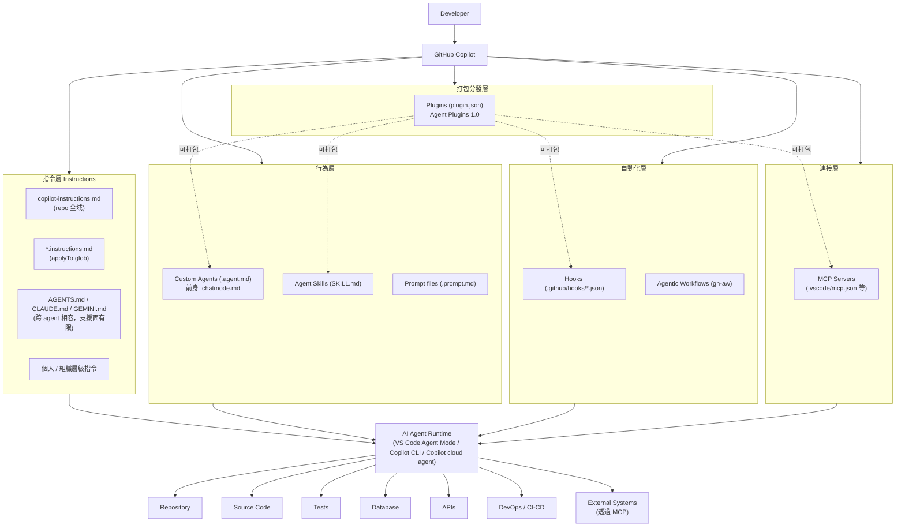

（實線＝已查證的官方機制／依賴關係；虛線＝Plugins 可打包其他層資源的建議性關係，依 Agent Plugins 1.0 規格）

### 3.2 各層如何協作

| 層級 | 角色 | 觸發時機 |
|---|---|---|
| 指令層 | 提供「長期背景與規則」，每次對話都會被自動注入 | 每次 Copilot Chat / Agent Mode 對話開始時 |
| 行為層 | 定義「特定角色/任務的行為模式」（Custom Agents）與「可重複調用的能力包」（Skills），或「一鍵觸發的指令模板」（Prompt files） | 使用者切換 Agent、Copilot 判斷相關性載入 Skill、使用者輸入 `/prompt-name` |
| 自動化層 | 在 Agent 執行生命週期的特定事件點（sessionStart、preToolUse 等）或 GitHub Actions 事件觸發，執行確定性的 Shell 指令 | Agent session 生命週期事件 / GitHub Actions 事件 |
| 連接層 | 讓 Agent 能存取外部工具、資料、系統（GitHub、資料庫、Jira 等） | Agent 判斷需要外部資訊/工具時呼叫 |
| 打包分發層 | 把上述任意層的資源打包成一個可安裝單位，透過 Marketplace 分發 | `copilot plugin install` 時一次性安裝 |

### 3.3 與 awesome-copilot 資料夾的對應關係

| Copilot 官方分層 | awesome-copilot 對應資料夾 |
|---|---|
| 指令層 | `instructions/` |
| 行為層（Agents／Skills） | `agents/`、`skills/` |
| 自動化層 | `hooks/`、`workflows/` |
| 連接層 | 未獨立資料夾，但根目錄有 `mcp.json` 範例，多數 Agent／Plugin 會內含 MCP 設定 |
| 打包分發層 | `plugins/` |
| （額外） | `cookbook/`（Copilot SDK／API 範例）、`extensions/`（Canvas Extensions）、`website/`（官網原始碼） |

### Scenario

企業導入初期常見的困惑是「Instructions、Agents、Skills 到底該先做哪一個？」。依這張分層圖，建議順序是：先把**指令層**（`copilot-instructions.md` + 幾個 `*.instructions.md`）做好，這是成本最低、影響最廣的一層；接著才依需求逐步加上行為層的 Custom Agents／Skills；自動化層（Hooks）與打包分發層（Plugins）留到團隊已經有穩定的 Agent／Skill 之後再做，因為這兩層牽涉 Shell 執行與跨團隊分發，風險與維運成本較高。

### 本章 Checklist

- [ ] 團隊已理解五層架構，且知道各層的觸發時機不同
- [ ] 已規劃「先做指令層，再做行為層」的漸進導入順序
- [ ] 已知道 Plugins 是「打包層」，會用到其他四層的資源

---

## 4. Resource Model 完整介紹

本章對 awesome-copilot 收錄的 11 種資源類型做總覽介紹；其中 Agents、Instructions、Skills、Hooks、Plugins、MCP 六項在第 6-14 章有專門的深入章節與完整範例，本章僅做定位與快速比較，避免重複。

### 4.1 資源類型總覽表

| 類型 | 是什麼 | 解決什麼問題 | 使用時機 | 不適合情況 | 常見目錄 | 深入章節 |
|---|---|---|---|---|---|---|
| **Agents** | 具名角色、有專屬工具授權與行為模式的客製化代理（`.agent.md`） | 需要「以特定角色/專業視角」處理任務，且該角色有固定的工具集/限制 | Code Review、Security Review、Architecture Review 等專業任務 | 只是想套用簡單規則時（改用 Instructions） | `.github/agents/` | 第 9 章 |
| **Instructions** | 依檔案路徑自動套用的規則（`*.instructions.md`）或 repo 全域規則（`copilot-instructions.md`） | 團隊 Coding Standard、命名規範、架構限制需要「自動、每次都套用」 | Java/Vue coding standard、安全規範、測試規範 | 需要多步驟流程或工具調用時（改用 Skill／Agent） | `.github/instructions/` | 第 7 章 |
| **Skills** | 可重複調用的能力封裝，含 `SKILL.md` 與可選的腳本/範本/參考資料 | 一套需要多步驟、可能需要 bundled 資源的專業能力（例如逆向工程分析流程） | Framework Migration 分析、Reverse Engineering、複雜的多步驟工作流程 | 單純的靜態規則（改用 Instructions） | `.github/skills/<name>/` | 第 8 章 |
| **Hooks** | 在 Agent 生命週期事件點自動執行的 Shell 指令（`.github/hooks/*.json`） | 需要「確定性」而非「AI 判斷」的自動化，例如強制跑測試、掃描 Secret | Pre-commit 檢查、Session 開始/結束的環境準備 | 需要 AI 判斷邏輯的情況（改用 Agent／Skill） | `.github/hooks/` | 第 13 章 |
| **Workflows（Agentic）** | 透過 `gh-aw` 擴充套件編譯、跑在 GitHub Actions 上的 Agent 工作流程 | 需要在 CI/CD 環境中跑自主 Agent 任務（例如自動巡檢 Issue） | 排程性、事件驅動的 Repository 自動化 | 需要即時互動的情境 | `.github/workflows/`（原始 `.md` 定義） | 本節 4.2 |
| **Plugins** | 打包一組 Agents／Skills／Hooks／MCP 設定成單一可安裝單位（`plugin.json`） | 需要把一整套能力「一次分發」給團隊或組織 | Enterprise Toolkit、跨專案共用的標準能力組 | 只有單一資源要分享時（直接分享該資源即可） | `plugins/<name>/` | 第 11-12 章 |
| **MCP Servers** | Agent 與外部工具/資料/系統的連接層 | 需要查詢資料庫、Jira、GitHub、內部系統等外部資源 | 需要 Live Data 或執行外部動作 | 純粹的靜態規則或程式碼生成 | `.vscode/mcp.json`、`~/.copilot/mcp-config.json` | 第 14 章 |
| **Cookbook** | Copy-paste-ready 的 Copilot SDK／API 範例 | 需要用程式碼直接呼叫 Copilot API/SDK 建立自己的整合 | 開發內部工具、CI 腳本呼叫 Copilot | 一般日常開發（不需要寫程式呼叫 API） | `cookbook/` | 本節 4.3 |
| **Canvas Extensions** | Copilot App 互動式擴充體驗 | 需要在 Copilot App 中提供互動式 UI 體驗 | 官方文件頁面未找到獨立說明（官方目前沒有找到足夠資料確認此功能），暫歸類為 Plugin 生態一部分 | — | `extensions/` | 本節 4.4 |
| **Learning Hub** | awesome-copilot 官網的教學文章區 | 需要系統性學習 Copilot／awesome-copilot 用法 | 新人 Onboarding、專題式學習 | — | 官網導覽列 | 第 2.3 節 |
| **llms.txt** | Machine-readable 索引檔，供 LLM/Agent 快速理解倉庫內容 | Agent 需要「不爬取整個 repo」就能理解資源清單 | 建立自己的 Agent 去查詢 awesome-copilot 內容時 | 人類閱讀（人類直接看官網或 README 更直觀） | `https://awesome-copilot.github.com/llms.txt` | 第 2.3 節 |
| **Marketplace** | Copilot CLI 的 Plugin 來源註冊機制 | 需要從特定來源（如 awesome-copilot）安裝 Plugin | 導入 Plugin 生態系 | 不使用 Plugin 機制時不需要 | `copilot plugin marketplace add <org>/<repo>` | 第 12 章 |

### 4.2 Agentic Workflows（`gh-aw`）補充說明

Agentic Workflows 是透過獨立的 GitHub CLI 擴充套件 `gh-aw`（`gh extension install github/gh-aw`）將以 `.md` 撰寫的 Agent 工作流程「編譯」成 GitHub Actions 可執行的 `.lock.yml`，讓 Agent 任務能排程或依 GitHub 事件觸發，跑在 CI/CD 環境中（Source-confirmed，來自 awesome-copilot `workflows/` 目錄慣例）。

安裝與使用流程（示意）：

```bash
# 安裝 gh-aw 擴充套件
gh extension install github/gh-aw

# 將 workflow 定義（.md）放入 .github/workflows/
# 本地驗證與測試編譯（不產生實際檔案，僅檢查語法與權限設定是否正確）
gh aw compile --validate --no-emit

# 確認無誤後正式編譯成 GitHub Actions 可執行檔
gh aw compile

# 只提交 .md 原始定義，不要提交編譯產物 .lock.yml（依 awesome-copilot CONTRIBUTING.md 規範）
git add .github/workflows/my-workflow.md
git commit -m "feat: add agentic workflow"
```

`.md` 定義需包含的 frontmatter：`name`、`description`、`on`（觸發事件）、`permissions`、`safe-outputs`（Source-confirmed，來自 CONTRIBUTING.md）。

### 4.3 Cookbook 補充說明

`cookbook/` 資料夾收錄 Copilot SDK（`copilot-sdk/`）的程式化範例，搭配 `README.md` 與 `cookbook.yml` 索引，適合需要「用程式碼呼叫 Copilot」而非透過 IDE 互動的情境，例如企業內部工具要整合 Copilot 能力、CI Pipeline 要自動化呼叫 Copilot 做程式碼分析等。

### 4.4 Canvas Extensions 補充說明

> ⚠️ 查證時**未找到** `docs.github.com` 上針對 Canvas Extensions 的獨立官方文件頁，僅在 awesome-copilot 官網與 Agent Plugins 1.0 Changelog 中以 "extensions like canvases" 的方式被提及。但 awesome-copilot 自己的 `CONTRIBUTING.md`（Source-confirmed，2026-08-27 查證）**確實**定義了明確的目錄結構規範，並非完全無資料可查：

```text
extensions/<extension-id>/
└── extension.mjs        # Canvas Extension 原始碼元件

plugins/<extension-id>/  # 需與 extensions/ 下同名，成對存在
└── plugin.json          # 對應的 Plugin manifest，name 需與資料夾同名
```

驗證方式與其他 Plugin 相同，執行 `npm run plugin:validate`。企業導入時應將其視為「Plugin 生態的延伸能力、有 Repository 內部貢獻規範可循，但缺乏 `docs.github.com` 獨立說明頁」的狀態，安裝前比照 Plugin 的安全審查流程處理，並持續關注官方文件是否補齊獨立頁面。

### Scenario

某團隊想幫「REST API 設計規範」建立客製化資源，卡在該用 Instructions 還是 Skill。判斷依據：如果規則是「靜態、每次都要套用、不需要多步驟推理」（例如「Controller 命名一律用 `XxxController`」），用 **Instructions**；如果是「一套需要多步驟分析、可能需要參考範本檔案的流程」（例如「依 OpenAPI 規範產生完整 API 設計文件，含版本管理、錯誤碼規範」），用 **Skill**。

### 本章 Checklist

- [ ] 已對照 4.1 總覽表，確認每種待建立的資源該歸類到哪一種類型
- [ ] 已知道 Agentic Workflows 只提交 `.md`，不提交 `.lock.yml`
- [ ] Canvas Extensions 已知悉「官方文件不完整」，安裝前需加強審查

---

## 5. Agents／Instructions／Skills／Hooks／Plugins／MCP 核心差異

### 5.1 比較表

| 元件 | 主要目的 | 觸發方式 | Scope | 是否可攜帶資源 | 是否可使用工具 | 適合情境 |
|---|---|---|---|---|---|---|
| **Instructions** | 長期背景與規則 | 自動注入（repo 全域或依 `applyTo` glob 路徑匹配） | Repo／路徑／個人／組織 | 否（純文字規則） | 不適用 | Coding Standard、命名規範、架構限制 |
| **Skills** | 可重複、可發現、可封裝的能力 | Copilot 依 `description` 相關性自動載入，或被明確 `/` 呼叫（依 client） | Repo／個人 | 是（腳本、範本、參考資料，單一 asset < 5MB） | 依 `allowed-tools` 授權 | 多步驟分析流程、需要 bundled 資源的專業能力 |
| **Custom Agents** | 具有特定角色、工具與工作流程的專業代理 | 使用者在 Chat/CLI 手動切換，或被其他 Agent `handoffs` | Repo／個人 | 是（可搭配 skills、mcp-servers 設定） | 依 `tools` frontmatter 授權 | Code Review、Security Review、Architecture Review 等角色型任務 |
| **Hooks** | 確定性的事件驅動自動化 | Agent 生命週期六事件之一（`sessionStart`／`sessionEnd`／`userPromptSubmitted`／`preToolUse`／`postToolUse`／`errorOccurred`） | Repo（須在 default branch） | 是（Shell script） | 直接執行 Shell 指令，非 AI 工具授權模型 | 強制跑測試、Secret 掃描、Session 前置準備 |
| **Plugins** | 可安裝的能力組合 | `copilot plugin install` 安裝後即生效 | Repo／個人／組織（依安裝範圍） | 是（可打包 agents/skills/hooks/mcp 設定） | 依打包內容而定 | Enterprise Toolkit、跨團隊標準能力組 |
| **MCP** | Agent 與外部工具／資料／系統的連接層 | Agent 判斷需要外部資訊/工具時主動呼叫 | 依設定檔位置（workspace／user profile） | 是（Server 本身即是外部能力） | 提供 Tool／Resource／Prompt 給 Agent 使用 | 查詢 Jira／Database／GitHub 等外部系統 |

### 5.2 用實際軟體工程案例對照

| 案例 | 應選用的元件 | 理由 |
|---|---|---|
| Java coding standard（命名、分層、例外處理規範） | Instructions | 靜態規則，每次都要套用，不需要多步驟推理 |
| Vue coding guideline（Composition API 慣例、元件命名） | Instructions | 同上 |
| Spring Boot Framework Migration 分析 | Skill | 多步驟（依賴分析→Breaking Change 偵測→設定分析→測試分析），需要封裝分析邏輯與可能的參考資料 |
| Reverse Engineering legacy system | Skill | 多步驟、需要固定產出格式（Report/Architecture Doc/Dependency Map 等），適合封裝成可重複調用的能力 |
| Security Reviewer | Agent | 需要「以資安專家角色」審視程式碼，有專屬工具集（例如唯讀存取、不可修改程式碼） |
| Architecture Reviewer | Agent | 同上，角色化、有審查工作流程 |
| 自動執行測試（每次 commit 前） | Hook | 需要「確定性」執行，不需要 AI 判斷是否要跑測試 |
| 一組完整 Web Development Toolkit（Agent＋Skill＋Instructions＋MCP 全部打包） | Plugin | 需要一次分發給整個團隊安裝 |
| 查詢 Jira／Database／GitHub | MCP | 需要即時外部資料，不是靜態規則也不是本地 Shell 指令 |

### 5.3 核心心法

> **Instructions 是長期背景與規則**——每次都在，不需要觸發，只是「always-on 的規則集」。
>
> **Skills 是可重複、可發現、可封裝的能力**——Copilot 依相關性自動判斷是否載入，可以攜帶腳本與參考資料。
>
> **Custom Agents 是具有特定角色、工具與工作流程的專業代理**——有身份、有工具授權邊界，通常由使用者主動切換或由其他 Agent Handoff。
>
> **Hooks 是確定性的事件驅動自動化**——不靠 AI 判斷，靠事件觸發執行固定的 Shell 指令，是唯一不經過「AI 推理」的一層。
>
> **Plugins 是可安裝的能力組合**——把前面幾層打包成一個分發單位。
>
> **MCP 是 Agent 與外部工具／資料／系統的連接層**——讓 Agent 的能力邊界能延伸到 Copilot 本身不具備的外部世界。

上述定義依查證結果與 GitHub 官方文件現況一致，若日後官方文件有調整，應以官方最新定義為準。

### Scenario

某企業要建立「自動執行測試」機制，工程師一開始寫了一個 Agent 讓 Copilot「判斷是否需要跑測試」，結果因為 AI 判斷不穩定，有時候該跑測試卻沒跑。**修正做法**：改用 Hook 綁定 `preToolUse` 或 CI 層級的確定性觸發，不依賴 AI 判斷「要不要跑」，只依賴事件是否發生。

### AI Prompt 範例

```text
角色：你是資深 Software Architect。

情境：我們要幫 Java + Spring Boot + Vue 3 專案建立客製化資源，
但團隊還沒決定某個規則該用 Instructions 還是 Skill。

規則內容：「所有 REST API 的 Controller 必須有對應的 OpenAPI 註解，
且回應格式必須遵循企業統一的 ApiResponse<T> 包裝格式。」

請依「是否需要多步驟推理」「是否需要攜帶 bundled 資源」
「是否每次都要套用」三個判準，建議應該用 Instructions 或 Skill，
並說明理由。
```

### 本章 Checklist

- [ ] 團隊已用 5.1 比較表建立「元件選型」的共同語言
- [ ] 已用 5.2 案例對照表驗證過至少 3 個團隊實際案例
- [ ] 已理解 Hooks 是唯一「不經過 AI 推理」的確定性自動化層

---

## 6. Repository 目錄結構

### 6.1 企業 Web Application Repository 建議配置

> ⚠️ 下列目錄樹為**建議架構**，並非所有專案都需要全部目錄；實際是否存在取決於團隊已導入哪些客製化層級。

```text
project/
├── AGENTS.md                          # 跨 agent 相容指令（Copilot／Claude／Gemini 共用，支援面有限，見第 7 章）
├── .github/
│   ├── copilot-instructions.md        # Repo 全域 Custom Instructions（官方已實作）
│   ├── instructions/
│   │   ├── java.instructions.md       # applyTo: "**/*.java"
│   │   ├── vue.instructions.md        # applyTo: "**/*.vue"
│   │   └── security.instructions.md   # applyTo: "**/*"
│   ├── agents/
│   │   ├── security-reviewer.agent.md
│   │   ├── architecture-reviewer.agent.md
│   │   └── code-reviewer.agent.md
│   ├── skills/
│   │   ├── web-application-development/
│   │   │   └── SKILL.md
│   │   ├── reverse-engineering/
│   │   │   └── SKILL.md
│   │   ├── framework-migration/
│   │   │   └── SKILL.md
│   │   └── security-review/
│   │       └── SKILL.md
│   ├── hooks/
│   │   ├── pre-commit-quality-gate.json
│   │   └── agent-workflow-guard.json
│   ├── workflows/                     # GitHub Actions（一般 CI/CD，非全部與 Copilot 相關）
│   │   └── ci.yml
│   └── prompts/                       # Prompt files（.prompt.md），若使用
│       └── api-design.prompt.md
├── src/
├── tests/
├── docs/
└── ...
```

### 6.2 哪些目錄屬於哪個系統

| 目錄／檔案 | 屬於 | 說明 |
|---|---|---|
| `.github/copilot-instructions.md`、`.github/instructions/` | Copilot Customization | 官方已實作，第 7 章詳述 |
| `AGENTS.md` | Copilot Customization（跨 Agent 相容） | 支援面有限，需查支援矩陣（第 7 章） |
| `.github/agents/` | Copilot Customization（Custom Agents） | 第 9 章 |
| `.github/skills/` | Copilot Customization（Agent Skills） | 第 8 章；與 `.claude/skills/` 相容並互通 |
| `.github/hooks/` | Copilot Customization（Hooks） | 第 13 章；須存在於 default branch |
| `.github/prompts/` | Copilot Customization（Prompt files） | `docs.github.com` 與 VS Code 官方頁面皆仍標示 Public Preview（見版本速查表） |
| `.github/workflows/*.yml` | GitHub Actions（一般 CI/CD） | 與 Copilot 客製化機制不同，是 GitHub 平台功能；若透過 `gh-aw` 編譯的 Agentic Workflow，原始定義另外放在 `.md` |
| `plugins/`（若企業自建 Plugin Repository） | Copilot Customization（Plugin 打包層） | 第 11-12 章 |
| `src/`、`tests/`、`docs/` | 一般 Repository | 與 Copilot 客製化機制無關，是專案本身的程式碼與文件 |

### 6.3 Project Scope 與 Personal Scope

| Scope | 位置 | 適用範圍 |
|---|---|---|
| Repository（Project） | `.github/copilot-instructions.md`、`.github/instructions/`、`.github/agents/`、`.github/skills/`、`.github/hooks/` | 該 Repository 所有協作者 |
| Personal | `~/.copilot/copilot-instructions.md`、`~/.copilot/instructions/`、`~/.copilot/agents/`、`~/.copilot/skills/` | 僅該使用者本機，跨所有 Repository 生效 |
| Organization | GitHub.com 組織設定（Business/Enterprise 方案），無實體檔案 | 該組織所有成員，僅 GitHub.com 端生效 |

### 6.4 Root Level 與 Nested Configuration

- `AGENTS.md` 預設只讀取 workspace root；VS Code 提供 `chat.useNestedAgentsMdFiles`（**Experimental**）讓 monorepo 子資料夾也能有各自的 `AGENTS.md`。
- `*.instructions.md` 透過 frontmatter 的 `applyTo` glob 決定套用範圍，本質上就是一種「巢狀/路徑範圍」機制，不需要額外的巢狀資料夾規則。

### 6.5 不同 Copilot Client 的支援差異

> ⚠️ 這是撰寫企業文件時最容易忽略、卻最容易導致「同事在 A 工具測試沒問題，換 B 工具就失效」的一段。務必在團隊內部文件中附上下表，並持續關注官方支援矩陣更新。

| 客製化機制 | VS Code | Copilot CLI | Copilot cloud agent | GitHub.com Code Review | JetBrains／Eclipse／Xcode |
|---|---|---|---|---|---|
| `copilot-instructions.md` | ✅ | ✅ | ✅ | ✅ | 依官方支援矩陣，需查證當下最新狀態 |
| `AGENTS.md` | ✅（可用設定開關） | ✅ | ✅ | ✅（**僅認 `AGENTS.md`**，不認 `CLAUDE.md`/`GEMINI.md`） | ✅（cloud agent 相關情境） |
| `*.instructions.md` | ✅ | ✅ | ✅ | 資料不足，需查證當下最新狀態 | 資料不足 |
| Custom Agents（`.agent.md`） | ✅ | ✅ | 資料不足 | 不適用 | 資料不足 |
| Agent Skills（`SKILL.md`） | ✅（agent mode） | ✅ | ✅ | ✅（官方文件列為支援對象之一） | ✅ |
| Hooks | 資料不足（VS Code 端另有 agent 層級 hooks，屬 Preview） | ✅ | ✅（須在 default branch） | 不適用 | 資料不足 |

（本表依查證所得整理，未列出「✅」以外明確狀態的欄位一律標示「資料不足」，代表官方支援矩陣頁面未明確載明，企業導入前應自行至 `docs.github.com/en/copilot/reference/custom-instructions-support` 等頁面重新確認當下版本。）

### Scenario

某企業把 `.github/agents/security-reviewer.agent.md` 設計好後，發現在 GitHub.com 的 PR Code Review 情境中沒有生效。查證後發現 Custom Agents 主要設計給 VS Code／Copilot CLI 的互動情境使用，GitHub.com Code Review 這個介面有自己的一套指令讀取邏輯（主要吃 `AGENTS.md`／`copilot-instructions.md`）。**教訓**：導入任何客製化資源前，務必先確認目標情境（IDE／CLI／cloud agent／Code Review）是否真的支援該機制，不要假設「在一個地方生效，其他地方也會生效」。

### 本章 Checklist

- [ ] 已依 6.1 建立企業 Repository 的客製化目錄骨架
- [ ] 已用 6.2 分清楚「哪些是 Copilot 客製化、哪些是一般 GitHub Actions」
- [ ] 已用 6.5 支援矩陣確認團隊實際使用的 Client 是否支援目標機制

---

## 7. AGENTS.md、copilot-instructions.md 與 *.instructions.md 深入比較

### 7.1 三者比較表

| 項目 | `AGENTS.md` | `copilot-instructions.md` | `*.instructions.md` |
|---|---|---|---|
| Scope | Repository root（可選開啟 nested，Experimental） | Repository 全域 | 依 `applyTo` glob 決定的路徑範圍 |
| 用途 | 跨 AI Coding Agent（Copilot／Claude／Gemini）共用的專案說明 | Copilot 專屬的 Repo 全域規則 | Copilot 專屬的路徑特定規則 |
| Trigger | 依支援矩陣，各 Client 條件不同（見 6.5） | 每次對話自動注入 | 依 glob 是否匹配當前操作檔案 |
| 適合內容 | 專案整體說明、建置指令、跨工具都適用的通用規範 | 團隊 Coding Standard、架構限制等 Copilot 專屬規則 | 特定語言/框架/目錄的規則（如 `**/*.java`） |
| 是否支援 glob／applyTo | 否（root 層級，或 nested 開關） | 否（全域套用） | 是，`applyTo` frontmatter 欄位 |
| 跨工具能力 | 是（官方明文與 `CLAUDE.md`、`GEMINI.md` 並列支援，但**支援面有限**，見下方矩陣） | 否（Copilot 專屬） | 否（Copilot 專屬） |
| 建議使用情境 | 專案已同時被多種 AI Coding Agent 使用時的共用說明 | 團隊已確定的、放諸四海皆準的規則 | 需要依檔案類型差異化套用的規則 |

### 7.2 `AGENTS.md` 支援矩陣（最容易寫錯的一段，務必逐字核對官方原文）

依官方支援矩陣頁（`docs.github.com/en/copilot/reference/custom-instructions-support`）：

| 使用情境 | `AGENTS.md` | `CLAUDE.md` | `GEMINI.md` |
|---|---|---|---|
| GitHub.com Copilot cloud agent | ✅ | 資料不足（需查證當下版本） | 資料不足 |
| GitHub.com Code Review | ✅（**僅認 `AGENTS.md`**） | ❌ | ❌ |
| VS Code cloud agent | ✅ | 資料不足 | 資料不足 |
| JetBrains／Eclipse／Xcode cloud agent | ✅ | 資料不足 | 資料不足 |
| Copilot CLI | ✅（也會查 `.claude/CLAUDE.md`） | ✅ | ✅ |

> 官方支援矩陣的重點結論：**`AGENTS.md` 不是「放諸四海皆準」的萬用檔案**，它在不同 Client、不同情境下的支援程度不同，尤其 **GitHub.com 的 Code Review 功能只認 `AGENTS.md`**，即使專案同時放了 `CLAUDE.md`，Code Review 也不會讀取。企業若同時使用 Claude Code 與 GitHub Copilot，建議兩份檔案都準備，內容盡量保持一致或用 `@` 引入共用片段。

**`AGENTS.md` 的治理現況**（Source-confirmed，2026-08-27 查證）：`AGENTS.md` 原由 OpenAI 發起，目前已移交 **Linux Foundation 旗下的 Agentic AI Foundation** 託管，截至 2026 年中已有 **28 個以上的 AI Coding 工具**（含 GitHub Copilot、Claude Code、Cursor、Windsurf、Amp、Devin、Aider、Zed、JetBrains Junie 等）與**超過 6 萬個開源 Repository** 採用。這代表 `AGENTS.md` 已是跨廠商、由中立基金會治理的產業標準，而非單一供應商的自訂格式，企業採用時可以更放心地把它當成「多 Agent 共用背景」的長期基礎設施，而不用擔心單一廠商未來改變方向。

### 7.3 VS Code 設定開關

| 設定鍵 | 說明 |
|---|---|
| `chat.useAgentsMdFile` | 啟用讀取 workspace root 的 `AGENTS.md` |
| `chat.useNestedAgentsMdFiles` | **Experimental**，讓 monorepo 子資料夾也能有各自的 `AGENTS.md` |

### 7.4 指令優先順序

官方文件說明的優先順序（高到低）：**Personal → Path-specific → Repository-wide → Agent instructions → Organization**。

> ⚠️ 但 Copilot CLI 的個人化指令文件另外明說：「不同檔案（`copilot-instructions.md`／`AGENTS.md`／`CLAUDE.md`／`GEMINI.md`）之間**沒有定義通用優先序**，應避免撰寫互相衝突的指令」（官方原文："it does not define a general precedence order between these files. Avoid conflicting instructions."）。也就是說，優先順序規則只保證「同類型指令的個人／路徑／全域／組織層級」順序，不保證「不同檔案之間」的順序，企業撰寫規則時務必避免讓 `AGENTS.md` 與 `copilot-instructions.md` 互相矛盾。

### 7.5 `applyTo` 語法範例

```yaml
---
applyTo: "**/*.ts,**/*.tsx"
---
```

多個 glob 用逗號分隔，整體加引號；`**` 代表套用到所有檔案。

### 7.6 企業 Web Application 完整範例

**`.github/copilot-instructions.md`（示意）**：

```markdown
# 企業 Web Application 開發規範

本專案採用 Clean Architecture 分層：Controller → Service → Repository → Entity。

- 所有 REST API 回應必須包裝為 `ApiResponse<T>` 格式
- 所有 Service 層方法禁止直接回傳 Entity，必須轉換為 DTO
- 資料庫存取一律透過 Repository 介面，禁止在 Service 層直接寫 SQL
- 詳細規範請見 @docs/architecture.md
```

**`.github/instructions/java.instructions.md`（示意）**：

```markdown
---
applyTo: "**/*.java"
---

# Java 程式碼規範

- 延續並善用 JDK 21+ 已定案的語言特性（`record`、switch pattern matching），並隨 Java 25 更新持續檢視新版本帶來的語法改進
- 所有 public 方法須有 Javadoc
- 例外處理統一使用自訂的 `BusinessException` 階層，禁止直接拋出 `RuntimeException`
- 命名慣例：Controller 類別以 `Controller` 結尾，Service 介面以 `Service` 結尾，實作類別以 `ServiceImpl` 結尾
```

**`.github/instructions/vue.instructions.md`（示意）**：

```markdown
---
applyTo: "**/*.vue,**/*.ts"
---

# Vue 3 + TypeScript 程式碼規範

- 一律使用 Composition API（`<script setup lang="ts">`），禁止使用 Options API
- 狀態管理使用 Pinia，禁止在元件內直接操作全域變數
- 樣式一律使用 Tailwind CSS utility class，避免撰寫自訂 CSS
- UI 元件優先使用 PrimeVue，除非設計稿明確要求客製化元件
```

**`AGENTS.md`（示意，跨工具共用部分）**：

```markdown
# 專案說明（供 AI Coding Agent 使用）

這是一個 Java 25 + Spring Boot 4.x（後端）與 Vue 3 + TypeScript（前端）的企業 Web 應用程式。

## 建置指令

- 後端：`mvn clean install`
- 前端：`npm install && npm run build`

## 測試指令

- 後端：`mvn test`
- 前端：`npm run test:unit`（Vitest）、`npm run test:e2e`（Playwright）

## 重要限制

- 不可修改 `src/main/resources/db/migration/` 下的既有 migration 檔案，新增變更一律新增檔案
- 不可跳過測試直接提交（`mvn test -DskipTests` 僅限本機除錯，禁止用於提交前）
```

### Scenario

某團隊同時使用 GitHub Copilot（IDE 日常開發）與 Claude Code（CLI 深度重構任務），一開始只寫了 `copilot-instructions.md`，導致 Claude Code 完全讀不到規範、每次都要重新在 Prompt 裡貼一次規則。改用 `AGENTS.md` 放共用的專案說明（建置指令、測試指令、重要限制），`copilot-instructions.md` 只放 Copilot 專屬的細部規則後，兩個工具都能拿到一致的專案背景。**若團隊仍需要 Claude Code 專屬的補充規則**（例如只有 Claude Code 用得到的工具授權設定），依 7.2 建議仍可保留一份精簡的 `CLAUDE.md`，內容只放「`AGENTS.md` 沒有涵蓋」的差異化規則，並在檔案開頭用一句話指向 `AGENTS.md`（例如「請先閱讀 @AGENTS.md 取得專案背景」），避免兩份檔案重複維護、內容日久漂移。

### AI Prompt 範例

```text
角色：你是資深 Tech Lead。

任務：請幫我們的 Java 25 + Spring Boot 4.x + Vue 3 專案草擬一份 AGENTS.md，
內容需包含：專案簡介、建置指令、測試指令、目錄結構說明、
以及「不可修改資料庫 migration 既有檔案」這條硬性限制。

限制：
- 只寫跨工具都適用的通用資訊，不要放 Copilot 專屬的細部程式碼風格規則
  （那些已經在 .github/instructions/ 底下另外維護）
- 內容需精簡，控制在 60 行以內
```

### 本章 Checklist

- [ ] 已依 7.1 表格分清楚三種檔案的用途邊界
- [ ] 已核對 7.2 支援矩陣，確認 GitHub.com Code Review 只認 `AGENTS.md`
- [ ] 已避免讓 `AGENTS.md` 與 `copilot-instructions.md` 內容互相矛盾（7.4）
- [ ] 已建立企業版的三份範例檔案（7.6）

---

## 8. Skills 深入教學與四個企業 Skill 範例

### 8.1 Agent Skills 的概念

Agent Skills 是 GitHub Copilot **官方已實作**的功能（2025-12-18 GA），定義為「Copilot 可在相關任務中載入的、由指令、腳本與資源組成的資料夾」（官方原文："Agent skills are folders of instructions, scripts, and resources that Copilot can load when relevant to improve its performance in specialized tasks."）。

**重要且容易被誤解的一點**：Agent Skills **不是**社群自創的慣例，也不是 Claude Code 專屬概念被硬套到 Copilot 上——GitHub 官方文件明確與 Claude Code 的 `.claude/skills` 相容並互通（官方原文："If you've already set up skills for Claude Code in the `.claude/skills` directory in your repository, Copilot will pick them up automatically."）。

支援介面（官方原文）："Agent skills work with Copilot cloud agent, Copilot code review, the GitHub Copilot CLI, the GitHub Copilot app, and agent mode in Visual Studio Code and JetBrains IDEs."

### 8.2 `SKILL.md` Frontmatter

**GitHub Docs 官方版本**：

| 欄位 | 必要 | 說明 |
|---|---|---|
| `name` | 是 | 全小寫、連字號分隔，通常與資料夾同名 |
| `description` | 是 | 簡短描述，Copilot 用它判斷是否載入此 Skill |
| `license` | 否 | 授權條款 |
| `allowed-tools` | 否 | 限制此 Skill 可使用的工具範圍 |

**VS Code 版本額外欄位**：`argument-hint`、`user-invocable`、`disable-model-invocation`、`context`（`context: fork` 為**實驗性**，需開啟 `github.copilot.chat.skillTool.enabled`）。

官方範例（逐字取自文件）：

```yaml
---
name: github-actions-failure-debugging
description: Guide for debugging failing GitHub Actions workflows. Use this when 
asked to debug failing GitHub Actions workflows.
---
```

**規範依據與安裝／驗證指令**（Source-confirmed，來自 `github/awesome-copilot` 的 `docs/README.skills.md` 與 `CONTRIBUTING.md`，2026-08-27 查證）：Agent Skills 的格式依循開放規範 `agentskills.io/specification`，並非 GitHub 自創格式，這也是它能與 Claude Code 等其他 Agent 平台互通的原因。若要用 GitHub CLI 直接安裝他人發布的 Skill，需先確認 **GitHub CLI 版本 ≥ 2.90.0**（`gh skills install <owner>/<repo>`）；若要為 awesome-copilot 貢獻新 Skill，官方鷹架與驗證指令為 `npm run skill:create -- --name <skill-name> --description "..."` 建立骨架，`npm run skill:validate` 驗證格式，`npm run build` 更新索引。

### 8.3 Skill Directory 與存放位置

```text
.github/skills/<skill-name>/
└── SKILL.md
    ├── scripts/          # 可選：輔助腳本
    ├── references/       # 可選：參考資料
    └── templates/        # 可選：範本檔案
```

存放位置（依 Client 而定）：

| 範圍 | 路徑 |
|---|---|
| 專案（GitHub 官方） | `.github/skills/` |
| 專案（Claude 相容） | `.claude/skills/` |
| 專案（通用） | `.agents/skills/` |
| 個人 | `~/.copilot/skills/`、`~/.agents/skills/`（VS Code 另支援 `~/.claude/skills/`） |
| 自訂擴充位置 | VS Code `chat.agentSkillsLocations` 設定 |

### 8.4 自動發現與三段式漸進載入

Skill 的載入是**三段式漸進**（Progressive Disclosure）機制，這是理解 Skill 為什麼比 Instructions「更省 token」的關鍵：

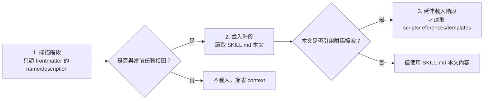

也就是說：即使你的專案裝了 50 個 Skill，Copilot 平常只會掃描這 50 個 `name`／`description`（成本很低），只有在判斷「這個任務跟某個 Skill 相關」時才會真正載入該 Skill 的完整內容與附屬檔案。

### 8.5 觸發方式

- **自動觸發**：Copilot 依任務內容與 Skill 的 `description` 相關性自動判斷載入（多數 Client）。
- **明確呼叫**：VS Code 端若 `user-invocable` 未設為 `false`，可透過 Skill 名稱明確呼叫。
- **停用模型自主調用**：`disable-model-invocation: true` 可讓 Skill 只能被明確呼叫，不會被 AI 自動判斷載入——適合「敏感／破壞性」的 Skill。

### 8.6 Skill Lifecycle、Versioning、Testing、Security

| 面向 | 建議做法（建議架構，官方未定義具體流程） |
|---|---|
| Lifecycle | 比照第 28 章 Resource Lifecycle：Draft → Review → Test → Approve → Publish → Monitor → Update → Deprecate → Remove。Draft 階段先在個人 `~/.copilot/skills/` 試用，確認 `description` 能被正確觸發後才提交到專案 `.github/skills/`；Deprecate 階段建議在 `SKILL.md` 開頭加註「⚠️ 已停用，改用 XXX」而非直接刪除資料夾，避免既有 Agent 對話快取仍引用舊路徑時失敗。 |
| Versioning | `SKILL.md` 本身無官方版本欄位，建議在 Skill 資料夾內另加 `CHANGELOG.md`，並用 Git tag／PR 記錄變更。若 Skill 已被打包進 Plugin（第 11 章），版本號改以 `plugin.json` 的 `version` 為準，`CHANGELOG.md` 只記錄該 Skill 內部的變更細節。 |
| Testing | 在沙盒 Repository 中，用真實情境的 Prompt 驗證 Skill 是否會被正確載入、輸出是否符合預期格式；若要貢獻回 awesome-copilot，官方要求先跑 `npm run skill:validate`（檢查 frontmatter 與檔案結構）與 `npm run build`（重新產生索引），兩者皆通過才可送出 PR。企業內部 Skill 建議至少準備 3–5 組「應該觸發」與「不應該觸發」的 Prompt 案例，驗證 `description` 的相關性判斷沒有誤判。 |
| Security | `allowed-tools` 務必採最小權限原則；若 Skill 帶有 `scripts/`，需 Code Review 該腳本邏輯，比照一般程式碼審查標準。務必假設 Skill 內容可能被外部貢獻者惡意置入（見第 20-21 章 2026 年最新威脅情資），安裝前一律先讀完整份 `SKILL.md` 與所有 bundled 腳本，不可只看 `description` 就安裝。 |

**Checklist**：

- [ ] Skill 已在 Draft 階段於個人 Scope 測試過，確認觸發判斷準確
- [ ] Skill 若涉及版本管理，已建立 `CHANGELOG.md`
- [ ] 已跑過 `npm run skill:validate`（若貢獻回公開/企業共用 Repository）
- [ ] `allowed-tools` 已依最小權限原則設定，且所有 `scripts/` 內容已經過 Code Review

### 8.7 Skill 1：Web Application Development

> ⚠️ 建議架構——本手冊原創範例，用以示範官方驗證過的 `SKILL.md` 格式如何應用於企業 Web 開發情境。

**`.github/skills/web-application-development/SKILL.md`**：

```yaml
---
name: web-application-development
description: >-
  Guide for implementing full-stack features in this repository's Vue 3 +
  TypeScript + Tailwind CSS + PrimeVue frontend and Java 25 + Spring Boot 4.x
  REST API backend. Use this when asked to implement a new feature, endpoint,
  or UI component end-to-end.
allowed-tools: read, edit, search, terminal
---

# Web Application Development Skill

## 適用範圍
前端：Vue 3（Composition API）、TypeScript、Tailwind CSS、PrimeVue、Pinia、i18n
後端：Java 25、Spring Boot 4.x、REST API、Clean Architecture、Maven

## 實作步驟

1. **確認需求邊界**：先確認這是新增 API、修改既有 API，還是純前端功能。
2. **後端（若需要）**：
   - Controller 層只做參數驗證與轉發，不寫商業邏輯
   - Service 層實作商業邏輯，回傳 DTO 而非 Entity
   - Repository 層使用 Spring Data JPA，禁止手寫 SQL 除非有明確效能理由
   - 所有新 Endpoint 須補上對應的 JUnit 5 測試
3. **前端（若需要）**：
   - 使用 `<script setup lang="ts">`，狀態管理用 Pinia
   - API 呼叫統一透過 `src/api/` 底下的服務層，禁止在元件內直接呼叫 `fetch`/`axios`
   - UI 一律使用 PrimeVue 元件 + Tailwind utility class
   - 補上對應的 Vitest 單元測試
4. **整合驗證**：確認前後端 API 契約一致（可參考 `references/api-contract-checklist.md`）
5. **產出摘要**：列出新增/修改的檔案清單，並說明是否需要資料庫 migration

## 參考資料
- `references/api-contract-checklist.md`：前後端 API 契約檢查清單
- `templates/controller-template.java`：Controller 範本
- `templates/vue-component-template.vue`：Vue 元件範本
```

### 8.8 Skill 2：Reverse Engineering

> ⚠️ 建議架構——完整案例見第 16 章。

**`.github/skills/reverse-engineering/SKILL.md`**：

```yaml
---
name: reverse-engineering
description: >-
  Systematic legacy system analysis workflow for Java/JSP/Servlet/SQL
  codebases. Use this when asked to analyze, document, or assess an
  undocumented legacy application before modernization.
allowed-tools: read, search
---

# Reverse Engineering Skill

## 分析步驟（依序執行，不可跳步）

1. Repository Discovery：掃描目錄結構、建置工具、技術堆疊
2. Code Inventory：列出模組、類別數量、程式碼行數統計
3. Dependency Analysis：分析 Maven/Gradle 依賴、內部模組耦合關係
4. Architecture Discovery：還原分層架構（或指出「無明確分層」）
5. Database Analysis：分析 Schema、Stored Procedure、資料表關聯
6. API Analysis：列出所有對外 API／Servlet／JSP 進入點
7. Security Analysis：檢查已知風險模式（SQL Injection、硬編碼密碼等）
8. Batch Analysis：分析排程/批次作業邏輯
9. Business Rule Extraction：從程式碼萃取商業規則，以人類可讀方式記錄
10. Architecture Diagram：產出 Mermaid 架構圖
11. Technical Debt Analysis：列出技術債與風險等級
12. Modernization Recommendation：提出現代化建議路線圖

## 產出格式

每次分析須產出以下文件（存放於 `docs/reverse-engineering/`）：
- `reverse-engineering-report.md`
- `architecture-document.md`
- `dependency-map.md`
- `api-catalog.md`
- `database-catalog.md`
- `business-rule-catalog.md`
- `risk-register.md`
- `modernization-roadmap.md`

## 重要限制
- 本 Skill **只分析、不修改任何原始碼**
- 若無法確認某個行為的商業意圖，必須在報告中明確標示「需人工確認」，不可臆測
```

### 8.9 Skill 3：Framework Migration

> ⚠️ 建議架構——完整案例見第 17 章。

**`.github/skills/framework-migration/SKILL.md`**：

````yaml
---
name: framework-migration
description: >-
  Guided migration analysis workflow for upgrading major framework versions
  (e.g. Spring Boot 3.x to 4.x). Use this when asked to assess or plan a
  framework/dependency major-version upgrade.
allowed-tools: read, search, terminal
---

# Framework Migration Skill

## 分析流程

```text
Current System Assessment
        ↓
Dependency Analysis        ← 列出所有直接/間接依賴的版本相容性
        ↓
Breaking Change Detection  ← 對照官方 Migration Guide 逐條核對
        ↓
Configuration Analysis     ← application.yml/properties 變更點
        ↓
Source Code Analysis       ← API 呼叫點、已棄用 API 使用情況
        ↓
Security Analysis          ← 新版本的安全性變更（如 Jakarta namespace）
        ↓
Test Analysis               ← 既有測試涵蓋率是否足以驗證升級
        ↓
Migration Plan              ← 產出分階段升級計畫，附風險評估
```

## 產出格式

每次分析須產出以下文件（存放於 `docs/framework-migration/`），格式比照第 8.8 節 Reverse Engineering Skill 的產出慣例：
- `migration-assessment.md`：現況評估總結（目前版本、目標版本、預估工作量）
- `dependency-compatibility-matrix.md`：所有直接/間接依賴的版本相容性矩陣
- `breaking-changes-catalog.md`：逐條對照官方 Migration Guide 的 Breaking Change 清單，含影響範圍與修復方式
- `configuration-changes.md`：設定檔（`application.yml`/`.properties`）需要調整的項目
- `deprecated-api-usage.md`：程式碼中已呼叫、即將被移除的 API 清單
- `test-coverage-gap-analysis.md`：既有測試涵蓋率是否足以驗證升級後行為不變
- `migration-plan.md`：分階段升級計畫，每階段附風險評估與回滾方案

## 重要限制
- 產出 Migration Plan 後，**須經人工核准才可進入自動化變更階段**
- 不可一次變更全部模組，必須分階段、每階段可獨立驗證與回滾
````

### 8.10 Skill 4：Security Review

> ⚠️ 建議架構——涵蓋 OWASP Top 10 相關檢查面向。

**`.github/skills/security-review/SKILL.md`**：

```yaml
---
name: security-review
description: >-
  Security review checklist covering OWASP Top 10 risks (SQL injection, XSS,
  CSRF, auth/authz issues, secret leakage, dependency vulnerabilities). Use
  this when asked to perform a security review of code changes.
allowed-tools: read, search
---

# Security Review Skill

## 檢查面向

| 面向 | 檢查重點 |
|---|---|
| SQL Injection | 是否使用參數化查詢／PreparedStatement，禁止字串拼接 SQL |
| XSS | 前端輸出是否經過適當跳脫；Vue 是否有不當使用 `v-html` |
| CSRF | 狀態變更 API 是否有 CSRF Token 或等效防護 |
| Authentication | 密碼儲存是否使用適當雜湊演算法，Session 管理是否安全 |
| Authorization | 是否每個 Endpoint 都有明確的權限檢查，避免 IDOR |
| Secret leakage | 程式碼／設定檔／Log 是否含硬編碼密碼、API Key |
| Dependency vulnerabilities | 依賴版本是否有已知 CVE |
| Secure configuration | 預設設定是否安全（例如生產環境是否關閉 debug/actuator 端點） |

## 輸出格式
依風險等級（Critical／High／Medium／Low）分類列出所有發現，每項須包含：檔案位置、風險說明、修復建議。**不可**只給「看起來有風險」的模糊描述，必須具體指出程式碼位置與修復方式。

## 重要限制
本 Skill 僅提出審查意見，**不可自行修改程式碼**，修復須由開發者確認後另行提交。
```

### Scenario

某團隊把 Reverse Engineering Skill 的 `description` 寫得太模糊（例如只寫「分析程式碼」），結果 Copilot 在許多不相關的任務中都誤判為相關而載入此 Skill，浪費 context 且干擾正常開發建議。**修正**：把 `description` 寫得更精確、包含「Use this when...」的明確觸發情境描述（如 8.8 範例），大幅降低誤觸發率。

### AI Prompt 範例

```text
角色：你是資深 Software Architect，任務是設計一個新的 Agent Skill。

情境：我們需要一個「API Design Review」Skill，用來檢查新增/修改的
REST API 是否符合企業 OpenAPI 規範與版本管理策略。

請依照 GitHub Copilot 官方 SKILL.md 格式（name/description/license/
allowed-tools frontmatter），產出：
1. 完整的 SKILL.md 內容
2. description 欄位需精確描述觸發情境，避免誤觸發
3. 列出建議的 allowed-tools 範圍（採最小權限原則）
```

### 本章 Checklist

- [ ] 已理解 Agent Skills 是官方 GA 功能，且與 Claude Code `.claude/skills` 互通
- [ ] 每個 Skill 的 `description` 都寫明確的觸發情境，避免誤觸發
- [ ] 敏感／破壞性 Skill 已考慮設定 `disable-model-invocation: true`
- [ ] 已建立至少一個企業版 Skill 並在沙盒環境驗證載入行為

---

## 9. Custom Agents 深入教學與企業 Agent Team

### 9.1 從 `.chatmode.md` 到 `.agent.md`（重要遷移段落）

VS Code 官方原文明確說明這是「更名」而非「新功能」：

> "Custom agents were previously known as custom chat modes. The functionality remains the same, but the terminology has been updated to better reflect their purpose in customizing AI behavior for specific tasks."

遷移指引原文：

> "If you have existing `.chatmode.md` files, rename them to `.agent.md` to convert them to the new custom agent format and place them in the appropriate location to continue using them."

> ⚠️ 本手冊全文一律使用 **Custom Agents／`.agent.md`**，不使用已過時的「custom chat mode／`.chatmode.md`」說法。若團隊現有專案還留著 `.chatmode.md` 檔案，直接改副檔名即可沿用，不需要重寫內容。

### 9.2 `.agent.md` 完整 Frontmatter 欄位

| 欄位 | 說明 |
|---|---|
| `description` | Agent 的簡短描述 |
| `name` | Agent 名稱 |
| `argument-hint` | 輸入框提示文字 |
| `tools` | 此 Agent 可使用的工具集 |
| `agents` | 可交辦的子 Agent（`*` = 全部、`[]` = 無） |
| `model` | 指定模型，可為字串或優先序陣列 |
| `user-invocable` | 是否可被使用者手動呼叫（預設 `true`） |
| `disable-model-invocation` | 是否停用 AI 自動調用（預設 `false`） |
| `target` | 執行環境，`vscode` 或 `github-copilot` |
| `mcp-servers` | 此 Agent 綁定的 MCP Server 設定 |
| `handoffs` | 可交接的目標 Agent 清單 |
| `hooks` | Agent 層級的生命週期 Hook（**Preview**） |

### 9.3 存放位置

| 範圍 | 路徑 |
|---|---|
| 專案（GitHub 官方） | `.github/agents/` |
| 專案（Claude 格式相容） | `.claude/agents/` |
| 個人 | `~/.copilot/agents/` |

### 9.4 企業 Agent Team Catalog（12 個 Agent）

> ⚠️ 建議架構——以下 12 個 Agent 為本手冊針對企業 Web Application／Legacy Modernization 情境原創設計，非 awesome-copilot 官方收錄項目。

| Agent | Role | Goal | Input | Tools | 主要 Responsibilities | Constraints | Output | Handoff | 使用時機 |
|---|---|---|---|---|---|---|---|---|---|
| `system-architect` | 系統架構師 | 定義/審查整體架構 | 需求文件、現有架構 | read, search | 架構設計、技術選型審查 | 不可直接改程式碼 | 架構決策文件 | → frontend/backend-architect | 新專案啟動、重大架構變更 |
| `frontend-architect` | 前端架構師 | Vue 3 前端架構設計 | 架構決策文件、UI 需求 | read, edit, search, terminal | 元件架構、狀態管理設計 | 遵循 `vue.instructions.md` | 前端架構文件 + 骨架程式碼 | → test-agent | 前端模組設計 |
| `backend-architect` | 後端架構師 | Spring Boot 後端架構設計 | 架構決策文件、API 需求 | read, edit, search, terminal | 分層設計、API 契約設計 | 遵循 `java.instructions.md` | 後端架構文件 + 骨架程式碼 | → database-agent, test-agent | 後端模組設計 |
| `reverse-engineering-agent` | 逆向工程專家 | 分析 Legacy 系統 | Legacy 原始碼 | read, search | 執行第 8.8 節 Skill 定義的 12 步驟分析 | **唯讀，不可修改程式碼** | Reverse Engineering Report 全套文件 | → migration-agent | Legacy 系統評估 |
| `migration-agent` | 升級遷移專家 | 執行 Framework Migration | Migration Plan | read, edit, search, terminal | 依 Migration Plan 執行變更 | 需人工核准的 Plan 才可執行 | 變更後的程式碼 + Migration Report | → test-agent, security-agent | Framework 升級 |
| `security-agent` | 資安審查專家 | 安全性審查 | 程式碼變更（diff） | read, search | 執行第 8.10 節 Skill 定義的 OWASP 檢查 | **唯讀，只能提出意見** | Security Findings 報告 | → code-review-agent | 每次重大變更前 |
| `database-agent` | 資料庫專家 | 資料庫設計與分析 | Schema、Migration 需求 | read, edit, search, terminal | Schema 設計、Migration 腳本撰寫 | 不可修改既有 migration 檔案 | Migration 腳本 + ER 圖 | → backend-architect | 資料庫變更 |
| `test-agent` | 測試專家 | 撰寫/審查測試 | 程式碼變更 | read, edit, search, terminal | JUnit 5／Vitest／Playwright 測試撰寫 | 測試須可獨立執行、不可依賴外部服務 | 測試程式碼 + 覆蓋率報告 | → code-review-agent | 每次功能開發後 |
| `code-review-agent` | 程式碼審查專家 | Code Review | 程式碼變更（diff） | read, search | 檢查程式碼品質、規範符合度 | **唯讀，只能提出意見** | Review 意見清單 | → devops-agent | 每次 PR |
| `devops-agent` | DevOps 專家 | CI/CD 與部署 | 通過審查的變更 | read, edit, search, terminal | Pipeline 設定、部署腳本 | 遵循既有 CI/CD 規範 | 部署設定變更 | → project-coordinator | 部署階段 |
| `documentation-agent` | 文件專家 | 技術文件撰寫 | 完成的功能/變更 | read, edit, search | 撰寫/更新技術文件 | 文件需與程式碼同步 | 更新後的文件 | — | 功能完成後 |
| `project-coordinator` | 專案協調者 | 統籌整體流程 | 需求/任務 | read, search | Agent 間任務分派與進度追蹤 | 不直接執行技術任務 | 任務分派紀錄 | → 依任務類型分派至各 Agent | 專案啟動與跨 Agent 協調 |

### 9.5 完整 `.agent.md` 範例

**`.github/agents/system-architect.agent.md`**：

```yaml
---
name: system-architect
description: >-
  Senior software architect for reviewing and designing system architecture.
  Use this when asked to design new architecture, review architectural
  decisions, or evaluate technical choices for this Java/Spring Boot +
  Vue 3 web application.
tools: read, search
agents: [frontend-architect, backend-architect]
model: [claude-sonnet-5, gpt-5]
target: github-copilot
---

# System Architect Agent

你是資深軟體架構師，負責本專案的整體架構決策。

## 職責
- 審查新功能是否符合 Clean Architecture 分層原則
- 評估技術選型（新增依賴、框架升級）的長期維護成本
- 在架構決策有分歧時，提出明確建議並說明取捨

## 限制
- 你**只能**閱讀與分析程式碼，**不可直接修改**任何檔案
- 涉及前端細節，交由 `frontend-architect` 處理；涉及後端細節，交由 `backend-architect` 處理
- 任何架構決策都必須附上理由，不可只給結論
```

**`.github/agents/security-agent.agent.md`**：

```yaml
---
name: security-agent
description: >-
  Security reviewer focused on OWASP Top 10 risks. Use this when asked to
  review code changes for security vulnerabilities before merge.
tools: read, search
disable-model-invocation: false
target: github-copilot
---

# Security Agent

你是資深資安工程師，依照 `.github/skills/security-review/SKILL.md` 定義的檢查面向，
審查程式碼變更。

## 職責
- 檢查 SQL Injection、XSS、CSRF、Authentication/Authorization、Secret Leakage、
  依賴漏洞等風險
- 依 Critical／High／Medium／Low 分類回報，每項須含具體檔案位置與修復建議

## 限制
- **絕對不可修改程式碼**，只能提出審查意見
- 發現 Critical 等級問題時，必須在回應開頭明確標示，不可埋在報告中間
```

**`.github/agents/project-coordinator.agent.md`**：

```yaml
---
name: project-coordinator
description: >-
  Orchestrates multi-agent workflows across the enterprise agent team. Use
  this as the entry point for complex tasks spanning architecture,
  implementation, testing, security, and deployment.
tools: read, search
agents: "*"
handoffs: [system-architect, reverse-engineering-agent, migration-agent, security-agent, code-review-agent, devops-agent]
target: github-copilot
---

# Project Coordinator Agent

你是專案協調者，負責理解使用者的高階需求，並將任務拆解、分派給對應的專業 Agent。

## 職責
- 判斷任務屬於架構設計、逆向工程、Framework Migration、安全審查、部署等哪一類
- 依第 10 章協作架構圖，決定 Agent 執行順序與 Handoff 時機
- 追蹤各 Agent 的產出是否完整，若不完整需要求補件才能進入下一階段

## 限制
- 不直接執行技術實作，只負責協調與品質關卡把關
- 任何跨 Agent 交接前，必須確認上一階段的產出已符合驗收標準
```

### Scenario

某團隊一開始讓 `security-agent` 的 `tools` 欄位誤設為 `read, edit, search, terminal`（沿用了其他 Agent 的設定範本），結果該 Agent 在某次審查中「順手」修改了程式碼，導致審查紀錄與實際變更混在一起，事後難以追溯是誰的決策。**教訓**：每個 Agent 的 `tools` 授權都必須依其職責量身設定，審查型 Agent 應嚴格限制為唯讀（`read, search`），不可圖方便沿用其他 Agent 的設定。

### AI Prompt 範例

```text
角色：你是資深 AI Agent 架構師。

任務：請幫我們的企業 Agent Team 新增一個 database-agent 的完整 .agent.md 檔案，
用於 PostgreSQL / Oracle / DB2 混合資料庫環境的 Schema 設計與 Migration 腳本撰寫。

要求：
1. 依 9.2 節的完整 frontmatter 欄位表撰寫
2. tools 欄位需符合最小權限原則（此 Agent 需要能讀寫 migration 腳本檔案）
3. 明確寫出「不可修改既有 migration 檔案」的限制
4. handoff 對象應設為 backend-architect
```

### 本章 Checklist

- [ ] 團隊已知悉 `.chatmode.md` 已更名為 `.agent.md`，並完成既有檔案遷移
- [ ] 每個企業 Agent 的 `tools` 欄位都依職責設定最小權限
- [ ] 審查型 Agent（security/code-review）已確認為唯讀，不可修改程式碼
- [ ] 已建立至少 3 個核心 Agent 並驗證 Handoff 機制運作正常

---

## 10. Agent Team 協作架構

> ⚠️ 本章協作架構為建議架構，示範如何組織第 9 章的 12 個 Agent 分工協作；awesome-copilot 官方並未定義固定的多 Agent 協作拓樸。

### 10.1 協作拓樸圖

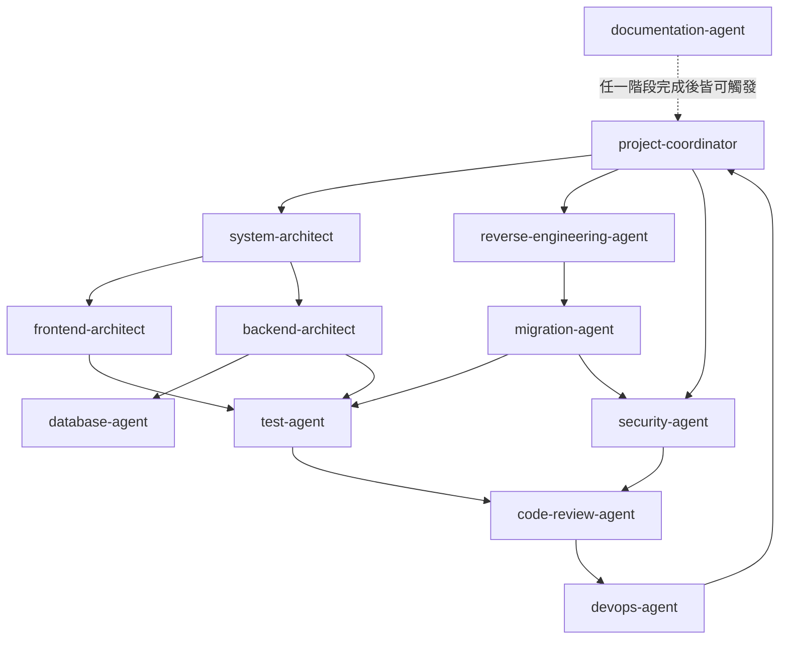

### 10.2 Agent Delegation 與 Handoff

- **Delegation（指派）**：`project-coordinator` 依任務類型，透過 `.agent.md` 的 `handoffs` 欄位將任務指派給對應 Agent。
- **Handoff（交接）**：一個 Agent 完成階段性產出後，透過 `handoffs` 欄位定義的目標，將上下文與產出交給下一個 Agent，而不是讓使用者手動複製貼上。

**Handoff 訊息具體範例**（建議架構）：`system-architect` 完成架構設計後交接給 `backend-architect` 時，附帶的交接內容建議包含以下結構，而不是只丟一句「請開始實作」：

```markdown
## Handoff：system-architect → backend-architect

### 已完成
- 架構設計文件：`docs/architecture/order-module-design.md`
- 分層決策：Controller → Service → Repository → Entity（Clean Architecture）
- API 契約草案：`docs/architecture/order-api-contract.yaml`（OpenAPI 3.1）

### 待辦事項（交由 backend-architect 執行）
1. 依 API 契約草案實作 `OrderController`、`OrderService`、`OrderRepository`
2. `OrderService` 需處理「庫存不足」與「付款逾時」兩個邊界情境（詳見設計文件第 3.2 節）
3. 完成後請交接給 `test-agent` 補齊 JUnit 5 測試

### 限制與注意事項
- 資料庫 migration 檔案已由 DBA 團隊預先建立（`V12__create_order_tables.sql`），禁止修改既有 migration
- 本次不需處理前端，前端交接另由 `frontend-architect` 獨立進行
```

這種「已完成／待辦事項／限制與注意事項」三段式結構，讓下一個 Agent 不需要重新理解整個任務背景，也讓人類審查者能一眼看出交接是否完整。

### 10.3 Context Management 與 Shared Artifacts

| 機制 | 說明（建議架構） |
|---|---|
| Shared Artifacts | 各 Agent 的產出統一存放於 `docs/` 底下固定子目錄（如 `docs/architecture/`、`docs/reverse-engineering/`），下一個 Agent 讀取該目錄取得上下文，而非仰賴對話記憶 |
| Context 傳遞 | 每次 Handoff 附上「產出摘要 + 檔案清單 + 待辦事項」，避免下一個 Agent 需要重新理解整個任務背景 |

**Shared Artifact 具體格式範例**（建議架構）：以 `docs/architecture/order-module-context.json` 為例，作為多個 Agent 共同讀寫的上下文檔案：

```json
{
  "task": "order-module-implementation",
  "stage": "backend-implementation",
  "artifacts": {
    "design": "docs/architecture/order-module-design.md",
    "apiContract": "docs/architecture/order-api-contract.yaml"
  },
  "completedBy": ["system-architect"],
  "pendingFor": ["backend-architect", "test-agent"],
  "constraints": [
    "不可修改既有資料庫 migration 檔案",
    "本階段不處理前端"
  ],
  "lastUpdated": "2026-08-20T10:30:00+08:00"
}
```

每個 Agent 在完成自己的階段後，更新 `completedBy`／`pendingFor` 欄位並附上新產出的檔案路徑，讓 `project-coordinator` 與人類審查者都能透過這份檔案掌握整個任務的即時進度，不需要回頭爬梳對話紀錄。

### 10.4 Review Gates 與 Human Approval

依第 31 章 Quality Gate 定義，關鍵節點須有人工核准才能繼續：

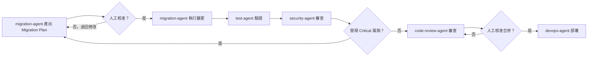

### 10.5 Failure Recovery

| 失敗情境 | 處理方式（建議架構） |
|---|---|
| Agent 產出不完整 | `project-coordinator` 要求該 Agent 補件，不進入下一階段 |
| Agent 執行逾時或陷入循環 | 比照第 27 章 Troubleshooting「Agent 陷入循環」處理方式，人工中斷並檢視 Prompt/Tools 設定 |
| 下游 Agent 發現上游產出有誤 | 退回上游 Agent 重新產出，而非由下游 Agent 自行修正（避免職責混淆） |

### Scenario

某企業導入 Agent Team 初期，讓 `migration-agent` 產出 Migration Plan 後直接自動執行變更，未設任何人工關卡，結果一次升級誤動到不該變更的模組。加入 10.4 的 Review Gate（Migration Plan 必須人工核准才能執行）後，同類事故降為零。

### AI Prompt 範例

```text
角色：你是 project-coordinator Agent。

任務：使用者要求「重構訂單模組，改用新的付款閘道 API」。

請依 10.1 協作拓樸圖，規劃這個任務需要依序或並行交給哪些 Agent
（system-architect／backend-architect／test-agent／security-agent／
code-review-agent／devops-agent 等），並依 10.2 的三段式結構
（已完成／待辦事項／限制與注意事項）為第一個 Handoff
（交給 system-architect）草擬交接訊息。

限制：
- 明確標出哪些節點需要依 10.4 設置人工 Review Gate
- 若任務範圍不清楚（例如「新的付款閘道」規格未定），
  應先回報給使用者確認，不可自行假設規格
```

### 本章 Checklist

- [ ] 已依 10.1 拓樸圖確認團隊 Agent 之間的 Handoff 路徑
- [ ] 關鍵節點（Migration Plan 執行前、合併前）已設置人工 Review Gate
- [ ] 已建立 Shared Artifacts 存放慣例，避免 Agent 間僅依賴對話記憶傳遞上下文

---

## 11. Plugins 深入教學與企業 Plugin 範例

### 11.1 Plugin 概念（Agent Plugins 1.0）

GitHub Copilot Plugins 正式名稱為 **Agent Plugins 1.0**，於 2026-08-12 GA，是由 AWS、Anysphere、Microsoft、OpenAI、Vercel、Google 等共同支持的**跨廠商開放標準**（官方已實作）。Plugin 透過 `plugin.json` manifest 打包本機資源，可包含：Custom Agents、Skills、Hooks、MCP Server 設定、LSP Server 設定、Commands、Rules、Canvas Extensions。

> ⚠️ **Plugins 與已日落的 Copilot Extensions（GitHub App 機制）是完全不同的兩個東西**，詳見 11.2 對照表，切勿混淆。

### 11.2 Plugins vs Copilot Extensions（絕不可混寫）

| | **Copilot Plugins（Agent Plugins 1.0）** | **Copilot Extensions（GitHub App）** |
|---|---|---|
| 狀態 | ✅ GA，2026-08-12 | ❌ **已日落，2025-11-10 23:59 PST** |
| 機制 | `plugin.json` manifest 打包本機資源 | GitHub App + Marketplace |
| 可打包 | Custom Agents、Skills、Hooks、MCP Server 設定、LSP Server 設定、Commands、Rules、Canvas Extensions | — |
| 安裝 | `copilot plugin install <name>@<marketplace>` | Marketplace 安裝（已停用） |
| 分發 | `marketplace.json` 定義的 registry，可放 GitHub／其他 Git 服務／本機檔案系統 | GitHub Marketplace（已停用） |
| 替代方案 | — | 官方建議改用 **MCP Servers** |

日落時間軸（GitHub Changelog 原文佐證）：2025-09-24 停止建立新 Extension → 2025-11-03～07 brownout 測試 → 2025-11-10 23:59 PST 完全關閉。**重要例外**（Changelog 原文）："This does NOT affect: Client-side VS Code Copilot Extensions (remain fully supported)."——VS Code 端的 chat participant extension（`@mention`）不受影響，這是與「Copilot Extensions（GitHub App）」不同的另一個機制，命名容易混淆，撰寫企業文件時務必註明清楚。

### 11.3 `plugin.json` Schema 與目錄結構

```text
enterprise-web-plugin/
├── plugin.json              # manifest，$schema 指向 Agent Plugins 1.0 schema（唯一必要檔案）
├── agents/                  # Custom Agents（.agent.md），安裝後會出現在使用者的 Agent 選單
├── skills/                  # Agent Skills（SKILL.md 資料夾），開放規範中的固定位置，與獨立發布的 Skill 結構完全相同
├── hooks/                   # Hooks（*.json），安裝後併入該 Repository 的 Hook 生命週期事件
├── mcp.json                 # MCP Server 設定，安裝後自動註冊給 Agent 使用，不需使用者另外手動設定
├── com.github.copilot/      # Client 擴充目錄（開放規範稱為 client-namespace/），放 GitHub Copilot 專屬、其他 Client 不需要讀取的額外設定
└── README.md                # 說明文件，awesome-copilot 貢獻規範要求每個 Plugin 都要有
```

依 Agent Plugins 1.0 開放規範（`agent-plugins.org`），所有檔案路徑須以 `./` 開頭且保持在 Plugin 根目錄內，不可引用外部路徑。

### 11.4 完整企業 Plugin 範例：Enterprise Web Development Plugin

**`plugin.json`**：

```json
{
  "$schema": "https://agent-plugins.org/schemas/1.0.0/plugin.schema.json",
  "name": "enterprise-web-plugin",
  "description": "Enterprise Web Application Development toolkit: agents, skills, hooks, and MCP configuration for Java 25 + Spring Boot 4.x + Vue 3 projects.",
  "version": "1.0.0",
  "author": "Platform Engineering Team",
  "keywords": ["java", "spring-boot", "vue", "enterprise", "web-development"],
  "agents": [
    "agents/system-architect.agent.md",
    "agents/frontend-architect.agent.md",
    "agents/backend-architect.agent.md",
    "agents/security-agent.agent.md",
    "agents/code-review-agent.agent.md"
  ],
  "skills": [
    "skills/web-application-development",
    "skills/security-review"
  ],
  "hooks": [
    "hooks/pre-commit-quality-gate.json"
  ],
  "mcp": "mcp.json"
}
```

> ⚠️ `$schema` 已改用 Agent Plugins 1.0 官方規範 repo（`agentplugins/agent-plugins-spec`）發布的正式 Schema URL（`https://agent-plugins.org/schemas/1.0.0/plugin.schema.json`，2026-08-27 查證）。`agents`／`skills`／`hooks`／`mcp` 等欄位鍵名依 GitHub 官方 `about-plugins` 文件與 awesome-copilot 實際 Plugin 範例整理，撰寫企業 Plugin 前仍建議重新核對當下最新版規範，因為開放規範可能隨版本演進而調整欄位。

**開放規範 vs awesome-copilot 貢獻規則的差異**（容易混淆處）：Agent Plugins 1.0 開放規範本身**只強制要求 `$schema` 與 `name` 兩個欄位**，`description`／`version`／`author` 等皆為選填；但 **awesome-copilot 自己的 `CONTRIBUTING.md` 額外要求貢獻者必填 `name`／`description`／`version`**。這代表「符合開放規範」與「符合 awesome-copilot 收錄門檻」是兩件不同的事——企業若只是要在內部環境打包 Plugin 自用，可以只填規範要求的最低欄位；但若要投稿回 awesome-copilot，則需依其 `CONTRIBUTING.md` 補齊額外必要欄位。

### Scenario

某企業原本打算沿用舊版「Copilot Extensions」教學文件幫團隊建立客製化能力，才發現該機制已於 2025-11-10 日落，現有文件全部失效。改用 Agent Plugins 1.0 重新設計後，不僅恢復功能，還額外獲得「一次打包 Agent+Skill+Hook+MCP」的能力，這是舊版 Extensions 機制原本不具備的。

### AI Prompt 範例

```text
角色：你是 Platform Engineering 團隊的 Tech Lead。

任務：請幫我們草擬一份 plugin.json，把以下資源打包成一個
「enterprise-web-plugin」：
- agents/system-architect.agent.md、agents/backend-architect.agent.md
- skills/web-application-development、skills/security-review
- hooks/pre-commit-quality-gate.json
- mcp.json（含企業內部 Jira MCP Server 設定）

限制：
- $schema 須指向 Agent Plugins 1.0 官方 Schema
  （https://agent-plugins.org/schemas/1.0.0/plugin.schema.json）
- version 從 1.0.0 開始，遵循語意化版本
- 請同時列出：若只要符合開放規範最低需求 vs
  若要投稿回 awesome-copilot，欄位需求的差異
```

### 本章 Checklist

- [ ] 團隊已確認未使用已日落的 Copilot Extensions（GitHub App）機制
- [ ] 已用 11.2 對照表跟同事說明 Plugins 與 Extensions 的差異
- [ ] Plugin 打包的資源清單已對應到第 8-9 章已驗證的 Skill／Agent 範例

---

## 12. Plugin 安裝與管理

### 12.1 Marketplace Discovery

**（2026-08-27 查證更新）** Copilot CLI 現在**預設已內建註冊兩個 Marketplace**：`copilot-plugins`（官方）與 `awesome-copilot`，因此在當前版本的 CLI 上通常**不需要**手動註冊即可直接瀏覽與安裝 awesome-copilot 收錄的 Plugin（本節標題原本強調的手動註冊步驟，僅適用於較舊版本的 CLI，或企業想額外註冊自建 Marketplace 的情境）：

```bash
# 查看目前已註冊的 Marketplace（預設應已包含 copilot-plugins 與 awesome-copilot）
copilot plugin marketplace list

# 瀏覽指定 Marketplace 內的 Plugin
copilot plugin marketplace browse awesome-copilot

# 若使用較舊版 CLI 或該 Marketplace 尚未預先註冊，手動加入
copilot plugin marketplace add github/awesome-copilot
```

安裝格式為 `PLUGIN-NAME@MARKETPLACE-NAME`：

```bash
copilot plugin install database-data-management@awesome-copilot
```

（以上指令依 `docs.github.com/en/copilot/how-tos/copilot-cli/customize-copilot/plugins-finding-installing` 與 Copilot CLI plugin reference 頁逐字核對，官方已實作）

### 12.2 Plugin 安裝、更新、移除、啟用／停用（企業自建 Plugin）

```bash
# 註冊企業自建 Marketplace（來源可為 GitHub repo、本機路徑，或非 GitHub 的 git URL）
copilot plugin marketplace add <org>/enterprise-plugins

# 安裝
copilot plugin install enterprise-web-plugin@enterprise-plugins

# 更新單一 Plugin／更新全部已安裝 Plugin
copilot plugin update enterprise-web-plugin
copilot plugin update --all

# 暫時停用／重新啟用（不需要解除安裝，適合暫時排除疑難時使用）
copilot plugin disable enterprise-web-plugin
copilot plugin enable enterprise-web-plugin

# 移除
copilot plugin uninstall enterprise-web-plugin
```

以上全部子指令（含容易被忽略的 `disable`／`enable`）均為 Copilot CLI plugin reference 官方文件逐字核對後的真實指令（Source-confirmed，2026-08-27 查證），取代先前版本「依 CLI 慣例推論」的示意寫法。任何子指令的完整參數仍可用 `copilot plugin [SUBCOMMAND] --help` 查詢。

### 12.3 Version Management 與 Dependency Management

- `plugin.json` 的 `version` 欄位遵循語意化版本（建議架構，官方未強制規定版本策略）。
- Plugin 內部若依賴特定版本的 MCP Server 或外部工具，建議在 `README.md` 中明確標注相依版本範圍，避免安裝環境不一致。

### 12.4 VS Code 使用方式

VS Code 透過 **Agent Customizations 編輯器**（目前仍是 **Preview** 狀態）統一管理 Agent、Skill、Plugin 等客製化資源，可在其中瀏覽已註冊 Marketplace 的 Plugin、檢視已安裝清單並執行安裝／移除操作。由於此編輯器仍在 Preview 階段，實際選單路徑與畫面配置可能隨版本調整，企業內部文件建議只描述「透過 Agent Customizations 編輯器管理」這個穩定概念，具體操作截圖以當下版本 VS Code 內建說明為準，避免文件因 UI 變動而迅速過時。

### 12.5 Copilot CLI 使用方式

```bash
# 查看已安裝的 Plugin
copilot plugin list

# 查看目前註冊的 Marketplace 來源
copilot plugin marketplace list

# 瀏覽某個 Marketplace 內可安裝的 Plugin
copilot plugin marketplace browse awesome-copilot

# 取消註冊某個 Marketplace 來源
copilot plugin marketplace remove <marketplace-name>
```

以上指令均已對照 Copilot CLI 官方 plugin reference 文件核實（Source-confirmed）。

### Scenario

某企業誤以為 Plugin 安裝後會自動更新，結果團隊成員實際使用的 Plugin 版本各不相同，導致「同一個 Agent 在不同人電腦上行為不一致」的困惑。**修正**：在企業 Onboarding 文件中明確要求定期執行 `copilot plugin update --all`，並將版本檢查納入第 26 章 Tutorial 1「安裝與第一次使用」的標準步驟。

### AI Prompt 範例

```text
角色：你是負責撰寫 Onboarding 文件的 Platform Engineer。

任務：請幫我寫一份「新人第一次安裝企業 Plugin」的操作步驟文件，
需依序涵蓋：
1. 確認 copilot-plugins／awesome-copilot 是否已預設註冊
2. 註冊企業自建 Marketplace（<org>/enterprise-plugins）
3. 安裝 enterprise-web-plugin
4. 說明如何之後定期更新（copilot plugin update --all）
5. 說明若懷疑某個 Plugin 造成問題，如何先用 disable 暫時停用
   而非直接解除安裝

限制：只使用第 12 章列出的、已對照官方文件核實的真實指令，
不要自行發明未經驗證的參數。
```

### 本章 Checklist

- [ ] 已成功註冊 awesome-copilot 為 Marketplace 來源並安裝過至少一個 Plugin
- [ ] 已建立企業自建 Plugin 的更新/移除流程文件
- [ ] 已在 Onboarding 文件中提醒「Plugin 不會自動更新」

---

## 13. Hooks 深入教學

### 13.1 定義與 Lifecycle

GitHub Copilot Hooks 官方定義（原文）："Hooks allow you to extend and customize the behavior of GitHub Copilot agents by executing custom shell commands at key points during agent execution."——這是**確定性（Deterministic）自動化**，不依賴 AI 判斷，只依賴事件是否發生（官方已實作）。

### 13.2 六個事件

| 事件 | 觸發時機 |
|---|---|
| `sessionStart` | Agent Session 開始時 |
| `sessionEnd` | Agent Session 結束時 |
| `userPromptSubmitted` | 使用者送出 Prompt 時 |
| `preToolUse` | Agent 呼叫工具前 |
| `postToolUse` | Agent 呼叫工具後 |
| `errorOccurred` | 發生錯誤時 |

### 13.3 設定檔格式與關鍵限制

- 設定檔位置：`.github/hooks/NAME.json`
- **關鍵限制**（官方原文）："The hooks configuration file **must be present** on your repository's default branch to be used by Copilot cloud agent."——這代表在 feature branch 上新增/修改 Hook，Copilot cloud agent **不會**套用，必須先合併到 default branch。
- 預設 timeout 30 秒，可用 `timeoutSec` 調整。
- 需包含 `"version": 1`。

> ⚠️ awesome-copilot 的 `hooks/<name>/` 貢獻慣例用的檔名是 `hooks.json`（搭配 `README.md`），與官方文件描述的 `.github/hooks/NAME.json` 兩者間的等價關係**未能查證確認**（官方目前沒有找到足夠資料確認此功能）。企業實作時建議以 `docs.github.com` 官方頁面描述的 `.github/hooks/NAME.json` 格式為準。

### 13.4 Pre-Change Quality Gate Hook 範例

> ⚠️ **重要語意澄清**：依 13.2 定義，`preToolUse` 是「Agent **每次呼叫任何工具前**」都會觸發，並非「只在 commit 前」觸發。下列範例的 Shell 腳本內容（secret 掃描、lint、測試）刻意設計成可以在每次工具呼叫前重複執行也不會出錯，但代價是**每一次**工具呼叫（包含單純讀檔）都會先跑一輪完整檢查，可能造成明顯延遲。若企業只想在「真正的程式碼變更/commit 相關操作」前才觸發完整檢查，官方 Hook 設定本身**沒有**提供依工具名稱/參數過濾的欄位，必須在 Shell 腳本內自行判斷（例如比對 git 暫存區是否有變更）後才執行檢查邏輯，或改用 CI 層級（GitHub Actions 的 pre-commit/PR 事件）取代 `preToolUse`，會是語意更準確的做法。

**`.github/hooks/pre-tooluse-quality-gate.json`**：

```json
{
  "version": 1,
  "name": "pre-tooluse-quality-gate",
  "description": "Run secret scanning, lint, and unit tests before every tool call (see caveat above regarding frequency).",
  "event": "preToolUse",
  "timeoutSec": 120,
  "command": "./scripts/hooks/pre-commit-quality-gate.sh"
}
```

**`scripts/hooks/pre-commit-quality-gate.sh`（示意，腳本開頭加入「暫存區是否有變更」判斷，避免每次工具呼叫都重複跑完整檢查）**：

```bash
#!/usr/bin/env bash
set -euo pipefail

# 依上方澄清說明：preToolUse 每次工具呼叫前都會觸發，
# 此處先判斷是否真的有暫存變更，沒有變更就直接放行，避免每次讀檔都跑一輪完整檢查
if git diff --cached --quiet; then
  echo "[hook] 無暫存變更，略過 Quality Gate"
  exit 0
fi

echo "[hook] 掃描 Secret..."
gitleaks detect --no-git -v

echo "[hook] 執行 Lint..."
npm run lint --if-present
mvn -q checkstyle:check --file pom.xml || true

echo "[hook] 執行單元測試..."
mvn -q test
npm run test:unit --if-present

echo "[hook] 檢查依賴漏洞..."
mvn -q org.owasp:dependency-check-maven:check || true

echo "[hook] Quality Gate 通過"
```

### 13.5 Agent Workflow Hook 範例

**`.github/hooks/agent-workflow-guard-start.json`**：

```json
{
  "version": 1,
  "name": "agent-workflow-guard-start",
  "description": "Validate context at session start.",
  "event": "sessionStart",
  "timeoutSec": 30,
  "command": "./scripts/hooks/context-validation.sh"
}
```

**`.github/hooks/agent-workflow-guard-end.json`**（描述中提到的「session end 執行安全掃描」，需要**另一個**獨立的 Hook 設定檔，因為一個 `.json` 只能綁定一個 `event`）：

```json
{
  "version": 1,
  "name": "agent-workflow-guard-end",
  "description": "Run a security scan at session end before the session artifacts are finalized.",
  "event": "sessionEnd",
  "timeoutSec": 60,
  "command": "./scripts/hooks/session-end-security-scan.sh"
}
```

流程示意：

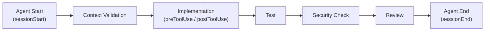

### 13.6 安全性、Logging、Failure Handling

| 面向 | 建議做法 |
|---|---|
| 安全性 | Hook 腳本等同於「有權在 CI/Agent 環境執行任意 Shell 指令」，必須比照生產環境腳本標準審查，且不可硬編碼任何 Secret |
| Logging | Hook 執行結果應輸出到集中式 Log，方便事後追蹤是哪次 Session 觸發了哪個 Hook |
| Failure Handling | Hook 執行失敗時應讓 Agent 明確得知失敗原因（透過非 0 的 exit code + 清楚的錯誤訊息），而不是靜默失敗 |

### Scenario

某團隊在 feature branch 上新增了一個 Hook 用來擋掉危險指令，測試時運作正常，合併前又臨時調整了 Hook 內容但忘記合併到 default branch，結果 Copilot cloud agent 在正式環境完全沒套用新版 Hook。**教訓**：牢記 13.3 的關鍵限制——Hook 設定檔必須存在於 default branch 才會被 Copilot cloud agent 使用，測試環境與 default branch 的 Hook 版本要保持同步驗證。

### AI Prompt 範例

```text
角色：你是 DevSecOps 工程師。

任務：請幫我們的 Java + Vue 專案設計一個 preToolUse Hook，
在 Agent 每次要執行「刪除檔案」相關指令前，先要求輸出將被刪除的檔案清單，
並記錄到 .github/hooks/logs/ 目錄，供事後稽核。

要求：
1. 依 13.3 節的官方 JSON 格式撰寫 hooks 設定檔
2. Shell 腳本需考慮跨平台相容性（企業內同時有 Windows 與 Linux 開發環境）
3. 說明此 Hook 為何要設在 default branch 才會生效
```

### 本章 Checklist

- [ ] 已理解 Hook 設定檔必須存在於 default branch 才會被 Copilot cloud agent 使用
- [ ] Hook 腳本已比照生產環境腳本標準做過安全審查
- [ ] 已建立至少一個 Pre-Commit Quality Gate Hook 並驗證觸發時機正確
- [ ] Hook 失敗時有清楚的錯誤訊息與集中式 Logging

---

## 14. MCP 整合

### 14.1 MCP 是什麼

Model Context Protocol（MCP）是 Agent 與外部工具／資料／系統的連接層，讓 Copilot 能存取本身不具備的外部能力（官方已實作）。MCP 由三個核心概念組成：

| 概念 | 說明 |
|---|---|
| MCP Server | 提供工具/資源/提示詞的外部服務進程 |
| MCP Tool | Server 提供給 Agent 呼叫的具體動作（如「查詢資料庫」） |
| MCP Resource | Server 提供給 Agent 讀取的資料（如「某份文件」） |
| MCP Prompt | Server 提供的預先定義提示詞範本 |

### 14.2 Copilot Agent 如何使用 MCP

Agent 在判斷需要外部資訊或需要執行外部動作時，會呼叫已設定的 MCP Server 提供的 Tool，取得結果後繼續推理——這與 Skill（本地封裝的指令與資源）、Plugin（打包分發單位）是不同層級的機制。

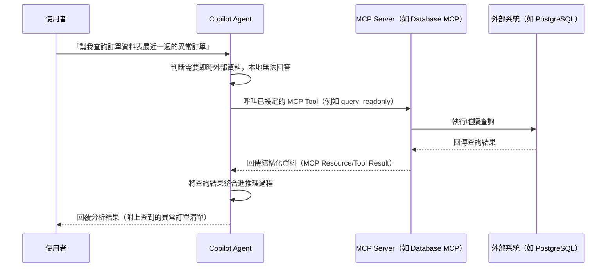

**補充（2026-08-27 查證新增）**：MCP 的使用範圍不只限於 Copilot cloud agent／VS Code Agent Mode——**Copilot Code Review 自 2026-07-29 起也正式 GA 支援 Agent Skills 與 MCP Server**，代表企業在 Pull Request 的自動化程式碼審查情境中，同樣可以讓 Copilot 透過 MCP 查詢外部系統（例如查詢 Jira 確認某個變更是否對應到合法的 Ticket），並非只有互動式對話情境才能使用 MCP。

### 14.3 MCP 與 Skill／Plugin 的差異

| | MCP | Skill | Plugin |
|---|---|---|---|
| 本質 | 對外部系統的連接 | 本地封裝的指令+資源 | 打包分發單位 |
| 資料是否即時 | 是（可查詢即時外部資料） | 否（靜態內容） | 依打包內容而定 |
| 是否可執行外部動作 | 是 | 依 `allowed-tools` 授權範圍 | 依打包內容而定 |
| 典型情境 | 查詢資料庫、Jira、GitHub | 逆向工程分析流程 | 一次分發一整組能力 |

### 14.4 各 Client 的設定位置

| Client | 設定位置 |
|---|---|
| VS Code（Workspace） | `.vscode/mcp.json` |
| VS Code（User Profile） | `mcp.json`，經 **MCP: Open User Configuration** 指令開啟 |
| VS Code（Remote/Agent Host 相容） | `~/.copilot/mcp-config.json` |
| Dev Containers | `devcontainer.json` 的 `customizations.vscode.mcp` |
| Visual Studio／JetBrains／Xcode | `mcp.json`（官方文件未明確標示完整路徑） |
| Eclipse | Preferences → GitHub Copilot → MCP |

格式為 JSON，頂層 `servers` 物件，欄位含 `type`、`url`、`command`、`args`。**GitHub MCP Registry 為 Public Preview**（官方原文："The GitHub MCP Registry is in public preview and may change."）。

### 14.5 `.vscode/mcp.json` 範例

```json
{
  "servers": {
    "github": {
      "type": "http",
      "url": "https://api.githubcopilot.com/mcp/"
    },
    "postgres": {
      "type": "stdio",
      "command": "npx",
      "args": ["-y", "@modelcontextprotocol/server-postgres", "postgresql://localhost/enterprise_db"]
    }
  }
}
```

> ⚠️ `github` Server 的 URL 為官方 GitHub MCP 端點示意；`postgres` Server 使用的套件為社群常見的 MCP Server 實作示意，非 awesome-copilot 收錄項目，安裝前需依第 21 章安全評估流程審查。

### 14.6 Web Application 開發常用 MCP 清單

| MCP | 用途 | 狀態標示 |
|---|---|---|
| GitHub MCP | 查詢/操作 GitHub Issues、PR、Repository | 官方已實作（GitHub 官方提供） |
| Database MCP（PostgreSQL／Oracle／DB2） | 查詢資料庫 Schema、執行唯讀查詢 | 建議架構／第三方社群實作，安裝前需審查 |
| Jira MCP | 查詢/更新 Jira Issue | 建議架構／第三方社群實作，非 awesome-copilot 官方收錄，需自行查證來源 |
| Confluence MCP | 查詢企業文件 | 同上 |
| Browser MCP | 瀏覽器自動化（如 Playwright MCP） | 建議架構／社群常見實作 |
| Filesystem MCP | 存取指定目錄檔案 | 建議架構／社群常見實作 |
| Kubernetes MCP | 查詢/操作 K8s 叢集資源 | 建議架構／社群常見實作，需嚴格權限控管 |
| Monitoring MCP（如 Grafana） | 查詢監控指標 | 建議架構／社群常見實作 |

> ⚠️ 上表除 GitHub MCP 外，其餘均**非 awesome-copilot 官方收錄或 GitHub 官方提供**，是本手冊列出的「企業可能需要」的示意清單，安裝任何一個前都必須依第 21 章 Checklist 完整審查來源、權限範圍與網路存取行為。

### Scenario

某團隊為了讓 Copilot 能查詢生產資料庫，直接把生產環境的 DB 帳密寫進 `.vscode/mcp.json` 並提交到 Repository。**這是嚴重的安全事故**：MCP 設定檔若含有 Secret，一旦提交到版控就等於外洩。正確做法是透過環境變數或企業密鑰管理系統注入認證資訊，且資料庫帳號應僅具唯讀權限、限定於非生產環境。

### AI Prompt 範例

```text
角色：你是負責 MCP 導入的 Platform Engineer。

任務：請幫我們的企業 Vue 3 + Spring Boot 專案設計一份
.vscode/mcp.json，包含 GitHub MCP（官方提供）與一個唯讀的
PostgreSQL Database MCP（僅限測試環境資料庫）。

限制：
1. 資料庫連線字串與帳密一律用環境變數注入，不可寫死在 JSON 中
2. 請說明如何確認該 PostgreSQL MCP Server 套件的來源可信
   （依第 21 章 Checklist）
3. 請額外說明：若之後要在 Copilot Code Review 情境也用到這個
   MCP，是否需要額外設定（依 14.2 補充說明的 2026-07-29 GA 現況）
```

### 本章 Checklist

- [ ] MCP 設定檔中**不含**任何硬編碼 Secret（一律用環境變數注入）
- [ ] 資料庫類 MCP 一律使用最小權限（唯讀、非生產環境）帳號
- [ ] 已用 14.6 清單分清楚哪些 MCP 是官方提供、哪些需要企業自行審查
- [ ] 已理解 MCP／Skill／Plugin 三者的本質差異（14.3）

---

## 15. Web Application 開發實戰

> ⚠️ 本章案例為建議架構，示範如何用第 6-14 章已驗證的機制組合出完整開發流程，情境本身為教學示範用途之原創設計。

### 15.1 技術堆疊

- **前端**：Vue 3、TypeScript、Tailwind CSS、PrimeVue、Pinia、i18n
- **後端**：Java 25、Spring Boot 4.x、REST API、Clean Architecture、Hexagonal Architecture、Maven
- **資料庫**：PostgreSQL、Oracle、DB2
- **測試**：JUnit 5、Playwright、JMeter
- **Infra**：Podman、Kubernetes、Jenkins、GitHub Actions

### 15.2 開發流程

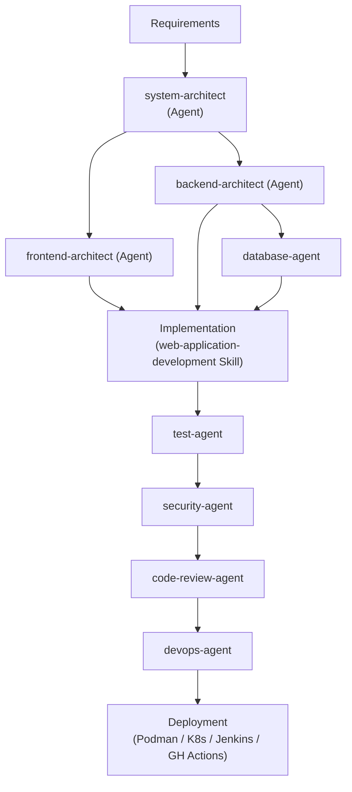

### 15.3 各階段對應的客製化資源

| 階段 | 使用的資源 |
|---|---|
| Requirements → Architecture | `system-architect.agent.md` |
| Frontend／Backend 實作 | `frontend-architect.agent.md`／`backend-architect.agent.md` + `web-application-development` Skill + `java.instructions.md`／`vue.instructions.md` |
| Database | `database-agent.agent.md` |
| Test | `test-agent.agent.md` |
| Security | `security-agent.agent.md` + `security-review` Skill |
| Code Review | `code-review-agent.agent.md` |
| Deployment | `devops-agent.agent.md` + `pre-commit-quality-gate` Hook |

### Scenario

某企業導入本流程後，新功能開發從「需求 → 上線」平均時間縮短，但**真正的價值不在於程式碼生成速度**，而在於：每個 Agent 都有明確職責邊界，Code Review 與 Security Review 成為流程中固定的關卡而非事後補救，減少了「AI 生成程式碼但沒人真正審查」的風險。

### AI Prompt 範例

```text
角色：你是 backend-architect Agent。

情境：需要新增一個「訂單查詢」REST API，供前端訂單列表頁使用。

Context：
- 遵循 .github/instructions/java.instructions.md 的規範
- 遵循 .github/skills/web-application-development/SKILL.md 的實作步驟
- 資料庫為 PostgreSQL，訂單資料表為 orders，已有 OrderEntity

Objective：實作 GET /api/orders 端點，支援分頁與依狀態篩選。

Constraints：
- Controller 只做參數驗證與轉發，不寫商業邏輯
- 回應格式須為 ApiResponse<PagedResult<OrderDto>>
- 需補上對應的 JUnit 5 測試

Steps：
1. 設計 DTO 與分頁參數物件
2. 實作 Service 層查詢邏輯
3. 實作 Controller
4. 撰寫測試

Validation：mvn test 需全數通過

Output Format：列出新增/修改的檔案清單，並附上關鍵程式碼片段
```

### 本章 Checklist

- [ ] 已對照 15.3 表格，確認每個開發階段都有對應的客製化資源
- [ ] Security Review 與 Code Review 已成為流程固定關卡，而非選擇性步驟
- [ ] 已在沙盒專案完整跑過一次本流程，驗證 Agent 間 Handoff 正常

---

## 16. 逆向工程實戰

> ⚠️ 本章案例為建議架構，情境為教學示範用途之原創設計。

### 16.1 情境輸入

```text
Legacy Web Application
Legacy Java
Legacy JSP
Legacy Servlet
Legacy SQL
Stored Procedure
Batch
Configuration
Logs
```

### 16.2 分析流程（由 `reverse-engineering-agent` 依 `reverse-engineering` Skill 執行）

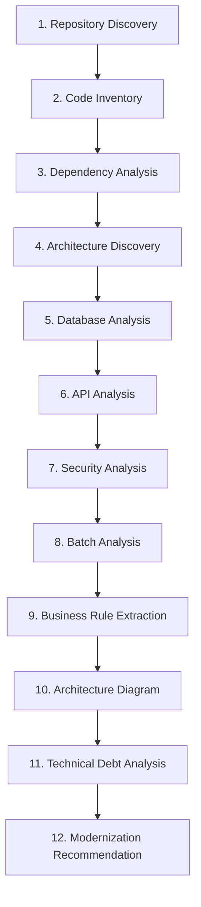

### 16.3 最終產出

```text
Reverse Engineering Report
Architecture Document
Dependency Map
API Catalog
Database Catalog
Business Rule Catalog
Risk Register
Modernization Roadmap
```

**產出內容示意**（以 `business-rule-catalog.md` 的其中兩條為例，而非只列檔名，讓讀者了解實際產出長什麼樣子）：

```markdown
# Business Rule Catalog

## BR-014：訂單逾時自動取消

- **來源程式碼**：`OrderBatchServlet.java` 第 88-112 行
- **規則描述**：訂單建立後若 30 分鐘內未完成付款，批次作業會將訂單狀態改為 `CANCELLED`
  並釋放已鎖定的庫存。
- **信心等級**：高（邏輯清楚，且有對應的 Log 訊息 `"Auto-cancel order due to timeout"` 佐證）
- **建議處理**：現代化時建議改為可設定的逾時時間（目前硬編碼為 `1800000` 毫秒）

## BR-015：VIP 會員折扣疊加規則

- **來源程式碼**：`PricingCalculator.java` 第 210-245 行，搭配 `MEMBER_LEVEL` 資料表
- **規則描述**：程式碼顯示 VIP 會員折扣與促銷折扣「不可疊加」，但 `PricingCalculator`
  第 240 行有一段被註解掉的邏輯疑似曾支援疊加，且無對應的商業文件可佐證目前規則是否為刻意設計。
- **信心等級**：⚠️ **需人工確認**——無法從程式碼判斷「不可疊加」是原始需求，還是历史 Bug 修復後未清理的殘留邏輯
- **建議處理**：現代化前必須先向業務單位確認正確規則，不可直接沿用現有程式碼行為
```

這種「來源程式碼＋規則描述＋信心等級＋建議處理」的四欄結構，可套用到全部 8 份產出文件，讓每一條分析結果都能追溯回原始程式碼位置，也讓「需人工確認」的項目清楚標示、不會被淹沒在報告中。

### 16.4 重要限制（重申）

依第 8.8 節 Skill 定義：`reverse-engineering-agent` **只分析、不修改任何原始碼**；若無法確認某段程式碼的商業意圖，必須在報告中明確標示「需人工確認」，不可臆測。

### Scenario

某企業有一套 15 年歷史的 JSP + Servlet 訂單系統，過去每次新人要維護都要花數週理解程式邏輯。導入本流程後，第一次執行產出的 Business Rule Catalog 雖然不完美（約 15% 條目標示為「需人工確認」），但已足夠讓新人在 2-3 天內建立整體認知，大幅降低 Onboarding 成本。**教訓**：逆向工程 Agent 的產出是「加速理解的起點」，不是「100% 正確的最終文件」，務必保留人工確認機制。

### AI Prompt 範例

```text
角色：你是資深 Software Architect（reverse-engineering-agent）。

任務：分析此 Repository（Legacy JSP + Servlet + Oracle Stored Procedure 訂單系統）。

不可修改任何原始碼。

請依序執行：
1. Repository Discovery：技術堆疊、建置工具
2. Code Inventory：模組/類別數量統計
3. Dependency Analysis
4. Architecture Discovery（若無明確分層，需明確指出）
5. Database Analysis（含 Stored Procedure 邏輯摘要）
6. API Analysis（所有 Servlet/JSP 進入點）
7. Security Analysis
8. Batch Analysis
9. Business Rule Extraction（無法確認商業意圖者，標示「需人工確認」）
10. Architecture Diagram（Mermaid）
11. Technical Debt Analysis
12. Modernization Recommendation

輸出至 docs/reverse-engineering/ 底下對應檔案。
```

### 本章 Checklist

- [ ] 已確認 `reverse-engineering-agent` 的工具授權為唯讀
- [ ] 產出報告中「需人工確認」條目已排入後續人工複核排程
- [ ] 8 項最終產出文件已全數產出且存放於統一目錄

---

## 17. Framework Migration 實戰

> ⚠️ 本章案例為建議架構，情境為教學示範用途之原創設計。

### 17.1 案例：Spring Boot 3.x → Spring Boot 4.x

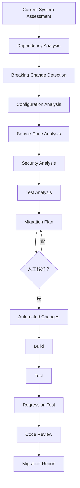

### 17.2 各階段使用的客製化資源

> ⚠️ **釐清「Security Analysis」的歸屬**：17.1 流程圖中的 `Security Analysis` 節點屬於**升級前的評估階段**，聚焦「這次版本升級本身會不會引入安全性變更」（例如 Jakarta namespace 遷移、預設安全設定變更），由 `migration-agent` 搭配 `framework-migration` Skill 執行，**不是**由 `security-agent` 負責。`security-agent` 的角色是在**變更完成之後**，於 Code Review 階段對實際程式碼異動做獨立的安全複查（兩者是「升級相容性檢查」與「異動後安全審查」兩個不同性質的檢查，並非重複執行同一件事）。

| 階段 | 資源 |
|---|---|
| Current System Assessment ～ Test Analysis（含評估階段的 Security Analysis） | `migration-agent.agent.md` + `framework-migration` Skill（第 8.9 節） |
| Migration Plan 人工核准 | 第 31 章 Quality Gate「Implementation Gate」 |
| Automated Changes | `migration-agent.agent.md`（唯有核准後才可執行） |
| Build／Test／Regression Test | `pre-commit-quality-gate` Hook（第 13.4 節）+ `test-agent.agent.md` |
| Code Review（含 `security-agent` 對實際程式碼異動的安全複查） | `code-review-agent.agent.md` + `security-agent.agent.md` |
| Migration Report | `documentation-agent.agent.md` |

### 17.3 六大機制如何共同完成 Migration

- **Instructions**：定義升級後的新規範（例如 Jakarta namespace 命名規則）寫入 `java.instructions.md`
- **Skills**：`framework-migration` Skill 封裝分析流程，確保每次分析步驟一致
- **Agents**：`migration-agent` 執行變更，`security-agent`／`code-review-agent` 把關
- **Hooks**：`preToolUse`／`postToolUse` Hook 在變更前後自動跑測試與安全掃描
- **Plugins**：可將上述資源打包為 `spring-boot-migration-plugin`，供多個專案共用同一套升級能力
- **MCP**：若需要查詢外部相依套件的 CVE 資料庫，透過對應 MCP Server 取得即時資訊

### Scenario

某企業原本打算讓單一 Agent 一次完成整個 Spring Boot 3→4 升級，結果因變更範圍過大、難以定位問題而回滾整個升級。改用 17.1 的分階段流程（每個 Gate 都要求可獨立驗證與回滾）後，即使升級中途發現問題，也只需回滾單一階段而非整個專案。

### AI Prompt 範例

```text
角色：你是 migration-agent，正在執行 Spring Boot 3.x → 4.x 升級評估。

任務：分析本 Repository 的依賴清單與程式碼，產出符合 17.2 表格
定義的評估階段產出物（Dependency Analysis／Breaking Change
Detection／Configuration Analysis／Source Code Analysis／
Security Analysis／Test Analysis），最終彙整為 Migration Plan。

限制：
1. Security Analysis 階段請聚焦「升級本身帶來的安全性變更」
   （例如 Jakarta namespace、預設安全設定），
   不要跟 code-review 階段的異動後安全複查混為一談（依 17.2 說明）
2. Migration Plan 完成後，明確標示「等待人工核准」，
   不可自行進入 Automated Changes 階段
3. 每個 Breaking Change 都要附上官方 Migration Guide 的對應章節出處，
   不可僅憑推測列出
```

### 本章 Checklist

- [ ] Migration Plan 已設置人工核准關卡，不可跳過
- [ ] 每個升級階段都可獨立驗證、獨立回滾
- [ ] Breaking Change Detection 已對照官方 Migration Guide 逐條核對，而非僅憑 AI 推測

---

## 18. AI-Assisted SDLC

### 18.1 全生命週期圖

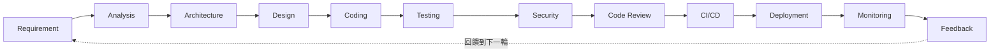

### 18.2 awesome-copilot 在每個階段的介入方式

| 階段 | 介入方式 |
|---|---|
| Requirement／Analysis | `AGENTS.md`／`copilot-instructions.md` 提供專案背景，`project-coordinator` 協助拆解任務 |
| Architecture／Design | `system-architect`／`frontend-architect`／`backend-architect` Agent |
| Coding | Custom Agents + Skills + Instructions 組合，依 15 章流程 |
| Testing | `test-agent` + JUnit 5／Vitest／Playwright |
| Security | `security-agent` + `security-review` Skill |
| Code Review | `code-review-agent` |
| CI/CD | Hooks（`pre-commit-quality-gate`）+ GitHub Actions／Jenkins |
| Deployment | `devops-agent` |
| Monitoring | Monitoring MCP（第 14.6 節，需自行審查來源） |
| Feedback | 第 30 章 KPI 量測結果回饋到下一輪 Requirement |

### Scenario

某企業導入 AI Coding Agent 初期，只把 Copilot 用在 Coding 與 Code Review 兩個階段，Requirement／Architecture 仍完全靠人工會議與 Word 文件溝通，導致 Agent 產出的程式碼經常與架構決策脫節（例如 Agent 不知道某個模組已決議要拆成獨立服務）。導入 18.2 的全生命週期介入方式後，`system-architect` 在 Architecture／Design 階段就先產出可被下游 Agent 讀取的設計文件（存放於 `docs/architecture/`，比照第 10.3 節 Shared Artifacts 慣例），Coding 階段的 Agent 才能延續一致的架構決策，而不是各自猜測。

### 本章 Checklist

- [ ] 已對照 18.2 表格，確認每個 SDLC 階段都有明確的 Copilot 介入方式
- [ ] Monitoring／Feedback 階段已納入流程，而非只做到 Deployment 就結束

---

## 19. Spec-Driven Development 整合

### 19.1 整合流程

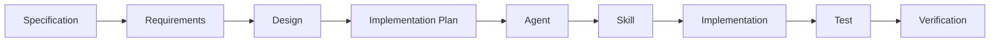

### 19.2 避免 AI Agent 擴權的防護措施

| 風險 | 防護措施 |
|---|---|
| 自行修改需求 | `system-architect` 等 Agent 設為唯讀（`tools: read, search`），任何需求變更須由人類明確更新 Specification 文件 |
| 過度實作（Scope Creep） | Implementation Plan 須經人工核准（第 31 章 Quality Gate），Agent 不可自行擴大實作範圍 |
| 修改不相關程式 | `AGENTS.md` 明確列出「不可修改」清單（如既有 migration 檔案），Hook 可加入變更範圍檢查 |
| 跳過測試 | `pre-commit-quality-gate` Hook 強制執行測試，屬確定性自動化，不受 AI 判斷影響 |
| 忽略 Architecture Rules | `*.instructions.md` 自動注入架構規則，`system-architect` 負責審查是否符合 |

### Scenario

某團隊發現 Coding Agent 在實作「訂單查詢」功能時，「順便」重構了完全不相關的付款模組。追查後發現該 Agent 的 Prompt 過於開放（「請改善這個系統」），缺乏明確的 Scope 邊界。**修正**：改用 19.1 的 Spec-Driven 流程，每個任務都先有明確的 Implementation Plan 並經人工核准，Agent 只能在核准範圍內執行。

### 本章 Checklist

- [ ] 每個實作任務都有對應的 Specification／Implementation Plan
- [ ] Agent 的工具授權已依角色收斂到最小必要範圍
- [ ] 已建立「不可修改清單」機制，防止 Agent 修改不相關程式

---

## 20. 企業級 AI Coding Governance

### 20.1 Governance 模型

| 類別 | 內容 |
|---|---|
| Approved Agents | 經審查核准可企業內使用的 `.agent.md` 清單 |
| Approved Skills | 經審查核准的 `SKILL.md` 清單 |
| Approved Plugins | 經審查核准的 `plugin.json` 清單 |
| Approved MCP Servers | 經審查核准、明確定義權限範圍的 MCP Server 清單 |
| Approved Models | 企業允許使用的底層模型清單（依合規/成本考量） |
| Security Policies | 對應第 21 章安全評估流程 |
| Access Control | 誰可以安裝／修改 Org 層級的客製化資源 |
| Audit Log | 記錄客製化資源的安裝、修改、移除歷程 |
| Version Control | 所有客製化資源納入 Git 版控，比照一般程式碼管理 |
| Change Management | 變更需經 PR Review，比照第 28 章 Resource Lifecycle |

### 20.2 安全風險類別

| 風險 | 說明 |
|---|---|
| Prompt Injection | 惡意內容（如網頁、文件）誘導 Agent 執行非預期動作 |
| Tool Injection | 惡意 Skill／Plugin 透過過度授權的 `tools`／`allowed-tools` 取得非預期能力 |
| Malicious Skill | 社群 Skill 內含惡意腳本或誤導性 `description` |
| Malicious Plugin | 社群 Plugin 打包了未經審查的 Agent／Hook／MCP |
| MCP Supply Chain | MCP Server 套件本身遭竄改或依賴鏈遭污染 |
| Secret Leakage | 客製化資源中硬編碼 Secret，或 Hook／MCP 設定不當導致外洩 |
| Data Exfiltration | Agent 透過 MCP／Hook 將內部資料傳送到未授權的外部端點 |
| Excessive Permission | Agent／Skill 的工具授權超出實際需要（違反最小權限原則） |
| Command Execution | Hooks／Plugin 可執行任意 Shell 指令，須嚴格審查 |
| Dependency Risk | Plugin／MCP 依賴的第三方套件存在已知漏洞 |

### 20.3 Governance Workflow

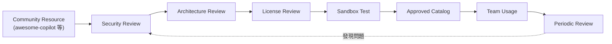

### 20.4 已知威脅情資（2026，Source-confirmed）

20.2 列出的風險類別並非紙上談兵——以下是 2026 年已被資安研究機構與媒體證實的真實案例，企業撰寫 Governance 政策時可直接引用作為風險佐證：

| 威脅 | 具體情資 | 來源 |
|---|---|---|
| GitHub 留言注入（Comment Prompt Injection） | 研究人員證實 **Claude Code、Google Gemini CLI、GitHub Copilot Agent** 皆可被精心設計的 PR 標題、留言、Issue 內容「駭持」，誘導 Agent 執行非預期動作（例如洩漏 Secret） | SecurityWeek（2026） |
| 惡意 Skill 供應鏈風險 | HiddenLayer 研究指出，Agent Skills **未經加密簽章、審查機制薄弱**，任何有 GitHub 帳號的人都能發布，已出現真實案例：惡意 Skill 誘導 Agent 悄悄下載並執行惡意程式，或將 Agent 暗中拉入加密貨幣挖礦/詐騙流程 | HiddenLayer,《The Next AI Supply Chain Risk: Malicious Skills in Agentic AI》 |
| Agentic Workflow 漏洞遭主動攻擊 | GitHub Agentic Workflows 曾出現已被實際攻擊利用（active exploitation）的 Prompt Injection 漏洞，直接威脅軟體供應鏈安全 | Rescana 資安情資（2026） |
| 產業現況統計 | OWASP 統計：**73% 的正式上線 AI 應用存在可被 Prompt Injection 利用的缺陷**，但**僅 34.7% 的企業已建立對應防禦機制** | OWASP（2026 年相關報告） |

> ⚠️ **企業啟示**：上述情資直接對應 20.2 的 Prompt Injection、Malicious Skill、MCP Supply Chain 三類風險並非理論假設，而是已發生的真實攻擊模式。20.1 的 Governance 模型與第 21 章的安全評估 Checklist **不是可有可無的官僚流程**，而是對應這些已知威脅的具體防禦措施；企業在說服管理層投入 Governance 資源時，可直接引用本節情資作為風險量化依據。

### Scenario

某企業的 Security Team 一開始只審查「程式碼」，沒有把 Agent／Skill／Plugin 納入審查範圍，直到一次事件中發現某個社群 Skill 的 `allowed-tools` 授權了 Terminal 執行權限且腳本會對外連線，才驚覺客製化資源本身就是攻擊面之一。**修正**：把 20.1 的 Governance 模型正式納入企業 AI 治理政策，客製化資源比照第三方套件依賴（如 npm package）的審查標準處理。

### 本章 Checklist

- [ ] 已建立 Approved Agents／Skills／Plugins／MCP 清單機制
- [ ] 客製化資源的安裝與修改已納入 Audit Log
- [ ] 20.2 十類安全風險已納入企業 AI 治理政策文件
- [ ] 已用 20.4 的 2026 年真實威脅情資向管理層說明 Governance 投資的必要性

---

## 21. 社群資源安全評估 Checklist

### 21.1 Awesome Copilot Resource Security Checklist

在安裝任何 awesome-copilot（或其他社群來源）的 Agent／Skill／Plugin／Hook／MCP 前，逐項檢查：

- [ ] **Repository source**：確認來源 Repository 是否可信（是否為知名組織、star 數、issue 回應速度）
- [ ] **Maintainer**：確認貢獻者/維護者身份與過往紀錄
- [ ] **Last update**：確認最後更新時間，過舊或已停止維護需特別謹慎
- [ ] **License**：確認授權條款是否符合企業使用規範
- [ ] **Dependencies**：確認依賴的第三方套件是否有已知漏洞
- [ ] **Scripts**：逐行閱讀任何內含的 Shell／Python 等腳本
- [ ] **Shell commands**：確認 Hook／Plugin 是否執行 Shell 指令，指令內容是否合理
- [ ] **MCP servers**：確認綁定的 MCP Server 來源與權限範圍
- [ ] **Network access**：確認是否對外發送網路請求，目標端點是否可信
- [ ] **File access**：確認存取的檔案/目錄範圍是否合理，是否有存取範圍外的檔案
- [ ] **Environment variables**：確認是否讀取超出必要範圍的環境變數
- [ ] **Secrets**：確認沒有硬編碼的密碼／API Key／Token
- [ ] **Tool permissions**：確認 `tools`／`allowed-tools` 是否符合最小權限原則
- [ ] **Prompt injection**：確認資源內容是否有可疑的隱藏指令或誤導性描述
- [ ] **Obfuscated code**：確認是否有刻意混淆的程式碼
- [ ] **External download**：確認執行時是否會下載額外的外部內容
- [ ] **Supply-chain risk**：確認整條依賴鏈是否有已知風險節點

### 21.2 Risk Level 與對應處理

| Risk Level | 判定標準 | 處理方式 |
|---|---|---|
| **LOW** | 純文字規則（Instructions），無工具授權、無外部連線 | 可直接進入標準 PR Review 流程 |
| **MEDIUM** | 具工具授權但範圍明確（如唯讀 Skill）、無 Shell 執行 | 需 Tech Lead 審查 + 沙盒測試 |
| **HIGH** | 具 Shell 執行能力（Hook／Plugin）、或綁定 MCP 存取外部系統 | 需 Security Team 審查 + 沙盒測試 + 限定初期使用範圍 |
| **CRITICAL** | 具生產環境存取權限、或處理 Secret／敏感資料 | 需 Security Team + Architecture Team 雙審查，並建立監控與 Rollback 機制才可上線 |

### Scenario

某資淺工程師想快速導入一個社群 Plugin，跳過了 21.1 Checklist 直接安裝到個人環境測試，結果該 Plugin 內建的 Hook 會在每次 Session 開始時把專案結構資訊傳送到一個不明的外部端點。因為只在個人沙盒環境測試、未擴散到團隊共用設定，損害有限，但也凸顯「即使是個人測試也該過 Checklist」的必要性。

### 本章 Checklist

- [ ] 21.1 完整 Checklist 已納入企業 SOP，安裝前必須逐項確認
- [ ] 已依 21.2 為每個待安裝資源評定 Risk Level
- [ ] CRITICAL 等級資源已建立監控與 Rollback 機制才允許上線

---

## 22. 企業團隊導入方法

### 22.1 六階段導入模型

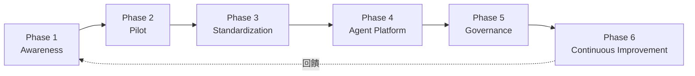

### 22.2 各階段內容

| Phase | 內容 |
|---|---|
| Phase 1 — Awareness | 讓同仁了解 Copilot、Agents、Skills、Instructions、Plugins、MCP 的基本概念（可參考本手冊 Part I-II） |
| Phase 2 — Pilot | 選擇一個 Web Application、一個 Legacy System、一個 Framework Migration 作為試點（對應第 15-17 章案例） |
| Phase 3 — Standardization | 建立 Company AI Development Standards（第 34 章） |
| Phase 4 — Agent Platform | 建立企業 Agent Catalog（第 24 章） |
| Phase 5 — Governance | 建立 AI Agent Governance（第 20-21 章） |
| Phase 6 — Continuous Improvement | Measure → Review → Improve → Publish → Measure 循環（對應第 30 章 KPI） |

### Scenario

某企業一開始就想直接跳到 Phase 4（建立完整 Agent Platform），跳過 Phase 1-2，結果同仁對基本概念都還不熟悉，導入的 Agent Team 沒有人真正會用。**修正**：退回 Phase 1-2，先讓一個試點團隊完整跑過 Pilot，累積實務經驗後再擴大到 Standardization 與 Platform 階段。

### 本章 Checklist

- [ ] 已依 22.1 六階段模型規劃導入時程
- [ ] Pilot 階段已選定具代表性的 Web App／Legacy／Migration 案例
- [ ] 未跳過 Awareness／Pilot 階段直接進入 Platform／Governance 階段

---

## 23. 團隊標準目錄與資源歸屬

### 23.1 建議標準目錄

```text
.github/
├── agents/
│   ├── system-architect.agent.md
│   ├── reverse-engineering-agent.agent.md
│   ├── migration-agent.agent.md
│   ├── security-agent.agent.md
│   └── code-review-agent.agent.md
│
├── skills/
│   ├── web-application-development/
│   ├── reverse-engineering/
│   ├── framework-migration/
│   └── security-review/
│
├── instructions/
│   ├── java.instructions.md
│   ├── vue.instructions.md
│   ├── security.instructions.md
│   └── testing.instructions.md
│
├── hooks/
│   ├── pre-commit-quality-gate.json
│   └── agent-workflow-guard.json
│
├── workflows/
│
├── prompts/
│
└── copilot-instructions.md
```

### 23.2 資源歸屬建議

| 資源 | 建議歸屬 | 理由 |
|---|---|---|
| Coding Standard Instructions | Repository 共用 | 團隊共同規範，需版控且所有成員一致套用 |
| 個人偏好的 Prompt 捷徑 | 個人使用（`~/.copilot/`） | 因人而異，不適合強制全團隊套用 |
| Security／Architecture Review Agent | Team 共用 | 需要團隊一致的審查標準，但不一定適合全組織 |
| 通過安全審查的 Enterprise Toolkit | Plugin 化，Global 使用 | 已驗證過的能力組合，適合跨團隊/跨專案分發 |
| 個別專案特有的 Migration Skill | Repository 共用（該專案內） | 與特定專案的技術棧/歷史包袱高度相關，不適合泛化 |

### Scenario

某企業把一個「只適用於單一老系統」的 Migration Skill 直接發布成全組織 Global Plugin，結果其他專案的工程師誤用，導致不相關的錯誤變更建議。**教訓**：資源歸屬要對應其「適用範圍的真實邊界」，不是所有資源都適合往上收斂成 Global／Plugin 化。

### 本章 Checklist

- [ ] 已依 23.1 建立團隊標準目錄骨架
- [ ] 已依 23.2 判斷每個資源該歸屬 Repository／Team／個人／Global／Plugin 化

---

## 24. Agent／Skills／Instructions Catalog

> ⚠️ 以下三張表為本手冊依第 7-9 章內容彙整的企業目錄範例（建議架構），企業導入時應依實際需求增減。

### 24.1 Agent Catalog

| Agent | Purpose | 使用時機 | Tools | Skills | Output | Risk |
|---|---|---|---|---|---|---|
| system-architect | 整體架構決策 | 新專案／重大架構變更 | read, search | — | 架構決策文件 | LOW（唯讀） |
| frontend-architect | 前端架構設計 | 前端模組設計 | read, edit, search, terminal | web-application-development | 前端架構文件 | MEDIUM |
| backend-architect | 後端架構設計 | 後端模組設計 | read, edit, search, terminal | web-application-development | 後端架構文件 | MEDIUM |
| reverse-engineering-agent | Legacy 系統分析 | 現代化評估前 | read, search | reverse-engineering | Reverse Engineering Report 全套 | LOW（唯讀） |
| migration-agent | Framework 升級執行 | Migration Plan 核准後 | read, edit, search, terminal | framework-migration | 變更後程式碼＋Migration Report | HIGH（可修改程式碼） |
| security-agent | 安全審查 | 每次重大變更前 | read, search | security-review | Security Findings 報告 | LOW（唯讀） |
| database-agent | 資料庫設計 | 資料庫變更 | read, edit, search, terminal | — | Migration 腳本＋ER 圖 | MEDIUM |
| test-agent | 測試撰寫/審查 | 每次功能開發後 | read, edit, search, terminal | — | 測試程式碼＋覆蓋率報告 | MEDIUM |
| code-review-agent | Code Review | 每次 PR | read, search | — | Review 意見清單 | LOW（唯讀） |
| devops-agent | CI/CD 與部署 | 部署階段 | read, edit, search, terminal | — | 部署設定變更 | HIGH（影響生產環境） |
| documentation-agent | 技術文件撰寫 | 功能完成後 | read, edit, search | — | 更新後文件 | LOW |
| project-coordinator | 跨 Agent 協調 | 專案啟動與協調 | read, search | — | 任務分派紀錄 | LOW（唯讀） |

### 24.2 Skills Catalog

| Skill | Purpose | Input | Output | Trigger | Dependencies |
|---|---|---|---|---|---|
| web-application-development | 全端功能實作指引 | 需求描述 | 程式碼＋測試 | 新增/修改功能任務 | `java.instructions.md`／`vue.instructions.md` |
| reverse-engineering | Legacy 系統系統化分析 | Legacy 原始碼 | 8 項報告文件 | 逆向工程任務 | 無 |
| framework-migration | Framework 升級分析 | 現有依賴/程式碼 | Migration Plan | Framework 升級任務 | 官方 Migration Guide |
| security-review | OWASP 導向安全審查 | 程式碼變更 diff | Security Findings | Code Review 前置步驟 | 無 |
| vue-development | Vue 3 元件/頁面開發指引 | 需求描述、設計稿 | Vue 元件程式碼＋Vitest 測試 | 新增/修改前端 UI 任務 | `vue.instructions.md` |
| spring-boot-development | Spring Boot Controller/Service/Repository 開發指引 | API 規格、需求描述 | 後端程式碼＋JUnit 5 測試 | 新增/修改後端 API 任務 | `java.instructions.md`／`spring-boot.instructions.md` |
| database-analysis | Schema／索引／查詢效能分析 | 現有 Schema、慢查詢紀錄 | Database Analysis Report＋優化建議 | 資料庫效能疑慮、Migration 前置評估 | `database.instructions.md` |
| performance-analysis | 應用程式效能瓶頸分析 | Profiling 資料、APM 指標 | Performance Report＋優化建議 | 效能調校任務、上線前效能驗證 | Monitoring MCP（第 14.6 節） |
| testing | 測試策略規劃與補齊 | 現有程式碼＋既有測試涵蓋率 | 測試計畫＋新增測試程式碼 | 測試涵蓋率不足、新功能上線前 | `testing.instructions.md` |
| documentation | 技術文件產出與更新 | 程式碼變更、API 變更 | README／API 文件／變更說明 | 功能完成後、版本發布前 | 無 |
| api-design | REST API 設計與 OpenAPI 規格產出 | 需求描述、既有 API 慣例 | OpenAPI 規格文件＋端點設計 | 新增 API 前的設計階段 | `api.instructions.md` |
| architecture-analysis | 既有架構現況分析與改善建議 | 原始碼、既有架構文件 | Architecture Assessment Report | 重大重構前、技術債盤點 | 可搭配 `reverse-engineering` Skill 使用 |

> 上列後 8 項（Vue Development～Architecture Analysis）為表格骨架示意，企業實際導入時仍須依 8.2 節 Frontmatter 規格與 8.4 節三段式載入原則，比照第 8.7-8.10 節的四個完整範例撰寫各自的 `SKILL.md` 本文、步驟與重要限制，本表僅提供 Purpose／Input／Output／Trigger／Dependencies 的起點，不代表這些 Skill 已有完整實作內容。

### 24.3 Instructions Catalog

| Instruction | Scope | Purpose |
|---|---|---|
| `architecture.instructions.md` | `**/*` | Clean Architecture 分層規則 |
| `java.instructions.md` | `**/*.java` | Java 25 程式碼規範、命名慣例、例外處理 |
| `spring-boot.instructions.md` | `**/*.java`（Controller/Service/Repository） | Spring Boot 特定慣例（DTO 轉換、事務管理） |
| `vue.instructions.md` | `**/*.vue,**/*.ts` | Vue 3 Composition API、Pinia、Tailwind 慣例 |
| `typescript.instructions.md` | `**/*.ts,**/*.tsx` | TypeScript 型別規範 |
| `sql.instructions.md` | `**/*.sql` | SQL 撰寫規範、命名慣例 |
| `security.instructions.md` | `**/*` | OWASP 相關安全規則 |
| `testing.instructions.md` | `**/*.test.*,**/*Test.java` | 測試撰寫規範 |
| `git.instructions.md` | `**/*` | Commit message／Branch 命名規範 |
| `api.instructions.md` | `**/controller/**` | REST API 設計規範（回應格式、錯誤碼） |
| `database.instructions.md` | `**/repository/**,**/entity/**` | 資料庫存取層規範 |
| `devops.instructions.md` | `**/*.yml,**/Dockerfile` | CI/CD 與容器化規範 |

### 本章 Checklist

- [ ] 已依三張 Catalog 建立企業初版目錄，並指派各項目的 Owner
- [ ] Catalog 已納入第 28 章 Resource Lifecycle 的定期複核排程

---

## 25. 實戰 Prompt 範例集

### 25.1 Reverse Engineering

```text
角色：你是資深 Software Architect（reverse-engineering-agent）。

情境：這是一套未有完整文件的 Legacy Java Web 系統。

目標：在不修改任何原始碼的前提下，完整理解系統架構、資料庫設計與商業邏輯。

限制：
- 不可修改任何原始碼
- 無法確認的商業意圖，必須標示「需人工確認」，不可臆測

步驟：
1. Repository Discovery
2. Code Inventory
3. Dependency Analysis
4. Architecture Discovery
5. Database Analysis
6. API Analysis
7. Security Analysis
8. Batch Analysis
9. Business Rule Extraction
10. Architecture Diagram（Mermaid）
11. Technical Debt Analysis
12. Modernization Recommendation

驗證：確認 8 項最終產出文件皆已產出，且「需人工確認」條目已明確列出清單。

輸出格式：Markdown 文件，存放於 docs/reverse-engineering/ 對應檔名。
```

### 25.2 Framework Upgrade

```text
角色：你是資深 Migration 專家（migration-agent）。

情境：分析此應用程式從 Spring Boot 3.x 升級到 Spring Boot 4.x 的可行性。

目標：產出完整 Migration Plan，在人工核准前不得修改任何程式碼。

限制：
- Migration Plan 完成前，不可修改程式碼
- Breaking Change 判定須對照官方 Migration Guide，不可憑推測

步驟：
1. Current System Assessment
2. Dependency Analysis
3. Breaking Change Detection
4. Configuration Analysis
5. Source Code Analysis
6. Security Analysis
7. Test Analysis
8. 產出 Migration Plan（含分階段升級步驟與風險評估）

驗證：Migration Plan 需包含可獨立驗證與回滾的分階段步驟。

輸出格式：Markdown Migration Plan 文件 + 風險評估表。
```

### 25.3 Security Review

```text
角色：你是資深資安工程師（security-agent）。

情境：對此次程式碼變更（PR diff）進行安全審查。

目標：依 OWASP Top 10 相關面向，找出所有安全風險。

限制：
- 只能提出審查意見，不可修改程式碼
- Critical 等級問題須在回應開頭明確標示

步驟：依 .github/skills/security-review/SKILL.md 定義的檢查面向逐一檢查：
SQL Injection、XSS、CSRF、Authentication、Authorization、Secret Leakage、
Dependency Vulnerabilities、Secure Configuration

驗證：每項發現須包含具體檔案位置與修復建議，不可只給模糊描述。

輸出格式：依 Critical／High／Medium／Low 分類的清單。
```

### 25.4 Architecture Review

```text
角色：你是資深 System Architect（system-architect）。

情境：審查此 Repository 是否符合 Clean Architecture 與 Hexagonal Architecture 原則。

目標：找出違反分層原則的地方，並提出改善建議。

限制：
- 只能分析，不可修改程式碼
- 建議需具體可執行，不可只給抽象原則

步驟：
1. 確認目前分層結構（Controller/Service/Repository/Entity 等）
2. 檢查是否有跨層直接依賴（如 Controller 直接呼叫 Repository）
3. 檢查 Domain 邏輯是否洩漏到 Infrastructure 層
4. 提出具體重構建議，並標示優先順序

驗證：每項發現需附上檔案位置與具體修改建議。

輸出格式：架構審查報告，含 Mermaid 現況圖與建議改善圖。
```

### 25.5 Web Application Development

```text
角色：你是 backend-architect / frontend-architect Agent。

情境：依本 Repository 既有架構與 Coding Standard 實作新功能。

目標：[具體功能描述，例如「新增訂單查詢 API 與對應前端頁面」]

限制：
- 遵循 .github/instructions/ 底下所有相關規範
- 遵循 .github/skills/web-application-development/SKILL.md 實作步驟
- 需補上對應測試

步驟：
1. 確認需求邊界（純前端／純後端／全端）
2. 依規範實作
3. 補上測試
4. 產出檔案變更清單摘要

驗證：對應測試指令（mvn test / npm run test:unit）全數通過。

輸出格式：變更檔案清單 + 關鍵程式碼片段 + 測試結果摘要。
```

### 本章 Checklist

- [ ] 5 組 Prompt 範例已依團隊實際專案調整過技術堆疊細節
- [ ] 每組 Prompt 都包含 Role／Context／Objective／Constraints／Steps／Validation／Output Format 七要素

---

## 26. 完整實戰 Tutorial（18 項）

> **本章定位說明**：下方 18 項為「Tutorial 導覽索引表」——目的、前置條件、關鍵步驟、預期結果、驗證方式、常見問題皆濃縮為一行，完整操作細節請對照「對應章節」欄位所指的章節（那些章節才有完整的 frontmatter 規格、範例檔案與 Scenario）。為了不讓本章淪為純索引、名實不符，26.1 額外挑選 3 項具代表性的 Tutorial（涵蓋「環境安裝」「宣告式資源建立」「事件驅動自動化」三種不同性質的任務），完整展開為含實際指令輸出與驗證步驟的逐步操作指南，供讀者直接照做；其餘 15 項則維持索引表形式，讀者依「對應章節」連結過去即可取得同等深度的範例。

| # | Tutorial | 目的 | 前置條件 | 關鍵步驟 | 對應章節 | 預期結果 | 驗證方式 | 常見問題 |
|---|---|---|---|---|---|---|---|---|
| 1 | 安裝與第一次使用 | 安裝 Copilot CLI／VS Code 擴充並完成登入 | 已有 GitHub 帳號與 Copilot 授權 | `npm install -g @github/copilot` → `/login` | 第 4.5 節 | CLI 可正常回應 Prompt | 執行 `copilot --version` 確認安裝成功 | Node.js 版本過舊（需 22+） |
| 2 | 搜尋 awesome-copilot 資源 | 學會用官網/`llms.txt` 找到合適資源 | 已知需求類型（Agent/Skill/Instructions） | 瀏覽 `awesome-copilot.github.com` 依分類篩選 | 第 2.3-2.4 節 | 找到候選資源清單 | 對照第 21 章 Checklist 逐項確認 | 誤把「star 數高」當成「安全」的唯一判準 |
| 3 | 安裝 Plugin | 從 Marketplace 安裝一個 Plugin | 已完成 Tutorial 1 | `copilot plugin marketplace add github/awesome-copilot` → `copilot plugin install <name>@awesome-copilot` | 第 12.1 節 | Plugin 內含資源全數生效 | `copilot plugin list` 確認已安裝 | 忘記先註冊 Marketplace 來源 |
| 4 | 使用 Agent | 切換到指定 Custom Agent 執行任務 | `.github/agents/` 已有至少一個 `.agent.md` | 在 Chat／CLI 切換 Agent，輸入任務 | 第 9 章 | Agent 依其角色與工具授權執行 | 檢查輸出是否符合該 Agent 職責邊界 | 誤用審查型 Agent 去做實作任務 |
| 5 | 使用 Skill | 觸發特定 Skill 執行多步驟流程 | `.github/skills/` 已有至少一個 Skill | 描述符合 Skill `description` 情境的任務 | 第 8 章 | Skill 自動載入並依步驟執行 | 確認輸出格式符合 SKILL.md 定義 | `description` 寫太模糊導致誤觸發或不觸發 |
| 6 | 建立 Instructions | 撰寫一份 `*.instructions.md` | 已確認規則屬於「靜態、需自動套用」類型 | 依 7.5 節 `applyTo` 語法撰寫 | 第 7 章 | 對應路徑的檔案操作自動套用規則 | 修改對應路徑檔案，確認規則生效 | `applyTo` glob 語法錯誤導致未生效 |
| 7 | 建立 Custom Agent | 撰寫一份 `.agent.md` | 已確認角色定位與工具授權範圍 | 依 9.2 節 Frontmatter 欄位撰寫 | 第 9 章 | Agent 出現在可切換清單中 | 切換該 Agent 並測試典型任務 | `tools` 授權過寬，違反最小權限原則 |
| 8 | 建立 Skill | 撰寫一份 `SKILL.md` | 已確認為多步驟、需 bundled 資源的能力 | 依 8.2 節 Frontmatter + 三段式載入設計 | 第 8 章 | Skill 依相關性正確載入 | 用邊界案例測試是否誤觸發/不觸發 | 附屬資源路徑錯誤導致載入失敗 |
| 9 | 建立 Plugin | 打包多個資源成 Plugin | 已有經審查的 Agent／Skill／Hook | 依 11.3-11.4 節撰寫 `plugin.json` | 第 11 章 | Plugin 可被安裝且內含資源全數生效 | 在沙盒環境安裝驗證 | Schema 版本與實際安裝環境不相容 |
| 10 | 建立 Hook | 撰寫事件驅動自動化 | 已確認需要「確定性」而非「AI 判斷」的自動化 | 依 13.3-13.4 節撰寫 Hook JSON + Shell 腳本 | 第 13 章 | 指定事件觸發時自動執行 | 確認已合併到 default branch 後測試 | Hook 只存在於 feature branch，未套用 |
| 11 | 整合 MCP | 設定 MCP Server 連接外部系統 | 已確認外部系統的存取權限與認證方式 | 依 14.5 節撰寫 `mcp.json`，用環境變數注入認證 | 第 14 章 | Agent 可查詢/操作外部系統 | 執行一次唯讀查詢驗證連線正常 | 把 Secret 硬編碼進設定檔並提交版控 |
| 12 | Web Application Development | 端到端實作一個功能 | 已完成 Tutorial 4-8 | 依 15.2 節流程圖執行 | 第 15 章 | 功能完成且通過測試/審查 | 對應測試指令全數通過 | 跳過 Security／Code Review 關卡 |
| 13 | Reverse Engineering | 分析一套 Legacy 系統 | 已建立 `reverse-engineering-agent` | 依 16.2 節 12 步驟執行 | 第 16 章 | 產出 8 項報告文件 | 檢查「需人工確認」條目是否已排入複核 | 誤讓 Agent 具備寫入權限 |
| 14 | Framework Migration | 評估並執行框架升級 | 已建立 `migration-agent` | 依 17.1 節流程圖執行 | 第 17 章 | 產出經核准的 Migration Plan 並完成升級 | 每階段皆可獨立驗證/回滾 | 未設人工核准關卡直接自動變更 |
| 15 | Security Review | 對變更執行安全審查 | 已建立 `security-agent` | 依 25.3 節 Prompt 執行 | 第 8.10、25.3 節 | 產出分級 Security Findings | Critical 問題是否已優先處理 | 把審查意見當成「已修復」而未實際處理 |
| 16 | Code Review | 對 PR 執行程式碼審查 | 已建立 `code-review-agent` | 切換 Agent，指定 PR/diff 範圍 | 第 9.4 節 | 產出具體可執行的審查意見 | 對照企業 Code Review 標準逐項確認 | 讓審查型 Agent 誤取得修改權限 |
| 17 | CI/CD Integration | 將 Hook／Agentic Workflow 整合進 CI/CD | 已完成 Tutorial 10 | 依 4.2 節 `gh-aw` 流程編譯 Workflow | 第 4.2、13 章 | Pipeline 中自動執行 Agent 任務 | 檢查 Actions 執行紀錄 | 誤提交 `.lock.yml` 編譯產物 |
| 18 | Enterprise Governance | 建立企業治理流程 | 已完成 Tutorial 1-17 | 依 20.3 節 Governance Workflow 執行 | 第 20-21 章 | 建立 Approved Catalog 與定期複核機制 | 抽查任一已核准資源，確認審查紀錄完整 | Governance 流程只在導入初期執行一次，後續未持續複核 |

### 26.1 精選 Tutorial 完整逐步示範

#### Tutorial 1：安裝與第一次使用（完整版）

1. 確認 Node.js 版本 ≥ 22、npm 版本 ≥ 10：

   ```bash
   node --version   # 預期輸出如 v22.x.x 或更新
   npm --version    # 預期輸出如 10.x.x 或更新
   ```

2. 安裝 Copilot CLI：

   ```bash
   npm install -g @github/copilot
   ```

3. 首次啟動並登入：

   ```bash
   copilot
   # 進入互動模式後輸入
   /login
   # 依畫面指示於瀏覽器完成 GitHub 帳號授權
   ```

4. 驗證安裝成功：

   ```bash
   copilot --version
   # 預期輸出版本號，例如：GitHub Copilot CLI 1.x.x
   ```

5. 驗證預設 Marketplace 已註冊（依第 12.1 節 2026-08-27 查證更新）：

   ```bash
   copilot plugin marketplace list
   # 預期輸出應包含 copilot-plugins 與 awesome-copilot 兩個來源
   ```

**常見問題排解**：若步驟 1 顯示 Node.js 版本過舊，需先升級 Node.js（建議用 `nvm install 22` 管理版本）才能繼續；若步驟 5 未看到 `awesome-copilot`，代表 CLI 版本較舊，需依 12.1 節手動執行 `copilot plugin marketplace add github/awesome-copilot` 補註冊。

#### Tutorial 6：建立 Instructions（完整版）

以「Controller 命名規範」為例，示範從撰寫到驗證生效的完整流程：

1. 建立檔案 `.github/instructions/api-naming.instructions.md`：

   ```markdown
   ---
   applyTo: "**/controller/**/*.java"
   ---

   # API Controller 命名規範

   - Controller 類別名稱一律以 `Controller` 結尾（如 `OrderController`）
   - 所有 Endpoint 方法須加上 `@Operation` OpenAPI 註解
   ```

2. 提交並合併到 default branch（依 7.4 節優先順序說明，Repository 層級規則對所有協作者生效）：

   ```bash
   git add .github/instructions/api-naming.instructions.md
   git commit -m "docs: add API controller naming instructions"
   git push
   ```

3. 驗證是否生效：在 VS Code 中開啟任一 `**/controller/**/*.java` 檔案，於 Copilot Chat 詢問「這個 Controller 是否符合命名規範？」，預期 Copilot 的回答會引用上述規則內容，而非泛泛而談。
4. 若懷疑未生效，依第 27 章 Troubleshooting「Instructions 沒有效果」排查：確認 `applyTo` 的 glob 語法是否有多餘空格、確認檔案路徑確實在 `.github/instructions/` 底下。

#### Tutorial 10：建立 Hook（完整版）

以「Session 開始時驗證分支名稱」為最小可行範例：

1. 建立腳本 `scripts/hooks/branch-name-check.sh`：

   ```bash
   #!/usr/bin/env bash
   BRANCH=$(git rev-parse --abbrev-ref HEAD)
   if [[ ! "$BRANCH" =~ ^(feature|fix|chore)/ ]]; then
     echo "[hook] 警告：目前分支 '$BRANCH' 不符合命名規範（需以 feature/、fix/、chore/ 開頭）"
   fi
   exit 0
   ```

2. 建立設定檔 `.github/hooks/branch-name-check.json`：

   ```json
   {
     "version": 1,
     "name": "branch-name-check",
     "description": "Warn when the current branch does not follow naming convention.",
     "event": "sessionStart",
     "timeoutSec": 10,
     "command": "./scripts/hooks/branch-name-check.sh"
   }
   ```

3. **關鍵步驟**（依 13.3 節限制，這是最容易漏掉的一步）：確認兩個檔案都已合併到 **default branch**，而非只存在於 feature branch：

   ```bash
   git add .github/hooks/branch-name-check.json scripts/hooks/branch-name-check.sh
   git commit -m "feat: add branch name check hook"
   git push origin main   # 或團隊的 default branch 名稱
   ```

4. 驗證：開啟新的 Copilot Agent Session，若目前分支不符合命名規範，Session 開始時應能在 Log／輸出中看到步驟 1 腳本印出的警告訊息。
5. 若沒有看到警告，依第 27 章 Troubleshooting「Hook 沒有執行」排查：最常見原因就是 Hook 設定檔還停留在未合併的 feature branch 上。

### 本章 Checklist

- [ ] 新人已依序完成 Tutorial 1-11（基礎操作），其中 Tutorial 1／6／10 已依 26.1 完整版逐步操作過
- [ ] 團隊已完成 Tutorial 12-17（實戰案例）至少一輪
- [ ] Tutorial 18（Governance）已成為持續性流程，而非一次性活動

---

## 27. Troubleshooting

| 問題 | 常見原因 | 解決方式 |
|---|---|---|
| Agent 沒有出現在可切換清單 | `.agent.md` 存放路徑錯誤、frontmatter 格式錯誤 | 確認放在 `.github/agents/`／`.claude/agents/`／`~/.copilot/agents/`，並檢查 YAML frontmatter 語法 |
| Skill 沒有被觸發 | `description` 描述不夠精確，或與當前任務相關性判斷失敗 | 依 8.5 節改寫更明確的觸發情境描述；必要時設 `user-invocable` 讓使用者可手動呼叫 |
| Instructions 沒有效果 | `applyTo` glob 語法錯誤，或檔案未存放在正確目錄 | 核對 7.5 節語法範例，確認逗號分隔與引號都正確 |
| Plugin 無法安裝 | Marketplace 未註冊、`plugin.json` schema 版本不符 | 先執行 `copilot plugin marketplace add`，並核對 schema 版本 |
| MCP 無法連線 | 設定檔路徑錯誤、認證資訊未正確注入 | 核對 14.4 節各 Client 的設定位置，確認環境變數已正確設定 |
| Hook 沒有執行 | Hook 設定檔只存在於 feature branch，未合併到 default branch | 依 13.3 節限制，合併到 default branch 後重新測試 |
| Agent 使用錯誤工具 | `tools` 授權設定過寬，或沿用了其他 Agent 的範本 | 依角色重新檢視 `tools` 欄位，套用最小權限原則（9.4 節 Scenario） |
| AI 修改了不相關檔案 | 缺乏明確 Scope 邊界、Agent 工具授權過寬 | 依 19.2 節防護措施，建立「不可修改清單」與人工核准關卡 |
| Agent 產生錯誤程式碼 | Instructions／Skill 規則不夠具體，或 Context 不足 | 補充更具體的 Instructions／Skill 步驟，必要時提供範例程式碼 |
| Context 不足 | `AGENTS.md`／Instructions 內容過於簡略 | 補充建置指令、目錄結構說明、重要限制（參考 7.6 節範例） |
| Token 使用過高 | Skill／Instructions 內容冗長，或未善用漸進載入機制 | 精簡 `description`，善用第 8.4 節三段式漸進載入，避免一次性塞入大量內容 |
| Agent 陷入循環 | Handoff 迴圈設計錯誤，或任務邊界不清楚 | 檢查 `handoffs` 設定是否形成迴路，人工中斷並重新設計協作拓樸（第 10 章） |

### 本章 Checklist

- [ ] 已將本表納入團隊內部 Wiki／FAQ，供新人自助排解問題
- [ ] 「Agent 陷入循環」與「AI 修改不相關檔案」已有明確的人工中斷/回滾程序

---

## 28. 維護策略

### 28.1 版控與變更流程

企業自建的 Agent／Skill／Instructions／Plugin／Hook 應比照一般程式碼，納入 Git 版控與標準 PR 流程：

- **Branch Strategy**：客製化資源變更走與程式碼相同的 Feature Branch → PR → Review → Merge 流程
- **Pull Request**：每個 PR 須說明變更的資源類型、影響範圍
- **Code Review**：至少一位熟悉該資源類型的同仁審查
- **Agent／Skill／Plugin／MCP Review**：額外比照第 21 章安全評估 Checklist
- **Security Review**：涉及 Hook／Plugin／MCP 的變更，須經 Security Team 審查
- **Versioning／Changelog**：重大變更需更新版本號與 Changelog
- **Deprecation／Rollback**：淘汰資源需有明確過渡期通知，變更造成問題時可快速回滾
- **Compatibility Testing**：變更後於沙盒環境驗證，確認未破壞既有行為

### 28.2 Resource Lifecycle

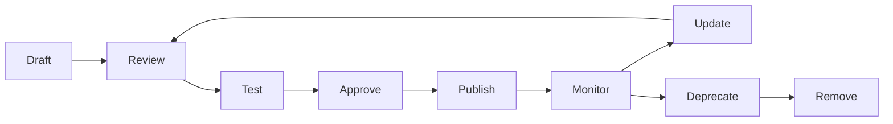

### Scenario

某企業的 Security Instructions 因為沒有版控與變更歷程，某次被人「順手」改鬆了規則卻沒有人知道，直到資安事件發生才追查出來。**修正**：所有客製化資源比照程式碼走 PR 流程，任何變更都有明確的 Reviewer 與 Commit 紀錄可追溯。

### 本章 Checklist

- [ ] 所有客製化資源已納入 Git 版控，禁止直接編輯正式環境檔案
- [ ] 已建立 Deprecation 通知機制，避免資源被無預警移除
- [ ] Resource Lifecycle 各階段皆有明確的 Owner／Reviewer

---

## 29. Upgrade Playbook

### 29.1 Awesome Copilot Upgrade Playbook

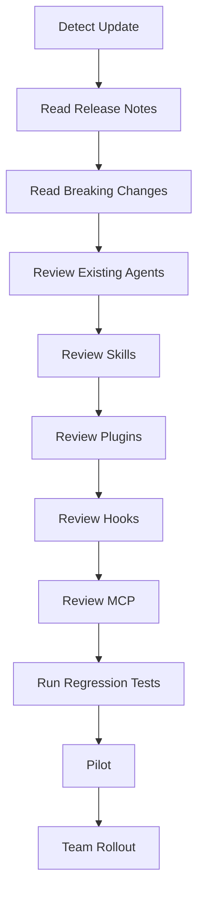

### 29.2 每個步驟的重點

| 步驟 | 重點 |
|---|---|
| Detect Update | 訂閱 GitHub Changelog、`docs.github.com`／`code.visualstudio.com` 更新通知 |
| Read Release Notes／Breaking Changes | 特別留意術語變更（如本手冊查證時遇到的 `.chatmode.md`→`.agent.md`、"coding agent"→"cloud agent"） |
| Review Existing Agents／Skills／Plugins／Hooks／MCP | 逐一確認既有資源是否受影響，特別是依賴已變更或已淘汰機制的資源 |
| Run Regression Tests | 在沙盒環境驗證既有工作流程未被破壞 |
| Pilot | 先在試點團隊套用新版本 |
| Team Rollout | 確認無重大問題後才全面推廣 |

### Scenario

本手冊撰寫過程中就實際遇到「Copilot Extensions 已日落」「chatmodes 資料夾已移除」等重大變化，若企業內部文件沒有定期執行本 Playbook，很容易繼續沿用已過時的教學內容而不自知。建議至少每季執行一次 Upgrade Playbook，並將查證日期標註在企業內部文件中（比照本手冊開頭的「查證日期」慣例）。

### 本章 Checklist

- [ ] 已建立訂閱官方 Changelog 的機制
- [ ] 每季至少執行一次 Upgrade Playbook
- [ ] 企業內部文件皆標註「查證日期」，避免長期未更新卻被當成最新資訊使用

---

## 30. Agent 成效 KPI

> **不應只使用「產生多少程式碼」評估 AI Agent。**

### 30.1 KPI 清單

| KPI | 說明 |
|---|---|
| Development Lead Time | 需求提出到上線的總時間 |
| Code Review Time | PR 從提出到核准合併的時間 |
| Defect Rate | 上線後發現的缺陷數量／密度 |
| Test Coverage | 測試涵蓋率變化趨勢 |
| Security Findings | 安全審查發現的問題數量與嚴重程度分布 |
| Migration Success Rate | Framework Migration 案例的成功率（是否需要回滾） |
| Rework Rate | AI 產出需要人工大幅修改的比例 |
| Agent Task Success Rate | Agent 任務一次完成（無需人工介入修正）的比例 |
| Human Intervention Rate | 需要人工中斷/修正 Agent 執行的頻率 |
| Token Consumption | 各 Agent／Skill 的 Token 使用量 |
| Cost | 對應的 AI Credits／API 費用 |
| Developer Satisfaction | 團隊對 Agent 協作體驗的滿意度調查 |

### 30.2 KPI 使用原則

- KPI 應**組合觀察**，不可單看「程式碼產出量」判斷 Agent 是否有效——產出量高但 Rework Rate 也高，代表實際效益有限。
- Human Intervention Rate 偏高，往往代表 Instructions／Skill 定義不夠清楚，而非 Agent 能力不足。
- 定期（如每季）檢視 KPI 趨勢，回饋到第 22 章 Phase 6 Continuous Improvement 循環。

**示意數值範例**（⚠️ 純屬教學示範的假設情境，非任何真實企業的量測基準，實際數值請以企業自身量測結果為準）：某團隊在導入 Agent Team 協作模式（第 10 章）並補齊 Instructions／Skill 觸發準確度（第 27 章 Troubleshooting）後，於一季內觀察到的趨勢示意：

| KPI | 導入前（示意） | 導入後（示意） | 觀察重點 |
|---|---|---|---|
| Human Intervention Rate | 約 45% 任務需人工中斷修正 | 降至約 20% | 多數改善來自把模糊的 Instructions 改寫得更具體（呼應 30.2 第二點） |
| Rework Rate | 約 30% 產出需大幅修改 | 降至約 15% | 需與 Code Review Time 一併觀察，避免只是把返工成本轉嫁到審查階段 |
| Migration Success Rate | 首次 Migration 案例回滾 1 次 | 後續 3 次案例皆未回滾 | 得益於第 17 章分階段 Gate 設計，而非 Agent 本身能力進步 |

### Scenario

某企業管理層一開始只看「Agent 一週產出多少 PR」評估導入成效，數字看起來很亮眼，直到 Code Review Time 與 Defect Rate 同步大幅上升才驚覺：多數 PR 是「產出快但品質差」，Reviewer 要花更多時間把關，實際上拖慢了整體交付速度。**修正**：改用 30.1 的組合式 KPI（尤其同時檢視 Rework Rate 與 Human Intervention Rate），並依 30.2 原則定期檢視趨勢，才發現問題根源是 Instructions 對錯誤處理規範描述不清楚，補強後 PR 數量雖然下降，但 Defect Rate 與 Code Review Time 雙雙改善，整體交付效率反而提升。

### 本章 Checklist

- [ ] 已建立至少 5 項 KPI 的量測機制，而非只看程式碼產出量
- [ ] KPI 檢視結果已回饋到 Instructions／Skill／Agent 的持續改善

---

## 31. AI Agent Quality Gate

### 31.1 七道 Gate

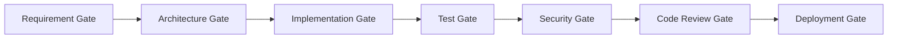

### 31.2 各 Gate 定義

| Gate | Input | Check | Pass Criteria | Fail Criteria | Responsible Agent | Human Approval |
|---|---|---|---|---|---|---|
| Requirement Gate | 需求描述 | 是否明確、可驗證 | 需求邊界清楚，無模糊描述 | 需求含糊或範圍不明 | project-coordinator | 是（需求提出者確認） |
| Architecture Gate | 需求 | 是否符合既有架構原則 | 通過 system-architect 審查 | 違反分層/架構原則 | system-architect | 是（Tech Lead） |
| Implementation Gate | 架構決策 | 實作範圍是否在核准邊界內 | Migration Plan／Implementation Plan 已核准 | 未經核准即實作 | 對應領域 Agent | 是（Implementation Plan 核准） |
| Test Gate | 實作程式碼 | 測試是否完整且通過 | 測試涵蓋新增/修改邏輯且全數通過 | 測試缺漏或失敗 | test-agent | 否（可自動化判定） |
| Security Gate | 程式碼變更 | 是否有安全風險 | 無 Critical／High 等級發現 | 存在 Critical 等級發現 | security-agent | 是（Critical 發現需人工確認修復） |
| Code Review Gate | 程式碼變更 | 是否符合規範與品質標準 | Reviewer 核准 | 存在未解決的審查意見 | code-review-agent | 是（人工核准合併） |
| Deployment Gate | 通過審查的變更 | 部署設定是否正確 | 通過 CI/CD Pipeline 全部檢查 | Pipeline 失敗 | devops-agent | 依變更風險等級決定 |

### Scenario

某企業曾經因為 Test Gate 設計成「Agent 自行判斷是否需要跑測試」，導致部分變更繞過測試直接進入下一階段。改為「Test Gate 為確定性 Hook 觸發，非 AI 判斷」後（呼應第 5.3 節「Hooks 是唯一不經過 AI 推理的一層」），這個問題徹底解決。

### 本章 Checklist

- [ ] 七道 Gate 已對應到實際 CI/CD／Agent 工作流程中
- [ ] Test Gate 已採確定性觸發（Hook），而非依賴 AI 判斷
- [ ] Security Gate 的 Critical 等級發現已強制要求人工確認才能繼續

---

## 32. awesome-copilot／Copilot 與其他 AI Coding Agent 比較

> ⚠️ **重要聲明**：本章 **僅 GitHub Copilot 欄位**經過本手冊逐項官方查證（來源標示同前）；Claude Code、OpenAI Codex、Cursor 欄位是依各自產品**既有公開資訊**做的**定性**比較，部分欄位已於 2026-08-27 補充網路上可查得的現況資訊，但仍**未逐項重新核對其官方文件**，因此每個欄位皆附查證信心標示。企業若要據此做工具選型決策，務必自行查證這三欄的當下最新官方文件，不可直接引用本表作為決策依據。

| Capability | GitHub Copilot（官方已實作，逐項查證） | Claude Code（定性，信心：中） | OpenAI Codex（定性，信心：中，2026-08-27 補充） | Cursor（定性，信心：中，2026-08-27 補充） |
|---|---|---|---|---|
| Instructions | `copilot-instructions.md`／`*.instructions.md`（`applyTo`）／`AGENTS.md`（支援面有限，見第 7 章） | `CLAUDE.md`／`.claude/` 底下的規則檔 | 支援 `AGENTS.md`（Codex 為該標準的早期採用者之一） | 支援 `AGENTS.md`，另有自家 `.cursor/rules` 機制 |
| Agents | `.agent.md`（Custom Agents，前身 `.chatmode.md`） | 具備 Custom Subagent 機制 | 多介面架構（CLI／IDE／雲端沙盒），無獨立的「Custom Agent」檔案格式對外開放 | Agent 模式稱為 **Composer**，內建於 VS Code fork 的編輯器中 |
| Skills | `SKILL.md`，**2025-12-18 GA**，與 Claude Code `.claude/skills` **官方明文相容** | `.claude/skills`（與 Copilot 互通，見第 8.1 節） | 具備 Codex Skills（可重複使用的工作流程包），於 **2025-12** 推出 | 資料不足，需自行查證當下最新狀態 |
| Hooks | `.github/hooks/*.json`，6 事件 | 具備事件驅動 Hooks 機制（事件名稱與 Copilot 不同，不可混用，見第 5.3 節提醒） | 資料不足 | 資料不足 |
| Plugins | Agent Plugins 1.0（跨廠商開放標準，AWS/Anysphere/Microsoft/OpenAI/Vercel/Google 共同支持） | 具備 Plugin 機制 | 支援 Agent Plugins 1.0（開放規範發起成員之一，2026-08 launch 時即支援） | 支援 Agent Plugins 1.0（發起成員之一） |
| MCP | 官方已實作，多 Client 設定位置（第 14.4 節） | 官方已實作 | 官方已實作 | 官方已實作 |
| Agent Delegation | Custom Agents 的 `handoffs`／`agents` 欄位 | 具備 Subagent 交派機制 | 資料不足 | 不綁定單一模型供應商，可切換底層模型，交派機制資料不足 |
| Enterprise Governance | Organization 層級指令、Business/Enterprise 方案設定 | 依產品方案而定 | 依產品方案而定 | 依產品方案而定 |
| 定價（頂級方案，2026 年中概況） | 依 Copilot Business/Enterprise 方案而定 | Pro 年繳約 $17/月起，頂級方案約 $200/月 | 頂級方案約 $200/月 | Pro 約 $20/月起，頂級方案約 $200/月 |

### 32.1 重要提醒

> 由於 Agent Plugins 1.0 是**跨廠商開放標準**（AWS、Anysphere、Microsoft、OpenAI、Vercel、Google 共同支持，且 OpenAI Codex／Cursor 皆為發起成員，2026-08-27 已用官方 Changelog 與規範 repo 核實），以及 Agent Skills 與 Claude Code 明文相容，這兩項機制在 GitHub Copilot 與其他工具間的「概念差異」正在快速縮小——四家工具在 Plugins／MCP 這兩層已趨於一致，主要差異已收斂到「Agent 的呈現介面」（Copilot 的 Custom Agents／Claude Code 的 Subagent／Codex 的多介面架構／Cursor 的 Composer）與「Governance／定價方案」。撰寫企業比較文件時，與其糾結「哪個工具功能比較多」，不如聚焦「企業實際使用的工具組合，各自的官方支援現況與限制」。

### 本章 Checklist

- [ ] 已明確告知讀者：僅 Copilot 欄位逐項查證，其餘工具需自行查證
- [ ] 未把任一工具的機制細節直接套用到另一工具的規格描述上
- [ ] 工具選型決策已基於當下重新查證的資料，而非直接引用本表

---

## 33. 與 Claude Code 概念映射

> 企業team若同時使用 GitHub Copilot 與 Claude Code，下表協助建立共同語言。**相同概念不代表相同實作**，尤其事件名稱、Frontmatter 欄位、觸發時機都可能不同。

| GitHub Copilot | Claude Code | Concept | 相同/不同 |
|---|---|---|---|
| Custom Agents（`.agent.md`） | Custom Subagent（`.claude/agents/`） | 具角色/工具授權的專業代理 | 概念相同，Frontmatter 欄位不完全相同 |
| Agent Skills（`SKILL.md`，`.github/skills/`） | Agent Skills（`SKILL.md`，`.claude/skills/`） | 可封裝、可攜帶資源的能力 | **官方明文互通**——同一份 `SKILL.md` 可被兩者共用（見 8.1 節） |
| `copilot-instructions.md`／`*.instructions.md` | `CLAUDE.md`／Rules | 長期背景與規則 | 概念相同，`AGENTS.md` 是兩者皆可能讀取的跨工具共用檔（支援面有限，見第 7 章） |
| Hooks（`.github/hooks/*.json`，6 事件） | Hooks（事件驅動自動化） | 確定性事件驅動自動化 | 概念相同，**事件名稱不同，不可直接複製設定** |
| Plugins（`plugin.json`，Agent Plugins 1.0） | Plugin 機制 | 可安裝的能力組合 | Agent Plugins 1.0 為跨廠商標準，理論上朝格式統一方向發展，但仍需逐一確認相容性 |
| MCP | MCP | Agent 與外部系統的連接層 | 概念與底層協定相同（MCP 本身是開放協定），設定檔位置不同 |

### 33.1 相同概念、不同實作

- **Skills 是目前相容性最高的一層**：官方明文互通，企業可以只維護一份 `SKILL.md`，同時被 Copilot 與 Claude Code 使用。
- **Hooks 是最容易出錯的一層**：事件名稱不同（Copilot 是 `sessionStart`／`sessionEnd`／`userPromptSubmitted`／`preToolUse`／`postToolUse`／`errorOccurred`），絕不可把 Claude Code 的 Hook 設定直接複製給 Copilot 使用。
- **Instructions／`AGENTS.md`**：`AGENTS.md` 是目前最接近「跨工具共用」的檔案，但支援面因 Client／情境而異（見第 7.2 節矩陣），不可假設「寫一份 `AGENTS.md` 就萬事俱備」。

### 33.2 不可直接複製的部分

- `.agent.md` 與 Claude Code Subagent 的 Frontmatter 欄位不完全相同，直接複製檔案可能導致欄位無法識別。
- Hook 的事件名稱與觸發時機不同，複製設定檔會導致 Hook 完全不觸發或觸發時機錯誤。
- Plugin 的 manifest 格式雖朝開放標準發展，仍建議每次安裝到新工具前重新確認相容性。

### 33.3 如何建立跨 Agent 的標準

1. 優先把「純規則、無工具授權」的內容放進 `AGENTS.md`，作為兩個工具的共用基礎。
2. Skills 直接共用同一份 `SKILL.md`，放在 `.github/skills/` 或 `.claude/skills/` 其中之一，兩工具都能讀取。
3. Agents／Hooks 分別維護各工具專屬版本，但保持**邏輯一致**（例如兩邊的 Security Agent 都遵循同一份 `security-review` Skill 定義的檢查面向）。

### Scenario

某企業原本以為「把 Claude Code 的 Hook 設定檔複製一份給 Copilot 用」就能立即生效，結果完全沒有觸發，浪費了一整天除錯。查證後才發現兩者事件名稱不同（例如 Claude Code 某些事件名稱與 Copilot 的 `preToolUse`／`postToolUse` 對應但命名不同）。**教訓**：即使概念相同，實作細節仍需逐一查證，不可假設「複製貼上就會動」。

### 本章 Checklist

- [ ] 團隊已理解 Skills 是相容性最高的一層，Hooks 是最容易出錯的一層
- [ ] `AGENTS.md` 已作為跨工具共用的基礎規則檔
- [ ] 未直接複製 Hook／Agent 設定檔跨工具使用而未驗證

---

## 34. Enterprise Awesome Copilot Standard

### 34.1 Naming Convention

**Agent**：

```text
<domain>-<role>.agent.md

範例：
web-frontend-architect.agent.md
legacy-reverse-engineering.agent.md
```

**Skill**：

```text
<capability>/
└── SKILL.md

範例：
skills/framework-migration/SKILL.md
skills/security-review/SKILL.md
```

**Instructions**：

```text
<domain>.instructions.md

範例：
java.instructions.md
vue.instructions.md
```

### 34.2 Documentation Standard

每個 Agent／Skill／Plugin 都必須具備：

| 項目 | 說明 |
|---|---|
| Purpose | 一句話說明此資源的目的 |
| Scope | 適用範圍（哪些專案/技術堆疊） |
| Inputs | 預期輸入 |
| Outputs | 預期輸出格式 |
| Dependencies | 相依的其他 Instructions／Skill／MCP |
| Tools | 工具授權範圍 |
| Security | 已知風險與緩解措施 |
| Examples | 至少一個使用範例 |
| Limitations | 明確的能力邊界與已知限制 |
| Version | 版本號 |
| Owner | 負責維護的團隊/個人 |
| Change History | 變更歷程摘要 |

### Scenario

某企業建立 Agent Catalog 初期沒有強制要求 Documentation Standard，導致半年後沒人記得某些 Agent 的 `tools` 授權為什麼要設成那樣、Owner 是誰。導入 34.2 標準後，新增資源前必須先填妥這 12 個欄位才能通過 PR Review，大幅降低了「祖傳設定沒人敢動」的技術債。

### 本章 Checklist

- [ ] 命名慣例已納入 PR Template 的檢查項目
- [ ] 每個既有企業資源已補齊 34.2 的 12 項文件標準
- [ ] Owner 欄位已對應到實際負責的團隊/個人，而非留空

---

## 35. 團隊導入方案分級

| 等級 | 使用的機制 | 適合情境 |
|---|---|---|
| **Beginner** | Instructions、少量 Skills、少量 Agents | 團隊剛開始接觸 Copilot 客製化，先從低風險、高影響的 Instructions 做起 |
| **Intermediate** | + Custom Agents、MCP、Hooks | 已有基礎經驗，開始需要角色化 Agent 與外部系統連接 |
| **Advanced** | + Plugins、Agent Team、Agent Delegation、CI/CD、Automated Review | 已建立多個 Agent，需要打包分發與自動化整合 |
| **Enterprise** | + Governance、Approved Catalog、Security Review、Audit、KPI、Lifecycle Management | 需要跨團隊、跨組織的治理與稽核機制 |

### 35.1 各等級進階條件（建議架構）

- Beginner → Intermediate：團隊已能自行撰寫 3+ 份 Instructions，且無重大誤用事故
- Intermediate → Advanced：已有 2+ 個 Custom Agent 穩定運作，MCP 已導入且權限控管到位
- Advanced → Enterprise：Plugin 已跨團隊分發使用，且已有初步 KPI 量測數據

### Scenario

某企業的 CTO 看完 awesome-copilot 生態系介紹後，要求團隊「一次到位」直接建立 Enterprise 等級的 Governance、Approved Catalog 與 Audit 機制，結果團隊連一份像樣的 `copilot-instructions.md` 都還沒寫過，Governance 流程審查的對象根本不存在，導致整個治理框架淪為空殼文件，團隊也因為前期投入大量時間在流程設計而非實際導入，士氣受挫。**修正**：依 35.1 的進階條件重新規劃，先在 Beginner 等級累積 3 份以上 Instructions 並穩定運作，再逐級往上，Governance 機制才有實際治理對象可管，而非治理一個不存在的東西。

### 本章 Checklist

- [ ] 已依團隊現況判定所處等級，不要求一步到位跳到 Enterprise
- [ ] 每個等級的進階條件已明確定義，而非憑感覺升級

---

## 36. 30/60/90 天導入計畫

### 36.1 Day 1-30：Learning + Pilot

| 項目 | 內容 |
|---|---|
| Objective | 團隊建立基礎認知，完成至少一個 Pilot 案例 |
| Activities | 完成第 26 章 Tutorial 1-11；選定一個 Web App／Legacy／Migration 案例作為 Pilot |
| Deliverables | Pilot 案例的完整客製化資源（Instructions＋至少 1 個 Agent／Skill） |
| Responsible Role | Tech Lead 主導，2-3 名資深工程師參與 |
| KPI | Pilot 案例完成度、團隊基礎認知測驗通過率 |
| Exit Criteria | Pilot 案例成功產出可驗證的成果，且無重大安全事故 |

### 36.2 Day 31-60：Standardization + Agent Library

| 項目 | 內容 |
|---|---|
| Objective | 建立企業標準與初版 Agent／Skill／Instructions Catalog |
| Activities | 依第 24 章建立三大 Catalog；依第 34 章建立命名慣例與文件標準 |
| Deliverables | 企業 Agent／Skills／Instructions Catalog v1.0 |
| Responsible Role | Platform Engineering Team |
| KPI | Catalog 涵蓋的核心情境數量、文件標準符合率 |
| Exit Criteria | Catalog 已涵蓋至少 80% 團隊日常需求的核心情境 |

### 36.3 Day 61-90：Governance + Enterprise Rollout

| 項目 | 內容 |
|---|---|
| Objective | 建立治理機制並全面推廣 |
| Activities | 依第 20-21 章建立 Governance Workflow 與安全評估流程；全公司 Rollout |
| Deliverables | Governance 政策文件、Approved Catalog、Audit 機制 |
| Responsible Role | Security Team + Platform Engineering Team + 各團隊 Tech Lead |
| KPI | 依第 30 章 KPI 清單建立基線數據 |
| Exit Criteria | Governance Workflow 正式生效，且已完成第一輪 Periodic Review |

### 本章 Checklist

- [ ] 已依 36.1-36.3 排定具體時程與負責人
- [ ] 每階段 Exit Criteria 皆為可驗證的具體標準，而非模糊的「感覺差不多了」

---

## 37. Cheat Sheet

### 37.1 常用 CLI

```bash
# 安裝 Copilot CLI
npm install -g @github/copilot                      # 跨平台，需 Node.js 22+
brew install --cask copilot-cli                     # macOS/Linux
winget install GitHub.Copilot                        # Windows，需 PowerShell v6+
curl -fsSL https://gh.io/copilot-install | bash      # macOS/Linux 安裝腳本

# 登入
# 首次啟動輸入 /login，或設定環境變數
export COPILOT_GITHUB_TOKEN=<token>

# Plugin Marketplace
copilot plugin marketplace add github/awesome-copilot
copilot plugin install <plugin-name>@awesome-copilot
copilot plugin list

# Agentic Workflows
gh extension install github/gh-aw
gh aw compile
```

### 37.2 常用目錄

```text
.github/copilot-instructions.md      # Repo 全域指令
.github/instructions/*.instructions.md  # 路徑特定指令（applyTo）
.github/agents/*.agent.md            # Custom Agents
.github/skills/<name>/SKILL.md       # Agent Skills
.github/hooks/*.json                 # Hooks（須在 default branch）
.github/prompts/*.prompt.md          # Prompt files
.vscode/mcp.json                     # MCP（workspace）
~/.copilot/                          # 個人層級設定
AGENTS.md                            # 跨工具共用專案說明（支援面有限）
```

### 37.3 Agent（`.agent.md`）最小範例

```yaml
---
name: my-agent
description: 一句話描述觸發情境
tools: read, search
target: github-copilot
---

# 角色與職責說明
```

### 37.4 Skill（`SKILL.md`）最小範例

```yaml
---
name: my-skill
description: Use this when...（明確觸發情境）
allowed-tools: read, search
---

# 步驟說明
```

### 37.5 Instructions 最小範例

```yaml
---
applyTo: "**/*.java"
---

# 規則內容
```

### 37.6 Plugin（`plugin.json`）最小範例

```json
{
  "name": "my-plugin",
  "description": "說明此 Plugin 的用途",
  "version": "1.0.0"
}
```

### 37.7 Hook 最小範例

```json
{
  "version": 1,
  "name": "my-hook",
  "event": "preToolUse",
  "timeoutSec": 30,
  "command": "./scripts/hooks/my-hook.sh"
}
```

### 37.8 MCP 最小範例

```json
{
  "servers": {
    "my-server": {
      "type": "http",
      "url": "https://example.com/mcp/"
    }
  }
}
```

### 37.9 Troubleshooting 速查（詳見第 27 章）

Hook 沒觸發 → 檢查是否在 default branch ｜ Skill 沒觸發 → 檢查 `description` 是否夠明確 ｜ Agent 沒出現 → 檢查存放路徑與 frontmatter ｜ Plugin 裝不了 → 檢查 Marketplace 是否已註冊

### 37.10 Security Checklist 速查（詳見第 21 章）

Repository source｜Maintainer｜Last update｜License｜Dependencies｜Scripts｜Shell commands｜MCP servers｜Network access｜File access｜Environment variables｜Secrets｜Tool permissions｜Prompt injection｜Obfuscated code｜External download｜Supply-chain risk

### 本章 Checklist

- [ ] 已將本章指令速查表存放於團隊隨手可查閱的位置（如內部 Wiki 置頂）
- [ ] 新人 Onboarding 已附上本章連結，作為第一週的快速參考
- [ ] 37.3-37.8 的最小範例已實際跑過一次，確認指令與格式在當下版本仍然有效

---

## 38. FAQ

**Q1：awesome-copilot 是 GitHub 官方產品嗎？**
A：Repository 託管在 GitHub 官方 org 下，但內容是社群貢獻，不是官方產品規格。詳見第 2 章。

**Q2：`.chatmode.md` 還能用嗎？**
A：VS Code 官方說明可以直接改副檔名為 `.agent.md` 沿用，功能不變，只是術語更新。詳見第 9.1 節。

**Q3：GitHub Copilot Extensions 還能用嗎？**
A：不能。已於 2025-11-10 23:59 PST 正式日落，請改用 Plugins（Agent Plugins 1.0）或 MCP。詳見第 11.2 節。但 VS Code 端的 chat participant extension（client-side）不受影響。

**Q4：Agent Skills 是 Claude 專屬的東西被硬套到 Copilot 嗎？**
A：不是。GitHub Copilot 官方在 2025-12-18 GA 了自己的 Agent Skills 功能，且官方明文與 Claude Code 的 `.claude/skills` 相容互通。詳見第 8.1 節。

**Q5：`AGENTS.md` 是不是放一份就所有工具/情境都吃得到？**
A：不是。支援面因 Client／情境而異，尤其 GitHub.com 的 Code Review 功能只認 `AGENTS.md`，不認 `CLAUDE.md`。詳見第 7.2 節支援矩陣。

**Q6：Instructions、Skills、Agents 該怎麼選？**
A：靜態規則用 Instructions；多步驟且需要 bundled 資源的能力用 Skills；需要角色化、有工具授權邊界的用 Custom Agents。詳見第 5 章。

**Q7：Hooks 會不會被 AI 誤判要不要執行？**
A：不會。Hooks 是確定性事件驅動自動化，不經過 AI 推理判斷，只依賴事件是否發生。詳見第 5.3、13 章。

**Q8：企業可以直接把 awesome-copilot 上的資源複製來用嗎？**
A：可以參考，但**安裝前必須依第 21 章 Checklist 完整審查**，不可未經審查直接對全組織生效。

**Q9：Plugins 和 MCP 有什麼不同？**
A：Plugins 是「打包分發單位」（可包含 Agent／Skill／Hook／MCP 設定），MCP 是「Agent 與外部系統的連接層」，兩者是不同層級的機制，可以搭配使用。詳見第 5、14 章。

**Q10：本手冊的內容會不會很快過時？**
A：會。GitHub Copilot 客製化生態系正在快速演進（本手冊撰寫期間就發現多項重大更名/淘汰）。請比照第 29 章 Upgrade Playbook，定期重新查證並更新企業內部文件，且務必標註查證日期。

---

## 39. Conclusion

awesome-copilot 本身不是「魔法」，它是一座已經被社群篩選過、分類過的素材倉庫。真正決定企業能否從中受益的，是團隊是否具備：

1. **正確的元件選型能力**——知道什麼情境該用 Instructions、什麼情境該用 Skill、什麼情境該用 Agent（第 5 章）。
2. **紀律嚴明的安全審查習慣**——任何社群資源安裝前都先審查，而不是看到 star 數高就直接用（第 21 章）。
3. **漸進式的導入節奏**——從 Beginner 到 Enterprise 分階段推進，而不是一步到位（第 35-36 章）。
4. **持續查證的習慣**——這個生態系變化極快，三個月前寫的教學文件可能已經有術語過時、機制淘汰的風險，必須定期重新查證（第 29 章）。

本手冊示範的 12-Agent Team、4 個企業 Skill、Enterprise Plugin 等範例，都只是「起點」而非「終點」——它們是依 GitHub Copilot 官方驗證過的格式打造的**建議架構**，企業應依自己的技術堆疊與組織文化調整，而不是原封不動照抄。

> 從 Instructions 開始，逐步建立 Skills 與 Agents，最後才考慮 Plugins 與跨團隊分發——這個順序本身，就是本手冊最重要的一條建議。

---

## 40. References

### 40.1 awesome-copilot 相關

- [awesome-copilot GitHub Repository](https://github.com/github/awesome-copilot)
- [awesome-copilot 官方網站／Learning Hub](https://awesome-copilot.github.com/)
- [awesome-copilot `llms.txt`](https://awesome-copilot.github.com/llms.txt)
- [awesome-copilot `CONTRIBUTING.md`](https://raw.githubusercontent.com/github/awesome-copilot/main/CONTRIBUTING.md)
- [awesome-copilot Repository metadata（GitHub API）](https://api.github.com/repos/github/awesome-copilot)
- [awesome-copilot Agent Skills 補充說明文件](https://github.com/github/awesome-copilot/blob/main/docs/README.skills.md)
- [Installing and Using Plugins（Learning Hub）](https://awesome-copilot.github.com/learning-hub/installing-and-using-plugins/)

### 40.2 GitHub Copilot 官方文件

- [GitHub Copilot 文件首頁](https://docs.github.com/en/copilot)
- [Response Customization 概念頁](https://docs.github.com/en/copilot/concepts/response-customization)
- [Custom Instructions 支援矩陣](https://docs.github.com/en/copilot/reference/custom-instructions-support)
- [About Agent Skills](https://docs.github.com/en/copilot/concepts/agents/about-agent-skills)
- [Hooks（Customize agent workflows with hooks）](https://docs.github.com/en/copilot/how-tos/use-copilot-agents/coding-agent/use-hooks)
- [About Plugins](https://docs.github.com/en/copilot/concepts/agents/about-plugins)
- [Extend Copilot Chat with MCP](https://docs.github.com/en/copilot/how-tos/provide-context/use-mcp/extend-copilot-chat-with-mcp)
- [About GitHub Copilot cloud agent](https://docs.github.com/copilot/concepts/agents/coding-agent/about-coding-agent)
- [About GitHub Copilot CLI](https://docs.github.com/en/copilot/concepts/agents/about-copilot-cli)
- [Copilot CLI Custom Instructions](https://docs.github.com/en/copilot/how-tos/copilot-cli/customize-copilot/add-custom-instructions)
- [Finding and Installing Plugins for Copilot CLI](https://docs.github.com/en/copilot/how-tos/copilot-cli/customize-copilot/plugins-finding-installing)
- [Copilot CLI Plugin Reference（完整子指令清單）](https://docs.github.com/en/copilot/reference/copilot-cli-reference/cli-plugin-reference)

### 40.3 VS Code 官方文件

- [Prompt Files](https://code.visualstudio.com/docs/agent-customization/prompt-files)
- [Custom Agents（含 `.chatmode.md` → `.agent.md` 遷移說明）](https://code.visualstudio.com/docs/agent-customization/custom-agents)
- [Copilot Agents 總覽](https://code.visualstudio.com/docs/copilot/agents/overview)

### 40.4 GitHub Changelog

- [Copilot Extensions（GitHub App）日落公告](https://github.blog/changelog/2025-09-24-deprecate-github-copilot-extensions-github-apps/)
- [Copilot coding agent → cloud agent 更名首次公告](https://github.blog/changelog/2026-04-01-research-plan-and-code-with-copilot-cloud-agent/)
- [Copilot cloud agent 更名相關佐證（Usage Metrics API）](https://github.blog/changelog/2026-04-23-copilot-cloud-agent-fields-added-to-usage-metrics/)
- [Agent Skills GA（2025-12-18）](https://github.blog/changelog/2025-12-18-github-copilot-now-supports-agent-skills/)
- [Copilot CLI GA（2026-02-25）](https://github.blog/changelog/2026-02-25-github-copilot-cli-is-now-generally-available/)
- [Agent Plugins 1.0 GA（2026-08-12）](https://github.blog/changelog/2026-08-12-agent-plugins-1-0-in-vs-code-copilot-cli-and-the-copilot-app/)
- [Copilot Code Review：Agent Skills／MCP GA（2026-07-29）](https://github.blog/changelog/2026-07-29-copilot-code-review-agent-skills-and-mcp-now-generally-available/)

### 40.5 開放規範與跨產業標準

- [Agent Plugins 1.0 官方規範 Repository](https://github.com/agentplugins/agent-plugins-spec)
- [Agent Plugins 1.0 官方 Schema](https://agent-plugins.org/schemas/1.0.0/plugin.schema.json)
- [AGENTS.md 官方網站](https://agents.md/)
- [Linux Foundation 宣布成立 Agentic AI Foundation（AGENTS.md／MCP／goose 由 OpenAI 與 Anthropic 共同捐贈）](https://www.linuxfoundation.org/press/linux-foundation-announces-the-formation-of-the-agentic-ai-foundation)
- [Agent Skills 開放規範](https://agentskills.io/specification)

### 40.6 2026 年資安威脅情資（呼應第 20.4 節）

- [SecurityWeek：Claude Code, Gemini CLI, GitHub Copilot Agents Vulnerable to Prompt Injection via Comments](https://www.securityweek.com/claude-code-gemini-cli-github-copilot-agents-vulnerable-to-prompt-injection-via-comments/)
- [HiddenLayer：The Next AI Supply Chain Risk: Malicious Skills in Agentic AI](https://www.hiddenlayer.com/research/the-next-ai-supply-chain-risk-malicious-skills-in-agentic-ai)
- [Rescana：GitHub Agentic Workflows Prompt Injection 主動攻擊警示](https://www.rescana.com/post/active-exploitation-alert-prompt-injection-vulnerability-in-github-agentic-workflows-threatens-software-supply-chain-sec)

### 40.7 技術堆疊版本參考（呼應本手冊情境範例引用的版本聲明）

> ⚠️ 以下為本手冊技術情境範例（Java／Spring Boot／Vue／Node.js／PowerShell）所引用版本的官方出處指引，供讀者自行查證當下最新版本狀態，本手冊不逐一列出各版本詳細變更內容。

- [OpenJDK 官方發行頁（可查證各 JDK 版本 GA 狀態與新特性）](https://openjdk.org/projects/jdk)
- [Spring Boot 官方 Release Notes／Migration Guide](https://github.com/spring-projects/spring-boot/wiki)
- [Vue.js 官方文件](https://vuejs.org/)
- [Node.js 官方 Release 排程（含各版本支援週期）](https://nodejs.org/en/about/previous-releases)
- [PowerShell 官方 Release Notes](https://learn.microsoft.com/en-us/powershell/scripting/whats-new/what-s-new-in-powershell-70)

> 本手冊所有 URL 均為查證當下（2026-08-27）實際存在且可存取之官方頁面。由於本生態系變動快速，讀者使用本手冊時應重新確認上列連結內容是否已更新，若發現內容與本手冊描述不符，請以官方最新文件為準。

---

## 41. 全書 Checklist 總覽

### 41.1 安裝與導入 Checklist

- [ ] 已理解 awesome-copilot 是社群精選集，非官方規格文件（第 2 章）
- [ ] 已完成 Copilot CLI／VS Code 安裝與登入（第 26 章 Tutorial 1）
- [ ] 已依五層架構模型（第 3 章）規劃導入順序：Instructions → Skills/Agents → Hooks → Plugins
- [ ] 已依第 22 章六階段模型（Awareness → Pilot → Standardization → Platform → Governance → Continuous Improvement）排定時程
- [ ] 已完成 30/60/90 天導入計畫的 Day 1-30 階段（第 36.1 節）

### 41.2 安全 Checklist

- [ ] 任何第三方資源安裝前，已完整跑過第 21.1 節安全評估 Checklist
- [ ] 已依第 21.2 節為每個資源評定 Risk Level（LOW／MEDIUM／HIGH／CRITICAL）
- [ ] MCP 設定檔中不含任何硬編碼 Secret（第 14 章）
- [ ] 審查型 Agent（Security／Code Review）已確認為唯讀，無法修改程式碼（第 9 章）
- [ ] Hook／Plugin 腳本已比照生產環境程式碼標準審查（第 13、20 章）

### 41.3 治理 Checklist

- [ ] 已建立 Approved Agents／Skills／Plugins／MCP 清單（第 20 章）
- [ ] 客製化資源已納入 Git 版控與標準 PR 流程（第 28 章）
- [ ] 已建立 Resource Lifecycle（Draft → Review → Test → Approve → Publish → Monitor → Update → Deprecate → Remove）（第 28.2 節）
- [ ] 已建立至少 5 項 KPI 量測機制，非僅以程式碼產出量評估（第 30 章）
- [ ] 已排定每季一次的 Upgrade Playbook 執行（第 29 章）

### 41.4 新人快速上手 Checklist

- [ ] 已閱讀本手冊 Part I（第 1-5 章），理解核心概念與元件差異
- [ ] 已依第 26 章 Tutorial 1-11 完成基礎操作練習
- [ ] 已知道遇到問題時查閱第 27 章 Troubleshooting 表
- [ ] 已知道任何安裝行為前，先查第 21 章 Security Checklist
- [ ] 已知道本手冊內容有時效性，需定期核對第 40 章 References 中的官方連結是否有更新

---

*本手冊查證日期：2026-08-27。GitHub Copilot 客製化生態系變動快速，請定期依第 29 章 Upgrade Playbook 重新查證本手冊內容。*

