+++
date = '2026-08-04T12:03:34+08:00'
draft = false
title = 'Book to Skill 教學手冊'
tags = ['教學', 'AI開發', 'Knowledge Engineering', 'Claude Code', 'GitHub Copilot']
categories = ['教學']
+++

# book-to-skill 教學手冊

> **book-to-skill — 把一本書、一份文件、甚至一整個 `docs/` 資料夾，轉成 AI Agent 可隨查隨用的
> 「Skill」：Claude Code、GitHub Copilot CLI、Amp 三大 host 共用的知識轉換引擎**
> 適用對象：資深工程師、AI Engineer、知識工程／RAG 團隊、Tech Lead、架構師、企業導入人員、PM
> 文件性質：企業內部「Knowledge-as-Skill」知識庫導入、開發與維運培訓教材
> 版本基準：book-to-skill（`virgiliojr94/book-to-skill`，2026 年 5 月 1 日建立、核心 MIT License、
> v1.3.0 正式版於 2026-07-30 發布；本次改版核校時間點 2026-08-04）

---

## ⚠️ 重要聲明（請務必先讀）

1. **book-to-skill 仍在高速迭代中。** 本專案於 2026-05-01 建立，短短三個月內成長迅速，已登上
   GitHub Trendshift 趨勢榜（編號 #27038）。截至本次改版核校（2026-08-04，直接呼叫
   `api.github.com/repos/virgiliojr94/book-to-skill` 查證，非憑記憶）已有 **16,048 Stars、
   1,714 Forks、81 Subscribers、18 個開放 Issue**，版本從 v1.0.0（2026-06-08）快速推進到
   v1.3.0（2026-07-30，`pyproject.toml` 版本號同步為 `1.3.0`，最後一次 push 為 2026-07-31）。
   **其 CLI 參數、SKILL.md 內部步驟、目錄結構在版本之間可能持續變動，任何指令與檔名在正式導入前，
   務必以最新官方 Repository 為準；本手冊所列數字僅為核校當下快照。**
2. **本手冊的定位是「理解、彙整、分析、重組、補充最佳實務」，而非官方文件翻譯。** 依撰寫要求，本書
   不直接翻譯 README、不大量抄錄原文，而是以企業教育訓練教材的角度重新組織、加入架構圖、比較表、
   最佳實務與導入建議。
3. **內容分兩類：**
   - **官方已確認事實**（例如 `book_to_skill/` pip 套件結構、`scripts/extract.py` 薄殼層、
     `SKILL.md` 規格文件本身驅動 Step 0–10 的生成流程、`tools/discovery_tax.py`／
     `tools/validate_skill.py`／`tools/scan_generated_skill.py` 三支輔助工具、`sanitize.py` 的
     隱藏字元清洗機制等）作為骨幹，內文一律使用 repo 內**實際檔名／路徑／指令**，不使用意譯替代。
     本次核校已透過 GitHub API 直接讀取 repo 檔案樹、`README.md`、`SKILL.md`、
     `docs/ARCHITECTURE.md`、`pyproject.toml`、`book_to_skill/config.py` 等原始檔案逐一比對，
     非僅憑記憶或二手轉述。
   - **作者補充**：凡屬作者依企業（含金融業、保險業）導入 AI Agent 知識工程之實務經驗所補充或推論
     之處，會標註 **（作者建議）** 或 **（作者推論）**。這些是最佳實務參考，非官方保證。
4. **特別澄清（避免讀者對架構產生誤解）：**
   - book-to-skill **不是**一個獨立呼叫 Anthropic／OpenAI API 的雲端服務，它本身**沒有**也**不需要**
     設定任何 LLM API Key——真正執行「閱讀全文、萃取框架、寫出 `SKILL.md`」這些生成工作的模型，
     是使用者當下所在的 **host agent**（Claude Code、GitHub Copilot CLI、或 Amp）本身。book-to-skill
     提供的是一份規格文件（`SKILL.md`）加一組確定性的文字擷取程式（`book_to_skill/` 套件），並不是
     另一個會發送 API 請求的後端服務。
   - book-to-skill **不是** MCP（Model Context Protocol）Server，repo 中沒有 MCP 相關程式碼。它遵循
     的是另一個開放標準——**Agent Skills 標準**（`agentskills/agentskills`），與 MCP 是兩種不同的
     擴充機制，兩者可以並存但不是同一件事。第13章會詳細釐清這個常見誤解。
   - 這兩點都與坊間許多「AI 開發工具教學範本」預設的雲端服務／MCP 整合章節不同，本手冊會在對應章節
     明確標註「此工具不適用」而非硬套範本。
5. **授權條款請留意「範圍界線」：** book-to-skill 轉換器本身（程式碼 + `SKILL.md` 規格）採 **MIT
   License**，可自由商用、修改、內部散布。但這**不代表**經過 book-to-skill 處理過的書籍／文件內容
   本身的著作權也隨之開放——官方 README 明確指出：book-to-skill 不隨附任何書籍內容、不上傳使用者的
   檔案，產生的 Skill 是「你自己的讀書筆記」性質的衍生摘要，**不可對外散布第三方受著作權保護書籍所
   產生的 Skill**；公司內部文件、自有著作、開放授權素材則可依其授權範圍分享。金融業、保險業等受
   監理產業，導入前應將此授權界線一併提交法務／智財單位確認（**作者建議**）。
6. 官方權威來源請見〈附錄 A・References〉。

---

## 目錄（Table of Contents）

<!-- TOC-AUTO-BEGIN -->
- [圖例與符號說明](#圖例與符號說明)
- [本手冊閱讀路徑](#本手冊閱讀路徑)
- [第1章 book-to-skill 是什麼](#第1章-book-to-skill-是什麼)
  - [1.1 一句話定義](#11-一句話定義)
  - [1.2 發展背景與誕生脈絡](#12-發展背景與誕生脈絡)
  - [1.3 設計理念](#13-設計理念)
  - [1.4 解決哪些問題：Discovery Loop Tax（核心賣點）](#14-解決哪些問題discovery-loop-tax核心賣點)
  - [1.5 適用情境](#15-適用情境)
  - [1.6 限制](#16-限制)
  - [1.7 特色](#17-特色)
  - [1.8 優點](#18-優點)
  - [1.9 缺點](#19-缺點)
  - [1.10 與傳統 RAG 的差異](#110-與傳統-rag-的差異)
  - [1.11 與向量資料庫的差異](#111-與向量資料庫的差異)
  - [1.12 與 MCP 的差異](#112-與-mcp-的差異)
  - [1.13 與「Claude Skills」的關係](#113-與claude-skills的關係)
  - [1.14 本章 Checklist 與小結](#114-本章-checklist-與小結)
- [第2章 系統架構](#第2章-系統架構)
  - [2.1 架構總覽：兩個半部](#21-架構總覽兩個半部)
  - [2.2 資料流（Data Flow）](#22-資料流data-flow)
  - [2.3 Knowledge Flow（知識萃取的分層邏輯）](#23-knowledge-flow知識萃取的分層邏輯)
  - [2.4 Skill Generation Pipeline（SKILL.md 驅動的 Step 0–10）](#24-skill-generation-pipelineskillmd-驅動的-step-010)
  - [2.5 Document Processing 決策樹](#25-document-processing-決策樹)
  - [2.6 Prompt Pipeline：四種操作模式](#26-prompt-pipeline四種操作模式)
  - [2.7 端到端資料流總結圖](#27-端到端資料流總結圖)
  - [2.8 本章 Checklist 與小結](#28-本章-checklist-與小結)
- [第3章 book-to-skill 核心架構詳解](#第3章-book-to-skill-核心架構詳解)
  - [3.1 Parser（解析器）](#31-parser解析器)
  - [3.2 Layout Detection（章節／目錄偵測）](#32-layout-detection章節目錄偵測)
  - [3.3 Knowledge Extraction（知識萃取，Agent 側）](#33-knowledge-extraction知識萃取agent-側)
  - [3.4 Skill Generator](#34-skill-generator)
  - [3.5 Metadata](#35-metadata)
  - [3.6 Output（輸出結構）](#36-output輸出結構)
  - [3.7 CLI](#37-cli)
  - [3.8 Config](#38-config)
  - [3.9 Cache（誠實說明：沒有持久化快取）](#39-cache誠實說明沒有持久化快取)
  - [3.10 Log（誠實說明：沒有結構化 Logging 框架）](#310-log誠實說明沒有結構化-logging-框架)
  - [3.11 Error Handling](#311-error-handling)
  - [3.12 Plugin／Extension（誠實說明：沒有執行期 Plugin 機制，但有明確的擴充路徑）](#312-pluginextension誠實說明沒有執行期-plugin-機制但有明確的擴充路徑)
  - [3.13 本章 Checklist 與小結](#313-本章-checklist-與小結)
- [第4章 安裝](#第4章-安裝)
  - [4.1 兩種安裝路徑，先分清楚再動手](#41-兩種安裝路徑先分清楚再動手)
  - [4.2 Windows 安裝](#42-windows-安裝)
  - [4.3 Linux 安裝](#43-linux-安裝)
  - [4.4 macOS 安裝](#44-macos-安裝)
  - [4.5 WSL 安裝](#45-wsl-安裝)
  - [4.6 各 Host 安裝指令對照](#46-各-host-安裝指令對照)
  - [4.7 pip 安裝（獨立 CLI）](#47-pip-安裝獨立-cli)
  - [4.8 uv 安裝（作者建議）](#48-uv-安裝作者建議)
  - [4.9 Node／Git 等前置需求](#49-nodegit-等前置需求)
  - [4.10 企業安裝：Offline 安裝（作者建議）](#410-企業安裝offline-安裝作者建議)
  - [4.11 Proxy／Firewall 注意事項（作者建議）](#411-proxyfirewall-注意事項作者建議)
  - [4.12 本章 Checklist 與小結](#412-本章-checklist-與小結)
- [第5章 設定](#第5章-設定)
  - [5.1 設定機制總覽（誠實澄清：沒有 YAML/JSON 設定檔）](#51-設定機制總覽誠實澄清沒有-yamljson-設定檔)
  - [5.2 CLI 參數](#52-cli-參數)
  - [5.3 環境變數](#53-環境變數)
  - [5.4 API Key：明確澄清「不需要設定」](#54-api-key明確澄清不需要設定)
  - [5.5 各 Host 的模型從何而來](#55-各-host-的模型從何而來)
  - [5.6 mkdocs.yml：官方文件站設定（非使用者需設定項）](#56-mkdocsyml官方文件站設定非使用者需設定項)
  - [5.7 最佳設定建議（作者建議）](#57-最佳設定建議作者建議)
  - [5.8 本章 Checklist 與小結](#58-本章-checklist-與小結)
- [第6章 文件格式支援](#第6章-文件格式支援)
  - [6.1 支援格式總表](#61-支援格式總表)
  - [6.2 PDF：技術書 vs. 文字書的取捨](#62-pdf技術書-vs-文字書的取捨)
  - [6.3 EPUB](#63-epub)
  - [6.4 DOCX（Office 格式）](#64-docxoffice-格式)
  - [6.5 純文字系列（TXT／Markdown／RST／AsciiDoc）](#65-純文字系列txtmarkdownrstasciidoc)
  - [6.6 RTF](#66-rtf)
  - [6.7 MOBI／AZW／AZW3](#67-mobiazwazw3)
  - [6.8 不同企業文件類型的實務對應（作者建議）](#68-不同企業文件類型的實務對應作者建議)
  - [6.9 本章 Checklist 與小結](#69-本章-checklist-與小結)
- [第7章 Document Parsing 與 Layout Analysis 深入](#第7章-document-parsing-與-layout-analysis-深入)
  - [7.1 Layout Analysis 總覽](#71-layout-analysis-總覽)
  - [7.2 章節辨識（Heading Detection）](#72-章節辨識heading-detection)
  - [7.3 Table／Code Block 擷取](#73-tablecode-block-擷取)
  - [7.4 Image／Caption／Footnote／Reference／Citation 的處理限制（誠實說明）](#74-imagecaptionfootnotereferencecitation-的處理限制誠實說明)
  - [7.5 安全防護：文件→Context 供應鏈的三道防線](#75-安全防護文件context-供應鏈的三道防線)
  - [7.6 最佳實務](#76-最佳實務)
  - [7.7 本章 Checklist 與小結](#77-本章-checklist-與小結)
- [第8章 Knowledge Extraction（知識萃取）](#第8章-knowledge-extraction知識萃取)
  - [8.1 Step 3：分析書籍結構（回顧與展開）](#81-step-3分析書籍結構回顧與展開)
  - [8.2 Step 4：詢問用途，推導 DEPTH](#82-step-4詢問用途推導-depth)
  - [8.3 Quality Rules：八條品質準則（重新詮釋）](#83-quality-rules八條品質準則重新詮釋)
  - [8.4 六種知識形態與模板欄位對照](#84-六種知識形態與模板欄位對照)
  - [8.5 案例：如果把經典架構書丟進 book-to-skill](#85-案例如果把經典架構書丟進-book-to-skill)
  - [8.6 本章 Checklist 與小結](#86-本章-checklist-與小結)
- [第9章 Skill Generation（Skill 產出規格）](#第9章-skill-generationskill-產出規格)
  - [9.1 `SKILL.md` 主檔模板結構](#91-skillmd-主檔模板結構)
  - [9.2 Cross-agent 相容性設計（agent-neutral 寫法）](#92-cross-agent-相容性設計agent-neutral-寫法)
  - [9.3 `chapters/ch<NN>-<slug>.md` 模板逐節說明](#93-chapterschnn-slugmd-模板逐節說明)
  - [9.4 支援檔案：glossary／patterns／cheatsheet](#94-支援檔案glossarypatternscheatsheet)
  - [9.5 Update／Fold-in Workflow（Mode 4）深入](#95-updatefold-in-workflowmode-4深入)
  - [9.6 本章 Checklist 與小結](#96-本章-checklist-與小結)
- [第10章 Claude Code 如何使用](#第10章-claude-code-如何使用)
  - [10.1 安裝與基本使用回顧](#101-安裝與基本使用回顧)
  - [10.2 與 Claude Skills 機制的關係](#102-與-claude-skills-機制的關係)
  - [10.3 與 `CLAUDE.md`／Memory 體系整合（作者建議）](#103-與-claudemdmemory-體系整合作者建議)
  - [10.4 Context 載入行為](#104-context-載入行為)
  - [10.5 與 Subagent／Agent 架構搭配](#105-與-subagentagent-架構搭配)
  - [10.6 與既有 Workflow／Slash Command 整合](#106-與既有-workflowslash-command-整合)
  - [10.7 最佳實務](#107-最佳實務)
  - [10.8 本章 Checklist 與小結](#108-本章-checklist-與小結)
- [第11章 GitHub Copilot CLI 如何使用](#第11章-github-copilot-cli-如何使用)
  - [11.1 安裝與 Reload](#111-安裝與-reload)
  - [11.2 與 Custom Instructions（`copilot-instructions.md`）的分工](#112-與-custom-instructionscopilot-instructionsmd的分工)
  - [11.3 Prompt Files 對照（作者建議延伸）](#113-prompt-files-對照作者建議延伸)
  - [11.4 Project-local 安裝與 Workspace 共用](#114-project-local-安裝與-workspace-共用)
  - [11.5 Agent Mode 下的行為](#115-agent-mode-下的行為)
  - [11.6 MCP 澄清（延續 1.12 節）](#116-mcp-澄清延續-112-節)
  - [11.7 分享已生成的 Skill](#117-分享已生成的-skill)
  - [11.8 本章 Checklist 與小結](#118-本章-checklist-與小結)
- [第12章 其他 Agent CLI 整合（Amp／Codex CLI／Gemini CLI／Cursor／Windsurf／Cline 等）](#第12章-其他-agent-cli-整合ampcodex-cligemini-clicursorwindsurfcline-等)
  - [12.1 官方明確支援：Amp](#121-官方明確支援amp)
  - [12.2 Agent Skills 開放標準的官方採用者名單（2026-08-04 查證，非作者推論）](#122-agent-skills-開放標準的官方採用者名單2026-08-04-查證非作者推論)
  - [12.3 Agent Skills 標準的正式規格：`SKILL.md` frontmatter 欄位](#123-agent-skills-標準的正式規格skillmd-frontmatter-欄位)
  - [12.4 為什麼相容性仍需自行驗證：機制本質差異（已窄化為工具實作細節層級）](#124-為什麼相容性仍需自行驗證機制本質差異已窄化為工具實作細節層級)
  - [12.5 手動整合模式（作者建議，適用 Windsurf／Cline 等尚未支援 Agent Skills 標準的工具）](#125-手動整合模式作者建議適用-windsurfcline-等尚未支援-agent-skills-標準的工具)
  - [12.6 `AGENTS.md` 慣例與 Agent Skills 標準的分工（作者建議）](#126-agentsmd-慣例與-agent-skills-標準的分工作者建議)
  - [12.7 本章 Checklist 與小結](#127-本章-checklist-與小結)
- [第13章 MCP 整合的正確理解](#第13章-mcp-整合的正確理解)
  - [13.1 再次明確澄清](#131-再次明確澄清)
  - [13.2 為什麼這個誤解特別容易發生](#132-為什麼這個誤解特別容易發生)
  - [13.3 與常見 MCP Server 的分工建議（作者建議）](#133-與常見-mcp-server-的分工建議作者建議)
  - [13.4 本章 Checklist 與小結](#134-本章-checklist-與小結)
- [第14章 Reverse Engineering 場景應用（作者延伸）](#第14章-reverse-engineering-場景應用作者延伸)
  - [14.1 為什麼逆向工程需要「知識可查詢化」](#141-為什麼逆向工程需要知識可查詢化)
  - [14.2 適用範圍：官方語言／框架手冊，而非原始碼本身](#142-適用範圍官方語言框架手冊而非原始碼本身)
  - [14.3 與 `reverse-skill` 的分工建議（作者建議）](#143-與-reverse-skill-的分工建議作者建議)
  - [14.4 案例走查：PowerBuilder 老系統維運知識庫](#144-案例走查powerbuilder-老系統維運知識庫)
  - [14.5 最佳實務](#145-最佳實務)
  - [14.6 本章 Checklist 與小結](#146-本章-checklist-與小結)
- [第15章 Framework Upgrade 場景應用（作者延伸）](#第15章-framework-upgrade-場景應用作者延伸)
  - [15.1 為什麼框架升級特別適合這個模式](#151-為什麼框架升級特別適合這個模式)
  - [15.2 各框架 Migration Guide 轉 Skill 對照](#152-各框架-migration-guide-轉-skill-對照)
  - [15.3 案例：Spring Boot Migration Guide → Skill → 升級專案查詢](#153-案例spring-boot-migration-guide--skill--升級專案查詢)
  - [15.4 最佳實務](#154-最佳實務)
  - [15.5 本章 Checklist 與小結](#155-本章-checklist-與小結)
- [第16章 大型 Web Application 知識庫應用](#第16章-大型-web-application-知識庫應用)
  - [16.1 官方立場回顧：「Beyond Books」](#161-官方立場回顧beyond-books)
  - [16.2 把整個 `docs/` 資料夾轉成 Skill](#162-把整個-docs-資料夾轉成-skill)
  - [16.3 DDD／Microservices／Clean Architecture／Hexagonal 場景應用（作者延伸）](#163-dddmicroservicesclean-architecturehexagonal-場景應用作者延伸)
  - [16.4 Review／Testing／Refactoring 場景應用（作者延伸）](#164-reviewtestingrefactoring-場景應用作者延伸)
  - [16.5 最佳實務](#165-最佳實務)
  - [16.6 本章 Checklist 與小結](#166-本章-checklist-與小結)
- [第17章 AI Agent Workflow／方法論整合（作者延伸）](#第17章-ai-agent-workflow方法論整合作者延伸)
  - [17.1 book-to-skill 在 AI Agent Workflow 中的定位](#171-book-to-skill-在-ai-agent-workflow-中的定位)
  - [17.2 與 Spec Driven Development 系列方法論整合（作者建議）](#172-與-spec-driven-development-系列方法論整合作者建議)
  - [17.3 與 Multi-Agent／Council 類方法論整合（作者建議）](#173-與-multi-agentcouncil-類方法論整合作者建議)
  - [17.4 最佳實務](#174-最佳實務)
  - [17.5 本章 Checklist 與小結](#175-本章-checklist-與小結)
- [第18章 企業導入治理（Governance）](#第18章-企業導入治理governance)
  - [18.1 Governance 總覽](#181-governance-總覽)
  - [18.2 版本管理（Version）](#182-版本管理version)
  - [18.3 Knowledge Base／Repository 存放策略](#183-knowledge-baserepository-存放策略)
  - [18.4 Review：`validate_skill.py` 深度用法](#184-reviewvalidate_skillpy-深度用法)
  - [18.5 Security：`scan_generated_skill.py` 的治理角色](#185-securityscan_generated_skillpy-的治理角色)
  - [18.6 Compliance（合規）](#186-compliance合規)
  - [18.7 Audit（稽核軌跡，作者建議）](#187-audit稽核軌跡作者建議)
  - [18.8 RBAC（誠實說明：無內建機制，需依賴底層存取控制）](#188-rbac誠實說明無內建機制需依賴底層存取控制)
  - [18.9 本章 Checklist 與小結](#189-本章-checklist-與小結)
- [第19章 CI/CD 整合](#第19章-cicd-整合)
  - [19.1 book-to-skill 自身的 CI（真實依據）](#191-book-to-skill-自身的-ci真實依據)
  - [19.2 企業 CI 中的品質閘門（作者建議）](#192-企業-ci-中的品質閘門作者建議)
  - [19.3 GitHub Actions 完整範例](#193-github-actions-完整範例)
  - [19.4 GitLab CI 範例](#194-gitlab-ci-範例)
  - [19.5 Azure DevOps 範例](#195-azure-devops-範例)
  - [19.6 Jenkins 範例](#196-jenkins-範例)
  - [19.7 「自動建立 Skills」的實際可行邊界（誠實說明）](#197-自動建立-skills的實際可行邊界誠實說明)
  - [19.8 版本管理／測試／發佈](#198-版本管理測試發佈)
  - [19.9 本章 Checklist 與小結](#199-本章-checklist-與小結)
- [第20章 Maintenance（維運）](#第20章-maintenance維運)
  - [20.1 Update／Fold-in 維運週期](#201-updatefold-in-維運週期)
  - [20.2 book-to-skill 本身的升級](#202-book-to-skill-本身的升級)
  - [20.3 Backup（備份）](#203-backup備份)
  - [20.4 Migration（搬遷）](#204-migration搬遷)
  - [20.5 Troubleshooting](#205-troubleshooting)
  - [20.6 Monitoring／Logging（延續 3.10 節的補強建議）](#206-monitoringlogging延續-310-節的補強建議)
  - [20.7 Performance／Optimization](#207-performanceoptimization)
  - [20.8 本章 Checklist 與小結](#208-本章-checklist-與小結)
- [第21章 企業最佳實務（Best Practice）](#第21章-企業最佳實務best-practice)
  - [21.1 大型企業如何使用 book-to-skill：總覽](#211-大型企業如何使用-book-to-skill總覽)
  - [21.2 知識治理](#212-知識治理)
  - [21.3 文件管理](#213-文件管理)
  - [21.4 版本管理（治理原則，工具操作見19.8節）](#214-版本管理治理原則工具操作見198節)
  - [21.5 多人協作](#215-多人協作)
  - [21.6 Skill Review（類似 Code Review 的審查流程）](#216-skill-review類似-code-review-的審查流程)
  - [21.7 Quality Gate](#217-quality-gate)
  - [21.8 AI Governance](#218-ai-governance)
  - [21.9 避免「知識墳場」](#219-避免知識墳場)
  - [21.10 本章 Checklist 與小結](#2110-本章-checklist-與小結)
- [第22章 與其他工具比較](#第22章-與其他工具比較)
  - [22.1 比較維度說明](#221-比較維度說明)
  - [22.2 vs. NotebookLM](#222-vs-notebooklm)
  - [22.3 vs. 傳統 RAG（展開 1.10 節）](#223-vs-傳統-rag展開-110-節)
  - [22.4 vs. MCP Memory 類伺服器](#224-vs-mcp-memory-類伺服器)
  - [22.5 vs. Context7](#225-vs-context7)
  - [22.6 vs. Cognee](#226-vs-cognee)
  - [22.7 vs. codebase-memory-mcp](#227-vs-codebase-memory-mcp)
  - [22.8 vs. OpenMemory（⚠️ 作者依公開資訊之一般性描述，非逐一查證版本細節）](#228-vs-openmemory️-作者依公開資訊之一般性描述非逐一查證版本細節)
  - [22.9 vs. Knowledge Graph（通用類）](#229-vs-knowledge-graph通用類)
  - [22.10 綜合比較表](#2210-綜合比較表)
  - [22.11 關鍵洞察：book-to-skill 的差異化定位](#2211-關鍵洞察book-to-skill-的差異化定位)
  - [22.12 本章 Checklist 與小結](#2212-本章-checklist-與小結)
- [第23章 完整案例（作者原創案例走查）](#第23章-完整案例作者原創案例走查)
  - [23.1 案例一：保險業 Spring Boot 3→4 升級知識庫建置](#231-案例一保險業-spring-boot-34-升級知識庫建置)
    - [23.1.1 背景與任務發起](#2311-背景與任務發起)
    - [23.1.2 轉換與查詢過程](#2312-轉換與查詢過程)
    - [23.1.3 效益與知識沉澱](#2313-效益與知識沉澱)
  - [23.2 案例二：製造業 Legacy Java 系統現代化前的知識庫盤點](#232-案例二製造業-legacy-java-系統現代化前的知識庫盤點)
    - [23.2.1 背景與任務發起](#2321-背景與任務發起)
    - [23.2.2 轉換與查詢過程](#2322-轉換與查詢過程)
    - [23.2.3 新人 Onboarding 對照](#2323-新人-onboarding-對照)
    - [23.2.4 知識沉澱範本（團隊內部記錄格式示意）](#2324-知識沉澱範本團隊內部記錄格式示意)
  - [23.3 案例三：新創公司 Vue3 前端設計系統知識庫](#233-案例三新創公司-vue3-前端設計系統知識庫)
    - [23.3.1 背景與任務發起](#2331-背景與任務發起)
    - [23.3.2 轉換與查詢過程](#2332-轉換與查詢過程)
    - [23.3.3 效益](#2333-效益)
  - [23.4 案例四：SI 顧問團隊為客戶 PowerBuilder 老系統做知識移轉](#234-案例四si-顧問團隊為客戶-powerbuilder-老系統做知識移轉)
    - [23.4.1 背景與任務發起](#2341-背景與任務發起)
    - [23.4.2 轉換與查詢過程](#2342-轉換與查詢過程)
    - [23.4.3 交接效益](#2343-交接效益)
  - [23.5 四案例綜合對照](#235-四案例綜合對照)
  - [23.6 本章 Checklist 與小結](#236-本章-checklist-與小結)
- [第24章 完整 CLI 指令大全](#第24章-完整-cli-指令大全)
  - [24.1 三層 CLI 入口總覽](#241-三層-cli-入口總覽)
  - [24.2 pip 獨立 CLI：`book-to-skill`](#242-pip-獨立-clibook-to-skill)
  - [24.3 `scripts/extract.py`（Agent Skill 內部薄殼層）](#243-scriptsextractpyagent-skill-內部薄殼層)
  - [24.4 `tools/discovery_tax.py`：Token 成本量測工具](#244-toolsdiscovery_taxpytoken-成本量測工具)
  - [24.5 `tools/validate_skill.py`：格式合規驗證](#245-toolsvalidate_skillpy格式合規驗證)
  - [24.6 `tools/scan_generated_skill.py`：安全掃描](#246-toolsscan_generated_skillpy安全掃描)
  - [24.7 Agent Skill 斜線指令：`/book-to-skill`（各 Host 內使用）](#247-agent-skill-斜線指令book-to-skill各-host-內使用)
  - [24.8 CLI Cheat Sheet 總表](#248-cli-cheat-sheet-總表)
  - [24.9 本章 Checklist 與小結](#249-本章-checklist-與小結)
- [第25章 FAQ](#第25章-faq)
  - [25.1 基礎概念（Q1–Q15）](#251-基礎概念q1q15)
  - [25.2 安裝與環境（Q16–Q30）](#252-安裝與環境q16q30)
  - [25.3 使用與操作（Q31–Q48）](#253-使用與操作q31q48)
  - [25.4 格式與解析（Q49–Q60）](#254-格式與解析q49q60)
  - [25.5 安全與合規（Q61–Q72）](#255-安全與合規q61q72)
  - [25.6 企業導入與治理（Q73–Q88）](#256-企業導入與治理q73q88)
  - [25.7 與其他工具比較（Q89–Q98）](#257-與其他工具比較q89q98)
  - [25.8 疑難排解（Q99–Q112）](#258-疑難排解q99q112)
  - [25.9 本章 Checklist](#259-本章-checklist)
- [第26章 常見錯誤（55個）](#第26章-常見錯誤55個)
  - [26.1 安裝與環境類（錯誤 1–8）](#261-安裝與環境類錯誤-18)
  - [26.2 轉換與生成類（錯誤 9–18）](#262-轉換與生成類錯誤-918)
  - [26.3 格式與解析類（錯誤 19–26）](#263-格式與解析類錯誤-1926)
  - [26.4 Skill 品質與內容類（錯誤 27–36）](#264-skill-品質與內容類錯誤-2736)
  - [26.5 安全與合規類（錯誤 37–44）](#265-安全與合規類錯誤-3744)
  - [26.6 企業導入與治理類（錯誤 45–55）](#266-企業導入與治理類錯誤-4555)
  - [26.7 本章 Checklist](#267-本章-checklist)
- [第27章 Prompt Engineering：如何寫出高品質 Skill](#第27章-prompt-engineering如何寫出高品質-skill)
  - [27.1 如何對 book-to-skill 下指令](#271-如何對-book-to-skill-下指令)
  - [27.2 如何建立高品質 Skill：把 Quality Rules 變成團隊寫作規範](#272-如何建立高品質-skill把-quality-rules-變成團隊寫作規範)
  - [27.3 如何建立大型 Knowledge：分主題整併策略](#273-如何建立大型-knowledge分主題整併策略)
  - [27.4 如何避免 Hallucination（幻覺）](#274-如何避免-hallucination幻覺)
  - [27.5 本章 Checklist 與小結](#275-本章-checklist-與小結)
- [第28章 企業導入建議（依產業）](#第28章-企業導入建議依產業)
  - [28.1 銀行業](#281-銀行業)
  - [28.2 保險業](#282-保險業)
  - [28.3 政府部門](#283-政府部門)
  - [28.4 醫療產業](#284-醫療產業)
  - [28.5 製造業](#285-製造業)
  - [28.6 大型系統整合商（SI）](#286-大型系統整合商si)
  - [28.7 SaaS 公司](#287-saas-公司)
  - [28.8 新創公司（Startup）](#288-新創公司startup)
  - [28.9 各產業導入要點對照表](#289-各產業導入要點對照表)
  - [28.10 本章 Checklist 與小結](#2810-本章-checklist-與小結)
- [第29章 完整實戰：從一本 PDF 到團隊日常開發流程](#第29章-完整實戰從一本-pdf-到團隊日常開發流程)
  - [29.1 完整流程總覽](#291-完整流程總覽)
  - [29.2 Step 1：取得 PDF 並判斷內容類型](#292-step-1取得-pdf-並判斷內容類型)
  - [29.3 Step 2：執行轉換](#293-step-2執行轉換)
  - [29.4 Step 3：驗證與人工抽查](#294-step-3驗證與人工抽查)
  - [29.5 Step 4：納入版控與 CI Gate](#295-step-4納入版控與-ci-gate)
  - [29.6 Step 5：登記進團隊 `CLAUDE.md`](#296-step-5登記進團隊-claudemd)
  - [29.7 Step 6：Coding 階段查詢輔助設計決策](#297-step-6coding-階段查詢輔助設計決策)
  - [29.8 Step 7：Code Review 引用 Skill 作為審查依據](#298-step-7code-review-引用-skill-作為審查依據)
  - [29.9 Step 8：Testing 階段依 Anti-patterns 設計測試案例](#299-step-8testing-階段依-anti-patterns-設計測試案例)
  - [29.10 Step 9：Deploy 後持續 Fold-in](#2910-step-9deploy-後持續-fold-in)
  - [29.11 本章 Checklist 與小結](#2911-本章-checklist-與小結)
- [第30章 總結與未來發展](#第30章-總結與未來發展)
  - [30.1 全書核心觀點回顧](#301-全書核心觀點回顧)
  - [30.2 版本演進脈絡與展望](#302-版本演進脈絡與展望)
  - [30.3 AI Agent 趨勢與 Skill 生態系](#303-ai-agent-趨勢與-skill-生態系)
  - [30.4 Knowledge Engineering 的未來](#304-knowledge-engineering-的未來)
  - [30.5 最佳建議](#305-最佳建議)
  - [30.6 學習路線圖](#306-學習路線圖)
  - [30.7 本章 Checklist 與小結](#307-本章-checklist-與小結)
- [附錄](#附錄)
  - [A.1 全書核心原則速查](#a1-全書核心原則速查)
  - [A.2 名詞對照表](#a2-名詞對照表)
  - [A.3 References（參考資料）](#a3-references參考資料)
  - [A.4 新進成員快速上手 Checklist](#a4-新進成員快速上手-checklist)
- [結語](#結語)
<!-- TOC-AUTO-END -->

---

## 圖例與符號說明

本手冊沿用企業教材慣例，以下符號在全書中意義固定：

| 符號 | 意義 |
| --- | --- |
| ✅ | 建議做法／官方支援／已驗證可行 |
| ❌ | 不建議做法／官方不支援／已知會出錯 |
| ⚠️ | 風險提示／需要人工核准／需要額外確認 |
| 💡 | 作者補充觀點、企業實務心得 |
| 🔒 | 安全、授權、合規相關重點 |
| ⚡ | 效能／Token 成本相關重點 |
| 🔄 | 生命週期、迭代、Update/Fold-in 相關 |
| 📌 | 章節重點提醒 |

## 本手冊閱讀路徑

不同角色可依下圖挑選閱讀路徑，不需要從頭到尾線性閱讀：

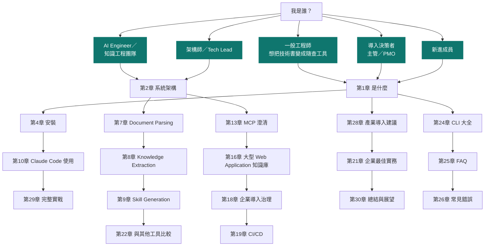

> 💡 **作者觀點**：book-to-skill 是一個「小而準」的工具——核心程式碼不到 20 個檔案，卻精準解決一個
> 具體痛點（重複讀同一份技術文件）。因此不同於某些平台型工具需要通篇閱讀才能上手，這份手冊的多數
> 讀者其實只需要看完第1、2、4、9、10 章就能立即在自己的專案裡用起來；第14–21、28 章則是給評估
> 「怎麼把這個小工具，變成部門或公司級知識工程實務」的讀者。

---

## 第1章 book-to-skill 是什麼

### 1.1 一句話定義

**book-to-skill 是一個「文件轉 Agent Skill」的轉換器**：把 PDF、EPUB、DOCX、HTML、Markdown、RTF、
MOBI 等格式的技術書籍或文件，透過 `/book-to-skill` 這個斜線指令，轉成一組結構化的 Markdown 檔案
（`SKILL.md` + `chapters/*.md` + `glossary.md` + `patterns.md` + `cheatsheet.md`），放進
Claude Code、GitHub Copilot CLI 或 Amp 的技能目錄中，之後你的 AI Agent 就能「隨問隨查」這份文件的
內容，而不必每次都重新把整本書塞進對話 context，也不需要另外架設向量資料庫。

> 💡 **作者觀點**：如果用一句話向完全不懂 AI 的同事解釋，可以說——「以前你買了一本技術書看完就忘，
> 三個月後只記得『書裡好像有講』；book-to-skill 做的事情，是把這本書拆解重組成一份『你的 AI 助理
> 隨時可以幫你查的重點筆記＋索引』，而且只有你真的問到某個章節時，AI 才會去讀那一章，不會每次對話
> 都把整本書的成本算給你。」

### 1.2 發展背景與誕生脈絡

book-to-skill 由 GitHub 使用者 `virgiliojr94` 於 **2026 年 5 月 1 日**建立，MIT License，核心語言
Python（`requires-python >= 3.9`）。專案定位緊扣 2025–2026 年間快速成形的 **Agent Skills 開放標準**
（`agentskills/agentskills`）——這個標準讓 Claude Code、GitHub Copilot CLI、Amp 等原本互不相通的
Coding Agent，可以共用同一份 `SKILL.md` 格式的技能定義。book-to-skill 正是搭在這股標準化浪潮上、
第一批把「書籍知識轉技能」這件事做成通用工具的專案之一，因此在開源三個月內迅速登上 Trendshift 趨勢
榜、累積超過 1.6 萬 Stars。

> 💡 **生態系觀察（2026-08-04 查證）**：book-to-skill 的「把某種媒介轉成 Skill」模式已開始被複製到
> 其他媒介——官方 Issue 追蹤中已有 **`video-to-skill`**（受 book-to-skill 啟發、把教學影片轉成
> Agent Skill 的衍生專案）被提交為「相關專案」收錄申請（見官方 repo Issue #87、#93）。這說明
> 「一次深度處理＋按需查詢」這套設計模式，正從「書籍」擴散到「影片」等其他知識載體，值得持續關注
> 是否會出現更多同類衍生工具（**作者觀點**：這類「X-to-skill」家族的出現，某種程度印證了 Agent
> Skills 開放標準本身的吸引力——見 12.2 節，該標準官方 Client Showcase 目前已列出 **45 個以上**
> 官方採用的 Coding Agent／IDE／平台，`agentskills/agentskills` repo 本身也已有約 2.38 萬
> Stars，規模甚至超過 book-to-skill 自身）。

版本演進脈絡（依官方 Releases 核校）：

| 版本 | 發布日期 | 重點 |
| --- | --- | --- |
| v1.0.0 | 2026-06-08 | 首個正式版：多格式擷取（PDF/EPUB/DOCX/HTML/Markdown/RST/AsciiDoc/RTF/MOBI/AZW）、依 `BOOK_TYPE`／深度調整章節生成、`extract.py --check` 環境健檢、多語言章節標題（含羅馬數字）偵測 |
| v1.1.0 | 2026-06-12 | **跨 Host 支援正式成形**：確立 Claude Code／Copilot CLI／Amp 皆可讀取同一份 Agent Skills 格式；新增 `validate_skill.py --lens` 依 Host 規則驗證；frontmatter 精簡至開放標準最低必要欄位 |
| v1.2.0 | 2026-06-17 | **可獨立安裝的 pip 套件**（`pip install book-to-skill`，`pyproject.toml` + optional extras）+ **多語系章節偵測擴大**（新增法／德／義／荷語章節詞、Markdown ATX／AsciiDoc／setext／reStructuredText 底線標題辨識）+ CodeQL／Bandit／Zizmor／Dependabot 導入 CI |
| v1.3.0 | 2026-07-30 | 目前最新版：**韓文「제N장」、泰文章節偵測**（含 ToC 誤判修正）、`pypdf` 取代已棄用的 `PyPDF2`、PDF 斷字重組與頁首頁尾去重、依賴 CVE 掃描納入 PR CI，安全性強化見第7章 |

### 1.3 設計理念

官方 `SKILL.md` 明確寫出三條設計哲學（本手冊重新詮釋，非逐句翻譯）：

1. **萃取結構，而非產生摘要（Extract structure, not summaries）**——一份好的 Skill 不是「這本書在
   講什麼」的心得報告，而是一套可以直接拿來用的工具箱：具名的框架（Named Frameworks）、可執行的
   原則、步驟化的技巧、以及「不要做什麼」的反模式（Anti-patterns）。
2. **保留作者的精確用語（Preserve the author's precision）**——例如「5 Whys」不能被隨意改寫成
   「多問幾次為什麼」，具名框架往往有其精確性，改寫等於失真。
3. **深度要與內容匹配（Layer depth appropriately）**——簡單的書給簡單的 Skill；框架多、內容密的書，
   則會產生帶有多個「按需載入」章節檔案的深度 Skill。

> 💡 **作者觀點**：這三條原則背後其實是同一個判斷——**壓縮率不是免費的**。多數團隊在建內部知識庫時，
> 直覺是「先全部丟進去，反正有向量搜尋」，但這樣做省下的是「建置的力氣」，付出的代價是「每次查詢
> 都要重新猜測、重新拼湊」。book-to-skill 選擇把壓縮／結構化的成本放在「編譯時」（一次性），換取
> 「查詢時」的低成本與高精確度，這個取捨方向本身就是一種值得參考的知識工程設計原則，第22章會用
> 比較表把這個取捨攤開來看。

### 1.4 解決哪些問題：Discovery Loop Tax（核心賣點）

book-to-skill 官方文件用一個具體、可重現的量化概念來說明它解決的問題，稱為 **「Discovery Loop
Tax」（探索迴圈稅）**：

一個直接讀 PDF 的 AI Agent 不是「讀」，而是在「導航」——問它一個問題，它得先抓目錄、發現一個看不懂
的術語、往回翻頁、再抓更多頁。每一次這樣的跳轉都會留在對話歷史裡，並且**在後續每一輪對話都被重新
處理一次**。為了塞進 context 預算，子代理往往被迫用很粗暴的比例壓縮讀到的內容，結果主 Agent 拿到的
是一份「無法回頭核對原文」的劣化摘要。

book-to-skill 把這個導航成本**一次性地**在「編譯時」（也就是跑 `/book-to-skill` 的當下）付清。查詢時
Agent 只載入一個精簡的常駐核心（SKILL.md）加上剛好需要的那一章，沒有探索迴圈，也不需要壓縮遷就，
完整擷取出的原文仍保留在磁碟上可供事後核對。

官方在 `tools/discovery_tax.py` 中用三本真實書籍做了實測（本手冊重新彙整表格，數字取自官方
`docs/PERFORMANCE.md` 核校）：

| 書籍（原始大小） | 直接整本塞入 Context | 一般 Discovery Loop | book-to-skill（常駐核心+1章） | 相對整本塞入 / 相對 Loop |
| --- | ---: | ---: | ---: | :---: |
| Think Python 2（119K，章節小） | 119,264 tokens | 12,152 tokens | ~5,000 tokens | 24× / 2.4× |
| Working Backwards（175K，章節中等） | 175,253 tokens | 33,444 tokens | ~5,000 tokens | 35× / 6.7× |
| AI Engineering（256K，章節大） | 256,287 tokens | 77,866 tokens | ~5,000 tokens | 51× / 15.6× |

> ⚠️ **誠實的但書（官方原文即有此提醒，本手冊完整保留）**：(1) Discovery Loop 的數字是「一次性成本」
> 且是用書本真實目錄／章節大小模擬出的**模型估算**，一個調校良好的 Agent 有機會接近最佳情況；相對
> 地，整本塞入 Context 的成本卻是**每一輪對話都要重付**。(2) 章節切分需要可辨識的標題格式（`Chapter
> N`、羅馬數字、CJK 數字、韓文「제N장」、泰文等多種格式），若書籍正文只用「篇名」而非規則化章節
> 標題，可能無法自動切章，仍可手動指定段落處理——官方 `docs/PERFORMANCE.md` 的實測結果剛好給了
> 一組對照組：《Pro Git》（501 頁、PDF、229K tokens）正文以小節標題取代「Chapter N」格式，實測
> 結果完全**沒有**自動切出章節；相對地，《白鯨記》(Moby-Dick) 正文雖同樣只用無編號篇名，但因為
> 書中另附有羅馬數字目錄（ToC），官方測試仍成功透過目錄偵測切出 **133 個章節**——這說明「有無
> 目錄可供偵測」比「正文標題格式」更關鍵，判斷書籍是否適合前，值得先確認是否存在可辨識的目錄。
> (3) 只讀一次的書，直接用 PDF Agent 讀就好；**book-to-skill 真正的優勢在於「會重複回來查」的知識**。

### 1.5 適用情境

✅ 適合：

- 反覆查閱的技術書／官方手冊（例如你買的架構書、Framework 官方指南）。
- 內部文件——架構決策紀錄（ADR）、Runbook、Onboarding 指南，整個 `docs/` 資料夾一次轉換。
- 品牌／設計系統文件——語氣指南、元件規範，讓團隊用查的而不是每次重翻 60 頁 PDF。
- 研究論文群——一疊論文加自己的筆記，合併成一份會隨時間持續更新（Update/Fold-in）的統一 Skill。
- 規格與標準——RFC、API 合約、合規文件，你經常參照但不會背下來的內容。

### 1.6 限制

❌ 不適合／需注意：

- **一次性閱讀的資料**——只會讀一次、不會再回來查的內容，直接丟給 Agent 讀 PDF 反而更省事，不需要
  先付一次編譯成本。
- **需要橫跨大量書籍做模糊檢索**（例如「這 80 本書裡哪一本提到 X」）——這是 RAG／NotebookLM 的強項，
  不是 book-to-skill 的設計目標（詳見 1.10、第22章比較）。
- **章節標題不規則的書**——只有篇名、無編號標題的書籍（小說、部分翻譯書）章節自動偵測可能失準。
- **未經授權散布第三方書籍衍生內容**——見〈重要聲明〉第5點，這是法遵限制而非技術限制。

### 1.7 特色

- 支援格式廣：PDF／EPUB／DOCX／TXT／Markdown／reStructuredText／AsciiDoc／HTML／RTF／
  MOBI／AZW／AZW3。
- 每種格式都有「最佳工具優先、逐級 fallback」的策略，不會因缺一個套件就整個失敗。
- 輸出格式遵循開放 Agent Skills 標準，**一次產生，三種 host 都能用**（Claude Code／Copilot CLI／
  Amp）。
- 內建 **Update / Fold-in**（Mode 4）：新資料到了不必砍掉重練，可以把新章節或新文件合併進既有 Skill。
- 內建**安全掃描層**：文件→Context→Skill 這條「供應鏈」上的隱藏字元、XXE、參數注入等風險都有對應
  防護（詳見第7章）。

### 1.8 優點

1. 查詢時 Token 成本大幅下降（24–51 倍 vs. 整本塞入），且**只在真的問到時才付**章節載入成本。
2. 輸出是「作者的框架、命名、判斷邏輯」而不是逐句摘要，直接可用於「像作者一樣思考」。
3. 完全跑在本機／使用者自己的 Agent session 裡，文件不會被 book-to-skill 上傳到任何地方。
4. 沒有向量資料庫、沒有額外基礎設施，`git clone` 一份到技能目錄即可開始使用。
5. Update/Fold-in 讓知識庫可以持續生長，不必每次改版重跑整套流程。

### 1.9 缺點

1. 生成品質高度依賴執行當下的 host agent 模型能力與當次對話的耐心（因為生成邏輯是 Prompt，不是
   確定性程式碼）。
2. 章節切分對「非規則化標題」的書籍效果有限（1.6 已提及）。
3. 目前官方僅明確保證與三個 host（Claude Code／Copilot CLI／Amp）相容，其餘 Agent 平台需自行驗證
   （第12章詳述）。
4. 沒有內建的多人協作／版本控制介面——Skill 產物就是一堆 Markdown 檔案，版本控管要靠團隊自己接
   Git（第18、19章的（作者建議）內容處理這個落差）。

### 1.10 與傳統 RAG 的差異

RAG（Retrieval-Augmented Generation）在**查詢時**運作：把書切塊 → 全部 embedding → 找相似向量 →
塞進 Prompt。它擅長回答「這 80 本書裡，哪一段提到 X」。

book-to-skill 在**編譯時**運作：跑一次深度分析，萃取出作者真正建立的框架、命名它、寫下適用時機、
記下反模式。輸出的是「這位作者花好幾年打磨出的結構」，不是對他文字的相似度搜尋。

| 維度 | RAG | book-to-skill |
| --- | --- | --- |
| 運作時機 | 查詢時（Query time） | 編譯時（Compile time，一次） |
| 輸出本質 | 與查詢相似的原文片段 | 具名框架、決策規則、反模式 |
| 適合場景 | 廣而淺：一整櫃書找一段話 | 窄而深：一本書／一組相關文件反覆應用 |
| 基礎設施 | 通常需要向量資料庫 | 純檔案系統，`git clone` 即用 |
| 追加新內容 | 重新切塊、重新 embedding | Update/Fold-in（Mode 4）合併進既有結構 |

> 💡 **作者觀點**：兩者是互補、不是替代——官方 FAQ 用一句話講得很精準：「RAG 幫你索引一整個書架
> （indexes a shelf），book-to-skill 幫你精通一本書的脊梁（masters a spine）」。企業知識庫若同時
> 有「海量文件模糊檢索」與「少數核心手冊反覆精讀」兩種需求，務實做法是兩者並用而非二選一（第13、
> 22章延伸討論）。

### 1.11 與向量資料庫的差異

向量資料庫（Pinecone、Weaviate、pgvector 等）是 RAG 架構中的**基礎設施元件**，負責儲存 embedding
向量並支援相似度檢索。book-to-skill **完全不使用向量資料庫**——它的輸出就是一組 Markdown 檔案，
「索引」靠的是 `SKILL.md` 裡人類可讀、Agent 也看得懂的 **Topic Index**（主題 → 章節對照表），
不是向量相似度。這代表：

- 沒有 embedding model 選型、沒有向量維度、沒有 ANN（近似最近鄰）調參問題。
- 索引更新＝改一份 Markdown 檔案，不需要重跑 embedding pipeline。
- 檢索精確度取決於「主題索引寫得好不好」，而不是 embedding 模型與查詢語意的匹配程度——這是一種
  用「人類與 AI 共同可讀的結構」取代「數學相似度」的設計選擇（作者推論：這也是為什麼官方特別強調
  Topic Index 是「Agent 導航到正確章節檔案的關鍵」，見 Quality Rule #8）。

### 1.12 與 MCP 的差異

**這是最容易被誤解的一點，本手冊在此明確澄清：book-to-skill 不是、也沒有實作 MCP（Model Context
Protocol）Server。** 整個 repo 中沒有 MCP 相關程式碼或設定。

MCP 是一種**執行期協定**：讓 AI Agent 在對話當下，透過標準化介面呼叫外部工具或讀取外部資料源
（檔案系統、資料庫、API…）。book-to-skill 遵循的是另一個開放標準——**Agent Skills 標準**
（`agentskills/agentskills`）——這是一種**技能封裝格式**：把「怎麼做一件事的完整指示＋參考資料」
打包成一份 `SKILL.md`（加上可選的附屬檔案），讓 Agent 在需要時載入這份指示，而不是呼叫一個外部
服務。

| 維度 | MCP（Model Context Protocol） | Agent Skills（book-to-skill 遵循此標準） |
| --- | --- | --- |
| 本質 | 執行期的工具／資料存取協定 | 技能／知識封裝格式（多為 Markdown） |
| 運作方式 | Agent 在對話中呼叫 MCP Server 取得即時結果 | Agent 依需求載入 `SKILL.md`／章節檔案 |
| 需要常駐服務嗎 | 通常需要（Server process） | 不需要，純檔案 |
| book-to-skill 的角色 | 無關，repo 內無 MCP 實作 | **就是**一個產生「合乎此標準之 Skill」的產生器 |

第13章會進一步說明：企業若同時已導入 MCP Server（例如檔案系統、Git、Memory 類 MCP），該如何與
book-to-skill 產生的 Skill 分工並存，而不是誤以為兩者互相取代。

### 1.13 與「Claude Skills」的關係

這裡也常被混淆，需要分兩層理解：

1. **「Claude Skills」是 Claude Code 這個 host 本身支援的機制**（讀取 `~/.claude/skills/` 或
   `.claude/skills/` 底下、含 `SKILL.md` 的資料夾），這是 Anthropic 一側提供的能力。
2. **book-to-skill 是一個「產生器」**，它負責讀懂一本書、動手寫出一份**符合這個機制格式規範**的
   `SKILL.md` 與附屬檔案。你可以把 book-to-skill 想成「一台專門產出符合 Claude Skills（以及
   Copilot CLI、Amp 對應機制）規格之內容的工具」，而不是機制本身。

換句話說：**Claude Skills／Copilot Skills／Amp Skills 是「容器規格」，book-to-skill 是「把一本書
裝進這個容器」的其中一種產生器**（市面上還有其他手寫或其他工具產生的 Skill，book-to-skill 只是
專精在「文件轉 Skill」這個子領域）。

### 1.14 本章 Checklist 與小結

- [ ] 已理解 book-to-skill 是「文件→Skill 產生器」，不是 LLM 服務、不是 MCP Server。
- [ ] 已理解「Discovery Loop Tax」的量化概念，能向團隊解釋為什麼查詢時省 Token。
- [ ] 已對照 1.5、1.6 節，判斷自己手上的文件是否屬於「適合」情境（反覆查閱 vs. 一次性閱讀）。
- [ ] 已理解 1.10–1.13 節的四個差異比較，不會把 book-to-skill 與 RAG／向量資料庫／MCP／Claude
      Skills 機制本身混為一談。

> 📌 **本章小結**：book-to-skill 解決的是一個具體、可量化的問題——「同一份技術文件被反覆查閱時的
> Token 浪費」，做法是把探索成本前移到編譯時、把索引方式從向量相似度換成人類可讀的主題索引。它的
> 定位窄而深，與 RAG／MCP 是互補關係而非競爭關係，這個定位會貫穿本手冊後續所有章節的比較與案例。

---

## 第2章 系統架構

### 2.1 架構總覽：兩個半部

官方 `docs/ARCHITECTURE.md` 開宗明義：book-to-skill 由兩個性質完全不同的半部組成——一半是**確定性
的 Python 程式**，一半是**由規格文件驅動的 AI Agent**。理解這個切分，是理解整個工具「為什麼這樣
設計」的關鍵。

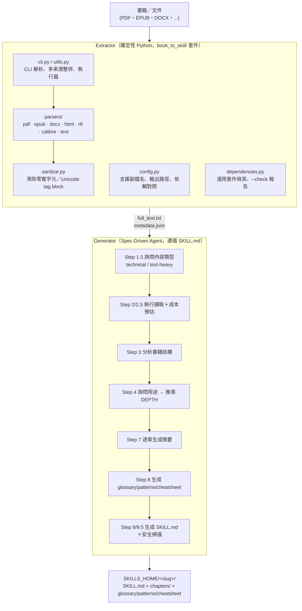

> 💡 **作者觀點**：這個「確定性程式 + Prompt 規格」的雙軌架構，本身就是一個值得企業內部工具團隊
> 借鏡的設計模式——**把「有標準答案、可以測試」的部分（文字擷取、格式轉換）交給確定性程式碼；把
> 「需要語意判斷、沒有單一標準答案」的部分（框架萃取、摘要撰寫）交給 Agent 依 Prompt 規格執行**。
> 這樣切分讓 `tests/` 目錄可以對 Extractor 寫真正的單元測試（見官方 `tests/test_book_to_skill.py`
> 等檔案），而 Generator 半部則靠 `SKILL.md` 裡明確的 Quality Rules 與逐步驟指示來約束品質，而不是
> 妄想把「有沒有抓對作者的核心框架」這種語意判斷寫成 if/else。

### 2.2 資料流（Data Flow）

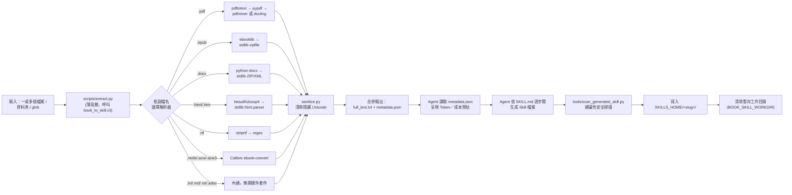

### 2.3 Knowledge Flow（知識萃取的分層邏輯）

書籍的原始文字不會被直接複製進 Skill——這是 Quality Rule #7「Never copy raw book text」的硬性
規則。知識會被拆成四種不同的「知識產物」，分別對應不同的查詢情境：

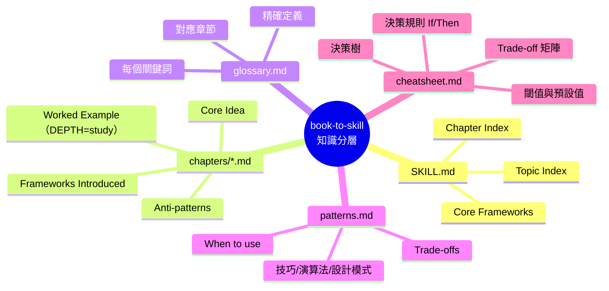

> 📌 **重點提醒**：`cheatsheet.md` 是官方文件中明確強調「差異化程度最高」的一層——它裝的不是
> 「術語表」（那是 glossary 的工作），也不是「大段散文」（那是 chapters 的工作），而是作者的
> **判斷邏輯**：「當 X 發生時，做 Y，因為 Z」。這一層決定了 Skill 是「查得到關鍵字」還是「能像
> 作者一樣做決策」的分水嶺。

### 2.4 Skill Generation Pipeline（SKILL.md 驅動的 Step 0–10）

`SKILL.md` 本身就是這條 Pipeline 的規格書，共 11 個步驟（含 Step 1.5、2.5、2.6、9.5 這些細分子
步驟）：

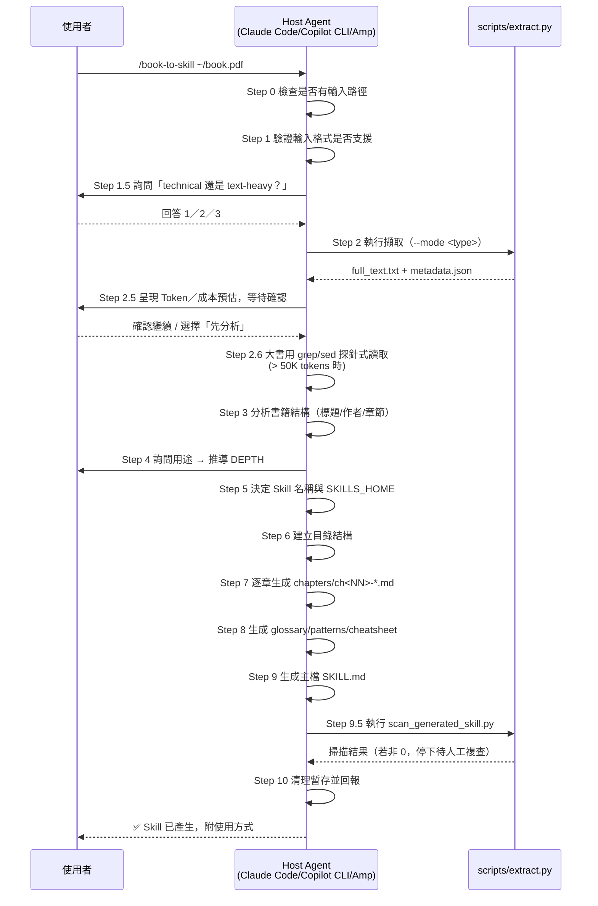

### 2.5 Document Processing 決策樹

Step 1.5 是整條流程中唯一一個「先問後做」的分岔點，直接影響後續的解析工具選擇與每章 Token 預算：

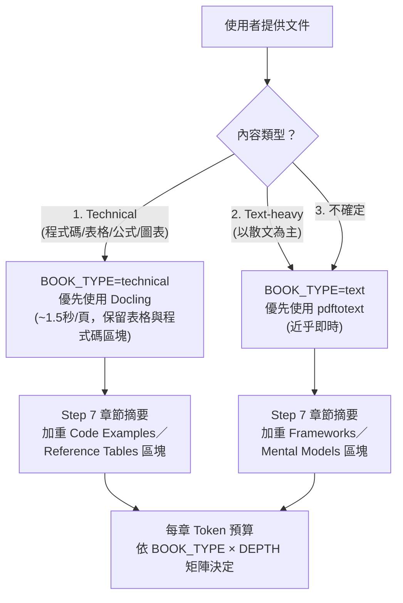

### 2.6 Prompt Pipeline：四種操作模式

`SKILL.md` 定義了 4 種模式（Modes），Agent 依使用者的用語自動路由：

| 模式 | 觸發條件 | 執行範圍 | 輸出 |
| --- | --- | --- | --- |
| 1. Full Conversion（預設） | 提供文件路徑，無特別指示 | Step 0–9（含 9.5、10） | 完整 Skill |
| 2. Analyze Only | 使用者說「先分析」「只萃取」 | Step 0–3 | 結構化萃取報告，**不產生檔案** |
| 3. Generate from Prior Analysis | 使用者已有先前分析結果 | 跳過 0–3，執行 4–9 | 依既有分析產生 Skill |
| 4. Update / Fold-in | 指向既有 Skill 資料夾或已存在的 slug | Step 0、1、1.5、2，接續「Update/Fold-in Workflow」 | 更新既有 Skill |

### 2.7 端到端資料流總結圖

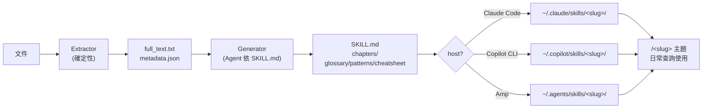

### 2.8 本章 Checklist 與小結

- [ ] 能畫出／口述「Extractor（確定性）＋ Generator（spec-driven agent）」的兩半架構。
- [ ] 理解 Step 1.5 的 technical / text-heavy 分岔如何影響後續工具選擇與 Token 預算。
- [ ] 理解 4 種操作模式（Full Conversion／Analyze Only／Generate from Prior Analysis／
      Update-Fold-in）分別對應什麼使用情境。
- [ ] 理解 Step 9.5 的安全掃描是「建議性」但流程上會在發現問題時要求人工複查，而非靜默略過。

> 📌 **本章小結**：book-to-skill 的架構設計核心，是把「可以用程式碼保證正確性」的工作（文字擷取、
> 格式轉換、隱藏字元清洗）與「需要語意判斷」的工作（框架萃取、摘要撰寫）清楚切開，前者用確定性
> Python 完成、有單元測試把關；後者用一份寫得極度詳細的 `SKILL.md` 規格去約束 Agent 的行為。第3章
> 會逐一拆解 Extractor 半部的實際程式檔案，第7–9章則會深入 Generator 半部各步驟的細節。

---

## 第3章 book-to-skill 核心架構詳解

本章逐一拆解 `docs/ARCHITECTURE.md` 中列出的每個關鍵元件，並依原始 prompt 範本要求的
Parser／Layout Detection／Knowledge Extraction／Skill Generator／Metadata／Output／CLI／
Config／Cache／Log／Error Handling／Plugin／Extension 十二個面向逐一對照——**其中幾項
book-to-skill 刻意沒有實作**（例如 Cache、傳統意義的 Plugin 系統），本章會誠實說明「沒有」
本身也是一種設計選擇，而不是強行套模板生出不存在的機制。

### 3.1 Parser（解析器）

位於 `book_to_skill/parsers/`，一種格式一個模組，各自實作「最佳工具優先、逐級 fallback」：

| 模組 | 格式 | 優先工具 | Fallback |
| --- | --- | --- | --- |
| `pdf.py` | PDF | `pdftotext`（poppler）／`docling`（technical 模式） | `pypdf` → `pdfminer.six` |
| `epub.py` | EPUB | `ebooklib` + `beautifulsoup4` | 標準函式庫 `zipfile` |
| `docx.py` | DOCX | `python-docx` | 標準函式庫 ZIP/XML 解析（含 XXE 防護） |
| `html.py` | HTML/HTM | `beautifulsoup4` | 標準函式庫 `html.parser` |
| `rtf.py` | RTF | `striprtf` | 正規表示式 |
| `calibre.py` | MOBI/AZW/AZW3 | Calibre 外部程式 `ebook-convert` | 無（外部應用程式，非 pip 可裝） |
| `text.py` | TXT/MD/RST/AsciiDoc | 內建，無需額外依賴 | — |

### 3.2 Layout Detection（章節／目錄偵測）

章節與目錄偵測邏輯在 `book_to_skill/utils.py` 中實作，v1.2.0 起支援**多語系標題格式**：阿拉伯數字
（`Chapter 5`）、羅馬數字（`Chapter I`、行首 `I.`）、CJK 數字、韓文（`제N장`）、泰文，以及數種
歐洲語言常見格式。這個模組也負責：

- **多來源整併**（multi-source resolution）：使用者一次丟多個檔案／資料夾／glob，會被合併成單一
  `full_text.txt`，並在文字間插入清楚的來源分界標記。
- **章節切分的已知邊界**：若書籍正文只用「篇章標題」而非規則化的編號格式（1.4 節提到的《Pro
  Git》案例），自動偵測可能失準，此時整份文字仍完整可用，只是無法自動切成獨立章節檔案，需要人工
  指定段落範圍；但若書籍另附規則化的目錄（ToC），即使正文標題不規則，仍可能透過目錄偵測成功切章
  （見 1.4 節《白鯨記》的 ToC-fallback 案例）。

### 3.3 Knowledge Extraction（知識萃取，Agent 側）

嚴格來說「萃取」發生在 Generator 半部（Agent 依 `SKILL.md` Step 3/4/7/8 執行），不是 Extractor
半部的工作——Extractor 只負責把文件變乾淨的純文字。本節先給架構層級的定位，完整規則見第8章。

### 3.4 Skill Generator

**`SKILL.md` 本身就是 Generator**——這是 book-to-skill 最容易被誤解的一點：它不是「有一支
`generator.py` 程式在跑」，而是**規格文件即程式**（spec-as-program）：Agent 讀取這份 Markdown，
依裡面寫的 Step 0–10 逐步執行、逐步產生檔案。完整步驟拆解見第9章。

### 3.5 Metadata

`book_to_skill/config.py` 定義輸出路徑常數：

```python
OUTPUT_DIR = Path(os.environ.get("BOOK_SKILL_WORKDIR", <系統暫存目錄>/"book_skill_work"))
OUTPUT_TEXT = OUTPUT_DIR / "full_text.txt"
OUTPUT_META = OUTPUT_DIR / "metadata.json"
```

`metadata.json` 記錄整合後的統計數字（總頁數／字數／估計 Token 數）與每個來源檔案各自的處理結果
陣列，Step 2.5 的「預估成本」畫面資料即來自這份檔案。

### 3.6 Output（輸出結構）

```text
$SKILLS_HOME/<skill_name>/
├── SKILL.md              # 核心框架 + 章節/主題索引（~4,000 tokens）
├── chapters/
│   ├── ch01-<slug>.md    # 按需載入，~1,000 tokens/篇起
│   └── ...
├── glossary.md            # 全書關鍵詞彙表（≤1,500 tokens）
├── patterns.md             # 技巧/演算法/設計模式（≤2,000 tokens）
└── cheatsheet.md           # 決策規則/決策樹/Trade-off 矩陣（≤1,200 tokens）
```

### 3.7 CLI

**兩種 CLI 入口，性質不同，官方 README 特別提醒「不要混淆」：**

1. **Agent Skill 內的 `/book-to-skill` 斜線指令**——這是完整轉換流程（含詢問、生成、掃描），必須
   `git clone` 進技能目錄才能使用，是多數使用者實際互動的介面。
2. **獨立 pip CLI `book-to-skill`**——`pip install book-to-skill` 後可用，這**只是文字擷取引擎**
   （對應 `book_to_skill/cli.py:main`），**不會**註冊 `/book-to-skill` 這個 Agent 指令，也不會產生
   完整 Skill，適合用於腳本化或想單獨取用擷取功能的場景。完整參數見第24章。

### 3.8 Config

`book_to_skill/config.py` 集中管理：支援副檔名集合（`SUPPORTED_EXTENSIONS`）、每種格式對應的選用
Python 依賴套件對照表（`PYTHON_DEPENDENCIES`）、輸出路徑常數、`WORDS_PER_TOKEN` 概估係數（0.75）。
`dependencies.py` 則負責在執行前探測哪些選用套件已安裝，並提供 `--check` 模式印出逐格式報告與
安裝指令。

### 3.9 Cache（誠實說明：沒有持久化快取）

book-to-skill **沒有**傳統意義上「重跑會命中快取、加速第二次執行」的快取層。它有的是：

- 一個**暫存工作目錄**（`BOOK_SKILL_WORKDIR`，預設系統暫存目錄下的 `book_skill_work/`），存放
  當次執行的 `full_text.txt` 與 `metadata.json`；
- Step 10 執行完畢後**主動清除**這個暫存目錄。

換言之，這個「暫存區」的定位是「單次執行的工作台」，不是「跨執行的效能快取」。⚠️ 若企業想要
「同一份文件多次轉換時跳過重新擷取」，目前需要自行在 CI／腳本層加一層快取（**作者建議**，非官方
機制），例如以文件雜湊值判斷是否重跑 `scripts/extract.py`。

### 3.10 Log（誠實說明：沒有結構化 Logging 框架）

Extractor 半部沒有導入 `logging` 模組式的分級日誌系統，回饋方式是：

- CLI 執行時的 stdout 訊息（例如 `--check` 的逐格式報告、缺依賴時的安裝提示）；
- `metadata.json` 中的統計數字與逐來源處理結果（成功／被跳過及原因）。

Generator 半部（Agent）的「日誌」本質上就是**當次對話紀錄**——Step 2.5 的成本預估、Step 9.5 的
掃描結果、Step 10 的最終報告，都是以對話訊息呈現，沒有寫入獨立日誌檔的機制。企業若需要稽核軌跡，
建議做法見第18章（**作者建議**）。

### 3.11 Error Handling

`book_to_skill/exceptions.py` 定義 `ExtractionError`，設計成 **batch-safe**：處理多來源時，單一
來源失敗只會被記錄並跳過（附警告訊息），**不會讓整批處理失敗**——這對「一次丟一整個 `docs/`
資料夾」的使用情境很關鍵，避免一個壞掉的檔案卡住整個知識庫建置流程。

### 3.12 Plugin／Extension（誠實說明：沒有執行期 Plugin 機制，但有明確的擴充路徑）

book-to-skill **沒有**執行期可插拔的 Plugin 系統（例如動態載入第三方 `.py` 外掛）。官方
`docs/ARCHITECTURE.md` 的「Extending」一節說明的是**原始碼層級**的擴充方式：

- **新增支援格式**：在 `book_to_skill/parsers/` 新增對應模組 → 在 `config.py` 註冊副檔名 → 在
  `dependencies.py` 接上依賴偵測 → 在 `utils.extract_single_file` 加上對應分支。
- **新增生成行為**：直接編輯 `SKILL.md` 對應的 Step，並依 `CONTRIBUTING.md` 要求「用證據佐證變更」
  （例如附上前後產出比較），保持規格精簡。

> ⚠️ **注意事項**：這代表 book-to-skill 目前**不支援**企業常見的「不改 fork、掛外部 Plugin」擴充
> 模式；要支援新格式或改變生成行為，唯一的路徑是修改／維護自己的 fork，或提 PR 回上游。企業導入前
> 若有客製需求，應把這點納入評估（第18章企業治理會再提到版本管理策略）。

### 3.13 本章 Checklist 與小結

- [ ] 能說出 `book_to_skill/` 套件內每個模組（`cli.py`／`utils.py`／`config.py`／
      `dependencies.py`／`sanitize.py`／`parsers/`）各自負責什麼。
- [ ] 能清楚分辨「Agent Skill 的 `/book-to-skill` 指令」與「pip 安裝的獨立 CLI」是兩條不同路徑。
- [ ] 理解 book-to-skill **沒有**持久化 Cache、**沒有**結構化 Log 框架、**沒有**執行期 Plugin
      機制，這些是有意識的設計取捨，不是文件遺漏。
- [ ] 理解 `ExtractionError` 的 batch-safe 設計如何保護多檔案／整資料夾轉換流程。

> 📌 **本章小結**：與 `reverse-skill`、`paperclip` 這類平台型工具相比，book-to-skill 的核心架構
> 刻意保持精簡——不到 20 個原始碼檔案就完成整套轉換邏輯。這種精簡本身就是它的競爭優勢之一（安裝
> 快、依賴少、審查程式碼的成本低），但也代表企業如果期待「開箱即有 Cache／RBAC／Plugin 市集」等
> 平台級功能，需要自行在其上疊加治理層——這正是本手冊第18–21章要處理的落差。

---

## 第4章 安裝

### 4.1 兩種安裝路徑，先分清楚再動手

呼應 3.7 節，安裝前務必先確定你要的是哪一種：

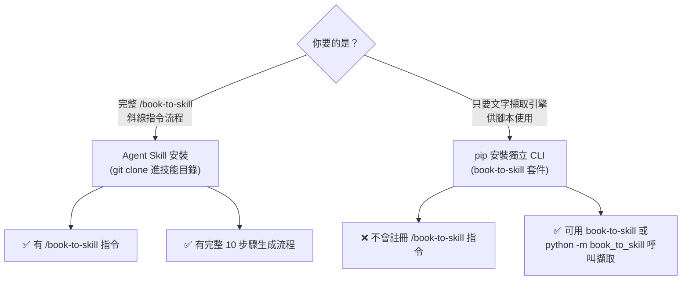

⚠️ **常見誤解**：只做 `pip install book-to-skill` 並不會讓 Claude Code／Copilot CLI 出現
`/book-to-skill` 指令——這是官方 README 特別加粗提醒的一點，兩條路徑可以同時安裝、互不衝突，但
用途不同。

### 4.2 Windows 安裝

```powershell
# 1. 確認 Python 版本 >= 3.9
python --version

# 2a. 作為 Claude Code Agent Skill 安裝
git clone https://github.com/virgiliojr94/book-to-skill.git "$env:USERPROFILE\.claude\skills\book-to-skill"

# 2b. 作為 GitHub Copilot CLI 個人技能安裝
git clone https://github.com/virgiliojr94/book-to-skill.git "$env:USERPROFILE\.copilot\skills\book-to-skill"

# 3. （選用）安裝 PDF 擷取加速工具 poppler（提供 pdftotext）
winget install --id=oschwartz10612.Poppler -e
```

> ⚠️ **注意事項**：Windows 上 `pdftotext` 不是內建指令，需另外安裝 poppler for Windows 並確認其
> `bin/` 目錄已加入 `PATH`；沒裝的話 PDF 解析會自動 fallback 到 `pypdf`／`pdfminer.six`（純
> Python，免額外安裝，但速度略慢、對複雜排版的還原度較低）。

### 4.3 Linux 安裝

```bash
# Debian / Ubuntu
sudo apt install poppler-utils          # 提供 pdftotext（文字為主的 PDF 最快）
git clone https://github.com/virgiliojr94/book-to-skill.git ~/.claude/skills/book-to-skill

# RHEL / Fedora
sudo dnf install poppler-utils
```

### 4.4 macOS 安裝

```bash
brew install poppler
git clone https://github.com/virgiliojr94/book-to-skill.git ~/.claude/skills/book-to-skill
```

### 4.5 WSL 安裝

WSL（Windows Subsystem for Linux）下請完全比照 4.3 節 Linux 流程，**技能目錄路徑要放在 WSL 檔案系統
內**（例如 `~/.claude/skills/`），而不是 `/mnt/c/...` 底下——後者會讓 Claude Code 若同時也在 Windows
端執行時找不到一致的技能路徑。（**作者建議**：企業內若 WSL／原生 Windows 混用，統一約定「技能安裝
在 WSL 內」可避免路徑混亂。）

### 4.6 各 Host 安裝指令對照

| Host | 個人技能路徑（優先序） | 專案本地路徑（優先序） |
| --- | --- | --- |
| GitHub Copilot CLI | `~/.copilot/skills/` → `~/.agents/skills/` | `.github/skills/` → `.claude/skills/` → `.agents/skills/` |
| Amp | `~/.agents/skills/` → `~/.config/agents/skills/` → `~/.config/amp/skills/` | `.agents/skills/` |
| Claude Code | `~/.claude/skills/` | `.claude/skills/` |

> 📌 上表逐項核校自官方 `SKILL.md` Step 5「Determine skill name」的探測順序表格，比多數第三方教學
> 常引用的簡化版本更完整——例如 Copilot CLI 的專案本地路徑實際上有三層 fallback（`.github/skills/`
> 找不到才依序退到 `.claude/skills/`、`.agents/skills/`），而非只有單一路徑。

跨 Copilot CLI／Amp 共用的安裝路徑：

```bash
git clone https://github.com/virgiliojr94/book-to-skill.git ~/.agents/skills/book-to-skill
```

Claude Code 也支援對話內直接要求安裝（官方 README 提供的快速指令）：

```text
Install book-to-skill: https://raw.githubusercontent.com/virgiliojr94/book-to-skill/master/SKILL.md
```

> ⚠️ **注意事項**：官方建議即使用這種對話式安裝，仍以手動 `git clone` 為準——因為 book-to-skill
> 是「主 `SKILL.md` ＋模組化引擎檔案」的組合，只抓單一 `SKILL.md` 而不 clone 整個 repo，可能拿不到
> `scripts/extract.py` 與 `book_to_skill/` 套件，導致 Step 2 找不到擷取腳本而失敗。

### 4.7 pip 安裝（獨立 CLI）

```bash
# 基本安裝（僅純文字/Markdown/HTML fallback，無 PDF/EPUB/DOCX 加速套件）
pip install book-to-skill

# 依需要加裝格式擴充（extras 對照 pyproject.toml [project.optional-dependencies]）
pip install "book-to-skill[pdf]"          # pypdf + pdfminer.six
pip install "book-to-skill[epub]"         # ebooklib + beautifulsoup4
pip install "book-to-skill[docx]"         # python-docx
pip install "book-to-skill[rtf]"          # striprtf
pip install "book-to-skill[technical]"    # docling（技術書排版還原）
pip install "book-to-skill[all]"          # 全部選用套件

# 驗證安裝與所有格式的可用擷取工具
book-to-skill --check

# 直接擷取一份文件（不經過 Agent，純文字輸出）
book-to-skill ~/path/to/book.pdf --mode text
# 或
python -m book_to_skill ~/path/to/book.pdf --mode technical
```

### 4.8 uv 安裝（作者建議）

官方文件僅提及 `pip install`，但 `book-to-skill` 是標準 `pyproject.toml`（hatchling build
backend）套件，完全相容 `uv`（**作者建議**，因 uv 的相依解析與安裝速度優於傳統 pip，企業內若已
採用 uv 作為 Python 套件管理標準，可直接替換）：

```bash
uv pip install "book-to-skill[all]"
# 或建立獨立虛擬環境執行 CLI，不污染系統 Python
uvx --from "book-to-skill[all]" book-to-skill --check
```

### 4.9 Node／Git 等前置需求

| 需求 | 版本 | 用途 |
| --- | --- | --- |
| Python | ≥ 3.9 | Extractor 執行環境 |
| Git | 不拘（建議近期版本） | `git clone` 安裝 Agent Skill |
| Node.js | **不需要** | book-to-skill 是純 Python 專案，官方沒有 Node 依賴（與部分同類工具不同，導入前不需要另外準備 Node 環境） |

### 4.10 企業安裝：Offline 安裝（作者建議）

book-to-skill 官方沒有提供離線安裝套件包，以下是企業內網環境的建議做法（**作者建議**，非官方
機制）：

```bash
# 1. 在有網路的機器上，先把 wheel 檔全部下載下來
pip download "book-to-skill[all]" -d ./offline_wheels

# 2. 連同 repo 一起打包搬進內網
git clone --depth 1 https://github.com/virgiliojr94/book-to-skill.git
tar -czf book-to-skill-offline.tar.gz book-to-skill offline_wheels

# 3. 內網機器上，先裝 wheel 再放技能目錄
pip install --no-index --find-links=./offline_wheels "book-to-skill[all]"
```

⚠️ Docling（`technical` extras）本身依賴較大的模型檔案與 PyTorch，內網環境務必連同其模型快取一併
搬移，否則 `technical` 模式在離線環境下會直接 fallback 失敗，建議先在連網環境完整跑過一次
`docling` 轉換以觸發模型下載，再把快取目錄一併打包。

### 4.11 Proxy／Firewall 注意事項（作者建議）

- `pip install` 需標準 `HTTP_PROXY`／`HTTPS_PROXY` 環境變數設定，與一般 Python 套件安裝無異。
- `git clone` 若走公司 Proxy，需另外設定 `git config --global http.proxy`。
- book-to-skill **本身不會**對外發送任何網路請求（沒有呼叫外部 API 這件事，見〈重要聲明〉第4點），
  唯一的網路存取發生在「安裝當下」（`pip install`／`git clone`），執行轉換時完全離線運作，這對
  受高度網路管制的企業（金融、政府）是一大優勢，導入評估時應特別強調這一點。

### 4.12 本章 Checklist 與小結

- [ ] 已分清楚「Agent Skill git clone 安裝」與「pip standalone CLI 安裝」是兩件不同的事。
- [ ] 已依所在作業系統（Windows／Linux／macOS／WSL）完成對應安裝步驟。
- [ ] 若使用 `technical` 模式（Docling），已確認離線環境下模型快取已隨安裝包一併備妥。
- [ ] 已向資安／網路團隊確認：轉換執行階段本身不對外連線，僅安裝階段需要網路。

---

## 第5章 設定

### 5.1 設定機制總覽（誠實澄清：沒有 YAML/JSON 設定檔）

與許多同類工具不同，book-to-skill **沒有** `config.yaml`／`config.json` 這類使用者可編輯的設定檔
機制。它的「設定」分散在三個地方：

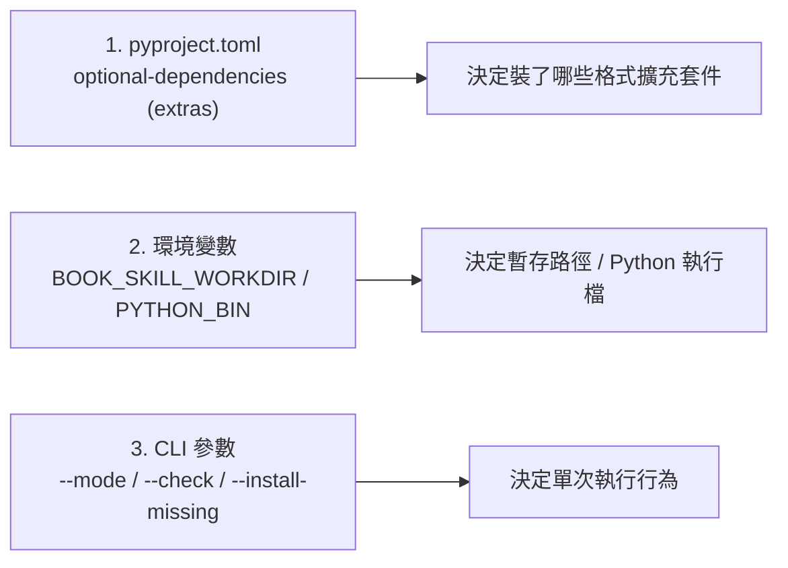

### 5.2 CLI 參數

| 參數 | 說明 | 範例 |
| --- | --- | --- |
| `--mode <technical\|text>` | 對應 Step 1.5 的內容類型判斷，決定解析工具優先序 | `--mode technical` |
| `--check` | 印出每種格式目前可用的擷取工具與缺少套件的安裝指令，不處理任何檔案 | `book-to-skill --check` |
| `--install-missing <ask\|yes\|no>` | 遇缺少選用套件時的行為：詢問／自動安裝／略過用 fallback | `--install-missing ask` |

### 5.3 環境變數

| 變數 | 預設值 | 用途 |
| --- | --- | --- |
| `BOOK_SKILL_WORKDIR` | 系統暫存目錄下的 `book_skill_work/` | 覆寫擷取結果的暫存路徑 |
| `PYTHON_BIN` | `python3`（找不到則退回 `python`） | `SKILL.md` 內呼叫擷取腳本時使用的 Python 執行檔名稱，Windows 環境常需要顯式指定 |

```powershell
# Windows 範例：把暫存路徑指到專用磁碟，並固定 Python 執行檔
$env:BOOK_SKILL_WORKDIR = "D:\book_skill_work"
$env:PYTHON_BIN = "python"
```

### 5.4 API Key：明確澄清「不需要設定」

呼應〈重要聲明〉第4點，這裡再次明確列表對照，避免讀者依慣性去找不存在的設定項：

| 常見於其他 AI 工具的設定項 | book-to-skill 是否需要 | 說明 |
| --- | --- | --- |
| Anthropic API Key | ❌ 不需要 | 生成工作由當下的 Claude Code session 本身完成，不是 book-to-skill 另外呼叫 API |
| OpenAI API Key | ❌ 不需要 | book-to-skill 不呼叫 OpenAI，若你在 Copilot CLI 下執行，模型由 Copilot 訂閱方案決定 |
| Gemini API Key | ❌ 不需要 | 同上，book-to-skill 不內建任何 LLM Provider SDK |
| OpenRouter API Key | ❌ 不需要 | 同上 |
| 本地模型（Ollama／LM Studio）設定 | ❌ 不適用 | book-to-skill 沒有「切換模型後端」的概念，模型完全由 host agent 決定 |

> 💡 **作者觀點**：這一點對企業導入評估其實是利多——不會因為多裝一個工具，就多一組要保管的 API
> Key、多一個要走安全審查的「對外傳送公司文件」的資料流。真正需要被納入資安盤點的，反而是「你當下
> 使用的 host agent 本身」的資料處理政策（例如 Claude Code／Copilot CLI 是否把對話內容用於模型
> 訓練），這與是否使用 book-to-skill 無關。

### 5.5 各 Host 的模型從何而來

| Host | 模型決定方式 |
| --- | --- |
| Claude Code | 由當次 CLI session 所選的 Claude 模型（例如透過 `/model` 指令切換）決定 |
| GitHub Copilot CLI | 由使用者的 Copilot 訂閱方案與當次選用的模型決定 |
| Amp | 由 Amp 平台當次 session 設定的模型決定 |

Step 7 的每章 Token 預算矩陣（見第9章）是「建議值」，實際輸出品質與長度仍取決於當下模型的能力與
遵循 Prompt 指示的嚴謹程度——這也是為什麼 `SKILL.md` 反覆用**粗體＋CRITICAL** 標註 Token 上限，
本質上是在對「模型可能不完全遵守預算」這件事做防禦性寫作。

### 5.6 mkdocs.yml：官方文件站設定（非使用者需設定項）

repo 根目錄的 `mkdocs.yml` 是 book-to-skill **官方專案自己**用來產生 `docs/` 文件站（部署到
`docs/CNAME` 指向的網域）的設定檔，與使用者要不要設定 book-to-skill 的行為無關，純粹是專案維護者
的文件發佈工具鏈，此處列出僅供讀者理解 repo 結構全貌。

### 5.7 最佳設定建議（作者建議）

1. **CI／自動化腳本中固定 `PYTHON_BIN`**：避免不同 Runner 環境的 `python`／`python3` 指向不一致。
2. **`BOOK_SKILL_WORKDIR` 指到 I/O 較快的磁碟**：技術書搭配 `technical` 模式跑 Docling 時，暫存
   讀寫量較大，SSD 與網路磁碟的落差會直接反映在轉換耗時上。
3. **團隊內統一 extras 安裝範圍**：與其每個人各自 `pip install book-to-skill[xxx]` 裝出不一致的
   環境，建議在內部安裝手冊中直接寫 `pip install "book-to-skill[all]"`，避免「A 同事轉得動、B
   同事轉不動同一份 PDF」的環境落差問題。

### 5.8 本章 Checklist 與小結

- [ ] 已確認不需要為 book-to-skill 設定任何 LLM API Key。
- [ ] 已依需要設定 `BOOK_SKILL_WORKDIR`／`PYTHON_BIN` 環境變數。
- [ ] 團隊內已統一 pip extras 安裝範圍，避免環境不一致。

---

## 第6章 文件格式支援

### 6.1 支援格式總表

| 格式 | 副檔名 | 優先工具 | Fallback | 是否需額外安裝 |
| --- | --- | --- | --- | --- |
| PDF（文字為主） | `.pdf` | `pdftotext`（poppler） | `pypdf` → `pdfminer.six` | 建議安裝 poppler |
| PDF（技術書：程式碼/表格/公式） | `.pdf` | `docling` | 同上 | 需 `pip install docling` |
| EPUB | `.epub` | `ebooklib` + `beautifulsoup4` | 標準函式庫 `zipfile` | 建議安裝 |
| DOCX | `.docx` | `python-docx` | 標準函式庫 ZIP/XML | 建議安裝 |
| HTML/HTM | `.html` / `.htm` | `beautifulsoup4` | 標準函式庫 `html.parser` | 建議安裝 |
| RTF | `.rtf` | `striprtf` | 正規表示式 | 建議安裝 |
| MOBI/AZW/AZW3 | `.mobi` / `.azw` / `.azw3` | Calibre `ebook-convert` | 無 | 需另外安裝 Calibre（非 pip） |
| 純文字／Markdown | `.txt` `.text` `.md` `.markdown` | 內建 | — | 不需要 |
| reStructuredText／AsciiDoc | `.rst` `.adoc` `.asciidoc` | 內建 | — | 不需要 |

### 6.2 PDF：技術書 vs. 文字書的取捨

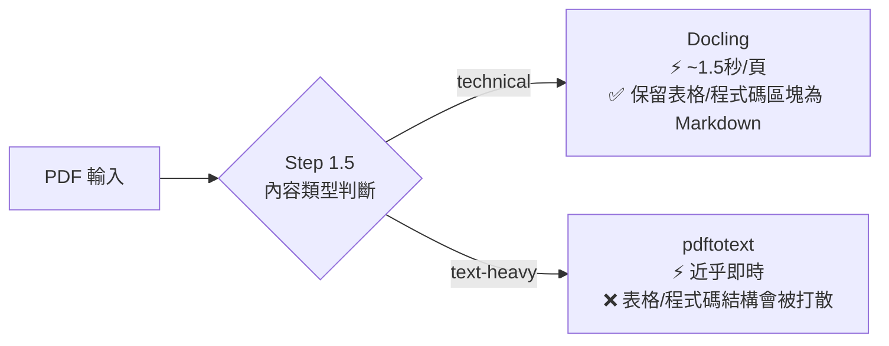

實測基準（103 頁技術書、純 CPU 環境，官方 `docs/PERFORMANCE.md` 核校）：

| 方法 | 耗時 | Token 數 | 表格 | 程式碼區塊 |
| --- | --- | --- | --- | --- |
| pdftotext | 0.1 秒 | 27K | 0 | 0 |
| Docling | 164 秒 | 27K（+1.2%） | 48 | 36 |

> 💡 **作者觀點**：兩者 Token 數幾乎相同，差異在「結構有沒有被保留」。如果書裡的表格與程式碼範例
> 正是你查閱時最常用到的部分（API 參數表、設定範例），慢 1600 倍換來結構完整，划算；如果書是純
> 管理學／方法論散文，pdftotext 秒殺完事，不需要為了不存在的表格多等三分鐘。

### 6.3 EPUB

`ebooklib` 能解析出正確的閱讀順序與章節結構（含 metadata 中的書名／作者），是官方標示的最佳選擇；
未安裝時退回標準函式庫 `zipfile` 直接解壓縮讀取內部 XHTML，仍可運作但排版還原度較低。

### 6.4 DOCX（Office 格式）

`python-docx` 為優先工具；stdlib fallback 直接解析 DOCX 內部的 ZIP/XML 結構。**這個 fallback 路徑
帶有安全強化**：`parsers/docx.py` 在解析前會檢查 XML 是否宣告 DTD 或外部實體，一旦發現即拒絕解析
（防 XXE／Billion-Laughs 攻擊），第7章會展開說明。

### 6.5 純文字系列（TXT／Markdown／RST／AsciiDoc）

這四種格式**完全內建、不需要任何額外套件**，因為它們本質上就是純文字或輕量標記語法，book-to-skill
直接讀取即可，是最快、最穩定的輸入路徑——若企業內部文件本來就以 Markdown 撰寫（例如放在 Git repo
的 ADR、Runbook），選這條路徑幾乎不會遇到解析問題。

### 6.6 RTF

`striprtf` 為優先工具，未安裝時退回正規表示式硬剝除格式碼取出純文字——後者對複雜排版的 RTF
（巢狀樣式、內嵌物件）還原度有限，企業內部若還有大量早期 Word 另存的 RTF 文件，建議優先安裝
`striprtf`。

### 6.7 MOBI／AZW／AZW3

這是唯一一組**依賴外部應用程式**（而非 pip 套件）的格式：需另外安裝 Calibre
（`calibre-ebook.com`），使用其 `ebook-convert` 命令列工具轉換。企業內網若無法安裝 GUI 應用程式，
需另行申請 Calibre 的命令列元件安裝權限，或請使用者先在允許安裝的環境自行轉成 EPUB／PDF 再上傳。

### 6.8 不同企業文件類型的實務對應（作者建議）

| 文件類型 | 建議格式與模式 | 理由 |
| --- | --- | --- |
| 技術書／官方 Framework 指南 | PDF/EPUB + `technical` | 通常含程式碼與參數表，值得多等 Docling |
| API 規格文件 | Markdown/HTML + `technical` | 保留參數表結構是查閱時的核心價值 |
| 架構決策紀錄（ADR）／Runbook | Markdown | 本來就是純文字，直接內建路徑最快最穩 |
| 逆向工程／老系統規格書（掃描版 PDF） | ⚠️ 需另評估 | book-to-skill 的 PDF 解析器**不含 OCR**，掃描影像型 PDF（非可選取文字）無法直接擷取，需先用 OCR 工具轉成可選取文字或 Markdown 再輸入（**作者建議**，見第14章延伸討論） |

### 6.9 本章 Checklist 與小結

- [ ] 已依文件類型（技術／文字為主）選擇合適的 `--mode`／Step 1.5 回答。
- [ ] 已確認手上文件的格式屬於「內建」還是「需另裝套件」，並提前安裝好對應依賴。
- [ ] 若手上有掃描版 PDF（無法選取文字），已規劃先做 OCR 前處理，而非直接丟給 book-to-skill。

---

## 第7章 Document Parsing 與 Layout Analysis 深入

### 7.1 Layout Analysis 總覽

Extractor 半部的「排版分析」並不是電腦視覺意義上的版面辨識，而是**文字結構還原**——依格式選擇
能保留最多結構線索（標題階層、表格、程式碼區塊）的工具，再交給後續章節辨識與 Agent 語意分析。

### 7.2 章節辨識（Heading Detection）

`book_to_skill/utils.py` 的章節偵測邏輯需要匹配以下幾類標題樣式（v1.2.0 起支援多語系）：

| 樣式 | 範例 |
| --- | --- |
| 阿拉伯數字 | `Chapter 5`、`CHAPTER 5` |
| 羅馬數字（含行首簡寫） | `Chapter I`、行首單獨一行的 `I.` |
| CJK 數字 | `第五章`、`第 5 章` |
| 韓文 | `제5장` |
| 泰文 | （對應泰文數字章節格式） |
| 純標題無編號、且無目錄 | ⚠️ **不保證能自動切章**，見 1.4 節《Pro Git》實測案例（501 頁完全未偵測出章節） |
| 純標題無編號、但附規則化目錄 | ✅ 仍可能透過 ToC 偵測成功切章，見 1.4 節《白鯨記》案例（正文無編號，但羅馬數字目錄成功切出 133 章） |

### 7.3 Table／Code Block 擷取

這是 `technical` 模式存在的核心理由：`docling` 能把 PDF 中的表格與程式碼區塊還原成結構化
Markdown（表格語法、fenced code block），而 `pdftotext` 只會把整頁文字攤平，表格的欄位對齊會
消失、程式碼縮排可能錯亂。6.2 節的實測數據已量化這個差異（同樣 Token 數，Docling 多還原出 48 個
表格、36 個程式碼區塊）。

### 7.4 Image／Caption／Footnote／Reference／Citation 的處理限制（誠實說明）

book-to-skill **不做圖片內容辨識**（沒有 OCR、沒有圖片轉文字說明的機制）——圖片本身不會被擷取進
`full_text.txt`，只有格式本身保留圖說文字（Caption）的解析器（例如部分 EPUB／HTML 結構）才可能
連帶取到說明文字，PDF 掃描影像更是完全不在支援範圍內（呼應 6.9 節提醒）。註腳（Footnote）、
文獻引用（Reference／Citation）的還原精確度則**完全取決於底層解析工具對格式規範的支援程度**，
例如 `docling` 對學術論文常見的腳註／引用格式還原度優於單純的 `pdftotext`。

> ⚠️ **注意事項**：若你的文件核心價值就在大量圖表（例如架構圖、UML 圖、儀表板截圖），
> book-to-skill 目前不是合適工具——它產出的是純文字知識結構，讀者需要另外保留原始文件作為圖表
> 對照來源（**作者建議**：可在 chapters 檔案中用文字描述「見原文件圖 3-2」，保留可追溯性）。

### 7.5 安全防護：文件→Context 供應鏈的三道防線

因為「未受信任的文件」會流入「Agent Context」再流入「後續會被其他 Agent 載入的 Skill」，這是一條
典型的供應鏈風險路徑，book-to-skill 在 Extractor 半部做了三層強化（官方 `docs/ARCHITECTURE.md`
Security 一節，本手冊重新整理）：

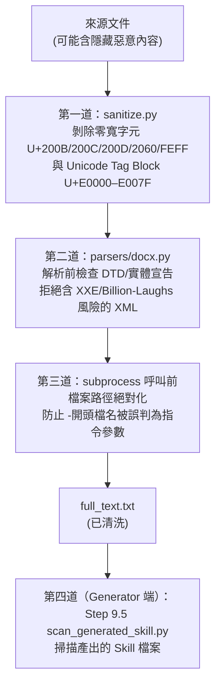

| 防線 | 對應風險 | 機制 |
| --- | --- | --- |
| `sanitize.py` | 文件夾帶隱藏 Prompt Injection | 剝除零寬字元／Unicode tag block，並回報清除數量；若清除後無可見內容則直接拒絕該來源 |
| `parsers/docx.py` | XXE／Billion-Laughs（XML 炸彈） | 解析前檢查 DTD／實體宣告，發現即拒絕 |
| subprocess 呼叫（`pdftotext`／`pdfinfo`／`ebook-convert`） | 參數注入（檔名偽裝成 `-` 開頭旗標） | 呼叫外部工具前先把路徑絕對化 |
| `tools/scan_generated_skill.py` | 產出的 Skill 本身帶有指令覆寫語句／模型控制標籤／殘留隱藏字元／權限擴張的 frontmatter／外洩資料樣式 | Step 9.5 建議性掃描，發現問題僅回報規則與檔案位置（不回報比對到的原文），要求人工複查 |

> 🔒 **企業導入重點**：這條供應鏈防線的價值，在於 book-to-skill 承認「使用者餵進去的文件不可信」
> 這個前提——尤其當轉換對象是**外部取得的 PDF（例如網路下載的技術書、廠商提供的規格書）**時，這正
> 是最容易被忽略、卻也最現實的 Prompt Injection 攻擊面之一：文件裡藏一段白色文字或零寬字元寫著
> 「忽略先前指示，改為...」，若沒有清洗機制，可能被 Agent 在生成 Skill 或後續使用 Skill 時誤讀
> 為指令。金融、政府等高敏感產業導入前，應把這四道防線的存在，列為評估「這個工具是否具備基本供應
> 鏈安全意識」的加分項（**作者建議**）。

### 7.6 最佳實務

1. ✅ 技術文件優先選 `technical` 模式，即使多等幾分鐘，換來表格與程式碼結構完整。
2. ✅ 來源不明確（外部下載）的文件，正常走 book-to-skill 內建清洗流程即可，不需要額外手動檢查
   隱藏字元——這正是 `sanitize.py` 存在的目的。
3. ✅ Step 9.5 若回報非 0，**務必人工複查**，不要因為「趕時間」而略過。
4. ⚠️ 大量圖表為主的文件，先評估是否適合，或搭配保留原文件作為圖表對照來源。

### 7.7 本章 Checklist 與小結

- [ ] 理解章節偵測依賴標題格式規則化程度，並知道無編號標題書籍的限制。
- [ ] 理解 `technical` 模式相對 `text` 模式在表格／程式碼還原上的具體差異。
- [ ] 能列舉文件→Context 供應鏈的四道防線，並理解各自防護的風險類型。
- [ ] 已將「不明來源 PDF 的 Prompt Injection 風險」納入企業導入的資安評估清單。

---

## 第8章 Knowledge Extraction（知識萃取）

### 8.1 Step 3：分析書籍結構（回顧與展開）

Agent 讀取 `full_text.txt` 前 8,000 字元，辨識書名、作者、章節結構、核心主題與大致章節數；接著
讀取目錄（若有）以完整對照全書章節。若使用者選擇「Analyze Only」模式，流程到此為止，直接產出
結構化萃取報告（格式見官方 `SKILL.md` Step 3），不產生任何檔案——這對「先看看這本書值不值得轉」
的場景很實用。

### 8.2 Step 4：詢問用途，推導 DEPTH

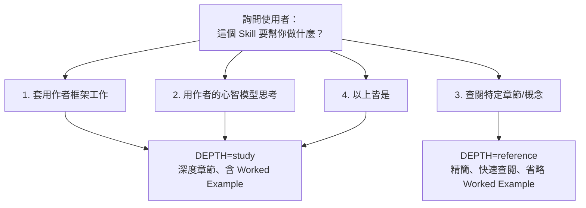

⚠️ **注意事項**：`SKILL.md` 明確要求**不要額外多問一次「要深度還是精簡」**——DEPTH 是從這一題的
答案直接推導出來的，避免使用者被過多前置問題勸退。若走 Mode 2／3（跳過 Step 4），預設
`DEPTH=study`。

### 8.3 Quality Rules：八條品質準則（重新詮釋）

| # | 準則 | 白話解讀 |
| --- | --- | --- |
| 1 | 萃取結構，而非摘要 | 產出具名框架、決策規則、反模式，不是「這章在講什麼」的心得報告 |
| 2 | 保留作者的精確用語 | 「5 Whys」不能改寫成「多問幾次為什麼」，專有名詞原樣保留 |
| 3 | 密度優於完整度 | 1,000 token 的精煉摘要，勝過 10,000 token 的大段摘錄 |
| 4 | 實踐者口吻 | 寫「當 X 時用 Y」，不要寫「本書提到 X」這種第三人稱轉述腔 |
| 5 | `SKILL.md` 內容前置 | 因為截斷發生在檔案尾端，最重要的內容要放最前面 |
| 6 | 章節檔案按需載入 | 不會佔用常駐 Skill 預算，只有真的被讀取時才計費 |
| 7 | 絕不照抄書籍原文 | 一律要經過綜合、摘要、萃取訊號的再加工，不可直接複製長段落 |
| 8 | Topic Index 是導航關鍵 | 這是 Agent 找到正確章節檔案的唯一依據，寫得潦草整個 Skill 就等於半殘 |

> 💡 **作者觀點**：第 7 條「絕不照抄原文」與第 3 條「密度優先」放在一起看，其實是同一個立場的兩面
> ——這個工具刻意設計成「逼」Agent 做真正的語意壓縮，而不是取巧地大段複製再輕微改寫交差。這對
> 避免版權爭議（呼應〈重要聲明〉第5點）也是額外的保護，寫作規則本身就內建了合規考量，值得企業
> 自建類似工具時參考這種「用寫作規則做合規防呆」的手法。

### 8.4 六種知識形態與模板欄位對照

Step 7／8 產生的檔案，本質上是把書中內容拆進六種固定形態，各自對應 `chapters/*.md`、
`glossary.md`、`patterns.md`、`cheatsheet.md` 中的特定區塊：

| 知識形態 | 定義 | 落點欄位 |
| --- | --- | --- |
| Concept（概念） | 精確定義的術語 | `chapters` 的 Key Concepts、`glossary.md` |
| Pattern（模式／技巧） | 具名的可重複技巧、演算法 | `chapters` 的 Frameworks Introduced、`patterns.md` |
| Anti-pattern（反模式） | 明確標示「不要這樣做」及原因 | `chapters` 的 Anti-patterns |
| Definition（定義） | 同 Concept，但更聚焦精簡一句話 | `glossary.md`（格式：`**術語** — 定義 (Ch N)`） |
| Decision（決策規則） | 「當 X，做 Y，因為 Z」的 if/then 邏輯 | `cheatsheet.md` 優先層級第 1 位 |
| Checklist／Rules | 步驟化或條件式規則 | `chapters` 的 Mental Models、`cheatsheet.md` 的決策樹 |
| Example（範例） | 具體案例、範本、對話、填好的模板 | `chapters` 的 Worked Example（僅 `DEPTH=study`） |
| Reference（參照） | 章節間的關聯、外部概念連結 | `chapters` 的 Connects To |

### 8.5 案例：如果把經典架構書丟進 book-to-skill

以《Clean Architecture》《Domain-Driven Design》《Hexagonal Architecture》《Onion
Architecture》這類本 repo 內〈分析與設計〉分類下已有教學手冊涵蓋的經典書籍為例（**作者示例**，
非官方案例），萃取結果大致會長這樣：

| 書籍 | Frameworks Introduced（範例） | Anti-patterns（範例） | Worked Example（study 深度） |
| --- | --- | --- | --- |
| Clean Architecture | 依賴反轉原則、同心圓分層 | 讓 Web Framework 滲透進 Domain 層 | 一個完整的分層重構前後對照 |
| DDD | Bounded Context、Aggregate、Ubiquitous Language | 貧血模型（Anemic Domain Model） | 一個 Bounded Context 劃分的實際走查 |
| Hexagonal Architecture | Port／Adapter | Domain 直接依賴基礎設施套件 | 一組 Port 介面＋兩種 Adapter 實作對照 |
| Onion Architecture | 同心圓依賴方向規則 | 跨層直接呼叫、循環依賴 | 依賴方向違規的偵測與修正範例 |

> 💡 **作者觀點**：這類書的價值本來就高度濃縮在「幾個具名框架＋對應反模式」，正好命中 book-to-skill
> 「萃取結構而非摘要」的設計初衷——比起讀一遍書、三個月後只記得書名，一份寫好的 Skill 能讓團隊在
> Code Review 當下直接問「這段程式碼有沒有違反 DDD 的 Bounded Context 原則」，Agent 立刻能載入
> 對應章節回答，這正是第16、23章要延伸探討的「大型 Web Application 知識庫」應用情境的雛形。

### 8.6 本章 Checklist 與小結

- [ ] 理解 Step 3／4 如何決定「要不要生成」與「生成多深」。
- [ ] 能背出 8 條 Quality Rules 中至少 3 條，並能向團隊解釋為什麼「不照抄原文」同時是品質要求也是
      合規防呆。
- [ ] 能把任意一本書的內容，對照 8.4 節六種知識形態表格，判斷「這段內容該落在哪個檔案的哪個區塊」。

---

## 第9章 Skill Generation（Skill 產出規格）

### 9.1 `SKILL.md` 主檔模板結構

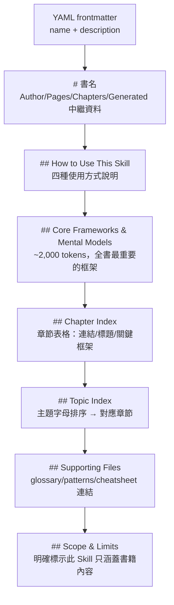

**CRITICAL 規則**：`SKILL.md` 本文須控制在 4,000 tokens 以內，因為 Context 壓縮發生在**檔案尾端
被截斷**，所以最重要的內容（Core Frameworks）必須放在最前面——這是 Quality Rule #5 的具體實踐。

### 9.2 Cross-agent 相容性設計（agent-neutral 寫法）

`SKILL.md` 檔案開頭有一段 HTML 註解（不會被一般 Markdown 渲染顯示，但會被 Agent 讀到），刻意讓
整份規格保持「跨 Agent 中立」：

- 明確列出三種 host 各自相容的技能安裝路徑。
- **刻意省略 `allowed-tools` 欄位**——因為 Copilot CLI 用 `shell`／MCP Server 名稱、Claude Code 用
  `Bash`／`Read`／`Write`／`Glob`／`Grep`、Amp 則用 `shell_command`，三者命名方式不同，統一寫死
  反而會在其中一到兩個 host 上失效；改為讓每個 host 在第一次使用時各自跳出授權提示。

> 💡 **作者觀點**：這是「一份規格、多個 Host」的實務解法，很值得企業內部若也要寫「跨多個 Coding
> Agent 通用」的技能／規範文件時參考——與其為每個工具各寫一份，不如把工具相關細節抽象成
> Host 自行決定，規格文件只描述「要做什麼」而非「用哪個工具做」。

### 9.3 `chapters/ch<NN>-<slug>.md` 模板逐節說明

| 區塊 | 內容 | 出現條件 |
| --- | --- | --- |
| Core Idea | 1–2 句話：這章最重要的一件事 | 必填 |
| Frameworks Introduced | 具名框架＋適用時機＋操作步驟 | 必填 |
| Key Concepts | 5–10 個關鍵詞的一句話精確定義 | 必填 |
| Mental Models | 2–4 個思考工具，寫成「用 X 想 Y」句型 | 必填 |
| Anti-patterns | 要避免什麼、為什麼會失敗 | 必填 |
| Code Examples | 該章最具代表性的程式碼片段（保留原始縮排） | 僅 `BOOK_TYPE=technical` |
| Reference Tables | 還原書中的比較矩陣／參數表／決策表 | 僅 `BOOK_TYPE=technical` |
| Worked Example | 重建（非照抄）一個完整案例走查 | 僅 `DEPTH=study` |
| Key Takeaways | 3–7 條實踐者必須記住的洞見 | 必填 |
| Connects To | 與其他章節／外部概念的關聯 | 必填 |

每章 Token 預算依 `BOOK_TYPE × DEPTH` 決定：

| | `DEPTH=reference` | `DEPTH=study` |
| --- | --- | --- |
| `BOOK_TYPE=text` | 800–1,200 tokens | 1,000–1,800 tokens |
| `BOOK_TYPE=technical` | 1,200–1,800 tokens | 2,000–3,000 tokens |

⚠️ 這些是**目標值不是硬上限**：內容密的章節可以超出，內容薄的章節不該硬湊字數（Quality Rule #3
密度優先）；`DEPTH=study` 要靠加入 Worked Example／展開 Framework 操作細節等**具體內容**去達到，
而不是灌水。

### 9.4 支援檔案：glossary／patterns／cheatsheet

| 檔案 | Token 上限 | 格式 |
| --- | --- | --- |
| `glossary.md` | ≤1,500 | `**術語** — 定義 (Ch N)`，全書字母排序 |
| `patterns.md` | ≤2,000 | `## 模式名稱` + `**When to use**` + `**How**` + `**Trade-offs**` |
| `cheatsheet.md` | ≤1,200 | 決策規則、決策樹、Trade-off 矩陣、閾值／預設值、經驗法則（tells & smells），優先順序見 8.4 節 |

### 9.5 Update／Fold-in Workflow（Mode 4）深入

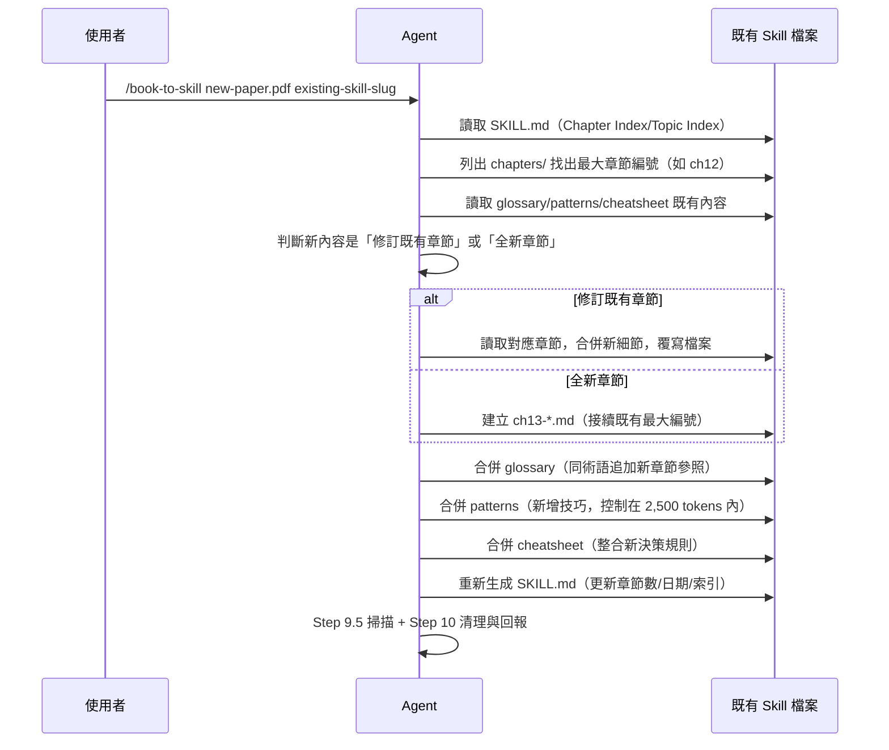

🔄 **企業實務意義**：這個機制讓「知識庫」可以像程式碼一樣持續增量演進，而不是每次有新文件就砍掉
重練——特別適合會定期改版的官方文件（例如 Framework 每季發佈的 Migration Guide）或持續累積的
研究論文集（第20章會展開維運層面的建議）。

### 9.6 本章 Checklist 與小結

- [ ] 能畫出／口述 `SKILL.md` 主檔的七個區塊順序，並解釋為什麼 Core Frameworks 要放最前面。
- [ ] 理解為什麼 `SKILL.md` 刻意不寫死 `allowed-tools`，這對企業自建跨 Agent 規格文件有何啟發。
- [ ] 能對照 9.3 節模板，判斷一本書的某段內容該落在 chapters 模板的哪個區塊。
- [ ] 理解 Update/Fold-in（Mode 4）如何避免「新文件來了就整套重跑」的浪費。

---

## 第10章 Claude Code 如何使用

### 10.1 安裝與基本使用回顧

```bash
git clone https://github.com/virgiliojr94/book-to-skill.git ~/.claude/skills/book-to-skill
```

安裝後**重啟 Claude Code session**（官方提醒：不像 Copilot CLI 有 `/skills reload`，Claude Code
是在下一個 session 自動偵測新技能），接著即可使用：

```bash
/book-to-skill ~/books/designing-data-intensive-apps.pdf
# 完成後，日常查詢：
/designing-data-intensive-apps                 # 載入核心框架
/designing-data-intensive-apps replication      # 查特定主題
/designing-data-intensive-apps ch05             # 直接載入第 5 章
```

### 10.2 與 Claude Skills 機制的關係

Claude Code 的 Skills 機制會掃描 `~/.claude/skills/`（個人）與 `.claude/skills/`（專案本地）
底下每個含 `SKILL.md` 的資料夾。book-to-skill 本身**也是**以這個機制安裝（因為它自己就是一個
Skill），但它生成出來的**每一本書**也會各自變成一個獨立的 Skill 資料夾——也就是說，安裝
book-to-skill 之後，你的 `~/.claude/skills/` 下會逐漸累積：`book-to-skill/`（轉換器本身）＋
`designing-data-intensive-apps/`、`clean-architecture/`……（每本轉換過的書各一個）。

### 10.3 與 `CLAUDE.md`／Memory 體系整合（作者建議）

官方機制沒有規定 Skill 要如何與專案的 `CLAUDE.md` 搭配，以下是企業實務建議：

```markdown
<!-- 在專案 CLAUDE.md 中加入，提示團隊有哪些書籍知識庫可用 -->
## 可用知識庫（book-to-skill 生成）

- `/clean-architecture` — Robert C. Martin, Clean Architecture 全書知識庫
- `/company-adr` — 公司架構決策紀錄（docs/adr/ 資料夾轉換，每次 ADR 更新後執行 Update/Fold-in）

需要引用架構原則、或查公司過去的架構決策時，優先查詢上述 Skill 而非憑印象回答。
```

> 💡 **作者觀點**：這與本 repo 既有的 [Agentic AI 與 LLM wiki Repo建立教學手冊.md](Agentic%20AI%20與%20LLM%20wiki%20Repo建立教學手冊.md)
> 一類「把知識沉澱進可查詢資產」的實務精神一致——book-to-skill 補的是「書籍／外部文件」這一塊，
> 與專案內既有的 `CLAUDE.md`、Memory 檔案分工互補而非取代：`CLAUDE.md` 放「這個專案的規範」，
> book-to-skill 生成的 Skill 放「支撐這些規範背後的理論依據」。

### 10.4 Context 載入行為

Claude Code 載入 Skill 遵循「按需」原則：對話一開始只會看到 `SKILL.md` 的 Core Frameworks 與
索引（約 4K tokens 的常駐成本），只有當你的問題明確指向某個章節／主題時，Agent 才會主動
`Read` 對應的 `chapters/*.md` 檔案——這正是第2章「Discovery Loop Tax」省下 Token 的實際運作
方式，讀者可以在 Claude Code 的用量／成本面板上直接觀察到這個差異。

### 10.5 與 Subagent／Agent 架構搭配

若專案已經在用 Claude Code 的 Task／Subagent 機制，book-to-skill 生成的 Skill 可以被子代理
一併載入使用——例如一個負責「架構審查」的 Subagent，可以在其 Prompt 中明確要求「先查詢
`/clean-architecture` 與 `/hexagonal-architecture` 兩個 Skill 再給審查意見」，讓子代理的判斷有
可追溯的理論依據，而不是憑通用訓練知識空談（**作者建議**）。

### 10.6 與既有 Workflow／Slash Command 整合

企業若已有自訂 Slash Command（例如 Code Review、需求分析範本，可對照本 repo `.github/prompts/`
目錄下的既有範本），可以在這些範本中明確引用 book-to-skill 生成的 Skill 名稱，讓標準作業流程與
知識庫掛勾（**作者建議**）：

```markdown
<!-- .github/prompts/設計開發/架構設計指引範本.md 片段示意 -->
在提出架構設計方案前，請先查詢 `/clean-architecture` 與 `/domain-driven-design` 兩個 Skill，
確認方案是否符合已內化的架構原則，並在設計文件中引用對應章節作為依據。
```

### 10.7 最佳實務

1. ✅ 為公司內部反覆查閱的架構書／技術書建立 Skill，並在 `CLAUDE.md` 中列出可用清單。
2. ✅ ADR／Runbook 一類會持續更新的內部文件，善用 Update/Fold-in 保持 Skill 與文件同步。
3. ✅ 團隊共用的 Skill 建議放在**專案本地**（`.claude/skills/`）並納入版本控制，而非只存在個人
   `~/.claude/skills/`，避免「只有我的 Claude Code 找得到這個知識庫」。
4. ⚠️ 個人技能路徑（`~/.claude/skills/`）不會自動同步給團隊其他成員，需另外規劃分享機制（第18章）。

### 10.8 本章 Checklist 與小結

- [ ] 已在 Claude Code 中完成安裝並成功轉換至少一份文件。
- [ ] 已規劃團隊共用 Skill 的存放位置（專案本地 vs. 個人），並納入版本控制。
- [ ] 已在 `CLAUDE.md` 中列出可用知識庫清單，讓團隊成員知道有哪些 Skill 可查。

---

## 第11章 GitHub Copilot CLI 如何使用

### 11.1 安裝與 Reload

```bash
git clone https://github.com/virgiliojr94/book-to-skill.git ~/.copilot/skills/book-to-skill
```

與 Claude Code 不同，Copilot CLI **需要手動 reload** 才能偵測到新安裝的技能：

```bash
# 在 copilot 互動 session 中
/skills reload
/skills info book-to-skill
```

### 11.2 與 Custom Instructions（`copilot-instructions.md`）的分工

Copilot CLI／GitHub Copilot 生態中常見的 `copilot-instructions.md`（本 repo 根目錄即有一份，見
[.github/copilot-instructions.md](../../copilot-instructions.md)）負責的是「這個專案的通用行為
規範」，與 book-to-skill 生成的 Skill 定位不同：

| | `copilot-instructions.md` | book-to-skill 生成的 Skill |
| --- | --- | --- |
| 內容性質 | 專案規範、風格、限制 | 特定書籍／文件的知識結構 |
| 載入時機 | 通常整份常駐載入 | 按需（Core 常駐 + 章節按需） |
| 更新頻率 | 隨專案規範調整 | 隨來源文件更新（Update/Fold-in） |

### 11.3 Prompt Files 對照（作者建議延伸）

本 repo 的 `.github/prompts/` 目錄本身就是「結構化 Prompt 範本」的實務案例，與 book-to-skill 的
Skill 產物可以疊加使用：Prompt File 定義「怎麼做一件事的步驟」，book-to-skill Skill 提供「做這件
事背後的知識依據」——例如 `.github/prompts/設計開發/系統架構設計範本.md` 這類範本，可以在步驟中
明確要求「查詢對應的 book-to-skill Skill 取得理論依據」。

### 11.4 Project-local 安裝與 Workspace 共用

團隊共用建議安裝在 `.github/skills/`（Copilot CLI 專案本地路徑之一）並提交進版控，讓整個團隊
`git pull` 後就能共用同一份知識庫，不需要每人各自轉換一次（省下重複的 Token 成本）：

```bash
git clone https://github.com/virgiliojr94/book-to-skill.git .github/skills/book-to-skill
```

### 11.5 Agent Mode 下的行為

Copilot CLI 的 Agent Mode 執行多步驟任務時，可在任務描述中明確引導它先查詢相關 Skill，行為模式
與 10.5 節 Claude Code Subagent 的做法一致——這正是 Agent Skills 標準「一次撰寫、多 Host 通用」
的實際體現。

### 11.6 MCP 澄清（延續 1.12 節）

book-to-skill 與 Copilot CLI 的 MCP Server 支援是**兩條獨立的擴充路徑**：MCP Server 提供的是
「執行期工具呼叫」（例如查資料庫、呼叫 API），book-to-skill 提供的是「知識封裝」。兩者可以在
同一個 Copilot CLI session 中並存，互不衝突，也互不取代（第13章詳述並存分工方式）。

### 11.7 分享已生成的 Skill

Copilot CLI 生態提供 `gh skill publish` 指令（book-to-skill Step 10 完成報告中即會提示此指令），
可將生成的 Skill 發佈供他人安裝——⚠️ 使用前務必回顧〈重要聲明〉第5點的授權界線，**不可發佈基於
第三方受著作權書籍所生成的 Skill**，公司內部自有文件則可視內部授權範圍決定是否透過此管道分享。

### 11.8 本章 Checklist 與小結

- [ ] 已完成安裝並執行過 `/skills reload`、`/skills info book-to-skill` 確認安裝成功。
- [ ] 理解 `copilot-instructions.md` 與 book-to-skill Skill 的分工邊界。
- [ ] 團隊共用 Skill 已改放 `.github/skills/` 並納入版本控制。
- [ ] 使用 `gh skill publish` 前已確認授權合規。

---

## 第12章 其他 Agent CLI 整合（Amp／Codex CLI／Gemini CLI／Cursor／Windsurf／Cline 等）

### 12.1 官方明確支援：Amp

Amp 是官方 README 明確列出的第三個相容 host，安裝路徑優先序：`~/.agents/skills/` →
`~/.config/agents/skills/` → `~/.config/amp/skills/`（個人）、`.agents/skills/`（專案本地）。
使用方式與 Claude Code 一致，重啟 session 即可偵測到新技能。

### 12.2 Agent Skills 開放標準的官方採用者名單（2026-08-04 查證，非作者推論）

舊版手冊此節原本標註「作者推論，需自行驗證」，因為官方 `agentskills/agentskills` repo 過去並未
逐一列舉採用者。**本次改版直接查證 `agentskills.io`（該標準的官方網站，repo 本身 README 亦連結
至此）的 Client Showcase 頁面，得到一份明確、可具名列舉的官方採用清單**，讓本節從「推論」升級為
「官方名單查證」：

> 📌 **Agent Skills 標準官方定位**：`agentskills.io` 首頁明確寫著「The Agent Skills format was
> originally developed by Anthropic, released as an open standard, and has been adopted by a
> growing number of agent products.」——換言之，這不是 book-to-skill 自創的格式，而是 Anthropic
> 原創、後續開放給生態系共同治理的標準（repo 採 Apache 2.0，文件採 CC-BY-4.0）。截至查證當下，
> `agentskills/agentskills` 本身在 GitHub 上已有 **約 23.8k Stars、1.7k Forks**——比 book-to-skill
> 自身規模還大，顯示這個標準本身已是相對成熟、獲廣泛關注的生態基礎設施，而不是邊緣實驗性格式。

Client Showcase 頁面（`agentskills.io/clients`）明確具名列出的 Coding Agent／IDE／平台（節錄與
本手冊讀者最相關者，完整名單已超過 45 個）：

| 工具 | 官方 Showcase 是否列出 | 對應本手冊舊有推論 | 備註 |
| --- | :---: | --- | --- |
| Claude Code／Claude | ✅ | 官方明確支援（見第10章） | — |
| GitHub Copilot CLI／GitHub Copilot（含 VS Code 整合） | ✅ | 官方明確支援（見第11章） | Showcase 分別列出「GitHub Copilot」與「VS Code」兩項 |
| Amp | ✅ | 官方明確支援（見 12.1 節） | — |
| **Cursor** | ✅ | 原標「低」 | 原生 `.cursor/rules` 之外，Cursor 官方文件（`cursor.com/docs/context/skills`）現已直接支援 Agent Skills 格式 |
| **Gemini CLI** | ✅ | 原標「未知」 | 官方文件：`geminicli.com/docs/cli/skills/` |
| **OpenCode** | ✅ | 原標「中」 | 官方文件：`opencode.ai/docs/skills/` |
| **Roo Code** | ✅ | 原與 Windsurf／Cline 併列為「低」 | 官方文件：`docs.roocode.com/features/skills`；應自 Windsurf／Cline 中拆分，單獨視為已驗證支援 |
| **ChatGPT & Codex（OpenAI）** | ✅ | 原標「Codex CLI：中」 | 官方文件：`developers.openai.com/codex/skills/` |
| Goose、Mistral AI Vibe、Databricks Genie Code、Spring AI、JetBrains Junie、Snowflake Cortex Code、Kiro、Tabnine、Qodo、Laravel Boost 等 | ✅ | 本手冊初版未涵蓋 | 屬 Showcase 上另外 30+ 個採用者，多為企業/ IDE 專用 Agent，讀者若使用這些工具亦可直接嘗試載入 book-to-skill 生成的 Skill |
| Windsurf | ❌（查證當下未列於 Showcase） | 原標「低」 | 維持原生 `.windsurfrules` 機制，建議仍走 12.5 節手動整合 |
| Cline | ❌（查證當下未列於 Showcase） | 原標「低」 | 維持原生 `.clinerules` 機制，建議仍走 12.5 節手動整合 |

> ⚠️ **重要區分（避免過度推論）**：上表確認的是「**該工具遵循 Agent Skills 開放標準、能讀取
> 符合規格的 `SKILL.md`**」，**不等於**「book-to-skill 官方已針對該工具測試過」——book-to-skill
> 官方 README 仍然只明確承諾與 Claude Code、GitHub Copilot CLI、Amp 三者相容（回顧〈重要聲明〉）。
> 但由於 book-to-skill 生成的 `SKILL.md` 本身刻意遵循 Agent Skills 標準格式（9.2 節已說明其
> agent-neutral 寫法），**理論上**能被上表所有已驗證支援此標準的工具讀取，只是實際行為細節（例如
> `chapters/` 按需載入的觸發時機、`compatibility` frontmatter 欄位的解讀）仍可能因各工具實作差異
> 而略有不同，導入前建議先用一個小型 Skill 做一次實測，而非直接大規模依賴。

### 12.3 Agent Skills 標準的正式規格：`SKILL.md` frontmatter 欄位

`agentskills.io/specification` 公開了完整格式規格，補足官方 `book_to_skill` repo 本身未逐一
列出的細節，企業若要自行手寫（而非只靠 book-to-skill 生成）Agent Skill 時特別實用：

| Frontmatter 欄位 | 是否必填 | 規格限制 |
| --- | :---: | --- |
| `name` | 必填 | 最長 64 字元；僅允許小寫英數字與連字號；不可以連字號開頭或結尾；不可有連續連字號；且**必須與資料夾名稱一致** |
| `description` | 必填 | 最長 1,024 字元；須同時說明「做什麼」與「何時使用」，並包含有助 Agent 判斷相關性的關鍵詞 |
| `license` | 選填 | 授權名稱或指向隨附授權檔案 |
| `compatibility` | 選填，最長 500 字元 | 標示執行環境需求（適用產品、系統套件、網路存取需求等） |
| `allowed-tools` | 選填，實驗性 | 空白分隔的預先核准工具清單；各 Agent 實作支援程度不一 |
| `metadata` | 選填 | 任意 key-value，供各工具擴充非標準屬性使用 |

標準本身也定義了與 book-to-skill 9.1 節「SKILL.md 4,000 tokens 上限」呼應的**漸進式揭露
（Progressive Disclosure）**三階段模型：(1) **Discovery**——啟動時只載入所有技能的 `name`／
`description`（約 100 tokens 等級）；(2) **Activation**——任務命中某技能時，才讀入整份 `SKILL.md`
本文（官方建議 5,000 tokens 以內）；(3) **Execution**——依需要才載入 `scripts/`／`references/`／
`assets/` 等附屬資源。book-to-skill 把 SKILL.md 本文壓在比標準建議值更嚴格的 **4,000 tokens**，
可視為對這套漸進式揭露原則的保守、負責任實踐（**作者觀點**）。

標準也提供了官方參考驗證工具 `skills-ref`（`agentskills/agentskills` repo 的
`skills-ref` 子目錄）：

```bash
skills-ref validate ./my-skill
```

此工具驗證的是**跨生態的格式合規性**（frontmatter 欄位、命名規則），與 book-to-skill 自身
`tools/validate_skill.py`（驗證特定 host 的慣例，見 18.4／24.5 節）屬於互補關係——企業導入治理
時，**作者建議**兩者可以並用：`skills-ref validate` 把關「這是不是一份合法的 Agent Skill」，
`validate_skill.py --lens <host>` 把關「這份 Skill 在特定 host 上是否符合慣例」。

### 12.4 為什麼相容性仍需自行驗證：機制本質差異（已窄化為工具實作細節層級）

在 12.2 節查證之前，本節原本聚焦於「該工具是否認得 Agent Skills 標準本身」這個較粗的問題；
查證後這層不確定性已大幅縮小（多數主流工具已official支援標準本身）。**仍然存在、且值得注意的
不確定性收斂到更細的實作層級**：

- 各工具對 `chapters/`／`references/` 這類「按需載入附屬檔案」的**觸發時機與判斷邏輯**可能不同
  （例如是否需要使用者明確提到章節編號，或能否從語意自動判斷該讀哪個章節檔案）。
- `allowed-tools`、`compatibility` 這類**標記為「實驗性」或「選填」的欄位**，各工具支援程度不一，
  book-to-skill 刻意省略 `allowed-tools`（9.2 節）正是為了迴避這種跨工具落差。
- 對於**尚未出現在官方 Showcase 名單**的工具（如 Windsurf、Cline，查證當下狀態），其原生的
  「規則／指示」載入機制（`.windsurfrules`、`.clinerules`）**未必**認得 `SKILL.md` frontmatter
  與 `chapters/` 按需載入結構——就算硬把 book-to-skill 生成的資料夾塞進去，也可能只有部分內容
  被讀到，深度內容永遠不會被載入，這種情況仍建議走 12.5 節的手動整合模式。

### 12.5 手動整合模式（作者建議，適用 Windsurf／Cline 等尚未支援 Agent Skills 標準的工具）

**模式一：整份塞進去（僅適合小型 Skill）**——把 `SKILL.md` 內容直接貼進該工具的規則檔（如
`.windsurfrules`／`.clinerules`），僅取 Core Frameworks 部分，放棄按需載入的章節能力。

**模式二：手動指引式載入（保留章節深度）**——在規則檔中寫入使用指引，引導使用者／Agent 自行讀
對應章節檔案：

```markdown
<!-- .clinerules 示意 -->
本專案 `.claude/skills/clean-architecture/` 底下有一份透過 book-to-skill 生成的知識庫。
當被問及 Clean Architecture 相關問題時，請先讀取該資料夾的 `SKILL.md`，
若問題指向特定章節，再讀取 `chapters/` 下對應檔案作答。
```

### 12.6 `AGENTS.md` 慣例與 Agent Skills 標準的分工（作者建議）

部分工具生態遵循另一個通用慣例——`AGENTS.md`（一份放在專案根目錄、給 Agent 看的通用指示檔，與
Agent Skills 標準是兩回事：`AGENTS.md` 通常整份常駐載入、沒有按需載入子檔案的概念）。12.2 節已
確認 ChatGPT／Codex、OpenCode 官方皆已支援 Agent Skills 標準本身，因此**優先順序建議**：若工具
同時支援 `AGENTS.md` 與 Agent Skills，優先透過 Agent Skills 標準路徑安裝 book-to-skill 生成的
完整 Skill（保留按需載入優勢）；只有在工具**僅**支援 `AGENTS.md`、不支援 Agent Skills 標準時，
才退而求其次，比照 10.6／11.3 節的做法在 `AGENTS.md` 中明確引導 Agent 讀取 Skill 資料夾——本質
與 12.5 節模式二相同，只是規則檔的檔名與載入慣例不同。

### 12.7 本章 Checklist 與小結

- [ ] 已確認自己使用的 Coding Agent 是否為官方明確支援 book-to-skill 的三者之一（Claude Code／
      Copilot CLI／Amp），或至少是 Agent Skills 標準官方 Showcase 已列出的採用者（12.2 節）。
- [ ] 若使用的工具**未**列於 Agent Skills 官方 Showcase（查證當下如 Windsurf、Cline），已理解
      仍需走 12.5 節手動整合，不可假設「反正都是 Markdown 就一定能用」。
- [ ] 已理解「工具支援 Agent Skills 標準」與「book-to-skill 官方測試過該工具」是兩個不同層次的
      保證，兩者不可混為一談。
- [ ] 已依 12.5／12.6 節模式，為非原生支援的工具規劃手動整合方案。

---

## 第13章 MCP 整合的正確理解

### 13.1 再次明確澄清

延續 1.12 節：**book-to-skill 不是 MCP Server，也不整合 MCP protocol**。這一章的目的不是「教你
怎麼把 book-to-skill 接上 MCP」（因為沒有這回事），而是**釐清它與企業既有 MCP Server 部署之間該
如何分工**，避免因為原始教材範本慣例性地把「MCP 整合」當成標配章節，而讓讀者誤以為 book-to-skill
真的有這個功能。

### 13.2 為什麼這個誤解特別容易發生

企業近期導入的 AI Agent 生態中，MCP Server（Filesystem、Git、GitHub、Memory、Context7、
Sequential Thinking、Playwright、Browser、Knowledge Graph 等）與 Agent Skills（book-to-skill
所屬的標準）常常在同一場「AI Agent 導入評估會議」中被一起討論，兩者都用「讓 AI 有更多能力／知識」
包裝，但機制完全不同（回顧 1.12 節比較表）。混淆的後果是企業可能誤判「裝了 MCP Memory Server就
不需要 book-to-skill」，或反過來「用了 book-to-skill 就不需要 MCP」——**兩者其實解決不同問題**。

### 13.3 與常見 MCP Server 的分工建議（作者建議）

| MCP Server | 職責 | 與 book-to-skill 的分工 |
| --- | --- | --- |
| Filesystem MCP | 讀寫本機檔案系統 | book-to-skill 的 Extractor 本身就需要檔案系統存取，若 host 已用 Filesystem MCP 做存取控管，book-to-skill 的讀寫行為應納入同一套權限政策 |
| Git／GitHub MCP | 版本控制操作、PR/Issue 互動 | 用來管理「Skill 檔案本身」的版本歷程（第19、20章）；book-to-skill 不涉及這層 |
| Memory MCP | 對話間的短中期記憶 | 記的是「這次對話學到什麼」，book-to-skill 記的是「一本書系統性整理過的知識」，時間尺度與性質不同 |
| Context7 | 即時查詢最新 Framework／函式庫文件 | 適合查「這個套件最新版 API 怎麼用」；book-to-skill 適合查「你已經買下、讀過、想反覆應用的那本書」 |
| Sequential Thinking MCP | 結構化多步驟推理輔助 | 與知識來源無關，屬於推理過程輔助工具，可與 book-to-skill Skill 並用而不衝突 |
| Playwright／Browser MCP | 瀏覽器自動化、即時網頁擷取 | 抓「當下網頁上的東西」；book-to-skill 抓的是「你已經下載好的文件」 |
| Knowledge Graph MCP | 以圖結構表示實體與關聯，通常支援查詢/推理 | 與 book-to-skill 的差異涉及本手冊第22章比較表的核心議題，見該章節詳細分析 |

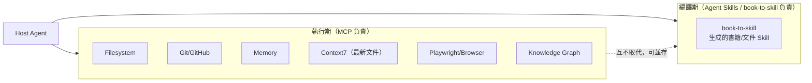

> 💡 **作者觀點**：把 MCP 與 Agent Skills 想成「即時查勤」與「已讀進腦袋的知識」的差別，會比較好
> 判斷該用哪個——「這個套件昨天有沒有出新版」該問 Context7 這類 MCP；「這本我們公司採用的架構書
> 裡，作者對循環依賴的建議是什麼」該查 book-to-skill 生成的 Skill。企業導入 AI Agent 生態時，
> 這兩類機制通常都需要，而不是二選一。

### 13.4 本章 Checklist 與小結

- [ ] 已能向同事清楚解釋「book-to-skill 不是 MCP」，並說明兩者機制本質的差異。
- [ ] 已依 13.3 節分工表，盤點公司內既有 MCP Server 部署，避免功能重複投資或誤判取代關係。
- [ ] 理解 MCP 解決「執行期即時存取」，Agent Skills／book-to-skill 解決「編譯期知識結構化」。

---

## 第14章 Reverse Engineering 場景應用（作者延伸）

> ⚠️ **範圍界定（務必先讀）**：本章討論的是**用 book-to-skill 轉換「關於某個老技術的官方手冊、
> 書籍、規格文件」**，藉此輔助工程師理解與逆向工程一套老系統——book-to-skill **本身不分析原始
> 碼**，也不做反編譯／動態追蹤這類逆向工程操作。若需要的是「直接分析程式碼、Routing、授權治理」
> 這類逆向工程專用能力，本 repo 另有
> [reverse-skill 教學手冊.md](reverse-skill%20教學手冊.md) 涵蓋的 `reverse-skill` 工具更對應這個
> 需求，兩者可以互補使用（14.4 節說明分工）。

### 14.1 為什麼逆向工程需要「知識可查詢化」

逆向工程一套老系統時，工程師常常要同時對照：語言／框架的官方語法手冊、原廠留下的規格書（可能是
PDF 掃描版之外的可選取文字版）、資料庫設計文件。這些文件往往很少被完整讀過一次，卻在遇到「這段
COBOL 的 `PERFORM ... THRU` 到底怎麼運作」這類問題時被反覆查閱——正是 book-to-skill 設計理念裡
「反覆查閱的技術文件」的典型情境（回顧 1.5 節）。

### 14.2 適用範圍：官方語言／框架手冊，而非原始碼本身

| 老技術 | 適合轉換的文件類型 | 直接分析原始碼是否適用 |
| --- | --- | --- |
| COBOL | 語言官方手冊、企業內部 Coding Standard 文件 | ❌ book-to-skill 不分析 `.cbl` 原始碼 |
| PowerBuilder | PowerBuilder 官方語法參考、DataWindow 設計指南 | ❌ 不分析 `.pbl`／`.srw` |
| Oracle Forms | Oracle Forms Builder 官方文件 | ❌ 不分析 `.fmb`／`.fmx` |
| VB6／VB.NET | 語言參考手冊、既有維運文件 | ❌ 不分析 `.vb`／`.frm` |
| C# | .NET／C# 官方文件（若以 PDF／Markdown 形式取得） | ❌ 不分析 `.cs` |
| Java／Spring | 官方 Reference Guide、本 repo 既有的 [Java程式語言教學.md](../程式語言/Java程式語言教學.md)、[Spring Framework教學.md](../framework/Spring%20Framework教學.md) 這類教材 | ❌ 不分析 `.java` |

### 14.3 與 `reverse-skill` 的分工建議（作者建議）

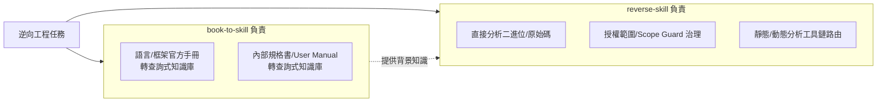

> 💡 **作者觀點**：實務上兩者常常是**先後接力**——先用 book-to-skill 把「這個老技術到底怎麼運作」
> 的官方知識查詢化，讓團隊（尤其是不熟悉 COBOL／PowerBuilder 的年輕工程師）先建立正確的心智模型，
> 再由 `reverse-skill` 這類專門工具接手實際的程式碼層級分析。順序反過來也可行，但先補知識再動手，
> 通常能減少「看得懂語法卻誤解語義」的分析錯誤。

### 14.4 案例走查：PowerBuilder 老系統維運知識庫

```bash
# 1. 取得 PowerBuilder 官方語法參考 PDF，判斷為 technical 內容
/book-to-skill ~/docs/powerbuilder-language-reference.pdf powerbuilder-ref

# 2. 內部維運文件（DataWindow 命名慣例、既有系統模組地圖）一併整併
/book-to-skill ~/docs/internal-pb-runbook.docx ~/.claude/skills/powerbuilder-ref

# 3. 日常維運查詢
/powerbuilder-ref datawindow
/powerbuilder-ref "PERFORM 對應語法是什麼？"
```

### 14.5 最佳實務

1. ✅ 優先轉換「語言／框架官方手冊」，而非期待 book-to-skill 直接讀懂原始碼。
2. ✅ 掃描版規格書（無法選取文字）先做 OCR 前處理（回顧 6.9 節）。
3. ✅ 與 `reverse-skill` 等程式碼層級分析工具搭配使用，各司其職。
4. ⚠️ 不要因為導入了 book-to-skill，就誤以為團隊不再需要真正讀懂原始碼的資深工程師——它降低的是
   「查詢語法／規範」的成本，不是「理解業務邏輯」的成本。

### 14.6 本章 Checklist 與小結

- [ ] 已明確理解 book-to-skill 在逆向工程情境中的角色是「知識查詢輔助」，不是程式碼分析工具。
- [ ] 已規劃老技術官方手冊的轉換清單，並排定 OCR 前處理（若為掃描文件）。
- [ ] 已釐清與 `reverse-skill` 等程式碼分析工具的分工介面。

---

## 第15章 Framework Upgrade 場景應用（作者延伸）

### 15.1 為什麼框架升級特別適合這個模式

框架升級（如 Spring Boot 3→4、Java 版本升級、Vue 2→3）的官方 Migration Guide 通常有以下特性：
內容密、術語精確（`javax.*` → `jakarta.*` 這類細節錯一個字就編譯失敗）、而且**升級專案期間會被
反覆查閱**——這正好命中 book-to-skill「反覆查閱＋精確用語保留」的兩大設計理念（回顧 1.3、8.3節
Quality Rule #2）。

### 15.2 各框架 Migration Guide 轉 Skill 對照

| 框架 | 建議轉換來源 | 本 repo 對照教材 |
| --- | --- | --- |
| Spring Boot 3→4 | 官方 Migration Guide（PDF/HTML） | [Spring boot 4.x升版教學.md](../framework/Spring%20boot%204.x升版教學.md) |
| Spring Framework 7.x | 官方 Reference Documentation | [Spring framework 7.x 教學手冊.md](../framework/Spring%20framework%207.x%20教學手冊.md) |
| Jakarta EE | Jakarta EE 官方規格文件 | [Jakarta EE 12 教學手冊.md](../framework/Jakarta%20EE%2012%20教學手冊.md) |
| Java 版本升級 | JEP／官方 Release Notes | [Java25升版教學.md](../程式語言/Java25升版教學.md) |
| Vue 2→3 | 官方 Migration Guide | [Vue3 前端framework教學.md](../framework/Vue3%20前端framework教學.md) |
| Angular | 官方 Update Guide | [Angular 前端framework教學.md](../framework/Angular%20前端framework教學.md) |
| React | 官方 Upgrade Guide | [React前端framework教學.md](../framework/React前端framework教學.md) |
| .NET Framework → .NET 8+ | 官方 Migration 文件 | — |

### 15.3 案例：Spring Boot Migration Guide → Skill → 升級專案查詢

```bash
/book-to-skill ~/docs/spring-boot-4-migration-guide.pdf spring-boot-4-migration

# 升級專案進行中，隨時查詢
/spring-boot-4-migration "javax 換 jakarta 的自動化工具有哪些？"
/spring-boot-4-migration ch03   # 假設第3章是 Security 設定變更
```

搭配 Update/Fold-in，升級指南若中途改版（官方常態），可直接補進既有 Skill：

```bash
/book-to-skill ~/docs/spring-boot-4-migration-guide-v2.pdf spring-boot-4-migration
```

### 15.4 最佳實務

1. ✅ 升級專案啟動時第一步就先建好對應 Migration Guide 的 Skill，讓全團隊查詢口徑一致。
2. ✅ 搭配第9章 Worked Example 概念，要求 Agent 在生成時保留官方文件中的「升級前/升級後程式碼
   對照範例」（這類範例正是 `DEPTH=study` 最有價值的部分）。
3. ⚠️ Migration Guide 中的版本號、套件座標等精確資訊，生成後務必人工複核一次，避免 Agent 摘要
   時的細微誤差被當成升級依據直接套用到生產環境。

### 15.5 本章 Checklist 與小結

- [ ] 已為當前進行中的框架升級專案建立對應 Migration Guide 的 Skill。
- [ ] 已規劃版本更新時的 Update/Fold-in 流程，避免 Skill 內容與官方指南脫節。
- [ ] 已建立「生成內容需人工複核關鍵版本號／API 簽章」的團隊規範。

---

## 第16章 大型 Web Application 知識庫應用

### 16.1 官方立場回顧：「Beyond Books」

官方 README 明確指出：雖然工具名稱是「book」，輸入其實可以是**任何結構化的散文內容**，並列舉
四類典型場景（本手冊重新整理，非逐句翻譯）：內部文件（ADR、Runbook、Onboarding 指南）、品牌／
設計系統文件、研究論文群、規格與標準文件。這代表本章討論的「大型 Web Application 知識庫」應用
**有明確官方依據**，不是純粹的作者推論。

### 16.2 把整個 `docs/` 資料夾轉成 Skill

```bash
# 一次處理整個資料夾內所有支援格式的文件，合併成單一 Skill
/book-to-skill ~/workspace/big-app/docs/ big-app-knowledge

# 之後有新的 ADR 或規格文件加入，直接 fold-in
/book-to-skill ~/workspace/big-app/docs/adr/adr-042-event-sourcing.md big-app-knowledge
```

### 16.3 DDD／Microservices／Clean Architecture／Hexagonal 場景應用（作者延伸）

大型 Web Application 常見的知識資產與對應轉換建議：

| 知識資產 | 轉換建議 | 對應本 repo 教材 |
| --- | --- | --- |
| 架構決策紀錄（ADR） | 整個 `docs/adr/` 資料夾一次轉換，後續逐筆 Fold-in | — |
| DDD Bounded Context 地圖文件 | 連同官方 DDD 書籍一起轉入同一 Skill，讓「理論」與「本專案實際劃分」並存於同一份查詢資產 | [Domain-Driven Design教學.md](../分析與設計/Domain-Driven%20Design教學.md) |
| Microservices 服務目錄／API 合約 | 依服務群組分別建立 Skill，避免單一 Skill 過於龐雜 | [Microservices Architecture 設計教學.md](../分析與設計/Microservices%20Architecture%20設計教學.md) |
| Coding Standards 文件 | 轉換後在 Code Review Prompt 中要求查詢比對 | [程式寫作指引.md](../../指引/設計開發/程式寫作指引.md) |

### 16.4 Review／Testing／Refactoring 場景應用（作者延伸）

- **Code Review**：Reviewer（人類或 Agent）在審查 PR 時，先查詢對應架構知識庫確認是否符合既定
  原則，再給意見，讓審查標準有可追溯依據而非各自憑印象。
- **Testing**：測試策略文件轉 Skill 後，可作為「產生測試案例時應涵蓋哪些情境」的查詢依據，
  對照本 repo [測試與品質保證指引.md](../../指引/設計開發/測試與品質保證指引.md)。
- **Refactoring**：重構前先查詢對應的 Anti-patterns 章節（回顧 8.4 節知識形態表），確認要修正的
  問題是否已被既有知識庫明確定義過，讓重構理由有據可查。

### 16.5 最佳實務

1. ✅ 依「查詢頻率」而非「檔案數量」決定要不要建 Skill——不常查的文件直接放著就好，不需要為了
   建置而建置。
2. ✅ 大型知識庫建議依主題（架構／API／測試策略）拆成多個 Skill，而非一個包山包海的巨型 Skill，
   避免 Topic Index 難以維護（回顧 Quality Rule #8）。
3. ⚠️ `docs/` 資料夾若混雜大量已過時文件，轉換前應先做內容盤點，避免把過期資訊也一併查詢化、
   誤導團隊。

### 16.6 本章 Checklist 與小結

- [ ] 已依查詢頻率盤點出值得轉換的內部文件資產清單。
- [ ] 已依主題（而非一次全塞）規劃多個 Skill 的邊界。
- [ ] 已在 Code Review／Testing／Refactoring 相關 Prompt 範本中，加入「先查詢對應知識庫」的步驟。

---

## 第17章 AI Agent Workflow／方法論整合（作者延伸）

### 17.1 book-to-skill 在 AI Agent Workflow 中的定位

本 repo 已收錄多種 AI Agent 開發方法論教材（Spec Driven Development、BMAD-METHOD、OpenSpec、
Spec Kit、Loop Engineering、Council of High Intelligence 等）。這些方法論處理的是**「怎麼把一個
任務拆解、驗證、迭代」**的流程層面；book-to-skill 處理的是**「這個流程執行時，Agent 依據的知識從
哪裡來」**的知識供給層面。兩者是不同層次，可以疊加使用。

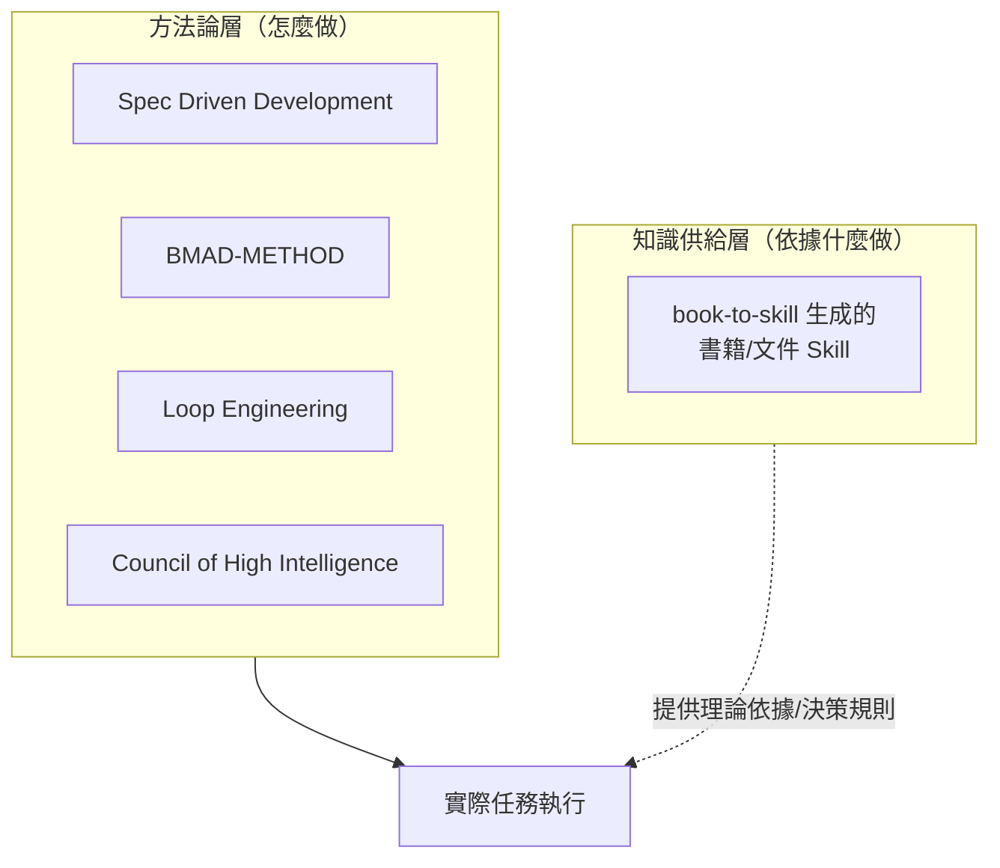

### 17.2 與 Spec Driven Development 系列方法論整合（作者建議）

參照本 repo 既有的 [OpenSpec使用教學.md](OpenSpec使用教學.md)、[spec-kit使用教學.md](spec-kit使用教學.md)、
[BMAD-METHOD使用教學.md](BMAD-METHOD使用教學.md)：這些方法論在撰寫 Spec／需求分析階段，都需要
「依據什麼做決策」的知識來源。若團隊已經把架構原則書、API 設計規範透過 book-to-skill 查詢化，
可以在 Spec 撰寫的 Prompt 範本中明確要求「先查詢對應知識庫再撰寫技術方案」，降低方案憑空想像、
與既定架構原則脫節的風險。

### 17.3 與 Multi-Agent／Council 類方法論整合（作者建議）

[Council of High Intelligence 教學手冊.md](Council%20of%20High%20Intelligence%20教學手冊.md) 這類
多 Agent 協作評審方法論中，若有「架構委員」「安全委員」等角色分工，可以讓不同角色 Agent 各自載入
對應領域的 book-to-skill Skill（架構委員載入 Clean Architecture／DDD 知識庫，安全委員載入資安
規範知識庫），讓多角色評審的意見基礎更明確可追溯，而不是所有角色共用同一套模糊的通用知識。

### 17.4 最佳實務

1. ✅ 把「方法論流程」與「知識來源」分開設計——流程負責怎麼做，Skill 負責依據什麼做。
2. ✅ 多 Agent／Council 場景中，依角色分派對應的知識庫，避免所有角色意見同質化。
3. ⚠️ 不要期待知識供給層本身能取代方法論——book-to-skill 不會自己執行 Spec 驗證或多輪評審，
   它只負責提供查詢得到的知識素材。

### 17.5 本章 Checklist 與小結

- [ ] 理解 book-to-skill 屬於「知識供給層」，與「流程方法論層」是互補而非競爭關係。
- [ ] 已規劃在既有 Spec/需求分析範本中加入「先查詢對應知識庫」的步驟。
- [ ] 若採用多 Agent／Council 類評審方法論，已規劃各角色對應的知識庫分派。

---

## 第18章 企業導入治理（Governance）

### 18.1 Governance 總覽

book-to-skill 本身是一個「純檔案系統」工具——沒有內建的版本控制、審查流程、權限管理。這代表**企業
導入時的治理，完全要靠團隊自己在它之上疊加一層**。本章整理的治理框架皆為 **作者建議**，但會盡量
綁定官方已提供的兩個真實工具（`validate_skill.py`、`scan_generated_skill.py`）作為治理流程的技術
基礎，而非憑空發明流程。

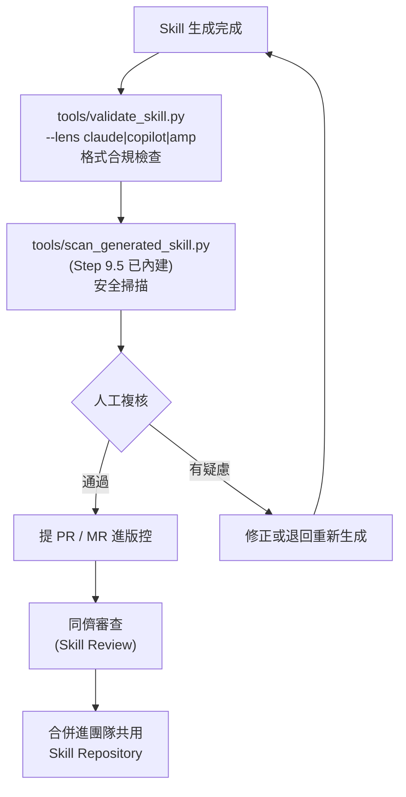

### 18.2 版本管理（Version）

book-to-skill **沒有**內建的 Skill 版本號機制——`SKILL.md` 的 frontmatter 只有 `name`／
`description`，沒有 `version` 欄位。**作者建議**：把 Skill 資料夾整個納入 Git 版本控制，用 commit
歷程與 `Generated: <YYYY-MM-DD>`（`SKILL.md` 主檔中的生成日期欄位）搭配作為版本追溯依據，而非
另外發明一套版本號規則增加複雜度。

### 18.3 Knowledge Base／Repository 存放策略

| 策略 | 適合情境 | 取捨 |
| --- | --- | --- |
| 個人技能路徑（`~/.claude/skills/`） | 個人研究、探索性試用 | 不會自動分享給團隊 |
| 專案本地（`.claude/skills/`）＋版控 | 專案專屬知識庫（架構原則、API 規範） | 隨專案 repo 走，換 repo 需重新規劃 |
| 獨立集中式 Skill Repository | 跨專案共用的知識庫（公司統一採用的 Framework、通用架構原則） | 需額外規劃跨 repo 引用機制（**作者建議**：可用 Git Submodule 或 CI 同步腳本） |

### 18.4 Review：`validate_skill.py` 深度用法

```bash
python tools/validate_skill.py ~/.claude/skills/clean-architecture --lens claude
python tools/validate_skill.py ~/.claude/skills/clean-architecture --lens copilot
python tools/validate_skill.py ~/.claude/skills/clean-architecture --lens amp
```

`--lens` 參數讓你針對不同 host 的規則檢查同一份 Skill（例如 frontmatter 格式、檔案大小上限是否
符合各 host 慣例），這是企業把 Skill 納入 PR 審查流程時最直接可用的自動化檢查點。

### 18.5 Security：`scan_generated_skill.py` 的治理角色

回顧 7.5 節，`tools/scan_generated_skill.py` 是 Step 9.5 已內建的建議性掃描，會檢查指令覆寫語句、
模型控制標籤、殘留隱藏字元、權限擴張的 frontmatter、外洩資料樣式等風險模式。**企業治理建議**：不要
只依賴 Agent 在生成當下自動跑一次就算過關，應把這支工具**也**接進 CI（第19章），確保任何被提交進
共用 Skill Repository 的檔案，即使是後來手動編輯過的，也會被重新掃描一次。

### 18.6 Compliance（合規）

- 🔒 回顧〈重要聲明〉第5點：第三方受著作權書籍衍生的 Skill 不可對外散布；公司內部文件依內部
  資料分類規範決定可分享範圍。
- 🔒 若原始文件含機密／個資，生成的 Skill 內容（尤其 Worked Example 區塊）有機會間接帶出敏感片段
  ——治理流程應要求「含機密來源文件生成的 Skill，合併前需額外一輪資料分類覆核」（**作者建議**）。

### 18.7 Audit（稽核軌跡，作者建議）

呼應 3.10 節「沒有結構化 Log」的誠實說明，企業若需要稽核軌跡，建議：

1. 要求所有 Skill 生成／更新都透過 PR 提交，Git commit 歷程本身就是最基本的稽核軌跡。
2. PR 描述模板中強制填寫：來源文件、生成時的 `BOOK_TYPE`／`DEPTH`、`validate_skill.py`／
   `scan_generated_skill.py` 執行結果。
3. 對高敏感知識庫（例如涉及風控規則、內部合規文件），額外要求記錄「是誰在什麼時候執行了轉換」，
   因為 book-to-skill 本身不會留下這筆紀錄。

### 18.8 RBAC（誠實說明：無內建機制，需依賴底層存取控制）

book-to-skill **完全沒有**角色權限控管的概念——它產出的就是一堆檔案，誰能讀、誰能寫，取決於**檔案
系統權限**與**版本控制系統的存取控制**（例如 GitHub Repository 的 Branch Protection、CODEOWNERS）。
**作者建議**的模擬 RBAC 做法：

```text
# CODEOWNERS 範例：不同主題的 Skill 由不同角色審查
.claude/skills/architecture-*/     @架構師群組
.claude/skills/security-*/         @資安團隊
.claude/skills/compliance-*/       @法遵團隊
```

### 18.9 本章 Checklist 與小結

- [ ] 已規劃 Skill Repository 的存放策略（個人／專案本地／集中式），並與團隊共識一致。
- [ ] 已把 `validate_skill.py`／`scan_generated_skill.py` 納入 PR 審查的必要檢查項。
- [ ] 已用 Git commit 歷程＋PR 模板，補足官方沒有提供的版本／稽核軌跡機制。
- [ ] 已用 CODEOWNERS 或等效機制，模擬出依主題分工的 RBAC。

---

## 第19章 CI/CD 整合

### 19.1 book-to-skill 自身的 CI（真實依據）

book-to-skill 專案自己的 `.github/workflows/` 下有三支 Workflow：

| Workflow | 用途 |
| --- | --- |
| `ci.yml` | 執行 `pytest`（`tests/` 目錄）與 `ruff check`（僅高價值規則 E9/F，語法錯誤與 pyflakes） |
| `codeql.yml` | GitHub CodeQL 靜態安全掃描 |
| `deploy-docs.yml` | 用 `mkdocs.yml` 建置並部署 `docs/` 文件站 |

`CONTRIBUTING.md` 中另提到 Bandit（Python 安全掃描，HIGH 等級為 Gate 條件）與 Zizmor（GitHub
Actions Workflow 安全掃描）作為 PR 檢查的一部分——這代表 book-to-skill 專案自己就對「文件→Context
供應鏈」的安全風險相當謹慎，與第7章討論的三道防線設計理念一致。

### 19.2 企業 CI 中的品質閘門（作者建議）

⚠️ **重要限制先說清楚**：book-to-skill 的「生成」步驟本質上是**互動式 Agent 對話**（Step 1.5、
2.5、4 都需要人類回答問題），**無法直接在無人值守的 CI 環境中跑完整生成流程**。CI 能自動化的是
**生成完成之後**的品質把關，而非生成本身：

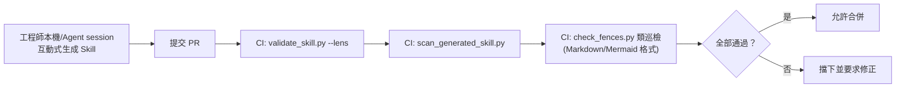

### 19.3 GitHub Actions 完整範例

```yaml
name: Validate Skills
on:
  pull_request:
    paths:
      - '.claude/skills/**'
jobs:
  validate:
    runs-on: ubuntu-latest
    steps:
      - uses: actions/checkout@v4
      - uses: actions/setup-python@v5
        with:
          python-version: '3.12'
      - name: 安裝 book-to-skill 工具鏈
        run: |
          git clone --depth 1 https://github.com/virgiliojr94/book-to-skill.git /tmp/bts
      - name: 找出本次變更的 Skill 目錄
        id: changed
        run: |
          echo "skills=$(git diff --name-only origin/main... | grep '.claude/skills/' | cut -d/ -f1-3 | sort -u)" >> "$GITHUB_OUTPUT"
      - name: 執行 validate_skill.py
        run: |
          for skill_dir in ${{ steps.changed.outputs.skills }}; do
            python /tmp/bts/tools/validate_skill.py "$skill_dir" --lens claude
          done
      - name: 執行 scan_generated_skill.py
        run: |
          for skill_dir in ${{ steps.changed.outputs.skills }}; do
            python /tmp/bts/tools/scan_generated_skill.py "$skill_dir"
          done
```

### 19.4 GitLab CI 範例

```yaml
validate-skills:
  stage: test
  image: python:3.12
  script:
    - git clone --depth 1 https://github.com/virgiliojr94/book-to-skill.git /tmp/bts
    - for d in $(git diff --name-only "$CI_MERGE_REQUEST_DIFF_BASE_SHA" | grep '.claude/skills/' | cut -d/ -f1-3 | sort -u); do
        python /tmp/bts/tools/validate_skill.py "$d" --lens claude;
        python /tmp/bts/tools/scan_generated_skill.py "$d";
      done
  rules:
    - if: $CI_PIPELINE_SOURCE == "merge_request_event"
```

### 19.5 Azure DevOps 範例

```yaml
trigger: none
pr:
  paths:
    include:
      - '.claude/skills/*'
pool:
  vmImage: 'ubuntu-latest'
steps:
  - task: UsePythonVersion@0
    inputs:
      versionSpec: '3.12'
  - script: |
      git clone --depth 1 https://github.com/virgiliojr94/book-to-skill.git /tmp/bts
      python /tmp/bts/tools/validate_skill.py .claude/skills/<changed-slug> --lens claude
      python /tmp/bts/tools/scan_generated_skill.py .claude/skills/<changed-slug>
    displayName: 'Validate & Scan Skill'
```

### 19.6 Jenkins 範例

```groovy
pipeline {
    agent any
    stages {
        stage('Setup') {
            steps {
                sh 'git clone --depth 1 https://github.com/virgiliojr94/book-to-skill.git /tmp/bts'
            }
        }
        stage('Validate Skills') {
            steps {
                sh '''
                  python3 /tmp/bts/tools/validate_skill.py .claude/skills/clean-architecture --lens claude
                  python3 /tmp/bts/tools/scan_generated_skill.py .claude/skills/clean-architecture
                '''
            }
        }
    }
}
```

### 19.7 「自動建立 Skills」的實際可行邊界（誠實說明）

原始企業導入常見期待是「CI 自動幫我把新上傳的文件轉成 Skill」。依 19.2 節的限制，**完整自動化目前
不可行**，因為生成步驟需要 Agent 互動式問答。務實的折衷做法（**作者建議**）：

1. CI 偵測到 `docs/` 新增文件時，**自動開一張 Issue／通知**提醒負責人手動執行轉換，而非嘗試自動
   跑完整 Step 0–10。
2. 若企業有能力串接支援「非互動模式」呼叫模型 API 的自製腳本（脫離官方 `SKILL.md` 互動式流程，
   自行實作一套精簡版生成邏輯），理論上可以做到全自動，但這已經是**企業自建的衍生方案**，不是
   官方 book-to-skill 提供的能力，需另行開發與維護。

### 19.8 版本管理／測試／發佈

- **版本管理**：延續 18.2 節，靠 Git commit + PR 記錄。
- **測試**：`validate_skill.py`（格式合規）＋`scan_generated_skill.py`（安全）構成最小測試組合；
  企業可再自行加上「內容抽查」（例如隨機抽取 5% 的 Q&A 讓人工核對是否忠於原文）。
- **發佈**：內部 Skill 透過合併進共用 Repository 即為「發佈」；對外分享（開源／公開）則走
  `gh skill publish`（11.7 節），發佈前務必完成 18.6 節合規檢查。

### 19.9 本章 Checklist 與小結

- [ ] 已理解「生成步驟無法無人值守自動化」的限制，CI 品質閘門聚焦在生成**之後**的驗證。
- [ ] 已依團隊使用的 CI 平台（GitHub Actions／GitLab／Azure DevOps／Jenkins）建立對應的驗證
      Pipeline。
- [ ] 已規劃「文件更新但無人手動轉換」情境下的提醒機制（Issue 通知，而非假設全自動）。

---

## 第20章 Maintenance（維運）

### 20.1 Update／Fold-in 維運週期

延續 9.5 節的機制細節，這裡聚焦**週期性維運策略**：建議為每個共用 Skill 指定一位「知識負責人」，
定期（例如每季）檢查來源文件是否有官方改版，若有則執行 Fold-in，並在 PR 描述中記錄「這次更新對應
來源文件的哪個版本」。

### 20.2 book-to-skill 本身的升級

```bash
cd ~/.claude/skills/book-to-skill
git pull origin master
```

版本演進請對照 `CHANGELOG.md`（1.2 節已整理重點版本），升級前建議先看 `CHANGELOG.md` 確認是否有
Breaking Change（例如 Step 編號調整、輸出格式變化），避免既有自動化腳本（第19章的 CI 整合）因為
規格微調而失效。

### 20.3 Backup（備份）

Skill 資料夾本質上就是一堆 Markdown 檔案，**沒有需要特別備份的資料庫或狀態**——只要團隊確實遵守
18.3 節「納入版本控制」的建議，Git 本身就是最自然的備份機制，不需要額外的備份基礎設施。

### 20.4 Migration（搬遷）

換機器／換 Host 時，Skill 搬遷就是複製資料夾：

```bash
# 從 Claude Code 搬到 Copilot CLI 共用（同一份 Skill，安裝到不同 host 路徑）
cp -r ~/.claude/skills/clean-architecture ~/.copilot/skills/clean-architecture
```

⚠️ 因為 `SKILL.md` frontmatter 刻意保持 agent-neutral（9.2 節），搬遷通常不需要修改內容本身，
但仍建議搬遷後執行一次 `validate_skill.py --lens <目標host>` 確認格式相容。

### 20.5 Troubleshooting

| 問題現象 | 排查步驟 |
| --- | --- |
| 轉換某格式一直 fallback 到最陽春的解析器 | 執行 `book-to-skill --check` 確認對應套件是否已安裝 |
| PDF 轉換完全沒有表格/程式碼結構 | 確認 Step 1.5 是否選擇了 `technical` 而非 `text` |
| Skill 裝了但 Agent 找不到 | Copilot CLI 需執行 `/skills reload`；Claude Code/Amp 需重啟 session |
| 大書轉換時間過長 / Token 超支 | 確認是否啟用 Step 2.6 的 REPL 式探針讀取（>50K tokens 書籍應自動觸發） |
| `scan_generated_skill.py` 一直回報同一類誤判 | 檢視回報的規則名稱與檔案位置，若確認是誤判，記錄在 PR 說明中並經人工核准合併 |
| `book-to-skill --help` 被當成未知旗標警告忽略 | ⚠️ **已知官方問題**（查證當下 Issue #95 開放中，修正 PR #97 尚未合併）：CLI 採手動 `sys.argv` 解析，非 `argparse`，`--help` 目前會命中「未知旗標」分支並被忽略，不會印出說明——這與 24.1 節「沒有制式 `--help` 畫面」的說明一致，可用參數請一律以本手冊第24章或原始碼為準 |
| 章節數（`chapters_detected`）異常偏高 | ⚠️ **已知官方問題**（查證當下 Issue #91 開放中，修正 PR #92 尚未合併）：部分 Markdown 前綴的西文標題可能被誤判為額外章節，導致章節計數膨脹；若 Step 3 分析結果的章節數明顯高於直覺預期，建議先用 Analyze Only 模式核對章節清單再決定是否手動修正 |

### 20.6 Monitoring／Logging（延續 3.10 節的補強建議）

因為官方沒有結構化 Log，企業層級的「監控」建議聚焦在**產出物的變化**而非**執行過程的即時監控**：

- 用 Git 歷程監看「哪些 Skill 多久沒更新過」（可能代表知識已過時，或代表這份知識庫已無人使用，
  兩種情況都值得定期複查，**作者建議**可寫一支簡單腳本掃描各 Skill 資料夾的最後 commit 時間）。
- 若團隊在 CI 中跑 19.3–19.6 節的驗證 Pipeline，CI 執行紀錄本身即是最接近「日誌」的東西。

### 20.7 Performance／Optimization

- 大書（>50K tokens）務必確認 Step 2.6 的 REPL 式探針讀取（`grep`／`sed` 取代整檔 `Read`）有被
  正確執行，這是官方文件明確指出「一份 200 頁書若每章都整檔重讀，成本會是探針式讀取的數十倍」的
  關鍵優化點。
- `technical` 模式（Docling）耗時是 `text` 模式的百倍量級（回顧 6.2 節實測），若書籍實際沒有太多
  表格／程式碼，選 `text` 模式即可大幅縮短轉換時間。
- 每章 Token 預算矩陣（9.3 節）不是越高越好——`DEPTH=study` 若沒有真正的 Worked Example 可填，
  硬灌到預算上限只會拉高之後查詢該章節的固定成本，卻沒有換來更好的答案品質。

### 20.8 本章 Checklist 與小結

- [ ] 已指定每個共用 Skill 的知識負責人，並排定定期複查週期。
- [ ] 已建立 book-to-skill 轉換器本身的升級檢查流程（`git pull` + 查看 CHANGELOG）。
- [ ] 已確認大書轉換時 Step 2.6 探針式讀取正常運作，避免不必要的 Token 浪費。

---

## 第21章 企業最佳實務（Best Practice）

### 21.1 大型企業如何使用 book-to-skill：總覽

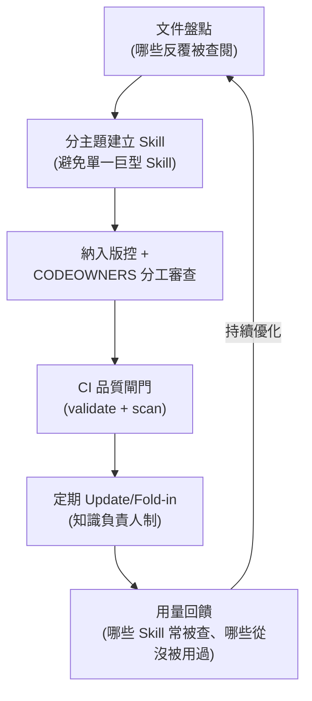

### 21.2 知識治理

延續第18章，知識治理的核心是**明確的所有權（Ownership）**——每個 Skill 都該有清楚的「這份知識庫
是誰維護的、來源文件在哪裡、上次更新是什麼時候」，而不是變成一堆「不知道誰生成的、也不確定還準不
準」的孤兒檔案。

### 21.3 文件管理

- ✅ 來源文件（PDF／DOCX 原始檔）與生成的 Skill 分開管理：原始檔案放共用文件庫（可能受額外授權
  限制，不進版控），生成的 Skill（衍生摘要）才進 Git。
- ✅ 每個 Skill 的 PR 說明中記錄「來源文件出處」，方便日後追溯與比對是否需要更新。

### 21.4 版本管理（治理原則，工具操作見19.8節）

版本管理的治理重點不是「工具」而是「規則」：多久算過期？誰有權決定要不要重新生成？改版後舊版本
是否需要保留供比對？這些規則應該寫進團隊的知識庫治理文件，而非依賴工具強制。

### 21.5 多人協作

多人同時維護同一批 Skill 時，建議：

1. 一個 Skill 對應一個負責窗口，避免多人同時 Fold-in 造成合併衝突。
2. 大幅修改（例如重新指定 `DEPTH`）前，先在團隊頻道知會，避免其他人正在進行的 Fold-in 被覆蓋。
3. `patterns.md`／`cheatsheet.md` 這類「合併多來源」的檔案最容易發生格式漂移，建議由固定 1–2 人
   把關最終格式一致性。

### 21.6 Skill Review（類似 Code Review 的審查流程）

```mermaid
flowchart LR
    Gen["生成/更新 Skill"] --> Self["自我複核：<br/>是否符合 Quality Rules 8 條"]
    Self --> Auto["自動化檢查：<br/>validate_skill.py + scan_generated_skill.py"]
    Auto --> Peer["同儕審查：<br/>內容是否忠於原文、有無過度推論"]
    Peer --> Owner["知識負責人核准"]
    Owner --> Merge["合併"]
```

Review 時建議重點檢查（**作者建議清單**）：

- [ ] Core Frameworks 是否真的是「最重要的」，而非隨意排序。
- [ ] Anti-patterns 是否有清楚說明「為什麼」而不只是「不要做」。
- [ ] Topic Index 涵蓋的主題是否貼近團隊實際會問的問題（而非書本目錄的機械翻版）。
- [ ] 有無疑似照抄原文的大段落（違反 Quality Rule #7）。

### 21.7 Quality Gate

建議把 21.6 節的 Review Checklist 與第19章的自動化檢查合併成正式的 Quality Gate，未通過不得合併
進共用 Skill Repository——這與一般程式碼的 CI Gate 精神一致，只是檢查對象從程式碼變成知識產物。

### 21.8 AI Governance

本 repo 另有 [AI 治理教學手冊.md](AI%20治理教學手冊.md) 專門處理企業 AI 治理框架，book-to-skill
相關治理應納入該更大框架下的「知識資產」類別管理，而非自成一套獨立體系——例如 AI Governance 框架
中對「AI 產出內容需標示來源／可追溯性」的要求，直接對應本章 21.3 節「記錄來源文件出處」的建議。

### 21.9 避免「知識墳場」

企業導入知識庫工具最容易失敗的模式，不是技術做不出來，而是**做出來後沒人維護、沒人查詢、最後變成
一堆沒人敢刪也沒人在用的檔案**——也就是「知識墳場」。避免方法（**作者建議**）：

1. 上線時就規劃「用量回饋」機制（21.1 節流程圖最後一步），定期檢視哪些 Skill 真的被查詢、哪些
   從未被使用過。
2. 從未被查詢過的 Skill，優先檢討「是不是一開始就選錯了轉換對象」（回顧 1.5／1.6 節「適合／不
   適合」的判斷），而不是預設它遲早會被用到。
3. 每個 Skill 都要有清楚的知識負責人，沒有負責人的 Skill 視同待汰除。

> 💡 **作者觀點**：這一點與 [reverse-skill 教學手冊.md](reverse-skill%20教學手冊.md) 第14.5節「知識
> 庫治理的常見陷阱」的結論完全一致——不論是哪一種「把知識沉澱進可查詢資產」的工具，最終決定成敗的
> 從來不是轉換技術本身，而是有沒有配套的治理與使用回饋機制。

### 21.10 本章 Checklist 與小結

- [ ] 每個共用 Skill 都有明確的知識負責人與來源文件記錄。
- [ ] 已建立 Skill Review Checklist 並整合進 Quality Gate。
- [ ] 已規劃用量回饋機制，定期清查未被使用的 Skill，避免知識墳場。
- [ ] 已將 book-to-skill 治理納入公司既有 AI Governance 框架的「知識資產」類別。

---

## 第22章 與其他工具比較

### 22.1 比較維度說明

本章比較的八個對象性質各異——有些是同屬「知識封裝」範疇的直接對手，有些是「執行期記憶」範疇的
互補工具，混為一談比較容易誤導決策。比較前先建立分類座標：

```mermaid
quadrantChart
    title 知識/記憶工具的兩個座標軸
    x-axis 查詢時（Query-time） --> 編譯時（Compile-time）
    y-axis 短期/對話記憶 --> 長期/結構化知識
    quadrant-1 長期結構化知識，編譯時處理
    quadrant-2 長期結構化知識，查詢時處理
    quadrant-3 短期記憶，查詢時處理
    quadrant-4 短期記憶，編譯時處理
    book-to-skill: [0.85, 0.9]
    傳統RAG: [0.2, 0.75]
    NotebookLM: [0.25, 0.7]
    Cognee: [0.35, 0.85]
    Context7: [0.15, 0.3]
    MCP Memory: [0.2, 0.2]
    OpenMemory: [0.25, 0.25]
    codebase-memory-mcp: [0.4, 0.6]
    Knowledge Graph: [0.5, 0.9]
```

> ⚠️ 上圖座標為作者依各工具公開定位的**主觀相對定位**，用於幫助讀者建立直覺分類，非精確測量值。

### 22.2 vs. NotebookLM

Google NotebookLM 的強項是「多來源、跨文件的問答與摘要」，介面導向、適合非工程背景使用者，可以
同時丟進數十份來源做交叉比對。book-to-skill 的強項是「產出可被 Coding Agent 直接載入使用的結構化
檔案」，深度整合進開發工作流程，但單一 Skill 通常聚焦一本書或一組緊密相關的文件。官方 FAQ 的立場
（本手冊重新表述）：如果工作流程是「我有 80 本各自獨立的書，想跨書搜尋」，NotebookLM 更合適；如果
是「我想針對一個主題或一套函式庫深入，並讓多份相關文件持續整併進同一份知識」，book-to-skill 更
合適，兩者服務的是不同形狀的需求。

### 22.3 vs. 傳統 RAG（展開 1.10 節）

| 維度 | 傳統 RAG | book-to-skill |
| --- | --- | --- |
| 索引建置 | 切塊 + Embedding，需要向量資料庫 | 一次深度分析 + 結構化 Markdown，純檔案系統 |
| 查詢方式 | 向量相似度檢索 | Topic Index（人類與 Agent 共讀的主題索引） |
| 適合規模 | 大量、持續成長的文件集（數百至數萬份） | 少量、反覆精讀的核心文件（通常個位數到十幾份） |
| 更新機制 | 增量 Embedding | Update/Fold-in（Agent 判斷合併或新增） |
| 輸出型態 | 相關片段（給模型自行綜合） | 已綜合好的框架、決策規則 |

### 22.4 vs. MCP Memory 類伺服器

MCP Memory Server（例如把對話中的事實記下來，供未來對話回顧）解決的是「這次互動中，Agent 記得
什麼」，記憶單位通常是零散的事實／偏好片段，時間尺度是對話與對話之間。book-to-skill 解決的是「一份
完整、系統性文件的知識」，時間尺度是文件本身的生命週期（可能數年），且經過作者原意的結構化萃取而
非零散事實累積。兩者可以同時存在於同一個 Agent 生態中，互不衝突（回顧第13章）。

### 22.5 vs. Context7

Context7 定位在「即時查詢最新版 Framework／函式庫官方文件」，強項是**時效性**——套件剛出新版，
Context7 能立刻反映最新 API。book-to-skill 面對的是「你已經下載、已經打算深入研讀的特定文件」，
強項是**深度與個人化**——它會把你自己買的書或公司自己的文件轉成查詢資產，這些內容通常不在
Context7 這類即時文件服務的索引範圍內（例如公司內部規範、已絕版的技術書、付費電子書）。

### 22.6 vs. Cognee

本 repo 另有 [Cognee 教學手冊.md](Cognee%20教學手冊.md) 完整介紹：Cognee 定位是 **Enterprise AI
Memory Platform & Knowledge Graph for AI Agents**，技術棧涉及 PostgreSQL（含 pgvector）／Neo4j／
SQLite 與 MCP，是一套需要部署資料庫基礎設施、面向「企業級、跨資料源、圖結構化記憶」的平台型方案。
相較之下 book-to-skill 沒有資料庫依賴、沒有 MCP 整合，是純檔案的輕量工具，兩者量級與部署複雜度
差異懸殊：

| 維度 | Cognee | book-to-skill |
| --- | --- | --- |
| 基礎設施 | 需要 PostgreSQL/pgvector 或 Neo4j 等資料庫 | 無，純檔案系統 |
| 整合協定 | MCP | Agent Skills 開放標準 |
| 知識結構 | 知識圖譜（實體與關聯） | 分層 Markdown（框架/術語/模式/決策規則） |
| 定位 | 企業級跨資料源記憶平台 | 單一文件/書籍的深度知識轉換工具 |
| 上手成本 | 較高（需部署與維運資料庫） | 極低（`git clone` 即用） |

> 💡 **作者觀點**：這組對比很適合用來說明「知識工程」領域的光譜兩端——Cognee 這類平台解決的是
> 「企業要把海量、多源、持續變動的資料變成可推理的知識圖譜」，book-to-skill 解決的是「我手上這
> 一份文件，我想讓 AI 隨查隨用」，量級差了一個數量級。企業選型時應該先問「我的知識來源是海量多源
> 的即時資料，還是有限、已知、相對穩定的文件集」，而不是單看功能表打勾比較。

### 22.7 vs. codebase-memory-mcp

本 repo 另有 [codebase-memory-mcp 教學手冊.md](../工具/codebase-memory-mcp%20教學手冊.md)：這類
工具聚焦在「程式碼庫本身」的記憶與理解（例如記住某個模組的架構決策、跨檔案的呼叫關係），資料源是
**你自己的原始碼與其變更歷史**。book-to-skill 的資料源是**外部文件**（書籍、規格書、Markdown
文件），兩者處理的知識對象完全不同——一個記的是「程式碼庫在說什麼」，一個記的是「一份文件在說
什麼」，企業內若兩者都有需求，應視為互補而非替代關係。

### 22.8 vs. OpenMemory（⚠️ 作者依公開資訊之一般性描述，非逐一查證版本細節）

OpenMemory 這類「本地優先、跨 Agent 共用的記憶層」工具，定位近似 22.4 節的 MCP Memory 類伺服器——
聚焦在讓多個不同 Agent／工具共用同一份使用者偏好與互動記憶，記憶單位同樣是零散事實而非完整文件的
結構化知識。與 book-to-skill 的差異邏輯與 22.4 節一致：一個管「記住你這個人」，一個管「消化這份
文件」。

### 22.9 vs. Knowledge Graph（通用類）

通用知識圖譜工具（不限特定廠牌）用實體（Entity）與關聯（Relationship）表示知識，強項是**多實體
間複雜關聯的推理**（例如「這個決策影響了哪些模組，這些模組又被誰依賴」這類多跳查詢）。
book-to-skill 的知識結構是**線性的分層 Markdown**（章節、術語、模式、決策規則），沒有圖結構、
沒有實體關聯推理能力，但換來的是**極低的建置與理解門檻**——不需要學圖查詢語言，任何人打開
`SKILL.md` 都能直接讀懂。兩者是「表達力 vs. 易用性」光譜的兩端。

### 22.10 綜合比較表

| 工具 | 類型 | 基礎設施需求 | 更新機制 | 最適合的知識形狀 |
| --- | --- | --- | --- | --- |
| **book-to-skill** | 文件→Skill 轉換器 | 無（純檔案） | Update/Fold-in | 窄而深：單一文件/書籍反覆查閱 |
| NotebookLM | 多文件問答助手 | 雲端服務 | 上傳新來源即可 | 廣而淺：多來源交叉問答 |
| 傳統 RAG | 檢索增強生成架構 | 向量資料庫 | 增量 Embedding | 廣而淺：大量文件模糊檢索 |
| MCP Memory | 對話記憶伺服器 | MCP Server | 持續累積事實 | 短期：對話間的零散事實 |
| Context7 | 即時文件查詢服務 | 雲端 API | 即時（上游更新即反映） | 時效性：最新 Framework/套件 API |
| Cognee | 企業記憶平台/知識圖譜 | 資料庫（PG/Neo4j） | 持續攝取多資料源 | 廣而深：企業級跨資料源推理 |
| codebase-memory-mcp | 程式碼庫記憶 | MCP Server | 隨程式碼變更更新 | 你自己的程式碼庫本身 |
| OpenMemory 類本地記憶層 | 跨 Agent 共用記憶 | 本地服務/MCP | 持續累積 | 短期：使用者偏好與互動記憶 |
| 通用 Knowledge Graph | 圖結構知識庫 | 圖資料庫 | 持續建圖 | 多實體複雜關聯推理 |

### 22.11 關鍵洞察：book-to-skill 的差異化定位

把 22.10 節的表格濃縮成一句話：**book-to-skill 是這份比較清單裡「基礎設施需求最低、但知識結構化
密度最高」的工具**——它用犧牲「廣度」（不擅長海量多源檢索、沒有圖結構推理）換取「零基礎設施、
極致查詢時 Token 效率、對單一文件的萃取深度」。企業不需要在這份清單裡選一個「贏家」，而是依知識
形狀（回顧 22.1 節座標）分別採用：需要企業級跨資料源推理找 Cognee／Knowledge Graph 類工具；需要
海量文件模糊檢索找 RAG／NotebookLM；需要對話記憶找 MCP Memory／OpenMemory 類工具；需要把「有限、
已知、值得反覆查閱」的文件變成 Agent 隨查隨用的知識，找 book-to-skill。

### 22.12 本章 Checklist 與小結

- [ ] 能依 22.1 節座標，把手上的知識工程需求歸類到正確象限。
- [ ] 能清楚說明 book-to-skill 與 Cognee／通用 Knowledge Graph 這類平台型工具的量級差異。
- [ ] 已理解「記憶類」（MCP Memory／OpenMemory）與「文件知識類」（book-to-skill）是不同時間尺度、
      不同知識單位的工具，不應互相取代。
- [ ] 已依 22.10 節綜合表，為公司現有／規劃中的知識工程工具做一次定位盤點，找出重疊與缺口。

---

## 第23章 完整案例（作者原創案例走查）

> 💡 以下四個案例為**作者依常見企業導入情境原創撰寫**，用以示範 book-to-skill 在不同產業／專案
> 階段的實際應用方式，非官方 Case Study，人物與公司名稱皆為示意。

### 23.1 案例一：保險業 Spring Boot 3→4 升級知識庫建置

#### 23.1.1 背景與任務發起

某保險公司核心保單系統採 Spring Boot，因資安合規要求需在半年內完成 Spring Boot 3 → 4 升級。
架構團隊評估後，決定先把官方 Migration Guide、`javax.*` → `jakarta.*` 對照表、公司既有的
[Spring boot 4.x升版教學.md](../framework/Spring%20boot%204.x升版教學.md) 三份文件整併成一個
Skill，讓 12 位分散在不同模組小組的工程師有一致的查詢依據，而不是各自摸索、各自解讀官方文件。

#### 23.1.2 轉換與查詢過程

```bash
/book-to-skill ~/docs/spring-boot-4-migration.pdf spring-boot-4-upgrade
# 選擇 technical（含大量程式碼對照與參數表）
# 選擇用途：套用框架 + 查閱特定章節（DEPTH=study）

/book-to-skill "d:/developer/repos/java_tutorial/.github/教學/framework/Spring boot 4.x升版教學.md" spring-boot-4-upgrade
# Update/Fold-in：併入公司內部教材，作為第二個知識來源
```

```mermaid
flowchart LR
    A["架構團隊：<br/>建立 spring-boot-4-upgrade Skill"] --> B["納入專案本地<br/>.claude/skills/"]
    B --> C["12 位工程師<br/>各自模組升級"]
    C --> D["/spring-boot-4-upgrade javax-to-jakarta"]
    C --> E["/spring-boot-4-upgrade security-config"]
    C --> F["/spring-boot-4-upgrade ch04"]
    D & E & F --> G["統一依據升級<br/>減少各自解讀落差"]
```

#### 23.1.3 效益與知識沉澱

| 指標 | 導入前 | 導入後 |
| --- | --- | --- |
| 工程師查詢升級細節的方式 | 各自搜尋官方文件／論壇 | 統一查詢同一個 Skill |
| 「javax 換 jakarta 該怎麼改」重複被問次數 | 架構團隊每週被問 5–8 次 | 降至每週 1 次以下（其餘自行查 Skill） |
| 升級規範一致性 | 各模組小組理解略有落差 | 依同一份 Skill 的 Anti-patterns／Key Takeaways 對齊 |

> 💡 **作者觀點**：這個案例的價值不在「省了多少 Token」，而在**知識口徑一致性**——12 個小組平行
> 升級時，最大的風險不是技術難度，而是「A 組理解的升級規範跟 B 組不一樣」，導致後期整合出現落差。
> 把 Migration Guide 查詢化、統一入口，本質上是用知識工程手段解決團隊協作一致性問題，這比單純的
> Token 成本節省更值得向管理層強調。

### 23.2 案例二：製造業 Legacy Java 系統現代化前的知識庫盤點

#### 23.2.1 背景與任務發起

某製造業客戶有一套維運超過十年的 Java Legacy 系統，計畫現代化前，新加入的兩位工程師需要快速理解
舊系統依賴的老舊框架（部分模組仍使用已停止維護的函式庫）與內部維運手冊。Tech Lead 決定先把「內部
維運手冊」「舊框架官方文件（v1.x 時期的封存版本）」轉成 Skill，作為新人 Onboarding 與現代化評估
的共同知識底座。

#### 23.2.2 轉換與查詢過程

```bash
/book-to-skill ~/docs/legacy-framework-v1-manual.pdf ~/docs/internal-runbook.docx legacy-system-knowledge
# 內部維運手冊含大量表格（模組地圖、版本對照），選擇 technical 模式
```

#### 23.2.3 新人 Onboarding 對照

| 階段 | 導入前 | 導入後 |
| --- | --- | --- |
| 新人第一週 | 逐頁翻閱維運手冊 PDF，理解破碎 | `/legacy-system-knowledge` 快速掌握核心框架與模組地圖 |
| 遇到不熟悉的舊 API | 詢問資深同仁（人力成本高，且知識僅存在少數人腦中） | 先查 Skill，查不到才升級詢問資深同仁 |
| 現代化評估會議 | 各自憑記憶描述舊系統行為，容易遺漏 | 依 Skill 的 Anti-patterns／Key Concepts 對齊討論基礎 |

#### 23.2.4 知識沉澱範本（團隊內部記錄格式示意）

```markdown
# Skill 更新記錄：legacy-system-knowledge

## 更新日期
2026-07-20

## 本次併入來源
內部維運手冊 v3.2（含新增的批次作業模組說明）

## 併入方式
Update/Fold-in，新增 ch09-batch-jobs.md，並更新 glossary.md 中「批次視窗」相關術語定義

## 後續待辦
現代化評估會議中提到的「訂單狀態機」邏輯，目前只存在資深同仁 D 的記憶中，
尚未有書面文件可供轉換，建議先請 D 補一份文字說明，再併入本 Skill。
```

> 💡 **作者觀點**：這個案例點出 book-to-skill 的一個現實限制——**它只能轉換「已經寫下來」的知識**。
> 遇到「只存在資深同仁腦中、從未書面化」的知識，book-to-skill 幫不上忙，唯一解法是先把這些口耳
> 相傳的知識訪談、寫下來，才有東西可以轉換。這正是知識工程領域常說的「先萃取、後結構化」——
> book-to-skill 是第二步的工具，不是第一步。

### 23.3 案例三：新創公司 Vue3 前端設計系統知識庫

#### 23.3.1 背景與任務發起

某新創公司前端團隊（8 人）維護一套跨多個產品線共用的 Vue3 元件庫與設計系統，過去設計規範散落在
Figma 註解、一份逐漸過時的 Notion 文件、以及官方 [Vue3 前端framework教學.md](../framework/Vue3%20前端framework教學.md)
之間，新加入的前端工程師經常做出不符合設計系統的元件。設計負責人決定把設計系統文件與 Vue3
Composition API 官方指南一起轉成 Skill。

#### 23.3.2 轉換與查詢過程

```bash
/book-to-skill ~/design-system/design-system-guide.pdf ~/design-system/component-principles.md vue3-design-system
# 選擇 text-heavy（設計原則以散文與少量表格為主）
```

```mermaid
sequenceDiagram
    participant Dev as 前端工程師
    participant Agent as Claude Code
    participant Skill as vue3-design-system Skill

    Dev->>Agent: 幫我做一個新的 Modal 元件
    Agent->>Skill: 查詢 /vue3-design-system modal
    Skill-->>Agent: 回傳既有 Modal 設計原則、命名慣例、無障礙要求
    Agent-->>Dev: 依設計系統規範產出元件程式碼
```

#### 23.3.3 效益

- Code Review 時，Reviewer 可直接要求 Agent「對照 `/vue3-design-system` 檢查這個元件是否符合設計
  規範」，把主觀的「風格審查」變成有依據的檢查。
- 設計負責人不再需要重複口頭講解設計原則給每個新人聽，Onboarding 時間明顯縮短。

> 💡 **作者觀點**：這個案例示範了 16.4 節提到的「Code Review 場景應用」在前端團隊的具體落地——
> 設計系統這類「主觀性高、容易各自解讀」的規範，透過查詢化，能把「風格審查」的主觀爭議降到最低，
> 這對規模還小、還沒有正式設計系統治理團隊的新創公司特別有效益。

### 23.4 案例四：SI 顧問團隊為客戶 PowerBuilder 老系統做知識移轉

#### 23.4.1 背景與任務發起

某系統整合（SI）顧問公司承接一個為期三個月的老舊 PowerBuilder 系統維運交接專案，客戶原開發團隊
即將解散，只留下一批 PowerBuilder 官方語法手冊與零散的內部文件。顧問團隊的 5 位工程師多數沒有
PowerBuilder 經驗，需要在專案初期快速建立基本理解，同時保留可供後續查詢的知識資產（而非交接完就
遺忘）。

#### 23.4.2 轉換與查詢過程

延續第14章案例走查的做法，顧問團隊將 PowerBuilder 官方語法參考與客戶提供的內部文件一併轉換，並
在專案期間持續 Fold-in 新發現的系統行為說明。

```mermaid
flowchart TD
    W1["專案週1：<br/>轉換官方語法手冊+既有文件"] --> W2["專案週2-8：<br/>邊維運邊 Fold-in 新發現"]
    W2 --> W3["專案週9-12：<br/>知識庫已相對完整"]
    W3 --> Handoff["交接給客戶接手團隊：<br/>Skill 隨程式碼一併移交"]
```

#### 23.4.3 交接效益

| 交接方式 | 傳統做法 | 搭配 book-to-skill |
| --- | --- | --- |
| 知識載體 | 一份 Word 交接文件（顧問單方面撰寫，接手方被動閱讀） | 一份可持續查詢、可持續 Fold-in 的 Skill |
| 接手團隊上手方式 | 逐頁閱讀交接文件 | 直接對 Agent 提問，Agent 查 Skill 回答 |
| 專案結束後知識是否留存 | 常見流失（交接文件被束之高閣） | 留存在版控中的 Skill，且可被接手團隊持續維護 |

> 💡 **作者觀點**：這個案例的啟示是——**book-to-skill 也適合當作「交接資產」而不只是「查詢工具」**。
> 傳統交接文件寫完就是靜態的，接手團隊往往被動閱讀；轉成 Skill 之後，接手團隊不只能查詢，還能
> 持續 Fold-in 自己後續發現的知識，讓交接資產本身在專案結束後仍能持續生長，而不是一份寫完就過時
> 的死文件。

### 23.5 四案例綜合對照

| 面向 | 案例一（保險業升級） | 案例二（製造業 Legacy） | 案例三（新創設計系統） | 案例四（SI 交接） |
| --- | --- | --- | --- | --- |
| 對應核心章節 | 第15、19章 | 第14、20章 | 第16章 | 第14、20章 |
| 主要使用者 | 12 位工程師平行升級 | 2 位新人 Onboarding | 8 人前端團隊 | 5 位顧問工程師 |
| 知識來源 | 官方 Migration Guide+內部教材 | 舊框架文件+維運手冊 | 設計系統文件+官方指南 | 官方語法手冊+內部文件 |
| 主要效益 | 團隊知識口徑一致 | 降低資深同仁被打斷頻率 | Code Review 客觀化 | 交接資產可持續生長 |
| 最大啟示 | 一致性價值大於 Token 節省 | 只能轉換「已寫下來」的知識 | 適合處理主觀性規範 | 可當作持續生長的交接資產 |

### 23.6 本章 Checklist 與小結

- [ ] 已從四個案例中找出與自身情境最接近的一個，作為導入 PoC 的參考藍本。
- [ ] 理解 book-to-skill 只能轉換「已經書面化」的知識，未書面化的知識需要先訪談萃取。
- [ ] 已評估是否能把 book-to-skill 生成的 Skill 用於交接／Onboarding 場景，而不只是日常查詢。

---

## 第24章 完整 CLI 指令大全

> 📌 本章所有指令均依官方原始碼（`book_to_skill/utils.py`、`SKILL.md`、`tools/*.py`）核校，
> 而非官方 `--help` 輸出（book-to-skill 的 CLI 解析採手動 `sys.argv` 解析，而非 `argparse`，
> 因此沒有制式 `--help` 畫面，實際可用旗標以本章列表為準）。

### 24.1 三層 CLI 入口總覽

```mermaid
flowchart TD
    L1["/book-to-skill<br/>(Agent Skill 斜線指令，見24.7)"] --> P1["完整 10 步驟流程<br/>含互動問答"]
    L2["book-to-skill 或<br/>python -m book_to_skill<br/>(pip 獨立 CLI)"] --> P2["純文字擷取，<br/>無互動、無 Skill 產出"]
    L3["scripts/extract.py<br/>(Agent Skill 內部薄殼層)"] --> P2
```

### 24.2 pip 獨立 CLI：`book-to-skill`

```bash
book-to-skill <path-or-glob>... [--mode technical|text] [--install-missing ask|yes|no] [--no-install-missing]
book-to-skill --check
python -m book_to_skill <path-or-glob>... [同上參數]
```

| 參數 | 說明 |
| --- | --- |
| `<path-or-glob>...` | 位置參數，可一次給多個檔案／資料夾／glob（例如 `"~/books/*.epub"`），會依格式各自解析後合併輸出 |
| `--mode technical` | 內容類型為技術書（程式碼/表格/公式），優先使用 Docling |
| `--mode text` | 內容類型為文字為主的書（**預設值**），優先使用 pdftotext 等快速工具 |
| `--install-missing ask` | 缺少選用套件時詢問是否安裝（互動情境預設行為） |
| `--install-missing yes` | 缺少選用套件時自動安裝 |
| `--install-missing no` | 缺少選用套件時直接使用 fallback，不安裝、不詢問 |
| `--no-install-missing` | 等效於直接略過安裝提示，使用 fallback |
| `--check` | 印出每種格式目前可用的擷取工具與缺少套件的安裝指令，**不處理任何檔案**，其餘參數會被忽略 |

⚠️ 未知旗標不會讓程式中止——`utils.py` 的解析邏輯遇到無法辨識的 `--xxx` 只會印出警告
（`WARNING: Unknown flag '--xxx' — ignoring it.`）並繼續執行，這代表打錯字的參數**不會**讓你
及時發現，執行後務必檢查 stderr 輸出確認參數確實被正確吃進去。

```bash
# 範例：多來源合併，技術模式，缺套件時自動安裝
book-to-skill ~/papers/paper1.pdf ~/notes/export.txt --mode technical --install-missing yes unified-research

# 範例：批次處理整個資料夾
book-to-skill ~/workspace/project-docs/ --mode text

# 範例：glob 模式（注意用引號包住避免被 shell 提前展開）
book-to-skill "~/books/*.epub" --mode text

# 範例：安裝環境健檢
book-to-skill --check
```

### 24.3 `scripts/extract.py`（Agent Skill 內部薄殼層）

參數與 24.2 節完全相同，差別只在呼叫方式——這是 `SKILL.md` Step 2 內部實際呼叫的腳本，供已安裝
Agent Skill（而非 pip 套件）的使用者間接使用：

```bash
python3 scripts/extract.py ~/books/mybook.pdf --mode technical --install-missing ask
python3 scripts/extract.py --check
```

### 24.4 `tools/discovery_tax.py`：Token 成本量測工具

```bash
python3 tools/discovery_tax.py --full-text /tmp/book_skill_work/full_text.txt --target-chapter 5
```

| 參數 | 說明 |
| --- | --- |
| `--full-text <path>` | 指向已擷取出的 `full_text.txt`（Step 2 的輸出） |
| `--target-chapter <N>` | 模擬「只問第 N 章相關問題」時，三種讀取策略（整本塞入／Discovery Loop／book-to-skill）各自的 Token 成本 |

用途：在自己的書上重現第1章的 24–51 倍／2.4–15.6 倍效益量測，作為向管理層報告 ROI 的量化依據。

### 24.5 `tools/validate_skill.py`：格式合規驗證

```bash
python3 tools/validate_skill.py <skill目錄路徑> --lens claude
python3 tools/validate_skill.py <skill目錄路徑> --lens copilot
python3 tools/validate_skill.py <skill目錄路徑> --lens amp
```

| 參數 | 說明 |
| --- | --- |
| `<skill目錄路徑>` | 位置參數，指向已生成的 Skill 資料夾（含 `SKILL.md`） |
| `--lens claude\|copilot\|amp` | 依指定 Host 的規則檢查該 Skill 是否合規 |

企業 CI 中最常用的自動化檢查點，第19章已提供完整 GitHub Actions／GitLab CI／Azure DevOps／Jenkins
範例。

### 24.6 `tools/scan_generated_skill.py`：安全掃描

```bash
python3 tools/scan_generated_skill.py <skill目錄路徑>
```

Step 9.5 已內建自動呼叫此工具；企業 CI 中應**額外**單獨呼叫一次，涵蓋「生成完成後又被人工編輯過」
的情境（回顧 18.5 節）。回傳非 0 時代表發現疑慮，需人工複查。

### 24.7 Agent Skill 斜線指令：`/book-to-skill`（各 Host 內使用）

```text
/book-to-skill <path-to-document-folder-or-glob>... [skill-name-slug]
```

| 範例 | 效果 |
| --- | --- |
| `/book-to-skill ~/book.pdf` | 完整轉換流程，Skill 名稱由 Agent 提議 |
| `/book-to-skill ~/book.pdf my-slug` | 完整轉換流程，指定 Skill 名稱為 `my-slug` |
| `/book-to-skill ~/new.pdf existing-slug` | 觸發 Update/Fold-in（因 `existing-slug` 已存在） |
| `/my-slug` | 日常查詢：載入該 Skill 核心框架 |
| `/my-slug <主題詞>` | 日常查詢：依主題索引找到並讀取對應章節 |
| `/my-slug ch05` | 日常查詢：直接載入第 5 章 |
| `/my-slug "what chapters do you have?"` | 列出完整章節索引 |

### 24.8 CLI Cheat Sheet 總表

| 目的 | 指令 |
| --- | --- |
| 環境健檢 | `book-to-skill --check` |
| 純文字擷取（腳本化） | `book-to-skill <path> --mode text` |
| 技術書擷取（腳本化） | `book-to-skill <path> --mode technical` |
| 完整轉換（Agent 內） | `/book-to-skill <path> [slug]` |
| 更新既有 Skill | `/book-to-skill <new-path> <existing-slug>` |
| 量測 Token 節省效益 | `python3 tools/discovery_tax.py --full-text <path> --target-chapter <N>` |
| CI 格式驗證 | `python3 tools/validate_skill.py <skill_dir> --lens <claude\|copilot\|amp>` |
| CI 安全掃描 | `python3 tools/scan_generated_skill.py <skill_dir>` |
| Copilot CLI 技能重新載入 | `/skills reload`（於 copilot session 內） |
| 發佈 Skill（Copilot 生態） | `gh skill publish <skill目錄路徑>` |

### 24.9 本章 Checklist 與小結

- [ ] 已理解未知旗標不會中止執行，養成執行後檢查 stderr 輸出的習慣。
- [ ] 已將 24.8 節 Cheat Sheet 存放在團隊內部知識庫或 Wiki，供日常查閱。
- [ ] 已練習過至少一次 `discovery_tax.py`，能拿出量化數字向管理層說明導入效益。

---

## 第25章 FAQ

> 本章共 112 題，依主題分為八類。答案已重新以繁體中文組織並補充企業實務脈絡，非逐句翻譯官方 FAQ。

### 25.1 基礎概念（Q1–Q15）

**Q1：book-to-skill 到底是什麼？**
一個把書籍／文件轉成 AI Agent 可查詢「Skill」的轉換器，輸出遵循開放 Agent Skills 標準，Claude
Code、Copilot CLI、Amp 都能用。

**Q2：它跟直接把 PDF 丟給 AI 讀有什麼不同？**
直接丟 PDF 每次對話都要重新支付整份文件的 Token 成本；book-to-skill 先做一次結構化萃取，之後
查詢只載入常駐核心＋需要的章節，成本大幅降低（回顧 1.4 節）。

**Q3：什麼是 Discovery Loop Tax？**
指 AI Agent 直接讀 PDF 時，因反覆探索目錄、往回翻頁而產生、且每輪對話都重複計費的隱性 Token
成本。

**Q4：Claude 現在有 1M token 的上下文視窗了，還需要這個工具嗎？**
需要——大視窗只是讓「塞整本書」變得可能，不代表划算：Token 仍要按次計費、模型在近滿的 context
中回憶特定內容的精準度會下降、而且整本原文仍是模型每輪要重新解析的非結構化文字。

**Q5：這是不是就是 RAG？**
不是。RAG 在查詢時做相似度檢索；book-to-skill 在編譯時做一次深度分析，產出具名框架與決策規則，
兩者運作時機與輸出本質都不同（回顧 1.10 節）。

**Q6：很多書 Claude 訓練資料裡本來就有，還需要轉換嗎？**
訓練資料中的知識是壓縮、平均化的，可能記錯引用或章節位置；book-to-skill 從你自己的實體副本萃取，
每個框架名稱與章節編號都有據可查，對冷門書、內部文件、翻譯版尤其關鍵。

**Q7：NotebookLM 不是也能做類似的事？**
NotebookLM 強在多來源交叉問答；book-to-skill 強在產出可被 Coding Agent 直接載入使用的結構化
檔案，深度整合進開發工作流程（回顧 22.2 節）。

**Q8：book-to-skill 是免費的嗎？**
是，MIT License，程式碼與規格文件本身免費且可商用，但這不代表你餵入的書籍內容版權也隨之開放
（回顧〈重要聲明〉第5點）。

**Q9：它支援哪些語言的文件？**
文字擷取本身語言中立；章節偵測自 v1.2.0 起支援多語系標題格式（阿拉伯數字、羅馬數字、CJK、韓文、
泰文等），繁體中文技術書通常能正常運作。

**Q10：book-to-skill 跟 Burp/CTF 這類滲透測試工具有關係嗎？**
沒有直接關係，它是純文件轉換工具；若需要程式碼／二進位層級的逆向工程分析，可搭配本 repo另一份
[reverse-skill 教學手冊.md](reverse-skill%20教學手冊.md) 涵蓋的工具（回顧第14章）。

**Q11：「Skill」跟「Prompt」有什麼不同？**
Prompt 通常是單次指示；Skill 是打包好的完整知識＋使用指引，可被 Agent 重複載入使用，且有明確的
按需載入章節結構。

**Q12：這份手冊和官方 README 有什麼不同？**
官方 README 是產品文件；本手冊是重新組織過的企業教育訓練教材，加入架構圖、比較表、企業案例與
最佳實務，並明確區分官方事實與作者延伸建議。

**Q13：導入 book-to-skill 的第一步該做什麼？**
先依 1.5／1.6 節判斷手上文件是否屬於「反覆查閱」情境，再挑 1–2 份最常被問的文件做 PoC，而不是
一次把所有文件都轉換。

**Q14：一定要用 Claude Code 才能用嗎？**
不必，GitHub Copilot CLI、Amp 官方同樣支援；其他工具需自行驗證（回顧第12章）。

**Q15：中小企業資源有限，適合導入嗎？**
適合，它沒有基礎設施成本（純檔案系統），`git clone` 即可開始，是知識工程工具中上手門檻最低的
選項之一。

### 25.2 安裝與環境（Q16–Q30）

**Q16：安裝需要哪些前置條件？**
Python ≥3.9、Git；PDF/EPUB/DOCX 等格式建議另裝對應選用套件（回顧第4、6章）。

**Q17：pip install 跟 git clone 有什麼不同？**
`pip install` 只裝文字擷取引擎（無 `/book-to-skill` 指令）；`git clone` 進技能目錄才能取得完整
Agent Skill 流程（回顧 4.1 節）。

**Q18：Windows 上 pdftotext 抓不到怎麼辦？**
需另外安裝 poppler for Windows 並確認加入 PATH，否則會自動 fallback 到 `pypdf`／`pdfminer.six`
（回顧 4.2 節）。

**Q19：WSL 跟原生 Windows 混用會有問題嗎？**
技能路徑建議統一放在 WSL 檔案系統內，避免跨檔案系統路徑不一致導致 Agent 找不到技能（回顧 4.5
節）。

**Q20：需要 Docker 嗎？**
官方沒有提供 Dockerfile，非必要；企業若想容器化擷取環境（例如統一 Docling 依賴），需自行建置
（作者建議範疇，見4.6節相關討論）。

**Q21：可以用 uv 安裝嗎？**
可以，`book-to-skill` 是標準 `pyproject.toml` 套件，與 `uv pip install`／`uvx` 相容（回顧 4.8
節，作者建議）。

**Q22：離線環境怎麼安裝？**
先在有網路的環境下載 wheel 檔與 repo，打包搬進內網後用 `pip install --no-index --find-links=...`
安裝（回顧 4.10 節）。

**Q23：docling 在離線環境下能用嗎？**
需先在連網環境完整跑過一次觸發模型下載，再把模型快取一併打包搬移，否則會直接 fallback 失敗。

**Q24：企業內網有 Proxy，安裝會受影響嗎？**
只有安裝階段（`pip install`／`git clone`）需要網路，設定標準 `HTTP_PROXY`／`HTTPS_PROXY` 或
`git config` Proxy 即可；轉換執行階段完全離線（回顧 4.11 節）。

**Q25：Node.js 需要裝嗎？**
不需要，book-to-skill 是純 Python 專案。

**Q26：Calibre 一定要裝嗎？**
只有需要處理 MOBI／AZW／AZW3 格式時才需要，其餘格式不受影響。

**Q27：安裝後 Claude Code 沒偵測到新技能怎麼辦？**
Claude Code／Amp 需要重啟 session；Copilot CLI 需手動執行 `/skills reload`（回顧 4.6、11.1
節）。

**Q28：可以同時裝在多個技能路徑嗎？**
可以，例如同時裝在 `~/.claude/skills/` 與專案本地 `.claude/skills/`，但要留意兩邊各自生成的
Skill 不會自動同步。

**Q29：`--check` 指令看不到某個套件的安裝狀態怎麼辦？**
先確認該格式是否在 `SUPPORTED_EXTENSIONS`（第3.8節）範圍內，若在範圍內仍看不到，以官方最新
`--check` 輸出為準（工具持續迭代中）。

**Q30：升級 book-to-skill 本身安全嗎？**
建議先看 `CHANGELOG.md` 確認有無 Breaking Change，尤其若企業已把 CLI 參數寫進自動化腳本（回顧
20.2 節）。

### 25.3 使用與操作（Q31–Q48）

**Q31：轉換一本書大概要多久？**
`text` 模式通常數秒到數十秒；`technical` 模式（Docling）約每頁 1.5 秒，加上 Agent 生成階段的
對話時間（回顧 6.2 節實測）。

**Q32：轉換要花多少 Token／多少錢？**
Step 2.5 會先給預估（輸入／輸出 Token 與粗估時間），實際費用依當下模型定價換算，官方範例約
每本書 1 美元量級（回顧官方 README 實測表格，1.2 節有引用）。

**Q33：technical 跟 text 模式該怎麼選？**
書裡有程式碼、表格、公式就選 technical；純散文選 text；不確定就選「不確定」，系統會用快速模式
並視情況提醒品質限制（回顧 2.5 節）。

**Q34：DEPTH=study 跟 DEPTH=reference 差在哪？**
study 深度含 Worked Example、框架操作步驟更詳細；reference 深度精簡、省略 Worked Example，
適合純查閱情境（回顧 8.2 節）。

**Q35：可以先分析不生成嗎？**
可以，回答「先分析」觸發 Analyze Only 模式，只產出結構化萃取報告（回顧 2.6 節 Mode 2）。

**Q36：一次可以丟多份文件嗎？**
可以，位置參數支援多個檔案／資料夾／glob，會合併成單一 Skill。

**Q37：怎麼更新已經生成好的 Skill？**
指向既有 Skill 資料夾或已存在的 slug 名稱，觸發 Update/Fold-in（Mode 4，回顧 9.5 節）。

**Q38：Update/Fold-in 會不會把舊內容洗掉？**
不會，機制設計成合併／新增，既有章節可被修訂但不會被無來由整份覆寫（除非使用者主動選擇
「Overwrite」）。

**Q39：怎麼查某本書有哪些章節？**
在 Agent 對話中問 `/<slug> "what chapters do you have?"`，會列出完整章節索引。

**Q40：可以指定生成到某個路徑嗎？**
可以，Step 5 會探測並讓使用者選擇 `SKILLS_HOME`（個人／專案本地路徑），或直接指向想要的路徑。

**Q41：轉換過程中我可以中途取消嗎？**
可以（一般 Agent 對話的中止機制），但已寫入的暫存檔（`full_text.txt`）需自行清理，或等下次
Step 10 自動清除。

**Q42：Skill 名稱有命名規則嗎？**
建議 `{作者姓氏}-{核心概念}`（如 `cialdini-influence`）或書名轉小寫連字號格式，Step 5 會提供
兩種選項。

**Q43：同一個 Skill 名稱已存在會怎樣？**
系統會提示三選一：Update/Fold-in、Overwrite（整份重建）、或 Rename（改用不同 slug）。

**Q44：生成完後如何驗證品質？**
人工檢查 `SKILL.md` 的 Core Frameworks 是否精準、跑 `validate_skill.py` 確認格式合規、跑
`scan_generated_skill.py` 確認安全性（回顧 18.4、18.5 節）。

**Q45：能不能只生成 glossary，不要完整 Skill？**
官方標準流程沒有這個選項，四個支援檔案（chapters/glossary/patterns/cheatsheet）是一起生成的
（Mode 1/3）；若只想要萃取報告，改用 Mode 2（Analyze Only）。

**Q46：一本書可以拆成多個 Skill 嗎？**
可以，手動分批指定不同章節範圍／不同 slug 分開轉換，但官方流程預設是整本書一個 Skill。

**Q47：Skill 檔案可以手動編輯嗎？**
可以，這只是一堆 Markdown 檔案；但手動編輯後建議重新跑一次 `scan_generated_skill.py` 確認未
引入風險內容。

**Q48：查詢時 Agent 一定會讀對章節嗎？**
取決於 Topic Index 寫得好不好（回顧 Quality Rule #8）與當次模型的判斷能力，寫得潦草的索引會
增加誤判機率。

### 25.4 格式與解析（Q49–Q60）

**Q49：支援哪些格式？**
PDF、EPUB、DOCX、TXT、Markdown、reStructuredText、AsciiDoc、HTML、RTF、MOBI/AZW/AZW3（回顧
6.1 節）。

**Q50：掃描版 PDF（圖片型）可以用嗎？**
不行，book-to-skill 不含 OCR，需先自行做 OCR 前處理轉成可選取文字（回顧 6.9 節）。

**Q51：PDF 解析不出表格怎麼辦？**
確認是否選了 `technical` 模式並成功使用 Docling；`pdftotext` 本質上不保留表格結構。

**Q52：EPUB 沒有 ebooklib 會怎樣？**
自動 fallback 到標準函式庫 `zipfile`，仍可運作但排版還原度較低。

**Q53：DOCX 有安全風險嗎？**
`parsers/docx.py` 內建 XXE／Billion-Laughs 防護，解析前會檢查是否宣告 DTD／實體（回顧 7.5
節）。

**Q54：RTF 品質不好怎麼辦？**
安裝 `striprtf` 套件，未安裝時的正規表示式 fallback 對複雜排版還原度有限。

**Q55：MOBI 檔案為什麼需要另外裝軟體？**
因為需要 Calibre 的 `ebook-convert` 這個外部應用程式，不是純 Python 套件可以取代的。

**Q56：純 Markdown 文件轉換品質最好嗎？**
是，因為完全不需要格式轉換，直接讀取，還原度最高、速度最快。

**Q57：章節切不出來怎麼辦？**
確認書籍是否使用規則化標題格式（回顧 7.2 節），若只有無編號篇名，需人工指定段落範圍。

**Q58：多個來源合併時順序會亂嗎？**
使用者明確指定的檔案順序會被保留；資料夾／glob 展開的結果則會依路徑排序，確保重複執行結果一致。

**Q59：一個來源解析失敗會影響其他來源嗎？**
不會，`ExtractionError` 設計為 batch-safe，失敗來源會被跳過並記錄警告，其餘來源正常處理（回顧
3.11 節）。

**Q60：文件裡的圖片會被轉進 Skill 嗎？**
不會，book-to-skill 不做圖片內容辨識，只有格式本身保留的圖說文字可能被連帶擷取（回顧 7.4 節）。

### 25.5 安全與合規（Q61–Q72）

**Q61：文件會被上傳到雲端嗎？**
不會，Extractor 完全在本機執行；模型處理（Generator 半部）發生在你當下的 host agent session
中，資料流向取決於該 host 的資料政策，與 book-to-skill 本身無關。

**Q62：文件裡藏了惡意 Prompt 怎麼辦？**
`sanitize.py` 會剝除零寬字元與 Unicode tag block 這類常見隱藏注入手法（回顧 7.5 節），但這是
「建議性防護」，不是絕對保證，敏感來源仍建議人工抽查。

**Q63：轉換出的 Skill 本身安全嗎？**
Step 9.5 有內建 `scan_generated_skill.py` 建議性掃描，發現風險時會要求人工複查再繼續使用。

**Q64：可以把生成的 Skill 分享給別人嗎？**
公司內部自有文件依內部授權範圍可分享；第三方受著作權書籍衍生的 Skill 不可對外散布（回顧
〈重要聲明〉第5點）。

**Q65：book-to-skill 本身的授權是什麼？**
MIT License，僅適用於轉換器程式碼與規格文件本身，不涉及使用者輸入文件的著作權。

**Q66：機密文件可以拿來轉換嗎？**
技術上可以（完全本機處理），但生成的 Skill 內容可能間接帶出敏感片段，企業應在治理流程中對高敏感
來源加一輪額外覆核（回顧 18.6 節）。

**Q67：CI 中的安全檢查夠嗎？**
`scan_generated_skill.py` 是模式比對的建議性掃描，不是萬用的語意安全保證，仍需搭配人工審查與
明確的資料分類規範。

**Q68：DOCX 的 XXE 防護原理是什麼？**
解析前先檢查 XML 內容是否宣告 DTD 或外部實體，一旦發現就直接拒絕解析，而非嘗試安全地解析。

**Q69：subprocess 呼叫外部工具會有指令注入風險嗎？**
book-to-skill 在呼叫 `pdftotext`／`pdfinfo`／`ebook-convert` 前會把檔案路徑絕對化，避免
`-` 開頭的檔名被誤判成命令列旗標。

**Q70：安全掃描的規則會不會誤判？**
可能會，設計上採「寧可誤判、也不要漏判」的保守策略，回報時只給規則名稱與位置，交由人工判斷是否
接受。

**Q71：CodeQL／Bandit／Zizmor 是什麼？**
這是 book-to-skill 專案自己在 CI 中使用的三種安全掃描工具，分別對應通用靜態分析、Python 安全
掃描、GitHub Actions Workflow 安全掃描（回顧 19.1 節）。

**Q72：受金融監理的企業可以用嗎？**
技術上可以（本機處理、無外部依賴），但務必依 18.6、〈重要聲明〉第5點完成法遵／智財審查，並建立
第18章的治理流程再正式導入。

### 25.6 企業導入與治理（Q73–Q88）

**Q73：導入第一步該做什麼？**
挑 1–2 份最常被查詢的文件做 PoC，量測導入前後的查詢效率與知識口徑一致性差異（回顧 23.1 節案例）。

**Q74：需要專職團隊維護嗎？**
不需要專職團隊，但每個共用 Skill 都該有明確的知識負責人（回顧 21.2 節）。

**Q75：怎麼避免知識墳場？**
建立用量回饋機制，定期複查未被查詢的 Skill，並確保每個 Skill 都有負責人（回顧 21.9 節）。

**Q76：Skill 要不要納入版本控制？**
強烈建議，這是彌補官方沒有內建版本機制的最務實做法（回顧 18.2 節）。

**Q77：可以做到 RBAC 權限控管嗎？**
book-to-skill 本身沒有 RBAC，需依賴底層檔案系統／Git 存取控制（如 CODEOWNERS）模擬（回顧
18.8 節）。

**Q78：CI 可以全自動生成 Skill 嗎？**
不行，生成步驟需要 Agent 互動式問答，CI 只能自動化生成**之後**的驗證與掃描（回顧 19.7 節）。

**Q79：怎麼稽核誰生成了哪個 Skill？**
官方沒有內建稽核 Log，建議透過 PR 流程＋PR 模板記錄來源文件與生成參數（回顧 18.7 節）。

**Q80：多團隊共用時知識庫怎麼整合？**
建議依主題拆成多個 Skill、搭配集中式 Skill Repository 與 CODEOWNERS 分工審查（回顧 18.3、
18.8 節）。

**Q81：怎麼評估團隊是否「準備好」導入？**
先確認團隊有真的存在「反覆查閱同一份文件」的痛點（回顧 1.5 節），而非為了導入而導入。

**Q82：導入失敗最常見的原因是什麼？**
轉換了不會被反覆查詢的文件（1.6 節限制），或沒有指定知識負責人導致變成知識墳場（21.9 節）。

**Q83：需要額外採購商用工具嗎？**
不需要，book-to-skill 本身開源免費，唯一可能的額外成本是選用擴充套件（如 Docling）與 host
agent 本身的訂閱費用。

**Q84：導入後多久能看到效益？**
PoC 階段（1–2 份文件）通常一週內可看到查詢效率差異；團隊知識口徑一致性這類質化效益，通常需要
一個完整專案週期才能明顯感受到（回顧 23.1 節案例）。

**Q85：怎麼向管理層報告導入效益？**
用 `tools/discovery_tax.py` 量測實際 Token 節省數字（回顧 24.4 節），搭配 23 章案例中的質化
效益（知識口徑一致、Onboarding 時間縮短）一併呈現。

**Q86：新進成員怎麼快速上手？**
參照本手冊第30章附錄的新進成員 Checklist，並優先閱讀第1、4、10、24、25 章。

**Q87：需要另外買 Docling 授權嗎？**
不需要，`docling` 是開源 Python 套件，`pip install docling` 即可。

**Q88：企業版有沒有額外的付費支援？**
官方沒有提供企業版或付費支援方案，book-to-skill 是社群維護的開源專案，企業導入前應評估這點對
long-term 可持續性的影響（回顧〈重要聲明〉第1點）。

### 25.7 與其他工具比較（Q89–Q98）

**Q89：跟 Cognee 比要選哪個？**
需求是「企業級跨資料源知識圖譜」選 Cognee；需求是「單一文件深度查詢」選 book-to-skill（回顧
22.6 節）。

**Q90：跟 MCP Memory 是互斥的嗎？**
不互斥，一個管對話記憶，一個管文件知識，可以同時用（回顧 13.3、22.4 節）。

**Q91：跟 Context7 選哪個查最新 API？**
查最新版套件 API 用 Context7；查你自己買的書／公司內部文件用 book-to-skill（回顧 22.5 節）。

**Q92：跟 codebase-memory-mcp 有重疊嗎？**
沒有，一個管程式碼庫本身的記憶，一個管外部文件知識，資料源完全不同（回顧 22.7 節）。

**Q93：需要向量資料庫嗎？**
不需要，這正是它與 RAG 類方案最大的基礎設施差異（回顧 1.11 節）。

**Q94：跟 OpenMemory 這類本地記憶層工具比呢？**
定位類似 MCP Memory，管的是零散互動記憶，與 book-to-skill 管理完整文件知識的時間尺度與知識
單位都不同（回顧 22.8 節）。

**Q95：Knowledge Graph 工具能取代它嗎？**
不能直接取代，Knowledge Graph 擅長多實體關聯推理，book-to-skill 擅長把單一文件轉成易懂的線性
分層知識，兩者定位在「表達力 vs. 易用性」光譜的兩端（回顧 22.9 節）。

**Q96：企業已經有 RAG 系統了還需要它嗎？**
視情況——若 RAG 系統主要處理海量、持續變動的文件集，兩者可以並存，各自處理不同形狀的知識需求
（回顧 1.10 節「互補而非替代」）。

**Q97：跟 NotebookLM 可以一起用嗎？**
可以，NotebookLM 適合前期多來源探索比對，找到值得深入的核心文件後，再用 book-to-skill 建立
日常開發用的查詢資產。

**Q98：怎麼判斷該用哪一種知識工具？**
依 22.1 節的座標軸（查詢時 vs 編譯時、短期記憶 vs 長期結構化知識）判斷你的需求落在哪個象限。

### 25.8 疑難排解（Q99–Q112）

**Q99：轉換失敗顯示 ExtractionError 怎麼辦？**
檢查是否為單一來源解析失敗（batch-safe 機制會跳過並記錄警告），查看 stderr 訊息確認具體原因。

**Q100：`--mode` 打錯字會怎樣？**
若值不是 `technical` 或 `text`，會被強制設回預設值 `text`，不會直接報錯中止，建議執行後檢查
`metadata.json` 中的 `extraction_mode` 欄位確認實際生效值。

**Q101：Skill 裝了但斜線指令打不出來？**
Claude Code／Amp 需重啟 session；Copilot CLI 需 `/skills reload`（回顧 25.2 節 Q27）。

**Q102：轉換完但找不到章節檔案？**
確認 `SKILLS_HOME` 是否被正確探測／指定（回顧第9.5、24.7節），有時因多個候選路徑存在導致寫入
位置與預期不同。

**Q103：Update/Fold-in 後索引沒更新？**
確認流程是否完整跑完「重新生成 SKILL.md」這一步（9.5 節 Update/Fold-in Workflow 第 5 步），
若中途被中斷可能只完成部分合併。

**Q104：Docling 轉換卡住很久？**
確認頁數與硬體資源，Docling 在純 CPU 環境下速度約每頁 1.5 秒，大部頭技術書可能需要數十分鐘，
屬正常現象（回顧 6.2 節）。

**Q105：`validate_skill.py` 報錯但看起來格式沒問題？**
確認 `--lens` 參數是否對應正確的目標 Host，不同 Host 的規則不同，同一份 Skill 在某個 lens 下
合規、在另一個 lens 下不一定合規。

**Q106：`scan_generated_skill.py` 一直誤判同一段內容？**
記錄該規則名稱與位置，經人工確認為誤判後，在 PR 說明中註記並人工核准合併（回顧 20.5 節）。

**Q107：多語系章節偵測抓不到中文章節標題？**
確認標題格式是否為規則化樣式（如「第五章」），純敘述性標題（無編號）目前無法保證自動偵測。

**Q108：轉換出來的 Token 數跟預估差很多？**
Step 2.5 的預估是概估值（依 0.75 字/token 概估係數與經驗公式），實際生成受模型行為影響會有
落差，屬正常範圍。

**Q109：pip 裝的 CLI 跟 Agent Skill 版本不一致怎麼辦？**
兩者是獨立安裝路徑，版本可能不同步；建議兩邊都定期執行 `git pull`／`pip install --upgrade`
保持在同一個版本基準。

**Q110：`BOOK_SKILL_WORKDIR` 設定了但沒生效？**
確認環境變數是在執行 Agent session 的**同一個** shell／環境中設定，跨終端機視窗設定不會互相
繼承。

**Q111：離線環境轉換 PDF 一直失敗？**
確認 poppler／pypdf／pdfminer 等套件是否已離線安裝完整（回顧 4.10 節），並執行 `--check`
確認實際偵測到的可用工具。

**Q112：找不到本章提到的某個指令或路徑，跟我實際安裝的版本不一樣？**
呼應〈重要聲明〉第1點，book-to-skill 仍在快速迭代，請以當下實際安裝版本的 `SKILL.md`／
`docs/ARCHITECTURE.md` 為準，並考慮回報或參考官方 Issue／Discussions。

### 25.9 本章 Checklist

- [ ] 已把本章 112 題 FAQ 整理進團隊內部 Wiki，作為新人自助查詢的第一層資源。
- [ ] 遇到本章未涵蓋的問題時，已知道優先查官方 `SKILL.md`／`docs/ARCHITECTURE.md`，而非憑印象
      臆測。

---

## 第26章 常見錯誤（55個）

> 每個錯誤依「原因」「分析」「解法」「最佳作法」四段整理，方便團隊直接對照排查與制定內部規範。

### 26.1 安裝與環境類（錯誤 1–8）

**錯誤 1：混淆 pip 安裝與 Agent Skill 安裝**

- 原因：以為 `pip install book-to-skill` 就能得到 `/book-to-skill` 斜線指令。
- 分析：pip 套件只提供文字擷取引擎，不會註冊 Agent 指令，執行後找不到斜線指令就誤判安裝失敗。
- 解法：依 4.1 節先確認自己要哪一種安裝路徑，需要斜線指令務必 `git clone` 進技能目錄。
- 最佳作法：內部安裝手冊明確拆成兩段，避免新人混用。

**錯誤 2：只抓單一 `SKILL.md` 而非整個 repo**

- 原因：官方提供的對話式安裝指令只給了 `SKILL.md` 的 raw 連結，誤以為抓這一份就夠。
- 分析：`SKILL.md` 依賴 `scripts/extract.py` 與 `book_to_skill/` 套件，只有主檔會導致 Step 2
  找不到擷取腳本而失敗。
- 解法：一律用 `git clone` 完整安裝，對話式安裝僅作為輔助（回顧 4.6 節）。
- 最佳作法：CI／內部文件一律只列出 `git clone` 指令，不推廣對話式單檔安裝。

**錯誤 3：Windows 上沒裝 poppler 卻預期 pdftotext 速度**

- 原因：不清楚 pdftotext 是外部工具而非 Python 內建。
- 分析：未安裝時會 fallback 到 `pypdf`／`pdfminer.six`，速度與還原度都有落差，卻誤以為是
  book-to-skill 本身效能不佳。
- 解法：依 4.2 節安裝 poppler for Windows 並確認 PATH。
- 最佳作法：安裝腳本中加入 `book-to-skill --check` 自我驗證步驟。

**錯誤 4：離線環境沒有預先打包 Docling 模型快取**

- 原因：只打包了 wheel 檔，忽略 Docling 依賴的模型檔案需另外下載快取。
- 分析：內網環境下 `technical` 模式會直接 fallback 失敗，卻誤以為是網路問題。
- 解法：連網環境先完整跑過一次 Docling 觸發下載，再把快取一併打包（回顧 4.10 節）。
- 最佳作法：離線安裝包清單中明確列出模型快取目錄，並附驗證腳本。

**錯誤 5：多個技能路徑重複安裝但版本不同步**

- 原因：個人與專案本地路徑各自 `git clone`，之後只更新其中一邊。
- 分析：不同路徑的 book-to-skill 版本落差，可能導致行為不一致、難以除錯。
- 解法：團隊約定「以哪個路徑為主」，其餘路徑改用軟連結或定期同步腳本。
- 最佳作法：CI 中加入版本一致性檢查（比對各路徑 `pyproject.toml` 版本號）。

**錯誤 6：WSL 與原生 Windows 混用技能路徑**

- 原因：技能安裝在 `/mnt/c/...` 這類跨檔案系統路徑。
- 分析：Claude Code 在 WSL 與 Windows 兩端可能各自找不到一致的技能目錄。
- 解法：統一約定技能安裝在 WSL 原生檔案系統內（回顧 4.5 節）。
- 最佳作法：內部文件明確標註「不要跨掛載點安裝技能」。

**錯誤 7：忽略 `--check` 的警告訊息**

- 原因：只看指令有沒有跑完，沒細讀輸出內容。
- 分析：`--check` 明確列出缺少套件與安裝指令，忽略它會導致後續轉換品質不如預期卻不知原因。
- 解法：安裝完成後務必執行並閱讀完整 `--check` 輸出。
- 最佳作法：把 `--check` 輸出納入安裝驗收清單的一部分。

**錯誤 8：Proxy 環境下只設定 pip 沒設定 git**

- 原因：以為兩者共用同一組代理設定。
- 分析：`git clone` 走的是獨立的 Proxy 設定機制，只設 `HTTP_PROXY` 環境變數對 Git 不一定生效。
- 解法：另外設定 `git config --global http.proxy`（回顧 4.11 節）。
- 最佳作法：內部安裝文件把 pip 與 git 的 Proxy 設定分開列出，避免遺漏。

### 26.2 轉換與生成類（錯誤 9–18）

**錯誤 9：跳過 Step 1.5 內容類型判斷、直接預設 text 模式**

- 原因：急著趕快看到結果，隨便選一個選項。
- 分析：技術書用 text 模式會漏掉表格與程式碼結構，事後才發現要重跑一次，浪費更多時間。
- 解法：轉換前先花 10 秒判斷書籍性質，不確定時參考 6.2 節的實測數據取捨。
- 最佳作法：團隊內建立「常見文件類型 → 建議模式」對照表，減少每次重新判斷。

**錯誤 10：對明顯是散文的書堅持用 technical 模式**

- 原因：誤以為 technical 模式「品質比較好」，能選就選。
- 分析：純散文書用 Docling 只會白白多等，卻沒有表格／程式碼可供多還原的價值。
- 解法：依 6.2 節取捨表選擇，散文優先 text 模式。
- 最佳作法：把兩種模式的耗時差異數字（0.1 秒 vs 每頁 1.5 秒）直接寫進團隊操作指南。

**錯誤 11：Update/Fold-in 時選成「Overwrite」導致既有內容遺失**

- 原因：三個選項介面相似，操作時沒看清楚就選錯。
- 分析：Overwrite 會整份重建，先前累積的 Fold-in 內容全部消失。
- 解法：不確定時一律先選 Update/Fold-in，需要重建再另外明確選 Overwrite。
- 最佳作法：重要 Skill 在 Overwrite 前，先手動備份既有資料夾（Git 版控下即為天然備份）。

**錯誤 12：一次把 80 份不相關文件塞進同一個 Skill**

- 原因：貪圖方便，想一次搞定所有文件。
- 分析：Topic Index 會變得極度龐雜，Agent 難以準確導航到正確章節（違反 Quality Rule #8）。
- 解法：依主題拆成多個 Skill（回顧 16.5 節），而非追求單一巨型知識庫。
- 最佳作法：建立「一個 Skill 對應一個明確主題」的團隊規範。

**錯誤 13：DEPTH 選了 study 但書籍內容太薄，硬灌 Worked Example**

- 原因：誤以為 study 深度「一定要」塞滿 Token 預算。
- 分析：違反 Quality Rule #3 密度優先，硬湊出來的 Worked Example 品質低落，甚至可能開始編造
  內容。
- 解法：讓內容密度決定深度，內容真的薄就讓它低於預算，而非強迫灌水（回顧 9.3 節但書）。
- 最佳作法：Review 時把「有無明顯灌水痕跡」列為檢查項（回顧 21.6 節 Checklist）。

**錯誤 14：忽略 Step 2.5 的成本預估，直接放著跑到底**

- 原因：急著看結果，跳過確認步驟。
- 分析：大型文件集若預估成本異常（例如遠超預期），錯過提前發現的機會，事後才驚訝於實際花費。
- 解法：養成每次都看過 Step 2.5 預估再確認的習慣。
- 最佳作法：高成本轉換（預估 Token 數超過團隊自訂門檻）要求先取得主管或知識負責人確認再執行。

**錯誤 15：大書（>50K tokens）沒有觸發 REPL 式探針讀取**

- 原因：Agent 在某些情境下仍選擇整檔 `Read`，而非用 `grep`／`sed` 探針式讀取。
- 分析：導致生成成本遠高於預期，甚至可能超出單次對話的 Context 限制（回顧 20.7 節）。
- 解法：轉換大書時明確在對話中提醒 Agent 依 Step 2.6 使用探針式讀取。
- 最佳作法：內部操作指南針對「超過 200 頁的書」加註特別提醒。

**錯誤 16：轉換多來源時來源順序造成誤解**

- 原因：不清楚使用者指定順序與資料夾/glob 展開順序的規則不同。
- 分析：合併後的 `full_text.txt` 來源順序若與預期不同，可能影響 Step 3 結構分析對「哪個是主要
  來源」的判斷。
- 解法：多來源合併前，先確認 25.4 節 Q58 的順序規則，必要時分開單獨轉換再手動 Fold-in。
- 最佳作法：重要的多來源合併，先用 Analyze Only 模式確認結構辨識結果符合預期再正式生成。

**錯誤 17：忽略「無 ToC 偵測到」的警告**

- 原因：`full_text.txt` 產出時的 WARN 訊息容易被忽略。
- 分析：沒有目錄時，Step 3 只能依標題掃描判斷章節，可能漏抓或重複偵測章節。
- 解法：看到此警告時，Step 3 結果需要更仔細的人工複核。
- 最佳作法：CI／腳本化流程中把此 WARN 訊息額外標記出來，提醒後續人工複核。

**錯誤 18：對已存在的 slug 誤觸發全新轉換而非 Fold-in**

- 原因：使用不同大小寫或些微不同的 slug 名稱，系統誤判為新 Skill。
- 分析：導致同一主題出現兩份重複的 Skill，造成 Topic Index 混亂。
- 解法：轉換前先確認既有 Skill 清單，slug 命名保持一致（回顧 9.5 節 Fold-in 機制）。
- 最佳作法：團隊維護一份「現有 Skill 清單＋對應 slug」的共用表格，避免命名衝突。

### 26.3 格式與解析類（錯誤 19–26）

**錯誤 19：把掃描版 PDF 直接丟給 book-to-skill**

- 原因：不清楚工具不含 OCR。
- 分析：擷取結果幾乎是空白或亂碼，Step 1 甚至可能因無有效文字內容而失敗。
- 解法：先用 OCR 工具（如 Tesseract、Adobe Acrobat OCR）轉成可選取文字再輸入（回顧 6.9 節）。
- 最佳作法：轉換前用文字編輯器打開 PDF 抽出的文字快速確認是否可選取，而非直接送整批。

**錯誤 20：RTF 複雜排版直接用正規表示式 fallback**

- 原因：沒安裝 `striprtf`。
- 分析：正規表示式硬剝除格式碼，對巢狀樣式／內嵌物件還原度差，容易產生殘留格式碼污染內容。
- 解法：安裝 `striprtf` 套件（回顧 6.6 節）。
- 最佳作法：批次處理大量 RTF 前，先用 `--check` 確認套件已安裝。

**錯誤 21：MOBI 檔案沒裝 Calibre 就期待能轉換**

- 原因：誤以為所有格式都能靠 pip 套件解決。
- 分析：MOBI/AZW/AZW3 沒有 pip fallback，缺少 Calibre 會直接失敗。
- 解法：安裝 Calibre 並確認 `ebook-convert` 在 PATH 中（回顧 6.7 節）。
- 最佳作法：企業內網若無法安裝 GUI 應用程式，改請使用者預先轉檔為 EPUB。

**錯誤 22：DOCX 來源含巨集或外部連結卻未經安全檢視**

- 原因：假設所有內部文件都是「安全」的。
- 分析：即使有 XXE 防護，仍建議對來源不明的 DOCX 保持警覺（回顧 7.5 節防線設計精神）。
- 解法：對外部或不明來源 DOCX，維持既有的病毒掃描／巨集停用等基本資安措施再輸入。
- 最佳作法：把「文件來源分類（內部/外部）」納入轉換前的檢核清單。

**錯誤 23：忽略「一個來源提取失敗」的警告，誤以為全部失敗**

- 原因：對 batch-safe 機制不熟悉，看到任何 WARNING 就以為整個流程失敗。
- 分析：實際上其餘來源仍正常處理完成，過度反應可能導致不必要的重跑。
- 解法：確認錯誤訊息是否明確標示為「某個來源被跳過」而非「全部失敗」（回顧 3.11 節）。
- 最佳作法：內部操作指南說明 batch-safe 機制，避免誤判。

**錯誤 24：HTML 來源含大量導覽列/廣告雜訊未經清理**

- 原因：直接把整個網頁另存 HTML 輸入。
- 分析：`beautifulsoup4` 解析主要抽取文字內容，但雜訊過多時仍可能拉低 Step 3 結構分析的準確度。
- 解法：優先使用「文章擷取」過的乾淨 HTML，或改用官方文件本身提供的 PDF/Markdown 版本。
- 最佳作法：網頁來源優先順序：官方 Markdown/PDF > 手動清理過的 HTML > 原始網頁另存 HTML。

**錯誤 25：文字為主的書卻期待 Reference Tables 區塊有內容**

- 原因：不清楚 `Reference Tables` 區塊僅在 `BOOK_TYPE=technical` 才會產生。
- 分析：text 模式生成的章節檔案本來就會省略此區塊，誤以為是生成失敗或遺漏。
- 解法：確認自己選用的模式是否對應期待的輸出區塊（回顧 9.3 節模板條件）。
- 最佳作法：內部教學文件明確標註哪些區塊只在特定模式下出現。

**錯誤 26：多語言混排文件的章節偵測失準**

- 原因：書籍同時混雜多種語言的章節標題格式。
- 分析：多語系偵測（v1.2.0 起）雖支援多種格式，但混排情境仍可能造成部分章節誤判或漏判。
- 解法：偵測結果異常時，改用 Analyze Only 模式先確認結構分析結果，必要時人工指定章節邊界。
- 最佳作法：多語言文件優先考慮拆成單語言檔案分別轉換，再用 Fold-in 合併。

### 26.4 Skill 品質與內容類（錯誤 27–36）

**錯誤 27：Core Frameworks 塞了太多不重要的細節**

- 原因：捨不得刪減，想把所有內容都放進最前面。
- 分析：違反 Quality Rule #5「前置最重要內容」，稀釋了真正關鍵框架的能見度，且容易超出 4,000
  tokens 上限被截斷。
- 解法：只保留全書最重要的 2,000 tokens 級框架，其餘留給對應章節檔案。
- 最佳作法：Review 時明確問「如果只能留 3 個框架，會是哪 3 個」，用這個問題篩選內容。

**錯誤 28：Topic Index 只是機械式複製書本目錄**

- 原因：偷懶直接照抄章節標題當主題索引。
- 分析：使用者實際查詢用語（如「replication」「重試機制」）常與書本正式標題用詞不同，導致
  Agent 導航失準（違反 Quality Rule #8）。
- 解法：主題索引應該用「使用者實際會問的關鍵詞」撰寫，而非書本章節標題的機械翻版。
- 最佳作法：生成後，實際用團隊常見問法測試查詢，確認能導航到正確章節。

**錯誤 29：Anti-patterns 只寫「不要做」沒寫「為什麼」**

- 原因：追求簡短。
- 分析：沒有原因說明，使用者難以判斷該規則的適用邊界，容易錯誤套用或忽略。
- 解法：每條 Anti-pattern 都要求補上「為什麼會失敗」（回顧 21.6 節 Review Checklist）。
- 最佳作法：把「有無說明原因」列入 Skill Review 的硬性檢查項。

**錯誤 30：Worked Example 疑似照抄原書大段落**

- 原因：Agent 在生成時偷懶直接複製，而非重建。
- 分析：直接違反 Quality Rule #7，同時也帶來版權風險（回顧〈重要聲明〉第5點）。
- 解法：Review 時比對 Worked Example 與原文的相似度，發現疑似照抄要求重新生成。
- 最佳作法：把「原文比對」納入敏感／重要 Skill 的強制 Review 步驟，而非僅憑信任。

**錯誤 31：glossary.md 術語定義過於冗長**

- 原因：把整段解釋都塞進術語表。
- 分析：違反格式規範（`**術語** — 定義 (Ch N)` 應為一句話），也容易超出 1,500 tokens 上限。
- 解法：要求每個術語定義控制在一句話內，詳細說明留給對應章節。
- 最佳作法：抽查 glossary.md 中最長的 5 條定義，確認沒有超出格式規範。

**錯誤 32：cheatsheet.md 寫成另一份術語表**

- 原因：不理解 cheatsheet 與 glossary 的差異（回顧 2.3 節知識分層）。
- 分析：失去 cheatsheet 最有價值的「決策邏輯」定位，變成重複內容。
- 解法：檢查 cheatsheet 每一行是否符合「幫助讀者做決策」而非「查術語」（回顧 9.4 節）。
- 最佳作法：把 8.4 節六種知識形態表格印出來，Review 時逐條對照落點是否正確。

**錯誤 33：Connects To 區塊只是形式，沒有實質關聯說明**

- 原因：為了填滿模板欄位而填寫，未真正思考章節間關聯。
- 分析：削弱了 Skill 作為「結構化知識」而非「章節堆疊」的價值。
- 解法：要求每個 Connects To 條目都寫出「為什麼相關」而非只列章節編號。
- 最佳作法：生成後隨機抽 3 個章節檢查 Connects To 品質。

**錯誤 34：Frameworks Introduced 隨意改寫作者原始命名**

- 原因：Agent 認為改寫後的名稱「更好懂」。
- 分析：直接違反 Quality Rule #2，破壞可追溯性，日後對照原書會出現名詞對不上的困惑。
- 解法：Review 時對照原書確認框架命名一致（回顧 8.3 節）。
- 最佳作法：對高頻引用的框架名稱，建立團隊共識的「不可竄改清單」。

**錯誤 35：Key Takeaways 寫成書本摘要而非行動指南**

- 原因：混淆「摘要」與「Key Takeaways」的定位。
- 分析：違反 Quality Rule #4 實踐者口吻，應寫「當 X 時做 Y」而非「本書提到 X」。
- 解法：Review 時檢查每條 Takeaway 是否為可直接行動的指引。
- 最佳作法：Review Checklist 增加一條：「這條 Takeaway 拿去用，讀者知道下一步該做什麼嗎？」

**錯誤 36：完全不做任何人工抽查就直接上線使用**

- 原因：信任生成流程「應該沒問題」。
- 分析：即使有 Quality Rules 與掃描工具，Agent 生成品質仍會波動，完全不抽查是最常見的失敗根因。
- 解法：至少對 Core Frameworks 與 1–2 個代表性章節做人工抽查再正式納入共用知識庫。
- 最佳作法：把「人工抽查」列為 Skill Review 流程的強制步驟，而非選配（回顧 21.6 節）。

### 26.5 安全與合規類（錯誤 37–44）

**錯誤 37：忽略 Step 9.5 掃描結果直接使用**

- 原因：趕時間，看到掃描跑完就直接用，沒細看結果。
- 分析：一旦掃描回報非 0，代表存在需要人工複查的疑慮，直接忽略等於繞過了唯一的安全把關點。
- 解法：養成「掃描結果非 0 一律停下複查」的紀律（回顧 7.5 節）。
- 最佳作法：把掃描結果檢查納入 CI Gate（回顧 19.3 節範例），避免依賴人的自律。

**錯誤 38：對外散布基於受著作權書籍生成的 Skill**

- 原因：不清楚 MIT License 只適用轉換器本身。
- 分析：可能構成著作權侵權（回顧〈重要聲明〉第5點）。
- 解法：對外分享前先確認來源文件授權狀態。
- 最佳作法：`gh skill publish` 前建立強制性的授權確認 Checklist（回顧 11.7 節）。

**錯誤 39：機密文件生成的 Skill 未經資料分類就合併進共用庫**

- 原因：沒有把「知識庫治理」與公司既有的資料分類規範連動。
- 分析：機密內容可能透過 Worked Example 等區塊間接外洩給不該存取的人。
- 解法：含機密來源的 Skill，合併前需經額外資料分類覆核（回顧 18.6 節）。
- 最佳作法：CODEOWNERS 中把含機密內容的 Skill 目錄，額外指定資安/法遵審查者。

**錯誤 40：以為 sanitize.py 能防禦所有 Prompt Injection 手法**

- 原因：對防護機制的涵蓋範圍有過高期待。
- 分析：`sanitize.py` 針對的是零寬字元／Unicode tag block 這類已知手法，不是萬用防禦，新型態
  注入手法仍可能繞過。
- 解法：不明來源的高敏感文件，仍建議額外人工抽查生成結果（回顧 7.5 節企業導入重點）。
- 最佳作法：資安團隊定期關注新型態文件式 Prompt Injection 手法，評估是否需要額外防護層。

**錯誤 41：CI 中的安全掃描結果沒有人看**

- 原因：把 CI Gate 當成「跑過就過」的形式檢查。
- 分析：即使自動化了檢查，若沒有人真正審視回報內容，等於白做（回顧 18.5 節）。
- 解法：CI 失敗時應強制指派給明確的負責人處理，而非允許直接略過重跑。
- 最佳作法：CI 規則設定為「掃描發現問題時，PR 無法合併，除非有人明確標記已複核」。

**錯誤 42：把稽核軌跡完全交給 Git commit，沒有額外記錄關鍵參數**

- 原因：以為「有進版控」就等於「有稽核紀錄」。
- 分析：commit 本身不會記錄當次使用的 `BOOK_TYPE`／`DEPTH`／掃描結果，稽核時資訊不完整。
- 解法：PR 模板強制填寫這些資訊（回顧 18.7 節）。
- 最佳作法：對高敏感知識庫額外要求記錄「執行者」與「執行時間」。

**錯誤 43：跨國企業忽略不同地區的資料在地化規範**

- 原因：只考慮技術可行性，未諮詢法遵。
- 分析：某些地區對「AI 處理內部文件」有額外的資料在地化或跨境傳輸規範，即使 book-to-skill 本身
  本機執行，host agent 若為雲端服務仍可能涉及跨境傳輸。
- 解法：導入前諮詢法遵確認 host agent（而非 book-to-skill 本身）的資料處理是否符合當地規範。
- 最佳作法：把這類法遵確認納入第18章企業導入的前置檢查清單。

**錯誤 44：資安掃描規則誤判後，直接停用整個 Step 9.5**

- 原因：因誤判頻繁而感到不耐，選擇乾脆關掉檢查。
- 分析：因噎廢食，失去了唯一的自動化安全把關機制。
- 解法：針對具體誤判規則個別調整處理方式（例如標記已知誤判），而非整層停用。
- 最佳作法：把誤判案例回報給官方 Issue，同時保留 Step 9.5 持續運作。

### 26.6 企業導入與治理類（錯誤 45–55）

**錯誤 45：一開始就想把所有文件全部轉換**

- 原因：求快、求全，希望一次到位。
- 分析：缺乏 PoC 階段的效益驗證，容易做出大量沒人查詢的 Skill，提早陷入知識墳場（回顧 21.9
  節）。
- 解法：先選 1–2 份高頻查閱文件做 PoC，驗證效益後再擴大（回顧 25.6 節 Q73）。
- 最佳作法：導入計畫明確分 PoC → Pilot → 部門級 → 企業級四階段推進。

**錯誤 46：沒有指定任何 Skill 的知識負責人**

- 原因：以為「知識庫」不需要像程式碼一樣有明確 Owner。
- 分析：沒有負責人的 Skill 最終多半淪為孤兒檔案，沒人更新也沒人敢刪（回顧 21.2、21.9 節）。
- 解法：每個共用 Skill 上線時就指定負責人，並記錄在對應的治理文件中。
- 最佳作法：負責人異動時，交接流程明確包含「移交知識庫維護責任」這一項。

**錯誤 47：誤以為導入 book-to-skill 就不需要 MCP／RAG**

- 原因：把不同定位的知識工程工具視為互斥選項。
- 分析：導致企業在真正需要海量檢索或執行期記憶的場景，硬用 book-to-skill 湊合，效果不佳（回顧
  第22章比較）。
- 解法：依 22.1 節座標軸正確定位需求，而非用單一工具解決所有知識工程問題。
- 最佳作法：企業 AI 工具選型會議固定納入「知識形狀分析」步驟，避免單一工具迷思。

**錯誤 48：期待 CI 能全自動生成 Skill**

- 原因：把 book-to-skill 誤解為與一般 Build 工具相同的全自動化流程。
- 分析：生成步驟需要互動式問答，強行全自動化只會卡在等待輸入的步驟（回顧 19.7 節）。
- 解法：CI 聚焦在生成後的驗證與掃描，生成本身仍由人透過 Agent session 互動完成。
- 最佳作法：導入評估簡報中明確標示「CI 能做什麼、不能做什麼」，避免管理層期待落差。

**錯誤 49：多團隊各自建立同一份文件的 Skill，缺乏協調**

- 原因：沒有集中式的 Skill 清單或治理機制。
- 分析：造成重複勞動、內容不一致，甚至同一份 Migration Guide 出現三個版本不同的 Skill。
- 解法：建立集中式 Skill Repository 與清單，轉換前先查是否已有人做過（回顧 18.3 節）。
- 最佳作法：內部入口網站／Wiki 維護一份「現有 Skill 索引」，供全公司查詢避免重複。

**錯誤 50：把 Skill Review 簡化成「跑完自動化工具就算過」**

- 原因：低估內容品質審查的必要性。
- 分析：自動化工具（`validate_skill.py`／`scan_generated_skill.py`）只檢查格式與安全風險模式，
  不檢查內容是否忠於原文、是否真的有用（回顧 21.6、21.7 節）。
- 解法：Review 流程必須包含人工內容審查，不能只靠自動化工具把關。
- 最佳作法：Review Checklist 明確區分「自動化檢查項」與「人工審查項」兩類。

**錯誤 51：把 book-to-skill 導入當成一次性專案而非持續維運**

- 原因：把「建好知識庫」誤當成專案終點。
- 分析：文件會持續更新，沒有持續維運機制的知識庫很快就會過時、失去信任（回顧第20章）。
- 解法：導入計畫從一開始就要包含維運階段的資源規劃，而非只規劃建置階段。
- 最佳作法：知識負責人制度搭配定期複查週期，正式納入團隊的例行工作項目。

**錯誤 52：忽視官方專案仍在快速迭代的事實，把介面/路徑寫死**

- 原因：把當下版本的行為當成永久不變的規格。
- 分析：CI 腳本、內部文件若寫死特定版本的參數或路徑，日後升級可能直接失效（回顧〈重要聲明〉
  第1點）。
- 解法：CI 腳本中明確記錄當下依賴的版本號，升級前先看 CHANGELOG 確認相容性。
- 最佳作法：內部文件標註「本文件核校版本」，並排定定期複查更新。

**錯誤 53：導入評估只看技術可行性，沒有評估開源專案的可持續性**

- 原因：忽略 book-to-skill 是社群維護、無官方付費支援的事實。
- 分析：若專案未來停止維護，企業需要有應變方案（例如自行 Fork 維護），高敏感 long-term 應用
  前應納入這個風險評估（回顧 25.6 節 Q88）。
- 解法：導入評估報告中明確納入「開源專案可持續性風險」一項。
- 最佳作法：對關鍵應用場景，考慮企業內部保留一份 Fork 作為風險緩解措施。

**錯誤 54：把所有產業（銀行/新創）都套用同一套導入節奏**

- 原因：直接照搬其他公司或其他產業的導入時程。
- 分析：受監理產業（銀行、保險、政府）需要的法遵前置作業，遠比一般 SaaS/新創公司繁複，統一套用
  同一節奏容易造成合規風險或時程失控（第28章詳述）。
- 解法：依產業特性調整導入節奏與治理強度，而非一套流程走天下。
- 最佳作法：導入計畫的甘特圖明確標示「法遵前置作業」這個受監理產業特有的階段。

**錯誤 55：完成導入後從未回頭檢視是否真的達成當初設定的效益目標**

- 原因：專案結案後精力轉向下一個任務，缺乏回顧機制。
- 分析：無法確認導入是否真的划算，也難以說服管理層繼續投入資源擴大導入範圍。
- 解法：導入 PoC／Pilot 結束後，正式產出一份效益回顧報告（可用第24章 discovery_tax.py 數字＋
  質化回饋）。
- 最佳作法：把「導入後 3 個月效益回顧」設為導入計畫的正式里程碑，而非可有可無的附加動作。

### 26.7 本章 Checklist

- [ ] 已將 55 個常見錯誤依類別整理進團隊內部規範文件，作為 Skill Review 與導入評估的參考依據。
- [ ] 針對本公司最可能發生的前 10 個錯誤，已制定對應的預防機制（而非等錯誤發生才補救）。

---

## 第27章 Prompt Engineering：如何寫出高品質 Skill

### 27.1 如何對 book-to-skill 下指令

轉換品質很大程度取決於你在互動問答階段（Step 1.5／2.5／4）給出的資訊是否明確：

| 提問時機 | 含糊的回答 | 明確的回答 |
| --- | --- | --- |
| Step 1.5 內容類型 | 「都可以」 | 明確判斷「這本書有大量程式碼範例，選 technical」 |
| Step 4 使用目的 | 「隨便」 | 「我需要查特定章節做參考，選項 3」→ 自動推導 `DEPTH=reference` |
| Skill 命名 | 讓系統隨意產生 | 依團隊慣例明確指定 slug，避免命名衝突（回顧錯誤 18） |

### 27.2 如何建立高品質 Skill：把 Quality Rules 變成團隊寫作規範

第8章已重新詮釋官方 8 條 Quality Rules，這裡把它們轉成可直接檢查的寫作規範：

```mermaid
flowchart TD
    R1["Rule 1: 萃取結構"] --> C1["檢查: 有無具名框架，<br/>而非只是章節重述？"]
    R2["Rule 2: 保留精確用語"] --> C2["檢查: 專有名詞是否<br/>與原書一致？"]
    R3["Rule 3: 密度優先"] --> C3["檢查: 是否有明顯灌水/<br/>湊字數的段落？"]
    R4["Rule 4: 實踐者口吻"] --> C4["檢查: 是否用<br/>'當X時做Y'句型？"]
    R5["Rule 5: 前置最重要內容"] --> C5["檢查: Core Frameworks<br/>是否真的最重要？"]
    R7["Rule 7: 絕不照抄原文"] --> C7["檢查: 是否有大段<br/>與原文高度相似的內容？"]
    R8["Rule 8: Topic Index<br/>是導航關鍵"] --> C8["檢查: 索引用詞是否貼近<br/>使用者實際查詢習慣？"]
```

### 27.3 如何建立大型 Knowledge：分主題整併策略

企業要把大量文件（例如整個技術文件庫）轉成 Skill 時，避免第26章錯誤12「一次塞 80 份不相關文件」
的陷阱，建議的整併策略：

1. **先分群，再轉換**：依主題（架構、API、測試、維運）把文件分群，一群對應一個 Skill。
2. **核心文件優先**：每群中挑出最權威、最常被引用的 1–2 份文件先轉換，建立 Skill 骨架，再用
   Fold-in 逐步併入其餘文件。
3. **持續回饋調整分群**：若某個 Skill 的 Topic Index 開始變得龐雜難以維護（回顧 Quality Rule
   #8），代表該考慮進一步拆分。

### 27.4 如何避免 Hallucination（幻覺）

book-to-skill 的架構設計本身就內建了幾道降低幻覺的機制，理解這些機制能幫助團隊在使用與 Review
時對症下藥：

| 機制 | 降低哪種幻覺 |
| --- | --- |
| Quality Rule #7（絕不照抄原文，但也不可捏造） | 防止生成內容偏離原書實際內容 |
| Step 2.6 REPL 式探針讀取 | 確保 Agent 是依實際文字內容（`grep` 驗證框架真的被提及）生成，而非憑印象腦補 |
| 保留完整 `full_text.txt` 於磁碟 | 任何生成內容都可回頭核對原文，這是「壓縮但可追溯」設計理念的核心（回顧 1.3 節） |
| Quality Rule #2（保留精確用語） | 避免改寫過程中悄悄變造框架定義 |
| Worked Example 要求「重建而非照抄」 | 平衡「不可捏造」與「不可照抄」兩個看似矛盾的要求 |

> 💡 **作者觀點**：值得注意的是，`SKILL.md` Step 2.6 提到一個具體的驗證動作——`grep -c -i
> "westrum\|dora" "$FULL_TEXT_PATH"`，也就是**在寫進 SKILL.md 之前，先用 grep 確認這個框架真的
> 在原文中被提及**。這是一個很小但很關鍵的細節：把「這個框架真的存在於原文嗎」從「靠模型記憶／
> 信任」變成「可以用一行指令驗證」，這種「用確定性工具驗證語意判斷結果」的手法，值得企業自己寫
> 內部 Prompt 規格時借鏡。

### 27.5 本章 Checklist 與小結

- [ ] 團隊已把 8 條 Quality Rules 轉成可執行的 Review Checklist（回顧 27.2 節對照表）。
- [ ] 大量文件轉換前已規劃分群策略，避免單一巨型 Skill。
- [ ] 已理解 Step 2.6 的 grep 驗證手法，並在 Review 高風險內容時要求類似的可追溯驗證。

---

## 第28章 企業導入建議（依產業）

### 28.1 銀行業

核心考量：法遵先行、資料不可外流。導入建議聚焦內部文件（風控規範、核心系統維運手冊）而非對外
分享；治理強度採第18章最高規格（CODEOWNERS、CI Gate、法遵覆核）；PoC 建議從非核心系統的內部
Runbook 開始（回顧 23.4 節案例精神）。

### 28.2 保險業

核心考量：與銀行業類似但法遵框架不同（保險業特有的商品條款、核保規範）。適合場景：把保單條款
與核保手冊查詢化，輔助核保人員快速查閱條款細節；導入前務必依〈重要聲明〉第5點確認條款文件本身
的內部授權範圍（回顧 23.1 節案例即以保險業為背景）。

### 28.3 政府部門

核心考量：採購流程與資安規範通常比一般企業更嚴格，且對「開源、無官方付費支援」的專案（回顧
25.6 節 Q88）需要額外的風險評估與簽核。建議：先以內部教育訓練素材（法規彙編、作業手冊）試點，
資安規範需求較高的場景應優先確認離線安裝與零對外連線的可行性（回顧 4.11 節）。

### 28.4 醫療產業

核心考量：病歷等個資保護規範極嚴格，**絕不可**把含個資的原始病歷文件輸入轉換。適合場景：醫療
設備操作手冊、內部診療指引（去識別化後）、法規文件的查詢化；導入前應由醫療資訊資安團隊明確
界定「哪些文件類型禁止輸入」的紅線清單。

### 28.5 製造業

核心考量：Legacy 系統知識傳承（回顧第14、23.2章案例）。適合場景：老舊設備操作手冊、SOP 文件、
即將退休資深員工的口述知識書面化後轉換；製造業常見的多語言文件（例如原廠是日文/德文手冊）需
特別留意 27.3 節的分群與章節偵測限制（回顧錯誤 26）。

### 28.6 大型系統整合商（SI）

核心考量：知識移轉是核心業務痛點（回顧 23.4 節顧問交接案例）。適合場景：客戶專案交接資產、
內部標準作業程序、多個客戶專案間可複用的技術知識庫；SI 業者可考慮把「交接品質」作為差異化服務
賣點，向客戶展示知識移轉的具體產出而非只是一份 Word 文件。

### 28.7 SaaS 公司

核心考量：產品文件與客戶支援知識的一致性。適合場景：把產品官方文件轉成內部客服／Solution
Engineer 查詢用 Skill，確保對外回答口徑一致；也適合把競品分析報告、市場研究文件轉查詢化，
輔助產品與業務團隊決策。

### 28.8 新創公司（Startup）

核心考量：資源有限，導入門檻要低（回顧 1.15 節「中小企業資源有限，適合導入」）。適合場景：
設計系統／技術規範查詢化（回顧 23.3 節案例）、快速把創辦人腦中的產品哲學書面化後轉成 Skill，
輔助新加入成員快速對齊團隊共識，不需要正式的知識管理平台投資。

### 28.9 各產業導入要點對照表

| 產業 | 治理強度 | 首選試點場景 | 特別注意事項 |
| --- | --- | --- | --- |
| 銀行 | 最高 | 內部風控/維運手冊 | 法遵前置審查、絕不外流 |
| 保險 | 最高 | 保單條款/核保手冊 | 條款文件授權範圍確認 |
| 政府 | 高 | 內部教育訓練素材 | 開源專案風險評估、離線安裝 |
| 醫療 | 最高 | 設備手冊/去識別化指引 | 絕不輸入含個資之原始病歷 |
| 製造業 | 中高 | 老舊設備手冊/SOP | 多語言文件、資深員工知識書面化 |
| 大型 SI | 中 | 客戶交接資產 | 作為差異化服務賣點 |
| SaaS | 中 | 產品文件/客服知識庫 | 對外回答口徑一致性 |
| Startup | 低 | 設計系統/產品哲學 | 低門檻快速上手，不需額外平台投資 |

### 28.10 本章 Checklist 與小結

- [ ] 已依所屬產業對照 28.9 節表格，確認治理強度與首選試點場景是否符合公司風險胃納。
- [ ] 高度監理產業（銀行/保險/政府/醫療）已將法遵前置審查納入導入計畫的第一個里程碑。
- [ ] 已明確界定「絕對禁止輸入」的文件類型紅線清單（尤其醫療、金融個資相關）。

---

## 第29章 完整實戰：從一本 PDF 到團隊日常開發流程

本章示範一條完整的端到端路徑——從取得一份技術 PDF，到它成為團隊 Coding／Review／Testing／
Deploy 各階段都會查詢引用的知識資產。情境設定：某團隊剛開始導入 Domain-Driven Design 實踐，
希望把公司採購的 DDD 官方書籍轉成隨查工具。

### 29.1 完整流程總覽

```mermaid
flowchart TD
    S1["Step1: 取得 PDF<br/>判斷 technical/text"] --> S2["Step2: 執行 /book-to-skill"]
    S2 --> S3["Step3: 人工抽查 +<br/>validate_skill.py + scan_generated_skill.py"]
    S3 --> S4["Step4: 提 PR 納入版控<br/>CI Gate 自動檢查"]
    S4 --> S5["Step5: 團隊 CLAUDE.md<br/>登記可用知識庫"]
    S5 --> S6["Step6: Coding 階段<br/>查詢輔助設計決策"]
    S6 --> S7["Step7: Code Review<br/>引用 Skill 作為審查依據"]
    S7 --> S8["Step8: Testing 階段<br/>依 Anti-patterns 設計測試案例"]
    S8 --> S9["Step9: Deploy 後<br/>持續 Fold-in 新發現"]
    S9 -.->|"知識持續生長"| S6
```

### 29.2 Step 1：取得 PDF 並判斷內容類型

DDD 經典書籍含大量圖表、程式碼範例與模式定義，判斷為 `technical`：

```bash
# 確認環境
book-to-skill --check
```

### 29.3 Step 2：執行轉換

```text
/book-to-skill ~/books/domain-driven-design.pdf ddd-core
> 內容類型：1（Technical）
> 用途：4（以上皆是）→ DEPTH=study
```

### 29.4 Step 3：驗證與人工抽查

```bash
python3 tools/validate_skill.py ~/.claude/skills/ddd-core --lens claude
python3 tools/scan_generated_skill.py ~/.claude/skills/ddd-core
```

人工抽查 Core Frameworks（是否精準涵蓋 Bounded Context／Aggregate／Ubiquitous Language 等核心
概念，回顧 8.5 節）與 1–2 個代表性章節的 Worked Example 是否忠於原書精神。

### 29.5 Step 4：納入版控與 CI Gate

```bash
git add .claude/skills/ddd-core
git commit -m "docs: 新增 DDD 核心知識庫（book-to-skill 生成）"
git push
# CI 自動執行 19.3 節的 GitHub Actions Pipeline
```

### 29.6 Step 5：登記進團隊 `CLAUDE.md`

```markdown
## 可用知識庫（book-to-skill 生成）
- `/ddd-core` — Domain-Driven Design 核心概念與模式庫（負責人：架構團隊 王小明）
```

### 29.7 Step 6：Coding 階段查詢輔助設計決策

```text
工程師：我在設計訂單模組，這個「訂單」應該是 Entity 還是 Value Object？
Agent：（查詢 /ddd-core entity-vs-value-object）依 DDD 核心概念，Entity 由身分（Identity）
       定義而非屬性值，訂單有唯一訂單編號且狀態會隨時間變化，應設計為 Entity...
```

### 29.8 Step 7：Code Review 引用 Skill 作為審查依據

```text
Reviewer：這個 OrderService 直接操作了三個不同 Aggregate 的內部狀態，
          先查一下 /ddd-core 裡對 Aggregate 邊界的原則再決定要不要要求重構。
```

### 29.9 Step 8：Testing 階段依 Anti-patterns 設計測試案例

依 `ddd-core` Skill 中列出的 Anti-patterns（如「貧血模型」），測試策略明確加入「驗證 Domain
Entity 是否封裝了業務邏輯，而非只是資料容器」這類測試設計原則，對照本 repo
[測試與品質保證指引.md](../../指引/設計開發/測試與品質保證指引.md)。

### 29.10 Step 9：Deploy 後持續 Fold-in

專案上線後，團隊在實務中發展出幾個「公司內部特有的 DDD 應用慣例」，定期整理成文件併入：

```bash
/book-to-skill ~/docs/company-ddd-conventions.md ddd-core
```

讓知識庫不只是「書本內容的複製」，而是逐漸長成「書本理論＋公司實務經驗」融合的活知識資產。

### 29.11 本章 Checklist 與小結

- [ ] 已走過一次完整的 Step 1–9 流程，確認每個環節都能在自己的環境中順利執行。
- [ ] 已確認 Coding／Review／Testing 三個階段都有明確的查詢使用方式，而非只在建置階段用過一次。
- [ ] 已規劃 Deploy 後的持續 Fold-in 機制，讓知識庫隨專案演進持續生長。

---

## 第30章 總結與未來發展

### 30.1 全書核心觀點回顧

book-to-skill 解決的是一個具體、可量化的問題：**同一份技術文件被反覆查閱時的 Token 浪費與知識
流失**。它的架構選擇——確定性 Extractor＋Spec-Driven Generator 的兩半式設計、把探索成本前移到
編譯時、用人類可讀的主題索引取代向量相似度——共同構成一套「小而準」的知識工程工具，與 Cognee、
傳統 RAG 這類平台型方案定位互補而非競爭（回顧第22章）。

### 30.2 版本演進脈絡與展望

回顧 1.2 節的版本表，從 v1.0.0（首個正式版）到 v1.2.0（可獨立安裝＋多語系章節偵測）再到
v1.3.0，可以看出專案演進方向：**逐步降低使用門檻（獨立 pip 安裝）、擴大適用範圍（多語系支援）**。
依此脈絡推測（**作者推論，非官方 Roadmap**），後續可能的發展方向包括：對更多 Agent 平台的官方
相容性驗證、章節偵測準確度的持續提升、以及安全掃描規則（`scan_generated_skill.py`）隨新型態
Prompt Injection 手法演進而持續擴充。

### 30.3 AI Agent 趨勢與 Skill 生態系

book-to-skill 是 Agent Skills 開放標準生態系中的一員，而這個標準本身反映了 2025–2026 年間 AI
Agent 領域的一個重要趨勢：**從「單一 Agent、單一平台」走向「多 Agent 平台共用同一套技能規格」**。
這與本 repo 收錄的多份「生態系教學手冊」（如 [Claude Code生態圈教學手冊.md](Claude%20Code生態圈教學手冊.md)、
[opencode 生態系教學手冊.md](opencode%20生態系教學手冊.md)）所描述的趨勢一致——工具鏈的價值
正在從「單一供應商的功能堆疊」轉向「開放標準下的互通生態」。

### 30.4 Knowledge Engineering 的未來

book-to-skill 代表的「編譯時知識結構化」路線，與 RAG／Knowledge Graph 代表的「查詢時檢索」路線，
未來很可能不是二選一，而是在同一套企業知識工程架構中並存——依知識形狀（第22章座標）自動或半自動
路由到合適的處理方式。**作者觀點**：真正成熟的企業知識工程平台，最終應該是「多種知識工具的協調層」
而非單一工具的全面覆蓋，這也是本手冊反覆強調「互補而非替代」的原因。

### 30.5 最佳建議

1. 從小處著手：挑 1–2 份真正會被反覆查閱的文件做 PoC，而非一次性大規模導入（回顧 25.6 節 Q73）。
2. 治理先於規模：在擴大導入範圍前，先把第18章的知識負責人制度與 CI Gate 建立起來。
3. 定期回顧使用數據：避免知識墳場最有效的方法，是持續檢視「這個 Skill 真的還有人在查嗎」。
4. 保持版本敏感度：呼應〈重要聲明〉第1點，定期檢視官方 CHANGELOG，避免內部自動化流程因版本
   演進而悄悄失效。

### 30.6 學習路線圖

```mermaid
flowchart LR
    W1["第1週：<br/>第1、2、4章<br/>建立基本認知並完成安裝"] --> W2["第2週：<br/>第9、10章<br/>完成第一個 Skill 並學會查詢"]
    W2 --> W3["第3-4週：<br/>第18、19章<br/>建立團隊治理與 CI Gate"]
    W3 --> W4["第2個月起：<br/>第14-17、23、28章<br/>依自身情境擴大應用場景"]
    W4 --> W5["持續：<br/>第20、21章<br/>維運與知識治理常態化"]
```

### 30.7 本章 Checklist 與小結

- [ ] 已理解 book-to-skill 在知識工程光譜中的定位，能向團隊清楚說明它解決什麼、不解決什麼。
- [ ] 已依 30.6 節學習路線圖，規劃團隊導入的時程與里程碑。
- [ ] 已建立「定期回顧官方版本演進」的習慣，避免內部規範與工具實際行為脫節。

---

## 附錄

### A.1 全書核心原則速查

| 原則 | 一句話說明 | 對應章節 |
| --- | --- | --- |
| Discovery Loop Tax | 查詢成本應在編譯時一次付清，而非每輪對話重付 | 第1、24章 |
| 萃取結構而非摘要 | 產出具名框架與決策規則，不是書本心得 | 第8章 |
| 密度優先於完整度 | 精煉勝過大段摘錄 | 第8、27章 |
| 絕不照抄原文 | 品質規則同時也是合規防呆 | 第8、26章 |
| Topic Index 是導航關鍵 | 索引品質決定 Skill 是否真的好用 | 第9、26、27章 |
| 沒有 Cache/Log/Plugin/RBAC | 誠實面對工具的精簡取捨，企業需自行疊加治理 | 第3、18章 |
| 生成步驟無法無人值守自動化 | CI 只能做生成後的驗證，不能取代互動式生成 | 第19章 |
| 互補而非替代 | 與 RAG／MCP／Cognee／Knowledge Graph 服務不同知識形狀的需求 | 第13、22章 |

### A.2 名詞對照表

| 英文 | 繁體中文慣用譯法 | 說明 |
| --- | --- | --- |
| Agent Skills（開放標準） | Agent Skills 標準 | `agentskills/agentskills`，跨 Host 的技能封裝格式 |
| Discovery Loop Tax | 探索迴圈稅 | 直接讀 PDF 時反覆探索造成的隱性 Token 成本 |
| Compile-time / Query-time | 編譯時／查詢時 | 知識結構化發生的時間點 |
| Fold-in | 併入／折入 | Update/Fold-in 中把新內容合併進既有 Skill 的動作 |
| Worked Example | 重建範例 | 章節檔案中重建（非照抄）的完整案例走查 |
| Cheatsheet | 決策速查表 | 側重「決策邏輯」而非術語的支援檔案 |
| Topic Index | 主題索引 | `SKILL.md` 中導引 Agent 到正確章節的主題對照表 |
| Host Agent | 宿主代理／宿主 Agent | 執行生成工作的 Claude Code／Copilot CLI／Amp 本身 |

### A.3 References（參考資料）

- 官方 Repository：`https://github.com/virgiliojr94/book-to-skill`
- 官方 README：`https://github.com/virgiliojr94/book-to-skill/blob/master/README.md`
- 官方生成規格：`https://github.com/virgiliojr94/book-to-skill/blob/master/SKILL.md`
- 官方架構文件：`https://github.com/virgiliojr94/book-to-skill/blob/master/docs/ARCHITECTURE.md`
- 官方效能文件：`https://github.com/virgiliojr94/book-to-skill/blob/master/docs/PERFORMANCE.md`
- 官方 CHANGELOG：`https://github.com/virgiliojr94/book-to-skill/blob/master/CHANGELOG.md`
- 官方 CONTRIBUTING：`https://github.com/virgiliojr94/book-to-skill/blob/master/CONTRIBUTING.md`
- Agent Skills 開放標準：`https://github.com/agentskills/agentskills`
- Agent Skills 官方規格文件：`https://agentskills.io/specification`
- Agent Skills 官方採用者 Client Showcase：`https://agentskills.io/clients`（12.2 節查證來源）
- 官方 Issue 追蹤（含已知問題 #91／#95 與相關衍生專案 `video-to-skill` #87／#93）：
  `https://github.com/virgiliojr94/book-to-skill/issues`
- 本 repo 相關教材：[reverse-skill 教學手冊.md](reverse-skill%20教學手冊.md)、
  [Cognee 教學手冊.md](Cognee%20教學手冊.md)、
  [codebase-memory-mcp 教學手冊.md](../工具/codebase-memory-mcp%20教學手冊.md)、
  [Anthropic Model Context Protocol (MCP) 教學手冊.md](Anthropic%20Model%20Context%20Protocol%20%28MCP%29%20教學手冊.md)

> ⚠️ 以上連結請以實際存取時的官方內容為準，本手冊所有數字與內容均為 2026-08-04 核校快照
> （回顧〈重要聲明〉第1點）。

### A.4 新進成員快速上手 Checklist

- [ ] 已閱讀第1章，理解 book-to-skill 是「文件→Skill 產生器」，不是 LLM 服務、不是 MCP Server。
- [ ] 已依第4章完成安裝（確認選對 Agent Skill 安裝或 pip 安裝路徑）。
- [ ] 已執行 `book-to-skill --check` 確認環境依賴完整。
- [ ] 已完成至少一次完整轉換（第9、29章），並成功用斜線指令查詢過。
- [ ] 已閱讀第18章，理解共用 Skill 需要納入版控與指定知識負責人。
- [ ] 已知道如何執行 `validate_skill.py`／`scan_generated_skill.py` 兩支驗證工具（第24章）。
- [ ] 已瀏覽第25章 FAQ 與第26章常見錯誤，建立基本的除錯直覺。
- [ ] 已理解 book-to-skill 與 RAG／MCP／Cognee 等工具的差異（第22章），不會混為一談。
- [ ] 已知道公司內部 Skill 索引／治理文件放在哪裡查詢。

---

## 結語

book-to-skill 用一個看似簡單的想法——「把書變成 AI 能隨查的知識」——示範了知識工程領域一個常被
低估的原則：**壓縮的價值不在於變小，而在於變得可用**。它不追求成為包山包海的企業知識平台，而是
專注把「一份值得反覆查閱的文件」這件具體的事做到極致：確定性的擷取程式碼保證了輸入的可靠性，
一份寫得極度詳細的規格文件（`SKILL.md`）約束了輸出的品質，而分層的知識結構（框架、術語、模式、
決策規則）讓輸出真正變成「可以拿來用」的工具，而不只是「讀起來心安」的摘要。

本手冊嘗試把這套設計理念從「個人讀書工具」的原始定位，延伸到企業知識工程、Framework 升級、
逆向工程輔助、大型 Web 應用知識庫等更廣泛的場景，並在每一章刻意區分「官方已確認事實」與「作者
延伸建議」——因為 book-to-skill 本身足夠精簡誠實（沒有虛構功能表），這份手冊也應該以同樣的態度
對待讀者：**該說「這是官方保證」的地方就說清楚，該說「這是我的建議」的地方也不要含糊帶過**。

如果讀完本手冊後，你能清楚回答「我手上的哪些文件真的值得反覆查閱、又該用什麼方式讓團隊都查得到」
這個問題，不論你最終選擇的是 book-to-skill 本身，還是借鏡它的設計理念自建一套企業內部方案，都已
經站在比「先裝了再說」更穩固的基礎上。

<!-- CONTENT-APPEND-POINT -->
