+++
date = '2026-07-06T16:02:53+08:00'
draft = false
title = 'Caveman 教學手冊'
tags = ['教學', 'AI開發']
categories = ['教學']
+++
# caveman 教學手冊（企業級 Token 最佳化完整版）

> **版本基準：** caveman v1.9.1（2026-07-03 發布，官方代號 "65%, honestly"）
> **適用對象：** 資深工程師、AI Coding Agent 導入負責人、架構師、DevSecOps 工程師、技術主管、企業導入決策者
> **技術定位：** AI Coding Agent 輸出壓縮 Skill / Plugin / Hook（Prompt 層級優化，非模型微調）
> **授權：** MIT License（原始專案 [JuliusBrussee/caveman](https://github.com/JuliusBrussee/caveman)）
> **文件等級：** 企業標準技術白皮書 + 教育訓練教材
> **文件目標定位：** 企業 AI Coding Agent Token 最佳化完整教學手冊

---

## 📋 目錄

### 第一部分：核心概念與架構

- [第1章 caveman 是什麼](#第1章-caveman-是什麼)
- [第2章 caveman 系統架構](#第2章-caveman-系統架構)
- [第3章 caveman 工作原理](#第3章-caveman-工作原理)
- [第4章 Token 節省原理](#第4章-token-節省原理)

### 第二部分：安裝與 Agent 整合

- [第5章 安裝教學](#第5章-安裝教學)
- [第6章 AI Agent 整合](#第6章-ai-agent-整合)
- [第7章 caveman Modes](#第7章-caveman-modes)
- [第8章 Prompt 運作原理](#第8章-prompt-運作原理)

### 第三部分：企業應用實務

- [第9章 Web Application 開發最佳實務](#第9章-web-application-開發最佳實務)
- [第10章 Legacy Modernization](#第10章-legacy-modernization)
- [第11章 Framework Upgrade](#第11章-framework-upgrade)
- [第12章 Reverse Engineering](#第12章-reverse-engineering)
- [第13章 Prompt Engineering 企業範本](#第13章-prompt-engineering-企業範本)
- [第14章 Token 最佳化策略](#第14章-token-最佳化策略)

### 第四部分：維運與升級治理

- [第15章 系統維護](#第15章-系統維護)
- [第16章 系統升級](#第16章-系統升級)
- [第17章 團隊導入指南](#第17章-團隊導入指南)

### 第五部分：品質、風險與比較

- [第18章 最佳實務（Best Practices）](#第18章-最佳實務best-practices)
- [第19章 常見錯誤（Anti-Patterns）](#第19章-常見錯誤anti-patterns)
- [第20章 FAQ 常見問答](#第20章-faq-常見問答)
- [第21章 與其他方案比較](#第21章-與其他方案比較)
- [第22章 優缺點分析](#第22章-優缺點分析)
- [第23章 Security 安全分析](#第23章-security-安全分析)

### 第六部分：實戰案例與附錄

- [第24章 完整企業案例](#第24章-完整企業案例)
- [第25章 附錄（Appendix）](#第25章-附錄appendix)

---

## 📖 文件說明

### 🎯 文件目標

本手冊定位為「企業 AI Coding Agent Token 最佳化完整教學手冊」，目的是協助已大量採用 Claude Code、GitHub Copilot、Gemini CLI、Cursor 等 AI Coding Agent 的技術團隊，導入 [caveman](https://github.com/JuliusBrussee/caveman) 這款「輸出壓縮」Skill，在**不犧牲程式碼品質**的前提下，降低 AI Agent 對話與文字說明所耗費的 Token 量，進而縮短回覆時間、降低 API 成本。

本手冊**不是** caveman 官方 README 的翻譯或搬運，而是以企業導入視角重新整理、補充架構分析、效能與 Token 節省分析、優缺點分析、風險評估、實務案例與大量可直接套用的 Prompt 範本。所有屬於官方實測數據的段落會明確標註來源；所有屬於本手冊示範性質的案例、ROI 試算、情境數字，均會標註「範例情境，非官方實測」，避免讀者誤將示範內容當成 caveman 官方保證。

### 👥 目標讀者

| 角色 | 關注重點 | 建議閱讀章節 |
|------|---------|------------|
| 新進工程師 | 快速上手、指令速查 | 第1、5、6、7章 + 附錄 Checklist |
| 資深工程師 | Prompt 原理、企業實務範本 | 第3、4、8、9~14章 |
| Tech Lead / 架構師 | 系統架構、與其他方案比較、優缺點 | 第2、21、22章 |
| DevSecOps 工程師 | 安全性、隱私、Prompt Injection 風險 | 第8、23章 |
| 導入決策者 / PM | ROI、團隊導入流程、KPI | 第17、24章 |
| 維運人員 | 版本管理、升級、Rollback | 第15、16章 |

### 🛠️ 技術背景

| 項目 | 說明 |
|------|------|
| 專案名稱 | caveman |
| 開發者 | JuliusBrussee（GitHub 個人專案，MIT 授權） |
| 核心形式 | Markdown Skill + Claude Code Hook + MCP Middleware |
| 支援 Agent 數量 | 30+（含原生整合、skills registry 整合、規則檔整合三種層級） |
| 是否需要 Backend | 否，純本地運作 |
| 是否有遙測 | 官方明確聲明「零遙測」 |
| 官方網站 | caveman.so（實際內容為「Caveman 2」候補名單頁面，非泛用行銷網站，詳見 1.9 節與第25.8節） |
| 官方文件 | README.md / INSTALL.md / SECURITY.md / CLAUDE.md（maintainer guide） |

### 🔖 使用方式（依角色的閱讀路徑建議）

- **只想馬上用起來**：直接看第5章安裝教學 + 第7章 Modes 比較表 + 附錄 Checklist，10 分鐘內可完成安裝與第一次驗證。
- **想說服主管導入**：看第4章 Token 節省原理（含官方誠實揭露的限制）+ 第17章團隊導入指南 + 第24章企業案例，準備一份具備風險意識的導入提案。
- **要負責安全把關**：務必完整閱讀第23章 Security，並在此基礎上決定是否開放 `--with-mcp-shrink` 或 auto-activate。
- **要建立團隊規範**：以第13章 Prompt Engineering 企業範本 + 第18章最佳實務 + 第19章常見錯誤為底稿，制定內部 Prompt Style Guide。

> ⚠️ **版本漂移提醒**：caveman 為活躍開發中的個人專案，指令、Hook 行為、Mode 名稱皆可能隨版本更新調整。本手冊撰寫時對齊 v1.9.1，導入前請務必以官方 repo 最新 README / CHANGELOG 為準。

---

## 第1章 caveman 是什麼

### 🎯 學習目標

- 理解 caveman 的專案背景與設計理念
- 理解「Why use many token when few token do trick」背後的核心思想
- 判斷 caveman 適合／不適合導入的情境
- 評估 caveman 對企業的實際使用價值

### 1.1 專案背景

caveman 是一款由個人開發者 JuliusBrussee 發布、以 MIT 授權釋出的開源專案，本質是給 AI Coding Agent（如 Claude Code、Codex CLI、Gemini CLI 等）使用的「輸出壓縮 Skill」。它不改動模型權重、不需要額外的推論後端，而是透過 Prompt 注入與 Hook 機制，讓 Agent 在生成**自然語言說明文字**時改用更精簡的表達方式。

專案名稱與吉祥物形象都刻意選擇「穴居人（caveman）」的意象——用最少、最直白的字詞表達意思，如同穴居人說話「我打獵、我吃肉」一般，去除現代溝通中大量的鋪陳、客套與重複敘述。這個定位精準地區隔了 caveman 與其他「Prompt 優化」工具：它鎖定的不是程式碼品質、也不是模型推理能力，而是**輸出文字的資訊密度**。

### 1.2 設計理念：Why use many token when few token do trick

官方標語「Why use many token when few token do trick」（刻意使用不合文法的穴居人腔調）點出核心設計理念：

> 💡 **核心理念**：Agent 的「知識」與「輸出的字數」是兩件事。一個 Agent 完全可以在保有相同技術判斷力的情況下，用更少的字說出同一個結論。

具體而言，caveman 的設計理念建立在三個假設之上：

1. **多數 Agent 回覆存在大量填充語言**：如「讓我先解釋一下」「這是一個很好的問題」「總結來說」等語句本身不帶技術資訊，純粹是對話禮貌性修辭。
2. **技術正確性與語言精簡度可以同時達成**：程式碼、指令、錯誤訊息、檔案路徑等「事實性內容」必須逐字保留，caveman 壓縮的是「敘述性內容」。
3. **Token 成本是可累積、可衡量的企業成本**：對於每天上百次 Agent 互動的團隊，即使單次節省的字數不多，長期累積下來仍是可觀的 API 成本與時間成本。

官方 CLAUDE.md（維護者文件）中也用了一句幽默但精準的話總結這個理念：

> "Caveman no make brain smaller. Caveman make _mouth_ smaller."（穴居人不會讓腦袋變小，穴居人只會讓嘴巴變小）

### 1.3 核心思想拆解

| 核心思想 | 說明 | 企業視角的意義 |
|---------|------|--------------|
| 輸出壓縮，非知識壓縮 | 只精簡「怎麼說」，不精簡「說什麼」 | 不影響程式碼正確性與技術判斷品質 |
| 保留事實性內容逐字不變 | Code Block、指令、錯誤訊息、檔案路徑、URL 一律逐字保留 | 降低「AI 為了省字亂改程式碼」的風險 |
| Session 級別可切換 | 透過 `/caveman [level]` 切換壓縮強度，並可隨時關閉 | 可依任務性質（除錯 vs. 教學說明）動態調整 |
| 本地運作、零遙測 | 無 Backend、無帳號系統 | 符合企業對程式碼與對話內容不外流的要求 |
| Prompt 層級實作 | 透過 Hook 注入 System Context，而非修改模型本身 | 導入與移除成本低，可快速 Pilot 驗證 |

### 1.4 caveman 解決什麼問題

企業導入 AI Coding Agent 後，常見的痛點包括：

- **Agent 回覆過於冗長**：解釋一個簡單的 bug 原因，卻附上大量背景介紹、多種替代方案比較、禮貌性開場與總結，實際「有用資訊」占比可能不到三成。
- **Token 成本隨團隊規模線性攀升**：當團隊從 5 人擴大到 50 人，Agent 互動次數等比放大，若每次回覆都偏冗長，月結 API 帳單也隨之放大。
- **人類閱讀效率下降**：冗長回覆增加工程師篩選「真正需要的那句話」的認知負擔，反而降低整體生產力。
- **Code Review / Commit Message 不夠精煉**：AI 產生的 PR 說明或 Commit Message 若過度冗長，會拖慢 Review 流程與 Git 歷史的可讀性。

caveman 針對的正是「回覆冗長」這一類問題，而非「模型判斷錯誤」或「程式碼品質不佳」這類問題——這個界線的釐清對企業導入評估非常關鍵。

> 📌 **重要澄清**：caveman **不會**讓 Agent 「想得更少」或「跳過必要的分析步驟」，它只影響 Agent 把分析結果組織成文字時的表達方式。導入前應先確認團隊面臨的是「表達太囉唆」的問題，而不是「判斷力不足」的問題——後者無法靠輸出壓縮解決。

### 1.5 適用情境

- 團隊已大量使用 Claude Code / Copilot / Cursor 等 Agent 進行日常開發，且觀察到 Agent 回覆明顯偏長。
- 需要大量產生 Commit Message、PR Review 註解、簡短技術說明等「格式化簡短輸出」的場景。
- 對 API 成本敏感、Agent 互動頻率高（例如导入 Agent 驅動的 CI Review、大量 Legacy Code 逐檔案分析）的企業。
- 團隊使用多語系（Portuguese、Spanish、French 等）與 Agent 溝通，因為 caveman 壓縮的是「風格」而非「內容語言」，可跨語系套用。

### 1.6 不適用情境

- **教學／新人訓練場景**：新人需要 Agent 完整說明「為什麼」，過度壓縮反而降低學習效果，此時應切換回 normal 模式。
- **需要正式書面文件的場景**：如需求規格書、對外技術文件、法遵報告等，這類文件本就需要完整、正式的敘述，不適合套用穴居人風格。
- **極度重視輸出可解釋性的高風險場域**（如金融核心系統變更說明、法規遵循文件），過度精簡可能造成審計軌跡不足。
- **Input Token 占比遠高於 Output Token 的場景**：例如超大型 Context（動辄數十萬 token 的檔案讀取）搭配簡短提問，此時輸出壓縮帶來的節省比例有限，詳見第4章分析。

### 1.7 適合哪些團隊

| 團隊類型 | 適合度 | 說明 |
|---------|-------|------|
| 高頻率使用 Agent 的後端/前端開發團隊 | ⭐⭐⭐⭐⭐ | Commit/Review/Bug Fix 高頻互動，效益最明顯 |
| Legacy System 逆向工程／現代化團隊 | ⭐⭐⭐⭐ | 大量逐檔分析，說明性文字占比高 |
| DevSecOps／平台團隊 | ⭐⭐⭐⭐ | 大量自動化腳本說明、Runbook 產出 |
| 需求分析／產品設計團隊 | ⭐⭐ | 這類角色更需要 Agent 完整闡述脈絡 |
| 對外客戶技術支援團隊 | ⭐⭐ | 面向客戶的文字通常需要完整禮貌用語，不宜套用 |

### 1.8 企業使用價值

從企業導入的角度，caveman 的價值可歸納為四個面向：

1. **直接成本節省**：官方實測平均可降低約 65% 的輸出 Token（詳見第4章的完整分析與限制說明）。
2. **間接效率提升**：更短的回覆代表工程師閱讀與篩選資訊的時間縮短，尤其在大量重複性任務（如批次 Code Review）中效益顯著。
3. **導入成本低、風險可控**：純 Prompt/Hook 層級實作，無需修改既有 CI/CD 或程式碼庫，可用最小成本先在單一團隊 Pilot。
4. **與既有 Governance 機制相容**：可與企業既有的 `CLAUDE.md`／`AGENTS.md`／`GEMINI.md` 規範檔並存（詳見第21章比較分析），非取代關係而是疊加關係。

> 💡 **實務案例**：某導入 Claude Code 進行 Spring Boot Legacy 現代化的團隊，在為期兩週的逐檔案掃描與說明產出流程中，觀察到 Agent 對「單一類別職責說明」類型的回覆從平均 800~1200 token 降至 150~300 token 區間（此為模擬情境，數量級對齊官方公開 Benchmark，非官方針對此特定案例的實測數據），大幅縮短了團隊逐一審閱 AI 產出摘要所需的時間。

### 1.9 專案現況與社群採用度

> 📌 **時間點快照聲明**：以下數據為本手冊研究時點（**2026-07-06**）直接查詢 GitHub API 所得之即時快照，並非固定不變的事實。GitHub Star／Fork／Issue 數量會持續變動，導入評估時請自行重新查詢 [github.com/JuliusBrussee/caveman](https://github.com/JuliusBrussee/caveman) 取得當下數字，切勿直接引用本節數字作為導入簡報的「現時」佐證。

| 項目 | 2026-07-06 快照數據 |
|------|-------------------|
| GitHub Stars | 85,191 |
| Forks | 4,738 |
| Open Issues | 363 |
| 授權 | MIT（repo 內 `LICENSE` 檔案確認） |
| 贊助商 | Atlas Cloud（atlascloud.ai，README 標註） |
| 專案建立日期 | 2026-04-04（對應 v1.0.0 首發） |

這份快照數據的企業參考意義在於：短短三個月內（2026-04-04 首發至 2026-07-06）累積超過 8 萬顆 Star、逾 360 個開放 Issue，顯示這是一個**社群關注度高、迭代速度快**的活躍專案——這既是「生態系與整合覆蓋率快速擴張」的正面訊號，也呼應第22.3節「版本漂移風險」與「維護者依賴風險」的提醒：企業導入前應理解其活躍度背後仍是**單一開發者維護**的個人專案性質，兩者需一併納入風險評估，而非只看熱度數字。

> ⚠️ **請勿誤用**：市面上第三方部落格文章對此專案的星數描述差異極大（從「近5,000顆」到「約7萬顆」到「8.4萬顆」皆有），且部分文章仍引用官方已於 v1.9.1 正式淘汰的舊版「75%」節省數字（詳見第4.5節）。企業內部簡報應以官方 Repository 與 Releases 頁面當下數據為準，不應直接複製轉貼任何第三方文章的過時數字。

---

## 第2章 caveman 系統架構

### 🎯 學習目標

- 理解 caveman 在整個 AI Coding Agent 互動鏈中所處的層級
- 理解 Prompt Layer 與 Output Compression 各自的作用
- 能向團隊解釋「caveman 不是另一個模型，也不是 Middleware Server」

### 2.1 整體架構概覽

caveman 並非獨立服務，而是**嵌入在既有 AI Coding Agent 互動流程中的一層 Prompt 治理機制**。下圖呈現一次使用者提問到取得回覆的完整路徑：

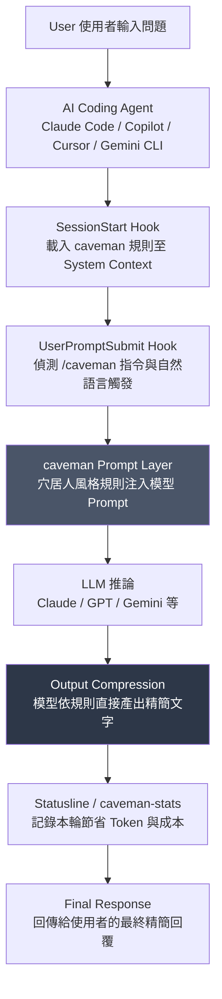

### 2.2 各層作用分析

| 層級 | 角色 | 說明 |
|------|------|------|
| User | 需求發起者 | 提出問題、下達指令，可能包含 `/caveman [level]` 等控制指令 |
| AI Coding Agent | 執行環境 | Claude Code、Copilot、Cursor 等，負責整體對話管理與工具呼叫 |
| SessionStart Hook | 初始化注入 | Session 開始時寫入 flag file，並將 caveman 規則以「隱藏 stdout」形式注入 System Context，使用者不會看到這段注入內容 |
| UserPromptSubmit Hook | 持續維持風格 | 每次使用者送出訊息時偵測是否仍在 caveman 模式，並在偵測到其他 Plugin 可能覆蓋風格指示時重新提醒模型 |
| caveman Prompt Layer | 核心規則 | 定義四種模式（`lite`/`full`/`ultra`/`wenyan`）的具體壓縮規則，是整個機制的「大腦」 |
| LLM 推論 | 實際生成 | 模型依照被注入的規則，在生成階段就直接產出精簡文字，**並非事後再做字串裁切** |
| Output Compression | 結果呈現 | 這一層並非獨立的後處理程式，而是模型「一次到位」生成的精簡輸出——這是理解 caveman 與傳統「摘要工具」最大差異之處 |
| Statusline / caveman-stats | 觀測與回饋 | 顯示本次/累積節省的 Token 量與換算美金成本，供使用者與團隊追蹤效益 |

> 📌 **架構關鍵澄清**：圖中的「Output Compression」並非獨立處理步驟，而是模型依照被注入的 Prompt 規則直接生成精簡文字的結果。caveman 完全是 **Prompt 層級**的機制，沒有任何後端伺服器對輸出做二次壓縮或摘要——這也是它能維持「零遙測、無 Backend」特性的根本原因。

### 2.3 元件間依賴關係

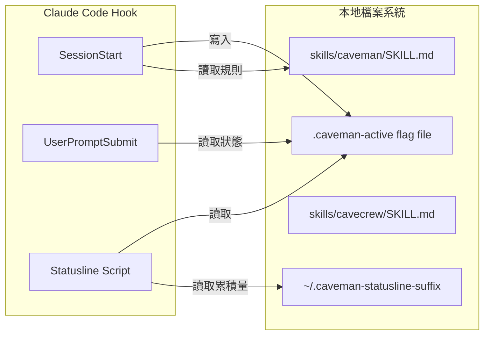

### 2.4 企業整合架構視角

從企業 IT 治理角度看，caveman 的架構有三個對導入評估至關重要的特性：

1. **無網路呼叫（安裝後）**：所有 Hook 只做本地檔案讀寫，不會傳輸程式碼或對話內容到任何第三方伺服器。
2. **無額外執行環境**：不需要另外部署容器、資料庫或訊息佇列，安裝即生效。
3. **可逐 Repo / 逐 Agent 局部啟用**：透過 `--only <agent>` 或 `--with-init` 等安裝旗標，可精準控制啟用範圍，適合分階段 Pilot。

### 2.5 資料流向總覽

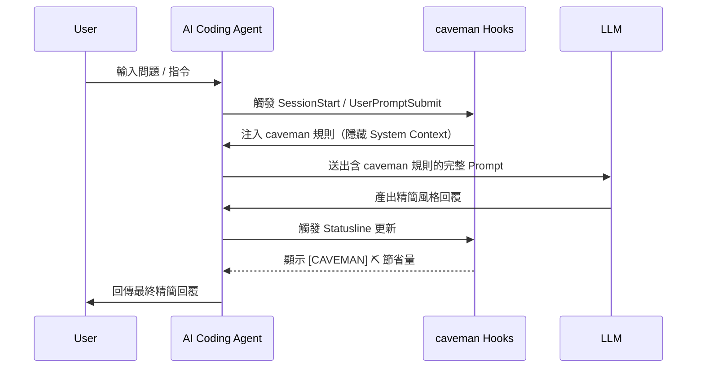

> 💡 **實務案例**：某企業在評估是否允許 caveman 進入白名單清單時，資安團隊最關心的正是「資料是否外流」。透過本節架構圖，可清楚向資安團隊說明：caveman 全程只在使用者本機與既有 AI Agent／LLM 供應商之間運作，並未新增任何資料傳輸路徑——它注入的規則只是「多一段 Prompt 文字」，不是「多一個資料出口」。

---

## 第3章 caveman 工作原理

### 🎯 學習目標

- 理解 Prompt Compression、Output Compression、Response Simplification 三者的差異
- 理解 caveman 的 Hook 機制與 Skill/Plugin 架構如何協同運作
- 理解「無 Backend、無 Telemetry」在實作層面是如何達成的

### 3.1 Prompt Compression（提示詞層壓縮）

caveman 的第一層工作是**在使用者看不到的地方，修改送給 LLM 的 System Prompt**。具體透過 SessionStart Hook（`caveman-activate.js`）達成：

```text
[Session 啟動]
  → caveman-activate.js 執行
  → 讀取目前應套用的 Mode（環境變數 > repo 設定 > 使用者設定 > 預設 full）
  → 將對應規則以「隱藏 stdout」寫回
  → Claude Code 將此 stdout 視為 SessionStart 的 System Context 自動注入
  → 使用者完全看不到這段注入內容，但後續模型回覆都會受其約束
```

這一步本身**不消耗使用者可見的對話 Token**，但會佔用一定的 System Prompt 空間（約 1~1.5k input token，詳見第4章）。

### 3.2 Output Compression（輸出壓縮）

不同於「先產生完整回覆、再做摘要」的傳統摘要工具，caveman 採用的是**生成時即壓縮**：模型在推論階段直接依照被注入的風格規則產出精簡文字，因此沒有「先長後短」的兩階段推理成本，也不會有摘要工具常見的「资訊遺漏」問題（因為事實性內容本就被要求逐字保留，並非透過摘要演算法重新萃取重點）。

### 3.3 Response Simplification（回覆簡化規則）

caveman 的核心規則集（`skills/caveman/SKILL.md`）本質上是一組「風格轉換指示」，包含但不限於：

- 移除開場白、客套語（如「好的，讓我來看看」「這是一個很好的問題」）
- 移除總結性重複（不重複陳述已經在回覆中出現過的結論）
- 優先使用條列式、短句取代長段落敘述
- 保留全部程式碼、指令、錯誤訊息、路徑、URL 逐字不變
- 依語言強度（lite/full/ultra/wenyan）調整句子精簡程度，但不改變語意

### 3.4 Token Reduction 的技術本質

> ⚠️ **常見誤解澄清**：caveman 並非透過「壓縮演算法」（如 gzip、Token 級別的字串替換）達成 Token Reduction，而是透過**改變模型生成行為本身**——本質上是一種 Prompt Engineering 技巧，而非資料壓縮技術。

### 3.5 System Prompt 與 Conversation Compression

caveman 提供兩種層級的壓縮，企業需區分清楚：

| 類型 | 作用範圍 | 持續性 | 對應機制 |
|------|---------|-------|---------|
| Conversation-level（對話級） | 當前 Session 的每一次回覆 | Session 結束或手動關閉即失效 | `/caveman [level]` |
| Memory-level（記憶檔級） | `CLAUDE.md`、專案筆記等長期記憶檔案 | 永久寫回檔案，影響所有未來 Session | `/caveman-compress <file>` |

`/caveman-compress` 的運作方式是：讀取指定檔案 → 以模型將內容改寫為精簡風格 → 驗證程式碼區塊/標題/連結/指令是否被完整保留 → 寫回原檔案並在旁另存 `<filename>.original.md` 備份 → 若驗證失敗最多重試 2 次，僅做針對性局部修補。官方實測此機制平均可為未來所有 Session 節省約 46% 的 input token（因為 Memory 檔案是每次 Session 開頭都會被讀入的固定成本）。

### 3.6 Skill 與 Plugin 架構

```text
skills/                       ← 所有行為的唯一事實來源（Single Source of Truth）
  ├── caveman/SKILL.md        ← 核心壓縮規則（LLM 讀取用）
  │   caveman/README.md       ← 人類閱讀用說明
  ├── caveman-compress/SKILL.md
  └── cavecrew/SKILL.md       ← subagent 委派決策指南

agents/                        ← cavecrew 專用 subagent 定義
  ├── cavecrew-investigator.md   （定位型，Haiku 等級模型）
  ├── cavecrew-builder.md        （1~2 檔案精準修改，拒絕 3+ 檔案範疇）
  └── cavecrew-reviewer.md       （單行嚴重度標記 Review）

plugins/caveman/               ← Claude Code Plugin 發佈版本（CI 自動鏡射）
  ├── skills/                  ← 由 skills/ 同步而來，切勿直接編輯
  └── agents/                  ← 由 agents/ 同步而來

src/
  ├── hooks/                   ← 三個 Hook + 共用 config module
  ├── rules/                   ← Hook 讀取的規則來源檔
  ├── tools/                   ← caveman-init.js（寫入 per-repo 規則檔）
  └── mcp-servers/             ← caveman-shrink（MCP Middleware）
```

Skill 採用「Markdown 即程式」的設計：`SKILL.md` 是給模型讀的 Prompt 主體，`README.md` 是給人類在 GitHub 上瀏覽時看的說明，兩者職責明確分離。

### 3.7 本地運作方式：無 Backend、無 Telemetry

官方 SECURITY.md 明確聲明「Caveman has no telemetry. Zero.」，且「There is no caveman backend — nothing to send data to.」。實作面對應如下：

- Hook 腳本（`src/hooks/*.js`）只做本地檔案讀寫，不含任何 HTTP Client 邏輯。
- 統計功能（`/caveman-stats`）使用**寫死在程式碼中的定價常數**換算美金成本，而非呼叫外部計價 API。
- 唯一的網路行為只發生在**安裝當下**：從 GitHub / npm 下載套件，並以 SHA-256 對照 manifest 驗證完整性。

> 📌 **隱私保護的企業意義**：這代表 caveman 不會成為程式碼外洩的新管道，也不需要簽署額外的資料處理協議（DPA）——它單純是本機的一段 Prompt 注入邏輯。安裝腳本本身若在完全離線（air-gapped）環境執行，建議改用內部鏡射的 clone 版本以避免安裝階段仍需存取 GitHub/npm。

> 💡 **實務案例**：某金融業客戶在導入前要求資安團隊逐行審查 `src/hooks/` 原始碼，確認無任何 `fetch`／`axios`／`http.request` 呼叫後才放行——這種「原始碼可逐行審查、無混淆」的透明度，正是純 Prompt/Hook 架構相較於 SaaS 型 AI 工具的一大優勢。

---

## 第4章 Token 節省原理

### 🎯 學習目標

- 理解為什麼 caveman 能節省 Token，以及節省的具體是哪一部分
- 理解哪些內容「不能」被壓縮，避免誤用造成資訊遺失風險
- 能向團隊清楚解釋官方揭露的限制（僅 Output Token 受益）

### 4.1 官方實測數據

根據 caveman 官方以 Claude API 進行的實測（非本手冊自行量測，逐字引用自官方 README 公開 Benchmark 表格，經與 GitHub 上的原始表格逐項核對無誤）：

| 任務類型 | 一般模式 Token | caveman 模式 Token | 節省比例 |
|---------|---------------|-------------------|---------|
| React 重複渲染 Bug 分析 | 1,180 | 159 | 87% |
| Auth Middleware Token 過期修復 | 704 | 121 | 83% |
| PostgreSQL 連線池設定 | 2,347 | 380 | 84% |
| Git rebase vs. merge 說明 | 702 | 292 | 58% |
| Callback 重構為 async/await | 387 | 301 | 22% |
| 架構討論：Microservices vs. Monolith | 446 | 310 | 30% |
| PR 安全性議題 Review | 678 | 398 | 41% |
| Docker Multi-stage Build 設定 | 1,042 | 290 | 72% |
| PostgreSQL Race Condition 除錯 | 1,200 | 232 | 81% |
| React Error Boundary 實作 | 3,454 | 456 | 87% |
| **平均** | **1,214** | **294** | **65%** |

實測範圍橫跨 10 種任務類型，單筆節省比例落在 **22%～87%** 之間，並非每個任務都能達到平均值，任務本身「敘述性文字占比」是決定節省幅度的主要變數（詳見4.4節分析）。

> ⚠️ **誠實揭露：官方已正式淘汰「75%」這個數字**：caveman v1.9.1（"65%, honestly"）的官方 Release Notes 明確說明，官方文件網站曾經出現過的「約75%」節省宣稱已被正式撤下，現行**唯一的官方頭條數字統一為 65%**。本手冊研究時發現，仍有部分第三方部落格文章（非官方來源）繼續引用已淘汰的「75%」數字。企業導入評估、簡報製作或對外溝通時，應一律採用官方目前唯一認可的 65% 數字，並清楚註明其僅涵蓋 Output Token（詳見4.5節），避免因引用過時或非官方數字而損及導入專案的可信度。

### 4.2 為什麼能節省 Token：文字層級分析

| 被省略的內容 | 範例 | 說明 |
|------------|------|------|
| 開場客套語 | 「好的，讓我來看一下這個問題」 | 對技術判斷零貢獻 |
| 重複性總結 | 「總結來說，以上就是...」 | 內容在前文已完整呈現 |
| 過度鋪陳的因果解釋 | 「這是因為...，原因在於...，也就是說...」 | 精簡為單一因果句 |
| 多餘的選項羅列 | 條列 5 種可能原因但只有 1 種相關 | 直接指出最可能原因 |
| 禮貌性緩衝語 | 「這是一個很好的問題」「希望這對你有幫助」 | 純社交修辭 |

### 4.3 哪些內容「不能」被省略

> ⚠️ **絕對不可壓縮清單**：這是 caveman 設計中最重要的安全邊界。

| 內容類型 | 是否可壓縮 | 說明 |
|---------|-----------|------|
| 程式碼（Code Block） | ❌ 不可 | 逐字元保留，caveman 完全不觸碰程式碼本身 |
| 指令（Command） | ❌ 不可 | Shell/Git/CLI 指令必須完整可執行 |
| 錯誤訊息（Error Message） | ❌ 不可 | 除錯依據，任何簡化都可能誤導 |
| 檔案路徑 / URL | ❌ 不可 | 精確性優先於精簡 |
| 技術結論本身 | ❌ 不可 | 只精簡「怎麼表達」，不精簡「結論是什麼」 |
| 敘述性說明文字 | ✅ 可壓縮 | 這是 caveman 實際作用的範圍 |
| 重複性鋪陳語句 | ✅ 可壓縮 | 主要節省來源 |

### 4.4 各類任務的節省效益差異分析

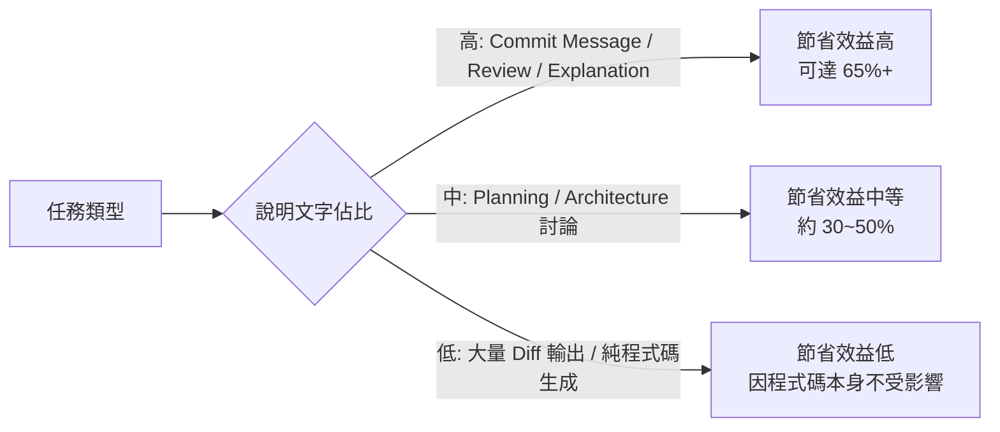

- **Commit Message**：天生就要求簡短，caveman 的 `/caveman-commit` 可直接產出 ≤50 字的 conventional commit，節省效益穩定且高。
- **Code Review**：`/caveman-review` 產出單行 PR 註解，相較傳統「每個問題點附完整解釋」的 Review 風格，節省比例通常最顯著。
- **Explanation（程式碼說明）**：屬於敘述性內容占比最高的任務類型，是 caveman 效益最大化的場景。
- **Planning（架構規劃）**：說明文字與結構性內容（如步驟清單、依賴關係）混合，節省效益中等，且需注意過度壓縮可能省略關鍵決策依據。
- **Diff（程式碼異動輸出）**：Diff 本身屬於程式碼範疇，不受 caveman 影響，此類任務的 Token 節省效益天花板較低。
- **Conversation（多輪對話）**：長期對話中因為每輪都套用壓縮規則，累積節省效果會隨對話輪數增加而放大。

### 4.5 誠實揭露：65% 節省的真實意涵與限制

> ⚠️ **官方誠實揭露（Honest Numbers）**：65% 節省數字**僅涵蓋 Output Token**，並不代表整體 API 成本降低 65%。企業導入評估時務必理解以下三個限制：

1. **Input Token 不受影響**：使用者提出的問題、附上的程式碼、Context 讀取量，caveman 完全不會壓縮，這部分的成本維持不變。
2. **Reasoning Token 不受影響**：對於具備擴充推理（Extended Thinking / Reasoning）能力的模型，其內部推理過程所耗費的 Token 不在 caveman 的作用範圍內。
3. **Skill 本身有固定成本**：每一輪對話，caveman 規則注入本身會額外消耗約 1~1.5k input token——這代表在「本來回覆就很短」的任務上，套用 caveman 反而可能得不償失（詳見第22章優缺點分析中的「不適用情境成本」）。

真實的整體成本節省，需以下列近似公式估算（本手冊提供之估算模型，非官方公式）：

```text
整體 Token 成本節省率 ≈
  (Output Token 節省量 × Output 單價 − Skill 額外注入量 × Input 單價)
  ÷ (原始 Input Token × Input 單價 + 原始 Output Token × Output 單價)
```

> 💡 **實務建議**：對於 Output Token 占比高、單輪對話較長的任務（如逐檔案 Legacy 分析說明），caveman 效益顯著；對於 Input Token 占比極高（如貼上數萬行程式碼只問一句話）的任務，應理性看待其節省效益，避免對主管過度承諾「省下 65% API 費用」。

### 4.6 各企業常見任務的節省原理總表

| 任務 | 說明文字占比 | 建議 Mode | 預期節省效益 |
|------|------------|----------|------------|
| Commit Message 產生 | 極高 | full 或 ultra | 高 |
| PR Review 註解 | 高 | full | 高 |
| Bug 原因說明 | 高 | full | 高 |
| 架構決策說明（ADR） | 中 | lite | 中（避免省略決策依據） |
| 大量程式碼生成 | 低 | 不特別要求 | 低 |
| 需求規格書產出 | 低（需完整敘述） | 建議關閉 | 不適用 |

---

## 第5章 安裝教學

### 🎯 學習目標

- 能在 Windows / Linux / macOS / WSL 上完成 caveman 安裝
- 理解官方安裝腳本的運作邏輯與各項旗標
- 理解容器化環境（Docker/DevContainer/Codespaces）下的企業建議做法（官方無專屬文件，屬本手冊延伸建議）

### 5.1 前置需求

| 項目 | 需求 |
|------|------|
| Node.js | ≥ 18 |
| 作業系統 | Windows 10/11、Linux、macOS、WSL2 |
| Shell | Git Bash / PowerShell 5.1+ / bash / zsh |
| 網路 | 僅安裝當下需要（下載 GitHub/npm 資源） |

### 5.2 一鍵安裝（推薦）

**macOS / Linux / WSL / Git Bash：**

```bash
curl -fsSL https://raw.githubusercontent.com/JuliusBrussee/caveman/main/install.sh | bash
```

**Windows PowerShell 5.1+：**

```powershell
irm https://raw.githubusercontent.com/JuliusBrussee/caveman/main/install.ps1 | iex
```

安裝腳本會自動偵測本機已安裝的 AI Coding Agent，並針對每個偵測到的 Agent 執行其原生安裝流程，全程約 30 秒，且可重複執行不會造成副作用。

> ⚠️ **企業內網環境注意**：`curl | bash` / `irm | iex` 屬於「Pipe-to-Shell」安裝模式，部分企業資安政策會直接封鎖此類指令，或防毒軟體會對其發出警告。建議先以 `--dry-run` 預覽，或改用 5.4 節的手動 Clone 安裝方式，並事先向資安團隊說明腳本可讀、且有 SHA-256 校驗機制。

### 5.3 安裝前預覽（Dry-Run）

```bash
curl -fsSL https://raw.githubusercontent.com/JuliusBrussee/caveman/main/install.sh | bash -s -- --dry-run
```

Dry-run 模式只會印出將執行的動作，不會實際寫入任何檔案，是企業導入評估階段的建議第一步。

### 5.4 手動 / Clone-Based 安裝（企業內網建議做法）

對於無法直接執行 Pipe-to-Shell 指令的企業環境，建議改用 Git Clone 後手動執行安裝：

```bash
git clone https://github.com/JuliusBrussee/caveman.git
cd caveman

# 先查看目前環境偵測到哪些 Agent
node bin/install.js --list

# 預覽將執行的安裝動作
node bin/install.js --dry-run --all

# 正式安裝所有偵測到的 Agent
node bin/install.js --all
```

### 5.5 安裝旗標速查

| 旗標 | 作用 |
|------|------|
| `--all` | 安裝 Plugin + Hooks + Statusline + 每個 Repo 的規則檔（MCP shrink 需另外以 `--with-mcp-shrink` 加開） |
| `--minimal` | 只安裝 Plugin/Extension，不含 Hooks/MCP/規則檔 |
| `--only <id>` | 只安裝指定 Agent（可重複指定多個，如 `--only claude --only cursor`） |
| `--dry-run` | 預覽指令但不寫入 |
| `--with-init` | 在目前 Repo 寫入永久生效的規則檔（適合無 Hook 機制的 Agent） |
| `--with-mcp-shrink="<cmd>"` | 註冊 caveman-shrink MCP Middleware，包裹既有 MCP Tool Server（需帶入欲包裹的上游指令） |
| `--no-mcp-shrink` | 明確跳過 MCP shrink（此為預設行為，此旗標用於顯式聲明） |
| `--with-hooks` / `--no-hooks` | 強制開啟／關閉 Claude Code Hook 安裝（預設為開啟） |
| `--skip-skills` | 跳過透過 `npx skills add` 進行的自動偵測後備安裝流程 |
| `--config-dir <path>` | 覆寫 Claude Code 設定目錄路徑（僅影響 Claude Code，不會連帶改變其他 Agent 的安裝路徑） |
| `--non-interactive` | 安裝過程不出現任何互動式提示，適合 CI/自動化腳本場景 |
| `--no-color` | 關閉終端機 ANSI 顏色輸出 |
| `--force` | 已安裝狀態下強制重新安裝 |
| `--uninstall` | 移除所有 Hook/Plugin/Flag/設定 |
| `--list` | 印出目前環境偵測到的 Agent 矩陣 |

> 📌 上述完整旗標清單已對照官方 INSTALL.md 逐項核實。`--non-interactive`／`--no-color`／`--config-dir` 三者特別適合 Docker/DevContainer/CI 等自動化安裝場景，建議與第5.7節企業建議做法搭配使用。

### 5.6 各平台安裝注意事項

**Windows：**

- 必須使用 `install.ps1`，而非 `install.sh`。
- 需要 PowerShell 5.1 以上版本。
- 若被執行原則（Execution Policy）擋下，可執行：

```powershell
Set-ExecutionPolicy -Scope Process -ExecutionPolicy Bypass
```

**Linux / macOS：**

- 直接使用 `install.sh`，確認 `curl` 與 `bash` 已存在（多數發行版預設具備）。

**WSL：**

- 視為 Linux 環境處理，使用 `install.sh`；若專案同時掛載 Windows 檔案系統路徑，建議在 WSL 原生檔案系統路徑（如 `~/projects`）下安裝，避免跨檔案系統的權限問題。

### 5.7 Docker / DevContainer / Codespaces（企業建議做法，非官方文件）

> 📌 **誠實說明**：caveman 官方文件（README / INSTALL.md）**並未提供**針對 Docker、DevContainer 或 GitHub Codespaces 的專屬安裝章節。以下為本手冊依官方安裝邏輯推導出的企業建議做法，導入前請自行驗證於實際容器映像檔中的相容性。

**Dockerfile 建議做法（在建置階段安裝，隨映像檔一併固化）：**

```dockerfile
FROM node:18-bullseye

# 安裝 Claude Code CLI（假設已透過官方管道安裝）
# ...既有安裝步驟...

RUN curl -fsSL https://raw.githubusercontent.com/JuliusBrussee/caveman/main/install.sh \
    | bash -s -- --only claude-code --minimal
```

**DevContainer（`.devcontainer/devcontainer.json`）建議做法：**

```json
{
  "name": "project-with-caveman",
  "postCreateCommand": "curl -fsSL https://raw.githubusercontent.com/JuliusBrussee/caveman/main/install.sh | bash -s -- --minimal"
}
```

**GitHub Codespaces：**

- 可比照 DevContainer 做法，在 `postCreateCommand` 中執行安裝腳本；由於 Codespaces 每次啟動皆為全新容器，建議搭配 `--minimal` 旗標降低啟動延遲，並評估是否需要在 `--with-init` 模式下把規則檔一併提交進 Repo，使其不依賴每次容器啟動時重新安裝。

### 5.8 驗證安裝是否成功

```bash
# 1. 確認 Agent 是否被正確偵測
node bin/install.js --list

# 2. 在 Claude Code 中輸入
/caveman

# 3. 檢查 Flag File（Linux/macOS/WSL）
cat "${CLAUDE_CONFIG_DIR:-$HOME/.claude}/.caveman-active"
# 應輸出：full（或你所設定的其他 Mode）
```

### 5.9 解除安裝

```bash
npx -y github:JuliusBrussee/caveman -- --uninstall
```

> ⚠️ **注意**：官方文件明確說明 `--uninstall` **不會**移除透過 `npx skills add` 安裝的 Skill，也不會移除已寫入 Repo 的規則檔（如 `.cursor/rules/`）。若要完全清除，需另外手動刪除這些檔案。

### 5.10 安裝流程總覽圖

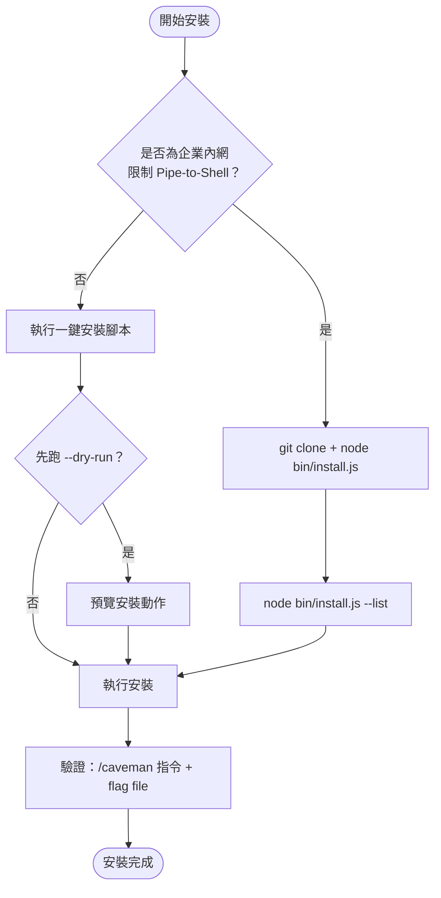

> 💡 **實務案例**：某企業因資安政策全面禁用 `curl | bash` 型態指令，改用「Git Clone 至內部鏡射倉庫 → `node bin/install.js --dry-run --only claude-code` 產出安裝計畫 → 資安審核通過後才正式執行」的三段式流程，將原本 30 秒的安裝流程延長為約 2 個工作天的審核週期，但換取了完整的稽核軌跡（Audit Trail）。

---

## 第6章 AI Agent 整合

### 🎯 學習目標

- 理解 caveman 對不同 AI Coding Agent 的三種整合層級
- 能為團隊使用的特定 Agent 選擇正確的安裝方式
- 理解各 Agent 整合方式的限制與注意事項

### 6.1 三種整合層級總覽

caveman 官方支援矩陣中，30+ 個 Agent 並非全部享有相同等級的整合深度。企業評估導入時應先辨識自己使用的 Agent 屬於哪一層級：

> 📌 **分類說明**：「Level 1／2／3」是本手冊依官方 INSTALL.md 中「是否自動啟用（Auto-activates）」欄位歸納出的**分析框架**，並非 caveman 官方文件逐字使用的術語。官方文件僅以每個 Agent 是否自動啟用、是否需要 `--only` 明確指定來區分行為，本手冊將其歸納為三層以利企業內部溝通，實際請以官方 INSTALL.md 當下矩陣為準。

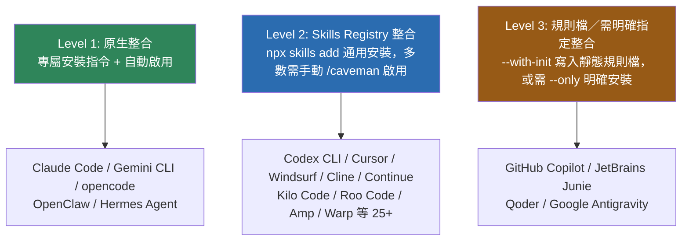

| 整合層級 | 特性 | 優點 | 限制 |
|---------|------|------|------|
| Level 1 原生整合 | 安裝後自動啟用，Hook 機制完整運作 | 體驗最完整，Session 狀態自動維持 | 僅少數 Agent 支援 |
| Level 2 Skills Registry | 透過通用 `npx skills add` 安裝 | 覆蓋範圍廣（25+ Agent） | 多數需手動輸入 `/caveman` 啟用，無法自動偵測 Session 開始 |
| Level 3 規則檔／soft-probe | 寫入 `.cursor/rules/`、`copilot-instructions.md` 等靜態檔案，或官方矩陣中標示為需明確 `--only` 指定、無自動偵測訊號的 Agent | 對無 Hook 機制的工具仍可運作 | 規則為靜態文字，無法即時切換 Mode，需手動編輯檔案才能調整 |

### 6.2 各 Agent 詳細安裝與設定

#### Claude Code（Level 1 原生整合）

```bash
claude plugin marketplace add JuliusBrussee/caveman
claude plugin install caveman@caveman
```

- 安裝後**預設自動啟用**，無需額外指令。
- Statusline 會顯示 `[CAVEMAN] ⛏ 12.4k` 等即時節省量。
- 注意事項：SessionStart Hook 只在 Session 啟動時觸發一次，若安裝後行為未生效，需重新啟動 Claude Code。

#### GitHub Copilot（Level 3 規則檔）

```bash
npx -y github:JuliusBrussee/caveman -- --only copilot --with-init
```

- 透過 `--with-init` 寫入 `.github/copilot-instructions.md`，屬於 Repo 層級的靜態規則，對整個團隊生效。
- 限制：Copilot 沒有等同 Claude Code 的 Hook 機制，無法動態切換 Mode，需修改規則檔並重新提交才能調整強度。

#### Cursor / Windsurf / Cline（Level 2 Skills Registry）

```bash
npx skills add JuliusBrussee/caveman -a cursor
npx skills add JuliusBrussee/caveman -a windsurf
npx skills add JuliusBrussee/caveman -a cline
```

- 安裝後為「每個 Session 預設啟用」，行為與 Claude Code 類似但實作機制不同（透過各工具自身的 Skill/Rule 系統，而非 caveman 專屬 Hook）。

#### Continue（Level 2，但需手動觸發）

```bash
npx skills add JuliusBrussee/caveman -a continue
```

- 安裝後**不會自動啟用**，需在對話中輸入 `/caveman` 手動開啟。

#### Gemini CLI（Level 1 原生整合）

```bash
gemini extensions install https://github.com/JuliusBrussee/caveman
```

- 以 Gemini CLI 官方 Extension 機制安裝，自動啟用。

#### Codex CLI（Level 2）

```bash
npx skills add JuliusBrussee/caveman -a codex
```

- 每個 Session 需輸入 `/caveman` 啟用。

#### OpenClaw / Hermes Agent（Level 1）

```bash
npx -y github:JuliusBrussee/caveman -- --only openclaw
npx -y github:JuliusBrussee/caveman -- --only hermes
```

- OpenClaw 安裝後會同時寫入 Workspace Skill 與 `SOUL.md`；兩者皆為安裝後自動啟用。

#### 其他 Level 2 Agent（完整清單，經與官方 INSTALL.md 逐項核對）

一律採用相同的通用指令模式：

```bash
npx skills add JuliusBrussee/caveman -a <agent-slug>
```

官方 INSTALL.md 目前矩陣中，除前述已詳列的 Cursor / Windsurf / Cline / Continue / Codex CLI 外，Level 2 尚包含以下約 20 個 Agent（`<agent-slug>` 僅為示意，實際安裝前建議執行 `npx skills list` 或查閱官方 INSTALL.md 最新矩陣確認正確 slug 名稱）：

| Agent | 類型 |
|-------|------|
| Kilo Code | AI Coding Agent |
| Roo Code | AI Coding Agent |
| Augment Code | AI Coding Agent |
| Aider Desk | AI Coding Agent |
| Sourcegraph Amp | AI Coding Agent |
| IBM Bob | AI Coding Agent |
| Crush | AI Coding Agent |
| Devin | AI Coding Agent（Cognition） |
| Droid（Factory） | AI Coding Agent |
| ForgeCode | AI Coding Agent |
| Block Goose | AI Coding Agent |
| iFlow CLI | CLI Agent |
| Kiro CLI | CLI Agent |
| Mistral Vibe | AI Coding Agent |
| OpenHands | AI Coding Agent |
| Qwen Code | AI Coding Agent |
| Atlassian Rovo Dev | AI Coding Agent |
| Tabnine CLI | CLI Agent |
| Trae | AI Coding Agent |
| Warp | Terminal Agent |
| Replit Agent | AI Coding Agent |

> 📌 此清單依官方 INSTALL.md 的「Auto-activates」欄位判讀，歸類為需透過 `npx skills add` 安裝、多數需在對話中手動輸入 `/caveman` 啟用的 Agent。官方支援矩陣持續擴充中，正式導入前務必以官方最新版本為準。

#### GitHub Copilot / JetBrains Junie / Qoder / Google Antigravity（Level 3：需明確 `--only` 指定，無自動偵測）

> ⚠️ **重要澄清**：caveman 官方安裝矩陣中，**沒有**針對「通用 VS Code」「通用 JetBrains IDE」「Zed」的獨立原生整合項目。矩陣中列為 Level 3（需明確以 `--only` 指定安裝、且無自動偵測訊號）的項目包括 GitHub Copilot、**JetBrains Junie**（JetBrains 官方 AI Agent）、**Qoder**、**Google Antigravity**。若團隊使用的是 VS Code 內建的 GitHub Copilot Chat、或其他 JetBrains AI 外掛，應歸類到「GitHub Copilot」或該外掛自身對應的整合方式，而非誤以為 caveman 對 IDE 本身有專屬外掛。Zed 編輯器同理，目前未見於官方支援矩陣，如需整合建議關注官方 Repo 後續更新或改用第三方 Skill 安裝管道自行測試相容性。

### 6.3 整合方式選型建議表

| 企業使用的 Agent | 建議整合層級 | 導入複雜度 | 備註 |
|---------------|------------|----------|------|
| Claude Code | Level 1 | 低 | 首選試點對象，體驗最完整 |
| GitHub Copilot | Level 3 | 中 | 需搭配 Repo 規則檔治理 |
| Cursor / Windsurf / Cline | Level 2 | 低 | 安裝快速，行為接近自動 |
| Gemini CLI | Level 1 | 低 | 官方 Extension 機制成熟 |
| Codex CLI / Continue | Level 2 | 中 | 需教育使用者手動輸入 `/caveman` |
| JetBrains Junie / Qoder / Google Antigravity | Level 3 | 中 | 需明確以 `--only` 指定安裝，無自動偵測訊號 |
| 其他 ~25 個 Level 2 Agent（Devin、Warp、Replit Agent、Sourcegraph Amp 等，詳見6.2節完整表格） | Level 2 | 視工具而定 | 建議先小範圍試點驗證相容性 |

> 💡 **實務案例**：某同時使用 Claude Code（後端團隊）與 GitHub Copilot（前端團隊）的企業，採取差異化策略——後端團隊直接安裝 Level 1 完整體驗，前端團隊則透過 `--with-init` 寫入 `.github/copilot-instructions.md`，並將此檔案納入 Code Review 規範中一併維護，確保兩個工具鏈都能享有一致的精簡輸出風格。

---

## 第7章 caveman Modes

### 🎯 學習目標

- 理解四種壓縮模式的差異與適用情境
- 能依任務性質選擇正確的 Mode
- 理解 Mode 的切換方式與持續範圍

### 7.1 四種 Mode 總覽

> 📌 **經與官方 README 核實的更正**：caveman 實際只提供**四種**可切換模式：`lite`、`full`、`ultra`、`wenyan`。`wenyan` 是單一模式，**並無** `wenyan-lite`／`wenyan-full`／`wenyan-ultra` 三種子強度之分——這點在早期版本手冊中曾被誤植為三種變體，本次已更正。另需提醒：官方 README 的段落標題雖寫作「Six levels」，但實際表格只列出「一般 Agent（基準線，非可選模式）+ lite + full + ultra + wenyan」共5列，扣除非可選的基準線後，真正可切換的模式就是這4種——這是官方文件本身用詞與實際表格數量不一致的小瑕疵，讀者查閱官方文件時可留意，不代表 caveman 有隱藏的第五、第六種模式。

| Mode | 說明 | 適合情境 |
|------|------|---------|
| `lite` | 輕度壓縮，保留較完整句子結構 | 新人尚在適應期、需要一定可讀性緩衝 |
| `full`（預設） | 標準壓縮強度，官方預設值 | 日常開發的絕大多數場景 |
| `ultra` | 極限壓縮，句子高度精簡 | 高頻率、經驗豐富團隊的極致省字場景 |
| `wenyan` | 文言文（Classical Chinese）風格壓縮，官方定位為「刻意例外」——文言文本身即以精簡著稱，資訊密度高於白話文 | 中文團隊追求文字美感與極致壓縮的實驗性選項 |

### 7.2 範例輸出比較

以「解釋一段 React 元件為何每次 render 都重新建立新物件」為例：

| Mode | 範例輸出 |
|------|---------|
| `lite` | 「將物件包在 `useMemo` 裡。每次 render 都會建立新的參照。」 |
| `full` | 「每次 render 都建立新參照。用 `useMemo` 包起來。」 |
| `ultra` | 「每 render 一個新 ref。`useMemo` 它。」 |
| `wenyan` | 以文言文風格呈現同一結論，資訊密度更高但需team具備閱讀文言文的默契 |

> ⚠️ **wenyan 使用提醒**：文言文風格雖然在字元層級可能達到最高壓縮率，但對非中文母語工程師、或不熟悉文言文表達的團隊成員，反而會提高理解成本，建議僅在團隊共識明確、且以教學/展示用途為主時採用，正式生產工作流建議以 `full` 或 `ultra` 為主。

### 7.3 切換方式

```text
/caveman            → 啟用預設 full 模式，持續整個 Session
/caveman lite        → 切換為 lite 模式
/caveman ultra       → 切換為 ultra 模式
/caveman wenyan       → 切換為文言文模式
「normal mode」       → 以自然語言關閉 caveman，回到一般回覆風格
```

Mode 的生效範圍是**當前 Session**，關閉 Session 或明確切換前會持續套用；且 caveman 具備「自動清晰化規則（auto-clarity rule）」——當偵測到使用者困惑、或內容涉及安全性警告時，會自動暫時切回一般敘述風格，待該議題釐清後再恢復壓縮風格。

### 7.4 Mode 選擇決策圖

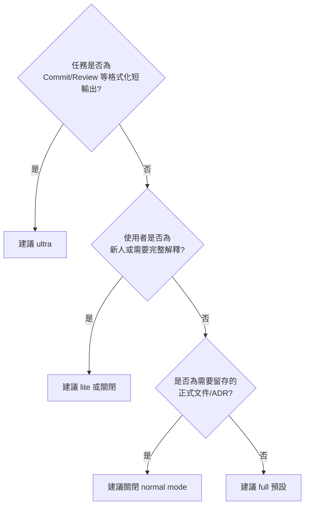

### 7.5 Mode 與任務型態對照 Checklist

- [ ] 日常 Bug 修復說明 → `full`
- [ ] Commit Message / PR 單行 Review → `ultra`
- [ ] 新人 Onboarding 教學對話 → `lite` 或關閉
- [ ] 架構決策記錄（ADR）/ 需求規格書 → 關閉（normal mode）
- [ ] 團隊內部技術分享文件草稿 → `lite`
- [ ] 大量 Legacy 檔案逐一摘要（內部使用） → `full` 或 `ultra`

> 💡 **實務案例**：某團隊制定內部規範——預設一律使用 `full`，僅在「面向新人的 Pair Programming Session」與「需要留存的架構決策文件」兩種情境下，明確要求工程師手動切回 `normal mode`，並將此規範寫入團隊的 Prompt Style Guide 中（詳見第18章最佳實務）。

---

## 第8章 Prompt 運作原理

### 🎯 學習目標

- 理解 caveman 的 Hook 注入機制在 Prompt 層面實際做了什麼
- 理解 Prompt Injection 相關的安全考量
- 理解 Slash Command 與自然語言觸發的差異

### 8.1 System Prompt 注入機制

caveman 透過 Claude Code 的 **SessionStart Hook** 機制，將壓縮規則以「隱藏 stdout」的形式注入為 System Context。這是 Claude Code 官方支援的 Hook 類型之一，其設計初衷就是讓外部工具能在 Session 開始時安全地擴充系統提示，而不需要使用者手動貼上規則。

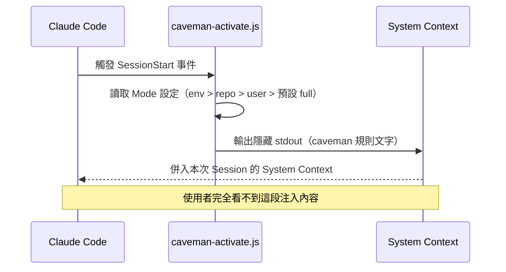

### 8.2 Skill 與 Slash Command 的關係

- **Skill（`SKILL.md`）**：定義「模型應該如何表現」的規則本體，是 caveman 的核心 Prompt 內容。
- **Slash Command（如 `/caveman`、`/caveman-commit`）**：使用者手動觸發特定行為的入口，本質上是一段會被 UserPromptSubmit Hook 攔截解析的特殊文字指令。
- 兩者關係：Slash Command 負責「切換狀態」，Skill 負責「定義狀態下的行為規則」。

### 8.3 Context 維持機制

由於 LLM 對話本質上是無狀態的（每輪都需要重新組裝完整 Context），caveman 透過 **UserPromptSubmit Hook** 在每次使用者送出訊息時，重新確認 Mode 狀態並視需要補強提醒，避免在多輪對話、或有其他 Plugin 同時注入指示的情況下，caveman 的風格指示被「稀釋」或「覆蓋」。

### 8.4 Prompt Injection 相關安全考量

> ⚠️ **安全提醒**：由於 caveman 本身就是一種「注入額外指示到 System Context」的機制，企業在導入時應理解兩個方向的風險：

1. **caveman 對模型的注入是善意且受控的**：規則內容公開透明（`skills/caveman/SKILL.md` 可直接在 GitHub 上逐行審查），不涉及惡意行為。
2. **需留意的是「多重 Plugin 疊加注入」的交互風險**：若企業同時安裝多個會修改 System Prompt 的 Plugin/Hook（例如另一套企業內部的 Prompt 治理工具），需測試彼此是否會產生指示衝突（如一個要求「完整解釋」、另一個要求「精簡」），建議在 Pilot 階段做好交互測試，並留意 caveman 的「auto-clarity rule」在安全警告情境下會自動退回一般敘述風格，這是刻意設計的安全閥。

### 8.5 Conversation 與 Compression 的邊界

需要區分清楚 caveman 影響的是「表達方式」而非「對話記憶內容」本身：

| 項目 | caveman 是否影響 |
|------|-----------------|
| 模型記得的對話歷史內容 | 否，完全不變 |
| 模型組織回覆文字的方式 | 是，這是核心作用範圍 |
| `CLAUDE.md` 等記憶檔案的實際內容 | 是（僅限主動執行 `/caveman-compress` 時） |
| 使用者輸入的原始訊息 | 否，caveman 不會修改使用者的輸入 |

> 💡 **實務案例**：某企業在導入初期同時運行既有的內部 Prompt 治理 Plugin（用於強制加上合規免責聲明）與 caveman，測試後發現兩者運作良好——caveman 的「auto-clarity rule」會在偵測到安全/合規相關內容時自動退回完整敘述模式，恰好與既有合規 Plugin 的目的相容，未產生指示衝突。

---

## 第9章 Web Application 開發最佳實務

### 🎯 學習目標

- 理解在各主流 Web 技術棧中，caveman 能發揮效益的具體場景
- 能將 Token 節省思維套用到 Clean Architecture / DDD / Microservices 的日常開發任務中

### 9.1 後端框架搭配建議

| 技術棧 | 常見高頻 Agent 任務 | caveman 建議 Mode | 說明 |
|-------|-------------------|------------------|------|
| Spring Boot | Controller/Service 職責說明、Bean 注入除錯 | full | 逐層架構說明文字量大，效益明顯 |
| .NET (ASP.NET Core) | Middleware Pipeline 除錯、DI 生命週期解釋 | full | 與 Spring Boot 類似模式 |
| Node.js / Express | Middleware Chain 除錯、Async 流程說明 | full | 非同步流程說明文字量大 |
| FastAPI | Pydantic Model 驗證錯誤解釋 | ultra | 錯誤說明格式化程度高，適合高強度壓縮 |
| Laravel | Eloquent Query 除錯說明 | full | — |
| Ruby on Rails | Convention over Configuration 慣例說明 | lite | 慣例說明需要一定完整度，避免新人誤解 |
| Django | ORM Migration 衝突解釋 | full | — |

### 9.2 前端框架搭配建議

| 技術棧 | 常見高頻 Agent 任務 | caveman 建議 Mode |
|-------|-------------------|------------------|
| Vue3 | Reactivity 追蹤除錯（`ref` vs `reactive`） | full |
| React | Re-render 原因分析、`useMemo`/`useCallback` 建議 | ultra |
| Angular | Change Detection 策略說明 | full |
| Next.js / Nuxt | SSR/CSR 邊界問題除錯 | full |

### 9.3 架構風格與 Token 優化的關係

- **Clean Architecture / Hexagonal Architecture**：分層清楚意味著 Agent 常需要解釋「這段程式碼屬於哪一層、為何不能反向依賴」，這類職責邊界說明是 caveman 效益顯著的場景，但需注意 `ultra` 模式下過度精簡可能省略關鍵的依賴方向論證，建議架構討論維持 `full`。
- **Domain-Driven Design（DDD）**：Aggregate/Entity/Value Object 的職責釐清屬於高頻說明性任務，適合套用 `full`；但 Ubiquitous Language 相關的命名討論建議維持完整敘述，避免壓縮後失去語意精確性。
- **Microservices**：服務邊界劃分、API Contract 討論、分散式交易（Saga/Event Sourcing）說明，文字量通常很大，是 caveman 效益最大化的場景之一；但跨團隊溝通用的服務邊界決策文件，建議關閉壓縮以保留完整脈絡供未來稽核。

### 9.4 降低 Token 的具體作法

1. **例行性 Code Review 一律套用 `/caveman-review`**：單行 PR 註解取代長篇解釋，Review 效率與 Token 雙贏。
2. **Commit Message 一律套用 `/caveman-commit`**：確保符合 conventional commit 規範且不超過 50 字。
3. **架構決策文件（ADR）維持 `normal mode`**：這類文件的價值在於完整記錄「為什麼」，不適合壓縮。
4. **API 文件（OpenAPI/Swagger 說明）建議 `lite`**：兼顧簡潔與可讀性，避免對外部消費者造成理解障礙。

> 💡 **實務案例**：某採用 DDD + Microservices 的團隊，將 caveman `full` 模式套用於內部逐服務程式碼審閱流程，但保留所有跨服務邊界決策討論於 `normal mode`，避免關鍵架構決策因壓縮而流失重要脈絡，同時仍在日常高頻的 Code Review 上取得顯著的 Token 節省。

---

## 第10章 Legacy Modernization

### 🎯 學習目標

- 理解大型舊系統現代化專案中 caveman 的適用場景
- 能針對 COBOL、Java EE、ASP.NET、VB、Delphi、PowerBuilder 等技術規劃 caveman 搭配策略

### 10.1 Legacy Modernization 專案的 Token 消耗特性

Legacy 現代化專案通常涉及**大量逐檔案、逐模組的說明性分析**——例如「這個 COBOL Copybook 定義了什麼欄位」「這個 VB6 Form 的事件處理邏輯對應到哪個業務流程」。這類任務的輸出往往是「敘述性文字」而非「新程式碼」，正是 caveman 效益最大化的場景。

| 舊技術 | 常見 Agent 任務 | Token 消耗特性 |
|-------|----------------|--------------|
| COBOL | Copybook 欄位對應說明、批次程式邏輯拆解 | 說明文字占比極高 |
| Java EE (EJB/Struts) | 舊版元件職責釐清、遷移至 Spring Boot 的對應關係說明 | 說明文字占比高 |
| ASP.NET (WebForms) | Code-Behind 事件流程說明 | 說明文字占比高 |
| VB6 / VB.NET | Form 事件邏輯拆解 | 說明文字占比高 |
| Delphi | Unit 依賴關係說明 | 說明文字占比中高 |
| PowerBuilder | DataWindow 邏輯拆解 | 說明文字占比高 |

### 10.2 建議工作流程

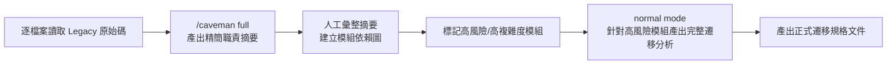

> 📌 **關鍵原則**：批次、大量的「初步理解」階段適合套用 caveman 壓縮以加速掃描；但進入「高風險模組的正式遷移規格」階段時，應切回完整敘述模式，確保遷移依據被完整記錄，供後續稽核與回溯。

### 10.3 COBOL 現代化範例情境

```text
輸入：一份 3000 行的 COBOL 批次程式
一般模式輸出：約 1500 token 的完整說明（含背景介紹、每個 Paragraph 逐一解釋、總結）
caveman full 模式輸出：約 400~500 token（僅列出 Paragraph 名稱、輸入輸出資料、核心業務邏輯一句話摘要）
```

（此為示範情境數量級，非官方針對 COBOL 場景的實測數據，實際節省比例依程式複雜度與 Agent 而異。）

### 10.4 Code Understanding 加速策略

- 搭配 `cavecrew-investigator` subagent（Haiku 等級模型）進行大範圍定位掃描，僅回傳 `path:line-symbol-note` 格式的精簡定位資訊，比一般 Agent 逐檔案完整解釋更省 Token。
- 對於需要深入分析的少數關鍵模組，再切換回一般模式或 `cavecrew-builder`/`cavecrew-reviewer` 進行細緻分析。

> 💡 **實務案例**：某銀行核心系統現代化專案，在為期三個月的 COBOL 逐批次程式盤點階段，全面採用 `full` 模式產出初步摘要，僅針對盤點後標記為「高風險」（涉及利息計算、跨系統呼叫）的批次程式，切回 `normal mode` 產出完整遷移規格書，兼顧掃描效率與關鍵決策的完整稽核記錄。

---

## 第11章 Framework Upgrade

### 🎯 學習目標

- 理解框架升級專案中如何運用 caveman 降低 AI 成本
- 能規劃升版評估階段與實際遷移階段的 Mode 切換策略

### 11.1 常見框架升級場景與 Token 特性

| 升級場景 | 常見 Agent 任務 | 建議 Mode |
|---------|----------------|----------|
| Spring Boot 2 → 3 | `javax.*` → `jakarta.*` 掃描與影響分析 | full（掃描階段）／normal（風險評估報告） |
| Spring Framework 舊版 → 新版 | Bean 設定方式變更說明 | full |
| .NET Framework → .NET (Core) | 專案檔格式與相依套件相容性分析 | full |
| Angular 舊版 → 新版 | Breaking Changes 逐項影響說明 | full |
| React Class Component → Hooks | 元件邏輯轉換說明 | full |
| Vue2 → Vue3 | Composition API 遷移對應說明 | full |
| Hibernate 舊版 → 新版 | HQL/Criteria API 變更說明 | full |
| MyBatis 版本升級 | Mapper XML 相容性檢查說明 | full |
| JDK 8 → JDK 17/21/25 | API 棄用（Deprecation）逐項說明 | ultra（清單類任務） |
| Python 2 → 3 / Node 舊版升級 | 相容性檢查與語法變更說明 | full |

### 11.2 降低 AI 成本的具體策略

1. **升版影響掃描階段**：這類任務本質是「列出所有受影響的檔案與變更點」，屬於高度格式化輸出，適合 `ultra` 模式最大化 Token 節省。
2. **風險評估報告階段**：需要完整論證「為什麼這個變更有風險」「替代方案是什麼」，建議切回 `normal mode`，確保決策依據完整。
3. **實際程式碼遷移階段**：程式碼本身不受 caveman 影響，Token 節省效益主要來自遷移過程中的說明文字（如 Commit Message、PR 說明），建議搭配 `/caveman-commit`。

### 11.3 升版流程圖

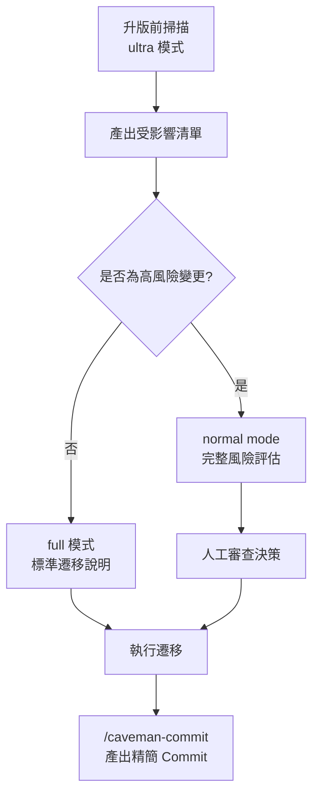

> 💡 **實務案例**：某團隊進行 Spring Boot 2.7 → 3.x 升版評估，先以 `ultra` 模式讓 Agent 掃描全專案 `javax.*` import，一次性產出精簡清單（約 200 個檔案，Token 消耗僅為一般模式的三分之一），再針對清單中標記「第三方套件相容性風險」的約 15 個檔案，切回 `normal mode` 產出完整評估報告供架構會議討論（此為示範情境數字，非官方實測數據，實際比例依專案規模與程式碼複雜度而異）。

---

## 第12章 Reverse Engineering

### 🎯 學習目標

- 理解逆向工程任務中 caveman 的適用邊界
- 能規劃「快速掃描」與「深度理解」兩階段的 Mode 策略

### 12.1 逆向工程任務類型與 Token 特性

| 任務類型 | 說明 | 建議 Mode |
|---------|------|----------|
| 閱讀 Legacy 程式碼、理解流程 | 大量逐檔案摘要 | full |
| 分析模組依賴關係 | 格式化清單輸出 | ultra |
| Sequence Diagram 產出說明 | 需保留完整流程順序邏輯 | lite（避免省略關鍵步驟） |
| Class Diagram 關係說明 | 結構化程度高 | full |
| Database Schema 逆向分析 | 欄位/關聯說明 | full |
| API 端點盤點 | 格式化清單 | ultra |
| Batch Job 邏輯拆解 | 說明文字占比高 | full |

### 12.2 建議工作流程

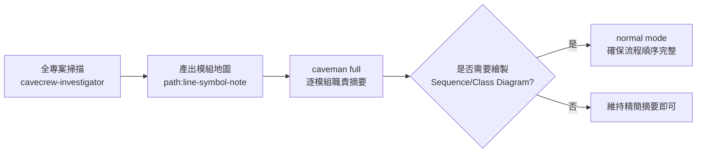

> ⚠️ **注意事項**：Sequence Diagram、流程圖等**依賴步驟順序完整性**的產出物，若在高強度壓縮下遺漏中間步驟的描述，可能導致繪製出的圖表邏輯錯誤。建議這類任務優先使用 `lite` 或關閉壓縮，先確保邏輯完整，再另外要求精簡摘要作為輔助說明。

### 12.3 資料庫與 API 逆向分析範例

```text
情境：逆向分析一個沒有文件的舊系統資料庫，200+ 張資料表
一般模式：每張表逐一產出完整段落說明，Token 消耗極高
caveman ultra 模式：以表格化條列「表名 | 用途一句話 | 關鍵欄位 | 關聯表」，大幅縮短單表說明篇幅
```

> 💡 **實務案例**：某團隊逆向分析一套 15 年歷史的 PowerBuilder 系統，資料庫共 260 張表且無任何文件，採用 `ultra` 模式讓 Agent 以表格形式產出每張表的一句話摘要與關聯欄位，將原本預估需要數天的初步盤點工作壓縮至一天內完成初稿，再針對核心交易相關的 20 張表切回完整模式做深入分析（此為示範情境數字，非官方實測數據，實際比例依資料庫規模與文件缺乏程度而異）。

---

## 第13章 Prompt Engineering 企業範本

### 🎯 學習目標

- 取得可直接套用的企業級 Prompt 範本
- 理解如何在既有 Prompt 中正確嵌入 caveman Mode 控制

### 13.1 範本使用說明

以下範本可直接複製貼上使用，`{{}}` 為需要替換的變數。所有範本皆可依情境在開頭加上 `/caveman [level]` 以控制輸出風格，範本本身不綁定特定 Mode，由使用者依任務性質決定。

### 13.2 Code Review Prompt 範本

```text
【P1. 單檔案 Code Review】
/caveman-review
請針對 {{檔案路徑}} 進行 Code Review，重點檢查：
1. 是否有明顯的邏輯錯誤
2. 是否違反專案既有的命名慣例
3. 是否有可簡化的重複邏輯
以單行註解格式回覆每個發現的問題，並標註嚴重度（🔴/🟡/🟢）。
```

```text
【P2. PR 整體 Review】
/caveman full
請針對這個 PR 的所有變更檔案進行整體審查，重點關注：
1. 跨檔案的一致性（例如 API 合約是否與呼叫端同步更新）
2. 是否引入新的技術債
3. 測試覆蓋是否充分
請以條列式列出問題，每項附上檔案路徑與行號。
```

```text
【P3. 安全性導向 Code Review】
請針對 {{檔案路徑}} 進行安全性審查，檢查 SQL Injection、XSS、
不安全的反序列化、硬編碼密鑰等 OWASP Top 10 相關風險。
（注意：此類任務建議關閉 caveman 或使用 lite，確保安全性發現的描述完整不失真）
```

### 13.3 Refactor Prompt 範本

```text
【P4. 提取方法重構】
/caveman full
請將 {{檔案路徑}} 中的 {{方法名稱}} 依據單一職責原則拆分為多個較小的方法，
拆分後请條列說明每個新方法的職責。
```

```text
【P5. Legacy 程式碼重構評估】
請分析 {{檔案路徑}}，列出可重構的技術債項目，並依風險與效益排序，
不要直接修改程式碼，先產出評估清單。
```

```text
【P6. 設計模式導入評估】
/caveman lite
請評估 {{模組名稱}} 是否適合導入 {{設計模式名稱}}（如 Strategy/Factory/Observer），
說明導入前後的差異與可能的風險。
```

### 13.4 Bug Fix Prompt 範本

```text
【P7. 錯誤重現與根因分析】
/caveman full
以下是錯誤訊息與相關程式碼：
{{錯誤訊息}}
{{相關程式碼}}
請分析根本原因，並提出修復方案，修復方案需附上具體程式碼。
```

```text
【P8. 迴歸測試導向修復】
修復 {{Bug 描述}} 後，請一併列出建議新增的測試案例，
確保此類問題未來能被自動化測試攔截。
```

### 13.5 Architecture Prompt 範本

```text
【P9. 架構決策評估（建議關閉 caveman）】
normal mode
請評估在 {{情境}} 下，採用 {{方案A}} 與 {{方案B}} 的優缺點，
需包含效能、維護性、團隊學習成本三個面向的完整論證。
```

```text
【P10. 服務邊界劃分建議】
/caveman lite
基於現有 {{模組清單}}，請提出 Microservices 拆分邊界建議，
並說明每個建議邊界背後的業務理由。
```

### 13.6 Migration Prompt 範本

```text
【P11. 框架升級影響掃描】
/caveman ultra
請掃描專案中所有 {{舊 API/舊語法}} 的使用位置，
以「檔案路徑 | 行號 | 建議替換方式」的表格格式列出。
```

```text
【P12. 資料庫遷移腳本產生】
請為 {{Schema 變更描述}} 產生對應的資料庫遷移腳本（{{工具名稱，如 Flyway/Liquibase}}），
並說明此變更是否需要搭配資料回填（Backfill）。
```

### 13.7 Documentation Prompt 範本

```text
【P13. API 文件產出】
/caveman lite
請為 {{API 端點}} 產出符合 OpenAPI 3.0 規範的文件片段，
包含請求/回應範例與可能的錯誤碼。
```

```text
【P14. 模組說明文件產出】
/caveman-compress {{檔案路徑}}
請將此份模組說明文件改寫為精簡風格，永久壓縮以降低未來每次讀取的 Token 成本，
但保留所有程式碼範例、指令與連結逐字不變。
```

> 📌 更多 Prompt 範本（P15~P50+）已彙整於[第25章附錄](#第25章-附錄appendix)（進入該章節後請捲動至「25.4 Prompt Template Library」小節），依「日常開發」「維運」「導入治理」三大情境分類，方便團隊直接查閱套用。

---

## 第14章 Token 最佳化策略

### 🎯 學習目標

- 建立一套完整、可落地的企業 Token 最佳化策略框架
- 能分辨哪些最佳化屬於 caveman 職責、哪些屬於團隊自身的 Prompt 紀律

### 14.1 Token 消耗來源總覽

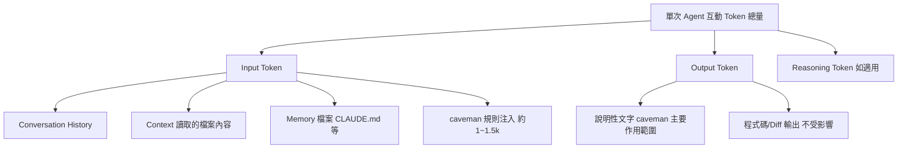

### 14.2 各層級最佳化策略對照

| 層級 | 最佳化手段 | caveman 是否涵蓋 |
|------|-----------|-----------------|
| Conversation | 適時開新 Session，避免對話歷史無限累積 | 否，需團隊自律 |
| Context | 只讀取必要檔案，避免整包目錄無差別讀入 | 否，屬於 Agent 使用習慣 |
| History | 定期歸檔/總結長對話 | 部分（`/caveman-compress` 可壓縮已寫入記憶檔的歷史摘要） |
| Memory | 使用 `/caveman-compress` 永久精簡 CLAUDE.md 等檔案 | 是，核心功能 |
| Prompt | 精簡系統提示、避免重複規則堆疊 | 是（caveman 本身即此類最佳化） |
| Output | 減少說明性文字冗餘 | 是，核心功能 |
| Code Block | 保持程式碼片段精簡（只貼相關片段） | 否，需團隊自律 |
| Review | 單行精簡註解取代長篇 Review | 是（`/caveman-review`） |
| Commit | Conventional Commit 精簡格式 | 是（`/caveman-commit`） |
| Documentation | 精簡但保留完整技術事實 | 部分（需搭配人工把關） |

### 14.3 企業級 Token 最佳化 Checklist

- [ ] 已針對高頻互動的 Agent（如 Claude Code）安裝並啟用 caveman
- [ ] 已依任務性質建立 Mode 選用規範（參考第7.5節）
- [ ] 已將 `/caveman-commit`、`/caveman-review` 納入團隊 Git 工作流程規範
- [ ] 已對長期存在的 `CLAUDE.md`／`AGENTS.md` 等記憶檔執行過 `/caveman-compress`
- [ ] 已建立「正式文件（ADR/需求規格）一律關閉壓縮」的例外規範
- [ ] 已教育團隊「Input Token 不受 caveman 影響」，避免對 ROI 有不切實際期待
- [ ] 已定期執行 `/caveman-stats` 檢視實際節省成效，而非僅憑官方公版數字估算

### 14.4 Anti-Pattern 提醒

> ⚠️ **常見反模式**：在「本來回覆就很短」的簡單問答上強制套用 `ultra` 模式，反而因為 caveman 規則注入的固定成本（約 1~1.5k input token）造成整體 Token 不減反增。企業應建立「任務複雜度門檻」概念，而非無差別全面套用最高強度。

> 💡 **實務案例**：某企業導入初期採取「全員全時段 ultra 模式」的一刀切策略，三週後透過 `/caveman-stats` 檢視發現，簡單問答類型的互動因規則注入固定成本，實際 Token 消耗反而上升約 8%（範例情境數字）。調整為依任務類型分級套用 Mode 後，整體才呈現淨節省，此案例成為後續制定第7.5節 Mode 選用規範的重要依據。

---

## 第15章 系統維護

### 🎯 學習目標

- 建立 caveman 版本管理與定期更新的維運流程
- 理解 Skill/Prompt 更新的驗證方式

### 15.1 版本管理策略

caveman 屬於活躍開發中的個人專案，建議企業採用以下版本管理原則：

| 原則 | 說明 |
|------|------|
| 固定版本安裝 | 透過 Git Clone 特定 Tag，而非永遠追蹤 `main` 分支，避免非預期的行為變更 |
| 內部鏡射倉庫 | 大型企業建議建立內部 Git 鏡射，所有安裝來源指向內部倉庫，便於稽核與離線安裝 |
| 變更前先於非production環境驗證 | 每次升級 caveman 版本前，先在測試用 Repo 驗證行為是否符合預期 |

> 📌 **名詞澄清：官方沒有 CHANGELOG.md 檔案**：本手冊全文提及的「官方 CHANGELOG」實際上並非指 repo 根目錄下的某個 `CHANGELOG.md` 檔案——經核實，caveman 官方 repo **並未提供** CHANGELOG.md，版本異動說明完整記錄於 [GitHub Releases 頁面](https://github.com/JuliusBrussee/caveman/releases) 的每個版本發布說明中。後續章節統一改稱「官方 Release Notes（GitHub Releases）」以避免誤導讀者去尋找一個不存在的檔案。完整版本標籤、日期與代號歷程請參見第25.11節「版本歷程」。

### 15.2 更新流程

```bash
# 進入本機 clone 的 caveman 目錄
cd caveman
git fetch --tags
git checkout v1.9.1   # 切換至指定驗證過的版本

# 重新執行安裝以更新 Hook/Skill
node bin/install.js --all --force
```

### 15.3 Skill 與 Prompt 更新的相容性檢查

由於 `skills/caveman/SKILL.md` 是純 Markdown 規則文件，版本更新時建議人工比對 diff，重點檢查：

- 四種 Mode 名稱是否有變動（如 `wenyan` 相關調整）
- Slash Command 語法是否相容既有團隊使用習慣
- Hook 檔案（`src/hooks/*.js`）是否新增需要的環境變數或設定項

### 15.4 Rollback 流程

```bash
# 若新版本行為異常，回退至前一個已驗證版本
git checkout v1.8.x
node bin/install.js --all --force

# 或直接解除安裝後恢復手動的 Prompt 治理規則
npx -y github:JuliusBrussee/caveman -- --uninstall
```

> ⚠️ **Rollback 注意事項**：`--uninstall` 不會移除透過 `npx skills add` 安裝的 Skill，也不會移除 `--with-init` 寫入 Repo 的規則檔（如 `.cursor/rules/`），Rollback 時需一併手動檢查並清除這些殘留設定，否則可能出現「解除安裝但行為仍部分殘留」的混亂狀態。

### 15.5 驗證 Checklist（每次更新後執行）

- [ ] `node bin/install.js --list` 確認 Agent 偵測矩陣未變
- [ ] `/caveman` 指令回覆風格符合預期
- [ ] `cat .caveman-active` 確認 Flag File 內容正確
- [ ] 抽樣測試 `/caveman-commit`、`/caveman-review` 輸出格式未變
- [ ] 確認既有 `--with-init` 規則檔未被覆寫或遺失自訂內容

> 💡 **實務案例**：某企業建立「caveman 版本委員會」，每季度由一位工程師負責測試最新版本並提交評估報告，只有在測試通過後才更新內部鏡射倉庫的固定 Tag，避免全公司同仁因追蹤 `main` 分支而同時受未預期行為變更影響。

---

## 第16章 系統升級

### 🎯 學習目標

- 理解 caveman 版本升級時可能遇到的 Breaking Changes 類型
- 能規劃升級的相容性驗證與回歸測試

### 16.1 常見 Breaking Changes 類型

| 類型 | 說明 | 因應方式 |
|------|------|---------|
| Mode 名稱變更 | 新版本可能重新命名或合併某些強度等級 | 升級前先查閱官方 Release Notes（GitHub Releases） |
| Slash Command 語法變更 | 指令參數或別名調整 | 更新團隊內部 Prompt Style Guide 文件 |
| Hook 事件行為變更 | SessionStart/UserPromptSubmit 觸發時機或輸出格式調整 | 於測試 Repo 驗證後才推廣至全公司 |
| 安裝旗標調整 | `--with-init`／`--minimal` 等旗標語意變動 | 重新確認安裝腳本仍符合企業內網限制 |

### 16.2 Migration Guide 撰寫建議

企業內部應維護一份簡短的《caveman 版本遷移紀錄》，建議欄位如下：

| 欄位 | 說明 |
|------|------|
| 舊版本 / 新版本 | 版本號對照 |
| 主要變更摘要 | 條列化列出行為差異 |
| 對既有規則檔的影響 | 是否需要重新產生 `.cursor/rules/` 等檔案 |
| 驗證結果 | Pass/Fail，附上測試 Repo 連結 |
| 推廣時程 | 何時開放全公司升級 |

### 16.3 相容性矩陣範例

| Agent | v1.8.x 支援 | v1.9.1 支援 | 備註 |
|-------|:---:|:---:|------|
| Claude Code | ✅ | ✅ | 無變動 |
| GitHub Copilot | ✅（規則檔） | ✅（規則檔） | 無變動 |
| Gemini CLI | ✅ | ✅ | 無變動 |
| （企業應依實際升級時的官方 Release Notes 填寫） | — | — | — |

### 16.4 Regression Test 建議清單

- [ ] 四種 Mode 切換指令皆可正常運作
- [ ] `/caveman-commit` 產出格式仍符合團隊 Git Hook 檢查規則
- [ ] `/caveman-review` 產出的單行註解格式未變
- [ ] `/caveman-compress` 對既有 `CLAUDE.md` 執行後，程式碼區塊/連結/指令逐字保留驗證通過
- [ ] Statusline 顯示正常，無殘留舊版本 Flag File 造成的顯示錯誤

### 16.5 升級流程圖

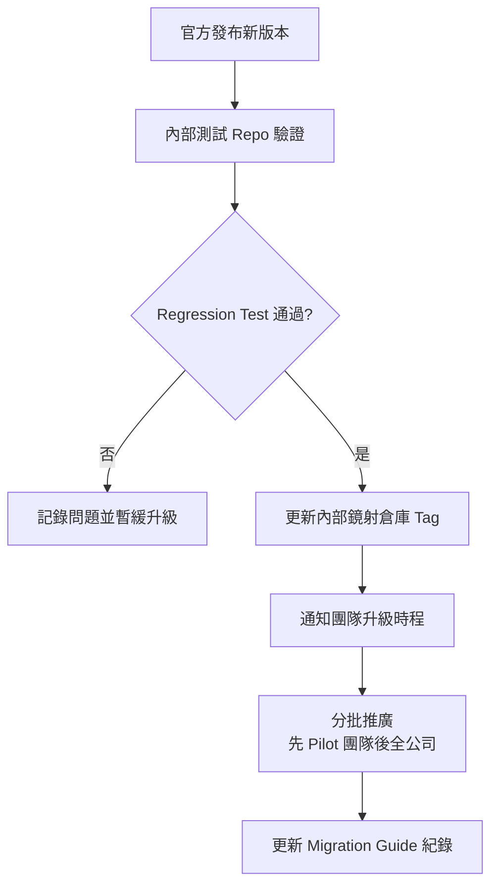

> 💡 **實務案例**：某企業曾在未經測試直接升級至新版本後，發現 Statusline 顯示邏輯改變導致既有監控腳本解析失敗，此後訂定「新版本必須先在 Pilot 團隊運行至少一週」的強制規範，並將 Regression Test Checklist 納入正式升級 SOP。

---

## 第17章 團隊導入指南

### 🎯 學習目標

- 建立完整的企業導入流程（PoC → Pilot → Rollout）
- 理解 Governance、KPI 與 ROI 評估的具體做法

### 17.1 企業導入流程總覽

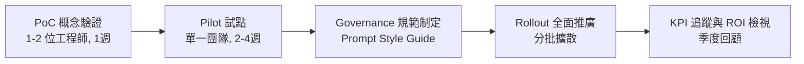

### 17.2 PoC 概念驗證階段

- 選定 1~2 位對 Prompt Engineering 有經驗的工程師
- 安裝 caveman 於個人開發環境（非全團隊）
- 針對 5~10 個真實任務（Bug Fix、Code Review、Commit）記錄 Token 消耗前後對比
- 產出簡短 PoC 報告，包含：實測節省比例、體感影響（是否降低回覆可讀性）、風險觀察

### 17.3 Pilot 試點階段

- 擴大至單一團隊（5~15 人），期程建議 2~4 週
- 制定初版 Mode 選用規範（可直接參考第7.5節 Checklist 修改）
- 每週追蹤 `/caveman-stats` 數據，並蒐集團隊主觀回饋（是否影響溝通品質）
- 確認與既有工具鏈（CI/CD、Code Review 流程、既有 Prompt 治理機制）無衝突

### 17.4 Governance 與 Coding/Prompt/Review 標準

| 標準類型 | 建議內容 |
|---------|---------|
| Coding Standard | 明訂 caveman 不影響既有程式碼風格規範（如 Checkstyle/ESLint），純屬對話層面 |
| Prompt Standard | 制定第13章範本為團隊標準起手式，明訂何時應加 `/caveman [level]` 前綴 |
| Review Standard | 明訂 `/caveman-review` 產出的單行註解仍需附上嚴重度標記，且重大問題不得因精簡而遺漏 |

### 17.5 Rollout 全面推廣階段

- 分批擴散，避免單次全公司強制安裝造成大量同時期的疑問與客服負擔
- 建立內部 FAQ 頻道（可直接引用第20章 FAQ 內容作為起點）
- 指定各團隊 caveman Champion，負責回答一線問題並回饋給導入委員會

### 17.6 教育訓練建議

- 30 分鐘入門課程：安裝、Mode 切換、Checklist 使用
- 案例分享會：分享 Pilot 階段真實節省數據與體感回饋
- 常見錯誤共學：直接使用第19章常見錯誤清單作為訓練教材

### 17.7 KPI 與 ROI 評估模型

| KPI 指標 | 量測方式 |
|---------|---------|
| Output Token 節省率 | `/caveman-stats` 累積數據 ÷ 估算原始 Token 量 |
| 整體 API 成本變化 | 月結帳單前後對比（需排除同期用量成長因素） |
| 工程師回覆閱讀時間 | 主觀問卷調查（例如 1~5 分量表） |
| Code Review 週期時間 | PR 從建立到 Merge 的平均時間 |
| 導入滿意度 | Pilot 結束後的團隊問卷 |

ROI 試算建議公式（本手冊提供之簡化模型，非官方公式）：

```text
月度節省成本 ≈ 月度 Agent 互動次數
              × 平均單次 Output Token 節省量
              × Output Token 單價
              − 月度 Agent 互動次數 × Skill 額外注入 Token 量 × Input Token 單價
```

> ⚠️ **ROI 評估注意事項**：務必扣除 Skill 本身的固定注入成本，並且只在「導入後任務量與任務類型相對穩定」的前提下比較月結帳單，否則容易將「業務成長帶來的用量增加」誤判為「caveman 沒有效果」。

### 17.8 導入 Checklist

- [ ] 已完成 PoC 並產出量化報告
- [ ] 已完成至少一個團隊的 Pilot，蒐集主觀與客觀數據
- [ ] 已制定 Prompt Style Guide 並經團隊 Review
- [ ] 已指定各團隊 Champion
- [ ] 已建立內部 FAQ / 常見問題頻道
- [ ] 已設定季度 KPI 追蹤機制
- [ ] 已明訂正式文件（ADR/規格書）不套用壓縮的例外規範

> 💡 **實務案例**：某中大型企業（約 300 位工程師）採取「PoC（2 週）→ Pilot 單一後端團隊（1 個月）→ 分三批 Rollout（各批間隔 2 週）」的節奏導入 caveman，並在第一批 Rollout 後發現部分團隊對 `wenyan` Mode 的接受度不佳，因此在 Governance 規範中明訂「`wenyan` 僅限個人實驗用途，不建議納入團隊正式工作流程」，避免後續批次重蹈溝通落差的覆轍。

---

## 第18章 最佳實務（Best Practices）

### 🎯 學習目標

- 取得 50+ 項可直接套用的企業導入最佳實務

### 18.1 安裝與設定類（1~10）

1. 優先在企業內部建立 caveman 鏡射倉庫，所有安裝來源指向固定 Tag，避免追蹤 `main` 分支造成非預期行為變更。
2. 導入前一律先執行 `--dry-run`，讓資安團隊審查將寫入的檔案與 Hook 內容。
3. 對無法接受 Pipe-to-Shell 安裝方式的環境，一律採用 Git Clone + `node bin/install.js` 手動安裝。
4. 使用 `--only <agent>` 精準控制啟用範圍，避免對未經評估的 Agent 一併啟用。
5. Docker/DevContainer 環境建議固定映像檔版本，並在建置階段（而非執行階段）安裝，確保環境一致性。
6. 安裝後務必執行 `node bin/install.js --list` 驗證偵測結果符合預期。
7. 定期（建議每季）檢視官方 Release Notes（GitHub Releases，官方無 CHANGELOG.md 檔案），評估是否需要更新內部固定版本。
8. 使用 `--with-init` 時，將產生的規則檔（如 `.cursor/rules/`）納入版本控制，方便團隊共享與 Review。
9. 對於需要離線安裝的環境，改用內部倉庫 Clone，避免安裝腳本在執行階段仍嘗試連線 GitHub/npm。
10. 保留每次安裝/升級的操作紀錄（時間、版本、操作者），作為稽核軌跡。

### 18.2 Mode 使用類（11~20）

11. 建立團隊共識的 Mode 選用規範（參考第7.5節），而非放任個人隨意選擇。
12. 日常 Bug Fix、Code Review 等高頻任務優先使用 `full`。
13. Commit Message、PR 單行 Review 等格式化輸出使用 `ultra` 效益最大化。
14. 正式文件（ADR、需求規格書、法遵文件）一律關閉壓縮，維持 `normal mode`。
15. 新人 Onboarding 階段建議使用 `lite` 或關閉，保留必要的教學完整度。
16. `wenyan` 模式建議限定為個人實驗或內部分享用途，不納入團隊正式工作流程。
17. 遇到安全性相關討論時，善用 caveman 的 auto-clarity 自動退回機制，不需要手動介入。
18. 架構決策討論（Microservices 邊界、Aggregate 設計）建議維持 `full` 而非 `ultra`，避免省略關鍵論證。
19. 定期使用 `/caveman-stats` 檢視實際效益，依數據調整 Mode 規範，而非憑感覺決策。
20. 針對特定專案（如對外客戶文件）可透過 `--with-init` 寫入專屬規則檔，與其他專案的 Mode 設定區隔。

### 18.3 團隊治理類（21~30）

21. 制定 Prompt Style Guide，明訂各任務類型對應的建議 Mode 與 Prompt 範本。
22. 指定各團隊 caveman Champion，作為一線問題的第一聯絡窗口。
23. 導入初期採取 PoC → Pilot → Rollout 分階段策略，避免一次性全公司強制安裝。
24. 建立內部 FAQ 頻道，持續累積團隊實際遇到的問題與解法。
25. 將 `/caveman-commit`、`/caveman-review` 納入正式 Git 工作流程規範文件。
26. 每季度召開檢討會議，檢視 KPI 數據與團隊回饋，決定是否調整 Governance 規範。
27. 明訂「正式文件不壓縮」為強制例外規則，並納入 Code Review Checklist。
28. 對新加入團隊的工程師，提供 30 分鐘入門課程作為 Onboarding 標配。
29. 避免將 caveman 導入與其他重大工具鏈變更（如同時更換 CI/CD 系統）綁在一起執行，降低問題排查複雜度。
30. 保留隨時可以整團隊回退（Rollback）的能力與流程文件。

### 18.4 安全與風險控管類（31~40）

31. 導入前完整審查 `src/hooks/` 原始碼，確認無任何網路呼叫邏輯。
32. 評估是否啟用 `--with-mcp-shrink`（caveman-shrink MCP Middleware）時，需額外審查其對既有 MCP Tool Server 的包裹行為。
33. 金融、醫療等高度合規產業，建議在正式導入前諮詢內部法遵/資安部門並留存書面評估紀錄。
34. 對外服務、客戶對話類場景一律排除在 caveman 適用範圍外。
35. 建立「壓縮輸出品質異常」的回報機制，讓工程師能快速反映因壓縮造成的資訊遺漏疑慮。
36. 定期抽樣比對壓縮前後的技術結論是否一致，作為品質保證的一環。
37. 對高風險模組（如核心交易邏輯）的說明性輸出，即使日常使用 caveman，仍建議切回 `normal mode` 進行最終確認。
38. 避免將 caveman 與其他會修改 System Prompt 的第三方 Plugin 疊加使用前，未經交互測試。
39. 明訂哪些角色/情境有權限調整全域 Mode 設定，避免個人隨意變更影響全團隊行為一致性。
40. 保留原始（未壓縮）版本的重要記憶檔案備份（`/caveman-compress` 已自動產生 `.original.md`，但仍建議額外納入版本控制）。

### 18.5 效益追蹤與 ROI 類（41~50）

41. 導入前先進行 PoC 量化評估，取得屬於自己企業場景的真實節省數據，而非直接套用官方公版 65%。
42. 每月檢視 `/caveman-stats` 累積數據，並與月結 API 帳單交叉驗證。
43. ROI 試算務必扣除 Skill 本身固定注入成本，避免高估效益。
44. 區分「Output Token 節省」與「整體 API 成本節省」兩個不同指標，對外溝通時避免混淆。
45. 將工程師主觀回饋（可讀性、溝通效率）與客觀 Token 數據並列評估，避免只看數字忽略體感。
46. 針對 Legacy Modernization、Reverse Engineering 等高效益場景優先導入，建立早期成功案例作為後續推廣的說服力來源。
47. 避免對管理層過度承諾「全面省下 65% AI 成本」，應清楚說明此數字僅涵蓋 Output Token。
48. 建立跨團隊的效益比較儀表板，讓不同團隊可互相參考 Mode 選用經驗。
49. 將導入成效與既有 DevOps 效能指標（如 PR 週期時間）建立關聯分析，展現間接生產力效益。
50. 保留至少一組「未導入 caveman」的對照團隊或對照期間數據，作為效益歸因的參考基準，避免將業務成長誤判為工具效益。

> 💡 **實務案例**：某企業將以上 50 項最佳實務整理為內部 Wiki 頁面，並依「安裝設定／Mode 使用／團隊治理／安全風控／效益追蹤」五大分類建立索引，新進工程師可於 10 分鐘內快速查閱對應情境的建議做法，大幅降低了口耳相傳造成的認知落差。

---

## 第19章 常見錯誤（Anti-Patterns）

### 🎯 學習目標

- 辨識 30+ 項企業導入常見錯誤，理解其原因、分析與避免方式

### 19.1 安裝與設定類錯誤（1~8）

**錯誤 1：直接在生產環境的 CI Pipeline 上執行 `curl | bash` 安裝**
- 原因：貪圖方便，忽略供應鏈安全風險。
- 分析：CI Pipeline 通常具備較高權限，若安裝來源遭竄改，風險放大。
- 解法：改用固定 Tag 的內部鏡射倉庫安裝。
- 避免方式：將安裝腳本納入基礎映像檔建置流程，而非每次 Pipeline 執行時動態下載。

**錯誤 2：追蹤 `main` 分支而非固定版本**
- 原因：省去版本管理麻煩。
- 分析：`main` 分支的行為可能隨時變動，造成團隊間行為不一致。
- 解法：改為固定 Tag。
- 避免方式：內部鏡射倉庫僅同步已驗證的 Release Tag。

**錯誤 3：未執行 `--dry-run` 就直接全公司安裝**
- 原因：跳過驗證步驟以求快速上線。
- 分析：可能寫入非預期的規則檔或覆蓋既有設定。
- 解法：PoC 階段務必先 `--dry-run`。
- 避免方式：將 `--dry-run` 納入標準 SOP 的強制步驟。

**錯誤 4：混淆 `--minimal` 與 `--all` 造成 Hook 未安裝**
- 原因：不理解兩者差異。
- 分析：`--minimal` 不含 Hooks/MCP/規則檔，若團隊誤用會導致自動啟用失效。
- 解法：安裝前參考第5.5節旗標速查表。
- 避免方式：將常用安裝指令固化為團隊內部 Script，避免每次手動組合旗標。

**錯誤 5：Docker 映像檔內每次啟動都重新安裝**
- 原因：未理解建置與執行階段的差異。
- 分析：增加容器啟動延遲，且安裝過程需要網路存取。
- 解法：改於 Dockerfile 建置階段安裝並固化。
- 避免方式：Code Review 時檢查是否誤將安裝指令寫在 `entrypoint` 而非 `RUN`。

**錯誤 6：`--uninstall` 後誤以為完全清除**
- 原因：不理解 `--uninstall` 的清除範圍限制。
- 分析：`npx skills add` 安裝的部分與 `--with-init` 規則檔不會被移除。
- 解法：Rollback SOP 中明確列出需額外手動清除的項目。
- 避免方式：制定完整的解除安裝 Checklist。

**錯誤 7：忽略 Windows Execution Policy 導致安裝失敗後直接關閉安全性原則**
- 原因：求快速排除障礙。
- 分析：全域關閉 Execution Policy 屬於過度降低安全性。
- 解法：改用 `-Scope Process` 的臨時性 Bypass。
- 避免方式：安裝文件中明確標註建議的 Scope 限定寫法。

**錯誤 8：在 WSL 與 Windows 檔案系統路徑混用安裝**
- 原因：不清楚跨檔案系統的路徑權限差異。
- 分析：可能造成 Hook 檔案權限異常或路徑找不到。
- 解法：統一在 WSL 原生檔案系統路徑下安裝與操作。
- 避免方式：團隊文件明確建議的專案存放路徑慣例。

### 19.2 Mode 使用類錯誤（9~16）

**錯誤 9：全公司一律強制 `ultra` 模式**
- 原因：誤以為壓縮強度越高效益越好。
- 分析：簡單任務套用 `ultra` 反而因固定注入成本淨增加 Token。
- 解法：依任務複雜度分級選用（參考第7.5節）。
- 避免方式：Governance 規範中明訂例外情境。

**錯誤 10：正式 ADR / 需求規格書套用壓縮模式**
- 原因：忽略正式文件對完整敘述的需求。
- 分析：關鍵決策依據可能因壓縮而遺漏，影響未來稽核。
- 解法：明訂正式文件一律 `normal mode`。
- 避免方式：Code Review Checklist 加入此項檢查。

**錯誤 11：對新人使用高強度壓縮**
- 原因：未考量學習曲線。
- 分析：新人難以從精簡回覆中建立完整心智模型。
- 解法：新人 Onboarding 期間使用 `lite` 或關閉。
- 避免方式：Onboarding 流程文件明確標註建議 Mode。

**錯誤 12：`wenyan` 模式直接用於團隊正式溝通**
- 原因：覺得有趣、追求極致壓縮率。
- 分析：非中文母語或不熟悉文言文的同仁理解成本大增。
- 解法：限定為個人實驗或分享娛樂用途。
- 避免方式：Governance 規範明文禁止正式流程使用。

**錯誤 13：忽略 auto-clarity 規則被觸發後未察覺**
- 原因：不理解 caveman 內建的自動退回機制。
- 分析：可能誤以為壓縮失效而反覆手動切換 Mode，造成困擾。
- 解法：教育團隊理解此為刻意設計的安全閥。
- 避免方式：教育訓練課程明確說明此行為。

**錯誤 14：架構決策討論使用 `ultra` 導致論證不完整**
- 原因：貪圖精簡。
- 分析：Microservices 邊界劃分等決策需要完整論證支撐。
- 解法：架構討論類任務建議 `full` 或關閉。
- 避免方式：Prompt Style Guide 明確標註。

**錯誤 15：跨團隊 Mode 設定不一致造成溝通落差**
- 原因：缺乏統一 Governance。
- 分析：A 團隊回覆精簡、B 團隊回覆詳細，跨團隊協作時產生認知不對稱。
- 解法：建立公司層級的 Mode 選用規範。
- 避免方式：定期跨團隊校準會議。

**錯誤 16：對客戶對外文件誤用 caveman**
- 原因：忘記切換回一般模式。
- 分析：客戶收到過度精簡、缺乏禮貌用語的文件，影響專業形象。
- 解法：明訂對外文件一律排除 caveman。
- 避免方式：對外文件產出流程加入人工把關步驟。

### 19.3 團隊治理類錯誤（17~24）

**錯誤 17：未經 PoC 直接全公司 Rollout**
- 原因：求快、低估變更管理複雜度。
- 分析：缺乏真實數據基礎，難以說服持懷疑態度的團隊成員。
- 解法：務必先完成 PoC 與 Pilot。
- 避免方式：導入 SOP 明確要求分階段推廣。

**錯誤 18：導入後未指定 Champion，問題無人處理**
- 原因：忽略導入後的維運責任分配。
- 分析：一線問題無人快速回應，降低團隊信任度。
- 解法：每團隊指定至少一位 Champion。
- 避免方式：導入計畫書中明確列出角色分工。

**錯誤 19：Prompt Style Guide 制定後未持續更新**
- 原因：視為一次性文件。
- 分析：隨版本升級與團隊實務演進，舊規範逐漸失準。
- 解法：每季檢視並更新。
- 避免方式：將 Style Guide 更新納入季度回顧會議議程。

**錯誤 20：忽略團隊主觀回饋，只看 Token 數據**
- 原因：過度依賴量化指標。
- 分析：即使 Token 節省顯著，若團隊普遍反映溝通品質下降，長期會導致抵制或棄用。
- 解法：主客觀指標並重。
- 避免方式：季度回顧會議固定納入問卷調查環節。

**錯誤 21：將 caveman 導入與其他重大工具鏈變更同時推行**
- 原因：追求效率、想一次到位。
- 分析：問題排查時難以歸因，增加變更管理風險。
- 解法：分開時程推行。
- 避免方式：變更管理行事曆中明確錯開時間。

**錯誤 22：教育訓練流於形式、未實際操作**
- 原因：時間壓力下簡化訓練內容。
- 分析：工程師僅知道有這個工具，卻不知道正確使用時機。
- 解法：訓練課程務必包含實機操作環節。
- 避免方式：課程設計加入實際案例演練。

**錯誤 23：缺乏 Rollback 演練，真正需要時手忙腳亂**
- 原因：假設不會出問題。
- 分析：Rollback 流程涉及多個殘留項目清理，臨時執行容易遺漏。
- 解法：導入後主動演練一次完整 Rollback。
- 避免方式：將 Rollback 演練納入 Pilot 階段的驗收項目之一。

**錯誤 24：忽略不同 Agent 整合層級差異，統一套用相同期待**
- 原因：不理解 Level 1/2/3 整合層級差異（詳見第6.1節）。
- 分析：對 Level 3（規則檔）Agent 期待「即時 Mode 切換」等 Level 1 才有的能力，導致誤判工具故障。
- 解法：教育團隊理解各 Agent 的整合層級與限制。
- 避免方式：安裝文件中明確標註每個 Agent 所屬層級。

### 19.4 安全與效益評估類錯誤（25~31）

**錯誤 25：未審查原始碼就導入生產環境**
- 原因：信任開源專案標語，未落實實際查核。
- 分析：即使宣稱零遙測，企業仍應自行驗證而非單純採信文件宣稱。
- 解法：資安團隊逐行審查 Hook 原始碼。
- 避免方式：導入 SOP 強制要求資安簽核。

**錯誤 26：對管理層過度承諾「省下 65% API 成本」**
- 原因：誤解官方 Benchmark 數字的涵蓋範圍。
- 分析：實際整體成本節省通常低於 65%，過度承諾會傷害導入專案的長期信任度。
- 解法：清楚說明 65% 僅涵蓋 Output Token。
- 避免方式：所有對外簡報統一使用第4.5節的誠實揭露版本說明。

**錯誤 27：ROI 試算未扣除 Skill 固定注入成本**
- 原因：計算模型過度簡化。
- 分析：高估實際效益，日後被財務或稽核部門質疑數字真實性。
- 解法：採用第4.5節提供的完整估算公式。
- 避免方式：ROI 報告需附上計算公式與假設條件。

**錯誤 28：將業務成長誤判為 caveman 效果不彰**
- 原因：比較基準未控制變因。
- 分析：若同期任務量大幅成長，即使有節省效果，帳單總額仍可能上升。
- 解法：以「單次互動平均 Token」而非「月結總額」作為主要評估指標。
- 避免方式：保留對照組或對照期間數據。

**錯誤 29：對高風險模組的說明也全面套用高強度壓縮**
- 原因：圖方便一致套用。
- 分析：核心交易邏輯等高風險內容的說明若被過度精簡，可能遺漏重要的邊界條件描述。
- 解法：高風險模組相關輸出建議切回 `normal mode`。
- 避免方式：在程式碼標記（如特定目錄或註解標籤）中標示高風險模組，並建立對應規範。

**錯誤 30：忽視多重 Prompt 治理工具疊加的交互風險**
- 原因：假設所有 Prompt 層工具彼此獨立不互相影響。
- 分析：多個同時修改 System Prompt 的工具可能產生指示衝突。
- 解法：Pilot 階段務必進行交互測試。
- 避免方式：建立「Prompt 層工具清單」，任何新工具導入前先盤點既有工具並規劃交互測試。

**錯誤 31：忽略版本升級的 Regression Test**
- 原因：認為只是小版本更新不會有影響。
- 分析：Slash Command 語法或 Mode 命名的細微變化，可能造成既有自動化腳本（如解析 Statusline 輸出的監控工具）失效。
- 解法：每次升級皆執行第16.4節的 Regression Test 清單。
- 避免方式：將升級流程自動化並內建測試步驟。

> 💡 **實務案例**：某企業將以上錯誤案例整理為「導入避雷指南」，於 Pilot 啟動會議上逐條講解，並要求各團隊 Champion 簽署確認已閱讀，作為 Rollout 前的必要條件之一，顯著降低了後續 Rollout 階段重複發生相同問題的比例。

---

## 第20章 FAQ 常見問答

### 🎯 學習目標

- 快速查閱企業導入過程中最常被問到的問題與標準答案

### 20.1 基礎概念類

**Q1. caveman 是模型嗎？需要另外付費嗎？**
不是模型，是 Prompt/Skill/Hook 層級的機制，本身完全免費（MIT 授權），實際費用仍是原本使用的 LLM API 費用。

**Q2. caveman 會讓 Agent 變笨嗎？**
不會。它只改變「表達方式」，不影響模型的推理與判斷能力。

**Q3. 安裝 caveman 需要重寫任何現有程式碼嗎？**
不需要，它完全在對話/Prompt 層運作，與程式碼庫本身無關。

**Q4. caveman 支援哪些語言？只能用英文嗎？**
支援任何語言，因為它壓縮的是「風格」而非「內容語言」，中文、日文、西班牙文等皆可正常使用。

**Q5. 「caveman」這個名字有特別含義嗎？**
取自穴居人說話直白精簡的意象，呼應官方標語「Why use many token when few token do trick」。

**Q6. caveman 是否會影響程式碼本身的產出品質？**
不會，程式碼、指令、錯誤訊息等事實性內容一律逐字保留，不在壓縮範圍內。

**Q7. 四種 Mode 中，哪一種是預設值？**
`full` 是官方預設值。

**Q8. wenyan 是玩笑功能還是正式功能？**
是正式提供的功能（單一模式，非多種子強度），但企業應用上建議謹慎評估團隊接受度（詳見第7.2節警語）。

**Q9. caveman 能否關閉？**
可以，說「normal mode」即可暫時關閉，回到一般敘述風格。

**Q10. 官方是否還在持續維護這個專案？**
是，截至本手冊撰寫時（v1.9.1）為活躍開發中的專案，並有後續 Caveman 2 儀表板產品在開發中。

### 20.2 安裝與整合類

**Q11. Windows 用戶要用哪個安裝腳本？**
`install.ps1`，透過 PowerShell 5.1+ 執行，不要用 `install.sh`。

**Q12. 安裝腳本會不會被防毒軟體誤判？**
官方文件承認 Pipe-to-Shell 模式可能觸發部分防毒軟體警告，建議改用手動 Clone 安裝並自行檢視腳本內容。

**Q13. 可以只安裝給某一個 Agent 用嗎？**
可以，使用 `--only <agent>` 旗標。

**Q14. `--minimal` 和 `--all` 差在哪？**
`--minimal` 只裝 Plugin/Extension，`--all` 會額外裝 Hooks、Statusline 與規則檔。

**Q15. 沒有網路的內網環境可以安裝嗎？**
可以，先在有網路環境 Clone 倉庫並建立內部鏡射，內網環境改從內部倉庫安裝。

**Q16. Claude Code 裝好後為什麼沒有自動啟用？**
SessionStart Hook 只在 Session 啟動時觸發，需要重新啟動 Claude Code。

**Q17. Copilot 為什麼要多加 `--with-init`？**
因為 Copilot 沒有等同 Claude Code 的 Hook 機制，需要透過寫入 `.github/copilot-instructions.md` 靜態規則檔才能生效。

**Q18. Continue／Codex CLI 裝好後為什麼還要手動打 `/caveman`？**
這兩者屬於「Level 2 Skills Registry 整合」，官方未提供自動啟用機制，需使用者手動觸發。

**Q19. VS Code 內建 Copilot Chat 算是官方支援的整合對象嗎？**
應歸類為 GitHub Copilot 的整合方式，「通用 VS Code」本身並非官方矩陣中的獨立項目。

**Q20. Zed 編輯器有官方支援嗎？**
目前官方支援矩陣中未見 Zed 的獨立項目，如需嘗試建議自行測試相容性並留意風險。

**Q21. JetBrains IDE 有支援嗎？**
官方矩陣中列出的是 JetBrains Junie（JetBrains 官方 AI Agent），而非泛指所有 JetBrains 外掛。

**Q22. Docker 環境要怎麼裝？**
官方無專屬文件，本手冊建議於 Dockerfile 建置階段執行安裝腳本並固化（詳見第5.7節）。

**Q23. DevContainer 可以自動裝好嗎？**
可透過 `devcontainer.json` 的 `postCreateCommand` 執行安裝腳本（詳見第5.7節企業建議做法）。

**Q24. GitHub Codespaces 呢？**
做法與 DevContainer 類似，建議搭配 `--minimal` 降低啟動延遲。

**Q25. 如何驗證安裝成功？**
執行 `node bin/install.js --list`，並在 Agent 中輸入 `/caveman` 確認回覆風格改變，同時檢查 flag file 內容。

**Q26. 解除安裝後真的乾淨了嗎？**
`--uninstall` 不會移除透過 `npx skills add` 安裝的部分或 `--with-init` 寫入的規則檔，需另外手動清除。

**Q27. 可以同時安裝給多個 Agent 嗎？**
可以，一鍵安裝腳本會自動偵測並依序安裝所有支援的 Agent。

**Q28. 安裝會不會覆蓋既有的 Claude Code Hook 設定？**
安裝時建議先 `--dry-run` 檢視將寫入的內容，避免與既有自訂 Hook 衝突。

**Q29. 支援的 Agent 清單會不會持續變動？**
會，屬於活躍開發中的專案，建議定期查閱官方 INSTALL.md 最新矩陣。

**Q30. `npx skills add` 失敗怎麼辦？**
可能是該 Agent 的 profile slug 尚未在上游 skills registry 註冊，建議查閱官方文件確認正確 slug 名稱。

### 20.3 Mode 與使用方式類

**Q31. 如何切換到 lite 模式？**
輸入 `/caveman lite`。

**Q32. 切換後會維持多久？**
持續整個 Session，直到手動切換或 Session 結束。

**Q33. 可以針對單一則訊息使用不同 Mode 嗎？**
Mode 是 Session 層級設定，若需要單則例外，建議在訊息中明確說明「這則請用完整敘述」，搭配 auto-clarity 機制通常會自動配合。

**Q34. `/caveman-commit` 產出的格式可以自訂嗎？**
目前版本聚焦於「≤50 字 conventional commit」的固定風格，若需客製化建議另行撰寫團隊自己的 Commit Prompt 範本並手動指定風格要求。

**Q35. `/caveman-review` 支援哪些嚴重度標記？**
以 Emoji 呈現嚴重度（如 🔴/🟡/🟢），實際符號可能隨版本調整，建議以官方最新 Skill 定義為準。

**Q36. `/caveman-stats` 顯示的美金成本準確嗎？**
是依照寫死在程式碼中的定價常數換算，建議定期核對是否與目前實際使用的模型定價一致。

**Q37. `/caveman-compress` 會不會弄壞我的 CLAUDE.md？**
機制設計上會驗證標題、程式碼區塊、URL、路徑、指令是否被完整保留，失敗會重試最多 2 次並僅做局部修補，同時自動保留 `.original.md` 備份。

**Q38. 壓縮後的記憶檔案還能改回原本版本嗎？**
可以，`.original.md` 備份檔即為壓縮前版本。

**Q39. caveman-shrink 這個 MCP Middleware 是做什麼的？**
用於包裹既有的 MCP Tool Server，讓經由 MCP 呼叫的工具輸出也套用壓縮風格。

**Q40. cavecrew 是什麼？和 caveman 主 Skill 有什麼關係？**
是三隻專門的 subagent（investigator/builder/reviewer），設計用於進一步降低特定委派任務的 Token 消耗，`cavecrew/SKILL.md` 提供何時該委派給這些 subagent 的決策指南。

**Q41. 為什麼有時候 Agent 突然不壓縮了？**
可能觸發了 auto-clarity 自動退回機制（偵測到使用者困惑或安全性相關內容），屬於刻意設計行為。

**Q42. 我可以自己修改 SKILL.md 的規則嗎？**
可以，但官方維護者原則建議「只編輯 `skills/<name>/SKILL.md`，不要編輯同步鏡射的複本」，企業如需客製化建議 Fork 並自行維護分支。

**Q43. 壓縮強度會不會隨對話輪數自動增強？**
不會，強度由使用者主動設定的 Mode 決定，不會自動遞增。

**Q44. 多語言團隊使用時，會不會壓縮出奇怪的外文語句？**
理論上不會，因為壓縮只作用於表達風格而非翻譯內容，但仍建議多語系團隊在 Pilot 階段實測驗證。

**Q45. 是否有官方建議的「新手友善」預設值？**
官方預設即為 `full`，屬於中等強度，適合大多數情境作為起點。

### 20.4 安全與隱私類

**Q46. caveman 會不會把我的程式碼傳到第三方伺服器？**
不會，官方聲明無 Backend、無遙測，安裝完成後所有處理均為本地檔案操作。

**Q47. 那安裝過程呢？完全不連網嗎？**
安裝當下會從 GitHub/npm 下載必要資源並以 SHA-256 校驗，這是唯一的網路行為。

**Q48. 可以要求資安團隊逐行審查原始碼嗎？**
可以，且官方本身即鼓勵這麼做，原始碼公開透明無混淆。

**Q49. 是否有官方的資料處理協議（DPA）需要簽署？**
由於無 Backend、無帳號系統，通常不需要，但仍建議依企業內部法遵流程進行形式審查。

**Q50. 開啟 `--with-mcp-shrink` 會不會增加額外的安全風險？**
會需要額外評估其對既有 MCP Tool Server 的包裹行為，建議視為一般新增 Middleware 元件的標準安全審查對待。

**Q51. Prompt Injection 是否是 caveman 帶來的新風險？**
caveman 本身的注入是善意且受控的，需要注意的是多重 Plugin 疊加時的交互風險，而非 caveman 本身構成惡意注入。

**Q52. 高度合規產業（金融/醫療）可以用嗎？**
可以，但建議在正式導入前完成內部法遵/資安審查並留存書面紀錄。

### 20.5 效益與 ROI 類

**Q53. 官方說的 65% 節省是真的嗎？**
是官方以 Claude API 實測的 Output Token 節省數據，但僅涵蓋 Output Token，不代表整體 API 成本降低 65%。

**Q54. 為什麼我實際感受到的節省沒有 65% 那麼多？**
可能因為你的任務 Input Token 占比較高、或任務本身回覆天生就很短，導致 Skill 固定注入成本占比放大。

**Q55. 有沒有辦法量化我們自己團隊的實際效益？**
可透過 `/caveman-stats` 累積數據，並搭配第17.7節 ROI 試算模型自行估算。

**Q56. 導入後多久可以看到效益？**
建議完成至少 2~4 週的 Pilot 才能取得有代表性的數據，過短的觀察期容易受個別任務類型影響而失真。

**Q57. Memory 檔案壓縮（`/caveman-compress`）真的能省 46% 嗎？**
這是官方針對其測試檔案的實測數據，實際效益依原始檔案冗長程度而異。

**Q58. 有沒有可能導入後成本反而上升？**
有可能，尤其在「全面套用高強度 Mode 於簡單任務」的情境下（詳見第19.2節錯誤 9），需要建立分級使用規範避免此狀況。

### 20.6 團隊導入與治理類

**Q59. 導入 caveman 需要多久的專案時程？**
建議規劃 PoC（1~2週）+ Pilot（2~4週）+ 分批 Rollout，整體約 2~3 個月視企業規模而定。

**Q60. 需要哪些角色參與導入專案？**
建議至少包含技術負責人、資安代表、各團隊 Champion、以及一位負責追蹤 KPI 的專案協調者。

**Q61. 是否需要修改既有的 CLAUDE.md／AGENTS.md？**
不一定需要，caveman 與這些規範檔是疊加關係而非取代關係，詳見第21章比較分析。

**Q62. 導入後如何持續維護？**
建議建立版本委員會、定期升級 SOP、季度 KPI 檢視會議（詳見第15、16、17章）。

**Q63. 團隊反彈壓縮風格怎麼辦？**
蒐集具體反饋案例，評估是否為 Mode 選用不當所致，必要時調整 Governance 規範或允許特定情境例外關閉。

**Q64. 是否建議全公司統一 Mode，還是各團隊自訂？**
建議公司層級訂出「預設 Mode 與例外規則」的框架，各團隊在框架內可依任務性質微調，避免完全各自為政造成跨團隊溝通落差。

### 20.7 技術細節類

**Q65. caveman 的 Hook 是 Claude Code 專屬機制嗎？**
SessionStart / UserPromptSubmit 是 Claude Code 官方支援的 Hook 類型，其他 Agent 依其自身架構採用不同的整合方式（Skills Registry 或規則檔）。

**Q66. Statusline 顯示的節省量是即時的還是累積的？**
官方文件顯示為「本次 Session/累積」節省量，具體呈現方式可能隨版本調整。

**Q67. 可以關閉 Statusline 顯示嗎？**
可透過環境變數 `CAVEMAN_STATUSLINE_SAVINGS=0` 靜音。

**Q68. flag file 存放在哪裡？**
`${CLAUDE_CONFIG_DIR:-$HOME/.claude}/.caveman-active`（Claude Code 環境下）。

**Q69. 為什麼要用 `safeWriteFlag()` 這種寫法？**
官方維護者原則要求所有新的 flag file 寫入都需通過此函式，以 `O_NOFOLLOW` 等機制防止 Symlink 攻擊。

**Q70. CI 同步機制（sync-skill.yml）是做什麼的？**
在 `main` 分支推送時，自動將 `skills/` 的變更同步鏡射進 `plugins/caveman/`，並重建發布用的 ZIP 產物。

### 20.8 進階情境類

**Q71. 可以針對特定 Repo 停用 caveman 嗎？**
可透過移除該 Repo 的 `--with-init` 規則檔，或針對支援 Session 層級控制的 Agent 手動關閉。

**Q72. 多個專案共用同一台開發機，Mode 設定會互相影響嗎？**
視設定層級而定，環境變數與使用者設定屬於較全域的層級，repo-local 設定則可針對個別專案覆蓋，詳見第3.7節設定解析順序。

**Q73. 是否支援團隊集中管理 Mode 設定（而非個人各自設定）？**
目前主要透過 repo-local 規則檔（`--with-init`）達到團隊層級的一致性，尚無集中式管理後台（Caveman 2 儀表板產品據悉朝此方向發展，詳見附錄延伸閱讀）。

**Q74. 升級版本後舊的規則檔會自動更新嗎？**
不會自動更新，需依第16章升級流程人工檢視相容性。

**Q75. 可以只讓資深工程師使用 ultra，其他人用 full 嗎？**
可以，依角色制定不同的 Mode 使用規範，並透過教育訓練落實。

### 20.9 延伸問題（76~101）

> 📌 本節格式已與 Q1–Q75 統一，改為「粗體問句 + 純文字答案」樣式，便於全章一致查閱。

**Q76. caveman 支援離線模型（如本地 Llama）嗎？**
機制是 Prompt 層注入，理論上任何接受 System Prompt 的模型皆可運作，但相容性需自行驗證。

**Q77. 是否有官方 SLA？**
屬個人開源專案，無商業 SLA，企業應自行承擔評估風險。

**Q78. 可以用於程式碼生成本身嗎？**
可以，但效益主要體現在伴隨的說明文字，程式碼本身不受影響。

**Q79. 壓縮規則是否公開透明？**
是，`skills/caveman/SKILL.md` 完全公開可審查。

**Q80. 是否會影響 Agent 呼叫工具（Tool Use）的行為？**
官方設計聚焦於文字輸出風格，理論上不影響工具呼叫邏輯本身，但企業導入時仍建議實測驗證。

**Q81. 可以搭配企業自建的 Prompt 治理平台嗎？**
可以，需留意交互測試（詳見第19.3節錯誤 30）。

**Q82. Statusline 的節省量計算是否含稅／含地區定價差異？**
屬於寫死定價常數的簡化估算，實際帳單以雲端供應商計費為準。

**Q83. 是否支援 Team-wide 的統一報表？**
目前主要靠個人 Session 的 `/caveman-stats`，Caveman 2 據悉朝團隊儀表板方向發展。

**Q84. 文言文 wenyan 模式是否有版本相容性風險？**
屬於較新且較實驗性的功能分支（單一模式，非多種子強度），建議升級前多加測試。

**Q85. caveman 是否會定期發布資安公告？**
建議關注官方 Repo 的 SECURITY.md 與 Issue 追蹤。

**Q86. 壓縮後的 Commit Message 是否符合 Conventional Commits 規範？**
`/caveman-commit` 設計目標即為符合該規範且 ≤50 字。

**Q87. 能否針對特定檔案類型（如 `.md`）自動排除壓縮？**
目前主要透過任務情境與 Mode 選擇控制，尚無檔案類型層級的自動排除設定。

**Q88. 是否建議把 caveman 規則納入公司 AI 使用政策文件？**
建議納入，作為 Prompt 治理框架的一部分。

**Q89. 企業可以有自己的 fork 版本嗎？**
MIT 授權允許 Fork 與修改，但需自行承擔與上游脫鉤後的維護成本。

**Q90. 壓縮輸出是否會影響無障礙閱讀（如螢幕報讀軟體）？**
官方未特別針對此情境優化，若團隊有無障礙需求應個案評估。

**Q91. 是否有與其他語言模型供應商（非 Claude/Gemini）的相容性資料？**
機制通用於支援 System Prompt 注入的模型，實際效果依模型遵循指示的能力而異。

**Q92. 能否僅套用在 Code Review 而不套用在其他任務？**
可以，依 Mode 切換時機自行控制，或搭配專屬的 `/caveman-review` 指令。

**Q93. 壓縮強度是否有連續數值可調（而非四個固定檔位）？**
目前為四個固定檔位（`lite`/`full`/`ultra`/`wenyan`），無連續數值滑桿式設定。

**Q94. 多輪對話中途換 Mode，先前的回覆會被重新壓縮嗎？**
不會，只影響後續新產出的回覆。

**Q95. 可以在同一個 Session 混用多個 Agent（如 Claude Code + Cursor）並保持一致 Mode 嗎？**
需分別在各 Agent 中設定，目前無跨 Agent 同步機制。

**Q96. 是否有官方認證的企業支援方案？**
截至本手冊撰寫時未見官方商業支援方案，企業應自行評估風險承擔方式。

**Q97. Caveman 2 何時發布？**
據官方公開資訊為開發中的團隊儀表板產品（caveman.so 為其候補名單頁面），發布時程請關注官方公告。

**Q98. 是否建議將 caveman 用於 AI 產生的法律/合規文件？**
不建議，此類文件應維持完整敘述並經人工審閱。

**Q99. 如果團隊完全不使用 Claude Code，只用 Copilot，還值得導入嗎？**
仍可透過 Level 3 規則檔方式導入，但效益與體驗不如 Level 1 完整，建議先 PoC 評估。

**Q100. 導入失敗最常見的根本原因是什麼？**
根據本章與第19章整理，最常見原因是「未分階段導入」與「Mode 選用缺乏規範」，兩者皆可透過完整遵循第17章導入指南避免。

**Q101. 本手冊的內容多久需要更新一次？**
建議至少每季核對官方最新 README／Release Notes（GitHub Releases，官方無 CHANGELOG.md 檔案），尤其在官方發布重大版本後應立即檢視本手冊是否需要修訂。

---

## 第21章 與其他方案比較

### 🎯 學習目標

- 理解 caveman 與企業常見的其他 Prompt 治理手段之間的定位差異
- 能判斷何時該用 caveman、何時該用其他機制、何時兩者應併用

### 21.1 總覽比較表

| 方案 | 定位 | 作用層級 | 是否需要安裝額外工具 | 是否影響輸出精簡度 | 是否影響 Agent 行為規範 |
|------|------|---------|:---:|:---:|:---:|
| 無 caveman（原生 Agent） | 基準線 | — | 否 | 否 | 否 |
| Claude Code 原生設定 | Agent 內建設定 | Session/Repo | 否 | 部分（可調整詳細度偏好） | 是 |
| GitHub Copilot 原生設定 | Agent 內建設定 | IDE 設定 | 否 | 有限 | 有限 |
| Cursor Rules | IDE 層規則檔 | Repo | 否（IDE 內建） | 否（聚焦行為規範非文字精簡） | 是 |
| `CLAUDE.md` | 專案層記憶/規範檔 | Repo | 否 | 否 | 是 |
| `AGENTS.md` | 跨工具通用規範標準 | Repo | 否 | 否 | 是 |
| `GEMINI.md` | Gemini CLI 專案規範檔 | Repo | 否 | 否 | 是 |
| Prompt Optimizer（泛稱） | 泛指各類 Prompt 優化工具 | 依工具而定 | 通常需要 | 部分 | 部分 |
| 自建 Compression Prompt | 企業自行撰寫的精簡指示 | Session/Repo | 否 | 是 | 部分 |
| **caveman** | **專職輸出壓縮 Skill** | **Session + Memory 檔** | **是（輕量安裝）** | **是（核心功能）** | **否（不涉及行為規範，只涉及表達風格）** |

### 21.2 關鍵定位差異說明

> 📌 **最重要的釐清**：`CLAUDE.md`／`AGENTS.md`／`GEMINI.md` 這類規範檔案，回答的是「Agent 應該遵守什麼行為規範、專案有什麼慣例」；caveman 回答的是「Agent 產出的文字應該多精簡」。**兩者是正交（orthogonal）關係，並非互斥替代**，企業可以同時使用 `CLAUDE.md` 定義專案規範，並用 caveman 控制該規範下產出文字的精簡程度。

- **Cursor Rules**：主要用於定義程式碼風格、技術棧限制、禁止事項等「行為規則」，與 caveman 的「文字精簡風格」屬於不同維度，可並存。
- **自建 Compression Prompt**：許多企業在導入 caveman 前，可能已經在 `CLAUDE.md` 中手寫類似「請簡潔回答」的指示。這類自建方案通常缺乏 caveman 的分級 Mode 設計、`/caveman-stats` 效益追蹤機制、以及針對事實性內容的驗證保護，但優點是完全客製化、無需額外安裝依賴。
- **Prompt Optimizer 類工具**：泛指市面上各類「幫你優化 Prompt 內容」的工具，多數聚焦於**使用者輸入端**的 Prompt 品質提升，與 caveman 聚焦於**模型輸出端**的精簡形成互補而非重疊。

### 21.3 選型建議

| 企業情境 | 建議方案 |
|---------|---------|
| 已有完善 `CLAUDE.md` 規範，只想再降低 Token 成本 | 直接疊加安裝 caveman，不需修改既有規範檔 |
| 尚未有任何規範檔，且以 Token 節省為首要目標 | 先導入 caveman 見效快，`CLAUDE.md` 等規範檔可後續補齊 |
| 追求高度客製化的壓縮規則，且有 Prompt Engineering 專職人力 | 可評估 Fork caveman 自行維護，或撰寫企業專屬 Compression Prompt |
| 多 Agent 環境且各 Agent 已有不同的原生設定 | 依第6章整合層級分別導入，並以 caveman 作為跨 Agent 一致的精簡風格層 |

### 21.4 決策流程圖

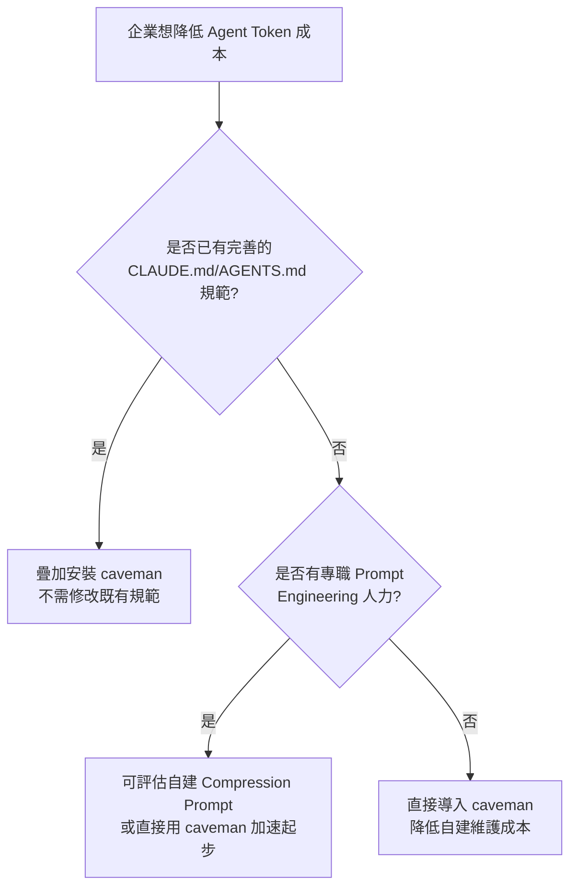

> 💡 **實務案例**：某企業原先在 `CLAUDE.md` 中手寫「請盡量簡潔回答」的單句指示，效果有限且無法依任務類型分級。導入 caveman 後，保留原有 `CLAUDE.md` 中的專案規範內容（技術棧限制、命名慣例等），移除原本效果不彰的簡潔化指示句，改由 caveman 的六段式 Mode 機制專職負責精簡程度控制，兩者職責清楚分工後，團隊反饋 Prompt 治理的可維護性明顯提升。

---

## 第22章 優缺點分析

### 🎯 學習目標

- 完整、平衡地評估 caveman 的優勢、限制、風險、成本、效能、維護性、學習成本與企業適用性

### 22.1 優勢

| 優勢 | 說明 |
|------|------|
| 導入成本低 | 純 Prompt/Hook 層級，無需修改程式碼庫或 CI/CD |
| 可快速 Pilot 驗證 | 安裝/解除安裝皆為輕量操作，適合小範圍快速試點 |
| 不影響程式碼品質 | 事實性內容逐字保留，風險邊界明確 |
| 隱私與安全性佳 | 無 Backend、無遙測，原始碼公開透明可審查 |
| 支援 Agent 範圍廣 | 30+ Agent，涵蓋主流 AI Coding Agent 生態系 |
| 效益可量化追蹤 | `/caveman-stats` 提供即時節省數據 |
| 與既有規範檔相容 | 與 `CLAUDE.md` 等機制正交，可疊加使用 |
| 開源、免費、透明 | MIT 授權，無供應商鎖定疑慮 |

### 22.2 限制

| 限制 | 說明 |
|------|------|
| 僅作用於 Output Token | Input Token、Reasoning Token 不受影響 |
| Skill 本身有固定注入成本 | 約 1~1.5k input token，簡單任務可能得不償失 |
| 部分 Agent 整合層級較淺 | Level 2/3 整合無法享有 Level 1 的自動化體驗 |
| 官方矩陣未涵蓋所有工具 | Zed、通用 VS Code/JetBrains 等無獨立原生整合 |
| 無官方容器化文件 | Docker/DevContainer/Codespaces 需企業自行摸索最佳實務 |
| 無商業支援方案 | 屬個人開源專案，企業需自行承擔風險評估 |
| 過度壓縮有資訊遺漏風險 | `ultra`/`wenyan` 若誤用於複雜論證場景可能省略關鍵依據 |

### 22.3 風險

- **版本漂移風險**：活躍開發中的個人專案，指令/行為可能隨版本調整，需企業自行建立版本管理機制（詳見第15、16章）。
- **維護者依賴風險**：核心維護仰賴單一開發者（JuliusBrussee），若專案停止維護，企業需評估自行 Fork 維護的可行性。
- **多工具交互風險**：與其他 Prompt 治理工具疊加時，需測試指示衝突可能性。
- **過度承諾風險**：若企業內部溝通時將「65% Output Token 節省」誤傳為「65% 整體成本節省」，可能造成管理層對導入效益的錯誤期待。

### 22.4 成本

| 成本類型 | 說明 |
|---------|------|
| 授權/軟體成本 | 零（MIT 授權免費） |
| 安裝/維運人力成本 | 低，但仍需版本管理與 Regression Test 投入 |
| 教育訓練成本 | 中等，需建立 Mode 選用規範與 Prompt Style Guide |
| Skill 固定注入成本 | 每輪約 1~1.5k input token，屬於持續性隱性成本 |
| 導入專案管理成本 | 中等，PoC/Pilot/Rollout 需要專案協調投入 |

### 22.5 效能

- caveman 不引入額外的網路延遲（純本地 Hook 操作 + 模型生成階段直接產出精簡文字，無二次後處理）。
- 對模型推論時間本身影響極小，主要效能效益體現在**回覆長度縮短帶來的閱讀與傳輸時間節省**，而非推論速度本身的提升。

### 22.6 維護性

- Skill 為純 Markdown 檔案，維護門檻低，具備基本 Prompt Engineering 知識的工程師即可理解與客製化。
- 官方 CI 自動同步機制（`sync-skill.yml`）確保 Plugin 發佈版本與原始 Skill 定義一致，降低人為同步錯誤風險。
- 企業自行 Fork 客製化時，需自行承擔與上游版本合併（Merge）的維護成本。

### 22.7 學習成本

- 基礎使用（安裝 + `/caveman` 切換）學習曲線低，約 10~30 分鐘可上手。
- 進階治理（Mode 選用規範、ROI 試算、多 Agent 整合層級判斷）需要一定的 Prompt Engineering 與企業導入管理經驗，建議由第17章角色分工中的 Champion 承擔此部分知識傳遞責任。

### 22.8 企業適用性總評

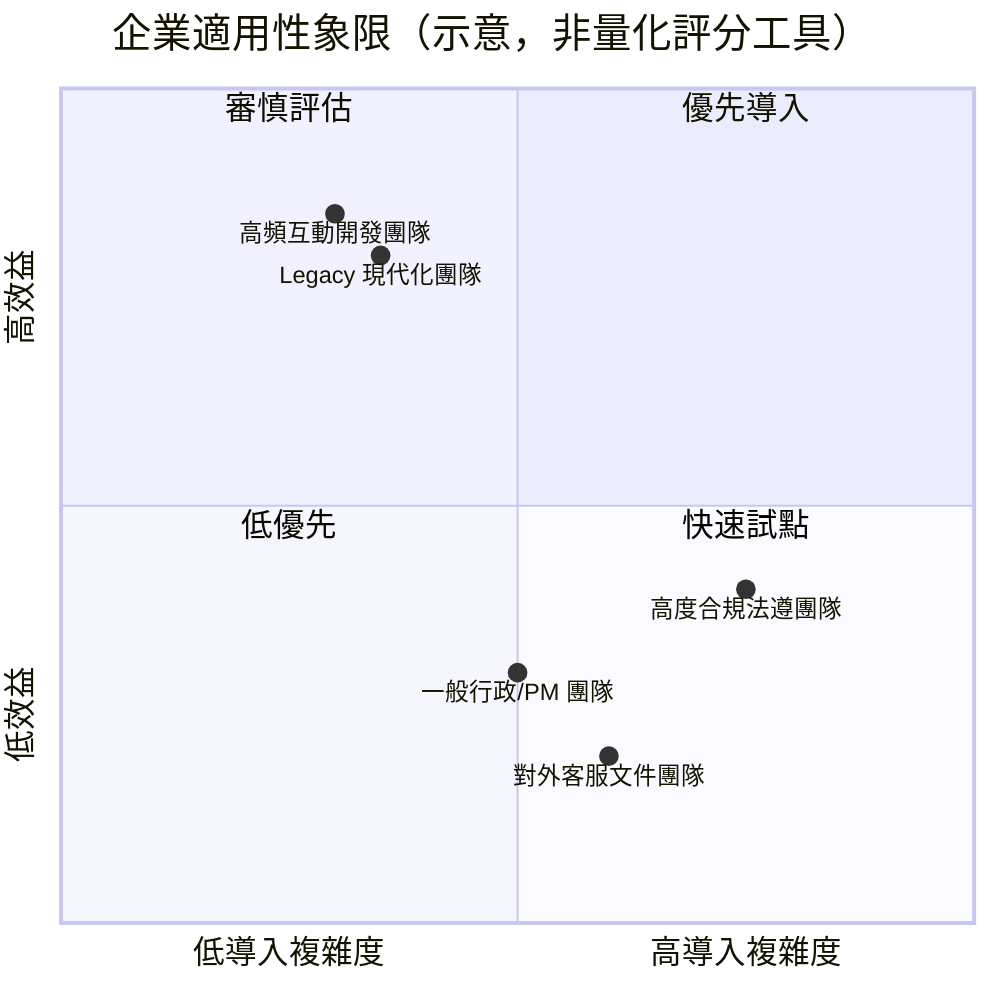

> 💡 **實務案例**：某企業以本章框架為基礎，製作一頁式「caveman 導入優缺點速覽表」提交給 IT 治理委員會審核，委員會依據風險（版本漂移、維護者依賴）與成本（近乎零授權費用）的對比，核准以「低風險、可隨時 Rollback」的定位放行 Pilot 試點，這份速覽表後續也成為向其他事業群推廣時的標準簡報素材。

---

## 第23章 Security 安全分析

### 🎯 學習目標

- 完整理解 caveman 的安全模型與潛在風險面
- 能主導或配合資安團隊完成導入前的安全評估

### 23.1 Prompt Injection 風險分析

| 風險面向 | caveman 相關性 | 說明 |
|---------|--------------|------|
| caveman 本身對模型的注入 | 低風險 | 規則公開透明、行為受限於「風格轉換」，不涉及權限提升或資料存取 |
| 使用者輸入中夾帶惡意指令試圖覆蓋 caveman 規則 | 中風險 | 屬於一般 LLM 應用皆需防範的 Prompt Injection 範疇，非 caveman 特有，但 UserPromptSubmit Hook 的持續提醒機制可降低風格被覆蓋的機率 |
| 多重 Plugin 疊加造成指示衝突 | 中風險 | 需於 Pilot 階段實測驗證（詳見第8.4節、第19.3節錯誤30） |
| caveman 規則檔本身遭竄改（供應鏈攻擊） | 需關注 | 建議使用固定 Tag + SHA-256 校驗 + 內部鏡射降低風險 |

### 23.2 Prompt Leak 考量

由於 caveman 的規則注入是「隱藏 stdout」形式，理論上使用者不會直接看到規則內容，但需注意：

- 規則內容本身**公開透明**（`skills/caveman/SKILL.md` 可在 GitHub 上直接查閱），因此即使被模型「洩漏」出來，也不構成商業機密外流風險。
- 若企業自行 Fork 並客製化規則內容（例如加入企業內部特定慣例），則需評估客製化內容是否有洩漏風險，並依一般 Prompt Leak 防範原則處理（例如避免在規則中寫入機密資訊）。

### 23.3 敏感資料與隱私

- caveman 不會將程式碼、對話內容、或任何使用者資料傳輸至第三方伺服器（無 Backend）。
- 安裝當下的網路行為僅限於從 GitHub/npm 下載套件本身，不涉及使用者資料傳輸。
- `/caveman-compress` 執行時，處理的檔案內容（如 `CLAUDE.md`）完全在本機透過既有 Agent 與其設定的 LLM 供應商互動完成，資料流向與一般使用該 Agent 進行對話並無二致，不會多一個新的資料出口。

### 23.4 Local / Offline 特性的安全意涵

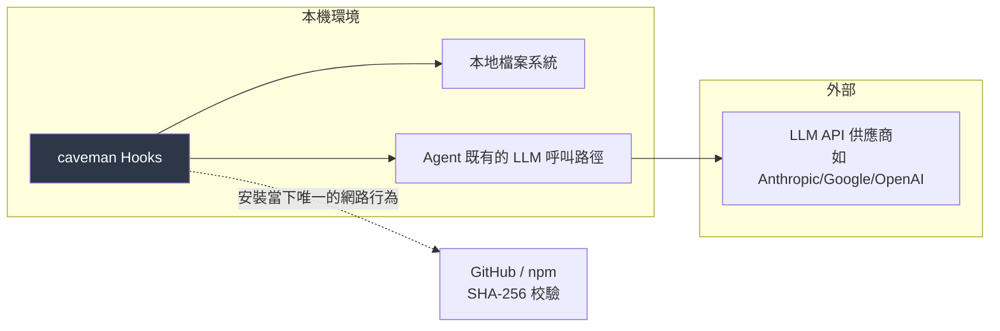

> 📌 **安全結論**：caveman 沒有為既有的資料流向新增任何節點，它只是在既有「Agent ↔ LLM 供應商」這條路徑上，多插入一段本機端的 Prompt 文字。因此，caveman 的安全評估重點應放在「安裝來源是否可信」與「規則內容是否透明可審查」，而非「是否會造成新的資料外洩管道」。

### 23.5 企業安全導入 Checklist

- [ ] 已由資安團隊審查 `src/hooks/` 原始碼，確認無網路呼叫邏輯
- [ ] 已確認安裝來源使用固定 Tag，並經 SHA-256 校驗
- [ ] 已建立內部鏡射倉庫（如企業對外部依賴有嚴格控管政策）
- [ ] 已針對是否啟用 `--with-mcp-shrink` 做出明確決策與風險評估
- [ ] 已測試與既有 Prompt 治理工具（如企業自建規範）的交互相容性
- [ ] 已將 caveman 納入企業 AI 工具清單並完成正式簽核流程
- [ ] 已確認高度合規業務線（如有）的例外處理規範

> 💡 **實務案例**：某醫療相關企業導入前要求提供「資料流向聲明書」，資安團隊依第23.4節架構圖逐一確認每個節點是否涉及病患相關資料傳輸，最終確認 caveman 不涉及任何資料出口變更後，僅要求企業內部針對 `/caveman-compress` 功能明訂「不得用於任何含病患資料的記憶檔案」的使用限制作為附加條款，即完成安全放行。

### 23.6 已知誤判與已知 Issue

> 📌 以下兩項為官方 SECURITY.md 中明確記載、經核實存在的真實社群回報案例，收錄目的是讓資安團隊在導入前預先了解「已知會發生但非真正安全疑慮」的誤判情境，避免重複排查已有官方說明的問題。

| 已知情境 | 觸發來源 | 官方／維護者說明 |
|---------|---------|----------------|
| Windows Defender／SmartScreen 將 `install.ps1` 誤判為一般惡意下載器（Generic Dropper） | 對應官方 GitHub Issue #383 | 屬已知的防毒軟體誤判行為，源於腳本本身會下載並執行後續安裝步驟的通用模式；建議企業改用第5.4節手動 Clone 安裝方式，讓資安團隊可逐行審查腳本內容後再執行，而非直接信任防毒軟體的自動放行或攔截判斷 |
| Snyk 將 `caveman-compress` 對記憶檔案的**原地覆寫**行為標記為「High Risk」 | 對應官方 GitHub Issue #28 | 維護者說明此為**預期行為**：`caveman-compress` 本質就是「讀取指定檔案 → 原地覆寫為精簡版本 → 保留 `.original.md` 備份」，符合這個功能被設計出來要做的事，並非未預期的檔案系統存取；不涉及網路呼叫或任意程式碼執行 |

> ⚠️ **企業安全審查建議做法**：上述兩個案例都屬於「靜態掃描工具依通用規則模式匹配、而非依實際行為判斷」所產生的誤判。建議資安團隊在正式簽核前，**直接參照官方 SECURITY.md 的說明段落**佐證，而非僅憑第三方掃描工具的紅色警示直接否決導入，同時仍應維持第23.5節 Checklist 中「逐行審查原始碼」的獨立驗證步驟，不應僅以官方說明作為唯一依據。

---

## 第24章 完整企業案例

### 🎯 學習目標

- 透過一個貫穿需求分析到文件產出的完整情境案例，理解 caveman 在真實開發生命週期中的具體應用
- 理解如何在同一專案中，依任務階段動態切換 Mode

> 📌 **情境聲明**：本章為本手冊建構之**示範情境**，用於教學說明目的，所有 Token 數字皆為依官方公開 Benchmark 數量級推導之示意數據，並非針對此虛構專案的官方實測結果。

### 24.1 案例背景

某企業計畫將一套會員系統，以 **Spring Boot（後端）+ Vue3（前端）+ Domain-Driven Design + Microservices** 架構重新打造，團隊規模 12 人（8 位後端、3 位前端、1 位架構師），全面採用 Claude Code 作為主要 AI Coding Agent，並已完成 caveman 的 Pilot 驗證，進入正式專案導入階段。

### 24.2 階段一：需求分析

```text
/caveman lite
請根據以下會員系統需求描述，整理出候選的 Bounded Context 劃分建議：
{{需求描述}}
```

- 使用 `lite` 而非 `full`／`ultra`，因為需求分析階段需要保留一定的論證完整度，避免遺漏業務脈絡。
- 示意 Token 對比：一般模式約 2,200 token 的完整分析 → `lite` 模式約 1,400 token（示意數字，論證完整度優先於極致壓縮）。

### 24.3 階段二：Coding（開發階段）

開發階段程式碼本身不受 caveman 影響，效益主要體現在**開發過程中的問答與除錯說明**：

```text
/caveman full
Order Aggregate 的 addItem() 方法目前允許新增庫存為 0 的商品，
請說明這是否違反 Domain Invariant，並提出修正建議。
```

- 示意 Token 對比：一般模式約 950 token → `full` 模式約 280 token（約 70% 節省，貼近官方 Benchmark 區間）。

### 24.4 階段三：Code Review

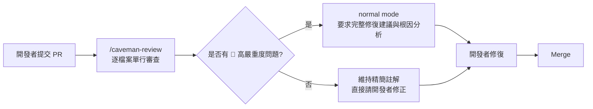

- 高嚴重度問題（如可能違反 Aggregate 一致性邊界的設計缺陷）會切回 `normal mode` 要求完整分析，避免因壓縮而遺漏關鍵論證。
- 一般缺陷（命名、格式、簡單邏輯問題）維持 `/caveman-review` 單行精簡註解。

### 24.5 階段四：Refactor（重構）

```text
/caveman full
請將 MemberService 中職責過重的 registerMember() 方法，
依據單一職責原則拆分，並條列說明每個新方法的職責邊界。
```

### 24.6 階段五：Framework Upgrade（本案例中途遇到 Spring Boot 升版需求）

```text
/caveman ultra
掃描全專案 javax.* import，以表格列出檔案路徑與建議替換的 jakarta.* 對應項目。
```

- 示意情境：全專案 340 個檔案掃描，一般模式約需 4,800 token 逐檔說明 → `ultra` 模式表格化輸出約 900 token（約 81% 節省，屬於高度格式化任務的效益上限區間）。

### 24.7 階段六：Commit

```bash
# 開發者於 Commit 前執行
/caveman-commit
```

產出範例：`fix(order): reject zero-quantity items in addItem`（≤50 字，符合 Conventional Commits 規範）。

### 24.8 階段七：Documentation（文件產出）

- API 文件：使用 `lite` 模式，兼顧簡潔與外部消費者可讀性。
- 架構決策記錄（ADR）：**全程關閉**，維持完整敘述，供未來稽核回溯。
- 內部模組說明文件：完成後執行 `/caveman-compress`，永久壓縮以降低未來每次 Session 讀取此文件的固定成本。

### 24.9 CI/CD 整合流程

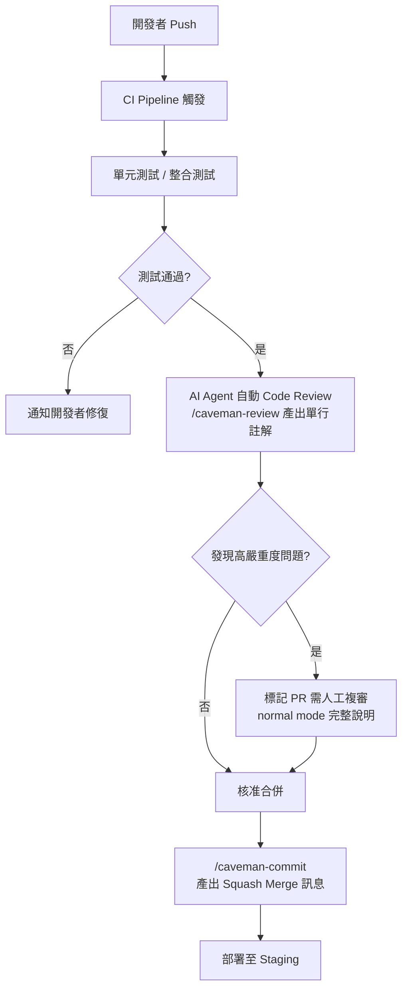

> ⚠️ **CI 整合注意事項**：若企業將 caveman 整合進 CI Pipeline 自動觸發的 AI Review 流程，務必確保高嚴重度問題會被明確標記並轉為需人工複審，避免因為單行精簡註解格式，讓 Reviewer 在快速瀏覽時漏看真正嚴重的問題。

### 24.10 本案例 Token 節省總覽（示意數據）

| 階段 | 一般模式估計 Token（月累積） | caveman 模式估計 Token（月累積） | 節省比例 |
|------|---------------------------|--------------------------------|---------|
| 需求分析 | 45,000 | 29,000 | 36% |
| Coding 除錯說明 | 180,000 | 54,000 | 70% |
| Code Review | 220,000 | 55,000 | 75% |
| Refactor 說明 | 90,000 | 27,000 | 70% |
| Framework Upgrade 掃描 | 60,000 | 11,000 | 82% |
| Commit Message | 15,000 | 6,000 | 60% |
| Documentation（API+內部說明） | 70,000 | 45,000 | 36% |
| **合計** | **680,000** | **227,000** | **約 67%** |

> ⚠️ 上表為教學示範情境數字，用於展示「依任務類型分級套用 Mode」的整體效果量級，並非任何真實企業的實測財報數據。實際企業導入應依第17.7節 ROI 模型自行量測。

### 24.11 案例總結

本案例展示了 caveman 導入的核心原則：**不是無差別全面套用最高壓縮強度，而是依任務性質（需求分析、除錯、Review、升版掃描、正式文件）動態選用對應的 Mode**，並在高風險/高複雜度的節點（Aggregate 一致性、ADR 決策依據）主動切回完整敘述模式。這種「分級治理」思維，正是本手冊第7、14、17、18章反覆強調的核心導入方法論。

---

## 第25章 附錄（Appendix）

### 25.1 Commands 速查表

| 指令 | 作用 | 範例 |
|------|------|------|
| `/caveman [level]` | 啟用/切換壓縮模式，持續整個 Session（`level` 為 `lite`/`full`/`ultra`/`wenyan` 之一） | `/caveman ultra` |
| `/caveman-init` | 於目前 Repo 寫入永久生效的規則檔，v1.9.1 起不再需要 caveman 本身的 checkout | `/caveman-init` |
| `/caveman-commit` | 產出 ≤50 字 Conventional Commit | `/caveman-commit` |
| `/caveman-review` | 產出單行 PR Review 註解 | `/caveman-review` |
| `/caveman-stats` | 顯示本次/累積節省 Token 與美金成本，支援 `--share` 產生可分享的單行摘要 | `/caveman-stats --share` |
| `/caveman-compress <file>` | 永久壓縮指定檔案，保留 `.original.md` 備份 | `/caveman-compress CLAUDE.md` |
| `caveman-help`（skill） | 提供操作說明與快速上手引導 | — |
| 「normal mode」 | 以自然語言關閉 caveman | — |
| 「talk like caveman」 | 部分未原生整合的 Agent 用以手動觸發 | — |

### 25.2 Configuration 設定速查

| 設定項 | 說明 |
|-------|------|
| Mode 解析優先順序 | 環境變數 > repo-local 設定 > 使用者設定 > 預設值 `full` |
| Flag File 路徑 | `${CLAUDE_CONFIG_DIR:-$HOME/.claude}/.caveman-active` |
| Statusline 靜音 | 環境變數 `CAVEMAN_STATUSLINE_SAVINGS=0` |
| Repo 規則檔寫入 | `--with-init` 旗標，寫入 `.cursor/rules/`、`.windsurf/rules/`、`.clinerules/`、`.github/copilot-instructions.md`、`.opencode/AGENTS.md`，以及偵測到 OpenClaw 時的 `SOUL.md` bootstrap 區塊 |
| MCP Middleware 註冊 | `--with-mcp-shrink="<cmd>"`（預設不啟用，可用 `--no-mcp-shrink` 明確聲明關閉） |
| 自動化安裝旗標 | `--non-interactive`（無互動提示）、`--no-color`（關閉 ANSI 顏色）、`--skip-skills`（跳過 npx skills 自動偵測）、`--config-dir <path>`（覆寫 Claude Code 設定目錄），詳見第5.5節 |

### 25.3 Modes 速查表

> 📌 已更正為官方實際的四種模式（無 `wenyan-lite`/`wenyan-full`/`wenyan-ultra` 子強度）。

| Mode | 強度 | 語言風格 |
|------|------|---------|
| `lite` | 低 | 一般語言，輕度精簡 |
| `full`（預設） | 中 | 一般語言，標準精簡 |
| `ultra` | 高 | 一般語言，極限精簡 |
| `wenyan` | 單一強度 | 文言文風格（官方定位為刻意的例外設計，非白話文的第四個強度階梯） |

### 25.4 Prompt Template Library（完整版，P1~P50+）

> 📌 P1~P14 已於第13章完整列出（Code Review / Refactor / Bug Fix / Architecture / Migration / Documentation 六大類），以下為延伸範本，依「日常開發」「維運」「導入治理」三大情境分類。

#### 日常開發類（P15~P30）

```text
【P15. 單元測試補齊】
/caveman full
請為 {{方法名稱}} 補齊單元測試，涵蓋正常路徑、邊界條件與異常路徑三類情境。
```

```text
【P16. API 相容性檢查】
/caveman ultra
比對 {{舊版 API 定義}} 與 {{新版 API 定義}}，以表格列出所有 Breaking Change。
```

```text
【P17. 效能瓶頸初步排查】
/caveman full
根據以下效能監控數據 {{數據}}，初步判斷可能的效能瓶頸位置與原因。
```

```text
【P18. 命名慣例檢查】
/caveman ultra
檢查 {{檔案路徑}} 中的命名是否符合團隊命名慣例 {{慣例說明}}，列出不符合項目。
```

```text
【P19. 依賴套件升級影響評估】
/caveman full
評估將 {{套件名稱}} 從 {{舊版本}} 升級至 {{新版本}} 的潛在影響。
```

```text
【P20. 例外處理補強】
/caveman full
檢查 {{檔案路徑}} 的例外處理是否完整，列出缺漏的例外情境。
```

```text
【P21. SQL 查詢效能檢查】
/caveman full
檢查以下 SQL 查詢是否有 N+1 問題或缺少索引的風險：{{SQL語句}}
```

```text
【P22. Spring Boot 2 to 3 升級評估】
/caveman ultra
請掃描專案中所有 javax.* 的 import，列出需要遷移至 jakarta.* 的清單，
並標註哪些是第三方套件相容性風險（無法單純改 import 解決）。
```

```text
【P23. 前端元件重複渲染排查】
/caveman ultra
分析 {{元件名稱}} 為何每次 render 都建立新的物件參照，並提出修正建議。
```

```text
【P24. GraphQL Schema 變更影響分析】
/caveman full
評估 {{Schema 變更描述}} 對現有前端查詢的影響範圍。
```

```text
【P25. 快取策略建議】
/caveman full
針對 {{資料存取模式描述}}，建議合適的快取策略與 TTL 設定。
```

```text
【P26. 資料驗證規則補強】
/caveman full
檢查 {{DTO/Model 名稱}} 的欄位驗證規則是否完整，列出建議新增的驗證項目。
```

```text
【P27. 非同步流程除錯】
/caveman full
分析以下非同步呼叫鏈為何發生 {{錯誤現象}}：{{程式碼片段}}
```

```text
【P28. 日誌埋點建議】
/caveman lite
針對 {{模組名稱}}，建議應新增哪些關鍵日誌埋點以利未來問題排查。
```

```text
【P29. 環境設定差異排查】
/caveman full
比對 {{環境A設定}} 與 {{環境B設定}}，找出可能導致行為差異的設定項。
```

```text
【P30. 型別安全檢查】
/caveman ultra
檢查 {{檔案路徑}} 是否存在型別不安全的隱式轉換，列出風險位置。
```

#### 維運類（P31~P40）

```text
【P31. 事件告警根因分析】
/caveman full
根據以下告警訊息與相關 Log，分析可能的根本原因：{{告警內容}}
```

```text
【P32. 部署失敗排查】
/caveman full
部署失敗訊息如下，請分析可能原因並提出修復步驟：{{部署錯誤訊息}}
```

```text
【P33. 資源使用率異常分析】
/caveman full
根據以下監控數據，分析 {{服務名稱}} CPU/記憶體使用率異常升高的可能原因：{{數據}}
```

```text
【P34. Runbook 產出】
/caveman lite
請為 {{常見維運情境}} 產出一份標準操作程序（Runbook），以條列步驟呈現。
```

```text
【P35. 資料庫遷移風險評估】
normal mode
評估執行 {{遷移腳本}} 對正在運行的生產環境可能造成的風險，包含鎖表時間估算。
```

```text
【P36. 容器化資源設定建議】
/caveman full
根據 {{服務的資源使用歷史}}，建議合適的 Kubernetes Resource Requests/Limits 設定。
```

```text
【P37. 版本回滾影響評估】
/caveman full
評估將 {{服務名稱}} 從 {{新版本}} 回滾至 {{舊版本}} 可能造成的資料相容性問題。
```

```text
【P38. 監控指標盤點】
/caveman ultra
盤點 {{服務名稱}} 目前已有的監控指標，以表格列出指標名稱與涵蓋範圍，並指出缺口。
```

```text
【P39. 值班交接摘要】
/caveman-compress
請將本週值班期間發生的所有事件摘要壓縮為精簡交接文件，保留所有事件編號、時間戳記與處理指令逐字不變。
```

```text
【P40. 災難復原演練腳本】
normal mode
請為 {{系統名稱}} 設計一份完整的災難復原演練腳本，需包含每個步驟的預期結果與驗證方式。
```

#### 導入治理類（P41~P50+）

```text
【P41. Prompt Style Guide 草稿產出】
/caveman lite
根據以下團隊任務類型清單 {{清單}}，草擬一份 Mode 選用規範建議。
```

```text
【P42. PoC 報告草稿】
/caveman full
根據以下 PoC 期間蒐集的 Token 使用數據 {{數據}}，草擬一份 PoC 總結報告。
```

```text
【P43. ROI 試算說明】
normal mode
根據第17.7節提供的 ROI 公式與以下數據 {{數據}}，完整說明試算過程與假設條件。
```

```text
【P44. 團隊導入 FAQ 草稿】
/caveman lite
根據以下 Pilot 階段蒐集的常見問題 {{問題清單}}，草擬一份團隊內部 FAQ 文件。
```

```text
【P45. 安全審查問答準備】
normal mode
請針對資安團隊可能提出的關於 caveman 隱私與資料流向的問題，準備完整的問答對照表。
```

```text
【P46. Rollback 演練腳本】
/caveman full
請設計一份 caveman Rollback 演練腳本，涵蓋解除安裝、規則檔清理與驗證步驟。
```

```text
【P47. 版本升級 Migration Guide 草稿】
/caveman full
根據 {{舊版本}} 與 {{新版本}} 的官方 Release Notes（GitHub Releases）差異，草擬企業內部 Migration Guide。
```

```text
【P48. Champion 教育訓練教材大綱】
/caveman lite
請為新指定的團隊 caveman Champion 草擬一份 30 分鐘教育訓練課程大綱。
```

```text
【P49. 跨團隊 Mode 使用一致性稽核】
/caveman ultra
比對以下各團隊目前的 Mode 使用規範 {{各團隊規範清單}}，列出不一致之處。
```

```text
【P50. 季度導入成效回顧摘要】
/caveman full
根據本季 `/caveman-stats` 累積數據與團隊問卷回饋 {{數據與回饋}}，產出季度回顧摘要供導入委員會參考。
```

### 25.5 術語表（Glossary）

| 術語 | 說明 |
|------|------|
| caveman | 本手冊主題專案，AI Coding Agent 輸出壓縮 Skill |
| Output Compression | 輸出壓縮，caveman 核心機制 |
| SessionStart Hook | Claude Code 於 Session 啟動時觸發的 Hook 事件 |
| UserPromptSubmit Hook | Claude Code 於使用者送出訊息時觸發的 Hook 事件 |
| Flag File | 記錄目前啟用 Mode 狀態的本地檔案 |
| SKILL.md | 定義 Agent 行為規則的 Markdown 檔案 |
| cavecrew | caveman 提供的三隻專職 subagent（investigator/builder/reviewer） |
| caveman-shrink | 包裹既有 MCP Tool Server 的壓縮 Middleware |
| wenyan | caveman 提供的文言文風格壓縮模式，為單一模式，並非家族／多階強度（無 wenyan-lite/full/ultra 之分） |
| Auto-clarity rule | 偵測到安全性/困惑情境時自動退回完整敘述的機制 |

### 25.6 縮寫表

| 縮寫 | 全稱 |
|------|------|
| MCP | Model Context Protocol |
| DDD | Domain-Driven Design |
| ADR | Architecture Decision Record |
| PoC | Proof of Concept |
| ROI | Return on Investment |
| KPI | Key Performance Indicator |
| SOP | Standard Operating Procedure |
| DPA | Data Processing Agreement |

### 25.7 參考架構圖

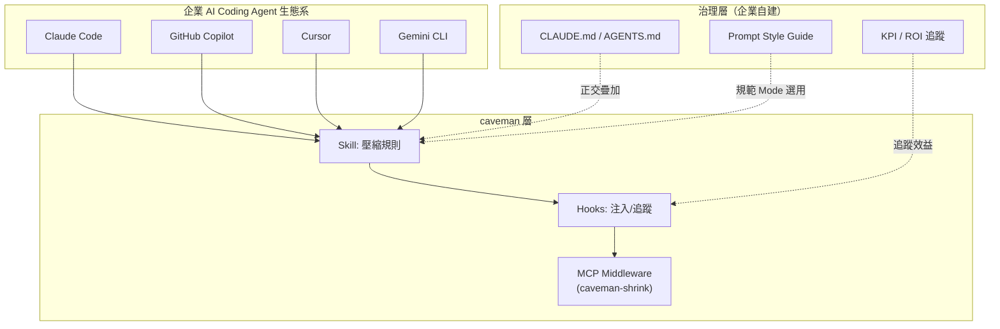

### 25.8 官方文件與延伸閱讀

- 官方 Repository：`github.com/JuliusBrussee/caveman`
- README.md — 專案總覽、安裝、指令、Modes
- INSTALL.md — 完整逐 Agent 安裝矩陣、旗標、疑難排解
- SECURITY.md — 隱私與安全政策
- CLAUDE.md（維護者文件）— Hook 架構與內部技術細節
- 官方網站：caveman.so（實際內容為「Caveman 2」候補名單頁面——Caveman 2 是官方正在開發中的團隊儀表板產品，目標是把目前 `/caveman-stats` 提供的本地估算數字，升級為跨團隊可驗證的正式報表，詳見第1.9節與Q97）
- 生態系延伸專案：caveman-code、cavemem、cavekit、cavegemma（皆 by JuliusBrussee，非本手冊主要範圍，導入前請自行查證其獨立的成熟度與適用性）。其中需特別澄清：「**cavegemma**」僅為 README 中使用的行銷／產品代稱，其實際對應的 GitHub repo 名稱是 **`JuliusBrussee/finetune-caveman`**，並非存在一個字面上叫做「cavegemma」的獨立 repo——若在 GitHub 上直接搜尋「cavegemma」將找不到對應專案，需以 `finetune-caveman` 搜尋。

> ⚠️ **重要提醒**：以上連結與專案狀態依本手冊撰寫時點（對齊 v1.9.1）記錄，開源專案版本與文件內容可能持續變動，正式導入前請務必以官方 Repository 當下最新內容為準，不應完全依賴本手冊的靜態快照。

### 25.9 最佳實務總清單（快速索引）

完整 50 項最佳實務詳見第18章，依分類快速索引：

- 安裝與設定類：第18.1節（1~10）
- Mode 使用類：第18.2節（11~20）
- 團隊治理類：第18.3節（21~30）
- 安全與風險控管類：第18.4節（31~40）
- 效益追蹤與 ROI 類：第18.5節（41~50）

### 25.10 依角色 Checklist

#### 新進同仁上手 Checklist

- [ ] 已了解 caveman 是「輸出壓縮」而非「模型能力」工具
- [ ] 已完成本機安裝並驗證 `/caveman` 指令可正常運作
- [ ] 已閱讀團隊的 Prompt Style Guide，了解各任務類型建議 Mode
- [ ] 已知道如何用「normal mode」暫時關閉壓縮
- [ ] 已知道遇到問題時應詢問哪一位 Champion

#### Tech Lead / 架構師 Checklist

- [ ] 已評估團隊使用的 Agent 屬於哪個整合層級（第6.1節）
- [ ] 已確認架構決策類討論明訂使用 `full` 或關閉，而非 `ultra`
- [ ] 已將 caveman 與既有 `CLAUDE.md` 規範的職責分工說明清楚
- [ ] 已規劃版本升級的 Regression Test 流程

#### DevSecOps 工程師 Checklist

- [ ] 已完成第23.5節企業安全導入 Checklist 全部項目
- [ ] 已審查安裝腳本與 Hook 原始碼
- [ ] 已確認固定 Tag 與 SHA-256 校驗機制到位
- [ ] 已測試與既有 Prompt 治理工具的交互相容性

#### 導入決策者 / PM Checklist

- [ ] 已完成 PoC 並取得量化數據
- [ ] 已理解 65% 節省數字僅涵蓋 Output Token 的限制
- [ ] 已規劃 PoC → Pilot → Rollout 分階段時程
- [ ] 已建立季度 KPI 追蹤機制
- [ ] 已準備好向管理層說明風險（版本漂移、維護者依賴）與對應的 Rollback 方案

#### 維運人員 Checklist

- [ ] 已建立版本管理 SOP（固定 Tag、升級前先於測試 Repo 驗證）
- [ ] 已熟悉 Rollback 完整流程（含 `--uninstall` 未涵蓋的殘留項清理）
- [ ] 已將 Regression Test 清單納入每次升級的標準作業程序

### 25.11 版本歷程

> 📌 官方 repo **無 CHANGELOG.md 檔案**，以下版本標籤、日期與代號皆逐一核對自 GitHub Releases API，作為第15.1節、第16章交叉引用的唯一資料來源。企業如需完整逐項變更說明，請點擊對應版本連結查閱 [GitHub Releases](https://github.com/JuliusBrussee/caveman/releases) 原文。

| 版本 | 發布日期 | 代號／重點 |
|------|---------|----------|
| v1.9.1 | 2026-07-03 | "65%, honestly" — 維運與誠實揭露修正版，統一節省數字為 65%，退役舊版 ~75% 宣稱 |
| v1.9.0 | 2026-06-12 | "Rock pinned. Rock verified. opencode rock work now." |
| v1.8.2 | 2026-05-12 | 安裝程式錯誤修正 |
| v1.8.1 | 2026-05-10 | Hotfix：`curl\|bash` 一鍵安裝腳本修復 |
| v1.8.0 | 2026-05-10 | "Lobster grunt. Opencode grunt. Brain still big." |
| v1.7.0 | 2026-05-01 | "Stats receipts, smart installer, cavecrew, MCP-shrink" — `/caveman-stats`、`cavecrew`、`caveman-shrink` 首次發布 |
| v1.6.0 | 2026-04-15 | Hardening release：Hook 當機修復、symlink-safe flag 寫入（`safeWriteFlag()`） |
| v1.3.0 | 2026-04-08 | "文言文, Skills, Evals & Community Fixes" — `wenyan` 模式首次發布 |
| v1.2.0 | 2026-04-06 | "Intensity Levels, Auto-Clarity & Caveman-Compress" — 強度分級、auto-clarity、`/caveman-compress` 首次發布 |
| v1.1.0 | 2026-04-05 | "Real Benchmarks" — 首次公開官方 Benchmark 數據 |
| v1.0.0 | 2026-04-04 | "why use many token when few token do trick" — 首次發布 |

> 💡 由版本歷程可見，`wenyan` 模式（v1.3.0）與 `cavecrew`／`caveman-shrink`（v1.7.0）都是專案發布後逐步疊加的功能，並非一開始就存在——這也解釋了為何本手冊第2、3章的架構描述需要涵蓋這些後續才加入的元件。企業評估「功能穩定性」時，可將功能發布版本與目前對齊版本（v1.9.1）的版本差距，作為該功能成熟度的參考指標之一。

---

*本手冊為企業內部教學與規範用途，內容係依 caveman v1.9.1（2026-07-03）之官方公開文件（README / INSTALL.md / SECURITY.md / CLAUDE.md）整理分析並補充企業導入視角撰寫而成，非官方文件之逐字翻譯或轉載。caveman 為活躍開發中的開源專案，行為與指令可能隨版本演進調整，請定期核對官方 Repository 最新內容以確認本手冊各項細節仍然有效，如有出入請以官方文件為準。*


