+++
date = '2026-01-12T13:19:40+08:00'
draft = false
title = 'Claude Agent Skills教學手冊'
tags = ['教學', 'AI開發']
categories = ['教學']
+++


# Claude Agent Skills 使用教學手冊

> **版本**：1.0  
> **最後更新**：2026 年 1 月  
> **適用對象**：新進軟體工程師、系統分析師、AI 導入成員
> **最後更新**: 2026年1月8日  
> **適用於**: Claude Code 
> **Created by**: Eric Cheng


## 目錄

- [前言](#前言)
  - [文件目的](#文件目的)
  - [適用對象](#適用對象)
  - [如何使用本手冊](#如何使用本手冊)
- [第一章：Claude Agent 與 Agent Skills 基礎概念](#第一章claude-agent-與-agent-skills-基礎概念)
  - [1.1 什麼是 Claude Agent](#11-什麼是-claude-agent)
  - [1.2 什麼是 Agent Skills](#12-什麼是-agent-skills)
  - [1.3 Agent / Tool / Skill 的差異與關係](#13-agent--tool--skill-的差異與關係)
  - [1.4 為什麼要使用 Agent Skills](#14-為什麼要使用-agent-skills)
- [第二章：Agent Skills 的設計理念](#第二章agent-skills-的設計理念)
  - [2.1 Skill 的責任邊界（Single Responsibility）](#21-skill-的責任邊界single-responsibility)
  - [2.2 Skill 與 Prompt 的差異](#22-skill-與-prompt-的差異)
  - [2.3 Skill 是可重用、可組合的能力單元](#23-skill-是可重用可組合的能力單元)
  - [2.4 官方 Skills Repo 的設計原則](#24-官方-skills-repo-的設計原則)
- [第三章：官方 Skills Repository 結構說明](#第三章官方-skills-repository-結構說明)
  - [3.1 Skills GitHub 專案的目錄結構](#31-skills-github-專案的目錄結構)
  - [3.2 Skill 的命名慣例](#32-skill-的命名慣例)
  - [3.3 Skill 定義中的關鍵元素](#33-skill-定義中的關鍵元素)
- [第四章：Agent Skills 的使用方式](#第四章agent-skills-的使用方式)
  - [4.1 如何在 Agent 中呼叫 Skill](#41-如何在-agent-中呼叫-skill)
  - [4.2 Skill 在任務流程中的角色](#42-skill-在任務流程中的角色)
  - [4.3 單一 Skill vs 多 Skill 組合](#43-單一-skill-vs-多-skill-組合)
- [第五章：實務範例](#第五章實務範例)
  - [5.1 需求文件產生 Skill](#51-需求文件產生-skill)
  - [5.2 程式碼 Review / 重構 Skill](#52-程式碼-review--重構-skill)
  - [5.3 測試案例產生 Skill](#53-測試案例產生-skill)
- [第六章：新手常見錯誤與最佳實務](#第六章新手常見錯誤與最佳實務)
  - [6.1 Skill 設計過大或過小的問題](#61-skill-設計過大或過小的問題)
  - [6.2 把 Skill 當成一次性 Prompt 的錯誤用法](#62-把-skill-當成一次性-prompt-的錯誤用法)
  - [6.3 如何讓 Skill 更容易被重用](#63-如何讓-skill-更容易被重用)
  - [6.4 如何讓 Agent 行為更穩定](#64-如何讓-agent-行為更穩定)
- [第七章：團隊導入建議](#第七章團隊導入建議)
  - [7.1 適合先從哪些類型的 Skill 開始](#71-適合先從哪些類型的-skill-開始)
  - [7.2 如何建立內部 Skill Library](#72-如何建立內部-skill-library)
  - [7.3 與既有開發流程整合](#73-與既有開發流程整合)
  - [7.4 導入成熟度階段建議](#74-導入成熟度階段建議)
- [附錄：檢查清單（Checklist）](#附錄檢查清單checklist)
  - [Skill 建立前檢查](#skill-建立前檢查)
  - [SKILL.md 撰寫檢查](#skillmd-撰寫檢查)
  - [Skill 發布前檢查](#skill-發布前檢查)
  - [團隊導入檢查](#團隊導入檢查)
- [參考資源](#參考資源)
  - [官方資源](#官方資源)
  - [延伸閱讀](#延伸閱讀)

---

## 前言

### 文件目的

本手冊旨在協助團隊成員快速理解並導入 **Claude Agent Skills**，透過系統化的教學內容，讓新進同仁能夠：

1. 理解 Agent Skills 的核心概念與設計理念
2. 學會建立、使用與維護 Skills
3. 將 Skills 整合至現有開發流程
4. 避免常見錯誤，採用最佳實務

### 適用對象

| 角色 | 學習重點 |
|------|----------|
| **軟體工程師** | 如何使用 Skills 提升開發效率、如何建立自訂 Skills |
| **系統分析師** | 如何運用 Skills 產生需求文件、如何設計 Skill 規格 |
| **AI 導入成員** | 如何規劃團隊 Skills 導入策略、如何建立 Skill Library |
| **技術主管** | 如何評估 Skills 效益、如何制定導入計畫 |

### 如何使用本手冊

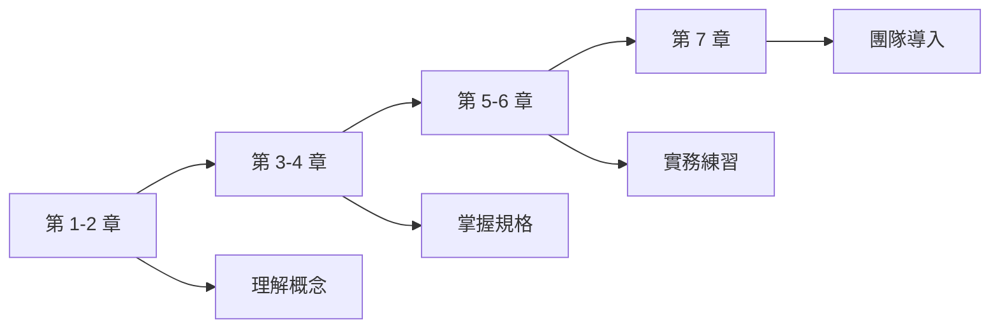

**建議學習路徑**：

| 階段 | 章節 | 學習目標 | 預計時間 |
|------|------|----------|----------|
| **入門** | 第 1-2 章 | 理解基礎概念與設計理念 | 1 小時 |
| **進階** | 第 3-4 章 | 掌握 Skills 結構與使用方式 | 1.5 小時 |
| **實作** | 第 5-6 章 | 動手練習與避免常見錯誤 | 2 小時 |
| **導入** | 第 7 章 | 規劃團隊導入策略 | 1 小時 |

---

## 第一章：Claude Agent 與 Agent Skills 基礎概念

### 1.1 什麼是 Claude Agent

**Claude Agent** 是 Anthropic 開發的 AI 代理系統，能夠：

- **理解任務**：解析使用者的自然語言指令
- **規劃步驟**：將複雜任務分解為可執行的步驟
- **執行操作**：透過工具（Tools）與外部系統互動
- **產生輸出**：生成程式碼、文件、分析報告等

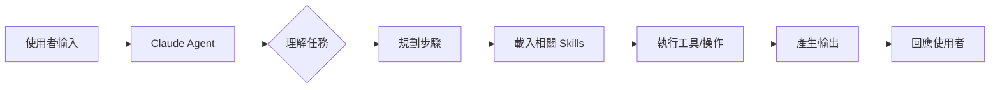

**💡 實務重點**：Claude Agent 本身具備強大的推理能力，但缺乏特定領域的「專業知識」與「標準作業程序」，這正是 Agent Skills 要解決的問題。

---

### 1.2 什麼是 Agent Skills

**Agent Skills** 是一種輕量化、開放格式的擴充機制，用於為 AI Agent 提供：

| 功能 | 說明 |
|------|------|
| **專業知識** | 特定領域的規則、最佳實務、檢查清單 |
| **操作指引** | 一步一步的執行流程與標準作業程序 |
| **參考資源** | 範本、腳本、文件範例 |
| **品質標準** | 驗收條件、品質檢查點 |

**核心架構**：

```text
skill-name/
├── SKILL.md          # 必要：指令與元資料
├── scripts/          # 選擇性：可執行腳本
├── references/       # 選擇性：參考文件
└── assets/           # 選擇性：範本、資源檔案
```

**🏦 銀行系統實務**：在金融專案中，可建立「合規檢查 Skill」、「資料遮罩 Skill」等，確保 Agent 產出符合法規要求。

---

### 1.3 Agent / Tool / Skill 的差異與關係

這三個概念經常混淆，以下是清楚的區分：

| 概念 | 定義 | 類比 | 範例 |
|------|------|------|------|
| **Agent** | 具備推理與決策能力的 AI 系統 | 員工 | Claude Agent |
| **Tool** | Agent 可呼叫的功能介面 | 工具箱中的工具 | 檔案讀寫、執行終端指令、API 呼叫 |
| **Skill** | 教導 Agent 如何完成特定任務的知識包 | 培訓手冊/SOP | 「程式碼審查 Skill」、「PDF 處理 Skill」 |

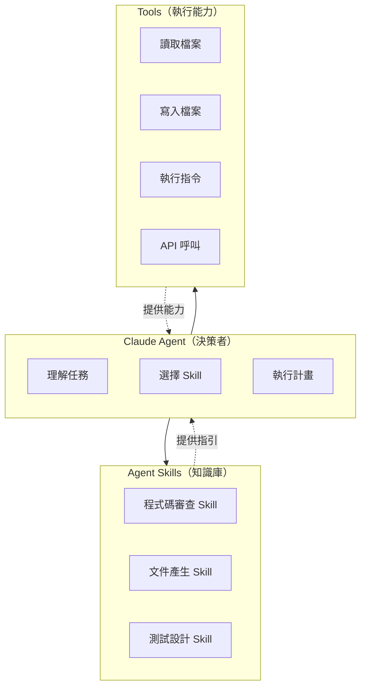

**關鍵差異**：

- **Tool** 是「做什麼」（What）— 提供執行能力
- **Skill** 是「如何做」（How）— 提供方法論與知識

---

### 1.4 為什麼要使用 Agent Skills

#### 問題場景

沒有 Skills 時，Agent 可能遇到的問題：

| 問題 | 說明 | 後果 |
|------|------|------|
| 缺乏領域知識 | Agent 不知道公司特定的命名規範 | 產出不符合團隊標準 |
| 流程不一致 | 每次執行方式不同 | 難以維護、品質不穩定 |
| 重複溝通 | 每次都要重新說明需求 | 效率低落 |
| 知識難以傳承 | 專家經驗留在個人 | 團隊能力參差不齊 |

#### 導入 Skills 的效益

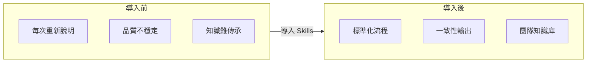

**效益總結**：

| 效益 | 說明 |
|------|------|
| **可重用性** | 一次建立，多次使用 |
| **一致性** | 標準化流程，減少人為差異 |
| **可組合性** | 多個 Skills 可組合完成複雜任務 |
| **可移植性** | Skills 是純文字檔案，易於版控與分享 |
| **可審計性** | 明確記錄 Agent 的行為依據 |

**💡 實務建議**：從團隊最常重複執行的任務開始建立 Skill，如程式碼審查、文件產生等。

---

## 第二章：Agent Skills 的設計理念

### 2.1 Skill 的責任邊界（Single Responsibility）

**核心原則**：每個 Skill 應專注於「一件事」，並把它做好。

#### 良好的責任邊界

| Skill 名稱 | 職責 | 適當性 |
|------------|------|--------|
| `code-review` | 審查程式碼品質與安全性 | ✅ 單一職責 |
| `unit-test-generator` | 產生單元測試案例 | ✅ 單一職責 |
| `api-documentation` | 產生 API 文件 | ✅ 單一職責 |

#### 不良的責任邊界

| Skill 名稱 | 職責 | 問題 |
|------------|------|------|
| `everything-helper` | 處理所有開發任務 | ❌ 過於廣泛 |
| `code-review-and-fix-and-test` | 審查、修復、測試 | ❌ 多重職責 |

**設計原則**：

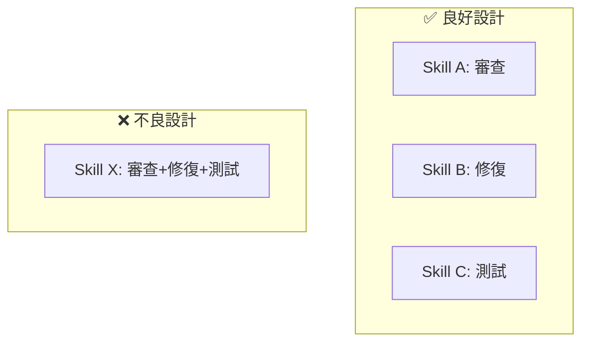

---

### 2.2 Skill 與 Prompt 的差異

| 特性 | Prompt | Skill |
|------|--------|-------|
| **形式** | 單次文字輸入 | 結構化資料夾 |
| **重用性** | 需複製貼上 | 可被發現與載入 |
| **組織性** | 無標準格式 | 有 frontmatter 元資料 |
| **版本控制** | 困難 | 易於 Git 管理 |
| **團隊協作** | 難以共享 | 易於發布與安裝 |
| **附加資源** | 僅文字 | 可包含腳本、範本、參考文件 |

**Prompt 範例**（一次性使用）：

```
請幫我審查以下程式碼，注意：
1. 命名是否符合駝峰式
2. 是否有安全漏洞
3. 是否有效能問題
...
```

**Skill 範例**（可重用）：

```yaml
---
name: code-review
description: 審查 Java/Python 程式碼的品質、安全性與效能。當使用者提到程式碼審查、Code Review、PR Review 時使用此 Skill。
---

# 程式碼審查 Skill

## 審查流程
1. 命名規範檢查
2. 安全性掃描
3. 效能分析
...
```

---

### 2.3 Skill 是可重用、可組合的能力單元

**組合模式**：

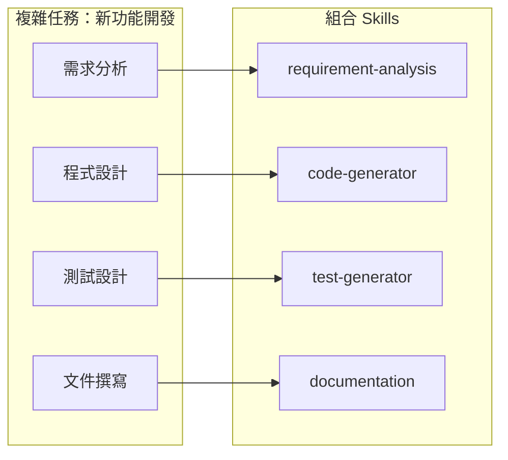

**實務範例**：處理一個 PR 可能需要組合多個 Skills：

1. `code-review` - 審查程式碼品質
2. `security-scan` - 檢查安全漏洞
3. `test-coverage` - 分析測試覆蓋率
4. `documentation-check` - 確認文件完整性

---

### 2.4 官方 Skills Repo 的設計原則

Anthropic 官方 Skills Repository 遵循以下原則：

| 原則 | 說明 |
|------|------|
| **漸進式揭露** | 先載入 name/description，需要時才載入完整指令 |
| **自我描述** | SKILL.md 本身可被人類閱讀理解 |
| **最小依賴** | 避免複雜的外部依賴 |
| **清晰邊界** | 每個 Skill 職責明確 |

**漸進式揭露（Progressive Disclosure）**：

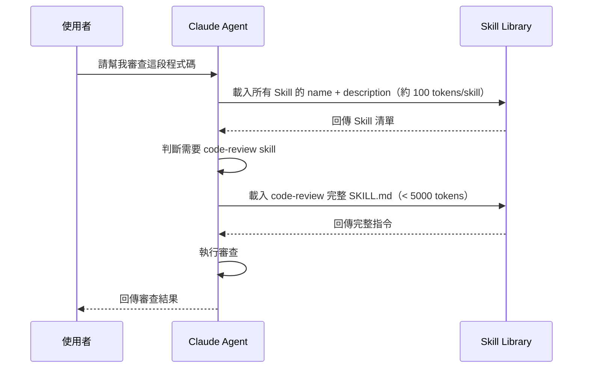

---

## 第三章：官方 Skills Repository 結構說明

### 3.1 Skills GitHub 專案的目錄結構

**官方 Repository**：https://github.com/anthropics/skills

```
anthropics/skills/
├── skills/                    # 範例 Skills
│   ├── creative/              # 創意類 Skills
│   ├── development/           # 開發類 Skills
│   ├── enterprise/            # 企業類 Skills
│   ├── docx/                  # Word 文件處理
│   ├── pdf/                   # PDF 處理
│   ├── pptx/                  # PowerPoint 處理
│   └── xlsx/                  # Excel 處理
├── spec/                      # Agent Skills 規格說明
├── template/                  # Skill 範本
└── README.md
```

**單一 Skill 結構**：

```
skill-name/
├── SKILL.md              # 必要：指令與元資料
├── scripts/              # 選擇性：可執行腳本
│   └── process.py
├── references/           # 選擇性：參考文件
│   ├── REFERENCE.md
│   └── FORMS.md
└── assets/               # 選擇性：範本、資源
    └── template.docx
```

---

### 3.2 Skill 的命名慣例

**命名規則**：

| 規則 | 說明 | 範例 |
|------|------|------|
| 長度限制 | 1-64 字元 | `code-review` ✅ |
| 字元限制 | 小寫字母、數字、連字號 | `pdf-processing` ✅ |
| 禁止開頭結尾 | 不可以連字號開頭或結尾 | `-pdf` ❌ |
| 禁止連續連字號 | 不可出現 `--` | `pdf--process` ❌ |
| 目錄名稱匹配 | name 欄位須與資料夾名稱一致 | `code-review/SKILL.md` → `name: code-review` |

**有效命名**：

```yaml
name: pdf-processing      # ✅
name: data-analysis       # ✅
name: code-review         # ✅
name: unit-test-gen       # ✅
```

**無效命名**：

```yaml
name: PDF-Processing      # ❌ 包含大寫
name: -pdf                # ❌ 以連字號開頭
name: pdf-                # ❌ 以連字號結尾
name: pdf--processing     # ❌ 連續連字號
name: code review         # ❌ 包含空格
```

---

### 3.3 Skill 定義中的關鍵元素

**SKILL.md 完整結構**：

```yaml
---
# === 必要欄位 ===
name: code-review
description: >
  審查 Java/Python/TypeScript 程式碼的品質、安全性與效能。
  當使用者提到程式碼審查、Code Review、PR Review 時使用此 Skill。

# === 選擇性欄位 ===
license: Apache-2.0
compatibility: Designed for Claude Code (or similar products)
metadata:
  author: your-org
  version: "1.0"
  category: development
allowed-tools: Bash(git:*) Read Write
---

# 程式碼審查 Skill

## 何時使用此 Skill
- 使用者要求審查程式碼
- PR Review 場景
- 程式碼品質檢查

## 審查步驟
1. 讀取程式碼檔案
2. 檢查命名規範
3. 識別安全漏洞
4. 分析效能問題
5. 產生審查報告

## 審查項目清單
- [ ] 命名是否符合規範
- [ ] 是否有未處理的例外
- [ ] 是否有 SQL Injection 風險
- [ ] 是否有硬編碼的密碼/金鑰

## 輸出格式
### 審查報告
- **嚴重度**：Critical / Major / Minor
- **位置**：檔案名稱:行號
- **說明**：問題描述
- **建議**：修正方式
```

**欄位說明表**：

| 欄位 | 必要性 | 長度限制 | 說明 |
|------|--------|----------|------|
| `name` | 必要 | 1-64 字元 | Skill 唯一識別名稱 |
| `description` | 必要 | 1-1024 字元 | 描述功能與使用時機 |
| `license` | 選擇性 | - | 授權條款 |
| `compatibility` | 選擇性 | 1-500 字元 | 環境需求說明 |
| `metadata` | 選擇性 | - | 自訂 key-value 資料 |
| `allowed-tools` | 選擇性 | - | 預先授權的 Tools（實驗性）|

---

## 第四章：Agent Skills 的使用方式

### 4.1 如何在 Agent 中呼叫 Skill

**使用方式一：Claude Code（VS Code 整合）**

```bash
# 1. 註冊 Skills Marketplace
/plugin marketplace add anthropics/skills

# 2. 安裝特定 Skill Plugin
/plugin install document-skills@anthropic-agent-skills
/plugin install example-skills@anthropic-agent-skills
```

安裝後，直接在對話中提及即可：

```
請使用 PDF skill 從 contract.pdf 中提取表格資料
```

**使用方式二：Claude.ai（網頁版）**

1. 進入 Claude.ai 設定
2. 上傳自訂 Skill 資料夾
3. 在對話中自然提及即可觸發

**使用方式三：Claude API**

```python
import anthropic

client = anthropic.Anthropic()

# 透過 API 使用 Skill
response = client.messages.create(
    model="claude-sonnet-4-20250514",
    max_tokens=1024,
    system="You have access to the code-review skill.",
    messages=[
        {"role": "user", "content": "請審查以下程式碼：..."}
    ]
)
```

---

### 4.2 Skill 在任務流程中的角色

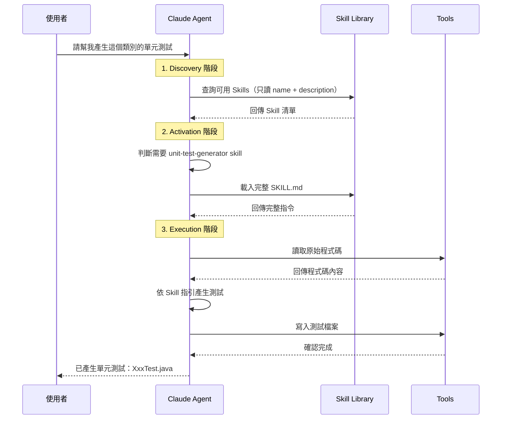

**三階段說明**：

| 階段 | 動作 | Token 消耗 |
|------|------|------------|
| **Discovery** | 載入所有 Skill 的 name + description | ~100 tokens/skill |
| **Activation** | 載入選中 Skill 的完整 SKILL.md | < 5000 tokens（建議）|
| **Execution** | 視需要載入 scripts/、references/、assets/ | 依需求而定 |

---

### 4.3 單一 Skill vs 多 Skill 組合

**單一 Skill 場景**：

| 場景 | 使用 Skill |
|------|-----------|
| 單純的程式碼審查 | `code-review` |
| 產生 API 文件 | `api-documentation` |
| PDF 文字提取 | `pdf-processing` |

**多 Skill 組合場景**：

| 場景 | 組合 Skills |
|------|-------------|
| 完整的 PR 審查流程 | `code-review` + `security-scan` + `test-coverage` |
| 新功能開發 | `requirement-analysis` + `code-generator` + `unit-test-generator` |
| 技術文件製作 | `api-documentation` + `diagram-generator` + `pdf-processing` |

**🏦 銀行系統實務**：處理客戶資料的功能開發，可能需要組合：
1. `requirement-analysis` - 分析需求
2. `data-masking` - 資料遮罩規則
3. `code-generator` - 產生程式碼
4. `security-audit` - 安全審計
5. `compliance-check` - 合規檢查

---

## 第五章：實務範例

### 5.1 需求文件產生 Skill

#### 使用情境

當專案經理或系統分析師需要將使用者需求轉換為結構化的需求文件（PRD / SRS）時使用。

#### Skill 定義

```yaml
---
name: requirement-document-generator
description: >
  將使用者需求或會議記錄轉換為結構化的需求文件（PRD/SRS）。
  當使用者提到「產生需求文件」、「撰寫 PRD」、「需求規格」時使用此 Skill。
---

# 需求文件產生 Skill

## 適用場景
- 將客戶訪談記錄轉為正式需求文件
- 從使用者故事產生詳細規格
- 產生 PRD（Product Requirements Document）
- 產生 SRS（Software Requirements Specification）

## 文件結構範本

### PRD 範本
1. **文件資訊**
   - 版本、日期、作者、審核者
2. **專案概述**
   - 背景、目標、範圍
3. **使用者角色**
   - 角色定義、權限矩陣
4. **功能需求**
   - 使用案例、驗收條件
5. **非功能需求**
   - 效能、安全性、可用性
6. **限制與假設**
7. **附錄**

## 產出流程
1. 分析輸入資料（會議記錄/使用者故事）
2. 識別 Stakeholders 與使用者角色
3. 提取功能需求並分類
4. 識別非功能需求
5. 套用範本產生文件
6. 產出待確認清單

## 品質檢查點
- [ ] 每個需求都有唯一編號
- [ ] 每個需求都可追溯至來源
- [ ] 驗收條件可測試、可量化
- [ ] 無模糊用語（避免「等等」、「應該」）
```

#### Agent 搭配運作


#### 實際使用示意

**使用者 Prompt**：
```
請根據以下會議記錄，產生一份 PRD 文件：

【會議記錄】
- 客戶希望在網銀 App 新增「定期定額投資」功能
- 使用者可以設定每月固定日期扣款
- 扣款金額範圍：1,000 ~ 100,000 元
- 需要支援多個投資標的同時進行
- 要有扣款失敗的通知機制
```

**Agent 輸出**（部分）：
```markdown
# 產品需求文件（PRD）

## 1. 文件資訊
| 項目 | 內容 |
|------|------|
| 版本 | 1.0 |
| 日期 | 2026-01-08 |
| 功能名稱 | 定期定額投資 |

## 2. 功能需求

### FR-001：設定定期定額計畫
- **描述**：使用者可建立定期定額投資計畫
- **驗收條件**：
  - AC-001-1：可選擇每月扣款日期（1-28 日）
  - AC-001-2：金額輸入範圍限制 1,000 ~ 100,000 元
  - AC-001-3：支援同時設定多個投資標的
...
```

---

### 5.2 程式碼 Review / 重構 Skill

#### 使用情境

當開發人員需要審查程式碼品質、識別潛在問題、或進行程式碼重構時使用。

#### Skill 定義

```yaml
---
name: code-review
description: >
  審查 Java/Python/TypeScript 程式碼的品質、安全性、效能與可維護性。
  當使用者提到「程式碼審查」、「Code Review」、「PR Review」、「重構建議」時使用此 Skill。
compatibility: Requires access to source code files
---

# 程式碼審查 Skill

## 審查維度

### 1. 命名規範
- 類別名稱：PascalCase
- 方法/變數：camelCase
- 常數：UPPER_SNAKE_CASE
- 是否具有描述性

### 2. 安全性檢查
- SQL Injection
- XSS（Cross-Site Scripting）
- 硬編碼敏感資訊（密碼、API Key）
- 不安全的反序列化
- 路徑遍歷漏洞

### 3. 效能問題
- N+1 查詢
- 迴圈內的資料庫操作
- 不必要的物件建立
- 未關閉的資源（Connection、Stream）

### 4. 可維護性
- 方法長度（建議 < 30 行）
- 類別長度（建議 < 300 行）
- 圈複雜度（建議 < 10）
- 重複程式碼

## 審查報告格式

審查報告應包含以下結構：

**報告範本**：

| 區塊 | 內容 |
|------|------|
| **摘要** | 審查檔案數、各嚴重度問題數量 |
| **Critical 問題** | 位置、問題描述、修正建議 |
| **Major 問題** | 位置、問題描述、修正建議 |
| **Minor 問題** | 位置、問題描述、修正建議 |

**輸出範例**：

```
## 程式碼審查報告

### 摘要
- 審查檔案數：X
- 發現問題數：Critical: X, Major: X, Minor: X

### 問題清單

#### 🔴 Critical
| 位置 | 問題 | 建議 |
|------|------|------|
| Xxx.java:42 | SQL Injection 風險 | 使用 PreparedStatement |

#### 🟡 Major
...

#### 🟢 Minor
...
```

## 重構建議原則
1. 每次只做一種重構
2. 重構前確保有測試覆蓋
3. 遵循 SOLID 原則
4. 保持向後相容（如為 API）
```

#### 實際使用示意

**使用者 Prompt**：
```
請審查以下程式碼：

public class UserService {
    public User getUser(String id) {
        String sql = "SELECT * FROM users WHERE id = '" + id + "'";
        Connection conn = DriverManager.getConnection(url, "admin", "password123");
        // ... 執行查詢
    }
}
```

**Agent 輸出**：
```markdown
## 程式碼審查報告

### 摘要
- 發現問題數：Critical: 2, Major: 1, Minor: 0

### 🔴 Critical

| 位置 | 問題 | 建議 |
|------|------|------|
| UserService.java:3 | **SQL Injection 漏洞** - 直接拼接使用者輸入 | 改用 PreparedStatement：`"SELECT * FROM users WHERE id = ?"` |
| UserService.java:4 | **硬編碼密碼** - 資料庫密碼直接寫在程式碼中 | 改用環境變數或設定檔（加密儲存） |

### 🟡 Major

| 位置 | 問題 | 建議 |
|------|------|------|
| UserService.java:4 | **資源未關閉** - Connection 未使用 try-with-resources | 使用 `try (Connection conn = ...) { }` |
```

---

### 5.3 測試案例產生 Skill

#### 使用情境

當開發人員需要為現有程式碼產生單元測試、整合測試案例時使用。

#### Skill 定義

```yaml
---
name: test-case-generator
description: >
  為 Java/Python/TypeScript 程式碼產生單元測試案例。
  當使用者提到「產生測試」、「寫測試」、「Unit Test」、「測試案例」時使用此 Skill。
compatibility: Designed for projects using JUnit 5, pytest, or Jest
---

# 測試案例產生 Skill

## 支援的測試框架
| 語言 | 框架 | 版本 |
|------|------|------|
| Java | JUnit 5 | 5.x |
| Python | pytest | 7.x |
| TypeScript | Jest | 29.x |

## 測試設計原則

### AAA 模式
```java
@Test
void shouldReturnUserWhenIdExists() {
    // Arrange（準備）
    String userId = "user-123";
    User expectedUser = new User(userId, "John");
    when(userRepository.findById(userId)).thenReturn(Optional.of(expectedUser));
    
    // Act（執行）
    User actualUser = userService.getUser(userId);
    
    // Assert（驗證）
    assertEquals(expectedUser, actualUser);
}
```

### 測試案例命名
- 格式：`should[預期結果]When[條件]`
- 範例：`shouldThrowExceptionWhenUserNotFound`

### 邊界條件檢查
- 空值（null）
- 空集合
- 邊界值（最大、最小）
- 異常情境

## 產生流程
1. 分析目標類別/方法
2. 識別所有公開方法
3. 設計正向測試案例
4. 設計異常測試案例
5. 設計邊界測試案例
6. 產生測試程式碼

## 輸出範本

```java
package com.example.service;

import org.junit.jupiter.api.*;
import org.junit.jupiter.api.extension.ExtendWith;
import org.mockito.*;
import org.mockito.junit.jupiter.MockitoExtension;
import static org.junit.jupiter.api.Assertions.*;
import static org.mockito.Mockito.*;

@ExtendWith(MockitoExtension.class)
@DisplayName("UserService 測試")
class UserServiceTest {

    @Mock
    private UserRepository userRepository;
    
    @InjectMocks
    private UserService userService;
    
    @Nested
    @DisplayName("getUser 方法")
    class GetUserTests {
        
        @Test
        @DisplayName("當使用者存在時，應回傳使用者")
        void shouldReturnUserWhenUserExists() {
            // Arrange
            // Act
            // Assert
        }
        
        @Test
        @DisplayName("當使用者不存在時，應拋出例外")
        void shouldThrowExceptionWhenUserNotFound() {
            // Arrange
            // Act & Assert
        }
    }
}
```

## 覆蓋率目標
- 行覆蓋率：≥ 80%
- 分支覆蓋率：≥ 70%
- 方法覆蓋率：100%
```

#### 實際使用示意

**使用者 Prompt**：
```
請為以下 Java 類別產生單元測試：

public class Calculator {
    public int add(int a, int b) {
        return a + b;
    }
    
    public int divide(int a, int b) {
        if (b == 0) {
            throw new IllegalArgumentException("除數不能為零");
        }
        return a / b;
    }
}
```

**Agent 輸出**：
```java
package com.example;

import org.junit.jupiter.api.*;
import static org.junit.jupiter.api.Assertions.*;

@DisplayName("Calculator 測試")
class CalculatorTest {

    private Calculator calculator;

    @BeforeEach
    void setUp() {
        calculator = new Calculator();
    }

    @Nested
    @DisplayName("add 方法")
    class AddTests {

        @Test
        @DisplayName("正數相加應回傳正確結果")
        void shouldReturnSumWhenAddingPositiveNumbers() {
            // Arrange
            int a = 5, b = 3;
            
            // Act
            int result = calculator.add(a, b);
            
            // Assert
            assertEquals(8, result);
        }

        @Test
        @DisplayName("負數相加應回傳正確結果")
        void shouldReturnSumWhenAddingNegativeNumbers() {
            assertEquals(-8, calculator.add(-5, -3));
        }

        @Test
        @DisplayName("加零應回傳原數")
        void shouldReturnSameNumberWhenAddingZero() {
            assertEquals(5, calculator.add(5, 0));
            assertEquals(0, calculator.add(0, 0));
        }
    }

    @Nested
    @DisplayName("divide 方法")
    class DivideTests {

        @Test
        @DisplayName("正常除法應回傳正確結果")
        void shouldReturnQuotientWhenDividingValidNumbers() {
            assertEquals(2, calculator.divide(6, 3));
        }

        @Test
        @DisplayName("除以零應拋出 IllegalArgumentException")
        void shouldThrowExceptionWhenDividingByZero() {
            // Act & Assert
            IllegalArgumentException exception = assertThrows(
                IllegalArgumentException.class,
                () -> calculator.divide(10, 0)
            );
            assertEquals("除數不能為零", exception.getMessage());
        }

        @Test
        @DisplayName("整數除法應回傳整數結果（無條件捨去）")
        void shouldReturnTruncatedResultForIntegerDivision() {
            assertEquals(3, calculator.divide(10, 3));
        }
    }
}
```

---

## 第六章：新手常見錯誤與最佳實務

### 6.1 Skill 設計過大或過小的問題

#### ❌ 過大的 Skill

```yaml
# 不好的設計 - 職責過多
name: everything-developer
description: 處理所有開發任務，包括需求分析、設計、編碼、測試、部署、監控...
```

**問題**：
- 指令過長，消耗大量 Token
- 難以維護與更新
- Agent 難以準確觸發

#### ❌ 過小的 Skill

```yaml
# 不好的設計 - 過於瑣碎
name: add-semicolon
description: 在程式碼結尾加上分號
```

**問題**：
- 功能過於簡單，不需要 Skill
- 增加管理負擔
- 難以組合使用

#### ✅ 適當大小的 Skill

```yaml
name: code-review
description: >
  審查程式碼的品質、安全性與效能。
  包含命名規範、安全漏洞、效能問題、可維護性等面向的檢查。
```

**判斷原則**：

| 問題 | 如果是，則... |
|------|--------------|
| 這個 Skill 需要超過 500 行指令嗎？ | 考慮拆分 |
| 這個 Skill 可以用一句話描述嗎？ | 可能太小 |
| 這個 Skill 會被重複使用嗎？ | 如果不會，不需要建立 |

---

### 6.2 把 Skill 當成一次性 Prompt 的錯誤用法

#### ❌ 錯誤：把特定任務寫成 Skill

```yaml
# 錯誤 - 這是一次性任務，不是可重用的 Skill
name: fix-bug-123
description: 修復 Issue #123 的空指標例外問題
---

1. 開啟 UserService.java
2. 在第 42 行加入 null 檢查
3. 提交變更
```

#### ✅ 正確：Skill 應該是通用的知識

```yaml
name: null-safety-check
description: >
  檢查 Java 程式碼中的空指標風險，並提供修正建議。
---

## 檢查項目
1. 方法參數是否有 null 檢查
2. 外部 API 回傳值是否有處理 null
3. 集合操作前是否確認非空

## 修正模式
- 使用 Optional
- 使用 Objects.requireNonNull
- 使用 @NonNull 註解
```

---

### 6.3 如何讓 Skill 更容易被重用

**最佳實務**：

| 原則 | 說明 | 範例 |
|------|------|------|
| **描述清楚的觸發條件** | 在 description 中明確說明何時使用 | "當使用者提到 Code Review、程式碼審查時使用" |
| **提供具體範例** | 讓 Agent 理解預期輸入輸出 | 包含輸入範例和輸出範例 |
| **定義清楚的邊界** | 說明此 Skill 不處理什麼 | "此 Skill 不處理資料庫設計" |
| **使用通用術語** | 避免過於特定的專案術語 | 使用 "使用者" 而非 "甲方客戶" |

**description 寫作範本**：

```yaml
description: >
  [做什麼] 審查程式碼的品質、安全性與效能。
  [何時用] 當使用者提到「程式碼審查」、「Code Review」、「PR Review」時使用。
  [支援什麼] 支援 Java、Python、TypeScript 語言。
```

---

### 6.4 如何讓 Agent 行為更穩定

**穩定性原則**：

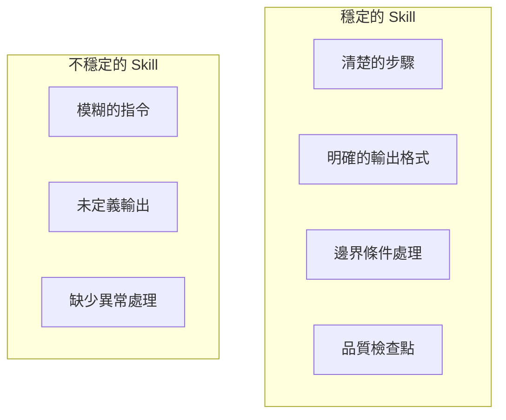

**提高穩定性的技巧**：

| 技巧 | 說明 |
|------|------|
| **步驟編號** | 使用 1, 2, 3... 明確步驟順序 |
| **定義輸出格式** | 使用 Markdown 範本定義預期輸出 |
| **加入檢查點** | 在關鍵步驟加入驗證邏輯 |
| **處理異常** | 說明當 X 發生時，應該 Y |
| **提供範例** | 用具體範例說明預期行為 |

**範例：定義清楚的輸出格式**

在 SKILL.md 中定義輸出格式時，應使用清楚的結構：

**輸出格式定義範本**：

| 欄位 | 說明 | 範例 |
|------|------|------|
| 檔案數 | 審查的檔案總數 | `3` |
| Critical | 嚴重問題數量 | `1` |
| Major | 重要問題數量 | `2` |
| Minor | 輕微問題數量 | `0` |

**問題清單格式**：

```
| 嚴重度 | 位置 | 問題 | 建議 |
|--------|------|------|------|
| 🔴 Critical | {檔案:行號} | {問題描述} | {修正建議} |
```

---

## 第七章：團隊導入建議

### 7.1 適合先從哪些類型的 Skill 開始

**推薦順序**：

| 優先級 | Skill 類型 | 原因 | 範例 |
|--------|-----------|------|------|
| 🥇 高 | 程式碼審查 | 高頻使用、效益明顯 | `code-review` |
| 🥇 高 | 測試產生 | 節省大量時間 | `unit-test-generator` |
| 🥈 中 | 文件產生 | 標準化輸出 | `api-documentation` |
| 🥈 中 | 重構建議 | 提升程式碼品質 | `refactoring-advisor` |
| 🥉 低 | 複雜工作流程 | 需要團隊成熟度 | `full-feature-development` |

**建議起始點**：

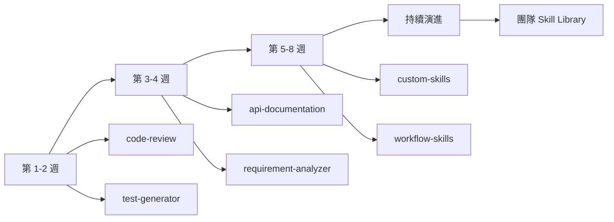

---

### 7.2 如何建立內部 Skill Library

**建議的目錄結構**：

```
company-skills/
├── README.md                    # 總覽說明
├── CONTRIBUTING.md              # 貢獻指南
├── development/                 # 開發類 Skills
│   ├── code-review/
│   ├── test-generator/
│   └── refactoring/
├── documentation/               # 文件類 Skills
│   ├── api-doc/
│   └── requirement-doc/
├── compliance/                  # 合規類 Skills（銀行業重要）
│   ├── security-audit/
│   └── data-masking/
└── templates/                   # Skill 範本
    └── skill-template/
```

**Skill 版本管理**：

```yaml
metadata:
  author: your-team
  version: "1.2.0"
  changelog: |
    1.2.0 - 新增 TypeScript 支援
    1.1.0 - 改善安全性檢查
    1.0.0 - 初始版本
```

**品質審查流程**：

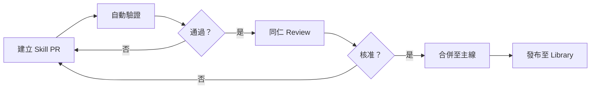

---

### 7.3 與既有開發流程整合

**整合點建議**：

| 開發階段 | 可整合的 Skill | 觸發時機 |
|----------|---------------|----------|
| 需求分析 | requirement-analyzer | 收到客戶需求時 |
| 設計階段 | api-design | 設計 API 規格時 |
| 開發階段 | code-generator | 實作功能時 |
| Code Review | code-review | PR 建立時 |
| 測試階段 | test-generator | 撰寫測試時 |
| 文件階段 | documentation | 功能完成後 |

**與 Git 工作流程整合**：

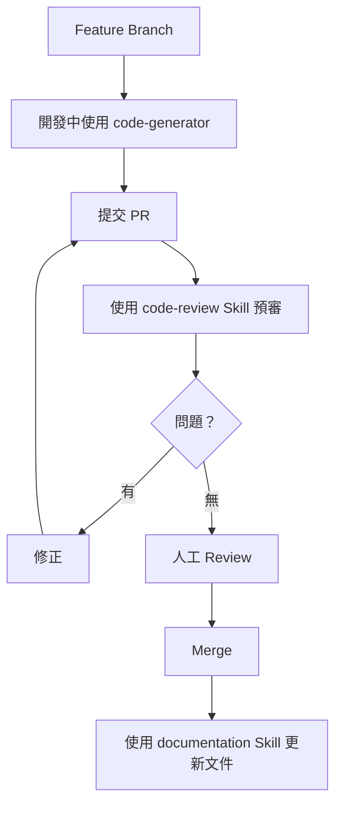

---

### 7.4 導入成熟度階段建議

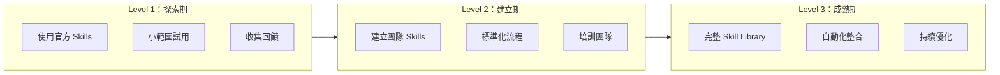

**各階段詳細說明**：

| 階段 | 時程 | 目標 | 關鍵活動 |
|------|------|------|----------|
| **Level 1：探索期** | 1-2 週 | 理解 Skills 概念 | 試用官方 Skills、小型任務驗證 |
| **Level 2：建立期** | 3-6 週 | 建立團隊能力 | 建立 2-3 個自訂 Skills、團隊培訓 |
| **Level 3：成熟期** | 持續 | 全面整合 | 完整 Skill Library、CI/CD 整合 |

**🏦 銀行系統實務建議**：

1. **優先建立合規類 Skills**：`security-audit`、`data-masking`、`audit-log`
2. **與現有審計流程對接**：Skills 產出可作為審計證據
3. **版本控制嚴格管理**：所有 Skills 變更需經過審批

---

## 附錄：檢查清單（Checklist）

### Skill 建立前檢查

- [ ] 確認此任務會重複執行（非一次性）
- [ ] 確認可用 1-2 句話描述 Skill 職責
- [ ] 確認 Skill 大小適中（指令 < 500 行）
- [ ] 確認與現有 Skills 不重複

### SKILL.md 撰寫檢查

- [ ] `name` 符合命名規則（小寫、連字號、1-64 字元）
- [ ] `name` 與資料夾名稱一致
- [ ] `description` 清楚描述功能與觸發時機（1-1024 字元）
- [ ] 指令包含明確的執行步驟
- [ ] 指令包含預期的輸出格式
- [ ] 指令包含品質檢查點
- [ ] 提供輸入/輸出範例

### Skill 發布前檢查

- [ ] 使用 `skills-ref validate` 驗證格式
- [ ] 經過同仁 Review
- [ ] 在測試環境驗證效果
- [ ] 更新版本號與 changelog
- [ ] 更新 README 文件

### 團隊導入檢查

- [ ] 團隊成員已完成基礎培訓
- [ ] 已建立 Skill Library Repository
- [ ] 已定義 Skill 貢獻流程
- [ ] 已建立品質審查機制
- [ ] 已與 CI/CD 流程整合（如適用）

---

## 參考資源

### 官方資源

| 資源 | 連結 |
|------|------|
| Agent Skills 規格說明 | https://agentskills.io/ |
| Anthropic Skills Repository | https://github.com/anthropics/skills |
| Skills 驗證工具 | https://github.com/agentskills/agentskills/tree/main/skills-ref |
| 什麼是 Skills | https://support.claude.com/en/articles/12512176-what-are-skills |
| 如何使用 Skills | https://support.claude.com/en/articles/12512180-using-skills-in-claude |
| 如何建立自訂 Skills | https://support.claude.com/en/articles/12512198-creating-custom-skills |

### 延伸閱讀

| 主題 | 說明 |
|------|------|
| Anthropic 工程部落格 | 深入了解 Agent Skills 設計理念 |
| Agent Skills 最佳實務 | 官方撰寫建議 |
| 社群討論區 | GitHub Discussions |

---

> **文件維護**：本手冊由團隊共同維護，如有問題或建議，請提交 Issue 或 PR。

**版本歷程**：

| 版本 | 日期 | 變更說明 |
|------|------|----------|
| 1.0 | 2026-01-08 | 初始版本 |
