+++
date = '2026-06-18T17:44:26+08:00'
draft = false
title = 'Claude Code Cli 教學手冊'
tags = ['教學', 'AI開發']
categories = ['教學']
+++

# Claude Code CLI 教學手冊

> **版本**：v1.1（2026-06-18）
> **適用對象**：系統分析師、軟體架構師、後端工程師、前端工程師、DevOps工程師、SRE工程師、AI工程師、企業資訊部門、Framework維護團隊、Legacy System維護團隊
> **內容定位**：本手冊聚焦於 Claude Code **CLI 層級**的安裝、設定、指令、Agent 架構、MCP 整合與企業導入實務，可與專案內其他 Claude Code 相關手冊（生態圈版、資深同仁版等）並行參考
> **授權**：內部教育訓練使用

---

## 如何使用本手冊

Claude Code CLI 是一套以終端機（Terminal）為主要操作介面的 AI 編碼代理人（Coding Agent）。它不像傳統 IDE 外掛只做行內自動完成，而是能夠自主規劃、呼叫工具、跨檔案修改、執行測試、操作 Git，甚至協調多個子 Agent 完成大型任務。本手冊依角色整理出建議閱讀路徑：

| 角色 | 建議優先閱讀章節 |
|---|---|
| 新進工程師 | 第1、3、4、6、7章 |
| 後端／前端工程師 | 第8、9、14、17、18章 |
| 架構師／系統分析師 | 第2、13、15、16章 |
| DevOps／SRE | 第5、12、19、20、28章 |
| 企業資訊部門主管 | 第21、25、28章 |
| Legacy System維護團隊 | 第15、16章 |
| 平台／AI賦能團隊 | 第9、10、26、27章 |

---

## 目錄

> 下列目錄為兩層結構：章節層可直接跳轉至對應章節開頭，子章節層可直接跳轉至章節內的特定小節。

- [第 1 章 Claude Code CLI 介紹](#第-1-章-claude-code-cli-介紹)
  - [1.1 Claude Code 是什麼](#11-claude-code-是什麼)
  - [1.2 Claude Code 與 Claude Web 差異](#12-claude-code-與-claude-web-差異)
  - [1.3 與其他工具的定位比較](#13-與其他工具的定位比較)
  - [1.4 適用情境](#14-適用情境)
  - [1.5 限制](#15-限制)
  - [1.6 與 Claude Code 周邊介面／產品的關係](#16-與-claude-code-周邊介面產品的關係)
- [第 2 章 Claude Code 架構原理](#第-2-章-claude-code-架構原理)
  - [2.1 Agent Loop（代理人迴圈）](#21-agent-loop代理人迴圈)
  - [2.2 Context 管理與 Token 管理](#22-context-管理與-token-管理)
  - [2.3 Tool Calling 與 MCP 整合](#23-tool-calling-與-mcp-整合)
  - [2.4 子 Agent 與 Agent 協作](#24-子-agent-與-agent-協作)
  - [2.5 Codebase 理解機制](#25-codebase-理解機制)
- [第 3 章 安裝教學](#第-3-章-安裝教學)
  - [3.1 系統需求](#31-系統需求)
  - [3.2 Windows 安裝](#32-windows-安裝)
  - [3.3 macOS 安裝](#33-macos-安裝)
  - [3.4 Linux 安裝](#34-linux-安裝)
  - [3.5 Windows CMD 安裝（備選）](#35-windows-cmd-安裝備選)
  - [3.6 WSL2 安裝注意事項](#36-wsl2-安裝注意事項)
  - [3.7 npm 安裝路徑（備選）](#37-npm-安裝路徑備選)
  - [3.8 更新與驗證](#38-更新與驗證)
- [第 4 章 Authentication](#第-4-章-authentication)
  - [4.1 帳號類型](#41-帳號類型)
  - [4.2 登入方式](#42-登入方式)
  - [4.3 API Key 與環境變數（適合 CI / Headless）](#43-api-key-與環境變數適合-ci--headless)
  - [4.4 安全建議](#44-安全建議)
  - [4.5 企業雲端供應商登入](#45-企業雲端供應商登入)
- [第 5 章 Claude Code 設定管理](#第-5-章-claude-code-設定管理)
  - [5.1 settings.json 三層架構](#51-settingsjson-三層架構)
  - [5.2 優先順序](#52-優先順序)
  - [5.3 設定範例](#53-設定範例)
  - [5.4 常見設定鍵分類](#54-常見設定鍵分類)
  - [5.5 Managed Settings 交付機制](#55-managed-settings-交付機制)
- [第 6 章 CLI 指令大全](#第-6-章-cli-指令大全)
  - [6.1 指令依生命週期分類](#61-指令依生命週期分類)
  - [6.2 Session 操作](#62-session-操作)
  - [6.3 Agent 管理](#63-agent-管理)
  - [6.4 MCP / Plugin / 專案維護](#64-mcp--plugin--專案維護)
  - [6.5 常用旗標（Flags）](#65-常用旗標flags)
  - [6.6 Auto Mode（自動權限分類器）](#66-auto-mode自動權限分類器)
- [第 7 章 Hotkey 大全](#第-7-章-hotkey-大全)
  - [7.1 終端機層級快捷鍵](#71-終端機層級快捷鍵)
  - [7.2 Claude Code Session 內快捷鍵](#72-claude-code-session-內快捷鍵)
  - [7.3 Agent 操作快捷鍵](#73-agent-操作快捷鍵)
- [第 8 章 Context Engineering](#第-8-章-context-engineering)
  - [8.1 Context Window 組成](#81-context-window-組成)
  - [8.2 壓縮（Compaction）與重用](#82-壓縮compaction與重用)
  - [8.3 快取（Caching）](#83-快取caching)
  - [8.4 Token 優化技巧](#84-token-優化技巧)
  - [8.5 Checkpoints 與 Rewind（對話回溯）](#85-checkpoints-與-rewind對話回溯)
- [第 9 章 Agent 系統](#第-9-章-agent-系統)
  - [9.1 概念釐清：Agent / Sub Agent / Multi Agent](#91-概念釐清agent--sub-agent--multi-agent)
  - [9.2 何時該建立 Sub Agent](#92-何時該建立-sub-agent)
  - [9.3 生命週期管理](#93-生命週期管理)
  - [9.4 設計考量](#94-設計考量)
  - [9.5 Agent View（背景多 Session 監看）](#95-agent-view背景多-session-監看)
  - [9.6 Agent Teams（多 Session 協作，實驗性）](#96-agent-teams多-session-協作實驗性)
  - [9.7 Dynamic Workflows（腳本化大規模編排）](#97-dynamic-workflows腳本化大規模編排)
  - [9.8 Worktrees（Git Worktree 隔離機制）](#98-worktreesgit-worktree-隔離機制)
- [第 10 章 Agents 目錄](#第-10-章-agents-目錄)
  - [10.1 子 Agent 定義檔格式](#101-子-agent-定義檔格式)
  - [10.2 載入順序](#102-載入順序)
  - [10.3 呼叫方式](#103-呼叫方式)
  - [10.4 內建子 Agent](#104-內建子-agent)
  - [10.5 Persistent Memory（子 Agent 持久記憶）](#105-persistent-memory子-agent-持久記憶)
  - [10.6 實務範例：團隊共用子 Agent](#106-實務範例團隊共用子-agent)
- [第 11 章 CLAUDE.md](#第-11-章-claudemd)
  - [11.1 用途](#111-用途)
  - [11.2 三層檔案](#112-三層檔案)
  - [11.3 企業標準範本](#113-企業標準範本)
  - [11.4 維護方式](#114-維護方式)
- [第 12 章 Hooks](#第-12-章-hooks)
  - [12.1 生命週期事件](#121-生命週期事件)
  - [12.2 Handler 類型](#122-handler-類型)
  - [12.3 PreToolUse／PostToolUse 機制](#123-pretooluseposttooluse-機制)
  - [12.4 設定範例](#124-設定範例)
  - [12.5 安全考量](#125-安全考量)
- [第 13 章 MCP 整合](#第-13-章-mcp-整合)
  - [13.1 MCP 概念](#131-mcp-概念)
  - [13.2 設定與管理](#132-設定與管理)
  - [13.3 整合案例](#133-整合案例)
  - [13.4 工具延遲載入](#134-工具延遲載入)
  - [13.5 MCP 治理鍵補充](#135-mcp-治理鍵補充)
- [第 14 章 使用 Claude Code 開發 Web Application](#第-14-章-使用-claude-code-開發-web-application)
  - [14.1 通用工作流程](#141-通用工作流程)
  - [14.2 Spring Boot（Java/Kotlin）](#142-spring-bootjavakotlin)
  - [14.3 FastAPI（Python）](#143-fastapipython)
  - [14.4 Vue3 / Angular](#144-vue3--angular)
- [第 15 章 Legacy System 逆向工程](#第-15-章-legacy-system-逆向工程)
  - [15.1 分析方法](#151-分析方法)
  - [15.2 適用範圍與限制](#152-適用範圍與限制)
  - [15.3 範例 Prompt](#153-範例-prompt)
  - [15.4 產出範例](#154-產出範例)
- [第 16 章 Framework 升級](#第-16-章-framework-升級)
  - [16.1 通用升級方法論](#161-通用升級方法論)
  - [16.2 各升級情境要點](#162-各升級情境要點)
  - [16.3 範例 Prompt](#163-範例-prompt)
- [第 17 章 Git 整合](#第-17-章-git-整合)
  - [17.1 AI 協作流程](#171-ai-協作流程)
  - [17.2 常用指令](#172-常用指令)
  - [17.3 守則](#173-守則)
  - [17.4 Worktree 分支隔離與 `/code-review`](#174-worktree-分支隔離與-code-review)
- [第 18 章 測試工程](#第-18-章-測試工程)
  - [18.1 測試生成工作流程](#181-測試生成工作流程)
  - [18.2 各類型測試](#182-各類型測試)
  - [18.3 範例](#183-範例)
  - [18.4 TDD 風格使用](#184-tdd-風格使用)
- [第 19 章 SSDLC 整合](#第-19-章-ssdlc-整合)
  - [19.1 定位](#191-定位)
  - [19.2 各類掃描的協作方式](#192-各類掃描的協作方式)
  - [19.3 兩層防護案例](#193-兩層防護案例)
  - [19.4 Sandboxing：第三層防護](#194-sandboxing第三層防護)
- [第 20 章 Token 與成本管理](#第-20-章-token-與成本管理)
  - [20.1 成本驅動因子](#201-成本驅動因子)
  - [20.2 查看用量](#202-查看用量)
  - [20.3 降低成本技巧](#203-降低成本技巧)
  - [20.4 用量可視化：`/usage`、Analytics、OpenTelemetry](#204-用量可視化usageanalyticsopentelemetry)
- [第 21 章 團隊導入指南](#第-21-章-團隊導入指南)
  - [21.1 分階段導入流程](#211-分階段導入流程)
  - [21.2 治理模式](#212-治理模式)
  - [21.3 權限管理](#213-權限管理)
  - [21.4 標準規範](#214-標準規範)
  - [21.5 新機制的治理檢查項](#215-新機制的治理檢查項)
- [第 22 章 Claude Code 最佳實務](#第-22-章-claude-code-最佳實務)
  - [22.1 20 個最佳實務](#221-20-個最佳實務)
  - [22.2 20 個常見錯誤](#222-20-個常見錯誤)
  - [22.3 20 個效能優化技巧](#223-20-個效能優化技巧)
- [第 23 章 Claude Code Prompt Library](#第-23-章-claude-code-prompt-library)
  - [23.1 分類架構](#231-分類架構)
  - [23.2 範本（可直接複製套用）](#232-範本可直接複製套用)
- [第 24 章 Claude Code + GitHub Copilot 協同開發](#第-24-章-claude-code--github-copilot-協同開發)
  - [24.1 分工模式](#241-分工模式)
  - [24.2 實際工作流程](#242-實際工作流程)
  - [24.3 避免衝突](#243-避免衝突)
- [第 25 章 Claude Code 企業級導入藍圖](#第-25-章-claude-code-企業級導入藍圖)
  - [25.1 完整藍圖](#251-完整藍圖)
  - [25.2 組織架構](#252-組織架構)
  - [25.3 治理模式總結（彙整前述章節）](#253-治理模式總結彙整前述章節)
  - [25.4 KPI 與稽核](#254-kpi-與稽核)
- [第 26 章 Agent 進階協作模式](#第-26-章-agent-進階協作模式)
  - [26.1 四種平行化機制總覽](#261-四種平行化機制總覽)
  - [26.2 Agent Teams 實務](#262-agent-teams-實務)
  - [26.3 Dynamic Workflows 實務](#263-dynamic-workflows-實務)
  - [26.4 `/batch`：大規模 Worktree 隔離批次處理](#264-batch大規模-worktree-隔離批次處理)
- [第 27 章 Agent Skills 與 Plugin 生態](#第-27-章-agent-skills-與-plugin-生態)
  - [27.1 Skills 與 CLAUDE.md／Subagent 的定位差異](#271-skills-與-claudemdsubagent-的定位差異)
  - [27.2 SKILL.md 格式與存放層級](#272-skillmd-格式與存放層級)
  - [27.3 隨附 Skills（Bundled Skills）](#273-隨附-skillsbundled-skills)
  - [27.4 Plugins 生態與 Marketplace 治理](#274-plugins-生態與-marketplace-治理)
  - [27.5 團隊標準化建議](#275-團隊標準化建議)
- [第 28 章 企業治理進階](#第-28-章-企業治理進階)
  - [28.1 Managed Settings 完整交付架構](#281-managed-settings-完整交付架構)
  - [28.2 Sandboxing 深度](#282-sandboxing-深度)
  - [28.3 Network Config 與 LLM Gateway](#283-network-config-與-llm-gateway)
  - [28.4 Zero Data Retention、稽核與合規](#284-zero-data-retention稽核與合規)
  - [28.5 Cost／Usage／Analytics 企業可視化（平台團隊視角）](#285-costusageanalytics-企業可視化平台團隊視角)
- [附錄 A：常見問題 FAQ](#附錄-a常見問題-faq)
- [附錄 B：詞彙表 Glossary](#附錄-b詞彙表-glossary)
- [附錄 C：版本紀錄 Version History](#附錄-c版本紀錄-version-history)
- [附錄 D：學習路線圖](#附錄-d學習路線圖)
- [附錄 E：與其他 AI 編碼工具比較表](#附錄-e與其他-ai-編碼工具比較表)
- [附錄 F：Checklist（新人加入檢查清單）](#附錄-fchecklist新人加入檢查清單)

---

# 第 1 章 Claude Code CLI 介紹

## 1.1 Claude Code 是什麼

Claude Code 是 Anthropic 推出的終端機原生 AI 編碼代理人（Agentic Coding Tool）。與一般「聊天視窗貼程式碼」的使用方式不同，Claude Code 直接在你的專案目錄裡執行，能夠讀取檔案、搜尋程式碼、編輯多個檔案、執行 Bash 指令、操作 Git、呼叫外部系統（透過 MCP），並以「自主代理人迴圈」（Agent Loop）的方式持續規劃與執行，直到任務完成或需要你確認為止。

它的核心價值不是「幫你打字快一點」，而是「幫你把一個模糊的需求，拆解成一連串可驗證的動作」。

## 1.2 Claude Code 與 Claude Web 差異

Claude.ai 網頁版是以「對話」為中心的助理：你貼上程式碼、它回覆建議，所有檔案操作都需要你手動複製貼上。Claude Code CLI 則是以「執行環境」為中心：它本身就站在你的檔案系統與終端機之上，可以直接讀寫檔案、跑測試、看 build 結果，再依據真實結果調整下一步動作。網頁版適合討論設計、寫文件草稿；CLI 版適合實際落地到程式碼庫。

## 1.3 與其他工具的定位比較

| 工具 | 介面形態 | Agent 自主性 | Context 處理 | 典型用途 |
|---|---|---|---|---|
| Claude Code CLI | 終端機 / 可整合 IDE | 高（多步驟自主規劃、可背景執行） | 整個專案，依需求動態讀取 | 大型重構、逆向工程、跨檔案任務 |
| GitHub Copilot | IDE 行內補全 + Chat | 中（Chat 模式可多步驟，但以單檔為主） | 目前檔案 + 開啟分頁 | 即時補全、小範圍建議 |
| Cursor | IDE Fork（VSCode-based） | 中高 | 專案索引 + 開啟分頁 | IDE 內整合式 AI 開發 |
| Gemini CLI | 終端機 | 中高 | 動態讀取 | 終端機任務自動化 |

## 1.4 適用情境

- 大型 Monorepo 的探索與理解（不需先建索引，邊探索邊理解）
- 跨檔案、跨服務的重構與升級
- Legacy 系統的逆向工程與文件補完
- CI/CD 中的無人值守任務（`-p` 非互動模式）
- 多 Agent 協作的大規模程式碼審查或遷移

## 1.5 限制

- 不是即時打字補全工具，單輪互動的延遲高於行內補全
- 輸出仍可能有錯誤或幻覺，特別是冷僻語言（COBOL、Delphi）或極新框架版本
- 高度依賴良好的 Context（CLAUDE.md、專案結構）才能發揮最大效益，雜亂無章的專案效果會打折
- 大量平行 Agent／長對話會直接反映在 Token 成本與延遲上

```bash
# 快速確認安裝與版本
claude --version

# 以非互動模式快速問答（適合腳本化）
claude -p "用三句話說明這個 repo 的主要技術棧"
```

> **📌 實務建議**：第一次在新專案使用 Claude Code 時，先讓它讀過 README 與目錄結構再下任務指令，效果會明顯優於一開始就丟出複雜需求。

> ⚠️ **注意**：Claude Code 不是確定性編譯器，產出的程式碼仍需要人工 Review，尤其是安全相關（認證、加解密、SQL）的程式碼。

**實務案例**：一名後端工程師接手一個沒有文件的微服務，先執行 `claude -p "列出這個服務對外的所有 REST endpoint 與對應的 Controller"`，10 分鐘內就拿到一份可核對的清單，比手動翻程式碼快得多。

## 1.6 與 Claude Code 周邊介面／產品的關係

本手冊聚焦於「CLI 層級」的使用方式，但 Claude Code 實際上是一整套跨介面的產品線。下表簡要定位各周邊介面與本手冊的關係，避免讀者誤以為 CLI 是唯一入口：

| 周邊介面／產品 | 定位 | 與本手冊關係 |
|---|---|---|
| VS Code / JetBrains 擴充套件 | IDE 內建面板，與終端機 Session 共享狀態 | 操作概念與 CLI 一致，安裝與設定請參考官方文件 |
| Claude Code Web（claude.ai/code）/ Desktop App | 瀏覽器／桌面應用，可建立 Session、排程 Routines | 適合不熟悉終端機的使用者，核心 Agent 行為與 CLI 相同 |
| Remote Control／Dispatch | 從手機或其他裝置遠端監看、操控本機執行中的 Session | 屬於「協作介面」延伸，CLI 仍是任務實際執行的地方 |
| Routines | 在 Anthropic 託管基礎設施上，依排程／GitHub 事件／API 觸發的範本化雲端 Agent | 與本機 `claude -p` 排程腳本（第6、20章）目的相近，但執行環境在雲端 |
| Channels | 團隊共享的 Session 協作空間 | 屬於團隊協作功能，超出本手冊 CLI 範疇 |
| Chrome 擴充套件 | 讓 Claude Code 觀察並操作瀏覽器頁面 | 適合前端驗證情境，可與第14、18章測試流程搭配 |
| Agent SDK | 供開發者以程式方式建構自訂 Agent 應用 | 與本手冊使用既有 CLI 的情境不同，是更底層的客製化路徑 |
| GitHub Actions／GitLab CI/CD 整合 | 在既有 CI 平台中呼叫 Claude Code | 概念與第6章非互動模式（`-p`）、第19章 SSDLC 整合一致，差異僅在執行平台 |

> **📌 實務建議**：若團隊需要這些周邊介面的詳細設定步驟，請查閱官方文件對應頁面，或本系列「生態圈版」「資深同仁版」手冊；本手冊維持 CLI 範疇可避免內容重複與版本不同步。

---

# 第 2 章 Claude Code 架構原理

## 2.1 Agent Loop（代理人迴圈）

Claude Code 的核心運作模式是一個「感知 → 規劃 → 工具呼叫 → 觀察結果 → 再規劃」的迴圈：模型先理解目前任務與已知資訊，決定下一步要呼叫哪個工具（讀檔、搜尋、編輯、執行指令…），取得結果後重新評估，直到任務完成或需要使用者介入。

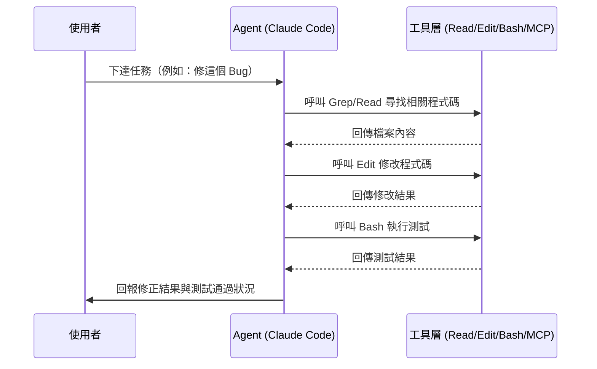

## 2.2 Context 管理與 Token 管理

每次呼叫模型，系統提示、工具定義、CLAUDE.md、對話歷史、檔案內容都會佔用 Context Window。Claude Code 會視情況進行「壓縮」（將較舊的對話歷史摘要化），並透過 Prompt Caching 降低重複內容（如系統提示、工具定義）的成本。Token 管理的關鍵是：**不要把整個專案一次性塞進 Context**，而是讓 Agent 依需求動態讀取。

## 2.3 Tool Calling 與 MCP 整合

模型本身不會直接操作檔案系統，而是透過「工具呼叫」協定，向執行環境請求特定動作（例如 `Read(file_path)`），執行環境跑完之後把結果以結構化格式回傳給模型。內建工具（Read/Edit/Bash/Grep…）之外，MCP（Model Context Protocol）讓 Claude Code 能以同樣的工具呼叫機制，串接外部系統（GitHub、Jira、資料庫…），詳見第13章。

## 2.4 子 Agent 與 Agent 協作

主 Agent 可以「派生」出子 Agent（Sub Agent），讓它在獨立的 Context 與工具權限範圍內完成特定子任務，再把結果回報給主 Agent。這讓大型任務可以拆解、平行化，也能限制每個子任務能存取的工具範圍（最小權限原則）。詳見第9、10章。

## 2.5 Codebase 理解機制

Claude Code 不要求預先建立索引，而是以「探索式理解」運作：先用 Grep/Glob 找出相關檔案，再用 Read 深入閱讀，邊探索邊建立對專案的理解。這與需要預建知識圖譜的工具（如某些靜態分析平台）路線不同——優點是零前置成本、缺點是超大型專案首次探索可能要花較多輪次。

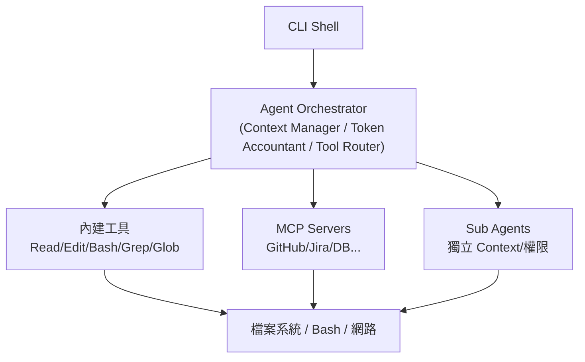

```bash
# 限定 Agent 只能存取特定目錄，降低 Context 雜訊與風險
claude --add-dir ./services/billing
```

> **📌 實務建議**：對超大型 Monorepo，先用 `--add-dir` 把任務範圍限定在相關子目錄，比讓 Agent 全庫亂逛更省 Token、更準確。

> ⚠️ **注意**：長時間對話會因為壓縮而遺失部分早期決策細節，重要的約束（如「不要用 Lombok」）建議寫進 CLAUDE.md 而不是只在對話中提一次。

**實務案例**：一個「修這個 Bug」的請求，實際在背景觸發了 Grep（找關鍵字）→ Read（看程式碼）→ Edit（修改）→ Bash（跑測試）→ Read（確認結果）五次工具呼叫，這正是 Agent Loop 的具體呈現。

---

# 第 3 章 安裝教學

## 3.1 系統需求

Claude Code 提供兩種安裝路徑：原生安裝程式（建議，會自動更新）與 npm 全域安裝。原生安裝不依賴 Node.js；若選擇 npm 安裝路徑，需要 Node.js 18 以上版本。

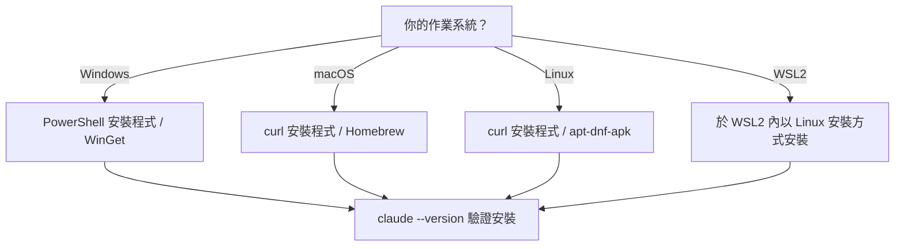

## 3.2 Windows 安裝

```powershell
# PowerShell 一鍵安裝
irm https://claude.ai/install.ps1 | iex

# 或使用 WinGet
winget install Anthropic.ClaudeCode
```

> **📌 實務建議**：原生 Windows 環境建議另外安裝 [Git for Windows](https://git-scm.com/downloads/win)，這樣 Claude Code 才能使用 Bash 工具執行 Shell 指令；若未安裝 Git for Windows，Claude Code 會自動以 PowerShell 作為替代的 Shell 工具（WSL2 環境則不需要 Git for Windows）。

## 3.3 macOS 安裝

```bash
curl -fsSL https://claude.ai/install.sh | bash
# 或
brew install --cask claude-code
```

> Homebrew 提供兩個 cask：`claude-code` 追蹤穩定發布通道（通常落後約一週，並會跳過有重大缺陷的版本），`claude-code@latest` 則追蹤最新通道。兩者都**不會自動更新**，需定期手動執行 `brew upgrade claude-code`（或 `claude-code@latest`）；原生安裝程式才會在背景自動更新。

## 3.4 Linux 安裝

```bash
curl -fsSL https://claude.ai/install.sh | bash
# Debian/Fedora/RHEL/Alpine 亦可改用對應套件管理器：apt / dnf / apk
```

## 3.5 Windows CMD 安裝（備選）

若團隊環境慣用 CMD 而非 PowerShell，可改用以下指令：

```batch
curl -fsSL https://claude.ai/install.cmd -o install.cmd && install.cmd && del install.cmd
```

> 若在 PowerShell 視窗誤用 CMD 語法會出現 `'irm' is not recognized`；反之在 CMD 視窗誤用 PowerShell 語法會出現 `'&&' is not a valid statement separator`，可依錯誤訊息判斷目前所在的命令列環境（PowerShell 提示字元為 `PS C:\`，CMD 則沒有 `PS` 前綴）。

## 3.6 WSL2 安裝注意事項

WSL2 內請依 Linux 流程安裝。常見的坑是「專案放在 Windows 路徑（`/mnt/c/...`）但在 WSL2 內開發」會有檔案系統效能與權限落差，建議將實際開發中的專案複製到 WSL2 原生檔案系統（如 `~/projects/`）下操作。

## 3.7 npm 安裝路徑（備選）

```bash
npm install -g @anthropic-ai/claude-code
```

## 3.8 更新與驗證

```bash
claude update          # 更新到最新版本
claude --version       # 驗證安裝版本
```

> **📌 實務建議**：企業內建議在入職文件中明確記錄「目前團隊統一使用的 Claude Code 版本」，因為跨版本行為可能有差異。

> ⚠️ **注意**：企業內網／代理伺服器環境，npm 安裝路徑可能需要額外設定 registry mirror 或 proxy 環境變數。

**實務案例**：某團隊筆電有公司代理伺服器限制，改用 npm 安裝路徑並設定 `npm config set proxy` 後成功安裝，原生安裝程式因為直連被防火牆擋下。

---

# 第 4 章 Authentication

## 4.1 帳號類型

Claude Code 支援多種登入方式：Claude 個人訂閱帳號、Anthropic Console（API Key 計費）、Claude for Team / Enterprise（企業座位制，支援 SSO/SCIM 集中管理）。團隊導入時建議優先評估 Team / Enterprise 方案，避免每人各自申請 API Key 造成費用與權限分散難管理。

## 4.2 登入方式

```bash
claude auth login              # 標準 OAuth 登入（跳轉瀏覽器）
claude auth login --sso        # 企業 SSO 登入
claude auth login --console    # 使用 Anthropic Console API Key
claude auth status             # 確認目前登入狀態
claude auth logout             # 登出
claude setup-token             # 產生長效 Token（適合 CI/headless 環境）
```

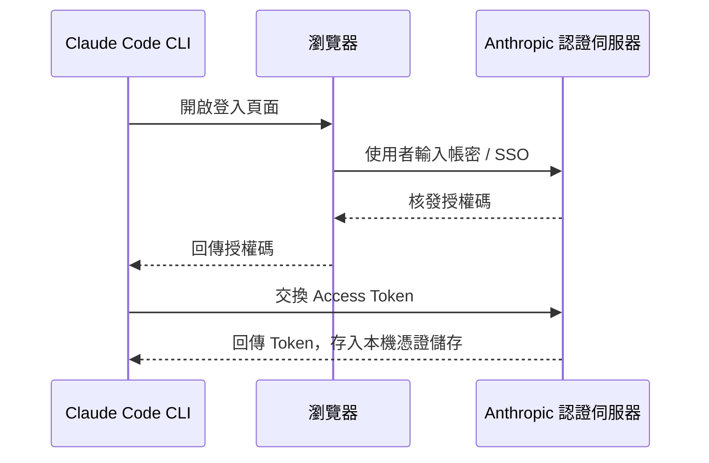

## 4.3 API Key 與環境變數（適合 CI / Headless）

```bash
export ANTHROPIC_API_KEY="sk-ant-xxxxx"     # API Key 驗證
export ANTHROPIC_AUTH_TOKEN="xxxxx"         # OAuth Token
export ANTHROPIC_MODEL="claude-sonnet-4-6"  # 覆寫預設模型
```

## 4.4 安全建議

- 絕對不要把 API Key 寫進程式碼或提交到 Git（搭配第19章的 Secret Scan）
- CI/CD 用的 Token 與工程師個人登入帳號分離，個別輪替、個別撤銷
- 企業環境優先用 Team/Enterprise 的集中管理，而非每人各自申請 Key 報帳

> **📌 實務建議**：互動式開發用個人帳號登入；CI Pipeline 用獨立的 Service Token，兩者權限與額度都應該分開管理。

> ⚠️ **注意**：`ANTHROPIC_API_KEY` 一旦外洩等同於直接授予帳務存取權，務必搭配 Secret Manager 而非寫入 `.env` 後提交版本控制。

**實務案例**：某團隊原本每位工程師各自申請 API Key 報公帳，導入 Enterprise 方案後改為集中開立席位，財務與權限稽核時間從每月數小時縮短到幾分鐘。

## 4.5 企業雲端供應商登入

除了 Claude 訂閱帳號與 Anthropic Console 之外，Claude Code 也支援透過企業既有的雲端帳號登入，模型呼叫經由各雲端供應商代理，便於併入企業現有的雲端治理（IAM、計費、資料駐留）框架：

| 供應商 | 適用情境 |
|---|---|
| Amazon Bedrock | 企業已有 AWS 治理框架，希望模型呼叫納入既有 IAM／VPC／計費體系 |
| Google Vertex AI | 企業以 GCP 為主要雲端平台，需要納入既有 GCP 專案與計費 |
| Microsoft Foundry | 企業以 Azure 為主要雲端平台，需要納入既有 Azure 訂閱與合規邊界 |

```bash
# 以環境變數指定走第三方雲端供應商（實際變數依供應商文件設定，例如指定 region/profile）
export CLAUDE_CODE_USE_BEDROCK=1
export CLAUDE_CODE_USE_VERTEX=1
```

> **📌 實務建議**：已有雲端供應商合規框架（如金融業要求資料不可離開特定雲端區域）的企業，優先評估透過 Bedrock/Vertex/Foundry 登入，而非直接使用 Anthropic 原生帳號，可降低法遵與資安審查的額外溝通成本。

> ⚠️ **注意**：透過第三方雲端供應商登入時，部分功能（如特定模型版本上線時間、Auto Mode 等新功能的開放節奏）可能落後於原生 Anthropic 帳號，企業導入前應先確認所需功能在所選供應商上是否已開放。

---

# 第 5 章 Claude Code 設定管理

## 5.1 settings.json 三層架構

Claude Code 的設定分為使用者、專案、本機三個層級，外加企業可強制套用的 Managed 設定：

| 層級 | 檔案路徑 | 是否版控 |
|---|---|---|
| 使用者 | `~/.claude/settings.json` | 否（個人機器） |
| 專案 | `.claude/settings.json` | 是（建議提交到 Git，全隊共用） |
| 本機覆寫 | `.claude/settings.local.json` | 否（建議加入 .gitignore） |
| 企業管理 | 各平台 `managed-settings.json`（IT 部門推送） | 由 IT 集中管理 |

## 5.2 優先順序

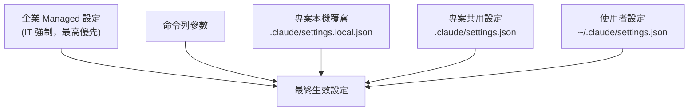

優先順序由高到低：**Managed > 命令列參數 > Local > Project > User**。Managed 設定一旦設定，個別開發者無法覆寫，這是企業治理的關鍵保護機制。

## 5.3 設定範例

```json
// .claude/settings.json（專案層級，建議提交版控）
{
  "model": "claude-sonnet-4-6",
  "permissions": {
    "deny": ["Bash(rm -rf:*)", "Bash(git push --force:*)"]
  },
  "hooks": {
    "PreToolUse": []
  }
}
```

```json
// .claude/settings.local.json（個人本機覆寫，建議 .gitignore）
{
  "effortLevel": "high"
}
```

## 5.4 常見設定鍵分類

> ⚠️ 手冊 v1.0 曾誤植 `disallowAllHooks`，正確鍵名為 **`disableAllHooks`**，本版已修正並補充近期新增的設定鍵。

- **模型/效能**：`model`、`availableModels`、`enforceAvailableModels`、`fallbackModel`、`effortLevel`、`alwaysThinkingEnabled`、`advisorModel`
- **權限與安全**：`permissions.allow` / `permissions.deny`、`allowManagedPermissionRulesOnly`、`sandbox.enabled`、`sandbox.network.allowedDomains`（詳見第28.2章）
- **MCP**：`allowedMcpServers`、`deniedMcpServers`、`allowManagedMcpServersOnly`、`enableAllProjectMcpServers`、`enabledMcpjsonServers` / `disabledMcpjsonServers`、`allowAllClaudeAiMcps`
- **Hooks**：`hooks`、`disableAllHooks`、`allowManagedHooksOnly`、`allowedHttpHookUrls`、`httpHookAllowedEnvVars`
- **治理／功能開關**：`disableAgentView`、`disableBundledSkills`、`disableWorkflows`、`disableAutoMode`、`disableRemoteControl`、`disableSkillShellExecution`
- **體驗與狀態管理**：`outputStyle`、`editorMode`、`language`、`autoMemoryEnabled`、`autoMemoryDirectory`、`fileCheckpointingEnabled`、`autoCompactEnabled`、`respectGitignore`
- **環境變數**：`env`（在 settings.json 中宣告要注入 Session 的環境變數，等同 export 但可版控管理）

> **📌 實務建議**：把團隊共同的安全防護（如禁止 `rm -rf`、禁止強制推送）寫進專案層級 `.claude/settings.json` 並提交版控，讓全隊自動套用，而不是靠口頭約定。

> ⚠️ **注意**：企業 Managed 設定會「靜默覆寫」開發者本機設定，若沒有事先溝通，工程師可能花很多時間排查「為什麼我的設定沒生效」，IT 部門應主動公告 Managed 設定內容，並可請工程師執行 `/status` 確認目前生效的 Managed 設定來源（詳見5.5）。

**實務案例**：某團隊在專案層級設定中加入 `permissions.deny` 阻擋危險指令，個別開發者即使想在本機覆寫也無法繞過，避免了一次誤執行 `git push --force` 到共用分支的事故。

## 5.5 Managed Settings 交付機制

企業 Managed 設定並非單一檔案，而是依平台有不同交付管道，且彼此有明確優先序：

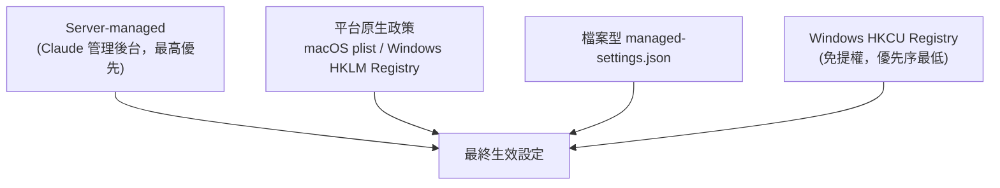

| 平台 | 交付方式 | 路徑／位置 |
|---|---|---|
| 任何平台 | Claude 管理後台（Server-managed） | 由 IT 在 Claude 管理後台設定，無需落地檔案 |
| macOS | 平台政策（plist） | `com.anthropic.claudecode` plist（MDM 推送） |
| Windows | 平台政策（Registry） | `HKLM\SOFTWARE\Policies\ClaudeCode`（需系統管理權限） |
| macOS | 檔案型 | `/Library/Application Support/ClaudeCode/managed-settings.json` |
| Linux／WSL | 檔案型 | `/etc/claude-code/managed-settings.json` |
| Windows | 檔案型 | `C:\Program Files\ClaudeCode\managed-settings.json` |
| Windows | Registry（使用者層級） | `HKCU\SOFTWARE\Policies\ClaudeCode`（免提權即可寫入，但優先序最低） |

> Windows 上若設定 `wslInheritsWindowsSettings: true`，可讓 Windows Registry 政策延伸套用到 WSL2 環境，避免雙平台分別維護設定。`C:\ProgramData\ClaudeCode\managed-settings.json` 為**已棄用路徑**（v2.1.75 後不再支援），若團隊文件仍引用此路徑請更新。

工程師可在 Session 中執行 `/status` 確認目前是否套用了 Managed 設定，以及來源是哪一種交付管道（畫面會標示 `(remote)`、`(plist)`、`(HKLM)`、`(HKCU)` 或 `(file)`）。

> **📌 實務建議**：跨平台團隊（同時有 macOS/Windows/Linux 工程師）若選用檔案型交付，務必在三個平台路徑都放置內容一致的 `managed-settings.json`，並建立自動化腳本同步，避免手動維護造成的不一致。

> ⚠️ **注意**：Server-managed 設定優先序最高且無法在本機以任何方式覆寫，IT 部門變更前應充分測試，否則一次錯誤推送會立即影響全公司所有工程師的 Session 行為。

---

# 第 6 章 CLI 指令大全

## 6.1 指令依生命週期分類

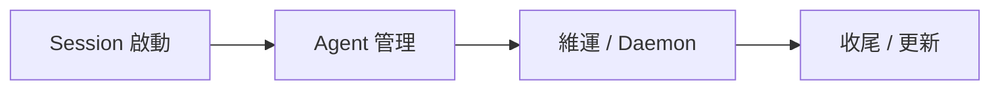

## 6.2 Session 操作

| 指令 | 說明 | 範例 |
|---|---|---|
| `claude` | 啟動互動式 Session | `claude` |
| `claude "query"` | 啟動並帶入初始提示 | `claude "幫我看一下這個錯誤訊息"` |
| `claude -p "query"` | 非互動模式，適合腳本/CI | `claude -p "總結最近的變更" --output-format json` |
| `claude -c` | 繼續最近一次對話 | `claude -c` |
| `claude -r <id>` | 依 ID/名稱回復對話 | `claude -r my-session "繼續修這個 Bug"` |

## 6.3 Agent 管理

| 指令 | 說明 |
|---|---|
| `claude agents` | 列出所有執行中 Session/Agent |
| `claude attach <id>` | 附著到背景執行的 Session |
| `claude logs <id>` | 印出背景 Session 的輸出 |
| `claude stop <id>` / `claude kill <id>` | 停止/強制終止 Session |
| `claude respawn <id>` | 重新啟動 Session |
| `claude rm <id>` | 移除 Session 記錄 |

## 6.4 MCP / Plugin / 專案維護

| 指令 | 說明 |
|---|---|
| `claude install` | 安裝/重新安裝原生執行檔 |
| `claude mcp add <name> --transport http <url>` | 新增 MCP Server |
| `claude plugin install/remove/list` | 管理 Plugin（`/plugin list` 為 Session 內等效指令） |
| `claude project purge [path]` | 清理本機專案狀態 |
| `claude update` | 更新 CLI 本身 |
| `claude ultrareview [target]` | 非互動式雲端程式碼審查 |
| `claude auto-mode` | 管理 Auto Mode（自動權限分類器，詳見6.6） |
| `claude daemon` | 管理背景常駐程序（Agent View 等背景功能依賴此機制） |
| `claude remote-control` | 啟用/管理 Remote Control（手機等裝置遠端監看本機 Session） |

## 6.5 常用旗標（Flags）

| 旗標 | 說明 |
|---|---|
| `--model <name>` | 指定模型 |
| `--effort [low\|medium\|high\|xhigh]` | 推理強度/成本權衡 |
| `--permission-mode [default\|plan\|bypassPermissions...]` | 權限模式 |
| `--add-dir <path>` | 加入額外工作目錄 |
| `--mcp-config <file>` | 載入 MCP 設定 |
| `--max-turns <n>` | 限制自動化輪數 |
| `--max-budget-usd <amount>` | 限制單次花費上限 |
| `--output-format [text\|json\|stream-json]` | 輸出格式（適合腳本解析） |
| `--bg` | 以背景任務方式啟動，不佔用前景終端機 |
| `--worktree <path>` / `-w` | 在獨立 Git worktree 中啟動 Session（詳見第9.8章） |
| `--tmux` | 在 tmux pane 中啟動，便於配合 worktree 切換視窗 |
| `--fork-session` | 從目前對話分支出一個獨立 Session，繼承完整上下文 |
| `--exec <command>` | 啟動時先執行一個 Shell 指令 |
| `--chrome` / `--no-chrome` | 啟用／停用瀏覽器整合（Chrome 擴充套件協作） |
| `--ide` | 以 IDE 整合模式啟動 |
| `--safe-mode` | 停用所有客製化（Hooks/Skills/Plugins/MCP），用於問題排查 |
| `--json-schema <file>` | 限制輸出符合指定 JSON Schema，降低下游解析失誤 |
| `--allowedTools <list>` / `--disallowedTools <list>` | 直接以旗標指定允許/禁止的工具清單 |
| `--plugin-dir <path>` / `--plugin-url <url>` | 從本機目錄或 `.zip`／URL 載入 Plugin |

```bash
# 以獨立 worktree + tmux 啟動一個不影響目前工作目錄的平行任務
claude --worktree ../billing-fix --tmux -p "修正計費模組的四捨五入錯誤"

# 問題排查：暫時停用所有 Hooks/Skills/Plugins，確認是否為客製化內容造成異常
claude --safe-mode
```

```bash
# CI 腳本中安全地呼叫 Claude Code：限制成本與輪數，輸出 JSON 方便解析
claude -p "檢查這次變更是否有明顯的安全風險" \
  --output-format json \
  --max-turns 10 \
  --max-budget-usd 1.0
```

> **📌 實務建議**：任何自動化／CI 情境都應同時設定 `--max-turns` 與 `--max-budget-usd`，避免一個邊界條件讓 Agent 進入長時間迴圈而失控燒費用。

> ⚠️ **注意**：`--permission-mode bypassPermissions` 在自動化環境中很方便，但等同於關閉安全閥，務必搭配第19章的 SSDLC 控管與最小權限原則使用。

**實務案例**：團隊建立一個夜間排程腳本，用 `claude -p ... --output-format json` 產出當日程式碼健康報告，再用 `jq` 解析後丟到 Slack，全程無人值守。

## 6.6 Auto Mode（自動權限分類器）

Auto Mode 是一個獨立於 `--permission-mode` 的機制：它不是「全部允許」或「逐次詢問」的二元選擇，而是由一個分類器即時判斷每個工具呼叫的風險等級，自動放行低風險動作（如讀檔、跑測試），同時仍對高風險動作（如刪除檔案、推送遠端）要求確認。這與 `bypassPermissions`（完全關閉權限檢查）的風險邊界完全不同：

| 模式 | 行為 | 風險定位 |
|---|---|---|
| `default` | 每個工具呼叫皆詢問（依 allow/deny 規則） | 最安全，但互動成本最高 |
| Auto Mode | 分類器自動放行低風險動作，高風險動作仍詢問 | 在效率與安全間取得平衡，企業 Managed 設定的 Hard Deny 規則仍會覆蓋分類器判斷 |
| `bypassPermissions` | 完全不詢問 | 僅建議用於受控的隔離環境（如容器化 CI），且可被 `permissions.disableBypassPermissionsMode` 在企業層級強制關閉 |

```bash
claude auto-mode status     # 查看目前 Auto Mode 啟用狀態
claude auto-mode enable     # 啟用 Auto Mode
```

> **📌 實務建議**：對於互動式開發場景，Auto Mode 通常是比 `default` 模式更實用的折衷方案；但企業層級仍應透過 `disableAutoMode` 或 Hard Deny 規則，明確定義「即使分類器判斷為低風險也一律禁止」的動作清單（如任何形式的強制推送）。

> ⚠️ **注意**：Auto Mode 目前依模型與帳號方案而開放程度不同（原生 Anthropic 帳號開放較早，第三方雲端供應商如 Bedrock/Vertex/Foundry 開放時間可能較晚，詳見第4.5章），導入前應先確認團隊使用的帳號類型是否已支援。

---

# 第 7 章 Hotkey 大全

## 7.1 終端機層級快捷鍵

| 快捷鍵 | 說明 |
|---|---|
| `Ctrl + C` | 中斷目前執行（中止 Agent 動作） |
| `Ctrl + D` | 結束 Session |
| `↑ / ↓` | 瀏覽歷史輸入 |

## 7.2 Claude Code Session 內快捷鍵

| 快捷鍵 | 說明 |
|---|---|
| `Shift + Enter` | 多行輸入（不送出） |
| `Enter` | 送出目前輸入 |
| `/` | 開啟 Slash Command 選單 |
| `Esc` | 取消目前輸入 / 退出選單 |

## 7.3 Agent 操作快捷鍵

| 快捷鍵 | 說明 |
|---|---|
| `Ctrl + C`（執行中按一次） | 中斷目前工具呼叫，取回控制權 |
| `y` / `n`（權限詢問時） | 同意 / 拒絕單次工具呼叫 |
| `a`（權限詢問時） | 永久允許此類動作（視權限模式） |

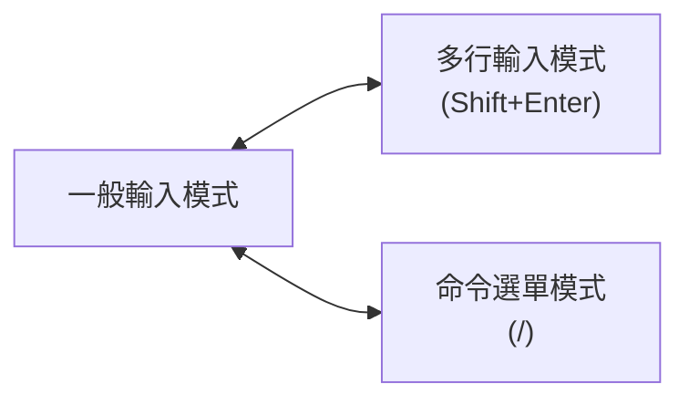

> **📌 實務建議**：盡早熟悉「中斷」快捷鍵（`Ctrl+C`），這是糾正 Agent 走錯方向最有效的工具，比等它跑完再重來省時間也省 Token。

> ⚠️ **注意**：若你同時使用 tmux/vim，部分快捷鍵可能衝突，建議在團隊 Onboarding 文件中列出實際環境下驗證過的快捷鍵組合。

**實務案例**：資深工程師在 Agent 開始往錯誤方向修改時立即按 `Ctrl+C` 中斷，重新給出更精確的指示，整個任務只花了原本預估時間的一半。

---

# 第 8 章 Context Engineering

## 8.1 Context Window 組成

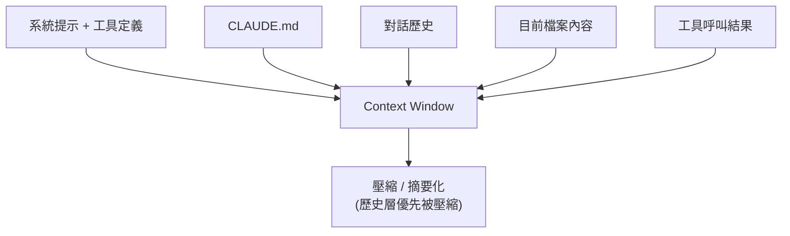

## 8.2 壓縮（Compaction）與重用

當對話累積到一定程度，Claude Code 會將較舊的歷史摘要化以釋放空間。這個動作雖然能延長對話，但也可能遺失早期的細節決策。對於跨多次 Session 都需要的資訊（架構慣例、不可變更的限制），應該寫入 CLAUDE.md（第11章）而不是只在對話中提一次。

## 8.3 快取（Caching）

重複出現的內容（系統提示、工具定義、CLAUDE.md 開頭）可被快取，降低延遲與成本。實務上的影響是：**頻繁切換差異很大的 System Prompt 或工具集合，會降低快取命中率**。

## 8.4 Token 優化技巧

- 用 `--add-dir` 限定範圍，而不是讓 Agent 在整個 Monorepo 漫遊
- 優先用 Grep/Glob 定位後再 Read，而不是一次性讀取整個大檔案
- 把重複需要解釋的規則寫進 CLAUDE.md，一次投資、多次重用
- 善用 MCP 的延遲載入（工具定義依需求載入，而非一開始全部塞入 Context）

```bash
# 反面教材：一次性丟整個倉庫
claude -p "讀完整個 repo 並解釋所有模組"

# 建議做法：先定位，再深入
claude -p "先列出 services/ 下有哪些模組，再針對 billing 模組說明其職責"
```

> **📌 實務建議**：把 CLAUDE.md 當作「Context 重用投資」——任何你在對話中解釋了第二次的事情，都該寫進 CLAUDE.md。

> ⚠️ **注意**：長對話中段如果做了重要決策（例如「這個欄位禁止改型別」），建議在後續訊息中主動重申，避免壓縮後遺失約束。

**實務案例**：一個 5 萬行的 Monorepo Session，因為一次性塞入 6 個大檔案而明顯變慢、回應品質下降；改為先用 Grep 定位再針對性 Read 後，同樣任務的輪數減少超過一半。

## 8.5 Checkpoints 與 Rewind（對話回溯）

壓縮（8.2）會摘要化舊歷史以釋放空間，但摘要化是「不可逆」的——一旦壓縮，細節就回不來了。Checkpoints／Rewind 提供另一種更可控的狀態管理手段：

- **File Checkpointing**（設定鍵 `fileCheckpointingEnabled`）：Claude Code 在每次工具呼叫修改檔案前自動建立檔案快照，可隨時還原到任一步驟之前的檔案狀態，不需要依賴 Git commit。
- **Rewind 選單**：可回到對話中任一個過去的時間點重新開始，其中「Summarize up to here」選項會將回溯點之前的內容摘要化保留、之後的內容捨棄，等同於「有選擇性的壓縮」，而不是被動等待系統自動壓縮整段歷史。

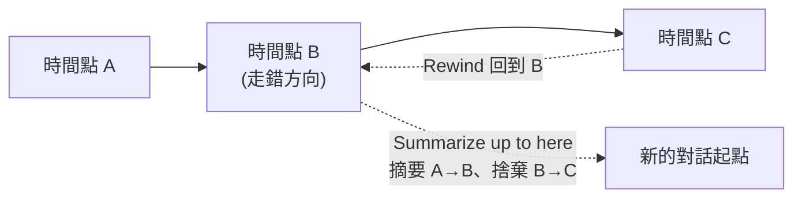

> **📌 實務建議**：當發現 Agent 在某個時間點開始走錯方向時，優先用 Rewind 回到該點重新引導，而不是讓對話繼續累積後再靠人工 Prompt 糾正——這比事後修正更省 Token，也更乾淨。

> ⚠️ **注意**：File Checkpointing 還原的是「檔案內容」，不是「對話狀態」；若需要同時還原檔案與對話脈絡，應搭配 Rewind 一起使用，單獨依賴其中一種容易造成檔案與對話描述不一致。

---

# 第 9 章 Agent 系統

## 9.1 概念釐清：Agent / Sub Agent / Multi Agent

- **Agent**：指你目前互動的 Claude Code Session 本身，具備完整工具存取與規劃能力。
- **Sub Agent**：由主 Agent 派生出來、擁有獨立 Context 與限定工具權限的工作者，專門處理特定子任務，完成後把結果回報主 Agent。
- **Multi Agent**：多個 Sub Agent（或多個獨立 Session）協同運作，由主 Agent 或腳本進行調度與整合。

官方文件目前將「平行化」明確拆成四種機制，彼此的協調模型不同，不能混為一談：

| 機制 | 協調模型 | 適用情境 | 詳見 |
|---|---|---|---|
| Subagent | 單一 Session 內派生，回傳摘要給主 Agent | 側支任務（搜尋、研究）不應污染主對話 Context | 本章 9.2-9.4、第10章 |
| Agent View | 多個獨立背景 Session，集中於一個畫面監看／派發 | 同時推進多個彼此獨立、不需互相溝通的任務 | 9.5 |
| Agent Teams | 多個 Session 共享任務清單並互相傳訊息（實驗性） | 任務之間需要互相協調、回報進度 | 9.6 |
| Dynamic Workflows | 腳本決定性地編排數十至數百個 Subagent | 大規模、可重複的審查／遷移流程 | 9.7 |

這四種機制都可能搭配 **Worktrees**（9.8）做檔案系統層級的隔離，避免平行任務互相覆寫同一份工作目錄。

## 9.2 何時該建立 Sub Agent

| 情境 | 建議 |
|---|---|
| 任務可拆解成獨立子模組 | 每個模組派一個 Sub Agent，平行處理 |
| 需要限制某段工作的工具權限 | 用 Sub Agent 隔離（例如只給 Read，不給 Edit） |
| 單一任務但邏輯單純 | 直接在主 Agent 內處理，不必額外派生 |

## 9.3 生命週期管理

```bash
claude agents              # 列出所有執行中的 Agent/Session
claude attach <id>         # 附著查看
claude logs <id>           # 查看背景輸出
claude stop <id>           # 正常停止
claude kill <id>           # 強制終止
claude respawn <id>        # 重新啟動
claude rm <id>             # 移除記錄
```

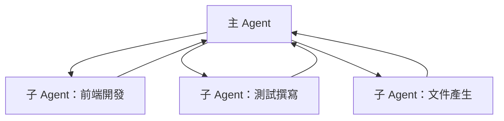

## 9.4 設計考量

- 模型選擇可依子任務複雜度分配（簡單任務用較輕模型，複雜任務用較強模型）
- 每個 Sub Agent 的工具權限應採最小權限原則
- 平行 Sub Agent 若會修改重疊檔案，務必先界定模組／檔案的所有權邊界，否則容易互相覆寫

> **📌 實務建議**：派生 Sub Agent 前，先明確切分「誰負責哪個目錄／模組」，再分配工具權限，避免兩個 Agent 同時改同一個檔案。

> ⚠️ **注意**：沒有協調的平行 Sub Agent 同時編輯重疊檔案，會造成衝突甚至互相覆寫對方的修改，這類問題在 Code Review 階段才發現會非常昂貴。

**實務案例**：一個大型重構任務被拆成 4 個模組，分別派生 4 個 Sub Agent 平行處理，比單一 Session 序列處理節省了大半時間，前提是事先已經把模組邊界切清楚。

## 9.5 Agent View（背景多 Session 監看）

Agent View 透過 `claude agents` 指令開啟，將多個獨立、彼此不互相溝通的背景 Session 集中在一個畫面中監看與派發，每個 Session 一個畫格。這與 Subagent 的差異在於：Subagent 活在「單一 Session 內」、結束後即消失；Agent View 管理的是「多個完整獨立的 Session」，可隨時附著查看細節。

```bash
claude agents          # 開啟 Agent View
claude --bg -p "..."   # 以背景任務啟動一個新 Session，自動納入 Agent View
```

> Agent View 依賴背景常駐程序（`claude daemon`）運作；企業可用 `disableAgentView` 設定鍵整體關閉此功能（同時停用 `--bg`、`/background`）。

> **📌 實務建議**：適合「同時推進多個彼此獨立任務」的情境（例如同時修三個不相關的 Bug），而非需要互相協調的任務——互相協調的情境請改用 9.6 的 Agent Teams。

## 9.6 Agent Teams（多 Session 協作，實驗性）

Agent Teams 讓多個 Session 共享同一份任務清單並互相傳遞訊息，目前為**實驗性功能、預設關閉**。與 Agent View 的關鍵差異是「Session 之間能互相溝通」——例如一個 Session 完成 API 設計後，可以直接通知負責前端的 Session 開始對接，而不需要人工在中間轉達。

> ⚠️ **注意**：實驗性功能代表行為可能在版本之間調整，且預設關閉，企業導入前應先在非生產專案試行，並評估「多 Session 互相傳訊」是否會放大錯誤傳播的範圍（一個 Session 的錯誤判斷可能透過訊息傳遞影響其他 Session）。詳細治理建議見第26.2章。

## 9.7 Dynamic Workflows（腳本化大規模編排）

當任務規模超出「派生幾個 Subagent」的量級（例如數十至數百個檢查項），Dynamic Workflows 讓你以腳本明確定義編排邏輯（哪些步驟平行、哪些步驟需要等待前一階段結果、如何交叉驗證），而不是依賴模型自行決定派生順序。`/workflows` 可列出目前的 Workflow 執行紀錄。這是一種「確定性編排 + AI 執行」的混合模式，適合需要可重複、可審查流程的場景。實務設計細節與治理建議見第26.3章。

## 9.8 Worktrees（Git Worktree 隔離機制）

9.4 提到的「平行 Sub Agent 若修改重疊檔案會互相覆寫」問題，最直接的解法是 **Git Worktree**：讓每個平行任務（Subagent、Agent View 中的背景 Session、或 Dynamic Workflow 的單個步驟）在獨立的工作目錄中執行，彼此操作不同的檔案系統路徑，從根本上避免檔案層級的衝突，最後再各自以分支／PR 的方式合併回來。

```bash
claude --worktree ../feature-a --tmux -p "實作功能 A"
claude --worktree ../feature-b --tmux -p "實作功能 B"
# 兩個 Session 在不同的 worktree 中平行進行，互不影響對方的工作目錄
```

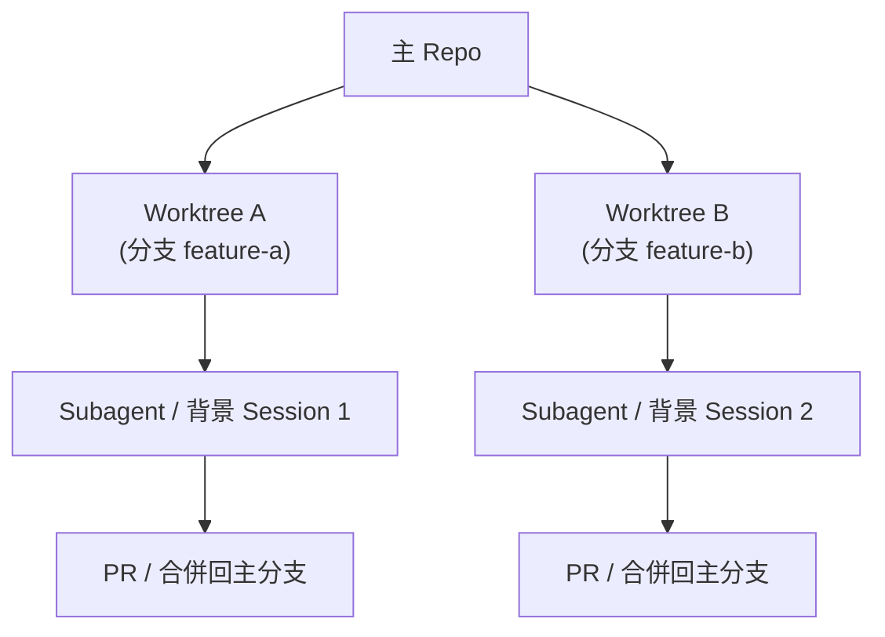

> **📌 實務建議**：只要平行任務「可能寫入檔案」，就優先用 Worktree 隔離，而不是僅靠「口頭約定模組邊界」——口頭約定容易因任務範圍判斷失準而失效，Worktree 是檔案系統層級的硬性隔離。

> ⚠️ **注意**：Worktree 隔離解決的是「檔案衝突」，不解決「邏輯衝突」（例如兩個分支各自修改了同一個共用介面但簽名不同），合併前仍需要正常的 Code Review 與整合測試。

**實務案例**：團隊將原本因為「兩個 Subagent 同時改到同一個共用元件」而導致互相覆寫的重構任務，改為各自在獨立 Worktree 中進行、完成後各自開 PR，衝突問題完全消失，僅在合併階段才需要人工確認介面相容性。

---

# 第 10 章 Agents 目錄

> ⚠️ **注意（用語澄清）**：本章標題沿用常見口語「Agents 目錄」，但 Claude Code 實際載入子 Agent 定義的路徑是 **`.claude/agents/`（專案層級）** 與 **`~/.claude/agents/`（使用者層級）**，並**不是** `.github/agents/`。`.github/` 是 GitHub 平台慣例使用的目錄（存放 Workflow、Issue 範本等），與 Claude Code 的子 Agent 載入機制無關。若團隊想在 `.github/` 下維護「人類可讀」的角色說明文件，那是另一套自訂慣例，不要與 Claude Code 的子 Agent 定義檔混淆。

## 10.1 子 Agent 定義檔格式

子 Agent 是一個 Markdown 檔案，搭配 YAML Frontmatter 描述其名稱、說明、可用工具、模型等：

```markdown
---
name: test-writer
description: 針對指定類別/函式撰寫單元測試
tools: [Read, Glob, Grep, Edit, Bash]
model: sonnet
permissionMode: default
effort: medium
---

你是一個專注於撰寫單元測試的子 Agent。
請依照專案既有測試框架慣例撰寫測試，並在完成後執行測試確認通過。
```

## 10.2 載入順序

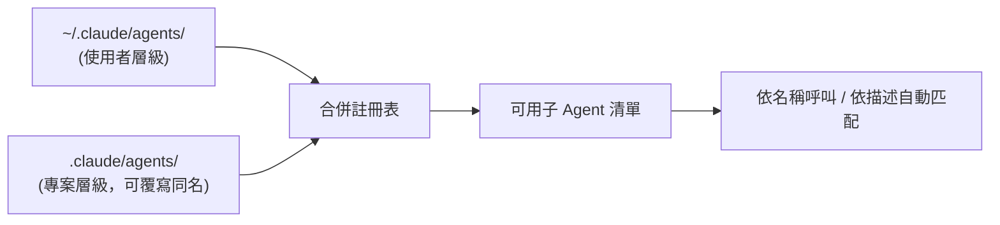

## 10.3 呼叫方式

```bash
claude --agent test-writer -p "為 PaymentService 撰寫單元測試"
```

也可以在互動式 Session 中執行 `/agents` 開啟子 Agent 管理面板：切換到 **Library** 分頁、選擇 **Create new agent**，再選擇存放層級（Personal 存到 `~/.claude/agents/`、Project 存到 `.claude/agents/`），即可用「Generate with Claude」依自然語言描述自動產生子 Agent 的 identifier／description／system prompt，並挑選工具範圍與模型。

## 10.4 內建子 Agent

Claude Code 本身已內建幾個子 Agent，互動式 Session 會自動註冊並視情況委派：

| 內建子 Agent | 模型 | 工具範圍 | 用途 |
|---|---|---|---|
| Explore | Haiku（快速、低延遲） | 唯讀工具（無 Write/Edit） | 程式碼搜尋與探索，不留痕跡地查資料 |
| Plan | 繼承主對話模型 | 唯讀工具 | Plan Mode 下的研究輔助，讓主對話保持唯讀 |
| general-purpose | 繼承主對話模型 | 全部工具 | 需要探索又需要修改的複合任務 |
| statusline-setup | Sonnet | — | 執行 `/statusline` 時設定狀態列 |
| claude-code-guide | Haiku | — | 回答關於 Claude Code 本身功能的問題 |

> 若要停用某個內建子 Agent，可在 `permissions.deny` 中加入對應規則；若要完全禁止任何委派行為，則直接 deny `Agent` 工具本身。

## 10.5 Persistent Memory（子 Agent 持久記憶）

建立子 Agent 時可選擇啟用 **User scope** 記憶，子 Agent 會在 `~/.claude/agent-memory/` 下累積跨對話的學習內容（例如反覆遇到的程式碼慣例、常見問題模式），下次被委派時可參考先前的累積經驗，而不是每次從零開始。

## 10.6 實務範例：團隊共用子 Agent

平台團隊可以把常用的 4 個子 Agent（程式碼審查、文件撰寫、遷移輔助、安全掃描）統一提交到 `.claude/agents/`，這樣每個人 clone 專案後就自動擁有同一套子 Agent，不需要各自重新設定。

> **📌 實務建議**：`description` 欄位寫得越精確，自動匹配選用子 Agent 的命中率越高；建議用「動作 + 對象」的句型，例如「審查 Java 程式碼是否符合公司安全規範」。

> ⚠️ **注意**：子 Agent 的 `tools` 授權範圍應該定期稽核，過寬的工具授權（例如賦予不必要的 Bash 權限）會讓「隔離」失去意義。

**實務案例**：平台團隊將 `code-reviewer`、`doc-writer`、`migration-helper`、`security-scanner` 四個子 Agent 提交到 `.claude/agents/`，新人 clone 專案的第一天就能直接使用團隊標準化的審查與遷移輔助流程。

---

# 第 11 章 CLAUDE.md

## 11.1 用途

CLAUDE.md 是 Claude Code 每次啟動 Session 都會自動載入的專案上下文檔案，用來記錄架構慣例、技術棧、目錄結構、建置/測試指令、安全注意事項、以及「不要做什麼」的限制。它的本質是把工程師重複口頭/書面交代的事情「一次寫好、長期重用」。

## 11.2 三層檔案

| 層級 | 路徑 | 用途 |
|---|---|---|
| 專案共用 | `.claude/CLAUDE.md` | 團隊共識，建議提交版控 |
| 使用者個人 | `~/.claude/CLAUDE.md` | 個人偏好，跨專案生效 |
| 本機限定 | `.claude.local.md` | 不提交版控，個人本機限定備註 |

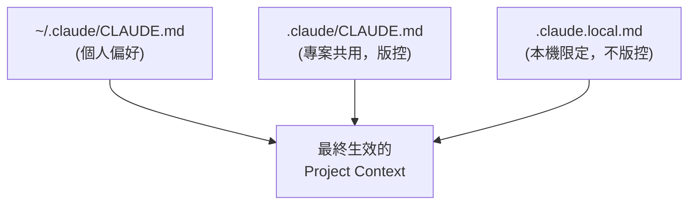

## 11.3 企業標準範本

```markdown
# 專案概述
本服務負責訂單與付款流程，採用 Spring Boot 3 + Java 21。

# 技術棧
- Java 21（使用 Record，不使用 Lombok）
- Spring Boot 3.3、Spring Security 6
- 資料庫：PostgreSQL 15

# 目錄結構
- src/main/java/.../controller：REST 入口
- src/main/java/.../service：商業邏輯
- src/main/java/.../repository：資料存取

# 開發規範
- 所有 Controller 必須有對應的單元測試
- 禁止在 Service 層直接拼接 SQL 字串

# 測試指令
./mvnw test

# 安全注意事項
- 付款相關欄位禁止記錄於一般 Log
- 任何認證/加密邏輯變更需資安團隊審查
```

## 11.4 維護方式

CLAUDE.md 應該被當成「活文件」，在 PR 流程中與程式碼一起檢視更新，而不是寫一次就再也不碰。

> **📌 實務建議**：CLAUDE.md 內容會被載入每次 Session 的 Context，不要把整份 API 規格或巨大表格塞進去，只放「真正每次都需要知道」的精華內容。

> ⚠️ **注意**：沒有 CLAUDE.md 的專案，每次新 Session 都要重新解釋一次建置指令與規範，新人 Onboarding 體驗會明顯比有 CLAUDE.md 的專案差。

**實務案例**：某團隊導入 CLAUDE.md 前，每個新 Session 都要重新告知「我們不用 Lombok」，導入後新人第一次使用 Claude Code 就自動遵守此規範，省去大量重複溝通。

---

# 第 12 章 Hooks

## 12.1 生命週期事件

Claude Code 提供 12 個生命週期事件供 Hook 介入：

| 分類 | 事件 |
|---|---|
| Session 層級 | SessionStart、SessionEnd |
| 對話輪層級 | UserPromptSubmit、Stop、StopFailure |
| 工具層級 | PreToolUse、PostToolUse |
| 其他治理 | Setup、ConfigChange、SubagentStart、SubagentStop |

## 12.2 Handler 類型

- `command`：執行 Shell 腳本
- `http`：呼叫外部 HTTP 端點，接收 JSON 回應
- `prompt`：交給模型評估後決策
- `agent`：派生子 Agent 處理

## 12.3 PreToolUse／PostToolUse 機制

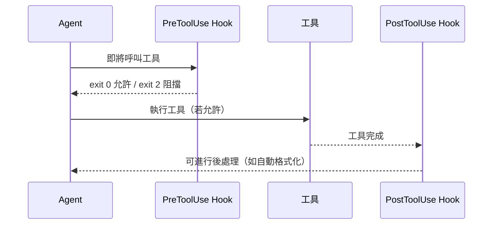

## 12.4 設定範例

```json
{
  "hooks": {
    "PreToolUse": [
      {
        "matcher": "Bash(rm -rf:*)",
        "handlers": [{ "type": "command", "command": "bash ./check-rm.sh" }]
      }
    ],
    "PostToolUse": [
      {
        "matcher": "Edit",
        "handlers": [{ "type": "command", "command": "prettier --write ." }]
      }
    ]
  }
}
```

## 12.5 安全考量

Hook 腳本以使用者的 Shell 權限執行，應該視同 CI 腳本一樣審查與管控：不應讓任何貢獻者未經審查就修改專案層級的 Hook；安全關鍵的 Hook（如阻擋 `git push --force`）應該放在企業 Managed 層級，而非個人可覆寫的本機設定。

> **📌 實務建議**：把「絕對不可發生」的規則（強制推送、刪除遠端分支）寫成 PreToolUse Hook，而不是只靠 Prompt 提醒，Hook 是真正的強制阻擋。

> ⚠️ **注意**：PreToolUse Hook 若包含緩慢的網路呼叫，會拖慢每一次工具呼叫的延遲，Hook 腳本務必保持快速且具備失敗保護（fail-safe）。

**實務案例**：某企業在 PreToolUse Hook 中阻擋所有 `git push --force` 指令，即使有人在 Prompt 中要求 Agent 強制推送也會被 Hook 直接擋下，落實了「規則寫進系統，而非寄望口頭約定」的治理原則。

---

# 第 13 章 MCP 整合

## 13.1 MCP 概念

Model Context Protocol（MCP）是一套開放標準，讓 Claude Code（作為 Client）能以統一的工具呼叫介面，連接外部系統（作為 Server）。Server 可以是本機程式（Stdio 傳輸）或遠端服務（HTTP/SSE 傳輸），對 Agent 而言，呼叫 MCP 工具與呼叫內建工具的方式一致。

## 13.2 設定與管理

```bash
claude mcp add github --transport http https://api.githubcopilot.com/mcp
```

```json
// .mcp.json（專案層級）
{
  "mcpServers": {
    "github": { "transport": "http", "url": "https://api.githubcopilot.com/mcp" },
    "jira":   { "transport": "http", "url": "https://your-org.atlassian.net/mcp" }
  }
}
```

## 13.3 整合案例

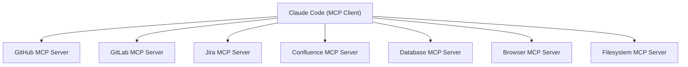

| 整合對象 | 典型用途 |
|---|---|
| GitHub / GitLab | 讀取/建立 PR、Issue、CI 狀態 |
| Jira | 讀取需求、更新工單狀態 |
| Confluence | 讀取設計文件、補完知識庫 |
| Database | 查詢資料結構、驗證遷移腳本 |
| Browser | 模擬使用者操作、驗證前端行為 |
| Filesystem | 存取受限的額外檔案區域 |

## 13.4 工具延遲載入

MCP Server 可能註冊大量工具，但 Claude Code 只在 Session 開始時載入工具名稱，實際工具的完整定義（Schema）依需求才載入，這直接降低了 Context 的基礎佔用量（與第8章 Token 優化相呼應）。

## 13.5 MCP 治理鍵補充

第5章已介紹 `allowedMcpServers`／`deniedMcpServers`，以下補充近期常用的細部治理鍵：

| 設定鍵 | 用途 |
|---|---|
| `enableAllProjectMcpServers` | 一鍵信任專案 `.mcp.json` 中宣告的所有 MCP Server，免逐一核准 |
| `enabledMcpjsonServers` / `disabledMcpjsonServers` | 針對 `.mcp.json` 中特定 Server 個別啟用/停用 |
| `allowAllClaudeAiMcps` | 信任所有透過 Claude.ai 帳號層級已連接的 MCP Server |
| Managed MCP（`managed-mcp.json`） | 由企業 IT 部署固定的 MCP Server 組合，搭配 `allowManagedMcpServersOnly` 鎖定為唯一可用清單 |

> **📌 實務建議**：MCP Server 的認證憑證應採最小權限（例如 Jira 用只能讀的 Token），並維護一份「已核准 MCP Server」清單，新增前需經過審查（詳見第21章）。

> ⚠️ **注意**：MCP Server 是一個新的信任邊界，一個被入侵或惡意的 MCP Server 可能竊取傳遞給它的 Context，審查 MCP Server 的嚴謹度應等同於審查一個新的 CI Plugin。

**實務案例**：團隊同時串接 Jira 與 GitHub MCP，讓 Claude Code 能讀取工單的驗收條件、實作對應修改、並開出引用該工單編號的 PR，整個流程一次串通不需要人工切換多個系統視窗。

---

# 第 14 章 使用 Claude Code 開發 Web Application

## 14.1 通用工作流程

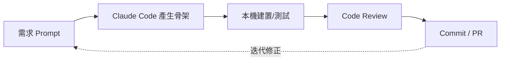

不論技術棧為何，建議流程都是：先讓 Claude Code 產生骨架 → 用專案既有建置/測試工具驗證 → 人工 Review → 提交，而不是一次性要求「做出完整功能」。

## 14.2 Spring Boot（Java/Kotlin）

```bash
claude -p "建立一個 Spring Boot 3.3 REST Controller，處理訂單(Order)的建立與查詢，
使用 Java 21 Record 作為 DTO，並產生對應的 JUnit 5 測試"
```

完成後讓 Agent 自行執行 `./mvnw test` 驗證，而不是只產生程式碼就結束。

## 14.3 FastAPI（Python）

```bash
claude -p "用 FastAPI 建立一個商品庫存查詢 API，包含 Pydantic 模型驗證與 pytest 測試"
```

## 14.4 Vue3 / Angular

```bash
claude -p "建立一個 Vue 3 Composition API 元件，顯示分頁式商品列表，
請使用本專案既有的 Pinia store 慣例"
```

> **📌 實務建議**：在 CLAUDE.md 中明確標註框架版本與慣例（例如「本專案使用 Vue 3 Composition API，不使用 Options API」），避免 Agent 因訓練資料偏舊而產出過時寫法。

> ⚠️ **注意**：永遠讓 Claude Code 執行專案既有的建置/測試指令做驗證，而不是只看程式碼「看起來合理」就視為完成。

**實務案例**：一個 FastAPI 微服務從一段需求描述開始，在同一個 Session 內逐步產出骨架、Pydantic 模型、CRUD 邏輯與 pytest 測試，全程伴隨真實測試結果回饋，最終交付的程式碼一次通過 Code Review。

---

# 第 15 章 Legacy System 逆向工程

## 15.1 分析方法

逆向工程不是「叫 Agent 讀完全部程式碼」，而是結構化的探索流程：

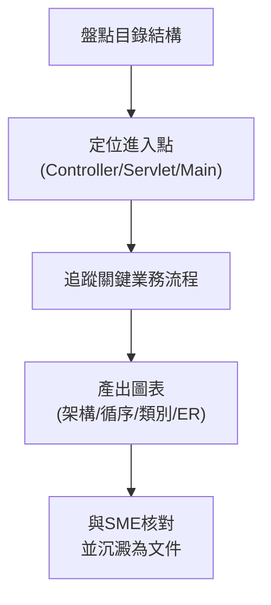

## 15.2 適用範圍與限制

涵蓋 Java Legacy、COBOL、VB、Delphi、ASP.NET WebForms、JSP/Struts 等系統。對冷僻語言（COBOL、Delphi）模型訓練資料較少，幻覺風險較高，務必加強人工核對。

## 15.3 範例 Prompt

```bash
claude -p "列出 /webapp 下所有 JSP 檔案及其對應的 Servlet Mapping"
claude -p "追蹤從 OrderServlet.doPost 開始的呼叫鏈，一路到 DAO 層"
claude -p "依據這些 SQL DDL 檔案，產生 Mermaid ER 圖"
```

## 15.4 產出範例

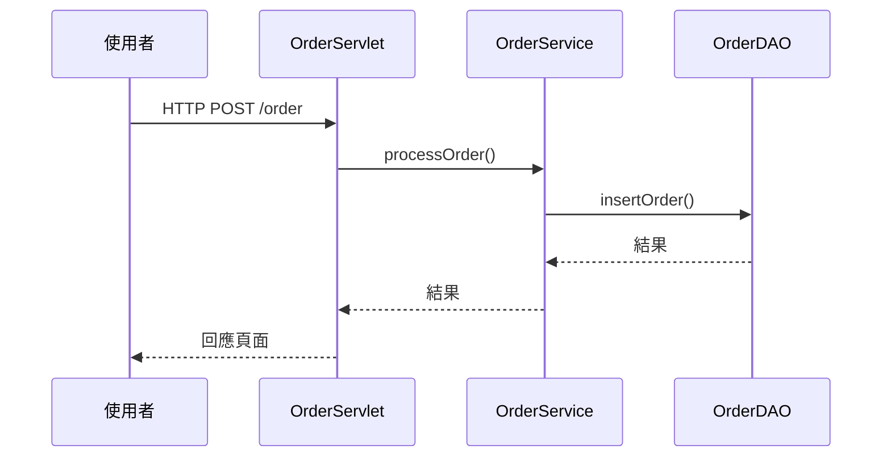

> **📌 實務建議**：產出的架構/循序圖務必交給熟悉該系統的資深同仁（SME）核對，AI 可能誤判隱含的控制流程（例如 COBOL 中的 GOTO 邏輯）。

> ⚠️ **注意**：對 COBOL、Delphi 等模型訓練資料較少的語言，務必提高人工審查比例，不要把 AI 產出的圖表直接當作正式文件發布。

**實務案例**：一套 15 年歷史的 ASP.NET WebForms 理賠系統，透過分階段 Prompt 在一次 Session 內產出理賠核准流程的架構圖與循序圖，再與資深同仁核對修正後，成為團隊第一份可信賴的系統文件。

---

# 第 16 章 Framework 升級

## 16.1 通用升級方法論

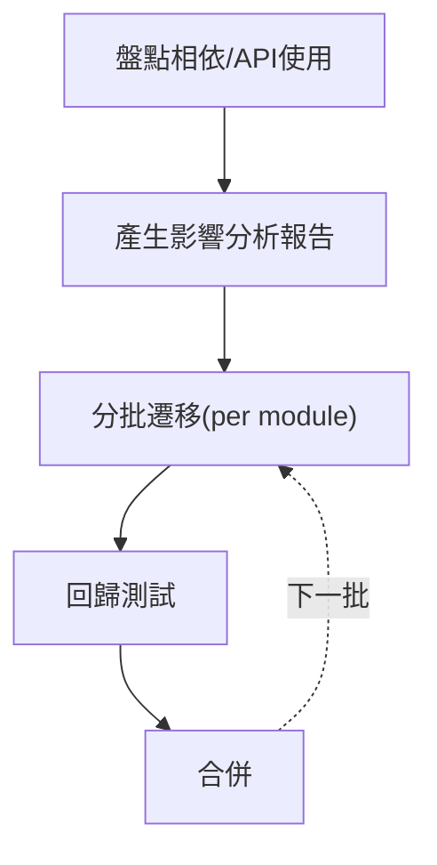

## 16.2 各升級情境要點

| 升級類型 | 關鍵變動 |
|---|---|
| Spring Boot 2→3 | `javax.*` → `jakarta.*` 命名空間遷移、Spring Security DSL 改寫 |
| Java 8→21 | Record、Sealed Class、Virtual Threads、移除的舊 API |
| Vue 2→3 | Options API → Composition API、全域 API 變更 |
| Angular/React 升級 | Standalone Component、CLI 重大變更 |

## 16.3 範例 Prompt

```bash
claude -p "掃描整個專案中使用 javax.* 的 import，列出需要遷移到 jakarta.* 的檔案清單"
claude -p "將這個 Vue 2 Options API 元件改寫為 Composition API，保持行為一致"
```

> **📌 實務建議**：永遠不要接受「一次性整個倉庫升級」的單一 Prompt，務必拆成模組分批進行，每批之間跑完整回歸測試再進下一批。

> ⚠️ **注意**：模型訓練資料對較新或冷門的升級路徑覆蓋率較低，務必拿生成的遷移步驟與官方升級指南交叉核對，不要盲信。

**實務案例**：某中型服務從 Spring Boot 2.7 升級到 3.2，先用 Claude Code 產生命名空間遷移清單與 Security DSL 改寫草案，再分批以 PR 形式推進，每個 PR 之間都有完整測試把關，避免了一次性大改造成的不可控風險。

---

# 第 17 章 Git 整合

## 17.1 AI 協作流程

```mermaid
flowchart LR
    Edit["本機修改"] --> MsgGen["Claude Code 產生 Commit Message"]
    MsgGen --> Commit["git commit"]
    Commit --> PRGen["Claude Code 產生 PR 描述"]
    PRGen --> PRCreate["gh pr create"]
    PRCreate --> AIReview["AI 預審 (claude ultrareview)"]
    AIReview --> HumanReview["人工 Review"]
    HumanReview --> Merge["Merge"]
```

## 17.2 常用指令

```bash
git status && git diff
gh pr create --title "..." --body "..."
gh pr diff
claude ultrareview          # 非互動式 AI 程式碼審查
```

## 17.3 守則

Claude Code 應該遵守的 Git 安全守則：不自行強制推送（`--force`）、不跳過 Hook（`--no-verify`）、不修改既有歷史（amend 已推送的 commit），這些守則建議用第12章的 Hooks 強制落實，而不是只靠提示文字約束。

> **📌 實務建議**：讓 Claude Code 在提交前先輸出 `git diff` 給你確認範圍，再進行 commit，避免意外提交未預期的檔案。

> ⚠️ **注意**：絕對不要靠「請禮貌地提醒 Agent 不要強制推送」來防呆，真正的防線是第5、12章談到的設定與 Hook 層級強制阻擋。

**實務案例**：一名工程師讓 Claude Code 草擬一次多檔案重構的 Commit Message 與 PR 描述（包含 Summary 與 Test Plan），大幅縮短了撰寫 PR 說明的時間，且描述品質一致性更高。

## 17.4 Worktree 分支隔離與 `/code-review`

第9.8章介紹的 Worktree 機制，從 Git 的角度看就是「每個平行任務各自在獨立分支／獨立工作目錄上開發」，這與傳統手動切換分支（`git checkout`）的差異在於：Worktree 不需要切換目前終端機所在的工作目錄，可以讓多個分支同時存在於磁碟上的不同路徑，搭配多個 Claude Code Session 平行開發時不會互相干擾。

另外，官方已提供 `/code-review` 指令，與第17.2章提到的 `claude ultrareview` 是兩種不同層次的審查：

| 指令 | 執行位置 | 用途 |
|---|---|---|
| `/code-review`（Session 內） | 本機，互動式 | 快速掃描目前 diff 找出明確的正確性錯誤（correctness bugs） |
| `claude ultrareview` | 雲端，非互動式 | 較完整的多角度雲端審查，適合納入 CI 或 PR 前的最後一道關卡 |

> **📌 實務建議**：日常開發中先用 `/code-review` 做即時的本機快篩，PR 開出前再跑一次 `claude ultrareview` 做較完整的雲端審查，兩者搭配比單獨使用任一個更有效率。

---

# 第 18 章 測試工程

## 18.1 測試生成工作流程

```mermaid
flowchart TD
    A["選定模組"] --> B["分析現有程式碼/規格"]
    B --> C["產生測試骨架"]
    C --> D["人工檢視斷言正確性"]
    D --> E["執行測試"]
    E -.失敗案例回饋.-> B
```

## 18.2 各類型測試

- **單元測試**：依框架慣例（JUnit5/Mockito、pytest、Jest/Vitest）產生，涵蓋邊界條件
- **整合測試**：協助配置測試替身/容器化依賴
- **E2E 測試**：搭配 Playwright 等工具，依使用者流程描述生成腳本

## 18.3 範例

```bash
claude -p "為 OrderService 撰寫 JUnit 5 測試，涵蓋 null 輸入與併發更新的邊界情況"
claude -p "依照這個使用者故事，產生對應的 Playwright E2E 測試腳本"
```

## 18.4 TDD 風格使用

可以先讓 Claude Code 根據規格寫出「應該失敗」的測試，再實作程式碼直到測試通過，這個順序能讓測試真正驗證「正確行為」而非「現有行為」。

> **📌 實務建議**：務必人工確認測試斷言的「正確性」，而不只是「測試通過」——AI 有可能生成驗證現有（可能有 Bug）行為的測試。

> ⚠️ **注意**：要明確防範 Agent 用「弱化斷言」的方式讓失敗測試變綠燈，而不是真正修正底層問題，這是一個需要在 Review 中特別留意的失敗模式。

**實務案例**：一個訂價計算函式採用 TDD 流程開發：先撰寫規格、讓 Claude Code 產生會失敗的測試、再逐步實作直到全部通過，最終交付的程式碼測試覆蓋率與正確性都優於先寫程式再補測試的做法。

---

# 第 19 章 SSDLC 整合

## 19.1 定位

Claude Code 應被視為 Secure SDLC 中的**一層**輔助，而不是取代 SAST/DAST/Dependency Scan/Secret Scan 等專用工具。

```mermaid
flowchart TD
    R["需求"] --> D["設計"]
    D --> Dev["開發"]
    Dev --> T["測試"]
    T --> Dep["部署"]
    Dep --> Ops["維運"]
    D -.威脅建模協助.-> CC1["Claude Code"]
    Dev -.安全程式碼建議.-> CC2["Claude Code"]
    T -.測試案例生成.-> CC3["Claude Code"]
    Dep -.依賴/Secret掃描摘要.-> CC4["Claude Code"]
```

## 19.2 各類掃描的協作方式

- **SAST 風格**：請 Claude Code 在 PR 前review diff，檢查 OWASP Top 10 類型風險
- **Dependency Scan**：讓 Agent 讀取 `mvn dependency-check:check` / `npm audit` 輸出並摘要風險
- **Secret Scan**：搭配第12章 PreToolUse Hook 阻擋符合金鑰格式的提交內容

```bash
claude -p "審查這次 diff 是否有 OWASP Top 10 相關風險，再讓我決定是否開 PR"
npm audit --json
mvn dependency-check:check
```

## 19.3 兩層防護案例

第一層（Hook）擋下明顯的硬編碼金鑰格式；第二層（AI Review）抓出較隱晦的安全問題（例如邏輯上的權限繞過）。兩層搭配比單靠其中一層更可靠。

> **📌 實務建議**：把 Claude Code 的安全審查當作 Semgrep/Snyk/OWASP ZAP 等專用工具的「額外一層」，而非取代品。

> ⚠️ **注意**：涉及認證、加密、PII 的修改，即使 AI 審查說「沒問題」，仍必須經過資安團隊正式簽核，不能把 AI 的意見當作正式核准。

**實務案例**：一次提交中，PreToolUse Hook 先擋下了明顯的硬編碼資料庫密碼，AI Review 又額外抓出一個邏輯上的權限繞過風險，兩層防護缺一不可。

## 19.4 Sandboxing：第三層防護

第一層（Hook）與第二層（AI Review）都是「邏輯層」的防護，攔不住的是工具呼叫本身在作業系統層級造成的破壞（例如不慎刪到專案外的檔案，或意外連線到未預期的網路位置）。**Sandboxing** 透過設定鍵 `sandbox.enabled` 啟用 OS 層級的沙箱限制，搭配 `sandbox.network.allowedDomains` 限制可連線的網域白名單，提供與邏輯層完全獨立的第三層防護：

```mermaid
flowchart LR
    L1["第一層：PreToolUse Hook<br/>(攔截已知危險指令)"] --> Action["工具呼叫實際執行"]
    L2["第二層：AI Review<br/>(抓邏輯/語意風險)"] --> Action
    L3["第三層：Sandboxing<br/>(OS級檔案/網路邊界)"] --> Action
```

```json
{
  "sandbox": {
    "enabled": true,
    "network": { "allowedDomains": ["registry.npmjs.org", "github.com"] }
  }
}
```

> **📌 實務建議**：Sandboxing 適合作為「即使 Hook 規則寫得不夠完整也有底線」的最後防線，尤其是 CI/自動化情境（第6章 `--max-budget-usd`/`--max-turns` 限制的是時間與成本，Sandbox 限制的是破壞範圍，兩者互補不重複）。

> ⚠️ **注意**：啟用 Sandbox 後，部分需要存取專案外資源（如特定內部套件登錄站）的工作流程可能因網域白名單未涵蓋而失敗，導入前應先盤點團隊實際需要連線的網域清單。

---

# 第 20 章 Token 與成本管理

## 20.1 成本驅動因子

```mermaid
graph LR
    Model["模型選擇"] --> Total["總成本"]
    Ctx["Context 大小"] --> Total
    Turns["對話輪數"] --> Total
    Sub["Sub Agent 數量"] --> Total
```

## 20.2 查看用量

互動式 Session 會顯示當次成本；Team/Enterprise 方案可在管理後台查看團隊整體用量與依 Skill/Subagent/Plugin/MCP 拆分的成本明細。

## 20.3 降低成本技巧

- 用 `--add-dir` 限定範圍（第8章）
- 用 CLAUDE.md 減少重複解釋（第11章）
- CI/自動化情境設定 `--max-budget-usd` 與 `--max-turns`（第6章）
- 簡單任務用較低的 `--effort`，複雜架構任務才用較高 effort

```bash
claude -p "..." --max-budget-usd 5.0 --effort low
```

> **📌 實務建議**：在專案層級 `settings.json` 中為 CI/自動化用途設定預設的成本上限，而不是依賴每個人手動加旗標。

> ⚠️ **注意**：不要為了省成本而一律調低 effort——複雜架構設計任務若用過低 effort，後續人工返工的時間成本往往遠高於省下的 API 費用。

**實務案例**：某團隊發現某月費用異常飆高，追查後發現是多名工程師習慣用「解釋整個專案」這類無範圍限定的 Prompt，導入 CLAUDE.md 與範圍限定的提示習慣後，成本明顯下降。

## 20.4 用量可視化：`/usage`、Analytics、OpenTelemetry

成本異常排查不應只靠「事後追查 Prompt 習慣」，官方已提供更細粒度的用量拆解工具：

- **`/usage`**：在 Session 內執行，依方案額度拆解目前用量驅動因子，可細到 Skill／Subagent／Plugin／MCP 各自的消耗占比，直接定位「是哪個機制在燒額度」。
- **Analytics Dashboard**：Team/Enterprise 方案可在管理後台（`claude.ai/analytics/claude-code`）查看全組織用量趨勢與依使用者/專案的拆分。
- **OpenTelemetry 匯出**：支援將用量與效能指標匯出至企業既有的可觀測性平台（Grafana、Datadog 等），納入既有的監控告警體系，而不是另外維護一套獨立儀表板。

```bash
# Session 內查看用量拆解
/usage
```

> **📌 實務建議**：平台團隊應優先導入 OpenTelemetry 匯出，把 Claude Code 用量併入既有監控告警規則（例如「單日成本超過閾值時告警」），比每月人工檢視 Analytics Dashboard 更即時。

---

# 第 21 章 團隊導入指南

## 21.1 分階段導入流程

```mermaid
flowchart TD
    P1["Phase 1：試點小組"] --> P2["Phase 2：標準化<br/>(CLAUDE.md範本/共用子Agent)"]
    P2 --> P3["Phase 3：推廣<br/>(MCP白名單/成本儀表板)"]
    P3 --> P4["Phase 4：治理常態化"]
```

## 21.2 治理模式

由小型跨職能小組（技術主管 + 資安 + DevOps）負責核准：新增 MCP Server（第13章）、共用子 Agent（第10章）、企業 Hook 規則（第12章）。

## 21.3 權限管理

依第5章的設定優先順序，企業 IT 應掌握 Managed 層級設定，專案團隊掌握專案層級設定，個人僅能調整不影響安全的本機偏好（如模型選擇）。

## 21.4 標準規範

- 強制使用 CLAUDE.md 範本（第11章）
- Prompt Library 走 PR 審查流程（第23章）
- AI 協作產生的 Commit/PR 需註明（便於追溯）
- 強制人工 Review，AI 產出不可直接合併

> **📌 實務建議**：先成立 5 人以內的試點小組驗證流程，標準成熟後才推廣到全公司，避免一開始就要求所有團隊同時改變習慣。

> ⚠️ **注意**：若在 CLAUDE.md／Prompt Library 標準尚未成形前就全公司推廣，各團隊產出品質會明顯不一致，應先標準化再規模化。

**實務案例**：一個 200 人工程組織，從 5 人試點小組開始，一個季度內逐步推廣到全組織，並在過程中成立治理委員會核准新的 MCP Server 與共用子 Agent，避免了野蠻生長導致的治理真空。

## 21.5 新機制的治理檢查項

第26-28章介紹的進階機制（Agent Teams、Dynamic Workflows、Plugins Marketplace）擴大了「自動化範圍」與「可能出錯範圍」，治理委員會在核准導入時應額外檢查：

| 機制 | 核准重點 |
|---|---|
| Agent Teams（第26.2章） | 是否評估過「多 Session 互相傳訊」放大錯誤傳播的風險；是否僅在非生產專案試行 |
| Dynamic Workflows（第26.3章） | 編排腳本是否經過 Code Review；是否設有總體 Token/成本上限 |
| Plugins Marketplace（第27.4章） | 是否限定 `strictKnownMarketplaces`／維護 `blockedMarketplaces` 黑名單；新 Plugin 安裝是否走核准流程 |

> **📌 實務建議**：把這張表併入既有的「治理模式」（21.2章）核准清單，由同一個跨職能小組統一審查，避免新機制各自獨立核准造成治理碎片化。

---

# 第 22 章 Claude Code 最佳實務

## 22.1 20 個最佳實務

1. 從 repo 根目錄啟動 Session
2. 維護並持續更新 CLAUDE.md
3. 每次 Diff 都人工 Review
4. 大型任務拆解成可平行的 Sub Agent
5. 在 Prompt/CLAUDE.md 中明確標註框架版本
6. CI/自動化情境一律設定 `--max-turns`/`--max-budget-usd`
7. 用 `--add-dir` 限定 Context 範圍
8. 善用 Grep/Glob 先定位再 Read
9. 安全規則寫進 Hook，而非只靠口頭提醒
10. 子 Agent 採最小權限工具授權
11. MCP Server 維護核准清單
12. Prompt Library 版控與 Review
13. 簡單任務用低 effort，複雜任務用高 effort
14. 善用 Session 續接（`-c`/`-r`）避免重複解釋
15. 長對話中重要決策主動重申，避免被壓縮遺失
16. 企業層級用 Managed 設定強制安全底線
17. 測試斷言正確性務必人工確認
18. 框架升級分批進行並搭配回歸測試
19. 逆向工程產出務必由 SME 核對
20. 定期回顧最佳實務清單（隨版本演進調整）

## 22.2 20 個常見錯誤

1. 一次性丟整個 Monorepo 給 Agent
2. 盲信 AI 產出的安全相關程式碼
3. 跳過測試執行就視為任務完成
4. 子 Agent 工具授權過寬
5. 忽略 Hook 治理，只靠提示文字防呆
6. 未設定成本/輪數上限就跑自動化任務
7. 平行 Sub Agent 沒有界定檔案所有權
8. CLAUDE.md 塞入過多巨大規格內容
9. 長對話未重申關鍵約束
10. 升級框架時一次性全倉庫重寫
11. 對冷僻語言（COBOL等）逆向工程結果未經核對
12. 個人各自申請 API Key 而非用 Team/Enterprise
13. 把 API Key 寫進程式碼或 `.env` 並提交版控
14. 用「弱化斷言」讓失敗測試變綠燈
15. MCP Server 未審查就接入生產環境
16. 忽視 Managed 設定造成的「設定不生效」排查時間
17. 沒有命名空間/工具邊界、多 Agent 互相覆寫
18. 把 AI 審查意見當作正式資安簽核
19. Prompt Library 沒有版控與審查流程
20. 推廣全公司前未先標準化 CLAUDE.md/規範

## 22.3 20 個效能優化技巧

1. 用 `--add-dir` 而非全庫掃描
2. 優先 Grep/Glob 定位後再 Read
3. 重複內容善用 Prompt Caching（避免頻繁切換差異很大的系統提示）
4. CLAUDE.md 精簡，只放高頻重用內容
5. 簡單任務調低 `--effort`
6. 善用 MCP 工具延遲載入特性
7. 避免不必要的大檔案一次性讀取
8. 適時用 `/compact` 類機制管理長對話
9. CI 中設定明確的 `--output-format json` 便於下游解析，減少重試
10. 平行任務拆 Sub Agent，縮短總時長
11. 善用 Session 續接避免重新建立 Context
12. 善用 `--mcp-config` 限定當次需要的 MCP Server，而非全部載入
13. 避免在單一 Session 中混雜多個不相關主題
14. 適度使用 fallback model 設定，避免單點限流影響任務
15. 自動化腳本設定合理 `--max-turns` 避免低效迴圈
16. 善用結構化輸出（JSON Schema）減少下游解析失誤重跑
17. 大型重構先產出計畫文件，再分批執行而非一次性大 Prompt
18. 善用既有測試/建置工具驗證，避免靠 AI 自行猜測是否正確
19. 適時拆分長文件 Prompt，避免單一訊息過度龐大
20. 定期清理不再需要的背景 Session（`claude rm`）釋放資源

```mermaid
quadrantChart
    title 常見錯誤：影響程度 x 發生頻率
    x-axis 低頻率 --> 高頻率
    y-axis 低影響 --> 高影響
    "一次性丟整個Monorepo": [0.7, 0.4]
    "盲信AI安全程式碼": [0.4, 0.9]
    "跳過測試驗證": [0.5, 0.8]
    "API Key寫入版控": [0.2, 0.95]
    "子Agent權限過寬": [0.3, 0.6]
```

> **📌 實務建議**：把本章三份清單印成團隊內部 Onboarding 文件的一部分，新人入職第一週就過一次。

> ⚠️ **注意**：最佳實務清單會隨 Claude Code 版本演進而需要調整，建議每次重大版本更新後重新檢視本章內容是否仍然適用。

**實務案例**：某團隊導入前後對比：導入這些實務前，平均一個中型任務需要 15 輪互動且常需要重來；導入「範圍限定」「CLAUDE.md」「子 Agent 拆分」後，同類任務輪數明顯下降，且重工比例降低（為情境試算，非官方公布數據）。

---

# 第 23 章 Claude Code Prompt Library

## 23.1 分類架構

```mermaid
graph LR
    Root["Prompt Library"] --> Web["Web開發"]
    Root --> Review["Code Review"]
    Root --> Arch["架構設計"]
    Root --> Legacy["逆向工程"]
    Root --> Upgrade["Framework升級"]
    Root --> Test["測試"]
    Root --> Doc["文件生成"]
```

## 23.2 範本（可直接複製套用）

**Web 開發**
```
建立一個 {Framework} 的 {ResourceName} 模組，包含 CRUD API，
使用本專案 CLAUDE.md 中標註的版本與慣例，並產生對應的單元測試。
```

**Code Review（安全導向）**
```
請審查這次 diff，依 OWASP Top 10 標準檢查注入、權限繞過、敏感資料外洩風險，
列出風險等級與具體修改建議。
```

**架構設計**
```
依據以下需求描述，產出 C4 模型 Context 與 Container 層級的 Mermaid 圖，
並列出 3 個可能的架構決策（ADR）選項與取捨。
```

**逆向工程**
```
列出 {目錄路徑} 下所有進入點檔案，並追蹤從 {EntryPoint} 開始的呼叫鏈，
產出 Mermaid 循序圖。
```

**Framework 升級**
```
掃描專案中所有 {舊API/套件} 的使用位置，列出受影響檔案清單，
並產出分批遷移計畫（每批含可獨立測試的範圍）。
```

**測試**
```
為 {ClassName} 撰寫 {TestFramework} 測試，涵蓋正常案例、邊界案例與例外情況，
完成後執行測試並回報結果。
```

**文件生成**
```
依據這個模組的程式碼，產出 README，包含：模組用途、對外介面、
依賴關係圖（Mermaid）、已知限制。
```

> **📌 實務建議**：把 Prompt Library 當成程式碼一樣版控管理，新範本要經過 PR 審查，避免劣質範本擴散到全團隊的使用習慣。

> ⚠️ **注意**：範本會隨框架與 Claude Code 本身演進而過時，建議指派負責人定期驗證範本仍能產出正確結果。

**實務案例**：某團隊建立內部 Prompt 範本庫，與 CLAUDE.md 一起版控，新人不需要從零摸索如何下指令，直接從範本庫挑選並填入參數即可上手。

---

# 第 24 章 Claude Code + GitHub Copilot 協同開發

## 24.1 分工模式

Copilot 擅長「行內即時補全」，Claude Code 擅長「終端機驅動的多檔案深度推理」。兩者不是競爭關係，而是互補：Copilot 加速逐行打字，Claude Code 負責規劃與跨檔案一致性。

```mermaid
flowchart LR
    Plan["Claude Code 終端機<br/>(規劃/產生骨架)"] --> Editor["VS Code 編輯器<br/>(Copilot 即時補全/微調)"]
    Editor --> ReviewStep["Claude Code 終端機<br/>(Diff審查/跑測試)"]
    ReviewStep --> Commit["Commit"]
```

## 24.2 實際工作流程

1. 在 Claude Code 終端機規劃功能、產生骨架
2. 切到 VS Code 編輯器，靠 Copilot 補全細節（如方法內部邏輯）
3. 回到 Claude Code 終端機，執行 `claude -p "review the diff for this change"` 確認整體一致性與測試結果
4. 提交 Commit

## 24.3 避免衝突

維持 `CLAUDE.md` 與 `copilot-instructions.md`（如有使用）內容一致，避免兩個工具給出互相矛盾的指引；同一檔案盡量避免兩個工具同時編輯，採輪流操作而非同步編輯。

> **📌 實務建議**：指定一份「規範來源」（CLAUDE.md 或 copilot-instructions.md 二選一作為主文件），另一份由其衍生或保持同步，避免規則分裂。

> ⚠️ **注意**：兩個 AI 工具同時對同一檔案做不同方向的修改，容易產生令人困惑的雙重編輯，建議明確劃分「誰在改、何時改」。

**實務案例**：前端工程師用 Copilot 快速完成元件 Props 型別的逐行輸入，同時在側邊終端機用 Claude Code 確保整個重構過程中元件架構的一致性，兩者搭配讓大型重構的整體節奏比單獨使用任一工具更快。

---

# 第 25 章 Claude Code 企業級導入藍圖

## 25.1 完整藍圖

```mermaid
graph TB
    Dev["開發層<br/>(IDE / Terminal / CI)"] --> Agent["Claude Code Agent 層<br/>(主Agent + 子Agent)"]
    Agent --> Gov["治理層<br/>(Settings / Hooks / Permissions)"]
    Gov --> Integ["整合層<br/>(MCP Servers: Git/Jira/DB...)"]
    Integ --> Infra["資料/基礎設施層<br/>(Repo / Artifact / Secrets Manager)"]
```

## 25.2 組織架構

建議設立中央「AI 賦能／平台」小組，負責維護共用子 Agent、CLAUDE.md 範本、MCP 核准清單；各業務單位指派「AI Champion」負責推廣與第一線問題收集。

## 25.3 治理模式總結（彙整前述章節）

- 設定優先順序與 Managed 強制設定（第5章）
- Hook 強制落實安全底線（第12章）
- MCP Server 分級與白名單（第13章）
- 子 Agent 註冊與審查（第10章）

## 25.4 KPI 與稽核

| 指標 | 說明 |
|---|---|
| 採用率 | 活躍使用 Claude Code 的工程師比例 |
| Review 通過率 | AI 協作 PR 一次通過 Review 的比例 |
| 事故數 | AI 協作變更相關的生產事故數 |

> **📌 實務建議**：治理設計從第一天就要可被稽核——記錄任何 AI 協作變更當時生效的 Settings/Hooks/MCP Server 組合，受監管產業（金融、醫療）的稽核需求會用到這份紀錄。

> ⚠️ **注意**：再完整的藍圖如果沒有指定負責人與定期檢視週期，很容易變成束之高閣的文件，務必把「誰負責、多久檢視一次」寫進藍圖本身。

**實務案例**：某金融業組織從 5 人試點開始，歷時一年走到全組織導入與治理成熟，期間明確指定治理委員會、設定每季檢視週期，並保留每次 AI 協作變更的設定快照供合規稽核使用。

---

# 第 26 章 Agent 進階協作模式

## 26.1 四種平行化機制總覽

第9章已分別介紹 Subagent、Agent View、Agent Teams、Dynamic Workflows 的基礎概念，本章從「企業場景下該選哪一種」的角度做總覽：

```mermaid
quadrantChart
    title 平行化機制選擇：協調需求 x 規模
    x-axis 小規模 --> 大規模
    y-axis 不需互相協調 --> 需要互相協調
    "Subagent": [0.2, 0.2]
    "Agent View": [0.5, 0.15]
    "Agent Teams": [0.4, 0.85]
    "Dynamic Workflows": [0.9, 0.4]
```

| 機制 | 何時選用 | 治理重點 |
|---|---|---|
| Subagent | 單一 Session 內的側支任務 | 工具權限最小化（第9-10章） |
| Agent View | 多個獨立任務同時推進，不需互相溝通 | 背景常駐程序的存取控管（`disableAgentView`） |
| Agent Teams | 任務之間需要互相協調、回報進度 | 實驗性功能的試行範圍與啟用核准（26.2） |
| Dynamic Workflows | 大規模、可重複的審查／遷移流程 | 編排腳本的審查與成本上限（26.3） |

## 26.2 Agent Teams 實務

Agent Teams 讓多個 Session 共享同一份任務清單，並透過訊息機制互相通知進度，例如「後端 Session 完成 API 後通知前端 Session 開始對接」。由於是**實驗性功能、預設關閉**，企業導入時建議：

- 先在非生產、低風險的內部專案試行，觀察「Session 間訊息傳遞」是否會放大某一個 Session 的錯誤判斷（一個誤判可能透過訊息擴散到其他協作中的 Session）。
- 明確指定誰可以啟用此功能（建議僅平台團隊或資深工程師），而非預設對全體開放。
- 任務清單與訊息紀錄應可被事後追溯，便於問題回溯時還原「哪個 Session 在什麼時間點做了什麼判斷」。

## 26.3 Dynamic Workflows 實務

Dynamic Workflows 以腳本明確定義編排邏輯——哪些步驟平行執行、哪些步驟要等前一階段的結果、如何讓多個獨立的檢核結果交叉比對——取代讓模型自行即興決定派生順序。典型場景包括大規模程式碼審查（依風險維度分工，再交叉驗證發現項）、大規模框架遷移（逐檔案/逐模組分工，最後彙整影響分析報告）。

```bash
claude --bg -p "依本機 Workflow 腳本，對 services/ 下所有模組執行安全性審查並彙整報告"
```

> 治理上，編排腳本本質上等同於「會自動消耗大量 Token 與工具呼叫的程式」，應該：

- 提交版控、走 PR 審查流程，與一般程式碼同等級對待，而不是視為「臨時 Prompt」
- 在腳本層級設定明確的成本／規模上限（例如最多派生多少個 Subagent），避免邊界條件下無限擴張
- `/workflows` 指令可列出歷史執行紀錄，定期檢視是否有異常規模的執行

## 26.4 `/batch`：大規模 Worktree 隔離批次處理

`/batch` 是隨附的 Skill，可將一個大任務拆解成 5 至 30 個子任務，每個子任務在獨立的 Worktree（第9.8章）中執行，完成後各自開出獨立的 PR，適合「同一種修改要套用到大量檔案/模組」的情境（例如把專案中數十個過時 API 呼叫逐一替換）。

```text
/batch 將 services/ 下所有模組的 javax.* import 替換為對應的 jakarta.*，每個模組各開一個 PR
```

> **📌 實務建議**：`/batch` 適合「修改模式高度重複、模組之間互相獨立」的任務；若子任務之間有相依順序（必須先改 A 才能改 B），應改用 Dynamic Workflows 明確控制執行順序，而非用 `/batch` 平行處理。

> ⚠️ **注意**：`/batch` 會一次性開出大量 PR，務必事先與團隊溝通 Review 容量，避免造成 PR 隊列堵塞，建議搭配 26.3 提到的規模上限分批執行。

**實務案例**：某團隊用 `/batch` 將一個跨 20 個模組的命名空間遷移任務拆成 20 個獨立 Worktree 子任務，各自開 PR 後再依模組重要性排序逐一 Review，比單一 Session 序列處理的總時程縮短超過一半。

---

# 第 27 章 Agent Skills 與 Plugin 生態

## 27.1 Skills 與 CLAUDE.md／Subagent 的定位差異

三者都是「重用既有知識／程序」的機制，但載入時機與適用情境不同：

| 機制 | 載入時機 | 適合內容 |
|---|---|---|
| CLAUDE.md（第11章） | 每次 Session 啟動都載入 | 少量、高頻率需要的事實性資訊（技術棧、目錄結構、禁止事項） |
| Skill（`SKILL.md`） | 依需求才載入（被呼叫或符合描述時） | 多步驟程序、檢查清單、長篇參考資料——CLAUDE.md 中「長成程序而非事實」的段落應該搬到 Skill |
| Subagent（第9-10章） | 被委派時才在獨立 Context 中執行 | 需要獨立工具權限／獨立 Context 隔離的任務，而非僅是「程序說明」 |

判斷原則：如果你發現自己在 CLAUDE.md 裡寫了一段「遇到 X 情況時依序執行 1、2、3 步驟」，這通常代表它該是一個 Skill，而不是繼續留在每次都載入的 CLAUDE.md 中。

## 27.2 SKILL.md 格式與存放層級

每個 Skill 是一個目錄，`SKILL.md` 為必要的進入點：

```text
my-skill/
├── SKILL.md           # 主要指令（必要）
├── template.md        # 給 Claude 填寫的範本
└── scripts/
    └── validate.sh    # Claude 可執行的腳本
```

```yaml
---
description: 摘要尚未提交的變更並標示風險。當使用者問「改了什麼」或要求 commit message 時使用。
---

## 目前變更

!`git diff HEAD`

## 指示

依上方 diff 整理成 2-3 條摘要，並列出風險（缺漏的錯誤處理、寫死的數值、需要更新的測試）。
```

frontmatter 常用欄位：`description`（決定 Claude 何時自動載入）、`name`、`context: fork`（在獨立 Subagent 中執行而非佔用主對話 Context）、`disable-model-invocation: true`（僅能被使用者以 `/skill-name` 主動呼叫，禁止模型自動觸發，適合部署等高風險操作）。

存放層級與優先序（同名時，企業 > 個人 > 專案，皆優先於同名的隨附 Skill）：

| 層級 | 路徑 | 適用範圍 |
|---|---|---|
| Enterprise | 透過 Managed Settings 部署 | 全組織 |
| Personal | `~/.claude/skills/<name>/SKILL.md` | 個人所有專案 |
| Project | `.claude/skills/<name>/SKILL.md` | 本專案（支援巢狀目錄，monorepo 子套件可有自己的 Skill） |
| Plugin | `<plugin>/skills/<name>/SKILL.md` | 以 `plugin名:skill名` 命名空間，不會與其他層級衝突 |

> 舊版 `.claude/commands/<name>.md` 自訂指令仍可正常運作，但若有同名 Skill，Skill 優先；建議新建內容統一改用 Skill 格式，以取得巢狀目錄、附加檔案等進階能力。

## 27.3 隨附 Skills（Bundled Skills）

每個 Session 預設都帶有一組隨附 Skill（可用 `disableBundledSkills` 整體關閉），包括：

| Skill | 用途 |
|---|---|
| `/code-review` | 掃描目前 diff 找出正確性錯誤（第17.4章） |
| `/batch` | 大規模 Worktree 隔離批次處理（26.4） |
| `/debug` | 除錯輔助 |
| `/loop` | 依固定或自我調節的間隔重複執行任務 |
| `/run`、`/verify` | 啟動並驗證應用程式實際行為，而非僅依賴測試/型別檢查 |
| `/run-skill-generator` | 將「如何啟動本專案」的步驟記錄為專屬 Skill，供 `/run`／`/verify` 及其他 Agent 重複使用 |

## 27.4 Plugins 生態與 Marketplace 治理

Plugin 是比 Skill 更大的封裝單位，可一次性打包 Skills、Subagent、Hooks、MCP Server 設定，並透過 Marketplace 分發、可從 `.zip` 檔案或 URL 安裝：

```bash
claude plugin install <plugin-name> --marketplace <marketplace-url>
claude --plugin-url https://example.com/security-guidance.zip
```

企業治理鍵：

| 設定鍵 | 用途 |
|---|---|
| `strictKnownMarketplaces` | 僅允許安裝來自已知 Marketplace 清單的 Plugin |
| `blockedMarketplaces` | 黑名單機制，封鎖特定 Marketplace |
| `strictPluginOnlyCustomization` | 鎖死為僅能透過 Plugin／Managed 層級客製化，封鎖使用者/專案層級自建 Skill、Subagent、Hook、MCP |

## 27.5 團隊標準化建議

- 把團隊共用 Skill 放進 `.claude/skills/` 並提交版控，與第10.6章共用子 Agent 的做法一致——新人 clone 專案即自動取得。
- 維護一份「已核准 Plugin Marketplace」清單，新增前走第21章的治理審查流程。
- Skill／Plugin 與第23章 Prompt Library 的差異：Prompt Library 是「貼上去用」的範本文字，Skill 是「系統自動依描述載入或用 `/` 呼叫」的可執行程序，能力更完整但維護成本也較高，兩者可並存、互為補充。

> **📌 實務建議**：CLAUDE.md 中只放「每次都要知道的事實」，把已經寫成多步驟程序的內容搬移到 Skill，可同時降低每次 Session 的基礎 Token 成本，並讓程序內容更容易被重用與版本管理。

> ⚠️ **注意**：Plugin 從第三方 Marketplace 安裝等同於引入一個新的信任邊界（與第13章 MCP Server 的風險定位類似），務必走核准流程，不應讓任意工程師自行安裝未審查的 Plugin。

**實務案例**：某團隊將「部署前檢查清單」由原本貼在 CLAUDE.md 中的一大段文字，改寫成 `deploy` Skill（`context: fork` + `disable-model-invocation: true`），避免該清單佔用每次 Session 的基礎 Context，且部署只能由工程師明確輸入 `/deploy` 觸發，不會被模型誤判情境而自動執行。

---

# 第 28 章 企業治理進階

## 28.1 Managed Settings 完整交付架構

第5.5章已介紹交付機制與優先序，本節以完整架構圖彙整企業導入時應規劃的治理層：

```mermaid
graph TB
    subgraph 治理來源
        Remote["Server-managed<br/>(Claude 管理後台)"]
        Policy["平台原生政策<br/>(macOS plist / Windows HKLM)"]
        FileBased["檔案型 managed-settings.json"]
        HKCU["Windows HKCU<br/>(免提權，最低優先)"]
    end
    Remote --> Effective["生效設定"]
    Policy --> Effective
    FileBased --> Effective
    HKCU --> Effective
    Effective --> Status["/status 可查驗目前生效來源"]
```

企業導入時建議由平台團隊統一決定交付方式（優先選擇 Server-managed，跨平台一致性最高，且不需要逐機器部署檔案），並建立變更前的測試流程（5.5章已提及錯誤推送會立即影響全公司）。

## 28.2 Sandboxing 深度

19.4章已從 SSDLC 角度介紹 Sandbox 作為第三層防護，企業層級規劃時應額外考量：

- 不同專案／團隊是否需要不同的網域白名單（`sandbox.network.allowedDomains`），建議按專案類型（前端/後端/資料工程）分組管理，而非全公司套用同一份清單。
- Sandbox 與 MCP Server（第13章）、Plugin（27.4章）的交互：透過 MCP/Plugin 呼叫的外部服務網域，也需要納入白名單規劃，否則會被 Sandbox 一併擋下。

## 28.3 Network Config 與 LLM Gateway

大型企業常見需求是「所有對外的模型 API 呼叫都要經過集中的網路出口」，便於統一稽核流量與套用既有的網路安全政策（如 DLP、Proxy 規則）。Claude Code 支援透過 Network Config 設定集中的網路代理路徑，並可搭配企業既有的 LLM Gateway（統一管理多個 LLM 供應商呼叫的中介層），將 Claude Code 的呼叫納入與其他 AI 工具一致的出口治理。

> **📌 實務建議**：已部署 LLM Gateway 的企業，應將 Claude Code 視為「眾多需要經過 Gateway 的 AI 用戶端之一」，而非另外開特例直連，否則會在稽核時出現治理死角。

## 28.4 Zero Data Retention、稽核與合規

符合資格的 Enterprise 帳號可啟用 **Zero Data Retention（ZDR）**，確保對話內容不被保留用於模型訓練或超出必要範圍的儲存，是金融、醫療等受監管產業導入時的常見前提條件。搭配第25.4章提到的 KPI 與稽核需求，建議：

- 每次重大 Managed Settings 變更都保留快照（5.5、28.1章交付來源 + 當時生效的鍵值組合），供稽核回溯。
- 法遵團隊應將「ZDR 是否啟用」「資料是否離開特定地理區域」列為導入前的強制檢查項，而非導入後才補做。

## 28.5 Cost／Usage／Analytics 企業可視化（平台團隊視角）

第20.4章已介紹 `/usage`、Analytics Dashboard、OpenTelemetry 三種用量可視化手段，從平台團隊的角度，建議的落地順序是：

1. 先導入 OpenTelemetry 匯出，併入既有監控告警（最快見效、不需要額外介面）
2. 建立跨團隊的 Analytics Dashboard 週期性檢視（月度/季度），用於預算規劃而非即時告警
3. 對異常用量的個案，再用 `/usage` 細到 Skill／Subagent／Plugin／MCP 層級的拆解去定位根因

> ⚠️ **注意**：用量治理的目的是「及早發現異常」，不是「事後究責」，告警設計上應以「使用模式」（例如無範圍限定的全庫掃描）而非單純的金額門檻為主，否則正常的大型重構任務也會觸發誤報。

**實務案例**：某受監管產業企業在導入 Claude Code 前，先確認 Enterprise 方案的 ZDR 資格與資料駐留區域符合法遵要求，並規劃 Server-managed 設定為唯一交付管道，整個治理架構在稽核審查時一次通過，沒有額外的補件來回。

---

# 附錄 A：常見問題 FAQ

**Q1：Claude Code 可以離線使用嗎？**
不行，目前需要連線到 Anthropic（或企業設定的第三方雲端，如 Bedrock/Vertex/Foundry）才能運作。

**Q2：為什麼長對話後 Agent 好像「忘記」之前的決定？**
這通常是 Context 壓縮（第8章）造成的，重要約束建議寫進 CLAUDE.md 並在長對話中適時重申。

**Q3：Claude Code CLI 與 Claude 桌面版/網頁版有什麼不同？**
CLI 直接操作檔案系統與終端機，桌面版/網頁版以對話為主，檔案操作仍需手動複製貼上，詳見第1章。

**Q4：費用突然飆高該怎麼排查？**
先檢查是否有人下達了無範圍限定的全庫掃描指令、是否有失控的高輪數背景任務，參考第20章的成本驅動因子表。

**Q5：MCP Server 連不上怎麼辦？**
確認 `.mcp.json` 設定的 transport 類型與 URL 是否正確，並檢查 `allowedMcpServers`/`deniedMcpServers` 設定是否允許該 Server（第5、13章）。

**Q6：個人 API Key 和 Team/Enterprise 帳號可以混用嗎？**
技術上可以，但企業治理上不建議，集中管理才能落實權限與成本控管（第4章）。

**Q7：子 Agent 一直沒被自動選用？**
檢查 `.claude/agents/` 中該子 Agent 的 `description` 是否精確描述其用途（第10章）。

**Q8：可以強制阻止 Agent 執行某些危險指令嗎？**
可以，透過 `permissions.deny` 設定（第5章）或 PreToolUse Hook（第12章），這是比口頭提醒更可靠的方式。

**Q9：什麼時候該用 Agent Teams 或 Dynamic Workflows，而不是單純派生幾個 Subagent？**
任務之間「需要互相協調、回報進度」時考慮 Agent Teams；任務規模達到數十至數百個檢核項、且需要確定性編排邏輯時考慮 Dynamic Workflows；單純的側支任務（搜尋、研究）用 Subagent 即可，詳見第26章。

**Q10：Skill 跟 Subagent 該怎麼選？**
若你需要的是「獨立工具權限／獨立 Context 隔離」，用 Subagent；若你需要的是「重複貼上的多步驟程序或檢查清單」，用 Skill（`SKILL.md`）。CLAUDE.md 中如果出現「遇到 X 情況依序執行 1、2、3」這類內容，通常代表該搬到 Skill，詳見第27.1章。

**Q11：公司要求啟用 Sandbox 或 Zero Data Retention，該怎麼設定？**
Sandbox 透過 `sandbox.enabled`／`sandbox.network.allowedDomains` 設定（第19.4、28.2章）；ZDR 屬於符合資格的 Enterprise 帳號層級功能，需與 Anthropic 業務窗口確認資格並由企業管理後台啟用（第28.4章）。

---

# 附錄 B：詞彙表 Glossary

| 術語 | 說明 |
|---|---|
| Agent | Claude Code 的主互動 Session，具備自主規劃與工具呼叫能力 |
| Sub Agent | 由主 Agent 派生、擁有獨立 Context 與工具權限的子工作者 |
| MCP | Model Context Protocol，連接外部系統的開放標準 |
| Hook | 在生命週期事件中介入的腳本/服務，用於治理與自動化 |
| CLAUDE.md | 每次 Session 自動載入的專案上下文檔案 |
| Context Window | 模型單次可處理的內容上限 |
| Token | 模型計算內容長度與成本的基本單位 |
| Tool Calling | 模型請求執行環境執行特定動作的協定機制 |
| Permission Mode | 控制 Agent 執行動作前是否需要詢問確認的模式 |
| Settings Precedence | 多層設定檔案合併時的優先順序規則 |
| Effort | 控制模型推理強度與成本的等級設定 |
| SSDLC | Secure Software Development Lifecycle，安全軟體開發生命週期 |
| Agent View | 以 `claude agents` 開啟，集中監看與派發多個獨立背景 Session 的介面 |
| Agent Teams | 多個 Session 共享任務清單並互相傳訊息協作的實驗性機制 |
| Dynamic Workflows | 以腳本決定性編排數十至數百個 Subagent 的機制 |
| Worktree | Git 提供的多工作目錄機制，讓平行任務在檔案系統層級彼此隔離 |
| Skill（`SKILL.md`） | 依需求載入的可重用程序／指令定義檔，可被模型自動觸發或以 `/skill-name` 主動呼叫 |
| Plugin | 封裝 Skill／Subagent／Hook／MCP 設定的可分發單位，透過 Marketplace 安裝 |
| Sandbox | 作業系統層級的檔案／網路存取限制，作為邏輯層防護之外的第三層防護 |
| Auto Mode | 依風險自動分類並放行低風險工具呼叫的權限機制，介於 `default` 與 `bypassPermissions` 之間 |
| Managed Settings | 企業可透過多種交付管道（後台/平台政策/檔案）強制套用、且具最高優先序的設定 |

---

# 附錄 C：版本紀錄 Version History

| 版本 | 日期 | 說明 |
|---|---|---|
| v1.0 | 2026-06-18 | 首版發布，依官方文件與實務經驗整理完成 25 章內容 |
| v1.1 | 2026-06-18 | 對齊官方文件 2026-06 第24週（v2.1.176）內容：新增第26-28章（Agent進階協作模式／Agent Skills與Plugin生態／企業治理進階）；修正 `disallowAllHooks` 應為 `disableAllHooks` 等設定鍵命名；補充第1.6、3.5、4.5、5.5、6.6、8.5、9.5-9.8、10.4-10.6、13.5、17.4、19.4、20.4、21.5 章節；目錄改為兩層巢狀連結 |

> 本手冊內容以穩定概念與指令為主；Claude Code 本身版本演進快速，建議定期關注官方 Release Notes，並對照本手冊內容是否需要更新。

---

# 附錄 D：學習路線圖

```mermaid
flowchart TD
    W1["第1週：安裝/基礎/設定<br/>(第1-7章)"] --> W2["第2週：Context/Agent/Hook/MCP<br/>(第8-13章)"]
    W2 --> W3["第3週：情境實戰<br/>(第14-19章)"]
    W3 --> W4["第4週：成本/團隊/最佳實務<br/>(第20-25章)"]
    W4 --> W5["第5週：進階生態與企業治理<br/>(第26-28章)"]
```

| 角色 | 第1-2週重點 | 第3-4週重點 | 第5週重點 |
|---|---|---|---|
| 初階工程師 | 安裝、基本指令、CLAUDE.md | Web開發、測試 | Agent Skills 基礎（27.1-27.3） |
| 架構師 | 架構原理、MCP、Agent系統 | 逆向工程、企業藍圖 | Agent進階協作模式（第26章） |
| DevOps/SRE | 設定管理、Hooks | SSDLC、成本管理 | Sandboxing、Network/LLM Gateway（28.2-28.3） |
| 工程主管 | 全章節速覽 | 團隊導入、企業藍圖 | 第26-28章治理檢查項（21.5） |
| 平台／AI賦能團隊 | 全章節速覽 | 團隊導入、最佳實務 | 第26-28章全章（Workflows審查、Plugin治理、Managed Settings交付） |

---

# 附錄 E：與其他 AI 編碼工具比較表

| 維度 | Claude Code CLI | Cursor | GitHub Copilot | Gemini CLI |
|---|---|---|---|---|
| 介面形態 | 終端機 | IDE Fork | IDE 行內 + Chat | 終端機 |
| Agent 自主性 | 高，支援背景與多Agent | 中高 | 中 | 中高 |
| Context 處理 | 動態探索整個專案 | 專案索引 | 目前檔案/分頁 | 動態讀取 |
| MCP/外部整合 | 原生支援 | 部分支援 | 有限 | 部分支援 |
| 企業治理功能 | 完整（Managed設定/Hooks/SSO/Sandbox） | 中等 | 企業版有基礎管控 | 中等 |
| 多Agent協作（Teams/Workflows） | 原生支援，含實驗性Agent Teams與腳本化Dynamic Workflows | 有限 | 無 | 有限 |
| 定價模式 | 訂閱/API用量/企業座位 | 訂閱制 | 訂閱制 | API用量 |
| 適合場景 | 大型重構、逆向工程、CI自動化 | IDE內快速迭代 | 即時行內補全 | 終端機任務自動化 |

---

# 附錄 F：Checklist（新人加入檢查清單）

**安裝與認證**
- [ ] 已依第3章完成 Claude Code 安裝並驗證版本
- [ ] 已完成 `claude auth login` 並確認 `claude auth status` 正常
- [ ] 已了解團隊使用 Team/Enterprise 帳號而非個人 API Key

**設定與 CLAUDE.md**
- [ ] 已閱讀並理解專案 `.claude/settings.json`
- [ ] 已閱讀專案 `CLAUDE.md` 並了解技術棧與規範
- [ ] 已知道設定優先順序（Managed > CLI參數 > Local > Project > User）

**Agent 與 MCP 基礎**
- [ ] 已了解 Agent / Sub Agent 差異
- [ ] 已知道團隊共用子 Agent 存放於 `.claude/agents/`
- [ ] 已了解已核准的 MCP Server 清單

**團隊規範遵循**
- [ ] 已知道安全規則由 Hook/Settings 強制，而非僅靠口頭約定
- [ ] 已了解所有 AI 協作的程式碼變更仍需人工 Review
- [ ] 已知道 CI/自動化任務需設定 `--max-turns`/`--max-budget-usd`

**進階使用**
- [ ] 已能用 `--add-dir` 限定任務範圍
- [ ] 已能視任務複雜度調整 `--effort`
- [ ] 已知道從第23章 Prompt Library 取用範本
- [ ] 已了解 Skill（`SKILL.md`）與 Subagent 的選用差異（第27.1章）
- [ ] 已知道平行任務應優先用 Worktree 隔離，避免檔案互相覆寫（第9.8章）

**平台／企業治理團隊**
- [ ] 已確認 Managed Settings 交付管道與優先序，並能用 `/status` 查驗（第5.5、28.1章）
- [ ] 已建立已核准 Plugin Marketplace 清單與審查流程（第27.4章）
- [ ] 已評估是否需要啟用 Sandboxing、Zero Data Retention（第19.4、28.2、28.4章）
- [ ] 已將 Agent Teams／Dynamic Workflows 的啟用與審查納入治理檢查項（第21.5、26章）
- [ ] 已導入用量可視化（`/usage`／Analytics／OpenTelemetry，第20.4章）

---

> **本手冊全文完成。**
> *最後更新：2026-06-18*
> *手冊版本：v1.1*
