+++
date = '2026-06-18T17:44:26+08:00'
draft = false
title = 'Claude Code Cli 教學手冊'
tags = ['教學', 'AI開發']
categories = ['教學']
+++
# Claude Code CLI 教學手冊

> **版本**：v1.0（2026-06-18）
> **適用對象**：系統分析師、軟體架構師、後端工程師、前端工程師、DevOps工程師、SRE工程師、AI工程師、企業資訊部門、Framework維護團隊、Legacy System維護團隊
> **內容定位**：本手冊聚焦於 Claude Code **CLI 層級**的安裝、設定、指令、Agent 架構、MCP 整合與企業導入實務，可與專案內其他 Claude Code 相關手冊（生態圈版、資深同仁版等）並行參考
> **授權**：內部教育訓練使用

---

## 如何使用本手冊

Claude Code CLI 是一套以終端機（Terminal）為主要操作介面的 AI 編碼代理人（Coding Agent）。它不像傳統 IDE 外掛只做行內自動完成，而是能夠自主規劃、呼叫工具、跨檔案修改、執行測試、操作 Git，甚至協調多個子 Agent 完成大型任務。本手冊依角色整理出建議閱讀路徑：

| 角色 | 建議優先閱讀章節 |
|---|---|
| 新進工程師 | 第1、3、4、6、7章 |
| 後端／前端工程師 | 第8、9、14、17、18章 |
| 架構師／系統分析師 | 第2、13、15、16章 |
| DevOps／SRE | 第5、12、19、20章 |
| 企業資訊部門主管 | 第21、25章 |
| Legacy System維護團隊 | 第15、16章 |

---

## 目錄

- [第 1 章 Claude Code CLI 介紹](#第-1-章-claude-code-cli-介紹)
- [第 2 章 Claude Code 架構原理](#第-2-章-claude-code-架構原理)
- [第 3 章 安裝教學](#第-3-章-安裝教學)
- [第 4 章 Authentication](#第-4-章-authentication)
- [第 5 章 Claude Code 設定管理](#第-5-章-claude-code-設定管理)
- [第 6 章 CLI 指令大全](#第-6-章-cli-指令大全)
- [第 7 章 Hotkey 大全](#第-7-章-hotkey-大全)
- [第 8 章 Context Engineering](#第-8-章-context-engineering)
- [第 9 章 Agent 系統](#第-9-章-agent-系統)
- [第 10 章 Agents 目錄](#第-10-章-agents-目錄)
- [第 11 章 CLAUDE.md](#第-11-章-claudemd)
- [第 12 章 Hooks](#第-12-章-hooks)
- [第 13 章 MCP 整合](#第-13-章-mcp-整合)
- [第 14 章 使用 Claude Code 開發 Web Application](#第-14-章-使用-claude-code-開發-web-application)
- [第 15 章 Legacy System 逆向工程](#第-15-章-legacy-system-逆向工程)
- [第 16 章 Framework 升級](#第-16-章-framework-升級)
- [第 17 章 Git 整合](#第-17-章-git-整合)
- [第 18 章 測試工程](#第-18-章-測試工程)
- [第 19 章 SSDLC 整合](#第-19-章-ssdlc-整合)
- [第 20 章 Token 與成本管理](#第-20-章-token-與成本管理)
- [第 21 章 團隊導入指南](#第-21-章-團隊導入指南)
- [第 22 章 Claude Code 最佳實務](#第-22-章-claude-code-最佳實務)
- [第 23 章 Claude Code Prompt Library](#第-23-章-claude-code-prompt-library)
- [第 24 章 Claude Code + GitHub Copilot 協同開發](#第-24-章-claude-code--github-copilot-協同開發)
- [第 25 章 Claude Code 企業級導入藍圖](#第-25-章-claude-code-企業級導入藍圖)
- [附錄 A：常見問題 FAQ](#附錄-a常見問題-faq)
- [附錄 B：詞彙表 Glossary](#附錄-b詞彙表-glossary)
- [附錄 C：版本紀錄 Version History](#附錄-c版本紀錄-version-history)
- [附錄 D：學習路線圖](#附錄-d學習路線圖)
- [附錄 E：與其他 AI 編碼工具比較表](#附錄-e與其他-ai-編碼工具比較表)
- [附錄 F：Checklist（新人加入檢查清單）](#附錄-fchecklist新人加入檢查清單)

---

# 第 1 章 Claude Code CLI 介紹

## 1.1 Claude Code 是什麼

Claude Code 是 Anthropic 推出的終端機原生 AI 編碼代理人（Agentic Coding Tool）。與一般「聊天視窗貼程式碼」的使用方式不同，Claude Code 直接在你的專案目錄裡執行，能夠讀取檔案、搜尋程式碼、編輯多個檔案、執行 Bash 指令、操作 Git、呼叫外部系統（透過 MCP），並以「自主代理人迴圈」（Agent Loop）的方式持續規劃與執行，直到任務完成或需要你確認為止。

它的核心價值不是「幫你打字快一點」，而是「幫你把一個模糊的需求，拆解成一連串可驗證的動作」。

## 1.2 Claude Code 與 Claude Web 差異

Claude.ai 網頁版是以「對話」為中心的助理：你貼上程式碼、它回覆建議，所有檔案操作都需要你手動複製貼上。Claude Code CLI 則是以「執行環境」為中心：它本身就站在你的檔案系統與終端機之上，可以直接讀寫檔案、跑測試、看 build 結果，再依據真實結果調整下一步動作。網頁版適合討論設計、寫文件草稿；CLI 版適合實際落地到程式碼庫。

## 1.3 與其他工具的定位比較

| 工具 | 介面形態 | Agent 自主性 | Context 處理 | 典型用途 |
|---|---|---|---|---|
| Claude Code CLI | 終端機 / 可整合 IDE | 高（多步驟自主規劃、可背景執行） | 整個專案，依需求動態讀取 | 大型重構、逆向工程、跨檔案任務 |
| GitHub Copilot | IDE 行內補全 + Chat | 中（Chat 模式可多步驟，但以單檔為主） | 目前檔案 + 開啟分頁 | 即時補全、小範圍建議 |
| Cursor | IDE Fork（VSCode-based） | 中高 | 專案索引 + 開啟分頁 | IDE 內整合式 AI 開發 |
| Gemini CLI | 終端機 | 中高 | 動態讀取 | 終端機任務自動化 |

## 1.4 適用情境

- 大型 Monorepo 的探索與理解（不需先建索引，邊探索邊理解）
- 跨檔案、跨服務的重構與升級
- Legacy 系統的逆向工程與文件補完
- CI/CD 中的無人值守任務（`-p` 非互動模式）
- 多 Agent 協作的大規模程式碼審查或遷移

## 1.5 限制

- 不是即時打字補全工具，單輪互動的延遲高於行內補全
- 輸出仍可能有錯誤或幻覺，特別是冷僻語言（COBOL、Delphi）或極新框架版本
- 高度依賴良好的 Context（CLAUDE.md、專案結構）才能發揮最大效益，雜亂無章的專案效果會打折
- 大量平行 Agent／長對話會直接反映在 Token 成本與延遲上

```bash
# 快速確認安裝與版本
claude --version

# 以非互動模式快速問答（適合腳本化）
claude -p "用三句話說明這個 repo 的主要技術棧"
```

> **📌 實務建議**：第一次在新專案使用 Claude Code 時，先讓它讀過 README 與目錄結構再下任務指令，效果會明顯優於一開始就丟出複雜需求。

> ⚠️ **注意**：Claude Code 不是確定性編譯器，產出的程式碼仍需要人工 Review，尤其是安全相關（認證、加解密、SQL）的程式碼。

**實務案例**：一名後端工程師接手一個沒有文件的微服務，先執行 `claude -p "列出這個服務對外的所有 REST endpoint 與對應的 Controller"`，10 分鐘內就拿到一份可核對的清單，比手動翻程式碼快得多。

---

# 第 2 章 Claude Code 架構原理

## 2.1 Agent Loop（代理人迴圈）

Claude Code 的核心運作模式是一個「感知 → 規劃 → 工具呼叫 → 觀察結果 → 再規劃」的迴圈：模型先理解目前任務與已知資訊，決定下一步要呼叫哪個工具（讀檔、搜尋、編輯、執行指令…），取得結果後重新評估，直到任務完成或需要使用者介入。

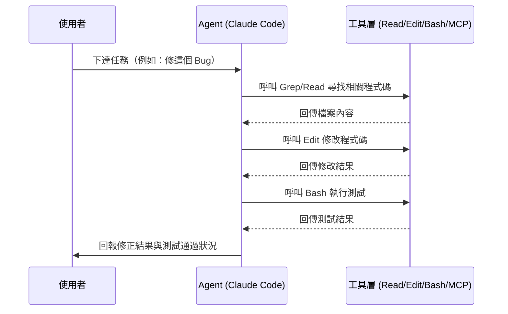

## 2.2 Context 管理與 Token 管理

每次呼叫模型，系統提示、工具定義、CLAUDE.md、對話歷史、檔案內容都會佔用 Context Window。Claude Code 會視情況進行「壓縮」（將較舊的對話歷史摘要化），並透過 Prompt Caching 降低重複內容（如系統提示、工具定義）的成本。Token 管理的關鍵是：**不要把整個專案一次性塞進 Context**，而是讓 Agent 依需求動態讀取。

## 2.3 Tool Calling 與 MCP 整合

模型本身不會直接操作檔案系統，而是透過「工具呼叫」協定，向執行環境請求特定動作（例如 `Read(file_path)`），執行環境跑完之後把結果以結構化格式回傳給模型。內建工具（Read/Edit/Bash/Grep…）之外，MCP（Model Context Protocol）讓 Claude Code 能以同樣的工具呼叫機制，串接外部系統（GitHub、Jira、資料庫…），詳見第13章。

## 2.4 子 Agent 與 Agent 協作

主 Agent 可以「派生」出子 Agent（Sub Agent），讓它在獨立的 Context 與工具權限範圍內完成特定子任務，再把結果回報給主 Agent。這讓大型任務可以拆解、平行化，也能限制每個子任務能存取的工具範圍（最小權限原則）。詳見第9、10章。

## 2.5 Codebase 理解機制

Claude Code 不要求預先建立索引，而是以「探索式理解」運作：先用 Grep/Glob 找出相關檔案，再用 Read 深入閱讀，邊探索邊建立對專案的理解。這與需要預建知識圖譜的工具（如某些靜態分析平台）路線不同——優點是零前置成本、缺點是超大型專案首次探索可能要花較多輪次。

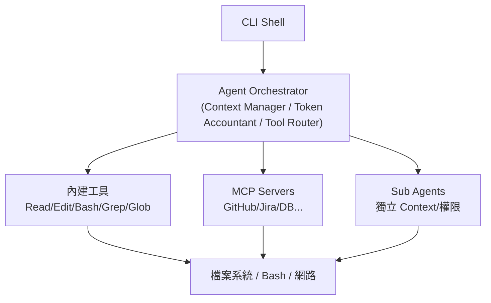

```bash
# 限定 Agent 只能存取特定目錄，降低 Context 雜訊與風險
claude --add-dir ./services/billing
```

> **📌 實務建議**：對超大型 Monorepo，先用 `--add-dir` 把任務範圍限定在相關子目錄，比讓 Agent 全庫亂逛更省 Token、更準確。

> ⚠️ **注意**：長時間對話會因為壓縮而遺失部分早期決策細節，重要的約束（如「不要用 Lombok」）建議寫進 CLAUDE.md 而不是只在對話中提一次。

**實務案例**：一個「修這個 Bug」的請求，實際在背景觸發了 Grep（找關鍵字）→ Read（看程式碼）→ Edit（修改）→ Bash（跑測試）→ Read（確認結果）五次工具呼叫，這正是 Agent Loop 的具體呈現。

---

# 第 3 章 安裝教學

## 3.1 系統需求

Claude Code 提供兩種安裝路徑：原生安裝程式（建議，會自動更新）與 npm 全域安裝。原生安裝不依賴 Node.js；若選擇 npm 安裝路徑，需要 Node.js 18 以上版本。

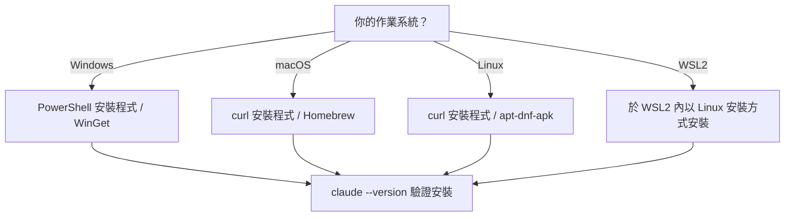

## 3.2 Windows 安裝

```powershell
# PowerShell 一鍵安裝
irm https://claude.ai/install.ps1 | iex

# 或使用 WinGet
winget install Anthropic.ClaudeCode
```

## 3.3 macOS 安裝

```bash
curl -fsSL https://claude.ai/install.sh | bash
# 或
brew install --cask claude-code
```

## 3.4 Linux 安裝

```bash
curl -fsSL https://claude.ai/install.sh | bash
# 視發行版亦可使用 apt / dnf / apk 對應套件
```

## 3.5 WSL2 安裝注意事項

WSL2 內請依 Linux 流程安裝。常見的坑是「專案放在 Windows 路徑（`/mnt/c/...`）但在 WSL2 內開發」會有檔案系統效能與權限落差，建議將實際開發中的專案複製到 WSL2 原生檔案系統（如 `~/projects/`）下操作。

## 3.6 npm 安裝路徑（備選）

```bash
npm install -g @anthropic-ai/claude-code
```

## 3.7 更新與驗證

```bash
claude update          # 更新到最新版本
claude --version       # 驗證安裝版本
```

> **📌 實務建議**：企業內建議在入職文件中明確記錄「目前團隊統一使用的 Claude Code 版本」，因為跨版本行為可能有差異。

> ⚠️ **注意**：企業內網／代理伺服器環境，npm 安裝路徑可能需要額外設定 registry mirror 或 proxy 環境變數。

**實務案例**：某團隊筆電有公司代理伺服器限制，改用 npm 安裝路徑並設定 `npm config set proxy` 後成功安裝，原生安裝程式因為直連被防火牆擋下。

---

# 第 4 章 Authentication

## 4.1 帳號類型

Claude Code 支援多種登入方式：Claude 個人訂閱帳號、Anthropic Console（API Key 計費）、Claude for Team / Enterprise（企業座位制，支援 SSO/SCIM 集中管理）。團隊導入時建議優先評估 Team / Enterprise 方案，避免每人各自申請 API Key 造成費用與權限分散難管理。

## 4.2 登入方式

```bash
claude auth login              # 標準 OAuth 登入（跳轉瀏覽器）
claude auth login --sso        # 企業 SSO 登入
claude auth login --console    # 使用 Anthropic Console API Key
claude auth status             # 確認目前登入狀態
claude auth logout             # 登出
claude setup-token             # 產生長效 Token（適合 CI/headless 環境）
```

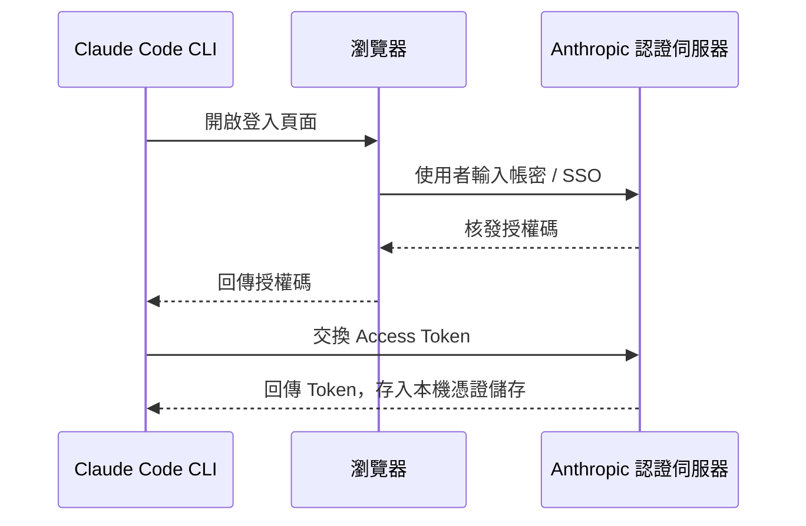

## 4.3 API Key 與環境變數（適合 CI / Headless）

```bash
export ANTHROPIC_API_KEY="sk-ant-xxxxx"     # API Key 驗證
export ANTHROPIC_AUTH_TOKEN="xxxxx"         # OAuth Token
export ANTHROPIC_MODEL="claude-sonnet-4-6"  # 覆寫預設模型
```

## 4.4 安全建議

- 絕對不要把 API Key 寫進程式碼或提交到 Git（搭配第19章的 Secret Scan）
- CI/CD 用的 Token 與工程師個人登入帳號分離，個別輪替、個別撤銷
- 企業環境優先用 Team/Enterprise 的集中管理，而非每人各自申請 Key 報帳

> **📌 實務建議**：互動式開發用個人帳號登入；CI Pipeline 用獨立的 Service Token，兩者權限與額度都應該分開管理。

> ⚠️ **注意**：`ANTHROPIC_API_KEY` 一旦外洩等同於直接授予帳務存取權，務必搭配 Secret Manager 而非寫入 `.env` 後提交版本控制。

**實務案例**：某團隊原本每位工程師各自申請 API Key 報公帳，導入 Enterprise 方案後改為集中開立席位，財務與權限稽核時間從每月數小時縮短到幾分鐘。

---

# 第 5 章 Claude Code 設定管理

## 5.1 settings.json 三層架構

Claude Code 的設定分為使用者、專案、本機三個層級，外加企業可強制套用的 Managed 設定：

| 層級 | 檔案路徑 | 是否版控 |
|---|---|---|
| 使用者 | `~/.claude/settings.json` | 否（個人機器） |
| 專案 | `.claude/settings.json` | 是（建議提交到 Git，全隊共用） |
| 本機覆寫 | `.claude/settings.local.json` | 否（建議加入 .gitignore） |
| 企業管理 | 各平台 `managed-settings.json`（IT 部門推送） | 由 IT 集中管理 |

## 5.2 優先順序

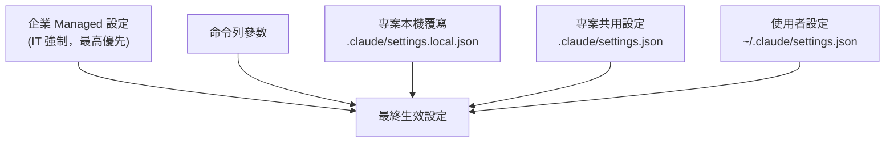

優先順序由高到低：**Managed > 命令列參數 > Local > Project > User**。Managed 設定一旦設定，個別開發者無法覆寫，這是企業治理的關鍵保護機制。

## 5.3 設定範例

```json
// .claude/settings.json（專案層級，建議提交版控）
{
  "model": "claude-sonnet-4-6",
  "permissions": {
    "deny": ["Bash(rm -rf:*)", "Bash(git push --force:*)"]
  },
  "hooks": {
    "PreToolUse": []
  }
}
```

```json
// .claude/settings.local.json（個人本機覆寫，建議 .gitignore）
{
  "effortLevel": "high"
}
```

## 5.4 常見設定鍵分類

- **模型/效能**：`model`、`effortLevel`、`fallbackModel`
- **權限與安全**：`permissions.allow` / `permissions.deny`、`allowManagedPermissionRulesOnly`
- **MCP**：`allowedMcpServers`、`deniedMcpServers`
- **Hooks**：`hooks`、`disallowAllHooks`
- **UI/行為**：`outputStyle`、`editorMode`、`language`

> **📌 實務建議**：把團隊共同的安全防護（如禁止 `rm -rf`、禁止強制推送）寫進專案層級 `.claude/settings.json` 並提交版控，讓全隊自動套用，而不是靠口頭約定。

> ⚠️ **注意**：企業 Managed 設定會「靜默覆寫」開發者本機設定，若沒有事先溝通，工程師可能花很多時間排查「為什麼我的設定沒生效」，IT 部門應主動公告 Managed 設定內容。

**實務案例**：某團隊在專案層級設定中加入 `permissions.deny` 阻擋危險指令，個別開發者即使想在本機覆寫也無法繞過，避免了一次誤執行 `git push --force` 到共用分支的事故。

---

# 第 6 章 CLI 指令大全

## 6.1 指令依生命週期分類

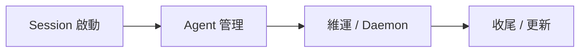

## 6.2 Session 操作

| 指令 | 說明 | 範例 |
|---|---|---|
| `claude` | 啟動互動式 Session | `claude` |
| `claude "query"` | 啟動並帶入初始提示 | `claude "幫我看一下這個錯誤訊息"` |
| `claude -p "query"` | 非互動模式，適合腳本/CI | `claude -p "總結最近的變更" --output-format json` |
| `claude -c` | 繼續最近一次對話 | `claude -c` |
| `claude -r <id>` | 依 ID/名稱回復對話 | `claude -r my-session "繼續修這個 Bug"` |

## 6.3 Agent 管理

| 指令 | 說明 |
|---|---|
| `claude agents` | 列出所有執行中 Session/Agent |
| `claude attach <id>` | 附著到背景執行的 Session |
| `claude logs <id>` | 印出背景 Session 的輸出 |
| `claude stop <id>` / `claude kill <id>` | 停止/強制終止 Session |
| `claude respawn <id>` | 重新啟動 Session |
| `claude rm <id>` | 移除 Session 記錄 |

## 6.4 MCP / Plugin / 專案維護

| 指令 | 說明 |
|---|---|
| `claude mcp add <name> --transport http <url>` | 新增 MCP Server |
| `claude plugin install/remove/list` | 管理 Plugin |
| `claude project purge [path]` | 清理本機專案狀態 |
| `claude update` | 更新 CLI 本身 |
| `claude ultrareview [target]` | 非互動式雲端程式碼審查 |

## 6.5 常用旗標（Flags）

| 旗標 | 說明 |
|---|---|
| `--model <name>` | 指定模型 |
| `--effort [low\|medium\|high\|xhigh]` | 推理強度/成本權衡 |
| `--permission-mode [default\|plan\|bypassPermissions...]` | 權限模式 |
| `--add-dir <path>` | 加入額外工作目錄 |
| `--mcp-config <file>` | 載入 MCP 設定 |
| `--max-turns <n>` | 限制自動化輪數 |
| `--max-budget-usd <amount>` | 限制單次花費上限 |
| `--output-format [text\|json\|stream-json]` | 輸出格式（適合腳本解析） |

```bash
# CI 腳本中安全地呼叫 Claude Code：限制成本與輪數，輸出 JSON 方便解析
claude -p "檢查這次變更是否有明顯的安全風險" \
  --output-format json \
  --max-turns 10 \
  --max-budget-usd 1.0
```

> **📌 實務建議**：任何自動化／CI 情境都應同時設定 `--max-turns` 與 `--max-budget-usd`，避免一個邊界條件讓 Agent 進入長時間迴圈而失控燒費用。

> ⚠️ **注意**：`--permission-mode bypassPermissions` 在自動化環境中很方便，但等同於關閉安全閥，務必搭配第19章的 SSDLC 控管與最小權限原則使用。

**實務案例**：團隊建立一個夜間排程腳本，用 `claude -p ... --output-format json` 產出當日程式碼健康報告，再用 `jq` 解析後丟到 Slack，全程無人值守。

---

# 第 7 章 Hotkey 大全

## 7.1 終端機層級快捷鍵

| 快捷鍵 | 說明 |
|---|---|
| `Ctrl + C` | 中斷目前執行（中止 Agent 動作） |
| `Ctrl + D` | 結束 Session |
| `↑ / ↓` | 瀏覽歷史輸入 |

## 7.2 Claude Code Session 內快捷鍵

| 快捷鍵 | 說明 |
|---|---|
| `Shift + Enter` | 多行輸入（不送出） |
| `Enter` | 送出目前輸入 |
| `/` | 開啟 Slash Command 選單 |
| `Esc` | 取消目前輸入 / 退出選單 |

## 7.3 Agent 操作快捷鍵

| 快捷鍵 | 說明 |
|---|---|
| `Ctrl + C`（執行中按一次） | 中斷目前工具呼叫，取回控制權 |
| `y` / `n`（權限詢問時） | 同意 / 拒絕單次工具呼叫 |
| `a`（權限詢問時） | 永久允許此類動作（視權限模式） |

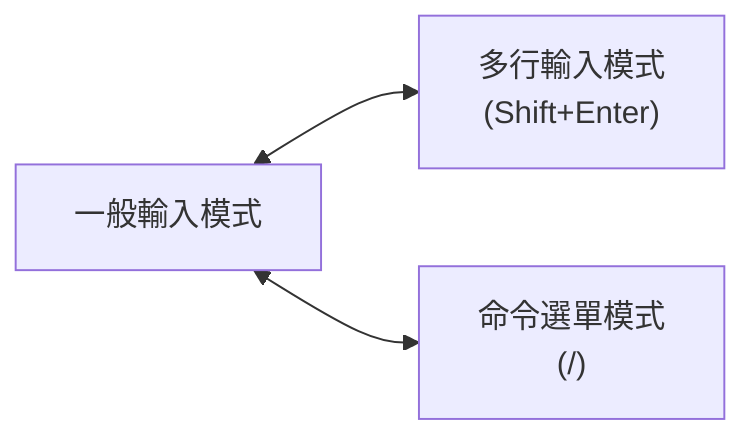

> **📌 實務建議**：盡早熟悉「中斷」快捷鍵（`Ctrl+C`），這是糾正 Agent 走錯方向最有效的工具，比等它跑完再重來省時間也省 Token。

> ⚠️ **注意**：若你同時使用 tmux/vim，部分快捷鍵可能衝突，建議在團隊 Onboarding 文件中列出實際環境下驗證過的快捷鍵組合。

**實務案例**：資深工程師在 Agent 開始往錯誤方向修改時立即按 `Ctrl+C` 中斷，重新給出更精確的指示，整個任務只花了原本預估時間的一半。

---

# 第 8 章 Context Engineering

## 8.1 Context Window 組成

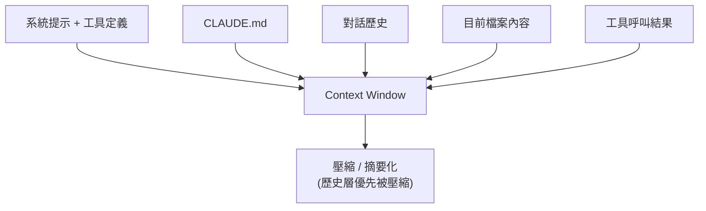

## 8.2 壓縮（Compaction）與重用

當對話累積到一定程度，Claude Code 會將較舊的歷史摘要化以釋放空間。這個動作雖然能延長對話，但也可能遺失早期的細節決策。對於跨多次 Session 都需要的資訊（架構慣例、不可變更的限制），應該寫入 CLAUDE.md（第11章）而不是只在對話中提一次。

## 8.3 快取（Caching）

重複出現的內容（系統提示、工具定義、CLAUDE.md 開頭）可被快取，降低延遲與成本。實務上的影響是：**頻繁切換差異很大的 System Prompt 或工具集合，會降低快取命中率**。

## 8.4 Token 優化技巧

- 用 `--add-dir` 限定範圍，而不是讓 Agent 在整個 Monorepo 漫遊
- 優先用 Grep/Glob 定位後再 Read，而不是一次性讀取整個大檔案
- 把重複需要解釋的規則寫進 CLAUDE.md，一次投資、多次重用
- 善用 MCP 的延遲載入（工具定義依需求載入，而非一開始全部塞入 Context）

```bash
# 反面教材：一次性丟整個倉庫
claude -p "讀完整個 repo 並解釋所有模組"

# 建議做法：先定位，再深入
claude -p "先列出 services/ 下有哪些模組，再針對 billing 模組說明其職責"
```

> **📌 實務建議**：把 CLAUDE.md 當作「Context 重用投資」——任何你在對話中解釋了第二次的事情，都該寫進 CLAUDE.md。

> ⚠️ **注意**：長對話中段如果做了重要決策（例如「這個欄位禁止改型別」），建議在後續訊息中主動重申，避免壓縮後遺失約束。

**實務案例**：一個 5 萬行的 Monorepo Session，因為一次性塞入 6 個大檔案而明顯變慢、回應品質下降；改為先用 Grep 定位再針對性 Read 後，同樣任務的輪數減少超過一半。

---

# 第 9 章 Agent 系統

## 9.1 概念釐清：Agent / Sub Agent / Multi Agent

- **Agent**：指你目前互動的 Claude Code Session 本身，具備完整工具存取與規劃能力。
- **Sub Agent**：由主 Agent 派生出來、擁有獨立 Context 與限定工具權限的工作者，專門處理特定子任務，完成後把結果回報主 Agent。
- **Multi Agent**：多個 Sub Agent（或多個獨立 Session）協同運作，由主 Agent 或腳本進行調度與整合。

## 9.2 何時該建立 Sub Agent

| 情境 | 建議 |
|---|---|
| 任務可拆解成獨立子模組 | 每個模組派一個 Sub Agent，平行處理 |
| 需要限制某段工作的工具權限 | 用 Sub Agent 隔離（例如只給 Read，不給 Edit） |
| 單一任務但邏輯單純 | 直接在主 Agent 內處理，不必額外派生 |

## 9.3 生命週期管理

```bash
claude agents              # 列出所有執行中的 Agent/Session
claude attach <id>         # 附著查看
claude logs <id>           # 查看背景輸出
claude stop <id>           # 正常停止
claude kill <id>           # 強制終止
claude respawn <id>        # 重新啟動
claude rm <id>             # 移除記錄
```

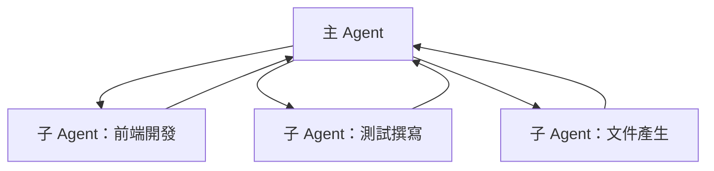

## 9.4 設計考量

- 模型選擇可依子任務複雜度分配（簡單任務用較輕模型，複雜任務用較強模型）
- 每個 Sub Agent 的工具權限應採最小權限原則
- 平行 Sub Agent 若會修改重疊檔案，務必先界定模組／檔案的所有權邊界，否則容易互相覆寫

> **📌 實務建議**：派生 Sub Agent 前，先明確切分「誰負責哪個目錄／模組」，再分配工具權限，避免兩個 Agent 同時改同一個檔案。

> ⚠️ **注意**：沒有協調的平行 Sub Agent 同時編輯重疊檔案，會造成衝突甚至互相覆寫對方的修改，這類問題在 Code Review 階段才發現會非常昂貴。

**實務案例**：一個大型重構任務被拆成 4 個模組，分別派生 4 個 Sub Agent 平行處理，比單一 Session 序列處理節省了大半時間，前提是事先已經把模組邊界切清楚。

---

# 第 10 章 Agents 目錄

> ⚠️ **注意（用語澄清）**：本章標題沿用常見口語「Agents 目錄」，但 Claude Code 實際載入子 Agent 定義的路徑是 **`.claude/agents/`（專案層級）** 與 **`~/.claude/agents/`（使用者層級）**，並**不是** `.github/agents/`。`.github/` 是 GitHub 平台慣例使用的目錄（存放 Workflow、Issue 範本等），與 Claude Code 的子 Agent 載入機制無關。若團隊想在 `.github/` 下維護「人類可讀」的角色說明文件，那是另一套自訂慣例，不要與 Claude Code 的子 Agent 定義檔混淆。

## 10.1 子 Agent 定義檔格式

子 Agent 是一個 Markdown 檔案，搭配 YAML Frontmatter 描述其名稱、說明、可用工具、模型等：

```markdown
---
name: test-writer
description: 針對指定類別/函式撰寫單元測試
tools: [Read, Glob, Grep, Edit, Bash]
model: sonnet
permissionMode: default
effort: medium
---

你是一個專注於撰寫單元測試的子 Agent。
請依照專案既有測試框架慣例撰寫測試，並在完成後執行測試確認通過。
```

## 10.2 載入順序

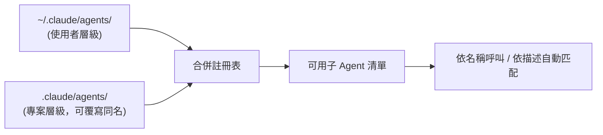

## 10.3 呼叫方式

```bash
claude --agent test-writer -p "為 PaymentService 撰寫單元測試"
```

## 10.4 實務範例：團隊共用子 Agent

平台團隊可以把常用的 4 個子 Agent（程式碼審查、文件撰寫、遷移輔助、安全掃描）統一提交到 `.claude/agents/`，這樣每個人 clone 專案後就自動擁有同一套子 Agent，不需要各自重新設定。

> **📌 實務建議**：`description` 欄位寫得越精確，自動匹配選用子 Agent 的命中率越高；建議用「動作 + 對象」的句型，例如「審查 Java 程式碼是否符合公司安全規範」。

> ⚠️ **注意**：子 Agent 的 `tools` 授權範圍應該定期稽核，過寬的工具授權（例如賦予不必要的 Bash 權限）會讓「隔離」失去意義。

**實務案例**：平台團隊將 `code-reviewer`、`doc-writer`、`migration-helper`、`security-scanner` 四個子 Agent 提交到 `.claude/agents/`，新人 clone 專案的第一天就能直接使用團隊標準化的審查與遷移輔助流程。

---

# 第 11 章 CLAUDE.md

## 11.1 用途

CLAUDE.md 是 Claude Code 每次啟動 Session 都會自動載入的專案上下文檔案，用來記錄架構慣例、技術棧、目錄結構、建置/測試指令、安全注意事項、以及「不要做什麼」的限制。它的本質是把工程師重複口頭/書面交代的事情「一次寫好、長期重用」。

## 11.2 三層檔案

| 層級 | 路徑 | 用途 |
|---|---|---|
| 專案共用 | `.claude/CLAUDE.md` | 團隊共識，建議提交版控 |
| 使用者個人 | `~/.claude/CLAUDE.md` | 個人偏好，跨專案生效 |
| 本機限定 | `.claude.local.md` | 不提交版控，個人本機限定備註 |

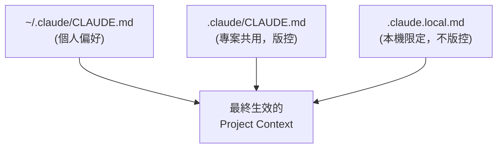

## 11.3 企業標準範本

```markdown
# 專案概述
本服務負責訂單與付款流程，採用 Spring Boot 3 + Java 21。

# 技術棧
- Java 21（使用 Record，不使用 Lombok）
- Spring Boot 3.3、Spring Security 6
- 資料庫：PostgreSQL 15

# 目錄結構
- src/main/java/.../controller：REST 入口
- src/main/java/.../service：商業邏輯
- src/main/java/.../repository：資料存取

# 開發規範
- 所有 Controller 必須有對應的單元測試
- 禁止在 Service 層直接拼接 SQL 字串

# 測試指令
./mvnw test

# 安全注意事項
- 付款相關欄位禁止記錄於一般 Log
- 任何認證/加密邏輯變更需資安團隊審查
```

## 11.4 維護方式

CLAUDE.md 應該被當成「活文件」，在 PR 流程中與程式碼一起檢視更新，而不是寫一次就再也不碰。

> **📌 實務建議**：CLAUDE.md 內容會被載入每次 Session 的 Context，不要把整份 API 規格或巨大表格塞進去，只放「真正每次都需要知道」的精華內容。

> ⚠️ **注意**：沒有 CLAUDE.md 的專案，每次新 Session 都要重新解釋一次建置指令與規範，新人 Onboarding 體驗會明顯比有 CLAUDE.md 的專案差。

**實務案例**：某團隊導入 CLAUDE.md 前，每個新 Session 都要重新告知「我們不用 Lombok」，導入後新人第一次使用 Claude Code 就自動遵守此規範，省去大量重複溝通。

---

# 第 12 章 Hooks

## 12.1 生命週期事件

Claude Code 提供 12 個生命週期事件供 Hook 介入：

| 分類 | 事件 |
|---|---|
| Session 層級 | SessionStart、SessionEnd |
| 對話輪層級 | UserPromptSubmit、Stop、StopFailure |
| 工具層級 | PreToolUse、PostToolUse |
| 其他治理 | Setup、ConfigChange、SubagentStart、SubagentStop |

## 12.2 Handler 類型

- `command`：執行 Shell 腳本
- `http`：呼叫外部 HTTP 端點，接收 JSON 回應
- `prompt`：交給模型評估後決策
- `agent`：派生子 Agent 處理

## 12.3 PreToolUse／PostToolUse 機制

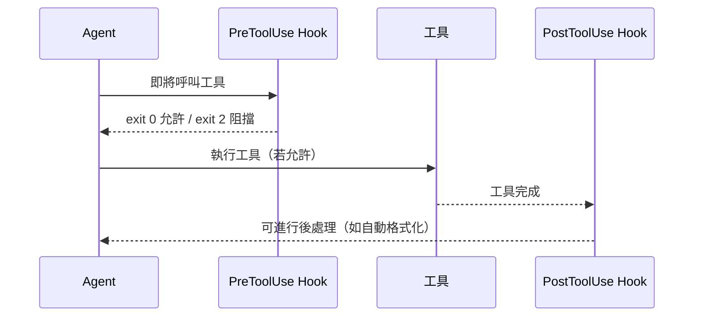

## 12.4 設定範例

```json
{
  "hooks": {
    "PreToolUse": [
      {
        "matcher": "Bash(rm -rf:*)",
        "handlers": [{ "type": "command", "command": "bash ./check-rm.sh" }]
      }
    ],
    "PostToolUse": [
      {
        "matcher": "Edit",
        "handlers": [{ "type": "command", "command": "prettier --write ." }]
      }
    ]
  }
}
```

## 12.5 安全考量

Hook 腳本以使用者的 Shell 權限執行，應該視同 CI 腳本一樣審查與管控：不應讓任何貢獻者未經審查就修改專案層級的 Hook；安全關鍵的 Hook（如阻擋 `git push --force`）應該放在企業 Managed 層級，而非個人可覆寫的本機設定。

> **📌 實務建議**：把「絕對不可發生」的規則（強制推送、刪除遠端分支）寫成 PreToolUse Hook，而不是只靠 Prompt 提醒，Hook 是真正的強制阻擋。

> ⚠️ **注意**：PreToolUse Hook 若包含緩慢的網路呼叫，會拖慢每一次工具呼叫的延遲，Hook 腳本務必保持快速且具備失敗保護（fail-safe）。

**實務案例**：某企業在 PreToolUse Hook 中阻擋所有 `git push --force` 指令，即使有人在 Prompt 中要求 Agent 強制推送也會被 Hook 直接擋下，落實了「規則寫進系統，而非寄望口頭約定」的治理原則。

---

# 第 13 章 MCP 整合

## 13.1 MCP 概念

Model Context Protocol（MCP）是一套開放標準，讓 Claude Code（作為 Client）能以統一的工具呼叫介面，連接外部系統（作為 Server）。Server 可以是本機程式（Stdio 傳輸）或遠端服務（HTTP/SSE 傳輸），對 Agent 而言，呼叫 MCP 工具與呼叫內建工具的方式一致。

## 13.2 設定與管理

```bash
claude mcp add github --transport http https://api.githubcopilot.com/mcp
```

```json
// .mcp.json（專案層級）
{
  "mcpServers": {
    "github": { "transport": "http", "url": "https://api.githubcopilot.com/mcp" },
    "jira":   { "transport": "http", "url": "https://your-org.atlassian.net/mcp" }
  }
}
```

## 13.3 整合案例

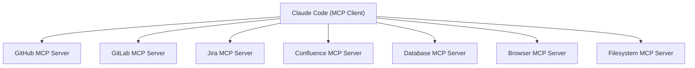

| 整合對象 | 典型用途 |
|---|---|
| GitHub / GitLab | 讀取/建立 PR、Issue、CI 狀態 |
| Jira | 讀取需求、更新工單狀態 |
| Confluence | 讀取設計文件、補完知識庫 |
| Database | 查詢資料結構、驗證遷移腳本 |
| Browser | 模擬使用者操作、驗證前端行為 |
| Filesystem | 存取受限的額外檔案區域 |

## 13.4 工具延遲載入

MCP Server 可能註冊大量工具，但 Claude Code 只在 Session 開始時載入工具名稱，實際工具的完整定義（Schema）依需求才載入，這直接降低了 Context 的基礎佔用量（與第8章 Token 優化相呼應）。

> **📌 實務建議**：MCP Server 的認證憑證應採最小權限（例如 Jira 用只能讀的 Token），並維護一份「已核准 MCP Server」清單，新增前需經過審查（詳見第21章）。

> ⚠️ **注意**：MCP Server 是一個新的信任邊界，一個被入侵或惡意的 MCP Server 可能竊取傳遞給它的 Context，審查 MCP Server 的嚴謹度應等同於審查一個新的 CI Plugin。

**實務案例**：團隊同時串接 Jira 與 GitHub MCP，讓 Claude Code 能讀取工單的驗收條件、實作對應修改、並開出引用該工單編號的 PR，整個流程一次串通不需要人工切換多個系統視窗。

---

# 第 14 章 使用 Claude Code 開發 Web Application

## 14.1 通用工作流程

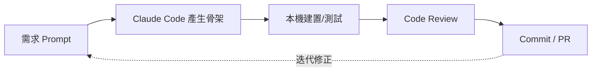

不論技術棧為何，建議流程都是：先讓 Claude Code 產生骨架 → 用專案既有建置/測試工具驗證 → 人工 Review → 提交，而不是一次性要求「做出完整功能」。

## 14.2 Spring Boot（Java/Kotlin）

```bash
claude -p "建立一個 Spring Boot 3.3 REST Controller，處理訂單(Order)的建立與查詢，
使用 Java 21 Record 作為 DTO，並產生對應的 JUnit 5 測試"
```

完成後讓 Agent 自行執行 `./mvnw test` 驗證，而不是只產生程式碼就結束。

## 14.3 FastAPI（Python）

```bash
claude -p "用 FastAPI 建立一個商品庫存查詢 API，包含 Pydantic 模型驗證與 pytest 測試"
```

## 14.4 Vue3 / Angular

```bash
claude -p "建立一個 Vue 3 Composition API 元件，顯示分頁式商品列表，
請使用本專案既有的 Pinia store 慣例"
```

> **📌 實務建議**：在 CLAUDE.md 中明確標註框架版本與慣例（例如「本專案使用 Vue 3 Composition API，不使用 Options API」），避免 Agent 因訓練資料偏舊而產出過時寫法。

> ⚠️ **注意**：永遠讓 Claude Code 執行專案既有的建置/測試指令做驗證，而不是只看程式碼「看起來合理」就視為完成。

**實務案例**：一個 FastAPI 微服務從一段需求描述開始，在同一個 Session 內逐步產出骨架、Pydantic 模型、CRUD 邏輯與 pytest 測試，全程伴隨真實測試結果回饋，最終交付的程式碼一次通過 Code Review。

---

# 第 15 章 Legacy System 逆向工程

## 15.1 分析方法

逆向工程不是「叫 Agent 讀完全部程式碼」，而是結構化的探索流程：

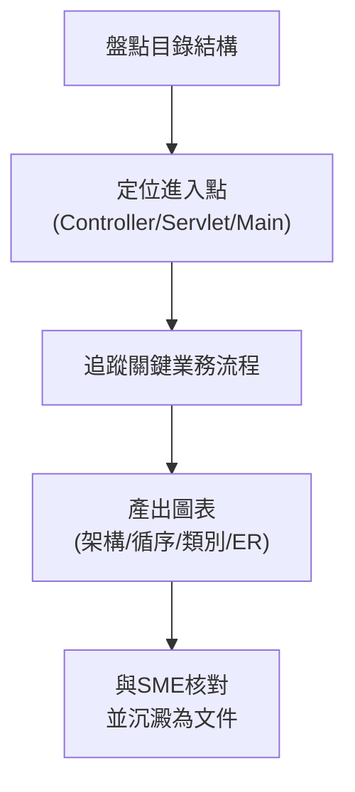

## 15.2 適用範圍與限制

涵蓋 Java Legacy、COBOL、VB、Delphi、ASP.NET WebForms、JSP/Struts 等系統。對冷僻語言（COBOL、Delphi）模型訓練資料較少，幻覺風險較高，務必加強人工核對。

## 15.3 範例 Prompt

```bash
claude -p "列出 /webapp 下所有 JSP 檔案及其對應的 Servlet Mapping"
claude -p "追蹤從 OrderServlet.doPost 開始的呼叫鏈，一路到 DAO 層"
claude -p "依據這些 SQL DDL 檔案，產生 Mermaid ER 圖"
```

## 15.4 產出範例

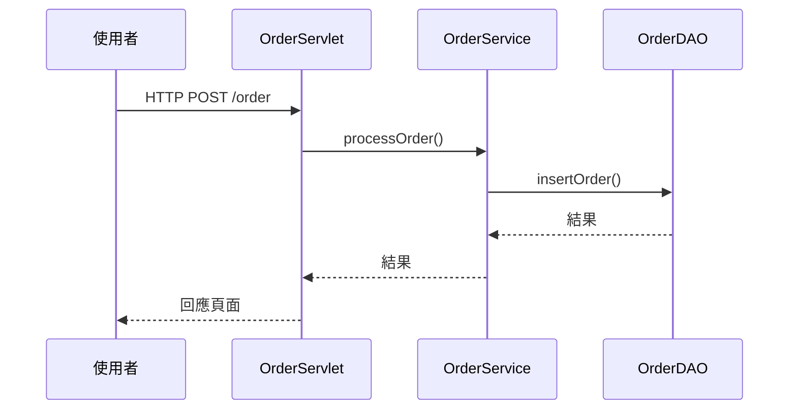

> **📌 實務建議**：產出的架構/循序圖務必交給熟悉該系統的資深同仁（SME）核對，AI 可能誤判隱含的控制流程（例如 COBOL 中的 GOTO 邏輯）。

> ⚠️ **注意**：對 COBOL、Delphi 等模型訓練資料較少的語言，務必提高人工審查比例，不要把 AI 產出的圖表直接當作正式文件發布。

**實務案例**：一套 15 年歷史的 ASP.NET WebForms 理賠系統，透過分階段 Prompt 在一次 Session 內產出理賠核准流程的架構圖與循序圖，再與資深同仁核對修正後，成為團隊第一份可信賴的系統文件。

---

# 第 16 章 Framework 升級

## 16.1 通用升級方法論

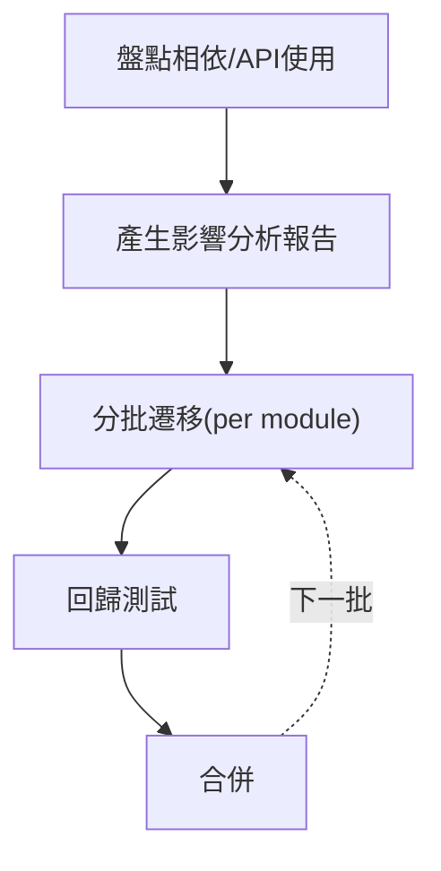

## 16.2 各升級情境要點

| 升級類型 | 關鍵變動 |
|---|---|
| Spring Boot 2→3 | `javax.*` → `jakarta.*` 命名空間遷移、Spring Security DSL 改寫 |
| Java 8→21 | Record、Sealed Class、Virtual Threads、移除的舊 API |
| Vue 2→3 | Options API → Composition API、全域 API 變更 |
| Angular/React 升級 | Standalone Component、CLI 重大變更 |

## 16.3 範例 Prompt

```bash
claude -p "掃描整個專案中使用 javax.* 的 import，列出需要遷移到 jakarta.* 的檔案清單"
claude -p "將這個 Vue 2 Options API 元件改寫為 Composition API，保持行為一致"
```

> **📌 實務建議**：永遠不要接受「一次性整個倉庫升級」的單一 Prompt，務必拆成模組分批進行，每批之間跑完整回歸測試再進下一批。

> ⚠️ **注意**：模型訓練資料對較新或冷門的升級路徑覆蓋率較低，務必拿生成的遷移步驟與官方升級指南交叉核對，不要盲信。

**實務案例**：某中型服務從 Spring Boot 2.7 升級到 3.2，先用 Claude Code 產生命名空間遷移清單與 Security DSL 改寫草案，再分批以 PR 形式推進，每個 PR 之間都有完整測試把關，避免了一次性大改造成的不可控風險。

---

# 第 17 章 Git 整合

## 17.1 AI 協作流程

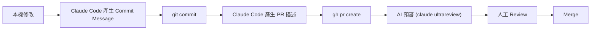

## 17.2 常用指令

```bash
git status && git diff
gh pr create --title "..." --body "..."
gh pr diff
claude ultrareview          # 非互動式 AI 程式碼審查
```

## 17.3 守則

Claude Code 應該遵守的 Git 安全守則：不自行強制推送（`--force`）、不跳過 Hook（`--no-verify`）、不修改既有歷史（amend 已推送的 commit），這些守則建議用第12章的 Hooks 強制落實，而不是只靠提示文字約束。

> **📌 實務建議**：讓 Claude Code 在提交前先輸出 `git diff` 給你確認範圍，再進行 commit，避免意外提交未預期的檔案。

> ⚠️ **注意**：絕對不要靠「請禮貌地提醒 Agent 不要強制推送」來防呆，真正的防線是第5、12章談到的設定與 Hook 層級強制阻擋。

**實務案例**：一名工程師讓 Claude Code 草擬一次多檔案重構的 Commit Message 與 PR 描述（包含 Summary 與 Test Plan），大幅縮短了撰寫 PR 說明的時間，且描述品質一致性更高。

---

# 第 18 章 測試工程

## 18.1 測試生成工作流程

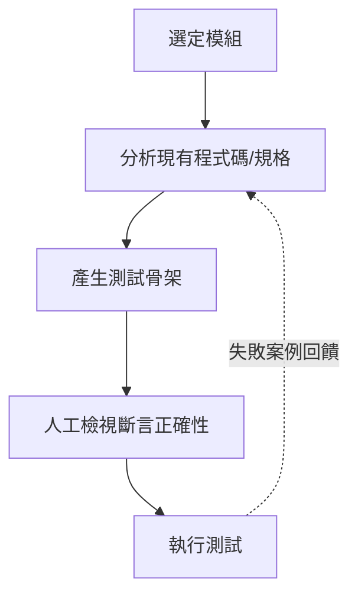

## 18.2 各類型測試

- **單元測試**：依框架慣例（JUnit5/Mockito、pytest、Jest/Vitest）產生，涵蓋邊界條件
- **整合測試**：協助配置測試替身/容器化依賴
- **E2E 測試**：搭配 Playwright 等工具，依使用者流程描述生成腳本

## 18.3 範例

```bash
claude -p "為 OrderService 撰寫 JUnit 5 測試，涵蓋 null 輸入與併發更新的邊界情況"
claude -p "依照這個使用者故事，產生對應的 Playwright E2E 測試腳本"
```

## 18.4 TDD 風格使用

可以先讓 Claude Code 根據規格寫出「應該失敗」的測試，再實作程式碼直到測試通過，這個順序能讓測試真正驗證「正確行為」而非「現有行為」。

> **📌 實務建議**：務必人工確認測試斷言的「正確性」，而不只是「測試通過」——AI 有可能生成驗證現有（可能有 Bug）行為的測試。

> ⚠️ **注意**：要明確防範 Agent 用「弱化斷言」的方式讓失敗測試變綠燈，而不是真正修正底層問題，這是一個需要在 Review 中特別留意的失敗模式。

**實務案例**：一個訂價計算函式採用 TDD 流程開發：先撰寫規格、讓 Claude Code 產生會失敗的測試、再逐步實作直到全部通過，最終交付的程式碼測試覆蓋率與正確性都優於先寫程式再補測試的做法。

---

# 第 19 章 SSDLC 整合

## 19.1 定位

Claude Code 應被視為 Secure SDLC 中的**一層**輔助，而不是取代 SAST/DAST/Dependency Scan/Secret Scan 等專用工具。

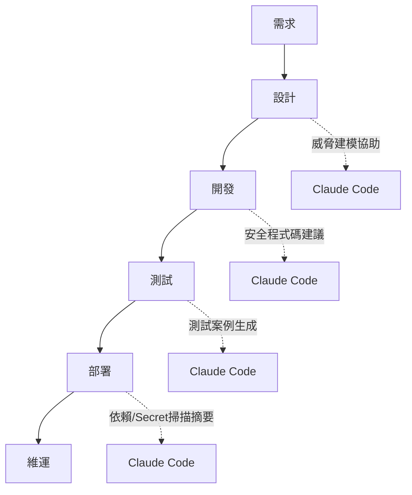

## 19.2 各類掃描的協作方式

- **SAST 風格**：請 Claude Code 在 PR 前review diff，檢查 OWASP Top 10 類型風險
- **Dependency Scan**：讓 Agent 讀取 `mvn dependency-check:check` / `npm audit` 輸出並摘要風險
- **Secret Scan**：搭配第12章 PreToolUse Hook 阻擋符合金鑰格式的提交內容

```bash
claude -p "審查這次 diff 是否有 OWASP Top 10 相關風險，再讓我決定是否開 PR"
npm audit --json
mvn dependency-check:check
```

## 19.3 兩層防護案例

第一層（Hook）擋下明顯的硬編碼金鑰格式；第二層（AI Review）抓出較隱晦的安全問題（例如邏輯上的權限繞過）。兩層搭配比單靠其中一層更可靠。

> **📌 實務建議**：把 Claude Code 的安全審查當作 Semgrep/Snyk/OWASP ZAP 等專用工具的「額外一層」，而非取代品。

> ⚠️ **注意**：涉及認證、加密、PII 的修改，即使 AI 審查說「沒問題」，仍必須經過資安團隊正式簽核，不能把 AI 的意見當作正式核准。

**實務案例**：一次提交中，PreToolUse Hook 先擋下了明顯的硬編碼資料庫密碼，AI Review 又額外抓出一個邏輯上的權限繞過風險，兩層防護缺一不可。

---

# 第 20 章 Token 與成本管理

## 20.1 成本驅動因子

```mermaid
graph LR
    Model["模型選擇"] --> Total["總成本"]
    Ctx["Context 大小"] --> Total
    Turns["對話輪數"] --> Total
    Sub["Sub Agent 數量"] --> Total
```

## 20.2 查看用量

互動式 Session 會顯示當次成本；Team/Enterprise 方案可在管理後台查看團隊整體用量與依 Skill/Subagent/Plugin/MCP 拆分的成本明細。

## 20.3 降低成本技巧

- 用 `--add-dir` 限定範圍（第8章）
- 用 CLAUDE.md 減少重複解釋（第11章）
- CI/自動化情境設定 `--max-budget-usd` 與 `--max-turns`（第6章）
- 簡單任務用較低的 `--effort`，複雜架構任務才用較高 effort

```bash
claude -p "..." --max-budget-usd 5.0 --effort low
```

> **📌 實務建議**：在專案層級 `settings.json` 中為 CI/自動化用途設定預設的成本上限，而不是依賴每個人手動加旗標。

> ⚠️ **注意**：不要為了省成本而一律調低 effort——複雜架構設計任務若用過低 effort，後續人工返工的時間成本往往遠高於省下的 API 費用。

**實務案例**：某團隊發現某月費用異常飆高，追查後發現是多名工程師習慣用「解釋整個專案」這類無範圍限定的 Prompt，導入 CLAUDE.md 與範圍限定的提示習慣後，成本明顯下降。

---

# 第 21 章 團隊導入指南

## 21.1 分階段導入流程

```mermaid
flowchart TD
    P1["Phase 1：試點小組"] --> P2["Phase 2：標準化<br/>(CLAUDE.md範本/共用子Agent)"]
    P2 --> P3["Phase 3：推廣<br/>(MCP白名單/成本儀表板)"]
    P3 --> P4["Phase 4：治理常態化"]
```

## 21.2 治理模式

由小型跨職能小組（技術主管 + 資安 + DevOps）負責核准：新增 MCP Server（第13章）、共用子 Agent（第10章）、企業 Hook 規則（第12章）。

## 21.3 權限管理

依第5章的設定優先順序，企業 IT 應掌握 Managed 層級設定，專案團隊掌握專案層級設定，個人僅能調整不影響安全的本機偏好（如模型選擇）。

## 21.4 標準規範

- 強制使用 CLAUDE.md 範本（第11章）
- Prompt Library 走 PR 審查流程（第23章）
- AI 協作產生的 Commit/PR 需註明（便於追溯）
- 強制人工 Review，AI 產出不可直接合併

> **📌 實務建議**：先成立 5 人以內的試點小組驗證流程，標準成熟後才推廣到全公司，避免一開始就要求所有團隊同時改變習慣。

> ⚠️ **注意**：若在 CLAUDE.md／Prompt Library 標準尚未成形前就全公司推廣，各團隊產出品質會明顯不一致，應先標準化再規模化。

**實務案例**：一個 200 人工程組織，從 5 人試點小組開始，一個季度內逐步推廣到全組織，並在過程中成立治理委員會核准新的 MCP Server 與共用子 Agent，避免了野蠻生長導致的治理真空。

---

# 第 22 章 Claude Code 最佳實務

## 22.1 20 個最佳實務

1. 從 repo 根目錄啟動 Session
2. 維護並持續更新 CLAUDE.md
3. 每次 Diff 都人工 Review
4. 大型任務拆解成可平行的 Sub Agent
5. 在 Prompt/CLAUDE.md 中明確標註框架版本
6. CI/自動化情境一律設定 `--max-turns`/`--max-budget-usd`
7. 用 `--add-dir` 限定 Context 範圍
8. 善用 Grep/Glob 先定位再 Read
9. 安全規則寫進 Hook，而非只靠口頭提醒
10. 子 Agent 採最小權限工具授權
11. MCP Server 維護核准清單
12. Prompt Library 版控與 Review
13. 簡單任務用低 effort，複雜任務用高 effort
14. 善用 Session 續接（`-c`/`-r`）避免重複解釋
15. 長對話中重要決策主動重申，避免被壓縮遺失
16. 企業層級用 Managed 設定強制安全底線
17. 測試斷言正確性務必人工確認
18. 框架升級分批進行並搭配回歸測試
19. 逆向工程產出務必由 SME 核對
20. 定期回顧最佳實務清單（隨版本演進調整）

## 22.2 20 個常見錯誤

1. 一次性丟整個 Monorepo 給 Agent
2. 盲信 AI 產出的安全相關程式碼
3. 跳過測試執行就視為任務完成
4. 子 Agent 工具授權過寬
5. 忽略 Hook 治理，只靠提示文字防呆
6. 未設定成本/輪數上限就跑自動化任務
7. 平行 Sub Agent 沒有界定檔案所有權
8. CLAUDE.md 塞入過多巨大規格內容
9. 長對話未重申關鍵約束
10. 升級框架時一次性全倉庫重寫
11. 對冷僻語言（COBOL等）逆向工程結果未經核對
12. 個人各自申請 API Key 而非用 Team/Enterprise
13. 把 API Key 寫進程式碼或 `.env` 並提交版控
14. 用「弱化斷言」讓失敗測試變綠燈
15. MCP Server 未審查就接入生產環境
16. 忽視 Managed 設定造成的「設定不生效」排查時間
17. 沒有命名空間/工具邊界、多 Agent 互相覆寫
18. 把 AI 審查意見當作正式資安簽核
19. Prompt Library 沒有版控與審查流程
20. 推廣全公司前未先標準化 CLAUDE.md/規範

## 22.3 20 個效能優化技巧

1. 用 `--add-dir` 而非全庫掃描
2. 優先 Grep/Glob 定位後再 Read
3. 重複內容善用 Prompt Caching（避免頻繁切換差異很大的系統提示）
4. CLAUDE.md 精簡，只放高頻重用內容
5. 簡單任務調低 `--effort`
6. 善用 MCP 工具延遲載入特性
7. 避免不必要的大檔案一次性讀取
8. 適時用 `/compact` 類機制管理長對話
9. CI 中設定明確的 `--output-format json` 便於下游解析，減少重試
10. 平行任務拆 Sub Agent，縮短總時長
11. 善用 Session 續接避免重新建立 Context
12. 善用 `--mcp-config` 限定當次需要的 MCP Server，而非全部載入
13. 避免在單一 Session 中混雜多個不相關主題
14. 適度使用 fallback model 設定，避免單點限流影響任務
15. 自動化腳本設定合理 `--max-turns` 避免低效迴圈
16. 善用結構化輸出（JSON Schema）減少下游解析失誤重跑
17. 大型重構先產出計畫文件，再分批執行而非一次性大 Prompt
18. 善用既有測試/建置工具驗證，避免靠 AI 自行猜測是否正確
19. 適時拆分長文件 Prompt，避免單一訊息過度龐大
20. 定期清理不再需要的背景 Session（`claude rm`）釋放資源

```mermaid
quadrantChart
    title 常見錯誤：影響程度 x 發生頻率
    x-axis 低頻率 --> 高頻率
    y-axis 低影響 --> 高影響
    "一次性丟整個Monorepo": [0.7, 0.4]
    "盲信AI安全程式碼": [0.4, 0.9]
    "跳過測試驗證": [0.5, 0.8]
    "API Key寫入版控": [0.2, 0.95]
    "子Agent權限過寬": [0.3, 0.6]
```

> **📌 實務建議**：把本章三份清單印成團隊內部 Onboarding 文件的一部分，新人入職第一週就過一次。

> ⚠️ **注意**：最佳實務清單會隨 Claude Code 版本演進而需要調整，建議每次重大版本更新後重新檢視本章內容是否仍然適用。

**實務案例**：某團隊導入前後對比：導入這些實務前，平均一個中型任務需要 15 輪互動且常需要重來；導入「範圍限定」「CLAUDE.md」「子 Agent 拆分」後，同類任務輪數明顯下降，且重工比例降低（為情境試算，非官方公布數據）。

---

# 第 23 章 Claude Code Prompt Library

## 23.1 分類架構

```mermaid
graph LR
    Root["Prompt Library"] --> Web["Web開發"]
    Root --> Review["Code Review"]
    Root --> Arch["架構設計"]
    Root --> Legacy["逆向工程"]
    Root --> Upgrade["Framework升級"]
    Root --> Test["測試"]
    Root --> Doc["文件生成"]
```

## 23.2 範本（可直接複製套用）

**Web 開發**
```
建立一個 {Framework} 的 {ResourceName} 模組，包含 CRUD API，
使用本專案 CLAUDE.md 中標註的版本與慣例，並產生對應的單元測試。
```

**Code Review（安全導向）**
```
請審查這次 diff，依 OWASP Top 10 標準檢查注入、權限繞過、敏感資料外洩風險，
列出風險等級與具體修改建議。
```

**架構設計**
```
依據以下需求描述，產出 C4 模型 Context 與 Container 層級的 Mermaid 圖，
並列出 3 個可能的架構決策（ADR）選項與取捨。
```

**逆向工程**
```
列出 {目錄路徑} 下所有進入點檔案，並追蹤從 {EntryPoint} 開始的呼叫鏈，
產出 Mermaid 循序圖。
```

**Framework 升級**
```
掃描專案中所有 {舊API/套件} 的使用位置，列出受影響檔案清單，
並產出分批遷移計畫（每批含可獨立測試的範圍）。
```

**測試**
```
為 {ClassName} 撰寫 {TestFramework} 測試，涵蓋正常案例、邊界案例與例外情況，
完成後執行測試並回報結果。
```

**文件生成**
```
依據這個模組的程式碼，產出 README，包含：模組用途、對外介面、
依賴關係圖（Mermaid）、已知限制。
```

> **📌 實務建議**：把 Prompt Library 當成程式碼一樣版控管理，新範本要經過 PR 審查，避免劣質範本擴散到全團隊的使用習慣。

> ⚠️ **注意**：範本會隨框架與 Claude Code 本身演進而過時，建議指派負責人定期驗證範本仍能產出正確結果。

**實務案例**：某團隊建立內部 Prompt 範本庫，與 CLAUDE.md 一起版控，新人不需要從零摸索如何下指令，直接從範本庫挑選並填入參數即可上手。

---

# 第 24 章 Claude Code + GitHub Copilot 協同開發

## 24.1 分工模式

Copilot 擅長「行內即時補全」，Claude Code 擅長「終端機驅動的多檔案深度推理」。兩者不是競爭關係，而是互補：Copilot 加速逐行打字，Claude Code 負責規劃與跨檔案一致性。

```mermaid
flowchart LR
    Plan["Claude Code 終端機<br/>(規劃/產生骨架)"] --> Editor["VS Code 編輯器<br/>(Copilot 即時補全/微調)"]
    Editor --> ReviewStep["Claude Code 終端機<br/>(Diff審查/跑測試)"]
    ReviewStep --> Commit["Commit"]
```

## 24.2 實際工作流程

1. 在 Claude Code 終端機規劃功能、產生骨架
2. 切到 VS Code 編輯器，靠 Copilot 補全細節（如方法內部邏輯）
3. 回到 Claude Code 終端機，執行 `claude -p "review the diff for this change"` 確認整體一致性與測試結果
4. 提交 Commit

## 24.3 避免衝突

維持 `CLAUDE.md` 與 `copilot-instructions.md`（如有使用）內容一致，避免兩個工具給出互相矛盾的指引；同一檔案盡量避免兩個工具同時編輯，採輪流操作而非同步編輯。

> **📌 實務建議**：指定一份「規範來源」（CLAUDE.md 或 copilot-instructions.md 二選一作為主文件），另一份由其衍生或保持同步，避免規則分裂。

> ⚠️ **注意**：兩個 AI 工具同時對同一檔案做不同方向的修改，容易產生令人困惑的雙重編輯，建議明確劃分「誰在改、何時改」。

**實務案例**：前端工程師用 Copilot 快速完成元件 Props 型別的逐行輸入，同時在側邊終端機用 Claude Code 確保整個重構過程中元件架構的一致性，兩者搭配讓大型重構的整體節奏比單獨使用任一工具更快。

---

# 第 25 章 Claude Code 企業級導入藍圖

## 25.1 完整藍圖

```mermaid
graph TB
    Dev["開發層<br/>(IDE / Terminal / CI)"] --> Agent["Claude Code Agent 層<br/>(主Agent + 子Agent)"]
    Agent --> Gov["治理層<br/>(Settings / Hooks / Permissions)"]
    Gov --> Integ["整合層<br/>(MCP Servers: Git/Jira/DB...)"]
    Integ --> Infra["資料/基礎設施層<br/>(Repo / Artifact / Secrets Manager)"]
```

## 25.2 組織架構

建議設立中央「AI 賦能／平台」小組，負責維護共用子 Agent、CLAUDE.md 範本、MCP 核准清單；各業務單位指派「AI Champion」負責推廣與第一線問題收集。

## 25.3 治理模式總結（彙整前述章節）

- 設定優先順序與 Managed 強制設定（第5章）
- Hook 強制落實安全底線（第12章）
- MCP Server 分級與白名單（第13章）
- 子 Agent 註冊與審查（第10章）

## 25.4 KPI 與稽核

| 指標 | 說明 |
|---|---|
| 採用率 | 活躍使用 Claude Code 的工程師比例 |
| Review 通過率 | AI 協作 PR 一次通過 Review 的比例 |
| 事故數 | AI 協作變更相關的生產事故數 |

> **📌 實務建議**：治理設計從第一天就要可被稽核——記錄任何 AI 協作變更當時生效的 Settings/Hooks/MCP Server 組合，受監管產業（金融、醫療）的稽核需求會用到這份紀錄。

> ⚠️ **注意**：再完整的藍圖如果沒有指定負責人與定期檢視週期，很容易變成束之高閣的文件，務必把「誰負責、多久檢視一次」寫進藍圖本身。

**實務案例**：某金融業組織從 5 人試點開始，歷時一年走到全組織導入與治理成熟，期間明確指定治理委員會、設定每季檢視週期，並保留每次 AI 協作變更的設定快照供合規稽核使用。

---

# 附錄 A：常見問題 FAQ

**Q1：Claude Code 可以離線使用嗎？**
不行，目前需要連線到 Anthropic（或企業設定的第三方雲端，如 Bedrock/Vertex/Foundry）才能運作。

**Q2：為什麼長對話後 Agent 好像「忘記」之前的決定？**
這通常是 Context 壓縮（第8章）造成的，重要約束建議寫進 CLAUDE.md 並在長對話中適時重申。

**Q3：Claude Code CLI 與 Claude 桌面版/網頁版有什麼不同？**
CLI 直接操作檔案系統與終端機，桌面版/網頁版以對話為主，檔案操作仍需手動複製貼上，詳見第1章。

**Q4：費用突然飆高該怎麼排查？**
先檢查是否有人下達了無範圍限定的全庫掃描指令、是否有失控的高輪數背景任務，參考第20章的成本驅動因子表。

**Q5：MCP Server 連不上怎麼辦？**
確認 `.mcp.json` 設定的 transport 類型與 URL 是否正確，並檢查 `allowedMcpServers`/`deniedMcpServers` 設定是否允許該 Server（第5、13章）。

**Q6：個人 API Key 和 Team/Enterprise 帳號可以混用嗎？**
技術上可以，但企業治理上不建議，集中管理才能落實權限與成本控管（第4章）。

**Q7：子 Agent 一直沒被自動選用？**
檢查 `.claude/agents/` 中該子 Agent 的 `description` 是否精確描述其用途（第10章）。

**Q8：可以強制阻止 Agent 執行某些危險指令嗎？**
可以，透過 `permissions.deny` 設定（第5章）或 PreToolUse Hook（第12章），這是比口頭提醒更可靠的方式。

---

# 附錄 B：詞彙表 Glossary

| 術語 | 說明 |
|---|---|
| Agent | Claude Code 的主互動 Session，具備自主規劃與工具呼叫能力 |
| Sub Agent | 由主 Agent 派生、擁有獨立 Context 與工具權限的子工作者 |
| MCP | Model Context Protocol，連接外部系統的開放標準 |
| Hook | 在生命週期事件中介入的腳本/服務，用於治理與自動化 |
| CLAUDE.md | 每次 Session 自動載入的專案上下文檔案 |
| Context Window | 模型單次可處理的內容上限 |
| Token | 模型計算內容長度與成本的基本單位 |
| Tool Calling | 模型請求執行環境執行特定動作的協定機制 |
| Permission Mode | 控制 Agent 執行動作前是否需要詢問確認的模式 |
| Settings Precedence | 多層設定檔案合併時的優先順序規則 |
| Effort | 控制模型推理強度與成本的等級設定 |
| SSDLC | Secure Software Development Lifecycle，安全軟體開發生命週期 |

---

# 附錄 C：版本紀錄 Version History

| 版本 | 日期 | 說明 |
|---|---|---|
| v1.0 | 2026-06-18 | 首版發布，依官方文件與實務經驗整理完成 25 章內容 |

> 本手冊內容以穩定概念與指令為主；Claude Code 本身版本演進快速，建議定期關注官方 Release Notes，並對照本手冊內容是否需要更新。

---

# 附錄 D：學習路線圖

```mermaid
flowchart TD
    W1["第1週：安裝/基礎/設定<br/>(第1-7章)"] --> W2["第2週：Context/Agent/Hook/MCP<br/>(第8-13章)"]
    W2 --> W3["第3週：情境實戰<br/>(第14-19章)"]
    W3 --> W4["第4週：成本/團隊/最佳實務<br/>(第20-25章)"]
```

| 角色 | 第1-2週重點 | 第3-4週重點 |
|---|---|---|
| 初階工程師 | 安裝、基本指令、CLAUDE.md | Web開發、測試 |
| 架構師 | 架構原理、MCP、Agent系統 | 逆向工程、企業藍圖 |
| DevOps/SRE | 設定管理、Hooks | SSDLC、成本管理 |
| 工程主管 | 全章節速覽 | 團隊導入、企業藍圖 |

---

# 附錄 E：與其他 AI 編碼工具比較表

| 維度 | Claude Code CLI | Cursor | GitHub Copilot | Gemini CLI |
|---|---|---|---|---|
| 介面形態 | 終端機 | IDE Fork | IDE 行內 + Chat | 終端機 |
| Agent 自主性 | 高，支援背景與多Agent | 中高 | 中 | 中高 |
| Context 處理 | 動態探索整個專案 | 專案索引 | 目前檔案/分頁 | 動態讀取 |
| MCP/外部整合 | 原生支援 | 部分支援 | 有限 | 部分支援 |
| 企業治理功能 | 完整（Managed設定/Hooks/SSO） | 中等 | 企業版有基礎管控 | 中等 |
| 定價模式 | 訂閱/API用量/企業座位 | 訂閱制 | 訂閱制 | API用量 |
| 適合場景 | 大型重構、逆向工程、CI自動化 | IDE內快速迭代 | 即時行內補全 | 終端機任務自動化 |

---

# 附錄 F：Checklist（新人加入檢查清單）

**安裝與認證**
- [ ] 已依第3章完成 Claude Code 安裝並驗證版本
- [ ] 已完成 `claude auth login` 並確認 `claude auth status` 正常
- [ ] 已了解團隊使用 Team/Enterprise 帳號而非個人 API Key

**設定與 CLAUDE.md**
- [ ] 已閱讀並理解專案 `.claude/settings.json`
- [ ] 已閱讀專案 `CLAUDE.md` 並了解技術棧與規範
- [ ] 已知道設定優先順序（Managed > CLI參數 > Local > Project > User）

**Agent 與 MCP 基礎**
- [ ] 已了解 Agent / Sub Agent 差異
- [ ] 已知道團隊共用子 Agent 存放於 `.claude/agents/`
- [ ] 已了解已核准的 MCP Server 清單

**團隊規範遵循**
- [ ] 已知道安全規則由 Hook/Settings 強制，而非僅靠口頭約定
- [ ] 已了解所有 AI 協作的程式碼變更仍需人工 Review
- [ ] 已知道 CI/自動化任務需設定 `--max-turns`/`--max-budget-usd`

**進階使用**
- [ ] 已能用 `--add-dir` 限定任務範圍
- [ ] 已能視任務複雜度調整 `--effort`
- [ ] 已知道從第23章 Prompt Library 取用範本

---

> **本手冊全文完成。**
> *最後更新：2026-06-18*
> *手冊版本：v1.0*

