+++
date = '2026-01-09T18:09:40+08:00'
draft = false
title = 'Claude Code教學手冊(新手版)'

tags = ['教學', 'AI開發']
categories = ['教學']

> **版本**: 1.0  
> **最後更新**: 2026年1月9日  
> **適用於**: Claude Code 
> **Created by**: Eric Cheng
+++

# Claude Code 使用教學手冊（新進同仁版）

> **版本**：1.0  
> **最後更新**：2026 年 1 月  
> **適用對象**：新進軟體工程師（PG / SA / Tech Lead 初階）  
> **先決條件**：具備基本程式設計能力

---

## 目錄

- [第 1 章：Claude Code 是什麼？](#第-1-章claude-code-是什麼)
  - [1.1 Claude Code 的定位](#11-claude-code-的定位)
  - [1.2 與一般聊天式 AI 的差異](#12-與一般聊天式-ai-的差異)
  - [1.3 適合與不適合的使用情境](#13-適合與不適合的使用情境)
  - [1.4 Claude Code 在企業開發流程中的角色](#14-claude-code-在企業開發流程中的角色)
- [第 2 章：Claude Code 的基本操作觀念](#第-2-章claude-code-的基本操作觀念)
  - [2.1 Prompt ≠ 問問題](#21-prompt--問問題)
  - [2.2 好 Prompt 的核心結構](#22-好-prompt-的核心結構)
  - [2.3 單輪 vs 多輪對話策略](#23-單輪-vs-多輪對話策略)
  - [2.4 如何逐步收斂出可用結果](#24-如何逐步收斂出可用結果)
- [第 3 章：新進工程師必學的 Prompt 範本](#第-3-章新進工程師必學的-prompt-範本)
  - [3.1 程式碼解讀 Prompt](#31-程式碼解讀-prompt)
  - [3.2 新功能開發 Prompt](#32-新功能開發-prompt)
  - [3.3 舊系統重構 Prompt](#33-舊系統重構-prompt)
  - [3.4 Bug 分析 Prompt](#34-bug-分析-prompt)
  - [3.5 單元測試產生 Prompt](#35-單元測試產生-prompt)
  - [3.6 Code Review Prompt](#36-code-review-prompt)
  - [3.7 規格補齊 Prompt](#37-規格補齊-prompt)
- [第 4 章：Claude Code 在實務開發中的典型流程](#第-4-章claude-code-在實務開發中的典型流程)
  - [4.1 從需求文字到程式碼](#41-從需求文字到程式碼)
  - [4.2 從舊程式碼到可維護設計](#42-從舊程式碼到可維護設計)
  - [4.3 從「我看不懂」到「我能修改」](#43-從我看不懂到我能修改)
  - [4.4 搭配 Git / PR / Review 的使用方式](#44-搭配-git--pr--review-的使用方式)
- [第 5 章：常見錯誤與 Anti-Pattern](#第-5-章常見錯誤與-anti-pattern)
  - [5.1 問太籠統](#51-問太籠統)
  - [5.2 一次丟太多責任](#52-一次丟太多責任)
  - [5.3 沒有限制輸出格式](#53-沒有限制輸出格式)
  - [5.4 盲目相信 AI 結果](#54-盲目相信-ai-結果)
  - [5.5 沒做人工驗證](#55-沒做人工驗證)
- [第 6 章：Claude Code 使用最佳實務（Best Practices）](#第-6-章claude-code-使用最佳實務best-practices)
  - [6.1 Prompt 模組化](#61-prompt-模組化)
  - [6.2 對話紀錄如何保存](#62-對話紀錄如何保存)
  - [6.3 與團隊共用 Prompt 的方式](#63-與團隊共用-prompt-的方式)
  - [6.4 什麼情況不該用 Claude Code](#64-什麼情況不該用-claude-code)
- [第 7 章：企業內部使用注意事項](#第-7-章企業內部使用注意事項)
  - [7.1 資安與機敏資料原則](#71-資安與機敏資料原則)
  - [7.2 原始碼與客戶資料保護](#72-原始碼與客戶資料保護)
  - [7.3 法遵與稽核觀點](#73-法遵與稽核觀點)
  - [7.4 AI 產出責任歸屬說明](#74-ai-產出責任歸屬說明)
- [第 8 章：進階應用（選讀）](#第-8-章進階應用選讀)
  - [8.1 Spec-Driven Development（SDD）](#81-spec-driven-developmentsdd)
  - [8.2 將 Claude Code 當成虛擬 Pair Programmer](#82-將-claude-code-當成虛擬-pair-programmer)
  - [8.3 長任務拆解技巧](#83-長任務拆解技巧)
  - [8.4 Prompt Chain 與角色切換](#84-prompt-chain-與角色切換)
- [附錄：新進同仁檢查清單（Checklist）](#附錄新進同仁檢查清單checklist)
- [延伸閱讀與資源](#延伸閱讀與資源)

---

## 前言：如何使用本手冊

本手冊專為「新進軟體工程師」設計，協助您快速掌握 Claude Code 的使用方式。

### 🎯 建議閱讀順序

| 階段 | 建議章節 | 預計時間 |
|------|---------|----------|
| **入門** | 第 1-2 章 | 30 分鐘 |
| **實戰** | 第 3-4 章 | 45 分鐘 |
| **避坑** | 第 5-6 章 | 30 分鐘 |
| **合規** | 第 7 章 | 20 分鐘 |
| **進階** | 第 8 章 | 選讀 |

### 📖 閱讀建議

- **第一次閱讀**：建議完整閱讀第 1-7 章
- **日常參考**：使用第 3 章的 Prompt 範本
- **遇到問題**：查閱附錄的快速參考表
- **提升效率**：學習第 8 章的進階技巧

### ⚡ 快速開始

如果您時間有限，請至少閱讀：
1. **第 1.3 節**：了解適合與不適合的使用情境
2. **第 2.2 節**：學習好 Prompt 的核心結構
3. **第 7.1 節**：了解資安與機敏資料原則
4. **附錄 Checklist**：確保使用流程正確

---

## 第 1 章：Claude Code 是什麼？

### 1.1 Claude Code 的定位

Claude Code 是 Anthropic 公司推出的 **AI 程式協作工具**，專為軟體開發情境設計。它的核心定位是：

> **Claude Code 不是取代工程師，而是成為你的「AI 協作夥伴」**

#### 核心理念

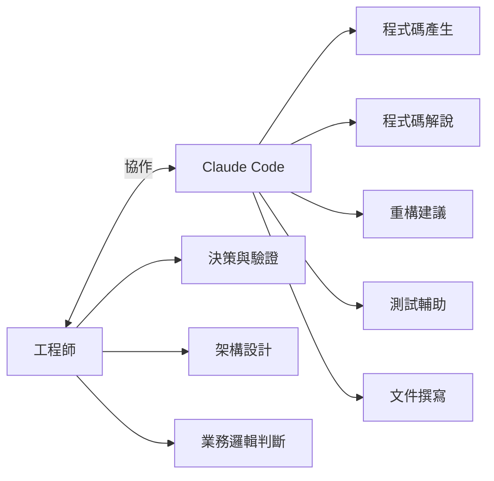
```mermaid
graph LR
    A[工程師] <-->|協作| B[Claude Code]
    B --> C[程式碼產生]
    B --> D[程式碼解說]
    B --> E[重構建議]
    B --> F[測試輔助]
    B --> G[文件撰寫]
    A --> H[決策與驗證]
    A --> I[架構設計]
    A --> J[業務邏輯判斷]
```

| 面向 | Claude Code 的角色 | 工程師的角色 |
|------|-------------------|-------------|
| 程式碼產生 | 依指示快速產出程式碼 | 審查、調整、決定採用與否 |
| 架構設計 | 提供建議與分析 | 做最終決策 |
| 業務邏輯 | 協助理解與實作 | 確認正確性 |
| 除錯 | 協助分析可能原因 | 驗證並修復 |
| 測試 | 產生測試案例 | 確保覆蓋率與正確性 |

#### 💡 重點摘要

- Claude Code 是**協作工具**，不是自動化機器人
- 最終決策與責任仍在工程師身上
- 善用 Claude Code 可提升效率，但需要學習正確使用方式

---

### 1.2 與一般聊天式 AI 的差異

許多同仁可能使用過 ChatGPT 或其他聊天式 AI，Claude Code 有以下關鍵差異：

| 特性 | 一般聊天式 AI | Claude Code |
|------|--------------|-------------|
| **設計目的** | 通用對話 | 專為程式開發設計 |
| **上下文理解** | 有限的對話記憶 | 可理解整個專案結構 |
| **檔案操作** | 無法直接操作 | 可讀取、編輯、建立檔案 |
| **執行能力** | 僅產出文字 | 可執行指令、運行測試 |
| **工作流程整合** | 獨立運作 | 整合 IDE、Git、終端機 |

#### Claude Code 的獨特能力

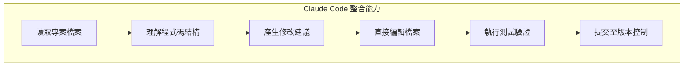
```mermaid
flowchart TD
    subgraph "Claude Code 整合能力"
        A[讀取專案檔案] --> B[理解程式碼結構]
        B --> C[產生修改建議]
        C --> D[直接編輯檔案]
        D --> E[執行測試驗證]
        E --> F[提交至版本控制]
    end
```

#### 實務案例

**情境**：你需要在現有專案中新增一個 API 端點

| 使用一般聊天式 AI | 使用 Claude Code |
|------------------|-----------------|
| 1. 複製相關程式碼到對話 | 1. Claude Code 直接讀取專案 |
| 2. 描述需求 | 2. 描述需求 |
| 3. 取得回應後手動複製貼上 | 3. Claude Code 直接修改檔案 |
| 4. 手動處理 import、設定 | 4. 自動處理相依性 |
| 5. 手動測試 | 5. 自動執行測試 |

---

### 1.3 適合與不適合的使用情境

#### ✅ 適合使用 Claude Code 的情境

| 情境 | 說明 | 效益 |
|------|------|------|
| **程式碼解讀** | 理解陌生或複雜的程式碼 | 快速上手、減少學習時間 |
| **樣板程式碼產生** | CRUD、DTO、Entity 等重複性程式碼 | 節省時間、減少人為錯誤 |
| **單元測試撰寫** | 產生測試案例與邊界條件 | 提升測試覆蓋率 |
| **重構建議** | 改善程式碼品質 | 獲得多元觀點 |
| **文件撰寫** | API 文件、README、註解 | 保持文件與程式碼同步 |
| **Bug 分析** | 協助找出問題可能原因 | 縮短除錯時間 |
| **學習新技術** | 了解新框架或語法 | 加速學習曲線 |

#### ❌ 不適合使用 Claude Code 的情境

| 情境 | 原因 | 建議做法 |
|------|------|---------|
| **核心業務邏輯決策** | AI 不了解商業脈絡 | 與 PM/SA 討論 |
| **機敏資料處理** | 資安風險 | 遵循公司資安政策 |
| **最終程式碼審核** | 需要人工判斷 | 工程師自行審核 |
| **架構重大決策** | 需要全局考量 | 架構師主導決策 |
| **效能關鍵程式碼** | 需要專業調校 | 專家審查與效能測試 |

#### 決策流程圖

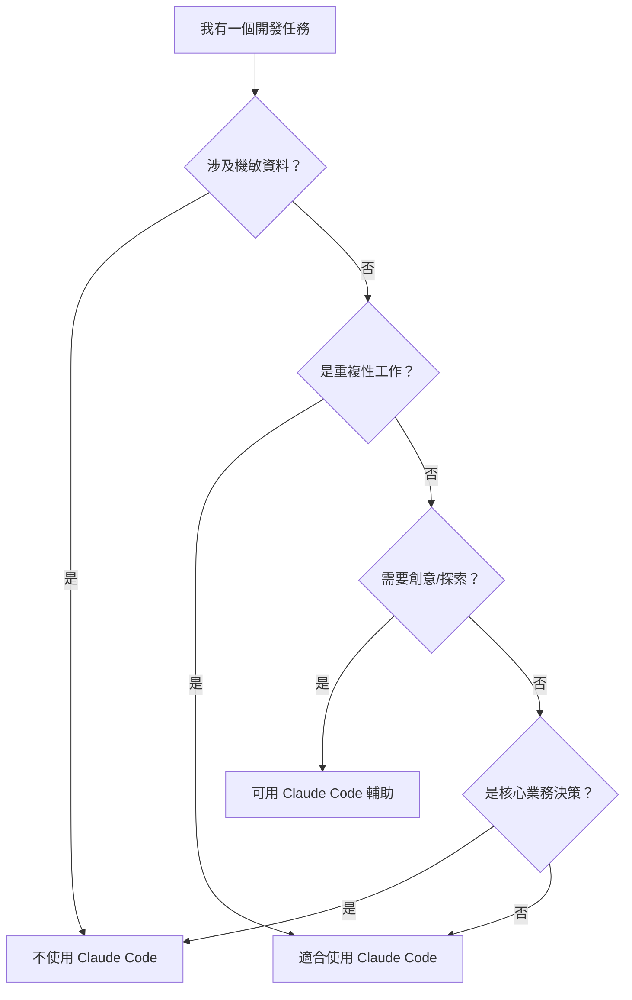
```mermaid
flowchart TD
    A[我有一個開發任務] --> B{涉及機敏資料？}
    B -->|是| C[不使用 Claude Code]
    B -->|否| D{是重複性工作？}
    D -->|是| E[適合使用 Claude Code]
    D -->|否| F{需要創意/探索？}
    F -->|是| G[可用 Claude Code 輔助]
    F -->|否| H{是核心業務決策？}
    H -->|是| C
    H -->|否| E
```

---

### 1.4 Claude Code 在企業開發流程中的角色

#### 軟體開發生命週期（SDLC）中的應用

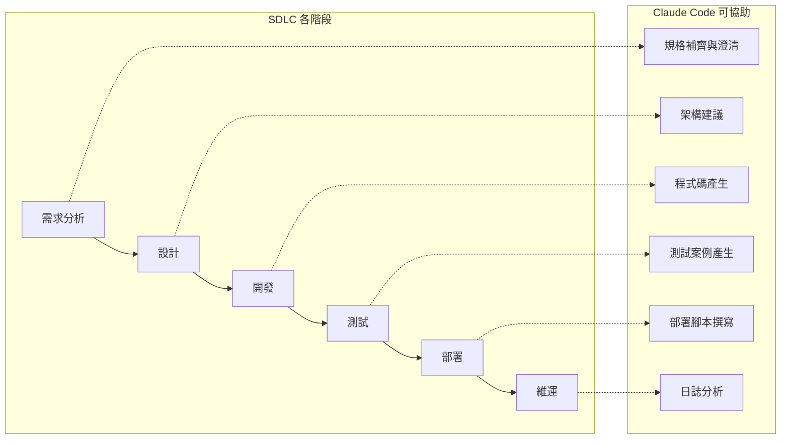
```mermaid
flowchart LR
    subgraph "SDLC 各階段"
        A[需求分析] --> B[設計]
        B --> C[開發]
        C --> D[測試]
        D --> E[部署]
        E --> F[維運]
    end
    
    subgraph "Claude Code 可協助"
        A1[規格補齊與澄清]
        B1[架構建議]
        C1[程式碼產生]
        D1[測試案例產生]
        E1[部署腳本撰寫]
        F1[日誌分析]
    end
    
    A -.-> A1
    B -.-> B1
    C -.-> C1
    D -.-> D1
    E -.-> E1
    F -.-> F1
```

#### 團隊協作模式

| 角色 | Claude Code 使用方式 |
|------|---------------------|
| **PG（程式設計師）** | 程式碼產生、測試撰寫、Bug 分析 |
| **SA（系統分析師）** | 規格補齊、文件撰寫、流程圖產生 |
| **Tech Lead** | Code Review 輔助、架構分析、技術文件 |
| **QA** | 測試案例產生、測試資料準備 |

#### 💡 重點摘要

- Claude Code 可應用於 SDLC 各階段
- 不同角色有不同的使用方式
- 核心原則：**AI 輔助，人工決策**

---

## 第 2 章：Claude Code 的基本操作觀念

### 2.1 Prompt ≠ 問問題

許多新手誤以為使用 Claude Code 就是「問問題」。事實上：

> **Prompt 是一種「指令設計」，不只是提問**

#### 問問題 vs 下指令

| 問問題（效果較差） | 下指令（效果較好） |
|------------------|------------------|
| 「這段程式碼在做什麼？」 | 「請分析這段程式碼的功能，並以條列方式說明每個方法的用途」 |
| 「幫我寫一個 API」 | 「請依照 RESTful 規範，為使用者管理功能建立 CRUD API，使用 Spring Boot 3.x」 |
| 「這個 Bug 怎麼修？」 | 「請分析此錯誤訊息，列出可能原因，並提供修復建議」 |

#### Prompt 的本質

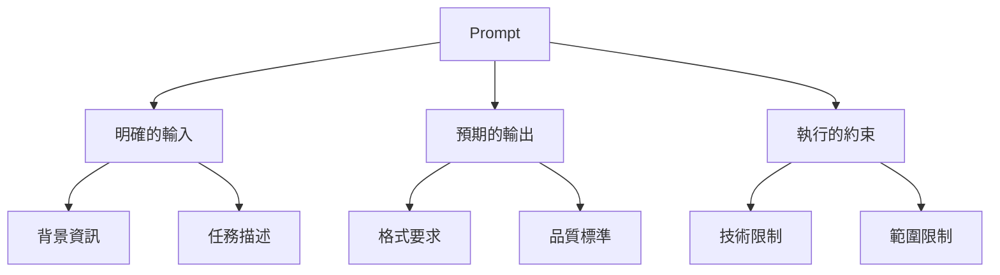
```mermaid
graph TD
    A[Prompt] --> B[明確的輸入]
    A --> C[預期的輸出]
    A --> D[執行的約束]
    
    B --> B1[背景資訊]
    B --> B2[任務描述]
    
    C --> C1[格式要求]
    C --> C2[品質標準]
    
    D --> D1[技術限制]
    D --> D2[範圍限制]
```

---

### 2.2 好 Prompt 的核心結構

一個好的 Prompt 應包含以下元素：

#### RBTO 結構

```
R - Role（角色）：你希望 AI 扮演什麼角色
B - Background（背景）：提供必要的上下文資訊
T - Task（任務）：明確說明要做什麼
O - Output（輸出）：指定輸出格式與要求
```

#### 範例：好 Prompt vs 壞 Prompt

**❌ 壞 Prompt：**
```
幫我寫一個登入功能
```

**✅ 好 Prompt：**
```markdown
## 角色
你是一位資深 Java 後端工程師，熟悉 Spring Boot 3.x 與 Spring Security。

## 背景
- 專案使用 Spring Boot 3.2.x
- 資料庫為 PostgreSQL
- 採用 JWT 進行身份驗證
- 需符合公司資安規範（密碼需加密儲存）

## 任務
請實作使用者登入功能，包含：
1. 登入 API 端點（POST /api/auth/login）
2. JWT Token 產生邏輯
3. 密碼驗證（使用 BCrypt）
4. 登入失敗次數限制（5 次後鎖定 30 分鐘）

## 輸出要求
- 提供完整的 Controller、Service、Repository 程式碼
- 包含必要的 DTO 類別
- 加入 JavaDoc 註解
- 包含單元測試範例
```

#### Prompt 結構圖

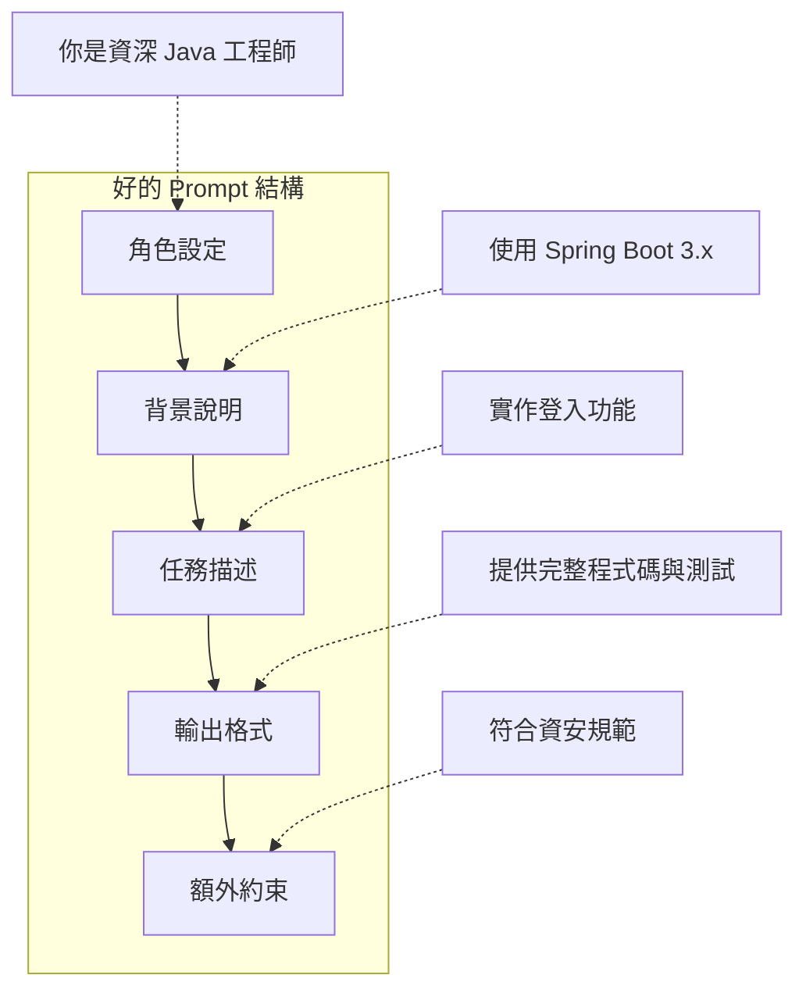
```mermaid
graph TB
    subgraph "好的 Prompt 結構"
        A[角色設定] --> B[背景說明]
        B --> C[任務描述]
        C --> D[輸出格式]
        D --> E[額外約束]
    end
    
    A1["你是資深 Java 工程師"] -.-> A
    B1["使用 Spring Boot 3.x"] -.-> B
    C1["實作登入功能"] -.-> C
    D1["提供完整程式碼與測試"] -.-> D
    E1["符合資安規範"] -.-> E
```

---

### 2.3 單輪 vs 多輪對話策略

#### 單輪對話

適用於：
- 明確、獨立的任務
- 不需要來回調整
- 有完整資訊可一次提供

```markdown
# 單輪對話範例
請將以下 Java 7 程式碼重構為 Java 17 風格：
- 使用 Stream API 取代 for 迴圈
- 使用 Optional 處理 null
- 使用 record 取代簡單的 POJO

[貼上程式碼]
```

#### 多輪對話

適用於：
- 複雜任務需要逐步拆解
- 需要來回確認細節
- 探索性的開發工作

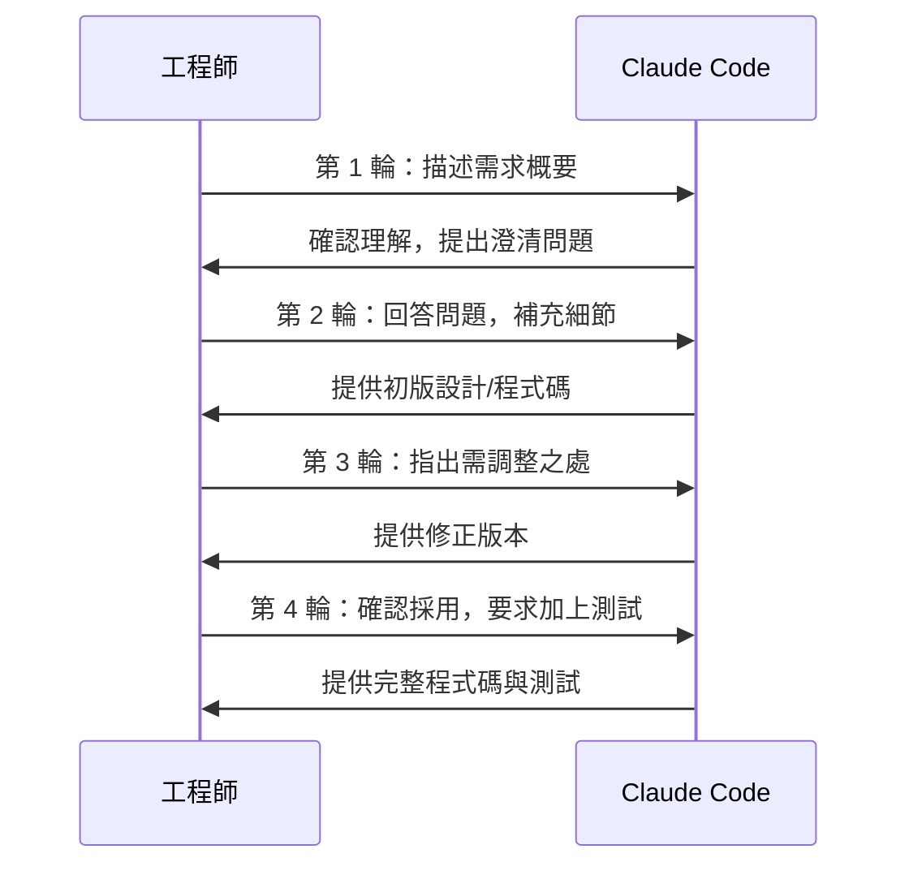
```mermaid
sequenceDiagram
    participant 工程師
    participant Claude Code
    
    工程師->>Claude Code: 第 1 輪：描述需求概要
    Claude Code->>工程師: 確認理解，提出澄清問題
    工程師->>Claude Code: 第 2 輪：回答問題，補充細節
    Claude Code->>工程師: 提供初版設計/程式碼
    工程師->>Claude Code: 第 3 輪：指出需調整之處
    Claude Code->>工程師: 提供修正版本
    工程師->>Claude Code: 第 4 輪：確認採用，要求加上測試
    Claude Code->>工程師: 提供完整程式碼與測試
```

#### 對話策略選擇

| 任務類型 | 建議策略 | 範例 |
|---------|---------|------|
| 格式轉換 | 單輪 | 將 XML 轉成 JSON |
| 簡單重構 | 單輪 | 重命名方法、提取常數 |
| 功能開發 | 多輪 | 實作新的業務功能 |
| 架構設計 | 多輪 | 設計新的模組架構 |
| 除錯分析 | 多輪 | 分析複雜的 Bug |

---

### 2.4 如何逐步收斂出可用結果

#### 收斂策略

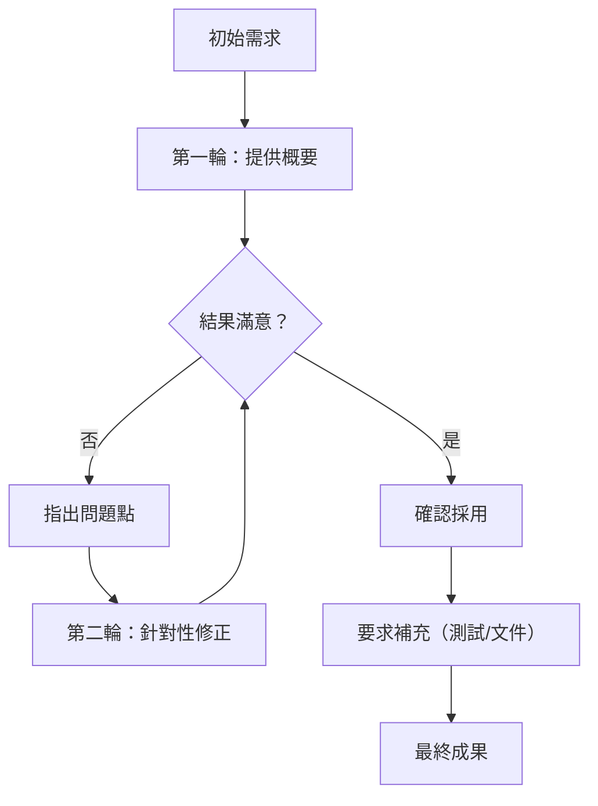
```mermaid
flowchart TD
    A[初始需求] --> B[第一輪：提供概要]
    B --> C{結果滿意？}
    C -->|否| D[指出問題點]
    D --> E[第二輪：針對性修正]
    E --> C
    C -->|是| F[確認採用]
    F --> G[要求補充（測試/文件）]
    G --> H[最終成果]
```

#### 收斂技巧

1. **由粗到細**
   ```
   第 1 輪：請設計使用者管理模組的整體架構
   第 2 輪：請詳細設計 UserService 的方法簽名
   第 3 輪：請實作 createUser 方法
   第 4 輪：請加上輸入驗證與例外處理
   ```

2. **正向修正**
   ```
   ❌ 這個不對，重寫
   ✅ 這個方向對了，但請調整以下幾點：
      1. 方法命名改為 findByUserId
      2. 加上 null 檢查
      3. 改用 Optional 回傳
   ```

3. **具體回饋**
   ```
   ❌ 這樣不好
   ✅ 第 15 行的迴圈效率不佳，請改用 Stream.filter()
   ```

#### 💡 重點摘要

- Prompt 是「指令設計」，不只是問問題
- 使用 RBTO 結構（角色/背景/任務/輸出）
- 複雜任務用多輪對話逐步收斂
- 給予具體、正向的回饋

---

## 第 3 章：新進工程師必學的 Prompt 範本

> 本章提供可直接複製使用的 Prompt 範本，建議依實際情況調整細節。

### 3.1 程式碼解讀 Prompt

#### 基礎版

```markdown
## 任務
請解讀以下程式碼，說明其功能與執行流程。

## 輸出要求
1. 概述：用 2-3 句話說明這段程式碼的主要功能
2. 逐段解說：針對關鍵程式碼區塊說明用途
3. 流程圖：使用 Mermaid 畫出執行流程
4. 潛在問題：指出可能的問題或改善空間

## 程式碼
[貼上程式碼]
```

#### 進階版（含業務脈絡）

```markdown
## 角色
你是一位熟悉金融系統的資深工程師。

## 背景
這是銀行核心系統的轉帳模組，使用 Java 11 + Spring Boot 2.7。

## 任務
請解讀以下程式碼，特別關注：
1. 交易的原子性如何保證
2. 異常狀況的處理方式
3. 是否有資安或效能風險

## 輸出格式
| 區塊 | 功能說明 | 潛在風險 | 改善建議 |
|------|---------|---------|---------|

## 程式碼
[貼上程式碼]
```

---

### 3.2 新功能開發 Prompt

#### 基礎版

```markdown
## 角色
你是一位資深 Java 後端工程師。

## 背景
- 框架：Spring Boot 3.2.x
- 資料庫：PostgreSQL 15
- 建置工具：Maven
- 測試框架：JUnit 5 + Mockito

## 任務
請實作「使用者註冊」功能，需求如下：
1. API 端點：POST /api/users/register
2. 輸入：email、password、name
3. 驗證：email 格式、密碼強度（至少 8 字元，含大小寫與數字）
4. 儲存：密碼需使用 BCrypt 加密
5. 回傳：使用者 ID 與建立時間

## 輸出要求
請提供以下檔案的完整程式碼：
1. UserController.java
2. UserService.java
3. UserRepository.java
4. RegisterRequest.java（DTO）
5. RegisterResponse.java（DTO）
6. UserServiceTest.java（單元測試）

## 程式碼風格
- 使用 JavaDoc 註解
- 遵循 Google Java Style Guide
- 使用 Lombok 簡化程式碼
```

#### 批次功能版

```markdown
## 角色
你是一位熟悉批次處理的資深 Java 工程師。

## 背景
- 框架：Spring Batch 5.x
- 資料庫：Oracle 19c
- 排程：使用 @Scheduled 註解
- 日誌：Log4j2

## 任務
請實作「每日對帳檔產生」批次程式：
1. 執行時間：每日 02:00
2. 讀取當日所有交易紀錄
3. 產生 CSV 格式對帳檔
4. 上傳至 SFTP 伺服器
5. 寄送執行結果通知信

## 非功能需求
- 單次處理資料量可達 100 萬筆
- 需有斷點續傳機制
- 需有完整的錯誤處理與通知

## 輸出要求
1. Job Configuration
2. ItemReader、Processor、Writer
3. 錯誤處理機制
4. 測試案例
```

---

### 3.3 舊系統重構 Prompt

```markdown
## 角色
你是一位專精於程式碼重構的資深架構師。

## 背景
這是一段 5 年前的舊程式碼，存在以下問題：
- 使用 Java 8，需升級至 Java 17
- 未使用依賴注入，難以測試
- 方法過長，職責不清
- 沒有單元測試

## 任務
請重構以下程式碼：
1. 升級至 Java 17 語法（record、pattern matching、text blocks 等）
2. 套用 SOLID 原則
3. 使用設計模式改善結構（如適用）
4. 加入適當的例外處理
5. 提供重構後的單元測試

## 輸出要求
1. 重構後的程式碼
2. 重構說明（每個改動的原因）
3. Before/After 對照表
4. 單元測試

## 原始程式碼
[貼上程式碼]
```

---

### 3.4 Bug 分析 Prompt

```markdown
## 角色
你是一位除錯專家，擅長分析 Java 應用程式的問題。

## 背景
- 環境：Production
- 框架：Spring Boot 2.7 + MyBatis
- 資料庫：MySQL 8.0
- 問題發生頻率：約 5% 的請求會出錯

## 問題描述
使用者反映「查詢訂單」功能偶爾會回傳 500 錯誤。

## 錯誤訊息
```
java.lang.NullPointerException: Cannot invoke method on null object
    at com.example.OrderService.getOrderDetail(OrderService.java:45)
    at com.example.OrderController.getOrder(OrderController.java:28)
    ...
```

## 相關程式碼
[貼上 OrderService.java]

## 任務
請分析：
1. 最可能的錯誤原因（列出 Top 3）
2. 為什麼只有 5% 的請求會出錯
3. 建議的修復方式
4. 如何避免類似問題再次發生

## 輸出格式
### 根本原因分析
...

### 修復建議
| 優先序 | 修復方式 | 影響範圍 | 工時估計 |
|-------|---------|---------|---------|

### 預防措施
...
```

---

### 3.5 單元測試產生 Prompt

```markdown
## 角色
你是一位測試專家，熟悉 JUnit 5 與 Mockito。

## 背景
- 測試框架：JUnit 5.9
- Mock 框架：Mockito 5.x
- 斷言庫：AssertJ
- 覆蓋率要求：行覆蓋率 80% 以上

## 任務
請為以下 Service 類別產生完整的單元測試：

## 測試要求
1. 涵蓋所有 public 方法
2. 包含正常流程與異常流程
3. 邊界條件測試
4. 使用 @ParameterizedTest 處理多組輸入
5. Mock 所有外部依賴

## 輸出格式
- 使用 Given-When-Then 結構
- 測試方法命名：should_預期結果_when_條件
- 加入必要註解說明測試目的

## 待測程式碼
[貼上 Service 類別]
```

---

### 3.6 Code Review Prompt

```markdown
## 角色
你是一位嚴格但建設性的 Code Reviewer。

## 背景
這是一位初級工程師提交的 Pull Request，需要 Review。

## Review 標準
1. **功能正確性**：程式碼是否正確實作需求
2. **程式碼品質**：是否遵循 Clean Code 原則
3. **效能考量**：是否有明顯的效能問題
4. **安全性**：是否有資安風險
5. **可測試性**：是否易於測試
6. **可維護性**：是否易於理解與修改

## 輸出格式
### 整體評價
⭐⭐⭐☆☆（3/5）
[簡短評語]

### 必須修改（Must Fix）
| 檔案 | 行數 | 問題 | 建議 |
|-----|-----|-----|-----|

### 建議修改（Should Fix）
| 檔案 | 行數 | 問題 | 建議 |
|-----|-----|-----|-----|

### 可考慮修改（Nice to Have）
| 檔案 | 行數 | 問題 | 建議 |
|-----|-----|-----|-----|

### 優點
- ...

## 待 Review 程式碼
[貼上程式碼或 diff]
```

---

### 3.7 規格補齊 Prompt

```markdown
## 角色
你是一位資深系統分析師，擅長撰寫技術規格文件。

## 背景
PM 提供了初步的需求描述，但內容不夠完整，需要補齊成可供開發的規格。

## 原始需求
「我們需要一個會員等級功能，依據消費金額給予不同等級，等級高的會員有更多優惠」

## 任務
請將上述需求補齊為完整的規格文件，包含：
1. 功能描述
2. 使用者故事（User Stories）
3. 驗收條件（Acceptance Criteria）
4. 資料模型
5. API 規格
6. 畫面流程（如適用）
7. 邊界條件與例外處理
8. 未來擴充考量

## 輸出格式
使用標準的 SRS（Software Requirements Specification）格式

## 需要澄清的問題
如有需要，請列出需要與 PM 確認的問題。
```

---

#### 💡 重點摘要

- 使用現成範本可大幅提升效率
- 依實際情況調整角色、背景、任務、輸出
- 範本只是起點，善用後自然會發展出適合自己的版本
- 好的 Prompt 範本值得收藏與分享

---

## 第 4 章：Claude Code 在實務開發中的典型流程

### 4.1 從需求文字到程式碼

#### 標準流程

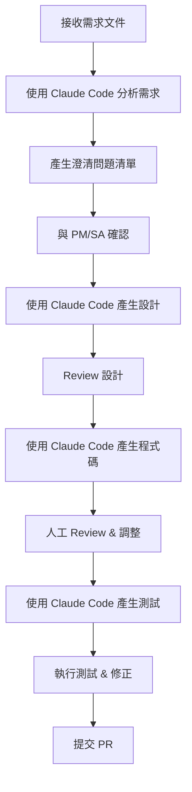
```mermaid
flowchart TD
    A[接收需求文件] --> B[使用 Claude Code 分析需求]
    B --> C[產生澄清問題清單]
    C --> D[與 PM/SA 確認]
    D --> E[使用 Claude Code 產生設計]
    E --> F[Review 設計]
    F --> G[使用 Claude Code 產生程式碼]
    G --> H[人工 Review & 調整]
    H --> I[使用 Claude Code 產生測試]
    I --> J[執行測試 & 修正]
    J --> K[提交 PR]
```

#### 實務步驟

**步驟 1：需求分析**

```markdown
## Prompt 範例
請分析以下需求，並列出：
1. 功能點清單
2. 技術實作要點
3. 需要澄清的問題
4. 預估的複雜度（低/中/高）

## 需求原文
[貼上 PM 提供的需求文件]
```

**步驟 2：設計規劃**

```markdown
## Prompt 範例
基於以下需求，請提供技術設計：
1. 類別圖（使用 Mermaid）
2. 資料庫 Schema 設計
3. API 端點規劃
4. 關鍵流程的循序圖

## 技術限制
- 使用 Spring Boot 3.x
- 資料庫：PostgreSQL
- 需考慮未來擴充性

## 需求摘要
[貼上經確認的需求]
```

**步驟 3：程式碼產生**

```markdown
## Prompt 範例
請依據以下設計，產生完整的程式碼：

## 設計文件
[貼上步驟 2 的設計]

## 輸出要求
1. 依據 Clean Architecture 分層
2. 包含完整的例外處理
3. 加入 JavaDoc 註解
4. 遵循專案現有的程式碼風格
```

**步驟 4：測試產生**

```markdown
## Prompt 範例
請為以下程式碼產生單元測試與整合測試：

## 測試要求
- 單元測試覆蓋率 > 80%
- 使用 @DataJpaTest 進行 Repository 測試
- 使用 @WebMvcTest 進行 Controller 測試
- 包含邊界條件與異常情境

## 程式碼
[貼上步驟 3 的程式碼]
```

#### 注意事項

> ⚠️ **重要提醒**
> - 每個步驟都需要人工 Review
> - 不要一次產生太多程式碼
> - 保持小步快跑，逐步確認

---

### 4.2 從舊程式碼到可維護設計

#### 重構流程

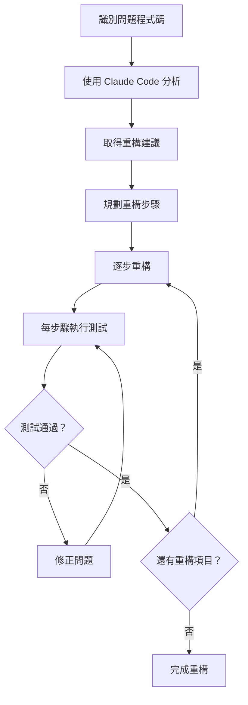
```mermaid
flowchart TD
    A[識別問題程式碼] --> B[使用 Claude Code 分析]
    B --> C[取得重構建議]
    C --> D[規劃重構步驟]
    D --> E[逐步重構]
    E --> F[每步驟執行測試]
    F --> G{測試通過？}
    G -->|否| H[修正問題]
    H --> F
    G -->|是| I{還有重構項目？}
    I -->|是| E
    I -->|否| J[完成重構]
```

#### 實務範例

**情境**：重構一個 500 行的 God Class

**步驟 1：分析現況**

```markdown
## Prompt
請分析以下程式碼的問題，並建議重構策略：
1. 違反了哪些 SOLID 原則？
2. 識別出不同的職責
3. 建議如何拆分這個類別
4. 建議重構的優先順序

## 程式碼
[貼上 God Class 程式碼]
```

**步驟 2：制定重構計畫**

```markdown
## 基於分析結果，Claude Code 可能回應：

### 識別的問題
1. 違反單一職責原則：同時處理使用者驗證、訂單處理、通知發送
2. 方法過長：processOrder() 方法超過 200 行
3. 缺乏抽象：直接操作資料庫，沒有 Repository 層

### 建議拆分為
1. AuthenticationService - 處理使用者驗證
2. OrderService - 處理訂單邏輯
3. NotificationService - 處理通知發送
4. OrderRepository - 資料庫操作

### 重構優先順序
1. 先抽取 Repository 層（風險最低）
2. 再拆分 Service（需要更多測試保護）
3. 最後處理通知邏輯
```

**步驟 3：逐步執行**

```markdown
## Prompt - 第一步重構
請將以下 God Class 中的資料庫操作，抽取為獨立的 OrderRepository：
1. 保持原有功能不變
2. 使用 Spring Data JPA
3. 提供重構前後的對照

## 重構前程式碼
[貼上相關程式碼]
```

---

### 4.3 從「我看不懂」到「我能修改」

#### 理解陌生程式碼的策略

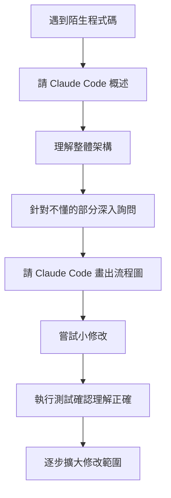
```mermaid
flowchart TD
    A[遇到陌生程式碼] --> B[請 Claude Code 概述]
    B --> C[理解整體架構]
    C --> D[針對不懂的部分深入詢問]
    D --> E[請 Claude Code 畫出流程圖]
    E --> F[嘗試小修改]
    F --> G[執行測試確認理解正確]
    G --> H[逐步擴大修改範圍]
```

#### 實務 Prompt

**第一層：整體理解**

```markdown
## Prompt
請幫我理解這個專案的整體架構：
1. 主要的模組有哪些？
2. 各模組之間的關係？
3. 資料流如何進行？
4. 請畫出架構圖（Mermaid）

## 專案結構
[貼上目錄結構或讓 Claude Code 讀取]
```

**第二層：模組理解**

```markdown
## Prompt
請詳細解說 OrderService 模組：
1. 這個模組的職責是什麼？
2. 主要的 public 方法有哪些？
3. 與其他模組如何互動？
4. 有哪些重要的設計決策？
```

**第三層：方法理解**

```markdown
## Prompt
請逐行解說 processOrder() 方法：
1. 每一段邏輯的用途
2. 為什麼這樣設計
3. 有哪些邊界條件
4. 可能的改善空間
```

**第四層：修改確認**

```markdown
## Prompt
我想在 processOrder() 方法中加入「訂單金額上限檢查」：
1. 應該加在哪裡？
2. 需要注意什麼？
3. 會影響到哪些其他程式碼？
4. 請提供修改建議
```

---

### 4.4 搭配 Git / PR / Review 的使用方式

#### Git 整合工作流程

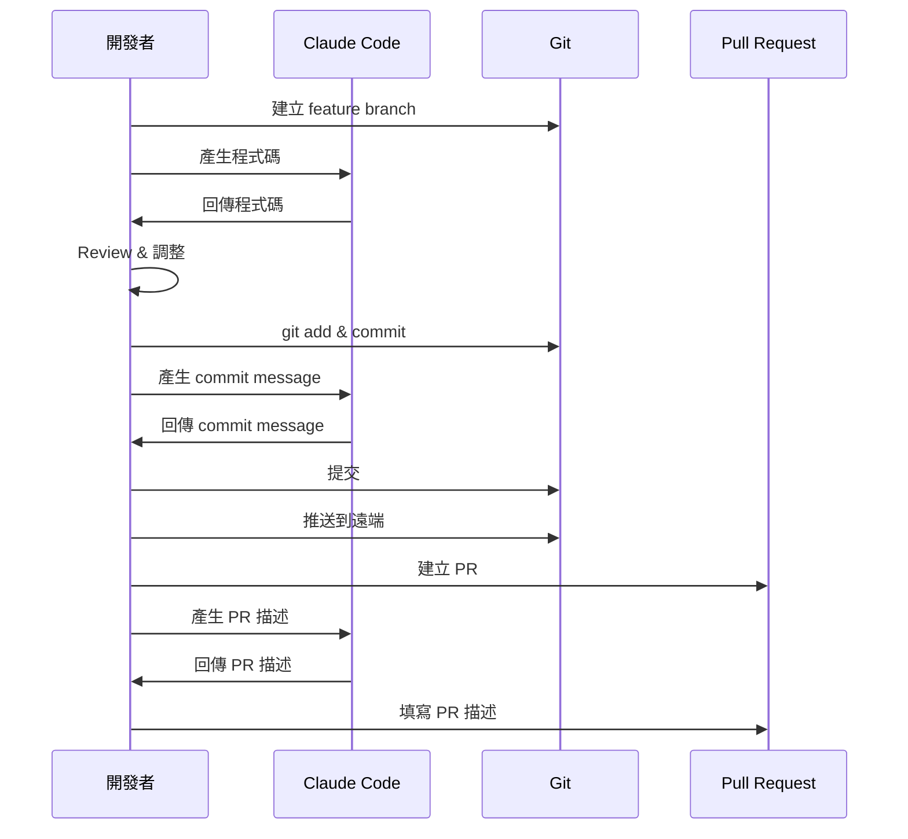
```mermaid
sequenceDiagram
    participant Dev as 開發者
    participant CC as Claude Code
    participant Git as Git
    participant PR as Pull Request
    
    Dev->>Git: 建立 feature branch
    Dev->>CC: 產生程式碼
    CC->>Dev: 回傳程式碼
    Dev->>Dev: Review & 調整
    Dev->>Git: git add & commit
    Dev->>CC: 產生 commit message
    CC->>Dev: 回傳 commit message
    Dev->>Git: 提交
    Dev->>Git: 推送到遠端
    Dev->>PR: 建立 PR
    Dev->>CC: 產生 PR 描述
    CC->>Dev: 回傳 PR 描述
    Dev->>PR: 填寫 PR 描述
```

#### 實用 Prompt

**產生 Commit Message**

```markdown
## Prompt
請根據以下變更，產生符合 Conventional Commits 規範的 commit message：
- 類型：feat / fix / refactor / docs / test / chore
- 範圍：受影響的模組
- 描述：簡潔說明變更內容

## 變更內容
[貼上 git diff 或說明變更]
```

**產生 PR 描述**

```markdown
## Prompt
請根據以下變更，產生 Pull Request 描述：

## 格式要求
### 變更摘要
[簡述這個 PR 做了什麼]

### 變更類型
- [ ] 新功能
- [ ] Bug 修復
- [ ] 重構
- [ ] 文件更新

### 測試說明
[說明如何測試這個變更]

### 相關 Issue
[關聯的 Issue 編號]

### 檢查清單
- [ ] 程式碼已通過 lint 檢查
- [ ] 已加入單元測試
- [ ] 已更新文件

## 變更內容
[貼上變更說明或 git diff]
```

**PR Review 輔助**

```markdown
## Prompt
請幫我 Review 這個 PR，關注以下面向：
1. 程式碼品質
2. 潛在的 Bug
3. 效能問題
4. 安全性風險
5. 測試覆蓋度

## PR 內容
[貼上 PR diff]
```

#### 💡 重點摘要

- Claude Code 可貫穿整個開發流程
- 從需求分析到 PR Review 都可輔助
- 每個步驟仍需人工 Review 與決策
- Git 整合讓工作流程更順暢

---

## 第 5 章：常見錯誤與 Anti-Pattern

### 5.1 問太籠統

#### ❌ 錯誤範例

```markdown
幫我寫一個系統
```

```markdown
這段程式碼有什麼問題？
```

```markdown
幫我優化一下
```

#### 問題分析

| 籠統問題 | 為何有問題 | 改善方式 |
|---------|-----------|---------|
| 「幫我寫一個系統」 | 缺乏範圍、需求、技術限制 | 具體說明功能、技術棧、約束 |
| 「有什麼問題？」 | 沒有指定關注面向 | 指定要檢查的項目（效能/安全/風格） |
| 「幫我優化」 | 優化目標不明確 | 說明要優化什麼（速度/記憶體/可讀性） |

#### ✅ 正確範例

```markdown
## 籠統版
幫我優化這段程式碼

## 具體版
請優化以下程式碼的「執行效能」：
- 目前處理 10,000 筆資料需要 30 秒
- 目標：降低到 5 秒以內
- 限制：不能增加太多記憶體使用量
- 重點：懷疑是 N+1 查詢問題

[程式碼]
```

---

### 5.2 一次丟太多責任

#### ❌ 錯誤範例

```markdown
請幫我完成以下所有工作：
1. 設計使用者管理系統的架構
2. 實作所有的 CRUD API
3. 寫好單元測試和整合測試
4. 產生 API 文件
5. 設定 CI/CD
6. 部署到 Kubernetes
```

#### 問題分析

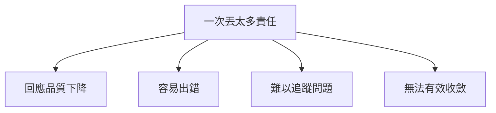
```mermaid
graph TD
    A[一次丟太多責任] --> B[回應品質下降]
    A --> C[容易出錯]
    A --> D[難以追蹤問題]
    A --> E[無法有效收斂]
```

#### ✅ 正確做法：任務分解

```markdown
## 第 1 輪
請設計使用者管理系統的架構，包含：
- 類別圖
- API 端點規劃
- 資料庫 Schema

---

## 第 2 輪（確認架構後）
請依據上述設計，實作 UserController 和 UserService

---

## 第 3 輪（確認程式碼後）
請為 UserService 產生單元測試

---

## 依此類推...
```

#### 任務分解原則

| 原則 | 說明 |
|------|------|
| **單一職責** | 每次 Prompt 只做一件事 |
| **逐步確認** | 每步驟完成後再進行下一步 |
| **可驗證** | 每步驟的輸出可以立即驗證 |
| **可回溯** | 發現問題可以回到前一步調整 |

---

### 5.3 沒有限制輸出格式

#### ❌ 錯誤範例

```markdown
請解釋這個設計模式
```

**問題**：回應可能太長、太短、格式混亂、重點不明

#### ✅ 正確範例

```markdown
請解釋 Factory Pattern：

## 輸出格式
1. 一句話定義（20 字以內）
2. 使用時機（3-5 個情境）
3. Java 範例程式碼（30 行以內）
4. 優缺點比較表
5. 常見誤用

## 注意
- 使用繁體中文
- 適合初學者閱讀
- 程式碼加註解
```

#### 格式限制技巧

| 技巧 | 範例 |
|------|------|
| 字數限制 | 「請用 100 字以內說明」 |
| 結構要求 | 「請用表格比較」 |
| 程式碼限制 | 「程式碼不超過 50 行」 |
| 項目限制 | 「列出前 5 個最重要的」 |
| 層級限制 | 「說明到第 2 層細節即可」 |

---

### 5.4 盲目相信 AI 結果

#### 危險行為

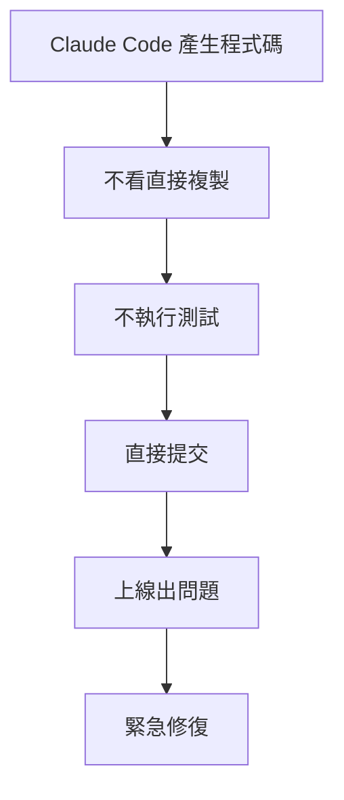
```mermaid
graph TD
    A[Claude Code 產生程式碼] --> B[不看直接複製]
    B --> C[不執行測試]
    C --> D[直接提交]
    D --> E[上線出問題]
    E --> F[緊急修復]
```

#### AI 可能出錯的情況

| 情況 | 範例 | 如何發現 |
|------|------|---------|
| **過時的 API** | 使用已棄用的方法 | 編譯警告 / IDE 提示 |
| **邏輯錯誤** | 邊界條件處理錯誤 | 單元測試 |
| **安全漏洞** | SQL Injection | 安全掃描 |
| **效能問題** | N+1 查詢 | 效能測試 |
| **不符合規範** | 違反公司 coding style | Code Review |

#### ✅ 正確做法

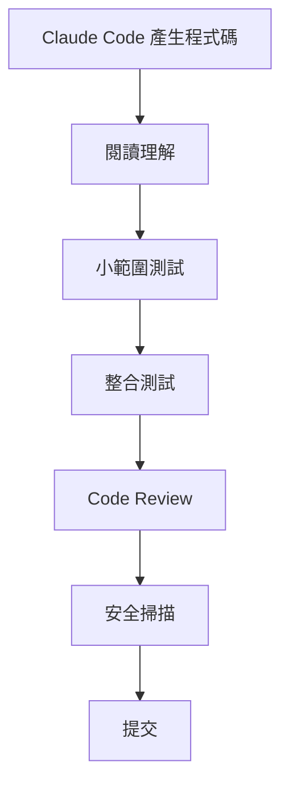
```mermaid
flowchart TD
    A[Claude Code 產生程式碼] --> B[閱讀理解]
    B --> C[小範圍測試]
    C --> D[整合測試]
    D --> E[Code Review]
    E --> F[安全掃描]
    F --> G[提交]
```

---

### 5.5 沒做人工驗證

#### 必要的驗證步驟

| 驗證類型 | 方法 | 工具 |
|---------|------|------|
| **語法正確性** | 編譯 | IDE / Maven |
| **功能正確性** | 單元測試 | JUnit |
| **整合正確性** | 整合測試 | Spring Test |
| **程式碼品質** | 靜態分析 | SonarQube |
| **安全性** | 安全掃描 | OWASP |
| **效能** | 效能測試 | JMeter |

#### 驗證 Checklist

```markdown
## AI 產出驗證清單

### 基本驗證
- [ ] 程式碼可以編譯通過
- [ ] 沒有 IDE 警告
- [ ] 通過現有的單元測試

### 功能驗證
- [ ] 手動測試主要流程
- [ ] 新增的單元測試全部通過
- [ ] 邊界條件有測試

### 品質驗證
- [ ] 程式碼符合公司 Style Guide
- [ ] 通過 SonarQube 檢查
- [ ] 沒有明顯的 Code Smell

### 安全驗證
- [ ] 沒有硬編碼的敏感資訊
- [ ] 輸入有做驗證
- [ ] 沒有 SQL Injection 風險
```

#### 💡 重點摘要

- 避免問題太籠統，要具體明確
- 複雜任務要分解，不要一次丟太多
- 一定要指定輸出格式
- AI 會出錯，務必驗證
- 建立驗證 Checklist，養成習慣

---

## 第 6 章：Claude Code 使用最佳實務（Best Practices）

### 6.1 Prompt 模組化

#### 什麼是 Prompt 模組化？

將常用的 Prompt 組件抽取出來，像程式碼一樣重用與組合。

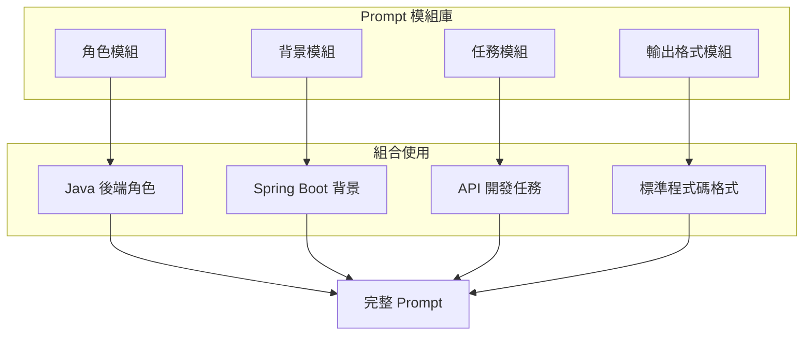
```mermaid
graph TD
    subgraph "Prompt 模組庫"
        A[角色模組]
        B[背景模組]
        C[任務模組]
        D[輸出格式模組]
    end
    
    subgraph "組合使用"
        E[Java 後端角色]
        F[Spring Boot 背景]
        G[API 開發任務]
        H[標準程式碼格式]
    end
    
    A --> E
    B --> F
    C --> G
    D --> H
    
    E --> I[完整 Prompt]
    F --> I
    G --> I
    H --> I
```

#### 模組範例

**角色模組庫**

```markdown
## 角色：資深 Java 後端工程師
你是一位具有 10 年經驗的資深 Java 後端工程師，專精於：
- Spring Boot / Spring Cloud
- 微服務架構設計
- 高併發系統開發
- 資料庫優化

---

## 角色：程式碼審查專家
你是一位嚴謹但建設性的 Code Reviewer，關注：
- 程式碼品質與可讀性
- 潛在的 Bug 與安全風險
- 效能問題
- 最佳實務遵循度

---

## 角色：測試專家
你是一位專精於自動化測試的 QA 工程師，熟悉：
- JUnit 5 / Mockito
- 測試金字塔
- TDD / BDD
- 效能測試
```

**背景模組庫**

```markdown
## 背景：標準 Spring Boot 專案
- 框架：Spring Boot 3.2.x
- 建置工具：Maven 3.9+
- Java 版本：Java 17
- 資料庫：PostgreSQL 15
- 快取：Redis 7.x
- 測試：JUnit 5 + Mockito

---

## 背景：微服務專案
- 架構：微服務
- 服務發現：Consul
- API Gateway：Spring Cloud Gateway
- 訊息佇列：RabbitMQ
- 容器化：Docker + Kubernetes
```

**輸出格式模組庫**

```markdown
## 輸出格式：標準程式碼
- 使用 JavaDoc 註解所有 public 方法
- 遵循 Google Java Style Guide
- 使用 Lombok 簡化程式碼
- 包含必要的 import 語句

---

## 輸出格式：分析報告
### 摘要
[2-3 句話概述]

### 詳細分析
[條列式說明]

### 建議
| 優先序 | 建議 | 工時 |
|-------|-----|-----|

### 結論
[總結與下一步]
```

#### 組合使用範例

```markdown
[引用：角色 - 資深 Java 後端工程師]
[引用：背景 - 標準 Spring Boot 專案]

## 任務
實作使用者登入 API

## 需求
1. 端點：POST /api/auth/login
2. 輸入：email, password
3. 輸出：JWT Token
4. 包含登入失敗次數限制

[引用：輸出格式 - 標準程式碼]
```

---

### 6.2 對話紀錄如何保存

#### 保存策略

| 類型 | 保存方式 | 保存期限 | 用途 |
|------|---------|---------|------|
| **成功案例** | 匯出為 Markdown | 永久 | 團隊知識庫 |
| **Prompt 範本** | 存入共享倉庫 | 永久 | 重複使用 |
| **問題排除** | 專案 Wiki | 專案期間 | 問題追蹤 |
| **學習紀錄** | 個人筆記 | 個人決定 | 自我成長 |

#### 保存格式建議

```markdown
# 對話紀錄：[主題]

## 基本資訊
- 日期：2026-01-08
- 專案：使用者管理系統
- 類型：功能開發 / Bug 修復 / 重構

## 問題描述
[描述遇到的問題或需求]

## Prompt 使用
```
[使用的 Prompt]
```

## Claude Code 回應摘要
[重點摘要]

## 最終成果
[採用的程式碼或解決方案]

## 學習心得
[這次對話學到什麼]

## 標籤
#Spring #API #登入 #JWT
```

---

### 6.3 與團隊共用 Prompt 的方式

#### 共用機制

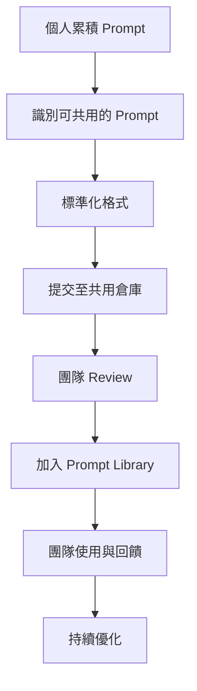
```mermaid
graph TD
    A[個人累積 Prompt] --> B[識別可共用的 Prompt]
    B --> C[標準化格式]
    C --> D[提交至共用倉庫]
    D --> E[團隊 Review]
    E --> F[加入 Prompt Library]
    F --> G[團隊使用與回饋]
    G --> H[持續優化]
```

#### 團隊 Prompt Library 結構

```
prompts/
├── README.md                 # 使用指南
├── roles/                    # 角色模組
│   ├── java-backend.md
│   ├── code-reviewer.md
│   └── test-expert.md
├── backgrounds/              # 背景模組
│   ├── spring-boot-standard.md
│   ├── microservices.md
│   └── batch-processing.md
├── tasks/                    # 任務模組
│   ├── code-generation/
│   ├── code-review/
│   ├── testing/
│   └── documentation/
├── formats/                  # 輸出格式
│   ├── code-standard.md
│   ├── analysis-report.md
│   └── pr-description.md
└── complete/                 # 完整範本
    ├── new-api-development.md
    ├── bug-analysis.md
    └── code-refactoring.md
```

#### 貢獻流程

1. **建立 Branch**：`feature/prompt-xxx`
2. **新增/修改 Prompt**：遵循標準格式
3. **自我測試**：確認 Prompt 有效
4. **提交 PR**：說明用途與效果
5. **團隊 Review**：收集回饋
6. **合併**：加入正式 Library

---

### 6.4 什麼情況不該用 Claude Code

#### 絕對不使用的情況

| 情況 | 原因 | 替代方案 |
|------|------|---------|
| **處理機敏資料** | 資安風險 | 使用脫敏資料或不使用 AI |
| **客戶個資** | 法規遵循 | 人工處理 |
| **商業機密** | 洩密風險 | 內部討論 |
| **安全關鍵程式碼** | 需要專家審查 | 資安團隊處理 |

#### 謹慎使用的情況

| 情況 | 考量 | 建議 |
|------|------|------|
| **核心業務邏輯** | AI 不懂業務 | 人工主導，AI 輔助 |
| **效能關鍵程式碼** | 需要專業調校 | 產出後需效能測試 |
| **跨系統整合** | 缺乏全局資訊 | 提供充足上下文 |
| **遺留系統修改** | 隱藏的依賴關係 | 謹慎測試 |

#### 決策樹

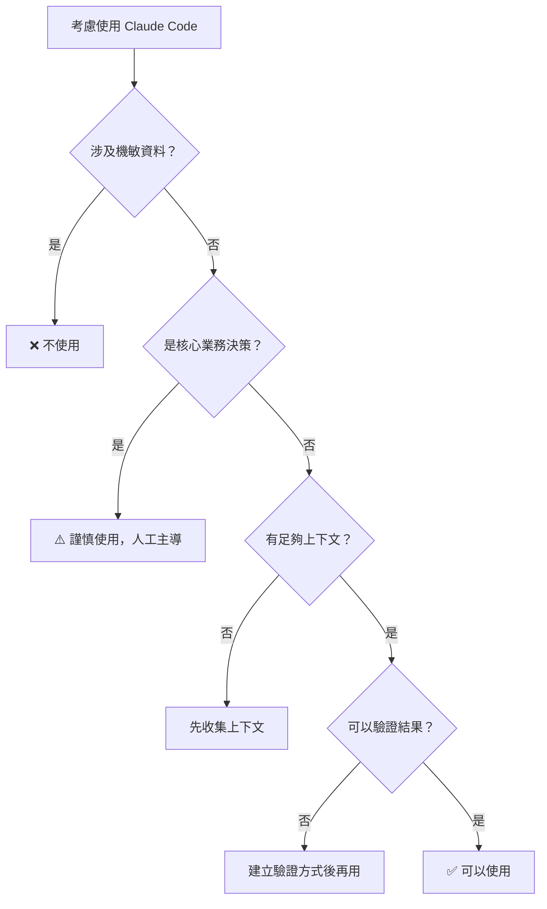
```mermaid
flowchart TD
    A[考慮使用 Claude Code] --> B{涉及機敏資料？}
    B -->|是| C[❌ 不使用]
    B -->|否| D{是核心業務決策？}
    D -->|是| E[⚠️ 謹慎使用，人工主導]
    D -->|否| F{有足夠上下文？}
    F -->|否| G[先收集上下文]
    F -->|是| H{可以驗證結果？}
    H -->|否| I[建立驗證方式後再用]
    H -->|是| J[✅ 可以使用]
```

#### 💡 重點摘要

- 將 Prompt 模組化，提高重用性
- 建立對話紀錄保存機制
- 團隊共用 Prompt Library
- 明確知道什麼時候不該用 Claude Code

---

## 第 7 章：企業內部使用注意事項

### 7.1 資安與機敏資料原則

#### 資料分類與處理原則

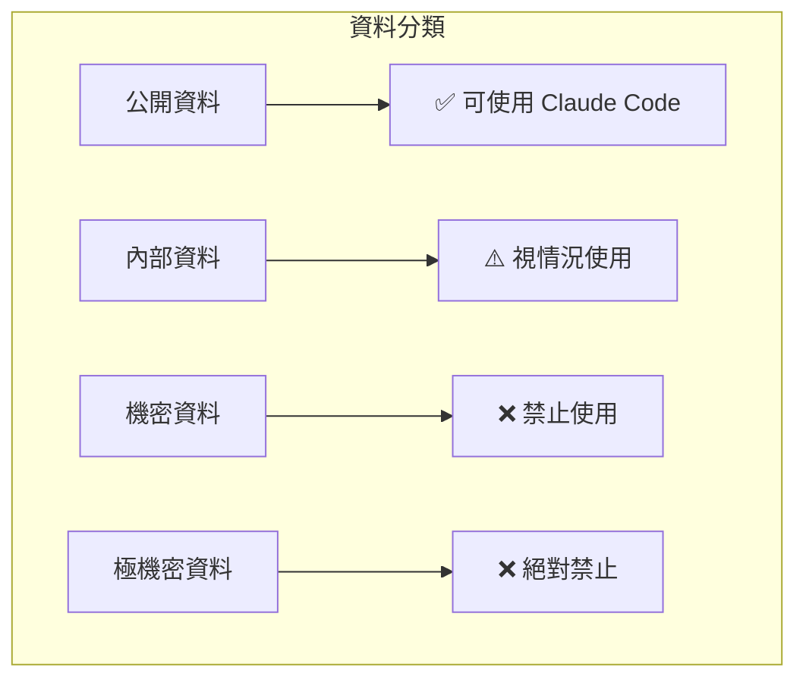
```mermaid
graph TD
    subgraph "資料分類"
        A[公開資料] --> A1[✅ 可使用 Claude Code]
        B[內部資料] --> B1[⚠️ 視情況使用]
        C[機密資料] --> C1[❌ 禁止使用]
        D[極機密資料] --> D1[❌ 絕對禁止]
    end
```

#### 資料分類對照表

| 分類 | 定義 | 範例 | Claude Code 使用 |
|------|------|------|------------------|
| **公開** | 可對外公開的資訊 | 開源程式碼、公開 API 文件 | ✅ 可使用 |
| **內部** | 僅限公司內部 | 內部系統架構、技術文件 | ⚠️ 需脫敏後使用 |
| **機密** | 業務敏感資訊 | 客戶清單、財務數據 | ❌ 禁止 |
| **極機密** | 最高機密等級 | 加密金鑰、核心演算法 | ❌ 絕對禁止 |

#### 脫敏處理指南

**需要脫敏的內容**

| 類型 | 脫敏前 | 脫敏後 |
|------|-------|-------|
| 個人姓名 | 王大明 | USER_001 |
| 身分證字號 | A123456789 | ID_MASKED |
| 電話號碼 | 0912-345-678 | PHONE_MASKED |
| Email | user@company.com | EMAIL_MASKED |
| IP 位址 | 192.168.1.100 | 10.0.0.1 |
| 資料庫連線 | jdbc:oracle:prod | jdbc:oracle:example |
| API Key | sk-abc123... | API_KEY_PLACEHOLDER |

**脫敏程式碼範例**

```java
// 脫敏前（禁止）
String sql = "SELECT * FROM customers WHERE id = " + customerId;
String connectionString = "jdbc:oracle:thin:@prod-db:1521:PROD";

// 脫敏後（可使用）
String sql = "SELECT * FROM customers WHERE id = ?";
String connectionString = "jdbc:oracle:thin:@example-db:1521:EXAMPLE";
```

---

### 7.2 原始碼與客戶資料保護

#### 原始碼使用規範

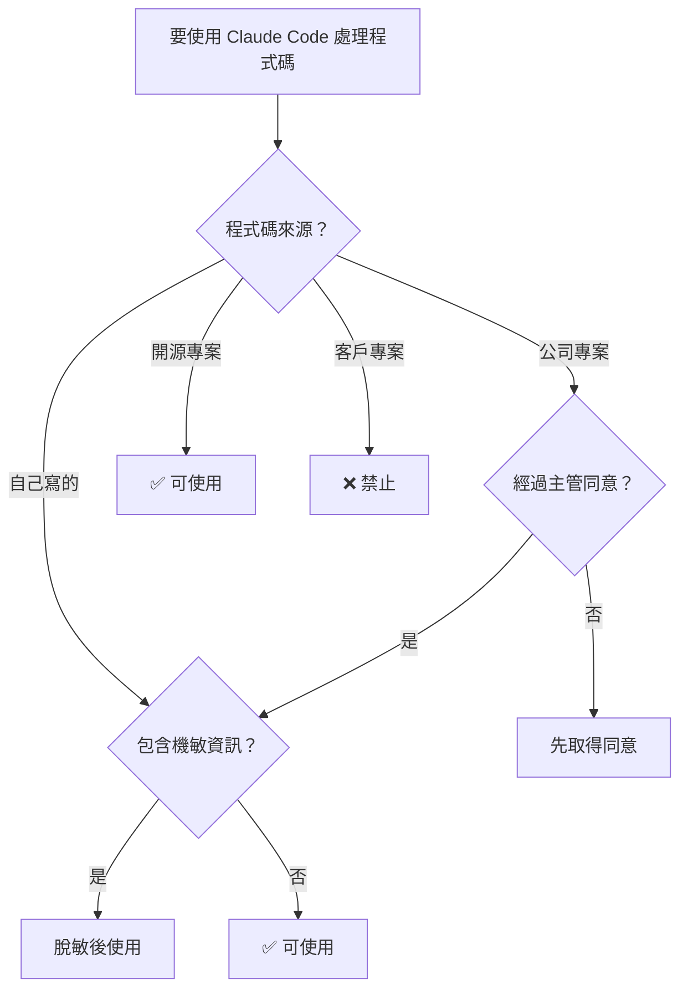
```mermaid
flowchart TD
    A[要使用 Claude Code 處理程式碼] --> B{程式碼來源？}
    B -->|自己寫的| C{包含機敏資訊？}
    B -->|公司專案| D{經過主管同意？}
    B -->|開源專案| E[✅ 可使用]
    B -->|客戶專案| F[❌ 禁止]
    
    C -->|是| G[脫敏後使用]
    C -->|否| H[✅ 可使用]
    
    D -->|是| C
    D -->|否| I[先取得同意]
```

#### 客戶資料保護原則

| 原則 | 說明 | 執行方式 |
|------|------|---------|
| **最小必要** | 只使用必要的資料 | 能用假資料就用假資料 |
| **脫敏優先** | 真實資料要脫敏 | 使用脫敏工具或手動替換 |
| **禁止上傳** | 不上傳真實客戶資料 | 使用模擬資料產生器 |
| **可追溯** | 保留使用紀錄 | 記錄使用目的與範圍 |

#### 測試資料準備

**❌ 禁止**

```markdown
請幫我分析這個客戶查詢的效能問題：
SELECT * FROM customers 
WHERE name = '王大明' 
AND phone = '0912345678'
```

**✅ 正確**

```markdown
請幫我分析這個查詢的效能問題：
SELECT * FROM customers 
WHERE name = 'CUSTOMER_NAME' 
AND phone = 'CUSTOMER_PHONE'
```

---

### 7.3 法遵與稽核觀點

#### 相關法規

| 法規 | 適用情境 | 關鍵要求 |
|------|---------|---------|
| **個資法** | 處理個人資料 | 需取得同意、安全保護 |
| **銀行法** | 金融機構 | 資料保密、風險控管 |
| **GDPR** | 歐盟客戶資料 | 資料主體權利、跨境傳輸限制 |
| **ISO 27001** | 資安管理 | 存取控制、資料分類 |

#### 稽核準備

**應保留的紀錄**

| 項目 | 內容 | 保存期限 |
|------|------|---------|
| 使用紀錄 | 何時、何人、何目的使用 | 依公司規定 |
| 資料處理紀錄 | 處理了什麼類型的資料 | 依公司規定 |
| 脫敏紀錄 | 脫敏前後對照 | 專案期間 |
| 審批紀錄 | 主管同意紀錄 | 依公司規定 |

#### 稽核自檢清單

```markdown
## Claude Code 使用稽核自檢

### 資料處理
- [ ] 未使用真實客戶個資
- [ ] 機敏資料已脫敏
- [ ] 未上傳公司機密程式碼

### 審批流程
- [ ] 已了解公司 AI 工具使用政策
- [ ] 特殊案例已取得主管同意
- [ ] 已遵循資訊安全規範

### 紀錄保存
- [ ] 保留使用目的說明
- [ ] 記錄處理資料類型
- [ ] 保存重要對話紀錄
```

---

### 7.4 AI 產出責任歸屬說明

#### 責任歸屬原則

```mermaid
graph TD
    A[Claude Code 產出程式碼] --> B[工程師審查]
    B --> C{通過審查？}
    C -->|是| D[工程師採用]
    D --> E[工程師負責]
    C -->|否| F[不採用]
    F --> G[無責任問題]
    
    E --> H[程式碼出問題]
    H --> I[由採用的工程師負責]
```

#### 責任歸屬表

| 情況 | AI 責任 | 工程師責任 | 公司責任 |
|------|--------|-----------|---------|
| AI 產出有 Bug | 無 | 審查未發現 | 流程監督 |
| AI 產出有安全漏洞 | 無 | 審查未發現 | 安全培訓 |
| AI 產出違反授權 | 無 | 使用判斷 | 工具選擇 |
| AI 產出不符需求 | 無 | Prompt 設計 | 無 |

#### 關鍵原則

> ⚠️ **核心原則**
> 
> **AI 是工具，責任在人。**
> 
> - Claude Code 是輔助工具，最終決策由人做出
> - 工程師對採用的程式碼負責
> - 「AI 產生的」不是免責理由
> - 程式碼品質仍需人工把關

#### 實務建議

| 建議 | 說明 |
|------|------|
| **充分審查** | 每段 AI 產生的程式碼都要仔細看過 |
| **測試驗證** | 執行測試確認功能正確 |
| **文件說明** | 在 commit message 或 PR 中說明使用了 AI 輔助 |
| **知識內化** | 理解 AI 產出的程式碼，而非盲目使用 |

#### 💡 重點摘要

- 遵守資料分類與脫敏原則
- 絕不上傳機敏資料與客戶個資
- 了解相關法規要求
- 記住：AI 是工具，責任在人

---

## 第 8 章：進階應用（選讀）

### 8.1 Spec-Driven Development（SDD）

#### 什麼是 SDD？

Spec-Driven Development 是以「規格」為核心的開發方法，強調在寫程式碼之前，先確立清晰完整的規格。

```mermaid
flowchart LR
    A[需求] --> B[規格 Spec]
    B --> C[設計]
    C --> D[實作]
    D --> E[測試]
    E --> F[交付]
    
    B -.->|驗證| D
    B -.->|驗證| E
```

#### SDD 與 Claude Code 結合

| SDD 階段 | Claude Code 應用 |
|---------|-----------------|
| **規格撰寫** | 協助將需求轉換為完整規格 |
| **規格審查** | 檢查規格完整性與一致性 |
| **程式碼產生** | 依據規格產生程式碼 |
| **測試產生** | 依據規格產生測試案例 |
| **驗證** | 確認實作符合規格 |

#### SDD Prompt 範例

**將需求轉為規格**

```markdown
## 角色
你是一位資深系統分析師，專精於撰寫軟體規格文件。

## 任務
將以下需求轉換為完整的功能規格（Spec）：

## 需求原文
「使用者可以用 Email 註冊帳號，註冊後要寄發驗證信」

## 輸出格式
請使用以下結構：

### 1. 功能概述
### 2. 使用者故事
### 3. 前置條件
### 4. 主要流程
### 5. 替代流程
### 6. 異常流程
### 7. 驗收條件
### 8. 非功能需求
### 9. 待澄清事項
```

**依據規格產生程式碼**

```markdown
## 角色
你是一位嚴謹的軟體工程師，嚴格依據規格實作。

## 背景
以下是經過審核的功能規格。

## 任務
請嚴格依據規格實作，不要加入規格中沒有提到的功能。

## 規格
[貼上規格文件]

## 輸出要求
1. 完整的程式碼
2. 規格對照表（說明每項規格如何實作）
3. 未能實作的項目（如有）
```

---

### 8.2 將 Claude Code 當成虛擬 Pair Programmer

#### Pair Programming 模式

```mermaid
sequenceDiagram
    participant 你 as 你（Driver）
    participant CC as Claude Code（Navigator）
    
    你->>CC: 我要實作 XXX 功能
    CC->>你: 建議的實作方向...
    你->>你: 開始寫程式碼
    你->>CC: 這段寫法對嗎？
    CC->>你: 看起來不錯，但建議...
    你->>你: 調整程式碼
    你->>CC: 遇到問題：XXX
    CC->>你: 可能的原因是...
    你->>你: 修復問題
    你->>CC: 幫我 Review 完成的程式碼
    CC->>你: Review 結果...
```

#### 實務技巧

**設定角色**

```markdown
## 接下來的對話中，請你扮演我的 Pair Programming 夥伴

### 你的角色：Navigator
- 關注全局設計與方向
- 指出潛在問題
- 提供改善建議
- 不直接寫程式碼，除非我要求

### 我的角色：Driver
- 主導程式碼撰寫
- 做出實作決策
- 詢問你的意見

### 互動方式
- 我會分享我的思路，請給予回饋
- 我會分享程式碼片段，請 Review
- 遇到問題時，請協助分析
```

**持續對話範例**

```markdown
## 對話 1
我：我打算用 Strategy Pattern 來處理不同的付款方式，你覺得？

## 對話 2
我：這是我的 PaymentStrategy 介面，請幫我看看：
[程式碼]

## 對話 3
我：我在考慮要不要用 Factory 來建立 Strategy，有什麼建議？

## 對話 4
我：完成了，請幫我做最後的 Review
[完整程式碼]
```

---

### 8.3 長任務拆解技巧

#### 任務拆解流程

```mermaid
flowchart TD
    A[大型任務] --> B[識別主要組件]
    B --> C[定義組件邊界]
    C --> D[排定優先順序]
    D --> E[逐一完成]
    E --> F[整合測試]
    F --> G{完成？}
    G -->|否| E
    G -->|是| H[任務完成]
```

#### 拆解原則

| 原則 | 說明 | 範例 |
|------|------|------|
| **單一職責** | 每個子任務只做一件事 | 「實作 UserService」而非「實作整個使用者模組」 |
| **可獨立** | 子任務可獨立完成與測試 | 先做 Repository，再做 Service |
| **有序** | 依賴關係決定順序 | 先建表，再寫 Entity，再寫 Repository |
| **可驗證** | 每步驟可立即驗證 | 完成一個方法就寫測試 |

#### 範例：拆解「使用者管理模組」

```markdown
## 原始任務
實作完整的使用者管理模組

## 拆解後的子任務

### Phase 1：資料層
1.1 設計資料表 Schema
1.2 建立 Entity 類別
1.3 建立 Repository 介面
1.4 Repository 單元測試

### Phase 2：業務層
2.1 設計 Service 介面
2.2 實作 UserService
2.3 實作 AuthenticationService
2.4 Service 單元測試

### Phase 3：API 層
3.1 設計 API 端點
3.2 建立 DTO 類別
3.3 實作 Controller
3.4 整合測試

### Phase 4：完善
4.1 錯誤處理
4.2 輸入驗證
4.3 API 文件
4.4 端到端測試
```

#### 與 Claude Code 協作

```markdown
## Prompt：取得拆解建議

請協助我拆解以下任務：
「實作訂單管理系統」

## 要求
1. 分成可獨立完成的子任務
2. 考慮依賴關係，排定順序
3. 每個子任務可在 2-4 小時內完成
4. 每個子任務都可以測試
```

---

### 8.4 Prompt Chain 與角色切換

#### 什麼是 Prompt Chain？

將多個 Prompt 串連起來，每個 Prompt 的輸出成為下一個的輸入。

```mermaid
flowchart LR
    A[Prompt 1] --> B[輸出 1]
    B --> C[Prompt 2]
    C --> D[輸出 2]
    D --> E[Prompt 3]
    E --> F[最終輸出]
```

#### Prompt Chain 範例

**從需求到程式碼的 Chain**

```markdown
## Chain Step 1：需求分析
角色：BA（商業分析師）
輸入：原始需求
輸出：結構化需求文件

---

## Chain Step 2：技術設計
角色：架構師
輸入：Step 1 的輸出
輸出：技術設計文件

---

## Chain Step 3：程式碼產生
角色：資深工程師
輸入：Step 2 的輸出
輸出：程式碼

---

## Chain Step 4：測試產生
角色：QA 工程師
輸入：Step 3 的輸出 + Step 1 的需求
輸出：測試案例
```

#### 角色切換技巧

**明確的角色切換**

```markdown
## 切換角色宣告

從現在開始，請切換角色：

### 新角色：資安專家
- 專注於發現安全漏洞
- 以攻擊者角度思考
- 提供具體的修復建議

### 角色行為
- 審查程式碼時，優先關注安全性
- 使用 OWASP Top 10 作為檢查標準
- 提供漏洞的嚴重等級評估
```

**實務範例：多角色審查**

```markdown
## 第一輪審查
### 角色：Clean Code 專家
請從程式碼品質角度審查以下程式碼...

---

## 第二輪審查
### 角色：效能專家
請從效能角度審查以下程式碼...

---

## 第三輪審查
### 角色：資安專家
請從安全性角度審查以下程式碼...

---

## 總結
### 角色：Tech Lead
請綜合以上三個角度的審查結果，給出優先處理建議...
```

#### 💡 重點摘要

- SDD 讓規格成為開發的中心
- Pair Programming 模式讓 Claude Code 成為好夥伴
- 大任務要拆小，逐步完成
- Prompt Chain 讓複雜任務變得可管理

---

## 附錄：新進同仁檢查清單（Checklist）

### 📋 開始使用前 Checklist

```markdown
## 開始使用 Claude Code 前，請確認：

### 基本準備
- [ ] 已閱讀本教學手冊
- [ ] 已了解公司 AI 工具使用政策
- [ ] 已了解資料分類與脫敏原則
- [ ] 已安裝並設定好 Claude Code 環境

### 觀念確認
- [ ] 理解 Claude Code 是「協作工具」，不是「自動化機器人」
- [ ] 理解 AI 產出需要人工驗證
- [ ] 理解使用者對採用的程式碼負責
- [ ] 知道什麼情況不該使用 Claude Code
```

### 📋 每次使用前 Checklist

```markdown
## 每次使用 Claude Code 前，請確認：

### 資料安全
- [ ] 要處理的內容不包含機敏資料
- [ ] 已將必要的資料脫敏處理
- [ ] 不會上傳客戶個資
- [ ] 不會上傳公司機密

### Prompt 品質
- [ ] Prompt 有明確的角色設定
- [ ] Prompt 有清楚的背景說明
- [ ] Prompt 有具體的任務描述
- [ ] Prompt 有指定輸出格式
```

### 📋 使用後 Checklist

```markdown
## 使用 Claude Code 後，請確認：

### 產出驗證
- [ ] 已閱讀並理解 AI 產出的程式碼
- [ ] 程式碼可以編譯通過
- [ ] 通過單元測試
- [ ] 通過整合測試（如適用）
- [ ] 符合公司程式碼規範
- [ ] 經過 Code Review

### 品質確認
- [ ] 沒有明顯的效能問題
- [ ] 沒有安全漏洞
- [ ] 有適當的錯誤處理
- [ ] 有適當的日誌記錄

### 紀錄保存
- [ ] 保存有價值的 Prompt（如適用）
- [ ] 記錄學習心得（如適用）
- [ ] 分享給團隊（如適用）
```

### 📋 常見問題快速參考

| 問題 | 參考章節 |
|------|---------|
| 不知道怎麼寫 Prompt | 第 2 章、第 3 章 |
| AI 回應太長/太短 | 第 2.2 節 - 輸出格式 |
| AI 回應不符預期 | 第 2.4 節 - 收斂技巧 |
| 不確定可不可以使用 | 第 7 章 - 企業使用注意事項 |
| 想提升效率 | 第 6 章 - 最佳實務 |
| 想處理複雜任務 | 第 8 章 - 進階應用 |

### 📋 Prompt 範本快速索引

| 用途 | 位置 |
|------|------|
| 程式碼解讀 | 第 3.1 節 |
| 新功能開發 | 第 3.2 節 |
| 舊系統重構 | 第 3.3 節 |
| Bug 分析 | 第 3.4 節 |
| 單元測試產生 | 第 3.5 節 |
| Code Review | 第 3.6 節 |
| 規格補齊 | 第 3.7 節 |

---

## 延伸閱讀與資源

### 官方資源
- [Claude 官方文件](https://docs.anthropic.com/)
- [Claude Code 使用指南](https://docs.anthropic.com/claude/docs)

### 推薦學習
- Prompt Engineering 最佳實務
- Clean Code 原則
- 設計模式
- 測試驅動開發（TDD）

### 團隊資源
- 公司 Prompt Library（內部連結）
- AI 工具使用政策（內部連結）
- 資訊安全規範（內部連結）

---

> **手冊維護資訊**
> 
> - 本手冊由 [Eric Cheng] 維護
> - 如有建議或問題，請聯繫 [Eric Cheng]
> - 最後審核日期：2026 年 1 月
> - 下次審核日期：2026 年 7 月

---

*— 手冊結束 —*


