+++
date = '2026-01-09T18:10:33+08:00'
draft = false
title = 'Claude Code教學手冊(資深同仁版)'
tags = ['教學', 'AI開發']
categories = ['教學']

> **版本**: 1.0  
> **最後更新**: 2026年1月9日  
> **適用於**: Claude Code 
> **Created by**: Eric Cheng
+++

# Claude Code 使用教學手冊（資深同仁版）

> **版本**：1.0  
> **適用對象**：資深工程師 / Tech Lead / 系統分析師 / 架構師  
> **最後更新**：2026 年 1 月

---

## 目錄

- [第一章：Claude Code 是什麼？（給資深工程師的視角）](#第一章claude-code-是什麼給資深工程師的視角)
  - [1.1 Claude Code 與傳統 Copilot / ChatGPT Coding 的差異](#11-claude-code-與傳統-copilot--chatgpt-coding-的差異)
  - [1.2 適合用來做什麼？不適合做什麼？](#12-適合用來做什麼不適合做什麼)
  - [1.3 在企業環境中的合理定位](#13-在企業環境中的合理定位)
- [第二章：資深工程師使用 Claude Code 的正確心法](#第二章資深工程師使用-claude-code-的正確心法)
  - [2.1 把 AI 當成「資深 Pair Programmer」而非新人工具](#21-把-ai-當成資深-pair-programmer而非新人工具)
  - [2.2 為什麼「規格比程式碼更重要」](#22-為什麼規格比程式碼更重要)
  - [2.3 Prompt 即設計文件的延伸](#23-prompt-即設計文件的延伸)
- [第三章：高品質 Prompt 設計原則](#第三章高品質-prompt-設計原則)
  - [3.1 好 Prompt vs 壞 Prompt 對照](#31-好-prompt-vs-壞-prompt-對照)
  - [3.2 Prompt 必備元素](#32-prompt-必備元素)
  - [3.3 常見錯誤 Prompt 範例與改寫示範](#33-常見錯誤-prompt-範例與改寫示範)
- [第四章：Claude Code 在實務開發流程中的應用](#第四章claude-code-在實務開發流程中的應用)
  - [4.1 需求釐清 / PRD 補強](#41-需求釐清--prd-補強)
  - [4.2 架構設計與技術選型](#42-架構設計與技術選型)
  - [4.3 程式碼生成與重構](#43-程式碼生成與重構)
  - [4.4 測試案例補齊](#44-測試案例補齊)
  - [4.5 技術文件與 README 生成](#45-技術文件與-readme-生成)
- [第五章：企業級實戰範例](#第五章企業級實戰範例)
  - [5.1 範例一：協助重構 Legacy Code](#51-範例一協助重構-legacy-code)
  - [5.2 範例二：根據規格產生模組骨架](#52-範例二根據規格產生模組骨架)
  - [5.3 範例三：產生測試與安全檢查建議](#53-範例三產生測試與安全檢查建議)
- [第六章：風險、限制與最佳實踐](#第六章風險限制與最佳實踐)
  - [6.1 AI 可能產生的風險](#61-ai-可能產生的風險)
  - [6.2 如何做 Code Review 與 AI Output Review](#62-如何做-code-review-與-ai-output-review)
  - [6.3 在銀行 / 企業內部的安全使用原則](#63-在銀行--企業內部的安全使用原則)
- [第七章：團隊導入建議](#第七章團隊導入建議)
  - [7.1 適合哪些角色優先使用](#71-適合哪些角色優先使用)
  - [7.2 與現有開發流程的整合方式](#72-與現有開發流程的整合方式)
  - [7.3 建議的內部使用規範](#73-建議的內部使用規範)
- [第八章：進階技巧與模式](#第八章進階技巧與模式)
  - [8.1 Prompt Chain 設計模式](#81-prompt-chain-設計模式)
  - [8.2 多輪對話策略](#82-多輪對話策略)
  - [8.3 與 Spec-Driven Development 整合](#83-與-spec-driven-development-整合)
- [附錄：檢查清單（Checklist）](#附錄檢查清單checklist)
  - [A. 使用前準備清單](#a-使用前準備清單)
  - [B. Prompt 撰寫清單](#b-prompt-撰寫清單)
  - [C. 程式碼審查清單](#c-程式碼審查清單)
  - [D. 整合上線清單](#d-整合上線清單)
  - [E. 團隊導入清單](#e-團隊導入清單)
- [版本紀錄](#版本紀錄)
- [參考資源](#參考資源)

---

## 第一章：Claude Code 是什麼？（給資深工程師的視角）

### 1.1 Claude Code 與傳統 Copilot / ChatGPT Coding 的差異

作為資深工程師，您可能已經使用過多種 AI 編程輔助工具。以下是 Claude Code 與其他工具的核心差異：

#### 工具定位比較表

| 特性 | GitHub Copilot | ChatGPT | Claude Code |
| ------ | --------------- | --------- | ------------- |
| **主要模式** | 即時補全（Autocomplete） | 對話式問答 | 深度對話 + 專案理解 |
| **上下文理解** | 當前檔案 + 部分相鄰檔案 | 對話視窗內容 | 完整專案結構 + 長上下文 |
| **適用場景** | 快速補全、片段生成 | 概念解釋、獨立問題 | 架構設計、重構、複雜邏輯 |
| **程式碼品質** | 快速但需審查 | 範例導向 | 可指定規範與約束 |
| **企業整合** | IDE 插件 | Web / API | IDE + CLI + API |

#### Claude Code 的核心優勢

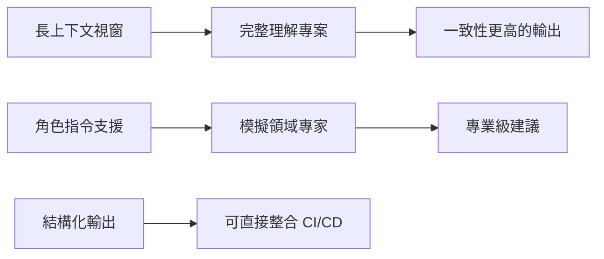

**關鍵差異點**：

1. **上下文容量**：Claude Code 支援超過 100K tokens 的上下文，可一次處理整個模組或多個相關檔案
2. **指令遵循能力**：能精確遵循複雜的技術約束與輸出格式要求
3. **推理深度**：適合處理需要多步驟推理的架構問題
4. **一致性**：同一會話中能維持風格與設計決策的一致性

### 1.2 適合用來做什麼？不適合做什麼？

#### ✅ 適合的使用場景

| 場景 | 說明 | 效益 |
| ------ | ------ | ------ |
| **架構設計討論** | 提供設計方案比較、Trade-off 分析 | 加速決策、減少盲點 |
| **Legacy 系統重構** | 理解舊程式碼、提出現代化方案 | 降低重構風險 |
| **跨技術棧轉換** | Java → Kotlin、REST → GraphQL | 減少學習曲線 |
| **規格補強** | 從模糊需求產出結構化規格 | 減少來回溝通 |
| **測試案例設計** | 產出 Edge Case、邊界條件測試 | 提升覆蓋率 |
| **程式碼審查輔助** | 指出潛在問題、安全漏洞 | 提升審查效率 |
| **技術文件撰寫** | API 文件、架構說明 | 減少文件債務 |

#### ❌ 不適合的使用場景

| 場景 | 原因 | 替代方案 |
| ------ | ------ | ---------- |
| **即時自動補全** | 回應延遲較高 | 使用 Copilot |
| **機密資料處理** | 資料會傳送至外部 | 使用本地工具或脫敏 |
| **最終決策** | AI 可能產生幻覺 | 人工審查必要 |
| **效能關鍵程式碼** | 可能產出次優解 | 專家手動優化 |
| **合規性判斷** | 不具法律效力 | 諮詢法遵團隊 |

### 1.3 在企業環境中的合理定位

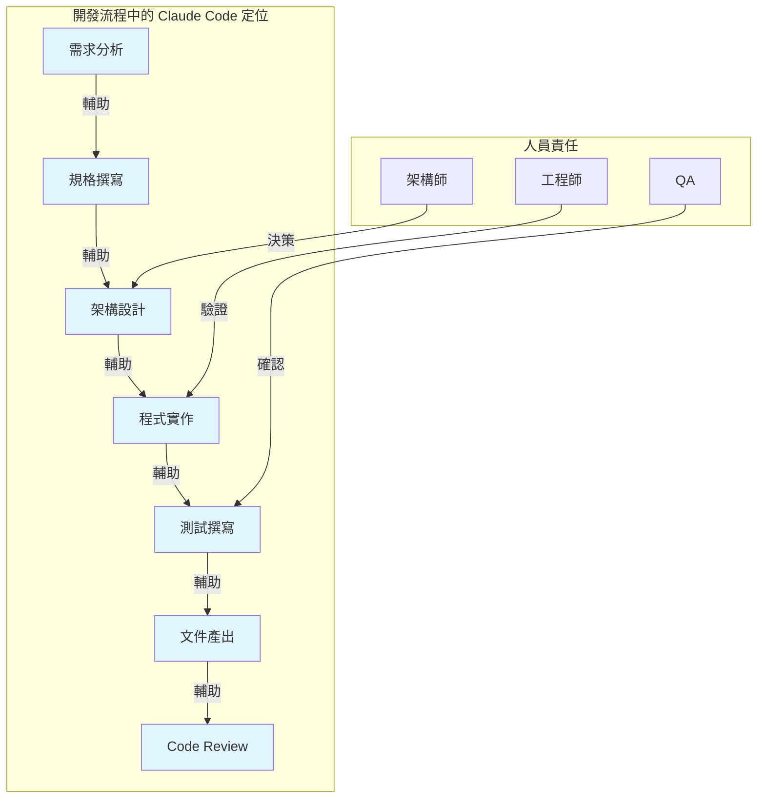

#### 企業定位原則

1. **輔助而非取代**：Claude Code 是「加速器」，不是「自動駕駛」
2. **品質門檻**：所有 AI 產出必須通過與人工產出相同的審查標準
3. **責任歸屬**：最終程式碼責任仍在提交者身上
4. **知識傳承**：AI 產出的程式碼，團隊成員必須能理解與維護

> **💡 實務建議**：將 Claude Code 視為「永遠在線的資深顧問」，可以隨時討論、提供建議，但最終決策權與責任仍在團隊。

---

## 第二章：資深工程師使用 Claude Code 的正確心法

### 2.1 把 AI 當成「資深 Pair Programmer」而非新人工具

#### 心態轉換

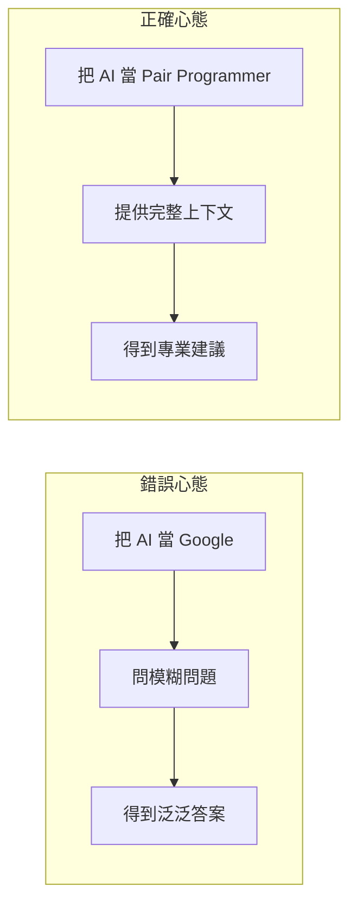

#### Pair Programming 模式應用

| 傳統 Pair Programming | 與 Claude Code 協作 |
| ---------------------- | --------------------- |
| Driver 寫程式碼 | 您定義規格與約束 |
| Navigator 審視方向 | Claude 產出實作方案 |
| 即時討論設計決策 | 透過對話澄清需求 |
| 互相 Review | 您審查 AI 產出 |

#### 有效協作的對話範例

```markdown
❌ 錯誤方式：
「幫我寫一個登入功能」

✅ 正確方式：
「我們正在開發一個銀行內部系統，需要實作登入功能。
技術棧：Spring Boot 3.2 + Spring Security 6
需求：
- 支援 AD 整合驗證
- 實作 JWT Token（Access Token 15 分鐘、Refresh Token 7 天）
- 需要記錄登入 Audit Log
- 連續失敗 5 次需鎖定帳號 30 分鐘

請先提供架構設計，我們討論後再產出程式碼。」
```

### 2.2 為什麼「規格比程式碼更重要」

#### 規格驅動的 AI 協作

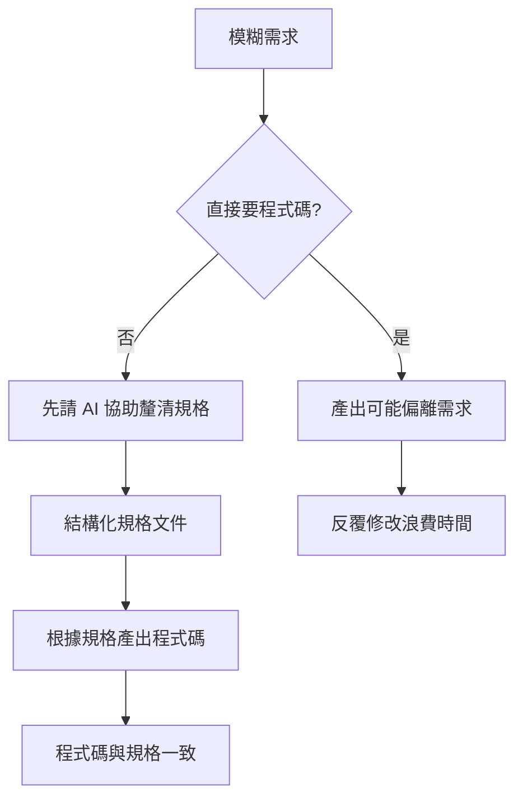

#### 規格先行的效益

| 效益 | 說明 |
| ------ | ------ |
| **減少重工** | 規格明確，AI 一次到位的機率大幅提升 |
| **可追溯性** | 規格作為基準，可驗證實作正確性 |
| **知識保留** | 規格文件成為團隊資產 |
| **品質提升** | 強迫思考邊界條件與例外情況 |

### 2.3 Prompt 即設計文件的延伸

#### Prompt 結構化設計

一個好的 Prompt 本身就是一份微型設計文件：

```markdown
## Prompt 設計範本

### 1. 角色定義（Role）
你是一位 [專業領域] 專家，具備 [相關經驗] 經驗。

### 2. 背景說明（Context）
- 系統類型：[Web API / Batch / 微服務...]
- 技術棧：[Spring Boot / .NET / Node.js...]
- 現有架構：[簡述目前狀況]

### 3. 任務說明（Task）
請協助 [具體任務描述]

### 4. 技術約束（Constraints）
- 必須使用：[指定技術/框架]
- 必須遵循：[編碼規範/設計原則]
- 禁止使用：[不允許的做法]

### 5. 非功能需求（NFR）
- 效能要求：[回應時間/吞吐量]
- 安全要求：[認證/授權/加密]
- 可維護性：[程式碼風格/文件需求]

### 6. 輸出格式（Output）
請以 [指定格式] 輸出，包含：
- [需要的內容項目]
```

> **💡 實務建議**：建立團隊的 Prompt Template Library，讓常見任務有標準化的 Prompt 範本，確保輸出品質一致。

---

## 第三章：高品質 Prompt 設計原則

### 3.1 好 Prompt vs 壞 Prompt 對照

#### 對照表

| 類型 | 壞 Prompt | 好 Prompt |
| ------ | ----------- | ----------- |
| **範圍** | 「寫一個 API」 | 「實作使用者查詢 API，輸入員工編號，回傳姓名、部門、職稱」 |
| **技術** | 「用 Java 寫」 | 「使用 Spring Boot 3.2 + JPA，遵循 RESTful 設計」 |
| **品質** | 「要好一點」 | 「需包含輸入驗證、統一例外處理、Swagger 文件註解」 |
| **格式** | 無指定 | 「輸出完整 Java 類別，包含 package 宣告與 import」 |

#### 壞 Prompt 範例分析

```markdown
❌ 壞 Prompt：
「幫我寫一個處理訂單的 Service」

問題：
1. 不知道訂單包含哪些欄位
2. 不知道要處理什麼操作（建立？查詢？取消？）
3. 不知道技術棧
4. 不知道商業邏輯規則
5. 不知道與哪些系統整合
```

#### 好 Prompt 範例

```markdown
✅ 好 Prompt：

## 角色
你是一位熟悉電商系統的 Java 架構師

## 背景
我們正在開發訂單管理模組，技術棧如下：
- Spring Boot 3.2 + Spring Data JPA
- PostgreSQL 15
- 使用 Domain-Driven Design

## 任務
請實作 OrderService，需支援以下功能：

### 1. 建立訂單 (createOrder)
- 輸入：客戶ID、商品清單（商品ID + 數量）
- 驗證：庫存是否足夠
- 處理：扣減庫存、計算總價、產生訂單編號
- 輸出：完整訂單物件

### 2. 取消訂單 (cancelOrder)
- 只有「待處理」狀態可取消
- 需回復庫存

## 技術約束
- 使用 @Transactional 確保資料一致性
- 使用 Lombok 簡化程式碼
- 例外使用自定義 BusinessException
- 遵循公司 Java Coding Standard（方法不超過 30 行）

## 輸出格式
請提供：
1. OrderService 介面
2. OrderServiceImpl 實作
3. 相關的 Exception 類別
4. 單元測試範例（使用 JUnit 5 + Mockito）
```

### 3.2 Prompt 必備元素

#### 元素架構圖

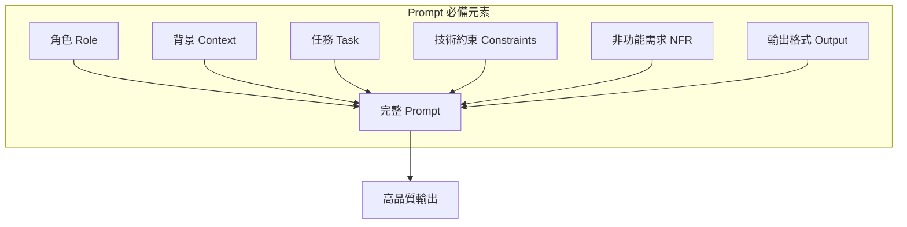

#### 各元素詳解

##### 1. 角色（Role）

```markdown
## 作用
設定 AI 的專業背景，影響回答的深度與視角

## 範例
- 「你是一位具有 10 年銀行系統開發經驗的 Java 架構師」
- 「你是專精於高併發系統的後端工程師」
- 「你是熟悉 OWASP Top 10 的資安專家」

## 進階技巧
可組合多重角色：
「你同時具備 DBA 與後端開發經驗，擅長 SQL 效能優化」
```

##### 2. 背景（Context）

```markdown
## 作用
提供足夠資訊讓 AI 理解現況

## 應包含
- 系統類型與規模
- 現有技術棧
- 團隊狀況
- 專案階段

## 範例
「這是一個日交易量 500 萬筆的支付系統，
目前使用 Java 8 + Spring Boot 2.7，
團隊 5 人，計畫升級至 Java 21，
希望在不停機情況下完成遷移。」
```

##### 3. 技術約束（Constraints）

```markdown
## 作用
明確限制 AI 的選擇範圍，避免產出不適用的方案

## 類型
| 類型 | 範例 |
|------|------|
| 框架版本 | 必須使用 Spring Boot 3.2+ |
| 設計模式 | 使用 Repository Pattern |
| 編碼規範 | 遵循 Google Java Style |
| 禁止事項 | 不可使用 Lombok |
| 相容性 | 需相容 Java 17 |
```

##### 4. 非功能需求（NFR）

```markdown
## 常見 NFR 類型

### 效能
- 「API 回應時間 < 200ms (P99)」
- 「支援 1000 TPS 併發」

### 安全
- 「所有輸入需經過 Sanitization」
- 「敏感資料需 AES-256 加密」

### 可維護性
- 「方法 Cyclomatic Complexity < 10」
- 「測試覆蓋率 > 80%」

### 可觀測性
- 「需整合 Micrometer Metrics」
- 「關鍵操作需記錄 Audit Log」
```

##### 5. 輸出格式（Output）

```markdown
## 作用
確保輸出可直接使用，減少後製工作

## 格式指定範例

### 程式碼
「輸出完整 Java 類別，包含：
- package 宣告
- 必要 import（不要用 *）
- JavaDoc 註解
- 程式碼中的行內註解」

### 文件
「使用 Markdown 格式，包含：
- 目錄
- 程式碼區塊使用語法高亮
- Mermaid 流程圖」

### 分析報告
「以表格呈現，欄位包含：
風險項目 | 嚴重度 | 影響範圍 | 建議處理方式」
```

### 3.3 常見錯誤 Prompt 範例與改寫示範

#### 錯誤範例一：過於模糊

```markdown
❌ 原始 Prompt：
「我的程式跑很慢，怎麼辦？」

🔍 問題分析：
- 不知道什麼程式
- 不知道「慢」的定義
- 不知道現有架構
- 不知道已嘗試過什麼

✅ 改寫後：
「我有一個 Spring Boot 訂單查詢 API，
目前狀況：
- 查詢 1000 筆訂單需要 5 秒
- 使用 JPA + PostgreSQL
- 資料表有 500 萬筆訂單
- 已加 index 在 order_date 欄位

請分析可能的效能瓶頸，並提供優化建議，
優先考慮不需要改架構的方案。」
```

#### 錯誤範例二：缺乏技術約束

```markdown
❌ 原始 Prompt：
「幫我實作使用者認證」

🔍 問題分析：
- 可能產出已過時的做法
- 可能使用不適合企業的方案
- 缺乏安全考量

✅ 改寫後：
「請實作使用者認證模組：

## 技術棧
- Spring Boot 3.2 + Spring Security 6
- JWT（使用 jjwt-api 0.12.x）

## 需求
1. 登入端點：POST /api/auth/login
2. Token 規格：
   - Access Token：15 分鐘
   - Refresh Token：7 天（存 Redis）
3. 密碼：BCrypt，cost factor = 12

## 安全要求
- 防 Brute Force：5 次失敗鎖定 30 分鐘
- Token 需包含：userId, roles, iat, exp
- Refresh Token 需支援撤銷

## 禁止
- 不要在 Token 中放敏感資訊
- 不要使用 HS256（請用 RS256）」
```

#### 錯誤範例三：一次問太多

```markdown
❌ 原始 Prompt：
「幫我設計一個完整的電商系統，包含會員、商品、訂單、
支付、物流、庫存、促銷、評價、客服、報表功能」

🔍 問題分析：
- 範圍過大，無法深入
- 容易產出膚淺的回答
- 難以維持一致性

✅ 改寫策略：拆分成多輪對話

第一輪：「請協助設計電商系統的領域模型，
        先專注於核心域：會員、商品、訂單三個 Bounded Context，
        請提供 Context Map 與各 Context 的 Aggregate」

第二輪：「基於上述設計，請深入訂單 Context，
        設計訂單狀態機與領域事件」

第三輪：「請針對訂單建立，設計 Saga 流程，
        包含庫存扣減與支付處理」
```

> **💡 實務建議**：遵循「少即是多」原則，每次 Prompt 專注一個明確目標，透過多輪對話逐步深入。

---

## 第四章：Claude Code 在實務開發流程中的應用

### 4.1 需求釐清 / PRD 補強

#### 應用場景

當收到模糊或不完整的需求時，可運用 Claude Code 協助結構化與補強。

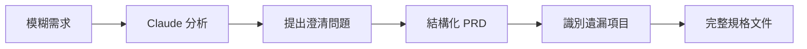

#### 實用 Prompt 範本

```markdown
## 需求分析 Prompt

### 角色
你是一位具有豐富經驗的系統分析師，擅長將模糊需求轉換為結構化規格。

### 任務
以下是業務單位提供的需求描述，請協助：
1. 識別需求中的模糊點，列出需澄清的問題
2. 將需求結構化為 User Story 格式
3. 列出可能遺漏的非功能需求
4. 識別潛在的 Edge Case

### 原始需求
「我們需要一個報表功能，讓主管可以看到部門的業績狀況」

### 輸出格式
請分四個區塊輸出：
1. **澄清問題清單**（表格：問題 | 為什麼重要 | 建議選項）
2. **User Stories**（As a... I want... So that...）
3. **非功能需求建議**（效能、安全、可用性）
4. **Edge Cases**（條列）
```

#### 範例輸出（AI 可能產生）

```markdown
## 1. 澄清問題清單

| 問題 | 為什麼重要 | 建議選項 |
|------|-----------|----------|
| 「業績」的定義？ | 影響資料來源與計算邏輯 | 銷售額/毛利/達成率 |
| 時間範圍？ | 影響查詢效能 | 日/週/月/季/年 |
| 哪些主管可看？ | 權限設計 | 僅直屬主管/跨層主管 |
| 是否需匯出？ | 功能範圍 | PDF/Excel/不需要 |

## 2. User Stories

**US-001**：身為部門主管，我想查看本部門當月業績總覽，
以便掌握部門績效狀況。

驗收條件：
- [ ] 顯示當月累計業績金額
- [ ] 顯示 vs 目標達成率
- [ ] 可切換查看不同月份
```

### 4.2 架構設計與技術選型

#### 架構設計應用場景

進行架構設計決策時，可請 Claude Code 提供多方案比較與 Trade-off 分析。

#### 架構設計 Prompt 範本

```markdown
## 架構設計諮詢 Prompt

### 角色
你是一位企業級系統架構師，熟悉微服務、事件驅動架構、
以及高可用設計。

### 背景
我們正在設計一個新的 [系統類型]，預期：
- 日交易量：[X] 筆
- 尖峰 TPS：[X]
- 資料保留：[X] 年
- SLA：[X]%

現有技術棧：[列出]
團隊熟悉：[列出]

### 任務
請針對 [具體架構問題] 提供分析：
1. 列出 2-3 個可行方案
2. 每個方案的優缺點
3. 適用場景
4. 你的建議與理由

### 輸出格式
使用表格比較，最後給出明確建議。
```

#### 架構決策紀錄範本

```markdown
## ADR-001: 訊息佇列選型

### 狀態
已決定

### 背景
系統需要處理跨服務的異步通訊...

### 方案比較（由 Claude Code 協助分析）

| 項目 | Kafka | RabbitMQ | AWS SQS |
|------|-------|----------|---------|
| 吞吐量 | 極高 | 中高 | 高 |
| 學習曲線 | 陡峭 | 中等 | 平緩 |
| 維運複雜度 | 高 | 中 | 低（託管）|
| 訊息順序 | Partition 內保證 | 有限保證 | FIFO 佇列 |
| 團隊經驗 | 無 | 有 | 有 |

### 決定
採用 RabbitMQ

### 理由
1. 團隊已有經驗
2. 訊息量在 RabbitMQ 可承受範圍
3. 短期內無需 Kafka 的串流處理能力
```

### 4.3 程式碼生成與重構

#### 程式碼生成最佳實踐

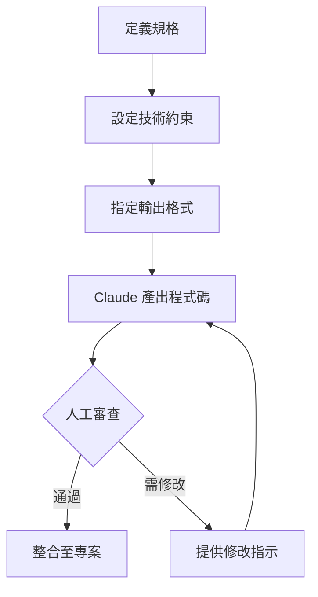

#### 重構輔助 Prompt 範本

```markdown
## 程式碼重構 Prompt

### 角色
你是一位 Clean Code 專家，熟悉 SOLID 原則與設計模式。

### 任務
請審查以下程式碼，並提供重構建議：

\`\`\`java
// 貼上需要重構的程式碼
\`\`\`

### 重構目標
1. 降低方法複雜度（目標 Cyclomatic Complexity < 10）
2. 提升可測試性
3. 遵循 Single Responsibility Principle

### 輸出要求
1. 列出目前程式碼的問題（Code Smell）
2. 提供重構後的完整程式碼
3. 說明每項修改的理由
4. 提供對應的單元測試範例
```

### 4.4 測試案例補齊

#### 測試生成策略

| 測試類型 | Prompt 策略 | 重點 |
| --------- | ------------ | ------ |
| 單元測試 | 提供被測方法 + 規格 | 邊界條件、例外處理 |
| 整合測試 | 提供模組互動說明 | 資料流驗證 |
| 效能測試 | 提供 NFR 要求 | JMH 或 Gatling 腳本 |

#### 測試生成 Prompt 範本

```markdown
## 測試案例生成 Prompt

### 角色
你是一位 TDD 專家，擅長設計全面的測試案例。

### 被測程式
\`\`\`java
public class OrderService {
    public Order createOrder(CreateOrderRequest request) {
        // 1. 驗證請求
        // 2. 檢查庫存
        // 3. 計算價格
        // 4. 建立訂單
        // 5. 發送事件
    }
}
\`\`\`

### 任務
請產生完整的測試案例，需涵蓋：
1. Happy Path
2. 輸入驗證失敗情況
3. 庫存不足情況
4. 邊界條件（空清單、單一商品、大量商品）
5. 例外處理

### 技術約束
- 使用 JUnit 5 + Mockito
- 使用 AssertJ 斷言
- 遵循 Given-When-Then 結構
- 測試方法名稱使用 `should_結果_when_條件` 格式

### 輸出格式
完整的測試類別，包含必要的 Mock 設定。
```

### 4.5 技術文件與 README 生成

#### 文件生成 Prompt 範本

```markdown
## API 文件生成 Prompt

### 角色
你是一位技術寫作專家，擅長撰寫清晰的 API 文件。

### 輸入
以下是 API Controller 的程式碼：
\`\`\`java
// 貼上 Controller 程式碼
\`\`\`

### 任務
請產生 API 文件，包含：
1. 端點總覽表格
2. 每個端點的詳細說明：
   - HTTP Method + Path
   - 功能描述
   - Request 參數（Header / Path / Query / Body）
   - Response 格式（成功 + 錯誤）
   - 範例 curl 指令
3. 錯誤碼對照表

### 輸出格式
Markdown 格式，適合放入 README.md
```

> **💡 實務建議**：將 AI 產出的文件視為「初稿」，仍需人工審查技術細節的正確性，特別是商業邏輯相關的描述。

---

## 第五章：企業級實戰範例

### 5.1 範例一：協助重構 Legacy Code

#### 情境說明

一個運行 10 年的批次程式，單一方法超過 500 行，需要重構以提升可維護性。

#### Prompt

```markdown
## 角色
你是一位專精於 Legacy System 現代化的 Java 架構師。

## 背景
這是一個銀行核心系統的日結批次程式，已運行 10 年。
目前問題：
- 單一方法超過 500 行
- 沒有單元測試
- 多處 Copy-Paste 程式碼
- 巢狀 if-else 超過 5 層

## 程式碼（節錄關鍵部分）
\`\`\`java
public void executeDailyBatch() {
    // 1. 讀取交易檔案
    List<String> lines = Files.readAllLines(path);
    for (String line : lines) {
        String[] parts = line.split(",");
        String txnType = parts[0];
        if (txnType.equals("DEPOSIT")) {
            // 100 行處理邏輯...
            if (amount > 50000) {
                // 大額交易處理...
                if (isVIP) {
                    // VIP 邏輯...
                }
            }
        } else if (txnType.equals("WITHDRAW")) {
            // 另外 100 行...
        }
        // ...更多 else if
    }
}
\`\`\`

## 任務
請提供重構方案：
1. 識別程式碼中的 Code Smell
2. 提出重構策略（使用哪些設計模式）
3. 分階段重構計畫（確保每階段可獨立上線）
4. 提供重構後的骨架程式碼
5. 說明如何在沒有測試的情況下安全重構

## 約束
- 不能改變對外介面
- 必須保持向後相容
- 需考慮批次時間窗口限制
```

#### AI 輸出（範例）

```markdown
## 1. Code Smell 分析

| Code Smell | 位置 | 影響 |
|------------|------|------|
| Long Method | executeDailyBatch | 難以理解、測試、維護 |
| Switch Smell | txnType if-else | 每新增交易類型需修改 |
| Deep Nesting | 5 層 if | 認知負荷過高 |
| Primitive Obsession | String[] parts | 缺乏型別安全 |

## 2. 重構策略

### 採用設計模式
- **Strategy Pattern**：處理不同交易類型
- **Template Method**：共用批次處理流程
- **Builder Pattern**：建立交易物件

### 架構圖
\`\`\`mermaid
classDiagram
    class BatchProcessor {
        +execute()
        -readTransactions()
        -processTransaction()
        -writeResults()
    }
    class TransactionStrategy {
        <<interface>>
        +process(Transaction)
    }
    class DepositStrategy {
        +process(Transaction)
    }
    class WithdrawStrategy {
        +process(Transaction)
    }
    BatchProcessor --> TransactionStrategy
    TransactionStrategy <|.. DepositStrategy
    TransactionStrategy <|.. WithdrawStrategy
\`\`\`

## 3. 分階段重構計畫

### Phase 1：建立 Characterization Test（1 週）
- 使用 Approval Testing 記錄現有行為
- 確保重構不改變輸出

### Phase 2：Extract Method（1 週）
- 將大方法拆分為小方法
- 保持在同一類別

### Phase 3：Extract Class（1 週）
- 建立 Transaction Value Object
- 建立 TransactionParser

### Phase 4：引入 Strategy Pattern（2 週）
- 建立策略介面與實作
- 使用 Factory 管理策略

## 4. 重構後骨架

\`\`\`java
public class DailyBatchProcessor {
    private final TransactionParser parser;
    private final TransactionStrategyFactory strategyFactory;
    private final TransactionRepository repository;
    
    public void execute(Path inputPath) {
        List<Transaction> transactions = parser.parse(inputPath);
        
        transactions.stream()
            .map(this::processTransaction)
            .forEach(repository::save);
    }
    
    private TransactionResult processTransaction(Transaction txn) {
        TransactionStrategy strategy = 
            strategyFactory.getStrategy(txn.getType());
        return strategy.process(txn);
    }
}
\`\`\`
```

#### 專家講評（重構範例）

| 面向 | 評價 | 建議 |
| ------ | ------ | ------ |
| **設計模式選用** | ✅ 適當 | Strategy 確實適合此情境 |
| **分階段計畫** | ✅ 合理 | 先建測試再重構是正確策略 |
| **風險考量** | ⚠️ 可加強 | 建議補充 Rollback 計畫 |
| **效能影響** | ⚠️ 需評估 | Stream 操作需注意大量資料效能 |

### 5.2 範例二：根據規格產生模組骨架

#### 模組骨架情境說明

根據已定義的規格文件，請 Claude Code 產生服務模組的骨架程式碼。

#### 模組骨架 Prompt

```markdown
## 角色
你是一位 Spring Boot 專家，擅長 Clean Architecture。

## 規格文件

### 功能：使用者偏好設定服務
### 領域模型
- UserPreference（userId, theme, language, timezone, notifications）

### API 規格
| Method | Path | 功能 |
|--------|------|------|
| GET | /api/users/{id}/preferences | 查詢偏好 |
| PUT | /api/users/{id}/preferences | 更新偏好 |
| PATCH | /api/users/{id}/preferences | 部分更新 |

### 商業規則
- BR-001：theme 只能是 [LIGHT, DARK, AUTO]
- BR-002：language 必須是 ISO 639-1 代碼
- BR-003：更新時需記錄 audit log

## 技術約束
- Spring Boot 3.2
- 使用 Hexagonal Architecture
- PostgreSQL + Spring Data JPA
- 使用 MapStruct 做 DTO 轉換
- 使用 Jakarta Validation

## 任務
請產生完整的模組骨架，包含：
1. Domain 層：Entity、Value Object、Repository Interface
2. Application 層：Use Case、DTO、Mapper
3. Infrastructure 層：JPA Entity、Repository Impl
4. Interface 層：Controller、Request/Response DTO

## 輸出格式
每個類別獨立輸出，包含完整 package 與 import
```

#### AI 輸出（節錄）

```java
// === Domain Layer ===

package com.example.user.domain.model;

public record UserPreference(
    UserId userId,
    Theme theme,
    Language language,
    Timezone timezone,
    NotificationSettings notifications
) {
    public UserPreference updateTheme(Theme newTheme) {
        return new UserPreference(
            this.userId, newTheme, this.language, 
            this.timezone, this.notifications
        );
    }
}

// === Application Layer ===

package com.example.user.application.usecase;

@UseCase
@RequiredArgsConstructor
public class UpdatePreferenceUseCase {
    private final UserPreferenceRepository repository;
    private final AuditLogService auditLog;
    
    @Transactional
    public UserPreferenceResponse execute(
            UserId userId, 
            UpdatePreferenceCommand command) {
        
        UserPreference preference = repository
            .findByUserId(userId)
            .orElseThrow(() -> 
                new UserNotFoundException(userId));
        
        UserPreference updated = preference
            .updateTheme(command.theme())
            .updateLanguage(command.language());
        
        repository.save(updated);
        auditLog.log(AuditEvent.PREFERENCE_UPDATED, userId);
        
        return UserPreferenceMapper.toResponse(updated);
    }
}

// === Interface Layer ===

package com.example.user.interfaces.rest;

@RestController
@RequestMapping("/api/users/{userId}/preferences")
@RequiredArgsConstructor
public class UserPreferenceController {
    
    private final GetPreferenceUseCase getPreference;
    private final UpdatePreferenceUseCase updatePreference;
    
    @GetMapping
    public ResponseEntity<UserPreferenceResponse> get(
            @PathVariable String userId) {
        return ResponseEntity.ok(
            getPreference.execute(new UserId(userId))
        );
    }
    
    @PutMapping
    public ResponseEntity<UserPreferenceResponse> update(
            @PathVariable String userId,
            @Valid @RequestBody UpdatePreferenceRequest request) {
        return ResponseEntity.ok(
            updatePreference.execute(
                new UserId(userId),
                request.toCommand()
            )
        );
    }
}
```

#### 專家講評（模組骨架範例）

| 面向 | 評價 | 建議 |
| ------ | ------ | ------ |
| **架構遵循** | ✅ 良好 | 正確實作 Hexagonal Architecture |
| **不可變設計** | ✅ 良好 | 使用 record 與 with 模式 |
| **驗證處理** | ⚠️ 可加強 | 需補充 Domain 層的驗證邏輯 |
| **例外處理** | ⚠️ 需補充 | 建議加入 ControllerAdvice |

### 5.3 範例三：產生測試與安全檢查建議

#### 安全檢查情境說明

對現有的認證模組進行安全檢查，並產生安全測試案例。

#### 安全檢查 Prompt

```markdown
## 角色
你是一位熟悉 OWASP Top 10 與銀行系統安全規範的資安專家。

## 背景
這是我們的登入 API 實作，請進行安全審查。

## 程式碼
\`\`\`java
@PostMapping("/login")
public ResponseEntity<LoginResponse> login(
        @RequestBody LoginRequest request) {
    
    User user = userRepository
        .findByUsername(request.getUsername());
    
    if (user == null) {
        throw new BadCredentialsException("User not found");
    }
    
    if (!passwordEncoder.matches(
            request.getPassword(), user.getPassword())) {
        throw new BadCredentialsException("Wrong password");
    }
    
    String token = jwtService.generateToken(user);
    return ResponseEntity.ok(new LoginResponse(token));
}
\`\`\`

## 任務
1. 識別安全漏洞（對應 OWASP / CWE）
2. 提供修復建議與修復後程式碼
3. 產生安全測試案例

## 輸出格式
| 漏洞 | 風險等級 | OWASP/CWE | 修復方式 |
```

#### 安全分析 AI 輸出（範例）

```markdown
## 安全漏洞分析

| 漏洞 | 風險 | 參考 | 修復方式 |
|------|------|------|----------|
| 使用者列舉 | 中 | CWE-204 | 統一錯誤訊息 |
| 無登入頻率限制 | 高 | CWE-307 | 實作 Rate Limiting |
| 無帳號鎖定機制 | 高 | CWE-307 | 失敗 N 次後鎖定 |
| 密碼在記憶體明文 | 中 | CWE-316 | 使用 char[] 並及時清除 |
| 無 Audit Log | 中 | 合規要求 | 記錄所有登入嘗試 |

## 修復後程式碼

\`\`\`java
@PostMapping("/login")
@RateLimiter(name = "login", fallbackMethod = "loginFallback")
public ResponseEntity<LoginResponse> login(
        @Valid @RequestBody LoginRequest request,
        HttpServletRequest httpRequest) {
    
    String clientIp = getClientIp(httpRequest);
    
    try {
        // 統一查詢避免 Timing Attack
        User user = userRepository
            .findByUsername(request.getUsername())
            .orElse(null);
        
        // 檢查帳號是否鎖定
        if (user != null && loginAttemptService.isBlocked(user.getId())) {
            auditLog.log(LOGIN_BLOCKED, request.getUsername(), clientIp);
            throw new AccountLockedException();
        }
        
        // 驗證（無論使用者是否存在都執行，避免 Timing Attack）
        boolean valid = user != null && 
            passwordEncoder.matches(request.getPassword(), user.getPassword());
        
        if (!valid) {
            if (user != null) {
                loginAttemptService.recordFailure(user.getId());
            }
            auditLog.log(LOGIN_FAILED, request.getUsername(), clientIp);
            
            // 統一錯誤訊息
            throw new BadCredentialsException("Invalid credentials");
        }
        
        loginAttemptService.recordSuccess(user.getId());
        auditLog.log(LOGIN_SUCCESS, request.getUsername(), clientIp);
        
        String token = jwtService.generateToken(user);
        return ResponseEntity.ok(new LoginResponse(token));
        
    } finally {
        // 清除敏感資料
        request.clearPassword();
    }
}
\`\`\`

## 安全測試案例

\`\`\`java
@Test
@DisplayName("應防止使用者列舉 - 不存在的使用者應回傳相同錯誤")
void shouldPreventUserEnumeration() {
    // Given
    LoginRequest validUser = new LoginRequest("existing", "wrong");
    LoginRequest invalidUser = new LoginRequest("nonexistent", "any");
    
    // When
    Exception e1 = catchException(() -> authService.login(validUser));
    Exception e2 = catchException(() -> authService.login(invalidUser));
    
    // Then - 錯誤訊息應該相同
    assertThat(e1.getMessage()).isEqualTo(e2.getMessage());
}

@Test
@DisplayName("應在 5 次失敗後鎖定帳號")
void shouldLockAccountAfterFiveFailedAttempts() {
    // Given
    LoginRequest request = new LoginRequest("testuser", "wrongpassword");
    
    // When - 嘗試 5 次
    for (int i = 0; i < 5; i++) {
        catchException(() -> authService.login(request));
    }
    
    // Then - 第 6 次應該是鎖定錯誤
    assertThatThrownBy(() -> authService.login(request))
        .isInstanceOf(AccountLockedException.class);
}
\`\`\`
```

#### 專家講評（安全檢查範例）

| 面向 | 評價 | 建議 |
| ------ | ------ | ------ |
| **漏洞識別** | ✅ 全面 | 涵蓋主要安全風險 |
| **修復方案** | ✅ 實用 | 可直接採用 |
| **測試案例** | ✅ 有價值 | 涵蓋關鍵場景 |
| **合規考量** | ⚠️ 可加強 | 建議補充 PCI-DSS 相關檢查 |

> **💡 實務建議**：AI 產出的安全建議需經資安團隊審查，並與組織的安全政策對齊。

---

## 第六章：風險、限制與最佳實踐

### 6.1 AI 可能產生的風險

#### 風險類型總覽

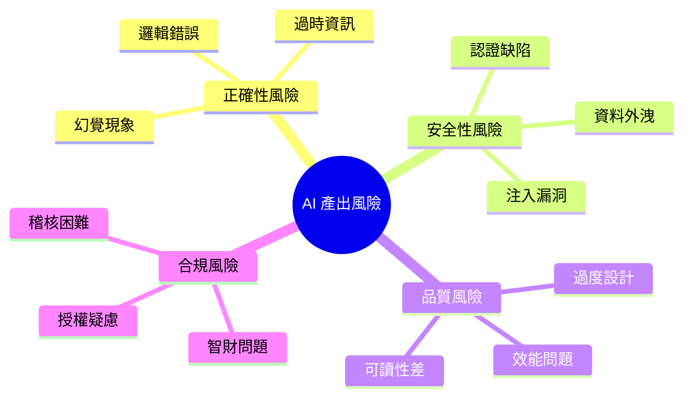

#### 風險詳細說明

##### 1. 邏輯錯誤（Hallucination）

| 類型 | 說明 | 範例 |
| ------ | ------ | ------ |
| **API 幻覺** | 產出不存在的 API | `list.stream().sortedDesc()` — 不存在 |
| **版本混淆** | 混用不同版本語法 | Java 8 與 Java 21 語法混用 |
| **邏輯漏洞** | 推理錯誤 | 邊界條件處理不當 |

**防範策略**：

```markdown
✅ 要求 AI 標註所使用的 API 版本
✅ 提供具體的版本約束
✅ 人工驗證所有非常見 API
```

##### 2. 安全漏洞

| 漏洞類型 | AI 常見錯誤 | 風險 |
| --------- | ------------ | ------ |
| SQL Injection | 字串拼接 SQL | 資料外洩 |
| XSS | 未編碼輸出 | 用戶攻擊 |
| 硬編碼密碼 | 範例中包含密碼 | 憑證外洩 |
| 不安全亂數 | 使用 Math.random() | 可預測性 |

**防範策略**：

```markdown
✅ 在 Prompt 中明確要求安全實踐
✅ 使用 SAST 工具掃描 AI 產出
✅ 建立安全 Checklist 審查
```

##### 3. 效能問題

```java
// ❌ AI 可能產出的效能陷阱
public List<User> findActiveUsers(List<Long> userIds) {
    return userIds.stream()
        .map(id -> userRepository.findById(id))  // N+1 問題！
        .filter(Optional::isPresent)
        .map(Optional::get)
        .filter(User::isActive)
        .collect(Collectors.toList());
}

// ✅ 應該使用的方式
public List<User> findActiveUsers(List<Long> userIds) {
    return userRepository.findAllByIdInAndActiveTrue(userIds);
}
```

##### 4. 過度自信

AI 通常會以「肯定」的語氣輸出，即使內容可能有誤：

```markdown
AI 可能說：「這個設計是最佳實踐」
實際上：可能只是眾多方案之一，且不一定適合您的情境
```

**防範策略**：

```markdown
✅ 要求 AI 列出多個方案並比較
✅ 要求 AI 說明不確定之處
✅ 永遠進行獨立驗證
```

### 6.2 如何做 Code Review 與 AI Output Review

#### AI 產出專用 Review Checklist

```markdown
## AI 產出程式碼審查清單

### 1. 正確性檢查
- [ ] 所有使用的 API 確實存在且語法正確
- [ ] 版本相容性確認（與專案技術棧一致）
- [ ] 邏輯流程正確（特別注意邊界條件）
- [ ] 例外處理完整

### 2. 安全性檢查
- [ ] 無 SQL Injection 風險（使用 Prepared Statement）
- [ ] 無 XSS 風險（輸出已編碼）
- [ ] 無硬編碼敏感資訊
- [ ] 輸入驗證完整
- [ ] 認證/授權正確實作

### 3. 效能檢查
- [ ] 無 N+1 查詢問題
- [ ] 適當使用索引
- [ ] 無不必要的記憶體分配
- [ ] 大量資料使用串流處理

### 4. 可維護性檢查
- [ ] 符合專案 Coding Standard
- [ ] 命名清楚有意義
- [ ] 方法長度適當（< 30 行）
- [ ] 複雜度可接受（Cyclomatic < 10）

### 5. 整合檢查
- [ ] 與現有程式碼風格一致
- [ ] 正確使用專案共用元件
- [ ] 符合專案架構規範
```

#### Review 流程

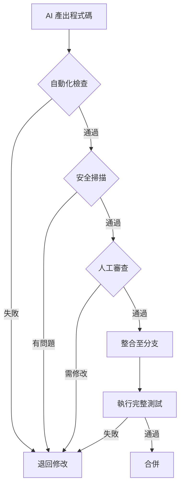

### 6.3 在銀行 / 企業內部的安全使用原則

#### 資料分類與處理原則

| 資料分類 | 可否輸入 AI | 處理方式 |
| --------- | ------------ | ---------- |
| **公開資料** | ✅ 可以 | 直接使用 |
| **內部資料** | ⚠️ 謹慎 | 去識別化後使用 |
| **機密資料** | ❌ 禁止 | 不可輸入 |
| **個資** | ❌ 禁止 | 使用假資料替代 |
| **客戶資料** | ❌ 禁止 | 不可輸入 |

#### 安全使用守則

```markdown
## Claude Code 使用安全守則

### ✅ 允許
1. 輸入公開的技術文件
2. 輸入不含機密的程式碼架構
3. 輸入脫敏後的錯誤訊息
4. 詢問技術概念與最佳實踐

### ⚠️ 需謹慎
1. 輸入內部系統架構（需移除敏感細節）
2. 輸入錯誤日誌（需移除 IP、帳號、金額等）
3. 輸入 SQL 結構（需移除實際資料庫名稱）

### ❌ 禁止
1. 輸入客戶個人資料
2. 輸入交易資料（即使是測試資料）
3. 輸入系統帳密、金鑰、憑證
4. 輸入內部 IP、主機名稱
5. 輸入尚未公開的商業邏輯
```

#### 脫敏範例

```markdown
❌ 原始 Prompt（違規）：
「這是我們的客戶資料 SQL：
SELECT * FROM CUSTOMER 
WHERE ACCOUNT_NO = '1234567890' 
AND NAME = '王小明'
請幫我優化」

✅ 脫敏後 Prompt：
「這是一個查詢範例：
SELECT * FROM [TABLE_A] 
WHERE [COL_1] = ? AND [COL_2] = ?
資料量約 1000 萬筆，請提供優化建議」
```

> **⚠️ 重要提醒**：違反資安政策可能導致法律責任、客戶信任損失、主管機關裁罰。使用 AI 工具時，請務必遵守組織資安規範。

---

## 第七章：團隊導入建議

### 7.1 適合哪些角色優先使用

#### 導入優先順序建議

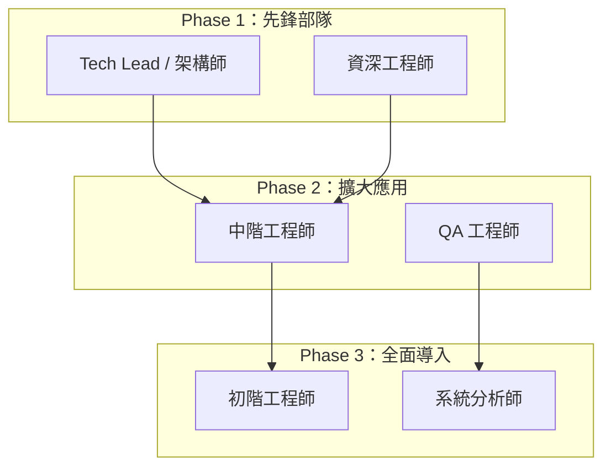

#### 各角色應用場景

| 角色 | 優先場景 | 原因 |
| ------ | --------- | ------ |
| **Tech Lead** | 架構設計、技術選型 | 有能力判斷 AI 建議品質 |
| **資深工程師** | 重構、程式碼審查 | 能識別 AI 產出的問題 |
| **中階工程師** | 程式碼生成、測試撰寫 | 在監督下使用 |
| **QA 工程師** | 測試案例設計 | 提升測試覆蓋率 |
| **SA** | 需求分析、文件撰寫 | 加速規格產出 |

### 7.2 與現有開發流程的整合方式

#### 整合流程圖

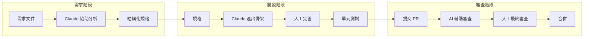

#### Git Flow 整合建議

```markdown
## AI 輔助開發的分支策略

### 分支命名
- feature/AI-xxx：AI 協助產出的功能
- refactor/AI-xxx：AI 協助的重構

### Commit Message 規範
包含 AI 標記，便於追蹤：

[AI-assisted] feat: 新增使用者偏好設定 API
- 使用 Claude Code 產出初始骨架
- 人工調整商業邏輯與例外處理
- 補充整合測試

### PR 描述模板
## AI 使用說明
- [ ] 此 PR 包含 AI 協助產出的程式碼
- 使用工具：Claude Code
- AI 產出範圍：[說明哪些部分]
- 人工修改範圍：[說明哪些部分]

## 審查重點
請特別注意 AI 產出的以下部分：
- [ ] 安全性檢查
- [ ] 效能檢查
- [ ] 商業邏輯正確性
```

#### CI/CD 整合

```yaml
# .github/workflows/ai-code-review.yml
name: AI Code Quality Check

on:
  pull_request:
    types: [opened, synchronize]

jobs:
  ai-code-check:
    runs-on: ubuntu-latest
    steps:
      - uses: actions/checkout@v4
      
      # 安全掃描
      - name: Security Scan
        uses: github/codeql-action/analyze@v2
        
      # 程式碼品質
      - name: SonarQube Scan
        uses: sonarqube/scan-action@v1
        
      # AI 產出特別檢查
      - name: AI Output Validation
        run: |
          # 檢查是否有硬編碼密碼
          # 檢查是否使用不安全的 API
          ./scripts/ai-output-check.sh
```

### 7.3 建議的內部使用規範

#### Do / Don't 清單

```markdown
## Claude Code 使用規範

### ✅ DO（建議做法）

1. **提供完整上下文**
   - 包含技術棧、版本、約束
   - 說明專案架構與規範

2. **分階段驗證**
   - 先請 AI 說明方案
   - 確認方向後再產出程式碼
   - 人工審查後才整合

3. **保留對話紀錄**
   - 記錄重要的 Prompt 與回應
   - 建立團隊 Prompt Library

4. **明確標註 AI 產出**
   - Commit message 標註
   - PR 說明註記

5. **持續驗證**
   - 執行完整測試
   - 進行安全掃描
   - Code Review

### ❌ DON'T（禁止做法）

1. **禁止輸入敏感資訊**
   - 客戶資料
   - 系統帳密
   - 內部 IP/網路架構

2. **禁止直接使用未審查程式碼**
   - 所有 AI 產出需經審查
   - 不可跳過測試直接上線

3. **禁止取代人工判斷**
   - 架構決策需人工確認
   - 安全相關必須專家審查

4. **禁止過度依賴**
   - 保持基本編程能力
   - 理解所有提交的程式碼

5. **禁止隱瞞 AI 使用**
   - 團隊應知悉 AI 協助情況
   - 稽核時需能追溯
```

#### 導入成熟度模型

| 等級 | 名稱 | 特徵 | 目標 |
| ------ | ------ | ------ | ------ |
| L1 | 探索期 | 個人試用、無規範 | 建立基本認知 |
| L2 | 導入期 | 制定規範、先鋒試行 | 驗證效益與風險 |
| L3 | 擴展期 | 團隊使用、流程整合 | 提升整體效率 |
| L4 | 優化期 | 建立最佳實踐、知識沉澱 | 持續改進 |
| L5 | 成熟期 | 全面整合、自動化驗證 | AI 原生開發 |

---

## 第八章：進階技巧與模式

### 8.1 Prompt Chain 設計模式

#### 概念說明

將複雜任務拆分為多個 Prompt，形成「Prompt Chain」，逐步達成目標。


#### 實際範例：從需求到程式碼

```markdown
## Chain Step 1：需求分析

### Prompt 1
「你是系統分析師。以下是業務需求：
[貼上需求]
請分析並輸出：
1. 功能性需求列表
2. 非功能性需求
3. 待澄清問題」

### Output 1
（AI 產出結構化需求）

---

## Chain Step 2：架構設計

### Prompt 2
「你是軟體架構師。基於以下需求：
[貼上 Output 1]
請設計：
1. 模組架構
2. 資料模型
3. API 介面」

### Output 2
（AI 產出架構設計）

---

## Chain Step 3：程式碼實作

### Prompt 3
「你是 Java 開發工程師。根據以下架構設計：
[貼上 Output 2]
請產出實作程式碼，需符合：
[技術約束]」

### Output 3
（AI 產出程式碼）
```

### 8.2 多輪對話策略

#### 對話模式比較

| 模式 | 適用場景 | 優點 | 缺點 |
| ------ | --------- | ------ | ------ |
| 單輪完整 | 簡單、明確任務 | 快速 | 不適合複雜任務 |
| 漸進深入 | 探索性任務 | 彈性高 | 耗時較長 |
| 審查迭代 | 程式碼產出 | 品質較高 | 需要多輪 |

#### 漸進深入對話範例

```markdown
## 輪次 1：了解現況
User: 我有一個 Spring Boot 服務效能不佳，
      查詢 API 平均需要 3 秒，請問可能原因？
AI:   可能原因包含：1. 資料庫查詢... 2. 網路... [列出]

## 輪次 2：提供更多資訊
User: 資料庫是 PostgreSQL，查詢的資料表有 1000 萬筆。
      我已經加了 index。
AI:   考慮到數據量，建議檢查：
      1. 查詢計畫... 2. 連線池設定... [更具體建議]

## 輪次 3：深入特定方向
User: 可以幫我看這個 SQL 嗎？[貼上 SQL]
AI:   這個 SQL 有以下問題：
      1. 缺少 LIMIT... 2. JOIN 順序... [具體分析]

## 輪次 4：產出解決方案
User: 請提供優化後的 SQL 和對應的 JPA 程式碼
AI:   [產出優化方案]
```

### 8.3 與 Spec-Driven Development 整合

#### SDD + Claude Code 工作流程

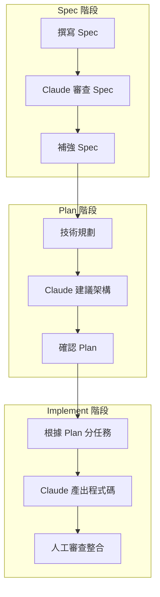

#### Spec 作為 Prompt 的輸入

```markdown
## Spec-Driven Prompt 範例

### 角色
你是一位遵循 Spec-Driven Development 的 Java 架構師。

### Spec 文件
[直接貼入完整 Spec 內容]

### 任務
請根據上述 Spec，產出符合以下要求的實作：
1. 完全遵循 Spec 中定義的介面與行為
2. 實作所有 Spec 中提到的驗收條件
3. 為每個驗收條件產出對應的測試案例

### 輸出格式
1. 實作程式碼
2. 測試程式碼
3. Spec 覆蓋對照表（哪段程式碼對應哪個 Spec 項目）
```

> **💡 實務建議**：將 Spec 文件作為「契約」，Claude Code 產出的程式碼必須通過所有 Spec 定義的驗收條件，才視為完成。

---

## 附錄：檢查清單（Checklist）

### A. 使用前準備清單

```markdown
□ 確認任務適合使用 Claude Code
□ 準備好技術約束與規範文件
□ 確認不涉及機密/個資
□ 規劃好 Prompt 結構
□ 確認輸出格式需求
```

### B. Prompt 撰寫清單

```markdown
□ 設定明確的角色（Role）
□ 提供充分的背景（Context）
□ 描述清楚的任務（Task）
□ 列出技術約束（Constraints）
□ 說明非功能需求（NFR）
□ 指定輸出格式（Output）
```

### C. 程式碼審查清單

```markdown
## 正確性
□ API 存在且版本正確
□ 邏輯流程正確
□ 邊界條件處理
□ 例外處理完整

## 安全性
□ 無 SQL Injection
□ 無 XSS 風險
□ 無硬編碼敏感資訊
□ 輸入驗證完整

## 效能
□ 無 N+1 問題
□ 適當使用索引
□ 記憶體使用合理

## 可維護性
□ 符合 Coding Standard
□ 命名清楚
□ 適當的註解
□ 方法複雜度合理
```

### D. 整合上線清單

```markdown
□ 所有測試通過
□ 安全掃描無高風險
□ Code Review 完成
□ Commit message 標註 AI 使用
□ PR 說明完整
□ 文件已更新
```

### E. 團隊導入清單

```markdown
## 規範建立
□ 制定使用政策
□ 建立安全守則
□ 定義 Do / Don't

## 流程整合
□ 整合 Git Flow
□ 整合 CI/CD
□ 建立 Review 流程

## 知識沉澱
□ 建立 Prompt Library
□ 記錄最佳實踐
□ 定期分享會議
```

---

## 版本紀錄

| 版本 | 日期    | 修改內容 | 作者 |
| ---- | ------- | -------- | ---- |
| 1.0  | 2026/01 | 初版發佈 | Eric   |

---

## 參考資源

1. [Anthropic Claude Documentation](https://docs.anthropic.com/)
2. [OWASP Top 10](https://owasp.org/Top10/)
3. [Clean Code by Robert C. Martin](https://www.oreilly.com/library/view/clean-code-a/9780136083238/)
4. [Spec-Driven Development](https://github.com/github/spec-kit)

---

> **文件維護**：本手冊由架構團隊維護，如有問題或建議，請聯繫 [chihhung.cheng@gmail.com]

