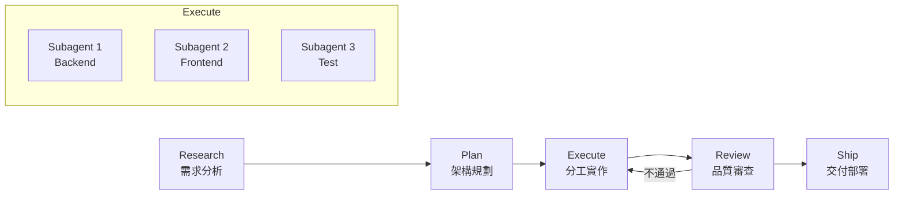
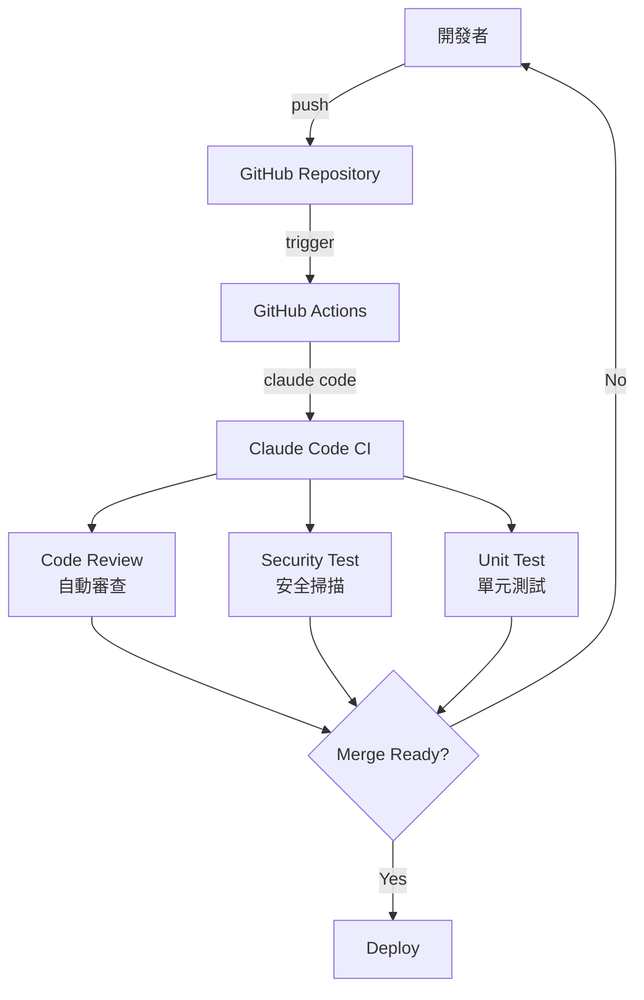
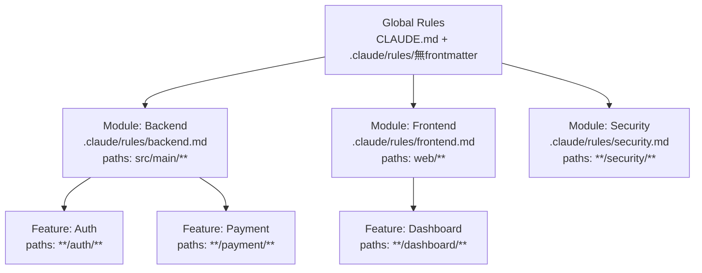
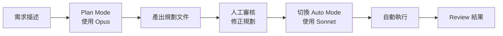
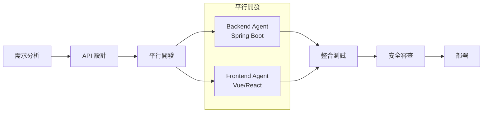
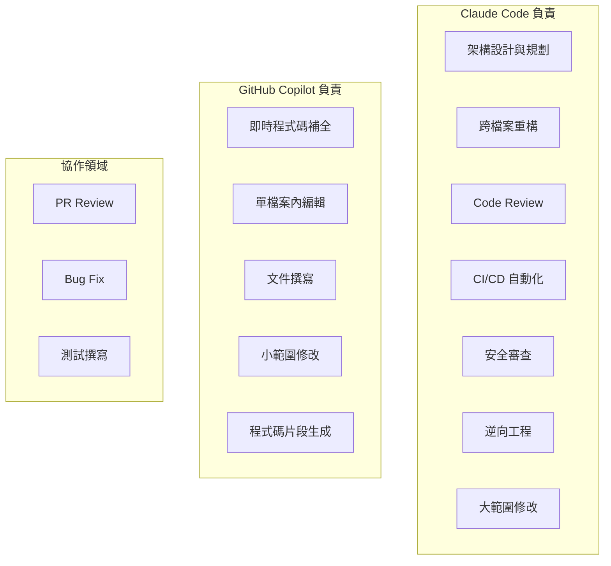
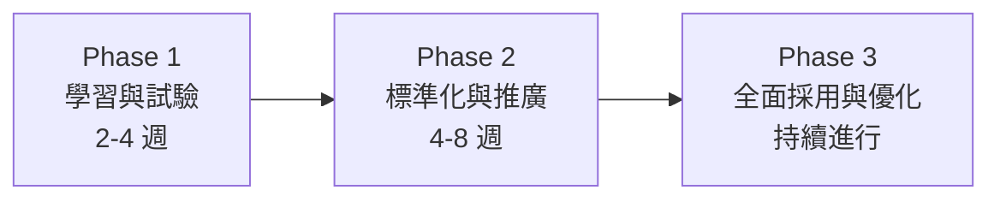
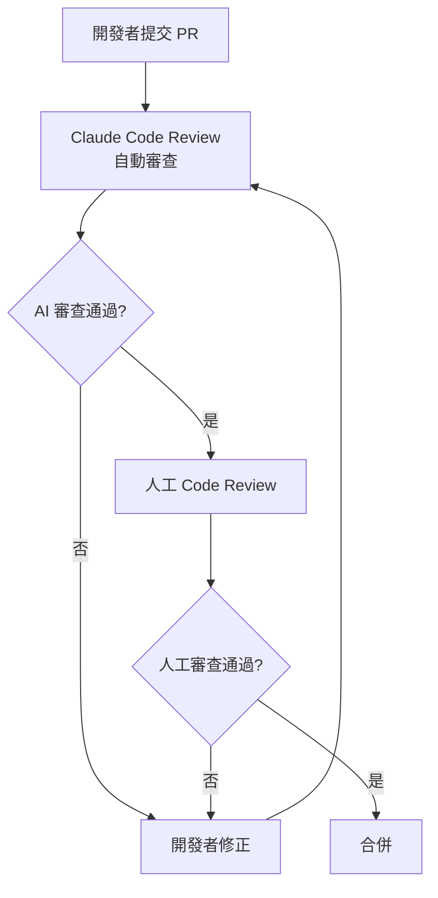

+++
date = '2026-05-02T17:02:46+08:00'
draft = false
title = 'Claude Code Best Practice 教學手冊'
tags = ['教學', 'AI開發']
categories = ['教學']
+++

# Claude Code Best Practice 教學手冊

> **版本**：基於 GitHub 專案 [shanraisshan/claude-code-best-practice](https://github.com/shanraisshan/claude-code-best-practice)（v2.1.181+，2026 年 7 月 1 日）  
> **適用對象**：資深工程師、架構師、技術主管  
> **定位**：企業標準技術白皮書 / 企業級 AI 輔助開發實戰手冊  
> **語言**：繁體中文  
> **文件版本**：v2.0
> **文件更新日期**：2026 年 7 月 1 日

---

## 目錄

- [第 1 章 專案介紹與核心理念](#第-1-章-專案介紹與核心理念)
  - [1.1 claude-code-best-practice 是什麼](#11-claude-code-best-practice-是什麼)
  - [1.2 Vibe Coding → Agentic Engineering 轉型](#12-vibe-coding--agentic-engineering-轉型)
  - [1.3 Hot Features 與 Beta 功能清單](#13-hot-features-與-beta-功能清單)
  - [1.4 為什麼適合企業級開發](#14-為什麼適合企業級開發)
- [第 2 章 整體架構設計](#第-2-章-整體架構設計)
  - [2.1 Claude Code 在系統中的角色](#21-claude-code-在系統中的角色)
  - [2.2 與 GitHub Copilot 的協作架構](#22-與-github-copilot-的協作架構)
  - [2.3 Agentic Workflow 架構](#23-agentic-workflow-架構)
  - [2.4 多 Agent（Subagents）設計模式](#24-多-agentsubagents設計模式)
  - [2.5 與 CI/CD / DevOps 整合方式](#25-與-cicd--devops-整合方式)
- [第 3 章 安裝與環境建置](#第-3-章-安裝與環境建置)
  - [3.1 Claude Code CLI 安裝](#31-claude-code-cli-安裝)
  - [3.2 Terminal 優化](#32-terminal-優化)
  - [3.3 專案初始化方式](#33-專案初始化方式)
  - [3.4 開發環境最佳實踐](#34-開發環境最佳實踐)
  - [3.5 Devcontainers 與遠端開發](#35-devcontainers-與遠端開發)
- [第 4 章 專案結構設計](#第-4-章-專案結構設計)
  - [4.1 CLAUDE.md 設計原則](#41-claudemd-設計原則)
  - [4.2 .claude/rules/*.md 延遲載入機制](#42-clauderules-延遲載入機制)
  - [4.3 YAML Frontmatter 規則設計](#43-yaml-frontmatter-規則設計)
  - [4.4 多層規則架構](#44-多層規則架構globalmodulefeature)
  - [4.5 settings.json 設計與階層體系](#45-settingsjson-設計與階層體系)
  - [4.6 Plugins 與 Marketplaces](#46-plugins-與-marketplaces)
- [第 5 章 Claude Code 核心工作流](#第-5-章-claude-code-核心工作流)
  - [5.1 Plan Mode（規劃模式）](#51-plan-mode規劃模式)
  - [5.2 任務拆解策略（50% Context Rule）](#52-任務拆解策略50-context-rule)
  - [5.3 /compact 使用時機](#53-compact-使用時機)
  - [5.4 長任務控制技巧](#54-長任務控制技巧)
  - [5.5 Auto Mode 與 Permission 模式](#55-auto-mode-與-permission-模式)
- [第 6 章 Agentic Engineering 實戰](#第-6-章-agentic-engineering-實戰)
  - [6.1 Subagents 設計](#61-subagents-設計)
  - [6.2 多 Agent 協作模式](#62-多-agent-協作模式)
  - [6.3 任務分派與回收機制](#63-任務分派與回收機制)
  - [6.4 如何避免「全能型 Agent 失控」](#64-如何避免全能型-agent-失控)
  - [6.5 Agent SDK 與程式化整合](#65-agent-sdk-與程式化整合)
- [第 7 章 Hooks 自動化機制](#第-7-章-hooks-自動化機制)
  - [7.1 Hooks 概述與事件類型](#71-hooks-概述與事件類型)
  - [7.2 SessionStart — 自動載入上下文](#72-sessionstart--自動載入上下文)
  - [7.3 PreToolUse — 安全檢查](#73-pretooluse--安全檢查)
  - [7.4 PostToolUse — 自動格式化與品質檢查](#74-posttooluse--自動格式化與品質檢查)
  - [7.5 Stop Hook — 品質門檻](#75-stop-hook--品質門檻)
  - [7.6 Permission Request Hook — 智能審批](#76-permission-request-hook--智能審批)
  - [7.7 HTTP Hooks 與進階機制](#77-http-hooks-與進階機制)
  - [7.8 企業級 Hooks 最佳實踐總結](#78-企業級-hooks-最佳實踐總結)
- [第 8 章 AI 輔助開發實戰場景](#第-8-章-ai-輔助開發實戰場景)
  - [8.1 Web Application 開發](#81-web-application-開發)
  - [8.2 舊系統逆向工程](#82-舊系統逆向工程)
  - [8.3 Framework 升級](#83-framework-升級)
- [第 9 章 CLI 與數據分析整合](#第-9-章-cli-與數據分析整合)
  - [9.1 BigQuery CLI 使用方式](#91-bigquery-cli-使用方式)
  - [9.2 無 SQL 分析流程](#92-無-sql-分析流程)
  - [9.3 自動生成報表](#93-自動生成報表)
- [第 10 章 與 GitHub Copilot 協作模式](#第-10-章-與-github-copilot-協作模式)
  - [10.1 Claude Code vs Copilot 分工](#101-claude-code-vs-copilot-分工)
  - [10.2 Code Generation vs Architecture Planning](#102-code-generation-vs-architecture-planning)
  - [10.3 雙 AI Workflow 設計](#103-雙-ai-workflow-設計)
  - [10.4 Cross-Model 與多引擎工作流](#104-cross-model-與多引擎工作流)
- [第 11 章 SSDLC 安全開發整合](#第-11-章-ssdlc-安全開發整合)
  - [11.1 Threat Modeling（威脅建模）](#111-threat-modeling威脅建模)
  - [11.2 Secure Coding 規範](#112-secure-coding-規範)
  - [11.3 自動弱點掃描（SAST / DAST）](#113-自動弱點掃描sast--dast)
  - [11.4 Sandbox 沙箱模式](#114-sandbox-沙箱模式)
  - [11.5 Compliance（OWASP / ISO）](#115-complianceowasp--iso)
- [第 12 章 系統維護與最佳化](#第-12-章-系統維護與最佳化)
  - [12.1 長期使用策略](#121-長期使用策略)
  - [12.2 Token 使用優化](#122-token-使用優化)
  - [12.3 成本控制（模型選擇）](#123-成本控制模型選擇)
  - [12.4 記憶體系統管理](#124-記憶體系統管理)
- [第 13 章 系統升級策略](#第-13-章-系統升級策略)
  - [13.1 Claude Code 規則升級](#131-claude-code-規則升級)
  - [13.2 Prompt 演進管理](#132-prompt-演進管理)
  - [13.3 Agent 持續優化](#133-agent-持續優化)
  - [13.4 Plugins、Channels 與 Routines](#134-pluginschannels-與-routines)
- [第 14 章 團隊導入建議](#第-14-章-團隊導入建議)
  - [14.1 團隊導入流程（Phase 1~3）](#141-團隊導入流程phase-13)
  - [14.2 開發規範](#142-開發規範)
  - [14.3 Code Review + AI Review 模式](#143-code-review--ai-review-模式)
  - [14.4 常見錯誤與反模式](#144-常見錯誤與反模式)
- [第 15 章 最佳實踐總結與 Checklist](#第-15-章-最佳實踐總結與-checklist)
  - [15.1 專案初始化 Checklist](#151-專案初始化-checklist)
  - [15.2 每日開發 Checklist](#152-每日開發-checklist)
  - [15.3 安全 Checklist](#153-安全-checklist)
  - [15.4 團隊導入 Checklist](#154-團隊導入-checklist)
  - [15.5 升級前 Checklist](#155-升級前-checklist)
- [第 16 章 MCP（Model Context Protocol）整合指南](#第-16-章-mcpmodel-context-protocol整合指南)
  - [16.1 MCP 概述與架構](#161-mcp-概述與架構)
  - [16.2 .mcp.json 設定語法](#162-mcpjson-設定語法)
  - [16.3 常用 MCP Servers](#163-常用-mcp-servers)
  - [16.4 Cross-Model Workflows（跨模型整合）](#164-cross-model-workflows跨模型整合)
  - [16.5 MCP 權限設定](#165-mcp-權限設定)
  - [16.6 MCP 安全性最佳實踐](#166-mcp-安全性最佳實踐)
- [附錄 A：核心指令速查表（81 個官方指令）](#附錄-a核心指令速查表81-個官方指令)
- [附錄 B：主流開發工作流比較](#附錄-b主流開發工作流比較)
- [附錄 C：Skill Collections 資源](#附錄-cskill-collections-資源)
- [附錄 D：參考資源](#附錄-d參考資源)
- [附錄 E：Agent Collections 資源](#附錄-e-agent-collections-資源)

---

## 第 1 章 專案介紹與核心理念

### 1.1 claude-code-best-practice 是什麼

`claude-code-best-practice` 是由 Shayan Rais（shanraisshan）維護的開源專案，目前已累積超過 **50,000 顆 GitHub Stars**，是 Claude Code 社群中最受歡迎的實戰指南。該專案彙整了：

- **Anthropic 官方工程師**（Boris Cherny — Claude Code 創建者、Thariq、Cat Wu、Lydia Hallie 等）分享的最佳實踐
- **社群貢獻者**的實戰經驗與工作流設計
- **83 則精選 Tips**，涵蓋 Prompting、Planning、Context、Session、Agents、Skills、Hooks 等面向
- **10+ 種主流開發工作流**（Superpowers、Everything Claude Code、Spec Kit、gstack、BMAD-METHOD 等）的比較分析

專案核心定位：**從 Vibe Coding 到 Agentic Engineering 的實戰轉型指南**。

### 1.2 Vibe Coding → Agentic Engineering 轉型

| 階段 | Vibe Coding（直覺式編碼） | Agentic Engineering（智能體工程） |
|------|--------------------------|----------------------------------|
| 開發方式 | 人直接寫 code，AI 僅做補全 | 人定義目標與約束，AI Agent 自主執行 |
| 上下文管理 | 不關注 context 用量 | 主動管理 context，保持 < 40% |
| 任務拆解 | 一次性大任務 | 拆解為可獨立完成的子任務 |
| 品質保證 | 事後 review | Plan → Execute → Verify 閉環 |
| 工具運用 | 只用 IDE 補全 | 整合 Subagents、Skills、Hooks、MCP |
| 團隊協作 | 個人使用 | 標準化工作流，可複製推廣 |

**轉型的關鍵心態轉變**：

1. **不要當保母（🚫👶）**：Boris Cherny 反覆強調，不要微管理 Claude 的每一步。貼上 bug，說「fix」，讓它自己找方法
2. **先規劃再執行**：永遠從 Plan Mode 開始，不要直接讓 Claude 開始寫 code
3. **投資自動化**：重複做的事就做成 Skill 或 Command，讓工作流可重現

### 1.3 Hot Features 與 Beta 功能清單

截至 v2.1.181+，Claude Code 已發展為功能龐大的開發平台，以下為核心與最新功能分類：

| 類別 | 功能 | 說明 |
|------|------|------|
| **核心工作流** | Ultrareview （beta） | `/code-review ultra` 多 Agent 雲端深度 Code Review |
| | Ultraplan （beta） | `/ultraplan` 雲端規劃 + 瀏覽器審閱 |
| | No Flicker Mode （beta） | `CLAUDE_CODE_NO_FLICKER=1` + `/tui fullscreen` |
| | Auto Mode （beta） | `--permission-mode auto`，背景安全分類器自動審批 |
| | Power-ups | `/powerup` 快速互動教學 |
| | Fast Mode （beta） | `/fast`，低延遲回應，以速度換深度 |
| | Advisor （beta） | `/advisor`，啟用 Advisor 模式輔助決策 |
| | Dynamic Workflows | `/workflows`、`ultracode` 關鍵字、`.claude/workflows/` |
| **多平台** | Claude Code Web （beta） | `claude.ai/code` 瀏覽器版，支援 Routines |
| | Desktop App | macOS（Intel/Apple Silicon）、Windows（x64/ARM64） |
| | JetBrains IDE | 從 JetBrains Marketplace 安裝 Claude Code 插件 |
| | Chrome （beta） | `--chrome`、Chrome Extension 瀏覽器整合 |
| | Slack 整合 | `@Claude` 直接在 Slack 中互動 |
| | GitHub Code Review （beta） | GitHub App 管理的自動 PR 審查 |
| **進階功能** | Agent SDK | npm / pip 套件，程式化控制 Claude Code |
| | Agent Teams （beta） | 多 Agent 平行開發，內建環境變數控制 |
| | Agent View （beta） | `claude agents`、`--bg`、`/bg` 管理背景 Agent |
| | Remote Control | `/remote-control`、`/rc` 遠端控制 session |
| | Computer Use （beta） | `computer-use` MCP server，電腦操作能力 |
| | Scheduled Tasks | `/schedule`、`/loop`、cron 工具定時/循環任務 |
| | Routines （beta） | `claude.ai/code/routines` 雲端排程任務 |
| | Channels （beta） | `--channels` plugin-based 團隊訊息傳遞 |
| | Devcontainers | `.devcontainer/` 容器化開發環境支援 |
| **新增功能** | Goal | `/goal <condition>` 設定任務完成條件 |
| | Artifacts （beta） | `/share`、`Artifact` tool 共享可互動成果 |
| | Deep Links | `claude-cli://open?repo=…&q=…` 深層連結 |
| | Ralph Wiggum Loop | 自我演化的 Plugin，持續改善工作流 |
| | Checkpointing | 自動追蹤檔案編輯的還原點 |
| **開發輔助** | Simplify & Batch | `/simplify` 重構、`/batch` 批次操作 |
| | Git Worktrees | `--worktree`/`-w`、`isolation: "worktree"` 平行分支 |
| | Voice Dictation （beta） | `/voice` 語音輸入 |
| | Tasks | `/tasks`、`~/.claude/tasks/` 背景任務管理 |
| | Teleport | `/teleport` 拉取雲端 session 到本地 |

### 1.4 為什麼適合企業級開發

1. **結構化規則系統**：CLAUDE.md + `.claude/rules/` 提供多層次、可版控的規則管理
2. **企業級權限控制**：
   - **Managed Settings**：5 層設定階層，IT 可透過 MDM、Registry、Server 強制部署策略
   - **Auto Mode**：背景安全分類器自動審批，減少人工確認
   - **Sandbox**：沙箱模式限制 Bash 指令的檔案與網路存取
3. **可審計性**：25 個 Hook 事件（含 HTTP Hooks）支援操作日誌、安全檢查
4. **CI/CD 整合**：原生支援 GitHub Actions（`anthropics/claude-code-action@v1`）
5. **多 Agent 協作**：Agent Teams + Worktree 隔離支援平行開發
6. **成本可控**：5 層 Effort Level（low/medium/high/xhigh/max）精細控制推理深度
7. **Plugin 生態系**：Marketplace 機制支援團隊共享擴充功能

> **實務案例**：Boris Cherny 曾在一天內完成 141 個 PR，變更 45,000 行程式碼，每個 PR 的 p50 僅 118 行，展示了 Agentic Engineering 的高效能。

---

## 第 2 章 整體架構設計

### 2.1 Claude Code 在系統中的角色

Claude Code 不僅是 CLI 工具，而是一個完整的**開發智能體平台**。它在系統中扮演以下角色：

```
┌─────────────────────────────────────────────────────────────────┐
│                     開發者工作環境                                │
│  ┌──────────┐  ┌──────────┐  ┌──────────┐  ┌──────────────┐    │
│  │ Terminal  │  │ VS Code  │  │  Chrome  │  │ Claude Web   │    │
│  │ (CLI)     │  │ Extension│  │ Extension│  │ (claude.ai)  │    │
│  └────┬─────┘  └────┬─────┘  └────┬─────┘  └──────┬───────┘    │
│       └──────────────┼───────────┬─┘               │            │
│                      ▼           ▼                 ▼            │
│              ┌───────────────────────────────────────┐          │
│              │        Claude Code Core Engine         │          │
│              │  ┌─────────┐ ┌────────┐ ┌──────────┐ │          │
│              │  │Subagents│ │ Skills │ │  Hooks   │ │          │
│              │  └─────────┘ └────────┘ └──────────┘ │          │
│              │  ┌─────────┐ ┌────────┐ ┌──────────┐ │          │
│              │  │Commands │ │  MCP   │ │ Plugins  │ │          │
│              │  └─────────┘ └────────┘ └──────────┘ │          │
│              └──────────────┬────────────────────────┘          │
│                             ▼                                   │
│              ┌──────────────────────────────┐                   │
│              │     專案檔案系統 / Git        │                   │
│              └──────────────────────────────┘                   │
└─────────────────────────────────────────────────────────────────┘
```

### 2.2 與 GitHub Copilot 的協作架構

Claude Code 與 GitHub Copilot 各有所長，最佳實踐是**雙 AI 協作**：

| 能力維度 | Claude Code | GitHub Copilot |
|---------|------------|----------------|
| 架構規劃 | ★★★★★ （Plan Mode + Subagents） | ★★★ |
| 程式碼生成 | ★★★★ | ★★★★★（內嵌式補全） |
| 多檔案重構 | ★★★★★（Agent 自主執行） | ★★★ |
| 即時補全 | ★★（需切換模式） | ★★★★★（打字即補全） |
| CI/CD 整合 | ★★★★★（GitHub Actions 原生） | ★★★ |
| 安全審查 | ★★★★（Hooks + Skills） | ★★★（Copilot Review） |
| 逆向工程 | ★★★★★（大量 context 分析） | ★★ |

**建議分工**：
- **Claude Code**：架構設計、複雜重構、Code Review、CI/CD 自動化、安全掃描
- **GitHub Copilot**：日常編碼補全、小範圍修改、文件撰寫

### 2.3 Agentic Workflow 架構

所有主流工作流都收斂到同一架構模式：**Research → Plan → Execute → Review → Ship**



**Orchestration Workflow（編排工作流）**是 claude-code-best-practice 的核心設計模式：

```
Command → Agent → Skill
   │         │        │
   │         │        └── 具體技能執行（SKILL.md + 支援檔案）
   │         └── 子代理分派（.claude/agents/<name>.md）
   └── 使用者觸發點（.claude/commands/<name>.md）
```

**實際範例 — Weather Orchestrator**：

```bash
# 使用者只需輸入一個 command
claude
/weather-orchestrator

# 背後自動觸發：
# 1. Command 解析使用者意圖
# 2. 分派給對應的 Agent
# 3. Agent 調用 Skill 完成任務
# 4. 結果回傳主 context
```

**Cross-Model Workflows（跨模型工作流）**：

Claude Code 支援透過三種機制整合其他 AI 模型（Codex、Gemini、GPT 等），適用於需要多模型協作的場景：

| 整合機制 | 說明 | 適用場景 |
|---------|------|---------|
| **Plugin** | 其他模型的 CLI 在 Claude Code 內部直接執行 | 本地已安裝 Codex CLI / Gemini CLI |
| **MCP** | 透過 Model Context Protocol 將其他模型作為工具呼叫 | 需要結構化 I/O 的模型協作 |
| **Router** | 將 Claude Code 的 API 端點替換為其他 Provider | 測試不同模型的回應品質 |

> **企業應用建議**：Router 機制可用於 A/B 測試不同模型的開發效率，Plugin 機制可在不改變工作流的前提下整合現有 AI 工具。

### 2.4 多 Agent（Subagents）設計模式

根據 Boris Cherny 的最佳實踐，應設計**功能導向的子代理**而非通用型代理：

```
┌─────────────────────────────────────┐
│          Main Context               │
│  （架構規劃、任務分派、結果整合）      │
│                                     │
│  ┌──────┐ ┌──────┐ ┌──────┐        │
│  │Auth  │ │API   │ │DB    │        │
│  │Agent │ │Agent │ │Agent │        │
│  └──┬───┘ └──┬───┘ └──┬───┘        │
│     │        │        │             │
│  ┌──┴───┐ ┌──┴───┐ ┌──┴───┐        │
│  │Auth  │ │API   │ │DB    │        │
│  │Skill │ │Skill │ │Skill │        │
│  └──────┘ └──────┘ └──────┘        │
└─────────────────────────────────────┘
```

**設計原則**：
1. 每個 Subagent 專注一個功能領域（不要做通用 QA 或 Backend Engineer）
2. Subagent 處理完後只回傳結論，中間的 20+ 次檔案讀取和搜尋留在子 context
3. 使用 `isolation: "worktree"` 讓多個 Agent 平行操作不同 Git 分支
4. 利用 Agent Teams（tmux + git worktrees）實現真正的平行開發

### 2.5 與 CI/CD / DevOps 整合方式



**GitHub Actions 整合範例**：

```yaml
# .github/workflows/claude-review.yml
name: Claude Code Review
on:
  pull_request:
    types: [opened, synchronize]

jobs:
  review:
    runs-on: ubuntu-latest
    steps:
      - uses: actions/checkout@v4
      - name: Claude Code Review
        uses: anthropics/claude-code-action@v1
        with:
          anthropic_api_key: ${{ secrets.ANTHROPIC_API_KEY }}
          command: |
            Review this PR for:
            1. Security vulnerabilities
            2. Performance issues
            3. Code quality
            4. Test coverage
```

> **GitLab CI/CD**：官方已正式支援 GitLab CI/CD 整合（已從 beta 升為正式功能），設定方式參考 [GitLab CI/CD 官方文件](https://code.claude.com/docs/en/gitlab-ci-cd)。

---

## 第 3 章 安裝與環境建置

### 3.1 Claude Code CLI 安裝

#### 前置需求

| 元件 | 最低版本 | 建議版本 |
|------|---------|---------|
| Node.js | 18.x | 20.x LTS |
| npm | 9.x | 10.x |
| Git | 2.x | 最新版 |
| OS | Windows 10 / macOS 12 / Ubuntu 20.04 | 最新穩定版 |

#### 安裝步驟

```bash
# 1. 安裝 Claude Code CLI
npm install -g @anthropic-ai/claude-code

# 2. 驗證安裝
claude --version

# 3. 認證（首次使用）
claude auth login

# 4. 診斷安裝問題
claude /doctor
```

#### 多種安裝方式

除 npm 外，Claude Code 還支援以下安裝方式：

**macOS — Homebrew（推薦）**：

```bash
brew install --cask claude-code
```

**Windows — WinGet**：

```powershell
winget install Anthropic.ClaudeCode
```

**Linux — 套件管理器**：

```bash
# Debian/Ubuntu
sudo apt install claude-code

# Fedora/RHEL
sudo dnf install claude-code

# Alpine
apk add claude-code
```

**JetBrains IDE（IntelliJ IDEA / WebStorm / PyCharm 等）**：

1. 開啟 JetBrains IDE，前往 **Settings → Plugins → Marketplace**
2. 搜尋 `Claude Code`，點擊 **Install**
3. 需額外在 terminal 安裝 Claude Code CLI（npm 或上述方式）
4. IDE 外掛與 CLI 共用同一認證，無需重複登入

#### Windows 特別注意

```powershell
# Windows 支援 PowerShell（7+）和 CMD 兩種終端
# 建議使用 PowerShell 7 以取得最佳體驗

# 安裝 PowerShell 7
winget install Microsoft.PowerShell

# 設定預設終端
# VS Code: Terminal > Default Profile > PowerShell 7

# CMD 用戶注意：部分功能在 CMD 下有限制，建議升級至 PowerShell
```

### 3.2 Terminal 優化

Claude Code 在終端中的效能和體驗取決於終端配置：

**推薦終端**（Boris Cherny 建議）：

| 平台 | 推薦終端 | 理由 |
|------|---------|------|
| macOS | iTerm2 / Ghostty | 效能好、支援 tmux |
| Linux | Ghostty / Alacritty | GPU 加速、低延遲 |
| Windows | Windows Terminal | 原生整合、支援 WSL |
| 跨平台 | tmux | 多窗格、Agent Teams 必備 |

**Terminal 優化設定**：

```bash
# 優化終端顯示和換行邏輯
claude /terminal-setup

# No Flicker Mode — 消除畫面閃爍（beta）
export CLAUDE_CODE_NO_FLICKER=1
claude /tui fullscreen
```

**Shift + Enter 換行**：在終端中使用 `Shift + Enter` 輸入多行指令，避免誤送出。

### 3.3 專案初始化方式

```bash
# 1. 進入專案目錄
cd /path/to/your-project

# 2. 啟動 Claude Code
claude

# 3. Claude 會自動掃描專案結構，建議執行初始化
# 在 Claude 對話中：
> 分析這個專案結構，幫我建立 CLAUDE.md 和 .claude/ 設定

# 4. 或使用現成的工作流初始化
> /speckit.constitution   # 使用 Spec Kit 工作流
> /gsd-new-project        # 使用 Get Shit Done 工作流
```

### 3.4 開發環境最佳實踐

#### 建議的目錄結構初始化

```bash
your-project/
├── CLAUDE.md                     # 專案級規則（< 200 行）
├── .claude/
│   ├── settings.json             # Claude Code 設定
│   ├── settings.local.json       # 本地設定（不進版控）
│   ├── agents/                   # 子代理定義
│   │   ├── backend-agent.md
│   │   ├── frontend-agent.md
│   │   └── security-agent.md
│   ├── commands/                 # 自訂斜線指令
│   │   ├── plan.md
│   │   ├── review.md
│   │   └── ship.md
│   ├── skills/                   # 技能模組
│   │   └── api-design/
│   │       ├── SKILL.md
│   │       └── references/
│   ├── hooks/                    # 事件鉤子腳本
│   │   ├── pre-tool-use.sh
│   │   └── post-tool-use.sh
│   └── rules/                    # 延遲載入規則
│       ├── backend.md
│       ├── frontend.md
│       └── security.md
├── .mcp.json                     # MCP Server 設定
└── src/                          # 專案源碼
```

#### VS Code 設定建議

```json
// .vscode/settings.json
{
  "terminal.integrated.defaultProfile.windows": "PowerShell",
  "terminal.integrated.fontSize": 14,
  "editor.formatOnSave": true,
  "files.autoSave": "afterDelay"
}
```

> **最佳實踐**：任何開發者應能啟動 Claude，說 "run the tests" 就能在第一次嘗試就成功。如果不行，代表你的 CLAUDE.md 缺少必要的 setup/build/test 指令。（Dex Horthy）

### 3.5 Devcontainers 與遠端開發

Claude Code 支援 Devcontainers 和遠端開發環境，適用於團隊統一開發環境：

```bash
# 使用 --remote 啟動雲端 session
claude --remote

# 設定預設遠端環境
/remote-env

# 從 claude.ai 拉取雲端 session 到本地終端
/teleport
```

**遠端開發注意事項**：
- 遠端環境中 `permissions.defaultMode` 僅接受 `acceptEdits` 和 `plan`
- 使用 `CLAUDE_CODE_REMOTE` 環境變數偵測是否在雲端環境中
- 使用 `CLAUDE_CODE_REMOTE_SESSION_ID` 建構 session 連結

> **企業建議**：使用 `/team-onboarding` 自動產生團隊入門指南（分析最近 30 天的 session、commands、MCP 使用紀錄）。

---

## 第 4 章 專案結構設計

### 4.1 CLAUDE.md 設計原則

CLAUDE.md 是 Claude Code 的「大腦記憶」，它決定了 Claude 在你專案中的行為基準。

#### 核心規則：200 行限制

Boris Cherny 明確指出：**CLAUDE.md 應控制在 200 行以內**。HumanLayer 團隊甚至建議 60 行就夠了（但仍無法 100% 保證 Claude 完全遵守）。

**為什麼要短？**
- 過長的 CLAUDE.md 會導致 Claude 選擇性忽略規則
- 每次對話開始都會載入 CLAUDE.md，過長浪費 token
- 精簡的規則更容易被模型可靠遵守

#### CLAUDE.md 範本

```markdown
# 專案名稱：Enterprise Banking System

## 專案概述
Java 17 + Spring Boot 3.2 企業級銀行系統，使用 Clean Architecture。

## 建置與執行
- 建置：`mvn clean compile`
- 測試：`mvn test`
- 執行：`mvn spring-boot:run`
- 程式碼風格檢查：`mvn checkstyle:check`

## 架構規範
- 遵循 Clean Architecture（Domain → Application → Infrastructure）
- API 設計遵循 RESTful 規範
- 所有 Controller 方法需有 @Operation 註解

## 編碼規範
- 使用 JavaDoc 格式撰寫公開方法註解
- 類別名稱使用 PascalCase
- 常數使用 UPPER_SNAKE_CASE
- 禁止在 Controller 層直接存取 Repository

## 測試規範
- 每個 Service 類別需有對應的單元測試
- 測試覆蓋率目標 > 80%
- 使用 @SpringBootTest 進行整合測試

## 安全規範
- 不可在程式碼中硬編碼密碼或 API Key
- SQL 查詢必須使用參數化查詢
- 所有外部輸入必須驗證
```

#### 應該放在 CLAUDE.md 的內容

| ✅ 應放入 | ❌ 不應放入 |
|----------|----------|
| 專案概述（一句話） | 詳細架構文件 |
| Build / Test / Run 指令 | 商業邏輯說明 |
| 核心架構約束 | API 規格書 |
| 命名慣例 | 變更日誌 |
| 必須遵守的安全規則 | 教學內容 |

#### Monorepo 的 CLAUDE.md 策略

```
monorepo/
├── CLAUDE.md                 # 根層規則（全域適用）
├── packages/
│   ├── backend/
│   │   └── CLAUDE.md         # 後端特定規則
│   ├── frontend/
│   │   └── CLAUDE.md         # 前端特定規則
│   └── shared/
│       └── CLAUDE.md         # 共用套件規則
```

Claude Code 會自動載入**祖先 + 後代**的 CLAUDE.md，形成規則繼承鏈。

### 4.2 .claude/rules/*.md 延遲載入機制

當 CLAUDE.md 的 200 行不夠用時，使用 `.claude/rules/` 進行規則分割：

```
.claude/rules/
├── backend.md        # 後端開發規則
├── frontend.md       # 前端開發規則
├── security.md       # 安全開發規則
├── database.md       # 資料庫操作規則
└── testing.md        # 測試撰寫規則
```

**關鍵機制**：
- **無 frontmatter 的 rules**：每次 session 自動載入（等同 CLAUDE.md）
- **有 paths frontmatter 的 rules**：僅當 Claude 接觸匹配路徑的檔案時才載入

### 4.3 YAML Frontmatter 規則設計

```yaml
---
# .claude/rules/spring-boot.md
paths:
  - "src/main/java/**/*.java"
  - "src/test/java/**/*.java"
---

# Spring Boot 開發規則

## Controller 層
- 所有 REST API 需使用 @RestController
- 回傳值統一使用 ResponseEntity<>
- 路徑命名使用 kebab-case

## Service 層
- 使用 @Transactional 管理交易
- 業務例外使用自訂 Exception 類別
- 不可直接在 Service 中使用 HttpServletRequest
```

```yaml
---
# .claude/rules/react-components.md
paths:
  - "src/components/**/*.tsx"
  - "src/pages/**/*.tsx"
---

# React 元件開發規則

## 元件設計
- 使用 Functional Components + Hooks
- Props 必須定義 TypeScript Interface
- 狀態管理使用 Zustand 或 React Query
```

### 4.4 多層規則架構（Global / Module / Feature）



**規則優先順序**：
1. `~/.claude/rules/` — 全域使用者規則
2. `CLAUDE.md` — 專案根目錄規則
3. `.claude/rules/*.md`（無 frontmatter）— 專案級通用規則
4. `.claude/rules/*.md`（有 paths）— 依觸及檔案動態載入
5. Subagent 定義中的規則 — Agent 專屬

> **進階技巧**：使用 `<important if="...">` 標籤包裹關鍵規則，避免 CLAUDE.md 過長時被忽略。（Dex Horthy）

### 4.5 settings.json 設計與階層體系

Boris Cherny 建議：**使用 settings.json 做確定性行為控制，不要在 CLAUDE.md 中寫 "NEVER do X"**。

#### 設定階層（5 層優先順序）

設定以優先順序由高到低套用：

| 層級 | 來源 | 範圍 | 可版控 | 用途 |
|------|------|------|:------:|------|
| 1 | **Managed Settings** | 組織 | IT 部署 | 安全策略，不可被覆寫 |
| 2 | CLI 引數 | Session | — | 單次 session 臨時覆寫 |
| 3 | `.claude/settings.local.json` | 專案 | ❌ (git-ignored) | 個人專案設定 |
| 4 | `.claude/settings.json` | 專案 | ✅ | 團隊共享設定 |
| 5 | `~/.claude/settings.json` | 使用者 | — | 全域個人預設 |

**Managed Settings 部署方式**（企業級）：

- **Server-managed**：遠端伺服器推送
- **MDM Profiles**：macOS plist（`com.anthropic.claudecode`）
- **Registry**：Windows `HKLM\SOFTWARE\Policies\ClaudeCode`（管理員）/ `HKCU`（使用者）
- **File-based**：
  - `managed-settings.json` + `managed-settings.d/*.json`（drop-in 目錄）
  - 路徑：macOS `/Library/Application Support/ClaudeCode/`、Windows `C:\Program Files\ClaudeCode\`

> **重要**：`deny` 規則具有最高安全優先順序，無法被低優先順序的 allow/ask 覆寫。陣列設定（如 `permissions.allow`）跨層級合併且去重。

#### 核心設定範例

```json
// .claude/settings.json
{
  "$schema": "https://json.schemastore.org/claude-code-settings.json",
  "model": "sonnet",
  "effortLevel": "high",
  "language": "chinese",
  "tui": "fullscreen",
  "viewMode": "default",

  "permissions": {
    "allow": [
      "Bash(mvn *)",
      "Bash(npm run *)",
      "Bash(git diff *)",
      "Edit(src/**)",
      "Edit(docs/**)",
      "Agent(*)"
    ],
    "deny": [
      "Bash(rm -rf *)",
      "Bash(git push --force *)",
      "Read(.env*)",
      "Edit(**/secrets/**)"
    ],
    "defaultMode": "acceptEdits"
  },

  "attribution": {
    "commit": ""
  },

  "worktree": {
    "symlinkDirectories": ["node_modules", ".cache"],
    "sparsePaths": ["packages/my-app", "shared/utils"]
  },

  "sandbox": {
    "enabled": true,
    "autoAllowBashIfSandboxed": true,
    "excludedCommands": ["git", "docker", "gh"]
  },

  "statusLine": {
    "type": "command",
    "command": "git branch --show-current 2>/dev/null || echo 'no-branch'",
    "refreshInterval": 5
  },

  "env": {
    "CLAUDE_CODE_EFFORT_LEVEL": "high",
    "CLAUDE_AUTOCOMPACT_PCT_OVERRIDE": "50"
  }
}
```

#### 工具權限語法速查

| 工具 | 語法 | 範例 |
|------|------|------|
| Bash | `Bash(command pattern)` | `Bash(npm run *)`, `Bash(git * main)` |
| Read | `Read(path pattern)` | `Read(.env)`, `Read(./secrets/**)` |
| Edit | `Edit(path pattern)` | `Edit(src/**)`, `Edit(*.ts)` |
| Write | `Write(path pattern)` | `Write(*.md)` |
| WebFetch | `WebFetch(domain:pattern)` | `WebFetch(domain:example.com)` |
| WebSearch | `WebSearch` | 全域搜尋 |
| Task/Agent | `Task(agent)` / `Agent(name)` | `Task(Explore)`, `Agent(*)` |
| Skill | `Skill(skill-name)` | `Skill(weather-fetcher)` |
| MCP | `MCP(server:tool)` | `MCP(github:*)`, `mcp__memory__*` |

**路徑前綴規則**：`//` = 絕對路徑、`~/` = Home 目錄、`/` = 專案根目錄、`./` 或無 = 相對路徑。

> **重要提醒**：不要在 CLAUDE.md 中寫 "NEVER add Co-Authored-By"，改用 `attribution.commit: ""` 這樣的確定性設定。（davila7）

#### v2.1.181+ 新增設定欄位

以下為較新版本新增的重要設定項，需明確納入企業設定範本：

```json
// .claude/settings.json — 新增欄位（v2.1.181+）
{
  // 記憶與思考
  "autoMemoryEnabled": true,        // 自動將對話重點寫入持久記憶（預設 true）
  "alwaysThinkingEnabled": false,   // 每次回應都啟用 Extended Thinking

  // 輸出與編輯體驗
  "outputStyle": "default",         // 輸出風格：default / concise / verbose（需重啟生效）
  "editorMode": "normal",           // 鍵盤操作模式：normal 或 vim

  // 設定管理
  "$schema": "https://json.schemastore.org/claude-code-settings.json"
}
```

**`/config` 快捷語法（v2.1.181+）**：

```bash
# 在對話中直接修改單一設定值，無需手動編輯 JSON
> /config model=opus
> /config effortLevel=high
> /config autoMemoryEnabled=false

# 查看目前設定
> /config
```

**Hot Reload 行為**：大多數設定在儲存 settings.json 後即時生效，**無需重啟**。例外：`model`、`outputStyle` 需重啟新 session 才生效。

**自動備份機制**：每次修改 settings.json 時，Claude Code 自動建立帶時間戳記的備份，最多保留 **5 份**。備份儲存於同目錄的 `.claude/settings.json.backup.<timestamp>`。

### 4.6 Plugins 與 Marketplaces

Claude Code 引入完整的 Plugin 生態系統：

```json
// .claude/settings.json — Plugin 設定
{
  "enabledPlugins": {
    "formatter@acme-tools": true,
    "deployer@acme-tools": true
  },
  "extraKnownMarketplaces": {
    "acme-tools": {
      "source": {
        "source": "github",
        "repo": "acme-corp/claude-plugins"
      }
    }
  }
}
```

**Marketplace 來源類型**：`github`、`git`、`directory`、`hostPattern`、`settings`、`url`、`npm`、`file`。

**企業管控**：
- `blockedMarketplaces`：封鎖特定 marketplace
- `strictKnownMarketplaces`：僅允許白名單 marketplace
- `pluginTrustMessage`：自訂 plugin 信任提示訊息

---

## 第 5 章 Claude Code 核心工作流

### 5.1 Plan Mode（規劃模式）

**核心原則**：永遠從 Plan Mode 開始，不要直接讓 Claude 寫 code。

```bash
# 方法 1：在 Claude 對話中切換
> Shift+Tab  # 循環切換 Ask → Plan → Auto 模式

# 方法 2：使用 /model 選擇規劃用模型
> /model     # 選擇 Opus 做規劃，Sonnet 做編碼
```

**Plan Mode 工作流**：



**進階技巧**：

```bash
# 請 Claude 先面試你，釐清需求
> 使用 AskUserQuestion 工具來面試我，了解這個功能的需求

# 規劃完成後，開一個新 session 來執行
> /clear
> 根據以下規劃執行實作：[貼上規劃內容]

# 請第二個 Claude 以 Staff Engineer 角色審核規劃
> 以 Staff Engineer 的角度審核這份規劃，指出風險和遺漏
```

### 5.2 任務拆解策略（50% Context Rule）

**Context 管理是 Agentic Engineering 最關鍵的技能。**

#### Context 用量與智能退化

| Context 用量 | 狀態 | 建議操作 |
|-------------|------|---------|
| 0-30% | 最佳智能區 | 正常工作 |
| 30-40% | 安全區 | 注意任務進度 |
| 40-60% | 退化區（Dumb Zone） | 準備收尾或 /compact |
| 60-100% | 嚴重退化區 | 立即 /compact 或 /clear |
| 300-400k tokens | Context Rot | 模型可靠性大幅下降 |

**Thariq（Anthropic 工程師）的建議**：
- **新手**：保持 context 在 40% 以下，60% 時就結束
- **老手**：積極保持在 30% 以下，只有簡單任務才推到 60%

#### 任務拆解實踐

```bash
# 確認目前 context 用量
> /context

# 將大任務拆解
> 請將這個功能拆解成可獨立完成的子任務，每個子任務需在 50% context 內完成

# 任務拆解範例輸出：
# 1. 建立 Domain Entity（預計 10% context）
# 2. 建立 Repository Interface（預計 5% context）
# 3. 實作 Service Layer（預計 15% context）
# 4. 實作 Controller（預計 10% context）
# 5. 撰寫單元測試（預計 15% context）
```

### 5.3 /compact 使用時機

`/compact` 是壓縮當前對話 context 的指令，但**自動觸發的 compact 品質最差**，因為此時模型已處於 context rot 狀態。

**手動 /compact 的最佳實踐**：

```bash
# 帶提示的 compact（推薦）
> /compact focus on the auth refactor, drop the test debugging

# 純 compact（不推薦，壓縮時缺乏方向）
> /compact
```

**何時用 /compact vs /clear**：

| 情境 | 建議 | 理由 |
|------|------|------|
| 任務中期，需要繼續 | `/compact` + 提示 | 保留動量，允許細節模糊 |
| 高風險的下一步 | `/clear` + 簡短摘要 | 完全控制帶入的 context |
| 切換新任務 | `/clear` | 新任務新 session |
| Context 已到 50%+ | `/compact` + 提示 | 及時壓縮避免退化 |

**進階技巧 — Summarize from Here**：

```bash
# 在 /rewind 之前，先讓 Claude 寫一份交接摘要
> 從這裡開始，寫一份摘要說明你做了什麼、下一步是什麼

# 然後 /rewind 到之前的狀態
> /rewind

# 再把摘要貼回來，就像「未來的 Claude 給過去的 Claude 的筆記」
```

### 5.4 長任務控制技巧

#### Session 管理

```bash
# 重新命名 session（方便識別）
> /rename [TODO - auth refactor]

# 恢復之前的 session
> /resume

# 查看 session 歷史
> claude --resume
```

#### 每個 Turn 都是分支點

Thariq 建議在每個 turn 結束後，有意識地選擇下一步：

```
Claude 完成一個 turn
    ├── Continue    → 繼續目前任務
    ├── /rewind     → 回到之前的檢查點重試
    ├── /clear      → 清空 context 重新開始
    ├── /compact    → 壓縮 context 繼續
    └── Subagent    → 分派給子代理處理
```

#### Rewind > Correct

```bash
# 錯誤做法：在失敗的嘗試上疊加修正
> 這個方法不對，請改用 xxx

# 正確做法：回退到失敗前，用學到的資訊重新嘗試
> Esc Esc  # 雙擊 Escape 取消
> /rewind   # 回到失敗前的狀態
> 使用 xxx 方法來實作這個功能  # 用新的方向重新嘗試
```

#### 使用 Ultrathink 提升推理品質

```bash
# 在需要深度推理的 prompt 中加入 ultrathink 關鍵字
> ultrathink 分析這個分散式交易的一致性問題，並提出解決方案

# 或使用 Opus 4.8 的 Adaptive Thinking 調整努力等級
# low → medium → high → xhigh → max
```

#### Effort Level（推理深度控制）

| 等級 | 推理深度 | 適用模型 | 預設 |
|------|---------|---------|------|
| `max` | 最大深度 | Opus 4.8 only | — |
| `xhigh` | 擴展深度 | Opus 4.8 / Opus 4.7 | Opus 4.8 預設 |
| `high` | 完整深度 | Opus 4.8 / Sonnet 4.6 | 所有方案預設 |
| `medium` | 平衡 | 同上 | — |
| `low` | 最快回應 | 同上 | — |

```bash
# 設定 Effort Level
> /effort high       # 直接設定
> /effort auto       # 重設為模型預設

# 在 Skill 中使用努力等級模板變數
# ${CLAUDE_EFFORT} — 取得當前 effort level
```

#### 實用 Session 指令

```bash
# 建立對話分支（不影響原始對話）
> /branch my-experiment

# 快速旁白問題（不加入主對話）
> /btw 這個 API 的回傳格式是什麼？

# 產生 session 摘要
> /recap

# 使用 Ultraplan 在雲端規劃
> /ultraplan 設計微服務拆分方案
```

> **實務案例**：使用 `/focus` 模式可以隱藏所有中間步驟，只顯示最終結果。適合信任模型能力的資深開發者使用。（Boris）

### 5.5 Auto Mode 與 Permission 模式

Auto Mode 是 v2.1.111 新增的**背景安全分類器**，自動審批安全操作、阻擋危險操作：

| 模式 | 說明 | 適用場景 |
|------|------|---------|
| `default` | 標準權限確認 | 一般開發 |
| `acceptEdits` | 自動接受檔案修改 | 信任度中等 |
| `dontAsk` | 非預批准的工具自動拒絕 | 嚴格控制 |
| `auto` | 安全分類器自動審批（Research Preview） | 進階使用 |
| `plan` | 唯讀探索模式 | 規劃階段 |
| `bypassPermissions` | 跳過所有權限檢查（危險） | 測試/CI |

```bash
# 啟動 Auto Mode
claude --permission-mode auto

# 在 session 中循環切換
> Shift+Tab  # Ask → Plan → Auto

# 自訂 Auto Mode 規則
# ~/.claude/settings.json（不可放在共享的 .claude/settings.json）
```

```json
{
  "autoMode": {
    "environment": [
      "Source control: github.example.com/acme-corp",
      "Trusted internal domains: *.internal.example.com"
    ],
    "soft_deny": [
      "$defaults",
      "Never run terraform apply",
      "Never delete production databases"
    ],
    "allow": [
      "$defaults",
      "Allow running npm test without prompting"
    ]
  }
}
```

> **注意**：`$defaults` 是特殊哨兵字串，繼承內建規則。不包含 `$defaults` 會**取代**而非追加預設規則。使用 `claude auto-mode defaults` 查看內建規則。

---

## 第 6 章 Agentic Engineering 實戰

### 6.1 Subagents 設計

Subagent 是 Claude Code 中最強大的功能之一，讓你能**將任務分派給獨立的 context 窗口**執行。

#### Subagent Frontmatter 欄位（16 個）

| 欄位 | 類型 | 必填 | 說明 |
|------|------|:----:|------|
| `name` | string | ✅ | 唯一識別名稱，使用小寫字母和連字號 |
| `description` | string | ✅ | 何時調用。使用 "PROACTIVELY" 可讓 Claude 自動觸發 |
| `tools` | string/list | — | 工具白名單（如 Read, Write, Edit, Bash）。省略則繼承所有。支援 `Agent(agent_type)` 語法 |
| `disallowedTools` | string/list | — | 工具黑名單，從繼承或指定列表中移除 |
| `model` | string | — | 使用模型：`sonnet`、`opus`、`haiku`、完整 ID 或 `inherit`（預設） |
| `permissionMode` | string | — | `default`、`acceptEdits`、`auto`、`dontAsk`、`bypassPermissions`、`plan` |
| `maxTurns` | integer | — | 最大執行輪次，超過後停止 |
| `skills` | list | — | 啟動時預載入 context 的 Skill 名稱列表 |
| `mcpServers` | list | — | 此 Agent 使用的 MCP Server（名稱字串或 `{name: config}` 物件） |
| `hooks` | object | — | 此 Agent 範圍內的生命週期 Hook（PreToolUse、PostToolUse、Stop 最常用） |
| `memory` | string | — | 持久記憶範圍：`user`、`project`、`local` |
| `background` | boolean | — | 設為 `true` 永遠以背景任務執行 |
| `effort` | string | — | 推理深度：`low`、`medium`、`high`、`xhigh`、`max`（max 為 Opus 4.8 only） |
| `isolation` | string | — | 設為 `"worktree"` 在暫時 git worktree 中執行 |
| `initialPrompt` | string | — | 作為主 session agent 時自動提交的初始提示（`--agent` 或 `agent` 設定） |
| `color` | string | — | 任務清單顯示顏色：`red`、`blue`、`green`、`yellow`、`purple`、`orange`、`pink`、`cyan` |

#### 5 個官方內建 Agent

| # | 名稱 | 模型 | 工具 | 用途 |
|---|------|------|------|------|
| 1 | `general-purpose` | inherit | 全部 | 複雜多步驟任務——預設 subagent 類型 |
| 2 | `Explore` | haiku | Read-only | 快速程式碼搜尋與探索（無 Write/Edit） |
| 3 | `Plan` | inherit | Read-only | Plan Mode 下的預規劃研究 |
| 4 | `statusline-setup` | sonnet | Read, Edit | 設定 Status Line |
| 5 | `claude-code-guide` | haiku | Glob, Grep, Read, WebFetch, WebSearch | 回答 Claude Code 功能問題 |

#### Subagent 定義範例

```markdown
<!-- .claude/agents/backend-agent.md -->
---
name: backend-agent
description: "PROACTIVELY 處理後端 Java/Spring Boot 開發任務"
model: sonnet
tools: Read, Edit, Bash, Grep, Glob
disallowedTools: "Bash(rm -rf *), Bash(git push *)"
effort: high
color: blue
---

# Backend Agent

你是一個專精 Java / Spring Boot 的後端開發代理。

## 職責
- 實作 Service、Repository、Controller 層
- 撰寫單元測試
- 處理資料庫 Migration

## 規範
- 遵循 Clean Architecture
- 使用 @Transactional 管理交易
- 所有公開方法需撰寫 JavaDoc

## 限制
- 不可修改 .env 或設定檔
- 不可直接操作生產資料庫
- 遇到架構問題需回報主 context
```

```markdown
<!-- .claude/agents/security-agent.md -->
---
name: security-agent
description: "PROACTIVELY 負責安全審查和弱點掃描"
model: opus
tools: Read, Grep, Glob, Bash
disallowedTools: Edit, "Bash(git *)"
color: red
maxTurns: 30
---

# Security Agent

你是一個專精資安的安全審查代理。

## 職責
- 掃描程式碼中的安全弱點（OWASP Top 10）
- 檢查敏感資料暴露風險
- 驗證輸入驗證機制
- 審查 SQL Injection 風險
- 檢查 XSS 風險

## 輸出格式
以結構化報告回報：
- 風險等級（Critical / High / Medium / Low）
- 影響範圍
- 修復建議
- 參考標準（CWE / CVE）
```

```markdown
<!-- .claude/agents/db-agent.md -->
---
name: db-agent
description: "處理資料庫設計、Migration 和查詢最佳化"
model: sonnet
tools: Read, Grep, Glob, Bash
disallowedTools: "Bash(DROP *), Bash(DELETE FROM *), Bash(TRUNCATE *)"
isolation: worktree
color: green
---

# Database Agent

你是一個專精資料庫設計的代理。

## 職責
- 設計資料表結構
- 撰寫 Flyway/Liquibase Migration
- 最佳化慢查詢
- 設計索引策略

## 規範
- 所有查詢必須使用參數化（防 SQL Injection）
- 禁止使用 SELECT *
- 大量資料查詢需加上分頁
- Migration 必須可回滾
```

### 6.2 多 Agent 協作模式

#### 模式一：Sequential（依序執行）

```bash
# 主 context 依序分派任務
> 使用 backend-agent 建立 User Entity 和 Repository
> [等待完成]
> 使用 backend-agent 建立 UserService
> [等待完成]
> 使用 security-agent 審查上述程式碼的安全性
```

#### 模式二：Parallel（平行執行）— Agent Teams

```bash
# 使用 Agent Teams（需 tmux + git worktrees）
# 多個 Claude 實例在不同 worktree 同時工作

# 設定方式：
# 1. 建立 git worktree
git worktree add ../project-auth feature/auth
git worktree add ../project-api feature/api

# 2. 在不同 tmux 窗格啟動 Claude
tmux new-session -d -s auth "cd ../project-auth && claude"
tmux new-session -d -s api "cd ../project-api && claude"

# 3. 各自獨立開發
# auth 窗格：實作認證模組
# api 窗格：實作 API 端點
```

#### 模式三：Orchestrator（編排器模式）

```markdown
<!-- .claude/commands/implement-feature.md -->
---
description: 使用多 Agent 協作實作功能
---

# 功能實作工作流

1. **規劃階段**：分析需求，拆解為子任務
2. **實作階段**：
   - 使用 @backend-agent 實作後端邏輯
   - 使用 @frontend-agent 實作前端 UI
   - 使用 @db-agent 處理資料庫 Migration
3. **驗證階段**：
   - 使用 @security-agent 執行安全審查
   - 使用 @test-agent 補齊測試
4. **整合階段**：
   - 合併所有變更
   - 執行整合測試
   - 產生 PR

請先以 Plan Mode 規劃，待使用者確認後再執行。
```

### 6.3 任務分派與回收機制

**Subagent 的核心價值在於 context 隔離**：

```
主 Context                    子 Context（Subagent）
┌──────────┐                 ┌──────────────────────┐
│ 任務描述  │ ──分派──▶      │ 20 次檔案讀取         │
│ 期望結果  │                │ 12 次搜尋             │
│          │                │ 3 次失敗嘗試           │
│          │                │ 最終成功方案           │
│ 結論報告  │ ◀──回收──      │                      │
└──────────┘                 └──────────────────────┘

主 context 只看到結論，中間的探索過程留在子 context
```

**何時使用 Subagent**：

| 情境 | 使用 Subagent | 直接在主 context |
|------|:----------:|:-----------:|
| 需要大量檔案搜尋 | ✅ | |
| 結果需要後續使用 | | ✅ |
| 獨立可完成的任務 | ✅ | |
| 需要與使用者互動 | | ✅ |
| 探索性任務 | ✅ | |
| 高確定性修改 | | ✅ |

### 6.4 如何避免「全能型 Agent 失控」

Boris Cherny 的建議：

1. **功能導向，非角色導向**
   ```
   ❌ backend-engineer（太通用）
   ✅ auth-module-agent（專注功能）
   ✅ payment-integration-agent（專注功能）
   ```

2. **限制工具存取**
   ```yaml
   # 每個 Agent 只給必要的工具
   allowed-tools:
     - Read        # 只讀
     - Grep        # 搜尋
   tools:
     deny:
       - Edit      # 不允許修改
   ```

3. **使用 Worktree 隔離**
   ```yaml
   # Agent 定義中使用 worktree 隔離
   isolation: "worktree"
   ```

4. **Test Time Compute**（Boris Cherny 的核心觀念）：
   > 「分開的 context 窗口讓結果更好——一個 agent 可能製造 bug，另一個（同模型）可以找出 bug。」

> **實務案例**：Boris 建議用 `/code-review` 做多 Agent PR 分析，能在合併前捕捉 bug、安全弱點和回歸問題。

### 6.5 Agent SDK 與程式化整合

Claude Code 提供 Agent SDK，可在程式中控制 Claude Code 行為：

```bash
# SDK 模式啟動
claude -p "分析這個專案" --output-format json

# 結合 CI/CD pipeline
claude -p "review this PR for security issues" \
  --permission-mode bypassPermissions \
  --no-session-persistence
```

**關鍵環境變數**：
- `CLAUDE_AGENT_SDK_DISABLE_BUILTIN_AGENTS`：停用 SDK 模式中的內建 subagent
- `CLAUDE_AGENT_SDK_MCP_NO_PREFIX`：跳過 MCP 工具的 `mcp__<server>__` 前綴
- `CLAUDE_CODE_EXIT_AFTER_STOP_DELAY`：閒置後自動結束 SDK session

**Remote Control**：

```bash
# 讓本地 session 可被 claude.ai 遠端控制
> /remote-control

# 從 claude.ai 拉取雲端 session 到本地
> /teleport
```

---

## 第 7 章 Hooks 自動化機制

### 7.1 Hooks 概述與事件類型

Hooks 是 Claude Code 的**事件驅動自動化機制**，在特定生命週期事件觸發時執行自訂腳本。完整的 Hook 參考文件維護於獨立 repo：[claude-code-hooks](https://github.com/shanraisshan/claude-code-hooks)。

截至 v2.1.181+，共支援 **25 個 Hook 事件**，以下為最常用的 6 種：

| Hook 類型 | 觸發時機 | 適用場景 |
|-----------|---------|---------|
| `SessionStart` | 開始新 session 時 | 載入專案上下文 |
| `PreToolUse` | 執行工具前 | 安全檢查、權限控制 |
| `PostToolUse` | 工具執行後 | 程式碼格式化、日誌記錄 |
| `Stop` | Claude 完成一個 turn 時 | 驗證工作、推動繼續 |
| `Notification` | 需要通知時 | 提醒、警報 |
| `PermissionRequest` | 需要權限時 | 自動審批安全操作 |

**Hook 設定相關 settings 欄位**：
- `hooks`：Hook 定義
- `disableAllHooks`：停用所有 Hook（同時停用自訂 Status Line）
- `allowManagedHooksOnly`：僅允許 Managed Settings 中定義的 Hook
- `allowedHttpHookUrls`：允許的 HTTP Hook URL
- `httpHookAllowedEnvVars`：HTTP Hook 允許存取的環境變數

### 7.2 SessionStart — 自動載入上下文

```json
// .claude/settings.json（hooks 區段）
{
  "hooks": {
    "SessionStart": [
      {
        "name": "load-project-context",
        "command": "cat docs/architecture.md docs/api-spec.md | head -200",
        "description": "載入專案架構和 API 規格"
      },
      {
        "name": "check-git-status",
        "command": "git status --short && git log --oneline -5",
        "description": "顯示 Git 狀態和最近 5 個 commit"
      },
      {
        "name": "load-todo",
        "command": "cat TODO.md 2>/dev/null || echo 'No TODO.md found'",
        "description": "載入待辦事項"
      }
    ]
  }
}
```

**進階：自動補充 compact 後的關鍵上下文**

```bash
#!/bin/bash
# .claude/hooks/restore-context.sh
# SessionStart hook：恢復關鍵上下文

echo "=== 專案上下文 ==="
echo "Git Branch: $(git branch --show-current)"
echo "Last Commit: $(git log --oneline -1)"
echo ""
echo "=== 未完成任務 ==="
grep -r "TODO\|FIXME\|HACK" src/ --include="*.java" | head -10
echo ""
echo "=== 測試狀態 ==="
mvn test -q 2>&1 | tail -5
```

### 7.3 PreToolUse — 安全檢查

```json
{
  "hooks": {
    "PreToolUse": [
      {
        "name": "protect-sensitive-files",
        "matcher": "Edit",
        "if": "path matches '**/.env*' or path matches '**/secrets/**' or path matches '**/credentials/**'",
        "command": "echo 'BLOCKED: Cannot modify sensitive files' && exit 1",
        "description": "禁止修改敏感檔案"
      },
      {
        "name": "readonly-sql",
        "matcher": "Bash",
        "if": "command contains 'psql' or command contains 'mysql'",
        "command": "bash .claude/hooks/validate-sql.sh",
        "description": "僅允許唯讀 SQL 查詢"
      },
      {
        "name": "track-skill-usage",
        "matcher": "*",
        "command": "echo \"$(date +%Y-%m-%dT%H:%M:%S) TOOL: $CLAUDE_TOOL_NAME\" >> .claude/hooks/usage.log",
        "description": "追蹤工具使用頻率"
      }
    ]
  }
}
```

**SQL 驗證腳本範例**：

```bash
#!/bin/bash
# .claude/hooks/validate-sql.sh
# 僅允許 SELECT 查詢，阻擋 DML/DDL

SQL_CMD="$1"
if echo "$SQL_CMD" | grep -iE "(INSERT|UPDATE|DELETE|DROP|ALTER|TRUNCATE|CREATE)" > /dev/null; then
    echo "BLOCKED: Only SELECT queries are allowed"
    exit 1
fi
echo "ALLOWED: Read-only query"
exit 0
```

### 7.4 PostToolUse — 自動格式化與品質檢查

```json
{
  "hooks": {
    "PostToolUse": [
      {
        "name": "auto-format-java",
        "matcher": "Edit",
        "if": "path matches '**/*.java'",
        "command": "google-java-format --replace $CLAUDE_FILE_PATH",
        "description": "自動格式化 Java 程式碼"
      },
      {
        "name": "auto-lint-typescript",
        "matcher": "Edit",
        "if": "path matches '**/*.ts' or path matches '**/*.tsx'",
        "command": "npx eslint --fix $CLAUDE_FILE_PATH",
        "description": "自動修正 TypeScript lint 問題"
      },
      {
        "name": "audit-log",
        "matcher": "Edit",
        "command": "echo \"$(date +%Y-%m-%dT%H:%M:%S) EDIT: $CLAUDE_FILE_PATH by Claude\" >> .claude/audit.log",
        "description": "記錄所有檔案修改到稽核日誌"
      }
    ]
  }
}
```

### 7.5 Stop Hook — 品質門檻

```json
{
  "hooks": {
    "Stop": [
      {
        "name": "verify-tests-pass",
        "command": "mvn test -q 2>&1 | tail -3",
        "description": "每次 turn 結束時驗證測試是否通過"
      },
      {
        "name": "nudge-continue",
        "command": "echo 'Before stopping, verify: 1) All tests pass 2) No security issues 3) Code is formatted'",
        "description": "提醒 Claude 在停止前驗證工作"
      }
    ]
  }
}
```

### 7.6 Permission Request Hook — 智能審批

```json
{
  "hooks": {
    "PermissionRequest": [
      {
        "name": "opus-security-gate",
        "command": "python3 .claude/hooks/security-gate.py",
        "description": "使用 Opus 模型掃描權限請求，自動批准安全操作"
      }
    ]
  }
}
```

> **Boris Cherny 建議**：路由權限請求到 Opus 模型掃描攻擊行為，自動批准安全的操作（🚫👶 不要手動逐一確認）。

### 7.7 HTTP Hooks 與進階機制

除了本地腳本 Hook 外，v2.1.126+ 支援 **HTTP Hooks**——將事件傳送到遠端 HTTP 端點：

```json
{
  "hooks": {
    "PostToolUse": [
      {
        "name": "remote-audit",
        "type": "http",
        "url": "https://audit.company.com/claude-events",
        "description": "將工具使用事件傳送到企業審計系統"
      }
    ]
  }
}
```

**HTTP Hooks 安全管控**：
- `allowedHttpHookUrls`：限制允許的 HTTP Hook URL（支援萬用字元）
- `httpHookAllowedEnvVars`：控制 HTTP Hook 可存取的環境變數
- 企業可透過 Managed Settings 限制僅允許公司內部 URL

**Hooks 專屬環境變數**（由 Claude Code 自動注入）：

| 變數 | 說明 |
|------|------|
| `CLAUDE_TOOL_NAME` | 當前工具名稱 |
| `CLAUDE_FILE_PATH` | 操作的檔案路徑 |
| `CLAUDE_SESSION_ID` | Session ID |
| `AI_AGENT` | 標記父程序為 AI Agent |

**Exit Code 語意**：
- `0`：允許（Hook 輸出注入 Claude 的 context）
- `1`：阻擋操作（PreToolUse 會阻止工具執行）
- `2`：允許但靜默（不注入輸出到 context）

> **除錯技巧**：使用 `claude --debug` 可看到 Hook 執行細節。

### 7.8 企業級 Hooks 最佳實踐總結

| Hook 類型 | 企業用途 | 範例 |
|-----------|---------|------|
| SessionStart | 自動載入上下文 | 載入架構文件、Git 狀態 |
| PreToolUse | 安全門檻 | 禁止修改 .env、限制 SQL |
| PostToolUse | 品質保證 | 自動格式化、lint |
| Stop | 驗證完成 | 執行測試、安全掃描 |
| Notification | 稽核追蹤 | 操作日誌、Slack 通知 |
| PermissionRequest | 智能審批 | 自動判斷安全性 |

**On-Demand Hooks（技能內鉤子）**：

```bash
# 在 Skill 中定義臨時 hooks
# /careful — 阻擋破壞性指令
# /freeze — 阻擋目錄外的編輯
```

> **重要注意事項**：Hooks 的除錯可使用 `claude --debug-hooks` 旗標，或查看 `.claude/hooks/` 目錄下的日誌檔案。

---

## 第 8 章 AI 輔助開發實戰場景

### 8.1 Web Application 開發

#### 前端 + 後端協作流程



**實戰指令範例**：

```bash
# 1. API 設計（Plan Mode）
> 以 RESTful 風格設計使用者管理 API，包含：
> - CRUD 操作
> - 認證/授權
> - 分頁和篩選
> 請產出 OpenAPI 3.0 規格

# 2. 後端實作（分派給 Backend Agent）
> 使用 backend-agent 根據 api-spec.yaml 實作：
> - UserController
> - UserService
> - UserRepository
> - User Entity
> - 完整單元測試

# 3. 前端實作（分派給 Frontend Agent）
> 使用 frontend-agent 根據 api-spec.yaml 實作：
> - 使用者列表頁面
> - 使用者表單（新增/編輯）
> - API 整合層（axios/fetch）
> - 狀態管理

# 4. 整合測試
> 執行整合測試，驗證前後端 API 對接是否正確
```

#### Clean Architecture 實作

```bash
# 使用 Claude Code 建立 Clean Architecture 骨架
> 請建立以下 Clean Architecture 結構：
> 
> domain/
>   ├── entities/         # 業務實體
>   ├── repositories/     # Repository 介面
>   └── usecases/         # 業務邏輯
> 
> application/
>   ├── services/         # 應用服務
>   ├── dto/              # 資料傳輸物件
>   └── mappers/          # Entity <-> DTO 轉換
> 
> infrastructure/
>   ├── persistence/      # Repository 實作
>   ├── web/              # Controller
>   └── config/           # 設定

# 同時使用 ArchUnit 測試驗證架構約束
> 撰寫 ArchUnit 測試，確保：
> 1. Domain 層不依賴 Infrastructure 層
> 2. Controller 不直接存取 Repository
> 3. Entity 不使用 Spring 註解
```

**ArchUnit 測試範例**：

```java
@AnalyzeClasses(packages = "com.example")
public class ArchitectureTest {

    @ArchTest
    static final ArchRule domain_should_not_depend_on_infrastructure =
        noClasses()
            .that().resideInAPackage("..domain..")
            .should().dependOnClassesThat()
            .resideInAPackage("..infrastructure..");

    @ArchTest
    static final ArchRule controllers_should_not_access_repositories =
        noClasses()
            .that().resideInAPackage("..web..")
            .should().dependOnClassesThat()
            .resideInAPackage("..persistence..");
}
```

### 8.2 舊系統逆向工程

#### 分析 Legacy Code

```bash
# 1. 系統概觀分析
> ultrathink 分析這個專案的整體架構：
> - 辨識主要模組和它們的職責
> - 找出模組間的依賴關係
> - 辨識使用的技術棧和框架
> - 產出 ASCII 架構圖

# 2. 業務規則抽取
> 分析 src/main/java/com/legacy/ 目錄下的所有 Service 類別：
> - 抽取核心業務規則
> - 辨識隱藏的業務邏輯（寫在 Controller 或 DAO 中的）
> - 產出業務規則文件

# 3. 資料庫依賴分析
> 分析所有 SQL 查詢和資料庫操作：
> - 列出所有資料表和它們的關聯
> - 辨識未被使用的資料表
> - 找出效能問題（全表掃描、缺少索引）
> - 產出 ER Diagram（Mermaid 格式）
```

#### 建立系統文件

```bash
# 使用 ASCII 圖表理解架構（Boris 強調的技巧）
> 請使用 ASCII 圖表畫出這個系統的：
> 1. 系統架構圖
> 2. 資料流圖
> 3. 模組依賴圖
> 4. API 呼叫序列圖

# 範例輸出：
# ┌─────────┐    ┌──────────┐    ┌──────────┐
# │  Web UI │───▶│  Gateway │───▶│  Service │
# └─────────┘    └──────────┘    └────┬─────┘
#                                     │
#                                ┌────▼─────┐
#                                │    DB    │
#                                └──────────┘
```

#### 自動產出架構圖

```bash
# 產出 Mermaid 架構圖
> 分析 src/ 目錄，產出 Mermaid 格式的：
> 1. 類別圖（主要 Entity 和 Service 的關聯）
> 2. 序列圖（主要 API 的呼叫流程）
> 3. 元件圖（模組間的依賴關係）
```

**逆向工程專用 Skill 範例**：

```markdown
<!-- .claude/skills/reverse-engineering/SKILL.md -->
---
description: "Triggered when analyzing legacy code or performing reverse engineering tasks"
---

# Legacy Code Analysis Skill

## 目標
分析舊系統程式碼，產出結構化的分析報告。

## 分析步驟
1. 掃描專案結構，辨識技術棧
2. 分析模組依賴關係
3. 抽取業務規則
4. 識別技術債
5. 評估安全風險
6. 產出遷移建議

## 輸出格式
### 系統概觀
- 技術棧：[列表]
- 模組數量：[數字]
- 程式碼行數：[數字]

### 架構分析
[ASCII 或 Mermaid 圖表]

### 業務規則清單
| 規則 ID | 描述 | 所在位置 | 複雜度 |
|---------|------|---------|--------|

### 技術債清單
| 項目 | 嚴重度 | 影響範圍 | 建議修復方式 |
|------|--------|---------|-------------|

### 安全風險
| 風險 | OWASP 分類 | 嚴重度 | 修復建議 |
|------|-----------|--------|---------|
```

### 8.3 Framework 升級

#### Spring Boot 升級策略

```bash
# 1. 升級前評估
> 分析目前的 Spring Boot 版本（2.7.x），列出升級到 3.2 的：
> - Breaking Changes 清單
> - 需要修改的程式碼範圍
> - 相依套件相容性問題
> - 預估工作量

# 2. 分階段升級計畫
> 制定分階段升級計畫：
> Phase 1：更新 pom.xml 依賴
> Phase 2：修復編譯錯誤
> Phase 3：更新 API 變更（javax → jakarta）
> Phase 4：修復測試
> Phase 5：效能驗證

# 3. 自動重構
> 使用 subagent 批次修改所有 javax.* import 為 jakarta.*
> 同時更新相關的設定檔
```

**Breaking Change 分析 Skill**：

```markdown
<!-- .claude/skills/framework-upgrade/SKILL.md -->
---
description: "Triggered when upgrading framework versions or analyzing breaking changes"
---

# Framework Upgrade Analysis

## 分析步驟
1. 讀取目前的 dependency 版本
2. 與目標版本比較 release notes
3. 掃描程式碼中受影響的 API 使用
4. 產出影響分析報告
5. 提供自動修復建議

## Gotchas（常見踩坑）
- Spring Boot 2.x → 3.x：javax → jakarta namespace 變更
- Java 8 → 17：Records、Sealed Classes 可選用
- JUnit 4 → 5：@Test 和 Assert 語法變更
- 部分 deprecated API 在新版中已移除
```

> **Boris Cherny 建議**：保持 codebase 乾淨，完成進行中的 migration。部分遷移的框架會混淆模型，讓它選錯模式。

---

## 第 9 章 CLI 與數據分析整合

### 9.1 BigQuery CLI 使用方式

Claude Code 可以直接呼叫命令列工具進行資料分析，實現**無需手寫 SQL 的資料分析工作流**。

```bash
# 直接在 Claude 對話中使用 BigQuery
> 查詢過去 7 天的使用者登入統計，按小時分組

# Claude 會自動產生並執行：
bq query --use_legacy_sql=false \
  'SELECT 
     TIMESTAMP_TRUNC(login_time, HOUR) as hour,
     COUNT(*) as login_count
   FROM `project.dataset.user_logins`
   WHERE login_time >= TIMESTAMP_SUB(CURRENT_TIMESTAMP(), INTERVAL 7 DAY)
   GROUP BY hour
   ORDER BY hour'
```

### 9.2 無 SQL 分析流程

```bash
# 1. 自然語言查詢
> 找出過去一個月中，哪些 API 端點的回應時間超過 2 秒

# 2. Claude 自動：
#    a. 產生 SQL
#    b. 執行查詢
#    c. 分析結果
#    d. 產出視覺化建議

# 3. 進階分析
> 比較上週和這週的 API 效能差異，找出退化最嚴重的 5 個端點
```

### 9.3 自動生成報表

```bash
# 產出效能報表
> 請根據以下資料產出效能分析報表（Markdown 格式）：
> - 包含圖表（Mermaid）
> - 包含趨勢分析
> - 包含異常偵測
> - 包含改善建議

# 定期報表生成（使用 /loop）
> /loop every 24h 產出每日系統健康報表，儲存到 reports/daily/
```

**MCP 整合資料分析**：

```json
// .mcp.json
{
  "mcpServers": {
    "database": {
      "command": "npx",
      "args": ["@anthropic-ai/mcp-server-postgres"],
      "env": {
        "DATABASE_URL": "${DATABASE_URL}"
      }
    },
    "bigquery": {
      "command": "npx",
      "args": ["@anthropic-ai/mcp-server-bigquery"],
      "env": {
        "GOOGLE_APPLICATION_CREDENTIALS": "${GOOGLE_CREDS_PATH}"
      }
    }
  }
}
```

> **安全提醒**：資料庫 MCP Server 建議設定為唯讀模式，使用 PreToolUse hook 驗證所有 SQL 查詢不包含 DML/DDL。

---

## 第 10 章 與 GitHub Copilot 協作模式

### 10.1 Claude Code vs Copilot 分工



### 10.2 Code Generation vs Architecture Planning

| 任務 | 首選工具 | 理由 |
|------|---------|------|
| 系統架構設計 | Claude Code (Plan Mode) | 支援大量 context 分析 |
| 單一方法實作 | GitHub Copilot | 即時補全更快 |
| API 端點實作 | Claude Code | 可同時產生 Controller + Service + Test |
| 變數命名 | GitHub Copilot | context 感知的即時建議 |
| 資料庫 Migration | Claude Code | 需要理解整個 schema |
| CSS 調整 | GitHub Copilot | 快速補全 |
| 安全審查 | Claude Code | Subagent + Hook 自動化 |
| README 撰寫 | 兩者皆可 | Claude 更全面，Copilot 更快 |

### 10.3 雙 AI Workflow 設計

#### Cross-Model Workflow

claude-code-best-practice 專案中記錄了 **Cross-Model Workflow**：結合不同 AI 模型實現更好的品質。

```bash
# 步驟 1：Claude Code 做規劃（Opus）
claude --model opus
> 設計使用者認證系統的架構方案

# 步驟 2：切換到 Sonnet 做實作
> /model sonnet
> 根據上述架構方案實作

# 步驟 3：使用 Copilot 做微調
# 在 VS Code 中開啟生成的檔案，使用 Copilot 補完細節

# 步驟 4：Claude Code 做 Review
> /code-review
# 或使用另一個 Claude 實例做 cross-model review
```

#### 日常開發中的雙 AI 工作流

```
早上啟動 → Claude Code Plan Mode（規劃今日任務）
    │
    ├── 大型功能開發 → Claude Code（Subagent 分派）
    │   └── 細節調整 → GitHub Copilot（即時補全）
    │
    ├── Bug Fix → GitHub Copilot（快速修復）
    │   └── 安全驗證 → Claude Code（Security Agent）
    │
    ├── Code Review → Claude Code（/code-review）
    │
    └── 文件更新 → GitHub Copilot + Claude Code
        │
下班前 → Claude Code（產出 PR + 每日報告）
```

> **Boris 建議**：使用 Opus 做 Plan Mode，Sonnet 做程式碼生成，取兩者之長。Cat Wu 也建議在 `/config` 中設定不同任務使用不同模型。

### 10.4 Cross-Model 與多引擎工作流

Claude Code 支援 **Model Aliases** 快速切換，搭配多引擎策略可最大化開發效率：

| Alias | 對應模型 | 建議用途 |
|-------|---------|---------|
| `sonnet` | Claude Sonnet 4.6 | 日常程式碼生成（預設） |
| `opus` | Claude Opus 4.8 | 架構規劃、安全審查（最新旗艦） |
| `haiku` | Claude Haiku 4.5 | 快速探索、文件查詢 |
| `fable` | Claude Fable 5 | 創意任務、長文生成 |
| `sonnet[1m]` | Sonnet（1M context） | 大型 codebase 分析 |
| `opus[1m]` | Opus（1M context） | 全面架構審查 |
| `opusplan` | Opus（Plan 專用） | 深度規劃 |

**多引擎實戰模式**：

```bash
# 同時開啟多個 Claude 終端，各負責不同任務
# Terminal 1（Opus — 規劃）
claude --model opus
> /plan 設計整個微服務架構

# Terminal 2（Sonnet — 實作）
claude --model sonnet
> 根據 architecture.md 實作 UserService

# Terminal 3（Haiku — 快速查詢）
claude --model haiku
> 搜尋所有使用 deprecated API 的檔案
```

**第三方模型搭配**（透過 MCP 或外部整合）：

| 階段 | Claude Code | 第三方 AI |
|------|-----------|----------|
| 規劃 | Opus Plan Mode | — |
| 實作 | Sonnet 程式碼生成 | Copilot 即時補全 |
| 審查 | Opus Code Review | SonarQube SAST |
| 測試 | Sonnet 測試生成 | Copilot 測試補全 |
| 文件 | Sonnet 文件撰寫 | Copilot README 補全 |

---

## 第 11 章 SSDLC 安全開發整合

### 11.1 Threat Modeling（威脅建模）

在開發初期使用 Claude Code 進行威脅建模，辨識潛在安全風險。

```bash
# 使用 Security Agent 進行威脅建模
> 使用 security-agent 對以下系統進行威脅建模：
> - 使用者認證模組（JWT + OAuth2）
> - 支付處理模組（PCI DSS 合規）
> - API Gateway
> 
> 請使用 STRIDE 模型分析，產出威脅矩陣

# Claude 會自動分析並產出：
# 1. 資料流圖（DFD）
# 2. STRIDE 威脅分析
# 3. 風險評級
# 4. 緩解措施建議
```

**威脅建模 Skill 範例**：

```markdown
<!-- .claude/skills/threat-modeling/SKILL.md -->
---
description: "Triggered when performing security analysis or threat modeling"
---

# Threat Modeling Skill

## 分析框架：STRIDE
- **S**poofing（身分偽造）
- **T**ampering（資料竄改）
- **R**epudiation（不可否認性）
- **I**nformation Disclosure（資訊洩漏）
- **D**enial of Service（阻斷服務）
- **E**levation of Privilege（權限提升）

## 輸出格式

### 威脅矩陣
| 威脅類型 | 元件 | 攻擊向量 | 影響 | 可能性 | 風險等級 | 緩解措施 |
|---------|------|---------|------|--------|---------|---------|

### 資料流圖
[Mermaid 圖表]

## 參考標準
- OWASP Top 10 (2021)
- CWE/SANS Top 25
- NIST SP 800-53
```

### 11.2 Secure Coding 規範

將安全編碼規範嵌入 `.claude/rules/` 中，確保所有生成的程式碼符合標準：

```yaml
---
# .claude/rules/security.md
paths:
  - "src/**/*.java"
  - "src/**/*.ts"
---

# 安全編碼規範

## 輸入驗證（OWASP A03: Injection）
- 所有外部輸入必須使用白名單驗證
- SQL 查詢必須使用 PreparedStatement 或 JPA 參數化
- 禁止字串拼接 SQL
- URL 參數必須進行 URL 解碼後再驗證

## 認證與授權（OWASP A01: Broken Access Control）
- 密碼必須使用 BCrypt 或 Argon2 雜湊
- JWT Token 必須設定合理的過期時間（建議 15 分鐘）
- Refresh Token 必須存放在 HttpOnly Cookie
- 所有 API 端點必須驗證授權

## 敏感資料保護（OWASP A02: Cryptographic Failures）
- 禁止在日誌中輸出密碼、Token、個人資料
- 傳輸中資料必須使用 TLS 1.2+
- 靜態資料使用 AES-256 加密
- API Key 和密碼必須存放在環境變數或 Vault

## XSS 防護（OWASP A07: Cross-Site Scripting）
- 所有使用者輸出必須進行 HTML 編碼
- Content-Security-Policy Header 必須設定
- 禁止使用 innerHTML（前端）
- 使用 sanitize 函式庫處理 Rich Text

## CSRF 防護
- 所有狀態變更操作必須使用 CSRF Token
- SameSite Cookie 屬性設定為 Strict 或 Lax
```

### 11.3 自動弱點掃描（SAST / DAST）

#### PreToolUse Hook 整合 SAST

```json
{
  "hooks": {
    "PostToolUse": [
      {
        "name": "security-scan-on-edit",
        "matcher": "Edit",
        "if": "path matches '**/*.java'",
        "command": "bash .claude/hooks/security-scan.sh $CLAUDE_FILE_PATH",
        "description": "每次編輯 Java 檔案後自動執行安全掃描"
      }
    ]
  }
}
```

```bash
#!/bin/bash
# .claude/hooks/security-scan.sh
FILE_PATH="$1"

# 檢查常見安全問題
echo "=== Security Scan: $FILE_PATH ==="

# 1. SQL Injection 檢查
if grep -n "Statement\|createQuery.*+" "$FILE_PATH" 2>/dev/null; then
    echo "WARNING: Potential SQL Injection - Use PreparedStatement"
fi

# 2. 硬編碼密碼檢查
if grep -inE "password\s*=\s*\"[^\"]+\"|api_key\s*=\s*\"" "$FILE_PATH" 2>/dev/null; then
    echo "CRITICAL: Hard-coded credentials detected"
fi

# 3. 不安全的隨機數
if grep -n "java.util.Random" "$FILE_PATH" 2>/dev/null; then
    echo "WARNING: Use SecureRandom instead of Random for security purposes"
fi

# 4. 日誌中的敏感資訊
if grep -nE "log\.(info|debug|warn|error).*password|log\.(info|debug|warn|error).*token" "$FILE_PATH" 2>/dev/null; then
    echo "WARNING: Sensitive data may be logged"
fi

echo "=== Scan Complete ==="
```

#### CI/CD 整合安全掃描

```yaml
# .github/workflows/security-scan.yml
name: Security Scan
on:
  pull_request:
    types: [opened, synchronize]

jobs:
  sast:
    runs-on: ubuntu-latest
    steps:
      - uses: actions/checkout@v4
      
      - name: OWASP Dependency Check
        uses: dependency-check/Dependency-Check_Action@main
        with:
          project: 'my-project'
          path: '.'
          format: 'HTML'
          
      - name: SpotBugs Security
        run: mvn spotbugs:check -Dspotbugs.effort=max
        
      - name: Claude Security Review
        uses: anthropics/claude-code-action@v1
        with:
          anthropic_api_key: ${{ secrets.ANTHROPIC_API_KEY }}
          command: |
            使用 security-agent 審查此 PR 的安全性：
            1. OWASP Top 10 風險
            2. 敏感資料暴露
            3. 認證/授權問題
            4. 輸入驗證缺失
```

### 11.4 Sandbox 沙箱模式

Sandbox 是 Claude Code 的安全執行環境，將 Bash 指令限制在隔離的沙箱中，大幅降低誤操作風險。

#### 啟用方式

```bash
# CLI 啟用
claude --sandbox

# 或在對話中切換
> /sandbox
```

#### settings.json Sandbox 設定

```jsonc
{
  "sandbox": {
    // 啟用沙箱
    "enabled": true,
    // 無法使用沙箱時的行為：true=報錯停止，false=退回正常模式
    "failIfUnavailable": false,
    // 沙箱啟用時自動允許 Bash 指令（不再逐一確認）
    "autoAllowBashIfSandboxed": true,
    // 排除不進沙箱的指令（如需要存取主機資源的）
    "excludedCommands": ["docker", "kubectl"],
    // 允許在沙箱外執行的指令（需明確列出）
    "allowUnsandboxedCommands": ["git"],
    
    // 網路設定
    "network": {
      // 允許沙箱內的網路存取（預設 false）
      "allowNetworkAccess": false,
      // 白名單域名
      "allowedDomains": ["registry.npmjs.org", "repo.maven.apache.org"]
    },
    
    // 檔案系統設定
    "filesystem": {
      // 額外掛載的唯讀路徑
      "readonlyPaths": ["/etc/ssl/certs"],
      // 額外掛載的可寫路徑
      "writablePaths": ["/tmp/build-output"]
    }
  }
}
```

#### Sandbox 與 Permission Mode 搭配

| 組合 | 效果 | 適用場景 |
|------|------|---------|
| Sandbox + `default` | 沙箱隔離 + 每次確認 | 最安全（初學者） |
| Sandbox + `acceptEdits` | 沙箱隔離 + 自動接受編輯 | 日常開發 |
| Sandbox + `auto` | 沙箱隔離 + Auto Mode 規則 | 進階自動化 |
| Sandbox + `autoAllowBashIfSandboxed` | Bash 全自動 + 沙箱保護 | **推薦：效率與安全兼顧** |

> **Boris Cherny 建議**：使用 Sandbox 取代 `dangerously-skip-permissions`——同樣減少確認提示，但有安全隔離保護。

### 11.5 Compliance（OWASP / ISO）

```bash
# 合規性檢查指令
> 檢查此專案是否符合以下標準：
> 1. OWASP Top 10 (2021) — 逐項對照
> 2. OWASP ASVS Level 2
> 3. 銀行業 FISC 安全基準
> 4. 個資法（GDPR / 台灣個資法）相關要求
>
> 產出合規性差距分析報告

# SSDLC 整合流程
> 設計 SSDLC 安全閘門：
> - 需求階段：威脅建模 Gate
> - 設計階段：架構安全審查 Gate
> - 開發階段：SAST 掃描 Gate（每次 commit）
> - 測試階段：DAST 掃描 Gate
> - 部署階段：合規性驗證 Gate
> - 維運階段：持續監控 Gate
```

> **企業級重點**：銀行和金融機構必須在每個 SSDLC 階段設定安全閘門（Security Gate），確保程式碼在合併前通過安全審查。使用 Claude Code 的 Hooks 機制可以自動化這些檢查。

---

## 第 12 章 系統維護與最佳化

### 12.1 長期使用策略

#### 每日例行事項

| 時間 | 動作 | 工具 |
|------|------|------|
| 早上開始 | 更新 Claude Code | `npm update -g @anthropic-ai/claude-code` |
| 早上開始 | 閱讀 Changelog | `claude changelog` |
| 開發中 | 監控 context 用量 | `/context` |
| 切換任務 | 新 session 或 /compact | `/clear` 或 `/compact` |
| 午後 | 檢查 Hook 日誌 | 查看 `.claude/audit.log` |
| 下班前 | commit 並產出 PR | Claude Code 自動化 |

#### 每週例行事項

```bash
# 1. 檢查 CLAUDE.md 是否需要更新
> 審查 CLAUDE.md 的規則是否過時，建議更新項目

# 2. 審查 Skills 使用頻率
# 查看 PreToolUse hook 的使用日誌
cat .claude/hooks/usage.log | sort | uniq -c | sort -rn

# 3. 清理自動記憶
# 審查 ~/.claude/projects/<project>/memory/ 中的自動記憶
# 刪除過時或錯誤的記憶
```

### 12.2 Token 使用優化

**Context 管理是成本控制的核心**：

| 策略 | 說明 | 預估節省 |
|------|------|---------|
| 積極 /compact | 保持 context < 30% | 30-50% token |
| 使用 Subagent | 隔離探索性任務 | 20-40% token |
| 延遲載入規則 | YAML frontmatter paths | 10-20% token |
| 新任務新 session | 避免 context 膨脹 | 20-30% token |
| /rewind > correct | 避免失敗嘗試污染 context | 15-25% token |

**具體做法**：

```bash
# 1. 使用 /context 監控用量
> /context

# 2. 帶提示的 /compact（比自動 compact 好很多）
> /compact 保留認證模組的進度，移除測試除錯的 context

# 3. 使用 Subagent 做探索性搜尋
> 使用 subagent 搜尋所有使用 deprecated API 的檔案，只回報清單

# 4. 使用 Fast Mode 處理簡單任務（beta）
> /fast  # 使用較小模型處理簡單任務，節省 token
```

### 12.3 成本控制（模型選擇）

#### 模型選擇策略

| 任務類型 | 建議模型 | Effort Level | 理由 |
|---------|---------|:------------|------|
| 架構規劃 | Opus | high~max | 最強推理能力 |
| 程式碼生成 | Sonnet | high | 速度和品質平衡 |
| 簡單修改 | Haiku / Fast Mode | low~medium | 低成本快速完成 |
| 安全審查 | Opus | xhigh~max | 需要深度分析 |
| 文件撰寫 | Sonnet | medium | 足夠好且便宜 |
| 程式碼格式化 | Haiku | low | 機械性任務 |
| 探索搜尋 | Haiku（Explore Agent） | low | 唯讀快速掃描 |

```bash
# 在對話中切換模型
> /model opus      # 切換到 Opus（規劃階段）
> /model sonnet    # 切換到 Sonnet（實作階段）
> /fast            # 開啟 Fast Mode（簡單任務）

# 使用 Adaptive Thinking 控制推理深度（Opus 4.8）
# low → medium → high → xhigh → max
# low：最快、最省 token
# max：最智能、最花 token
```

#### 成本監控

```bash
# 查看使用量和計畫限制
> /usage

# 設定 extra-usage 溢出計費
> /extra-usage
```

> **Thariq 建議**：Prompt Caching 是降低成本的關鍵。Claude Code 內部大量使用 prompt caching 來減少重複 token 消耗。保持 CLAUDE.md 穩定有助於提高 cache 命中率。

### 12.4 記憶體系統管理

Claude Code 的**記憶體系統（Memory System）**讓 Claude 能在 session 之間持久保留重要資訊，是長期高效工作的關鍵機制。

#### Auto Memory 機制

`autoMemoryEnabled`（預設 `true`）啟用時，Claude 在每次對話結束後會自動：

1. 總結對話中的重要決策、規範和偏好
2. 將總結寫入對應的記憶層（user / project / feedback / reference）
3. 在下次 session 開始時自動載入，提供連貫的工作上下文

```json
// .claude/settings.json
{
  "autoMemoryEnabled": true   // 預設開啟，企業環境建議明確設定
}
```

> **合規注意**：如果需要完整的操作日誌稽核或要求所有 AI 行為均受人工控制，可設定 `autoMemoryEnabled: false`，改用手動 `/memory` 指令管控記憶內容。

#### 手動記憶管理（`/memory` 指令）

```bash
# 查看目前所有記憶內容
> /memory

# 新增記憶項目
> /memory add "此專案使用 Java 17 + Spring Boot 3.2，禁止使用 Lombok"

# 刪除特定記憶（依 memory-id）
> /memory delete <memory-id>

# 清除所有記憶（謹慎使用）
> /memory clear
```

#### 記憶類型與儲存位置

| 類型 | 範圍 | 儲存位置 | 說明 |
|------|------|---------|------|
| `user` | 跨所有專案 | `~/.claude/memory/user.md` | 個人偏好、全域慣例 |
| `project` | 單一專案 | `~/.claude/projects/<hash>/memory/project.md` | 專案規範、技術決策 |
| `local` | Session 層 | 記憶體（不持久化） | 暫時性上下文 |
| `feedback` | 系統自動 | `~/.claude/projects/<hash>/memory/feedback.md` | 自動學習的失誤修正 |
| `reference` | 系統自動 | `~/.claude/projects/<hash>/memory/reference.md` | 自動抽取的技術參考 |

#### 記憶最佳實踐

```bash
# 在 session 結束前，主動告訴 Claude 需要記住的重要資訊
> 請記住：這個專案的 PostgreSQL 版本是 15，
>          Migration 工具是 Flyway，禁止使用 ORM 的 DDL 自動更新

# 企業環境：定期審查記憶內容，確認無敏感資訊
> /memory
# 逐項確認沒有密碼、Token 或個資被記入

# 利用 SessionStart Hook 確定性載入關鍵上下文（替代 Auto Memory）
# 參考第 7.2 節 SessionStart Hook 範例
```

**企業記憶管理策略**：

| 策略 | 設定方式 | 適用場景 |
|------|---------|---------|
| 完全停用 Auto Memory | `"autoMemoryEnabled": false` | 高合規要求，所有 AI 行為需人工控制 |
| 僅用 Project Memory | 啟用 auto，定期 review project.md | 標準企業開發 |
| Hook + 結構化記憶 | SessionStart 載入 + PostSession 寫入 | 大型團隊統一記憶格式 |

> **安全提醒**：記憶內容可能包含業務邏輯和架構決策等敏感資訊。在共用開發環境中，確認 `~/.claude/` 目錄的存取權限設定正確（建議 `chmod 700 ~/.claude`）。

---

## 第 13 章 系統升級策略

### 13.1 Claude Code 規則升級

#### 規則版本管理

```bash
# 將所有 Claude Code 設定納入版本控制
.claude/
├── settings.json          # ✅ 進版控
├── settings.local.json    # ❌ 不進版控（.gitignore）
├── agents/                # ✅ 進版控
├── commands/              # ✅ 進版控
├── skills/                # ✅ 進版控
├── hooks/                 # ✅ 進版控
└── rules/                 # ✅ 進版控

# .gitignore 中排除的項目
# .claude/settings.local.json
# .claude/hooks/*.log
# .claude/audit.log
```

#### 升級 SOP

```bash
# 1. 更新 Claude Code CLI
npm update -g @anthropic-ai/claude-code

# 2. 閱讀 changelog 了解新功能
claude changelog
# 或查看 GitHub: https://github.com/anthropics/claude-code/blob/main/CHANGELOG.md

# 3. 檢查 settings.json 是否需要更新
# 新版本可能增加新的設定項
> 檢查目前的 .claude/settings.json 是否有需要更新的設定項

# 4. 測試現有 Hooks 和 Skills 是否相容
> 執行所有 skills 和 hooks 的冒煙測試

# 5. 更新團隊文件
> 更新 CLAUDE.md 和 .claude/rules/ 中的過時規則
```

### 13.2 Prompt 演進管理

```bash
# Prompt 版本管理策略
prompts/
├── v1/
│   ├── plan.md
│   └── review.md
├── v2/
│   ├── plan.md         # 改進版
│   └── review.md       # 改進版
└── current/            # 符號連結到最新版
    ├── plan.md -> ../v2/plan.md
    └── review.md -> ../v2/review.md
```

**Prompt 演進原則**：

1. **記錄失敗模式**：在 Skill 中建立 Gotchas section，記錄 Claude 的常見失敗點
2. **描述而非規定**：skill description 是觸發器（"when should I fire?"），不是摘要
3. **目標導向**：給 Claude 目標和約束，不要給逐步指令
4. **持續優化**：定期審查 Hook 日誌中的 Skill 使用頻率，調整觸發條件

### 13.3 Agent 持續優化

```markdown
<!-- Agent 最佳化檢查清單 -->

## 每月 Agent 審查
- [ ] 檢查每個 Agent 的使用頻率
- [ ] 審查 Agent 的權限是否過大
- [ ] 更新 Agent 的 tools / disallowedTools 設定
- [ ] 調整 Agent 使用的模型（成本 vs 品質）
- [ ] 檢查 Agent 定義檔的行數是否過多
- [ ] 更新 Gotchas section
- [ ] 刪除不再使用的 Agent

## Agent 效能指標
- 任務完成率
- 平均 context 使用量
- 錯誤率
- 人工介入率
```

**Skills 和 Agents 的區分**：

| 維度 | Skills（技能） | Agents（代理） | Commands（指令） |
|------|:------------:|:------------:|:--------------:|
| 定義位置 | `.claude/skills/*/SKILL.md` | `.claude/agents/*.md` | `.claude/commands/*.md` |
| 觸發方式 | 自動（描述匹配）或手動 | 手動指派或自動委派 | 手動（`/command`） |
| Context | 可用 `context: fork` 隔離 | 獨立 context | 主 context |
| 適用時機 | 重複性技能 | 需要獨立思考的任務 | 工作流觸發點 |
| Boris 建議 | 做超過一次的事 → Skill | 功能導向的分工 | 每日重複的操作 |

> **Boris Cherny 建議**：使用 Commands 做工作流觸發點，Agents 做任務分派，Skills 做具體技能。三者配合形成 Orchestration Workflow。

### 13.4 Plugins、Channels 與 Routines

v2.1.126 引入了 **Plugin 生態系統**，允許第三方擴展 Claude Code 的能力。

#### Plugin 設定

```jsonc
{
  // 啟用的 Plugin 列表
  "enabledPlugins": [
    "github:owner/repo",        // GitHub 倉庫
    "npm:package-name",         // npm 套件
    "directory:/path/to/plugin" // 本地目錄
  ],
  
  // 已知 Marketplace（預設 + 自訂）
  "extraKnownMarketplaces": [
    "https://marketplace.company.com"
  ],
  
  // 嚴格模式：僅允許已知 Marketplace 的 Plugin
  "strictKnownMarketplaces": true,
  
  // 封鎖的 Marketplace
  "blockedMarketplaces": [
    "https://untrusted.example.com"
  ]
}
```

#### Plugin 來源類型

| 來源類型 | 語法範例 | 說明 |
|---------|---------|------|
| `github` | `github:owner/repo` | 從 GitHub 倉庫安裝 |
| `git` | `git:https://git.company.com/repo.git` | 任意 Git 倉庫 |
| `npm` | `npm:@scope/plugin-name` | 從 npm Registry 安裝 |
| `directory` | `directory:/path/to/plugin` | 本地目錄開發用 |
| `file` | `file:/path/to/plugin.js` | 單一檔案 Plugin |
| `url` | `url:https://cdn.example.com/plugin.tar.gz` | 遠端 URL |
| `hostPattern` | 主機名稱匹配 | 進階用途 |
| `settings` | settings 內嵌定義 | 直接定義在 settings.json |

#### Channels 與 Routines

- **Channels**：定義 Plugin 的更新頻道（stable / beta / nightly）
- **Routines**：Plugin 可註冊的自動化流程，在特定事件觸發

> **企業安全建議**：使用 `strictKnownMarketplaces: true` + `blockedMarketplaces` 限制 Plugin 來源，防止未審核的擴展被安裝。

---

## 第 14 章 團隊導入建議

### 14.1 團隊導入流程（Phase 1~3）



#### Phase 1：學習與試驗（2-4 週）

**目標**：建立團隊對 Claude Code 的基礎認知

| 週次 | 活動 | 產出 |
|------|------|------|
| 第 1 週 | 安裝 Claude Code、閱讀 claude-code-best-practice README | 環境就緒 |
| 第 1 週 | 嘗試基本指令：Plan Mode、/compact、/context | 基礎操作熟悉 |
| 第 2 週 | 建立第一個 CLAUDE.md | 專案規則文件 |
| 第 2 週 | 嘗試 Subagent 和 Skills | 了解 Agent 概念 |
| 第 3 週 | 建立第一個 Command 和 Skill | 自訂工作流 |
| 第 3 週 | 進行第一次 AI Code Review | Code Review 流程 |
| 第 4 週 | 回顧與調整，記錄學習心得 | 經驗文件 |

**學習資源路徑**：

```bash
# 1. 閱讀 repo 如同一門課程
# 先理解 Commands、Agents、Skills、Hooks 各自是什麼

# 2. Clone 並實際操作範例
git clone https://github.com/shanraisshan/claude-code-best-practice
cd claude-code-best-practice
claude
> /weather-orchestrator    # 試跑 Orchestration Workflow

# 3. 將最佳實踐應用到自己的專案
> 分析我的專案，建議應該從 claude-code-best-practice 中採用哪些實踐
```

#### Phase 2：標準化與推廣（4-8 週）

| 活動 | 負責人 | 產出 |
|------|--------|------|
| 建立團隊共用 CLAUDE.md 範本 | Tech Lead | 標準 CLAUDE.md |
| 設計團隊共用 Agents | 架構師 | 標準 Agent 定義 |
| 建立 Security Hooks | 安全團隊 | 安全自動化流程 |
| 整合 CI/CD（GitHub Actions） | DevOps | 自動化 pipeline |
| 制定 AI Code Review 規範 | 全團隊 | Code Review SOP |
| 建立 Skill Library | 資深開發 | 團隊 Skill 庫 |

**團隊共用設定管理**：

```bash
# 建立團隊共用的 Starter Repository
team-claude-starter/
├── CLAUDE.md                    # 團隊通用規則
├── .claude/
│   ├── settings.json            # 團隊通用設定
│   ├── agents/
│   │   ├── backend-agent.md     # 團隊標準 Agent
│   │   ├── frontend-agent.md
│   │   └── security-agent.md
│   ├── commands/
│   │   ├── plan.md
│   │   ├── review.md
│   │   └── ship.md
│   ├── skills/
│   │   ├── code-review/
│   │   ├── security-scan/
│   │   └── api-design/
│   ├── hooks/
│   │   ├── security-check.sh
│   │   └── auto-format.sh
│   └── rules/
│       ├── coding-standards.md
│       └── security.md
├── .mcp.json                    # 團隊 MCP 設定
└── .github/
    └── workflows/
        └── claude-review.yml    # CI/CD 整合
```

#### Phase 3：全面採用與優化（持續進行）

- **量化指標追蹤**：
  - AI 產出程式碼的 bug 率
  - Code Review 平均時間
  - 每人每日 PR 數量
  - 安全弱點發現率
  
- **持續優化**：
  - 每月回顧 Skill 使用頻率
  - 每季更新 CLAUDE.md 和 Agent 定義
  - 半年度安全審查

### 14.2 開發規範

#### AI 生成程式碼的 Review 規範

```markdown
## AI Code Review Checklist

### 功能正確性
- [ ] 邏輯是否正確
- [ ] 邊界條件是否處理
- [ ] 錯誤處理是否完整

### 安全性
- [ ] 輸入驗證是否到位
- [ ] 是否有 SQL Injection 風險
- [ ] 是否有 XSS 風險
- [ ] 敏感資料是否暴露

### 可維護性
- [ ] 命名是否清晰
- [ ] 是否有適當註解
- [ ] 是否遵循架構規範
- [ ] 是否有過度工程

### 效能
- [ ] 是否有 N+1 查詢問題
- [ ] 是否有不必要的迴圈
- [ ] 是否有記憶體洩漏風險

### 測試
- [ ] 是否有對應的單元測試
- [ ] 測試案例是否涵蓋邊界條件
- [ ] 是否有整合測試
```

### 14.3 Code Review + AI Review 模式



**三層 Review 機制**：

1. **自動 Review（Claude Code Hook）**
   - PostToolUse 自動格式化和 lint
   - 安全掃描
   
2. **AI Review（PR 觸發）**
   - Claude Code `/code-review` 進行多 Agent 分析
   - 標記潛在的 bug、安全問題、效能問題
   
3. **人工 Review**
   - 架構決策確認
   - 業務邏輯驗證
   - 最終核准

```bash
# 在 PR 中 tag @claude 做自動 Review
# Claude GitHub App 會自動分析 PR

# 或使用 CLI 進行 Review
> /code-review

# 進階：將重複的 review 反饋轉成 lint 規則
# Boris: "tag @claude on a coworker's PR to auto-generate lint rules
# for recurring review feedback — automate yourself out of code review"
```

### 14.4 常見錯誤與反模式

#### ❌ Anti-Patterns（反模式）

| 反模式 | 正確做法 |
|--------|---------|
| 跳過 Plan Mode 直接寫 code | 永遠先 Plan |
| 讓 context 超過 60% 還不 compact | 保持 < 40%，主動 /compact |
| 使用通用型 Agent（如 "backend engineer"） | 使用功能導向 Agent（如 "auth-module-agent"） |
| 在 CLAUDE.md 中寫超過 200 行 | 使用 .claude/rules/ 分割 |
| 在 CLAUDE.md 中寫 "NEVER do X" | 使用 settings.json 做確定性控制 |
| 失敗後在同一 context 修正 | /rewind 回到失敗前重試 |
| 使用 `dangerously-skip-permissions` | 使用 Auto Mode 或 /sandbox |
| 微管理 Claude 的每一步 | 給目標和約束，讓它自主執行 |
| 所有任務在主 context 做 | 探索性任務分派給 Subagent |
| 忽略 Hook 日誌 | 定期審查操作日誌 |
| 不更新 CLAUDE.md | 每月審查並更新規則 |
| 讓部分遷移的框架留在 codebase | 完成遷移再讓 Claude 工作 |

#### ✅ Best Practices Summary

1. **Boris 的 13 條核心原則**：
   - 永遠從 Plan Mode 開始
   - 使用 Commands 做每日工作流
   - 建立功能導向的 Subagent
   - 使用 PostToolUse Hook 自動格式化
   - 使用 `/permissions` 的 wildcard 語法
   - 使用 voice prompting 提升 10x 效率
   - 使用 ASCII 圖表理解架構
   - 保持 PR 小而專注
   - 永遠 squash merge
   - 每日更新 Claude Code
   
2. **Thariq 的 Session 管理**：
   - 每個 turn 都是分支點
   - 新任務 = 新 session
   - 使用帶提示的 /compact
   - /rewind > correct
   - Subagent 做 context 管理

---

## 第 15 章 最佳實踐總結與 Checklist

### 15.1 專案初始化 Checklist

```markdown
## 專案初始化 Checklist

### 環境設定
- [ ] 安裝 Claude Code CLI（最新版）
- [ ] 設定終端環境（iTerm/Ghostty/Windows Terminal）
- [ ] 安裝 VS Code Claude Code Extension（如需要）
- [ ] 設定認證（claude auth login）
- [ ] 執行 /doctor 驗證安裝

### 專案結構
- [ ] 建立 CLAUDE.md（< 200 行）
- [ ] 建立 .claude/settings.json
- [ ] 建立 .claude/rules/（延遲載入規則）
- [ ] 建立 .claude/agents/（功能導向 Agent）
- [ ] 建立 .claude/commands/（常用工作流）
- [ ] 建立 .claude/skills/（重複使用的技能）
- [ ] 建立 .claude/hooks/（安全和品質 Hook）
- [ ] 建立 .mcp.json（外部工具整合）

### 安全設定
- [ ] 設定 permissions allow/deny 清單
- [ ] 設定 PreToolUse 安全 Hook
- [ ] 禁止修改敏感檔案（.env, secrets/）
- [ ] 設定 SQL 只讀 Hook（如適用）
- [ ] 設定 audit log Hook

### CI/CD 整合
- [ ] 設定 GitHub Actions Claude Review workflow
- [ ] 設定安全掃描 workflow
- [ ] 測試 CI 流程
```

### 15.2 每日開發 Checklist

```markdown
## 每日開發 Checklist

### 早上啟動
- [ ] 更新 Claude Code（npm update -g @anthropic-ai/claude-code）
- [ ] 閱讀 changelog
- [ ] 查看 Git 狀態
- [ ] 開啟 Plan Mode 規劃今日任務

### 開發中
- [ ] 使用 Plan Mode 規劃複雜任務
- [ ] 監控 /context 用量（保持 < 40%）
- [ ] 新任務用新 session
- [ ] 探索性任務用 Subagent
- [ ] 每小時至少 commit 一次
- [ ] 使用帶提示的 /compact

### Code Review
- [ ] 使用 /code-review 做 AI Review
- [ ] 每個 PR 保持小而專注（p50: 118 行）
- [ ] 使用 squash merge

### 下班前
- [ ] 確認所有測試通過
- [ ] 提交 PR
- [ ] /rename session（方便明天續接）
```

### 15.3 安全 Checklist

```markdown
## 安全開發 Checklist

### 程式碼安全
- [ ] 所有外部輸入已驗證
- [ ] SQL 查詢使用參數化
- [ ] 無硬編碼密碼或 API Key
- [ ] 日誌不輸出敏感資訊
- [ ] XSS 防護到位
- [ ] CSRF Token 已設定

### Claude Code 安全
- [ ] permissions deny 清單已設定
- [ ] 敏感檔案保護 Hook 已啟用
- [ ] SQL 只讀 Hook 已設定
- [ ] Audit log 已啟用
- [ ] 不使用 dangerously-skip-permissions
- [ ] 使用 Auto Mode 或 /sandbox

### CI/CD 安全
- [ ] SAST 掃描已整合
- [ ] DAST 掃描已整合
- [ ] 依賴安全檢查已設定
- [ ] Claude Security Review 已整合
- [ ] API Key 使用 Secrets 管理
```

### 15.4 團隊導入 Checklist

```markdown
## 團隊導入 Checklist

### Phase 1（學習與試驗）
- [ ] 所有成員完成 Claude Code 安裝
- [ ] 完成基礎操作訓練
- [ ] 閱讀 claude-code-best-practice 文件
- [ ] 建立第一個 CLAUDE.md
- [ ] 完成第一次 AI Code Review

### Phase 2（標準化）
- [ ] 建立團隊共用 CLAUDE.md 範本
- [ ] 建立團隊共用 Agent 定義
- [ ] 建立 Security Hooks
- [ ] 整合 CI/CD
- [ ] 制定 AI Code Review 規範
- [ ] 建立 Skill Library

### Phase 3（全面採用）
- [ ] 量化指標追蹤已建立
- [ ] 每月 Agent 審查機制已建立
- [ ] 每季規則更新流程已建立
- [ ] 半年度安全審查已排程
- [ ] 跨團隊知識分享機制已建立
```

### 15.5 升級前 Checklist

```markdown
## Claude Code 升級 Checklist

### 升級前
- [ ] 備份 .claude/ 目錄設定
- [ ] 記錄目前版本號
- [ ] 閱讀目標版本的 changelog
- [ ] 檢查 breaking changes

### 升級中
- [ ] 執行 npm update -g @anthropic-ai/claude-code
- [ ] 驗證安裝：claude --version
- [ ] 執行 /doctor

### 升級後
- [ ] 測試 CLAUDE.md 載入
- [ ] 測試所有 Hooks 正常運作
- [ ] 測試所有 Skills 正常觸發
- [ ] 測試所有 Agents 正常分派
- [ ] 測試 MCP Server 連線
- [ ] 測試 CI/CD workflow
- [ ] 更新團隊文件
```

---

## 第 16 章 MCP（Model Context Protocol）整合指南

### 16.1 MCP 概述與架構

**Model Context Protocol（MCP）** 是 Anthropic 主導的開放標準，讓 Claude Code 能夠連接外部工具、資料庫、API 和服務。MCP 的核心價值在於**標準化 AI 與外部系統的溝通介面**，無需為每個工具撰寫自訂整合程式碼。

#### MCP 架構圖

```text
┌─────────────────────────────────────────────────┐
│                  Claude Code                     │
│                                                  │
│  ┌──────────┐  ┌──────────┐  ┌──────────┐       │
│  │ GitHub   │  │ Database │  │  Jira    │       │
│  │ MCP      │  │ MCP      │  │  MCP     │       │
│  └────┬─────┘  └────┬─────┘  └────┬─────┘       │
│       │              │              │             │
└───────┼──────────────┼──────────────┼─────────────┘
        │              │              │
   ┌────▼─────┐  ┌─────▼────┐  ┌─────▼────┐
   │  GitHub   │  │PostgreSQL│  │  Jira    │
   │   API     │  │  Server  │  │  Cloud   │
   └───────────┘  └──────────┘  └──────────┘
```

#### MCP 與直接工具整合的差異

| 維度 | MCP 整合 | 直接工具（Bash/API） |
|------|---------|-------------------|
| 標準化程度 | 統一 JSON-RPC 協定 | 各工具各異 |
| 型別安全 | 完整 Schema 定義 | 無 |
| 可組合性 | 高（跨 MCP 複用） | 低 |
| 安全管控 | 統一 permissions 設定 | 逐一設定 |
| 適用場景 | 長期整合、企業工具 | 一次性腳本、簡單操作 |

### 16.2 .mcp.json 設定語法

MCP Server 設定有兩種位置：

- **`.mcp.json`**（專案根目錄）：與團隊共享的 MCP 設定
- **`.claude/settings.json` 的 `mcpServers` 欄位**：整合到 settings 階層管理

```json
// .mcp.json — 完整設定範例
{
  "mcpServers": {
    // 類型 1：Command（本地子程序，最常見）
    "github": {
      "command": "npx",
      "args": ["-y", "@anthropic-ai/mcp-server-github"],
      "env": {
        "GITHUB_TOKEN": "${GITHUB_TOKEN}"
      }
    },

    // 類型 2：SSE（Server-Sent Events，遠端串流）
    "company-tools": {
      "type": "sse",
      "url": "https://mcp.company.internal/tools",
      "headers": {
        "Authorization": "Bearer ${COMPANY_API_KEY}"
      }
    },

    // 類型 3：HTTP（標準 HTTP 端點）
    "analytics": {
      "type": "http",
      "url": "https://api.analytics.company.com/mcp",
      "headers": {
        "X-API-Key": "${ANALYTICS_KEY}"
      }
    }
  }
}
```

**環境變數注入**：使用 `${VAR_NAME}` 語法引用環境變數，**敏感資訊不應硬編碼**在設定檔中。

### 16.3 常用 MCP Servers

#### GitHub MCP Server

```json
{
  "mcpServers": {
    "github": {
      "command": "npx",
      "args": ["-y", "@anthropic-ai/mcp-server-github"],
      "env": {
        "GITHUB_TOKEN": "${GITHUB_TOKEN}"
      }
    }
  }
}
```

**可用工具**：`list_repositories`、`create_issue`、`create_pull_request`、`search_code`、`get_file_contents` 等 30+ 個工具。

```bash
# Claude 使用 GitHub MCP 的範例
> 列出我在 anthropic-corp 組織的所有 repo，找出最近 7 天有 PR 活動的
> 在 my-repo 建立一個 issue，標題「Auth API 效能退化」，並加上 bug 和 priority-high 標籤
```

#### Filesystem MCP Server

```json
{
  "mcpServers": {
    "filesystem": {
      "command": "npx",
      "args": ["-y", "@anthropic-ai/mcp-server-filesystem", "/path/to/allowed/dir"]
    }
  }
}
```

> **安全注意**：僅允許必要目錄的存取權限，避免暴露整個系統路徑。

#### Database MCP Servers

```json
{
  "mcpServers": {
    "postgres": {
      "command": "npx",
      "args": ["-y", "@anthropic-ai/mcp-server-postgres"],
      "env": {
        "DATABASE_URL": "${DATABASE_URL}"
      }
    },
    "bigquery": {
      "command": "npx",
      "args": ["-y", "@anthropic-ai/mcp-server-bigquery"],
      "env": {
        "GOOGLE_APPLICATION_CREDENTIALS": "${GOOGLE_CREDS_PATH}",
        "BIGQUERY_PROJECT": "${GCP_PROJECT_ID}"
      }
    }
  }
}
```

#### Jira MCP Server

```json
{
  "mcpServers": {
    "jira": {
      "command": "npx",
      "args": ["-y", "@anthropic-ai/mcp-server-jira"],
      "env": {
        "JIRA_URL": "https://company.atlassian.net",
        "JIRA_EMAIL": "${JIRA_EMAIL}",
        "JIRA_API_TOKEN": "${JIRA_API_TOKEN}"
      }
    }
  }
}
```

```bash
# Claude 使用 Jira MCP 的範例
> 查詢 PROJECT-123 的詳情，並根據 description 實作該 ticket
> 找出所有指派給我的 In Progress ticket，依優先順序排列
```

#### Slack MCP Server

```json
{
  "mcpServers": {
    "slack": {
      "command": "npx",
      "args": ["-y", "@anthropic-ai/mcp-server-slack"],
      "env": {
        "SLACK_BOT_TOKEN": "${SLACK_BOT_TOKEN}",
        "SLACK_TEAM_ID": "${SLACK_TEAM_ID}"
      }
    }
  }
}
```

### 16.4 Cross-Model Workflows（跨模型整合）

Claude Code 支援三種整合其他 AI 模型的機制，適用於多模型協作場景：

#### 機制一：Plugin（本地 CLI 整合）

其他模型的 CLI（如 Gemini CLI、Codex CLI）可作為 Plugin 在 Claude Code 內部直接執行：

```json
// .claude/settings.json
{
  "enabledPlugins": {
    "gemini-cli@google": true,
    "codex-cli@openai": true
  }
}
```

```bash
# 在 Claude 對話中直接呼叫 Gemini
> 使用 gemini 模型分析這段程式碼的效能問題
```

#### 機制二：MCP（Protocol 橋接）

透過 MCP 將其他模型包裝為標準工具，適合需要結構化 I/O 的場景：

```json
{
  "mcpServers": {
    "openai-bridge": {
      "command": "node",
      "args": ["./scripts/openai-mcp-bridge.js"],
      "env": {
        "OPENAI_API_KEY": "${OPENAI_API_KEY}"
      }
    }
  }
}
```

#### 機制三：Router（API 端點替換）

將 Claude Code 的 API 端點替換為其他 Provider，用於 A/B 測試或成本優化：

```bash
# 透過環境變數替換模型 Provider
export ANTHROPIC_BASE_URL="https://your-proxy.company.com"
export ANTHROPIC_API_KEY="${PROXY_API_KEY}"
claude
```

### 16.5 MCP 權限設定

在 `settings.json` 中使用 `MCP(server:tool)` 語法精細控管 MCP 工具存取：

```json
{
  "permissions": {
    "allow": [
      "MCP(github:list_repositories)",
      "MCP(github:get_file_contents)",
      "MCP(github:search_code)",
      "MCP(postgres:*)",           // 允許所有 postgres 工具
      "mcp__jira__*"               // 舊語法（仍支援）
    ],
    "deny": [
      "MCP(github:delete_repository)",
      "MCP(github:create_push)",
      "MCP(postgres:execute_query)" // 若只允許唯讀
    ]
  }
}
```

**MCP 權限語法速查**：

| 語法 | 說明 |
|------|------|
| `MCP(server:tool)` | 允許特定 server 的特定工具 |
| `MCP(server:*)` | 允許特定 server 的所有工具 |
| `mcp__server__tool` | 舊語法（仍支援，不建議新專案使用） |
| `MCP(*)` | 允許所有 MCP 工具（謹慎使用） |

### 16.6 MCP 安全性最佳實踐

#### 最小權限原則

```json
{
  "permissions": {
    "allow": [
      // ✅ 只允許需要的工具
      "MCP(github:list_repositories)",
      "MCP(github:get_file_contents)",
      "MCP(postgres:query)"          // 唯讀查詢
    ],
    "deny": [
      // ❌ 明確封鎖危險操作
      "MCP(github:delete_*)",
      "MCP(postgres:execute_*)",     // 阻擋 DML/DDL
      "MCP(filesystem:/etc/**)"
    ]
  }
}
```

#### PreToolUse Hook 防護

```json
{
  "hooks": {
    "PreToolUse": [
      {
        "name": "mcp-sql-readonly",
        "matcher": "mcp__postgres__*",
        "command": "bash .claude/hooks/validate-sql-readonly.sh",
        "description": "確保所有 Postgres MCP 查詢為唯讀"
      },
      {
        "name": "mcp-audit-log",
        "matcher": "MCP(*)",
        "command": "echo \"$(date +%Y-%m-%dT%H:%M:%S) MCP: $CLAUDE_TOOL_NAME\" >> .claude/mcp-audit.log",
        "description": "記錄所有 MCP 工具呼叫"
      }
    ]
  }
}
```

#### 企業 MCP 部署建議

| 建議項目 | 說明 |
|---------|------|
| 集中管理 MCP Server | 透過 Managed Settings 統一部署，禁止個人安裝未審核的 MCP |
| 敏感資訊使用 Vault | MCP 的 Token/密碼透過 HashiCorp Vault 或企業 Secret Manager 注入 |
| 定期審查 MCP 工具使用 | 分析 `.claude/mcp-audit.log`，識別非預期的工具呼叫 |
| 網路隔離 | 內部 MCP Server 使用內網 URL，透過防火牆限制存取範圍 |
| MCP Server 版本鎖定 | 固定 `@version` 避免供應鏈攻擊（如 `@anthropic-ai/mcp-server-github@1.2.3`） |

```json
// Managed Settings — 企業 MCP 安全策略
{
  "permissions": {
    "deny": [
      "MCP(*)"  // 預設封鎖所有 MCP
    ]
  },
  "mcpAllowlist": [
    "github.company.internal",
    "jira.company.internal"
  ]
}
```

> **Boris Cherny 建議**：將 MCP Server 的 Token 設定為唯讀，並在 PreToolUse Hook 中加入 Schema 驗證，確保 MCP 工具只執行預期操作。

---

## 附錄 A：核心指令速查表（81 個官方指令）

### 認證（Auth）— 5 個

| 指令 | 功能 |
|------|------|
| `claude auth login` | 登入 Claude Code |
| `claude auth logout` | 登出 |
| `claude auth status` | 查看目前認證狀態 |
| `claude auth switch` | 切換帳號 |
| `claude auth token` | 顯示或設定 API Token |

### 設定（Config）— 13 個

| 指令 | 功能 |
|------|------|
| `/config` | 開啟設定界面 |
| `/permissions` | 管理工具權限 allow/deny |
| `/model` | 選擇模型（sonnet / opus / haiku） |
| `/sandbox` | 切換沙箱模式 |
| `/focus` | 聚焦模式（隱藏中間過程） |
| `/fast` | 快速模式（使用較小模型） |
| `/effort` | 設定推理深度（low/medium/high/xhigh/max） |
| `/voice` | 語音輸入模式 |
| `/theme` | 設定主題 |
| `/terminal-setup` | 設定終端最佳化 |
| `/statusline` | 自訂狀態列 |
| `/extra-usage` | 設定溢出計費 |
| `claude config` | CLI 設定管理 |

### Context 管理 — 7 個

| 指令 | 功能 |
|------|------|
| `/context` | 查看 context 使用量 |
| `/compact [hint]` | 壓縮 context（可帶提示保留重點） |
| `/clear` | 清空 context 開始新對話 |
| `/rewind` | 回退到之前的檢查點 |
| `/add-dir` | 新增目錄到 context |
| `/add-file` | 新增檔案到 context |
| `/release-notes` | 查看版本更新說明 |

### 除錯（Debug）— 4 個

| 指令 | 功能 |
|------|------|
| `/doctor` | 診斷 Claude Code 安裝問題 |
| `/bug-report` | 產出 bug report |
| `/debug` | 除錯模式（顯示詳細輸出） |
| `/cost` | 查看 session 花費 |

### 匯出（Export）— 2 個

| 指令 | 功能 |
|------|------|
| `/export` | 匯出對話記錄 |
| `/export-theme` | 匯出目前主題設定 |

### 擴展（Extensions）— 8 個

| 指令 | 功能 |
|------|------|
| `/install` | 安裝 MCP Server 或 Plugin |
| `/uninstall` | 移除 MCP Server 或 Plugin |
| `/mcp` | 管理 MCP Server |
| `/plugin` | 管理 Plugin |
| `/extensions` | 列出已安裝的擴展 |
| `/marketplace` | 瀏覽 Plugin Marketplace |
| `/code-review` | 啟動程式碼審查工作流 |
| `/remote-control` | 啟用遠端控制（cloud ↔ local） |

### 新功能指令（v2.1.181+）— 6 個

| 指令 | 功能 |
|------|------|
| `/advisor` | 啟動 Advisor 模式（輔助決策，beta） |
| `/goal <condition>` | 設定任務完成條件，Claude 達成後自動停止 |
| `/goal clear` | 清除目前設定的完成條件 |
| `claude agents` / `/bg` | 查看和管理背景執行中的 Agent（Agent View，beta） |
| `/share` | 分享當前 session 的 Artifacts（beta） |
| `claude-cli://open?repo=…&q=…` | Deep Link — 從瀏覽器或外部工具直接開啟 Claude 工作階段 |

### 記憶（Memory）— 1 個

| 指令 | 功能 |
|------|------|
| `/memory` | 管理 Claude 的持久記憶 |

### 模型（Model）— 6 個

| 指令 | 功能 |
|------|------|
| `/model sonnet` | 切換到 Sonnet |
| `/model opus` | 切換到 Opus |
| `/model haiku` | 切換到 Haiku |
| `/model sonnet[1m]` | Sonnet 1M context |
| `/model opus[1m]` | Opus 1M context |
| `/usage` | 查看使用量和計畫限制 |

### 專案（Project）— 7 個

| 指令 | 功能 |
|------|------|
| `/init` | 初始化 Claude Code 專案（建立 CLAUDE.md） |
| `/plan` | 進入 Plan Mode |
| `/loop` | 本地迴圈任務（最長 7 天） |
| `/schedule` | 雲端排程任務 |
| `/branch` | 建立新分支後繼續工作 |
| `/btw` | 插入附帶任務（不影響主任務） |
| `/recap` | 回顧目前進度 |

### 遠端（Remote）— 7 個

| 指令 | 功能 |
|------|------|
| `/remote-control` | 讓本地 session 被 cloud 控制 |
| `/teleport` | 從 cloud 拉取 session 到本地 |
| `/team-onboarding` | 團隊上線引導 |
| `/ssh` | SSH 遠端連線模式 |
| `claude --remote` | 啟動遠端模式 |
| `/share` | 分享 session 給他人 |
| `/ultraplan` | 深度規劃模式 |

### Session 管理 — 9 個

| 指令 | 功能 |
|------|------|
| `/rename` | 重新命名 session |
| `/resume` | 恢復之前的 session |
| `/sessions` | 列出所有 session |
| `/switch` | 切換 session |
| `/fork` | 複製目前 session 為新分支 |
| `/history` | 查看 session 歷史 |
| `claude changelog` | 查看 Claude Code 更新日誌 |
| `Shift+Tab` | 切換模式：Ask → Plan → Auto |
| `Esc Esc` | 取消目前操作 |

### 內建 Skill 指令 — 6 個

| 指令 | 功能 |
|------|------|
| `/simplify` | 簡化程式碼 |
| `/batch` | 批次處理多個檔案 |
| `/debug` | AI 輔助除錯 |
| `/loop` | 迴圈執行任務 |
| `/claude-api` | Claude API 整合 |
| `/fewer-permission-prompts` | 減少權限提示（設定指導） |

## 附錄 B：主流開發工作流比較

| 工作流 | Stars | 核心流程 | Agents | Commands | Skills |
|--------|------:|---------|-------:|---------:|-------:|
| Superpowers | 175k | brainstorm → plan → build → test → review → ship | 5 | 3 | 14 |
| Everything Claude Code | 171k | plan → tdd → review → security → e2e → merge | 48 | 143 | 230 |
| Spec Kit | 92k | constitution → clarify → specify → plan → tasks → implement | 0 | 9 | 0 |
| gstack | 88k | office-hours → plan-review → implement → qa → ship | 0 | 0 | 43 |
| Get Shit Done | 59k | new-project → discuss → plan → execute → verify → ship | 33 | 65 | 0 |
| Matt Pocock Skills | 152k | 聚焦 TypeScript 開發的 32 個精選 Skill | 0 | 0 | 32 |
| BMAD-METHOD | 46k | brief → prd → architecture → stories → sprint → review | 0 | 0 | 40 |
| OpenSpec | 45k | spec → validate → plan → implement → verify → ship（11 Commands） | 0 | 11 | 0 |
| oh-my-claudecode | 32k | interview → team → plan → exec → verify → fix → merge | 19 | 0 | 38 |
| agent-skills | 27k | spec → plan → build → test → review → ship | 3 | 7 | 21 |

## 附錄 C：Skill Collections 資源

| 名稱 | Stars | Skills 數量 | 特色 |
|------|------:|----------:|------|
| [anthropics/skills](https://github.com/anthropics/skills) | 157k | 17 | 官方標準技能集 |
| [mattpocock/skills](https://github.com/mattpocock/skills) | 152k | 32 | TypeScript 開發專精 |
| [wshobson/agents](https://github.com/wshobson/agents) | 35k | 152 | 大量通用 Agent |
| [agent-skills](https://github.com/addyosmani/agent-skills) | 27k | 21 | Google Chrome 團隊推薦 |
| [scientific-agent-skills](https://github.com/K-Dense-AI/scientific-agent-skills) | 20k | 134 | 科學計算與研究 |
| [awesome-agent-skills](https://github.com/VoltAgent/awesome-agent-skills) | 20k | 930+ | 社群精選合集 |

## 附錄 D：參考資源

### 官方文件
- [Claude Code 官方文件](https://code.claude.com/docs)
- [Claude Code Best Practices](https://code.claude.com/docs/en/best-practices)
- [Claude Code GitHub Actions](https://code.claude.com/docs/en/github-actions)
- [Claude Code Subagents](https://code.claude.com/docs/en/sub-agents)
- [Claude Code Skills](https://code.claude.com/docs/en/skills)
- [Claude Code Hooks](https://code.claude.com/docs/en/hooks)
- [Claude Code MCP](https://code.claude.com/docs/en/mcp)
- [Claude Code Memory](https://code.claude.com/docs/en/memory)
- [Claude Code Settings](https://code.claude.com/docs/en/settings) — settings.json 完整欄位說明
- [Claude Code Commands](https://code.claude.com/docs/en/commands) — 指令系統設計
- [Claude Code Sandbox](https://code.claude.com/docs/en/sandbox) — 沙箱安全模式

### 社群資源

- [claude-code-best-practice](https://github.com/shanraisshan/claude-code-best-practice) — 本手冊主要參考（83 Tips，Jul 2026 更新）
- [claude-code-hooks](https://github.com/shanraisshan/claude-code-hooks) — 25 個 Hook 事件範例
- [Anthropic Academy](https://anthropic.skilljar.com/) — 官方認證課程
- [Prompt Engineering Tutorial](https://github.com/anthropics/prompt-eng-interactive-tutorial) — Prompt 工程教學
- [Matt Pocock Skills](https://github.com/mattpocock/skills) — TypeScript 開發 Skill 集（152k Stars，32 Skills）
- [OpenSpec](https://github.com/openspec) — 規格驅動開發 Commands 集（45k Stars）
- [agency-agents](https://github.com/msitarzewski/agency-agents) — 232 個 Agent 定義（121k Stars）
- [Claude Agent SDK Demos](https://github.com/anthropics/claude-agent-sdk-demos) — 官方 Agent SDK 範例

### Boris Cherny（Claude Code 創建者）系列文章
- [13 Tips（2026/01/03）](https://x.com/bcherny/status/2007179832300581177)
- [10 Tips（2026/02/01）](https://x.com/bcherny/status/2017742741636321619)
- [12 Tips（2026/02/12）](https://x.com/bcherny/status/2021699851499798911)
- [15 Tips（2026/03/30）](https://x.com/bcherny/status/2038454336355999749)
- [6 Tips for Opus 4.8（2026/06/15）](https://x.com/bcherny)

### Thariq（Anthropic 工程師）系列文章
- [Skills 最佳實踐（2026/03/17）](https://x.com/trq212/status/2033949937936085378)
- [Session Management & 1M Context（2026/04/16）](https://x.com/trq212)
- [Opus 4.8 Extended Thinking 最佳實踐（2026/06/20）](https://x.com/trq212)

## 附錄 E：Agent Collections 資源

除 Skill Collections（附錄 C）外，以下為專注於 **Subagent 定義**的社群資源庫：

| 名稱 | Stars | Agents 數量 | 特色 |
|------|------:|----------:|------|
| [msitarzewski/agency-agents](https://github.com/msitarzewski/agency-agents) | 121k | 232 | 大量通用 Agent 定義，覆蓋各種開發場景 |
| [VoltAgent/awesome-claude-code-subagents](https://github.com/VoltAgent/awesome-claude-code-subagents) | 23k | 156 | 社群精選，含詳細使用說明 |

**如何使用 Agent Collections**：

```bash
# 下載 Agent 定義到專案的 .claude/agents/ 目錄
# 範例：從 agency-agents 安裝 security-auditor agent
curl -o .claude/agents/security-auditor.md \
  https://raw.githubusercontent.com/msitarzewski/agency-agents/main/agents/security-auditor.md

# 啟動後 Claude 會自動識別新的 Agent
claude
> 使用 security-auditor 審查 src/ 目錄
```

> **企業建議**：建立內部 Agent Repository（參考附錄 C 的 Plugin Marketplace 機制），統一管理和審核 Agent 定義，避免使用未經審核的公開 Agent 直接進入生產環境。

---

> **文件維護**：本手冊基於 claude-code-best-practice v2.1.181+（2026 年 7 月 1 日）撰寫。建議每月參照原始 GitHub 專案更新內容。  
> **聯絡方式**：如有問題或建議，請透過專案 issue 或內部 Slack 頻道回報。

