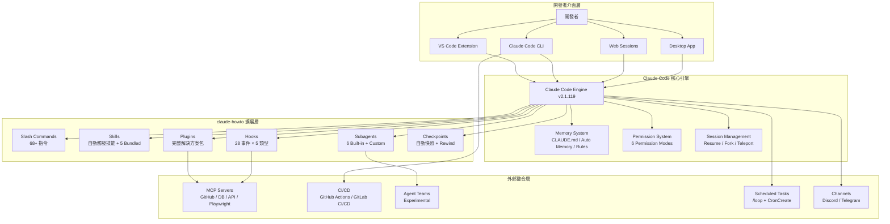
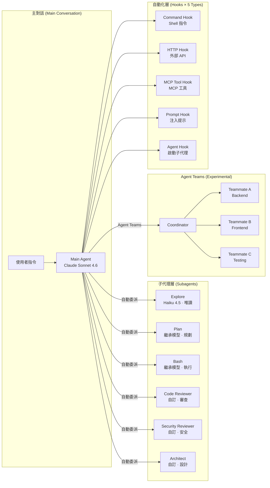
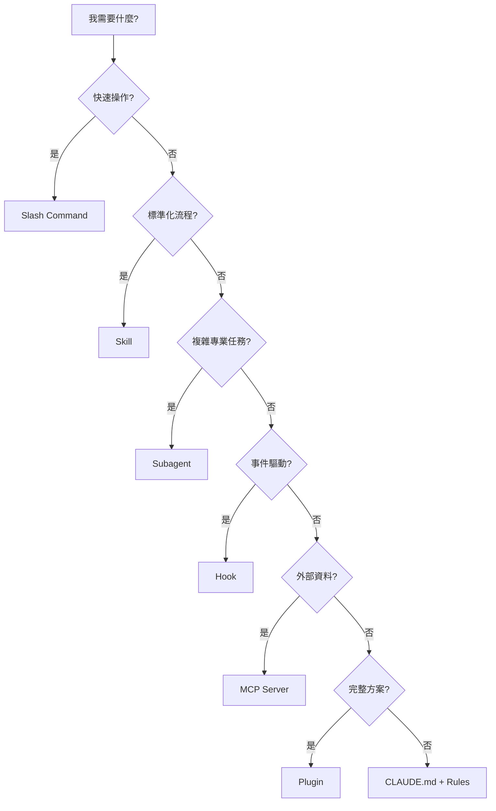
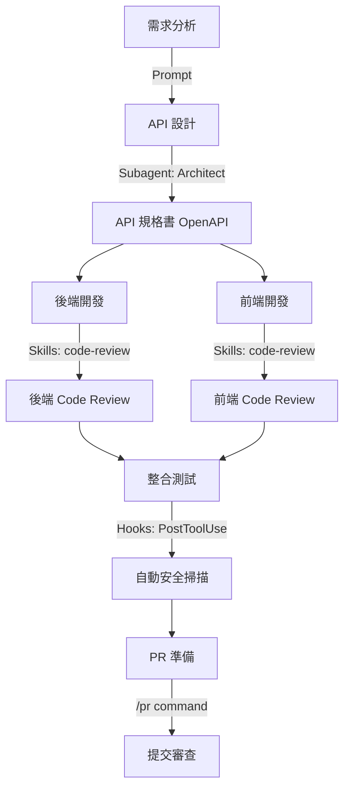
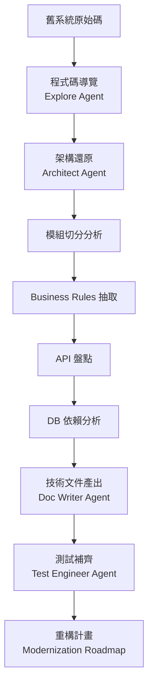
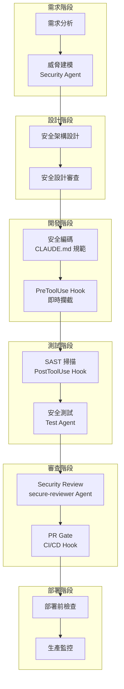
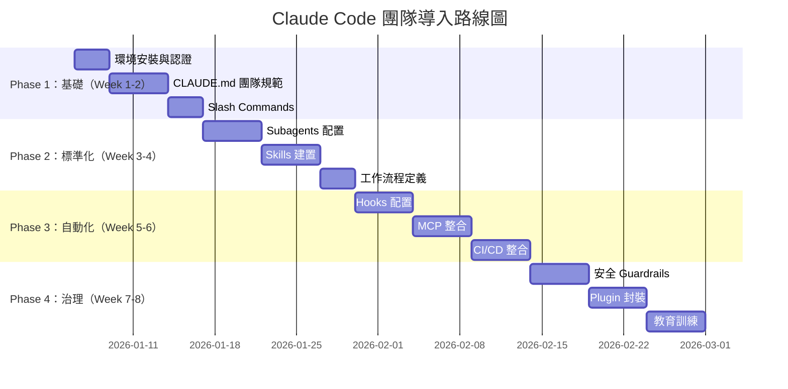
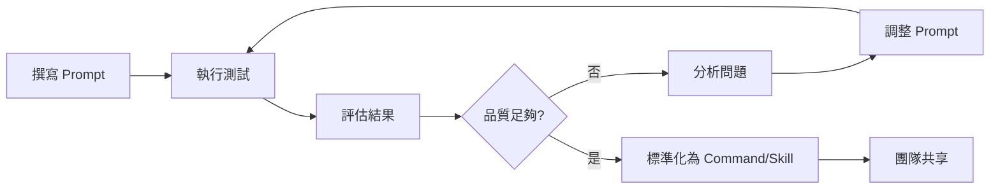
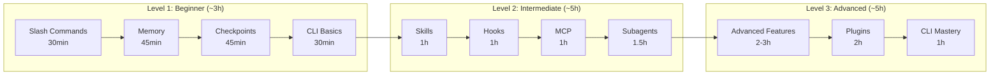

+++
date = '2026-05-02T17:03:29+08:00'
draft = false
title = 'Claude Howto 教學手冊'
tags = ['教學', 'AI開發']
categories = ['教學']
+++

# claude-howto 教學手冊（完整版）

> **文件版本**：v1.1
> **最後更新**：2026-05-02  
> **基於 Claude Code 版本**：v2.1.119  
> **基於 claude-howto 版本**：v2.1.112 release（2026-04-24 同步）  
> **適用對象**：資深工程師、技術主管、DevOps 工程師、架構師  
> **適用模型**：Claude Sonnet 4.6 / Claude Opus 4.7 / Claude Haiku 4.5  
> **授權方式**：MIT License

---

## 目錄

- [1. 簡介（Overview）](#1-簡介overview)
- [2. 整體架構（Architecture）](#2-整體架構architecture)
- [3. 安裝與環境設定（Setup）](#3-安裝與環境設定setup)
- [4. claude-howto 核心模組解析](#4-claude-howto-核心模組解析)
  - [4.1 Slash Commands（自訂指令）](#41-slash-commands自訂指令)
  - [4.2 Memory（記憶系統）](#42-memory記憶系統)
  - [4.3 Skills（技能模組）](#43-skills技能模組)
  - [4.4 Subagents（子代理）](#44-subagents子代理)
  - [4.5 MCP Server（Model Context Protocol）](#45-mcp-servermodel-context-protocol)
  - [4.6 Hooks（事件觸發）](#46-hooks事件觸發)
  - [4.7 Plugins（外掛套件）](#47-plugins外掛套件)
  - [4.8 Checkpoints（檢查點與回溯）](#48-checkpoints檢查點與回溯)
  - [4.9 Advanced Features（進階功能）](#49-advanced-features進階功能)
  - [4.10 CLI（命令列介面）](#410-cli命令列介面)
  - [4.11 模組選用決策指南](#411-模組選用決策指南)
- [5. AI 開發流程設計](#5-ai-開發流程設計)
  - [5.1 Web Application 開發](#51-web-application-開發)
  - [5.2 逆向工程（Legacy System）](#52-逆向工程legacy-system)
  - [5.3 Framework 升級](#53-framework-升級)
- [6. Prompt Engineering](#6-prompt-engineering)
- [7. SSDLC 整合（安全開發）](#7-ssdlc-整合安全開發)
- [8. 團隊使用建議（企業落地）](#8-團隊使用建議企業落地)
- [9. 維運與最佳實務](#9-維運與最佳實務)
- [10. 學習路徑與自我評估](#10-學習路徑與自我評估)
- [11. 系統升級與擴展](#11-系統升級與擴展)
- [12. 故障排除（Troubleshooting）](#12-故障排除troubleshooting)
- [附錄 A：檢查清單（Checklist）](#附錄-a檢查清單checklist)
- [附錄 B：功能對照快速參考表](#附錄-b功能對照快速參考表)
- [附錄 C：參考資源](#附錄-c參考資源)

---

## 1. 簡介（Overview）

### 1.1 claude-howto 是什麼

claude-howto（GitHub: [luongnv89/claude-howto](https://github.com/luongnv89/claude-howto)）是一套結構化、視覺化、範例驅動的 Claude Code 實戰教學指南。截至 2026 年 4 月，該專案已獲得 30.7k GitHub Stars、3.8k Forks，由 19 位貢獻者維護，是目前最完整的 Claude Code 社群學習資源。

**核心定位**：它不是官方文件的重複，而是一套「從入門到生產級」的工程實踐路徑。

**涵蓋範圍**：

| 項目 | 數量 | 說明 |
|------|------|------|
| 學習模組 | 10 個 | Slash Commands → Memory → Skills → Subagents → MCP → Hooks → Plugins → Checkpoints → Advanced Features → CLI |
| 可複製範本 | 119+ 個 | 68+ Slash Commands、17 Subagents、9 Skills、9 MCP、8 Hooks、3 Plugins |
| 內建評估 | 2 套 | `/self-assessment`（整體評估）、`/lesson-quiz`（單元測驗） |
| 學習路徑 | 3 級 | Beginner（~3h）→ Intermediate（~5h）→ Advanced（~5h） |
| 多語言支援 | 5 種 | English、中文、Tiếng Việt、Українська、日本語 |
| EPUB 產出 | 支援 | `uv run scripts/build_epub.py` 離線閱讀 |

### 1.2 與傳統開發方式差異

| 面向 | 傳統開發 | claude-howto + Claude Code |
|------|----------|---------------------------|
| 程式碼撰寫 | 人工逐行撰寫 | AI 生成 + 人工審查 |
| Code Review | 人工逐行檢查 | Subagent 自動審查 + 人工確認 |
| 文件產出 | 手動撰寫 | Skills 自動生成 |
| 安全檢查 | 工具掃描 + 人工判斷 | Hooks 自動觸發 + 報告 |
| 重構 | 高風險、耗時 | Checkpoints 保護 + AI 執行 |
| CI/CD 整合 | 腳本手動維護 | Programmatic CLI + Auto Mode |
| 團隊標準化 | 文件散落各處 | CLAUDE.md + Plugins 統一管理 |
| 知識傳承 | 靠人員交接 | Memory + Skills 永久保存 |

### 1.3 為什麼適合企業級開發

1. **標準化**：透過 CLAUDE.md + Skills + Hooks + Plugins 建立團隊一致的開發規範
2. **可複製**：Plugins 機制讓設定可跨專案、跨團隊複製
3. **可治理**：6 種 Permission Modes + Hooks Guardrails + Managed Policies 確保安全邊界
4. **可追溯**：Session 管理 + Audit Hooks + Auto Memory 提供完整操作紀錄
5. **可擴展**：MCP 整合外部系統、Subagents 分工協作、Agent Teams 多代理協作
6. **可離線**：EPUB 輸出支援離線學習，不依賴網路

### 1.4 claude-howto 與官方文件的關係

| 面向 | 官方文件 | claude-howto |
|------|----------|-------------|
| 定位 | Feature Reference | Tutorial + Templates |
| 深度 | 功能描述 | 運作原理 + 最佳實踐 |
| 範例 | 基礎片段 | 生產級可複製範本 |
| 結構 | 按功能分類 | 漸進式學習路徑 |
| 自評 | 無 | 互動式測驗 |
| 視覺化 | 少 | Mermaid 圖表豐富 |

> **實務建議**：建議先用 claude-howto 學習概念與實作，再查閱官方文件瞭解細節與邊界條件。兩者互補而非替代。

---

## 2. 整體架構（Architecture）

### 2.1 Claude Code + claude-howto 整體架構



### 2.2 Agent-based 開發模型



**關鍵設計原則**：

- **隔離上下文**：每個 Subagent 有獨立的 context window，不會汙染主對話
- **最小權限**：每個 Subagent 只擁有執行任務所需的工具（`tools` + `disallowedTools`）
- **自動委派**：Claude Code 根據任務類型自動選擇適當的 Subagent
- **漸進式信任**：6 種 Permission Modes 從嚴格到全自動
- **5 種 Hook 類型**：command（Shell）、http（API）、mcp_tool（MCP）、prompt（提示注入）、agent（啟動子代理）

### 2.3 與 GitHub Copilot 的整合方式

| 場景 | 建議工具 | 原因 |
|------|----------|------|
| 行內程式碼補全 | GitHub Copilot | 即時、低延遲 |
| 複雜重構 / 多檔案修改 | Claude Code | Agent 能力、上下文理解 |
| Code Review | Claude Code Subagent | 可配置規則、產出報告 |
| API 設計 | Claude Code + Skills | 模板化、可重複使用 |
| CI/CD 自動化 | Claude Code CLI (`-p`) | Programmatic Mode |
| 快速問答 | GitHub Copilot Chat | 即時回應 |
| 複雜架構規劃 | Claude Code `/plan` | Planning Mode |
| 安全掃描 | Claude Code Hooks | 自動化、確定性 |

**整合原則**：兩者可同時啟用、互不衝突。小型修改用 Copilot inline；跨檔案任務用 Claude Code；團隊標準化用 claude-howto 範本。

### 2.4 Permission Modes 架構

Claude Code 提供 6 種權限模式，對應不同場景的安全需求：

| Mode | 說明 | 適用場景 | 安全等級 |
|------|------|----------|----------|
| `default` | 每次工具呼叫都詢問 | 日常互動開發 | ⭐⭐⭐⭐⭐ |
| `acceptEdits` | 自動接受檔案編輯，其餘詢問 | 信任的編輯工作流程 | ⭐⭐⭐⭐ |
| `plan` | 僅允許唯讀工具 | 分析、規劃、探索 | ⭐⭐⭐⭐⭐ |
| `dontAsk` | 跳過需要權限的工具 | 非互動腳本 | ⭐⭐⭐ |
| `auto` | 背景分類器自動決策（Research Preview） | 全自主作業 | ⭐⭐ |
| `bypassPermissions` | 跳過所有權限檢查 | CI/CD、沙箱環境 | ⭐ |

> **企業建議**：日常開發用 `default` 或 `acceptEdits`；分析用 `plan`；CI/CD 用 `bypassPermissions`（需在受控環境）。`auto` 模式為 Research Preview，不建議用於生產流程。

---

## 3. 安裝與環境設定（Setup）

### 3.1 Claude Code 安裝

#### 前置條件

- Node.js 18+（若使用 npm 安裝）
- VS Code 最新穩定版（若使用 Extension）
- Git
- 有效的 Anthropic API Key 或 Claude Pro/Team/Enterprise 訂閱

#### 安裝步驟

```bash
# 方法一：npm 全域安裝（v2.1.113+ 自動下載 native binary）
npm install -g @anthropic-ai/claude-code

# 方法二：直接下載 native binary（推薦，v2.1.113+ 支援）
# 下載位址：https://downloads.claude.ai/claude-code-releases
# macOS / Linux / Windows 均有對應版本

# 驗證安裝
claude --version

# 登入認證
claude login

# 環境健康檢查
claude doctor
```

#### VS Code Extension 安裝

```
1. 開啟 VS Code
2. Extensions（Ctrl+Shift+X）
3. 搜尋 "Claude Code"（發行者：Anthropic）
4. 點擊 Install
5. 重新載入 VS Code
6. 在 Claude Code panel 中完成認證
```

#### 企業環境注意事項

| 項目 | 說明 |
|------|------|
| Proxy 白名單 | v2.1.116+ 需允許 `downloads.claude.ai` |
| 認證方式 | API Key / OAuth / Enterprise SSO |
| 網路需求 | HTTPS 443 出站到 Anthropic API |
| Windows 特殊 | npx 啟動 MCP stdio server 需確認 Node.js 在 PATH |

### 3.2 claude-howto 導入方式

```bash
# 1. Clone claude-howto 到本機參考目錄
git clone https://github.com/luongnv89/claude-howto.git ~/claude-howto

# 2. 一鍵安裝所有範本到專案
cd /path/to/your-project

# 建立目錄結構
mkdir -p .claude/{commands,agents,skills} ~/.claude/{hooks,skills}

# 完整安裝（所有功能）
cp ~/claude-howto/01-slash-commands/*.md .claude/commands/
cp ~/claude-howto/02-memory/project-CLAUDE.md ./CLAUDE.md
cp -r ~/claude-howto/03-skills/* .claude/skills/
cp ~/claude-howto/04-subagents/*.md .claude/agents/
cp ~/claude-howto/06-hooks/*.sh ~/.claude/hooks/
chmod +x ~/.claude/hooks/*.sh

# 3. 個人層級設定
cp ~/claude-howto/02-memory/personal-CLAUDE.md ~/.claude/CLAUDE.md
```

#### 漸進式安裝（建議）

```bash
# Phase 1：Essential（Day 1）
cp ~/claude-howto/02-memory/project-CLAUDE.md ./CLAUDE.md

# Phase 2：Daily Use（Day 2-3）
cp ~/claude-howto/01-slash-commands/*.md .claude/commands/

# Phase 3：Quality（Week 1）
cp ~/claude-howto/04-subagents/*.md .claude/agents/

# Phase 4：Automation（Week 2）
cp ~/claude-howto/06-hooks/*.sh ~/.claude/hooks/
chmod +x ~/.claude/hooks/*.sh

# Phase 5：External（Week 2）
export GITHUB_TOKEN="your_token"
claude mcp add github -- npx -y @modelcontextprotocol/server-github

# Phase 6：Advanced（Week 3）
cp -r ~/claude-howto/03-skills/* ~/.claude/skills/

# Phase 7：Complete（Week 3+）
# /plugin install pr-review
```

### 3.3 專案目錄結構設計

```
your-project/
├── .claude/
│   ├── commands/              # 專案 Slash Commands（進版控）
│   │   ├── optimize.md
│   │   ├── pr.md
│   │   ├── commit.md
│   │   └── generate-api-docs.md
│   ├── agents/                # 專案 Subagents（進版控）
│   │   ├── code-reviewer.md
│   │   ├── code-architect.md
│   │   ├── test-engineer.md
│   │   ├── secure-reviewer.md
│   │   └── reverse-engineer.md
│   ├── skills/                # 專案 Skills（進版控）
│   │   ├── code-review/
│   │   │   └── SKILL.md
│   │   └── doc-generator/
│   │       └── SKILL.md
│   ├── hooks/                 # 專案 Hook 腳本（進版控）
│   │   ├── validate-bash.py
│   │   └── security-scan.py
│   ├── rules/                 # 模組化規則（進版控）
│   │   ├── coding-style.md
│   │   └── security-rules.md
│   ├── output-styles/         # 自訂輸出格式（進版控）
│   │   └── concise.md
│   ├── settings.json          # 專案設定（進版控）
│   └── settings.local.json    # 本機設定（不進版控）
├── .mcp.json                  # MCP 配置（專案層級，進版控）
├── CLAUDE.md                  # 專案 Memory（核心！進版控）
├── CLAUDE.local.md            # 本機 Memory（不進版控）
├── src/
│   ├── api/
│   │   └── CLAUDE.md          # 目錄級記憶（進版控）
│   └── ...
└── .gitignore
```

#### 個人層級目錄結構

```
~/.claude/
├── CLAUDE.md                  # 個人偏好與習慣
├── commands/                  # 個人 Slash Commands
├── agents/                    # 個人 Subagents
├── skills/                    # 個人 Skills
├── hooks/                     # 個人 Hook 腳本
├── rules/                     # 個人規則
├── settings.json              # 個人設定（含 hooks 配置）
├── settings.local.json        # 本機設定
├── keybindings.json           # 自訂快捷鍵
├── themes/                    # 自訂主題
└── managed-settings.d/        # 企業管理設定（組織派送）
```

### 3.4 團隊標準化設定

#### `.claude/settings.json`（專案層級，進版控）

```json
{
  "permissions": {
    "allow": [
      "Read",
      "Glob",
      "Grep",
      "LS"
    ],
    "deny": [
      "Bash(rm -rf *)",
      "Bash(git push --force)",
      "Bash(git reset --hard)",
      "Bash(drop database)",
      "Bash(drop table)"
    ]
  },
  "hooks": {
    "PreToolUse": [
      {
        "matcher": "Bash",
        "hooks": [
          {
            "type": "command",
            "command": "python .claude/hooks/validate-bash.py"
          }
        ]
      }
    ],
    "PostToolUse": [
      {
        "matcher": "Write",
        "hooks": [
          {
            "type": "command",
            "command": "python .claude/hooks/security-scan.py"
          }
        ]
      }
    ]
  }
}
```

#### `.gitignore` 追加

```gitignore
# Claude Code 本機設定（不進版控）
.claude/settings.local.json
CLAUDE.local.md
```

> **實務建議**：團隊導入順序為 CLAUDE.md → Slash Commands → Subagents → Hooks → MCP → Skills → Plugins。循序漸進，每步確認運作正常再往下。

---

## 4. claude-howto 核心模組解析

### 4.1 Slash Commands（自訂指令）

#### 概念說明

Slash Commands 是最簡單的 Claude Code 擴展方式。每個 Command 是一個 Markdown 檔案，放在 `.claude/commands/`（專案）或 `~/.claude/commands/`（個人）目錄下。在 Claude Code 中輸入 `/command-name` 即可觸發。

#### 內建指令（55+ 個）

| 指令 | 用途 | 版本說明 |
|------|------|----------|
| `/help` | 顯示幫助 | - |
| `/clear` | 清除對話歷史 | - |
| `/plan` | 進入 Planning Mode | - |
| `/rewind` | 回溯到 Checkpoint | - |
| `/undo` | `/rewind` 別名 | v2.1.108+ |
| `/compact` | 壓縮 Context | - |
| `/status` | 顯示 Session 狀態 | - |
| `/model` | 切換模型 | - |
| `/agents` | 列出可用 Agents | - |
| `/skills` | 列出可用 Skills | - |
| `/hooks` | 列出已設定 Hooks | - |
| `/mcp` | 列出 MCP Servers | - |
| `/diff` | 互動式 Diff 檢視 | - |
| `/export` | 匯出對話 | - |
| `/fork` | 分支對話 | - |
| `/session` | 管理 Sessions | - |
| `/resume` | 恢復先前 Session | - |
| `/tasks` | 查看背景任務 | - |
| `/loop` | 定期執行（同 `/proactive`） | v2.1.105+ |
| `/usage` | 用量/成本/統計（整合 tabbed view） | v2.1.118+ |
| `/cost` | `/usage` 的成本分頁別名 | v2.1.118+ |
| `/stats` | `/usage` 的統計分頁別名 | v2.1.118+ |
| `/focus` | 切換 Focus View（無干擾輸出） | v2.1.110+ |
| `/tui` | 全螢幕 TUI 模式 | v2.1.110+ |
| `/recap` | 顯示 Session 摘要 | v2.1.108+ |
| `/btw` | 臨時旁白問題（不汙染主 context） | - |
| `/ultraplan` | 交給雲端 multi-agent 規劃 | Research Preview |
| `/ultrareview` | 雲端 multi-agent 程式碼審查 | v2.1.112+ |
| `/less-permission-prompts` | 掃描記錄產生唯讀 allowlist | v2.1.112+ |
| `/team-onboarding` | 產生團隊 ramp-up 指南 | v2.1.101+ |
| `/theme` | 切換主題（支援自訂 JSON） | v2.1.118+ |
| `/plugin` | 管理 Plugins | - |
| `/doctor` | 執行診斷 | - |
| `/upgrade` | 檢查更新 | - |

#### 自訂 Command 設計

```markdown
<!-- .claude/commands/optimize.md -->
---
description: "分析並優化指定檔案的效能"
---

請分析以下程式碼的效能問題，並提供優化建議：

1. 時間複雜度分析
2. 空間複雜度分析
3. 潛在的效能瓶頸
4. 具體優化建議與修改後的程式碼

目標檔案：$ARGUMENTS
```

#### claude-howto 提供的自訂 Commands

| Command | 用途 | Scope |
|---------|------|-------|
| `/optimize` | 效能優化分析 | Project |
| `/pr` | PR 描述生成 | Project |
| `/generate-api-docs` | API 文件生成 | Project |
| `/commit` | 語義化 Commit Message | User |
| `/push-all` | Stage + Commit + Push | User |
| `/doc-refactor` | 文件重構 | Project |
| `/setup-ci-cd` | CI/CD 配置生成 | Project |
| `/unit-test-expand` | 擴充測試覆蓋率 | Project |

> **Scope 說明**：`User` = 個人（`~/.claude/commands/`）、`Project` = 團隊共用（`.claude/commands/`）

---

### 4.2 Memory（記憶系統）

#### 概念說明

Memory 是 Claude Code 跨 Session 持續載入的上下文。它讓 Claude 「記住」專案規範、團隊約定與個人偏好。

#### Memory 類型（7 種）

| 類型 | 位置 | Scope | 說明 |
|------|------|-------|------|
| Managed Policy | 組織管理 | Organization | 企業管理員強制派送 |
| Project Memory | `./CLAUDE.md` | Project（Team） | 團隊標準，進版控 |
| Project Rules | `.claude/rules/` | Project（Team） | 模組化專案規則 |
| Directory Memory | `src/api/CLAUDE.md` | Directory | 子目錄特定規範 |
| User Memory | `~/.claude/CLAUDE.md` | User（Personal） | 個人偏好 |
| User Rules | `~/.claude/rules/` | User（Personal） | 模組化個人規則 |
| Auto Memory | 自動 | Session | Claude 自動學習的修正與偏好 |

#### CLAUDE.md 範本

```markdown
# Project Memory

## 專案資訊
- 名稱：[專案名稱]
- 技術棧：Java 21 + Spring Boot 3.2 + PostgreSQL 16
- 建置工具：Maven 3.9+
- 部署環境：Kubernetes on AWS

## 編碼規範
- 命名：PascalCase（類別）、camelCase（方法/變數）、UPPER_SNAKE_CASE（常數）
- 方法長度上限：30 行
- 類別長度上限：300 行
- 測試覆蓋率目標：> 80%

## 禁止事項
- 不可使用 `System.out.println`，使用 Log4j2
- 不可硬編碼任何 secret/password/token
- 不可使用 `*` import
- 不可使用 raw SQL，必須用 JPA 或 Prepared Statement

## 常用指令
- 編譯：`mvn compile`
- 測試：`mvn test`
- 包裝：`mvn package`
- 程式碼風格檢查：`mvn checkstyle:check`

## Git 規範
- Branch：feature/xxx、bugfix/xxx、hotfix/xxx
- Commit：Conventional Commits 格式
- PR：需至少 1 位 reviewer approve
```

#### 記憶管理最佳實務

| 原則 | 說明 |
|------|------|
| 大小控制 | CLAUDE.md 建議不超過 500 行 |
| 模組化 | 超過時拆分到 `.claude/rules/` |
| 層級化 | 子目錄可有專屬 CLAUDE.md |
| 版控 | Project Memory 進 Git，Local 不進 |
| 清理 | 定期移除過時規範 |
| 敏感 | 絕不放 secrets/tokens |

---

### 4.3 Skills（技能模組）

#### 概念說明

Skills 是可自動觸發的能力模組，由 `SKILL.md` 定義。Claude Code 偵測到匹配的觸發語句時自動載入對應的指令與模板，無需手動呼叫。

#### Skills vs 其他模組比較

| 面向 | Slash Commands | Skills | Subagents | Hooks |
|------|---------------|--------|-----------|-------|
| 觸發方式 | 手動 `/cmd` | 自動偵測語句 | 自動委派 | 事件驅動 |
| Context 隔離 | 無 | 無（注入主對話） | 有（獨立 context） | 無 |
| 確定性 | 高 | 中（需語句匹配） | 中 | 高（事件必觸發） |
| 適用場景 | 快速操作 | 標準化流程 | 複雜專業任務 | 守護/自動化 |

#### Skill 結構與 Frontmatter

```
.claude/skills/code-review/
├── SKILL.md              # Skill 定義（含 YAML frontmatter）
├── scripts/              # 輔助腳本
│   └── check-style.sh
└── templates/            # 輸出模板
    └── review-report.md
```

**SKILL.md Frontmatter 欄位**：

| 欄位 | 類型 | 說明 |
|------|------|------|
| `name` | string | Skill 顯示名稱 |
| `description` | string | Skill 功能描述 |
| `autoInvoke` | array | 觸發語句列表 |
| `effort` | string | 推理等級（low/medium/high） |
| `shell` | string | 腳本使用的 Shell（bash/zsh/sh） |

#### 內建 Bundled Skills（5 個）

| Skill | 觸發方式 | 用途 |
|-------|----------|------|
| `/simplify` | 手動 | 程式碼品質審查 |
| `/batch` | 手動 | 批次處理多檔案 |
| `/debug` | 手動 | Debug 失敗測試/錯誤 |
| `/loop` | 手動 | 定期執行任務 |
| `/claude-api` | 手動 | 使用 Claude API 建置應用 |

#### SKILL.md 範例：程式碼審查

```markdown
---
name: "code-review"
description: "全面的程式碼品質審查"
autoInvoke:
  - "review this code"
  - "check quality"
  - "程式碼審查"
  - "code review"
effort: "high"
---

# 程式碼審查 Skill

請依照以下標準審查程式碼：

## 審查項目

### 1. 品質（Maintainability）
- 命名一致性、函式長度、DRY 原則、錯誤處理

### 2. 安全（Security）
- SQL Injection、XSS、敏感資料暴露、輸入驗證

### 3. 效能（Performance）
- N+1 查詢、記憶體配置、迴圈效率

### 4. 可維護性（Architecture）
- 單一職責、依賴注入、介面設計

## 輸出格式

### 🔴 Critical（必須修正）
### 🟡 Warning（建議修正）
### 🟢 Info（參考建議）
### 📊 總體評分：X/10
```

> **Context 注意事項**：Skill 內容在觸發時注入主對話的 context window。長時間對話後 compact 可能遺失 Skill 內容。建議關鍵規則同時放在 CLAUDE.md 中。

---

### 4.4 Subagents（子代理）

#### 概念說明

Subagents 是具有獨立 context window 的專業化 AI 代理。主對話可將複雜任務委派給 Subagent，避免主 context 膨脹，並獲得隔離的專業化處理。

#### 內建 Subagents（6 個）

| Agent | 用途 | 使用模型 | 可用工具 |
|-------|------|----------|----------|
| general-purpose | 通用多步驟任務 | 繼承主模型 | 所有工具 |
| Plan | 實作規劃 | 繼承主模型 | Read, Glob, Grep, Bash |
| Explore | 程式碼探索 | Haiku 4.5 | Read, Glob, Grep |
| Bash | 指令執行 | 繼承主模型 | Bash |
| statusline-setup | 狀態列設定 | Sonnet 4.6 | Bash, Read, Write |
| Claude Code Guide | 說明與教學 | Haiku 4.5 | Read, Glob, Grep |

#### Subagent Configuration Fields

| 欄位 | 類型 | 說明 |
|------|------|------|
| `name` | string | Agent 識別名稱 |
| `description` | string | 功能描述（用於自動委派判斷） |
| `model` | string | 模型覆寫（如 `haiku-4.5`） |
| `tools` | array | 允許的工具列表 |
| `disallowedTools` | array | 明確禁止的工具 |
| `effort` | string | 推理等級（low/medium/high） |
| `initialPrompt` | string | 啟動時注入的系統提示 |

#### claude-howto 提供的自訂 Subagents（11 個）

| Agent | 用途 | Scope |
|-------|------|-------|
| code-reviewer | 全面程式碼品質審查 | Project |
| code-architect | 架構設計 | Project |
| code-explorer | 深度程式碼分析 | Project |
| clean-code-reviewer | Clean Code 原則審查 | Project |
| test-engineer | 測試策略與覆蓋率 | Project |
| documentation-writer | 技術文件撰寫 | Project |
| secure-reviewer | 安全審查 | Project |
| implementation-agent | 完整功能實作 | Project |
| performance-optimizer | 效能調優 | Project |
| debugger | 根因分析 | User |
| data-scientist | SQL 查詢/資料分析 | User |

#### 自訂 Subagent 範例

```markdown
<!-- .claude/agents/secure-reviewer.md -->
---
name: "secure-reviewer"
description: "專注於安全性的程式碼審查代理，檢查 OWASP Top 10 風險"
model: "sonnet-4.6"
tools:
  - Read
  - Glob
  - Grep
  - Bash
disallowedTools:
  - Write
  - Edit
effort: "high"
---

# Security Reviewer Agent

你是一位資安專家，專門負責程式碼安全審查。

## 審查重點

1. **OWASP Top 10** — Injection / Auth / XSS / SSRF / Access Control
2. **輸入驗證** — 白名單驗證、參數化查詢、檔案上傳限制
3. **認證授權** — Session 管理、Token 過期、權限檢查
4. **敏感資料** — 加密儲存、日誌脫敏、回應過濾

## 輸出格式

| 嚴重度 | 檔案:行號 | 問題描述 | CWE | 修復建議 |
|--------|-----------|----------|-----|----------|
```

---

### 4.5 MCP Server（Model Context Protocol）

#### 概念說明

MCP（Model Context Protocol）是 Claude Code 連接外部系統的標準協議，讓 AI 能即時存取 GitHub、資料庫、API、瀏覽器等外部資源。

#### Transport 方式

| Transport | 狀態 | 適用場景 | 說明 |
|-----------|------|----------|------|
| HTTP | **推薦** | 遠端服務、OAuth | 首選方式 |
| stdio | 穩定 | 本地工具 | 本地 process 通訊 |
| SSE | **Deprecated** | — | 不建議新專案使用 |

#### MCP 進階功能

| 功能 | 說明 |
|------|------|
| OAuth | MCP Server 可要求 OAuth 授權 |
| Scopes | 限制 MCP 可存取的資源範圍 |
| headersHelper | 自訂 HTTP header |
| Resources | MCP 可暴露結構化資源 |
| Prompts | MCP 可提供 prompt templates |
| Tool Search | 動態搜尋可用 MCP 工具 |
| Elicitation | MCP Server 可在執行期向使用者要求輸入 |

#### Scope 與配置位置

| Scope | 配置檔 | 說明 |
|-------|--------|------|
| Project | `.mcp.json` | 團隊共用，進版控 |
| User | `~/.claude.json` | 個人 MCP |
| Managed | `managed-mcp.json` | 企業管理派送 |

#### 常用 MCP Servers

| Server | 用途 | 安裝指令 |
|--------|------|----------|
| GitHub | PR / Issue / Code | `claude mcp add github -- npx -y @modelcontextprotocol/server-github` |
| PostgreSQL | DB 查詢 | `claude mcp add db -- npx -y @modelcontextprotocol/server-postgres` |
| Filesystem | 進階檔案操作 | `claude mcp add fs -- npx -y @modelcontextprotocol/server-filesystem` |
| Playwright | 瀏覽器自動化 | `claude mcp add playwright -- npx -y @anthropic-ai/mcp-server-playwright` |
| Slack | 團隊通訊 | 設定在 settings 中 |
| Context7 | 最新函式庫文件查詢 | Built-in |

#### `.mcp.json` 設定範例

```json
{
  "mcpServers": {
    "github": {
      "command": "npx",
      "args": ["-y", "@modelcontextprotocol/server-github"],
      "env": {
        "GITHUB_TOKEN": "${GITHUB_TOKEN}"
      }
    },
    "database": {
      "command": "npx",
      "args": ["-y", "@modelcontextprotocol/server-postgres"],
      "env": {
        "DATABASE_URL": "${DATABASE_URL}"
      }
    }
  }
}
```

> **安全注意**：永遠使用 `${ENV_VAR}` 引用 secrets。MCP Server 存在 prompt injection 與資料外洩風險，需謹慎審查第三方 MCP Server 來源。

---

### 4.6 Hooks（事件觸發）

#### 概念說明

Hooks 是確定性控制機制，在 Claude Code 特定事件發生時自動執行。與 Skills 不同，Hooks 是「確定會執行」的守護機制，適合安全檢查、格式化、通知等場景。

#### 5 種 Hook 類型

| 類型 | 說明 | 適用場景 |
|------|------|----------|
| `command` | 執行 Shell 指令 | 驗證、格式化、通知 |
| `http` | 呼叫外部 HTTP API | 稽核服務、Webhook |
| `mcp_tool` | 呼叫 MCP 工具 | 整合外部系統 |
| `prompt` | 注入提示文字到對話 | 上下文補充、規則注入 |
| `agent` | 啟動 Subagent | 自動化審查、品質 Gate |

#### 28 個 Hook 事件

| 事件 | 觸發時機 | 典型用途 |
|------|----------|----------|
| `SessionStart` | Session 啟動/恢復 | 環境初始化 |
| `InstructionsLoaded` | 指令載入完成 | 自訂指令處理 |
| `UserPromptSubmit` | 使用者送出前 | 輸入驗證 |
| `PreToolUse` | 工具執行前 | 安全攔截 |
| `PermissionRequest` | 權限對話顯示 | 自訂審核流程 |
| `PostToolUse` | 工具執行成功後 | 格式化、通知 |
| `PostToolUseFailure` | 工具執行失敗 | 錯誤處理 |
| `Notification` | 通知送出 | 外部告警 |
| `SubagentStart` | Subagent 啟動 | 初始化 |
| `SubagentStop` | Subagent 完成 | 結果處理 |
| `TeammateIdle` | 隊友代理閒置 | 任務分配 |
| `TaskCompleted` | 任務完成 | 後處理 |
| `TaskCreated` | 任務建立 | 追蹤 |
| `ConfigChange` | 設定變更 | 稽核 |
| `CwdChanged` | 工作目錄變更 | 環境切換 |
| `FileChanged` | 檔案被修改 | 監控、重建 |
| `PreCompact` | Context 壓縮前 | 狀態保存 |
| `PostCompact` | Context 壓縮後 | 重新載入關鍵上下文 |
| `WorktreeCreate` | Git Worktree 建立 | 環境設定 |
| `WorktreeRemove` | Git Worktree 移除 | 清理 |
| `Elicitation` | MCP 要求輸入 | 輸入驗證 |
| `ElicitationResult` | 使用者回應 | 回應處理 |
| `SessionEnd` | Session 結束 | 清理、儲存 |
| `Stop` | Claude 回應完成 | 清理、報告 |
| `StopFailure` | API 錯誤結束 | 錯誤恢復 |

#### Hook 設定範例（完整格式）

```json
{
  "hooks": {
    "PreToolUse": [
      {
        "matcher": "Bash",
        "hooks": [
          {
            "type": "command",
            "command": "python .claude/hooks/validate-bash.py"
          }
        ],
        "if": "tool.command.includes('rm') || tool.command.includes('drop')"
      }
    ],
    "PostToolUse": [
      {
        "matcher": "Write",
        "hooks": [
          {
            "type": "command",
            "command": "bash .claude/hooks/format-code.sh"
          }
        ]
      }
    ],
    "Stop": [
      {
        "hooks": [
          {
            "type": "http",
            "url": "https://audit.company.com/api/log",
            "method": "POST"
          }
        ]
      }
    ],
    "PostCompact": [
      {
        "hooks": [
          {
            "type": "prompt",
            "prompt": "重要提醒：請始終遵守 CLAUDE.md 中的安全編碼規範。"
          }
        ]
      }
    ]
  }
}
```

#### 實作範例：Bash 安全驗證 Hook

```python
#!/usr/bin/env python3
# .claude/hooks/validate-bash.py
"""PreToolUse:Bash hook — 攔截危險的 Shell 指令"""

import sys
import json

BLOCKED_PATTERNS = [
    "rm -rf /", "rm -rf ~", "drop database", "drop table",
    "git push --force", "git reset --hard", "chmod 777",
    "curl | bash", "wget | sh", "> /dev/sda",
]

def main():
    input_data = json.loads(sys.stdin.read())
    command = input_data.get("tool_input", {}).get("command", "")

    for pattern in BLOCKED_PATTERNS:
        if pattern in command.lower():
            print(json.dumps({
                "decision": "block",
                "reason": f"已攔截危險指令：包含 '{pattern}'"
            }))
            sys.exit(1)

    print(json.dumps({"decision": "allow"}))
    sys.exit(0)

if __name__ == "__main__":
    main()
```

> **除錯方式**：使用 `/hooks` 列出已載入的 hooks。Hook 腳本需有執行權限（`chmod +x`）。`if` 條件使用 JavaScript 語法評估。

---

### 4.7 Plugins（外掛套件）

#### 概念說明

Plugins 是將 Slash Commands、Subagents、Skills、Hooks、MCP 配置封裝為一個可安裝/可分享的完整解決方案包。

#### Plugin 結構

```
.claude-plugin/
├── plugin.json           # Manifest 檔案（必要）
├── commands/             # Slash Commands
├── agents/               # Subagents
├── skills/               # Skills
├── hooks/                # Hook 腳本
├── mcp/                  # MCP 配置
├── themes/               # 自訂主題（v2.1.118+）
└── scripts/              # 工具腳本
```

#### plugin.json 範例

```json
{
  "name": "team-security",
  "version": "1.0.0",
  "description": "團隊安全開發工作流程",
  "author": "Security Team",
  "commands": ["commands/*.md"],
  "agents": ["agents/*.md"],
  "skills": ["skills/*/SKILL.md"],
  "hooks": {
    "PreToolUse": [
      {
        "matcher": "Bash",
        "hooks": [{ "type": "command", "command": "hooks/validate.sh" }]
      }
    ]
  },
  "mcpServers": {
    "security-scanner": {
      "command": "npx",
      "args": ["-y", "mcp-security-scanner"]
    }
  }
}
```

#### Plugin 管理指令

```bash
# 列出已安裝 plugins
/plugin list

# 安裝 plugin
/plugin install <name>

# 移除 plugin
/plugin remove <name>

# 更新 plugin
/plugin update <name>

# 重新載入
/reload-plugins
```

#### 安裝範圍

| 範圍 | 說明 |
|------|------|
| Project | 只影響當前專案 |
| User | 影響使用者所有專案 |
| Local | 不進版控的本機安裝 |

#### Plugin 安全注意事項

- Plugin 提供的 Subagent **不支援** `hooks`、`mcpServers`、`permissionMode` 等 frontmatter 欄位
- 第三方 Plugin 需審查來源可靠性
- 建議團隊建立內部 Plugin Registry，避免使用未審核的外部 Plugin
- Plugin 更新與 marketplace 更新是不同概念，需分別管理

---

### 4.8 Checkpoints（檢查點與回溯）

#### 概念說明

Checkpoints 是 Claude Code 的自動快照機制。**每次使用者送出 prompt 之前，系統自動建立一個 checkpoint**，記錄當時的程式碼狀態與對話狀態，可隨時回溯。

#### 使用方式

```bash
# 觸發回溯（兩種方式）
# 方式一：按 Esc 兩次
# 方式二：使用指令
/rewind
# 或
/undo    # v2.1.108+ 別名

# 回溯選項
# 1. Restore code and conversation — 恢復程式碼與對話
# 2. Restore conversation — 只恢復對話
# 3. Restore code — 只恢復程式碼
# 4. Summarize from here — 從此處開始摘要
# 5. Never mind — 取消
```

#### 最佳實務

| 場景 | 建議做法 |
|------|----------|
| 實驗性重構 | 開始前確認 checkpoint 存在，失敗就 rewind |
| Framework 升級 | 每個升級步驟後暫停，確認再繼續 |
| 多方案探索 | 用 `/fork` 分支對話，各方案獨立嘗試 |
| 大型修改 | 分步進行，每步一個 prompt = 一個 checkpoint |

> **注意**：Checkpoint 是自動建立的，不需要手動觸發。但理解其存在有助於安心進行大膽實驗。

---

### 4.9 Advanced Features（進階功能）

#### Planning Mode

```bash
# 進入 Planning Mode
/plan 設計使用者認證系統

# Claude 會產出詳細實作計畫，不直接修改程式碼
# 審查計畫後再決定是否執行
```

#### Extended Thinking（深度思考）

```bash
# 切換 Extended Thinking
# 按 Alt+T (Windows/Linux) 或 Option+T (macOS)
# 啟用後 Claude 會進行更深入的推理
```

#### Auto Mode（Research Preview）

```bash
# 啟用 Auto Mode
claude --permission-mode auto "implement user settings page"

# 或互動式切換（Shift+Tab 循環模式）
# Auto Mode 使用背景安全分類器自動決策權限
```

> **注意**：Auto Mode 為 Research Preview（2026 年 3 月推出），不建議用於生產環境關鍵流程。

#### Agent Teams（Experimental）

```bash
# 啟用 Agent Teams
export CLAUDE_AGENT_TEAMS=1

# 或在 settings.json
{ "agentTeams": { "enabled": true } }

# 使用方式
> 請使用 team approach 實作功能 X
```

| 面向 | Subagents | Agent Teams |
|------|-----------|-------------|
| 通訊模式 | 主對話委派（單向） | 多代理互相通訊 |
| Context | 完全隔離 | 可共享部分上下文 |
| 適用場景 | 專業化單一任務 | 多角色協作複雜任務 |
| 狀態 | 穩定（GA） | **Experimental**（需手動啟用） |

#### Scheduled Tasks（排程任務）

```bash
# 每 5 分鐘執行一次狀態檢查
/loop 5m /check-status

# 使用 CronCreate 建立持久排程
# 限制：session-scoped、7 天到期、上限 50 個任務
```

#### 其他進階功能

| 功能 | 說明 | 觸發方式 |
|------|------|----------|
| Voice Dictation | 語音輸入 | 麥克風圖示 / 語音快捷鍵 |
| Channels | 多 Session 結構化工作流程 | Discord / Telegram 整合 |
| Remote Control | 遠端控制 Session | WebSocket API |
| Web Sessions | 瀏覽器介面 | `claude web` |
| Desktop App | 原生桌面應用 | `claude.ai/download` |
| Git Worktrees | 隔離式平行開發 | `/worktree` |
| Sandboxing | 隔離執行環境 | `/sandbox` |
| Chrome Integration | 瀏覽器自動化 | `--chrome` 或 `/chrome` |

---

### 4.10 CLI（命令列介面）

#### 核心模式

| 模式 | 指令 | 用途 |
|------|------|------|
| Interactive | `claude` | 日常互動開發 |
| Print | `claude -p "prompt"` | 非互動式輸出（CI/CD） |
| Continue | `claude -c` | 繼續最近 Session |
| Resume | `claude -r "session"` | 恢復指定 Session |

#### 常用 CLI 參數

```bash
# 基本使用
claude "explain this project"                    # Interactive
claude -p "summarize this file"                  # Print mode
claude -p --output-format json "list functions"  # JSON 輸出
claude -p --max-turns 3 "review code"            # 限制回合

# Permission 控制
claude --permission-mode plan "analyze codebase"
claude --permission-mode acceptEdits "refactor auth"
claude --permission-mode auto "implement feature"

# 模型選擇
claude --model sonnet-4.6
claude --model haiku-4.5

# Piping（管線輸入）
cat error.log | claude -p "explain this error"
git diff | claude -p "review these changes"

# CI/CD 整合
claude -p \
  --permission-mode bypassPermissions \
  --output-format json \
  --allowedTools "Read,Glob,Grep" \
  "review this PR for security issues"

# Bare mode（最小上下文載入，CI 推薦）
claude --bare -p "run tests"

# Batch 處理
for file in *.java; do
  claude -p --output-format json "review: $(cat $file)" > "${file%.java}.review.json"
done
```

#### Session 管理

```bash
# 列出 Sessions
/session list

# 恢復 Session
claude -r "feature-auth"
/resume

# 分支 Session
/fork

# 重命名 Session
/rename "auth-implementation"

# 轉移到另一台機器
/teleport
```

---

### 4.11 模組選用決策指南



> **實務建議**：從簡單到複雜。大部分需求用 Slash Command + CLAUDE.md 就能解決 80%。只在確實需要時才引入 Subagents、Hooks、MCP。

---

## 5. AI 開發流程設計

### 5.1 Web Application 開發

#### 前後端分離架構的 AI 開發流程



#### 實作步驟

**Step 1：使用 Architecture Agent 設計 API**

```
> @code-architect 請為使用者管理模組設計 RESTful API，需支援：
  - 使用者 CRUD
  - 角色權限管理
  - JWT 認證
  - 分頁查詢
  
  技術棧：Spring Boot 3.x + PostgreSQL
  請產出 OpenAPI 3.0 規格檔
```

**Step 2：自動生成後端程式碼**

```
> 根據上述 API 規格，請生成：
  1. Entity classes（JPA annotations）
  2. Repository interfaces
  3. Service layer（含業務邏輯）
  4. Controller（REST endpoints）
  5. DTO / Request / Response classes
  6. Mapper（MapStruct）
  
  要求：
  - 遵循 Clean Architecture
  - 使用 Bean Validation
  - 錯誤處理用 @ControllerAdvice
  - 使用 Page/Pageable 分頁
```

**Step 3：自動生成測試**

```
> @test-engineer 請為 UserService 撰寫完整的單元測試：
  - 使用 JUnit 5 + Mockito
  - 覆蓋正常路徑與例外路徑
  - 測試分頁邏輯
  - 測試權限驗證
  - 覆蓋率目標 > 80%
```

**Step 4：前端元件生成**

```
> 請為使用者管理建立 Vue 3 元件：
  - Vue 3 Composition API + TypeScript
  - Pinia store + Vue Router
  - Element Plus UI
  - 列表頁（分頁/排序/搜尋）+ 表單頁（驗證）
  - axios 整合（Token 自動附加）
```

**Step 5：安全審查 + PR 準備**

```
> @secure-reviewer 請審查 src/main/java/com/example/user/ 目錄的安全性
> /pr 準備 Pull Request 描述
```

---

### 5.2 逆向工程（Legacy System）

#### 逆向工程 AI 輔助流程



#### 操作步驟

```bash
# Step 1：使用 Plan mode 安全分析（唯讀）
claude --permission-mode plan

# Step 2：觸發逆向工程分析
> @reverse-engineer 請分析 src/ 目錄下的系統架構：
  1. 辨識分層架構
  2. 列出所有 Controller 及其 endpoint
  3. 列出所有 Service 及其業務邏輯
  4. 列出所有 DB 操作（Repository/DAO）
  5. 畫出模組依賴圖（Mermaid）

# Step 3：業務規則抽取
> @reverse-engineer 請分析 OrderService 中的業務規則：
  1. 訂單狀態轉換邏輯
  2. 金額計算規則
  3. 折扣套用條件
  4. 庫存扣減邏輯
  
  請以表格形式輸出每條 Business Rule

# Step 4：產出技術文件
> @documentation-writer 根據以上分析，產出系統架構文件（ADR 格式）
```

---

### 5.3 Framework 升級

#### Framework 升級流程

```mermaid
graph TD
    A[現有系統分析] --> B[版本差異分析]
    B --> C[相容性評估]
    C --> D[升級計畫制定]
    D --> E[Checkpoint 自動建立]
    E --> F[逐步升級]
    F --> G[編譯驗證]
    G --> H{通過?}
    H -->|是| I[測試驗證]
    H -->|否| J[/rewind + 修正]
    J --> F
    I --> K{通過?}
    K -->|是| L[升級完成]
    K -->|否| M[問題分析 + 修正]
    M --> I
```

#### Spring Boot 2.7 → 3.2 升級範例

```bash
# Step 1：分析當前狀態
> 請分析專案的 Spring Boot 版本與依賴：
  當前版本、所有 starter、第三方依賴版本、Java 版本、deprecated API 使用

# Step 2：產出升級計畫
> 請產出 Spring Boot 2.7 → 3.2 升級計畫：
  breaking changes、javax→jakarta rename、設定檔變更、風險評估

# Step 3：逐步執行（每步一個 prompt = 一個 checkpoint）
> Phase 1: 更新 pom.xml 版本
> Phase 2: javax → jakarta package rename
> Phase 3: 移除 deprecated API
> Phase 4: 設定檔遷移
> Phase 5: 編譯驗證

# Step 4：失敗回滾
/rewind
```

> **升級策略**：一律使用 Checkpoint + 漸進式升級。每完成一步就驗證編譯與測試，失敗立即 `/rewind`。

---

## 6. Prompt Engineering

### 6.1 通用 Prompt 模板

```markdown
## 角色
你是一位 [專業角色]，擅長 [專長領域]。

## 任務
[明確的任務描述]

## 輸入
[輸入內容或檔案路徑]

## 限制條件
- [限制 1]
- [限制 2]

## 輸出格式
[期望的輸出格式]

## 範例
[輸入範例] → [輸出範例]
```

### 6.2 Web 開發 Prompt

#### Controller 生成

```
請為 [模組名稱] 建立 Spring Boot REST Controller：

技術要求：
- Spring Boot 3.2+ / Java 21
- Bean Validation / Pageable 分頁 / ResponseEntity
- @ControllerAdvice 錯誤處理 / OpenAPI 3.0 annotations

API：GET(列表+單筆) / POST / PUT / DELETE

安全：@PreAuthorize / 輸入驗證 / 不回傳敏感欄位

輸出：Controller + DTO + Unit Test
```

#### Vue 前端元件生成

```
請為 [功能名稱] 建立 Vue 3 元件：

技術：Vue 3 Composition API + TypeScript + Pinia + Element Plus

功能：列表頁(分頁/排序/搜尋) + 表單(驗證) + 刪除確認 + 錯誤處理

API 整合：axios instance + 統一攔截 + Token 自動附加

輸出：List.vue + Form.vue + store.ts + api.ts + types.ts
```

### 6.3 逆向工程 Prompt

```
請分析 [目標目錄/檔案] 的系統架構：

## 分析目標
1. 辨識架構模式（MVC / Layered / Hexagonal）
2. 列出模組與職責
3. 繪製依賴圖（Mermaid）
4. 列出外部整合點
5. 辨識核心業務規則

## 限制
- 唯讀分析，不修改檔案
- 不確定的標註 [待確認]

## 輸出
1. 系統概覽（一段話）
2. 架構圖（Mermaid）
3. 模組清單（表格）
4. 外部整合點（表格）
5. 技術債與風險（條列）
```

### 6.4 升級 Prompt

```
請規劃 [Framework] 從 [舊版] 升級至 [新版]：

產出：
1. Breaking Changes 清單（表格）
2. Deprecated API 盤點（表格）
3. 依賴相容矩陣（表格）
4. 升級步驟（由低風險到高風險）
5. 設定檔變更（diff）
6. 風險評估（表格）
7. 回滾計畫
8. 驗證 Checklist

原則：每步暫停等確認、建立 checkpoint、編譯錯誤優先
```

### 6.5 架構設計 Prompt

```
請為 [系統名稱] 設計架構：

背景：[業務需求簡述]
限制：語言/框架/DB/環境/流量/SLA

要求：
1. 架構圖（C4 Model）
2. 分層設計（Clean Architecture）
3. API 設計原則
4. DB 設計（ER Diagram）
5. 快取策略 + 安全架構 + 可觀測性 + 錯誤處理 + 部署架構

格式：Mermaid 圖表 + ADR 格式決策記錄 + Trade-offs
```

### 6.6 Prompt 品質要訣

| 要素 | 說明 | 效果 |
|------|------|------|
| Role（角色） | 明確設定專業角色 | 風格一致 |
| Constraints（限制） | 列出不可做的事 | 避免發散 |
| Format（格式） | 指定輸出格式 | 直接可用 |
| Examples（範例） | 提供輸入→輸出範例 | 最有效的指導 |
| Validation（驗證） | 如何判斷正確 | 品質保證 |

---

## 7. SSDLC 整合（安全開發）

### 7.1 安全開發生命週期整合架構



### 7.2 各階段 Claude Code 整合方式

| SSDLC 階段 | 使用功能 | 觸發方式 | 輸出 |
|------------|----------|----------|------|
| 威脅建模 | Subagent | 手動 `@secure-reviewer` | 威脅清單 |
| 安全設計 | Skills + CLAUDE.md | 自動觸發 | 設計審查報告 |
| 安全編碼 | CLAUDE.md 規範 | 常駐載入 | 即時遵循 |
| 即時攔截 | Hooks (PreToolUse) | 事件觸發 | 阻止危險操作 |
| SAST 掃描 | Hooks (PostToolUse) | 寫入後自動 | 掃描報告 |
| Code Review | Subagent + CI/CD | PR 觸發 | 審查意見 |
| PR Gate | GitHub Actions | CI 自動化 | 通過/阻擋 |

### 7.3 安全 Hook 實作

#### PostToolUse 自動安全掃描

```python
#!/usr/bin/env python3
# .claude/hooks/security-scan.py
"""PostToolUse:Write — 寫入檔案後自動掃描敏感資料"""

import sys, json, re, os

SENSITIVE_PATTERNS = [
    (r'password\s*=\s*["\'][^"\']+["\']', "硬編碼密碼"),
    (r'api[_-]?key\s*=\s*["\'][^"\']+["\']', "硬編碼 API Key"),
    (r'secret\s*=\s*["\'][^"\']+["\']', "硬編碼 Secret"),
    (r'jdbc:.*password=[^&\s]+', "JDBC 連線字串含密碼"),
]

def main():
    data = json.loads(sys.stdin.read())
    filepath = data.get("tool_input", {}).get("file_path", "")
    
    if filepath and os.path.exists(filepath):
        with open(filepath, 'r', encoding='utf-8', errors='ignore') as f:
            content = f.read()
        
        findings = []
        for pattern, desc in SENSITIVE_PATTERNS:
            if re.search(pattern, content, re.IGNORECASE):
                findings.append(f"[HIGH] {desc}")
        
        if findings:
            print(json.dumps({
                "message": "⚠️ 安全掃描警告：\n" + "\n".join(findings)
            }))
    sys.exit(0)

if __name__ == "__main__":
    main()
```

### 7.4 PR 安全 Gate（GitHub Actions）

```yaml
# .github/workflows/security-review.yml
name: AI Security Review

on:
  pull_request:
    types: [opened, synchronize]

jobs:
  security-review:
    runs-on: ubuntu-latest
    steps:
      - uses: actions/checkout@v4
      
      - name: Claude Code Security Review
        env:
          ANTHROPIC_API_KEY: ${{ secrets.ANTHROPIC_API_KEY }}
        run: |
          npx @anthropic-ai/claude-code -p \
            "請對此 PR 變更進行安全審查，檢查 OWASP Top 10 風險。
             輸出格式：[嚴重程度] 檔案:行號 - 問題 - 修復建議" \
            --permission-mode plan \
            --output-format json \
            --bare
```

### 7.5 CLAUDE.md 安全規範範本

```markdown
## 安全編碼規範

### 禁止事項
- 不可將密碼/API Key/Token 寫入程式碼
- 不可使用 String concatenation 組合 SQL
- 不可在日誌中輸出敏感資訊
- 不可停用 HTTPS/TLS 驗證
- 不可使用 eval() 或動態執行使用者輸入

### 必要做法
- 所有外部輸入必須驗證（白名單優先）
- 密碼使用 bcrypt（cost ≥ 12）
- API 回應移除敏感欄位
- 例外處理不暴露 stack trace
- 檔案上傳驗證 MIME type 與大小
- 使用參數化查詢（Prepared Statement / JPA）
```

> **安全分層策略**：CLAUDE.md（規範）→ Hooks/PreToolUse（攔截）→ Hooks/PostToolUse（掃描）→ Subagent（深度審查）→ CI/CD（最後防線）

---

## 8. 團隊使用建議（企業落地）

### 8.1 團隊導入策略



#### 角色分工

| 角色 | 責任 | 使用功能 |
|------|------|----------|
| Tech Lead | CLAUDE.md 規範、Agent/Skill 審核 | 全部 |
| Senior Dev | 設計 Subagents、撰寫 Hooks、建立 Plugins | CLI + VS Code |
| Dev | 使用 Commands、Skills、Checkpoints | VS Code |
| DevOps | MCP 配置、CI/CD 整合、Managed Policies | CLI + Actions |
| Security | Security Hooks、Permission 審查 | settings.json |

### 8.2 Code Review 流程

```
1. 開發者完成功能 → 執行 /pr
2. Claude Code 自動觸發：
   ├── @code-reviewer → 品質審查
   ├── @secure-reviewer → 安全審查
   └── PostToolUse Hook → 格式化
3. AI 審查報告附加到 PR Comments
4. 人工 Reviewer 審查 AI 報告 + 人工判斷
5. 確認後 Approve & Merge
```

**重要原則**：
- AI 不是最終決策者，審查結果需人工確認
- 對 AI 建議的接受/拒絕理由應記錄
- AI 可能誤報或漏報，不可盲目信任

### 8.3 AI 使用規範

```markdown
# AI 輔助開發使用規範

## 允許
- 程式碼生成（需人工審查）
- 程式碼審查（輔助參考）
- 文件/測試生成
- 重構/效能建議

## 限制（需額外審核）
- DB Schema 變更（需 DBA）
- 安全設定修改（需 Security Team）
- 生產環境操作（僅 plan mode）

## 禁止
- 將程式碼貼到非授權 AI 平台
- 讓 AI 直接存取生產資料庫
- 未經審查直接 merge AI 產出
- 在 Prompt 中包含客戶個資
```

> **導入成功關鍵**：從一個小型專案試行 → 指定 Champion 先熟悉 → 建立 CLAUDE.md 共同規範 → 定期 retro → 逐步擴大

---

## 9. 維運與最佳實務

### 9.1 Skills / Agents 維護

```bash
# 版本管理
git add .claude/commands/ .claude/agents/ .claude/skills/
git commit -m "chore: update Claude Code configs v1.2"
git tag -a claude-config-v1.2 -m "Update security reviewer"
```

**定期維護項目**：
- [ ] 每月：Skills 是否與 coding standard 一致
- [ ] 每季：Subagent 權限設定審查
- [ ] 升級後：所有 Hooks 運作驗證
- [ ] 持續：清理不再使用的 Commands/Agents

### 9.2 Prompt 優化



| 問題 | 症狀 | 修正 |
|------|------|------|
| 過於模糊 | 偏離預期 | 加入限制與範例 |
| 過度限制 | 輸出太短 | 放寬非必要限制 |
| 缺少格式 | 不易閱讀 | 明確指定格式 |
| Context 不足 | 錯誤假設 | 補充背景/參考檔案 |
| 角色不明 | 風格不一致 | 加入角色設定 |

### 9.3 避免 AI 錯誤

| 錯誤類型 | 防護方式 |
|----------|----------|
| 幻覺（Hallucination） | 要求出處、用 Explore Agent 驗證 |
| Context 遺失 | CLAUDE.md 固定規範、PostCompact Hook 補充 |
| 過度修改 | Hooks 保護、限制工具權限 |
| 格式偏差 | 提供輸出範例 |
| 版本錯誤 | Prompt 中指定版本 |

### 9.4 Memory 管理

| 適合放入 CLAUDE.md | 不適合放入 |
|-------------------|-----------|
| 團隊編碼規範 | 完整技術文件（太長） |
| 專案架構說明 | 頻繁變動資訊 |
| 常用指令 | 個人偏好（放 ~/.claude/CLAUDE.md） |
| 禁止事項 | 敏感資訊（secrets） |
| 程式碼風格 | 大段程式碼範例 |

**大小控制**：≤ 500 行。超過時拆分到 `.claude/rules/` 目錄。

> **黃金法則**：Trust but Verify。信任 AI 效率，永遠驗證產出。自動化驗證（測試、lint、hooks）比人工逐行檢查更有效。

---

## 10. 學習路徑與自我評估

### 10.1 學習路線圖

claude-howto 提供結構化的三級學習路徑：



### 10.2 完整學習路線表

| 模組 | 主題 | 難度 | 時間 | Level | 成果 |
|------|------|------|------|-------|------|
| 1 | Slash Commands | ⭐ | 30 min | Level 1 | 即時自動化、團隊標準 |
| 2 | Memory | ⭐⭐ | 45 min | Level 1 | 持續上下文、偏好記憶 |
| 3 | Checkpoints | ⭐⭐ | 45 min | Level 1 | 安全實驗、快速恢復 |
| 4 | CLI Basics | ⭐⭐ | 30 min | Level 1 | 互動/列印模式、Piping |
| 5 | Skills | ⭐⭐ | 1 hour | Level 2 | 自動化專業能力 |
| 6 | Hooks | ⭐⭐ | 1 hour | Level 2 | 工作流程自動化（28 事件） |
| 7 | MCP | ⭐⭐⭐ | 1 hour | Level 2 | 即時外部資料整合 |
| 8 | Subagents | ⭐⭐⭐ | 1.5 hours | Level 2 | 任務委派、專業化 |
| 9 | Advanced Features | ⭐⭐⭐⭐⭐ | 2-3 hours | Level 3 | Auto Mode、Agent Teams 等 |
| 10 | Plugins | ⭐⭐⭐⭐ | 2 hours | Level 3 | 完整方案、團隊分發 |
| 11 | CLI Mastery | ⭐⭐⭐ | 1 hour | Level 3 | CI/CD、腳本、自動化 |

**總學習時間**：約 11-13 小時（或跳到對應 Level 節省時間）

### 10.3 自我評估機制

```bash
# 整體能力評估（Quick 2 分鐘 / Deep 5 分鐘）
/self-assessment

# 單元測驗（每模組 10 題）
/lesson-quiz slash-commands
/lesson-quiz memory
/lesson-quiz checkpoints
/lesson-quiz cli
/lesson-quiz skills
/lesson-quiz hooks
/lesson-quiz mcp
/lesson-quiz subagents
/lesson-quiz advanced
/lesson-quiz plugins
```

#### Self-Assessment 快速定位

| 勾選數 | 等級 | 建議起點 |
|--------|------|----------|
| 0-2 | Level 1: Beginner | Milestone 1A |
| 3-5 | Level 2: Intermediate | Milestone 2A |
| 6-8 | Level 3: Advanced | Milestone 3A |

### 10.4 快速上手路徑

| 可用時間 | 建議做法 | 成果 |
|----------|----------|------|
| 15 分鐘 | 複製 1 個 Slash Command + 測試 | 第一個可用指令 |
| 1 小時 | Commands + CLAUDE.md + 1 Skill | 基本生產力提升 |
| 週末 | 完整 3 Level（~13h） | 進階使用者 |

### 10.5 學習建議

**建議做法**：
- 先做 `/self-assessment` 找到起點
- 每個 Milestone 做完 hands-on exercise
- 使用 Checkpoints 安全實驗
- 每模組結束後跑 `/lesson-quiz` 確認理解
- 與團隊分享所學

**避免**：
- 跳過 Prerequisites Check
- 一次學所有功能（循序漸進）
- 複製設定卻不理解原理
- 獨自學習不與團隊分享

---

## 11. 系統升級與擴展

### 11.1 claude-howto 升級策略

```bash
# 定期同步最新版本
cd ~/claude-howto
git pull origin main

# 查看變更
cat CHANGELOG.md | head -100

# 差異比較（不要直接覆蓋已客製化的設定）
diff ~/claude-howto/04-subagents/code-reviewer.md .claude/agents/code-reviewer.md
```

**注意事項**：
- claude-howto 會隨 Claude Code 版本同步更新
- 已客製化的設定不要直接覆蓋，先比較差異
- 新增 Hook Events 需檢查與現有 hooks 是否衝突
- Plugin 結構如有變更，需重新安裝

### 11.2 Claude Code 升級策略

```bash
# 檢查版本
claude --version

# 升級
npm update -g @anthropic-ai/claude-code
# 或使用 /upgrade

# 查看 Release Notes
/release-notes

# 健康檢查
claude doctor
```

### 11.3 版本相容矩陣

| claude-howto | Claude Code | 相容模型 | 重要變更 |
|--------------|-------------|----------|----------|
| Latest | v2.1.119 | Sonnet 4.6, Opus 4.7, Haiku 4.5 | docs host 遷移、/usage 整合、hook 指令 |
| v2.1.112 | v2.1.112+ | Sonnet 4.6, Opus 4.7, Haiku 4.5 | /ultrareview、/less-permission-prompts |

### 11.4 擴展方式

1. **新 Subagent**：建立 `.claude/agents/[name].md`
2. **新 Skill**：建立 `.claude/skills/[name]/SKILL.md`
3. **新 Hook**：新增腳本 + 更新 `settings.json`
4. **Plugin 封裝**：將以上打包為 `.claude-plugin/`
5. **MCP 整合**：新增 server 到 `.mcp.json`

### 11.5 未來演進方向

| 功能 | 狀態 | 展望 |
|------|------|------|
| Auto Mode | Research Preview | 逐步穩定化 |
| Agent Teams | Experimental | 預期 GA |
| Plugin Marketplace | 官方 + 團隊自建 | 生態系擴展 |
| MCP 生態 | 快速成長中 | 更多第三方 Server |
| Managed Policies | v2.1.83+ | 企業治理強化 |
| Chrome Integration | 穩定 | 瀏覽器測試整合 |

> **升級原則**：測試環境先驗證 → 備份設定 → 關注 breaking changes → Experimental 不用於生產 → 團隊統一升級

---

## 12. 故障排除（Troubleshooting）

### 12.1 常見問題

| 問題 | 可能原因 | 解決方式 |
|------|----------|----------|
| Slash Command 未出現 | 檔案未放在正確目錄 | 確認 `.claude/commands/` 路徑 |
| Skill 未觸發 | autoInvoke 語句未匹配 | 檢查 SKILL.md frontmatter |
| Hook 未執行 | 腳本無執行權限 | `chmod +x`（Linux/Mac） |
| Subagent 未被委派 | description 不夠明確 | 改善 description 描述 |
| MCP 連線失敗 | Token 過期或環境變數未設 | 檢查 `echo $GITHUB_TOKEN` |
| Plugin 未載入 | plugin.json 格式錯誤 | 檢查 JSON 語法 |
| VS Code 與 CLI 行為不同 | 版本不一致 | 兩者都升級到最新 |
| Context 太長 | CLAUDE.md 過大 | 拆分到 `.claude/rules/` |
| Auto Memory 汙染 | 學到錯誤偏好 | 手動編輯清理 Memory |

### 12.2 診斷指令

```bash
# 環境健康檢查
claude doctor

# 列出已載入功能
/agents    # 檢查 Subagents
/skills    # 檢查 Skills
/hooks     # 檢查 Hooks
/mcp       # 檢查 MCP Servers
/memory    # 檢查載入的 Memory 檔案

# 檢查檔案位置
ls -la .claude/commands/
ls -la .claude/agents/
ls -la ~/.claude/hooks/

# 驗證 YAML frontmatter
head -20 .claude/agents/code-reviewer.md

# 測試 MCP 連線
echo $GITHUB_TOKEN
```

### 12.3 效能與成本管理

| 策略 | 說明 |
|------|------|
| 使用 Haiku 做探索 | Explore Agent 自動用 Haiku 4.5，成本低 |
| Plan Mode 分析 | 分析階段用 plan mode，不消耗寫入成本 |
| `--max-turns` | CI/CD 中限制回合數控制成本 |
| `/usage` | 監控用量與成本 |
| CLAUDE.md 精簡 | 減少每次載入的 token 消耗 |
| Bare Mode | CI 中用 `--bare` 減少不必要的上下文載入 |

---

## 附錄 A：檢查清單（Checklist）

### 新進成員快速上手

- [ ] 安裝 Node.js 18+ 與 Claude Code
- [ ] 安裝 VS Code Claude Code Extension
- [ ] 完成 `claude login` 與 `claude doctor`
- [ ] Clone claude-howto 參考庫
- [ ] 建立個人 `~/.claude/CLAUDE.md`
- [ ] 安裝專案 Commands / Agents
- [ ] 了解團隊 CLAUDE.md 規範
- [ ] 會用 `/optimize`、`/pr`、`/commit`
- [ ] 會用 Checkpoint + `/rewind`
- [ ] 了解 Permission Modes 差異
- [ ] 跑完 `/self-assessment`

### 專案初始化

- [ ] 建立 `.claude/` 目錄結構
- [ ] 撰寫專案 CLAUDE.md
- [ ] 配置 `.claude/settings.json`（含 hooks）
- [ ] 設定 `.mcp.json`（若需 MCP）
- [ ] 安裝 Commands + Agents + Skills
- [ ] 更新 `.gitignore`
- [ ] 團隊成員環境設定完成
- [ ] 完整工作流程測試通過

### 安全

- [ ] PreToolUse Hook 攔截危險指令
- [ ] PostToolUse Hook 啟用安全掃描
- [ ] settings.json 設定 deny list
- [ ] 敏感檔案加入保護
- [ ] MCP 未包含明文 secrets
- [ ] CI/CD 使用適當 permission mode
- [ ] 團隊已閱讀 AI 使用規範
- [ ] 定期審查操作日誌

### 升級前

- [ ] 備份 `.claude/` 設定
- [ ] 閱讀 CHANGELOG / Release Notes
- [ ] 測試專案先驗證新版本
- [ ] Hooks / MCP / Skills / Agents 驗證
- [ ] 通知團隊升級計畫
- [ ] 升級後完整功能驗證

---

## 附錄 B：功能對照快速參考表

| 需求 | 功能 | 範例來源 |
|------|------|----------|
| 快速操作 | Slash Command | `01-slash-commands/optimize.md` |
| 團隊標準 | Memory（CLAUDE.md） | `02-memory/project-CLAUDE.md` |
| 自動化流程 | Skill | `03-skills/code-review/` |
| 專業化任務 | Subagent | `04-subagents/code-reviewer.md` |
| 外部資料 | MCP Server | `05-mcp/github-mcp.json` |
| 事件自動化 | Hook | `06-hooks/pre-commit.sh` |
| 完整方案 | Plugin | `07-plugins/pr-review/` |
| 安全實驗 | Checkpoint | 自動建立，`/rewind` 回溯 |
| 全自主 | Auto Mode | `--permission-mode auto` |
| CI/CD | CLI Print Mode | `claude -p --bare` |
| 多代理協作 | Agent Teams | `CLAUDE_AGENT_TEAMS=1` |

---

## 附錄 C：參考資源

| 資源 | 連結 |
|------|------|
| claude-howto GitHub | <https://github.com/luongnv89/claude-howto> |
| Claude Code 官方文件 | <https://code.claude.com/docs/en/overview> |
| MCP Protocol 規格 | <https://modelcontextprotocol.io/> |
| Learning Roadmap | <https://github.com/luongnv89/claude-howto/blob/main/LEARNING-ROADMAP.md> |
| Feature Catalog | <https://github.com/luongnv89/claude-howto/blob/main/CATALOG.md> |
| Quick Reference Card | <https://github.com/luongnv89/claude-howto/blob/main/QUICK_REFERENCE.md> |
| CHANGELOG | <https://github.com/luongnv89/claude-howto/blob/main/CHANGELOG.md> |
| 中文版 | <https://github.com/luongnv89/claude-howto/blob/main/zh/README.md> |
| Claude Code Hooks 官方 | <https://code.claude.com/docs/en/hooks> |
| Claude Code Subagents 官方 | <https://code.claude.com/docs/en/sub-agents> |
| Claude Code Skills 官方 | <https://code.claude.com/docs/en/skills> |
| Claude Code Plugins 官方 | <https://code.claude.com/docs/en/plugins> |
| Claude Code MCP 官方 | <https://code.claude.com/docs/en/mcp> |

---

> **文件維護說明**：本手冊應隨 Claude Code 版本更新（目前 v2.1.119）與團隊實務經驗同步修訂。建議每季 review 一次內容的正確性與完整性。下次更新時請對照 CHANGELOG 確認新增功能與 breaking changes。

