+++
date = '2026-05-25T15:16:29+08:00'
draft = true
title = 'Claude Mem 教學手冊'
tags = ['教學', 'AI開發','指引']
categories = ['教學']
+++

# claude-mem 教學手冊

> **版本**: v13.3.0 | **最後更新**: 2026-05-25 | **授權**: Apache License 2.0
>
> 本手冊適用對象：初學者、中階工程師、資深架構師、AI Agent 開發團隊
>
> 官方網站：[claude-mem.ai](https://claude-mem.ai/) | GitHub：[thedotmack/claude-mem](https://github.com/thedotmack/claude-mem)

---

## 目錄

- [1. claude-mem 介紹](#1-claude-mem-介紹)
- [2. 核心架構](#2-核心架構)
- [3. 安裝教學](#3-安裝教學)
- [4. 設定教學](#4-設定教學)
- [5. MCP（Model Context Protocol）整合](#5-mcpmodel-context-protocol整合)
- [6. 記憶工作流程（3-Layer Workflow）](#6-記憶工作流程3-layer-workflow)
- [7. Claude Code 整合](#7-claude-code-整合)
- [8. GitHub Copilot 整合](#8-github-copilot-整合)
- [9. Web Application 開發實戰](#9-web-application-開發實戰)
- [10. Reverse Engineering 實戰](#10-reverse-engineering-實戰)
- [11. Framework Upgrade 實戰](#11-framework-upgrade-實戰)
- [12. Token Optimization Strategies](#12-token-optimization-strategies)
- [13. Enterprise Architecture](#13-enterprise-architecture)
- [14. SQLite 與資料結構分析](#14-sqlite-與資料結構分析)
- [15. Hooks 與 Worker 深入解析](#15-hooks-與-worker-深入解析)
- [16. Context Injection 深入解析](#16-context-injection-深入解析)
- [17. 實戰 Prompt Engineering](#17-實戰-prompt-engineering)
- [18. 團隊導入建議](#18-團隊導入建議)
- [19. 維運與升級](#19-維運與升級)
- [20. Troubleshooting](#20-troubleshooting)
- [21. 最佳實務（Best Practices）](#21-最佳實務best-practices)
- [22. 安全性（Security）](#22-安全性security)
- [23. 效能調校（Performance Tuning）](#23-效能調校performance-tuning)
- [24. 與其他工具比較](#24-與其他工具比較)
- [25. File Read Gate（檔案讀取攔截）](#25-file-read-gate檔案讀取攔截)
- [26. Folder Context Files（資料夾上下文檔案）](#26-folder-context-files資料夾上下文檔案)
- [27. Knowledge Agents（知識代理人）](#27-knowledge-agents知識代理人)
- [28. Beta 功能與 Endless Mode](#28-beta-功能與-endless-mode)
- [29. OpenClaw 整合](#29-openclaw-整合)
- [30. Smart Explore（AST 智慧探索）](#30-smart-exploreAST-智慧探索)
- [31. 未來發展與 AI Agent Memory 趨勢](#31-未來發展與-ai-agent-memory-趨勢)
- [32. FAQ 與檢查清單](#32-faq-與檢查清單)

---

# 1. claude-mem 介紹

## 1.1 什麼是 claude-mem

claude-mem 是一套**持久化記憶壓縮系統（Persistent Memory Compression System）**，專為 Claude Code 及其他 AI Coding Agent 設計。它能在開發者與 AI Agent 互動的過程中，自動擷取工具使用的觀察記錄（Observations），透過 AI 進行語意壓縮，並在未來的 Session 中自動注入相關上下文（Context），讓 AI 得以跨 Session 維持對專案的認知與記憶。

**核心定位**：

| 面向 | 說明 |
|------|------|
| 類型 | Claude Code Plugin / AI Agent Memory Layer |
| 語言 | TypeScript（91.5%） |
| 執行環境 | Node.js 20+ / Bun |
| 儲存層 | SQLite + FTS5 + Chroma（可選） |
| 授權 | Apache License 2.0 |
| 社群規模 | 77.9k+ Stars、6.7k+ Forks、109+ 貢獻者 |

## 1.2 解決什麼問題

### 1.2.1 AI Agent 的記憶斷裂問題

當你使用 Claude Code、GitHub Copilot 或其他 AI Coding Agent 時，每次開啟新的 Session，AI 都會「失憶」。它不記得：

- 上次你修了什麼 Bug
- 專案的架構決策
- 已經嘗試過但失敗的方案
- 你偏好的程式風格與慣例

這導致開發者必須在每次新 Session 中**重複解釋相同的上下文**，浪費時間與 Token。

### 1.2.2 Context Window 的有限性

即使是最先進的 LLM，其 Context Window 也有上限。當專案規模增長：

```
小型專案（< 10 檔案）→ 上下文容易放入 Context Window
中型專案（50-200 檔案）→ 需要策略性地選擇上下文
大型專案（500+ 檔案）→ 不可能全部放入，必須依賴記憶系統
```

### 1.2.3 Token 成本控制

重複讀取檔案、重複解釋架構、重複探索程式碼結構——這些都是 Token 的浪費。claude-mem 透過壓縮與快取，顯著降低 Token 消耗。

**實務案例**：一個持續開發兩週的 Spring Boot 專案，若無 claude-mem，每次新 Session 需花費約 5,000-10,000 Token 來重建上下文；使用 claude-mem 後，透過壓縮後的觀察記錄注入，僅需 500-2,000 Token 即可恢復完整記憶。

## 1.3 為何 AI Agent 需要長期記憶

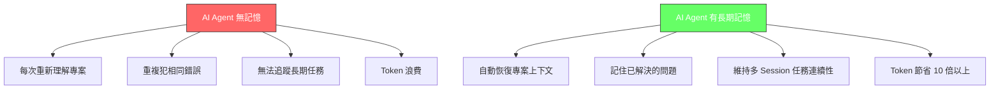

## 1.4 適合的使用場景

| 場景 | 適合程度 | 說明 |
|------|----------|------|
| 長期專案開發 | ⭐⭐⭐⭐⭐ | 跨數週/數月的持續開發，記憶價值最高 |
| 逆向工程分析 | ⭐⭐⭐⭐⭐ | Legacy 系統分析結果不易重建，記憶極為重要 |
| Framework 升級 | ⭐⭐⭐⭐⭐ | Breaking Changes 知識、Migration 策略需保存 |
| Bug 追蹤修復 | ⭐⭐⭐⭐ | 記住已嘗試的方案、已排除的原因 |
| 架構設計 | ⭐⭐⭐⭐ | 保存設計決策與 Trade-off 分析 |
| 一次性腳本 | ⭐⭐ | 短期任務，記憶價值較低 |
| 簡單程式碼生成 | ⭐ | 不需跨 Session 記憶 |

> **實務建議**：對於超過 3 個 Session 的任何開發任務，都建議啟用 claude-mem。記憶的複利效應會隨時間指數增長。

---

# 2. 核心架構

## 2.1 系統架構全景

claude-mem 採用**雙進程架構（Two-Process Architecture）**，將 Hook 處理與記憶運算分離，確保 IDE 不被阻塞：

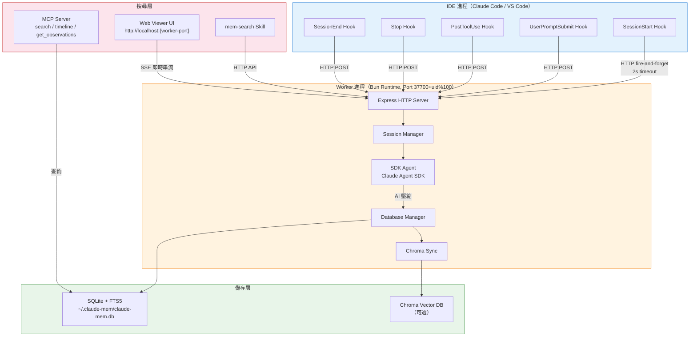

### 架構設計原則

| 原則 | 實作方式 |
|------|----------|
| **非阻塞（Non-blocking）** | IDE 的 HTTP 呼叫設定 2 秒 Timeout，使用 fire-and-forget 模式 |
| **事件驅動（Event-driven）** | Worker 使用事件佇列處理觀察記錄，零延遲通知 SDK Agent |
| **冪等操作（Idempotent）** | Session 建立使用 `INSERT OR IGNORE`，確保重複呼叫安全 |
| **邊緣處理（Edge Processing）** | 隱私標籤在 Hook 層即被移除，敏感資料不進入 Worker |
| **漸進式揭露（Progressive Disclosure）** | 搜尋從低 Token 索引開始，按需深入取得完整內容 |

## 2.2 Memory Pipeline（記憶管線）

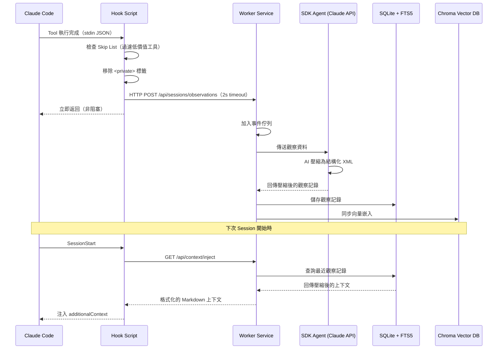

## 2.3 觀察記錄（Observation）資料模型

每次 AI 工具使用都會被捕捉並壓縮為結構化的觀察記錄：

```xml
<observation>
    <type>bugfix</type>
    <title>修復使用者登入時 JWT Token 過期的問題</title>
    <subtitle>Token refresh 機制未正確處理時區差異</subtitle>
    <narrative>
        發現 JWT Token 的過期時間計算未考慮伺服器與客戶端的時區差異。
        修改 TokenService.java 中的 generateToken() 方法，
        改用 UTC 時間統一計算過期時間。
    </narrative>
    <facts>
        <fact>JWT 過期時間應使用 UTC 而非本地時間</fact>
        <fact>TokenService.generateToken() 是 Token 生成的唯一入口</fact>
    </facts>
    <concepts>
        <concept>gotcha</concept>
        <concept>how-it-works</concept>
    </concepts>
    <files_read>
        <file>src/main/java/com/example/auth/TokenService.java</file>
    </files_read>
    <files_modified>
        <file>src/main/java/com/example/auth/TokenService.java</file>
    </files_modified>
</observation>
```

### 觀察類型（Observation Types）

| 類型 | 說明 | 典型場景 |
|------|------|----------|
| `decision` | 架構或設計決策 | 選擇 REST 而非 GraphQL |
| `bugfix` | Bug 修復 | 修正 NullPointerException |
| `feature` | 新功能 | 新增使用者註冊 API |
| `refactor` | 程式重構 | 抽取共用方法 |
| `discovery` | 程式碼探索發現 | 理解 Legacy 程式碼邏輯 |
| `change` | 一般性變更 | 更新設定檔 |

### 概念標籤（Concepts）

| 標籤 | 說明 |
|------|------|
| `how-it-works` | 系統行為解釋 |
| `why-it-exists` | 程式碼/設計的存在理由 |
| `what-changed` | 變更摘要 |
| `problem-solution` | 問題與解決方案配對 |
| `gotcha` | 陷阱與注意事項 |
| `pattern` | 重複出現的模式 |
| `trade-off` | 設計取捨 |

## 2.4 Session 生命週期

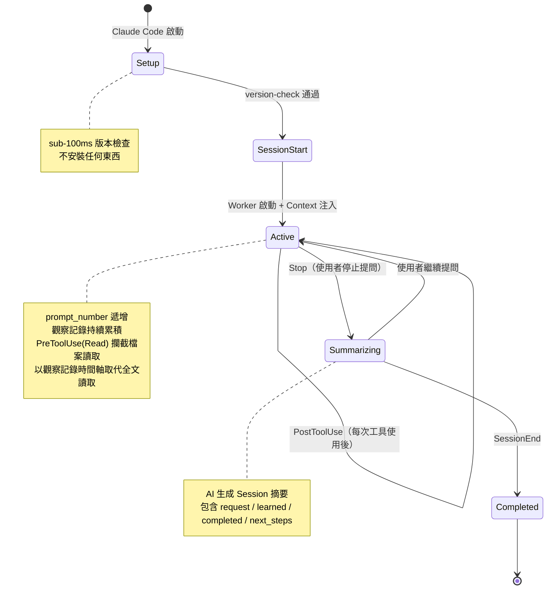

> **實務建議**：理解 Session 生命週期對於除錯至關重要。當觀察記錄未被正確捕捉時，通常是 PostToolUse Hook 未正確觸發，可檢查 `hooks.json` 中的 matcher 設定。另外，若檔案讀取未被攔截（File Read Gate 未生效），請確認 PreToolUse Hook 的 `Read` matcher 已正確註冊。

---

# 3. 安裝教學

## 3.1 系統需求

| 元件 | 最低版本 | 說明 |
|------|----------|------|
| Node.js | 20.0.0+ | JavaScript 執行環境（LTS 版本推薦） |
| Bun | ≥ 1.0 | JavaScript Runtime 及 Process Manager（安裝時自動下載） |
| uv | 最新版 | Python 套件管理器，供 Chroma 向量搜尋使用（自動安裝） |
| SQLite 3 | 內建 | 透過 `bun:sqlite` 驅動，無需額外安裝 |
| 支援 IDE | 最新版 | Claude Code、Cursor、Gemini CLI、Windsurf、OpenCode、Codex CLI、OpenClaw |

## 3.2 Windows 安裝

### Step 1：安裝 Node.js

```powershell
# 方法一：透過官網安裝
# 下載 https://nodejs.org/ 的 LTS 版本安裝程式

# 方法二：透過 winget
winget install OpenJS.NodeJS.LTS

# 方法三：透過 Chocolatey
choco install nodejs-lts

# 驗證安裝
node --version   # 應顯示 v20.x.x 以上
npm --version    # 應顯示 10.x.x 以上
```

### Step 2：安裝 Claude Code（若尚未安裝）

```powershell
# 透過 npm 全域安裝
npm install -g @anthropic-ai/claude-code

# 驗證安裝
claude --version
```

### Step 3：安裝 claude-mem

```powershell
# 一鍵安裝（推薦）
npx claude-mem install
```

安裝互動流程會依序：

1. **執行環境檢查**：自動安裝 Bun 和 uv（若缺少）
2. **IDE 偵測**：掃描已安裝的 IDE（Claude Code、Cursor、Gemini CLI 等），讓你多選要啟用哪些
3. **AI Provider 選擇**：選擇 Claude（預設）、Gemini 或 OpenRouter
4. **模型選擇**：選擇壓縮用的 Claude 模型（Haiku / Sonnet / Opus）
5. **Plugin 安裝**：複製 Plugin 檔案並註冊 Hook
6. **Worker 啟動**：自動啟動背景 Worker 服務

### Step 4：驗證安裝

```powershell
# 檢查 Worker 狀態
curl http://127.0.0.1:$WORKER_PORT/health
# Worker Port 預設為 37700 + (uid % 100)，可在 ~/.claude-mem/settings.json 查看

# 預期回應：
# {"status":"ok","uptime":12345,"port":<your-port>}

# 檢查資料目錄
dir $env:USERPROFILE\.claude-mem
# 應看到 claude-mem.db、settings.json 等檔案
```

### Windows 常見問題

```powershell
# 問題：npm 不是可識別的命令
# 解法：確認 Node.js 已加入 PATH，重啟終端機

# 問題：PowerShell 執行原則限制
Set-ExecutionPolicy -Scope CurrentUser -ExecutionPolicy RemoteSigned

# 問題：PORT 被佔用
# 解法：在 settings.json 中設定自訂 Port
# 編輯 ~/.claude-mem/settings.json
# { "CLAUDE_MEM_WORKER_PORT": "38000" }
```

## 3.3 macOS 安裝

```bash
# Step 1：安裝 Node.js（透過 Homebrew）
brew install node@20

# Step 2：安裝 Claude Code
npm install -g @anthropic-ai/claude-code

# Step 3：安裝 claude-mem
npx claude-mem install

# Step 4：驗證（Worker Port 預設為 37700 + uid%100）
curl http://127.0.0.1:$(cat ~/.claude-mem/.worker.port)/health
ls -la ~/.claude-mem/
```

## 3.4 Linux 安裝

```bash
# Step 1：安裝 Node.js（透過 nvm，推薦）
curl -o- https://raw.githubusercontent.com/nvm-sh/nvm/v0.40.0/install.sh | bash
source ~/.bashrc
nvm install 20
nvm use 20

# Step 2：安裝 Claude Code
npm install -g @anthropic-ai/claude-code

# Step 3：安裝 claude-mem
npx claude-mem install

# Step 4：驗證（Worker Port 預設為 37700 + uid%100）
curl http://127.0.0.1:$(cat ~/.claude-mem/.worker.port)/health
ls -la ~/.claude-mem/
```

## 3.5 替代安裝方式

### 從 Claude Code Plugin Marketplace 安裝

```bash
# 在 Claude Code 內執行
/plugin marketplace add thedotmack/claude-mem
/plugin install claude-mem
```

### 為 Gemini CLI 安裝

```bash
npx claude-mem install --ide gemini-cli
```

### 為 Cursor 安裝

```bash
npx claude-mem install --ide cursor
```

### 為 OpenCode 安裝

```bash
npx claude-mem install --ide opencode
```

### 從原始碼建置

```bash
git clone https://github.com/thedotmack/claude-mem.git
cd claude-mem
npm install
npm run build
npm run worker:start
npm run worker:status
```

> **注意**：`npm install -g claude-mem` 只安裝 SDK/Library，**不會**註冊 Plugin Hooks 或啟動 Worker。務必使用 `npx claude-mem install` 進行完整安裝。

---

# 4. 設定教學

## 4.1 設定檔位置

claude-mem 的設定集中管理於 `~/.claude-mem/settings.json`，首次執行時自動建立並填入預設值。

**資料目錄結構**：

```
~/.claude-mem/
├── claude-mem.db           # SQLite 資料庫
├── .install-version        # 版本標記（由 installer 寫入）
├── settings.json           # 主設定檔
├── .worker.pid             # Worker PID 檔
├── .worker.port            # Worker Port 檔
├── chroma/                 # Chroma 向量資料庫（可選）
└── logs/
    ├── worker-out.log      # Worker 標準輸出
    └── worker-error.log    # Worker 錯誤日誌
```

## 4.2 核心設定參數

### 完整 settings.json 範例

```json
{
  "CLAUDE_MEM_MODEL": "claude-haiku-4-5-20251001",
  "CLAUDE_MEM_PROVIDER": "claude",
  "CLAUDE_MEM_CLAUDE_AUTH_METHOD": "subscription",
  "CLAUDE_MEM_MODE": "code",
  "CLAUDE_MEM_WORKER_PORT": "37700",
  "CLAUDE_MEM_WORKER_HOST": "127.0.0.1",
  "CLAUDE_MEM_DATA_DIR": "~/.claude-mem",
  "CLAUDE_MEM_LOG_LEVEL": "INFO",
  "CLAUDE_MEM_SKIP_TOOLS": "ListMcpResourcesTool,SlashCommand,Skill,TodoWrite,AskUserQuestion",
  "CLAUDE_MEM_CONTEXT_OBSERVATIONS": "50",
  "CLAUDE_MEM_CONTEXT_SESSION_COUNT": "10",
  "CLAUDE_MEM_CONTEXT_OBSERVATION_TYPES": "bugfix,decision,discovery,feature,refactor,change",
  "CLAUDE_MEM_CONTEXT_OBSERVATION_CONCEPTS": "how-it-works,gotcha,pattern,problem-solution,trade-off,what-changed,why-it-exists",
  "CLAUDE_MEM_CONTEXT_FULL_COUNT": "5",
  "CLAUDE_MEM_CONTEXT_FULL_FIELD": "narrative",
  "CLAUDE_MEM_CONTEXT_SHOW_READ_TOKENS": "true",
  "CLAUDE_MEM_CONTEXT_SHOW_WORK_TOKENS": "true",
  "CLAUDE_MEM_CONTEXT_SHOW_SAVINGS_AMOUNT": "true",
  "CLAUDE_MEM_CONTEXT_SHOW_LAST_SUMMARY": "false",
  "CLAUDE_MEM_CONTEXT_SHOW_LAST_MESSAGE": "false"
}
```

### 參數詳解

| 參數 | 預設值 | 說明 |
|------|--------|------|
| `CLAUDE_MEM_MODEL` | `claude-haiku-4-5-20251001` | 用於壓縮觀察記錄的 Claude 模型。Haiku 快且便宜，Sonnet 平衡，Opus 最高品質 |
| `CLAUDE_MEM_PROVIDER` | `claude` | AI Provider：`claude`、`gemini`、`openrouter` |
| `CLAUDE_MEM_MODE` | `code` | 工作流模式。`code` 為預設英文，`code--zh` 簡體中文，`code--ja` 日文 |
| `CLAUDE_MEM_WORKER_PORT` | `37700 + (uid % 100)` | Worker HTTP 服務的 Port。預設依使用者 UID 自動分配，避免多使用者衝突 |
| `CLAUDE_MEM_DATA_DIR` | `~/.claude-mem` | 資料根目錄，所有其他路徑由此衍生 |
| `CLAUDE_MEM_LOG_LEVEL` | `INFO` | 日誌等級：`DEBUG`、`INFO`、`WARN`、`ERROR`、`SILENT` |
| `CLAUDE_MEM_SKIP_TOOLS` | 見上方 | 逗號分隔的排除工具清單，這些工具的使用不會被記錄 |

### Context Injection 設定

| 參數 | 預設值 | 範圍 | 說明 |
|------|--------|------|------|
| `CLAUDE_MEM_CONTEXT_OBSERVATIONS` | `50` | 1-200 | 注入的觀察記錄總數 |
| `CLAUDE_MEM_CONTEXT_SESSION_COUNT` | `10` | 1-50 | 從最近幾個 Session 中提取 |
| `CLAUDE_MEM_CONTEXT_FULL_COUNT` | `5` | 0-20 | 展開完整內容的觀察記錄數 |
| `CLAUDE_MEM_CONTEXT_FULL_FIELD` | `narrative` | `narrative` / `facts` | 展開哪個欄位的完整內容 |

> **實務建議**：
>
> - **小型專案**：`OBSERVATIONS=30`、`SESSION_COUNT=5` 即可
> - **大型專案**：`OBSERVATIONS=100`、`SESSION_COUNT=20` 以獲得更完整的歷史記憶
> - **Token 敏感場景**：`OBSERVATIONS=20`、`FULL_COUNT=3` 最小化注入成本

## 4.3 多 Provider 設定

### Claude Provider（預設）

```json
{
  "CLAUDE_MEM_PROVIDER": "claude",
  "CLAUDE_MEM_MODEL": "claude-haiku-4-5-20251001",
  "CLAUDE_MEM_CLAUDE_AUTH_METHOD": "subscription"
}
```

認證方式：
- `subscription`：使用 Claude Code 訂閱認證（最簡單）
- `api-key`：使用 Anthropic API Key
- `gateway`：透過 LiteLLM Gateway

### Gemini Provider

```json
{
  "CLAUDE_MEM_PROVIDER": "gemini",
  "CLAUDE_MEM_GEMINI_API_KEY": "your-gemini-api-key",
  "CLAUDE_MEM_GEMINI_MODEL": "gemini-2.5-flash-lite"
}
```

可用模型：`gemini-2.5-flash-lite`（預設，適合大多數場景）、`gemini-2.5-flash`、`gemini-3-flash-preview`。

### OpenRouter Provider

```json
{
  "CLAUDE_MEM_PROVIDER": "openrouter",
  "CLAUDE_MEM_OPENROUTER_API_KEY": "your-openrouter-api-key",
  "CLAUDE_MEM_OPENROUTER_MODEL": "xiaomi/mimo-v2-flash:free",
  "CLAUDE_MEM_OPENROUTER_MAX_TOKENS": "100000"
}
```

OpenRouter 支援 100+ 模型，包含免費模型如 `xiaomi/mimo-v2-flash:free`。

### LiteLLM Gateway（企業級）

在 `~/.claude-mem/.env` 中設定：

```env
ANTHROPIC_BASE_URL=https://your-litellm-proxy.company.com
ANTHROPIC_AUTH_TOKEN=your-litellm-key
```

```json
{
  "CLAUDE_MEM_PROVIDER": "claude",
  "CLAUDE_MEM_CLAUDE_AUTH_METHOD": "gateway"
}
```

## 4.4 語言模式設定

```json
{
  "CLAUDE_MEM_MODE": "code--zh"
}
```

| 模式 | 說明 |
|------|------|
| `code` | 預設英文模式 |
| `code--zh` | 簡體中文模式（內建） |
| `code--ja` | 日文模式 |
| `code--es` | 西班牙文模式 |
| `code--[lang]` | 自訂語言，`[lang]` 為 ISO 639-1 語言代碼 |

更改模式後需重啟 Claude Code 才能生效。

> **實務建議**：目前尚無內建繁體中文模式。團隊可在 `plugin/modes/` 目錄下建立自訂模式，複製 `code--zh` 資料夾並修改為繁體中文用語。

## 4.5 Team Shared Memory 策略

對於團隊環境，建議每位成員使用獨立的 `~/.claude-mem/` 目錄（預設行為），但透過以下策略實現知識共享：

1. **共享 CLAUDE.md 檔案**：將重要的架構決策寫入專案根目錄的 `CLAUDE.md`，所有團隊成員共享
2. **統一 Provider 設定**：團隊使用相同的 LiteLLM Gateway，集中管理 API 金鑰與成本
3. **統一 Mode 設定**：團隊使用相同的語言模式，確保觀察記錄語言一致
4. **Port 規劃**：為每位開發者分配固定 Port，避免衝突

```json
// 開發者 A
{ "CLAUDE_MEM_WORKER_PORT": "37801" }

// 開發者 B
{ "CLAUDE_MEM_WORKER_PORT": "37802" }
```

---

# 5. MCP（Model Context Protocol）整合

## 5.1 什麼是 MCP

MCP（Model Context Protocol）是 Anthropic 提出的開放標準，用於標準化 AI 模型與外部工具之間的通訊協定。它讓 AI Agent 能透過統一介面存取各種資源——包括 claude-mem 的記憶搜尋功能。

## 5.2 claude-mem 的 MCP 架構

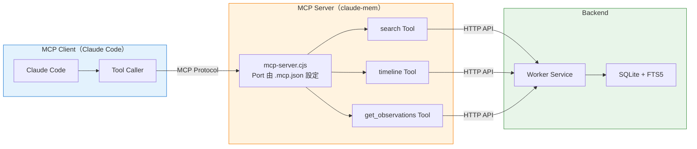

## 5.3 MCP 設定

MCP 設定位於 Plugin 目錄下的 `.mcp.json`：

```json
{
  "mcpServers": {
    "mem-search": {
      "command": "bun",
      "args": ["${CLAUDE_PLUGIN_ROOT}/scripts/mcp-server.cjs"],
      "env": {}
    }
  }
}
```

安裝 claude-mem 後，MCP Tools 會自動在 Claude Code Session 中可用，**無需額外設定**。

## 5.4 MCP Tools 詳解

### Tool 1：search

搜尋記憶索引，回傳精簡的結果清單。

```typescript
// 請求
search({
  query: "authentication bug",    // 搜尋關鍵字
  type: "bugfix",                 // 篩選觀察類型（可選）
  limit: 10,                      // 結果數量上限
  project: "my-project",          // 篩選專案（可選）
  date_range: "7d"                // 時間範圍（可選）
})

// 回應（~50-100 tokens/筆）
// ID | Title                              | Type    | Date
// 123 | 修復 JWT Token 過期問題             | bugfix  | 2026-05-20
// 456 | 使用者登入 Session 管理重構          | refactor| 2026-05-18
```

### Tool 2：timeline

取得特定觀察記錄周圍的時間軸上下文。

```typescript
// 請求
timeline({
  anchor: 123,          // 錨定的觀察記錄 ID
  depth_before: 5,      // 向前看 5 筆
  depth_after: 5,       // 向後看 5 筆
  project: "my-project" // 篩選專案（可選）
})

// 回應：以時間順序顯示 anchor 前後的觀察記錄
```

### Tool 3：get_observations

根據 ID 取得觀察記錄的完整內容。

```typescript
// 請求（永遠批次查詢多個 ID）
get_observations({
  ids: [123, 456],       // 觀察記錄 ID 陣列
  orderBy: "created_at", // 排序方式
  project: "my-project"  // 篩選專案（可選）
})

// 回應（~500-1,000 tokens/筆）：完整的 title、narrative、facts、concepts、files
```

## 5.5 MCP 使用範例

### 實際對話範例

```
使用者：「上次我們怎麼解決登入的問題？」

Claude 內部流程：
1. 辨識為記憶查詢意圖
2. 呼叫 search(query="登入問題", type="bugfix", limit=10)
3. 取得索引結果，找到 ID #123、#456 相關
4. 呼叫 get_observations(ids=[123, 456])
5. 讀取完整觀察記錄
6. 整合回覆使用者
```

### Token 節省計算

```
未使用 3-Layer Workflow：
  直接取得 10 筆完整觀察 = 10 × 800 tokens = 8,000 tokens

使用 3-Layer Workflow：
  Step 1: search 索引 = 10 × 75 tokens = 750 tokens
  Step 2: 篩選出 2 筆相關
  Step 3: get_observations = 2 × 800 tokens = 1,600 tokens
  合計 = 2,350 tokens

節省率 ≈ 70%（約 3.4 倍）
```

> **實務建議**：永遠遵循 3-Layer Workflow 的順序：先 `search` 取索引、再 `timeline` 看上下文、最後 `get_observations` 取完整內容。跳過前兩步直接取完整內容是 Token 浪費的主因。

---

# 6. 記憶工作流程（3-Layer Workflow）

## 6.1 設計哲學

3-Layer Workflow 的核心理念是**漸進式揭露（Progressive Disclosure）**——先用最少的 Token 成本取得概覽，再按需深入。這與人類回憶的方式類似：先想到「有這件事」，再回憶細節。

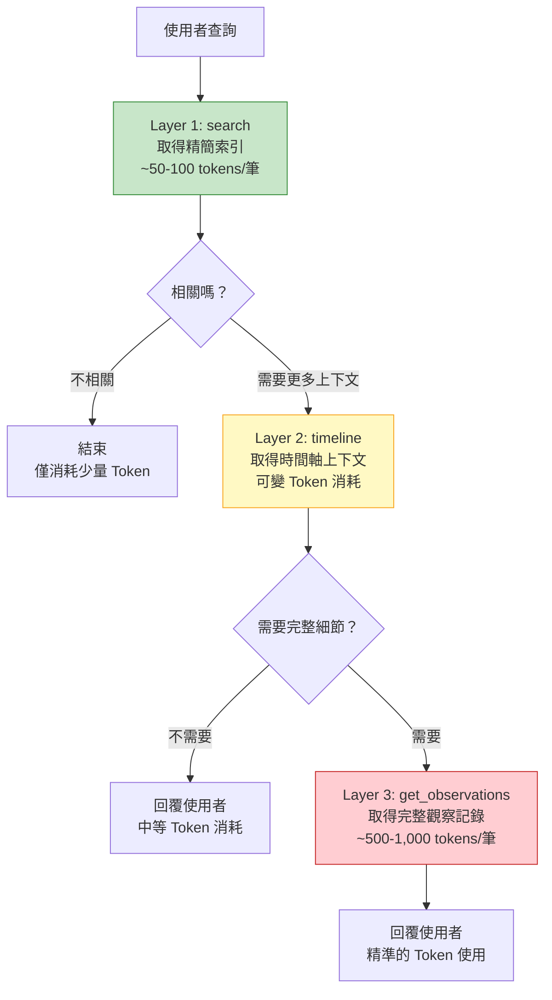

## 6.2 Layer 1：search（索引搜尋）

**目的**：快速瀏覽哪些記憶存在，篩選出可能相關的結果。

**Token 成本**：~50-100 tokens/筆（僅包含 ID、標題、類型、日期）

**實際使用**：

```bash
# Claude 自動呼叫（無需手動操作）
# 當使用者問：「我們之前怎麼處理 CORS 問題？」
# Claude 內部呼叫：

search(query="CORS", limit=10)

# 回傳結果（精簡格式）：
# ID  | Title                           | Type      | Date       | Tokens
# 234 | 設定 Spring Boot CORS Filter     | feature   | 2026-05-15 | 820
# 567 | 修復 CORS preflight 請求被擋     | bugfix    | 2026-05-18 | 650
# 891 | 重構 CORS 設定為集中管理          | refactor  | 2026-05-20 | 540
```

**進階篩選參數**：

| 參數 | 說明 | 範例 |
|------|------|------|
| `query` | 全文搜尋關鍵字 | `"CORS preflight"` |
| `type` | 觀察類型篩選 | `"bugfix"` |
| `limit` | 結果數量上限 | `10` |
| `project` | 專案名稱篩選 | `"my-spring-app"` |
| `date_range` | 時間範圍 | `"7d"`、`"30d"` |
| `offset` | 分頁偏移量 | `5`（從第 6 筆開始） |

## 6.3 Layer 2：timeline（時間軸上下文）

**目的**：理解某個觀察記錄前後發生了什麼，建立敘事弧線（Narrative Arc）。

**使用時機**：當 search 結果顯示某筆記錄可能相關，但需要更多上下文判斷時。

```bash
# 查看 ID #567 前後的事件
timeline(anchor=567, depth_before=3, depth_after=3)

# 回傳：時間順序的觀察記錄
# ...
# [2026-05-17] #501 發現前端 Axios 請求缺少 withCredentials
# [2026-05-18] #567 修復 CORS preflight 請求被擋 ← 錨定
# [2026-05-18] #570 更新 Nginx 反向代理的 CORS Header
# ...
```

## 6.4 Layer 3：get_observations（完整細節）

**目的**：取得經過篩選的觀察記錄完整內容，包含 narrative、facts、concepts、files。

**Token 成本**：~500-1,000 tokens/筆

**關鍵規則**：永遠批次查詢多個 ID，不要逐筆查詢。

```bash
# 取得篩選後的完整記錄
get_observations(ids=[567, 570])

# 回傳完整的觀察記錄，包含：
# - title: 修復 CORS preflight 請求被擋
# - narrative: 完整的修復過程描述
# - facts: ["Spring Boot 需要設定 allowedOrigins"、"preflight 用 OPTIONS 方法"]
# - concepts: ["gotcha", "how-it-works"]
# - files_modified: ["src/main/java/config/CorsConfig.java"]
```

## 6.5 Token 消耗分析與最佳實務

### Token 成本比較

| 策略 | 查詢 10 筆 | 選取 2 筆 | 總成本 | 節省率 |
|------|-----------|-----------|--------|--------|
| 直接取全部 | — | 10 × 800 = 8,000 | **8,000** | 基準 |
| 3-Layer | 10 × 75 = 750 | 2 × 800 = 1,600 | **2,350** | **71%** |
| 3-Layer + timeline | 750 + 300 | 2 × 800 = 1,600 | **2,650** | **67%** |

### 最佳實務

1. **先搜後取**：永遠從 `search` 開始，不要跳到 `get_observations`
2. **批次查詢**：合併多個 ID 到一次 `get_observations` 呼叫
3. **善用篩選**：用 `type`、`project`、`date_range` 縮小範圍
4. **控制 limit**：預設 `limit=10`，大多數場景足夠
5. **分頁處理**：結果過多時使用 `offset` 分頁

> **實務案例**：一個擁有 500+ 觀察記錄的大型專案，若每次 Session 都直接注入全部記錄，將消耗 ~40,000 tokens。透過 3-Layer Workflow 加上 Context Injection 設定（50 筆壓縮 + 5 筆展開），實際注入僅需 ~3,000 tokens。

---

# 7. Claude Code 整合

## 7.1 自動化運作原理

安裝 claude-mem 後，**一切都是自動的**。你不需要手動操作任何記憶相關功能。

### 自動 Context Injection 流程

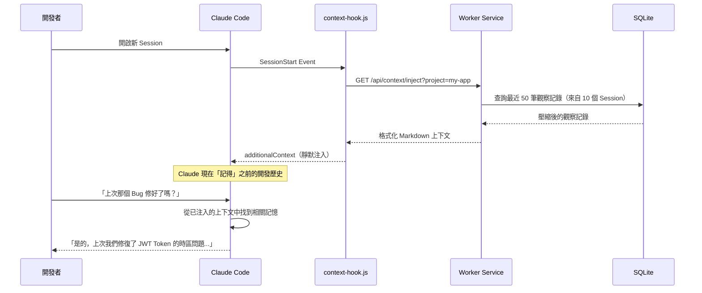

### 觀察記錄自動擷取

每次 Claude 使用工具（讀取檔案、執行指令、修改程式碼等），PostToolUse Hook 都會自動擷取：

```
Claude 執行 Read("src/main/java/UserService.java")
    ↓ PostToolUse Hook 自動觸發
    ↓ 檢查是否在 Skip List 中（Read 不在）
    ↓ 移除 <private> 標籤
    ↓ HTTP POST 到 Worker（fire-and-forget, 2s timeout）
    ↓ Worker 使用 AI 壓縮為觀察記錄
    ↓ 儲存到 SQLite + 同步到 Chroma
Claude 繼續工作（完全不被阻塞）
```

### 被跳過的低價值工具

以下工具的使用不會被記錄（可在 settings.json 中自訂）：

- `ListMcpResourcesTool`：MCP 基礎設施雜訊
- `SlashCommand`：指令觸發
- `Skill`：技能觸發
- `TodoWrite`：任務管理
- `AskUserQuestion`：使用者互動

## 7.2 Session 恢復（Session Restore）

claude-mem 的 Session 恢復機制讓開發者可以無縫地繼續中斷的工作：

1. **Session Summary**：每次 Stop 時，AI 自動生成結構化摘要

```json
{
  "request": "使用者要求實作使用者註冊 API",
  "investigated": "檢查了 UserController、UserService、UserRepository 的現有架構",
  "learned": "專案使用 Spring Data JPA + PostgreSQL，已有 BaseEntity 抽象類別",
  "completed": "完成了 POST /api/users 端點與基本驗證",
  "next_steps": "需要加入 Email 驗證邏輯和密碼加密"
}
```

2. **Context Injection**：下次 Session 開始時，上述摘要與觀察記錄自動注入
3. **Agent Continuity**：Claude 能從「next_steps」無縫接續工作

## 7.3 長期任務（Long-running Tasks）開發流程

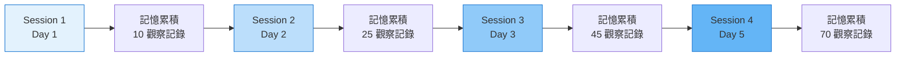

**最佳實務**：

1. **每日結束時自然停止 Session**：讓 Stop Hook 生成 Summary
2. **不要頻繁使用 /clear**：會中斷 Session 連續性
3. **使用 `<private>` 標籤保護敏感資訊**：
   ```
   <private>API Key: sk-xxxx</private>
   ```
4. **定期檢查 Web Viewer**：`http://localhost:<worker-port>` 查看記憶串流（Worker Port 可在 `~/.claude-mem/.worker.port` 查看）

## 7.4 Multi-Session 開發模式

適用於同時進行多個功能開發的場景：

```
專案 A（功能開發）→ Session 群組 A → 記憶集合 A
專案 B（Bug 修復）→ Session 群組 B → 記憶集合 B

claude-mem 自動依專案名稱（cwd 的 basename）分隔記憶
```

> **實務建議**：若同一專案中需要區分不同工作流，可在不同的工作目錄下作業，claude-mem 會自動依目錄名稱分隔記憶。

---

# 8. GitHub Copilot 整合

## 8.1 Copilot + claude-mem 協作模式

GitHub Copilot 與 claude-mem 可以形成互補的 AI 開發組合：

| 能力 | GitHub Copilot | claude-mem |
|------|---------------|------------|
| 即時程式碼補全 | ✅ 核心能力 | ❌ 非此用途 |
| 跨 Session 記憶 | ❌ 無原生支援 | ✅ 核心能力 |
| 架構理解 | ⚠️ 僅限當前上下文 | ✅ 累積性架構記憶 |
| Bug 歷史 | ❌ 無法追溯 | ✅ 完整修復歷史 |
| 團隊知識共享 | ⚠️ 有限（透過 Instructions） | ⚠️ 每人獨立記憶 |

### 建議的協作工作流

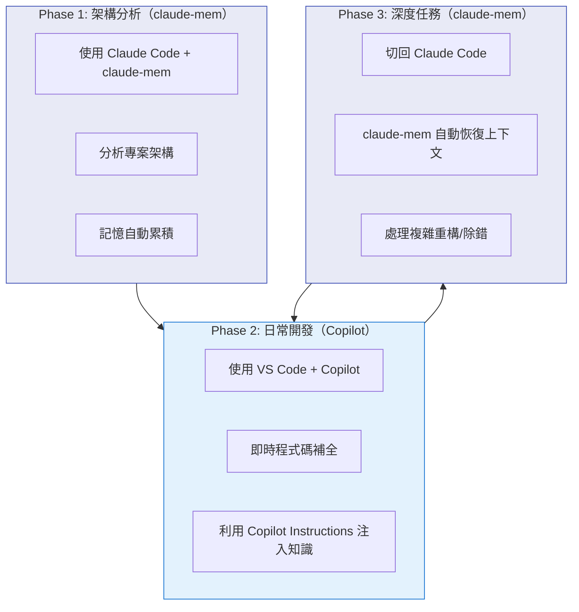

## 8.2 記憶共享策略

由於 claude-mem 的記憶儲存在 SQLite 中，可以透過以下方式將記憶知識橋接到 Copilot：

### 方法 1：匯出為 Copilot Instructions

將 claude-mem 中的架構決策與發現匯出到 `.github/copilot-instructions.md`：

```bash
# 透過 claude-mem Web Viewer 或 CLI 查看關鍵觀察記錄
# 手動或腳本將重要知識寫入 Copilot Instructions

# 範例：從 SQLite 匯出最重要的發現
sqlite3 ~/.claude-mem/claude-mem.db \
  "SELECT title, narrative FROM observations 
   WHERE type IN ('decision', 'discovery') 
   AND project='my-project'
   ORDER BY created_at_epoch DESC LIMIT 10;"
```

### 方法 2：共享 CLAUDE.md

在專案根目錄維護 `CLAUDE.md`，同時作為 Claude Code 和 Copilot 的知識來源。

### 方法 3：建立團隊知識庫

定期從 claude-mem 匯出關鍵觀察記錄，整理為團隊的 Wiki 或文件。

## 8.3 AI Pair Programming 工作流

```
1. 用 Claude Code + claude-mem 進行架構設計與原型開發
   → claude-mem 累積架構決策記憶

2. 用 VS Code + Copilot 進行日常編碼
   → 利用 Copilot 的即時補全加速開發

3. 遇到複雜問題時切回 Claude Code
   → claude-mem 自動恢復所有上下文
   → 不需重新解釋任何東西

4. 解決後繼續用 Copilot 日常開發
   → 將新的發現更新到 Copilot Instructions
```

> **實務建議**：建立一個團隊約定——每週五花 15 分鐘從 claude-mem 的 Web Viewer 中審閱本週的觀察記錄，將重要的架構決策同步到 `copilot-instructions.md`。這能讓兩個 AI 工具的效益最大化。

---

# 9. 實戰：Web 應用程式開發

## 9.1 場景描述

使用 claude-mem 輔助開發一個 Spring Boot + Vue 3 的全端應用程式，展示記憶如何在多日開發中累積與發揮價值。

## 9.2 Day 1：專案初始化與架構設計

```bash
# 開啟 Claude Code Session
claude

# 告訴 Claude 你要做什麼
> 我要建立一個員工管理系統，使用 Spring Boot 3.3 + Vue 3 + PostgreSQL
```

**claude-mem 自動記錄的觀察記錄**：

```
observation #1 (type: decision)
  title: 選擇 Spring Boot 3.3 + Vue 3 + PostgreSQL 架構
  narrative: 使用者決定用 Spring Boot 3.3 作為後端框架，搭配 Vue 3 前端和
             PostgreSQL 資料庫。專案結構採用前後分離模式。
  facts:
    - 後端：Spring Boot 3.3, Java 21
    - 前端：Vue 3 + Vite + TypeScript
    - 資料庫：PostgreSQL 16
    - API 風格：RESTful
  concepts: [decision, how-it-works]
```

## 9.3 Day 2：API 開發（claude-mem 自動恢復上下文）

```bash
# 新的一天，開啟新 Session
claude

> 繼續昨天的員工管理系統開發
```

**Claude 的回應**（因為 claude-mem 自動注入了 Day 1 的記憶）：

```
我看到昨天我們建立了員工管理系統的基礎架構：
- Spring Boot 3.3 + Java 21 後端
- Vue 3 + Vite 前端
- PostgreSQL 16 資料庫
- 已建立 Employee Entity 和 Repository

今天我們可以繼續實作 CRUD API。需要我先建立 EmployeeController 嗎？
```

**新增的觀察記錄**：

```
observation #15 (type: feature)
  title: 實作 Employee CRUD REST API
  narrative: 建立了完整的 EmployeeController，包含 GET/POST/PUT/DELETE 端點。
             使用 @Valid 進行請求驗證，ResponseEntity 處理回傳。
  facts:
    - GET /api/employees - 查詢全部
    - GET /api/employees/{id} - 查詢單筆
    - POST /api/employees - 新增
    - PUT /api/employees/{id} - 更新
    - DELETE /api/employees/{id} - 刪除
  files_modified:
    - src/main/java/controller/EmployeeController.java
    - src/main/java/service/EmployeeService.java
    - src/main/java/dto/EmployeeRequest.java
```

## 9.4 Day 5：除錯（記憶發揮最大價值）

```bash
claude

> 生產環境回報員工薪資欄位出現精度遺失問題
```

**Claude 的回應**（利用 Day 1 記憶中的資料庫選擇 + Day 2 的 Entity 結構）：

```
根據我們的記憶，Employee Entity 的 salary 欄位使用了 Double 型別。
這會導致浮點數精度問題。建議改為 BigDecimal。

我看到之前的決策記錄中提到使用 PostgreSQL，
PostgreSQL 的 NUMERIC 型別與 BigDecimal 有完美的對應。

讓我修改：
1. Employee.java: Double salary → BigDecimal salary
2. 更新 DTO 的型別映射
3. 新增 Flyway migration 更新欄位型別
```

```
observation #45 (type: bugfix)
  title: 修復薪資欄位 Double 精度遺失問題
  narrative: 將 salary 從 Double 改為 BigDecimal 解決精度問題。
             同時更新 PostgreSQL 欄位為 NUMERIC(15,2)。
  facts:
    - Double 在 Java 中有浮點精度問題
    - BigDecimal 是貨幣欄位的正確選擇
    - PostgreSQL NUMERIC 與 BigDecimal 完美對應
  concepts: [gotcha, how-it-works]
```

## 9.5 前端框架的記憶累積比較

| 前端框架 | 常見記憶類型 | 典型觀察記錄範例 |
|---------|------------|----------------|
| Vue 3 | Composition API 模式 | `ref()` vs `reactive()` 的選擇時機 |
| React | Hooks 使用模式 | `useEffect` 清理函數的必要性 |
| Angular | RxJS 管線 | `switchMap` vs `mergeMap` 的場景選擇 |

> **實務建議**：在 Day 1 就讓 Claude 完整檢視專案結構，產生高品質的初始觀察記錄。這些記憶將成為後續所有 Session 的基礎。

---

# 10. 實戰：逆向工程（Legacy System）

## 10.1 場景描述

使用 claude-mem 協助理解並現代化一個 20 年歷史的 Java EE 應用程式。

## 10.2 逆向工程工作流

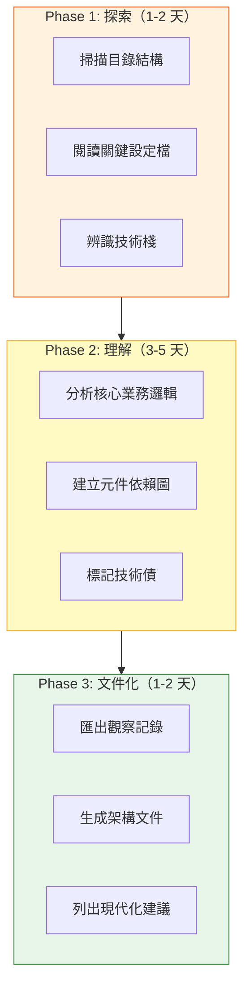

## 10.3 Session 1：初始探索

```bash
claude

> 這是一個 Java EE 6 專案，使用 JSF + EJB + JPA。
> 請幫我理解整個架構。先從 pom.xml 和目錄結構開始。
```

**claude-mem 自動記錄**：

```
observation #1 (type: discovery)
  title: Legacy Java EE 6 技術棧分析
  narrative: 專案使用 JSF 2.2 (PrimeFaces 6) + EJB 3.1 + JPA 2.1 (Hibernate 4.3)。
             部署在 WildFly 10 上。建置工具為 Maven 3，無模組化架構。
             發現 120+ 個 Managed Bean，90+ 個 EJB，200+ 個 Entity。
  facts:
    - 框架：JSF 2.2, EJB 3.1, JPA 2.1
    - 應用伺服器：WildFly 10 (JBoss)
    - ORM：Hibernate 4.3（內嵌於 WildFly）
    - 無微服務架構，單體應用
    - src/main/java 下有 1,200+ 個 Java 檔案
  concepts: [how-it-works, what-changed]
```

## 10.4 Session 5：發現隱藏的業務規則

```
observation #38 (type: discovery)
  title: 發現隱藏在 SQL Stored Procedure 中的核心業務規則
  narrative: 薪資計算邏輯不在 Java 程式碼中，而是在 Oracle 的 PL/SQL Stored
             Procedure 裡。找到 calc_salary_sp 包含 15 個條件分支，涵蓋
             加班費、津貼、稅務扣除、退休金提撥等計算。
  facts:
    - 核心 SP：CALC_SALARY_SP（~800 行 PL/SQL）
    - 薪資計算在 Java 端只是呼叫 SP，無業務邏輯
    - 另有 3 個相關 SP 處理年終獎金和特殊津貼
  concepts: [gotcha, how-it-works, trade-off]
```

## 10.5 記憶累積的價值

經過 10 個 Session 後，claude-mem 累積了 ~80 個觀察記錄：

| 類型 | 數量 | 價值 |
|------|------|------|
| discovery | 25 | 架構理解、技術棧盤點 |
| decision | 15 | 現代化策略選擇 |
| bugfix | 10 | 潛在問題標記 |
| refactor | 20 | 重構機會清單 |
| feature | 10 | 功能映射 |

**匯出為架構文件**：

```sql
-- 從 SQLite 匯出重要的發現
SELECT type, title, narrative 
FROM observations 
WHERE project = 'legacy-javaee-app' 
  AND type IN ('discovery', 'decision')
ORDER BY created_at_epoch;
```

> **實務建議**：進行逆向工程時，讓 Claude 大量閱讀程式碼，不要急著修改。初期的探索性 Session 產生的觀察記錄品質最高，因為都是「首次發現」。

---

# 11. 實戰：框架升級

## 11.1 場景描述

使用 claude-mem 協助將 Spring Boot 2.7 專案升級到 Spring Boot 3.3。

## 11.2 升級前的記憶建立

```bash
claude

> 我需要將這個 Spring Boot 2.7 專案升級到 3.3。
> 先幫我分析現有的相依性和可能的破壞性變更。
```

```
observation #1 (type: discovery)
  title: Spring Boot 2.7 → 3.3 升級影響分析
  narrative: 分析了 pom.xml 的所有相依性。主要影響：
             1. javax → jakarta 命名空間遷移（影響 120+ 個檔案）
             2. Spring Security 6.x 的設定 API 改變
             3. Hibernate 6.x 的 ID 生成策略改變
             4. Spring Cloud 版本相容性
  facts:
    - javax.persistence → jakarta.persistence
    - javax.servlet → jakarta.servlet
    - WebSecurityConfigurerAdapter 已移除
    - GenerationType.AUTO 行為改變
    - Flyway 需升級到 9.x+
    - 30 個直接相依套件需更新
  concepts: [what-changed, gotcha, how-it-works]
```

## 11.3 分階段升級（claude-mem 追蹤進度）

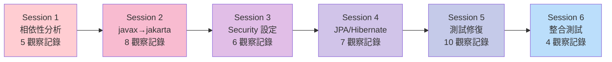

## 11.4 Session 3：Security 設定遷移

```bash
claude

> 繼續升級，現在處理 Spring Security 的部分
```

**Claude 的回應**（claude-mem 自動注入 Session 1-2 的記憶）：

```
根據之前的分析，Spring Security 主要變更有：
1. WebSecurityConfigurerAdapter 已移除（我們的 SecurityConfig 使用了它）
2. authorizeRequests() → authorizeHttpRequests()
3. antMatchers() → requestMatchers()

讓我開始遷移...
```

```
observation #18 (type: refactor)
  title: 遷移 Spring Security 設定到 SecurityFilterChain Bean
  narrative: 將 SecurityConfig 從繼承 WebSecurityConfigurerAdapter 改為
             使用 @Bean SecurityFilterChain 模式。同時更新所有
             antMatchers 為 requestMatchers。
  facts:
    - 舊：extends WebSecurityConfigurerAdapter + @Override configure()
    - 新：@Bean SecurityFilterChain filterChain(HttpSecurity http)
    - antMatchers → requestMatchers（4 處修改）
    - csrf() → csrf(Customizer) 鏈式呼叫改為 Lambda DSL
  files_modified:
    - src/main/java/config/SecurityConfig.java
    - src/main/java/config/OAuth2Config.java
  concepts: [what-changed, how-it-works]
```

## 11.5 升級結束後的知識沉澱

升級完成後，claude-mem 累積了 ~40 個觀察記錄，形成了完整的升級知識庫：

**匯出升級指南**：

```sql
SELECT type, title, 
       GROUP_CONCAT(facts, '; ') as key_facts
FROM observations
WHERE project = 'my-spring-boot-app'
  AND title LIKE '%Spring Boot%' OR title LIKE '%升級%' OR title LIKE '%遷移%'
GROUP BY type
ORDER BY created_at_epoch;
```

**這些記憶的長期價值**：
- 下次升級另一個 Spring Boot 專案時，Claude 可以參考這些記憶
- 團隊其他成員遇到類似問題時，可透過 search 找到解決方案
- 觀察記錄成為「活的升級文件」

> **實務建議**：框架升級時，每個升級步驟用獨立的 Session 處理。這樣 claude-mem 會為每個步驟生成獨立的 Summary，方便回溯與參考。

---

# 12. Token 最佳化策略

## 12.1 Token 成本結構

claude-mem 的 Token 消耗主要來自三個環節：

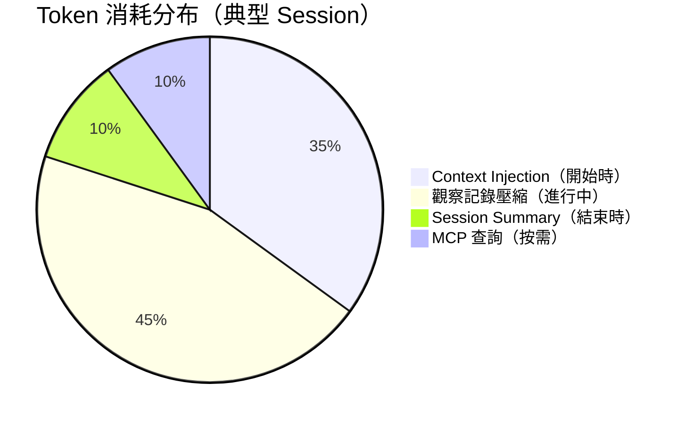

## 12.2 Context Injection 最佳化

### 關鍵參數調整

```json
{
  "CLAUDE_MEM_CONTEXT_OBSERVATIONS": 50,
  "CLAUDE_MEM_CONTEXT_SESSION_COUNT": 10,
  "CLAUDE_MEM_CONTEXT_MAX_TOKENS": 4000
}
```

| 參數 | 預設值 | 建議範圍 | 影響 |
|------|--------|---------|------|
| `CONTEXT_OBSERVATIONS` | 50 | 20-100 | 注入的觀察記錄數量上限 |
| `CONTEXT_SESSION_COUNT` | 10 | 3-20 | 參考的歷史 Session 數量 |
| `CONTEXT_MAX_TOKENS` | 4000 | 2000-8000 | 注入上下文的 Token 上限 |

### 壓縮與展開比例

claude-mem 使用兩層注入策略：
- **壓縮層**（大部分記錄）：僅注入標題 + 類型 + 日期，~50 tokens/筆
- **展開層**（最近 5 筆）：注入完整內容，~500 tokens/筆

```
50 筆壓縮 = 50 × 50 = 2,500 tokens
5 筆展開 = 5 × 500 = 2,500 tokens
總計 ≈ 5,000 tokens（最壞情況下的自動注入成本）
```

## 12.3 觀察記錄壓縮最佳化

每次 PostToolUse Hook 觸發時，Worker 會呼叫 AI 將原始工具輸出壓縮為觀察記錄。

**最佳化策略**：

1. **擴大 Skip List**：將低價值工具加入跳過清單
   ```json
   {
     "skipTools": [
       "ListMcpResourcesTool", "SlashCommand", "Skill",
       "TodoWrite", "AskUserQuestion",
       "ListDirectory", "SearchFiles"
     ]
   }
   ```

2. **選擇更小的壓縮模型**：
   ```json
   {
     "CLAUDE_MEM_MODEL": "haiku-4-5",
     "CLAUDE_MEM_PROVIDER": "claude"
   }
   ```

3. **調整去重閾值**：避免記錄重複的觀察
   ```json
   {
     "dedup_similarity_threshold": 0.85
   }
   ```

## 12.4 Token 預算規劃

| 專案規模 | 每日 Session 數 | 每日觀察記錄 | 每日 Token 消耗 | 月成本估算 |
|---------|----------------|-------------|----------------|-----------|
| 小型（個人） | 2-3 | 15-25 | ~30K | ~$0.50 |
| 中型（團隊） | 5-8 | 40-60 | ~80K | ~$1.50 |
| 大型（企業） | 10+ | 80-120 | ~150K | ~$3.00 |

> **注意**：以上為 claude-mem 本身的 Token 消耗（壓縮 + 注入），不包含 Claude Code 主模型的 Token 消耗。

---

# 13. 企業架構

## 13.1 單人開發架構

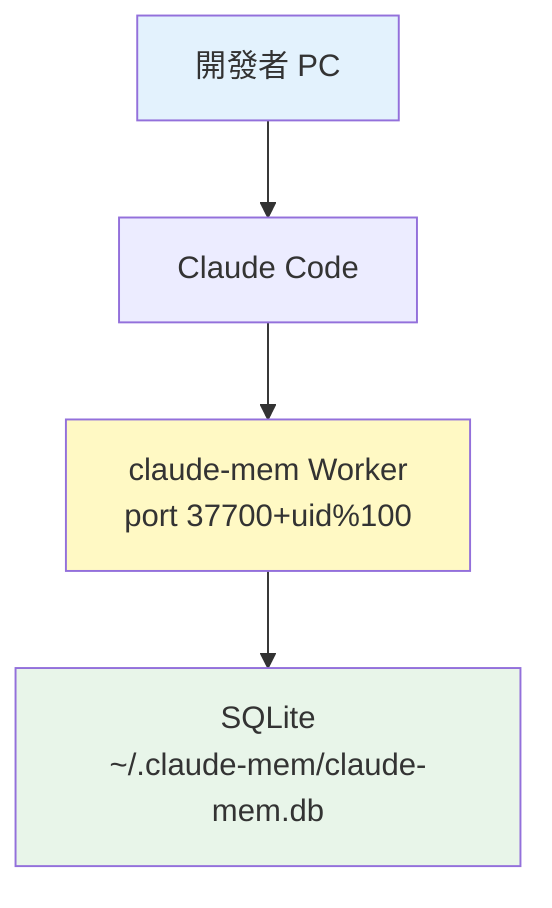

## 13.2 團隊開發架構

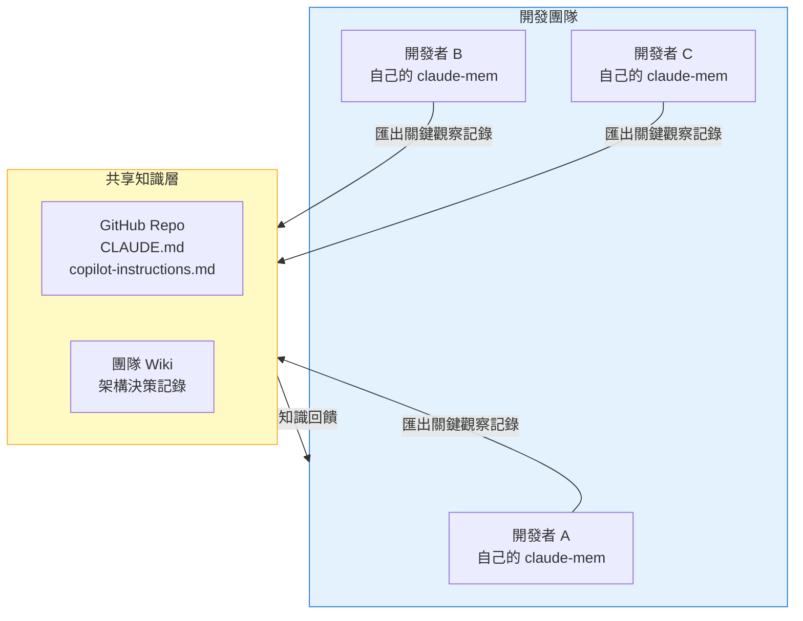

## 13.3 企業架構（LiteLLM Gateway）

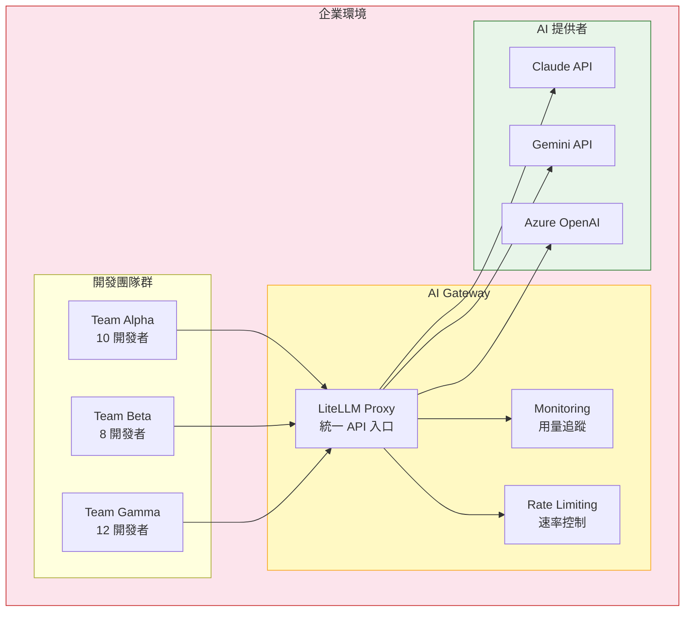

### LiteLLM 設定範例

```json
{
  "CLAUDE_MEM_PROVIDER": "openrouter",
  "CLAUDE_MEM_MODEL": "anthropic/claude-3-5-haiku-20241022",
  "CLAUDE_MEM_API_KEY": "${LITELLM_API_KEY}",
  "CLAUDE_MEM_API_BASE_URL": "https://litellm.internal.company.com/v1"
}
```

## 13.4 安全性考量

| 層面 | 措施 | 實作方式 |
|------|------|---------|
| 資料駐留 | 本地 SQLite | 記憶永遠不離開開發者機器 |
| 敏感資料 | `<private>` 標籤 | 在 Hook 層邊緣處理，不送出 |
| API 存取 | LiteLLM Gateway | 統一管理金鑰，開發者不接觸 API Key |
| 稽核 | Worker 日誌 | 每次觀察記錄建立都有 audit trail |

---

# 14. SQLite 資料庫深入解析

## 14.1 資料庫 ER 圖

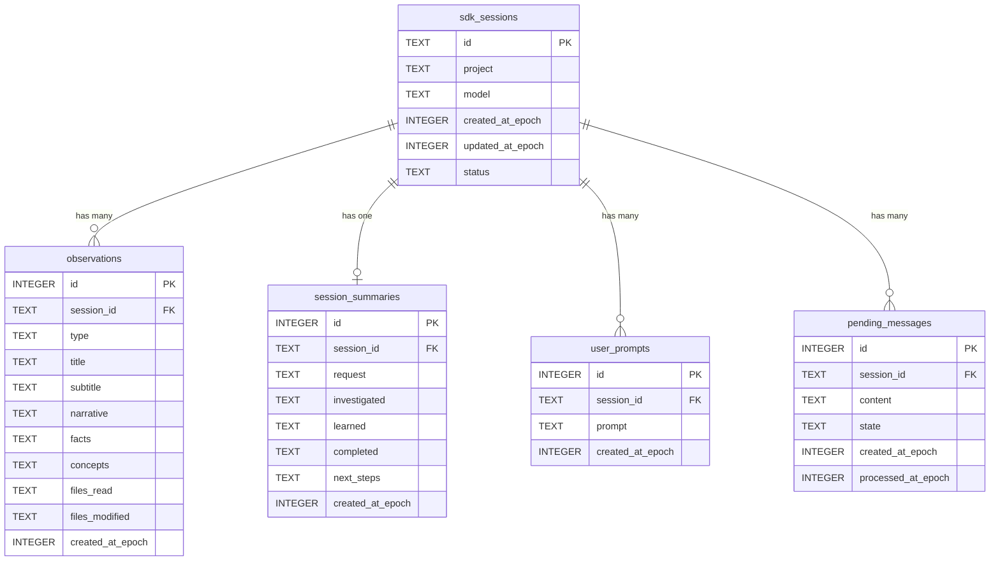

## 14.2 FTS5 全文搜尋

claude-mem 使用 SQLite FTS5 擴充套件提供高效的全文搜尋：

```sql
-- FTS5 Virtual Tables（自動同步）
CREATE VIRTUAL TABLE observations_fts USING fts5(
    title, subtitle, narrative, facts, concepts,
    content='observations', content_rowid='id'
);

CREATE VIRTUAL TABLE session_summaries_fts USING fts5(
    request, investigated, learned, completed, next_steps,
    content='session_summaries', content_rowid='id'
);

CREATE VIRTUAL TABLE user_prompts_fts USING fts5(
    prompt,
    content='user_prompts', content_rowid='id'
);
```

### 搜尋範例

```sql
-- 搜尋包含 CORS 的觀察記錄
SELECT o.id, o.title, o.type, o.created_at_epoch
FROM observations_fts fts
JOIN observations o ON fts.rowid = o.id
WHERE observations_fts MATCH 'CORS'
ORDER BY rank;

-- 搜尋包含 Spring Boot AND 升級 的記錄
SELECT * FROM observations_fts 
WHERE observations_fts MATCH 'Spring Boot AND 升級';

-- 模糊搜尋（前綴匹配）
SELECT * FROM observations_fts 
WHERE observations_fts MATCH 'Secur*';
```

## 14.3 WAL 模式

claude-mem 使用 WAL（Write-Ahead Logging）模式以支援並行讀寫：

```sql
PRAGMA journal_mode=WAL;
```

**優勢**：
- 讀取不會阻塞寫入
- 寫入不會阻塞讀取
- 適合 claude-mem 的「多 Hook 同時寫入 + MCP 同時查詢」場景

## 14.4 資料庫維護

```bash
# 檢視資料庫大小
ls -la ~/.claude-mem/claude-mem.db

# 手動 VACUUM（壓縮資料庫）
sqlite3 ~/.claude-mem/claude-mem.db "VACUUM;"

# 匯出所有觀察記錄為 JSON
sqlite3 -json ~/.claude-mem/claude-mem.db \
  "SELECT * FROM observations ORDER BY created_at_epoch DESC;"

# 刪除 30 天前的觀察記錄（謹慎使用）
sqlite3 ~/.claude-mem/claude-mem.db \
  "DELETE FROM observations WHERE created_at_epoch < strftime('%s','now','-30 days');"
```

---

# 15. Hooks 與 Worker 機制

## 15.1 Hook 生命週期

claude-mem 共有 **6 個 Hook 階段**（含 Setup 版本檢查），涵蓋完整的 Session 生命週期：

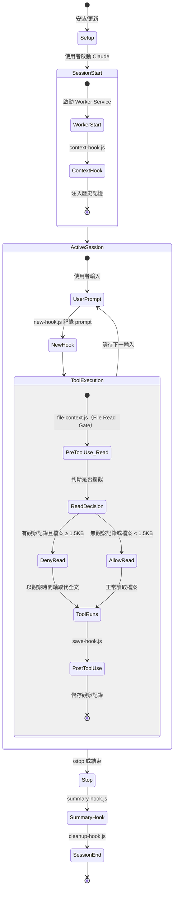

### Hook 階段摘要

| 階段 | Hook 檔案 | 觸發時機 | 功能 |
|------|-----------|----------|------|
| Setup | version-check | Claude Code 啟動 | sub-100ms 版本檢查，不安裝任何東西 |
| SessionStart | context-hook.js | Session 開始 | 啟動 Worker + 注入歷史記憶 |
| UserPromptSubmit | new-hook.js | 使用者每次輸入 | 記錄 prompt，遞增 prompt_number |
| PreToolUse（Read） | file-context.js | Claude 嘗試讀取檔案 | **File Read Gate**：攔截讀取，以觀察時間軸取代全文 |
| PostToolUse | save-hook.js | 工具執行完成 | 壓縮並儲存觀察記錄 |
| Stop | summary-hook.js | 使用者停止提問 | AI 生成 Session Summary |
| SessionEnd | cleanup-hook.js | Session 結束 | 清理資源 |

## 15.2 Fire-and-Forget 模式

所有 Hook 到 Worker 的通訊都是 **Fire-and-Forget**：

```
Hook 程式碼（在 Claude Code 進程中執行）
    ↓
    HTTP POST → Worker (timeout: 2s)
    ↓
    不等待回應，立即返回
    ↓
    Claude Code 繼續工作

Worker 程式碼（獨立進程）
    ↓
    接收 HTTP 請求
    ↓
    呼叫 AI 壓縮為觀察記錄
    ↓
    寫入 SQLite
    ↓
    同步到 Chroma（如果啟用）
```

**為什麼用 2s timeout？**
- 如果 Worker 沒有啟動或崩潰，Claude Code 不應被阻塞
- 記憶是「盡最大努力」的功能，不應影響主要工作流

## 15.3 Worker Service 架構

```
Worker Service（Express.js 5 on Bun）
├── Port: 37700 + (uid % 100)
├── 端點：
│   ├── POST /api/hooks/new          → 記錄使用者 prompt
│   ├── POST /api/hooks/save         → 壓縮並儲存觀察記錄
│   ├── POST /api/hooks/summary      → 生成 Session Summary
│   ├── GET  /api/context/inject     → 取得注入上下文
│   ├── GET  /api/mcp/search         → MCP search
│   ├── GET  /api/mcp/timeline       → MCP timeline
│   └── GET  /api/mcp/observations   → MCP get_observations
├── 資料庫：
│   ├── SQLite (bun:sqlite, WAL mode)
│   └── Chroma (optional, semantic search)
└── AI Provider：
    ├── Claude (default, haiku-4-5)
    ├── Gemini
    └── OpenRouter
```

## 15.4 Pending Messages 佇列

Worker 使用佇列管理未處理的訊息：

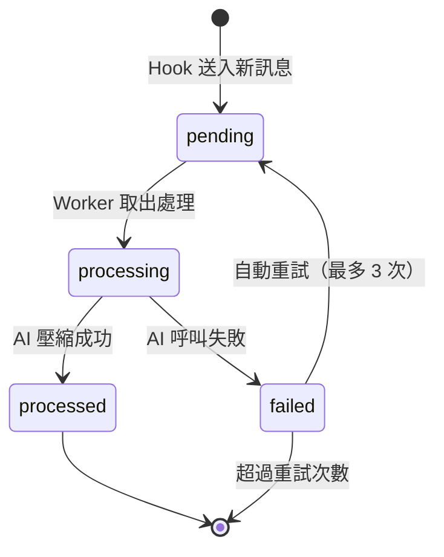

| 狀態 | 說明 |
|------|------|
| `pending` | 剛收到，等待處理 |
| `processing` | 正在呼叫 AI 壓縮 |
| `processed` | 成功寫入觀察記錄 |
| `failed` | 處理失敗 |

---

# 16. Context Injection 機制

## 16.1 注入流程

當新的 Claude Code Session 開始時：

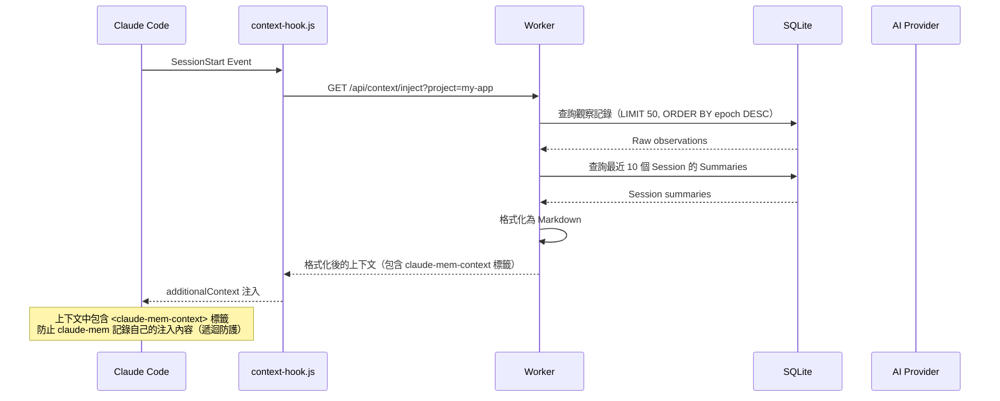

## 16.2 注入內容結構

```markdown
<claude-mem-context>
## 最近的開發記憶

### 最近 Session 摘要
- [2026-05-20] 完成了使用者註冊 API 的實作，下一步需要加入 Email 驗證
- [2026-05-19] 修復了 JWT Token 時區問題，學到 ZonedDateTime 的重要性
- [2026-05-18] 建立了專案基礎架構，選擇 Spring Boot 3.3 + Vue 3

### 關鍵觀察記錄（壓縮）
| ID | Title | Type | Date |
|----|-------|------|------|
| 45 | 修復薪資欄位精度問題 | bugfix | 05-20 |
| 38 | Employee CRUD API 完成 | feature | 05-19 |
| ... | ... | ... | ... |

### 最近觀察記錄（展開，最新 5 筆）
#### #45: 修復薪資欄位精度問題
- **type**: bugfix
- **narrative**: 將 salary 從 Double 改為 BigDecimal...
- **facts**: [Double 有精度問題, BigDecimal 是正確選擇]
- **files_modified**: [Employee.java, EmployeeDTO.java]

...
</claude-mem-context>
```

## 16.3 遞迴防護

`<claude-mem-context>` 標籤的關鍵作用是**防止 claude-mem 記錄自己的注入內容**：

```
Session 開始 → 注入歷史記憶（帶 <claude-mem-context> 標籤）
    ↓
Claude 處理使用者請求 → 使用工具 → PostToolUse Hook 觸發
    ↓
save-hook.js 檢查內容：
  - 包含 <claude-mem-context>？→ 跳過，不記錄
  - 不包含？→ 正常壓縮並記錄
```

**為什麼重要？** 如果沒有這個防護，claude-mem 會把自己注入的記憶重新記錄一次，造成：
- 記憶膨脹（每個 Session 都會複製前一個 Session 的記憶）
- Token 浪費（壓縮已壓縮過的內容）
- 資訊退化（多次壓縮會遺失細節）

## 16.4 `<private>` 標籤處理

```
使用者輸入：
  "我的資料庫密碼是 <private>MyP@ssw0rd!</private>"
    ↓
Hook 層（邊緣處理）：
  1. 正則表達式匹配 <private>...</private>
  2. 完全移除標籤及內容
  3. 替換為 "[REDACTED]"
    ↓
送往 Worker 的內容：
  "我的資料庫密碼是 [REDACTED]"
    ↓
觀察記錄：
  narrative: "使用者設定了資料庫連線，密碼已遮蔽"
```

> **安全提示**：`<private>` 標籤在 Hook 層（Claude Code 進程內）就被處理掉，敏感資料永遠不會到達 Worker Service 或 AI Provider。這是邊緣處理（Edge Processing）的安全設計。

---

# 17. Prompt Engineering 與 claude-mem

## 17.1 善用記憶的 Prompt 模板

### 模板 1：專案啟動（第一次使用 claude-mem 的專案）

```
我要開始在這個專案中使用 claude-mem。
請先全面掃描專案結構，閱讀以下關鍵檔案：
1. pom.xml / package.json（相依性）
2. README.md（專案說明）
3. 主要設定檔（application.yml 等）
4. 目錄結構
5. 核心模組的進入點

建立完整的專案理解後，告訴我你觀察到的架構模式和潛在問題。
```

### 模板 2：接續工作（開啟新 Session）

```
繼續上次的工作。
根據你的記憶，上次我們做到哪裡？下一步是什麼？
```

### 模板 3：除錯（利用歷史記憶）

```
[描述問題]

請先查看你的記憶中是否有類似問題的修復記錄。
如果有，參考過去的解法。如果沒有，從頭分析。
```

### 模板 4：重構前評估

```
我想重構 [模組名稱]。
請根據你對這個模組的記憶：
1. 列出所有相關的觀察記錄
2. 總結過去的修改歷史
3. 標記可能的風險區域
4. 建議重構策略
```

## 17.2 記憶強化技巧

### 主動引導記憶品質

```
# 告訴 Claude 這個決策很重要，確保被記住
> 這是一個重要的架構決策：我們選擇使用 Event Sourcing 而不是 CRUD。
> 原因是：1) 需要完整的審計軌跡 2) 可能需要時間旅行查詢
> 請確保這個決策被完整記錄。
```

### 標記不需記錄的內容

```
# 使用 <private> 標籤保護敏感資訊
> 連線到資料庫 <private>postgres://admin:P@ss123@db.company.com:5432/prod</private>
> 幫我查看 users 表格的結構
```

### 提供上下文提示

```
# 明確告訴 Claude 你的意圖，幫助生成更精準的觀察記錄
> 我正在做 Spring Boot 2.7 → 3.3 的升級（Day 3: Security 遷移）
> 今天的重點是把所有 WebSecurityConfigurerAdapter 換成 SecurityFilterChain
```

## 17.3 Anti-Patterns（應避免的做法）

| Anti-Pattern | 問題 | 正確做法 |
|-------------|------|---------|
| 頻繁 `/clear` | 中斷 Session 連續性 | 讓 Session 自然結束 |
| 過於瑣碎的請求 | 產生低價值觀察記錄 | 合併相關操作到同一請求 |
| 不提供上下文 | 觀察記錄缺乏敘事性 | 明確說明意圖和背景 |
| 同時開多個 Claude | Worker 可能收到混亂的訊號 | 一次一個 Session |

---

# 18. 團隊導入指南

## 18.1 導入階段

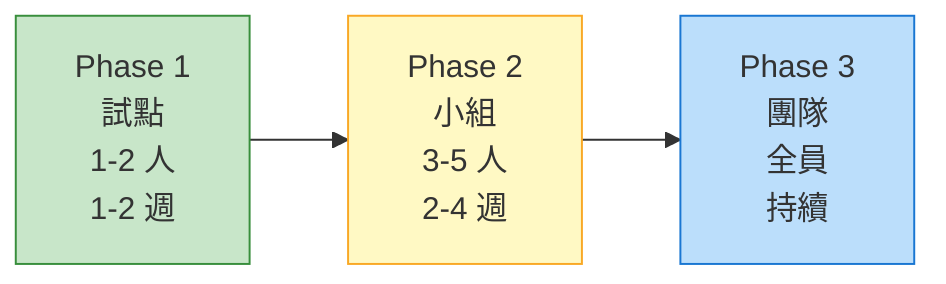

### Phase 1：試點（1-2 人，1-2 週）

1. 選擇技術主管或資深開發者作為試點
2. 在真實專案中使用 claude-mem
3. 每天記錄使用心得
4. 收集 Token 消耗數據

### Phase 2：小組推廣（3-5 人，2-4 週）

1. 分享試點成果
2. 建立團隊的 `settings.json` 範本
3. 制定命名慣例（專案名稱、觀察記錄類型使用規範）
4. 建立知識匯出流程

### Phase 3：全團隊導入

1. 標準化安裝腳本
2. 整合到 CI/CD（可選）
3. 定期知識審閱會議
4. 持續調整設定

## 18.2 團隊約定範本

```markdown
# claude-mem 團隊使用約定

## 1. 安裝
- 全團隊使用統一版本
- settings.json 由 Tech Lead 維護模板
- 每人使用個人的 API Key（或統一走 LiteLLM）

## 2. 專案命名
- 使用 Git repo 名稱作為專案名稱（自動）
- 若同一 repo 有多個模組，在不同目錄下作業

## 3. 知識共享
- 每週五審閱觀察記錄，匯出重要發現到 Wiki
- 架構決策 (type: decision) 同步到 ADR 文件
- Bug 修復 (type: bugfix) 同步到 Known Issues 清單

## 4. 安全性
- 敏感資訊一律使用 <private> 標籤
- 不在觀察記錄中留下密碼、API Key
- 定期清理過舊的觀察記錄（> 90 天）

## 5. Token 預算
- 每人每月 Token 預算：[金額]
- 壓縮模型統一使用 haiku-4-5
- Context Injection 上限：50 筆觀察 + 10 個 Session
```

## 18.3 成效衡量

| 指標 | 如何衡量 | 預期改善 |
|------|---------|---------|
| Session 啟動速度 | 第一次回答是否包含歷史上下文 | 消除前 5 分鐘的重新理解時間 |
| 重複問題率 | 同一類型的 Bug 是否重複發生 | 降低 30-50% |
| 架構一致性 | 觀察記錄中 decision 類型的參考頻率 | 團隊對齊率提升 |
| 知識傳承 | 新人上手時間 | 縮短 20-40% |

---

# 19. 維運與升級

## 19.1 日常維運

### 健康檢查

```bash
# 檢查 Worker 是否運行
curl -s http://localhost:37700/health

# 檢查資料庫大小
du -h ~/.claude-mem/claude-mem.db

# 檢查觀察記錄數量
sqlite3 ~/.claude-mem/claude-mem.db "SELECT COUNT(*) FROM observations;"

# 檢查 pending 佇列
sqlite3 ~/.claude-mem/claude-mem.db \
  "SELECT state, COUNT(*) FROM pending_messages GROUP BY state;"
```

### 定期維護

```bash
# 每月執行一次 VACUUM
sqlite3 ~/.claude-mem/claude-mem.db "VACUUM;"

# 清理已處理的 pending messages
sqlite3 ~/.claude-mem/claude-mem.db \
  "DELETE FROM pending_messages WHERE state = 'processed' 
   AND processed_at_epoch < strftime('%s','now','-7 days');"

# 備份資料庫
cp ~/.claude-mem/claude-mem.db ~/.claude-mem/claude-mem.db.backup
```

## 19.2 升級流程

```bash
# 1. 備份現有資料庫
cp ~/.claude-mem/claude-mem.db ~/.claude-mem/claude-mem.db.pre-upgrade

# 2. 升級 claude-mem
npx claude-mem install

# 3. 驗證
claude-mem --version
curl -s http://localhost:37700/health

# 4. 檢查資料完整性
sqlite3 ~/.claude-mem/claude-mem.db "PRAGMA integrity_check;"
```

## 19.3 常見維運問題

| 問題 | 診斷 | 解法 |
|------|------|------|
| Worker 未啟動 | `curl localhost:37700/health` 失敗 | 手動啟動或檢查 port 衝突 |
| 記憶未被記錄 | 檢查 pending_messages | 查看 failed 狀態的訊息 |
| 資料庫過大 | `du -h ~/.claude-mem/claude-mem.db` | VACUUM + 清理舊記錄 |
| Context Injection 失敗 | 檢查 Worker 日誌 | 確認 API Key 有效 |

## 19.4 資料庫遷移

claude-mem 使用自動遷移機制：

```
v12.x → v13.x 自動遷移：
1. 新增 user_prompts 表格
2. 新增 FTS5 virtual tables
3. 新增 auto-sync triggers
4. 更新 observations 表格的 concepts 欄位格式
```

> **注意**：升級是單向的。如果需要降級，請使用升級前的備份。永遠在升級前備份資料庫。

---

# 20. 疑難排解

## 20.1 安裝問題

| 症狀 | 可能原因 | 解法 |
|------|---------|------|
| `npx claude-mem install` 失敗 | Node.js 版本過低 | 升級到 Node.js 20+ |
| Bun 安裝失敗 | 網路問題或 OS 不支援 | 使用 `curl -fsSL https://bun.sh/install \| bash` |
| Hook 未被載入 | `~/.claude/hooks/` 路徑錯誤 | 確認目錄結構，重新執行 setup |
| 權限錯誤 | 檔案權限不足 | `chmod +x ~/.claude/hooks/*.js` |

## 20.2 運行時問題

| 症狀 | 可能原因 | 解法 |
|------|---------|------|
| Worker 無法啟動 | Port 被佔用 | `lsof -i :37700` 檢查，或改用 `CLAUDE_MEM_WORKER_PORT` |
| 觀察記錄未產生 | API Key 無效 | 檢查 `CLAUDE_MEM_API_KEY` 設定 |
| Context Injection 為空 | 資料庫是空的 | 確認之前的 Session 有正常結束 |
| Token 消耗異常高 | Context 設定過大 | 降低 `CONTEXT_OBSERVATIONS` 和 `CONTEXT_SESSION_COUNT` |
| FTS5 搜尋無結果 | 同步觸發器異常 | `sqlite3 ~/.claude-mem/claude-mem.db "INSERT INTO observations_fts(observations_fts) VALUES('rebuild');"` |

## 20.3 效能問題

| 症狀 | 可能原因 | 解法 |
|------|---------|------|
| Session 啟動慢 | 資料庫過大 | VACUUM + 清理舊記錄 |
| 搜尋慢 | FTS5 索引碎片化 | 重建 FTS5 索引 |
| Worker 記憶體高 | 長時間運行 | 重啟 Worker |

## 20.4 日誌位置

```bash
# Worker 日誌
~/.claude-mem/logs/worker.log

# Hook 錯誤（Claude Code stderr）
# 在 Claude Code 的終端中可見

# 資料庫操作日誌（如果啟用 debug mode）
CLAUDE_MEM_DEBUG=true claude
```

---

# 21. 最佳實務清單

## 21.1 開發流程最佳實務

- ✅ **每日結束自然停止 Session**：讓 Stop Hook 生成高品質 Summary
- ✅ **專案初期大量探索**：第一次使用 claude-mem 時，讓 Claude 全面掃描專案
- ✅ **明確表達意圖**：告訴 Claude 你在做什麼，而不是只給指令
- ✅ **一個 Session 一個主題**：避免在同一 Session 中混合不相關的工作
- ✅ **使用 `<private>` 保護敏感資訊**：密碼、API Key、內部 URL
- ❌ **避免頻繁 `/clear`**：會中斷記憶連續性
- ❌ **避免同時開多個 Claude Code**：Worker 可能收到混亂訊號
- ❌ **避免在觀察記錄中存放程式碼**：觀察記錄是「知識」，不是「備份」

## 21.2 設定最佳實務

- ✅ 壓縮模型使用 `haiku-4-5`（成本最佳）
- ✅ `CONTEXT_OBSERVATIONS` 設為 30-50
- ✅ `CONTEXT_SESSION_COUNT` 設為 5-10
- ✅ 定期清理 > 90 天的觀察記錄
- ✅ 每月 VACUUM 資料庫

## 21.3 團隊最佳實務

- ✅ 統一 settings.json 範本
- ✅ 每週審閱觀察記錄，匯出到 Wiki
- ✅ 架構決策同步到 ADR 和 copilot-instructions.md
- ✅ 新人到職時提供 claude-mem 使用指南
- ✅ 建立 Token 預算追蹤

---

# 22. 安全性指南

## 22.1 資料安全層級

```mermaid
graph TD
    subgraph L1["Layer 1: 邊緣處理"]
        P1["<private> 標籤移除"]
        P2["敏感資料過濾"]
    end

    subgraph L2["Layer 2: 傳輸安全"]
        T1["localhost 通訊"]
        T2["不經過外部網路"]
    end

    subgraph L3["Layer 3: 儲存安全"]
        S1["本地 SQLite"]
        S2["檔案系統權限"]
    end

    subgraph L4["Layer 4: API 安全"]
        A1["API Key 管理"]
        A2["LiteLLM Gateway"]
    end

    L1 --> L2 --> L3
    L1 --> L4

    style L1 fill:#ffcdd2,stroke:#c62828
    style L2 fill:#fff9c4,stroke:#f9a825
    style L3 fill:#c8e6c9,stroke:#388e3c
    style L4 fill:#bbdefb,stroke:#1976d2
```

## 22.2 安全檢查清單

- [ ] 確認 `<private>` 標籤正確使用
- [ ] 確認 API Key 不在程式碼中硬編碼
- [ ] 確認 SQLite 檔案權限為 `600`（僅擁有者讀寫）
- [ ] 確認 Worker 只監聽 `localhost`
- [ ] 確認不在共享目錄中存放 `claude-mem.db`
- [ ] 確認 LiteLLM Gateway 使用 HTTPS
- [ ] 定期審閱觀察記錄中是否有意外洩漏的敏感資訊

## 22.3 合規性考量

| 需求 | claude-mem 對策 |
|------|----------------|
| GDPR | 資料完全本地，使用者可隨時刪除 |
| SOC 2 | API 存取可透過 LiteLLM 集中稽核 |
| 內部資安政策 | `<private>` 標籤 + 邊緣處理 |
| 資料保留 | 可設定自動清理策略 |

---

# 23. 效能調校

## 23.1 效能瓶頸分析

| 瓶頸 | 影響 | 調校方式 |
|------|------|---------|
| Context Injection 過大 | Session 啟動慢 | 降低 `CONTEXT_OBSERVATIONS` |
| 觀察記錄過多 | 搜尋變慢 | 定期清理 + FTS5 rebuild |
| AI 壓縮延遲 | pending 佇列堆積 | 使用更快的模型（haiku） |
| SQLite 檔案過大 | 磁碟 I/O 增加 | VACUUM + 清理舊資料 |

## 23.2 調校參數參考

```json
{
  "小型專案（< 100 觀察記錄）": {
    "CLAUDE_MEM_CONTEXT_OBSERVATIONS": 30,
    "CLAUDE_MEM_CONTEXT_SESSION_COUNT": 5
  },
  "中型專案（100-500 觀察記錄）": {
    "CLAUDE_MEM_CONTEXT_OBSERVATIONS": 50,
    "CLAUDE_MEM_CONTEXT_SESSION_COUNT": 10
  },
  "大型專案（500+ 觀察記錄）": {
    "CLAUDE_MEM_CONTEXT_OBSERVATIONS": 50,
    "CLAUDE_MEM_CONTEXT_SESSION_COUNT": 10,
    "注意": "搭配 date_range 篩選和定期清理"
  }
}
```

## 23.3 資料庫最佳化

```sql
-- 檢查表格大小
SELECT name, 
       SUM(pgsize) as size_bytes
FROM dbstat 
GROUP BY name 
ORDER BY size_bytes DESC;

-- 重建 FTS5 索引
INSERT INTO observations_fts(observations_fts) VALUES('rebuild');
INSERT INTO session_summaries_fts(session_summaries_fts) VALUES('rebuild');
INSERT INTO user_prompts_fts(user_prompts_fts) VALUES('rebuild');

-- 分析查詢效能
EXPLAIN QUERY PLAN
SELECT * FROM observations WHERE project = 'my-app' ORDER BY created_at_epoch DESC LIMIT 50;
```

---

# 24. 工具比較

## 24.1 AI 記憶工具比較表

| 特性 | claude-mem | Mem0 | Zep | LangMem | Letta |
|------|-----------|------|-----|---------|-------|
| 定位 | Claude Code 記憶 | 通用記憶層 | LLM 記憶管理 | LangChain 記憶 | 有狀態 Agent |
| 儲存 | SQLite + Chroma | 向量 DB | PostgreSQL | 向量 DB | PostgreSQL |
| 自動化程度 | 全自動（Hook） | 需手動呼叫 | 需手動呼叫 | 需手動呼叫 | 框架內建 |
| Token 最佳化 | 3-Layer Workflow | 無 | 有壓縮 | 有摘要 | 有壓縮 |
| 本地優先 | ✅ | ❌（雲端） | ❌（伺服器） | ❌（需 DB） | ❌（伺服器） |
| 隱私保護 | `<private>` 邊緣處理 | API 層 | 伺服器層 | 無原生 | 伺服器層 |
| 安裝複雜度 | 低（一條指令） | 中 | 高 | 中 | 高 |
| 適合場景 | 個人/團隊開發 | 聊天機器人 | 企業 Agent | LangChain 應用 | 複雜 Agent |

## 24.2 何時選擇 claude-mem？

✅ **適合**：
- 使用 Claude Code 進行日常開發
- 需要跨 Session 保留開發知識
- 重視資料隱私（本地儲存）
- 想要零配置的自動化記憶

❌ **不適合**：
- 非 Claude Code 的使用場景（但有 MCP 整合的可能）
- 需要雲端同步的團隊記憶
- 需要向量搜尋為主的場景（可加 Chroma 但非核心）

---

# 25. File Read Gate（檔案讀取攔截）

## 25.1 概述

File Read Gate 是 claude-mem 的 **PreToolUse Hook**，專門攔截 Claude 的 `Read` 工具呼叫。當 Claude 嘗試讀取某個已有觀察記錄的檔案時，Gate 會**阻止全文讀取**，改為顯示該檔案的觀察記錄時間軸，讓 Claude 自行判斷最經濟的取得上下文方式。

這是 [Progressive Disclosure](https://docs.claude-mem.ai/progressive-disclosure) 設計哲學的具體實踐——先展示「有什麼」，再讓 Agent 決定「取什麼」。

## 25.2 運作流程

```
Claude 呼叫 Read("src/services/worker-service.ts")
         ↓
   PreToolUse Hook 觸發
         ↓
   檔案大小 < 1,500 bytes? ──→ 放行（時間軸成本高於檔案本身）
         ↓ 否
   專案被排除？ ──→ 放行
         ↓ 否
   查詢 Worker：GET /api/observations/by-file
         ↓
   無觀察記錄？ ──→ 放行
         ↓ 有觀察記錄
   去重（每 Session 最多 1 筆）
   依相關度排序
   限制 15 筆
         ↓
   DENY 讀取，回傳時間軸
```

## 25.3 Claude 的決策樹

Gate 觸發後，Claude 有四個選項，從最便宜到最貴：

| 策略 | 額外 Token 成本 | 說明 |
|------|-----------------|------|
| 語意引導（Semantic Priming） | 0 | 時間軸標題已足夠讓 Claude 繼續工作 |
| `get_observations([IDs])` | ~300/筆 | 取得過去工作的具體細節 |
| `smart_outline` / `smart_unfold` | ~1-2k | 取得目前程式碼結構或特定函式 |
| 完整檔案讀取 | 5k-50k | 檔案已大幅變更，需讀取最新版本 |

## 25.4 Token 經濟效益

| 項目 | Token 數 |
|------|----------|
| 時間軸標頭 + 指引 | ~120 |
| 15 筆觀察記錄 | ~250 |
| **總時間軸成本** | **~370** |

**實務案例**：讀取 `worker-service.ts`（18,000 tokens）→ 使用 Gate 後僅需 ~970 tokens（時間軸 370 + 2 筆觀察 600），**節省 95%**。

## 25.5 設定

- **小檔案旁路**：< 1,500 bytes 的檔案自動放行（硬編碼）
- **專案排除**：在 `~/.claude-mem/settings.json` 設定 `CLAUDE_MEM_EXCLUDED_PROJECTS`
- **停用 Gate**：移除 `hooks.PreToolUse` 中的 `Read` matcher 項目

---

# 26. Folder Context Files（資料夾上下文檔案）

## 26.1 概述

claude-mem 能自動在專案資料夾中生成 `CLAUDE.md` 檔案，提供目錄層級的活動上下文。每個資料夾的 `CLAUDE.md` 包含近期工作的時間軸摘要，幫助 Claude 理解每個目錄做了什麼。

> ⚠️ 此功能**預設關閉**。需在 settings 中啟用。

## 26.2 啟用方式

```json
{
  "CLAUDE_MEM_FOLDER_CLAUDEMD_ENABLED": "true"
}
```

## 26.3 運作機制

1. 追蹤 Claude Code 中被讀取/修改的檔案路徑
2. 找出涉及的唯一資料夾
3. 查詢該資料夾的近期觀察記錄
4. 生成格式化活動時間軸
5. 寫入該資料夾的 `CLAUDE.md`（使用 `<claude-mem-context>` 標籤包覆）

### 使用者內容保留

自動生成的內容在 `<claude-mem-context>` 標籤內。標籤外的使用者手寫內容在重新生成時會被**完整保留**。

### 專案根目錄排除

包含 `.git` 目錄的專案根目錄**不會**自動生成，避免覆寫手動維護的專案說明。Git submodule（`.git` 為檔案而非目錄）會被正確偵測，仍會生成。

## 26.4 Git 整合建議

```gitignore
# 排除自動生成的資料夾上下文檔案
**/CLAUDE.md

# 但保留根目錄的手動 CLAUDE.md
!CLAUDE.md
```

## 26.5 清理與重新生成

```bash
# 預覽清理內容
bun scripts/regenerate-claude-md.ts --clean --dry-run

# 執行清理（移除 <claude-mem-context> 區塊）
bun scripts/regenerate-claude-md.ts --clean

# 重新生成所有資料夾
bun scripts/regenerate-claude-md.ts

# 僅針對特定專案
bun scripts/regenerate-claude-md.ts --project=my-project
```

## 26.6 Worktree 支援（v9.0+）

claude-mem 支援 git worktree 的統一上下文。在 worktree 中工作時，會自動從父 Repository 和 worktree 目錄兩者收集上下文，確保跨 worktree 的活動紀錄完整可見。

---

# 27. Knowledge Agents（知識代理人）

## 27.1 概述

Knowledge Agents 讓你將 claude-mem 的觀察記錄歷史編譯成**可查詢的「大腦」**。與一般搜尋不同，Knowledge Agent 會以對話方式回傳**綜合性、有根據的答案**，而非原始搜尋結果。

## 27.2 核心工作流程：Build → Prime → Query

```
BUILD（建構語料庫）──→ PRIME（載入 AI Session）──→ QUERY（提問）
```

### Step 1：建構語料庫（Build Corpus）

```bash
# 使用 MCP 工具
build_corpus name="hooks-expertise" query="hooks architecture" project="claude-mem" limit=200
```

### Step 2：載入知識代理人（Prime）

```bash
prime_corpus name="hooks-expertise"
```

回傳的 `session_id` 就是知識代理人——一個已將你的歷史記錄載入上下文的 Claude Session。

### Step 3：提問（Query）

```bash
query_corpus name="hooks-expertise" question="Hook 生命週期的 5 個階段分別在何時觸發？"
```

每個後續提問都會延續先前的對話上下文。

### 重新載入

```bash
# 重建語料庫（拉入最新觀察記錄）
rebuild_corpus name="hooks-expertise"

# 清除對話上下文，重新載入語料庫
reprime_corpus name="hooks-expertise"
```

## 27.3 篩選參數

| 參數 | 類型 | 說明 |
|------|------|------|
| `name` | string | 語料庫名稱 |
| `project` | string | 依專案篩選 |
| `types` | string[] | 觀察類型：bugfix, feature, decision, discovery, refactor, change |
| `concepts` | string[] | 依標籤概念篩選 |
| `files` | string[] | 依涉及檔案篩選 |
| `query` | string | 全文搜尋關鍵字 |
| `dateStart` / `dateEnd` | string | 日期範圍（YYYY-MM-DD） |
| `limit` | number | 最大觀察記錄數 |

## 27.4 `/knowledge-agent` vs `/mem-search` 比較

| 面向 | `/mem-search` | `/knowledge-agent` |
|------|---------------|---------------------|
| 回傳 | 原始觀察記錄 | 綜合對話式答案 |
| 最適合 | 找特定觀察、ID、時間軸 | 理解模式、決策、架構 |
| Token 模型 | 每次查詢付費（3-Layer） | Prime 時一次付費，後續便宜 |
| 互動方式 | 搜尋、篩選、取得 | 自然語言提問 |
| 設定 | 無需設定 | 需先 Build + Prime |

> **經驗法則**：找特定東西用 `/mem-search`，理解事情全貌用 `/knowledge-agent`。

---

# 28. Beta 功能與 Endless Mode

## 28.1 版本通道切換

你可以在 Web Viewer UI 中切換 Stable 和 Beta 版本：

1. 開啟 claude-mem Viewer（Worker 啟動時會印出 URL）
2. 點擊右上角 Settings 齒輪圖示
3. 找到 **Version Channel** 區塊
4. 點擊 **Try Beta (Endless Mode)** 或 **Switch to Stable**

切換版本時：
- 本地變更會被丟棄
- 自動 `git fetch` 並 `checkout` 目標分支
- 重新安裝相依套件（`npm install`）
- Worker 自動重啟

> ⚠️ **記憶資料永不受影響**。`~/.claude-mem/claude-mem.db` 不會因版本切換而變動。

## 28.2 Endless Mode（實驗性）

### 解決的問題

標準 Claude Code Session 中，工具輸出會累積在 Context Window 裡，約 50 次工具使用後就會耗盡 ~200k tokens。更糟的是，Claude 在每次回應時重新合成所有先前工具輸出，形成 **O(N²) 複雜度**。

### 運作原理：仿生記憶架構

```
Working Memory（Context Window）：
  → 僅壓縮後的觀察記錄（每筆 ~500 tokens）
  → 快速、高效、可管理

Archive Memory（Transcript 檔案）：
  → 完整工具輸出保存在磁碟
  → 完美回溯、可搜尋
```

**關鍵創新**：每次工具使用後，Endless Mode 會：
1. 等待 Worker 生成壓縮觀察記錄（阻塞式）
2. 在磁碟上轉換 transcript 檔案
3. 將完整工具輸出替換為壓縮觀察記錄
4. Claude 以壓縮後的上下文繼續工作

將 O(N²) 轉為 **O(N)** 線性複雜度。

### 重要注意事項

- ⚠️ **非正式發行版**——需手動切換至 beta 分支
- 仍在開發中，可能有 bug 或 breaking changes
- 比標準模式**更慢**（每次工具使用增加阻塞延遲）
- 效率數據為**理論推估**，非生產環境實測

---

# 29. OpenClaw 整合

## 29.1 概述

OpenClaw Plugin 讓 claude-mem 為 [OpenClaw](https://openclaw.ai/) 閘道器上的 Agent 提供持久化記憶。處理三件事：

1. **觀察記錄擷取**——從 OpenClaw 的嵌入式 Runner 捕獲工具使用，送到 Worker 進行 AI 處理
2. **系統提示注入**——透過 `before_prompt_build` Hook 將觀察時間軸注入 Agent 的 System Prompt
3. **觀察推播**——透過 SSE 即時串流新觀察記錄至訊息頻道（Telegram、Discord、Slack 等）

## 29.2 安裝

```bash
# 一鍵安裝
curl -fsSL https://install.cmem.ai/openclaw.sh | bash

# 指定 Provider
curl -fsSL https://install.cmem.ai/openclaw.sh | bash -s -- --provider=gemini --api-key=YOUR_KEY

# 升級現有安裝
curl -fsSL https://install.cmem.ai/openclaw.sh | bash -s -- --upgrade
```

## 29.3 設定

```json
{
  "plugins": {
    "claude-mem": {
      "enabled": true,
      "config": {
        "project": "my-project",
        "syncMemoryFile": true,
        "workerPort": 37700,
        "observationFeed": {
          "enabled": true,
          "channel": "telegram",
          "to": "your-chat-id"
        }
      }
    }
  }
}
```

| 設定 | 預設值 | 說明 |
|------|--------|------|
| `project` | `"openclaw"` | 觀察記錄的專案名稱 |
| `syncMemoryFile` | `true` | 是否注入觀察上下文至 System Prompt |
| `syncMemoryFileExclude` | `[]` | 排除特定 Agent ID 的上下文注入 |
| `workerPort` | `37700` | Worker Port（如 Worker 使用非預設 Port） |
| `observationFeed.enabled` | `false` | 啟用即時觀察推播至訊息頻道 |
| `observationFeed.channel` | — | 頻道類型：telegram、discord、slack、signal、whatsapp、line |
| `observationFeed.to` | — | 目標 chat/user/channel ID |

## 29.4 事件生命週期

```
OpenClaw Gateway
  ├── before_agent_start ───→ 初始化 Session
  ├── before_prompt_build ──→ 注入上下文至 System Prompt
  ├── tool_result_persist ──→ 記錄觀察
  ├── agent_end ────────────→ 摘要 + 完成 Session
  └── gateway_start ────────→ 重置 Session 追蹤 + 上下文快取
```

## 29.5 指令

- `/claude_mem_feed`：顯示/切換觀察推播狀態
- `/claude_mem_status`：檢查 Worker 健康狀態與 Session 資訊

---

# 30. Smart Explore（AST 智慧探索）

## 30.1 概述

Smart Explore 使用 tree-sitter AST 解析提供**結構化程式碼導航**，透過三個 MCP 工具實現：

| 工具 | Token 成本 | 說明 |
|------|-----------|------|
| `smart_search` | 2,000-6,000 | 跨檔案符號搜尋 |
| `smart_outline` | 1,000-2,000 | 單一檔案的結構地圖 |
| `smart_unfold` | 400-2,100 | 展開單一符號的完整原始碼 |

## 30.2 效能基準（Benchmark）

與傳統 Explore Agent（使用 Glob、Grep、Read 工具）的比較：

| 任務類型 | Smart Explore | 傳統 Explore | 節省倍數 |
|----------|--------------|-------------|---------|
| 發現（跨檔案搜尋） | ~14,200 tokens | ~252,500 tokens | **17.8x** |
| 定向讀取（特定符號） | ~5,650 tokens | ~109,400 tokens | **19.4x** |
| 端到端（搜尋 + 讀取） | ~4,200 tokens | ~45,000 tokens | **10-12x** |

## 30.3 何時使用哪個

| 任務 | 推薦工具 | 原因 |
|------|----------|------|
| 「X 定義在哪？」 | Smart Explore | 一次呼叫，精確答案 |
| 「這個檔案有哪些函式？」 | Smart Explore | outline 回傳完整結構圖 |
| 「給我看這個函式」 | Smart Explore | unfold 回傳完整原始碼，不截斷 |
| 「功能 X 端到端怎麼運作？」 | Explore Agent | 需讀取多檔案並綜合敘述 |
| 「這裡用了什麼設計模式？」 | Explore Agent | 需要閱讀和解讀 |

> **最佳實務**：先用 Smart Explore 探索和導航，僅在需要多檔案綜合分析時才升級到 Explore Agent。

---

# 31. 未來趨勢

## 31.1 AI Agent 記憶的演進

```mermaid
timeline
    title AI Agent 記憶技術演進
    2023 : 無記憶 Agent
         : 每次對話重頭開始
    2024 : 簡單記憶
         : CLAUDE.md 手動維護
         : 向量 DB 儲存
    2025 : 結構化記憶
         : claude-mem 自動化
         : 觀察記錄壓縮
         : 3-Layer Workflow
    2026 : 智慧記憶（預期）
         : 自動知識圖譜
         : 跨 Agent 記憶共享
         : 團隊記憶融合
```

## 31.2 值得關注的方向

1. **跨 Agent 記憶共享**：不同 AI Agent 之間共享知識
2. **自動知識圖譜**：從觀察記錄自動建構知識圖譜
3. **記憶品質評估**：自動評估觀察記錄的價值與準確性
4. **聯邦記憶**：團隊成員的記憶在保護隱私的前提下融合
5. **多模態記憶**：支援圖片、圖表、白板等非文字記憶

---

# 32. 常見問答（FAQ）與快速檢查表

## 32.1 FAQ

**Q1: claude-mem 會把我的程式碼上傳到雲端嗎？**
A: 不會。所有記憶儲存在本地 SQLite（`~/.claude-mem/claude-mem.db`）。唯一的外部通訊是呼叫 AI API 進行觀察記錄壓縮，但壓縮後的結果只存在本地。

**Q2: 我可以刪除特定的觀察記錄嗎？**
A: 可以。使用 SQLite 直接操作：
```sql
DELETE FROM observations WHERE id = 123;
```

**Q3: claude-mem 支援多少觀察記錄？**
A: SQLite 的限制非常寬鬆，實務上數千到數萬筆都沒問題。建議定期清理 90 天以上的記錄以維持效能。

**Q4: 可以在離線環境使用嗎？**
A: 部分可以。記憶查詢（MCP search/timeline/get_observations）完全離線。但觀察記錄壓縮和 Context Injection 需要 AI API，離線時這些功能會降級（fire-and-forget 的 2s timeout 會直接跳過）。

**Q5: 升級 claude-mem 會遺失資料嗎？**
A: 不會。升級過程有自動資料庫遷移。但建議在升級前備份 `~/.claude-mem/claude-mem.db`。

**Q6: 多個專案的記憶會混在一起嗎？**
A: 不會。claude-mem 自動依工作目錄名稱（basename of cwd）分隔專案記憶。

**Q7: 團隊成員的記憶可以共享嗎？**
A: 目前每人獨立記憶。可透過匯出觀察記錄到 Wiki 或 `copilot-instructions.md` 實現間接共享。

**Q8: claude-mem 和 CLAUDE.md 有什麼不同？**
A: `CLAUDE.md` 是靜態的手動維護檔案。claude-mem 是自動化的動態記憶系統，會自動壓縮和索引每次開發的知識。兩者互補。

## 32.2 快速檢查表

### 安裝檢查

- [ ] Node.js ≥ 20 已安裝
- [ ] Bun ≥ 1.0 已安裝（安裝時自動下載）
- [ ] `npx claude-mem install` 執行成功
- [ ] `~/.claude/hooks/` 目錄存在且有 Hook 檔案
- [ ] Worker 可啟動（`curl localhost:<worker-port>/health`，Port 預設為 `37700 + uid%100`）

### 設定檢查

- [ ] `~/.claude-mem/settings.json` 存在
- [ ] API Key 已設定（環境變數或 settings.json）
- [ ] 壓縮模型已選擇（建議 `haiku-4-5`）
- [ ] Context Injection 參數已調整

### 日常使用檢查

- [ ] Session 結束時自然 stop（不要強制關閉）
- [ ] 敏感資訊使用 `<private>` 標籤
- [ ] 定期檢查 Web Viewer 確認記憶品質
- [ ] 每月 VACUUM 資料庫

### 團隊導入檢查

- [ ] 統一 settings.json 範本
- [ ] 建立使用約定文件
- [ ] 建立知識匯出流程
- [ ] 設定 Token 預算
- [ ] 安排定期知識審閱會議

---

> **恭喜！** 你已完成 claude-mem 教學手冊的學習。
> 
> 記住 claude-mem 的核心價值：**讓 AI Agent 像人類一樣累積經驗，而不是每次對話都失憶。**
> 
> 開始使用吧！只需一行指令：`npx claude-mem install`

