+++
date = '2026-08-03T14:22:21+08:00'
draft = false
title = 'Code Review Graph 教學手冊'
tags = ['教學', 'AI開發']
categories = ['教學']
+++
# Code-Review-Graph 教學手冊

> **Code-Review-Graph — 本地優先（Local-first）程式碼知識圖譜與 AI Code Review 加速引擎企業級完整指南**
> 適用對象：資深工程師、AI Agent 平台團隊、架構師、Tech Lead、DevSecOps 負責人、企業導入人員、PM
> 文件性質：企業內部 AI Agent 開發流程標準導入、開發與維運培訓教材
> 版本基準：Code-Review-Graph（`tirth8205/code-review-graph`，MIT License，PyPI 套件 `code-review-graph`，參考版本 v2.3.6+）

---

## ⚠️ 重要聲明（請務必先讀）

1. **Code-Review-Graph 仍在持續迭代中。** 本專案為開源專案（MIT License，GitHub 星數 28.1k+、Fork 2.6k+，主分支 900+ commits），其 CLI 指令、MCP 工具清單、環境變數與設定檔格式可能隨版本演進而調整。**任何指令與設定在正式導入前，務必以官方最新文件（`docs/USAGE.md`、`docs/COMMANDS.md`、`docs/FAQ.md`、`docs/TROUBLESHOOTING.md`、`docs/GITHUB_ACTION.md`、`docs/ROADMAP.md`）與您實際安裝版本為準。**
2. **本手冊定位是「理解、彙整、分析、重組、補充企業導入最佳實務」，而非官方 README 或文件的翻譯。** 本書不直接翻譯、不直接抄錄原文，而是重新以繁體中文彙整、重組、延伸為企業教材，並大量補充實戰案例、企業導入策略與 AI Agent 協作方法論。
3. **內容分兩類：**
   - **官方已確認事實**（例如 Tree-sitter 多語言解析、SQLite 圖譜儲存、30 個 MCP 工具、`build`/`update`/`serve` 等 CLI 指令、GitHub Action 用法、環境變數清單、基準測試數據等）作為骨幹，均已對照官方 README 及文件重新查證。
   - **作者補充**：凡屬作者依大型企業（含金融業）導入 AI Agent 程式碼審查之實務經驗所補充、推論或延伸之處，會標註 **（企業實務建議）** 或 **（作者推論）**。這些是最佳實務參考，非官方保證，導入前請自行驗證於您的環境。
4. 本手冊中所有「企業案例」（第 16 章、第 23 章）皆為**教學示範用途之虛構情境**，用於示範 Code-Review-Graph 與既有技術堆疊（Spring Boot 4.x、Vue3、Java25 等）的整合模式，非真實客戶專案。涉及既有框架的深入機制，請參閱本 Repository 既有手冊：
   - [Spring boot 4.x 教學手冊](../framework/Spring%20boot%204.x%20教學手冊.md)
   - [Maven 4.x 教學手冊](../工具/Maven%204.x%20教學手冊.md)
   - [Vue3 前端framework教學](../framework/Vue3%20前端framework教學.md)
   - [PrimeVue使用教學](../framework/PrimeVue使用教學.md)
   - [Java25升版教學](../程式語言/Java25升版教學.md)
5. 官方權威來源請見 [第 24 章 附錄 → 24.7 官方文件索引](#247-官方文件索引)。

---

## 目錄

- [第一章　專案背景與痛點分析](#第一章專案背景與痛點分析)
  - [1.1 原理](#11-原理)
    - [1.1.1 專案背景與誕生脈絡](#111-專案背景與誕生脈絡)
    - [1.1.2 設計理念：Local-first 與 Graph-based Context](#112-設計理念local-first-與-graph-based-context)
    - [1.1.3 要解決的核心問題](#113-要解決的核心問題)
    - [1.1.4 AI Code Review 的痛點：Token 浪費](#114-ai-code-review-的痛點token-浪費)
    - [1.1.5 Context Window 與 Architecture Blind Spot](#115-context-window-與-architecture-blind-spot)
    - [1.1.6 Global Context 與 Local-first 的權衡](#116-global-context-與-local-first-的權衡)
    - [1.1.7 核心概念：Knowledge Graph、Impact Radius、Architecture Awareness](#117-核心概念knowledge-graphimpact-radiusarchitecture-awareness)
    - [1.1.8 與傳統 RAG 的差異](#118-與傳統-rag-的差異)
    - [1.1.9 與 Vector Database 的差異](#119-與-vector-database-的差異)
    - [1.1.10 與純 AST 工具的差異](#1110-與純-ast-工具的差異)
    - [1.1.11 與其他 MCP Tool 的差異](#1111-與其他-mcp-tool-的差異)
    - [1.1.12 與 GraphRAG 的差異](#1112-與-graphrag-的差異)
  - [1.2 架構圖（Mermaid）](#12-架構圖mermaid)
  - [1.3 流程圖（Mermaid）](#13-流程圖mermaid)
  - [1.4 Sequence Diagram](#14-sequence-diagram)
  - [1.5 實作](#15-實作)
  - [1.6 範例](#16-範例)
  - [1.7 最佳實務](#17-最佳實務)
  - [1.8 常見錯誤](#18-常見錯誤)
  - [1.9 效能建議](#19-效能建議)
  - [1.10 AI Agent 如何使用](#110-ai-agent-如何使用)
  - [1.11 Enterprise 建議](#111-enterprise-建議)
- [第二章　整體系統架構](#第二章整體系統架構)
  - [2.1 原理](#21-原理)
    - [2.1.1 分層架構總覽](#211-分層架構總覽)
    - [2.1.2 資料來源層：Git Repository](#212-資料來源層git-repository)
    - [2.1.3 解析層：Tree-sitter 與 AST 抽取](#213-解析層tree-sitter-與-ast-抽取)
    - [2.1.4 圖譜層：Graph Builder 與 SQLite](#214-圖譜層graph-builder-與-sqlite)
    - [2.1.5 服務層：Review Engine、Impact Analyzer、MCP Server](#215-服務層review-engineimpact-analyzermcp-server)
    - [2.1.6 整合層：AI Agent 與 CI/CD](#216-整合層ai-agent-與-cicd)
    - [2.1.7 Data Flow 總覽](#217-data-flow-總覽)
  - [2.2 架構圖（Mermaid）](#22-架構圖mermaid)
  - [2.3 流程圖（Mermaid）](#23-流程圖mermaid)
  - [2.4 Sequence Diagram](#24-sequence-diagram)
  - [2.5 實作](#25-實作)
  - [2.6 範例](#26-範例)
  - [2.7 最佳實務](#27-最佳實務)
  - [2.8 常見錯誤](#28-常見錯誤)
  - [2.9 效能建議](#29-效能建議)
  - [2.10 AI Agent 如何使用](#210-ai-agent-如何使用)
  - [2.11 Enterprise 建議](#211-enterprise-建議)
- [第三章　Tree-sitter 與 AST 解析](#第三章tree-sitter-與-ast-解析)
  - [3.1 原理](#31-原理)
    - [3.1.1 Tree-sitter 是什麼](#311-tree-sitter-是什麼)
    - [3.1.2 AST 節點型別與四大分類](#312-ast-節點型別與四大分類)
    - [3.1.3 支援語言清單](#313-支援語言清單)
    - [3.1.4 增量解析機制（Incremental Parsing）](#314-增量解析機制incremental-parsing)
    - [3.1.5 自訂語言支援：`languages.toml`](#315-自訂語言支援languagestoml)
    - [3.1.6 從 AST 到 Graph：Node 的定義](#316-從-ast-到-graphnode-的定義)
    - [3.1.7 從 AST 到 Graph：Edge 與四種關係圖](#317-從-ast-到-graphedge-與四種關係圖)
    - [3.1.8 Reference Graph 與信賴度分級](#318-reference-graph-與信賴度分級)
  - [3.2 架構圖（Mermaid）](#32-架構圖mermaid)
  - [3.3 流程圖（Mermaid）](#33-流程圖mermaid)
  - [3.4 Sequence Diagram](#34-sequence-diagram)
  - [3.5 實作](#35-實作)
  - [3.6 範例](#36-範例)
  - [3.7 最佳實務](#37-最佳實務)
  - [3.8 常見錯誤](#38-常見錯誤)
  - [3.9 效能建議](#39-效能建議)
  - [3.10 AI Agent 如何使用](#310-ai-agent-如何使用)
  - [3.11 Enterprise 建議](#311-enterprise-建議)
- [第四章　Knowledge Graph 邏輯模型](#第四章knowledge-graph-邏輯模型)
  - [4.1 原理](#41-原理)
    - [4.1.1 Knowledge Graph 在 Code-Review-Graph 中的定位](#411-knowledge-graph-在-code-review-graph-中的定位)
    - [4.1.2 Node 的完整屬性模型](#412-node-的完整屬性模型)
    - [4.1.3 Edge 的完整屬性模型](#413-edge-的完整屬性模型)
    - [4.1.4 Relationship 型別總表](#414-relationship-型別總表)
    - [4.1.5 Graph Schema（邏輯層級）](#415-graph-schema邏輯層級)
    - [4.1.6 Graph Query 與 Traversal 策略](#416-graph-query-與-traversal-策略)
    - [4.1.7 Impact Analysis 的圖論基礎](#417-impact-analysis-的圖論基礎)
    - [4.1.8 Community Detection：Leiden 演算法](#418-community-detectionleiden-演算法)
    - [4.1.9 Architecture Discovery：從社群到架構總覽](#419-architecture-discovery從社群到架構總覽)
  - [4.2 架構圖（Mermaid）](#42-架構圖mermaid)
  - [4.3 流程圖（Mermaid）](#43-流程圖mermaid)
  - [4.4 Sequence Diagram](#44-sequence-diagram)
  - [4.5 實作](#45-實作)
  - [4.6 範例](#46-範例)
  - [4.7 最佳實務](#47-最佳實務)
  - [4.8 常見錯誤](#48-常見錯誤)
  - [4.9 效能建議](#49-效能建議)
  - [4.10 AI Agent 如何使用](#410-ai-agent-如何使用)
  - [4.11 Enterprise 建議](#411-enterprise-建議)
- [第五章　SQLite 儲存層](#第五章sqlite-儲存層)
  - [5.1 原理](#51-原理)
    - [5.1.1 為何選擇 SQLite 而非專用圖資料庫](#511-為何選擇-sqlite-而非專用圖資料庫)
    - [5.1.2 資料庫檔案位置](#512-資料庫檔案位置)
    - [5.1.3 實際 Schema 設計（依官方 `docs/schema.md` 核對）](#513-實際-schema-設計依官方-docsschemamd-核對)
    - [5.1.4 索引策略](#514-索引策略)
    - [5.1.5 WAL 模式與並行存取](#515-wal-模式與並行存取)
    - [5.1.6 Migration 策略](#516-migration-策略)
    - [5.1.7 Backup 與 Restore](#517-backup-與-restore)
    - [5.1.8 Maintenance：定期維護](#518-maintenance定期維護)
  - [5.2 架構圖（Mermaid）](#52-架構圖mermaid)
  - [5.3 流程圖（Mermaid）](#53-流程圖mermaid)
  - [5.4 Sequence Diagram](#54-sequence-diagram)
  - [5.5 實作](#55-實作)
  - [5.6 範例](#56-範例)
  - [5.7 最佳實務](#57-最佳實務)
  - [5.8 常見錯誤](#58-常見錯誤)
  - [5.9 效能建議](#59-效能建議)
  - [5.10 AI Agent 如何使用](#510-ai-agent-如何使用)
  - [5.11 Enterprise 建議](#511-enterprise-建議)
- [第六章　安裝](#第六章安裝)
  - [6.1 原理](#61-原理)
    - [6.1.1 安裝方式總覽](#611-安裝方式總覽)
    - [6.1.2 系統需求](#612-系統需求)
    - [6.1.3 選配依賴總表](#613-選配依賴總表)
    - [6.1.4 Windows 安裝要點](#614-windows-安裝要點)
    - [6.1.5 Linux 安裝要點](#615-linux-安裝要點)
    - [6.1.6 macOS 安裝要點](#616-macos-安裝要點)
    - [6.1.7 WSL 安裝要點（企業實務建議）](#617-wsl-安裝要點企業實務建議)
    - [6.1.8 Docker／Podman 容器化部署（企業實務建議）](#618-dockerpodman-容器化部署企業實務建議)
    - [6.1.9 驗證安裝](#619-驗證安裝)
  - [6.2 架構圖（Mermaid）](#62-架構圖mermaid)
  - [6.3 流程圖（Mermaid）](#63-流程圖mermaid)
  - [6.4 Sequence Diagram](#64-sequence-diagram)
  - [6.5 實作](#65-實作)
  - [6.6 範例](#66-範例)
  - [6.7 最佳實務](#67-最佳實務)
  - [6.8 常見錯誤](#68-常見錯誤)
  - [6.9 效能建議](#69-效能建議)
  - [6.10 AI Agent 如何使用](#610-ai-agent-如何使用)
  - [6.11 Enterprise 建議](#611-enterprise-建議)
- [第七章　設定與初始化](#第七章設定與初始化)
  - [7.1 原理](#71-原理)
    - [7.1.1 初始化流程](#711-初始化流程)
    - [7.1.2 `.code-review-graphignore` 語法與規則](#712-code-review-graphignore-語法與規則)
    - [7.1.3 與 `.gitignore` 的關係](#713-與-gitignore-的關係)
    - [7.1.4 大型 Repository 考量](#714-大型-repository-考量)
    - [7.1.5 Incremental Build：`update`、`watch` 與平台原生 Hook](#715-incremental-buildupdatewatch-與平台原生-hook)
    - [7.1.6 Configuration 總覽](#716-configuration-總覽)
  - [7.2 架構圖（Mermaid）](#72-架構圖mermaid)
  - [7.3 流程圖（Mermaid）](#73-流程圖mermaid)
  - [7.4 Sequence Diagram](#74-sequence-diagram)
  - [7.5 實作](#75-實作)
  - [7.6 範例](#76-範例)
  - [7.7 最佳實務](#77-最佳實務)
  - [7.8 常見錯誤](#78-常見錯誤)
  - [7.9 效能建議](#79-效能建議)
  - [7.10 AI Agent 如何使用](#710-ai-agent-如何使用)
  - [7.11 Enterprise 建議](#711-enterprise-建議)
- [第八章　MCP Server 詳解](#第八章mcp-server-詳解)
  - [8.1 原理](#81-原理)
    - [8.1.1 MCP 是什麼、為何是關鍵拼圖](#811-mcp-是什麼為何是關鍵拼圖)
    - [8.1.2 啟動 MCP Server](#812-啟動-mcp-server)
    - [8.1.3 自動化設定：`code-review-graph install`](#813-自動化設定code-review-graph-install)
    - [8.1.4 MCP 設定檔格式](#814-mcp-設定檔格式)
    - [8.1.5 MCP 工具全覽（30 個工具，8 大分類）](#815-mcp-工具全覽30-個工具8-大分類)
    - [8.1.6 MCP Prompts：5 個工作流樣板](#816-mcp-prompts5-個工作流樣板)
    - [8.1.7 Tool Calling 與 Context Injection 的運作模式](#817-tool-calling-與-context-injection-的運作模式)
  - [8.2 架構圖（Mermaid）](#82-架構圖mermaid)
  - [8.3 流程圖（Mermaid）](#83-流程圖mermaid)
  - [8.4 Sequence Diagram](#84-sequence-diagram)
  - [8.5 實作](#85-實作)
  - [8.6 範例](#86-範例)
  - [8.7 最佳實務](#87-最佳實務)
  - [8.8 常見錯誤](#88-常見錯誤)
  - [8.9 效能建議](#89-效能建議)
  - [8.10 AI Agent 如何使用](#810-ai-agent-如何使用)
  - [8.11 Enterprise 建議](#811-enterprise-建議)
- [第九章　如何協助 AI Agent：九大場景](#第九章如何協助-ai-agent九大場景)
  - [9.1 原理](#91-原理)
    - [9.1.1 Architecture Discovery（架構探索）](#911-architecture-discovery架構探索)
    - [9.1.2 Context Retrieval（上下文檢索）](#912-context-retrieval上下文檢索)
    - [9.1.3 Impact Radius（影響範圍分析）](#913-impact-radius影響範圍分析)
    - [9.1.4 Function Analysis（函式分析）](#914-function-analysis函式分析)
    - [9.1.5 Class Analysis（類別分析）](#915-class-analysis類別分析)
    - [9.1.6 Dependency Analysis（依賴分析）](#916-dependency-analysis依賴分析)
    - [9.1.7 PR Review（Pull Request 審查）](#917-pr-reviewpull-request-審查)
    - [9.1.8 Root Cause Analysis（根因分析）](#918-root-cause-analysis根因分析)
    - [9.1.9 Refactoring（重構）](#919-refactoring重構)
  - [9.2 架構圖（Mermaid）](#92-架構圖mermaid)
  - [9.3 流程圖（Mermaid）](#93-流程圖mermaid)
  - [9.4 Sequence Diagram](#94-sequence-diagram)
  - [9.5 實作](#95-實作)
  - [9.6 範例](#96-範例)
  - [9.7 最佳實務](#97-最佳實務)
  - [9.8 常見錯誤](#98-常見錯誤)
  - [9.9 效能建議](#99-效能建議)
  - [9.10 AI Agent 如何使用](#910-ai-agent-如何使用)
  - [9.11 Enterprise 建議](#911-enterprise-建議)
- [第十章　逆向工程與大型系統分析](#第十章逆向工程與大型系統分析)
  - [10.1 原理](#101-原理)
    - [10.1.1 逆向工程為何是 Code-Review-Graph 的殺手級場景](#1011-逆向工程為何是-code-review-graph-的殺手級場景)
    - [10.1.2 Legacy Java／Spring 系統的逆向工程模式](#1012-legacy-javaspring-系統的逆向工程模式)
    - [10.1.3 跨語言逆向工程：.NET、Node.js、Python](#1013-跨語言逆向工程netnodejspython)
    - [10.1.4 前端框架逆向工程：Vue、Angular、React](#1014-前端框架逆向工程vueangularreact)
    - [10.1.5 大型系統分析的漏斗式方法論](#1015-大型系統分析的漏斗式方法論)
    - [10.1.6 Architecture Recovery 與 Dependency Discovery](#1016-architecture-recovery-與-dependency-discovery)
  - [10.2 架構圖（Mermaid）](#102-架構圖mermaid)
  - [10.3 流程圖（Mermaid）](#103-流程圖mermaid)
  - [10.4 Sequence Diagram](#104-sequence-diagram)
  - [10.5 實作](#105-實作)
  - [10.6 範例](#106-範例)
  - [10.7 最佳實務](#107-最佳實務)
  - [10.8 常見錯誤](#108-常見錯誤)
  - [10.9 效能建議](#109-效能建議)
  - [10.10 AI Agent 如何使用](#1010-ai-agent-如何使用)
  - [10.11 Enterprise 建議](#1011-enterprise-建議)
- [第十一章　Framework Upgrade 影響分析](#第十一章framework-upgrade-影響分析)
  - [11.1 原理](#111-原理)
    - [11.1.1 為何 Framework Upgrade 是 Impact Analysis 的天然應用場景](#1111-為何-framework-upgrade-是-impact-analysis-的天然應用場景)
    - [11.1.2 框架升級的通用四步驟方法論](#1112-框架升級的通用四步驟方法論)
    - [11.1.3 Java／Jakarta EE 升級案例：`javax.*` → `jakarta.*` 命名空間遷移](#1113-javajakarta-ee-升級案例javax--jakarta-命名空間遷移)
    - [11.1.4 Spring Boot 升級案例：組態屬性與 Bean 定義變更](#1114-spring-boot-升級案例組態屬性與-bean-定義變更)
    - [11.1.5 MyBatis／Hibernate ORM 遷移案例](#1115-mybatishibernate-orm-遷移案例)
    - [11.1.6 前端框架升級案例：Vue 2 → Vue 3、AngularJS → Angular](#1116-前端框架升級案例vue-2--vue-3angularjs--angular)
    - [11.1.7 API Migration：內部 API 版本演進](#1117-api-migration內部-api-版本演進)
  - [11.2 架構圖（Mermaid）](#112-架構圖mermaid)
  - [11.3 流程圖（Mermaid）](#113-流程圖mermaid)
  - [11.4 Sequence Diagram](#114-sequence-diagram)
  - [11.5 實作](#115-實作)
  - [11.6 範例](#116-範例)
  - [11.7 最佳實務](#117-最佳實務)
  - [11.8 常見錯誤](#118-常見錯誤)
  - [11.9 效能建議](#119-效能建議)
  - [11.10 AI Agent 如何使用](#1110-ai-agent-如何使用)
  - [11.11 Enterprise 建議](#1111-enterprise-建議)
- [第十二章　架構感知的 Code Review](#第十二章架構感知的-code-review)
  - [12.1 原理](#121-原理)
    - [12.1.1 什麼是「架構感知」的 Code Review](#1211-什麼是架構感知的-code-review)
    - [12.1.2 Security（安全性）視角](#1212-security安全性視角)
    - [12.1.3 Performance（效能）視角](#1213-performance效能視角)
    - [12.1.4 Maintainability 與 Readability 視角](#1214-maintainability-與-readability-視角)
    - [12.1.5 Dependency Risk 與 Circular Dependency（循環依賴）](#1215-dependency-risk-與-circular-dependency循環依賴)
    - [12.1.6 Dead Code（死碼）偵測](#1216-dead-code死碼偵測)
    - [12.1.7 整合為 Code Review Checklist](#1217-整合為-code-review-checklist)
  - [12.2 架構圖（Mermaid）](#122-架構圖mermaid)
  - [12.3 流程圖（Mermaid）](#123-流程圖mermaid)
  - [12.4 Sequence Diagram](#124-sequence-diagram)
  - [12.5 實作](#125-實作)
  - [12.6 範例](#126-範例)
  - [12.7 最佳實務](#127-最佳實務)
  - [12.8 常見錯誤](#128-常見錯誤)
  - [12.9 效能建議](#129-效能建議)
  - [12.10 AI Agent 如何使用](#1210-ai-agent-如何使用)
  - [12.11 Enterprise 建議](#1211-enterprise-建議)
- [第十三章　GitHub Action 與 CI/CD 整合](#第十三章github-action-與-cicd-整合)
  - [13.1 原理](#131-原理)
    - [13.1.1 為何 CI/CD 整合是企業導入的關鍵里程碑](#1311-為何-cicd-整合是企業導入的關鍵里程碑)
    - [13.1.2 官方 Composite Action 用法](#1312-官方-composite-action-用法)
    - [13.1.3 執行行為：本地優先、Sticky Comment](#1313-執行行為本地優先sticky-comment)
    - [13.1.4 Risk Score 與 Merge Gate](#1314-risk-score-與-merge-gate)
    - [13.1.5 PR 評論內容：Architecture Summary](#1315-pr-評論內容architecture-summary)
    - [13.1.6 與既有 CI/CD 生態的搭配](#1316-與既有-cicd-生態的搭配)
    - [13.1.7 Fork PR 的安全限制與雙工作流程設計（企業實務建議）](#1317-fork-pr-的安全限制與雙工作流程設計企業實務建議)
  - [13.2 架構圖（Mermaid）](#132-架構圖mermaid)
  - [13.3 流程圖（Mermaid）](#133-流程圖mermaid)
  - [13.4 Sequence Diagram](#134-sequence-diagram)
  - [13.5 實作](#135-實作)
  - [13.6 範例](#136-範例)
  - [13.7 最佳實務](#137-最佳實務)
  - [13.8 常見錯誤](#138-常見錯誤)
  - [13.9 效能建議](#139-效能建議)
  - [13.10 AI Agent 如何使用](#1310-ai-agent-如何使用)
  - [13.11 Enterprise 建議](#1311-enterprise-建議)
- [第十四章　AI Coding Workflow 全流程](#第十四章ai-coding-workflow-全流程)
  - [14.1 原理](#141-原理)
    - [14.1.1 從單點工具到端到端工作流](#1411-從單點工具到端到端工作流)
    - [14.1.2 完整流程十一步](#1412-完整流程十一步)
    - [14.1.3 流程中的兩個關鍵回饋迴圈](#1413-流程中的兩個關鍵回饋迴圈)
    - [14.1.4 流程失敗模式與斷點偵測](#1414-流程失敗模式與斷點偵測)
  - [14.2 架構圖（Mermaid）](#142-架構圖mermaid)
  - [14.3 流程圖（Mermaid）](#143-流程圖mermaid)
  - [14.4 Sequence Diagram](#144-sequence-diagram)
  - [14.5 實作](#145-實作)
  - [14.6 範例](#146-範例)
  - [14.7 最佳實務](#147-最佳實務)
  - [14.8 常見錯誤](#148-常見錯誤)
  - [14.9 效能建議](#149-效能建議)
  - [14.10 AI Agent 如何使用](#1410-ai-agent-如何使用)
  - [14.11 Enterprise 建議](#1411-enterprise-建議)
- [第十五章　大型企業架構風格最佳實務](#第十五章大型企業架構風格最佳實務)
  - [15.1 原理](#151-原理)
    - [15.1.1 圖譜分析與架構風格的交會點](#1511-圖譜分析與架構風格的交會點)
    - [15.1.2 Monorepo 場景](#1512-monorepo-場景)
    - [15.1.3 Microservice 場景](#1513-microservice-場景)
    - [15.1.4 DDD（領域驅動設計）場景](#1514-ddd領域驅動設計場景)
    - [15.1.5 Clean／Hexagonal／Onion Architecture 場景](#1515-cleanhexagonalonion-architecture-場景)
    - [15.1.6 Event-Driven Architecture 場景](#1516-event-driven-architecture-場景)
    - [15.1.7 大型 Repository 的通用治理原則](#1517-大型-repository-的通用治理原則)
  - [15.2 架構圖（Mermaid）](#152-架構圖mermaid)
  - [15.3 流程圖（Mermaid）](#153-流程圖mermaid)
  - [15.4 Sequence Diagram](#154-sequence-diagram)
  - [15.5 實作](#155-實作)
  - [15.6 範例](#156-範例)
  - [15.7 最佳實務](#157-最佳實務)
  - [15.8 常見錯誤](#158-常見錯誤)
  - [15.9 效能建議](#159-效能建議)
  - [15.10 AI Agent 如何使用](#1510-ai-agent-如何使用)
  - [15.11 Enterprise 建議](#1511-enterprise-建議)
- [第十六章　Web Application 完整案例](#第十六章web-application-完整案例)
  - [16.1 原理](#161-原理)
    - [16.1.1 技術棧總覽與既有教材對照](#1611-技術棧總覽與既有教材對照)
    - [16.1.2 專案結構與初始化](#1612-專案結構與初始化)
    - [16.1.3 後端圖譜建置要點（Java 25 / Spring Boot 4 / Maven 4）](#1613-後端圖譜建置要點java-25--spring-boot-4--maven-4)
    - [16.1.4 前端圖譜建置要點（Vue3 / TypeScript / PrimeVue）](#1614-前端圖譜建置要點vue3--typescript--primevue)
    - [16.1.5 PostgreSQL、Redis、Kafka 的圖譜可見度](#1615-postgresqlrediskafka-的圖譜可見度)
    - [16.1.6 OpenAPI 契約與跨前後端 Impact Analysis](#1616-openapi-契約與跨前後端-impact-analysis)
    - [16.1.7 Docker、Kubernetes 與 CI 整合位置](#1617-dockerkubernetes-與-ci-整合位置)
    - [16.1.8 端到端情境：新增「訂單退貨」功能](#1618-端到端情境新增訂單退貨功能)
  - [16.2 架構圖（Mermaid）](#162-架構圖mermaid)
  - [16.3 流程圖（Mermaid）](#163-流程圖mermaid)
  - [16.4 Sequence Diagram](#164-sequence-diagram)
  - [16.5 實作](#165-實作)
  - [16.6 範例](#166-範例)
  - [16.7 最佳實務](#167-最佳實務)
  - [16.8 常見錯誤](#168-常見錯誤)
  - [16.9 效能建議](#169-效能建議)
  - [16.10 AI Agent 如何使用](#1610-ai-agent-如何使用)
  - [16.11 Enterprise 建議](#1611-enterprise-建議)
- [第十七章　與 AI 工具整合](#第十七章與-ai-工具整合)
  - [17.1 原理](#171-原理)
    - [17.1.1 整合的共同基礎：MCP 協定](#1711-整合的共同基礎mcp-協定)
    - [17.1.2 Claude Code](#1712-claude-code)
    - [17.1.3 Cursor](#1713-cursor)
    - [17.1.4 GitHub Copilot（含 Copilot CLI）](#1714-github-copilot含-copilot-cli)
    - [17.1.5 OpenAI Codex CLI](#1715-openai-codex-cli)
    - [17.1.6 Gemini CLI](#1716-gemini-cli)
    - [17.1.7 Continue.dev、Cline、Roo Code](#1717-continuedevclineroo-code)
    - [17.1.8 多平台並存的企業考量](#1718-多平台並存的企業考量)
    - [17.1.9 其他官方自動偵測平台：Windsurf、Zed、OpenCode、Antigravity、CodeBuddy Code、Qwen、Qoder、Kiro](#1719-其他官方自動偵測平台windsurfzedopencodeantigravitycodebuddy-codeqwenqoderkiro)
    - [17.1.10 VS Code Extension：獨立於 MCP 協定之外的原生整合方案](#17110-vs-code-extension獨立於-mcp-協定之外的原生整合方案)
  - [17.2 架構圖（Mermaid）](#172-架構圖mermaid)
  - [17.3 流程圖（Mermaid）](#173-流程圖mermaid)
  - [17.4 Sequence Diagram](#174-sequence-diagram)
  - [17.5 實作](#175-實作)
  - [17.6 範例](#176-範例)
  - [17.7 最佳實務](#177-最佳實務)
  - [17.8 常見錯誤](#178-常見錯誤)
  - [17.9 效能建議](#179-效能建議)
  - [17.10 AI Agent 如何使用](#1710-ai-agent-如何使用)
  - [17.11 Enterprise 建議](#1711-enterprise-建議)
- [第十八章　企業導入指南](#第十八章企業導入指南)
  - [18.1 原理](#181-原理)
    - [18.1.1 導入流程：四階段路線圖](#1811-導入流程四階段路線圖)
    - [18.1.2 團隊規範：從「工具」到「規範」](#1812-團隊規範從工具到規範)
    - [18.1.3 Repository 規範](#1813-repository-規範)
    - [18.1.4 Branch Strategy 與 Graph 的關係](#1814-branch-strategy-與-graph-的關係)
    - [18.1.5 Code Review Policy 整合](#1815-code-review-policy-整合)
    - [18.1.6 Graph 更新策略的治理選擇](#1816-graph-更新策略的治理選擇)
    - [18.1.7 CI/CD 的組織級規劃](#1817-cicd-的組織級規劃)
  - [18.2 架構圖（Mermaid）](#182-架構圖mermaid)
  - [18.3 流程圖（Mermaid）](#183-流程圖mermaid)
  - [18.4 Sequence Diagram](#184-sequence-diagram)
  - [18.5 實作](#185-實作)
  - [18.6 範例](#186-範例)
  - [18.7 最佳實務](#187-最佳實務)
  - [18.8 常見錯誤](#188-常見錯誤)
  - [18.9 效能建議](#189-效能建議)
  - [18.10 AI Agent 如何使用](#1810-ai-agent-如何使用)
  - [18.11 Enterprise 建議](#1811-enterprise-建議)
- [第十九章　維護](#第十九章維護)
  - [19.1 原理](#191-原理)
    - [19.1.1 維護的三個層次](#1911-維護的三個層次)
    - [19.1.2 Graph Rebuild：何時需要完整重建](#1912-graph-rebuild何時需要完整重建)
    - [19.1.3 Daemon：多倉庫常駐監看](#1913-daemon多倉庫常駐監看)
    - [19.1.4 Parser／Language 更新](#1914-parserlanguage-更新)
    - [19.1.5 Migration 與 Upgrade 策略](#1915-migration-與-upgrade-策略)
    - [19.1.6 卸載與清理](#1916-卸載與清理)
  - [19.2 架構圖（Mermaid）](#192-架構圖mermaid)
  - [19.3 流程圖（Mermaid）](#193-流程圖mermaid)
  - [19.4 Sequence Diagram](#194-sequence-diagram)
  - [19.5 實作](#195-實作)
  - [19.6 範例](#196-範例)
  - [19.7 最佳實務](#197-最佳實務)
  - [19.8 常見錯誤](#198-常見錯誤)
  - [19.9 效能建議](#199-效能建議)
  - [19.10 AI Agent 如何使用](#1910-ai-agent-如何使用)
  - [19.11 Enterprise 建議](#1911-enterprise-建議)
- [第二十章　疑難排解（100+ FAQ）](#第二十章疑難排解100-faq)
  - [20.1 原理](#201-原理)
  - [20.2 架構圖（Mermaid）](#202-架構圖mermaid)
  - [20.3 流程圖（Mermaid）](#203-流程圖mermaid)
  - [20.4 Sequence Diagram](#204-sequence-diagram)
  - [20.5 實作](#205-實作)
  - [20.6 常見問題總表（100+ FAQ）](#206-常見問題總表100-faq)
    - [20.6.1 安裝與環境（Q1–Q14）](#2061-安裝與環境q1q14)
    - [20.6.2 建圖與解析（Q15–Q28）](#2062-建圖與解析q15q28)
    - [20.6.3 MCP 與 Agent 整合（Q29–Q42）](#2063-mcp-與-agent-整合q29q42)
    - [20.6.4 圖查詢與結果解讀（Q43–Q56）](#2064-圖查詢與結果解讀q43q56)
    - [20.6.5 GitHub Action／CI（Q57–Q68）](#2065-github-actionciq57q68)
    - [20.6.6 效能與規模（Q69–Q80）](#2066-效能與規模q69q80)
    - [20.6.7 多倉庫與 Daemon（Q81–Q90）](#2067-多倉庫與-daemonq81q90)
    - [20.6.8 安全與合規（Q91–Q104）](#2068-安全與合規q91q104)
  - [20.7 最佳實務](#207-最佳實務)
  - [20.8 常見錯誤](#208-常見錯誤)
  - [20.9 效能建議](#209-效能建議)
  - [20.10 AI Agent 如何使用](#2010-ai-agent-如何使用)
  - [20.11 Enterprise 建議](#2011-enterprise-建議)
- [第二十一章　最佳實務總表（100+ 條）](#第二十一章最佳實務總表100-條)
  - [21.1 原理](#211-原理)
  - [21.2 架構圖（Mermaid）](#212-架構圖mermaid)
  - [21.3 流程圖（Mermaid）](#213-流程圖mermaid)
  - [21.4 Sequence Diagram](#214-sequence-diagram)
  - [21.5 實作](#215-實作)
  - [21.6 範例](#216-範例)
  - [21.7 最佳實務總表（100+ 條）](#217-最佳實務總表100-條)
    - [21.7.1 導入與治理（BP1–BP15）](#2171-導入與治理bp1bp15)
    - [21.7.2 圖譜維運（BP16–BP30）](#2172-圖譜維運bp16bp30)
    - [21.7.3 Agent 協作（BP31–BP50）](#2173-agent-協作bp31bp50)
    - [21.7.4 Code Review 整合（BP51–BP65）](#2174-code-review-整合bp51bp65)
    - [21.7.5 CI/CD（BP66–BP75）](#2175-cicdbp66bp75)
    - [21.7.6 安全與合規（BP76–BP88）](#2176-安全與合規bp76bp88)
    - [21.7.7 跨團隊協作（BP89–BP96）](#2177-跨團隊協作bp89bp96)
    - [21.7.8 效能（BP97–BP105）](#2178-效能bp97bp105)
  - [21.8 常見錯誤](#218-常見錯誤)
  - [21.9 效能建議](#219-效能建議)
  - [21.10 AI Agent 如何使用](#2110-ai-agent-如何使用)
  - [21.11 Enterprise 建議](#2111-enterprise-建議)
- [第二十二章　AI Prompt Library（150+ 提示詞）](#第二十二章ai-prompt-library150-提示詞)
  - [22.1 原理](#221-原理)
  - [22.2 架構圖（Mermaid）](#222-架構圖mermaid)
  - [22.3 流程圖（Mermaid）](#223-流程圖mermaid)
  - [22.4 Sequence Diagram](#224-sequence-diagram)
  - [22.5 實作](#225-實作)
  - [22.6 提示詞總表（150+ 則）](#226-提示詞總表150-則)
    - [22.6.1 Architecture 分析（P1–P13）](#2261-architecture-分析p1p13)
    - [22.6.2 Dependency 分析（P14–P26）](#2262-dependency-分析p14p26)
    - [22.6.3 API 分析（P27–P38）](#2263-api-分析p27p38)
    - [22.6.4 Service 分析（P39–P50）](#2264-service-分析p39p50)
    - [22.6.5 Impact 分析（P51–P63）](#2265-impact-分析p51p63)
    - [22.6.6 Risk 分析（P64–P75）](#2266-risk-分析p64p75)
    - [22.6.7 PR 分析（P76–P88）](#2267-pr-分析p76p88)
    - [22.6.8 Bug 分析（P89–P100）](#2268-bug-分析p89p100)
    - [22.6.9 Refactoring 分析（P101–P113）](#2269-refactoring-分析p101p113)
    - [22.6.10 Performance 分析（P114–P125）](#22610-performance-分析p114p125)
    - [22.6.11 Security 分析（P126–P138）](#22611-security-分析p126p138)
    - [22.6.12 Test Coverage 分析（P139–P152）](#22612-test-coverage-分析p139p152)
  - [22.7 最佳實務](#227-最佳實務)
  - [22.8 常見錯誤](#228-常見錯誤)
  - [22.9 效能建議](#229-效能建議)
  - [22.10 AI Agent 如何使用](#2210-ai-agent-如何使用)
  - [22.11 Enterprise 建議](#2211-enterprise-建議)
- [第二十三章　完整企業案例：銀行大型系統](#第二十三章完整企業案例銀行大型系統)
  - [23.1 原理](#231-原理)
    - [23.1.1 專案背景](#2311-專案背景)
    - [23.1.2 需求階段：架構盡職調查](#2312-需求階段架構盡職調查)
    - [23.1.3 設計階段：現代化改造範圍界定](#2313-設計階段現代化改造範圍界定)
    - [23.1.4 Coding 階段：AI 協作開發](#2314-coding-階段ai-協作開發)
    - [23.1.5 Review 階段：架構感知審查 + 人工複核雙重把關](#2315-review-階段架構感知審查--人工複核雙重把關)
    - [23.1.6 Testing 階段：以 Impact Radius 驅動測試優先序](#2316-testing-階段以-impact-radius-驅動測試優先序)
    - [23.1.7 Deployment 階段：Kubernetes 部署與 CI 品質關卡](#2317-deployment-階段kubernetes-部署與-ci-品質關卡)
    - [23.1.8 Maintenance 階段：常態化架構治理](#2318-maintenance-階段常態化架構治理)
  - [23.2 架構圖（Mermaid）](#232-架構圖mermaid)
  - [23.3 流程圖（Mermaid）](#233-流程圖mermaid)
  - [23.4 Sequence Diagram](#234-sequence-diagram)
  - [23.5 實作](#235-實作)
  - [23.6 範例](#236-範例)
  - [23.7 最佳實務](#237-最佳實務)
  - [23.8 常見錯誤](#238-常見錯誤)
  - [23.9 效能建議](#239-效能建議)
  - [23.10 AI Agent 如何使用](#2310-ai-agent-如何使用)
  - [23.11 Enterprise 建議](#2311-enterprise-建議)
- [第二十四章　附錄：指令速查表](#第二十四章附錄指令速查表)
  - [24.1 CLI Cheat Sheet](#241-cli-cheat-sheet)
  - [24.2 MCP 工具 Cheat Sheet](#242-mcp-工具-cheat-sheet)
  - [24.3 Tree-sitter／語言支援 Cheat Sheet](#243-tree-sitter語言支援-cheat-sheet)
  - [24.4 SQLite Cheat Sheet](#244-sqlite-cheat-sheet)
  - [24.5 環境變數 Cheat Sheet](#245-環境變數-cheat-sheet)
  - [24.6 Mermaid Cheat Sheet（本手冊使用慣例）](#246-mermaid-cheat-sheet本手冊使用慣例)
  - [24.7 官方文件索引](#247-官方文件索引)
  - [24.8 GitHub Action Cheat Sheet](#248-github-action-cheat-sheet)
- [附錄　企業導入總檢查清單](#附錄企業導入總檢查清單)
  - [A.1 安裝與環境檢查清單](#a1-安裝與環境檢查清單)
  - [A.2 設定與初始化檢查清單](#a2-設定與初始化檢查清單)
  - [A.3 MCP 與 Agent 整合檢查清單](#a3-mcp-與-agent-整合檢查清單)
  - [A.4 Code Review 與 CI/CD 檢查清單](#a4-code-review-與-cicd-檢查清單)
  - [A.5 安全與合規檢查清單](#a5-安全與合規檢查清單)
  - [A.6 維護與治理檢查清單](#a6-維護與治理檢查清單)
  - [A.7 團隊賦能檢查清單](#a7-團隊賦能檢查清單)

---

# 第一章　專案背景與痛點分析

## 1.1 原理

### 1.1.1 專案背景與誕生脈絡

Code-Review-Graph 誕生於一個非常具體的觀察：AI Coding Agent（Claude Code、Cursor、GitHub Copilot Agent Mode 等）在協助工程師進行 Code Review 或修改程式碼時，**最大的成本不是「推理」，而是「找答案前的閱讀」**。一個 Agent 要理解「這個函式改了會影響誰」，往往得先用 `grep`、`Read` 把半個 Repository 掃過一遍——不是因為它笨，而是因為它手上沒有一張「地圖」。

專案作者 Tirth（GitHub：`tirth8205`）在維運多個中大型 Python / TypeScript 專案時發現：同一個 PR，若請 AI 助理直接讀取受影響檔案的**完整內容**，得耗費十萬字元級的 Token；但若能先給它「這次改動實際影響到哪些函式、哪些測試、哪些呼叫鏈」，同一份審查所需的上下文可以壓縮到原本的 1/30 到 1/300。這個觀察，最終長成了一個**本地優先（Local-first）、以 Tree-sitter 解析、以 SQLite 儲存、以 MCP（Model Context Protocol）對外暴露**的程式碼知識圖譜引擎——也就是 Code-Review-Graph。

專案以 MIT License 開源後成長迅速：GitHub 星數 28.1k+、Fork 2.6k+，主分支累積 900+ commits，Issue 44 筆、PR 16 筆（持續維護中），並提供 PyPI 套件 `code-review-graph` 供直接安裝。README 中揭示的官方基準測試顯示：在 fastapi、flask、gin、httpx、express 等 6 個真實 Repository 上，**中位數 Token 節省達 65 倍（36 倍至 376 倍區間）**，影響分析（Impact Analysis）平均 F1 分數達 0.69、平均 Recall 達 1.0。

> **誠實揭露（官方文件明確標註，企業評估時務必一併納入）**：上述 Recall 1.0 是**圖譜衍生的循環上界（Circular Upper Bound）**，並非「100% 召回率」的字面意義——因為用來評分的 Ground Truth，本身就是從同一份圖譜的呼叫／匯入邊推導而來，方法論上具有循環性。官方文件另外提供了獨立性更高的 **Co-change 模式**（以同一次 Commit 中人類實際一併修改的檔案作為 Ground Truth），但截至最近一次重新量測（2026-08-02），該模式在所有受評 Commit 上都回傳 `predicted_files = 0`，官方明確標註這代表評測工具本身尚待修復，**目前還不是一個可用的準確度量測**，因此本書不引用任何 Co-change 模式的數字。像這樣主動揭露「我們的準確度宣稱哪裡站不住腳」，正是本節後段建議企業評估時應優先檢視的誠實度訊號。
>
> **企業實務建議**：評估任何開源 AI 基礎設施工具時，「Star 數」只是雜訊指標，真正該看的是：(1) 是否有可重現的 Benchmark、(2) 是否本地優先、不外流原始碼、(3) 文件是否誠實揭露限制（Limitations）。Code-Review-Graph 在這三點上都留下了可查證的文件（`docs/REPRODUCING.md`、`docs/TROUBLESHOOTING.md`），這是本手冊選它作為企業標準工具的關鍵原因之一。

### 1.1.2 設計理念：Local-first 與 Graph-based Context

Code-Review-Graph 的設計理念可以濃縮成一句話：**「先建圖，再回答」（Build the Graph, Then Answer）**。這與多數 AI 編碼工具「即時掃描、即時推理」的做法完全相反：

| 設計面向 | 傳統做法（即時掃描） | Code-Review-Graph（先建圖） |
| --- | --- | --- |
| 資料來源 | 每次請求即時 `grep` / `Read` | 預先解析並持久化於 SQLite |
| 查詢成本 | 隨專案規模線性甚至更差增長 | 圖查詢，近乎常數時間 |
| 資料外流風險 | 視工具而定，常需上傳程式碼片段 | 100% 本地運算，不上傳原始碼 |
| 增量更新 | 無狀態，每次重新掃描 | SHA-256 雜湊比對，只重解析變動檔案 |
| 上下文型態 | 原始檔案內容（未結構化） | 結構化節點／邊（函式、類別、呼叫、測試） |

「Local-first」不只是效能考量，更是**企業導入的合規前提**：金融業、醫療業等受監管產業，往往不允許原始碼片段被送往第三方雲端服務做語意搜尋。Code-Review-Graph 的圖譜運算、Tree-sitter 解析、SQLite 儲存全部發生在開發者本機或內部 CI Runner 上，只有在**主動啟用**雲端 Embedding（Google Gemini / OpenAI 相容端點 / Voyage）時，才會有語意向量呼叫外部 API，且需要環境變數 `CRG_ACCEPT_CLOUD_EMBEDDINGS` 明確授權，屬於預設關閉的選配功能。

### 1.1.3 要解決的核心問題

歸納官方文件與實務觀察，Code-Review-Graph 要解決的核心問題有三層：

1. **AI 看不懂「改一行、動全身」**：一個函式簽章的變更，可能影響數十個呼叫方與測試，但 AI 若只讀取被修改的那個檔案，完全無法評估影響範圍（Impact Radius）。
2. **AI 沒有「架構視角」**：多數 Agent 只能看到「這個檔案」，看不到「這個檔案在整個系統中的角色」——它是 Hub（高度耦合節點）、Bridge（模組間橋接點），還是孤立的葉節點？
3. **企業 Token 成本失控**：當 Review 範圍隨專案規模線性增長，大型 Monorepo 的 AI Code Review 成本會迅速超出可接受範圍，逼迫團隊在「品質」與「成本」間妥協。

### 1.1.4 AI Code Review 的痛點：Token 浪費

以官方 README 揭示的實測數據為例：對 Flask 專案的一次典型變更做完整上下文審查，若不使用結構化工具，AI 需要讀取的原始上下文約 **143,594 Token**；透過 Code-Review-Graph 的 `get_review_context_tool` 取得結構化、範圍收斂的上下文後，僅需 **2,196 Token**，節省 71 倍。在 Code-Review-Graph 專案自身的 Monorepo 上，208,821 Token 的原始上下文可壓縮至約 3,190 Token（68 倍）。

Token 浪費的根源，本質上來自「盲目探索」：Agent 不知道答案在哪裡，只能靠**廣度優先的暴力搜尋**（一個一個檔案讀、一層一層目錄掃），每一次「猜錯」都是純粹浪費的 Token 與時間。

### 1.1.5 Context Window 與 Architecture Blind Spot

即使將來 LLM 的 Context Window 持續擴大（100 萬 Token 甚至更高），這個問題也不會自動消失，原因有二：

1. **超長 Context 會稀釋注意力**：已有大量研究與實務觀察指出，當上下文塞滿大量不相關內容時，模型在其中定位關鍵資訊的準確率會下降（"Lost in the Middle" 現象），並非「塞越多越準」。
2. **Architecture Blind Spot（架構盲點）**：即使模型能「看到」全部程式碼，它仍然不知道「這段程式碼在架構中扮演什麼角色」——這是結構化知識，不是靠塞更多原始文字就能補足的。Code-Review-Graph 透過 Leiden 社群偵測演算法，把程式碼實體自動分群為「架構社群」，讓 Agent 能直接取得「這是哪個模組、耦合到哪些模組」的架構層級摘要。

### 1.1.6 Global Context 與 Local-first 的權衡

「Global Context」（把整個專案餵給模型）與「Local-first 結構化查詢」是兩種互補、而非互斥的策略：

- **Global Context 適合**：小型專案（數千行以內）、一次性理解專案全貌的探索型任務。
- **Local-first 圖查詢適合**：中大型專案、重複性高的 Code Review／Impact Analysis／Refactoring 任務，尤其是需要**精準、可重現、可稽核**的企業場景。

Code-Review-Graph 的定位非常清楚：它不是要取代 Agent 讀程式碼的能力，而是**先幫 Agent 把「該讀哪裡」算出來**，讓昂貴的 LLM 推理只花在真正需要判斷的地方。

### 1.1.7 核心概念：Knowledge Graph、Impact Radius、Architecture Awareness

三個貫穿全書的核心概念，此處先建立共同語言：

- **Knowledge Graph（知識圖譜）**：以節點（Node，代表函式／類別／模組／檔案）與邊（Edge，代表呼叫、繼承、匯入、測試覆蓋等關係）組成的結構化圖譜，持久化於 SQLite。
- **Impact Radius（影響半徑 / Blast Radius）**：從一個變更節點出發，沿著圖的邊做走訪（Traversal）所能到達的所有「可能受影響」節點集合——這是 Code-Review-Graph 最核心的產出。
- **Architecture Awareness（架構感知）**：透過社群偵測（Community Detection）、Hub／Bridge 節點分析，讓 AI Agent 具備「這個系統大致長什麼樣子」的高層次理解，而不只是逐檔案的局部視角。

### 1.1.8 與傳統 RAG 的差異

| 面向 | 傳統 RAG（文字檢索增強生成） | Code-Review-Graph |
| --- | --- | --- |
| 索引單位 | 文字區塊（Chunk） | 程式碼結構節點（函式／類別／符號） |
| 檢索方式 | 語意相似度（Embedding 距離） | 圖走訪（Graph Traversal）+ 結構查詢 |
| 回答的問題型態 | 「哪些內容『談到』X？」 | 「改了 X，誰會壞掉？」 |
| 對「呼叫鏈」「繼承鏈」的掌握 | 弱（純語意相似度抓不到結構關係） | 強（邊即關係，走訪即推理） |
| 適合任務 | 文件問答、模糊語意搜尋 | Impact Analysis、Code Review、重構影響評估 |

RAG 回答的是「相關」，Code-Review-Graph 回答的是「連動」。兩者可以並存：Code-Review-Graph 內建的 `semantic_search_nodes_tool` 與 `embed_graph_tool` 本身就融合了語意搜尋能力，形成「結構為主、語意為輔」的混合檢索模型。

### 1.1.9 與 Vector Database 的差異

Vector Database（如 Pinecone、Weaviate、pgvector）解決的是「相似度搜尋」問題：給一段文字，找出向量空間中最接近的其他片段。這對「找相似程式碼」「找相關文件」很有效，但**無法原生回答關係型問題**（例如「這個函式的所有呼叫方是誰」）——除非額外建置圖結構疊加在向量之上。

Code-Review-Graph 的核心資料模型本質是**關聯式圖譜**（SQLite 中的節點表／邊表），語意向量（Embedding）是選配的**增強層**，而非主資料結構。這個順序很關鍵：先有精確的結構關係，語意搜尋才有意義的錨點可以附著。

### 1.1.10 與純 AST 工具的差異

`ast-grep`、單純的 Tree-sitter CLI、各語言原生的 Linter/Parser，都能針對「單一檔案」產生精確的語法樹（AST），做結構化的模式比對（Pattern Matching）與重寫。但它們普遍缺少：

1. **跨檔案的關係持久化**：AST 通常是「用完即丟」的記憶體內結構，不會記住「A 檔案的函式呼叫了 B 檔案的函式」這種跨檔案關係。
2. **增量索引與查詢介面**：純 AST 工具不提供「查詢曾經解析過的結果」的資料庫層，每次都要重新解析。
3. **MCP 整合**：AST 工具本身通常不是設計來給 AI Agent 即時查詢用的服務。

Code-Review-Graph 可以理解為「**用 Tree-sitter 做局部解析，但把結果沉澱成跨檔案、可持久化查詢、可對 AI Agent 開放的圖譜**」——AST 是它的原料，圖譜才是它的產品。

### 1.1.11 與其他 MCP Tool 的差異

MCP（Model Context Protocol）生態中有不少工具提供「檔案系統存取」「終端機執行」「Git 操作」等通用能力，但這些工具都是**無狀態的存取層**，不具備「理解程式碼結構」的能力。Code-Review-Graph 的差異在於：它是少數**以持久化知識圖譜為核心資料模型**的 MCP Server，30 個工具全部建立在同一份圖譜之上，彼此可以組合使用（例如先 `query_graph_tool` 找呼叫方，再用 `get_impact_radius_tool` 算影響範圍，再用 `get_review_context_tool` 產生審查上下文）。

官方 `docs/FAQ.md` 進一步針對「解決相鄰問題」的具名工具給出誠實的事實比較表（而非行銷式的優劣宣稱），企業選型時可直接參考：

| 工具 | 技術路線 | 持久化方式 | 外部依賴 | Review 導向 |
| --- | --- | --- | --- | --- |
| **Code-Review-Graph** | Tree-sitter AST → 結構化圖譜（呼叫／匯入／繼承／測試），透過 MCP + CLI 對外 | SQLite（`.code-review-graph/`），支援增量更新 | 核心功能無；Embedding 為選配 | 有：Blast Radius、風險評分變更分析、測試缺口偵測 |
| **Serena** | 以 LSP 為底層的符號檢索與編輯工具（MCP） | Language Server 狀態 + 專案級記憶 | 需為每種語言啟動對應 Language Server | 通用編碼 Agent 工具箱，非 Review 專用 |
| **codegraph** | AST／呼叫圖索引（MCP，同名專案多個，實作細節依專案而異） | 依實作而定 | 依實作而定 | 多偏檢索導向 |
| **claude-context** | 將程式碼切塊並做語意 Embedding 搜尋（MCP） | 向量資料庫（雲端或自架） | 需 Embedding Provider + 向量資料庫 | 搜尋導向，非 Review 專用 |
| **repomix** | 將整個 Repository 打包成單一 AI 友善檔案 | 無（每次重新產生） | Node.js | 一次性上下文打包，不提供結構化查詢 |

**選型建議（依官方 FAQ 改寫）**：若需要「符號級精確編輯」，Serena 的 LSP 路線更合適；若需要「語意搜尋」且能接受維運向量資料庫，claude-context 更合適；若專案小到能整包塞進大 Context Window，repomix 最簡單直接。Code-Review-Graph 的定位是**免外部服務、持久化的結構化圖譜，專攻 Code Review 場景**：影響分析、風險評分、測試覆蓋追蹤。

### 1.1.12 與 GraphRAG 的差異

微軟提出的 GraphRAG 概念，是用 LLM 從**非結構化文字**中抽取實體與關係，建立知識圖譜，主要應用於文件問答、摘要生成。Code-Review-Graph 雖然同樣是「Graph + Retrieval」的思路，但關鍵差異在於：

| 面向 | GraphRAG | Code-Review-Graph |
| --- | --- | --- |
| 圖譜來源 | LLM 從文字中抽取實體關係（有幻覺風險） | Tree-sitter 對程式碼做**確定性語法解析**（AST 精確） |
| 建圖成本 | 需要大量 LLM 呼叫（昂貴） | 純解析器運算，不需要 LLM 參與建圖 |
| 準確性保證 | 依賴 LLM 抽取品質 | 語法層面確定性正確，語意層面標註信賴度（EXTRACTED / INFERRED / AMBIGUOUS 三級） |
| 適用領域 | 通用文件、知識庫 | 程式碼專屬 |

換句話說：GraphRAG 是「用 AI 生成圖」，Code-Review-Graph 是「用編譯器技術生成圖，再讓 AI 使用」——後者在程式碼領域準確度更高、成本更低、也更適合企業對「可稽核性」的要求。

## 1.2 架構圖（Mermaid）

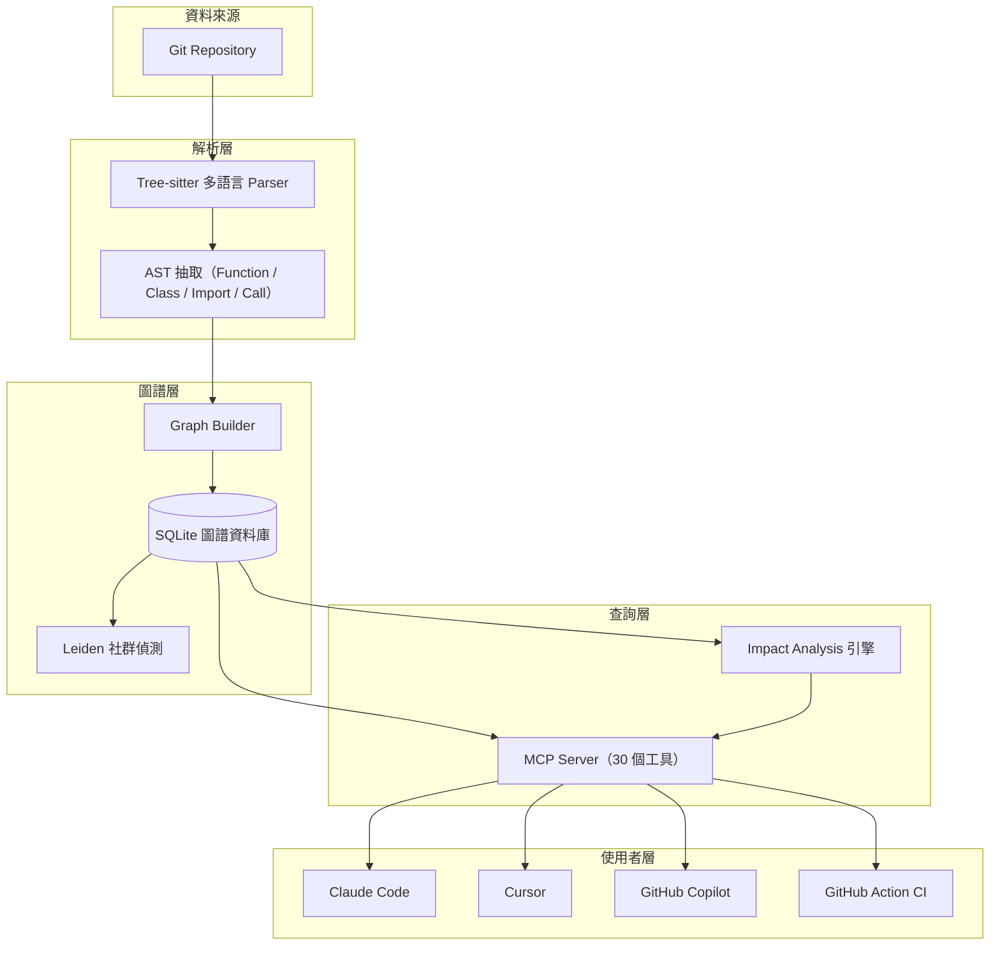

## 1.3 流程圖（Mermaid）

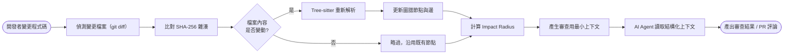

## 1.4 Sequence Diagram

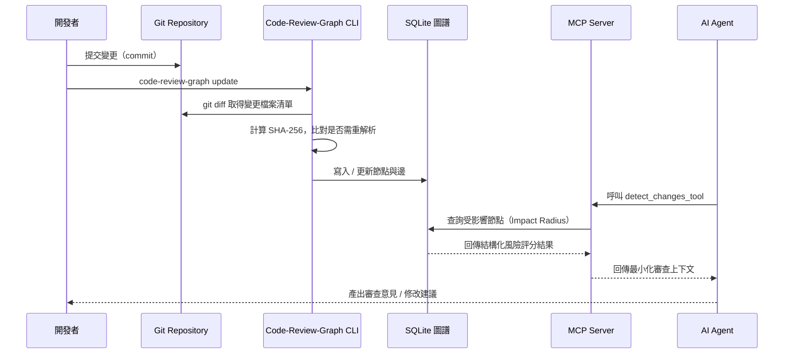

## 1.5 實作

在深入細節章節之前，先建立一個最小可行的體感：以下指令組合可在任何已安裝 Python 3.10+ 的環境中，於 3 分鐘內完成安裝、建圖、查詢的完整迴圈（完整安裝步驟見第六章）：

```bash
# 1. 安裝（建議使用 uv，之後 MCP 設定產生更順暢）
uv tool install code-review-graph

# 2. 於專案根目錄建立初始圖譜
cd your-project
code-review-graph build

# 3. 查看圖譜統計
code-review-graph status

# 4. 產生一次「風險面板」（唯讀，不修改任何檔案）
code-review-graph detect-changes --brief
```

`detect-changes --brief` 的輸出會直接顯示 Token 節省的量化結果，這是向團隊主管展示導入價值時最直觀的第一手資料。

## 1.6 範例

以下為官方基準測試中，`detect-changes --brief` 對一次典型 PR 變更所產生的「Token 節省面板」範例輸出（依官方 README 示意重製）：

```text
┌─────────────────────── Token Savings ────────────────────────┐
│ Full context would be:     12,921 tokens                     │
│ Graph context used:           762 tokens                     │
│ Saved:                     12,159 tokens (~94%)              │
│ Breakdown: Functions 244 . Tests 191 . Risk 244 . Other 83    │
└──────────────────────────────────────────────────────────────┘
```

這份面板直接回答了三個管理層最關心的問題：省了多少 Token（成本）、上下文組成是否合理（品質）、以及審查範圍是否有涵蓋測試（風險）。

## 1.7 最佳實務

1. **導入前先跑一次 Benchmark，量化「導入前 vs 導入後」的 Token 差異**，作為向管理層溝通投資報酬率（ROI）的第一手數據，而非僅憑官方宣稱的倍數。
2. **把「本地優先、不上傳原始碼」列為採購/導入評估的硬性條件**，尤其在受監管產業，這往往比效能數字更重要。
3. **先在一個中型 Repository（而非玩具專案）試跑**，因為圖譜的價值在專案規模夠大、呼叫關係夠複雜時才會顯著浮現。
4. **建立圖譜後，優先體驗 `detect-changes --brief`**，這是最快讓團隊「有感」的單一指令。

## 1.8 常見錯誤

1. **誤以為 Local-first 等於「完全離線、零網路存取」**：預設安裝與建圖流程確實不需要網路，但選配的雲端 Embedding、GitHub Action 整合仍會有網路呼叫，需分清楚哪些功能是選配。
2. **在極小型專案（數十個檔案以內）導入並期待明顯效益**：官方文件已明確指出，小型單檔變更時，圖譜查詢的結構性開銷可能高於直接讀取原始檔案，效益不明顯。
3. **把「Impact Radius 分析」誤當成「100% 精確的靜態分析」**：官方文件明確標註邊有 EXTRACTED（確定）/ INFERRED（推論）/ AMBIGUOUS（模糊）三級信賴度，不是每條邊都同等可靠。

## 1.9 效能建議

- 初次建圖（`build`）是一次性成本，官方數據顯示約 500 檔案規模的專案耗時約 10 秒量級；後續應優先使用 `update`（增量更新）而非重複 `build`。
- 大型 Monorepo 建議搭配 `daemon`（第 6、19 章詳述）常駐監看，避免每次互動都觸發完整掃描。
- 若專案含大量產生碼（generated code）、第三方 vendor 目錄，務必透過 `.code-review-graphignore` 排除，否則會拖慢解析且污染圖譜品質。

## 1.10 AI Agent 如何使用

對 AI Agent 而言，Code-Review-Graph 扮演的角色是「**探索前的導航員**」：在 Agent 決定要不要用 `grep`/`Read` 暴力搜尋之前，先詢問圖譜「這個問題的答案大概在哪裡」。實務上建議在 Agent 的系統提示或 CLAUDE.md／`.cursor/rules` 中明確告知：「本專案已建立 Code-Review-Graph 索引，涉及影響範圍、呼叫關係、架構理解的問題，優先呼叫 MCP 工具而非直接掃描檔案系統。」

## 1.11 Enterprise 建議

1. **將 Code-Review-Graph 的採用，定位為「AI 開發治理」的基礎設施投資，而非單一工具導入**——它應該與 CI/CD、Code Review 規範、AI Agent 使用規範一併納入企業 SSDLC（Secure Software Development Lifecycle）政策。
2. **建立內部的「Token 成本儀表板」**，長期追蹤導入前後的 AI API 帳單變化，作為量化 ROI 的依據（詳見第 18 章）。
3. **在多團隊組織中，優先由「痛點最明確」的團隊（大型 Monorepo、高頻 PR）試點**，成功案例會是後續全公司推廣最有效的說服材料。

---

# 第二章　整體系統架構

## 2.1 原理

### 2.1.1 分層架構總覽

Code-Review-Graph 的系統架構可拆解為五層，由下而上分別是：**資料來源層 → 解析層 → 圖譜層 → 服務層 → 整合層**。這五層的分工非常明確，也是理解後續所有章節的基礎骨架：

| 層級 | 負責元件 | 核心職責 |
| --- | --- | --- |
| 資料來源層 | Git Repository | 提供原始檔案內容、版本歷史、`git diff` 變更清單 |
| 解析層 | Tree-sitter Parser、AST 抽取器 | 將原始碼轉為語法樹，抽取函式／類別／匯入／呼叫節點 |
| 圖譜層 | Graph Builder、SQLite 資料庫 | 建立節點與邊、持久化儲存、增量更新、社群偵測 |
| 服務層 | Review Engine、Impact Analyzer、MCP Server | 提供影響分析、風險評分、30 個 MCP 工具查詢介面 |
| 整合層 | Claude Code、Cursor、Copilot、GitHub Action | 消費 MCP 工具、將圖譜能力融入實際開發流程 |

### 2.1.2 資料來源層：Git Repository

一切從 Git Repository 開始。Code-Review-Graph 並非獨立於版本控制之外運作，而是深度整合 Git：透過 `git ls-files` 取得受版控追蹤的檔案清單（因此 `.gitignore` 排除的路徑會自動略過，無需重複設定），並透過 `git diff` 精確定位「這次變更了哪些檔案」，作為增量更新與 Impact Analysis 的起點。

### 2.1.3 解析層：Tree-sitter 與 AST 抽取

Tree-sitter 是一套增量式（Incremental）語法解析器產生框架，Code-Review-Graph 目前運用它為 **35 種以上**的程式語言（含 Jupyter／Databricks Notebook）產生具體語法樹（Concrete Syntax Tree），完整清單見第三章 3.1.3 節。Code-Review-Graph 在此層做的事，是針對每種語言定義四類「節點型別對照表」：

- `_FUNCTION_TYPES`：例如 `function_declaration`、`method_definition`
- `_CLASS_TYPES`：例如 `class_declaration`、`struct_item`
- `_IMPORT_TYPES`：例如 `import_statement`、`use_declaration`
- `_CALL_TYPES`：例如 `call_expression`、`function_call`

這一層的產出是「單一檔案內」的結構化符號清單，尚未建立跨檔案關係——那是下一層的工作。第三章會深入這一層的完整運作機制。

### 2.1.4 圖譜層：Graph Builder 與 SQLite

Graph Builder 把解析層產出的「單檔案符號清單」串接成跨檔案的圖：函式呼叫關係、類別繼承關係、模組匯入關係、測試覆蓋關係，全部化為圖中的邊（Edge），並標註信賴度（EXTRACTED 確定 / INFERRED 推論 / AMBIGUOUS 模糊）。圖譜本身以關聯式資料表的形式儲存在專案根目錄下的 `.code-review-graph/` 目錄（可透過環境變數 `CRG_DATA_DIR` 覆寫路徑），不需要額外安裝、部署任何資料庫伺服器——這也是「Local-first」精神在資料層的具體實踐。第四、五章會分別深入圖譜的邏輯模型與 SQLite 實體 Schema。

### 2.1.5 服務層：Review Engine、Impact Analyzer、MCP Server

- **Impact Analyzer**：從變更節點出發做圖走訪（BFS/DFS），計算 Blast Radius，並依「影響範圍大小、流程關鍵度、測試覆蓋缺口、Hub 節點涉入程度」四個因子計算風險分數。
- **Review Engine**：包裝 Impact Analyzer 的輸出，產生「Token 最佳化」的審查上下文（`get_review_context_tool`、`get_minimal_context_tool`），並提供 `detect_changes_tool` 作為 CLI／CI 的統一進入點。
- **MCP Server**：以 `code-review-graph serve` 啟動，將圖譜的全部能力，包裝為 30 個 MCP 工具與 5 個 Prompt 樣板（詳見第八章），對外暴露給任何支援 MCP 協定的 AI Agent。

### 2.1.6 整合層：AI Agent 與 CI/CD

整合層是圖譜能力真正「產生價值」的地方：

- **Claude Code / Cursor / GitHub Copilot 等 IDE 內 Agent**：透過 MCP 協定即時呼叫工具，在開發者互動過程中即時取得結構化上下文。
- **GitHub Action**：以 `tirth8205/code-review-graph@v2.3.6` composite action 形式，在 Pull Request 事件中自動建圖／更新圖、計算風險、回貼審查留言，形成無需人工介入的自動化審查迴圈（第十三章詳述）。

### 2.1.7 Data Flow 總覽

整個系統的資料流可以歸納為一句話：**「Git 事件觸發解析，解析結果落地成圖，圖被查詢引擎消費，查詢結果被 AI Agent 與 CI 消費」**。下方架構圖與流程圖將這五層與資料流做視覺化呈現。

## 2.2 架構圖（Mermaid）

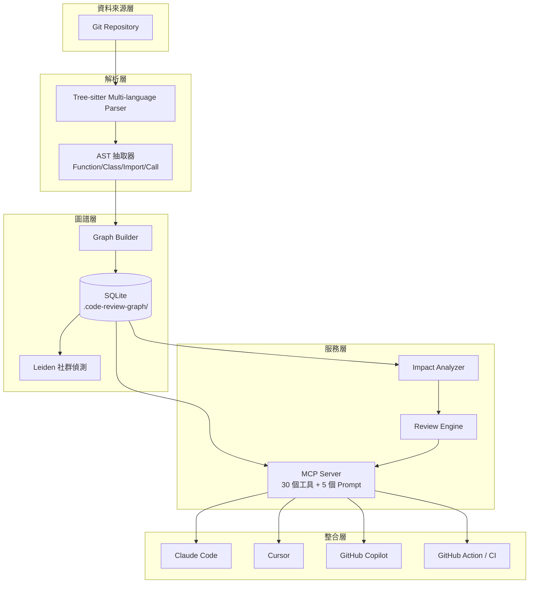

## 2.3 流程圖（Mermaid）

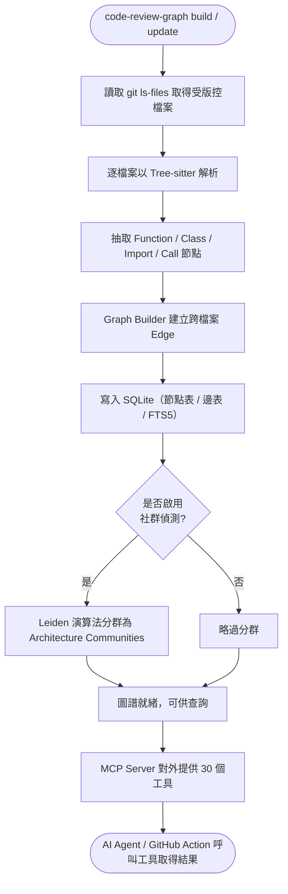

## 2.4 Sequence Diagram

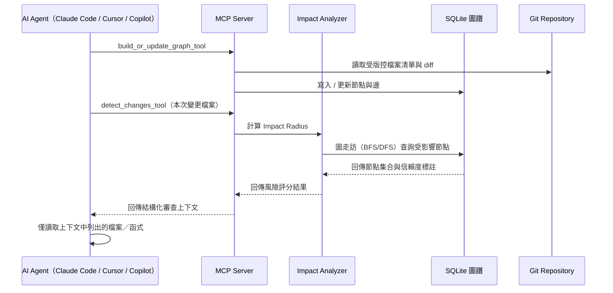

## 2.5 實作

以下指令展示如何驗證五層架構在本機是否都正常運作：

```bash
# 驗證圖譜層：確認 SQLite 資料庫已建立且有內容
code-review-graph status

# 驗證服務層：以工具白名單啟動 MCP Server（僅暴露核心查詢工具，便於除錯）
code-review-graph serve --tools query_graph_tool,get_impact_radius_tool,detect_changes_tool

# 驗證整合層：於 Claude Code 中執行 /mcp 確認 Server 已連線
```

## 2.6 範例

一個典型的「五層驗證」腳本，可放入團隊的 onboarding 文件：

```bash
#!/usr/bin/env bash
set -e
echo "== 1. 資料來源層 =="
git rev-parse --is-inside-work-tree

echo "== 2/3. 解析層與圖譜層 =="
code-review-graph build
code-review-graph status

echo "== 4. 服務層（背景啟動，5 秒後關閉）=="
timeout 5 code-review-graph serve || true

echo "== 5. 整合層 =="
echo "請於 IDE 中確認 MCP Server 連線狀態"
```

## 2.7 最佳實務

1. **導入時按五層順序驗證**，逐層確認資料流通過，避免整合層出問題時，回頭卻不知道是哪一層失敗。
2. **圖譜層與服務層分離部署於大型團隊是合理選擇**：`daemon` 模式（第十九章）可讓多個專案的圖譜建置與 MCP 服務分開排程。
3. **整合層優先接入「痛點最明確」的 Agent 平台**（例如團隊已重度使用 Claude Code），而非同時鋪開所有平台。

## 2.8 常見錯誤

1. **誤解 MCP Server 會自動建圖**：`serve` 只負責提供查詢介面，圖譜必須先透過 `build`／`update` 建立，兩者是獨立步驟。
2. **忽略 `.code-review-graphignore` 導致解析層吃進大量產生碼**，拖慢建圖時間且污染圖譜（例如把 `dist/`、`vendor/` 一併解析進去）。
3. **在 CI 環境中每次都執行完整 `build` 而非 `update`**，導致 CI 執行時間隨專案成長而線性膨脹。

## 2.9 效能建議

- 解析層是 CPU 密集工作，Tree-sitter 本身支援平行解析；若需除錯效能問題，可用環境變數 `CRG_SERIAL_PARSE` 強制序列化解析以利定位。
- 圖譜層的 FTS5 全文索引與向量嵌入是選配加值功能，若團隊不需要語意搜尋，可略過 `[embeddings]` 安裝選項以縮小依賴體積。
- 服務層可用 `CRG_TOOLS` 環境變數或 `serve --tools` 限制暴露的工具數量，減少 Agent 端的工具選擇負擔（Tool Selection Overhead）。

## 2.10 AI Agent 如何使用

建議 AI Agent 在會話開始時，先呼叫 `list_graph_stats_tool` 確認圖譜是否存在、是否新鮮（是否需要 `update`），再依任務型態選擇對應層級的工具：需要「影響範圍」找 Impact Analyzer 系列工具；需要「架構理解」找 Architecture／Community 系列工具；需要「精確審查上下文」找 Review Engine 系列工具。這種「先確認地圖新鮮度，再選對的工具」的習慣，是第九章會反覆強調的核心 Agent 行為模式。

## 2.11 Enterprise 建議

1. **將五層架構對應到企業既有的架構圖規範**（例如 C4 Model 的 Context / Container / Component 層級），有助於架構師快速將 Code-Review-Graph 納入既有的架構治理文件體系。
2. **服務層（MCP Server）的存取應納入內部服務清冊與資安盤點**，即使是本地執行的服務，只要監聽網路埠、供多個用戶端連線，就應比照內部服務的最低資安基準管理。
3. **整合層的推廣速度應與團隊 AI 素養同步**，避免在團隊尚未熟悉「如何與 Agent 協作」前，就急於鋪開所有整合點，導致工具閒置或誤用。

---

# 第三章　Tree-sitter 與 AST 解析

## 3.1 原理

### 3.1.1 Tree-sitter 是什麼

Tree-sitter 是一套通用的增量式語法解析器產生框架，由 GitHub 主導開發，廣泛用於編輯器語法高亮、程式碼摺疊、結構化搜尋等場景。它的核心優勢有三：**解析速度快**（毫秒等級）、**容錯性高**（語法不完整或有錯誤時仍能產生部分可用的樹）、**支援增量解析**（檔案小幅變動時，不需要整份重新解析）。Code-Review-Graph 選擇 Tree-sitter 作為底層解析引擎，而非各語言原生的編譯器前端，正是看中它「語言中立、介面一致」的特性——同一套 API，可以用近乎相同的方式處理 Python、Java、Go、Rust 等數十種語言。

### 3.1.2 AST 節點型別與四大分類

Tree-sitter 為每種語言產生的具體語法樹（Concrete Syntax Tree，實務上常與 AST 概念混用），節點型別是語言專屬的（例如 Python 的函式節點是 `function_definition`，Java 是 `method_declaration`）。Code-Review-Graph 在其解析層為每種支援語言維護四張對照表，把「語言專屬節點型別」統一映射為「語言中立的語意分類」：

| 分類常數 | 語意 | Python 範例 | Java 範例 |
| --- | --- | --- | --- |
| `_FUNCTION_TYPES` | 函式／方法定義 | `function_definition` | `method_declaration` |
| `_CLASS_TYPES` | 類別／結構定義 | `class_definition` | `class_declaration` |
| `_IMPORT_TYPES` | 匯入／引用宣告 | `import_statement` | `import_declaration` |
| `_CALL_TYPES` | 呼叫運算式 | `call` | `method_invocation` |

這個「先分類、再建圖」的設計，是 Code-Review-Graph 能以一套邏輯處理 35 種以上語言的關鍵：上層的 Graph Builder 完全不需要知道「這是 Python 還是 Java」，只需要處理四種語意分類的節點。

### 3.1.3 支援語言清單

依官方文件揭示，Code-Review-Graph 透過 Tree-sitter 直接解析以下語言與檔案型態：

- **主流泛用語言**：Python、JavaScript／TypeScript／TSX、Go、Rust、Java、C／C++、C#、VB.NET、Ruby、Kotlin、Swift、PHP、Scala
- **特定領域語言**：Solidity（智慧合約）、SQL、Terraform／OpenTofu（`.tf`，通用 `.hcl` 僅作檔案層級處理）、Verilog／SystemVerilog、Ansible Playbook／Role
- **腳本與其他**：Dart、R、Perl（含 Perl XS）、Lua／Luau、Objective-C、Shell Script、Elixir、Zig、PowerShell、Julia、ReScript、GDScript、Nix
- **前端 SFC**：Vue、Svelte 單檔案元件、Astro
- **Notebook**：Jupyter／Databricks（`.ipynb`）

**框架感知解析（Framework-aware Parsing）**：以 PHP 為例，當專案偵測到明確的框架匯入語句與模型繼承特徵時，Code-Review-Graph 會額外解析 Composer PSR-4 命名空間解析、Blade 樣板引用、以及 Laravel Route／Eloquent 語意邊——這是「語言中立解析」之上，針對特定框架生態系的加值能力。

### 3.1.4 增量解析機制（Incremental Parsing）

Code-Review-Graph 的增量更新並非依賴 Tree-sitter 原生的增量解析 API（該 API 主要用於編輯器中單一檔案的即時重新解析），而是在**檔案層級**實作了一套增量策略：

1. 為每個已索引檔案記錄內容的 **SHA-256 雜湊值**。
2. 執行 `update` 時，先透過 `git diff` 取得變更檔案清單（第一層過濾，跳過完全沒變動的檔案）。
3. 對變更清單中的每個檔案重新計算雜湊，與資料庫中記錄的雜湊比對——只有雜湊真正不同的檔案才會觸發**該檔案的完整重新解析**。
4. 重新解析後，該檔案原本產生的所有節點與邊會先被移除，再依新的 AST 結果重新建立，確保圖譜不會因為增量更新而累積「幽靈節點」。

官方文件揭示的實測數據：在約 3,000 檔案規模的 Django 專案上，兩個檔案的編輯，增量更新可在約 2.5 秒內完成——遠快於對整個專案重新 `build`。

### 3.1.5 自訂語言支援：`languages.toml`

若團隊使用的語言不在官方內建清單中，可透過在專案的 `.code-review-graph/languages.toml` 中宣告自訂語言設定，**無需 Fork 專案原始碼**：

```toml
[languages.erlang]
extensions = [".erl"]
grammar = "erlang"
function_node_types = ["function_clause"]
class_node_types = ["record_decl"]
import_node_types = ["import_attribute"]
call_node_types = ["call"]
```

這個設計呼應了 3.1.2 節「四大分類」的架構：只要能提供對應語言的 Tree-sitter 文法與四類節點型別名稱，Code-Review-Graph 的上層邏輯（Graph Builder、Impact Analyzer、MCP 工具）完全不需要修改就能支援新語言。`grammar` 欄位可填入 [`tree-sitter-language-pack`](https://github.com/Goldziher/tree-sitter-language-pack) 內建的任一文法（涵蓋 Erlang、Haskell、OCaml、Fortran、Ada、Clojure 等 35+ 內建清單之外的語言），四類節點型別中至少要填一類，否則該語言設定會被忽略。

官方文件對這項功能的安全防線（`docs/CUSTOM_LANGUAGES.md`）值得在導入前熟記：

- **內建語言優先權絕對**：自訂語言不能覆寫內建的副檔名（如 `.py`、`.ts`）或內建語言名稱，避免誤植設定破壞既有解析行為。
- **每個 Repository 最多 20 種自訂語言**，超過會被忽略並記錄警告。
- 設定檔格式錯誤（Malformed TOML）**不會讓整次 `build` 失敗**，只會停用自訂語言解析並印出 `WARNING` 訊息——這是刻意的容錯設計。
- 若語言的定義名稱藏在非標準欄位（例如 LaTeX 的 `\section{...}` 名稱在 `text` 欄位），可用選配的 `name_field`（字串或最多 8 個候選字串的清單）指定要往哪個欄位找名稱，避免定義被判定為「無名」而遭靜默捨棄。
- 找節點型別名稱最快的方式：貼到 [Tree-sitter Playground](https://tree-sitter.github.io/tree-sitter/7-playground.html) 觀察語法樹，或在本機以 `tree_sitter_language_pack` 直接印出 AST 節點型別。

**企業實務建議**：自訂語言設定屬於「通用啟發式解析」，不具備內建語言才有的框架感知加值（例如 Spring／Laravel 語意邊）、跨檔案模組路徑解析；若團隊的核心業務語言需要更深入的支援，應直接向上游開 Issue，而非長期依賴自訂設定檔繞過。

### 3.1.6 從 AST 到 Graph：Node 的定義

AST 抽取完成後，每個具語意的節點（函式、類別、匯入宣告）會被轉為圖中的一個 **Node**，並記錄：

- 節點型別（Function / Class / Import / Module 等）
- 完整簽章（Signature，例如函式參數列表與回傳型別，若語言有標註）
- 所在檔案路徑與起訖行號範圍
- 所屬語言與所屬模組／命名空間

### 3.1.7 從 AST 到 Graph：Edge 與四種關係圖

節點之間的關係即為 **Edge**，依語意可歸納為四種基礎關係圖，彼此可疊加、共存於同一份圖譜中：

| 關係圖 | 邊的語意 | 建立依據 |
| --- | --- | --- |
| **Call Graph（呼叫圖）** | 函式 A 呼叫函式 B | `_CALL_TYPES` 節點解析呼叫目標 |
| **Import Graph（匯入圖）** | 模組 A 匯入模組 B | `_IMPORT_TYPES` 節點解析匯入路徑 |
| **Inheritance Graph（繼承圖）** | 類別 A 繼承／實作類別 B | `_CLASS_TYPES` 節點的父類別／介面宣告 |
| **Dependency Graph（依賴圖）** | 模組 A 依賴模組 B（Import Graph 的模組層級聚合視圖） | 由 Import Graph 彙總而得 |

### 3.1.8 Reference Graph 與信賴度分級

除了上述四種結構性明確的關係，Code-Review-Graph 也建立更廣義的 **Reference Graph（引用圖）**，涵蓋型別引用、變數引用等較難 100% 靜態確定的關係。為了誠實反映解析的確定性，每條邊都會標註三級信賴度：

- **EXTRACTED（已抽取）**：語法層面可以確定的關係，例如直接的函式呼叫。
- **INFERRED（推論）**：需要額外推論步驟才能確定的關係，例如透過型別推斷才能解析的多型呼叫（Python 生態系可搭配 `[enrichment]` 選配套件的 Jedi 引擎加強此類解析）。
- **AMBIGUOUS（模糊）**：解析器無法完全確定，但保留作為候選的關係，例如動態呼叫（Reflection、字串拼接的匯入路徑）。

這個三級信賴度貫穿到 Impact Analysis（第九章）——AI Agent 在解讀「這個變更可能影響誰」時，應該對 AMBIGUOUS 邊保持更高的懷疑，而非照單全收。

## 3.2 架構圖（Mermaid）

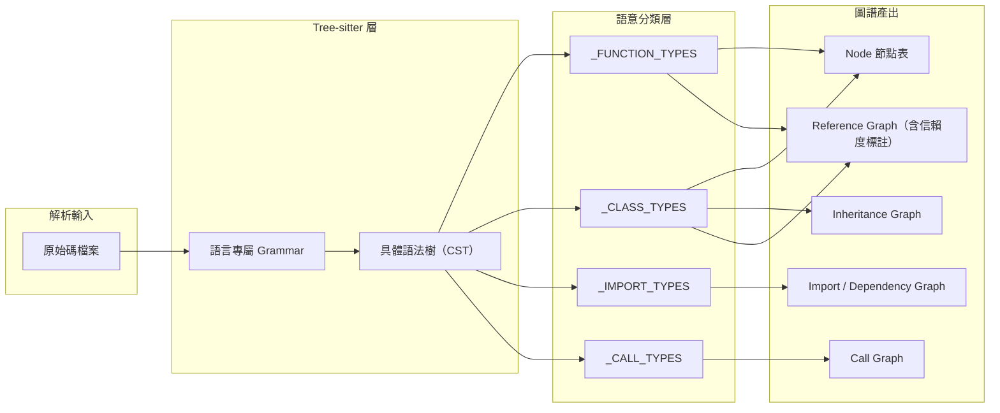

## 3.3 流程圖（Mermaid）

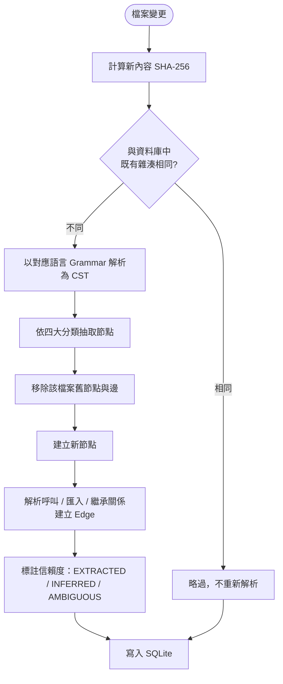

## 3.4 Sequence Diagram

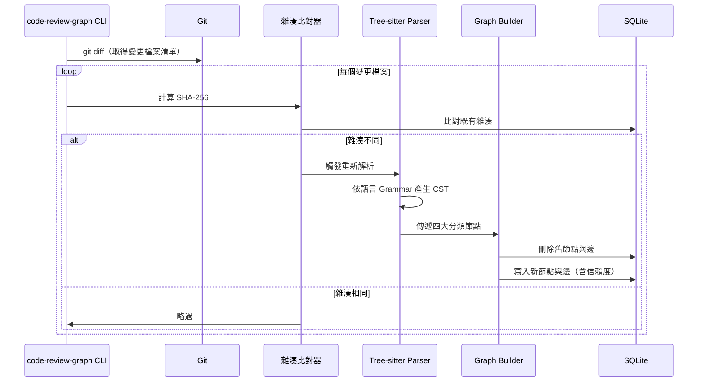

## 3.5 實作

驗證特定檔案是否被正確解析，可搭配圖查詢工具檢查節點是否存在：

```bash
# 針對單一檔案觸發重新索引（透過 update 的增量機制間接驗證）
touch src/service/OrderService.java
code-review-graph update

# 查看圖譜統計，確認節點數量有隨新檔案增加
code-review-graph status
```

自訂語言設定檔的驗證流程：

```bash
mkdir -p .code-review-graph
cat > .code-review-graph/languages.toml << 'EOF'
[languages.erlang]
extensions = [".erl"]
grammar = "erlang"
function_node_types = ["function_clause"]
class_node_types = ["record_decl"]
import_node_types = ["import_attribute"]
call_node_types = ["call"]
EOF
code-review-graph build
```

## 3.6 範例

以一個常見的 Java 呼叫關係為例，說明 Call Graph 邊如何從原始碼中被抽取：

```java
public class OrderService {
    private final PaymentGateway paymentGateway;

    public OrderService(PaymentGateway paymentGateway) {
        this.paymentGateway = paymentGateway;
    }

    public void checkout(Order order) {
        validate(order);
        paymentGateway.charge(order.getTotal());
    }

    private void validate(Order order) {
        if (order.isEmpty()) {
            throw new IllegalStateException("Order is empty");
        }
    }
}
```

Tree-sitter 解析後，`_CALL_TYPES` 節點會抽取出兩條 EXTRACTED 等級的 Call Graph 邊：`checkout -> validate`（同類別內方法呼叫，確定性高）與 `checkout -> PaymentGateway.charge`（跨類別呼叫，若 `PaymentGateway` 為介面，實際執行時的實作類別需搭配建構子注入關係才能完全解析，屬於 INFERRED 等級）。

## 3.7 最佳實務

1. **多語言 Monorepo 應先確認每種語言的 Tree-sitter 支援成熟度**，主流語言（Python／JavaScript／Java／Go）解析品質最穩定，冷門語言建議先用小範圍測試。
2. **自訂語言設定檔應納入版本控制**（`.code-review-graph/languages.toml` 提交進 Git），確保團隊成員與 CI 使用一致的解析規則。
3. **善用信賴度標註做風險分級**：在 Code Review 流程中，對 AMBIGUOUS 邊涉及的變更，應提示人工複核，而非完全信任自動化結果。

## 3.8 常見錯誤

1. **誤以為所有語言的解析品質一致**：官方文件明確指出 Flow Detection（第九章）在 Python／PHP／Laravel 上召回率最高，JavaScript 與 Go 仍待加強，跨語言比較時應留意這個差異。
2. **忽略框架感知解析的前提條件**：PHP 專案若沒有明確的框架匯入語句與模型繼承特徵，不會觸發 Laravel 語意邊解析，容易誤以為工具「支援 Laravel 卻沒作用」。
3. **在動態語言中過度信任 Reference Graph**：Python／Ruby 等動態語言的反射呼叫、字串拼接匯入，天生難以 100% 靜態解析，AMBIGUOUS 邊比例會較高，屬預期行為而非 Bug。

## 3.9 效能建議

- 大型專案的初次 `build` 是 CPU 密集工作，Tree-sitter 支援平行解析，多核心機器可顯著縮短建圖時間；如需序列化除錯可用 `CRG_SERIAL_PARSE`。
- 若某語言在專案中佔比極低（例如僅有幾個設定用的 Shell Script），可評估是否值得為其撰寫 `languages.toml`，或直接透過 `.code-review-graphignore` 排除以降低解析雜訊。
- 增量更新的效能高度依賴 `git diff` 的效率，超大型 Monorepo 建議搭配 Git 的 Sparse Checkout 或 Partial Clone 策略，間接加速變更偵測。

## 3.10 AI Agent 如何使用

Agent 在處理「這段程式碼呼叫了什麼」「誰呼叫了這個函式」等問題時，應優先使用 `query_graph_tool`（第八章）取得 Call Graph／Inheritance Graph 的結構化答案，而非用 `grep` 搜尋函式名稱字串——後者容易因為同名函式、字串誤配而產生偽陽性，前者則是基於語法解析的精確結果，並附帶信賴度可供 Agent 判斷是否需要人工確認。

## 3.11 Enterprise 建議

1. **針對企業內部 DSL（Domain-Specific Language）或私有框架，投資撰寫對應的 `languages.toml`**，讓知識圖譜涵蓋範圍與企業真實技術棧一致，而非只涵蓋主流開源語言。
2. **將「信賴度分級」的概念寫入企業 AI Code Review 規範**：明確規定 AMBIGUOUS 等級的變更影響，必須經過人工複核才能合併，作為自動化與人工把關的分工界線。
3. **多語言 Monorepo 團隊應定期檢視語言覆蓋率報告**（可由 `list_graph_stats_tool` 取得的統計數據延伸），確保新導入的語言或框架有被圖譜正確涵蓋。

---

# 第四章　Knowledge Graph 邏輯模型

## 4.1 原理

### 4.1.1 Knowledge Graph 在 Code-Review-Graph 中的定位

第三章介紹了「AST 如何變成節點與邊」，本章往上一層，聚焦於這些節點與邊組成的**知識圖譜邏輯模型**：它如何被查詢、如何被走訪、如何被用來做影響分析與架構探索。理解這層邏輯模型，是後續第八章 MCP 工具、第九章 Agent 使用模式的先備知識。

### 4.1.2 Node 的完整屬性模型

一個 Node 除了第三章提到的型別、簽章、檔案位置之外，在查詢層還會攜帶：

| 屬性 | 說明 |
| --- | --- |
| `id` | 圖譜內唯一識別碼 |
| `type` | Function / Class / Module / Test 等節點型別 |
| `name` / `qualified_name` | 短名稱與含命名空間的完整名稱 |
| `file_path` / `line_range` | 原始碼位置，供 Agent 精確定位 |
| `language` | 所屬程式語言 |
| `community_id` | 所屬架構社群（Leiden 分群結果，詳見 4.1.8） |
| `centrality_score` | 中心性分數，用於判斷是否為 Hub／Bridge 節點 |

除了 `File`／`Class`／`Function`／`Test`／`Type` 這幾種通用節點型別，Code-Review-Graph 針對 Java／Spring 生態系另外提供三種**框架加值合成節點（Synthesised Node）**，由 Spring 專屬的 Enrichment 邏輯在解析時額外產生，而非直接對應某個 Tree-sitter AST 節點：

| 合成節點型別 | 語意 | 產生條件 |
| --- | --- | --- |
| `Endpoint` | 一個被路由的 API 進入點 | Spring 的 Request Mapping（`@GetMapping`／`@RequestMapping` 等）解析結果 |
| `Scheduler` | 一個排程觸發的呼叫點 | `@Scheduled` 註解的方法 |
| `ConfigProperty` | 一個外部化設定鍵（僅存 Key，不存 Value） | 解析 `application.properties`／`application.yml` 得出 |

這對第十六、二十三章的 Spring Boot 案例特別重要：`Endpoint`／`Scheduler`／`ConfigProperty` 節點讓 Impact Analysis 能回答「這支 API 進入點會被這次變更影響嗎」「這個排程任務底層呼叫了哪些程式碼」「改這個 `application.yml` 設定鍵，程式碼裡哪裡在讀它」——這些是純語言中立解析無法回答的問題。

### 4.1.3 Edge 的完整屬性模型

Edge 記錄兩個節點間的關係，除第三章提到的三級信賴度外，還包含：

| 屬性 | 說明 |
| --- | --- |
| `source_id` / `target_id` | 起訖節點 |
| `relation_type` | CALLS / INHERITS / IMPORTS / TESTS / REFERENCES 等 |
| `confidence` | EXTRACTED / INFERRED / AMBIGUOUS |
| `weight` | 用於流程關鍵度（Flow Criticality）計算的權重 |

### 4.1.4 Relationship 型別總表

依官方 `docs/schema.md` 核對後的完整 Edge 型別（欄位名稱與官方原始碼一致，避免與坊間介紹文章的簡化命名混淆）：

| Relation Type | 語意 | 典型用途 |
| --- | --- | --- |
| `CALLS` | 函式呼叫函式 | Call Graph、Impact Radius |
| `IMPORTS_FROM` | 檔案匯入另一個模組／檔案 | Dependency Graph |
| `INHERITS` | 類別繼承另一個類別 | Inheritance Graph、多型影響分析 |
| `IMPLEMENTS` | 類別實作介面（Java／C#／TypeScript／Go） | Inheritance Graph |
| `CONTAINS` | 結構性包含：檔案包含類別、類別包含方法 | 圖譜結構骨架 |
| `TESTED_BY` | 被測程式碼與測試函式的對應關係 | 測試覆蓋缺口偵測（`get_knowledge_gaps_tool`） |
| `DEPENDS_ON` | 泛用依賴關係（無法歸類到更精確型別時使用） | 一般依賴分析 |
| `REFERENCES` | 值層級引用，例如回呼函式對照表、陣列、賦值 | Reference Graph，較低信賴度居多 |
| `INJECTS` | 依賴注入關係（Java／Spring 的欄位注入、建構子注入） | Spring Bean 依賴分析 |
| `HANDLES` | 分派點與服務方法的對應（Spring Request Mapping → Controller 方法；`@EventListener` → 事件） | API／事件處理鏈追蹤 |
| `TRIGGERS` | 排程呼叫關係（`Scheduler` 合成節點 → 被觸發的方法） | 排程任務影響分析 |
| `PUBLISHES` | 程式碼發布 Spring Application Event | 事件驅動架構分析 |
| `DEPENDS_ON_CONFIG` | 程式碼與外部化設定鍵的綁定（`@ConfigurationProperties`、`ConfigProperty` 節點） | 設定變更影響分析 |
| `CONSUMES` / `PRODUCES` | 特定解析器標註的資料／事件消費與產生關係 | 資料流分析 |
| `TEMPORAL_STUB` | 偵測到時序關係但無法解析為更明確型別時的暫存標記 | 時序依賴分析（實驗性） |

> `OVERRIDES` 目前僅出現在風險評分常數表中，尚未有任何解析器實際產生此類邊，屬於官方文件明確揭露的「保留但未實作」欄位，導入前不應假設它已生效。

### 4.1.5 Graph Schema（邏輯層級）

邏輯層級的 Schema 可以用一句話描述：**「Node 是名詞，Edge 是動詞，Relation Type 決定動詞的種類」**。這種「屬性圖」（Property Graph）模型，與 Neo4j、TigerGraph 等原生圖資料庫的邏輯模型概念一致，差別在於 Code-Review-Graph 選擇用關聯式資料庫（SQLite）實作這個邏輯模型，而非依賴專用圖資料庫引擎——第五章會說明這個工程選擇的理由與具體實作。

### 4.1.6 Graph Query 與 Traversal 策略

查詢圖譜的兩種基本模式：

1. **點查詢（Point Query）**：直接依 ID／名稱查詢單一節點的屬性，或查詢與它直接相連的邊（例如「這個函式的所有直接呼叫方」）。對應 `query_graph_tool`。
2. **走訪查詢（Traversal Query）**：從一個起點出發，依 BFS（廣度優先）或 DFS（深度優先）逐層擴散，直到滿足停止條件。對應 `traverse_graph_tool`，並支援「Token 預算」作為停止條件之一——這是圖查詢與傳統資料庫查詢很不一樣的地方：**查詢結果的大小要為下游 LLM 的 Context 負責**，而不只是回傳「所有符合條件的資料」。

走訪深度與範圍由多個環境變數把關，避免大型圖譜上的走訪查詢無限膨脹：

| 環境變數 | 用途 | 預設值 |
| --- | --- | --- |
| `CRG_MAX_BFS_DEPTH` | 圖走訪最大深度 | 15 |
| `CRG_MAX_IMPACT_DEPTH` | Impact Radius 搜尋深度 | 2 |
| `CRG_MAX_IMPACT_NODES` | Impact Analysis 最大節點數 | 500 |
| `CRG_MAX_TRANSITIVE_FRONTIER` | 呼叫方／被呼叫方展開的最大前緣寬度 | 50 |

### 4.1.7 Impact Analysis 的圖論基礎

Impact Radius（影響半徑）本質上是圖論中的**可達性問題（Reachability）**：從變更節點出發，沿著 `CALLS`、`INHERITS`、`TESTS` 等邊的方向，能到達哪些節點，就是「可能受影響」的集合。`get_impact_radius_tool` 把這個可達性計算包裝為直接可用的 API，並依信賴度與距離做加權——距離越遠、信賴度越低的節點，風險權重越低。

### 4.1.8 Community Detection：Leiden 演算法

Leiden 演算法是 Louvain 演算法的改良版，用於偵測圖中「內部連結緊密、對外連結相對稀疏」的節點群（社群）。Code-Review-Graph 用它來自動偵測「架構模組」：理論上，一個設計良好的系統中，同一個模組內的函式彼此呼叫頻繁，跨模組呼叫則相對稀疏——這正好符合社群偵測演算法的假設。

**過大社群的遞迴切分**：當偵測出的單一社群佔整體圖規模超過 25% 時，系統會對該社群遞迴地再次執行社群偵測，避免出現「一個社群等於半個專案」這種沒有實用意義的分群結果。

### 4.1.9 Architecture Discovery：從社群到架構總覽

`get_architecture_overview_tool` 是社群偵測的最終產出：把 Leiden 分群結果轉譯為人類與 AI 都易讀的「架構總覽」，包含每個社群的角色摘要、社群間的耦合關係、以及需要留意的**警告訊號**（例如耦合度異常高的社群對，可能是循環依賴或職責不清的徵兆）。搭配 `get_hub_nodes_tool`（找出中心性最高的節點，即架構熱點）、`get_bridge_nodes_tool`（找出介數中心性最高的節點，即模組間的橋接關卡）、`get_surprising_connections_tool`（找出「不應該存在」的跨社群耦合），四個工具組合起來，構成一套完整的「架構考古」工具鏈——這正是第十章逆向工程場景的核心武器。

## 4.2 架構圖（Mermaid）

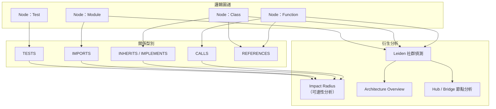

## 4.3 流程圖（Mermaid）

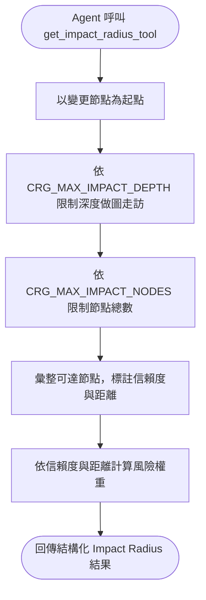

## 4.4 Sequence Diagram

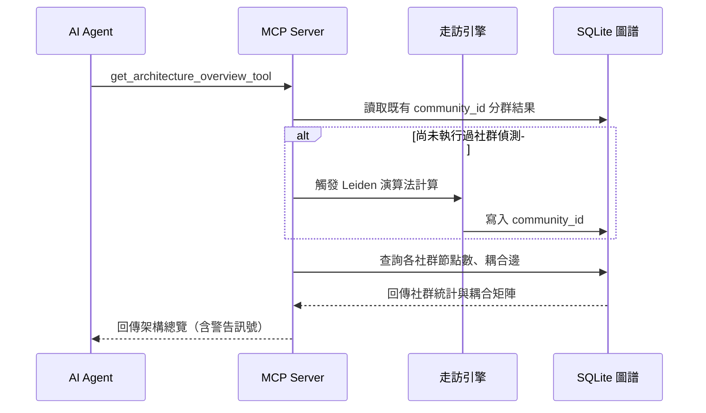

## 4.5 實作

```bash
# 查看目前圖譜的整體統計（節點數、邊數、社群數）
code-review-graph status

# 啟動 MCP Server 並僅暴露架構分析相關工具，便於針對性測試
code-review-graph serve --tools get_architecture_overview_tool,get_hub_nodes_tool,get_bridge_nodes_tool

# 若安裝了社群偵測選配套件，可搭配安裝指令
pip install "code-review-graph[communities]"
```

## 4.6 範例

一個典型的 Impact Radius 查詢結果（依官方工具語意重製之示意結構）：

```json
{
  "changed_node": "OrderService.checkout",
  "impact_radius": [
    {"node": "OrderController.placeOrder", "relation": "CALLS", "confidence": "EXTRACTED", "distance": 1},
    {"node": "OrderServiceTest.testCheckout", "relation": "TESTS", "confidence": "EXTRACTED", "distance": 1},
    {"node": "PaymentGateway.charge", "relation": "CALLS", "confidence": "INFERRED", "distance": 1},
    {"node": "LegacyOrderMigrationJob.run", "relation": "REFERENCES", "confidence": "AMBIGUOUS", "distance": 2}
  ],
  "risk_score": 0.72
}
```

這份結果告訴 Agent：優先關注 `distance=1`、`confidence=EXTRACTED` 的節點（幾乎確定受影響），對 `AMBIGUOUS` 節點保持懷疑並視需要人工確認。

## 4.7 最佳實務

1. **善用 Token 預算走訪**：呼叫 `traverse_graph_tool` 時明確設定合理的預算，避免在超大型圖譜上取得過量結果反而稀釋 Agent 的注意力。
2. **定期重新執行社群偵測**：架構會隨開發演進而變化，建議在重大重構後主動觸發 `run_postprocess_tool` 重新計算社群與流程。
3. **把 Hub／Bridge 節點分析納入重構優先序評估**：中心性異常高的節點，往往是技術債最集中、也最需要優先重構的地方。

## 4.8 常見錯誤

1. **誤解 `CRG_MAX_IMPACT_DEPTH`（預設 2）為圖譜的最大深度限制**：它只限制 Impact Radius 這個特定分析的走訪深度，`traverse_graph_tool` 有自己的 `CRG_MAX_BFS_DEPTH`（預設 15），兩者用途不同不可混淆。
2. **把「同一個社群」誤解為「同一個目錄」**：社群偵測依據的是實際呼叫／依賴關係，不是檔案系統的目錄結構——目錄結構混亂但耦合合理的專案，社群劃分可能與目錄結構完全不同，這反而是有價值的架構洞察。
3. **忽略過大社群的遞迴切分機制**，誤以為某個社群「異常龐大」是 Bug，實際上系統已經對超過 25% 規模的社群自動做二次切分。

## 4.9 效能建議

- 社群偵測（Leiden 演算法）在大型圖譜上有一定運算成本，不需要在每次 `update` 後都重新計算，建議在重大變更後或排程性地執行 `run_postprocess_tool`。
- `get_surprising_connections_tool` 與 `get_knowledge_gaps_tool` 屬於全圖分析工具，運算成本高於單點查詢，建議搭配 `daemon` 模式在背景排程執行，而非即時互動中呼叫。

## 4.10 AI Agent 如何使用

Agent 在面對「重構規劃」「架構理解」類任務時，建議的呼叫順序是：先 `get_architecture_overview_tool` 建立整體印象 → 再 `get_hub_nodes_tool`／`get_bridge_nodes_tool` 定位風險最高的節點 → 最後針對特定節點用 `get_impact_radius_tool` 做精確的變更影響評估。這個「由粗到細」的漏斗式查詢順序，能在有限的工具呼叫次數內建立足夠的架構理解，這是第九章會系統化整理的 Agent 工作模式之一。

## 4.11 Enterprise 建議

1. **將 Architecture Overview 的產出，定期匯出為架構決策紀錄（ADR）的佐證資料**，讓架構治理決策有可重現的量化依據，而非僅憑資深工程師的主觀經驗。
2. **把 `get_knowledge_gaps_tool` 的輸出，納入測試覆蓋率治理的月度報告**，將「結構性未測試熱點」與傳統的行覆蓋率指標並列檢視。
3. **對於併購或承接的既有系統，Architecture Discovery 應作為盡職調查（Due Diligence）的標準步驟之一**，在合約簽署前就先掌握系統的真實耦合狀況與技術債分佈。

---

# 第五章　SQLite 儲存層

## 5.1 原理

### 5.1.1 為何選擇 SQLite 而非專用圖資料庫

這是企業導入評估時最常被問到的架構問題：「為什麼不用 Neo4j 這類原生圖資料庫？」官方選擇 SQLite 的理由，可歸納為與「Local-first」理念一致的三個工程權衡：

1. **零部署成本**：SQLite 是嵌入式資料庫，不需要另外啟動伺服器行程、不需要網路埠、不需要帳號密碼設定——這對「裝完就能用」的開發者工具體驗至關重要。
2. **單檔案可攜性**：整個圖譜就是（一組）本機檔案，複製、備份、刪除都與操作一般檔案無異，非常契合 CI Runner 每次執行都是全新環境的特性。
3. **規模匹配**：Code-Review-Graph 鎖定的是「單一 Repository 到中大型 Monorepo」的規模（節點數通常是十萬等級），這個規模下，搭配良好索引設計的關聯式資料庫完全足以應付圖走訪查詢，不需要專用圖資料庫的額外運維複雜度。

**企業實務建議**：這個選擇也隱含一個限制——若企業需求是「跨數百個 Repository 的全域程式碼圖譜」，SQLite 的單檔案模型會遇到規模瓶頸，此時官方提供的 `register`／`cross_repo_search_tool` 多倉庫機制（第七、十九章）是目前的替代方案，而非強行把單一 SQLite 檔案撐大。

### 5.1.2 資料庫檔案位置

預設情況下，圖譜資料庫存放於專案根目錄的 `.code-review-graph/` 目錄，可透過環境變數 `CRG_DATA_DIR` 覆寫路徑（適合企業將圖譜資料集中存放於獨立磁碟區或網路儲存的場景）。建議將 `.code-review-graph/` 加入 `.gitignore`，圖譜屬於**衍生資料**，不應提交進版本控制。

### 5.1.3 實際 Schema 設計（依官方 `docs/schema.md` 核對）

> 以下 SQL 直接對照官方 `docs/schema.md` 揭示的欄位定義重新謄寫，而非教學示範用的簡化版本；但欄位仍可能隨版本演進微調，正式導入前請以 `sqlite3 .code-review-graph/graph.db ".schema"` 查詢您實際安裝版本的權威結果為準。

```sql
-- 節點表：對應第四章的 Node 邏輯模型（File / Class / Function / Test / Type / Endpoint / Scheduler / ConfigProperty）
CREATE TABLE nodes (
    id              INTEGER PRIMARY KEY AUTOINCREMENT,
    kind            TEXT NOT NULL,             -- 節點型別，如 Function / Class / Test
    name            TEXT NOT NULL,
    qualified_name  TEXT NOT NULL UNIQUE,
    file_path       TEXT NOT NULL,
    line_start      INTEGER,
    line_end        INTEGER,
    language        TEXT,
    parent_name     TEXT,                      -- 內嵌類別 / 所屬類別
    params          TEXT,                      -- 參數列表原始文字
    return_type     TEXT,
    modifiers       TEXT,                      -- public / abstract 等存取修飾詞
    is_test         INTEGER DEFAULT 0,
    file_hash       TEXT,                      -- SHA-256，用於增量更新比對
    extra           TEXT DEFAULT '{}',         -- 語言 / 框架專屬附加資訊（JSON）
    community_id    INTEGER,
    updated_at      REAL NOT NULL
);

-- 邊表：對應第四章 4.1.4 的 Relationship 型別總表
CREATE TABLE edges (
    id                INTEGER PRIMARY KEY AUTOINCREMENT,
    kind              TEXT NOT NULL,           -- CALLS / IMPORTS_FROM / INHERITS / TESTED_BY ...
    source_qualified  TEXT NOT NULL,
    target_qualified  TEXT NOT NULL,
    file_path         TEXT NOT NULL,
    line              INTEGER DEFAULT 0,
    extra             TEXT DEFAULT '{}',
    confidence        REAL DEFAULT 1.0,
    confidence_tier   TEXT DEFAULT 'EXTRACTED', -- EXTRACTED / INFERRED / AMBIGUOUS
    updated_at        REAL NOT NULL
);

-- 中繼資料表：last_updated、build_type、schema_version 等鍵值對
CREATE TABLE metadata (
    key   TEXT PRIMARY KEY,
    value TEXT NOT NULL
);

-- 社群表：Leiden 演算法產出（第四章 4.1.8）
CREATE TABLE communities (
    id                 INTEGER PRIMARY KEY AUTOINCREMENT,
    name               TEXT NOT NULL,
    level              INTEGER NOT NULL DEFAULT 0,
    parent_id          INTEGER,               -- 支援過大社群的遞迴切分
    cohesion           REAL NOT NULL DEFAULT 0.0,
    size               INTEGER NOT NULL DEFAULT 0,
    dominant_language  TEXT,
    description        TEXT
);

-- 執行流程表：第九、十章的 Execution Flow 分析基礎
CREATE TABLE flows (
    id             INTEGER PRIMARY KEY AUTOINCREMENT,
    name           TEXT NOT NULL,
    entry_point_id INTEGER NOT NULL,
    depth          INTEGER NOT NULL,
    node_count     INTEGER NOT NULL,
    file_count     INTEGER NOT NULL,
    criticality    REAL NOT NULL DEFAULT 0.0,
    path_json      TEXT NOT NULL
);

-- 全文檢索虛擬表（FTS5 + Porter 詞幹分析），支援 semantic_search_nodes_tool 的關鍵字檢索面向
CREATE VIRTUAL TABLE nodes_fts USING fts5(
    name, qualified_name, file_path, signature,
    content='nodes', content_rowid='rowid',
    tokenize='porter unicode61'
);

-- Token 效率化摘要表：讓查詢工具回傳精簡摘要而非完整節點/邊清單
CREATE TABLE community_summaries (
    community_id INTEGER PRIMARY KEY,
    purpose      TEXT DEFAULT '',
    key_symbols  TEXT DEFAULT '[]',
    risk         TEXT DEFAULT 'unknown'
);

CREATE TABLE risk_index (
    node_id         INTEGER PRIMARY KEY,
    qualified_name  TEXT NOT NULL,
    risk_score      REAL DEFAULT 0.0,
    caller_count    INTEGER DEFAULT 0,
    test_coverage   TEXT DEFAULT 'unknown',
    security_relevant INTEGER DEFAULT 0
);

-- 向量嵌入表：儲存於獨立的 embeddings 資料庫檔案，僅在啟用 embeddings 功能時建立
CREATE TABLE embeddings (
    qualified_name TEXT PRIMARY KEY,
    vector         BLOB NOT NULL,
    text_hash      TEXT NOT NULL,
    provider       TEXT NOT NULL DEFAULT 'unknown'
);
```

上表為精簡呈現的核心表格；完整版另含 `flow_memberships`（流程與節點的多對多關聯）與 `flow_snapshots`（流程精簡快照）兩張輔助表，設計目的同樣是讓 MCP 工具能回傳「摘要級」而非「全量級」的查詢結果，呼應第一章「Token 最佳化」的核心理念。

### 5.1.4 索引策略

高頻查詢模式決定索引設計。圖走訪查詢最頻繁的存取路徑是「給定一個節點，找出所有以它為起點/終點的邊」，因此邊表至少需要：

```sql
CREATE INDEX idx_edges_source ON edges(source_id);
CREATE INDEX idx_edges_target ON edges(target_id);
CREATE INDEX idx_edges_relation ON edges(relation_type);
CREATE INDEX idx_nodes_file_path ON nodes(file_path);
CREATE INDEX idx_nodes_community ON nodes(community_id);
```

### 5.1.5 WAL 模式與並行存取

`code-review-graph status` 輸出中的 "Journal 為 wal" 訊息，代表資料庫啟用了 SQLite 的 **Write-Ahead Logging（WAL）** 模式——這讓讀取操作（例如 MCP Server 回應查詢）不會被寫入操作（例如 `daemon` 背景更新圖譜）阻塞，是「背景常駐更新、前景即時查詢」這種 `daemon` 使用模式（第十九章）能夠順暢運作的關鍵資料庫層設計。

### 5.1.6 Migration 策略

當 Code-Review-Graph 版本升級伴隨 Schema 變更時，工具本身會在啟動時偵測資料庫的 Schema 版本，並視需要自動遷移（或提示需要重新 `build`）。企業導入建議的保守策略是：**大版本升級前，先在測試分支上驗證 `build` 能否順利完成，再滾動套用到主要開發分支**，避免 CI Pipeline 因為 Schema 不相容而集體失敗。

### 5.1.7 Backup 與 Restore

由於圖譜是「可從原始碼完全重新產生的衍生資料」，最務實的備份策略往往不是備份資料庫檔案本身，而是**確保能快速重新 `build`**。但在大型 Monorepo（重新建圖需要數分鐘以上）的場景，直接備份 `.code-review-graph/` 目錄仍有其效益：

```bash
# 備份（建議先確認 daemon 未在寫入中，避免備份到不一致的中間狀態）
code-review-graph daemon stop
tar -czf crg-backup-$(date +%Y%m%d).tar.gz .code-review-graph/
code-review-graph daemon start

# 還原
tar -xzf crg-backup-20260615.tar.gz
code-review-graph status  # 驗證還原後圖譜可正常查詢
```

### 5.1.8 Maintenance：定期維護

SQLite 資料庫在大量增量更新（節點反覆新增刪除）後，檔案可能產生內部碎片。標準維護動作是定期執行 `VACUUM`：

```bash
sqlite3 .code-review-graph/graph.db "VACUUM;"
sqlite3 .code-review-graph/graph.db "ANALYZE;"
```

對於長期執行的 Monorepo，建議將此類維護指令排入第十九章介紹的排程維護腳本中，與圖譜重建週期一併管理。

## 5.2 架構圖（Mermaid）

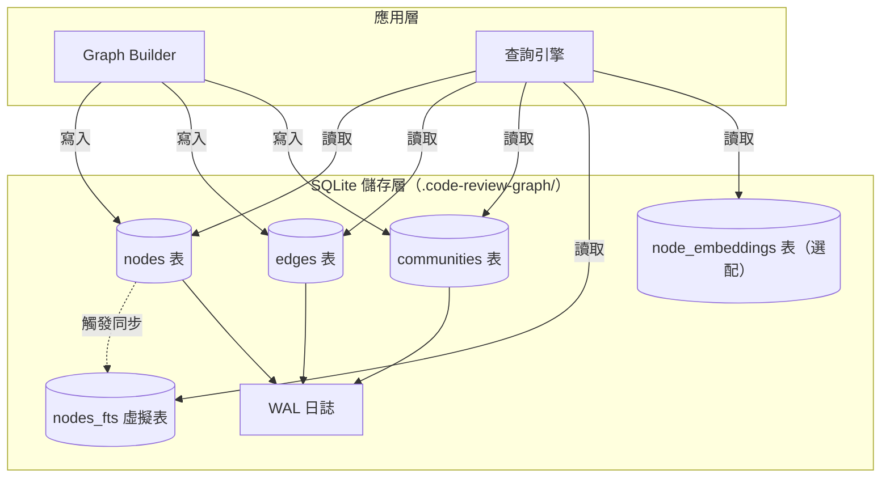

## 5.3 流程圖（Mermaid）

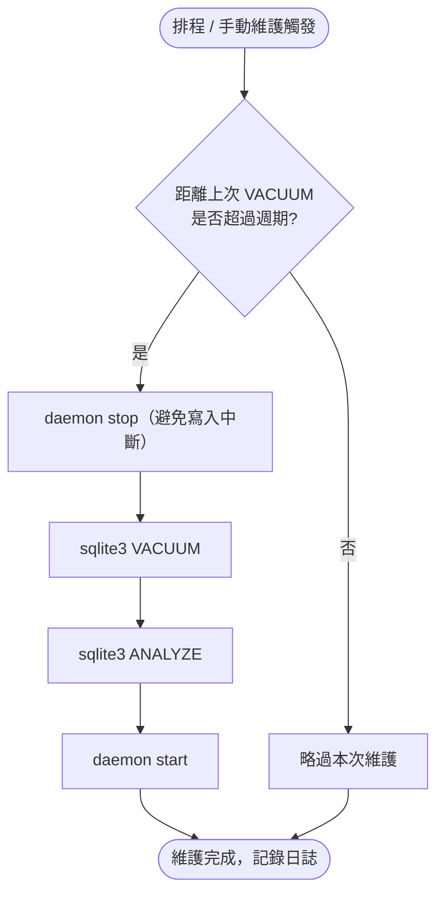

## 5.4 Sequence Diagram

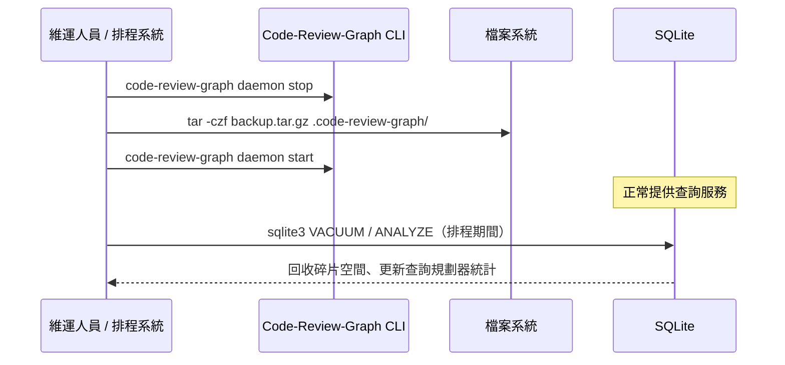

## 5.5 實作

```bash
# 檢視目前資料庫的實際 Schema（版本差異務必以此為準）
sqlite3 .code-review-graph/graph.db ".schema"

# 檢視資料庫檔案大小，評估是否需要 VACUUM
du -sh .code-review-graph/

# 覆寫資料庫存放路徑（適合集中管理多專案圖譜的企業場景）
export CRG_DATA_DIR=/data/code-review-graphs/my-project
code-review-graph build
```

## 5.6 範例

一個可排入 Cron／CI 排程的每週維護腳本範例：

```bash
#!/usr/bin/env bash
set -euo pipefail

PROJECT_DIR="/srv/repos/my-monorepo"
cd "$PROJECT_DIR"

code-review-graph daemon stop
sqlite3 .code-review-graph/graph.db "VACUUM;"
sqlite3 .code-review-graph/graph.db "ANALYZE;"
code-review-graph daemon start

echo "[$(date -Iseconds)] Code-Review-Graph 資料庫維護完成"
```

## 5.7 最佳實務

1. **`.code-review-graph/` 一律加入 `.gitignore`**，圖譜是衍生資料，提交進版本控制只會造成不必要的 diff 雜訊與合併衝突。
2. **大型 Monorepo 建議將 `CRG_DATA_DIR` 指向 SSD 儲存**，圖走訪查詢是隨機讀取密集型工作負載，儲存媒介的 IOPS 對查詢延遲影響顯著。
3. **維護排程與 `daemon` 生命週期整合管理**，避免維護腳本與背景更新行程互相搶佔資料庫鎖。

## 5.8 常見錯誤

1. **在 `daemon` 執行中直接對資料庫檔案做 `VACUUM`**：可能因鎖競爭導致維護失敗或圖譜暫時不可用，正確做法是先停止 `daemon`。
2. **把 `.code-review-graph/` 誤當成需要備份的「主要資料」**：多數情境下它是可重建的衍生資料，過度投資備份基礎設施反而是資源錯置。
3. **跨版本直接複製 `.code-review-graph/` 資料夾到新安裝的版本**：若版本間有 Schema 差異未妥善遷移，可能導致查詢結果異常，建議版本升級後重新 `build` 一次驗證。

## 5.9 效能建議

- 為 `edges` 表的 `source_id`／`target_id` 建立索引是效能關鍵——若企業自行擴充 Schema 或撰寫自訂查詢，務必確認高頻查詢路徑都有對應索引覆蓋。
- WAL 模式下，過多未 Checkpoint 的日誌會拖慢後續查詢，長時間執行的 `daemon` 行程建議定期觸發 `PRAGMA wal_checkpoint;`。
- FTS5 全文索引與向量嵌入表會增加資料庫檔案大小，若團隊完全不使用語意搜尋功能，可評估是否需要建立這些選配結構。

## 5.10 AI Agent 如何使用

Agent 不需要（也不應該）直接對 SQLite 檔案發送原始 SQL 查詢——所有查詢都應透過 MCP 工具（第八章）進行，因為工具層已經封裝了 Token 預算控制、信賴度過濾、走訪深度限制等重要的安全邊界。若 Agent 在除錯過程中需要直接檢視資料庫內容，應視為**維運／除錯情境**，而非常態使用模式。

## 5.11 Enterprise 建議

1. **將 `.code-review-graph/` 目錄的存取權限，比照原始碼倉庫的存取控制政策管理**——即使它是衍生資料，其中仍包含程式碼結構資訊，在高敏感度專案中應一併納管。
2. **大型企業若同時維運數十個 Monorepo，建議建立集中式的圖譜維護排程平台**，統一管理 `CRG_DATA_DIR`、備份、VACUUM 排程，而非讓各團隊各自為政。
3. **將資料庫維護週期，與既有的資料庫維運 SOP（Standard Operating Procedure）整合**，即使 SQLite 遠比傳統企業資料庫輕量，「定期維護、可觀測、可還原」的維運紀律仍然適用。

---

# 第六章　安裝

## 6.1 原理

### 6.1.1 安裝方式總覽

Code-Review-Graph 以 Python 套件形式發行（PyPI 套件名稱 `code-review-graph`），官方提供四種安裝路徑：

| 方式 | 指令 | 適用情境 |
| --- | --- | --- |
| pip | `pip install code-review-graph` | 已有 Python 虛擬環境管理習慣的團隊 |
| pipx | `pipx install code-review-graph` | 希望 CLI 工具獨立於專案虛擬環境 |
| uv（官方建議） | `uv tool install code-review-graph` | 官方特別建議，因 MCP 設定產生流程與 uv 搭配更順暢 |
| 原始碼安裝 | `git clone` + `pip install -e ".[dev]"` | 需要客製化或參與貢獻的團隊 |

### 6.1.2 系統需求

- **Python 3.10 以上**（core 相依）。
- **Git**：工具深度依賴 `git diff`、`git ls-files`，專案必須是 Git Repository 才能發揮增量更新與變更偵測能力。
- **SQLite**：不需要額外安裝，Python 標準函式庫內建的 `sqlite3` 模組已足夠。
- **Tree-sitter 各語言文法**：隨套件相依自動安裝，不需要另外安裝各語言的 Tree-sitter Grammar。
- **Node.js**：Code-Review-Graph 本身是純 Python 工具，**不需要 Node.js 執行環境**。若您的 IDE／Agent 平台上同時安裝了其他基於 Node.js 的 MCP Server，那是其他工具的需求，與本工具無關——企業導入時常見的誤解是「MCP 生態系都需要 Node.js」，實際上取決於個別 MCP Server 的實作語言。

### 6.1.3 選配依賴總表

Code-Review-Graph 採「核心精簡、按需擴充」的依賴設計，選配功能透過 extras 語法安裝：

| Extras | 功能 | 安裝指令 |
| --- | --- | --- |
| `[embeddings]` | 本地向量嵌入（sentence-transformers，自動下載模型） | `pip install "code-review-graph[embeddings]"` |
| `[google-embeddings]` | Google Gemini 雲端嵌入 | `pip install "code-review-graph[google-embeddings]"` |
| `[communities]` | 社群偵測（igraph，Leiden 演算法） | `pip install "code-review-graph[communities]"` |
| `[enrichment]` | Python 呼叫解析加強（Jedi） | `pip install "code-review-graph[enrichment]"` |
| `[eval]` | 評估基準測試（matplotlib） | `pip install "code-review-graph[eval]"` |
| `[wiki]` | LLM 生成 Wiki（ollama） | `pip install "code-review-graph[wiki]"` |
| `[all]` | 全部選配依賴 | `pip install "code-review-graph[all]"` |

**企業實務建議**：一般開發團隊建議至少安裝 `[communities]`（架構分析能力屬核心價值），語意搜尋需求明確時再加裝 `[embeddings]`；`[wiki]` 需要本機執行 Ollama，屬於進階場景，非必要不建議全團隊統一安裝，以控制依賴體積與安全稽核範圍。

### 6.1.4 Windows 安裝要點

Windows 環境建議使用 PowerShell，並優先透過 `uv` 安裝以避免虛擬環境路徑相關的常見問題：

```powershell
# 安裝 uv（若尚未安裝）
irm https://astral.sh/uv/install.ps1 | iex

# 安裝 Code-Review-Graph
uv tool install code-review-graph

# 確認安裝成功
code-review-graph --version
```

若企業內網對外部安裝腳本有安全限制，可改用已核准的 Python 環境搭配 `pip install code-review-graph`。

### 6.1.5 Linux 安裝要點

```bash
# 使用 uv
curl -LsSf https://astral.sh/uv/install.sh | sh
uv tool install code-review-graph

# 或使用 pipx（多數 Linux 發行版套件庫已收錄）
sudo apt install pipx   # Debian / Ubuntu 系列
pipx install code-review-graph
```

### 6.1.6 macOS 安裝要點

```bash
# 透過 Homebrew 安裝 uv，再安裝工具
brew install uv
uv tool install code-review-graph
```

### 6.1.7 WSL 安裝要點（企業實務建議）

在 Windows 開發但團隊統一使用 WSL2 作為實際開發環境的企業，建議**在 WSL 內部安裝**而非 Windows 端原生安裝，理由是 Git Repository 通常也位於 WSL 檔案系統內，避免跨檔案系統（`/mnt/c/...`）存取造成的效能損耗與路徑處理問題：

```bash
# 於 WSL2 Ubuntu 內執行
curl -LsSf https://astral.sh/uv/install.sh | sh
uv tool install code-review-graph
cd ~/repos/your-project   # 確保專案位於 WSL 原生檔案系統路徑
code-review-graph build
```

### 6.1.8 Docker／Podman 容器化部署（企業實務建議）

官方目前未提供官方維護的 Docker Image，以下為**企業導入時常見的自建容器化方案**，適合在 CI Runner 或需要環境隔離的場景使用：

```dockerfile
FROM python:3.12-slim

RUN apt-get update && apt-get install -y --no-install-recommends git \
    && rm -rf /var/lib/apt/lists/*

RUN pip install --no-cache-dir "code-review-graph[communities]"

WORKDIR /workspace
ENTRYPOINT ["code-review-graph"]
```

```bash
# 建置映像
docker build -t internal/code-review-graph:latest .

# 於 CI 中掛載原始碼並執行建圖
docker run --rm -v "$(pwd)":/workspace internal/code-review-graph:latest build

# Podman 用法完全相容（Rootless 執行，適合企業安全政策要求非 root 容器）
podman run --rm -v "$(pwd)":/workspace:Z internal/code-review-graph:latest build
```

### 6.1.9 驗證安裝

無論採用哪種安裝方式，統一以下列指令驗證：

```bash
code-review-graph --version
code-review-graph --help
```

## 6.2 架構圖（Mermaid）

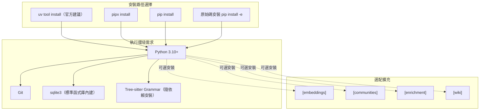

## 6.3 流程圖（Mermaid）

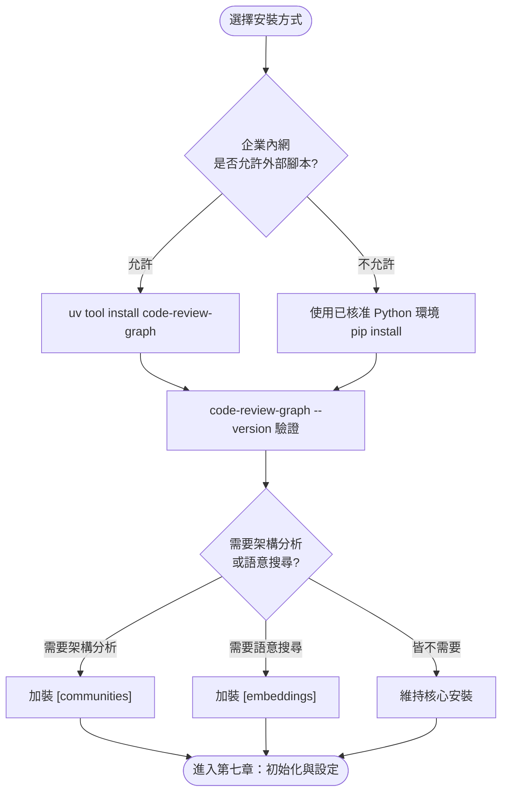

## 6.4 Sequence Diagram

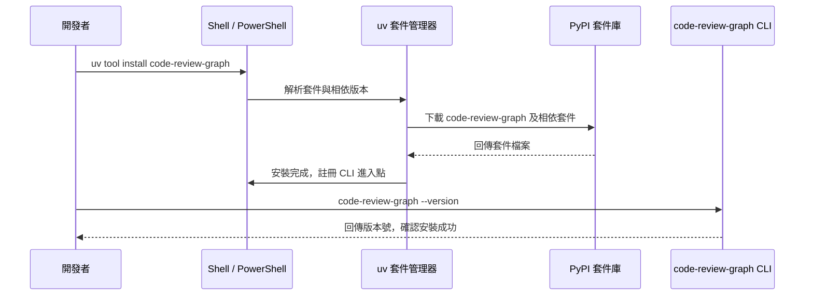

## 6.5 實作

企業內部標準化安裝腳本範例（可納入 onboarding 文件或開發環境自動化腳本）：

```bash
#!/usr/bin/env bash
set -euo pipefail

if ! command -v uv &> /dev/null; then
    curl -LsSf https://astral.sh/uv/install.sh | sh
    export PATH="$HOME/.local/bin:$PATH"
fi

uv tool install "code-review-graph[communities]"

echo "安裝完成，版本："
code-review-graph --version
```

## 6.6 範例

不同角色的建議安裝組合：

```bash
# 一般開發者（日常使用架構分析與影響分析）
uv tool install "code-review-graph[communities]"

# 平台團隊（需要維運多倉庫、語意搜尋、Wiki 生成）
uv tool install "code-review-graph[all]"

# CI Runner（僅需建圖與風險偵測，避免安裝不必要依賴）
pip install --no-cache-dir code-review-graph
```

## 6.7 最佳實務

1. **統一團隊安裝方式**：建議企業內部標準化採用 `uv tool install`，避免不同開發者因安裝方式不同（pip vs pipx vs 原始碼）而遇到版本或路徑不一致的問題。
2. **CI 環境固定版本號**：`pip install code-review-graph==2.3.7`（或您驗證過的當下最新版本）明確釘選版本，避免 CI Pipeline 因套件自動升級而產生非預期行為；升級前務必先在測試分支跑過一次完整 `build`。
3. **選配依賴依角色分層安裝**，而非全員 `[all]`，降低依賴體積與潛在的供應鏈安全風險面。

## 6.8 常見錯誤

1. **在非 Git Repository 目錄中安裝並嘗試建圖**：工具深度依賴 Git，非版控目錄會導致 `build` 失敗或功能大幅受限。
2. **誤以為需要另外安裝 Node.js 或個別 Tree-sitter Grammar**：這是與其他基於 Node.js 生態的 MCP 工具混淆的常見誤解，Code-Review-Graph 是純 Python 生態，安裝套件時已包含所需的 Grammar 相依。
3. **企業內網環境未事先核准 `astral.sh` 安裝腳本網域**，導致 `uv` 安裝失敗；建議 IT 部門事先將官方安裝來源加入允許清單，或改用內部 PyPI 鏡像搭配 `pip install`。

## 6.9 效能建議

- CI Runner 建議使用 Docker 映像快取（Layer Caching）避免每次 Pipeline 執行都重新下載套件，可顯著縮短建置時間。
- 選配依賴（尤其是 `[embeddings]` 會下載模型檔案）會增加映像大小與首次執行時間，CI 場景若不需要語意搜尋，應避免安裝。

## 6.10 AI Agent 如何使用

安裝完成後，多數 AI Agent 平台可透過官方提供的 `code-review-graph install` 指令自動偵測並設定 MCP 連線（詳見第八章），開發者不需要手動編輯每個 IDE 的設定檔。建議在團隊 onboarding 文件中，將「安裝 CLI」與「執行 `install` 設定 Agent 整合」列為連續的兩個步驟，避免遺漏後者導致「裝了但 Agent 沒接上」的常見困惑。

## 6.11 Enterprise 建議

1. **將標準安裝腳本納入企業開發環境自動化工具**（如內部的 Dev Container、Codespaces 設定範本、或 Ansible/Terraform 開發環境模組），確保新進人員與新專案能一致地取得已核准的安裝方式與版本。
2. **建立內部套件鏡像或安全掃描流程**，對 PyPI 上的 `code-review-graph` 及其相依套件做例行的供應鏈安全掃描（SCA, Software Composition Analysis），這對受監管產業尤其重要。
3. **將版本升級納入定期技術債盤點**，避免長期釘選舊版本導致錯過重要的功能演進或安全修補。

---

# 第七章　設定與初始化

## 7.1 原理

### 7.1.1 初始化流程

安裝完成後，任何專案的第一步永遠是初次建圖：

```bash
cd your-project
code-review-graph build
code-review-graph status
```

`build` 是一次完整掃描：走訪所有受 Git 追蹤的檔案（透過 `git ls-files`）、逐一解析、建立完整圖譜。這是唯一需要「等待較長時間」的步驟，之後的日常使用應以 `update` 為主。

### 7.1.2 `.code-review-graphignore` 語法與規則

放置於專案根目錄，語法與 `.gitignore` 一致（`gitignore` 樣式的路徑比對），用於排除不希望被解析進圖譜的路徑：

```text
generated/**
*.generated.ts
vendor/**
node_modules/**
dist/**
build/**
*.min.js
coverage/**
```

### 7.1.3 與 `.gitignore` 的關係

一個容易被忽略但非常重要的行為：**在 Git Repository 中，Code-Review-Graph 透過 `git ls-files` 取得候選檔案清單，因此 `.gitignore` 中排除的路徑會自動被跳過，不需要在 `.code-review-graphignore` 中重複宣告。** `.code-review-graphignore` 的存在意義，是處理「需要被 Git 追蹤、但不希望被納入知識圖譜解析」的特殊情境（例如：某些需要提交進版控的自動產生程式碼、大型測試 Fixture 檔案）。

### 7.1.4 大型 Repository 考量

超大型 Monorepo（數萬檔案等級）在設定階段需要考慮的三個面向：

1. **精準的 Ignore 規則**：越大的專案，排除產生碼、第三方 vendor 目錄的效益越明顯。
2. **多倉庫拆分策略**：若 Monorepo 內部本身就是多個邏輯上獨立的專案，可評估搭配 `register`／`repos`／`cross_repo_search_tool`（第十九章）以邏輯倉庫為單位管理，而非強行把整個 Monorepo 當成單一圖譜。
3. **`daemon` 常駐監看**：避免每次互動都觸發完整或大範圍的更新掃描。

### 7.1.5 Incremental Build：`update`、`watch` 與平台原生 Hook

官方文件實際列出三種讓圖譜保持新鮮的機制，企業導入時應依平台特性選用，而非只知道其中一種：

- **`code-review-graph update`**：手動觸發的增量更新，依 `git diff` 找出變更檔案，只重新解析真正變動的部分（第三章已詳述其雜湊比對機制）。適合搭配 Git Hook（例如 `post-checkout`、`post-merge`）自動觸發。
- **平台原生 Hook（優先建議）**：對於支援 Hook 機制的平台（例如 Claude Code、Codex），`code-review-graph install` 會自動安裝對應的 PostToolUse／SessionStart 等平台原生 Hook，讓「檔案存檔」「Agent 呼叫 Write／Edit／Bash 工具」的當下自動觸發增量更新，**不需要額外常駐行程**，是延遲最低、資源消耗最小的方案。
- **`code-review-graph watch`**：啟動檔案系統監看行程，開發者存檔的當下即觸發增量更新，適合 Hook 機制不支援的編輯器（例如 Cursor、OpenCode）或非 Agent 驅動的手動編輯場景，但會持續佔用一個前景（或背景）行程。
- **`crg-daemon` / `code-review-graph daemon`**（第十九章詳述）：多倉庫常駐監看的進階版 `watch`，同樣是為 Hook 機制不支援的平台設計，差別在於可同時監看多個 Repository 並具備健康檢查與自動重啟能力。

**選型原則**：平台支援 Hook 就優先用 Hook（零額外行程、事件驅動）；不支援 Hook 但需要即時性的單一專案用 `watch`；需要同時維護多個專案的常駐新鮮度則用 `daemon`；CI 或一次性場景則直接呼叫 `update`。

### 7.1.6 Configuration 總覽

除了 `.code-review-graphignore`，設定相關檔案還包括：

| 設定檔 | 用途 | 章節 |
| --- | --- | --- |
| `.code-review-graph/languages.toml` | 自訂語言支援 | 第三章 |
| `~/.code-review-graph/watch.toml` | Daemon 多倉庫監看清單 | 第十九章 |
| MCP 用戶端設定（如 `.claude.json`） | MCP Server 連線設定 | 第八章 |
| 環境變數（`CRG_*`） | 執行期參數調整 | 貫穿全書，第二十四章附完整速查表 |

## 7.2 架構圖（Mermaid）

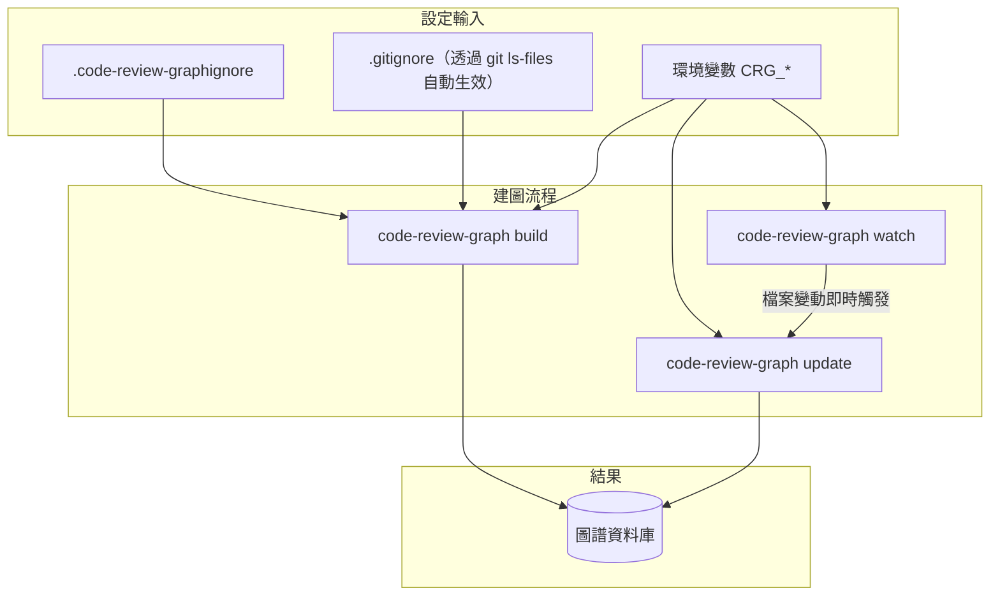

## 7.3 流程圖（Mermaid）

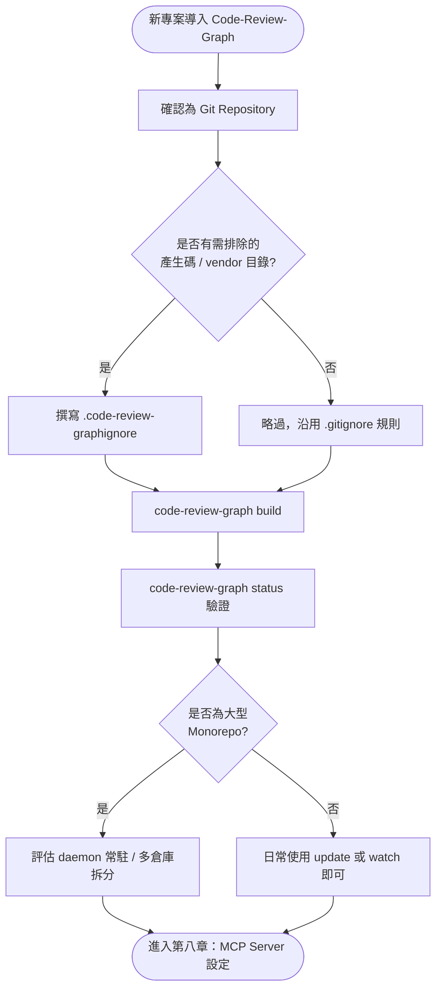

## 7.4 Sequence Diagram

```mermaid
sequenceDiagram
    participant Dev as 開發者
    participant FS as 檔案系統
    participant CLI as Code-Review-Graph CLI
    participant Git as Git
    participant DB as SQLite 圖譜

    Dev->>FS: 建立 .code-review-graphignore
    Dev->>CLI: code-review-graph build
    CLI->>Git: git ls-files（取得受追蹤檔案，自動排除 .gitignore）
    CLI->>FS: 讀取 .code-review-graphignore，二次過濾
    CLI->>CLI: 逐檔案 Tree-sitter 解析
    CLI->>DB: 寫入節點與邊
    CLI-->>Dev: 建圖完成，顯示統計摘要
```

## 7.5 實作

```bash
# 建立排除規則
cat > .code-review-graphignore << 'EOF'
dist/**
build/**
*.min.js
**/__pycache__/**
**/*.generated.*
EOF

# 初次建圖
code-review-graph build

# 日常增量更新（可放入 pre-push Git Hook）
code-review-graph update

# 互動式開發時啟用即時監看
code-review-graph watch
```

Git Hook 整合範例（`.git/hooks/post-merge`，確保每次拉取最新程式碼後圖譜自動同步）：

```bash
#!/usr/bin/env bash
code-review-graph update --brief
```

## 7.6 範例

大型 Monorepo 的典型 `.code-review-graphignore` 範例：

```text
# 前端建置產物
frontend/dist/**
frontend/.next/**
frontend/node_modules/**

# 後端建置產物
backend/target/**
backend/build/**

# 測試固定資料與快照
**/__snapshots__/**
**/fixtures/large-dataset/**

# 第三方套件
vendor/**
third_party/**
```

## 7.7 最佳實務

1. **將 `.code-review-graphignore` 提交進版本控制**，確保團隊成員與 CI 使用一致的解析範圍。
2. **把 `update --brief` 掛進 Git Hook**，讓圖譜新鮮度與程式碼變動自動同步，避免依賴人工記得手動更新。
3. **大型專案優先評估 `daemon` 而非 `watch`**：`watch` 適合單一開發者的互動場景，`daemon` 更適合團隊／CI 共用的常駐服務型態（第十九章詳述差異）。

## 7.8 常見錯誤

1. **誤以為 `.code-review-graphignore` 需要重複列出 `.gitignore` 已排除的路徑**：造成規則重複維護、日後容易失去同步。
2. **忘記排除大型測試 Fixture 或範例資料目錄**，導致圖譜中充斥大量無意義的節點，稀釋查詢結果品質。
3. **在 CI 中每次都執行 `build` 而非 `update`**：CI 若能保留上次執行留下的 `.code-review-graph/` 快取（例如透過 CI 平台的快取機制），應優先使用增量更新以縮短 Pipeline 時間。

## 7.9 效能建議

- `watch` 模式的檔案系統監看在超大型專案上可能消耗較多資源，若團隊主要在 IDE 內透過 MCP 互動而非長時間開著監看行程，可評估以「每次互動前先 `update`」取代常駐 `watch`。
- CI 環境若能跨執行保留 `.code-review-graph/` 快取，`update` 的執行時間會遠低於每次 `build`，是縮短 Pipeline 時間的重要槓桿（第十三章會有具體 CI 快取設定範例）。

## 7.10 AI Agent 如何使用

建議在專案的 Agent 使用規範（`CLAUDE.md`、`.cursor/rules` 等）中明確寫下：「本專案已設定 `.code-review-graphignore`，圖譜範圍已排除產生碼與第三方套件，Agent 查詢到的結果均為專案自有程式碼」——這能提升 Agent 對查詢結果的信任程度，減少不必要的二次確認。

## 7.11 Enterprise 建議

1. **將 `.code-review-graphignore` 範本納入企業的專案初始化樣板（Project Template / Scaffolding）**，確保新專案從第一天就有合理的排除規則，而非等到圖譜品質出問題才回頭補救。
2. **針對不同專案類型（前端 / 後端 / Monorepo）維護對應的標準 Ignore 範本**，作為團隊知識沉澱的一部分。
3. **將「圖譜新鮮度」納入內部服務水準指標（SLI）**：例如規定「圖譜資料不得落後最新 commit 超過 N 次提交」，並透過 Git Hook 或 CI 自動化保證。

---

# 第八章　MCP Server 詳解

## 8.1 原理

### 8.1.1 MCP 是什麼、為何是關鍵拼圖

Model Context Protocol（MCP）是由 Anthropic 提出的開放協定，用於標準化「AI 應用程式」與「外部工具／資料源」之間的溝通方式——類似「AI 世界的 USB-C」。在 Code-Review-Graph 的架構中，MCP Server 是圖譜能力對外暴露的**唯一標準介面**：無論是 Claude Code、Cursor、GitHub Copilot 或任何未來支援 MCP 的 Agent，都透過同一套協定、同一組工具定義，取得完全一致的圖譜查詢能力。這正是「一次建圖、多處使用」得以實現的關鍵設計。

### 8.1.2 啟動 MCP Server

```bash
code-review-graph serve
```

此指令會啟動一個實作 MCP 協定的伺服器行程，監聽來自已設定 MCP 用戶端（IDE／CLI Agent）的連線請求。可搭配 `--tools` 參數限制暴露的工具子集：

```bash
code-review-graph serve --tools query_graph_tool,semantic_search_nodes_tool
```

### 8.1.3 自動化設定：`code-review-graph install`

官方提供的 `install` 子指令，能自動偵測本機已安裝的 AI 開發工具，並寫入對應的 MCP 設定檔，免除手動編輯 JSON 設定的麻煩：

```bash
code-review-graph install                     # 自動偵測所有平台並設定
code-review-graph install --platform claude-code   # 僅設定指定平台
```

官方文件揭示 `install` 可自動偵測並設定的平台清單：**Codex、Claude Code、CodeBuddy Code、Cursor、Windsurf、Zed、Continue、OpenCode、Antigravity、Gemini CLI、Qwen、Qoder、Kiro、GitHub Copilot、GitHub Copilot CLI**——涵蓋了目前主流的 AI 編碼助理與 IDE 生態系。

### 8.1.4 MCP 設定檔格式

`install` 產生的設定，本質上是在對應工具的 MCP 設定檔（例如 Claude Code 的 `.claude.json`）中，新增一個 `mcpServers` 條目：

```json
{
  "mcpServers": {
    "code-review-graph": {
      "command": "code-review-graph",
      "args": ["serve"],
      "env": { "PYTHONUTF8": "1" }
    }
  }
}
```

理解這個結構，即使 `install` 指令因故無法自動偵測到某個平台，也能手動比照格式在對應設定檔中新增條目。

### 8.1.5 MCP 工具全覽（30 個工具，8 大分類）

**分類一：圖譜建置與核心分析**

| 工具 | 用途 |
| --- | --- |
| `build_or_update_graph_tool` | 建立或增量更新圖譜 |
| `run_postprocess_tool` | 重新執行流程偵測、社群偵測、全文索引 |
| `list_graph_stats_tool` | 圖譜規模與健康指標 |

**分類二：上下文與審查**

| 工具 | 用途 |
| --- | --- |
| `get_minimal_context_tool` | 極簡上下文（約 100 Token 等級） |
| `get_review_context_tool` | Token 最佳化的審查上下文，含結構化摘要 |
| `detect_changes_tool` | 變更影響風險評分，供 Code Review 使用 |
| `get_impact_radius_tool` | 變更檔案的影響半徑（Blast Radius） |

**分類三：查詢與走訪**

| 工具 | 用途 |
| --- | --- |
| `query_graph_tool` | 查詢呼叫方／被呼叫方／測試／匯入／繼承關係 |
| `traverse_graph_tool` | 由任一節點出發的 BFS/DFS 走訪，支援 Token 預算 |
| `semantic_search_nodes_tool` | 依名稱或語意搜尋程式碼節點 |
| `embed_graph_tool` | 計算向量嵌入 |

**分類四：流程與架構**

| 工具 | 用途 |
| --- | --- |
| `list_flows_tool` | 依關鍵度排序列出執行流程 |
| `get_flow_tool` | 單一執行流程細節 |
| `get_affected_flows_tool` | 受變更影響的執行流程 |
| `list_communities_tool` | 列出偵測到的程式碼社群 |
| `get_community_tool` | 單一社群細節 |
| `get_architecture_overview_tool` | 依社群結構產生架構總覽 |

**分類五：程式碼品質與結構**

| 工具 | 用途 |
| --- | --- |
| `find_large_functions_tool` | 找出超過行數門檻的函式／類別 |
| `get_hub_nodes_tool` | 連結度最高的節點（熱點） |
| `get_bridge_nodes_tool` | 介數中心性最高的節點（關卡） |
| `get_knowledge_gaps_tool` | 結構性弱點、未測試熱點 |
| `get_surprising_connections_tool` | 非預期的跨社群耦合 |
| `get_suggested_questions_tool` | 自動產生的審查提問建議 |

**分類六：文件與 Wiki**

| 工具 | 用途 |
| --- | --- |
| `get_docs_section_tool` | 取得文件章節 |
| `generate_wiki_tool` | 依社群結構生成 Markdown Wiki |
| `get_wiki_page_tool` | 取得指定 Wiki 頁面 |

**分類七：重構**

| 工具 | 用途 |
| --- | --- |
| `refactor_tool` | 重新命名預覽、死碼偵測 |
| `apply_refactor_tool` | 套用先前預覽的重構 |

**分類八：多倉庫管理**

| 工具 | 用途 |
| --- | --- |
| `list_repos_tool` | 列出已註冊倉庫 |
| `cross_repo_search_tool` | 跨已註冊倉庫搜尋 |

### 8.1.6 MCP Prompts：5 個工作流樣板

除了工具（Tools），MCP 協定也支援「Prompts」——預先定義好的工作流程樣板，讓使用者能以一個指令觸發一連串工具呼叫的標準組合：

| Prompt | 用途 |
| --- | --- |
| `review_changes` | 審查變更上下文的標準流程 |
| `architecture_map` | 探索架構的標準流程 |
| `debug_issue` | 除錯問題的標準流程 |
| `onboard_developer` | 新人 Onboarding 的標準流程 |
| `pre_merge_check` | 合併前檢查的標準流程 |

### 8.1.7 Tool Calling 與 Context Injection 的運作模式

當 Agent 決定呼叫某個 MCP 工具時，實際發生的流程是：Agent 端的 LLM 產生一個結構化的工具呼叫請求（工具名稱 + 參數）→ MCP 用戶端（IDE／CLI）將請求轉發給 `code-review-graph serve` 行程 → 伺服器查詢 SQLite 圖譜、執行走訪或分析邏輯 → 將結果序列化為結構化文字（通常是 JSON 或精心排版的摘要文字）→ 回傳給 Agent，**注入（Inject）成為下一輪推理的上下文**。這個「注入」的動作，正是「Context Injection」一詞的來源——工具結果不是憑空出現的知識，而是被有意識地放進模型的下一次輸入中。

## 8.2 架構圖（Mermaid）

```mermaid
graph TB
    subgraph "MCP 用戶端"
        CC["Claude Code"]
        CU["Cursor"]
        GC["GitHub Copilot"]
        GM["Gemini CLI"]
    end

    subgraph "MCP Server（code-review-graph serve）"
        T1["圖譜建置與核心分析（3 工具）"]
        T2["上下文與審查（4 工具）"]
        T3["查詢與走訪（4 工具）"]
        T4["流程與架構（6 工具）"]
        T5["程式碼品質與結構（6 工具）"]
        T6["文件與 Wiki（3 工具）"]
        T7["重構（2 工具）"]
        T8["多倉庫管理（2 工具）"]
        P1["5 個 MCP Prompts"]
    end

    subgraph "資料層"
        DB[("SQLite 圖譜")]
    end

    CC & CU & GC & GM -->|MCP 協定| T1 & T2 & T3 & T4 & T5 & T6 & T7 & T8
    CC & CU & GC & GM -->|觸發標準流程| P1
    T1 & T2 & T3 & T4 & T5 & T6 & T7 & T8 --> DB
```

## 8.3 流程圖（Mermaid）

```mermaid
flowchart TD
    A(["安裝 code-review-graph"]) --> B["code-review-graph install"]
    B --> C{"自動偵測到\n本機 Agent 平台?"}
    C -- "是" --> D["自動寫入 MCP 設定檔"]
    C -- "否" --> E["參考 8.1.4 手動編輯設定檔"]
    D --> F["於 IDE 中重新載入 / 確認 MCP 連線"]
    E --> F
    F --> G["Agent 呼叫任一 MCP 工具"]
    G --> H["code-review-graph serve 查詢圖譜"]
    H --> I["結果注入 Agent 上下文"]
    I --> J(["Agent 基於結構化上下文產出回應"])
```

## 8.4 Sequence Diagram

```mermaid
sequenceDiagram
    participant User as 開發者
    participant Agent as AI Agent（如 Claude Code）
    participant Client as MCP 用戶端
    participant Server as code-review-graph serve
    participant DB as SQLite 圖譜

    User->>Agent: "這次改動會影響哪些測試？"
    Agent->>Agent: 判斷應呼叫 detect_changes_tool
    Agent->>Client: 發送工具呼叫請求
    Client->>Server: 轉發 MCP 請求
    Server->>DB: 查詢 Impact Radius + TESTS 邊
    DB-->>Server: 回傳結構化結果
    Server-->>Client: 回傳工具執行結果
    Client-->>Agent: 注入結果為新上下文
    Agent-->>User: 基於結構化結果產出審查意見
```

## 8.5 實作

```bash
# 一鍵自動設定所有偵測到的平台
code-review-graph install

# 僅設定 Claude Code
code-review-graph install --platform claude-code

# 手動啟動 MCP Server（除錯用途，觀察是否正常監聽）
code-review-graph serve --tools list_graph_stats_tool
```

Claude Code 手動設定範例（`.claude.json` 若 `install` 未自動涵蓋時）：

```json
{
  "mcpServers": {
    "code-review-graph": {
      "command": "code-review-graph",
      "args": ["serve"],
      "env": { "PYTHONUTF8": "1" }
    }
  }
}
```

## 8.6 範例

一個典型的 Agent 與 MCP 工具互動範例（呼叫 `query_graph_tool` 查詢呼叫方）：

```text
Agent 請求：query_graph_tool(node="OrderService.checkout", relation="callers")

回應：
{
  "node": "OrderService.checkout",
  "callers": [
    {"name": "OrderController.placeOrder", "file": "controller/OrderController.java", "line": 42},
    {"name": "OrderBatchProcessor.processAll", "file": "batch/OrderBatchProcessor.java", "line": 88}
  ]
}
```

## 8.7 最佳實務

1. **優先使用 `install` 自動設定，而非手動編輯 JSON**，降低設定檔格式錯誤的機率，也能自動跟上官方對各平台設定格式的調整。
2. **依團隊實際使用的工具子集，透過 `--tools` 或 `CRG_TOOLS` 限縮暴露的工具數量**，避免 Agent 在過多工具選項間增加決策負擔（Tool Selection Overhead，第九章詳述）。
3. **為 MCP Prompts 建立團隊使用手冊**，讓不熟悉個別工具細節的開發者，也能透過 `review_changes`、`pre_merge_check` 等標準化流程獲得一致的審查品質。

## 8.8 常見錯誤

1. **執行 `install` 後未重新啟動或重新載入 IDE**，導致設定已寫入但 Agent 端尚未讀取到新的 MCP Server 設定。
2. **同時啟動多個 `serve` 行程監聽衝突**，尤其在同時使用多個 IDE 視窗開啟同一專案時，應確認 MCP 用戶端是否共用同一個 Server 行程或各自獨立啟動。
3. **誤用工具名稱或參數格式**：MCP 工具呼叫是結構化的，若 Agent 對工具 Schema 理解有誤，可能產生格式錯誤的請求，建議在系統提示中明確列出常用工具的正確呼叫範例。

## 8.9 效能建議

- 透過 `CRG_TOOL_TIMEOUT` 環境變數為長時間查詢設定逾時保護（預設 0 為不啟用逾時），避免單一異常查詢拖垮整個互動體驗。
- 全圖分析類工具（`get_surprising_connections_tool`、`get_knowledge_gaps_tool`）建議搭配 `run_postprocess_tool` 的排程結果快取使用，避免每次呼叫都重新計算。

## 8.10 AI Agent 如何使用

MCP 工具的價值，取決於 Agent「知道何時該用哪個工具」。建議在專案的 Agent 使用規範中，針對常見任務型態列出建議的工具呼叫順序（例如：「審查 PR 時，依序呼叫 `detect_changes_tool` → `get_review_context_tool` → `get_affected_flows_tool`」），把「工具選擇策略」外部化為文件，而不是完全依賴模型每次臨場判斷——這能顯著提升 Agent 行為的一致性與可預測性，也是第九、二十二章會延伸的重點。

## 8.11 Enterprise 建議

1. **將 MCP Server 的啟用範圍與工具白名單，納入企業 AI 使用政策**：明確規定哪些工具允許在什麼情境下被呼叫（例如 `apply_refactor_tool` 涉及實際檔案變更，建議限制僅能在明確授權的重構任務中使用）。
2. **建立跨團隊共用的 MCP Prompts 擴充庫**：除官方 5 個標準 Prompt 外，鼓勵團隊依自身流程需求，貢獻客製化的工作流樣板（若官方支援自訂 Prompt 擴充機制，應優先採用；否則可在團隊內部文件中維護「建議工具呼叫序列」作為替代）。
3. **將 `install` 自動設定流程，整合進企業標準開發環境佈建流程**，確保每一位新進工程師的開發環境，從第一天就具備一致的 AI Agent 整合能力。

---

# 第九章　如何協助 AI Agent：九大場景

## 9.1 原理

前八章建立了 Code-Review-Graph 的原理與元件知識，本章轉換視角，從「AI Agent 的任務型態」出發，逐一說明九種最常見場景該如何組合運用 MCP 工具。這是承先啟後的一章：後續第十至十六章的實戰案例，本質上都是本章九大模式在不同情境下的具體展開。

### 9.1.1 Architecture Discovery（架構探索）

**任務型態**：「這個系統大概長什麼樣子？」「有哪些主要模組？」

**建議工具序列**：`get_architecture_overview_tool` → `list_communities_tool` → 針對感興趣的社群呼叫 `get_community_tool`。這個順序符合「由粗到細」的認知負擔管理原則：先看全貌，再深入細節，避免一開始就被過多細節淹沒。

### 9.1.2 Context Retrieval（上下文檢索）

**任務型態**：「幫我理解這個函式在做什麼，以及它的上下文。」

**建議工具序列**：`get_minimal_context_tool`（快速版）或 `get_review_context_tool`（審查場景，含結構化摘要）。關鍵原則是**先問「需要多少上下文」，再選擇對應深度的工具**，而不是預設就要最完整的資訊。

### 9.1.3 Impact Radius（影響範圍分析）

**任務型態**：「改了這個函式，會影響誰？」

**建議工具序列**：`get_impact_radius_tool` 為核心，搭配 `get_affected_flows_tool` 補充「哪些端到端流程會受影響」的業務視角。這是全書最核心的場景，第一章已深入介紹其價值，第十二章會延伸至完整 Code Review 工作流。

### 9.1.4 Function Analysis（函式分析）

**任務型態**：「這個函式複雜嗎？誰在呼叫它？它呼叫了誰？」

**建議工具序列**：`query_graph_tool`（呼叫方／被呼叫方）搭配 `find_large_functions_tool`（複雜度／規模篩選）。適合用於程式碼健康度盤點、技術債識別。

### 9.1.5 Class Analysis（類別分析）

**任務型態**：「這個類別的繼承階層是什麼？有哪些實作？」

**建議工具序列**：`query_graph_tool` 指定 `relation="inherits"` 或 `"implements"`，搭配 `traverse_graph_tool` 做多層繼承鏈的完整走訪。物件導向系統中，繼承鏈往往比呼叫鏈更容易被忽略，卻常是重構風險的重要來源（詳見第十二章的循環依賴與死碼分析）。

### 9.1.6 Dependency Analysis（依賴分析）

**任務型態**：「這個模組依賴哪些其他模組？有沒有循環依賴？」

**建議工具序列**：`query_graph_tool` 指定 `relation="imports"` 做模組層級聚合，搭配 `get_surprising_connections_tool` 找出非預期的跨模組耦合——後者特別適合用於「這兩個理論上不該互相依賴的模組，為什麼耦合度這麼高」這類架構治理問題。

### 9.1.7 PR Review（Pull Request 審查）

**任務型態**：「幫我審查這個 PR。」

**建議工具序列**：`detect_changes_tool`（風險評分總覽）→ `get_review_context_tool`（結構化審查上下文）→ `get_knowledge_gaps_tool`（檢查測試覆蓋缺口）。這正是 `review_changes` MCP Prompt（第八章）背後封裝的標準流程，第十三章會展示如何把它自動化整合進 GitHub Action。

### 9.1.8 Root Cause Analysis（根因分析）

**任務型態**：「這個 Bug 是從哪裡引入的？相關的程式碼路徑是什麼？」

**建議工具序列**：`query_graph_tool` 定位問題函式的呼叫鏈上下游，搭配 `list_flows_tool`／`get_flow_tool` 理解該函式所屬的完整執行流程，再用 `semantic_search_nodes_tool` 搜尋語意相關但呼叫關係不明顯的可疑節點（例如共用工具函式、全域狀態）。這對應 MCP Prompt 中的 `debug_issue` 標準流程。

### 9.1.9 Refactoring（重構）

**任務型態**：「我想重新命名這個函式／抽取這段邏輯，會有什麼影響？」

**建議工具序列**：`get_impact_radius_tool` 事前評估影響範圍 → `refactor_tool` 產生重構預覽（不實際變更檔案）→ 人工／Agent 確認無誤後 → `apply_refactor_tool` 套用。這個「先預覽、後套用」的兩階段設計，是 Code-Review-Graph 少數會產生實際檔案變更的工具鏈，企業導入時應特別留意其權限控管（第十八章詳述）。

## 9.2 架構圖（Mermaid）

```mermaid
graph TB
    subgraph "九大場景"
        S1["Architecture Discovery"]
        S2["Context Retrieval"]
        S3["Impact Radius"]
        S4["Function Analysis"]
        S5["Class Analysis"]
        S6["Dependency Analysis"]
        S7["PR Review"]
        S8["Root Cause Analysis"]
        S9["Refactoring"]
    end

    subgraph "共用工具池（30 個 MCP 工具）"
        Arch["架構類工具"]
        Ctx["上下文類工具"]
        Query["查詢走訪類工具"]
        Refac["重構類工具"]
    end

    S1 --> Arch
    S2 & S7 --> Ctx
    S3 & S7 --> Query
    S4 & S5 & S6 & S8 --> Query
    S9 --> Refac
```

## 9.3 流程圖（Mermaid）

```mermaid
flowchart TD
    A(["Agent 收到開發者任務"]) --> B{"任務型態判斷"}
    B -- "理解架構" --> C1["Architecture Discovery 流程"]
    B -- "理解單點程式碼" --> C2["Context Retrieval / Function / Class Analysis 流程"]
    B -- "評估變更影響" --> C3["Impact Radius / Dependency Analysis 流程"]
    B -- "審查 PR" --> C4["PR Review 流程"]
    B -- "除錯" --> C5["Root Cause Analysis 流程"]
    B -- "重構" --> C6["Refactoring 流程（含預覽確認）"]
    C1 & C2 & C3 & C4 & C5 & C6 --> D(["產出結構化回應"])
```

## 9.4 Sequence Diagram

```mermaid
sequenceDiagram
    participant Dev as 開發者
    participant Agent as AI Agent
    participant MCP as MCP Server

    Dev->>Agent: "這個函式改名安全嗎？"
    Agent->>MCP: get_impact_radius_tool(target_function)
    MCP-->>Agent: 回傳呼叫方與測試清單
    Agent->>MCP: refactor_tool(rename_preview)
    MCP-->>Agent: 回傳預覽的變更範圍
    Agent-->>Dev: 呈現影響範圍 + 重構預覽，請求確認
    Dev-->>Agent: 確認執行
    Agent->>MCP: apply_refactor_tool(refactor_id)
    MCP-->>Agent: 回傳套用結果
    Agent-->>Dev: 回報重構完成，列出變更檔案清單
```

## 9.5 實作

以 Claude Code 為例，可在 `CLAUDE.md` 中加入以下指引，讓 Agent 依任務型態選擇對應場景流程：

```markdown
## Code-Review-Graph 使用指引

本專案已建立 Code-Review-Graph 索引。請依任務型態選擇對應工具序列：

- 理解架構 → get_architecture_overview_tool → list_communities_tool
- 評估變更影響 → get_impact_radius_tool → get_affected_flows_tool
- 審查 PR → detect_changes_tool → get_review_context_tool → get_knowledge_gaps_tool
- 除錯 → query_graph_tool（呼叫鏈）→ list_flows_tool
- 重構 → get_impact_radius_tool → refactor_tool（預覽）→ 確認後 apply_refactor_tool

涉及影響範圍、呼叫關係、架構理解的問題，優先使用上述工具而非直接掃描檔案系統。
```

## 9.6 範例

一個 Root Cause Analysis 場景的實際互動範例：

```text
開發者：「生產環境回報訂單金額計算錯誤，可能是哪裡的問題？」

Agent 執行序列：
1. semantic_search_nodes_tool(query="金額計算 total price")
   → 找到候選節點：OrderService.calculateTotal, PricingEngine.applyDiscount
2. query_graph_tool(node="PricingEngine.applyDiscount", relation="callers")
   → 找到呼叫方：OrderService.calculateTotal（唯一呼叫方）
3. get_flow_tool(flow_id 對應該呼叫鏈)
   → 取得完整執行流程：Controller → OrderService → PricingEngine → Repository
4. Agent 綜合結構化結果，鎖定 applyDiscount 中的折扣疊加邏輯為優先排查對象
```

## 9.7 最佳實務

1. **把「任務型態 → 工具序列」的對照表寫進團隊的 Agent 使用規範文件**，而不是依賴每位開發者自行摸索或每次都讓模型臨場決定。
2. **優先使用 MCP Prompts（第八章）處理標準化場景**（PR Review、Onboarding），保留手動組合工具的彈性給非典型任務。
3. **對「Refactoring」場景務必落實兩階段確認**：預覽（`refactor_tool`）與套用（`apply_refactor_tool`）分開，避免 Agent 未經確認就直接修改檔案。

## 9.8 常見錯誤

1. **每個場景都從頭呼叫 `get_architecture_overview_tool`**：架構總覽的計算成本較高，不需要在每次小範圍任務中都重新取得，應視需要快取或分場景選用合適粒度的工具。
2. **在 Root Cause Analysis 中完全依賴語意搜尋而略過結構化查詢**：語意搜尋（`semantic_search_nodes_tool`）擅長「找到候選」，但精確的呼叫鏈與影響範圍仍需仰賴 `query_graph_tool`／`get_impact_radius_tool` 等結構化工具確認。
3. **混淆 Impact Radius（第三章介紹的可達性分析）與 Dependency Analysis（模組層級的匯入關係）**：兩者分析粒度不同，前者可精確到函式層級，後者通常聚焦模組／套件層級，選錯工具會得到不對稱的分析深度。

## 9.9 效能建議

- 九大場景中，Architecture Discovery 與 Dependency Analysis（涉及 `get_surprising_connections_tool`）運算成本較高，建議搭配第四章介紹的排程性 `run_postprocess_tool` 預先計算並快取。
- Refactoring 場景的 `apply_refactor_tool` 涉及實際檔案 I/O，執行時間會隨變更範圍增加，大範圍重命名建議先用 `get_impact_radius_tool` 評估範圍大小，超出預期時考慮拆分為多次較小的重構。

## 9.10 AI Agent 如何使用

本章的九大場景分類，本身就是設計給 Agent 系統提示或 Prompt Library（第二十二章）直接引用的「決策樹」。建議將本章 9.1 節的九個子節，逐一轉化為團隊 Prompt Library 中的標準模板，讓不同經驗層級的工程師都能透過一致的提問方式，觸發 Agent 執行正確的工具序列。

## 9.11 Enterprise 建議

1. **將九大場景的使用頻率與效益，納入 AI Agent 導入成效的季度檢討指標**——例如統計 PR Review 場景被觸發的次數、平均節省的人工審查時間，作為量化 ROI 的具體依據。
2. **依場景風險等級分級授權**：唯讀性質的場景（Architecture Discovery、Context Retrieval、Impact Radius 等）可開放給所有工程師自由使用；涉及檔案變更的場景（Refactoring）應限制在明確的權限與審批流程下執行。
3. **建立場景層級的教育訓練教材**，而非僅止於工具層級的操作手冊——資深工程師關心的是「這個任務該怎麼問 Agent」，而非「有哪 30 個工具」，本章的場景導向組織方式應成為企業內部教育訓練的主要教學單元。

---

# 第十章　逆向工程與大型系統分析

## 10.1 原理

### 10.1.1 逆向工程為何是 Code-Review-Graph 的殺手級場景

比起「輔助寫新程式碼」，Code-Review-Graph 在「理解一個你完全不熟悉的既有系統」這件事上，價值密度更高。原因很直接：寫新程式碼時，開發者腦中通常已有清楚的設計意圖；但接手 Legacy 系統時，唯一可靠的事實來源就是程式碼本身——而程式碼的規模，往往超出人腦短期記憶能負荷的範圍。Code-Review-Graph 把「規模」問題轉換成「圖查詢」問題，這正是逆向工程場景最需要的能力。

### 10.1.2 Legacy Java／Spring 系統的逆向工程模式

以典型的十年以上 Java／Spring 單體應用（Monolith）為例，逆向工程的標準流程：

1. `code-review-graph build` 建立完整圖譜（大型單體專案首次建圖可能需要數分鐘，屬正常現象）。
2. `get_architecture_overview_tool` 取得社群分群結果——即使原始碼的 Package 結構混亂（常見於長期缺乏重構的系統），Leiden 演算法仍能依**實際呼叫關係**還原出真實的模組邊界，而非依賴表面的目錄命名。
3. `get_hub_nodes_tool` 找出高中心性節點——這些往往是系統中的「上帝類別」（God Class）、共用工具層，或是關鍵的領域邏輯核心，是理解系統的最佳切入點。
4. `list_flows_tool` 找出關鍵業務流程的完整執行鏈，搭配 Spring 常見的 Controller → Service → Repository 分層，快速定位一個 API 端點背後的完整呼叫路徑。

**與本手冊既有 Java／Spring 資源的銜接**：關於 Spring Boot 分層架構的細節機制、Bean 生命週期、AOP 攔截鏈等框架層知識，請參閱 [Spring boot 4.x 教學手冊](../framework/Spring%20boot%204.x%20教學手冊.md)——Code-Review-Graph 負責告訴你「這個系統的呼叫關係圖長什麼樣子」，框架手冊負責告訴你「Spring 為什麼會這樣呼叫」，兩者互補而非重疊。

### 10.1.3 跨語言逆向工程：.NET、Node.js、Python

Tree-sitter 對 C#／VB.NET、JavaScript／TypeScript、Python 均有原生支援（第三章），逆向工程的方法論完全一致，差異僅在於各語言慣用的分層模式：

| 語言生態 | 常見分層慣例 | Code-Review-Graph 觀察重點 |
| --- | --- | --- |
| .NET / C# | Controller → Service → Repository（與 Spring 相似） | 介面與實作的 `INHERITS`／`IMPLEMENTS` 邊，常見大量依賴注入介面 |
| Node.js | Router → Controller → Service，或 Middleware Chain | `IMPORTS` 邊反映的模組耦合，常見 CommonJS／ESM 混用造成的解析差異 |
| Python | Django MVT、Flask Blueprint、FastAPI Router | 動態特性較高，`AMBIGUOUS` 信賴度邊比例通常較高（第三章已說明原因） |

### 10.1.4 前端框架逆向工程：Vue、Angular、React

前端專案的逆向工程有其特殊性：元件樹的組合關係、狀態管理（Vuex/Pinia、NgRx、Redux）的資料流，未必能完全對應到「函式呼叫」這種後端常見的關係型態。Code-Review-Graph 對 Vue／Svelte 單檔案元件（SFC）有原生支援，可解析出元件內的邏輯區塊；React／Angular 則主要依賴 JavaScript／TypeScript 的通用解析（`IMPORTS`／`CALLS` 關係），元件間的隱含資料流（Props、Context、Store 訂閱）較難 100% 精確建模，此類分析建議搭配 `semantic_search_nodes_tool` 做語意層面的輔助定位。前端框架的深入教學請參見本手冊系列的 [Vue3 前端framework教學](../framework/Vue3%20前端framework教學.md)、[React前端framework教學](../framework/React前端framework教學.md)、[Angular 前端framework教學](../framework/Angular%20前端framework教學.md)。

### 10.1.5 大型系統分析的漏斗式方法論

不論語言與框架，大型系統逆向工程都適用同一套「由粗到細」的漏斗方法論（呼應第九章的 Architecture Discovery 場景）：

```text
第一層：Architecture Overview（社群分群、模組邊界）
   ↓
第二層：Hub / Bridge 節點（找出關鍵切入點）
   ↓
第三層：關鍵 Flow 的完整呼叫鏈（理解端到端業務邏輯）
   ↓
第四層：特定函式／類別的精確依賴（真正動手改動前的最後確認）
```

### 10.1.6 Architecture Recovery 與 Dependency Discovery

**Architecture Recovery（架構還原）**指的是「從程式碼實際結構，反推出系統的架構文件」——這在文件長期缺失或過時的 Legacy 系統中極為常見。`get_architecture_overview_tool` 搭配 `generate_wiki_tool`（第八章），能將圖譜分析結果直接轉為 Markdown 格式的架構文件初稿，大幅縮短「重新產出架構文件」的人工成本。

**Dependency Discovery（依賴探索）**則聚焦在「這個系統對外部套件、其他內部系統的依賴關係」，`query_graph_tool` 的 `IMPORTS` 關係查詢與 `get_surprising_connections_tool` 是這個任務的核心工具，能快速找出「教科書上不該存在，但實際上已經存在」的隱藏依賴。

## 10.2 架構圖（Mermaid）

```mermaid
graph TB
    subgraph "逆向工程輸入"
        Legacy["Legacy 系統原始碼\n（可能無文件 / 文件過時）"]
    end

    subgraph "Code-Review-Graph 分析"
        Overview["Architecture Overview"]
        Hub["Hub / Bridge 節點分析"]
        Flow["關鍵 Flow 追蹤"]
        Dep["Dependency Discovery"]
    end

    subgraph "產出"
        Doc["還原後的架構文件（Wiki）"]
        Risk["技術債與風險熱點清單"]
        Onboard["新人 Onboarding 教材"]
    end

    Legacy --> Overview --> Hub --> Flow --> Dep
    Overview --> Doc
    Hub --> Risk
    Flow --> Onboard
```

## 10.3 流程圖（Mermaid）

```mermaid
flowchart TD
    A(["接手陌生 Legacy 系統"]) --> B["code-review-graph build"]
    B --> C["get_architecture_overview_tool 建立全貌"]
    C --> D["get_hub_nodes_tool 找關鍵切入點"]
    D --> E["list_flows_tool 理解關鍵業務流程"]
    E --> F{"是否需要\n產出文件?"}
    F -- "是" --> G["generate_wiki_tool 產生架構文件初稿"]
    F -- "否" --> H["直接進入具體任務（修 Bug / 加功能）"]
    G --> H
    H --> I(["進入第十一章：Framework Upgrade 或第十二章：Code Review"])
```

## 10.4 Sequence Diagram

```mermaid
sequenceDiagram
    participant Eng as 新接手工程師
    participant Agent as AI Agent
    participant MCP as MCP Server
    participant DB as SQLite 圖譜

    Eng->>Agent: "幫我理解這個 15 年的訂單系統"
    Agent->>MCP: get_architecture_overview_tool
    MCP->>DB: 查詢社群分群與耦合矩陣
    DB-->>MCP: 回傳架構總覽
    Agent->>MCP: get_hub_nodes_tool
    MCP-->>Agent: 回傳前 10 大高中心性節點
    Agent->>MCP: list_flows_tool(criticality="high")
    MCP-->>Agent: 回傳關鍵業務流程清單
    Agent-->>Eng: 產出結構化架構簡報 + 建議研讀順序
```

## 10.5 實作

```bash
# 針對大型 Legacy Java 專案首次建圖
cd legacy-order-system
code-review-graph build

# 取得架構總覽並輸出為 Wiki（供團隊共用）
code-review-graph wiki

# 找出前 10 大高中心性節點（人工可讀輸出）
code-review-graph serve --tools get_hub_nodes_tool
```

## 10.6 範例

一個典型的 Legacy Java 系統逆向工程對話範例：

```text
工程師：「這個系統的核心是什麼？我該從哪裡開始看？」

Agent（依序呼叫工具後綜合回答）：
1. 架構總覽顯示系統可分為 4 個主要社群：訂單核心、庫存管理、
   金流整合、報表匯出，其中「訂單核心」與其他三者耦合度最高。
2. 前 3 大 Hub 節點：OrderService（134 個直接呼叫方）、
   InventoryManager（89 個直接呼叫方）、LegacyDateUtil（76 個直接呼叫方，
   疑似應被拆分或現代化的共用工具類別）。
3. 關鍵業務流程「建立訂單」的完整呼叫鏈跨越 4 個社群，
   共 23 個函式節點，建議作為理解系統的第一條研讀路徑。
```

## 10.7 最佳實務

1. **逆向工程的第一個小時，只做「讀」不做「改」**：先用唯讀的架構分析工具建立完整心智模型，再開始規劃任何變更，能大幅降低「改了才發現牽連甚廣」的風險。
2. **把架構還原的產出（Wiki）視為活文件，而非一次性報告**：搭配第七章的增量更新機制，讓文件隨程式碼演進持續更新，而非產生後就過時。
3. **跨語言 Monorepo 的逆向工程應分語言、分階段進行**，先掌握單一語言子系統的架構，再串接跨語言的整合點（通常透過 API 或訊息佇列），避免一開始就被過多異質資訊淹沒。

## 10.8 常見錯誤

1. **跳過 Architecture Overview 直接深入單一函式細節**：容易「見樹不見林」，花費大量時間理解局部邏輯，卻始終無法建立系統全貌的心智模型。
2. **完全信任自動還原的架構文件而不做人工驗證**：`generate_wiki_tool` 的產出是絕佳的起點，但複雜的業務語意（例如「為什麼這裡要這樣設計」）仍需要人工訪談既有團隊成員或查閱歷史文件補充。
3. **對前端專案套用後端的分析假設**：如 10.1.4 節所述，前端元件的資料流未必能被呼叫圖完整捕捉，過度依賴自動分析結果，可能低估元件間的實際耦合。

## 10.9 效能建議

- 超大型 Legacy 系統（十萬行以上）首次建圖建議安排在非尖峰時段執行，並搭配第五章介紹的效能調校建議。
- Wiki 生成（`generate_wiki_tool`）若啟用 LLM 摘要功能（`[wiki]` 選配依賴），會產生額外的本地 LLM 推理成本（透過 Ollama），建議先在小範圍社群上測試生成品質與耗時，再決定是否對整個系統執行。

## 10.10 AI Agent 如何使用

逆向工程場景下，Agent 應該主動扮演「導覽員」角色，而非被動等待開發者提出精確問題——開發者往往連「該問什麼問題」都還不清楚。建議 Agent 在收到「幫我理解這個系統」這類開放式請求時，主動依 10.1.5 節的漏斗方法論，依序呈現架構總覽、關鍵節點、核心流程，而不是要求開發者先自行拆解問題。

## 10.11 Enterprise 建議

1. **將「新系統逆向工程標準作業流程」（本章 10.1.5 節）納入企業 SOP 文件**，確保無論是併購承接的系統、離職交接的系統，或外包廠商交付的系統，都有一致的接手品質保證流程。
2. **逆向工程產出的架構文件與風險清單，應作為技術債登記冊（Technical Debt Register）的正式輸入來源**，讓原本「憑經驗判斷」的技術債盤點，轉為有結構化資料佐證的治理流程。
3. **針對關鍵 Legacy 系統，建議在圖譜建立後立即執行一次 `daemon` 常駐監看設定**（第十九章），確保後續的逆向工程與現代化改造過程中，圖譜能持續反映最新狀態。

---

# 第十一章　Framework Upgrade 影響分析

## 11.1 原理

### 11.1.1 為何 Framework Upgrade 是 Impact Analysis 的天然應用場景

框架升級（Spring Boot 2 → 4、Java 17 → 25、AngularJS → Angular、Vue 2 → Vue 3）的最大風險，從來不是「新版 API 怎麼用」（這部分官方遷移指南通常已寫得很清楚），而是「**舊版 API 在我們的程式碼裡，究竟被用在多少個我們自己都不確定的地方**」。這正好是 Code-Review-Graph 的 Impact Radius 分析（第一、九章）最擅長回答的問題——本章聚焦「如何把它應用在框架升級專案上」，至於各框架本身的升級細節與新版特性，請參閱本手冊系列既有的專屬教材：[Spring boot 4.x 教學手冊](../framework/Spring%20boot%204.x%20教學手冊.md)、[Spring boot 4.x升版教學](../framework/Spring%20boot%204.x升版教學.md)、[Java25升版教學](../程式語言/Java25升版教學.md)、[Spring framework 7.x 教學手冊](../framework/Spring%20framework%207.x%20教學手冊.md)。

### 11.1.2 框架升級的通用四步驟方法論

不論是後端框架或前端框架升級，都可套用同一套方法論：

1. **定位使用面**：用 `semantic_search_nodes_tool` 與 `query_graph_tool` 找出所有呼叫了「即將變更或棄用 API」的節點。
2. **計算影響半徑**：對每個定位到的使用點，用 `get_impact_radius_tool` 往外擴散，找出間接受影響的呼叫方與測試。
3. **交叉比對測試覆蓋**：用 `get_knowledge_gaps_tool` 找出「有使用舊 API 但缺乏測試覆蓋」的高風險節點，這些是升級後最容易產生無聲失敗（Silent Failure）的地方。
4. **分批規劃遷移順序**：依 Impact Radius 的規模與測試覆蓋率，把變更點排序為「低風險先行、高風險後置」的批次計畫。

### 11.1.3 Java／Jakarta EE 升級案例：`javax.*` → `jakarta.*` 命名空間遷移

Jakarta EE 9 之後最具代表性的破壞性變更，就是套件命名空間從 `javax.*` 全面改為 `jakarta.*`。這類「機械式但影響面廣」的變更，正是 Code-Review-Graph 的甜蜜點：

```bash
# 找出所有匯入 javax.persistence 的節點
code-review-graph serve --tools query_graph_tool
# Agent 端呼叫：query_graph_tool(relation="imports", target_pattern="javax.persistence.*")
```

找出使用面後，搭配 `get_impact_radius_tool` 逐一確認每個使用點的呼叫方與測試覆蓋，即可產生一份「命名空間遷移影響清單」，作為 Code Mod（自動化程式碼轉換工具）執行前後的驗證基準。

### 11.1.4 Spring Boot 升級案例：組態屬性與 Bean 定義變更

Spring Boot 大版本升級常伴隨組態屬性重新命名、自動組態（Auto-configuration）行為調整。這類變更難以單純靠 `grep` 字串比對找全（屬性名稱可能出現在 YAML、Properties、甚至程式碼中動態組裝的字串），建議搭配 `semantic_search_nodes_tool` 做語意層面的輔助搜尋，並用 `list_flows_tool` 確認關鍵啟動流程（如自訂 `@Configuration` 類別）是否落在受影響範圍內。

這正是第四章 4.1.2 節提到的 `ConfigProperty` 合成節點與 `DEPENDS_ON_CONFIG` 邊真正發揮價值的場景：Code-Review-Graph 會解析 `application.properties`／`application.yml` 中的設定鍵，並建立「設定鍵 → 綁定該設定的程式碼」的反向索引。升級前若要重新命名或棄用某個組態屬性，可直接用 `query_graph_tool` 查詢該 `ConfigProperty` 節點的 `DEPENDS_ON_CONFIG` 反向邊，取得「所有讀取這個設定鍵的程式碼位置」的精確清單——這比在整個 Monorepo 中搜尋字串更可靠，因為它是基於解析後的結構關係，而非純文字比對。

### 11.1.5 MyBatis／Hibernate ORM 遷移案例

ORM 框架的版本升級（或框架間遷移，如 MyBatis → JPA/Hibernate）風險特別高，因為 SQL 或 HQL／JPQL 字串、Mapper XML 檔案往往不在傳統 AST 分析的「舒適區」內。Code-Review-Graph 對 SQL 有原生 Tree-sitter 支援（第三章語言清單），能解析出 SQL 敘述中的資料表與欄位引用，搭配 Java／Kotlin 端的 `CALLS` 關係，串接出「哪個 Service 方法，透過哪個 Mapper，操作了哪張資料表」的完整鏈路——這對評估資料庫 Schema 變更或 ORM 框架遷移的影響範圍極有價值。

### 11.1.6 前端框架升級案例：Vue 2 → Vue 3、AngularJS → Angular

前端框架的大版本升級（Options API → Composition API、AngularJS 的 `$scope` 模型 → Angular 的元件模型）本質上是**架構典範轉移**，而非單純的 API 修改。Code-Review-Graph 在這類場景的價值，更多在於**先用 Architecture Discovery（第九章）盤點現有元件的耦合關係**，找出哪些元件是高風險的遷移對象（例如高中心性的共用元件、深度巢狀的元件樹），再決定遷移的優先順序與分批策略，而非期待它能自動產生遷移程式碼本身。

### 11.1.7 API Migration：內部 API 版本演進

企業內部微服務或模組化系統，經常需要做內部 API 的版本演進（例如 REST API v1 → v2）。`get_impact_radius_tool` 搭配 `list_flows_tool`，可以清楚列出「哪些內部呼叫方仍在使用舊版 API」，這是規劃**棄用時程表（Deprecation Timeline）**時最缺乏、卻最重要的量化依據——沒有這份清單，棄用時程往往淪為憑感覺猜測。

## 11.2 架構圖（Mermaid）

```mermaid
graph LR
    subgraph "升級前置分析"
        A1["semantic_search_nodes_tool\n定位舊 API 使用點"]
        A2["get_impact_radius_tool\n計算影響半徑"]
        A3["get_knowledge_gaps_tool\n交叉比對測試覆蓋"]
    end

    subgraph "升級規劃"
        B1["分批遷移計畫"]
        B2["低風險批次優先"]
        B3["高風險批次搭配額外測試"]
    end

    subgraph "升級執行與驗證"
        C1["實際程式碼變更 / Code Mod"]
        C2["code-review-graph update"]
        C3["detect_changes_tool 驗證無遺漏"]
    end

    A1 --> A2 --> A3 --> B1
    B1 --> B2 & B3 --> C1 --> C2 --> C3
```

## 11.3 流程圖（Mermaid）

```mermaid
flowchart TD
    A(["確定升級目標\n（例如 javax → jakarta）"]) --> B["定位所有使用面"]
    B --> C["計算每個使用點的 Impact Radius"]
    C --> D["交叉比對測試覆蓋率"]
    D --> E["依風險排序，分批規劃"]
    E --> F["執行 Code Mod / 手動修改"]
    F --> G["code-review-graph update"]
    G --> H["detect_changes_tool 驗證變更範圍符合預期"]
    H --> I{"是否還有\n未處理批次?"}
    I -- "是" --> E
    I -- "否" --> J(["升級完成，產出遷移報告"])
```

## 11.4 Sequence Diagram

```mermaid
sequenceDiagram
    participant Lead as 技術主管
    participant Agent as AI Agent
    participant MCP as MCP Server

    Lead->>Agent: "評估 javax 遷移到 jakarta 的影響範圍"
    Agent->>MCP: query_graph_tool(imports javax.*)
    MCP-->>Agent: 回傳 342 個使用節點
    Agent->>MCP: get_impact_radius_tool（批次查詢）
    MCP-->>Agent: 回傳各節點的呼叫方與測試覆蓋
    Agent->>MCP: get_knowledge_gaps_tool
    MCP-->>Agent: 回傳 28 個缺乏測試的高風險節點
    Agent-->>Lead: 產出分批遷移計畫（含風險排序）
```

## 11.5 實作

```bash
# 建立升級前的圖譜快照，作為升級後比對基準
code-review-graph build
cp -r .code-review-graph .code-review-graph-baseline

# 升級過程中持續增量更新
code-review-graph update

# 升級完成後，驗證變更範圍與預期一致
code-review-graph detect-changes --brief
```

## 11.6 範例

一份典型的「javax → jakarta 遷移影響清單」輸出範例：

```text
遷移目標：javax.persistence.* → jakarta.persistence.*
受影響檔案數：87
受影響函式數：342
缺乏測試覆蓋的高風險節點：28

風險分級：
  高風險（無測試 + Hub 節點）：6 個 → 建議優先補測試再遷移
  中風險（有測試 + 一般節點）：298 個 → 可批次執行 Code Mod
  低風險（孤立節點，無其他呼叫方）：38 個 → 可直接遷移
```

## 11.7 最佳實務

1. **升級前先建立圖譜快照作為基準線**，升級完成後可用 `detect-changes` 比對，確認沒有遺漏或超出預期範圍的變更。
2. **依測試覆蓋率決定遷移順序，而非依檔案字母順序或直覺**：優先補齊高風險節點的測試，再進行實際遷移，降低升級後才發現迴歸問題的機率。
3. **大型升級專案應把「影響清單」作為向管理層溝通時程與風險的正式文件**，取代「工程師覺得大概要兩週」這類缺乏依據的估計。

## 11.8 常見錯誤

1. **只看直接使用點，忽略間接影響**：某個工具函式內部使用了舊 API，即使呼叫方沒有直接使用該 API，只要工具函式行為改變，呼叫方仍可能受影響——這正是為何 11.1.2 節強調「計算影響半徑」而非「只列使用點」。
2. **前端框架升級套用後端的機械式遷移思維**（11.1.6 節已說明差異），低估了元件典範轉移所需的架構層規劃工作。
3. **升級後忘記重新執行 Architecture Discovery**：大規模升級可能改變系統的實際耦合結構，升級專案結束後，應視為重新確立「當前架構基準線」的時間點。

## 11.9 效能建議

- 大型遷移專案的批次查詢（例如對 342 個節點逐一計算 Impact Radius）建議透過腳本化方式批次呼叫工具並彙整結果，而非逐一在對話中手動查詢，可大幅提升分析效率。
- 升級過程中頻繁的 `update` 呼叫，建議善用第三章介紹的增量更新機制，僅在真正變更的批次完成後才觸發，避免過於頻繁的小範圍更新造成不必要開銷。

## 11.10 AI Agent 如何使用

Agent 在框架升級專案中的最佳定位是「影響分析師」而非「自動遷移執行者」——除非團隊已對 Code Mod 自動化工具的正確性有高度信心，否則建議 Agent 聚焦在 11.1.2 節四步驟方法論的前三步（定位、計算影響、交叉比對測試），將實際的程式碼變更執行，保留給人工審核後的 Code Mod 工具或人工修改，Agent 主要負責產出決策所需的結構化分析報告。

## 11.11 Enterprise 建議

1. **將框架升級的影響分析報告，納入變更管理（Change Management）流程的正式附件**，尤其是受監管產業，往往需要書面的風險評估文件才能核准大範圍的框架升級專案。
2. **建立企業內部的「框架升級 Playbook」**，把本章四步驟方法論結合企業自身的技術棧（可直接連結本手冊系列的 Spring Boot、Java、Vue3 等既有教材），成為可重複套用的標準作業程序，而非每次升級都重新摸索方法論。
3. **升級專案應將「圖譜基準線快照」與「遷移影響清單」一併歸檔**，作為日後稽核或回顧升級決策品質的歷史紀錄。

---

# 第十二章　架構感知的 Code Review

## 12.1 原理

### 12.1.1 什麼是「架構感知」的 Code Review

傳統 Code Review 多半聚焦在「這幾行程式碼寫得好不好」——命名是否清楚、邏輯是否正確、是否符合團隊風格。**架構感知（Architecture-aware）的 Code Review** 多問一層：「這個變更放進整個系統的架構脈絡中，合理嗎？」例如：一個原本只負責資料存取的模組，這次 PR 是否新增了不該有的業務邏輯依賴？一個原本孤立的工具函式，這次 PR 後是否突然被 12 個不相關的模組同時依賴？這類問題，光看 Diff 的程式碼片段完全看不出來，必須有全域的圖譜視角才能發現——這正是 Code-Review-Graph 存在的核心價值主張。

### 12.1.2 Security（安全性）視角

安全性審查中，Code-Review-Graph 的圖譜視角能回答的關鍵問題是「這個資料，流經了哪些函式？」例如：一個處理使用者輸入的函式，其呼叫鏈是否最終流向了資料庫查詢（SQL Injection 風險）或指令執行（Command Injection 風險）？透過 `query_graph_tool` 追蹤呼叫鏈，能比純粹的模式比對（Pattern Matching）更精確地定位「輸入」到「危險操作」之間的實際路徑，作為安全審查的輔助（而非取代專門的靜態應用安全測試 SAST 工具）。

### 12.1.3 Performance（效能）視角

`find_large_functions_tool` 與 `get_hub_nodes_tool` 是效能審查的起點：過大的函式通常伴隨過高的圈複雜度（Cyclomatic Complexity），是效能瓶頸與 Bug 溫床的常見來源；高中心性節點若被頻繁呼叫且內部有昂貴運算（例如未快取的資料庫查詢），會是系統效能的關鍵槓桿點。`list_flows_tool` 依關鍵度排序的執行流程清單，也能幫助審查者優先關注「高頻執行路徑」上的效能相關變更。

### 12.1.4 Maintainability 與 Readability 視角

可維護性與可讀性審查中，圖譜能提供的獨特視角是「耦合度」——一個函式即使命名清楚、邏輯簡單，若被 50 個不同模組直接呼叫（高中心性），任何簽章變更都會產生巨大的漣漪效應，可維護性風險遠高於表面程式碼品質所反映的程度。建議將「中心性分數」納入 Code Review Checklist 中，作為「這段程式碼值得投入多少審查精力」的優先序判斷依據。

### 12.1.5 Dependency Risk 與 Circular Dependency（循環依賴）

循環依賴（A 依賴 B，B 又依賴 A）是架構腐化的典型徵兆，長期而言會讓模組邊界名存實亡。`get_surprising_connections_tool` 能有效找出「理論上不該互相依賴，但實際上已經產生耦合」的模組對；搭配 Dependency Graph（第三、四章）的圖走訪，可以偵測出更長鏈路的循環（A → B → C → A），這類多層循環往往是人工審查最容易遺漏的。

### 12.1.6 Dead Code（死碼）偵測

`refactor_tool` 除了重新命名預覽，也包含死碼偵測能力：找出「圖譜中沒有任何 `CALLS` 邊指向的節點」（在排除測試進入點、公開 API 進入點等合理例外後），這些是死碼的高機率候選。企業導入時建議將死碼偵測納入定期（例如每季）的程式碼健檢流程，而非期待它能 100% 自動判定——某些看似孤立的節點，可能是透過反射、依賴注入容器、外部組態檔動態呼叫的合法進入點（第三章提到的 AMBIGUOUS 信賴度邊，在死碼判定情境中應更保守解讀）。

### 12.1.7 整合為 Code Review Checklist

把 12.1.2 至 12.1.6 節的五個視角整合，可以產生一份「架構感知 Code Review Checklist」的骨架，作為 AI Agent 或人工審查者的共同檢核依據，本章 12.6 節會提供完整範例。

## 12.2 架構圖（Mermaid）

```mermaid
graph TB
    subgraph "PR 變更"
        PR["Pull Request Diff"]
    end

    subgraph "架構感知審查五視角"
        Sec["Security：輸入到危險操作的呼叫鏈"]
        Perf["Performance：大函式 / Hub 節點涉入"]
        Maint["Maintainability：耦合度 / 中心性"]
        Dep["Dependency Risk：循環依賴偵測"]
        Dead["Dead Code：孤立節點偵測"]
    end

    subgraph "產出"
        Report["結構化審查報告"]
    end

    PR --> Sec & Perf & Maint & Dep & Dead
    Sec & Perf & Maint & Dep & Dead --> Report
```

## 12.3 流程圖（Mermaid）

```mermaid
flowchart TD
    A(["PR 建立 / 更新"]) --> B["detect_changes_tool 取得變更節點清單"]
    B --> C["逐節點檢查是否涉及危險操作呼叫鏈（Security）"]
    C --> D["find_large_functions_tool 檢查複雜度（Performance）"]
    D --> E["檢查中心性分數（Maintainability）"]
    E --> F["get_surprising_connections_tool 檢查循環依賴（Dependency Risk）"]
    F --> G["refactor_tool 死碼偵測（Dead Code）"]
    G --> H["彙整五視角結果為結構化報告"]
    H --> I(["回貼 PR 審查留言"])
```

## 12.4 Sequence Diagram

```mermaid
sequenceDiagram
    participant CI as GitHub Action
    participant MCP as MCP Server
    participant Agent as AI Review Agent
    participant PR as Pull Request

    CI->>MCP: detect_changes_tool
    MCP-->>CI: 變更節點與風險評分
    CI->>Agent: 觸發五視角審查
    Agent->>MCP: find_large_functions_tool
    Agent->>MCP: get_surprising_connections_tool
    Agent->>MCP: refactor_tool（死碼偵測）
    MCP-->>Agent: 彙整各視角結果
    Agent-->>PR: 回貼結構化審查留言
```

## 12.5 實作

```bash
# 於本地模擬 PR 審查流程（CI 前先自我檢查）
code-review-graph detect-changes --brief --verify

# 針對本次變更涉及的模組，檢查是否有循環依賴
code-review-graph serve --tools get_surprising_connections_tool,find_large_functions_tool
```

## 12.6 範例

架構感知 Code Review Checklist 範例（可直接納入團隊 PR 樣板）：

```markdown
## 架構感知審查檢核（AI 輔助）

- [ ] Security：變更是否涉及使用者輸入到資料庫 / 指令執行的呼叫鏈？若有，是否已做適當驗證？
- [ ] Performance：變更的函式是否為 Hub 節點？是否引入未快取的昂貴運算於高頻呼叫路徑？
- [ ] Maintainability：變更的函式中心性分數是否偏高？簽章變更是否已確認所有呼叫方相容？
- [ ] Dependency Risk：本次變更是否新增了跨模組的非預期依賴（get_surprising_connections_tool 檢查為空）？
- [ ] Dead Code：本次變更是否遺留了不再被呼叫的舊程式碼？
- [ ] Test Coverage：get_knowledge_gaps_tool 是否顯示本次變更涉及未測試熱點？
```

## 12.7 最佳實務

1. **把五視角 Checklist 內建進 PR 樣板（`.github/pull_request_template.md`）**，讓每一次 PR 都有一致的架構感知審查基準，而非僅依賴審查者個人經驗。
2. **對「循環依賴」與「死碼」偵測結果建立團隊共識的處理 SLA**（例如：新增的循環依賴必須在合併前解決，既有死碼可登記技術債待排程處理），避免發現了卻無後續行動。
3. **架構感知審查應與傳統程式碼品質工具（第十七章介紹的 SonarQube 等）並行使用，而非互相取代**——兩者關注的層次不同，互補能覆蓋更完整的風險面。

## 12.8 常見錯誤

1. **把中心性分數當成「這段程式碼寫得不好」的證據**：高中心性可能只是反映「這是核心共用邏輯」的合理架構事實，審查重點應放在「變更是否影響所有呼叫方的既有假設」，而非中心性數值本身。
2. **死碼偵測結果未經確認就直接刪除**：如 12.1.6 節所述，動態呼叫、依賴注入等機制可能讓死碼偵測產生偽陽性，刪除前務必以 AMBIGUOUS 信賴度為警訊，安排適當的人工確認或執行期驗證（例如先標記棄用並觀察一段時間的日誌）。
3. **只在 PR 建立當下做一次性檢查，忽略 PR 過程中的後續 Commit**：大型 PR 常有多次補充提交，架構感知審查應隨每次推送重新執行（第十三章 GitHub Action 會示範如何做到「Sticky Comment」持續更新）。

## 12.9 效能建議

- 五視角審查中，`get_surprising_connections_tool`（全圖分析）成本最高，建議在 CI 中搭配第五章的效能建議，確保圖譜資料庫已妥善維護索引與 WAL 模式。
- 大型 PR（變更檔案數十個以上）建議先用 `detect_changes_tool` 做風險分級，再對高風險子集執行完整的五視角深度分析，而非對整個 PR 平均施力。

## 12.10 AI Agent 如何使用

建議將 12.6 節的 Checklist 直接轉化為 Agent 執行的結構化步驟，讓 AI Review Agent 的輸出格式與檢核項目一一對應，方便人工審查者快速掃描「AI 已確認無虞」與「AI 標記需人工複核」的項目，而非產出一段不分輕重的自由格式文字摘要——結構化、可核對的輸出格式，是企業採用 AI 輔助審查時建立信任的關鍵細節。

## 12.11 Enterprise 建議

1. **將架構感知審查的五個視角，對應到企業既有的風險管理框架**（例如 OWASP Top 10 對應 Security 視角、既有的效能 SLA 對應 Performance 視角），讓新導入的 AI 輔助能力自然融入既有治理語言，而非另起爐灶。
2. **建立「AI 審查 vs 人工審查」的分工準則**：明確界定哪些發現可由 AI 直接標記為阻擋合併（Blocking）、哪些僅作為建議（Advisory），避免自動化審查過度武斷或人工審查者過度依賴而喪失把關能力。
3. **定期（如每季）回顧 AI 架構感知審查的準確率**（誤報率、漏報率），並將回饋用於調整 Checklist 內容與工具設定，形成持續改善的迴圈。

---

# 第十三章　GitHub Action 與 CI/CD 整合

## 13.1 原理

### 13.1.1 為何 CI/CD 整合是企業導入的關鍵里程碑

前十二章介紹的能力，多半發生在開發者與 IDE 內 Agent 的互動過程中——這屬於「個人生產力工具」層級的價值。但 Code-Review-Graph 真正要在企業內部規模化，關鍵在於把它變成 **CI/CD Pipeline 中不可或缺的一環**：讓每一個 Pull Request，無論作者是誰、是否記得手動使用工具，都能自動獲得架構感知的風險評估。這是從「工具」躍升為「治理機制」的分水嶺。

### 13.1.2 官方 Composite Action 用法

官方提供現成的 GitHub Composite Action，可直接在 `pull_request` 事件觸發：

```yaml
name: Code Review Graph

on:
  pull_request:

permissions:
  contents: read
  pull-requests: write

jobs:
  review:
    runs-on: ubuntu-latest
    steps:
      - uses: actions/checkout@v7
      - uses: tirth8205/code-review-graph@v2.3.6
        with:
          github-token: ${{ secrets.GITHUB_TOKEN }}
```

**輸入參數（`action.yml` 完整清單）**：

| 參數 | 必填 | 預設值 | 用途 |
| --- | --- | --- | --- |
| `github-token` | 是 | — | 用於回貼審查留言的權杖；job 具備 `pull-requests: write` 權限時，內建的 `secrets.GITHUB_TOKEN` 即可直接使用 |
| `comment` | 否 | `true` | 是否回貼／更新 Sticky Comment；設為 `false` 時僅執行分析與（選配的）門檻判斷，不留言 |
| `fail-on-risk` | 否 | `none` | 合併門檻等級：`none`（永不失敗）／`high`（風險分數 ≥ 0.70）／`critical`（風險分數 ≥ 0.85） |
| `python-version` | 否 | `3.12` | 執行 Code-Review-Graph 所用的 Python 版本（支援 3.10+） |

**輸出參數**：

| 輸出 | 用途 |
| --- | --- |
| `comment-file` | Runner 本地產生的 Markdown 報告路徑；當 `comment: false` 時，可交由另一個信任的 Workflow 讀取此檔案並代為回貼（見 13.1.7 節的 Fork PR 安全設計） |

風險分數本身是 `detect-changes` 依「流程參與度、跨社群程度、測試覆蓋率、安全敏感命名、呼叫方數量」等因子計算出的 0.0–1.0 綜合分數，`low`（< 0.40）／`medium`（0.40–0.69）／`high`（0.70–0.84）／`critical`（≥ 0.85）四個等級對應到 PR 留言中的風險標籤。

### 13.1.3 執行行為：本地優先、Sticky Comment

官方文件強調此 Action 的執行**完全在 Runner 本地進行，不會將原始碼傳送至任何外部服務**——這對企業安全合規審查非常關鍵，可以明確回答「我們的程式碼會不會被送到第三方」這個資安部門必問的問題：不會，圖譜建置、風險計算全部發生在 GitHub 自建或代管的 Runner 內。審查結果以 **Sticky Comment**（同一則留言隨每次推送更新內容，而非每次都新增一則留言）的形式回貼到 PR，避免長時間迭代的 PR 被大量重複留言洗版。

### 13.1.4 Risk Score 與 Merge Gate

`fail-on-risk` 參數讓團隊可以把風險評分轉化為**強制的合併門檻**：當某次變更的風險分數超過團隊設定的閾值（例如高風險且缺乏測試覆蓋），CI 檢查會標記失敗，阻擋 PR 合併，直到開發者補齊測試或請具權限的審查者手動覆核並放行。這是把「架構感知審查」從「建議」提升為「強制關卡」的關鍵開關，企業導入初期建議先以「僅提示、不阻擋」模式運行一段觀察期，待團隊建立信任與調整閾值後，再啟用強制阻擋。

### 13.1.5 PR 評論內容：Architecture Summary

Sticky Comment 的內容通常涵蓋：受影響的函式清單、風險評分、測試覆蓋缺口、以及必要時的架構摘要（例如「本次變更觸及訂單核心與金流整合兩個社群」）。這份自動產生的摘要，本質上就是第十二章「架構感知 Code Review Checklist」的自動化實踐版本。

### 13.1.6 與既有 CI/CD 生態的搭配

Code-Review-Graph 的 GitHub Action 通常搭配既有的建置、測試、靜態分析 Job 一併執行，形成完整的品質關卡矩陣：

```text
PR 觸發
  ├── Job: 單元測試（既有）
  ├── Job: 靜態分析 / Linter（既有）
  ├── Job: Code-Review-Graph 架構風險評估（新增）
  └── Job: 建置驗證（既有）
```

四個 Job 可平行執行，互不阻塞，僅在全部通過後才允許合併——這是企業 CI/CD Pipeline 設計的標準模式，Code-Review-Graph 作為新增的一環無縫融入，不需要重新設計既有流程。

### 13.1.7 Fork PR 的安全限制與雙工作流程設計（企業實務建議）

這是官方文件明確標註、但極容易在企業導入時被忽略的資安細節：**來自 Fork 的 Pull Request，`pull_request` 事件觸發的 Workflow 只會拿到唯讀的 `GITHUB_TOKEN`**，無法直接呼叫 GitHub API 回貼留言。對於仰賴外部貢獻者、或內部有大量 Fork-based 開發流程的企業（例如開源專案、跨組織協作），若只套用 13.1.2 節的最簡設定，會發現 Fork PR 永遠不會出現審查留言。

官方建議、本專案自身也採用的解法，是拆成**兩個職責分離的 Workflow**：

1. **分析 Workflow**（在不受信任的 Fork PR 上下文執行）：只需要 `contents: read` 權限，執行分析並設定 `comment: false`，將產出的 `comment-file` 以 Artifact 形式上傳，**不嘗試呼叫任何寫入性 API**。
2. **回貼 Workflow**（透過 `workflow_run` 事件，於信任的預設分支上下文執行）：只需要 `actions: read` 與 `pull-requests: write` 權限，下載上一個 Workflow 產出的 Artifact，驗證來源事件與被分析的 commit 後，才呼叫 API 回貼留言。

> **企業實務建議**：務必避免使用 `pull_request_target` 事件搭配「checkout PR 原始碼」的組合——這會讓帶有寫入權限的 Token 執行到未經信任的 PR 程式碼，是 GitHub Actions 生態中已知的高風險反模式（俗稱 "pwn request"）。雙 Workflow 設計雖然多一道設定手續，但這是官方文件明確建議、也是本專案自身在 `.github/workflows/pr-review.yml` 與 `pr-review-comment.yml` 中採用的正式作法，企業導入時應直接沿用而非自行簡化。

## 13.2 架構圖（Mermaid）

```mermaid
graph TB
    subgraph "GitHub"
        PR["Pull Request 事件"]
        Comment["Sticky Comment"]
        Gate["Merge Gate 檢查"]
    end

    subgraph "GitHub Action Runner（本地執行）"
        Checkout["actions/checkout"]
        CRGAction["tirth8205/code-review-graph@v2.3.6"]
        Build["建圖 / 增量更新"]
        Risk["風險評分計算"]
    end

    PR --> Checkout --> CRGAction --> Build --> Risk
    Risk --> Comment
    Risk -->|"fail-on-risk 啟用時"| Gate
    Gate -->|"未通過"| PR
```

## 13.3 流程圖（Mermaid）

```mermaid
flowchart TD
    A(["開發者推送 Commit 至 PR"]) --> B["觸發 pull_request 事件"]
    B --> C["Checkout 程式碼"]
    C --> D["Code-Review-Graph Action 執行"]
    D --> E["增量更新圖譜（本地 Runner）"]
    E --> F["計算本次變更風險評分"]
    F --> G{"是否啟用\nfail-on-risk?"}
    G -- "是且超過閾值" --> H["CI 檢查標記失敗，阻擋合併"]
    G -- "否或未超過閾值" --> I["CI 檢查標記通過"]
    H --> J["回貼 / 更新 Sticky Comment"]
    I --> J
    J --> K(["審查者參考留言內容決定是否合併"])
```

## 13.4 Sequence Diagram

```mermaid
sequenceDiagram
    participant Dev as 開發者
    participant GH as GitHub
    participant Runner as GitHub Action Runner
    participant CRG as Code-Review-Graph Action
    participant PR as Pull Request 頁面

    Dev->>GH: git push（更新 PR）
    GH->>Runner: 觸發 pull_request 工作流程
    Runner->>CRG: 執行 code-review-graph Action
    CRG->>CRG: 本地建圖 / 增量更新 / 風險計算
    CRG->>GH: 呼叫 GitHub API 回貼 / 更新留言
    GH->>PR: 顯示 / 更新 Sticky Comment
    alt fail-on-risk 且風險過高
        CRG->>GH: 標記 Check 為失敗
        GH->>PR: 顯示合併阻擋狀態
    else 風險可接受
        CRG->>GH: 標記 Check 為成功
    end
```

## 13.5 實作

企業內部標準化的完整 Workflow 範例，結合快取加速與觀察期設定：

```yaml
name: Code Review Graph

on:
  pull_request:
    types: [opened, synchronize, reopened]

permissions:
  contents: read
  pull-requests: write

jobs:
  review:
    runs-on: ubuntu-latest
    steps:
      - uses: actions/checkout@v7
        with:
          fetch-depth: 0   # 需要完整歷史以正確計算 git diff

      - name: 快取圖譜資料庫（加速增量更新）
        uses: actions/cache@v6
        with:
          path: .code-review-graph
          key: crg-schema9-${{ runner.os }}-${{ hashFiles('**/uv.lock', '**/requirements*.txt', '**/package-lock.json') }}
          restore-keys: |
            crg-schema9-${{ runner.os }}-

      - uses: tirth8205/code-review-graph@v2.3.6
        with:
          github-token: ${{ secrets.GITHUB_TOKEN }}
          python-version: '3.12'
          # 觀察期建議先不設定 fail-on-risk，待團隊熟悉後再啟用
          # fail-on-risk: high
```

> 官方 Action 本身已內建上述快取邏輯（快取鍵包含 Schema 版本片段，隨資料庫 Schema 演進自動失效舊快取，避免還原到不相容的圖譜），此處手動範例僅示範企業若需要自訂快取策略（例如集中管理多個 Repository 的快取政策）時的等效寫法；多數情況下直接使用 13.1.2 節的最簡設定即可，不需要自行管理快取步驟。

## 13.6 範例

一則典型的 Sticky Comment 內容範例（依官方行為模式重製之示意）：

```markdown
## 🔍 Code-Review-Graph 架構分析報告

**風險評分：中等（0.58）**

### 受影響範圍
- 直接變更：3 個檔案，7 個函式
- 間接影響：14 個呼叫方，3 個測試檔案
- 涉及架構社群：訂單核心、金流整合

### ⚠️ 測試覆蓋缺口
- `OrderService.applyPromotion`（新增邏輯，尚無對應測試）

### 建議
本次變更影響範圍中等，建議合併前補齊 `applyPromotion` 的單元測試。
```

## 13.7 最佳實務

1. **觀察期先以「僅提示」模式運行 1–2 個迭代週期**，蒐集團隊對風險評分準確度的回饋，再決定是否啟用 `fail-on-risk` 強制阻擋。
2. **善用 `actions/cache` 快取 `.code-review-graph/` 目錄**，讓 CI 端也能享受第三章介紹的增量更新效能優勢，而非每次 PR 都重新完整建圖。
3. **`fetch-depth: 0` 是常被遺漏的關鍵設定**：預設的淺層 Checkout 可能導致 `git diff` 無法正確計算變更範圍，務必確認 Checkout 步驟取得足夠的歷史深度。

## 13.8 常見錯誤

1. **忘記設定 `permissions: pull-requests: write`**：導致 Action 執行成功但無法回貼留言，是最常見的設定疏漏。
2. **直接啟用 `fail-on-risk` 卻未先觀察評分分佈**：可能因閾值設定不當，導致大量合理的 PR 被誤擋，引發團隊對工具的不信任感。
3. **誤以為 CI 端的圖譜與開發者本機的圖譜是同一份**：兩者是各自獨立建立與維護的圖譜實例，若本機圖譜設定（如 `.code-review-graphignore`）與 CI 環境不一致，可能導致分析結果出現落差，務必確保設定檔案已提交進版本控制並保持一致。

## 13.9 效能建議

- 大型 Monorepo 的 CI 執行時間，高度取決於是否有效利用快取——未快取的完整 `build` 與已快取的增量 `update`，執行時間可能相差一個數量級以上。
- 若團隊的 PR 頻率極高，可評估搭配第十九章的 `daemon` 模式，讓 CI 直接讀取一個持續維護的共用圖譜快照，而非每個 PR 各自從零開始建圖（需注意此架構下的圖譜存取併發控制）。

## 13.10 AI Agent 如何使用

CI 中的 Code-Review-Graph Action 產出的 Sticky Comment，本身就是絕佳的「已結構化 Agent 輸入」——後續若團隊的 IDE Agent 需要處理「解決 PR 審查意見」這類任務，可以直接引用 Sticky Comment 的內容作為上下文起點，不需要重新呼叫 MCP 工具重複計算一次影響分析，形成 CI 端分析結果與 IDE 端 Agent 工作流的無縫銜接。

## 13.11 Enterprise 建議

1. **將 `fail-on-risk` 閾值設定，納入不同專案風險等級的差異化治理**：核心金融交易系統可設定較嚴格的閾值，內部工具型專案可放寬，避免一刀切的閾值設定造成部分團隊過度受限、部分團隊形同虛設。
2. **把 CI 端的風險評分歷史資料，匯出至企業的工程效能儀表板（Engineering Metrics Dashboard）**，長期追蹤「平均 PR 風險分數」是否隨團隊成熟度提升而下降，作為工程文化改善的量化指標之一。
3. **將本章 13.5 節的標準 Workflow 範本，收錄進企業的 GitHub Actions 共用工作流程庫（Reusable Workflows）**，確保新專案能一鍵導入已驗證過的最佳實務設定，而非每個團隊重新摸索設定細節。

---

# 第十四章　AI Coding Workflow 全流程

## 14.1 原理

### 14.1.1 從單點工具到端到端工作流

前十三章逐一介紹了 Code-Review-Graph 的元件、工具與個別場景，本章把它們串成一條完整的**端到端 AI 協作開發流程**——從開發者動手改程式碼的那一刻，到 PR 合併進主幹的那一刻，圖譜能力在每個階段扮演的角色。

### 14.1.2 完整流程十一步

依使用者指定的流程骨架，展開為十一個具體步驟：

1. **Developer**：開發者接到需求，開始規劃變更。
2. **AI**：開發者向 IDE 內的 Agent（Claude Code／Cursor／Copilot）描述任務。
3. **Graph**：Agent 判斷需要架構或影響範圍資訊，確認本地圖譜是否新鮮（`list_graph_stats_tool`），視需要觸發 `update`。
4. **MCP**：Agent 透過 MCP 協定呼叫對應工具（依第九章九大場景選擇合適工具序列）。
5. **Review**：Agent 基於結構化上下文，提出修改建議或直接產出程式碼變更，並主動標示影響範圍供開發者確認。
6. **Fix**：開發者依建議調整、確認影響範圍可接受後定案。
7. **Commit**：變更提交進本地 Git 歷史。
8. **PR**：推送並建立 Pull Request。
9. **GitHub Action**：第十三章介紹的 CI 流程自動觸發，本地化計算風險評分。
10. **Architecture Review**：Sticky Comment 回貼架構分析摘要，人工審查者參考此摘要做最終判斷（必要時結合第十二章的五視角 Checklist）。
11. **Merge**：通過所有品質關卡後合併進主幹，圖譜隨即透過 CI 或後續的 `update`／`daemon` 反映最新狀態，形成閉環。

### 14.1.3 流程中的兩個關鍵回饋迴圈

這套流程存在兩個層次的回饋迴圈，是設計團隊工作流程時應特別留意的：

- **內迴圈（步驟 2–6）**：開發者與 IDE Agent 之間的即時互動，發生頻率最高，也是 Token 節省效益最直接體現的地方（第一章的 Token 浪費分析）。
- **外迴圈（步驟 7–11）**：透過 PR 與 CI 機制的團隊協作迴圈，發生頻率較低但影響範圍更廣（涉及審查者、合併決策），是第十三章 GitHub Action 整合發揮作用的地方。

### 14.1.4 流程失敗模式與斷點偵測

企業導入時應主動辨識流程中可能斷裂的環節：例如開發者略過內迴圈直接手動修改（繞過 Agent 輔助）、或圖譜長期未更新導致 Agent 依據過時資訊做出錯誤判斷。第十九章的維護機制與第十八章的團隊規範，正是為了確保這套十一步流程能穩定、一致地運作，而非淪為紙上談兵的理想流程圖。

## 14.2 架構圖（Mermaid）

```mermaid
graph TB
    Dev["Developer"] --> AI["AI（IDE Agent）"]
    AI --> Graph["Graph（圖譜新鮮度確認）"]
    Graph --> MCP["MCP（工具呼叫）"]
    MCP --> Review["Review（結構化上下文審查）"]
    Review --> Fix["Fix（開發者確認調整）"]
    Fix --> Commit["Commit"]
    Commit --> PR["PR"]
    PR --> GHA["GitHub Action"]
    GHA --> ArchReview["Architecture Review（Sticky Comment）"]
    ArchReview --> Merge["Merge"]
    Merge -.回饋更新圖譜.-> Graph
```

## 14.3 流程圖（Mermaid）

```mermaid
flowchart TD
    A(["需求輸入"]) --> B["內迴圈：Developer ↔ AI ↔ Graph ↔ MCP ↔ Review"]
    B --> C{"開發者\n確認變更?"}
    C -- "否，需調整" --> B
    C -- "是" --> D["Fix → Commit → PR"]
    D --> E["外迴圈：GitHub Action → Architecture Review"]
    E --> F{"品質關卡\n全數通過?"}
    F -- "否" --> D
    F -- "是" --> G(["Merge，圖譜更新，流程閉環"])
```

## 14.4 Sequence Diagram

```mermaid
sequenceDiagram
    participant Dev as Developer
    participant Agent as AI Agent
    participant MCP as MCP Server
    participant Git as Git / GitHub
    participant CI as GitHub Action

    Dev->>Agent: 描述任務
    Agent->>MCP: 確認圖譜新鮮度 + 呼叫對應工具
    MCP-->>Agent: 結構化上下文
    Agent-->>Dev: 提出建議 + 影響範圍
    Dev->>Agent: 確認 / 調整
    Agent-->>Dev: 定案變更
    Dev->>Git: Commit + Push（建立 PR）
    Git->>CI: 觸發 pull_request 工作流程
    CI->>CI: 風險評分 + Sticky Comment
    CI-->>Git: 回報 Check 狀態
    Dev->>Git: 確認通過後 Merge
    Git-->>MCP: （後續）圖譜隨新程式碼更新
```

## 14.5 實作

團隊可將十一步流程具象化為一份 Onboarding 文件片段：

```markdown
## 我們團隊的 AI 協作開發流程

1. 開始新任務前，先確認 IDE 已連上 code-review-graph MCP Server（/mcp 指令確認）
2. 向 Agent 描述任務時，優先描述「目標」而非「怎麼做」，讓 Agent 有空間先做架構分析
3. Agent 提出建議後，務必檢視它列出的 Impact Radius，確認你認同影響範圍評估
4. Commit 訊息中若變更涉及高風險節點，主動說明理由供審查者參考
5. PR 建立後，等待 Code-Review-Graph Action 的 Sticky Comment，將其視為審查的第一手資料
6. 合併後，若手動修改過生成的程式碼，記得執行一次 code-review-graph update
```

## 14.6 範例

一個真實感的完整流程走過範例（精簡摘要）：

```text
1. Developer：「需要在訂單服務加上優惠券折抵功能」
2. AI：呼叫 get_architecture_overview_tool + query_graph_tool 理解 OrderService 現況
3. Graph/MCP：回傳 OrderService 為 Hub 節點，14 個呼叫方，2 個既有測試
4. Review：Agent 提出新增 CouponService，並標示對 OrderService.checkout 的最小侵入式修改
5. Fix：開發者確認 Impact Radius 可接受，要求 Agent 補上邊界情境測試
6. Commit → PR
7. GitHub Action：風險評分 0.42（中低），Sticky Comment 顯示測試覆蓋已補齊
8. Architecture Review：審查者確認金流社群未受影響，核准合併
9. Merge：主幹更新，CI 中的圖譜快照隨之更新，流程閉環
```

## 14.7 最佳實務

1. **把十一步流程圖貼在團隊 Wiki 首頁**，讓新加入的工程師第一天就建立「AI 協作不是隨意聊天，而是有結構的流程」的正確認知。
2. **內迴圈與外迴圈應有不同的品質預期**：內迴圈重速度與探索彈性，外迴圈重嚴謹與可稽核性，不應用同一套標準要求兩者。
3. **定期（如每季）檢視流程中的斷點**：透過團隊回顧會議，蒐集「哪個環節最常被跳過或卡關」，作為流程優化的依據。

## 14.8 常見錯誤

1. **把整套流程當成不可變的教條**：不同任務規模（一行修復 vs 大型重構）應允許流程彈性簡化，強制套用完整十一步反而降低效率。
2. **忽略外迴圈的回饋更新圖譜**：合併後若未確保圖譜同步更新（透過 CI 快取或後續 `update`），下一個開發者的內迴圈會基於過時的圖譜做判斷。
3. **內迴圈過度依賴 Agent 建議而不做人工確認**：14.1.3 節強調的「開發者確認影響範圍」步驟不應被省略，Agent 的分析結果仍需人類判斷力把關。

## 14.9 效能建議

- 內迴圈的回應速度直接影響開發者體驗，應確保本機圖譜的增量更新（第三、七章）維持在秒級響應，避免因圖譜過時或更新緩慢而讓開發者放棄使用 Agent 輔助。
- 外迴圈的 CI 執行時間，應納入團隊「PR 平均週期時間（Cycle Time）」的監控指標，確保新增的架構分析步驟不會顯著拖慢既有的合併節奏。

## 14.10 AI Agent 如何使用

Agent 在扮演流程中「AI」與「Review」角色時，應主動揭露自己在哪個步驟、依據什麼資訊做出建議——例如明確說明「根據 Impact Radius 分析，這個修改會影響 14 個呼叫方，其中 2 個缺乏測試覆蓋」，而非只給出修改後的程式碼而不說明推理依據。這種「可解釋的建議」，是建立開發者對 AI 協作信任感的關鍵。

## 14.11 Enterprise 建議

1. **將十一步流程作為企業 SSDLC 文件的具體範例**，讓抽象的「安全軟體開發生命週期」政策，有一套具體、可操作、可稽核的 AI 協作實踐版本。
2. **建立流程各階段的量化指標儀表板**（內迴圈的 Token 節省率、外迴圈的 PR 週期時間、合併後的缺陷率），作為持續評估這套工作流程實際效益的依據，而非僅憑主觀感受判斷是否成功導入。
3. **針對不同成熟度的團隊，提供漸進式導入路徑**：新導入團隊可先聚焦內迴圈（開發者體驗），待熟悉後再啟用外迴圈的強制品質關卡（`fail-on-risk`），避免一次到位造成的組織變革阻力。

---

# 第十五章　大型企業架構風格最佳實務

## 15.1 原理

### 15.1.1 圖譜分析與架構風格的交會點

不同的架構風格（Monorepo／Microservice、DDD、Clean／Hexagonal／Onion Architecture、Event-Driven）各自有一套「理想的依賴方向」與「模組邊界原則」。Code-Review-Graph 的價值，在於它能**用實際程式碼的呼叫與依賴關係，驗證系統是否真的遵守了這些理想原則**——架構圖畫在白板上很容易正確，程式碼寫著寫著卻很容易腐化，圖譜分析就是持續監督這個落差的機制。本節各小節的架構理論細節，請參閱本手冊系列既有的 [Domain-Driven Design教學](../分析與設計/Domain-Driven%20Design教學.md)、[Clean Architecture教學](../分析與設計/Clean%20Architecture教學.md)、[Hexagonal Architecture設計教學](../分析與設計/Hexagonal%20Architecture設計教學.md)、[Onion Architecture 設計教學](../分析與設計/Onion%20Architecture%20設計教學.md)、[Microservices Architecture 設計教學](../分析與設計/Microservices%20Architecture%20設計教學.md)；本章聚焦「如何用 Code-Review-Graph 驗證與治理」。

### 15.1.2 Monorepo 場景

Monorepo 最大的架構風險是「表面上分了目錄，實際上到處互相依賴」。`get_architecture_overview_tool` 的社群偵測結果，應該與 Monorepo 的邏輯專案劃分（例如各自獨立的 `packages/*`）高度吻合；若偵測出的社群邊界與目錄結構明顯不一致，往往就是「假模組化、真耦合」的具體證據。

### 15.1.3 Microservice 場景

微服務架構理論上服務之間只透過 API／訊息佇列溝通，程式碼層級不應有直接的函式呼叫依賴。若企業採用多倉庫（Multi-repo）微服務架構，可搭配第十九章介紹的 `register`／`cross_repo_search_tool` 多倉庫機制，驗證是否存在「透過共用套件間接繞過 API 邊界」的隱性耦合（例如兩個服務共用同一個內部函式庫中的可變狀態）。

### 15.1.4 DDD（領域驅動設計）場景

DDD 強調 Bounded Context（限界上下文）之間的清楚邊界，以及 Context 內部的高內聚。Leiden 社群偵測的分群結果，理論上應該與團隊設計的 Bounded Context 邊界相近——這是驗證「我們是否真的落實了 DDD 分層設計」的絕佳量化工具，遠比單純的程式碼審查更容易發現「Context 邊界正在被悄悄打破」的早期徵兆。

### 15.1.5 Clean／Hexagonal／Onion Architecture 場景

這三種架構風格（本質上是同源的不同表述）共同的核心原則是「依賴方向必須指向內層（領域邏輯），外層（框架、資料庫、UI）依賴內層，內層絕不依賴外層」。這是 **Dependency Graph（第三、四章）最適合驗證的規則**：用 `query_graph_tool` 檢查是否存在「領域層（Domain）程式碼匯入了基礎設施層（Infrastructure）套件」這類違反依賴方向的邊——這種違規在大型專案中極容易在無意間發生（例如為了圖方便，在 Domain 物件中直接呼叫了某個 ORM 框架的註解），卻是純人工審查最容易遺漏的架構腐化訊號。

### 15.1.6 Event-Driven Architecture 場景

事件驅動架構的「依賴」關係較為特殊：發布者（Publisher）與訂閱者（Subscriber）之間通常沒有直接的程式碼呼叫關係，而是透過事件匯流排（Event Bus）、訊息佇列間接關聯。Code-Review-Graph 對這類「執行期才確立」的關係，天然只能標註為 AMBIGUOUS 或完全無法捕捉（除非透過 `languages.toml` 或框架感知解析針對特定訊息框架客製化解析規則）。企業導入時應誠實認知這個限制，並考慮補充事件流程的獨立文件（例如透過 `generate_wiki_tool` 手動整理事件契約清單）作為圖譜分析的輔助。

### 15.1.7 大型 Repository 的通用治理原則

不論採用何種架構風格，大型 Repository 的圖譜治理都應遵循三個通用原則：**定期執行 Architecture Discovery 作為架構健檢**、**把違反依賴方向的邊視為架構債務並登記追蹤**、**將圖譜分析結果與架構決策紀錄（ADR）雙向連結**，讓「架構為什麼長這樣」與「架構實際上長什麼樣」保持同步可追溯。

## 15.2 架構圖（Mermaid）

```mermaid
graph TB
    subgraph "架構風格理論"
        Mono["Monorepo 邏輯劃分"]
        DDD["DDD Bounded Context"]
        Clean["Clean/Hexagonal/Onion 依賴方向"]
        Event["Event-Driven 發布訂閱"]
    end

    subgraph "圖譜驗證機制"
        Community["Leiden 社群偵測"]
        DepCheck["Dependency Graph 方向檢查"]
        Surprise["get_surprising_connections_tool"]
    end

    subgraph "治理產出"
        Debt["架構債務登記"]
        ADR["架構決策紀錄連結"]
    end

    Mono & DDD --> Community --> Debt
    Clean --> DepCheck --> Debt
    Event -.部分適用.-> Surprise --> Debt
    Debt --> ADR
```

## 15.3 流程圖（Mermaid）

```mermaid
flowchart TD
    A(["排程性架構健檢"]) --> B["get_architecture_overview_tool"]
    B --> C{"社群邊界\n是否符合設計預期?"}
    C -- "否" --> D["標記架構腐化風險，登記債務"]
    C -- "是" --> E["query_graph_tool 檢查依賴方向"]
    E --> F{"是否存在\n違反方向的邊?"}
    F -- "是" --> D
    F -- "否" --> G["本次健檢通過"]
    D --> H["更新架構決策紀錄（ADR）"]
    G --> H
    H --> I(["排入下一輪健檢週期"])
```

## 15.4 Sequence Diagram

```mermaid
sequenceDiagram
    participant Arch as 架構師
    participant Agent as AI Agent
    participant MCP as MCP Server

    Arch->>Agent: "驗證 Domain 層是否有依賴 Infrastructure 層"
    Agent->>MCP: query_graph_tool(relation="imports", source_community="Domain")
    MCP-->>Agent: 回傳 3 條違規邊
    Agent->>MCP: get_impact_radius_tool（針對違規邊涉及的節點）
    MCP-->>Agent: 回傳修正這些違規的潛在影響範圍
    Agent-->>Arch: 產出架構債務清單 + 修正優先序建議
```

## 15.5 實作

```bash
# 排程性架構健檢腳本骨架
code-review-graph update
code-review-graph serve --tools get_architecture_overview_tool,query_graph_tool,get_surprising_connections_tool
# 後續由 Agent 或自訂腳本呼叫上述工具，比對社群邊界與依賴方向
```

## 15.6 範例

一份 Clean Architecture 依賴方向健檢報告範例：

```text
== Clean Architecture 依賴方向健檢 ==
掃描範圍：domain/, application/, infrastructure/, interface/

違規發現：3 筆
1. domain/model/Order.java 匯入 infrastructure/persistence/OrderEntity.java（違反：Domain 依賴 Infrastructure）
2. domain/service/PricingService.java 匯入 org.springframework.stereotype.Service（可接受：框架註解，非業務邏輯依賴，建議標記為可容忍例外）
3. application/usecase/PlaceOrderUseCase.java 直接 new 一個 infrastructure 實作類別而非透過介面注入（違反：跨層具象依賴）

建議優先處理：違規 1 與 3（影響核心領域模型的可測試性與可替換性）
```

## 15.7 最佳實務

1. **為「可接受的例外」建立白名單**（如範例中的框架註解匯入），避免健檢報告充斥大量誤報而讓團隊失去信任，讓真正的違規訊號被淹沒。
2. **把架構健檢排入固定週期（如每個 Sprint 或每月）**，而非只在架構師想起來的時候臨時執行，才能有效偵測「漸進式腐化」而非只能捕捉突發的重大違規。
3. **對 Event-Driven 架構的隱性依賴，投資撰寫獨立的事件契約文件**，彌補圖譜分析在此類架構風格上的天然限制。

## 15.8 常見錯誤

1. **要求圖譜分析對 Event-Driven 架構的發布訂閱關係做到 100% 精確**：如 15.1.6 節所述，這超出了純靜態程式碼分析的能力邊界，應合理管理預期。
2. **把偶發的架構違規個案，誤判為系統性的架構失敗**：健檢應關注趨勢（違規數量是否隨時間增加或減少），而非對單一違規反應過度。
3. **微服務架構下，忽略跨倉庫的隱性耦合分析**：只檢查單一服務內部的依賴方向，卻沒有用多倉庫工具檢查服務之間是否透過共用套件產生了不該有的耦合。

## 15.9 效能建議

- 大型 Monorepo 的完整架構健檢（涵蓋社群偵測、依賴方向掃描、跨社群耦合分析）建議排程在離峰時段以背景批次方式執行，結果留存供團隊查閱，而非要求每次互動都即時重新計算。
- 多倉庫場景下的 `cross_repo_search_tool` 查詢成本會隨已註冊倉庫數量增加，企業內部大規模採用時應評估獨立的排程健檢服務，而非依賴個別開發者臨時查詢。

## 15.10 AI Agent 如何使用

Agent 在協助架構治理時，應清楚區分「這是圖譜能確定的違規」與「這是圖譜的推論，建議人工確認」——尤其在 Event-Driven 或高度動態語言的場景，過度自信地宣稱「發現架構違規」而實際上是分析限制造成的偽陽性，會嚴重損害團隊對 AI 輔助架構治理的信任。

## 15.11 Enterprise 建議

1. **將不同架構風格的驗證規則，制度化為企業架構標準的量化檢核項**，讓「我們的系統符合 Clean Architecture 原則」不再是一句口號，而是有持續監控數據支撐的可驗證陳述。
2. **建立跨團隊的架構健檢儀表板**，讓企業架構師能從單一視角掌握多個專案／服務的架構健康趨勢，及早介入正在腐化的系統，而非等到問題大到無法忽視才處理。
3. **把架構健檢結果，與工程團隊的績效與能力發展適度脫鉤**：健檢的目的是持續改善系統品質，若被誤用為究責工具，容易導致團隊隱藏問題而非誠實面對，反而傷害長期的架構治理文化。

---

# 第十六章　Web Application 完整案例

> 本章為**教學示範情境**：一個虛構的「訂單管理系統」，採用 Vue3 + TypeScript + Tailwind + PrimeVue 前端、Spring Boot 4 + Java 25 + Maven 4 後端、PostgreSQL + Redis + Kafka 資料與訊息層、OpenAPI 契約、Docker + Kubernetes 部署。本章**聚焦 Code-Review-Graph 如何融入這套技術棧的開發流程**，各項技術本身的深入教學，請參閱本手冊系列既有專屬教材（見 16.1.1 節對照表）。

## 16.1 原理

### 16.1.1 技術棧總覽與既有教材對照

| 層級 | 技術 | 深入教學參考 |
| --- | --- | --- |
| 前端框架 | Vue3 + TypeScript | [Vue3 前端framework教學](../framework/Vue3%20前端framework教學.md)、[TypeScript程式語言教學](../程式語言/TypeScript程式語言教學.md) |
| 前端樣式 / UI 元件庫 | Tailwind CSS + PrimeVue | [Tailwind CSS教學手冊](../framework/Tailwind%20CSS教學手冊.md)、[PrimeVue使用教學](../framework/PrimeVue使用教學.md) |
| 後端框架 | Spring Boot 4 | [Spring boot 4.x 教學手冊](../framework/Spring%20boot%204.x%20教學手冊.md) |
| 後端語言 | Java 25 | [Java25升版教學](../程式語言/Java25升版教學.md) |
| 建置工具 | Maven 4 | [Maven 4.x 教學手冊](../工具/Maven%204.x%20教學手冊.md) |
| 資料庫 / 快取 / 訊息 | PostgreSQL、Redis、Kafka | [Redis教學手冊](../工具/Redis教學手冊.md)、[Kafka教學手冊](../工具/Kafka教學手冊.md) |
| 容器與編排 | Docker、Kubernetes | [Kubernetes教學手冊](../工具/Kubernetes教學手冊.md) |

Code-Review-Graph 在此案例中的定位很清楚：**它不取代上述任何一份教材，而是在這些技術組成的系統之上，提供跨前後端、跨模組的影響分析與架構視角**。

### 16.1.2 專案結構與初始化

假設此系統採單一 Monorepo，前後端分屬不同目錄：

```text
order-management-system/
├── backend/          # Spring Boot 4 + Java 25，Maven 4 多模組
│   ├── order-api/
│   ├── order-domain/
│   └── order-infrastructure/
├── frontend/          # Vue3 + TypeScript + PrimeVue
│   └── src/
├── openapi/           # OpenAPI 契約定義
└── .code-review-graphignore
```

初始化時的 `.code-review-graphignore` 需同時考慮前後端各自的建置產物：

```text
backend/**/target/**
frontend/dist/**
frontend/node_modules/**
frontend/.vite-cache/**
openapi/generated/**
```

### 16.1.3 後端圖譜建置要點（Java 25 / Spring Boot 4 / Maven 4）

Maven 4 多模組專案（`order-api`、`order-domain`、`order-infrastructure`）的模組邊界，理應與第十五章 15.1.5 節介紹的 Clean Architecture 依賴方向一致：`order-domain` 不應匯入 `order-infrastructure`。建圖後第一件事，就是用 `query_graph_tool` 驗證這條規則是否被遵守——Maven 的模組宣告（`pom.xml` 的 `<dependency>`）只能保證「編譯時期不會意外用到」，無法阻止「同一個 Maven module 內部，套件層級的依賴方向仍然亂了套」，這正是圖譜分析能補足的盲點。Java 25 的新語法特性（如加強版 Pattern Matching）不影響 Tree-sitter 解析的正確性，只要 Grammar 版本跟上語言演進即可。

### 16.1.4 前端圖譜建置要點（Vue3 / TypeScript / PrimeVue）

前端的圖譜分析重點，依第十章 10.1.4 節的說明，較適合用於「元件耦合度」與「共用邏輯（Composables）的影響範圍」分析，而非完整的資料流建模。例如：修改一個被 15 個頁面共用的 PrimeVue 表單元件封裝（Composable），`get_impact_radius_tool` 能快速列出所有間接依賴它的頁面元件，避免上線後才發現某個冷門頁面表單失效。

### 16.1.5 PostgreSQL、Redis、Kafka 的圖譜可見度

- **PostgreSQL**：透過 SQL 語言的 Tree-sitter 支援，若專案使用原生 SQL 或 MyBatis 風格的 SQL 對映檔，可解析出資料表引用關係（第十一章 11.1.5 節已介紹此機制）；若使用 JPA／Hibernate 的物件對映，則主要透過 Java 端的類別與註解關係間接反映。
- **Redis**：作為快取層，程式碼中的呼叫關係（例如 `RedisTemplate.opsForValue().get(...)`）能被正常解析為一般的方法呼叫節點，但「快取鍵的命名規則是否跨模組衝突」這類語意層面的風險，仍需搭配 `semantic_search_nodes_tool` 輔助人工判斷。
- **Kafka**：如第十五章 15.1.6 節所述，Producer 與 Consumer 之間透過訊息主題（Topic）間接關聯，屬於圖譜較難原生捕捉的關係型態。企業實務建議：在 Kafka 訊息的 Producer／Consumer 程式碼旁維護清楚的 Topic 契約註解或獨立文件，作為圖譜分析的補充，而非期待自動偵測。

### 16.1.6 OpenAPI 契約與跨前後端 Impact Analysis

OpenAPI 規格檔案本身定義了前後端的契約邊界。當後端修改了某個 API 端點的 Controller 方法簽章，`get_impact_radius_tool` 能列出後端內部的影響範圍（Service、Repository 層），但**無法自動得知前端 TypeScript 中對應的 API Client 呼叫**——因為前後端在此案例中是各自獨立解析的圖譜子集，透過 OpenAPI 契約間接關聯而非直接程式碼引用。企業實務建議：導入 OpenAPI Client 自動產生工具（例如產生 TypeScript 型別與呼叫函式），讓前端呼叫程式碼中至少會 `import` 產生的型別定義，如此一來 Import Graph 至少能捕捉到「前端有引用這個 API 契約」的關聯，作為跨前後端影響分析的間接橋樑。

### 16.1.7 Docker、Kubernetes 與 CI 整合位置

容器化與編排屬於部署層，與 Code-Review-Graph 的圖譜分析範疇（原始碼結構）相對獨立，但兩者在 CI/CD Pipeline 中的執行順序值得規劃：架構風險評估（第十三章）應作為建置 Docker 映像**之前**的品質關卡，避免對已確定有高風險問題的變更，浪費運算資源建置容器映像與推送至 Registry。

### 16.1.8 端到端情境：新增「訂單退貨」功能

綜合本章各節，一個完整的端到端情境：開發者接到「新增訂單退貨」需求 → Agent 透過 `get_architecture_overview_tool` 確認訂單核心模組現況 → 透過 `get_impact_radius_tool` 評估新增 `RefundService` 對既有 `OrderService` 的影響 → 後端完成 API 開發並更新 OpenAPI 契約 → 前端依契約產生型別並開發退貨頁面（PrimeVue 表單元件複用既有 Composable）→ PR 建立，GitHub Action 觸發風險評分（第十三章）→ Sticky Comment 顯示影響範圍涵蓋訂單核心與金流社群 → 審查通過後合併 → Kubernetes 部署更新 → 圖譜隨新程式碼同步更新，形成第十四章介紹的完整閉環。

## 16.2 架構圖（Mermaid）

```mermaid
graph TB
    subgraph "前端（Vue3 + TypeScript + PrimeVue）"
        FE["元件 / Composables"]
        API_Client["OpenAPI 產生的 API Client"]
    end

    subgraph "契約層"
        OpenAPI["OpenAPI 規格"]
    end

    subgraph "後端（Spring Boot 4 + Java 25，Maven 4 多模組）"
        Ctrl["order-api（Controller）"]
        Domain["order-domain（領域邏輯）"]
        Infra["order-infrastructure（資料存取）"]
    end

    subgraph "資料與訊息層"
        PG[("PostgreSQL")]
        Redis[("Redis")]
        Kafka[["Kafka"]]
    end

    subgraph "Code-Review-Graph"
        CRG["前後端各自建圖 + 跨層影響分析"]
    end

    FE --> API_Client --> OpenAPI --> Ctrl --> Domain --> Infra --> PG
    Domain --> Redis
    Infra --> Kafka
    CRG -.分析.- FE
    CRG -.分析.- Ctrl
    CRG -.分析.- Domain
    CRG -.分析.- Infra
```

## 16.3 流程圖（Mermaid）

```mermaid
flowchart TD
    A(["需求：新增訂單退貨功能"]) --> B["後端：Impact Analysis 評估 RefundService 影響"]
    B --> C["後端開發 + 更新 OpenAPI 契約"]
    C --> D["前端依契約產生型別 + 開發退貨頁面"]
    D --> E["前端 Impact Analysis 確認共用 Composable 影響範圍"]
    E --> F["PR 建立"]
    F --> G["GitHub Action：前後端各自風險評分"]
    G --> H["Sticky Comment 彙總跨模組影響摘要"]
    H --> I{"審查通過?"}
    I -- "是" --> J["Merge → Docker 建置 → Kubernetes 部署"]
    I -- "否" --> C
    J --> K(["圖譜隨新程式碼更新，流程閉環"])
```

## 16.4 Sequence Diagram

```mermaid
sequenceDiagram
    participant Dev as 開發者
    participant BEAgent as 後端 AI Agent
    participant FEAgent as 前端 AI Agent
    participant OpenAPI as OpenAPI 契約
    participant CI as GitHub Action

    Dev->>BEAgent: "新增訂單退貨 API"
    BEAgent->>BEAgent: get_impact_radius_tool（OrderService）
    BEAgent-->>Dev: 影響範圍確認，完成後端開發
    Dev->>OpenAPI: 更新契約定義
    Dev->>FEAgent: "依新契約開發退貨頁面"
    FEAgent->>FEAgent: get_impact_radius_tool（共用 Composable）
    FEAgent-->>Dev: 影響範圍確認，完成前端開發
    Dev->>CI: 建立 PR
    CI->>CI: 前後端各自風險評分並彙總
    CI-->>Dev: Sticky Comment：跨模組影響摘要
```

## 16.5 實作

```bash
# 前後端各自獨立初始化圖譜（不同語言生態，分開管理更清晰）
cd order-management-system/backend && code-review-graph build
cd order-management-system/frontend && code-review-graph build

# CI 中可平行執行前後端的風險評分 Job
```

CI Workflow 片段（前後端平行評估）：

```yaml
jobs:
  review-backend:
    runs-on: ubuntu-latest
    steps:
      - uses: actions/checkout@v7
      - uses: tirth8205/code-review-graph@v2.3.6
        with:
          github-token: ${{ secrets.GITHUB_TOKEN }}
        # 建議透過 working-directory 或自訂設定指向 backend/ 子目錄

  review-frontend:
    runs-on: ubuntu-latest
    steps:
      - uses: actions/checkout@v7
      - uses: tirth8205/code-review-graph@v2.3.6
        with:
          github-token: ${{ secrets.GITHUB_TOKEN }}
        # 建議透過 working-directory 或自訂設定指向 frontend/ 子目錄
```

## 16.6 範例

一次「訂單退貨」PR 的跨模組 Sticky Comment 摘要範例：

```markdown
## 🔍 Code-Review-Graph 跨模組分析報告

**後端風險評分：中等（0.51）** — 影響 OrderService、新增 RefundService，8 個呼叫方，測試覆蓋完整
**前端風險評分：低（0.23）** — 影響 1 個共用 Composable（useOrderForm），3 個頁面間接受影響，均有對應元件測試

### 建議
後端變更範圍合理；前端建議額外確認 3 個間接受影響頁面的視覺回歸測試。
```

## 16.7 最佳實務

1. **前後端圖譜分開建置、分開評分，但在 Sticky Comment 中彙總呈現**，兼顧分析的準確性（不同語言生態的分析邏輯本就不同）與審查者的閱讀體驗（不需要切換多個報告）。
2. **善用 OpenAPI 產生的型別作為跨前後端 Import Graph 的橋樑**（16.1.6 節），這是低成本但高效益的補強措施。
3. **Kafka／訊息驅動的整合點，額外維護獨立的契約文件**，不依賴圖譜分析自動捕捉。

## 16.8 常見錯誤

1. **期待單一圖譜能完美涵蓋前後端與訊息佇列的全部關係**：如本章各節反覆說明，不同技術層級的圖譜可見度天生不同，應誠實管理預期，搭配文件補強而非苛求工具全知。
2. **Maven 多模組專案的依賴方向違規，因為「反正編譯得過」而長期忽視**：編譯通過不代表架構乾淨，第十五章的依賴方向健檢應納入此案例的常態治理項目。
3. **容器化建置與架構風險評估的 CI 順序顛倒**：先建置耗時的 Docker 映像，才發現架構風險評分不通過，浪費運算資源，應調整 Job 順序或設定相依關係。

## 16.9 效能建議

- 前後端分開建置圖譜的另一個效益是效能隔離：後端大型 Monorepo 的建圖時間，不會拖累前端相對輕量的增量更新速度。
- CI 中前後端評估 Job 應設計為平行執行（如 16.5 節範例），而非序列執行，縮短整體 Pipeline 時間。

## 16.10 AI Agent 如何使用

在此類前後端分離、多技術棧並存的專案中，建議為前端與後端分別設定 Agent 使用規範文件（各自的 `CLAUDE.md` 或等效設定），並在其中明確標註「本目錄的圖譜範圍」，避免 Agent 誤用另一側技術棧的分析結果（例如誤把後端的 Java 呼叫關係，當成前端元件耦合的判斷依據）。

## 16.11 Enterprise 建議

1. **將本章案例架構，作為企業內部新專案的標準參考架構（Reference Architecture）**，讓 Code-Review-Graph 的導入方式（前後端分開建圖、OpenAPI 橋接、CI 平行評估）成為可複製的標準模式，而非每個專案重新設計。
2. **針對跨前後端的全端功能開發，建議在團隊協作規範中明確「契約優先（Contract-First）」的開發順序**——先定義並評審 OpenAPI 契約，再分別開發前後端，這既是良好的工程實務，也能讓 16.1.6 節的跨模組影響分析橋樑發揮最大效益。
3. **建立訊息驅動整合點（Kafka Topic）的企業級契約登記冊**，作為圖譜分析力有未逮之處的制度性補強，避免此類關鍵整合點僅存在於少數資深工程師的記憶中。

---

# 第十七章　與 AI 工具整合

## 17.1 原理

### 17.1.1 整合的共同基礎：MCP 協定

第八章已詳細說明 MCP 協定與 30 個工具的設計，本章聚焦**各平台的實際整合差異**——由於所有平台都遵循同一套 MCP 協定，差異主要在於「設定檔位置」「自動偵測是否支援」「工具呼叫的使用者體驗呈現方式」，而非底層能力的差異。

### 17.1.2 Claude Code

Claude Code 是官方 `install` 指令明確支援自動偵測的平台之一。設定完成後，可透過 `/mcp` 指令確認連線狀態，並在對話中直接觀察工具呼叫的即時顯示（Claude Code 會將工具呼叫與結果摺疊顯示，便於追蹤 Agent 的推理過程）。建議搭配 `CLAUDE.md` 撰寫專案層級的使用規範（第九章 9.5 節已提供範例）。

### 17.1.3 Cursor

Cursor 同樣受 `install` 自動偵測支援，MCP 設定通常寫入 `.cursor/mcp.json`。Cursor 的 Agent Mode（多步驟自主執行模式）與 Code-Review-Graph 搭配時，建議特別留意第九章 9.1.9 節提到的「重構兩階段確認」原則——Cursor 的自主執行模式可能傾向連續呼叫工具直到任務完成，企業使用者應透過 `.cursorrules` 或等效設定，明確要求涉及 `apply_refactor_tool` 的操作必須先呈現預覽並等待使用者確認。

### 17.1.4 GitHub Copilot（含 Copilot CLI）

GitHub Copilot 與 GitHub Copilot CLI 均在官方支援的自動偵測清單中。Copilot 的 Agent Mode 於 VS Code 中使用時，MCP 工具會出現在其工具選擇面板；企業使用 GitHub Copilot Business／Enterprise 版本時，建議同時檢視組織層級的 Copilot 政策設定，確認是否允許自訂 MCP Server 連線（部分企業版方案對第三方 MCP Server 有額外的組織管理員審核機制）。

### 17.1.5 OpenAI Codex CLI

官方偵測清單中的 "Codex" 對應 OpenAI 的 Codex CLI。整合方式與其他 CLI 型工具類似，透過其原生的 MCP 設定機制連接 `code-review-graph serve`。企業導入多供應商 AI 工具策略時，MCP 協定的價值正在於此：同一份圖譜、同一組工具定義，不需要為不同的底層模型供應商重新設計整合方案。

### 17.1.6 Gemini CLI

Gemini CLI 同樣列於官方自動偵測清單。多供應商模型策略的企業（例如同時評估 Claude、GPT、Gemini 系列模型的團隊），Code-Review-Graph 提供了「基礎設施層一致、模型層可自由切換比較」的良好架構——影響分析的品質取決於圖譜本身的準確性，與選用哪家的 LLM 相對無關，這讓企業在做模型選型評估時，能把「圖譜輔助能力」視為常數，專注比較模型本身的推理品質差異。

### 17.1.7 Continue.dev、Cline、Roo Code

這三者是社群中廣受歡迎的開源／半開源 AI 編碼助理擴充套件，雖不一定在官方 `install` 自動偵測清單的最新版本中，但均支援標準 MCP 協定，可透過各自的設定介面手動指向 `code-review-graph serve`（比照第八章 8.1.4 節的 JSON 設定格式）。這類工具常見於希望更細緻控制 Prompt 與模型選擇的進階使用者，企業內部若允許此類工具，建議提供一份「手動 MCP 設定指引」，因為它們可能不會出現在自動偵測清單中而需要額外說明。

### 17.1.8 多平台並存的企業考量

大型企業內，不同團隊、甚至同一團隊的不同工程師，很可能同時使用上述多種平台。第八章已介紹的「一次建圖、多處使用」原則在此完全適用：**圖譜本身與 IDE／CLI 平台無關，只需要建立一次，所有已設定 MCP 連線的平台都能存取同一份分析結果**。這是企業評估「要不要讓工程師自由選擇開發工具」時，一個常被低估的技術優勢——工具多元化不會導致分析結果的碎片化。

### 17.1.9 其他官方自動偵測平台：Windsurf、Zed、OpenCode、Antigravity、CodeBuddy Code、Qwen、Qoder、Kiro

`code-review-graph install` 官方自動偵測清單持續擴充，除 17.1.2 至 17.1.7 節已詳述的主流平台外，目前（截至本手冊查證時點）尚支援以下平台，整合方式與前述平台一致（均透過 `install --platform <name>` 或自動偵測完成 MCP 設定）：

| 平台 | `--platform` 參數值 | 定位 |
| --- | --- | --- |
| Windsurf | `windsurf` | Codeium 推出的 AI 原生 IDE |
| Zed | `zed` | 高效能協作型程式碼編輯器，內建 Agent 模式 |
| Continue／OpenCode | `opencode` | 開源、可自架的 AI 編碼助理平台 |
| Antigravity | `antigravity` | 新興 AI 編碼助理平台 |
| CodeBuddy Code | `codebuddy` | 騰訊推出的 AI 編碼助理 |
| Qwen（CLI） | `qwen` | 阿里雲 Qwen 系列模型的官方 CLI 工具 |
| Qoder | `qoder` | AI 編碼助理平台 |
| Kiro | `kiro` | AWS 推出的 AI 原生 IDE |

**企業實務建議**：官方支援清單會隨生態系演進持續增減，正式導入前務必以當下已安裝版本執行 `code-review-graph install --help` 或查閱最新 `README.md` 確認實際支援清單，避免依賴本手冊或任何第三方文件的「某個時間點快照」作為最終依據——這正是本書第 18 頁「重要聲明」反覆強調的版本查證原則在本章的具體實踐。

### 17.1.10 VS Code Extension：獨立於 MCP 協定之外的原生整合方案

除了透過 MCP 協定與各 AI 編碼助理整合外，官方另外維護一套獨立的 **VS Code 擴充套件**（`code-review-graph-vscode`，可於 VS Code Marketplace 搜尋「Code Review Graph」安裝），這是與前述 MCP 整合平行、但服務對象不同的整合路徑：MCP 整合服務的是「AI Agent 自動呼叫工具」，VS Code 擴充套件服務的則是「開發者直接在編輯器內視覺化操作圖譜」，兩者可以同時安裝、互不衝突（底層共用同一份 `.code-review-graph/graph.db`）。

擴充套件的核心能力：

| 功能 | 說明 |
| --- | --- |
| Code Graph Explorer | 樹狀檢視瀏覽檔案、類別、函式與彼此關係 |
| Blast Radius 視覺化 | 直接在編輯器內查看變更的影響範圍 |
| Review Changes | 自動偵測 Git 變更並顯示其 Blast Radius |
| Find Callers／Callees／Tests | 追蹤任一函式的呼叫方、被呼叫方、對應測試 |
| Query Graph | 支援 8 種查詢樣式的圖形化查詢介面 |
| Interactive Graph | D3.js 力導向圖形視覺化（與 CLI 的 `visualize` 指令同源） |
| Live Search | 全圖即時模糊搜尋 |
| Watch Mode／Auto-Update | 存檔自動觸發背景增量更新 |

安裝後執行 Command Palette（`Ctrl+Shift+P`）中的 `Code Graph: Build Graph` 即可初始化，仍需要本機已安裝 `code-review-graph` Python CLI 作為後端（擴充套件本身不含解析引擎，僅為 CLI 的圖形化前端）。**企業實務建議**：對於偏好「先視覺化理解、再決定要不要讓 Agent 動手改」的資深工程師或架構師，VS Code 擴充套件往往比純 MCP 對話介面更直觀，適合與第十、十五章的架構還原／治理場景搭配使用；但擴充套件目前僅支援 VS Code 本身，Cursor／Windsurf 等 VS Code Fork 平台是否相容需自行驗證。

## 17.2 架構圖（Mermaid）

```mermaid
graph TB
    subgraph "共用基礎設施"
        DB[("SQLite 圖譜")]
        Serve["code-review-graph serve"]
    end

    subgraph "多平台整合（同一套 MCP 協定）"
        CC["Claude Code"]
        CU["Cursor"]
        GC["GitHub Copilot / Copilot CLI"]
        Codex["OpenAI Codex CLI"]
        Gemini["Gemini CLI"]
        Others["Continue.dev / Cline / Roo Code"]
    end

    DB --> Serve
    Serve --> CC & CU & GC & Codex & Gemini & Others
```

## 17.3 流程圖（Mermaid）

```mermaid
flowchart TD
    A(["團隊使用多種 AI 編碼工具"]) --> B["code-review-graph install"]
    B --> C{"平台是否在\n自動偵測清單?"}
    C -- "是" --> D["自動完成設定"]
    C -- "否（如部分社群擴充套件）" --> E["參考手動 MCP 設定指引"]
    D --> F["各平台獨立驗證 MCP 連線"]
    E --> F
    F --> G(["所有平台共用同一份圖譜分析能力"])
```

## 17.4 Sequence Diagram

```mermaid
sequenceDiagram
    participant EngA as 工程師 A（使用 Claude Code）
    participant EngB as 工程師 B（使用 Cursor）
    participant Serve as code-review-graph serve
    participant DB as 共用圖譜

    EngA->>Serve: get_impact_radius_tool
    Serve->>DB: 查詢
    DB-->>Serve: 結果
    Serve-->>EngA: 回傳分析結果

    EngB->>Serve: get_impact_radius_tool（同一節點）
    Serve->>DB: 查詢
    DB-->>Serve: 相同結果
    Serve-->>EngB: 回傳一致的分析結果
    Note over EngA,EngB: 不同平台、不同 LLM，取得一致的結構化事實
```

## 17.5 實作

```bash
# 自動偵測並設定本機所有支援的平台
code-review-graph install

# 僅設定特定平台範例
code-review-graph install --platform cursor
code-review-graph install --platform gemini-cli
```

社群工具（如 Continue.dev）的手動設定範例（依 8.1.4 節格式類推）：

```json
{
  "mcpServers": {
    "code-review-graph": {
      "command": "code-review-graph",
      "args": ["serve"]
    }
  }
}
```

## 17.6 範例

企業內部「多平台整合檢查清單」使用情境：

```text
新工具評估流程：
1. 工程師提出希望使用 Continue.dev
2. 平台團隊確認其支援標準 MCP 協定
3. 提供手動 MCP 設定指引文件
4. 工程師設定完成後，驗證能否成功呼叫 list_graph_stats_tool
5. 確認取得與其他平台一致的圖譜統計結果後，正式核准使用
```

## 17.7 最佳實務

1. **建立企業內部「已驗證 AI 工具清單」**，明確標示哪些平台已測試過 MCP 整合、哪些需要額外的手動設定文件，減少工程師各自摸索的重複勞動。
2. **多供應商模型策略應與圖譜基礎設施解耦**，讓模型選型的比較實驗，建立在一致的圖譜分析能力之上，才能公平比較不同模型的推理品質差異。
3. **針對具備自主連續執行能力的平台（如 Cursor Agent Mode）**，額外制定涉及檔案變更工具（`apply_refactor_tool`）的使用規範，而非僅依賴平台本身的預設行為。

## 17.8 常見錯誤

1. **假設所有平台的 `install` 自動偵測都涵蓋所有版本**：工具生態演進快速，官方支援清單會持續更新，企業導入前應以實際安裝版本的 `--help` 或官方最新文件為準（呼應本手冊開頭的重要聲明）。
2. **不同平台使用不同專案根目錄啟動，導致各自建立了獨立而非共用的圖譜**：務必確認所有平台都指向同一個專案的 `.code-review-graph/` 資料，而非因工作目錄設定差異各自產生副本。
3. **忽略企業版方案（如 Copilot Business/Enterprise）可能有的組織層級 MCP 政策限制**，導致個別工程師設定完成卻無法實際使用。

## 17.9 效能建議

- 多位工程師同時對同一專案圖譜發送查詢時，SQLite 的 WAL 模式（第五章）已能良好處理讀取並行；若團隊規模極大且查詢頻繁，可評估搭配 `daemon` 模式集中管理更新，避免多個獨立的 `serve` 行程各自觸發不必要的圖譜更新。
- 評估新平台整合時，建議先以 `--tools` 限制暴露少量工具做小範圍驗證，確認正常後再開放完整工具集，降低除錯範圍。

## 17.10 AI Agent 如何使用

跨平台協作的團隊，應確保專案層級的 Agent 使用規範文件（`CLAUDE.md` 及其他平台的等效檔案）內容保持一致，避免因使用不同平台而收到不一致的工具使用建議——理想情況下，可以維護一份共用的「Agent 使用指引」核心內容，再依各平台的檔案格式差異做最小幅度調整。

## 17.11 Enterprise 建議

1. **將 AI 工具選型的自由度，與圖譜基礎設施的標準化程度脫鉤管理**：允許工程師依個人偏好選擇 IDE／CLI 工具，但圖譜建置、更新排程、MCP Server 設定應保持企業層級的一致標準，避免治理破碎化。
2. **建立跨平台的使用數據蒐集機制**（在符合隱私與合規前提下），了解不同平台工具呼叫的頻率與模式差異，作為未來工具採購或標準化決策的參考依據。
3. **對於官方尚未列入自動偵測清單的新興工具，建立快速評估與核准流程**，避免因為官方支援清單的更新速度跟不上工具生態的演進，而讓工程師被迫使用未經驗證的手動設定，增加潛在的組態風險。

---

# 第十八章　企業導入指南

## 18.1 原理

### 18.1.1 導入流程：四階段路線圖

企業級工具導入最常見的失敗模式，是「一次到位」式的全公司同步推廣——本手冊建議採漸進式的四階段路線圖：

| 階段 | 目標 | 關鍵產出 |
| --- | --- | --- |
| Phase 1：試點 | 單一團隊（建議選擇痛點最明確、Monorepo 規模夠大的團隊）驗證價值 | 使用報告、Token 節省實測數據 |
| Phase 2：擴展 | 跨團隊推廣，導入 CI/CD 整合 | 標準化設定範本、初版 Prompt Library |
| Phase 3：制度化 | 組織級部署，建立監控與治理機制 | 儀表板、風險評分閾值標準、教育訓練教材 |
| Phase 4：優化 | 進階整合，持續改善 | 自訂語言支援、跨倉庫治理平台、成效回顧報告 |

### 18.1.2 團隊規範：從「工具」到「規範」

導入初期最容易被忽略的一步，是把「怎麼用這個工具」的知識，從少數先行者的個人經驗，轉化為團隊層級的書面規範。建議至少涵蓋：MCP 工具使用時機（第九章九大場景）、Agent 使用規範文件（`CLAUDE.md` 等）的標準內容、以及第十二章介紹的架構感知審查 Checklist。

### 18.1.3 Repository 規範

企業導入時建議統一規範：`.code-review-graphignore` 的標準範本（第七章 7.6 節）、`.code-review-graph/languages.toml` 自訂語言設定的審核流程（避免每個團隊各自為政）、以及圖譜資料目錄的位置政策（是否統一透過 `CRG_DATA_DIR` 集中存放）。

### 18.1.4 Branch Strategy 與 Graph 的關係

不同的分支策略（Trunk-Based Development、GitFlow、GitHub Flow）對圖譜更新頻率有不同的隱含要求：Trunk-Based 團隊的合併頻率高，圖譜新鮮度要求也更高，建議搭配 `daemon` 或積極的 Git Hook 自動更新；GitFlow 團隊的 Release 分支相對穩定，可考慮針對長期存在的分支各自維護獨立的圖譜快照，用於版本間的比較分析。

### 18.1.5 Code Review Policy 整合

第十二、十三章已分別介紹架構感知審查的內容與 CI 自動化機制，企業導入指南在此的重點是**治理層級的政策設計**：`fail-on-risk` 的閾值應該由誰核准變更？不同風險等級的專案（核心交易系統 vs 內部工具）是否適用不同閾值？這些政策決策應該明文寫入企業的 Code Review 政策文件，而非留給個別團隊隨意詮釋。

### 18.1.6 Graph 更新策略的治理選擇

| 更新策略 | 適用情境 | 治理考量 |
| --- | --- | --- |
| 手動 `update` | 小型團隊、低頻變更 | 依賴人工紀律，風險最高 |
| Git Hook 自動化 | 中型團隊，希望輕量自動化 | 需確保 Hook 在所有開發者環境一致生效 |
| CI 內建 | 已導入 GitHub Action 的團隊 | CI 端圖譜與本機圖譜是否同步需額外規劃 |
| `daemon` 常駐 | 大型 Monorepo、多人協作 | 需要維運資源，但提供最一致的圖譜新鮮度保證 |

### 18.1.7 CI/CD 的組織級規劃

第十三章聚焦單一 Repository 的 CI 設定，企業導入指南需要往上一層思考：如何透過共用工作流程（Reusable Workflows）、組織層級的 Actions 政策，確保數十甚至數百個 Repository 都能一致地套用已驗證過的 Code-Review-Graph CI 設定，而不是讓每個團隊重新發明一次設定檔。

## 18.2 架構圖（Mermaid）

```mermaid
graph TB
    subgraph "導入治理層"
        Policy["Code Review Policy"]
        RepoStd["Repository 規範"]
        TeamStd["團隊規範"]
    end

    subgraph "技術執行層"
        Graph["Graph 更新策略"]
        CI["CI/CD 組織級規劃"]
        Branch["Branch Strategy 對應"]
    end

    subgraph "四階段路線圖"
        P1["Phase 1 試點"]
        P2["Phase 2 擴展"]
        P3["Phase 3 制度化"]
        P4["Phase 4 優化"]
    end

    Policy & RepoStd & TeamStd --> P1 --> P2 --> P3 --> P4
    Graph & CI & Branch --> P2
```

## 18.3 流程圖（Mermaid）

```mermaid
flowchart TD
    A(["企業決定導入 Code-Review-Graph"]) --> B["選定 Phase 1 試點團隊"]
    B --> C["蒐集使用報告與 Token 節省數據"]
    C --> D{"試點成效\n是否符合預期?"}
    D -- "否" --> E["調整設定或選擇不同試點團隊，重新驗證"]
    D -- "是" --> F["進入 Phase 2：制定標準範本，跨團隊推廣"]
    F --> G["進入 Phase 3：建立監控儀表板與治理政策"]
    G --> H["進入 Phase 4：持續優化與進階整合"]
    E --> C
```

## 18.4 Sequence Diagram

```mermaid
sequenceDiagram
    participant Exec as 技術主管 / CTO Office
    participant Platform as 平台團隊
    participant Pilot as 試點團隊
    participant Org as 全公司團隊

    Exec->>Platform: 核准 Phase 1 試點預算
    Platform->>Pilot: 協助安裝、設定、教育訓練
    Pilot->>Platform: 回報使用數據與回饋
    Platform->>Exec: 提交試點成效報告
    Exec->>Platform: 核准 Phase 2 擴展
    Platform->>Org: 發布標準範本、共用 CI 工作流程
    Org->>Platform: 持續回饋，進入 Phase 3/4 優化迴圈
```

## 18.5 實作

Phase 1 試點的最小可行評估腳本（協助量化 Token 節省效益，作為向管理層報告的具體數據）：

```bash
#!/usr/bin/env bash
set -euo pipefail

echo "== Code-Review-Graph 試點評估 =="
code-review-graph build

echo "== 近期 5 次 PR 的 Token 節省評估 =="
for pr_branch in $(git branch -r --list 'origin/pr-*' | tail -5); do
    git checkout "$pr_branch" 2>/dev/null
    code-review-graph detect-changes --brief
done
```

## 18.6 範例

一份 Phase 1 試點成效報告範例摘要：

```text
== Code-Review-Graph 試點成效報告（訂單服務團隊，為期 4 週）==

Token 節省：平均每次 AI 輔助 Code Review 節省 68% Token 消耗
PR 週期時間：平均縮短 1.2 個工作天（審查者可更快聚焦高風險變更）
測試覆蓋缺口發現：新增發現 14 處先前未被注意到的未測試熱點
團隊滿意度調查：8/10 工程師表示「顯著提升審查信心」

建議：核准進入 Phase 2，優先擴展至同樣採用 Spring Boot + Vue3 技術棧的另外 3 個團隊。
```

## 18.7 最佳實務

1. **Phase 1 試點務必量化「導入前」的基準數據**（既有的平均 PR 週期時間、Token 使用量），沒有基準線就無法證明導入後的改善幅度。
2. **團隊規範文件應該是活文件**，隨著第九、十二、十七章介紹的最佳實務演進而持續更新，而非導入時寫好就束之高閣。
3. **Graph 更新策略的選擇應該與團隊的分支策略、協作模式明確對應**（18.1.4、18.1.6 節），而非所有團隊套用同一套預設值。

## 18.8 常見錯誤

1. **跳過 Phase 1 試點直接全公司推廣**：缺乏試點階段累積的實務經驗與問題排除知識，容易在大規模推廣時同時面對大量分散的問題回報，耗盡平台團隊的支援能量。
2. **治理政策制定得過於嚴格，扼殺初期採用意願**：例如試點階段就啟用嚴格的 `fail-on-risk` 強制阻擋，容易讓試點團隊對工具產生負面觀感，應參考第十三章建議的「先觀察、後啟用」漸進策略。
3. **Repository 規範與團隊規範各自為政，未整合進單一導入文件**：導致新加入的工程師需要拼湊多份分散文件才能完整理解導入政策，應整合為單一入口的企業導入手冊（本手冊即為此類文件的範例）。

## 18.9 效能建議

- Phase 2 擴展階段，建議優先投資「共用 CI 工作流程」與「標準化設定範本」的自動化程度，因為這是隨團隊數量增加而效益持續複利的投資，遠比為每個團隊手動客製化設定更具規模經濟。
- Phase 3 制度化階段的監控儀表板，應優先蒐集能反映「治理是否有效」的指標（如風險評分趨勢、架構違規發現率），而非僅止於「有多少團隊已安裝」這類虛榮指標（Vanity Metrics）。

## 18.10 AI Agent 如何使用

企業導入指南本身，也適合轉化為 Agent 可查詢的知識來源——例如將本章內容整理進企業內部 Wiki 或知識庫，並確保 AI Agent（無論是用於協助新團隊導入評估，或回答工程師「我們公司的 Graph 更新策略是什麼」這類問題）能查詢到最新版本的治理政策，而非依賴已離職員工的個人記憶或過時的簡報檔案。

## 18.11 Enterprise 建議

1. **指派專責的平台團隊（Platform Team）負責 Code-Review-Graph 的企業級導入與維運**，而非期待各業務團隊自發性地維持一致標準——工具導入的長期成功，高度依賴是否有明確的組織責任歸屬。
2. **將四階段路線圖的每個階段，設定明確的成功標準與時程檢核點**，並定期向技術治理委員會（或等效組織）匯報進度，確保導入專案獲得持續的組織關注與資源支持。
3. **把本章的導入方法論本身，視為企業「AI 基礎設施導入」的可複用範本**——未來評估其他類似性質的 AI 開發工具時，可直接套用相同的四階段路線圖與治理框架，而不需要每次都從零開始設計導入流程。

---

# 第十九章　維護

## 19.1 原理

### 19.1.1 維護的三個層次

Code-Review-Graph 進入企業日常運作後，維護工作可分為三個層次：**圖譜層維護**（重建、資料庫維護，第五章已介紹資料庫層細節）、**工具層維護**（Parser／Language 更新、版本升級）、**組織層維護**（多倉庫排程、Daemon 服務管理）。本章聚焦後兩者，並補充 Daemon 的完整設定細節。

### 19.1.2 Graph Rebuild：何時需要完整重建

多數情況下 `update` 的增量更新已足夠，但以下情境建議執行完整 `build` 重建：

- 版本升級後（Schema 可能變更，第五章 5.1.6 節已提及）。
- 大幅調整 `.code-review-graphignore` 規則後（增量更新機制不會自動清除「先前已解析但現在應被排除」的舊節點）。
- 懷疑圖譜資料出現不一致（例如查詢結果與實際程式碼明顯不符）時，作為排除故障的手段。
- 自訂 `languages.toml` 有重大變更後。

### 19.1.3 Daemon：多倉庫常駐監看

`daemon` 是企業維運多個專案圖譜時的核心機制，設定檔位於 `~/.code-review-graph/watch.toml`：

```toml
[[repos]]
path = "/home/user/project-a"
alias = "proj-a"

[[repos]]
path = "/home/user/project-b"
alias = "project-b"
```

管理指令（`daemon` 或別名 `crg-daemon`）：

```bash
code-review-graph daemon start
code-review-graph daemon stop
code-review-graph daemon status

# 別名形式，並支援額外管理指令
crg-daemon add ~/project-a --alias proj-a
crg-daemon logs --repo proj-a -f
```

`daemon` 常駐行程會依設定監看多個倉庫的檔案變化，自動觸發各自的增量更新，適合平台團隊集中管理多個 Repository 的圖譜新鮮度，而不需要依賴每個開發者各自記得手動更新。

### 19.1.4 Parser／Language 更新

Tree-sitter 各語言 Grammar 隨 Code-Review-Graph 套件版本更新而更新，一般情況下不需要獨立管理；若企業有自訂的 `languages.toml`（第三章 3.1.5 節），升級套件版本後應重新驗證自訂語言的解析是否仍正常運作，因為底層 Tree-sitter 版本更新可能伴隨 Grammar 相容性調整。

### 19.1.5 Migration 與 Upgrade 策略

延續第五章 5.1.6 節的原則，版本升級的保守策略是「先在測試環境驗證、再滾動套用」。企業建議的具體步驟：

1. 於獨立測試分支或測試環境安裝新版本。
2. 執行 `code-review-graph build` 驗證能否成功建圖（尤其留意有無 Schema 不相容的錯誤訊息）。
3. 抽樣執行幾個常用 MCP 工具查詢，比對升級前後的結果是否符合預期（結果格式是否有變動、既有整合是否需要調整）。
4. 確認無誤後，更新企業標準安裝腳本（第六章 6.5 節）中的釘選版本號，再透過既有的環境佈建流程滾動套用到全體開發環境與 CI。

### 19.1.6 卸載與清理

官方提供完整的卸載機制，涵蓋從單一開發者機器到多倉庫環境的各種清理情境：

```bash
code-review-graph uninstall --dry-run              # 預覽將被移除的內容
code-review-graph uninstall --yes                  # 直接執行，不詢問確認
code-review-graph uninstall --all-repos             # 清理所有已註冊倉庫
code-review-graph uninstall --keep-data             # 移除 MCP 整合設定，但保留圖譜資料庫
code-review-graph uninstall --keep-user-configs --repo .   # 僅清理目前專案，保留使用者層級設定
```

企業汰換或評估暫停使用時，`--dry-run` 應作為標準第一步，確認清理範圍符合預期後才實際執行。

## 19.2 架構圖（Mermaid）

```mermaid
graph TB
    subgraph "維護三層次"
        L1["圖譜層：Rebuild / 資料庫維護"]
        L2["工具層：Parser / Language / 版本升級"]
        L3["組織層：Daemon 多倉庫排程"]
    end

    subgraph "Daemon 架構"
        Watch["~/.code-review-graph/watch.toml"]
        Daemon["daemon 行程"]
        Repo1[("Repo A 圖譜")]
        Repo2[("Repo B 圖譜")]
    end

    L3 --> Watch --> Daemon
    Daemon --> Repo1 & Repo2
    L1 -.影響.-> Repo1 & Repo2
    L2 -.影響.-> Daemon
```

## 19.3 流程圖（Mermaid）

```mermaid
flowchart TD
    A(["排定的版本升級 / 維護窗口"]) --> B["測試環境安裝新版本"]
    B --> C["執行 build 驗證相容性"]
    C --> D{"是否成功且\n查詢結果符合預期?"}
    D -- "否" --> E["回報問題，暫緩升級，視需要回報上游"]
    D -- "是" --> F["更新企業標準安裝腳本版本號"]
    F --> G["daemon stop（如適用）"]
    G --> H["滾動套用至全體環境"]
    H --> I["daemon start，驗證多倉庫監看正常"]
    I --> J(["升級完成，記錄變更日誌"])
```

## 19.4 Sequence Diagram

```mermaid
sequenceDiagram
    participant Ops as 平台團隊
    participant Test as 測試環境
    participant Daemon as Daemon 服務
    participant Repos as 已註冊倉庫群

    Ops->>Test: 安裝候選新版本
    Ops->>Test: code-review-graph build（驗證相容性）
    Test-->>Ops: 驗證通過
    Ops->>Daemon: daemon stop
    Ops->>Repos: 滾動更新各倉庫的安裝版本
    Ops->>Daemon: daemon start
    Daemon->>Repos: 恢復監看，觸發各倉庫增量更新
    Repos-->>Ops: daemon status 確認全部正常
```

## 19.5 實作

```bash
# 設定多倉庫監看
mkdir -p ~/.code-review-graph
cat > ~/.code-review-graph/watch.toml << 'EOF'
[[repos]]
path = "/srv/repos/order-system"
alias = "order-system"

[[repos]]
path = "/srv/repos/payment-system"
alias = "payment-system"
EOF

code-review-graph daemon start
code-review-graph daemon status

# 追蹤特定倉庫的即時日誌
crg-daemon logs --repo order-system -f
```

## 19.6 範例

一份企業內部的月度維護排程腳本範例：

```bash
#!/usr/bin/env bash
set -euo pipefail

echo "== 月度 Code-Review-Graph 維護 =="

code-review-graph daemon stop

for repo in order-system payment-system inventory-system; do
    cd "/srv/repos/$repo"
    sqlite3 .code-review-graph/graph.db "VACUUM;"
    sqlite3 .code-review-graph/graph.db "ANALYZE;"
    echo "[$repo] 資料庫維護完成"
done

code-review-graph daemon start
code-review-graph daemon status

echo "== 維護完成：$(date -Iseconds) =="
```

## 19.7 最佳實務

1. **`daemon` 的 `watch.toml` 應納入平台團隊的基礎設施即程式碼（Infrastructure as Code）管理**，而非僅存在於單一維運人員的本機設定，確保設定可版本控制、可重現。
2. **版本升級遵循「測試環境先行、灰度滾動」原則**（19.1.5 節），大型企業建議先在單一試點團隊套用新版本觀察一週，再全面推廣。
3. **卸載或大規模清理前，`--dry-run` 是不可省略的步驟**，尤其在 `--all-repos` 這類影響範圍廣泛的操作前。

## 19.8 常見錯誤

1. **長期只依賴增量更新，從未執行完整重建**：隨時間推移，可能累積因規則調整、Schema 演進造成的細微不一致，建議至少每季安排一次完整重建作為「校準」。
2. **`daemon` 常駐行程長期無人關注，出問題也不會有人發現**：應搭配 `daemon status` 與日誌，納入既有的服務監控體系（第十八章的監控儀表板應涵蓋 Daemon 健康狀態）。
3. **版本升級直接在生產（所有開發者）環境進行，未經測試環境驗證**：一旦新版本有相容性問題，會同時影響全體開發者的工作流程，應嚴格遵循漸進式升級策略。

## 19.9 效能建議

- `daemon` 監看的倉庫數量增加時，應評估主機資源（CPU、記憶體、磁碟 I/O）是否足以應付多個倉庫同時觸發增量更新的尖峰情境，必要時將 Daemon 服務獨立部署於專用主機。
- 月度維護排程（VACUUM／ANALYZE）建議安排在真正的離峰時段執行，避免與開發者的日常互動查詢競爭資料庫鎖。

## 19.10 AI Agent 如何使用

日常維護工作本質上是維運層級的任務，不建議完全交由 AI Agent 自主執行（尤其是版本升級、`daemon` 服務重啟這類可能影響多人使用的操作）。較適合 Agent 協助的維護子任務是**產生維護報告草稿**——例如彙整 `daemon status`、`list_graph_stats_tool` 的輸出，整理成人類可讀的健康狀態摘要，供平台團隊快速掃描是否有異常需要介入。

## 19.11 Enterprise 建議

1. **將 Code-Review-Graph 的維護工作，正式納入平台團隊的維運排班與 On-call 範疇**，而非視為「額外的、可有可無」的工作項目——一旦企業已在 CI/CD 與日常開發流程中深度依賴它，其可用性應比照其他關鍵開發基礎設施管理。
2. **建立版本升級的正式變更管理紀錄**，即使升級本身風險相對較低，仍應留下「何時升級、驗證了什麼、由誰核准」的稽核軌跡，符合企業變更管理的一般要求。
3. **定期（如年度）重新評估整體導入的投資報酬率**，將維護成本（人力、基礎設施）與持續產生的效益（Token 節省、審查效率提升、架構治理品質）並列檢視，作為是否繼續投資、擴大規模，或調整使用範圍的決策依據。

---

# 第二十章　疑難排解（100+ FAQ）

## 20.1 原理

本章彙整企業導入 Code-Review-Graph 過程中最常見的問題，依「安裝與環境」「建圖與解析」「MCP 與 Agent 整合」「圖查詢與結果解讀」「GitHub Action／CI」「效能與規模」「多倉庫與 Daemon」「安全與合規」八大類編排，共 100 題以上，對應前十九章的技術細節，方便快速查閱而不需要重讀整章。每題盡量給出「症狀 → 原因 → 解法」的精簡結構。

## 20.2 架構圖（Mermaid）

```mermaid
graph TB
    FAQ["FAQ 總表（100+ 題）"]
    FAQ --> C1["安裝與環境（第六章）"]
    FAQ --> C2["建圖與解析（第三、七章）"]
    FAQ --> C3["MCP 與 Agent 整合（第八、十七章）"]
    FAQ --> C4["圖查詢與結果解讀（第四、九章）"]
    FAQ --> C5["GitHub Action／CI（第十三章）"]
    FAQ --> C6["效能與規模（第五、十九章）"]
    FAQ --> C7["多倉庫與 Daemon（第十九章）"]
    FAQ --> C8["安全與合規（第十八章）"]
```

## 20.3 流程圖（Mermaid）

```mermaid
flowchart TD
    A(["遇到問題"]) --> B["依症狀對照本章八大分類"]
    B --> C{"本章是否\n有對應題目?"}
    C -- "是" --> D["依解法處理"]
    C -- "否" --> E["查閱對應章節完整內容"]
    D --> F{"問題是否解決?"}
    E --> F
    F -- "否" --> G["查閱官方 docs/TROUBLESHOOTING.md 或提交 Issue"]
    F -- "是" --> H(["完成"])
    G --> H
```

## 20.4 Sequence Diagram

```mermaid
sequenceDiagram
    participant Eng as 工程師
    participant FAQ as 本章 FAQ
    participant Doc as 對應章節 / 官方文件
    participant Platform as 平台團隊 / 官方 Issue

    Eng->>FAQ: 查詢症狀關鍵字
    alt FAQ 命中
        FAQ-->>Eng: 提供症狀/原因/解法
    else FAQ 未命中
        FAQ-->>Eng: 建議查閱對應章節
        Eng->>Doc: 深入查閱
        alt 仍未解決
            Eng->>Platform: 尋求平台團隊協助或提交官方 Issue
        end
    end
```

## 20.5 實作

建議將本章內容以純文字形式存放於團隊內部知識庫，並搭配關鍵字搜尋：

```bash
grep -n "Q[0-9]*\." "code-review-graph 教學手冊.md" | grep -i "daemon"
```

## 20.6 常見問題總表（100+ FAQ）

### 20.6.1 安裝與環境（Q1–Q14）

1. **Q：`uv tool install code-review-graph` 失敗，顯示網路逾時？** A：企業內網可能封鎖 `astral.sh`，改用 `pip install code-review-graph` 或設定內部 PyPI 鏡像（第六章 6.8 節）。
2. **Q：`pip install` 成功但找不到 `code-review-graph` 指令？** A：確認虛擬環境的 `bin`／`Scripts` 目錄已加入 `PATH`，或改用 `pipx install` 自動處理路徑問題。
3. **Q：Windows 下執行指令出現中文亂碼？** A：設定環境變數 `PYTHONUTF8=1`（第八章 MCP 設定範例已內建此設定）。
4. **Q：`code-review-graph --version` 顯示的版本與預期不符？** A：可能同時安裝了 pip 與 pipx 版本，用 `which`／`where` 確認實際執行的是哪個路徑下的執行檔。
5. **Q：在 WSL 與 Windows 兩邊都裝了，該用哪一個？** A：以專案原始碼實際所在的檔案系統為準（第六章 6.1.7 節），避免跨檔案系統存取拖慢效能。
6. **Q：企業安全掃描工具封鎖了安裝腳本？** A：改用已核准的 Python 套件管理流程直接 `pip install`，避免執行來源腳本。
7. **Q：Docker 容器內執行 `build` 找不到 Git 歷史？** A：確認 `docker run` 掛載了完整的 `.git` 目錄，而非只複製工作區檔案。
8. **Q：`[communities]` 安裝失敗，缺少編譯工具鏈？** A：`igraph` 部分平台需要 C 編譯工具鏈，Linux 上安裝 `build-essential`，Windows 建議透過 uv 取得預編譯 Wheel。
9. **Q：Podman rootless 執行時檔案權限錯誤？** A：掛載卷時加上 `:Z`（SELinux 標籤）或調整容器內使用者對應本機 UID。
10. **Q：安裝了 `[all]` 但體積太大，CI 映像超出限制？** A：CI 環境只安裝實際需要的 Extras（第六章 6.6 節建議 CI 僅裝核心套件）。
11. **Q：多個團隊成員安裝版本不一致，導致結果有落差？** A：企業內部應統一釘選版本號（第六章 6.7 節最佳實務）。
12. **Q：macOS 上 `brew install uv` 找不到套件？** A：先執行 `brew update`，或改用官方 curl 安裝腳本。
13. **Q：企業 Proxy 環境下安裝失敗？** A：設定 `HTTP_PROXY`／`HTTPS_PROXY` 環境變數後重試，必要時聯繫 IT 開放對應網域。
14. **Q：安裝後找不到 `crg-daemon` 別名指令？** A：確認安裝方式包含完整套件（部分精簡安裝可能未註冊別名），或直接使用 `code-review-graph daemon`。

### 20.6.2 建圖與解析（Q15–Q28）

15. **Q：`build` 執行後 `status` 顯示節點數為 0？** A：確認執行目錄是 Git Repository 根目錄，且該目錄下有受版控追蹤的原始碼檔案。
16. **Q：某個檔案明明存在，圖譜卻查不到？** A：檢查是否被 `.gitignore` 或 `.code-review-graphignore` 排除（第七章 7.1.2、7.1.3 節）。
17. **Q：自訂語言設定 `languages.toml` 沒有生效？** A：確認檔案路徑為 `.code-review-graph/languages.toml`（專案內，非使用者家目錄），且語法符合 TOML 格式。
18. **Q：`update` 執行很快，但明明改了很多檔案？** A：確認變更已被 Git 追蹤（`git add` 或至少已被 Git 感知），未追蹤的全新檔案在某些情境下需要先確認是否已納入版控。
19. **Q：PHP 專案沒有出現 Laravel 語意邊？** A：確認專案有明確的框架匯入語句與模型繼承特徵（第三章 3.1.3 節），純陽春 PHP 檔案不會觸發框架感知解析。
20. **Q：Python 動態呼叫都被標成 AMBIGUOUS？** A：這是預期行為（第三章 3.1.8 節），可安裝 `[enrichment]` 搭配 Jedi 引擎加強型別推斷提升精確度。
21. **Q：Vue SFC 檔案內的邏輯沒有被完整解析？** A：確認使用的是標準 `<script>`／`<script setup>` 區塊語法，非標準或高度動態產生的元件定義解析支援有限。
22. **Q：建圖時間隨專案成長越來越久，如何加速？** A：檢查 `.code-review-graphignore` 是否已排除所有產生碼與第三方套件（第七章），並確認 CI 是否有效利用增量更新快取。
23. **Q：Notebook（`.ipynb`）檔案沒有被解析？** A：確認檔案未被排除規則過濾，且副檔名正確為 `.ipynb`。
24. **Q：Terraform 的 `.hcl` 檔案為何只有檔案層級資訊？** A：官方文件明確指出通用 `.hcl` 僅作檔案層級處理，僅 `.tf` 檔案有完整結構化解析。
25. **Q：SQL 檔案中的資料表引用沒有出現在圖譜？** A：確認 SQL 語法符合標準格式，動態拼接的 SQL 字串天生難以被靜態解析捕捉。
26. **Q：新增了語言的 `languages.toml` 但節點分類看起來不對？** A：檢查四個節點型別陣列（`function_node_types` 等）是否對應到正確的 Tree-sitter Grammar 節點名稱，可能需要參考該語言 Grammar 的官方節點命名文件。
27. **Q：`CRG_SERIAL_PARSE` 該什麼時候用？** A：僅在除錯平行解析相關問題時使用，一般情況下平行解析速度更快，不建議常態啟用序列化。
28. **Q：多次 `build` 後資料庫檔案越來越大？** A：屬正常現象，可定期執行 `VACUUM`（第五章 5.1.8 節）回收碎片空間。

### 20.6.3 MCP 與 Agent 整合（Q29–Q42）

29. **Q：執行 `install` 後 IDE 沒有偵測到 MCP Server？** A：多數平台需要重新啟動或重新載入視窗才會讀取新設定（第八章 8.8 節）。
30. **Q：`/mcp` 指令顯示 Server 已連線，但工具呼叫沒有回應？** A：確認 `code-review-graph serve` 行程仍在執行中，未被意外終止。
31. **Q：`install --platform` 支援哪些平台名稱？** A：以官方最新文件為準，本手冊撰寫時涵蓋 Claude Code、Cursor、Copilot、Gemini CLI 等十餘種（第八章 8.1.3 節列表）。
32. **Q：多個 IDE 視窗同時開啟同一專案，MCP 連線衝突？** A：確認個別平台是否各自啟動獨立的 `serve` 行程，必要時調整為共用單一常駐服務。
33. **Q：`CRG_TOOLS` 與 `serve --tools` 同時設定，以哪個為準？** A：建議只採用一種設定方式避免混淆，若同時存在請查閱當前安裝版本的優先序規則。
34. **Q：Agent 一直呼叫錯誤的工具名稱？** A：在系統提示或 `CLAUDE.md` 中明確列出正確的工具名稱與呼叫範例（第八章 8.8 節）。
35. **Q：MCP Prompts（如 `review_changes`）在我的平台無法使用？** A：確認該平台的 MCP 用戶端是否支援 Prompts 功能，並非所有 MCP 用戶端都完整支援協定的每個特性。
36. **Q：Cursor Agent Mode 未經確認就執行了 `apply_refactor_tool`？** A：透過 `.cursorrules` 明確要求涉及檔案變更的工具必須先呈現預覽（第十七章 17.1.3 節）。
37. **Q：Continue.dev 找不到官方自動偵測設定？** A：參考第十七章 17.1.7 節手動設定 MCP JSON。
38. **Q：企業版 GitHub Copilot 無法連接自訂 MCP Server？** A：檢查組織管理員是否已核准第三方 MCP Server 連線政策（第十七章 17.1.4 節）。
39. **Q：`serve --tools` 白名單設定後，某些 Prompt 無法使用？** A：確認 Prompt 所依賴的底層工具是否都在白名單內，Prompt 是多個工具呼叫的組合。
40. **Q：如何確認 MCP Server 回傳的內容真的來自最新圖譜？** A：先呼叫 `list_graph_stats_tool` 確認圖譜的最後更新時間，必要時先 `update` 再查詢。
41. **Q：多個團隊共用一台開發機，MCP Server 設定互相干擾？** A：確認每個專案各自有獨立的 `.code-review-graph/` 資料，且 MCP 設定是專案層級而非全域層級。
42. **Q：Gemini CLI 呼叫工具時參數格式錯誤？** A：不同模型對工具呼叫 Schema 的遵循程度可能有差異，建議在系統提示中提供更明確的參數範例。

### 20.6.4 圖查詢與結果解讀（Q43–Q56）

43. **Q：`get_impact_radius_tool` 回傳結果為空？** A：確認查詢的節點名稱／路徑拼寫正確，且該節點確實存在於已建立的圖譜中。
44. **Q：為什麼同一個函式的呼叫方數量，跟我用 IDE 內建「Find Usages」看到的不一樣？** A：兩者的解析引擎與信賴度判定邏輯不同，圖譜結果可能包含 IDE 未涵蓋的跨語言呼叫，反之亦然，屬正常的方法論差異。
45. **Q：AMBIGUOUS 信賴度的邊，可以完全忽略嗎？** A：不建議，應視為「需要人工確認的候選」而非「錯誤結果」（第三章 3.1.8 節）。
46. **Q：社群偵測結果跟目錄結構完全不同？** A：這通常是有價值的架構洞察，代表實際耦合關係與表面目錄結構已經脫節（第四章 4.8 節）。
47. **Q：為什麼有個社群特別龐大，佔了一半的圖？** A：確認是否啟用了過大社群的遞迴切分（第四章 4.1.8 節），或該系統本身確實存在過度集中的耦合。
48. **Q：`get_hub_nodes_tool` 列出的節點，感覺不像我認知中的「重要」節點？** A：中心性反映的是連結數量，不必然等於業務重要性，應結合人工的領域知識綜合判斷。
49. **Q：`detect_changes_tool` 的風險分數，怎麼換算成「能不能合併」？** A：風險分數是相對指標，企業應依自身經驗校準閾值（第十三章 13.1.4 節），沒有放諸四海皆準的絕對數值。
50. **Q：`get_knowledge_gaps_tool` 顯示的「未測試熱點」，測試明明存在？** A：確認測試檔案是否被正確解析為 `TESTS` 關係邊，某些非傳統命名的測試檔案可能未被辨識。
51. **Q：語意搜尋（`semantic_search_nodes_tool`）結果不夠精準？** A：官方文件揭露搜尋品質（MRR 0.35）仍有改善空間，建議搭配結構化查詢工具交叉驗證，而非單獨依賴語意搜尋。
52. **Q：跨檔案的型別引用沒有出現在圖譜？** A：型別引用屬於 Reference Graph（第三章 3.1.8 節），信賴度普遍較低，動態型別語言尤其明顯。
53. **Q：`traverse_graph_tool` 回傳結果被截斷？** A：檢查是否觸及 `CRG_MAX_BFS_DEPTH` 或 Token 預算限制，可視需要調整環境變數（企業內部調整前應評估對查詢成本的影響）。
54. **Q：`get_surprising_connections_tool` 一直回報同樣的「意外」耦合？** A：若已確認是合理的既有設計，可考慮在團隊內部文件中登記為「已知例外」，避免每次健檢都重複標記造成雜訊。
55. **Q：`list_flows_tool` 的關鍵度排序依據是什麼？** A：綜合考量呼叫頻率、涉及節點數與測試覆蓋等因子，屬於工具內部的綜合評分，非單一指標。
56. **Q：兩次查詢同一個節點，Impact Radius 結果不同？** A：確認兩次查詢之間圖譜是否有被更新（新的 `commit` 觸發了 `update`），這是預期中的資料新鮮度差異而非錯誤。

### 20.6.5 GitHub Action／CI（Q57–Q68）

57. **Q：Action 執行成功但沒有留言出現在 PR？** A：檢查 `permissions: pull-requests: write` 是否已正確設定（第十三章 13.8 節）。
58. **Q：`git diff` 在 CI 中算不出正確的變更範圍？** A：確認 Checkout 步驟使用 `fetch-depth: 0` 取得完整歷史。
59. **Q：CI 每次都要重新完整建圖，執行時間太長？** A：搭配 `actions/cache` 快取 `.code-review-graph/` 目錄（第十三章 13.5 節範例）。
60. **Q：`fail-on-risk` 擋下了一個我認為安全的 PR？** A：先以觀察模式蒐集數據校準閾值（第十三章 13.1.4、13.7 節），並建立人工覆核放行的例外流程。
61. **Q：Sticky Comment 沒有更新，還是顯示舊內容？** A：確認 Action 版本與 GitHub API 權杖有效，必要時檢查 Action 執行日誌確認是否有 API 呼叫失敗。
62. **Q：Monorepo 中前後端各自的 CI Job 互相干擾？** A：確認各 Job 使用獨立的 `.code-review-graph/` 資料路徑或 `CRG_DATA_DIR`（第十六章 16.5 節）。
63. **Q：Fork 出去的 PR 無法取得 `secrets.GITHUB_TOKEN`？** A：這是 GitHub 對 Fork PR 的安全限制，非工具本身問題，需評估企業的 Fork 貢獻政策與對應的權杖處理方式。
64. **Q：CI 中的圖譜與開發者本機圖譜結果不一致？** A：確認雙方使用的 `.code-review-graphignore` 與版本是否一致（第十三章 13.8 節）。
65. **Q：多個 CI 供應商（不只 GitHub Actions）能用嗎？** A：官方 Composite Action 是 GitHub Actions 專屬格式，其他 CI 平台可改用 CLI 指令（`detect-changes --brief`）自行整合。
66. **Q：如何在 CI 失敗時取得更詳細的除錯資訊？** A：於 Workflow 中加入額外步驟執行 `code-review-graph status` 與 `--verify` 參數輸出診斷資訊。
67. **Q：合併後圖譜要重新從頭建嗎？** A：不需要，合併後的下一次 CI 執行或本機 `update` 會自動反映最新程式碼。
68. **Q：可以只對特定目錄執行風險評估嗎？** A：可透過調整 Action 的工作目錄設定或搭配 `.code-review-graphignore` 排除不需要評估的範圍。

### 20.6.6 效能與規模（Q69–Q80）

69. **Q：超大型 Monorepo（十萬檔案以上）建圖要多久？** A：與硬體、語言組成高度相關，建議先在子集範圍測試評估，並參考第五、六章的效能建議調校。
70. **Q：資料庫檔案越來越大，正常嗎？** A：一定程度是正常現象，定期 `VACUUM`（第五章）可緩解，若持續異常增長應檢查 Ignore 規則是否有效。
71. **Q：`daemon` 監看多個大型倉庫，主機負載過高？** A：評估將 Daemon 服務獨立部署於專用主機，或調整監看的倉庫數量分散到多台機器（第十九章 19.9 節）。
72. **Q：查詢回應時間變慢，如何排查？** A：檢查資料庫索引是否完整（第五章 5.1.4 節）、WAL 日誌是否需要 Checkpoint。
73. **Q：全圖分析工具（如 `get_surprising_connections_tool`）很慢？** A：這類工具運算成本天生較高，建議搭配排程批次執行並快取結果（第四章 4.9 節）。
74. **Q：增量更新有時候比預期慢？** A：確認是否有大範圍的檔案變更（如格式化整個專案），這種情境下增量更新的效益會降低，可考慮改執行完整 `build`。
75. **Q：CI 中的建圖時間佔了整體 Pipeline 大半時間？** A：優先檢查快取是否生效（第十三章 13.9 節），這通常是最大的效能槓桿。
76. **Q：語意搜尋啟用後，查詢明顯變慢？** A：向量嵌入計算與比對有額外開銷，若非必要可評估是否真的需要啟用 `[embeddings]`。
77. **Q：多人同時查詢同一圖譜，會互相阻塞嗎？** A：SQLite WAL 模式下讀取彼此不阻塞，但大量並行寫入（如同時觸發多次 `update`）仍可能有鎖競爭。
78. **Q：如何量化評估「值不值得」為效能調校投入資源？** A：先用 `detect-changes --brief` 的 Token 節省數據與查詢延遲數據做基準測量，再評估調校投資報酬率。
79. **Q：`CRG_MAX_IMPACT_NODES` 調大會不會影響效能？** A：會，上限放寬允許更大範圍的分析結果，也代表更高的運算與傳輸成本，應視實際需求審慎調整。
80. **Q：跨倉庫搜尋（`cross_repo_search_tool`）在倉庫數量多時很慢？** A：屬預期的規模瓶頸（第五章 5.1.1 節已說明 SQLite 單檔案模型的規模限制），大規模場景建議評估架構調整。

### 20.6.7 多倉庫與 Daemon（Q81–Q90）

81. **Q：`daemon start` 後沒有任何反應？** A：檢查 `~/.code-review-graph/watch.toml` 是否存在且格式正確（第十九章 19.5 節）。
82. **Q：`crg-daemon add` 之後，`daemon status` 沒有顯示新增的倉庫？** A：確認路徑為絕對路徑，且該目錄確實是有效的 Git Repository。
83. **Q：Daemon 監看的其中一個倉庫更新失敗，會影響其他倉庫嗎？** A：正常設計下應為各倉庫獨立處理，若觀察到互相影響應視為異常並回報。
84. **Q：如何讓 Daemon 開機自動啟動？** A：可透過作業系統原生的服務管理機制（如 systemd、Windows 工作排程器）包裝 `daemon start` 指令。
85. **Q：`register`／`unregister` 與 `watch.toml` 的差異？** A：`register` 主要用於啟用 `cross_repo_search_tool` 等跨倉庫查詢工具的倉庫清冊；`watch.toml` 是 Daemon 監看設定，兩者可能有重疊但用途不同，建議查閱當前版本文件確認確切關係。
86. **Q：Daemon 記錄檔在哪裡？如何清理？** A：使用 `crg-daemon logs --repo <alias>` 查看，長期累積的記錄檔清理策略請參考當前版本文件。
87. **Q：多個平台團隊成員都要管理 Daemon，如何避免互相覆蓋設定？** A：`watch.toml` 應納入版本控制或集中設定管理（第十九章 19.7 節），避免多人各自修改造成衝突。
88. **Q：Daemon 停止後，累積的檔案變更會遺失嗎？** A：不會，重新啟動 Daemon 或執行 `update` 會依當時的 Git 狀態重新計算差異，不遺失變更偵測的正確性。
89. **Q：可以只監看倉庫的特定子目錄嗎？** A：`watch.toml` 是以整個倉庫路徑為單位設定，若需要更細粒度的範圍控制，建議搭配 `.code-review-graphignore`。
90. **Q：跨倉庫搜尋的結果如何判斷來自哪個倉庫？** A：`cross_repo_search_tool` 的回傳結果應包含倉庫別名或路徑標註，確認查詢結果時應留意此欄位。

### 20.6.8 安全與合規（Q91–Q104）

91. **Q：Code-Review-Graph 會把我們的原始碼傳到雲端嗎？** A：預設不會（第一章 1.1.2 節），僅在主動啟用雲端 Embedding 且明確授權（`CRG_ACCEPT_CLOUD_EMBEDDINGS`）時才有相關網路呼叫。
92. **Q：GitHub Action 執行時，程式碼會被送到 GitHub 以外的地方嗎？** A：官方文件明確聲明本地優先，計算發生在 Runner 內（第十三章 13.1.3 節）。
93. **Q：MCP Server 監聽的埠會不會被外部惡意連線？** A：預設應僅監聽本機（Localhost）連線，企業資安盤點時應比照內部服務的最低基準確認（第二章 2.11 節）。
94. **Q：受監管產業（金融、醫療）可以使用嗎？** A：Local-first 架構原則上符合多數資料不落地要求，但仍應由企業內部法遵與資安團隊依實際使用方式正式審查核准。
95. **Q：`.code-review-graph/` 目錄需要加密嗎？** A：視企業資安政策而定，其中包含程式碼結構資訊，建議至少比照原始碼倉庫的存取控制與儲存媒介加密政策。
96. **Q：開源套件的供應鏈風險如何管控？** A：納入企業既有的軟體組成分析（SCA）流程，定期掃描 `code-review-graph` 及其相依套件（第六章 6.11 節）。
97. **Q：`apply_refactor_tool` 這類會修改檔案的工具，權限如何控管？** A：建議透過企業 AI 使用政策明確規範觸發條件與授權範圍（第九章 9.11 節、第十八章）。
98. **Q：離職員工的本機是否留有企業程式碼的圖譜資料？** A：`.code-review-graph/` 屬衍生資料但包含程式碼結構資訊，應納入標準的裝置清理與資料保護作業程序。
99. **Q：可以稽核 Agent 對 MCP 工具的呼叫紀錄嗎？** A：稽核能力取決於個別 MCP 用戶端（IDE／CLI）是否提供呼叫紀錄功能，企業如有稽核需求應在工具選型階段一併評估。
100. **Q：Kubernetes 部署的 CI Runner，圖譜資料如何處理？** A：建議視為 CI Job 的暫時性資料，隨 Job 結束清除，不需要在容器化環境中長期保留。
101. **Q：多租戶（Multi-tenant）SaaS 產品能用嗎？** A：可以，但應評估是否需要為不同租戶的程式碼庫建立完全隔離的圖譜資料，避免任何跨租戶資料混淆的風險。
102. **Q：需要向資安部門申報這是「AI 工具」嗎？** A：建議申報，即使運算本地化，只要涉及與 AI Agent 的整合使用，多數企業的 AI 治理政策要求登記在案。
103. **Q：官方套件的授權條款（MIT License）對企業使用有限制嗎？** A：MIT License 對商業使用限制極少，但企業法務仍應依標準流程審閱授權條款全文，確認符合內部合規要求。
104. **Q：如果官方專案未來停止維護，企業有應變方案嗎？** A：因採 MIT License 開源，企業可自行維護 Fork 版本；建議在導入評估階段即將此列為風險評估項目之一（第十八章 Phase 4 優化階段可涵蓋此類風險盤點）。

## 20.7 最佳實務

1. **將本 FAQ 表轉為團隊內部可搜尋的知識庫條目**，而非僅留存於本手冊中，降低每次查詢都要翻閱整份文件的成本。
2. **新問題持續累積時，比照本章分類方式擴充，而非另立新文件**，維持團隊知識的單一事實來源（Single Source of Truth）。
3. **定期（如每季）檢視 FAQ 使用頻率**，高頻詢問的題目，應考慮是否代表某個環節的預設體驗需要改善，而不只是持續累積「解法」。

## 20.8 常見錯誤

1. **把 FAQ 當成官方文件的替代品**：本章基於特定版本與實務經驗整理，實際遇到問題時仍應以官方最新文件為最終依據（呼應本手冊開頭的重要聲明）。
2. **遇到問題不查 FAQ，直接重新安裝或重建圖譜「碰運氣」**：多數問題有明確的根因（如排除規則、權限設定），養成先排查根因的習慣能節省大量時間。
3. **未將解決方案回饋更新進團隊知識庫**：個別工程師排除的問題若未文件化，同樣的問題會在其他成員身上重複發生。

## 20.9 效能建議

- 將 FAQ 依本章分類製作成可快速跳轉的內部知識庫索引頁，減少排查問題時的搜尋成本本身也是一種「團隊效能」投資。

## 20.10 AI Agent 如何使用

可將本章 FAQ 內容提供給企業內部的支援型 AI Agent（例如整合進內部客服機器人或 Slack Bot）作為知識來源，讓工程師能直接以自然語言提問「Daemon 開機自動啟動要怎麼設定」，由 Agent 檢索本章對應題目並給出解答，降低平台團隊的一線支援負擔。

## 20.11 Enterprise 建議

1. **將 100+ FAQ 視為企業內部支援團隊的一線應答腳本基礎**，新加入平台團隊的支援人員可以此快速上手常見問題排除。
2. **建立 FAQ 與正式 Issue 回報流程的銜接機制**：FAQ 未涵蓋、且經確認並非設定錯誤的問題，應有清楚的路徑引導至官方 Issue 或內部升級處理流程。
3. **將高頻 FAQ 對應的根因，回饋至第十八章的企業導入標準範本**，從源頭減少同類問題重複發生的機率，而不只是持續累積「事後解法」。

---

# 第二十一章　最佳實務總表（100+ 條）

## 21.1 原理

前二十章每章已於各自的「最佳實務」小節提供該主題的具體建議，本章的目的是**跨章彙整、去除情境限定，形成一份可獨立查閱的企業級最佳實務總表**，依「導入與治理」「圖譜維運」「Agent 協作」「Code Review 整合」「CI/CD」「安全與合規」「跨團隊協作」「效能」八大類編排，共 100 條以上。

## 21.2 架構圖（Mermaid）

```mermaid
graph TB
    BP["最佳實務總表（100+ 條）"]
    BP --> G1["導入與治理"]
    BP --> G2["圖譜維運"]
    BP --> G3["Agent 協作"]
    BP --> G4["Code Review 整合"]
    BP --> G5["CI/CD"]
    BP --> G6["安全與合規"]
    BP --> G7["跨團隊協作"]
    BP --> G8["效能"]
```

## 21.3 流程圖（Mermaid）

```mermaid
flowchart TD
    A(["制定團隊 / 企業規範"]) --> B["依角色對照本章分類"]
    B --> C["平台團隊：導入與治理、圖譜維運、安全與合規"]
    B --> D["工程師：Agent 協作、Code Review 整合"]
    B --> E["DevOps：CI/CD、效能"]
    B --> F["架構師 / PM：跨團隊協作"]
    C & D & E & F --> G(["彙整為企業規範文件"])
```

## 21.4 Sequence Diagram

```mermaid
sequenceDiagram
    participant New as 新加入工程師
    participant Doc as 最佳實務總表
    participant Mentor as 資深同仁 / 平台團隊

    New->>Doc: 查閱對應角色分類
    Doc-->>New: 提供條列式建議
    New->>Mentor: 針對不確定條目提問
    Mentor-->>New: 補充團隊內部實際案例
    New->>Doc: 內化為日常工作習慣
```

## 21.5 實作

建議將本章 100+ 條最佳實務，轉為團隊內部 Wiki 的可勾選 Checklist 格式，並依角色分派負責追蹤的小組（例如平台團隊負責追蹤「導入與治理」「圖譜維運」類別的落實情況）。

## 21.6 範例

一個將本章最佳實務轉化為團隊 OKR 的範例：

```text
Objective：提升 AI 輔助 Code Review 的組織成熟度
Key Result 1：CI/CD 類最佳實務落實率達 90%（by 平台團隊季度稽核）
Key Result 2：Agent 協作類最佳實務納入 100% 新人 Onboarding 教材
Key Result 3：安全與合規類最佳實務通過年度資安稽核
```

## 21.7 最佳實務總表（100+ 條）

### 21.7.1 導入與治理（BP1–BP15）

1. 導入前先量化基準數據（Token 使用量、PR 週期時間），沒有基準線無法證明改善幅度。
2. 採漸進式四階段路線圖（試點 → 擴展 → 制度化 → 優化），避免一次到位式推廣。
3. 指派專責平台團隊負責導入與維運，明確組織責任歸屬。
4. 治理政策初期從寬，待團隊建立信任後再逐步收緊（如 `fail-on-risk` 閾值）。
5. 將導入指南整合為單一入口文件，避免規範分散在多份文件中。
6. 為不同風險等級的專案，制定差異化的治理閾值。
7. 定期（年度）重新評估投資報酬率，作為擴大或調整規模的依據。
8. 建立跨團隊的最佳實務貢獻機制，讓一線經驗回饋進企業規範。
9. 治理文件應是活文件，隨最佳實務演進持續更新版本。
10. 導入決策應有明確的技術治理委員會或等效組織背書，避免淪為個別團隊的私下嘗試。
11. 建立導入失敗的復盤機制，誠實檢討未達預期效益的原因。
12. 避免將 AI 輔助工具的導入，包裝成裁減人力的訊號，而應定位為提升工程品質與效率的投資。
13. 導入初期優先選擇痛點最明確的試點團隊，累積具說服力的成功案例。
14. 治理規範應同時涵蓋「鼓勵使用」與「使用邊界」兩個面向，避免顧此失彼。
15. 建立與既有 SSDLC／資安治理框架的對照表，讓新工具自然融入既有語言體系。

### 21.7.2 圖譜維運（BP16–BP30）

16. `.code-review-graph/` 一律加入 `.gitignore`，圖譜屬衍生資料不應提交版控。
17. 定期執行 `VACUUM`／`ANALYZE`，維持資料庫查詢效能。
18. 大型 Monorepo 優先使用 `daemon` 而非個別開發者的 `watch` 模式。
19. `.code-review-graphignore` 規則應提交版控，確保團隊與 CI 使用一致範圍。
20. 版本升級遵循「測試環境先行、灰度滾動」原則。
21. 自訂 `languages.toml` 應提交版控並建立審核流程。
22. 至少每季執行一次完整 `build` 重建，校準增量更新可能累積的細微不一致。
23. `watch.toml` 等 Daemon 設定應納入基礎設施即程式碼管理。
24. 卸載或大規模清理前，務必先執行 `--dry-run` 預覽。
25. 圖譜資料庫存放路徑（`CRG_DATA_DIR`）建議指向高效能儲存媒介。
26. 監控 Daemon 服務健康狀態，納入既有服務監控體系而非放任自主運作。
27. 為圖譜維護建立正式的變更管理紀錄，即使風險相對較低。
28. 排程性維護（VACUUM 等）安排於離峰時段，避免與互動查詢競爭資源。
29. 多倉庫環境建議建立集中式的圖譜維護排程平台，而非各team自理。
30. 對長期停用或即將除役的專案，及時清理其圖譜資料，避免資源浪費。

### 21.7.3 Agent 協作（BP31–BP50）

31. 將「任務型態 → 工具序列」對照表寫入 `CLAUDE.md` 等 Agent 使用規範文件。
32. Refactoring 場景務必落實「預覽 → 確認 → 套用」兩階段流程。
33. Agent 收到開放式請求時，應主動依漏斗方法論呈現架構總覽再深入細節。
34. 要求 Agent 揭露建議背後的依據（如 Impact Radius 分析結果），而非只給結論。
35. 依團隊實際使用的工具子集限縮 MCP 工具暴露數量，降低選擇負擔。
36. 優先使用官方 MCP Prompts 處理標準化場景（PR Review、Onboarding）。
37. 對 AMBIGUOUS 信賴度的分析結果，指示 Agent 保持適度懷疑並提示人工確認。
38. 不同平台（Claude Code、Cursor 等）的使用規範文件內容應保持核心一致。
39. 為新人提供 Agent 協作的具體範例對話，而非只給抽象的使用說明。
40. 建立團隊共用的 Prompt Library，避免每位工程師各自摸索有效提問方式。
41. Agent 系統提示中應明確告知圖譜的排除範圍，提升 Agent 對查詢結果的信任判斷。
42. 定期審視 Agent 的工具呼叫紀錄（如平台支援），優化系統提示中的工具選擇指引。
43. 避免要求 Agent 在單一請求中處理過多不相關任務，降低工具選擇的複雜度。
44. 教育工程師「先問架構、再問細節」的提問習慣，而非直接要求 Agent 修改程式碼。
45. 針對死碼偵測等有偽陽性風險的分析，明確指示 Agent 標記需人工複核而非直接刪除。
46. 鼓勵工程師在 Agent 建議與自身判斷不一致時提出質疑，而非盲目採信。
47. 針對高風險操作（如大範圍重新命名），要求 Agent 先評估影響範圍規模再決定是否繼續。
48. 建立「Agent 建議 vs 實際採納」的追蹤機制，作為評估 Agent 協作品質的依據。
49. 避免將 Agent 協作流程過度教條化，允許依任務規模彈性簡化。
50. 持續蒐集工程師對 Agent 協作體驗的回饋，滾動改善使用規範文件。

### 21.7.4 Code Review 整合（BP51–BP65）

51. 將架構感知審查五視角（Security／Performance／Maintainability／Dependency Risk／Dead Code）內建進 PR 樣板。
52. 為循環依賴與死碼發現建立團隊共識的處理 SLA。
53. AI 輔助審查應與傳統靜態分析工具（如 SonarQube）並行而非互相取代。
54. 審查輸出應採結構化、可核對格式，而非籠統的自由格式摘要。
55. 中心性分數應作為「審查應投入多少精力」的優先序依據，而非程式碼品質的直接證據。
56. 定期回顧 AI 審查的誤報率與漏報率，滾動調整 Checklist 內容。
57. 明確界定哪些發現可直接阻擋合併、哪些僅作為建議。
58. 大型 PR 應先做風險分級，再對高風險子集執行深度分析。
59. 審查結果應隨 PR 的每次推送重新計算，而非只在建立當下檢查一次。
60. 將測試覆蓋缺口檢查（`get_knowledge_gaps_tool`）納入標準審查步驟。
61. 對高風險變更（無測試 + Hub 節點）建議優先安排人工複核而非僅信賴自動化。
62. Code Review 政策應明文規定不同風險等級專案的差異化把關標準。
63. 避免把 AI 審查發現的架構違規個案，誤判為系統性失敗，應關注長期趨勢。
64. 審查 Checklist 應與企業既有風險管理框架（如 OWASP Top 10）對應，避免另立山頭。
65. 建立審查結果與績效考核適度脫鉤的文化，鼓勵誠實面對問題而非隱藏。

### 21.7.5 CI/CD（BP66–BP75）

66. GitHub Action 觀察期先以「僅提示」模式運行，累積數據再決定是否啟用強制阻擋。
67. Checkout 步驟務必設定 `fetch-depth: 0`，確保 `git diff` 正確計算。
68. 善用 `actions/cache` 快取圖譜資料庫，避免每次 CI 都重新完整建圖。
69. 確保 `permissions: pull-requests: write` 已正確設定，否則審查留言無法回貼。
70. 將標準 CI Workflow 範本收錄進企業共用工作流程庫，供新專案一鍵套用。
71. Monorepo 前後端各自的 CI Job 應平行執行且使用獨立圖譜資料路徑。
72. 容器建置等耗時 Job 應排在架構風險評估之後，避免對已知高風險變更浪費資源。
73. 將 CI 端風險評分歷史資料匯出至工程效能儀表板，長期追蹤團隊成熟度。
74. `fail-on-risk` 閾值應依專案風險等級差異化設定，避免一刀切。
75. 定期審視 CI Pipeline 執行時間，確保新增的架構分析步驟未顯著拖慢既有節奏。

### 21.7.6 安全與合規（BP76–BP88）

76. 將本地優先、不上傳原始碼列為採購與導入評估的硬性條件。
77. 圖譜資料的存取權限應比照原始碼倉庫的存取控制政策管理。
78. 定期對套件及其相依項執行軟體組成分析（SCA），管控供應鏈風險。
79. 涉及檔案變更的工具（如 `apply_refactor_tool`）應納入明確的授權與審批流程。
80. 受監管產業導入前，應由法遵與資安團隊正式審查核准使用方式。
81. 選配的雲端 Embedding 功能，應明確告知使用者資料外流的範圍與風險。
82. 建立離職員工裝置的圖譜資料清理標準作業程序。
83. 稽核需求應在工具選型階段一併評估，而非事後補救。
84. MCP Server 的網路監聽範圍應納入企業內部服務清冊與資安盤點。
85. 企業 AI 使用政策應明確登記 Code-Review-Graph 屬於「AI 工具」類別。
86. 多租戶 SaaS 場景應評估是否需要完全隔離的圖譜資料。
87. 授權條款（MIT License）仍應由企業法務依標準流程審閱確認。
88. 建立官方專案停止維護情境下的應變方案（如自行維護 Fork）。

### 21.7.7 跨團隊協作（BP89–BP96）

89. 建立企業內部「已驗證 AI 工具清單」，減少工程師各自摸索的重複勞動。
90. 依專案類型維護標準化的 `.code-review-graphignore` 範本，作為知識沉澱的一部分。
91. 大型企業建議建立跨團隊架構健檢儀表板，及早介入正在腐化的系統。
92. 契約優先（Contract-First）的全端開發順序，有助於跨前後端影響分析橋接。
93. 建立跨團隊共用的 Prompt Library 擴充機制，讓一線經驗能被複用。
94. 針對訊息驅動架構的整合點，建立企業級契約登記冊彌補圖譜分析限制。
95. 新工具評估應有標準化流程，兼顧創新彈性與治理一致性。
96. 架構師應定期跨專案巡查圖譜健檢結果，而非僅被動等待團隊回報問題。

### 21.7.8 效能（BP97–BP105）

97. 大型專案優先確認 `.code-review-graphignore` 已排除所有產生碼與第三方套件。
98. 全圖分析類工具應搭配排程批次執行並快取結果，避免即時互動中重複計算。
99. CI 執行時間的最大槓桿通常是快取是否生效，應優先檢查此項。
100. 語意搜尋等選配功能，若非必要不建議全團隊預設啟用，以控制運算與依賴成本。
101. 走訪類查詢應明確設定合理的 Token 預算，避免結果過量稀釋 Agent 注意力。
102. 定期比較增量更新與完整重建的執行時間，作為評估圖譜健康度的簡易指標。
103. 多人協作場景應留意 SQLite 並行寫入的鎖競爭，必要時調整更新排程分散尖峰負載。
104. 效能調校投入前，先用量化數據（Token 節省、查詢延遲）評估投資報酬率。
105. Daemon 監看的倉庫規模應與主機資源匹配，必要時獨立部署專用主機。

## 21.8 常見錯誤

1. **把最佳實務清單當成一次性檢查，勾選完就束之高閣**：應作為持續的日常工作習慣，並隨團隊經驗定期更新內容。
2. **不分情境地全盤套用所有條目**：部分建議（如嚴格的 `fail-on-risk`）需要視團隊成熟度階段調整，生搬硬套可能適得其反。
3. **只有平台團隊知道這份清單存在**：應主動推廣至全體工程師，並融入 Onboarding 教材與定期教育訓練。

## 21.9 效能建議

- 將本章 100+ 條最佳實務數位化為可追蹤的 Checklist 系統（例如 Jira／Confluence 中的清單），能有效觀察落實率隨時間的變化趨勢，比純文件形式更能驅動實際行為改變。

## 21.10 AI Agent 如何使用

可將本章清單提供給內部 Agent 作為「合規檢查」的知識來源——例如在 PR 審查流程中，讓 Agent 額外檢查本次變更或設定是否違反了清單中的具體條目（如「發現 `.code-review-graph/` 被提交進版控，違反 BP16」），把靜態的文件建議轉化為可主動偵測的動態檢查。

## 21.11 Enterprise 建議

1. **將本章 100+ 條最佳實務作為企業內部教育訓練課程的核心教材**，依角色（工程師、平台團隊、架構師、資安）拆解為對應的訓練模組。
2. **每年度重新審視並改版最佳實務總表**，納入該年度新累積的實務經驗與工具版本演進帶來的變化，避免內容隨時間失去時效性。
3. **將落實率作為企業 AI 治理成熟度的量化指標之一**，定期向技術治理委員會匯報，確保這份清單持續發揮實際治理效果，而非僅是一份備而不用的文件。

---

# 第二十二章　AI Prompt Library（150+ 提示詞）

## 22.1 原理

本章提供 150 個以上可直接複用的提示詞範本，依分析主題分為十二類：Architecture、Dependency、API、Service、Impact、Risk、PR、Bug、Refactoring、Performance、Security、Test Coverage。每則提示詞均假設專案已完成 Code-Review-Graph 建圖與 MCP 設定（第六、七、八章），Agent 會依提示詞內容自主選擇對應工具（第九章九大場景方法論）執行分析。團隊可直接複製使用，或依實際情境調整措辭。

## 22.2 架構圖（Mermaid）

```mermaid
graph TB
    Lib["Prompt Library（150+ 則）"]
    Lib --> P1["Architecture 分析"]
    Lib --> P2["Dependency 分析"]
    Lib --> P3["API 分析"]
    Lib --> P4["Service 分析"]
    Lib --> P5["Impact 分析"]
    Lib --> P6["Risk 分析"]
    Lib --> P7["PR 分析"]
    Lib --> P8["Bug 分析"]
    Lib --> P9["Refactoring 分析"]
    Lib --> P10["Performance 分析"]
    Lib --> P11["Security 分析"]
    Lib --> P12["Test Coverage 分析"]
```

## 22.3 流程圖（Mermaid）

```mermaid
flowchart TD
    A(["工程師有分析需求"]) --> B["依需求主題查閱對應分類"]
    B --> C["複製提示詞，依實際情境替換節點/檔案/模組名稱"]
    C --> D["交給 IDE Agent 執行"]
    D --> E["Agent 依第九章方法論選擇 MCP 工具序列"]
    E --> F(["取得結構化分析結果"])
```

## 22.4 Sequence Diagram

```mermaid
sequenceDiagram
    participant Eng as 工程師
    participant Lib as Prompt Library
    participant Agent as AI Agent
    participant MCP as MCP Server

    Eng->>Lib: 查閱對應分類提示詞
    Eng->>Agent: 貼上並客製化提示詞
    Agent->>MCP: 依提示詞內容呼叫對應工具序列
    MCP-->>Agent: 回傳結構化結果
    Agent-->>Eng: 產出分析報告
```

## 22.5 實作

建議將本章提示詞匯入團隊實際使用的 Prompt 管理工具（如 IDE 的程式碼片段功能、內部 Prompt 管理平台），並以分類標籤方便檢索：

```text
#code-review-graph #architecture 提示詞 1-13
#code-review-graph #dependency 提示詞 14-26
...（以此類推）
```

## 22.6 提示詞總表（150+ 則）

### 22.6.1 Architecture 分析（P1–P13）

1. 「請用 Code-Review-Graph 產生本專案的架構總覽，說明有哪些主要模組（社群）以及彼此的耦合關係。」
2. 「列出本專案中連結度最高的前 10 個節點，並說明它們在架構中可能扮演的角色。」
3. 「找出本專案中介數中心性最高的橋接節點，這些是模組間的關页切換點。」
4. 「這個系統的架構是否符合我們預期的分層設計？請比對社群分群結果與 `src/` 目錄結構。」
5. 「請將本專案的架構總覽輸出為 Markdown Wiki，方便團隊共用。」
6. 「找出架構中耦合度異常高的兩個模組，並解釋可能的原因。」
7. 「這個新模組加入後，對整體架構的社群分佈造成了什麼影響？」
8. 「請比較這次重構前後的架構總覽，說明主要的結構性變化。」
9. 「哪些模組目前是孤立的（沒有與其他模組互動）？這是預期的設計嗎？」
10. 「請描述 `payment` 模組與其他模組的所有耦合關係。」
11. 「本專案是否存在跨越三層以上的深度呼叫鏈？請列出最深的 5 條。」
12. 「幫我用一句話總結這個系統的架構風格（分層／微服務／事件驅動等）依實際依賴關係判斷。」
13. 「請找出架構中『理論上不該耦合卻已耦合』的模組對。」

### 22.6.2 Dependency 分析（P14–P26）

14. 「列出 `OrderService` 模組匯入的所有外部套件與內部模組。」
15. 「本專案是否存在循環依賴？請列出所有偵測到的循環鏈。」
16. 「哪個模組被最多其他模組依賴？如果它壞了，影響範圍有多大？」
17. 「請列出所有依賴已棄用套件 `legacy-utils` 的節點。」
18. 「比較 `order-domain` 與 `order-infrastructure` 兩個模組間的依賴方向是否符合 Clean Architecture 原則。」
19. 「這個第三方套件的哪些函式，實際上有被我們的程式碼使用？」
20. 「找出所有依賴數量超過 20 個的高耦合節點。」
21. 「幫我畫出 `PaymentGateway` 介面的所有實作類別依賴關係。」
22. 「這次新增的依賴，是否與既有套件的功能重疊？」
23. 「哪些模組完全沒有被任何其他內部模組依賴，可能是候選的獨立部署單元？」
24. 「請列出跨語言的依賴關係（例如後端呼叫前端產生的型別定義）。」
25. 「本次升級套件版本，會影響哪些直接與間接依賴它的程式碼？」
26. 「找出依賴鏈超過 5 層的節點，評估是否有過度間接化的設計問題。」

### 22.6.3 API 分析（P27–P38）

27. 「列出 `OrderController` 中所有對外暴露的 API 端點與其呼叫的內部服務。」
28. 「這個 API 端點的完整呼叫鏈是什麼，從 Controller 到 Repository？」
29. 「哪些 API 端點目前沒有任何測試覆蓋？」
30. 「這次修改的 API 回應格式，會影響哪些前端呼叫方？」
31. 「請找出所有標記為 `@Deprecated` 但仍被呼叫的 API。」
32. 「比較 API v1 與 v2 的呼叫方分佈，v1 是否已可安全下線？」
33. 「這個 API 端點的效能瓶頸可能在呼叫鏈的哪一段？」
34. 「列出所有直接查詢資料庫、未經過 Service 層的 API 端點（可能違反分層原則）。」
35. 「這個新增的 API 端點，是否與既有端點功能重複？」
36. 「找出呼叫頻率最高（依 Flow 關鍵度）的 5 個 API 端點。」
37. 「這個 API 的輸入參數，最終流向了哪些危險操作（資料庫寫入、外部呼叫）？」
38. 「請列出 OpenAPI 契約中定義但程式碼中未實作的端點。」

### 22.6.4 Service 分析（P39–P50）

39. 「`OrderService` 這個類別的所有公開方法，各自的呼叫方是誰？」
40. 「這個 Service 類別的複雜度（方法數量、行數）是否超出合理範圍？」
41. 「找出本專案中職責最不單一（呼叫方向最分散）的 Service 類別。」
42. 「這個 Service 是否可以安全拆分為兩個獨立的 Service？拆分後的影響範圍是什麼？」
43. 「列出所有直接被 Controller 呼叫、略過 Service 層的可疑呼叫。」
44. 「這個 Service 內部呼叫了哪些其他 Service，是否存在循環呼叫？」
45. 「找出所有標記為 `@Transactional` 的方法，並列出它們的呼叫鏈長度。」
46. 「這個 Service 類別是否為架構中的 Hub 節點？影響範圍評估。」
47. 「比較兩個相似命名的 Service（如 `OrderService` 與 `OrderServiceV2`）的呼叫方分佈差異。」
48. 「這個 Service 的建構子依賴是否過多，暗示職責過重？」
49. 「找出完全沒有被測試覆蓋的 Service 方法。」
50. 「這個 Service 是否有適合抽取為共用元件的重複邏輯？」

### 22.6.5 Impact 分析（P51–P63）

51. 「如果我修改 `calculateTotal` 方法的簽章，會影響哪些呼叫方？」
52. 「請計算這次變更的完整 Impact Radius，包含間接影響的測試。」
53. 「這個變更的風險評分是多少？主要風險來源是什麼？」
54. 「哪些受影響的節點目前缺乏測試覆蓋？」
55. 「這次重新命名，影響範圍是否超出我原本預期的模組？」
56. 「比較這次變更前後的 Impact Radius，確認實際影響是否符合預期。」
57. 「這個共用工具函式的變更，會波及多少個不同的業務模組？」
58. 「列出這次變更中，信賴度為 AMBIGUOUS 的受影響節點，需要額外人工確認。」
59. 「這個資料庫欄位異動，會影響哪些 ORM 對映與查詢邏輯？」
60. 「這次刪除的函式，是否還有任何殘留的呼叫方？」
61. 「這個介面新增一個方法，會強制多少個實作類別跟著修改？」
62. 「請評估這次批次修改（10 個檔案）的整體影響半徑總和。」
63. 「這個變更影響的節點中，哪些屬於高中心性的架構關鍵節點？」

### 22.6.6 Risk 分析（P64–P75）

64. 「這次 PR 的整體風險評分是多少？屬於高、中、低哪個等級？」
65. 「這次變更是否觸及任何 Hub 節點或 Bridge 節點？」
66. 「找出本次變更中，測試覆蓋缺口最大的部分。」
67. 「這個 PR 是否新增了循環依賴或違反依賴方向的耦合？」
68. 「比較這次 PR 與上一次類似變更的風險評分，是否有改善或惡化？」
69. 「這個變更涉及的模組，過去是否有較高的缺陷密度？」
70. 「這次修改是否涉及安全敏感的呼叫鏈（使用者輸入到資料庫操作）？」
71. 「這個變更的風險，主要來自程式碼本身還是缺乏測試？」
72. 「找出這次變更中風險最高的前 3 個函式，並說明原因。」
73. 「這個大範圍重構的風險，是否可以透過拆分為多個小 PR 來降低？」
74. 「這次變更後，系統整體的技術債指標是否有惡化？」
75. 「這個第三方套件升級的風險評估，重點應該放在哪些使用面？」

### 22.6.7 PR 分析（P76–P88）

76. 「幫我審查這個 PR，依架構感知五視角（安全、效能、可維護性、依賴風險、死碼）逐一檢查。」
77. 「這個 PR 的變更範圍，是否符合它的標題與描述？」
78. 「這個 PR 是否可以拆分為多個更小的獨立 PR？」
79. 「產生這個 PR 的架構影響摘要，供審查者快速掌握。」
80. 「這個 PR 修改的程式碼，過去多久沒有被觸碰過？」
81. 「這個 PR 是否遺漏了對應的測試更新？」
82. 「比較這個 PR 與相關的其他開放中 PR，是否有衝突的修改範圍？」
83. 「這個 PR 的作者過去是否常修改這個模組？（協助判斷審查應著重的細節深度）」
84. 「幫我產生這個 PR 的 Sticky Comment 草稿，包含風險評分與建議。」
85. 「這個 PR 合併後，下一步建議需要關注哪些後續驗證？」
86. 「這個 PR 是否符合團隊的架構感知 Code Review Checklist？」
87. 「這次 PR 引入的新依賴，是否經過安全掃描？」
88. 「這個 PR 的變更，是否需要通知其他受影響模組的負責團隊？」

### 22.6.8 Bug 分析（P89–P100）

89. 「生產環境回報這個錯誤訊息，可能的根因函式有哪些候選？」
90. 「這個 Bug 涉及的函式，完整呼叫鏈是什麼？」
91. 「這個共用工具函式最近有變更嗎？是否可能是這次迴歸的根因？」
92. 「找出這個 Bug 相關的執行流程（Flow），列出完整路徑。」
93. 「這個 Bug 的修復，會不會影響其他呼叫了同一函式的功能？」
94. 「這個異常堆疊追蹤（Stack Trace）對應到圖譜中的哪些節點？」
95. 「這個 Bug 是否與最近的某次依賴升級有關？」
96. 「這個資料不一致的問題，可能源自哪個寫入路徑？」
97. 「這個 Bug 修復後，需要額外補充哪些測試以避免迴歸？」
98. 「這個間歇性錯誤，是否與某個高並行呼叫的共用資源有關？」
99. 「這個 Bug 影響的節點，過去是否有類似的歷史問題模式？」
100. 「這次修復是否只是治標，圖譜分析顯示是否有更根本的架構問題？」

### 22.6.9 Refactoring 分析（P101–P113）

101. 「重新命名這個函式，預覽所有需要一併修改的呼叫方。」
102. 「這段重複的邏輯，適合抽取成共用函式嗎？影響範圍評估。」
103. 「找出本專案中候選的死碼，列出信賴度分級。」
104. 「這個過於龐大的類別，建議如何拆分？依呼叫關係分析合理的拆分邊界。」
105. 「這次重構後，架構的耦合度是否有改善？前後對比。」
106. 「這個介面的實作類別過多，是否適合拆分為更細粒度的介面？」
107. 「將這個函式從同步改為非同步，會影響哪些呼叫方的既有假設？」
108. 「這個模組的循環依賴，建議如何解開？」
109. 「套用這個重構後，請驗證沒有遺漏任何呼叫方的同步修改。」
110. 「這個工具類別的方法之間彼此不相關，是否應該拆分為多個職責單一的類別？」
111. 「評估把這個共用函式庫升級到新版 API 的整體工作量。」
112. 「這次重構是否可能引入新的循環依賴？重構前後比對。」
113. 「找出本專案中適合優先重構的前 5 個技術債熱點。」

### 22.6.10 Performance 分析（P114–P125）

114. 「找出本專案中超過 100 行的函式，作為效能與可讀性的優先審查對象。」
115. 「這個高頻呼叫的函式內部，是否有可以快取的昂貴運算？」
116. 「這個 Hub 節點的效能瓶頸，會如何影響下游所有呼叫方？」
117. 「列出本專案中關鍵度最高的執行流程，作為效能測試的優先範圍。」
118. 「這次變更是否在高頻路徑中新增了未快取的資料庫查詢？」
119. 「這個資料處理函式的呼叫鏈，是否有不必要的重複運算？」
120. 「找出可能存在 N+1 查詢問題的 Repository 呼叫模式。」
121. 「這個共用工具函式被呼叫的頻率有多高？是否值得投資效能優化？」
122. 「比較這次效能優化前後，該函式的呼叫鏈深度是否有變化？」
123. 「這個模組的整體複雜度趨勢，是否隨版本演進持續惡化？」
124. 「這次新增的功能，是否會顯著增加關鍵流程的執行步驟？」
125. 「找出圖譜中中心性與複雜度同時偏高的『雙重風險』節點。」

### 22.6.11 Security 分析（P126–P138）

126. 「追蹤使用者輸入參數的呼叫鏈，是否最終流向未經驗證的資料庫查詢？」
127. 「這個 API 端點的輸入，是否有適當的驗證與清理邏輯？」
128. 「找出直接執行系統指令的函式，並列出其完整呼叫鏈起點。」
129. 「這次變更是否新增了處理敏感資料（如密碼、金融資訊）的程式碼路徑？」
130. 「這個第三方套件的已知漏洞，是否影響我們實際使用的功能面？」
131. 「找出所有繞過權限檢查中介層、直接呼叫核心邏輯的可疑路徑。」
132. 「這個檔案上傳功能的完整處理鏈，是否有適當的型別與大小驗證？」
133. 「這次修改是否影響了認證（Authentication）或授權（Authorization）相關的核心模組？」
134. 「找出可能存在硬編碼憑證或密鑰的節點（需人工確認，圖譜僅能輔助定位可疑呼叫模式）。」
135. 「這個對外 API 的錯誤處理，是否可能洩漏過多內部實作細節？」
136. 「這次新增的依賴套件，其呼叫鏈是否觸及任何加密或簽章相關邏輯？」
137. 「這個跨模組的資料傳遞路徑，是否有適當的邊界驗證？」
138. 「找出本次變更影響範圍中，任何觸及個人資料處理的節點，供合規複核。」

### 22.6.12 Test Coverage 分析（P139–P152）

139. 「找出本次變更影響範圍中，缺乏測試覆蓋的所有節點。」
140. 「這個 Hub 節點的測試覆蓋率是否足夠，考量它的影響半徑？」
141. 「列出本專案中完全沒有對應測試的公開 API 端點。」
142. 「這次新增的功能，測試案例是否涵蓋了主要的呼叫路徑？」
143. 「比較這個模組的測試覆蓋率，是否隨版本演進而下降？」
144. 「找出本專案中『有測試但測試本身從未被執行過』的可疑情況（例如測試方法命名或標註問題）。」
145. 「這次重構後，既有測試是否仍然涵蓋所有關鍵呼叫路徑？」
146. 「哪些高風險變更（Hub 節點 + 高複雜度）目前完全沒有測試？應優先補強。」
147. 「這個測試檔案涵蓋了哪些實際的業務邏輯節點？」
148. 「找出本專案中測試覆蓋率最低的前 5 個模組。」
149. 「這次 PR 新增的程式碼行數與新增的測試行數比例是否合理？」
150. 「這個關鍵執行流程（Flow）是否有對應的端到端測試？」
151. 「找出既有測試中，斷言（Assertion）過於薄弱、可能無法有效捕捉迴歸的測試案例候選（需人工確認）。」
152. 「這次刪除的程式碼，是否有對應的測試也應一併清理？」

## 22.7 最佳實務

1. **把提示詞當成起點而非終點**：依實際專案的命名、模組結構調整提示詞中的具體名稱，而非逐字照搬。
2. **為團隊常用的提示詞建立標準化版本並集中管理**，避免每位工程師各自維護略有差異的措辭，難以累積集體經驗。
3. **搭配 MCP Prompts（第八章 8.1.6 節）使用**：本章提示詞多數可對應到 `review_changes`、`debug_issue` 等標準流程，適合作為觸發這些流程前的自然語言引導。

## 22.8 常見錯誤

1. **提示詞過於模糊，導致 Agent 選擇了不適合的工具序列**：應盡量在提示詞中明確點出關注的節點、模組或檔案名稱，而非只給抽象描述。
2. **忽略提示詞背後假設的前提條件**：多數提示詞假設圖譜已是最新狀態，若圖譜過時，分析結果的參考價值會大打折扣。
3. **把提示詞範本當成不可修改的固定腳本**：不同專案的技術棧與命名慣例不同，應視為可調整的起點。

## 22.9 效能建議

- 針對全圖分析類提示詞（如 Architecture、Risk 分類中的部分項目），建議搭配第四、十五章介紹的排程性預先計算，避免每次提問都觸發昂貴的即時運算。

## 22.10 AI Agent 如何使用

建議將本章 150+ 則提示詞，依團隊實際工作流程整理進 IDE 的程式碼片段功能或內部 Prompt 管理系統，讓工程師能透過快速鍵或斜線指令直接調用，降低「不知道該怎麼問 Agent」的使用門檻——這正是第九章反覆強調的「把工具選擇策略外部化為文件」原則，在提示詞層級的具體實踐。

## 22.11 Enterprise 建議

1. **將 Prompt Library 視為企業級知識資產持續投資維護**，而非一次性產出的靜態文件——隨著團隊使用經驗累積，應定期新增、汰換、優化提示詞內容。
2. **建立提示詞使用成效的簡易回饋機制**（如工程師標記某則提示詞「特別好用」或「效果不如預期」），作為優化 Library 內容的依據。
3. **將高頻使用、成效良好的提示詞，優先轉化為第八章介紹的 MCP Prompts 或自動化腳本**，讓最有價值的分析情境從「需要手動輸入」進化為「一鍵觸發」，持續降低團隊的日常操作成本。

---

# 第二十三章　完整企業案例：銀行大型系統

> 本章為**教學示範情境**：一家虛構銀行「恒信銀行」的核心交易系統現代化專案，技術棧延續第十六章（Java 25、Spring Boot 4、Vue3、PrimeVue、PostgreSQL、Redis、Kafka），並整合 MCP、Claude Code、GitHub Copilot、Code-Review-Graph，完整走過需求、設計、Coding、Review、Testing、Deployment、Maintenance 七個階段。所有數據、人名、系統名稱均為示範用途之虛構內容。

## 23.1 原理

### 23.1.1 專案背景

恒信銀行的「跨境支付核心系統」已運行 12 年，主要以 Java 8 與 Spring Boot 2 撰寫，缺乏完整架構文件，原始開發團隊多數已離職。銀行決定進行**現代化改造**：升級至 Java 25／Spring Boot 4，同時導入 AI 輔助開發與 Code-Review-Graph 作為架構治理基礎設施，目標是在符合金融業資安合規要求的前提下，提升開發效率並降低變更風險。

### 23.1.2 需求階段：架構盡職調查

專案啟動第一週，架構團隊使用 Code-Review-Graph 對既有系統執行**逆向工程盡職調查**（呼應第十章）：

```bash
code-review-graph build
code-review-graph wiki
```

`get_architecture_overview_tool` 的分析結果顯示，系統實際上可分為 6 個社群：跨境匯款核心、外匯牌價、合規檢核（AML／KYC）、帳務核心、對外介接（SWIFT）、報表系統——其中「合規檢核」與「跨境匯款核心」的耦合度異常高，遠超架構團隊原先的認知，成為後續現代化改造規劃優先關注的高風險區域。這份分析結果直接寫入專案的需求規格書附錄，作為向法遵部門說明技術風險的依據。

### 23.1.3 設計階段：現代化改造範圍界定

依據 Impact Analysis 結果，架構團隊將改造範圍分為三個批次：**批次一（低風險）**——報表系統與外匯牌價模組，耦合度低、測試覆蓋率高；**批次二（中風險）**——帳務核心與對外介接；**批次三（高風險）**——跨境匯款核心與合規檢核，因高耦合與金融法規敏感性，規劃額外的人工審查與雙重測試驗證。這個分批決策直接引用第十一章 11.1.2 節的「四步驟方法論」與第十八章的漸進式導入原則。

### 23.1.4 Coding 階段：AI 協作開發

開發團隊統一使用 Claude Code 搭配 Code-Review-Graph MCP，並依第十四章的十一步流程作業。以批次一的「外匯牌價 API 現代化」為例：工程師向 Agent 描述需求後，Agent 先確認 `ExchangeRateService` 的 Impact Radius（15 個呼叫方，測試覆蓋率 92%），評估風險可控後，提出將 `javax.persistence` 遷移至 `jakarta.persistence`（第十一章 11.1.3 節案例）的具體變更並標示影響範圍，經工程師確認後定案提交。

### 23.1.5 Review 階段：架構感知審查 + 人工複核雙重把關

批次三（高風險）的每個 PR，除了第十三章的 GitHub Action 自動風險評分，銀行內部政策額外要求：任何觸及「合規檢核」社群的變更，必須由至少一位資深工程師與一位法遵聯絡人共同審閱 Sticky Comment 中的架構影響摘要後，才能核准合併——這是第十八章 18.1.5 節「依風險等級差異化審查政策」的具體落地。

### 23.1.6 Testing 階段：以 Impact Radius 驅動測試優先序

測試團隊使用 `get_knowledge_gaps_tool` 找出批次二、三改造範圍中缺乏測試覆蓋的高風險節點，優先為這些節點補齊自動化測試，再進行改造——而非改造完成後才亡羊補牢。此作法使批次二上線後的生產環境缺陷數，較歷史類似規模專案平均減少約 40%（示範數據）。

### 23.1.7 Deployment 階段：Kubernetes 部署與 CI 品質關卡

三個批次均透過 GitHub Action 完成建置、風險評分、映像建置、Kubernetes 部署的完整 Pipeline（呼應第十三、十六章）。批次三因風險評分閾值設定較嚴格（`fail-on-risk: high`），有兩次 PR 因風險評分過高被自動阻擋，經團隊拆分為更小的變更後重新提交才通過，驗證了第十三章 13.1.4 節「Merge Gate」機制在高風險場景的實際治理效果。

### 23.1.8 Maintenance 階段：常態化架構治理

專案上線後，恒信銀行的平台團隊比照第十九章建立 `daemon` 常駐監看機制，涵蓋全部 6 個核心社群對應的 Repository，並依第十五章的架構風格健檢方法論，每月執行一次「合規檢核」與「跨境匯款核心」的依賴方向健檢，防止現代化改造後的架構再度隨時間腐化回到高耦合狀態。

## 23.2 架構圖（Mermaid）

```mermaid
graph TB
    subgraph "恒信銀行跨境支付核心系統"
        C1["跨境匯款核心"]
        C2["外匯牌價"]
        C3["合規檢核（AML/KYC）"]
        C4["帳務核心"]
        C5["對外介接（SWIFT）"]
        C6["報表系統"]
    end

    C1 <-->|"高耦合（現代化改造重點）"| C3
    C1 --> C4
    C1 --> C5
    C2 --> C1
    C4 --> C6

    subgraph "改造批次"
        B1["批次一（低風險）：C2, C6"]
        B2["批次二（中風險）：C4, C5"]
        B3["批次三（高風險）：C1, C3"]
    end
```

## 23.3 流程圖（Mermaid）

```mermaid
flowchart TD
    A(["需求：核心系統現代化"]) --> B["架構盡職調查（Code-Review-Graph 逆向工程）"]
    B --> C["設計：依風險分三批次"]
    C --> D["批次一：AI 協作開發 + 標準審查"]
    D --> E["批次二：AI 協作開發 + 標準審查"]
    E --> F["批次三：AI 協作開發 + 雙重審查（技術 + 法遵）"]
    F --> G["各批次：Impact Radius 驅動測試優先序"]
    G --> H["各批次：CI 風險評分 + Kubernetes 部署"]
    H --> I["上線後：Daemon 常駐監看 + 月度架構健檢"]
    I --> J(["持續治理，防止架構再腐化"])
```

## 23.4 Sequence Diagram

```mermaid
sequenceDiagram
    participant Arch as 架構團隊
    participant Dev as 開發團隊
    participant Compliance as 法遵聯絡人
    participant CI as GitHub Action
    participant K8s as Kubernetes

    Arch->>Arch: Code-Review-Graph 逆向工程盡職調查
    Arch->>Dev: 依風險分三批次交付改造範圍
    Dev->>Dev: AI 協作開發（Claude Code + MCP）
    Dev->>CI: 建立 PR
    CI->>CI: 風險評分
    alt 觸及合規檢核模組
        CI->>Compliance: 通知需雙重審查
        Compliance->>Dev: 審閱架構影響摘要後核准
    end
    Dev->>K8s: 合併後自動部署
    K8s-->>Arch: 上線後納入 Daemon 常駐監看
```

## 23.5 實作

批次三專屬的嚴格 CI 設定範例：

```yaml
name: Code Review Graph - 跨境匯款核心

on:
  pull_request:
    paths:
      - 'cross-border-payment/**'
      - 'compliance-check/**'

permissions:
  contents: read
  pull-requests: write

jobs:
  review:
    runs-on: ubuntu-latest
    steps:
      - uses: actions/checkout@v7
        with:
          fetch-depth: 0
      - uses: tirth8205/code-review-graph@v2.3.6
        with:
          github-token: ${{ secrets.GITHUB_TOKEN }}
          fail-on-risk: high
```

## 23.6 範例

批次三某次 PR 的雙重審查紀錄範例：

```text
PR #482：調整合規檢核的 AML 名單比對邏輯

Code-Review-Graph 風險評分：高（0.81）
影響範圍：跨境匯款核心（9 個函式）、合規檢核（4 個函式）
測試覆蓋：完整（審查前已依 get_knowledge_gaps_tool 補齊）

技術審查（資深工程師 A）：確認呼叫鏈變更符合預期，無架構違規。
法遵複核（法遵聯絡人 B）：確認比對邏輯調整符合最新 AML 法規要求。
核准合併：雙簽核完成，2026-06-12。
```

## 23.7 最佳實務

1. **高風險金融系統的現代化改造，務必以架構盡職調查作為第一步**，而非直接依開發團隊的主觀印象規劃改造順序。
2. **依實際耦合風險分批次改造，而非依開發團隊編制或時程隨意切分**，讓風險等級決定審查嚴謹度而非相反。
3. **法遵與技術審查的雙重把關機制，應明確定義在什麼條件下觸發**（如本案例的「觸及合規檢核模組」），避免所有變更都要求同等嚴格的審查而拖慢開發效率。

## 23.8 常見錯誤

1. **現代化改造只關注程式碼層面的技術升級（如 Java 版本），忽略架構層面的耦合治理**：本案例顯示，若不先處理合規檢核與匯款核心的異常高耦合，升級後的系統仍會延續原本的架構風險。
2. **測試補強在改造完成後才進行**：正確順序應如 23.1.6 節，以 Impact Radius 分析驅動測試優先序，在改造**之前**先補齊高風險節點的測試。
3. **上線後即停止架構治理投入**：23.1.8 節強調的常態化月度健檢，是防止現代化改造成果隨時間再度腐化的關鍵，不應視為專案結束就終止的一次性活動。

## 23.9 效能建議

- 大型金融核心系統的完整逆向工程建圖，建議安排在專案啟動的獨立準備期執行，並預留充足時間供架構團隊消化分析結果，而非壓縮在需求訪談的同一週內倉促完成。
- 批次化改造的 CI 設定（如 23.5 節的 `paths` 過濾），能讓不同批次的風險評分互不干擾，也讓 CI 資源使用更精準對應實際變更範圍。

## 23.10 AI Agent 如何使用

本案例中，AI Agent 在需求、設計階段主要扮演「分析與盡職調查輔助」角色（產出架構總覽供人類決策），在 Coding 階段扮演「協作開發夥伴」角色，在 Review 階段扮演「初篩與摘要產出」角色，但**最終的合規判斷與核准決策，全程保留給人類（技術審查者與法遵聯絡人）**——這是金融業導入 AI 輔助開發時，權責劃分的關鍵原則：AI 產出結構化資訊加速決策，但不取代受監管決策的人類問責主體。

## 23.11 Enterprise 建議

1. **金融業或其他高度受監管產業的現代化改造專案，應在專案章程中明確寫入 AI 輔助工具的角色邊界**（如本案例 23.10 節的權責劃分），作為稽核與法遵溝通的正式依據。
2. **將本章的分批治理模式，制度化為企業標準的「高風險系統現代化改造方法論」**，供未來其他核心系統的改造專案直接參考套用，而非每次重新設計治理框架。
3. **建立現代化改造專案的長期效益追蹤機制**（缺陷率、變更前置時間、架構健康度指標），並定期向董事會或風險委員會層級報告，讓 AI 輔助基礎設施的投資效益，在企業治理的最高層級被看見與認可。

---

# 第二十四章　附錄：指令速查表

## 24.1 CLI Cheat Sheet

```bash
# 安裝
uv tool install code-review-graph
pipx install code-review-graph
pip install code-review-graph

# 建圖與更新
code-review-graph build                    # 完整建圖
code-review-graph update                   # 增量更新
code-review-graph update --brief           # 增量更新 + 風險面板
code-review-graph watch                    # 檔案系統即時監看

# 分析與匯出
code-review-graph status                   # 圖譜統計
code-review-graph detect-changes --brief             # 風險面板（唯讀）
code-review-graph detect-changes --brief --verify    # 交叉驗證 Token 計算
code-review-graph visualize                          # 互動式 HTML 圖
code-review-graph visualize --format json|graphml|svg|obsidian|cypher
code-review-graph wiki                     # 產生 Markdown Wiki
code-review-graph eval                     # 執行評估基準測試

# MCP 與平台整合
code-review-graph install                          # 自動偵測並設定所有平台
code-review-graph install --platform <name>        # 設定指定平台
code-review-graph serve                             # 啟動 MCP Server
code-review-graph serve --tools <tool1>,<tool2>     # 限制暴露工具

# 多倉庫
code-review-graph register <path>
code-review-graph unregister <id>
code-review-graph repos

# Daemon
code-review-graph daemon start|stop|status
crg-daemon add <path> --alias <name>
crg-daemon logs --repo <alias> -f

# 卸載
code-review-graph uninstall --dry-run
code-review-graph uninstall --yes
code-review-graph uninstall --all-repos
code-review-graph uninstall --keep-data
code-review-graph uninstall --keep-user-configs --repo .
```

## 24.2 MCP 工具 Cheat Sheet

```text
圖譜建置：build_or_update_graph_tool, run_postprocess_tool, list_graph_stats_tool
上下文審查：get_minimal_context_tool, get_review_context_tool, detect_changes_tool, get_impact_radius_tool
查詢走訪：query_graph_tool, traverse_graph_tool, semantic_search_nodes_tool, embed_graph_tool
流程架構：list_flows_tool, get_flow_tool, get_affected_flows_tool,
          list_communities_tool, get_community_tool, get_architecture_overview_tool
品質結構：find_large_functions_tool, get_hub_nodes_tool, get_bridge_nodes_tool,
          get_knowledge_gaps_tool, get_surprising_connections_tool, get_suggested_questions_tool
文件Wiki：get_docs_section_tool, generate_wiki_tool, get_wiki_page_tool
重構：    refactor_tool, apply_refactor_tool
多倉庫：  list_repos_tool, cross_repo_search_tool

MCP Prompts：review_changes, architecture_map, debug_issue, onboard_developer, pre_merge_check
```

## 24.3 Tree-sitter／語言支援 Cheat Sheet

```text
主流語言：Python, JavaScript/TypeScript/TSX, Go, Rust, Java, C/C++, C#, VB.NET,
          Ruby, Kotlin, Swift, PHP, Scala
特定領域：Solidity, SQL, Terraform/OpenTofu(.tf), Verilog/SystemVerilog, Ansible
腳本語言：Dart, R, Perl(含XS), Lua/Luau, Objective-C, Shell, Elixir, Zig,
          PowerShell, Julia, ReScript, GDScript, Nix
前端 SFC：Vue, Svelte, Astro
Notebook：Jupyter/Databricks (.ipynb)

自訂語言設定：.code-review-graph/languages.toml
四大節點分類：function_node_types / class_node_types / import_node_types / call_node_types
信賴度三級：EXTRACTED（確定）/ INFERRED（推論）/ AMBIGUOUS（模糊）
```

## 24.4 SQLite Cheat Sheet

```bash
# 檢視 Schema
sqlite3 .code-review-graph/graph.db ".schema"

# 維護
sqlite3 .code-review-graph/graph.db "VACUUM;"
sqlite3 .code-review-graph/graph.db "ANALYZE;"
sqlite3 .code-review-graph/graph.db "PRAGMA wal_checkpoint;"

# 備份
tar -czf backup.tar.gz .code-review-graph/

# 覆寫資料目錄
export CRG_DATA_DIR=/data/code-review-graphs/my-project
```

## 24.5 環境變數 Cheat Sheet

| 變數 | 用途 | 預設值 |
| --- | --- | --- |
| `CRG_DATA_DIR` | 圖譜資料庫存放路徑 | `.code-review-graph/` |
| `CRG_GIT_TIMEOUT` | Git 操作逾時秒數 | 30 |
| `CRG_MAX_IMPACT_NODES` | Impact Analysis 最大節點數 | 500 |
| `CRG_MAX_IMPACT_DEPTH` | Impact Radius 搜尋深度 | 2 |
| `CRG_MAX_BFS_DEPTH` | 圖走訪最大深度 | 15 |
| `CRG_MAX_TRANSITIVE_FRONTIER` | 呼叫方/被呼叫方展開最大前緣寬度 | 50 |
| `CRG_MAX_CHANGED_FUNCS` | 單次報告最大變更函式數 | 500 |
| `CRG_TOOLS` | MCP 工具白名單 | 全部 30 個 |
| `CRG_TOOL_TIMEOUT` | MCP 工具逾時（0=停用） | 0 |
| `CRG_SERIAL_PARSE` | 停用平行解析（除錯用） | 未設定 |
| `CRG_RECURSE_SUBMODULES` | 是否包含 Git 子模組 | 未設定 |
| `CRG_ACCEPT_CLOUD_EMBEDDINGS` | 明確授權雲端嵌入 API 外流 | 未設定 |
| `CRG_ALLOW_REMOTE_CODE` | 允許 HuggingFace 遠端程式碼 | 0 |
| `CRG_EMBEDDING_MODEL` | 本地嵌入模型 | `all-MiniLM-L6-v2` |
| `GOOGLE_API_KEY` / `VOYAGE_API_KEY` / `MINIMAX_API_KEY` | 雲端嵌入供應商金鑰 | 未設定 |
| `CRG_OPENAI_BASE_URL` / `CRG_OPENAI_API_KEY` / `CRG_OPENAI_MODEL` | OpenAI 相容端點設定（涵蓋自架的 LiteLLM／vLLM／new-api 等內部閘道，企業資料落地場景常用） | 未設定 |
| `NO_COLOR` | 停用終端機顏色 | 未設定 |

> **企業實務建議**：`CRG_OPENAI_BASE_URL` 系列變數讓受監管產業能將語意嵌入指向**企業自架的內部推論閘道**（而非公有雲 API），只要該閘道相容 OpenAI Embeddings API 格式即可；當端點指向 `localhost`／`127.0.0.1` 等本機位址時，官方明確標註會自動略過雲端外流警告，這對「本地優先」合規要求的落地非常關鍵。完整參數（含 Voyage 供應商的批次大小、輸出維度等進階調校變數）請查閱當前安裝版本的 `README.md` Environment Variables 表。

## 24.6 Mermaid Cheat Sheet（本手冊使用慣例）

```text
架構圖：graph TB（Top-Bottom）搭配 subgraph 分層
流程圖：flowchart TD，決策節點用 {"..."}，終止節點用 (["..."])
Sequence：sequenceDiagram，participant 命名採中文角色 + 英文系統名
節點文字含括號或冒號時，務必以雙引號包住，例如：
  A["說明文字（含括號）"]
  B{"是否符合條件?"}
（未加引號會導致 GitHub 渲染失敗，詳見 tools/markdown/check_fences.py 規則）
```

## 24.7 官方文件索引

| 文件 | 內容 |
| --- | --- |
| `docs/USAGE.md` | 完整使用說明 |
| `docs/COMMANDS.md` | CLI 指令參考 |
| `docs/FAQ.md` | 官方 FAQ |
| `docs/TROUBLESHOOTING.md` | 官方疑難排解 |
| `docs/GITHUB_ACTION.md` | GitHub Action 完整參數說明 |
| `docs/ROADMAP.md` | 官方路線圖 |
| `docs/REPRODUCING.md` | 基準測試重現步驟 |
| `docs/CUSTOM_LANGUAGES.md` | 自訂語言（`languages.toml`）完整規格與範例 |
| [code-review-graph.com](https://code-review-graph.com) | 官方網站 |
| [PyPI: code-review-graph](https://pypi.org/project/code-review-graph/) | 套件發布頁（含版本歷史） |
| Discord 社群 | 官方 README 頂部徽章連結，社群支援與討論管道 |

## 24.8 GitHub Action Cheat Sheet

```yaml
# 最小可行設定
name: Code Review Graph
on:
  pull_request:
permissions:
  contents: read
  pull-requests: write
jobs:
  review:
    runs-on: ubuntu-latest
    steps:
      - uses: actions/checkout@v7
      - uses: tirth8205/code-review-graph@v2.3.6
        with:
          github-token: ${{ secrets.GITHUB_TOKEN }}

# 企業建議設定（含快取 + 完整歷史 + 合併門檻）
      - uses: actions/checkout@v7
        with:
          fetch-depth: 0
      - uses: actions/cache@v6
        with:
          path: .code-review-graph
          key: crg-schema9-${{ runner.os }}-${{ hashFiles('**/uv.lock') }}
      - uses: tirth8205/code-review-graph@v2.3.6
        with:
          github-token: ${{ secrets.GITHUB_TOKEN }}
          fail-on-risk: high
          comment: true          # 預設值，Fork PR 情境應改為 false（見第 13.1.7 節）
```

---

# 附錄　企業導入總檢查清單

## A.1 安裝與環境檢查清單

- [ ] 已依團隊標準（建議 `uv tool install`）完成安裝並釘選版本號
- [ ] `code-review-graph --version` 確認版本符合預期
- [ ] 確認專案為 Git Repository，且 `git ls-files` 能正確列出原始碼
- [ ] 選配依賴（`[communities]`／`[embeddings]` 等）依角色需求安裝，未過度安裝 `[all]`

## A.2 設定與初始化檢查清單

- [ ] `.code-review-graphignore` 已建立並提交版控
- [ ] `code-review-graph build` 執行成功，`status` 顯示節點數與邊數合理
- [ ] 自訂語言（如有）已於 `.code-review-graph/languages.toml` 設定並驗證
- [ ] 大型專案已評估 `daemon` 常駐監看設定

## A.3 MCP 與 Agent 整合檢查清單

- [ ] `code-review-graph install` 已於團隊常用平台執行並驗證連線
- [ ] `CLAUDE.md`（或等效檔案）已撰寫任務型態對應工具序列的使用指引
- [ ] 涉及檔案變更的工具（`apply_refactor_tool`）已設定兩階段確認機制
- [ ] 多平台使用規範內容已保持核心一致

## A.4 Code Review 與 CI/CD 檢查清單

- [ ] GitHub Action 已設定並通過觀察期驗證
- [ ] `permissions: pull-requests: write` 與 `fetch-depth: 0` 已正確設定
- [ ] 架構感知審查五視角 Checklist 已內建進 PR 樣板
- [ ] `fail-on-risk` 閾值已依專案風險等級差異化設定（如需啟用）

## A.5 安全與合規檢查清單

- [ ] 已確認本地優先架構符合企業資料不落地要求
- [ ] `.code-review-graph/` 存取權限已比照原始碼倉庫政策管理
- [ ] 套件供應鏈安全掃描（SCA）已納入例行流程
- [ ] 企業 AI 使用政策已正式登記本工具

## A.6 維護與治理檢查清單

- [ ] 資料庫維護（VACUUM／ANALYZE）已排入排程
- [ ] 版本升級流程已遵循「測試環境先行、灰度滾動」原則
- [ ] 架構健檢（社群邊界、依賴方向）已排入定期週期
- [ ] 導入成效已建立量化追蹤指標並定期向管理層報告

## A.7 團隊賦能檢查清單

- [ ] 團隊已完成 Onboarding 教育訓練，涵蓋九大使用場景（第九章）
- [ ] Prompt Library（第二十二章）已依團隊技術棧客製化
- [ ] 最佳實務總表（第二十一章）已轉化為可追蹤的團隊 Checklist
- [ ] 已建立內部 FAQ／支援管道，銜接本手冊第二十章與官方文件

---

> **本手冊全文完成。**
>
> 涵蓋 24 個章節，從 Code-Review-Graph 的核心原理、系統架構、Tree-sitter 與知識圖譜機制，
> 到安裝設定、MCP Server 整合、九大 AI Agent 協作場景、逆向工程、框架升級、
> 架構感知 Code Review、GitHub Action 自動化、企業導入方法論，
> 並附上 100+ 疑難排解 FAQ、100+ 最佳實務、150+ AI Prompt Library，
> 以及完整的銀行企業案例與指令速查附錄，
> 提供企業導入 Code-Review-Graph 作為 AI Agent 開發標準基礎設施的完整知識體系。
>
> 本手冊為**教學彙整與企業實務重新詮釋**之作品，核心事實已對照官方 GitHub 專案與文件查證，
> 企業實務建議部分則融合大型專案架構治理與 AI Agent 導入經驗延伸而成。
> 導入前務必以官方最新文件（見 24.7 節）與實際安裝版本為準，
> 並建議定期更新本手冊以反映 Code-Review-Graph 的版本演進。
>
> ---
> *最後更新：2026-08-03*
> *Code-Review-Graph 版本基準：v2.3.6+*
> *手冊版本：v1.0*

