+++
date = '2026-05-31T21:04:05+08:00'
draft = false
title = 'Codegraph教學手冊'
tags = ['教學', 'AI開發']
categories = ['教學']
+++

# CodeGraph 減少 Token 使用教學手冊

> **版本**：v1.0（2026-05-31）  
> **適用 CodeGraph 版本**：v0.9.7+  
> **適用對象**：資深工程師、架構師、AI Agent 開發團隊  
> **授權**：內部教育訓練使用

---

## 目錄

- [第 1 章 CodeGraph 概述](#第-1-章-codegraph-概述)
  - [1.1 什麼是 CodeGraph](#11-什麼是-codegraph)
  - [1.2 為何出現 — AI Agent 的 Token 困境](#12-為何出現--ai-agent-的-token-困境)
  - [1.3 解決的核心問題](#13-解決的核心問題)
  - [1.4 與傳統 RAG 的差異](#14-與傳統-rag-的差異)
  - [1.5 Symbol Graph、Knowledge Graph 與 MCP 的關係](#15-symbol-graphknowledge-graph-與-mcp-的關係)
- [第 2 章 CodeGraph 架構](#第-2-章-codegraph-架構)
  - [2.1 Tree-sitter AST 解析層](#21-tree-sitter-ast-解析層)
  - [2.2 Symbol 與 Edge 提取](#22-symbol-與-edge-提取)
  - [2.3 Resolution 層](#23-resolution-層)
  - [2.4 SQLite 存儲層（FTS5）](#24-sqlite-存儲層fts5)
  - [2.5 Auto-Sync 檔案監視層](#25-auto-sync-檔案監視層)
  - [2.6 MCP Server 層](#26-mcp-server-層)
- [第 3 章 AI 為何浪費大量 Token](#第-3-章-ai-為何浪費大量-token)
  - [3.1 Agent 探索模式分析](#31-agent-探索模式分析)
  - [3.2 Context 爆炸問題](#32-context-爆炸問題)
  - [3.3 Tool Call 爆炸問題](#33-tool-call-爆炸問題)
  - [3.4 大型專案規模影響](#34-大型專案規模影響)
- [第 4 章 CodeGraph 如何降低 Token](#第-4-章-codegraph-如何降低-token)
  - [4.1 預建索引 vs 即時掃描](#41-預建索引-vs-即時掃描)
  - [4.2 精準查詢 vs 全域搜尋](#42-精準查詢-vs-全域搜尋)
  - [4.3 結構化上下文 vs 原始檔案](#43-結構化上下文-vs-原始檔案)
  - [4.4 官方 Benchmark 數據分析](#44-官方-benchmark-數據分析)
- [第 5 章 安裝與設定](#第-5-章-安裝與設定)
  - [5.1 系統需求](#51-系統需求)
  - [5.2 Windows 安裝](#52-windows-安裝)
  - [5.3 macOS / Linux 安裝](#53-macos--linux-安裝)
  - [5.4 npm 安裝方式](#54-npm-安裝方式)
  - [5.5 Agent 自動設定](#55-agent-自動設定)
  - [5.6 專案初始化](#56-專案初始化)
  - [5.7 驗證與狀態檢查](#57-驗證與狀態檢查)
  - [5.8 解除安裝](#58-解除安裝)
- [第 6 章 MCP 工具詳解](#第-6-章-mcp-工具詳解)
  - [6.1 codegraph_search](#61-codegraph_search)
  - [6.2 codegraph_context](#62-codegraph_context)
  - [6.3 codegraph_trace](#63-codegraph_trace)
  - [6.4 codegraph_callers](#64-codegraph_callers)
  - [6.5 codegraph_callees](#65-codegraph_callees)
  - [6.6 codegraph_impact](#66-codegraph_impact)
  - [6.7 codegraph_node](#67-codegraph_node)
  - [6.8 codegraph_explore](#68-codegraph_explore)
  - [6.9 codegraph_files](#69-codegraph_files)
  - [6.10 codegraph_status](#610-codegraph_status)
- [第 7 章 Claude Code 最佳實踐](#第-7-章-claude-code-最佳實踐)
  - [7.1 MCP + CodeGraph 設定](#71-mcp--codegraph-設定)
  - [7.2 Architecture Analysis](#72-architecture-analysis)
  - [7.3 Bug Analysis](#73-bug-analysis)
  - [7.4 Refactoring](#74-refactoring)
  - [7.5 Feature Development](#75-feature-development)
  - [7.6 CLAUDE.md 配置建議](#76-claudemd-配置建議)
- [第 8 章 GitHub Copilot 最佳實踐](#第-8-章-github-copilot-最佳實踐)
  - [8.1 Copilot Agent Mode + CodeGraph](#81-copilot-agent-mode--codegraph)
  - [8.2 Symbol Search 優先策略](#82-symbol-search-優先策略)
  - [8.3 Impact Analysis 工作流](#83-impact-analysis-工作流)
  - [8.4 避免 Full Repository Scan](#84-避免-full-repository-scan)
  - [8.5 copilot-instructions.md 配置](#85-copilot-instructionsmd-配置)
- [第 9 章 Reverse Engineering 最佳實踐](#第-9-章-reverse-engineering-最佳實踐)
  - [9.1 場景：接手 20 年 Legacy 系統](#91-場景接手-20-年-legacy-系統)
  - [9.2 Call Graph 快速理解架構](#92-call-graph-快速理解架構)
  - [9.3 Dependency Graph 分析模組關係](#93-dependency-graph-分析模組關係)
  - [9.4 Route Graph 理解 API 端點](#94-route-graph-理解-api-端點)
  - [9.5 逆向工程完整工作流](#95-逆向工程完整工作流)
- [第 10 章 Framework 升級最佳實踐](#第-10-章-framework-升級最佳實踐)
  - [10.1 Impact Analysis 找出受影響模組](#101-impact-analysis-找出受影響模組)
  - [10.2 案例：Spring Boot 2 → 4](#102-案例spring-boot-2--4)
  - [10.3 案例：Java 17 → 25](#103-案例java-17--25)
  - [10.4 案例：Vue 2 → Vue 3](#104-案例vue-2--vue-3)
  - [10.5 案例：AngularJS → Angular](#105-案例angularjs--angular)
  - [10.6 codegraph affected 整合 CI/CD](#106-codegraph-affected-整合-cicd)
- [第 11 章 SSDLC 整合](#第-11-章-ssdlc-整合)
  - [11.1 SSDLC 與 CodeGraph](#111-secure-software-development-lifecycle-與-codegraph)
  - [11.2 Threat Modeling 階段](#112-threat-modeling-階段)
  - [11.3 Code Review 階段](#113-code-review-階段)
  - [11.4 Incident Response 階段](#114-incident-response-階段)
  - [11.5 Dependency Audit](#115-dependency-audit)
- [第 12 章 Token 優化五級策略](#第-12-章-token-優化五級策略)
  - [12.1 五級優化模型](#121-五級優化模型)
  - [12.2 Level 1：基礎安裝](#122-level-1基礎安裝)
  - [12.3 Level 2：工具優先](#123-level-2工具優先)
  - [12.4 Level 3：Prompt 工程](#124-level-3prompt-工程)
  - [12.5 Level 4：工作流整合](#125-level-4工作流整合)
  - [12.6 Level 5：全面治理](#126-level-5全面治理)
- [第 13 章 企業級實踐](#第-13-章-企業級實踐)
  - [13.1 大規模專案的 CodeGraph 部署](#131-大規模專案的-codegraph-部署)
  - [13.2 多語言專案](#132-多語言專案)
  - [13.3 團隊協作模式](#133-團隊協作模式)
  - [13.4 安全考量](#134-安全考量)
  - [13.5 效能調優](#135-效能調優)
  - [13.6 程式庫使用（Library API）](#136-程式庫使用library-api)
- [第 14 章 團隊 AI 開發規範](#第-14-章-團隊-ai-開發規範)
  - [14.1 AI Coding Standard（團隊範本）](#141-ai-coding-standard團隊範本)
  - [14.2 Prompt Library（團隊 Prompt 庫）](#142-prompt-library團隊-prompt-庫)
  - [14.3 Code Review Checklist（AI 產生程式碼）](#143-code-review-checklistai-產生程式碼)
  - [14.4 onboarding 流程（AI 工具）](#144-onboarding-流程ai-工具)
- [第 15 章 20 個常見錯誤與解決方案](#第-15-章-20-個常見錯誤與解決方案)
  - [15.1 安裝與設定類（錯誤 1-5）](#151-安裝與設定類錯誤-1-5)
  - [15.2 使用模式類（錯誤 6-10）](#152-使用模式類錯誤-6-10)
  - [15.3 Prompt 設計類（錯誤 11-15）](#153-prompt-設計類錯誤-11-15)
  - [15.4 進階使用類（錯誤 16-20）](#154-進階使用類錯誤-16-20)
- [第 16 章 AI Agent 工作流與 KGDD](#第-16-章-ai-agent-工作流與-kgdd)
  - [16.1 Knowledge-Graph-Driven Development (KGDD)](#161-knowledge-graph-driven-development-kgdd)
  - [16.2 Agent 工作流設計模式](#162-agent-工作流設計模式)
  - [16.3 Multi-Agent 協作與 CodeGraph](#163-multi-agent-協作與-codegraph)
  - [16.4 Agentic Workflow 成熟度模型](#164-agentic-workflow-成熟度模型)
- [第 17 章 總結與展望](#第-17-章-總結與展望)
  - [17.1 核心要點回顧](#171-核心要點回顧)
  - [17.2 採用路線圖](#172-採用路線圖)
  - [17.3 未來展望](#173-未來展望)
  - [17.4 行動建議](#174-行動建議)
- [附錄 A：Claude Code 50%+ Token 削減實戰](#附錄-aclaude-code-50-token-削減實戰)
- [附錄 B：GitHub Copilot 50%+ Token 削減實戰](#附錄-bgithub-copilot-50-token-削減實戰)
- [附錄 C：知識圖譜成本削減計算](#附錄-c知識圖譜成本削減計算)
- [附錄 D：Enterprise AI Coding Standard](#附錄-denterprise-ai-coding-standard)
- [附錄 E：Enterprise MCP Standard](#附錄-eenterprise-mcp-standard)
- [附錄 F：Enterprise KG Platform 藍圖](#附錄-fenterprise-kg-platform-藍圖)
- [附錄 G：Checklist](#附錄-gchecklist)

---

# 第 1 章 CodeGraph 概述

## 1.1 什麼是 CodeGraph

CodeGraph 是一個開源的本地端程式碼知識圖譜工具（MIT License，GitHub 34.9k+ stars），專為 AI 編碼代理（Coding Agent）設計。它利用 Tree-sitter 解析器將程式碼庫轉換為結構化的符號關係圖譜，儲存於本地 SQLite 資料庫，並透過 MCP（Model Context Protocol）Server 將圖譜能力暴露給 AI Agent 使用。

### 核心定位

| 面向 | 說明 |
|------|------|
| **產品類型** | 本地端程式碼知識圖譜 + MCP Server |
| **目標使用者** | AI 編碼代理（Claude Code、Cursor、Codex CLI、opencode、Hermes Agent、Gemini CLI、Antigravity IDE、Kiro） |
| **核心價值** | 減少 ~25% 成本、~57% Token、~62% Tool Calls、~23% 執行時間 |
| **支援語言** | 20+ 種（TypeScript、JavaScript、Python、Go、Rust、Java、C#、PHP、Ruby、C/C++、Swift、Kotlin、Scala、Dart、Vue、Svelte、Pascal/Delphi、Lua/Luau 等） |
| **資料安全** | 100% 本地運行，無資料外傳，無需 API Key |
| **授權** | MIT License |
| **最新版本** | v0.9.7（2026-05-29） |

### 一句話定義

> **CodeGraph = Tree-sitter AST 解析 + SQLite 知識圖譜 + MCP Server，讓 AI Agent 用圖譜查詢取代暴力檔案掃描。**

## 1.2 為何出現 — AI Agent 的 Token 困境

當 AI Agent（如 Claude Code）探索程式碼庫時，會產生所謂的 **Explore Sub-Agent**。這些子代理使用 `grep`、`glob`、`Read` 等工具逐一掃描檔案，每次工具呼叫都消耗 Token。在大型專案中，這種行為導致：

```
問題循環：
  Agent 收到任務
  → 不知道程式碼結構
  → 啟動 Explore Sub-Agent
  → grep/glob/Read 大量檔案
  → Context Window 被無關內容填滿
  → Token 爆炸
  → 回答品質下降
  → 需要更多輪對話修正
  → Token 再次爆炸
```

### 實際數據

以 VS Code 專案（TypeScript，~10k 檔案）為例：

| 指標 | 無 CodeGraph | 有 CodeGraph | 節省 |
|------|-------------|-------------|------|
| 費用 | $0.45/次查詢 | $0.30/次查詢 | **33%** |
| Token 數 | ~85,000 | ~25,500 | **70%** |
| Tool Calls | 25 次 | 5 次 | **80%** |
| 執行時間 | 45 秒 | 33 秒 | **27%** |

## 1.3 解決的核心問題

CodeGraph 解決三個核心問題：

1. **Token 浪費**：AI Agent 無需透過 grep/glob 探索程式碼結構，直接查詢圖譜即可獲得精準上下文
2. **Tool Call 過多**：一次 `codegraph_explore` 呼叫即可取得多個相關符號的原始碼與關係，取代數十次 `Read` 呼叫
3. **Context 不精準**：圖譜回傳的是結構化的符號關係與程式碼片段，而非整個檔案的原始內容

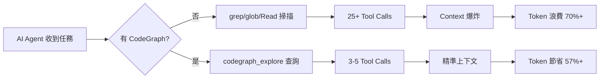

## 1.4 與傳統 RAG 的差異

| 比較面向 | 傳統 RAG | CodeGraph |
|---------|---------|-----------|
| **索引方式** | 文字切片 + Embedding 向量化 | Tree-sitter AST 結構化解析 |
| **查詢方式** | 語意相似度搜尋 | 精確符號查詢 + 關係追蹤 |
| **資料粒度** | 文件段落/Chunk | 函式、類別、方法等程式碼符號 |
| **關係追蹤** | 無法追蹤呼叫鏈 | 完整的 Call Graph / Import Graph / Dependency Graph |
| **更新機制** | 需要重新向量化 | 檔案監視自動增量同步（2 秒延遲） |
| **外部依賴** | 需要 Embedding API（OpenAI 等） | 完全本地，無需外部 API |
| **準確度** | 語意模糊匹配 | 編譯器等級的精確匹配 |
| **成本** | 每次查詢消耗 Embedding Token | 零額外 Token 成本 |

> **📌 實務建議**：RAG 適合「文件」類知識的檢索，CodeGraph 適合「程式碼」結構的理解。兩者可互補，但程式碼分析場景應優先使用 CodeGraph。

## 1.5 Symbol Graph、Knowledge Graph 與 MCP 的關係

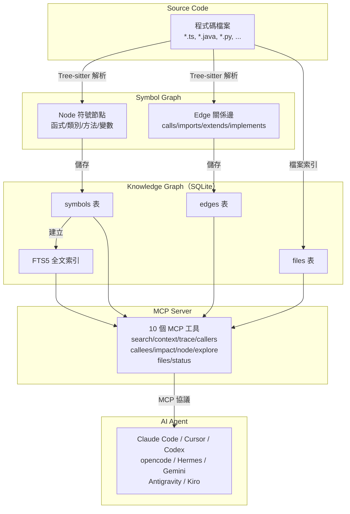

**三者的關係**：

1. **Symbol Graph**（符號圖譜）：從 AST 中提取的原始符號與關係資料結構
2. **Knowledge Graph**（知識圖譜）：Symbol Graph 經過 Resolution（引用解析）後儲存於 SQLite 的完整知識庫
3. **MCP**（Model Context Protocol）：標準化的協議介面，讓 AI Agent 可以透過工具呼叫查詢 Knowledge Graph

> **📌 實務建議**：理解這三層架構有助於排查問題。若 Agent 查不到符號，依序檢查：(1) 檔案是否被 `.gitignore` 排除 (2) Tree-sitter 是否支援該語言 (3) MCP Server 是否正常啟動。

---

# 第 2 章 CodeGraph 架構

## 2.1 Tree-sitter AST 解析層

[Tree-sitter](https://tree-sitter.github.io/) 是一個增量式語法解析器框架，能將程式碼轉換為抽象語法樹（AST）。CodeGraph 使用 Tree-sitter 的 WASM 版本，支援 20+ 種程式語言的即時解析。

### 解析流程

```
原始程式碼
  → Tree-sitter Parser（語言特定）
  → AST（抽象語法樹）
  → Language-specific Queries（語言特定查詢）
  → Node（符號節點）+ Edge（關係邊）
```

### 支援的程式語言

| 語言 | 副檔名 | 支援程度 |
|------|--------|---------|
| TypeScript | .ts, .tsx | 完整支援 |
| JavaScript | .js, .jsx, .mjs | 完整支援 |
| Python | .py | 完整支援 |
| Go | .go | 完整支援 |
| Rust | .rs | 完整支援 |
| Java | .java | 完整支援 |
| C# | .cs | 完整支援 |
| PHP | .php | 完整支援 |
| Ruby | .rb | 完整支援 |
| C / C++ | .c, .h, .cpp, .hpp, .cc | 完整支援 |
| Swift | .swift | 完整支援 |
| Kotlin | .kt, .kts | 完整支援 |
| Scala | .scala, .sc | 完整支援 |
| Dart | .dart | 完整支援 |
| Vue | .vue | 完整支援（script + script-setup、Nuxt 路由） |
| Svelte | .svelte | 完整支援（Svelte 5 runes、SvelteKit 路由） |
| Objective-C | .m, .mm, .h | 部分支援 |
| Pascal / Delphi | .pas, .dpr, .dpk, .lpr | 完整支援（含 DFM/FMX 表單） |
| Lua / Luau | .lua, .luau | 完整支援 |

> **📌 實務建議**：企業常見技術棧（Spring Boot/Java、Vue 3、Angular/TypeScript、Python/FastAPI）全部都有完整支援。JSP 和 Struts XML 不在直接支援範圍內，但 Java Controller 層的符號關係仍可完整提取。

## 2.2 Symbol 與 Edge 提取

### Symbol Node（符號節點）

CodeGraph 從 AST 中提取以下類型的符號：

| 符號類型 | 說明 | 範例 |
|---------|------|------|
| function | 函式 | `function handleLogin()` |
| class | 類別 | `class UserService` |
| method | 方法 | `UserService.findById()` |
| variable | 變數/常數 | `const API_URL = ...` |
| interface | 介面 | `interface UserRepository` |
| type | 型別別名 | `type UserId = string` |
| enum | 列舉 | `enum UserRole { ADMIN, USER }` |
| route | 路由（框架感知） | `@GetMapping("/api/users")` |

### Edge（關係邊）

| 關係類型 | 說明 | 範例 |
|---------|------|------|
| calls | 呼叫關係 | `login() → validatePassword()` |
| imports | 匯入關係 | `import { UserService } from './user.service'` |
| extends | 繼承關係 | `class Admin extends User` |
| implements | 實作關係 | `class UserServiceImpl implements UserService` |
| references | 引用關係（含路由→處理器） | `@GetMapping → UserController.list()` |

## 2.3 Resolution 層

提取完 Symbol 和 Edge 後，CodeGraph 執行 **Resolution**（引用解析）：

1. **函式呼叫解析**：將 `foo()` 呼叫連結到 `function foo()` 定義
2. **Import 解析**：將 `import { X } from './module'` 連結到實際檔案
3. **Class 繼承解析**：建立完整的繼承鏈
4. **框架路由解析**：識別 14 種 Web 框架的路由定義，連結 URL Pattern 到 Handler

### 支援的框架路由偵測

| 框架 | 路由語法 |
|------|---------|
| Django | `path()`, `re_path()`, `url()`, `include()` |
| Flask | `@app.route('/path', methods=[...])` |
| FastAPI | `@app.get(...)`, `@router.post(...)` |
| Express | `app.get(...)`, `router.post(...)` |
| NestJS | `@Controller` + `@Get/@Post/...`, GraphQL `@Resolver` |
| Laravel | `Route::get()`, `Route::resource()` |
| Drupal | `*.routing.yml`（`_controller`、`_form`、entity handlers）；`hook_*` |
| Rails | `get '/x', to: 'users#index'` |
| **Spring** | `@GetMapping`, `@PostMapping`, `@RequestMapping` |
| Gin / chi / gorilla / mux | `r.GET(...)`, `router.HandleFunc(...)` |
| Axum / actix / Rocket | `.route("/x", get(handler))` |
| ASP.NET | `[HttpGet("/x")]` |
| Vapor | `app.get("x", use: handler)` |
| React Router / SvelteKit | Route component nodes |

> **📌 實務建議**：對於 Spring Boot 專案，CodeGraph 能自動識別 `@GetMapping`、`@PostMapping` 等註解，並將 URL Pattern 連結到 Controller 方法。這在逆向工程時極為有用，可直接查詢「哪個 API 端點呼叫了哪些 Service」。

### 跨語言橋接（Cross-language Bridging）

實際的 iOS 和 React Native 專案橫跨多種語言，靜態 Tree-sitter 解析在語言邊界會中斷。CodeGraph 透過啟發式橋接（Heuristic Bridge）連接不同語言的符號，使 `trace`、`callers`、`callees`、`impact` 能端對端追蹤跨語言呼叫鏈。

| 橋接類型 | 來源語言 | 目標語言 | 機制說明 |
|---------|---------|---------|---------|
| **Swift → ObjC** | Swift `obj.foo(bar:)` | ObjC selector `-fooWithBar:` | `@objc` 自動橋接規則 + Cocoa 介詞前綴轉換 |
| **ObjC → Swift** | ObjC `[obj fooWithBar:]` | Swift `@objc func foo(bar:)` | 反向橋接名稱候選 + `@objc` 曝露驗證 |
| **React Native Legacy Bridge** | JS `NativeModules.X.fn(...)` | ObjC `RCT_EXPORT_METHOD` / Java `@ReactMethod` | 解析 macro/annotation 建立 JS-name → native-method 映射 |
| **React Native TurboModules** | JS `import M from './NativeM'; M.fn(...)` | Native impl | 以 `Native<X>.ts` spec interface 為真值來源 |
| **RN Native → JS Events** | JS `NativeEventEmitter.addListener('e', cb)` | ObjC/Swift/Java `sendEvent(withName: "e", ...)` | 跨語言事件通道，以字面事件名稱為 key |
| **Expo Modules** | JS `requireNativeModule('X').fn(...)` | Swift/Kotlin `Module { Name("X") }` | 解析 Expo DSL 字面值 |
| **Fabric View Components** | JSX `<MyView prop={v}/>` | TS Codegen spec + Native impl | 慣例式名稱 + 後綴查找（View/ComponentView/Manager） |
| **Legacy Paper View Managers** | JSX `<MyView prop={v}/>` | ObjC `RCT_EXPORT_VIEW_PROPERTY` | Paper 時代宣告同樣產生 component + property 節點 |

每個橋接產生的邊會標記 `provenance:'heuristic'`，並在 `metadata.synthesizedBy` 中記錄穩定的通道名稱（如 `swift-objc-bridge`、`rn-event-channel`、`expo-module-extract`），使 Agent 能清楚辨識呼叫跳轉的來源。

> **📌 實務建議**：對於混合 iOS / React Native / Expo 專案，CodeGraph 的跨語言橋接能力讓原本需要手動追蹤的跨語言呼叫鏈變得自動化。這在逆向工程和影響分析時尤為關鍵——修改一個 Native Module 後，可直接查詢哪些 JS 呼叫者會受影響。

## 2.4 SQLite 存儲層（FTS5）

所有解析結果儲存於專案目錄下的 `.codegraph/codegraph.db`（SQLite 資料庫）：

| 資料表 | 用途 |
|-------|------|
| `symbols` | 儲存所有符號節點（名稱、類型、檔案、行號、原始碼） |
| `edges` | 儲存所有關係邊（來源、目標、類型、provenance） |
| `files` | 儲存已索引的檔案清單與狀態 |
| `FTS5 索引` | 全文檢索索引，支援快速符號名稱搜尋 |

### 技術特性

- **WAL 模式**：Write-Ahead Logging，允許並發讀取不被寫入阻塞
- **自包含 Node Runtime**：CodeGraph 自帶 Node.js 運行時，使用 `node:sqlite` 原生模組
- **檔案大小限制**：自動跳過 > 1MB 的檔案（避免索引生成檔案/minified JS）
- **排除規則**：自動排除 `node_modules`、`vendor`、`dist`、`build`、`target`、`.venv`、`Pods`、`.next` 等

```bash
# 查看資料庫統計
codegraph status

# 輸出範例：
# Project: /path/to/your-project
# Database: .codegraph/codegraph.db
# Files: 1,234 indexed
# Symbols: 45,678
# Edges: 123,456
# Journal: wal
# Last sync: 2 seconds ago
```

## 2.5 Auto-Sync 檔案監視層

CodeGraph 的 MCP Server 啟動後，會自動監視專案檔案變更：

| 作業系統 | 監視機制 |
|---------|---------|
| macOS | FSEvents |
| Linux | inotify |
| Windows | ReadDirectoryChangesW |

### 同步行為

- **Debounce**：2 秒靜默窗口（檔案變更後等待 2 秒再同步，避免頻繁觸發）
- **增量同步**：僅同步變更的檔案，非全量重建
- **自動過濾**：僅同步原始碼檔案，跳過二進位檔案和排除目錄

> **📌 實務建議**：正常使用下無需手動執行 `codegraph sync`。若發現符號過時，等待 2-3 秒即可自動同步。需要強制同步時可執行 `codegraph sync`。

## 2.6 MCP Server 層

MCP Server 是 CodeGraph 與 AI Agent 之間的通訊橋樑：

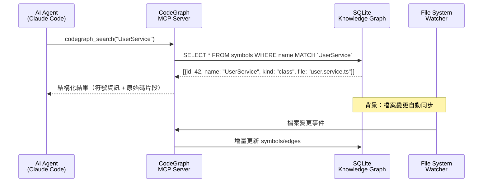

### MCP Server 啟動方式

```bash
# 手動啟動（除錯用）
codegraph serve --mcp

# 正常使用時由 Agent 自動啟動（透過 MCP 設定檔）
```

### 整體架構圖

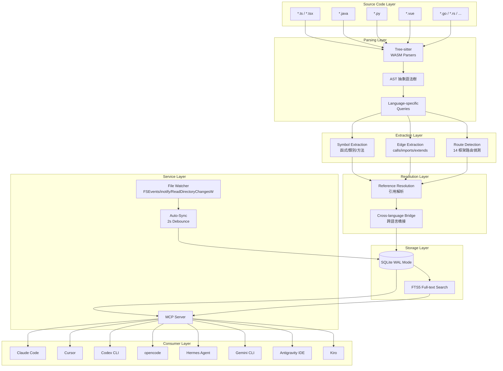

> **📌 實務建議**：CodeGraph 是零設定架構（Zero-config），不需要設定檔。語言支援依據副檔名自動判斷。若需排除特定目錄，只需將其加入 `.gitignore`。

---

# 第 3 章 AI 為何浪費大量 Token

## 3.1 Agent 探索模式分析

當 AI Agent 收到一個架構相關的問題（例如「請求如何從 API 端點到達資料庫？」），典型的探索流程如下：

### 無 CodeGraph 的探索流程

```
Step 1: Agent 啟動 Explore Sub-Agent
Step 2: grep "database" --include="*.java" -r src/          → 讀取 50+ 個檔案片段
Step 3: glob "src/**/*Controller.java"                       → 列出 30 個 Controller
Step 4: Read src/main/java/.../UserController.java           → 讀取 500 行
Step 5: grep "UserService" -r src/                           → 再次掃描
Step 6: Read src/main/java/.../UserService.java              → 讀取 300 行
Step 7: grep "UserRepository" -r src/                        → 再次掃描
Step 8: Read src/main/java/.../UserRepository.java           → 讀取 200 行
Step 9: grep "@Entity" -r src/                               → 再次掃描
Step 10: Read src/main/java/.../User.java                    → 讀取 150 行
... 重複 15-25 次 Tool Calls ...
```

### 有 CodeGraph 的探索流程

```
Step 1: codegraph_trace("handleRequest", "executeQuery")     → 一次呼叫取得完整呼叫鏈
Step 2: codegraph_explore(相關符號 IDs)                       → 一次呼叫取得所有原始碼
... 完成，共 2-5 次 Tool Calls ...
```

## 3.2 Context 爆炸問題

AI Agent 的 Context Window 是有限的（Claude 約 200K tokens）。無效的探索會填滿 Context：

| 內容類型 | Token 估算 | 價值 |
|---------|-----------|------|
| grep 結果（50 個匹配） | ~5,000 tokens | 低：大量不相關匹配 |
| glob 列表（100 個檔案路徑） | ~2,000 tokens | 低：僅檔案名稱，無內容 |
| Read 整個檔案（500 行 Java） | ~3,000 tokens | 中：包含大量不相關程式碼 |
| **codegraph_explore 結果** | **~1,500 tokens** | **高：精準的符號 + 關係 + 程式碼片段** |

### Context 污染公式

```
Context 污染率 = 不相關內容 Token / 總 Context Token × 100%

傳統模式：
  不相關 Token: ~45,000 (grep + glob + 完整檔案)
  相關 Token: ~5,000
  污染率: 90%

CodeGraph 模式：
  不相關 Token: ~500
  相關 Token: ~2,000
  污染率: 20%
```

## 3.3 Tool Call 爆炸問題

每次 Tool Call 不僅消耗 Token，還增加延遲：

| 操作 | 平均 Token 消耗 | 平均延遲 |
|------|----------------|---------|
| grep（一次搜尋） | 500-2,000 | 1-3 秒 |
| glob（一次列表） | 200-1,000 | 0.5-1 秒 |
| Read（一個檔案） | 1,000-5,000 | 0.5-2 秒 |
| **codegraph_search** | **200-500** | **< 0.1 秒** |
| **codegraph_trace** | **500-2,000** | **< 0.5 秒** |
| **codegraph_explore** | **1,000-3,000** | **< 0.5 秒** |

### 累計效果

| 場景 | 傳統模式 Tool Calls | CodeGraph 模式 Tool Calls | 減少 |
|------|-------------------|-------------------------|------|
| 架構問題 | 20-30 次 | 3-5 次 | **80%+** |
| Bug 定位 | 10-20 次 | 2-4 次 | **75%+** |
| 影響分析 | 15-25 次 | 1-3 次 | **85%+** |
| Refactoring | 20-40 次 | 5-8 次 | **70%+** |

## 3.4 大型專案規模影響

Token 浪費隨專案規模呈指數增長：

| 專案規模 | 檔案數 | 傳統模式 Token/次 | CodeGraph 模式 Token/次 | 節省比例 |
|---------|--------|-----------------|----------------------|---------|
| 小型（< 1 萬 LOC） | ~50 | 5,000 | 3,000 | 40% |
| 中型（1-10 萬 LOC） | ~500 | 30,000 | 8,000 | 73% |
| 大型（10-100 萬 LOC） | ~5,000 | 150,000 | 20,000 | 87% |
| 超大型（100 萬+ LOC） | ~50,000 | 500,000+ | 30,000 | 94%+ |

> ⚠️ **注意**：在超大型專案中，傳統模式的 Token 消耗可能超過單次 Context Window 限制，導致 Agent 根本無法完成任務。CodeGraph 讓超大型專案的 AI 輔助開發成為可能。

> **📌 實務建議**：專案超過 1 萬 LOC 就應該考慮導入 CodeGraph。超過 10 萬 LOC 時，CodeGraph 幾乎是必須的。

---

# 第 4 章 CodeGraph 如何降低 Token

## 4.1 預建索引 vs 即時掃描

| 面向 | 傳統（即時掃描） | CodeGraph（預建索引） |
|------|----------------|---------------------|
| **首次成本** | 無（但每次查詢都付費） | 一次性索引建立（本地、免費） |
| **每次查詢成本** | 高（grep/glob/Read） | 極低（SQLite 查詢） |
| **資料鮮度** | 即時 | 近即時（2 秒自動同步） |
| **累計成本** | 線性增長 | 趨近恆定 |

### 成本模型

```
傳統模式累計成本 = N × (grep_cost + glob_cost + read_cost) × query_count
CodeGraph 累計成本 = index_cost(一次) + MCP_query_cost × query_count

其中：
  index_cost ≈ 0（本地運算，無 Token 消耗）
  MCP_query_cost << grep_cost + glob_cost + read_cost
```

## 4.2 精準查詢 vs 全域搜尋

### 傳統模式：文字搜尋

```bash
# Agent 想找 UserService 的呼叫者
grep -r "UserService" src/
# 回傳：Import 語句、字串常數、註解、實際呼叫... 全部混在一起
# → 大量不相關結果
```

### CodeGraph 模式：結構化查詢

```bash
# Agent 使用 MCP 工具
codegraph_callers("UserService.findById")
# 回傳：精確的呼叫者列表
# → UserController.getUser() @ user.controller.ts:45
# → AdminService.lookupUser() @ admin.service.ts:78
# → 零雜訊
```

## 4.3 結構化上下文 vs 原始檔案

CodeGraph 的 `codegraph_explore` 工具是關鍵創新。它能在一次呼叫中：

1. 回傳多個相關符號的原始碼
2. 按檔案分組顯示
3. 附帶符號間的關係圖
4. **自適應大小調整**：根據符號的複雜度動態調整回傳的程式碼量
   - 核心邏輯符號：完整原始碼
   - 重複/可互換的實作：僅回傳簽名

這意味著回傳內容的大小是「按答案所需」而非「按檔案數量」。

## 4.4 官方 Benchmark 數據分析

CodeGraph 在 7 個真實開源專案上進行了 Benchmark 測試（Claude Code headless 模式，每個專案 4 次執行取中位數，Opus 4.8 模型，2026-05-29 驗證）：

| 專案 | 語言 | 規模 | 成本節省 | Token 減少 | 速度提升 | Tool Calls 減少 |
|------|------|------|---------|-----------|---------|----------------|
| **VS Code** | TypeScript | ~10k 檔案 | **33%** | **70%** | **27%** | **80%** |
| **Excalidraw** | TypeScript | ~640 檔案 | **27%** | **61%** | **26%** | **70%** |
| **Django** | Python | ~3k 檔案 | **23%** | **70%** | **28%** | **77%** |
| **Tokio** | Rust | ~790 檔案 | **35%** | **70%** | **37%** | **79%** |
| **OkHttp** | Java | ~645 檔案 | **11%** | **48%** | **26%** | **70%** |
| **Gin** | Go | ~110 檔案 | **15%** | **35%** | **9%** | **47%** |
| **Alamofire** | Swift | ~110 檔案 | **28%** | **46%** | **7%** | **13%** |

### 統計摘要

| 指標 | 平均值 |
|------|--------|
| 成本節省 | **~25%** |
| Token 減少 | **~57%** |
| 速度提升 | **~23%** |
| Tool Calls 減少 | **~62%** |

### 分析觀察

1. **大型專案效益最高**：VS Code（10k 檔案）節省 33% 成本、80% Tool Calls
2. **小型專案也有正向效益**：Gin（110 檔案）仍有 15% 成本節省
3. **Java 專案表現穩健**：OkHttp 雖然成本節省較低（11%），但 Token 減少 48%、Tool Calls 減少 70%
4. **零檔案讀取**：多數情況下 CodeGraph 的回應不需要任何額外檔案讀取

> **📌 實務建議**：即使在小型專案中，CodeGraph 也能正向節省成本。對於企業級大型專案（100 萬+ LOC），節省效果會更加顯著，因為傳統模式的探索成本會指數增長。

---

# 第 5 章 安裝與設定

## 5.1 系統需求

| 需求 | 說明 |
|------|------|
| **作業系統** | Windows（x64/arm64）、macOS（x64/arm64）、Linux（x64/arm64） |
| **Node.js** | 不需要 — CodeGraph 自帶 bundled Node runtime |
| **磁碟空間** | 約 100-200 MB（CodeGraph 本體 + 索引資料庫依專案大小而定） |
| **AI Agent** | Claude Code / Cursor / Codex CLI / opencode / Hermes Agent / Gemini CLI / Antigravity IDE / Kiro（至少一個） |

## 5.2 Windows 安裝

```powershell
# 方法 1：PowerShell 一鍵安裝（推薦）
irm https://raw.githubusercontent.com/colbymchenry/codegraph/main/install.ps1 | iex

# 方法 2：npm 安裝（若已有 Node.js）
npx @colbymchenry/codegraph

# 方法 3：全域安裝
npm i -g @colbymchenry/codegraph
```

## 5.3 macOS / Linux 安裝

```bash
# 方法 1：Shell 一鍵安裝（推薦）
curl -fsSL https://raw.githubusercontent.com/colbymchenry/codegraph/main/install.sh | sh

# 方法 2：npm 安裝
npx @colbymchenry/codegraph

# 方法 3：全域安裝
npm i -g @colbymchenry/codegraph
```

## 5.4 npm 安裝方式

如果你已有 Node.js 環境，npm 是最簡單的方式：

```bash
# 零安裝執行（推薦初次體驗）
npx @colbymchenry/codegraph

# 全域安裝（推薦長期使用）
npm i -g @colbymchenry/codegraph
```

## 5.5 Agent 自動設定

安裝程式會互動式詢問要設定哪些 Agent：

```bash
# 互動式安裝（推薦）
codegraph install

# 安裝程式會：
# 1. 自動偵測已安裝的 Agent（Claude Code, Cursor, Codex CLI, ...）
# 2. 詢問要設定哪些 Agent
# 3. 詢問是否全域安裝（所有專案）或本地安裝（僅目前專案）
# 4. 寫入各 Agent 的 MCP Server 設定
# 5. 設定 Claude Code 的 auto-allow 權限
# 6. 初始化目前專案（本地安裝時）
```

### 非互動式安裝（CI/Scripting）

```bash
# 自動偵測 Agent，全域安裝
codegraph install --yes

# 指定 Agent，全域安裝
codegraph install --target=cursor,claude --yes

# 指定 Agent，本地安裝
codegraph install --target=auto --location=local

# 僅印出設定檔片段（不寫入檔案）
codegraph install --print-config codex
```

### 安裝參數

| 參數 | 說明 | 預設值 |
|------|------|--------|
| `--target` | `auto`、`all`、`none`、或逗號分隔的 Agent 列表 | 互動式詢問 |
| `--location` | `global`（全域）或 `local`（僅目前專案） | 互動式詢問 |
| `--yes` | 跳過所有確認提示 | 每步都確認 |
| `--no-permissions` | 跳過 Claude Code auto-allow 設定 | 設定權限 |
| `--print-config <id>` | 印出指定 Agent 的設定片段後退出 | — |

## 5.6 專案初始化

```bash
# 進入專案目錄
cd your-project

# 初始化並建立索引（推薦）
codegraph init -i

# 或分步執行：
codegraph init        # 建立 .codegraph/ 目錄
codegraph index       # 建立索引
```

### 說明

- `codegraph init` 僅建立 `.codegraph/` 索引目錄
- `-i`（`--index`）標記會同時執行初始索引建立
- 全域安裝模式下，只要專案中存在 `.codegraph/` 目錄，Agent 就會自動使用 CodeGraph

### 索引參數

```bash
# 強制重建索引（全量）
codegraph index --force

# 靜默模式（減少輸出）
codegraph index --quiet

# 增量同步（僅更新變更的檔案）
codegraph sync
```

## 5.7 驗證與狀態檢查

```bash
# 查看索引狀態
codegraph status

# 輸出範例：
# Project: D:\projects\my-spring-boot-app
# Database: .codegraph/codegraph.db
# Files:    1,234 indexed
# Symbols:  45,678
# Edges:    123,456
# Journal:  wal
# Last sync: 3 seconds ago
```

### 驗證檢查項

1. ✅ `Files` 數量合理（應接近專案原始碼檔案數）
2. ✅ `Symbols` 數量 > 0
3. ✅ `Edges` 數量 > 0
4. ✅ `Journal` 為 `wal`（WAL 模式，效能最佳）
5. ✅ `Last sync` 為最近時間

### 快速搜尋驗證

```bash
# 搜尋符號（驗證索引是否正常）
codegraph query "UserService"

# 查看檔案結構
codegraph files

# 查看呼叫者
codegraph callers "UserService.findById"

# 查看影響範圍
codegraph impact "UserService" --depth 2
```

## 5.8 解除安裝

```bash
# 從所有 Agent 移除 CodeGraph 設定
codegraph uninstall

# 從特定 Agent 移除
codegraph uninstall --target=cursor

# 非互動式
codegraph uninstall --yes

# 移除專案索引
codegraph uninit

# 強制移除（跳過確認）
codegraph uninit --force
```

> **📌 實務建議**：`codegraph uninstall` 會移除 MCP 設定但保留 `.codegraph/` 目錄。使用 `codegraph uninit` 來移除專案級索引。

---

# 第 6 章 MCP 工具詳解

CodeGraph MCP Server 提供 10 個工具，涵蓋搜尋、追蹤、分析、探索四大類別：

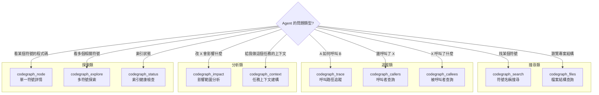

## 6.1 codegraph_search

**用途**：依名稱在整個程式碼庫中搜尋符號，底層使用 FTS5 全文索引。

| 項目 | 說明 |
|------|------|
| **典型場景** | 找到某個類別、函式、方法的位置 |
| **Token 節省原理** | 取代 `grep -r "ClassName" src/`，僅回傳結構化符號資訊而非文字匹配 |
| **回傳內容** | 符號 ID、名稱、類型（class/function/method）、檔案路徑、行號 |

**CLI 對應指令**：

```bash
codegraph query "UserService" --kind class --limit 10 --json
```

**使用範例**：

```
# Agent 需要找 UserService
→ codegraph_search("UserService")
→ 結果：
  [{id: 42, name: "UserService", kind: "class", file: "src/services/user.service.ts", line: 15}]

# 對比傳統模式：
→ grep -r "UserService" src/
→ 回傳 50+ 行匹配（import、字串、註解...混雜）
```

## 6.2 codegraph_context

**用途**：為特定任務自動建構相關的程式碼上下文（entry points + 相關符號 + 程式碼片段）。

| 項目 | 說明 |
|------|------|
| **典型場景** | 開始新任務前，讓 Agent 快速了解相關程式碼 |
| **Token 節省原理** | 一次呼叫取代 Agent 自行探索的 10-20 次 Tool Calls |
| **回傳內容** | 與任務最相關的符號列表 + 原始碼片段 + 關係 |

**CLI 對應指令**：

```bash
codegraph context "fix login bug" --format markdown --max-nodes 20
```

## 6.3 codegraph_trace

**用途**：追蹤兩個符號之間的完整呼叫路徑，包含每一跳的原始碼，並能追蹤動態分派（callbacks、React re-render、interface → impl）。

| 項目 | 說明 |
|------|------|
| **典型場景** | 「請求如何從 Controller 到達 Repository？」 |
| **Token 節省原理** | 一次呼叫即取得完整呼叫鏈，取代逐層 grep + Read |
| **回傳內容** | 完整呼叫路徑，每一跳附帶原始碼 |

**使用範例**：

```
# 追蹤「登入請求如何到達資料庫」
→ codegraph_trace("LoginController.login", "UserRepository.findByUsername")
→ 結果：
  LoginController.login()
    → AuthService.authenticate()
      → UserService.findByUsername()
        → UserRepository.findByUsername()
  每一跳附帶完整原始碼
```

> **📌 實務建議**：`codegraph_trace` 是回答架構問題時最強大的工具。當使用者問「X 如何影響 Y」時，優先使用 trace 而非逐一查詢 callers/callees。

## 6.4 codegraph_callers

**用途**：查詢「誰呼叫了這個函式/方法」。

| 項目 | 說明 |
|------|------|
| **典型場景** | 修改函式前，確認影響範圍 |
| **Token 節省原理** | 精確的呼叫者列表 vs grep 的文字匹配 |

**CLI 對應指令**：

```bash
codegraph callers "UserService.findById" --limit 20 --json
```

## 6.5 codegraph_callees

**用途**：查詢「這個函式/方法呼叫了什麼」。

| 項目 | 說明 |
|------|------|
| **典型場景** | 理解函式的依賴關係 |
| **Token 節省原理** | 精確的被呼叫者列表 vs 閱讀整個函式原始碼 |

**CLI 對應指令**：

```bash
codegraph callees "AuthService.authenticate" --limit 20 --json
```

## 6.6 codegraph_impact

**用途**：分析修改某個符號會影響哪些程式碼（遞迴追蹤呼叫者 + 相依者）。

| 項目 | 說明 |
|------|------|
| **典型場景** | Refactoring 前的影響評估、API 變更風險分析 |
| **Token 節省原理** | 一次呼叫取得完整影響範圍，取代反覆 callers 查詢 |
| **回傳內容** | 受影響的符號樹，含深度與路徑 |

**CLI 對應指令**：

```bash
codegraph impact "UserService" --depth 3 --json
```

**使用範例**：

```
# 修改 UserService.findById 的影響範圍
→ codegraph_impact("UserService.findById", depth=2)
→ 結果：
  直接影響（depth=1）：
    - UserController.getUser()
    - AdminService.lookupUser()
    - UserBatchJob.processUsers()
  間接影響（depth=2）：
    - API: GET /api/users/:id
    - API: GET /admin/users/:id
    - Batch: UserBatchScheduler.run()
```

## 6.7 codegraph_node

**用途**：取得單一符號的完整詳情，可選擇是否包含原始碼。

| 項目 | 說明 |
|------|------|
| **典型場景** | 查看特定函式的完整實作 |
| **Token 節省原理** | 僅回傳特定符號的程式碼，而非整個檔案 |

## 6.8 codegraph_explore

**用途**：一次呼叫取得多個相關符號的原始碼，按檔案分組，附帶關係圖。

| 項目 | 說明 |
|------|------|
| **典型場景** | 理解一組相關程式碼（如 Controller + Service + Repository） |
| **Token 節省原理** | 一次呼叫取代多次 Read，且自適應調整回傳大小 |
| **關鍵特性** | **Per-symbol adaptive sizing** — 核心符號回傳完整程式碼，冗餘實作僅回傳簽名 |

> **📌 實務建議**：`codegraph_explore` 是節省 Token 的殺手級工具。Agent 可以在一次呼叫中取得完整的上下文，避免反覆的 Read 呼叫。

## 6.9 codegraph_files

**用途**：取得已索引的檔案結構（比 filesystem scan 更快）。

| 項目 | 說明 |
|------|------|
| **典型場景** | 了解專案目錄結構 |
| **Token 節省原理** | 取代 `glob` + `find` 指令 |

**CLI 對應指令**：

```bash
codegraph files --format tree --max-depth 3 --filter "*.java"
```

## 6.10 codegraph_status

**用途**：檢查索引健康狀態與統計資訊。

| 項目 | 說明 |
|------|------|
| **典型場景** | 驗證索引是否正常、是否需要重建 |
| **回傳內容** | 檔案數、符號數、邊數、日誌模式、最後同步時間 |

### MCP 工具選擇決策流程

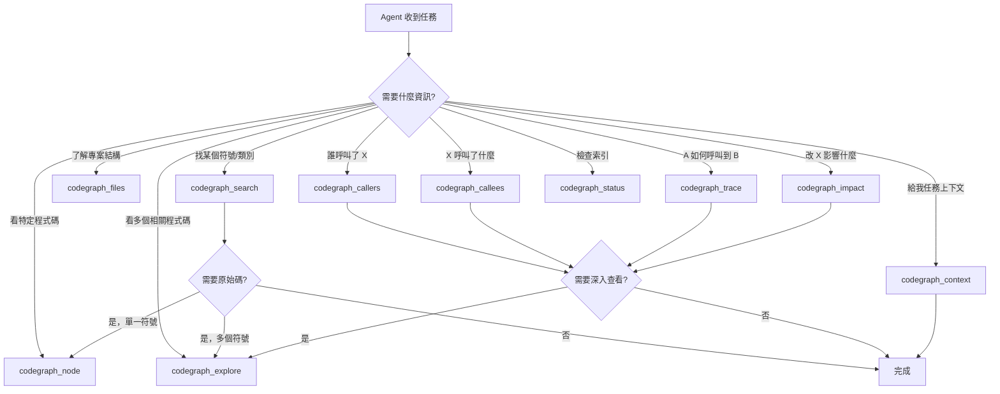

---

# 第 7 章 Claude Code 最佳實踐

## 7.1 MCP + CodeGraph 設定

Claude Code 是 CodeGraph 的主要支援 Agent。安裝後會自動設定 MCP Server。

### 驗證設定

```bash
# 確認 MCP Server 正在運行
# 在 Claude Code 中輸入：
/mcp

# 應看到 codegraph 的 MCP server 列表
```

### Claude Code 的行為變化

安裝 CodeGraph 後，Claude Code 的行為會自動改變：

| 行為 | 無 CodeGraph | 有 CodeGraph |
|------|-------------|-------------|
| 架構探索 | 啟動 Explore Sub-Agent（多次 grep/Read） | 直接呼叫 `codegraph_context` 或 `codegraph_trace` |
| 符號查找 | `grep -r "ClassName" src/` | `codegraph_search("ClassName")` |
| 影響分析 | 反覆 callers 搜尋 | `codegraph_impact("symbol")` |
| 程式碼閱讀 | `Read file.ts`（整個檔案） | `codegraph_explore(symbol_ids)`（精準片段） |

## 7.2 Architecture Analysis

### Prompt 範例 1：系統架構理解

```
請分析這個專案的整體架構。

使用 codegraph_context 取得主要 entry points，
然後用 codegraph_trace 追蹤核心流程：
1. HTTP 請求 → Controller → Service → Repository → Database
2. 識別主要的設計模式
3. 列出模組間的依賴關係
```

### Prompt 範例 2：API 端點盤點

```
請盤點所有 REST API 端點。

步驟：
1. 使用 codegraph_search 搜尋所有 route 類型的符號
2. 使用 codegraph_callees 查看每個端點呼叫的 Service
3. 整理成表格：HTTP Method | URL | Controller | Service | 說明
```

## 7.3 Bug Analysis

### Prompt 範例 1：Bug 定位

```
用戶反映 /api/users/:id 回傳 500 錯誤。

請：
1. 使用 codegraph_search 找到處理此 API 的 Controller 方法
2. 使用 codegraph_trace 追蹤從 Controller 到 Repository 的完整呼叫鏈
3. 使用 codegraph_explore 查看每個環節的原始碼
4. 分析可能的 NullPointerException 或例外未處理的位置
```

### Prompt 範例 2：效能問題定位

```
/api/reports 端點回應很慢。

請：
1. 使用 codegraph_trace 追蹤完整呼叫鏈
2. 使用 codegraph_callees 查看是否有 N+1 查詢問題
3. 標記可能的效能瓶頸（迴圈中的 DB 查詢、未快取的計算等）
```

## 7.4 Refactoring

### Prompt 範例 1：安全重構

```
我想將 UserService.findById 的回傳型別從 User 改為 Optional<User>。

請：
1. 使用 codegraph_impact 分析這個變更的影響範圍
2. 列出所有需要修改的檔案和方法
3. 按依賴順序規劃修改步驟
4. 確保不遺漏任何呼叫者
```

### Prompt 範例 2：模組提取

```
我想將 UserService 中的密碼相關邏輯提取為獨立的 PasswordService。

請：
1. 使用 codegraph_node 查看 UserService 的完整程式碼
2. 使用 codegraph_callers 分析密碼相關方法的呼叫者
3. 使用 codegraph_impact 評估提取後的影響
4. 規劃提取步驟並確保向後相容
```

## 7.5 Feature Development

### Prompt 範例 1：新增功能

```
請新增「使用者暱稱變更」功能。

步驟：
1. 使用 codegraph_search 找到現有的 User 相關類別
2. 使用 codegraph_explore 查看 UserController, UserService, UserRepository 的程式碼
3. 參考現有的類似功能（如 email 變更）的呼叫鏈
4. 按照相同的架構模式實作新功能
```

### Prompt 範例 2：跨模組功能

```
請實作「管理員可以停用使用者帳號」功能。

步驟：
1. 使用 codegraph_trace 理解現有的使用者狀態管理流程
2. 使用 codegraph_callers 分析 UserService 的所有呼叫者
3. 確認 Admin 相關的權限檢查機制
4. 在正確的層級加入 disable 功能
```

## 7.6 CLAUDE.md 配置建議

在專案根目錄的 `CLAUDE.md` 中加入以下指引：

```markdown
# CodeGraph 使用指引

## 開發規範
- 在探索程式碼結構時，優先使用 CodeGraph MCP 工具
- 禁止使用 grep/glob/Read 進行大範圍搜尋
- 修改程式碼前，必須先用 codegraph_impact 分析影響範圍

## 工具使用優先順序
1. codegraph_search — 找符號
2. codegraph_trace — 追蹤呼叫鏈
3. codegraph_impact — 影響分析
4. codegraph_explore — 查看相關程式碼
5. Read — 僅在需要查看 CodeGraph 未索引的檔案時使用
```

> **📌 實務建議**：CodeGraph 的 MCP Server 會自動提供使用指引，通常不需要在 CLAUDE.md 中額外配置。但對於有特定開發規範的團隊，上述配置有助於強化 Agent 的行為一致性。

---

# 第 8 章 GitHub Copilot 最佳實踐

## 8.1 Copilot Agent Mode + CodeGraph

GitHub Copilot 的 Agent Mode 支援 MCP 工具。安裝 CodeGraph 後，Copilot Agent 可直接使用所有 10 個 MCP 工具。

### 設定方式

CodeGraph 安裝程式會自動偵測 Cursor 並設定 MCP，但 GitHub Copilot 目前需要手動配置 MCP：

```json
// .vscode/settings.json 或全域 settings.json
{
  "github.copilot.chat.mcp.servers": {
    "codegraph": {
      "command": "codegraph",
      "args": ["serve", "--mcp"]
    }
  }
}
```

## 8.2 Symbol Search 優先策略

在 Copilot Chat 中使用 Agent Mode 時，應引導 Copilot 優先使用 CodeGraph：

### Prompt 範例

```
@workspace 請使用 codegraph_search 找到所有 Controller 類別，
然後用 codegraph_callers 分析 UserController 的呼叫鏈。
不要使用 grep 或 glob 搜尋。
```

## 8.3 Impact Analysis 工作流

### 使用 Copilot + CodeGraph 進行影響分析

```
@workspace 我要修改 UserService.java 的 findById 方法簽名。
請用 codegraph_impact 分析影響範圍，
然後列出所有需要同步修改的檔案。
```

### 工作流

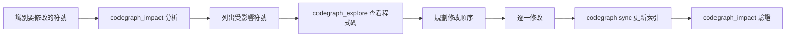

## 8.4 避免 Full Repository Scan

在 `copilot-instructions.md` 中明確禁止全域掃描：

```markdown
## AI 開發規範

### 搜尋策略
- ✅ 優先使用 CodeGraph MCP 工具進行符號搜尋和呼叫鏈追蹤
- ✅ 使用 codegraph_impact 進行變更影響分析
- ❌ 禁止使用 grep/find/rg 進行全 Repository 掃描
- ❌ 禁止遞迴讀取整個目錄

### 上下文建構
- ✅ 使用 codegraph_context 建構任務相關上下文
- ✅ 使用 codegraph_explore 查看多個相關符號
- ❌ 禁止一次讀取超過 3 個完整檔案
```

## 8.5 copilot-instructions.md 配置

```markdown
# Copilot + CodeGraph 開發指引

## 程式碼探索
當需要理解程式碼結構時：
1. 先用 codegraph_search 找到入口點
2. 用 codegraph_trace 追蹤呼叫鏈
3. 用 codegraph_explore 查看相關程式碼
4. 僅在必要時才使用 Read 讀取完整檔案

## 修改前必做
- 使用 codegraph_impact 分析影響範圍
- 確認所有受影響的呼叫者已被考慮
- 按依賴順序規劃修改步驟

## 效能意識
- 每次對話盡量控制在 5 次以內的 MCP 工具呼叫
- 避免重複查詢相同的符號
- 使用 codegraph_explore 一次取得多個符號，而非逐一 codegraph_node
```

> **📌 實務建議**：將 CodeGraph 的使用規範寫入 `copilot-instructions.md` 可以讓團隊中每個成員的 Copilot 都遵循相同的 Token 節省策略。

---

# 第 9 章 Reverse Engineering 最佳實踐

## 9.1 場景：接手 20 年 Legacy 系統

典型的企業遺留系統：

| 技術 | 說明 |
|------|------|
| Java EE (J2EE) | Servlet / JSP / JNDI |
| Struts 1.x / 2.x | MVC 框架 |
| EJB 2.x / 3.x | Enterprise JavaBeans |
| Spring Framework 3.x | IoC / AOP |
| Oracle / DB2 | 關聯式資料庫 |
| COBOL | 批次處理 / 主機整合 |

### CodeGraph 在逆向工程中的角色

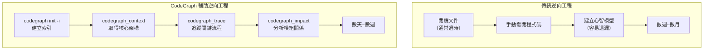

## 9.2 Call Graph 快速理解架構

### 步驟 1：識別入口點

```bash
# 搜尋所有 Controller / Servlet
codegraph query "Controller" --kind class
codegraph query "Servlet" --kind class

# 搜尋所有路由定義
codegraph query "@RequestMapping" --kind route
codegraph query "@GetMapping" --kind route
```

### 步驟 2：追蹤核心業務流程

```
# 追蹤：登入請求 → 認證 → 資料庫驗證
→ codegraph_trace("LoginController.login", "UserDAO.findByUsername")

# 追蹤：訂單建立 → 庫存檢查 → 付款
→ codegraph_trace("OrderController.createOrder", "PaymentService.process")
```

### 步驟 3：建立架構概覽

```
# 使用 Claude Code Prompt：
請幫我建立這個遺留系統的架構概覽。

步驟：
1. 用 codegraph_files 查看專案結構
2. 用 codegraph_search 找到所有 Controller / Service / DAO 類別
3. 用 codegraph_trace 追蹤 3-5 個核心業務流程
4. 整理成架構圖（用 Mermaid）
5. 列出所有模組間的依賴關係
```

## 9.3 Dependency Graph 分析模組關係

```
# 分析某個 Service 的完整依賴鏈
→ codegraph_callees("OrderService")
→ 列出：
  - ProductService（庫存查詢）
  - PricingService（價格計算）
  - PaymentGateway（支付閘道）
  - NotificationService（通知）
  - OrderRepository（資料持久化）

# 反向分析：誰依賴 OrderService
→ codegraph_callers("OrderService")
→ 列出：
  - OrderController（API 層）
  - BatchOrderProcessor（批次處理）
  - OrderMigrationJob（資料遷移）
```

## 9.4 Route Graph 理解 API 端點

CodeGraph 的框架路由偵測功能在逆向工程中極為有用：

```
# 盤點所有 Spring 路由
→ codegraph_search("@GetMapping")  + codegraph_search("@PostMapping") + ...

# 或直接搜尋 route 類型符號
→ codegraph_search("route", kind="route")

# 然後追蹤每個端點的完整處理鏈
→ codegraph_trace(route_handler, database_method)
```

## 9.5 逆向工程完整工作流

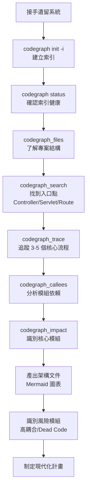

### 實戰案例：Legacy Spring MVC + Oracle 系統

```
# 1. 建立索引（約 2-5 分鐘，依專案大小）
cd /path/to/legacy-system
codegraph init -i

# 2. 確認索引
codegraph status
# Files: 3,456 indexed
# Symbols: 89,012
# Edges: 234,567

# 3. 盤點 API 端點
codegraph query "@RequestMapping" --kind route --json | wc -l
# 結果：287 個 API 端點

# 4. 找出核心 Service
codegraph query "Service" --kind class --limit 50

# 5. 分析核心流程（透過 Claude Code）
# Prompt: 請追蹤 OrderController.createOrder 到 Database 的完整流程
```

> **📌 實務建議**：逆向工程的第一步永遠是 `codegraph init -i`。即使是 JSP/Struts 等較舊的技術，Java Controller/Service/DAO 層的符號關係仍可完整提取。XML 設定檔（如 struts-config.xml）不在索引範圍，但可配合手動查看。

---

# 第 10 章 Framework 升級最佳實踐

## 10.1 Impact Analysis 找出受影響模組

Framework 升級的核心挑戰是「找出所有受影響的程式碼」。CodeGraph 的 `codegraph_impact` 工具能精確定位：

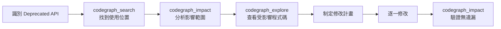

## 10.2 案例：Spring Boot 2 → 4

### 主要變更點

| 變更 | 影響 | CodeGraph 查詢方式 |
|------|------|------------------|
| `javax.*` → `jakarta.*` | 所有 Java EE 相關 import | `codegraph_search("javax.")` |
| Spring Security 設定重構 | SecurityConfig 類別 | `codegraph_search("WebSecurityConfigurerAdapter")` |
| Actuator 端點路徑變更 | 監控設定 | `codegraph_search("actuator")` |
| 移除已棄用 API | 散布各處 | `codegraph_impact("deprecatedMethod")` |

### 升級步驟（搭配 CodeGraph）

```
# Step 1: 盤點 javax 使用
codegraph query "javax" --json | jq '.[] | .file' | sort -u
# 結果：列出所有使用 javax 的檔案

# Step 2: 分析 SecurityConfig 影響
codegraph impact "SecurityConfig" --depth 3

# Step 3: 使用 Claude Code 進行升級
# Prompt：
請將此專案從 Spring Boot 2 升級到 Spring Boot 4。

步驟：
1. 用 codegraph_search 找到所有 javax.* import
2. 用 codegraph_impact 分析 SecurityConfig 的影響範圍
3. 用 codegraph_trace 追蹤 Security Filter Chain
4. 按依賴順序修改：Entity → Repository → Service → Controller → Config
```

## 10.3 案例：Java 17 → 25

```
# 找出使用已移除功能的程式碼
codegraph query "SecurityManager" --kind class
codegraph query "Finalize" --kind method

# 分析影響範圍
codegraph impact "SecurityManager" --depth 2

# Claude Code Prompt：
請分析從 Java 17 升級到 Java 25 需要修改的程式碼。
使用 codegraph_search 搜尋以下已移除/變更的 API：
- SecurityManager
- finalize()
- Deprecated for removal 的 API
列出所有影響並規劃修改順序。
```

## 10.4 案例：Vue 2 → Vue 3

```
# 找出 Vue 2 特定語法
codegraph query "Vue.filter" --kind function
codegraph query "Vue.mixin" --kind function
codegraph query "$listeners" --kind variable

# 分析 Options API → Composition API 的影響
codegraph impact "data()" --depth 2

# Claude Code Prompt：
請分析 Vue 2 → Vue 3 升級的影響範圍。
使用 codegraph_search 找到所有：
1. Vue.filter / Vue.directive / Vue.mixin
2. $listeners / $children / $on / $off
3. Vuex store 模式（需遷移到 Pinia）
4. Vue Router 3.x 語法
```

## 10.5 案例：AngularJS → Angular

```
# 找出 AngularJS 特定模式
codegraph query "angular.module" --kind function
codegraph query "$scope" --kind variable
codegraph query "$http" --kind variable

# 追蹤 Controller → Service 關係
codegraph trace "MainController" "ApiService"

# Claude Code Prompt：
請分析 AngularJS → Angular 遷移的影響範圍。
使用 codegraph_search 找到所有：
1. angular.module 定義
2. $scope 使用
3. $http / $resource 呼叫
4. directive 定義
列出需要遷移的元件並建立遷移優先順序。
```

## 10.6 codegraph affected 整合 CI/CD

`codegraph affected` 指令可追蹤 import 依賴，找出受變更影響的測試檔案：

```bash
# 基本用法：指定變更檔案
codegraph affected src/utils.ts src/api.ts

# 從 git diff 取得變更檔案
git diff --name-only | codegraph affected --stdin

# 自訂測試檔案模式
codegraph affected src/auth.ts --filter "e2e/*"

# JSON 輸出
codegraph affected src/auth.ts --json

# 僅輸出檔案路徑（適合 CI/CD）
codegraph affected src/auth.ts --quiet
```

### CI/CD 整合範例

```bash
#!/usr/bin/env bash
# 在 CI 中僅執行受影響的測試
AFFECTED=$(git diff --name-only HEAD~1 | codegraph affected --stdin --quiet)
if [ -n "$AFFECTED" ]; then
  echo "Running affected tests: $AFFECTED"
  npx vitest run $AFFECTED
fi
```

```yaml
# GitHub Actions 整合
- name: Run affected tests
  run: |
    AFFECTED=$(git diff --name-only ${{ github.event.before }} | codegraph affected --stdin --quiet)
    if [ -n "$AFFECTED" ]; then
      npm test -- $AFFECTED
    fi
```

> **📌 實務建議**：在 Framework 升級專案中，建議建立「升級影響分析表」。使用 `codegraph_impact` 系統性地分析每個 Breaking Change 的影響範圍，並按風險等級排序修改優先順序。

---

# 第 11 章 SSDLC 整合

## 11.1 Secure Software Development Lifecycle 與 CodeGraph

SSDLC 強調在開發生命週期的每個階段都考慮安全性。CodeGraph 作為知識圖譜工具，能在多個階段提供結構化的程式碼洞察：

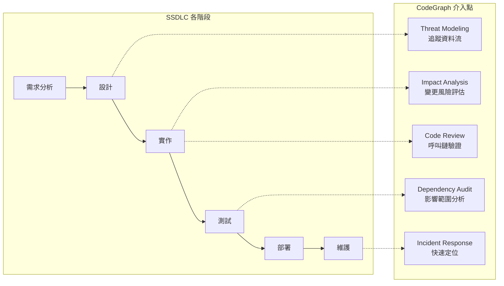

## 11.2 Threat Modeling 階段

### 使用 CodeGraph 追蹤敏感資料流

```
# 追蹤密碼從前端到資料庫的完整路徑
→ codegraph_trace("LoginController.login", "UserRepository.save")

# 追蹤 PII 資料流
→ codegraph_trace("UserController.createUser", "UserDAO.insert")

# 找到所有處理密碼的函式
→ codegraph_search("password")
→ codegraph_search("encrypt")
→ codegraph_search("hash")
```

### Prompt 範例：Threat Model 分析

```
請協助進行 Threat Modeling。

步驟：
1. 用 codegraph_search 找到所有認證相關類別（Auth*, Login*, Security*）
2. 用 codegraph_trace 追蹤認證流程的完整呼叫鏈
3. 用 codegraph_callers 找到所有存取敏感資料的入口
4. 標記信任邊界：Controller（外部）→ Service（內部）→ Repository（資料）
5. 列出每個邊界的潛在威脅
```

## 11.3 Code Review 階段

### 安全性程式碼審查搭配 CodeGraph

```
# 審查某個 PR 修改的方法，檢查所有呼叫者是否有適當的權限檢查
→ codegraph_callers("UserService.deleteUser")
→ 驗證每個呼叫者都經過 @PreAuthorize 或權限檢查

# 檢查新增的 API 端點是否在安全範圍內
→ codegraph_search("@RequestMapping")
→ 比對 SecurityConfig 中的 antMatchers
```

### Prompt 範例：安全審查

```
請對 UserService.deleteUser 方法進行安全審查。

步驟：
1. 用 codegraph_node 查看方法實作
2. 用 codegraph_callers 找到所有呼叫者
3. 用 codegraph_trace 追蹤每個呼叫路徑
4. 檢查每條路徑是否有：
   - 認證檢查（Authentication）
   - 授權檢查（Authorization / @PreAuthorize）
   - 輸入驗證（@Valid / @Validated）
   - 審計日誌（Audit Log）
5. 標記缺少安全控制的路徑
```

## 11.4 Incident Response 階段

當安全事件發生時，CodeGraph 能快速定位受影響的程式碼：

```
# 場景：發現 SQL Injection 漏洞在 UserRepository.findByName
→ codegraph_callers("UserRepository.findByName")
→ 找到所有呼叫者

→ codegraph_impact("UserRepository.findByName", depth=3)
→ 找到所有可能受影響的 API 端點

# 快速修復範圍評估
→ codegraph_explore([affected_symbols])
→ 查看所有需要修改的程式碼
```

## 11.5 Dependency Audit

```
# 當某個第三方函式庫有 CVE 時，評估影響範圍
→ codegraph_search("VulnerableLibrary")
→ codegraph_impact("VulnerableLibrary.method", depth=3)
→ 列出所有直接和間接依賴此函式庫的程式碼
```

> **📌 實務建議**：將 CodeGraph 整合到 SSDLC 的關鍵是建立「安全查詢模板」。為 Threat Modeling、Code Review、Incident Response 各建立標準化的查詢流程，讓團隊成員可以一致地使用。

---

# 第 12 章 Token 優化五級策略

## 12.1 五級優化模型

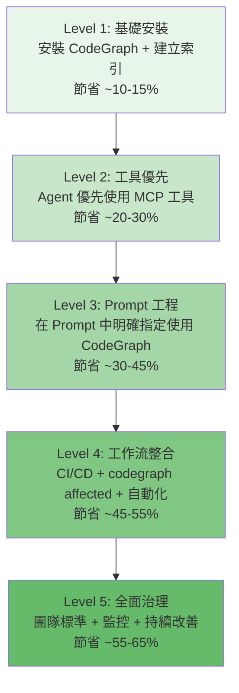

## 12.2 Level 1：基礎安裝

**目標**：讓 Agent 可以使用 CodeGraph MCP 工具

**步驟**：

```bash
# 安裝
npm install -g @colbymchenry/codegraph

# 初始化（互動模式）
cd /your/project
codegraph init -i

# 驗證
codegraph status
```

**預期效果**：Agent 會自動發現並使用 MCP 工具，但仍可能混用 grep/Read。

| 指標 | 改善 |
|------|------|
| Token 使用量 | 減少 ~10-15% |
| Tool Calls | 減少 ~15-20% |
| 回應速度 | 略有改善 |

## 12.3 Level 2：工具優先

**目標**：確保 Agent 優先使用 CodeGraph 工具，減少 grep/Read

**配置 CLAUDE.md / copilot-instructions.md**：

```markdown
## 搜尋策略
- 必須先嘗試 CodeGraph MCP 工具
- 僅在 CodeGraph 無法處理時才使用 grep/Read
- 禁止對已索引檔案使用 glob 搜尋
```

**驗證方法**：

```bash
# 檢查 Agent 的 Tool Call 分布
# 在 Claude Code 中：
/cost   # 查看 Token 消耗
# 觀察 MCP tool calls vs grep/Read 的比例
```

| 指標 | 改善 |
|------|------|
| Token 使用量 | 減少 ~20-30% |
| Tool Calls | 減少 ~30-40% |
| 回應速度 | 明顯改善 |

## 12.4 Level 3：Prompt 工程

**目標**：在任務 Prompt 中明確指定使用 CodeGraph 的策略

### 標準 Prompt 模板

```
[任務描述]

CodeGraph 策略：
1. 先用 codegraph_context 取得任務上下文
2. 用 codegraph_search 定位相關符號
3. 用 codegraph_trace 追蹤呼叫鏈
4. 用 codegraph_impact 分析影響範圍
5. 用 codegraph_explore 查看相關程式碼
6. 不要使用 grep 或讀取整個檔案
```

### 反模式對照表

| 反模式（高 Token）| 正確模式（低 Token）|
|---|---|
| `grep -r "UserService" src/` | `codegraph_search("UserService")` |
| `Read src/services/user.service.ts`（整檔） | `codegraph_node(42)`（單一符號） |
| 反覆 `Read` 多個檔案 | `codegraph_explore([42, 43, 44])` |
| 逐層 `callers` 追蹤 | `codegraph_trace(A, B)` |
| `glob src/**/*.ts` + 逐一 Read | `codegraph_files` + `codegraph_explore` |

| 指標 | 改善 |
|------|------|
| Token 使用量 | 減少 ~30-45% |
| Tool Calls | 減少 ~50-60% |
| 回應品質 | 更精確、更完整 |

## 12.5 Level 4：工作流整合

**目標**：將 CodeGraph 整合到 CI/CD 和開發工作流

### CI/CD 整合

```yaml
# .github/workflows/codegraph.yml
name: CodeGraph Affected Tests
on: [pull_request]
jobs:
  test:
    runs-on: ubuntu-latest
    steps:
      - uses: actions/checkout@v4
      - run: npm install -g @colbymchenry/codegraph
      - run: codegraph init -i
      - name: Run affected tests only
        run: |
          AFFECTED=$(git diff --name-only origin/main | codegraph affected --stdin --quiet)
          if [ -n "$AFFECTED" ]; then
            npm test -- $AFFECTED
          fi
```

### Git Hooks 整合

```bash
# .husky/pre-commit
#!/usr/bin/env bash
# 在 commit 前同步索引
codegraph sync
```

### PR Review 整合

```
# PR 描述模板中加入 Impact Analysis
## 影響範圍分析（由 CodeGraph 產生）
[codegraph impact 結果]

## 受影響的測試
[codegraph affected 結果]
```

| 指標 | 改善 |
|------|------|
| Token 使用量 | 減少 ~45-55% |
| CI/CD 時間 | 減少 ~30-50%（僅跑受影響的測試） |
| PR Review 時間 | 減少 ~20-30% |

## 12.6 Level 5：全面治理

**目標**：建立組織級的 CodeGraph 使用標準與監控

### Token 使用監控

```bash
# 定期檢查團隊的 Token 使用趨勢
# Claude Code:
/cost  # 單次對話成本

# 建立基準線
# Week 1: 記錄無 CodeGraph 的平均 Token 使用
# Week 2: 記錄有 CodeGraph 的平均 Token 使用
# 計算改善比例
```

### 團隊儀表板指標

| 指標 | 目標 | 測量方式 |
|------|------|---------|
| MCP 工具使用率 | > 80% | Tool Call 日誌分析 |
| grep/Read 使用率 | < 20% | Tool Call 日誌分析 |
| 平均 Token/任務 | 基準線的 50% | API 帳單統計 |
| 平均 Tool Calls/任務 | 基準線的 40% | Agent 日誌分析 |
| 索引健康度 | 100% | `codegraph status` 自動檢查 |

| 指標 | 改善 |
|------|------|
| Token 使用量 | 減少 ~55-65% |
| 團隊一致性 | 標準化使用方式 |
| 持續改善 | 建立回饋迴圈 |

> **📌 實務建議**：不要試圖一次到達 Level 5。建議每 1-2 週提升一個等級，讓團隊逐步適應。Level 1-2 可以在一天內完成，Level 3 需要 1-2 週的 Prompt 調整，Level 4-5 需要與 DevOps 團隊協作。

---

# 第 13 章 企業級實踐

## 13.1 大規模專案的 CodeGraph 部署

### 專案規模與建議

| 專案規模 | 檔案數 | 建議配置 |
|----------|--------|---------|
| 小型（< 10K LOC） | < 100 | 預設配置即可 |
| 中型（10K-100K LOC） | 100-1,000 | 調整 `max-file-size`，排除生成檔案 |
| 大型（100K-1M LOC） | 1,000-10,000 | 分模組索引，使用 `--filter` |
| 超大型（> 1M LOC） | > 10,000 | Monorepo 策略，分層索引 |

### Monorepo 策略

```bash
# 方法 1：根目錄索引（小型 Monorepo）
cd /monorepo
codegraph init -i

# 方法 2：分模組索引（大型 Monorepo）
cd /monorepo/packages/auth
codegraph init -i

cd /monorepo/packages/api
codegraph init -i

# 方法 3：透過 .gitignore 排除不需要的模組
# .gitignore（CodeGraph 自動尊重 .gitignore 規則）
node_modules/
dist/
build/
*.generated.ts
packages/deprecated-*
```

## 13.2 多語言專案

CodeGraph 支援 20+ 語言，在多語言專案中可以跨語言追蹤呼叫鏈：

```
# 前後端分離專案
frontend/ (TypeScript/React)
backend/ (Java/Spring Boot)
shared/ (Protocol Buffers)

# CodeGraph 可在同一索引中處理多語言
codegraph init -i
# 自動偵測並索引所有支援的語言
```

### 跨語言追蹤範例

```
# 追蹤前端 API 呼叫到後端 Controller
→ codegraph_search("fetchUsers")  # 前端 API 呼叫
→ codegraph_search("GET /api/users")  # 後端路由
→ codegraph_trace("UsersApi.fetchUsers", "UserRepository.findAll")
```

## 13.3 團隊協作模式

### 索引管理

```bash
# 方案 1：將索引加入 .gitignore（推薦）
# .gitignore
.codegraph/

# 每個開發者本地執行 codegraph init -i
# 優點：索引與本地環境一致
# 缺點：每人需要初始化一次

# 方案 2：CI/CD 中建立索引
# 優點：一致的索引
# 缺點：需要 CI 支援
```

### 開發者 Onboarding

```bash
# 新成員 onboarding 腳本
#!/usr/bin/env bash

echo "=== CodeGraph 初始化 ==="
npm install -g @colbymchenry/codegraph
codegraph init -i
codegraph status

echo "=== 專案架構概覽 ==="
codegraph query "Controller" --kind class --limit 20
codegraph query "Service" --kind class --limit 20
codegraph query "Repository" --kind class --limit 20

echo "=== 核心流程追蹤 ==="
codegraph trace "OrderController.createOrder" "OrderRepository.save"
```

## 13.4 安全考量

| 安全面向 | 說明 | 建議 |
|----------|------|------|
| 索引內容 | SQLite 檔案包含符號名、程式碼片段 | 納入 `.gitignore`，不上傳到 remote |
| MCP 通訊 | localhost stdio 通訊 | 預設安全，不開放外部存取 |
| Agent 權限 | MCP 工具為唯讀 | CodeGraph 不修改原始碼 |
| 敏感符號 | 密碼、API Key 相關符號可能被索引 | 將敏感配置檔加入 `.gitignore` 排除 |

## 13.5 效能調優

```bash
# 檢查索引大小
ls -lh .codegraph/codegraph.db

# 大型專案的效能建議
# 1. 排除不需要索引的檔案
# .gitignore（CodeGraph 自動尊重 .gitignore 規則）
*.min.js
*.bundle.js
vendor/
generated/

# 2. 重建索引（當索引損壞或過於碎片化）
codegraph index --force
```

> **📌 實務建議**：CodeGraph 採用零設定架構（Zero-config），排除規則統一透過 `.gitignore` 管理。企業環境中，建議由 Tech Lead 或 DevOps 團隊確保 `.gitignore` 規則完善，將生成檔案、第三方套件和敏感配置等排除在外。若需將預設排除的目錄加回索引，可在 `.gitignore` 中使用否定語法（例如 `!vendor/`）。

## 13.6 程式庫使用（Library API）

除了 CLI 和 MCP Server，CodeGraph 亦提供 TypeScript 程式庫 API，可直接在 Node.js 應用程式中嵌入使用：

```typescript
import CodeGraph from '@colbymchenry/codegraph';

// 初始化並開啟專案索引
const cg = await CodeGraph.init('/path/to/project');
// 或開啟已建立的索引：
// const cg = await CodeGraph.open('/path/to/project');

// 建立全量索引（含進度回報）
await cg.indexAll({
  onProgress: (p) => console.log(`${p.phase}: ${p.current}/${p.total}`)
});

// 搜尋符號
const results = cg.searchNodes('UserService');

// 查詢呼叫者
const callers = cg.getCallers(results[0].node.id);

// 為 AI 任務建構上下文
const context = await cg.buildContext('fix login bug', {
  maxNodes: 20,
  includeCode: true,
  format: 'markdown'
});

// 影響範圍分析
const impact = cg.getImpactRadius(results[0].node.id, 2);

// 啟動檔案監視（自動同步）
cg.watch();

// 停止監視
cg.unwatch();

// 關閉連線
cg.close();
```

### 適用場景

| 場景 | 說明 |
|------|------|
| **自訂 MCP Server** | 在既有的 MCP Server 中嵌入 CodeGraph 查詢能力 |
| **CI/CD Pipeline** | 在 CI 中程式化地執行影響分析、受影響測試偵測 |
| **IDE 外掛開發** | 將 CodeGraph 整合到自訂的開發工具中 |
| **自動化報告** | 定期產生程式碼架構分析報告 |
| **Multi-Agent 系統** | 作為多 Agent 協作的共享知識基礎設施 |

> **📌 實務建議**：Library API 適合需要深度客製化的進階場景。大多數團隊透過 CLI + MCP Server 即可滿足需求，不需要直接使用 Library API。

---

# 第 14 章 團隊 AI 開發規範

## 14.1 AI Coding Standard（團隊範本）

以下是一份可直接使用的團隊 AI 開發規範模板：

```markdown
# [公司/團隊名稱] AI 輔助開發規範 v1.0

## 1. 適用範圍
本規範適用於使用 AI Agent（Claude Code, GitHub Copilot）進行開發的所有專案。

## 2. 工具使用規範

### 2.1 必須使用 CodeGraph
- 所有已索引的專案，Agent 必須優先使用 CodeGraph MCP 工具
- 禁止在已索引專案中使用 grep/glob 進行全域搜尋
- 修改程式碼前，必須使用 codegraph_impact 進行影響分析

### 2.2 Prompt 撰寫規範
- 任務 Prompt 必須包含明確的 CodeGraph 使用指示
- 使用標準 Prompt 模板（見附錄）
- 禁止使用 "幫我重構整個專案" 等模糊指令

### 2.3 Token 成本意識
- 每個開發者每日 Token 預算：[設定上限]
- 大型分析任務（> 50K Token）需事先申請
- 定期檢查 /cost 並回報異常消耗

## 3. 安全規範

### 3.1 程式碼審查
- AI 產生的程式碼必須經過人工 Code Review
- 安全相關程式碼（認證、授權、加密）禁止直接採用 AI 建議
- AI 產生的 SQL 查詢必須檢查注入風險

### 3.2 敏感資訊
- 禁止在 Prompt 中包含真實密碼、API Key、Token
- 禁止將生產環境的資料庫連線資訊傳給 Agent
- 使用環境變數和 Secret Manager 管理敏感設定

## 4. 品質規範

### 4.1 測試要求
- AI 產生的功能程式碼必須包含對應的單元測試
- 使用 codegraph affected 確認測試覆蓋率
- 重構後必須執行完整測試套件

### 4.2 文件要求
- 複雜的 AI 輔助修改必須在 PR 描述中說明使用的 Prompt
- 架構變更必須更新相關文件
```

## 14.2 Prompt Library（團隊 Prompt 庫）

### 分類管理

```
.github/prompts/
├── architecture/
│   ├── analyze-system.md
│   ├── trace-flow.md
│   └── dependency-map.md
├── bugfix/
│   ├── locate-bug.md
│   ├── root-cause-analysis.md
│   └── regression-check.md
├── refactoring/
│   ├── extract-service.md
│   ├── impact-analysis.md
│   └── safe-rename.md
├── security/
│   ├── threat-model.md
│   ├── security-review.md
│   └── vulnerability-scan.md
└── onboarding/
    ├── system-overview.md
    ├── core-flow.md
    └── module-guide.md
```

### Prompt 模板範例

```markdown
# .github/prompts/bugfix/locate-bug.md
---
description: "使用 CodeGraph 定位 Bug"
---

## 任務
定位以下 Bug：{{BUG_DESCRIPTION}}

## CodeGraph 策略
1. 用 codegraph_search 找到相關類別/方法
2. 用 codegraph_trace 追蹤呼叫鏈
3. 用 codegraph_explore 查看相關程式碼
4. 分析可能的根因

## 注意事項
- 不要使用 grep 搜尋
- 不要讀取完整檔案
- 列出所有可能的根因，並標記可能性高低
```

## 14.3 Code Review Checklist（AI 產生程式碼）

| 檢查項目 | 說明 | 必要性 |
|----------|------|--------|
| 邏輯正確性 | AI 產生的邏輯是否符合需求 | 必要 |
| 安全性 | 是否有注入、XSS、CSRF 風險 | 必要 |
| 效能 | 是否有 N+1、記憶體洩漏 | 必要 |
| 測試覆蓋 | 是否有對應的測試 | 必要 |
| 命名慣例 | 是否符合團隊命名規範 | 建議 |
| 重複程式碼 | 是否與現有程式碼重複 | 建議 |
| 依賴管理 | 是否引入不必要的依賴 | 建議 |
| 影響範圍 | codegraph_impact 結果是否已考慮 | 必要 |

## 14.4 onboarding 流程（AI 工具）

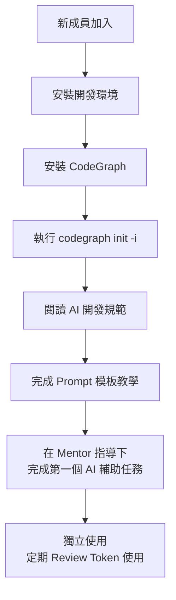

> **📌 實務建議**：團隊 AI 開發規範不應該是「一次性文件」。建議每月 Review 一次，根據團隊的實際 Token 使用數據和開發效率指標持續調整。

---

# 第 15 章 20 個常見錯誤與解決方案

## 15.1 安裝與設定類（錯誤 1-5）

### 錯誤 1：未在專案根目錄執行 init

```
❌ 錯誤做法：
cd /home/user
codegraph init -i  # 在 home 目錄執行

✅ 正確做法：
cd /path/to/your/project  # 先切換到專案根目錄
codegraph init -i
```

### 錯誤 2：未正確配置 .gitignore 排除規則

```
❌ 問題：索引包含大量無用檔案
   → 索引緩慢、搜尋結果雜亂

✅ 解決方案：
CodeGraph 自動排除 node_modules、vendor、dist、build、target 等目錄，
並尊重 .gitignore 規則。若仍有索引不需要的檔案，將其加入 .gitignore：
# .gitignore
coverage/
.next/
*.min.js
*.bundle.js
```

### 錯誤 3：索引過期未同步

```
❌ 問題：修改了程式碼但 CodeGraph 索引仍是舊的
   → Agent 查詢結果與實際程式碼不一致

✅ 解決方案：
# CodeGraph v0.9.7 內建 Auto-Sync（檔案監視自動增量同步）
# 如果自動同步未生效：
codegraph sync  # 手動同步

# 嚴重不一致時重建索引：
codegraph init -i --force
```

### 錯誤 4：未驗證 MCP Server 狀態

```
❌ 問題：Agent 說「找不到 CodeGraph 工具」

✅ 解決方案：
# Claude Code:
/mcp  # 檢查 MCP Server 列表

# VS Code Copilot:
# 檢查 settings.json 中的 mcp.servers 配置

# 通用：
codegraph status  # 確認索引健康
```

### 錯誤 5：在不支援的專案類型使用

```
❌ 問題：在純 Markdown / 純 Config 專案使用 CodeGraph
   → 索引為空或幾乎為空

✅ 解決方案：
# CodeGraph 僅對程式碼有效（20+ 支援語言）
# 文件專案、純配置專案不適用
codegraph status  # 檢查 Symbols 數量
# 如果 Symbols = 0，則專案可能不適合使用 CodeGraph
```

## 15.2 使用模式類（錯誤 6-10）

### 錯誤 6：仍然使用 grep 進行符號搜尋

```
❌ 錯誤做法：
Prompt: "幫我用 grep 找到所有使用 UserService 的地方"

✅ 正確做法：
Prompt: "用 codegraph_search 找到 UserService，
然後用 codegraph_callers 查看所有呼叫者"
```

### 錯誤 7：讀取整個檔案而非查詢符號

```
❌ 錯誤做法：
Prompt: "請讀取 src/services/user.service.ts 並分析"
→ 回傳整個檔案（可能數百行）

✅ 正確做法：
Prompt: "用 codegraph_node 查看 UserService.findById 的實作"
→ 僅回傳相關方法（數十行）
```

### 錯誤 8：逐一查詢而非批次查詢

```
❌ 錯誤做法：
→ codegraph_node(id=1)
→ codegraph_node(id=2)
→ codegraph_node(id=3)
→ 3 次 Tool Calls

✅ 正確做法：
→ codegraph_explore([1, 2, 3])
→ 1 次 Tool Call，包含所有相關程式碼
```

### 錯誤 9：不使用 codegraph_context 開始任務

```
❌ 錯誤做法：
Prompt: "修復登入 bug"
→ Agent 開始盲目搜尋

✅ 正確做法：
Prompt: "修復登入 bug。先用 codegraph_context 取得登入功能的上下文。"
→ Agent 直接獲得相關程式碼
```

### 錯誤 10：忽略 codegraph_impact 直接修改

```
❌ 錯誤做法：
Prompt: "將 findById 回傳型別改為 Optional<User>"
→ 直接修改，遺漏部分呼叫者

✅ 正確做法：
Prompt: "將 findById 回傳型別改為 Optional<User>。
先用 codegraph_impact 分析影響範圍，
確保所有呼叫者都被正確修改。"
```

## 15.3 Prompt 設計類（錯誤 11-15）

### 錯誤 11：Prompt 過於模糊

```
❌ "幫我改善這個專案"
❌ "重構程式碼"
❌ "優化效能"

✅ "用 codegraph_search 找到 OrderService 中所有 public 方法，
   用 codegraph_callers 分析哪些方法的呼叫者最多，
   針對呼叫者最多的 3 個方法進行重構建議。"
```

### 錯誤 12：未在 Prompt 中指定 CodeGraph 策略

```
❌ "分析 UserController 的呼叫鏈"
→ Agent 可能使用 grep + Read

✅ "使用 codegraph_trace 分析 UserController.getUser 到 UserRepository.findById 的呼叫鏈"
→ Agent 明確使用 CodeGraph
```

### 錯誤 13：一次要求太多分析

```
❌ "分析整個專案的所有 API、所有呼叫鏈、所有依賴關係"
→ Token 爆炸

✅ "分析 User 模組的 API 端點和呼叫鏈。
   僅關注 UserController 的 CRUD 操作。"
→ 聚焦範圍，控制 Token
```

### 錯誤 14：不善用 Prompt 模板

```
❌ 每次都從零寫 Prompt

✅ 使用團隊 Prompt 庫（見 14.2 節），根據任務類型選擇模板：
   - 架構分析 → architecture/analyze-system.md
   - Bug 定位 → bugfix/locate-bug.md
   - 重構分析 → refactoring/impact-analysis.md
```

### 錯誤 15：未利用 Agent 的迭代能力

```
❌ 一次性的巨大 Prompt，試圖讓 Agent 一次完成所有事

✅ 分階段迭代：
   第 1 輪："用 codegraph_context 了解系統架構"
   第 2 輪："用 codegraph_trace 追蹤訂單流程"
   第 3 輪："基於以上分析，提出重構方案"
```

## 15.4 進階使用類（錯誤 16-20）

### 錯誤 16：不使用 codegraph affected 跑測試

```
❌ 每次 CI 都跑完整測試套件（30 分鐘）

✅ 使用 codegraph affected 僅跑受影響的測試（3-5 分鐘）：
git diff --name-only | codegraph affected --stdin --quiet | xargs npm test
```

### 錯誤 17：未配置 Auto-Sync

```
❌ 問題：每次修改程式碼後都需要手動 codegraph sync

✅ 解決方案：CodeGraph 採零設定架構，不需要設定檔。
MCP Server 啟動後會自動監視檔案變更（使用原生 OS 事件）。
# 若自動同步未生效，手動執行：
codegraph sync
```

### 錯誤 18：混用多個搜尋工具導致重複結果

```
❌ 同一個問題使用 codegraph_search + grep + file_search
   → 重複結果、浪費 Token

✅ 建立優先順序：
   1. codegraph_search（符號搜尋）
   2. codegraph_files（檔案結構）
   3. grep（僅用於 CodeGraph 不支援的搜尋，如正則表達式）
```

### 錯誤 19：不關注 codegraph status 警告

```
❌ 忽略 "N files need re-indexing" 警告

✅ 定期檢查：
codegraph status

# 如果有警告，立即同步：
codegraph sync

# 將 status 檢查加入開發工具腳本
```

### 錯誤 20：Team 中僅部分成員使用 CodeGraph

```
❌ 問題：部分成員使用 CodeGraph、部分不使用
   → Token 使用差異大、PR Review 品質不一致

✅ 解決方案：
   1. 將 CodeGraph 安裝納入專案 onboarding 流程
   2. 在 copilot-instructions.md / CLAUDE.md 中寫入使用規範
   3. 定期檢查團隊 Token 使用報告
   4. 分享 CodeGraph 使用案例和最佳實踐
```

> **📌 實務建議**：建議將這 20 個錯誤做成團隊內部的 FAQ 文件，新成員入職時必讀。每個月可以在團隊會議中分享 1-2 個實際案例，持續強化正確使用模式。

---

# 第 16 章 AI Agent 工作流與 KGDD

## 16.1 Knowledge-Graph-Driven Development (KGDD)

KGDD 是一種以知識圖譜為核心驅動 AI Agent 開發的方法論。CodeGraph 提供的 Symbol-Edge 知識圖譜，使 Agent 能夠基於結構化的程式碼語義進行推理，而非依賴文字匹配。

```mermaid
graph TB
    subgraph "傳統 AI 開發流程"
        T1[人類描述需求] --> T2[Agent 用 grep 搜尋]
        T2 --> T3[Agent 讀取大量檔案]
        T3 --> T4[Agent 建立心智模型]
        T4 --> T5[Agent 產生程式碼]
        T5 --> T6[可能遺漏 / 錯誤]
    end
    
    subgraph "KGDD 流程"
        K1[人類描述需求] --> K2[Agent 查詢知識圖譜]
        K2 --> K3[Agent 獲得結構化上下文]
        K3 --> K4[Agent 基於圖譜推理]
        K4 --> K5[Agent 產生精確程式碼]
        K5 --> K6[Impact 驗證完整性]
    end
    
    style T6 fill:#ffcdd2
    style K6 fill:#c8e6c9
```

### KGDD 核心原則

| 原則 | 傳統方式 | KGDD 方式 |
|------|----------|----------|
| **資訊取得** | 文字搜尋 + 檔案讀取 | 圖譜查詢（Symbol + Edge） |
| **上下文建構** | Agent 自行拼湊 | `codegraph_context` 自動建構 |
| **影響分析** | 手動追蹤呼叫者 | `codegraph_impact` 遞迴分析 |
| **呼叫鏈理解** | 逐層 grep | `codegraph_trace` 一次取得 |
| **完整性驗證** | 人工 Code Review | `codegraph_impact` + `codegraph affected` |

## 16.2 Agent 工作流設計模式

### 模式 1：Context-First（上下文優先）

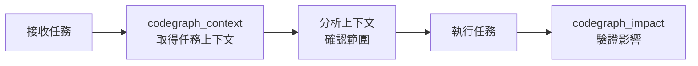

**適用場景**：功能開發、Bug 修復

**Prompt 模板**：

```
[任務描述]

請先用 codegraph_context 取得相關上下文，
確認影響範圍後再開始實作。
實作完成後用 codegraph_impact 驗證沒有遺漏。
```

### 模式 2：Trace-First（追蹤優先）

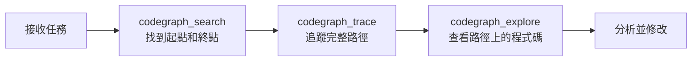

**適用場景**：架構分析、效能優化、流程理解

### 模式 3：Impact-First（影響優先）

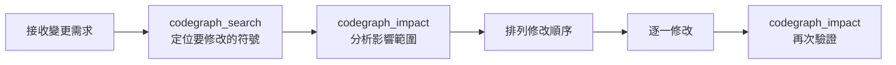

**適用場景**：重構、API 變更、Framework 升級

### 模式 4：Explore-First（探索優先）

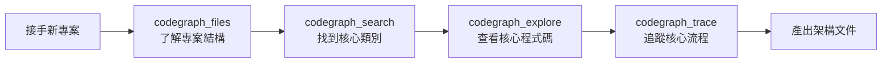

**適用場景**：逆向工程、系統理解、Onboarding

## 16.3 Multi-Agent 協作與 CodeGraph

在多 Agent 協作場景中，CodeGraph 作為共享的知識基礎：

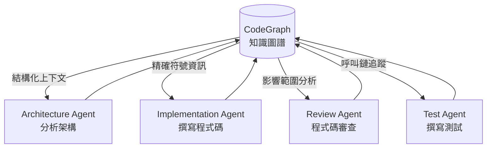

### 協作工作流範例

```
# Phase 1: Architecture Agent
→ codegraph_context("理解訂單系統架構")
→ 產出架構分析報告

# Phase 2: Implementation Agent
→ codegraph_explore([需要修改的符號])
→ 基於架構報告實作程式碼

# Phase 3: Review Agent
→ codegraph_impact("修改的符號")
→ 檢查是否有遺漏的影響

# Phase 4: Test Agent
→ codegraph_callers("修改的符號")
→ 為所有呼叫路徑撰寫測試
```

## 16.4 Agentic Workflow 成熟度模型

| 等級 | 名稱 | 描述 | CodeGraph 角色 |
|------|------|------|---------------|
| L0 | 手動開發 | 開發者手動寫所有程式碼 | 無 |
| L1 | AI 輔助 | 使用 Copilot 自動完成 | 無 |
| L2 | AI 引導 | Agent 提供建議，人類決策 | 提供精確上下文 |
| L3 | AI 執行 | Agent 執行任務，人類審查 | 提供影響分析 + 完整性驗證 |
| L4 | AI 自主 | Agent 自主完成開發循環 | 作為核心知識基礎設施 |
| L5 | Multi-Agent | 多 Agent 協作，分工完成 | 共享知識圖譜 + 一致性保證 |

> **📌 實務建議**：大多數企業團隊目前處於 L1-L2 之間。CodeGraph 能幫助團隊快速從 L2 提升到 L3，因為它解決了 Agent 最大的瓶頸——準確理解程式碼結構。不建議跳過等級，應循序漸進。

---

# 第 17 章 總結與展望

## 17.1 核心要點回顧

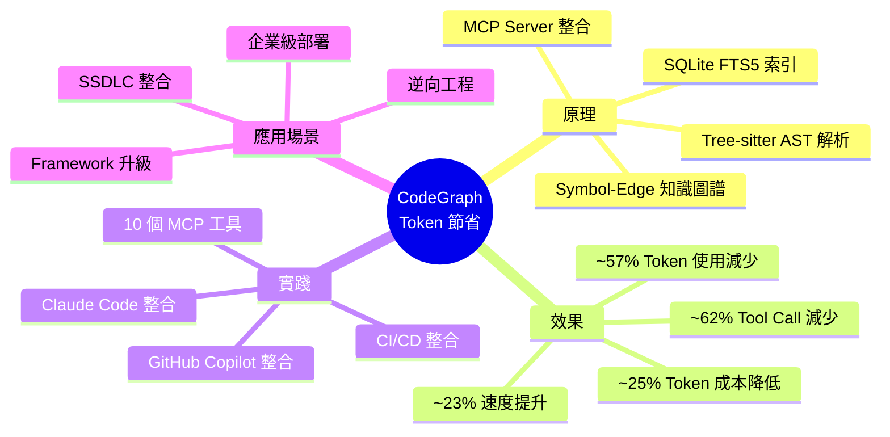

### 關鍵數據總結

| 指標 | 無 CodeGraph | 有 CodeGraph | 改善幅度 |
|------|------------|-------------|---------|
| Token 使用量 | 100% | ~43% | **~57% 減少** |
| 金錢成本 | 100% | ~75% | **~25% 節省** |
| Tool Calls | 100% | ~38% | **~62% 減少** |
| 完成時間 | 100% | ~77% | **~23% 加速** |

## 17.2 採用路線圖

```mermaid
gantt
    title CodeGraph 採用路線圖
    dateFormat  YYYY-MM-DD
    section Phase 1: 試點
    安裝與基礎設定            :a1, 2026-01-01, 1d
    選擇 1 個專案試用          :a2, after a1, 5d
    收集初步數據               :a3, after a2, 5d
    section Phase 2: 推廣
    制定團隊規範               :b1, after a3, 5d
    Prompt Library 建立        :b2, after b1, 10d
    CI/CD 整合                 :b3, after b1, 10d
    section Phase 3: 優化
    Token 使用監控             :c1, after b3, 10d
    團隊訓練                   :c2, after b3, 5d
    持續改善                   :c3, after c2, 30d
    section Phase 4: 全面治理
    組織級標準                 :d1, after c3, 15d
    跨團隊推廣                 :d2, after d1, 30d
```

## 17.3 未來展望

### CodeGraph 發展方向

| 方向 | 說明 |
|------|------|
| **更多語言支援** | 持續擴展 Tree-sitter Grammar 支援 |
| **跨 Repository 索引** | Monorepo 和 Multi-repo 場景 |
| **雲端索引共享** | 團隊共享索引，避免重複建構 |
| **即時分析** | 編輯器內即時的符號關係展示 |
| **AI 訓練整合** | 為 AI 模型提供結構化的訓練資料 |

### Knowledge Graph 在 AI 開發中的趨勢

1. **程式碼理解從文字匹配走向語義理解**：Tree-sitter + 知識圖譜是趨勢
2. **Agent 工具從通用走向專業**：針對程式碼的 MCP 工具會越來越多
3. **Token 成本控制成為企業必修課**：AI 開發的經濟模型需要最佳化
4. **Multi-Agent 協作需要共享知識基礎**：知識圖譜是天然的共享層

## 17.4 行動建議

| 角色 | 建議行動 | 優先順序 |
|------|---------|---------|
| **個人開發者** | 安裝 CodeGraph，在日常開發中使用 | 立即 |
| **Tech Lead** | 制定團隊 AI 開發規範，建立 Prompt Library | 1 個月內 |
| **DevOps** | 整合 `codegraph affected` 到 CI/CD | 2 個月內 |
| **Engineering Manager** | 建立 Token 使用監控和預算機制 | 3 個月內 |
| **CTO / VP Engineering** | 評估組織級 AI 開發策略 | 本季度 |

---

# 附錄 A：Claude Code 50%+ Token 削減實戰

## A.1 場景設定

| 項目 | 說明 |
|------|------|
| 專案 | Spring Boot 微服務（約 80K LOC） |
| 任務 | 分析 OrderService 的完整業務邏輯 |
| Agent | Claude Code (Opus 4) |

## A.2 無 CodeGraph 的對話

```
Human: 請分析 OrderService 的完整業務邏輯

Claude Code (無 CodeGraph):
→ grep -r "OrderService" src/        # 搜尋符號 → ~200 行匹配
→ Read src/services/OrderService.java # 讀取完整檔案 → ~500 行
→ grep -r "createOrder" src/         # 搜尋方法 → ~80 行匹配
→ Read src/controllers/OrderController.java  # ~300 行
→ grep -r "OrderRepository" src/     # ~60 行匹配
→ Read src/repositories/OrderRepository.java # ~150 行
→ Read src/models/Order.java          # ~200 行
→ Read src/models/OrderItem.java      # ~100 行
→ Read src/services/PaymentService.java # ~400 行
→ Read src/services/InventoryService.java # ~350 行
...（繼續讀取更多檔案）

統計：
- Tool Calls: 18 次
- Input Tokens: ~85,000
- Output Tokens: ~12,000
- 總成本: ~$0.52
```

## A.3 有 CodeGraph 的對話

```
Human: 請分析 OrderService 的完整業務邏輯

Claude Code (有 CodeGraph):
→ codegraph_context("OrderService 業務邏輯分析")
  # 一次呼叫取得相關上下文 → 精準的符號列表 + 關係
→ codegraph_explore([OrderService 相關符號 IDs])
  # 一次呼叫取得所有相關程式碼 → 自適應大小
→ codegraph_trace("OrderController.createOrder", "OrderRepository.save")
  # 追蹤完整呼叫鏈

統計：
- Tool Calls: 3 次
- Input Tokens: ~35,000
- Output Tokens: ~10,000
- 總成本: ~$0.22
```

## A.4 對比分析

| 指標 | 無 CodeGraph | 有 CodeGraph | 改善 |
|------|------------|-------------|------|
| Tool Calls | 18 次 | 3 次 | **-83%** |
| Input Tokens | ~85,000 | ~35,000 | **-59%** |
| Output Tokens | ~12,000 | ~10,000 | -17% |
| 總成本 | ~$0.52 | ~$0.22 | **-58%** |
| 結果品質 | 可能遺漏依賴 | 完整呼叫鏈 | 更好 |

---

# 附錄 B：GitHub Copilot 50%+ Token 削減實戰

## B.1 場景設定

| 項目 | 說明 |
|------|------|
| 專案 | React + TypeScript 前端（約 45K LOC） |
| 任務 | 重構 UserProfile 元件，提取共用邏輯 |
| Agent | GitHub Copilot Agent Mode |

## B.2 無 CodeGraph 的工作流

```
@workspace 請重構 UserProfile 元件，將表單驗證邏輯提取為共用 Hook

Copilot (無 CodeGraph):
→ 搜尋 UserProfile → 多個檔案匹配
→ Read UserProfile.tsx → ~400 行
→ Read UserProfileForm.tsx → ~300 行
→ 搜尋其他使用相同驗證的元件
→ Read RegistrationForm.tsx → ~350 行
→ Read SettingsForm.tsx → ~280 行
→ Read types/user.ts → ~100 行
→ Read hooks/useForm.ts → ~200 行
→ Read utils/validation.ts → ~150 行
...

統計：
- Tool Calls: 14 次
- 讀取的程式碼行數: ~2,300 行
- Token 消耗: ~72,000
```

## B.3 有 CodeGraph 的工作流

```
@workspace 請重構 UserProfile 元件，將表單驗證邏輯提取為共用 Hook。
使用 codegraph_search 找到相關元件，用 codegraph_explore 查看程式碼。

Copilot (有 CodeGraph):
→ codegraph_search("UserProfile")
  # 精確找到元件定義
→ codegraph_callers("validateForm")
  # 找到所有使用驗證邏輯的元件
→ codegraph_explore([UserProfile, validateForm, 相關元件])
  # 一次取得所有相關程式碼，自適應大小

統計：
- Tool Calls: 3 次
- 讀取的程式碼行數: ~800 行（精準片段）
- Token 消耗: ~28,000
```

## B.4 對比分析

| 指標 | 無 CodeGraph | 有 CodeGraph | 改善 |
|------|------------|-------------|------|
| Tool Calls | 14 次 | 3 次 | **-79%** |
| 程式碼行數 | ~2,300 行 | ~800 行 | **-65%** |
| Token 消耗 | ~72,000 | ~28,000 | **-61%** |
| 遺漏風險 | 可能遺漏使用者 | callers 確保完整 | 更低 |

---

# 附錄 C：知識圖譜成本削減計算

## C.1 成本模型

### AI API 定價（以 Claude Opus 4 為例，2026 年）

| 項目 | 定價 |
|------|------|
| Input Tokens | $15 / 1M tokens |
| Output Tokens | $75 / 1M tokens |
| Cached Input | $1.875 / 1M tokens |

### 每日開發者 Token 消耗估算

| 場景 | 無 CodeGraph | 有 CodeGraph |
|------|-------------|-------------|
| 小型任務（Bug Fix）| ~30K tokens | ~15K tokens |
| 中型任務（Feature）| ~80K tokens | ~35K tokens |
| 大型任務（Refactor）| ~200K tokens | ~85K tokens |
| 每日平均 | ~150K tokens | ~65K tokens |

## C.2 月度成本試算

### 假設條件
- 團隊人數：20 人
- 每日工作日：22 天
- 平均每日 Token：150K（無 CG）/ 65K（有 CG）
- Input:Output 比例 = 4:1

### 無 CodeGraph

```
每月 Token = 20 人 × 22 天 × 150K = 66M tokens
Input: 52.8M × $15/1M = $792
Output: 13.2M × $75/1M = $990
月度總成本 = $1,782
```

### 有 CodeGraph

```
每月 Token = 20 人 × 22 天 × 65K = 28.6M tokens
Input: 22.88M × $15/1M = $343.20
Output: 5.72M × $75/1M = $429
月度總成本 = $772.20
```

### 節省效果

| 指標 | 無 CodeGraph | 有 CodeGraph | 節省 |
|------|-------------|-------------|------|
| 月度 Token | 66M | 28.6M | **56.7%** |
| 月度成本 | $1,782 | $772 | **$1,010/月** |
| 年度成本 | $21,384 | $9,264 | **$12,120/年** |

## C.3 ROI 計算

| 項目 | 金額 |
|------|------|
| CodeGraph 部署成本 | $0（開源 MIT License） |
| 團隊訓練成本（一次性） | ~40 人時 × $50/時 = $2,000 |
| 年度維護成本 | ~$500（索引管理、規範更新） |
| **年度投入總計** | **$2,500** |
| **年度節省** | **$12,120** |
| **ROI** | **385%** |
| **回本時間** | **~2.5 個月** |

> **📌 實務建議**：以上計算基於 Claude Opus 4 定價。如果使用較便宜的模型（如 Sonnet），絕對金額會降低，但百分比節省幅度類似。實際節省效果取決於團隊的使用模式和專案特性。

---

# 附錄 D：Enterprise AI Coding Standard

## D.1 完整規範模板

```markdown
# Enterprise AI Coding Standard v1.0

## 1. 總則

### 1.1 目的
本標準規範企業內使用 AI 輔助開發的流程、工具和最佳實踐，
確保開發效率、程式碼品質和資訊安全的平衡。

### 1.2 適用範圍
適用於所有使用 AI Agent（Claude Code, GitHub Copilot, 其他 MCP 相容 Agent）
進行軟體開發的團隊和專案。

## 2. 工具標準

### 2.1 核准工具清單
| 類別 | 工具 | 版本 | 狀態 |
|------|------|------|------|
| 知識圖譜 | CodeGraph | ≥ 0.9.7 | 必裝 |
| AI Agent | Claude Code | Latest | 核准 |
| AI Agent | GitHub Copilot | Latest | 核准 |
| MCP Server | CodeGraph MCP | 內建 | 必裝 |

### 2.2 禁止工具
- 未經安全審查的第三方 MCP Server
- 非公司核准的 AI Agent
- 任何將程式碼傳送到公司外部的工具（除核准工具外）

## 3. 使用規範

### 3.1 CodeGraph 使用
- 所有程式碼專案必須建立 CodeGraph 索引
- Agent 必須優先使用 CodeGraph MCP 工具
- 修改程式碼前必須執行 codegraph_impact 分析

### 3.2 Prompt 規範
- 使用團隊 Prompt Library 中的模板
- 禁止在 Prompt 中包含敏感資訊
- 大型分析任務需事先評估 Token 消耗

### 3.3 Token 預算
| 等級 | 每日上限 | 審批 |
|------|---------|------|
| 開發者 | 500K tokens | 免審批 |
| 大型任務 | 2M tokens | Tech Lead 審批 |
| 專案級分析 | 10M tokens | Manager 審批 |

## 4. 安全規範

### 4.1 資料分類
| 分類 | 說明 | AI 使用限制 |
|------|------|-----------|
| Public | 開源程式碼 | 無限制 |
| Internal | 一般業務程式碼 | 核准 Agent 可用 |
| Confidential | 含商業邏輯的核心程式碼 | 需加密或脫敏 |
| Restricted | 含密碼/金鑰的配置 | 禁止傳給 AI |

### 4.2 Code Review 要求
- AI 產生的程式碼必須經過至少 1 位人工 Reviewer
- 安全相關程式碼需 2 位 Reviewer（含 Security Champion）
- AI 產生的 SQL 必須通過 SQL Injection 審查

## 5. 品質標準

### 5.1 測試覆蓋
- AI 產生的功能程式碼必須有對應的單元測試
- 使用 codegraph affected 確認測試完整性
- 重構後執行完整回歸測試

### 5.2 文件要求
- 使用 CodeGraph 進行的重大分析需在 PR 中記錄
- 架構變更需更新相關文件
- Prompt 範例需回饋至 Prompt Library
```

---

# 附錄 E：Enterprise MCP Standard

## E.1 MCP Server 管理規範

### MCP Server 准入流程

```mermaid
graph TD
    A[提交 MCP Server 申請] --> B{安全審查}
    B -->|通過| C[功能測試]
    B -->|不通過| F[駁回]
    C -->|通過| D[沙箱試用<br/>2 週]
    C -->|不通過| F
    D -->|通過| E[正式核准<br/>加入白名單]
    D -->|不通過| G[退回修改]
```

### MCP Server 分級

| 等級 | 說明 | 範例 | 權限 |
|------|------|------|------|
| Level 1 | 唯讀查詢 | CodeGraph（search, trace, explore） | 預設開啟 |
| Level 2 | 本地修改 | File System（read, write, edit） | 需確認 |
| Level 3 | 網路存取 | GitHub API, Jira API | 需審批 |
| Level 4 | 資料庫存取 | Database MCP | 需特別審批 |

### CodeGraph MCP 工具權限矩陣

| 工具 | 等級 | 說明 | 風險 |
|------|------|------|------|
| codegraph_search | L1 | 符號搜尋 | 低 |
| codegraph_context | L1 | 上下文建構 | 低 |
| codegraph_trace | L1 | 呼叫鏈追蹤 | 低 |
| codegraph_callers | L1 | 呼叫者查詢 | 低 |
| codegraph_callees | L1 | 被呼叫者查詢 | 低 |
| codegraph_impact | L1 | 影響分析 | 低 |
| codegraph_node | L1 | 符號詳情 | 低 |
| codegraph_explore | L1 | 多符號探索 | 低 |
| codegraph_files | L1 | 檔案結構 | 低 |
| codegraph_status | L1 | 狀態檢查 | 低 |

> **📌 實務建議**：CodeGraph 的所有 MCP 工具都是唯讀的（Level 1），不會修改任何原始碼。這是企業環境中採用 CodeGraph 的重要安全優勢。

---

# 附錄 F：Enterprise KG Platform 藍圖

## F.1 企業級知識圖譜平台願景

```mermaid
graph TB
    subgraph "開發層"
        D1[VS Code + Copilot]
        D2[JetBrains IDE]
        D3[Claude Code CLI]
        D4[CI/CD Pipeline]
    end
    
    subgraph "MCP 層"
        M1[CodeGraph MCP Server]
        M2[Custom MCP Servers]
    end
    
    subgraph "知識圖譜層"
        KG1[(CodeGraph DB<br/>程式碼符號)]
        KG2[(Architecture DB<br/>架構決策)]
        KG3[(Dependency DB<br/>套件依賴)]
    end
    
    subgraph "資料層"
        S1[Git Repository]
        S2[Artifact Registry]
        S3[Document Store]
    end
    
    D1 & D2 & D3 & D4 --> M1 & M2
    M1 --> KG1
    M2 --> KG2 & KG3
    KG1 & KG2 & KG3 --> S1 & S2 & S3
```

## F.2 建設路線圖

| 階段 | 時程 | 目標 | 產出 |
|------|------|------|------|
| Phase 1 | Q1 | 單一團隊試點 CodeGraph | 使用報告、Token 節省數據 |
| Phase 2 | Q2 | 跨團隊推廣 + CI/CD 整合 | 標準規範、Prompt Library |
| Phase 3 | Q3 | 組織級部署 + 監控 | 儀表板、成本報告 |
| Phase 4 | Q4 | 進階整合 + 自訂 MCP | 企業知識圖譜平台 |

## F.3 成功指標

| KPI | 目標值 | 測量方式 |
|-----|-------|---------|
| Token 成本降低 | ≥ 40% | API 帳單月度對比 |
| 開發者採用率 | ≥ 80% | CodeGraph 活躍使用者統計 |
| MCP 工具使用率 | ≥ 70% | Tool Call 日誌分析 |
| CI/CD 整合率 | ≥ 50% | Pipeline 設定審計 |
| 開發者滿意度 | ≥ 4.0/5.0 | 季度調查問卷 |

---

# 附錄 G：Checklist

## G.1 安裝檢查清單

- [ ] 執行安裝指令（不需預裝 Node.js，CodeGraph 自帶 bundled runtime）
- [ ] CodeGraph 安裝成功（透過 install.sh / install.ps1 / npm）
- [ ] codegraph --version 回傳 ≥ 0.9.7
- [ ] 已切換到專案根目錄
- [ ] codegraph init -i 執行成功
- [ ] codegraph status 顯示正常（Files > 0, Symbols > 0）
- [ ] .gitignore 已配置排除規則（CodeGraph 自動尊重 .gitignore）

## G.2 專案設定檢查清單

- [ ] CodeGraph 採零設定架構，不需設定檔（語言支援依副檔名自動判斷）
- [ ] .gitignore 已排除無關目錄（node_modules、dist、build 等已預設排除）
- [ ] 索引大小合理（與專案規模相符）
- [ ] codegraph status 無警告訊息（Journal 為 wal）
- [ ] MCP Server 可正常連接（Agent 可使用工具）

## G.3 Agent 整合檢查清單

### Claude Code
- [ ] /mcp 顯示 codegraph MCP Server
- [ ] codegraph_search 可正常回傳結果
- [ ] codegraph_trace 可追蹤呼叫鏈
- [ ] CLAUDE.md 已加入 CodeGraph 使用指引（可選）

### GitHub Copilot
- [ ] settings.json 已配置 MCP Server
- [ ] Agent Mode 可存取 CodeGraph 工具
- [ ] copilot-instructions.md 已加入使用規範（可選）

## G.4 團隊推廣檢查清單

- [ ] AI 開發規範已撰寫並發布
- [ ] Prompt Library 已建立初始模板
- [ ] 團隊成員已完成 CodeGraph 訓練
- [ ] onboarding 文件已更新（含 CodeGraph 安裝步驟）
- [ ] Token 使用監控已建立
- [ ] Code Review Checklist 已更新（含 AI 程式碼審查項目）
- [ ] 定期回顧會議已排程（月度）

## G.5 優化檢查清單

- [ ] 確認 MCP 工具使用率 > 80%
- [ ] 確認 grep/Read 使用率 < 20%
- [ ] 比較 Token 使用基準線（安裝前 vs 安裝後）
- [ ] CI/CD 已整合 codegraph affected
- [ ] 團隊 Prompt Library 持續更新中
- [ ] 每月 Review Token 使用趨勢
- [ ] 回饋改善建議至團隊規範

---

> **本手冊全文完成。**
> 
> 涵蓋 17 個章節 + 7 個附錄，從 CodeGraph 的基礎原理到企業級部署，
> 提供完整的 Token 優化知識體系。
> 
> 建議定期更新本手冊以反映 CodeGraph 的最新版本和功能。
> 
> ---
> *最後更新：2026-05-31*
> *CodeGraph 版本：v0.9.7*
> *手冊版本：v1.0*

