+++
date = '2026-09-29T10:20:36+08:00'
draft = false
title = 'freeCodeCamp 教學手冊：企業 AI Agent 軟體工程能力培訓與實務'
tags = ['教學', 'AI開發']
categories = ['教學']
+++

> **企業 AI Agent 開發工程師的 freeCodeCamp 學習、實作、逆向工程、Framework Upgrade 與軟體工程能力培訓手冊**

> **Documentation Status**
>
> - **Document Version**：v1.1
> - **Research Date**：2026-09-29（v1.1 二次查證）
> - **freeCodeCamp Repository**：[github.com/freeCodeCamp/freeCodeCamp](https://github.com/freeCodeCamp/freeCodeCamp)（branch `main`；查證時最後 push 為 2026-09-28）
> - **Official Website**：[www.freecodecamp.org](https://www.freecodecamp.org/)
> - **Contributor Documentation**：[contribute.freecodecamp.org](https://contribute.freecodecamp.org/)（原始碼：[freeCodeCamp/contribute](https://github.com/freeCodeCamp/contribute)）
> - **查證方式**：GitHub REST API 直接讀取 Repository 根目錄、`package.json`、`pnpm-workspace.yaml`、`sample.env`、`api/`、`client/`、`curriculum/structure/curriculum.json`、`.github/workflows/`；contribute 文件站；官方 README 與 Academic Honesty Policy；freeCodeCamp News / Forum 官方公告（Checkpoint Certifications、Curriculum Restructure、各認證上線公告）；相關 Repository [`freeCodeCamp/exam-env`](https://github.com/freeCodeCamp/exam-env)、[`freeCodeCamp/socrates`](https://github.com/freeCodeCamp/socrates)
> - **Target Audience**：PM、SA、Software Architect、Senior Developer、Developer、QA、DevOps、AI Agent Developer、新進同仁

---

> [!IMPORTANT]
> **【資訊時效性】**
>
> freeCodeCamp 是非常活躍的開源專案（每天都有 commit、Renovate 會持續更新相依套件），課程也已進入 **v9 Full-Stack Developer Curriculum**。
> 本手冊中所有版本號、目錄結構、指令、環境變數，均以 **2026-09-29** 查閱的官方 Repository 為準。
>
> **請以官方 Repository / Documentation 的最新版本為準。**
>
> 無法從官方來源確認的內容，一律標記為 **⚠️ 需確認目前版本**。

> [!WARNING]
> **【Academic Honesty 與 AI 使用】**
>
> freeCodeCamp 官方 [Academic Honesty Policy](https://www.freecodecamp.org/news/academic-honesty-policy/) 要求學習者承諾：認證專案的程式碼由本人撰寫，**除非課程明確允許，否則不得使用 AI 工具產生解答**。違反者的認證會被撤銷。
>
> 因此本手冊中所有「AI Agent + freeCodeCamp」的做法都遵守一個原則：
> **AI 用來「解釋、提問、檢查、延伸練習」；freeCodeCamp 的認證專案必須由本人完成。**
> 企業內部若要把 freeCodeCamp 認證當作訓練指標，必須把這條規定寫進內部訓練規範。

---

## 修訂紀錄

| 版本 | 日期 | 說明 |
|------|------|------|
| v1.0 | 2026-09-29 | 初版：第 0–48 章；依官方 Repository（`main`，2026-09-28）與 contribute 文件查證 |
| v1.1 | 2026-09-29 | 二次查證與補強：新增執行摘要、兩層目錄（章＋節）；補充 Checkpoint Certification／Capstone／Exam Environment App／Legacy Archive（13 章）、Socrates AI 提示服務案例（5.2、19.4）、`git submodule` 安裝步驟、Codespaces 規格、完整 root scripts 與 `sample.env` 變數、Superblock 清單、2026 課程路線圖；Lab 章節編號統一；更新 References |

---

## 執行摘要（Executive Summary）

### 背景

企業導入 GitHub Copilot、Claude Code、OpenAI Codex 等 AI Coding Agent 後，產出品質的上限取決於工程師能否**判斷、驗證、審查** Agent 的產出。這項判斷力建立在 HTTP、JavaScript、SQL、Git、演算法、測試等基礎能力之上。freeCodeCamp 提供免費、以專案為核心，且有考試把關的基礎訓練，同時也是一個可以合法拿來研究的大型開源 TypeScript Monorepo。

### 核心結論

| # | 結論 | 章節 |
|---|------|------|
| 1 | freeCodeCamp 適合定位為「**能力培養層**」；它不是企業 SDLC，也不是 AI 工具，三者必須分層治理 | 0.3、42 |
| 2 | 2025–2026 年官方課程改為 **6 張 Checkpoint Certification（各約 300 小時）＋ Capstone ＋ 綜合考試**。每張認證都要完成 5 個專案，再到開源的 **Exam Environment 桌面 App** 參加考試，公信力比舊制高 | 13 |
| 3 | 官方 Academic Honesty Policy **禁止用 AI 產生認證專案解答**；平台內建的 Socrates AI 只給「引導式提示」，不給答案，可以作為企業內部 AI 助教的設計範本 | 13.5、19.4 |
| 4 | freeCodeCamp Repository（Gatsby + Fastify + Prisma + MongoDB、pnpm + Turborepo、Vitest + Playwright）是練習 **Reverse Engineering、Framework Upgrade、Context Engineering** 的理想場地 | 4–6、21–22、40–41 |
| 5 | 課程內容（`/curriculum`）的版權與程式碼授權（BSD-3-Clause）分開計算；用於 RAG 或內部教材前必須經過法務確認 | 27.2、31 |

### 建議行動

1. **0–30 天**：新進人員完成 Responsive Web Design 的 HTML／CSS 基礎 Module 與本機環境建置（第 7–10 章、Lab 1–3）。
2. **31–90 天**：依職能選定第一張目標認證（每張約 300 小時，以 6–9 個月完成為原則，見 37.7 節），並完成第 38 章的 Lab 4–8（AI 協作延伸練習）。
3. **91–180 天**：以 freeCodeCamp Repository 為對象，執行 Reverse Engineering 與 Framework Upgrade Playbook（第 40–41 章），再轉用到內部 Legacy 系統。
4. **治理**：把「認證專案不使用 AI 產生解答」、「AI 產出必須經人工 Review」、「`.env` 與公司程式碼不得進入 Prompt」寫進內部訓練規範（第 35、39.4 節）。

### 關鍵風險

課程與版本快速變動（每季重新查證）、AI 幻覺與過度依賴、教學程式碼不等於 Production 標準、課程內容版權。詳見第 45 章。

---

## 目錄（Table of Contents）

- [修訂紀錄](#修訂紀錄)
- [執行摘要（Executive Summary）](#執行摘要executive-summary)
  - [背景](#背景)
  - [核心結論](#核心結論)
  - [建議行動](#建議行動)
  - [關鍵風險](#關鍵風險)
- [0. 閱讀指引](#0-閱讀指引)
  - [0.1 內容標籤說明](#01-內容標籤說明)
  - [0.2 建議閱讀路徑](#02-建議閱讀路徑)
  - [0.3 本手冊的核心主張](#03-本手冊的核心主張)
  - [0.4 名詞對照](#04-名詞對照)
- **Part A — 認識 freeCodeCamp**
  - [1. 文件目的](#1-文件目的)
    - [1.1 為什麼要寫這份手冊](#11-為什麼要寫這份手冊)
    - [1.2 本手冊回答的問題](#12-本手冊回答的問題)
    - [1.3 能力轉換模型](#13-能力轉換模型)
    - [1.4 本手冊「不是」什麼](#14-本手冊不是什麼)
    - [1.5 實務案例與注意事項](#15-實務案例與注意事項)
  - [2. freeCodeCamp 簡介](#2-freecodecamp-簡介)
    - [2.1 freeCodeCamp 是什麼](#21-freecodecamp-是什麼-official)
    - [2.2 學習模式](#22-學習模式-official)
    - [2.3 Project-based Learning](#23-project-based-learning)
    - [2.4 Community 與 Open Source](#24-community-與-open-source)
    - [2.5 實務案例與注意事項](#25-實務案例與注意事項)
  - [3. freeCodeCamp 生態系](#3-freecodecamp-生態系)
    - [3.1 生態系總覽](#31-生態系總覽)
    - [3.2 各元件的角色與關係](#32-各元件的角色與關係)
    - [3.3 組織內相關 Repository（查證日期 2026-09-29）](#33-組織內相關-repository查證日期-2026-09-29)
    - [3.4 實務案例與注意事項](#34-實務案例與注意事項)
  - [4. GitHub Repository](#4-github-repository)
    - [4.1 基本資訊](#41-基本資訊-official)
    - [4.2 根目錄一覽](#42-根目錄一覽)
    - [4.3 Root scripts 重點](#43-root-scripts-重點-official)
    - [4.4 實務案例與注意事項](#44-實務案例與注意事項)
  - [5. 系統架構](#5-系統架構)
    - [5.1 Frontend](#51-frontend-official)
    - [5.2 Backend](#52-backend-official)
    - [5.3 Data Layer](#53-data-layer-official)
    - [5.4 Content / Curriculum](#54-content--curriculum-official)
    - [5.5 Build / Deployment](#55-build--deployment-official)
    - [5.6 實務案例與注意事項](#56-實務案例與注意事項)
  - [6. Repository Architecture](#6-repository-architecture)
    - [6.1 從 Repository 到 Certification](#61-從-repository-到-certification)
    - [6.2 目錄角色詳解](#62-目錄角色詳解)
    - [6.3 Package 相依關係](#63-package-相依關係)
    - [6.4 用 AI Agent 快速建立 Repository Map](#64-用-ai-agent-快速建立-repository-map)
    - [6.5 實務案例與注意事項](#65-實務案例與注意事項)
- **Part B — 安裝與開發環境**
  - [7. 安裝](#7-安裝)
    - [7.1 系統需求](#71-系統需求-official)
    - [7.2 Windows（WSL2）](#72-windowswsl2)
    - [7.3 macOS](#73-macos)
    - [7.4 Linux（Ubuntu / Debian 為例）](#74-linuxubuntu--debian-為例)
    - [7.5 GitHub Codespaces / Dev Container（替代方案）](#75-github-codespaces--dev-container替代方案)
    - [7.6 版本驗證清單](#76-版本驗證清單)
    - [7.7 實務案例與注意事項](#77-實務案例與注意事項)
  - [8. 開發環境](#8-開發環境)
    - [8.1 VS Code 建議設定](#81-vs-code-建議設定-engineering-recommendation)
    - [8.2 GitHub 帳號準備](#82-github-帳號準備)
    - [8.3 Repository Clone](#83-repository-clone-official)
    - [8.4 實務案例與注意事項](#84-實務案例與注意事項)
  - [9. Configuration](#9-configuration)
    - [9.1 建立 `.env`](#91-建立-env-official)
    - [9.2 `sample.env` 分組說明](#92-sampleenv-分組說明)
    - [9.3 開發加速變數](#93-開發加速變數-official)
    - [9.4 Configuration 安全原則](#94-configuration-安全原則)
    - [9.5 實務案例與注意事項](#95-實務案例與注意事項)
  - [10. Local Development](#10-local-development)
    - [10.1 完整流程](#101-完整流程)
    - [10.2 逐步操作](#102-逐步操作-official)
    - [10.3 服務位址](#103-服務位址)
    - [10.4 測試指令](#104-測試指令)
    - [10.5 開發迴圈](#105-開發迴圈)
    - [10.6 常見問題速查](#106-常見問題速查)
    - [10.7 實務案例與注意事項](#107-實務案例與注意事項)
- **Part C — 學習平台與學習路徑**
  - [11. Learning Platform](#11-learning-platform)
    - [11.1 平台組成](#111-平台組成)
    - [11.2 Learning Flow](#112-learning-flow)
    - [11.3 平台功能與企業訓練對應](#113-平台功能與企業訓練對應)
    - [11.4 實務案例與注意事項](#114-實務案例與注意事項)
  - [12. Curriculum](#12-curriculum)
    - [12.1 名詞階層](#121-名詞階層-official)
    - [12.2 檔案結構](#122-檔案結構)
    - [12.3 Superblock JSON 範例](#123-superblock-json-範例)
    - [12.4 Challenge Markdown 格式](#124-challenge-markdown-格式-official)
    - [12.5 課程工具](#125-課程工具-official)
    - [12.6 目前可見的 Superblock（摘錄，2026-09-29）](#126-目前可見的-superblock摘錄2026-09-29)
    - [12.7 實務案例與注意事項](#127-實務案例與注意事項)
  - [13. Certification](#13-certification)
    - [13.1 認證體系總覽](#131-認證體系總覽-official)
    - [13.2 Certification Flow](#132-certification-flow)
    - [13.3 Exam Environment（考試環境）](#133-exam-environment考試環境-official)
    - [13.4 Legacy 認證與 Archive](#134-legacy-認證與-archive-official)
    - [13.5 Academic Honesty 與 AI](#135-academic-honesty-與-ai-official)
    - [13.6 企業使用認證的原則](#136-企業使用認證的原則-engineering-recommendation)
    - [13.7 實務案例與注意事項](#137-實務案例與注意事項)
  - [14. Web Development Learning Path](#14-web-development-learning-path)
    - [14.1 路徑總覽](#141-路徑總覽)
    - [14.2 各階段說明](#142-各階段說明)
    - [14.3 實務案例與注意事項](#143-實務案例與注意事項)
  - [15. Programming Learning Path](#15-programming-learning-path)
    - [15.1 路徑](#151-路徑)
    - [15.2 各主題對照](#152-各主題對照)
    - [15.3 AI Agent 學習模式（Mode 1 — Learning）](#153-ai-agent-學習模式mode-1--learning)
    - [15.4 實務案例與注意事項](#154-實務案例與注意事項)
  - [16. Computer Science Learning Path](#16-computer-science-learning-path)
    - [16.1 路徑](#161-路徑)
    - [16.2 課程對照](#162-課程對照)
    - [16.3 為什麼 CS 基礎對 AI Agent 協作特別重要](#163-為什麼-cs-基礎對-ai-agent-協作特別重要)
    - [16.4 實務案例與注意事項](#164-實務案例與注意事項)
  - [17. Git / GitHub](#17-git--github)
    - [17.1 學習流程](#171-學習流程)
    - [17.2 核心概念](#172-核心概念)
    - [17.3 日常指令](#173-日常指令)
    - [17.4 Conventional Commits](#174-conventional-commits-official)
    - [17.5 實務案例與注意事項](#175-實務案例與注意事項)
  - [18. Open Source Contribution](#18-open-source-contribution)
    - [18.1 為什麼用 freeCodeCamp 做第一次 Open Source 貢獻](#181-為什麼用-freecodecamp-做第一次-open-source-貢獻)
    - [18.2 Contributor Flow](#182-contributor-flow)
    - [18.3 PR 規則](#183-pr-規則-official)
    - [18.4 First-time Contributor 企業練習方案](#184-first-time-contributor-企業練習方案-engineering-recommendation)
    - [18.5 實務案例與注意事項](#185-實務案例與注意事項)
- **Part D — AI Agent 工程能力**
  - [19. AI Agent Integration](#19-ai-agent-integration)
    - [19.1 AI Agent 的定義](#191-ai-agent-的定義)
    - [19.2 Developer × freeCodeCamp × AI Agent 工作流](#192-developer--freecodecamp--ai-agent-工作流)
    - [19.3 五種 AI Agent 使用模式](#193-五種-ai-agent-使用模式)
    - [19.4 案例研究：Socrates — 教學型 AI 提示服務的架構](#194-案例研究socrates--教學型-ai-提示服務的架構-official)
    - [19.5 與企業 AI Coding Tools 的搭配](#195-與企業-ai-coding-tools-的搭配)
    - [19.6 AI Agent 不應該做什麼（禁止事項）](#196-ai-agent-不應該做什麼禁止事項)
    - [19.7 Case 1：使用 freeCodeCamp 學習 JavaScript](#197-case-1使用-freecodecamp-學習-javascript)
    - [19.8 實務注意事項](#198-實務注意事項)
  - [20. AI-assisted Web Development](#20-ai-assisted-web-development)
    - [20.1 freeCodeCamp 在 AI 開發流程中的角色](#201-freecodecamp-在-ai-開發流程中的角色)
    - [20.2 實作流程（SDD 風格）](#202-實作流程sdd-風格)
    - [20.3 Case 2：使用 AI Agent 開發 Web Application](#203-case-2使用-ai-agent-開發-web-application)
    - [20.4 Case 4：AI Agent 產生 REST API](#204-case-4ai-agent-產生-rest-api)
    - [20.5 實務注意事項](#205-實務注意事項)
  - [21. AI-assisted Reverse Engineering](#21-ai-assisted-reverse-engineering)
    - [21.1 freeCodeCamp 如何建立 Reverse Engineering 基礎能力](#211-freecodecamp-如何建立-reverse-engineering-基礎能力)
    - [21.2 Reverse Engineering 流程](#212-reverse-engineering-流程)
    - [21.3 用 freeCodeCamp Repository 練習 Reverse Engineering](#213-用-freecodecamp-repository-練習-reverse-engineering)
    - [21.4 Case 3：AI Agent 分析 Legacy JavaScript Application](#214-case-3ai-agent-分析-legacy-javascript-application)
    - [21.5 實務注意事項](#215-實務注意事項)
  - [22. AI-assisted Framework Upgrade](#22-ai-assisted-framework-upgrade)
    - [22.1 freeCodeCamp 的角色](#221-freecodecamp-的角色)
    - [22.2 Framework Upgrade 流程](#222-framework-upgrade-流程)
    - [22.3 從 freeCodeCamp 學升級實務](#223-從-freecodecamp-學升級實務)
    - [22.4 Case 5：AI Agent 協助 Framework Upgrade](#224-case-5ai-agent-協助-framework-upgrade)
    - [22.5 實務注意事項](#225-實務注意事項)
  - [23. AI-assisted Refactoring](#23-ai-assisted-refactoring)
    - [23.1 Refactoring 原則](#231-refactoring-原則)
    - [23.2 freeCodeCamp 延伸練習：重構自己的 Lab](#232-freecodecamp-延伸練習重構自己的-lab)
    - [23.3 Case 7：AI Agent 協助 Code Review](#233-case-7ai-agent-協助-code-review)
    - [23.4 實務注意事項](#234-實務注意事項)
  - [24. AI-assisted Testing](#24-ai-assisted-testing)
    - [24.1 測試層級](#241-測試層級)
    - [24.2 freeCodeCamp 的 Playwright 慣例](#242-freecodecamp-的-playwright-慣例-official)
    - [24.3 Case 6：AI Agent 協助建立 Test](#243-case-6ai-agent-協助建立-test)
    - [24.4 實務注意事項](#244-實務注意事項)
  - [25. AI-assisted Documentation](#25-ai-assisted-documentation)
    - [25.1 文件類型與 AI 適用性](#251-文件類型與-ai-適用性)
    - [25.2 向 freeCodeCamp 學文件工程](#252-向-freecodecamp-學文件工程)
    - [25.3 Case 8：AI Agent 協助 Repository Documentation](#253-case-8ai-agent-協助-repository-documentation)
    - [25.4 實務注意事項](#254-實務注意事項)
  - [26. Context Engineering](#26-context-engineering)
    - [26.1 什麼是 Context Engineering](#261-什麼是-context-engineering)
    - [26.2 Context 組裝流程](#262-context-組裝流程)
    - [26.3 以 freeCodeCamp 為例的 Repository Context 檔](#263-以-freecodecamp-為例的-repository-context-檔)
    - [26.4 Context 原則](#264-context-原則)
    - [26.5 實務注意事項](#265-實務注意事項)
  - [27. RAG / Knowledge Base](#27-rag--knowledge-base)
    - [27.1 freeCodeCamp 作為 AI Agent Knowledge Base](#271-freecodecamp-作為-ai-agent-knowledge-base)
    - [27.2 授權與使用前提（先讀這段）](#272-授權與使用前提先讀這段)
    - [27.3 Chunking 策略](#273-chunking-策略)
    - [27.4 Metadata 設計](#274-metadata-設計)
    - [27.5 簡化的索引腳本範例](#275-簡化的索引腳本範例)
    - [27.6 Retrieval 與 Citation 原則](#276-retrieval-與-citation-原則)
    - [27.7 實務注意事項](#277-實務注意事項)
  - [28. Spec-Driven Development](#28-spec-driven-development)
    - [28.1 SDD 與 freeCodeCamp](#281-sdd-與-freecodecamp)
    - [28.2 企業 SDD 流程](#282-企業-sdd-流程)
    - [28.3 Specification 範本](#283-specification-範本)
    - [28.4 實務注意事項](#284-實務注意事項)
  - [29. TDD / BDD](#29-tdd--bdd)
    - [29.1 學習到 TDD 的橋樑](#291-學習到-tdd-的橋樑)
    - [29.2 TDD 循環](#292-tdd-循環)
    - [29.3 範例（Vitest）](#293-範例vitest)
    - [29.4 BDD（Given-When-Then）](#294-bddgiven-when-then)
    - [29.5 測試金字塔與 AI Agent](#295-測試金字塔與-ai-agent)
    - [29.6 實務注意事項](#296-實務注意事項)
- **Part E — 安全、治理與維運**
  - [30. Security](#30-security)
    - [30.1 OWASP Top 10:2025](#301-owasp-top-102025)
    - [30.2 常見漏洞與防護](#302-常見漏洞與防護)
    - [30.3 從 freeCodeCamp Repository 學供應鏈安全](#303-從-freecodecamp-repository-學供應鏈安全)
    - [30.4 AI Agent Security Review Checklist](#304-ai-agent-security-review-checklist)
    - [30.5 AI 功能本身的安全（LLM Application Security）](#305-ai-功能本身的安全llm-application-security)
    - [30.6 實務注意事項](#306-實務注意事項)
  - [31. Open Source Governance](#31-open-source-governance)
    - [31.1 License](#311-license-official)
    - [31.2 企業使用情境與治理](#312-企業使用情境與治理)
    - [31.3 Dependency / Third-party Component / SBOM](#313-dependency--third-party-component--sbom)
    - [31.4 OSS Governance 流程](#314-oss-governance-流程)
    - [31.5 實務注意事項](#315-實務注意事項)
  - [32. Maintenance](#32-maintenance)
    - [32.1 freeCodeCamp 如何維護自己](#321-freecodecamp-如何維護自己-official)
    - [32.2 本機維護常用指令](#322-本機維護常用指令)
    - [32.3 企業可借鏡的維護實踐](#323-企業可借鏡的維護實踐-engineering-recommendation)
    - [32.4 實務注意事項](#324-實務注意事項)
  - [33. Upgrade](#33-upgrade)
    - [33.1 通用升級流程](#331-通用升級流程)
    - [33.2 以 freeCodeCamp 本機環境為例：升級 Fork 到最新上游](#332-以-freecodecamp-本機環境為例升級-fork-到最新上游)
    - [33.3 如何利用 AI Agent 協助 freeCodeCamp 升級](#333-如何利用-ai-agent-協助-freecodecamp-升級)
    - [33.4 實務注意事項](#334-實務注意事項)
  - [34. Troubleshooting](#34-troubleshooting)
    - [34.1 Troubleshooting Guide](#341-troubleshooting-guide)
    - [34.2 系統化排錯流程](#342-系統化排錯流程)
    - [34.3 請 AI Agent 協助排錯的 Prompt](#343-請-ai-agent-協助排錯的-prompt)
    - [34.4 實務注意事項](#344-實務注意事項)
- **Part F — 企業導入**
  - [35. Enterprise Adoption](#35-enterprise-adoption)
    - [35.1 定位原則](#351-定位原則)
    - [35.2 建議的企業架構](#352-建議的企業架構)
    - [35.3 企業導入 SOP](#353-企業導入-sop)
    - [35.4 導入 KPI 建議](#354-導入-kpi-建議-engineering-recommendation)
    - [35.5 實務注意事項](#355-實務注意事項)
  - [36. Developer Skill Matrix](#36-developer-skill-matrix)
    - [36.1 企業學習分級](#361-企業學習分級)
    - [36.2 AI Agent Developer Skill Matrix](#362-ai-agent-developer-skill-matrix)
    - [36.3 freeCodeCamp 對應課程](#363-freecodecamp-對應課程)
    - [36.4 實務注意事項](#364-實務注意事項)
  - [37. Learning Roadmap](#37-learning-roadmap)
    - [37.1 總覽](#371-總覽)
    - [37.2 Day 1–30：基礎 Web Development](#372-day-130基礎-web-development)
    - [37.3 Day 31–60：Full Stack Development](#373-day-3160full-stack-development)
    - [37.4 Day 61–90：Software Engineering](#374-day-6190software-engineering)
    - [37.5 Day 91–120：AI-assisted Development](#375-day-91120ai-assisted-development)
    - [37.6 Day 121–180：AI Agent + Reverse Engineering + Modernization](#376-day-121180ai-agent--reverse-engineering--modernization)
    - [37.7 認證時數規劃](#377-認證時數規劃)
    - [37.8 實務注意事項](#378-實務注意事項)
  - [38. Hands-on Labs](#38-hands-on-labs)
    - [38.1 Lab 總覽](#381-lab-總覽)
    - [38.2 Lab 1 — HTML Web Page](#382-lab-1--html-web-page)
    - [38.3 Lab 2 — Responsive Web Page](#383-lab-2--responsive-web-page)
    - [38.4 Lab 3 — JavaScript Application](#384-lab-3--javascript-application)
    - [38.5 Lab 4 — REST API](#385-lab-4--rest-api)
    - [38.6 Lab 5 — Database Application](#386-lab-5--database-application)
    - [38.7 Lab 6 — Full Stack Application](#387-lab-6--full-stack-application)
    - [38.8 Lab 7 — Unit Test](#388-lab-7--unit-test)
    - [38.9 Lab 8 — Refactoring](#389-lab-8--refactoring)
    - [38.10 Lab 9 — Reverse Engineering（使用 freeCodeCamp Repository）](#3810-lab-9--reverse-engineering使用-freecodecamp-repository)
    - [38.11 Lab 10 — Framework Upgrade](#3811-lab-10--framework-upgrade)
    - [38.12 Lab 11 — Context Engineering](#3812-lab-11--context-engineering)
    - [38.13 Lab 12 — RAG Mini Knowledge Base](#3813-lab-12--rag-mini-knowledge-base)
    - [38.14 實務注意事項](#3814-實務注意事項)
  - [39. AI Agent Prompt Library](#39-ai-agent-prompt-library)
    - [39.1 Prompt 結構原則](#391-prompt-結構原則)
    - [39.2 Prompt 索引](#392-prompt-索引)
    - [39.3 Prompts](#393-prompts)
    - [39.4 AI Agent 工作安全規則](#394-ai-agent-工作安全規則)
    - [39.5 實務注意事項](#395-實務注意事項)
  - [40. Reverse Engineering Playbook](#40-reverse-engineering-playbook)
    - [40.1 核心原則](#401-核心原則)
    - [40.2 Legacy System Modernization 流程](#402-legacy-system-modernization-流程)
    - [40.3 階段詳解](#403-階段詳解)
    - [40.4 業務規則萃取表範本](#404-業務規則萃取表範本)
    - [40.5 以 freeCodeCamp 練習的建議題目](#405-以-freecodecamp-練習的建議題目)
    - [40.6 實務注意事項](#406-實務注意事項)
  - [41. Framework Upgrade Playbook](#41-framework-upgrade-playbook)
    - [41.1 核心原則](#411-核心原則)
    - [41.2 流程與關卡](#412-流程與關卡)
    - [41.3 Migration Specification 範本](#413-migration-specification-範本)
    - [41.4 freeCodeCamp 參考點](#414-freecodecamp-參考點)
    - [41.5 實務注意事項](#415-實務注意事項)
  - [42. Enterprise SDLC Integration](#42-enterprise-sdlc-integration)
    - [42.1 三者分工](#421-三者分工)
    - [42.2 SDLC 各階段對照](#422-sdlc-各階段對照)
    - [42.3 AI 產出的品質關卡](#423-ai-產出的品質關卡)
    - [42.4 實務注意事項](#424-實務注意事項)
  - [43. PM / SA / Architect / Developer 使用指南](#43-pm--sa--architect--developer-使用指南)
    - [43.1 PM](#431-pm)
    - [43.2 SA](#432-sa)
    - [43.3 Developer](#433-developer)
    - [43.4 Architect](#434-architect)
    - [43.5 實務注意事項](#435-實務注意事項)
- **Part G — 附錄**
  - [44. 常見錯誤](#44-常見錯誤)
    - [44.1 Do Not Misuse](#441-do-not-misuse)
    - [44.2 實務注意事項](#442-實務注意事項)
  - [45. 限制與風險](#45-限制與風險)
  - [46. FAQ](#46-faq)
    - [46.1 學習與認證](#461-學習與認證)
    - [46.2 環境與開發](#462-環境與開發)
    - [46.3 AI 與企業治理](#463-ai-與企業治理)
    - [46.4 手冊維護](#464-手冊維護)
  - [47. Checklist](#47-checklist)
    - [47.1 新進成員 Quick Start Checklist](#471-新進成員-quick-start-checklist)
    - [47.2 AI Agent 任務前 Checklist](#472-ai-agent-任務前-checklist)
    - [47.3 AI 產出 Review Checklist](#473-ai-產出-review-checklist)
    - [47.4 手冊品質關卡（Quality Gate）](#474-手冊品質關卡quality-gate)
  - [48. References](#48-references)
    - [48.1 freeCodeCamp Official](#481-freecodecamp-official)
    - [48.2 freeCodeCamp 官方公告（課程與認證）](#482-freecodecamp-官方公告課程與認證)
    - [48.3 Platform & Tooling](#483-platform--tooling)
    - [48.4 Languages & Frameworks](#484-languages--frameworks)
    - [48.5 Security & Governance](#485-security--governance)
    - [48.6 AI](#486-ai)

---

## 0. 閱讀指引

### 0.1 內容標籤說明

| 標籤 | 意義 |
|------|------|
| `[Official]` | 可以追溯到 freeCodeCamp 官方 Repository、官方網站或 contribute 文件的事實 |
| `[Engineering Recommendation]` | 本手冊依企業實務提出的建議做法，**不是** freeCodeCamp 官方規定 |
| `⚠️ 需確認目前版本` | 查證時無法從官方來源完整確認，或很可能隨版本改變的資訊 |
| `Version-dependent` | 內容與特定版本綁定（例如 Node.js 24、Gatsby 5、Fastify 5） |

### 0.2 建議閱讀路徑

| 角色 | 必讀章節 | 選讀章節 |
|------|---------|---------|
| 新進 Developer | 1–3、7–10、11–18、38、47 | 19–25 |
| Senior Developer | 1、4–6、10、17–18、19–29、38–41 | 30–34 |
| Software Architect | 1、4–6、19–22、26–28、35、40–42 | 30–33 |
| SA | 1–3、5、12、21、40、43 | 27–28 |
| PM | 1–3、13、35–37、42–43、45 | 19 |
| AI Agent Developer | 1、4–6、19–29、39–41 | 全部 |
| DevOps / Security | 5.5、7–10、30–34 | 22、41 |

> 所有角色都建議先讀「執行摘要」，再依上表選讀。主管與訓練單位另外參考 13.6（企業使用認證的原則）與 37.7（認證時數規劃）。

### 0.3 本手冊的核心主張

```text
freeCodeCamp  ≠  Enterprise SDLC
freeCodeCamp  ≠  AI Coding Agent
freeCodeCamp  ≠  Enterprise Architecture Standard
```

三者的正確關係：

```text
freeCodeCamp
   │
   │ Developer Knowledge（能力培養）
   ▼
Developer
   │
   │ Engineering Practice（工程實踐）
   ▼
Enterprise SDLC（治理與交付）
   │
   │ AI Assistance（工程協作）
   ▼
AI Coding Agent
   │
   ▼
Enterprise Software Delivery
```

> **freeCodeCamp 負責「能力培養」，AI Agent 負責「工程協作」，企業 SDLC 負責「治理與交付」。**
> 三者互相支援，但不可混為一談。

本手冊使用 freeCodeCamp 的方式有兩種，請務必區分：

| 用途 | 使用的是什麼 | 產出 |
|------|------------|------|
| **當作學習平台** | freecodecamp.org 上的課程、Workshop、Lab、Certification | 工程師的基礎能力 |
| **當作真實開源專案** | GitHub 上的 `freeCodeCamp/freeCodeCamp` Monorepo | Reverse Engineering、Code Understanding、Open Source Contribution 的練習場 |

第二種用法經常被忽略，但對 AI Agent 訓練極有價值：它是一個**真實運作中、規模大、測試完整、文件完整、授權寬鬆（BSD-3-Clause）** 的 TypeScript 全端專案，非常適合拿來練習「讓 AI Agent 讀懂一個陌生的大型 Repository」。

### 0.4 名詞對照

| 名詞 | 說明 |
|------|------|
| Camper | freeCodeCamp 對學習者的稱呼 |
| Superblock | 課程最上層集合，部分對應一張認證（例如 Responsive Web Design） |
| Chapter / Module | v9 課程在 Superblock 下的分組 |
| Block | 一組 Challenge（例如某個 Workshop 或 Lab） |
| Challenge | 單一課程單元，以一個 Markdown 檔案描述 |
| Workshop | 逐步引導的實作專案 |
| Lab | 自行解題的實作專案 |
| Monorepo | 單一 Repository 內含多個 Package（api、client、curriculum…） |
| AI Agent | 具備程式碼理解、規劃、實作、測試、驗證能力的 Software Engineering Agent |

---

## 1. 文件目的

### 1.1 為什麼要寫這份手冊

公司正在導入 GitHub Copilot、Claude Code、OpenAI Codex、Gemini 等 AI Coding 工具，以及 MCP、Agent Skills、Spec-Driven Development（SDD）與 AI-assisted SDLC。實務上我們觀察到一個現象：

> **AI Agent 的產出品質，上限取決於「使用它的工程師」的基礎能力。**

一位不懂 HTTP、不懂 SQL、不懂非同步 JavaScript 的工程師，即使拿到最強的 AI Agent，也無法判斷 Agent 產出的程式碼是否正確、安全、可維護。

因此本手冊把 freeCodeCamp 定位成：

> **AI Agent 開發能力的基礎教育與實作訓練平台。**

### 1.2 本手冊回答的問題

本手冊不只是介紹「如何學 freeCodeCamp」，而是回答：

1. freeCodeCamp 是什麼？它的課程、認證與開源專案如何運作？
2. freeCodeCamp 的 Repository 與系統架構長什麼樣子？如何在本機跑起來？
3. 如何用 freeCodeCamp 建立 Web、Programming、Computer Science 基礎能力？
4. **如何把這些能力轉換成 AI Agent 能協助的工程能力**：
   - Web Application Development
   - Reverse Engineering
   - Framework Upgrade
   - Testing
   - Refactoring
   - Documentation
5. 企業如何在 SDLC、Security、OSS Governance 的框架下導入？

### 1.3 能力轉換模型

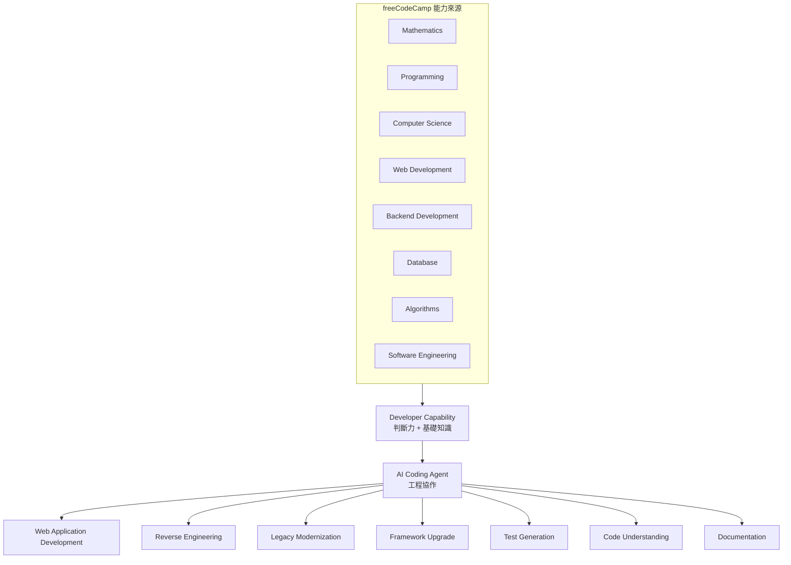

### 1.4 本手冊「不是」什麼

| 本手冊不是 | 原因 |
|-----------|------|
| freeCodeCamp 官方文件的翻譯 | 內容經重新整理，並加入企業觀點；細節請回官方文件查證 |
| 企業正式架構規範 | freeCodeCamp 課程是教學用途，不是 Production Standard |
| AI 工具的評比報告 | 本手冊不對 AI 工具能力做未經證實的宣稱 |
| 認證代考指南 | 認證專案必須由本人完成（Academic Honesty Policy） |

### 1.5 實務案例與注意事項

- **案例**：某團隊導入 AI Coding Agent 三個月後，發現 PR 退回率反而上升。Root Cause 是新進工程師無法判斷 Agent 產生的 SQL 是否有 N+1 問題、是否有 Injection 風險。改善方式是要求新進人員先完成 freeCodeCamp 的 Relational Databases 相關課程，再進入 AI 協作開發。
- **注意**：本手冊引用的版本號會過期，請在每季度的內部訓練更新時，重新核對第 4–10 章的版本資訊。

---

## 2. freeCodeCamp 簡介

### 2.1 freeCodeCamp 是什麼 `[Official]`

依官方 README 說明，freeCodeCamp.org 是一個「讓你可以免費學習寫程式的友善社群」，由**捐款支持的非營利組織**營運，目標是協助成年人轉職進入科技產業。

| 面向 | 說明 |
|------|------|
| 組織型態 | 非營利組織（donor-supported nonprofit） |
| 收費模式 | 課程與認證完全免費 |
| 原始碼 | 平台與課程在 GitHub 公開（`freeCodeCamp/freeCodeCamp`） |
| 程式碼授權 | BSD-3-Clause（`LICENSE.md`） |
| 課程內容版權 | `/curriculum` 目錄內容另有版權聲明（Copyright © freeCodeCamp.org），詳見第 31 章 |
| 學習方式 | 瀏覽器內互動式課程、Workshop、Lab、Quiz、Exam |
| 社群 | Forum、Discord、YouTube、News（技術文章出版） |

### 2.2 學習模式 `[Official]`

依 contribute 文件，目前核心課程是**第 9 版（v9）**，包含五種學習單元：

| 單元 | 說明 | 在企業訓練中的價值 |
|------|------|------------------|
| Theory Lesson（Lecture） | 簡短的文字講解與互動範例 | 建立概念 |
| Workshop | 逐步引導完成一個小專案 | 模仿與手感 |
| Lab | 自行解題完成專案 | 獨立解題能力 |
| Review | 該 Module 的概念總整理 | 複習 |
| Quiz | 進入下一個 Module 前的測驗 | 檢核 |

每張認證需要完成 **5 個必要專案（required projects）** 才能參加考試（Exam），通過考試後才能領取認證。考試在官方開源的 **Exam Environment 桌面 App** 中進行（詳見 13.3 節）。

**課程演進時間軸** `[Official]`：

| 時間 | 事件 | 對企業訓練的影響 |
|------|------|----------------|
| 2024–2025 | 推出 v9 **Full-Stack Developer Curriculum**（Beta），課程總量約 1,800 小時 | 單一長路徑，學員難以在一年內取得階段性成果 |
| 2025-09-18 | 宣布改為 **6 張 Checkpoint Certification**（每張約 300 小時）＋ Capstone | 可按季規劃訓練里程碑 |
| 2025-11-13 | 課程重組：Full-Stack 內容拆回各認證；舊課程移到 [Archive](https://www.freecodecamp.org/learn/archive/)，學習進度保留 | 內部文件中的舊課程連結需要更新 |
| 2025-12 | Responsive Web Design（12-02）、JavaScript（12-08）、Python（12-15）新認證開放考試；Relational Databases 同年上線 | 前四張認證可以直接納入訓練計畫 |
| 2026 | Front End Libraries、Back End Development and APIs 新認證預定上線；課程預定結束 Beta ⚠️ 需確認目前版本 | 導入前請先確認官方課程頁是否已開放考試 |

### 2.3 Project-based Learning

freeCodeCamp 最重要的教學設計是「**做中學**」：

```text
Theory Lesson → Workshop（跟著做）→ Lab（自己做）→ Review → Quiz → Certification Project → Exam
```

這個流程與企業 AI Agent 協作的能力要求高度吻合：

| freeCodeCamp 訓練的能力 | 對 AI Agent 協作的意義 |
|------------------------|----------------------|
| 閱讀需求（User Stories）後實作 | 能寫出清楚的 Specification 給 Agent |
| 讓測試通過 | 能用測試驗證 Agent 的產出 |
| 除錯 | 能判斷 Agent 的錯誤在哪裡 |
| 獨立完成專案 | 能審查 Agent 產出的完整功能 |

### 2.4 Community 與 Open Source

- **Forum**：[forum.freecodecamp.org](https://forum.freecodecamp.org/)，提問與討論
- **Discord**：貢獻者與學習者的即時交流
- **News**：[freecodecamp.org/news](https://www.freecodecamp.org/news/)，大量技術教學文章
- **YouTube**：免費完整課程影片
- **GitHub**：整個平台都是開源，歡迎貢獻（詳見第 18 章）

### 2.5 實務案例與注意事項

- **注意**：freeCodeCamp 課程以 JavaScript / Python / SQL 為主，**沒有**涵蓋企業常用的 Java / Spring Boot / .NET 企業框架（雖有 Foundational C# with Microsoft 認證，屬基礎程度）。Java 團隊應把 freeCodeCamp 定位為 Web 基礎、演算法、SQL、Git 的訓練來源，而不是框架訓練來源。
- **建議** `[Engineering Recommendation]`：在企業學習平台登記學員的 freeCodeCamp 公開 Profile 連結，用認證頁面作為學習成果證明，不需自行建置學習紀錄系統。

---

## 3. freeCodeCamp 生態系

### 3.1 生態系總覽

```text
freeCodeCamp Ecosystem
├── Learning Platform ........ freecodecamp.org/learn（互動式學習介面）
├── Curriculum ............... Repository 中的 /curriculum（Markdown + JSON 結構）
├── Certifications ........... 6 張 Checkpoint 認證 + Certified Full Stack Developer + 語言認證 + C# 認證
├── Coding Challenges ........ Challenge、Daily Coding Challenge
├── Projects ................. Workshop、Lab、Certification Project
├── Documentation ............ contribute.freecodecamp.org（貢獻者文件）
├── Community ................ Discord、YouTube
├── Forum .................... forum.freecodecamp.org
├── News ..................... freecodecamp.org/news（技術出版）
├── GitHub Repository ........ freeCodeCamp/freeCodeCamp（平台主程式 Monorepo）
├── Contributor Ecosystem .... Issue、PR、Crowdin 翻譯、Moderator
├── Exam Environment ......... exam-env 桌面 App（認證考試）
├── AI Hints ................. Socrates（引導式 AI 提示服務）
└── Mobile / Related Projects  mobile、ui、curriculum-helpers、news、devdocs…
```

### 3.2 各元件的角色與關係

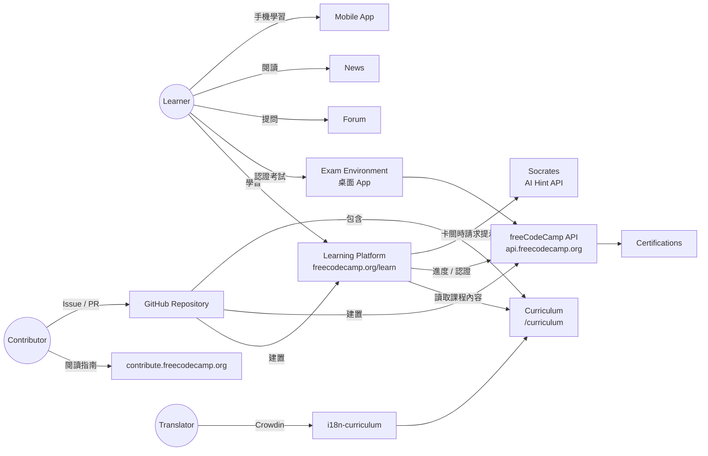

### 3.3 組織內相關 Repository（查證日期 2026-09-29）

| Repository | 主要語言 | 狀態 | 角色 |
|-----------|---------|------|------|
| `freeCodeCamp/freeCodeCamp` | TypeScript | 活躍 | 學習平台主程式與課程（Monorepo） |
| `freeCodeCamp/contribute` | MDX（Astro Starlight） | 活躍 | 貢獻者文件站原始碼 |
| `freeCodeCamp/mobile` | Dart（Flutter） | 活躍 | 官方行動 App |
| `freeCodeCamp/ui` | TypeScript | 活躍 | UI Component Library（`@freecodecamp/ui`） |
| `freeCodeCamp/curriculum-helpers` | TypeScript | 活躍 | 課程測試共用函式庫，供多平台測試 Challenge |
| `freeCodeCamp/exam-env` | TypeScript（Tauri） | 活躍 | **Exam Environment 桌面 App**：認證考試的安全作答環境（BSD-3-Clause） |
| `freeCodeCamp/socrates` | TypeScript（Fastify） | 活躍 | **Socrates AI 提示 API**：學習者卡關時提供「不洩漏答案」的引導式提示 |
| `freeCodeCamp/news` | TypeScript | 活躍 | News 出版平台（11ty + Ghost） |
| `freeCodeCamp/devdocs` | Ruby | 活躍 | API 文件瀏覽器（DevDocs） |
| `freeCodeCamp/freeCodeCampOS` | Rust | 活躍 | 官方描述為「Test repo for external freeCodeCamp courses」；實際角色 ⚠️ 需確認目前版本 |
| `freeCodeCamp/classroom` | JavaScript | 活躍 | ⚠️ 需確認目前版本（無官方描述） |
| `freeCodeCamp/chapter` | TypeScript | **已封存（Archived）** | 歷史專案（非營利活動管理工具），不應再作為學習或引用對象 |

> ⚠️ Repository 的狀態會改變。引用前請先用 `gh repo view freeCodeCamp/<name>` 或 GitHub 頁面確認是否 Archived。

### 3.4 實務案例與注意事項

- **案例**：想練習 Flutter 行動開發的團隊，可以用 `freeCodeCamp/mobile` 作為 Reverse Engineering 的練習對象（contribute 文件有 mobile 本機設定指南）。
- **注意**：不要把 `chapter` 等已封存專案當作最佳實踐範本；封存代表不再維護，相依套件可能已有漏洞。

---

## 4. GitHub Repository

### 4.1 基本資訊 `[Official]`

| 項目 | 值（2026-09-29 查證） |
|------|---------------------|
| Repository | `freeCodeCamp/freeCodeCamp` |
| Default Branch | `main` |
| 主要語言 | TypeScript |
| 授權 | BSD-3-Clause |
| 規模 | 約 456k stars、47k forks、42k+ commits |
| Package Manager | pnpm（`packageManager: pnpm@10.33.3`） |
| Build Orchestration | Turborepo（`turbo 2.10.0`） |
| Node.js 要求 | `engines.node >= 24`；`.nvmrc` 為 `24` |
| pnpm 要求 | `engines.pnpm >= 10` |
| TypeScript | 5.9.x |

### 4.2 根目錄一覽

```text
freeCodeCamp/
├── .devcontainer/        # Dev Container / GitHub Codespaces 設定
├── .github/              # GitHub Actions workflows、Issue/PR 範本
├── .husky/               # Git hooks（commit 前執行 lint-staged）
├── api/                  # 後端 API（Fastify + Prisma + MongoDB）
├── client/               # 前端學習平台（Gatsby + React + Redux）
├── curriculum/           # 課程內容（Markdown + JSON 結構）
├── docker/               # 本機開發用 docker compose（MongoDB、Mailpit）
├── e2e/                  # Playwright End-to-End 測試
├── packages/             # 共用套件（challenge-builder、challenge-linter、eslint-config、shared）
├── tools/                # 開發工具（challenge 編輯器、parser、seed 腳本…）
├── .nvmrc                # Node.js 版本
├── package.json          # Root scripts（build、develop、test、seed…）
├── pnpm-workspace.yaml   # Workspace 定義與供應鏈安全設定
├── renovate.json         # Renovate 自動更新相依套件
├── knip.jsonc            # Knip：找出未使用的檔案 / 相依套件
├── sample.env            # 環境變數範本
├── tsconfig-base.json    # 共用 TypeScript 設定
└── turbo.json            # Turborepo pipeline 設定
```

### 4.3 Root scripts 重點 `[Official]`

以下依用途分組整理 Root `package.json` 的 scripts（2026-09-29 查證，共 50 餘個；完整清單請以 `jq .scripts package.json` 為準）：

| 分組 | Script | 作用 |
|------|--------|------|
| 開發 | `develop` | `turbo develop`，同時啟動 API（:3000）與 Client（:8000） |
| 開發 | `develop:api`／`develop:client` | 分別啟動 API 或 Client |
| 開發 | `start` | `turbo setup` 後，同時啟動 API server 與已建置的 Client（`serve:client`） |
| 建置 | `build` | `turbo build`，依相依順序建置所有 Package |
| 建置 | `build:client`／`build:api`／`build:curriculum` | 以 `turbo -F=<package>` 分別建置 |
| 測試 | `test` | `turbo test`，執行所有 Vitest 測試 |
| 測試 | `test-client`／`test-api` | 分別測試 Client／API |
| 測試 | `test-curriculum-content` | 驗證課程內容（每個 Challenge 的 solutions 必須通過 hints 測試） |
| 測試 | `playwright:install-build-tools` | 安裝 Playwright 瀏覽器與系統相依（WSL 首次必做） |
| 測試 | `playwright:run`／`playwright:watch` | 執行 E2E 測試／監看模式 |
| 品質 | `lint` | `turbo type-check` → `turbo lint` → Root lint（prettier + stylelint） |
| 品質 | `format` | `eslint --fix` + `prettier --write` |
| 品質 | `knip`／`knip:all` | 以 Knip 找出未使用的檔案／相依／匯出 |
| 品質 | `audit-challenges` | 稽核課程 Challenge（在 `curriculum/` 執行） |
| Seed | `seed` | 建立問卷、考試資料與本機示範使用者 |
| Seed | `seed:certified-user` | 建立「已取得認證」的測試使用者（E2E 測試需要） |
| Seed | `seed:donating-user` | 建立「捐款中」狀態的測試使用者（測試捐款相關畫面） |
| Seed | `seed:daily-challenges` | 匯入每日程式挑戰資料 |
| Seed | `seed:exams`／`seed:env-exam` | 建立考試資料／Exam Environment 用考試資料 |
| 課程工具 | `create-new-project` | 互動式 CLI 建立 Workshop／Lab／Lecture／Review／Quiz Block |
| 課程工具 | `create-new-quiz`／`create-new-language-block` | 建立 Quiz／語言課程 Block |
| 課程工具 | `rename-challenges` | 依標題重新命名 Challenge 檔案 |
| 課程工具 | `challenge-editor-setup`／`challenge-editor` | 初始化並啟動課程編輯器（git submodule） |
| i18n | `i18n-sync` | 同步多語系資料 |
| 維護 | `clean`／`clean-and-develop` | 清除建置產物與 `node_modules` 後重建 |
| 維護 | `clean:turbo` | 清除 Turborepo 快取目錄 |
| 分析 | `analyze-bundle` | 以 webpack-bundle-analyzer 檢視前端 Bundle 大小 |

> 表中的 script 都以 `pnpm run <script>` 執行。

### 4.4 實務案例與注意事項

- **案例**：Architect 在評估公司 Monorepo 工具鏈時，可以直接參考 freeCodeCamp 的 `pnpm-workspace.yaml` + `turbo.json` 組合，觀察一個大型開源專案如何管理多個 Package 的建置順序與快取。
- **注意**：`package.json` 中的 scripts 會隨版本變動。在寫內部 SOP 前，請以 `cat package.json | jq .scripts` 取得最新清單。

---

## 5. 系統架構

本章從 Software Architecture 角度分析 freeCodeCamp 學習平台。內容來自原始碼目錄與相依套件分析；**正式環境的部署拓撲、資料庫規模等細節並未完整公開，屬 ⚠️ 需確認目前版本**。

### 5.1 Frontend `[Official]`

| 面向 | 技術（`client/package.json`） | 說明 |
|------|------------------------------|------|
| Framework | **Gatsby 5.16** + **React 18.3** | 以 Gatsby 產生靜態頁面（課程頁面在 Build Time 由 Curriculum 產生），再以 React 在瀏覽器端執行互動 |
| State Management | **Redux 4.2** + `@reduxjs/toolkit` 2.11 + **redux-saga 1.4** + reselect 4.1 | 使用者狀態、Challenge 進度、編輯器狀態；Side effect（呼叫 API、執行測試）由 saga 處理 |
| Routing | Gatsby 檔案式路由 + `client-only-routes` | 課程頁面由 `gatsby-node.ts` 動態建立；部分頁面（例如使用者設定）為 client-only |
| Components | `client/src/components`、`@freecodecamp/ui` 6.x | 共用 UI 元件來自獨立的 `freeCodeCamp/ui` Repository |
| Styling | CSS + Tailwind CSS（`tailwind.config.js`）+ PostCSS 8 | 另有 stylelint 規範 |
| Code Editor | **monaco-editor 0.55** | 瀏覽器內程式碼編輯器（與 VS Code 同核心） |
| Terminal | **@xterm/xterm 6** | 瀏覽器內終端機模擬 |
| i18n | i18next 25 + react-i18next | 多語系介面 |
| Test | **Vitest 4** + Testing Library | 單元測試 |

**Browser execution**：學習者在瀏覽器撰寫的程式碼，會由前端在瀏覽器內執行並跑 Challenge 的測試（hints），這是 freeCodeCamp 能大規模免費運作的關鍵設計之一：**測試運算發生在使用者端，而不是伺服器端**。

`client/src` 主要目錄：

| 目錄 | 角色 |
|------|------|
| `pages/` | Gatsby 頁面 |
| `templates/` | Challenge、Superblock 等頁面範本（由 `gatsby-node.ts` 使用） |
| `components/` | 共用元件 |
| `redux/` | Store、reducer、saga、selector |
| `client-only-routes/` | 只在瀏覽器端渲染的路由（例如 Settings、Profile） |
| `services/` | 呼叫 API 的服務層 |
| `utils/` | 工具函式 |
| `analytics/` | 分析追蹤 |
| `__tests__/` | 測試 |

### 5.2 Backend `[Official]`

| 面向 | 技術（`api/package.json`） | 說明 |
|------|--------------------------|------|
| Web Framework | **Fastify 5.8** | 高效能 Node.js Web Framework |
| Schema / Validation | **TypeBox** + `@fastify/type-provider-typebox` | 以 JSON Schema 定義 Request / Response，並產生 TypeScript 型別 |
| API 文件 | `@fastify/swagger` + `@fastify/swagger-ui` | 本機可在 `http://localhost:3000/documentation` 瀏覽 |
| ORM | **Prisma 6.19**（MongoDB provider） | 型別安全的資料存取 |
| Authentication | Auth0 plugin、`@fastify/oauth2`、JWT（`jsonwebtoken` 9）、Cookie、本機開發用 `auth-dev` | 開發模式可用 `FCC_ENABLE_DEV_LOGIN_MODE` 免帳密登入 |
| Security | `@fastify/csrf-protection`、CORS plugin、`security` plugin、`bouncer` plugin | CSRF 防護、跨來源控制 |
| Logging | pino | 結構化日誌 |
| Monitoring | Sentry（`@sentry/node` 10 + `@sentry/profiling-node`） | 錯誤追蹤與效能 Profiling |
| Feature Flag | GrowthBook | 功能開關與實驗 |
| Payment | Stripe（捐款） | |
| Email | nodemailer（本機搭配 Mailpit）、正式環境為 SES | |
| Test | **Vitest 4** | 每個 route / plugin 都有對應 `.test.ts` |

`api/src` 主要結構：

| 路徑 | 角色 |
|------|------|
| `server.ts` / `app.ts` | 伺服器進入點與 Fastify App 組裝 |
| `routes/public/` | 不需登入的路由（auth、certificate 查詢、status、signout、email-subscription…） |
| `routes/protected/` | 需要登入的路由（challenge 提交、certificate 申請、settings、user、donate、socrates…） |
| `routes/apps/`、`routes/helpers/` | 其他應用路由與共用輔助 |
| `plugins/` | Fastify plugins：auth、auth0、csrf、cors、cookies、error-handling、mailer、growth-book… |
| `schemas/` | TypeBox schema（Request / Response 契約） |
| `db/` | 資料庫存取 |
| `exam-environment/` | 考試環境相關功能 |
| `daily-coding-challenge/` | 每日程式挑戰 |
| `utils/` | 工具函式 |

> **Socrates（AI-powered hints）**：API 端的 `routes/protected/socrates.ts` 負責驗證登入、記錄用量（`SocratesUsage` Model），再以 `SOCRATES_API_KEY`／`SOCRATES_ENDPOINT` 呼叫獨立部署的 [Socrates 服務](https://github.com/freeCodeCamp/socrates)。Socrates 本身是另一個 Fastify + TypeScript 專案，收到學習者程式碼、題目說明與失敗的測試後，回傳「**只引導、不給答案**」的提示。它的架構設計詳見 19.4 節，可以作為企業內部 AI 助教的參考範本。

### 5.3 Data Layer `[Official]`

- **資料庫**：MongoDB（`api/prisma/schema.prisma` 的 datasource provider 為 `mongodb`；本機 `MONGOHQ_URL=mongodb://127.0.0.1:27017/freecodecamp`）
- **Schema 檔案**：`schema.prisma`、`exam-environment.prisma`、`exam-creator.prisma`
- **主要 Model（摘錄）**：

| Model | 用途推論 |
|-------|---------|
| `user` | 使用者資料、進度、已完成 Challenge、認證狀態 |
| `AccessToken` / `AuthToken` / `UserToken` | 認證與 Token |
| `sessions` | Session |
| `Donation` / `DonationClaim` | 捐款 |
| `Exam` / `Survey` | 考試與問卷 |
| `DailyCodingChallenges` | 每日挑戰 |
| `SocratesUsage` | AI 提示使用量 |
| `MsUsername` | Microsoft 帳號連結（C# 認證相關） |

**Curriculum 不存在資料庫**：課程內容是 Repository 中的 Markdown 檔案，在 Build Time 被解析並產生前端頁面；使用者進度（完成了哪些 Challenge ID）才存在資料庫。這是一個「**Content as Code**」的設計。

### 5.4 Content / Curriculum `[Official]`

| 層級 | 定義位置 | 說明 |
|------|---------|------|
| Curriculum | `curriculum/structure/curriculum.json` | 所有 Superblock 與 Certification 的清單 |
| Superblock | `curriculum/structure/superblocks/<superblock>.json` | 定義 Chapter / Module / Block 組成 |
| Block | `curriculum/structure/blocks/<block>.json` | Block metadata 與 Challenge 順序（目前約 1000 個） |
| Challenge | `curriculum/challenges/english/blocks/<block>/<challenge>.md` | 單一課程內容與測試 |
| Certification | `curriculum/challenges/english/certifications/<cert>.yml` | 認證定義 |
| 翻譯 | `curriculum/i18n-curriculum`（git submodule） | 由 Crowdin 同步 |

詳見第 12 章。

### 5.5 Build / Deployment `[Official]`

| 面向 | 做法 |
|------|------|
| Build | Turborepo 依相依關係建置 curriculum → client / api |
| Package | pnpm workspaces；`allowBuilds` 白名單控制哪些套件可執行 install script |
| Test | Vitest（api / client / curriculum）、Playwright（e2e） |
| CI | GitHub Actions `node.js-tests.yml`：Lint → Build → Test → E2E（ubuntu-24.04；Actions 以 commit SHA pin 版本） |
| CD | `deploy-client.yml`（依語系 matrix 建置 `client/public` 後部署）、`deploy-api.yml`、`docker-docr.yml`／`docker-ghcr.yml`（API container image，分別推送到 DigitalOcean Container Registry 與 GHCR）、`docker-docr-cleanup.yml`（清理舊 image） |
| E2E | `e2e-playwright.yml`（Playwright 端到端測試）；`devcontainer-ci.yml` 驗證 Dev Container 可正常建置 |
| i18n | `crowdin-upload.*`／`crowdin-download.*`（Crowdin 同步）、`curriculum-i18n-submodule.yml`（更新翻譯 submodule）、`i18n-validate-builds.yml`／`i18n-validate-prs.yml`、`github-no-i18n-via-prs.yml`（禁止直接用 PR 修改翻譯） |
| Repository 治理 | `github-pr-guidelines.yml`（檢查 PR 是否符合規範）、`github-spam.yml`（垃圾 PR 防護）、`github-autoclose.yml`、`github-labeler.yaml`、`github-lock-closed-prs.yml` |
| Dependency | Renovate（`renovate.json`） |

> 正式環境的主機、負載平衡、資料庫叢集等配置 ⚠️ 需確認目前版本；本手冊只描述 Repository 中可見的部分。

### 5.6 實務案例與注意事項

- **學習點**：freeCodeCamp 是「**靜態產生前端 + API 後端 + 內容即程式碼**」的典型案例。對於需要大量靜態內容、同時需要使用者狀態的系統（例如企業內部教育訓練平台），這個架構值得參考。
- **注意**：不要因為 freeCodeCamp 用 MongoDB，就推論企業系統也應該用 MongoDB。技術選型必須依自身需求（交易一致性、報表、既有團隊技能）評估，並寫成 ADR。

---

## 6. Repository Architecture

### 6.1 從 Repository 到 Certification

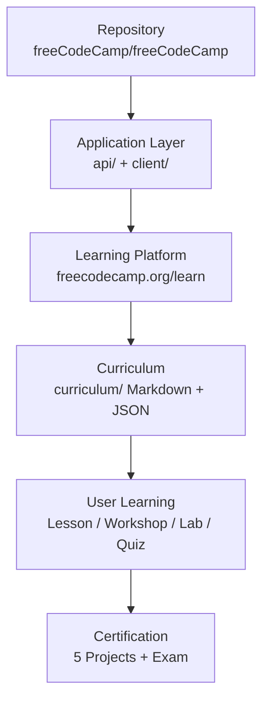

### 6.2 目錄角色詳解

| 目錄 | 在系統中扮演的角色 | 誰會常改 | AI Agent 分析時的重點 |
|------|------------------|---------|---------------------|
| `api/` | 唯一的後端服務：認證、使用者資料、進度、認證申請、捐款、考試 | 平台工程師 | Route → Schema → Plugin → Prisma 的呼叫鏈 |
| `client/` | 學習者看到的所有畫面；在瀏覽器內執行學習者程式碼與測試 | 前端工程師 | `gatsby-node.ts` 如何把 curriculum 轉成頁面；Redux saga 流程 |
| `curriculum/` | 課程內容本體；Build Time 被解析成資料 | 課程設計者、貢獻者 | Challenge Markdown 格式、structure JSON |
| `packages/challenge-builder` | 把 Challenge 組裝成可執行的預覽 / 測試環境 | 平台工程師 | 被 client 與 curriculum 測試共用 |
| `packages/challenge-linter` | 檢查 Challenge Markdown 格式 | 課程維護者 | Lint 規則即課程格式規範 |
| `packages/eslint-config` | 全 Repository 共用 ESLint 規則 | 平台工程師 | 程式碼風格的真實依據 |
| `packages/shared` | api / client 共用的型別與工具 | 平台工程師 | 前後端共用契約 |
| `tools/challenge-parser` | 把 Challenge Markdown 解析成結構化資料 | 平台工程師 | Markdown → JSON 的轉換規則 |
| `tools/challenge-helper-scripts` | 建立 / 插入 / 刪除 / 重新排序 Challenge 的 CLI | 課程貢獻者 | `create-new-project` 等指令 |
| `tools/challenge-editor` | 課程編輯器（git submodule） | 課程貢獻者 | 需另外 `challenge-editor-setup` |
| `tools/client-plugins` | Gatsby 自訂 plugins | 平台工程師 | Build pipeline 擴充點 |
| `tools/daily-challenges` | 每日挑戰資料 | 平台工程師 | |
| `tools/scripts/seed*` | 本機資料庫 Seed 腳本 | 所有開發者 | 本機測試資料來源 |
| `e2e/` | Playwright E2E 測試（約 90+ 個檔案） | 所有開發者 | 可當作「系統行為規格」閱讀 |
| `docker/` | 本機 MongoDB / Mailpit、API image、devcontainer | DevOps | `docker-compose.yml` |
| `.devcontainer/` | Codespaces / Dev Container | 所有開發者 | 一鍵環境 |
| `.github/workflows/` | CI/CD、i18n、垃圾 PR 防護 | DevOps / Maintainer | 真實 CI 流程 |
| `.husky/` | Git hooks | 所有開發者 | commit 前自動 lint |

### 6.3 Package 相依關係

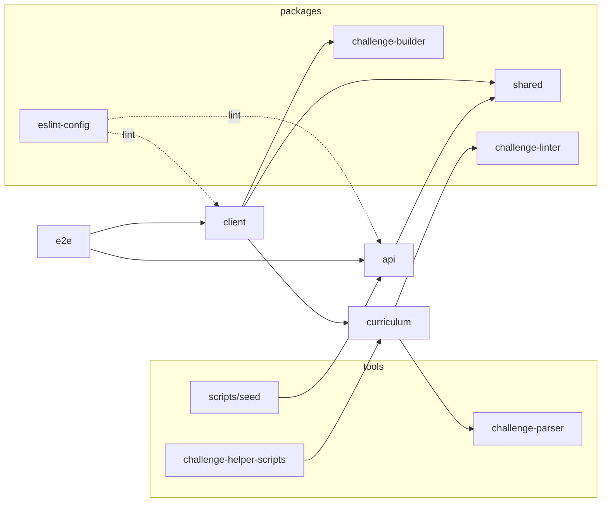

> 上圖為依 `pnpm-workspace.yaml` 與目錄職責整理的**邏輯相依**，精確的套件相依請以各 `package.json` 的 `dependencies` 為準（可用 `pnpm why <pkg>` 或 `pnpm -r list --depth 0` 查詢）。

### 6.4 用 AI Agent 快速建立 Repository Map

```text
你是 Senior Software Architect。請閱讀 freeCodeCamp Repository，不要修改任何檔案。

1. 讀取 pnpm-workspace.yaml、turbo.json、根目錄 package.json。
2. 列出每一個 workspace package 的名稱、路徑、主要相依套件、build / test script。
3. 畫出 package 之間的相依關係（Mermaid flowchart）。
4. 對每一個頂層目錄，用一句話說明它在系統中的角色。
5. 標出你「不確定」的推論，並說明需要讀哪個檔案才能確認。

輸出格式：Markdown，包含表格與 Mermaid 圖。
```

### 6.5 實務案例與注意事項

- **案例**：新進 Senior Developer 的第一週任務，可以設定為「用 AI Agent 產出 freeCodeCamp 的 Repository Map，再由自己逐項驗證」。這同時訓練了 Code Understanding 與「不盲信 AI」的習慣。
- **注意**：AI Agent 常把「目錄名稱」直接當成「職責」（例如看到 `tools/` 就說是工具）。務必要求它**引用實際檔案**作為推論依據。

---

## 7. 安裝

### 7.1 系統需求 `[Official]`

依 contribute 文件「How to Set Up freeCodeCamp Locally」：

| 項目 | 本機直接安裝 | 使用 Docker／Codespaces |
|------|------------|----------------------|
| Node.js | **24.x**（Active LTS） | 由 Dev Container 提供 |
| pnpm | **10.x**（以 corepack 啟用） | 由 Dev Container 提供 |
| Git | 最新版 | 最新版 |
| Docker Compose | **2.x**（啟動 MongoDB／Mailpit） | 內建 |
| MongoDB Community Server | **8.x**（使用 Docker 時可不用另外安裝；Docker 版以 replica set 模式執行） | 內建 |
| CPU | 4 cores | **4 cores** |
| RAM | 8 GB | **16 GB**（Codespaces 請選「4-core, 16 GB RAM」機型） |
| 磁碟 | 10 GB 可用空間 | 依 Codespaces 機型 |
| 作業系統 | macOS 或 Linux；**Windows 必須使用 WSL2** | 任何可開瀏覽器的環境 |

> 官方文件特別提醒：**使用與文件列出不同的版本，是安裝失敗最常見的原因。**

### 7.2 Windows（WSL2）

官方要求 Windows 使用者**先安裝 WSL2，再在 WSL2 內依照一般流程操作**，並建議使用 Windows Terminal，而**不是** Command Prompt、Git Bash 或 PowerShell。

```powershell
# 在 PowerShell（系統管理員）執行
wsl --install
# 重開機後，設定 Ubuntu 使用者帳號
wsl -l -v   # 確認 VERSION 為 2
```

進入 WSL（Ubuntu）後：

```bash
# 更新套件
sudo apt update && sudo apt upgrade -y

# 安裝 Git
sudo apt install -y git

# 安裝 nvm 管理 Node.js（請至 nvm 官方 Repository 確認最新安裝指令）
# 安裝完成後：
nvm install 24
nvm use 24

# 以 corepack 啟用 pnpm（Node.js 內建）
corepack enable
corepack prepare pnpm@10 --activate

node -v && pnpm -v
```

**Docker**：在 Windows 安裝 Docker Desktop，並在 Settings → Resources → WSL Integration 啟用你的 Ubuntu distro。

> ⚠️ **重要**：請把 Repository clone 在 WSL 的 Linux 檔案系統（例如 `~/projects/`），**不要**放在 `/mnt/c/Users/...`。官方 Troubleshooting 指出，放在 Windows 與 WSL 共用的目錄會有效能與穩定性問題。

### 7.3 macOS

```bash
# 安裝 Homebrew（若尚未安裝，請至 brew.sh 取得官方指令）
brew install git

# 使用 nvm 或其他 Node 版本管理工具
nvm install 24
nvm use 24

corepack enable
corepack prepare pnpm@10 --activate

# 安裝 Docker Desktop（或其他相容 Docker Compose 2.x 的方案）
docker compose version
```

### 7.4 Linux（Ubuntu / Debian 為例）

```bash
sudo apt update
sudo apt install -y git curl build-essential

nvm install 24 && nvm use 24
corepack enable && corepack prepare pnpm@10 --activate

# 安裝 Docker Engine 與 Compose plugin（依 Docker 官方文件）
docker compose version

# 讓目前使用者可以不用 sudo 執行 docker
sudo usermod -aG docker $USER   # 重新登入後生效
```

### 7.5 GitHub Codespaces / Dev Container（替代方案）

官方提供 `.devcontainer/` 設定，可直接在 GitHub Codespaces 開啟完整開發環境，適合：

- 公司電腦權限受限、無法安裝 Docker / WSL2
- 只需要短時間修改課程內容
- 教育訓練課堂上需要所有學員環境一致

Codespaces 操作要點 `[Official]`：

| 步驟 | 說明 |
|------|------|
| 1. 選擇機型 | 建立 Codespace 時選「**4-core, 16 GB RAM**」，規格較低時 `pnpm install` 與 Gatsby 建置容易失敗或非常慢 |
| 2. 設定位址 | Codespaces 的網路位址不是 `localhost`，要執行 `.devcontainer/codespace-env.sh` 把 `.env` 中的 `HOME_LOCATION`／`API_LOCATION` 改成轉發後的網址（詳見第 34 章） |
| 3. Port 可見性 | **Port 3000（API）必須設為 Public**，否則 Client 呼叫 API 時會發生 CORS 錯誤 |
| 4. 用完即停 | Public port 任何人拿到網址都能存取，而開發登入模式不需要密碼，**用完務必停止 Codespace**（見 9.5 節） |

### 7.6 版本驗證清單

```bash
git --version
node -v                 # 應為 v24.x
pnpm -v                 # 應為 10.x
docker compose version  # 應為 v2.x
```

### 7.7 實務案例與注意事項

- **案例**：企業代理伺服器（Proxy）環境下 `pnpm install` 失敗。官方文件提醒「受限網路或防火牆可能阻擋下載」。解法是設定 `HTTPS_PROXY`，並向資安單位申請 registry.npmjs.org、github.com、Docker Hub 的白名單。
- **注意**：公司若有內部 npm mirror（例如 Nexus / Artifactory），請確認 mirror 同步的套件版本符合 `pnpm-lock.yaml`，否則會出現 lockfile 不一致錯誤。

---

## 8. 開發環境

### 8.1 VS Code 建議設定 `[Engineering Recommendation]`

| Extension | 用途 |
|-----------|------|
| WSL（Windows 使用者） | 在 WSL 內開啟專案 |
| Dev Containers | 使用 `.devcontainer` |
| ESLint | 與 `packages/eslint-config` 同步的即時檢查 |
| Prettier | 格式化（Repository 有 `.prettierrc`） |
| Stylelint | CSS 規則（`.stylelintrc.json`） |
| Prisma | `.prisma` 語法支援 |
| Playwright Test for VS Code | 執行 / 除錯 E2E 測試 |
| GitHub Pull Requests | PR 審查 |
| 公司核准的 AI Coding 擴充套件 | 依公司政策 |

```jsonc
// .vscode/settings.json（個人設定，勿提交到 freeCodeCamp Repository）
{
  "editor.formatOnSave": true,
  "editor.defaultFormatter": "esbenp.prettier-vscode",
  "eslint.workingDirectories": [{ "mode": "auto" }],
  "typescript.tsdk": "node_modules/typescript/lib"
}
```

### 8.2 GitHub 帳號準備

1. 建立或使用個人 GitHub 帳號（**不要**使用公司機密 Repository 所在的帳號去 Fork 公開專案時洩漏公司資訊）
2. 啟用 2FA
3. 設定 SSH Key 或使用 GitHub CLI（`gh auth login`）
4. 設定 commit 身分：

```bash
git config --global user.name "Your Name"
git config --global user.email "you@example.com"
```

### 8.3 Repository Clone `[Official]`

```bash
# 1. 在 GitHub 上 Fork：https://github.com/freeCodeCamp/freeCodeCamp/fork

# 2. Clone 自己的 Fork（--depth=1 只抓最新一個 commit，大幅減少下載量）
git clone --depth=1 https://github.com/YOUR_USER_NAME/freeCodeCamp.git
cd freeCodeCamp

# 3. 加入 upstream（官方 Repository），之後用來同步最新程式碼
git remote add upstream https://github.com/freeCodeCamp/freeCodeCamp.git

# 4. 初始化 git submodule（例如 curriculum/i18n-curriculum 翻譯內容）
git submodule update --init
```

各命令的目的：

| 命令 | 目的 |
|------|------|
| `git clone --depth=1 <fork>` | 下載自己 Fork 的最新版本；淺層 clone 節省時間與空間 |
| `cd freeCodeCamp` | 進入專案根目錄，後續所有 `pnpm` 指令都在這裡執行 |
| `git remote add upstream <official>` | 讓本機知道官方 Repository 位置，以便 `git fetch upstream` 同步 |
| `git submodule update --init` | 下載 Repository 所引用的 submodule；少了這一步，建置或課程測試可能因找不到檔案而失敗 |
| `git remote -v` | 確認 `origin` 指向自己的 Fork、`upstream` 指向官方 |
| `git branch` | 查看目前所在分支（應為 `main`，但**不要**直接在 `main` 上開發） |
| `git status` | 確認工作目錄是乾淨的，沒有未提交的變更 |

```bash
git remote -v
# origin    https://github.com/YOUR_USER_NAME/freeCodeCamp.git (fetch)
# origin    https://github.com/YOUR_USER_NAME/freeCodeCamp.git (push)
# upstream  https://github.com/freeCodeCamp/freeCodeCamp.git (fetch)
# upstream  https://github.com/freeCodeCamp/freeCodeCamp.git (push)

git branch
# * main

git status
# On branch main
# nothing to commit, working tree clean
```

> 淺層 clone 之後若需要完整歷史（例如做 `git log` 分析、`git blame`），可執行 `git fetch --unshallow`。Reverse Engineering 練習通常需要完整歷史。

### 8.4 實務案例與注意事項

- **案例**：Reverse Engineering 訓練時，學員用 `--depth=1` clone，結果 AI Agent 無法用 `git log -p` 追溯某段程式碼的演進原因。解法：訓練用 clone 改為完整 clone，或事後 `git fetch --unshallow`。
- **注意**：`.vscode/`、個人 AI Agent 設定檔（例如 `CLAUDE.md`、`.cursorrules`）若只是個人使用，請加到 `.git/info/exclude`，避免誤提交到開源專案。

---

## 9. Configuration

### 9.1 建立 `.env` `[Official]`

```bash
cp sample.env .env
```

本機開發時，`sample.env` 的預設值**大多不需要修改**即可運作。

### 9.2 `sample.env` 分組說明

| 分組 | 代表變數 | 本機是否需要修改 | 說明 |
|------|---------|----------------|------|
| Database | `MONGOHQ_URL` | 否 | 預設連到本機 `127.0.0.1:27017/freecodecamp` |
| Logging | `SENTRY_DSN`、`SENTRY_CLIENT_DSN`、`SENTRY_ENVIRONMENT`、`SENTRY_TRACES_SAMPLE_RATE`、`SENTRY_PROFILE_SESSION_SAMPLE_RATE`、`SENTRY_LOGS_*_SAMPLE_RATE` | 否 | 本機可用假值；取樣率變數用來控制正式環境的追蹤與日誌量 |
| Auth0 | `AUTH0_CLIENT_ID`、`AUTH0_CLIENT_SECRET`、`AUTH0_DOMAIN` | 否 | 本機使用 dev login mode |
| Secrets | `SESSION_SECRET`、`COOKIE_SECRET`、`JWT_SECRET` | 否（本機）；**正式環境必須是高強度隨機值** | Session / Cookie / JWT 加密 |
| Search | `ALGOLIA_APP_ID`、`ALGOLIA_API_KEY` | 否 | 搜尋列 |
| Payment | `STRIPE_*`、`PAYPAL_*`、`PATREON_CLIENT_ID` | 否 | 捐款 |
| Third-party App | `TPA_API_BEARER_TOKEN` | 否 | 第三方應用程式呼叫 API 時使用的 Bearer Token |
| Analytics | `GROWTHBOOK_*` | 否 | Feature Flag |
| Socrates | `SOCRATES_API_KEY`、`SOCRATES_ENDPOINT` | 否 | AI 提示服務 |
| Paths | `HOME_LOCATION`、`API_LOCATION`、`FORUM_LOCATION`、`NEWS_LOCATION`、`RADIO_LOCATION` | Codespaces 時需要改前兩個 | 預設 `localhost:8000`／`localhost:3000`；其餘指向 Forum、News、Radio 網址 |
| Build | `DEPLOYMENT_ENV`、`FREECODECAMP_NODE_ENV`、`CLIENT_LOCALE`、`CURRICULUM_LOCALE` | 視需要 | 建置目標與語系 |
| WIP 課程 | `SHOW_UPCOMING_CHANGES` | 課程開發時 | 顯示尚未上線的課程 |
| New API | `FCC_ENABLE_SWAGGER_UI`、`FCC_ENABLE_DEV_LOGIN_MODE`、`FCC_ENABLE_SENTRY_ROUTES`、`FCC_ENABLE_CLASSROOM`、`FCC_API_LOG_LEVEL`、`FCC_API_LOG_TRANSPORT`、`FCC_DRAIN_TIMEOUT_MS` | 視需要 | Swagger UI、開發登入、Sentry 測試路由、Classroom 功能開關、日誌等級與輸出方式、關機時等待連線結束的逾時（Graceful Shutdown） |
| Email | `EMAIL_PROVIDER=nodemailer`、`MAILPIT_HOST`、`SES_SMTP_*` | 否 | 本機用 Mailpit 攔截信件；正式環境經 SES SMTP 寄送 |
| Client | `GATSBY_UPDATE_SCHEMA_SNAPSHOT` | 新增 Challenge 屬性時 | 更新 Gatsby GraphQL schema 快照 |

### 9.3 開發加速變數 `[Official]`

contribute 文件說明可以用下列變數**只建置 / 測試特定課程**，大幅縮短時間：

```bash
# 只測試單一 Challenge
FCC_CHALLENGE_ID=646cf6cbca98e258da65c979 pnpm run test-curriculum-content

# 只測試單一 Block（使用 Block 的 dashedName，也就是資料夾名稱）
FCC_BLOCK='basic-html-and-html5' pnpm run test-curriculum-content

# 只測試單一 Superblock
FCC_SUPERBLOCK='responsive-web-design' pnpm run test-curriculum-content
```

同樣的變數也能套用在 `develop`，**只建置需要的課程頁面**，讓 Gatsby 開發伺服器更快啟動：

```bash
# 只建置 v9 Responsive Web Design 課程
FCC_SUPERBLOCK='responsive-web-design-v9' pnpm run develop

# 只建置單一 Block
FCC_BLOCK='workshop-curriculum-outline' pnpm run develop
```

| 情境 | 建議做法 |
|------|---------|
| 修改 API、不需看課程頁 | 用 `FCC_BLOCK` 指定一個小 Block，縮短 Client 建置時間 |
| 修改單一 Challenge 內容 | `FCC_CHALLENGE_ID` 搭配 `test-curriculum-content` |
| 課程重構、跨 Block 修改 | `FCC_SUPERBLOCK` 範圍測試，送 PR 前再跑完整 CI |

### 9.4 Configuration 安全原則

1. **`.env` 絕對不可提交**（Repository 的 `.gitignore` 已排除，但仍要自我檢查）
2. 本機假值（例如 `STRIPE_PUBLIC_KEY=pk_test_...`）只是範例，**不可**拿到任何可對外存取的環境
3. `FCC_ENABLE_DEV_LOGIN_MODE=true` 代表**不需密碼即可登入**，只能用在本機
4. 讓 AI Agent 讀取專案時，**要排除 `.env`**（詳見第 26、30 章）

### 9.5 實務案例與注意事項

- **案例**：學員在 Codespaces 中把 port 3000 設為 Public 後忘記關閉 Codespace。官方文件明確提醒：Public port 任何人拿到網址都能存取，而開發登入路由不需要密碼。**用完一定要停止 Codespace。**
- **企業延伸** `[Engineering Recommendation]`：freeCodeCamp 的 `sample.env` 是很好的「環境變數範本」教材：分組清楚、每組有註解、預設值可直接用於本機。企業專案可以仿照此格式建立自己的 `.env.example`。

---

## 10. Local Development

### 10.1 完整流程

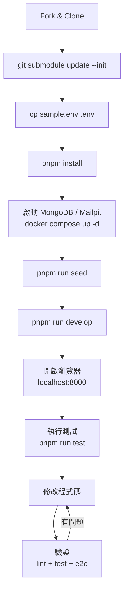

### 10.2 逐步操作 `[Official]`

以下假設已完成 8.3 節的 Fork、Clone、upstream 與 submodule 設定。

```bash
# Step 1 — 建立環境變數檔
cp sample.env .env

# Step 2 — 安裝相依套件
#（WSL 使用者請先執行：pnpm run playwright:install-build-tools）
pnpm install

# Step 3 — 啟動 MongoDB（與 Mailpit）
docker compose -f docker/docker-compose.yml -f docker/docker-compose.ports.yml up -d

# Step 4 — 建立本機測試資料
pnpm run seed
# 若需要「已認證」的測試使用者（E2E 測試需要）：
# pnpm run seed:certified-user

# Step 5 — 啟動開發伺服器（API + Client）
pnpm run develop
```

### 10.3 服務位址

| 服務 | 位址 | 說明 |
|------|------|------|
| Client（學習平台） | `http://localhost:8000` | Gatsby 開發伺服器 |
| API | `http://localhost:3000` | Fastify |
| API 文件（Swagger UI） | `http://localhost:3000/documentation` | 需 `FCC_ENABLE_SWAGGER_UI=true` |
| Mailpit | `http://localhost:8025` | 攔截本機寄出的 Email |
| MongoDB | `localhost:27017` | 由 docker compose 提供 |

### 10.4 測試指令

```bash
# 全部測試（turbo）
pnpm run test

# 只測 API / Client
pnpm run test-api
pnpm run test-client

# 課程內容測試（第一次需安裝 puppeteer）
pnpm -F=curriculum install-puppeteer
pnpm run test-curriculum-content

# Lint（type-check + eslint + prettier + stylelint）
pnpm run lint

# E2E（需先 seed:certified-user 並啟動 develop）
pnpm run playwright:run
# 或在 e2e 目錄下使用 Playwright UI 模式
npx playwright test --ui
```

### 10.5 開發迴圈

```text
修改程式碼
   ↓
儲存（Gatsby / tsx watch 自動重新載入）
   ↓
瀏覽器驗證
   ↓
執行相關單元測試（vitest --watch）
   ↓
pnpm run lint
   ↓
（若影響頁面行為）撰寫 / 執行 Playwright 測試
   ↓
git commit（husky + lint-staged 自動檢查）
```

### 10.6 常見問題速查

| 問題 | 可能原因 | 處理方式 |
|------|---------|---------|
| Node.js 版本錯誤 | 未使用 Node 24 | `nvm use`（讀取 `.nvmrc`）；`node -v` 確認 |
| pnpm 版本錯誤 | 全域 pnpm 太舊 | `corepack enable`，讓 `packageManager` 欄位決定版本 |
| Dependency 安裝失敗 | 網路 / Proxy / 防火牆 | 檢查網路；設定 Proxy；必要時改用 Codespaces |
| Build failure、缺字型或語系字串 | Gatsby 快取不完整 | `pnpm run clean` → `pnpm install` → `pnpm run seed` → `pnpm run develop`（或 `pnpm run clean-and-develop`，但它**不會** seed） |
| Port 衝突（登入失敗、出現錯誤 banner） | 3000 被其他程式佔用 | `netstat -a \| grep 3000`（或 `lsof -i :3000`）找出並停止 |
| 環境變數 | `.env` 不存在或路徑錯誤 | `cp sample.env .env`；Codespaces 需修正 `HOME_LOCATION` / `API_LOCATION` |
| Database 連不上 | MongoDB container 未啟動 | `docker compose ps`；重新 `up -d` |
| 測試失敗 | 環境或資料不一致 | 重新 seed；E2E 必須用 `seed:certified-user` |
| 登出了 | 執行 `seed:certified-user` 會覆寫開發使用者 | 重新登入即可 |
| WSL 很慢 | 專案放在 `/mnt/c` | 移到 `~/projects` |

完整 Troubleshooting 請見第 34 章。

### 10.7 實務案例與注意事項

- **案例：用 AI Agent 協助環境排錯**。學員把 `pnpm run develop` 的錯誤訊息貼給 AI Agent 時，應同時提供 `node -v`、`pnpm -v`、OS、是否 WSL、`.env` 是否存在（**不要貼 `.env` 內容**）。資訊不足時，AI 很容易給出通用但錯誤的建議。
- **注意**：`git clean -ifdX` 會刪除被 `.gitignore` 忽略的檔案（包括 `.env`！）。使用互動模式（`-i`）逐項確認，並先備份 `.env`。

---

## 11. Learning Platform

### 11.1 平台組成

學習者在 [freecodecamp.org/learn](https://www.freecodecamp.org/learn/) 看到的畫面，背後由第 5 章的三層組成：

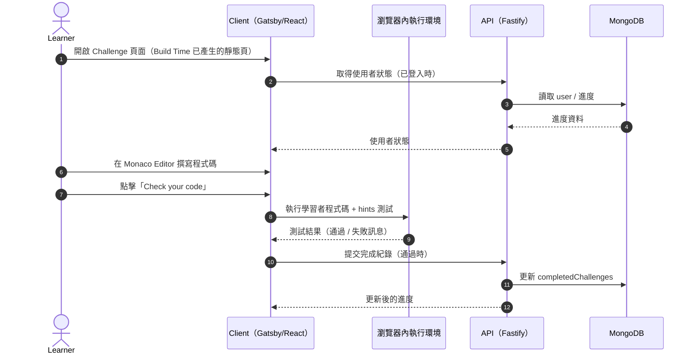

> 上圖為依原始碼職責整理的簡化流程；實際 API 端點與欄位名稱請以 `api/src/routes/` 與 `api/src/schemas/` 為準。

### 11.2 Learning Flow

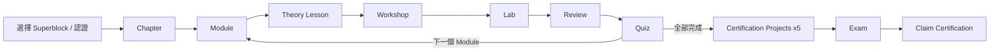

### 11.3 平台功能與企業訓練對應

| 平台功能 | 企業訓練用途 |
|---------|------------|
| 瀏覽器內編輯器 + 即時測試 | 不需安裝環境即可開始，適合新人第一週 |
| 公開個人 Profile | 學習成果佐證（需學員同意公開） |
| Daily Coding Challenge | 團隊每日暖身、Coding Dojo 題材 |
| Forum / Discord | 學員遇到問題時的外部支援（注意不可張貼公司程式碼） |
| AI 提示（Socrates） | 學員卡關時取得引導式提示，而不是答案；企業可參考它的設計建立內部 AI 助教（19.4 節） |
| Exam Environment App | 認證考試在桌面 App 內進行，企業可把「通過考試」當作客觀的能力檢核點 |
| 課程 Archive | 舊版課程集中在 `/learn/archive/`，已完成的進度仍保留，但新學員應走新版路徑 |
| 多語系介面 | 部分課程有中文翻譯，但以英文版最完整、最即時；官方另有以機器翻譯擴充阿拉伯文、法文課程的計畫 ⚠️ 需確認目前版本 |

### 11.4 實務案例與注意事項

- **案例**：某部門將每週五下午 30 分鐘設為「Daily Challenge Dojo」，由一人投影解題，其他人用 AI Agent 提出不同解法並比較時間 / 空間複雜度。重點是**讓 AI 當討論對象，而不是答案產生器**。
- **注意**：課程介面、路徑與課程名稱會隨版本更新（例如 v9 課程網址帶有 `-v9` 後綴）。內部文件引用課程時，請附上查詢日期。

---

## 12. Curriculum

### 12.1 名詞階層 `[Official]`

依 contribute 文件「Curriculum File Structure」：

```text
Certification  使用者領取的證書（與 Superblock 名稱分開）
Superblock     最上層課程集合（部分對應認證，部分是課程或額外練習）
  └─ Chapter      Module 的分組（v9 新課程使用；舊課程為扁平 Block 清單）
      └─ Module     Block 的分組
          └─ Block      一組 Challenge（例如某 Workshop、某 Lab）
              └─ Challenge  單一課程單元（一個 Markdown 檔）
```

### 12.2 檔案結構

```text
curriculum/
├─ challenges/
│  └─ english/
│     ├─ blocks/
│     │  └─ <block>/
│     │     └─ <challenge>.md
│     └─ certifications/
│        └─ <certification>.yml
├─ i18n-curriculum/          # git submodule，翻譯內容
├─ structure/
│  ├─ curriculum.json        # 所有 superblocks 與 certifications 清單
│  ├─ superblocks/<superblock>.json
│  └─ blocks/<block>.json    # Block metadata 與 Challenge 順序
├─ schema/                   # 課程資料的驗證 schema
├─ dictionaries/
└─ src/
```

### 12.3 Superblock JSON 範例

簡單型（只有 blocks）：

```json
{
  "blocks": ["basic-html-and-html5", "basic-css", "applied-visual-design"]
}
```

v9 型（Chapter → Module → Block）：

```json
{
  "chapters": [
    {
      "dashedName": "html",
      "modules": [
        {
          "dashedName": "basic-html",
          "blocks": ["lecture-welcome-to-freecodecamp", "lab-debug-camperbots-profile-page"]
        }
      ]
    }
  ]
}
```

Module / Chapter 可帶的特殊屬性：`moduleType: "cert-project"`、`moduleType: "review"`、`comingSoon: true`、`chapterType: "exam"`。

### 12.4 Challenge Markdown 格式 `[Official]`

每一個 Challenge 是一個 Markdown 檔，以特殊標題切分區段（以下為依官方範本簡化的示意）：

````markdown
---
id: 5f0000000000000000000001
title: Build a Greeting Function
challengeType: 1
---

# --description--

Create a function `greet` that returns a greeting.

# --hints--

`greet('Ada')` should return `Hello, Ada!`.

```js
assert.strictEqual(greet('Ada'), 'Hello, Ada!');
```

# --seed--

## --seed-contents--

```js
function greet(name) {

}
```

# --solutions--

```js
function greet(name) {
  return `Hello, ${name}!`;
}
```
````

| 區段 | 作用 |
|------|------|
| front matter | `id`（MongoDB ObjectId 格式）、`title`、`challengeType`（定義於 `client/utils/challenge-types.js`）、`demoType` 等 |
| `--description--` | 題目說明 |
| `--before-all--` / `--before-each--` / `--after-each--` / `--after-all--` | 測試 hooks（例如安裝 fake timers），只在跑測試時執行 |
| `--hints--` | **成對的「說明文字 + 測試程式碼」**，就是驗收條件 |
| `--seed--` / `--seed-contents--` | 編輯器中的初始程式碼 |
| `--solutions--` | 參考解答；CI 用它驗證 hints 本身是正確的 |
| `--assignments--` / `--question--` | 作業或測驗題型 |

> **企業觀點**：`--hints--` + `--solutions--` 的設計就是「**規格即測試（Specification as Test）**」。每一條 hint 是一條可驗證的 Acceptance Criteria，而 solutions 保證這些測試「可以被滿足」。這正是 SDD / TDD 的核心精神（詳見第 28、29 章）。

### 12.5 課程工具 `[Official]`

```bash
# 以互動式 CLI 建立新的 lecture / workshop / lab / review / quiz
pnpm run create-new-project

# 在 Block 內新增 / 插入 / 刪除 / 重新排序 Challenge（在 Block 目錄下執行，詳見 contribute 文件）
pnpm run create-next-challenge
pnpm run insert-challenge
pnpm run delete-challenge
pnpm run update-challenge-order
```

### 12.6 目前可見的 Superblock（摘錄，2026-09-29）

`curriculum/structure/curriculum.json` 目前列出約 **103 個 Superblock** 與約 **30 個 Certification** 定義。依用途分類如下：

| 類別 | 範例 | 企業訓練用途 |
|------|------|------------|
| v9 核心認證 | `responsive-web-design-v9`、`javascript-v9`、`front-end-development-libraries-v9`、`python-v9`、`relational-databases-v9`、`back-end-development-and-apis-v9`、`full-stack-developer-v9` | 正式訓練路徑（第 13 章） |
| HTML／CSS 主題課 | `basic-html`、`semantic-html`、`html-forms-and-tables`、`html-and-accessibility`、`basic-css`、`css-box-model`、`css-flexbox`、`css-grid`、`css-animations`、`css-variables`、`responsive-design`、`design-for-developers` | 針對弱項補強，或作為單堂內訓教材 |
| JavaScript 主題課 | `introduction-to-variables-and-strings-in-javascript`、`introduction-to-asynchronous-javascript`、`learn-dom-manipulation-and-events-with-javascript`、`introduction-to-functional-programming-with-javascript`、`learn-javascript-debugging`、`learn-recursion-with-javascript`、`learn-data-visualization-with-d3` | 前端與 Node.js 基礎 |
| Python／演算法 | `introduction-to-python-basics`、`learn-oop-with-python`、`introduction-to-linear-data-structures-in-python`、`learn-algorithms-in-python`、`learn-graphs-and-trees-in-python`、`learn-dynamic-programming-in-python`、`introduction-to-algorithms-and-data-structures`、`algorithms-and-data-structure`、`python-for-everybody` | CS 基礎（第 16 章） |
| 命令列／資料庫／版本控制 | `computer-basics`、`introduction-to-bash`、`learn-bash-scripting`、`introduction-to-nano`、`introduction-to-sql-and-postgresql`、`learn-sql-and-bash`、`introduction-to-git-and-github` | 開發環境與 DevOps 基礎 |
| AI 相關 | `learn-rag-mcp-fundamentals`（blocks：`understanding-rag`、`retrieval-engine-internals`、`designing-reliable-rag-systems`、`mcp-ecosystem-and-tooling`） | AI Agent Developer 入門（第 26–27 章） |
| 數學／資料 | `college-algebra-with-python`、`introduction-to-precalculus`、`data-analysis-with-python`、`machine-learning-with-python` | 資料分析與 ML 前置 |
| 面試／延伸練習 | `coding-interview-prep`、`project-euler`、`rosetta-code`、`the-odin-project`、`full-stack-open`、`dev-playground` | 演算法練習、Coding Dojo |
| 舊版（Legacy）認證 | `responsive-web-design`、`javascript-algorithms-and-data-structures`、`quality-assurance`、`information-security`、`scientific-computing-with-python`… | 僅供已在舊路徑的學員完成；新學員不建議（13.4 節） |
| 語言 | `a2-english-for-developers`、`b1-english-for-developers`、`a1-professional-spanish`、`a2-professional-spanish`、`a1-professional-chinese`、`a2-professional-chinese` | 技術英文、外派人員語言訓練 |
| 其他 | `foundational-c-sharp-with-microsoft` | .NET 團隊的 C# 入門 |

> ⚠️ Superblock 是否已上線、是否為 Beta，請以 [freecodecamp.org/learn](https://www.freecodecamp.org/learn/) 實際顯示為準；Repository 中存在的檔案可能是 `comingSoon` 或受 `SHOW_UPCOMING_CHANGES` 控制的未上線內容。

### 12.7 實務案例與注意事項

- **案例**：AI Agent Developer 訓練時，先閱讀 `learn-rag-mcp-fundamentals` 課程建立 RAG / MCP 基礎概念，再進入第 27 章的企業 RAG 實作。
- **注意**：舊版（Legacy）認證與 v9 認證並存。2025-11-13 課程重組後，舊課程集中在 [freecodecamp.org/learn/archive](https://www.freecodecamp.org/learn/archive/)。企業訓練規劃請一律以 v9 為準，避免學員走到舊路徑。
- **注意**：主題式 Superblock（例如 `css-flexbox`、`introduction-to-asynchronous-javascript`）的內容通常與 v9 認證課程**重複**，是同一批課程的另一種入口。安排訓練時請避免讓學員重複上同樣的內容。⚠️ 各主題課與認證課程的實際對應，請以官方課程頁為準。

---

## 13. Certification

### 13.1 認證體系總覽 `[Official]`

2025 年 9 月起，freeCodeCamp 把原本約 1,800 小時的單一 Full-Stack 路徑拆成 **6 張 Checkpoint Certification**，每張約 300 小時，並以 **Capstone 專案 + 綜合考試** 作為最終的 **Certified Full Stack Developer** 認證：

```text
Certified Full Stack Developer（Capstone 專案 + 綜合考試）
  ▲ 需先取得以下 6 張 Checkpoint Certification
  ├─ 1. Responsive Web Design
  ├─ 2. JavaScript
  ├─ 3. Front End Development Libraries
  ├─ 4. Python
  ├─ 5. Relational Databases
  └─ 6. Back End Development and APIs
```

| 認證 | 核心內容 | 企業對應能力 | 上線狀態（2026-09-29） |
|------|---------|------------|----------------------|
| Responsive Web Design | HTML、CSS、Accessibility、Responsive | 前端基礎、無障礙 | 2025-12-02 開放考試 |
| JavaScript | 語言核心、DOM、非同步、資料結構與演算法 | 前端／Node.js 基礎 | 2025-12-08 開放考試 |
| Front End Development Libraries | React 等前端函式庫 | 現代前端開發 | 官方預定 2026 年上線 ⚠️ 需確認目前版本 |
| Python | Python 語言、OOP、演算法 | 腳本、資料處理、AI 工具鏈 | 2025-12-15 開放考試 |
| Relational Databases | SQL、PostgreSQL、Bash、Git | 資料庫、命令列 | 2025 年內上線 |
| Back End Development and APIs | Node.js、API、後端開發 | 後端與 API | 官方預定 2026 年上線 ⚠️ 需確認目前版本 |
| **Certified Full Stack Developer** | Capstone 專案（由資深開發者做 Code Review）+ 綜合考試 | 全端整合能力 | 前 6 張全部上線後開放 ⚠️ 需確認目前版本 |

> 「核心內容」欄是依課程名稱與 Superblock 內容整理的概述，詳細 Module 以官方課程頁為準。

**其他認證** `[Official]`：

| 類型 | 認證 | 說明 |
|------|------|------|
| 語言 | A2／B1 English for Developers | 已上線；官方規劃未來陸續推出 A1、B2、C1、C2 等級 |
| 語言（Beta） | A1 Professional Spanish、A1 Professional Chinese | README 列為 Beta；Repository 已出現 A2 等級的 Spanish／Chinese Superblock ⚠️ 需確認目前版本 |
| 合作 | **Foundational C# with Microsoft** | 與 Microsoft 合作：先在 Microsoft Learn 完成訓練模組（以 Microsoft 帳號連結，對應 API 的 `MsUsername` Model），再到 freeCodeCamp 參加考試 |
| 練習（非認證） | The Odin Project（freeCodeCamp Remix）、Coding Interview Prep、Project Euler、Rosetta Code | 面試準備與演算法練習 |

**2026 路線圖（已宣布、尚未全面上線）** ⚠️ 需確認目前版本：

- **低階程式設計與高效能運算**認證：以 C／C++ 實作編譯器與搜尋引擎
- 擴充 Python **Machine Learning** 內容

> 企業若想用這些新課程做訓練規劃，請先到 [freecodecamp.org/learn](https://www.freecodecamp.org/learn/) 確認已經開放，不要只依公告排課。

### 13.2 Certification Flow

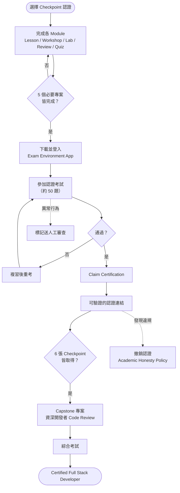

### 13.3 Exam Environment（考試環境） `[Official]`

| 項目 | 說明 |
|------|------|
| 形式 | 桌面應用程式（**Exam Environment App**），不需要到考場 |
| 原始碼 | [`freeCodeCamp/exam-env`](https://github.com/freeCodeCamp/exam-env)，BSD-3-Clause 開源 |
| 技術 | Tauri（Rust 殼層）+ TypeScript／Vite 前端；平台 API 端對應 `api/src/exam-environment/` 與 `exam-environment.prisma` |
| 資格 | 完成該認證的 5 個必要專案；語言認證則需完成所有 Quiz |
| 題型 | 選擇題為主，約 50 題（依認證而異） ⚠️ 需確認目前版本 |
| 設計原則 | 官方說明是在「**尊重隱私**」與「**防止作弊**」之間取得平衡：不要求到考場監考，但會把可疑行為**標記出來，交由人工審查** |
| 常見問題 | 無法開啟 App、登入失敗等，請參考官方 Forum 的 Exam Environment 支援討論串 |

> **企業觀點** `[Engineering Recommendation]`：Exam Environment 本身就是一個「在隱私、公平與可用性之間取捨」的系統設計案例。Architect 可以閱讀 `exam-env` 與 `api/src/exam-environment/`，練習分析「桌面用戶端 + API + 人工審查」的信任邊界（見第 21 章 Reverse Engineering）。

### 13.4 Legacy 認證與 Archive `[Official]`

| 項目 | 說明 |
|------|------|
| 舊課程位置 | 2025-11-13 課程重組後，舊課程集中在 [freecodecamp.org/learn/archive](https://www.freecodecamp.org/learn/archive/) |
| 學習進度 | 課程重組時保留所有學習者的進度 |
| 已取得的 Legacy 認證 | 官方表示**至少有效到 2028 年**，之後可能延長 |
| 升級到新版 | 完成新版認證的專案並通過新考試，就能取得新版認證 |

**企業處理原則** `[Engineering Recommendation]`：

- 已持有 Legacy 認證的同仁：人資系統照常登錄，但在 2027 年底前檢視是否要升級到新版。
- 新進同仁：一律走 v9 Checkpoint 路徑。
- 內部文件中的課程連結：全面換成新版路徑，舊連結改指向 Archive。

### 13.5 Academic Honesty 與 AI `[Official]`

官方 Academic Honesty Policy 的重點：

1. 專案程式碼必須 100% 由本人撰寫（開源函式庫與清楚標註來源的片段除外）
2. **除非課程明確允許，不得使用 AI 工具產生解答**
3. 發現抄襲時，認證會被撤銷

**平台內建的 AI 提示（Socrates）與政策不衝突**：Socrates 的設計目標是「引導而不給答案」，回傳的是提問式提示（例如「你的函式沒有 `return` 時會回傳什麼？」），是平台允許的學習輔助。相對地，把題目丟給外部 AI 工具直接產生解答，就違反了這項政策。

| 使用方式 | 是否符合政策 |
|---------|------------|
| 使用平台內建的 Socrates 提示 | ✅ 平台提供的功能 |
| 問 AI「這個錯誤訊息是什麼意思」「這個概念怎麼理解」 | ✅ 屬於學習輔助（仍建議自己寫程式碼） |
| 請 AI 產生認證專案的完整程式碼 | ❌ 違反政策 |
| 用 AI 改寫別人的解答後提交 | ❌ 違反政策 |

### 13.6 企業使用認證的原則 `[Engineering Recommendation]`

| 做法 | 建議 |
|------|------|
| 以認證作為**入門門檻** | ✅ 可行（例如新人 6 個月內取得 Responsive Web Design 認證；每張認證約 300 小時，見 37.7 節） |
| 以考試通過作為**客觀能力檢核點** | ✅ 可行；新制考試在 Exam Environment 進行，公信力比只看專案高 |
| 以認證作為**升等唯一依據** | ❌ 不建議；認證證明的是基礎知識，不是專案經驗 |
| 要求學員用 AI 完成認證專案以「提高效率」 | ❌ **禁止**，違反 Academic Honesty Policy |
| 用 AI 解釋錯誤訊息、概念、提供提示 | ✅ 可行，但不要讓 AI 直接給完整解答 |
| 完成認證後，用 AI Agent 做延伸練習（重構、加測試、改寫成 TypeScript） | ✅ 強烈建議（見第 38 章 Labs） |

### 13.7 實務案例與注意事項

- **案例**：內部訓練辦法中明定「freeCodeCamp 認證專案禁止使用 AI 產生程式碼；認證取得後的延伸 Lab 則必須使用 AI Agent 完成，並提交 Prompt 紀錄與人工審查紀錄」。這樣同時保護了認證的公信力，也訓練了 AI 協作能力。
- **案例**：公司電腦若限制安裝軟體，Exam Environment App 可能無法安裝。訓練單位應事先向 IT 申請白名單，或允許學員使用個人電腦應考。
- **注意**：認證名稱與組成可能調整（例如 v9 與舊版並存、新認證陸續上線）。人資或訓練單位登錄認證時，請保存認證頁面連結而非只記名稱。

---

## 14. Web Development Learning Path

### 14.1 路徑總覽

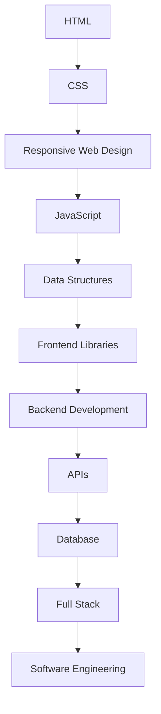

### 14.2 各階段說明

#### Stage 1 — HTML

| 項目 | 內容 |
|------|------|
| 學習目標 | 寫出語意正確、可被輔助科技理解的 HTML |
| 核心知識 | Semantic HTML、Forms、Tables、Accessibility（ARIA 基礎） |
| freeCodeCamp 課程 | Responsive Web Design v9 的 HTML Chapter、`semantic-html`、`html-forms-and-tables`、`html-and-accessibility` |
| 實作 | 個人簡介頁、表單頁 |
| 建議練習 | 把同一份內容分別用 `<div>` 與語意標籤寫一次，比較螢幕閱讀器行為 |
| AI Agent 使用方式 | 請 AI 解釋「為什麼用 `<button>` 而不是 `<div onclick>`」；請 AI 檢查無障礙問題 |
| 常見錯誤 | 全部用 `<div>`；表單沒有 `<label>` |
| 完成標準 | 可以說明 5 個以上語意標籤的使用時機；頁面通過瀏覽器 Lighthouse Accessibility 檢查 |

#### Stage 2 — CSS

| 項目 | 內容 |
|------|------|
| 學習目標 | 掌握 Box Model、Flexbox、Grid、變數、動畫 |
| 核心知識 | Specificity、Box Model、Flexbox、Grid、Custom Properties |
| 課程 | `css-box-model`、`css-flexbox`、`css-grid`、`css-variables`、`css-animations` |
| 實作 | 卡片式版面、Dashboard 版面 |
| 建議練習 | 不用任何 CSS Framework 完成一個三欄式 Dashboard |
| AI 使用方式 | 請 AI 解釋 Specificity 衝突的原因，而不是直接要修好的 CSS |
| 常見錯誤 | 濫用 `!important`；用 margin 硬排版 |
| 完成標準 | 不看文件可用 Flexbox 與 Grid 完成兩種常見版面 |

#### Stage 3 — Responsive Web Design

| 項目 | 內容 |
|------|------|
| 學習目標 | 行動優先、各種螢幕尺寸都可用 |
| 核心知識 | Media Query、相對單位、Responsive Image |
| 課程 | `responsive-design`、`absolute-and-relative-units` |
| 實作 | 同一頁面支援手機 / 平板 / 桌機 |
| AI 使用方式 | 請 AI 審查頁面在 320px 寬度下的問題 |
| 常見錯誤 | 固定寬度（`width: 1200px`）造成水平捲軸 |
| 完成標準 | 取得 Responsive Web Design 認證 |

#### Stage 4 — JavaScript

| 項目 | 內容 |
|------|------|
| 學習目標 | 理解語言核心與非同步模型 |
| 核心知識 | 型別、函式、閉包、物件、陣列方法、DOM、事件、Promise、async/await、錯誤處理 |
| 課程 | JavaScript v9、`introduction-to-asynchronous-javascript`、`learn-javascript-debugging`、`learn-localstorage-and-crud-operations-with-javascript` |
| 實作 | Todo App（localStorage CRUD）、計算機 |
| AI 使用方式 | 「Explain like a code reviewer」：請 AI 指出自己程式碼的潛在 bug |
| 常見錯誤 | 忘記 `await`；在迴圈內用 `var` 造成閉包問題 |
| 完成標準 | 取得 JavaScript 認證；能手寫 Promise 鏈與 async/await 互轉 |

```javascript
// 常見錯誤：忘記 await，拿到的是 Promise 而不是資料
async function loadUser(id) {
  const res = fetch(`/api/users/${id}`);   // ❌ 少了 await
  return res.json();                       // TypeError: res.json is not a function
}

// 正確
async function loadUserFixed(id) {
  const res = await fetch(`/api/users/${id}`);
  if (!res.ok) throw new Error(`HTTP ${res.status}`);
  return res.json();
}
```

#### Stage 5 — Data Structures

| 項目 | 內容 |
|------|------|
| 學習目標 | 選擇適當資料結構 |
| 核心知識 | Array、Map、Set、Stack、Queue、Tree、Graph、Big-O |
| 課程 | `introduction-to-maps-and-sets-in-javascript`、`learn-graphs-and-trees-in-python` |
| 實作 | 以 Map 實作快取、以 Queue 實作工作排程 |
| AI 使用方式 | 請 AI 分析自己解法的時間 / 空間複雜度，再自己驗證 |
| 常見錯誤 | 用 `Array.includes` 在大量資料中反覆查找 |
| 完成標準 | 能說明為何某題用 Map / Set 比 Array 好 |

#### Stage 6 — Frontend Libraries

| 項目 | 內容 |
|------|------|
| 學習目標 | 元件化思維與狀態管理 |
| 核心知識 | React 元件、Props、State、Hooks、表單、資料擷取 |
| 課程 | Front-End Development Libraries v9 |
| 實作 | 含 API 呼叫、Loading / Error 狀態的列表頁 |
| AI 使用方式 | 請 AI 解釋 re-render 發生的原因 |
| 常見錯誤 | `useEffect` 相依陣列錯誤導致無限迴圈 |
| 完成標準 | 取得認證；可獨立建立含 API 呼叫的 React 頁面 |

#### Stage 7–9 — Backend / APIs / Database

| 項目 | 內容 |
|------|------|
| 學習目標 | 建立 REST API 並連接關聯式資料庫 |
| 核心知識 | HTTP、REST、Node.js、Middleware、SQL、正規化、Index、Transaction |
| 課程 | Back-End Development and APIs v9、Relational Databases v9、`introduction-to-sql-and-postgresql`、`learn-sql-and-bash` |
| 實作 | 待辦事項 REST API + PostgreSQL |
| AI 使用方式 | 請 AI 產生測試資料與 API 測試案例；請 AI 審查 SQL 的 Injection 風險 |
| 常見錯誤 | 字串串接 SQL；不處理錯誤回應碼 |
| 完成標準 | 取得兩張認證；能說明 GET / POST / PUT / PATCH / DELETE 的語意與冪等性 |

```javascript
// ❌ SQL Injection 風險：字串串接
const rows = await db.query(`SELECT * FROM users WHERE email = '${email}'`);

// ✅ Parameterized Query（以 node-postgres 為例）
const rows2 = await db.query('SELECT * FROM users WHERE email = $1', [email]);
```

#### Stage 10 — Full Stack

| 項目 | 內容 |
|------|------|
| 學習目標 | 前後端整合 |
| 課程 | Full-Stack Developer v9 |
| 實作 | 前端 + API + DB 的完整小系統 |
| AI 使用方式 | 用 AI Agent 以 SDD 流程（第 28 章）完成延伸專案 |
| 常見錯誤 | 前端直接信任使用者輸入；後端沒有做授權檢查 |
| 完成標準 | 完成 Full-Stack 課程；延伸 Lab 通過 Code Review |

#### Stage 11 — Software Engineering

freeCodeCamp 課程涵蓋較少，需由企業補足：Architecture、Design Pattern、Testing Strategy、CI/CD、Code Review、Security、Observability。建議搭配本手冊第 19–34 章與公司內部規範。

### 14.3 實務案例與注意事項

- **案例**：Java 後端工程師轉前端時，直接從 Stage 4 開始，並用 AI Agent 做「Java ↔ JavaScript 概念對照」（例如 Java `CompletableFuture` 對照 JS `Promise`），可顯著縮短學習時間。
- **注意**：freeCodeCamp 後端課程以 Node.js 為主；企業使用 Spring Boot 的團隊，應把 Stage 7–9 的重點放在 **HTTP、REST 語意、SQL** 這些可跨語言的概念。

---

## 15. Programming Learning Path

### 15.1 路徑

```text
Computer Basics → Bash → JavaScript 或 Python 基礎 → OOP → Functional Programming
→ Error Handling → Debugging → Regex → Testing 概念 → TypeScript（企業補充）
```

### 15.2 各主題對照

| 主題 | freeCodeCamp 課程（superblock） | 對 AI Agent 協作的價值 |
|------|------------------------------|---------------------|
| Computer Basics | `computer-basics` | 理解檔案系統、程序、網路，才能讀懂 Agent 執行的指令 |
| Bash | `introduction-to-bash`、`learn-bash-scripting` | AI Agent 大量使用 shell，工程師必須能審查每一條指令 |
| Nano / 編輯器 | `introduction-to-nano` | 在伺服器上排錯 |
| JavaScript 基礎 | `introduction-to-variables-and-strings-in-javascript` 等 `introduction-to-*-in-javascript` 系列 | 閱讀 Agent 產生的 JS / TS |
| Python 基礎 | `introduction-to-python-basics`、`learn-python-for-beginners` | 撰寫 AI 工具鏈、資料處理腳本 |
| OOP | `introduction-to-javascript-classes`、`introduction-to-oop-in-python`、`learn-oop-with-python` | 理解企業系統的物件模型 |
| Functional Programming | `introduction-to-functional-programming-with-javascript`、`introduction-to-higher-order-functions-and-callbacks-in-javascript` | 閱讀現代 JS / React 程式碼 |
| Error Handling | `learn-error-handling-in-python` | 審查 Agent 是否吞掉例外 |
| Debugging | `learn-javascript-debugging` | 判斷 Agent 修 bug 的方式是否正確 |
| Regex | `learn-basic-regex-with-javascript` | 審查 Agent 寫的驗證邏輯（Regex 是 ReDoS 風險來源） |
| TypeScript | freeCodeCamp 無獨立認證 → 以 [TypeScript 官方文件](https://www.typescriptlang.org/docs/) 補充 | freeCodeCamp Repository 本身就是 TypeScript 大型專案教材 |

### 15.3 AI Agent 學習模式（Mode 1 — Learning）

```text
我正在學 freeCodeCamp 的「<課程名稱>」。
請不要直接給我答案。
1. 用 3 句話解釋這個概念。
2. 給我一個與課程不同的小例子。
3. 問我 2 個問題確認我理解了。
4. 如果我答錯，指出錯在哪裡，但仍然不要給完整解答。
```

### 15.4 實務案例與注意事項

- **案例**：新人使用上面的 Learning Prompt 學習 closure，AI 給出一個「計數器工廠」例子，並提問「兩個計數器會共用同一個 count 嗎？」，強迫學員思考，效果比直接看答案好。
- **注意**：AI 解釋可能過度簡化或錯誤。遇到有疑慮的說法，一律回 [MDN](https://developer.mozilla.org/en-US/) 或語言官方文件查證。

---

## 16. Computer Science Learning Path

### 16.1 路徑

```text
Mathematics（Algebra / Precalculus）
   ↓
Algorithms & Data Structures 入門
   ↓
Recursion
   ↓
Sorting / Searching
   ↓
Graphs & Trees
   ↓
Dynamic Programming
   ↓
Coding Interview Prep / Project Euler / Rosetta Code
```

### 16.2 課程對照

| 主題 | superblock | 企業應用 |
|------|-----------|---------|
| 代數 / 預備微積分 | `college-algebra-with-python`、`introduction-to-precalculus` | 資料分析、效能估算、ML 基礎 |
| 演算法入門 | `introduction-to-algorithms-and-data-structures`、`algorithms-and-data-structure`、`learn-algorithms-in-python` | 分析 Legacy Code 的效能熱點 |
| 線性資料結構 | `introduction-to-linear-data-structures-in-python` | 佇列、堆疊類業務邏輯 |
| 遞迴 | `learn-recursion-with-javascript` | 樹狀資料（組織圖、選單、BOM） |
| 圖與樹 | `learn-graphs-and-trees-in-python` | 相依分析、呼叫圖（Reverse Engineering 核心） |
| 動態規劃 | `learn-dynamic-programming-in-python` | 最佳化問題 |
| 面試題庫 | `coding-interview-prep`、`project-euler`、`rosetta-code` | 練習與團隊 Dojo |

### 16.3 為什麼 CS 基礎對 AI Agent 協作特別重要

| CS 概念 | 在 AI Agent 工作中的應用 |
|---------|----------------------|
| Graph | Repository 的 Dependency Graph、Call Graph 都是圖；理解 BFS / DFS 才能理解 Agent 如何「追蹤呼叫鏈」 |
| Tree | AST（Abstract Syntax Tree）是 Codemod / 自動重構的基礎 |
| Big-O | 判斷 Agent 產生的程式碼在大資料量下是否會爆炸 |
| Hashing | 快取、去重、Embedding 索引 |
| Recursion | 判斷 Agent 產生的遞迴是否有終止條件、是否會 Stack Overflow |

```python
# 圖的 BFS：Reverse Engineering 時「找出某個函式影響哪些模組」的基本演算法
from collections import deque

def impacted_modules(call_graph: dict[str, list[str]], start: str) -> set[str]:
    """call_graph: 被呼叫者 -> 呼叫者清單；回傳所有會受 start 變更影響的模組。"""
    seen, queue = {start}, deque([start])
    while queue:
        node = queue.popleft()
        for caller in call_graph.get(node, []):
            if caller not in seen:
                seen.add(caller)
                queue.append(caller)
    return seen - {start}
```

### 16.4 實務案例與注意事項

- **案例**：AI Agent 在一個報表功能中產生了 O(n²) 的巢狀迴圈比對，測試資料 100 筆時沒問題，正式資料 50 萬筆時逾時。具備 Big-O 基礎的 Reviewer 在 Code Review 就能攔下。
- **注意**：演算法練習的目的是建立判斷力，不是背題目。不要讓 AI 替你解 Project Euler，否則失去練習意義。

---

## 17. Git / GitHub

### 17.1 學習流程

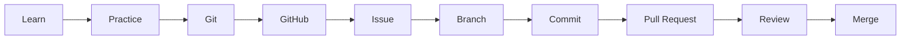

freeCodeCamp 相關課程：`introduction-to-git-and-github`、Relational Databases 認證中的 Git 練習。

### 17.2 核心概念

| 概念 | 說明 | 企業規範連結 |
|------|------|------------|
| Repository | 專案的版本庫 | 依公司 Repo 命名規範 |
| Branch | 平行開發線 | 不在 `main` 直接開發 |
| Commit | 一次有意義的變更 | Conventional Commits |
| Pull Request | 請求合併的審查單位 | 必須有 Reviewer |
| Issue | 問題 / 需求追蹤 | 與 Jira / Azure Boards 對應 |
| Code Review | 同儕審查 | AI 產出的程式碼**必須**經人工 Review |
| Fork | 複製他人 Repository 到自己帳號 | 開源貢獻使用 |
| Upstream | 原始 Repository | 同步最新程式碼 |

### 17.3 日常指令

```bash
# 同步 upstream 最新 main（main 分支不應有自己的 commit）
git fetch upstream
git checkout main
git reset --hard upstream/main          # ⚠️ 會丟棄本地 main 上的變更
git push origin main --force-with-lease # 讓 Fork 的 main 與 upstream 一致

# 建立功能分支
git checkout -b fix/typo-in-css-grid-lesson

# 提交（遵守 Conventional Commits）
git add <files>
git commit -m "fix(curriculum): correct typo in css grid lesson"

# 推送並建立 PR
git push origin fix/typo-in-css-grid-lesson
gh pr create --repo freeCodeCamp/freeCodeCamp --base main --fill
```

### 17.4 Conventional Commits `[Official]`

freeCodeCamp 的 PR 標題與 commit 採用 [Conventional Commits](https://www.conventionalcommits.org/en/v1.0.0/)：

```text
<type>([optional scope(s)]): <description>
```

| Type | 用途 |
|------|------|
| `fix` | 修正錯誤 |
| `feat` | 新功能 |
| `refactor` | 程式碼整理，不改變邏輯 |
| `docs` | 文件 |

常見 Scope：`curriculum`、`a11y`、`i18n`、`api`、`client`、`tools`。

官方範例：

```text
fix(a11y): improved search bar contrast
feat: add more tests to HTML and CSS challenges
fix(api,client): prevent CORS errors on form submission
docs(i18n): fix links to be relative instead of absolute
```

### 17.5 實務案例與注意事項

- **案例**：公司內部直接沿用 freeCodeCamp 的 type / scope 表格作為 Commit 規範範本，只把 scope 換成公司系統模組名稱。
- **注意**：`git reset --hard`、`git push --force` 是破壞性操作。AI Agent 執行這類指令前**必須經人工確認**（見第 39.4 節安全規則）。

---

## 18. Open Source Contribution

### 18.1 為什麼用 freeCodeCamp 做第一次 Open Source 貢獻

| 條件 | freeCodeCamp 的狀況 |
|------|-------------------|
| 貢獻文件完整 | ✅ contribute.freecodecamp.org 有逐步指南 |
| 有新手友善議題 | ✅ 可在 Issue 頁面依 label 篩選（⚠️ label 名稱請以 Issue 頁面實際為準） |
| 規範清楚 | ✅ PR 標題、Checklist、測試要求都明文化 |
| 真實的 Review 文化 | ✅ 由 Moderator / Maintainer 審查 |
| 授權寬鬆 | ✅ BSD-3-Clause |

### 18.2 Contributor Flow

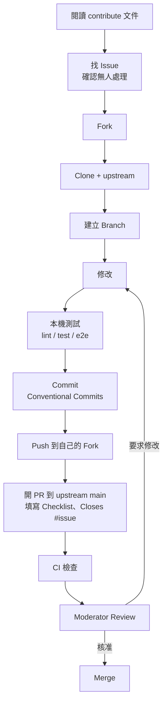

### 18.3 PR 規則 `[Official]`

1. 不要直接在 GitHub 網頁上編輯檔案送 PR
2. PR 標題遵守 Conventional Commits
3. 確實遵循 PR Checklist，而非只是打勾
4. 用正確方式連結 Issue：在描述最後寫 `Closes #123`
5. **不要 @mention 維護者**，請耐心等待；有問題請到 Forum 的 freeCodeCamp Community 分類或 Discord
6. **不要在自己的 `main` 分支上工作**
7. 只修改英文課程；翻譯請透過 Crowdin
8. 若改動影響頁面行為，要附上對應的 **Playwright 測試**
9. UI 變更要附截圖
10. 說明是否已在本機測試

### 18.4 First-time Contributor 企業練習方案 `[Engineering Recommendation]`

| 週次 | 任務 | 產出 |
|------|------|------|
| 第 1 週 | 閱讀 contribute 文件；完成本機環境（第 7–10 章） | 環境截圖 + `pnpm run test` 結果 |
| 第 2 週 | 用 AI Agent 產出 Repository Map（第 6.4 節），人工驗證 | Repository Map 文件 |
| 第 3 週 | 挑一個 Issue（typo、文件、小型測試補強）；與內部 Mentor 討論方案 | 修改計畫 |
| 第 4 週 | 實作 → 測試 → 開 PR | PR 連結 |
| 之後 | 回應 Review、整理被要求修改的原因 | Review 回顧報告 |

**公司政策提醒**：

- 貢獻開源前，請確認公司是否有「員工參與開源」政策（著作權歸屬、是否需要主管核准、是否可用上班時間）
- **絕對不可**把公司程式碼、內部網址、客戶資料放進開源 PR 或 Issue
- 若使用 AI Agent 協助撰寫 PR，必須由本人完全理解並負責內容；freeCodeCamp 有 `github-spam.yml`、`github-pr-guidelines.yml` 等 workflow 處理不符規範的 PR（⚠️ 對 AI 產出內容的具體規範請以最新 contribute 文件為準）

### 18.5 實務案例與注意事項

- **案例**：新人第一個 PR 是修正課程中的一個錯字，看似簡單，但過程中學會了 Fork、upstream 同步、Conventional Commits、CI 檢查失敗處理、回應 Reviewer，這些都是企業日常流程。
- **注意**：開源維護者時間寶貴。**不要**為了「完成訓練 KPI」大量提交低品質 PR。企業應把指標設為「PR 被 Merge」或「學到的經驗報告」，而不是「PR 數量」。

---

## 19. AI Agent Integration

> 本章是全手冊最重要的章節之一。

### 19.1 AI Agent 的定義

本手冊**不**把 AI Agent 定義為「幫我寫程式的聊天機器人」，而定義為：

> **具備程式碼理解、規劃、實作、測試、驗證與重構能力的 Software Engineering Agent。**

| 能力 | 說明 | 工程師需具備的對應能力（freeCodeCamp 可培養） |
|------|------|---------------------------------------|
| Code Understanding | 讀取 Repository、追蹤呼叫鏈 | 閱讀 JS / TS / Python / SQL |
| Planning | 拆解任務、提出方案 | 理解需求、架構概念 |
| Implementation | 修改多個檔案 | 判斷程式碼正確性 |
| Testing | 撰寫與執行測試 | 理解測試與斷言（freeCodeCamp 的 hints 就是測試） |
| Verification | 執行 lint / build / test 驗證 | 看懂錯誤訊息、Debug |
| Refactoring | 在不改變行為的前提下改善結構 | Clean Code、Design 概念 |

### 19.2 Developer × freeCodeCamp × AI Agent 工作流

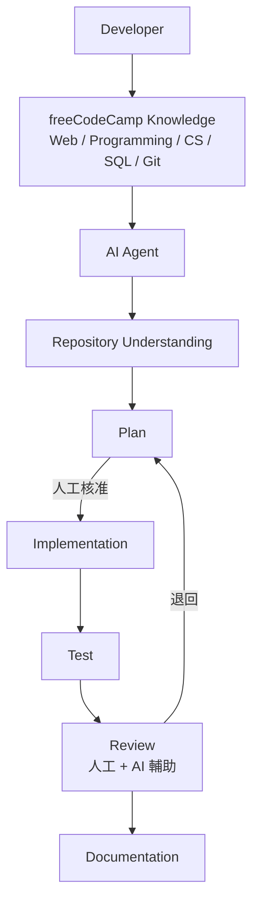

關鍵：**Developer 的知識是整個流程的「驗證者」**。沒有這層知識，Plan 的核准與 Review 都會流於形式。

### 19.3 五種 AI Agent 使用模式

| Mode | 名稱 | Agent 做什麼 | 工程師做什麼 | 寫入權限 |
|------|------|-----------|-----------|---------|
| 1 | Learning | 解釋概念、出題、提示 | 學習、回答、驗證 | 無 |
| 2 | Coding | 實作、重構、測試、除錯 | 定義需求、審查、驗證 | Controlled Write |
| 3 | Code Understanding | 分析 Legacy Code、探索 Repository、相依分析、架構探索 | 驗證推論、補充業務知識 | Read Only |
| 4 | Reverse Engineering | 萃取業務規則、重建架構、產生規格與測試 | 確認規格、與業務方核對 | Read Only → 文件 |
| 5 | Framework Upgrade | 相依分析、API 分析、Breaking Changes、遷移計畫、轉換、測試 | 核准計畫、驗收回歸測試 | Human Approval |

#### Mode 4 — Reverse Engineering 流程

```text
Legacy Application → AI Agent → Repository Analysis → Code Understanding
→ Business Logic Extraction → Architecture Reconstruction → Specification → Test
```

#### Mode 5 — Framework Upgrade 流程

```text
Old Framework → Dependency Analysis → API Analysis → Breaking Changes
→ Migration Plan → Code Transformation → Test → Regression Test
```

### 19.4 案例研究：Socrates — 教學型 AI 提示服務的架構 `[Official]`

freeCodeCamp 的 [Socrates](https://github.com/freeCodeCamp/socrates) 是一個很好的「**企業內部 AI 助教**」參考範本。它要解決的問題和企業訓練一樣：**學員卡關時要給幫助，但不能直接給答案**。

#### 19.4.1 架構

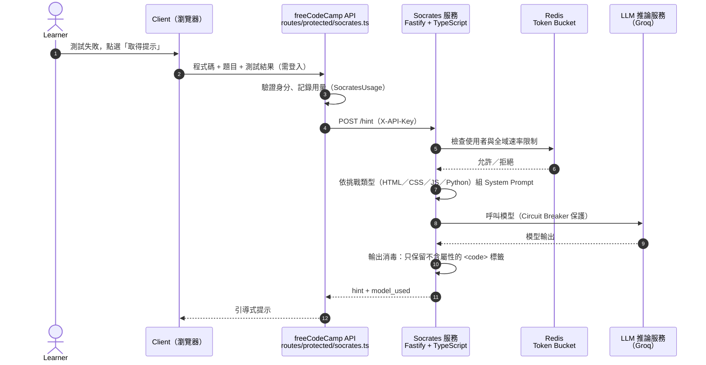

#### 19.4.2 關鍵設計決策

| 設計 | Socrates 的做法 | 企業內部 AI 助教可以借鏡的地方 |
|------|----------------|----------------------------|
| 輸入最小化 | 只送出學員程式碼、題目說明、初始程式碼（seed）、測試結果，**至少要有一個失敗的測試**才會產生提示 | 只送出完成任務所需的最小 Context；沒有失敗測試就不需要提示 |
| 依情境切換 Prompt | HTML、CSS、JavaScript、Python 各有專屬 System Prompt | 不同語言或領域使用不同 Prompt 範本，並納入版本控管 |
| 不給答案 | Prompt 要求以「提問」引導（例如：「你的函式沒有 `return` 時會回傳什麼？」） | 在 Prompt 與輸出檢查兩層都防止直接產生解答 |
| 輸出消毒 | 只允許不含屬性的 `<code>`，其他 HTML 一律轉成文字 | **LLM 輸出要當作不可信輸入**，防止 XSS 與 Prompt Injection 造成的破壞（見第 30 章） |
| 速率限制 | Redis Token Bucket，分「每位使用者」與「全域」兩層 | 同時控制成本與濫用，避免單一使用者耗盡配額 |
| 韌性 | 呼叫模型的 Client 在連續失敗後觸發 Circuit Breaker | 外部 AI 服務故障時快速失敗，不拖垮主系統 |
| 服務隔離 | Socrates 獨立部署，主 API 以 API Key 呼叫；Swagger UI 只在開發環境開放 | AI 功能獨立成服務，方便更換模型與獨立擴展 |
| 可觀測性 | 回應中帶 `model_used`；`/health` 可選擇檢查 Redis 與模型服務連線；整合 Sentry | 記錄每次呼叫使用的模型，方便稽核與品質追蹤 |
| 模型選擇 | 預設使用開放權重模型 `openai/gpt-oss-20b`，透過 Groq 推論 | 教學提示不一定需要最大的模型；依成本、延遲、資料政策選擇 |

> ⚠️ 預設模型、推論供應商與端點都可能變更，請以 Socrates Repository 最新的 README 為準。

#### 19.4.3 練習題 `[Engineering Recommendation]`

以 Socrates 為範本，替公司內部的 Java 訓練平台設計一個「AI 助教」服務，並寫成 ADR：

1. 輸入契約（哪些欄位可以送、哪些禁止，例如客戶資料）
2. Prompt 管理方式（版本控管、依課程切換）
3. 防止直接給答案的機制（Prompt 規則 + 輸出檢查）
4. 速率限制與成本上限
5. 輸出消毒與前端呈現方式
6. 模型與供應商選擇（資料落地、合規要求）

### 19.5 與企業 AI Coding Tools 的搭配

> ⚠️ 本表只描述「在 freeCodeCamp 學習 / 練習情境下的**建議用途**」，**不是**工具能力評比。各工具功能變化快速，請以各廠商官方文件與公司核准清單為準。

| Tool | 建議的 freeCodeCamp 使用方式 |
|------|---------------------------|
| GitHub Copilot | Learning（Chat 解釋概念）+ Coding（延伸 Lab 的補全與修改） |
| Claude Code | Repository 理解（例如分析 freeCodeCamp Monorepo）+ Coding + Refactoring |
| OpenAI Codex | Coding + Testing + Repository Analysis |
| Gemini | Learning + Analysis |
| Cursor | Coding + Code Understanding |
| VS Code AI 功能 | 依公司啟用的擴充套件，用於日常編輯 |
| MCP | 讓 Agent 以標準協定連接外部工具與知識來源（例如內部 Knowledge Base、Issue 系統）；freeCodeCamp 有 `learn-rag-mcp-fundamentals` 課程可作為入門 |
| Agent Skills | 將團隊的 Prompt、規範、檢查流程封裝成可重用技能（例如「Repository Map 產生」「Challenge 格式檢查」） |

### 19.6 AI Agent 不應該做什麼（禁止事項）

| # | 禁止事項 | 原因 |
|---|---------|------|
| 1 | 不可沒有理解就修改 | 先 Read / Analyze，再 Plan，最後才 Write |
| 2 | 不可直接覆蓋 Legacy Code | 必須先有測試保護（Characterization Test） |
| 3 | 不可只依賴 AI 產生的程式碼 | 所有產出都要人工 Review |
| 4 | 不可跳過 Test | 沒有測試的變更無法驗證 |
| 5 | 不可忽略 Security | 輸入驗證、授權、機密管理都要檢查 |
| 6 | 不可忽略 Dependency | 新增套件需經 License 與漏洞審查 |
| 7 | 不可忽略 License | 不可複製授權不明的程式碼 |
| 8 | 不可將 freeCodeCamp 課程當作企業正式架構規範 | 課程是教學用途 |
| 9 | 不可把教學範例直接視為 Production Architecture | 教學範例通常省略錯誤處理、安全、監控 |
| 10 | 不可用 AI 完成 freeCodeCamp 認證專案 | 違反 Academic Honesty Policy |
| 11 | 不可把 `.env`、金鑰、客戶資料放進 Prompt | 資料外洩風險 |
| 12 | 不可在未核准下執行破壞性指令 | `rm -rf`、`git push --force`、DB migration 等 |

### 19.7 Case 1：使用 freeCodeCamp 學習 JavaScript

| 步驟 | 內容 |
|------|------|
| **Scenario** | Java 背景的新進工程師需在 30 天內具備閱讀前端 JavaScript 的能力 |
| **Objective** | 完成 JavaScript v9 核心 Module，並能解釋非同步模型 |
| **Input** | freeCodeCamp JavaScript v9 課程；學員自己寫的練習程式碼 |
| **AI Agent Prompt** | 見下方 |
| **Expected Output** | AI 提出的概念對照表、引導式提問；學員自己完成的程式碼 |
| **Human Review** | Mentor 每週抽查 2 個練習，請學員口頭說明 |
| **Validation** | 完成對應 Module 的 Quiz；能手寫 Promise ↔ async/await 轉換 |

```text
我是 Java 工程師，正在學 freeCodeCamp JavaScript v9 的非同步章節。
請用 Java 的 CompletableFuture 對照說明 JavaScript 的 Promise 與 async/await。
規則：
1. 只給概念對照與小例子，不要解 freeCodeCamp 的 Lab 題目。
2. 最後出 3 題「這段程式碼會印出什麼」的題目讓我作答。
3. 標示出 Java 與 JavaScript 行為「不同」的地方（例如單執行緒 Event Loop）。
```

### 19.8 實務注意事項

- AI Agent 的能力會隨版本改變，但「**先理解、再規劃、後修改、必驗證**」的原則不會變。
- 讓 Agent 在 freeCodeCamp 這類公開 Repository 上練習，**不會有公司機密外洩風險**，是導入初期最安全的練習場。

---

## 20. AI-assisted Web Development

### 20.1 freeCodeCamp 在 AI 開發流程中的角色

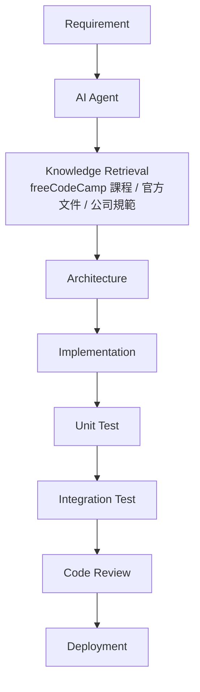

| 階段 | freeCodeCamp 提供的能力 | 誰負責 |
|------|----------------------|-------|
| Requirement | 讀懂 User Story（freeCodeCamp 的 Lab 都以 User Stories 描述需求） | PM / SA + Developer |
| Knowledge Retrieval | HTML / CSS / JS / SQL / API 基礎概念，讓工程師能判斷 Agent 引用的知識是否正確 | Developer |
| Architecture | 前後端分離、REST、資料庫基礎概念 | Architect |
| Implementation | 語言能力，能審查 Agent 的程式碼 | AI Agent + Developer |
| Unit Test | 理解斷言（hints 即測試） | AI Agent + Developer |
| Integration Test | 理解 HTTP、資料庫互動 | AI Agent + QA |
| Code Review | 綜合能力 | Senior Developer |
| Deployment | freeCodeCamp 涵蓋少，依企業 CI/CD | DevOps |

### 20.2 實作流程（SDD 風格）

```text
1. 撰寫需求（User Stories + Acceptance Criteria）
2. 讓 Agent 產生 Specification，人工確認
3. 讓 Agent 產生 Plan（檔案清單、步驟、測試策略），人工核准
4. Agent 先寫測試（依 Acceptance Criteria）
5. Agent 實作直到測試通過
6. 執行 lint / type-check / test
7. 人工 Code Review（安全、效能、可維護性）
8. 合併
```

### 20.3 Case 2：使用 AI Agent 開發 Web Application

| 步驟 | 內容 |
|------|------|
| **Scenario** | 團隊需要一個內部「讀書會報名」小系統 |
| **Objective** | 用 AI Agent 以 SDD 流程完成前端表單 + REST API + PostgreSQL |
| **Input** | User Stories、公司前後端技術規範 |
| **AI Agent Prompt** | 見下方 |
| **Expected Output** | `spec.md`、`plan.md`、測試、實作程式碼 |
| **Human Review** | Spec 由 PM 確認；Plan 由 Architect 核准；程式碼由 Senior Developer Review |
| **Validation** | 所有 Acceptance Criteria 對應的測試通過；安全檢查（輸入驗證、授權）通過 |

```text
你是 Senior Full-Stack Engineer。
需求：
- 使用者可以看到讀書會場次列表（名稱、日期、剩餘名額）
- 使用者可以報名，名額滿時顯示錯誤
- 同一使用者不可重複報名同一場次

請依序執行，每一步完成後停下來等我確認：
1. 產生 spec.md：功能、API 規格（method / path / request / response / error）、資料表設計、Acceptance Criteria（Given-When-Then）
2. 產生 plan.md：要新增 / 修改的檔案、實作順序、測試策略
3. 先寫測試，再寫實作
4. 執行 lint、type-check、test，回報結果

限制：
- 使用 Parameterized Query，禁止字串串接 SQL
- 「名額檢查 + 新增報名」必須在同一個 Transaction 中完成，避免超賣
- 不新增 plan.md 以外的相依套件
```

### 20.4 Case 4：AI Agent 產生 REST API

| 步驟 | 內容 |
|------|------|
| **Scenario** | 需為既有系統新增「課程進度查詢」API |
| **Objective** | 產生符合公司 API 規範、有 Schema 驗證與測試的端點 |
| **Input** | 既有 API 程式碼風格範例、資料表結構、API 規範文件 |
| **AI Agent Prompt** | 見下方 |
| **Expected Output** | Route、Request/Response Schema、Service、測試、OpenAPI 文件更新 |
| **Human Review** | 檢查授權（只能查自己的進度）、錯誤碼、分頁 |
| **Validation** | 單元測試 + 整合測試通過；以 Swagger UI 手動驗證 |

```text
參考 freeCodeCamp api/ 的模式：每個 route 用 TypeBox 定義 request / response schema，並附 .test.ts。
請在我們的專案中新增 GET /api/v1/users/{userId}/progress：
1. 先閱讀 src/routes/ 下現有的 2 個 route 與其測試，總結我們的慣例。
2. 依慣例產生 route、schema、service、測試。
3. 授權規則：一般使用者只能查自己的 userId；管理者可查任何人。
4. 錯誤：401 未登入、403 無權限、404 使用者不存在。
5. 回應需分頁（page、pageSize，pageSize 上限 100）。
不要修改其他 route。完成後列出所有變更檔案。
```

> **學習點**：freeCodeCamp 的 `api/src/routes/protected/` 與 `public/` 分離、每個 route 都有同名 `.test.ts`、以 TypeBox schema 產生 Swagger 文件，這些都是值得參考的 API 工程實踐（但要依公司技術棧轉換，不是照抄）。

### 20.5 實務注意事項

- AI 產生的 Web 程式碼最常漏掉的是：**授權檢查、輸入驗證、錯誤處理、併發控制**。Code Review Checklist 要特別列出。
- 前端表單驗證只是使用者體驗，**後端必須重新驗證**。

---

## 21. AI-assisted Reverse Engineering

### 21.1 freeCodeCamp 如何建立 Reverse Engineering 基礎能力

| 能力 | freeCodeCamp 來源 | 在 Reverse Engineering 中的用途 |
|------|-----------------|------------------------------|
| Reading Code | 所有 Workshop（先讀 seed code 再修改） | 讀懂陌生程式碼 |
| JavaScript Understanding | JavaScript v9 | 分析前端 / Node.js Legacy |
| TypeScript | （企業補充）+ freeCodeCamp Repository | 分析型別化程式碼 |
| Node.js | Back-End Development and APIs | 分析後端進入點、Middleware |
| HTTP / REST API | Back-End Development and APIs | 從路由萃取 API 規格 |
| Database / SQL | Relational Databases | 從 SQL 與 Schema 萃取資料模型 |
| Algorithms / Data Structures | CS 路徑 | 理解複雜業務計算、相依圖 |
| Testing | Challenge hints 機制、Quality Assurance（舊版） | 撰寫 Characterization Test |
| Debugging | `learn-javascript-debugging` | 動態追蹤執行路徑 |

### 21.2 Reverse Engineering 流程

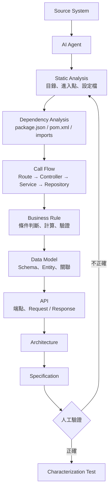

### 21.3 用 freeCodeCamp Repository 練習 Reverse Engineering

freeCodeCamp 是理想的練習對象：真實、大型、有測試（可以驗證你的推論）、有文件（可以對答案）。

#### 21.3.1 練習題：萃取「認證申請」的業務規則

```text
你是 Reverse Engineering 工程師。目標 Repository：freeCodeCamp/freeCodeCamp。
不要修改任何檔案。

任務：萃取「使用者申請認證（claim certification）」的業務規則。
1. 從 api/src/routes/ 找出與 certificate 相關的 route，列出 method、path、檔案位置。
2. 追蹤呼叫鏈：route → schema → 檢查邏輯 → 資料庫存取（Prisma）。
3. 列出所有「申請被拒絕」的條件，每一條都要引用檔案與行號。
4. 找出對應的測試檔（*.test.ts），確認你的推論是否有測試覆蓋。
5. 產出：業務規則表（規則 / 來源檔案:行號 / 是否有測試）+ Sequence Diagram（Mermaid）。
6. 明確標註「推論」與「已由程式碼確認」的差別。
```

**驗證方式**：拿 AI 萃取的規則，對照 `certificate.test.ts` 中的測試案例；對不上的部分就是 AI 誤判或遺漏。

### 21.4 Case 3：AI Agent 分析 Legacy JavaScript Application

| 步驟 | 內容 |
|------|------|
| **Scenario** | 接手一套 8 年前的 jQuery + Express 內部系統，原開發者已離職，無文件 |
| **Objective** | 產出架構文件、API 清單、資料模型、業務規則，作為改版依據 |
| **Input** | 原始碼（唯讀）、資料庫 Schema dump（不含資料） |
| **AI Agent Prompt** | 見第 39 章 P07 Reverse Engineering Prompt |
| **Expected Output** | `architecture.md`、`api-inventory.md`、`data-model.md`、`business-rules.md`、未知項目清單 |
| **Human Review** | 與業務單位逐條核對業務規則；與 DBA 核對資料模型 |
| **Validation** | 對關鍵流程撰寫 Characterization Test，在現有系統上全部通過 |

### 21.5 實務注意事項

- AI Agent 最常見的錯誤是「**用命名推論行為**」（例如看到 `validateUser` 就假設它做了完整驗證）。務必要求引用程式碼行號。
- 動態語言（JavaScript）的 Reverse Engineering 要特別注意：動態屬性存取、`eval`、執行期才決定的路由。靜態分析找不到的，要用執行期追蹤（日誌、Debugger）補足。
- Legacy System Modernization 詳見第 40 章 Playbook。

---

## 22. AI-assisted Framework Upgrade

### 22.1 freeCodeCamp 的角色

> **freeCodeCamp 是基礎 Web / Programming / Computer Science 能力來源，不應被視為特定企業 Framework Migration 工具。**

freeCodeCamp 能提供的是：

- 理解 Framework 背後的 Web 基礎（HTTP、DOM、非同步、模組系統），讓工程師能判斷 Breaking Change 的影響
- **一個真實的升級案例**：freeCodeCamp Repository 使用 Renovate 持續升級相依套件，每一個 Renovate PR 都是「套件升級 + CI 驗證」的真實範例

### 22.2 Framework Upgrade 流程

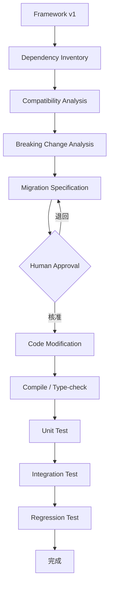

### 22.3 從 freeCodeCamp 學升級實務

| 觀察點 | 在 Repository 哪裡看 | 學到什麼 |
|--------|------------------|---------|
| 自動化相依更新 | `renovate.json`、GitHub 上的 Renovate PR | 小步、頻繁升級比一次大升級安全 |
| 供應鏈保護 | `pnpm-workspace.yaml` 的 `minimumReleaseAge: 10080` | 新版本發布 7 天後才採用，降低惡意套件風險 |
| 安裝腳本白名單 | `pnpm-workspace.yaml` 的 `allowBuilds` | 只允許特定套件執行 install script |
| 版本鎖定 | `pnpm-lock.yaml`、`packageManager` 欄位 | 可重現建置 |
| Runtime 版本 | `.nvmrc`、`engines` | 明確宣告 Node.js 版本 |
| 升級驗證 | `.github/workflows/node.js-tests.yml` | Lint → Build → Test → E2E 全跑 |
| 型別檢查 | `turbo type-check` | TypeScript 是升級時最早的防線 |

### 22.4 Case 5：AI Agent 協助 Framework Upgrade

| 步驟 | 內容 |
|------|------|
| **Scenario** | 內部前端專案需從 React 17 升級到 React 18 |
| **Objective** | 產出可審查的升級計畫，並在核准後分階段完成升級 |
| **Input** | `package.json`、lockfile、原始碼、React 官方升級指南連結 |
| **AI Agent Prompt** | 見第 39 章 P11 Framework Upgrade Prompt |
| **Expected Output** | Dependency Inventory、Breaking Changes 對照表、受影響檔案清單、分階段 Migration Plan、Rollback Plan |
| **Human Review** | Architect 核准 Plan；每階段 PR 由 Senior Developer Review |
| **Validation** | Type-check、Unit Test、E2E、效能基準比對皆通過；Staging 驗證一週 |

### 22.5 實務注意事項

- **不要讓 Agent 一次升級所有套件**。一次一個主要框架、每步都要能 build 與 test。
- Agent 對「最新版本」的知識可能過時。Breaking Changes 必須以**官方 Release Notes / Migration Guide** 為準，並要求 Agent 附上引用來源。
- 詳見第 41 章 Framework Upgrade Playbook。

---

## 23. AI-assisted Refactoring

### 23.1 Refactoring 原則

> **Refactoring = 在不改變外部行為的前提下改善內部結構。**

因此前提一定是：**先有測試**。

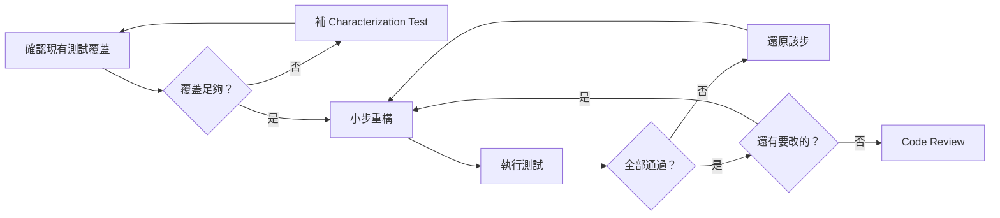

### 23.2 freeCodeCamp 延伸練習：重構自己的 Lab

完成認證專案**之後**（Academic Honesty），用自己的 Lab 程式碼做重構練習：

```javascript
// 重構前：典型的初學者程式碼
function calc(a, b, op) {
  if (op == '+') { return a + b; }
  else if (op == '-') { return a - b; }
  else if (op == '*') { return a * b; }
  else if (op == '/') { if (b == 0) { return 'error'; } else { return a / b; } }
}

// 重構後：查表取代條件分支、明確錯誤處理、嚴格相等
const OPERATIONS = {
  '+': (a, b) => a + b,
  '-': (a, b) => a - b,
  '*': (a, b) => a * b,
  '/': (a, b) => {
    if (b === 0) throw new RangeError('Division by zero');
    return a / b;
  },
};

function calculate(a, b, op) {
  const fn = OPERATIONS[op];
  if (!fn) throw new TypeError(`Unsupported operator: ${op}`);
  return fn(a, b);
}
```

> 注意：這個重構**改變了外部行為**（除以零從回傳 `'error'` 改為丟出例外）。這在 Refactoring 中是不允許的，除非另外開一個「行為變更」的任務並更新測試。這正是 Code Review 要抓出的問題。

### 23.3 Case 7：AI Agent 協助 Code Review

| 步驟 | 內容 |
|------|------|
| **Scenario** | 團隊每天有 20+ 個 PR，Senior Developer Review 負擔過重 |
| **Objective** | 用 AI Agent 做第一輪 Review，人工專注在設計與業務邏輯 |
| **Input** | PR diff、相關檔案、團隊 Code Review Checklist |
| **AI Agent Prompt** | 見第 39 章 P04 Review Prompt |
| **Expected Output** | 依嚴重度排序的問題清單（檔案:行號、問題、建議、信心程度） |
| **Human Review** | Reviewer 逐條判斷 AI 意見是否成立；AI 不可直接 Approve |
| **Validation** | 追蹤一個月：AI 找到的真問題數、誤報數；調整 Checklist |

### 23.4 實務注意事項

- AI 重構常見問題：**順手改了行為**、**一次改太多**、**改了測試來配合程式碼**。Review 時要特別看測試檔的 diff。
- 大規模重構（跨多模組）屬於 **HUMAN APPROVAL** 等級（第 39.4 節）。

---

## 24. AI-assisted Testing

### 24.1 測試層級

| 層級 | 目的 | freeCodeCamp Repository 範例 | 工具 |
|------|------|--------------------------|------|
| Unit Test | 單一函式 / 元件 | `api/src/**/*.test.ts`、`client/src/**/__tests__` | Vitest |
| Integration Test | 模組間互動（Route + DB） | API route 測試 | Vitest |
| Content Test | 課程內容正確性 | `pnpm run test-curriculum-content` | 自訂 + puppeteer |
| E2E Test | 使用者流程 | `e2e/*.spec.ts` | Playwright |

### 24.2 freeCodeCamp 的 Playwright 慣例 `[Official]`

contribute 文件建議：

- 優先使用 `getByRole` 等語意化 locator（同時兼顧無障礙）
- 無法用語意 locator 時，最後手段才用 `data-playwright-test-label` 屬性，且該屬性**只能**用於測試
- E2E 測試前需 `pnpm run seed:certified-user`

```typescript
import { test, expect } from '@playwright/test';

test('landing page shows main heading', async ({ page }) => {
  await page.goto('/');
  await expect(
    page.getByRole('heading', { level: 1 })
  ).toBeVisible();
});
```

```bash
npx playwright test --ui              # UI 模式
npx playwright test landing.spec.ts   # 單一檔案
npx playwright test -g "heading"      # 依標題篩選
npx playwright test --debug           # 除錯
npx playwright show-report            # 報告
```

### 24.3 Case 6：AI Agent 協助建立 Test

| 步驟 | 內容 |
|------|------|
| **Scenario** | 一個核心計價模組沒有任何測試，下個月要重構 |
| **Objective** | 建立 Characterization Test，鎖定目前行為 |
| **Input** | 計價模組原始碼、10 組真實（去識別化）輸入輸出樣本 |
| **AI Agent Prompt** | 見第 39 章 P12 Test Generation Prompt |
| **Expected Output** | 測試檔、測試案例清單（正常 / 邊界 / 例外）、目前行為中「疑似 bug」清單 |
| **Human Review** | 確認測試斷言反映「目前行為」而非「AI 認為正確的行為」；疑似 bug 交由業務確認 |
| **Validation** | 測試在現有程式碼上 100% 通過；故意改壞程式碼時測試會失敗（Mutation 抽查） |

### 24.4 實務注意事項

- AI 產生的測試常見問題：**斷言太弱**（只檢查不是 `undefined`）、**測試實作細節**、**Mock 過多導致沒測到東西**。
- 驗證測試有效性的簡單方法：**故意改壞被測程式碼，看測試會不會失敗**。

---

## 25. AI-assisted Documentation

### 25.1 文件類型與 AI 適用性

| 文件類型 | AI 適用性 | 注意 |
|---------|---------|------|
| README / Getting Started | 高 | 必須實際照著跑一遍驗證 |
| Architecture Overview | 中 | 推論需人工確認 |
| API 文件 | 高（若有 Schema） | 以程式碼的 Schema 為準，例如 freeCodeCamp 由 TypeBox 自動產生 Swagger |
| ADR（架構決策紀錄） | 低 | 決策理由只有人知道，AI 只能協助排版 |
| Runbook | 中 | 每個指令都要驗證 |
| 程式碼註解 | 中 | 只寫「為什麼」，不寫「做什麼」 |

### 25.2 向 freeCodeCamp 學文件工程

- **Documentation as Code**：contribute 文件站本身是一個 Repository（`freeCodeCamp/contribute`，Astro Starlight），用 PR 流程更新
- **Writing Style Guide**：contribute 文件站有寫作風格指南（`writing-style-guide`）
- **環境變數即文件**：`sample.env` 分組 + 註解
- **Schema 即文件**：API 以 TypeBox 定義，自動產生 `/documentation`

### 25.3 Case 8：AI Agent 協助 Repository Documentation

| 步驟 | 內容 |
|------|------|
| **Scenario** | 內部 Monorepo 只有一行 README，新人 onboarding 需兩週 |
| **Objective** | 產出可以讓新人一天內跑起來的文件 |
| **Input** | Repository 原始碼（排除 `.env`）、CI 設定 |
| **AI Agent Prompt** | 見第 39 章 P14 Documentation Prompt |
| **Expected Output** | `README.md`、`docs/architecture.md`、`docs/local-development.md`、`docs/troubleshooting.md` |
| **Human Review** | 找一位沒碰過此專案的同仁，**只看文件**從零建立環境 |
| **Validation** | 新人在 1 天內完成環境並跑通測試；卡住的地方回饋修正文件 |

### 25.4 實務注意事項

- AI 產生的文件最大風險是「**看起來很完整但指令是錯的**」。每一個指令都要實際執行過。
- 文件要標示「最後驗證日期」與「適用版本」，就像本手冊開頭的 Documentation Status。

---

## 26. Context Engineering

### 26.1 什麼是 Context Engineering

AI Agent 的輸出品質由「**它在當下看到什麼**」決定。Context Engineering 是**有意識地設計並控制 Agent 的上下文**，而不是把所有東西都丟進去。

| Context 類型 | 內容 | 來源 |
|-------------|------|------|
| Context Window | 模型一次能處理的 token 上限 | 模型規格 |
| Task Context | 本次任務的目標、限制、驗收條件 | 使用者 Prompt、Issue |
| Relevant Context | 與任務直接相關的程式碼片段 | Agent 搜尋 / 使用者指定 |
| Repository Context | 目錄結構、慣例、建置與測試指令 | `CLAUDE.md` / `AGENTS.md` / Copilot instructions 等 Agent 指引檔 |
| Architecture Context | 架構圖、模組邊界、ADR | 文件 |
| Documentation Context | 官方文件、內部規範 | Knowledge Base / MCP |
| Curriculum Context | 學習情境下的課程內容 | freeCodeCamp 課程 |
| Memory | 跨對話保留的偏好與事實 | Agent 的記憶機制 |

### 26.2 Context 組裝流程

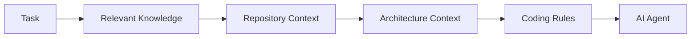

### 26.3 以 freeCodeCamp 為例的 Repository Context 檔

以下是為 freeCodeCamp Monorepo 撰寫 Agent 指引檔的範例（放在自己 Fork 的本機，**加入 `.git/info/exclude`，不要提交到上游**）：

```markdown
# Agent Guide — freeCodeCamp（個人練習用）

## Environment
- Node 24（.nvmrc）、pnpm 10；Windows 必須在 WSL2 內執行
- 啟動：docker compose -f docker/docker-compose.yml -f docker/docker-compose.ports.yml up -d
        → pnpm run seed → pnpm run develop

## Layout
- api/：Fastify 5 + TypeBox + Prisma（MongoDB）；route 在 api/src/routes/{public,protected}
- client/：Gatsby 5 + React 18 + Redux + redux-saga
- curriculum/：challenges/english/blocks/<block>/<challenge>.md；結構在 structure/

## Verify before claiming done
- pnpm run lint
- pnpm run test-api / pnpm run test-client
- 課程：FCC_BLOCK=<block> pnpm run test-curriculum-content

## Rules
- 不要讀取或輸出 .env
- 不要修改 i18n-curriculum（翻譯走 Crowdin）
- commit 訊息使用 Conventional Commits：<type>(<scope>): <description>
```

### 26.4 Context 原則

1. **少而精**：只給與任務相關的檔案
2. **指令可執行**：Build / Test 指令必須是真的能跑的
3. **規則要具體**：「不要讀 `.env`」比「注意安全」有效
4. **分層**：全域規則（公司）→ Repository 規則 → 任務規則
5. **會過期**：Context 檔也是程式碼，要隨專案更新

### 26.5 實務注意事項

- 把整個 Repository 塞進 Context 不但浪費 token，還會稀釋重點，導致 Agent 注意力分散。
- Agent 指引檔中**不可**包含機密（密碼、Token、內部 IP）。

---

## 27. RAG / Knowledge Base

### 27.1 freeCodeCamp 作為 AI Agent Knowledge Base

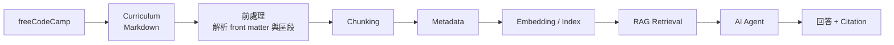

> **不應直接將整個 Repository 無差別塞入 AI Context Window。**
> 正確做法是：建立索引 → 依任務檢索相關片段 → 附上引用來源。

### 27.2 授權與使用前提（先讀這段）

| 內容 | 授權 | 企業內部 RAG 使用 |
|------|------|----------------|
| `api/`、`client/`、`tools/` 等程式碼 | BSD-3-Clause | 可，須保留版權與授權聲明 |
| `/curriculum` 課程內容 | 另有版權聲明（Copyright © freeCodeCamp.org），⚠️ 使用範圍請以 `LICENSE.md` 與 README 最新說明為準，並經法務確認 | **導入前必須經法務審查** |
| News 文章 | 各作者 / freeCodeCamp，⚠️ 需另行確認 | 建議只存連結，不存全文 |

`[Engineering Recommendation]`：若法務尚未核准，企業 RAG 只索引「**自己寫的學習筆記 + freeCodeCamp 課程連結**」，而不是課程原文。

### 27.3 Chunking 策略

freeCodeCamp 課程天然有良好的結構，建議依結構切塊：

| Chunk 單位 | 優點 | 缺點 |
|-----------|------|------|
| 整個 Challenge 檔 | 語意完整 | 有些檔案太長 |
| **Challenge 的區段**（description / hints / seed） | 精準檢索 | 需自行解析 |
| 固定 token 長度 | 實作簡單 | 會切斷語意 |

建議：**以 Challenge 為單位；超過上限時依 `# --section--` 切分**。

### 27.4 Metadata 設計

```json
{
  "source": "freeCodeCamp/freeCodeCamp",
  "commit": "<git SHA>",
  "path": "curriculum/challenges/english/blocks/<block>/<challenge>.md",
  "superblock": "javascript-v9",
  "block": "<block dashedName>",
  "challengeId": "<front matter id>",
  "title": "<front matter title>",
  "challengeType": 1,
  "section": "description",
  "language": "english",
  "indexedAt": "2026-09-29"
}
```

| 欄位 | 用途 |
|------|------|
| `commit` | **Knowledge Versioning**：知道答案來自哪個版本 |
| `superblock` / `block` | 過濾（例如只搜 JavaScript） |
| `path` | **Citation**：回答時附上來源 |
| `section` | 區分說明文字與程式碼 |
| `indexedAt` | 判斷是否過期 |

### 27.5 簡化的索引腳本範例

```python
"""把 freeCodeCamp 課程 Markdown 切成 chunks（示意，需依實際格式調整與驗證）。"""
import json
import re
import subprocess
from pathlib import Path

import yaml  # pip install pyyaml

REPO = Path("~/projects/freeCodeCamp").expanduser()
BLOCKS = REPO / "curriculum/challenges/english/blocks"
SECTION_RE = re.compile(r"^# --([a-z-]+)--\s*$", re.MULTILINE)


def git_sha(repo: Path) -> str:
    return subprocess.check_output(["git", "-C", str(repo), "rev-parse", "HEAD"], text=True).strip()


def split_sections(body: str) -> dict[str, str]:
    parts = SECTION_RE.split(body)
    # parts = [前導文字, name1, content1, name2, content2, ...]
    return {parts[i]: parts[i + 1].strip() for i in range(1, len(parts) - 1, 2)}


def iter_chunks(block_filter: str | None = None):
    sha = git_sha(REPO)
    for md in BLOCKS.glob("*/*.md"):
        block = md.parent.name
        if block_filter and block != block_filter:
            continue
        text = md.read_text(encoding="utf-8")
        _, fm, body = text.split("---", 2)
        meta = yaml.safe_load(fm)
        for section, content in split_sections(body).items():
            if section in {"solutions"}:   # 不索引解答，避免 Agent 直接提供答案
                continue
            yield {
                "text": content,
                "metadata": {
                    "source": "freeCodeCamp/freeCodeCamp",
                    "commit": sha,
                    "path": str(md.relative_to(REPO)),
                    "block": block,
                    "challengeId": meta.get("id"),
                    "title": meta.get("title"),
                    "challengeType": meta.get("challengeType"),
                    "section": section,
                },
            }


if __name__ == "__main__":
    for chunk in iter_chunks():
        print(json.dumps(chunk, ensure_ascii=False))
```

> 設計重點：**刻意不索引 `--solutions--`**，讓以此 Knowledge Base 為基礎的學習助理只能給提示而非答案，與 Academic Honesty Policy 一致。

### 27.6 Retrieval 與 Citation 原則

1. 回答必須附上 `path` 與 `commit`
2. 找不到相關內容時，Agent 要回答「知識庫中沒有」，而不是自行編造
3. 定期（例如每月）以最新 commit 重建索引；舊索引保留版本以利追溯

### 27.7 實務注意事項

- 課程內容以英文為主，中文查詢的檢索效果需測試；可考慮多語 Embedding 模型或查詢翻譯。
- freeCodeCamp 的 `learn-rag-mcp-fundamentals` 課程可作為團隊 RAG 概念的共同入門教材。

---

## 28. Spec-Driven Development

### 28.1 SDD 與 freeCodeCamp

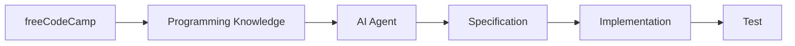

freeCodeCamp 的每一個 Lab 其實就是一份 mini-spec：

| freeCodeCamp Lab | SDD 對應 |
|-----------------|---------|
| User Stories（「你的頁面應該有一個 id 為 X 的元素」） | Requirement / Acceptance Criteria |
| hints 測試 | Executable Specification |
| seed code | 起始骨架 |
| 通過所有測試 | Definition of Done |

學員在 freeCodeCamp 養成「**先讀清楚規格、再寫程式、以測試判定完成**」的習慣，正是 SDD 需要的基本功。

### 28.2 企業 SDD 流程

```text
Requirement → Specification → Architecture → Task → Code → Test
```

| 階段 | 產出 | 誰確認 |
|------|------|-------|
| Requirement | User Stories | PM |
| Specification | 功能規格、API 契約、Acceptance Criteria（Given-When-Then） | PM + SA |
| Architecture | 元件設計、資料模型、ADR | Architect |
| Task | 可獨立完成的任務清單 | Tech Lead |
| Code | 實作 | AI Agent + Developer |
| Test | 對應 Acceptance Criteria 的測試 | QA + Developer |

### 28.3 Specification 範本

```markdown
# Spec: 讀書會報名

## Context
內部讀書會需要線上報名，取代目前的 Excel。

## User Stories
- US-1 身為員工，我想看到可報名的場次，以便選擇參加。
- US-2 身為員工，我想報名場次，名額滿時我應該知道。

## Acceptance Criteria
- AC-1 Given 場次剩餘名額 > 0, When 使用者報名, Then 報名成功且名額減 1
- AC-2 Given 場次剩餘名額 = 0, When 使用者報名, Then 回傳 409 且名額不變
- AC-3 Given 使用者已報名該場次, When 再次報名, Then 回傳 409

## API
| Method | Path | Request | Response | Errors |
|--------|------|---------|----------|--------|
| GET | /api/sessions | - | Session[] | - |
| POST | /api/sessions/{id}/registrations | - | Registration | 401, 404, 409 |

## Non-functional
- 併發：同時 100 人報名最後 1 個名額，只能有 1 人成功
- 安全：需登入；使用者只能看到自己的報名紀錄

## Out of Scope
- 取消報名、候補
```

### 28.4 實務注意事項

- Spec 要寫「**什麼**」與「**為什麼**」，不要寫「怎麼做」（那是 Plan 的工作）。
- 每一條 AC 都要能被測試驗證；無法驗證的 AC 要改寫。

---

## 29. TDD / BDD

### 29.1 學習到 TDD 的橋樑

```text
Learn → Understand → Write Test → Implement → Refactor
```

| freeCodeCamp 經驗 | TDD 對應 |
|-----------------|---------|
| 看到紅色的失敗 hint | Red |
| 修改程式碼讓 hint 變綠 | Green |
| 通過後整理程式碼 | Refactor |

差別在於：freeCodeCamp 的測試是別人寫好的；TDD 要求**自己先寫測試**。

### 29.2 TDD 循環

```mermaid
flowchart LR
    R["Red<br/>寫一個會失敗的測試"] --> G["Green<br/>寫最少程式碼讓它通過"]
    G --> RF["Refactor<br/>在測試保護下整理"]
    RF --> R
```

### 29.3 範例（Vitest）

```typescript
// registration.test.ts — 先寫測試（Red）
import { describe, it, expect } from 'vitest';
import { register } from './registration';

describe('register', () => {
  it('succeeds when seats are available', () => {
    const session = { id: 's1', seats: 1, attendees: [] as string[] };
    const result = register(session, 'u1');
    expect(result.ok).toBe(true);
    expect(session.seats).toBe(0);
  });

  it('fails with FULL when no seats left', () => {
    const session = { id: 's1', seats: 0, attendees: [] as string[] };
    expect(register(session, 'u1')).toEqual({ ok: false, reason: 'FULL' });
  });

  it('fails with DUPLICATE when already registered', () => {
    const session = { id: 's1', seats: 5, attendees: ['u1'] };
    expect(register(session, 'u1')).toEqual({ ok: false, reason: 'DUPLICATE' });
  });
});
```

```typescript
// registration.ts — 最少實作（Green）
export type Session = { id: string; seats: number; attendees: string[] };
export type Result = { ok: true } | { ok: false; reason: 'FULL' | 'DUPLICATE' };

export function register(session: Session, userId: string): Result {
  if (session.attendees.includes(userId)) return { ok: false, reason: 'DUPLICATE' };
  if (session.seats <= 0) return { ok: false, reason: 'FULL' };
  session.attendees.push(userId);
  session.seats -= 1;
  return { ok: true };
}
```

> 這是記憶體內的示意。真實系統的併發控制必須在資料庫層（Transaction / 條件更新）處理，單元測試無法證明併發正確性，需另外做整合測試。

### 29.4 BDD（Given-When-Then）

```gherkin
Feature: 讀書會報名

  Scenario: 名額已滿
    Given 場次 "TypeScript 入門" 剩餘名額為 0
    When 使用者 "Ada" 報名該場次
    Then 系統回應 "名額已滿"
    And 場次剩餘名額仍為 0
```

### 29.5 測試金字塔與 AI Agent

| 層級 | 比例建議 | AI Agent 適合度 |
|------|---------|---------------|
| Unit | 多 | 高：Agent 很擅長產生邊界案例 |
| Integration | 中 | 中：需提供 DB / 外部服務設定 |
| E2E | 少 | 中：需提供 seed 資料與穩定 locator（參考 freeCodeCamp 的 `getByRole` 慣例） |

### 29.6 實務注意事項

- 讓 AI Agent 做 TDD 時，要求它**先只輸出測試並停下來**，由人確認測試是否正確表達需求，再讓它實作。否則 Agent 常會同時寫測試與實作，測試只是在「證明實作是它寫的樣子」。
- 測試檔的 diff 要與實作一起 Review。

---

## 30. Security

> **freeCodeCamp 的教學範例不應直接等同於企業 Production Security Standard。**
> 教學程式碼為了聚焦概念，常省略輸入驗證、授權、錯誤處理與日誌。

### 30.1 OWASP Top 10:2025

依 [OWASP Top 10:2025](https://top10.owasp.org/2025)（查證日期 2026-09-29；2021 版到 2025 版的主要變動：新增 A03 Software Supply Chain Failures 與 A10 Mishandling of Exceptional Conditions，SSRF 併入 A01）：

| ID | 類別 | 與 AI 產生程式碼的關聯 |
|----|------|------------------|
| A01:2025 | Broken Access Control | Agent 常只實作功能、漏掉「誰可以做」 |
| A02:2025 | Security Misconfiguration | 預設設定、開發用設定被帶到正式環境（例如 dev login mode） |
| A03:2025 | Software Supply Chain Failures | Agent 隨意新增套件、套件名稱幻覺（不存在或拼錯的套件名） |
| A04:2025 | Cryptographic Failures | 自行實作加密、使用弱雜湊 |
| A05:2025 | Injection | 字串串接 SQL / Shell / HTML |
| A06:2025 | Insecure Design | 缺少威脅建模 |
| A07:2025 | Authentication Failures | Session / JWT 處理錯誤 |
| A08:2025 | Software or Data Integrity Failures | 未驗證的更新、反序列化 |
| A09:2025 | Security Logging and Alerting Failures | 沒有稽核日誌，或把機密寫進日誌 |
| A10:2025 | Mishandling of Exceptional Conditions | 吞掉例外、錯誤訊息洩漏內部資訊 |

### 30.2 常見漏洞與防護

#### XSS（Cross-Site Scripting）

```javascript
// ❌ 把使用者輸入直接當 HTML
element.innerHTML = userComment;

// ✅ 當純文字處理
element.textContent = userComment;
```

React 預設會跳脫字串；使用 `dangerouslySetInnerHTML` 時必須先以可信任的 Sanitizer 處理。

#### SQL Injection

```javascript
// ❌
await db.query(`SELECT * FROM orders WHERE id = ${req.params.id}`);
// ✅
await db.query('SELECT * FROM orders WHERE id = $1', [req.params.id]);
```

#### Authentication / Authorization

```javascript
// ❌ 只檢查登入，沒檢查擁有權（IDOR）
app.get('/api/orders/:id', requireLogin, async (req, res) => {
  res.json(await Orders.findById(req.params.id));
});

// ✅ 檢查資源擁有者
app.get('/api/orders/:id', requireLogin, async (req, res) => {
  const order = await Orders.findById(req.params.id);
  if (!order) return res.sendStatus(404);
  if (order.userId !== req.user.id && !req.user.isAdmin) return res.sendStatus(403);
  res.json(order);
});
```

#### CSRF

以 Cookie 做 Session 的系統需要 CSRF 防護。freeCodeCamp API 使用 `@fastify/csrf-protection` 並有 `api/src/plugins/csrf.ts` 與對應測試，是很好的參考實作。

#### Secrets

- 機密只放環境變數或 Secret Manager，**絕不**進版控
- freeCodeCamp 的 `sample.env` 只放**假值**，真正的 `.env` 被 `.gitignore` 排除
- CI 中以 `dotenv-linter` 檢查 `sample.env` 格式（見 `node.js-tests.yml`）

#### Input Validation

- 後端以 Schema 驗證所有輸入（freeCodeCamp 用 TypeBox；Java 可用 Bean Validation）
- 白名單優於黑名單

### 30.3 從 freeCodeCamp Repository 學供應鏈安全

| 做法 | 位置 | 說明 |
|------|------|------|
| 新版本冷卻期 | `pnpm-workspace.yaml`：`minimumReleaseAge: 10080` | 套件新版本發布 7 天後才會被安裝，給社群時間發現惡意版本 |
| 安裝腳本白名單 | `pnpm-workspace.yaml`：`allowBuilds` | 只有列出的套件（prisma、esbuild、gatsby…）可以執行 install script |
| Actions 以 SHA pin | `.github/workflows/*.yml` | `uses: actions/checkout@<commit SHA> # v6`，避免 tag 被竄改 |
| Lockfile | `pnpm-lock.yaml` | 可重現安裝 |
| 自動更新 | `renovate.json` | 持續修補 |
| 漏洞通報流程 | contribute `security` 頁面 | 不公開開 Issue，依流程私下通報 |

### 30.4 AI Agent Security Review Checklist

- [ ] 所有輸入都經後端驗證
- [ ] 所有資料存取都檢查授權（不只檢查登入）
- [ ] 沒有字串串接的 SQL / Shell / HTML
- [ ] 沒有硬編碼的密碼、金鑰、Token
- [ ] 錯誤訊息不洩漏堆疊與內部路徑
- [ ] 新增的相依套件確實存在、來源可信、授權相容、無已知高風險漏洞
- [ ] 日誌不包含個資與機密
- [ ] 開發用開關（例如 dev login）在正式環境關閉

### 30.5 AI 功能本身的安全（LLM Application Security）

當系統**本身包含 AI 功能**（例如 19.4 節的 Socrates、企業內部 AI 助教、RAG 問答）時，除了傳統的 OWASP Top 10 之外，還要對照 [OWASP Top 10 for LLM Applications 2025](https://genai.owasp.org/llm-top-10/)：

| ID | 風險 | 防護重點 | Socrates 的對應做法 |
|----|------|---------|-------------------|
| LLM01 | Prompt Injection | 使用者輸入與系統指令分開；不信任輸入中的指令 | 學員程式碼只作為資料放進 Prompt，依挑戰類型使用固定的 System Prompt |
| LLM02 | Sensitive Information Disclosure | 輸入最小化、遮罩個資 | 只送出程式碼、題目、測試結果 |
| LLM03 | Supply Chain | 模型與套件來源管理 | 模型與推論供應商以設定管理，回應中帶 `model_used` 方便追蹤 |
| LLM04 | Data and Model Poisoning | 確認訓練與 RAG 資料來源 | 不適用（未做微調）；RAG 情境見第 27 章 |
| LLM05 | Improper Output Handling | **把模型輸出當作不可信輸入** | 只允許不含屬性的 `<code>`，其餘 HTML 一律轉成文字 |
| LLM06 | Excessive Agency | 限制 AI 可呼叫的工具與權限 | 只產生文字提示，不能執行動作 |
| LLM07 | System Prompt Leakage | System Prompt 不放機密 | Prompt 內容本身開源，本來就不含機密 |
| LLM08 | Vector and Embedding Weaknesses | 向量資料庫的權限與隔離 | 不適用；RAG 情境見第 27 章 |
| LLM09 | Misinformation | 事實查核、引用來源 | 提示只是引導，最終仍由測試判斷對錯 |
| LLM10 | Unbounded Consumption | 速率限制、成本上限 | Redis Token Bucket（使用者＋全域）與 Circuit Breaker |

### 30.6 實務注意事項

- **套件名稱幻覺**：AI 有時會建議不存在的套件名稱，攻擊者可能搶先註冊同名惡意套件。新增任何套件前，先到官方 Registry 確認其存在、維護狀態與下載量。
- freeCodeCamp 的漏洞通報範圍僅限其官方平台。**不要**對 freecodecamp.org 做任何未授權的安全測試；練習請在本機環境進行。

---

## 31. Open Source Governance

### 31.1 License `[Official]`

| 項目 | 內容（2026-09-29 查證 `LICENSE.md`） |
|------|--------------------------------|
| 程式碼授權 | **BSD 3-Clause License** |
| 版權 | Copyright (c) 2014, freeCodeCamp |
| 課程內容 | README 說明 `/curriculum` 目錄內容另有版權（Copyright © freeCodeCamp.org）；⚠️ 詳細使用條件請以最新 `LICENSE.md` / README 為準並經法務確認 |

BSD-3-Clause 的主要義務：

1. 原始碼再散布需保留版權聲明、條件與免責聲明
2. 二進位再散布需在文件或其他材料中重現上述聲明
3. 未經書面許可，不得使用版權持有者或貢獻者名稱為衍生產品背書或推廣

### 31.2 企業使用情境與治理

| 情境 | 風險 | 治理建議 |
|------|------|---------|
| 員工在 freecodecamp.org 學習 | 低 | 無特別要求 |
| 參考 freeCodeCamp 程式碼的設計模式 | 低 | 理解後自行實作 |
| 複製 freeCodeCamp 程式碼片段到公司專案 | 中 | 保留 BSD-3 聲明；登錄於 Third-party Notice |
| 把課程內容放入內部 RAG / 教材 | 中～高 | **法務審查**課程內容版權 |
| 以 freeCodeCamp 名義或 Logo 做內部推廣 | 中 | 避免暗示背書（BSD-3 第 3 條） |
| 員工向 freeCodeCamp 貢獻 | 低～中 | 依公司開源貢獻政策 |

### 31.3 Dependency / Third-party Component / SBOM

即使只是在本機跑 freeCodeCamp，它也帶入上千個 npm 套件。企業學習環境建議：

```bash
# 列出所有 workspace 的直接相依
pnpm -r list --depth 0

# 查詢某套件為何被安裝
pnpm why <package>

# 已知漏洞稽核
pnpm audit

# 產生 SBOM（CycloneDX 格式，工具需另行安裝，以下為示意）
npx @cyclonedx/cyclonedx-npm --output-file sbom.json
```

> SBOM 工具對 pnpm workspace 的支援程度不一，請先在小範圍驗證輸出是否完整。⚠️ 需確認目前版本。

### 31.4 OSS Governance 流程

```mermaid
flowchart LR
    A[想引入 OSS 元件] --> B[License 檢查]
    B --> C[安全掃描<br/>已知漏洞]
    C --> D[維護狀態<br/>是否 Archived]
    D --> E[登錄 SBOM /<br/>Third-party Notice]
    E --> F[核准使用]
    F --> G[持續監控<br/>Renovate / Dependabot]
```

### 31.5 實務注意事項

- 「開源」不等於「沒有義務」。BSD-3 雖寬鬆，仍有保留聲明與不得背書的要求。
- 本手冊只描述授權檔案內容，**不構成法律意見**；正式判斷請交由法務。

---

## 32. Maintenance

### 32.1 freeCodeCamp 如何維護自己 `[Official]`

| 面向 | 工具 / 做法 | 位置 |
|------|-----------|------|
| Git hooks | husky + lint-staged：commit 前自動 lint 變更檔案 | `.husky/`、各 package 的 `.lintstagedrc.mjs` |
| Dependency Update | Renovate 自動開 PR | `renovate.json` |
| Node.js version | `.nvmrc` + `engines` + CI 的 `setup-node` | 根目錄 |
| Package Manager | `packageManager: pnpm@10.x`（corepack） | `package.json` |
| Build | Turborepo（含快取） | `turbo.json`、CI 的 `setup-turbo-cache` action |
| Test | Vitest + Playwright + 課程內容測試 | 各 package |
| 程式碼衛生 | ESLint、Prettier、Stylelint、**Knip**（找未使用的檔案 / 相依） | `knip.jsonc` |
| Security | 供應鏈設定、SHA-pinned actions、漏洞通報流程 | 見第 30 章 |
| CI | Lint → Build → Test → E2E | `.github/workflows/node.js-tests.yml` |
| Repository maintenance | 自動關閉 / 鎖定舊 PR、垃圾 PR 偵測、PR 規範檢查、自動標籤 | `github-autoclose.yml`、`github-lock-closed-prs.yml`、`github-spam.yml`、`github-pr-guidelines.yml`、`github-labeler.yaml` |
| i18n | Crowdin 同步；禁止透過 PR 修改翻譯 | `crowdin-*.yml`、`github-no-i18n-via-prs.yml` |

### 32.2 本機維護常用指令

```bash
# 與上游同步（含 submodule）
git fetch upstream && git rebase upstream/main
git submodule update --init

# 相依有變動時重新安裝
pnpm install

# 只清除 Turborepo 快取（建置結果怪異時先試這個）
pnpm run clean:turbo

# 清除所有建置產物與 node_modules 後重建
pnpm run clean-and-develop

# 找出未使用的檔案 / 相依
pnpm run knip

# 格式化
pnpm run format
```

### 32.3 企業可借鏡的維護實踐 `[Engineering Recommendation]`

| freeCodeCamp 做法 | 企業導入方式 |
|-----------------|-----------|
| Renovate 小步升級 | 啟用 Renovate / Dependabot，設定分組與自動合併規則（僅限 patch） |
| `minimumReleaseAge` | 在內部 npm mirror 或 pnpm 設定冷卻期 |
| Knip | 每季清理未使用相依，縮小攻擊面 |
| husky + lint-staged | commit 前檢查，減少 CI 失敗 |
| SHA-pinned Actions | 公司 CI 範本統一 pin SHA |
| PR 規範自動檢查 | 以 workflow 檢查 PR 標題格式 |

### 32.4 實務注意事項

- 維護工作最怕「累積」：半年不升級，一次要處理幾十個 Breaking Changes。freeCodeCamp 的持續小步升級是值得學習的紀律。

---

## 33. Upgrade

### 33.1 通用升級流程

```mermaid
flowchart TB
    CV[Current Version] --> INV[Inventory]
    INV --> RN[Release Notes]
    RN --> BC[Breaking Changes]
    BC --> DA[Dependency Analysis]
    DA --> MP[Migration Plan]
    MP --> BK[Backup]
    BK --> UP[Upgrade]
    UP --> BD[Build]
    BD --> TS[Test]
    TS --> RT[Regression Test]
    RT --> VL[Validation]
```

| 步驟 | 內容 | 產出 |
|------|------|------|
| Inventory | 列出 runtime、framework、主要套件版本 | 版本清單 |
| Release Notes | 閱讀目標版本的官方 Release Notes / Migration Guide | 摘要 + 連結 |
| Breaking Changes | 逐項對照是否影響本專案 | 影響分析表 |
| Dependency Analysis | 周邊套件是否支援目標版本 | 相容性矩陣 |
| Migration Plan | 分階段步驟、每階段驗證方式 | 計畫書 |
| Backup | 分支、資料庫備份、可回滾的部署 | Rollback Plan |
| Upgrade | 依計畫修改 | PR |
| Build / Test / Regression | 全套驗證 | 測試報告 |
| Validation | Staging 驗證、效能比對 | 驗收紀錄 |

### 33.2 以 freeCodeCamp 本機環境為例：升級 Fork 到最新上游

```bash
# 1. Inventory：記錄目前狀態
git log -1 --format='%H %cd'
node -v; pnpm -v
cat .nvmrc

# 2. 取得上游變更並閱讀差異
git fetch upstream
git log --oneline HEAD..upstream/main | head -50
git diff HEAD..upstream/main -- .nvmrc package.json pnpm-workspace.yaml sample.env

# 3. 若 .nvmrc 或 engines 變動，先升級 Node
nvm install "$(cat .nvmrc)" && nvm use

# 4. 若 sample.env 有新增變數，同步到自己的 .env
diff <(grep -o '^[A-Z_]*' sample.env | sort) <(grep -o '^[A-Z_]*' .env | sort)

# 5. 更新與重建
git rebase upstream/main
pnpm install
pnpm run clean && pnpm run seed && pnpm run develop

# 6. 驗證
pnpm run lint && pnpm run test
```

### 33.3 如何利用 AI Agent 協助 freeCodeCamp 升級

```text
你現在是 Senior Software Architect。

請先分析目前 freeCodeCamp Repository（本機 Fork，已 fetch upstream）。
不要立即修改程式碼。

請先完成：
1. Dependency Inventory：各 workspace package 的主要框架與版本（gatsby、react、fastify、prisma、typescript、vitest、playwright）
2. Runtime Version：.nvmrc、engines、CI 使用的 Node 版本是否一致
3. Build Tool：turbo、pnpm 版本與設定
4. Framework Version：目前版本 vs 最新穩定版（請引用官方 Release 頁面，無法確認時標示「需確認」）
5. Breaking Changes：列出可能影響本專案的項目，每項附官方來源連結
6. Deprecated API：搜尋程式碼中已被標為 deprecated 的用法，附檔案:行號
7. Security Risk：pnpm audit 結果摘要
8. Test Impact：哪些測試可能受影響
9. Migration Risk：高 / 中 / 低，並說明理由

最後產生 Migration Plan（分階段、每階段的驗證指令與回滾方式）。

完成 Plan 並取得人工確認前，不可修改程式碼。
```

### 33.4 實務注意事項

- 升級 freeCodeCamp 本身是上游維護者的工作；我們在 Fork 上的「升級」主要是**同步上游**。這個練習的價值在於熟悉升級流程，再套用到公司專案。
- 公司專案的升級必須走變更管理流程（第 42 章）。

---

## 34. Troubleshooting

### 34.1 Troubleshooting Guide

| 問題 | 原因 | 檢查方法 | 解決方法 |
|------|------|---------|---------|
| Install Failed | 網路 / Proxy / 防火牆阻擋；Node 或 pnpm 版本不符 | `node -v`、`pnpm -v`；安裝 log | 確認版本（Node 24、pnpm 10）；設定 Proxy；或改用 Codespaces |
| Install 很慢 | 首次下載大量套件與 container image | 網路速度 | 耐心等待；或使用 Codespaces |
| Build Failed / 缺 UI、字型、語系字串 | Gatsby 快取不完整 | build log | `pnpm run clean` → `pnpm install` → `pnpm run seed` → `pnpm run develop` |
| 持續 Build 失敗 | 殘留未追蹤檔案 | `git status --ignored` | `git clean -ifdX`（互動模式，**先備份 `.env`**） |
| Test Failed | 環境、資料不一致或程式碼錯誤 | 測試報告 | 重新 seed；E2E 需 `seed:certified-user`；只跑單一測試縮小範圍 |
| Port Conflict（登入失敗、錯誤 banner） | 3000 被其他程式佔用 | `netstat -a \| grep 3000` 或 `lsof -i :3000` | 停止佔用的程式 |
| Node Version | Runtime 不符 | `node -v` | `nvm use`（讀 `.nvmrc`） |
| WSL 效能差 / 不穩定 | 專案放在 `/mnt/c` 共用目錄 | `pwd` | 移到 WSL 檔案系統，例如 `~/projects` |
| Codespaces port 8000 沒起來 | 重啟閒置 codespace 時常見 | Ports 面板 | 分兩個終端機執行 `pnpm run develop:api` 與 `pnpm run develop:client` |
| Dev Container 中瀏覽器打不開 8000 | Client 只綁定 IPv6 loopback | Ports 面板 | `GATSBY_HOST=0.0.0.0 pnpm run develop` |
| Codespaces 中所有 API 請求失敗 | `.env` 仍指向 `localhost` | `grep -E '^(HOME_LOCATION\|API_LOCATION)=' .env` | 重新執行 `.devcontainer/codespace-env.sh`；重啟 client；port 3000 設為 Public（用完關閉 codespace） |
| 開發中被登出 | Cookie 被清除，或執行了 `seed:certified-user` | — | 重新登入 |
| 課程測試太慢 | 建置全部課程 | — | 使用 `FCC_CHALLENGE_ID` / `FCC_BLOCK` / `FCC_SUPERBLOCK` |
| MongoDB 連不上 | container 未啟動 | `docker compose -f docker/docker-compose.yml ps` | 重新 `up -d` |

> 以上依 contribute 文件「Troubleshoot issues with your development setup」與「How to Set Up freeCodeCamp Locally」整理（2026-09-29）。官方也提醒：**先決條件工具（Node、Docker 等）本身的問題請不要到 freeCodeCamp 開 GitHub Issue**，請到 Forum 或 Discord 求助。

### 34.2 系統化排錯流程

```mermaid
flowchart TB
    E[發生錯誤] --> R[完整閱讀錯誤訊息]
    R --> V{版本正確？<br/>node / pnpm / docker}
    V -- 否 --> FIX1[修正版本] --> RETRY[重試]
    V -- 是 --> ENV{.env 存在？<br/>MongoDB 在跑？}
    ENV -- 否 --> FIX2[修正環境] --> RETRY
    ENV -- 是 --> CLEAN[clean + install + seed]
    CLEAN --> OK{解決？}
    OK -- 是 --> DONE[記錄到團隊 FAQ]
    OK -- 否 --> SEARCH[搜尋官方 Troubleshooting / Forum]
    SEARCH --> AI["請 AI Agent 協助分析<br/>附版本資訊，不附機密"]
    AI --> ASK[到 Forum / Discord 提問]
```

### 34.3 請 AI Agent 協助排錯的 Prompt

```text
我在本機建立 freeCodeCamp 開發環境時遇到錯誤。
環境：
- OS：Windows 11 + WSL2 Ubuntu 24.04
- 專案路徑：~/projects/freeCodeCamp（不在 /mnt/c）
- node -v：<貼上>
- pnpm -v：<貼上>
- docker compose version：<貼上>
- .env：已由 sample.env 複製（不提供內容）
- 執行的指令：<貼上>
- 完整錯誤訊息：<貼上>

請：
1. 列出最可能的 3 個原因，依可能性排序。
2. 每個原因給出「驗證方法」與「修正方法」。
3. 引用 contribute.freecodecamp.org 相關頁面（若你不確定某頁存在，請說明）。
4. 不要建議任何會刪除資料的指令，除非先說明風險。
```

### 34.4 實務注意事項

- 團隊內部維護一份「freeCodeCamp 環境 FAQ」，記錄公司網路環境特有的問題（Proxy、憑證、內部 mirror），新人效率會大幅提升。

---

## 35. Enterprise Adoption

### 35.1 定位原則

> **不要把 freeCodeCamp 包裝成企業正式開發標準。**

| 領域 | 負責 | 說明 |
|------|------|------|
| **Learning** | freeCodeCamp | 基礎能力培養 |
| **Engineering** | 公司 SDLC | 需求、設計、開發、測試、部署流程 |
| **AI Coding** | AI Agent | 工程協作 |
| **Governance** | 企業 Engineering Standard | 程式碼規範、架構規範、Review 規範 |
| **Security** | 企業 Security Policy | 安全規範、弱點管理、資料保護 |

### 35.2 建議的企業架構

```text
                Enterprise AI Development
                         │
        ┌────────────────┼────────────────┐
        │                │                │
   Learning         Engineering       Governance
        │                │                │
 freeCodeCamp        SDLC/SDD         Security
        │                │                │
        └────────────────┼────────────────┘
                         │
                     AI Agent
                         │
             ┌───────────┼───────────┐
             │           │           │
          Coding      Reverse     Upgrade
                     Engineering
```

```mermaid
flowchart TB
    EAD[Enterprise AI Development]
    EAD --> L[Learning]
    EAD --> E[Engineering]
    EAD --> G[Governance]
    L --> FCC[freeCodeCamp]
    E --> SDLC[SDLC / SDD]
    G --> SEC[Security / Engineering Standard]
    FCC --> AG[AI Agent]
    SDLC --> AG
    SEC --> AG
    AG --> C[Coding]
    AG --> RE[Reverse Engineering]
    AG --> UP[Framework Upgrade]
```

### 35.3 企業導入 SOP

| Step | 內容 | 產出 / 驗收 | 負責 |
|------|------|-----------|------|
| 1 | 建立學習帳號（freecodecamp.org） | Profile 連結登錄於內部學習平台 | 學員 |
| 2 | 完成基礎課程（依職級，見第 36、37 章） | 認證或 Module 完成紀錄 | 學員 / 主管 |
| 3 | 完成 Hands-on Lab（第 38 章） | Lab 報告 | 學員 / Mentor |
| 4 | GitHub 練習（Fork、PR 流程） | 練習 PR | 學員 |
| 5 | AI Agent 練習（Learning / Coding 模式） | Prompt 紀錄 + 審查紀錄 | 學員 / Mentor |
| 6 | Code Review（互相 Review AI 產出） | Review 紀錄 | 團隊 |
| 7 | Reverse Engineering（以 freeCodeCamp Repo 練習） | 分析報告 | 學員 / Architect |
| 8 | Framework Upgrade（練習專案） | Migration Plan | 學員 / Architect |
| 9 | 企業專案實戰 | 在正式專案中依 SDLC 使用 AI Agent | 團隊 |

### 35.4 導入 KPI 建議 `[Engineering Recommendation]`

| KPI | 說明 | 避免的反指標 |
|-----|------|------------|
| 環境建置時間 | 新人從零到跑通測試的時間 | — |
| Lab 完成率與 Review 通過率 | 品質導向 | 不以「完成數量」為唯一指標 |
| AI 產出 PR 的退回率與原因分布 | 觀察能力缺口 | 不以「AI 產生多少行」為指標 |
| 安全檢查發現數 | 應逐季下降 | — |
| 開源 PR 被 Merge 數 | 品質導向 | 不以「開了幾個 PR」為指標 |

### 35.5 實務注意事項

- 導入初期先在「**公開 Repository（freeCodeCamp）**」上練習 AI Agent，再進入公司 Repository，可降低機密外洩風險，也讓 AI 使用規範有時間成熟。

---

## 36. Developer Skill Matrix

### 36.1 企業學習分級

| Level | 名稱 | 重點能力 |
|-------|------|---------|
| 1 | Beginner | HTML、CSS、JavaScript、Git |
| 2 | Developer | JavaScript、TypeScript、Backend、API、Database |
| 3 | Senior Developer | Architecture、Testing、Performance、Security、Refactoring |
| 4 | Software Architect | System Architecture、Distributed System、Domain Modeling、Architecture Governance |
| 5 | AI Software Engineer | AI Coding Agent、Prompt Engineering、Agent Skills、MCP、Repository Intelligence、AI-assisted SDLC |

### 36.2 AI Agent Developer Skill Matrix

圖例：**必修**＝該級必須具備；**建議**＝該級建議具備；**進階**＝該級應深入；**實務能力**＝該級需能在專案中獨立運用並指導他人；—＝不要求。

| Skill | Beginner | Developer | Senior | Architect | AI Agent Engineer |
|-------|----------|-----------|--------|-----------|-------------------|
| HTML | 必修 | 實務能力 | 實務能力 | 建議 | 實務能力 |
| CSS | 必修 | 實務能力 | 實務能力 | 建議 | 建議 |
| JavaScript | 必修 | 實務能力 | 進階 | 建議 | 實務能力 |
| TypeScript | 建議 | 必修 | 進階 | 建議 | 實務能力 |
| Python | 建議 | 建議 | 建議 | 建議 | 必修 |
| SQL | 建議 | 必修 | 進階 | 實務能力 | 實務能力 |
| Git | 必修 | 實務能力 | 實務能力 | 實務能力 | 實務能力 |
| API | — | 必修 | 進階 | 實務能力 | 實務能力 |
| Testing | 建議 | 必修 | 進階 | 實務能力 | 進階 |
| Architecture | — | 建議 | 必修 | 進階 | 必修 |
| Security | 建議 | 必修 | 進階 | 進階 | 進階 |
| AI Agent | 建議（Learning 模式） | 必修（Coding 模式） | 進階（Understanding / Refactoring） | 實務能力（治理與架構決策） | 進階（全模式 + Skills / MCP） |

### 36.3 freeCodeCamp 對應課程

| Skill | freeCodeCamp 來源 | freeCodeCamp 之外需補充 |
|-------|-----------------|---------------------|
| HTML / CSS | Responsive Web Design v9 | 公司 Design System |
| JavaScript | JavaScript v9 | — |
| TypeScript | （無獨立認證） | TypeScript 官方文件；閱讀 freeCodeCamp Repo |
| Python | Python v9 | — |
| SQL | Relational Databases v9、`introduction-to-sql-and-postgresql` | 公司資料庫（Oracle / SQL Server…）方言 |
| Git | `introduction-to-git-and-github` | 公司 Branch 策略 |
| API | Back-End Development and APIs v9 | 公司 API 規範、OpenAPI |
| Testing | Challenge hints 概念、舊版 Quality Assurance | 測試策略、Vitest / JUnit / Playwright |
| Architecture | 少 | 內部架構課程、ADR |
| Security | 舊版 Information Security | OWASP、公司 Security Policy |
| AI Agent | `learn-rag-mcp-fundamentals` | 本手冊第 19–29、39 章；各工具官方文件 |

### 36.4 實務注意事項

- Skill Matrix 用於**規劃學習**，不是績效評分表。
- 每年檢視一次，AI Agent 相關能力的要求變化最快。

---

## 37. Learning Roadmap

### 37.1 總覽

```mermaid
gantt
    title 企業 AI Agent 開發工程師 180 天 Roadmap
    dateFormat  YYYY-MM-DD
    axisFormat  %m/%d
    section 基礎
    30 Days 基礎 Web Development       :a1, 2026-10-01, 30d
    60 Days Full Stack Development      :a2, after a1, 30d
    section 工程
    90 Days Software Engineering        :a3, after a2, 30d
    section AI
    120 Days AI-assisted Development    :a4, after a3, 30d
    180 Days AI Agent + Reverse Engineering + Modernization :a5, after a4, 60d
```

### 37.2 Day 1–30：基礎 Web Development

| 項目 | 內容 |
|------|------|
| freeCodeCamp | Responsive Web Design v9 的 HTML 與 CSS 基礎 Module |
| 環境 | 完成第 7–10 章，跑起 freeCodeCamp 本機環境 |
| Git | Fork / Branch / Commit / PR 練習 |
| AI | 只使用 **Learning 模式**（解釋、出題） |
| Lab | Lab 1、2、3 |
| 驗收 | 已完成 Module 的 Quiz 全部通過；本機環境截圖；一個練習 PR |

### 37.3 Day 31–60：Full Stack Development

| 項目 | 內容 |
|------|------|
| freeCodeCamp | JavaScript v9 核心 Module；Relational Databases v9 的 SQL 基礎 |
| AI | 加入 **Coding 模式**（在延伸 Lab 中，不在認證專案中） |
| Lab | Lab 4、5、6 |
| 驗收 | JavaScript 已完成 Module 的 Quiz 通過；REST API + DB 延伸 Lab 通過 Code Review |

### 37.4 Day 61–90：Software Engineering

| 項目 | 內容 |
|------|------|
| 主題 | Testing（TDD / BDD）、Refactoring、Security、SDD |
| freeCodeCamp Repo | 閱讀 `api/` 的 route + test 結構、`e2e/` 的 Playwright 測試 |
| AI | Coding + Test Generation + Review |
| Lab | Lab 7、8 |
| 驗收 | 為一個既有模組補齊測試；完成一次重構 PR；通過安全 Checklist |

### 37.5 Day 91–120：AI-assisted Development

| 項目 | 內容 |
|------|------|
| 主題 | Context Engineering、Prompt Library、Agent Skills、MCP、RAG 基礎 |
| freeCodeCamp | `learn-rag-mcp-fundamentals` |
| AI | 以 SDD 流程完成完整小功能；撰寫 Agent 指引檔 |
| Lab | Lab 11、12 |
| 驗收 | 一個以 SDD 完成的功能（Spec → Plan → Test → Code）；團隊共用 Prompt 貢獻 1 則 |

### 37.6 Day 121–180：AI Agent + Reverse Engineering + Modernization

| 項目 | 內容 |
|------|------|
| 主題 | Reverse Engineering、Legacy Modernization、Framework Upgrade |
| 練習對象 | freeCodeCamp Repository → 公司非關鍵 Legacy 系統 |
| AI | Code Understanding、Reverse Engineering、Framework Upgrade 模式 |
| Lab | Lab 9、10 |
| 驗收 | freeCodeCamp 某業務流程的逆向分析報告；公司 Legacy 模組的規格文件 + Characterization Test；一份經 Architect 核准的 Migration Plan |

### 37.7 認證時數規劃

官方公告每張 Checkpoint Certification 約 **300 小時**。180 天 Roadmap 以 20–30% 工時估算（約 200–300 小時），**只夠完成一張認證**。因此 Roadmap 以「能力與延伸 Lab」為主，認證則採長期規劃：

| 每週投入 | 一張認證（約 300 小時） | 建議適用對象 |
|---------|----------------------|------------|
| 8 小時（20% 工時） | 約 9 個月 | 在職同仁的常態學習 |
| 12 小時（30% 工時） | 約 6 個月 | 新進人員訓練期 |
| 40 小時（全職） | 約 2 個月 | 轉職培訓、Bootcamp 型訓練 |

**建議的 12 個月認證規劃** `[Engineering Recommendation]`：

| 職能 | 第 1 張（0–6 個月） | 第 2 張（6–12 個月） |
|------|-------------------|-------------------|
| 前端 | Responsive Web Design | JavaScript |
| 後端（Java 團隊） | JavaScript | Relational Databases |
| AI Agent Developer | Python | JavaScript |
| QA | JavaScript | Relational Databases |

> 已具備基礎的同仁可以直接挑戰認證的 5 個專案與考試，不必從頭上完所有課程。

### 37.8 實務注意事項

- 有經驗的工程師可跳過前 60 天，但仍建議完成本機環境與 Git 練習，並**以認證考試驗證基礎**。
- Roadmap 以 20–30% 工時估算；若全職學習可壓縮為一半時間。
- 規劃時請先確認目標認證已開放考試（13.1 節上線狀態），尚未開放的認證只能先完成課程。

---

## 38. Hands-on Labs

> **重要規則**：以下 Lab 是 freeCodeCamp 課程之外的**企業延伸練習**。凡標示「AI Prompt」者，皆在延伸 Lab 中使用，**不可**用於 freeCodeCamp 認證專案本身（Academic Honesty Policy）。

### 38.1 Lab 總覽

| # | Lab | 對應 freeCodeCamp | 主要能力 | 建議時程 |
|---|-----|-----------------|---------|---------|
| 1 | HTML Web Page | Responsive Web Design | 語意化、無障礙 | Day 1–30 |
| 2 | Responsive Web Page | Responsive Web Design | RWD | Day 1–30 |
| 3 | JavaScript Application | JavaScript | DOM、狀態、localStorage | Day 1–30 |
| 4 | REST API | Back-End Development and APIs | HTTP、REST | Day 31–60 |
| 5 | Database Application | Relational Databases | SQL、Transaction | Day 31–60 |
| 6 | Full Stack Application | Full-Stack Developer | 整合 | Day 31–60 |
| 7 | Unit Test | — | TDD、Vitest | Day 61–90 |
| 8 | Refactoring | — | 重構、測試保護 | Day 61–90 |
| 9 | Reverse Engineering | freeCodeCamp Repository | Code Understanding | Day 121–180 |
| 10 | Framework Upgrade | — | Migration Plan | Day 121–180 |
| 11 | Context Engineering | freeCodeCamp Repository | Agent 指引檔 | Day 91–120 |
| 12 | RAG Mini Knowledge Base | `learn-rag-mcp-fundamentals` | Chunking、Metadata、Citation | Day 91–120 |

---

### 38.2 Lab 1 — HTML Web Page

- **Goal**：建立語意正確、通過無障礙檢查的「團隊介紹頁」
- **Prerequisite**：完成 Responsive Web Design v9 的 HTML 相關 Module
- **Steps**：
  1. 自己手寫 `index.html`（header、nav、main、section、footer）
  2. 加入含 `<label>` 的聯絡表單
  3. 用瀏覽器 DevTools Lighthouse 跑 Accessibility 檢查
  4. 請 AI 審查，再自行修正
- **AI Prompt**：

  ```text
  請以無障礙（WCAG）與語意化 HTML 的角度審查以下 HTML。
  只列出問題與原因，並說明對螢幕閱讀器使用者的影響，不要直接給我修改後的完整程式碼。
  <貼上 HTML>
  ```

- **Expected Result**：頁面結構語意化；表單元素皆有 label
- **Verification**：Lighthouse Accessibility ≥ 90；用鍵盤 Tab 可操作所有互動元素
- **Extension**：加入 `lang` 屬性與 skip link；用螢幕閱讀器（NVDA / VoiceOver）實測

### 38.3 Lab 2 — Responsive Web Page

- **Goal**：讓 Lab 1 頁面在 320px～1440px 都正常顯示
- **Prerequisite**：Lab 1；CSS Flexbox / Grid 相關課程
- **Steps**：
  1. 採用 Mobile-first 撰寫 CSS
  2. 使用 Grid 排列成員卡片，Flexbox 排列 nav
  3. 加入 1 個 media query（例如 `min-width: 768px`）
  4. 用 DevTools 裝置模式檢查
- **AI Prompt**：

  ```text
  這是我的 CSS。請指出在 320px 寬度時可能造成水平捲軸或文字重疊的規則，
  並解釋原因。不要重寫整份 CSS。
  <貼上 CSS>
  ```

- **Expected Result**：無水平捲軸，文字可讀
- **Verification**：320 / 768 / 1440 三種寬度截圖
- **Extension**：以 CSS Custom Properties 實作 Dark Mode

### 38.4 Lab 3 — JavaScript Application

- **Goal**：建立具 CRUD 與 localStorage 保存的待辦清單
- **Prerequisite**：JavaScript v9（DOM、事件、`learn-localstorage-and-crud-operations-with-javascript`）
- **Steps**：
  1. 設計資料結構 `{ id, title, done, createdAt }`
  2. 實作新增、切換完成、刪除、篩選
  3. 將狀態保存到 localStorage
  4. 處理 localStorage 讀取失敗（例如 JSON 格式錯誤）
- **AI Prompt**：

  ```text
  請扮演 Code Reviewer，審查我的 Todo App JavaScript：
  1. 潛在 bug（特別是事件處理與狀態同步）
  2. XSS 風險（是否有 innerHTML 使用者輸入）
  3. 錯誤處理（localStorage 資料損毀時）
  每個問題附上行號與原因。
  <貼上程式碼>
  ```

- **Expected Result**：功能完整；重新整理後資料仍在
- **Verification**：手動測試清單；在 DevTools 手動竄改 localStorage 為非法 JSON，App 不應崩潰
- **Extension**：改寫成 TypeScript；以 Vitest 為資料邏輯寫測試

### 38.5 Lab 4 — REST API

- **Goal**：以 Node.js 建立 Todo REST API（CRUD）
- **Prerequisite**：Back-End Development and APIs v9
- **Steps**：
  1. 以 AI Agent 依第 28 章範本產生 `spec.md`（端點、狀態碼、錯誤格式），人工修訂
  2. 選用框架（例如 Fastify，可參考 freeCodeCamp `api/` 的 Schema 驗證做法）
  3. 為每個端點定義 Request / Response Schema
  4. 實作並撰寫測試
- **AI Prompt**：

  ```text
  依據以下 spec.md 實作 Todo REST API（Fastify + TypeScript）。
  要求：
  - 每個 route 都要有 request/response JSON Schema 驗證
  - 錯誤回應格式統一為 { "error": { "code": string, "message": string } }
  - 每個 route 附一個 .test.ts（使用 fastify.inject）
  - 不要新增 spec 以外的端點
  先輸出檔案清單與實作計畫，等我確認後再寫程式碼。
  <貼上 spec.md>
  ```

- **Expected Result**：5 個端點（list / get / create / update / delete）與測試
- **Verification**：`npm test` 全數通過；手動送非法輸入（缺欄位、錯型別）得到 400
- **Extension**：加入分頁、OpenAPI 文件（Swagger UI）

### 38.6 Lab 5 — Database Application

- **Goal**：將 Lab 4 的儲存層改為 PostgreSQL，並正確處理 Transaction
- **Prerequisite**：Relational Databases v9、`introduction-to-sql-and-postgresql`
- **Steps**：
  1. 設計資料表與 Index
  2. 撰寫 migration（建表 SQL）
  3. 所有查詢使用 Parameterized Query
  4. 實作「批次完成」功能，需在單一 Transaction 內完成
- **AI Prompt**：

  ```text
  請審查以下資料表設計與 SQL：
  1. 正規化是否合理
  2. 查詢是否需要 Index（依 WHERE / ORDER BY 分析）
  3. 是否有 SQL Injection 風險
  4. 批次更新的 Transaction 邊界是否正確、失敗時是否會 rollback
  <貼上 schema.sql 與查詢程式碼>
  ```

- **Expected Result**：正確的 Schema、Index 與 Transaction
- **Verification**：`EXPLAIN` 確認查詢使用 Index；模擬批次中途失敗，資料不應部分更新
- **Extension**：加入樂觀鎖（version 欄位）處理併發更新

### 38.7 Lab 6 — Full Stack Application

- **Goal**：以 SDD 流程完成「讀書會報名」系統（第 20.3 節 Case 2）
- **Prerequisite**：Lab 3–5
- **Steps**：
  1. Spec → Plan → Test → Code（每階段人工確認）
  2. 前端（React）呼叫後端 API
  3. 實作名額與重複報名檢查（資料庫層保證）
  4. 撰寫 1 個 Playwright E2E 測試（使用 `getByRole`）
- **AI Prompt**：使用第 20.3 節 Prompt
- **Expected Result**：可運作的前後端系統 + 測試
- **Verification**：所有 Acceptance Criteria 有對應測試；併發測試（同時 20 個請求搶 1 個名額）只有 1 個成功
- **Extension**：加入取消報名與候補功能，先更新 Spec

### 38.8 Lab 7 — Unit Test

- **Goal**：以 TDD 完成一個「密碼強度檢查」函式
- **Prerequisite**：第 29 章
- **Steps**：
  1. 列出規則（長度 ≥ 12、包含大小寫、數字、符號、不可包含帳號）
  2. **先寫測試**（Red），請 AI 補充邊界案例
  3. 實作（Green）
  4. 重構（Refactor）
- **AI Prompt**：

  ```text
  以下是密碼強度規則與我目前寫好的 Vitest 測試。
  請只補充「我遺漏的邊界案例」測試（例如空字串、Unicode、剛好 12 字元、帳號大小寫變化），
  不要寫實作程式碼。
  <貼上規則與測試>
  ```

- **Expected Result**：測試先於實作；邊界案例完整
- **Verification**：測試覆蓋率報告；故意改壞實作（例如把 `>= 12` 改成 `> 12`），至少一個測試失敗
- **Extension**：改用 property-based testing（例如 fast-check）

### 38.9 Lab 8 — Refactoring

- **Goal**：在測試保護下重構一段「義大利麵程式碼」
- **Prerequisite**：Lab 7；第 23 章
- **Steps**：
  1. 取得練習用程式碼（例如自己早期的 Lab 或團隊提供的範例）
  2. 補 Characterization Test 鎖定目前行為
  3. 請 AI 提出重構計畫（不改行為）
  4. 小步執行，每步跑測試
- **AI Prompt**：使用第 39 章 P06 Refactoring Prompt
- **Expected Result**：可讀性提升，行為不變
- **Verification**：重構前後測試完全相同且全部通過；**測試檔在重構過程中沒有被修改**
- **Extension**：以 ESLint complexity 規則量測重構前後的循環複雜度

### 38.10 Lab 9 — Reverse Engineering（使用 freeCodeCamp Repository）

- **Goal**：萃取 freeCodeCamp「Challenge 提交」流程的規格
- **Prerequisite**：完成第 7–10 章本機環境；第 21 章
- **Steps**：
  1. 完整 clone（非 `--depth=1`）freeCodeCamp
  2. 以 AI Agent 進行唯讀分析：client 如何送出完成紀錄 → API route → schema → 資料庫更新
  3. 產出 Sequence Diagram、API 規格、業務規則表（每條附檔案:行號）
  4. 對照 `api/src/routes/protected/challenge.test.ts` 驗證推論
  5. 在本機實際操作一次（完成一個 Challenge），用瀏覽器 DevTools Network 面板比對真實請求
- **AI Prompt**：使用第 39 章 P07 Reverse Engineering Prompt，Target 設為「Challenge 提交流程」
- **Expected Result**：一份附引用來源的規格文件
- **Verification**：規格中的每條規則都能在程式碼或測試中找到；Network 面板的實際請求與文件一致
- **Extension**：對規格中「沒有測試覆蓋」的規則，撰寫一個新的測試（僅在本機，不提交上游）

### 38.11 Lab 10 — Framework Upgrade

- **Goal**：為一個練習專案產出並執行主要框架升級
- **Prerequisite**：Lab 4 或 Lab 6 的專案；第 22、41 章
- **Steps**：
  1. 將練習專案刻意鎖定在較舊的主要版本（例如舊版 Fastify 或 React）
  2. 以 AI Agent 產出 Migration Plan（第 41 章流程）
  3. 人工核准後分階段升級
  4. 每階段執行 type-check / test
- **AI Prompt**：使用第 39 章 P11 Framework Upgrade Prompt
- **Expected Result**：升級完成、測試全過、有 Rollback Plan
- **Verification**：Plan 中每個 Breaking Change 都附官方來源連結；升級後測試全過
- **Extension**：設定 Renovate，讓專案持續小步升級

### 38.12 Lab 11 — Context Engineering

- **Goal**：為 freeCodeCamp 本機 Fork 撰寫 Agent 指引檔，並比較有無指引檔的差異
- **Prerequisite**：第 26 章
- **Steps**：
  1. 在**沒有**指引檔的情況下，請 Agent「新增一個 API route 的測試」，記錄結果
  2. 依第 26.3 節撰寫指引檔（加入 `.git/info/exclude`）
  3. 以相同 Prompt 再做一次
  4. 比較：Agent 是否使用正確的測試指令、是否遵守目錄慣例、是否讀取了 `.env`
- **AI Prompt**：

  ```text
  請在 api/src/routes/public/status.test.ts 中新增一個測試案例，
  驗證 status 端點回應的 Content-Type 是 JSON。
  完成後執行相關測試並回報結果。
  ```

- **Expected Result**：有指引檔時，Agent 行為更一致、更少錯誤指令
- **Verification**：兩次執行的對照表（使用的指令、修改的檔案、測試結果）
- **Extension**：把指引檔中的「驗證步驟」包裝成團隊的 Agent Skill

### 38.13 Lab 12 — RAG Mini Knowledge Base

- **Goal**：以 freeCodeCamp 某一個 Block 建立小型、可引用的知識庫
- **Prerequisite**：第 27 章；`learn-rag-mcp-fundamentals`；**法務對課程內容使用範圍的確認**（或改用自己的學習筆記）
- **Steps**：
  1. 使用第 27.5 節腳本，只處理一個 Block（`iter_chunks(block_filter=...)`）
  2. 將 chunks 寫入本機向量資料庫（依公司核准的工具）
  3. 建立查詢介面，回答必須附 `path` 與 `commit`
  4. 設計 10 個測試問題，其中 2 個是知識庫中「沒有」的內容
- **AI Prompt**：

  ```text
  你是學習助理。只能根據提供的檢索結果回答。
  規則：
  1. 每個論點都要附上來源 path。
  2. 檢索結果中沒有的資訊，回答「知識庫中沒有相關內容」。
  3. 不要提供 freeCodeCamp 題目的完整解答，只提供提示。
  檢索結果：
  <chunks>
  問題：<question>
  ```

- **Expected Result**：可引用來源的問答
- **Verification**：10 個問題中，8 個有正確引用；2 個「沒有」的問題未編造答案
- **Extension**：以 MCP Server 形式提供給 AI Agent 使用

### 38.14 實務注意事項

- 每個 Lab 都要保留：**Prompt 紀錄、AI 原始輸出、人工修改、驗證結果**。這四項是 Mentor 評估的依據，也是團隊 Prompt Library 的養分。

---

## 39. AI Agent Prompt Library

> 本章等同 Prompt Library 的 `01-learning.md` … `15-github-contribution.md`，但依要求**全部放在本檔案中**。
> 每則 Prompt 的 `<...>` 需依實際情況替換。

### 39.1 Prompt 結構原則

| 元素 | 說明 |
|------|------|
| Role | 指定角色（例如 Senior Software Architect） |
| Context | 專案、技術棧、限制 |
| Task | 具體要做什麼 |
| Constraints | 不可做什麼（例如不可修改檔案） |
| Output Format | 表格、Mermaid、檔案清單… |
| Verification | 要求 Agent 自我驗證或列出不確定處 |
| Stop Point | 何時停下來等人工確認 |

### 39.2 Prompt 索引

| ID | 名稱 | 權限等級 |
|----|------|---------|
| P01 | Learning Prompt | READ ONLY |
| P02 | Explain Code Prompt | READ ONLY |
| P03 | Generate Code Prompt | CONTROLLED WRITE |
| P04 | Review Prompt | READ ONLY |
| P05 | Debug Prompt | READ ONLY → CONTROLLED WRITE |
| P06 | Refactoring Prompt | CONTROLLED WRITE |
| P07 | Reverse Engineering Prompt | READ ONLY |
| P08 | Architecture Analysis（Code Understanding）Prompt | READ ONLY |
| P09 | API Analysis Prompt | READ ONLY |
| P10 | Database Analysis Prompt | READ ONLY |
| P11 | Framework Upgrade Prompt | HUMAN APPROVAL |
| P12 | Test Generation Prompt | CONTROLLED WRITE |
| P13 | Security Review Prompt | READ ONLY |
| P14 | Documentation Prompt | CONTROLLED WRITE（僅文件） |
| P15 | GitHub Contribution Prompt | READ ONLY → CONTROLLED WRITE |

### 39.3 Prompts

#### P01 — Learning Prompt

```text
我正在學習 freeCodeCamp 的「<課程 / Module 名稱>」，主題是「<概念>」。
請扮演家教，不要直接給我任何 Lab 或認證專案的解答。
1. 用 3–5 句話解釋這個概念，並說明它解決什麼問題。
2. 提供 1 個與課程不同的簡短範例。
3. 說明初學者最常見的 2 個誤解。
4. 出 3 題由淺到深的練習題，等我作答後再批改。
5. 若你的說明涉及語言規格細節，請附上 MDN 或官方文件連結。
```

#### P02 — Explain Code Prompt

```text
請解釋以下程式碼，對象是具備 <語言> 基礎的工程師。
不要修改程式碼。
1. 一句話說明這段程式碼的目的。
2. 逐段說明執行流程（標示行號）。
3. 列出輸入、輸出、副作用（I/O、全域狀態、網路、資料庫）。
4. 指出任何不明確、可能有 bug 或依賴隱含假設的地方。
5. 若需要其他檔案才能確認行為，列出需要的檔案。
<貼上程式碼，或指定檔案路徑>
```

#### P03 — Generate Code Prompt

```text
你是 Senior <技術棧> Engineer。
任務：<功能描述>
Acceptance Criteria：
- <AC-1>
- <AC-2>
專案慣例：請先閱讀 <參考檔案 1>、<參考檔案 2>，並遵循相同的結構、命名與錯誤處理方式。

限制：
- 只修改 / 新增以下檔案：<檔案清單>
- 不新增相依套件（若必須新增，先說明理由並停下來等我確認）
- 所有輸入需驗證；所有資料存取需檢查授權
- 不可硬編碼任何機密

步驟：
1. 先輸出實作計畫（檔案、函式、測試案例），停下來等我確認。
2. 確認後先寫測試，再寫實作。
3. 執行 <lint 指令>、<test 指令>，回報結果。
```

#### P04 — Review Prompt

```text
請以 Senior Reviewer 身分審查以下 PR diff。你只能提出意見，不可修改程式碼，也不可給出 Approve 結論。
審查面向（依序）：
1. Correctness：邏輯錯誤、邊界條件、錯誤處理
2. Security：輸入驗證、授權、Injection、機密、日誌中的個資
3. Performance：N+1、不必要的迴圈、大資料量下的複雜度
4. Maintainability：命名、重複、函式長度、與專案慣例的一致性
5. Tests：是否涵蓋新增行為；測試是否被修改來配合實作

輸出格式（依嚴重度排序）：
| 嚴重度 | 檔案:行號 | 問題 | 為什麼重要 | 建議 | 信心（高/中/低） |

最後列出「我無法判斷、需要人工確認」的項目。
<貼上 diff 或 PR 連結>
```

#### P05 — Debug Prompt

```text
我遇到一個 bug，請協助系統化排查。先不要修改任何程式碼。
- 預期行為：<...>
- 實際行為：<...>
- 重現步驟：<...>
- 錯誤訊息 / Stack trace：<...>
- 環境：<OS、runtime 版本、相關套件版本>
- 最近的變更：<git log 或描述>

請：
1. 列出 3 個最可能的根因，依可能性排序，說明推理依據。
2. 每個根因提供一個「可以確認或排除它」的具體驗證步驟（加 log、寫最小重現測試、下中斷點）。
3. 等我回報驗證結果後，再提出修正方案。
4. 修正方案必須附一個「修正前失敗、修正後通過」的測試。
```

#### P06 — Refactoring Prompt

```text
請重構 <檔案 / 函式>，目標：<可讀性 / 降低複雜度 / 消除重複 / ...>。
硬性規則：
- 不可改變外部行為（公開 API、回傳值、例外型別、副作用）
- 不可修改任何既有測試檔
- 每次只做一種重構手法（Extract Function、Rename、Replace Conditional with Polymorphism…）

步驟：
1. 先檢查目前的測試是否足以保護這段程式碼；不足時，列出需要補的 Characterization Test 並停下來。
2. 提出重構步驟清單（每步的手法與預期效果），等我確認。
3. 逐步執行，每一步後執行 <test 指令> 並回報。
4. 任何一步測試失敗，立即還原該步並報告原因。
```

#### P07 — Reverse Engineering Prompt

```text
你是 Reverse Engineering 工程師。目標系統：<Repository / 路徑>。
這是唯讀任務：不可修改、新增或刪除任何檔案，不可執行會改變狀態的指令。

分析目標：<整個系統 / 特定流程，例如「訂單建立流程」>

請依序完成，每一項都要引用「檔案:行號」作為證據：
1. Static Analysis：技術棧、進入點、設定檔、建置方式
2. Dependency Analysis：外部套件（版本）、內部模組相依
3. Call Flow：從入口（UI / Route / Job）到資料存取的呼叫鏈，以 Mermaid sequenceDiagram 表示
4. Business Rules：所有條件判斷、計算公式、驗證規則，表格列出（規則 / 證據 / 是否有測試）
5. Data Model：實體、欄位、關聯，以 Mermaid erDiagram 表示
6. API：端點、Request / Response、錯誤碼
7. Architecture：模組邊界與分層，以 Mermaid flowchart 表示
8. Specification：以 Given-When-Then 撰寫可驗證的規格

最後列出：
- 「已由程式碼確認」vs「推論」的清單
- 無法從程式碼判斷、需要詢問業務或原開發者的問題
- 建議優先撰寫的 Characterization Test
```

#### P08 — Architecture Analysis（Code Understanding）Prompt

```text
請先閱讀此 Repository。
不要修改任何程式碼。

請分析：
1. Application Architecture
2. Frontend Architecture
3. Backend Architecture
4. Database
5. API
6. Authentication
7. Build
8. Test
9. Deployment

每一項請：
- 說明使用的技術與版本（引用 package.json / pom.xml 等檔案）
- 說明主要目錄的角色
- 標示你的信心程度與依據

最後建立 Architecture Map（Mermaid flowchart），並列出你無法確認的部分。
```

#### P09 — API Analysis Prompt

```text
請盤點 <Repository> 的所有 HTTP API。唯讀任務。
1. 找出路由定義的位置與框架慣例（例如 Fastify route、Express router、Spring @RequestMapping）。
2. 以表格列出：Method | Path | 需登入? | 授權規則 | Request Schema | Response | 錯誤碼 | 定義位置（檔案:行號） | 測試位置
3. 標出：沒有 Schema 驗證的端點、沒有授權檢查的端點、沒有測試的端點、看起來已棄用（deprecated）的端點。
4. 若專案已有 OpenAPI / Swagger，比對程式碼與文件是否一致。
```

> 以 freeCodeCamp 練習時，可對照 `api/src/routes/public/` 與 `protected/` 的分類，以及本機 `http://localhost:3000/documentation` 的 Swagger UI 驗證結果。

#### P10 — Database Analysis Prompt

```text
請分析 <Repository> 的資料層。唯讀任務，不可連線到任何正式資料庫。
1. 資料庫種類與存取方式（ORM / Query Builder / 原生 SQL），引用設定檔。
2. 從 schema 檔（例如 schema.prisma、migration、Entity 類別）整理所有實體、欄位、型別、關聯、Index。
3. 以 Mermaid erDiagram 呈現。
4. 找出所有寫入操作，標示是否在 Transaction 內。
5. 找出潛在問題：N+1 查詢、缺少 Index 的查詢條件、字串串接 SQL、沒有 migration 的 schema 變更。
6. 列出含個資的欄位，供資料保護審查。
```

> freeCodeCamp 練習：分析 `api/prisma/schema.prisma`（MongoDB provider）的 `user` 模型與相關查詢。

#### P11 — Framework Upgrade Prompt

```text
你現在是 Senior Software Architect，負責 <Framework> 從 <目前版本> 升級到 <目標版本>。
完成 Plan 並取得人工確認前，不可修改任何程式碼。

請完成：
1. Dependency Inventory：runtime、框架、周邊套件的目前版本（引用 lockfile）
2. Compatibility Analysis：每個周邊套件是否支援目標版本（附官方來源；無法確認標示「需確認」）
3. Breaking Change Analysis：依官方 Release Notes / Migration Guide 逐項列出，並標示本專案是否受影響、受影響的檔案:行號
4. Deprecated API：程式碼中使用到的已棄用 API
5. Test Impact：受影響的測試；目前測試覆蓋是否足以保護升級
6. Security：升級是否修補已知漏洞
7. Migration Specification：分階段計畫（每階段：變更內容、驗證指令、完成條件、回滾方式）
8. Risk：高 / 中 / 低與理由

輸出後停下來，等待人工核准。核准後一次只執行一個階段，每階段結束回報 build / test 結果。
```

#### P12 — Test Generation Prompt

```text
請為 <檔案 / 函式> 撰寫測試，使用 <測試框架>，遵循專案既有測試風格（參考 <既有測試檔>）。
目的：<鎖定目前行為（Characterization） / 驗證新需求>

要求：
1. 先列出測試案例清單（正常、邊界、錯誤、權限），停下來等我確認。
2. 斷言要具體（檢查實際值），不可只檢查「不是 undefined」。
3. 只 Mock 外部邊界（網路、時間、資料庫），不要 Mock 被測單元本身的邏輯。
4. 若為 Characterization Test：斷言必須反映「目前實際行為」，即使看起來是 bug；另外把疑似 bug 列成清單。
5. 執行測試並回報結果。
6. 說明如何驗證這些測試真的有效（例如哪一行改壞會讓哪個測試失敗）。
```

#### P13 — Security Review Prompt

```text
請以 Application Security Engineer 身分審查以下程式碼 / diff，依據 OWASP Top 10:2025。
唯讀任務。
檢查項目：
- A01 Broken Access Control：每個資料存取是否檢查擁有者 / 角色
- A02 Security Misconfiguration：開發用設定、除錯開關、CORS、預設帳密
- A03 Software Supply Chain Failures：新增套件是否存在、是否可信、版本是否鎖定
- A04 Cryptographic Failures：雜湊、加密、隨機數
- A05 Injection：SQL / NoSQL / Command / HTML
- A07 Authentication Failures：Session、JWT、密碼處理
- A09 Security Logging and Alerting Failures：稽核日誌、日誌中的機密
- A10 Mishandling of Exceptional Conditions：錯誤訊息洩漏、吞掉例外
- Secrets：硬編碼的金鑰、Token、密碼

輸出：| 風險等級 | OWASP 類別 | 檔案:行號 | 問題 | 攻擊情境 | 修正建議 |
不要輸出可直接用於攻擊的 Exploit 程式碼。
```

#### P14 — Documentation Prompt

```text
請為 <Repository> 撰寫開發者文件。只可新增 / 修改 docs/ 與 README.md，不可修改程式碼。
讀取時排除 .env 與任何含機密的檔案。

產出：
1. README.md：專案目的、技術棧、Quick Start（從 clone 到跑測試）
2. docs/architecture.md：架構圖（Mermaid）、模組職責
3. docs/local-development.md：環境需求（版本）、環境變數說明（只列名稱與用途，不列值）、常用指令
4. docs/troubleshooting.md：常見錯誤與處理

要求：
- 每個指令都必須來自專案實際的設定檔（package.json scripts、Makefile、CI workflow），並註明來源
- 無法確認的內容標示「TODO: 需確認」
- 文件開頭標示「最後驗證日期」與「適用版本」
```

#### P15 — GitHub Contribution Prompt

```text
我想對 freeCodeCamp/freeCodeCamp 提交第一個 PR，Issue 是 <Issue 連結或內容>。
請協助我，但由我親自完成修改與提交。
1. 閱讀 Issue，說明問題與預期修改範圍（是否只涉及英文課程或程式碼）。
2. 指出需要修改的檔案，以及 contribute.freecodecamp.org 中相關的指南頁面。
3. 列出我需要在本機執行的驗證指令（lint、相關測試、課程內容測試請使用 FCC_BLOCK 等變數縮小範圍）。
4. 依 Conventional Commits 建議 PR 標題（type 限 fix / feat / refactor / docs，scope 例如 curriculum / client / api）。
5. 提醒我 PR Checklist 的重點：不在 main 開發、描述最後寫 "Closes #<issue>"、不要 @mention 維護者、UI 變更附截圖、行為變更附 Playwright 測試。
不要替我產生整個 PR 的程式碼。
```

### 39.4 AI Agent 工作安全規則

```mermaid
flowchart LR
    RO["READ ONLY<br/>Read / Analyze / Explain / Document"] --> CW["CONTROLLED WRITE<br/>指定檔案 / Test / Documentation"]
    CW --> HA["HUMAN APPROVAL<br/>高風險變更"]
```

#### READ ONLY

AI 只能：

- Read（讀取程式碼與文件，排除 `.env` 與機密）
- Analyze
- Explain
- Document（輸出在對話中，或寫入指定的報告檔）

適用：P01、P02、P04、P07–P10、P13；Reverse Engineering 初期；所有第一次接觸的 Repository。

#### CONTROLLED WRITE

AI 可以：

- 修改**指定**檔案
- 建立 Test
- 建立 Documentation

條件：在功能分支上、變更範圍事先列出、完成後執行 lint / test、由人 Review diff。

#### HUMAN APPROVAL

以下必須人工確認後才能執行：

| 類別 | 範例 |
|------|------|
| Database migration | Schema 變更、資料修正腳本 |
| Security configuration | CORS、CSP、加密設定、權限模型 |
| Authentication | 登入流程、Session / JWT 設定 |
| Production deployment | 任何正式環境操作 |
| Dependency upgrade | 新增或升級套件（尤其是主要版本） |
| Large-scale refactoring | 跨模組、大量檔案的重構 |
| Legacy system migration | 改寫或替換 Legacy 模組 |
| 破壞性指令 | `rm -rf`、`git push --force`、`git reset --hard`、`git clean`、`DROP` |

### 39.5 實務注意事項

- Prompt Library 要版本化管理（放在 Git），並記錄每則 Prompt 的適用情境與已知限制。
- 當 Prompt 在實務中出錯時，修正 Prompt 並記錄原因，這是團隊 AI 能力成長的主要來源。

---

## 40. Reverse Engineering Playbook

### 40.1 核心原則

> **AI Agent 不應在不了解 Legacy System 的情況下直接修改程式碼。**

```text
Understand First → Specify → Test → Change → Verify
```

### 40.2 Legacy System Modernization 流程

```mermaid
flowchart TB
    LS[Legacy System] --> U["Understand<br/>P08 Architecture / P07 Reverse Engineering"]
    U --> D["Document<br/>架構、API、資料模型、業務規則"]
    D --> T["Test<br/>Characterization Test（P12）"]
    T --> R["Refactor<br/>測試保護下整理（P06）"]
    R --> M["Modernize<br/>替換技術元件（Strangler Fig）"]
    M --> UP["Upgrade<br/>Framework / Runtime（P11）"]
```

### 40.3 階段詳解

| 階段 | 目標 | AI Agent 模式 | 產出 | 關卡（Gate） |
|------|------|-------------|------|-------------|
| 0. 準備 | 建立安全的分析環境 | — | 唯讀副本、排除機密的 Context 設定 | 資安確認可提供給 AI 的範圍 |
| 1. Understand | 建立全貌 | READ ONLY（P08） | Architecture Map | Architect 審閱 |
| 2. Deep Dive | 萃取關鍵流程 | READ ONLY（P07、P09、P10） | 流程、API、資料模型、業務規則 | 業務單位逐條確認規則 |
| 3. Specify | 形成可驗證規格 | READ ONLY → 文件 | Given-When-Then 規格 | PM / SA 簽核 |
| 4. Test | 鎖定現有行為 | CONTROLLED WRITE（P12） | Characterization Test | 測試在現有系統 100% 通過 |
| 5. Change | 重構或改寫 | CONTROLLED WRITE / HUMAN APPROVAL | PR | Code Review + 測試通過 |
| 6. Verify | 確認行為一致 | — | 比對報告（新舊系統輸出比對） | QA 簽核 |

### 40.4 業務規則萃取表範本

| ID | 規則描述 | 證據（檔案:行號） | 測試 | 狀態 | 確認者 |
|----|---------|----------------|------|------|-------|
| BR-001 | 訂單金額 ≥ 1000 免運費 | `order/service.js:128` | 無 | 業務已確認 | 王經理 |
| BR-002 | VIP 折扣不可與優惠券併用 | `order/discount.js:44-61` | `discount.test.js` | 推論，待確認 | — |

### 40.5 以 freeCodeCamp 練習的建議題目

| 題目 | 起點 | 可用來驗證的測試 |
|------|------|--------------|
| 使用者如何登入（開發模式 vs Auth0） | `api/src/plugins/auth-dev.ts`、`auth0.ts`、`routes/public/auth*.ts` | `auth*.test.ts` |
| Challenge 完成紀錄如何保存 | `api/src/routes/protected/challenge.ts` | `challenge.test.ts` |
| 認證申請條件 | `api/src/routes/protected/certificate.ts` | `certificate.test.ts` |
| CSRF 防護如何運作 | `api/src/plugins/csrf.ts` | `csrf.test.ts` |
| 課程 Markdown 如何變成頁面 | `tools/challenge-parser`、`client/gatsby-node.ts` | curriculum 測試 |

### 40.6 實務注意事項

- **業務規則的最終確認者是人**。AI 可以找出程式碼中的條件判斷，但無法知道那是「刻意的業務規則」還是「多年前的 bug」。
- Legacy 系統常有「程式碼以外」的邏輯：資料庫 Trigger、Stored Procedure、排程腳本、設定檔、甚至人工作業。Reverse Engineering 範圍要明確包含或排除。

---

## 41. Framework Upgrade Playbook

### 41.1 核心原則

1. **先 Plan、後動手**：Plan 未經核准，Agent 不可修改程式碼
2. **小步前進**：一次一個主要框架、每步都可 build 與 test
3. **官方來源為準**：Breaking Changes 以官方 Migration Guide 為準，不信任 AI 的記憶
4. **可回滾**：每一步都有回滾方式

### 41.2 流程與關卡

```mermaid
flowchart TB
    A["1. Dependency Inventory"] --> B["2. Compatibility Analysis"]
    B --> C["3. Breaking Change Analysis<br/>附官方來源"]
    C --> D["4. Migration Specification<br/>分階段 + 回滾"]
    D --> G1{"Gate 1<br/>Architect 核准"}
    G1 -- 退回 --> D
    G1 -- 核准 --> E["5. Code Modification<br/>一次一階段"]
    E --> F["6. Compile / Type-check"]
    F --> H["7. Unit Test"]
    H --> I["8. Integration Test"]
    I --> J["9. Regression Test / E2E"]
    J --> G2{"Gate 2<br/>全部通過？"}
    G2 -- 否 --> E
    G2 -- 是 --> K{還有下一階段？}
    K -- 是 --> E
    K -- 否 --> L["10. Staging 驗證 + 效能比對"]
    L --> G3{"Gate 3<br/>上線核准"}
```

### 41.3 Migration Specification 範本

```markdown
# Migration Spec：<Framework> <from> → <to>

## 1. 範圍
- 包含：<套件清單>
- 不包含：<套件清單>

## 2. 目前狀態（Inventory）
| 套件 | 目前版本 | 目標版本 | 官方 Release Notes |
|------|---------|---------|------------------|

## 3. Breaking Changes 影響分析
| # | Breaking Change | 官方來源 | 受影響檔案 | 處理方式 |
|---|----------------|---------|-----------|---------|

## 4. 分階段計畫
| 階段 | 變更 | 驗證指令 | 完成條件 | 回滾方式 |
|------|------|---------|---------|---------|
| 1 | 升級 runtime | `node -v && npm test` | 測試全過 | 還原 .nvmrc |
| 2 | 升級核心框架 | `npm run type-check && npm test` | 測試全過 | revert PR |

## 5. 風險
| 風險 | 可能性 | 影響 | 因應 |
|------|-------|------|------|

## 6. 驗收
- [ ] Type-check 無錯誤
- [ ] 單元 / 整合 / E2E 測試全過
- [ ] 效能基準不退步超過 <X>%
- [ ] Staging 驗證 <N> 天無新增錯誤
```

### 41.4 freeCodeCamp 參考點

| 參考點 | 說明 |
|--------|------|
| Renovate PR | 觀察大型專案如何以小步 PR 升級相依，並由 CI 驗證 |
| `engines` + `.nvmrc` + CI `setup-node` | Runtime 版本宣告需要三處一致 |
| `turbo type-check` | TypeScript 型別檢查是升級的第一道防線 |
| `e2e/` Playwright | 回歸測試的最後防線 |

### 41.5 實務注意事項

- **freeCodeCamp 不是 Migration 工具**：它提供的是理解框架所需的基礎能力，以及一個可觀察的升級實踐案例。
- AI Agent 常見錯誤：用過時的 API 知識「修正」程式碼、為了讓測試通過而修改測試、一次升級太多套件。Gate 設計就是為了攔截這些問題。

---

## 42. Enterprise SDLC Integration

### 42.1 三者分工

> **freeCodeCamp 負責「能力培養」，AI Agent 負責「工程協作」，企業 SDLC 負責「治理與交付」。三者不可混為一談。**

```mermaid
flowchart TB
    subgraph L["能力培養：freeCodeCamp"]
        L1[Web / Programming / CS / SQL / Git 基礎]
    end
    subgraph A["工程協作：AI Agent"]
        A1[理解 / 規劃 / 實作 / 測試 / 文件]
    end
    subgraph S["治理與交付：Enterprise SDLC"]
        S1[需求 → 分析 → 架構 → 設計 → 開發 → 測試 → 安全 → 部署 → 維運]
    end
    L -->|工程師具備判斷力| A
    A -->|在規範與關卡內運作| S
    S -->|回饋能力缺口| L
```

### 42.2 SDLC 各階段對照

| SDLC 階段 | freeCodeCamp 提供的能力 | AI Agent 可協助 | 企業治理（不可省略） |
|----------|----------------------|---------------|------------------|
| Requirement | 讀懂 User Stories | 整理需求、找出矛盾與遺漏 | PM 簽核 |
| Analysis | 資料與 API 基礎 | Reverse Engineering 現有系統（P07） | SA 確認 |
| Architecture | 前後端、資料庫概念 | 產生架構選項與 trade-off | Architect 決策、ADR |
| Design | 資料結構、API 設計 | Spec、API 契約、資料模型草稿 | 設計審查 |
| Development | 語言能力 | 實作（P03）、重構（P06） | Code Review、分支策略 |
| Testing | 測試概念（hints） | 產生測試（P12） | QA 策略、覆蓋率門檻 |
| Security | 安全基礎（部分課程） | Security Review（P13） | SAST / DAST / SCA、弱點管理流程 |
| Deployment | 少 | 產生部署腳本草稿 | 變更管理、**Human Approval** |
| Maintenance | Git、Debug | 升級計畫（P11）、文件（P14） | 維運 SOP、On-call |

### 42.3 AI 產出的品質關卡

```text
AI 產出
  ↓ 自動：lint / type-check / unit test / SAST / 秘密掃描
  ↓ 人工：Code Review（至少 1 位非作者）
  ↓ 自動：integration / E2E / SCA（相依套件漏洞）
  ↓ 人工：高風險變更 Human Approval（第 39.4 節）
  ↓ 部署：Staging → Production（變更管理）
```

### 42.4 實務注意事項

- AI 產出的程式碼在 SDLC 中**與人寫的程式碼適用完全相同的關卡**，不因為「是 AI 寫的」而放寬，也不因此額外豁免責任：**提交者對內容負全責**。
- 建議在 PR 範本加入「本 PR 是否使用 AI Agent 協助？使用範圍？」欄位，便於追蹤與改進。

---

## 43. PM / SA / Architect / Developer 使用指南

### 43.1 PM

| 目標 | 了解 Web Development、API、Database、AI Development 的基本概念，以便與工程團隊溝通 |
|------|------|
| freeCodeCamp 建議 | Responsive Web Design 前幾個 Module（了解網頁如何組成）；`introduction-to-sql-and-postgresql` 入門；Back-End 課程中 HTTP / API 概念 |
| AI 使用 | 用 P01 Learning Prompt 理解技術名詞；用 AI 協助把需求寫成 User Stories + Acceptance Criteria |
| 本手冊重點 | 第 1–3、13、28、35–37、42、45 章 |
| 注意 | 不需要完成認證；重點是理解「為什麼工程師說這個需求很難」 |

### 43.2 SA

| 目標 | 以 Architecture、API、Data、Reverse Engineering 能力分析現有系統與需求 |
|------|------|
| freeCodeCamp 建議 | Relational Databases v9、Back-End Development and APIs v9 |
| AI 使用 | P07 Reverse Engineering、P09 API Analysis、P10 Database Analysis；Spec 撰寫（第 28 章） |
| 本手冊重點 | 第 5、12、21、27、28、40 章 |
| 注意 | AI 萃取的業務規則必須與業務單位逐條確認 |

### 43.3 Developer

| 目標 | 以 Coding、Testing、Debugging、Refactoring 能力與 AI Agent 協作交付 |
|------|------|
| freeCodeCamp 建議 | 依第 36 章 Skill Matrix 與第 37 章 Roadmap |
| AI 使用 | P02、P03、P05、P06、P12；遵守 CONTROLLED WRITE 規則 |
| 本手冊重點 | 第 7–10、14–18、19–29、38、39 章 |
| 注意 | 能解釋自己提交的每一行程式碼，包括 AI 產生的部分 |

### 43.4 Architect

| 目標 | 以 Architecture、Modernization、Framework Upgrade、Governance 能力制定方向與規範 |
|------|------|
| freeCodeCamp 建議 | 閱讀 freeCodeCamp Repository 作為大型 Monorepo 案例（第 4–6、32 章） |
| AI 使用 | P08 Architecture Analysis、P11 Framework Upgrade；制定 Agent 指引檔與 Prompt Library 規範 |
| 本手冊重點 | 第 4–6、22、26、30–33、35、40–42 章 |
| 注意 | 負責 HUMAN APPROVAL 關卡；ADR 的決策理由必須由人撰寫 |

### 43.5 實務注意事項

- 各角色都應至少完成一次「用 AI Agent 分析 freeCodeCamp Repository」的練習（Lab 9 簡化版），建立對 AI 能力與限制的共同認知。

---

## 44. 常見錯誤

### 44.1 Do Not Misuse

#### 錯誤 1

> ❌ 學完 freeCodeCamp 就能直接成為 Senior Engineer。

✅ **正確**：freeCodeCamp 是重要學習資源，但 Senior Engineer 還需要：

- Project Experience
- Architecture
- Design
- Testing
- Security
- Production Experience
- Team Collaboration

#### 錯誤 2

> ❌ 用 AI 快速完成 freeCodeCamp 認證，可以節省訓練時間。

✅ **正確**：違反 Academic Honesty Policy，認證可能被撤銷；而且跳過了真正要培養的能力。AI 用在「理解」與「延伸練習」。

#### 錯誤 3

> ❌ freeCodeCamp 的程式碼範例可以直接用在公司正式系統。

✅ **正確**：教學範例為了聚焦概念，常省略錯誤處理、安全、日誌、效能考量。只能當作學習參考。

#### 錯誤 4

> ❌ freeCodeCamp 用 Gatsby / Fastify / MongoDB，所以公司也應該用。

✅ **正確**：技術選型取決於自身需求與限制，必須經過評估並寫成 ADR。

#### 錯誤 5

> ❌ 有了 AI Agent，工程師不需要學基礎。

✅ **正確**：AI Agent 讓「產生程式碼」變便宜，但讓「判斷程式碼是否正確」變得更重要。基礎能力是判斷力的來源。

#### 錯誤 6

> ❌ 把整個 Repository 丟給 AI，它就會懂。

✅ **正確**：需要 Context Engineering（第 26 章）：精選相關內容、提供可執行的指令與明確規則。

#### 錯誤 7

> ❌ AI 說測試都通過了，所以功能正確。

✅ **正確**：要檢查測試本身是否正確、是否被修改來配合實作、斷言是否夠強。

#### 錯誤 8

> ❌ freeCodeCamp 是 Framework Migration 工具。

✅ **正確**：它是基礎能力來源，並提供可觀察的升級實踐案例；實際遷移要依第 41 章 Playbook 與官方 Migration Guide。

### 44.2 實務注意事項

- 把本章內容放進新人訓練的第一堂課，比事後糾正更有效。

---

## 45. 限制與風險

| # | 限制 / 風險 | 說明 | 因應 |
|---|-----------|------|------|
| 1 | 課程可能更新 | v9 課程持續演進，Superblock 會新增、調整或下架 | 內部引用附查詢日期；每季檢視 Roadmap |
| 2 | 技術版本可能更新 | Node 24、Gatsby 5、Fastify 5、Prisma 6 等都會升級 | 以官方 Repository 為準；本手冊標示 Research Date |
| 3 | Repository Architecture 可能改變 | 目錄、scripts、工具鏈都可能重構 | 練習前先讀最新 `package.json` 與 contribute 文件 |
| 4 | AI Agent 可能產生錯誤 | 幻覺、過時知識、錯誤推論 | 要求引用來源；人工 Review；測試驗證 |
| 5 | 教學程式碼不一定適合 Production | 省略安全、錯誤處理、效能 | 依企業規範重寫 |
| 6 | 不應過度依賴 AI | 基礎能力退化 | 認證專案禁用 AI；定期無 AI 練習 |
| 7 | 必須人工 Review | AI 不承擔責任 | 提交者負全責；AI 不可 Approve |
| 8 | Security 必須獨立驗證 | AI 的安全審查會漏 | SAST / DAST / SCA 工具 + 資安人員 |
| 9 | 課程內容版權 | `/curriculum` 另有版權聲明 | RAG / 教材使用前經法務確認 |
| 10 | 課程語言 | 英文版最完整 | 搭配 AI 解釋；關鍵名詞維持英文 |
| 11 | 企業技術棧落差 | 課程以 JS / Python / SQL 為主 | Java / .NET 框架由內部課程補足 |
| 12 | 認證制度轉換期 | 2025–2026 年新舊認證並存，部分新認證尚未開放考試 | 規劃前確認 13.1 節的上線狀態；Legacy 認證於 2028 年前檢視是否升級 |
| 13 | 考試環境限制 | Exam Environment 需安裝桌面 App，公司電腦可能無法安裝 | 事先申請軟體白名單，或允許使用個人設備應考 |
| 14 | 認證時數估算不足 | 每張認證約 300 小時，常被低估 | 依 37.7 節規劃，以 6–9 個月為一張認證的週期 |
| 15 | AI 功能本身的風險 | 企業仿照 Socrates 建立 AI 助教時，會面臨 Prompt Injection、輸出處理、成本失控等問題 | 對照 OWASP Top 10 for LLM Applications（30.5 節） |
| 16 | 本手冊資訊時效 | 查證日 2026-09-29 | **請以官方 Repository / Documentation 的最新版本為準** |

---

## 46. FAQ

### 46.1 學習與認證

#### Q1：freeCodeCamp 真的完全免費嗎？

課程與認證免費。組織由捐款支持（官方 README）。

#### Q2：公司是 Java 技術棧，還值得用 freeCodeCamp 嗎？

值得。HTML / CSS / JavaScript（前端）、SQL、HTTP / REST、Git、演算法都是跨語言的基礎能力；框架部分由內部課程補足。

#### Q3：可以用 AI 寫 freeCodeCamp 的認證專案嗎？

不可以。官方 Academic Honesty Policy 規定除非課程明確允許，否則不得使用 AI 產生解答。

#### Q4：舊版（Legacy）認證還有效嗎？要重考嗎？

官方表示 Legacy 認證至少有效到 2028 年，之後可能延長；想升級的人可以完成新版專案並通過新考試。舊課程已移到 `/learn/archive/`（詳見 13.4 節）。

#### Q5：新制認證考試怎麼考？公司電腦可以考嗎？

完成 5 個必要專案後，下載官方開源的 Exam Environment 桌面 App 應考，約 50 題，不需要到考場（13.3 節）。公司電腦若禁止安裝軟體，請先向 IT 申請白名單，或改用個人電腦。

#### Q6：平台內建的 Socrates AI 提示，算不算違反 Academic Honesty？

不算。Socrates 是平台提供的功能，設計上只用提問引導，不給答案。違反政策的是用外部 AI 產生認證專案的解答（13.5 節）。

#### Q7：每張認證要花多少時間？

官方公告每張 Checkpoint Certification 約 300 小時。以每週 8–12 小時計算，大約需要 6–9 個月（37.7 節）。

#### Q8：Front End Libraries、Back End 新認證上線了嗎？

官方預定 2026 年上線。請以 [freecodecamp.org/learn](https://www.freecodecamp.org/learn/) 實際顯示為準，本手冊標為 ⚠️ 需確認目前版本。

#### Q9：freeCodeCamp 的課程多久更新一次？

Repository 幾乎每天都有 commit。重要課程變動請關注官方 News 與 Forum 公告。

### 46.2 環境與開發

#### Q10：本機一定要用 WSL2 嗎？

Windows 使用者依官方文件必須使用 WSL2。無法安裝時可改用 GitHub Codespaces。

#### Q11：為什麼 `pnpm install` 失敗？

最常見原因是版本不符（需 Node 24、pnpm 10）或網路限制。詳見第 34 章。

#### Q12：Codespaces 中 API 全部失敗？

`.env` 的 `HOME_LOCATION` / `API_LOCATION` 仍指向 `localhost`。執行 `.devcontainer/codespace-env.sh` 並重啟 client。

#### Q13：第一次貢獻開源該選什麼 Issue？

文件錯字、課程文字修正、小型測試補強等範圍小、容易驗證的 Issue。先確認無人處理，並閱讀 contribute 文件。

### 46.3 AI 與企業治理

#### Q14：用 freeCodeCamp 課程建立內部 RAG 可以嗎？

技術上可行（第 27 章），但 `/curriculum` 內容有版權聲明，**須先經法務確認**。未確認前，只索引自己的筆記與課程連結。

#### Q15：AI Agent 分析 freeCodeCamp Repository 會有機密外洩風險嗎？

freeCodeCamp 是公開專案，程式碼本身沒有機密；但請排除自己的 `.env`。這也是本手冊建議先在公開 Repository 練習的原因。

#### Q16：我們應該用哪一個 AI Coding 工具？

本手冊不做工具評比。請依公司核准清單與資安政策選用；第 19.5 節僅提供建議用途。

### 46.4 手冊維護

#### Q17：本手冊多久更新一次？

建議每季依官方 Repository 重新查證第 4–10、12–13、30–34 章，並更新 Documentation Status 與修訂紀錄。

---

## 47. Checklist

### 47.1 新進成員 Quick Start Checklist

#### 47.1.1 第 1 週：環境與認識

- [ ] 閱讀本手冊的執行摘要、第 0–3 章與第 44 章（常見錯誤）
- [ ] 了解並同意 Academic Honesty Policy（認證專案不使用 AI 產生解答）
- [ ] 建立 freecodecamp.org 帳號並登錄 Profile 連結
- [ ] 建立 / 確認 GitHub 帳號，啟用 2FA
- [ ] Windows：安裝 WSL2、Windows Terminal、Docker Desktop（啟用 WSL Integration）
- [ ] 安裝 Node 24（`node -v`）、pnpm 10（`pnpm -v`）、Docker Compose 2.x
- [ ] Fork 並 clone freeCodeCamp（WSL 使用者放在 `~/projects`）
- [ ] 設定 `upstream` remote，`git remote -v` 確認
- [ ] `git submodule update --init`
- [ ] `cp sample.env .env`
- [ ] `pnpm install`
- [ ] `docker compose -f docker/docker-compose.yml -f docker/docker-compose.ports.yml up -d`
- [ ] `pnpm run seed`
- [ ] `pnpm run develop`，開啟 `http://localhost:8000` 與 `http://localhost:3000/documentation`
- [ ] `pnpm run test-api` 通過

#### 47.1.2 第 2–4 週：學習與練習

- [ ] 依職級完成第 37 章 Roadmap 的 30 天目標
- [ ] 與主管確認第一張目標認證與預計完成時間（37.7 節），並確認該認證已開放考試
- [ ] 完成 Lab 1–3
- [ ] 以 P01 Learning Prompt 學習至少 3 個概念，保留紀錄
- [ ] 用 AI Agent 產出 freeCodeCamp Repository Map，並人工驗證（第 6.4 節）
- [ ] 完成一次 Fork → Branch → Commit → PR 練習（Conventional Commits）

#### 47.1.3 持續遵守

- [ ] 不把 `.env`、金鑰、公司程式碼、客戶資料放進 Prompt 或開源專案
- [ ] AI 產出的程式碼一律經人工 Review 與測試
- [ ] 破壞性指令與高風險變更經人工核准（第 39.4 節）
- [ ] 新增相依套件前確認存在、來源、授權與漏洞

### 47.2 AI Agent 任務前 Checklist

- [ ] 任務目標與 Acceptance Criteria 已明確
- [ ] 已決定權限等級（READ ONLY / CONTROLLED WRITE / HUMAN APPROVAL）
- [ ] 已提供 Repository Context（指引檔 / 相關檔案），已排除機密
- [ ] 已指定驗證指令（lint / test）
- [ ] 已設定 Stop Point（何時停下等確認）

### 47.3 AI 產出 Review Checklist

- [ ] 我能解釋每一行變更
- [ ] 行為符合 Spec / Acceptance Criteria
- [ ] 測試涵蓋新增行為，且測試未被改來配合實作
- [ ] 輸入驗證、授權檢查、錯誤處理完整
- [ ] 無硬編碼機密；日誌無個資
- [ ] 無未經核准的新相依套件
- [ ] 符合專案慣例（命名、結構、Commit 格式）
- [ ] lint / type-check / test 全部通過

### 47.4 手冊品質關卡（Quality Gate）

#### 47.4.1 Research

- [x] 已研究官方 GitHub（Repository 結構、package.json、workspace、workflows、LICENSE）
- [x] 已研究官方網站 / README（認證、Academic Honesty Policy）
- [x] 已研究 Repository 文件（contribute.freecodecamp.org）
- [x] 已確認主要技術架構（Gatsby / React / Redux、Fastify / TypeBox / Prisma / MongoDB、pnpm / Turborepo）
- [x] 已確認目前版本資訊（2026-09-29）
- [x] 已區分舊版與現況（v9 課程 vs Legacy 認證與 Archive；已封存的 Repository）
- [x] 已查證新制認證（Checkpoint Certification、Capstone、Exam Environment App）與 2026 路線圖（v1.1）
- [x] 已查證相關 Repository（`exam-env`、`socrates`）與 root scripts／`sample.env` 完整清單（v1.1）

#### 47.4.2 Architecture

- [x] System Architecture（第 5 章）
- [x] Repository Architecture（第 4、6 章）
- [x] Frontend / Backend Architecture（第 5.1、5.2 節）
- [x] Data Flow / Learning Flow（第 11 章）
- [x] Certification Flow（第 13.2 節）/ Contributor Flow（第 18.2 節）

#### 47.4.3 Development

- [x] Installation / Configuration / Local Development（第 7–10 章）
- [x] Testing / Build（第 10.4、24 章）
- [x] Troubleshooting（第 34 章）

#### 47.4.4 AI

- [x] AI Agent / Coding / Reverse Engineering / Framework Upgrade / Refactoring / Testing / Documentation（第 19–25 章）
- [x] AI 功能架構案例（Socrates，第 19.4 節）與 LLM Application Security（第 30.5 節）
- [x] Context Engineering / RAG / SDD（第 26–28 章）

#### 47.4.5 Enterprise

- [x] SDLC / Security / OSS Governance（第 30、31、42 章）
- [x] Developer Training / Skill Matrix / Roadmap / Governance（第 35–37 章）

#### 47.4.6 Practical

- [x] Hands-on Labs × 12（第 38 章）
- [x] Prompt Library × 15（第 39 章）
- [x] Real-world Cases × 8（第 19.7、20.3、21.4、20.4、22.4、24.3、23.3、25.3 節）
- [x] Checklists / FAQ（第 46、47 章）
- [x] 執行摘要、兩層目錄（章＋節）且所有錨點可連結（v1.1）

---

## 48. References

> 所有連結均於 2026-09-29 查證可存取。內容可能變動，請以官方最新版本為準。

### 48.1 freeCodeCamp Official

| 資源 | URL |
|------|-----|
| freeCodeCamp GitHub Repository | <https://github.com/freeCodeCamp/freeCodeCamp> |
| freeCodeCamp Website | <https://www.freecodecamp.org/> |
| Learn（課程） | <https://www.freecodecamp.org/learn/> |
| Full-Stack Developer Curriculum（v9） | <https://www.freecodecamp.org/learn/full-stack-developer-v9/> |
| News | <https://www.freecodecamp.org/news/> |
| Forum | <https://forum.freecodecamp.org/> |
| Academic Honesty Policy | <https://www.freecodecamp.org/news/academic-honesty-policy/> |
| Contributor Documentation | <https://contribute.freecodecamp.org/> |
| Getting Started | <https://contribute.freecodecamp.org/getting-started/> |
| How to Set Up freeCodeCamp Locally | <https://contribute.freecodecamp.org/how-to-setup-freecodecamp-locally/> |
| How to Set Up WSL | <https://contribute.freecodecamp.org/how-to-setup-wsl/> |
| Troubleshoot Setup Issues | <https://contribute.freecodecamp.org/troubleshooting-development-issues/> |
| Curriculum File Structure | <https://contribute.freecodecamp.org/curriculum-file-structure/> |
| How to Work on Coding Challenges | <https://contribute.freecodecamp.org/how-to-work-on-coding-challenges/> |
| How to Add Playwright Tests | <https://contribute.freecodecamp.org/how-to-add-playwright-tests/> |
| Codebase Best Practices | <https://contribute.freecodecamp.org/codebase-best-practices/> |
| Basic Git Workflow | <https://contribute.freecodecamp.org/basic-git-workflow/> |
| How to Open a Pull Request | <https://contribute.freecodecamp.org/how-to-open-a-pull-request/> |
| Reporting a Vulnerability | <https://contribute.freecodecamp.org/security/> |
| Contribute docs 原始碼 | <https://github.com/freeCodeCamp/contribute> |
| Mobile App | <https://github.com/freeCodeCamp/mobile> |
| UI Component Library | <https://github.com/freeCodeCamp/ui> |
| Curriculum Helpers | <https://github.com/freeCodeCamp/curriculum-helpers> |
| freeCodeCampOS | <https://github.com/freeCodeCamp/freeCodeCampOS> |
| Exam Environment App（exam-env） | <https://github.com/freeCodeCamp/exam-env> |
| Socrates（AI Hint API） | <https://github.com/freeCodeCamp/socrates> |
| 課程 Archive（舊版課程） | <https://www.freecodecamp.org/learn/archive/> |

### 48.2 freeCodeCamp 官方公告（課程與認證）

| 公告 | 日期 | URL |
|------|------|-----|
| Introducing New freeCodeCamp Certifications in the Full Stack Developer Curriculum（Checkpoint Certifications） | 2025-09-18 | <https://www.freecodecamp.org/news/introducing-freecodecamp-checkpoint-certifications/> |
| Curriculum Restructure（Forum） | 2025-11-13 | <https://forum.freecodecamp.org/t/curriculum-restructure/767294> |
| freeCodeCamp's New Responsive Web Design Certification is Now Live | 2025-12-02 | <https://www.freecodecamp.org/news/freecodecamps-new-responsive-web-design-certification-is-now-live/> |
| freeCodeCamp's New JavaScript Certification is Now Live | 2025-12-08 | <https://www.freecodecamp.org/news/freecodecamps-new-javascript-certification-is-now-live/> |
| freeCodeCamp's New Python Certification is Now Live | 2025-12-15 | <https://www.freecodecamp.org/news/freecodecamps-new-python-certification-is-now-live/> |
| Christmas gifts from the freeCodeCamp community（2025 回顧與 2026 路線圖） | 2025-12 | <https://www.freecodecamp.org/news/christmas-gifts-freecodecamp-community-2025/> |
| Download the freeCodeCamp Exam Environment App（Forum） | — | <https://forum.freecodecamp.org/t/download-the-freecodecamp-exam-environment-app/770835> |

### 48.3 Platform & Tooling

| 資源 | URL |
|------|-----|
| GitHub Docs | <https://docs.github.com/en> |
| GitHub Codespaces | <https://docs.github.com/en/codespaces> |
| Git Reference | <https://git-scm.com/docs> |
| Node.js Releases | <https://nodejs.org/en/about/previous-releases> |
| npm Docs | <https://docs.npmjs.com/> |
| pnpm Workspaces | <https://pnpm.io/workspaces> |
| Turborepo | <https://turborepo.com/docs> |
| Docker Compose | <https://docs.docker.com/compose/> |
| VS Code Docs | <https://code.visualstudio.com/docs> |
| Install WSL | <https://learn.microsoft.com/en-us/windows/wsl/install> |
| Renovate | <https://docs.renovatebot.com/> |
| Conventional Commits | <https://www.conventionalcommits.org/en/v1.0.0/> |

### 48.4 Languages & Frameworks

| 資源 | URL |
|------|-----|
| MDN Web Docs | <https://developer.mozilla.org/en-US/> |
| TypeScript Docs | <https://www.typescriptlang.org/docs/> |
| Python Docs | <https://docs.python.org/3/> |
| PostgreSQL Docs | <https://www.postgresql.org/docs/> |
| React | <https://react.dev/> |
| Gatsby Docs | <https://www.gatsbyjs.com/docs/> |
| Fastify Docs | <https://fastify.dev/docs/latest/> |
| Prisma Docs | <https://www.prisma.io/docs> |
| Vitest | <https://vitest.dev/> |
| Playwright | <https://playwright.dev/docs/intro> |

### 48.5 Security & Governance

| 資源 | URL |
|------|-----|
| OWASP Top 10 Project | <https://owasp.org/www-project-top-ten/> |
| OWASP Cheat Sheet Series | <https://cheatsheetseries.owasp.org/> |
| OWASP Top 10:2025 | <https://top10.owasp.org/2025> |
| OWASP Top 10 for LLM Applications 2025 | <https://genai.owasp.org/llm-top-10/> |
| BSD 3-Clause License（OSI） | <https://opensource.org/license/bsd-3-clause> |
| CycloneDX（SBOM） | <https://cyclonedx.org/> |
| SPDX | <https://spdx.dev/> |

### 48.6 AI

| 資源 | URL |
|------|-----|
| Model Context Protocol | <https://modelcontextprotocol.io/> |
| Groq（Socrates 使用的推論服務） | <https://groq.com/> |
| freeCodeCamp RAG / MCP 課程原始檔 | <https://github.com/freeCodeCamp/freeCodeCamp/blob/main/curriculum/structure/superblocks/learn-rag-mcp-fundamentals.json> |

---

> **本手冊定位重申**：freeCodeCamp 提供「能力」，AI Agent 提供「協作」，企業 SDLC 提供「治理」。
> 把 freeCodeCamp 學到的知識轉換成能夠驗證、指揮、審查 AI Agent 的工程判斷力，才是本手冊的最終目標。
