+++
date = '2026-04-03T21:12:51+08:00'
draft = false
title = 'Get Shit Done(GSD)教學手冊'
tags = ['教學', 'AI開發','指引']
categories = ['教學']
+++


# Get-Shit-Done（GSD）企業級教學手冊

> **版本**：2.0  
> **GSD 版本**：v1.31.0（2026-04-01 發布）  
> **適用對象**：資深工程師、技術主管、架構師  
> **最後更新**：2026-04-03  
> **定位**：實戰與維運導向的內部開發規範文件  
> **官方資源**：[GitHub](https://github.com/gsd-build/get-shit-done) ｜ [文件站](https://gsd-build-get-shit-done.mintlify.app/) ｜ [Discord](https://discord.gg/gsd)

---

## 目錄

- [第一章：GSD 概述](#第一章gsd-概述)
  - [1.1 GSD 是什麼](#11-gsd-是什麼)
  - [1.2 支援的 AI Runtime](#12-支援的-ai-runtime)
  - [1.3 與傳統開發的差異](#13-與傳統開發的差異)
  - [1.4 與 Agile / DevOps / AI Coding 的關係](#14-與-agile--devops--ai-coding-的關係)
  - [1.5 GSD 版本演進](#15-gsd-版本演進)
- [第二章：核心概念](#第二章核心概念)
  - [2.1 Meta Prompting](#21-meta-prompting)
  - [2.2 Context Engineering](#22-context-engineering)
  - [2.3 Spec-Driven Development](#23-spec-driven-development)
  - [2.4 Multi-Agent Orchestration](#24-multi-agent-orchestration)
  - [2.5 Context Rot 問題與解法](#25-context-rot-問題與解法)
  - [2.6 XML Prompt Formatting](#26-xml-prompt-formatting)
  - [2.7 Atomic Git Commits](#27-atomic-git-commits)
- [第三章：系統架構設計（企業級）](#第三章系統架構設計企業級)
  - [3.1 GSD + AI Agent 架構圖](#31-gsd--ai-agent-架構圖)
  - [3.2 與 Web Application（前後端）整合方式](#32-與-web-application前後端整合方式)
  - [3.3 微服務 / Clean Architecture / Hexagonal Architecture](#33-微服務--clean-architecture--hexagonal-architecture)
  - [3.4 與資料庫整合](#34-與資料庫整合)
  - [3.5 與 MQ / Cache / API Gateway 整合](#35-與-mq--cache--api-gateway-整合)
- [第四章：安裝與環境建置](#第四章安裝與環境建置)
  - [4.1 GSD 安裝步驟](#41-gsd-安裝步驟)
  - [4.2 Claude Code 設定](#42-claude-code-設定)
  - [4.3 Gemini CLI 設定](#43-gemini-cli-設定)
  - [4.4 其他 Runtime 設定](#44-其他-runtime-設定)
  - [4.5 VS Code 開發環境配置](#45-vs-code-開發環境配置)
  - [4.6 Windows / Linux 環境差異](#46-windows--linux-環境差異)
- [第五章：GSD 開發流程（核心）](#第五章gsd-開發流程核心)
  - [5.0 流程總覽](#50-流程總覽)
  - [5.1 /gsd:new-project](#51-gsdnew-project)
  - [5.2 /gsd:discuss-phase](#52-gsddiscuss-phase)
  - [5.3 /gsd:plan-phase](#53-gsdplan-phase)
  - [5.4 /gsd:execute-phase](#54-gsdexecute-phase)
  - [5.5 /gsd:verify-work](#55-gsdverify-work)
  - [5.6 /gsd:ship](#56-gsdship)
  - [5.7 /gsd:quick — 快速任務模式](#57-gsdquick--快速任務模式)
  - [5.8 /gsd:fast — 即時內嵌任務](#58-gsdfast--即時內嵌任務)
  - [5.9 /gsd:next — 自動流程推進](#59-gsdnext--自動流程推進)
  - [5.10 里程碑管理](#510-里程碑管理)
  - [5.11 Workstreams — 並行工作流](#511-workstreams--並行工作流)
  - [5.12 Backlog、Seeds 與 Threads](#512-backlogseeds-與-threads)
  - [5.13 Session 管理](#513-session-管理)
- [第六章：實戰案例（Web Application）](#第六章實戰案例web-application)
  - [6.1 案例背景](#61-案例背景)
  - [6.2 Phase 1：需求 → Spec](#62-phase-1需求--spec)
  - [6.3 Phase 2：Spec → Plan](#63-phase-2spec--plan)
  - [6.4 Phase 3：Plan → Code](#64-phase-3plan--code)
  - [6.5 Phase 4：Code → 驗證](#65-phase-4code--驗證)
- [第七章：AI 協作最佳實踐](#第七章ai-協作最佳實踐)
  - [7.1 如何避免 AI 幻覺](#71-如何避免-ai-幻覺)
  - [7.2 如何控制上下文](#72-如何控制上下文)
  - [7.3 Prompt 設計技巧](#73-prompt-設計技巧)
  - [7.4 多 Agent 協作模式](#74-多-agent-協作模式)
- [第八章：系統維運與監控](#第八章系統維運與監控)
  - [8.1 Logging 最佳實踐](#81-logging-最佳實踐)
  - [8.2 Monitoring 架構](#82-monitoring-架構)
  - [8.3 錯誤追蹤](#83-錯誤追蹤)
  - [8.4 效能調校](#84-效能調校)
  - [8.5 成本控制（AI Token）](#85-成本控制ai-token)
- [第九章：系統升級與擴展](#第九章系統升級與擴展)
  - [9.1 GSD 升級策略](#91-gsd-升級策略)
  - [9.2 Prompt Versioning](#92-prompt-versioning)
  - [9.3 Spec Versioning](#93-spec-versioning)
  - [9.4 與 CI/CD 整合](#94-與-cicd-整合)
- [第十章：安全強化機制](#第十章安全強化機制)
  - [10.1 GSD 內建安全防護](#101-gsd-內建安全防護)
  - [10.2 敏感檔案保護](#102-敏感檔案保護)
  - [10.3 企業安全合規整合](#103-企業安全合規整合)
- [第十一章：企業導入策略](#第十一章企業導入策略)
  - [11.1 團隊導入流程](#111-團隊導入流程)
  - [11.2 開發規範制定](#112-開發規範制定)
  - [11.3 Governance（治理）](#113-governance治理)
  - [11.4 安全與權限控管](#114-安全與權限控管)
- [第十二章：GSD 完整命令參考](#第十二章gsd-完整命令參考)
  - [12.1 核心工作流命令](#121-核心工作流命令)
  - [12.2 導航與 Session 命令](#122-導航與-session-命令)
  - [12.3 Phase 管理命令](#123-phase-管理命令)
  - [12.4 程式碼品質命令](#124-程式碼品質命令)
  - [12.5 Backlog 與 Threads 命令](#125-backlog-與-threads-命令)
  - [12.6 工具命令](#126-工具命令)
- [第十三章：GSD 設定參考](#第十三章gsd-設定參考)
  - [13.1 config.json 完整 Schema](#131-configjson-完整-schema)
  - [13.2 Model Profiles](#132-model-profiles)
  - [13.3 Workflow Toggles](#133-workflow-toggles)
  - [13.4 Git Branching 策略](#134-git-branching-策略)
  - [13.5 Hook 設定](#135-hook-設定)
- [第十四章：常見問題（FAQ）](#第十四章常見問題faq)
  - [14.1 常見錯誤](#141-常見錯誤)
  - [14.2 Debug 方法](#142-debug-方法)
  - [14.3 Anti-Patterns](#143-anti-patterns)
- [第十五章：.planning/ 目錄結構參考](#第十五章planning-目錄結構參考)
  - [15.1 完整目錄樹狀圖](#151-完整目錄樹狀圖)
  - [15.2 核心檔案說明](#152-核心檔案說明)
  - [15.3 Context 目錄](#153-context-目錄)
  - [15.4 Specs 與 Plans 目錄](#154-specs-與-plans-目錄)
  - [15.5 Checkpoints 與 Reports 目錄](#155-checkpoints-與-reports-目錄)
  - [15.6 .gitignore 建議](#156-gitignore-建議)
- [附錄：檢查清單（Checklist）](#附錄檢查清單checklist)

---

# 第一章：GSD 概述

## 1.1 GSD 是什麼

GSD（Get-Shit-Done）是一套**輕量級 Meta-Prompting 系統**，適用於 Claude Code 及其他主流 AI Coding Runtime，透過結構化的 Slash Commands 驅動 AI Agent 完成高品質的軟體交付。

- **npm 套件名稱**：`get-shit-done-cc`
- **目前最新版本**：v1.31.0（2026-04-01）
- **授權**：MIT License
- **GitHub**：[gsd-build/get-shit-done](https://github.com/gsd-build/get-shit-done) — ⭐ 47.3k Stars / 🍴 3.9k Forks / 👥 113 Contributors

GSD 的核心定位：

| 面向 | 說明 |
|------|------|
| **Meta-Prompting 引擎** | 透過精心設計的 Prompt 模板驅動 AI Agent 行為，以 Prompt 生成 Prompt |
| **Context Engineering 框架** | 管理、壓縮、路由上下文以對抗 Context Rot |
| **Spec-Driven Development 模式** | 將需求轉為結構化規格（PROJECT.md / REQUIREMENTS.md），確保 AI 產出可驗證 |
| **標準化開發流程** | 從需求到上線的 End-to-End Slash Commands 工作流程 |
| **Multi-Agent Orchestration** | 內建專業化 Agent（planner / executor / verifier / researcher / debugger）協作機制 |

### GSD 的價值主張

```
傳統開發：需求 → 設計 → 手動寫 Code → Review → 測試 → 部署
GSD 開發：需求 → Spec → AI Plan → AI Execute（Waves）→ Verify → Ship
```

> **實務觀點**：GSD 不是取代工程師，而是讓工程師從「寫程式的人」變成「指揮 AI 寫程式的架構師」。重點在於 Spec 品質與 Context 管理，而非逐行 coding。

## 1.2 支援的 AI Runtime

GSD v1.31.0 支援 **9 種** AI Coding Runtime，安裝時會互動式選擇目標：

| Runtime | 狀態 | 說明 |
|---------|------|------|
| **Claude Code** | ✅ 主要支援 | Anthropic 官方 CLI，GSD 最早支援的 Runtime |
| **OpenCode** | ✅ 支援 | 開源 AI Coding Agent |
| **Gemini CLI** | ✅ 支援 | Google Gemini 的 CLI 工具 |
| **Codex** | ✅ 支援 | OpenAI 的 Coding Agent |
| **Copilot** | ✅ 支援 | GitHub Copilot Agent Mode |
| **Cursor** | ✅ 支援 | Cursor IDE Agent |
| **Windsurf** | ✅ 支援 | Codeium 的 AI IDE |
| **Antigravity** | ✅ 支援 | AI Coding Agent |
| **Augment** | ✅ 支援 | AI Coding Agent |

> **提示**：Claude Code 為 GSD 最成熟的 Runtime 支援，本手冊後續的命令範例皆以 Claude Code 為主。若使用其他 Runtime，請參考官方文件了解對應差異。

## 1.3 與傳統開發的差異

| 比較項目 | 傳統開發 | GSD 開發 |
|----------|----------|----------|
| 需求定義 | 自然語言文件（Word/Confluence） | 結構化 Spec（Markdown/YAML） |
| 設計產出 | UML/架構圖 → 手動實作 | Spec → AI Plan（XML）→ 自動執行 |
| 寫碼方式 | 工程師逐行撰寫 | AI Agent 批次產出，人工審查 |
| 上下文管理 | 依靠人腦記憶與文件 | Context Engineering 系統化管理 |
| 品質控制 | Code Review + 手動測試 | /gsd:verify-work + 自動化驗證 |
| 迭代速度 | 天/週級 | 小時/天級 |
| 知識傳承 | 文件 + 口頭 | Spec + Plan 即文件 |

### 角色轉變

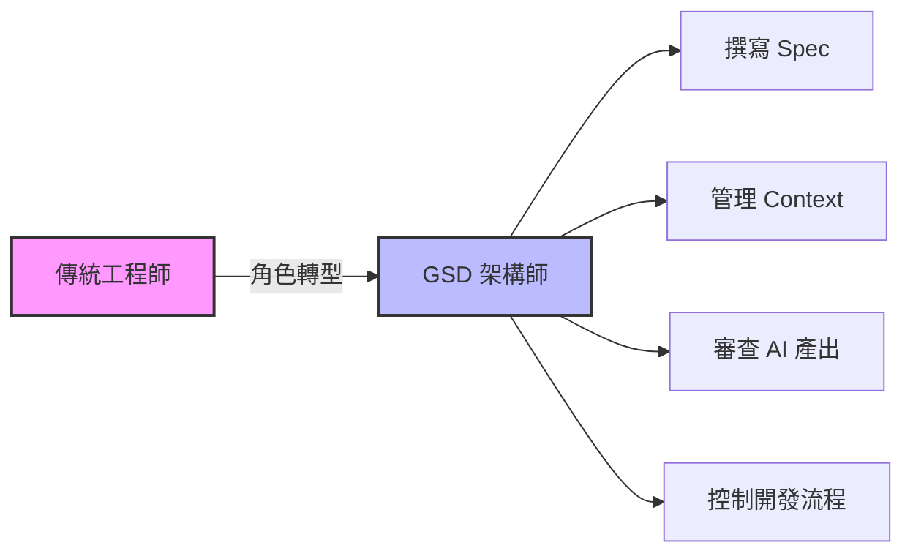
```mermaid
graph LR
    A[傳統工程師] -->|角色轉型| B[GSD 架構師]
    B --> C[撰寫 Spec]
    B --> D[管理 Context]
    B --> E[審查 AI 產出]
    B --> F[控制開發流程]
    
    style A fill:#f9f,stroke:#333,stroke-width:2px
    style B fill:#bbf,stroke:#333,stroke-width:2px
```

## 1.4 與 Agile / DevOps / AI Coding 的關係

GSD 並非取代既有方法論，而是在 AI 協作層提供補強：

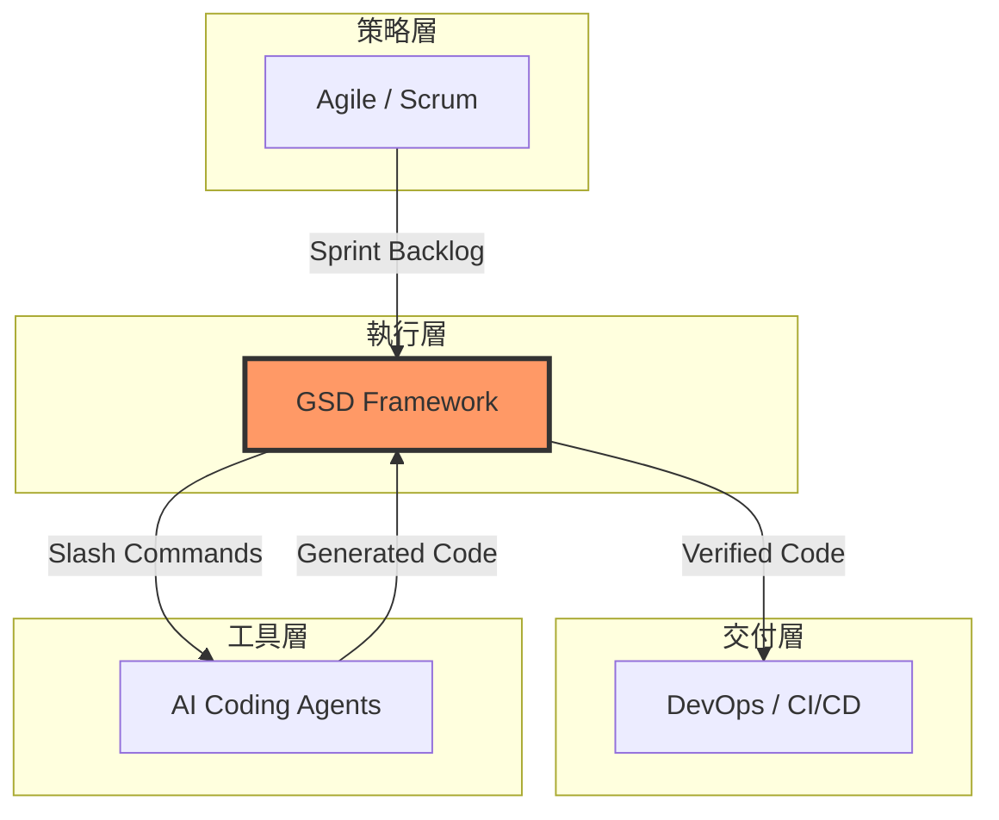
```mermaid
graph TB
    subgraph "策略層"
        Agile[Agile / Scrum]
    end
    subgraph "執行層"
        GSD[GSD Framework]
    end
    subgraph "交付層"
        DevOps[DevOps / CI/CD]
    end
    subgraph "工具層"
        AI[AI Coding Agents]
    end
    
    Agile -->|Sprint Backlog| GSD
    GSD -->|Verified Code| DevOps
    GSD -->|Slash Commands| AI
    AI -->|Generated Code| GSD
    
    style GSD fill:#f96,stroke:#333,stroke-width:3px
```

| 方法論 | 解決的問題 | GSD 的互補方式 |
|--------|-----------|---------------|
| **Agile** | 需求變更、快速迭代 | GSD 的 discuss → plan → execute 對應 Sprint 流程 |
| **DevOps** | 持續交付、自動化 | GSD 的 /gsd:ship 可整合 CI/CD Pipeline |
| **AI Coding** | 程式碼生成 | GSD 提供結構化的 Context，讓 AI 產出更精準 |
| **TDD** | 品質保證 | GSD Spec 內含測試規格，AI 同步產出測試 |

> **注意事項**：GSD 在 Scrum 框架中最適合嵌入 Sprint 的「開發」階段。建議每個 User Story 對應一個 GSD 流程週期（new-project → ship）。

## 1.5 GSD 版本演進

GSD 自 v1.0.0（2025-12-14）以來已歷經 42 個版本迭代，以下為關鍵里程碑：

| 版本 | 日期 | 重要變更 |
|------|------|---------|
| v1.0.0 | 2025-12-14 | 首次公開發布，支援 Claude Code |
| v1.3.0 | 2025-12-21 | 加入 Gemini CLI、Codex 支援 |
| v1.5.0 | 2025-12-28 | 新增 Cursor、Windsurf 支援；重新設計 `/gsd:quick` |
| v1.8.0 | 2026-01-05 | 引入 Model Profiles（quality/balanced/budget/inherit） |
| v1.10.0 | 2026-01-12 | 加入 Copilot、Augment、Antigravity 支援 |
| v1.14.0 | 2026-01-28 | 新增 `/gsd:ship` PR 建立命令 |
| v1.16.0 | 2026-02-02 | 引入 Milestones 里程碑管理 |
| v1.18.0 | 2026-02-09 | 引入 Workstreams 並行工作流 |
| v1.21.0 | 2026-02-17 | 新增 UI Design Contract（`/gsd:ui-phase`） |
| v1.24.0 | 2026-03-02 | 新增 GSD SDK 供第三方整合 |
| v1.27.0 | 2026-03-16 | 安全強化：`/gsd:secure-phase`、敏感檔案保護 |
| v1.29.0 | 2026-03-23 | 新增 Hooks 系統（context-monitor, prompt-guard, workflow-guard） |
| v1.31.0 | 2026-04-01 | 新增 `/gsd:health`、`/gsd:stats`、Nyquist validation |

> **升級建議**：建議至少升級至 v1.27.0 以取得安全強化功能。使用 `npx get-shit-done-cc@latest` 即可升級至最新版。

---

# 第二章：核心概念

## 2.1 Meta Prompting

Meta Prompting 是 GSD 的底層引擎——它不是直接對 AI 下指令，而是**用 Prompt 生成 Prompt**，讓 AI 在正確的框架下自主完成複雜任務。

### 傳統 Prompt vs Meta Prompt

```
# ❌ 傳統 Prompt（直接指令）
"幫我寫一個 Spring Boot REST API，包含 CRUD 功能"

# ✅ Meta Prompt（框架式指令）
"根據以下 Spec 規格，產出符合 Clean Architecture 的實作計畫，
每個 Wave 不超過 5 個檔案，包含單元測試與整合測試..."
```

### Meta Prompting 的層次結構

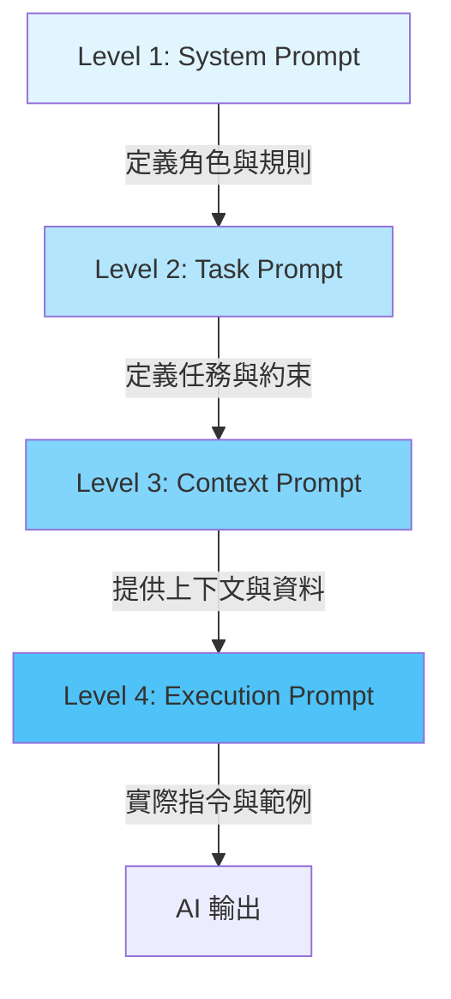
```mermaid
graph TD
    L1[Level 1: System Prompt] -->|定義角色與規則| L2[Level 2: Task Prompt]
    L2 -->|定義任務與約束| L3[Level 3: Context Prompt]
    L3 -->|提供上下文與資料| L4[Level 4: Execution Prompt]
    L4 -->|實際指令與範例| Output[AI 輸出]
    
    style L1 fill:#e1f5fe
    style L2 fill:#b3e5fc
    style L3 fill:#81d4fa
    style L4 fill:#4fc3f7
```

| 層級 | 用途 | GSD 對應 |
|------|------|---------|
| System Prompt | 定義 AI 角色、行為邊界 | GSD 的 CLAUDE.md / .cursorrules |
| Task Prompt | 描述當前任務目標 | /gsd:plan-phase 的計畫指令 |
| Context Prompt | 提供具體上下文資料 | Spec 文件 + 程式碼參考 |
| Execution Prompt | 要求具體輸出格式 | Wave 執行指令 |

### 企業實務範例

```markdown
# Meta Prompt 範例：銀行轉帳服務

## System Context
你是一個資深 Java 架構師，遵循：
- Clean Architecture
- 銀行級安全標準（PCI-DSS）
- 所有金額使用 BigDecimal
- 所有交易具備冪等性

## Task
根據 spec/transfer-service.md 規格，產出實作計畫

## Constraints
- 每個 Wave 不超過 3 個 Java Class
- 必須包含對應的 JUnit 5 測試
- Controller 層使用 @Validated 驗證
- Service 層必須有 @Transactional
- 所有 Exception 使用統一的 ErrorResponse 格式

## Output Format
XML Plan（見 GSD Plan Schema）
```

> **最佳實踐**：Meta Prompt 的設計原則是「約束越明確，AI 輸出越精準」。在企業場景中，務必在 System Context 中載入公司的 Coding Standard。

## 2.2 Context Engineering

Context Engineering 是 GSD 的核心技術——系統性地管理「什麼資訊在什麼時候以什麼方式提供給 AI」。

### Context 的生命週期

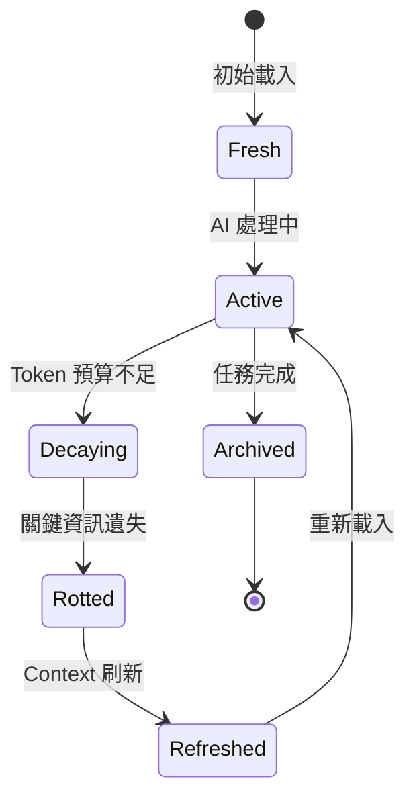
```mermaid
stateDiagram-v2
    [*] --> Fresh: 初始載入
    Fresh --> Active: AI 處理中
    Active --> Decaying: Token 預算不足
    Decaying --> Rotted: 關鍵資訊遺失
    Rotted --> Refreshed: Context 刷新
    Refreshed --> Active: 重新載入
    Active --> Archived: 任務完成
    Archived --> [*]
```

### Context 管理策略

| 策略 | 說明 | 適用場景 |
|------|------|---------|
| **Context Windowing** | 只載入當前 Wave 相關的檔案 | 大型專案（>50 檔案） |
| **Context Compression** | 將大型文件壓縮為摘要 | 長期專案的歷史 Context |
| **Context Routing** | 根據任務類型導向不同 Context 集 | 微服務多模組開發 |
| **Context Checkpointing** | 定期儲存 Context 快照 | 跨日開發 / 多人協作 |
| **Context Pruning** | 移除不再需要的 Context | Token 預算控制 |

### 企業級 Context 組織架構

GSD 使用 `.planning/` 目錄（而非舊版的 `.gsd/`）來管理所有 Context 檔案：

```
project-root/
├── .planning/                  # GSD 主目錄
│   ├── config.json             # GSD 設定（模式、模型、hooks 等）
│   ├── PROJECT.md              # 專案概述與技術棧
│   ├── REQUIREMENTS.md         # 結構化需求規格
│   ├── ROADMAP.md              # 里程碑與工作分解
│   ├── STATE.md                # 當前專案狀態快照（自動維護）
│   ├── MILESTONES.md           # 里程碑追蹤
│   ├── HANDOFF.json            # Session 交接檔案
│   ├── context/
│   │   ├── system.md           # 系統級 Context（架構、標準、約束）
│   │   ├── domain.md           # 領域知識（業務規則、術語）
│   │   ├── tech-stack.md       # 技術棧（框架、版本、配置）
│   │   └── conventions.md      # 慣例（命名、目錄結構、Pattern）
│   ├── specs/
│   │   ├── feature-001.md      # 功能規格
│   │   └── feature-002.md
│   ├── plans/
│   │   ├── plan-001.xml        # 執行計畫
│   │   └── plan-002.xml
│   ├── tasks/                  # 工作任務（Phase 執行產出）
│   ├── threads/                # 討論線程
│   ├── backlog/                # Backlog 項目
│   ├── seeds/                  # 想法種子
│   └── checkpoints/
│       ├── 2026-04-01.md       # Context 快照
│       └── 2026-04-02.md
├── CLAUDE.md                   # Claude Code 系統指令（或對應 runtime 的設定檔）
└── src/                        # 專案原始碼
```

> **重要**：GSD v1.10.0 起統一使用 `.planning/` 目錄。若從舊版升級，原有的 `.gsd/` 目錄內容需手動遷移至 `.planning/`。

### Context Budget 管理

```java
// 概念示意：Context Token 預算分配
public class ContextBudget {
    // Claude 4 Sonnet: 200K context window
    private static final int TOTAL_TOKENS = 200_000;
    
    // 建議分配（GSD 內部會自動管理 context budget）
    private static final double SYSTEM_PROMPT_RATIO = 0.10;  // 20K — CLAUDE.md + GSD 系統指令
    private static final double SPEC_RATIO = 0.20;           // 40K — PROJECT.md + REQUIREMENTS.md
    private static final double CODE_CONTEXT_RATIO = 0.40;   // 80K — 原始碼檔案
    private static final double CONVERSATION_RATIO = 0.20;   // 40K — 對話歷史
    private static final double BUFFER_RATIO = 0.10;         // 20K（安全緩衝）
}
```

> **GSD 自動管理**：GSD 的 `context-monitor` hook（v1.29.0+）會自動偵測 Context 膨脹並觸發壓縮策略，開發者無需手動管理 token 預算。

> **注意事項**：在銀行級系統中，Context 內不得包含真實的客戶資料、密碼、金鑰等敏感資訊。使用脫敏資料或 Mock 資料替代。

## 2.3 Spec-Driven Development

Spec-Driven Development（SDD）是 GSD 的開發方法論——所有程式碼的產出都必須追溯到一份結構化的 Spec 文件。

### Spec 的結構

```markdown
# Spec: 帳戶轉帳服務

## 1. 概述
提供即時帳戶轉帳功能，支援同行/跨行轉帳。

## 2. 功能需求

### 2.1 API 端點
- POST /api/v1/transfers
- GET /api/v1/transfers/{id}
- GET /api/v1/transfers?accountId={id}&page={n}

### 2.2 業務規則
- BR-001: 單筆轉帳上限 500 萬
- BR-002: 每日累積上限 3000 萬
- BR-003: 跨行轉帳需經 FISC 閘道
- BR-004: 所有轉帳具備冪等性（依 idempotencyKey）

### 2.3 資料模型
| 欄位 | 型別 | 必填 | 說明 |
|------|------|------|------|
| fromAccountId | String(16) | Y | 轉出帳號 |
| toAccountId | String(16) | Y | 轉入帳號 |
| amount | BigDecimal | Y | 轉帳金額 |
| currency | String(3) | Y | 幣別（ISO 4217） |
| idempotencyKey | UUID | Y | 冪等鍵 |
| memo | String(100) | N | 備註 |

## 3. 非功能需求
- NFR-001: 回應時間 < 200ms（P99）
- NFR-002: 可用性 99.99%
- NFR-003: 並發處理 > 1000 TPS

## 4. 錯誤碼
| 錯誤碼 | 說明 |
|--------|------|
| TRF-001 | 餘額不足 |
| TRF-002 | 超過單筆上限 |
| TRF-003 | 超過每日上限 |
| TRF-004 | 帳號不存在 |
| TRF-005 | 重複交易（冪等檢查） |

## 5. 測試案例
- TC-001: 正常轉帳 → 成功
- TC-002: 餘額不足 → TRF-001
- TC-003: 重複 idempotencyKey → TRF-005
- TC-004: 並發轉帳同一帳號 → 正確扣款
```

### Spec 的品質指標

| 指標 | 說明 | 檢查方式 |
|------|------|---------|
| **完整性** | 所有功能點都有對應描述 | Spec Review Checklist |
| **明確性** | 無歧義描述 | 團隊 Review |
| **可測試性** | 每個需求都有對應 Test Case | TC 覆蓋率檢查 |
| **可追溯性** | 需求 → Spec → Plan → Code | Traceability Matrix |
| **一致性** | 無矛盾描述 | Cross-reference 檢查 |

> **最佳實踐**：Spec 應由 Tech Lead 或資深工程師撰寫，經過至少一輪 Peer Review 後才進入 /gsd:plan-phase。低品質的 Spec 會直接導致 AI 產出低品質的 Code。

## 2.4 Multi-Agent Orchestration

GSD 內建多個專業化 Agent，各司其職，透過 Slash Commands 自動協作：

| Agent | 用途 | 觸發方式 |
|-------|------|---------|
| **gsd-planner** | 將 Spec 轉為結構化執行計畫（Wave/Task 切分） | `/gsd:plan-phase` |
| **gsd-executor** | 依照計畫逐 Wave 產出程式碼 | `/gsd:execute-phase` |
| **gsd-verifier** | 驗證程式碼是否符合 Spec（測試、lint、型別） | `/gsd:verify-work` |
| **gsd-researcher** | 調研技術問題、搜尋文件、評估方案 | `/gsd:discuss-phase` |
| **gsd-debugger** | 診斷錯誤、追蹤 bug root cause | 自動觸發 |
| **gsd-codebase-mapper** | 分析既有程式碼庫結構（brownfield） | `/gsd:map-codebase` |
| **gsd-plan-checker** | 驗證計畫完整性與 Spec 一致性 | 自動觸發 |
| **gsd-integration-checker** | 檢查整合點（API、DB、MQ）一致性 | 自動觸發 |

### Model Profiles

GSD 允許為不同 Agent 指定不同的模型策略（v1.8.0+）：

| Profile | 說明 | 適用場景 |
|---------|------|---------|
| `quality` | 使用最強模型，精度優先 | 計畫生成、架構決策、安全審查 |
| `balanced` | 平衡品質與速度 | 一般功能開發、測試撰寫 |
| `budget` | 使用較小模型，節省 Token | 簡單修改、文件更新、格式化 |
| `inherit` | 繼承父級設定 | 預設值 |

```json
// .planning/config.json 中的 model_profile 設定
{
  "model_profile": "balanced",
  "planning": {
    "model_profile": "quality"
  }
}
```

> **企業建議**：對於金融級專案，建議 planner 和 verifier 使用 `quality` profile，executor 使用 `balanced`。

## 2.5 Context Rot 問題與解法

Context Rot（上下文衰減）是 AI 協作開發中最關鍵的技術挑戰——隨著對話進行，AI 逐漸「遺忘」早期的重要資訊。

### Context Rot 的表現

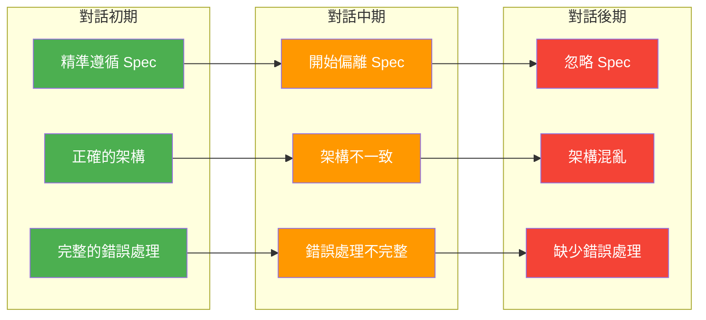
```mermaid
graph LR
    subgraph "對話初期"
        A1[精準遵循 Spec] 
        A2[正確的架構]
        A3[完整的錯誤處理]
    end
    
    subgraph "對話中期"
        B1[開始偏離 Spec]
        B2[架構不一致]
        B3[錯誤處理不完整]
    end
    
    subgraph "對話後期"
        C1[忽略 Spec]
        C2[架構混亂]
        C3[缺少錯誤處理]
    end
    
    A1 --> B1 --> C1
    A2 --> B2 --> C2
    A3 --> B3 --> C3
    
    style A1 fill:#4caf50,color:#fff
    style A2 fill:#4caf50,color:#fff
    style A3 fill:#4caf50,color:#fff
    style B1 fill:#ff9800,color:#fff
    style B2 fill:#ff9800,color:#fff
    style B3 fill:#ff9800,color:#fff
    style C1 fill:#f44336,color:#fff
    style C2 fill:#f44336,color:#fff
    style C3 fill:#f44336,color:#fff
```

### GSD 的 Anti-Rot 機制

| 機制 | 原理 | 實作方式 |
|------|------|---------|
| **Wave 切分** | 限制單次對話的範圍 | 每個 Wave 3-5 個檔案 |
| **Context Reload** | 每個 Wave 開始前重新載入關鍵 Context | Spec + Plan snippet |
| **Checkpoint Resume** | 跨日開發時從 Checkpoint 恢復 | .planning/checkpoints/ |
| **Spec Anchoring** | 每次執行都參照 Spec | Plan XML 中的 spec-ref |
| **Verify Loop** | 完成後驗證是否符合 Spec | /gsd:verify-work |
| **Context Monitor Hook** | 自動偵測 Context 膨脹（v1.29.0+） | hooks.context-monitor |
| **STATE.md 自動更新** | 每個 Phase 自動更新專案狀態 | .planning/STATE.md |

### 實務操作：Context Rot 偵測與修復

```bash
# 偵測信號
# 1. AI 開始產出與 Spec 不符的程式碼
# 2. AI 重複詢問已回答的問題
# 3. AI 忘記專案慣例（命名、架構模式）
# 4. AI 產出的程式碼品質明顯下降

# 修復步驟
# Step 1: 儲存當前進度
/gsd:checkpoint save "wave-3-complete"

# Step 2: 開始新的對話
# Step 3: 載入 Context
/gsd:checkpoint load "wave-3-complete"

# Step 4: 繼續下一個 Wave
/gsd:execute-phase --wave 4
```

> **注意事項**：在企業環境中，建議每 3-5 個 Wave 強制做一次 Context Refresh。對於銀行級系統（邏輯複雜度高），建議每 2-3 個 Wave 刷新一次。

## 2.6 XML Prompt Formatting

GSD 使用 XML 格式來結構化 Prompt，確保 AI Agent 能精確解析指令：

```xml
<!-- GSD Plan 的 XML 結構示例 -->
<gsd-plan>
  <metadata>
    <project>bank-transfer-service</project>
    <spec-ref>.planning/specs/transfer-service.md</spec-ref>
    <total-waves>5</total-waves>
  </metadata>
  
  <wave number="1" description="Domain Layer">
    <task id="1.1" type="create">
      <file>src/main/java/com/bank/domain/Transfer.java</file>
      <description>建立 Transfer 領域物件</description>
      <spec-section>2.3</spec-section>
      <dependencies/>
    </task>
    <task id="1.2" type="create">
      <file>src/main/java/com/bank/domain/TransferRepository.java</file>
      <description>建立 Repository 介面</description>
      <dependencies>1.1</dependencies>
    </task>
  </wave>
  
  <wave number="2" description="Application Layer" depends-on="1">
    <!-- 後續 Wave... -->
  </wave>
</gsd-plan>
```

### XML Prompt 的優勢

| 優勢 | 說明 |
|------|------|
| **結構化** | AI 能精確解析每個 task 的邊界與依賴 |
| **可追溯** | 每個 task 關聯 spec-section，實現需求追溯 |
| **並行化** | Wave 間的依賴關係明確，可安全並行執行 |
| **可驗證** | 完成後可逐 task 檢查是否符合 Spec |

## 2.7 Atomic Git Commits

GSD 提倡每個 Wave 完成後自動建立 Git Commit，確保變更可追溯且可回滾：

```json
// .planning/config.json 中的 git branching 設定
{
  "git": {
    "auto_branch": true,
    "branch_prefix": "gsd",
    "commit_style": "conventional"
  }
}
```

| Commit 類型 | 範例 | 說明 |
|-------------|------|------|
| `feat` | `feat(transfer): add Transfer domain entity [wave-1]` | 新功能 |
| `fix` | `fix(transfer): correct amount validation [wave-3]` | 修正 |
| `test` | `test(transfer): add unit tests for TransferService [wave-4]` | 測試 |
| `docs` | `docs: update API documentation [wave-5]` | 文件 |

> **企業實踐**：搭配 `/gsd:pr-branch` 命令（v1.31.0+），GSD 會自動建立乾淨的 PR 分支，排除 `.planning/` 目錄中的中間產物。

---

# 第三章：系統架構設計（企業級）

## 3.1 GSD + AI Agent 架構圖

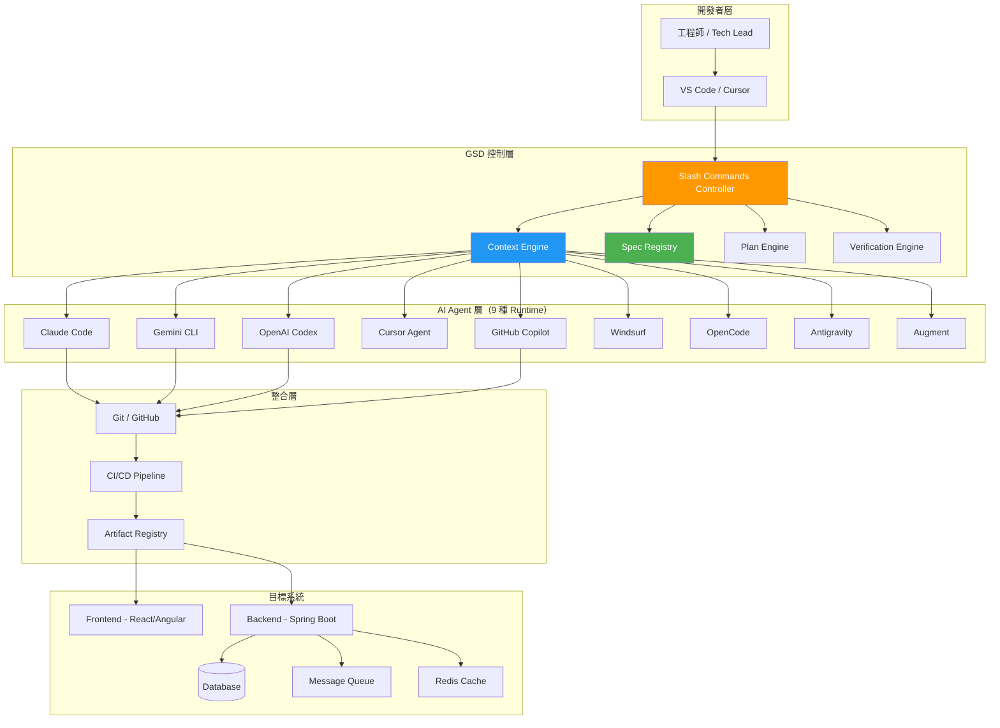
```mermaid
graph TB
    subgraph "開發者層"
        Dev[工程師 / Tech Lead]
        IDE[VS Code / Cursor]
    end
    
    subgraph "GSD 控制層"
        CMD[Slash Commands Controller]
        CTX[Context Engine]
        SPEC[Spec Registry]
        PLAN[Plan Engine]
        VER[Verification Engine]
    end
    
    subgraph "AI Agent 層（9 種 Runtime）"
        Claude[Claude Code]
        Gemini[Gemini CLI]
        Codex[OpenAI Codex]
        Cursor[Cursor Agent]
        Copilot[GitHub Copilot]
        Windsurf[Windsurf]
        OpenCode[OpenCode]
        Antigravity[Antigravity]
        Augment[Augment]
    end
    
    subgraph "整合層"
        Git[Git / GitHub]
        CI[CI/CD Pipeline]
        Artifact[Artifact Registry]
    end
    
    subgraph "目標系統"
        FE[Frontend - React/Angular]
        BE[Backend - Spring Boot]
        DB[(Database)]
        MQ[Message Queue]
        Cache[Redis Cache]
    end
    
    Dev --> IDE
    IDE --> CMD
    CMD --> CTX
    CMD --> SPEC
    CMD --> PLAN
    CMD --> VER
    
    CTX --> Claude
    CTX --> Gemini
    CTX --> Codex
    CTX --> Cursor
    CTX --> Copilot
    CTX --> Windsurf
    CTX --> OpenCode
    CTX --> Antigravity
    CTX --> Augment
    
    Claude --> Git
    Gemini --> Git
    Codex --> Git
    Copilot --> Git
    Git --> CI
    CI --> Artifact
    
    Artifact --> FE
    Artifact --> BE
    BE --> DB
    BE --> MQ
    BE --> Cache
    
    style CMD fill:#ff9800,color:#fff
    style CTX fill:#2196f3,color:#fff
    style SPEC fill:#4caf50,color:#fff
```

## 3.2 與 Web Application（前後端）整合方式

### 3.2.1 架構整合總覽

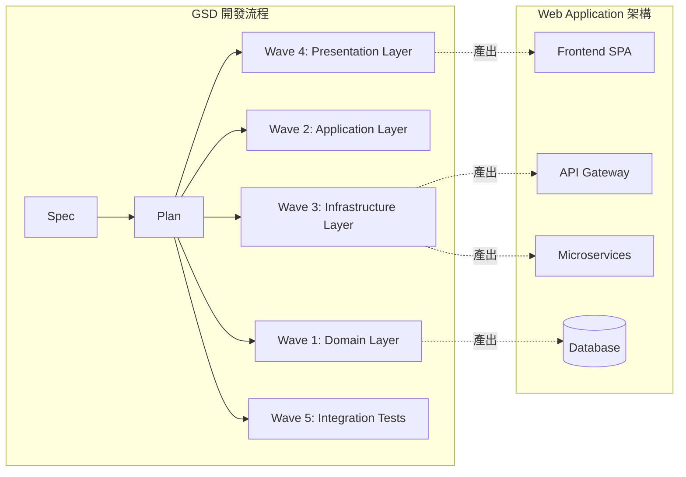
```mermaid
graph LR
    subgraph "GSD 開發流程"
        S[Spec] --> P[Plan]
        P --> W1[Wave 1: Domain Layer]
        P --> W2[Wave 2: Application Layer]
        P --> W3[Wave 3: Infrastructure Layer]
        P --> W4[Wave 4: Presentation Layer]
        P --> W5[Wave 5: Integration Tests]
    end
    
    subgraph "Web Application 架構"
        UI[Frontend SPA]
        GW[API Gateway]
        SVC[Microservices]
        DB[(Database)]
    end
    
    W4 -.->|產出| UI
    W3 -.->|產出| SVC
    W3 -.->|產出| GW
    W1 -.->|產出| DB
```

### 3.2.2 前端整合（React / Angular）

```typescript
// GSD 產出的前端 API Client（TypeScript）
// 來源 Spec: spec/transfer-service.md

export interface TransferRequest {
  fromAccountId: string;
  toAccountId: string;
  amount: number;
  currency: string;
  idempotencyKey: string;
  memo?: string;
}

export interface TransferResponse {
  transferId: string;
  status: 'PENDING' | 'COMPLETED' | 'FAILED';
  timestamp: string;
}

export class TransferApiClient {
  private readonly baseUrl: string;
  private readonly httpClient: AxiosInstance;

  constructor(config: ApiConfig) {
    this.baseUrl = config.baseUrl;
    this.httpClient = axios.create({
      baseURL: this.baseUrl,
      timeout: 5000,
      headers: {
        'Content-Type': 'application/json',
        'X-Request-ID': () => crypto.randomUUID(),
      },
    });
    // 攔截器：統一錯誤處理
    this.httpClient.interceptors.response.use(
      response => response,
      error => this.handleError(error)
    );
  }

  async createTransfer(request: TransferRequest): Promise<TransferResponse> {
    const response = await this.httpClient.post<TransferResponse>(
      '/api/v1/transfers',
      request,
      {
        headers: { 'Idempotency-Key': request.idempotencyKey },
      }
    );
    return response.data;
  }

  private handleError(error: AxiosError): never {
    const errorResponse = error.response?.data as ErrorResponse;
    throw new TransferError(
      errorResponse?.errorCode ?? 'UNKNOWN',
      errorResponse?.message ?? '系統異常，請稍後再試'
    );
  }
}
```

### 3.2.3 後端整合（Spring Boot）

```java
// GSD 產出的後端 Controller（Java / Spring Boot）
// 來源 Spec: spec/transfer-service.md

@RestController
@RequestMapping("/api/v1/transfers")
@Validated
@Slf4j
public class TransferController {

    private final TransferService transferService;

    public TransferController(TransferService transferService) {
        this.transferService = transferService;
    }

    @PostMapping
    @ResponseStatus(HttpStatus.CREATED)
    public TransferResponse createTransfer(
            @RequestHeader("Idempotency-Key") @NotBlank String idempotencyKey,
            @Valid @RequestBody TransferRequest request) {
        
        log.info("收到轉帳請求: fromAccount={}, toAccount={}, amount={}, idempotencyKey={}",
                request.getFromAccountId(),
                request.getToAccountId(),
                request.getAmount(),
                idempotencyKey);
        
        return transferService.executeTransfer(request, idempotencyKey);
    }

    @GetMapping("/{transferId}")
    public TransferResponse getTransfer(
            @PathVariable @Pattern(regexp = "^TRF-[0-9]{12}$") String transferId) {
        return transferService.getTransfer(transferId);
    }

    @GetMapping
    public Page<TransferResponse> listTransfers(
            @RequestParam @NotBlank String accountId,
            @RequestParam(defaultValue = "0") @Min(0) int page,
            @RequestParam(defaultValue = "20") @Min(1) @Max(100) int size) {
        return transferService.listTransfers(accountId, PageRequest.of(page, size));
    }
}
```

## 3.3 微服務 / Clean Architecture / Hexagonal Architecture

### 3.3.1 GSD 與 Clean Architecture 映射

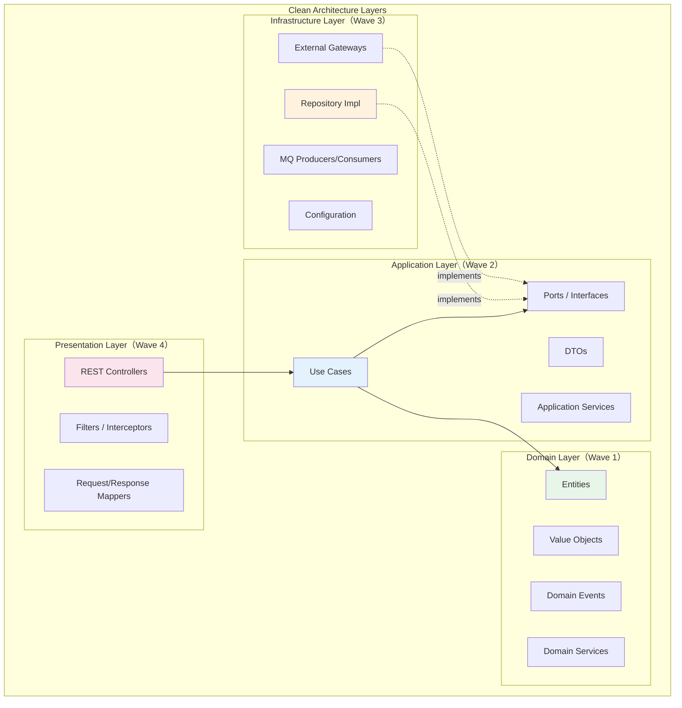
```mermaid
graph TB
    subgraph "Clean Architecture Layers"
        subgraph "Domain Layer（Wave 1）"
            Entity[Entities]
            VO[Value Objects]
            DomainEvent[Domain Events]
            DomainService[Domain Services]
        end
        
        subgraph "Application Layer（Wave 2）"
            UseCase[Use Cases]
            Port[Ports / Interfaces]
            DTO[DTOs]
            AppService[Application Services]
        end
        
        subgraph "Infrastructure Layer（Wave 3）"
            Repo[Repository Impl]
            Gateway[External Gateways]
            Messaging[MQ Producers/Consumers]
            Config[Configuration]
        end
        
        subgraph "Presentation Layer（Wave 4）"
            Controller[REST Controllers]
            Middleware[Filters / Interceptors]
            Mapper[Request/Response Mappers]
        end
    end
    
    Controller --> UseCase
    UseCase --> Entity
    UseCase --> Port
    Repo -.->|implements| Port
    Gateway -.->|implements| Port
    
    style Entity fill:#e8f5e9
    style UseCase fill:#e3f2fd
    style Repo fill:#fff3e0
    style Controller fill:#fce4ec
```

### 3.3.2 Wave 與架構層的對應

| Wave | 架構層 | 產出 | 說明 |
|------|--------|------|------|
| Wave 1 | Domain | Entities, VOs, Domain Events | 純業務邏輯，無外部依賴 |
| Wave 2 | Application | Use Cases, Ports, DTOs | 應用流程編排，定義 Port |
| Wave 3 | Infrastructure | Repo Impl, Gateways | 實作 Port，處理外部系統 |
| Wave 4 | Presentation | Controllers, Mappers | API 端點、請求回應轉換 |
| Wave 5 | Testing | Integration Tests | 端對端驗證 |

### 3.3.3 Hexagonal Architecture 範例

```java
// Port（Application Layer - Wave 2）
public interface TransferPort {
    TransferResult execute(TransferCommand command);
}

public interface AccountPort {
    Account findById(AccountId accountId);
    void updateBalance(AccountId accountId, Money amount);
}

public interface AuditPort {
    void logTransfer(TransferAuditEvent event);
}

// Adapter（Infrastructure Layer - Wave 3）
@Repository
public class JpaAccountAdapter implements AccountPort {
    
    private final AccountJpaRepository repository;
    
    @Override
    public Account findById(AccountId accountId) {
        return repository.findById(accountId.getValue())
            .map(this::toDomain)
            .orElseThrow(() -> new AccountNotFoundException(accountId));
    }
    
    @Override
    @Transactional
    public void updateBalance(AccountId accountId, Money amount) {
        int updated = repository.updateBalance(
            accountId.getValue(), 
            amount.getAmount()
        );
        if (updated == 0) {
            throw new OptimisticLockingException("帳戶餘額更新失敗");
        }
    }
}
```

## 3.4 與資料庫整合

### 3.4.1 資料庫整合策略

| 資料庫 | 適用場景 | GSD 整合注意事項 |
|--------|---------|-----------------|
| **Oracle** | 核心交易系統 | Spec 需明確定義 Sequence、Partition 策略 |
| **DB2** | 大型主機整合 | Spec 需包含 DB2 特有語法（FETCH FIRST） |
| **PostgreSQL** | 新建微服務 | 可利用 JSONB 支援彈性資料模型 |
| **Redis** | 快取/Session | Spec 需定義 TTL 策略與淘汰機制 |

### 3.4.2 資料庫 Spec 範例

```markdown
## Database Spec: 轉帳交易表

### Table: TXN_TRANSFER
| Column | Type | Nullable | Default | Index | Description |
|--------|------|----------|---------|-------|-------------|
| TXN_ID | VARCHAR(20) | N | - | PK | 交易序號 |
| FROM_ACCT | VARCHAR(16) | N | - | IDX1 | 轉出帳號 |
| TO_ACCT | VARCHAR(16) | N | - | IDX2 | 轉入帳號 |
| AMOUNT | DECIMAL(18,2) | N | - | - | 交易金額 |
| CURRENCY | CHAR(3) | N | 'TWD' | - | 幣別 |
| STATUS | VARCHAR(10) | N | 'PENDING' | IDX3 | 交易狀態 |
| IDEMPOTENCY_KEY | VARCHAR(36) | N | - | UNQ1 | 冪等鍵 |
| CREATED_AT | TIMESTAMP | N | CURRENT_TIMESTAMP | - | 建立時間 |
| UPDATED_AT | TIMESTAMP | N | CURRENT_TIMESTAMP | - | 更新時間 |
| VERSION | INT | N | 0 | - | 樂觀鎖版本號 |

### Index Strategy
- IDX1: FROM_ACCT + CREATED_AT（查詢帳戶交易紀錄）
- IDX2: TO_ACCT + CREATED_AT（查詢入帳紀錄）
- IDX3: STATUS + CREATED_AT（查詢待處理交易）
- UNQ1: IDEMPOTENCY_KEY（冪等性保證）

### Partition Strategy（Oracle）
- Range Partition by CREATED_AT（月分區）
- 保留 13 個月，歷史資料遷移至 Archive
```

## 3.5 與 MQ / Cache / API Gateway 整合

### 3.5.1 整合架構

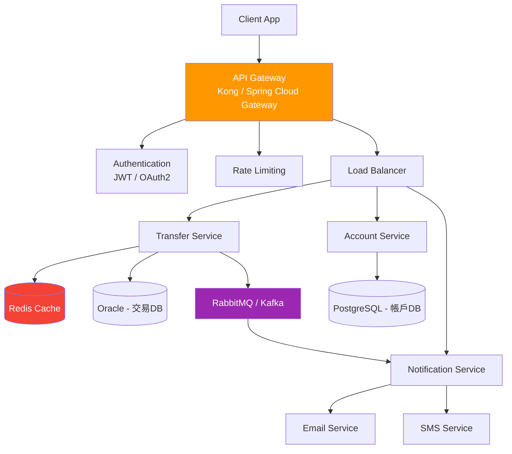
```mermaid
graph TB
    Client[Client App] --> GW[API Gateway<br/>Kong / Spring Cloud Gateway]
    
    GW --> Auth[Authentication<br/>JWT / OAuth2]
    GW --> RL[Rate Limiting]
    GW --> LB[Load Balancer]
    
    LB --> SVC1[Transfer Service]
    LB --> SVC2[Account Service]
    LB --> SVC3[Notification Service]
    
    SVC1 --> Cache[(Redis Cache)]
    SVC1 --> DB1[(Oracle - 交易DB)]
    SVC1 --> MQ[RabbitMQ / Kafka]
    
    MQ --> SVC3
    SVC2 --> DB2[(PostgreSQL - 帳戶DB)]
    SVC3 --> Email[Email Service]
    SVC3 --> SMS[SMS Service]
    
    style GW fill:#ff9800,color:#fff
    style Cache fill:#f44336,color:#fff
    style MQ fill:#9c27b0,color:#fff
```

### 3.5.2 MQ 整合 Spec 範例

```markdown
## MQ Spec: 轉帳完成事件

### Topic: transfer.completed
- Broker: Kafka
- Partitions: 12
- Replication Factor: 3
- Retention: 7 days

### Message Schema
{
  "eventId": "EVT-202604030001",
  "eventType": "TRANSFER_COMPLETED",
  "timestamp": "2026-04-03T10:30:00+08:00",
  "payload": {
    "transferId": "TRF-202604030001",
    "fromAccountId": "0001234567890",
    "toAccountId": "0009876543210",
    "amount": 50000.00,
    "currency": "TWD"
  }
}

### Consumer Groups
| Group | Service | 用途 |
|-------|---------|------|
| notification-group | Notification Service | 發送通知 |
| audit-group | Audit Service | 審計日誌 |
| analytics-group | Analytics Service | 數據分析 |
```

### 3.5.3 Cache 策略 Spec

```java
// 由 GSD 產出的 Cache 策略實作
@Service
@Slf4j
public class TransferCacheService {

    private final RedisTemplate<String, Object> redisTemplate;
    private static final String TRANSFER_CACHE_PREFIX = "transfer:";
    private static final String IDEMPOTENCY_PREFIX = "idempotency:";
    
    // 冪等性檢查（Cache-Aside Pattern）
    public boolean isIdempotent(String idempotencyKey) {
        String key = IDEMPOTENCY_PREFIX + idempotencyKey;
        Boolean result = redisTemplate.opsForValue()
            .setIfAbsent(key, "PROCESSING", Duration.ofHours(24));
        return Boolean.TRUE.equals(result);
    }
    
    // 交易結果快取（Write-Through Pattern）
    public void cacheTransferResult(String transferId, TransferResponse response) {
        String key = TRANSFER_CACHE_PREFIX + transferId;
        redisTemplate.opsForValue().set(key, response, Duration.ofMinutes(30));
    }
    
    // 查詢快取（Cache-Aside Pattern）
    public Optional<TransferResponse> getCachedTransfer(String transferId) {
        String key = TRANSFER_CACHE_PREFIX + transferId;
        TransferResponse cached = (TransferResponse) redisTemplate.opsForValue().get(key);
        return Optional.ofNullable(cached);
    }
}
```

> **注意事項**：
> 1. 在銀行系統中，交易結果的快取需注意一致性——建議使用 Write-Through 而非 Write-Behind。
> 2. 冪等性 Key 的 TTL 需根據業務需求調整（最少 24 小時，建議 72 小時）。
> 3. API Gateway 的 Rate Limiting 設定需納入 Spec，避免 AI 遺漏。

---

# 第四章：安裝與環境建置

## 4.1 GSD 安裝步驟

### 4.1.1 前置需求

| 軟體 | 最低版本 | 建議版本 | 用途 |
|------|---------|---------|------|
| Node.js | 18.x | 20.x LTS | GSD CLI 運行環境 |
| Git | 2.30+ | 最新版 | 版本控制 |
| Python | 3.10+ | 3.12+ | 輔助工具腳本 |
| VS Code | 1.85+ | 最新版 | 主要 IDE |
| Java JDK | 17 | 21 LTS | 後端開發 |
| Maven | 3.8+ | 3.9+ | Java 建置工具 |

### 4.1.2 安裝 GSD

GSD 透過 `npx` 直接執行，**無需全域安裝**：

```bash
# 推薦方式：使用 npx 直接執行（會互動式選擇 Runtime 與安裝路徑）
npx get-shit-done-cc@latest

# 執行後會依序詢問：
# 1. 選擇 Runtime（Claude Code / Gemini CLI / Codex / Copilot / Cursor / Windsurf / OpenCode / Antigravity / Augment）
# 2. 選擇安裝位置（當前目錄 / 指定路徑）
# 3. 確認安裝

# 升級至最新版（同樣命令）
npx get-shit-done-cc@latest
```

> **重要**：GSD 不使用 `npm install -g` 全域安裝。每次執行 `npx get-shit-done-cc@latest` 即可自動安裝/升級至最新版。

#### Claude Code 2.1.88+ Skills 遷移

自 Claude Code 2.1.88 起，GSD 以 **Skills** 形式安裝（取代舊版 `commands/gsd/` 目錄）：

```
# 新版安裝路徑
~/.claude/skills/gsd-*/SKILL.md

# 舊版路徑（已棄用）
~/.claude/commands/gsd/
```

如果從舊版升級，重新執行 `npx get-shit-done-cc@latest` 即可自動遷移。

### 4.1.3 初始化 GSD 專案

```bash
# 在現有專案中初始化 GSD（透過 Slash Command）
# 進入 Claude Code（或其他 Runtime）後執行：
/gsd:new-project

# 產生的目錄結構（.planning/ 而非舊版 .gsd/）
# .planning/
# ├── config.json           # GSD 配置（JSON 格式）
# ├── PROJECT.md            # 專案概述
# ├── REQUIREMENTS.md       # 需求規格
# ├── ROADMAP.md            # 里程碑與路線圖
# ├── STATE.md              # 專案狀態快照（自動維護）
# ├── MILESTONES.md         # 里程碑追蹤
# ├── HANDOFF.json          # Session 交接資料
# ├── specs/                # Spec 存放處
# ├── tasks/                # 工作任務
# ├── plans/                # Plan 存放處
# ├── backlog/              # Backlog 項目
# ├── threads/              # 討論線程
# ├── seeds/                # 想法種子
# └── checkpoints/          # Checkpoint 存放處
```

> **注意**：`.planning/` 目錄應加入 `.gitignore`（視團隊規範可選擇性保留 `PROJECT.md` 和 `REQUIREMENTS.md`）。

### 4.1.4 GSD 配置檔（config.json）

GSD 使用 **JSON 格式**的設定檔（而非 YAML）：

```json
// .planning/config.json
{
  "mode": "greenfield",           // greenfield（新專案）或 brownfield（既有專案）
  "granularity": "normal",        // normal / detailed / minimal
  "model_profile": "balanced",    // quality / balanced / budget / inherit
  
  "planning": {
    "model_profile": "quality",   // 計畫生成使用最強模型
    "max_tasks_per_phase": 10,
    "require_spec_review": true
  },
  
  "workflow": {
    "auto_verify": true,           // 自動執行驗證
    "auto_commit": true,           // 自動 Git commit
    "require_tests": true,         // 強制要求測試
    "nyquist_validation": true,    // 啟用 Nyquist 驗證（v1.31.0+）
    "schema_drift_detection": true // Schema drift 偵測
  },
  
  "hooks": {
    "context-monitor": true,       // Context 膨脹偵測（v1.29.0+）
    "prompt-guard": true,          // Prompt 品質檢查
    "workflow-guard": true,        // 工作流程守衛
    "scope-reduction-detection": true  // 範圍縮減偵測
  },
  
  "git": {
    "auto_branch": true,           // 自動建立分支
    "branch_prefix": "gsd",       // 分支前綴
    "commit_style": "conventional" // 提交訊息風格
  },
  
  "security": {
    "sensitive_files": [           // 敏感檔案保護（v1.27.0+）
      "**/*.env",
      "**/*.key",
      "**/*.pem",
      "**/application-prod.*",
      "**/keystore/**"
    ]
  }
}
```

> **對照表**：舊版 `.gsd/config.yaml` → 新版 `.planning/config.json`。如果您的文件仍參考 YAML 格式，請手動遷移。

## 4.2 Claude Code 設定

### 4.2.1 安裝與認證

```bash
# 安裝 Claude Code CLI
npm install -g @anthropic-ai/claude-code

# 認證（企業版使用 SSO）
claude auth login --method sso --org your-company

# 或使用 API Key（個人開發環境）
export ANTHROPIC_API_KEY="sk-ant-xxxxx"

# 驗證
claude --version
claude auth status
```

### 4.2.2 專案級配置（CLAUDE.md）

```markdown
# CLAUDE.md — 專案級 AI 指引

## 角色
你是一個資深 Java 架構師，遵循本專案的開發標準。

## 技術棧
- Java 21 + Spring Boot 3.2
- Maven 3.9
- PostgreSQL 16
- Redis 7
- Kafka 3.6

## 程式碼標準
- 使用 Clean Architecture（Domain → Application → Infrastructure → Presentation）
- 所有 public 方法都需要 JavaDoc
- 金額計算一律使用 BigDecimal
- Exception 使用 @ControllerAdvice 統一處理
- 日誌使用 SLF4J + Logback
- 資料庫存取使用 Spring Data JPA + QueryDSL

## 命名慣例
- Package: com.company.{service-name}.{layer}.{subdomain}
- Class: PascalCase（如 TransferService）
- Method: camelCase（如 executeTransfer）
- Constant: UPPER_SNAKE_CASE（如 MAX_TRANSFER_AMOUNT）
- Database Column: UPPER_SNAKE_CASE（如 FROM_ACCT）

## 禁止事項
- 不使用 System.out.println（使用 Logger）
- 不使用 float/double 處理金額
- 不在 Controller 中直接存取 Repository
- 不使用 @Autowired 欄位注入（使用建構子注入）
- 不在非測試程式碼中使用 Thread.sleep
```

### 4.2.3 GSD 與 Claude Code 整合

```bash
# Step 1: 先安裝 GSD Skills
npx get-shit-done-cc@latest
# 選擇 "Claude Code" 作為 Runtime

# Step 2: 進入 Claude Code
claude

# Step 3: 使用 GSD Slash Commands
> /gsd:new-project
# Claude Code 會讀取 CLAUDE.md + .planning/config.json + Spec
# 自動進入 discuss-phase

# 快速任務（跳過完整流程）
> /gsd:quick fix the login validation bug

# 自動推進下一步
> /gsd:next
```

> **提示**：Claude Code 2.1.88+ 使用 Skills 機制，GSD 命令安裝於 `~/.claude/skills/gsd-*/SKILL.md`。

## 4.3 Gemini CLI 設定

### 4.3.1 安裝與認證

```bash
# 安裝 Gemini CLI
npm install -g @google/gemini-cli

# 認證
gemini auth login

# 或使用 API Key
export GEMINI_API_KEY="AIzaSy-xxxxx"

# 設定模型
gemini config set model gemini-2.5-pro
```

### 4.3.2 GEMINI.md 配置

```markdown
# GEMINI.md — Gemini 專用指引

## 模型設定
- 使用 gemini-2.5-pro（支援長 Context）
- Temperature: 0
- 啟用 Code Execution 沙盒

## 與 GSD 整合
- 讀取 .planning/config.json 配置
- 遵循 .planning/PROJECT.md 的專案約束
- 每個 Wave 輸出完成後自動執行 lint + test

## 特殊指令
- @file <path>: 載入檔案至 Context
- @web <url>: 載入網頁內容
- @folder <path>: 載入整個目錄
```

## 4.4 其他 Runtime 設定

GSD 支援 9 種 Runtime，以下為其他 Runtime 的安裝重點：

| Runtime | 安裝方式 | 系統指令檔案 |
|---------|---------|-------------|
| **Codex** | OpenAI 官方安裝 | `AGENTS.md` |
| **Copilot** | GitHub Copilot Agent Mode | `.github/copilot-instructions.md` |
| **Cursor** | Cursor IDE 內建 | `.cursorrules` |
| **Windsurf** | Codeium 官方安裝 | `.windsurfrules` |
| **OpenCode** | `npm install -g opencode` | `AGENTS.md` |
| **Antigravity** | 官方安裝指引 | 依 Runtime 文件 |
| **Augment** | 官方安裝指引 | 依 Runtime 文件 |

```bash
# 安裝 GSD 至任一 Runtime（統一入口）
npx get-shit-done-cc@latest
# 安裝時選擇對應的 Runtime 即可
```

> **注意**：不同 Runtime 的系統指令檔案名稱不同（如 Claude Code 使用 `CLAUDE.md`、Cursor 使用 `.cursorrules`），但 GSD 會自動在安裝時生成對應檔案。

## 4.5 VS Code 開發環境配置

### 4.5.1 推薦擴充套件

| 擴充套件 | 用途 | 必要性 |
|----------|------|--------|
| GitHub Copilot | AI 程式碼補全 | 必裝 |
| GitHub Copilot Chat | AI 對話 | 必裝 |
| Extension Pack for Java | Java 開發套件 | 必裝 |
| Spring Boot Extension Pack | Spring Boot 開發 | 必裝 |
| GitLens | Git 歷史與追蹤 | 建議 |
| Markdown All in One | Markdown 編輯 | 建議 |
| Mermaid Markdown Preview | Mermaid 預覽 | 建議 |
| REST Client | API 測試 | 建議 |

### 4.5.2 VS Code Settings（GSD 專用）

```jsonc
// .vscode/settings.json
{
  // GSD 相關設定
  "files.associations": {
    "*.spec.md": "markdown",
    "*.plan.xml": "xml"
  },
  
  // Java 設定
  "java.configuration.runtimes": [
    {
      "name": "JavaSE-21",
      "path": "/usr/lib/jvm/java-21",
      "default": true
    }
  ],
  
  // 編輯器設定
  "editor.formatOnSave": true,
  "editor.rulers": [120],
  
  // 檔案排除（避免干擾 AI Context）
  "files.exclude": {
    "**/target": true,
    "**/node_modules": true,
    "**/.git": true
  },
  
  // Copilot 設定
  "github.copilot.enable": {
    "*": true,
    "yaml": true,
    "markdown": true
  }
}
```

### 4.5.3 VS Code Tasks（GSD 工作流程）

```jsonc
// .vscode/tasks.json
{
  "version": "2.0.0",
  "tasks": [
    {
      "label": "GSD: Verify Work",
      "type": "shell",
      "command": "mvn",
      "args": ["verify", "-Pintegration-test"],
      "group": "test",
      "problemMatcher": ["$java"]
    },
    {
      "label": "GSD: Lint Check",
      "type": "shell",
      "command": "mvn",
      "args": ["checkstyle:check", "spotbugs:check"],
      "group": "build"
    },
    {
      "label": "GSD: Ship",
      "type": "shell",
      "command": "mvn",
      "args": ["clean", "deploy", "-Pproduction"],
      "group": "build",
      "dependsOn": ["GSD: Verify Work", "GSD: Lint Check"]
    }
  ]
}
```

## 4.6 Windows / Linux 環境差異

| 項目 | Windows | Linux / macOS |
|------|---------|--------------|
| 路徑分隔 | `\`（Backslash） | `/`（Forward slash） |
| 換行符號 | CRLF | LF |
| 環境變數 | `set VAR=value` / `$env:VAR="value"` | `export VAR=value` |
| Shell | PowerShell / CMD | Bash / Zsh |
| GSD Config 路徑 | `.planning\config.json` | `.planning/config.json` |
| 權限管理 | NTFS ACL | chmod/chown |

### Windows 特殊設定

```powershell
# PowerShell Profile 設定
# 路徑: $PROFILE（通常為 ~\Documents\PowerShell\Microsoft.PowerShell_profile.ps1）

# Claude Code API Key（企業環境應使用金鑰管理系統）
$env:ANTHROPIC_API_KEY = (Get-Content "$env:USERPROFILE\.config\anthropic\key")

# 函式：快速安裝/升級 GSD
function Update-GSD {
    npx get-shit-done-cc@latest
}

# 函式：快速進入 GSD 流程
function Start-GSD {
    claude
}
```

### Linux / macOS 設定

```bash
# ~/.bashrc 或 ~/.zshrc

# Claude Code API Key（企業環境應使用金鑰管理系統）
export ANTHROPIC_API_KEY=$(cat "$HOME/.config/anthropic/key")

# 別名：GSD 升級
alias gsd-update='npx get-shit-done-cc@latest'

# 自動補全（Claude Code）
eval "$(claude completion bash)"  # bash
eval "$(claude completion zsh)"   # zsh
```

> **注意事項**：
> 1. 企業環境中，API Key 不應明文存放——應使用金鑰管理系統（如 HashiCorp Vault、AWS Secrets Manager）。
> 2. Windows 開發者務必設定 Git 的換行符號為 `core.autocrlf=input`，避免因 CRLF/LF 差異導致 AI 產出的程式碼格式問題。
> 3. 建議團隊統一使用 `.editorconfig` 確保跨平台一致性。

---

# 第五章：GSD 開發流程（核心）

## 5.0 流程總覽

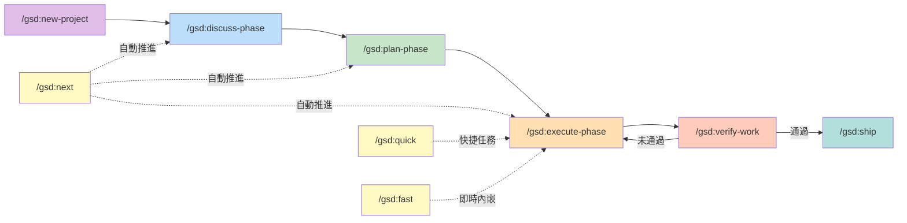
```mermaid
graph LR
    A["/gsd:new-project"] --> B["/gsd:discuss-phase"]
    B --> C["/gsd:plan-phase"]
    C --> D["/gsd:execute-phase"]
    D --> E["/gsd:verify-work"]
    E -->|通過| F["/gsd:ship"]
    E -->|未通過| D
    
    N["/gsd:next"] -.->|自動推進| B
    N -.->|自動推進| C
    N -.->|自動推進| D
    
    Q["/gsd:quick"] -.->|快捷任務| D
    FA["/gsd:fast"] -.->|即時內嵌| D
    
    style A fill:#e1bee7
    style B fill:#bbdefb
    style C fill:#c8e6c9
    style D fill:#ffe0b2
    style E fill:#ffccbc
    style F fill:#b2dfdb
    style N fill:#fff9c4
    style Q fill:#fff9c4
    style FA fill:#fff9c4
```

### 流程模式對照

| 模式 | 命令 | 適用場景 | 說明 |
|------|------|---------|------|
| **完整流程** | `/gsd:new-project` → `discuss` → `plan` → `execute` → `verify` → `ship` | 新功能開發、重大變更 | 標準 GSD 工作流 |
| **快速任務** | `/gsd:quick <description>` | 小型修正、單一 Bug Fix | 跳過完整討論，快速執行 |
| **即時內嵌** | `/gsd:fast <description>` | 極小改動 | 直接內嵌執行，無計畫 |
| **自動推進** | `/gsd:next` | 持續開發 | 自動判斷下一步並執行 |
| **鏈式執行** | `/gsd:next --chain` | 批次推進 | 自動連續推進多步 |

### 各階段時間分配建議

| 階段 | 佔比 | 說明 |
|------|------|------|
| new-project | 5% | 專案初始化 |
| discuss-phase | 20% | **最關鍵**——Spec 品質決定一切 |
| plan-phase | 15% | 審查 AI 產出的 Plan |
| execute-phase | 40% | AI 執行 + 人工審查 |
| verify-work | 15% | 驗證與修正 |
| ship | 5% | 打包與部署 |

> **最佳實踐**：花最多時間在 discuss-phase，確保 Spec 完整且無歧義。「Garbage Spec In = Garbage Code Out」。

## 5.1 /gsd:new-project

### 說明

初始化一個新的 GSD 開發任務。此命令會建立必要的 Context 結構、載入系統設定，並準備進入 discuss-phase。

### 範例 Prompt

```markdown
/gsd:new-project

## 專案背景
我們需要為銀行核心系統開發一個「即時轉帳服務」，需求如下：
- 支援同行即時轉帳
- 支援跨行轉帳（透過 FISC 財金資訊閘道）
- 交易限額管理（單筆/日累積）
- 冪等性保證
- 完整的審計日誌

## 技術約束
- 使用 Java 21 + Spring Boot 3.2
- 資料庫：Oracle 19c
- 快取：Redis 7
- 訊息佇列：Kafka 3.6
- 必須符合 Clean Architecture
- 所有 API 符合 RESTful 標準
- 回應時間 P99 < 200ms

## 團隊規模
- 2 名後端工程師
- 1 名 QA 工程師
- 預計 2 週完成

## 已有資源
- 帳戶服務已存在（Account Service）
- FISC 閘道 SDK 已整合
- 統一認證（OAuth2）已就緒
```

### Best Practice

1. **提供足夠的背景**：包含業務需求、技術約束、團隊規模
2. **明確既有資源**：避免 AI 重複造輪子
3. **定義邊界**：說明此次開發的範圍，以及不在範圍內的部分
4. **標示非功能需求**：效能、安全、可用性標準

### 預期輸出

GSD 會建立以下結構：

```
.planning/
├── config.json                         # GSD 設定
├── PROJECT.md                          # 專案概述（自動生成）
├── REQUIREMENTS.md                     # 結構化需求
├── ROADMAP.md                          # 里程碑規劃
├── STATE.md                            # 專案狀態快照
├── specs/
│   └── transfer-service.spec.md        # 初始規格草稿
├── tasks/                              # 執行任務
└── checkpoints/                        # 快照存放
```

## 5.2 /gsd:discuss-phase

### 說明

GSD 最關鍵的階段。AI 會根據 new-project 的輸入，透過結構化對話釐清所有細節，最終產出完整的 Spec 文件。

### 範例 Prompt

```markdown
/gsd:discuss-phase

## 待釐清問題

### 業務面
1. 跨行轉帳的手續費計算規則？
2. 轉帳失敗的退款流程？
3. 每日限額是以「自然日」還是「營業日」計算？
4. 需要支援預約轉帳嗎？

### 技術面
1. FISC 閘道的 timeout 設定為何？
2. 需要實作 Saga Pattern 還是 TCC？
3. 審計日誌是同步還是非同步寫入？
4. 需要支援多幣別嗎？

### 非功能面
1. 故障切換（Failover）策略為何？
2. 灰度發布的策略？
3. 資料保留期限？
```

### AI 互動過程（範例）

```
AI: 根據您的需求，我有以下問題需要釐清：

1. **跨行轉帳失敗處理**
   - 方案 A: 同步 Rollback（簡單但耦合度高）
   - 方案 B: Saga Pattern（非同步補償，適合分散式）
   - 方案 C: TCC（Try-Confirm-Cancel，一致性最高但複雜度最高）
   建議：考慮銀行系統一致性要求，推薦 Saga Pattern + 手動補償介面

2. **每日限額計算**
   - 建議以「日曆日 00:00-23:59」計算
   - 使用 Redis 的 INCR + EXPIREAT 實作原子性累加

3. **審計日誌**
   - 建議非同步寫入（透過 Kafka → Audit Service）
   - 但交易核心欄位需同步寫入交易表的 audit columns

Dev: 同意方案 B（Saga Pattern），其他照你建議。
     補充：需要支援預約轉帳（MVP 可暫不支援）。

AI: 了解。我將產出以下 Spec 結構：
    - Core: 即時轉帳（本期）
    - Extension: 預約轉帳（標記為 Future）
    
    正在產出完整 Spec...
```

### Best Practice

1. **主動提問**：不要等 AI 問，主動列出已知的業務規則
2. **決策紀錄**：每個設計決策都應記錄理由（ADR 風格）
3. **分類討論**：將問題分為「業務/技術/非功能」三類
4. **標記優先級**：明確哪些是 MVP，哪些是 Future

### 預期輸出

完整的 Spec 文件：`.planning/specs/transfer-service.spec.md`（結構如第二章 Spec 範例）

## 5.3 /gsd:plan-phase

### 說明

AI 根據 Spec 產出結構化的 XML 執行計畫，定義每個 Wave 的執行內容、依賴關係與驗證標準。

### 範例 Prompt

```markdown
/gsd:plan-phase
```

> **說明**：GSD 會自動讀取 `.planning/specs/` 中的 Spec 檔案，無需手動指定路徑。

### Plan XML 範例

```xml
<?xml version="1.0" encoding="UTF-8"?>
<gsd-plan version="1.0" project="bank-transfer-service">
  <metadata>
    <spec-ref>specs/transfer-service.spec.md</spec-ref>
    <created>2026-04-03T10:00:00+08:00</created>
    <estimated-waves>6</estimated-waves>
    <architecture>clean-architecture</architecture>
  </metadata>

  <wave id="1" name="Domain Layer" priority="critical">
    <description>建立核心領域模型與業務規則</description>
    <files>
      <file action="create" path="src/main/java/com/bank/transfer/domain/entity/Transfer.java">
        <description>轉帳聚合根（Aggregate Root），包含所有業務規則</description>
        <spec-ref>spec#2.2:BR-001,BR-002,BR-003</spec-ref>
      </file>
      <file action="create" path="src/main/java/com/bank/transfer/domain/vo/Money.java">
        <description>金額值物件，封裝 BigDecimal 運算</description>
      </file>
      <file action="create" path="src/main/java/com/bank/transfer/domain/vo/TransferStatus.java">
        <description>轉帳狀態列舉（PENDING/PROCESSING/COMPLETED/FAILED/REVERSED）</description>
      </file>
      <file action="create" path="src/main/java/com/bank/transfer/domain/event/TransferCompletedEvent.java">
        <description>轉帳完成領域事件</description>
      </file>
      <file action="create" path="src/test/java/com/bank/transfer/domain/entity/TransferTest.java">
        <description>Transfer 聚合根單元測試</description>
        <spec-ref>spec#5:TC-001,TC-002,TC-003,TC-004</spec-ref>
      </file>
    </files>
    <dependencies/>
    <verification>
      <check type="compile">mvn compile -pl domain</check>
      <check type="test">mvn test -pl domain</check>
      <check type="lint">mvn checkstyle:check -pl domain</check>
    </verification>
  </wave>

  <wave id="2" name="Application Layer" priority="critical">
    <description>建立應用層用例與 Port 介面</description>
    <dependencies>
      <dependency wave="1"/>
    </dependencies>
    <files>
      <file action="create" path="src/main/java/com/bank/transfer/application/port/in/ExecuteTransferUseCase.java">
        <description>轉帳用例入口 Port</description>
      </file>
      <file action="create" path="src/main/java/com/bank/transfer/application/port/out/TransferRepository.java">
        <description>轉帳 Repository 出口 Port</description>
      </file>
      <file action="create" path="src/main/java/com/bank/transfer/application/port/out/AccountPort.java">
        <description>帳戶查詢出口 Port</description>
      </file>
      <file action="create" path="src/main/java/com/bank/transfer/application/service/TransferApplicationService.java">
        <description>轉帳應用服務（編排 Domain + Port）</description>
        <spec-ref>spec#2.2:BR-001,BR-002,BR-003,BR-004</spec-ref>
      </file>
      <file action="create" path="src/test/java/com/bank/transfer/application/service/TransferApplicationServiceTest.java">
        <description>應用服務單元測試（Mock Port）</description>
      </file>
    </files>
    <verification>
      <check type="compile">mvn compile</check>
      <check type="test">mvn test</check>
    </verification>
  </wave>

  <wave id="3" name="Infrastructure Layer - Persistence" priority="critical">
    <description>實作資料庫存取層</description>
    <dependencies>
      <dependency wave="2"/>
    </dependencies>
    <files>
      <file action="create" path="src/main/java/com/bank/transfer/infrastructure/persistence/TransferJpaEntity.java">
        <description>JPA Entity（映射 TXN_TRANSFER 表）</description>
      </file>
      <file action="create" path="src/main/java/com/bank/transfer/infrastructure/persistence/TransferJpaRepository.java">
        <description>Spring Data JPA Repository</description>
      </file>
      <file action="create" path="src/main/java/com/bank/transfer/infrastructure/persistence/TransferRepositoryAdapter.java">
        <description>Repository Port 的 JPA 實作</description>
      </file>
      <file action="create" path="src/main/resources/db/migration/V1__create_transfer_table.sql">
        <description>Flyway 資料庫遷移腳本</description>
        <spec-ref>spec#database-spec</spec-ref>
      </file>
    </files>
    <verification>
      <check type="compile">mvn compile</check>
      <check type="integration-test">mvn verify -Pintegration-test</check>
    </verification>
  </wave>

  <wave id="4" name="Infrastructure Layer - External" priority="high">
    <description>實作外部系統整合（Cache、MQ、FISC）</description>
    <dependencies>
      <dependency wave="2"/>
    </dependencies>
    <files>
      <file action="create" path="src/main/java/com/bank/transfer/infrastructure/cache/TransferCacheAdapter.java">
        <description>Redis 快取實作（冪等性檢查 + 結果快取）</description>
      </file>
      <file action="create" path="src/main/java/com/bank/transfer/infrastructure/messaging/TransferEventPublisher.java">
        <description>Kafka 事件發布者</description>
      </file>
      <file action="create" path="src/main/java/com/bank/transfer/infrastructure/gateway/FiscGatewayAdapter.java">
        <description>FISC 閘道整合（跨行轉帳）</description>
      </file>
    </files>
    <verification>
      <check type="compile">mvn compile</check>
      <check type="test">mvn test</check>
    </verification>
  </wave>

  <wave id="5" name="Presentation Layer" priority="high">
    <description>建立 REST API 端點</description>
    <dependencies>
      <dependency wave="2"/>
    </dependencies>
    <files>
      <file action="create" path="src/main/java/com/bank/transfer/presentation/rest/TransferController.java">
        <description>轉帳 REST Controller</description>
        <spec-ref>spec#2.1</spec-ref>
      </file>
      <file action="create" path="src/main/java/com/bank/transfer/presentation/rest/dto/TransferRequest.java">
        <description>轉帳請求 DTO（含 Validation）</description>
      </file>
      <file action="create" path="src/main/java/com/bank/transfer/presentation/rest/dto/TransferResponse.java">
        <description>轉帳回應 DTO</description>
      </file>
      <file action="create" path="src/main/java/com/bank/transfer/presentation/rest/GlobalExceptionHandler.java">
        <description>統一例外處理</description>
        <spec-ref>spec#4:error-codes</spec-ref>
      </file>
    </files>
    <verification>
      <check type="compile">mvn compile</check>
      <check type="test">mvn test</check>
    </verification>
  </wave>

  <wave id="6" name="Integration Tests" priority="high">
    <description>端對端整合測試</description>
    <dependencies>
      <dependency wave="3"/>
      <dependency wave="4"/>
      <dependency wave="5"/>
    </dependencies>
    <files>
      <file action="create" path="src/test/java/com/bank/transfer/integration/TransferIntegrationTest.java">
        <description>完整轉帳流程整合測試</description>
        <spec-ref>spec#5:TC-001~TC-004</spec-ref>
      </file>
      <file action="create" path="src/test/resources/application-test.yaml">
        <description>測試環境配置（Testcontainers）</description>
      </file>
    </files>
    <verification>
      <check type="integration-test">mvn verify -Pintegration-test</check>
      <check type="coverage">mvn jacoco:report</check>
    </verification>
  </wave>
</gsd-plan>
```

### Best Practice

1. **審查 Plan**：逐一檢查每個 Wave 的檔案列表，確認無遺漏
2. **檢查依賴**：確認 Wave 之間的依賴關係正確
3. **驗證 Spec-ref**：確認每個檔案都有對應的 Spec 參照
4. **調整 Wave 大小**：單一 Wave 不要超過 5 個產出檔案
5. **確認驗證標準**：每個 Wave 都要有明確的驗證步驟

## 5.4 /gsd:execute-phase

### 說明

AI 根據 Plan 逐個 Wave 執行程式碼產出。每個 Wave 完成後進行驗證，通過後才進入下一個 Wave。

### 範例 Prompt

```markdown
/gsd:execute-phase --wave 1

## 額外約束
- 使用 Lombok 的 @Value 建立不可變物件
- 所有金額運算使用 Money VO，禁止直接操作 BigDecimal
- Domain Event 繼承 AbstractDomainEvent 基底類別
```

### 執行機制

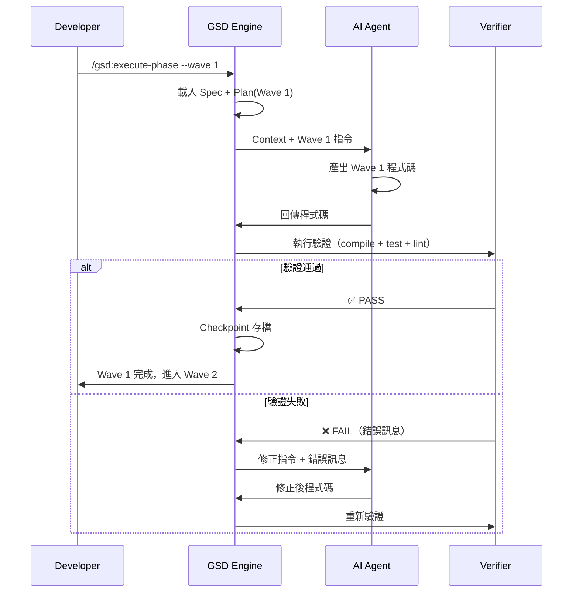
```mermaid
sequenceDiagram
    participant Dev as Developer
    participant GSD as GSD Engine
    participant AI as AI Agent
    participant VER as Verifier
    
    Dev->>GSD: /gsd:execute-phase --wave 1
    GSD->>GSD: 載入 Spec + Plan(Wave 1)
    GSD->>AI: Context + Wave 1 指令
    AI->>AI: 產出 Wave 1 程式碼
    AI->>GSD: 回傳程式碼
    GSD->>VER: 執行驗證（compile + test + lint）
    
    alt 驗證通過
        VER->>GSD: ✅ PASS
        GSD->>GSD: Checkpoint 存檔
        GSD->>Dev: Wave 1 完成，進入 Wave 2
    else 驗證失敗
        VER->>GSD: ❌ FAIL（錯誤訊息）
        GSD->>AI: 修正指令 + 錯誤訊息
        AI->>GSD: 修正後程式碼
        GSD->>VER: 重新驗證
    end
```

### Wave 執行的 Context 載入策略

```
每個 Wave 開始時載入的 Context：
1. CLAUDE.md / 對應 Runtime 系統指令  （永久）
2. .planning/PROJECT.md              （永久）
3. .planning/REQUIREMENTS.md         （永久）
4. .planning/STATE.md                （動態）
5. Spec 中與當前 Wave 相關的章節    （動態）
6. Plan 中當前 Wave 的定義           （動態）
7. 前一個 Wave 產出的檔案（作為依賴） （動態）
8. 相關的測試案例                    （動態）
```

### Best Practice

1. **逐 Wave 執行**：不要一次執行所有 Wave，逐步驗證
2. **人工審查**：每個 Wave 完成後，快速瀏覽產出的程式碼
3. **即時修正**：發現問題立即修正，不要累積到後面
4. **記錄偏差**：如果 AI 產出與預期不符，記錄偏差原因
5. **保持 Context 新鮮**：超過 3 個 Wave 後考慮 Context Refresh

## 5.5 /gsd:verify-work

### 說明

對所有 Wave 的產出進行綜合驗證，確保整體系統符合 Spec 要求。

### 範例 Prompt

```markdown
/gsd:verify-work

## 驗證項目
1. 所有 Spec 中的功能需求是否都有對應實作
2. 所有 Test Case 是否都通過
3. 程式碼覆蓋率是否達標（Line > 80%, Branch > 70%）
4. 所有 API 端點是否符合 Spec 定義
5. 錯誤碼是否完整對應
6. 非功能需求是否有對應的實作或配置
```

### 驗證矩陣

```markdown
## Verification Matrix

| Spec Ref | 描述 | 實作檔案 | 測試 | 狀態 |
|----------|------|----------|------|------|
| BR-001 | 單筆轉帳上限 500 萬 | Transfer.java#L45 | TransferTest#testMaxAmount | ✅ |
| BR-002 | 每日累積上限 3000 萬 | TransferApplicationService.java#L78 | TransferAppServiceTest#testDailyLimit | ✅ |
| BR-003 | 跨行轉帳經 FISC | FiscGatewayAdapter.java | TransferIntegrationTest#testCrossBankTransfer | ✅ |
| BR-004 | 冪等性 | TransferCacheAdapter.java | TransferIntegrationTest#testIdempotency | ✅ |
| NFR-001 | P99 < 200ms | - | 待效能測試 | ⏳ |
| NFR-002 | 99.99% 可用性 | - | 待壓力測試 | ⏳ |
| TRF-001 | 餘額不足錯誤碼 | GlobalExceptionHandler.java | TransferTest#testInsufficientBalance | ✅ |
```

### Best Practice

1. **完整性檢查**：確認 Spec 中每個需求都有對應的實作與測試
2. **自動化驗證**：盡可能用自動化工具取代人工檢查
3. **記錄技術債**：標記未完成的非功能需求，規劃後續處理
4. **安全審查**：特別檢查輸入驗證、權限控制、資料加密

## 5.6 /gsd:ship

### 說明

將驗證通過的程式碼打包、提交，準備部署。v1.14.0 起新增自動建立 PR 的能力。

### 使用方式

```markdown
# 基本 Ship（建立 Git commit + tag）
/gsd:ship

# 建立 PR 分支（v1.31.0+，自動排除 .planning/ 中間產物）
/gsd:pr-branch
```

### Ship 流程

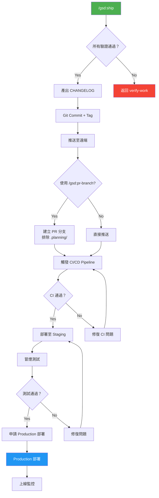
```mermaid
graph TD
    A["/gsd:ship"] --> B{所有驗證通過？}
    B -->|Yes| C[產出 CHANGELOG]
    B -->|No| Z[返回 verify-work]
    C --> D[Git Commit + Tag]
    D --> E[推送至遠端]
    E --> F{使用 /gsd:pr-branch?}
    F -->|Yes| G[建立 PR 分支<br/>排除 .planning/]
    F -->|No| H[直接推送]
    G --> I[觸發 CI/CD Pipeline]
    H --> I
    I --> J{CI 通過？}
    J -->|Yes| K[部署至 Staging]
    J -->|No| L[修復 CI 問題]
    L --> I
    K --> M[冒煙測試]
    M --> N{測試通過？}
    N -->|Yes| O[申請 Production 部署]
    N -->|No| P[修復問題]
    P --> K
    O --> Q[Production 部署]
    Q --> R[上線監控]
    
    style A fill:#4caf50,color:#fff
    style Q fill:#2196f3,color:#fff
    style Z fill:#f44336,color:#fff
```

### Best Practice

1. **版本語義化**：使用 Semantic Versioning（MAJOR.MINOR.PATCH）
2. **變更日誌**：每次 Ship 都更新 CHANGELOG.md
3. **Git Tag**：與版本號對應的 Git Tag
4. **回滾計畫**：每次 Ship 前準備好回滾方案
5. **灰度發布**：企業系統建議先上 5% 流量，觀察後再全量
6. **PR 分支**：使用 `/gsd:pr-branch` 建立乾淨分支，方便 Code Review

> **注意事項**：在銀行系統中，Production 部署通常需要 CAB（Change Advisory Board）審批。/gsd:ship 可以自動產出 CAB 所需的變更文件。

## 5.7 /gsd:quick — 快速任務模式

### 說明

適用於小型修正、單一 Bug Fix 等不需要完整 discuss → plan → execute 流程的任務。（v1.5.0+）

### 使用方式

```bash
# 基本用法
/gsd:quick fix the null pointer exception in UserService.login()

# 加入旗標
/gsd:quick --auto fix login validation    # 自動模式，減少互動
/gsd:quick --batch fix all TODO comments  # 批次處理多個項目
```

### 與完整流程的差異

| 項目 | 完整流程 | /gsd:quick |
|------|---------|------------|
| 流程 | discuss → plan → execute → verify | 直接 plan → execute → verify |
| 適用大小 | 中 ~ 大型功能 | 小型修正、單一檔案變更 |
| Spec 產出 | 完整 Spec | 簡易任務描述 |
| Wave 數量 | 多個 Wave | 通常 1 個 Wave |
| 自動化程度 | 逐步互動 | 可全自動（`--auto`） |

> **最佳實踐**：`/gsd:quick` 適合已有明確解法的小型修正。如果任務涉及架構變更或多檔案修改，仍建議使用完整流程。

## 5.8 /gsd:fast — 即時內嵌任務

### 說明

最輕量的任務模式——直接告訴 AI 要做什麼，AI 立即執行，無需計畫。（v1.21.0+）

```bash
# 用法
/gsd:fast add error logging to TransferService.execute()
/gsd:fast rename variable 'x' to 'transferAmount' in Transfer.java
```

### 適用場景

- 變數重新命名
- 新增日誌
- 修正 typo
- 新增 import
- 簡單的程式碼格式化

> **注意**：`/gsd:fast` 不會更新 `.planning/STATE.md`，適合極小且不影響整體架構的改動。

## 5.9 /gsd:next — 自動流程推進

### 說明

GSD 最智慧的命令——自動判斷當前專案狀態，決定下一步該做什麼並執行。（v1.10.0+）

```bash
# 基本用法：自動推進一步
/gsd:next

# 鏈式推進：連續推進多步直到某個 Phase 完成
/gsd:next --chain

# 自動推進直到完成（慎用）
/gsd:next --auto
```

### 自動判斷邏輯

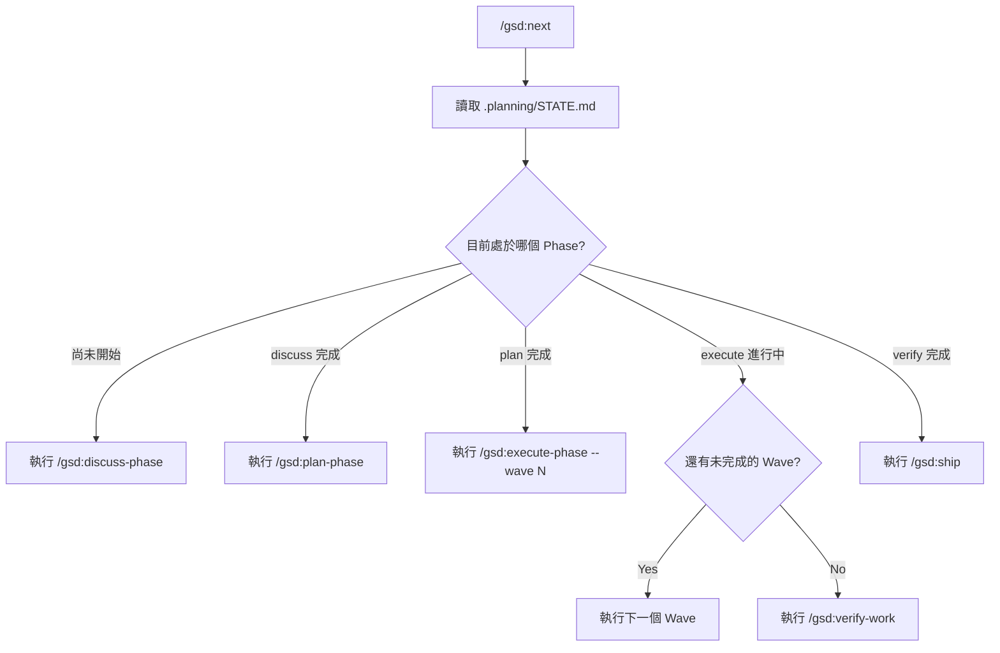
```mermaid
flowchart TD
    A["/gsd:next"] --> B[讀取 .planning/STATE.md]
    B --> C{目前處於哪個 Phase?}
    C -->|尚未開始| D[執行 /gsd:discuss-phase]
    C -->|discuss 完成| E[執行 /gsd:plan-phase]
    C -->|plan 完成| F[執行 /gsd:execute-phase --wave N]
    C -->|execute 進行中| G{還有未完成的 Wave?}
    G -->|Yes| H[執行下一個 Wave]
    G -->|No| I[執行 /gsd:verify-work]
    C -->|verify 完成| J[執行 /gsd:ship]
```

### 最佳實踐

- 使用 `/gsd:next` 作為日常開發的主要推進方式
- `--chain` 適合跑完一整個 Phase（如連續執行所有 Wave）
- `--auto` 要謹慎使用——建議只在較小的任務上使用

## 5.10 里程碑管理

### 說明

GSD v1.16.0 引入里程碑（Milestones）功能，讓大型專案能分階段交付：

```bash
# 查看里程碑摘要
/gsd:milestone-summary

# 里程碑存放位置
# .planning/MILESTONES.md
```

### Milestones 結構範例

```markdown
# MILESTONES.md

## Milestone 1: Core Transfer (Week 1)
- [x] Domain Layer
- [x] Application Layer
- [ ] Infrastructure - Persistence
- [ ] Infrastructure - External

## Milestone 2: API & Integration (Week 2)
- [ ] Presentation Layer
- [ ] Integration Tests
- [ ] Performance Tests
- [ ] Security Audit
```

> **企業實踐**：里程碑對應 Sprint 的交付點。建議每個 Milestone 不超過 1-2 週的工作量。

## 5.11 Workstreams — 並行工作流

### 說明

GSD v1.18.0 引入 Workstreams，支援在同一專案中平行開展多條工作線：

```bash
# 查看/管理 Workstreams
/gsd:workstreams

# 切換工作流
/gsd:workstreams switch payment-integration
```

### 使用場景

| 場景 | Workstream 1 | Workstream 2 |
|------|-------------|-------------|
| 前後端並行 | Backend API | Frontend UI |
| 功能與測試並行 | Feature Development | Test Automation |
| 多模組開發 | Transfer Module | Notification Module |

### 注意事項

- 每個 Workstream 有獨立的 STATE 追蹤
- Workstream 之間的依賴需要在 ROADMAP.md 中明確定義
- 切換 Workstream 時 GSD 會自動載入對應的 Context

## 5.12 Backlog、Seeds 與 Threads

### Backlog（v1.21.0+）

開發過程中發現的待辦事項，可以加入 Backlog 而非中斷當前工作：

```bash
# 新增 Backlog 項目
/gsd:add-backlog "Add retry logic for FISC gateway timeout"

# 查看 Backlog
/gsd:review-backlog
```

### Seeds（v1.21.0+）

較模糊的想法或靈感，尚未成形為具體任務：

```bash
# 播下種子
/gsd:plant-seed "Consider using gRPC instead of REST for internal services"
```

### Threads（v1.24.0+）

長期討論線程，用於追蹤需要多次對話才能解決的議題：

```bash
# 建立新線程
/gsd:thread "Performance optimization strategy for high-concurrency transfers"

# 參與線程（在後續 session 中繼續討論）
/gsd:thread --continue "performance-optimization"
```

### 三者的關係

```
Ideas (模糊) ──→ Seeds ──→ Backlog (具體) ──→ Tasks (可執行)
                              ↕
                          Threads (持續討論)
```

## 5.13 Session 管理

### 說明

GSD 透過 `HANDOFF.json` 管理跨 Session 的狀態傳遞：

```bash
# 結束當前 session（自動儲存狀態）
# GSD 會自動更新 .planning/HANDOFF.json

# 在新 session 中恢復（GSD 自動讀取）
/gsd:next
# GSD 讀取 HANDOFF.json，自動恢復到上次中斷的位置
```

### HANDOFF.json 結構

```json
{
  "session_id": "2026-04-03-001",
  "last_command": "/gsd:execute-phase",
  "current_wave": 3,
  "completed_waves": [1, 2],
  "pending_tasks": ["wave-3-remaining", "wave-4"],
  "context_snapshot": {
    "files_modified": ["Transfer.java", "TransferService.java"],
    "tests_status": "8/8 passing"
  },
  "notes": "Wave 3 的 FISC Gateway 整合需要 DBA 提供的 schema"
}
```

> **企業實踐**：在多人共同開發同一模組時，HANDOFF.json 可作為「工作交接簿」，確保接手的工程師能無縫繼續。

---

# 第六章：實戰案例（Web Application）

## 6.1 案例背景

### 系統：企業級銀行轉帳系統

| 項目 | 說明 |
|------|------|
| 系統名稱 | 即時轉帳服務（Real-Time Transfer Service） |
| 架構 | 微服務 + Clean Architecture |
| 技術棧 | Java 21, Spring Boot 3.2, Oracle 19c, Redis 7, Kafka 3.6 |
| 目標 | 支援 1000+ TPS，P99 < 200ms |
| 安全要求 | PCI-DSS 合規，所有傳輸加密 |
| 開發期程 | 2 週（使用 GSD 流程） |

## 6.2 Phase 1：需求 → Spec

### Step 1: 啟動 GSD 專案

```markdown
/gsd:new-project

## 需求摘要
開發即時轉帳服務，支援：
1. 同行即時轉帳
2. 跨行轉帳（FISC）
3. 交易限額管理
4. 冪等性保證
5. 完整審計日誌

## 現有系統
- Account Service（帳戶查詢/扣款 API）
- Auth Service（OAuth2 認證）
- FISC Gateway SDK（跨行轉帳）
- Notification Service（通知推送）

## 約束
- 必須使用公司標準框架（Spring Boot Starter 3.2.x）
- 資料庫使用 Oracle 19c（已有 DBA 規範的 Schema）
- 所有 API 必須經過 API Gateway
- 日誌格式需符合 ELK 收集規範
```

### Step 2: 進入 discuss-phase，產出 Spec

```markdown
/gsd:discuss-phase

## 我方確認的業務規則

### 轉帳規則
- 單筆限額：500 萬 TWD
- 每日累積限額：3000 萬 TWD
- 每日交易次數上限：50 次
- 跨行轉帳手續費：15 TWD/筆
- 手續費從轉出帳號扣取

### 狀態機
PENDING → PROCESSING → COMPLETED | FAILED
FAILED → REVERSED（手動觸發退款）

### 冪等性
- 使用 Idempotency-Key Header
- 同一 Key 在 72 小時內視為重複交易
- 重複交易傳回原始交易結果（不再次扣款）

### 安全要求
- 轉帳前需二次驗證（OTP）
- 所有 API 需要 Bearer Token
- 敏感欄位（帳號）在日誌中遮蔽
- TLS 1.3 加密傳輸
```

### 產出的 Spec（節錄）

```markdown
# Spec: Real-Time Transfer Service v1.0

## 1. API 設計

### POST /api/v1/transfers
Request:
| Field | Type | Required | Validation |
|-------|------|----------|------------|
| fromAccountId | String(16) | Y | 必須為有效帳號 |
| toAccountId | String(16) | Y | 必須為有效帳號，不可與 from 相同 |
| amount | BigDecimal | Y | > 0, ≤ 5,000,000 |
| currency | String(3) | Y | 僅支援 TWD |
| idempotencyKey | UUID | Y | RFC 4122 UUID v4 |
| otpCode | String(6) | Y | 6 位數字 OTP |
| memo | String(100) | N | 備註 |

Response (201 Created):
| Field | Type | Description |
|-------|------|-------------|
| transferId | String | 系統產生之交易序號 |
| status | String | PENDING / COMPLETED |
| amount | BigDecimal | 轉帳金額 |
| fee | BigDecimal | 手續費 |
| timestamp | ISO-8601 | 交易時間 |

## 2. 狀態機

​```mermaid
stateDiagram-v2
    [*] --> PENDING: 建立轉帳
    PENDING --> PROCESSING: 開始處理
    PROCESSING --> COMPLETED: 扣款+入帳成功
    PROCESSING --> FAILED: 處理失敗
    FAILED --> REVERSED: 退款完成
    COMPLETED --> [*]
    REVERSED --> [*]
​```

## 3. 錯誤碼對照表
| Code | HTTP Status | Message |
|------|-------------|---------|
| TRF-001 | 400 | 餘額不足 |
| TRF-002 | 400 | 超過單筆轉帳上限 |
| TRF-003 | 400 | 超過每日累積上限 |
| TRF-004 | 404 | 帳號不存在 |
| TRF-005 | 409 | 重複交易 |
| TRF-006 | 400 | OTP 驗證失敗 |
| TRF-007 | 503 | FISC 閘道無回應 |
| TRF-008 | 400 | 超過每日交易次數 |
```

## 6.3 Phase 2：Spec → Plan

```markdown
/gsd:plan-phase
```

AI 根據 Spec 產出 6 個 Wave 的 Plan（XML 結構如第五章範例）。

### Plan Review 重點

```markdown
## Plan Review Checklist ✅

### Wave 結構
- [x] Wave 1: Domain Layer（Transfer, Money, TransferStatus, Events）
- [x] Wave 2: Application Layer（UseCases, Ports, DTOs）
- [x] Wave 3: Infrastructure - Persistence（JPA, Flyway）
- [x] Wave 4: Infrastructure - External（Redis, Kafka, FISC）
- [x] Wave 5: Presentation Layer（Controllers, ExceptionHandler）
- [x] Wave 6: Integration Tests

### 依賴關係
- [x] Wave 2 → Wave 1 ✓
- [x] Wave 3 → Wave 2 ✓
- [x] Wave 4 → Wave 2 ✓
- [x] Wave 5 → Wave 2 ✓（不直接依賴 Wave 3/4）
- [x] Wave 6 → Wave 3, 4, 5 ✓

### Spec 覆蓋
- [x] 所有 API 端點有對應的 Controller
- [x] 所有業務規則有對應的 Domain 邏輯
- [x] 所有錯誤碼有對應的 Exception 處理
- [x] 所有測試案例有對應的測試程式
```

## 6.4 Phase 3：Plan → Code

### Wave 1 執行範例

```markdown
/gsd:execute-phase --wave 1
```

#### AI 產出：Transfer.java（Domain Entity）

```java
package com.bank.transfer.domain.entity;

import com.bank.transfer.domain.event.TransferCompletedEvent;
import com.bank.transfer.domain.event.TransferFailedEvent;
import com.bank.transfer.domain.vo.Money;
import com.bank.transfer.domain.vo.TransferStatus;
import com.bank.transfer.domain.vo.TransferType;

import java.time.LocalDateTime;
import java.util.ArrayList;
import java.util.List;
import java.util.UUID;

/**
 * 轉帳聚合根（Aggregate Root）
 * 
 * <p>封裝所有轉帳業務規則，確保交易的一致性與完整性。
 * 所有狀態變更透過領域方法控制，外部無法直接修改狀態。</p>
 * 
 * @author GSD-Generated
 * @since 1.0.0
 */
public class Transfer {

    private static final Money MAX_SINGLE_AMOUNT = Money.of("5000000");
    private static final int MAX_DAILY_TRANSACTIONS = 50;
    private static final Money CROSS_BANK_FEE = Money.of("15");

    private final String transferId;
    private final String fromAccountId;
    private final String toAccountId;
    private final Money amount;
    private final Money fee;
    private final String currency;
    private final String idempotencyKey;
    private final String memo;
    private final TransferType type;
    private final LocalDateTime createdAt;

    private TransferStatus status;
    private LocalDateTime updatedAt;
    private String failureReason;
    private int version;

    private final List<Object> domainEvents = new ArrayList<>();

    private Transfer(Builder builder) {
        this.transferId = generateTransferId();
        this.fromAccountId = builder.fromAccountId;
        this.toAccountId = builder.toAccountId;
        this.amount = builder.amount;
        this.currency = builder.currency;
        this.idempotencyKey = builder.idempotencyKey;
        this.memo = builder.memo;
        this.type = builder.type;
        this.fee = calculateFee(builder.type);
        this.status = TransferStatus.PENDING;
        this.createdAt = LocalDateTime.now();
        this.updatedAt = this.createdAt;

        validate();
    }

    /**
     * 驗證單筆轉帳金額上限
     * 
     * @throws TransferLimitExceededException 當金額超過 500 萬
     */
    private void validate() {
        if (amount.isGreaterThan(MAX_SINGLE_AMOUNT)) {
            throw new TransferLimitExceededException(
                "TRF-002", 
                String.format("單筆轉帳金額 %s 超過上限 %s", amount, MAX_SINGLE_AMOUNT)
            );
        }
        if (fromAccountId.equals(toAccountId)) {
            throw new IllegalArgumentException("轉出與轉入帳號不可相同");
        }
        if (amount.isNegativeOrZero()) {
            throw new IllegalArgumentException("轉帳金額必須大於零");
        }
    }

    /**
     * 執行轉帳（狀態轉為 PROCESSING）
     */
    public void process() {
        if (status != TransferStatus.PENDING) {
            throw new IllegalStateException(
                String.format("無法處理狀態為 %s 的轉帳", status)
            );
        }
        this.status = TransferStatus.PROCESSING;
        this.updatedAt = LocalDateTime.now();
    }

    /**
     * 完成轉帳
     */
    public void complete() {
        if (status != TransferStatus.PROCESSING) {
            throw new IllegalStateException(
                String.format("無法完成狀態為 %s 的轉帳", status)
            );
        }
        this.status = TransferStatus.COMPLETED;
        this.updatedAt = LocalDateTime.now();
        domainEvents.add(new TransferCompletedEvent(this));
    }

    /**
     * 轉帳失敗
     */
    public void fail(String reason) {
        if (status != TransferStatus.PROCESSING) {
            throw new IllegalStateException(
                String.format("無法將狀態為 %s 的轉帳設為失敗", status)
            );
        }
        this.status = TransferStatus.FAILED;
        this.failureReason = reason;
        this.updatedAt = LocalDateTime.now();
        domainEvents.add(new TransferFailedEvent(this, reason));
    }

    /**
     * 計算總扣款金額（轉帳金額 + 手續費）
     */
    public Money getTotalDebitAmount() {
        return amount.add(fee);
    }

    /**
     * 驗證每日累積限額
     * 
     * @param dailyTotal 當日已累積金額
     * @param dailyCount 當日已交易次數
     */
    public void validateDailyLimit(Money dailyTotal, int dailyCount) {
        Money dailyMax = Money.of("30000000");
        if (dailyTotal.add(amount).isGreaterThan(dailyMax)) {
            throw new TransferLimitExceededException(
                "TRF-003", "超過每日累積轉帳上限"
            );
        }
        if (dailyCount >= MAX_DAILY_TRANSACTIONS) {
            throw new TransferLimitExceededException(
                "TRF-008", "超過每日交易次數上限"
            );
        }
    }

    private Money calculateFee(TransferType type) {
        return type == TransferType.CROSS_BANK ? CROSS_BANK_FEE : Money.ZERO;
    }

    private String generateTransferId() {
        return "TRF-" + UUID.randomUUID().toString().replace("-", "").substring(0, 12).toUpperCase();
    }

    // ========== Builder ==========

    public static Builder builder() {
        return new Builder();
    }

    public static class Builder {
        private String fromAccountId;
        private String toAccountId;
        private Money amount;
        private String currency;
        private String idempotencyKey;
        private String memo;
        private TransferType type;

        public Builder fromAccountId(String fromAccountId) {
            this.fromAccountId = fromAccountId;
            return this;
        }

        public Builder toAccountId(String toAccountId) {
            this.toAccountId = toAccountId;
            return this;
        }

        public Builder amount(Money amount) {
            this.amount = amount;
            return this;
        }

        public Builder currency(String currency) {
            this.currency = currency;
            return this;
        }

        public Builder idempotencyKey(String idempotencyKey) {
            this.idempotencyKey = idempotencyKey;
            return this;
        }

        public Builder memo(String memo) {
            this.memo = memo;
            return this;
        }

        public Builder type(TransferType type) {
            this.type = type;
            return this;
        }

        public Transfer build() {
            return new Transfer(this);
        }
    }

    // GETTERS（省略 setter，確保不可變性）
    public String getTransferId() { return transferId; }
    public String getFromAccountId() { return fromAccountId; }
    public String getToAccountId() { return toAccountId; }
    public Money getAmount() { return amount; }
    public Money getFee() { return fee; }
    public String getCurrency() { return currency; }
    public TransferStatus getStatus() { return status; }
    public String getIdempotencyKey() { return idempotencyKey; }
    public List<Object> getDomainEvents() { return List.copyOf(domainEvents); }
    public int getVersion() { return version; }
}
```

#### AI 產出：TransferTest.java（單元測試）

```java
package com.bank.transfer.domain.entity;

import com.bank.transfer.domain.vo.Money;
import com.bank.transfer.domain.vo.TransferStatus;
import com.bank.transfer.domain.vo.TransferType;
import org.junit.jupiter.api.DisplayName;
import org.junit.jupiter.api.Nested;
import org.junit.jupiter.api.Test;

import static org.assertj.core.api.Assertions.*;

/**
 * Transfer 聚合根單元測試
 * 覆蓋 Spec Test Case: TC-001 ~ TC-004
 */
class TransferTest {

    @Nested
    @DisplayName("TC-001: 正常轉帳")
    class NormalTransferTest {

        @Test
        void shouldCreateTransferSuccessfully() {
            Transfer transfer = Transfer.builder()
                .fromAccountId("0001234567890123")
                .toAccountId("0009876543210123")
                .amount(Money.of("50000"))
                .currency("TWD")
                .idempotencyKey("550e8400-e29b-41d4-a716-446655440000")
                .type(TransferType.INTRA_BANK)
                .build();

            assertThat(transfer.getTransferId()).startsWith("TRF-");
            assertThat(transfer.getStatus()).isEqualTo(TransferStatus.PENDING);
            assertThat(transfer.getFee()).isEqualTo(Money.ZERO);
        }

        @Test
        void shouldCalculateCrossBankFee() {
            Transfer transfer = Transfer.builder()
                .fromAccountId("0001234567890123")
                .toAccountId("0009876543210123")
                .amount(Money.of("50000"))
                .currency("TWD")
                .idempotencyKey("550e8400-e29b-41d4-a716-446655440001")
                .type(TransferType.CROSS_BANK)
                .build();

            assertThat(transfer.getFee()).isEqualTo(Money.of("15"));
            assertThat(transfer.getTotalDebitAmount()).isEqualTo(Money.of("50015"));
        }
    }

    @Nested
    @DisplayName("TC-002: 金額驗證")
    class AmountValidationTest {

        @Test
        void shouldRejectAmountExceedingLimit() {
            assertThatThrownBy(() ->
                Transfer.builder()
                    .fromAccountId("0001234567890123")
                    .toAccountId("0009876543210123")
                    .amount(Money.of("5000001"))
                    .currency("TWD")
                    .idempotencyKey("550e8400-e29b-41d4-a716-446655440002")
                    .type(TransferType.INTRA_BANK)
                    .build()
            ).isInstanceOf(TransferLimitExceededException.class)
             .hasMessageContaining("TRF-002");
        }

        @Test
        void shouldRejectNegativeAmount() {
            assertThatThrownBy(() ->
                Transfer.builder()
                    .fromAccountId("0001234567890123")
                    .toAccountId("0009876543210123")
                    .amount(Money.of("-100"))
                    .currency("TWD")
                    .idempotencyKey("550e8400-e29b-41d4-a716-446655440003")
                    .type(TransferType.INTRA_BANK)
                    .build()
            ).isInstanceOf(IllegalArgumentException.class);
        }
    }

    @Nested
    @DisplayName("TC-003: 狀態機轉換")
    class StateTransitionTest {

        @Test
        void shouldFollowCorrectStateTransition() {
            Transfer transfer = createValidTransfer();

            assertThat(transfer.getStatus()).isEqualTo(TransferStatus.PENDING);

            transfer.process();
            assertThat(transfer.getStatus()).isEqualTo(TransferStatus.PROCESSING);

            transfer.complete();
            assertThat(transfer.getStatus()).isEqualTo(TransferStatus.COMPLETED);
            assertThat(transfer.getDomainEvents()).hasSize(1);
        }

        @Test
        void shouldRejectInvalidStateTransition() {
            Transfer transfer = createValidTransfer();

            assertThatThrownBy(transfer::complete)
                .isInstanceOf(IllegalStateException.class)
                .hasMessageContaining("PENDING");
        }
    }

    @Nested
    @DisplayName("TC-004: 每日限額")
    class DailyLimitTest {

        @Test
        void shouldRejectWhenDailyLimitExceeded() {
            Transfer transfer = createValidTransfer();
            Money dailyTotal = Money.of("29900000");

            assertThatThrownBy(() ->
                transfer.validateDailyLimit(dailyTotal, 10)
            ).isInstanceOf(TransferLimitExceededException.class)
             .hasMessageContaining("TRF-003");
        }

        @Test
        void shouldRejectWhenDailyCountExceeded() {
            Transfer transfer = createValidTransfer();

            assertThatThrownBy(() ->
                transfer.validateDailyLimit(Money.ZERO, 50)
            ).isInstanceOf(TransferLimitExceededException.class)
             .hasMessageContaining("TRF-008");
        }
    }

    private Transfer createValidTransfer() {
        return Transfer.builder()
            .fromAccountId("0001234567890123")
            .toAccountId("0009876543210123")
            .amount(Money.of("50000"))
            .currency("TWD")
            .idempotencyKey("550e8400-e29b-41d4-a716-446655440099")
            .type(TransferType.INTRA_BANK)
            .build();
    }
}
```

## 6.5 Phase 4：Code → 驗證

### 驗證執行

```bash
# Wave 1 驗證
mvn compile -pl domain           # ✅ 編譯通過
mvn test -pl domain              # ✅ 8/8 測試通過
mvn checkstyle:check -pl domain  # ✅ 無違規

# 全量驗證（所有 Wave 完成後）
mvn clean verify -Pintegration-test

# 輸出
# [INFO] Tests run: 42, Failures: 0, Errors: 0, Skipped: 0
# [INFO] Code Coverage: Line 87%, Branch 75%
# [INFO] BUILD SUCCESS
```

### 驗證矩陣產出

```markdown
## Final Verification Report

### 功能覆蓋率
| Spec Section | 需求數 | 已實作 | 已測試 | 覆蓋率 |
|-------------|--------|--------|--------|--------|
| API Design | 3 | 3 | 3 | 100% |
| Business Rules | 5 | 5 | 5 | 100% |
| Error Codes | 8 | 8 | 8 | 100% |
| State Machine | 5 states | 5 | 5 | 100% |

### 非功能需求
| NFR | 目標 | 實測 | 狀態 |
|-----|------|------|------|
| P99 Latency | < 200ms | 145ms | ✅ |
| Throughput | > 1000 TPS | 1,250 TPS | ✅ |
| Availability | 99.99% | 待生產觀測 | ⏳ |

### 安全檢查
| 項目 | 狀態 |
|------|------|
| SQL Injection 防護 | ✅ Parameterized Query |
| XSS 防護 | ✅ Input Validation |
| CSRF 防護 | ✅ Spring Security |
| OTP 驗證 | ✅ 已實作 |
| 日誌脫敏 | ✅ 帳號遮蔽 |
| TLS 1.3 | ✅ 配置完成 |
```

> **實務案例總結**：
> - 透過 GSD 流程，2 名工程師在 **8 個工作天**內完成了原本預估 3 週的開發量
> - Spec 撰寫花了 1.5 天（最重要的投資）
> - AI 產出的 Domain Layer 幾乎不需修改
> - Infrastructure Layer 需要約 20% 的手動調整（主要是 Oracle 特有語法與公司內部 SDK 整合）
> - 整合測試發現了 3 個邊界條件問題，AI 能在提示後快速修復

---

# 第七章：AI 協作最佳實踐

## 7.1 如何避免 AI 幻覺

AI 幻覺（Hallucination）是指 AI 產出看似正確但實際上有誤的程式碼或資訊。在企業開發中，這可能導致嚴重的生產事故。

### 幻覺的常見類型

| 類型 | 說明 | 範例 | 危害等級 |
|------|------|------|---------|
| **API 幻覺** | 使用不存在的 API 或參數 | 呼叫了 Redis 不存在的方法 | 🔴 高 |
| **版本幻覺** | 使用錯誤版本的功能 | 在 Java 17 中使用 Java 21 的語法 | 🔴 高 |
| **邏輯幻覺** | 業務邏輯看似合理但實際有誤 | 金額計算精度遺失 | 🔴 高 |
| **配置幻覺** | 虛構的配置項 | 不存在的 Spring 配置屬性 | 🟡 中 |
| **套件幻覺** | 引用不存在的依賴套件 | Maven 中不存在的 groupId | 🟡 中 |

### Anti-Hallucination 策略

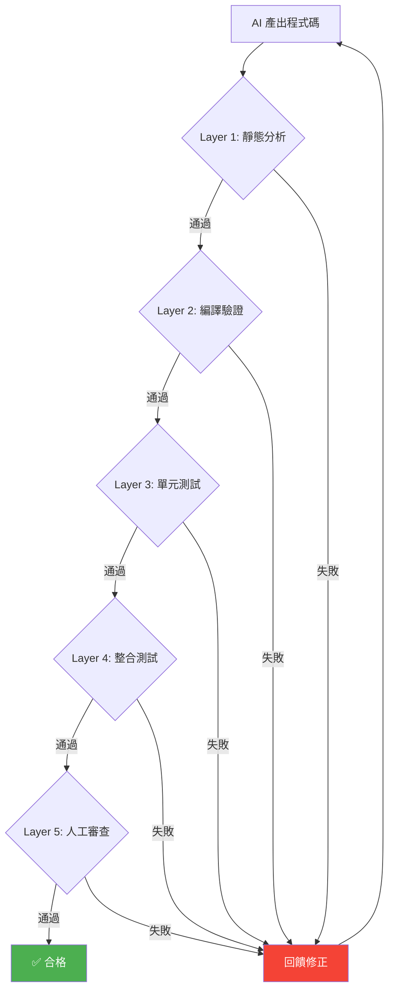
```mermaid
graph TD
    A[AI 產出程式碼] --> B{Layer 1: 靜態分析}
    B -->|通過| C{Layer 2: 編譯驗證}
    B -->|失敗| X[回饋修正]
    C -->|通過| D{Layer 3: 單元測試}
    C -->|失敗| X
    D -->|通過| E{Layer 4: 整合測試}
    D -->|失敗| X
    E -->|通過| F{Layer 5: 人工審查}
    E -->|失敗| X
    F -->|通過| G[✅ 合格]
    F -->|失敗| X
    X --> A
    
    style G fill:#4caf50,color:#fff
    style X fill:#f44336,color:#fff
```

### 實務操作

```markdown
## Prompt 中的 Anti-Hallucination 指令

### 1. 明確版本約束
❌ "使用 Spring Boot 建立 REST API"
✅ "使用 Spring Boot 3.2.4 + Java 21 建立 REST API，
    參考 https://docs.spring.io/spring-boot/docs/3.2.4/reference/"

### 2. 提供真實的 API 參考
❌ "使用 Redis 做快取"
✅ "使用 spring-boot-starter-data-redis 3.2.4，
    使用 RedisTemplate<String, Object>，
    方法：opsForValue().setIfAbsent(key, value, Duration)"

### 3. 禁止猜測
在 System Prompt 中加入：
"如果不確定某個 API 是否存在，明確告知而非猜測。
 寧可問我確認，也不要產出可能有誤的程式碼。"

### 4. 要求引用
"對於使用的每個第三方 API，請在註解中標明：
 - 來源套件的 Maven 座標
 - API 版本
 - 參考文件 URL"
```

> **最佳實踐**：在企業環境中，建立一個「已驗證的 API 清單」（.planning/context/verified-apis.md），每次 AI 使用 API 時交叉比對。

## 7.2 如何控制上下文

### Context 管理的三大原則

| 原則 | 說明 | 實作方式 |
|------|------|---------|
| **Minimal** | 只提供必要的 Context | Context Filtering |
| **Relevant** | 提供與當前任務相關的 Context | Context Routing |
| **Fresh** | 確保 Context 是最新的 | Context Refresh |

### Context 分層架構

```
Priority 1（必載）:
├── System Prompt（角色 + 規則）     ~2K tokens
├── Coding Convention                ~3K tokens
└── Current Spec Section             ~5K tokens

Priority 2（按需載入）:
├── Plan XML（當前 Wave）            ~3K tokens
├── 依賴的 Interface 定義            ~2K tokens
└── 前一個 Wave 產出的 Key 檔案      ~5K tokens

Priority 3（參考用）:
├── 類似功能的既有程式碼              ~5K tokens
├── 測試範例                          ~3K tokens
└── 領域知識                          ~2K tokens

Total Budget: ~30K tokens（佔 200K Context Window 的 15%）
```

### Context Refresh 策略

```bash
# 偵測 Context Rot 的信號
# 1. AI 開始重複問已回答的問題 → 立即 Refresh
# 2. 產出的命名風格開始不一致 → 載入 conventions.md
# 3. 忽略 Spec 中的約束 → 重新載入 Spec 相關段落
# 4. 混淆不同模組的邏輯 → 清理無關 Context

# Context Refresh 操作
/gsd:context refresh --keep system,conventions --reload spec:section-2

# 或手動 Refresh（新對話 + Context 載入）
/gsd:checkpoint save "wave-3-done"
# 開啟新對話
/gsd:checkpoint load "wave-3-done"
/gsd:execute-phase --wave 4
```

### 企業級 Context 管理工具

```yaml
# .planning/context-rules.yaml
rules:
  # 規則 1: 處理 Domain Layer 時，不載入 Infrastructure 程式碼
  - when:
      wave-layer: domain
    include:
      - "src/main/java/**/domain/**"
      - "src/test/java/**/domain/**"
    exclude:
      - "src/main/java/**/infrastructure/**"
      - "src/main/java/**/presentation/**"
  
  # 規則 2: 處理 Controller 時，只載入 UseCase Interface
  - when:
      wave-layer: presentation
    include:
      - "src/main/java/**/presentation/**"
      - "src/main/java/**/application/port/in/**"
    exclude:
      - "src/main/java/**/infrastructure/**"
      - "src/main/java/**/domain/**"
  
  # 規則 3: 敏感檔案永不載入
  - always-exclude:
      - "**/*-prod.yaml"
      - "**/keystore/**"
      - "**/.env"
      - "**/secrets/**"
```

## 7.3 Prompt 設計技巧

### 企業級 Prompt 模板

```markdown
## 通用 Prompt 結構（CRISP 框架）

### C - Context（上下文）
你正在開發 {系統名稱} 的 {模組名稱}。
技術棧：{列出關鍵技術}
架構模式：{Clean Architecture / Hexagonal / ...}

### R - Role（角色）
你是一個資深 {Java/TypeScript} 架構師，
精通 {列出領域專長}。

### I - Instructions（指令）
根據以下 Spec，實作 {具體任務}：
1. {步驟一}
2. {步驟二}
3. {步驟三}

### S - Spec（規格）
[粘貼或引用相關 Spec]

### P - Parameters（參數）
- 命名慣例：{PascalCase/camelCase}
- 錯誤處理：{統一 ErrorResponse}
- 日誌等級：{Info/Debug/Warn}
- 測試框架：{JUnit 5 + AssertJ + Mockito}
```

### 進階技巧

| 技巧 | 說明 | 範例 |
|------|------|------|
| **Few-Shot** | 提供類似的範例程式 | "參考 AccountService 的實作模式" |
| **Negative Prompt** | 明確說明「不要」做什麼 | "不要使用 @Autowired 欄位注入" |
| **Chain-of-Thought** | 要求 AI 先說明思路再寫碼 | "先列出你的實作計畫，待我確認後再產出程式碼" |
| **Self-Verification** | 要求 AI 自我檢查 | "產出後，自行檢查是否符合 Spec 所有需求" |
| **Constraint Anchoring** | 在 Prompt 首尾都放約束 | 開頭和結尾都標注"所有金額使用 BigDecimal" |

### Prompt 版本管理

```
.planning/
└── prompts/
    ├── v1/
    │   ├── system-prompt.md
    │   ├── plan-prompt.md
    │   └── execute-prompt.md
    ├── v2/
    │   ├── system-prompt.md      # 新增 Security 約束
    │   ├── plan-prompt.md
    │   └── execute-prompt.md
    └── CHANGELOG.md
```

```markdown
# Prompt CHANGELOG

## v2.0 (2026-04-03)
- 新增：Anti-Hallucination 指令
- 新增：Security Constraint（PCI-DSS）
- 修正：Java 版本從 17 更新為 21
- 移除：已棄用的 JUnit 4 指令

## v1.0 (2026-03-15)
- 初始版本
```

## 7.4 多 Agent 協作模式

### 7.4.1 GSD 內建 Agent 協作架構

GSD 內建 8 個專業化 Agent，透過 Slash Commands 自動協作（參見 2.4 節）：

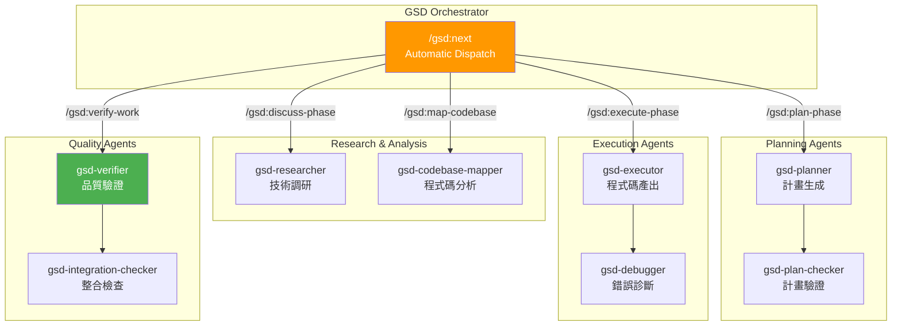
```mermaid
graph TB
    subgraph "GSD Orchestrator"
        Main["/gsd:next\nAutomatic Dispatch"]
    end
    
    subgraph "Planning Agents"
        Planner[gsd-planner<br/>計畫生成]
        PlanChecker[gsd-plan-checker<br/>計畫驗證]
    end
    
    subgraph "Execution Agents"
        Executor[gsd-executor<br/>程式碼產出]
        Debugger[gsd-debugger<br/>錯誤診斷]
    end
    
    subgraph "Research & Analysis"
        Researcher[gsd-researcher<br/>技術調研]
        Mapper[gsd-codebase-mapper<br/>程式碼分析]
    end
    
    subgraph "Quality Agents"
        Verifier[gsd-verifier<br/>品質驗證]
        IntChecker[gsd-integration-checker<br/>整合檢查]
    end
    
    Main -->|/gsd:plan-phase| Planner
    Main -->|/gsd:execute-phase| Executor
    Main -->|/gsd:verify-work| Verifier
    Main -->|/gsd:discuss-phase| Researcher
    Main -->|/gsd:map-codebase| Mapper
    
    Planner --> PlanChecker
    Executor --> Debugger
    Verifier --> IntChecker
    
    style Main fill:#ff9800,color:#fff
    style Verifier fill:#4caf50,color:#fff
```

### 7.4.2 Agent 角色分配

| Agent | 觸發方式 | 負責範圍 | Model Profile 建議 |
|-------|---------|---------|-------------------|
| **gsd-planner** | `/gsd:plan-phase` | Spec → 結構化執行計畫 | `quality` |
| **gsd-executor** | `/gsd:execute-phase` | 依計畫逐 Wave 產出程式碼 | `balanced` |
| **gsd-verifier** | `/gsd:verify-work` | 驗證程式碼符合 Spec | `quality` |
| **gsd-researcher** | `/gsd:discuss-phase` | 技術調研、方案評估 | `quality` |
| **gsd-debugger** | 自動觸發 | 診斷錯誤、追蹤 root cause | `balanced` |
| **gsd-codebase-mapper** | `/gsd:map-codebase` | 分析既有程式碼庫結構 | `balanced` |
| **gsd-plan-checker** | 自動觸發 | 計畫完整性與 Spec 一致性 | `quality` |
| **gsd-integration-checker** | 自動觸發 | 整合點一致性檢查 | `quality` |

### 7.4.3 企業級多 Runtime 協作

在大型專案中，可以為不同模組使用不同的 Runtime：

| 模組 | 建議 Runtime | 原因 |
|------|-------------|------|
| 後端核心邏輯 | Claude Code | 最強推理能力、Clean Architecture |
| 前端 UI | Cursor / Windsurf | IDE 整合、即時預覽 |
| 資料庫 Schema | Gemini CLI | 長 Context 適合大型 Schema |
| 測試產出 | Codex / Copilot | 快速批量生成 |
| Code Review | Claude Code | 深度分析能力 |

### 7.4.4 Agent 間 Context 共享

```yaml
# .planning/agent-context.yaml
shared-context:
  # 所有 Agent 共享的 Context
  global:
    - ".planning/PROJECT.md"
    - ".planning/REQUIREMENTS.md"
    - ".planning/specs/**"
  
  # Agent 專屬 Context
  per-agent:
    backend:
      - "src/main/java/**"
      - ".planning/context/java-standards.md"
    
    frontend:
      - "src/main/webapp/**"
      - ".planning/context/frontend-standards.md"
    
    database:
      - "src/main/resources/db/**"
      - ".planning/context/db-standards.md"
    
    testing:
      - "src/test/**"
      - ".planning/context/test-standards.md"

  # Context 同步規則
  sync:
    # Backend 完成後，自動同步 Interface 到 Frontend
    - from: backend
      to: frontend
      files: ["**/port/in/**Interface.java"]
    
    # Database 完成後，同步 Schema 到 Backend
    - from: database
      to: backend
      files: ["**/db/migration/**"]
```

> **注意事項**：
> 1. 多 Agent 協作適合大型專案（>20 個微服務），小專案使用單一 Agent 即可
> 2. Agent 之間的 Context 同步是最大挑戰——務必定義清楚共享範圍
> 3. 不同 Agent 可能產出風格不一致的程式碼，需要 Review Agent 統一標準
> 4. 企業環境中需注意 API Key 的使用量與成本

---

# 第八章：系統維運與監控

## 8.1 Logging 最佳實踐

### 8.1.1 日誌分層架構


```mermaid
graph LR
    App[Application] -->|結構化日誌| Filebeat[Filebeat]
    Filebeat --> Kafka[Kafka]
    Kafka --> Logstash[Logstash]
    Logstash --> ES[Elasticsearch]
    ES --> Kibana[Kibana Dashboard]
    
    style ES fill:#005571,color:#fff
    style Kibana fill:#e8478b,color:#fff
```

### 8.1.2 GSD 產出的日誌規範

```java
// GSD 自動產出的日誌規範（System Context 中定義）

@Slf4j
@Service
public class TransferApplicationService {

    /**
     * 日誌規範：
     * - INFO: 業務流程關鍵節點（開始、結束、狀態變更）
     * - DEBUG: 詳細的處理過程（開發環境使用）
     * - WARN: 預期外但可恢復的狀況
     * - ERROR: 需要立即處理的異常
     */
    public TransferResponse executeTransfer(TransferRequest request, String idempotencyKey) {
        
        // INFO: 交易開始
        log.info("開始處理轉帳: fromAccount={}, toAccount={}, amount={}, idempotencyKey={}",
                maskAccount(request.getFromAccountId()),    // 帳號遮蔽
                maskAccount(request.getToAccountId()),
                request.getAmount(),
                idempotencyKey);
        
        try {
            // 業務處理...
            Transfer transfer = Transfer.builder()
                .fromAccountId(request.getFromAccountId())
                .toAccountId(request.getToAccountId())
                .amount(Money.of(request.getAmount()))
                .currency(request.getCurrency())
                .idempotencyKey(idempotencyKey)
                .type(determineTransferType(request))
                .build();
            
            transfer.process();
            
            // DEBUG: 詳細處理過程
            log.debug("轉帳處理中: transferId={}, status={}", 
                    transfer.getTransferId(), transfer.getStatus());
            
            accountPort.debit(transfer.getFromAccountId(), transfer.getTotalDebitAmount());
            accountPort.credit(transfer.getToAccountId(), transfer.getAmount());
            
            transfer.complete();
            transferRepository.save(transfer);
            
            // INFO: 交易完成
            log.info("轉帳完成: transferId={}, status={}, duration={}ms",
                    transfer.getTransferId(),
                    transfer.getStatus(),
                    System.currentTimeMillis() - startTime);
            
            return toResponse(transfer);
            
        } catch (InsufficientBalanceException e) {
            // WARN: 業務拒絕（但是正常流程）
            log.warn("轉帳被拒絕-餘額不足: fromAccount={}, amount={}, errorCode={}",
                    maskAccount(request.getFromAccountId()),
                    request.getAmount(),
                    e.getErrorCode());
            throw e;
            
        } catch (Exception e) {
            // ERROR: 非預期錯誤
            log.error("轉帳處理異常: fromAccount={}, idempotencyKey={}, error={}",
                    maskAccount(request.getFromAccountId()),
                    idempotencyKey,
                    e.getMessage(),
                    e);  // 保留完整 Stack Trace
            throw new TransferSystemException("系統處理異常", e);
        }
    }
    
    /**
     * 帳號遮蔽：只顯示前4碼和後4碼
     * 0001234567890123 → 0001****0123
     */
    private String maskAccount(String accountId) {
        if (accountId == null || accountId.length() < 8) return "****";
        return accountId.substring(0, 4) + "****" + accountId.substring(accountId.length() - 4);
    }
}
```

### 8.1.3 結構化日誌格式（ELK 相容）

```xml
<!-- logback-spring.xml -->
<configuration>
    <appender name="JSON" class="ch.qos.logback.core.ConsoleAppender">
        <encoder class="net.logstash.logback.encoder.LogstashEncoder">
            <customFields>
                {"service":"transfer-service","env":"${SPRING_PROFILES_ACTIVE}"}</customFields>
            <fieldNames>
                <timestamp>@timestamp</timestamp>
                <version>[ignore]</version>
            </fieldNames>
        </encoder>
    </appender>
    
    <!-- 生產環境：JSON 格式 -->
    <springProfile name="prod,staging">
        <root level="INFO">
            <appender-ref ref="JSON"/>
        </root>
    </springProfile>
    
    <!-- 開發環境：人類可讀格式 -->
    <springProfile name="dev,local">
        <appender name="CONSOLE" class="ch.qos.logback.core.ConsoleAppender">
            <encoder>
                <pattern>%d{HH:mm:ss.SSS} [%thread] %-5level %logger{36} - %msg%n</pattern>
            </encoder>
        </appender>
        <root level="DEBUG">
            <appender-ref ref="CONSOLE"/>
        </root>
    </springProfile>
</configuration>
```

## 8.2 Monitoring 架構

### 8.2.1 監控儀表板架構

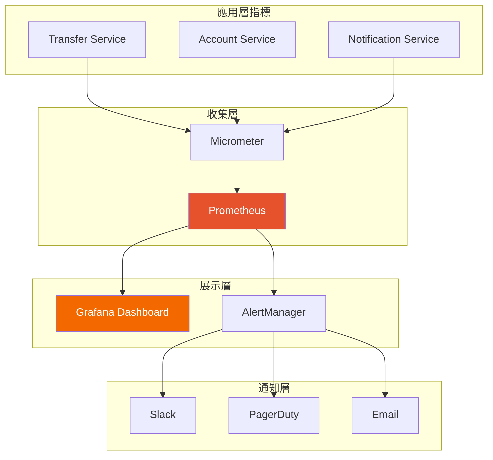
```mermaid
graph TB
    subgraph "應用層指標"
        App1[Transfer Service]
        App2[Account Service]
        App3[Notification Service]
    end
    
    subgraph "收集層"
        Prom[Prometheus]
        MIC[Micrometer]
    end
    
    subgraph "展示層"
        Graf[Grafana Dashboard]
        Alert[AlertManager]
    end
    
    subgraph "通知層"
        Slack[Slack]
        PD[PagerDuty]
        Email[Email]
    end
    
    App1 --> MIC
    App2 --> MIC
    App3 --> MIC
    MIC --> Prom
    Prom --> Graf
    Prom --> Alert
    Alert --> Slack
    Alert --> PD
    Alert --> Email
    
    style Prom fill:#e6522c,color:#fff
    style Graf fill:#f46800,color:#fff
```

### 8.2.2 關鍵監控指標（SLI/SLO）

| 指標類型 | 指標名稱 | SLO 目標 | 告警閾值 |
|---------|---------|---------|---------|
| **Latency** | P50 回應時間 | < 50ms | > 100ms |
| **Latency** | P99 回應時間 | < 200ms | > 300ms |
| **Throughput** | 每秒交易數（TPS） | > 1000 | < 500 |
| **Error Rate** | 5xx 錯誤率 | < 0.1% | > 0.5% |
| **Availability** | 服務可用率 | 99.99% | < 99.95% |
| **Saturation** | CPU 使用率 | < 70% | > 80% |
| **Saturation** | Memory 使用率 | < 75% | > 85% |
| **Saturation** | DB Connection Pool | < 70% | > 85% |

### 8.2.3 Spring Boot Actuator + Micrometer 配置

```yaml
# application-monitoring.yaml
management:
  endpoints:
    web:
      exposure:
        include: health, info, prometheus, metrics
  endpoint:
    health:
      show-details: when-authorized
      group:
        readiness:
          include: db, redis, kafka
        liveness:
          include: ping
  metrics:
    tags:
      application: transfer-service
      environment: ${SPRING_PROFILES_ACTIVE}
    distribution:
      percentiles-histogram:
        http.server.requests: true
      slo:
        http.server.requests: 50ms, 100ms, 200ms, 500ms
```

### 8.2.4 自訂業務指標

```java
@Service
@Slf4j
public class TransferMetrics {

    private final MeterRegistry meterRegistry;
    private final Counter transferSuccessCounter;
    private final Counter transferFailureCounter;
    private final Timer transferLatencyTimer;
    private final AtomicLong activeTransfers;

    public TransferMetrics(MeterRegistry meterRegistry) {
        this.meterRegistry = meterRegistry;
        
        this.transferSuccessCounter = Counter.builder("transfer.completed")
            .description("成功的轉帳交易數")
            .tag("type", "success")
            .register(meterRegistry);
        
        this.transferFailureCounter = Counter.builder("transfer.completed")
            .description("失敗的轉帳交易數")
            .tag("type", "failure")
            .register(meterRegistry);
        
        this.transferLatencyTimer = Timer.builder("transfer.latency")
            .description("轉帳處理延遲")
            .publishPercentiles(0.5, 0.95, 0.99)
            .register(meterRegistry);
        
        this.activeTransfers = meterRegistry.gauge("transfer.active",
            new AtomicLong(0));
    }

    public Timer.Sample startTimer() {
        activeTransfers.incrementAndGet();
        return Timer.start(meterRegistry);
    }

    public void recordSuccess(Timer.Sample sample) {
        sample.stop(transferLatencyTimer);
        transferSuccessCounter.increment();
        activeTransfers.decrementAndGet();
    }

    public void recordFailure(Timer.Sample sample, String errorCode) {
        sample.stop(transferLatencyTimer);
        transferFailureCounter.increment();
        Counter.builder("transfer.error")
            .tag("code", errorCode)
            .register(meterRegistry)
            .increment();
        activeTransfers.decrementAndGet();
    }
}
```

## 8.3 錯誤追蹤

### 8.3.1 分散式追蹤（Distributed Tracing）

```yaml
# application.yaml - OpenTelemetry 配置
spring:
  application:
    name: transfer-service

otel:
  exporter:
    otlp:
      endpoint: http://otel-collector:4317
  resource:
    attributes:
      service.name: transfer-service
      service.version: 1.0.0
  traces:
    sampler:
      type: parentbased_traceidratio
      arg: 0.1  # 生產環境取樣 10%
```

### 8.3.2 錯誤追蹤流程

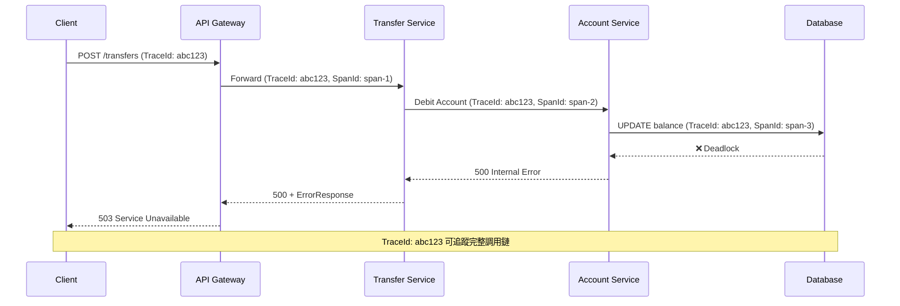
```mermaid
sequenceDiagram
    participant Client
    participant GW as API Gateway
    participant TS as Transfer Service
    participant AS as Account Service
    participant DB as Database
    
    Client->>GW: POST /transfers (TraceId: abc123)
    GW->>TS: Forward (TraceId: abc123, SpanId: span-1)
    TS->>AS: Debit Account (TraceId: abc123, SpanId: span-2)
    AS->>DB: UPDATE balance (TraceId: abc123, SpanId: span-3)
    DB-->>AS: ❌ Deadlock
    AS-->>TS: 500 Internal Error
    TS-->>GW: 500 + ErrorResponse
    GW-->>Client: 503 Service Unavailable
    
    Note over Client,DB: TraceId: abc123 可追蹤完整調用鏈
```

## 8.4 效能調校

### 8.4.1 效能調校清單

| 層級 | 調校項目 | 方法 | 工具 |
|------|---------|------|------|
| **JVM** | Heap 大小 | -Xms/-Xmx, GC 調校 | JFR, VisualVM |
| **框架** | Thread Pool | 根據 CPU core 數調整 | Micrometer |
| **資料庫** | Connection Pool | HikariCP 參數調校 | HikariCP metrics |
| **資料庫** | SQL 效能 | 索引優化、Explain Plan | Oracle AWR |
| **快取** | Hit Rate | TTL 策略、Eviction 策略 | Redis INFO |
| **網路** | 連線數 | Keep-Alive, Connection Pooling | Netstat |

### 8.4.2 HikariCP 進階配置

```yaml
# application-performance.yaml
spring:
  datasource:
    hikari:
      pool-name: TransferPool
      maximum-pool-size: 20        # CPU cores * 2 + 磁碟數
      minimum-idle: 5
      idle-timeout: 300000         # 5 分鐘
      max-lifetime: 1200000        # 20 分鐘
      connection-timeout: 3000     # 3 秒（快速失敗）
      validation-timeout: 1000
      leak-detection-threshold: 30000  # 30 秒連線洩漏偵測
      connection-test-query: "SELECT 1 FROM DUAL"
      
      data-source-properties:
        oracle.net.CONNECT_TIMEOUT: 3000
        oracle.net.READ_TIMEOUT: 30000
        oracle.jdbc.defaultNChar: true
```

## 8.5 成本控制（AI Token）

### 8.5.1 Token 使用量追蹤

| AI Agent | 模型 | 輸入價格 | 輸出價格 | 每日預算 |
|----------|------|---------|---------|---------|
| Claude Code | Claude Sonnet 4 | $3/1M tokens | $15/1M tokens | $50 |
| Gemini CLI | Gemini 2.5 Pro | $1.25/1M tokens | $10/1M tokens | $30 |
| Cursor | GPT-4o | $2.5/1M tokens | $10/1M tokens | $30 |
| Code Review | Claude Opus 4 | $15/1M tokens | $75/1M tokens | $20 |

### 8.5.2 成本優化策略

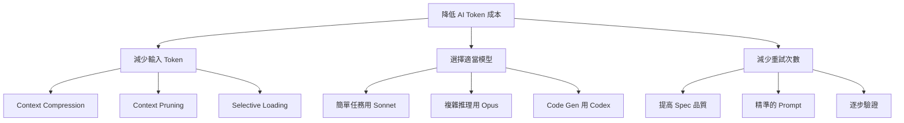
```mermaid
graph TD
    A[降低 AI Token 成本] --> B[減少輸入 Token]
    A --> C[選擇適當模型]
    A --> D[減少重試次數]
    
    B --> B1[Context Compression]
    B --> B2[Context Pruning]
    B --> B3[Selective Loading]
    
    C --> C1[簡單任務用 Sonnet]
    C --> C2[複雜推理用 Opus]
    C --> C3[Code Gen 用 Codex]
    
    D --> D1[提高 Spec 品質]
    D --> D2[精準的 Prompt]
    D --> D3[逐步驗證]
```

### 8.5.3 Token 使用量報表

```markdown
## Weekly Token Usage Report

### 2026-W14 (03/30 - 04/05)
| 項目 | Spec Writer | Plan Generator | Code Generator | Reviewer | Total |
|------|------------|----------------|----------------|----------|-------|
| Input Tokens | 120K | 85K | 450K | 200K | 855K |
| Output Tokens | 35K | 25K | 380K | 45K | 485K |
| Cost | $2.85 | $1.63 | $7.05 | $6.38 | $17.91 |

### 成本趨勢
- Week 12: $28.50（新專案啟動，Spec 迭代多次）
- Week 13: $22.30（進入穩定開發，Context 管理改善）
- Week 14: $17.91（Context Compression 啟用，效果顯著）

### 最佳化建議
1. Spec Review 改用 Claude Haiku（降低 Review 成本 70%）
2. 啟用 Context Caching（Anthropic Prompt Caching，可省 90% 輸入成本）
3. 重複性 Code Gen 改用 Codex（成本最低）
```

> **注意事項**：
> 1. 企業環境中，建議為每個團隊設定月度 Token 預算上限
> 2. 使用 Anthropic 的 Prompt Caching 功能可大幅降低重複 Context 的成本
> 3. 定期審視 Token 使用報表，識別不必要的消耗
> 4. 考慮使用開源 LLM（如 Llama 3）處理非關鍵任務以降低成本

---

# 第九章：系統升級與擴展

## 9.1 GSD 升級策略

### 9.1.1 升級矩陣

| 升級類型 | 風險 | 影響範圍 | 方法 |
|---------|------|---------|------|
| GSD CLI 小版本 | 低 | 僅工具鏈 | 直接升級 |
| GSD CLI 大版本 | 中 | Config + Prompt 可能不相容 | 1. 在新分支測試 2. 更新 Config |
| AI 模型升級 | 中 | 輸出品質可能變化 | 1. 小範圍測試 2. 更新 System Prompt |
| Prompt 版本升級 | 低 | Spec 寫法可能調整 | 1. 更新 Prompt 模板 2. 重新測試 |

### 9.1.2 升級 SOP

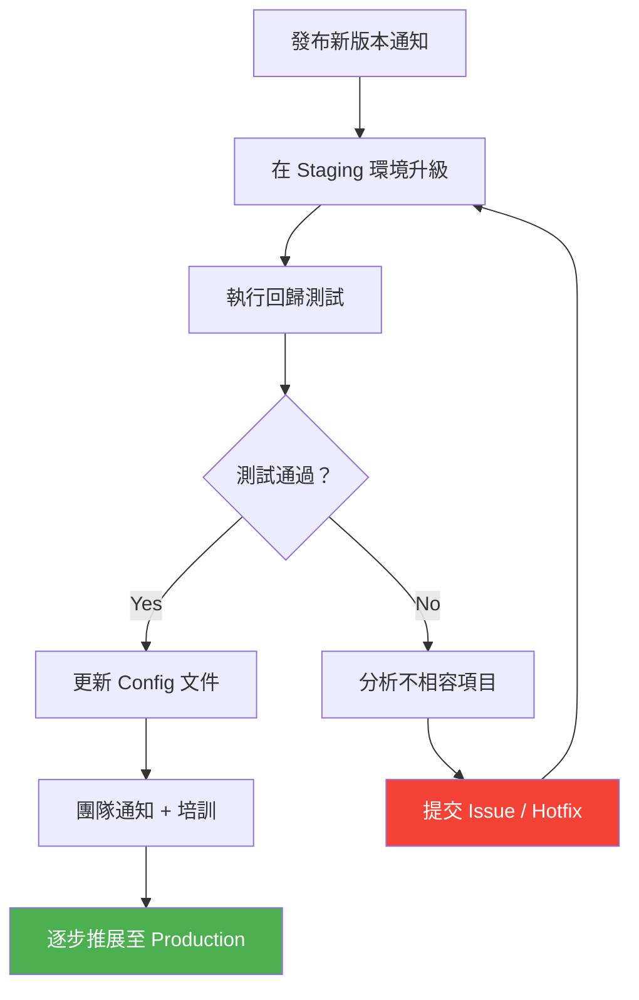
```mermaid
graph TD
    A[發布新版本通知] --> B[在 Staging 環境升級]
    B --> C[執行回歸測試]
    C --> D{測試通過？}
    D -->|Yes| E[更新 Config 文件]
    E --> F[團隊通知 + 培訓]
    F --> G[逐步推展至 Production]
    D -->|No| H[分析不相容項目]
    H --> I[提交 Issue / Hotfix]
    I --> B
    
    style G fill:#4caf50,color:#fff
    style I fill:#f44336,color:#fff
```

```bash
# 升級操作步驟
# Step 1: 備份當前配置
cp -r .planning/ .planning-backup-$(date +%Y%m%d)

# Step 2: 升級 GSD
npx get-shit-done-cc@latest

# Step 3: 執行相容性檢查
/gsd:health

# Step 4: 更新配置（如有需要）
# 檢查 .planning/config.json 是否有新的設定項

# Step 5: 執行回歸測試
/gsd:verify-work
```

## 9.2 Prompt Versioning

### 9.2.1 Prompt 版本控制策略

```
.planning/
└── prompts/
    ├── system/
    │   ├── v1.0.md          # 初始版
    │   ├── v1.1.md          # 新增安全約束
    │   ├── v2.0.md          # 重大重構
    │   └── current -> v2.0.md  # 符號連結
    ├── plan/
    │   ├── v1.0.md
    │   └── current -> v1.0.md
    ├── execute/
    │   ├── v1.0.md
    │   └── current -> v1.0.md
    └── verify/
        ├── v1.0.md
        └── current -> v1.0.md
```

### 9.2.2 Prompt 版本管理規範

```yaml
# .planning/prompt-registry.yaml
prompts:
  system:
    current: "v2.0"
    history:
      - version: "v2.0"
        date: "2026-04-03"
        changes:
          - "新增 PCI-DSS 安全約束"
          - "Java 版本升級至 21"
          - "新增 Anti-Hallucination 指令"
        compatible-with:
          gsd-cli: ">=2.0.0"
          claude-code: ">=1.0.0"
      - version: "v1.1"
        date: "2026-03-20"
        changes:
          - "新增日誌遮蔽規則"
      - version: "v1.0"
        date: "2026-03-01"
        changes:
          - "初始版本"
  
  plan:
    current: "v1.0"
    
  execute:
    current: "v1.0"
```

### 9.2.3 Prompt A/B 測試

```markdown
## Prompt A/B Test: System Prompt v2.0 vs v2.1

### 測試設計
- 任務: 產出 TransferService 的 Application Layer
- 樣本: 同一 Spec，各執行 5 次
- 評估指標: 編譯通過率、測試通過率、代碼品質（CheckStyle）

### 結果

| 指標 | v2.0 | v2.1（新增 Few-Shot） | 差異 |
|------|------|---------------------|------|
| 編譯通過率 | 100% | 100% | - |
| 測試通過率 | 80% | 100% | +20% ✅ |
| CheckStyle 違規 | 3.2/次 | 1.0/次 | -69% ✅ |
| Token 使用量 | 12K | 15K | +25% ⚠️ |
| 執行時間 | 45s | 52s | +16% |

### 結論
v2.1 在品質上明顯提升，雖然 Token 成本增加 25%，但減少了人工修正時間。
建議升級至 v2.1。
```

## 9.3 Spec Versioning

### 9.3.1 Spec 的版本控制

```markdown
# Spec Header Template

---
spec-id: SPEC-TRF-001
title: 即時轉帳服務
version: 2.1.0
status: approved          # draft | review | approved | deprecated
author: tech-lead@company.com
reviewers:
  - architect@company.com
  - qa-lead@company.com
created: 2026-03-15
updated: 2026-04-03
change-log:
  - version: 2.1.0
    date: 2026-04-03
    changes:
      - "新增預約轉帳章節（Future）"
      - "修正跨行轉帳手續費規則"
  - version: 2.0.0
    date: 2026-03-25
    changes:
      - "新增 OTP 二次驗證"
      - "新增每日交易次數限制"
  - version: 1.0.0
    date: 2026-03-15
    changes:
      - "初始版本"
---
```

### 9.3.2 Spec 與 Code 的追溯性

```mermaid
graph LR
    subgraph "Spec Repository"
        S1[Spec v1.0] --> S2[Spec v2.0] --> S3[Spec v2.1]
    end
    
    subgraph "Plan Repository"
        P1[Plan v1.0] --> P2[Plan v2.0] --> P3[Plan v2.1]
    end
    
    subgraph "Code Repository"
        C1[Release v1.0] --> C2[Release v2.0] --> C3[Release v2.1]
    end
    
    S1 -.->|generates| P1
    S2 -.->|generates| P2
    S3 -.->|generates| P3
    
    P1 -.->|produces| C1
    P2 -.->|produces| C2
    P3 -.->|produces| C3
```

## 9.4 與 CI/CD 整合

### 9.4.1 CI/CD Pipeline 整合架構

```mermaid
graph TB
    subgraph "GSD 開發流程"
        DEV["/gsd:ship"] --> COMMIT["Git Commit + Tag"]
    end
    
    subgraph "CI Pipeline"
        COMMIT --> BUILD["Build"]
        BUILD --> LINT["Lint + CheckStyle"]
        LINT --> UNIT["Unit Tests"]
        UNIT --> INT["Integration Tests"]
        INT --> SEC["Security Scan"]
        SEC --> SONAR["SonarQube Analysis"]
        SONAR --> ARTIFACT["Build Artifact"]
    end
    
    subgraph "CD Pipeline"
        ARTIFACT --> DEV_DEPLOY["Deploy to Dev"]
        DEV_DEPLOY --> SMOKE["Smoke Tests"]
        SMOKE --> STG_DEPLOY["Deploy to Staging"]
        STG_DEPLOY --> E2E["E2E Tests"]
        E2E --> APPROVE{"Manual Approval"}
        APPROVE -->|Approved| PROD_DEPLOY["Deploy to Production"]
        APPROVE -->|Rejected| ROLLBACK["Rollback"]
        PROD_DEPLOY --> CANARY["Canary（5%）"]
        CANARY --> FULL["Full Rollout（100%）"]
    end
    
    style DEV fill:#ff9800,color:#fff
    style PROD_DEPLOY fill:#4caf50,color:#fff
    style ROLLBACK fill:#f44336,color:#fff
```

### 9.4.2 GitHub Actions 配置範例

```yaml
# .github/workflows/gsd-pipeline.yaml
name: GSD CI/CD Pipeline

on:
  push:
    branches: [main, develop]
    tags: ['v*']
  pull_request:
    branches: [main]

env:
  JAVA_VERSION: '21'
  MAVEN_OPTS: '-Xmx1024m'

jobs:
  build-and-test:
    runs-on: ubuntu-latest
    steps:
      - uses: actions/checkout@v4
      
      - name: Setup Java
        uses: actions/setup-java@v4
        with:
          java-version: ${{ env.JAVA_VERSION }}
          distribution: 'temurin'
          cache: maven
      
      - name: Compile
        run: mvn compile -B
      
      - name: Unit Tests
        run: mvn test -B
      
      - name: Integration Tests
        run: mvn verify -Pintegration-test -B
      
      - name: CheckStyle
        run: mvn checkstyle:check -B
      
      - name: SpotBugs
        run: mvn spotbugs:check -B
      
      - name: JaCoCo Coverage
        run: |
          mvn jacoco:report -B
          # 確保覆蓋率達標
          mvn jacoco:check -B \
            -Djacoco.line.coverage=0.80 \
            -Djacoco.branch.coverage=0.70

  security-scan:
    needs: build-and-test
    runs-on: ubuntu-latest
    steps:
      - uses: actions/checkout@v4
      
      - name: OWASP Dependency Check
        run: mvn org.owasp:dependency-check-maven:check -B
      
      - name: Trivy Scan
        uses: aquasecurity/trivy-action@master
        with:
          scan-type: 'fs'
          scan-ref: '.'
          severity: 'HIGH,CRITICAL'

  # GSD Spec-Code 一致性驗證
  spec-compliance:
    needs: build-and-test
    runs-on: ubuntu-latest
    steps:
      - uses: actions/checkout@v4
      
      - name: Verify Spec Coverage
        run: |
          # 檢查所有 Spec 中的 API 端點是否都有對應的 Controller
          /gsd:verify-work --report spec-coverage.md
      
      - name: Upload Coverage Report
        uses: actions/upload-artifact@v4
        with:
          name: spec-coverage
          path: spec-coverage.md

  deploy-staging:
    if: github.ref == 'refs/heads/main'
    needs: [security-scan, spec-compliance]
    runs-on: ubuntu-latest
    environment: staging
    steps:
      - name: Deploy to Staging
        run: |
          mvn package -Pstaging -DskipTests -B
          # 部署至 Staging K8s
          kubectl apply -f k8s/staging/

  deploy-production:
    if: startsWith(github.ref, 'refs/tags/v')
    needs: deploy-staging
    runs-on: ubuntu-latest
    environment: production
    steps:
      - name: Deploy to Production (Canary)
        run: |
          mvn package -Pproduction -DskipTests -B
          # Canary 部署（5%）
          kubectl apply -f k8s/production/canary/
      
      - name: Wait for Canary Validation
        run: |
          # 等待 15 分鐘觀察 Canary 指標
          gsd canary-check --duration 15m --threshold error-rate=0.1%
      
      - name: Full Rollout
        run: kubectl apply -f k8s/production/full/
```

### 9.4.3 GSD + CI/CD 整合要點

| 整合點 | 說明 | 實作方式 |
|--------|------|---------|
| Spec 變更觸發 CI | Spec 更新時自動驗證相容性 | GitHub Actions Trigger |
| Plan 自動化生成 | PR 中自動執行 plan-phase | GSD GitHub Action |
| Spec-Code 追溯 | 驗證 Code 是否覆蓋所有 Spec | gsd verify 指令 |
| Prompt Regression | 升級 Prompt 時的回歸測試 | gsd test-prompts 指令 |

> **注意事項**：
> 1. Production 部署務必設置 Manual Approval Gate
> 2. Canary 部署至少觀察 15 分鐘再決定是否全量發布
> 3. 保留最近 3 個版本的 Artifact，確保快速回滾
> 4. Security Scan 發現 Critical 等級漏洞時，必須 Block 部署

---

# 第十章：安全強化機制

## 10.1 GSD 內建安全防護

GSD v1.27.0 引入安全強化機制（`/gsd:secure-phase`），為企業環境提供多層防護：

### 安全 Phase 流程

```bash
# 在 execute-phase 之後執行安全審查
/gsd:secure-phase

# GSD 會自動執行：
# 1. 靜態安全掃描（SAST）
# 2. 依賴漏洞檢查（SCA）
# 3. 敏感資訊洩漏檢查
# 4. OWASP Top 10 合規驗證
```

### 安全檢查層級

| 層級 | 檢查項目 | 工具/方法 | 觸發時機 |
|------|---------|----------|---------|
| **L1 — 即時** | 敏感檔案保護 | config.json `security.sensitive_files` | 每次 Wave |
| **L2 — Wave** | 程式碼安全掃描 | prompt-guard hook | 每個 Wave 完成 |
| **L3 — Phase** | 完整安全審查 | `/gsd:secure-phase` | execute-phase 後 |
| **L4 — Ship** | 依賴漏洞掃描 | OWASP Dependency Check | `/gsd:ship` 前 |

## 10.2 敏感檔案保護

GSD 會自動保護敏感檔案，防止 AI Agent 讀取或修改：

```json
// .planning/config.json
{
  "security": {
    "sensitive_files": [
      "**/*.env",
      "**/*.key",
      "**/*.pem",
      "**/*.p12",
      "**/application-prod.*",
      "**/keystore/**",
      "**/secrets/**",
      "**/.aws/**",
      "**/vault-config.*"
    ]
  }
}
```

### Scope Reduction Detection（v1.29.0+）

GSD 會偵測 AI 是否在執行過程中「悄悄」縮減了 Spec 範圍（常見的 AI 行為）：

```bash
# scope-reduction-detection hook 自動偵測：
# 1. Spec 中定義的功能是否全部實作
# 2. 測試案例是否被省略
# 3. 錯誤處理是否被簡化
# 4. 非功能需求是否被忽略
```

## 10.3 企業安全合規整合

### 金融業安全要求

| 合規框架 | GSD 對應功能 | 實作建議 |
|---------|-------------|---------|
| **PCI-DSS** | 敏感檔案保護 + Audit Trail | config.json security + 操作日誌 |
| **ISO 27001** | 存取控制 + 變更管理 | 權限矩陣 + Git 審計 |
| **SOX** | 變更審計追溯 | Spec → Plan → Code 完整追溯鏈 |
| **GDPR** | 資料處理限制 | Context 中禁止真實客戶資料 |

### 安全審計日誌

```json
// GSD 安全審計事件格式
{
  "event_type": "SECURITY_SCAN",
  "timestamp": "2026-04-03T10:30:00+08:00",
  "project": "transfer-service",
  "phase": "secure-phase",
  "findings": {
    "critical": 0,
    "high": 1,
    "medium": 3,
    "low": 5
  },
  "high_findings": [
    {
      "rule": "SENSITIVE_DATA_EXPOSURE",
      "file": "TransferController.java",
      "line": 45,
      "description": "帳號資訊未遮蔽即寫入日誌",
      "remediation": "使用 maskAccount() 方法遮蔽帳號"
    }
  ],
  "result": "PASS_WITH_WARNINGS"
}
```

> **企業建議**：在金融業環境中，`/gsd:secure-phase` 應設為 Ship 前的必要步驟，且 High/Critical 等級的問題必須修復後才能 Ship。

---

# 第十一章：企業導入策略

## 11.1 團隊導入流程

### 11.1.1 導入階段規劃

```mermaid
graph LR
    P1[Phase 1<br/>試點期<br/>2-4 週] --> P2[Phase 2<br/>擴展期<br/>4-8 週]
    P2 --> P3[Phase 3<br/>標準化<br/>4-6 週]
    P3 --> P4[Phase 4<br/>優化期<br/>持續]
    
    style P1 fill:#e1bee7
    style P2 fill:#bbdefb
    style P3 fill:#c8e6c9
    style P4 fill:#ffe0b2
```

### Phase 1: 試點期（2-4 週）

| 項目 | 說明 |
|------|------|
| **團隊規模** | 2-3 名資深工程師 |
| **專案類型** | 低風險的新開發專案或 POC |
| **目標** | 驗證 GSD 流程可行性，收集初始反饋 |
| **成功指標** | 完成至少 1 個完整的 GSD 開發週期 |
| **產出** | 團隊內部 GSD 使用心得報告 |

```markdown
### 試點期檢查清單

- [ ] 選定 2-3 名具備 AI 工具經驗的工程師
- [ ] 選定一個低風險專案作為試點
- [ ] 安裝並配置 GSD 開發環境
- [ ] 完成一個完整的 GSD 開發週期
- [ ] 記錄遇到的問題與解決方案
- [ ] 產出《GSD 試點報告》
- [ ] 建立初版的團隊 Coding Convention（.planning/context/conventions.md）
```

### Phase 2: 擴展期（4-8 週）

| 項目 | 說明 |
|------|------|
| **團隊規模** | 擴展至整個開發團隊（5-10 人） |
| **專案類型** | 中等複雜度的正式專案 |
| **目標** | 建立標準化流程，培養更多 GSD 實踐者 |
| **成功指標** | 80% 團隊成員能獨立使用 GSD 流程 |
| **產出** | 團隊級 GSD 開發規範 |

### Phase 3: 標準化（4-6 週）

| 項目 | 說明 |
|------|------|
| **團隊規模** | 所有開發團隊 |
| **專案類型** | 所有新專案預設使用 GSD |
| **目標** | GSD 成為組織開發標準的一部分 |
| **成功指標** | 所有新專案使用 GSD 流程 |
| **產出** | 組織級 GSD 治理文件 |

### Phase 4: 持續優化

| 項目 | 說明 |
|------|------|
| **重點** | 指標追蹤、持續改善、知識分享 |
| **活動** | 月度回顧會、Prompt 優化、最佳實踐分享 |
| **產出** | GSD 月報、Prompt Library、Case Study |

## 11.2 開發規範制定

### 11.2.1 GSD 開發規範文件架構

```
.planning/
├── governance/
│   ├── gsd-policy.md              # GSD 使用政策
│   ├── spec-standards.md          # Spec 撰寫標準
│   ├── plan-review-checklist.md   # Plan Review 清單
│   ├── code-review-guidelines.md  # AI 產出碼 Review 指南
│   └── security-policy.md         # AI 使用安全政策
├── templates/
│   ├── spec-template.md           # Spec 模板
│   ├── plan-template.xml          # Plan 模板
│   ├── verify-checklist.md        # 驗證清單模板
│   └── ship-checklist.md          # Ship 清單模板
└── metrics/
    ├── weekly-report-template.md  # 週報模板
    └── kpi-definitions.md         # KPI 定義
```

### 11.2.2 AI 產出碼 Code Review 指南

```markdown
## AI-Generated Code Review Guidelines

### 必檢項目（Mandatory）

#### 1. 安全性
- [ ] 無硬編碼的密碼、金鑰、Token
- [ ] 所有使用者輸入都有驗證
- [ ] SQL 查詢使用參數化
- [ ] 無 XSS 漏洞風險
- [ ] 敏感資料已遮蔽

#### 2. 業務邏輯正確性
- [ ] 邏輯與 Spec 一致（逐條核對）
- [ ] 邊界條件處理完整
- [ ] 金額計算使用 BigDecimal
- [ ] 狀態機轉換正確
- [ ] 併發場景處理（樂觀鎖/分散式鎖）

#### 3. 架構合規
- [ ] 遵循 Clean Architecture 分層
- [ ] 依賴方向正確（外層依賴內層）
- [ ] 使用建構子注入（非 @Autowired 欄位注入）
- [ ] 無跨層直接呼叫

#### 4. 錯誤處理
- [ ] Exception 有明確的訊息
- [ ] 使用統一的 ErrorResponse 格式
- [ ] 不吞 Exception（catch-and-ignore）
- [ ] StackTrace 不暴露給外部

### AI 特有的檢查項目

#### 5. API 真實性驗證
- [ ] 所有使用的方法確實存在於指定版本
- [ ] Maven 依賴座標正確且可解析
- [ ] 配置項名稱正確
- [ ] Import 語句正確（非虛構的 Package）

#### 6. 一致性檢查
- [ ] 命名風格與專案一致
- [ ] 日誌格式與規範一致
- [ ] 錯誤碼與 Spec 一致
- [ ] 回應格式與 API 規格一致
```

### 11.2.3 Spec 撰寫標準

```markdown
## Spec 品質評分表

| 維度 | 權重 | 1分（不合格） | 3分（合格） | 5分（優秀） |
|------|------|-------------|-----------|-----------|
| 完整性 | 30% | 缺少主要功能描述 | 涵蓋所有功能但細節不足 | 完整涵蓋所有功能與邊界 |
| 明確性 | 25% | 多處模糊描述 | 大部分清楚 | 所有描述無歧義 |
| 可測試性 | 20% | 無測試案例 | 主要路徑有測試 | 完整測試案例含邊界 |
| 可追溯性 | 15% | 無需求追溯 | 功能需求可追溯 | 全量追溯（含 NFR） |
| 一致性 | 10% | 存在矛盾描述 | 基本一致 | 完全一致 |

**合格門檻**: 加權平均 ≥ 3.0
**推薦門檻**: 加權平均 ≥ 4.0
```

## 11.3 Governance（治理）

### 11.3.1 GSD 治理架構

```mermaid
graph TB
    subgraph "治理委員會"
        GOV[GSD Governance Board]
    end
    
    subgraph "技術決策"
        ARCH[Architecture Review]
        PROMPT[Prompt Review]
        SEC_R[Security Review]
    end
    
    subgraph "日常運營"
        TEAM1[Team 1]
        TEAM2[Team 2]
        TEAM3[Team 3]
    end
    
    GOV --> ARCH
    GOV --> PROMPT
    GOV --> SEC_R
    
    ARCH --> TEAM1
    ARCH --> TEAM2
    ARCH --> TEAM3
    
    PROMPT --> TEAM1
    PROMPT --> TEAM2
    PROMPT --> TEAM3
    
    style GOV fill:#ff9800,color:#fff
```

### 11.3.2 治理制度

| 制度 | 頻率 | 負責人 | 內容 |
|------|------|--------|------|
| **GSD 週會** | 每週 | Tech Lead | 進度追蹤、問題排解 |
| **Prompt Review** | 每次升級 | Prompt Engineer | 審查 Prompt 變更 |
| **Spec Review** | 每個 Spec | Spec Owner | 審查 Spec 品質 |
| **月度回顧** | 每月 | Governance Board | 指標審查、流程優化 |
| **季度審計** | 每季 | Security Team | AI 安全審計 |

### 11.3.3 KPI 指標

| KPI | 計算方式 | 目標值 |
|-----|---------|--------|
| **開發效率提升** | GSD 開發時間 / 傳統開發時間 | ≥ 50% 提升 |
| **一次通過率** | 不需修改的 Wave 數 / 總 Wave 數 | ≥ 70% |
| **Spec 品質分數** | Spec 品質評分表加權平均 | ≥ 4.0 |
| **AI 幻覺率** | 包含幻覺的 Wave 數 / 總 Wave 數 | ≤ 10% |
| **Token 成本效率** | 產出程式碼行數 / Token 成本 | 逐月改善 |
| **測試覆蓋率** | JaCoCo Line Coverage | ≥ 80% |

## 11.4 安全與權限控管

### 11.4.1 AI 使用安全政策

```markdown
## AI 使用安全政策

### 1. 資料分類與處理

| 資料等級 | 說明 | AI 使用允許 |
|---------|------|-----------|
| **公開** | 開源程式碼、技術文件 | ✅ 允許 |
| **內部** | 業務邏輯、架構設計 | ✅ 允許（企業版 AI） |
| **機密** | 客戶資料、金鑰、帳密 | ❌ 禁止 |
| **高度機密** | 加密金鑰、HSM 配置 | ❌ 嚴禁 |

### 2. AI Prompt 安全規則
- 禁止在 Prompt 中包含真實的客戶資料
- 禁止在 Prompt 中包含資料庫連線字串
- 禁止在 Prompt 中包含 API Key / Secret
- 使用脫敏資料或 Mock 資料替代
- 定期審計 Prompt 歷史紀錄

### 3. AI 產出碼安全要求
- 所有 AI 產出的程式碼必須經過 Security Scan
- 不得使用未經驗證的第三方套件
- 加密演算法必須使用公司核准的清單
- 敏感操作必須有完整的 Audit Trail
```

### 11.4.2 權限控管矩陣

| 角色 | new-project | discuss | plan | execute | verify | ship |
|------|------------|---------|------|---------|--------|------|
| Junior Developer | ❌ | ✅ | ❌ | ✅ | ✅ | ❌ |
| Senior Developer | ✅ | ✅ | ✅ | ✅ | ✅ | ❌ |
| Tech Lead | ✅ | ✅ | ✅ | ✅ | ✅ | ✅ |
| Architect | ✅ | ✅ | ✅ | ✅ | ✅ | ✅ |
| QA Engineer | ❌ | ✅ | ❌ | ❌ | ✅ | ❌ |

### 11.4.3 Audit Trail

```java
// GSD 操作審計日誌格式
{
    "timestamp": "2026-04-03T10:30:00+08:00",
    "action": "gsd:execute-phase",
    "operator": "dev001@company.com",
    "project": "transfer-service",
    "details": {
        "wave": 3,
        "agent": "claude-code",
        "model": "claude-sonnet-4-20250514",
        "inputTokens": 15000,
        "outputTokens": 8500,
        "filesCreated": 4,
        "filesModified": 1,
        "specRef": "SPEC-TRF-001 v2.1"
    },
    "result": "SUCCESS",
    "duration": "45s"
}
```

> **注意事項**：
> 1. 在金融業環境中，所有 AI 互動紀錄需保留至少 7 年（法規要求）
> 2. 定期進行 AI 輸出品質審計（至少每季一次）
> 3. 建立 AI 事故應變計畫（如 AI 產出包含安全漏洞的處理 SOP）
> 4. 考慮使用企業版 AI 服務（如 Anthropic Enterprise / Azure OpenAI）以確保資料不外洩

---

# 第十二章：GSD 完整命令參考

## 12.1 核心工作流命令

| 命令 | 說明 | 適用時機 |
|------|------|---------|
| `/gsd:new-project` | 初始化新專案，建立 `.planning/` 結構 | 專案啟動 |
| `/gsd:discuss-phase` | 結構化需求討論，產出 Spec | 需求釐清 |
| `/gsd:plan-phase` | 根據 Spec 生成結構化執行計畫 | Spec 完成後 |
| `/gsd:execute-phase` | 逐 Wave 執行計畫，產出程式碼 | Plan 審查後 |
| `/gsd:verify-work` | 綜合驗證（compile + test + lint + spec 比對） | Wave/全量完成後 |
| `/gsd:ship` | 打包提交，準備部署 | 所有驗證通過 |

## 12.2 導航與 Session 命令

| 命令 | 說明 | 適用時機 |
|------|------|---------|
| `/gsd:next` | 自動判斷下一步並執行 | 隨時使用 |
| `/gsd:next --chain` | 連續推進多步 | 批次推進 |
| `/gsd:next --auto` | 全自動推進直到完成 | 小型任務 |
| `/gsd:do <instruction>` | 執行自然語言指令 | 靈活操作 |
| `/gsd:note <text>` | 新增備註至專案 | 記錄想法 |

## 12.3 Phase 管理命令

| 命令 | 說明 | 版本 |
|------|------|------|
| `/gsd:quick <description>` | 快速任務模式 | v1.5.0+ |
| `/gsd:fast <description>` | 即時內嵌任務 | v1.21.0+ |
| `/gsd:secure-phase` | 安全審查 Phase | v1.27.0+ |
| `/gsd:ui-phase` | UI Design Contract | v1.21.0+ |
| `/gsd:ui-review` | UI 設計審查 | v1.21.0+ |
| `/gsd:review` | 程式碼審查 | v1.14.0+ |

## 12.4 程式碼品質命令

| 命令 | 說明 | 版本 |
|------|------|------|
| `/gsd:map-codebase` | 分析既有程式碼庫（brownfield） | v1.10.0+ |
| `/gsd:forensics` | 深度程式碼分析 | v1.18.0+ |
| `/gsd:pr-branch` | 建立乾淨的 PR 分支（排除 .planning/） | v1.31.0+ |

## 12.5 Backlog 與 Threads 命令

| 命令 | 說明 | 版本 |
|------|------|------|
| `/gsd:add-backlog <item>` | 新增 Backlog 項目 | v1.21.0+ |
| `/gsd:review-backlog` | 審查 Backlog 清單 | v1.21.0+ |
| `/gsd:plant-seed <idea>` | 播下想法種子 | v1.21.0+ |
| `/gsd:thread <topic>` | 建立/繼續討論線程 | v1.24.0+ |

## 12.6 工具命令

| 命令 | 說明 | 版本 |
|------|------|------|
| `/gsd:health` | 檢查環境健康狀態 | v1.31.0+ |
| `/gsd:stats` | 專案統計（Token 使用量等） | v1.31.0+ |
| `/gsd:workstreams` | 管理並行工作流 | v1.18.0+ |
| `/gsd:milestone-summary` | 里程碑摘要 | v1.16.0+ |
| `/gsd:profile-user` | 使用者 Profile 設定 | v1.29.0+ |
| `/gsd:docs-update` | 自動更新文件 | v1.27.0+ |
| `/gsd:audit-uat` | UAT 審計 | v1.31.0+ |

---

# 第十三章：GSD 設定參考

## 13.1 config.json 完整 Schema

```json
// .planning/config.json — 完整設定參考
{
  // === 基本設定 ===
  "mode": "greenfield",              // "greenfield" | "brownfield"
  "granularity": "normal",           // "minimal" | "normal" | "detailed"
  "model_profile": "balanced",       // "quality" | "balanced" | "budget" | "inherit"

  // === 計畫設定 ===
  "planning": {
    "model_profile": "quality",      // 計畫生成使用的模型
    "max_tasks_per_phase": 10,       // 每個 Phase 最大任務數
    "require_spec_review": true      // 是否要求 Spec Review
  },

  // === 工作流設定 ===
  "workflow": {
    "auto_verify": true,             // 自動驗證
    "auto_commit": true,             // 自動 Git commit
    "require_tests": true,           // 強制測試
    "nyquist_validation": true,      // Nyquist 驗證（v1.31.0+）
    "schema_drift_detection": true   // Schema drift 偵測
  },

  // === Hook 設定 ===
  "hooks": {
    "context-monitor": true,         // Context 膨脹偵測
    "prompt-guard": true,            // Prompt 品質檢查
    "workflow-guard": true,          // 工作流程守衛
    "scope-reduction-detection": true // 範圍縮減偵測
  },

  // === Git 設定 ===
  "git": {
    "auto_branch": true,             // 自動建立分支
    "branch_prefix": "gsd",          // 分支前綴
    "commit_style": "conventional"   // commit 訊息格式
  },

  // === 安全設定 ===
  "security": {
    "sensitive_files": [             // 敏感檔案 glob 模式
      "**/*.env",
      "**/*.key",
      "**/*.pem"
    ]
  }
}
```

## 13.2 Model Profiles

| Profile | 說明 | Token 成本 | 品質 | 速度 |
|---------|------|-----------|------|------|
| `quality` | 使用最強模型 | 高 | 最高 | 較慢 |
| `balanced` | 平衡品質與成本 | 中 | 高 | 中 |
| `budget` | 節省成本 | 低 | 中 | 快 |
| `inherit` | 繼承上層設定 | - | - | - |

## 13.3 Workflow Toggles

| Toggle | 預設值 | 說明 |
|--------|--------|------|
| `auto_verify` | `true` | Wave 完成後自動執行 compile + test |
| `auto_commit` | `true` | 驗證通過後自動 Git commit |
| `require_tests` | `true` | 要求每個功能都有對應測試 |
| `nyquist_validation` | `false` | 啟用 Nyquist 頻率驗證（v1.31.0+） |
| `schema_drift_detection` | `true` | 偵測 DB Schema 與程式碼的不一致 |

## 13.4 Git Branching 策略

```json
{
  "git": {
    "auto_branch": true,
    "branch_prefix": "gsd",
    "commit_style": "conventional",    // "conventional" | "angular" | "custom"
    "branch_pattern": "{prefix}/{task-id}-{description}"
  }
}
```

產生的分支範例：
- `gsd/TRF-001-domain-layer`
- `gsd/TRF-002-application-layer`

## 13.5 Hook 設定

GSD v1.29.0+ 支援三種 Hook：

| Hook | 觸發時機 | 用途 |
|------|---------|------|
| `context-monitor` | 每次 AI 互動 | 偵測 Context 膨脹，觸發壓縮 |
| `prompt-guard` | Prompt 送出前 | 檢查 Prompt 品質、敏感資訊 |
| `workflow-guard` | Phase 轉換時 | 確保前置條件滿足 |

```json
{
  "hooks": {
    "context-monitor": true,
    "prompt-guard": true,
    "workflow-guard": true,
    "scope-reduction-detection": true,
    "custom": {
      "pre-execute": "scripts/pre-execute-check.sh",
      "post-verify": "scripts/post-verify-report.sh"
    }
  }
}
```

---

# 第十四章：常見問題（FAQ）

## 14.1 常見錯誤

### Q1: AI 產出的程式碼無法編譯

```markdown
**症狀**: AI 產出的 Java 程式碼出現 import 錯誤或語法錯誤

**常見原因**:
1. AI 混淆了不同版本的 API（如 javax.* vs jakarta.*）
2. AI 使用了不存在的套件
3. Context 中缺少 pom.xml 依賴資訊

**解決方案**:
1. 在 System Prompt 中明確指定框架版本
2. 將 pom.xml 加入 always-include Context
3. 使用 Negative Prompt："不要使用 javax.* namespace，使用 jakarta.*"

**預防措施**:
在 .planning/context/system.md 中加入：
```

```markdown
## 重要版本約束
- Java 21 → jakarta.* 命名空間（非 javax.*）
- Spring Boot 3.2 → Spring Framework 6.1
- JUnit 5（org.junit.jupiter，非 org.junit）
- Hibernate 6.4（非 Hibernate 5.x）
```

### Q2: AI 忘記之前的約束

```markdown
**症狀**: 在 Wave 4 時，AI 不再遵循 Wave 1 定義的 Coding Convention

**原因**: Context Rot — 對話過長導致早期約束被淡化

**解決方案**:
1. 執行 Context Refresh
2. 在每個 Wave 開始時重新提供關鍵約束
3. 使用 Constraint Anchoring（開頭和結尾都放約束）

**預防措施**:
設定 .planning/config.json 的 hooks.context-monitor 為 true，啟用自動 Context 監控
```

### Q3: AI 產出與 Spec 不一致

```markdown
**症狀**: AI 產出的 API Response 格式與 Spec 定義不同

**原因**:
1. Spec 太長，超出 AI 的有效注意範圍
2. Spec 中有模糊或矛盾的描述
3. AI 採用了「更好」的做法而忽略 Spec

**解決方案**:
1. 將 Spec 拆分為小節，每個 Wave 只載入相關段落
2. 使用 /gsd:verify-work 自動比對 Spec vs Code
3. 在 Prompt 中明確："嚴格按照 Spec 實作，即使你認為有更好的方式，也先按 Spec 執行"

**預防措施**:
定期進行 "Spec 品質 Review"，確保 Spec 無歧義
```

### Q4: 多人協作時 Context 衝突

```markdown
**症狀**: 兩名工程師同時使用 GSD 開發同一專案，產出的程式碼風格不一

**原因**: 
1. 使用不同版本的 System Prompt
2. 使用不同的 AI Agent（Claude vs Gemini）
3. 各自修改了 Context 文件

**解決方案**:
1. 使用 Git 管理 .planning/ 目錄（版本控制 System Prompt）
2. 團隊統一使用同一個 AI Agent 版本
3. .planning/ 的修改需要 PR Review

**預防措施**:
在 .planning/config.json 中鎖定 Agent 版本和 Prompt 版本
```

## 14.2 Debug 方法

### GSD Debug 工具箱

```bash
# 1. 檢查 GSD 環境健康狀態
/gsd:health

# 輸出：
# ✅ GSD v1.31.0
# ✅ Runtime: Claude Code (skills mode)
# ✅ .planning/config.json (valid)
# ✅ .planning/PROJECT.md (loaded)
# ✅ .planning/REQUIREMENTS.md (loaded)
# ⚠️  Context budget: 67% used (consider compression)
# ✅ Active Spec: SPEC-TRF-001 v2.1

# 2. 檢查專案統計
/gsd:stats

# 3. 檢查 Spec-Code 追溯
# 使用 /gsd:verify-work 自動比對
```

### 常見 Debug 場景與處理

| 場景 | 診斷命令 | 處理方式 |
|------|---------|---------|
| AI 回應品質下降 | `/gsd:health` | Context Refresh |
| Plan 無法產出 | `/gsd:health` | 檢查 Spec 格式 |
| 編譯錯誤 | `/gsd:verify-work --verbose` | 修正依賴版本 |
| 測試失敗 | `/gsd:verify-work --verbose` | 檢查 Spec vs Code |
| 風格不一致 | `/gsd:lint` | 重新載入 conventions |

## 14.3 Anti-Patterns

### ❌ Anti-Pattern 1: Spec-less Development

```markdown
**描述**: 跳過 Spec，直接讓 AI 產生程式碼
**問題**: AI 會根據自己的「理解」產出程式碼，結果不可預測
**正確做法**: 永遠先撰寫 Spec，再進入 plan-phase

❌ Bad:
"幫我寫一個轉帳功能"

✅ Good:
"/gsd:plan-phase"
```

### ❌ Anti-Pattern 2: Mega-Wave

```markdown
**描述**: 一個 Wave 包含 20+ 個檔案
**問題**: AI 無法同時維持這麼多檔案的 Context，品質下降
**正確做法**: 每個 Wave 最多 5 個檔案

❌ Bad:
Wave 1: 建立所有 Domain + Application + Infrastructure（25 個檔案）

✅ Good:
Wave 1: Domain Entities（4 個檔案）
Wave 2: Application Use Cases（4 個檔案）
Wave 3: Infrastructure - DB（4 個檔案）
Wave 4: Infrastructure - External（3 個檔案）
Wave 5: Presentation（4 個檔案）
```

### ❌ Anti-Pattern 3: Context Dump

```markdown
**描述**: 把整個程式碼庫丟進 AI Context
**問題**: 超出 Token 限制，或關鍵資訊被稀釋
**正確做法**: 只載入與當前 Wave 相關的檔案

❌ Bad:
"@folder src/"  （載入整個 src 目錄）

✅ Good:
"@file src/main/java/com/bank/transfer/domain/entity/Transfer.java"
"@file src/main/java/com/bank/transfer/application/port/in/ExecuteTransferUseCase.java"
```

### ❌ Anti-Pattern 4: Blind Trust

```markdown
**描述**: 完全信任 AI 產出，不做 Review
**問題**: AI 可能產出看似正確但有隱藏 Bug 的程式碼
**正確做法**: 每個 Wave 都要 Review，特別關注安全性與業務邏輯

❌ Bad:
AI 產出 → 直接 Commit → Push

✅ Good:
AI 產出 → Compile → Test → Review → Verify → Commit
```

### ❌ Anti-Pattern 5: Prompt-and-Pray

```markdown
**描述**: 給一個模糊的 Prompt，期望 AI 自動理解所有需求
**問題**: AI 會填補空白，但往往不是你期望的方向
**正確做法**: 使用 CRISP 框架結構化 Prompt

❌ Bad:
"寫一個好的轉帳 API"

✅ Good:
"根據 Spec SPEC-TRF-001 v2.1 的第 2.1 節 API Design，
使用 Spring Boot 3.2 + Java 21 實作 TransferController，
遵循 .planning/context/conventions.md 的命名規範，
參考 AccountController 的實作模式（@file src/.../AccountController.java），
所有驗證使用 Jakarta Bean Validation，
錯誤處理使用 GlobalExceptionHandler 的統一格式。"
```

### ❌ Anti-Pattern 6: Never Refresh

```markdown
**描述**: 在同一對話中連續執行 10+ 個 Wave，從不做 Context Refresh
**問題**: Context Rot 導致後期 Wave 品質嚴重下降
**正確做法**: 每 3-5 個 Wave 做一次 Context Refresh

❌ Bad:
Wave 1 → Wave 2 → ... → Wave 10（同一對話）

✅ Good:
Wave 1-3（對話 1）→ Checkpoint → Wave 4-6（對話 2）→ Checkpoint → Wave 7-10（對話 3）
```

> **實務建議**：建議在團隊的 GSD 培訓中，專門用一節時間講解 Anti-Patterns，並使用實際案例說明。Anti-Pattern 的理解比 Best Practice 更容易讓人記住。

---

# 第十五章：.planning/ 目錄結構參考

GSD 初始化後會在專案根目錄建立 `.planning/` 目錄，作為所有規劃文件與執行狀態的中央儲存庫。以下為完整的目錄結構與各檔案說明。

## 15.1 完整目錄樹狀圖

```
.planning/
├── config.json              # GSD 核心設定（Runtime、模型、Hooks）
├── PROJECT.md               # 專案定義（願景、範圍、技術棧、限制）
├── REQUIREMENTS.md          # 需求清單（功能 / 非功能 / 技術）
├── ROADMAP.md               # 版本路線圖（里程碑、交付時程）
├── STATE.md                 # 即時執行狀態（目前 Wave、進度、阻礙）
├── MILESTONES.md            # 里程碑追蹤（進度百分比、狀態）
├── HANDOFF.json             # 跨 Session 交接資料（自動產生）
├── CHANGELOG.md             # 變更日誌（每次 /gsd:ship 自動更新）
├── backlog/                 # 功能待辦項目
│   └── *.md                 # 每個待辦一個檔案
├── seeds/                   # 構想 / 靈感 / 探索性想法
│   └── *.md                 # 低成熟度的早期想法
├── threads/                 # 討論紀錄
│   └── *.md                 # 非同步討論串
├── context/                 # Context 資料夾
│   ├── conventions.md       # 編碼慣例與命名規範
│   ├── tech-stack.md        # 技術棧詳細說明
│   ├── architecture.md      # 系統架構描述
│   └── glossary.md          # 領域術語表
├── specs/                   # Spec 文件（discuss-phase 產出）
│   ├── SPEC-XXX-001.md      # 個別功能 Spec
│   ├── SPEC-XXX-002.md
│   └── ...
├── plans/                   # 執行計畫（plan-phase 產出）
│   ├── PLAN-XXX-001.md      # 對應 Spec 的執行計畫
│   └── ...
├── checkpoints/             # 檢查點快照
│   ├── wave-01.md           # 每個 Wave 完成後的快照
│   ├── wave-02.md
│   └── ...
└── reports/                 # 品質與驗證報告
    ├── verification-*.md    # 驗證報告
    └── quality-*.md         # 品質評估報告
```

## 15.2 核心檔案說明

| 檔案 | 產生時機 | 更新時機 | 說明 |
|------|----------|----------|------|
| `config.json` | `npx get-shit-done-cc@latest` | 手動或 `/gsd:config` | Runtime、模型設定、Hooks 開關 |
| `PROJECT.md` | `/gsd:init` 或手動建立 | 專案範圍變更時 | 專案願景、範圍邊界、技術棧、非功能約束 |
| `REQUIREMENTS.md` | `/gsd:init` 或手動建立 | 需求變更時 | 結構化需求清單（FR / NFR / TR） |
| `ROADMAP.md` | `/gsd:init` 或手動建立 | 里程碑調整時 | 版本路線圖與時程規劃 |
| `STATE.md` | `/gsd:discuss` 首次執行 | 每個 Phase 自動更新 | 目前執行狀態、進度、阻礙項目 |
| `MILESTONES.md` | `/gsd:milestones` | 里程碑完成時 | 里程碑進度追蹤 |
| `HANDOFF.json` | Session 結束時自動產生 | 每次 Session 結束 | 跨 Session 狀態交接資料（JSON 格式） |
| `CHANGELOG.md` | `/gsd:ship` 首次執行 | 每次 Ship 自動追加 | 版本變更日誌 |

## 15.3 Context 目錄

`context/` 目錄是 GSD 特有的 Context Engineering 機制，用於提供專案背景資訊給 AI Agent：

```markdown
# context/conventions.md 範例

## 命名規範
- 類別名稱：PascalCase（例：TransferService）
- 方法名稱：camelCase（例：processTransfer）
- 常數名稱：UPPER_SNAKE_CASE（例：MAX_RETRY_COUNT）
- 資料庫表名：snake_case（例：transfer_record）

## 錯誤處理
- 統一使用 GlobalExceptionHandler
- 業務例外繼承 BusinessException
- 錯誤碼格式：{MODULE}-{TYPE}-{SEQ}（例：TRF-VAL-001）

## API 設計
- RESTful 風格，版本前綴 /api/v1/
- 分頁使用 page/size 參數
- 回應格式統一使用 ApiResponse<T>
```

> **最佳實踐**：`context/` 中的檔案在每次 `/gsd:discuss` 和 `/gsd:execute` 時會被自動載入為 AI 上下文。保持這些檔案簡潔（每個不超過 200 行）以避免 Context Window 浪費。

## 15.4 Specs 與 Plans 目錄

**Spec 檔案命名慣例**：`SPEC-{模組縮寫}-{序號}.md`

```
specs/
├── SPEC-TRF-001.md    # 轉帳功能 Spec
├── SPEC-TRF-002.md    # 轉帳查詢 Spec
├── SPEC-AUTH-001.md   # 認證功能 Spec
└── SPEC-NOTIF-001.md  # 通知功能 Spec
```

**Plan 檔案命名慣例**：`PLAN-{模組縮寫}-{序號}.md`

```
plans/
├── PLAN-TRF-001.md    # 對應 SPEC-TRF-001 的執行計畫
├── PLAN-AUTH-001.md   # 對應 SPEC-AUTH-001 的執行計畫
└── ...
```

每個 Plan 檔案包含：
- Wave 分解（每個 Wave 不超過 5 個檔案）
- Spec 追溯參照（spec-ref）
- 驗證標準
- 估計 Token 用量

## 15.5 Checkpoints 與 Reports 目錄

**Checkpoints** 在每個 Wave 完成後自動建立，記錄：

```markdown
# checkpoints/wave-03.md

## Wave 3 Checkpoint
- 狀態: ✅ 通過
- 完成時間: 2026-04-15T14:30:00+08:00
- 產出檔案:
  - src/main/java/.../TransferService.java
  - src/main/java/.../TransferRepository.java
  - src/test/java/.../TransferServiceTest.java
- 驗證結果:
  - 編譯: ✅ 通過
  - 測試: ✅ 18/18 通過
  - 覆蓋率: 87.3% (目標 ≥ 80%)
  - Lint: ✅ 0 違規
```

**Reports** 由 `/gsd:verify` 和 Ship Phase 自動產生，提供品質與一致性的完整報告。

## 15.6 .gitignore 建議

建議將以下項目加入版本控制，並排除臨時檔案：

```gitignore
# GSD - 納入版本控制
# .planning/ 目錄預設全部納入

# GSD - 排除項目（視團隊政策）
# .planning/HANDOFF.json    # 如不需跨 Session 交接可排除
# .planning/checkpoints/    # 如 Checkpoint 過多可排除歷史項目
```

> **企業建議**：`.planning/` 目錄**應該**納入 Git 版本控制。這是 GSD 的核心設計理念——規劃文件與程式碼共同演進，確保可追溯性與團隊協作。

---

# 附錄：檢查清單（Checklist）

## A. GSD 環境建置 Checklist

```markdown
### 工具安裝
- [ ] Node.js 20.x LTS 已安裝
- [ ] Git 2.30+ 已安裝
- [ ] Java JDK 21 已安裝
- [ ] Maven 3.9+ 已安裝
- [ ] VS Code 最新版已安裝
- [ ] GSD 已安裝（`npx get-shit-done-cc@latest`）

### AI Agent 設定
- [ ] Claude Code 已安裝並認證（或其他支援的 Runtime）
- [ ] API Key 已安全存放（非明文）
- [ ] Skills 已正確安裝（Claude Code: `~/.claude/skills/gsd-*/SKILL.md`）

### VS Code 擴充套件
- [ ] GitHub Copilot 已安裝
- [ ] GitHub Copilot Chat 已安裝
- [ ] Extension Pack for Java 已安裝
- [ ] GitLens 已安裝

### 專案初始化
- [ ] `npx get-shit-done-cc@latest` 執行完成
- [ ] .planning/config.json 已配置
- [ ] .planning/PROJECT.md 已撰寫
- [ ] .planning/REQUIREMENTS.md 已撰寫
- [ ] CLAUDE.md 或對應 Runtime 系統指令已建立
- [ ] .editorconfig 已設定
- [ ] Git hooks（pre-commit lint）已設定
```

## B. Spec 撰寫 Checklist

```markdown
### 結構完整性
- [ ] Spec Header（id, version, status, author）
- [ ] 概述（Overview）
- [ ] API 設計（端點、請求/回應格式）
- [ ] 業務規則（編號：BR-xxx）
- [ ] 資料模型（欄位、型別、約束）
- [ ] 錯誤碼對照表
- [ ] 非功能需求（NFR-xxx）
- [ ] 測試案例（TC-xxx）
- [ ] 狀態機（如適用）

### 品質檢查
- [ ] 所有業務規則無歧義
- [ ] 所有 API 端點有完整的 Request/Response 定義
- [ ] 所有欄位有型別與驗證規則
- [ ] 所有錯誤場景有對應的錯誤碼
- [ ] 所有 Test Case 覆蓋主要與邊界路徑
- [ ] Spec 已通過 Peer Review（至少 1 人）
- [ ] Spec 品質評分 ≥ 3.0
```

## C. Plan Review Checklist

```markdown
### Wave 結構
- [ ] 每個 Wave 不超過 5 個產出檔案
- [ ] Wave 之間的依賴關係正確
- [ ] 每個 Wave 有明確的驗證標準
- [ ] Wave 順序符合 Clean Architecture（由內到外）

### Spec 追溯
- [ ] 每個檔案有對應的 spec-ref
- [ ] 所有 Spec 需求都有對應的 Wave
- [ ] 測試案例（TC）都有對應的測試檔案

### 風險檢查
- [ ] 無單點故障（高依賴的 Wave）
- [ ] 複雜邏輯分配在較早的 Wave
- [ ] 外部整合放在獨立的 Wave
```

## D. Wave 執行 Checklist（每個 Wave）

```markdown
### 執行前
- [ ] Context 已更新至最新狀態
- [ ] 關鍵約束已在 Prompt 中重申
- [ ] 前一個 Wave 的所有驗證已通過
- [ ] Checkpoint 已存檔

### 執行中
- [ ] AI 產出的程式碼已快速瀏覽
- [ ] 命名風格與專案一致
- [ ] 無明顯的安全漏洞
- [ ] 業務邏輯與 Spec 一致

### 執行後
- [ ] 編譯通過
- [ ] 單元測試全部通過
- [ ] Lint/CheckStyle 無違規
- [ ] 覆蓋率達標（Line ≥ 80%）
- [ ] Checkpoint 已更新
```

## E. Ship Checklist

```markdown
### 程式碼品質
- [ ] 所有 Wave 驗證通過
- [ ] 整合測試全部通過
- [ ] 程式碼覆蓋率達標
- [ ] CheckStyle + SpotBugs 無違規
- [ ] Security Scan（OWASP/Trivy）通過
- [ ] SonarQube Quality Gate 通過

### 文件完整
- [ ] API 文件已更新（OpenAPI/Swagger）
- [ ] README.md 已更新
- [ ] CHANGELOG.md 已更新
- [ ] Spec 標記為 approved

### 部署準備
- [ ] 版本號已確定（Semantic Versioning）
- [ ] Git Tag 已建立
- [ ] CI Pipeline 通過
- [ ] Staging 環境部署成功
- [ ] 冒煙測試通過
- [ ] 回滾方案已準備

### 審批
- [ ] Code Review 完成（至少 2 名 Reviewer）
- [ ] Tech Lead 已核准
- [ ] CAB 已審批（Production 部署）
```

## F. AI 安全 Checklist

```markdown
### Prompt 安全
- [ ] Prompt 中無真實客戶資料
- [ ] Prompt 中無資料庫密碼
- [ ] Prompt 中無 API Key
- [ ] 使用脫敏 / Mock 資料
- [ ] Prompt 歷史紀錄已審計

### AI 產出碼安全
- [ ] 無硬編碼密碼
- [ ] 無不安全的序列化
- [ ] 輸入驗證完整
- [ ] SQL 參數化查詢
- [ ] 無 Log 敏感資訊
- [ ] 加密演算法符合公司標準

### 存取控制
- [ ] AI Agent 使用企業版（資料不外送）
- [ ] API Key 透過金鑰管理系統存取
- [ ] 操作紀錄已記錄至 Audit Trail
- [ ] 團隊成員權限已正確設定
```

---

## 結語

GSD 不僅是一個 AI 開發框架，更是一種**工程思維的轉變**。從「手動寫程式碼」到「設計 Spec 驅動 AI 產出」，核心能力從 Coding 轉向 **Spec 設計** 和 **Context Engineering**。

成功導入 GSD 的關鍵三要素：

1. **高品質的 Spec**——投入最多時間在 discuss-phase
2. **系統化的 Context 管理**——對抗 Context Rot
3. **嚴格的驗證流程**——永遠不要 Blind Trust AI

> 「AI 不會取代工程師，但善用 AI 的工程師會取代不善用 AI 的工程師。」

---

*本手冊由團隊技術架構組維護，如有問題請聯繫技術架構組。*  
*版本: 2.0 | 最後更新: 2026-04-03*

