+++
date = '2026-02-12T20:03:12+08:00'
draft = false
title = 'Github Copilot生態圈教學手冊'
tags = ['教學', 'AI開發']
categories = ['教學']
+++


# Github Copilot生態圈教學手冊

> **版本**：2.0  
> **最後更新**：2026 年 2 月 12 日  
> **適用對象**：資深工程師 / Tech Lead / Architect  
> **適用於**：GitHub Copilot (Free / Pro / Pro+ / Business / Enterprise)  
> **Created by**：Eric Cheng

## 目錄

### 第一章 GitHub Copilot 生態圈全貌總覽

- [1.1 什麼是 GitHub Copilot 生態圈](#11-什麼是-github-copilot-生態圈)
- [1.2 生態圈各組件說明](#12-生態圈各組件說明)
- [1.3 Copilot 在企業開發流程中的定位](#13-copilot-在企業開發流程中的定位)
- [1.4 版本與授權模式](#14-版本與授權模式)
- [1.5 2025-2026 年新功能重點摘要](#15-2025-2026-年新功能重點摘要)

### 第二章 Copilot 與「資深工程師角色」的正確關係

- [2.1 思維轉換：從「工具」到「協作夥伴」](#21-思維轉換從工具到協作夥伴)
- [2.2 資深工程師的不可取代價值](#22-資深工程師的不可取代價值)
- [2.3 正確的協作模式](#23-正確的協作模式)
- [2.4 效率提升的正確期待](#24-效率提升的正確期待)

### 第三章 Copilot 在實際開發流程中的使用時機

- [3.1 開發流程與 Copilot 介入點](#31-開發流程與-copilot-介入點)
- [3.2 各階段使用策略](#32-各階段使用策略)
- [3.3 不同類型任務的使用建議](#33-不同類型任務的使用建議)
- [3.4 與現有工具鏈整合](#34-與現有工具鏈整合)
- [3.5 實務案例：一個完整的開發循環](#35-實務案例一個完整的開發循環)

### 第四章 Copilot Prompt Engineering（重點章節）

- [4.1 Prompt Engineering 核心觀念](#41-prompt-engineering-核心觀念)
- [4.2 Inline Completion Prompt 技巧](#42-inline-completion-prompt-技巧)
- [4.3 Copilot Chat Prompt 技巧](#43-copilot-chat-prompt-技巧)
- [4.4 Bad Prompt vs Good Prompt 對照](#44-bad-prompt-vs-good-prompt-對照)
- [4.5 進階 Prompt Pattern](#45-進階-prompt-pattern)
- [4.6 Prompt Template 庫](#46-prompt-template-庫)
- [4.7 Copilot Chat 快捷指令與互動方式](#47-copilot-chat-快捷指令與互動方式)
- [4.8 Custom Instructions 與 Prompt Files](#48-custom-instructions-與-prompt-files)

### 第五章 Copilot + Code Review + Testing 最佳實務

- [5.1 Copilot 與 Code Review 的整合](#51-copilot-與-code-review-的整合)
- [5.2 Copilot 與 Testing 的整合](#52-copilot-與-testing-的整合)
- [5.3 CI/CD 整合建議](#53-cicd-整合建議)
- [5.4 實務案例：完整的測試策略](#54-實務案例完整的測試策略)

### 第六章 資安、法遵與風險控管

- [6.1 Copilot 的資安風險概覽](#61-copilot-的資安風險概覽)
- [6.2 常見安全漏洞與防範](#62-常見安全漏洞與防範)
- [6.3 Copilot 生成程式碼的審查清單](#63-copilot-生成程式碼的審查清單)
- [6.4 法遵考量](#64-法遵考量)
- [6.5 企業級安全設定](#65-企業級安全設定)
- [6.6 Copilot 在 SSDLC 中的定位](#66-copilot-在-ssdlc-中的定位)
- [6.7 稽核與追蹤](#67-稽核與追蹤)

### 第七章 常見誤用與反模式

- [7.1 Anti-Pattern 總覽](#71-anti-pattern-總覽)
- [7.2 Anti-Pattern 詳解](#72-anti-pattern-詳解)
- [7.3 Copilot 不適合做的事情](#73-copilot-不適合做的事情)
- [7.4 常見錯誤案例分析](#74-常見錯誤案例分析)
- [7.5 自我檢查清單](#75-自我檢查清單)

### 第八章 團隊導入與治理建議

- [8.1 導入成熟度模型](#81-導入成熟度模型)
- [8.2 各階段導入建議](#82-各階段導入建議)
- [8.3 團隊使用規範範本](#83-團隊使用規範範本)
- [8.4 Code Review 要點（Copilot 輔助後）](#84-code-review-要點copilot-輔助後)
- [8.5 效益衡量指標](#85-效益衡量指標)
- [8.6 組織架構建議](#86-組織架構建議)

### 第九章 進階應用案例

- [9.1 案例一：Legacy Code 重構](#91-案例一legacy-code-重構)
- [9.2 案例二：API 設計與實作](#92-案例二api-設計與實作)
- [9.3 案例三：Batch 程式開發](#93-案例三batch-程式開發)
- [9.4 案例四：架構文件生成](#94-案例四架構文件生成)
- [9.5 案例五：使用 Copilot Coding Agent 自動化開發](#95-案例五使用-copilot-coding-agent-自動化開發)
- [9.6 最佳實務總結](#96-最佳實務總結)

### 第十章 總結：如何把 Copilot 變成「資深工程師的放大器」

- [10.1 核心心法](#101-核心心法)
- [10.2 黃金法則](#102-黃金法則)
- [10.3 技能發展路徑](#103-技能發展路徑)
- [10.4 持續改善框架](#104-持續改善框架)
- [10.5 未來展望](#105-未來展望)

### 附錄

- [A. 日常使用檢查清單](#a-日常使用檢查清單)
- [B. Code Review 檢查清單（Copilot 輔助程式碼）](#b-code-review-檢查清單copilot-輔助程式碼)
- [C. 團隊導入檢查清單](#c-團隊導入檢查清單)
- [D. Prompt 範本快速參考](#d-prompt-範本快速參考)
- [參考資源](#參考資源)

---

## 第一章 GitHub Copilot 生態圈全貌總覽

### 1.1 什麼是 GitHub Copilot 生態圈

GitHub Copilot 已從單純的「程式碼自動補全工具」演進為完整的 AI 輔助開發生態系統。截至 2026 年初，Copilot 生態圈涵蓋了從程式碼補全、對話式 AI、自主編碼代理到企業治理的全方位功能。對資深工程師而言，理解其全貌是有效運用的前提。

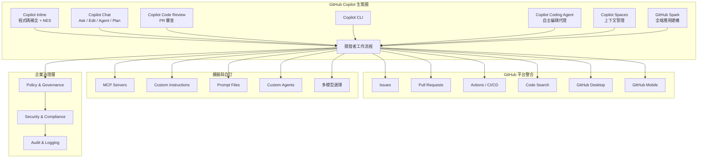

### 1.2 生態圈各組件說明

| 組件 | 功能定位 | 適用場景 | 資深工程師價值 |
| --- | --- | --- | --- |
| **Copilot Inline Suggestions** | 即時程式碼補全 | 日常編碼、實作細節 | 減少 boilerplate，專注設計 |
| **Next Edit Suggestions (NES)** | 預測下一個編輯位置並建議補全 | 連續編輯、重構 | 加速連續修改流程 |
| **Copilot Chat (Ask Mode)** | 對話式問答、程式碼解釋 | 問題分析、設計討論 | 架構決策輔助、知識傳承 |
| **Copilot Chat (Edit Mode)** | 受控的多檔案編輯 | 精確修改特定檔案 | 細粒度控制 AI 編輯範圍 |
| **Copilot Chat (Agent Mode)** | 自主完成多步驟任務 | 複雜開發任務、跨檔案修改 | 自動化實作、整合 MCP |
| **Copilot Chat (Plan Mode)** | 制定詳細實作計畫 | 任務規劃、需求分析 | 在動手前確認方案完整性 |
| **Copilot Coding Agent** | 自主編碼代理（GitHub 端） | 從 Issue 自動建立 PR | 將例行任務交給 Agent 執行 |
| **Copilot Code Review** | AI 驅動的程式碼審查 | PR 審查、程式碼品質 | 提升 Review 效率與品質 |
| **Copilot PR Summaries** | 自動生成 PR 摘要 | PR 描述撰寫 | 節省文件撰寫時間 |
| **Copilot CLI** | 命令列輔助 | DevOps、腳本撰寫 | 減少查文件時間 |
| **Copilot Spaces** | 組織上下文資訊 | 集中程式碼、文件、規格 | 為特定任務提供精確上下文 |
| **Copilot Memory** | 記憶 repo 知識 | 持續開發同一專案 | 提升跨 session 一致性 |
| **Custom Instructions** | 自訂回應偏好 | 統一團隊風格 | 確保 AI 輸出符合規範 |
| **Prompt Files** | 可重用的 Prompt 範本 | 標準化工作流程 | 團隊知識共享 |
| **MCP (Model Context Protocol)** | 擴展 Copilot 能力 | 整合外部工具與服務 | 連接企業內部系統 |
| **GitHub Spark** | 自然語言建構全端應用 | 快速原型、內部工具 | 快速驗證概念 |
| **Copilot in GitHub Desktop** | 自動生成 commit 訊息 | 日常 Git 操作 | 提升 commit 品質 |

### 1.3 Copilot 在企業開發流程中的定位

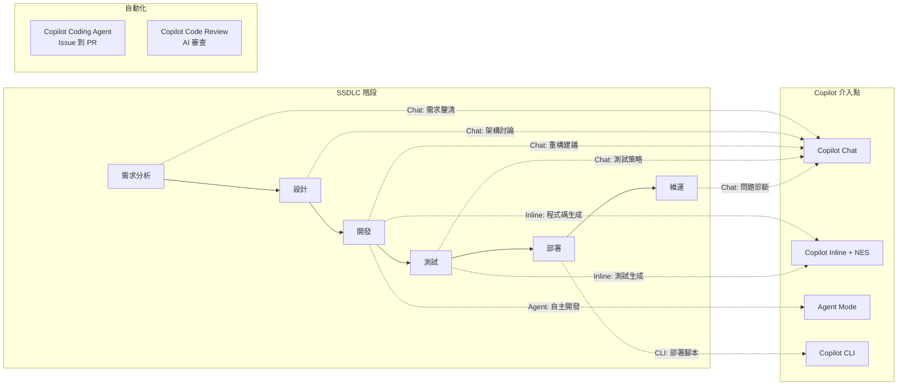

### 1.4 版本與授權模式

GitHub Copilot 目前提供五種方案，適用不同規模的使用者：

| 版本 | 適用對象 | 價格 | Premium Requests | 主要差異 |
| --- | --- | --- | --- | --- |
| **Copilot Free** | 所有 GitHub 使用者 | 免費 | 50 / 月 | 基本補全（2000/月）、有限 Chat（50/月）、基本模型 |
| **Copilot Pro** | 個人開發者 | $10 USD / 月 | 300 / 月 | 無限補全、Premium 模型、Coding Agent、PR 摘要 |
| **Copilot Pro+** | AI 進階使用者 | $39 USD / 月 | 1500 / 月 | 所有 Pro 功能 + 更多 Premium Requests + 全部進階模型 |
| **Copilot Business** | 企業團隊 | $19 USD / 座位 / 月 | 300 / 使用者 / 月 | 組織管理、Policy 控制、Coding Agent、Audit Logs |
| **Copilot Enterprise** | 大型企業 | $39 USD / 座位 / 月 | 1000 / 使用者 / 月 | 所有 Business 功能 + GitHub Spark + 第三方 Agent |

> **Premium Requests 說明**：Premium Requests 是使用進階模型（如 Claude Opus、GPT-5 等）時消耗的額度。使用預設 included model（multiplier 為 0）則不消耗。超額可以 $0.04/request 加購。

> **可用模型**：Copilot 支援多種 AI 模型，包括 GPT-4.1、GPT-5、Claude Sonnet 4、Claude Opus 4.6、Gemini 2.5 Pro 等，可依任務需求切換。

> ⚠️ **企業使用注意**：Business/Enterprise 版本承諾不使用您的程式碼訓練模型，這對金融業等受監管產業至關重要。

### 1.5 2025-2026 年新功能重點摘要

以下為近期 Copilot 生態圈的重要更新，資深工程師應特別留意：

| 功能 | 類別 | 說明 | 影響程度 |
| --- | --- | --- | --- |
| **Copilot Coding Agent** | 自主代理 | 可將 GitHub Issue 指派給 Copilot，自動建立 PR | 🔴 高 |
| **Agent Mode (IDE)** | Chat 模式 | 在 IDE 中自主決定編輯哪些檔案、執行終端指令 | 🔴 高 |
| **Plan Mode (IDE)** | Chat 模式 | 在動手前建立詳細實作計畫，支援審核與迭代 | 🟡 中 |
| **Next Edit Suggestions** | 補全 | 預測下一個編輯位置，主動建議修改 | 🟡 中 |
| **Copilot Spaces** | 上下文 | 整合程式碼、文件、規格至 Space，提升回應精準度 | 🟡 中 |
| **Copilot Memory** | 上下文 | 自動記憶 repo 知識，跨 session 使用 | 🟡 中 |
| **MCP 整合** | 擴展 | 透過 Model Context Protocol 連接外部工具與服務 | 🔴 高 |
| **Custom Instructions** | 自訂 | Repository / Personal / Organization 層級指令 | 🟡 中 |
| **Prompt Files** | 自訂 | 可重用的 `.prompt.md` 檔案 | 🟡 中 |
| **多模型選擇** | 模型 | 可選擇 GPT、Claude、Gemini 等多種模型 | 🟡 中 |
| **Image Support** | Chat | 可在 Chat 中貼圖片（截圖、流程圖）進行分析 | 🟢 低 |
| **Subagents** | Agent | 在 Agent Mode 中委派子任務給獨立 Agent | 🟡 中 |
| **GitHub Spark** | 應用 | 用自然語言建構與部署全端應用 | 🟡 中 |

---

## 第二章 Copilot 與「資深工程師角色」的正確關係

### 2.1 思維轉換：從「工具」到「協作夥伴」

資深工程師使用 Copilot 的心態應該是：

```text
❌ 錯誤心態：「讓 AI 幫我寫程式」
✅ 正確心態：「讓 AI 加速我的思考與實作」
```

#### 角色定位比較

| 面向 | 傳統開發 | AI 輔助開發 |
| ------ | ---------- | ------------- |
| **設計決策** | 工程師主導 | 工程師主導，AI 提供選項 |
| **實作細節** | 工程師撰寫 | AI 建議，工程師審核 |
| **品質把關** | Code Review | Code Review + AI 輸出審核 |
| **知識應用** | 查文件、經驗 | AI 快速提供，工程師驗證 |

### 2.2 資深工程師的不可取代價值

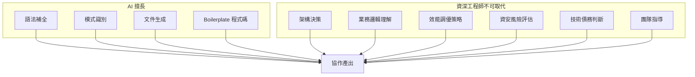

### 2.3 正確的協作模式

#### 模式一：AI 起草，人類精修

```java
// 步驟 1: 提供明確的設計意圖（註解）
// 實作一個 Rate Limiter，使用 Token Bucket 演算法
// 需求：每秒最多 100 個請求，支援 burst 到 150

// 步驟 2: Copilot 生成初版程式碼
// 步驟 3: 資深工程師審核並修正
//   - 檢查 thread-safety
//   - 驗證邊界條件
//   - 確認效能特性
```

#### 模式二：人類設計，AI 實作

```java
// 資深工程師先定義介面與契約
public interface PaymentProcessor {
    /**
     * 處理付款請求
     * @param request 付款請求，包含金額、幣別、付款方式
     * @return 付款結果，包含交易編號與狀態
     * @throws PaymentException 當付款失敗時拋出
     */
    PaymentResult process(PaymentRequest request) throws PaymentException;
}

// 再讓 Copilot 協助實作具體邏輯
```

#### 模式三：AI 解釋，人類決策

使用 Copilot Chat 分析既有程式碼：

```text
Prompt: 請分析這段 Legacy Code 的問題，並提供重構建議：
- 識別潛在的效能瓶頸
- 指出可能的 thread-safety 問題
- 建議符合 Clean Architecture 的重構方向
```

### 2.4 效率提升的正確期待

| 任務類型 | 預期效率提升 | 說明 |
| ---------- | -------------- | ------ |
| Boilerplate 程式碼 | 60-80% | CRUD、DTO、基本驗證 |
| 單元測試 | 40-60% | 測試案例生成，邊界條件需人工補充 |
| 文件撰寫 | 50-70% | JavaDoc、README、API 文件 |
| 複雜業務邏輯 | 10-20% | AI 難以理解業務脈絡 |
| 架構設計 | 5-15% | 提供參考，決策仍需人類 |
| 效能調優 | 10-20% | 需要實際 profiling 數據 |

> 💡 **實務建議**：不要期待 Copilot 處理「需要深度業務知識」或「需要跨系統理解」的任務。

---

## 第三章 Copilot 在實際開發流程中的使用時機

### 3.1 開發流程與 Copilot 介入點

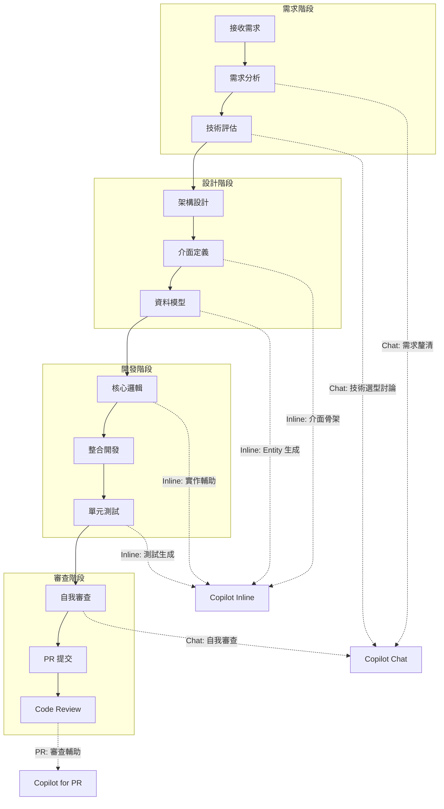

### 3.2 各階段使用策略

#### 3.2.1 需求分析階段

**適合使用 Copilot Chat 的場景：**

```markdown
## Prompt 範例：需求釐清

我收到以下需求：
「系統需要支援多幣別付款，包含台幣、美金、日圓」

請幫我列出：
1. 可能需要釐清的技術細節
2. 常見的實作考量點
3. 可能的 edge cases
```

**Copilot 回應可能包含：**

- 匯率來源與更新頻率
- 精確度與四捨五入規則
- 時區與結算日考量
- 監管合規要求

> ⚠️ **注意**：Copilot 的建議需要與 BA/PM 確認，AI 不了解您的具體業務脈絡。

#### 3.2.2 設計階段

**介面定義輔助：**

```java
// 提供明確的設計意圖
/**
 * 多幣別付款處理器
 * 
 * 設計考量：
 * - 支援 TWD, USD, JPY
 * - 匯率由外部服務提供
 * - 需要 idempotency 支援
 * - 需要完整的 audit trail
 */
public interface MultiCurrencyPaymentProcessor {
    // Copilot 會根據註解生成方法簽名
}
```

#### 3.2.3 開發階段

**核心邏輯實作 - 建議流程：**

```text
1. 先寫完整的方法簽名與 JavaDoc
2. 寫關鍵的邏輯註解（pseudo code）
3. 讓 Copilot 填充實作細節
4. 逐行審核，特別注意：
   - 邊界條件
   - 錯誤處理
   - 效能考量
   - 資安風險
```

**範例：**

```java
/**
 * 計算跨幣別轉換金額
 * 
 * @param amount 原始金額
 * @param fromCurrency 來源幣別
 * @param toCurrency 目標幣別
 * @return 轉換後金額，使用 BigDecimal 確保精確度
 * @throws CurrencyConversionException 當匯率不可用時
 */
public BigDecimal convertCurrency(
        BigDecimal amount, 
        Currency fromCurrency, 
        Currency toCurrency) {
    
    // 1. 驗證輸入參數
    // 2. 取得匯率（從快取或外部服務）
    // 3. 執行轉換計算，注意精確度
    // 4. 記錄 audit log
    // 5. 回傳結果
    
    // Copilot 會根據上述註解生成實作
}
```

#### 3.2.4 測試階段

**單元測試生成策略：**

```java
// 在測試類別中，提供明確的測試意圖
class MultiCurrencyPaymentProcessorTest {
    
    // 測試正常轉換情境
    // 測試資料：100 TWD -> USD，匯率 0.033
    @Test
    void shouldConvertTWDtoUSD_whenValidInput() {
        // Copilot 生成測試程式碼
    }
    
    // 測試邊界條件：金額為零
    @Test
    void shouldReturnZero_whenAmountIsZero() {
        // Copilot 生成測試程式碼
    }
    
    // 測試異常情境：匯率服務不可用
    @Test
    void shouldThrowException_whenExchangeRateUnavailable() {
        // Copilot 生成測試程式碼
    }
}
```

> 💡 **最佳實務**：讓 Copilot 生成測試後，手動補充 AI 可能遺漏的 edge cases。

### 3.3 不同類型任務的使用建議

| 任務類型 | 建議方式 | Copilot 角色 | 人工重點 |
| ---------- | ---------- | -------------- | ---------- |
| **新功能開發** | Inline + Chat | 生成骨架、實作細節 | 設計決策、業務邏輯 |
| **Bug 修復** | Chat 分析 + Inline 修正 | 問題診斷、修正建議 | 根因分析、影響評估 |
| **重構** | Chat 討論 + Inline 實作 | 重構方案、程式碼轉換 | 決定重構範圍、驗證 |
| **效能優化** | Chat 分析 | 潛在瓶頸識別 | Profiling、實測驗證 |
| **Legacy 維護** | Chat 解釋 | 程式碼理解 | 業務脈絡、風險評估 |

### 3.4 與現有工具鏈整合

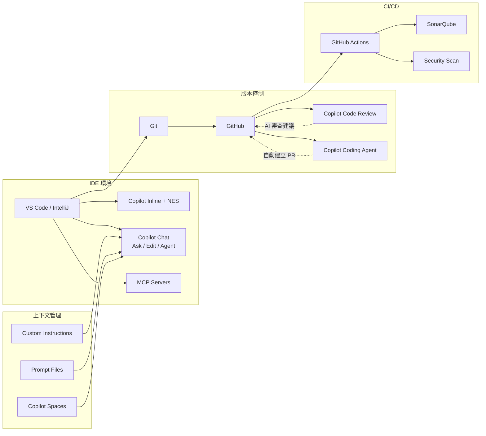

### 3.5 實務案例：一個完整的開發循環

```markdown
## 情境：實作「交易對帳功能」

### Step 1: 需求理解（Chat）
Prompt: 「請幫我分析銀行交易對帳功能的常見設計考量」

### Step 2: 介面設計（Inline）
- 定義 ReconciliationService interface
- 定義 ReconciliationResult DTO

### Step 3: 核心實作（Inline + 人工審核）
- 讓 Copilot 生成對帳邏輯
- 人工確認匹配演算法正確性
- 人工補充異常處理

### Step 4: 測試（Inline + 人工補充）
- Copilot 生成基本測試案例
- 人工補充：大量資料效能測試、並發測試

### Step 5: PR 提交（Copilot for PR）
- 自動生成 PR 摘要
- 審查者參考 Copilot 的 Review 建議
```

---

## 第四章 Copilot Prompt Engineering（重點章節）

### 4.1 Prompt Engineering 核心觀念

對資深工程師而言，Prompt Engineering 不只是「問問題的技巧」，而是**將設計意圖精確傳達給 AI 的能力**。

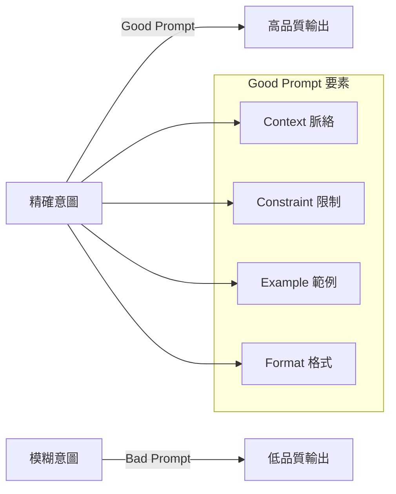

### 4.2 Inline Completion Prompt 技巧

#### 4.2.1 註解驅動開發（Comment-Driven Development）

**原則：註解越精確，生成品質越高**

```java
// ❌ Bad Prompt
// 處理付款

// ✅ Good Prompt
// 處理信用卡付款
// 步驟：1. 驗證卡號 2. 呼叫金流 API 3. 記錄交易
// 需要：idempotency key 防止重複扣款
// 例外：CardValidationException, PaymentGatewayException
```

#### 4.2.2 簽名先行模式

**先定義完整的方法簽名，再讓 Copilot 填充實作：**

```java
// ✅ 提供完整簽名與 JavaDoc
/**
 * 批次處理交易對帳
 * 
 * @param transactions 待對帳交易清單，不可為 null
 * @param bankStatements 銀行對帳單，不可為 null
 * @param toleranceAmount 容許誤差金額（用於浮點數比較）
 * @return 對帳結果，包含匹配、不匹配、待確認三類
 * @throws ReconciliationException 當對帳過程發生錯誤
 */
public ReconciliationResult reconcile(
        List<Transaction> transactions,
        List<BankStatement> bankStatements,
        BigDecimal toleranceAmount) throws ReconciliationException {
    // Copilot 會根據完整的上下文生成實作
}
```

#### 4.2.3 分層註解模式

```java
public class OrderService {
    
    // === 訂單建立相關 ===
    
    // 建立新訂單
    // 驗證庫存 -> 計算金額 -> 建立訂單 -> 發送通知
    public Order createOrder(CreateOrderRequest request) {
        // 1. 驗證庫存是否足夠
        
        // 2. 計算訂單金額（含折扣、稅金）
        
        // 3. 建立訂單實體並儲存
        
        // 4. 發送訂單建立通知
        
        // Copilot 會逐步填充每個區塊
    }
}
```

### 4.3 Copilot Chat Prompt 技巧

#### 4.3.1 角色設定模式

```markdown
## Prompt 範例

你是一位資深 Java 架構師，熟悉 Spring Boot、Clean Architecture 和金融系統開發。

請審查以下程式碼，從以下角度提供建議：
1. 架構設計是否符合 Clean Architecture
2. 是否有潛在的 thread-safety 問題
3. 是否符合 OWASP Top 10 安全規範
4. 效能是否有優化空間

[貼上程式碼]
```

#### 4.3.2 CRISPE 框架

| 要素 | 說明 | 範例 |
| ------ | ------ | ------ |
| **C**apacity | 角色能力 | 「你是資深 DBA」 |
| **R**ole | 扮演角色 | 「請以 Code Reviewer 角度」 |
| **I**nsight | 背景資訊 | 「這是銀行核心系統」 |
| **S**tatement | 具體任務 | 「請找出 SQL Injection 風險」 |
| **P**ersonality | 回應風格 | 「請條列重點，附程式碼範例」 |
| **E**xperiment | 嘗試要求 | 「請提供三種解決方案」 |

**完整範例：**

```markdown
## CRISPE Prompt

【角色】你是一位具有 10 年經驗的 Java 效能調優專家
【背景】我們的系統是銀行交易核心，需要處理每秒 1000+ TPS
【任務】請分析以下程式碼的效能瓶頸
【風格】請用條列方式說明，並提供優化後的程式碼
【嘗試】請提供至少 2 種優化方案，並比較優缺點

[程式碼]
```

#### 4.3.3 多輪對話策略

```markdown
## 第一輪：問題定義
「我需要設計一個分散式鎖的實作，使用 Redis，請問有哪些設計要點？」

## 第二輪：深入探討
「關於你提到的 Redlock 演算法，請詳細說明實作步驟」

## 第三輪：程式碼生成
「請用 Java + Lettuce 實作，需要支援可重入」

## 第四輪：審查確認
「請檢查這個實作是否有 race condition 風險」
```

### 4.4 Bad Prompt vs Good Prompt 對照

#### 案例一：程式碼生成

```java
// ❌ Bad Prompt
// 寫一個 API

// ✅ Good Prompt
/**
 * REST API: 查詢用戶交易紀錄
 * 
 * Endpoint: GET /api/v1/users/{userId}/transactions
 * 
 * 功能需求：
 * - 支援分頁（page, size）
 * - 支援日期區間篩選（startDate, endDate）
 * - 支援交易類型篩選（transactionType）
 * 
 * 安全需求：
 * - 需要 JWT 認證
 * - 只能查詢自己的交易（除非是 ADMIN 角色）
 * 
 * 回應格式：
 * - 成功：200 + Page<TransactionDTO>
 * - 未授權：401
 * - 禁止存取：403
 * - 找不到：404
 */
@GetMapping("/users/{userId}/transactions")
public ResponseEntity<Page<TransactionDTO>> getUserTransactions(
    @PathVariable Long userId,
    @RequestParam(defaultValue = "0") int page,
    @RequestParam(defaultValue = "20") int size,
    @RequestParam(required = false) LocalDate startDate,
    @RequestParam(required = false) LocalDate endDate,
    @RequestParam(required = false) TransactionType transactionType,
    @AuthenticationPrincipal UserDetails currentUser) {
    // Copilot 生成
}
```

#### 案例二：Code Review

```markdown
## ❌ Bad Prompt
看一下這段 code 有沒有問題

## ✅ Good Prompt
請以資深 Java 工程師角度審查以下程式碼：

審查重點：
1. 【安全性】是否有 SQL Injection、XSS、CSRF 風險
2. 【效能】是否有 N+1 Query、記憶體洩漏風險
3. 【可維護性】是否符合 SOLID 原則
4. 【錯誤處理】例外處理是否完整

請用以下格式回覆：
- 🔴 嚴重問題（必須修正）
- 🟡 中度問題（建議修正）
- 🟢 改善建議（可選）

[程式碼]
```

#### 案例三：測試生成

```markdown
## ❌ Bad Prompt
幫我寫測試

## ✅ Good Prompt
請為以下 Service 方法生成單元測試：

測試框架：JUnit 5 + Mockito
測試策略：
1. Happy Path：正常情境
2. Edge Cases：邊界值（null、空集合、最大值）
3. Error Cases：各種例外情境
4. Security Cases：權限驗證

命名規範：should_[預期結果]_when_[條件]

請確保：
- 每個測試方法只測試一個情境
- 使用 AAA 模式（Arrange-Act-Assert）
- Mock 所有外部依賴

[Service 程式碼]
```

### 4.5 進階 Prompt Pattern

#### 4.5.1 Chain of Thought（思維鏈）

```markdown
請分析這段程式碼的問題，請一步步思考：

1. 首先，說明這段程式碼的功能
2. 接著，分析可能的問題點
3. 然後，解釋每個問題的影響
4. 最後，提供具體的修正建議

[程式碼]
```

#### 4.5.2 Few-Shot Learning（範例學習）

```java
// 請依照以下範例風格，生成新的驗證方法

// 範例 1：
public void validateEmail(String email) {
    Objects.requireNonNull(email, "Email 不可為 null");
    if (!EMAIL_PATTERN.matcher(email).matches()) {
        throw new ValidationException("Email 格式不正確: " + email);
    }
}

// 範例 2：
public void validatePhoneNumber(String phone) {
    Objects.requireNonNull(phone, "電話不可為 null");
    if (!PHONE_PATTERN.matcher(phone).matches()) {
        throw new ValidationException("電話格式不正確: " + phone);
    }
}

// 請生成：validateTaiwanId（驗證台灣身分證字號）
```

#### 4.5.3 Persona Pattern（人格模式）

```markdown
從現在開始，請以「挑剔的資安專家」角度回答：
- 對任何程式碼都要先假設有安全漏洞
- 主動指出可能被攻擊的點
- 提供符合 OWASP 規範的修正建議

[程式碼]
```

### 4.6 Prompt Template 庫

以下是資深工程師常用的 Prompt Template：

#### Template 1：架構審查

```markdown
## 架構審查 Prompt

【系統背景】
{簡述系統用途與規模}

【審查標的】
{貼上架構圖或程式碼}

【請評估】
1. 是否符合 {Clean Architecture / Hexagonal / etc.}
2. 各層職責是否清晰
3. 依賴方向是否正確
4. 是否有過度設計或設計不足
5. 可測試性評估

【輸出格式】
- 整體評分（1-10）
- 優點列表
- 待改善列表（含優先級）
- 具體修改建議
```

#### Template 2：效能分析

```markdown
## 效能分析 Prompt

【效能需求】
- TPS 要求：{數值}
- 回應時間要求：P99 < {數值}ms
- 資源限制：{記憶體/CPU}

【分析標的】
{程式碼或設計}

【請分析】
1. 時間複雜度
2. 空間複雜度
3. I/O 瓶頸
4. 潛在的 blocking 點
5. 可能的 memory leak

【請提供】
- 優化建議（按影響程度排序）
- 優化後的程式碼
- 預期改善幅度
```

#### Template 3：重構建議

```markdown
## 重構建議 Prompt

【重構原因】
{說明為何要重構}

【限制條件】
- 不可變更 public API
- 需要向後相容
- 時間限制：{工時}

【程式碼】
{Legacy Code}

【請提供】
1. 識別的 Code Smell
2. 建議的重構手法（參考 Refactoring 書籍術語）
3. 重構步驟（可逐步執行，每步可獨立驗證）
4. 重構後的程式碼
5. 風險評估與測試建議
```

### 4.7 Copilot Chat 快捷指令與互動方式

#### 4.7.1 Chat 模式（VS Code）

Copilot Chat 在 VS Code 中提供四種模式，可透過 Chat 面板底部的下拉選單切換：

| 模式 | 功能 | 最佳使用場景 |
| --- | --- | --- |
| **Ask** | 問答式互動，不修改檔案 | 理解程式碼、探索想法、一般性問題 |
| **Edit** | 受控多檔案編輯 | 精確修改特定檔案、需要細粒度控制 |
| **Agent** | 自主完成多步驟任務 | 複雜任務、跨檔案修改、需要執行終端指令 |
| **Plan** | 建立實作計畫（Preview） | 在動手前制定計畫、確認方案完整性 |

#### 4.7.2 Slash Commands（斜線指令）

| 指令 | 功能 | 使用場景 |
| --- | --- | --- |
| `/explain` | 解釋程式碼 | 理解 Legacy Code |
| `/fix` | 修正問題 | 快速修 Bug |
| `/tests` | 生成測試 | 補充單元測試 |
| `/doc` | 生成文件 | 補充 JavaDoc / JSDoc |
| `/optimize` | 優化建議 | 效能改善 |
| `/new` | 建立新專案 | 快速搭建專案骨架 |
| `/newNotebook` | 建立新 Notebook | 資料分析、探索性開發 |
| `/search` | 搜尋工作區 | 尋找相關程式碼 |
| `/setupTests` | 設定測試框架 | 初始化測試環境 |

#### 4.7.3 Chat Participants（聊天參與者）

使用 `@` 前綴來指定特定的上下文提供者：

| 參與者 | 功能 | 使用範例 |
| --- | --- | --- |
| `@workspace` | 工作區上下文 | `@workspace 專案中有哪些地方使用到 PaymentService？` |
| `@vscode` | VS Code 操作相關 | `@vscode 如何設定自動格式化？` |
| `@terminal` | 終端相關 | `@terminal 上一個指令錯誤是什麼原因？` |
| `@github` | GitHub 平台技能 | `@github 搜尋 repo 中的安全漏洞相關 Issue` |

> 💡 **自動推斷**（Preview）：Copilot 可根據自然語言 prompt 自動推斷應使用哪個 Chat Participant，無需手動指定。

#### 4.7.4 Chat Variables（聊天變數）

使用 `#` 前綴來附加特定上下文：

| 變數 | 功能 | 使用範例 |
| --- | --- | --- |
| `#file` | 引用特定檔案 | `請審查 #file:PaymentService.java` |
| `#selection` | 引用目前選取的程式碼 | `解釋 #selection 的邏輯` |
| `#codebase` | 整個程式庫上下文 | `#codebase 中有哪些相似的模式？` |
| `#web` | 搜尋網路 | `@github #web 最新的 Spring Boot 版本是？` |
| `#terminalLastCommand` | 上一個終端指令 | `#terminalLastCommand 為什麼失敗？` |
| `#terminalSelection` | 終端中選取的文字 | `解釋 #terminalSelection` |

#### 4.7.5 GitHub Skills（@github 技能）

使用 `@github` 可存取 GitHub 平台特有的技能：

```markdown
# 搜尋網路
@github #web What is the latest LTS of Node.js?

# 搜尋程式碼
@github 搜尋 repo 中所有使用 deprecated API 的地方

# 查看可用技能
@github What skills are available?
```

#### 4.7.6 其他存取方式

| 方式 | 快捷鍵 (Windows/Linux) | 說明 |
| --- | --- | --- |
| **Chat View** | 標題列 Copilot 圖示 | 完整聊天面板 |
| **Quick Chat** | `Ctrl+Shift+Alt+L` | 快速下拉式聊天 |
| **Inline Chat** | `Ctrl+I` | 在編輯器中直接對話 |
| **Smart Actions** | 右鍵 > Copilot | 上下文選單快速操作 |

**範例使用：**

```markdown
# 使用 Agent Mode 自主完成任務
（切換到 Agent 模式後）
請將 UserService 重構為使用 Repository Pattern，
並新增對應的單元測試。

# 使用 Plan Mode 制定計畫
（切換到 Plan 模式後）
我想為這個專案新增 OAuth2 登入功能，
請幫我制定完整的實作計畫。

# 使用 Edit Mode 精確編輯
（切換到 Edit 模式後，加入 working set 檔案）
請在 PaymentController 中新增一個 refund endpoint。
```

### 4.8 Custom Instructions 與 Prompt Files

#### 4.8.1 Custom Instructions（自訂指令）

Custom Instructions 讓您可以為 Copilot 提供持久性的上下文偏好，提升回應品質與一致性。

**支援層級：**

| 層級 | 檔案 | 說明 |
| --- | --- | --- |
| **Repository** | `.github/copilot-instructions.md` | 專案級指令，自動附加到所有 Chat 問題 |
| **Personal** | VS Code Settings | 個人偏好設定 |
| **Organization** | GitHub Org Settings（Preview） | 組織統一規範（Business/Enterprise） |

**Repository Custom Instructions 範例：**

```markdown
<!-- .github/copilot-instructions.md -->

## 專案規範
- 使用 Java 17 + Spring Boot 3.x
- 遵循 Clean Architecture 分層
- 所有 public method 必須有 JavaDoc
- 使用 MapStruct 做 DTO 轉換
- 日誌使用 @Slf4j
- 例外處理使用自定義 BusinessException

## 程式碼風格
- 方法長度不超過 30 行
- 使用 Optional 而非 null 檢查
- 所有 API 回應使用 ResponseEntity 包裝

## 測試規範
- 使用 JUnit 5 + Mockito
- 測試命名：should_[預期結果]_when_[條件]
- 使用 AAA 模式（Arrange-Act-Assert）
```

#### 4.8.2 Prompt Files（.prompt.md）

Prompt Files 是可重用的 prompt 範本檔案，存放在專案中，團隊成員可共享使用。

**建立方式：**

```markdown
<!-- .github/prompts/code-review.prompt.md -->
---
description: "安全導向的 Code Review"
mode: "ask"
tools: []
---

請以資安專家角度審查以下程式碼：

審查重點：
1. 【安全性】OWASP Top 10 風險
2. 【效能】N+1 Query、記憶體洩漏
3. 【可維護性】SOLID 原則

輸出格式：
- 🔴 嚴重（必須修正）
- 🟡 中度（建議修正）
- 🟢 改善（可選）

{#selection}
```

**使用方式：** 在 Chat 中輸入 `/` 可看到可用的 Prompt Files。

#### 4.8.3 MCP (Model Context Protocol) 整合

MCP 讓 Copilot 可以連接外部工具與服務，大幅擴展 Agent Mode 的能力。

**常見 MCP 使用場景：**

| 場景 | MCP Server 類型 | 說明 |
| --- | --- | --- |
| **資料庫操作** | Database MCP | 讓 Agent 直接查詢與操作資料庫 |
| **API 測試** | Postman / REST MCP | 自動發送與驗證 API 請求 |
| **文件搜尋** | Knowledge Base MCP | 搜尋內部文件與知識庫 |
| **監控整合** | Observability MCP | 查詢 logs、metrics、traces |
| **專案管理** | Jira / Azure DevOps MCP | 同步 Issue 狀態與更新 |

**VS Code MCP 設定範例：**

```json
// .vscode/mcp.json
{
  "servers": {
    "my-database": {
      "command": "npx",
      "args": ["-y", "@modelcontextprotocol/server-postgres"],
      "env": {
        "DATABASE_URL": "postgresql://localhost:5432/mydb"
      }
    }
  }
}
```

> ⚠️ **安全注意**：MCP Server 可存取外部系統，在企業環境中應經過安全審查後才啟用。

---

## 第五章 Copilot + Code Review + Testing 最佳實務

### 5.1 Copilot 與 Code Review 的整合

#### 5.1.1 Copilot Code Review 功能概覽

Copilot Code Review 已大幅升級，不僅支援 PR 審查，還支援 IDE 內的即時審查：

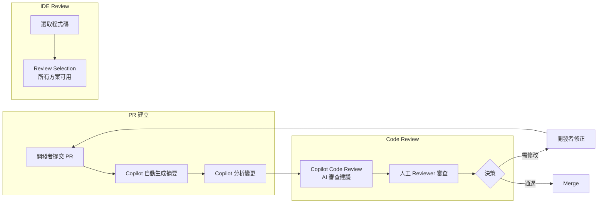

**Copilot Code Review 的兩種使用方式：**

| 方式 | 說明 | 可用方案 |
| --- | --- | --- |
| **PR Code Review** | 在 GitHub PR 頁面請求 Copilot 審查 | Pro, Pro+, Business, Enterprise |
| **Review Selection** | 在 VS Code 中選取程式碼進行局部審查 | 所有方案（含 Free） |

> 💡 **新功能 - Copilot Memory**：Copilot 可記憶 repo 的慣例與知識，讓 Code Review 建議更符合專案風格。

#### 5.1.2 使用 Copilot 輔助 Code Review

**Step 1：讓 Copilot 生成 PR 摘要**

```markdown
## Copilot 自動生成的 PR 摘要範例

### Summary
This PR implements the multi-currency payment feature with the following changes:

### Changes
- Added `CurrencyConverter` service for exchange rate handling
- Implemented `PaymentProcessor` with support for TWD, USD, JPY
- Added idempotency support to prevent duplicate charges

### Testing
- Added unit tests covering normal flow and edge cases
- Integration tests with mock payment gateway
```

**Step 2：使用 Copilot Chat 深入分析**

```markdown
## Prompt：PR 安全審查

請以資安專家角度審查這個 PR 的變更：

重點檢查：
1. 是否有 SQL Injection 風險
2. 是否有 Sensitive Data Exposure
3. 輸入驗證是否完整
4. 是否有適當的 Error Handling（不洩露系統資訊）

@workspace #file:PaymentProcessor.java #file:CurrencyConverter.java
```

#### 5.1.3 Code Review Checklist（結合 Copilot）

| 審查項目 | Copilot 輔助方式 | 人工重點 |
| ---------- | ------------------ | ---------- |
| **功能正確性** | Chat: 解釋邏輯 | 業務邏輯驗證 |
| **程式碼品質** | Chat: 識別 Code Smell | 架構一致性 |
| **效能** | Chat: 複雜度分析 | 實際負載評估 |
| **安全性** | Chat: 漏洞掃描 | 業務風險評估 |
| **測試覆蓋** | Inline: 補充測試 | 測試策略審查 |
| **文件完整** | Inline: 補充 JavaDoc | 文件準確性 |

### 5.2 Copilot 與 Testing 的整合

#### 5.2.1 測試金字塔與 Copilot 角色

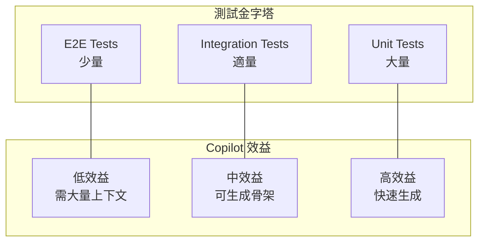

#### 5.2.2 單元測試生成最佳實務

**策略一：Test-Driven Prompting**

```java
// 先寫測試意圖，讓 Copilot 生成測試程式碼
class PaymentProcessorTest {
    
    @Nested
    @DisplayName("正常付款流程")
    class NormalPaymentFlow {
        
        // 測試：有效信用卡應該成功扣款
        // Given: 有效卡號、足夠餘額
        // When: 執行付款
        // Then: 回傳成功結果，包含交易編號
        @Test
        void shouldProcessPayment_whenValidCreditCard() {
            // Copilot 生成 AAA 結構的測試
        }
    }
    
    @Nested
    @DisplayName("異常情境")
    class ExceptionScenarios {
        
        // 測試：卡號無效應拋出 CardValidationException
        @Test
        void shouldThrowCardValidationException_whenInvalidCardNumber() {
            // Copilot 生成
        }
        
        // 測試：餘額不足應拋出 InsufficientFundsException
        @Test
        void shouldThrowInsufficientFundsException_whenBalanceNotEnough() {
            // Copilot 生成
        }
    }
}
```

**策略二：邊界值自動補充**

```markdown
## Prompt：邊界測試生成

請為以下方法生成邊界值測試：

方法簽名：
public BigDecimal calculateDiscount(BigDecimal amount, int quantity)

請涵蓋：
1. amount = 0, amount = MAX_VALUE
2. quantity = 0, quantity = 1, quantity = MAX_INT
3. amount 為 null
4. 負數情境

測試框架：JUnit 5 + AssertJ
```

#### 5.2.3 測試程式碼品質檢查

**使用 Copilot Chat 審查測試品質：**

```markdown
## Prompt：測試品質審查

請審查以下測試程式碼的品質：

檢查項目：
1. 測試是否獨立（不依賴執行順序）
2. 測試命名是否清晰描述測試意圖
3. 是否有適當的 Arrange-Act-Assert 結構
4. Mock 使用是否恰當
5. 是否有遺漏的測試情境

[測試程式碼]
```

### 5.3 CI/CD 整合建議

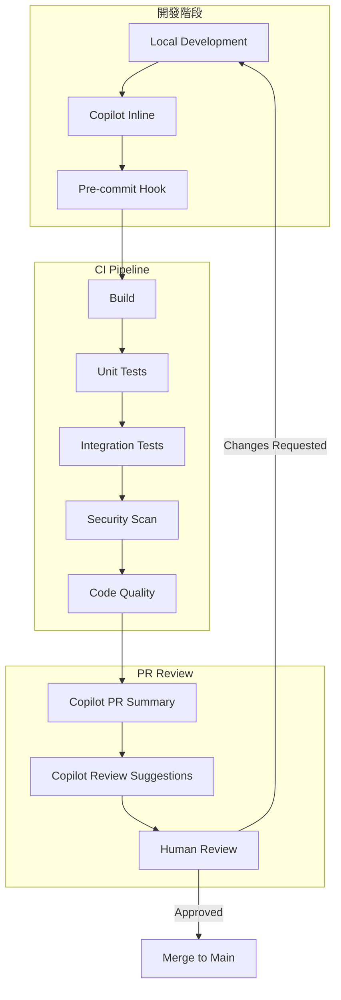

### 5.4 實務案例：完整的測試策略

```markdown
## 案例：交易對帳服務測試策略

### 1. 單元測試（Copilot 高效輔助）
- ReconciliationEngine 核心邏輯
- MatchingAlgorithm 匹配演算法
- AmountComparator 金額比較（含容差）

### 2. 整合測試（Copilot 中度輔助）
- ReconciliationService + Database
- ReconciliationService + External API

### 3. E2E 測試（Copilot 低度輔助，需人工設計）
- 完整對帳流程
- 異常恢復測試

### Copilot 使用建議
- 單元測試：大量使用 Copilot 生成
- 整合測試：使用 Copilot 生成骨架，人工補充設定
- E2E 測試：人工設計場景，Copilot 輔助實作
```

---

## 第六章 資安、法遵與風險控管

### 6.1 Copilot 的資安風險概覽

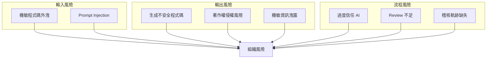

### 6.2 常見安全漏洞與防範

#### 6.2.1 SQL Injection

```java
// ❌ Copilot 可能生成的不安全程式碼
public User findByUsername(String username) {
    String sql = "SELECT * FROM users WHERE username = '" + username + "'";
    return jdbcTemplate.queryForObject(sql, userRowMapper);
}

// ✅ 應該修正為
public User findByUsername(String username) {
    String sql = "SELECT * FROM users WHERE username = ?";
    return jdbcTemplate.queryForObject(sql, userRowMapper, username);
}
```

**審查要點：**

- 任何 SQL 字串拼接都要警覺
- 使用 PreparedStatement 或 JPA
- 啟用 SQL 參數化檢查工具

#### 6.2.2 XSS (Cross-Site Scripting)

```java
// ❌ 不安全
@GetMapping("/user/{name}")
public String greeting(@PathVariable String name) {
    return "<h1>Hello, " + name + "</h1>";
}

// ✅ 安全
@GetMapping("/user/{name}")
public String greeting(@PathVariable String name) {
    return "<h1>Hello, " + HtmlUtils.htmlEscape(name) + "</h1>";
}
```

#### 6.2.3 敏感資訊洩露

```java
// ❌ Copilot 可能在 log 中洩露敏感資訊
logger.info("Processing payment for card: " + cardNumber);

// ✅ 應該遮罩
logger.info("Processing payment for card: " + maskCardNumber(cardNumber));

private String maskCardNumber(String cardNumber) {
    return "****-****-****-" + cardNumber.substring(cardNumber.length() - 4);
}
```

### 6.3 Copilot 生成程式碼的審查清單

| 審查項目 | 檢查重點 | 風險等級 |
| ---------- | ---------- | ---------- |
| **輸入驗證** | 是否驗證所有外部輸入 | 🔴 高 |
| **SQL 查詢** | 是否使用參數化查詢 | 🔴 高 |
| **認證授權** | 是否正確檢查權限 | 🔴 高 |
| **錯誤處理** | 是否洩露系統資訊 | 🟡 中 |
| **日誌記錄** | 是否記錄敏感資訊 | 🟡 中 |
| **加密處理** | 是否使用安全演算法 | 🔴 高 |
| **依賴引用** | 是否引入不安全依賴 | 🟡 中 |

### 6.4 法遵考量

#### 6.4.1 著作權風險

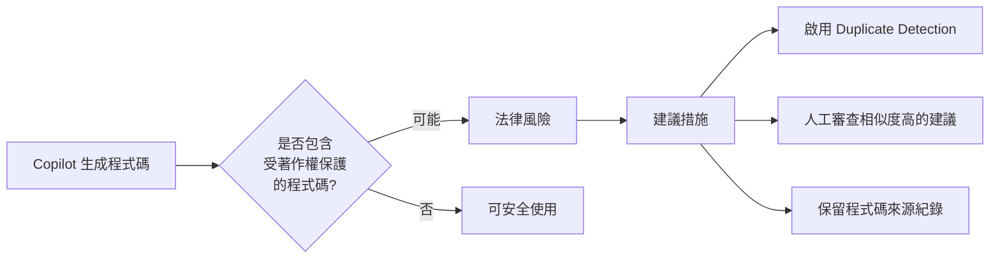

**建議設定：**

```json
// VS Code settings.json
{
  "github.copilot.advanced": {
    "debug.filter.duplication": true
  }
}
```

> 💡 **Block Suggestions Matching Public Code**：所有 Copilot 方案都支援此功能，可在設定中啟用，阻擋與公開程式碼高度相似的建議。

#### 6.4.2 資料保護合規

| 法規 | 相關要求 | Copilot 使用注意 |
| ------ | ---------- | ------------------ |
| **個資法** | 個資處理需有法律依據 | 不可將客戶個資貼入 Prompt |
| **GDPR** | 資料最小化原則 | 不可傳輸歐盟居民資料 |
| **金融監理** | 資料不得外流 | 使用 Enterprise 版本 |
| **內部稽核** | 保留軌跡 | 記錄 Copilot 使用情況 |

### 6.5 企業級安全設定

#### 6.5.1 組織層級設定

GitHub 提供完整的企業治理功能，管理員可透過 Policy Management 控制：

```yaml
# GitHub Organization / Enterprise 設定項目
copilot_policies:
  # 功能啟用控制
  copilot_chat_in_ide: enabled
  copilot_code_review: enabled
  copilot_coding_agent: enabled
  copilot_cli: enabled
  
  # 安全設定
  block_suggestions_matching_public_code: enabled
  editor_preview_features: enabled
  
  # 內容排除（Content Exclusion）
  content_exclusion:
    - "**/*.env"
    - "**/*.pem"
    - "**/*.key"
    - "**/secrets/**"
    - "**/config/credentials/**"
  
  # Audit Logs 自動啟用（Business/Enterprise）
  audit_logging: enabled
```

**管理員功能（Business/Enterprise）：**

| 功能 | 說明 |
| --- | --- |
| **Policy Management** | 控制哪些 Copilot 功能可使用 |
| **Access Management** | 指定哪些組織成員可使用 Copilot |
| **Content Exclusion** | 排除敏感檔案不被 Copilot 存取 |
| **Audit Logs** | 追蹤 Copilot 使用行為 |
| **Usage Data** | 檢視使用量數據與採用率 |
| **Organization Custom Instructions** | 統一組織級的 Copilot 行為規範 |

#### 6.5.2 開發者工作站設定

```json
// VS Code settings.json - 企業建議設定
{
  // Copilot 功能控制
  "github.copilot.enable": {
    "*": true,
    "**/*.env": false,
    "**/*.pem": false,
    "**/*.key": false,
    "**/secrets/**": false,
    "plaintext": false,
    "markdown": true
  },
  
  // Chat 相關設定
  "github.copilot.chat.localeOverride": "zh-TW",
  
  // 排除敏感內容（搭配 .gitignore）
  "files.exclude": {
    "**/.env": true,
    "**/secrets": true
  }
}
```

> 💡 **Content Exclusion（組織級）**：Business/Enterprise 管理員可在 GitHub 組織設定中排除特定檔案路徑，被排除的檔案不會傳送至 Copilot 服務。這比個人設定更安全，因為是強制生效的。

### 6.6 Copilot 在 SSDLC 中的定位

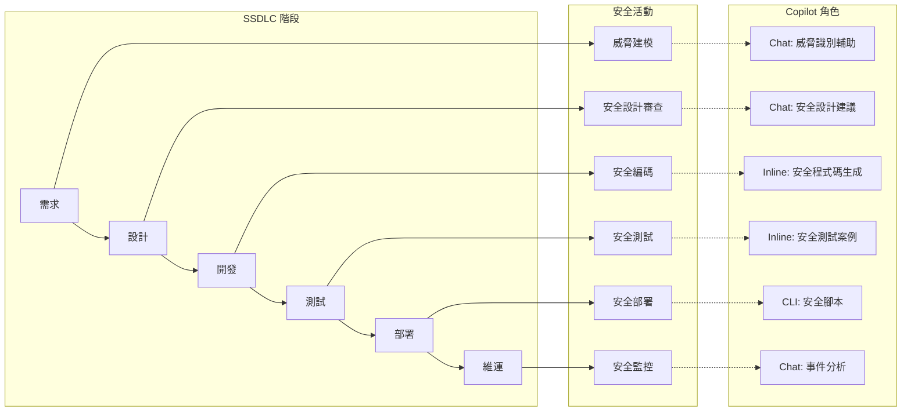

### 6.7 稽核與追蹤

**GitHub 平台提供的稽核功能（Business/Enterprise）：**

| 功能 | 說明 |
| --- | --- |
| **Audit Logs** | 記錄所有 Copilot 相關事件，包含啟用/停用、Policy 變更等 |
| **Usage Data** | 使用者活動數據，包含 suggestion 接受率、chat 使用量 |
| **License Usage** | 授權使用狀況，識別未使用的座位 |

**建議在關鍵程式碼加入 Copilot 輔助標記：**

```java
// 建議在關鍵程式碼加入 Copilot 輔助標記
/**
 * 匯率轉換服務
 * 
 * @author developer-name
 * @created 2026-01-22
 * @ai-assisted 此類別的基本架構由 Copilot 輔助生成，
 *              核心邏輯經人工審查與修改
 * @security-review PASSED - 2026-01-22 by security-team
 */
@Service
public class ExchangeRateService {
    // ...
}
```

---

## 第七章 常見誤用與反模式

### 7.1 Anti-Pattern 總覽

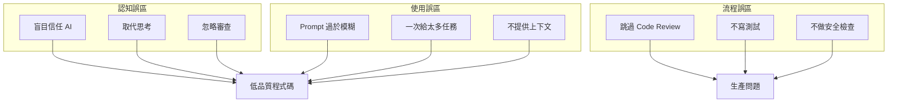

### 7.2 Anti-Pattern 詳解

#### 7.2.1 盲目信任 AI（Blind Trust）

**症狀：**

```java
// Copilot 建議什麼就接受什麼，不經思考
// 按 Tab 鍵的速度比思考還快
```

**危害：**

- 引入潛在 Bug
- 產生不安全程式碼
- 效能問題被忽略

**正確做法：**

```markdown
✅ 每次接受建議前先問自己：
1. 這段程式碼做了什麼？
2. 有沒有邊界條件沒處理？
3. 有沒有安全風險？
4. 效能是否可接受？
```

#### 7.2.2 取代思考（Thought Replacement）

**症狀：**

```markdown
❌ 直接問 Copilot：「怎麼設計這個系統？」
❌ 期待 Copilot 做所有架構決策
```

**正確做法：**

```markdown
✅ 先自己思考設計方案
✅ 使用 Copilot 驗證或比較方案
✅ 讓 Copilot 處理實作細節，自己負責設計
```

#### 7.2.3 Prompt 過於模糊（Vague Prompting）

**Bad Example：**

```java
// ❌ 模糊的 Prompt
// 處理資料

// ❌ 缺乏上下文
// 寫一個 function
```

**Good Example：**

```java
// ✅ 明確的 Prompt
/**
 * 處理銀行交易對帳資料
 * 
 * 輸入：交易清單（Transaction[]）+ 銀行對帳單（BankStatement[]）
 * 輸出：對帳結果（包含：匹配成功、匹配失敗、待確認）
 * 規則：
 *   - 金額相同且日期在 3 天內視為匹配
 *   - 金額差異在 0.01 以內視為匹配（處理浮點誤差）
 *   - 其餘視為待確認
 */
public ReconciliationResult reconcile(...) {
```

#### 7.2.4 一次給太多任務（Task Overload）

**Bad Example：**

```markdown
❌ 請幫我設計一個完整的電商系統，包含：
- 用戶管理
- 商品管理
- 訂單管理
- 付款系統
- 物流追蹤
- 推薦引擎
```

**Good Example：**

```markdown
✅ 分步驟進行：
Step 1: 先討論整體架構
Step 2: 設計用戶管理模組介面
Step 3: 實作用戶管理核心邏輯
Step 4: 為用戶管理寫測試
...依此類推
```

#### 7.2.5 忽略程式碼上下文（Context Ignorance）

**Bad Example：**

```java
// ❌ 在不提供現有程式碼風格的情況下請求生成
// 新增一個 Service

// 結果：生成的程式碼風格與專案不一致
```

**Good Example：**

```java
// ✅ 提供上下文
// 請參考現有的 UserService 風格，新增 OrderService
// 專案使用：
// - Spring Boot 3.x
// - MapStruct 做 DTO 轉換
// - 使用 @Transactional 管理交易
// - 日誌使用 @Slf4j
```

### 7.3 Copilot 不適合做的事情

| 類別 | 不適合的任務 | 原因 |
| ------ | -------------- | ------ |
| **架構設計** | 系統架構決策 | 缺乏業務脈絡理解 |
| **效能調優** | 確定瓶頸位置 | 需要實際 Profiling 數據 |
| **安全審計** | 作為唯一安全檢查 | 可能漏掉細微漏洞 |
| **業務邏輯** | 複雜業務規則 | 不理解業務 Domain |
| **遺留系統** | 完整理解 Legacy | 缺乏歷史脈絡 |
| **合規判斷** | 法規遵循決策 | 法規變動快，AI 可能過時 |

### 7.4 常見錯誤案例分析

#### 案例一：複製貼上症候群

```java
// ❌ 錯誤：直接複製 Copilot 建議的 catch block
try {
    // ...
} catch (Exception e) {
    e.printStackTrace();  // Copilot 常見的偷懶寫法
}

// ✅ 正確：審查後修正
try {
    // ...
} catch (BusinessException e) {
    log.error("Business error occurred: {}", e.getMessage());
    throw e;  // 重新拋出讓上層處理
} catch (Exception e) {
    log.error("Unexpected error", e);
    throw new SystemException("System error", e);
}
```

#### 案例二：效能陷阱

```java
// ❌ Copilot 可能生成的低效程式碼
public List<User> findActiveUsers(List<User> users) {
    List<User> result = new ArrayList<>();
    for (User user : users) {
        if (userRepository.isActive(user.getId())) {  // N+1 問題！
            result.add(user);
        }
    }
    return result;
}

// ✅ 應該批次處理
public List<User> findActiveUsers(List<User> users) {
    List<Long> userIds = users.stream()
        .map(User::getId)
        .collect(Collectors.toList());
    Set<Long> activeIds = userRepository.findActiveUserIds(userIds);
    return users.stream()
        .filter(u -> activeIds.contains(u.getId()))
        .collect(Collectors.toList());
}
```

#### 案例三：安全漏洞

```java
// ❌ Copilot 可能生成的不安全程式碼
@GetMapping("/download")
public void downloadFile(@RequestParam String filename, HttpServletResponse response) {
    File file = new File("/uploads/" + filename);  // Path Traversal 風險！
    // ...
}

// ✅ 應該驗證路徑
@GetMapping("/download")
public void downloadFile(@RequestParam String filename, HttpServletResponse response) {
    // 驗證檔名不包含路徑穿越字元
    if (filename.contains("..") || filename.contains("/") || filename.contains("\\")) {
        throw new SecurityException("Invalid filename");
    }
    
    Path basePath = Paths.get("/uploads").toRealPath();
    Path filePath = basePath.resolve(filename).normalize();
    
    // 確認檔案在允許的目錄內
    if (!filePath.startsWith(basePath)) {
        throw new SecurityException("Access denied");
    }
    // ...
}
```

### 7.5 自我檢查清單

在接受 Copilot 建議前，請確認：

```markdown
□ 我理解這段程式碼在做什麼
□ 我檢查過邊界條件
□ 我確認過沒有安全風險
□ 程式碼風格與專案一致
□ 例外處理適當
□ 效能可接受
□ 有對應的測試
```

---

## 第八章 團隊導入與治理建議

### 8.1 導入成熟度模型

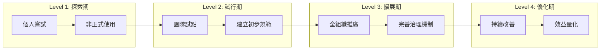

### 8.2 各階段導入建議

#### Level 1: 探索期（1-2 週）

| 活動 | 目的 | 產出 |
| ------ | ------ | ------ |
| 選定 3-5 位先行者 | 收集第一手經驗 | 使用心得報告 |
| 安裝與基本教學 | 確保環境就緒 | 安裝指南 |
| 自由探索 | 了解工具能力邊界 | 案例收集 |

#### Level 2: 試行期（2-4 週）

| 活動 | 目的 | 產出 |
| ------ | ------ | ------ |
| 建立使用規範草案 | 統一使用方式 | 規範文件 v0.1 |
| 定義適用場景 | 明確使用邊界 | 場景清單 |
| 建立 Prompt 範本 | 提升效率 | Prompt Library |
| 定期分享會 | 知識傳承 | 會議紀錄 |

#### Level 3: 擴展期（1-2 個月）

| 活動 | 目的 | 產出 |
| ------ | ------ | ------ |
| 全團隊教育訓練 | 普及使用 | 培訓教材 |
| 正式化規範 | 治理機制 | 規範文件 v1.0 |
| 整合 CI/CD | 流程自動化 | Pipeline 設定 |
| 建立 Review 機制 | 品質把關 | Review Checklist |

#### Level 4: 優化期（持續）

| 活動 | 目的 | 產出 |
| ------ | ------ | ------ |
| 效益量化 | 證明 ROI | 指標報告 |
| 規範更新 | 持續改善 | 規範文件 vN |
| 經驗分享 | 組織學習 | 案例庫 |
| 工具演進追蹤 | 掌握新功能 | 更新報告 |

### 8.3 團隊使用規範範本

```markdown
# GitHub Copilot 團隊使用規範

## 1. 適用範圍
- 適用於：所有使用 GitHub Copilot 的開發人員
- 版本：2.0
- 生效日期：2026-02-12

## 2. 可以做（Do）
✅ 使用 Copilot 生成 Boilerplate 程式碼
✅ 使用 Copilot Chat 協助理解程式碼
✅ 使用 Copilot 生成單元測試骨架
✅ 使用 Copilot 生成 JavaDoc 與文件
✅ 使用 Copilot Code Review 輔助程式碼審查
✅ 使用 Agent Mode 完成明確定義的開發任務
✅ 使用 Copilot Coding Agent 處理例行性 Issue
✅ 使用 Custom Instructions 統一團隊風格
✅ 使用 MCP 整合經審核通過的外部工具

## 3. 不可以做（Don't）
❌ 將客戶個資或機敏資料貼入 Prompt
❌ 將 API Key、密碼等機敏設定貼入 Prompt
❌ 盲目接受 Copilot 建議，不經審查
❌ 用 Copilot 取代設計思考
❌ 跳過 Code Review 流程
❌ 未經審核就啟用第三方 MCP Server
❌ 將 Agent 模式用於安全性關鍵的核心系統修改

## 4. 安全規範
- 不可在 Prompt 中包含任何客戶資料
- 不可在 Prompt 中包含內部系統架構機敏資訊
- 生成的程式碼必須通過安全掃描
- 使用 Business/Enterprise 版本（確保資料不外流）
- 啟用 Block Suggestions Matching Public Code
- 設定 Content Exclusion 排除敏感檔案

## 5. 品質規範
- 所有 Copilot 生成的程式碼必須經過人工審查
- 核心業務邏輯不可完全依賴 Copilot
- 必須為 Copilot 生成的程式碼撰寫測試
- Copilot Coding Agent 的 PR 須經資深工程師審查

## 6. 審查流程
1. 開發者使用 Copilot 生成程式碼
2. 開發者自我審查（使用 Checklist）
3. 提交 PR，觸發自動化掃描
4. 可選：請求 Copilot Code Review
5. Reviewer 進行人工 Code Review
6. 通過後方可 Merge

## 7. Copilot Coding Agent 使用規範
- 僅用於描述明確的 Bug Fix 與簡單功能增強
- Issue 必須包含清楚的需求描述與驗收條件
- Agent 產出的 PR 必須由人工審查
- 不可用於安全性關鍵修改

## 8. 例外處理
- 如有特殊需求需違反規範，須經 Tech Lead 核准
- 核准紀錄須保留備查
```

### 8.4 Code Review 要點（Copilot 輔助後）

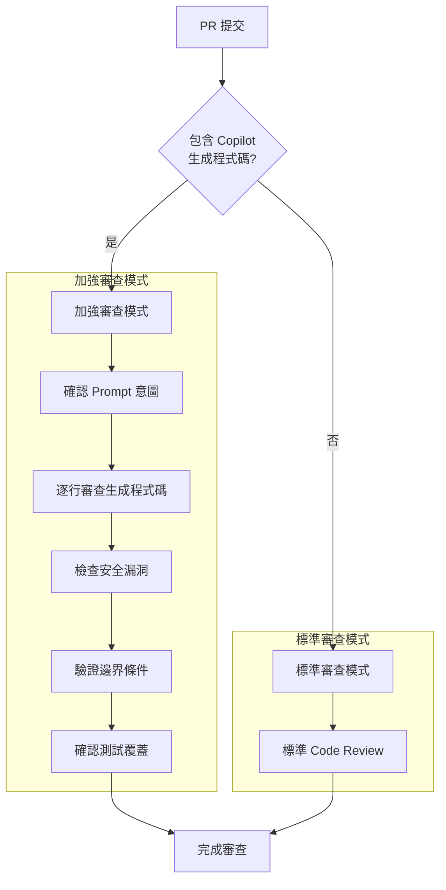

**Reviewer 額外檢查項目：**

| 項目 | 檢查重點 |
| ------ | ---------- |
| **意圖驗證** | 程式碼是否符合原始需求 |
| **邏輯完整性** | 是否有遺漏的 edge case |
| **安全性** | 是否有 OWASP Top 10 風險 |
| **效能** | 是否有明顯的效能問題 |
| **一致性** | 是否符合專案編碼規範 |
| **可維護性** | 程式碼是否易於理解與維護 |

### 8.5 效益衡量指標

| 指標 | 計算方式 | 目標 |
| ------ | ---------- | ------ |
| **開發效率** | 功能點完成時間 | 提升 20-30% |
| **程式碼品質** | SonarQube 分數 | 維持或提升 |
| **Bug 數量** | 每千行程式碼 Bug 數 | 不增加 |
| **開發者滿意度** | 問卷調查 | > 4.0/5.0 |
| **學習曲線** | 新人上手時間 | 縮短 30% |

### 8.6 組織架構建議

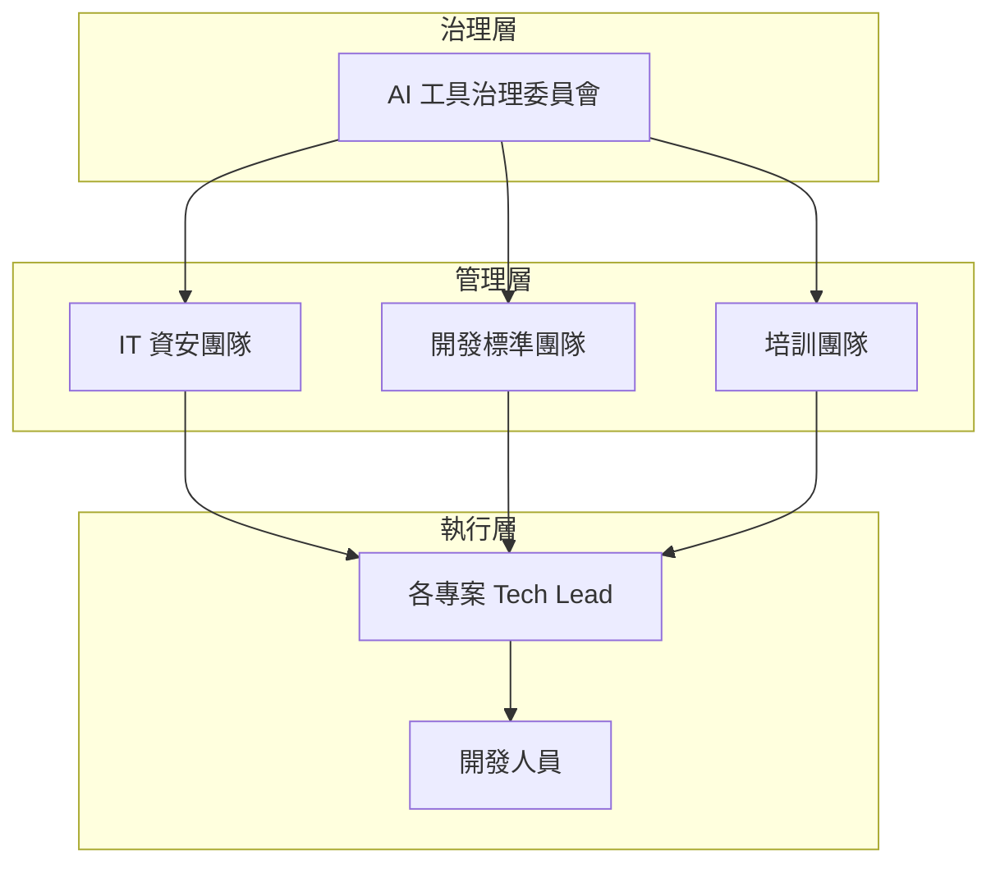

**各角色職責：**

| 角色 | 職責 |
| ------ | ------ |
| **治理委員會** | 制定政策、風險評估、預算核准 |
| **IT 資安團隊** | 安全規範、稽核、事件處理 |
| **開發標準團隊** | 使用規範、Prompt Library、最佳實務 |
| **培訓團隊** | 教育訓練、知識傳承 |
| **Tech Lead** | 執行監督、團隊指導 |
| **開發人員** | 遵循規範、回報問題 |

---

## 第九章 進階應用案例

### 9.1 案例一：Legacy Code 重構

#### 9.1.1 情境描述

```markdown
【背景】
- 一段 10 年歷史的付款處理程式碼
- 單一方法超過 500 行
- 缺乏測試，無人敢動
- 需要新增多幣別支援

【挑戰】
- 理解現有邏輯
- 不破壞現有功能
- 安全地進行重構
```

#### 9.1.2 使用 Copilot 的策略

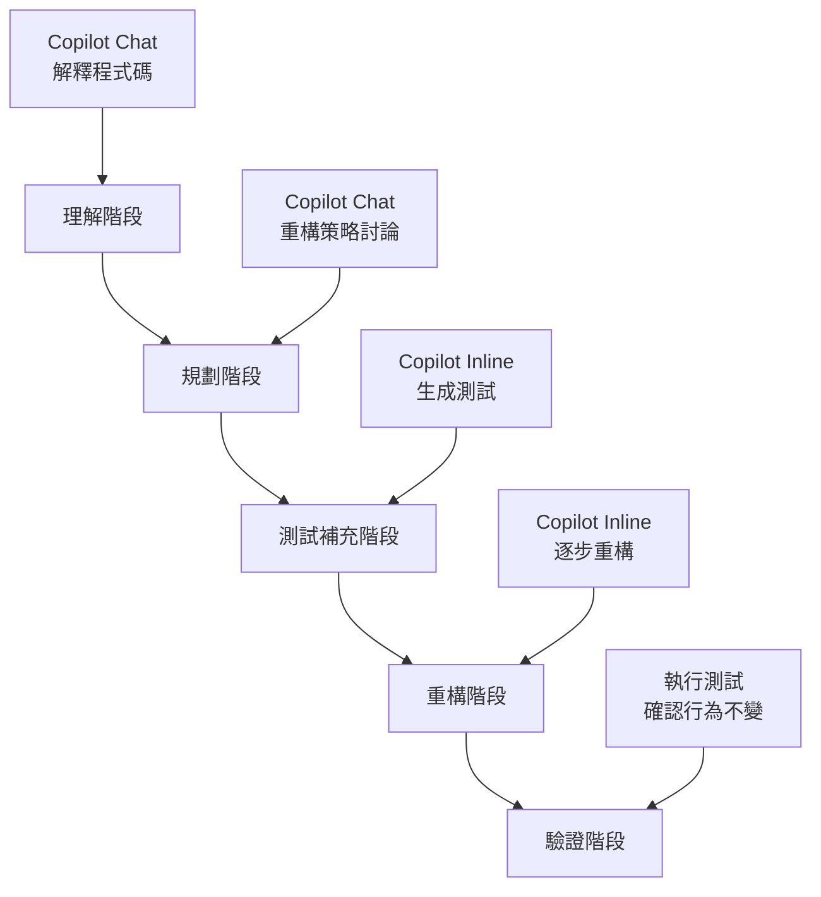

**Step 1：理解現有程式碼**

```markdown
## Copilot Chat Prompt

請分析以下 Legacy 程式碼：

1. 說明這段程式碼的主要職責
2. 識別主要的執行流程
3. 標記可能的問題點：
   - 過長的方法
   - 違反 SOLID 的地方
   - 潛在的 bug
4. 建議重構的優先順序

[貼上 Legacy Code]
```

**Step 2：建立特徵測試（Characterization Test）**

```java
// 使用 Copilot 生成特徵測試，保護現有行為
// Prompt: 請為以下 legacy 方法生成特徵測試，
//         測試目的是記錄「現有行為」而非「預期行為」

@Test
void characterization_processPayment_normalFlow() {
    // Copilot 生成的測試，用於捕捉現有行為
    PaymentRequest request = createTestRequest();
    PaymentResult result = legacyService.processPayment(request);
    
    // 記錄現有行為（即使看起來怪怪的）
    assertThat(result.getStatus()).isEqualTo("SUCCESS");
    assertThat(result.getFee()).isEqualTo(new BigDecimal("1.50"));
}
```

**Step 3：逐步重構**

```java
// 使用「提取方法」重構，Copilot 輔助生成新方法

// 原始程式碼中的一段（在 500 行方法中）
// --- 驗證卡號邏輯 ---
String cardNumber = request.getCardNumber();
if (cardNumber == null || cardNumber.length() < 13) {
    throw new InvalidCardException("Invalid card");
}
// Luhn 驗證...
// --- 驗證結束 ---

// 提取為獨立方法
// Prompt: 請將以下卡號驗證邏輯提取為獨立方法，
//         包含完整的 JavaDoc 和錯誤處理

/**
 * 驗證信用卡卡號
 * 
 * @param cardNumber 信用卡卡號
 * @throws InvalidCardException 當卡號格式不正確或未通過 Luhn 驗證
 */
private void validateCardNumber(String cardNumber) {
    // Copilot 生成的驗證邏輯
}
```

#### 9.1.3 重構成果

```markdown
【重構前】
- 1 個 500 行的方法
- 0 個測試
- 無法新增功能

【重構後】
- 15 個小方法，每個 < 30 行
- 45 個特徵測試 + 20 個新測試
- 成功新增多幣別支援
- 程式碼可讀性大幅提升
```

### 9.2 案例二：API 設計與實作

#### 9.2.1 情境描述

```markdown
【需求】
設計並實作「交易查詢 API」：
- RESTful API 設計
- 支援複雜查詢條件
- 分頁與排序
- 符合 OpenAPI 規範
```

#### 9.2.2 使用 Copilot 的完整流程

**Phase 1：API 設計討論**

```markdown
## Copilot Chat Prompt

我需要設計一個交易查詢 API，請協助：

1. 建議 RESTful endpoint 設計
2. 查詢參數設計（日期範圍、交易類型、金額範圍等）
3. 分頁策略（offset vs cursor）
4. 回應格式設計
5. 錯誤處理策略

背景：
- 資料量：每日約 100 萬筆交易
- 查詢頻率：每秒約 100 次
- 使用者：內部系統 + 外部合作夥伴
```

**Phase 2：OpenAPI 規格生成**

```yaml
# Copilot 輔助生成的 OpenAPI 規格
openapi: 3.0.3
info:
  title: Transaction Query API
  version: 1.0.0
  
paths:
  /api/v1/transactions:
    get:
      summary: 查詢交易紀錄
      parameters:
        - name: startDate
          in: query
          schema:
            type: string
            format: date
        - name: endDate
          in: query
          schema:
            type: string
            format: date
        - name: transactionType
          in: query
          schema:
            type: string
            enum: [DEPOSIT, WITHDRAWAL, TRANSFER]
        - name: minAmount
          in: query
          schema:
            type: number
        - name: maxAmount
          in: query
          schema:
            type: number
        - name: page
          in: query
          schema:
            type: integer
            default: 0
        - name: size
          in: query
          schema:
            type: integer
            default: 20
            maximum: 100
      responses:
        '200':
          description: 查詢成功
          content:
            application/json:
              schema:
                $ref: '#/components/schemas/TransactionPage'
```

**Phase 3：Controller 實作**

```java
// Prompt: 請根據以上 OpenAPI 規格，實作 Spring Boot Controller
// 要求：使用 @Validated、適當的錯誤處理、OpenAPI 註解

@RestController
@RequestMapping("/api/v1/transactions")
@Tag(name = "Transaction", description = "交易查詢 API")
@Validated
@RequiredArgsConstructor
public class TransactionController {

    private final TransactionQueryService queryService;

    @GetMapping
    @Operation(summary = "查詢交易紀錄")
    @ApiResponses({
        @ApiResponse(responseCode = "200", description = "查詢成功"),
        @ApiResponse(responseCode = "400", description = "查詢參數錯誤"),
        @ApiResponse(responseCode = "401", description = "未授權"),
        @ApiResponse(responseCode = "403", description = "無權限")
    })
    public ResponseEntity<Page<TransactionDTO>> queryTransactions(
            @RequestParam(required = false) 
            @DateTimeFormat(iso = DateTimeFormat.ISO.DATE) LocalDate startDate,
            
            @RequestParam(required = false) 
            @DateTimeFormat(iso = DateTimeFormat.ISO.DATE) LocalDate endDate,
            
            @RequestParam(required = false) TransactionType transactionType,
            
            @RequestParam(required = false) 
            @PositiveOrZero BigDecimal minAmount,
            
            @RequestParam(required = false) 
            @PositiveOrZero BigDecimal maxAmount,
            
            @RequestParam(defaultValue = "0") @Min(0) int page,
            
            @RequestParam(defaultValue = "20") @Min(1) @Max(100) int size,
            
            @AuthenticationPrincipal UserDetails currentUser) {
        
        // Copilot 生成的實作...
        TransactionQuery query = TransactionQuery.builder()
            .startDate(startDate)
            .endDate(endDate)
            .transactionType(transactionType)
            .minAmount(minAmount)
            .maxAmount(maxAmount)
            .build();
            
        Page<TransactionDTO> result = queryService.query(
            query, 
            PageRequest.of(page, size),
            currentUser
        );
        
        return ResponseEntity.ok(result);
    }
}
```

**Phase 4：測試生成**

```java
// Prompt: 請為上述 Controller 生成完整的整合測試
// 包含：正常查詢、分頁、篩選、權限驗證、錯誤處理

@WebMvcTest(TransactionController.class)
@AutoConfigureMockMvc
class TransactionControllerTest {

    @Autowired
    private MockMvc mockMvc;
    
    @MockBean
    private TransactionQueryService queryService;

    @Test
    @WithMockUser
    void shouldReturnTransactions_whenValidQuery() throws Exception {
        // Copilot 生成的測試...
    }
    
    @Test
    @WithMockUser
    void shouldReturnBadRequest_whenInvalidDateRange() throws Exception {
        // Copilot 生成的測試...
    }
    
    @Test
    void shouldReturnUnauthorized_whenNotAuthenticated() throws Exception {
        // Copilot 生成的測試...
    }
}
```

### 9.3 案例三：Batch 程式開發

#### 9.3.1 情境描述

```markdown
【需求】
開發日終對帳 Batch：
- 每日 00:00 執行
- 處理前一日所有交易
- 與銀行對帳單比對
- 產出差異報表
- 需要支援 restart/retry
```

#### 9.3.2 使用 Copilot 的策略

```java
// Prompt: 使用 Spring Batch 設計日終對帳 Job
// 要求：
// - 支援大量資料（100 萬筆）
// - Chunk-based 處理
// - 可重啟
// - 完整的錯誤處理
// - 執行狀態追蹤

@Configuration
@RequiredArgsConstructor
public class ReconciliationJobConfig {

    private final JobBuilderFactory jobBuilderFactory;
    private final StepBuilderFactory stepBuilderFactory;
    
    @Bean
    public Job reconciliationJob(
            Step loadTransactionsStep,
            Step loadBankStatementsStep,
            Step reconcileStep,
            Step generateReportStep) {
        
        return jobBuilderFactory.get("reconciliationJob")
            .incrementer(new RunIdIncrementer())
            .listener(new JobExecutionListener() {
                // Copilot 生成 listener...
            })
            .start(loadTransactionsStep)
            .next(loadBankStatementsStep)
            .next(reconcileStep)
            .next(generateReportStep)
            .build();
    }
    
    @Bean
    public Step reconcileStep(
            ItemReader<TransactionPair> reader,
            ItemProcessor<TransactionPair, ReconciliationResult> processor,
            ItemWriter<ReconciliationResult> writer) {
        
        return stepBuilderFactory.get("reconcileStep")
            .<TransactionPair, ReconciliationResult>chunk(1000)
            .reader(reader)
            .processor(processor)
            .writer(writer)
            .faultTolerant()
            .skipLimit(100)
            .skip(DataIntegrityException.class)
            .retryLimit(3)
            .retry(TransientDataAccessException.class)
            .listener(new StepExecutionListener() {
                // Copilot 生成 listener...
            })
            .build();
    }
}
```

### 9.4 案例四：架構文件生成

#### 9.4.1 使用 Copilot 生成 ADR（Architecture Decision Record）

```markdown
## Copilot Chat Prompt

請協助我生成一份 ADR（架構決策紀錄）：

決策主題：採用 Redis 作為分散式快取

背景：
- 系統每秒處理 1000+ 請求
- 部分資料變動頻率低（幣別匯率、系統參數）
- 目前直接查詢 DB，造成效能瓶頸

請以標準 ADR 格式輸出：
- 標題
- 狀態
- 背景
- 決策
- 後果（正面/負面）
```

**Copilot 生成的 ADR：**

```markdown
# ADR-001: 採用 Redis 作為分散式快取

## 狀態
已接受（Accepted）

## 背景
現行系統面臨效能瓶頸：
- 每秒處理 1000+ 請求
- 部分低變動資料重複查詢 DB
- DB 連線數經常達到上限
- P99 回應時間超過 500ms

## 考量的方案

### 方案一：本地快取（Caffeine）
- 優點：實作簡單、無網路延遲
- 缺點：多節點間資料不一致

### 方案二：Redis
- 優點：分散式一致、成熟穩定
- 缺點：增加架構複雜度

### 方案三：Hazelcast
- 優點：功能豐富
- 缺點：學習曲線高、授權成本

## 決策
採用 Redis（方案二）

理由：
1. 已有 Redis 維運經驗
2. 生態系成熟，社群支援良好
3. 符合分散式一致性需求
4. 團隊熟悉度高

## 後果

### 正面
- 預期 DB 查詢量減少 60%
- P99 回應時間降至 100ms 以下
- 支援水平擴展

### 負面
- 增加 Redis 維運成本
- 需處理快取失效策略
- 增加故障點

## 相關決策
- ADR-002: Redis 快取策略
- ADR-003: Redis 高可用配置
```

### 9.5 案例五：使用 Copilot Coding Agent 自動化開發

#### 9.5.1 情境描述

```markdown
【背景】
- 團隊有大量的小型 Bug Fix 和功能增強 Issue
- 資深工程師時間寶貴，不想花在例行性修改上
- Issue 描述明確，修改範圍可控

【挑戰】
- 如何將例行任務交給 Copilot Coding Agent
- 如何確保 Agent 產出的 PR 品質
- 如何建立有效的 Agent 工作流程
```

#### 9.5.2 Copilot Coding Agent 使用流程

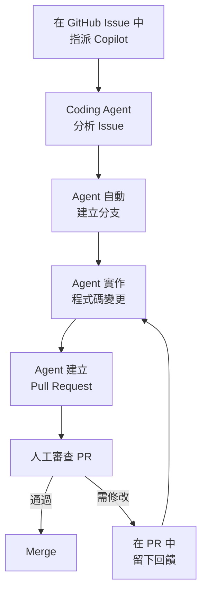

**Step 1：撰寫適合 Agent 的 Issue**

```markdown
## Issue: 新增交易查詢 API 的日期驗證

### 描述
目前 `GET /api/v1/transactions` 的 `startDate` 和 `endDate` 參數
沒有驗證日期範圍是否合理。

### 需求
1. `endDate` 不可早於 `startDate`
2. 查詢範圍不可超過 90 天
3. 不可查詢未來日期
4. 回傳 400 Bad Request 並附上明確錯誤訊息

### 檔案位置
- Controller: `src/main/java/.../TransactionController.java`
- 測試: `src/test/java/.../TransactionControllerTest.java`

### 驗收條件
- [ ] 新增日期驗證邏輯
- [ ] 新增對應的錯誤處理
- [ ] 新增單元測試覆蓋所有情境
```

**Step 2：指派 Copilot**

在 Issue 中將 Assignee 設定為 Copilot，Agent 會自動開始工作。

**Step 3：審查 Agent 產出的 PR**

```markdown
## 審查重點（Copilot Coding Agent PR）
✅ 邏輯是否正確符合 Issue 描述
✅ 是否符合專案編碼規範
✅ 測試是否覆蓋所有情境
✅ 是否有安全風險
⚠️ 是否有不必要的變更（Agent 可能修改超出範圍的檔案）
```

#### 9.5.3 適合交給 Coding Agent 的任務

| 適合 | 不適合 |
| --- | --- |
| Bug Fix（明確重現步驟） | 架構重構 |
| 新增驗證邏輯 | 複雜業務邏輯 |
| 補充單元測試 | 涉及多系統整合 |
| 更新文件 | 效能調優 |
| 簡單功能增強 | 安全性關鍵修改 |

> ⚠️ **注意**：Copilot Coding Agent 目前適用於 Pro、Pro+、Business、Enterprise 方案。Issue 描述越詳細，Agent 產出品質越高。

### 9.6 最佳實務總結

| 場景 | Copilot 主要用途 | 人工重點 |
| ------ | ------------------ | ---------- |
| **Legacy 重構** | 理解程式碼、生成測試 | 重構策略、風險評估 |
| **API 開發** | OpenAPI 規格、程式碼生成 | API 設計決策、安全審查 |
| **Batch 開發** | 骨架程式碼、錯誤處理 | 效能調優、資料驗證 |
| **架構文件** | 文件草稿、格式化 | 技術決策、內容正確性 |

---

## 第十章 總結：如何把 Copilot 變成「資深工程師的放大器」

### 10.1 核心心法

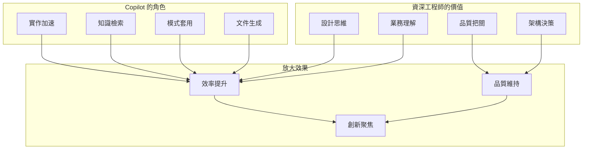

### 10.2 黃金法則

```markdown
## 資深工程師使用 Copilot 的十二大法則

1. **AI 是助手，不是主人**
   - 設計決策永遠是人做的
   
2. **Prompt 品質決定輸出品質**
   - 投資時間在寫好 Prompt 與 Custom Instructions
   
3. **永遠審查，從不盲信**
   - 每行程式碼都要理解，無論是 Inline 還是 Agent 產出
   
4. **用 AI 做 AI 擅長的事**
   - Boilerplate、測試、文件、例行性 Bug Fix
   
5. **保持安全意識**
   - 不洩露機敏資訊，善用 Content Exclusion
   
6. **測試不可省略**
   - AI 生成的程式碼更需要測試
   
7. **善用 Agent Mode 與 Coding Agent**
   - 將例行任務自動化，專注高價值工作
   
8. **建立團隊 Prompt 資產**
   - 共享 Custom Instructions、Prompt Files、MCP 設定
   
9. **量化效益**
   - 用 Usage Data 與指標說話
   
10. **保持批判性思維**
    - AI 可能是錯的，特別是業務邏輯與安全性
    
11. **善用上下文管理**
    - 使用 Spaces、Custom Instructions 提升回應品質
    
12. **持續學習新功能**
    - Copilot 生態圈快速演進，定期查看官方文件更新
```

### 10.3 技能發展路徑

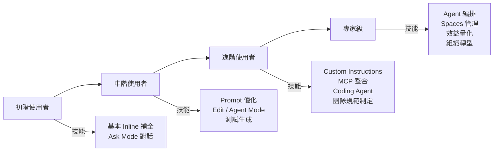

### 10.4 持續改善框架

```markdown
## 每週 Copilot 使用回顧

### 本週使用情況
- 使用 Copilot 完成的任務：___
- 節省的估計時間：___
- 遇到的問題：___

### 效益評估
- 哪些場景效果好？
- 哪些場景效果不佳？
- 發現的新用法？

### 改善行動
- 下週要嘗試的新用法：___
- 要分享給團隊的 Prompt：___
- 需要調整的使用習慣：___
```

### 10.5 未來展望

| 時間軸 | 預期發展 | 資深工程師應對 |
| --- | --- | --- |
| **已實現** | Coding Agent、Agent Mode、MCP、多模型、Spaces | 積極學習並導入日常開發 |
| **短期（6個月）** | Copilot Memory 成熟、更多 MCP 生態 | 建立團隊 Custom Instructions |
| **中期（1-2年）** | 多 Agent 協作、自主測試、自主部署 | 學習 Agent 編排與治理 |
| **長期（3-5年）** | 端到端自主開發、AI 驅動架構 | 聚焦架構設計與業務創新 |

> 💡 **關鍵趨勢**：Copilot 正從「被動輔助」轉向「主動代理」。資深工程師的角色將從「寫程式碼」轉向「設計系統、定義規範、審查 AI 產出」。掌握 Custom Instructions、MCP 與 Agent 編排將成為核心競爭力。

---

## 附錄 檢查清單（Checklist）

### A. 日常使用檢查清單

```markdown
## 每次使用 Copilot 前
□ 確認不會洩露機敏資訊
□ 清楚知道要達成什麼目標
□ 準備好足夠的上下文

## 接受 Copilot 建議前
□ 我理解這段程式碼在做什麼
□ 我檢查過邊界條件
□ 我確認過沒有安全風險
□ 程式碼風格與專案一致
□ 例外處理適當

## 提交程式碼前
□ 通過自我 Code Review
□ 已撰寫對應測試
□ 通過靜態掃描
□ PR 描述清楚說明變更
```

### B. Code Review 檢查清單（Copilot 輔助程式碼）

```markdown
## 功能正確性
□ 程式碼是否符合需求規格
□ 邊界條件是否處理完整
□ 錯誤處理是否適當

## 安全性
□ 是否有 SQL Injection 風險
□ 是否有 XSS 風險
□ 輸入驗證是否完整
□ 敏感資料是否保護

## 效能
□ 是否有 N+1 Query
□ 時間/空間複雜度是否可接受
□ 是否有不必要的 I/O

## 可維護性
□ 命名是否清晰
□ 方法長度是否合理
□ 職責是否單一
□ 是否符合專案規範

## 測試
□ 是否有對應單元測試
□ 測試覆蓋率是否足夠
□ 測試案例是否有意義
```

### C. 團隊導入檢查清單

```markdown
## 導入前準備
□ 取得組織授權
□ 確認授權版本（Business/Enterprise）
□ 完成資安評估
□ 制定使用規範草案
□ 選定試點團隊

## 導入中
□ 完成團隊培訓
□ 建立 Prompt Library
□ 設定開發環境
□ 整合 CI/CD
□ 建立回報機制

## 導入後
□ 收集使用回饋
□ 量化效益指標
□ 更新使用規範
□ 定期分享會
□ 持續優化
```

### D. Prompt 範本快速參考

```markdown
## 程式碼解釋
「請解釋這段程式碼的功能，包含：主要流程、關鍵邏輯、潛在問題」

## 程式碼審查
「請以資深工程師角度審查這段程式碼，檢查：安全性、效能、可維護性」

## 測試生成
「請為這個方法生成單元測試，使用 JUnit 5，涵蓋：正常流程、邊界條件、異常情境」

## 重構建議
「請分析這段程式碼的 Code Smell，並提供重構建議，遵循 SOLID 原則」

## 文件生成
「請為這個類別生成 JavaDoc，包含：類別說明、方法說明、參數說明、範例」
```

---

## 參考資源

### 官方資源

- [GitHub Copilot Documentation](https://docs.github.com/en/copilot)
- [GitHub Copilot Features](https://docs.github.com/en/copilot/about-github-copilot/github-copilot-features)
- [Plans for GitHub Copilot](https://docs.github.com/en/copilot/about-github-copilot/subscription-plans-for-github-copilot)
- [GitHub Copilot Trust Center](https://copilot.github.trust.page/)
- [GitHub Copilot Chat Cheat Sheet](https://docs.github.com/en/copilot/using-github-copilot/github-copilot-chat-cheat-sheet)
- [Prompt Engineering for Copilot](https://docs.github.com/en/copilot/using-github-copilot/prompt-engineering-for-github-copilot)
- [About GitHub Copilot Coding Agent](https://docs.github.com/en/copilot/using-github-copilot/coding-agent)
- [About Model Context Protocol (MCP)](https://docs.github.com/en/copilot/concepts/context/mcp)
- [Customizing Copilot Responses](https://docs.github.com/en/copilot/concepts/about-customizing-github-copilot-chat-responses)
- [About Copilot Spaces](https://docs.github.com/en/copilot/using-github-copilot/copilot-spaces/about-organizing-and-sharing-context-with-copilot-spaces)

### 延伸閱讀

- Prompt Engineering Guide
- OWASP Top 10
- Clean Code by Robert C. Martin
- [VS Code Copilot Documentation](https://code.visualstudio.com/docs/copilot)

---

> **文件維護**  
> 本文件由開發標準團隊維護，如有問題或建議，請聯繫 [chihhung.cheng@gmail.com](mailto:chihhung.cheng@gmail.com)  
> 最後更新：2026 年 2 月 12 日（v2.0 - 更新至最新 Copilot 生態圈功能）

---

<!-- 文件結束 -->


