+++
date = '2026-08-13T00:00:00+08:00'
draft = false
title = 'Github Copilot生態圈教學手冊'
tags = ['教學', 'AI開發']
categories = ['教學']
+++


# Github Copilot生態圈教學手冊

> **版本**：7.0\
> **最後更新**：2026 年 9 月 25 日\
> **適用對象**：資深工程師 / Tech Lead / Architect / Copilot 平台管理者\
> **適用於**：GitHub Copilot (Free / Student / Pro / Pro+ / Max / Business / Enterprise)\
> **VS Code 版本**：1.139+（2026/09/23 穩定版）\
> **重大異動**：2026/06/01 起全面採 AI Credits 用量計費；VS Code 改為 Agent Harness／Agent Host 架構；新增 GitHub Copilot App、Automations、Agentic Workflows、Plugins 與 Enterprise Managed Settings；**2026/09/28 起 Code Review 預設深度改為 Balanced、2026/10/22 起未設定的新功能政策預設開放**（詳見 [1.8](#18-近期重要時程與企業行動項目)）\
> **Created by**：Eric Cheng

## 目錄

[第一章　GitHub Copilot 生態圈全貌總覽](#第一章-github-copilot-生態圈全貌總覽)

- [1.1 什麼是 GitHub Copilot 生態圈](#11-什麼是-github-copilot-生態圈)
- [1.2 生態圈各組件說明](#12-生態圈各組件說明)
- [1.3 Copilot 在企業開發流程中的定位](#13-copilot-在企業開發流程中的定位)
- [1.4 版本與授權模式](#14-版本與授權模式)
- [1.5 AI Credits 計費機制詳解](#15-ai-credits-計費機制詳解)
  - [1.5.1 AI Credits 運作原理](#151-ai-credits-運作原理)
  - [1.5.2 Credits 使用優先順序](#152-credits-使用優先順序)
  - [1.5.3 哪些功能消耗 AI Credits](#153-哪些功能消耗-ai-credits)
  - [1.5.4 Copilot Code Review 的特殊計費](#154-copilot-code-review-的特殊計費)
  - [1.5.5 企業成本管控策略](#155-企業成本管控策略)
  - [1.5.6 用戶端最低版本需求](#156-用戶端最低版本需求)
- [1.6 Copilot Cloud Agent 整合平台](#16-copilot-cloud-agent-整合平台)
- [1.7 2025-2026 年新功能重點摘要](#17-2025-2026-年新功能重點摘要)
- [1.8 近期重要時程與企業行動項目](#18-近期重要時程與企業行動項目)

[第二章　Copilot 與「資深工程師角色」的正確關係](#第二章-copilot-與資深工程師角色的正確關係)

- [2.1 思維轉換：從「工具」到「協作夥伴」](#21-思維轉換從工具到協作夥伴)
- [2.2 資深工程師的不可取代價值](#22-資深工程師的不可取代價值)
- [2.3 正確的協作模式](#23-正確的協作模式)
- [2.4 效率提升的正確期待](#24-效率提升的正確期待)
- [2.5 代理時代的角色轉變：從實作者到代理指揮者](#25-代理時代的角色轉變從實作者到代理指揮者)

[第三章　Copilot 在實際開發流程中的使用時機](#第三章-copilot-在實際開發流程中的使用時機)

- [3.1 開發流程與 Copilot 介入點](#31-開發流程與-copilot-介入點)
- [3.2 各階段使用策略](#32-各階段使用策略)
  - [3.2.1 需求分析階段](#321-需求分析階段)
  - [3.2.2 設計階段](#322-設計階段)
  - [3.2.3 開發階段](#323-開發階段)
  - [3.2.4 測試階段](#324-測試階段)
- [3.3 不同類型任務的使用建議](#33-不同類型任務的使用建議)
- [3.4 與現有工具鏈整合](#34-與現有工具鏈整合)
- [3.5 實務案例：一個完整的開發循環](#35-實務案例一個完整的開發循環)
- [3.6 介面與代理選用決策矩陣](#36-介面與代理選用決策矩陣)

[第四章　Copilot Prompt Engineering（重點章節）](#第四章-copilot-prompt-engineering重點章節)

- [4.1 Prompt Engineering 核心觀念](#41-prompt-engineering-核心觀念)
- [4.2 Inline Completion Prompt 技巧](#42-inline-completion-prompt-技巧)
  - [4.2.1 註解驅動開發（Comment-Driven Development）](#421-註解驅動開發comment-driven-development)
  - [4.2.2 簽名先行模式](#422-簽名先行模式)
  - [4.2.3 分層註解模式](#423-分層註解模式)
- [4.3 Copilot Chat Prompt 技巧](#43-copilot-chat-prompt-技巧)
  - [4.3.1 角色設定模式](#431-角色設定模式)
  - [4.3.2 CRISPE 框架](#432-crispe-框架)
  - [4.3.3 多輪對話策略](#433-多輪對話策略)
- [4.4 Bad Prompt vs Good Prompt 對照](#44-bad-prompt-vs-good-prompt-對照)
- [4.5 進階 Prompt Pattern](#45-進階-prompt-pattern)
  - [4.5.1 Chain of Thought（思維鏈）](#451-chain-of-thought思維鏈)
  - [4.5.2 Few-Shot Learning（範例學習）](#452-few-shot-learning範例學習)
  - [4.5.3 Persona Pattern（人格模式）](#453-persona-pattern人格模式)
  - [4.5.4 代理任務規格（Agentic Prompt）](#454-代理任務規格agentic-prompt)
- [4.6 Prompt Template 庫](#46-prompt-template-庫)
- [4.7 Copilot Chat 快捷指令與互動方式](#47-copilot-chat-快捷指令與互動方式)
  - [4.7.1 Chat 模式與 Agent 類型（VS Code）](#471-chat-模式與-agent-類型vs-code)
  - [4.7.2 Slash Commands（斜線指令）](#472-slash-commands斜線指令)
  - [4.7.3 Chat Participants（聊天參與者）](#473-chat-participants聊天參與者)
  - [4.7.4 Chat Variables 與工具參照（`#` 語法）](#474-chat-variables-與工具參照-語法)
  - [4.7.5 GitHub Skills（@github 技能）](#475-github-skillsgithub-技能)
  - [4.7.6 其他存取方式](#476-其他存取方式)
- [4.8 Custom Instructions 與自訂化框架](#48-custom-instructions-與自訂化框架)
  - [4.8.1 Custom Instructions（自訂指令）](#481-custom-instructions自訂指令)
  - [4.8.2 Prompt Files（.prompt.md）](#482-prompt-filespromptmd)
  - [4.8.3 Agent Skills（代理技能）](#483-agent-skills代理技能)
  - [4.8.4 Custom Agents（Agent Profiles）](#484-custom-agentsagent-profiles)
  - [4.8.5 Agent Hooks（生命週期自動化）](#485-agent-hooks生命週期自動化)
  - [4.8.6 Agent Plugins（Preview）](#486-agent-pluginspreview)
  - [4.8.7 Agent Customizations Editor](#487-agent-customizations-editor)
  - [4.8.8 MCP (Model Context Protocol) 整合](#488-mcp-model-context-protocol-整合)
- [4.9 Copilot CLI 內建代理與進階能力](#49-copilot-cli-內建代理與進階能力)
  - [4.9.1 內建代理一覽](#491-內建代理一覽)
  - [4.9.2 使用方式](#492-使用方式)
  - [4.9.3 子代理機制](#493-子代理機制)
  - [4.9.4 CLI 進階能力](#494-cli-進階能力)
- [4.10 VS Code Agents Window（Preview）](#410-vs-code-agents-windowpreview)
  - [4.10.1 核心概念](#4101-核心概念)
  - [4.10.2 主要能力](#4102-主要能力)
  - [4.10.3 Remote Agent Sessions](#4103-remote-agent-sessions)
- [4.11 Custom Agent Handoffs（工作流程交接）](#411-custom-agent-handoffs工作流程交接)
  - [4.11.1 Handoffs 機制](#4111-handoffs-機制)
  - [4.11.2 設定方式](#4112-設定方式)
  - [4.11.3 進階屬性](#4113-進階屬性)
  - [4.11.4 組織級共享](#4114-組織級共享)
  - [4.11.5 Claude Agent 格式相容（VS Code）](#4115-claude-agent-格式相容vs-code)
- [4.12 Copilot Memory 深入指南](#412-copilot-memory-深入指南)
  - [4.12.1 Memory 架構](#4121-memory-架構)
  - [4.12.2 Memory 特性](#4122-memory-特性)
  - [4.12.3 啟用與管理](#4123-啟用與管理)
  - [4.12.4 企業環境建議](#4124-企業環境建議)
  - [4.12.5 VS Code 本機 Memory Tool（與 Copilot Memory 的差異）](#4125-vs-code-本機-memory-tool與-copilot-memory-的差異)
- [4.13 Copilot Spaces 深入指南](#413-copilot-spaces-深入指南)
  - [4.13.1 可加入的內容類型](#4131-可加入的內容類型)
  - [4.13.2 使用方式](#4132-使用方式)
  - [4.13.3 權限與共享](#4133-權限與共享)
  - [4.13.4 方案支援與計費](#4134-方案支援與計費)
  - [4.13.5 與 Memory／Custom Instructions 的分工建議](#4135-與-memorycustom-instructions-的分工建議)
- [4.14 GitHub Copilot App 深入指南](#414-github-copilot-app-深入指南)
  - [4.14.1 可用性](#4141-可用性)
  - [4.14.2 核心能力](#4142-核心能力)
  - [4.14.3 典型工作流程](#4143-典型工作流程)
  - [4.14.4 成本優化建議（官方）](#4144-成本優化建議官方)

[第五章　Copilot + Code Review + Testing 最佳實務](#第五章-copilot--code-review--testing-最佳實務)

- [5.1 Copilot 與 Code Review 的整合](#51-copilot-與-code-review-的整合)
  - [5.1.1 Copilot Code Review 功能概覽](#511-copilot-code-review-功能概覽)
  - [5.1.2 使用 Copilot 輔助 Code Review](#512-使用-copilot-輔助-code-review)
  - [5.1.3 Code Review Checklist（結合 Copilot）](#513-code-review-checklist結合-copilot)
  - [5.1.4 進階設定：自動觸發、路徑範圍指令與 Runner 控管](#514-進階設定自動觸發路徑範圍指令與-runner-控管)
- [5.2 Copilot 與 Testing 的整合](#52-copilot-與-testing-的整合)
  - [5.2.1 測試金字塔與 Copilot 角色](#521-測試金字塔與-copilot-角色)
  - [5.2.2 單元測試生成最佳實務](#522-單元測試生成最佳實務)
  - [5.2.3 測試程式碼品質檢查](#523-測試程式碼品質檢查)
  - [5.2.4 讓代理執行並驗證測試](#524-讓代理執行並驗證測試)
- [5.3 CI/CD 整合建議](#53-cicd-整合建議)
  - [5.3.1 為 Cloud Agent 與 Code Review 準備執行環境](#531-為-cloud-agent-與-code-review-準備執行環境)
  - [5.3.2 CI／CD 中的代理自動化：Automations 與 Agentic Workflows](#532-cicd-中的代理自動化automations-與-agentic-workflows)
- [5.4 實務案例：完整的測試策略](#54-實務案例完整的測試策略)

[第六章　資安、法遵與風險控管](#第六章-資安法遵與風險控管)

- [6.1 Copilot 的資安風險概覽](#61-copilot-的資安風險概覽)
- [6.2 常見安全漏洞與防範](#62-常見安全漏洞與防範)
  - [6.2.1 SQL Injection](#621-sql-injection)
  - [6.2.2 XSS (Cross-Site Scripting)](#622-xss-cross-site-scripting)
  - [6.2.3 敏感資訊洩露](#623-敏感資訊洩露)
  - [6.2.4 代理可能引入的相依套件風險](#624-代理可能引入的相依套件風險)
- [6.3 Copilot 生成程式碼的審查清單](#63-copilot-生成程式碼的審查清單)
- [6.4 法遵考量](#64-法遵考量)
  - [6.4.1 著作權風險](#641-著作權風險)
  - [6.4.2 資料保護合規](#642-資料保護合規)
- [6.5 企業級安全設定](#65-企業級安全設定)
  - [6.5.1 組織層級設定](#651-組織層級設定)
  - [6.5.2 開發者工作站設定](#652-開發者工作站設定)
- [6.6 Copilot 在 SSDLC 中的定位](#66-copilot-在-ssdlc-中的定位)
- [6.7 稽核與追蹤](#67-稽核與追蹤)

[第七章　常見誤用與反模式](#第七章-常見誤用與反模式)

- [7.1 Anti-Pattern 總覽](#71-anti-pattern-總覽)
- [7.2 Anti-Pattern 詳解](#72-anti-pattern-詳解)
  - [7.2.1 盲目信任 AI（Blind Trust）](#721-盲目信任-aiblind-trust)
  - [7.2.2 取代思考（Thought Replacement）](#722-取代思考thought-replacement)
  - [7.2.3 Prompt 過於模糊（Vague Prompting）](#723-prompt-過於模糊vague-prompting)
  - [7.2.4 一次給太多任務（Task Overload）](#724-一次給太多任務task-overload)
  - [7.2.5 忽略程式碼上下文（Context Ignorance）](#725-忽略程式碼上下文context-ignorance)
- [7.3 Copilot 不適合做的事情](#73-copilot-不適合做的事情)
- [7.4 常見錯誤案例分析](#74-常見錯誤案例分析)
- [7.5 自我檢查清單](#75-自我檢查清單)
- [7.6 代理時代的反模式](#76-代理時代的反模式)

[第八章　團隊導入與治理建議](#第八章-團隊導入與治理建議)

- [8.1 導入成熟度模型](#81-導入成熟度模型)
- [8.2 各階段導入建議](#82-各階段導入建議)
- [8.3 團隊使用規範範本](#83-團隊使用規範範本)
- [8.4 Code Review 要點（Copilot 輔助後）](#84-code-review-要點copilot-輔助後)
- [8.5 效益衡量指標](#85-效益衡量指標)
- [8.6 組織架構建議](#86-組織架構建議)
- [8.7 企業治理控制面：AI Controls 與 Managed Settings](#87-企業治理控制面ai-controls-與-managed-settings)
  - [8.7.1 控制面地圖](#871-控制面地圖)
  - [8.7.2 新功能與新模型的准入流程](#872-新功能與新模型的准入流程)
  - [8.7.3 Managed Settings 導入步驟](#873-managed-settings-導入步驟)

[第九章　進階應用案例](#第九章-進階應用案例)

- [9.1 案例一：Legacy Code 重構](#91-案例一legacy-code-重構)
  - [9.1.1 情境描述](#911-情境描述)
  - [9.1.2 使用 Copilot 的策略](#912-使用-copilot-的策略)
  - [9.1.3 重構成果](#913-重構成果)
- [9.2 案例二：API 設計與實作](#92-案例二api-設計與實作)
  - [9.2.1 情境描述](#921-情境描述)
  - [9.2.2 使用 Copilot 的完整流程](#922-使用-copilot-的完整流程)
- [9.3 案例三：Batch 程式開發](#93-案例三batch-程式開發)
  - [9.3.1 情境描述](#931-情境描述)
  - [9.3.2 使用 Copilot 的策略](#932-使用-copilot-的策略)
- [9.4 案例四：架構文件生成](#94-案例四架構文件生成)
  - [9.4.1 使用 Copilot 生成 ADR（Architecture Decision Record）](#941-使用-copilot-生成-adrarchitecture-decision-record)
- [9.5 案例五：使用 Copilot Cloud Agent 自動化開發](#95-案例五使用-copilot-cloud-agent-自動化開發)
  - [9.5.1 情境描述](#951-情境描述)
  - [9.5.2 Copilot Cloud Agent 使用流程](#952-copilot-cloud-agent-使用流程)
  - [9.5.3 適合交給 Cloud Agent 的任務](#953-適合交給-cloud-agent-的任務)
  - [9.5.4 Agent Management 面板：集中管理與進階功能](#954-agent-management-面板集中管理與進階功能)
- [9.6 案例六：以 Automations 與 Agentic Workflows 建立持續性代理作業](#96-案例六以-automations-與-agentic-workflows-建立持續性代理作業)
  - [9.6.1 情境描述](#961-情境描述)
  - [9.6.2 方案設計](#962-方案設計)
  - [9.6.3 風險控管重點](#963-風險控管重點)
- [9.7 案例七：以 GitHub Copilot App 平行處理多個 Issue](#97-案例七以-github-copilot-app-平行處理多個-issue)
  - [9.7.1 情境描述](#971-情境描述)
  - [9.7.2 執行步驟](#972-執行步驟)
  - [9.7.3 成果與注意事項](#973-成果與注意事項)
- [9.8 最佳實務總結](#98-最佳實務總結)

[第十章　總結：如何把 Copilot 變成「資深工程師的放大器」](#第十章-總結如何把-copilot-變成資深工程師的放大器)

- [10.1 核心心法](#101-核心心法)
- [10.2 黃金法則](#102-黃金法則)
- [10.3 技能發展路徑](#103-技能發展路徑)
- [10.4 持續改善框架](#104-持續改善框架)
- [10.5 未來展望](#105-未來展望)

[附錄　檢查清單與參考資料](#附錄-檢查清單與參考資料)

- [A. 日常使用檢查清單](#a-日常使用檢查清單)
- [B. Code Review 檢查清單（Copilot 輔助程式碼）](#b-code-review-檢查清單copilot-輔助程式碼)
- [C. 團隊導入檢查清單](#c-團隊導入檢查清單)
- [D. Prompt 範本快速參考](#d-prompt-範本快速參考)
- [E. Copilot 自訂化功能速查表](#e-copilot-自訂化功能速查表)
- [F. 2026 年功能時間軸（What's New）](#f-2026-年功能時間軸whats-new)
- [G. v7.0 查證紀錄](#g-v70-查證紀錄)
  - [G.1 查證基準](#g1-查證基準)
  - [G.2 已查閱的主要官方頁面](#g2-已查閱的主要官方頁面)
  - [G.3 更正對照表（v6.0 → v7.0）](#g3-更正對照表v60--v70)
  - [G.4 v7.0 新增章節](#g4-v70-新增章節)
  - [G.5 待追蹤項目](#g5-待追蹤項目)
- [參考資源](#參考資源)

---

## 第一章 GitHub Copilot 生態圈全貌總覽

> 📌 **本章摘要**：說明 Copilot 從「補全工具」演進為「多介面、多代理、多模型」平台的全貌；整理 7 種方案、7 家模型供應商、AI Credits 用量計費、Cloud Agent 整合，以及 2026 下半年企業必須在期限前處理的行動項目。

### 1.1 什麼是 GitHub Copilot 生態圈

GitHub Copilot 已從單純的「程式碼自動補全工具」演進為完整的 AI 輔助開發平台。截至 2026 年 9 月，Copilot 生態圈可以用「**三個多**」來概括：

| 面向 | 內容 | 對企業的意義 |
| --- | --- | --- |
| **多介面** | IDE（VS Code、Visual Studio、JetBrains、Eclipse、Xcode）、GitHub.com、GitHub Mobile、Copilot CLI、**GitHub Copilot App（桌面）** | 同一套授權、政策與自訂化資產，必須在多個介面上一致生效 |
| **多代理** | Copilot 自有代理（Agent Mode、Cloud Agent、CLI）、第三方代理（Anthropic Claude、OpenAI Codex）、合作夥伴 **Agent apps**、團隊自訂的 **Custom Agents** | 需要建立「代理治理」：誰能啟動、能用哪些工具、產出如何審查 |
| **多模型** | OpenAI、Anthropic、Google、Microsoft、xAI、Moonshot AI 六家供應商共二十餘款模型，另可 **BYOK** 自帶模型 | 模型選擇直接影響成本與法遵（資料保留、資料落地） |

對資深工程師與架構師而言，理解其全貌是有效運用與治理的前提。

> ⚠️ **2026 年 6 月 1 日計費制度變更（已生效）**：GitHub Copilot 已從 **Premium Requests（每月次數）** 模式，全面切換為 **GitHub AI Credits（用量計費）** 模式。每月方案費用換算為 AI Credits 額度，使用量依模型及 Token 數計算。程式碼補全（Inline Suggestions）與 Next Edit Suggestions 維持不限次數，不消耗 AI Credits。詳見 [1.4 版本與授權模式](#14-版本與授權模式) 與 [1.5 AI Credits 計費機制詳解](#15-ai-credits-計費機制詳解)。

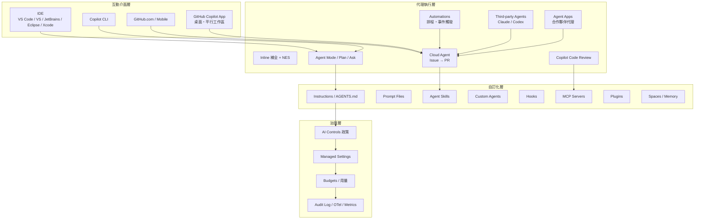
```mermaid
graph TB
    subgraph "互動介面層"
        A[IDE<br/>VS Code / VS / JetBrains / Eclipse / Xcode]
        B[GitHub.com / Mobile]
        C[Copilot CLI]
        D[GitHub Copilot App<br/>桌面・平行工作區]
    end

    subgraph "代理執行層"
        E[Inline 補全 + NES]
        F[Agent Mode / Plan / Ask]
        G[Cloud Agent<br/>Issue → PR]
        H[Automations<br/>排程・事件觸發]
        I[Third-party Agents<br/>Claude / Codex]
        J[Agent Apps<br/>合作夥伴代理]
        K[Copilot Code Review]
    end

    subgraph "自訂化層"
        L[Instructions / AGENTS.md]
        M[Prompt Files]
        N[Agent Skills]
        O[Custom Agents]
        P[Hooks]
        Q[MCP Servers]
        R[Plugins]
        S[Spaces / Memory]
    end

    subgraph "治理層"
        T[AI Controls 政策]
        U[Managed Settings]
        V[Budgets / 用量]
        W[Audit Log / OTel / Metrics]
    end

    A --> F
    B --> G
    C --> F
    D --> G
    F --> L
    G --> N
    K --> Q
    H --> G
    I --> G
    J --> G
    L --> T
    T --> U
    U --> V
    V --> W
```

### 1.2 生態圈各組件說明

| 組件 | 功能定位 | 適用場景 | 資深工程師價值 |
| --- | --- | --- | --- |
| **Copilot Inline Suggestions** | 即時程式碼補全 | 日常編碼、實作細節 | 減少 boilerplate，專注設計 |
| **Next Edit Suggestions (NES)** | 預測下一個編輯位置並建議補全 | 連續編輯、重構 | 加速連續修改流程 |
| **Copilot Chat（Ask）** | 對話式問答、程式碼解釋 | 問題分析、設計討論 | 架構決策輔助、知識傳承 |
| **Copilot Chat（Agent）** | 自主完成多步驟任務 | 複雜開發任務、跨檔案修改 | 自動化實作、整合 MCP |
| **Copilot Chat（Plan）** | 制定詳細實作計畫 | 任務規劃、需求分析 | 在動手前確認方案完整性 |
| **Agent Harness（VS Code）** 🆕 | 選擇由哪個執行框架跑代理：Local／Copilot／Claude／Codex／Cloud | 依任務選擇代理供應商與執行位置 | 同一介面整合多家代理，統一審查與交接 |
| **Copilot CLI** | 終端機中的代理，支援 Plan／Autopilot／`/fleet` 平行子代理 | 明確定義的獨立任務、腳本與 CI | 可程式化、可在 sandbox 中執行 |
| **GitHub Copilot App** 🆕 | 以代理為中心的桌面應用，建構於 Copilot CLI 之上 | 同時推進多個 Issue、管理完整 PR 生命週期 | 以「指揮多代理」取代「自己逐一實作」 |
| **Cloud Agent**¹ | 雲端自主編碼代理 | 從 Issue／Agents 頁面建立 PR | 將例行任務交給代理執行 |
| **Copilot Automations** 🆕 | 讓 Cloud Agent 依排程或事件自動執行 | Issue 分類、夜間修測試、週報 | 把重複性工作變成「設定一次、持續執行」 |
| **GitHub Agentic Workflows**（Public Preview）🆕 | 以 Markdown 定義、編譯為 Actions 的代理工作流程 | 需版控、需 PR 審查的自動化 | 自動化即程式碼（Automation as Code） |
| **Third-party Agents**（Public Preview） | Anthropic Claude／OpenAI Codex 代理 | 依任務選擇最適代理 | 多供應商備援與比較 |
| **Agent Apps**（Public Preview）🆕 | 合作夥伴以 GitHub App 形式提供的代理 | 安全掃描、Feature Flag、分析等外部工具整合 | 將外部系統能力帶入 Issue／PR 流程 |
| **Copilot Code Review** | AI 驅動的程式碼審查，支援 Lite／Balanced 審查深度 | PR 審查、IDE 選取審查 | 提升 Review 效率與一致性 |
| **Copilot PR Summaries** | 自動生成 PR 摘要 | PR 描述撰寫 | 節省文件撰寫時間 |
| **Copilot Spaces** | 策劃式上下文集合，GitHub 來源自動同步 | 集中程式碼、文件、規格 | 為特定任務提供精確上下文 |
| **Copilot Memory**（Public Preview） | 代理自動累積的 repo 事實與使用者偏好 | 使用 Cloud Agent／Code Review／CLI 的持續性專案 | 減少重複說明專案慣例 |
| **Custom Instructions** | 常駐或依檔案套用的指令（含 `AGENTS.md`） | 統一團隊風格 | 確保 AI 輸出符合規範 |
| **Prompt Files** | 可重用的 Prompt 範本（Slash Command） | 標準化工作流程 | 團隊知識共享 |
| **Agent Skills** | 可跨工具共用的能力套件（開放標準） | VS Code／CLI／Cloud Agent／Code Review／App | 封裝團隊最佳實務 |
| **Custom Agents** | 自訂 AI 角色、工具限制與 MCP | 安全審查員、DBA、文件專員等角色 | 建立專業化工作流程 |
| **Hooks** | 在代理生命週期節點執行指令 | 自動格式化、政策攔截、稽核 | 確定性的流程控制 |
| **Plugins** | 將 agents／skills／hooks／MCP／LSP 打包成可安裝套件 | 團隊或企業標準化配置 | 版本化發佈、企業可強制安裝 |
| **MCP (Model Context Protocol)** | 連接外部工具與資料 | 整合企業內部系統 | 擴展代理能力 |
| **Copilot Integrations** | 從 Teams／Slack／Jira／Linear／Azure Boards 觸發 Cloud Agent | 在既有協作工具內指派工作 | 減少上下文切換 |
| **Agents Window**（Preview） | VS Code 的代理優先視窗 | 跨專案編排多個代理工作階段 | 以 prompt 思維驅動多專案開發 |
| **Remote Control／Remote Sessions** 🆕 | 從 GitHub.com／Mobile 監看並操控 CLI 工作階段；VS Code 於 SSH／Tunnel／WSL 主機上執行代理 | 長時間任務、離開座位後持續核准 | 不必守在終端機前 |
| **Cloud／Local Sandbox** 🆕 | 在 GitHub 託管的隔離環境或本機受限沙箱中執行代理 | 高自主度（Autopilot）任務 | 以作業系統層級限制降低風險 |
| **BYOK** 🆕 | 使用自有模型金鑰或本機模型 | 氣隙環境、既有模型合約 | 成本整合、資料控制 |
| **Copilot SDK** 🆕 | 以程式方式嵌入 Copilot 代理能力 | 打造內部 AI 工具 | 在自家產品中重用 Copilot 代理 |
| **GitHub Spark**（Public Preview） | 自然語言建構全端應用 | 快速原型、內部工具 | 快速驗證概念 |
| **Copilot in GitHub Desktop** | 自動生成 commit 訊息 | 日常 Git 操作 | 提升 commit 品質 |

> ¹ **用詞說明**：GitHub 官方文件目前一律使用「**Cloud Agent**」稱呼此雲端自主編碼代理，早期文件稱為「Coding Agent」。本文以下統一採用「Cloud Agent」。
>
> ⚠️ **Edit Mode 已移除**：自 VS Code v1.110 起 Edit Mode 正式棄用，並於 v1.126 起完全移除；Agent Mode 已涵蓋其功能。
>
> 💡 **介面政策彼此獨立**：官方文件說明 GitHub Copilot App 與 Copilot CLI 由**兩條獨立的用戶端政策**控管，組織可以只開放其中一種。

### 1.3 Copilot 在企業開發流程中的定位

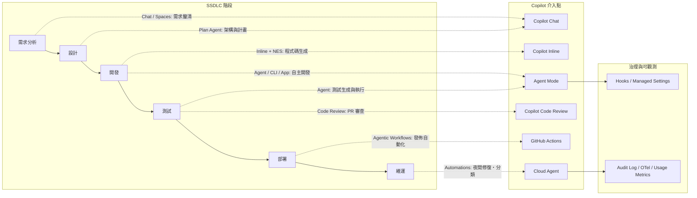
```mermaid
flowchart LR
    subgraph "SSDLC 階段"
        A[需求分析] --> B[設計]
        B --> C[開發]
        C --> D[測試]
        D --> E[部署]
        E --> F[維運]
    end

    subgraph "Copilot 介入點"
        A -.->|Chat / Spaces: 需求釐清| G[Copilot Chat]
        B -.->|Plan Agent: 架構與計畫| G
        C -.->|Inline + NES: 程式碼生成| H[Copilot Inline]
        C -.->|Agent / CLI / App: 自主開發| I[Agent Mode]
        D -.->|Agent: 測試生成與執行| I
        D -.->|Code Review: PR 審查| L[Copilot Code Review]
        E -.->|Agentic Workflows: 發佈自動化| J[GitHub Actions]
        F -.->|Automations: 夜間修復・分類| K[Cloud Agent]
    end

    subgraph "治理與可觀測"
        M[Hooks / Managed Settings]
        N[Audit Log / OTel / Usage Metrics]
    end

    I --> M
    K --> N
```

| SSDLC 階段 | 建議使用的 Copilot 能力 | 人工把關重點 |
| --- | --- | --- |
| 需求分析 | Ask、Spaces（彙整規格與討論串） | 需求正確性、業務規則 |
| 設計 | Plan Agent、Custom Agent（架構審查員） | 架構決策、非功能需求 |
| 開發 | Inline／NES、Agent Mode、Copilot CLI、Copilot App | 程式碼審查、安全性 |
| 測試 | Agent（生成並執行測試）、CLI `task` 子代理 | 測試策略、覆蓋率意義 |
| 審查 | Copilot Code Review（Lite／Balanced）、`security-review` 子代理 | 最終核准責任 |
| 部署與維運 | Automations、Agentic Workflows、Cloud Agent | 變更管理、回復計畫 |

### 1.4 版本與授權模式

GitHub Copilot 目前提供**七種方案**：個人側的 Free／Student／Pro／Pro+／Max，以及組織側的 Business／Enterprise。依官方方案頁，**所有方案都包含 Copilot CLI 與 GitHub Copilot App**；Copilot 目前**不支援 GitHub Enterprise Server（GHES）**。

> ⚠️ **重大計費變更（2026/06/01）**：每次互動依實際消耗的 Token 數，依模型定價換算為 AI Credits 扣除，**1 AI Credit = $0.01 USD**。月費即對應每月內含的 Credits 額度。**程式碼補全與 Next Edit Suggestions 不計費，所有付費方案維持無限使用**。舊的「Premium Requests」計次制，僅適用於尚在年約期間的 Pro／Pro+ 既有訂戶。詳見 [Usage-based billing for individuals](https://docs.github.com/en/copilot/concepts/billing-and-usage/individuals/billing)。

#### 個人方案（AI Credits 計費）

| 方案 | 月費 | 基礎 Credits | 彈性配額（Flex） | 每月合計 | 模型存取 | 代理能力 |
| --- | --- | --- | --- | --- | --- | --- |
| **Copilot Free** | 免費 | 有限配額 | — | 有限配額（另含每月 2,000 次補全） | 僅 Auto Model Selection | 受限（無 Cloud Agent；Code Review 僅 VS Code「Review selection」） |
| **Copilot Student** | 免費（需學生驗證） | 有限配額 | — | 有限配額（補全不限次） | 僅 Auto Model Selection | 含 Cloud Agent，**不含第三方代理** |
| **Copilot Pro** | $10 USD | 1,000 | 500 | 1,500 | 部分模型 | 完整（含第三方代理 Preview） |
| **Copilot Pro+** | $39 USD | 3,900 | 3,100 | 7,000 | 含進階模型 | 完整，另含 Audit logs、GitHub Spark |
| **Copilot Max** | $100 USD | 10,000 | 10,000 | 20,000 | 進階模型**優先存取** | 完整，另含 Audit logs |

> **Flex 配額的性質**：官方說明基礎 Credits 與訂閱價格對應、永不變動；Flex 配額則是「隨 AI 經濟條件（模型價格、新模型、效率改善）調整的變動部分」，會在基礎 Credits 用完後自動套用。採購評估時應以**基礎 Credits** 作為保守估算基準。
>
> **額度重置**：內含 Credits **不遞延**，固定於每月 1 日 00:00:00 UTC 重置（與訂閱扣款日無關）。
>
> **用完之後**：可 (1) 升級方案——只需支付價差，本期已用量併入新方案額度；(2) 設定「額外用量」預算，以 $0.01／Credit 繼續使用（額外用量可能有上限，需先結清才能繼續）；(3) 等待下月重置。
>
> **行動裝置訂閱限制**：透過 GitHub Mobile（iOS／Android）訂閱的使用者，無法加購額外 AI Credits。
>
> **方案轉換**：個人方案使用者若被指派 Business／Enterprise 座位，個人方案會自動取消並按比例退款。

#### 企業方案

| 方案 | 月費（每座位） | 每月 AI Credits（每位使用者，共池） | 主要特色 |
| --- | --- | --- | --- |
| **Copilot Business** | $19 USD | 1,900 | 組織管理、政策控制、Content Exclusion、Audit Logs、組織自訂指令、Cloud Agent、第三方代理 |
| **Copilot Enterprise** | $39 USD | 3,900 | Business 全功能 + 進階模型**優先存取** + GitHub Spark（Public Preview）；需 GitHub Enterprise Cloud |

> **AI Credits 共池（Pooling）**：企業方案的 Credits 以計費實體（組織或企業）為單位共享。例如 100 位 Business 使用者，組織共享 190,000 Credits。**期中新增授權立即增加池額度；期中移除授權不會縮減本期池額度**，於下個計費週期才反映。
>
> ⚠️ **額外用量預設為開啟**：組織與企業的「額外用量」**預設允許**，池用完後會以公告費率自動計費。若要完全禁止超額，管理員必須在 AI Controls 中**明確停用「AI credits paid usage」政策**。
>
> 💡 **四層預算控管**：可設定 User 級預算（上限含共池與額外用量；設為 $0 立即封鎖）、Cost Center 預算、Organization 預算與 Enterprise 支出上限（後三者限制「池用完後」的計費）。**預算用完不會自動改用較便宜的模型**，而是直接停止。詳見 [Budgets for usage-based billing](https://docs.github.com/en/copilot/concepts/billing-and-usage/organizations-and-enterprises/budgets)。
>
> ⚠️ **v7.0 更正：簽約與付款異動**
>
> - v6.0 所述「2026/04/22 起暫停 Business 自助簽約」已不再適用：官方 Changelog 指出 **2026/09/01 起已恢復以信用卡或 PayPal 付款的新客戶自助簽約**。
> - **座位預付制**：新客戶自 2026/09/01、既有客戶自 **2026/10/01** 起，新指派的 Business／Enterprise 座位需先付費才會生效（信用卡／PayPal 客戶優先適用），且內含用量可能按月比例計算。

#### 可用 AI 模型一覽

依據 [官方模型與定價頁](https://docs.github.com/en/copilot/reference/copilot-billing/models-and-pricing) 與 [Supported AI models](https://docs.github.com/en/copilot/reference/ai-models/supported-models) 整理（查證日期 2026-09-25）。官方將模型分為 **Lightweight（輕量）／Versatile（通用）／Powerful（強力）** 三類：

| 供應商 | Lightweight | Versatile | Powerful |
| --- | --- | --- | --- |
| **OpenAI** | GPT-5 mini、GPT-5.4 mini、GPT-5.4 nano、GPT-5.6 Luna、GPT-6 Luna | GPT-5.4、GPT-5.6 Terra | GPT-5.3-Codex、GPT-5.5、GPT-5.6 Sol、GPT-6 Astra、GPT-6 Sol |
| **Anthropic** | — | Claude Haiku 4.5、Sonnet 4、Sonnet 4.6²、Sonnet 5 | Claude Opus 4.7²、Opus 4.8、Opus 4.8 fast mode（Preview）、Opus 5、**Opus 5.5**、Fable 5、**Fable 5.1** |
| **Google** | Gemini 3.5 Flash² | Gemini 3.6 Flash²、**3.7 Flash**、**3.8 Flash** | — |
| **Microsoft** | MAI-Code-1.1-Flash | — | — |
| **xAI** | — | Grok 4.5、**4.6**、**4.7** | — |
| **Moonshot AI** | — | Kimi K2.7 Code² | Kimi K3 |

> ² **即將或已經汰換**：依官方「Model retirement history」，**Claude Sonnet 4.6 已於 2026/09/01 汰換**（僅年約 Pro／Pro+ 個人訂戶仍可使用）；**Claude Opus 4.7、Gemini 3.5 Flash、Gemini 3.6 Flash、Kimi K2.7 Code 將於 2026/10/02 汰換**，建議替代分別為 Opus 5、Gemini 3.8 Flash、Kimi K3。
>
> ⚠️ **v7.0 更正**：v6.0 列出的 Gemini 3.1 Pro、Raptor mini、MAI-Code-1-Flash、Claude Sonnet 4.5、Claude Opus 4.5／4.6 均已於 2026/09 前後汰換（Raptor mini 建議改用 MAI-Code-1.1-Flash、Gemini 3.1 Pro 建議改用 Gemini 3.6 Flash），已自現行清單移除。
>
> 💡 **擴充能力**：多數新世代模型支援 **100 萬 Token 上下文視窗**（僅 VS Code 與 Copilot CLI）與**可調整推理強度**（VS Code、CLI、Cloud Agent）。兩者都會增加 Token 消耗，官方建議平時使用一般設定，僅在必要時開啟。

**方案存取邏輯：**

| 方案 | 模型選取方式 |
| --- | --- |
| **Free／Student** | 僅能使用 Auto Model Selection，無法手動指定模型 |
| **Pro** | 可手動選擇多數 Lightweight／Versatile 模型；Opus 4.7 以上、Fable 系列、GPT-5.5、GPT-5.6 Sol、GPT-6 Astra／Sol 等頂級模型需 Pro+ 以上 |
| **Pro+** | 可手動選擇含進階模型在內的絕大多數模型 |
| **Max／Enterprise** | 進階模型**優先存取**（Priority access） |
| **Business** | 可存取進階模型，實際可用清單由組織／企業的模型政策決定 |

> ⚠️ **法遵重點：Claude Fable 5／5.1 的資料保留**：官方方案頁註明，使用 Fable 5／5.1 時，Anthropic **預設會保留提示與輸出**以運作安全分類器，這與其他 Claude 模型的零資料保留（ZDR）不同。企業可經 GitHub 客戶團隊申請，在 **2026 年底前**以 ZDR 端點使用；之後需改採 Anthropic 的 Enterprise Frontier Safeguards（EFS）。即使核准，管理員仍需逐一啟用模型；且啟用者須同意僅供內部營運使用。受監管產業在啟用 Fable 系列前，應先完成法遵評估。
>
> 💡 **GPT-5.4 nano 特例**：目前僅限 Codex VS Code 擴充套件（Pro+ 方案）使用，不在 Copilot Chat 選單中提供。
>
> 💡 各模型於各方案的開放範圍變動頻繁（新模型常先開放高階方案），採購或稽核用途請直接查詢官方即時清單。

#### Per-Token 定價一覽（每 100 萬 Token）

所有 AI 互動均以 Token 消耗換算為 AI Credits（1 AI Credit = $0.01 USD）。以下依官方定價頁整理（查證日期 2026-09-25）。「長上下文」列表示輸入 Token 超過門檻後適用的較高單價。

##### OpenAI 模型

| 模型 | 類別 | 分級（輸入門檻） | 輸入 | 快取輸入 | 快取寫入 | 輸出 |
| --- | --- | --- | ---: | ---: | ---: | ---: |
| GPT-5 mini | Lightweight | — | $0.25 | $0.025 | — | $2.00 |
| GPT-5.3-Codex | Powerful | — | $1.75 | $0.175 | — | $14.00 |
| GPT-5.4 | Versatile | 預設（≤ 272K） | $2.50 | $0.25 | — | $15.00 |
| GPT-5.4 | Versatile | 長上下文（> 272K） | $5.00 | $0.50 | — | $22.50 |
| GPT-5.4 mini | Lightweight | — | $0.75 | $0.075 | — | $4.50 |
| GPT-5.4 nano | Lightweight | — | $0.20 | $0.02 | — | $1.25 |
| GPT-5.5 | Powerful | 預設（≤ 272K） | $5.00 | $0.50 | — | $30.00 |
| GPT-5.5 | Powerful | 長上下文（> 272K） | $10.00 | $1.00 | — | $45.00 |
| GPT-5.6 Luna | Lightweight | 預設（≤ 200K） | $0.20 | $0.02 | $0.25 | $1.20 |
| GPT-5.6 Luna | Lightweight | 長上下文（> 200K） | $0.40 | $0.04 | $0.50 | $1.80 |
| GPT-5.6 Terra | Versatile | 預設（≤ 272K） | $2.00 | $0.20 | $2.50 | $12.00 |
| GPT-5.6 Terra | Versatile | 長上下文（> 272K） | $4.00 | $0.40 | $5.00 | $18.00 |
| GPT-5.6 Sol | Powerful | 預設（≤ 272K） | $4.00 | $0.40 | $5.00 | $20.00 |
| GPT-5.6 Sol | Powerful | 長上下文（> 272K） | $8.00 | $0.80 | $10.00 | $30.00 |
| GPT-6 Luna | Lightweight | 預設（≤ 272K） | $0.10 | $0.01 | $0.125 | $0.50 |
| GPT-6 Luna | Lightweight | 長上下文（> 272K） | $0.20 | $0.02 | $0.25 | $0.75 |
| GPT-6 Sol | Powerful | 預設（≤ 272K） | $2.00 | $0.20 | $2.50 | $10.00 |
| GPT-6 Sol | Powerful | 長上下文（> 272K） | $4.00 | $0.40 | $5.00 | $15.00 |
| GPT-6 Astra | Powerful | 預設（≤ 272K） | $10.00 | $1.00 | $12.50 | $50.00 |
| GPT-6 Astra | Powerful | 長上下文（> 272K） | $20.00 | $2.00 | $25.00 | $75.00 |

> 💡 GPT-5.6 與 GPT-6 系列開始計收**快取寫入**費用，較早的 OpenAI 模型則無此項。

##### Anthropic 模型（含快取寫入成本）

| 模型 | 類別 | 輸入 | 快取輸入 | 快取寫入 | 輸出 |
| --- | --- | ---: | ---: | ---: | ---: |
| Claude Haiku 4.5 | Versatile | $1.00 | $0.10 | $1.25 | $5.00 |
| Claude Sonnet 4／4.6 | Versatile | $3.00 | $0.30 | $3.75 | $15.00 |
| Claude Sonnet 5 | Versatile | $2.00 | $0.20 | $2.50 | $10.00 |
| Claude Opus 4.7／4.8／5 | Powerful | $5.00 | $0.50 | $6.25 | $25.00 |
| Claude Opus 5.5 | Powerful | $4.00 | $0.20 | $5.00 | $20.00 |
| Claude Opus 4.8（fast mode，Preview） | Powerful | $10.00 | $1.00 | $12.50 | $50.00 |
| Claude Fable 5 | Powerful | $10.00 | $1.00 | $12.50 | $50.00 |
| Claude Fable 5.1 | Powerful | $10.00 | $0.25 | $12.50 | $50.00 |

> ⚠️ **v7.0 更正**：Claude Sonnet 5 的促銷期已於 2026/08/31 結束，現行官方定價為輸入 $2.00／輸出 $10.00。值得注意的是 **Opus 5.5 的單價反而低於 Opus 5**，升級新世代通常同時帶來成本下降。

##### Google、Microsoft、xAI、Moonshot AI 模型

| 供應商 | 模型 | 類別 | 分級 | 輸入 | 快取輸入 | 輸出 |
| --- | --- | --- | --- | ---: | ---: | ---: |
| Google | Gemini 3.5 Flash | Lightweight | — | $1.50 | $0.15 | $9.00 |
| Google | Gemini 3.6／3.7／3.8 Flash³ | Versatile | — | $0.75 | $0.075 | $3.75 |
| Microsoft | MAI-Code-1.1-Flash | Lightweight | — | $0.20 | $0.02 | $1.20 |
| xAI | Grok 4.5／4.6／4.7 | Versatile | 預設（≤ 200K） | $2.00 | $0.50 | $6.00 |
| xAI | Grok 4.5／4.6／4.7 | Versatile | 長上下文（> 200K） | $4.00 | $1.00 | $12.00 |
| Moonshot AI | Kimi K2.7 Code | Versatile | — | $0.95 | $0.19 | $4.00 |
| Moonshot AI | Kimi K3 | Powerful | — | $3.00 | $0.30 | $15.00 |

> ³ Gemini 3.6／3.7／3.8 Flash 目前為**促銷價**，官方註明適用至 **2026/12/31**，之後可能調整。
>
> 💡 **成本估算提示**：輕量級問答（GPT-6 Luna、GPT-5 mini、MAI-Code-1.1-Flash）每次互動通常只消耗零點幾個 Credits；使用 Powerful 級模型的長時間 Agent session（GPT-6 Astra、Claude Fable 系列）則可能消耗數十至數百 Credits。以輸出單價計，最便宜與最昂貴的模型相差可達 **100 倍**。
>
> 💡 **年約舊制訂戶**：仍在 Premium Requests 計次制下的年約 Pro／Pro+ 訂戶，適用另一套「模型倍率」，詳見官方 [Model multipliers for annual plans](https://docs.github.com/en/copilot/reference/copilot-billing/request-based-billing-legacy/model-multipliers-for-annual-plans)。

#### 自動模型選擇（Auto Model Selection）

> 📍 官方文件位於 [`concepts/models/auto-model-selection`](https://docs.github.com/en/copilot/concepts/models/auto-model-selection)。

Auto Model Selection 不只是「幫你挑模型」，而是結合**即時系統健康度**與**任務複雜度評估**兩套機制的路由系統。它會在**快取邊界**切換模型，以避免中途換模型造成額外的快取成本（官方指出中途切換模型「成本增加但品質沒有相應提升」）。

**兩種模式：**

| 模式 | 設計目標 | GA 範圍 |
| --- | --- | --- |
| **Auto with task optimization** | 依任務性質挑選最有效率的模型 | GitHub.com Chat、VS Code、Copilot CLI、GitHub Copilot App、Cloud Agent |
| **Auto optimized for reliability and availability** | 優先降低速率限制、延遲與錯誤 | JetBrains、Eclipse、Xcode、Visual Studio |

**🆕 Auto 分級（Tiers，2026/09 上線，僅 VS Code、Copilot CLI、Copilot App）：**

| 分級 | 優先考量 | 適用情境 |
| --- | --- | --- |
| **Efficiency** | 成本 | 快速、直接的任務 |
| **Balance** | 兼顧成本、品質與延遲 | 日常工作（建議預設） |
| **Intelligence** | 品質 | 複雜任務 |

不論選哪個分級，仍依實際被選用的模型計費，並同樣享有折扣。

**重點規則：**

- **適用範圍**：所有方案皆可使用；Free 與 Student 事實上**只能**透過 Auto 使用模型。
- **10% 折扣**：付費方案在 **Copilot Chat、Copilot CLI、GitHub Copilot App、Cloud Agent** 中使用 Auto，可享模型費用 10% 折扣。
- **排除項目**：方案不含的模型、管理員政策排除的模型、受「資料落地（data residency）」或 FedRAMP 政策限制排除的模型，以及被政策排除的**評估中模型（evaluation models）**。
- **評估中模型**：個人方案的 Auto 可能會使用評估中模型，個人使用者可隨時停用。
- **目前候選池**（官方表列，會隨時間變動）：GPT-5.4、GPT-5.5、GPT-5.6 Luna／Sol／Terra、GPT-6 Astra、Claude Haiku 4.5、Opus 4.8、Opus 5、Sonnet 4.6、Sonnet 5、Gemini 3.6／3.7 Flash、MAI-Code-1.1-Flash。
- **第三方代理的 Auto 候選池**：OpenAI Codex 為 GPT-5.3-Codex、GPT-5.4、GPT-5.4 nano；Anthropic Claude 為 Claude Opus 4.7、Sonnet 4.6。（註：後兩者已排定或已完成汰換，官方頁面尚未同步，實際以介面為準。）
- **查看實際使用的模型**：Chat 中將滑鼠移到回應上；CLI 會在終端機顯示；Cloud Agent 顯示在回應結尾；Copilot App 顯示於 **Auto** 旁的模型選擇器。

> 💡 **社群觀察（實驗性功能）**：2026/09 的 Changelog 另提到 Copilot CLI 的實驗性功能「Project HydraFusion」，會在本機、雲端與複合模型之間自動做語意路由。該功能仍屬實驗階段，企業環境暫不建議採用。

#### 模型治理：Base／LTS 模型、Utility 模型與 BYOK

> 🆕 **v7.0 新增**

| 機制 | 說明 | 適用方案 | 治理意義 |
| --- | --- | --- | --- |
| **Base 模型** | 當沒有其他模型被啟用時的預設模型。新 Base 模型公告後有 60 天升級窗口，第 60 天自動啟用。**2026/03/18 起為 GPT-5.3-Codex** | Business／Enterprise | 確保最嚴格的模型政策下仍有可用模型 |
| **LTS 模型** | GitHub 承諾自指定日起**支援一年**不下架。**GPT-5.3-Codex 自 2026/03/18 起為 LTS**（至 2027/03 前後） | Business／Enterprise | 需長期穩定行為的流程（例如受稽核的自動化）可鎖定 LTS 模型 |
| **Utility 模型** | 支援 commit 訊息、對話標題等背景功能的小型模型（目前為 GPT-4o mini、GPT-4o、GPT-4.1、GPT-5.4 nano） | 全方案 | **不出現在模型選單、不能單獨停用、不計入用量計費**，但有每位使用者的速率限制 |
| **評估中模型** | 以評估為目的提供的模型 | 個人方案 | 企業可透過政策排除 |
| **本機 BYOK** | 在 VS Code、JetBrains、Xcode、Copilot CLI、Copilot App、Copilot SDK 中設定自有金鑰或本機模型；金鑰只在用戶端處理 | 全方案（企業可用政策停用） | 適合氣隙環境；但也可能繞過企業模型治理，**應評估是否停用** |
| **企業 BYOK**（Public Preview） | 企業擁有者在企業設定中新增自訂模型金鑰，可授權組織擁有者自行新增（「Enable custom models」政策） | Business／Enterprise | 由伺服器端統一提供，使用者像選 GitHub 託管模型一樣選用 |
| **預設開放政策** | 「Default availability for released models」決定新 GA 模型預設是否開放 | Business／Enterprise | 見 [1.8 近期重要時程](#18-近期重要時程與企業行動項目) |

> ⚠️ **企業使用注意**：Business／Enterprise 承諾不使用您的程式碼訓練模型，這對金融業等受監管產業至關重要；但如上所述，**個別模型（如 Fable 系列）可能有不同的資料保留條款**，需逐一審查。

### 1.5 AI Credits 計費機制詳解

2026 年 6 月 1 日起，GitHub Copilot 全面從 Premium Requests（固定次數）切換至 AI Credits（Token 用量計費）。資深工程師與企業管理者必須深入理解此機制，才能有效管理成本。

#### 1.5.1 AI Credits 運作原理

```text
使用者互動 → 消耗 Token（輸入 + 輸出 + 快取讀取／寫入） → 依模型定價換算 → AI Credits 扣除
                                                              1 AI Credit = $0.01 USD
```

**影響消耗量的主要因素：**

| 因素 | 說明 | 成本影響 |
| --- | --- | --- |
| **對話長度與複雜度** | 越長的對話累積越多 Token | 線性增長 |
| **Agentic 功能** | Agent Mode、Cloud Agent、Autopilot、`/fleet` 會在單一任務中多次呼叫模型 | 顯著增長（可能 10-100 倍） |
| **模型選擇** | Powerful 級模型成本遠高於 Lightweight 級 | 輸出單價差距可達 100 倍 |
| **擴充能力** | 100 萬 Token 上下文、高推理強度 | 依消耗 Token 同步增加 |
| **子代理** | 每個子代理獨立與模型互動（CLI 子代理預設使用低成本模型） | 平行化會增加總呼叫次數 |
| **程式碼補全／NES／Utility 模型** | **不消耗 AI Credits** | 零成本 |

#### 1.5.2 Credits 使用優先順序

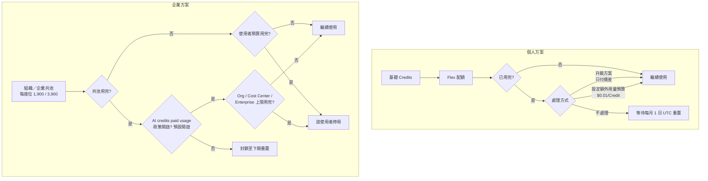
```mermaid
flowchart TB
    subgraph "個人方案"
        A[基礎 Credits] --> B[Flex 配額]
        B --> C{已用完?}
        C -->|否| D[繼續使用]
        C -->|是| E{處理方式}
        E -->|升級方案<br/>只付價差| D
        E -->|設定額外用量預算<br/>$0.01/Credit| D
        E -->|不處理| F[等待每月 1 日 UTC 重置]
    end

    subgraph "企業方案"
        G[組織／企業共池<br/>每座位 1,900 / 3,900] --> H{共池用完?}
        H -->|否| I{使用者預算用完?}
        I -->|否| J[繼續使用]
        I -->|是| K[該使用者停用]
        H -->|是| L{AI credits paid usage<br/>政策開啟? 預設開啟}
        L -->|是| M{Org / Cost Center /<br/>Enterprise 上限用完?}
        M -->|否| J
        M -->|是| K
        L -->|否| F2[封鎖至下期重置]
    end
```

> 💡 企業使用者用完額度時，GitHub.com 會顯示橫幅，讓使用者向管理員**申請提高預算**；此申請與核准流程已於 2026/09 正式推出（GA）。

#### 1.5.3 哪些功能消耗 AI Credits

| 功能 | AI Credits | GitHub Actions 分鐘數 | 其他計量 |
| --- | :---: | :---: | --- |
| Copilot Chat（所有模式，含 Spaces） | ✅ | — | Free 方案計入每月 Chat 上限 |
| Copilot CLI／GitHub Copilot App | ✅ | — | Cloud sandbox 另計運算、記憶體與儲存費用 |
| Cloud Agent（含第三方代理、Agent Apps） | ✅ | ✅ | — |
| Copilot Automations | ✅ | ✅ | 計入**建立該自動化的使用者** |
| Copilot Code Review | ✅ | ✅ | 見 1.5.4 |
| GitHub Agentic Workflows | ✅（預設引擎） | ✅ | 第三方引擎由該供應商計費 |
| GitHub Spark | ✅ | — | — |
| 程式碼補全、NES | ❌ | — | 付費方案不限次數 |
| Utility 模型（commit 訊息、標題等） | ❌ | — | 有速率限制 |

**Cloud Sandbox 計價（官方表列）：**

| 計量 | 說明 | 單位 | 價格（USD） |
| --- | --- | --- | --- |
| Compute | 雲端沙箱執行時間 | 每運算秒 | $0.000024 |
| Memory | 執行中配置的記憶體 | 每 GiB 秒 | $0.000003 |
| Storage | 停止中工作階段的快照儲存 | 每 GiB 月 | $0.005 |

#### 1.5.4 Copilot Code Review 的特殊計費

Code Review 採用**雙重計費**：Token 消耗以 AI Credits 計費，代理基礎設施則消耗 GitHub Actions 分鐘數。它也是**少數使用者無法得知、也無法指定所用模型**的功能，因此每次審查的單價可能不同。

| 項目 | 規則 |
| --- | --- |
| **預估成本** | 官方估計每次審查約：**Lite** $0.05–$1 USD、**Balanced** $0.25–$5 USD（不含 Actions 分鐘數）；PR 越大、repository 自訂指令越多，消耗越高 |
| **Credits 歸屬** | 手動請求：歸屬於**請求者**；政策自動觸發：歸屬於 **PR 作者** |
| **Cloud Agent 建立的 PR** | 先歸屬於該變更的**人類共同作者**；無法計費時直接由組織負擔 |
| **其他 Bot 的 PR** | 直接由組織負擔（仍可進行代理式審查） |
| **無授權成員** | 若組織開放無授權成員使用 Code Review，其消耗一律以額外用量計入組織／企業 |
| **Actions 分鐘數** | 歸屬於 repository，再歸入企業或 Cost Center；Self-hosted runner 不消耗分鐘數 |
| **預算用完** | 使用者預算或企業／Cost Center 上限用完時，Code Review 與其他功能一起被封鎖 |

> ⚠️ **2026/09/28 起預設審查深度改為 Balanced**：官方 Changelog 公告，Code Review 的預設深度將由 Lite 改為 **Balanced**，單次成本上限約為原本的 5 倍。若組織希望維持 Lite，**必須在 repository 或組織設定中明確選擇 Lite**。
>
> 💡 **查看用量**：GitHub Actions metrics 篩選 `copilot-pull-request-reviewer` workflow；或在 Billing usage report 以 `workflow_path` 篩選 `dynamic/agents/copilot-pull-request-reviewer`。

#### 1.5.5 企業成本管控策略

| 策略 | 做法 | 預期效果 |
| --- | --- | --- |
| **導入前先定超額政策** | 保守做法：停用「AI credits paid usage」，只對核准的 Cost Center 開放；彈性做法：允許少量超額，並在其上設 Cost Center 預算 | 避免「額外用量預設開啟」造成意外帳單 |
| **分層預算** | Enterprise → Cost Center → User 同時生效的多層預算 | 單一使用者或團隊失控時不影響全體 |
| **啟用 Auto Model Selection** | 預設使用 Auto（可透過 managed settings 的 `"model": "auto"` 強制新對話預設 Auto），日常工作搭配 **Balance** 分級 | 享 10% 折扣，並將簡單任務導向低成本模型 |
| **設定 Session 上限** | 在 Copilot CLI／Copilot SDK 中設定 **AI credit session limit**，達上限時代理會乾淨地停下並詢問是否繼續 | 防止單一長任務失控（不取代月預算） |
| **明確設定 Code Review 深度** | 一般 repo 設為 Lite，只對關鍵系統使用 Balanced | 避免 9/28 預設改為 Balanced 後成本倍增 |
| **限制 Autopilot 與 `/fleet`** | 僅用於定義明確的任務，並設定 `--max-autopilot-continues` | 避免無人監督的連續消耗 |
| **善用使用洞察** | Copilot App／CLI 執行 `/chronicle cost tips` 找出昂貴的使用模式 | 以資料驅動使用習慣調整 |
| **固定檢視節奏** | 導入期**每週**、穩定後**每月**檢視用量與預算，並用 REST API 批次調整使用者預算 | 及早發現異常消耗 |
| **汰換提醒** | 追蹤模型汰換時程，提前遷移到新世代（通常更便宜） | 同時降低成本與中斷風險 |

> 💡 **產業觀察（社群建議）**：[GitHub Well-Architected〈Managing AI credits〉](https://learn.github.com/well-architected/library/governance/recommendations/managing-ai-credits/) 建議把預算設計成「同時生效的多層護欄」，導入期每週檢視、穩定後每月檢視。另外，[CloudZero 的分析](https://www.cloudzero.com/blog/github-copilot-enterprise-pricing/) 指出所謂「九月懸崖」：2026/06–08 推廣期內，Business 每座位 3,000、Enterprise 7,000 Credits；**9/1 起回到標準額度 1,900／3,900**（分別減少約 37% 與 44%）。許多企業 9 月才收到第一張「真實帳單」，因此建議以 6–7 月的實際用量，依標準額度重新試算。

#### 1.5.6 用戶端最低版本需求

> 🆕 **v7.0 新增**

官方建議至少升級至下列版本，否則用戶端可能顯示錯誤的模型價格、不準確的用量，或收不到用量警示：

| IDE／用戶端 | 最低版本 |
| --- | --- |
| VS Code | 1.120 |
| Visual Studio 2022（17.x） | 17.14.33 |
| Visual Studio 2026（18.x） | 18.6.0 |
| SQL Server Management Studio | 22.6 |
| JetBrains IDEs（外掛） | 1.9.1 |
| Eclipse（外掛） | 0.18.0 |
| Xcode（擴充套件） | 0.50.0 |
| Copilot CLI | 1.0.48 |

> 💡 企業可透過 MDM 或軟體派送工具強制最低版本，並將版本合規納入導入檢查清單（見 [附錄 C](#c-團隊導入檢查清單)）。

### 1.6 Copilot Cloud Agent 整合平台

Copilot Cloud Agent 可與多個外部平台整合，讓團隊從既有工作流中直接觸發代理任務，減少上下文切換。

> 📍 官方文件路徑已變更為 [`concepts/tools/about-copilot-integrations`](https://docs.github.com/en/copilot/concepts/tools/about-copilot-integrations)。

#### 支援的整合平台

| 平台 | 整合方式 | 典型情境 |
| --- | --- | --- |
| **Microsoft Teams** | 在 Teams 訊息與頻道中與 Cloud Agent 協作 | 在討論中直接指派開發任務 |
| **Slack** | 在 Slack Workspace 中與 Cloud Agent 協作 | 將討論轉化為 PR |
| **Linear** | 從 Linear Issue 觸發 Cloud Agent | Issue 自動轉為程式碼變更 |
| **Azure Boards** | 從 Work Item 觸發 Cloud Agent | 將 Azure DevOps 任務自動化 |
| **Jira** | 從 Jira Workspace 觸發 Cloud Agent | 將 Jira Issue 轉為 PR |

> 💡 使用整合前，該 repository 必須已啟用 Cloud Agent（Pro 以上個人方案，或由管理員開啟 Cloud Agent 政策的 Business／Enterprise）。

#### 整合核心優勢

- **無縫工作流**：在既有工具中直接與代理協作，不必切換到 GitHub
- **上下文感知**：代理會擷取**整個討論串或 Issue** 作為上下文
- **團隊協作**：成員可從共享平台觸發代理，結果自動反映於 PR
- **資料用途透明**：擷取的上下文會保存在代理建立的產出物（如 PR）中，便於稽核

> ⚠️ **安全提醒**：整合平台的**整段討論串**都會傳送給代理。避免在討論中包含機敏資訊（API Key、密碼、客戶個資）。

#### 第三方 Coding Agents 與 Agent Apps

> 🆕 **v7.0 新增**

除了 Copilot 自有代理，GitHub 也開放其他供應商的代理在同一套流程中運作：

| 類型 | 說明 | 入口 | 啟用條件 | 計費 |
| --- | --- | --- | --- | --- |
| **第三方 Coding Agents**（Public Preview） | Anthropic Claude、OpenAI Codex 以非同步方式處理任務並開 PR；可選模型：Codex 為 Auto／GPT-5.3-Codex／GPT-5.4／GPT-5.4 nano，Claude 為 Auto／Opus 4.7／Sonnet 4.6 | Agents 頁籤、Issue 指派、PR 中 `@AGENT_NAME`、GitHub Mobile、VS Code | Pro／Pro+／Max 於個人政策開啟；Business／Enterprise 由組織或企業政策開啟 | AI Credits |
| **Agent Apps**（Public Preview） | 合作夥伴以 GitHub App 形式提供的代理，可自帶 prompt、模型、工具與 MCP，並透過 GitHub 簽發的 JWT 與合作夥伴系統互信 | Issue 指派、PR 中 `@AGENT-NAME`、Agents 頁籤 | 安裝 App 並同意啟用代理功能；企業需開啟「Agent apps」政策；首次使用需 OAuth 授權 | 由 Cloud Agent 驅動，消耗 AI Credits |

> 🔐 **安全驗證**：第三方代理產生或修改的程式碼，GitHub 會自動以 **CodeQL** 與 **Secret scanning** 掃描，並嘗試在 PR 定稿前修正問題。第三方代理也適用與 Cloud Agent 相同的保護與限制。
>
> ⚠️ **治理建議**：Agent Apps 會把 repository 內容帶往合作夥伴系統，應比照第三方 SaaS 進行供應商風險評估，再開啟企業政策。

#### Copilot App 內建整合

> 🆕 **v7.0 新增**

2026/09 起，GitHub Copilot App 的 Canvas 已提供 **Jira、Azure DevOps、Sentry** 整合（皆為 GA）。例如可直接從 Sentry 的當機報告啟動調查與修復工作階段。這類整合的上下文擷取與權限，同樣應納入供應商風險評估。

### 1.7 2025-2026 年新功能重點摘要

以下依類別整理近期重要更新（完整時間軸見 [附錄 F](#f-2026-年功能時間軸whats-new)）：

| 功能 | 類別 | 說明 | 影響程度 |
| --- | --- | --- | --- |
| **🔴 AI Credits 用量計費（2026/06）** | 計費 | Premium Requests 改為 Token 用量計費 | 🔴 高 |
| **AI Credits 共池與四層預算** | 計費 | 企業 Credits 以組織為單位共享；Enterprise／Org／Cost Center／User 預算 | 🔴 高 |
| **額外用量預設開啟** | 計費 | 企業需主動停用「AI credits paid usage」才能禁止超額 | 🔴 高 |
| **推廣期加倍額度結束（2026/08/31）** | 計費 | Business 3,000 → 1,900、Enterprise 7,000 → 3,900 | 🔴 高 |
| **座位預付制（2026/09–10）** | 計費 | 新指派座位需先付款才生效 | 🟡 中 |
| **預算提高申請流程（2026/09 GA）** | 計費 | 使用者可向管理員申請提高預算並由管理員核准 | 🟡 中 |
| **Copilot Max 方案** | 計費 | $100／月、20,000 Credits、進階模型優先存取 | 🟡 中 |
| **Auto Model Selection 分級（2026/09）** | 模型 | Efficiency／Balance／Intelligence 三級 | 🔴 高 |
| **GPT-6 世代模型** | 模型 | GPT-6 Astra／Sol／Luna 上線 | 🔴 高 |
| **Claude Opus 5.5、Fable 5.1** | 模型 | 新旗艦模型；Fable 系列有資料保留條款 | 🔴 高 |
| **Gemini 3.7／3.8 Flash、Grok 4.6／4.7** | 模型 | Gemini Flash 促銷價至 2026/12/31 | 🟡 中 |
| **大規模模型汰換（2026/09/01、10/02）** | 模型 | Sonnet 4.5／4.6、Opus 4.5／4.6、Gemini 3.1 Pro、Raptor mini 等下架；Opus 4.7 等排定汰換 | 🔴 高 |
| **Base／LTS 模型（GPT-5.3-Codex）** | 模型 | 企業預設模型與一年支援承諾 | 🟡 中 |
| **企業 BYOK（Public Preview）** | 模型 | 企業統一提供自訂模型 | 🟡 中 |
| **GitHub Copilot App** | 平台 | 代理優先的桌面應用：平行工作區、Interactive／Plan／Autopilot、Canvas、`/chronicle` | 🔴 高 |
| **Copilot Automations** | 代理 | Cloud Agent 依排程或事件自動執行；VS Code Agents Window 亦提供本機排程（Preview，逐步推出中） | 🔴 高 |
| **GitHub Agentic Workflows（Public Preview）** | 代理 | 以 Markdown 定義、編譯為 Actions 的代理工作流程 | 🔴 高 |
| **Agent Apps（Public Preview）** | 代理 | 合作夥伴代理以 GitHub App 形式提供 | 🟡 中 |
| **VS Code Agent Harness／Agent Host** | 平台 | Session Target 選擇 Local／Copilot／Claude／Codex／Cloud | 🔴 高 |
| **權限層級改版** | 代理權限 | Manual／Assisted／Allow all；Autopilot 改為代理模式 | 🔴 高 |
| **Agent Sandboxing** | 安全 | VS Code 終端機沙箱、CLI 本機沙箱、Cloud sandbox | 🔴 高 |
| **Copilot CLI 內建代理增為 7 個** | 代理 | 新增 `security-review`；`research` 僅能以 `/research` 啟動 | 🔴 高 |
| **CLI `/fleet`、Autopilot、Remote Control** | 代理 | 平行子代理、全自主執行、從 GitHub.com／Mobile 遠端操控 | 🔴 高 |
| **Plugins（Agent Plugins 1.0 標準）** | 自訂 | 可攜式外掛格式，企業可透過 managed settings 強制安裝或限制來源 | 🔴 高 |
| **Enterprise Managed Settings** | 治理 | `managed-settings.json` 集中管控權限、MCP 允許清單、外掛、遙測、沙箱 | 🔴 高 |
| **OpenTelemetry 監控** | 治理 | 將代理 traces／metrics／events 匯出至企業可觀測性平台 | 🟡 中 |
| **新功能預設開放政策（2026/10/22 生效）** | 治理 | 未設定的 GA 功能將預設開放 | 🔴 高 |
| **統一 Copilot 體驗（最早 2026/09/28）** | 平台 | GitHub.com Chat、Mobile Chat 與 Cloud Agent 合併；對話保存期延長 | 🔴 高 |
| **Code Review 升級** | 審查 | Lite／Balanced 深度（9/28 起預設 Balanced）、自動 resolve 已處理的意見、Copilot approvals（Preview）、無授權成員可用、支援 Azure DevOps（Preview） | 🔴 高 |
| **Copilot Memory（Public Preview）** | 上下文 | 個人方案預設開啟；事實附引用並驗證 | 🟡 中 |
| **Spaces 自動同步** | 上下文 | GitHub 來源隨專案變動自動更新；IDE 透過 GitHub MCP server 使用 | 🟡 中 |
| **Copilot Integrations** | 整合 | Teams／Slack／Jira／Linear／Azure Boards | 🟡 中 |
| **Copilot Impact 儀表板功能採用度（2026/09）** | 治理 | 顯示各主要功能的活躍使用者數 | 🟡 中 |
| **Edit Mode 移除** | Chat 模式 | v1.110 起棄用、v1.126 起移除 | 🟢 低 |

### 1.8 近期重要時程與企業行動項目

> 🆕 **v7.0 新增**

> 以下為截至 2026-09-25 已公告、且需要企業在期限前採取行動的事項。日期以官方文件與 Changelog 為準。

| 日期 | 事項 | 影響對象 | 建議行動 |
| --- | --- | --- | --- |
| 2026/08/31 | 推廣期加倍 Credits 結束 | Business／Enterprise | 以 6–8 月用量依標準額度重算；檢視 9 月帳單 |
| 2026/09/01 | 大批模型汰換；Business／Enterprise 恢復信用卡／PayPal 自助簽約 | 全體 | 更新 Custom Agent、Prompt File、Automations 中寫死的模型名稱 |
| **2026/09/28（最早）** | **統一 Copilot 體驗**：GitHub.com Chat、Mobile Chat 與 Cloud Agent 合併，改由單一政策控管，預設啟用；**Chat 資料保存期由 28 天延長為帳號存續期間** | 全體 | 在上線前檢視新政策；法遵單位評估保存期變更（選擇退出將失去 GitHub.com／Mobile 上的 Copilot） |
| **2026/09/28** | **Code Review 預設深度改為 Balanced** | 使用 Code Review 的組織 | 若要維持 Lite，須先在組織或 repository 設定中明確選擇 |
| 2026/10/01 | 既有客戶的新指派座位改為預付 | Business／Enterprise（信用卡／PayPal 優先） | 通知財務與授權管理窗口 |
| 2026/10/02 | Claude Opus 4.7、Gemini 3.5／3.6 Flash、Kimi K2.7 Code 汰換 | 全體 | 遷移至 Opus 5／Gemini 3.8 Flash／Kimi K3 |
| **2026/10/22** | **「Default policy for new features」生效**：所有「未設定（Unconfigured）」的 GA 功能與由預覽轉為 GA 的功能**將預設開放** | Business／Enterprise | 立即盤點 AI Controls 中未設定的政策，逐一明確設定（此政策預設為開啟） |
| 2026/12/31 | Gemini 3.6–3.8 Flash 促銷價結束；Fable 系列 ZDR 豁免期結束 | 全體／使用 Fable 的企業 | 重新試算成本；評估 EFS 或停用 Fable |
| 2027/03（約） | GPT-5.3-Codex 一年 LTS 承諾期屆滿 | Business／Enterprise | 關注新的 LTS 模型公告 |

---

## 第二章 Copilot 與「資深工程師角色」的正確關係

> 📌 **本章摘要**：釐清 AI 與資深工程師的分工。AI 負責加速實作與知識檢索，人類負責設計決策、業務判斷與最終品質責任。在代理時代，資深工程師的角色進一步從「實作者」轉變為「代理指揮者與審查者」。

### 2.1 思維轉換：從「工具」到「協作夥伴」

資深工程師使用 Copilot 的心態應該是：

```text
❌ 錯誤心態：「讓 AI 幫我寫程式」
✅ 正確心態：「讓 AI 加速我的思考與實作」
```

#### 角色定位比較

| 面向 | 傳統開發 | AI 輔助開發 |
| ------ | ---------- | ------------- |
| **設計決策** | 工程師主導 | 工程師主導，AI 提供選項 |
| **實作細節** | 工程師撰寫 | AI 建議，工程師審核 |
| **品質把關** | Code Review | Code Review + AI 輸出審核 |
| **知識應用** | 查文件、經驗 | AI 快速提供，工程師驗證 |

### 2.2 資深工程師的不可取代價值

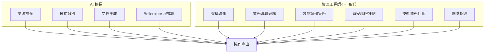
```mermaid
graph TB
    subgraph "AI 擅長"
        A[語法補全]
        B[模式識別]
        C[文件生成]
        D[Boilerplate 程式碼]
    end
    
    subgraph "資深工程師不可取代"
        E[架構決策]
        F[業務邏輯理解]
        G[效能調優策略]
        H[資安風險評估]
        I[技術債務判斷]
        J[團隊指導]
    end
    
    A --> K[協作產出]
    B --> K
    C --> K
    D --> K
    E --> K
    F --> K
    G --> K
    H --> K
    I --> K
    J --> K
```

### 2.3 正確的協作模式

#### 模式一：AI 起草，人類精修

```java
// 步驟 1: 提供明確的設計意圖（註解）
// 實作一個 Rate Limiter，使用 Token Bucket 演算法
// 需求：每秒最多 100 個請求，支援 burst 到 150

// 步驟 2: Copilot 生成初版程式碼
// 步驟 3: 資深工程師審核並修正
//   - 檢查 thread-safety
//   - 驗證邊界條件
//   - 確認效能特性
```

#### 模式二：人類設計，AI 實作

```java
// 資深工程師先定義介面與契約
public interface PaymentProcessor {
    /**
     * 處理付款請求
     * @param request 付款請求，包含金額、幣別、付款方式
     * @return 付款結果，包含交易編號與狀態
     * @throws PaymentException 當付款失敗時拋出
     */
    PaymentResult process(PaymentRequest request) throws PaymentException;
}

// 再讓 Copilot 協助實作具體邏輯
```

#### 模式三：AI 解釋，人類決策

使用 Copilot Chat 分析既有程式碼：

```text
Prompt: 請分析這段 Legacy Code 的問題，並提供重構建議：
- 識別潛在的效能瓶頸
- 指出可能的 thread-safety 問題
- 建議符合 Clean Architecture 的重構方向
```

### 2.4 效率提升的正確期待

以下數值為業界實務經驗法則（rule of thumb），並非特定基準測試或學術研究的實測數據，實際效果依團隊成熟度、程式語言與任務複雜度而異；建議導入後依 [8.5 效益衡量指標](#85-效益衡量指標) 建立團隊自有的實測基準，取代下表的通用估計。

| 任務類型 | 預期效率提升（經驗參考值） | 說明 |
| ---------- | -------------- | ------ |
| Boilerplate 程式碼 | 60-80% | CRUD、DTO、基本驗證 |
| 單元測試 | 40-60% | 測試案例生成，邊界條件需人工補充 |
| 文件撰寫 | 50-70% | JavaDoc、README、API 文件 |
| 複雜業務邏輯 | 10-20% | AI 難以理解業務脈絡 |
| 架構設計 | 5-15% | 提供參考，決策仍需人類 |
| 效能調優 | 10-20% | 需要實際 profiling 數據 |

> 💡 **實務建議**：不要期待 Copilot 處理「需要深度業務知識」或「需要跨系統理解」的任務。

### 2.5 代理時代的角色轉變：從實作者到代理指揮者

> 🆕 **v7.0 新增**

GitHub 對 Copilot App 的定位是：讓開發者「專注於**指揮工作**，而不是凡事親力親為」。當 Cloud Agent、Automations、Copilot App 的平行工作區與 CLI `/fleet` 都能同時推進多項任務時，資深工程師的價值重心隨之移動：

| 能力面向 | 傳統資深工程師 | 代理時代資深工程師 |
| --- | --- | --- |
| **任務拆解** | 拆給團隊成員 | 拆成「可交給代理」與「必須由人處理」兩類，並寫出可驗收的 Issue |
| **上下文供給** | 口頭傳承、文件 | 維護 Instructions、Skills、Custom Agents、Spaces 等「可機讀的團隊知識」 |
| **品質把關** | Code Review | Code Review + 代理產出審查 + 自動化驗證（測試、CodeQL、Hooks） |
| **風險控管** | 權限與流程 | 另需設定代理權限層級、沙箱、MCP 允許清單與預算 |
| **成本意識** | 人力工時 | 人力工時 + AI Credits（模型選擇、Session 上限、自動化頻率） |

**官方最佳實務中與角色直接相關的四項原則（整理自 GitHub 與 VS Code 官方最佳實務文件）：**

1. **你才是負責人**：官方明確指出 Copilot 的設計目的不是「取代你的專業與技能」。
2. **先計畫、再實作**：複雜任務先用 Plan 代理產出計畫並由人核准，再交給 Agent／Autopilot 執行。
3. **用工具驗證 AI 的工作**：以 lint、code scanning、IP 掃描與自動化測試建立額外防線，而不是只靠肉眼審查。
4. **選對工具與代理**：Inline 適合邊寫邊補全，Chat／Agent 適合大段生成與迭代；需要非同步、會產出 PR 的工作交給 Cloud Agent。

> ⚠️ **反模式提醒**：同時啟動過多代理工作階段，而審查產能跟不上，會導致「PR 堆積」與品質下滑。建議把**每位工程師可同時審查的代理 PR 數量**納入團隊 WIP（在製品）限制。

---

## 第三章 Copilot 在實際開發流程中的使用時機

> 📌 **本章摘要**：依開發階段與任務類型，說明何時該用 Inline、Chat、Agent、Copilot CLI、Copilot App 或 Cloud Agent，並提供介面與代理的選用決策矩陣（3.6）。

### 3.1 開發流程與 Copilot 介入點

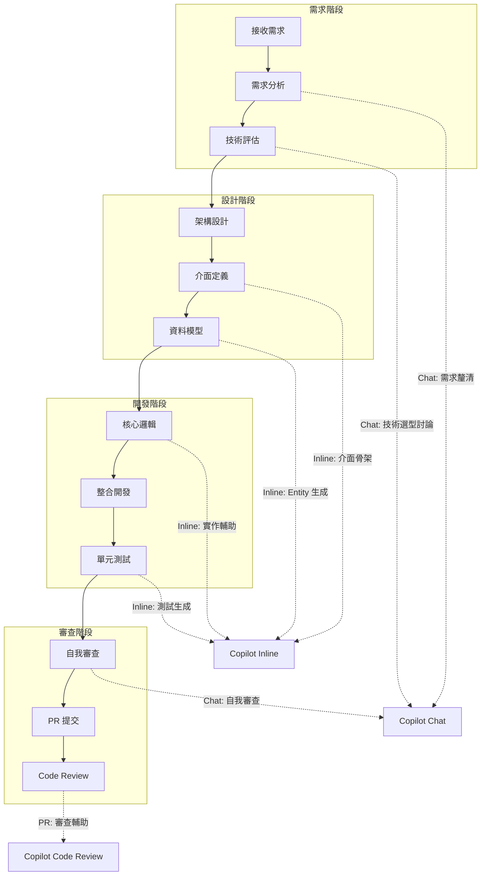
```mermaid
flowchart TB
    subgraph "需求階段"
        A1[接收需求] --> A2[需求分析]
        A2 --> A3[技術評估]
    end
    
    subgraph "設計階段"
        B1[架構設計] --> B2[介面定義]
        B2 --> B3[資料模型]
    end
    
    subgraph "開發階段"
        C1[核心邏輯] --> C2[整合開發]
        C2 --> C3[單元測試]
    end
    
    subgraph "審查階段"
        D1[自我審查] --> D2[PR 提交]
        D2 --> D3[Code Review]
    end
    
    A3 --> B1
    B3 --> C1
    C3 --> D1
    
    A2 -.->|Chat: 需求釐清| E[Copilot Chat]
    A3 -.->|Chat: 技術選型討論| E
    B2 -.->|Inline: 介面骨架| F[Copilot Inline]
    B3 -.->|Inline: Entity 生成| F
    C1 -.->|Inline: 實作輔助| F
    C3 -.->|Inline: 測試生成| F
    D1 -.->|Chat: 自我審查| E
    D3 -.->|PR: 審查輔助| G[Copilot Code Review]
```

### 3.2 各階段使用策略

#### 3.2.1 需求分析階段

**適合使用 Copilot Chat 的場景：**

```markdown
## Prompt 範例：需求釐清

我收到以下需求：
「系統需要支援多幣別付款，包含台幣、美金、日圓」

請幫我列出：
1. 可能需要釐清的技術細節
2. 常見的實作考量點
3. 可能的 edge cases
```

**Copilot 回應可能包含：**

- 匯率來源與更新頻率
- 精確度與四捨五入規則
- 時區與結算日考量
- 監管合規要求

> ⚠️ **注意**：Copilot 的建議需要與 BA/PM 確認，AI 不了解您的具體業務脈絡。

#### 3.2.2 設計階段

**介面定義輔助：**

```java
// 提供明確的設計意圖
/**
 * 多幣別付款處理器
 * 
 * 設計考量：
 * - 支援 TWD, USD, JPY
 * - 匯率由外部服務提供
 * - 需要 idempotency 支援
 * - 需要完整的 audit trail
 */
public interface MultiCurrencyPaymentProcessor {
    // Copilot 會根據註解生成方法簽名
}
```

#### 3.2.3 開發階段

**核心邏輯實作 - 建議流程：**

```text
1. 先寫完整的方法簽名與 JavaDoc
2. 寫關鍵的邏輯註解（pseudo code）
3. 讓 Copilot 填充實作細節
4. 逐行審核，特別注意：
   - 邊界條件
   - 錯誤處理
   - 效能考量
   - 資安風險
```

**範例：**

```java
/**
 * 計算跨幣別轉換金額
 * 
 * @param amount 原始金額
 * @param fromCurrency 來源幣別
 * @param toCurrency 目標幣別
 * @return 轉換後金額，使用 BigDecimal 確保精確度
 * @throws CurrencyConversionException 當匯率不可用時
 */
public BigDecimal convertCurrency(
        BigDecimal amount, 
        Currency fromCurrency, 
        Currency toCurrency) {
    
    // 1. 驗證輸入參數
    // 2. 取得匯率（從快取或外部服務）
    // 3. 執行轉換計算，注意精確度
    // 4. 記錄 audit log
    // 5. 回傳結果
    
    // Copilot 會根據上述註解生成實作
}
```

#### 3.2.4 測試階段

**單元測試生成策略：**

```java
// 在測試類別中，提供明確的測試意圖
class MultiCurrencyPaymentProcessorTest {
    
    // 測試正常轉換情境
    // 測試資料：100 TWD -> USD，匯率 0.033
    @Test
    void shouldConvertTWDtoUSD_whenValidInput() {
        // Copilot 生成測試程式碼
    }
    
    // 測試邊界條件：金額為零
    @Test
    void shouldReturnZero_whenAmountIsZero() {
        // Copilot 生成測試程式碼
    }
    
    // 測試異常情境：匯率服務不可用
    @Test
    void shouldThrowException_whenExchangeRateUnavailable() {
        // Copilot 生成測試程式碼
    }
}
```

> 💡 **最佳實務**：讓 Copilot 生成測試後，手動補充 AI 可能遺漏的 edge cases。

### 3.3 不同類型任務的使用建議

| 任務類型 | 建議方式 | Copilot 角色 | 人工重點 |
| ---------- | ---------- | -------------- | ---------- |
| **新功能開發** | Plan → Agent（或 Copilot App 工作區） | 產出計畫、生成骨架與實作 | 核准計畫、設計決策、業務邏輯 |
| **Bug 修復** | Chat 分析 + Agent 修正；明確的 Bug 可交給 Cloud Agent | 問題診斷、修正建議、補回歸測試 | 根因分析、影響評估 |
| **重構** | Plan 討論 + Agent 實作（worktree 隔離） | 重構方案、程式碼轉換、執行測試 | 決定重構範圍、驗證行為不變 |
| **效能優化** | Chat 分析 | 潛在瓶頸識別 | Profiling、實測驗證 |
| **Legacy 維護** | Ask 解釋 + CLI `explore` 子代理唯讀探索 | 程式碼理解、呼叫鏈追蹤 | 業務脈絡、風險評估 |
| **安全檢查** | CLI `/security-review`、Code Review（Balanced） | 找出高信心度的可利用弱點 | 風險判定、修補優先序 |
| **例行性維運** | Automations（排程／事件觸發） | Issue 分類、夜間修測試、週報 | 審查自動化產出的 PR |

### 3.4 與現有工具鏈整合

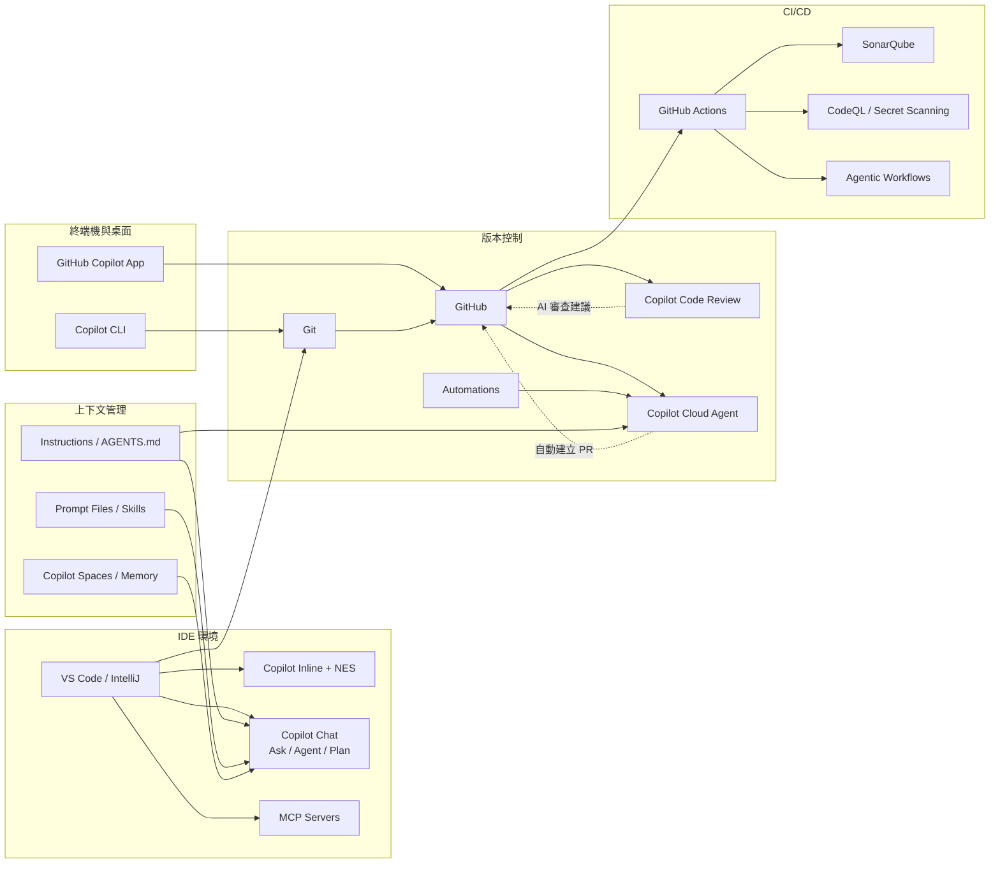
```mermaid
flowchart LR
    subgraph "IDE 環境"
        A[VS Code / IntelliJ]
        B[Copilot Inline + NES]
        C[Copilot Chat<br/>Ask / Agent / Plan]
        M[MCP Servers]
    end
    
    subgraph "終端機與桌面"
        R[Copilot CLI]
        S[GitHub Copilot App]
    end

    subgraph "版本控制"
        D[Git]
        E[GitHub]
        F[Copilot Code Review]
        N[Copilot Cloud Agent]
        T[Automations]
    end

    subgraph "CI/CD"
        G[GitHub Actions]
        H[SonarQube]
        I[CodeQL / Secret Scanning]
        U[Agentic Workflows]
    end

    subgraph "上下文管理"
        O[Instructions / AGENTS.md]
        P[Prompt Files / Skills]
        Q[Copilot Spaces / Memory]
    end

    A --> B
    A --> C
    A --> M
    A --> D
    R --> D
    S --> E
    D --> E
    E --> F
    E --> N
    T --> N
    E --> G
    G --> H
    G --> I
    G --> U

    O --> C
    P --> C
    Q --> C
    O --> N

    F -.->|AI 審查建議| E
    N -.->|自動建立 PR| E
```

### 3.5 實務案例：一個完整的開發循環

```markdown
## 情境：實作「交易對帳功能」

### Step 0: 建立上下文（Spaces + Instructions）
- 將對帳規格、既有 Issue 與相關程式碼加入 Copilot Space
- 確認 .github/copilot-instructions.md 已記載金額一律使用 BigDecimal 等規範

### Step 1: 需求理解與計畫（Ask → Plan）
Prompt: 「請幫我分析銀行交易對帳功能的常見設計考量」
接著切換到 Plan 代理，產出實作計畫並由 Tech Lead 核准

### Step 2: 介面設計（Inline）
- 定義 ReconciliationService interface
- 定義 ReconciliationResult DTO

### Step 3: 核心實作（Inline + 人工審核）
- 讓 Copilot 生成對帳邏輯
- 人工確認匹配演算法正確性
- 人工補充異常處理

### Step 4: 測試（Inline + 人工補充）
- Copilot 生成基本測試案例
- 人工補充：大量資料效能測試、並發測試

### Step 5: PR 提交（Copilot PR Summaries + Code Review）
- 自動生成 PR 摘要
- 金流相關 PR 使用 Balanced 審查深度
- 審查者參考 Copilot 的 Review 建議，最終核准仍由人類負責
```

### 3.6 介面與代理選用決策矩陣

> 🆕 **v7.0 新增**

面對同一個任務，Copilot 生態圈往往提供多種執行方式。下表整理選用原則：

| 判斷問題 | 建議選項 | 理由 |
| --- | --- | --- |
| 只是想在打字時加速？ | **Inline Suggestions／NES** | 不消耗 AI Credits、延遲最低 |
| 需要理解程式碼或討論方案？ | **Ask**（或 Spaces 中的 Chat） | 不修改檔案，風險最低 |
| 任務複雜、需求尚未收斂？ | **Plan 代理** | 先產出計畫並由人核准 |
| 需要在本機跨檔案修改並執行測試？ | **Agent（Local harness）** 或 **Copilot CLI** | 可存取本機工具、終端機與測試結果 |
| 想用 Claude／Codex 自己的代理框架？ | VS Code **Session Target** 選 Claude／Codex | 使用供應商原生的代理行為與自訂化格式 |
| 需要同時推進多個獨立任務？ | **GitHub Copilot App**（平行工作區）或 CLI `/fleet` | 每個工作階段有獨立 worktree 與分支 |
| 任務明確、希望非同步完成並產出 PR？ | **Cloud Agent**（Issue 指派、Agents 頁籤） | 在雲端執行，產出草稿 PR 供審查 |
| 同一件事需要定期或在事件發生時重複執行？ | **Automations** | 設定一次、自動觸發 |
| 自動化需要版控、PR 審查或換用其他引擎？ | **GitHub Agentic Workflows** | 以 Markdown 定義並編譯為 Actions |
| 需要外部 SaaS 的專業能力？ | **Agent Apps** 或 **MCP Server** | 以合作夥伴代理或工具擴充能力 |

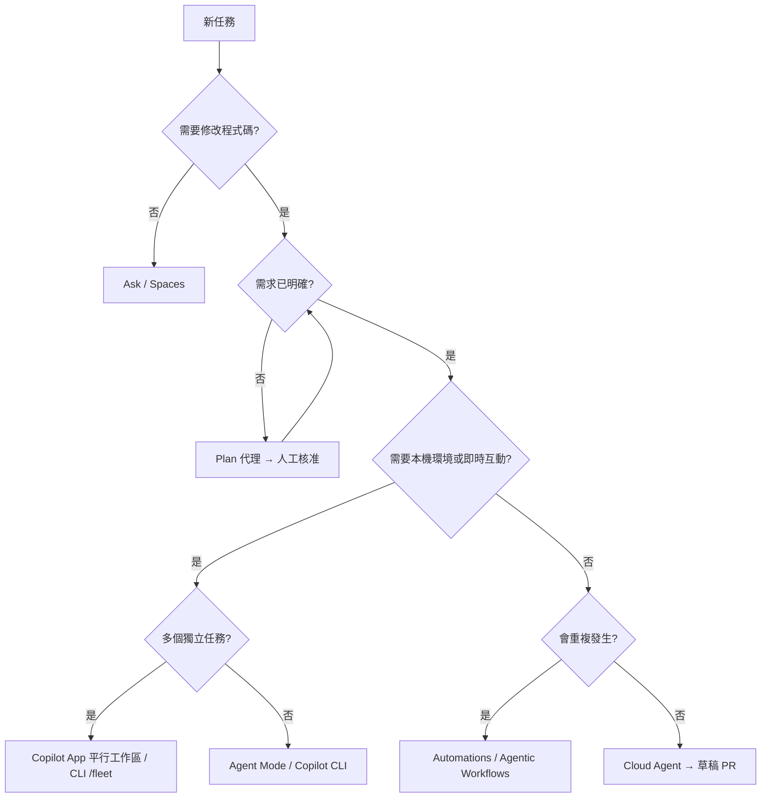
```mermaid
flowchart TD
    A[新任務] --> B{需要修改程式碼?}
    B -->|否| C[Ask / Spaces]
    B -->|是| D{需求已明確?}
    D -->|否| E[Plan 代理 → 人工核准]
    E --> D
    D -->|是| F{需要本機環境或即時互動?}
    F -->|是| G{多個獨立任務?}
    G -->|是| H[Copilot App 平行工作區 / CLI /fleet]
    G -->|否| I[Agent Mode / Copilot CLI]
    F -->|否| J{會重複發生?}
    J -->|是| K[Automations / Agentic Workflows]
    J -->|否| L[Cloud Agent → 草稿 PR]
```

---

## 第四章 Copilot Prompt Engineering（重點章節）

> 📌 **本章摘要**：4.1–4.6 說明 Inline、Chat 與代理任務的提示技巧；4.7–4.14 則是 Copilot 的「互動與自訂化框架」全集，包括 Chat 指令、Harness 與權限、Instructions、Skills、Custom Agents、Hooks、Plugins、MCP、CLI 內建代理、Agents Window、Handoffs、Memory、Spaces 與 GitHub Copilot App。

### 4.1 Prompt Engineering 核心觀念

對資深工程師而言，Prompt Engineering 不只是「問問題的技巧」，而是**將設計意圖精確傳達給 AI 的能力**。

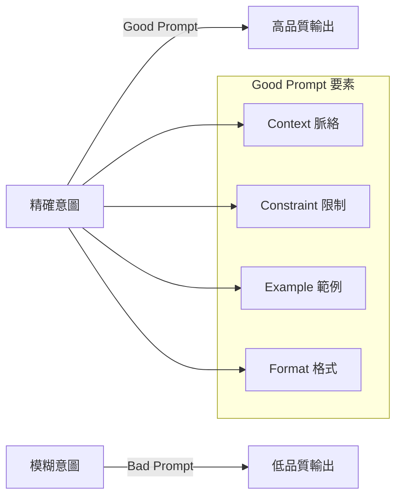
```mermaid
graph LR
    A[模糊意圖] -->|Bad Prompt| B[低品質輸出]
    C[精確意圖] -->|Good Prompt| D[高品質輸出]
    
    subgraph "Good Prompt 要素"
        E[Context 脈絡]
        F[Constraint 限制]
        G[Example 範例]
        H[Format 格式]
    end
    
    C --> E
    C --> F
    C --> G
    C --> H
```

### 4.2 Inline Completion Prompt 技巧

#### 4.2.1 註解驅動開發（Comment-Driven Development）

##### 原則：註解越精確，生成品質越高

```java
// ❌ Bad Prompt
// 處理付款

// ✅ Good Prompt
// 處理信用卡付款
// 步驟：1. 驗證卡號 2. 呼叫金流 API 3. 記錄交易
// 需要：idempotency key 防止重複扣款
// 例外：CardValidationException, PaymentGatewayException
```

#### 4.2.2 簽名先行模式

**先定義完整的方法簽名，再讓 Copilot 填充實作：**

```java
// ✅ 提供完整簽名與 JavaDoc
/**
 * 批次處理交易對帳
 * 
 * @param transactions 待對帳交易清單，不可為 null
 * @param bankStatements 銀行對帳單，不可為 null
 * @param toleranceAmount 容許誤差金額（用於浮點數比較）
 * @return 對帳結果，包含匹配、不匹配、待確認三類
 * @throws ReconciliationException 當對帳過程發生錯誤
 */
public ReconciliationResult reconcile(
        List<Transaction> transactions,
        List<BankStatement> bankStatements,
        BigDecimal toleranceAmount) throws ReconciliationException {
    // Copilot 會根據完整的上下文生成實作
}
```

#### 4.2.3 分層註解模式

```java
public class OrderService {
    
    // === 訂單建立相關 ===
    
    // 建立新訂單
    // 驗證庫存 -> 計算金額 -> 建立訂單 -> 發送通知
    public Order createOrder(CreateOrderRequest request) {
        // 1. 驗證庫存是否足夠
        
        // 2. 計算訂單金額（含折扣、稅金）
        
        // 3. 建立訂單實體並儲存
        
        // 4. 發送訂單建立通知
        
        // Copilot 會逐步填充每個區塊
    }
}
```

### 4.3 Copilot Chat Prompt 技巧

#### 4.3.1 角色設定模式

```markdown
## Prompt 範例

你是一位資深 Java 架構師，熟悉 Spring Boot、Clean Architecture 和金融系統開發。

請審查以下程式碼，從以下角度提供建議：
1. 架構設計是否符合 Clean Architecture
2. 是否有潛在的 thread-safety 問題
3. 是否符合 OWASP Top 10 安全規範
4. 效能是否有優化空間

[貼上程式碼]
```

#### 4.3.2 CRISPE 框架

| 要素 | 說明 | 範例 |
| ------ | ------ | ------ |
| **C**apacity | 角色能力 | 「你是資深 DBA」 |
| **R**ole | 扮演角色 | 「請以 Code Reviewer 角度」 |
| **I**nsight | 背景資訊 | 「這是銀行核心系統」 |
| **S**tatement | 具體任務 | 「請找出 SQL Injection 風險」 |
| **P**ersonality | 回應風格 | 「請條列重點，附程式碼範例」 |
| **E**xperiment | 嘗試要求 | 「請提供三種解決方案」 |

**完整範例：**

```markdown
## CRISPE Prompt

【角色】你是一位具有 10 年經驗的 Java 效能調優專家
【背景】我們的系統是銀行交易核心，需要處理每秒 1000+ TPS
【任務】請分析以下程式碼的效能瓶頸
【風格】請用條列方式說明，並提供優化後的程式碼
【嘗試】請提供至少 2 種優化方案，並比較優缺點

[程式碼]
```

#### 4.3.3 多輪對話策略

```markdown
## 第一輪：問題定義
「我需要設計一個分散式鎖的實作，使用 Redis，請問有哪些設計要點？」

## 第二輪：深入探討
「關於你提到的 Redlock 演算法，請詳細說明實作步驟」

## 第三輪：程式碼生成
「請用 Java + Lettuce 實作，需要支援可重入」

## 第四輪：審查確認
「請檢查這個實作是否有 race condition 風險」
```

### 4.4 Bad Prompt vs Good Prompt 對照

#### 案例一：程式碼生成

```java
// ❌ Bad Prompt
// 寫一個 API

// ✅ Good Prompt
/**
 * REST API: 查詢用戶交易紀錄
 * 
 * Endpoint: GET /api/v1/users/{userId}/transactions
 * 
 * 功能需求：
 * - 支援分頁（page, size）
 * - 支援日期區間篩選（startDate, endDate）
 * - 支援交易類型篩選（transactionType）
 * 
 * 安全需求：
 * - 需要 JWT 認證
 * - 只能查詢自己的交易（除非是 ADMIN 角色）
 * 
 * 回應格式：
 * - 成功：200 + Page<TransactionDTO>
 * - 未授權：401
 * - 禁止存取：403
 * - 找不到：404
 */
@GetMapping("/users/{userId}/transactions")
public ResponseEntity<Page<TransactionDTO>> getUserTransactions(
    @PathVariable Long userId,
    @RequestParam(defaultValue = "0") int page,
    @RequestParam(defaultValue = "20") int size,
    @RequestParam(required = false) LocalDate startDate,
    @RequestParam(required = false) LocalDate endDate,
    @RequestParam(required = false) TransactionType transactionType,
    @AuthenticationPrincipal UserDetails currentUser) {
    // Copilot 生成
}
```

#### 案例二：Code Review

```markdown
## ❌ Bad Prompt
看一下這段 code 有沒有問題

## ✅ Good Prompt
請以資深 Java 工程師角度審查以下程式碼：

審查重點：
1. 【安全性】是否有 SQL Injection、XSS、CSRF 風險
2. 【效能】是否有 N+1 Query、記憶體洩漏風險
3. 【可維護性】是否符合 SOLID 原則
4. 【錯誤處理】例外處理是否完整

請用以下格式回覆：
- 🔴 嚴重問題（必須修正）
- 🟡 中度問題（建議修正）
- 🟢 改善建議（可選）

[程式碼]
```

#### 案例三：測試生成

```markdown
## ❌ Bad Prompt
幫我寫測試

## ✅ Good Prompt
請為以下 Service 方法生成單元測試：

測試框架：JUnit 5 + Mockito
測試策略：
1. Happy Path：正常情境
2. Edge Cases：邊界值（null、空集合、最大值）
3. Error Cases：各種例外情境
4. Security Cases：權限驗證

命名規範：should_[預期結果]_when_[條件]

請確保：
- 每個測試方法只測試一個情境
- 使用 AAA 模式（Arrange-Act-Assert）
- Mock 所有外部依賴

[Service 程式碼]
```

### 4.5 進階 Prompt Pattern

#### 4.5.1 Chain of Thought（思維鏈）

```markdown
請分析這段程式碼的問題，請一步步思考：

1. 首先，說明這段程式碼的功能
2. 接著，分析可能的問題點
3. 然後，解釋每個問題的影響
4. 最後，提供具體的修正建議

[程式碼]
```

#### 4.5.2 Few-Shot Learning（範例學習）

```java
// 請依照以下範例風格，生成新的驗證方法

// 範例 1：
public void validateEmail(String email) {
    Objects.requireNonNull(email, "Email 不可為 null");
    if (!EMAIL_PATTERN.matcher(email).matches()) {
        throw new ValidationException("Email 格式不正確: " + email);
    }
}

// 範例 2：
public void validatePhoneNumber(String phone) {
    Objects.requireNonNull(phone, "電話不可為 null");
    if (!PHONE_PATTERN.matcher(phone).matches()) {
        throw new ValidationException("電話格式不正確: " + phone);
    }
}

// 請生成：validateTaiwanId（驗證台灣身分證字號）
```

#### 4.5.3 Persona Pattern（人格模式）

```markdown
從現在開始，請以「挑剔的資安專家」角度回答：
- 對任何程式碼都要先假設有安全漏洞
- 主動指出可能被攻擊的點
- 提供符合 OWASP 規範的修正建議

[程式碼]
```

#### 4.5.4 代理任務規格（Agentic Prompt）

> 🆕 **v7.0 新增**

當提示的對象從「補全」與「問答」變成**會自行修改檔案、執行指令的代理**時，提示更像是一份**任務規格書**。VS Code 官方最佳實務指出，「提供預期結果讓 AI 能自我驗證」是**槓桿效果最高**的做法之一。

| 要素 | 說明 | 範例 |
| --- | --- | --- |
| **目標（Outcome）** | 要達成的結果，而非步驟 | 「交易查詢 API 需驗證日期範圍」 |
| **範圍（Scope）** | 可以修改與不可修改的地方 | 「只修改 `transaction` 套件；不得變更公開 API」 |
| **上下文（Context）** | 相關檔案、規格、Issue | `#file:TransactionController.java`、Space、Issue 連結 |
| **限制（Constraints）** | 技術與安全限制 | 「不得新增相依套件」、「金額一律用 BigDecimal」 |
| **驗證（Verification）** | 代理如何確認自己完成了 | 「新增單元測試並執行 `./mvnw -q test`，全部通過才算完成」 |
| **澄清（Clarify）** | 需求模糊時先發問 | 「如果需求有歧義，先問我再動手」 |

```markdown
## 任務：新增交易查詢 API 的日期驗證

【目標】GET /api/v1/transactions 的 startDate、endDate 需驗證合理性
【範圍】只修改 transaction 模組；不得變更既有回應格式
【規則】endDate 不可早於 startDate；區間不可超過 90 天；不可查詢未來日期；
       違反時回傳 400，並附上明確錯誤碼
【驗證】為每條規則新增單元測試，執行 ./mvnw -q test，全部通過才算完成
【其他】若規則有歧義，先提出問題，不要自行假設
```

> 💡 **其他官方建議**：複雜任務先拆成小步驟；方向錯誤時及早以後續訊息導正（Steering），而不是等代理做完；多個獨立任務可要求代理「平行研究 X 與 Y 後彙整」。

### 4.6 Prompt Template 庫

以下是資深工程師常用的 Prompt Template：

#### Template 1：架構審查

```markdown
## 架構審查 Prompt

【系統背景】
{簡述系統用途與規模}

【審查標的】
{貼上架構圖或程式碼}

【請評估】
1. 是否符合 {Clean Architecture / Hexagonal / etc.}
2. 各層職責是否清晰
3. 依賴方向是否正確
4. 是否有過度設計或設計不足
5. 可測試性評估

【輸出格式】
- 整體評分（1-10）
- 優點列表
- 待改善列表（含優先級）
- 具體修改建議
```

#### Template 2：效能分析

```markdown
## 效能分析 Prompt

【效能需求】
- TPS 要求：{數值}
- 回應時間要求：P99 < {數值}ms
- 資源限制：{記憶體/CPU}

【分析標的】
{程式碼或設計}

【請分析】
1. 時間複雜度
2. 空間複雜度
3. I/O 瓶頸
4. 潛在的 blocking 點
5. 可能的 memory leak

【請提供】
- 優化建議（按影響程度排序）
- 優化後的程式碼
- 預期改善幅度
```

#### Template 3：重構建議

```markdown
## 重構建議 Prompt

【重構原因】
{說明為何要重構}

【限制條件】
- 不可變更 public API
- 需要向後相容
- 時間限制：{工時}

【程式碼】
{Legacy Code}

【請提供】
1. 識別的 Code Smell
2. 建議的重構手法（參考 Refactoring 書籍術語）
3. 重構步驟（可逐步執行，每步可獨立驗證）
4. 重構後的程式碼
5. 風險評估與測試建議
```

### 4.7 Copilot Chat 快捷指令與互動方式

#### 4.7.1 Chat 模式與 Agent 類型（VS Code）

> ⚠️ **重要變更**：Edit Mode 自 VS Code v1.110 起正式棄用，自 **v1.126 起完全移除**，且無法再透過設定重新啟用。Agent Mode 已涵蓋其所有功能。
>
> ⚠️ **v7.0 更正**：VS Code 已改為「**代理角色 × Agent Harness × 執行環境**」三層架構（v1.127–v1.139 陸續推出），v6.0 的「Agent 類型（Local／CLI／Cloud／Third-party）」與「權限層級（Default／Bypass／Autopilot）」描述已過時，以下依官方最新文件重寫。本文以 VS Code **1.139（2026/09/23 穩定版）** 為基準。

VS Code 官方把「一個代理怎麼運作」拆成四個互相獨立的選擇：

| 概念 | 決定什麼 | 例子 |
| --- | --- | --- |
| **代理角色（Agent role）** | 套用哪些指令、工具與行為 | Agent、Plan、Ask、Custom Agent |
| **語言模型** | 推理與生成能力 | Auto、Claude Opus 5、GPT-6 Sol… |
| **Agent Harness（代理執行框架）** | 由哪個執行框架把模型變成代理：準備上下文、協調工具呼叫與核准、維護工作階段狀態 | Local、Copilot、Claude、Codex |
| **執行環境** | 工具在哪裡執行、程式碼改在哪裡 | 本機資料夾／worktree、SSH／Tunnel／WSL 主機、Dev Container、雲端 |

> 💡 **關鍵觀念**：官方強調「**換模型不會換 Harness**」。同一個模型可以在不同 Harness 中運作，而 Hooks、自訂化格式、工具名稱與權限模式都由 Harness 決定。

**內建代理角色：**

| 角色 | 功能 | 最佳使用場景 |
| --- | --- | --- |
| **Agent** | 自主完成多步驟任務：編輯檔案、執行終端指令、驗證結果 | 跨檔案修改、需要執行測試或建置 |
| **Plan** | 先研究再產出結構化實作計畫（含驗證步驟），可交接給其他代理；也可用 `/plan` 叫用 | 動手前確認方案完整性 |
| **Ask** | 問答式互動，不修改檔案 | 理解程式碼、探索想法 |

> 💡 **Plan 的計畫存放位置**：Plan 代理把計畫寫入工作階段記憶 `/memories/session/plan.md`（僅限當前對話），可用 **Chat: Show Memory Files** 檢視。詳見 [4.12.5](#4125-vs-code-本機-memory-tool與-copilot-memory-的差異)。

**Session Target（工作階段目標）與 Harness：**

| Session Target | Harness | 執行環境 | 說明 |
| --- | --- | --- | --- |
| **Local** | VS Code 內建 Harness（在 Extension Host 執行） | 本機 | 可用內建工具、擴充套件工具、MCP 與 VS Code 內設定的模型 |
| **Copilot** | Copilot Harness（在 **Agent Host** 執行，與 Copilot CLI／SDK 共用實作） | 本機、連線主機或 Dev Container | 使用 GitHub Copilot 的 Hooks 與自訂化格式 |
| **Claude** | Claude Agent SDK（Agent Host） | 同上 | 使用 Claude 格式（`CLAUDE.md`、`.claude/*`） |
| **Codex** | Codex runtime（Agent Host 或 Codex 擴充套件） | 同上 | 使用 `AGENTS.md` 等 Codex 格式 |
| **Cloud** | 所選雲端代理（Copilot、Claude 或 Codex） | 供應商雲端基礎設施 | 針對 GitHub repository 工作，結果以 PR 回傳 |

**Agent Host 是什麼？** VS Code 把代理放在獨立的 **Agent Host** 行程中執行（透過開放的 Agent Host Protocol 通訊），帶來以下能力：

- **多用戶端共享工作階段**：多個視窗或瀏覽器可同時觀看並操控同一工作階段
- **遠端執行**：Agent Host 可以放在另一台機器，或放在 Dev Container 中，貼近原始碼執行
- **獨立執行**：關閉編輯器視窗後，進行中的回合仍可繼續
- **多家代理共用一個介面**：Copilot、Claude、Codex 各自的執行框架都接到同一個主機

> ⚠️ **Agent Host 與 Local 的行為差異**（官方表列重點）：
>
> - Agent Host 直接把修改寫入資料夾或 worktree；Local 則把修改標為「待保留／復原」。
> - Agent Host 只讀取 `~/.copilot`、`~/.claude` 等與 Harness 無關的**使用者層級**自訂化，**不讀** VS Code 設定檔（profile）中的舊位置。
> - Agent Host 讀取的 MCP 設定是 `.mcp.json`（workspace）與 `~/.copilot/mcp-config.json`（使用者）；`.vscode/mcp.json` 則由 VS Code 轉送。
> - Autopilot 在 Agent Host 上是「代理模式」，在 Local 上則是「權限層級」。

**權限層級（Permission levels）：**

| 權限層級 | 說明 | 適用情境 |
| --- | --- | --- |
| **Manual permissions**（預設） | 依工具、URL、終端指令的核准設定；未被自動核准的動作需人工確認 | 日常開發 |
| **Assisted permissions** | 由 **LLM 評審**判斷每個工具呼叫；評審不核准者仍需人工確認（僅支援的 Agent Host 工作階段，需開啟 `chat.assistedPermissions.enabled`） | 想減少打擾但保留把關 |
| **Allow all** | 所有工具呼叫不經確認直接執行 | 受信任的 workspace、沙箱環境 |

**Autopilot 是代理模式，不是權限層級**：從模式選擇器選取後，代理會持續工作直到自行判斷任務完成。另有 **Advanced Autopilot（Preview，`chat.autopilot.advanced.enabled`）**：每回合後由一個小型快速模型判斷原始需求是否已完成，並引導下一回合。Autopilot 與一般互動一樣消耗 AI Credits。

> ⚠️ **安全警告**：Allow all 與 Autopilot 會略過破壞性操作（檔案編輯、終端指令、外部工具呼叫）的確認提示，第一次選用時會跳出警告。官方特別強調 **Allow all「不應被視為使用代理的前提」**。
>
> 🔐 **沙箱與權限彼此獨立**：Agent sandboxing 會限制終端指令的檔案系統與網路存取，且在 Allow all 與 Autopilot 下**仍然有效**。平台支援：macOS（Preview）、Linux／WSL2（Preview，需安裝 `bubblewrap` 與 `socat`）、Windows（Experimental，需 2026/09/08 安全性更新）。沙箱只作用於終端指令，其他動作仍需搭配工具與 URL 核准。另外，**Git worktree 是程式碼隔離邊界，不是安全邊界**。
>
> 💡 **Session 交接**：切換 Session Target（例如從 Local 改為 Cloud）是一種交接，會帶上完整對話歷史與上下文。

#### 4.7.2 Slash Commands（斜線指令）

> ⚠️ **v7.0 更正**：依 VS Code 官方 AI 功能速查表更新。實際可用的指令依 Chat 介面、Harness、角色與已啟用功能而異，輸入 `/` 即可查看當下可用清單。v6.0 列出的獨立 `/search` 已不在清單中（改為 `@vscode /search`），`/delegate` 則是 Copilot CLI 的指令。

**VS Code Chat：**

| 指令 | 功能 | 使用場景 |
| --- | --- | --- |
| `/plan` | 研究並提出實作計畫 | 動手前規劃 |
| `/explain`、`/fix`、`/tests` | 解釋程式碼、建議修正、產生測試 | 理解 Legacy Code、修 Bug、補測試 |
| `/doc` | 在編輯器 Inline Chat 產生文件註解 | 補 JavaDoc／JSDoc |
| `/setupTests`（Experimental） | 協助選擇並設定測試框架 | 初始化測試環境 |
| `/new`、`/newNotebook` | 建立 workspace、檔案或 Notebook | 快速搭建專案骨架 |
| `/compact`、`/fork` | 壓縮上下文；帶著歷史分支對話 | 長對話管理、探索替代方案 |
| `/clear` | 開新對話並封存目前對話 | 切換到不相關的任務 |
| `/rename`、`/help` | 重新命名對話；列出指令與代理 | — |
| `/models`、`/tools` | 開啟模型選擇器；設定工具 | — |
| `/init` | 在 Local 代理工作階段產生或更新 workspace 指令 | 初始化 `copilot-instructions.md` |
| `/agents`、`/instructions`、`/skills`、`/prompts`、`/hooks` | 設定對應的自訂化類型 | 管理自訂化 |
| `/create-agent`、`/create-instructions`、`/create-skill`、`/create-prompt`、`/create-hook` | 用 AI 產生自訂化檔案 | 快速建立團隊資產 |
| `/troubleshoot` | 分析代理除錯日誌 | 代理行為異常時 |
| `/debug` | 開啟 Chat Debug 檢視 | 檢查 Token 與工具呼叫 |
| `/sandbox-policy` | 檢視 Copilot Agent Host 工作階段的實際沙箱政策 | 驗證沙箱設定 |
| `/<name>` | 依名稱叫用 Agent Skill 或 Prompt File | 例：`/webapp-testing` |

**Copilot CLI 常用指令（節錄）：**

| 指令 | 功能 |
| --- | --- |
| `/plan`、`/autopilot`（別名 `/goal`） | 規劃；啟動或重新聚焦 Autopilot |
| `/fleet` | 以平行子代理執行任務的各部分 |
| `/delegate` | 將變更委派給 Cloud Agent，產生 PR |
| `/review`、`/security-review` | 程式碼審查代理；聚焦安全的審查 |
| `/research`、`/rubber-duck` | 深度研究；請 rubber-duck 代理提供第二意見 |
| `/permissions [default\|assisted\|allow-all\|show]` | 切換權限模式（`/allow-all`、`/yolo` 為別名） |
| `/sandbox`、`/remote`、`/keep-alive` | 管理本機沙箱；開啟遠端操控；防止電腦休眠 |
| `/limits set max-ai-credits` | 設定每次回應的 AI Credits 軟上限 |
| `/usage`、`/context`、`/compact` | 查看用量；查看上下文使用率；壓縮上下文 |
| `/chronicle` | 工作階段歷史洞察（standup、tips、cost tips、由使用紀錄草擬 Skill） |
| `/worktree`、`/fork`、`/undo`（`/rewind`） | 建立 worktree；分支工作階段；回溯到先前回合 |
| `/plugin`、`/skills`、`/mcp`、`/lsp`、`/env` | 管理外掛、Skills、MCP、LSP；檢視已載入的自訂化 |
| `/every`、`/after` | 在工作階段內排程週期性或一次性的提示 |
| `/app` | 在 GitHub Copilot App 中開啟目前工作階段 |

#### 4.7.3 Chat Participants（聊天參與者）

在支援參與者的 Chat 介面中，使用 `@` 前綴指定專家：

| 參與者 | 功能 | 使用範例 |
| --- | --- | --- |
| `@github` | repository、Issue 與 PR 相關問題 | `@github 列出這個 repo 中標記 security 的未關閉 Issue` |
| `@terminal` | Shell 相關問題 | `@terminal 找出目前目錄中最大的 5 個檔案` |
| `@vscode` | 編輯器功能與設定 | `@vscode 如何啟用自動換行？`、`@vscode /search` 產生搜尋查詢 |

> ⚠️ **v7.0 更正**：`@workspace` 已不在 VS Code 官方參與者清單中。要以整個程式庫為上下文，請改用 `#codebase`（語意搜尋，需工作區索引），或直接交給 Agent 自行搜尋工作區。

#### 4.7.4 Chat Variables 與工具參照（`#` 語法）

使用 `#` 前綴可附加上下文或指定工具。輸入 `#` 即可瀏覽目前可用的項目。

**上下文項目：**

| 語法 | 功能 | 使用範例 |
| --- | --- | --- |
| `#<檔案>`／`#file:路徑` | 引用特定檔案 | `請審查 #file:src/PaymentService.java` |
| `#<資料夾>` | 引用資料夾 | `#src/payment 中的例外處理是否一致？` |
| `#<符號>` | 引用程式碼符號（需先開啟該檔案） | `#PaymentService 的職責是否過多？` |
| `#selection` | 目前編輯器選取範圍 | `解釋 #selection 的邏輯` |
| `#codebase` | 語意搜尋整個工作區 | `#codebase 中有哪些相似的重試模式？` |

**常用工具與工具集（Tool sets）：**

| 語法 | 功能 |
| --- | --- |
| `#read`／`#read/problems`／`#read/terminalLastCommand`／`#read/terminalSelection` | 讀檔、取得 Problems 面板診斷、最後一個終端指令、終端選取文字 |
| `#search`／`#search/changes`／`#search/usages` | 搜尋工作區、列出版控變更、找符號參照 |
| `#edit`、`#execute`、`#execute/testFailure` | 編輯檔案、執行指令、取得單元測試失敗資訊 |
| `#web`／`#web/fetch` | 擷取網頁內容（取代 v6.0 的 `#web` 搜尋用法；存取外部 URL 前會要求確認） |
| `#githubRepo`、`#githubTextSearch` | 語意搜尋指定的 GitHub repository；搜尋 repository 或組織內的文字 |
| `#browser` | 以瀏覽器工具操作、檢查網頁 |
| `#agent/runSubagent`、`#todos` | 委派子代理；追蹤待辦 |

> ⚠️ **v7.0 更正**：v6.0 列出的 `#terminalLastCommand`、`#terminalSelection`、`#debugEventsSnapshot` 已整併或改名。官方現行寫法為 `#read/terminalLastCommand`、`#read/terminalSelection`；除錯請改用 `/debug` 或 `/troubleshoot`。

#### 4.7.5 GitHub Skills（@github 技能）

`@github` 可存取 GitHub 平台特有的能力，例如搜尋 repository、Issue 與 PR。在 GitHub.com 的 Copilot Chat 中，也可以直接把 repository、檔案、符號、Issue 或 PR 加為上下文。

```markdown
# 查詢 Issue 與 PR
@github 列出最近一週合併、且修改到 payment 模組的 PR

# 搜尋程式碼
@github 搜尋 repo 中所有使用 deprecated API 的地方

# 查看可用技能
@github What skills are available?
```

> 💡 若要擷取網頁，請改用 `#web/fetch` 或直接在提示中貼上 URL；VS Code 會在存取外部 URL 前要求確認（可設定 URL 自動核准）。

#### 4.7.6 其他存取方式

| 方式 | 快捷鍵（Windows/Linux 預設） | 說明 |
| --- | --- | --- |
| **Chat View** | `Ctrl+Alt+I` | 完整聊天面板 |
| **Quick Chat** | `Ctrl+Shift+Alt+L` | 快速下拉式聊天，可延續到 workspace |
| **Inline Chat** | `Ctrl+I` | 在編輯器或終端機中直接對話 |
| **Smart Actions** | 右鍵 > Copilot／✨ 圖示 | 產生 commit 訊息、重新命名、審查選取範圍等 |
| **Agents Window**（Preview） | 標題列 **Open in Agents** | 跨專案管理代理工作階段 |
| **Copilot CLI** | 終端機執行 `copilot` | 終端機代理 |
| **GitHub Copilot App** | 桌面應用 | 平行工作區與 PR 生命週期管理 |
| **GitHub.com／GitHub Mobile** | — | 網頁與行動裝置 Chat、Agents 頁籤、遠端操控 CLI |

> 💡 **統一體驗預告**：官方已公告最早 2026/09/28 起，GitHub.com Chat、GitHub Mobile Chat 與 Cloud Agent 將合併為單一體驗（見 [1.8](#18-近期重要時程與企業行動項目)）。

**範例使用：**

```markdown
# 使用 Agent 角色自主完成任務
（選擇 Agent 後）
請將 UserService 重構為使用 Repository Pattern，
並新增對應的單元測試，完成後執行 mvn test 驗證。

# 使用 Plan 角色制定計畫
/plan 為這個專案新增 OAuth2 登入功能，請列出影響範圍與驗證步驟。

# 使用 Ask 角色提問
這個專案中的 PaymentService 架構設計考量是什麼？ #codebase

# 初始化專案 AI 設定
/init

# 分支對話探索另一種方案
/fork
讓我試試另一種實作方式...

# 在 Copilot CLI 中將工作交給 Cloud Agent 建立 PR
/delegate 請建立 PR 並請團隊 review
```

### 4.8 Custom Instructions 與自訂化框架

> 💡 **自訂化選用原則**：官方 VS Code 文件提供一張決策矩陣，本節依此整理——**規則**放 Instructions、**可重複執行的流程**放 Skills（Prompt Files 正在被 Skills 取代）、**角色與工具限制**放 Custom Agents、**必須確定執行的動作**放 Hooks、**外部系統**接 MCP、**整包發佈**用 Plugins。社群常見的建議是「用能解決問題的最小層級」。

#### 4.8.1 Custom Instructions（自訂指令）

Custom Instructions 為 Copilot 提供持久性的上下文偏好。VS Code 依 **Harness** 支援不同格式：

| Harness | 常駐（always-on）指令 | 條件式（依檔案）指令 |
| --- | --- | --- |
| **Copilot** | `.github/copilot-instructions.md` 或 `AGENTS.md` | `.github/instructions/**/*.instructions.md` |
| **Claude** | `CLAUDE.md` | `.claude/rules/` 下的 Markdown（使用 `paths` 而非 `applyTo`） |
| **Codex** | `AGENTS.md` | 子資料夾中的 `AGENTS.md` |
| **Local** | `.github/copilot-instructions.md`、`AGENTS.md` 或 `CLAUDE.md` | `.github/instructions/**/*.instructions.md` 或 `.claude/rules/` |

> 💡 `AGENTS.md` 並非 Codex 專屬，而是**跨代理的開放格式**（[agents.md](https://agents.md/)）。團隊同時使用多種 Harness 時，以 `AGENTS.md` 作為共用專案指令最省維護成本。

**支援層級：**

| 層級 | 檔案／設定 | 說明 |
| --- | --- | --- |
| **Repository** | `.github/copilot-instructions.md`、`AGENTS.md`、`CLAUDE.md` | 專案級指令；Cloud Agent、Code Review、Automations 也會套用 |
| **File-based** | `.github/instructions/**/*.instructions.md` | 依 `applyTo` glob 自動套用，或依 `description` 由代理**按需載入** |
| **Personal** | `~/.copilot/copilot-instructions.md`（Copilot Agent Host）；使用者目錄的 `AGENTS.md`／`CLAUDE.md` | 個人偏好 |
| **Organization** | GitHub 組織設定 | 組織統一規範（Business／Enterprise） |

**`.instructions.md` 的三種啟用方式：**

1. **檔案模式**：設定 `applyTo`，當代理建立或修改符合的檔案時自動附加（`**` 代表全部檔案）
2. **按需載入**：只設定 `description`，由代理判斷與任務相關時載入
3. **手動附加**：兩者都不設定，需要時手動附加

> ⚠️ **舊設定棄用**：
>
> - 以 `github.copilot.chat.codeGeneration.instructions` 等 `settings.json` 內嵌指令文字的舊機制，自 VS Code **v1.102** 起棄用。
> - `chat.instructionsFilesLocations` 已棄用，僅 Local 代理會讀取，請改放到支援的預設位置。
> - 在 Local 代理中，可用 `chat.useAgentsMdFile` 開關 `AGENTS.md` 支援；monorepo 可開啟 `chat.useCustomizationsInParentRepositories`，從上層 repository 根目錄探索自訂化。

**Repository Custom Instructions 範例：**

```markdown
<!-- .github/copilot-instructions.md -->

## 專案規範
- 使用 Java 21 + Spring Boot 3.x
- 遵循 Clean Architecture 分層
- 所有 public method 必須有 JavaDoc
- 使用 MapStruct 做 DTO 轉換
- 日誌使用 @Slf4j
- 例外處理使用自定義 BusinessException

## 建置與驗證
- 建置：./mvnw -q verify
- 修改後必須執行相關模組的單元測試

## 程式碼風格
- 方法長度不超過 30 行
- 使用 Optional 而非 null 檢查
- 所有 API 回應使用 ResponseEntity 包裝

## 測試規範
- 使用 JUnit 5 + Mockito
- 測試命名：should_[預期結果]_when_[條件]
- 使用 AAA 模式（Arrange-Act-Assert）
```

**File-based Instructions 範例：**

```markdown
<!-- .github/instructions/react-components.instructions.md -->
---
description: "React 元件撰寫規範"
applyTo: "**/*.tsx"
---

## React 組件規範
- 使用 functional component + hooks
- Props 必須定義 TypeScript interface
- 僅在量測後確認有效能問題時才使用 React.memo
```

> 💡 **快速生成**：`/init` 會分析專案並產生或更新 workspace 指令；`/create-instructions` 可用 AI 輔助建立新指令檔。
>
> 💡 **撰寫建議**：把「**建置與測試指令**」寫進指令檔，是讓代理能自行驗證成果的關鍵；官方最佳實務也建議讓代理「知道如何驗證」。

#### 4.8.2 Prompt Files（.prompt.md）

Prompt Files 是可重用的 prompt 範本，需以 **Slash Command** 手動觸發（與自動套用的 Instructions 不同）。

> ⚠️ **v7.0 重大變更：Prompt Files 正在被 Agent Skills 取代**
>
> 依 VS Code 最新官方文件：
>
> - Prompt Files **在 Agent Host 工作階段已棄用、不會被載入**，目前只有 Local 代理仍支援；官方並表示 **Local 代理未來將移除**。
> - VS Code 提供「**Prompt File → Skill**」遷移流程（實驗性，預設啟用）：在 Agent Customizations editor 選擇要轉換的檔案即可。遷移後原檔案與 Skill 不會同步。
> - Skills 同樣可以用 `/<name>` 以 Slash Command 叫用，並多了自動載入、附帶腳本與資源等能力。
>
> **建議**：新的可重用流程一律寫成 Skill；既有 Prompt Files 排入遷移計畫。

**Frontmatter 欄位（Local 代理）：**

| 欄位 | 說明 |
| --- | --- |
| `description` | Prompt 用途說明 |
| `name` | 在 `/` 後輸入的名稱（預設用檔名） |
| `argument-hint` | 呼叫時的輸入提示文字 |
| `agent` | 執行的代理：`ask`／`agent`／`plan` 或 Custom Agent 名稱 |
| `model` | 指定模型（選填） |
| `tools` | 可用的工具或工具集（`<server>/*` 代表某個 MCP server 的全部工具） |

**範例：**

```markdown
<!-- .github/prompts/security-review.prompt.md -->
---
description: "安全導向的 Code Review"
agent: "ask"
argument-hint: "選取要審查的程式碼後執行"
---

請以資安專家角度審查目前選取的程式碼：${selection}

審查重點：
1. 【安全性】OWASP Top 10 風險
2. 【效能】N+1 Query、記憶體洩漏
3. 【可維護性】SOLID 原則

請參考團隊規範：[安全編碼規範](../instructions/secure-coding.instructions.md)

輸出格式：
- 🔴 嚴重（必須修正）
- 🟡 中度（建議修正）
- 🟢 改善（可選）
```

> ⚠️ **v7.0 更正**：v6.0 範例中的 `{#selection}` 不是有效語法。官方寫法為內建變數 `${selection}`，輸入變數為 `${input:變數名稱}` 或 `${input:變數名稱:預設提示}`；引用檔案可用 Markdown 連結或 `#file:` 語法；引用工具用 `#tool:<工具名稱>`。

**使用方式：** 在 Chat 中輸入 `/` 選擇 Prompt，或執行「Chat: Run Prompt」。預設存放位置為 `.github/prompts/`（workspace）或 VS Code 使用者設定檔。

#### 4.8.3 Agent Skills（代理技能）

Agent Skills 的官方定義是：「由指令、腳本與資源組成的資料夾，Copilot 會在與任務相關時載入，以提升特定專業任務的表現」。其規格是**開放標準**（[github.com/agentskills/agentskills](https://github.com/agentskills/agentskills)），已被多套 AI 系統採用。

> ⚠️ **v7.0 更正：適用範圍擴大**。依官方文件，Skills 目前可用於 **Copilot Cloud Agent、Copilot Code Review、Copilot CLI、GitHub Copilot App，以及 VS Code 與 JetBrains 的 Agent Mode**。

**支援的 Skill 存放路徑：**

| 層級 | 路徑 | 說明 |
| --- | --- | --- |
| **專案級** | `.github/skills/`、`.claude/skills/`、`.agents/skills/` | 隨 repository 版控共享 |
| **個人級** | `~/.copilot/skills/`、`~/.claude/skills/`、`~/.agents/skills/` | 跨專案個人使用 |
| **外掛** | 已安裝 Plugin 中的 `skills/` | 以 `/外掛名稱:skill名稱` 叫用 |
| **擴充套件** | VS Code 擴充套件可在 `package.json` 註冊 Skill | 隨擴充套件發佈 |

**Skill 結構：**

```text
.github/skills/
  security-audit/
    SKILL.md          # 技能描述與指令（必要）
    scripts/          # 可選的腳本
    references/       # 可選的參考文件或範例
```

**SKILL.md Frontmatter：**

| 欄位 | 必填 | 說明 |
| --- | --- | --- |
| `name` | ✅ | 唯一識別碼，只能使用**小寫字母、數字與連字號**，必須與**所在資料夾名稱一致**，最長 64 字元；含無效字元會**靜默載入失敗** |
| `description` | ✅ | 說明「做什麼」以及「**何時使用**」，最長 1,024 字元；代理依此判斷是否載入 |
| `argument-hint` | — | 以 Slash Command 叫用時的輸入提示 |
| `user-invocable` | — | 是否出現在 `/` 選單（預設 `true`） |
| `disable-model-invocation` | — | 設為 `true` 時只能手動叫用，代理不會自動載入 |
| `context` | — | 設為 `fork` 時在獨立子代理中執行，只回傳最終結果（功能旗標控制） |

> ⚠️ 不要在 `name` 中自行加上 `myorg/`、`myorg:` 之類的命名空間前綴——透過外掛發佈時，外掛名稱會自動成為前綴；手動加前綴會導致 Skill 無法載入。

**SKILL.md 範例：**

```markdown
---
name: security-audit
description: "執行 OWASP Top 10 安全審計。當使用者要求安全檢查、上線前審查或修改認證授權邏輯時使用。"
argument-hint: "[模組路徑]"
---

# Security Audit Skill

## 步驟
1. 掃描 Controller 與 Service 層的輸入驗證
2. 檢查 SQL 查詢是否使用參數化
3. 驗證認證與授權邏輯
4. 執行 [檢查腳本](./scripts/check-secrets.sh) 找出硬編碼的機敏資訊
5. 依 [報告範本](./references/report-template.md) 輸出結構化安全報告
```

**三階段漸進載入（官方說明）：**

1. **探索**：只讀取 `name` 與 `description`，比對目前任務
2. **載入指令**：判斷相關後才載入 `SKILL.md` 本文（或使用者以 `/skill-name` 直接叫用）
3. **存取資源**：執行指令過程中**真正被引用到**的腳本或檔案才會載入

因此即使安裝大量 Skills，也不會佔用上下文。

| `user-invocable` | `disable-model-invocation` | 出現在 `/` 選單 | 代理自動載入 | 用途 |
| --- | --- | --- | --- | --- |
| （預設） | （預設） | ✅ | ✅ | 一般用途 |
| `false` | — | ❌ | ✅ | 背景知識型 Skill |
| — | `true` | ✅ | ❌ | 僅供手動執行的流程 |
| `false` | `true` | ❌ | ❌ | 停用 |

> 💡 **快速生成與共享**：`/create-skill` 可用 AI 建立新 Skill；GitHub CLI 的 `gh skill` 可從 repository 探索並安裝 Skills；Copilot CLI 的 `/chronicle skills create` 可依實際使用紀錄**草擬 repository Skill 提案**。社群資源如 [anthropics/skills](https://github.com/anthropics/skills)、[github/awesome-copilot](https://github.com/github/awesome-copilot)。

#### 4.8.4 Custom Agents（Agent Profiles）

Custom Agents 是專屬化的 Copilot 代理，透過 **Agent Profile**（含 YAML frontmatter 的 Markdown 檔）定義指令、可用工具與 MCP Servers。VS Code 本機與 GitHub（Cloud Agent／CLI／Copilot App）**共用同一套檔案格式**，但部分屬性只在其中一方生效——可用 `target` 屬性指定。

**部署層級：**

| 層級 | 路徑 | 適用 |
| --- | --- | --- |
| **Repository** | `.github/agents/名稱.md`（VS Code 慣用 `名稱.agent.md`） | VS Code、Cloud Agent、CLI、Copilot App |
| **Repository（Claude 格式）** | `.claude/agents/` | VS Code |
| **組織** | 組織 `.github` 或 `.github-private` repository 中的 `/agents/名稱.md` | Cloud Agent、CLI、Copilot App；VS Code 需開啟 `github.copilot.chat.organizationCustomAgents.enabled` |
| **企業** | 企業指定組織的 `.github-private` repository 中的 `/agents/名稱.md` | 全企業 |
| **個人** | `~/.copilot/agents/` 或 `~/.claude/agents/` | VS Code、CLI |

> ⚠️ `chat.agentFilesLocations` 與 `chat.modeFilesLocations` 設定已棄用，只有 Local 代理會讀取。若使用 Agent Host，使用者層級的 Custom Agents 需放在 `~/.copilot/agents` 等資料夾，可利用 VS Code 的「使用者自訂化遷移」流程搬移。

**可使用環境：** GitHub.com（Agents 頁籤與面板、Issue 指派、PR）、IDE 中的 Cloud Agent（VS Code、JetBrains、Eclipse、Xcode）、**GitHub Copilot App**、GitHub Copilot CLI。JetBrains、Eclipse、Xcode 的 Custom Agents 目前為 Public Preview。

**Frontmatter 屬性對照：**

| 屬性 | 說明 | VS Code | GitHub（Cloud Agent／CLI） |
| --- | --- | :---: | :---: |
| `name` | 顯示名稱（預設用檔名） | ✅ | ✅ |
| `description` | 用途說明（GitHub 端**必填**） | ✅ | ✅ |
| `target` | `vscode` 或 `github-copilot`；未設定則兩者皆適用 | ✅ | ✅ |
| `tools` | 可用工具清單（YAML 陣列或逗號分隔字串）；未設定則可用全部工具 | ✅ | ✅ |
| `model` | 指定模型；VS Code 可給**陣列**，依序嘗試可用模型 | ✅ | ✅ |
| `user-invocable` | 是否可由使用者手動選取（預設 `true`） | ✅ | ✅ |
| `disable-model-invocation` | 禁止被其他代理自動當成子代理叫用 | ✅ | ✅ |
| `infer` | **已棄用／退役**，改用上面兩個屬性 | ⚠️ | ⚠️ |
| `argument-hint` | 輸入框提示文字 | ✅ | — |
| `agents` | 可呼叫的子代理清單（`*` 全部、`[]` 禁止）；需在 `tools` 中包含 `agent` | ✅ | — |
| `handoffs` | 引導式交接按鈕（見 [4.11](#411-custom-agent-handoffs工作流程交接)） | ✅ | — |
| `hooks`（Preview） | 代理專屬的 Local Hooks；需 `chat.useHooks` 與受信任的 workspace | ✅ | — |
| `mcp-servers` | 代理專屬的 MCP Server 設定；**VS Code 與其他 IDE 不使用** | — | ✅ |
| `metadata` | 名稱／值的註記；**VS Code 與其他 IDE 不使用** | — | ✅ |

> ⚠️ **v7.0 更正**：
>
> - v6.0 表列的 `prompt` **不是** frontmatter 屬性；代理的行為指令就是 frontmatter 之後的 **Markdown 本文**（兩個環境皆同）。
> - `model` 在 GitHub 端同樣支援，並非 VS Code 限定。
> - 代理專屬 Hooks 的開關是 `chat.useHooks`（預設開啟），v6.0 所寫的 `chat.useCustomAgentHooks` 並不存在。

**工具別名（GitHub 端，跨環境通用）：**

| 別名 | 對應 | 說明 |
| --- | --- | --- |
| `read` | 讀檔工具 | 讀取檔案內容 |
| `edit` | 編輯工具 | 修改檔案 |
| `search` | Grep／Glob 類工具 | 搜尋檔案或文字 |
| `execute` | `bash` 或 `powershell` | 執行 Shell 指令 |
| `agent` | 叫用其他 Custom Agent | 委派子任務 |
| `web` | 擷取網頁與搜尋 | Cloud Agent 目前不適用 |
| `github/*`、`playwright/*` | 內建 MCP Server 工具 | GitHub MCP 預設唯讀並只能存取來源 repository；Playwright 僅能存取 localhost |

**基本範例（唯讀的安全審查員）：**

```markdown
<!-- .github/agents/security-reviewer.agent.md -->
---
name: Security Reviewer
description: 專注於 OWASP Top 10 的唯讀安全審查代理
tools: ['read', 'search']
---

你是一位資深資安專家，只負責審查、不修改任何檔案。

## 審查規則
- 所有外部輸入必須驗證
- SQL 查詢必須參數化
- 敏感資料必須加密
- 錯誤訊息不得洩露系統資訊

## 輸出格式
使用嚴重度分級：🔴 Critical / 🟡 Warning / 🟢 Info
```

**包含 MCP Server 的 GitHub 端範例：**

```markdown
<!-- .github/agents/incident-analyst.md -->
---
name: incident-analyst
description: 讀取內部事件管理系統資料並分析相關程式碼的代理
target: github-copilot
tools: ['read', 'search', 'incident-mcp/get_incident']
mcp-servers:
  incident-mcp:
    type: 'local'
    command: 'npx'
    args: ['-y', '@example-corp/incident-mcp-server']
    tools: ['get_incident']
    env:
      INCIDENT_API_TOKEN: ${{ secrets.COPILOT_MCP_INCIDENT_TOKEN }}
---

你負責依事件編號讀取事件資料，找出相關程式碼路徑並提出修正方向。不得修改任何檔案。
```

> ⚠️ **v7.0 更正**：v6.0 範例使用的 `@modelcontextprotocol/server-postgres` 已封存、不再維護，已改為示意用的企業內部 MCP Server。GitHub 端的機密必須設為 repository 或組織的 **Agents secrets／variables**，並以 `${{ secrets.X }}` 或 `${{ vars.X }}` 引用；`stdio` 類型在 Cloud Agent 中會對應為 `local`。
>
> 💡 **`.chatmode.md` 遷移**：舊的 `.chatmode.md` 請重新命名為 `.agent.md` 並放到支援的位置。
>
> 💡 **快速生成**：`/create-agent` 可用 AI 建立 Custom Agent；Copilot CLI 可用 `/agent` 瀏覽並選取代理。

#### 4.8.5 Agent Hooks（生命週期自動化）

Hooks 讓您在代理生命週期的關鍵節點執行自訂指令，提供**確定性**的控制——與其期待模型遵守指令，不如由 Hook 直接攔截。VS Code 的 Hooks 體驗目前為 **Preview**（但 Copilot SDK 中的 Hooks 已 GA）。

> ⚠️ **v7.0 更正：Hooks 的行為由 Harness 決定**。VS Code 官方明確指出：即使不同 Harness 會讀到同一個 `.github/hooks/*.json` 或 `.claude/settings.json`，**支援的事件、事件名稱、matcher、指令屬性、工具名稱、payload 與輸出決策都可能不同**。

| Session Target | Hook 實作 | 參考文件 |
| --- | --- | --- |
| **Local** | VS Code Local Hooks | [VS Code Local hooks reference](https://code.visualstudio.com/docs/agents/reference/hooks-reference) |
| **Copilot**（Agent Host）、**Cloud Agent**、**Copilot CLI** | GitHub Copilot Hooks（與 Copilot SDK 共用實作） | [GitHub Copilot hooks reference](https://docs.github.com/en/copilot/reference/hooks-reference) |
| **Claude** | Claude Agent SDK | [Claude hooks](https://code.claude.com/docs/en/hooks) |
| **Codex** | Codex runtime | [Codex hooks](https://developers.openai.com/codex/hooks/) |

> 💡 **遷移原則**：不要只換模型來驗證 Hook 遷移，應從 Session Target 選擇目標 Harness 後開一個測試工作階段；讀取對話記錄的腳本要重新驗證，因為記錄格式不是跨 Harness 的穩定 API。

##### VS Code Local Hooks

**事件（8 個）：**

| 事件 | 觸發時機 | 常見用途 |
| --- | --- | --- |
| **SessionStart** | 第一個 prompt 開始工作階段 | 初始化資源、注入專案上下文 |
| **UserPromptSubmit** | 使用者送出 prompt | 稽核請求、補充上下文 |
| **PreToolUse** | 代理呼叫工具之前 | 阻擋操作、要求核准、改寫工具輸入 |
| **PostToolUse** | 工具成功執行之後 | 驗證結果、執行 formatter |
| **PreCompact** | 上下文壓縮之前 | 保存需要延續的狀態 |
| **SubagentStart** | 子代理啟動 | 追蹤巢狀代理 |
| **SubagentStop** | 子代理即將結束 | 驗證子代理結果或要求補做 |
| **Stop** | 目前這次代理執行即將結束 | 驗證是否完成或要求再做一步 |

**設定檔位置：**

| 範圍 | 位置 | 備註 |
| --- | --- | --- |
| Workspace | `.github/hooks/*.json` | VS Code 原生格式或 Copilot 相容格式 |
| Workspace（Claude 格式） | `.claude/settings.json`、`.claude/settings.local.json` | 需開啟 `chat.useClaudeHooks`（**預設關閉**），且 Local **會忽略 matcher**，該事件的每個指令都會執行 |
| 使用者 | `~/.copilot/hooks/*.json` | 所有 Local 工作階段 |
| 使用者（Claude 格式） | `~/.claude/settings.json` | 需 `chat.useClaudeHooks` |
| Custom Agent | `.agent.md` 的 `hooks` | 只在該代理執行時觸發 |
| Plugin | `hooks.json` 或 `hooks/hooks.json` | 見 [4.8.6](#486-agent-pluginspreview) |

`chat.useHooks`（預設開啟）控制 Local Hooks 是否執行；workspace 的 Hook 檔受 **Workspace Trust** 管制。

**原生格式範例：**

```json
{
  "hooks": {
    "PreToolUse": [
      {
        "type": "command",
        "command": "./scripts/validate-tool.sh",
        "windows": "powershell -File scripts\\validate-tool.ps1",
        "timeout": 15
      }
    ],
    "PostToolUse": [
      {
        "type": "command",
        "command": "./scripts/format-changed-file.sh"
      }
    ]
  }
}
```

**輸入與輸出：** 事件發生時，Local Harness 以 **stdin** 傳入 JSON（例如 `PreToolUse` 含 `tool_name`、`tool_input`、`tool_use_id`），指令可寫 JSON 到 **stdout** 控制下一步。

```bash
#!/usr/bin/env bash
# scripts/validate-tool.sh：阻擋對 production 設定檔的修改（示意）
payload="$(cat)"
if echo "$payload" | grep -q 'config/production'; then
  cat <<'EOF'
{
  "hookSpecificOutput": {
    "hookEventName": "PreToolUse",
    "permissionDecision": "deny",
    "permissionDecisionReason": "Production 設定檔禁止由代理修改。"
  }
}
EOF
  exit 0
fi
exit 0
```

| 輸出欄位（PreToolUse） | 值 | 說明 |
| --- | --- | --- |
| `permissionDecision` | `allow`／`deny`／`ask` | 放行、拒絕或要求人工確認；多個 Hook 衝突時**最嚴格者勝出** |
| `permissionDecisionReason` | 字串 | 顯示給使用者的原因 |
| `updatedInput` | 物件 | 改寫後的工具輸入（須符合 Local 工具結構） |
| `additionalContext` | 字串 | 提供給模型的額外上下文 |

**退出碼：** `0` 表示成功並處理 stdout；`2` 表示以 stderr 作為**阻擋錯誤**回報給模型。

> ⚠️ **v7.0 更正**：
>
> - v6.0 範例使用的 `$TOOL_INPUT_FILE_PATH` **不是官方提供的環境變數**；工具參數一律從 stdin 的 JSON 讀取。
> - `chat.hookFilesLocations` 的值是**物件**（例如 `{ "custom/hooks": true }`），不是陣列；預設值為空，因為內建位置另行註冊。
> - 工具名稱在不同 Harness 間並不相同，請從代理除錯日誌確認 Local 的實際工具名稱，**不要從其他 Harness 複製**。

**代理專屬 Hooks（Preview，僅 Local）：**

```markdown
---
name: Secure Agent
description: 安全審查專用代理
hooks:
  PostToolUse:
    - type: command
      command: "./scripts/format-changed-file.sh"
  Stop:
    - type: command
      command: "./scripts/generate-report.sh"
---
```

當該代理以子代理身分執行時，它的 `Stop` Hook 會被當成 `SubagentStop`。

##### GitHub Copilot Hooks（Copilot CLI／Cloud Agent／Copilot Harness）

**設定格式：** 必須含 `"version": 1`，每個 Hook 以 `bash`（Unix）與 `powershell`（Windows）分別指定指令，可設 `cwd`、`env`、`timeoutSec`（預設 30 秒）。

```json
{
  "version": 1,
  "hooks": {
    "preToolUse": [
      {
        "type": "command",
        "bash": "./scripts/security-check.sh",
        "powershell": "./scripts/security-check.ps1",
        "cwd": "scripts",
        "timeoutSec": 15
      }
    ],
    "sessionEnd": [
      {
        "type": "command",
        "bash": "./scripts/cleanup.sh",
        "powershell": "./scripts/cleanup.ps1",
        "timeoutSec": 60
      }
    ]
  }
}
```

**主要事件：** `sessionStart`、`sessionEnd`、`userPromptSubmitted`、`preToolUse`、`postToolUse`、`postToolUseFailure`、`agentStop`、`subagentStart`、`subagentStop`、`errorOccurred`、`preCompact`，CLI 另有 `permissionRequest`、`notification`、`userPromptTransformed`。事件也可用 PascalCase 名稱（如 `PreToolUse`），此時 payload 改用與 VS Code 相容的 snake_case 欄位。

**載入位置（CLI）：** 依序合併「政策層 → 使用者 → 專案 → 外掛」：

| 來源 | 位置 |
| --- | --- |
| **政策 Hooks**（僅 CLI，需系統管理員權限） | Linux／macOS：`/etc/github-copilot/policy.d/*.json`；Windows：`C:\ProgramData\GitHub\Copilot\policy.d\*.json` 或登錄機碼 `HKLM\Software\Policies\GitHub\Copilot` |
| **Repository** | `.github/hooks/*.json`；或 `.github/copilot/settings.json` 的 `hooks` 區塊 |
| **使用者** | `~/.copilot/hooks/*.json`；或 `~/.copilot/settings.json` 的 `hooks` 區塊 |
| **外掛** | 各外掛的 `hooks.json` |

**Cloud Agent：** Hooks 在每個工作的**臨時 Linux 沙箱**中執行，只讀取 repository 的 `.github/hooks/*.json`，且只支援部分事件。由於沒有使用者可回應，`preToolUse` 回傳 `ask` 會被視為 `deny`。

**退出碼與失敗行為（重要）：**

| 情況 | 行為 |
| --- | --- |
| `0` | 成功，解析 stdout JSON |
| `2` | 一般事件視為警告；`preToolUse`／`permissionRequest` 視為**拒絕** |
| 其他非零 | 一般事件記錄後繼續（fail-open）；**`preToolUse` 為 fail-closed**，Hook 出錯即拒絕該工具呼叫 |
| 逾時 | **所有事件都是 fail-open**（包括 `preToolUse` 與政策 Hooks），逾時後照常繼續 |

> 🔐 **治理重點**：
>
> - 政策 Hooks 由 IT 部署、**使用者無法以 `disableAllHooks` 停用**，適合落實企業強制規則。
> - 因為逾時屬 fail-open，安全關鍵的 Hook 應保持輕量（官方建議盡量在 5 秒內完成），並搭配 managed settings 的 `permissions.deny` 作為第二道防線。
> - Hook 以其 Harness 行程的權限執行指令，務必審查所有 Hook 與其引用的腳本，特別是來自共享 repository 或外掛者。

#### 4.8.6 Agent Plugins（Preview）

Plugins 是可安裝的套件，把 **Custom Agents、Skills、Hooks、MCP Server 設定、LSP Server 設定**（VS Code 端還可包含 Automations 範本）打包成單一可版本化的單位。

> ⚠️ **v7.0 補充**：v6.0 本節只有一句話，以下依 GitHub 與 VS Code 官方文件全面擴寫。VS Code 以 `chat.plugins.enabled` 啟用外掛支援；1.133 起支援 **Agent Plugins 標準**。

**兩種格式：**

| 格式 | 識別方式 | 特性 | 建議 |
| --- | --- | --- | --- |
| **Agent Plugins 1.0** | `plugin.json` 的 `$schema` 指向 `https://agent-plugins.org/schemas/1.0.0/plugin.schema.json` | 可攜：`skills/` 與 `mcp.json` 放在固定位置供各家用戶端讀取；Copilot 專屬元件放在 `com.github.copilot/` 目錄 | **新外掛採用此格式** |
| **舊版 Copilot Plugin** | 未宣告 `$schema` | 可自訂元件路徑，MCP 設定可放 `.mcp.json`、`.github/mcp.json` 或 manifest | 僅維護既有外掛時使用 |

```text
my-plugin/                    # Agent Plugins 1.0
├── plugin.json               # 必要 manifest（含 $schema）
├── skills/
│   └── deploy/
│       └── SKILL.md
├── mcp.json                  # MCP 設定（選用）
└── com.github.copilot/       # Copilot 專屬元件（其他用戶端會忽略）
    ├── agents/
    │   └── helper.agent.md
    ├── hooks/
    │   └── hooks.json
    └── lsp.json
```

**取得與安裝：**

| 用戶端 | 安裝方式 |
| --- | --- |
| **Copilot CLI** | `copilot plugin install` 或 `/plugin install`；或宣告在 `~/.copilot/settings.json`／`.github/copilot/settings.json` 的 `enabledPlugins` |
| **Cloud Agent** | 在 repository 的 `.github/copilot/settings.json` 宣告 `enabledPlugins`；非預設市集加到 `extraKnownMarketplaces` |
| **GitHub Copilot App** | **Customize → Plugins** 瀏覽市集並安裝 |
| **VS Code** | Agent Customizations editor 的 **Plugins** 頁籤瀏覽市集，或直接從 Git URL 安裝；也會自動發現 CLI 安裝的外掛 |

預設市集包括 [github/copilot-plugins](https://github.com/github/copilot-plugins) 與 [github/awesome-copilot](https://github.com/github/awesome-copilot)。市集以 `marketplace.json` 定義，可放在 GitHub、其他 Git 服務或檔案系統。

| 比較 | 在 repository 手動設定 | Plugin |
| --- | --- | --- |
| 範圍 | 單一 repository | 任何專案 |
| 分享 | 手動複製 | 安裝指令或 `enabledPlugins` |
| 版本 | Git 歷史 | 市集版本 |
| 探索 | 搜尋 repository | 瀏覽市集 |

> ⚠️ **安全提醒**：外掛可能包含會在本機執行程式碼的 Hooks 與 MCP Servers。安裝前請審查外掛內容與發佈者，第一次使用新市集時 VS Code 會要求確認信任。
>
> 🏢 **企業治理**：企業可在 `managed-settings.json` 中以 `enabledPlugins` 強制安裝或停用特定外掛、以 `extraKnownMarketplaces` 新增核准的市集、以 `strictKnownMarketplaces` **限定只能從核准的市集安裝**（空陣列代表完全鎖定）。若 managed settings 設定 `allowManagedHooksOnly: true`，只有被強制啟用之外掛中的 Hooks 才會執行。詳見 [8.7](#87-企業治理控制面ai-controls-與-managed-settings)。

#### 4.8.7 Agent Customizations Editor

VS Code 提供集中化的 **Agent Customizations editor**（v6.0 稱「Chat Customizations Editor」）管理所有自訂化：

- **開啟方式**：Chat 輸入框的 **Configure Chat**（齒輪圖示），或 Command Palette
- **依 Harness 顯示**：編輯器會依 Chat 輸入框選取的 Harness 顯示對應的自訂化
- **分類**：Agents／Skills／Instructions／Prompts／Hooks／MCP Servers／Plugins
- **範圍**：使用者、Workspace、組織（組織層級的自訂化由 GitHub 端設定，不在此編輯器建立）
- **AI 輔助建立**：描述需求即可產生對應檔案
- **遷移流程**（部分為 Insiders 功能）：Prompt Files → Skills、使用者設定檔中的 Custom Agents／Instructions → `~/.copilot` 等 Agent Host 可讀的位置、舊設定路徑 → 支援的預設位置

> 💡 **驗證技巧**：Copilot CLI 可用 `/env` 查看實際載入的 instructions、MCP servers、skills、agents、hooks、plugins、LSP 與 extensions，是排查「為什麼我的自訂化沒生效」最快的方法。

#### 4.8.8 MCP (Model Context Protocol) 整合

MCP 是讓 AI 模型以標準化方式連接資料來源與工具的開放標準，可大幅擴展代理能力。

**常見 MCP 使用場景：**

| 場景 | MCP Server 類型 | 說明 |
| --- | --- | --- |
| **GitHub 平台操作** | GitHub MCP Server（遠端） | 查詢 Issue、PR、程式碼；也可存取 Copilot Spaces |
| **瀏覽器測試** | Playwright MCP | 讓代理操作網頁驗證 UI 流程 |
| **資料庫查詢** | 經核准的 Database MCP | 讓代理查詢資料結構與資料（建議唯讀帳號） |
| **文件搜尋** | Knowledge Base MCP | 搜尋內部文件與知識庫 |
| **監控整合** | Observability MCP | 查詢 logs、metrics、traces |
| **專案管理** | Jira／Azure DevOps MCP | 同步 Issue 狀態與更新 |

**設定檔位置：**

| 用戶端 | Workspace | 使用者 |
| --- | --- | --- |
| VS Code（Local） | `.vscode/mcp.json` | VS Code 使用者設定檔 |
| Agent Host／Copilot CLI | `.mcp.json` | `~/.copilot/mcp-config.json` |
| Cloud Agent | Repository 設定中的 MCP 設定，或 Custom Agent 的 `mcp-servers` | — |
| Dev Container | `devcontainer.json` 的 `customizations.vscode.mcp` | — |

**VS Code MCP 設定範例：**

```json
{
  "servers": {
    "github": {
      "type": "http",
      "url": "https://api.githubcopilot.com/mcp"
    },
    "playwright": {
      "command": "npx",
      "args": ["-y", "@microsoft/mcp-server-playwright"]
    }
  }
}
```

> ⚠️ **v7.0 更正**：v6.0 範例使用的 `@modelcontextprotocol/server-postgres` 已封存，已改為官方文件中的 GitHub 遠端 MCP 與 Playwright MCP 範例。

**MCP 安全與治理重點：**

- **信任確認**：VS Code 首次啟動 MCP Server 時會要求確認信任。
- **沙箱**：本機 MCP Server 可在沙箱中執行（Windows 不支援 MCP 沙箱）；遠端 MCP Server 永遠不會被沙箱化。
- **企業允許清單**：「MCP servers in Copilot」政策決定 MCP 能否執行。官方建議**保持此政策開啟**，再以允許清單限制可執行的 Server：

| 方法 | Managed settings 檔 | 自訂 MCP Registry |
| --- | --- | --- |
| 發佈狀態 | **GA**（官方建議） | Public Preview，官方表示不再優先開發 |
| 設定方式 | 在 GitHub 上放置設定檔，自動套用到用戶端 | 需自行架設符合 MCP 規格的 HTTPS Registry |
| 比對方式 | 依名稱、URL 或 `stdio` 指令**安全比對** | 只依名稱或 ID 比對，使用者**可編輯設定檔繞過** |
| 設定鍵 | `allowedMcpServers`、`deniedMcpServers`（deny 優先） | — |

> ⚠️ **安全注意**：MCP Server 可存取外部系統與機敏資料。企業環境中應經過安全審查、以最小權限的憑證連線，並納入允許清單後才啟用。

### 4.9 Copilot CLI 內建代理與進階能力

> ⚠️ **v7.0 更正**：Copilot CLI 內建代理已由 6 個增為 **7 個**（新增 `security-review`）；`research` **只能以 `/research` 叫用**；`task` 的定位是「執行開發指令的代理」，而非 v6.0 所述的「批次修改檔案」。本節並新增 CLI 進階能力。

Copilot CLI 的主代理會依提示與上下文，自動把工作交給適合的內建代理，以**子代理**形式在獨立上下文視窗中執行。

#### 4.9.1 內建代理一覽

| 代理 | 定位 | 如何觸發 | 能否修改檔案 |
| --- | --- | --- | --- |
| **explore** | 快速、輕量的程式碼探索（code intelligence、grep、glob、view、shell）；可與其他子代理平行執行；對 GitHub MCP 為唯讀 | 自動（例如問「這個程式庫的驗證是怎麼運作的？」） | ❌ |
| **task** | 執行測試、建置、lint、formatter、安裝相依套件等指令，成功時只回傳摘要、失敗時回傳完整輸出，保持主上下文乾淨 | 自動 | 依父代理權限 |
| **general-purpose** | 與主代理能力相同，用於需要獨立上下文或可平行化的任務 | 自動 | ✅ |
| **code-review** | 高訊噪比的變更審查：只回報 Bug、安全漏洞、競態條件、記憶體洩漏與邏輯錯誤，**不評論風格** | 自動或 `/review` | ❌ |
| **research** | 以資深工程師等級進行詳盡研究，使用 GitHub 搜尋、網路擷取與本機工具 | **只能用 `/research`**，主代理不會自動觸發 | ❌ |
| **rubber-duck** | 為計畫、程式碼與測試提供第二意見；**使用與主工作階段不同的模型**，帶來互補觀點 | 自動或 `/rubber-duck` | ❌ |
| **security-review** 🆕 | 唯讀的安全專家，只回報**高信心度、可被利用**的弱點 | `/security-review`，或主代理委派安全相關工作 | ❌ |

#### 4.9.2 使用方式

```bash
# 互動模式
copilot

# 直接用斜線指令叫用特定代理
/research OAuth2 PKCE 流程與 Spring Security 的整合方式
/security-review 聚焦本次對 payment 模組的變更
/rubber-duck 檢查我剛才的重構計畫有沒有遺漏

# 在提示中指定 Custom Agent 或模型
Use @test-writer to create comprehensive unit tests for PaymentService

# 程式化執行（適合腳本與 CI），並限制 Autopilot 連續回合數
copilot --autopilot --yolo --max-autopilot-continues 10 -p "修正 main 分支上失敗的單元測試"
```

#### 4.9.3 子代理機制

- **獨立上下文**：每個子代理擁有獨立的上下文視窗，不會汙染主對話
- **平行執行**：不修改檔案的子代理（如 `explore`）可與其他子代理平行執行
- **結果彙總**：子代理完成後，結果以摘要回傳主代理
- **模型選擇**：`/fleet` 的子代理**預設使用低成本模型**；可在提示中指定模型，或由 Custom Agent 的 `model` 決定；`/subagents` 可設定預設與個別代理的子代理模型
- **Custom Agents 也能當子代理**：自訂代理同樣可被主代理以子代理方式執行

> 💡 **最佳實務**：大型程式庫優先用 `explore` 做唯讀探索；設計討論交給 `rubber-duck` 取得不同模型的觀點；上線前執行 `/security-review`。

#### 4.9.4 CLI 進階能力

> 🆕 **v7.0 新增**

| 能力 | 說明 | 使用方式 | 注意事項 |
| --- | --- | --- | --- |
| **Plan 模式** | 先與 Copilot 建立實作計畫 | `Shift+Tab` 切換，或 `/plan` | 計畫完成後可選「接受計畫並以 Autopilot 建置」 |
| **Autopilot** | 自主連續執行直到任務完成、發生問題、按 `Ctrl+C`，或達到連續回合上限（**預設 5 次**） | `Shift+Tab` 切換、`/autopilot`、`--autopilot` | 未授予完整權限時，需核准的工具請求會被自動拒絕；預設會持續停留在 Autopilot（`stayInAutopilot`） |
| **`/fleet`** | 主代理把計畫拆成獨立子任務，由子代理**平行**執行 | `/fleet`、`--fleet` | 子代理各自呼叫模型，**可能消耗更多 AI Credits**；循序性的工作無效益 |
| **Plan-then-autopilot** | 從 Plan 自動轉為 Autopilot，不需人工核准轉換 | `--plan --mode autopilot` | 僅用於受信任的自動化情境 |
| **權限模式** | `default`／`assisted`（LLM 協助判斷）／`allow-all` | `/permissions`、`--allow-all`（`--yolo`） | 企業可用 `permissions.disableBypassPermissionsMode` 禁用 allow-all |
| **`--no-ask-user`** | 不再詢問澄清問題，由代理自行決定 | 啟動參數 | 與 Autopilot 不同，不會在無人參與下持續呼叫模型 |
| **本機沙箱** | 以作業系統機制限制 Shell 指令、MCP／LSP Server 與內建檔案／網路工具的存取（macOS Seatbelt、Linux bubblewrap、Windows BaseContainer） | `/sandbox`、`--sandbox` | 企業可強制最低沙箱等級；`failIfUnavailable` 可讓無法建立沙箱時直接阻擋 |
| **Cloud sandbox** | 在 GitHub 託管的隔離、臨時 Linux 環境中執行整個工作階段，可跨裝置續用 | CLI／Copilot App | 依運算、記憶體、儲存計費 |
| **Remote Control** | 從 GitHub.com 或 GitHub Mobile 監看並操控本機工作階段（回應權限請求、核准計畫、送出新提示） | `/remote on`、`/keep-alive` | 組織需將「Store local sessions in the Cloud」政策設為 **View and control**；只有同一帳號可操控 |
| **Session limits** | 每次回應的 AI Credits 軟上限 | `/limits set max-ai-credits` | 不取代月預算 |
| **Session data** | 查詢、續用、分享過往工作階段，產生站立會議報告、使用技巧與成本分析 | `/chronicle`、`/resume` | 同步到雲端受政策控管 |
| **Worktree** | 在新的 Git worktree 中開始工作，保留目前工作目錄 | `/worktree`、`/worktree new` | Worktree 不是安全邊界 |
| **LSP／Extensions／Tool search** | 接入語言伺服器提升程式理解；以擴充套件延伸 CLI；工具很多時按需搜尋工具定義以節省上下文 | `/lsp`、`/extensions`、`copilot lsp` | 擴充套件與 LSP 同樣應納入允許清單審查 |
| **Cancel 與回溯** | 取消目前操作；回溯到先前回合（可選擇只回溯對話或連同檔案） | `Esc`／`Ctrl+C`、`/undo`（`/rewind`） | 已完成的外部副作用（如已推送的變更）無法回溯 |

> ⚠️ **Autopilot 的安全設定建議**：在授予 `--allow-all` 之前，先啟用本機沙箱或改用 Cloud sandbox；程式化執行時務必設定 `--max-autopilot-continues`，避免失控迴圈。

### 4.10 VS Code Agents Window（Preview）

Agents Window 是 VS Code 以代理為中心的專屬視窗，讓使用者以任務為單位管理多個專案的代理工作階段，而不是以檔案為中心工作。

> ⚠️ **v7.0 更新**：v1.127–v1.139 期間 Agents Window 大幅演進（Agent Host、Dev Container、Automations、Agent Merge、多對話工作階段等），以下依官方最新文件改寫。

#### 4.10.1 核心概念

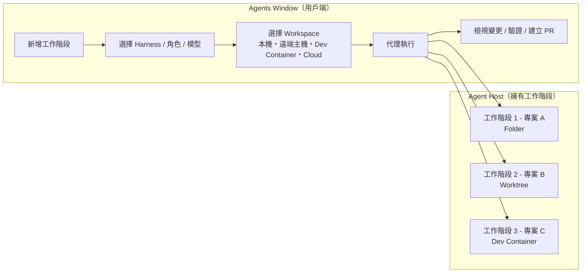
```mermaid
flowchart LR
    subgraph "Agents Window（用戶端）"
        A[新增工作階段] --> B[選擇 Harness / 角色 / 模型]
        B --> C[選擇 Workspace<br/>本機・遠端主機・Dev Container・Cloud]
        C --> D[代理執行]
        D --> E[檢視變更 / 驗證 / 建立 PR]
    end

    subgraph "Agent Host（擁有工作階段）"
        F[工作階段 1 - 專案 A<br/>Folder]
        G[工作階段 2 - 專案 B<br/>Worktree]
        H[工作階段 3 - 專案 C<br/>Dev Container]
    end

    D --> F
    D --> G
    D --> H
```

#### 4.10.2 主要能力

| 功能 | 說明 |
| --- | --- |
| **多專案工作階段** | 同時管理多個代理工作階段，可並排開啟；Copilot 與 Claude 工作階段支援在同一工作階段中開多個對話 |
| **Quick chat** | 不需選擇 workspace 即可對話，之後可延續到特定 workspace |
| **程式碼隔離** | **Folder**：直接修改目前 workspace（含未提交變更）；**Worktree**：以已提交狀態建立獨立 Git worktree |
| **Dev Container 執行** | Agent Host 可在專案容器內執行（本機或遠端主機），使用容器內的工具與相依套件；Dev Container 工作階段不支援 New Worktree |
| **從 PR 開始工作** | 以既有 PR 建立工作階段；可附加 GitHub Issue 與 PR 作為上下文 |
| **檢視、驗證與提交** | 檢查檔案與變更、驗證、提交、**建立 PR**，並以 **Agent Merge**（Preview）完成 PR |
| **中途導引（Steering）** | 執行中補充指示、排入後續訊息或停止（停止**不會**復原已完成的動作） |
| **Artifacts** | 工作階段中擷取與引用的產出物 |
| **Browser tools** | 讓代理開啟網頁、測試使用者流程並回報結果 |
| **Automations**（Preview） | 在 Agents Window 中儲存提示與排程，定期執行例行工作；可匯出／匯入分享（以 `chat.automations.enabled` 開關，逐步推出中） |

**已知限制（官方）：** 代理下拉選單目前沒有 Plan 代理（可在 Copilot 或 Claude 工作階段使用 `/plan`）；Copilot Cloud 工作階段只支援 GitHub 上的 repository；Agents Window 尚不支援多根（multi-root）工作區；Local Harness 只能在主視窗中執行。

#### 4.10.3 Remote Agent Sessions

Remote Agent Sessions 讓 Agent Host 在遠端主機上、貼近原始碼執行，使用者從桌面或瀏覽器連線監看。

| 連線方式 | 說明 |
| --- | --- |
| **SSH** | 連到 SSH 主機上的 Agent Host |
| **Dev tunnel** | 透過 dev tunnel 連線，也能從**瀏覽器版 Agents Window** 存取 |
| **遠端 Dev Container** | 在遠端主機的容器中執行工作階段 |
| **自架 Agent Host** | 以 `code agent host` 啟動獨立 Agent Host（預設 localhost 並以連線權杖保護；`--tunnel` 可透過 dev tunnel 對外） |

**適用場景：**

- 長時間執行的重構任務——關上筆電後代理繼續工作
- 需要大量運算資源的任務——利用遠端高規主機
- 跨時區團隊——下班前啟動代理、隔天審核結果

> ⚠️ **安全提醒**：遠端工作階段在遠端主機以您的權限執行。請確保遠端環境符合企業安全政策，優先使用受控環境（如 Codespaces 或企業管理的 Dev Container），並啟用沙箱。

### 4.11 Custom Agent Handoffs（工作流程交接）

Handoffs 讓 Custom Agent 在回應完成後，顯示「下一步」按鈕，引導使用者依序交接到其他代理，例如 Plan → 實作 → 審查。每一步都保留人工檢視的機會。

#### 4.11.1 Handoffs 機制

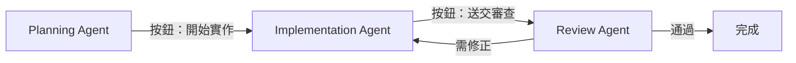
```mermaid
flowchart LR
    A[Planning Agent] -->|按鈕：開始實作| B[Implementation Agent]
    B -->|按鈕：送交審查| C[Review Agent]
    C -->|需修正| B
    C -->|通過| D[完成]
```

#### 4.11.2 設定方式

> ⚠️ **v7.0 更正**：v6.0 範例缺少必要的 `label` 欄位，且使用了不存在的 `{plan}` 佔位符。正確欄位如下。

| 欄位 | 說明 |
| --- | --- |
| `label` | 按鈕上顯示的文字 |
| `agent` | 要切換到的目標代理識別名稱 |
| `prompt` | 預先填入目標代理的提示文字 |
| `send` | 是否自動送出提示（預設 `false`，讓使用者先檢視） |
| `model` | 交接時使用的模型，格式為 `模型名稱 (供應商)`，例如 `GPT-5 (copilot)` |

```markdown
<!-- .github/agents/planner.agent.md -->
---
name: Planner
description: 分析需求並產出實作計畫
tools: ['read', 'search', 'web/fetch']
handoffs:
  - label: 開始實作
    agent: implementer
    prompt: 請依照上方的實作計畫開始實作，完成後執行單元測試。
    send: false
  - label: 請審查員先看計畫
    agent: reviewer
    prompt: 請審查上方計畫的風險與遺漏。
    send: false
---

你是專案規劃專家。只做研究與規劃，不修改任何檔案。
產出包含影響範圍、步驟與驗證方式的結構化計畫。
```

選擇交接按鈕後，會切換到目標代理並預填提示；若 `send: true` 則自動送出。

#### 4.11.3 進階屬性

| 屬性 | 說明 |
| --- | --- |
| `handoffs` | 定義可交接的目標代理與預填提示（**交出主導權**，使用者每一步都可介入） |
| `agents` | 此代理可呼叫的子代理清單（**委派子任務**，結果回到本代理）；需在 `tools` 包含 `agent` |
| `user-invocable: false` | 讓代理只作為子代理使用，不出現在選單中 |
| `disable-model-invocation: true` | 禁止其他代理自動把它當子代理叫用 |

> 💡 **巢狀子代理**：Local 子代理預設不能再叫用子代理；開啟 `chat.subagents.allowInvocationsFromSubagents` 後可遞迴委派，**最大深度為 5**。遞迴任務務必設計終止條件。

#### 4.11.4 組織級共享

| 層級 | 設定方式 | 說明 |
| --- | --- | --- |
| **Workspace** | `.github/agents/*.agent.md` | 專案級代理，隨 repository 版控 |
| **User** | `~/.copilot/agents/` 或 `~/.claude/agents/` | 個人代理 |
| **Organization** | 組織 `.github` 或 `.github-private` repository 的 `/agents/*.md` | 組織共享 |
| **Enterprise** | 企業指定組織的 `.github-private` repository 的 `/agents/*.md` | 全企業共享 |

VS Code 端啟用組織級代理探索：

```json
{
  "github.copilot.chat.organizationCustomAgents.enabled": true
}
```

> 💡 代理下拉選單會列出內建角色，以及來自使用者、workspace、組織、擴充套件與外掛的 Custom Agents，可從選單辨識每個代理的來源。

#### 4.11.5 Claude Agent 格式相容（VS Code）

VS Code 支援 Claude 格式的代理定義（`.claude/agents/*.md`，使用者層級為 `~/.claude/agents/`），讓已採用 Claude Code 的團隊可平滑過渡：

| 欄位 | 說明 |
| --- | --- |
| `name` | 代理名稱（Claude 格式中為**必填**） |
| `description` | 代理用途 |
| `tools` | 允許的工具，**逗號分隔字串**（例如 `"Read, Grep, Glob, Bash"`） |
| `disallowedTools` | 禁止的工具，逗號分隔字串 |

```markdown
<!-- .claude/agents/code-explorer.md -->
---
name: code-explorer
description: 唯讀的程式碼探索代理
tools: "Read, Grep, Glob"
---

只負責探索與說明程式碼結構，不修改任何檔案。
```

VS Code 會把 Claude 專屬的工具名稱對應到 VS Code 的工具，兩種格式（YAML 陣列與逗號分隔字串）都支援。

> ⚠️ **範圍澄清**：GitHub Cloud Agent／CLI 的官方文件並未提及讀取 `.claude/agents/`。若要跨 VS Code、Cloud Agent、CLI 使用，建議以 `.github/agents/` 格式定義。

### 4.12 Copilot Memory 深入指南

Copilot Memory 讓 Copilot 隨時間記住 repository 的事實與個人的程式撰寫偏好，就像新進工程師逐漸熟悉專案一樣。**官方標示此功能目前為 Public Preview**。

#### 4.12.1 Memory 架構

官方只定義**兩種**記憶，並無「Session 層級記憶」：

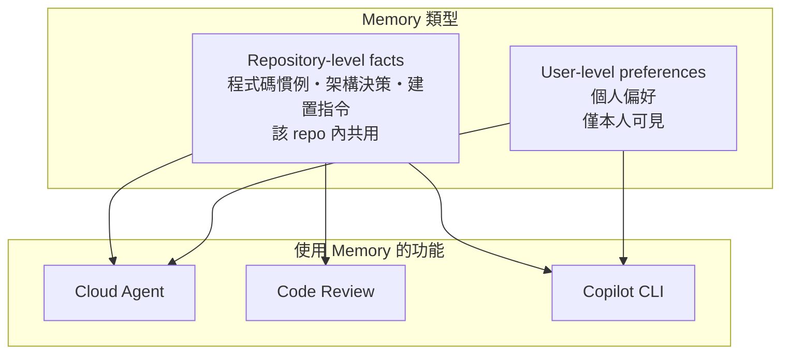
```mermaid
flowchart TB
    subgraph "Memory 類型"
        A[Repository-level facts<br/>程式碼慣例・架構決策・建置指令<br/>該 repo 內共用]
        B[User-level preferences<br/>個人偏好<br/>僅本人可見]
    end

    subgraph "使用 Memory 的功能"
        C[Cloud Agent]
        D[Code Review]
        E[Copilot CLI]
    end

    A --> C
    A --> D
    A --> E
    B --> C
    B --> E
```

> ⚠️ **重要澄清**：
>
> - Copilot Memory 目前用於 **Cloud Agent、Code Review 與 Copilot CLI**。
> - **Code Review 只套用 Repository-level facts**，不套用個人偏好。
> - **Copilot CLI 套用 Repository-level facts，加上發起操作者本人的偏好**。
> - 功能之間會**互相共用**記憶：例如 Cloud Agent 發現的資料庫連線慣例，之後 Code Review 可用來找出不一致的寫法；Code Review 學到「兩個檔案的設定必須同步」，Cloud Agent 修改其中一個時就會一併更新另一個。

#### 4.12.2 Memory 特性

| 特性 | 說明 |
| --- | --- |
| **附引用並驗證** | Repository-level facts 附有指向支持程式碼的**引用**；使用前會對照**目前分支**檢查是否仍正確，只使用通過驗證的事實 |
| **誰能產生 repo 事實** | 只有對該 repository **具寫入權限**、且啟用 Memory 的使用者所觸發的操作，才會產生 repo 事實 |
| **範圍** | Repository-level facts 只能用於**同一 repository**，不跨 repo、不跨組織 |
| **個人偏好** | 附引用（可能包含使用者原話）；只在同一使用者後續的互動中使用 |
| **自動清除** | 28 天未使用即刪除；成功驗證並使用時計時器可能重置 |
| **未合併的 PR** | 也可能從關閉未合併的 PR 擷取事實，但必須通過目前程式碼驗證才會影響行為 |
| **檢視與刪除** | 使用者可在 [個人設定](https://github.com/settings/copilot/memory) 檢視與刪除自己的偏好；repository 擁有者可檢視與刪除 repo 事實 |

#### 4.12.3 啟用與管理

- **以使用者為單位啟用**，不是以 repository 為單位；啟用後適用於該使用者使用 Copilot 的所有 repository。
- **個人方案預設開啟**。
- **組織／企業方案**：管理員必須先**開啟政策**，使用者之後可自行退出。
- **Business／Enterprise 的管理權**：管理員可**批次或逐一匯出、刪除**使用者偏好。偏好歸屬於「計費實體」（授予授權的組織或企業），建立代理上下文時只會取用目前計費實體擁有的記憶。
- **多授權使用者**：必須在 [帳號設定](https://github.com/settings/copilot/features) 中選定預設計費實體，才會開始產生個人偏好。

**在對話中新增記憶：**

```markdown
# 在 Copilot CLI 或 Cloud Agent 的工作中直接告知
"請記住：這個專案的 API 回應一律使用 snake_case，建置指令是 ./mvnw -q verify"
```

#### 4.12.4 企業環境建議

- **啟用前評估**：開啟組織政策前，評估記憶中可能出現的敏感資訊，並將 Memory 納入資料分類與保存政策
- **定期審查**：repository 擁有者定期檢視 repo 事實；使用者定期檢視個人偏好
- **與 Custom Instructions 分工**：團隊必須遵守的標準寫進 `.github/copilot-instructions.md`（可審查、可版控）；Memory 用於代理自行學到的補充知識
- **Code Review 整合**：Memory 讓 Code Review 更了解專案慣例，減少誤報

> ⚠️ **隱私注意**：避免在對話中要求記住密碼、API Key 等機敏資訊。

#### 4.12.5 VS Code 本機 Memory Tool（與 Copilot Memory 的差異）

> 🆕 **v7.0 新增**：v6.0 寫到「Chat／Agent Mode 不使用 Memory」，但同時提到 Plan 會寫入 `/memories/session/plan.md`，看似矛盾。實際上這是**兩套不同的機制**。

VS Code 內建一個 **memory tool**，讓代理在工作中儲存與回想筆記，也可以明確要求代理記住某件事。**資料存放在本機**：

| 範圍 | 路徑 | 跨工作階段 | 跨 workspace | 用途 |
| --- | --- | :---: | :---: | --- |
| **User** | `/memories/` | ✅ | ✅ | 偏好、常用指令；每次工作階段開始時**自動載入前 200 行** |
| **Repository** | `/memories/repo/` | ✅ | ❌ | 程式庫慣例、專案結構、建置指令 |
| **Session** | `/memories/session/` | ❌ | ❌ | 任務暫存筆記、進行中的計畫（Plan 代理的 `plan.md`） |

| 比較 | GitHub Copilot Memory | VS Code Memory Tool |
| --- | --- | --- |
| 儲存位置 | GitHub 伺服器端 | 本機 |
| 使用者 | Cloud Agent、Code Review、Copilot CLI | VS Code 的代理工作階段 |
| 團隊共享 | Repo 事實可在同一 repository 共用 | 不共享（僅本機） |
| 驗證機制 | 附引用、對照目前分支驗證 | 無自動驗證 |
| 管理 | GitHub 設定頁、管理員政策 | **Chat: Show Memory Files** 指令 |

### 4.13 Copilot Spaces 深入指南

Copilot Spaces 讓您把 Copilot 回答問題所需的上下文（程式碼、文件、討論）整理成一個**持久化的集合**。與 Custom Instructions（規則）或 Copilot Memory（自動累積）不同，Space 是**主動策劃的資料集合**，適合特定任務、模組或專案階段使用。

> 📍 官方文件位於 [`concepts/context/spaces`](https://docs.github.com/en/copilot/concepts/context/spaces)。

#### 4.13.1 可加入的內容類型

| 類型 | 說明 |
| --- | --- |
| **Repositories／程式碼** | 整個 repository 或特定路徑 |
| **Pull Requests** | 特定 PR 的討論與變更 |
| **Issues** | 特定 Issue 的討論串 |
| **自由文字** | 會議記錄、逐字稿、筆記等 |
| **圖片** | 截圖、流程圖等 |
| **檔案上傳** | 文件、試算表等 |

> ✅ **自動同步**：加入 Space 的 GitHub 檔案與其他 GitHub 來源，會**隨專案變動自動更新**，讓 Space 保持最新。

#### 4.13.2 使用方式

1. **在 GitHub 上使用**：於 `github.com/copilot/spaces` 開啟 Space，對話即以該 Space 為上下文
2. **在 IDE 中使用**：透過 IDE 中的 **GitHub MCP Server** 存取 Space 的上下文。在 Agent 對話中以名稱與擁有者提及 Space（例如「使用 myorg 擁有的 Copilot space『Checkout Flow Redesign』，幫我整理…」），代理會透過 MCP 工具找到該 Space

**Spaces 的價值（官方列舉）：** 得到更相關、更具體的回答；把任務所需資料集中一處、減少打斷；透過分享減少重複提問；提供不依賴對話紀錄的自助式上下文，支援新人上手與重用。

#### 4.13.3 權限與共享

| 擁有者類型 | 權限層級 | 說明 |
| --- | --- | --- |
| **組織擁有** | Admin／Editor／Viewer／No access | 依組織成員分別授權，可設為 No access 隱藏 |
| **個人擁有** | 公開（預設唯讀）／指定使用者／私人 | 個人自行決定分享範圍 |

> ⚠️ **重要**：即使被授予 Space 的檢視權限，**使用者仍只能看到自己原本就有權存取的來源**（例如私有 repository）。Space 的分享權限不會繞過底層資源的存取控制。
>
> ⚠️ **治理注意**：官方說明目前系統**不會阻擋**使用者在「未設定或已停用 Spaces」的組織下建立 Space——只要其 Copilot 座位來自另一個已啟用 Spaces 的組織即可。組織應將此行為納入治理考量。

#### 4.13.4 方案支援與計費

- **方案支援**：任何擁有 Copilot 授權的使用者（**包含 Copilot Free**）都可以建立與使用 Spaces。
- **計費**：在 Space 中提問等同 Copilot Chat 請求，依模型與 Token 消耗 AI Credits；**Free 使用者計入每月 Chat 上限**；Business／Enterprise 從企業共池扣除。
- **容量限制**：官方文件未列出具體的檔案數量或總容量上限；坊間提及的數字並非官方規格，請以介面提示為準。

#### 4.13.5 與 Memory／Custom Instructions 的分工建議

| 機制 | 適合場景 | 維護者 |
| --- | --- | --- |
| **Custom Instructions** | 團隊規範、程式碼風格、建置與測試指令等「規則」 | Tech Lead，經 PR 審查 |
| **Copilot Memory** | 代理自動累積的 repo 慣例與個人偏好 | 自動產生，repository 擁有者定期檢視 |
| **Copilot Spaces** | 特定任務的「策劃式上下文集合」，如某次重構、某個模組的規格與討論串 | 任務負責人 |
| **Agent Skills** | 可重複執行、需要腳本或範本的專業流程 | 開發標準團隊 |

### 4.14 GitHub Copilot App 深入指南

> 🆕 **v7.0 新增**

GitHub Copilot App 是**以代理驅動開發為核心**的桌面應用程式，建構於 Copilot CLI 之上，並與 GitHub 原生整合。它讓開發者在單一介面中指揮多個代理平行處理工作、處理 Issue 與 PR，並管理完整的開發生命週期，不必在終端機、IDE 與瀏覽器之間切換。

#### 4.14.1 可用性

| 項目 | 說明 |
| --- | --- |
| **方案** | 所有 Copilot 方案皆可使用 |
| **作業系統** | macOS、Linux、Windows |
| **企業政策** | Business／Enterprise 的「GitHub Copilot app」政策必須保持開啟（**預設開啟**，且與 Copilot CLI 政策**彼此獨立**） |
| **Content Exclusion** | 遵守企業、組織與 repository 層級的內容排除設定 |

#### 4.14.2 核心能力

| 能力 | 說明 |
| --- | --- |
| **平行工作區** | 同時執行多個隔離的代理工作階段，每個都有專屬的 **Git worktree 與分支**；可在 Cloud sandbox 執行，或設定本機沙箱限制代理工具可用的資源 |
| **工作階段模式** | **Interactive**（協作）、**Plan**（代理規劃、你核准）、**Autopilot**（完全自主）；每個工作階段可選模型與推理強度 |
| **模型選擇** | 多種 LLM，包含透過 **BYOK** 使用自有供應商的模型 |
| **GitHub 整合** | 瀏覽與搜尋 Issue、從 Issue 啟動工作階段、建立與關閉 PR、審查 PR、查看 CI 結果、跨 repository 搜尋 |
| **自訂化** | 設定全域指令、MCP servers、Agent Skills 與 Plugins（**Customize → Plugins**） |
| **Automations** | 儲存週期性代理任務，依排程或手動執行（**Automations** 頁籤） |
| **Chats** | 不建立分支或工作區的腦力激盪對話 |
| **Session history** | 以 `/chronicle` 從過往工作階段取得洞察 |
| **Canvases** | 由代理驅動、人與代理共同協作的自訂介面；已整合 Jira、Azure DevOps、Sentry |

#### 4.14.3 典型工作流程


```mermaid
flowchart LR
    A[瀏覽 Issue<br/>或空白工作區] --> B[選擇模式<br/>Interactive / Plan / Autopilot]
    B --> C[選擇模型與推理強度]
    C --> D[代理建立分支<br/>撰寫程式碼・執行測試]
    D --> E[審查變更<br/>回饋與迭代]
    E --> F[建立 PR・檢查 CI・合併]
```

多個這樣的流程可以在各自的工作區中平行進行，並隨時切換。

#### 4.14.4 成本優化建議（官方）

- **依任務複雜度選模型**：簡單變更用較輕量的模型；複雜除錯、設計決策、多步驟任務才用高能力模型
- **依工作階段選模式**：Plan 確認範圍與方法 → Interactive 需要緊密引導時 → 任務明確後才切換 Autopilot
- **先用 Chats 釐清範圍**：在建立完整工作階段之前先釐清需求，減少重工
- **換任務就開新工作階段**：避免把無關的歷史帶進新工作
- **定期看使用洞察**：執行 `/chronicle cost tips` 找出昂貴的使用模式

> ⚠️ **公開程式碼比對**：官方提醒，即使「Suggestions matching public code」政策設為 **Block**，Copilot App 仍**可能**產生與公開程式碼相同或相近的程式碼。對著作權敏感的專案應搭配 Code Referencing 與授權掃描工具（見 [6.4.1](#641-著作權風險)）。
>
> 🏢 **企業導入建議**：Copilot App 讓個人可同時推進多項任務，也更容易產生大量待審 PR。建議搭配 [2.5](#25-代理時代的角色轉變從實作者到代理指揮者) 的 WIP 限制，並透過 managed settings 統一權限、沙箱與外掛政策。

---

## 第五章 Copilot + Code Review + Testing 最佳實務

> 📌 **本章摘要**：說明 Copilot Code Review 的可用範圍、審查深度（Lite／Balanced）、自動審查、計費歸屬、Runner 控管與安全注意事項，並整理以 Copilot 產生與審查測試的做法，以及 CI／CD 中的代理自動化（Automations、Agentic Workflows）。

### 5.1 Copilot 與 Code Review 的整合

#### 5.1.1 Copilot Code Review 功能概覽

Copilot Code Review 會從多個角度審查任何語言的程式碼，指出問題並提供可一鍵套用的修正建議。它已從單純的 PR 評論工具，演進為具備**代理能力**的審查服務：

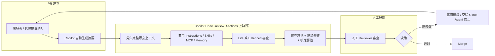
```mermaid
flowchart LR
    subgraph "PR 建立"
        A[開發者 / 代理提交 PR] --> B[Copilot 自動生成摘要]
    end

    subgraph "Copilot Code Review（Actions 上執行）"
        B --> C[蒐集完整專案上下文]
        C --> D[套用 Instructions / Skills / MCP / Memory]
        D --> E[Lite 或 Balanced 審查]
        E --> F[審查意見 + 建議修正<br/>+ 核准評估]
    end

    subgraph "人工把關"
        F --> G[人工 Reviewer 審查]
        G --> H{決策}
    end

    H -->|需修改| I[套用建議 / 交給 Cloud Agent 修正]
    H -->|通過| J[Merge]
    I --> A
```

**可用介面：** GitHub.com、GitHub CLI、GitHub Mobile、VS Code、Visual Studio、Xcode、JetBrains IDEs，以及 **Azure DevOps（Public Preview）**。

| 方式 | 說明 | 可用方案 |
| --- | --- | --- |
| **PR Code Review** | 在 PR 的 Reviewers 指派 Copilot，或設定自動審查 | Student、Pro、Pro+、Max、Business、Enterprise |
| **IDE 審查** | 在 IDE 中審查選取範圍或變更 | 付費方案；**Free 僅限 VS Code 的「Review selection」** |
| **CLI 審查** | Copilot CLI 的 `/review`（code-review 代理）與 `/security-review` | 含 Copilot CLI 的方案 |
| **無授權成員審查** 🆕 | 組織內**沒有 Copilot 授權**的成員也能在 GitHub.com 使用 Code Review（IDE 不適用） | Business／Enterprise，需開啟兩項政策 |

> 💡 **組織政策前提**：若 Copilot 由組織提供，組織必須在 Copilot 政策中開啟「**Copilot code review**」，GitHub.com 與 GitHub Mobile 上的審查才能使用。

**審查深度（Review effort level）：**

| 深度 | 行為 | 適用 | 官方估計成本／次 |
| --- | --- | --- | --- |
| **Lite** | 快速、聚焦常見問題（Bug、安全漏洞、風格不一致）；已支援合併多個代理的發現 | 例行變更，快速回饋比詳盡分析重要 | $0.05–$1 USD |
| **Balanced** | 將 PR 交給推理能力更高的模型，對複雜邏輯、安全敏感程式碼與跨服務變更做更長時間分析 | 安全敏感程式碼、多服務 PR、品質要求嚴格的 repository | $0.25–$5 USD |

> ⚠️ **2026/09/28 起預設改為 Balanced**：若要維持 Lite，須在組織或 repository 設定中明確選擇。成本估計不含 Actions 分鐘數（詳見 [1.5.4](#154-copilot-code-review-的特殊計費)）。

**決定審查深度的優先順序**（取第一個適用者）：

1. 請求審查時選擇的深度
2. 此 PR 先前使用過的深度
3. 請求者的個人預設（新 PR 的請求者是作者；將草稿標為可審查者則是該操作者）
4. Repository 設定
5. 組織設定（使用者擁有的 repository 則為擁有者的個人設定）
6. GitHub 內建預設（Lite；部分擁有者的內建預設為 Balanced）

**其他重要能力：**

| 能力 | 說明 |
| --- | --- |
| **完整專案上下文** | 分析整個 repository，理解變更的影響範圍 |
| **交給 Cloud Agent 修正**（Public Preview） | 將審查建議交給 Cloud Agent，自動對來源分支開一個套用修正的新 PR |
| **Agent Skills 與 MCP** | 會使用 repository 層級的 Skills 與 MCP Server（GitHub MCP 與 Playwright MCP 預設啟用）；可在 repository 設定關閉「Allow Copilot to use MCP tools when reviewing pull requests」 |
| **Copilot Memory** | 套用 Repository-level facts，讓建議更符合專案慣例（不套用個人偏好） |
| **核准評估與 Copilot approvals**（Public Preview） | 每次審查的總覽意見都會評估 PR 是否可核准；在 repository、組織與企業設定都開啟後，Copilot 的核准可**計入必要核准數**；有新 commit 推送時，核准會自動撤銷 |
| **自動 Resolve 與 commit 訊息**（2026/09） | 開發者處理完意見後，Copilot 會自動 resolve 自己的意見；批次套用建議時會產生有意義的 commit 訊息 |
| **模型** | 使用專為審查調校的模型組合，**不支援切換模型**；可能使用組織「Models」設定頁中未啟用的模型（該頁只控管 Copilot Chat） |

> ⚠️ **治理重點：Copilot approvals**。允許 Copilot 的核准計入必要核准數，等於讓 AI 成為合併流程中的一道簽核。受監管產業應審慎評估，至少對關鍵分支保留「**必須有人類核准**」的規則。

#### 5.1.2 使用 Copilot 輔助 Code Review

##### Step 1：讓 Copilot 生成 PR 摘要

```markdown
## Copilot 自動生成的 PR 摘要範例

### Summary
This PR implements the multi-currency payment feature with the following changes:

### Changes
- Added `CurrencyConverter` service for exchange rate handling
- Implemented `PaymentProcessor` with support for TWD, USD, JPY
- Added idempotency support to prevent duplicate charges

### Testing
- Added unit tests covering normal flow and edge cases
- Integration tests with mock payment gateway
```

##### Step 2：使用 Copilot Chat 深入分析

```markdown
## Prompt：PR 安全審查

請以資安專家角度審查這個 PR 的變更：

重點檢查：
1. 是否有 SQL Injection 風險
2. 是否有 Sensitive Data Exposure
3. 輸入驗證是否完整
4. 是否有適當的 Error Handling（不洩露系統資訊）

#file:src/main/java/com/example/payment/PaymentProcessor.java
#file:src/main/java/com/example/payment/CurrencyConverter.java
#search/changes
```

> 💡 在 Copilot CLI 中，也可以直接執行 `/security-review 聚焦本次 payment 模組的變更`，由唯讀的 `security-review` 代理只回報高信心度的弱點。

##### Step 3：處理 Copilot 的審查意見

- **套用建議**：直接套用 Copilot 提供的修正建議（可批次套用，Copilot 會產生 commit 訊息）
- **交給代理修正**：將建議交給 Cloud Agent，由它開一個修正 PR（Public Preview）
- **重新審查**：若未設定「Review new pushes」，Copilot 對每個 PR 只自動審查一次；變更後可在 Reviewers 選單中手動要求重新審查

> 💡 官方說明：您可以對 Copilot 的審查意見加上反應、留言、Resolve 或 Hide，但**留言回覆只有人類看得到，Copilot 不會讀取也不會回覆**。要讓 Copilot 依回饋修改程式碼，請使用上述的套用建議或交給代理修正。

#### 5.1.3 Code Review Checklist（結合 Copilot）

| 審查項目 | Copilot 輔助方式 | 人工重點 |
| ---------- | ------------------ | ---------- |
| **功能正確性** | Code Review 意見、Chat 解釋邏輯 | 業務邏輯驗證 |
| **程式碼品質** | Code Review（Lite）、Chat 識別 Code Smell | 架構一致性 |
| **效能** | Chat 複雜度分析 | 實際負載評估 |
| **安全性** | Code Review（Balanced）、CLI `/security-review`、CodeQL | 業務風險評估、修補優先序 |
| **測試覆蓋** | Agent 補充並執行測試 | 測試策略審查 |
| **文件完整** | Inline 補充 JavaDoc | 文件準確性 |
| **代理產出** | 檢查是否有超出範圍的變更 | 以 Issue 驗收條件逐條核對 |

#### 5.1.4 進階設定：自動觸發、路徑範圍指令與 Runner 控管

##### 自動觸發審查（Automatic Review）

預設情況下，只有將 Copilot 指派為 Reviewer 時才會審查。可以在三個層級設定自動審查：

| 設定者 | 範圍 | 條件 |
| --- | --- | --- |
| **使用者** | 自己建立的 PR | Pro、Pro+、Max，或持有 Business／Enterprise 授權；**不適用 Managed user accounts** |
| **Repository 擁有者** | Repository 內由有 Copilot 權限者建立的所有 PR | 透過 Repository Ruleset |
| **組織擁有者** | 組織內部分或全部 repository | 透過組織 Ruleset |

**以 Ruleset 設定的步驟：**

1. 進入 repository（或組織）的 **Settings → Rules → Rulesets → New ruleset → New branch ruleset**
2. 將 Enforcement 設為 **Active**，並指定目標分支
3. 在 Branch rules 中啟用「**Automatically request Copilot code review**」
4. 視需要啟用子選項：「**Review new pushes**」（每次 push 都重新審查）、「**Review draft pull requests**」（草稿 PR 也審查）

**觸發時機：**

| 設定 | 觸發 |
| --- | --- |
| 基本設定 | 以「Open」狀態建立 PR 時；或第一次將草稿 PR 轉為 Open 時 |
| Review new pushes | 每次推送新 commit 時 |
| Review draft pull requests | PR 仍為草稿時即審查 |

> 💡 **兩套設定並存**：使用者設定與 Ruleset **不是上下層關係**，任一個開啟就會自動審查；兩者都開啟也只會產生一次審查。使用者**無法**用個人設定關閉 Ruleset 開啟的「push／草稿審查」。組織管理員可鎖定 Ruleset，讓下層 repository 無法覆寫。
>
> 💡 若組織已開放「無授權成員使用 Code Review」，自動審查也會套用到無授權成員建立的 PR，且其消耗一律計入組織的額外用量。

##### 路徑範圍審查指令與 Skills

Copilot Code Review 會讀取以下自訂化來源，官方並建議依用途分工：

| 來源 | 最適用途 | 啟用方式 |
| --- | --- | --- |
| `.github/copilot-instructions.md` | 整個 repository 常駐的 Copilot 規則（編碼標準、架構預設、測試期望） | 自動 |
| `.github/instructions/**/*.instructions.md` | 特定路徑、檔案類型或目錄的規則（例如只對 `**/payment/**` 加強金流安全檢查） | 變更檔案符合範圍時自動套用 |
| `AGENTS.md` | 跨 AI 代理共用的 repository 慣例 | 自動（從根目錄讀取） |
| Agent Skills（`.github/skills/`） | 任務型審查流程（審查、發佈、遷移、分析） | 相關時自動使用；以審查為主題的 Skill 目錄名稱（如 `code-review`）更容易被採用 |

> ⚠️ **安全重點：審查規則來自 PR 的來源分支**。官方說明 Code Review 讀取的 Instructions、Agent 指令與 Skills 來自 **head branch（含變更的分支）**，而不是 base branch。換言之，**PR 作者可以在同一個 PR 中修改審查規則**。建議：
>
> - 以 CODEOWNERS 要求 `.github/instructions/`、`.github/skills/`、`copilot-instructions.md`、`AGENTS.md` 的變更必須經指定人員核准
> - 不要把 Copilot Code Review 當成唯一的安全閘門，應搭配 CodeQL、Secret scanning 等由 base branch 設定控管的檢查

手動請求審查的方式：Web UI（Reviewers 側邊欄點選 Copilot）、REST API、GitHub CLI（例如 `gh pr edit PR-NUMBER --add-reviewer @copilot`）。

##### 為何需要 GitHub Actions Runner

官方說明：Copilot Code Review 使用 GitHub Actions 執行**代理能力**，包括完整專案上下文蒐集，以及把建議交給 Cloud Agent。也就是說，審查並非單純的 API 呼叫，而是一個會先蒐集 repository 上下文的 Actions 工作。組織**不需要**另外開啟 GitHub Actions 就能使用這些代理能力。

| Runner 類型 | 計費與控管 |
| --- | --- |
| **標準 GitHub-hosted（預設）** | 消耗 Actions 分鐘數，歸屬於 repository |
| **Larger GitHub-hosted** | 更多 CPU／記憶體／磁碟，並支援 Azure 私有網路（需允許連線 `api.githubcopilot.com`）；每分鐘費率較高 |
| **Self-hosted（ARC）** | 官方指出 **ARC（Actions Runner Controller）是唯一官方支援的自架方案**，基於安全理由**不要使用非 ARC 的自架 Runner**；僅相容 **Ubuntu x64 Linux**；防火牆需允許 GitHub Actions 標準主機及 `api.githubcopilot.com`；不消耗 Actions 分鐘數 |

**設定方式：** 在 repository 的 `.github/workflows/copilot-code-review.yml` 中，將 `runs-on` 設為 ARC scale set 名稱或 Larger runner 標籤；若沒有此檔，Code Review 會改用 `copilot-setup-steps.yml`。

> ⚠️ **降級提醒**：若組織停用了 GitHub-hosted Runner、又沒有設定自架 Runner，或 Actions 工作失敗，審查**仍會產生，但會降級為較有限的審查**（缺少代理能力），而不是直接失敗。企業導入時應確認此降級行為是否符合品質要求。

##### 已知限制與排除檔案

- 預設**排除審查**：相依性管理檔（如 `package.json`、`Gemfile.lock`）、日誌檔、SVG 檔
- 超大型 PR 的 diff 可能超出上下文範圍，Copilot 會註明未完整審查的部分
- Code Review 聚焦於 PR 中的變更；若要針對整個預設分支取得系統性的可靠性與可維護性回饋，官方建議搭配 **GitHub Code Quality**（以 CodeQL 為基礎的規則式分析）

### 5.2 Copilot 與 Testing 的整合

#### 5.2.1 測試金字塔與 Copilot 角色

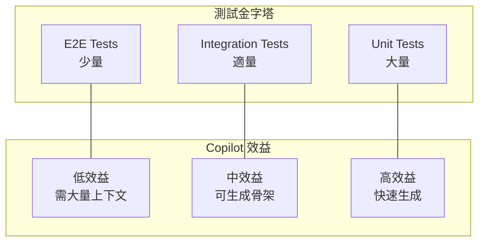
```mermaid
graph TB
    subgraph "測試金字塔"
        A[E2E Tests<br/>少量] 
        B[Integration Tests<br/>適量]
        C[Unit Tests<br/>大量]
    end
    
    subgraph "Copilot 效益"
        D[低效益<br/>需大量上下文]
        E[中效益<br/>可生成骨架]
        F[高效益<br/>快速生成]
    end
    
    A --- D
    B --- E
    C --- F
```

#### 5.2.2 單元測試生成最佳實務

##### 策略一：Test-Driven Prompting

```java
// 先寫測試意圖，讓 Copilot 生成測試程式碼
class PaymentProcessorTest {
    
    @Nested
    @DisplayName("正常付款流程")
    class NormalPaymentFlow {
        
        // 測試：有效信用卡應該成功扣款
        // Given: 有效卡號、足夠餘額
        // When: 執行付款
        // Then: 回傳成功結果，包含交易編號
        @Test
        void shouldProcessPayment_whenValidCreditCard() {
            // Copilot 生成 AAA 結構的測試
        }
    }
    
    @Nested
    @DisplayName("異常情境")
    class ExceptionScenarios {
        
        // 測試：卡號無效應拋出 CardValidationException
        @Test
        void shouldThrowCardValidationException_whenInvalidCardNumber() {
            // Copilot 生成
        }
        
        // 測試：餘額不足應拋出 InsufficientFundsException
        @Test
        void shouldThrowInsufficientFundsException_whenBalanceNotEnough() {
            // Copilot 生成
        }
    }
}
```

##### 策略二：邊界值自動補充

```markdown
## Prompt：邊界測試生成

請為以下方法生成邊界值測試：

方法簽名：
public BigDecimal calculateDiscount(BigDecimal amount, int quantity)

請涵蓋：
1. amount = 0, amount = MAX_VALUE
2. quantity = 0, quantity = 1, quantity = MAX_INT
3. amount 為 null
4. 負數情境

測試框架：JUnit 5 + AssertJ
```

#### 5.2.3 測試程式碼品質檢查

**使用 Copilot Chat 審查測試品質：**

```markdown
## Prompt：測試品質審查

請審查以下測試程式碼的品質：

檢查項目：
1. 測試是否獨立（不依賴執行順序）
2. 測試命名是否清晰描述測試意圖
3. 是否有適當的 Arrange-Act-Assert 結構
4. Mock 使用是否恰當
5. 是否有遺漏的測試情境

[測試程式碼]
```

#### 5.2.4 讓代理執行並驗證測試

> 🆕 **v7.0 新增**

在代理時代，「產生測試」只是第一步，更重要的是**讓代理自行執行測試並依結果修正**：

| 做法 | 工具 | 說明 |
| --- | --- | --- |
| **在提示中寫明驗證方式** | Agent／CLI | 例如「新增測試後執行 `./mvnw -q test`，全部通過才算完成」 |
| **提供失敗資訊** | VS Code `#execute/testFailure`、Test Explorer 的 **Fix Test Failure** | 直接把失敗細節交給代理 |
| **精簡測試輸出** | CLI `task` 子代理 | 成功時只回傳摘要、失敗時回傳完整輸出，避免塞滿上下文 |
| **UI 流程驗證** | VS Code Browser tools、Playwright MCP | 讓代理開啟應用、操作使用者流程並回報結果 |
| **測試驅動開發** | Plan → Agent | 先讓代理寫出會失敗的測試，人工確認測試意圖後再實作 |
| **夜間修復** | Automations | 每晚檢查 `main` 上失敗的測試，嘗試修正並開草稿 PR |

> ⚠️ **注意**：代理可能為了讓測試通過而**修改測試本身**或放寬斷言。審查代理產出的 PR 時，應特別檢查測試檔的變更是否合理。可在 `.instructions.md` 中明訂「除非需求變更，不得修改既有測試的斷言」。

### 5.3 CI/CD 整合建議

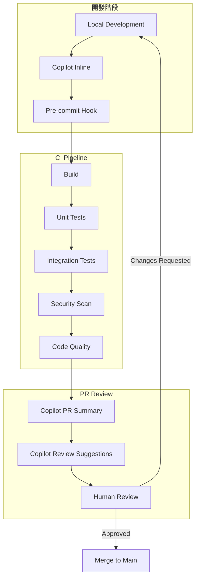
```mermaid
flowchart TB
    subgraph "開發階段"
        A[Local Development] --> B[Copilot Inline]
        B --> C[Pre-commit Hook]
    end
    
    subgraph "CI Pipeline"
        C --> D[Build]
        D --> E[Unit Tests]
        E --> F[Integration Tests]
        F --> G[Security Scan]
        G --> H[Code Quality]
    end
    
    subgraph "PR Review"
        H --> I[Copilot PR Summary]
        I --> J[Copilot Review Suggestions]
        J --> K[Human Review]
    end
    
    K -->|Approved| L[Merge to Main]
    K -->|Changes Requested| A
```

#### 5.3.1 為 Cloud Agent 與 Code Review 準備執行環境

> 🆕 **v7.0 新增**

Cloud Agent 在**由 GitHub Actions 提供的臨時開發環境**中工作，會探索程式碼、修改、執行自動化測試與 linter。要讓代理能「自己驗證自己」，應事先準備好環境：

| 設定 | 位置 | 用途 |
| --- | --- | --- |
| **環境準備步驟** | `.github/workflows/copilot-setup-steps.yml` | 預先安裝相依套件、工具與建置環境，減少代理摸索時間（Code Review 未設定專屬檔案時也會沿用） |
| **Code Review Runner** | `.github/workflows/copilot-code-review.yml` | 指定 Larger runner 或 ARC 自架 Runner |
| **建置與測試指令** | `.github/copilot-instructions.md`／`AGENTS.md` | 告訴代理如何建置、測試與驗證變更 |
| **防火牆** | Repository 的 Copilot 設定 | 控制 Cloud Agent 可連線的網路位置 |
| **Secrets 與 Variables** | Repository／組織的 **Agents** secrets 與 variables | 供 MCP Server 或建置流程使用，勿寫在提示或自動化設定中 |
| **Hooks** | `.github/hooks/*.json` | 在 Cloud Agent 沙箱中執行驗證、稽核或安全掃描 |

> 🔐 **內建防護（官方）**：Cloud Agent 只能推送到單一分支（通常是新的 `copilot/` 分支）、不能直接執行 `git push`、不能把自己的 PR 標為可審查或核准合併；GitHub Actions workflow 預設要等具寫入權限的使用者按下 **Approve and run workflows** 才會執行；請 Cloud Agent 建 PR 的人不能核准該 PR；以代理自身身分開的 PR 需要額外一位核准者。

#### 5.3.2 CI／CD 中的代理自動化：Automations 與 Agentic Workflows

> 🆕 **v7.0 新增**

| 比較項目 | Copilot Automations | GitHub Agentic Workflows（Public Preview） |
| --- | --- | --- |
| **定義方式** | 在 Agents 頁籤或 Copilot App 以 UI 設定名稱、提示、觸發條件、模型與工具 | 以 Markdown（YAML frontmatter + 自然語言指令）撰寫，編譯為強化過的 `.lock.yml` Actions workflow |
| **版控與審查** | **不存於 Git**，不隨程式碼版控；僅建立者可見 | 與程式碼一起版控，透過 PR 審查 |
| **觸發** | 排程（每小時／每日／每週）、Issue 建立、PR 開啟、PR 同步（可加搜尋與檔案篩選） | 任何 GitHub Actions 觸發條件 |
| **代理引擎** | Copilot Cloud Agent | Copilot（預設）、Anthropic Claude、OpenAI Codex、Google Gemini（`engine` 屬性） |
| **權限模型** | 選取允許的工具；預設忽略無寫入權限者觸發的事件 | **預設唯讀**；寫入只能透過宣告的 `safe-outputs`；機密放在隔離的下游工作；輸出經威脅偵測 |
| **計費** | Actions 分鐘數 + AI Credits，計入**建立者** | Actions 分鐘數 + 推論成本（預設引擎計入 AI Credits；可用 `max-ai-credits` 限制單次執行，預設 1,000） |
| **適用方案** | Pro、Pro+、Max、Business、Enterprise；repository 必須為 **private 或 internal** | 需 GitHub Actions 與所選引擎的帳號 |

**Agentic Workflow 範例（每日 repository 狀態報告）：**

```markdown
---
on: daily
permissions:
  contents: read
  issues: read
  pull-requests: read
  copilot-requests: write
network: defaults
tools:
  github:
    toolsets: [default]
safe-outputs:
  create-issue:
---

# Daily Repo Status Report

檢視過去 24 小時的 repository 活動（合併的 PR、關閉的 Issue、新討論），
建立一個 Issue 摘要進度、阻礙與建議的下一步。內容保持精簡。
```

> 💡 **選用建議**：個人或小團隊的例行工作用 **Automations** 快速上手；需要稽核、多人維護、跨引擎，或必須透過 PR 審查的自動化，改用 **Agentic Workflows**（官方也建議「要把自動化存成程式碼、以 PR 審查或換用其他代理時」採用 Agentic Workflows）。組織內的 Agentic Workflows 建議使用內建的 `GITHUB_TOKEN` 並設定 `copilot-requests: write`，讓費用計入組織。

### 5.4 實務案例：完整的測試策略

```markdown
## 案例：交易對帳服務測試策略

### 1. 單元測試（Copilot 高效輔助）
- ReconciliationEngine 核心邏輯
- MatchingAlgorithm 匹配演算法
- AmountComparator 金額比較（含容差）

### 2. 整合測試（Copilot 中度輔助）
- ReconciliationService + Database
- ReconciliationService + External API

### 3. E2E 測試（Copilot 低度輔助，需人工設計）
- 完整對帳流程
- 異常恢復測試

### Copilot 使用建議
- 單元測試：大量使用 Copilot 生成
- 整合測試：使用 Copilot 生成骨架，人工補充設定
- E2E 測試：人工設計場景，Copilot 輔助實作
```

---

## 第六章 資安、法遵與風險控管

> 📌 **本章摘要**：從「輸入、輸出、流程、代理」四個面向盤點 Copilot 風險。說明常見漏洞防範、著作權（Code Referencing）、資料保護（含資料保留期與模型條款）、企業政策與 `managed-settings.json`、開發者工作站設定、Content Exclusion 的限制，以及稽核與可觀測性（Audit Log、OpenTelemetry、Usage Metrics）。

### 6.1 Copilot 的資安風險概覽

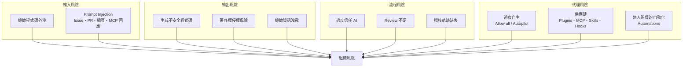
```mermaid
graph TB
    subgraph "輸入風險"
        A[機敏程式碼外洩]
        B[Prompt Injection<br/>Issue・PR・網頁・MCP 回應]
    end

    subgraph "輸出風險"
        C[生成不安全程式碼]
        D[著作權侵權風險]
        E[機敏資訊洩露]
    end

    subgraph "流程風險"
        F[過度信任 AI]
        G[Review 不足]
        H[稽核軌跡缺失]
    end

    subgraph "代理風險"
        P[過度自主<br/>Allow all / Autopilot]
        Q[供應鏈<br/>Plugins・MCP・Skills・Hooks]
        R[無人監督的自動化<br/>Automations]
    end

    A --> I[組織風險]
    B --> I
    C --> I
    D --> I
    E --> I
    F --> I
    G --> I
    H --> I
    P --> I
    Q --> I
    R --> I
```

**代理時代新增的風險與官方緩解機制：**

| 風險 | 情境 | 官方內建緩解 | 企業補強建議 |
| --- | --- | --- | --- |
| **Prompt Injection** | 外部貢獻者在 Issue 中埋入指令，觸發 Automations 或 Cloud Agent | 只有具寫入權限者能觸發 Cloud Agent；無寫入權限者的留言**不會**交給代理；Automations 預設忽略無寫入權限者觸發的事件 | 不要開啟「允許不受信任使用者的事件」；限制 Automations 可用的工具 |
| **未經驗證的程式碼** | 代理產生含漏洞或硬編碼機密的程式碼 | Cloud Agent 與第三方代理的產出會經 **CodeQL** 與 **Secret scanning** 掃描 | 仍須人工審查；保留 CI 中的安全掃描 |
| **代理推送程式碼** | 代理直接修改重要分支 | 只能推送到單一分支；不能直接 `git push`；不能核准或合併自己的 PR；Actions 需人工核准才執行 | 以分支保護與 CODEOWNERS 強化 |
| **過度自主** | Allow all／Autopilot 執行破壞性指令 | 第一次選用時警告；Autopilot 預設連續回合上限 | 以 managed settings 的 `permissions.disableBypassPermissionsMode` 禁用或限制；強制沙箱 |
| **供應鏈** | 安裝來路不明的外掛、MCP Server、Skill 或 Hook | VS Code 首次使用新市集或 MCP Server 時要求信任確認 | `strictKnownMarketplaces`、`allowedMcpServers` 允許清單；Hook 與 Skill 須經 Code Review |
| **審查規則被竄改** | PR 作者在同一 PR 中修改 `.instructions.md` 或 Skills，影響 Copilot Code Review | —（官方說明審查規則讀自 head branch） | CODEOWNERS 保護自訂化檔案（見 [5.1.4](#514-進階設定自動觸發路徑範圍指令與-runner-控管)） |
| **管理者失去可見度** | 大量代理工作階段難以追蹤 | Agents 頁籤、Session logs、Audit log | OpenTelemetry 匯出、Usage metrics 儀表板 |

### 6.2 常見安全漏洞與防範

#### 6.2.1 SQL Injection

```java
// ❌ Copilot 可能生成的不安全程式碼
public User findByUsername(String username) {
    String sql = "SELECT * FROM users WHERE username = '" + username + "'";
    return jdbcTemplate.queryForObject(sql, userRowMapper);
}

// ✅ 應該修正為
public User findByUsername(String username) {
    String sql = "SELECT * FROM users WHERE username = ?";
    return jdbcTemplate.queryForObject(sql, userRowMapper, username);
}
```

**審查要點：**

- 任何 SQL 字串拼接都要警覺
- 使用 PreparedStatement 或 JPA
- 在 CI 啟用 CodeQL 等 SAST 工具自動偵測

#### 6.2.2 XSS (Cross-Site Scripting)

```java
// ❌ 不安全
@GetMapping("/user/{name}")
public String greeting(@PathVariable String name) {
    return "<h1>Hello, " + name + "</h1>";
}

// ✅ 安全
@GetMapping("/user/{name}")
public String greeting(@PathVariable String name) {
    return "<h1>Hello, " + HtmlUtils.htmlEscape(name) + "</h1>";
}
```

#### 6.2.3 敏感資訊洩露

```java
// ❌ Copilot 可能在 log 中洩露敏感資訊
logger.info("Processing payment for card: " + cardNumber);

// ✅ 應該遮罩
logger.info("Processing payment for card: " + maskCardNumber(cardNumber));

private String maskCardNumber(String cardNumber) {
    return "****-****-****-" + cardNumber.substring(cardNumber.length() - 4);
}
```

#### 6.2.4 代理可能引入的相依套件風險

代理在解決問題時，可能自行新增相依套件，甚至引用**不存在或名稱相近的套件**（俗稱 slopsquatting）。建議：

- 在指令檔中明訂「新增相依套件須在 PR 中說明理由」
- 在 CI 中啟用 Dependency review 與相依套件漏洞掃描
- 在沙箱中限制代理的網路存取，只允許連到內部套件鏡像站

### 6.3 Copilot 生成程式碼的審查清單

| 審查項目 | 檢查重點 | 風險等級 |
| ---------- | ---------- | ---------- |
| **輸入驗證** | 是否驗證所有外部輸入 | 🔴 高 |
| **SQL 查詢** | 是否使用參數化查詢 | 🔴 高 |
| **認證授權** | 是否正確檢查權限 | 🔴 高 |
| **錯誤處理** | 是否洩露系統資訊 | 🟡 中 |
| **日誌記錄** | 是否記錄敏感資訊 | 🟡 中 |
| **加密處理** | 是否使用安全演算法 | 🔴 高 |
| **依賴引用** | 是否引入不安全、不必要或不存在的套件 | 🟡 中 |
| **測試變更** | 代理是否為了通過測試而修改斷言 | 🟡 中 |
| **範圍控制** | 代理是否修改了任務範圍以外的檔案 | 🟡 中 |

### 6.4 法遵考量

#### 6.4.1 著作權風險

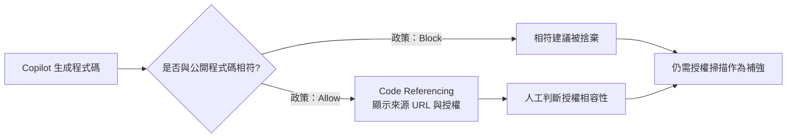
```mermaid
graph LR
    A[Copilot 生成程式碼] --> B{是否與公開程式碼相符?}
    B -->|政策：Block| C[相符建議被捨棄]
    B -->|政策：Allow| D[Code Referencing<br/>顯示來源 URL 與授權]
    D --> E[人工判斷授權相容性]
    C --> F[仍需授權掃描作為補強]
    E --> F
```

GitHub 提供兩種機制處理與公開程式碼相符的建議：

| 機制 | 說明 | 設定位置 |
| --- | --- | --- |
| **Suggestions matching public code：Block** | 捨棄與公開程式碼相符的建議 | 個人：GitHub 帳號的 Copilot 政策；企業：組織或企業政策（所有方案皆支援） |
| **Code Referencing（設為 Allow 時）** | 接受相符的 Inline 建議時記錄相符檔案的 URL 與授權名稱；Chat 回應會在結尾標示並提供連結；Cloud Agent 會在 session log 中標示 | 同上 |

> ⚠️ **v7.0 更正**：v6.0 範例中的 VS Code 設定 `github.copilot.advanced.debug.filter.duplication` **並非官方設定**，已移除。請改用上表的帳號或組織政策。
>
> 💡 **官方說明的限制**：
>
> - Inline 的 Code Referencing 只檢查「**被接受**的 Copilot 建議」；您自己寫的程式碼、或您修改過的建議不會被比對。
> - 官方指出與公開程式碼相符的情況通常**少於 1%**。
> - **GitHub Copilot App 即使在 Block 設定下，仍可能產生相同或相近的程式碼**。
>
> 因此對著作權敏感的專案，仍應搭配 SCA／授權掃描工具作為補強。

#### 6.4.2 資料保護合規

| 法規／要求 | 相關要求 | Copilot 使用注意 |
| ------ | ---------- | ------------------ |
| **個資法** | 個資處理需有法律依據 | 不可將客戶個資貼入 Prompt、Issue 或自動化提示 |
| **GDPR** | 資料最小化原則 | 評估資料落地（data residency）政策與可用模型 |
| **金融監理** | 資料不得外流、需保留軌跡 | 使用 Business／Enterprise；逐一審查模型的資料保留條款 |
| **內部稽核** | 保留軌跡 | Audit Log、Session logs、OpenTelemetry |

**2026 年需特別關注的資料保留議題：**

| 議題 | 內容 | 建議 |
| --- | --- | --- |
| **統一 Copilot 體驗**（最早 2026/09/28） | GitHub.com／Mobile Chat 與 Cloud Agent 合併；Chat 資料保存期由 **28 天延長為帳號存續期間** | 法遵單位評估並更新資料保存政策 |
| **Claude Fable 5／5.1** | Anthropic 預設保留提示與輸出以運作安全分類器；可申請 ZDR 至 2026 年底 | 未完成評估前不要啟用（見 [1.4](#14-版本與授權模式)） |
| **CLI／Copilot App 工作階段同步** | 本機工作階段預設同步到 GitHub 帳號；Business／Enterprise 需「Store local sessions in the Cloud」政策至少為 View from cloud 才會同步 | 依資料分類決定政策層級 |
| **OpenTelemetry 內容擷取** | 預設**不含**提示、回應與工具參數；開啟 `captureContent` 可能擷取程式碼與提示 | 保持關閉，並以 `lockCaptureContent` 鎖定 |
| **Automations 與 Session logs** | Cloud Agent 工作階段（含提示、log、PR）對 repository 存取者可見 | 不要在自動化提示中放機密，改用 Agents secrets |
| **FedRAMP／資料落地模型** | 可用政策限制只使用符合資料落地或 FedRAMP 的模型 | 受監管產業評估啟用 |

### 6.5 企業級安全設定

#### 6.5.1 組織層級設定

> ⚠️ **v7.0 更正**：v6.0 的 `copilot_policies` YAML 僅為示意、並非真實格式。企業實際的控制面有兩層：
>
> 1. **AI Controls 政策**：在企業的 **AI controls** 頁籤（或組織設定）以 UI 設定，控制使用者可以用哪些功能、代理與模型
> 2. **Enterprise managed settings**：以 `managed-settings.json` 集中下發到用戶端（Copilot CLI、VS Code、Copilot App、Cloud Agent、JetBrains），**使用者無法覆寫**

**政策運作規則（官方）：**

- 企業層級先設定；多數政策可選「啟用／停用／交由組織決定」。Cloud Agent 例外，企業可**指定哪些組織**取得存取權。
- 同一企業內多個組織授權衝突時，通常取**最寬鬆**者；跨不同企業時，幾乎一律取**最嚴格**者。
- 由企業直接授權（不經組織）的使用者，不受「交由組織決定」涵蓋，另由「Policies for enterprise-assigned users」決定預設值。
- **GitHub Copilot App 與 Copilot CLI 是兩條獨立的用戶端政策**。
- 防止**政策漂移**：定期檢視擁有「Manage enterprise AI controls」權限的人員，並以 Audit log 監控政策變更。

**重點政策清單：**

| 政策 | 用途 | 建議 |
| --- | --- | --- |
| **Copilot code review** | 是否可在 GitHub.com／Mobile 使用 Code Review | 啟用，並明確設定審查深度 |
| **Allow members without a Copilot license to use Copilot code review** | 無授權成員使用 Code Review（需先開啟 AI credits paid usage） | 依預算決定 |
| **Copilot cloud agent**／**Agent apps**／**Third-party agents** | 雲端代理、合作夥伴代理與第三方代理 | 先試點，再逐步開放 |
| **Copilot CLI**／**GitHub Copilot app** | 兩個用戶端各自獨立控管 | 依導入階段開放 |
| **Store local sessions in the Cloud** | 本機工作階段同步（View from cloud）與遠端操控（View and control） | 依資料分類設定 |
| **MCP servers in Copilot** | MCP 是否能執行 | 保持開啟，改以允許清單限制 |
| **Copilot Memory** | 是否允許使用 Memory | 評估敏感資訊後再開啟 |
| **Suggestions matching public code** | 是否阻擋與公開程式碼相符的建議 | Block |
| **Enable custom models**（企業 BYOK） | 是否允許組織自行新增模型 | 由企業集中管理 |
| **Local BYOK in IDEs** | 是否允許使用者在 IDE 自帶模型金鑰 | 多數企業應停用，避免繞過模型治理 |
| **AI credits paid usage** | 是否允許超出共池後的額外用量（**預設開啟**） | 依預算策略明確設定 |
| **Default availability for released models** | 新 GA 模型預設是否開放（已生效） | 依模型審查流程設定 |
| **Default policy for new features** | 新 GA 功能與「未設定」的政策預設是否開放（**2026/10/22 生效**，預設開啟） | 生效前逐一設定所有政策 |
| **模型政策**（含 data residency、FedRAMP） | 逐一啟用或停用模型 | 建立模型准入流程 |

**Enterprise managed settings 範例（`.github-private` repository 的 `copilot/managed-settings.json`）：**

```json
{
  "model": "auto",
  "permissions": {
    "disableBypassPermissionsMode": "allow-auto-only",
    "deny": [
      "Shell(rm -rf *)",
      "Read(~/.ssh/**)",
      "Domain(*.unapproved.example)"
    ],
    "ask": [
      "Shell(git push *)"
    ],
    "allow": [
      "Shell(npm test *)",
      "Domain(registry.npmjs.org)"
    ]
  },
  "strictKnownMarketplaces": [
    { "source": "github", "repo": "OWNER/approved-plugins" }
  ],
  "allowedMcpServers": [
    { "serverUrl": "https://api.githubcopilot.com/*" },
    { "serverCommand": ["npx", "@playwright/mcp@latest"] }
  ],
  "telemetry": {
    "enabled": true,
    "endpoint": "https://otel-collector.example.com",
    "protocol": "http/protobuf",
    "captureContent": false,
    "lockCaptureContent": true
  },
  "sandbox": {
    "enabled": true,
    "failIfUnavailable": true,
    "allowBypass": false
  }
}
```

| 設定鍵 | 用途 |
| --- | --- |
| `model` | 新對話的預設模型（例如 `auto`） |
| `permissions.disableBypassPermissionsMode` | `disable`：禁用所有 allow-all／YOLO 選項；`allow-auto-only`：禁止完全放行，但允許 LLM 協助核准（assisted）；無法辨識的值會以 `disable` 處理（fail-closed） |
| `permissions.deny`／`ask`／`allow` | 封鎖、要求重新人工核准、免提示放行特定操作（Shell、Read、Edit、Domain 等） |
| `enabledPlugins`、`extraKnownMarketplaces`、`strictKnownMarketplaces` | 強制安裝或停用外掛、新增市集、限定只能從核准市集安裝 |
| `allowedMcpServers`／`deniedMcpServers` | MCP 允許清單與拒絕清單（拒絕優先） |
| `telemetry` | OpenTelemetry 匯出設定 |
| `remoteControl` | 限制本裝置上的工作階段能否被遠端操控（例如要求 SSO） |
| `sandbox` | 強制最低本機沙箱等級（指令執行、檔案系統、網路、憑證、MCP 與 LSP Server） |

> 💡 **部署方式**：除了放在 `.github-private` repository 的「伺服器管理」方式，也可以透過 MDM 或本機檔案派送。可依企業團隊覆寫部分設定（`{ "overridable": 值 }` 語法搭配 `team-mappings.json`）。並非每個用戶端都支援每個設定鍵，正式推出前請先對照官方的支援矩陣。

**管理員功能（Business／Enterprise）：**

| 功能 | 說明 |
| --- | --- |
| **Policy Management** | 控制哪些 Copilot 功能、代理與模型可使用 |
| **Access Management** | 指定哪些組織成員可使用 Copilot |
| **Content Exclusion** | 排除敏感檔案不被 Copilot 存取（見下方限制） |
| **Managed Settings** | 集中下發用戶端權限、外掛、MCP、遙測與沙箱設定 |
| **Audit Logs** | 追蹤 Copilot 政策與使用行為 |
| **Usage Metrics** | 儀表板與 API 檢視採用率、使用量與 PR 生命週期指標 |
| **Organization Custom Instructions** | 統一組織級的 Copilot 行為規範 |
| **Budget Management** | 於 Enterprise／Organization／Cost Center／User 設定預算（見 [1.4](#14-版本與授權模式)） |

#### 6.5.2 開發者工作站設定

```json
// VS Code settings.json - 企業建議設定（示意）
{
  // 依語言 ID 啟用或停用 Inline 建議（鍵值為語言 ID，不支援檔案路徑 glob）
  "github.copilot.enable": {
    "*": true,
    "plaintext": false,
    "dotenv": false
  },

  // 代理預設權限層級（default = Manual permissions）與終端沙箱（Preview）
  "chat.permissions.default": "default",
  "chat.agent.sandbox.enabled": "on",

  // Claude 格式的 Hooks 預設關閉，除非團隊已審查
  "chat.useClaudeHooks": false,

  // Chat 介面語系
  "github.copilot.chat.localeOverride": "zh-TW"
}
```

> ⚠️ **v7.0 更正**：v6.0 範例在 `github.copilot.enable` 中使用 `"**/*.env"`、`"**/secrets/**"` 等檔案路徑 glob，但此設定的鍵是**語言 ID**，無法用路徑排除檔案；`files.exclude` 只影響檔案總管顯示，也不是資安控制。要排除特定路徑，應使用組織層級的 **Content Exclusion**。
>
> 💡 依 VS Code AI 設定參考：`chat.permissions.default`（Experimental）可用值為 `default`（Manual permissions）、`autoApprove`（Allow all）、`autopilot`；`chat.agent.sandbox.enabled` 的值為字串 `off`／`on`；Windows 另用 `chat.agent.sandbox.enabledWindows`（Experimental）。

**Content Exclusion 的支援範圍與限制（重要）：**

| 工具 | Inline 建議 | Chat／代理 |
| --- | --- | --- |
| Visual Studio | ✅ | ✅ |
| **VS Code** | ✅ | Chat ✅／**Agent ❌** |
| JetBrains IDEs | ✅ | ✅ |
| Xcode、Eclipse | ✅ | ❌ |
| GitHub.com、GitHub Mobile（Public Preview） | — | ✅ |
| GitHub Copilot App、Copilot CLI | — | ✅ |
| Copilot Code Review（GitHub.com） | — | ✅ |

> 🔴 **重大限制**：官方明確指出，**Content Exclusion 目前不支援 VS Code 等編輯器中 Copilot Chat 的 Agent 模式**。也就是說，被排除的檔案仍可能被 VS Code 的代理讀取。此外，IDE 間接提供的語意資訊（型別、hover 定義）仍可能被使用，符號連結與遠端檔案系統上的 repository 也不受排除設定保護。
>
> **補強措施**：機密不要放在 repository 中（使用密鑰管理服務）；以 managed settings 的 `permissions.deny`（例如 `Read(**/.env)`）與沙箱的檔案系統限制，作為代理存取的第二道防線；並以 Hooks 攔截對敏感路徑的讀取。

### 6.6 Copilot 在 SSDLC 中的定位

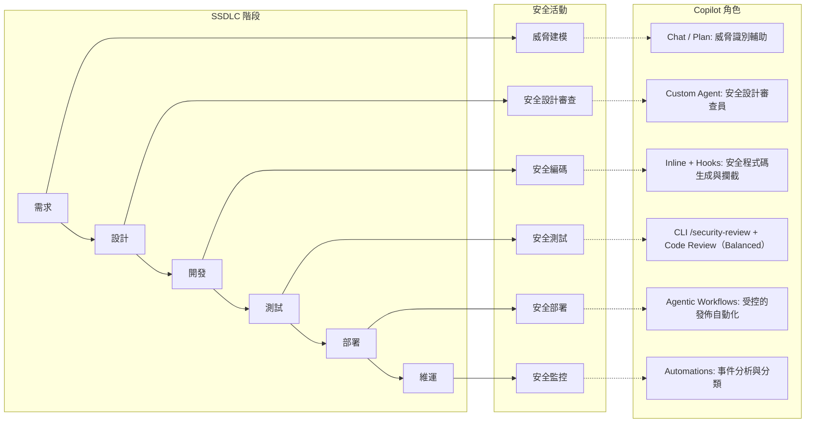
```mermaid
flowchart LR
    subgraph "SSDLC 階段"
        A[需求] --> B[設計]
        B --> C[開發]
        C --> D[測試]
        D --> E[部署]
        E --> F[維運]
    end

    subgraph "安全活動"
        A1[威脅建模]
        B1[安全設計審查]
        C1[安全編碼]
        D1[安全測試]
        E1[安全部署]
        F1[安全監控]
    end

    A --> A1
    B --> B1
    C --> C1
    D --> D1
    E --> E1
    F --> F1

    subgraph "Copilot 角色"
        G[Chat / Plan: 威脅識別輔助]
        H[Custom Agent: 安全設計審查員]
        I[Inline + Hooks: 安全程式碼生成與攔截]
        J["CLI /security-review + Code Review（Balanced）"]
        K[Agentic Workflows: 受控的發佈自動化]
        L[Automations: 事件分析與分類]
    end

    A1 -.-> G
    B1 -.-> H
    C1 -.-> I
    D1 -.-> J
    E1 -.-> K
    F1 -.-> L
```

| SSDLC 活動 | Copilot 可協助 | 必須由人或既有工具負責 |
| --- | --- | --- |
| 威脅建模 | 以 Plan／Ask 列舉 STRIDE 威脅、產生資料流描述 | 風險接受決策 |
| 安全設計審查 | 以唯讀 Custom Agent 對照安全基準審查設計文件 | 架構簽核 |
| 安全編碼 | Instructions 規範安全寫法；Hooks 攔截危險操作 | Code Review 核准 |
| 安全測試 | `/security-review`、Code Review（Balanced）、產生安全測試案例 | SAST／DAST／滲透測試結果判讀 |
| 安全部署 | Agentic Workflows 以 safe-outputs 限制寫入 | 變更核准、回復計畫 |
| 安全監控 | Automations 分類告警 Issue、彙整事件 | 事件應變決策 |

### 6.7 稽核與追蹤

**GitHub 平台提供的稽核與可觀測性功能（Business／Enterprise）：**

| 功能 | 說明 | 用途 |
| --- | --- | --- |
| **Audit Logs** | 記錄 Copilot 相關事件，包含授權、政策與組織啟用狀態變更 | 追蹤政策漂移、權限變更 |
| **Copilot Usage Metrics（儀表板與 API）** | 採用與使用量、IDE 使用、PR 生命週期指標（含 Cloud Agent 的 PR 產出與合併時間）；企業層級報表會跨組織去重 | 衡量採用率與效益 |
| **Copilot Impact 儀表板** | 2026/09 起顯示主要功能的**活躍使用者數**，可看出哪些功能真正被廣泛採用 | 導入成效追蹤 |
| **VS Code Agents 使用指標** | Agents Window 的每日活躍使用者、工作階段數、訊息數（2026/09 GA） | 代理採用追蹤 |
| **Billing usage report** | AI Credits 與 Actions 分鐘數明細 | 成本歸屬與異常偵測 |
| **Agent session logs** | Cloud Agent 每個工作階段的推理與工具呼叫紀錄 | 事後調查 |
| **OpenTelemetry** | 從用戶端匯出 **Traces**（工作階段流程、模型與工具呼叫）、**Metrics**（例如 Token 用量）、**Events**（例如接受或拒絕代理編輯）到企業可觀測性平台 | 與既有 SIEM／APM 整合 |

**OpenTelemetry 導入步驟：**

1. 建置支援 OTLP 的可觀測性後端（或部署 OpenTelemetry Collector 轉送）
2. 以 managed settings 的 `telemetry` 設定鍵統一設定端點、標頭與權杖（使用者無法覆寫）
3. 依資料分類決定是否開啟 `captureContent`，預設不擷取提示、回應與工具參數
4. 以儀表板分析工作階段與趨勢（官方範例以 Grafana 呈現）

**建議在關鍵程式碼加入 AI 輔助標記：**

```java
/**
 * 匯率轉換服務
 *
 * @author developer-name
 * @created 2026-01-22
 * @ai-assisted 此類別的基本架構由 Copilot Agent 輔助生成，
 *              核心邏輯經人工審查與修改（PR #1234）
 * @security-review PASSED - 2026-01-22 by security-team
 */
@Service
public class ExchangeRateService {
    // ...
}
```

> 💡 **更可靠的做法**：Copilot 與 Cloud Agent 產生的 commit 與 PR 本身已帶有歸屬資訊（例如共同作者、代理身分）。與其依賴人工註解，建議在 PR 範本加入「AI 參與程度」欄位，並以 PR 標籤統計，方便稽核抽樣。

---

## 第七章 常見誤用與反模式

> 📌 **本章摘要**：整理使用 Copilot 時最常見的認知、使用與流程誤區，並在 7.6 新增代理時代特有的反模式，例如過度授權、審查產能不足、過度平行、自訂化蔓延與無人負責的自動化。

### 7.1 Anti-Pattern 總覽

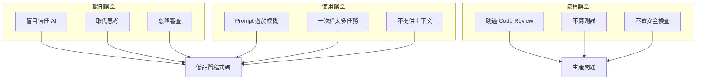
```mermaid
graph TB
    subgraph "認知誤區"
        A[盲目信任 AI]
        B[取代思考]
        C[忽略審查]
    end
    
    subgraph "使用誤區"
        D[Prompt 過於模糊]
        E[一次給太多任務]
        F[不提供上下文]
    end
    
    subgraph "流程誤區"
        G[跳過 Code Review]
        H[不寫測試]
        I[不做安全檢查]
    end
    
    A --> J[低品質程式碼]
    B --> J
    C --> J
    D --> J
    E --> J
    F --> J
    G --> K[生產問題]
    H --> K
    I --> K
```

### 7.2 Anti-Pattern 詳解

#### 7.2.1 盲目信任 AI（Blind Trust）

**症狀：**

```java
// Copilot 建議什麼就接受什麼，不經思考
// 按 Tab 鍵的速度比思考還快
```

**危害：**

- 引入潛在 Bug
- 產生不安全程式碼
- 效能問題被忽略

**正確做法：**

```markdown
✅ 每次接受建議前先問自己：
1. 這段程式碼做了什麼？
2. 有沒有邊界條件沒處理？
3. 有沒有安全風險？
4. 效能是否可接受？
```

#### 7.2.2 取代思考（Thought Replacement）

**症狀：**

```markdown
❌ 直接問 Copilot：「怎麼設計這個系統？」
❌ 期待 Copilot 做所有架構決策
```

**正確做法：**

```markdown
✅ 先自己思考設計方案
✅ 使用 Copilot 驗證或比較方案
✅ 讓 Copilot 處理實作細節，自己負責設計
```

#### 7.2.3 Prompt 過於模糊（Vague Prompting）

**Bad Example：**

```java
// ❌ 模糊的 Prompt
// 處理資料

// ❌ 缺乏上下文
// 寫一個 function
```

**Good Example：**

```java
// ✅ 明確的 Prompt
/**
 * 處理銀行交易對帳資料
 * 
 * 輸入：交易清單（Transaction[]）+ 銀行對帳單（BankStatement[]）
 * 輸出：對帳結果（包含：匹配成功、匹配失敗、待確認）
 * 規則：
 *   - 金額相同且日期在 3 天內視為匹配
 *   - 金額差異在 0.01 以內視為匹配（處理浮點誤差）
 *   - 其餘視為待確認
 */
public ReconciliationResult reconcile(...) {
```

#### 7.2.4 一次給太多任務（Task Overload）

**Bad Example：**

```markdown
❌ 請幫我設計一個完整的電商系統，包含：
- 用戶管理
- 商品管理
- 訂單管理
- 付款系統
- 物流追蹤
- 推薦引擎
```

**Good Example：**

```markdown
✅ 分步驟進行：
Step 1: 先討論整體架構
Step 2: 設計用戶管理模組介面
Step 3: 實作用戶管理核心邏輯
Step 4: 為用戶管理寫測試
...依此類推
```

#### 7.2.5 忽略程式碼上下文（Context Ignorance）

**Bad Example：**

```java
// ❌ 在不提供現有程式碼風格的情況下請求生成
// 新增一個 Service

// 結果：生成的程式碼風格與專案不一致
```

**Good Example：**

```java
// ✅ 提供上下文
// 請參考現有的 UserService 風格，新增 OrderService
// 專案使用：
// - Spring Boot 3.x
// - MapStruct 做 DTO 轉換
// - 使用 @Transactional 管理交易
// - 日誌使用 @Slf4j
```

### 7.3 Copilot 不適合做的事情

| 類別 | 不適合的任務 | 原因 |
| ------ | -------------- | ------ |
| **架構設計** | 系統架構決策 | 缺乏業務脈絡理解 |
| **效能調優** | 確定瓶頸位置 | 需要實際 Profiling 數據 |
| **安全審計** | 作為唯一安全檢查 | 可能漏掉細微漏洞 |
| **業務邏輯** | 複雜業務規則 | 不理解業務 Domain |
| **遺留系統** | 完整理解 Legacy | 缺乏歷史脈絡 |
| **合規判斷** | 法規遵循決策 | 法規變動快，AI 可能過時 |
| **正式環境操作** | 以 Allow all／Autopilot 直接操作正式環境 | 破壞性操作無法回溯，且缺乏變更管理 |
| **最終核准** | 以 Copilot approvals 取代人類核准關鍵分支 | 責任歸屬不明，違反職責分離 |

### 7.4 常見錯誤案例分析

#### 案例一：複製貼上症候群

```java
// ❌ 錯誤：直接複製 Copilot 建議的 catch block
try {
    // ...
} catch (Exception e) {
    e.printStackTrace();  // Copilot 常見的偷懶寫法
}

// ✅ 正確：審查後修正
try {
    // ...
} catch (BusinessException e) {
    log.error("Business error occurred: {}", e.getMessage());
    throw e;  // 重新拋出讓上層處理
} catch (Exception e) {
    log.error("Unexpected error", e);
    throw new SystemException("System error", e);
}
```

#### 案例二：效能陷阱

```java
// ❌ Copilot 可能生成的低效程式碼
public List<User> findActiveUsers(List<User> users) {
    List<User> result = new ArrayList<>();
    for (User user : users) {
        if (userRepository.isActive(user.getId())) {  // N+1 問題！
            result.add(user);
        }
    }
    return result;
}

// ✅ 應該批次處理
public List<User> findActiveUsers(List<User> users) {
    List<Long> userIds = users.stream()
        .map(User::getId)
        .collect(Collectors.toList());
    Set<Long> activeIds = userRepository.findActiveUserIds(userIds);
    return users.stream()
        .filter(u -> activeIds.contains(u.getId()))
        .collect(Collectors.toList());
}
```

#### 案例三：安全漏洞

```java
// ❌ Copilot 可能生成的不安全程式碼
@GetMapping("/download")
public void downloadFile(@RequestParam String filename, HttpServletResponse response) {
    File file = new File("/uploads/" + filename);  // Path Traversal 風險！
    // ...
}

// ✅ 應該驗證路徑
@GetMapping("/download")
public void downloadFile(@RequestParam String filename, HttpServletResponse response) {
    // 驗證檔名不包含路徑穿越字元
    if (filename.contains("..") || filename.contains("/") || filename.contains("\\")) {
        throw new SecurityException("Invalid filename");
    }
    
    Path basePath = Paths.get("/uploads").toRealPath();
    Path filePath = basePath.resolve(filename).normalize();
    
    // 確認檔案在允許的目錄內
    if (!filePath.startsWith(basePath)) {
        throw new SecurityException("Access denied");
    }
    // ...
}
```

### 7.5 自我檢查清單

在接受 Copilot 建議前，請確認：

```markdown
□ 我理解這段程式碼在做什麼
□ 我檢查過邊界條件
□ 我確認過沒有安全風險
□ 程式碼風格與專案一致
□ 例外處理適當
□ 效能可接受
□ 有對應的測試
```

### 7.6 代理時代的反模式

> 🆕 **v7.0 新增**

| 反模式 | 症狀 | 後果 | 正確做法 |
| --- | --- | --- | --- |
| **YOLO 成習慣** | 所有工作階段都開 Allow all 或 `--yolo` | 一次錯誤判斷就可能刪檔、推送或外洩 | 預設 Manual；需要高自主時改用沙箱或 Cloud sandbox；企業以 `disableBypassPermissionsMode` 限制 |
| **審查產能不足** | 同時開多個代理工作階段，PR 堆積無人審 | 品質下滑、合併衝突增加、形同放棄把關 | 設定每人可同時審查的代理 PR 上限（WIP 限制） |
| **過度平行化** | 任何任務都用 `/fleet` 或多工作區 | AI Credits 暴增；循序性任務反而更慢 | 只對可拆成獨立子任務的工作平行化 |
| **一律用最貴的模型** | 簡單問答也用 Powerful 級模型與最高推理強度 | 成本數倍增加，品質沒有對應提升 | 預設 Auto（Balance）；僅複雜任務手動升級 |
| **自訂化蔓延** | Instructions、Skills、Agents 越加越多且互相矛盾 | 代理行為不可預測、上下文被佔滿 | 定期盤點；以 `/env` 檢視實際載入內容；遵循「最小層級」原則 |
| **無人負責的自動化** | Automations 建立者離職或調動後仍持續執行 | 持續消耗建立者的 Credits、產生無人處理的 PR | 建立自動化清冊與負責人；敏感或多人維護的自動化改用 Agentic Workflows |
| **信任未審查的外掛** | 從社群市集直接安裝含 Hooks／MCP 的外掛 | 供應鏈攻擊、機敏資料外洩 | `strictKnownMarketplaces` 限定來源；外掛納入安全審查 |
| **把模糊需求丟給 Cloud Agent** | Issue 只有一句話就指派給 Copilot | 產出偏離需求、重工 | 先用 Plan 或 Chat 釐清，Issue 寫明範圍與驗收條件 |
| **讓代理修改審查規則** | 代理或 PR 作者在同一 PR 修改 `.instructions.md` 或 Skills | Code Review 標準被弱化 | 以 CODEOWNERS 保護自訂化檔案 |

---

## 第八章 團隊導入與治理建議

> 📌 **本章摘要**：提供四階段導入成熟度模型、代理能力的分階段開放策略、可直接採用的團隊使用規範範本（v4.0）、Code Review 要點、效益與成本指標、組織分工，以及 8.7 的企業治理控制面（AI Controls、Managed Settings、新功能與新模型准入流程）。

### 8.1 導入成熟度模型

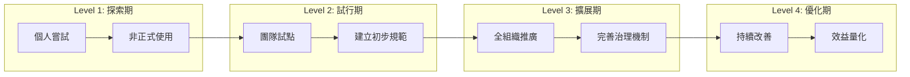
```mermaid
graph LR
    subgraph "Level 1: 探索期"
        A[個人嘗試]
        B[非正式使用]
    end
    
    subgraph "Level 2: 試行期"
        C[團隊試點]
        D[建立初步規範]
    end
    
    subgraph "Level 3: 擴展期"
        E[全組織推廣]
        F[完善治理機制]
    end
    
    subgraph "Level 4: 優化期"
        G[持續改善]
        H[效益量化]
    end
    
    A --> B
    B --> C
    C --> D
    D --> E
    E --> F
    F --> G
    G --> H
```

**代理能力的分階段開放（建議）：**

| 階段 | 開放的能力 | 權限與控管 | 進入下一階段的條件 |
| --- | --- | --- | --- |
| **Level 1 探索期** | Inline／NES、Ask、Code Review（Lite） | Manual permissions；額外用量政策與預算先設定好 | 完成資安評估與使用規範草案 |
| **Level 2 試行期** | Agent Mode（本機）、Plan、Instructions、Prompt Files／Skills | Manual 或 Assisted；MCP 採允許清單 | 試點團隊的缺陷率與審查時間未惡化 |
| **Level 3 擴展期** | Cloud Agent、Copilot CLI、Custom Agents、Hooks、Automations 試點 | Managed settings 基線、沙箱、CODEOWNERS 保護自訂化檔案 | 建立代理 PR 審查 SLA 與成本報表 |
| **Level 4 優化期** | Copilot App、Autopilot（限沙箱）、Agentic Workflows、Agent Apps | OpenTelemetry、Usage Metrics、季度政策檢討 | 持續以指標檢討 |

### 8.2 各階段導入建議

#### Level 1: 探索期（1-2 週）

| 活動 | 目的 | 產出 |
| ------ | ------ | ------ |
| 選定 3-5 位先行者 | 收集第一手經驗 | 使用心得報告 |
| 安裝與基本教學 | 確保環境就緒（符合 [1.5.6](#156-用戶端最低版本需求) 最低版本） | 安裝指南 |
| 設定成本護欄 | 明確設定「AI credits paid usage」、使用者預算與 Code Review 深度 | 預算設定紀錄 |
| 自由探索 | 了解工具能力邊界 | 案例收集 |

#### Level 2: 試行期（2-4 週）

| 活動 | 目的 | 產出 |
| ------ | ------ | ------ |
| 建立使用規範草案 | 統一使用方式 | 規範文件 v0.1 |
| 定義適用場景 | 明確使用邊界 | 場景清單 |
| 建立指令檔與 Skills | 把團隊規範變成可機讀資產 | `copilot-instructions.md`、`.github/skills/` |
| 建立 Prompt 範本 | 提升效率 | Prompt Library |
| 定期分享會 | 知識傳承 | 會議紀錄 |

#### Level 3: 擴展期（1-2 個月）

| 活動 | 目的 | 產出 |
| ------ | ------ | ------ |
| 全團隊教育訓練 | 普及使用 | 培訓教材 |
| 正式化規範 | 治理機制 | 規範文件 v1.0 |
| 部署 Managed Settings | 權限、MCP、外掛、沙箱基線 | `managed-settings.json` |
| 整合 CI/CD | 流程自動化 | Pipeline 設定、`copilot-setup-steps.yml` |
| 建立 Review 機制 | 品質把關 | Review Checklist、CODEOWNERS |

#### Level 4: 優化期（持續）

| 活動 | 目的 | 產出 |
| ------ | ------ | ------ |
| 效益量化 | 證明 ROI | 指標報告 |
| 規範更新 | 持續改善 | 規範文件 vN |
| 經驗分享 | 組織學習 | 案例庫 |
| 工具演進追蹤 | 掌握新功能與模型汰換 | 更新報告（追蹤 Changelog 與模型汰換表） |
| 可觀測性 | 代理行為與成本透明 | OpenTelemetry 儀表板 |

### 8.3 團隊使用規範範本

```markdown
# GitHub Copilot 團隊使用規範

## 1. 適用範圍
- 適用於：所有使用 GitHub Copilot 的開發人員（IDE、CLI、Copilot App、GitHub.com）
- 版本：4.0
- 生效日期：2026-10-01

## 2. 可以做（Do）
✅ 使用 Copilot 生成 Boilerplate 程式碼
✅ 使用 Copilot Chat 協助理解程式碼
✅ 使用 Copilot 生成單元測試骨架
✅ 使用 Copilot 生成 JavaDoc 與文件
✅ 使用 Copilot Code Review 輔助程式碼審查
✅ 使用 Agent Mode 完成明確定義的開發任務
✅ 使用 Copilot Cloud Agent 處理例行性 Issue
✅ 使用 Custom Instructions／AGENTS.md 統一團隊風格
✅ 使用 Agent Skills 建立可重用的團隊技能（新流程不再使用 Prompt Files）
✅ 使用 Agent Hooks 建立自動化流程
✅ 使用 MCP 整合經審核、列入允許清單的外部工具
✅ 使用 Auto Model Selection（Balance）作為預設模型

## 3. 不可以做（Don't）
❌ 將客戶個資或機敏資料貼入 Prompt
❌ 將 API Key、密碼等機敏設定貼入 Prompt
❌ 盲目接受 Copilot 建議，不經審查
❌ 用 Copilot 取代設計思考
❌ 跳過 Code Review 流程
❌ 未經審核就啟用第三方 MCP Server
❌ 未經審查就啟用來路不明的 Agent Hooks
❌ 從未核准的市集安裝 Plugins
❌ 將 Agent 模式用於安全性關鍵的核心系統修改
❌ 在未啟用沙箱的情況下使用 Allow all／--yolo
❌ 在自動化提示或 Issue 中放入機密（改用 Agents secrets）

## 4. 安全規範
- 不可在 Prompt 中包含任何客戶資料
- 不可在 Prompt 中包含內部系統架構機敏資訊
- 生成的程式碼必須通過安全掃描
- 使用 Business/Enterprise 版本（確保資料不外流）
- 啟用 Block Suggestions Matching Public Code
- 設定 Content Exclusion 排除敏感檔案（注意：VS Code Agent 模式不支援，需搭配 permissions.deny 與沙箱）
- 未完成法遵評估前，不得啟用有特殊資料保留條款的模型（如 Claude Fable 系列）

## 5. 品質規範
- 所有 Copilot 生成的程式碼必須經過人工審查
- 核心業務邏輯不可完全依賴 Copilot
- 必須為 Copilot 生成的程式碼撰寫測試
- Copilot Cloud Agent 的 PR 須經資深工程師審查

## 6. 審查流程
1. 開發者使用 Copilot 生成程式碼
2. 開發者自我審查（使用 Checklist）
3. 提交 PR，觸發自動化掃描
4. 可選：請求 Copilot Code Review
5. Reviewer 進行人工 Code Review
6. 通過後方可 Merge

## 7. Copilot Cloud Agent 使用規範
- 僅用於描述明確的 Bug Fix 與簡單功能增強
- Issue 必須包含清楚的需求描述、範圍與驗收條件
- Agent 產出的 PR 必須由人工審查，關鍵分支不得以 Copilot approvals 取代人類核准
- 不可用於安全性關鍵修改
- 每位工程師同時待審的代理 PR 不超過 3 個（WIP 限制，可依團隊調整）

## 8. 例外處理
- 如有特殊需求需違反規範，須經 Tech Lead 核准
- 核准紀錄須保留備查

## 9. Agent Hooks、Skills 與 Plugins 治理
- 全部 Hook 腳本須經 Code Review 後始可合併
- 不可啟用來路不明的 Agent Hook 設定
- Agent Skills、Custom Agents 與 Plugins 須由團隊共同審查
- .github/instructions/、.github/skills/、.github/agents/、.github/hooks/ 納入 CODEOWNERS
- 定期檢視並更新 .github/hooks/ 設定

## 10. 權限與自動化
- 預設使用 Manual permissions；Assisted 須經 Tech Lead 同意
- Autopilot 與 Allow all 僅能在沙箱或 Cloud sandbox 中使用，並設定連續回合上限
- Automations 須登記於團隊自動化清冊，註明負責人與用途
- 需要版控或多人維護的自動化改用 Agentic Workflows

## 11. 模型與成本
- 預設使用 Auto Model Selection；Powerful 級模型僅用於複雜任務
- 長任務須設定 AI Credits session 上限
- 每月檢視個人與團隊的 AI Credits 用量
- 使用中的模型若排定汰換，須於汰換日前完成遷移
```

### 8.4 Code Review 要點（Copilot 輔助後）

```mermaid
flowchart TB
    A[PR 提交] --> B{包含 Copilot<br/>生成程式碼?}
    B -->|是| C[加強審查模式]
    B -->|否| D[標準審查模式]
    
    subgraph "加強審查模式"
        C --> E[確認 Prompt 意圖]
        E --> F[逐行審查生成程式碼]
        F --> G[檢查安全漏洞]
        G --> H[驗證邊界條件]
        H --> I[確認測試覆蓋]
    end
    
    subgraph "標準審查模式"
        D --> J[標準 Code Review]
    end
    
    I --> K[完成審查]
    J --> K
```

**Reviewer 額外檢查項目：**

| 項目 | 檢查重點 |
| ------ | ---------- |
| **意圖驗證** | 程式碼是否符合原始需求 |
| **邏輯完整性** | 是否有遺漏的 edge case |
| **安全性** | 是否有 OWASP Top 10 風險 |
| **效能** | 是否有明顯的效能問題 |
| **一致性** | 是否符合專案編碼規範 |
| **可維護性** | 程式碼是否易於理解與維護 |

### 8.5 效益衡量指標

> 💡 下表「目標」欄位為建議起始值（同樣屬經驗參考範圍，非官方保證數據），正式導入時應改以團隊實測的 Baseline 為準，並於每季檢討調整。

| 指標 | 計算方式 | 目標 |
| ------ | ---------- | ------ |
| **開發效率** | 功能點完成時間 | 提升 20-30% |
| **程式碼品質** | SonarQube 分數 | 維持或提升 |
| **Bug 數量** | 每千行程式碼 Bug 數 | 不增加 |
| **開發者滿意度** | 問卷調查 | > 4.0/5.0 |
| **學習曲線** | 新人上手時間 | 縮短 30% |
| **AI Credits 使用效率** | 每項完成功能點消耗的 AI Credits（Billing usage report、Actions metrics） | 逐季下降或維持穩定 |
| **模型選擇合理性** | Auto Model Selection 採用率、Powerful 級模型佔比 | Auto Model Selection 採用率 > 70% |
| **預算執行率** | 實際用量 ／ 各層級（Org／Cost Center／User）預算上限 | 落在 70-95% 區間（過低代表授權浪費，過高代表需調整預算或使用行為） |
| **代理 PR 成效** | Cloud Agent PR 的合併率、合併時間（Copilot Usage Metrics 的 PR 生命週期指標） | 合併率逐季提升 |
| **功能採用度** | 各主要功能的活躍使用者數（Copilot Impact 儀表板） | 依導入階段設定 |
| **代理審查負載** | 每位審查者每週待審的代理 PR 數 | 不超過團隊 WIP 限制 |

> 💡 **先建立導入前基準**：社群實務建議在導入前先記錄 PR 產出量、程式碼變動率（churn）、變更失敗率與週期時間，導入後才有比較基礎。官方 Copilot Usage Metrics 提供 IDE 使用、採用族群與 PR 生命週期等資料（儀表板與 API），企業層級報表會跨組織去重。

> 💡 **成本與效益併看**：由於 2026/06/01 起全面採 AI Credits 用量計費，「開發效率」與「AI Credits 使用效率」應併同檢視——效率提升若伴隨 Credits 用量不成比例地上升（例如過度依賴高階模型或不必要的 Agent Mode session），實際 ROI 可能被侵蝕，建議治理委員會將兩者納入同一季度報告。

### 8.6 組織架構建議

```mermaid
graph TB
    subgraph "治理層"
        A[AI 工具治理委員會]
    end
    
    subgraph "管理層"
        P[AI 平台團隊]
        B[IT 資安團隊]
        C[開發標準團隊]
        D[培訓團隊]
    end

    subgraph "執行層"
        E[各專案 Tech Lead]
        F[開發人員]
    end

    A --> P
    A --> B
    A --> C
    A --> D
    P --> E
    B --> E
    C --> E
    D --> E
    E --> F
```

**各角色職責：**

| 角色 | 職責 |
| ------ | ------ |
| **治理委員會** | 制定政策、風險評估、預算核准、新功能與新模型准入 |
| **AI 平台團隊（Copilot 管理員）** | 維護 AI Controls 政策、`managed-settings.json`、MCP 允許清單、外掛市集、OpenTelemetry 與成本報表 |
| **IT 資安團隊** | 安全規範、稽核、事件處理、Hooks 與外掛安全審查 |
| **開發標準團隊** | 使用規範、Instructions／Skills／Custom Agents 資產庫、最佳實務 |
| **培訓團隊** | 教育訓練、知識傳承 |
| **Tech Lead** | 執行監督、團隊指導、代理 PR 審查分派 |
| **開發人員** | 遵循規範、回報問題 |

### 8.7 企業治理控制面：AI Controls 與 Managed Settings

> 🆕 **v7.0 新增**

2026 年起，Copilot 的企業治理已形成一套完整的「控制面」。本節整理各類控制的所在位置與建議流程。

#### 8.7.1 控制面地圖

| 要控制什麼 | 在哪裡設定 | 說明 |
| --- | --- | --- |
| 誰能用 Copilot、哪些功能與模型 | 企業 **AI Controls** 頁籤／組織設定 | 功能、代理、模型、MCP 政策 |
| 哪些組織能用 Cloud Agent | AI Controls → **Agents** | 四種政策狀態，可依組織或組織自訂屬性（custom properties）動態選取 |
| 企業級 Custom Agents | AI Controls，或 REST API | 可限制誰能管理企業級代理 |
| 代理工作階段監控 | AI Controls → Agents | 檢視最近 24 小時的代理工作階段與代理相關稽核事件；可串流 Audit log 長期保存 |
| 用戶端行為（權限、外掛、MCP、遙測、沙箱、遠端操控） | `managed-settings.json`（`.github-private` repository、MDM 或本機檔案派送） | 使用者無法覆寫，可依企業團隊覆寫 |
| CLI 機器層級強制規則 | 政策 Hooks（`/etc/github-copilot/policy.d/`、`C:\ProgramData\GitHub\Copilot\policy.d\` 或登錄機碼） | 使用者無法停用 |
| 成本 | Budgets、AI credits paid usage 政策 | 四層預算 |
| 程式碼與分支保護 | Rulesets、CODEOWNERS、分支保護 | 代理 PR 的審查與核准規則 |
| **VS Code 本機代理** | **VS Code 企業 AI 設定**（裝置管理政策） | 官方說明：VS Code 中執行的代理**不透過 GitHub 管理**，屬於 IDE 功能，需以 VS Code 的企業設定控管 |

#### 8.7.2 新功能與新模型的准入流程

官方把 Copilot 能力分為四類，各有不同的風險等級：

| 類型 | 說明 | 例子 | 建議審查強度 |
| --- | --- | --- | --- |
| **Assistive（輔助型）** | 回應提示並給建議，變更前需人工審查 | Inline 建議、Chat、PR 摘要 | 低 |
| **Agentic（代理型）** | 自主研究、規劃並代替使用者修改 | Cloud Agent、第三方代理 | 高 |
| **Customizations（自訂化）** | 加入上下文、指令、工具、Skills 與代理 | Instructions、Spaces、MCP、Skills | 中 |
| **External（外部代理、模型與工具）** | 其他供應商的代理、模型與 MCP | Claude、Codex | 高（需供應商風險評估） |

**建議流程（依官方指引整理）：**

1. **追蹤**：訂閱 [Copilot Changelog](https://github.blog/changelog/label/copilot/)，每週由 AI 平台團隊彙整
2. **評估**：閱讀功能文件，確認企業與組織層級可用的政策設定；模型則確認資料保留條款、汰換時程與定價
3. **試點**：先開放給部分組織（Cloud Agent 可依組織自訂屬性選取）或企業團隊
4. **明確設定**：試點通過後明確啟用；**不要讓政策停留在「未設定」**——2026/10/22 起「Default policy for new features」會讓未設定的 GA 功能預設開放
5. **回顧**：每季檢討政策設定，並以 Audit log 監控政策漂移

#### 8.7.3 Managed Settings 導入步驟

1. 在企業指定組織中建立 `.github-private` repository（建議 internal 可見度，並限制編輯權限），並設為企業的用戶端治理來源
2. 建立 `copilot/managed-settings.json`，先從低風險設定開始（例如 `"model": "auto"`）驗證派送
3. 逐步加入 `permissions`、`allowedMcpServers`、`strictKnownMarketplaces`、`sandbox`、`telemetry`
4. 需要例外的團隊，以 `{ "overridable": 值 }` 語法搭配 `team-mappings.json` 與 `teams/*.json` 覆寫
5. 所有變更透過 PR 審查，讓治理設定本身可追蹤、可稽核

> 💡 **產業觀察（社群建議）**：企業治理的重點已從「是否導入 AI」轉為「如何在分散式團隊中**負責任地**導入」。把治理設定當作程式碼管理（版控、審查、回溯），是讓 AI 治理跟上功能演進速度的關鍵。

---

## 第九章 進階應用案例

> 📌 **本章摘要**：以七個實務案例示範 Copilot 在 Legacy 重構、API 設計、Batch 開發、架構文件、Cloud Agent 自動化、持續性代理作業（Automations／Agentic Workflows）與 Copilot App 平行開發中的使用方式，最後彙整為最佳實務總表。

### 9.1 案例一：Legacy Code 重構

#### 9.1.1 情境描述

```markdown
【背景】
- 一段 10 年歷史的付款處理程式碼
- 單一方法超過 500 行
- 缺乏測試，無人敢動
- 需要新增多幣別支援

【挑戰】
- 理解現有邏輯
- 不破壞現有功能
- 安全地進行重構
```

#### 9.1.2 使用 Copilot 的策略

```mermaid
flowchart TB
    A[理解階段] --> B[規劃階段]
    B --> C[測試補充階段]
    C --> D[重構階段]
    D --> E[驗證階段]
    
    A1[Copilot Chat<br/>解釋程式碼] --> A
    B1[Copilot Chat<br/>重構策略討論] --> B
    C1[Copilot Inline<br/>生成測試] --> C
    D1[Copilot Inline<br/>逐步重構] --> D
    E1[執行測試<br/>確認行為不變] --> E
```

##### Step 1：理解現有程式碼

```markdown
## Copilot Chat Prompt

請分析以下 Legacy 程式碼：

1. 說明這段程式碼的主要職責
2. 識別主要的執行流程
3. 標記可能的問題點：
   - 過長的方法
   - 違反 SOLID 的地方
   - 潛在的 bug
4. 建議重構的優先順序

[貼上 Legacy Code]
```

##### Step 2：建立特徵測試（Characterization Test）

```java
// 使用 Copilot 生成特徵測試，保護現有行為
// Prompt: 請為以下 legacy 方法生成特徵測試，
//         測試目的是記錄「現有行為」而非「預期行為」

@Test
void characterization_processPayment_normalFlow() {
    // Copilot 生成的測試，用於捕捉現有行為
    PaymentRequest request = createTestRequest();
    PaymentResult result = legacyService.processPayment(request);
    
    // 記錄現有行為（即使看起來怪怪的）
    assertThat(result.getStatus()).isEqualTo("SUCCESS");
    assertThat(result.getFee()).isEqualTo(new BigDecimal("1.50"));
}
```

##### Step 3：逐步重構

```java
// 使用「提取方法」重構，Copilot 輔助生成新方法

// 原始程式碼中的一段（在 500 行方法中）
// --- 驗證卡號邏輯 ---
String cardNumber = request.getCardNumber();
if (cardNumber == null || cardNumber.length() < 13) {
    throw new InvalidCardException("Invalid card");
}
// Luhn 驗證...
// --- 驗證結束 ---

// 提取為獨立方法
// Prompt: 請將以下卡號驗證邏輯提取為獨立方法，
//         包含完整的 JavaDoc 和錯誤處理

/**
 * 驗證信用卡卡號
 * 
 * @param cardNumber 信用卡卡號
 * @throws InvalidCardException 當卡號格式不正確或未通過 Luhn 驗證
 */
private void validateCardNumber(String cardNumber) {
    // Copilot 生成的驗證邏輯
}
```

#### 9.1.3 重構成果

```markdown
【重構前】
- 1 個 500 行的方法
- 0 個測試
- 無法新增功能

【重構後】
- 15 個小方法，每個 < 30 行
- 45 個特徵測試 + 20 個新測試
- 成功新增多幣別支援
- 程式碼可讀性大幅提升
```

### 9.2 案例二：API 設計與實作

#### 9.2.1 情境描述

```markdown
【需求】
設計並實作「交易查詢 API」：
- RESTful API 設計
- 支援複雜查詢條件
- 分頁與排序
- 符合 OpenAPI 規範
```

#### 9.2.2 使用 Copilot 的完整流程

##### Phase 1：API 設計討論

```markdown
## Copilot Chat Prompt

我需要設計一個交易查詢 API，請協助：

1. 建議 RESTful endpoint 設計
2. 查詢參數設計（日期範圍、交易類型、金額範圍等）
3. 分頁策略（offset vs cursor）
4. 回應格式設計
5. 錯誤處理策略

背景：
- 資料量：每日約 100 萬筆交易
- 查詢頻率：每秒約 100 次
- 使用者：內部系統 + 外部合作夥伴
```

##### Phase 2：OpenAPI 規格生成

```yaml
# Copilot 輔助生成的 OpenAPI 規格
openapi: 3.0.3
info:
  title: Transaction Query API
  version: 1.0.0
  
paths:
  /api/v1/transactions:
    get:
      summary: 查詢交易紀錄
      parameters:
        - name: startDate
          in: query
          schema:
            type: string
            format: date
        - name: endDate
          in: query
          schema:
            type: string
            format: date
        - name: transactionType
          in: query
          schema:
            type: string
            enum: [DEPOSIT, WITHDRAWAL, TRANSFER]
        - name: minAmount
          in: query
          schema:
            type: number
        - name: maxAmount
          in: query
          schema:
            type: number
        - name: page
          in: query
          schema:
            type: integer
            default: 0
        - name: size
          in: query
          schema:
            type: integer
            default: 20
            maximum: 100
      responses:
        '200':
          description: 查詢成功
          content:
            application/json:
              schema:
                $ref: '#/components/schemas/TransactionPage'
```

##### Phase 3：Controller 實作

```java
// Prompt: 請根據以上 OpenAPI 規格，實作 Spring Boot Controller
// 要求：使用 @Validated、適當的錯誤處理、OpenAPI 註解

@RestController
@RequestMapping("/api/v1/transactions")
@Tag(name = "Transaction", description = "交易查詢 API")
@Validated
@RequiredArgsConstructor
public class TransactionController {

    private final TransactionQueryService queryService;

    @GetMapping
    @Operation(summary = "查詢交易紀錄")
    @ApiResponses({
        @ApiResponse(responseCode = "200", description = "查詢成功"),
        @ApiResponse(responseCode = "400", description = "查詢參數錯誤"),
        @ApiResponse(responseCode = "401", description = "未授權"),
        @ApiResponse(responseCode = "403", description = "無權限")
    })
    public ResponseEntity<Page<TransactionDTO>> queryTransactions(
            @RequestParam(required = false) 
            @DateTimeFormat(iso = DateTimeFormat.ISO.DATE) LocalDate startDate,
            
            @RequestParam(required = false) 
            @DateTimeFormat(iso = DateTimeFormat.ISO.DATE) LocalDate endDate,
            
            @RequestParam(required = false) TransactionType transactionType,
            
            @RequestParam(required = false) 
            @PositiveOrZero BigDecimal minAmount,
            
            @RequestParam(required = false) 
            @PositiveOrZero BigDecimal maxAmount,
            
            @RequestParam(defaultValue = "0") @Min(0) int page,
            
            @RequestParam(defaultValue = "20") @Min(1) @Max(100) int size,
            
            @AuthenticationPrincipal UserDetails currentUser) {
        
        // Copilot 生成的實作...
        TransactionQuery query = TransactionQuery.builder()
            .startDate(startDate)
            .endDate(endDate)
            .transactionType(transactionType)
            .minAmount(minAmount)
            .maxAmount(maxAmount)
            .build();
            
        Page<TransactionDTO> result = queryService.query(
            query, 
            PageRequest.of(page, size),
            currentUser
        );
        
        return ResponseEntity.ok(result);
    }
}
```

##### Phase 4：測試生成

```java
// Prompt: 請為上述 Controller 生成完整的整合測試
// 包含：正常查詢、分頁、篩選、權限驗證、錯誤處理

@WebMvcTest(TransactionController.class)
@AutoConfigureMockMvc
class TransactionControllerTest {

    @Autowired
    private MockMvc mockMvc;
    
    @MockBean
    private TransactionQueryService queryService;

    @Test
    @WithMockUser
    void shouldReturnTransactions_whenValidQuery() throws Exception {
        // Copilot 生成的測試...
    }
    
    @Test
    @WithMockUser
    void shouldReturnBadRequest_whenInvalidDateRange() throws Exception {
        // Copilot 生成的測試...
    }
    
    @Test
    void shouldReturnUnauthorized_whenNotAuthenticated() throws Exception {
        // Copilot 生成的測試...
    }
}
```

### 9.3 案例三：Batch 程式開發

#### 9.3.1 情境描述

```markdown
【需求】
開發日終對帳 Batch：
- 每日 00:00 執行
- 處理前一日所有交易
- 與銀行對帳單比對
- 產出差異報表
- 需要支援 restart/retry
```

#### 9.3.2 使用 Copilot 的策略

```java
// Prompt: 使用 Spring Batch 設計日終對帳 Job
// 要求：
// - 支援大量資料（100 萬筆）
// - Chunk-based 處理
// - 可重啟
// - 完整的錯誤處理
// - 執行狀態追蹤

@Configuration
@RequiredArgsConstructor
public class ReconciliationJobConfig {

    private final JobBuilderFactory jobBuilderFactory;
    private final StepBuilderFactory stepBuilderFactory;
    
    @Bean
    public Job reconciliationJob(
            Step loadTransactionsStep,
            Step loadBankStatementsStep,
            Step reconcileStep,
            Step generateReportStep) {
        
        return jobBuilderFactory.get("reconciliationJob")
            .incrementer(new RunIdIncrementer())
            .listener(new JobExecutionListener() {
                // Copilot 生成 listener...
            })
            .start(loadTransactionsStep)
            .next(loadBankStatementsStep)
            .next(reconcileStep)
            .next(generateReportStep)
            .build();
    }
    
    @Bean
    public Step reconcileStep(
            ItemReader<TransactionPair> reader,
            ItemProcessor<TransactionPair, ReconciliationResult> processor,
            ItemWriter<ReconciliationResult> writer) {
        
        return stepBuilderFactory.get("reconcileStep")
            .<TransactionPair, ReconciliationResult>chunk(1000)
            .reader(reader)
            .processor(processor)
            .writer(writer)
            .faultTolerant()
            .skipLimit(100)
            .skip(DataIntegrityException.class)
            .retryLimit(3)
            .retry(TransientDataAccessException.class)
            .listener(new StepExecutionListener() {
                // Copilot 生成 listener...
            })
            .build();
    }
}
```

### 9.4 案例四：架構文件生成

#### 9.4.1 使用 Copilot 生成 ADR（Architecture Decision Record）

```markdown
## Copilot Chat Prompt

請協助我生成一份 ADR（架構決策紀錄）：

決策主題：採用 Redis 作為分散式快取

背景：
- 系統每秒處理 1000+ 請求
- 部分資料變動頻率低（幣別匯率、系統參數）
- 目前直接查詢 DB，造成效能瓶頸

請以標準 ADR 格式輸出：
- 標題
- 狀態
- 背景
- 決策
- 後果（正面/負面）
```

**Copilot 生成的 ADR：**

```markdown
# ADR-001: 採用 Redis 作為分散式快取

## 狀態
已接受（Accepted）

## 背景
現行系統面臨效能瓶頸：
- 每秒處理 1000+ 請求
- 部分低變動資料重複查詢 DB
- DB 連線數經常達到上限
- P99 回應時間超過 500ms

## 考量的方案

### 方案一：本地快取（Caffeine）
- 優點：實作簡單、無網路延遲
- 缺點：多節點間資料不一致

### 方案二：Redis
- 優點：分散式一致、成熟穩定
- 缺點：增加架構複雜度

### 方案三：Hazelcast
- 優點：功能豐富
- 缺點：學習曲線高、授權成本

## 決策
採用 Redis（方案二）

理由：
1. 已有 Redis 維運經驗
2. 生態系成熟，社群支援良好
3. 符合分散式一致性需求
4. 團隊熟悉度高

## 後果

### 正面
- 預期 DB 查詢量減少 60%
- P99 回應時間降至 100ms 以下
- 支援水平擴展

### 負面
- 增加 Redis 維運成本
- 需處理快取失效策略
- 增加故障點

## 相關決策
- ADR-002: Redis 快取策略
- ADR-003: Redis 高可用配置
```

### 9.5 案例五：使用 Copilot Cloud Agent 自動化開發

#### 9.5.1 情境描述

```markdown
【背景】
- 團隊有大量的小型 Bug Fix 和功能增強 Issue
- 資深工程師時間寶貴，不想花在例行性修改上
- Issue 描述明確，修改範圍可控

【挑戰】
- 如何將例行任務交給 Copilot Cloud Agent
- 如何確保 Agent 產出的 PR 品質
- 如何建立有效的 Agent 工作流程
```

#### 9.5.2 Copilot Cloud Agent 使用流程

> ⚠️ **v7.0 更新**：Cloud Agent 現在可以**先研究 repository、建立計畫，並在分支上修改與迭代，確認後才建立 PR**（也可以在提示中要求立即建立 PR）。入口包括 Agents 頁籤或面板、Issue 指派、在既有 PR 留言 `@copilot`、VS Code、GitHub Mobile，以及各整合平台。

```mermaid
flowchart TB
    A[入口：Issue 指派 / Agents 頁籤<br/>@copilot / VS Code / Teams・Slack・Jira] --> B[Cloud Agent 在 Actions 臨時環境中<br/>研究 repository]
    B --> C[建立計畫<br/>可先與人確認]
    C --> D[在 copilot/ 分支上修改<br/>執行測試與 linter]
    D --> E[人工檢視 diff<br/>持續迭代]
    E --> F[建立草稿 PR]
    F --> G[Copilot Code Review<br/>+ CodeQL / Secret scanning]
    G --> H[人工審查]
    H -->|需修改| I[PR 中 @copilot 留言<br/>或交給代理修正]
    I --> D
    H -->|通過| J[核准 Workflow 執行<br/>→ Merge]
```

##### Step 1：撰寫適合代理的 Issue

```markdown
## Issue: 新增交易查詢 API 的日期驗證

### 描述
目前 `GET /api/v1/transactions` 的 `startDate` 和 `endDate` 參數
沒有驗證日期範圍是否合理。

### 需求
1. `endDate` 不可早於 `startDate`
2. 查詢範圍不可超過 90 天
3. 不可查詢未來日期
4. 回傳 400 Bad Request 並附上明確錯誤訊息

### 範圍
- 只修改 transaction 模組
- 不得變更既有 API 的回應格式

### 檔案位置
- Controller: `src/main/java/.../TransactionController.java`
- 測試: `src/test/java/.../TransactionControllerTest.java`

### 驗收條件
- [ ] 新增日期驗證邏輯
- [ ] 新增對應的錯誤處理
- [ ] 新增單元測試覆蓋所有情境，且 ./mvnw -q test 全部通過
```

##### Step 2：指派代理

在 Issue 的 Assignees 選擇 **Copilot**（或指定的 Custom Agent、第三方代理、Agent App），也可以在 Agents 頁籤選擇模型與代理後直接下達提示。

##### Step 3：審查代理產出的 PR

```markdown
## 審查重點（Copilot Cloud Agent PR）
✅ 邏輯是否正確符合 Issue 描述與驗收條件
✅ 是否符合專案編碼規範
✅ 測試是否覆蓋所有情境，且未為了通過而修改既有斷言
✅ 是否有安全風險（參考 CodeQL／Secret scanning 結果）
✅ Session log 中的推理與工具呼叫是否合理
⚠️ 是否有不必要的變更（代理可能修改超出範圍的檔案）
⚠️ 是否新增了未經說明的相依套件
```

> 🔐 **提醒**：Cloud Agent 開的 PR 預設不會觸發 GitHub Actions workflow，需由具寫入權限者檢查程式碼後按下 **Approve and run workflows**；請代理開 PR 的人也不能核准該 PR。

#### 9.5.3 適合交給 Cloud Agent 的任務

| 適合 | 不適合 |
| --- | --- |
| Bug Fix（明確重現步驟） | 架構重構 |
| 新增驗證邏輯 | 複雜業務邏輯 |
| 補充單元測試 | 涉及多系統整合 |
| 更新文件 | 效能調優 |
| 簡單功能增強 | 安全性關鍵修改 |
| 相依套件升級與遷移 | 需求尚未收斂的探索性工作 |

> ⚠️ **注意**：Cloud Agent 適用於 Student、Pro、Pro+、Max、Business、Enterprise 方案（Free 不含）；Business／Enterprise 需管理員開啟 Cloud Agent 政策。Issue 描述越詳細，產出品質越高。

#### 9.5.4 Agent Management 面板：集中管理與進階功能

GitHub 提供集中化的 **Agents** 管理介面（官方定義：「用單一控制頁面在各代理工作階段間切換、檢查進度，並隨時掌握全局」）。可從已啟用 Cloud Agent 的 repository 的 **Agents** 頁籤，或全域的 [Agents 頁面](https://github.com/copilot/agents) 進入。

| 能力 | 說明 |
| --- | --- |
| **啟動新任務** | 選擇模型，並可選用第三方代理或 Custom Agent |
| **即時日誌監控** | 點開任一工作階段，即時查看 session log 與思考過程 |
| **追蹤進行中的工作階段** | 檢視 repository 中所有進行中的代理工作階段 |
| **中途導引（Steering）** | 不中斷執行即可補充指示或修正方向；**每則導引訊息都會消耗 AI Credits** |
| **在本機接手** | **Open in VS Code**（需最新版 VS Code、Copilot 擴充套件與 GitHub Pull Requests 擴充套件）或 **Continue in GitHub Copilot CLI** |
| **審查與合併** | 跳到 PR 審查變更、要求改進或核准合併 |
| **設定 Automations** | 依排程或事件（例如 Issue 建立）自動執行 Cloud Agent（見 [9.6](#96-案例六以-automations-與-agentic-workflows-建立持續性代理作業)） |
| **查詢過往工作階段** | 從 Copilot CLI 或 VS Code 以自然語言搜尋並引用過去的代理工作階段 |

> 💡 **可並行的代理選擇**：除了 Copilot，Agents 介面也能使用 Anthropic Claude、OpenAI Codex 等第三方代理，以及合作夥伴的 Agent Apps（見 [1.6](#16-copilot-cloud-agent-整合平台)）。

### 9.6 案例六：以 Automations 與 Agentic Workflows 建立持續性代理作業

> 🆕 **v7.0 新增**

#### 9.6.1 情境描述

```markdown
【背景】
- 內部平台 repository 每天新增 20+ 個 Issue，分類工作耗費 Tech Lead 大量時間
- main 分支偶有測試失敗，需要有人每天早上處理
- 每週需要產出發佈說明

【目標】
- 以代理處理重複性工作，但所有變更仍經人工把關
- 自動化本身要可稽核、可維護
```

#### 9.6.2 方案設計

| 工作 | 採用機制 | 觸發 | 允許的工具／輸出 | 把關方式 |
| --- | --- | --- | --- | --- |
| Issue 分類 | **Automations** | Issue 建立 | 僅更新標籤、Issue 類型 | 自動化等級設為 **Cautious**：只有高信心度的變更自動套用，其餘列為建議待人工接受 |
| 夜間修復失敗測試 | **Automations** | 每日排程 | 推送變更、建立草稿 PR | 草稿 PR 經 Code Review 與人工審查 |
| 每週發佈說明 | **Agentic Workflows** | 每週排程 | `safe-outputs: create-pull-request` | 以 PR 審查 workflow 本身與產出 |

**Issue 分類 Automation 的設定步驟：**

1. Repository → **Agents** → 側邊欄 **Automations** → **Create new**
2. 名稱：`issue-triage`；觸發：**When an issue is created**（可加搜尋篩選，例如排除已有標籤者）
3. 提示：「依內容將此 Issue 標記為 bug、enhancement 或 question，並設定適當的 Issue 類型。不要關閉或指派 Issue。」
4. 模型：選擇 Auto 或 Lightweight 級模型以控制成本
5. 工具：只勾選「更新 Issue 標籤／類型」（可用 **Suggest tools** 協助，但務必人工確認）
6. 以 **Run now** 測試後啟用

**自動化等級（Rationale, confidence, and approvals，Public Preview）：**

| 等級 | 行為 |
| --- | --- |
| **Full control** | 所有變更都保留待審，不自動套用 |
| **Cautious**（預設） | 只自動套用高信心度的變更 |
| **Balanced** | 例行、明確的變更自動套用，有歧義者待審 |
| **Full automation** | 全部自動套用，只有被標記為不確定者才保留 |

每個變更都會記錄**理由（rationale）**與**信心度**，形成稽核軌跡。此機制涵蓋對 Issue 的標籤、欄位、類型、關閉與指派等變更，並同樣適用於 Agentic Workflows 與 REST／GraphQL API 發起的自動化。

> ⚠️ **官方提醒**：核准機制是「**工作流程上的便利，不是安全控制**」。它不構成伺服器端邊界，有權修改 Issue 的代理仍可直接套用變更。真正的防線是**限制自動化可用的工具與權限**。

#### 9.6.3 風險控管重點

| 風險 | 控管 |
| --- | --- |
| 外部人士在 Issue 中注入指令 | 保持預設：忽略無寫入權限者觸發的事件 |
| 自動化權限過大 | 只授予任務所需的工具；Agentic Workflows 預設唯讀，只透過 `safe-outputs` 寫入 |
| 自動化開的 PR 被自己核准 | 官方機制：自動化產出歸屬於建立者，建立者不能核准；Actions workflow 需人工核准才執行 |
| 成本失控 | Automations 的 Actions 分鐘數與 Credits 計入建立者；Agentic Workflows 以 `max-ai-credits` 限制單次執行 |
| 機密外洩 | 提示中不放機密，改用 repository 或組織的 Agents secrets |
| 無人維護 | 建立自動化清冊；Automations 不存於 Git 且僅建立者可見，需要共同維護者改用 Agentic Workflows |

### 9.7 案例七：以 GitHub Copilot App 平行處理多個 Issue

> 🆕 **v7.0 新增**

#### 9.7.1 情境描述

```markdown
【背景】
- 一位資深工程師負責 4 個互相獨立的中小型 Issue：
  1. 修正報表匯出的時區錯誤
  2. 為訂單服務補齊邊界測試
  3. 將設定檔讀取改用新版函式庫
  4. 調查一個偶發的 NullPointerException（附 Sentry 報告）
- 希望一天內全部提交 PR，但不犧牲審查品質
```

#### 9.7.2 執行步驟

| 步驟 | 動作 | 說明 |
| --- | --- | --- |
| 1 | 在 Copilot App 中**從 Issue 建立 4 個工作階段** | 每個工作階段自動取得獨立的 Git worktree 與分支，彼此不干擾 |
| 2 | 依任務選擇模式 | Issue 1、3 需求明確 → **Autopilot**；Issue 2 → **Interactive**（需確認測試情境）；Issue 4 → 先用 **Plan** 釐清調查方向 |
| 3 | 依任務選擇模型與推理強度 | 簡單修正用 Lightweight／Versatile 模型；Issue 4 的根因調查才用 Powerful 模型與較高推理強度 |
| 4 | Issue 4 透過 **Sentry 整合**帶入當機報告 | 讓代理直接讀取堆疊與事件脈絡 |
| 5 | 以本機沙箱或 **Cloud sandbox** 執行 Autopilot 工作階段 | 限制代理可存取的檔案與網路 |
| 6 | 逐一檢視 diff、回饋、迭代 | 採 WIP 限制：同時待審不超過 2 個 |
| 7 | 在 App 內建立 PR、查看 CI、處理 Code Review 意見 | 全流程不必切換到瀏覽器或 IDE |
| 8 | 收尾時執行 `/chronicle cost tips` | 檢視本日哪些工作階段最耗費 Credits，調整下次的模型與模式選擇 |

#### 9.7.3 成果與注意事項

- **效益**：工程師的時間從「逐一實作」轉為「拆解、指揮與審查」，4 個 PR 可在同一天內完成審查。
- **成本**：平行工作階段會同時消耗 Credits。應先以 Chats 或 Plan 釐清範圍，避免 Autopilot 在錯誤方向上長時間執行。
- **品質**：審查仍是瓶頸。若待審 PR 堆積，應暫停開新工作階段，而不是降低審查標準。
- **治理**：Copilot App 由獨立的用戶端政策控管，並遵守 Content Exclusion；企業可透過 managed settings 統一權限、沙箱與外掛設定。

### 9.8 最佳實務總結

| 場景 | Copilot 主要用途 | 人工重點 |
| ------ | ------------------ | ---------- |
| **Legacy 重構** | 理解程式碼、生成測試 | 重構策略、風險評估 |
| **API 開發** | OpenAPI 規格、程式碼生成 | API 設計決策、安全審查 |
| **Batch 開發** | 骨架程式碼、錯誤處理 | 效能調優、資料驗證 |
| **架構文件** | 文件草稿、格式化 | 技術決策、內容正確性 |
| **Cloud Agent 自動化** | 明確 Issue 的實作與 PR | Issue 規格品質、PR 審查 |
| **持續性代理作業** | Automations、Agentic Workflows | 工具最小授權、自動化清冊、信心度門檻 |
| **平行開發** | Copilot App 平行工作區 | 任務拆解、WIP 限制、成本檢視 |

---

## 第十章 總結：如何把 Copilot 變成「資深工程師的放大器」

> 📌 **本章摘要**：歸納核心心法、十二大黃金法則、技能發展路徑與持續改善框架，並依 2026 年 9 月的產品現況更新未來展望。

### 10.1 核心心法

```mermaid
graph TB
    subgraph "資深工程師的價值"
        A[設計思維]
        B[業務理解]
        C[品質把關]
        D[架構決策]
    end
    
    subgraph "Copilot 的角色"
        E[實作加速]
        F[知識檢索]
        G[模式套用]
        H[文件生成]
    end
    
    subgraph "放大效果"
        I[效率提升]
        J[品質維持]
        K[創新聚焦]
    end
    
    A --> I
    B --> I
    C --> J
    D --> J
    E --> I
    F --> I
    G --> I
    H --> I
    I --> K
    J --> K
```

### 10.2 黃金法則

```markdown
## 資深工程師使用 Copilot 的十二大法則

1. **AI 是助手，不是主人**
   - 設計決策永遠是人做的
   
2. **Prompt 品質決定輸出品質**
   - 投資時間在寫好 Prompt 與 Custom Instructions
   
3. **永遠審查，從不盲信**
   - 每行程式碼都要理解，無論是 Inline 還是 Agent 產出
   
4. **用 AI 做 AI 擅長的事**
   - Boilerplate、測試、文件、例行性 Bug Fix
   
5. **保持安全意識**
   - 不洩露機敏資訊，善用 Content Exclusion
   
6. **測試不可省略**
   - AI 生成的程式碼更需要測試
   
7. **善用代理，但守住審查產能**
   - 將例行任務交給 Agent、Cloud Agent 與 Automations，並以 WIP 限制確保每個 PR 都被認真審查
   
8. **建立團隊自訂化資產**
   - 共享 Custom Instructions、Prompt Files、Skills、Hooks、MCP 設定
   
9. **量化效益與成本**
   - 用 Usage Metrics、AI Credits 報表與 PR 指標說話
   
10. **保持批判性思維**
    - AI 可能是錯的，特別是業務邏輯與安全性
    
11. **善用上下文管理**
    - 使用 Instructions、Skills、Spaces 提升回應品質，並定期清理互相矛盾的自訂化
    
12. **持續學習新功能**
    - Copilot 生態圈快速演進，定期查看官方文件更新
```

### 10.3 技能發展路徑

```mermaid
graph LR
    A[初階使用者] --> B[中階使用者]
    B --> C[進階使用者]
    C --> D[專家級]
    
    A -->|技能| A1[基本 Inline 補全<br/>Ask 對話]
    B -->|技能| B1[Prompt 與代理任務規格<br/>Agent / Plan<br/>測試生成與驗證]
    C -->|技能| C1[Instructions / Skills / Hooks / MCP<br/>Cloud Agent / CLI<br/>團隊規範制定]
    D -->|技能| D1[Custom Agents 與多代理編排<br/>Automations / Agentic Workflows<br/>Managed Settings 與成本治理<br/>組織轉型]
```

### 10.4 持續改善框架

```markdown
## 每週 Copilot 使用回顧

### 本週使用情況
- 使用 Copilot 完成的任務：___
- 節省的估計時間：___
- 遇到的問題：___

### 效益評估
- 哪些場景效果好？
- 哪些場景效果不佳？
- 發現的新用法？

### 改善行動
- 下週要嘗試的新用法：___
- 要分享給團隊的 Prompt：___
- 需要調整的使用習慣：___
```

### 10.5 未來展望

| 時間軸 | 預期發展 | 資深工程師應對 |
| --- | --- | --- |
| **已實現（2026 上半年）** | AI Credits 用量計費（共池、四層預算）、Copilot Max、Auto Model Selection、GPT-5.x／Claude 5 世代、模型供應商擴增至六家、Custom Agents 多層部署、Agent Skills 開放標準、Cloud Agent 與整合平台 | 掌握 AI Credits 用量管理；建立 Instructions + Skills 資產庫 |
| **已實現（2026 下半年至 9 月）** | GitHub Copilot App、Copilot Automations、GitHub Agentic Workflows（Preview）、Agent Apps（Preview）、VS Code Agent Harness／Agent Host、權限層級改版（Assisted）、Agent Sandboxing、Plugins（Agent Plugins 1.0）、Enterprise Managed Settings、OpenTelemetry、GPT-6 世代、Claude Opus 5.5／Fable 5.1、Auto 分級、Code Review 審查深度與 Copilot approvals | 從「寫程式」轉為「拆解任務、指揮代理、審查產出」；建立 managed settings 基線與代理 PR 審查 SLA |
| **近期（2026 Q4）** | 統一 Copilot 體驗（GitHub.com／Mobile Chat 與 Cloud Agent 合併）、新功能預設開放政策生效（10/22）、Prompt Files 逐步由 Skills 取代、VS Code Local 代理未來移除、Fable ZDR 豁免期結束、Copilot Memory 可望走向穩定 | 完成政策盤點與 Prompt Files 遷移；更新資料保存政策；追蹤模型汰換 |
| **中期（2027-2028）** | 多代理協作與編排成為常態、自動化即程式碼（Agentic Workflows）普及、代理可觀測性與稽核標準化、Agent Host Protocol 等開放協定成熟 | 學習多代理編排與治理；把治理設定當作程式碼管理 |
| **長期（2029+）** | 端到端自主開發流程、AI 驅動架構決策輔助、自主 DevOps 代理 | 聚焦架構設計、業務創新、AI 產出的治理與稽核 |

> 💡 **關鍵趨勢**：2026 年的兩大轉變是 **計費模式轉型**（AI Credits、共池、四層預算）與 **代理能力平台化**（Copilot App、Automations、Agent Host、Plugins、Managed Settings）。資深工程師的核心競爭力，正從「寫程式碼」轉向「**定義 AI 規範、治理代理行為、審查 AI 產出、管理 AI 成本**」。

---

## 附錄 檢查清單與參考資料

### A. 日常使用檢查清單

```markdown
## 每次使用 Copilot 前
□ 確認不會洩露機敏資訊（Prompt、Issue、自動化提示皆同）
□ 清楚知道要達成什麼目標，以及如何驗證
□ 準備好足夠的上下文（Instructions、Space、相關檔案）
□ 選擇合適的角色（Ask / Plan / Agent）與模型（預設 Auto）

## 使用代理時
□ 權限層級為 Manual 或 Assisted；若用 Allow all / Autopilot，已啟用沙箱
□ 已設定連續回合或 AI Credits 上限
□ 方向偏離時及早導正，而不是等代理做完

## 接受 Copilot 建議前
□ 我理解這段程式碼在做什麼
□ 我檢查過邊界條件
□ 我確認過沒有安全風險
□ 程式碼風格與專案一致
□ 例外處理適當
□ 代理沒有修改任務範圍以外的檔案或既有測試的斷言

## 提交程式碼前
□ 通過自我 Code Review
□ 已撰寫並執行對應測試
□ 通過靜態掃描
□ PR 描述清楚說明變更與 AI 參與程度
```

### B. Code Review 檢查清單（Copilot 輔助程式碼）

```markdown
## 功能正確性
□ 程式碼是否符合需求規格與驗收條件
□ 邊界條件是否處理完整
□ 錯誤處理是否適當

## 安全性
□ 是否有 SQL Injection 風險
□ 是否有 XSS 風險
□ 輸入驗證是否完整
□ 敏感資料是否保護
□ 是否新增了未經說明或不存在的相依套件

## 效能
□ 是否有 N+1 Query
□ 時間/空間複雜度是否可接受
□ 是否有不必要的 I/O

## 可維護性
□ 命名是否清晰
□ 方法長度是否合理
□ 職責是否單一
□ 是否符合專案規範

## 測試
□ 是否有對應單元測試
□ 測試覆蓋率是否足夠
□ 測試案例是否有意義，且未為了通過而放寬斷言

## 代理產出（Cloud Agent / Automations PR）
□ Session log 中的推理與工具呼叫是否合理
□ 是否修改了 .github/instructions、skills、agents、hooks 等自訂化檔案（需 CODEOWNERS 核准）
□ CodeQL / Secret scanning 結果是否已處理
```

### C. 團隊導入檢查清單

```markdown
## 導入前準備
□ 取得組織授權並確認方案（Business / Enterprise）
□ 完成資安與法遵評估（含模型資料保留條款、資料保存期）
□ 明確設定「AI credits paid usage」政策與四層預算
□ 盤點 AI Controls 中所有「未設定」的政策（10/22 前完成）
□ 明確設定 Code Review 審查深度（Lite / Balanced）
□ 確認用戶端符合最低版本需求
□ 制定使用規範草案，選定試點團隊

## 導入中
□ 完成團隊培訓
□ 建立 copilot-instructions.md / AGENTS.md 與 Skills 資產庫
□ 部署 managed-settings.json（權限、MCP 允許清單、外掛市集、沙箱、遙測）
□ 以 CODEOWNERS 保護自訂化檔案
□ 準備 copilot-setup-steps.yml，整合 CI/CD
□ 建立自動化清冊與回報機制

## 導入後
□ 收集使用回饋
□ 以 Usage Metrics、AI Credits 報表與 PR 指標量化效益與成本
□ 追蹤 Changelog 與模型汰換時程
□ 每季檢討政策設定與規範
□ 定期分享會，持續優化
```

### D. Prompt 範本快速參考

```markdown
## 程式碼解釋
「請解釋這段程式碼的功能，包含：主要流程、關鍵邏輯、潛在問題」

## 程式碼審查
「請以資深工程師角度審查這段程式碼，檢查：安全性、效能、可維護性」

## 測試生成
「請為這個方法生成單元測試，使用 JUnit 5，涵蓋：正常流程、邊界條件、異常情境，完成後執行測試並回報結果」

## 重構建議
「請分析這段程式碼的 Code Smell，並提供重構建議，遵循 SOLID 原則」

## 文件生成
「請為這個類別生成 JavaDoc，包含：類別說明、方法說明、參數說明、範例」

## 代理任務（Agent / Cloud Agent）
「【目標】… 【範圍】只修改 … 【規則】… 【驗證】執行 … 全部通過才算完成 【其他】需求有歧義先發問」
```

### E. Copilot 自訂化功能速查表

| 功能 | 設定位置 | 適用 Harness／介面 | 狀態 | 說明 |
| --- | --- | --- | --- | --- |
| **Custom Instructions** | `.github/copilot-instructions.md`、`.github/instructions/*.instructions.md`、`AGENTS.md`、`CLAUDE.md` | VS Code（依 Harness 讀取不同格式）、JetBrains、GitHub.com、Cloud Agent、Code Review、CLI | GA | 常駐或依檔案／按需套用 |
| **Prompt Files** | `.github/prompts/*.prompt.md` | VS Code Local 代理 | **Agent Host 已棄用** | 建議遷移為 Skills |
| **Agent Skills** | `.github/skills/*/SKILL.md`（亦支援 `.claude/skills`、`.agents/skills`） | VS Code、JetBrains、CLI、Cloud Agent、Code Review、Copilot App | GA | 開放標準、漸進載入 |
| **Custom Agents** | `.github/agents/*.agent.md`、`.claude/agents/`、組織／企業 `.github-private` | VS Code、JetBrains／Eclipse／Xcode（Preview）、Cloud Agent、CLI、Copilot App | GA | 以 `target` 區分環境 |
| **Handoffs** | `.agent.md` 的 `handoffs` | VS Code | GA | `label`／`agent`／`prompt`／`send`／`model` |
| **Hooks（VS Code Local）** | `.github/hooks/*.json`、`~/.copilot/hooks/`、`.agent.md`、Plugin | VS Code Local Harness | Preview | 8 個 PascalCase 事件 |
| **Hooks（GitHub）** | `.github/hooks/*.json`（`"version": 1`）、`~/.copilot/hooks/`、政策 Hooks | Copilot CLI、Cloud Agent、Copilot Harness、Copilot SDK | SDK 中 GA | camelCase 事件；`preToolUse` fail-closed |
| **MCP Servers** | `.vscode/mcp.json`、`.mcp.json`、`~/.copilot/mcp-config.json`、Repository 設定、Agent 的 `mcp-servers` | VS Code、CLI、Cloud Agent、Code Review | GA | 企業以 `allowedMcpServers` 允許清單控管 |
| **Plugins** | `plugin.json`（Agent Plugins 1.0 或舊版）、`enabledPlugins` | VS Code（Preview）、CLI、Cloud Agent、Copilot App | 依用戶端而異 | 打包 agents／skills／hooks／MCP／LSP |
| **Copilot Memory** | GitHub 設定、組織政策 | Cloud Agent、Code Review、CLI | Public Preview | 附引用並驗證 |
| **VS Code Memory Tool** | `/memories/`（本機） | VS Code 代理 | GA | User／Repo／Session 三種範圍 |
| **Copilot Spaces** | `github.com/copilot/spaces`、GitHub MCP Server | GitHub.com、IDE | GA | 策劃式上下文、自動同步 |
| **Automations** | Agents 頁籤、Copilot App、VS Code Agents Window | Cloud Agent、VS Code | 依介面而異（VS Code 為 Preview） | 排程或事件觸發 |
| **Agentic Workflows** | `.github/workflows/*.md` 編譯為 `.lock.yml` | GitHub Actions | Public Preview | 自動化即程式碼 |
| **Managed Settings** | `.github-private` 的 `copilot/managed-settings.json`、MDM | CLI、VS Code、Copilot App、Cloud Agent、JetBrains | GA | 使用者無法覆寫 |
| **Organization Agents** | 組織／企業 `.github-private` repository | GitHub.com、VS Code、Cloud Agent、CLI | GA | 組織／企業級共享代理 |

### F. 2026 年功能時間軸（What's New）

> 依官方文件、VS Code Release Notes 與 GitHub Changelog 整理，查證日期 2026-09-25。

| 日期 | 事件 | 類別 |
| --- | --- | --- |
| 2026/02/17 | GPT-5、GPT-5-Codex、Claude Opus 4.1 汰換 | 模型 |
| 2026/03/18 | GPT-5.3-Codex 被指定為企業 Base 模型與 LTS 模型 | 模型 |
| 2026/03–05 | Gemini 3 Pro、GPT-5.1 系列、Claude Sonnet 4、Grok Code Fast 1 陸續汰換 | 模型 |
| 2026/06/01 | **AI Credits 用量計費上線**；GPT-4.1 汰換 | 計費／模型 |
| 2026/06/05 | GPT-5.2、GPT-5.2-Codex 汰換 | 模型 |
| 2026/06–08 | 企業推廣期加倍 Credits（Business 3,000／Enterprise 7,000） | 計費 |
| 2026/07/01 | VS Code 1.127：Agents Window（Preview）、`/troubleshoot`、macOS／Linux 終端沙箱、Managed settings 檔案派送 | VS Code |
| 2026/07/08 | VS Code 1.128：Copilot Vision GA、Agent Host Copilot 工作階段支援 BYOK（Experimental） | VS Code |
| 2026/07/15 | VS Code 1.129：Agent Host、Prompt Files 遷移為 Skills（Experimental）、Agent Host 支援 GitHub Enterprise | VS Code |
| 2026/07/22 | VS Code 1.130：彙總 Business／Enterprise 的 AI Credits 用量 | VS Code |
| 2026/07/31 | Gemini 2.5 Pro、Gemini 3 Flash 汰換 | 模型 |
| 2026/08/12 | VS Code 1.133：支援 **Agent Plugins 標準**；Claude 工作階段可混用 Anthropic 與 Copilot 模型 | VS Code |
| 2026/08/26 | VS Code 1.135：接續外部代理工作階段、Rubber Duck（Experimental）、Local Harness 沙箱 | VS Code |
| 2026/08/28 | Changelog 公告：座位預付、統一 Copilot 體驗、Code Review 預設改 Balanced | 公告 |
| 2026/08/31 | 推廣期加倍 Credits 結束；Claude Sonnet 5 促銷價結束 | 計費 |
| 2026/09/01 | Claude Sonnet 4.5／4.6、Opus 4.5／4.6、Gemini 3.1 Pro、Raptor mini 汰換；Business／Enterprise 恢復信用卡／PayPal 自助簽約 | 模型／計費 |
| 2026/09/02 | VS Code 1.136：Agent Merge（Preview）、代理工作階段通知 | VS Code |
| 2026/09/09 | VS Code 1.137：**Automations（Preview）**、在任何對話附加 GitHub Issue／PR | VS Code |
| 2026/09 第 2 週 | Copilot App Jira 整合（GA）、CLI Project HydraFusion（Experimental）、JetBrains 企業沙箱設定（Preview） | 產品 |
| 2026/09/10 | MAI-Code-1-Flash 汰換 | 模型 |
| 2026/09/11 | Code Review 自動 resolve 已處理的意見、套用建議時自動產生 commit 訊息 | Code Review |
| 2026/09 第 3 週 | **Auto 分級（Efficiency／Balance／Intelligence）**、Copilot App 整合 Sentry 與 Azure DevOps、預算提高申請流程 GA、VS Code Agents 使用指標 GA | 產品／計費 |
| 2026/09/16 | VS Code 1.138：本機 Dev Container 執行代理、擴充 Codex 支援、從代理工作階段建立 PR | VS Code |
| 2026/09/17 | Copilot Impact 儀表板顯示功能採用度 | 治理 |
| 2026/09/23 | VS Code 1.139：遠端主機 Dev Container 執行代理、工作階段清單改善 | VS Code |
| **2026/09/28** | 統一 Copilot 體驗（最早）；Code Review 預設深度改為 Balanced | 公告 |
| **2026/10/01** | 既有客戶的新指派座位改為預付 | 計費 |
| **2026/10/02** | Claude Opus 4.7、Gemini 3.5／3.6 Flash、Kimi K2.7 Code 汰換 | 模型 |
| **2026/10/22** | 「Default policy for new features」生效 | 治理 |
| **2026/12/31** | Gemini 3.6–3.8 Flash 促銷價結束；Fable 系列 ZDR 豁免期結束 | 計費／法遵 |

### G. v7.0 查證紀錄

#### G.1 查證基準

| 項目 | 基準 |
| --- | --- |
| 查證日期 | 2026-09-25 |
| GitHub 文件 | docs.github.com/en/copilot（以原始 Markdown 逐頁比對） |
| VS Code | 1.139 穩定版（2026/09/23）；文件取自 microsoft/vscode-docs `main` 分支 |
| 補充來源 | GitHub Changelog（2026/08–09）、GitHub Well-Architected、第三方產業分析 |

#### G.2 已查閱的主要官方頁面

- **GitHub**：Copilot 文件首頁、Plans、Models and pricing、Supported AI models（含汰換歷史）、Auto model selection、Usage-based billing（個人／組織）、Budgets、About cloud agent、Agent management、Custom agents（Cloud Agent／CLI）與設定參考、Agent skills、Copilot Memory、Copilot integrations、Third-party coding agents、Agent apps、Automations、Rationale／confidence／approvals、GitHub Agentic Workflows、Plugins、Hooks 與 Hooks reference、Copilot CLI（Fleet、Autopilot、Remote control、Command reference、Rubber duck、Research）、Cloud and local sandboxes、Session data、Code review、Configure runners、Code referencing、Content exclusion、Policies、Default availability、Enterprise managed settings、MCP management、OpenTelemetry、Plugin standards、BYOK、Base／LTS 模型、Utility models、Copilot usage metrics、Spaces、GitHub Copilot App
- **VS Code**：Agent customization（overview、custom instructions、prompt files、agent skills、custom agents、hooks、agent plugins、MCP servers）、Agents（harness、Agent Host、sessions、approvals、sandboxing、agents window、remote sessions、subagents、automations、memory、planning）、AI features cheat sheet、Tools reference、AI settings、Hooks reference、Best practices、Release notes 1.127–1.140

#### G.3 更正對照表（v6.0 → v7.0）

| 章節 | v6.0 內容 | v7.0 更正 |
| --- | --- | --- |
| 1.4 | 模型清單含 Gemini 3.1 Pro、Raptor mini、MAI-Code-1-Flash、Sonnet 4.5、Opus 4.5／4.6 | 均已汰換並移除；新增 GPT-6、Opus 5.5、Fable 5.1、Gemini 3.7／3.8 Flash、Grok 4.6／4.7；標示 10/02 汰換清單 |
| 1.4 | Sonnet 5 為促銷價 | 促銷已結束，正式價 $2／$10 |
| 1.4 | Business 自助簽約自 4/22 暫停 | 9/1 起已恢復信用卡／PayPal 自助簽約；新增座位預付制 |
| 1.4 | 第三方 Claude 代理 Auto 候選為 Opus 4.5–4.7、Sonnet 4.5／4.6 | 官方目前列 Opus 4.7、Sonnet 4.6 |
| 1.5 | 未說明額外用量預設狀態 | 組織的額外用量**預設開啟**；預算用完不會自動降級模型 |
| 1.7 | 推廣期額度列為現行 | 已於 8/31 結束 |
| 4.7.1 | Agent 類型：Local／CLI／Cloud／Third-party；權限：Default／Bypass／Autopilot | 改為 Harness／Session Target 架構；權限為 Manual／Assisted／Allow all，Autopilot 是代理模式 |
| 4.7.3 | `@workspace` 參與者 | 已不在官方清單，改用 `#codebase` |
| 4.7.4 | `#web`、`#terminalLastCommand`、`#debugEventsSnapshot` | 改為 `#web/fetch`、`#read/terminalLastCommand` 等工具參照 |
| 4.8.2 | Prompt File 範例使用 `{#selection}` | 正確語法為 `${selection}`；並補充 Prompt Files 在 Agent Host 已棄用 |
| 4.8.3 | Skills 適用 VS Code、CLI、Cloud Agent | 另含 Code Review、Copilot App、JetBrains |
| 4.8.4 | `prompt` 為 frontmatter 屬性；`model` 僅 VS Code | 行為指令為 Markdown 本文；`model` 兩端皆支援；補充 `target`、`user-invocable`、`disable-model-invocation`；`infer` 已退役 |
| 4.8.4 | `chat.useCustomAgentHooks` | 正確設定為 `chat.useHooks` |
| 4.8.4／4.8.8 | 使用 `@modelcontextprotocol/server-postgres` | 該套件已封存，改用官方範例 |
| 4.8.5 | `$TOOL_INPUT_FILE_PATH` 環境變數 | 不存在；工具參數由 stdin JSON 取得 |
| 4.8.5 | `chat.hookFilesLocations` 為陣列 | 為物件；Claude 格式需 `chat.useClaudeHooks` 且忽略 matcher |
| 4.9 | CLI 內建代理 6 個；`research` 可自動觸發；`task` 為批次修改檔案 | 7 個（新增 `security-review`）；`research` 僅能 `/research`；`task` 為執行開發指令 |
| 4.11 | Handoffs 範例缺 `label`，使用 `{plan}` 佔位符 | 補上 `label`／`send`／`model`，移除虛構佔位符 |
| 4.12 | 未說明預設狀態與驗證機制 | 個人方案預設開啟；事實附引用並驗證；補充 VS Code 本機 Memory Tool |
| 5.1 | PR Code Review 限 Pro／Pro+／Business／Enterprise | 另含 Student、Max；補充無授權成員、Lite／Balanced、Copilot approvals、Azure DevOps |
| 6.4.1 | `github.copilot.advanced.debug.filter.duplication` | 非官方設定，改用公開程式碼政策與 Code Referencing |
| 6.5.1 | 虛構的 `copilot_policies` YAML | 改為真實政策清單與 `managed-settings.json` |
| 6.5.2 | `github.copilot.enable` 使用路徑 glob | 此設定的鍵為語言 ID；補充 Content Exclusion 不支援 VS Code Agent 模式 |
| 參考資源 | 計費、Hooks、整合、VS Code 文件路徑 | 更新為現行路徑 |

#### G.4 v7.0 新增章節

1.8 近期重要時程與企業行動項目、1.4 模型治理（Base／LTS／Utility／BYOK）、1.5.6 用戶端最低版本、1.6 第三方代理與 Agent Apps、2.5 代理時代的角色轉變、3.6 介面與代理選用決策矩陣、4.5.4 代理任務規格、4.9.4 CLI 進階能力、4.12.5 VS Code 本機 Memory Tool、4.14 GitHub Copilot App 深入指南、5.2.4 讓代理執行並驗證測試、5.3.1 代理執行環境、5.3.2 Automations 與 Agentic Workflows、6.2.4 相依套件風險、7.6 代理時代的反模式、8.7 企業治理控制面、9.6 案例六、9.7 案例七、附錄 F、附錄 G。

#### G.5 待追蹤項目

| 項目 | 追蹤原因 |
| --- | --- |
| 統一 Copilot 體驗實際上線日與政策名稱 | 官方僅公告「不早於 2026/09/28」 |
| 第三方 Claude 代理的 Auto 候選模型 | 官方頁面仍列 Opus 4.7 與 Sonnet 4.6，與汰換時程不一致 |
| VS Code Automations 在穩定版的預設狀態 | 1.138 版本說明與 Automations 文件描述不一致 |
| Prompt Files 與 VS Code Local 代理的移除時程 | 官方僅表示「未來版本」 |
| Copilot Memory、Third-party agents、Agent Apps、Agentic Workflows 的 GA 時程 | 目前均為 Public Preview |
| Fable 系列 2027 年起的 EFS 要求 | 影響受監管產業能否繼續使用 |

---

## 參考資源

### 官方資源

- [GitHub Copilot Documentation](https://docs.github.com/en/copilot)
- [Plans for GitHub Copilot](https://docs.github.com/en/copilot/get-started/plans)
- [Best practices for using GitHub Copilot](https://docs.github.com/en/copilot/get-started/best-practices)
- [Adopting GitHub Copilot in your enterprise](https://docs.github.com/en/copilot/get-started/enterprise-ai-governance)
- [Models and Pricing for GitHub Copilot](https://docs.github.com/en/copilot/reference/copilot-billing/models-and-pricing)
- [Supported AI Models](https://docs.github.com/en/copilot/reference/ai-models/supported-models)
- [Auto Model Selection](https://docs.github.com/en/copilot/concepts/models/auto-model-selection)
- [Base and LTS Models](https://docs.github.com/en/copilot/concepts/models/fallback-and-lts-models)
- [Utility Models](https://docs.github.com/en/copilot/concepts/models/utility-models)
- [Bring Your Own Key](https://docs.github.com/en/copilot/concepts/models/bring-your-own-key)
- [Usage-based Billing for Individuals](https://docs.github.com/en/copilot/concepts/billing-and-usage/individuals/billing)
- [Usage-based Billing for Organizations and Enterprises](https://docs.github.com/en/copilot/concepts/billing-and-usage/organizations-and-enterprises/billing)
- [Budgets for Usage-based Billing](https://docs.github.com/en/copilot/concepts/billing-and-usage/organizations-and-enterprises/budgets)
- [Optimizing AI Usage](https://docs.github.com/en/copilot/tutorials/optimize-ai-usage)
- [Copilot Usage Metrics](https://docs.github.com/en/copilot/concepts/billing-and-usage/copilot-usage-metrics/copilot-metrics)
- [About GitHub Copilot Cloud Agent](https://docs.github.com/en/copilot/concepts/agents/cloud-agent/about-cloud-agent)
- [About Agent Management](https://docs.github.com/en/copilot/concepts/agents/cloud-agent/agent-management)
- [About Copilot Automations](https://docs.github.com/en/copilot/concepts/agents/cloud-agent/about-automations)
- [Rationale, Confidence, and Approvals for Issues](https://docs.github.com/en/copilot/concepts/agents/cloud-agent/about-automation-rationale-and-approvals)
- [Risks and Mitigations for Cloud Agent](https://docs.github.com/en/copilot/concepts/agents/cloud-agent/risks-and-mitigations)
- [About GitHub Agentic Workflows](https://docs.github.com/en/copilot/concepts/agents/about-github-agentic-workflows)
- [About Third-party Coding Agents](https://docs.github.com/en/copilot/concepts/agents/about-third-party-coding-agents)
- [About Agent Apps](https://docs.github.com/en/copilot/concepts/agents/agent-apps)
- [About the GitHub Copilot App](https://docs.github.com/en/copilot/concepts/agents/github-copilot-app)
- [About Copilot CLI](https://docs.github.com/en/copilot/concepts/agents/copilot-cli/about-copilot-cli)
- [Copilot CLI Command Reference](https://docs.github.com/en/copilot/reference/copilot-cli-reference/cli-command-reference)
- [Copilot CLI Autopilot](https://docs.github.com/en/copilot/concepts/agents/copilot-cli/autopilot)
- [Copilot CLI /fleet](https://docs.github.com/en/copilot/concepts/agents/copilot-cli/fleet)
- [Remote Control of Copilot CLI Sessions](https://docs.github.com/en/copilot/concepts/agents/copilot-cli/about-remote-control)
- [About Cloud and Local Sandboxes](https://docs.github.com/en/copilot/concepts/security-governance-and-network-settings/about-cloud-and-local-sandboxes)
- [About Copilot Session Data](https://docs.github.com/en/copilot/concepts/security-governance-and-network-settings/session-data)
- [About Custom Agents (Cloud Agent)](https://docs.github.com/en/copilot/concepts/agents/cloud-agent/about-custom-agents)
- [About Custom Agents (Copilot CLI)](https://docs.github.com/en/copilot/concepts/agents/copilot-cli/about-custom-agents)
- [Custom Agents Configuration Reference](https://docs.github.com/en/copilot/reference/custom-agents-configuration)
- [About Agent Skills](https://docs.github.com/en/copilot/concepts/agents/about-agent-skills)
- [About Copilot Plugins](https://docs.github.com/en/copilot/concepts/agents/about-plugins)
- [About Hooks for GitHub Copilot](https://docs.github.com/en/copilot/concepts/agents/hooks)
- [GitHub Copilot Hooks Reference](https://docs.github.com/en/copilot/reference/hooks-reference)
- [About Copilot Memory](https://docs.github.com/en/copilot/concepts/agents/copilot-memory)
- [About Copilot Spaces](https://docs.github.com/en/copilot/concepts/context/spaces)
- [About Model Context Protocol (MCP)](https://docs.github.com/en/copilot/concepts/context/mcp)
- [About Copilot Integrations](https://docs.github.com/en/copilot/concepts/tools/about-copilot-integrations)
- [About Copilot Code Review](https://docs.github.com/en/copilot/concepts/agents/code-review)
- [Configuring Runners for Code Review](https://docs.github.com/en/copilot/how-tos/copilot-on-github/set-up-copilot/configure-runners)
- [Copilot Code Referencing](https://docs.github.com/en/copilot/concepts/completions/code-referencing)
- [Content Exclusion](https://docs.github.com/en/copilot/concepts/security-governance-and-network-settings/content-exclusion)
- [Copilot Policies for Enterprises and Organizations](https://docs.github.com/en/copilot/concepts/enterprise/policies)
- [Default Availability of Features and Models](https://docs.github.com/en/copilot/concepts/enterprise/default-availability)
- [Agent Management for Enterprises](https://docs.github.com/en/copilot/concepts/enterprise/agent-management)
- [Enterprise Managed Settings Reference](https://docs.github.com/en/copilot/reference/enterprise-administrators/enterprise-managed-settings)
- [MCP Server Usage in Your Company](https://docs.github.com/en/copilot/concepts/enterprise/mcp-management)
- [Enterprise-managed Plugin Standards](https://docs.github.com/en/copilot/concepts/enterprise/plugin-standards)
- [OpenTelemetry for Agent Monitoring](https://docs.github.com/en/copilot/concepts/enterprise/opentelemetry)
- [Learning About New Features and Models](https://docs.github.com/en/copilot/concepts/enterprise/learning-about-new-features-and-models)
- [Copilot Customization Cheat Sheet](https://docs.github.com/en/copilot/reference/customization-cheat-sheet)
- [Prompt Engineering for Copilot](https://docs.github.com/en/copilot/concepts/prompting/prompt-engineering)
- [About Customizing Copilot Responses](https://docs.github.com/en/copilot/concepts/prompting/response-customization)
- [GitHub Copilot Trust Center](https://copilot.github.trust.page/)
- [GitHub Changelog（Copilot）](https://github.blog/changelog/label/copilot/)

### VS Code 文件

- [VS Code Agents Overview](https://code.visualstudio.com/docs/agents/overview)
- [Understand Agent Harnesses](https://code.visualstudio.com/docs/agents/concepts/agent-harnesses)
- [VS Code Agent Host](https://code.visualstudio.com/docs/agents/concepts/agent-host)
- [Manage Approvals and Permissions](https://code.visualstudio.com/docs/agents/run/approvals)
- [Sandbox Agent Terminal Commands](https://code.visualstudio.com/docs/agents/run/agent-sandboxing)
- [Agents Window](https://code.visualstudio.com/docs/agents/run/agents-window)
- [Remote Agent Sessions](https://code.visualstudio.com/docs/agents/run/remote-agent-sessions)
- [Subagents](https://code.visualstudio.com/docs/agents/run/subagents)
- [Agent Automations](https://code.visualstudio.com/docs/agents/run/automations)
- [Memory](https://code.visualstudio.com/docs/agents/run/memory)
- [Planning with Agents](https://code.visualstudio.com/docs/agents/run/planning)
- [Agent Customizations Overview](https://code.visualstudio.com/docs/agent-customization/overview)
- [VS Code Custom Instructions](https://code.visualstudio.com/docs/agent-customization/custom-instructions)
- [VS Code Prompt Files](https://code.visualstudio.com/docs/agent-customization/prompt-files)
- [VS Code Agent Skills](https://code.visualstudio.com/docs/agent-customization/agent-skills)
- [VS Code Custom Agents](https://code.visualstudio.com/docs/agent-customization/custom-agents)
- [VS Code Agent Hooks（Preview）](https://code.visualstudio.com/docs/agent-customization/hooks)
- [VS Code Local Hooks Reference](https://code.visualstudio.com/docs/agents/reference/hooks-reference)
- [VS Code Agent Plugins](https://code.visualstudio.com/docs/agent-customization/agent-plugins)
- [VS Code MCP Servers](https://code.visualstudio.com/docs/agent-customization/mcp-servers)
- [AI Features Cheat Sheet](https://code.visualstudio.com/docs/agents/reference/ai-features-cheat-sheet)
- [Tools and Context Reference](https://code.visualstudio.com/docs/agents/reference/tools-reference)
- [AI Settings Reference](https://code.visualstudio.com/docs/agents/reference/ai-settings)
- [Best Practices for Using AI in VS Code](https://code.visualstudio.com/docs/agents/best-practices)

### 延伸閱讀

- [OWASP Top 10](https://owasp.org/www-project-top-ten/)
- *Clean Code* by Robert C. Martin
- [Agent Skills Open Standard](https://github.com/agentskills/agentskills)
- [AGENTS.md Open Standard](https://agents.md/)
- [Agent Host Protocol](https://microsoft.github.io/agent-host-protocol/)
- [GitHub Awesome Copilot（社群 Skills、Agents、Instructions）](https://github.com/github/awesome-copilot)
- [GitHub Agentic Workflows 文件](https://github.github.com/gh-aw/)
- [GitHub Well-Architected：Managing AI credits](https://learn.github.com/well-architected/library/governance/recommendations/managing-ai-credits/)
- [CloudZero：GitHub Copilot Enterprise pricing（2026，含「九月懸崖」分析）](https://www.cloudzero.com/blog/github-copilot-enterprise-pricing/)
- DevLeader（devleader.ca）—〈GitHub Copilot CLI Custom Agents and Skills〉，2026/07：產業實務觀點，主張分層選用 Instructions／Skills／Custom Agents，「用能解決問題的最小層級」
- CloudThat（cloudthat.com）—〈GitHub Copilot in Enterprise DevOps〉，2026/03：企業治理框架觀點，強調重點已從「是否導入」轉為「如何在分散式團隊中負責任地導入」

> 💡 GitHub Well-Architected、CloudZero、DevLeader、CloudThat 等為官方文件以外的實務文章，內容代表作者觀點，請搭配官方文件判讀。

---

> **文件維護**\
> 本文件由開發標準團隊維護，如有問題或建議，請聯繫 [chihhung.cheng@gmail.com](mailto:chihhung.cheng@gmail.com)\
> 最後更新：2026 年 9 月 25 日（v7.0 — 依 docs.github.com 與 VS Code 1.139 官方文件逐章查證：重建模型陣容與定價（GPT-6、Claude Opus 5.5／Fable 5.1、Gemini 3.7／3.8 Flash、Grok 4.6／4.7，移除已汰換模型並標示 10/02 汰換清單）；補充 Auto 分級、Base／LTS／Utility 模型與 BYOK；修正計費細節（額外用量預設開啟、座位預付、推廣期結束、Code Review 預設 Balanced）；依 Agent Harness／Agent Host 架構重寫 VS Code 代理、權限與 Hooks；更正 Custom Agents、Handoffs、Prompt Files、Hooks 等設定錯誤；新增 Copilot App、Automations、Agentic Workflows、Agent Apps、Plugins、Managed Settings、OpenTelemetry、沙箱、CLI 進階能力與企業治理控制面；新增兩個實務案例、附錄 F 時間軸與附錄 G 查證紀錄；重建目錄並修正 Markdown 格式。完整更正清單見附錄 G.3）

---

<!-- 文件結束 -->
