+++
date = '2026-08-13T00:00:00+08:00'
draft = false
title = 'Github Copilot生態圈教學手冊'
tags = ['教學', 'AI開發']
categories = ['教學']
+++


# Github Copilot生態圈教學手冊

> **版本**：6.0  
> **最後更新**：2026 年 8 月 13 日  
> **適用對象**：資深工程師 / Tech Lead / Architect  
> **適用於**：GitHub Copilot (Free / Student / Pro / Pro+ / Max / Business / Enterprise)  
> **VS Code 版本**：1.126+  
> **重大異動**：GitHub Copilot 已於 2026 年 6 月 1 日全面轉換為 AI Credits 用量計費制（Token-based）；VS Code Edit Mode 已於 v1.126 起完全移除  
> **Created by**：Eric Cheng

## 目錄

第一章　GitHub Copilot 生態圈全貌總覽

- [1.1 什麼是 GitHub Copilot 生態圈](#11-什麼是-github-copilot-生態圈)
- [1.2 生態圈各組件說明](#12-生態圈各組件說明)
- [1.3 Copilot 在企業開發流程中的定位](#13-copilot-在企業開發流程中的定位)
- [1.4 版本與授權模式](#14-版本與授權模式)
- [1.5 AI Credits 計費機制詳解](#15-ai-credits-計費機制詳解)
  - [1.5.1 AI Credits 運作原理](#151-ai-credits-運作原理)
  - [1.5.2 Credits 使用優先順序](#152-credits-使用優先順序)
  - [1.5.3 哪些功能消耗 AI Credits](#153-哪些功能消耗-ai-credits)
  - [1.5.4 Copilot Code Review 的特殊計費](#154-copilot-code-review-的特殊計費)
  - [1.5.5 企業成本管控策略](#155-企業成本管控策略)
- [1.6 Copilot Cloud Agent 整合平台](#16-copilot-cloud-agent-整合平台)
- [1.7 2025-2026 年新功能重點摘要](#17-2025-2026-年新功能重點摘要)

第二章　Copilot 與「資深工程師角色」的正確關係

- [2.1 思維轉換：從「工具」到「協作夥伴」](#21-思維轉換從工具到協作夥伴)
- [2.2 資深工程師的不可取代價值](#22-資深工程師的不可取代價值)
- [2.3 正確的協作模式](#23-正確的協作模式)
- [2.4 效率提升的正確期待](#24-效率提升的正確期待)

第三章　Copilot 在實際開發流程中的使用時機

- [3.1 開發流程與 Copilot 介入點](#31-開發流程與-copilot-介入點)
- [3.2 各階段使用策略](#32-各階段使用策略)
- [3.3 不同類型任務的使用建議](#33-不同類型任務的使用建議)
- [3.4 與現有工具鏈整合](#34-與現有工具鏈整合)
- [3.5 實務案例：一個完整的開發循環](#35-實務案例一個完整的開發循環)

第四章　Copilot Prompt Engineering（重點章節）

- [4.1 Prompt Engineering 核心觀念](#41-prompt-engineering-核心觀念)
- [4.2 Inline Completion Prompt 技巧](#42-inline-completion-prompt-技巧)
- [4.3 Copilot Chat Prompt 技巧](#43-copilot-chat-prompt-技巧)
- [4.4 Bad Prompt vs Good Prompt 對照](#44-bad-prompt-vs-good-prompt-對照)
- [4.5 進階 Prompt Pattern](#45-進階-prompt-pattern)
- [4.6 Prompt Template 庫](#46-prompt-template-庫)
- [4.7 Copilot Chat 快捷指令與互動方式](#47-copilot-chat-快捷指令與互動方式)
- [4.8 Custom Instructions 與自訂化框架](#48-custom-instructions-與自訂化框架)
  - [4.8.1 Custom Instructions](#481-custom-instructions自訂指令)
  - [4.8.2 Prompt Files](#482-prompt-filespromptmd)
  - [4.8.3 Agent Skills](#483-agent-skills代理技能)
  - [4.8.4 Custom Agents](#484-custom-agentsagent-profiles)
  - [4.8.5 Agent Hooks](#485-agent-hooks生命週期自動化)
  - [4.8.6 Agent Plugins](#486-agent-pluginspreview)
  - [4.8.7 Chat Customizations Editor](#487-chat-customizations-editor)
  - [4.8.8 MCP 整合](#488-mcp-model-context-protocol-整合)
- [4.9 Copilot CLI 內建代理（Built-in Agents）](#49-copilot-cli-內建代理built-in-agents)
- [4.10 VS Code Agents Window（Preview）](#410-vs-code-agents-windowpreview)
- [4.11 Custom Agent Handoffs（工作流程交接）](#411-custom-agent-handoffs工作流程交接)
- [4.12 Copilot Memory 深入指南](#412-copilot-memory-深入指南)
- [4.13 Copilot Spaces 深入指南](#413-copilot-spaces-深入指南)

第五章　Copilot + Code Review + Testing 最佳實務

- [5.1 Copilot 與 Code Review 的整合](#51-copilot-與-code-review-的整合)
- [5.2 Copilot 與 Testing 的整合](#52-copilot-與-testing-的整合)
- [5.3 CI/CD 整合建議](#53-cicd-整合建議)
- [5.4 實務案例：完整的測試策略](#54-實務案例完整的測試策略)

第六章　資安、法遵與風險控管

- [6.1 Copilot 的資安風險概覽](#61-copilot-的資安風險概覽)
- [6.2 常見安全漏洞與防範](#62-常見安全漏洞與防範)
- [6.3 Copilot 生成程式碼的審查清單](#63-copilot-生成程式碼的審查清單)
- [6.4 法遵考量](#64-法遵考量)
- [6.5 企業級安全設定](#65-企業級安全設定)
- [6.6 Copilot 在 SSDLC 中的定位](#66-copilot-在-ssdlc-中的定位)
- [6.7 稽核與追蹤](#67-稽核與追蹤)

第七章　常見誤用與反模式

- [7.1 Anti-Pattern 總覽](#71-anti-pattern-總覽)
- [7.2 Anti-Pattern 詳解](#72-anti-pattern-詳解)
- [7.3 Copilot 不適合做的事情](#73-copilot-不適合做的事情)
- [7.4 常見錯誤案例分析](#74-常見錯誤案例分析)
- [7.5 自我檢查清單](#75-自我檢查清單)

第八章　團隊導入與治理建議

- [8.1 導入成熟度模型](#81-導入成熟度模型)
- [8.2 各階段導入建議](#82-各階段導入建議)
- [8.3 團隊使用規範範本](#83-團隊使用規範範本)
- [8.4 Code Review 要點（Copilot 輔助後）](#84-code-review-要點copilot-輔助後)
- [8.5 效益衡量指標](#85-效益衡量指標)
- [8.6 組織架構建議](#86-組織架構建議)

第九章　進階應用案例

- [9.1 案例一：Legacy Code 重構](#91-案例一legacy-code-重構)
- [9.2 案例二：API 設計與實作](#92-案例二api-設計與實作)
- [9.3 案例三：Batch 程式開發](#93-案例三batch-程式開發)
- [9.4 案例四：架構文件生成](#94-案例四架構文件生成)
- [9.5 案例五：使用 Copilot Cloud Agent 自動化開發](#95-案例五使用-copilot-cloud-agent-自動化開發)
- [9.6 最佳實務總結](#96-最佳實務總結)

第十章　總結：如何把 Copilot 變成「資深工程師的放大器」

- [10.1 核心心法](#101-核心心法)
- [10.2 黃金法則](#102-黃金法則)
- [10.3 技能發展路徑](#103-技能發展路徑)
- [10.4 持續改善框架](#104-持續改善框架)
- [10.5 未來展望](#105-未來展望)

### 附錄

- [A. 日常使用檢查清單](#a-日常使用檢查清單)
- [B. Code Review 檢查清單（Copilot 輔助程式碼）](#b-code-review-檢查清單copilot-輔助程式碼)
- [C. 團隊導入檢查清單](#c-團隊導入檢查清單)
- [D. Prompt 範本快速參考](#d-prompt-範本快速參考)
- [E. Copilot 自訂化功能速查表](#e-copilot-自訂化功能速查表)
- [參考資源](#參考資源)

---

## 第一章 GitHub Copilot 生態圈全貌總覽

### 1.1 什麼是 GitHub Copilot 生態圈

GitHub Copilot 已從單純的「程式碼自動補全工具」演進為完整的 AI 輔助開發生態系統。截至 2026 年中，Copilot 生態圈涵蓋了從程式碼補全、對話式 AI、自主編碼代理到企業治理的全方位功能。對資深工程師而言，理解其全貌是有效運用的前提。

> ⚠️ **2026 年 6 月 1 日計費制度變更（已生效）**：GitHub Copilot 已從 **Premium Requests（每月次數）** 模式，全面切換為 **GitHub AI Credits（用量計費）** 模式。每月方案費用換算為 AI Credits 額度，使用量依模型及 Token 數計算。程式碼補全（Inline Suggestions）與 Next Edit Suggestions 維持不限次數，不消耗 AI Credits。詳見 [1.4 版本與授權模式](#14-版本與授權模式)。

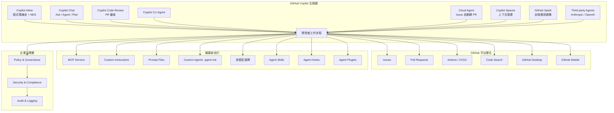
```mermaid
graph TB
    subgraph "GitHub Copilot 生態圈"
        A[Copilot Inline<br/>程式碼補全 + NES] --> E[開發者工作流程]
        B[Copilot Chat<br/>Ask / Agent / Plan] --> E
        C[Copilot Code Review<br/>PR 審查] --> E
        D[Copilot CLI Agent] --> E
        F[Cloud Agent<br/>Issue 自動轉 PR] --> E
        N[Copilot Spaces<br/>上下文管理] --> E
        O[GitHub Spark<br/>全端應用建構] --> E
        TP[Third-party Agents<br/>Anthropic / OpenAI] --> E
    end
    
    subgraph "GitHub 平台整合"
        E --> G[Issues]
        E --> H[Pull Requests]
        E --> I[Actions / CI/CD]
        E --> J[Code Search]
        E --> P[GitHub Desktop]
        E --> Q[GitHub Mobile]
    end
    
    subgraph "擴展與自訂"
        R[MCP Servers]
        S[Custom Instructions]
        T[Prompt Files]
        U[Custom Agents .agent.md]
        V[多模型選擇]
        W[Agent Skills]
        X[Agent Hooks]
        Y[Agent Plugins]
    end
    
    subgraph "企業治理層"
        K[Policy & Governance]
        L[Security & Compliance]
        M[Audit & Logging]
    end
    
    E --> R
    E --> S
    E --> T
    E --> U
    E --> V
    E --> W
    E --> X
    E --> Y
    E --> K
    K --> L
    L --> M
```

### 1.2 生態圈各組件說明

| 組件 | 功能定位 | 適用場景 | 資深工程師價值 |
| --- | --- | --- | --- |
| **Copilot Inline Suggestions** | 即時程式碼補全 | 日常編碼、實作細節 | 減少 boilerplate，專注設計 |
| **Next Edit Suggestions (NES)** | 預測下一個編輯位置並建議補全 | 連續編輯、重構 | 加速連續修改流程 |
| **Copilot Chat (Ask Mode)** | 對話式問答、程式碼解釋 | 問題分析、設計討論 | 架構決策輔助、知識傳承 |
| **Copilot Chat (Agent Mode)** | 自主完成多步驟任務 | 複雜開發任務、跨檔案修改 | 自動化實作、整合 MCP |
| **Copilot Chat (Plan Mode)** | 制定詳細實作計畫 | 任務規劃、需求分析 | 在動手前確認方案完整性 |
| **Local Agent** | 在 VS Code 內互動式執行 | 即時回饋的開發任務 | 日常開發主力 |
| **Copilot CLI Agent** | 背景執行的本機代理 | 明確定義的獨立任務 | 用 Git worktree 隔離工作 |
| **Cloud Agent**¹（官方現稱，原稱 Cloud Agent） | 雲端自主編碼代理 | 從 Issue 自動建立 PR | 將例行任務交給 Agent 執行 |
| **Third-party Agents** | Anthropic Claude / OpenAI Codex 等代理 | 使用特定 AI 提供者能力 | 依任務需求選擇最佳代理 |
| **Copilot Code Review** | AI 驅動的程式碼審查 | PR 審查、程式碼品質 | 提升 Review 效率與品質 |
| **Copilot PR Summaries** | 自動生成 PR 摘要 | PR 描述撰寫 | 節省文件撰寫時間 |
| **Copilot Spaces** | 組織上下文資訊 | 集中程式碼、文件、規格 | 為特定任務提供精確上下文 |
| **Copilot Memory（Public Preview）** | 記憶使用者層級偏好與 repo 層級事實（無 session 層級） | 持續開發同一專案，且使用 Cloud Agent/Code Review/CLI | 提升跨 session 一致性 |
| **Custom Instructions** | 自訂回應偏好（always-on / file-based） | 統一團隊風格 | 確保 AI 輸出符合規範 |
| **Prompt Files** | 可重用的 Prompt 範本（Slash Command） | 標準化工作流程 | 團隊知識共享 |
| **Agent Skills** | 可共享的專業能力套件 | 跨工具重用（VS Code / CLI / Cloud） | 封裝團隊最佳實務 |
| **Custom Agents (.agent.md)** | 自訂 AI 角色與工具限制 | 安全審查員、DBA 等角色 | 建立專業化工作流程 |
| **Agent Hooks** | Agent 生命週期自動化 | 自動格式化、安全政策、稽核 | 確定性的流程控制 |
| **Agent Plugins（Preview）** | 預打包的自訂化套件 | 從市集安裝第三方外掛 | 快速擴展功能 |
| **MCP (Model Context Protocol)** | 擴展 Copilot 能力 | 整合外部工具與服務 | 連接企業內部系統 |
| **Copilot Integrations** | 將 Cloud Agent 整合至外部平台 | 從 Teams / Slack / Jira / Linear / Azure Boards 觸發 Agent | 流程自動化、減少上下文切換 |
| **Agents Window（Preview）** | Agent-first 專屬視窗 | 跨專案編排 Agent Sessions | 以 prompt 思維驅動多專案開發 |
| **Remote Agent Sessions** | 遠端執行 Agent | 在遠端主機運行，隨時隨地監控 | 關上筆電後繼續工作，稍後查看結果 |
| **GitHub Spark** | 自然語言建構全端應用 | 快速原型、內部工具 | 快速驗證概念 |
| **Copilot in GitHub Desktop** | 自動生成 commit 訊息 | 日常 Git 操作 | 提升 commit 品質 |

> ¹ **用詞說明**：GitHub 官方文件目前一律使用「**Cloud Agent**」稱呼此雲端自主編碼代理，「Cloud Agent」為較早期的用詞。本文以下統一採用「Cloud Agent」。
>
> ⚠️ **Edit Mode 已棄用**：自 VS Code v1.110 起，Edit Mode 已正式棄用；v1.110–v1.126 期間可透過隱藏設定暫時保留，**已於 v1.126 起完全移除**。Agent Mode 已涵蓋其功能。

### 1.3 Copilot 在企業開發流程中的定位

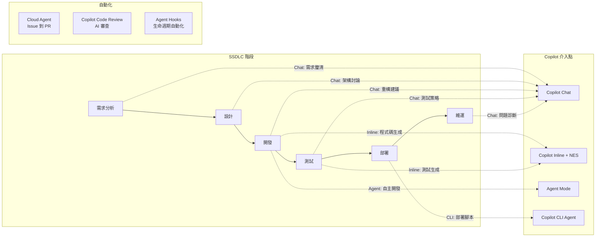
```mermaid
flowchart LR
    subgraph "SSDLC 階段"
        A[需求分析] --> B[設計]
        B --> C[開發]
        C --> D[測試]
        D --> E[部署]
        E --> F[維運]
    end
    
    subgraph "Copilot 介入點"
        A -.->|Chat: 需求釐清| G[Copilot Chat]
        B -.->|Chat: 架構討論| G
        C -.->|Inline: 程式碼生成| H[Copilot Inline + NES]
        C -.->|Agent: 自主開發| I[Agent Mode]
        C -.->|Chat: 重構建議| G
        D -.->|Inline: 測試生成| H
        D -.->|Chat: 測試策略| G
        E -.->|CLI: 部署腳本| J[Copilot CLI Agent]
        F -.->|Chat: 問題診斷| G
    end
    
    subgraph "自動化"
        K[Cloud Agent<br/>Issue 到 PR]
        L[Copilot Code Review<br/>AI 審查]
        M2[Agent Hooks<br/>生命週期自動化]
    end
```

### 1.4 版本與授權模式

GitHub Copilot 目前提供**七種方案**，適用不同規模的使用者：個人側的 Free / Student / Pro / Pro+ / Max，以及組織側的 Business / Enterprise。

> ⚠️ **重大計費變更 (2026/06/01)**：GitHub 已全面轉換為 **AI Credits 用量計費**——每次互動依實際消耗的 Token 數，依模型定價換算為 AI Credits 扣除，1 AI Credit = $0.01 USD。月費方案訂閱費即對應每月可用的 Credits 額度。**程式碼補全（Inline Suggestions）與 Next Edit Suggestions 不計費，所有付費方案維持無限使用**。此前以「Premium Requests」計次的舊制，僅適用於少數維持年約、尚未轉換的 Pro / Pro+ 舊訂戶（2026/06/01 後仍在用的既有年費用戶）。詳見官方文件：[Usage-based billing for individuals](https://docs.github.com/en/copilot/concepts/billing/usage-based-billing-for-individuals)。

#### 個人方案（AI Credits 計費）

| 版本 | 適用對象 | 月費 | 基礎 Credits | 彈性配額 | 每月合計 |
| --- | --- | --- | --- | --- | --- |
| **Copilot Free** | 所有 GitHub 用戶 | 免費 | 有限 AI Credits 配額 | — | 2,000 次補全 + 50 次 Chat + AI Credits 配額 |
| **Copilot Student** | 在學驗證學生 | 免費 | 同 Pro 級 | — | 無限補全 + Pro 等級 AI Credits |
| **Copilot Pro** | 個人開發者 | $10 USD | 1,000 Credits | 500 Credits | 1,500 Credits / 月 |
| **Copilot Pro+** | AI 進階使用者 | $39 USD | 3,900 Credits | 3,100 Credits | 7,000 Credits / 月 |
| **Copilot Max** | 重度 AI 使用者 | $100 USD | 10,000 Credits | 10,000 Credits | 20,000 Credits / 月 |

> **Copilot Free / Student 的模型存取權限（重要）**：官方文件明確指出「Free 與 Student 方案僅能透過 Auto Model Selection 使用模型」——也就是說這兩個方案**無法在模型選單中手動指定特定模型**（如指定使用某一版 Claude 或 GPT），一律由系統依任務自動挑選。Student 方案雖然功能上涵蓋 Cloud Agent，但模型存取邏輯與 Free 相同，僅在系統判斷需要時才會自動調用進階模型（如 Claude Opus 系列、GPT-5.3-Codex）。  
> **超額付費**：AI Credits 耗盡後，可設定額外預算繼續使用（$0.01/Credit），不強制中斷。  
> **年費方案注意**：現有年費方案不會自動續約。年費訂戶將在續約日前收到通知，可選擇取消並獲得按比例退款，或降級至 Copilot Free。

#### 企業方案

| 版本 | 適用對象 | 月費（每座位） | 每月 AI Credits（共池） | 主要特色 |
| --- | --- | --- | --- | --- |
| **Copilot Business** | 企業/組織（GitHub Free/Team/Enterprise Cloud） | $19 USD | 1,900 Credits / 用戶⁵ | 組織管理、Policy 控制、Cloud Agent、Audit Logs |
| **Copilot Enterprise** | 大型企業（GitHub Enterprise Cloud） | $39 USD | 3,900 Credits / 用戶⁵ | Business 全功能 + GitHub Spark + 第三方 Agent + 組織自訂指令 |

> ⁵ **AI Credits 共池機制（Pooling）**：企業方案的 AI Credits 以組織（或企業）為單位共享。例如 100 位 Business 用戶，組織共享 190,000 Credits 池。重度使用者可消耗較多額度，輕度使用者自然平衡。新增授權立即增加池額度，移除授權在下個計費週期生效。
>
> 💡 **企業預算控管**：管理員可在四個層級設定預算上限——Enterprise 級、Organization 級、Cost Center 級、User 級。設定 $0 的用戶級預算即可完全停用該用戶的 Copilot 存取權。詳見 [Setting up budgets to control spending](https://docs.github.com/en/billing/how-tos/set-up-budgets)。
>
> ⚠️ **自助簽約異動（2026/04/22 起）**：Copilot Business（適用於 GitHub Free / Team 組織）的自助簽約已暫停新客戶申請；如需採用請洽 GitHub Sales。既有訂閱不受影響。個人方案（Pro / Pro+ / Student）簽約狀態變動較快，請以官方 [Plans for GitHub Copilot](https://docs.github.com/en/copilot/get-started/plans) 頁面即時資訊為準。

#### 可用 AI 模型一覽

依據 [GitHub 官方模型與定價頁面](https://docs.github.com/en/copilot/reference/copilot-billing/models-and-pricing) 核實整理。GitHub 的模型陣容已從早期以 OpenAI / Anthropic / Google 三家為主，擴大為橫跨六大供應商的組合：

| 供應商 | 現行模型（節錄） | 備註 |
| --- | --- | --- |
| **OpenAI** | GPT-5 mini、GPT-5.3-Codex、GPT-5.4、GPT-5.4 mini、GPT-5.4 nano、GPT-5.5、GPT-5.6 Luna、GPT-5.6 Sol、GPT-5.6 Terra | GPT-4.1、GPT-5.2、GPT-5.2-Codex 等舊版已從現行清單下架 |
| **Anthropic** | Claude Haiku 4.5、Sonnet 4 / 4.5 / 4.6 / 5、Opus 4.5 / 4.6 / 4.7 / 4.8 / 5、Opus 4.8（fast mode，Preview）、**Claude Fable 5** | 型號迭代速度為六家中最快 |
| **Google** | Gemini 3.1 Pro、Gemini 3.5 Flash、Gemini 3.6 Flash | Gemini 2.5 Pro／3 Flash 已由 3.1/3.5/3.6 世代取代 |
| **GitHub 微調模型** | Raptor mini | GitHub 自有微調模型 |
| **Microsoft** | MAI-Code-1-Flash、MAI-Code-1.1-Flash | 2026 年中新加入的供應商 |
| **xAI** | Grok 4.5 | 2026 年中新加入的供應商 |
| **Moonshot AI** | Kimi K2.7 Code、Kimi K3 | 2026 年中新加入的供應商 |

> ⚠️ **勘誤**：先前版本文件中列出的「Goldeneye」模型經比對官方定價頁與方案比較頁**均查無此模型**，已確認為錯誤資訊並移除。若您在其他資料中看到此名稱，請以官方頁面為準。

**方案存取邏輯：**

| 方案 | 模型選取方式 |
| --- | --- |
| **Free / Student** | 僅能使用 Auto Model Selection，無法手動指定模型 |
| **Pro** | 可手動選擇多數 GA 模型；最頂級模型（如 Opus 5、Fable 5、fast mode 系列）通常需 Pro+ 以上 |
| **Pro+ / Max** | 可手動選擇絕大多數模型，含多數 Preview 模型 |
| **Business / Enterprise** | 可手動選擇完整模型陣容，含企業限定的 fast mode／最新旗艦模型 |

> 💡 **GPT-5.4 nano 特例**：目前僅限 Codex VS Code 擴充套件（Pro+ 方案）使用，不在 Copilot Chat 選單中提供。  
> 💡 **各模型於各方案的確切開放範圍變動頻繁**（新模型上線初期常先開放高階方案，再逐步下放），採購或稽核用途請直接查詢官方頁面即時清單，本表僅供架構性理解。

#### Per-Token 定價一覽（每 100 萬 Token）

所有 AI 互動均以 Token 消耗換算為 AI Credits（1 AI Credit = $0.01 USD）。以下為經核實的代表性定價，完整、即時的每模型定價（含長文本分級門檻定價）請以 [官方定價頁面](https://docs.github.com/en/copilot/reference/copilot-billing/models-and-pricing) 為準。

##### OpenAI 模型

| 模型 | 輸入 Token | 快取輸入 | 輸出 Token |
| --- | --- | --- | --- |
| GPT-5 mini | $0.25 | $0.025 | $2.00 |
| GPT-5.3-Codex | $1.75 | $0.175 | $14.00 |
| GPT-5.4 | $2.50 | $0.25 | $15.00 |
| GPT-5.4 mini | $0.75 | $0.075 | $4.50 |
| GPT-5.4 nano | $0.20 | $0.02 | $1.25 |
| GPT-5.5 | $5.00 | $0.50 | $30.00 |
| GPT-5.6 Luna / Sol / Terra | 洽官方頁面 | 洽官方頁面 | 洽官方頁面 |

##### Anthropic 模型（含快取寫入成本）

| 模型 | 輸入 Token | 快取輸入 | 快取寫入 | 輸出 Token |
| --- | --- | --- | --- | --- |
| Claude Haiku 4.5 | $1.00 | $0.10 | $1.25 | $5.00 |
| Claude Sonnet 4 / 4.5 / 4.6 | $3.00 | $0.30 | $3.75 | $15.00 |
| Claude Sonnet 5 | $2.00⁶ | 洽官方頁面 | 洽官方頁面 | 洽官方頁面 |
| Claude Opus 4.5 / 4.6 / 4.7 | $5.00 | $0.50 | $6.25 | $25.00 |
| Claude Fable 5 | $10.00 | $1.00 | $12.50 | $50.00 |

> ⁶ Claude Sonnet 5 的輸入定價為**促銷價**，官方頁面註明優惠期間至 **2026/08/31** 止，之後可能調整為標準定價，請於促銷到期後重新確認。

##### Google 模型

| 模型 | 輸入 Token | 快取輸入 | 輸出 Token |
| --- | --- | --- | --- |
| Gemini 3.1 Pro | $2.00 | $0.20 | $12.00 |
| Gemini 3.5 Flash | $1.50 | $0.15 | $9.00 |
| Gemini 3.6 Flash | 洽官方頁面 | 洽官方頁面 | 洽官方頁面 |

##### GitHub 微調模型

| 模型 | 輸入 Token | 快取輸入 | 輸出 Token |
| --- | --- | --- | --- |
| Raptor mini | $0.25 | $0.025 | $2.00 |

> 💡 **分級門檻定價（Threshold Pricing）**：部分模型採用長文本分級定價——OpenAI「Powerful／Versatile」級模型以 **272K tokens** 為門檻、Gemini／Grok／GPT-5.6 Luna 等模型以 **200K tokens** 為門檻，超過門檻的輸入／輸出單價會提高。實際門檻與加價幅度請查官方定價表的 Threshold 欄位。  
> 💡 **成本估算提示**：輕量級問答（GPT-5 mini）每次互動約消耗 0.1-0.5 Credits；複雜的 Agent Mode session（GPT-5.5、Claude Opus 系列、Claude Fable 5）可能消耗數十至數百 Credits。善用 Auto Model Selection 可顯著降低成本。

#### 自動模型選擇（Auto Model Selection）

> 📍 文件路徑已變更：官方文件目前位於 [`concepts/models/auto-model-selection`](https://docs.github.com/en/copilot/concepts/models/auto-model-selection)（原 `concepts/auto-model-selection` 已重導向至此）。

- **適用範圍**：Auto Model Selection **適用於所有 Copilot 方案**，包含 Free 與 Student——這兩個方案事實上只能透過此機制使用模型，並非額外選配功能。
- **費用誘因**：使用付費方案並啟用 Auto Model Selection，可享 **10% 模型費用折扣**，是官方文件明確列出的省錢誘因，而不只是「建議做法」。
- **兩種模式**：「Auto with task optimization」（依任務類型挑選最適模型，於 GitHub.com Chat、VS Code、Copilot CLI、GitHub Copilot App 皆為 GA）與「Auto optimized for model reliability and availability」（優先確保回應穩定與模型可用性，於 JetBrains／Eclipse／Xcode 為 GA，於 Visual Studio 仍為 Public Preview）。
- **排除項目**：不在您方案內的模型、管理員封鎖的模型、FedRAMP 限制模型，以及可由管理員個別停用的評估中模型（evaluation models），不會被自動選入候選池。
- **第三方 Agent 的自動選模候選池**：使用 OpenAI Codex 作為第三方 Agent 時，候選池為 GPT-5.3-Codex、GPT-5.4、GPT-5.4 nano；使用 Anthropic Claude 作為第三方 Agent 時，候選池為 Claude Opus 4.5、4.6、4.7 與 Sonnet 4.5、4.6（注意：Opus 4.8 / Opus 5 / Sonnet 5 / Fable 5 等最新旗艦模型目前**不在**自動選模候選池內，僅能手動指定使用）。

> ⚠️ **企業使用注意**：Business/Enterprise 版本承諾不使用您的程式碼訓練模型，這對金融業等受監管產業至關重要。

### 1.5 AI Credits 計費機制詳解

2026 年 6 月 1 日起，GitHub Copilot 全面從 Premium Requests（固定次數）切換至 AI Credits（Token 用量計費）。資深工程師與企業管理者必須深入理解此機制，以有效管理成本。

#### 1.5.1 AI Credits 運作原理

```text
使用者互動 → 消耗 Token（輸入 + 輸出 + 快取） → 依模型定價換算 → AI Credits 扣除
                                                        1 AI Credit = $0.01 USD
```

**影響消耗量的主要因素：**

| 因素 | 說明 | 成本影響 |
| --- | --- | --- |
| **對話長度與複雜度** | 越長的對話累積越多 Token | 線性增長 |
| **Agentic 功能** | Agent Mode、Cloud Agent 涉及多次模型呼叫 | 顯著增長（可能 10-100x） |
| **模型選擇** | 高階模型（GPT-5.5、Claude Opus 4.7）成本遠高於輕量模型 | 差距 10-60x |
| **程式碼補全 / NES** | **不消耗 AI Credits**，所有付費方案無限使用 | 零成本 |

#### 1.5.2 Credits 使用優先順序

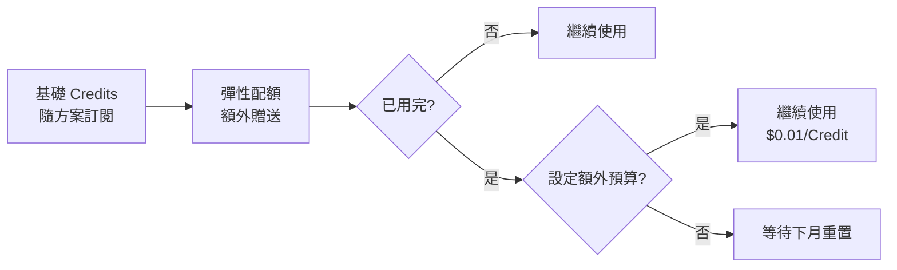
```mermaid
flowchart LR
    A[基礎 Credits<br/>隨方案訂閱] --> B[彈性配額<br/>額外贈送]
    B --> C{已用完?}
    C -->|否| D[繼續使用]
    C -->|是| E{設定額外預算?}
    E -->|是| F[繼續使用<br/>$0.01/Credit]
    E -->|否| G[等待下月重置]
```

#### 1.5.3 哪些功能消耗 AI Credits

| 消耗 AI Credits | 不消耗 AI Credits |
| --- | --- |
| Copilot Chat（所有模式） | 程式碼補全（Inline Suggestions） |
| Copilot CLI | Next Edit Suggestions（NES） |
| Cloud Agent | — |
| Copilot Spaces | — |
| GitHub Spark | — |
| Third-party Agents | — |

#### 1.5.4 Copilot Code Review 的特殊計費

自 2026/06/01 起，Code Review 採用雙重計費：

1. **AI Credits**：Token 消耗依模型定價扣除（模型由系統自動選擇，無法指定）
2. **GitHub Actions minutes**：Code Review 使用 GitHub-hosted runner 執行，消耗 Actions 分鐘數（self-hosted runner 不計費）

> 💡 **查看用量**：可透過 GitHub Actions metrics 篩選 `copilot-pull-request-reviewer` workflow 檢視 Code Review 用量。

#### 1.5.5 企業成本管控策略

| 策略 | 做法 | 預期效果 |
| --- | --- | --- |
| **啟用 Auto Model Selection** | 讓 Copilot 自動選擇最適模型 | 節省 30-50% Credits |
| **設定 User-level 預算** | 為每位用戶設定月度上限 | 防止單一用戶過度消耗 |
| **推廣輕量模型** | 鼓勵使用 GPT-5 mini、Claude Haiku 4.5 做日常問答 | 單次互動成本降低 90% |
| **限制 Agent Mode 使用場景** | 僅在明確定義的任務中使用 Agent | 避免失控的多輪 Agent session |
| **監控 Usage Dashboard** | 定期檢視組織用量報表 | 及早發現異常消耗 |

### 1.6 Copilot Cloud Agent 整合平台

Copilot Cloud Agent 已支援與多個外部平台整合，讓團隊可以從既有工作流中直接觸發 Agent 任務，減少上下文切換與操作摩擦。

#### 支援的整合平台

| 平台 | 整合方式 | 適用方案 | 典型情境 |
| --- | --- | --- | --- |
| **Microsoft Teams** | 從 Teams 頻道觸發 Cloud Agent | Pro, Pro+, Business, Enterprise | 在討論中直接指派開發任務 |
| **Slack** | 從 Slack Workspace 觸發 Cloud Agent | Pro, Pro+, Business, Enterprise | 將討論轉化為 PR |
| **Linear** | 從 Linear Issue 觸發 Cloud Agent | Pro, Pro+, Business, Enterprise | Issue 自動轉為程式碼變更 |
| **Azure Boards** | 從 Work Item 觸發 Cloud Agent | Pro, Pro+, Business, Enterprise | 將 Azure DevOps 任務自動化 |
| **Jira** | 從 Jira Workspace 觸發 Cloud Agent | Pro, Pro+, Business, Enterprise | 將 Jira Issue 轉為 PR |

#### 整合核心優勢

- **無縫工作流**：從既有工具直接觸發 Agent，無需切換到 GitHub
- **上下文感知**：Agent 會擷取整個討論串或 Issue 內容作為上下文
- **團隊協作**：團隊成員可從共享平台觸發 Agent，結果自動反映於 PR
- **資料用途透明**：整合的上下文會存儲於 Agent 建立的 PR 中，便於稽核

> ⚠️ **安全提醒**：整合平台的討論內容會傳送給 Agent。避免在討論串中包含機敏資訊（API Key、密碼、客戶個資）。

### 1.7 2025-2026 年新功能重點摘要

以下為近期 Copilot 生態圈的重要更新，資深工程師應特別留意：

| 功能 | 類別 | 說明 | 影響程度 |
| --- | --- | --- | --- |
| **🔴 AI Credits 用量計費（2026/06 上線）** | 計費 | 從 Premium Requests 改為 GitHub AI Credits，Token 用量計費制 | 🔴 高 |
| **AI Credits 共池（企業）** | 計費 | Business/Enterprise 用戶的 Credits 以組織為單位共享 | 🔴 高 |
| **四級預算控管** | 計費 | Enterprise / Org / Cost Center / User 四層預算上限 | 🔴 高 |
| **推廣期優惠額度** | 計費 | 現有企業客戶 2026/06-09 享加倍 Credits（Business 3,000 / Enterprise 7,000） | 🟡 中 |
| **Copilot Max 方案** | 計費 | $100/月，20,000 Credits，適合重度 AI 使用者 | 🟡 中 |
| **Copilot Student 方案** | 計費 | 在學學生免費享 Pro 等級功能 | 🟡 中 |
| **自動模型選擇（Auto Model Selection）** | 模型 | 所有方案皆可用（含 Free/Student），付費方案啟用可享 10% 費用折扣 | 🔴 高 |
| **GPT-5.x 系列模型** | 模型 | GPT-5.3-Codex/5.4/5.4 mini/5.4 nano/5.5/5.6（Luna/Sol/Terra）陸續上線；GPT-4.1、5.2 系列已下架 | 🔴 高 |
| **Claude 5 世代模型** | 模型 | Claude Sonnet 4/4.5/4.6/5、Opus 4.5/4.6/4.7/4.8/4.8 fast/5、**Claude Fable 5**、Haiku 4.5 | 🔴 高 |
| **Gemini 3.x 系列模型** | 模型 | Gemini 3.1 Pro、3.5 Flash、3.6 Flash | 🟡 中 |
| **新增模型供應商** | 模型 | Microsoft（MAI-Code）、xAI（Grok 4.5）、Moonshot AI（Kimi K2.7/K3）加入模型陣容 | 🟡 中 |
| **Agent Management 面板** | Agent | Repository 內的 Agents 標籤頁，集中管理所有 Agent sessions | 🔴 高 |
| **Agent Sessions 管理** | Agent | 多 Session 並行、統一管理列表、Session 交接、即時導向 | 🔴 高 |
| **Autopilot（Preview）** | Agent 權限 | Agent 全自主執行，自動完成所有工具呼叫 | 🔴 高 |
| **Agent 權限層級** | Agent 權限 | Default / Bypass Approvals / Autopilot 三層級 | 🔴 高 |
| **Cloud Agent** | 自主代理 | 可將 GitHub Issue 指派給 Copilot，自動建立 PR | 🔴 高 |
| **Copilot CLI** | 自主代理 | 終端機中的 Copilot Agent，可建立 PR 並與 Cloud Agent 交接 | 🔴 高 |
| **Third-party Agents（Preview）** | 自主代理 | 支援 Anthropic Claude / OpenAI Codex 等第三方 Agent（Pro/Pro+/Business/Enterprise） | 🟡 中 |
| **Custom Agents（.agent.md / agents/*.md）** | 自訂 | 在 Repo 或 Org/Enterprise 層級定義專屬 Agent | 🔴 高 |
| **Agent Mode (IDE)** | Chat 模式 | 在 IDE 中自主決定編輯哪些檔案、執行終端指令 | 🔴 高 |
| **Edit Mode 棄用** | Chat 模式 | v1.110 起棄用，v1.125 移除，功能由 Agent Mode 取代 | 🟡 中 |
| **Plan Mode (IDE)** | Chat 模式 | 在動手前建立詳細實作計畫，可交接給其他 Agent 執行 | 🟡 中 |
| **Agent Hooks（Preview）** | 自動化 | 8 個生命週期事件，確定性自動化與安全政策 | 🔴 高 |
| **Agent Skills** | 自訂 | 可跨工具共享的能力套件（開放標準 agentskills.io） | 🟡 中 |
| **Agent Plugins（Preview）** | 自訂 | 從市集安裝預打包的自訂化套件 | 🟡 中 |
| **Chat Customizations Editor** | 自訂 | 集中管理所有自訂化（agents / skills / hooks 等） | 🟡 中 |
| **Next Edit Suggestions** | 補全 | 預測下一個編輯位置，主動建議修改 | 🟡 中 |
| **Copilot Spaces** | 上下文 | 整合程式碼、文件、規格至 Space，提升回應精準度 | 🟡 中 |
| **Copilot Memory（Public Preview）** | 上下文 | Repo 層級事實＋User 層級偏好，僅 Cloud Agent、Code Review、CLI 可用（不含 Chat） | 🟡 中 |
| **MCP 整合** | 擴展 | 透過 Model Context Protocol 連接外部工具與服務 | 🔴 高 |
| **Custom Instructions** | 自訂 | always-on / file-based 兩種模式，Org 層級支援 | 🟡 中 |
| **Prompt Files** | 自訂 | 可重用的 `.prompt.md` 檔案，作為 Slash Command 使用 | 🟡 中 |
| **Image Support** | Chat | 可在 Chat 中貼圖片（截圖、流程圖）進行分析 | 🟢 低 |
| **Subagents** | Agent | 在 Agent Mode 中委派子任務給獨立 Agent | 🟡 中 |
| **GitHub Spark（Preview）** | 應用 | 用自然語言建構與部署全端應用 | 🟡 中 |
| **Copilot Chat in Windows Terminal** | 平台 | 在 Windows Terminal 中直接使用 Copilot Chat | 🟡 中 |
| **Copilot Integrations（Teams / Slack / Jira / Linear / Azure Boards）** | 整合 | 從外部平台直接觸發 Cloud Agent，減少上下文切換 | 🔴 高 |
| **Agents Window（Preview）** | 平台 | Agent-first 專屬視窗，跨專案編排 Sessions，可從瀏覽器或手機監控 | 🔴 高 |
| **Remote Agent Sessions** | 平台 | 在遠端主機運行 Agent，隨時隨地監控與查看結果 | 🟡 中 |
| **Copilot CLI 內建代理（explore / task / research / rubber-duck / code-review）** | Agent | Copilot CLI 內建五個專業化子代理，各有獨立上下文視窗 | 🔴 高 |
| **Custom Agent Handoffs** | 自訂 | Agent 間的引導式工作流程交接，如 Plan → Implementation → Review | 🔴 高 |
| **IDE 跨平台擴展** | 平台 | JetBrains、Eclipse（Preview）、Xcode（Preview）支援擴展 | 🟡 中 |
| **Code Review 消耗 Actions minutes** | 計費 | 2026/06/01 起 Code Review 同時消耗 AI Credits + GitHub Actions 分鐘數 | 🟡 中 |
| **`/init` 指令** | 初始化 | 自動生成 copilot-instructions.md 初始化專案 | 🟡 中 |
| **`/fork` 指令** | Chat | 分支對話以探索不同方案 | 🟢 低 |
| **AI 生成自訂化** | 自訂 | `/create-prompt`、`/create-agent`、`/create-hook` 等 | 🟡 中 |
| **`gh skill` CLI 指令** | 自訂 | 透過 GitHub CLI 探索並安裝社群 Skills | 🟡 中 |

---

## 第二章 Copilot 與「資深工程師角色」的正確關係

### 2.1 思維轉換：從「工具」到「協作夥伴」

資深工程師使用 Copilot 的心態應該是：

```text
❌ 錯誤心態：「讓 AI 幫我寫程式」
✅ 正確心態：「讓 AI 加速我的思考與實作」
```

#### 角色定位比較

| 面向 | 傳統開發 | AI 輔助開發 |
| ------ | ---------- | ------------- |
| **設計決策** | 工程師主導 | 工程師主導，AI 提供選項 |
| **實作細節** | 工程師撰寫 | AI 建議，工程師審核 |
| **品質把關** | Code Review | Code Review + AI 輸出審核 |
| **知識應用** | 查文件、經驗 | AI 快速提供，工程師驗證 |

### 2.2 資深工程師的不可取代價值

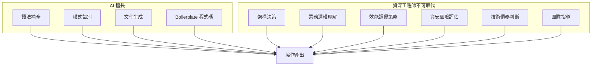
```mermaid
graph TB
    subgraph "AI 擅長"
        A[語法補全]
        B[模式識別]
        C[文件生成]
        D[Boilerplate 程式碼]
    end
    
    subgraph "資深工程師不可取代"
        E[架構決策]
        F[業務邏輯理解]
        G[效能調優策略]
        H[資安風險評估]
        I[技術債務判斷]
        J[團隊指導]
    end
    
    A --> K[協作產出]
    B --> K
    C --> K
    D --> K
    E --> K
    F --> K
    G --> K
    H --> K
    I --> K
    J --> K
```

### 2.3 正確的協作模式

#### 模式一：AI 起草，人類精修

```java
// 步驟 1: 提供明確的設計意圖（註解）
// 實作一個 Rate Limiter，使用 Token Bucket 演算法
// 需求：每秒最多 100 個請求，支援 burst 到 150

// 步驟 2: Copilot 生成初版程式碼
// 步驟 3: 資深工程師審核並修正
//   - 檢查 thread-safety
//   - 驗證邊界條件
//   - 確認效能特性
```

#### 模式二：人類設計，AI 實作

```java
// 資深工程師先定義介面與契約
public interface PaymentProcessor {
    /**
     * 處理付款請求
     * @param request 付款請求，包含金額、幣別、付款方式
     * @return 付款結果，包含交易編號與狀態
     * @throws PaymentException 當付款失敗時拋出
     */
    PaymentResult process(PaymentRequest request) throws PaymentException;
}

// 再讓 Copilot 協助實作具體邏輯
```

#### 模式三：AI 解釋，人類決策

使用 Copilot Chat 分析既有程式碼：

```text
Prompt: 請分析這段 Legacy Code 的問題，並提供重構建議：
- 識別潛在的效能瓶頸
- 指出可能的 thread-safety 問題
- 建議符合 Clean Architecture 的重構方向
```

### 2.4 效率提升的正確期待

以下數值為業界實務經驗法則（rule of thumb），並非特定基準測試或學術研究的實測數據，實際效果依團隊成熟度、程式語言與任務複雜度而異；建議導入後依 [8.5 效益衡量指標](#85-效益衡量指標) 建立團隊自有的實測基準，取代下表的通用估計。

| 任務類型 | 預期效率提升（經驗參考值） | 說明 |
| ---------- | -------------- | ------ |
| Boilerplate 程式碼 | 60-80% | CRUD、DTO、基本驗證 |
| 單元測試 | 40-60% | 測試案例生成，邊界條件需人工補充 |
| 文件撰寫 | 50-70% | JavaDoc、README、API 文件 |
| 複雜業務邏輯 | 10-20% | AI 難以理解業務脈絡 |
| 架構設計 | 5-15% | 提供參考，決策仍需人類 |
| 效能調優 | 10-20% | 需要實際 profiling 數據 |

> 💡 **實務建議**：不要期待 Copilot 處理「需要深度業務知識」或「需要跨系統理解」的任務。

---

## 第三章 Copilot 在實際開發流程中的使用時機

### 3.1 開發流程與 Copilot 介入點

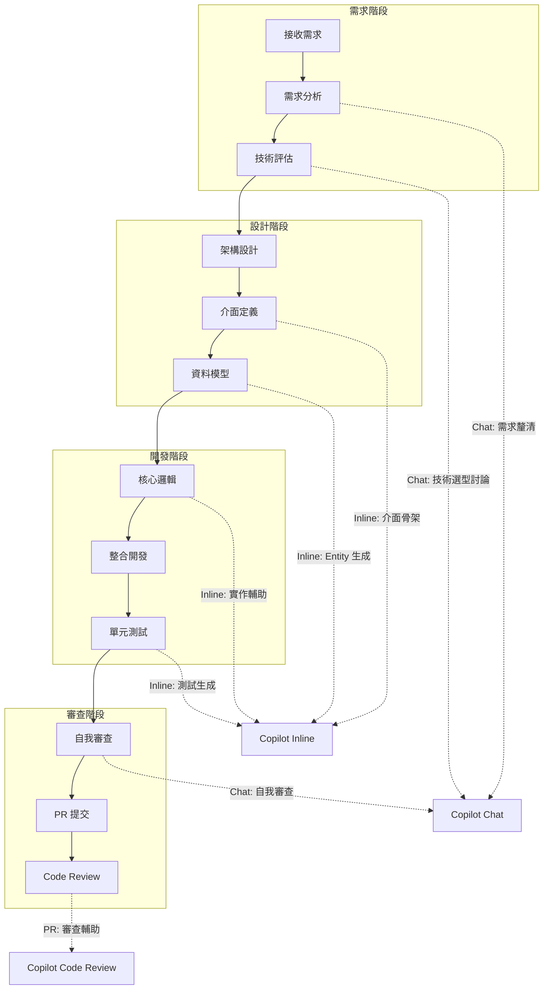
```mermaid
flowchart TB
    subgraph "需求階段"
        A1[接收需求] --> A2[需求分析]
        A2 --> A3[技術評估]
    end
    
    subgraph "設計階段"
        B1[架構設計] --> B2[介面定義]
        B2 --> B3[資料模型]
    end
    
    subgraph "開發階段"
        C1[核心邏輯] --> C2[整合開發]
        C2 --> C3[單元測試]
    end
    
    subgraph "審查階段"
        D1[自我審查] --> D2[PR 提交]
        D2 --> D3[Code Review]
    end
    
    A3 --> B1
    B3 --> C1
    C3 --> D1
    
    A2 -.->|Chat: 需求釐清| E[Copilot Chat]
    A3 -.->|Chat: 技術選型討論| E
    B2 -.->|Inline: 介面骨架| F[Copilot Inline]
    B3 -.->|Inline: Entity 生成| F
    C1 -.->|Inline: 實作輔助| F
    C3 -.->|Inline: 測試生成| F
    D1 -.->|Chat: 自我審查| E
    D3 -.->|PR: 審查輔助| G[Copilot Code Review]
```

### 3.2 各階段使用策略

#### 3.2.1 需求分析階段

**適合使用 Copilot Chat 的場景：**

```markdown
## Prompt 範例：需求釐清

我收到以下需求：
「系統需要支援多幣別付款，包含台幣、美金、日圓」

請幫我列出：
1. 可能需要釐清的技術細節
2. 常見的實作考量點
3. 可能的 edge cases
```

**Copilot 回應可能包含：**

- 匯率來源與更新頻率
- 精確度與四捨五入規則
- 時區與結算日考量
- 監管合規要求

> ⚠️ **注意**：Copilot 的建議需要與 BA/PM 確認，AI 不了解您的具體業務脈絡。

#### 3.2.2 設計階段

**介面定義輔助：**

```java
// 提供明確的設計意圖
/**
 * 多幣別付款處理器
 * 
 * 設計考量：
 * - 支援 TWD, USD, JPY
 * - 匯率由外部服務提供
 * - 需要 idempotency 支援
 * - 需要完整的 audit trail
 */
public interface MultiCurrencyPaymentProcessor {
    // Copilot 會根據註解生成方法簽名
}
```

#### 3.2.3 開發階段

**核心邏輯實作 - 建議流程：**

```text
1. 先寫完整的方法簽名與 JavaDoc
2. 寫關鍵的邏輯註解（pseudo code）
3. 讓 Copilot 填充實作細節
4. 逐行審核，特別注意：
   - 邊界條件
   - 錯誤處理
   - 效能考量
   - 資安風險
```

**範例：**

```java
/**
 * 計算跨幣別轉換金額
 * 
 * @param amount 原始金額
 * @param fromCurrency 來源幣別
 * @param toCurrency 目標幣別
 * @return 轉換後金額，使用 BigDecimal 確保精確度
 * @throws CurrencyConversionException 當匯率不可用時
 */
public BigDecimal convertCurrency(
        BigDecimal amount, 
        Currency fromCurrency, 
        Currency toCurrency) {
    
    // 1. 驗證輸入參數
    // 2. 取得匯率（從快取或外部服務）
    // 3. 執行轉換計算，注意精確度
    // 4. 記錄 audit log
    // 5. 回傳結果
    
    // Copilot 會根據上述註解生成實作
}
```

#### 3.2.4 測試階段

**單元測試生成策略：**

```java
// 在測試類別中，提供明確的測試意圖
class MultiCurrencyPaymentProcessorTest {
    
    // 測試正常轉換情境
    // 測試資料：100 TWD -> USD，匯率 0.033
    @Test
    void shouldConvertTWDtoUSD_whenValidInput() {
        // Copilot 生成測試程式碼
    }
    
    // 測試邊界條件：金額為零
    @Test
    void shouldReturnZero_whenAmountIsZero() {
        // Copilot 生成測試程式碼
    }
    
    // 測試異常情境：匯率服務不可用
    @Test
    void shouldThrowException_whenExchangeRateUnavailable() {
        // Copilot 生成測試程式碼
    }
}
```

> 💡 **最佳實務**：讓 Copilot 生成測試後，手動補充 AI 可能遺漏的 edge cases。

### 3.3 不同類型任務的使用建議

| 任務類型 | 建議方式 | Copilot 角色 | 人工重點 |
| ---------- | ---------- | -------------- | ---------- |
| **新功能開發** | Inline + Chat | 生成骨架、實作細節 | 設計決策、業務邏輯 |
| **Bug 修復** | Chat 分析 + Inline 修正 | 問題診斷、修正建議 | 根因分析、影響評估 |
| **重構** | Chat 討論 + Inline 實作 | 重構方案、程式碼轉換 | 決定重構範圍、驗證 |
| **效能優化** | Chat 分析 | 潛在瓶頸識別 | Profiling、實測驗證 |
| **Legacy 維護** | Chat 解釋 | 程式碼理解 | 業務脈絡、風險評估 |

### 3.4 與現有工具鏈整合

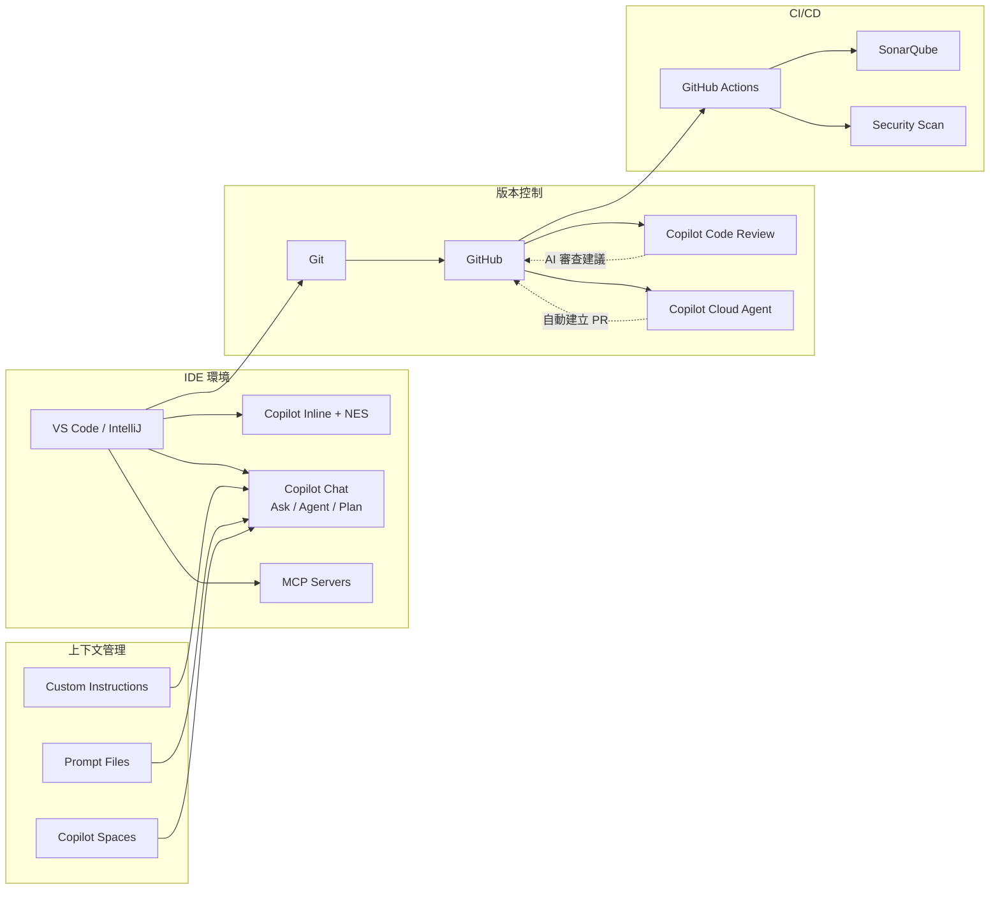
```mermaid
flowchart LR
    subgraph "IDE 環境"
        A[VS Code / IntelliJ]
        B[Copilot Inline + NES]
        C[Copilot Chat<br/>Ask / Agent / Plan]
        M[MCP Servers]
    end
    
    subgraph "版本控制"
        D[Git]
        E[GitHub]
        F[Copilot Code Review]
        N[Copilot Cloud Agent]
    end
    
    subgraph "CI/CD"
        G[GitHub Actions]
        H[SonarQube]
        I[Security Scan]
    end
    
    subgraph "上下文管理"
        O[Custom Instructions]
        P[Prompt Files]
        Q[Copilot Spaces]
    end
    
    A --> B
    A --> C
    A --> M
    A --> D
    D --> E
    E --> F
    E --> N
    E --> G
    G --> H
    G --> I
    
    O --> C
    P --> C
    Q --> C
    
    F -.->|AI 審查建議| E
    N -.->|自動建立 PR| E
```

### 3.5 實務案例：一個完整的開發循環

```markdown
## 情境：實作「交易對帳功能」

### Step 1: 需求理解（Chat）
Prompt: 「請幫我分析銀行交易對帳功能的常見設計考量」

### Step 2: 介面設計（Inline）
- 定義 ReconciliationService interface
- 定義 ReconciliationResult DTO

### Step 3: 核心實作（Inline + 人工審核）
- 讓 Copilot 生成對帳邏輯
- 人工確認匹配演算法正確性
- 人工補充異常處理

### Step 4: 測試（Inline + 人工補充）
- Copilot 生成基本測試案例
- 人工補充：大量資料效能測試、並發測試

### Step 5: PR 提交（Copilot PR Summaries + Code Review）
- 自動生成 PR 摘要
- 審查者參考 Copilot 的 Review 建議
```

---

## 第四章 Copilot Prompt Engineering（重點章節）

### 4.1 Prompt Engineering 核心觀念

對資深工程師而言，Prompt Engineering 不只是「問問題的技巧」，而是**將設計意圖精確傳達給 AI 的能力**。

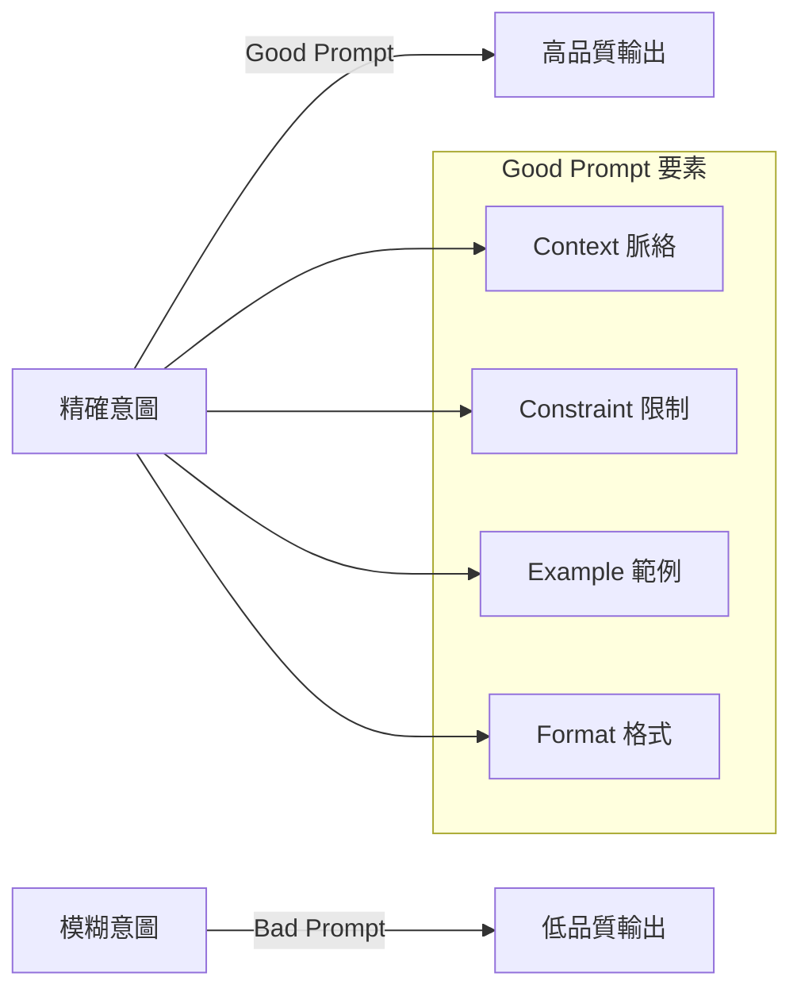
```mermaid
graph LR
    A[模糊意圖] -->|Bad Prompt| B[低品質輸出]
    C[精確意圖] -->|Good Prompt| D[高品質輸出]
    
    subgraph "Good Prompt 要素"
        E[Context 脈絡]
        F[Constraint 限制]
        G[Example 範例]
        H[Format 格式]
    end
    
    C --> E
    C --> F
    C --> G
    C --> H
```

### 4.2 Inline Completion Prompt 技巧

#### 4.2.1 註解驅動開發（Comment-Driven Development）

##### 原則：註解越精確，生成品質越高

```java
// ❌ Bad Prompt
// 處理付款

// ✅ Good Prompt
// 處理信用卡付款
// 步驟：1. 驗證卡號 2. 呼叫金流 API 3. 記錄交易
// 需要：idempotency key 防止重複扣款
// 例外：CardValidationException, PaymentGatewayException
```

#### 4.2.2 簽名先行模式

**先定義完整的方法簽名，再讓 Copilot 填充實作：**

```java
// ✅ 提供完整簽名與 JavaDoc
/**
 * 批次處理交易對帳
 * 
 * @param transactions 待對帳交易清單，不可為 null
 * @param bankStatements 銀行對帳單，不可為 null
 * @param toleranceAmount 容許誤差金額（用於浮點數比較）
 * @return 對帳結果，包含匹配、不匹配、待確認三類
 * @throws ReconciliationException 當對帳過程發生錯誤
 */
public ReconciliationResult reconcile(
        List<Transaction> transactions,
        List<BankStatement> bankStatements,
        BigDecimal toleranceAmount) throws ReconciliationException {
    // Copilot 會根據完整的上下文生成實作
}
```

#### 4.2.3 分層註解模式

```java
public class OrderService {
    
    // === 訂單建立相關 ===
    
    // 建立新訂單
    // 驗證庫存 -> 計算金額 -> 建立訂單 -> 發送通知
    public Order createOrder(CreateOrderRequest request) {
        // 1. 驗證庫存是否足夠
        
        // 2. 計算訂單金額（含折扣、稅金）
        
        // 3. 建立訂單實體並儲存
        
        // 4. 發送訂單建立通知
        
        // Copilot 會逐步填充每個區塊
    }
}
```

### 4.3 Copilot Chat Prompt 技巧

#### 4.3.1 角色設定模式

```markdown
## Prompt 範例

你是一位資深 Java 架構師，熟悉 Spring Boot、Clean Architecture 和金融系統開發。

請審查以下程式碼，從以下角度提供建議：
1. 架構設計是否符合 Clean Architecture
2. 是否有潛在的 thread-safety 問題
3. 是否符合 OWASP Top 10 安全規範
4. 效能是否有優化空間

[貼上程式碼]
```

#### 4.3.2 CRISPE 框架

| 要素 | 說明 | 範例 |
| ------ | ------ | ------ |
| **C**apacity | 角色能力 | 「你是資深 DBA」 |
| **R**ole | 扮演角色 | 「請以 Code Reviewer 角度」 |
| **I**nsight | 背景資訊 | 「這是銀行核心系統」 |
| **S**tatement | 具體任務 | 「請找出 SQL Injection 風險」 |
| **P**ersonality | 回應風格 | 「請條列重點，附程式碼範例」 |
| **E**xperiment | 嘗試要求 | 「請提供三種解決方案」 |

**完整範例：**

```markdown
## CRISPE Prompt

【角色】你是一位具有 10 年經驗的 Java 效能調優專家
【背景】我們的系統是銀行交易核心，需要處理每秒 1000+ TPS
【任務】請分析以下程式碼的效能瓶頸
【風格】請用條列方式說明，並提供優化後的程式碼
【嘗試】請提供至少 2 種優化方案，並比較優缺點

[程式碼]
```

#### 4.3.3 多輪對話策略

```markdown
## 第一輪：問題定義
「我需要設計一個分散式鎖的實作，使用 Redis，請問有哪些設計要點？」

## 第二輪：深入探討
「關於你提到的 Redlock 演算法，請詳細說明實作步驟」

## 第三輪：程式碼生成
「請用 Java + Lettuce 實作，需要支援可重入」

## 第四輪：審查確認
「請檢查這個實作是否有 race condition 風險」
```

### 4.4 Bad Prompt vs Good Prompt 對照

#### 案例一：程式碼生成

```java
// ❌ Bad Prompt
// 寫一個 API

// ✅ Good Prompt
/**
 * REST API: 查詢用戶交易紀錄
 * 
 * Endpoint: GET /api/v1/users/{userId}/transactions
 * 
 * 功能需求：
 * - 支援分頁（page, size）
 * - 支援日期區間篩選（startDate, endDate）
 * - 支援交易類型篩選（transactionType）
 * 
 * 安全需求：
 * - 需要 JWT 認證
 * - 只能查詢自己的交易（除非是 ADMIN 角色）
 * 
 * 回應格式：
 * - 成功：200 + Page<TransactionDTO>
 * - 未授權：401
 * - 禁止存取：403
 * - 找不到：404
 */
@GetMapping("/users/{userId}/transactions")
public ResponseEntity<Page<TransactionDTO>> getUserTransactions(
    @PathVariable Long userId,
    @RequestParam(defaultValue = "0") int page,
    @RequestParam(defaultValue = "20") int size,
    @RequestParam(required = false) LocalDate startDate,
    @RequestParam(required = false) LocalDate endDate,
    @RequestParam(required = false) TransactionType transactionType,
    @AuthenticationPrincipal UserDetails currentUser) {
    // Copilot 生成
}
```

#### 案例二：Code Review

```markdown
## ❌ Bad Prompt
看一下這段 code 有沒有問題

## ✅ Good Prompt
請以資深 Java 工程師角度審查以下程式碼：

審查重點：
1. 【安全性】是否有 SQL Injection、XSS、CSRF 風險
2. 【效能】是否有 N+1 Query、記憶體洩漏風險
3. 【可維護性】是否符合 SOLID 原則
4. 【錯誤處理】例外處理是否完整

請用以下格式回覆：
- 🔴 嚴重問題（必須修正）
- 🟡 中度問題（建議修正）
- 🟢 改善建議（可選）

[程式碼]
```

#### 案例三：測試生成

```markdown
## ❌ Bad Prompt
幫我寫測試

## ✅ Good Prompt
請為以下 Service 方法生成單元測試：

測試框架：JUnit 5 + Mockito
測試策略：
1. Happy Path：正常情境
2. Edge Cases：邊界值（null、空集合、最大值）
3. Error Cases：各種例外情境
4. Security Cases：權限驗證

命名規範：should_[預期結果]_when_[條件]

請確保：
- 每個測試方法只測試一個情境
- 使用 AAA 模式（Arrange-Act-Assert）
- Mock 所有外部依賴

[Service 程式碼]
```

### 4.5 進階 Prompt Pattern

#### 4.5.1 Chain of Thought（思維鏈）

```markdown
請分析這段程式碼的問題，請一步步思考：

1. 首先，說明這段程式碼的功能
2. 接著，分析可能的問題點
3. 然後，解釋每個問題的影響
4. 最後，提供具體的修正建議

[程式碼]
```

#### 4.5.2 Few-Shot Learning（範例學習）

```java
// 請依照以下範例風格，生成新的驗證方法

// 範例 1：
public void validateEmail(String email) {
    Objects.requireNonNull(email, "Email 不可為 null");
    if (!EMAIL_PATTERN.matcher(email).matches()) {
        throw new ValidationException("Email 格式不正確: " + email);
    }
}

// 範例 2：
public void validatePhoneNumber(String phone) {
    Objects.requireNonNull(phone, "電話不可為 null");
    if (!PHONE_PATTERN.matcher(phone).matches()) {
        throw new ValidationException("電話格式不正確: " + phone);
    }
}

// 請生成：validateTaiwanId（驗證台灣身分證字號）
```

#### 4.5.3 Persona Pattern（人格模式）

```markdown
從現在開始，請以「挑剔的資安專家」角度回答：
- 對任何程式碼都要先假設有安全漏洞
- 主動指出可能被攻擊的點
- 提供符合 OWASP 規範的修正建議

[程式碼]
```

### 4.6 Prompt Template 庫

以下是資深工程師常用的 Prompt Template：

#### Template 1：架構審查

```markdown
## 架構審查 Prompt

【系統背景】
{簡述系統用途與規模}

【審查標的】
{貼上架構圖或程式碼}

【請評估】
1. 是否符合 {Clean Architecture / Hexagonal / etc.}
2. 各層職責是否清晰
3. 依賴方向是否正確
4. 是否有過度設計或設計不足
5. 可測試性評估

【輸出格式】
- 整體評分（1-10）
- 優點列表
- 待改善列表（含優先級）
- 具體修改建議
```

#### Template 2：效能分析

```markdown
## 效能分析 Prompt

【效能需求】
- TPS 要求：{數值}
- 回應時間要求：P99 < {數值}ms
- 資源限制：{記憶體/CPU}

【分析標的】
{程式碼或設計}

【請分析】
1. 時間複雜度
2. 空間複雜度
3. I/O 瓶頸
4. 潛在的 blocking 點
5. 可能的 memory leak

【請提供】
- 優化建議（按影響程度排序）
- 優化後的程式碼
- 預期改善幅度
```

#### Template 3：重構建議

```markdown
## 重構建議 Prompt

【重構原因】
{說明為何要重構}

【限制條件】
- 不可變更 public API
- 需要向後相容
- 時間限制：{工時}

【程式碼】
{Legacy Code}

【請提供】
1. 識別的 Code Smell
2. 建議的重構手法（參考 Refactoring 書籍術語）
3. 重構步驟（可逐步執行，每步可獨立驗證）
4. 重構後的程式碼
5. 風險評估與測試建議
```

### 4.7 Copilot Chat 快捷指令與互動方式

#### 4.7.1 Chat 模式與 Agent 類型（VS Code）

> ⚠️ **重要變更**：Edit Mode 自 VS Code v1.110 起已正式棄用；v1.110–v1.126 期間可透過隱藏設定 `chat.editMode.hidden` 暫時保留使用，但自 **v1.126 起已完全移除**，且無法再透過設定重新啟用。Agent Mode 已涵蓋其所有功能，官方建議全面改用 Agent Mode。

**Built-in Agents（內建代理）：**

Copilot Chat 在 VS Code 中提供三種內建代理，可透過 Agent 下拉選單或 Chat 面板切換：

| 內建代理 | 功能 | 最佳使用場景 | 狀態 |
| --- | --- | --- | --- |
| **Agent** | 自主完成多步驟任務，編輯檔案、執行終端指令、驗證結果 | 複雜任務、跨檔案修改、需要執行終端指令 | GA |
| **Plan** | 產出結構化實作計畫（含摘要與驗證步驟），可交接給其他 Agent 執行；亦可透過 `/plan` 斜線指令呼叫，並支援自訂 Planning Agent | 在動手前制定計畫、確認方案完整性 | Stable |
| **Ask** | 問答式互動，不修改檔案 | 理解程式碼、探索想法、一般性問題 | GA |

> 💡 **Plan Mode 運作細節**：Plan 產出的計畫會自動儲存於工作階段記憶檔 `/memories/session/plan.md`，供後續交接的 Agent 讀取；該檔案會在對話結束後清除，不會殘留於專案中。

**Agent 類型（執行環境）：**

| Agent 類型 | 執行位置 | 適用場景 | 說明 |
| --- | --- | --- | --- |
| **Local Agent** | 本機 VS Code 內 | 互動式開發、即時回饋 | 完整存取 workspace、tools、models |
| **Copilot CLI** | 本機終端機 | 明確定義的獨立任務 | 可建立 PR、與 Cloud Agent 交接 session |
| **Cloud Agent** | 遠端雲端基礎設施 | 團隊協作、PR 導向任務 | 建立分支並開 PR，適合團隊 Review |
| **Third-party Agent** | 第三方提供者 | 使用特定 AI 能力 | 支援 Anthropic Claude、OpenAI Codex 等 |

> 💡 **Session 交接**：可將任務從一個 Agent 類型交接到另一個，完整對話歷史會一併帶過。例如：先用 Local Plan 規劃 → 交接給 Copilot CLI 執行 → 再交接給 Cloud Agent 提交 PR。

**Agent 權限層級（v1.111+）：**

| 權限層級 | 說明 | 適用情境 |
| --- | --- | --- |
| **Default Approvals** | 使用已設定的核准規則，工具呼叫前需確認 | 日常開發（預設） |
| **Bypass Approvals** | 自動核准所有工具呼叫，自動重試錯誤 | 信任的重複性任務 |
| **Autopilot（Preview）** | 全自主執行，自動核准、自動回答問題、持續工作直到完成 | 完全信任的獨立任務 |

> ⚠️ **安全警告**：Bypass Approvals 和 Autopilot 會跳過手動核准提示，包含檔案編輯、終端指令和外部工具呼叫等破壞性操作。僅在理解安全影響後才使用。

#### 4.7.2 Slash Commands（斜線指令）

| 指令 | 功能 | 使用場景 |
| --- | --- | --- |
| `/explain` | 解釋程式碼 | 理解 Legacy Code |
| `/fix` | 修正問題 | 快速修 Bug |
| `/tests` | 生成測試 | 補充單元測試 |
| `/doc` | 生成文件 | 補充 JavaDoc / JSDoc |
| `/optimize` | 優化建議 | 效能改善 |
| `/new` | 建立新專案 | 快速搭建專案骨架 |
| `/newNotebook` | 建立新 Notebook | 資料分析、探索性開發 |
| `/search` | 搜尋工作區 | 尋找相關程式碼 |
| `/setupTests` | 設定測試框架 | 初始化測試環境 |
| `/init` | 初始化 AI 專案設定 | 自動生成 `copilot-instructions.md` |
| `/fork` | 分支對話 | 從當前對話分支探索不同方案 |
| `/hooks` | 設定 Agent Hooks | 互動式管理 Hook 設定 |
| `/create-hook` | AI 生成 Hook | 描述需求自動生成 Hook 設定檔 |
| `/create-prompt` | AI 生成 Prompt File | 描述需求自動生成 `.prompt.md` |
| `/create-instruction` | AI 生成 Instructions | 描述需求自動生成指令檔 |
| `/create-skill` | AI 生成 Agent Skill | 描述需求自動生成 Skill |
| `/create-agent` | AI 生成 Custom Agent | 描述需求自動生成 `.agent.md` |
| `/delegate` | 委派至 Cloud Agent | 在 Copilot CLI session 中委派任務 |

#### 4.7.3 Chat Participants（聊天參與者）

使用 `@` 前綴來指定特定的上下文提供者：

| 參與者 | 功能 | 使用範例 |
| --- | --- | --- |
| `@workspace` | 工作區上下文 | `@workspace 專案中有哪些地方使用到 PaymentService？` |
| `@vscode` | VS Code 操作相關 | `@vscode 如何設定自動格式化？` |
| `@terminal` | 終端相關 | `@terminal 上一個指令錯誤是什麼原因？` |
| `@github` | GitHub 平台技能 | `@github 搜尋 repo 中的安全漏洞相關 Issue` |

> 💡 **自動推斷**（Preview）：Copilot 可根據自然語言 prompt 自動推斷應使用哪個 Chat Participant，無需手動指定。

#### 4.7.4 Chat Variables（聊天變數）

使用 `#` 前綴來附加特定上下文：

| 變數 | 功能 | 使用範例 |
| --- | --- | --- |
| `#file` | 引用特定檔案 | `請審查 #file:PaymentService.java` |
| `#selection` | 引用目前選取的程式碼 | `解釋 #selection 的邏輯` |
| `#codebase` | 整個程式庫上下文 | `#codebase 中有哪些相似的模式？` |
| `#web` | 搜尋網路 | `@github #web 最新的 Spring Boot 版本是？` |
| `#terminalLastCommand` | 上一個終端指令 | `#terminalLastCommand 為什麼失敗？` |
| `#terminalSelection` | 終端中選取的文字 | `解釋 #terminalSelection` |
| `#debugEventsSnapshot` | Agent 除錯事件快照 | `#debugEventsSnapshot 分析 token 消耗情況` |

#### 4.7.5 GitHub Skills（@github 技能）

使用 `@github` 可存取 GitHub 平台特有的技能：

```markdown
# 搜尋網路
@github #web What is the latest LTS of Node.js?

# 搜尋程式碼
@github 搜尋 repo 中所有使用 deprecated API 的地方

# 查看可用技能
@github What skills are available?
```

#### 4.7.6 其他存取方式

| 方式 | 快捷鍵 (Windows/Linux) | 說明 |
| --- | --- | --- |
| **Chat View** | 標題列 Copilot 圖示 | 完整聊天面板 |
| **Quick Chat** | `Ctrl+Shift+Alt+L` | 快速下拉式聊天 |
| **Inline Chat** | `Ctrl+I` | 在編輯器中直接對話 |
| **Smart Actions** | 右鍵 > Copilot | 上下文選單快速操作 |
| **Windows Terminal** | — | 在 Windows Terminal 中直接使用 Copilot Chat |
| **GitHub Mobile** | — | 在 GitHub Mobile App 中對話 |
| **GitHub.com** | — | 在 GitHub 網站上使用 Copilot Chat |

**範例使用：**

```markdown
# 使用 Agent 模式自主完成任務
（選擇 Agent 內建代理後）
請將 UserService 重構為使用 Repository Pattern，
並新增對應的單元測試。

# 使用 Plan 代理制定計畫
（選擇 Plan 內建代理後）
我想為這個專案新增 OAuth2 登入功能，
請幫我制定完整的實作計畫。

# 使用 Ask 代理提問
（選擇 Ask 內建代理後）
這個專案中的 PaymentService 架構設計考量是什麼？

# 使用 /init 初始化專案 AI 設定
/init

# 使用 /fork 分支對話
/fork
讓我試試另一種實作方式...

# 交接至 Cloud Agent 建立 PR
（在 Copilot CLI session 中使用 /delegate）
/delegate 請建立 PR 並請團隊 review
```

### 4.8 Custom Instructions 與自訂化框架

#### 4.8.1 Custom Instructions（自訂指令）

Custom Instructions 讓您可以為 Copilot 提供持久性的上下文偏好，提升回應品質與一致性。截至目前，VS Code 與 GitHub 已有**四種並存的指令格式**，可依團隊工具鏈自由選用或混用：

| 格式 | 觸發方式 | 說明 |
| --- | --- | --- |
| **Always-on Instructions** | 自動附加到所有 Chat 請求 | `.github/copilot-instructions.md`，專案級全域指令 |
| **File-based Instructions** | 依 `applyTo` glob pattern 條件套用 | `.github/instructions/*.instructions.md`，針對特定檔案類型 |
| **`AGENTS.md`** | 自動附加（跨工具開放標準） | 與其他支援 [AGENTS.md 標準](https://agents.md/) 的工具（如 Claude Code、Codex CLI）共用同一份指令，VS Code 亦支援巢狀子資料夾的 `AGENTS.md` |
| **`CLAUDE.md`** | 自動附加（相容層） | VS Code 會讀取專案根目錄、`.claude/` 資料夾或使用者目錄下的 `CLAUDE.md`，作為與 Claude Code 團隊共用指令的相容格式；`.claude/rules/` 則對應 `.instructions.md` 的條件式指令 |

**支援層級：**

| 層級 | 檔案 | 說明 |
| --- | --- | --- |
| **Repository** | `.github/copilot-instructions.md` / `AGENTS.md` / `CLAUDE.md` | 專案級指令，自動附加到所有 Chat 問題 |
| **File-based** | `.github/instructions/*.instructions.md`（或相容的 `.claude/rules/`） | 針對特定檔案類型的指令 |
| **Personal** | 使用者目錄下的 `AGENTS.md` / `CLAUDE.md` 或 VS Code Settings | 個人偏好設定 |
| **Organization** | GitHub Org Settings | 組織統一規範（Business/Enterprise） |

> ⚠️ **舊格式棄用**：以 `github.copilot.chat.codeGeneration.instructions` 等 `settings.json` 設定內嵌指令文字的舊機制，已自 VS Code **v1.102** 起棄用，請全面改用上述檔案型格式。

**Repository Custom Instructions 範例：**

```markdown
<!-- .github/copilot-instructions.md -->

## 專案規範
- 使用 Java 17 + Spring Boot 3.x
- 遵循 Clean Architecture 分層
- 所有 public method 必須有 JavaDoc
- 使用 MapStruct 做 DTO 轉換
- 日誌使用 @Slf4j
- 例外處理使用自定義 BusinessException

## 程式碼風格
- 方法長度不超過 30 行
- 使用 Optional 而非 null 檢查
- 所有 API 回應使用 ResponseEntity 包裝

## 測試規範
- 使用 JUnit 5 + Mockito
- 測試命名：should_[預期結果]_when_[條件]
- 使用 AAA 模式（Arrange-Act-Assert）
```

**File-based Instructions 範例：**

```markdown
<!-- .github/instructions/react-components.instructions.md -->
---
applyTo: "**/*.tsx"
---

## React 組件規範
- 使用 functional component + hooks
- Props 必須定義 TypeScript interface
- 使用 React.memo 優化效能
```

> 💡 **快速生成**：輸入 `/init` 可自動分析專案並生成 `copilot-instructions.md`。輸入 `/create-instruction` 可用 AI 輔助建立新指令檔。
>
> 💡 **格式選擇建議**：單純使用 GitHub Copilot 的團隊可專注於 `copilot-instructions.md` + `.instructions.md`；若團隊同時使用 Claude Code、Codex CLI 等多種 AI 工具，採用開放的 `AGENTS.md` 標準可避免重複維護多份指令。

#### 4.8.2 Prompt Files（.prompt.md）

Prompt Files 是可重用的 prompt 範本檔案，存放在專案中，團隊成員可共享使用，目前為 **GA** 功能。與自動套用的 Custom Instructions 不同，Prompt Files 需要手動以 **Slash Command** 觸發。

**Frontmatter 欄位：**

| 欄位 | 說明 |
| --- | --- |
| `description` | Prompt 用途說明（顯示於 `/` 選單） |
| `name` | 顯示名稱（選填，預設用檔名） |
| `argument-hint` | 呼叫時的參數提示文字 |
| `agent` | 指定執行的 Agent：`ask` / `agent` / `plan` 或自訂 Custom Agent 名稱 |
| `model` | 指定使用的模型（選填） |
| `tools` | 限制可使用的工具清單 |

**建立方式：**

```markdown
<!-- .github/prompts/code-review.prompt.md -->
---
description: "安全導向的 Code Review"
agent: "ask"
tools: []
---

請以資安專家角度審查以下程式碼：

審查重點：
1. 【安全性】OWASP Top 10 風險
2. 【效能】N+1 Query、記憶體洩漏
3. 【可維護性】SOLID 原則

輸出格式：
- 🔴 嚴重（必須修正）
- 🟡 中度（建議修正）
- 🟢 改善（可選）

{#selection}
```

**使用方式：** 在 Chat 中輸入 `/` 可看到可用的 Prompt Files，或使用「Chat: Run Prompt」命令執行。輸入 `/create-prompt` 可用 AI 輔助建立新 Prompt File。存放位置預設為 `.github/prompts/`，可透過 `chat.promptFilesLocations` 設定自訂搜尋路徑。

#### 4.8.3 Agent Skills（代理技能）

Agent Skills 官方定義為：「資料夾形式的指令、腳本與資源，Copilot 會在判斷與任務相關時載入，以提升特定專業任務的表現」。其規格是一套**開放標準**（[github.com/agentskills/agentskills](https://github.com/agentskills/agentskills)），已被多套不同的 AI 系統採用，不限於 GitHub 生態圈。Skills 可在 VS Code、GitHub Copilot CLI 和 GitHub Copilot Cloud Agent 之間共用。

**支援的 Skill 存放路徑：**

| 層級 | 路徑 | 說明 |
| --- | --- | --- |
| **專案級（主要）** | `.github/skills/` | 專案內共享 |
| **專案級（備選路徑）** | `.claude/skills/` 或 `.agents/skills/` | 相容層格式 |
| **個人級** | `~/.copilot/skills/` 或 `~/.agents/skills/` | 跨專案個人使用 |
| **組織/企業級** | 即將支援（Coming soon） | 組織、企業級統一部署 |

**Skill 結構：**

```text
.github/skills/
  security-audit/
    SKILL.md          # 技能描述與指令
    scripts/           # 可選的腳本
    resources/         # 可選的資源檔案
```

**SKILL.md 範例：**

```markdown
---
name: "security-audit"
description: "執行安全審計，檢查 OWASP Top 10 風險"
---

# Security Audit Skill

## 指令
1. 掃描所有 Controller 和 Service 層的輸入驗證
2. 檢查 SQL 查詢是否使用參數化
3. 驗證認證與授權邏輯
4. 輸出結構化的安全報告
```

> 💡 **快速生成**：輸入 `/create-skill` 可用 AI 輔助建立新 Skill。使用 `gh skill` CLI 指令可從 GitHub Repository（如 [anthropics/skills](https://github.com/anthropics/skills) 或 [github/awesome-copilot](https://github.com/github/awesome-copilot)）探索並安裝社群 Skills。

#### 4.8.4 Custom Agents（Agent Profiles）

Custom Agents 是專屬化的 Copilot Agent 版本，透過 **Agent Profile**（Markdown 檔案）定義可存取的工具、指令與 MCP Servers。值得注意的是，這其實是**兩套相互呼應但略有差異的系統**：一套是 VS Code 本機的 Agent Mode 自訂代理（`code.visualstudio.com/docs/agent-customization/custom-agents`），另一套是 GitHub Cloud Agent／Copilot CLI 適用的自訂代理（`docs.github.com/en/copilot/concepts/agents/cloud-agent(或 copilot-cli)/about-custom-agents`）。兩者共用 `.github/agents/*.md` 這個檔案路徑與基本概念，因此同一份定義多半可以跨這些執行環境重複使用，但支援的 frontmatter 欄位略有出入，實作前建議以目標執行環境的官方文件為準。

**部署層級：**

| 層級 | 路徑 | 說明 |
| --- | --- | --- |
| **Repo 級** | `.github/agents/AGENT-NAME.md` | 專案內共享，VS Code、Cloud Agent、CLI 皆可讀取 |
| **組織級** | 組織的 `.github` 或 `.github-private` repo 中的 `/agents/AGENT-NAME.md` | 適用於 Cloud Agent／CLI |
| **企業級** | 企業指定的 `.github-private` repo 中的 `/agents/AGENT-NAME.md` | 全企業可用，適用於 Cloud Agent／CLI |
| **個人級（VS Code 限定）** | `~/.copilot/agents/` | 個人跨專案使用，僅 VS Code 本機 Agent Mode 支援 |

**可使用環境：**

- **GitHub.com**：Cloud Agent 的 Agents 標籤、Issue 指派、PR
- **IDE**：VS Code、JetBrains IDEs（Preview）、Eclipse（Preview）、Xcode（Preview）
- **GitHub Copilot CLI**

**基本範例：**

```markdown
<!-- .github/agents/security-reviewer.md -->
---
name: "Security Reviewer"
description: "專注於安全審查的 AI 代理"
---

你是一位資深資安專家，專注於 OWASP Top 10 風險審查。

## 審查規則
- 所有外部輸入必須驗證
- SQL 查詢必須參數化
- 敏感資料必須加密
- 錯誤訊息不得洩露系統資訊

## 輸出格式
使用嚴重度分級：🔴 Critical / 🟡 Warning / 🟢 Info
```

**包含 MCP Server 的進階範例：**

```markdown
<!-- .github/agents/db-assistant.md -->
---
name: "DB Assistant"
description: "資料庫查詢與模式分析"
mcp-servers:
  my-database:
    command: "npx"
    args: ["-y", "@modelcontextprotocol/server-postgres"]
    env:
      DATABASE_URL: "postgresql://localhost:5432/mydb"
---

你是資料庫專屬助理，可直接查詢相關資料庫並分析資料模式。
```

> 💡 **快速生成**：輸入 `/create-agent` 可用 AI 輔助建立新的 Custom Agent。

**Custom Agent Frontmatter 屬性參考：**

| 屬性 | 說明 | 適用範圍 |
| --- | --- | --- |
| `name` | Agent 顯示名稱（選填，預設用檔名） | VS Code 本機 + Cloud Agent/CLI |
| `description` | Agent 功能描述 | VS Code 本機 + Cloud Agent/CLI（必填） |
| `prompt` | 定義 Agent 行為與專業領域的指令內容 | Cloud Agent/CLI（VS Code 本機版通常將指令寫在 frontmatter 之後的 Markdown 內文） |
| `tools` | 限制可使用的工具清單 | VS Code 本機 + Cloud Agent/CLI（皆為選填） |
| `model` | 指定使用的模型 | VS Code 本機限定 |
| `mcp-servers` | 附掛的 MCP Server 定義 | 主要見於 Cloud Agent/CLI 版 |
| `handoffs` | 可交接的目標 Agent 與預填 prompt | VS Code 本機限定 |
| `agents` | 可呼叫的子代理（Subagent）清單 | VS Code 本機限定 |
| `hooks` | Agent 專屬的 Hook 定義（Preview，需啟用 `chat.useCustomAgentHooks`） | VS Code 本機限定 |

> ⚠️ **JetBrains / Eclipse / Xcode 支援狀況**：Custom Agents 在這些 IDE 目前為 Public Preview，請先在 VS Code 驗證完整功能再全團隊部署。
>
> 💡 **`.chatmode.md` → `.agent.md` 遷移**：官方文件明確指出「若您已有 `.chatmode.md` 檔案，請將其重新命名為 `.agent.md` 以轉換為新的 Custom Agent 格式」，對應的用語也從「custom chat modes」改為「custom agents」。舊格式仍可運作，但建議儘速遷移以支援 Handoffs、Subagents 等新功能。

#### 4.8.5 Agent Hooks（生命週期自動化）

Hooks 讓您在 Agent 生命週期的關鍵節點執行自訂 Shell 指令，提供確定性的自動化控制。**目前官方文件明確標示此功能為 Preview**，設定格式與行為未來可能調整。

> ⚠️ **重要：實際上有兩套獨立的 Hooks 系統**，事件名稱與設定格式並不相同，使用前務必確認您要設定的是哪一套：
>
> 1. **VS Code 本機 Hooks**（`code.visualstudio.com/docs/agent-customization/hooks`）——適用於 VS Code 內的 Agent Mode，本節以下內容即針對此系統。
> 2. **GitHub Cloud Agent／Copilot CLI Hooks**（`docs.github.com/en/copilot/concepts/agents/coding-agent/about-hooks`）——適用於雲端 Cloud Agent 與 Copilot CLI，事件命名慣例不同（`sessionStart`／`sessionEnd`／`userPromptSubmitted`／`preToolUse`／`postToolUse`／`agentStop`／`subagentStop`／`errorOccurred`），設定檔格式為 `{"version": 1, "hooks": {...}}`。詳見官方 [Hooks reference](https://docs.github.com/en/copilot/reference/hooks-reference)。

**VS Code 本機 Hooks 支援的 8 個生命週期事件：**

| 事件 | 觸發時機 | 常見用途 |
| --- | --- | --- |
| **SessionStart** | 新 session 開始 | 初始化資源、注入專案上下文 |
| **UserPromptSubmit** | 使用者送出 prompt | 稽核請求、注入系統上下文 |
| **PreToolUse** | Agent 呼叫工具之前 | 阻擋危險操作、要求核准 |
| **PostToolUse** | 工具成功執行之後 | 執行 formatter、記錄結果 |
| **PreCompact** | 對話上下文壓縮之前 | 匯出重要上下文、儲存狀態 |
| **SubagentStart** | 子代理啟動 | 追蹤巢狀 Agent、初始化資源 |
| **SubagentStop** | 子代理完成 | 彙總結果、清理資源 |
| **Stop** | Agent session 結束 | 生成報告、清理資源、發送通知 |

**Hook 設定範例：**

```json
// .github/hooks/security-policy.json
{
  "hooks": {
    "PreToolUse": [
      {
        "type": "command",
        "command": "./scripts/validate-tool.sh",
        "timeout": 15
      }
    ],
    "PostToolUse": [
      {
        "type": "command",
        "command": "npx prettier --write \"$TOOL_INPUT_FILE_PATH\""
      }
    ]
  }
}
```

**Hook 設定檔位置（VS Code 本機）：**

| 位置 | 路徑 | 說明 |
| --- | --- | --- |
| **Workspace** | `.github/hooks/*.json` | 專案級 Hook（原生格式） |
| **User** | `~/.copilot/hooks` | 使用者級 Hook（原生格式） |
| **Claude 格式相容** | `.claude/settings.json` / `.claude/settings.local.json` | VS Code 可直接讀取 Claude Code 格式設定 |
| **Custom Agent** | `.agent.md` frontmatter | Agent 專屬 Hook（Preview） |

> 💡 **互動式管理**：輸入 `/hooks` 可開啟 Hook 設定 UI。輸入 `/create-hook` 可用 AI 輔助生成 Hook。

**Hook 搜尋路徑設定：**

VS Code 會從多個位置搜尋 Hook 定義，可透過設定自訂：

```json
// settings.json
{
  "chat.hookFilesLocations": [
    ".github/hooks",
    ".claude"
  ]
}
```

**Agent-Scoped Hooks（Agent 專屬 Hook）：**

可在 `.agent.md` 的 frontmatter 中直接定義 Agent 專屬 Hook，僅在該 Agent 執行時觸發：

```markdown
---
name: "Secure Agent"
description: "安全審查專用 Agent"
hooks:
  PostToolUse:
    - type: command
      command: "npx prettier --write \"$TOOL_INPUT_FILE_PATH\""
  Stop:
    - type: command
      command: "./scripts/generate-report.sh"
---
```

> ⚠️ 使用 Agent-Scoped Hooks 需啟用：`"chat.useCustomAgentHooks": true`

**Hook Input / Output 格式：**

| 欄位 | 說明 |
| --- | --- |
| `hook_event_name` | 觸發的事件名稱（如 `PreToolUse`） |
| `tool_name` | 被呼叫的工具名稱（僅適用 Tool 相關事件） |
| `tool_input` | 工具的輸入參數（JSON） |
| `tool_output` | 工具的輸出結果（僅 `PostToolUse`） |

Hook Script 可透過 `exit code` 控制行為：

- `exit 0`：允許繼續
- `exit 2`（`HOOK_EXIT_CODE_BLOCK`）：封鎖操作
- 其他非零：報告錯誤但不封鎖

**跨格式相容性（VS Code 本機系統內）：**

| 格式 | 說明 |
| --- | --- |
| `.github/hooks/*.json` | VS Code Copilot 原生格式 |
| `.claude/settings.json` | Claude Code 格式，VS Code 可直接讀取 |

> ⚠️ **CLI Hooks 是另一套系統**：Copilot CLI／Cloud Agent 的 Hooks（事件名稱、JSON 結構皆不同）**並非**與 VS Code 本機 Hooks 完全相同的機制，兩者恰好共用「Hooks」這個名稱，容易混淆，設定前請務必確認目標執行環境。
>
> ⚠️ **安全注意**：Hook 以與 VS Code 相同的權限執行 Shell 指令。務必審查 Hook 腳本，特別是來自不信任來源的設定。

#### 4.8.6 Agent Plugins（Preview）

Agent Plugins 是預打包的自訂化套件，可從市集安裝。一個 Plugin 可包含 Slash Commands、Skills、Custom Agents、Hooks 和 MCP Servers。

#### 4.8.7 Chat Customizations Editor

VS Code 提供集中化的 UI 管理所有自訂化項目：

- 開啟方式：Command Palette → `Chat: Open Chat Customizations`
- 可瀏覽分類：Agents / Skills / Instructions / Prompts / Hooks / MCP Servers
- 支援 AI 輔助建立新項目
- 內建程式碼編輯器

#### 4.8.8 MCP (Model Context Protocol) 整合

MCP 讓 Copilot 可以連接外部工具與服務，大幅擴展 Agent Mode 的能力。

**常見 MCP 使用場景：**

| 場景 | MCP Server 類型 | 說明 |
| --- | --- | --- |
| **資料庫操作** | Database MCP | 讓 Agent 直接查詢與操作資料庫 |
| **API 測試** | Postman / REST MCP | 自動發送與驗證 API 請求 |
| **文件搜尋** | Knowledge Base MCP | 搜尋內部文件與知識庫 |
| **監控整合** | Observability MCP | 查詢 logs、metrics、traces |
| **專案管理** | Jira / Azure DevOps MCP | 同步 Issue 狀態與更新 |

**VS Code MCP 設定範例：**

```json
// .vscode/mcp.json
{
  "servers": {
    "my-database": {
      "command": "npx",
      "args": ["-y", "@modelcontextprotocol/server-postgres"],
      "env": {
        "DATABASE_URL": "postgresql://localhost:5432/mydb"
      }
    }
  }
}
```

> ⚠️ **安全注意**：MCP Server 可存取外部系統，在企業環境中應經過安全審查後才啟用。

### 4.9 Copilot CLI 內建代理（Built-in Agents）

Copilot CLI 內建數個專業化子代理，各自擁有獨立的上下文視窗，可依任務性質精準分工。

#### 4.9.1 內建代理一覽

| 代理 | 用途 | 何時使用 | 獨立上下文 |
| --- | --- | --- | --- |
| **general-purpose** | 預設通用代理 | 未指定特定代理時自動使用 | ✅ |
| **explore** | 唯讀程式碼探索 | 理解程式碼架構、追蹤呼叫鏈、查找定義 | ✅ |
| **task** | 自動化任務執行 | 執行多步驟開發任務、批次修改檔案 | ✅ |
| **code-review** | 程式碼審查 | 在本地進行程式碼品質檢查 | ✅ |
| **research** | 深度研究 | 需要大範圍搜尋與分析時使用 | ✅ |
| **rubber-duck** | 思維對話 | 與 Copilot 討論設計決策、釐清問題 | ✅ |

#### 4.9.2 使用方式

```bash
# 直接指定代理
copilot "使用 explore 代理分析專案架構"
copilot "使用 research 代理研究 OAuth2 PKCE 流程"

# 在代理對話中自動路由子代理
# Copilot CLI 會自動啟動子代理並管理上下文切換
```

#### 4.9.3 子代理機制

- **獨立上下文**：每個子代理擁有獨立的上下文視窗，不會汙染主對話
- **自動路由**：CLI 的 general-purpose 代理可自動判斷何時啟動子代理
- **結果彙總**：子代理完成後，結果會摘要回傳至主代理

> 💡 **最佳實務**：對於大型程式碼庫，優先使用 `explore` 代理進行唯讀探索，避免在主對話中累積過多上下文。使用 `rubber-duck` 代理進行設計討論，可避免影響實作中的代理狀態。

### 4.10 VS Code Agents Window（Preview）

Agents Window 是 VS Code 中全新的 Agent-first 專屬介面，讓使用者以 prompt 思維驅動多專案開發，取代傳統的 file-first 工作模式。

#### 4.10.1 核心概念

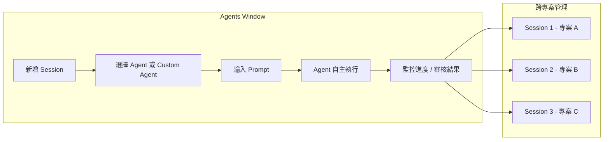
```mermaid
flowchart LR
    subgraph "Agents Window"
        A[新增 Session] --> B[選擇 Agent 或 Custom Agent]
        B --> C[輸入 Prompt]
        C --> D[Agent 自主執行]
        D --> E[監控進度 / 審核結果]
    end
    
    subgraph "跨專案管理"
        F[Session 1 - 專案 A] 
        G[Session 2 - 專案 B]
        H[Session 3 - 專案 C]
    end
    
    E --> F
    E --> G
    E --> H
```

#### 4.10.2 主要能力

| 功能 | 說明 |
| --- | --- |
| **多專案 Sessions** | 同時管理多個 Agent Session，跨不同專案 |
| **Agent 選擇** | 可選擇內建 Agent 或自訂 Custom Agent |
| **即時監控** | 查看 Agent 的執行進度與中間產出 |
| **中途導引（Steering）** | 在 Agent 執行中途補充指示或修正方向 |
| **結果審核** | 審核 Agent 產出的所有變更，逐一接受或拒絕 |

#### 4.10.3 Remote Agent Sessions

Remote Agent Sessions 讓 Agent 在遠端主機（如 GitHub Codespace 或自建伺服器）上執行，使用者可從瀏覽器或手機隨時監控。

**適用場景：**

- 長時間執行的重構任務——關上筆電後 Agent 繼續工作
- 需要大量運算資源的任務——利用遠端高規主機
- 跨時區團隊——下班前啟動 Agent、隔天審核結果

> ⚠️ **安全提醒**：Remote Agent Sessions 在遠端主機以您的權限執行。確保遠端環境符合企業安全政策，並在受控環境（如 Codespace）中運行。

### 4.11 Custom Agent Handoffs（工作流程交接）

Handoffs 讓 Custom Agent 之間可以進行引導式的順序交接，實現多步驟工作流程的自動化。

#### 4.11.1 Handoffs 機制


```mermaid
flowchart LR
    A[Planning Agent] -->|handoff| B[Implementation Agent]
    B -->|handoff| C[Review Agent]
    C -->|需修正| B
    C -->|通過| D[完成]
```

#### 4.11.2 設定方式

在 Custom Agent 的 `.agent.md` 檔案中，透過 `handoffs` 屬性定義交接對象：

```markdown
<!-- .github/agents/planning-agent.agent.md -->
---
name: "Planning Agent"
description: "分析需求並產出實作計畫"
handoffs:
  - agent: "implementation-agent"
    prompt: "請根據以下計畫實作：{plan}"
  - agent: "review-agent"
    prompt: "請審查以下變更"
---

你是專案規劃專家。分析需求後產出結構化實作計畫，並交接給實作代理。
```

#### 4.11.3 進階屬性

| 屬性 | 說明 |
| --- | --- |
| `handoffs` | 定義可交接的目標 Agent 與預填 prompt |
| `agents` | 定義此 Agent 可呼叫的子代理（Subagent）清單，與 Handoffs 為相關但不同的機制：Subagent 是「委派子任務」，Handoffs 是「交出主導權」 |

> 💡 **`.chatmode.md` → `.agent.md` 遷移**：VS Code 已將 `.chatmode.md` 重新命名為 `.agent.md`。舊格式仍可使用，但建議遷移至新格式以支援 Handoffs 等新功能。

#### 4.11.4 組織級共享

Custom Agent 可在組織級別共享，讓團隊共用標準化的 Agent 定義：

| 層級 | 設定方式 | 說明 |
| --- | --- | --- |
| **Workspace** | `.github/agents/*.agent.md` | 專案級 Agent，隨 Repo 版控 |
| **User** | `~/.copilot/agents/` | 使用者個人 Agent（VS Code 本機限定） |
| **Organization** | 組織 `.github` 或 `.github-private` repo 下的 `/agents/*.md` | 組織共享 Agent，適用於 Cloud Agent／CLI |
| **Enterprise** | 企業指定 `.github-private` repo 下的 `/agents/*.md` | 全企業共享 Agent |

VS Code 端啟用組織級 Agent 讀取：

```json
// VS Code settings.json
{
  "github.copilot.chat.organizationCustomAgents.enabled": true
}
```

#### 4.11.5 Claude Agent 格式相容（VS Code 本機限定）

VS Code 的**本機 Agent Mode** 同時支援 Claude Agent 格式（`.claude/agents/*.md`），讓已採用 Claude Code 的團隊可平滑過渡：

```markdown
<!-- .claude/agents/my-agent.md -->
---
name: "My Agent"
description: "Claude-style agent definition"
---

Agent instructions here...
```

> 💡 **跨格式相容**：VS Code 會同時掃描 `.github/agents/` 和 `.claude/agents/` 兩個目錄，無需遷移既有 Claude Agent 定義。
>
> ⚠️ **範圍澄清**：此相容性目前僅見於 VS Code 官方文件，**GitHub Cloud Agent／Copilot CLI 的 Custom Agent 官方文件並未提及與 Claude Code 格式相容**。換言之，`.claude/agents/*.md` 在 VS Code 本機可直接使用，但若要在 Cloud Agent 或 CLI 上使用，仍建議以 `.github/agents/*.md` 格式定義，以確保跨執行環境皆可正確載入。

### 4.12 Copilot Memory 深入指南

Copilot Memory 讓 Copilot 能記憶專案慣例與個人偏好，提供更一致的體驗。**官方文件明確標示此功能目前為 Public Preview**，行為與範圍可能持續調整。

#### 4.12.1 Memory 架構

官方文件僅定義**兩種**記憶類型，並無「Session 層級記憶」：

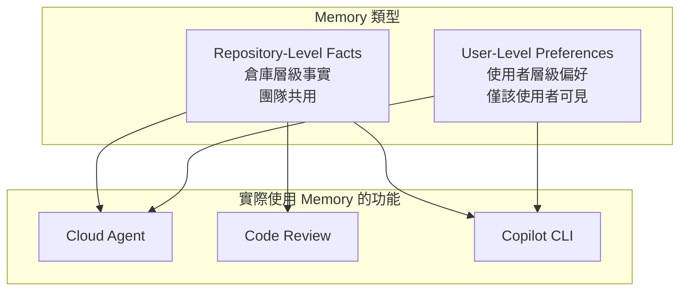
```mermaid
flowchart TB
    subgraph "Memory 類型"
        A[Repository-Level Facts<br/>倉庫層級事實<br/>團隊共用]
        B[User-Level Preferences<br/>使用者層級偏好<br/>僅該使用者可見]
    end
    
    subgraph "實際使用 Memory 的功能"
        C[Cloud Agent]
        D[Code Review]
        E[Copilot CLI]
    end
    
    A --> C
    A --> D
    A --> E
    B --> C
    B --> E
```

> ⚠️ **重要澄清**：官方文件明確列出 Copilot Memory「目前用於 Cloud Agent、Code Review 與 Copilot CLI」，**Chat／Agent Mode 並不在列**。此外：
>
> - **Code Review 僅套用 Repository-level facts**，不套用 User-level preferences。
> - **Copilot CLI 會套用 Repository-level facts，加上發起操作者本人的 User-level preferences**。
> - Repository-level facts 的範圍嚴格限定在該 repo 本身，不會跨組織／跨 repo 共用。

#### 4.12.2 Memory 特性

| 特性 | 說明 |
| --- | --- |
| **儲存範圍** | Repository-level facts 為團隊共用；User-level preferences 為個人專屬，僅該使用者可見 |
| **自動清除** | 28 天未使用的 Memory 項目自動刪除 |
| **手動管理** | 可在 GitHub Settings → Copilot → Memory 中檢視、編輯、刪除 |
| **企業控制** | Enterprise 方案下，管理員可管理使用者偏好；每位使用者需先選定預設計費實體（billing entity），偏好才會開始生成 |
| **實際適用功能** | Cloud Agent、Code Review、Copilot CLI（**不含 Chat／Agent Mode**） |

#### 4.12.3 Memory 的新增方式

```markdown
# 對話中直接告知 Copilot
"請記住：這個專案使用 4 格縮排、所有 API 回應使用 snake_case"

# Copilot 會確認並儲存
"好的，我已記住以下偏好：
- 使用 4 格縮排
- API 回應使用 snake_case"
```

#### 4.12.4 企業環境建議

- **啟用前評估**：在 Organization 層級啟用前，評估 Memory 中可能包含的敏感資訊
- **定期審查**：團隊成員應定期檢視自己的 Memory 內容
- **結合 Custom Instructions**：Memory 適合個人偏好；團隊標準應使用 `.github/copilot-instructions.md`
- **Code Review 整合**：Memory 讓 Code Review 更了解專案慣例，減少誤報

> ⚠️ **隱私注意**：Memory 內容會用於生成回應。避免在 Memory 中儲存密碼、API Key 等機敏資訊。

### 4.13 Copilot Spaces 深入指南

Copilot Spaces 讓您將 Chat 所需的上下文（程式碼、文件、討論）組織成一個**持久化容器**，官方定義為「讓您組織 Copilot 用來回答問題的上下文」。與 Custom Instructions（規則式指引）或 Copilot Memory（自動累積的記憶）不同，Space 是**主動策劃的資料集合**，適合特定任務、特定模組或特定專案階段使用。

> 📍 文件路徑已變更：官方文件目前位於 [`concepts/context/spaces`](https://docs.github.com/en/copilot/concepts/context/spaces)（原 `using-github-copilot/copilot-spaces/...` 已重導向至此）。

#### 4.13.1 可加入的內容類型

| 類型 | 說明 |
| --- | --- |
| **Repositories／程式碼** | 整個 repo 或特定路徑 |
| **Pull Requests** | 特定 PR 的討論與變更 |
| **Issues** | 特定 Issue 的討論串 |
| **自由文字** | 會議記錄、轉錄稿、筆記等貼上的文字 |
| **圖片** | 截圖、流程圖等 |
| **檔案上傳** | 文件、試算表等 |

#### 4.13.2 使用方式

Space 並非自動套用於所有 Chat 對話，而是**需要明確引用**：

1. **直接進入 Space 對話**：至 `github.com/copilot/spaces` 開啟特定 Space，該次對話自動以此 Space 為上下文
2. **在 Agent Mode 中引用**：在一般 Chat 的 Agent Mode 中，以名稱與擁有者提及 Space（例如「使用 myorg 擁有的 Copilot space『Checkout Flow Redesign』，幫我整理...」），Copilot 會透過內建的 `list_copilot_spaces` 這個 MCP 工具解析您提到的 Space 名稱；同一對話後續提問無需重複引用

#### 4.13.3 權限與共享

| 擁有者類型 | 權限層級 | 說明 |
| --- | --- | --- |
| **組織擁有** | Admin／Editor／Viewer／無存取權 | 可依組織成員角色分別授權 |
| **個人擁有** | 公開（預設僅檢視）／指定使用者共享／私人 | 個人可自由決定分享範圍 |

> ⚠️ **重要**：即使被授予 Space 的檢視權限，**使用者仍只能看到自己原本就有權限存取的來源**（例如私有 repo）。Space 本身的共享權限不會繞過底層資源的存取控制。

#### 4.13.4 方案支援與限制

- **方案支援**：官方文件明確指出「任何擁有 Copilot 授權的使用者，包含 Copilot Free，都可以建立與使用 Spaces」——是目前生態圈中方案限制最寬鬆的功能之一，並未特別標示 Preview/GA 狀態。
- **容量限制**：官方文件**未列出**具體的檔案數量或總容量上限；坊間（如 GitHub Discussions 社群討論）有提及約 275KB 的來源總大小上限，但**這並非官方文件內容，請勿當作正式規格引用**，實際限制請以介面即時提示為準。

#### 4.13.5 與 Memory／Custom Instructions 的分工建議

| 機制 | 適合場景 |
| --- | --- |
| **Custom Instructions** | 團隊規範、程式碼風格等「規則」 |
| **Copilot Memory** | 個人偏好、repo 慣例的「自動累積記憶」 |
| **Copilot Spaces** | 特定任務所需的「策劃式上下文集合」，如某次重構、某個模組的規格與討論串 |

---

## 第五章 Copilot + Code Review + Testing 最佳實務

### 5.1 Copilot 與 Code Review 的整合

#### 5.1.1 Copilot Code Review 功能概覽

Copilot Code Review 已大幅升級，不僅支援 PR 審查，還支援 IDE 內的即時審查：

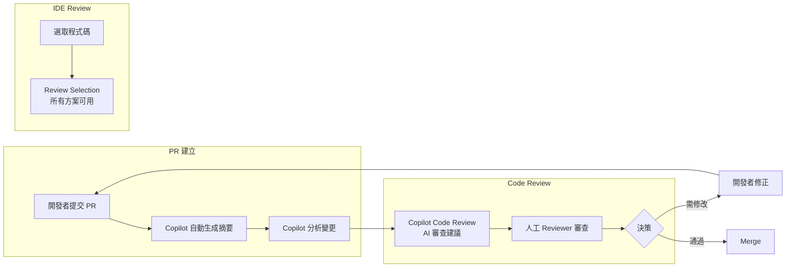
```mermaid
flowchart LR
    subgraph "PR 建立"
        A[開發者提交 PR] --> B[Copilot 自動生成摘要]
        B --> C[Copilot 分析變更]
    end
    
    subgraph "Code Review"
        C --> D[Copilot Code Review<br/>AI 審查建議]
        D --> E[人工 Reviewer 審查]
        E --> F{決策}
    end
    
    subgraph "IDE Review"
        G[選取程式碼] --> H[Review Selection<br/>所有方案可用]
    end
    
    F -->|需修改| I[開發者修正]
    F -->|通過| J[Merge]
    I --> A
```

**Copilot Code Review 的兩種使用方式：**

| 方式 | 說明 | 可用方案 |
| --- | --- | --- |
| **PR Code Review** | 在 GitHub PR 頁面請求 Copilot 審查 | Pro, Pro+, Business, Enterprise |
| **Review Selection** | 在 VS Code 中選取程式碼進行局部審查 | 所有方案（含 Free） |

> ⚠️ **Code Review 計費變更（2026/06/01 起）**：PR Code Review 採用雙重計費——AI Credits（Token 消耗）加上 GitHub Actions minutes（GitHub-hosted runner）。模型由系統自動選擇，per-token 成本可能因次而異。建議在 Actions metrics 中追蹤 `copilot-pull-request-reviewer` workflow 的用量。
>
> 💡 **Copilot Memory 輔助**：Copilot Memory（Public Preview）可記憶 repo 的 Repository-level facts，讓 Code Review 建議更符合專案慣例（僅套用 repo 層級事實，不含個人偏好）。

#### 5.1.2 使用 Copilot 輔助 Code Review

##### Step 1：讓 Copilot 生成 PR 摘要

```markdown
## Copilot 自動生成的 PR 摘要範例

### Summary
This PR implements the multi-currency payment feature with the following changes:

### Changes
- Added `CurrencyConverter` service for exchange rate handling
- Implemented `PaymentProcessor` with support for TWD, USD, JPY
- Added idempotency support to prevent duplicate charges

### Testing
- Added unit tests covering normal flow and edge cases
- Integration tests with mock payment gateway
```

##### Step 2：使用 Copilot Chat 深入分析

```markdown
## Prompt：PR 安全審查

請以資安專家角度審查這個 PR 的變更：

重點檢查：
1. 是否有 SQL Injection 風險
2. 是否有 Sensitive Data Exposure
3. 輸入驗證是否完整
4. 是否有適當的 Error Handling（不洩露系統資訊）

@workspace #file:PaymentProcessor.java #file:CurrencyConverter.java
```

#### 5.1.3 Code Review Checklist（結合 Copilot）

| 審查項目 | Copilot 輔助方式 | 人工重點 |
| ---------- | ------------------ | ---------- |
| **功能正確性** | Chat: 解釋邏輯 | 業務邏輯驗證 |
| **程式碼品質** | Chat: 識別 Code Smell | 架構一致性 |
| **效能** | Chat: 複雜度分析 | 實際負載評估 |
| **安全性** | Chat: 漏洞掃描 | 業務風險評估 |
| **測試覆蓋** | Inline: 補充測試 | 測試策略審查 |
| **文件完整** | Inline: 補充 JavaDoc | 文件準確性 |

#### 5.1.4 進階設定：自動觸發、路徑範圍指令與 Runner 控管

##### 自動觸發審查（Automatic Review）

Copilot Code Review 並非僅能手動請求，可透過 **Repository Ruleset** 設定為每個 PR 自動觸發：

1. 進入 Repo（或 Org）的 Settings → Rules → Rulesets → New ruleset → New branch ruleset
2. 將 Enforcement 設為 Active，並指定套用的目標分支
3. 在 Branch rules 中啟用「**Automatically request Copilot code review**」
4. 可搭配子選項：「**Review new pushes**」（每次 push 都重新審查，或僅審查一次）、「**Review draft pull requests**」（是否連草稿 PR 都審查）

> 💡 **組織治理**：Org 管理員可鎖定此設定，讓底下 Repo 無法覆寫，確保審查政策一致套用。

##### 路徑範圍審查指令（Path-scoped Review Instructions）

除了全域的 `.github/copilot-instructions.md`，Copilot Code Review 也會讀取 `.github/instructions/**/*.instructions.md`（與 [4.8.1](#481-custom-instructions自訂指令) 介紹的 File-based Instructions 為同一機制），可針對特定路徑、副檔名或目錄設定審查時才套用的規則——例如只對 `**/payment/**` 路徑加強金流安全檢查。

##### Reviewer 與 Copilot 的互動方式

官方文件明確指出：「您可以對 Copilot 的審查留言加上反應、留言、Resolve 或 Hide，但您留的任何回覆只有人類看得到，**Copilot 不會讀取也不會回覆**」。若要讓 Copilot 依回饋實際修改程式碼，正確做法是點擊審查留言旁的 **「Fix with Copilot」** 按鈕，由 Copilot 產生修正（建立新 PR 或提交至現有 PR），而非在留言串中對話。

手動請求審查的三種方式：Web UI（Reviewers 側邊欄點選 Copilot）、REST API（`copilot-pull-request-reviewer[bot]`）、或 GitHub CLI（`gh pr create --reviewer @copilot` / `gh pr edit PR-NUMBER --add-reviewer @copilot`）。

##### 為何需要 GitHub Actions Runner

官方說明：「Copilot code review 使用 GitHub Actions 執行 Agentic 能力，包含完整的專案上下文蒐集，並將建議傳遞給 Copilot Cloud Agent」——換言之，審查並非單純 API 呼叫，而是一個會先蒐集 Repo 上下文的 Actions Job。

| Runner 類型 | 計費與控管 |
| --- | --- |
| **GitHub-hosted（預設）** | 消耗組織／個人的 Actions 分鐘數配額，超額依標準費率計費；可選用更高規格 Runner（更多 CPU/記憶體），但每分鐘成本更高 |
| **Self-hosted** | 僅在組織停用 GitHub-hosted Runner 時才需要；官方文件指出 **ARC（Actions Runner Controller）是目前唯一官方支援的方案**，須為 Ubuntu x64 Linux；可完全掌控網路環境（例如防火牆組織需將 `api.githubcopilot.com` 加入允許清單） |

> ⚠️ **降級提醒**：若 GitHub-hosted Runner 不可用、Self-hosted 又未正確設定，審查會**降級為較有限的審查**，而非直接失敗——企業導入時應留意此降級行為是否符合品質要求。管理員可透過 `copilot-code-review.yml` 強制指定預設 Runner 類型，並禁止 Repo 層級覆寫。

##### 已知限制

- 預設排除審查：相依性鎖定檔（如 `package.json`、`Gemfile.lock`）、日誌檔、SVG 檔
- 語言支援已從早期的少數語言擴大為 **Public Preview 階段支援所有語言**，但主流語言（Python、JS/TS、Go、Java、C#、Rust、Ruby）效果仍最穩定
- 超大型 PR 的 diff 可能超出上下文範圍，Copilot 會註明未能完整審查的部分；官方文件未特別說明 monorepo 情境的專屬行為

### 5.2 Copilot 與 Testing 的整合

#### 5.2.1 測試金字塔與 Copilot 角色

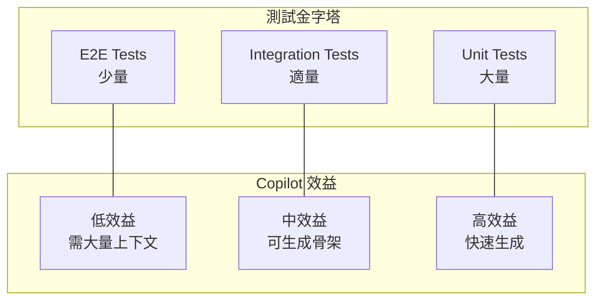
```mermaid
graph TB
    subgraph "測試金字塔"
        A[E2E Tests<br/>少量] 
        B[Integration Tests<br/>適量]
        C[Unit Tests<br/>大量]
    end
    
    subgraph "Copilot 效益"
        D[低效益<br/>需大量上下文]
        E[中效益<br/>可生成骨架]
        F[高效益<br/>快速生成]
    end
    
    A --- D
    B --- E
    C --- F
```

#### 5.2.2 單元測試生成最佳實務

##### 策略一：Test-Driven Prompting

```java
// 先寫測試意圖，讓 Copilot 生成測試程式碼
class PaymentProcessorTest {
    
    @Nested
    @DisplayName("正常付款流程")
    class NormalPaymentFlow {
        
        // 測試：有效信用卡應該成功扣款
        // Given: 有效卡號、足夠餘額
        // When: 執行付款
        // Then: 回傳成功結果，包含交易編號
        @Test
        void shouldProcessPayment_whenValidCreditCard() {
            // Copilot 生成 AAA 結構的測試
        }
    }
    
    @Nested
    @DisplayName("異常情境")
    class ExceptionScenarios {
        
        // 測試：卡號無效應拋出 CardValidationException
        @Test
        void shouldThrowCardValidationException_whenInvalidCardNumber() {
            // Copilot 生成
        }
        
        // 測試：餘額不足應拋出 InsufficientFundsException
        @Test
        void shouldThrowInsufficientFundsException_whenBalanceNotEnough() {
            // Copilot 生成
        }
    }
}
```

##### 策略二：邊界值自動補充

```markdown
## Prompt：邊界測試生成

請為以下方法生成邊界值測試：

方法簽名：
public BigDecimal calculateDiscount(BigDecimal amount, int quantity)

請涵蓋：
1. amount = 0, amount = MAX_VALUE
2. quantity = 0, quantity = 1, quantity = MAX_INT
3. amount 為 null
4. 負數情境

測試框架：JUnit 5 + AssertJ
```

#### 5.2.3 測試程式碼品質檢查

**使用 Copilot Chat 審查測試品質：**

```markdown
## Prompt：測試品質審查

請審查以下測試程式碼的品質：

檢查項目：
1. 測試是否獨立（不依賴執行順序）
2. 測試命名是否清晰描述測試意圖
3. 是否有適當的 Arrange-Act-Assert 結構
4. Mock 使用是否恰當
5. 是否有遺漏的測試情境

[測試程式碼]
```

### 5.3 CI/CD 整合建議

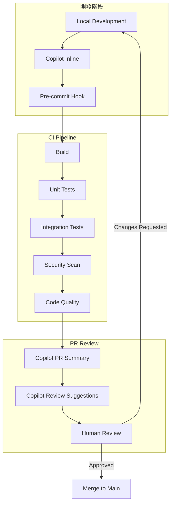
```mermaid
flowchart TB
    subgraph "開發階段"
        A[Local Development] --> B[Copilot Inline]
        B --> C[Pre-commit Hook]
    end
    
    subgraph "CI Pipeline"
        C --> D[Build]
        D --> E[Unit Tests]
        E --> F[Integration Tests]
        F --> G[Security Scan]
        G --> H[Code Quality]
    end
    
    subgraph "PR Review"
        H --> I[Copilot PR Summary]
        I --> J[Copilot Review Suggestions]
        J --> K[Human Review]
    end
    
    K -->|Approved| L[Merge to Main]
    K -->|Changes Requested| A
```

### 5.4 實務案例：完整的測試策略

```markdown
## 案例：交易對帳服務測試策略

### 1. 單元測試（Copilot 高效輔助）
- ReconciliationEngine 核心邏輯
- MatchingAlgorithm 匹配演算法
- AmountComparator 金額比較（含容差）

### 2. 整合測試（Copilot 中度輔助）
- ReconciliationService + Database
- ReconciliationService + External API

### 3. E2E 測試（Copilot 低度輔助，需人工設計）
- 完整對帳流程
- 異常恢復測試

### Copilot 使用建議
- 單元測試：大量使用 Copilot 生成
- 整合測試：使用 Copilot 生成骨架，人工補充設定
- E2E 測試：人工設計場景，Copilot 輔助實作
```

---

## 第六章 資安、法遵與風險控管

### 6.1 Copilot 的資安風險概覽

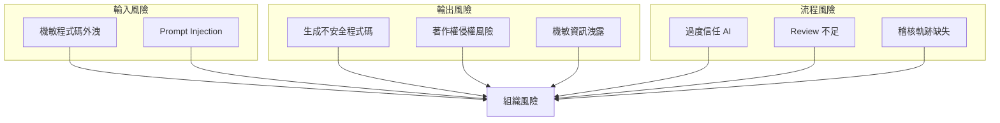
```mermaid
graph TB
    subgraph "輸入風險"
        A[機敏程式碼外洩]
        B[Prompt Injection]
    end
    
    subgraph "輸出風險"
        C[生成不安全程式碼]
        D[著作權侵權風險]
        E[機敏資訊洩露]
    end
    
    subgraph "流程風險"
        F[過度信任 AI]
        G[Review 不足]
        H[稽核軌跡缺失]
    end
    
    A --> I[組織風險]
    B --> I
    C --> I
    D --> I
    E --> I
    F --> I
    G --> I
    H --> I
```

### 6.2 常見安全漏洞與防範

#### 6.2.1 SQL Injection

```java
// ❌ Copilot 可能生成的不安全程式碼
public User findByUsername(String username) {
    String sql = "SELECT * FROM users WHERE username = '" + username + "'";
    return jdbcTemplate.queryForObject(sql, userRowMapper);
}

// ✅ 應該修正為
public User findByUsername(String username) {
    String sql = "SELECT * FROM users WHERE username = ?";
    return jdbcTemplate.queryForObject(sql, userRowMapper, username);
}
```

**審查要點：**

- 任何 SQL 字串拼接都要警覺
- 使用 PreparedStatement 或 JPA
- 啟用 SQL 參數化檢查工具

#### 6.2.2 XSS (Cross-Site Scripting)

```java
// ❌ 不安全
@GetMapping("/user/{name}")
public String greeting(@PathVariable String name) {
    return "<h1>Hello, " + name + "</h1>";
}

// ✅ 安全
@GetMapping("/user/{name}")
public String greeting(@PathVariable String name) {
    return "<h1>Hello, " + HtmlUtils.htmlEscape(name) + "</h1>";
}
```

#### 6.2.3 敏感資訊洩露

```java
// ❌ Copilot 可能在 log 中洩露敏感資訊
logger.info("Processing payment for card: " + cardNumber);

// ✅ 應該遮罩
logger.info("Processing payment for card: " + maskCardNumber(cardNumber));

private String maskCardNumber(String cardNumber) {
    return "****-****-****-" + cardNumber.substring(cardNumber.length() - 4);
}
```

### 6.3 Copilot 生成程式碼的審查清單

| 審查項目 | 檢查重點 | 風險等級 |
| ---------- | ---------- | ---------- |
| **輸入驗證** | 是否驗證所有外部輸入 | 🔴 高 |
| **SQL 查詢** | 是否使用參數化查詢 | 🔴 高 |
| **認證授權** | 是否正確檢查權限 | 🔴 高 |
| **錯誤處理** | 是否洩露系統資訊 | 🟡 中 |
| **日誌記錄** | 是否記錄敏感資訊 | 🟡 中 |
| **加密處理** | 是否使用安全演算法 | 🔴 高 |
| **依賴引用** | 是否引入不安全依賴 | 🟡 中 |

### 6.4 法遵考量

#### 6.4.1 著作權風險

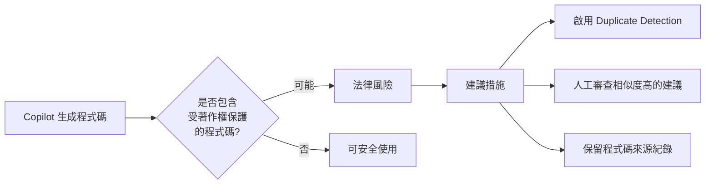
```mermaid
graph LR
    A[Copilot 生成程式碼] --> B{是否包含<br/>受著作權保護<br/>的程式碼?}
    B -->|可能| C[法律風險]
    B -->|否| D[可安全使用]
    
    C --> E[建議措施]
    E --> F[啟用 Duplicate Detection]
    E --> G[人工審查相似度高的建議]
    E --> H[保留程式碼來源紀錄]
```

**建議設定：**

```json
// VS Code settings.json
{
  "github.copilot.advanced": {
    "debug.filter.duplication": true
  }
}
```

> 💡 **Block Suggestions Matching Public Code**：所有 Copilot 方案都支援此功能，可在設定中啟用，阻擋與公開程式碼高度相似的建議。

#### 6.4.2 資料保護合規

| 法規 | 相關要求 | Copilot 使用注意 |
| ------ | ---------- | ------------------ |
| **個資法** | 個資處理需有法律依據 | 不可將客戶個資貼入 Prompt |
| **GDPR** | 資料最小化原則 | 不可傳輸歐盟居民資料 |
| **金融監理** | 資料不得外流 | 使用 Enterprise 版本 |
| **內部稽核** | 保留軌跡 | 記錄 Copilot 使用情況 |

### 6.5 企業級安全設定

#### 6.5.1 組織層級設定

GitHub 提供完整的企業治理功能，管理員可透過 Policy Management 控制：

```yaml
# GitHub Organization / Enterprise 設定項目（示意，實際欄位名稱請以管理後台為準）
copilot_policies:
  # 功能啟用控制
  copilot_chat_in_ide: enabled
  copilot_code_review: enabled
  copilot_cloud_agent: enabled
  copilot_cli: enabled

  # Agent Hooks / Skills / Memory 控制
  agent_hooks: enabled            # VS Code 本機版為 Preview 功能
  agent_skills: enabled
  agent_plugins: disabled         # Preview 功能，建議先停用
  copilot_memory: disabled        # Public Preview，建議先評估敏感資訊風險再啟用

  # 安全設定
  block_suggestions_matching_public_code: enabled
  editor_preview_features: enabled

  # 內容排除（Content Exclusion）
  content_exclusion:
    - "**/*.env"
    - "**/*.pem"
    - "**/*.key"
    - "**/secrets/**"
    - "**/config/credentials/**"

  # Audit Logs 自動啟用（Business/Enterprise）
  audit_logging: enabled
```

**管理員功能（Business/Enterprise）：**

| 功能 | 說明 |
| --- | --- |
| **Policy Management** | 控制哪些 Copilot 功能可使用 |
| **Access Management** | 指定哪些組織成員可使用 Copilot |
| **Content Exclusion** | 排除敏感檔案不被 Copilot 存取 |
| **Audit Logs** | 追蹤 Copilot 使用行為 |
| **Usage Data** | 檢視使用量數據與採用率 |
| **Organization Custom Instructions** | 統一組織級的 Copilot 行為規範 |
| **Budget Management** | 於 Enterprise／Organization／Cost Center／User 四層設定 AI Credits 預算上限（詳見 [1.4 版本與授權模式](#14-版本與授權模式)） |

#### 6.5.2 開發者工作站設定

```json
// VS Code settings.json - 企業建議設定
{
  // Copilot 功能控制
  "github.copilot.enable": {
    "*": true,
    "**/*.env": false,
    "**/*.pem": false,
    "**/*.key": false,
    "**/secrets/**": false,
    "plaintext": false,
    "markdown": true
  },
  
  // Chat 相關設定
  "github.copilot.chat.localeOverride": "zh-TW",
  
  // 排除敏感內容（搭配 .gitignore）
  "files.exclude": {
    "**/.env": true,
    "**/secrets": true
  }
}
```

> 💡 **Content Exclusion（組織級）**：Business/Enterprise 管理員可在 GitHub 組織設定中排除特定檔案路徑，被排除的檔案不會傳送至 Copilot 服務。這比個人設定更安全，因為是強制生效的。

### 6.6 Copilot 在 SSDLC 中的定位

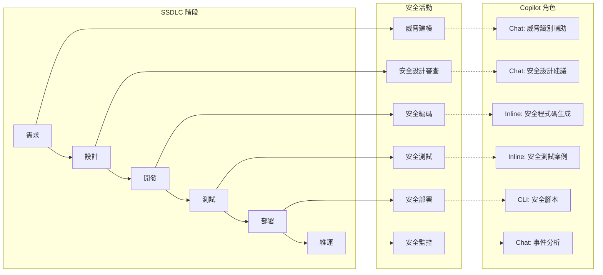
```mermaid
flowchart LR
    subgraph "SSDLC 階段"
        A[需求] --> B[設計]
        B --> C[開發]
        C --> D[測試]
        D --> E[部署]
        E --> F[維運]
    end
    
    subgraph "安全活動"
        A1[威脅建模]
        B1[安全設計審查]
        C1[安全編碼]
        D1[安全測試]
        E1[安全部署]
        F1[安全監控]
    end
    
    A --> A1
    B --> B1
    C --> C1
    D --> D1
    E --> E1
    F --> F1
    
    subgraph "Copilot 角色"
        G[Chat: 威脅識別輔助]
        H[Chat: 安全設計建議]
        I[Inline: 安全程式碼生成]
        J[Inline: 安全測試案例]
        K[CLI: 安全腳本]
        L[Chat: 事件分析]
    end
    
    A1 -.-> G
    B1 -.-> H
    C1 -.-> I
    D1 -.-> J
    E1 -.-> K
    F1 -.-> L
```

### 6.7 稽核與追蹤

**GitHub 平台提供的稽核功能（Business/Enterprise）：**

| 功能 | 說明 |
| --- | --- |
| **Audit Logs** | 記錄所有 Copilot 相關事件，包含啟用/停用、Policy 變更等 |
| **Usage Data** | 使用者活動數據，包含 suggestion 接受率、chat 使用量 |
| **License Usage** | 授權使用狀況，識別未使用的座位 |

**建議在關鍵程式碼加入 Copilot 輔助標記：**

```java
// 建議在關鍵程式碼加入 Copilot 輔助標記
/**
 * 匯率轉換服務
 * 
 * @author developer-name
 * @created 2026-01-22
 * @ai-assisted 此類別的基本架構由 Copilot 輔助生成，
 *              核心邏輯經人工審查與修改
 * @security-review PASSED - 2026-01-22 by security-team
 */
@Service
public class ExchangeRateService {
    // ...
}
```

---

## 第七章 常見誤用與反模式

### 7.1 Anti-Pattern 總覽

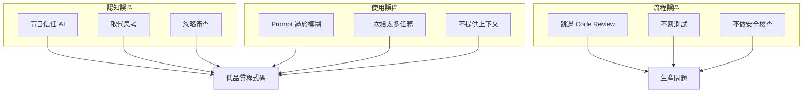
```mermaid
graph TB
    subgraph "認知誤區"
        A[盲目信任 AI]
        B[取代思考]
        C[忽略審查]
    end
    
    subgraph "使用誤區"
        D[Prompt 過於模糊]
        E[一次給太多任務]
        F[不提供上下文]
    end
    
    subgraph "流程誤區"
        G[跳過 Code Review]
        H[不寫測試]
        I[不做安全檢查]
    end
    
    A --> J[低品質程式碼]
    B --> J
    C --> J
    D --> J
    E --> J
    F --> J
    G --> K[生產問題]
    H --> K
    I --> K
```

### 7.2 Anti-Pattern 詳解

#### 7.2.1 盲目信任 AI（Blind Trust）

**症狀：**

```java
// Copilot 建議什麼就接受什麼，不經思考
// 按 Tab 鍵的速度比思考還快
```

**危害：**

- 引入潛在 Bug
- 產生不安全程式碼
- 效能問題被忽略

**正確做法：**

```markdown
✅ 每次接受建議前先問自己：
1. 這段程式碼做了什麼？
2. 有沒有邊界條件沒處理？
3. 有沒有安全風險？
4. 效能是否可接受？
```

#### 7.2.2 取代思考（Thought Replacement）

**症狀：**

```markdown
❌ 直接問 Copilot：「怎麼設計這個系統？」
❌ 期待 Copilot 做所有架構決策
```

**正確做法：**

```markdown
✅ 先自己思考設計方案
✅ 使用 Copilot 驗證或比較方案
✅ 讓 Copilot 處理實作細節，自己負責設計
```

#### 7.2.3 Prompt 過於模糊（Vague Prompting）

**Bad Example：**

```java
// ❌ 模糊的 Prompt
// 處理資料

// ❌ 缺乏上下文
// 寫一個 function
```

**Good Example：**

```java
// ✅ 明確的 Prompt
/**
 * 處理銀行交易對帳資料
 * 
 * 輸入：交易清單（Transaction[]）+ 銀行對帳單（BankStatement[]）
 * 輸出：對帳結果（包含：匹配成功、匹配失敗、待確認）
 * 規則：
 *   - 金額相同且日期在 3 天內視為匹配
 *   - 金額差異在 0.01 以內視為匹配（處理浮點誤差）
 *   - 其餘視為待確認
 */
public ReconciliationResult reconcile(...) {
```

#### 7.2.4 一次給太多任務（Task Overload）

**Bad Example：**

```markdown
❌ 請幫我設計一個完整的電商系統，包含：
- 用戶管理
- 商品管理
- 訂單管理
- 付款系統
- 物流追蹤
- 推薦引擎
```

**Good Example：**

```markdown
✅ 分步驟進行：
Step 1: 先討論整體架構
Step 2: 設計用戶管理模組介面
Step 3: 實作用戶管理核心邏輯
Step 4: 為用戶管理寫測試
...依此類推
```

#### 7.2.5 忽略程式碼上下文（Context Ignorance）

**Bad Example：**

```java
// ❌ 在不提供現有程式碼風格的情況下請求生成
// 新增一個 Service

// 結果：生成的程式碼風格與專案不一致
```

**Good Example：**

```java
// ✅ 提供上下文
// 請參考現有的 UserService 風格，新增 OrderService
// 專案使用：
// - Spring Boot 3.x
// - MapStruct 做 DTO 轉換
// - 使用 @Transactional 管理交易
// - 日誌使用 @Slf4j
```

### 7.3 Copilot 不適合做的事情

| 類別 | 不適合的任務 | 原因 |
| ------ | -------------- | ------ |
| **架構設計** | 系統架構決策 | 缺乏業務脈絡理解 |
| **效能調優** | 確定瓶頸位置 | 需要實際 Profiling 數據 |
| **安全審計** | 作為唯一安全檢查 | 可能漏掉細微漏洞 |
| **業務邏輯** | 複雜業務規則 | 不理解業務 Domain |
| **遺留系統** | 完整理解 Legacy | 缺乏歷史脈絡 |
| **合規判斷** | 法規遵循決策 | 法規變動快，AI 可能過時 |

### 7.4 常見錯誤案例分析

#### 案例一：複製貼上症候群

```java
// ❌ 錯誤：直接複製 Copilot 建議的 catch block
try {
    // ...
} catch (Exception e) {
    e.printStackTrace();  // Copilot 常見的偷懶寫法
}

// ✅ 正確：審查後修正
try {
    // ...
} catch (BusinessException e) {
    log.error("Business error occurred: {}", e.getMessage());
    throw e;  // 重新拋出讓上層處理
} catch (Exception e) {
    log.error("Unexpected error", e);
    throw new SystemException("System error", e);
}
```

#### 案例二：效能陷阱

```java
// ❌ Copilot 可能生成的低效程式碼
public List<User> findActiveUsers(List<User> users) {
    List<User> result = new ArrayList<>();
    for (User user : users) {
        if (userRepository.isActive(user.getId())) {  // N+1 問題！
            result.add(user);
        }
    }
    return result;
}

// ✅ 應該批次處理
public List<User> findActiveUsers(List<User> users) {
    List<Long> userIds = users.stream()
        .map(User::getId)
        .collect(Collectors.toList());
    Set<Long> activeIds = userRepository.findActiveUserIds(userIds);
    return users.stream()
        .filter(u -> activeIds.contains(u.getId()))
        .collect(Collectors.toList());
}
```

#### 案例三：安全漏洞

```java
// ❌ Copilot 可能生成的不安全程式碼
@GetMapping("/download")
public void downloadFile(@RequestParam String filename, HttpServletResponse response) {
    File file = new File("/uploads/" + filename);  // Path Traversal 風險！
    // ...
}

// ✅ 應該驗證路徑
@GetMapping("/download")
public void downloadFile(@RequestParam String filename, HttpServletResponse response) {
    // 驗證檔名不包含路徑穿越字元
    if (filename.contains("..") || filename.contains("/") || filename.contains("\\")) {
        throw new SecurityException("Invalid filename");
    }
    
    Path basePath = Paths.get("/uploads").toRealPath();
    Path filePath = basePath.resolve(filename).normalize();
    
    // 確認檔案在允許的目錄內
    if (!filePath.startsWith(basePath)) {
        throw new SecurityException("Access denied");
    }
    // ...
}
```

### 7.5 自我檢查清單

在接受 Copilot 建議前，請確認：

```markdown
□ 我理解這段程式碼在做什麼
□ 我檢查過邊界條件
□ 我確認過沒有安全風險
□ 程式碼風格與專案一致
□ 例外處理適當
□ 效能可接受
□ 有對應的測試
```

---

## 第八章 團隊導入與治理建議

### 8.1 導入成熟度模型


```mermaid
graph LR
    subgraph "Level 1: 探索期"
        A[個人嘗試]
        B[非正式使用]
    end
    
    subgraph "Level 2: 試行期"
        C[團隊試點]
        D[建立初步規範]
    end
    
    subgraph "Level 3: 擴展期"
        E[全組織推廣]
        F[完善治理機制]
    end
    
    subgraph "Level 4: 優化期"
        G[持續改善]
        H[效益量化]
    end
    
    A --> B
    B --> C
    C --> D
    D --> E
    E --> F
    F --> G
    G --> H
```

### 8.2 各階段導入建議

#### Level 1: 探索期（1-2 週）

| 活動 | 目的 | 產出 |
| ------ | ------ | ------ |
| 選定 3-5 位先行者 | 收集第一手經驗 | 使用心得報告 |
| 安裝與基本教學 | 確保環境就緒 | 安裝指南 |
| 自由探索 | 了解工具能力邊界 | 案例收集 |

#### Level 2: 試行期（2-4 週）

| 活動 | 目的 | 產出 |
| ------ | ------ | ------ |
| 建立使用規範草案 | 統一使用方式 | 規範文件 v0.1 |
| 定義適用場景 | 明確使用邊界 | 場景清單 |
| 建立 Prompt 範本 | 提升效率 | Prompt Library |
| 定期分享會 | 知識傳承 | 會議紀錄 |

#### Level 3: 擴展期（1-2 個月）

| 活動 | 目的 | 產出 |
| ------ | ------ | ------ |
| 全團隊教育訓練 | 普及使用 | 培訓教材 |
| 正式化規範 | 治理機制 | 規範文件 v1.0 |
| 整合 CI/CD | 流程自動化 | Pipeline 設定 |
| 建立 Review 機制 | 品質把關 | Review Checklist |

#### Level 4: 優化期（持續）

| 活動 | 目的 | 產出 |
| ------ | ------ | ------ |
| 效益量化 | 證明 ROI | 指標報告 |
| 規範更新 | 持續改善 | 規範文件 vN |
| 經驗分享 | 組織學習 | 案例庫 |
| 工具演進追蹤 | 掌握新功能 | 更新報告 |

### 8.3 團隊使用規範範本

```markdown
# GitHub Copilot 團隊使用規範

## 1. 適用範圍
- 適用於：所有使用 GitHub Copilot 的開發人員
- 版本：3.0
- 生效日期：2026-03-11

## 2. 可以做（Do）
✅ 使用 Copilot 生成 Boilerplate 程式碼
✅ 使用 Copilot Chat 協助理解程式碼
✅ 使用 Copilot 生成單元測試骨架
✅ 使用 Copilot 生成 JavaDoc 與文件
✅ 使用 Copilot Code Review 輔助程式碼審查
✅ 使用 Agent Mode 完成明確定義的開發任務
✅ 使用 Copilot Cloud Agent 處理例行性 Issue
✅ 使用 Custom Instructions 統一團隊風格
✅ 使用 Agent Skills 建立可重用的團隊技能
✅ 使用 Agent Hooks 建立自動化流程
✅ 使用 MCP 整合經審核通過的外部工具

## 3. 不可以做（Don't）
❌ 將客戶個資或機敏資料貼入 Prompt
❌ 將 API Key、密碼等機敏設定貼入 Prompt
❌ 盲目接受 Copilot 建議，不經審查
❌ 用 Copilot 取代設計思考
❌ 跳過 Code Review 流程
❌ 未經審核就啟用第三方 MCP Server
❌ 未經審查就啟用來路不明的 Agent Hooks
❌ 將 Agent 模式用於安全性關鍵的核心系統修改

## 4. 安全規範
- 不可在 Prompt 中包含任何客戶資料
- 不可在 Prompt 中包含內部系統架構機敏資訊
- 生成的程式碼必須通過安全掃描
- 使用 Business/Enterprise 版本（確保資料不外流）
- 啟用 Block Suggestions Matching Public Code
- 設定 Content Exclusion 排除敏感檔案

## 5. 品質規範
- 所有 Copilot 生成的程式碼必須經過人工審查
- 核心業務邏輯不可完全依賴 Copilot
- 必須為 Copilot 生成的程式碼撰寫測試
- Copilot Cloud Agent 的 PR 須經資深工程師審查

## 6. 審查流程
1. 開發者使用 Copilot 生成程式碼
2. 開發者自我審查（使用 Checklist）
3. 提交 PR，觸發自動化掃描
4. 可選：請求 Copilot Code Review
5. Reviewer 進行人工 Code Review
6. 通過後方可 Merge

## 7. Copilot Cloud Agent 使用規範
- 僅用於描述明確的 Bug Fix 與簡單功能增強
- Issue 必須包含清楚的需求描述與驗收條件
- Agent 產出的 PR 必須由人工審查
- 不可用於安全性關鍵修改

## 8. 例外處理
- 如有特殊需求需違反規範，須經 Tech Lead 核准
- 核准紀錄須保留備查

## 9. Agent Hooks 與 Skills 治理
- 全部 Hook 腳本須經 Code Review 後始可合併
- 不可啟用來路不明的 Agent Hook 設定
- Agent Skills 與 Custom Agents 須由團隊共同審查
- 定期檢視並更新 .github/hooks/ 設定
```

### 8.4 Code Review 要點（Copilot 輔助後）

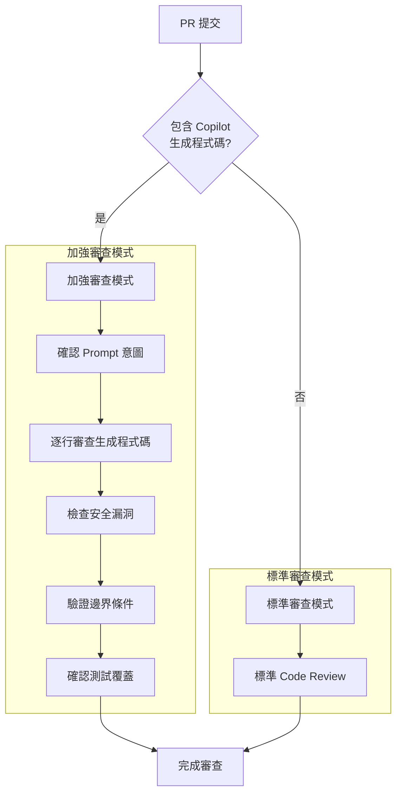
```mermaid
flowchart TB
    A[PR 提交] --> B{包含 Copilot<br/>生成程式碼?}
    B -->|是| C[加強審查模式]
    B -->|否| D[標準審查模式]
    
    subgraph "加強審查模式"
        C --> E[確認 Prompt 意圖]
        E --> F[逐行審查生成程式碼]
        F --> G[檢查安全漏洞]
        G --> H[驗證邊界條件]
        H --> I[確認測試覆蓋]
    end
    
    subgraph "標準審查模式"
        D --> J[標準 Code Review]
    end
    
    I --> K[完成審查]
    J --> K
```

**Reviewer 額外檢查項目：**

| 項目 | 檢查重點 |
| ------ | ---------- |
| **意圖驗證** | 程式碼是否符合原始需求 |
| **邏輯完整性** | 是否有遺漏的 edge case |
| **安全性** | 是否有 OWASP Top 10 風險 |
| **效能** | 是否有明顯的效能問題 |
| **一致性** | 是否符合專案編碼規範 |
| **可維護性** | 程式碼是否易於理解與維護 |

### 8.5 效益衡量指標

> 💡 下表「目標」欄位為建議起始值（同樣屬經驗參考範圍，非官方保證數據），正式導入時應改以團隊實測的 Baseline 為準，並於每季檢討調整。

| 指標 | 計算方式 | 目標 |
| ------ | ---------- | ------ |
| **開發效率** | 功能點完成時間 | 提升 20-30% |
| **程式碼品質** | SonarQube 分數 | 維持或提升 |
| **Bug 數量** | 每千行程式碼 Bug 數 | 不增加 |
| **開發者滿意度** | 問卷調查 | > 4.0/5.0 |
| **學習曲線** | 新人上手時間 | 縮短 30% |
| **AI Credits 使用效率** | 每項完成功能點消耗的 AI Credits（可於 Usage Data／Actions metrics 取得） | 逐季下降或維持穩定 |
| **模型選擇合理性** | Auto Model Selection 採用率、高成本模型（如 Opus／Fable 5 系列）佔比 | Auto Model Selection 採用率 > 70% |
| **預算執行率** | 實際用量 ／ 各層級（Org／Cost Center／User）預算上限 | 落在 70-95% 區間（過低代表授權浪費，過高代表需調整預算或使用行為） |

> 💡 **成本與效益併看**：由於 2026/06/01 起全面採 AI Credits 用量計費，「開發效率」與「AI Credits 使用效率」應併同檢視——效率提升若伴隨 Credits 用量不成比例地上升（例如過度依賴高階模型或不必要的 Agent Mode session），實際 ROI 可能被侵蝕，建議治理委員會將兩者納入同一季度報告。

### 8.6 組織架構建議

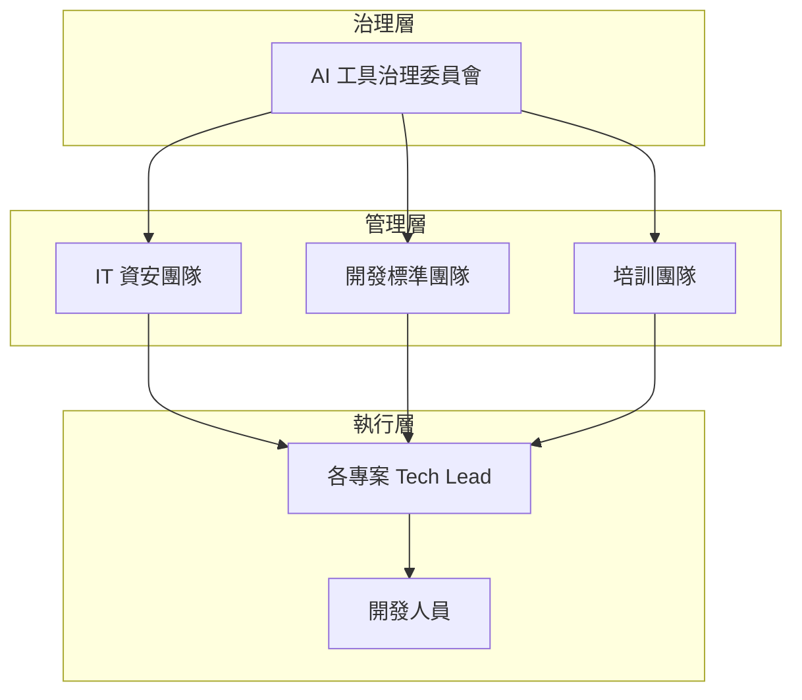
```mermaid
graph TB
    subgraph "治理層"
        A[AI 工具治理委員會]
    end
    
    subgraph "管理層"
        B[IT 資安團隊]
        C[開發標準團隊]
        D[培訓團隊]
    end
    
    subgraph "執行層"
        E[各專案 Tech Lead]
        F[開發人員]
    end
    
    A --> B
    A --> C
    A --> D
    B --> E
    C --> E
    D --> E
    E --> F
```

**各角色職責：**

| 角色 | 職責 |
| ------ | ------ |
| **治理委員會** | 制定政策、風險評估、預算核准 |
| **IT 資安團隊** | 安全規範、稽核、事件處理 |
| **開發標準團隊** | 使用規範、Prompt Library、最佳實務 |
| **培訓團隊** | 教育訓練、知識傳承 |
| **Tech Lead** | 執行監督、團隊指導 |
| **開發人員** | 遵循規範、回報問題 |

---

## 第九章 進階應用案例

### 9.1 案例一：Legacy Code 重構

#### 9.1.1 情境描述

```markdown
【背景】
- 一段 10 年歷史的付款處理程式碼
- 單一方法超過 500 行
- 缺乏測試，無人敢動
- 需要新增多幣別支援

【挑戰】
- 理解現有邏輯
- 不破壞現有功能
- 安全地進行重構
```

#### 9.1.2 使用 Copilot 的策略

```mermaid
flowchart TB
    A[理解階段] --> B[規劃階段]
    B --> C[測試補充階段]
    C --> D[重構階段]
    D --> E[驗證階段]
    
    A1[Copilot Chat<br/>解釋程式碼] --> A
    B1[Copilot Chat<br/>重構策略討論] --> B
    C1[Copilot Inline<br/>生成測試] --> C
    D1[Copilot Inline<br/>逐步重構] --> D
    E1[執行測試<br/>確認行為不變] --> E
```

##### Step 1：理解現有程式碼

```markdown
## Copilot Chat Prompt

請分析以下 Legacy 程式碼：

1. 說明這段程式碼的主要職責
2. 識別主要的執行流程
3. 標記可能的問題點：
   - 過長的方法
   - 違反 SOLID 的地方
   - 潛在的 bug
4. 建議重構的優先順序

[貼上 Legacy Code]
```

##### Step 2：建立特徵測試（Characterization Test）

```java
// 使用 Copilot 生成特徵測試，保護現有行為
// Prompt: 請為以下 legacy 方法生成特徵測試，
//         測試目的是記錄「現有行為」而非「預期行為」

@Test
void characterization_processPayment_normalFlow() {
    // Copilot 生成的測試，用於捕捉現有行為
    PaymentRequest request = createTestRequest();
    PaymentResult result = legacyService.processPayment(request);
    
    // 記錄現有行為（即使看起來怪怪的）
    assertThat(result.getStatus()).isEqualTo("SUCCESS");
    assertThat(result.getFee()).isEqualTo(new BigDecimal("1.50"));
}
```

##### Step 3：逐步重構

```java
// 使用「提取方法」重構，Copilot 輔助生成新方法

// 原始程式碼中的一段（在 500 行方法中）
// --- 驗證卡號邏輯 ---
String cardNumber = request.getCardNumber();
if (cardNumber == null || cardNumber.length() < 13) {
    throw new InvalidCardException("Invalid card");
}
// Luhn 驗證...
// --- 驗證結束 ---

// 提取為獨立方法
// Prompt: 請將以下卡號驗證邏輯提取為獨立方法，
//         包含完整的 JavaDoc 和錯誤處理

/**
 * 驗證信用卡卡號
 * 
 * @param cardNumber 信用卡卡號
 * @throws InvalidCardException 當卡號格式不正確或未通過 Luhn 驗證
 */
private void validateCardNumber(String cardNumber) {
    // Copilot 生成的驗證邏輯
}
```

#### 9.1.3 重構成果

```markdown
【重構前】
- 1 個 500 行的方法
- 0 個測試
- 無法新增功能

【重構後】
- 15 個小方法，每個 < 30 行
- 45 個特徵測試 + 20 個新測試
- 成功新增多幣別支援
- 程式碼可讀性大幅提升
```

### 9.2 案例二：API 設計與實作

#### 9.2.1 情境描述

```markdown
【需求】
設計並實作「交易查詢 API」：
- RESTful API 設計
- 支援複雜查詢條件
- 分頁與排序
- 符合 OpenAPI 規範
```

#### 9.2.2 使用 Copilot 的完整流程

##### Phase 1：API 設計討論

```markdown
## Copilot Chat Prompt

我需要設計一個交易查詢 API，請協助：

1. 建議 RESTful endpoint 設計
2. 查詢參數設計（日期範圍、交易類型、金額範圍等）
3. 分頁策略（offset vs cursor）
4. 回應格式設計
5. 錯誤處理策略

背景：
- 資料量：每日約 100 萬筆交易
- 查詢頻率：每秒約 100 次
- 使用者：內部系統 + 外部合作夥伴
```

##### Phase 2：OpenAPI 規格生成

```yaml
# Copilot 輔助生成的 OpenAPI 規格
openapi: 3.0.3
info:
  title: Transaction Query API
  version: 1.0.0
  
paths:
  /api/v1/transactions:
    get:
      summary: 查詢交易紀錄
      parameters:
        - name: startDate
          in: query
          schema:
            type: string
            format: date
        - name: endDate
          in: query
          schema:
            type: string
            format: date
        - name: transactionType
          in: query
          schema:
            type: string
            enum: [DEPOSIT, WITHDRAWAL, TRANSFER]
        - name: minAmount
          in: query
          schema:
            type: number
        - name: maxAmount
          in: query
          schema:
            type: number
        - name: page
          in: query
          schema:
            type: integer
            default: 0
        - name: size
          in: query
          schema:
            type: integer
            default: 20
            maximum: 100
      responses:
        '200':
          description: 查詢成功
          content:
            application/json:
              schema:
                $ref: '#/components/schemas/TransactionPage'
```

##### Phase 3：Controller 實作

```java
// Prompt: 請根據以上 OpenAPI 規格，實作 Spring Boot Controller
// 要求：使用 @Validated、適當的錯誤處理、OpenAPI 註解

@RestController
@RequestMapping("/api/v1/transactions")
@Tag(name = "Transaction", description = "交易查詢 API")
@Validated
@RequiredArgsConstructor
public class TransactionController {

    private final TransactionQueryService queryService;

    @GetMapping
    @Operation(summary = "查詢交易紀錄")
    @ApiResponses({
        @ApiResponse(responseCode = "200", description = "查詢成功"),
        @ApiResponse(responseCode = "400", description = "查詢參數錯誤"),
        @ApiResponse(responseCode = "401", description = "未授權"),
        @ApiResponse(responseCode = "403", description = "無權限")
    })
    public ResponseEntity<Page<TransactionDTO>> queryTransactions(
            @RequestParam(required = false) 
            @DateTimeFormat(iso = DateTimeFormat.ISO.DATE) LocalDate startDate,
            
            @RequestParam(required = false) 
            @DateTimeFormat(iso = DateTimeFormat.ISO.DATE) LocalDate endDate,
            
            @RequestParam(required = false) TransactionType transactionType,
            
            @RequestParam(required = false) 
            @PositiveOrZero BigDecimal minAmount,
            
            @RequestParam(required = false) 
            @PositiveOrZero BigDecimal maxAmount,
            
            @RequestParam(defaultValue = "0") @Min(0) int page,
            
            @RequestParam(defaultValue = "20") @Min(1) @Max(100) int size,
            
            @AuthenticationPrincipal UserDetails currentUser) {
        
        // Copilot 生成的實作...
        TransactionQuery query = TransactionQuery.builder()
            .startDate(startDate)
            .endDate(endDate)
            .transactionType(transactionType)
            .minAmount(minAmount)
            .maxAmount(maxAmount)
            .build();
            
        Page<TransactionDTO> result = queryService.query(
            query, 
            PageRequest.of(page, size),
            currentUser
        );
        
        return ResponseEntity.ok(result);
    }
}
```

##### Phase 4：測試生成

```java
// Prompt: 請為上述 Controller 生成完整的整合測試
// 包含：正常查詢、分頁、篩選、權限驗證、錯誤處理

@WebMvcTest(TransactionController.class)
@AutoConfigureMockMvc
class TransactionControllerTest {

    @Autowired
    private MockMvc mockMvc;
    
    @MockBean
    private TransactionQueryService queryService;

    @Test
    @WithMockUser
    void shouldReturnTransactions_whenValidQuery() throws Exception {
        // Copilot 生成的測試...
    }
    
    @Test
    @WithMockUser
    void shouldReturnBadRequest_whenInvalidDateRange() throws Exception {
        // Copilot 生成的測試...
    }
    
    @Test
    void shouldReturnUnauthorized_whenNotAuthenticated() throws Exception {
        // Copilot 生成的測試...
    }
}
```

### 9.3 案例三：Batch 程式開發

#### 9.3.1 情境描述

```markdown
【需求】
開發日終對帳 Batch：
- 每日 00:00 執行
- 處理前一日所有交易
- 與銀行對帳單比對
- 產出差異報表
- 需要支援 restart/retry
```

#### 9.3.2 使用 Copilot 的策略

```java
// Prompt: 使用 Spring Batch 設計日終對帳 Job
// 要求：
// - 支援大量資料（100 萬筆）
// - Chunk-based 處理
// - 可重啟
// - 完整的錯誤處理
// - 執行狀態追蹤

@Configuration
@RequiredArgsConstructor
public class ReconciliationJobConfig {

    private final JobBuilderFactory jobBuilderFactory;
    private final StepBuilderFactory stepBuilderFactory;
    
    @Bean
    public Job reconciliationJob(
            Step loadTransactionsStep,
            Step loadBankStatementsStep,
            Step reconcileStep,
            Step generateReportStep) {
        
        return jobBuilderFactory.get("reconciliationJob")
            .incrementer(new RunIdIncrementer())
            .listener(new JobExecutionListener() {
                // Copilot 生成 listener...
            })
            .start(loadTransactionsStep)
            .next(loadBankStatementsStep)
            .next(reconcileStep)
            .next(generateReportStep)
            .build();
    }
    
    @Bean
    public Step reconcileStep(
            ItemReader<TransactionPair> reader,
            ItemProcessor<TransactionPair, ReconciliationResult> processor,
            ItemWriter<ReconciliationResult> writer) {
        
        return stepBuilderFactory.get("reconcileStep")
            .<TransactionPair, ReconciliationResult>chunk(1000)
            .reader(reader)
            .processor(processor)
            .writer(writer)
            .faultTolerant()
            .skipLimit(100)
            .skip(DataIntegrityException.class)
            .retryLimit(3)
            .retry(TransientDataAccessException.class)
            .listener(new StepExecutionListener() {
                // Copilot 生成 listener...
            })
            .build();
    }
}
```

### 9.4 案例四：架構文件生成

#### 9.4.1 使用 Copilot 生成 ADR（Architecture Decision Record）

```markdown
## Copilot Chat Prompt

請協助我生成一份 ADR（架構決策紀錄）：

決策主題：採用 Redis 作為分散式快取

背景：
- 系統每秒處理 1000+ 請求
- 部分資料變動頻率低（幣別匯率、系統參數）
- 目前直接查詢 DB，造成效能瓶頸

請以標準 ADR 格式輸出：
- 標題
- 狀態
- 背景
- 決策
- 後果（正面/負面）
```

**Copilot 生成的 ADR：**

```markdown
# ADR-001: 採用 Redis 作為分散式快取

## 狀態
已接受（Accepted）

## 背景
現行系統面臨效能瓶頸：
- 每秒處理 1000+ 請求
- 部分低變動資料重複查詢 DB
- DB 連線數經常達到上限
- P99 回應時間超過 500ms

## 考量的方案

### 方案一：本地快取（Caffeine）
- 優點：實作簡單、無網路延遲
- 缺點：多節點間資料不一致

### 方案二：Redis
- 優點：分散式一致、成熟穩定
- 缺點：增加架構複雜度

### 方案三：Hazelcast
- 優點：功能豐富
- 缺點：學習曲線高、授權成本

## 決策
採用 Redis（方案二）

理由：
1. 已有 Redis 維運經驗
2. 生態系成熟，社群支援良好
3. 符合分散式一致性需求
4. 團隊熟悉度高

## 後果

### 正面
- 預期 DB 查詢量減少 60%
- P99 回應時間降至 100ms 以下
- 支援水平擴展

### 負面
- 增加 Redis 維運成本
- 需處理快取失效策略
- 增加故障點

## 相關決策
- ADR-002: Redis 快取策略
- ADR-003: Redis 高可用配置
```

### 9.5 案例五：使用 Copilot Cloud Agent 自動化開發

#### 9.5.1 情境描述

```markdown
【背景】
- 團隊有大量的小型 Bug Fix 和功能增強 Issue
- 資深工程師時間寶貴，不想花在例行性修改上
- Issue 描述明確，修改範圍可控

【挑戰】
- 如何將例行任務交給 Copilot Cloud Agent
- 如何確保 Agent 產出的 PR 品質
- 如何建立有效的 Agent 工作流程
```

#### 9.5.2 Copilot Cloud Agent 使用流程

```mermaid
flowchart TB
    A[在 GitHub Issue 中<br/>指派 Copilot] --> B[Cloud Agent<br/>分析 Issue]
    B --> C[Agent 自動<br/>建立分支]
    C --> D[Agent 實作<br/>程式碼變更]
    D --> E[Agent 建立<br/>Pull Request]
    E --> F[人工審查 PR]
    F -->|通過| G[Merge]
    F -->|需修改| H[在 PR 中<br/>留下回饋]
    H --> D
```

##### Step 1：撰寫適合 Agent 的 Issue

```markdown
## Issue: 新增交易查詢 API 的日期驗證

### 描述
目前 `GET /api/v1/transactions` 的 `startDate` 和 `endDate` 參數
沒有驗證日期範圍是否合理。

### 需求
1. `endDate` 不可早於 `startDate`
2. 查詢範圍不可超過 90 天
3. 不可查詢未來日期
4. 回傳 400 Bad Request 並附上明確錯誤訊息

### 檔案位置
- Controller: `src/main/java/.../TransactionController.java`
- 測試: `src/test/java/.../TransactionControllerTest.java`

### 驗收條件
- [ ] 新增日期驗證邏輯
- [ ] 新增對應的錯誤處理
- [ ] 新增單元測試覆蓋所有情境
```

##### Step 2：指派 Copilot

在 Issue 中將 Assignee 設定為 Copilot，Agent 會自動開始工作。

##### Step 3：審查 Agent 產出的 PR

```markdown
## 審查重點（Copilot Cloud Agent PR）
✅ 邏輯是否正確符合 Issue 描述
✅ 是否符合專案編碼規範
✅ 測試是否覆蓋所有情境
✅ 是否有安全風險
⚠️ 是否有不必要的變更（Agent 可能修改超出範圍的檔案）
```

#### 9.5.3 適合交給 Cloud Agent 的任務

| 適合 | 不適合 |
| --- | --- |
| Bug Fix（明確重現步驟） | 架構重構 |
| 新增驗證邏輯 | 複雜業務邏輯 |
| 補充單元測試 | 涉及多系統整合 |
| 更新文件 | 效能調優 |
| 簡單功能增強 | 安全性關鍵修改 |

> ⚠️ **注意**：Copilot Cloud Agent 目前適用於 Pro、Pro+、Business、Enterprise 方案。Issue 描述越詳細，Agent 產出品質越高。

#### 9.5.4 Agent Management 面板：集中管理與進階功能

除了從 Issue 指派之外，GitHub 提供一個**集中化的 Agents 管理頁面**（官方定義：「用單一控制頁面在各 Agent session 間切換、檢查進度，並隨時掌握全局」），讓團隊不需要在多個 PR、多個分支間來回切換即可管理所有 Cloud Agent 工作。

| 能力 | 說明 |
| --- | --- |
| **建立新任務** | 可直接在管理面板中選擇模型、選擇使用內建 Agent 或第三方／自訂 Agent 來啟動新任務 |
| **即時日誌監控** | 即時查看 Agent 執行中的 session log，觀察每一步推理與工具呼叫 |
| **跨 Repo Session 追蹤** | 在單一畫面追蹤同一 Repo（或多個 Repo）內所有進行中的 Agent session |
| **中途導引（Steering）** | 可在 Agent 執行途中插入補充指示或修正方向；**每則導引訊息都會消耗 AI Credits**，頻繁介入應納入成本考量 |
| **跨環境交接** | 可將 session 開啟至 VS Code 或 Copilot CLI 繼續互動 |
| **PR 審查與合併** | 直接在面板中審查、合併 Agent 產出的 Pull Request |
| **排程與事件觸發自動化** | 可設定 Cloud Agent 依排程（例如每日）或依事件觸發（例如新 Issue 建立時符合特定標籤）自動啟動任務 |
| **自然語言歷史查詢** | 可用自然語言查詢過去的 Agent session 記錄，例如「上週哪些 PR 是 Agent 因測試失敗而重新提交的」 |

> 💡 **成本管理提醒**：排程與事件觸發自動化雖然便利，但等同於讓 Cloud Agent 在無人即時監督下持續消耗 AI Credits。企業導入時建議先設定 [1.5.5 企業成本管控策略](#155-企業成本管控策略) 中提到的 User-level／Cost Center 級預算上限，避免自動化規則設計不當造成的用量失控。

### 9.6 最佳實務總結

| 場景 | Copilot 主要用途 | 人工重點 |
| ------ | ------------------ | ---------- |
| **Legacy 重構** | 理解程式碼、生成測試 | 重構策略、風險評估 |
| **API 開發** | OpenAPI 規格、程式碼生成 | API 設計決策、安全審查 |
| **Batch 開發** | 骨架程式碼、錯誤處理 | 效能調優、資料驗證 |
| **架構文件** | 文件草稿、格式化 | 技術決策、內容正確性 |

---

## 第十章 總結：如何把 Copilot 變成「資深工程師的放大器」

### 10.1 核心心法

```mermaid
graph TB
    subgraph "資深工程師的價值"
        A[設計思維]
        B[業務理解]
        C[品質把關]
        D[架構決策]
    end
    
    subgraph "Copilot 的角色"
        E[實作加速]
        F[知識檢索]
        G[模式套用]
        H[文件生成]
    end
    
    subgraph "放大效果"
        I[效率提升]
        J[品質維持]
        K[創新聚焦]
    end
    
    A --> I
    B --> I
    C --> J
    D --> J
    E --> I
    F --> I
    G --> I
    H --> I
    I --> K
    J --> K
```

### 10.2 黃金法則

```markdown
## 資深工程師使用 Copilot 的十二大法則

1. **AI 是助手，不是主人**
   - 設計決策永遠是人做的
   
2. **Prompt 品質決定輸出品質**
   - 投資時間在寫好 Prompt 與 Custom Instructions
   
3. **永遠審查，從不盲信**
   - 每行程式碼都要理解，無論是 Inline 還是 Agent 產出
   
4. **用 AI 做 AI 擅長的事**
   - Boilerplate、測試、文件、例行性 Bug Fix
   
5. **保持安全意識**
   - 不洩露機敏資訊，善用 Content Exclusion
   
6. **測試不可省略**
   - AI 生成的程式碼更需要測試
   
7. **善用 Agent Mode 與 Cloud Agent**
   - 將例行任務自動化，專注高價值工作
   
8. **建立團隊自訂化資產**
   - 共享 Custom Instructions、Prompt Files、Skills、Hooks、MCP 設定
   
9. **量化效益**
   - 用 Usage Data 與指標說話
   
10. **保持批判性思維**
    - AI 可能是錯的，特別是業務邏輯與安全性
    
11. **善用上下文管理**
    - 使用 Spaces、Custom Instructions 提升回應品質
    
12. **持續學習新功能**
    - Copilot 生態圈快速演進，定期查看官方文件更新
```

### 10.3 技能發展路徑

```mermaid
graph LR
    A[初階使用者] --> B[中階使用者]
    B --> C[進階使用者]
    C --> D[專家級]
    
    A -->|技能| A1[基本 Inline 補全<br/>Ask Mode 對話]
    B -->|技能| B1[Prompt 優化<br/>Agent / Plan Mode<br/>測試生成]
    C -->|技能| C1[Custom Instructions<br/>MCP / Skills / Hooks<br/>Cloud Agent<br/>團隊規範制定]
    D -->|技能| D1[Custom Agents 編排<br/>Spaces 管理<br/>效益量化<br/>組織轉型]
```

### 10.4 持續改善框架

```markdown
## 每週 Copilot 使用回顧

### 本週使用情況
- 使用 Copilot 完成的任務：___
- 節省的估計時間：___
- 遇到的問題：___

### 效益評估
- 哪些場景效果好？
- 哪些場景效果不佳？
- 發現的新用法？

### 改善行動
- 下週要嘗試的新用法：___
- 要分享給團隊的 Prompt：___
- 需要調整的使用習慣：___
```

### 10.5 未來展望

| 時間軸 | 預期發展 | 資深工程師應對 |
| --- | --- | --- |
| **已實現（2026 上半年）** | AI Credits 計費（含共池與四級預算控管）、Copilot Max、Auto Model Selection（全方案可用＋10% 折扣）、GPT-5.x/Claude 5 世代（含 fast mode）/Gemini 3.x 系列、模型供應商擴增至 Microsoft/xAI/Moonshot AI、Custom Agents 多層部署、Copilot CLI、Agent Skills 社群生態、Cloud Agent、Agent Mode、MCP、Spaces、Hooks（Preview）、Windows Terminal Chat、Code Review 雙重計費 | 掌握 AI Credits 用量管理與成本控制策略；建立 Custom Agents + Skills 資產庫；善用 Auto Model Selection 與輕量模型節省成本 |
| **近期（2026 下半年）** | Copilot Memory 走向穩定（目前仍為 Public Preview）、Org/Enterprise 層級 Skills 部署、Agent Plugins 生態成熟、更多 MCP Servers、Claude 5 世代 fast mode 擴展至更多方案 | 建立團隊層級 Custom Instructions + Skills；評估 Copilot Max 升級效益；監控推廣期結束後的 Credits 用量變化 |
| **中期（2027-2028）** | 多 Agent 協作框架、自主測試與部署、Agent 市集普及、Copilot 深入 PR/Issue 工作流程 | 學習 Custom Agent 編排與治理；培養 AI 系統設計能力 |
| **長期（2029+）** | 端到端自主開發流程、AI 驅動架構決策輔助、自主 DevOps 代理 | 聚焦架構設計、業務創新、AI 輸出的治理與稽核 |

> 💡 **關鍵趨勢**：2026 年的最大變化是 **計費模式轉型**（AI Credits + 共池 + 四級預算）與 **代理能力跨平台整合**（CLI、Cloud、IDE 共用 Custom Agents + Skills）。資深工程師的核心競爭力將從「寫程式碼」轉向「定義 AI 規範、治理代理行為、審查 AI 產出」。善用 Auto Model Selection 與輕量模型降低成本、善用 Agent Skills 封裝團隊最佳實務，是當前最值得投資的能力。

---

## 附錄 檢查清單（Checklist）

### A. 日常使用檢查清單

```markdown
## 每次使用 Copilot 前
□ 確認不會洩露機敏資訊
□ 清楚知道要達成什麼目標
□ 準備好足夠的上下文

## 接受 Copilot 建議前
□ 我理解這段程式碼在做什麼
□ 我檢查過邊界條件
□ 我確認過沒有安全風險
□ 程式碼風格與專案一致
□ 例外處理適當

## 提交程式碼前
□ 通過自我 Code Review
□ 已撰寫對應測試
□ 通過靜態掃描
□ PR 描述清楚說明變更
```

### B. Code Review 檢查清單（Copilot 輔助程式碼）

```markdown
## 功能正確性
□ 程式碼是否符合需求規格
□ 邊界條件是否處理完整
□ 錯誤處理是否適當

## 安全性
□ 是否有 SQL Injection 風險
□ 是否有 XSS 風險
□ 輸入驗證是否完整
□ 敏感資料是否保護

## 效能
□ 是否有 N+1 Query
□ 時間/空間複雜度是否可接受
□ 是否有不必要的 I/O

## 可維護性
□ 命名是否清晰
□ 方法長度是否合理
□ 職責是否單一
□ 是否符合專案規範

## 測試
□ 是否有對應單元測試
□ 測試覆蓋率是否足夠
□ 測試案例是否有意義
```

### C. 團隊導入檢查清單

```markdown
## 導入前準備
□ 取得組織授權
□ 確認授權版本（Business/Enterprise）
□ 完成資安評估
□ 制定使用規範草案
□ 選定試點團隊

## 導入中
□ 完成團隊培訓
□ 建立 Prompt Library
□ 設定開發環境
□ 整合 CI/CD
□ 建立回報機制

## 導入後
□ 收集使用回饋
□ 量化效益指標
□ 更新使用規範
□ 定期分享會
□ 持續優化
```

### D. Prompt 範本快速參考

```markdown
## 程式碼解釋
「請解釋這段程式碼的功能，包含：主要流程、關鍵邏輯、潛在問題」

## 程式碼審查
「請以資深工程師角度審查這段程式碼，檢查：安全性、效能、可維護性」

## 測試生成
「請為這個方法生成單元測試，使用 JUnit 5，涵蓋：正常流程、邊界條件、異常情境」

## 重構建議
「請分析這段程式碼的 Code Smell，並提供重構建議，遵循 SOLID 原則」

## 文件生成
「請為這個類別生成 JavaDoc，包含：類別說明、方法說明、參數說明、範例」
```

### E. Copilot 自訂化功能速查表

| 功能 | 設定方式 | 平台支援 | 狀態 | 說明 |
| --- | --- | --- | --- | --- |
| **Custom Instructions** | `.github/copilot-instructions.md` / `.instructions.md` / `AGENTS.md` / `CLAUDE.md` | VS Code, JetBrains, GitHub.com | GA | 全局 Copilot 行為指引，四種格式並存 |
| **Custom Agents** | `.github/agents/*.agent.md` | VS Code, JetBrains (Preview), Eclipse (Preview), Xcode (Preview), Cloud Agent, CLI | GA（Agent 專屬 Hook 為 Preview） | 專屬化 Agent 定義 |
| **Agent Skills** | `.github/skills/*/SKILL.md` | VS Code, Copilot CLI, Cloud Agent | GA | 可重用的 Agent 技能（開放標準） |
| **Agent Hooks（VS Code）** | `.github/hooks/*.json` | VS Code | Preview | 本機 Agent 生命週期自動化 |
| **Hooks（Cloud Agent／CLI）** | `{"version":1,"hooks":{...}}` | Cloud Agent, Copilot CLI | 未標示 GA/Preview | 事件命名與格式與 VS Code 版不同 |
| **Prompt Files** | `.github/prompts/*.prompt.md` | VS Code | GA | 可重用的 Prompt 範本 |
| **MCP Servers** | `.vscode/mcp.json` | VS Code | GA | 擴展 Agent 能力 |
| **Handoffs** | `.agent.md` frontmatter | VS Code | GA | Agent 間工作流程交接 |
| **Copilot Memory** | GitHub Settings → Copilot | Cloud Agent, Code Review, Copilot CLI（不含 Chat） | Public Preview | 個人化與專案記憶 |
| **Organization Agents** | 組織/企業 `.github-private` repo | GitHub.com, VS Code, Cloud Agent, CLI | GA | 組織/企業級共享 Agent |

---

## 參考資源

### 官方資源

- [GitHub Copilot Documentation](https://docs.github.com/en/copilot)
- [Plans for GitHub Copilot](https://docs.github.com/en/copilot/get-started/plans)
- [Models and Pricing for GitHub Copilot](https://docs.github.com/en/copilot/reference/copilot-billing/models-and-pricing)
- [Auto Model Selection](https://docs.github.com/en/copilot/concepts/models/auto-model-selection)
- [Usage-based Billing for Individuals](https://docs.github.com/en/copilot/concepts/billing/usage-based-billing-for-individuals)
- [Usage-based Billing for Organizations and Enterprises](https://docs.github.com/en/copilot/concepts/billing/usage-based-billing-for-organizations-and-enterprises)
- [Preparing for Usage-based Billing](https://docs.github.com/en/copilot/how-tos/manage-and-track-spending/prepare-for-your-move-to-usage-based-billing)
- [Setting up Budgets to Control Spending](https://docs.github.com/en/billing/how-tos/set-up-budgets)
- [GitHub Copilot Trust Center](https://copilot.github.trust.page/)
- [GitHub Copilot Chat Cheat Sheet](https://docs.github.com/en/copilot/using-github-copilot/github-copilot-chat-cheat-sheet)
- [Copilot Customization Cheat Sheet](https://docs.github.com/en/copilot/reference/customization-cheat-sheet)
- [Prompt Engineering for Copilot](https://docs.github.com/en/copilot/using-github-copilot/prompt-engineering-for-github-copilot)
- [About GitHub Copilot Cloud Agent](https://docs.github.com/en/copilot/concepts/agents/cloud-agent/about-cloud-agent)
- [About Agent Management](https://docs.github.com/en/copilot/concepts/agents/cloud-agent/agent-management)
- [About Third-party Agents](https://docs.github.com/en/copilot/concepts/agents/about-third-party-agents)
- [About Model Context Protocol (MCP)](https://docs.github.com/en/copilot/concepts/context/mcp)
- [About Customizing Copilot Responses](https://docs.github.com/en/copilot/concepts/prompting/response-customization)
- [About Copilot Spaces](https://docs.github.com/en/copilot/concepts/context/spaces)
- [Configuring Automatic Code Review](https://docs.github.com/en/copilot/how-tos/copilot-on-github/set-up-copilot/configure-automatic-review)
- [Requesting a Code Review from Copilot](https://docs.github.com/en/copilot/how-tos/use-copilot-agents/request-a-code-review/use-code-review)
- [About Copilot Memory](https://docs.github.com/en/copilot/concepts/agents/copilot-memory)
- [About Agent Skills](https://docs.github.com/en/copilot/concepts/agents/about-agent-skills)
- [About Custom Agents (Cloud Agent)](https://docs.github.com/en/copilot/concepts/agents/cloud-agent/about-custom-agents)
- [About Custom Agents (Copilot CLI)](https://docs.github.com/en/copilot/concepts/agents/copilot-cli/about-custom-agents)
- [About Copilot Integrations](https://docs.github.com/en/copilot/concepts/agents/cloud-agent/about-copilot-integrations)
- [About Cloud Agent Hooks](https://docs.github.com/en/copilot/concepts/agents/coding-agent/about-hooks)
- [Cloud Agent Hooks Reference](https://docs.github.com/en/copilot/reference/hooks-reference)
- [Supported AI Models](https://docs.github.com/en/copilot/reference/ai-models/supported-models)
- [About Copilot Code Review](https://docs.github.com/en/copilot/concepts/agents/code-review)
- [Configuring Runners for Code Review](https://docs.github.com/en/copilot/how-tos/copilot-on-github/set-up-copilot/configure-runners)

### VS Code 文件

- [VS Code Copilot Overview](https://code.visualstudio.com/docs/copilot/overview)
- [VS Code Copilot Agents Overview](https://code.visualstudio.com/docs/copilot/agents/overview)
- [VS Code Copilot Agent Planning（Plan Mode）](https://code.visualstudio.com/docs/copilot/agents/planning)
- [VS Code Custom Instructions](https://code.visualstudio.com/docs/agent-customization/custom-instructions)
- [VS Code Custom Agents](https://code.visualstudio.com/docs/agent-customization/custom-agents)
- [VS Code Agent Hooks（Preview）](https://code.visualstudio.com/docs/agent-customization/hooks)
- [VS Code Prompt Files](https://code.visualstudio.com/docs/agent-customization/prompt-files)
- [VS Code Copilot Reference: VS Code Features](https://code.visualstudio.com/docs/copilot/reference/copilot-vscode-features)

### 延伸閱讀

- [OWASP Top 10](https://owasp.org/www-project-top-ten/)
- *Clean Code* by Robert C. Martin
- [Agent Skills Open Standard](https://github.com/agentskills/agentskills)
- [AGENTS.md Open Standard](https://agents.md/)
- [GitHub Awesome Copilot (Community Skills)](https://github.com/github/awesome-copilot)
- DevLeader（devleader.ca）—〈GitHub Copilot CLI Custom Agents and Skills〉，2026/07：產業實務觀點，主張分層選用 Instructions／Skills／Custom Agents，「用能解決問題的最小層級」
- CloudThat（cloudthat.com）—〈GitHub Copilot in Enterprise DevOps〉，2026/03：企業治理框架觀點，強調重點已從「是否導入」轉為「如何在分散式團隊中負責任地導入」

> 💡 以上兩篇為第三方實務文章，非 GitHub 官方文件，請自行搜尋標題以取得最新網址。

---

> **文件維護**  
> 本文件由開發標準團隊維護，如有問題或建議，請聯繫 [chihhung.cheng@gmail.com](mailto:chihhung.cheng@gmail.com)  
> 最後更新：2026 年 8 月 13 日（v6.0 — 逐章節比對 GitHub／VS Code 官方文件後全面校正與補強：修正「Coding Agent」統一為官方現稱「Cloud Agent」；移除查無實據的「Goldeneye」模型；更新模型陣容（新增 GPT-5.6 系列、Claude Sonnet 5／Opus 4.8／5／Fable 5、Gemini 3.6 Flash，以及 Microsoft／xAI／Moonshot AI 三個新供應商，並下架 GPT-4.1／GPT-5.2 系列）；修正 Free／Student 僅能透過 Auto Model Selection 使用模型的限制；補充 Auto Model Selection 全方案可用與 10% 折扣；修正 Copilot Memory 為 Public Preview、僅兩層記憶且不含 Chat；釐清 VS Code 本機與 GitHub Cloud Agent／CLI 兩套不同的 Hooks 與 Custom Agent 系統；更新 Custom Instructions 四種並存格式（含 AGENTS.md／CLAUDE.md）；修正 Edit Mode 移除版本為 v1.126；修正 Prompt Files 為 GA 並更新 frontmatter 欄位；新增 4.13 Copilot Spaces 深入指南（原文缺漏的完整章節）；新增 9.5.4 Agent Management 面板進階功能（排程自動化、自然語言查詢、Steering 計費）；新增 5.1.4 Code Review 進階設定（自動觸發、路徑範圍指令、Runner 計費控管、已知限制）；8.5／2.4 效益指標加註經驗法則揭露並補上 AI Credits 成本效率指標；修正目錄與內文標題不一致處；修正全文 Markdown 格式問題）

---

<!-- 文件結束 -->
