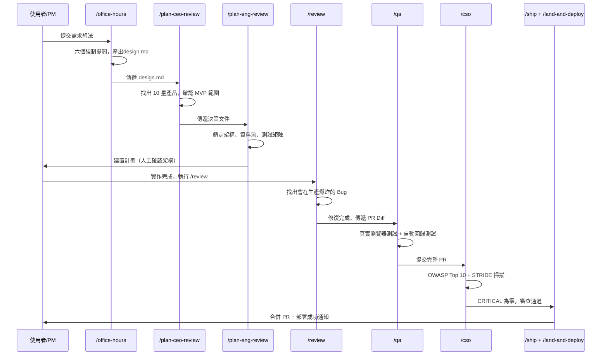
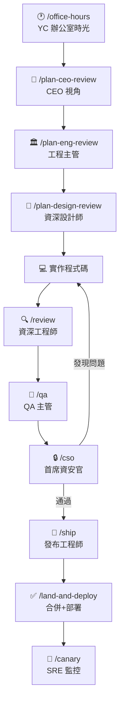
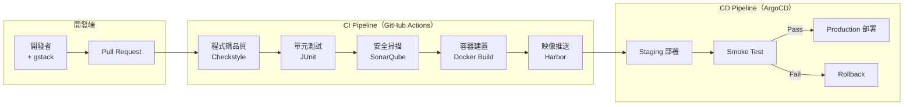

+++
date = '2026-04-03T21:13:35+08:00'
draft = false
title = 'Gstack教學手冊'
tags = ['教學', 'AI開發','指引']
categories = ['教學']
+++

# gstack 企業級教學手冊

> **參考版本**：v0.15.2.1 ｜ **更新日期**：2026-04-03  
> **GitHub 星數**：62,900+ ⭐ ｜ **貢獻者**：26 位 ｜ **授權**：MIT  
> **適用對象**：資深工程師、架構師、DevOps 工程師、技術主管、創辦人與技術主管  
> **適用場景**：新創公司、企業平台、微服務架構、金融系統  
> **參考來源**：[https://github.com/garrytan/gstack](https://github.com/garrytan/gstack)

---

## 目錄

1. [gstack 概述](#1-gstack-概述)
   - 1.1 [什麼是 gstack](#11-什麼是-gstack)
   - 1.2 [背景：Garry Tan 與 YC](#12-背景garry-tan-與-yc)
   - 1.3 [與傳統 Prompt Engineering 的差異](#13-與傳統-prompt-engineering-的差異)
   - 1.4 [與 GitHub Copilot / AI Agent 的比較](#14-與-github-copilot--ai-agent-的比較)
   - 1.5 [適用場景](#15-適用場景)
   - 1.6 [版本與現況](#16-版本與現況)
2. [核心架構設計](#2-核心架構設計)
   - 2.1 [企業級系統整體架構](#21-企業級系統整體架構)
   - 2.2 [AI Agent 協作架構圖](#22-ai-agent-協作架構圖)
   - 2.3 [分庫分表設計](#23-分庫分表設計)
   - 2.4 [Clean Architecture（後端服務）](#24-clean-architecture後端服務)
3. [安裝與環境建置](#3-gstack-安裝與環境建置)
   - 3.1 [必備環境](#31-必備環境)
   - 3.2 [安裝 Claude Code](#32-安裝-claude-code)
   - 3.3 [安裝 gstack（機器本機）](#33-安裝-gstack機器本機)
   - 3.4 [加入專案供團隊共用（選用）](#34-加入專案供團隊共用選用)
   - 3.5 [多平台安裝支援](#35-多平台安裝支援)
   - 3.6 [語音輸入支援](#36-語音輸入支援)
   - 3.7 [設定 CLAUDE.md](#37-設定-claudemd)
   - 3.8 [常見安裝錯誤排除](#38-常見安裝錯誤排除)
4. [Sprint 工作流程與技能體系](#4-sprint-工作流程與技能體系)
   - 4.1 [Sprint 核心哲學](#41-sprint-核心哲學)
   - 4.2 [技能串聯關係](#42-技能串聯關係)
   - 4.3 [完整技能目錄（33 個）](#43-完整技能目錄33-個)
   - 4.4 [Builder Ethos（建構者信條）](#44-builder-ethos建構者信條)
5. [虛擬開發團隊設計（企業實戰）](#5-虛擬開發團隊設計企業實戰)
   - 5.1 [團隊架構總覽](#51-團隊架構總覽)
   - 5.2 [／office-hours（YC 辦公室時光）](#52-office-hoursyc-辦公室時光)
   - 5.3 [／plan-ceo-review（CEO 視角）](#53-plan-ceo-reviewceo-視角)
   - 5.4 [／plan-eng-review（工程主管視角）](#54-plan-eng-review工程主管視角)
   - 5.5 [／plan-design-review（設計師視角）](#55-plan-design-review設計師視角)
   - 5.6 [／review（資深工程師審查）](#56-review資深工程師審查)
   - 5.7 [／qa（QA 主管）](#57-qaqa-主管)
   - 5.8 [／cso（首席資安官）](#58-cso首席資安官)
   - 5.9 [／ship（發布工程師）](#59-ship發布工程師)
   - 5.10 [／investigate（系統偵錯）](#510-investigate系統偵錯)
6. [端到端開發流程](#6-端到端開發流程)
   - 6.1 [完整開發流程圖](#61-完整開發流程圖)
   - 6.2 [各步驟執行指令](#62-各步驟執行指令)
   - 6.3 [分支策略與 PR 規範](#63-分支策略與-pr-規範)
7. [實戰案例：會員管理系統](#7-實戰案例會員管理系統)
   - 7.1 [系統設計概覽](#71-系統設計概覽)
   - 7.2 [API 設計](#72-api-設計由-plan-eng-review-產出)
   - 7.3 [DB Schema](#73-db-schema由-plan-eng-review-產出)
   - 7.4 [Clean Architecture 後端實作](#74-clean-architecture-後端實作senior-dev-實作)
   - 7.5 [前端（Vue 3）](#75-前端vue-3)
   - 7.6 [gstack 技能參與對照表](#76-gstack-技能參與對照表)
8. [DevOps 與自動化](#8-devops-與自動化)
   - 8.1 [CI/CD 架構圖](#81-cicd-架構圖)
   - 8.2 [GitHub Actions CI 設定](#82-github-actions-ci-設定)
   - 8.3 [Dockerfile（多階段建置）](#83-dockerfile多階段建置)
   - 8.4 [／land-and-deploy 一鍵部署](#84-land-and-deploy-一鍵部署)
   - 8.5 [／canary 金絲雀監控](#85-canary-金絲雀監控)
   - 8.6 [／benchmark 效能基準](#86-benchmark-效能基準)
9. [並行 Sprint 與瀏覽器模式](#9-並行-sprint-與瀏覽器模式)
   - 9.1 [並行 Sprint 架構](#91-並行-sprint-架構)
   - 9.2 [Conductor 整合](#92-conductor-整合)
   - 9.3 [瀏覽器模式（／browse）](#93-瀏覽器模式browse)
   - 9.4 [真實 Chrome 模式（$B connect）](#94-真實-chrome-模式b-connect)
   - 9.5 [CSS Inspector 與 Live Style 編輯](#95-css-inspector-與-live-style-編輯v01420)
   - 9.6 [瀏覽器交接（Browser Handoff）](#96-瀏覽器交接browser-handoff)
10. [系統維運](#10-系統維運)
    - 10.1 [日誌策略（Log4j2 + ELK）](#101-日誌策略log4j2--elk)
    - 10.2 [監控儀表板（Prometheus + Grafana）](#102-監控儀表板prometheus--grafana)
    - 10.3 [AI 協助 Debug（gstack Investigate Mode）](#103-ai-協助-debuggstack-investigate-mode)
    - 10.4 [錯誤追蹤（Sentry 整合）](#104-錯誤追蹤sentry-整合)
11. [系統升級與擴展](#11-系統升級與擴展)
    - 11.1 [gstack 升級策略](#111-gstack-升級策略)
    - 11.2 [多平台自動升級](#112-多平台自動升級)
    - 11.3 [自訂 SKILL.md 擴展](#113-自訂-skillmd-擴展)
    - 11.4 [多專案管理](#114-多專案管理)
    - 11.5 [Plugin 與 Skill 擴充](#115-plugin-與-skill-擴充)
12. [企業級安全設計](#12-企業級安全設計)
    - 12.1 [／cso 安全審查流程](#121-cso-安全審查流程)
    - 12.2 [身份驗證（OAuth2 + JWT）](#122-身份驗證oauth2--jwt)
    - 12.3 [RBAC 權限控管](#123-rbac-權限控管)
    - 12.4 [SAST / DAST 整合](#124-sast--dast-整合)
    - 12.5 [AI 生成代碼安全風險管控](#125-ai-生成代碼安全風險管控)
    - 12.6 [瀏覽器模式安全加固](#126-瀏覽器模式安全加固)
13. [最佳實務 Best Practices](#13-最佳實務-best-practices)
    - 13.1 [企業導入十二大建議](#131-企業導入十二大建議)
    - 13.2 [常見錯誤](#132-常見錯誤)
    - 13.3 [Anti-patterns 對照表](#133-anti-patterns-對照表)
- [附錄：快速上手 Checklist](#附錄快速上手-checklist)

---

## 1. gstack 概述

### 1.1 什麼是 gstack

gstack 是由 Y Combinator CEO **Garry Tan** 開源的 **Claude Code 虛擬工程團隊技能套件**，開源於 [github.com/garrytan/gstack](https://github.com/garrytan/gstack)，目前已累積超過 **62,900 顆星**、**8,400 次 Fork**，是目前最受矚目的 AI 輔助開發工具之一。

gstack 的本質是：

> **「一組專業化的斜線指令（Slash Commands）套件，讓 Claude Code 從單一 AI 助手升級為虛擬工程團隊」**

它不是獨立執行的程式，不需要另外的伺服器或複雜配置。安裝後，它會在 Claude Code 環境中增加 **33 個技能指令（Skills）**，每個指令都代表一位不同角色的專家：

- `/office-hours` ── YC 風格的產品顧問
- `/plan-ceo-review` ── CEO 產品視角
- `/plan-eng-review` ── 工程主管架構審查  
- `/review` ── 資深工程師程式碼審查（含 7 名專家平行審查）
- `/qa` ── QA 主管真實瀏覽器測試
- `/cso` ── 首席資安官 OWASP 掃描
- `/ship` ── 發布工程師 PR 自動化
- `/checkpoint` ── 工作狀態快照與跨 Session 恢復
- `/health` ── 程式碼品質計分（0-10 分趨勢追蹤）
- `/learn` ── 跨 Session 經驗累積與查詢
- ... 共 33 個技能（詳見第 4.3 節）

### 1.2 背景：Garry Tan 與 YC

**Garry Tan** 是 Y Combinator 的 President & CEO，曾協助 Coinbase、Instacart、Rippling 等公司在車庫階段成長。他本身是工程師出身，在 Palantir 擔任首批工程師/PM/設計師，共同創辦了 Posterous（被 Twitter 收購），並建立了 YC 內部社群網絡 Bookface。

他公開分享了使用 gstack 配合 Claude Code 的驚人生產力數字：

> **過去 60 天：600,000+ 行生產程式碼（35% 為測試），每天 10,000-20,000 行，同時全職管理 YC**

gstack 正是他開源的個人開發方法論，讓每個工程師都能複製這套效率。

### 1.3 與傳統 Prompt Engineering 的差異

| 比較項目 | 傳統 Prompt Engineering | gstack Slash Commands |
|---|---|---|
| 互動方式 | 對話式（問與答） | Sprint 流程驅動（有前後頁依賴） |
| 上下文管理 | 每次需手動提供 | 技能間自動傳遞設計文件 |
| 工作流程 | 人工驅動 | Think → Plan → Build → Review → Test → Ship |
| 技能複用 | 需重複撰寫 Prompt | 技能一次定義，專案間複用 |
| 多視角協作 | 不支援 | 多個 Slash Command 代表不同視角 |
| 輸出品質 | 依賴 Prompt 品質 | 由技能內建方法論標準化 |
| 企業適用性 | 低（需大量改造） | 高（MIT 授權，開箱即用） |
| 學習記憶 | 每次從零開始 | `/learn` 跨 Session 累積經驗 |

### 1.4 與 GitHub Copilot / AI Agent 的比較

```
傳統 AI Copilot：
  你 ──→ AI ──→ 輸出（程式碼補全）

gstack Sprint：
  你（需求描述）
     ↓
  /office-hours   ── 釐清真正問題，生成設計文件
     ↓
  /plan-ceo-review  ── 找出 10 星版本的產品
     ↓
  /plan-eng-review  ── 架構、資料流、失敗模式、測試
     ↓
  [實作 2,400 行，約 8 分鐘]
     ↓
  /review  ── 找出通過 CI 但會在生產爆炸的 Bug（自動修復）
     ↓
  /qa     ── 真實瀏覽器點擊，找到並修復 Bug，生成回歸測試
     ↓
  /ship   ── 同步 main，跑測試，推送，開 PR
     ↓
  /land-and-deploy  ── 合併 PR，等待 CI，驗證生產
```

| 項目 | GitHub Copilot | 單一 AI Agent | gstack |
|---|---|---|---|
| 定位 | 程式碼補全 | 任務執行 | 虛擬工程師團隊 |
| 技能數 | 1（補全） | 1 | 33 個專業技能 |
| 輸出 | 程式碼片段 | 單一任務結果 | 完整可交付成果 |
| 瀏覽器測試 | 無 | 有限 | 真實 Chromium 瀏覽器 |
| 安全審查 | 無 | 無 | OWASP Top 10 + STRIDE |
| 多 AI 交叉審查 | 無 | 無 | Claude + OpenAI Codex |
| 記憶系統 | 無 | 無 | 跨 Session 學習 + Session 智能 |
| 開源授權 | 商業 | 不定 | MIT，完全免費 |

### 1.5 適用場景

| 場景 | 說明 | 推薦技能 |
|---|---|---|
| **新創產品驗證** | 快速找到正確的產品方向，避免建錯東西 | `/office-hours` → `/autoplan` |
| **企業功能開發** | 有嚴格品質門檻的功能迭代 | 完整 Sprint 流程 |
| **銀行 / 金融系統** | 高安全、高合規需求 | `/cso` + `/careful` + `/guard` |
| **大型企業平台** | 多團隊協作，需統一開發規範 | `/autoplan` + `/retro` |
| **SaaS 產品** | 快速迭代，需 API + 前端 + 測試一次完成 | 完整 Sprint |
| **微服務架構** | 多個服務並行開發 | Conductor 並行 Sprint |
| **Debug 困難問題** | 系統性追查根本原因 | `/investigate` |
| **設計系統建立** | 從零建立視覺識別 | `/design-consultation` → `/design-html` |
| **新人訓練** | 透過標準化流程加速上手 | 完整 Sprint + `/learn` |

> **實務建議**：金融業建議將 `/cso` 納入 CI 強制步驟，並搭配 `/careful` 與 `/guard` 保護生產環境操作。

### 1.6 版本與現況

| 項目 | 資訊 |
|---|---|
| **最新版本** | v0.15.2.1（2026-04-02）|
| **GitHub 星數** | 62,900+ ⭐ |
| **Fork 數** | 8,400+ |
| **貢獻者** | 26 位（含 Garry Tan 本人與 Claude）|
| **授權** | MIT（完全免費，無付費版）|
| **技能數量** | 33 個技能指令 |
| **語言組成** | TypeScript 70.5%、Go Template 19.9%、Shell 4.4% |
| **支援平台** | Claude Code、Codex CLI、Gemini CLI、Cursor、Kiro CLI |
| **支援作業系統** | macOS、Linux、Windows 11（Git Bash / WSL）|

#### 重要版本里程碑

| 版本 | 日期 | 代號 | 核心功能 |
|---|---|---|---|
| **v0.15.2.1** | 2026-04-02 | Setup Runs Migrations | `git pull && ./setup` 自動套用版本遷移 |
| **v0.15.2.0** | 2026-04-02 | Voice-Friendly Skill Triggers | 語音友善觸發，支援 AquaVoice / Whisper |
| **v0.15.1.0** | 2026-04-01 | Design Without Shotgun | `/design-html` 可從任意起點啟動 |
| **v0.15.0.0** | 2026-04-01 | Session Intelligence | `/checkpoint` + `/health` + 時間軸 + 上下文恢復 |
| **v0.14.6.0** | 2026-03-31 | Recursive Self-Improvement | 操作自學習，技能從失敗中自動累積經驗 |
| **v0.14.4.0** | 2026-03-31 | Review Army | 7 名專家平行審查（測試、安全、效能、API 等）|
| **v0.14.0.0** | 2026-03-30 | Design to Code | `/design-html` 從設計稿生成生產級 HTML |
| **v0.13.6.0** | 2026-03-29 | GStack Learns | 專案學習系統 `/learn`，跨 Session 累積經驗 |
| **v0.13.0.0** | 2026-03-27 | Your Agent Can Design Now | 設計二進制工具 `$D`，生成真實 UI Mockup |
| **v0.12.0.0** | 2026-03-26 | Headed Mode + Sidebar Agent | 真實 Chrome 視窗 + 側邊欄對話代理 |
| **v0.11.0.0** | 2026-03-22 | /cso: Zero-Noise Security Audits | 首席資安官零噪音安全審查 |
| **v0.10.0.0** | 2026-03-22 | Autoplan | 一鍵全自動 CEO → 設計 → 工程審查 |
| **v0.9.0** | 2026-03-19 | Works on Codex, Gemini CLI, and Cursor | 多平台支援 |
| **v0.8.0** | 2026-03-19 | Multi-AI Second Opinion | `/codex` 多 AI 交叉審查 |
| **v0.7.0** | 2026-03-18 | YC Office Hours | `/office-hours` + `/investigate` |
| **v0.0.1** | 2026-03-11 | Initial Release | 5 個核心技能 + 無頭瀏覽器 |

---

## 2. 核心架構設計

### 2.1 企業級系統整體架構

```mermaid
graph TB
    subgraph "前端層 Frontend"
        FE1[Vue.js 主應用]
        FE2[Micro-Frontend Module A]
        FE3[Micro-Frontend Module B]
    end

    subgraph "API Gateway 層"
        GW[API Gateway\nSpring Cloud Gateway]
        LB[Load Balancer\nNginx]
    end

    subgraph "後端服務層 Backend Services"
        SVC1[會員服務\nSpring Boot]
        SVC2[訂單服務\nSpring Boot]
        SVC3[通知服務\nSpring Boot]
        SVC4[報表服務\nSpring Boot]
    end

    subgraph "AI Agent Layer ← gstack + Claude Code（33 個技能）"
        AG1[/office-hours\nYC 辦公室時光]
        AG2[/plan-ceo-review\nCEO 產品視角]
        AG3[/plan-eng-review\n工程主管架構]
        AG4[/review\n資深工程師審查]
        AG5[/qa\nQA 主管瀏覽器測試]
        AG6[/cso\n首席資安官]
        AG7[/ship\n發布工程師]
    end

    subgraph "資料層 Data Layer"
        DB1[(MySQL Primary\n會員/訂單)]
        DB2[(MySQL Replica\n讀取分流)]
        DB3[(MongoDB\n日誌/文件)]
        CACHE[Redis Cluster\n快取/Session]
        MQ[Kafka\n非同步訊息]
    end

    subgraph "DevOps Pipeline"
        CI[GitHub Actions CI]
        CD[ArgoCD CD]
        REG[Harbor\n映像倉庫]
    end

    FE1 --> LB
    FE2 --> LB
    FE3 --> LB
    LB --> GW
    GW --> SVC1
    GW --> SVC2
    GW --> SVC3
    GW --> SVC4
    SVC1 --> DB1
    SVC2 --> DB1
    DB1 --> DB2
    SVC1 --> CACHE
    SVC2 --> MQ
    SVC3 --> MQ
    AG3 --> SVC1
    AG3 --> SVC2
    AG4 --> CI
    AG5 --> D1
    AG6 --> CD
    CI --> REG
    REG --> CD
```

### 2.2 AI Agent 協作架構圖



### 2.3 分庫分表設計

| 業務域 | 資料庫 | 分表策略 | 說明 |
|---|---|---|---|
| 會員資料 | member_db | 按 user_id mod 8 | 高讀取頻率 |
| 訂單資料 | order_db_0~3 | 按 order_date 分月 | 高寫入頻率 |
| 稽核日誌 | audit_db | 按年月 | 合規保存 |
| 快取 | Redis Cluster | Slot-based | 主從架構 |

### 2.4 Clean Architecture（後端服務）

```
src/
├── domain/             ← 領域層（Entity, Value Object, Domain Service）
│   ├── entity/
│   ├── repository/     ← 介面定義（不含實作）
│   └── service/
├── application/        ← 應用層（Use Case, DTO, Mapper）
│   ├── usecase/
│   └── dto/
├── infrastructure/     ← 基礎設施層（JPA, Redis, Kafka 實作）
│   ├── persistence/
│   ├── cache/
│   └── messaging/
└── presentation/       ← 表現層（Controller, Request/Response）
    └── controller/
```

---

## 3. gstack 安裝與環境建置

### 3.1 必備環境

| 工具 | 版本要求 | 說明 |
|---|---|---|
| **Claude Code** | 最新版 | Anthropic 提供，gstack 必須在其中執行 |
| **Git** | ≥ 2.40 | 版本控制，clone gstack 使用 |
| **Bun** | ≥ 1.0 | gstack 核心執行環境（瀏覽器伺服器） |
| **Node.js** | ≥ 18 LTS | **僅 Windows 需要**（Bun 在 Windows 有已知問題） |
| Java JDK | 17 / 21 LTS | Spring Boot 後端（若需要） |
| Maven | ≥ 3.9 | Java 專案管理（若需要） |

> ⚠️ **重要**：gstack 不是 npm 套件，不需要 Python，不需要 `npm install -g`。
> 它透過 `git clone` 安裝至 Claude Code 的 skills 資料夾。

### 3.2 安裝 Claude Code

```bash
# 安裝 Claude Code（Anthropic 提供的 AI 編碼 CLI）
npm install -g @anthropic-ai/claude-code

# 驗證安裝
claude --version

# 登入 Anthropic 帳號
claude login
```

> **企業環境注意**：需設定 API Key：
> ```bash
> export ANTHROPIC_API_KEY="your-api-key-here"
> ```

### 3.3 安裝 gstack（機器本機）

在 Claude Code 中貼上以下指令，Claude 會自動完成所有安裝步驟：

```
Install gstack: run `git clone --single-branch --depth 1 https://github.com/garrytan/gstack.git ~/.claude/skills/gstack && cd ~/.claude/skills/gstack && ./setup` then add a "gstack" section to CLAUDE.md that says to use the /browse skill from gstack for all web browsing, never use mcp__claude-in-chrome__* tools, and lists the available skills: /office-hours, /plan-ceo-review, /plan-eng-review, /plan-design-review, /design-consultation, /design-shotgun, /design-html, /review, /ship, /land-and-deploy, /canary, /benchmark, /browse, /connect-chrome, /qa, /qa-only, /design-review, /setup-browser-cookies, /setup-deploy, /retro, /investigate, /document-release, /codex, /cso, /autoplan, /careful, /freeze, /guard, /unfreeze, /gstack-upgrade, /learn, /checkpoint, /health.
```

**安裝後驗證**：

```bash
# 確認技能已安裝
ls ~/.claude/skills/gstack/

# 在 Claude Code 中輸入以下指令進行快速測試
/office-hours
```

**說明**：
- 安裝位置：`~/.claude/skills/gstack/`
- 不會影響系統 PATH，不在背景執行任何服務
- 所有設定存放於 `.claude/` 資料夾內

### 3.4 加入專案供團隊共用（選用）

若希望整個團隊的開發者都能使用同一份 gstack 設定，可將 gstack 加入專案倉庫：

在 Claude Code 中貼上：

```
Add gstack to this project: run `cp -Rf ~/.claude/skills/gstack .claude/skills/gstack && rm -rf .claude/skills/gstack/.git && cd .claude/skills/gstack && ./setup` then add a "gstack" section to this project's CLAUDE.md that says to use the /browse skill from gstack for all web browsing, never use mcp__claude-in-chrome__* tools, lists the available skills: /office-hours, /plan-ceo-review, /plan-eng-review, /plan-design-review, /design-consultation, /design-shotgun, /design-html, /review, /ship, /land-and-deploy, /canary, /benchmark, /browse, /connect-chrome, /qa, /qa-only, /design-review, /setup-browser-cookies, /setup-deploy, /retro, /investigate, /document-release, /codex, /cso, /autoplan, /careful, /freeze, /guard, /unfreeze, /gstack-upgrade, /learn, /checkpoint, /health.
```

**安裝後目錄結構**：

```
your-project/
├── .claude/
│   └── skills/
│       └── gstack/        ← 所有 33 個技能定義（Markdown）
│           ├── office-hours/
│           ├── plan-ceo-review/
│           ├── review/
│           ├── qa/
│           ├── ship/
│           ├── cso/
│           ├── browse/
│           ├── checkpoint/
│           ├── health/
│           └── ...（共 33 個）
├── CLAUDE.md              ← 加入 gstack section
├── backend/
├── frontend/
└── README.md
```

> **優勢**：使用 `git clone` 專案後，同事無需額外安裝，直接擁有完整 gstack 技能。

**若需完整 git 歷史或貢獻程式碼**，使用完整 clone：

```bash
git clone https://github.com/garrytan/gstack.git ~/.claude/skills/gstack
```

### 3.5 多平台安裝支援

gstack 支援多種 AI Agent 執行環境：

#### Codex CLI / Gemini CLI / Cursor

```bash
# 安裝至單一專案
git clone --single-branch --depth 1 https://github.com/garrytan/gstack.git .agents/skills/gstack
cd .agents/skills/gstack && ./setup --host codex

# 安裝至使用者帳號（全域）
git clone --single-branch --depth 1 https://github.com/garrytan/gstack.git ~/gstack
cd ~/gstack && ./setup --host codex
```

> 說明：`setup --host codex` 會在 `~/.codex/skills/gstack` 建立執行根目錄。全部 33 個技能在所有支援的 AI Agent 上均可使用。

#### 自動偵測（推薦）

```bash
git clone --single-branch --depth 1 https://github.com/garrytan/gstack.git ~/gstack
cd ~/gstack && ./setup --host auto
```

> `auto` 會偵測系統中已安裝的 AI Agent（Claude Code、Codex CLI、Gemini CLI、Cursor、Kiro CLI），自動決定安裝目標。

#### Kiro CLI

```bash
git clone --single-branch --depth 1 https://github.com/garrytan/gstack.git ~/gstack
cd ~/gstack && ./setup --host kiro
```

> Kiro CLI 支援由 `--host auto` 自動偵測，如已安裝 `kiro-cli` 則自動配置。

### 3.6 語音輸入支援

gstack 所有技能都支援**語音觸發短語（Voice-Friendly Trigger Phrases）**，可搭配 AquaVoice、Whisper 等語音輸入工具：

| 你說的話 | 觸發的技能 |
|---|---|
| "run a security check" / "see-so" | `/cso` |
| "test the website" | `/qa` |
| "do an engineering review" / "tech review" | `/plan-eng-review` |
| "review my code" / "code x" | `/review` |
| "ship this" | `/ship` |
| "run office hours" | `/office-hours` |
| "speed test" | `/benchmark` |
| "save my progress" | `/checkpoint` |
| "check code quality" | `/health` |

### 3.7 設定 CLAUDE.md

每個使用 gstack 的專案，其 `CLAUDE.md` 需要加入一個 gstack section：

```markdown
## gstack
Use /browse from gstack for all web browsing. Never use mcp__claude-in-chrome__* tools.
Available skills: /office-hours, /plan-ceo-review, /plan-eng-review,
/plan-design-review, /design-consultation, /design-shotgun, /design-html,
/review, /ship, /land-and-deploy, /canary, /benchmark, /browse,
/connect-chrome, /qa, /qa-only, /design-review, /setup-browser-cookies,
/setup-deploy, /retro, /investigate, /document-release, /codex, /cso,
/autoplan, /careful, /freeze, /guard, /unfreeze, /gstack-upgrade, /learn,
/checkpoint, /health.

If gstack skills aren't working, run:
cd .claude/skills/gstack && ./setup
```

### 3.8 常見安裝錯誤排除

| 問題 | 解法 |
|---|---|
| **技能沒有出現** | `cd ~/.claude/skills/gstack && ./setup` |
| **`/browse` 失敗** | `cd ~/.claude/skills/gstack && bun install && bun run build` |
| **版本過舊** | 在 Claude Code 輸入 `/gstack-upgrade` |
| **想要更短指令名** | `cd ~/.claude/skills/gstack && ./setup --no-prefix`（`/gstack-qa` → `/qa`） |
| **想要命名空間指令** | `cd ~/.claude/skills/gstack && ./setup --prefix`（`/qa` → `/gstack-qa`） |
| **Claude 說找不到技能** | 確認 `CLAUDE.md` 中有 gstack section |
| **Codex: "Skipped loading skill(s)"** | `cd ~/.codex/skills/gstack && git pull && ./setup --host codex` |
| **Windows 執行問題** | 使用 Git Bash 或 WSL；確保 `bun` 和 `node` 都在 PATH 中 |
| **API Key 未設定** | `export ANTHROPIC_API_KEY="sk-..."` |

---

## 4. Sprint 工作流程與技能體系

### 4.1 Sprint 核心哲學

gstack 是一個**流程**，不只是工具集合。技能的執行順序就是 Sprint 的執行順序：

> **Think → Plan → Build → Review → Test → Ship → Reflect**

每個技能都會把成果傳遞給下一個技能：
- `/office-hours` 撰寫設計文件，供 `/plan-ceo-review` 讀取
- `/plan-eng-review` 撰寫測試計畫，供 `/qa` 自動取用
- `/review` 發現的 Bug，`/ship` 會驗證已修復

沒有東西會被遺漏，因為每個步驟都知道前面發生了什麼。

### 4.2 技能串聯關係

```mermaid
flowchart LR
    OH[/office-hours\n設計文件] --> CEO[/plan-ceo-review\n產品視角]
    CEO --> ENG[/plan-eng-review\n架構+測試計畫]
    ENG --> DES[/plan-design-review\n設計審查]
    DES --> BUILD[實作程式碼]
    BUILD --> REV[/review\n程式碼審查]
    REV --> QA[/qa\n瀏覽器測試]
    QA --> CSO[/cso\n安全掃描]
    CSO --> SHIP[/ship\nPR 發布]
    SHIP --> LAD[/land-and-deploy\n合併+部署]
    LAD --> CAN[/canary\n生產監控]
    CAN --> RET[/retro\n回顧]
```

**技能間的自動資料流**：

| 來源技能 | 產出產物 | 接收技能 |
|---|---|---|
| `/office-hours` | `~/.gstack/projects/{slug}/design.md` | `/plan-ceo-review`, `/plan-eng-review` |
| `/plan-ceo-review` | 願景決策文件 | `/plan-eng-review`, `/autoplan` |
| `/plan-eng-review` | 測試計畫、架構圖 | `/qa`（自動讀取）|
| `/plan-design-review` | 設計評分與修訂 | `/design-review`（實作後稽核）|
| `/review` | 問題清單（自動修復 + 待確認） | `/ship`（PR 前驗證）|
| `/qa` | Bug 報告 + 回歸測試 | `.gstack/qa-reports/` |
| `/ship` | PR 連結 | `/land-and-deploy` |

### 4.3 完整技能目錄（33 個）

#### 計畫階段（Planning）

| 指令 | 角色 | 說明 |
|---|---|---|
| `/office-hours` | **YC 辦公室時光** | 從這裡開始。六個強制提問，在你寫程式碼前重構你的產品方向。挑戰你的前提假設，設計文件自動傳遞給後續技能。 |
| `/plan-ceo-review` | **CEO / 創辦人** | 重新思考問題核心。找出需求裡藏著的 10 星產品。四種模式：擴展、選擇性擴展、維持範圍、縮減。 |
| `/autoplan` | **審查流水線** | 一個指令，完整計畫。自動執行 CEO → 設計 → 工程審查，僅在需要你做品味決策時停下來詢問。 |
| `/plan-eng-review` | **工程主管** | 鎖定架構、資料流、圖、邊界案例與測試。強迫隱藏的假設浮出水面。 |
| `/plan-design-review` | **資深設計師** | 對每個設計維度評分 0-10，說明 10 分是什麼樣子，然後修改計畫達到那個水準。 |

#### 設計階段（Design）

| 指令 | 角色 | 說明 |
|---|---|---|
| `/design-consultation` | **設計夥伴** | 從零建立完整設計系統。研究業界景觀，提出創意風險，生成真實產品 Mockup，撰寫 `DESIGN.md`。 |
| `/design-shotgun` | **設計探索者** | 生成 3 個視覺設計方案，在瀏覽器中開啟比較面板，讓你選擇方向。品味記憶偏向你的偏好。 |
| `/design-html` | **設計工程師** | 使用 Pretext 生成生產品質 HTML。文字會在縮放時重排，不再有硬編碼高度。支援 React/Svelte/Vue。 |
| `/design-review` | **會寫程式的設計師** | 80 項視覺稽核 + 修復迴圈。Atomic commits，前後截圖比對。AI Slop 評分。 |

#### 審查階段（Review）

| 指令 | 角色 | 說明 |
|---|---|---|
| `/review` | **資深工程師** | 找出通過 CI 但會在生產爆炸的 Bug。派遣 7 名專家平行審查（測試、維護性、安全、效能、資料遷移、API 合約、紅隊），自動修復顯而易見的問題。多專家共識標記 `MULTI-SPECIALIST CONFIRMED`。 |
| `/investigate` | **偵錯專家** | 系統性根因調查。鐵律：沒有調查就不修復。追蹤資料流，測試假設，3 次修復失敗後停下思考架構。 |
| `/codex` | **第二意見（OpenAI）** | OpenAI Codex CLI 的獨立程式碼審查。三種模式：審查（通過/失敗），對抗挑戰，開放諮詢。雙 AI 交叉分析。 |

#### 測試階段（Testing）

| 指令 | 角色 | 說明 |
|---|---|---|
| `/qa` | **QA 主管** | 測試應用程式，找到 Bug，用 Atomic Commits 修復，重新驗證。自動生成每次修復的回歸測試。 |
| `/qa-only` | **QA 報告員** | 與 `/qa` 相同方法論，但只報告，不修改程式碼。 |
| `/cso` | **首席資安官** | OWASP Top 10 + STRIDE 威脅建模安全稽核。零雜訊：17 種假陽性排除，8/10+ 信心閾值。 |

#### 發布階段（Shipping）

| 指令 | 角色 | 說明 |
|---|---|---|
| `/ship` | **發布工程師** | 同步 main，跑測試，稽核覆蓋率，推送，開 PR。若沒有測試框架，自動建立。 |
| `/land-and-deploy` | **發布工程師** | 合併 PR，等待 CI 和部署，驗證生產狀態。從「審核通過」到「生產驗證」只需一個指令。 |
| `/document-release` | **技術寫作者** | 更新所有專案文件以符合剛發布的內容。`/ship` 會自動觸發它。 |

#### 維運階段（Operations）

| 指令 | 角色 | 說明 |
|---|---|---|
| `/canary` | **SRE** | 部署後監控迴圈。監控 Console 錯誤、效能退化和頁面失敗。 |
| `/benchmark` | **效能工程師** | Core Web Vitals 基準測試。每次 PR 前後比較。 |
| `/retro` | **工程主管** | 團隊感知的週回顧。`/retro global` 跨所有專案運行。 |
| `/learn` | **記憶管理** | 管理 gstack 跨 Session 學到的知識。回顧、搜尋、修剪、匯出。 |

#### Session 智能層（Session Intelligence）

| 指令 | 角色 | 說明 |
|---|---|---|
| `/checkpoint` | **工作狀態快照** | 儲存與恢復工作狀態快照。捕捉 git 狀態、已做出的決策、剩餘工作。支援跨分支列表，可用於 Conductor 工作區交接。 |
| `/health` | **程式碼品質計分** | 包裝專案工具（tsc、biome、knip、shellcheck、測試），計算 0-10 組合分數，追蹤趨勢。分數下降時告訴你哪裡變了以及如何修復。 |

#### 瀏覽器工具（Browser）

| 指令 | 角色 | 說明 |
|---|---|---|
| `/browse` | **QA 工程師** | 給 Agent 眼睛。真實 Chromium 瀏覽器，真實點擊，真實截圖。每個指令約 100ms。 |
| `/connect-chrome` | **Chrome 控制器** | 啟動真實 Chrome，配合側邊欄 AI 助手，觀察每個動作的即時畫面。 |
| `/setup-browser-cookies` | **Session 管理員** | 從你的真實瀏覽器匯入 Cookie，測試需認證的頁面。 |

#### 工具與安全（Utility & Safety）

| 指令 | 角色 | 說明 |
|---|---|---|
| `/setup-deploy` | **部署設定器** | 一次性設定 `/land-and-deploy`。偵測平台、生產 URL 和部署指令。 |
| `/gstack-upgrade` | **自動升級器** | 升級至最新版 gstack，同步全域和專案安裝。 |
| `/careful` | **安全護欄** | 在危險指令前警告：`rm -rf`、`DROP TABLE`、`force-push` 等。 |
| `/freeze` | **編輯鎖定** | 限制所有檔案編輯在單一目錄內。防止除錯時意外修改不相關程式碼。 |
| `/guard` | **完全安全模式** | `/careful` + `/freeze` 合一。生產環境工作的最高安全設定。 |
| `/unfreeze` | **解除鎖定** | 移除 `/freeze` 邊界。 |

### 4.4 Builder Ethos（建構者信條）

gstack 將以下三個核心原則注入每個技能的前言（Preamble），形塑 AI 建議的思維方式：

#### 原則一：Boil the Lake（煮乾湖泊）

> AI 輔助開發讓「完整性」的邊際成本接近零。當完整實作比捷徑多花幾分鐘時──就做完整的那個。

| 任務 | 傳統人工 | AI 輔助 | 壓縮比 |
|---|---|---|---|
| 樣板 / 支架 | 2 天 | 15 分鐘 | ~100x |
| 測試撰寫 | 1 天 | 15 分鐘 | ~50x |
| 功能實作 | 1 週 | 30 分鐘 | ~30x |
| Bug 修復 + 回歸測試 | 4 小時 | 15 分鐘 | ~20x |
| 架構 / 設計 | 2 天 | 4 小時 | ~5x |

#### 原則二：Search Before Building（建構前先搜尋）

> 1000x 工程師的第一直覺是「有人解決過這個問題嗎？」而不是「讓我從頭設計」。

三層知識架構：
- **Layer 1（試驗過的）**：標準模式，久經考驗的方法
- **Layer 2（新興流行的）**：當前最佳實務，生態系趨勢
- **Layer 3（第一原理）**：從特定問題推理出的原創觀察──最有價值

#### 原則三：User Sovereignty（使用者主權）

> AI 模型給建議。使用者做決定。這條規則覆蓋所有其他規則。

正確模式（生成-驗證迴圈）：
- AI 生成建議
- 使用者驗證並決定
- AI 永不跳過驗證步驟，即使非常有信心

---

## 5. 虛擬開發團隊設計（企業實戰）

### 5.1 團隊架構總覽

在 gstack 中，「虛擬開發團隊」不是透過 YAML 設定檔定義的，而是每個 Slash Command 就代表一位專家角色，它們依照 Sprint 流程串聯：



### 5.2 ／office-hours（YC 辦公室時光）

在你規劃、或寫程式碼之前，先和一位 YC 風格的夥伴思考你真正在建構什麼。

**六個強制提問**（Startup Mode）：
1. 誰是那個真正需要這個的具體真實的人？
2. 他們目前怎麼解決這個問題？
3. 給我一個具體例子，不要假設情境
4. 你能在明天就發布的最窄切入點是什麼？
5. 上週有什麼讓你驚喜的事情？
6. 這個產品在 10 年後適合什麼世界？

**Builder Mode**（適合黑客松、副業專案、開源）：熱情的協作者，幫你找出最酷的版本。問題是生成性的，不是盤問性的。

設計文件自動寫入 `~/.gstack/projects/`，直接供後續技能讀取。

### 5.3 ／plan-ceo-review（CEO 視角）

**目標**：找出需求裡藏著的 10 星產品。

**四種模式**：
- **SCOPE EXPANSION** — 展示大膽版本，每個擴展單獨提出
- **SELECTIVE EXPANSION** — 維持現有範圍為基準，展示可能的機會
- **HOLD SCOPE** — 對現有計畫進行最嚴格把關
- **SCOPE REDUCTION** — 找出最小可行版本

願景和決策保存至 `~/.gstack/projects/`，可升級加入 `docs/designs/` 讓團隊共用。

**範例輸出（MVP 決策文件）**：

```markdown
## 會員管理系統 MVP 決策

### 納入 MVP（Sprint 1-2）
1. ✅ 會員註冊 / 登入（核心路徑）
2. ✅ 基本個人資料管理
3. ✅ 密碼重設流程

### 延後（Sprint 3+）
- ❌ 社群登入（OAuth）— 影響範圍大，延後
- ❌ 會員等級制度 — 需更多業務規則討論

### 絕對不做
- ⛔ 直接刪除會員資料（改為停用，保留稽核記錄）
```

### 5.4 ／plan-eng-review（工程主管視角）

**目標**：鎖定架構，讓產品願景真正可建構。

強制完成的內容：
- 架構設計（含 ASCII 圖、序列圖、狀態機圖）
- 系統邊界與資料流
- 失敗模式與邊界案例
- 信任邊界
- 測試矩陣

**Review Readiness Dashboard**（每次審查後顯示）：

```
+====================================================================+
|                    REVIEW READINESS DASHBOARD                       |
+====================================================================+
| Review          | Runs | Last Run            | Status    | Required |
|-----------------|------|---------------------|-----------|----------|
| Eng Review      |  1   | 2026-04-03 10:00    | CLEAR     | YES      |
| CEO Review      |  1   | 2026-04-03 09:30    | CLEAR     | no       |
| Design Review   |  0   | —                   | —         | no       |
+--------------------------------------------------------------------+
| VERDICT: CLEARED — Eng Review passed                                |
+====================================================================+
```

測試計畫自動寫入 `~/.gstack/projects/`，之後 `/qa` 執行時自動讀取。

### 5.5 ／plan-design-review（資深設計師視角）

七項審查通道（計畫階段）：
1. 資訊架構
2. 互動狀態覆蓋（空狀態、錯誤狀態、載入狀態）
3. 使用者旅程
4. AI Slop 風險偵測
5. 設計系統對齊
6. 響應式 / 無障礙
7. 未解決的設計決策

```
範例：4/10 → 8/10（修復後）
Pass 2 (互動狀態): 2/10 → 4 個 UI 功能，定義 0/20 互動狀態
Pass 4 (AI Slop): 4/10 → 「帶漸層的英雄區塊」是前 2 名 AI 生成外觀
```

### 5.6 ／review（資深工程師審查）

**v0.14.4.0 新增：平行專家審查軍團（Review Army）**

每次 `/review` 現在會派遣 **7 名專家 subagent** 平行審查你的程式碼：

| 專家 | 觸發條件 | 審查範圍 |
|---|---|---|
| **測試** | 永遠啟用 | 測試缺口、覆蓋率假象 |
| **維護性** | 永遠啟用 | 死碼、魔術數字、命名 |
| **安全** | 有 auth 範圍 | 注入、信任邊界、密碼處理 |
| **效能** | 有後端/前端 | N+1 查詢、Bundle 大小、懶載入 |
| **資料遷移** | 有遷移檔案 | 遷移安全、向下相容 |
| **API 合約** | 有 Controller/Route | 破壞性變更、版本控制 |
| **紅隊** | 大型 diff（200+ 行） | 對抗性分析、隱藏漏洞 |

每個專家輸出結構化 JSON 結果，包含嚴重性、信心分數、檔案路徑、行號。多個專家標記相同問題時，信心度提升並標記 `MULTI-SPECIALIST CONFIRMED`。

每次審查計算 **PR 品質分數**（0-10）：`10 - (critical * 2 + informational * 0.5)`。

查找目標清單（不只是風格問題）：
- N+1 查詢
- 競爭條件
- 錯誤的信任邊界
- 缺少索引
- 枚舉處理器遺漏
- 測試覆蓋假象
- 範圍偏移偵測（Scope Drift Detection）

**Fix-First 機制**：
- `[AUTO-FIXED]` — 機械性修復自動完成
- `[ASK]` — 模糊/安全/設計決策需要你確認

**程式碼輸出範例（Spring Boot 企業項目）**：

```java
/**
 * 會員登入 Controller
 */
@RestController
@RequestMapping("/api/v1/auth")
@RequiredArgsConstructor
@Slf4j
public class AuthController {

    private final AuthUseCase authUseCase;

    @PostMapping("/login")
    public ResponseEntity<LoginResponse> login(
            @Valid @RequestBody LoginRequest request) {

        log.info("Login attempt for account: {}",
                 maskAccount(request.getAccount()));

        LoginResult result = authUseCase.login(
            new LoginCommand(request.getAccount(), request.getPassword())
        );

        return ResponseEntity.ok(LoginResponse.from(result));
    }

    private String maskAccount(String account) {
        if (account == null || account.length() < 4) return "***";
        return account.substring(0, 2) + "***" +
               account.substring(account.length() - 2);
    }
}
```

### 5.7 ／qa（QA 主管）

四種模式：
- **Diff-aware（自動）** — 讀取 `git diff main`，識別受影響的頁面，專門測試
- **Full** — 對整個應用程式系統性探索，5-15 分鐘
- **Quick** — 30 秒冒煙測試
- **Regression** — 與之前基準比較

自動生成回歸測試，追蹤每個修復的具體情境。

**JUnit 5 測試輸出範例**：

```java
@ExtendWith(MockitoExtension.class)
class AuthUseCaseTest {

    @Mock
    private MemberRepository memberRepository;

    @Mock
    private PasswordEncoder passwordEncoder;

    @Mock
    private JwtTokenProvider jwtTokenProvider;

    @InjectMocks
    private AuthUseCaseImpl authUseCase;

    @Test
    @DisplayName("登入成功 - 帳號密碼正確時應返回 JWT Token")
    void login_whenValidCredentials_thenReturnJwtToken() {
        // Given
        String account = "john@example.com";
        Member member = Member.builder()
            .id(1L).account(account)
            .passwordHash("$2a$12$hashedPassword")
            .status(MemberStatus.ACTIVE)
            .build();

        given(memberRepository.findByAccount(account))
            .willReturn(Optional.of(member));
        given(passwordEncoder.matches(anyString(), eq(member.getPasswordHash())))
            .willReturn(true);
        given(jwtTokenProvider.generateToken(member.getId()))
            .willReturn("jwt.token.here");

        // When
        LoginResult result = authUseCase.login(
            new LoginCommand(account, "Password123!")
        );

        // Then
        assertThat(result.getToken()).isEqualTo("jwt.token.here");
        assertThat(result.isSuccess()).isTrue();
    }

    @Test
    @DisplayName("登入失敗 - 密碼錯誤應拋出 AuthenticationException")
    void login_whenWrongPassword_thenThrowAuthenticationException() {
        // Given
        Member member = Member.builder()
            .id(1L).account("john@example.com")
            .passwordHash("$2a$12$hashedPassword")
            .failedLoginAttempts(0)
            .build();

        given(memberRepository.findByAccount(anyString()))
            .willReturn(Optional.of(member));
        given(passwordEncoder.matches(anyString(), anyString()))
            .willReturn(false);

        // When & Then
        assertThatThrownBy(() ->
            authUseCase.login(new LoginCommand("john@example.com", "wrongPassword"))
        ).isInstanceOf(AuthenticationException.class)
         .hasMessageContaining("帳號或密碼錯誤");
    }
}
```

### 5.8 ／cso（首席資安官）

執行 OWASP Top 10 + STRIDE 威脅建模，零雜訊設計（17 種假陽性排除，8/10+ 信心閾值）。

**範例輸出**：

```
CRITICAL: user_search 的 SQL Injection（UserRepository.java:47）
  攻擊情境：攻擊者輸入 "'; DROP TABLE members;--" 可刪除整個會員表
  修復：使用參數化查詢

HIGH: Session Token 儲存於 localStorage（auth.ts:12）
  攻擊情境：XSS 攻擊可竊取所有使用者 Token
  修復：改用 HttpOnly Cookie

MEDIUM: /api/login 缺乏速率限制
MEDIUM: 密碼最短長度未強制（允許 1 字元）

LOW: 缺少 X-Frame-Options 標頭

共 4 個發現，掃描 12 個檔案。
```

| 嚴重等級 | 處理方式 |
|---|---|
| **CRITICAL** | 立即阻擋 PR，修復後才能合併 |
| **HIGH** | 本 Sprint 內修復 |
| **MEDIUM** | 記錄於 Security Backlog |
| **LOW** | 下次迭代處理 |

### 5.9 ／ship（發布工程師）

**測試框架自動建立**：若沒有測試框架，`/ship` 會安裝它，寫 3-5 個真實測試，設定 GitHub Actions CI。

**Greptile 整合**：若專案有 Greptile PR 審查，`/ship` 自動讀取並分類：
- `[VALID]` → 修復
- `[ALREADY FIXED]` → 自動回覆確認
- `[FALSE POSITIVE]` → 說明原因推回

**範例輸出**：
```
Tests: 42 → 51 (+9 new). PR: github.com/you/app/pull/42
```

### 5.10 ／investigate（系統偵錯）

**鐵律**：沒有根因調查就不修復。

執行步驟：
1. 追蹤資料流（從輸入到輸出的完整路徑）
2. 對照已知 Bug 模式
3. 逐一測試假設
4. 3 次修復嘗試失敗 → 停下來質疑架構

`/investigate` 會自動啟動 `/freeze`，將編輯限制在正在調查的模組，防止意外修改不相關程式碼。


---

## 6. 端到端開發流程

### 6.1 完整開發流程圖

```mermaid
flowchart TD
    A[需求輸入\nJira Ticket / 口述] --> B{/office-hours\n需求精煉}
    B --> C[產出 design.md\n+ MVP 決策清單]
    C --> D{/plan-ceo-review\n優先級確認}
    D -->|核准| E{/plan-eng-review\n架構設計}
    D -->|退回| B
    E --> F[產出架構圖\n+ 測試矩陣 + ADR]
    F --> G[人工架構審查 ✅]
    G -->|通過| H[實作程式碼\nClaude Code Session]
    G -->|修改| E
    H --> I[產出 Controller\n+ Service + Repository\n+ DTO]
    I --> J{/review\n程式碼審查}
    J --> K[[AUTO-FIXED] + [ASK]]
    K --> L{/qa\n瀏覽器功能測試}
    L --> M[回歸測試 + Bug 報告]
    M --> N{/cso\n安全掃描}
    N -->|CRITICAL 發現| O[退回修改]
    O --> H
    N -->|通過| P[/ship 建立 PR]
    P --> Q[CI Pipeline\n編譯 + 測試 + SonarQube]
    Q -->|失敗| R[通知開發者修復]
    R --> H
    Q -->|通過| S[Code Review\n人工審查]
    S -->|核准| T[/land-and-deploy]
    T --> U[等待 CI + 部署]
    U --> V[合併 main + 生產驗證]
    V --> W[/canary 金絲雀監控]
    W --> X[/checkpoint 保存工作狀態]
    X --> Y[/retro Sprint 回顧]
```

### 6.2 各步驟執行指令

gstack 工作流程完全在 **Claude Code** 中使用 Slash Commands 驅動，無獨立 CLI 工具：

```
# ── Step 1：需求精煉（任何 Sprint 的起點）
/office-hours
# → 六個強制提問，確認你真正要建構什麼
# → 輸出：~/.gstack/projects/{slug}/design.md

# ── Step 2：CEO 視角優先級確認
/plan-ceo-review
# → 找出需求中藏著的 10 星產品
# → 輸出：MVP 決策文件 + 延後清單

# ── Step 3：工程主管架構設計
/plan-eng-review
# → 鎖定架構、資料流、邊界案例、測試矩陣
# → 輸出：測試計畫（自動傳遞給 /qa）

# ── Step 4：資深設計師設計審查（選用）
/plan-design-review
# → 七項審查通道，評分 0-10
# → 輸出：設計修訂清單

# ── Step 5：實作程式碼（人工或 Claude Code Session）
# → 開發者根據計畫文件實作

# ── Step 6：資深工程師程式碼審查
/review
# → 找出通過 CI 但會在生產爆炸的 Bug
# → [AUTO-FIXED] 自動修復 / [ASK] 等待確認

# ── Step 7：QA 主管功能測試（含瀏覽器）
/qa
# → 真實瀏覽器測試 + 自動生成回歸測試
# → Diff-aware：只測屬於這次 PR 的範圍

# ── Step 8：安全審查
/cso
# → OWASP Top 10 + STRIDE 威脅建模
# → CRITICAL 阻擋 PR，HIGH 本 Sprint 修復

# ── Step 9：建立 PR 並發布
/ship
# → 同步 main，跑測試，稽核覆蓋率，推送，開 PR

# ── Step 10：合併並部署生產
/land-and-deploy
# → 合併 PR，等待 CI + 部署，驗證生產狀態

# ── Step 11：保存工作狀態（推薦）
/checkpoint
# → 建立工作快照，方便跨 Session 繼續
# → 下次開啟 Claude Code 時自動恢復上下文

# ── Step 12：Sprint 回顧與學習
/retro
# → Sprint 回顧，知識沉澱
/learn
# → 從本次 Sprint 的失敗中學習
```

**一鍵執行整個計畫流程**（自動模式）：
```
/autoplan
# → 自動執行 CEO → 設計 → 工程審查
# → 僅在需要品味決策時停下詢問
```

### 6.3 分支策略與 PR 規範

```
main           ─────────────────────────────→  生產環境
  ↑ Merge PR（需 2 人審查 + CI 通過）
develop        ──────────────────────────────→  測試環境
  ↑ Merge PR（需 1 人審查 + CI 通過）
feature/*      ──→  各功能開發分支
hotfix/*       ──→  緊急修復
```

**PR 標題格式**：
```
type(scope): 簡短描述 [JIRA-ID]

範例：
feat(member): 新增會員登入 API [MEM-001]
fix(auth): 修復 JWT 過期驗證漏洞 [SEC-042]
refactor(order): 重構訂單 Service 層 [TECH-015]
```

---

## 7. 實戰案例：會員管理系統

### 7.1 系統設計概覽

```
功能範圍：
- 會員註冊 / 登入 / 登出
- 個人資料管理
- 密碼變更 / 重設
- 操作稽核記錄
```

### 7.2 API 設計（由 /plan-eng-review 產出）

```yaml
# docs/api/member-api.yaml（OpenAPI 3.0）
openapi: "3.0.3"
info:
  title: "會員管理 API"
  version: "1.0.0"
  description: "企業會員管理系統 RESTful API"

servers:
  - url: "https://api.example.com/api/v1"

paths:
  /auth/login:
    post:
      summary: "會員登入"
      tags: [Authentication]
      requestBody:
        required: true
        content:
          application/json:
            schema:
              $ref: '#/components/schemas/LoginRequest'
      responses:
        '200':
          description: "登入成功"
          content:
            application/json:
              schema:
                $ref: '#/components/schemas/LoginResponse'
        '401':
          $ref: '#/components/responses/Unauthorized'
        '423':
          description: "帳號已鎖定"
          content:
            application/problem+json:
              schema:
                $ref: '#/components/schemas/ProblemDetail'

  /members/{memberId}:
    get:
      summary: "取得會員資料"
      security:
        - bearerAuth: []
      parameters:
        - name: memberId
          in: path
          required: true
          schema:
            type: integer
            format: int64
      responses:
        '200':
          description: "成功"
          content:
            application/json:
              schema:
                $ref: '#/components/schemas/MemberResponse'

components:
  schemas:
    LoginRequest:
      type: object
      required: [account, password]
      properties:
        account:
          type: string
          format: email
          example: "john@example.com"
        password:
          type: string
          minLength: 8
          maxLength: 64
          description: "密碼（不會被記錄在 Log）"
    LoginResponse:
      type: object
      properties:
        accessToken:
          type: string
        tokenType:
          type: string
          example: "Bearer"
        expiresIn:
          type: integer
          example: 3600
  securitySchemes:
    bearerAuth:
      type: http
      scheme: bearer
      bearerFormat: JWT
```

### 7.3 DB Schema（由 /plan-eng-review 產出）

```sql
-- V001__create_member_tables.sql（Flyway Migration）

CREATE TABLE members (
    id              BIGINT          NOT NULL AUTO_INCREMENT,
    account         VARCHAR(100)    NOT NULL COMMENT '登入帳號（Email）',
    password_hash   VARCHAR(255)    NOT NULL COMMENT 'bcrypt hash',
    full_name       VARCHAR(100)    NOT NULL COMMENT '真實姓名',
    phone_encrypted VARCHAR(255)    NULL     COMMENT '電話（AES-256 加密）',
    status          ENUM(
                        'ACTIVE',
                        'LOCKED',
                        'INACTIVE'
                    ) NOT NULL DEFAULT 'ACTIVE',
    failed_login_attempts TINYINT   NOT NULL DEFAULT 0,
    locked_until    DATETIME        NULL,
    last_login_at   DATETIME        NULL,
    created_at      DATETIME        NOT NULL DEFAULT CURRENT_TIMESTAMP,
    updated_at      DATETIME        NOT NULL DEFAULT CURRENT_TIMESTAMP ON UPDATE CURRENT_TIMESTAMP,
    PRIMARY KEY (id),
    UNIQUE KEY uq_members_account (account),
    INDEX idx_members_status (status)
) ENGINE=InnoDB DEFAULT CHARSET=utf8mb4 COMMENT='會員主表';

CREATE TABLE member_audit_logs (
    id          BIGINT      NOT NULL AUTO_INCREMENT,
    member_id   BIGINT      NOT NULL,
    action      VARCHAR(50) NOT NULL COMMENT '操作類型: LOGIN, LOGOUT, UPDATE_PROFILE',
    ip_address  VARCHAR(45) NOT NULL COMMENT '支援 IPv6',
    user_agent  VARCHAR(500) NULL,
    result      ENUM('SUCCESS', 'FAILURE') NOT NULL,
    detail      JSON        NULL COMMENT '附加資訊（不含密碼等敏感資料）',
    created_at  DATETIME    NOT NULL DEFAULT CURRENT_TIMESTAMP,
    PRIMARY KEY (id),
    INDEX idx_audit_member_id (member_id),
    INDEX idx_audit_created_at (created_at),
    CONSTRAINT fk_audit_member FOREIGN KEY (member_id) REFERENCES members(id)
) ENGINE=InnoDB DEFAULT CHARSET=utf8mb4 COMMENT='會員操作稽核記錄';
```

### 7.4 Clean Architecture 後端實作（Claude Code Session 實作）

**Domain 層 - Entity：**

```java
// domain/entity/Member.java
@Entity
@Table(name = "members")
@Getter
@NoArgsConstructor(access = AccessLevel.PROTECTED)
public class Member {

    private static final int MAX_FAILED_ATTEMPTS = 3;
    private static final Duration LOCK_DURATION = Duration.ofMinutes(30);

    @Id
    @GeneratedValue(strategy = GenerationType.IDENTITY)
    private Long id;

    @Column(nullable = false, unique = true)
    private String account;

    @Column(nullable = false)
    private String passwordHash;

    @Column(nullable = false)
    private String fullName;

    @Enumerated(EnumType.STRING)
    @Column(nullable = false)
    private MemberStatus status = MemberStatus.ACTIVE;

    @Column(nullable = false)
    private int failedLoginAttempts = 0;

    @Column
    private LocalDateTime lockedUntil;

    /**
     * 驗證密碼，失敗時累計次數，達上限則鎖定帳號
     */
    public void incrementFailedAttempts() {
        this.failedLoginAttempts++;
        if (this.failedLoginAttempts >= MAX_FAILED_ATTEMPTS) {
            this.status = MemberStatus.LOCKED;
            this.lockedUntil = LocalDateTime.now().plus(LOCK_DURATION);
        }
    }

    /**
     * 登入成功，重置失敗次數
     */
    public void onLoginSuccess() {
        this.failedLoginAttempts = 0;
        this.lockedUntil = null;
        if (this.status == MemberStatus.LOCKED) {
            this.status = MemberStatus.ACTIVE;
        }
    }

    public boolean isLocked() {
        if (status != MemberStatus.LOCKED) return false;
        if (lockedUntil != null && LocalDateTime.now().isAfter(lockedUntil)) {
            // 鎖定已過期，自動解鎖
            this.status = MemberStatus.ACTIVE;
            this.failedLoginAttempts = 0;
            return false;
        }
        return true;
    }
}
```

**Application 層 - Use Case：**

```java
// application/usecase/AuthUseCaseImpl.java
@Service
@RequiredArgsConstructor
@Slf4j
public class AuthUseCaseImpl implements AuthUseCase {

    private final MemberRepository memberRepository;
    private final PasswordEncoder passwordEncoder;
    private final JwtTokenProvider jwtTokenProvider;
    private final AuditLogService auditLogService;

    @Override
    @Transactional
    public LoginResult login(LoginCommand command) {
        Member member = memberRepository.findByAccount(command.getAccount())
            .orElseThrow(() -> new AuthenticationException("帳號或密碼錯誤"));

        if (member.isLocked()) {
            auditLogService.record(member.getId(), "LOGIN", "FAILURE", 
                                   "帳號已鎖定");
            throw new AccountLockedException("帳號已鎖定，請稍後再試");
        }

        if (!passwordEncoder.matches(command.getPassword(), 
                                      member.getPasswordHash())) {
            member.incrementFailedAttempts();
            memberRepository.save(member);
            auditLogService.record(member.getId(), "LOGIN", "FAILURE", 
                                   "密碼錯誤");
            throw new AuthenticationException("帳號或密碼錯誤");
        }

        member.onLoginSuccess();
        memberRepository.save(member);

        String token = jwtTokenProvider.generateToken(member.getId());
        auditLogService.record(member.getId(), "LOGIN", "SUCCESS", null);

        log.info("Member {} logged in successfully", 
                 maskAccount(command.getAccount()));

        return LoginResult.success(token, 3600L);
    }

    private String maskAccount(String account) {
        if (account == null || account.length() < 4) return "***";
        return account.substring(0, 2) + "***" + 
               account.substring(account.length() - 2);
    }
}
```

### 7.5 前端（Vue 3）- 由 Claude Code Session 產出

```vue
<!-- src/views/auth/LoginView.vue -->
<template>
  <div class="login-container">
    <el-card class="login-card">
      <h2>會員登入</h2>
      <el-form
        ref="formRef"
        :model="loginForm"
        :rules="rules"
        @submit.prevent="handleLogin"
      >
        <el-form-item prop="account">
          <el-input
            v-model="loginForm.account"
            placeholder="請輸入帳號（Email）"
            autocomplete="username"
          />
        </el-form-item>
        <el-form-item prop="password">
          <el-input
            v-model="loginForm.password"
            type="password"
            placeholder="請輸入密碼"
            autocomplete="current-password"
            show-password
          />
        </el-form-item>
        <el-button
          type="primary"
          native-type="submit"
          :loading="isLoading"
          block
        >
          登入
        </el-button>
      </el-form>
    </el-card>
  </div>
</template>

<script setup lang="ts">
import { reactive, ref } from 'vue'
import { useRouter } from 'vue-router'
import { useAuthStore } from '@/stores/auth'
import { ElMessage } from 'element-plus'

const router = useRouter()
const authStore = useAuthStore()
const formRef = ref()
const isLoading = ref(false)

const loginForm = reactive({
  account: '',
  password: ''
})

const rules = {
  account: [
    { required: true, message: '請輸入帳號', trigger: 'blur' },
    { type: 'email', message: '帳號格式不正確', trigger: 'blur' }
  ],
  password: [
    { required: true, message: '請輸入密碼', trigger: 'blur' },
    { min: 8, message: '密碼最少 8 個字元', trigger: 'blur' }
  ]
}

const handleLogin = async () => {
  if (!await formRef.value?.validate()) return
  
  isLoading.value = true
  try {
    await authStore.login(loginForm.account, loginForm.password)
    router.push('/dashboard')
  } catch (error: any) {
    ElMessage.error(error.message ?? '登入失敗，請稍後再試')
  } finally {
    isLoading.value = false
  }
}
</script>
```

### 7.6 gstack 技能參與對照表

| 步驟 | gstack 技能 | 輸入 | 輸出 |
|---|---|---|---|
| 需求精煉 | `/office-hours` | 口述需求 | `design.md`（自動傳遞） |
| 優先級決定 | `/plan-ceo-review` | `design.md` | MVP 決策文件 |
| API + 架構設計 | `/plan-eng-review` | 計畫文件 | 架構圖 + 測試矩陣 |
| 設計稽核 | `/plan-design-review` | 設計方案 | 修訂清單（0-10 評分） |
| 後端實作 | Claude Code Session | API Spec + Schema | Java 程式碼 |
| 前端實作 | Claude Code Session | API Spec + Mockup | Vue 3 元件 |
| 程式碼審查 | `/review` | 所有異動 | 問題清單 + 自動修復 |
| 瀏覽器測試 | `/qa` | PR Diff | 回歸測試 + Bug 報告 |
| 安全掃描 | `/cso` | 所有程式碼 | OWASP 報告（阻擋 CRITICAL） |
| 建立 PR | `/ship` | 已通過審查的程式碼 | PR + 覆蓋率稽核 |
| 合併並部署 | `/land-and-deploy` | PR 連結 | 生產驗證報告 |

---

## 8. DevOps 與自動化

### 8.1 CI/CD 架構圖



### 8.2 GitHub Actions CI 設定

```yaml
# .github/workflows/ci.yml
name: CI Pipeline

on:
  pull_request:
    branches: [main, develop]
  push:
    branches: [main, develop]

env:
  JAVA_VERSION: '17'
  MAVEN_OPTS: '-Xmx1024m'

jobs:
  build-and-test:
    name: 編譯與測試
    runs-on: ubuntu-latest
    
    services:
      mysql:
        image: mysql:8.0
        env:
          MYSQL_ROOT_PASSWORD: test-password-ci
          MYSQL_DATABASE: member_test
        ports:
          - 3306:3306
        options: --health-cmd="mysqladmin ping" --health-interval=10s
      redis:
        image: redis:7
        ports:
          - 6379:6379

    steps:
      - name: 取得程式碼
        uses: actions/checkout@v4

      - name: 設定 Java ${{ env.JAVA_VERSION }}
        uses: actions/setup-java@v4
        with:
          java-version: ${{ env.JAVA_VERSION }}
          distribution: 'temurin'
          cache: maven

      - name: 執行測試
        run: mvn verify -P ci
        env:
          SPRING_DATASOURCE_URL: jdbc:mysql://localhost:3306/member_test
          SPRING_REDIS_HOST: localhost

      - name: 上傳測試報告
        uses: actions/upload-artifact@v4
        if: always()
        with:
          name: test-reports
          path: target/surefire-reports/

      - name: SonarQube 掃描
        run: mvn sonar:sonar
        env:
          SONAR_TOKEN: ${{ secrets.SONAR_TOKEN }}
          SONAR_HOST_URL: ${{ vars.SONAR_HOST_URL }}

  security-scan:
    name: 安全掃描
    runs-on: ubuntu-latest
    needs: build-and-test
    steps:
      - uses: actions/checkout@v4
      
      - name: 相依套件漏洞掃描（OWASP Dependency Check）
        run: mvn org.owasp:dependency-check-maven:check
        
      # 注意：gstack /cso 在 Claude Code Session 內執行，不是 CI 終端指令
      # CI 中建議使用上方 SpotBugs + OWASP Dependency Check
      # 於 PR 合併前，開發者在本機執行 /cso，待 CI 通過後才合併

      - name: 上傳安全報告
        uses: actions/upload-artifact@v4
        with:
          name: security-report
          path: security-report.md

  docker-build:
    name: 建置 Docker 映像
    runs-on: ubuntu-latest
    needs: [build-and-test, security-scan]
    if: github.ref == 'refs/heads/main'
    steps:
      - uses: actions/checkout@v4

      - name: 建置 JAR
        run: mvn package -DskipTests

      - name: 設定 Docker Buildx
        uses: docker/setup-buildx-action@v3

      - name: 登入 Harbor
        uses: docker/login-action@v3
        with:
          registry: ${{ vars.HARBOR_URL }}
          username: ${{ secrets.HARBOR_USER }}
          password: ${{ secrets.HARBOR_PASSWORD }}

      - name: 建置並推送映像
        uses: docker/build-push-action@v5
        with:
          context: .
          push: true
          tags: |
            ${{ vars.HARBOR_URL }}/myapp/backend:${{ github.sha }}
            ${{ vars.HARBOR_URL }}/myapp/backend:latest
          cache-from: type=gha
          cache-to: type=gha,mode=max
```

### 8.3 Dockerfile（多階段建置）

```dockerfile
# Dockerfile
# Stage 1: 建置
FROM eclipse-temurin:17-jdk-alpine AS builder
WORKDIR /build
COPY pom.xml .
# 預先下載相依套件（提升快取效率）
RUN mvn dependency:go-offline -q
COPY src ./src
RUN mvn package -DskipTests -q

# Stage 2: 執行環境（最小化映像）
FROM eclipse-temurin:17-jre-alpine AS runtime
WORKDIR /app

# 建立非 root 使用者（安全要求）
RUN addgroup -S appgroup && adduser -S appuser -G appgroup
USER appuser

# 從 builder stage 複製 JAR
COPY --from=builder /build/target/*.jar app.jar

# 設定 JVM 參數
ENV JAVA_OPTS="-XX:MaxRAMPercentage=75.0 -XX:+UseG1GC"

EXPOSE 8080

ENTRYPOINT ["sh", "-c", "java $JAVA_OPTS -jar app.jar"]
```

### 8.4 ／land-and-deploy 一鍵部署

`/land-and-deploy` 是 gstack 的最終發布技能，從「PR 審核通過」到「生產驗證」只需一個指令：

```
/land-and-deploy
```

**執行流程**：
1. 合併 PR（squash + merge message 自動生成）
2. 等待 CI Pipeline 完成（build + test + security scan）
3. 等待部署完成（偵測 Vercel、Railway、Render、Kubernetes 等）
4. 驗證生產狀態（關鍵頁面存活確認）
5. 若失敗，回報確切失敗點（不靜默失敗）

**一次性設定**（首次使用）：

```
/setup-deploy
```

gstack 自動偵測你的平台（Vercel/Railway/Render/AWS/GCP/Azure）、生產 URL 和部署指令，之後每次 `/land-and-deploy` 就能無縫使用。

**範例輸出**：
```
Merging PR #42...
CI Pipeline: ✅ Passed (2m 14s)
Deployment: ✅ Vercel deployed https://app.company.com/
Health check: ✅ /api/health → 200 OK
Land and deploy complete.
```

### 8.5 ／canary 金絲雀監控

部署後持續監控，確保生產品質穩定：

```
/canary
```

**監控範圍**：
- Console 錯誤率（閾值：> 1% 觸發警告）
- API 回應時間退化（P95 > 基準 × 1.5 倍）
- 頁面載入失敗（靜態資源 404）
- JavaScript 例外（未捕捉的運行時錯誤）

**監控迴圈模式**：
```
/canary --duration 30min --interval 2min
# → 每 2 分鐘截圖並分析 Console + Network
# → 30 分鐘後產出金絲雀報告
```

### 8.6 ／benchmark 效能基準測試

每次 PR 前後比較 Core Web Vitals，確保效能不退化：

```
/benchmark
```

**測量指標**：

| 指標 | 說明 | 良好閾值 |
|---|---|---|
| **LCP**（Largest Contentful Paint） | 主要內容載入時間 | < 2.5s |
| **FID**（First Input Delay） | 首次輸入延遲 | < 100ms |
| **CLS**（Cumulative Layout Shift） | 累積版面偏移 | < 0.1 |
| **TTFB**（Time to First Byte） | 首字節時間 | < 800ms |
| **TTI**（Time to Interactive） | 可互動時間 | < 3.8s |

**PR 前後比較範例輸出**：
```
Benchmark comparison:
  LCP: before=2.1s → after=1.8s ✅ (-14%)
  CLS: before=0.05 → after=0.03 ✅ (-40%)
  TTFB: before=320ms → after=290ms ✅ (-9%)
No regressions detected.
```

---

## 9. 並行 Sprint 與瀏覽器模式

### 9.1 並行 Sprint 架構

gstack 的 Sprint 流程設計支援**多個 Sprint 同時進行**。每個功能可在獨立的 Claude Code Session 中執行，相互不干擾：

```
Claude Session A：/office-hours → /plan-ceo-review → /plan-eng-review
                  → /review → /qa → /ship（會員登入功能）

Claude Session B：/office-hours → /plan-ceo-review → /plan-eng-review
                  → /review → /qa → /ship（訂單管理功能）

Claude Session C：/retro → /learn（本週回顧與知識沉澱）
```

**適用場景**：
- 多個獨立功能同時開發（不同 Branch）
- Code Review + 新功能開發並行
- 偵錯（在 `/investigate` + `/freeze` 的獨立空間）

### 9.2 Conductor 整合

[Conductor](https://conductor.build) 是 gstack 的官方並行管理整合，可同時協調最多 **10-15 個 Sprint**：

```
# 在 Conductor 設定中引用 gstack 技能
conductor.yml:

sprints:
  - branch: feature/auth
    trigger: /plan-eng-review
    parallel_limit: 3

  - branch: feature/payment
    trigger: /plan-eng-review
    parallel_limit: 3
```

**效益**：一個工程師可同時監督 10+ 個功能的進展，Conductor 介面顯示每個 Sprint 的當前技能狀態。

### 9.3 瀏覽器模式（／browse）

給 Claude Code 一雙在瀏覽器中行動的眼睛：

```
/browse
```

**底層架構**：
- 持久化 Chromium Daemon（使用 Bun Process Manager）
- 每個指令約 `100ms`（與常規 Bash 工具相當）
- 連接 `~/.claude/browser.sock`
- **CDP（Chrome DevTools Protocol）綁定 localhost**，防止遠端存取
- **Trust Boundary 標記**：區分 page content vs. AI instructions，防止惡意網頁注入 prompt

**常用場景**：
```
# QA 測試特定頁面
/browse → 點擊登入按鈕 → 輸入測試帳號 → 截圖確認

# /qa 工作流程會自動調用 /browse
/qa
# → 讀取 git diff，識別受影響頁面
# → 自動在瀏覽器中重現 Bug
# → 截圖前後對比
```

### 9.4 真實 Chrome 模式（$B connect）

使用你的**個人真實 Chrome**（包含你的 Cookie、Extension、登入狀態）：

```bash
# 在終端機中控制真實 Chrome
$B connect
```

**啟動後**：
- Chrome 視窗顯示 **綠色光暈**（Green Shimmer）表示 AI 已接管
- 側邊欄開啟 AI 助手面板
- 每個點擊/輸入動作即時顯示於 Chrome
- 可輸入自然語言指令：`B: 點擊登入，帳號填 test@example.com`

**與 `/browse` 的差異**：

| 特性 | `/browse`（內建 Chromium） | `$B connect`（真實 Chrome） |
|---|---|---|
| 登入狀態 | 需要手動設定 Cookie | 使用你真實的登入狀態 |
| 適用場景 | CI/CD 自動化測試 | 需要驗證的頁面互動 |
| 速度 | ~100ms/指令 | ~200ms/指令 |
| 可見度 | 背景執行 | 即時可見 |
| Per-tab Agents | 不適用 | 支援（每個分頁獨立 Agent） |

### 9.5 CSS Inspector 與 Live Style 編輯（v0.14.2.0+）

gstack 的瀏覽器模式內建 **CSS Inspector**，可即時檢查並修改頁面樣式：

```bash
# 啟動 CSS Inspector
$B style

# 互動指令範例
$B style inspect .login-card           # 檢視元素的完整 CSS 規則
$B style edit .login-card padding 24px  # 即時修改樣式
$B style diff                           # 顯示所有樣式變更的 diff
$B style apply                          # 將變更寫回原始 CSS/SCSS 檔案
```

**進階功能**：
- **LLM-Powered Page Cleanup**：AI 分析頁面 DOM 結構，自動建議冗餘 CSS 移除方案
- **Pretty Screenshots**：自動截取高品質截圖，附帶元素標註（用於 Design Review）
- **Per-tab Agents**：真實 Chrome 模式下，每個分頁可指派獨立的 AI Agent，互不干擾

```
# Per-tab Agent 範例
Tab 1: Agent A 負責測試登入流程
Tab 2: Agent B 同時測試訂單頁面
Tab 3: Agent C 執行 CSS Inspector 優化
```

### 9.6 瀏覽器交接（Browser Handoff）

在 Claude Code 和人工操作之間無縫切換：

```bash
# Claude Code 完成測試後，將瀏覽器控制權交給人工
$B handoff
# → 側邊欄顯示：「瀏覽器控制權已交還」
# → 你繼續操作一段時間後...

# 再次讓 Claude Code 接管
$B resume

# 完全停止瀏覽器 Agent
$B stop
```

**自動建議觸發**：
- `/qa` 在同一 Bug 嘗試修復 **3 次失敗**後，自動建議 `/investigate`
- `/investigate` 開始時自動啟動 `/freeze`
- `/freeze` 確保偵錯時不會意外修改其他模組

---

## 10. 系統維運

### 10.1 日誌策略（Log4j2 + ELK）

```xml
<!-- src/main/resources/log4j2.xml -->
<?xml version="1.0" encoding="UTF-8"?>
<Configuration status="INFO">
  <Properties>
    <!-- 結構化日誌格式（JSON），方便 ELK 解析 -->
    <Property name="LOG_PATTERN">
      {"timestamp":"%d{yyyy-MM-dd'T'HH:mm:ss.SSSZ}","level":"%level",
       "service":"member-service","traceId":"%X{traceId}",
       "spanId":"%X{spanId}","thread":"%thread",
       "logger":"%logger{36}","message":"%message"}%n
    </Property>
  </Properties>

  <Appenders>
    <!-- 控制台輸出（開發環境） -->
    <Console name="Console" target="SYSTEM_OUT">
      <PatternLayout pattern="${LOG_PATTERN}"/>
    </Console>
    
    <!-- 檔案輸出（生產環境，含每日 Rotate） -->
    <RollingFile name="RollingFile"
                 fileName="logs/application.log"
                 filePattern="logs/application-%d{yyyy-MM-dd}-%i.log.gz">
      <PatternLayout pattern="${LOG_PATTERN}"/>
      <Policies>
        <TimeBasedTriggeringPolicy interval="1"/>
        <SizeBasedTriggeringPolicy size="100MB"/>
      </Policies>
      <DefaultRolloverStrategy max="30"/>
    </RollingFile>
    
    <!-- 稽核日誌（獨立檔案，保存 90 天） -->
    <RollingFile name="AuditLog"
                 fileName="logs/audit.log"
                 filePattern="logs/audit-%d{yyyy-MM-dd}.log.gz">
      <PatternLayout pattern="${LOG_PATTERN}"/>
      <Policies>
        <TimeBasedTriggeringPolicy interval="1"/>
      </Policies>
      <DefaultRolloverStrategy max="90"/>
    </RollingFile>
  </Appenders>

  <Loggers>
    <!-- 稽核日誌 Logger -->
    <Logger name="AUDIT" level="INFO" additivity="false">
      <AppenderRef ref="AuditLog"/>
    </Logger>
    
    <!-- 應用程式日誌 -->
    <Root level="INFO">
      <AppenderRef ref="Console"/>
      <AppenderRef ref="RollingFile"/>
    </Root>
  </Loggers>
</Configuration>
```

**日誌規範**（避免 PII 洩露）：
```java
// ✅ 正確：只記錄可識別但不敏感的資訊
log.info("Member {} login attempt from IP {}", 
         member.getId(), maskIp(ipAddress));

// ❌ 錯誤：記錄敏感資料
log.info("Member {} login with password {}", 
         member.getEmail(), password); // 絕對禁止
```

### 10.2 監控儀表板（Prometheus + Grafana）

```yaml
# Prometheus 監控指標設定
management:
  endpoints:
    web:
      exposure:
        include: "health,info,prometheus,metrics"
  metrics:
    tags:
      application: ${spring.application.name}
      environment: ${spring.profiles.active}
    export:
      prometheus:
        enabled: true
```

**關鍵監控指標**：

| 指標 | 警告閾值 | 嚴重閾值 | 說明 |
|---|---|---|---|
| `http_server_requests_seconds_p95` | > 1s | > 3s | API 回應時間 P95 |
| `jvm_memory_used_bytes` | > 70% | > 90% | JVM 記憶體使用率 |
| `login_failure_rate` | > 5% | > 20% | 登入失敗率（異常偵測） |
| `db_connection_pool_pending` | > 5 | > 20 | DB 連線池等待數 |
| `kafka_consumer_lag` | > 1000 | > 10000 | 訊息消費落後量 |

### 10.3 AI 協助 Debug（／investigate）

當 `/qa` 測試失敗，或生產環境出現異常，使用 `/investigate` 進行系統性根因調查：

```
/investigate
```

**執行流程**：
1. 自動啟動 `/freeze`（鎖定修改範圍，防止意外改動）
2. 追蹤資料流（從輸入到輸出的完整路徑）
3. 對照已知 Bug 模式資料庫
4. 逐一測試假設
5. 3 次修復嘗試失敗 → 停下來質疑架構，要求你做架構決策

**日誌輔助分析範例**：
```bash
# 在 Claude Code 中貼上日誌片段後呼叫 /investigate
# 範例：貼上以下內容後執行 /investigate
# 
# ERROR 14:32:15 - login API P99 延遲從 120ms 升至 3200ms
# WARN  14:32:16 - DB connection pool pending queue: 45
# ERROR 14:32:17 - MemberRepository.findByAccount() timeout
#
# → /investigate 會追蹤到 MemberRepository，
#   識別遺漏的 account 欄位索引，生成 Migration SQL
```

### 10.4 錯誤追蹤（Sentry 整合）

```java
// infrastructure/config/SentryConfig.java
@Configuration
public class SentryConfig {

    @Value("${sentry.dsn}")
    private String sentryDsn;

    @PostConstruct
    public void init() {
        Sentry.init(options -> {
            options.setDsn(sentryDsn);
            options.setTracesSampleRate(0.1); // 10% 採樣
            options.setEnvironment(activeProfile);
            // 過濾敏感資料
            options.setBeforeSend((event, hint) -> {
                event.setUser(null); // 移除使用者 PII
                return event;
            });
        });
    }
}
```

---

## 11. 系統升級與擴展

### 11.1 gstack 升級策略

gstack 透過 Git 管理，升級即是 `git pull`。自 **v0.15.2.1** 起，`./setup` 會自動執行 Migration（資料結構遷移），確保升級過程零手動干預：

```bash
# 自動升級（推薦）
/gstack-upgrade
# → 同步全域安裝（~/.claude/skills/gstack）
# → 同步專案安裝（.claude/skills/gstack，若有）
# → 自動執行 Migration（./setup 內建）
# → 顯示 Changelog 摘要

# 手動升級（等同效果）
cd ~/.claude/skills/gstack && git pull && ./setup
# ↑ v0.15.2.1 起 ./setup 自動偵測並套用 pending migrations

# 強制重新安裝（跳過快取）
/gstack-upgrade --force

# 查看目前版本
cat ~/.claude/skills/gstack/package.json | grep version

# 查看 Changelog
cat ~/.claude/skills/gstack/CHANGELOG.md | head -100
```

**Migration 系統**（v0.15.2.1 新增）：
- `./setup` 執行時自動掃描 `migrations/` 目錄中的待執行 migration
- 每次 migration 只執行一次，狀態記錄在 `~/.gstack/migration-state.json`
- 支援資料結構遷移（如 timeline.jsonl 格式升級、設定欄位重命名）
- Migration 失敗時自動回滾，不影響現有安裝

**升級前檢查清單**：
- [ ] 閱讀 Changelog（注意 Breaking Changes）
- [ ] 在開發環境驗證主要 Sprint 流程
- [ ] 通知所有團隊成員同步升級（`/gstack-upgrade`）

### 11.2 多平台自動升級

gstack 支援多個 AI 平台，升級時各平台的整合設定會一併更新：

| 平台 | 升級方式 | 設定路徑 |
|---|---|---|
| **Claude Code** | `/gstack-upgrade` 或 `git pull && ./setup` | `~/.claude/skills/gstack/` |
| **Codex CLI** | 同上（偵測 `~/.codex/` 自動同步） | `~/.codex/skills/gstack/` |
| **Gemini CLI** | 同上（偵測 `~/.gemini/` 自動同步） | `~/.gemini/skills/gstack/` |
| **Cursor** | 同上（偵測 `.cursor/` 自動同步） | `.cursor/skills/gstack/` |
| **Kiro CLI** | 同上（偵測 `~/.kiro/` 自動同步） | `~/.kiro/skills/gstack/` |

```bash
# 檢視已偵測的平台
/gstack-upgrade --dry-run
# 輸出範例：
# Detected platforms: Claude Code, Codex CLI, Cursor
# Pending migrations: 3
# Would sync to: ~/.claude/skills/gstack, ~/.codex/skills/gstack, .cursor/skills/gstack
```

### 11.3 自訂 SKILL.md 擴展

gstack 的每個技能都是一個 `SKILL.md` 文件。你可以建立自己的技能，放在 `.claude/skills/` 目錄下：

```markdown
<!-- .claude/skills/dba-review.md -->
# 資料庫優化師

你是一位資深資料庫優化工程師。分析以下程式碼中的資料庫存取模式：

1. **N+1 查詢偵測**：識別所有在迴圈中執行的資料庫查詢
2. **索引建議**：對缺少索引的 WHERE / ORDER BY 欄位提出添加建議
3. **Slow Query 風險**：預估超過 100ms 的查詢並說明原因
4. **Migration 腳本**：自動生成修復所需的 ALTER TABLE / CREATE INDEX SQL

輸出格式：
- `[N+1]` 加上程式碼位置和建議的 Eager Loading 改法
- `[INDEX]` 加上完整 SQL 語句
- `[SLOW]` 加上預估毫秒數和改善方向
```

```bash
# 使用說明：在 Claude Code 中直接調用
/dba-review
```

詳見 gstack 官方 SKILL.md 範本：`~/.claude/skills/gstack/SKILL.md`

### 11.4 多專案管理

gstack 使用`~/.gstack/projects/` 目錄結構管理多個專案，每個專案有獨立的設計文件和 QA 報告：

```
~/.gstack/
  projects/
    member-service/      ← /office-hours 輸出至此
      design.md
      qa-reports/
    order-service/
      design.md
      qa-reports/
    platform/
      design.md
      qa-reports/
```

**企業多團隊最佳實務**：
- 每個服務團隊維護自己的 `CLAUDE.md`（定義技術棧、禁止行為）
- 平台團隊統一管理 `.claude/skills/` 自訂技能
- 安全技能（`/cso`）建立為共用企業標準，各團隊引用
- 每週執行 `/retro global` 產出跨專案學習摘要

### 11.5 Plugin 與 Skill 擴充

技能擴充完全基於 Git 和 Markdown，無需額外 Registry：

```bash
# 安裝社群技能（任何公開 Git repo 均可）
git clone https://github.com/community/spring-batch-skill   ~/.claude/skills/spring-batch-skill

# 開發自訂企業技能
mkdir -p ~/.claude/skills/my-company
cat > ~/.claude/skills/my-company/code-standards.md << 'EOF'
# 公司程式碼標準審查員
你是 XYZ 公司的程式碼標準守門人...
EOF

# 分享給整個團隊（透過 Git 倉庫）
git init my-company-skills
cp -r ~/.claude/skills/my-company my-company-skills/
cd my-company-skills && git push origin main
# 團隊成員執行：
# git clone <url> ~/.claude/skills/my-company
```

---

## 12. 企業級安全設計

### 12.1 ／cso 安全審查流程

`/cso` 是 gstack 內建的首席資安官技能，在 PR 合併前執行完整安全掃描。

**觸發時機**：
```
# 手動觸發（建議在 /qa 之後）
/cso

# 在 /ship 前自動觸發（推薦設定）
# 在 CLAUDE.md 加入：
# Always run /cso before /ship
```

**覆蓋範圍**：

| 類別 | 檢查項目 |
|---|---|
| **OWASP Top 10** | A01-A10 全覆蓋 |
| **STRIDE** | 偽造、竄改、否認、洩漏、拒絕服務、提權 |
| **JWT 安全** | 算法（RS256 vs HS256）、過期時間、吊銷機制 |
| **輸入驗證** | SQL Injection、XSS、Path Traversal |
| **Session 管理** | Cookie flags、Secure、HttpOnly、SameSite |
| **API 安全** | 速率限制、身份驗證、授權邊界 |
| **相依套件** | 已知 CVE（整合 OWASP Dependency Check）|

**零雜訊設計**（17 種假陽性排除）：
- 信心閾值 8/10 以上才報告
- 排除測試程式碼中的已知測試 Token
- 排除隱私無關的本地配置檔

### 12.2 身份驗證（OAuth2 + JWT）

```java
// infrastructure/security/JwtTokenProvider.java
@Component
@Slf4j
public class JwtTokenProvider {

    private static final String ISSUER = "member-service";
    private static final long ACCESS_TOKEN_VALIDITY = 3600L;    // 1 小時
    private static final long REFRESH_TOKEN_VALIDITY = 604800L; // 7 天

    @Value("${jwt.private-key}")
    private RSAPrivateKey privateKey;

    @Value("${jwt.public-key}")
    private RSAPublicKey publicKey;

    /**
     * 使用 RS256 簽發 JWT
     */
    public String generateToken(Long memberId) {
        Instant now = Instant.now();
        return Jwts.builder()
            .issuer(ISSUER)
            .subject(memberId.toString())
            .issuedAt(Date.from(now))
            .expiration(Date.from(now.plusSeconds(ACCESS_TOKEN_VALIDITY)))
            .signWith(privateKey, Jwts.SIG.RS256)
            .compact();
    }

    /**
     * 驗證並解析 JWT
     */
    public Long validateAndGetMemberId(String token) {
        try {
            return Long.parseLong(
                Jwts.parser()
                    .verifyWith(publicKey)
                    .requireIssuer(ISSUER)
                    .build()
                    .parseSignedClaims(token)
                    .getPayload()
                    .getSubject()
            );
        } catch (ExpiredJwtException e) {
            throw new TokenExpiredException("Token 已過期");
        } catch (JwtException e) {
            log.warn("Invalid JWT token: {}", e.getMessage());
            throw new InvalidTokenException("無效的 Token");
        }
    }
}
```

### 12.3 RBAC 權限控管

```java
// 角色定義枚舉
public enum Role {
    ADMIN,      // 系統管理員
    MANAGER,    // 部門主管
    STAFF,      // 一般員工
    GUEST       // 訪客（唯讀）
}

// 操作權限枚舉
public enum Permission {
    MEMBER_READ,
    MEMBER_WRITE,
    MEMBER_DELETE,
    REPORT_EXPORT
}

// 權限對應表
public class RolePermissionConfig {
    public static final Map<Role, Set<Permission>> ROLE_PERMISSIONS = Map.of(
        Role.ADMIN,   EnumSet.allOf(Permission.class),
        Role.MANAGER, EnumSet.of(MEMBER_READ, MEMBER_WRITE, REPORT_EXPORT),
        Role.STAFF,   EnumSet.of(MEMBER_READ, MEMBER_WRITE),
        Role.GUEST,   EnumSet.of(MEMBER_READ)
    );
}

// Controller 使用方式
@PreAuthorize("hasPermission(null, 'MEMBER_DELETE')")
@DeleteMapping("/members/{id}")
public ResponseEntity<Void> deleteMember(@PathVariable Long id) {
    memberUseCase.delete(id);
    return ResponseEntity.noContent().build();
}
```

### 12.4 SAST / DAST 整合

```yaml
# .github/workflows/security.yml
name: Security Scan

on:
  pull_request:
    branches: [main]

jobs:
  sast:
    name: SAST 靜態分析
    runs-on: ubuntu-latest
    steps:
      - uses: actions/checkout@v4
      
      # SpotBugs（含 Find Security Bugs 外掛）
      - name: SpotBugs 安全掃描
        run: mvn com.github.spotbugs:spotbugs-maven-plugin:check
        
      # OWASP Dependency Check
      - name: 相依套件 CVE 掃描
        run: |
          mvn org.owasp:dependency-check-maven:check \
            -DfailBuildOnCVSS=7
            
      # 注意：gstack /cso 在 Claude Code Session 內執行
      # 開發者在 PR 開立前須先執行 /cso，Critical 問題歸零才開 PR

  dast:
    name: DAST 動態分析
    runs-on: ubuntu-latest
    needs: [sast]
    steps:
      - name: 啟動測試服務
        run: docker compose -f docker-compose.test.yml up -d
        
      - name: OWASP ZAP 掃描
        uses: zaproxy/action-full-scan@v0.9.0
        with:
          target: 'http://localhost:8080/api'
          rules_file_name: '.zap/rules.tsv'
```

### 12.5 AI 生成代碼安全風險管控

| 風險類型 | 說明 | 防護措施 |
|---|---|---|
| **Prompt Injection** | 惡意輸入影響 AI 行為 | 輸入驗證 + Sanitization |
| **過度權限** | AI 生成代碼賦予過多權限 | /cso 強制審查（CRITICAL 阻擋合併）|
| **敏感資料洩露** | AI 在 Log / Response 中洩露 PII | 輸出過濾規則 |
| **不安全的相依套件** | AI 引用已知漏洞版本 | Dependency Check 自動鎖版 |
| **業務邏輯漏洞** | AI 誤解業務規則 | QA + Security 雙重審查 |

### 12.6 瀏覽器模式安全加固

gstack 的瀏覽器功能（`/browse`、`$B connect`）內建多層安全防護：

| 安全機制 | 說明 | 引入版本 |
|---|---|---|
| **CDP localhost 綁定** | Chrome DevTools Protocol 僅綁定 `127.0.0.1`，拒絕遠端連線 | v0.12.0.0 |
| **Trust Boundary 標記** | 區分「頁面內容」與「AI 指令」，防止惡意網頁注入 prompt | v0.13.1.0 |
| **Extension Sender 驗證** | sidebar agent 僅接受已驗證來源的 Extension 訊息 | v0.13.4.0 |
| **CSP Fallback** | 當頁面 Content-Security-Policy 阻擋注入時自動降級 | v0.13.8.0 |
| **Bash 指令白名單** | 瀏覽器 Agent 僅允許執行預定義的安全指令集 | v0.13.8.0 |
| **Opus 預設 sidebar** | sidebar 預設使用 Opus 模型（推理能力最強，降低安全風險） | v0.14.2.0 |
| **XML Prompt Framing** | 使用 XML 標籤包裹 prompt，防止頁面內容逃逸至指令區 | v0.13.1.0 |

**安全最佳實務**：
```
# ✅ 正確：在受控環境中使用瀏覽器模式
/browse → 導航到 localhost:3000 → 執行 QA 測試

# ❌ 危險：在不受信任的外部網站使用 $B connect
# 惡意網站可能包含 prompt injection 內容
# → 使用 /browse（隔離 Chromium）代替 $B connect
```

---

## 13. 最佳實務 Best Practices

### 13.1 企業導入十二大建議

1. **從小規模 POC 開始**  
   選擇一個低風險的新功能作為 gstack 試點，驗證效果後再推廣。

2. **首次使用從 /office-hours 開始**  
   每個 Sprint 必從 `/office-hours` 開始，確認問題定義正確後才進入實作，這是避免浪費的最高效投資。

3. **/cso 設為強制關卡**  
   在 CI Pipeline 中整合 `/cso` 的 OWASP 掃描，CRITICAL 等級阻擋 PR 合併，確保無安全漏洞進入主幹。

4. **建立公司內部 SKILL.md Library**  
   將常用的自訂技能（如：Spring Boot 程式碼標準、DB Migration 檢查）以 SKILL.md 格式封裝，放在共用 Git Repo 供全體工程師引用。

5. **人工審查不可省略**  
   架構設計階段和 PR 合併前，必須有人工審查。AI 生成代碼不能完全自動合併進主幹。

6. **善用並行協作提升效率**  
   無相依的模組（如：會員服務 + 訂單服務）無相依的模組可在獨立的 Claude Code Session 中並行開發，詳見第 9 章「並行 Sprint 架構」。

7. **版本化 CLAUDE.md**  
   使用 Git 管理 `CLAUDE.md` 和 `.claude/skills/` 目錄，變更同樣需要 Code Review 和工程師批准。

8. **結合現有 JIRA / GitLab 工作流**  
   在 `/office-hours` 的設計文件中加入 Jira Ticket 連結，確保每個 Sprint 可追蹤至需求來源。

9. **定期回顧 AI 生成品質**  
   每 Sprint 回顧一次 AI 生成代碼的技術債，調整 Role 定義持續改善。

10. **培訓工程師「如何有效使用 Sprint 流程」**  
    gstack 的最大投資在於觸發正確的技能時機——尤其 `/office-hours` 在任何實作前必須執行，這個習慣建立後，開發品質大幅提升。

11. **善用 Session Intelligence（v0.15.0.0+）**  
    每個 Sprint 結束前執行 `/checkpoint` 保存工作狀態，跨 Session 繼續時 gstack 會自動恢復上下文。長時間工作時定期使用 `/health` 檢查程式碼品質分數。

12. **啟用學習系統（`/learn`）**  
    Sprint 結束後執行 `/learn` 讓 gstack 從失敗中學習。學習成果存入 `~/.gstack/learnings/`，下次遇到類似問題時自動注入最佳實務。注意 confidence decay 機制——長時間未驗證的學習會降低信心分數。

### 13.2 常見錯誤

```
❌ Anti-pattern 1: "跳過 /office-hours 直接寫 Code"
   問題：沒有問題定義就開始實作
   後果：建構了正確的功能，但解決了錯誤的問題
   ✅ 解法：任何功能，無論多小，都先執行 `/office-hours`

❌ Anti-pattern 2: "跳過 /cso 直接 /ship"
   問題：時間壓力下略過安全審查
   後果：包含 SQL Injection / XSS 漏洞的程式碼進入生產
   ✅ 解法：在 CLAUDE.md 中明確寫入「/ship 前必須執行 /cso」

❌ Anti-pattern 3: "完全信任 AI 修復 [AUTO-FIXED]"
   問題：/review 回報 [AUTO-FIXED] 後直接接受，不審查
   後果：AI 自動修復有時解決症狀而非根因
   ✅ 解法：[AUTO-FIXED] 需人工確認修復邏輯正確，[ASK] 必須回覆

❌ Anti-pattern 4: "AI 直接接觸生產資料"
   問題：用 /investigate 連接生產 DB 進行 Debug
   後果：違反資安合規，PII 可能進入 AI 訓練資料（訂閱合約需確認）
   ✅ 解法：/investigate 只在包含匿名化資料的測試環境執行

❌ Anti-pattern 5: "忽略 Token 成本"
   問題：在 CI 中對每個 commit 都執行 /review + /cso + /qa
   後果：Claude API 費用暴增，開發流程被費用限制拖慢
   ✅ 解法：只在 PR 建立時執行完整 Sprint（/qa + /cso + /ship），commit push 只做語法檢查（Checkstyle / ESLint）
```

### 13.3 Anti-patterns 對照表

| Anti-pattern | 症狀 | 改善方向 |
|---|---|---|
| Prompt Soup | Role 定義雜亂、輸出不穩定 | 重構為單一職責 Role |
| AI Magic Box | 不理解 AI 輸出的程式碼 | 要求 AI 輸出時附帶說明 |
| No Human Loop | 完全自動化無人工確認 | 關鍵節點加入審查點 |
| Skill Sprawl | Skills 太多太雜無人維護 | 建立 Skill 治理流程 |
| Context Bleed | 不同任務共用同一 Agent 狀態 | 每個任務啟動新的 Session |
| Checkpoint-Free | 長時間工作不保存 checkpoint | 每 30 分鐘或關鍵節點執行 `/checkpoint` |
| Learning Decay | 從不執行 /learn 累積知識 | Sprint 結束後執行 `/learn` + `/retro` |

---

## 附錄：快速上手 Checklist

### 新專案啟動清單

```
環境準備
□ Claude Code 已安裝（npm install -g @anthropic-ai/claude-code）
□ Claude Code 已登入（claude login）
□ Git 2.x+ 已安裝
□ Bun v1.0+ 已安裝（Windows 需 Node.js 18+）
□ ANTHROPIC_API_KEY 已設定

gstack 安裝
□ git clone --single-branch --depth 1 \
    https://github.com/garrytan/gstack.git \
    ~/.claude/skills/gstack
□ cd ~/.claude/skills/gstack && ./setup 已執行（含自動 Migration）
□ Claude Code 重啟後 /help 顯示 gstack 技能（33 個）
□ /office-hours 指令可正常調用
□ /checkpoint 可正常建立工作快照
□ /health 可正常顯示品質分數

CLAUDE.md 設定
□ 專案 CLAUDE.md 已建立（含技術棧、禁止行為）
□ 敏感目錄已加入 .claudeignore
□ 企業自訂技能已安裝（若有）

CI/CD 整合
□ CI 已整合 /cso OWASP 掃描腳本（CRITICAL 阻擋 PR）
□ /setup-deploy 已執行（一次性設定 /land-and-deploy）
□ GitHub Actions 已設定相依套件 CVE 掃描

團隊協作
□ 全體開發人員已安裝 gstack（git clone）
□ 企業 CLAUDE.md 範本已共用
□ /retro global 已設定為每週自動觸發

安全與合規
□ /cso 已在第一個 Sprint 執行並清零 CRITICAL
□ Log 過濾規則已加入（排除 PII）
□ JWT 設定已審查（RS256, 1小時有效期）
□ 相依套件 CVE 掃描已整合進 CI
```

### 每次 Sprint 技能清單

```
計畫階段
□ /office-hours → 需求精煉（或 /autoplan 一鍵）
□ /plan-ceo-review → MVP 範圍確認
□ /plan-eng-review → 架構 + 測試計畫
□ /plan-design-review → UI/UX 設計審查（若有視覺需求）

實作後
□ /review → 程式碼審查（AUTO-FIXED 驗收 + ASK 回覆）
□ /qa → 瀏覽器功能測試（Diff-aware）
□ /cso → 安全掃描（CRITICAL = 禁止繼續）
□ /health → 程式碼品質分數（建議 ≥ 7/10 才繼續）
□ /ship → PR 建立（覆蓋率 ≥ 80%）

發布後
□ /land-and-deploy → 合併 + 部署 + 生產驗證
□ /canary → 30 分鐘金絲雀監控
□ /benchmark → 效能回歸檢查
□ /checkpoint → 保存工作狀態快照
□ /retro → Sprint 回顧與知識沉澱
□ /learn → 從失敗中學習（知識累積）
```

---

**文件版本記錄**

| 版本 | 日期 | 作者 | 說明 |
|---|---|---|---|
| v1.0.0 | 2026-04-03 | gstack Team | 初版發布 |
| v1.1.0 | 2026-04-03 | gstack Team | 更新至 gstack v0.15.2.1；新增 Session Intelligence（/checkpoint、/health）；新增 Review Army 7 專家並行審查；新增 CSS Inspector 與 Live Style 編輯；新增多平台自動升級；新增瀏覽器安全加固；修正亂碼文字；TOC 一致性校正 |

> **聲明**：本文件由 gstack 工具輔助生成，內容已由資深工程師審查確認。  
> 如有疑問請聯絡架構團隊或於內部 Confluence 提出討論。

