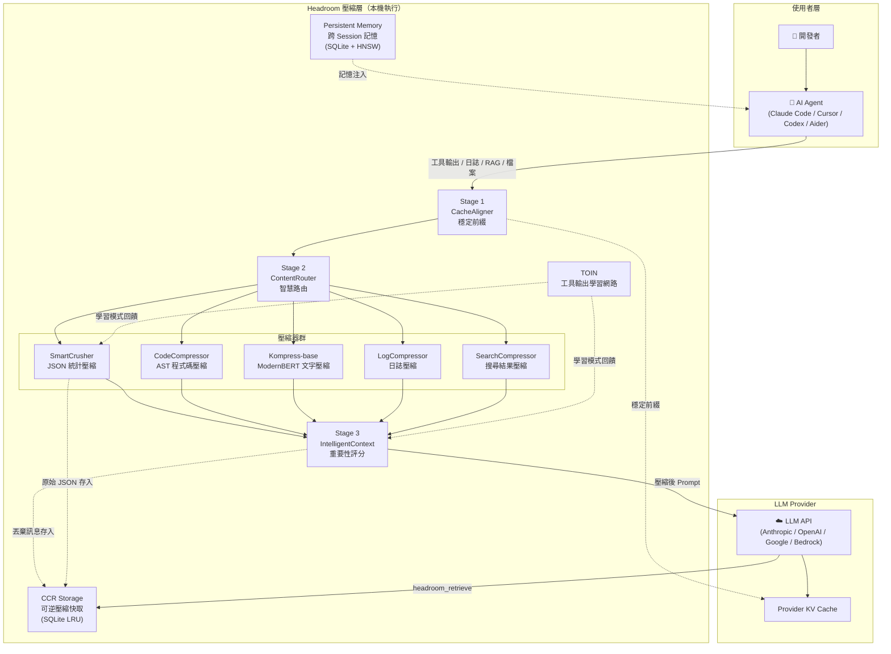
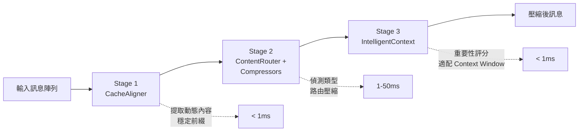
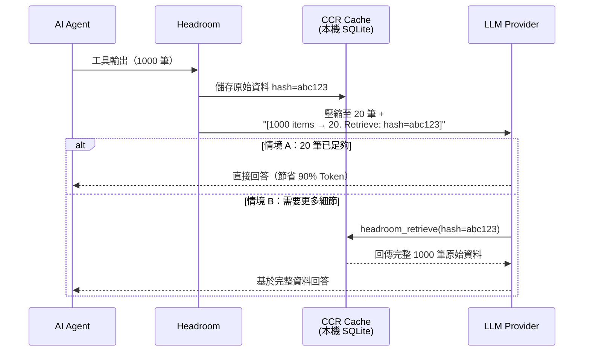
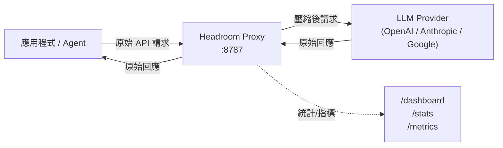
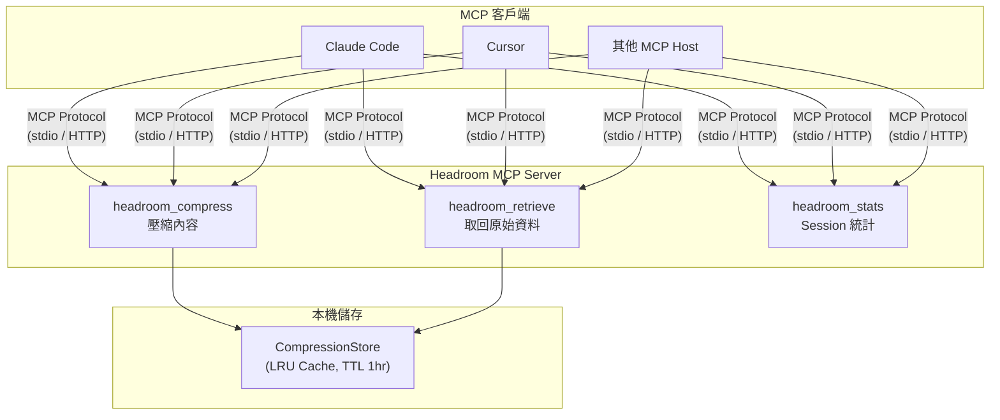
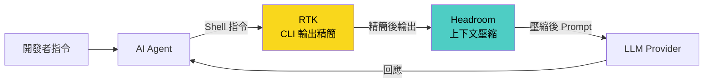
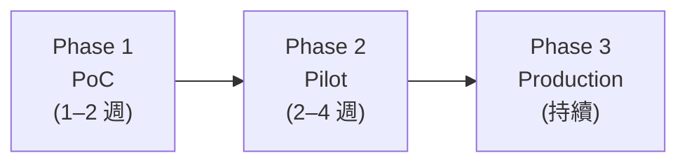
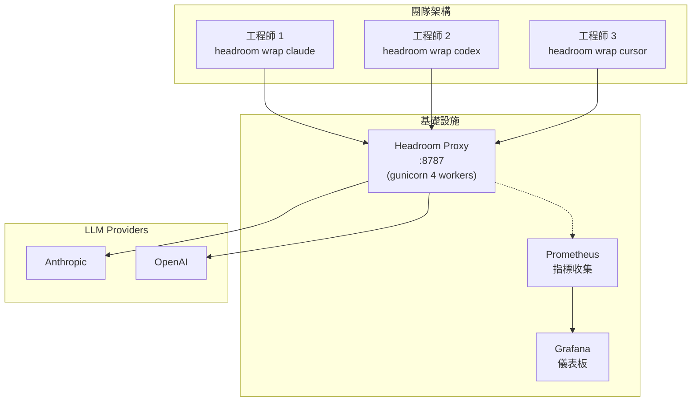

+++
date = '2026-06-12T22:31:29+08:00'
draft = false
title = 'Headroom 教學手冊'
tags = ['教學', 'AI開發']
categories = ['教學']
+++

# Headroom 教學手冊

> **版本**：基於 Headroom v0.25.0（2026-06-12）  
> **適用對象**：資深工程師、AI Agent 開發團隊、DevOps 工程師  
> **授權**：Apache 2.0  
> **專案規模**：GitHub ⭐ 24.1K｜Contributors 83+｜Releases 155+  
> **官方資源**：[GitHub](https://github.com/chopratejas/headroom) ｜ [文件站](https://headroom-docs.vercel.app/docs) ｜ [PyPI](https://pypi.org/project/headroom-ai/) ｜ [npm](https://www.npmjs.com/package/headroom-ai) ｜ [llms.txt](https://headroom-docs.vercel.app/llms.txt) ｜ [Enterprise](https://github.com/chopratejas/headroom/blob/main/ENTERPRISE.md)

---

## 目錄

- [第一章 Headroom 簡介](#第一章-headroom-簡介)
  - [1.1 Headroom 是什麼](#11-headroom-是什麼)
  - [1.2 為何需要 Headroom](#12-為何需要-headroom)
  - [1.3 Headroom 與 RTK 差異](#13-headroom-與-rtk-差異)
- [第二章 Headroom 系統架構](#第二章-headroom-系統架構)
  - [2.1 整體架構圖](#21-整體架構圖)
  - [2.2 三階段壓縮管線](#22-三階段壓縮管線)
  - [2.3 ContentRouter](#23-contentrouter)
  - [2.4 SmartCrusher](#24-smartcrusher)
  - [2.5 CodeCompressor](#25-codecompressor)
  - [2.6 Kompress-base](#26-kompress-base)
  - [2.7 CacheAligner](#27-cachealigner)
  - [2.8 CCR（可逆壓縮）](#28-ccr可逆壓縮)
  - [2.9 TOIN 學習網路](#29-toin-學習網路)
  - [2.10 Read Lifecycle Management](#210-read-lifecycle-management)
  - [2.11 壓縮安全護欄](#211-壓縮安全護欄)
- [第三章 安裝與部署](#第三章-安裝與部署)
  - [3.1 系統需求](#31-系統需求)
  - [3.2 Python 安裝](#32-python-安裝)
  - [3.3 Node.js 安裝](#33-nodejs-安裝)
  - [3.4 Docker 部署](#34-docker-部署)
  - [3.5 Podman 部署](#35-podman-部署)
  - [3.6 企業 SSL 環境處理](#36-企業-ssl-環境處理)
  - [3.7 驗證安裝](#37-驗證安裝)
- [第四章 使用模式](#第四章-使用模式)
  - [4.1 Library Mode](#41-library-mode)
  - [4.2 Proxy Mode](#42-proxy-mode)
  - [4.3 Agent Wrap](#43-agent-wrap)
  - [4.4 MCP Server](#44-mcp-server)
- [第五章 與 RTK 整合](#第五章-與-rtk-整合)
  - [5.1 為何同時使用](#51-為何同時使用)
  - [5.2 整合架構](#52-整合架構)
  - [5.3 實戰情境最佳實務](#53-實戰情境最佳實務)
- [第六章 大型 Web Application 實戰](#第六章-大型-web-application-實戰)
  - [6.1 專案 Context 管理](#61-專案-context-管理)
  - [6.2 Claude Code 最佳化](#62-claude-code-最佳化)
  - [6.3 GitHub Copilot Agent 最佳化](#63-github-copilot-agent-最佳化)
  - [6.4 Codex CLI 最佳化](#64-codex-cli-最佳化)
  - [6.5 Gemini CLI 最佳化](#65-gemini-cli-最佳化)
  - [6.6 其他 Agent 整合](#66-其他-agent-整合)
- [第七章 Token Optimization 策略](#第七章-token-optimization-策略)
  - [7.1 壓縮方案比較](#71-壓縮方案比較)
  - [7.2 依 Context 大小的壓縮策略](#72-依-context-大小的壓縮策略)
  - [7.3 CacheAligner 策略](#73-cachealigner-策略)
  - [7.4 複合節省計算](#74-複合節省計算)
- [第八章 團隊導入指南](#第八章-團隊導入指南)
  - [8.1 導入流程](#81-導入流程)
  - [8.2 開發規範範本](#82-開發規範範本)
  - [8.3 團隊教育訓練](#83-團隊教育訓練)
- [第九章 系統維護](#第九章-系統維護)
  - [9.1 日常維護](#91-日常維護)
  - [9.2 Log 分析](#92-log-分析)
  - [9.3 Cache 管理](#93-cache-管理)
  - [9.4 CCR 管理](#94-ccr-管理)
  - [9.5 環境變數總覽](#95-環境變數總覽)
  - [9.6 升級策略](#96-升級策略)
  - [9.7 備份策略](#97-備份策略)
- [第十章 Troubleshooting](#第十章-troubleshooting)
- [第十一章 最佳實務總結](#第十一章-最佳實務總結)
  - [11.1 Do — 建議做法](#111-do--建議做法)
  - [11.2 Don't — 避免做法](#112-dont--避免做法)
  - [11.3 Architecture Guideline](#113-architecture-guideline)
  - [11.4 Security Guideline](#114-security-guideline)
  - [11.5 Performance Guideline](#115-performance-guideline)
  - [11.6 Cost Optimization Guideline](#116-cost-optimization-guideline)
- [附錄](#附錄)
  - [A. Headroom 指令速查表](#a-headroom-指令速查表)
  - [B. MCP 設定範例](#b-mcp-設定範例)
  - [C. Docker Compose](#c-docker-compose)
  - [D. Podman Compose](#d-podman-compose)
  - [E. Claude Code 整合範例](#e-claude-code-整合範例)
  - [F. GitHub Copilot 整合範例](#f-github-copilot-整合範例)
  - [G. Codex CLI 整合範例](#g-codex-cli-整合範例)
  - [H. Gemini CLI 整合範例](#h-gemini-cli-整合範例)
  - [I. RTK + Headroom 整合範例](#i-rtk--headroom-整合範例)
  - [J. 其他 Agent 整合範例](#j-其他-agent-整合範例)
  - [K. 檢查清單（Checklist）](#k-檢查清單checklist)

---

## 第一章 Headroom 簡介

### 1.1 Headroom 是什麼

Headroom 是一套開源的 **AI Agent 上下文壓縮層（Context Compression Layer）**，專門在資料送入大型語言模型（LLM）之前，對工具輸出、日誌、RAG 檢索結果、原始碼檔案及對話歷史進行智慧壓縮。其核心承諾是：

> **60–95% 更少的 Token，相同的回答準確度。**

#### 設計目標

1. **本機優先（Local-first）**：所有壓縮在本機執行，敏感資料不會外傳
2. **可逆壓縮（Reversible）**：原始內容快取於本機，LLM 可隨時透過工具呼叫取回完整資料
3. **零程式碼修改**：透過 Proxy 模式，任何語言的 API 請求無需改動即可受益
4. **多演算法自動路由**：自動識別 JSON、原始碼、日誌、搜尋結果等不同內容類型，指派最適壓縮器
5. **跨 Agent 記憶共享**：Claude Code、Codex、Gemini 等 Agent 之間可共享壓縮記憶，自動去重
6. **Read Lifecycle Management**：自動偵測過期或重複讀取的檔案內容，以 CCR 標記取代，實測可減少 75% 的 Read 輸出位元組
7. **壓縮安全護欄**：錯誤輸出保護、管線斷路器、Library 膨脹偵測，確保壓縮不會導致資訊遺失

#### 解決的問題

| 問題 | 說明 |
|------|------|
| Context Window 溢出 | 大型專案工具輸出動輒數萬 Token，超出模型上下文限制 |
| Token 成本失控 | AI Agent 每日執行數百次工具呼叫，Token 費用快速累積 |
| Agent 回應品質下降 | 過多雜訊淹沒關鍵資訊，LLM 無法精準定位重點 |
| KV Cache 命中率低 | System Prompt 中的動態內容導致 Provider Cache 失效 |
| 跨 Session 知識遺失 | 每次新對話都需重新載入大量背景資訊 |

#### 適用場景

- AI Coding Agent 日常開發（Claude Code、Cursor、Aider、Copilot CLI、Cline、Continue、Goose、OpenHands）
- 大型企業系統 Web Application 開發
- Legacy System 逆向工程分析
- Framework 升級（Spring Boot、Vue、Angular）
- SRE 事件除錯（大量日誌壓縮）
- RAG 系統檢索結果精簡
- 多 Agent 協作工作流

> **實務建議**：只要您的 AI Agent 每日工具輸出超過 10 萬 Token，導入 Headroom 即可顯著降低成本。

---

### 1.2 為何需要 Headroom

#### Context Window 問題

現代 LLM 雖然支援 128K–200K Token 的上下文窗口，但實際使用中仍面臨：

- **工具輸出膨脹**：一次 `grep` 搜尋可能返回數百筆結果（17,000+ Token）
- **累積效應**：多輪對話中，歷史訊息持續佔用 Context 空間
- **品質衰減**：當 Context 接近上限，LLM 對中間區段的注意力顯著下降

#### Token Cost 問題

以 Claude Sonnet 為例（每百萬 Input Token $3）：

- 一位工程師每日使用 AI Agent 約消耗 50 萬–200 萬 Token
- 10 人團隊每月 Token 費用可達 $3,000–$12,000
- Framework 升級或逆向工程等深度任務，單次 Session 可能消耗 100 萬+ Token

#### Agent 開發痛點

- 每次工具呼叫都攜帶完整 JSON 結果，大量重複的 `status: ok` 記錄浪費 Token
- Build Log 中 95% 以上是通過的測試，真正需要的錯誤資訊僅佔 5%
- 搜尋結果中大量不相關條目稀釋了關鍵匹配的重要性

---

### 1.3 Headroom 與 RTK 差異

Headroom 內建了 [RTK（Rust Token Killer）](https://github.com/rtk-ai/rtk) 的二進位檔，兩者是互補關係而非替代關係。

| 比較項目 | Headroom | RTK |
|----------|----------|-----|
| **工作層級** | Prompt/Response 層級（訊息陣列壓縮） | CLI 輸出層級（Shell 指令結果改寫） |
| **壓縮方式** | 統計分析 + AST + ML 模型 + 可逆壓縮 | Shell 輸出摘要化、精簡化 |
| **使用位置** | LLM API 請求前（Proxy/Library/MCP） | Agent 執行 Shell 指令時 |
| **涵蓋範圍** | JSON、程式碼、日誌、搜尋結果、圖片、對話歷史 | CLI 指令輸出（git show、ls、安裝日誌等） |
| **Token 節省率** | 60–95%（依內容類型） | 30–70%（依指令類型） |
| **對 AI 回答品質** | 保留統計異常值 + 錯誤項 + BM25 相關項 | 保留關鍵摘要資訊 |
| **可逆性** | 支援（CCR 架構） | 不支援 |
| **最佳使用情境** | 所有 LLM 互動場景 | Shell/CLI 工具輸出場景 |

> **關鍵結論**：RTK 負責「上游精簡」（CLI 輸出），Headroom 負責「下游壓縮」（送入 LLM 前的最後一道防線）。兩者同時使用可達到最大 Token 節省效果。

#### 完整市場比較

除 RTK 外，市場上尚有其他 Token 最佳化方案，Headroom 的差異化定位如下：

| 工具 | 壓縮範圍 | 使用方式 | 本機優先 | 可逆壓縮 |
|------|----------|----------|---------|---------|
| **Headroom** | 所有上下文——工具輸出、RAG、日誌、檔案、對話歷史 | Proxy · Library · Middleware · MCP | ✅ | ✅ |
| **RTK** | CLI 指令輸出 | CLI Wrapper | ✅ | ❌ |
| **lean-ctx** | CLI 指令、MCP 工具、Editor 規則 | CLI Wrapper · MCP | ✅ | ❌ |
| **Compresr / Token Co.** | 傳送至其 API 的文字 | 託管 API 呼叫 | ❌ | ❌ |
| **OpenAI Compaction** | 對話歷史 | Provider 原生 | ❌ | ❌ |

> **lean-ctx 整合**：Headroom 可使用 [lean-ctx](https://github.com/yvgude/lean-ctx) 作為替代的 CLI Context 工具。設定 `HEADROOM_CONTEXT_TOOL=lean-ctx` 後執行 `headroom wrap ...` 即可。

---

## 第二章 Headroom 系統架構

### 2.1 整體架構圖



### 2.2 三階段壓縮管線

每個 API 請求都會依序通過三個獨立的轉換階段。每個階段皆可安全跳過，且在失敗時會優雅降級（回傳原始內容不做修改）。



| 階段 | 元件 | 功能 | 延遲 |
|------|------|------|------|
| Stage 1 | CacheAligner | 提取系統提示中的動態內容（日期、Session ID），移至訊息尾端，穩定前綴以提升 Provider KV Cache 命中率 | < 1ms |
| Stage 2 | ContentRouter | 自動偵測每個工具輸出的內容類型，路由至最適壓縮器（SmartCrusher、CodeCompressor、Kompress-base 等） | 1–50ms |
| Stage 3 | IntelligentContext | 對每條訊息進行六維度重要性評分（時間近度、語意相似度、TOIN 學習模式、錯誤指標、前向引用、Token 密度），丟棄最低分訊息以符合 Context Window 預算 | < 1ms |

---

### 2.3 ContentRouter

ContentRouter 是 Headroom 的智慧調度核心，負責自動識別內容類型並指派最適壓縮器。

#### 運作原理

1. **內容類型偵測**：使用 Magika（ML 模型）或模式比對分析內容結構
2. **路由決策**：依據偵測結果，將內容送往對應壓縮器
3. **跳過短內容**：低於 200 Token 的工具輸出直接透傳（壓縮成本超過節省）

#### 自動路由對照表

| 內容類型 | 偵測特徵 | 路由至 | 典型壓縮率 |
|----------|----------|--------|-----------|
| JSON 陣列 | 合法 JSON + 陣列元素 | SmartCrusher | 70–90% |
| 原始碼 | 語法模式、縮排、關鍵字 | CodeCompressor | 40–70% |
| 搜尋結果 | `file:line:content` 格式 | SearchCompressor | 80–95% |
| Build/Test 日誌 | 時間戳、Log Level、pytest/npm 標記 | LogCompressor | 85–95% |
| Diff | Unified diff 格式 | DiffCompressor | 60–80% |
| HTML | Tag 結構 | HTMLCompressor | 50–70% |
| 純文字 | 其他（Fallback） | TextCompressor（Kompress-base） | 60–80% |

> **實務建議**：ContentRouter 完全自動運作，零配置。僅在需要跳過特定工具壓縮時，才需透過 `tool_profiles` 覆寫。

---

### 2.4 SmartCrusher

SmartCrusher 是 Headroom 處理 JSON 工具輸出的核心壓縮器，也是 Token 節省的最大功臣（70–90% 壓縮率）。

#### JSON 壓縮原理

SmartCrusher 不是盲目截斷陣列，而是透過以下步驟進行智慧壓縮：

1. **解析 JSON 陣列**：偵測工具輸出中的 JSON 陣列
2. **欄位級統計分析**：計算每個欄位的變異數、唯一值比例、變化點
3. **Kneedle 演算法選擇**：在 bigram 覆蓋率曲線上偵測膝點，決定最佳保留子集大小
4. **異常值與錯誤無條件保留**：超過 2 個標準差的離群值與包含錯誤狀態的項目全數保留
5. **常數欄位提取**：所有項目共享的欄位值提取為共用前綴，減少重複

#### 壓縮策略矩陣

| 內容類型 | 壓縮策略 | 壓縮率 |
|---------|---------|-------|
| JSON 陣列（dict） | 統計抽樣 + 異常保留 | 83–95% |
| JSON 陣列（string） | 去重 + 自適應抽樣 | 60–90% |
| JSON 陣列（number） | 統計摘要 + 離群值保留 | 70–85% |
| 建置 / 測試日誌 | 模式聚類 | 85–94% |
| HTML 內容 | 文章提取（trafilatura） | ~95% |
| 搜尋結果 | 內容去重 + 關聯分數 | 70–90% |
| Diff 輸出 | Hunk 壓縮 + 語意保留 | 60–80% |

#### 項目保留策略

SmartCrusher 使用 **Kneedle 演算法**（基於 bigram 覆蓋率曲線的膝點偵測）來決定最佳保留子集大小。保留項目依以下比例分配：

| 來源區間 | 比例 | 目的 |
|---------|-----|------|
| 陣列前段 | 30% | Schema 推斷——讓 LLM 理解完整資料結構 |
| 陣列末段 | 15% | 時效性——最新資料通常最具相關性 |
| 重要性分數 | 55% | 由統計分析決定——包含異常值、變化點、關鍵項 |

> **錯誤項目無條件保留**：所有包含錯誤標記的項目不受預算限制，一律保留。

#### 五維度評分機制

| 維度 | 權重 | 說明 |
|------|--------|------|
| 錯誤項目 | 最高（無條件） | 除錯關鍵資訊，絕不丟棄 |
| 首尾位置 | 固定比例 | 前 30%（結構） + 末 15%（時效） |
| 異常值 | 高 | 統計離群值通常具有資訊價值 |
| 相關度 | 中–高 | BM25/Embedding 與使用者查詢的相關分數 |
| 變化點 | 中 | 資料中的顯著趨勢轉折 |

#### 配置範例

```python
from headroom.transforms import SmartCrusherConfig

config = SmartCrusherConfig(
    max_items_after_crush=15,        # 壓縮後最多保留 15 項
    min_tokens_to_crush=200,         # 低於 200 Token 不壓縮
    relevance_tier="bm25",           # 相關度評分方式：bm25（快）或 embedding（準）
    preserve_fields=["error", "warning", "failure"],  # 含有這些欄位值的項目永遠保留
)
```

> **實務案例**：1,000 筆搜尋結果（45,000 Token）經 SmartCrusher 壓縮後僅保留 ~50 筆（4,500 Token），但錯誤項、異常值與高相關項目全數保留。LLM 依然能正確回答「過去 24 小時有哪些錯誤」。

開銷：典型 payload 約 1–50ms，線性擴展。200 token 以下的工具輸出直接通過，不進行壓縮。

---

### 2.5 CodeCompressor

CodeCompressor 使用 tree-sitter 將原始碼解析為 AST（抽象語法樹），選擇性壓縮函式主體，同時保留 LLM 推理所需的結構性元素。

#### AST 分析原理

```text
原始碼 → tree-sitter 解析 → AST → 結構保留 + 主體壓縮 → 壓縮後程式碼
```

#### 永遠保留 vs 壓縮

| 永遠保留 | 壓縮/移除 |
|----------|----------|
| import 語句 | 函式主體（實作細節） |
| 函式/方法簽名 | 註解（可配置） |
| 類別定義 | 冗長的 docstring |
| 型別註解 | |
| 裝飾器 | |
| 錯誤處理（try/except） | |

#### 支援語言

| 等級 | 語言 | 支援程度 |
|------|------|---------|
| Tier 1 | Python、JavaScript、TypeScript | 完整 AST 分析 |
| Tier 2 | Go、Rust、Java、C、C++ | 函式主體壓縮 |

#### 壓縮前後對比

```python
# 壓縮前（完整原始碼）
def process_data(items: List[str]) -> Dict[str, int]:
    """Process items and count occurrences."""
    result = {}
    for item in items:
        item = item.strip().lower()
        if item in result:
            result[item] += 1
        else:
            result[item] = 1
    return result

# 壓縮後（簽名與目的保留，主體精簡）
def process_data(items: List[str]) -> Dict[str, int]:
    """Process items and count occurrences."""
    result = {}
    for item in items:
    # ... (5 lines compressed)
    pass
```

#### 效能指標

| 指標 | 數值 |
|------|------|
| 壓縮率 | 40–70% |
| 處理速度 | ~10–50ms/檔 |
| 記憶體佔用 | ~50MB（tree-sitter parsers） |
| 語法正確性 | 保證 |

#### 安裝

```bash
pip install "headroom-ai[code]"
```

> **實務建議**：CodeCompressor 預設不會主動壓縮程式碼，僅在 ContentRouter 偵測到原始碼類型時才啟用。若需手動控制，可直接呼叫 `CodeAwareCompressor`。

---

### 2.6 Kompress-base

Kompress-base 是 Headroom 內建的特化文字壓縮模型，發布於 [HuggingFace](https://huggingface.co/chopratejas/kompress-v2-base)。

#### 模型架構

- **基礎模型**：ModernBERT
- **壓縮方式**：Token 分類（識別哪些 Token 可安全移除而不影響語意）
- **最新版本**：kompress-v2-base（Weight-Only Int8 量化）

#### 工作流程

1. 輸入純文字內容
2. ModernBERT 模型對每個 Token 進行「保留/移除」分類
3. 高資訊密度的 Token（ID、Hash、標題、關鍵數據）被保留
4. 低資訊密度的 Token（冗餘描述、填充詞）被移除

#### 使用情境

- 純文字文件壓縮（30–50% 節省）
- 搜尋結果摘要
- 對話歷史精簡
- 其他壓縮器不適用的通用文字

#### Kompress-base 安裝

```bash
pip install "headroom-ai[ml]"  # 需要 PyTorch
```

> **注意**：`[ml]` extra 包含 PyTorch 依賴（~2GB），僅在需要 Kompress-base 或 LLMLingua 時安裝。

---

### 2.7 CacheAligner

CacheAligner 透過穩定 Prompt 前綴，大幅提升 LLM Provider 的 KV Cache 命中率，間接降低 Token 費用。

#### 原理

系統提示中通常包含動態內容（今天日期、Session ID、時間戳），每次變動都會導致整個 Provider Cache 失效。

```text
壓縮前：
"You are helpful. Current Date: 2026-06-12"
         ^^^^^^^^^^^^^^^^^^^^^^^^^^^^^^^^
         每日變動 → Cache 每日失效

壓縮後：
"You are helpful."                          ← 穩定前綴，Cache 命中
"[Context: Current Date: 2026-06-12]"       ← 動態部分移至尾端
```

#### 各 Provider KV Cache 策略

| Provider | 機制 | Cache 讀取折扣 | 最小前綴長度 |
|----------|------|---------------|-------------|
| Anthropic | 明確 `cache_control` 區塊 | 90% 折扣 | 無限制 |
| OpenAI | 自動前綴匹配 | 50% 折扣 | 1,024 Token |
| Google | CachedContent API | 75% 折扣 | 32,768 Token |

Headroom 會自動偵測 Provider 並套用對應策略：
- **Anthropic**：自動插入 `cache_control` 中斷點於穩定前綴位置
- **OpenAI**：確保前綴位元組一致，觸發自動前綴快取
- **Google**：管理 CachedContent 物件的建立與更新生命週期

#### 配置範例

```python
from headroom.transforms import CacheAlignerConfig

config = CacheAlignerConfig(
    enabled=True,
    dynamic_patterns=[
        r"Today is \w+ \d+, \d{4}",
        r"Current time: .*",
        r"Session ID: [a-f0-9-]+",
    ],
)
```

---

### 2.8 CCR（可逆壓縮）

CCR（Compress-Cache-Retrieve）是 Headroom 的核心創新，解決了傳統壓縮「壓縮越深、資訊遺失越多」的兩難困境。

#### 可逆壓縮架構

CCR 的核心理念：**大膽壓縮，隨時取回**。



#### 四階段工作流程

| 階段 | 說明 |
|------|------|
| **Phase 1：壓縮儲存** | SmartCrusher 壓縮工具輸出，原始資料以 Hash 索引存入 LRU Cache |
| **Phase 2：工具注入** | 自動注入 `headroom_retrieve` 工具至 LLM 可用工具清單 |
| **Phase 3：回應處理** | LLM 呼叫 `headroom_retrieve` 時，Response Handler 自動攔截、取回資料、繼續對話 |
| **Phase 4：上下文追蹤** | Context Tracker 跨多輪追蹤已壓縮內容，在新查詢可能相關時主動展開 |

#### BM25 局部檢索

LLM 不必取回全部原始資料，可透過 `query` 參數進行局部搜尋：

```json
{
  "name": "headroom_retrieve",
  "parameters": {
    "hash": "abc123",
    "query": "authentication errors"
  }
}
```

這會在快取項目中執行 BM25 搜尋，僅回傳相關子集。

#### CCR 預設配置

| 參數 | 預設值 | 說明 |
|------|--------|------|
| `enabled` | `true` | 啟用 CCR |
| `injectTool` | `true` | 注入 `headroom_retrieve` 工具 |
| `injectRetrievalMarker` | `true` | 在壓縮輸出中加入檢索標記 |
| `storeMaxEntries` | `1000` | 最大快取項目數 |
| `storeTtlSeconds` | `3600` | 快取 TTL（1 小時），可透過 `HEADROOM_CCR_TTL_SECONDS` 覆寫 |
| `feedbackEnabled` | `true` | 從檢索模式學習 |

#### CCR 環境變數

| 環境變數 | 預設值 | 說明 |
|---------|--------|------|
| `HEADROOM_CCR_TTL_SECONDS` | `3600` | 快取 TTL（秒），可透過 `/v1/retrieve/stats` 查看有效 TTL |
| `HEADROOM_CCR_BACKEND` | `InMemoryBackend` | 快取後端；多 Worker 部署建議設為 `sqlite` |

> **多 Worker 注意事項**：預設的 `InMemoryBackend` 為每個 Process 獨立快取。使用 gunicorn 多 Worker 部署時，建議設定 `HEADROOM_CCR_BACKEND=sqlite` 以避免 CCR 檢索失敗。

#### CCR 啟用元件

| 元件 | 壓縮對象 | CCR 行為 |
|------|---------|---------|
| SmartCrusher | JSON 陣列（工具輸出） | 儲存原始陣列，標記含 Hash |
| ContentRouter | 程式碼、日誌、搜尋結果、文字 | 依策略儲存原始內容 |
| IntelligentContext | 訊息（對話輪次） | 儲存被丟棄的訊息，標記含 Hash |

#### 訊息層級 CCR

CCR 不僅限於工具輸出。當 IntelligentContext 為了符合上下文預算而丟棄低重要性訊息時，這些訊息同樣存入 CCR：

```text
100 則對話（50K Token）
→ IntelligentContext 對訊息進行重要性評分
→ 丟棄 60 則低分訊息
→ 已丟棄訊息以 hash=def456 快取
→ 插入標記："60 messages dropped, retrieve: def456"
```

當使用者透過 CCR 取回被丟棄的訊息時，TOIN 會學習這些訊息模式在未來更重要，並在後續 Session 中提高評分。

#### 壓縮比較

| 壓縮方式 | 資料遺失 | 壓縮率 |
|----------|----------|--------|
| 不壓縮 | 無 | 0% |
| 傳統壓縮（截斷） | 永久遺失 | 70–90% |
| CCR 可逆壓縮 | 無（可取回） | 70–90% |

> **關鍵優勢**：CCR 讓您享受激進壓縮的 Token 節省，同時保有零風險——LLM 隨時可以取回完整原始資料。

---

### 2.9 TOIN 學習網路

TOIN（Tool Output Intelligence Network）是 Headroom 的學習引擎，跨 Session 與使用者累積壓縮模式。

#### 運作方式

- 當特定工具被重複使用時，TOIN 建立統計資訊：哪些欄位重要、哪些項目被檢索、哪種壓縮策略最有效
- 學習到的模式回饋至 SmartCrusher 與 IntelligentContext 的評分機制
- **冷啟動**：新工具類型使用統計啟發式方法，隨使用次數增加，模式逐步精確

#### Headroom Learn

`headroom learn` 是 TOIN 的延伸功能，可挖掘過去失敗的 AI Session，自動將修正建議寫入專案的 `CLAUDE.md`、`MEMORY.md` 或 `GEMINI.md`。

```bash
# 乾跑模式（預設）——預覽將寫入的內容
headroom learn

# 實際寫入
headroom learn --apply

# 分析所有專案
headroom learn --apply --all

# 指定最低證據次數
headroom learn --apply --min-evidence 5
```

#### 支援的 Agent 與輸出目標

| Agent | 掃描來源 | 寫入目標 |
|-------|---------|---------|
| Claude Code | `~/.claude/projects/` | `CLAUDE.md` / `MEMORY.md` |
| Codex | `~/.codex/` | `AGENTS.md` / `MEMORY.md` |
| Gemini CLI | `~/.gemini/tmp/*/chats/` | `GEMINI.md` / `MEMORY.md` |

#### 學習機制

`headroom learn` 包含 5 個分析器：

1. **Environment**：偵測環境路徑與工具版本問題
2. **Structure**：學習專案結構與檔案位置修正
3. **Command Patterns**：記錄有效/無效的指令模式
4. **Retry Prevention**：識別重試行為並萃取修正
5. **Cross-Session**：跨 Session 比對反覆出現的問題

> **實務建議**：建議在每週維護時執行 `headroom learn`，讓 Agent 「越用越聰明」。

#### 即時模式（Live Flush）

使用 `headroom wrap <agent> --learn` 時，TrafficLearner 會在 Proxy 運作期間即時將學習到的模式寫入對應的 Agent 原生檔案（預設 10 秒 debounce）。即時寫入需要 `evidence_count >= 2`，避免偶發模式汙染設定檔。

---

### 2.10 Read Lifecycle Management

Read Lifecycle Management 是 v0.25.0 引入的事件驅動壓縮機制，專門處理 AI Agent 在長 Session 中產生的過期或冗餘檔案讀取輸出。

#### 問題背景

根據對 66,000 筆工具呼叫的實際分析，**75% 的 Read 輸出位元組是可證明過期或冗餘的**：

- **過期（Stale）**：檔案被讀取後又被編輯，Read 輸出已不反映最新內容
- **取代（Superseded）**：同一檔案被重新讀取，舊的 Read 輸出已無意義

#### 運作方式

```text
Read 輸出 → 事件追蹤 → 過期/取代偵測 → CCR 標記取代 → 原始資料存入 CCR
```

1. **事件追蹤**：記錄每次 Read 和 Edit 操作的時間戳與檔案路徑
2. **過期偵測**：當檔案在 Read 之後被編輯，標記該 Read 輸出為「Stale」
3. **取代偵測**：當同一檔案被重新讀取，標記舊的 Read 輸出為「Superseded」
4. **安全保證**：最新的 Read 輸出（沒有後續 Edit）**永遠不會被觸碰**

#### 配置

```python
from headroom import ReadLifecycleConfig

config = ReadLifecycleConfig(
    enabled=True,  # 預設為 False，需明確啟用
)
```

> **注意**：此功能預設關閉（`enabled=False`），需明確啟用。支援 OpenAI 與 Anthropic 兩種訊息格式。

---

### 2.11 壓縮安全護欄

v0.25.0 新增了三層壓縮安全護欄，確保壓縮過程不會導致關鍵資訊遺失或系統異常：

| 護欄 | 說明 |
|------|------|
| **錯誤輸出保護** | 當工具輸出包含錯誤訊息時，自動降低壓縮強度或跳過壓縮，確保除錯資訊完整 |
| **管線斷路器** | 當壓縮管線中的某個 Stage 發生異常，自動回退至原始內容（fail-open），不會傳遞損壞的壓縮結果 |
| **Library 膨脹偵測** | 偵測壓縮後輸出反而比原始輸出更大的情況，自動使用原始內容 |

#### 過度壓縮偵測

v0.25.0 也新增了「過度壓縮偵測」機制：當 LLM 請求取回已壓縮的工具結果，且取回的內容與先前提供的壓縮版相同時，系統會將此記錄為「過度壓縮廢棄訊號」，用於調整未來的壓縮策略。

---

### Headroom 不會觸碰的內容

為確保安全性，以下內容 Headroom **永遠不會修改**：

| 內容類型 | 原因 |
|----------|------|
| 使用者訊息 | 使用者意圖必須完整保留 |
| 系統提示（內容本身） | 僅重新定位動態部分，不修改內容 |
| 程式碼（除非明確啟用 tree-sitter） | 預設不壓縮程式碼 |
| 模型回應 | Provider 回傳結果原封不動 |
| 短內容（< 200 Token） | 壓縮成本超過節省 |

---

## 第三章 安裝與部署

### 3.1 系統需求

| 需求 | 版本 |
|------|------|
| Python | 3.10+（含 3.14+，透過 pyo3 abi3 stable ABI 支援） |
| Node.js（TypeScript SDK） | 18+ |
| 作業系統 | Linux / macOS / Windows / WSL |
| Rust（僅從原始碼建置時） | stable |

> **Python 3.14+ 注意事項**：Headroom 透過 pyo3 的 abi3 stable ABI 支援 Python 3.14+。若 PyPI 上未提供對應的 wheel，可使用 `pipx --python python3.13` 安裝，或從原始碼建置。

### 3.2 Python 安裝

#### 核心套件（輕量）

```bash
pip install headroom-ai
```

核心套件包含 `compress()` 函式、SmartCrusher、CacheAligner 與 IntelligentContext，無重量級依賴。

#### 依需求安裝 Extras

```bash
# 安裝所有功能
pip install "headroom-ai[all]"

# 或依需求選擇
pip install "headroom-ai[proxy]"       # Proxy 伺服器 + MCP 工具 + HTTP API
pip install "headroom-ai[proxy-prod]"  # 正式環境（含 gunicorn，僅 Linux/macOS）
pip install "headroom-ai[mcp]"         # MCP Server 工具
pip install "headroom-ai[ml]"          # Kompress-base（需 PyTorch）
pip install "headroom-ai[code]"        # CodeCompressor（tree-sitter AST）
pip install "headroom-ai[memory]"      # Persistent Memory
pip install "headroom-ai[relevance]"   # Embedding 相關度評分
pip install "headroom-ai[image]"       # 圖片壓縮
pip install "headroom-ai[langchain]"   # LangChain 整合
pip install "headroom-ai[agno]"        # Agno 整合
pip install "headroom-ai[evals]"       # 評估框架
pip install "headroom-ai[pytorch-mps]" # Apple GPU (MPS) Embedding 加速
pip install "headroom-ai[anyllm]"      # any-llm 後端（38+ LLM Provider 路由）

# 組合安裝
pip install "headroom-ai[proxy,langchain,ml]"
```

> **Windows 使用者注意**：`[proxy-prod]` extra 包含 `gunicorn`，僅支援 Linux/macOS。Windows 使用者應使用 `[proxy]` extra。

#### 使用 uv 安裝

```bash
uv pip install "headroom-ai[all]"
```

#### 使用 pipx

```bash
pipx install --python python3.13 "headroom-ai[all]"
```

### 3.3 Node.js 安裝

TypeScript SDK 發布於 npm，套件名稱為 `headroom-ai`。

```bash
# npm
npm install headroom-ai

# pnpm
pnpm add headroom-ai

# bun
bun add headroom-ai
```

> **重要**：TypeScript SDK 需要搭配 Headroom Proxy 使用。SDK 會將訊息透過 HTTP 傳送至 Proxy 進行壓縮（壓縮管線以 Python 執行）。

```bash
# 先啟動 Proxy
pip install "headroom-ai[proxy]"
headroom proxy --port 8787

# TypeScript 程式碼中指向 Proxy
import { compress } from 'headroom-ai';
const result = await compress(messages, {
  baseUrl: 'http://localhost:8787',
});
```

### 3.4 Docker 部署

> **基底映像更新**：自 v0.23.0 起，Docker 基底映像已升級至 **Python 3.13 / Debian 13 (trixie)**。

```bash
# 拉取映像
docker pull ghcr.io/chopratejas/headroom:latest

# 啟動
docker run -p 8787:8787 ghcr.io/chopratejas/headroom:latest

# 搭配持久化儲存與環境變數
docker run -p 8787:8787 \
  -v ~/.headroom:/root/.headroom \
  -e ANTHROPIC_API_KEY \
  -e HEADROOM_CCR_BACKEND=sqlite \
  ghcr.io/chopratejas/headroom:latest
```

#### Docker Image 標籤

| 標籤 | 功能 | 基底 | 說明 |
|------|------|------|------|
| `latest` | proxy | Debian 13 slim | 預設映像（Python 3.13） |
| `<version>` | proxy | Debian 13 slim | 固定版本 |
| `nonroot` | proxy | Debian 13 slim | 非 root 使用者執行 |
| `code` | proxy + code | Debian 13 slim | 含 tree-sitter 程式碼壓縮 |
| `code-nonroot` | proxy + code | Debian 13 slim | 程式碼壓縮 + 非 root |
| `slim` | proxy | Distroless | 最小映像，無 Shell |
| `slim-nonroot` | proxy | Distroless | 最小 + 非 root |
| `code-slim` | proxy + code | Distroless | 程式碼壓縮 + 最小 |
| `code-slim-nonroot` | proxy + code | Distroless | 程式碼壓縮 + 最小 + 非 root |

> **build-essential 必要性**：從原始碼安裝 `headroom-ai` 時需要 `build-essential`，因為 `hnswlib` 是 C++ 擴充套件，需從原始碼編譯。Docker 映像中已在安裝後移除以縮小映像體積。

#### HEALTHCHECK 配置

Docker 映像內建 `HEALTHCHECK` 指令，使用 `/readyz` 端點驗證流量就緒狀態：

```dockerfile
HEALTHCHECK --interval=30s --timeout=10s --retries=3 \
  CMD curl -f http://localhost:8787/readyz || exit 1
```

#### 從原始碼建置（Docker Bake）

```bash
# 列出所有建置目標
docker buildx bake --list targets

# 建置預設映像
docker buildx bake runtime-default

# 建置特定變體
docker buildx bake runtime-code-slim-nonroot \
  --set '*.tags=my-registry/headroom:code-slim-nonroot'
```

### 3.5 Podman 部署

```bash
# 拉取映像
podman pull ghcr.io/chopratejas/headroom:latest

# 啟動
podman run -p 8787:8787 ghcr.io/chopratejas/headroom:latest

# 使用 podman-compose（參見附錄 D）
podman-compose up -d
```

### 3.6 企業 SSL 環境處理

在使用 SSL Inspection（MITM Proxy）的企業網路中，`pip install` 可能因 `CERTIFICATE_VERIFY_FAILED` 而失敗。

#### 解決步驟

**Step 1：先安裝 Rust（避免建置時下載）**

```bash
# macOS / Linux
curl --proto '=https' --tlsv1.2 -sSf https://sh.rustup.rs | sh && rustup default stable

# Windows
winget install Rustlang.Rustup && rustup default stable
```

**Step 2：設定企業 CA 憑證**

```bash
export REQUESTS_CA_BUNDLE=/path/to/corporate-ca-bundle.crt
export SSL_CERT_FILE=/path/to/corporate-ca-bundle.crt
export CURL_CA_BUNDLE=/path/to/corporate-ca-bundle.crt
```

**Step 3：安裝 Headroom**

```bash
pip install "headroom-ai[all]"
```

#### 需要 TLS 的運行時資源

| 資源 | 用途 | 離線替代方案 |
|------|------|-------------|
| `cdn.pyke.io` | Rust Core 的 ONNX Runtime | `ORT_STRATEGY=system` + `ORT_LIB_LOCATION=/path/to/onnxruntime` |
| `huggingface.co` | Kompress-base 模型下載 | 預先下載 + `HF_HUB_OFFLINE=1` |

> **注意**：若不需要壓縮功能（純 Gateway 模式），則不需要上述兩個資源。

### 3.7 驗證安裝

#### Python 驗證

```bash
python -c "import headroom; print(headroom.__version__)"
# 預期輸出: 0.25.0
```

#### Node.js 驗證

```bash
node -e "const h = require('headroom-ai'); console.log('headroom-ai loaded')"
```

#### Proxy 驗證

```bash
# 啟動 Proxy
headroom proxy --port 8787

# 另一個終端機測試
curl http://localhost:8787/health
# 預期回應:
# {"status": "healthy", "optimize": true, "stats": {"total_requests": 0, ...}}
```

#### 效能基準測試

```bash
# 預設文字格式
headroom perf

# JSON 格式（適合 CI/CD 整合）
headroom perf --format json

# CSV 格式（適合匯入試算表）
headroom perf --format csv
```

> **故障排除**：若 `pip install` 失敗且出現 C++ 編譯錯誤，請先安裝建置工具：
> - Linux：`apt-get install -y build-essential`
> - macOS：`xcode-select --install`

---

## 第四章 使用模式

### 4.1 Library Mode

直接在程式碼中呼叫 `compress()` 函式，最細粒度的控制方式。

#### Python 範例

```python
from headroom import compress

messages = [
    {"role": "system", "content": "You are a helpful assistant."},
    {"role": "user", "content": "Analyze these search results"},
    {"role": "tool", "content": '{"results": [...1000 items...]}', "tool_call_id": "call_1"},
]

result = compress(messages, model="gpt-4o")

print(f"壓縮前: {result.tokens_before} tokens")
print(f"壓縮後: {result.tokens_after} tokens")
print(f"節省: {result.tokens_saved} tokens ({result.compression_ratio:.0%})")
print(f"套用的轉換: {result.transforms_applied}")
```

#### TypeScript 範例

```typescript
import { compress } from 'headroom-ai';

const messages = [
  { role: 'system' as const, content: 'You are a helpful assistant.' },
  { role: 'user' as const, content: 'Analyze these results' },
];

const result = await compress(messages, { model: 'gpt-4o' });

console.log(`Saved ${result.tokensSaved} tokens (${(result.compressionRatio * 100).toFixed(0)}%)`);
```

#### Java 呼叫方式（透過 HTTP Proxy）

Java 應用透過 Headroom Proxy 間接使用：

```java
// 將 OpenAI 客戶端的 Base URL 指向 Headroom Proxy
OpenAIClient client = OpenAIClient.builder()
    .baseUrl("http://localhost:8787/v1")
    .apiKey(System.getenv("OPENAI_API_KEY"))
    .build();

// 正常呼叫，Headroom 自動壓縮
ChatCompletion response = client.chatCompletion()
    .model("gpt-4o")
    .messages(messages)
    .execute();
```

#### 使用 Persistent Memory

```python
from openai import OpenAI
from headroom import with_memory

# 一行啟用跨 Session 記憶
client = with_memory(OpenAI(), user_id="alice")

# 正常使用，記憶自動提取與注入
response = client.chat.completions.create(
    model="gpt-4o",
    messages=[{"role": "user", "content": "I prefer Python for backend work"}]
)

# 下次新對話中，LLM 會自動記住 Python 偏好
```

#### Framework 整合

| Framework | 整合方式 | 範例 |
|-----------|----------|------|
| LangChain | `HeadroomChatModel` wrapper | `HeadroomChatModel(ChatOpenAI())` |
| Agno | `HeadroomAgnoModel` wrapper | `HeadroomAgnoModel(Claude())` |
| Strands | `HeadroomStrandsModel` wrapper | `HeadroomStrandsModel(...)` |
| LiteLLM | 單一 Callback | 一行設定，支援 100+ Provider |
| Vercel AI SDK | `withHeadroom()` middleware | `withHeadroom(openai('gpt-4o'))` |

---

### 4.2 Proxy Mode

Proxy 是最簡單的部署方式——啟動一個本機 HTTP 伺服器，所有 LLM 流量經過時自動壓縮，零程式碼修改。

#### 架構圖



#### 啟動 Proxy

```bash
# 基本啟動
headroom proxy

# 自訂主機與埠
headroom proxy --host 0.0.0.0 --port 8080

# 帶日誌與預算限制
headroom proxy \
  --log-file /var/log/headroom.jsonl \
  --budget 100.0
```

#### CLI 核心參數

| 參數 | 預設值 | 說明 |
|------|--------|------|
| `--host` | `127.0.0.1` | 綁定主機 |
| `--port` | `8787` | 綁定埠 |
| `--no-optimize` | `false` | 停用壓縮（透傳模式） |
| `--no-cache` | `false` | 停用語意快取 |
| `--budget` | `None` | 每日預算上限（USD） |
| `--log-file` | `None` | JSONL 日誌路徑 |
| `--no-intelligent-context` | `false` | 回退至 RollingWindow（oldest-first drops） |
| `--no-intelligent-scoring` | `false` | 停用多維度重要性評分（更快但較不精確） |
| `--no-compress-first` | `false` | 停用「先嘗試更深壓縮再丟棄」策略 |
| `--no-telemetry` | `false` | 停用匿名遙測（也可設定 `HEADROOM_TELEMETRY=off`） |
| `--llmlingua` | `false` | 啟用 LLMLingua-2 ML 壓縮 |
| `--workers` | `1` | Worker 數量（生產環境用） |
| `--backend` | `auto` | 後端 Provider（`bedrock` / `vertex_ai` / `azure` / `openrouter` / `anyllm`） |

#### API 端點

| 端點 | 方法 | 說明 |
|------|------|------|
| `/health` | GET | 健康檢查（後向相容，含 readiness 詳情與子系統檢查） |
| `/livez` | GET | **Process 存活檢查**（v0.25.0 新增）——僅驗證 Process 是否存活 |
| `/readyz` | GET | **流量就緒檢查**（v0.25.0 新增）——驗證上游連線能力、記憶體後端就緒等 |
| `/stats` | GET | Session 統計 + 持久化節省 + `per_project` 分項 |
| `/stats-history` | GET | 歷史統計（時/日/週/月彙整），含 `by_provider` 分項 |
| `/metrics` | GET | Prometheus 格式指標 |
| `/dashboard` | GET | 視覺化儀表板（v0.25.0 支援 Light Mode） |
| `/v1/messages` | POST | Anthropic API 格式 |
| `/v1/chat/completions` | POST | OpenAI API 格式 |
| `/v1/compress` | POST | 純壓縮（不呼叫 LLM），可設 `x-headroom-bypass: true` 跳過壓縮 |
| `/v1/retrieve/stats` | GET | CCR 快取統計（含有效 TTL） |
| `/mcp` | POST/GET/DELETE | MCP Streamable HTTP 協定 |
| `/debug/*` | GET | 偵錯端點（僅限 loopback 存取） |

> **Per-Project 節省追蹤**：v0.25.0 新增 per-project savings 功能。`headroom wrap claude`/`codex` 透過 `X-Headroom-Project` Header 標記專案；`wrap aider`/`copilot`/`cursor` 使用 `/p/<name>` base-URL prefix。節省金額依專案聚合，可在 `/stats` 與 `/dashboard` 中查看。

#### Cloud Provider 支援

```bash
# AWS Bedrock
headroom proxy --backend bedrock --region us-east-1

# Google Vertex AI（v0.25.0 新增）
headroom proxy --backend vertex_ai --region us-central1

# Azure OpenAI
headroom proxy --backend azure

# OpenRouter (400+ 模型)
OPENROUTER_API_KEY=sk-or-... headroom proxy --backend openrouter

# any-llm（38+ Provider 路由）
pip install "headroom-ai[anyllm]"
headroom proxy --backend anyllm --anyllm-provider <provider>

# Foundry Gateway（Claude Code 企業環境）
CLAUDE_CODE_USE_FOUNDRY=1 headroom proxy
```

#### 生產部署（gunicorn）

```bash
pip install "headroom-ai[proxy-prod]"

gunicorn headroom.proxy.server:app \
  --workers 4 \
  --bind 0.0.0.0:8787 \
  --worker-class uvicorn.workers.UvicornWorker
```

> **多 Worker CCR 注意**：使用多 Worker 部署時，建議設定 `HEADROOM_CCR_BACKEND=sqlite` 以確保 CCR 檢索跨 Worker 可用。

#### 生產部署（Docker）

```dockerfile
FROM python:3.13-slim
RUN apt-get update && apt-get install -y --no-install-recommends build-essential \
    && pip install "headroom-ai[proxy]" \
    && apt-get purge -y build-essential && apt-get autoremove -y \
    && rm -rf /var/lib/apt/lists/*
EXPOSE 8787
HEALTHCHECK --interval=30s --timeout=10s --retries=3 \
  CMD curl -f http://localhost:8787/readyz || exit 1
CMD ["headroom", "proxy", "--host", "0.0.0.0"]
```

> **建置依賴說明**：`build-essential` 在安裝時需要（因 `hnswlib` C++ 擴充），安裝後可移除以縮小映像。

---

### 4.3 Agent Wrap

`headroom wrap` 是最便捷的使用方式——一行指令包裝現有 AI 工具，自動啟動 Proxy 並導向流量。

```bash
# Claude Code
headroom wrap claude

# OpenAI Codex
headroom wrap codex

# Cursor
headroom wrap cursor

# Aider
headroom wrap aider

# GitHub Copilot CLI
headroom wrap copilot

# Gemini CLI
headroom wrap gemini

# Cline（v0.22.4+）
headroom wrap cline

# Continue（v0.22.4+）
headroom wrap continue

# Goose（v0.22.4+）
headroom wrap goose

# OpenHands（v0.22.4+）
headroom wrap openhands
```

#### 啟用 Cross-Agent Memory 與 Code Graph

```bash
# 啟用跨 Agent 記憶共享
headroom wrap claude --memory

# 啟用程式碼圖譜分析
headroom wrap claude --code-graph

# 同時啟用
headroom wrap claude --memory --code-graph
```

#### Agent 相容性矩陣

| Agent | 支援 | 特殊功能 |
|-------|------|----------|
| Claude Code | ✅ | `--memory` · `--code-graph` · `--learn` |
| Codex | ✅ | 與 Claude 共享記憶 · 尊重 `CODEX_HOME` |
| Cursor | ✅ | 列印配置——貼上一次即可 |
| Aider | ✅ | 啟動 Proxy + 啟動 Aider |
| Copilot CLI | ✅ | Subscription Mode · Responses API |
| Gemini CLI | ✅ | 寫入 GEMINI.md |
| Cline | ✅ | v0.22.4 新增 |
| Continue | ✅ | v0.22.4 新增 |
| Goose | ✅ | v0.22.4 新增 |
| OpenHands | ✅ | v0.22.4 新增——需 per-model `systemMessage` gate |
| OpenClaw | ✅ | 安裝為 ContextEngine Plugin |

#### Unwrap（還原）

`headroom unwrap` 可還原 `headroom wrap` 的配置變更，移除 Proxy 注入設定：

```bash
# 還原 Codex 配置
headroom unwrap codex

# 還原 Claude 配置
headroom unwrap claude
```

> **安全機制**：`wrap codex` 在首次注入前會將 `config.toml` 備份至 `config.toml.headroom-backup`，`unwrap codex` 會還原該備份。若備份遺失，則僅移除 Headroom 管理的區塊，保留使用者其他設定。

#### 手動設定 Base URL（替代 wrap）

```bash
# Claude Code
ANTHROPIC_BASE_URL=http://localhost:8787 claude

# Cursor / 任何 OpenAI 相容客戶端
OPENAI_BASE_URL=http://localhost:8787/v1 cursor
```

#### Copilot CLI 訂閱模式

```bash
headroom wrap copilot --subscription -- --model gpt-4o
```

> **平台注意**：macOS 透過 Keychain 重用認證已驗證。Windows Credential Manager、Linux Secret Service 仍需驗證。Docker/CI 環境建議明確傳入 `GITHUB_COPILOT_TOKEN`。

---

### 4.4 MCP Server

Headroom 提供三個 MCP 工具，供 Claude Code、Cursor 或任何 MCP 相容主機呼叫。

#### MCP 架構圖



#### 三個 MCP 工具

| 工具 | 功能 | 參數 |
|------|------|------|
| `headroom_compress` | 按需壓縮內容 | `content`（必要） |
| `headroom_retrieve` | 取回原始未壓縮資料 | `hash`（必要）、`query`（選用：搜尋子集） |
| `headroom_stats` | 回傳 Session 壓縮統計 | 無 |

#### 安裝與設定

```bash
# 安裝 MCP 工具
pip install "headroom-ai[mcp]"

# 註冊至 Claude Code（一次性）
headroom mcp install

# 啟動 Claude Code——現在有 Headroom 工具可用
claude
```

#### MCP CLI 指令

```bash
# 安裝（本機 stdio，預設）
headroom mcp install

# 安裝（遠端 HTTP，Docker/網路場景）
headroom mcp install --remote http://proxy-host:8787/mcp

# 覆寫現有設定
headroom mcp install --force

# 啟動 MCP Server（stdio，Claude Code 自動呼叫）
headroom mcp serve

# 啟動 MCP Server（HTTP，供遠端 Agent）
headroom mcp serve --transport http --port 8080

# 檢查狀態
headroom mcp status

# 解除安裝
headroom mcp uninstall
```

#### 搭配 Proxy 的完整設定

```bash
# Terminal 1：啟動 Proxy（自動壓縮所有流量）
headroom proxy

# Terminal 2：啟動 Claude Code（MCP 工具 + 流量壓縮）
ANTHROPIC_BASE_URL=http://127.0.0.1:8787 claude
```

#### 跨工具相容性

| 工具 | 傳輸方式 | 設定指令 |
|------|----------|---------|
| Claude Code（本機） | stdio | `headroom mcp install` |
| Claude Code（遠端） | HTTP | `headroom mcp install --remote http://host:8787/mcp` |
| Cursor | stdio / HTTP | 手動新增至 MCP 設定 |
| Docker Agent | HTTP | 指向 `http://proxy:8787/mcp` |
| 任何 MCP Host | stdio / HTTP | `headroom mcp serve` 或 `--transport http` |

---

## 第五章 與 RTK 整合

### 5.1 為何同時使用

RTK 與 Headroom 在 Token 優化管線中扮演不同角色：

| 面向 | RTK 負責 | Headroom 負責 |
|------|----------|--------------|
| **作用點** | Shell 指令執行時 | LLM API 請求前 |
| **壓縮對象** | CLI 輸出（`git show`、`ls`、安裝日誌） | 全部上下文（JSON、程式碼、日誌、RAG、對話歷史） |
| **壓縮方式** | 輸出改寫、精簡化 | 統計分析 + AST + ML + 可逆壓縮 |
| **互補效果** | 減少進入 Headroom 的原始資料量 | 進一步壓縮並最佳化 Cache |

> **Headroom 已內建 RTK**：Headroom 出廠即包含 RTK 二進位檔，用於 Shell 輸出改寫。兩者預設就是協同運作。

### 5.2 整合架構



**資料流範例**：

1. Agent 執行 `git log --oneline -100`
2. **RTK** 將 100 行精簡至 20 行重要 Commit 摘要
3. **Headroom SmartCrusher** 進一步壓縮 JSON 工具輸出，保留錯誤與異常項目
4. **Headroom CacheAligner** 穩定 Prompt 前綴以命中 Provider Cache
5. 壓縮後的 Prompt 送入 LLM，原始資料存入 CCR 以備取回

### 5.3 實戰情境最佳實務

#### Legacy System Reverse Engineering

```bash
# 使用 Headroom 包裝 Claude Code，啟用記憶與程式碼圖譜
headroom wrap claude --memory --code-graph

# RTK 自動精簡 Shell 指令輸出
# Headroom 壓縮大量原始碼分析結果
# Memory 跨 Session 保留架構理解
```

**策略**：
- 利用 `--memory` 保存跨 Session 的架構分析結果
- 利用 `--code-graph` 建立模組依賴圖
- SmartCrusher 壓縮大量 `grep` 搜尋結果（80–95% 節省）

#### Framework Upgrade（Spring Boot 2 → 3）

**策略**：
- RTK 精簡 `mvn dependency:tree` 輸出
- Headroom 壓縮升級影響分析的大量 JSON 結果
- CCR 確保 LLM 需要時可取回完整依賴樹
- Memory 記住已完成的升級步驟，避免重複分析

#### Java 升級（Java 8 → 21）

**策略**：
- CodeCompressor 壓縮大量 Java 原始碼，保留 API 簽名與型別資訊
- SmartCrusher 壓縮編譯錯誤清單，100% 保留錯誤項目
- CacheAligner 穩定升級指引的 System Prompt 前綴

#### Vue 升級（Vue 2 → 3）

**策略**：
- CodeCompressor 處理 `.vue` 檔案（TypeScript Tier 1 支援）
- 搜尋結果壓縮 API 變更影響分析
- 跨 Agent 記憶共享升級進度

#### Monolith 拆解 Microservices

**策略**：
- `--code-graph` 分析模組間依賴關係
- SmartCrusher 壓縮服務邊界分析結果
- Memory 持久化拆解策略與進度
- CCR 保留完整的架構分析資料供反覆查閱

---

## 第六章 大型 Web Application 實戰

以下以典型企業級技術棧為範例：

| 層級 | 技術 |
|------|------|
| 前端 | Vue 3 + TypeScript + Tailwind CSS |
| 後端 | Spring Boot 3.x + Java 21 |
| 資料庫 | Oracle + PostgreSQL |
| 快取 | Redis |
| 訊息佇列 | Kafka |
| 規模 | 500 萬+ LOC |

### 6.1 專案 Context 管理

#### 降低 Prompt Size 策略

| 策略 | 方法 | 預期節省 |
|------|------|---------|
| 工具輸出壓縮 | SmartCrusher 自動壓縮 JSON 陣列 | 70–90% |
| 程式碼壓縮 | CodeCompressor 保留簽名、壓縮主體 | 40–70% |
| 日誌壓縮 | LogCompressor 只保留錯誤與堆疊 | 85–95% |
| 搜尋結果壓縮 | SearchCompressor 保留相關匹配 | 80–95% |
| 對話歷史管理 | IntelligentContext 重要性評分 | 依情況 |

#### 降低 Tool Output

```python
# 設定特定工具的壓縮策略
response = client.chat.completions.create(
    model="gpt-4o",
    messages=messages,
    headroom_tool_profiles={
        "database_query": {"max_items_after_crush": 25},     # DB 查詢保留更多項
        "search_code": {"max_items_after_crush": 10},        # 程式碼搜尋保留較少
        "important_tool": {"skip_compression": True},        # 重要工具跳過壓縮
    },
)
```

#### 降低 RAG Content

- 利用 Headroom Proxy 壓縮 RAG 檢索結果
- SearchCompressor 依相關度排序，保留 Top K 匹配
- CCR 存放完整結果，LLM 需要時可取回

### 6.2 Claude Code 最佳化

```bash
# 方法一：Agent Wrap（推薦）
headroom wrap claude --memory --code-graph

# 方法二：手動設定
# Terminal 1
headroom proxy --port 8787

# Terminal 2
headroom mcp install
ANTHROPIC_BASE_URL=http://127.0.0.1:8787 claude
```

**CLAUDE.md 建議配置**：

```markdown
# CLAUDE.md

## Headroom 整合
- 大量搜尋結果請先使用 headroom_compress 壓縮後再分析
- 需要完整資料時使用 headroom_retrieve 取回
- 定期使用 headroom_stats 檢查 Token 節省狀況
- 優先使用 code-graph 查詢模組依賴，避免全專案掃描
```

### 6.3 GitHub Copilot Agent 最佳化

```bash
# 使用 Proxy 模式
headroom proxy --port 8787

# Copilot CLI 訂閱模式
headroom wrap copilot --subscription -- --model gpt-4o
```

**Copilot Instructions 建議**：

```markdown
<!-- .github/copilot-instructions.md -->
## Token 最佳化
- 使用 Headroom Proxy 壓縮所有 LLM 流量
- 避免一次讀取超過 10 個檔案
- 優先使用 Symbol Search 而非全文搜尋
- 利用 Headroom MCP 工具壓縮大量搜尋結果
```

### 6.4 Codex CLI 最佳化

```bash
# 一鍵包裝 Codex
headroom wrap codex

# Codex 與 Claude 共享記憶
# 在 Claude Code 中分析的架構知識，Codex 也能存取
```

### 6.5 Gemini CLI 最佳化

```bash
# 一鍵包裝 Gemini CLI
headroom wrap gemini

# 或手動設定 Proxy
headroom proxy --backend vertex_ai --region us-central1
```

---

### 6.6 其他 Agent 整合

v0.22.4 起新增了對 Cline、Continue、Goose、OpenHands 四個 Agent 的 wrap 支援。

#### Cline

```bash
headroom wrap cline
```

Cline 是 VS Code 擴充套件形式的 AI Agent，wrap 後 Headroom 會自動修改 Cline 的 API 端點設定。

#### Continue

```bash
headroom wrap continue
```

Continue 同為 VS Code/JetBrains 擴充套件，wrap 後 Headroom 會注入 Proxy 設定至 Continue 的配置檔。

#### Goose

```bash
headroom wrap goose
```

Goose 是 Block 開源的 AI Agent，wrap 後 Headroom 會設定 Goose 的 API base URL。

#### OpenHands

```bash
headroom wrap openhands
```

> **注意**：OpenHands wrap 需要 per-model `systemMessage` gate 配置，Headroom 會自動處理。

#### 通用手動設定

若 Agent 不在支援清單中，可手動將任何 OpenAI/Anthropic 相容客戶端指向 Headroom Proxy：

```bash
# OpenAI 相容
OPENAI_BASE_URL=http://localhost:8787/v1 <your-agent>

# Anthropic 相容
ANTHROPIC_BASE_URL=http://localhost:8787 <your-agent>
```

---

## 第七章 Token Optimization 策略

### 7.1 壓縮方案比較

| 方案 | Token 節省率 | 準確度保持 | 延遲增加 | 每月成本影響（10 人團隊） |
|------|------------|-----------|---------|----------------------|
| 無壓縮 | 0% | 基準 | 0ms | $6,000 |
| 僅 RTK | 30–50% | 99% | < 5ms | $3,000–$4,200 |
| 僅 Headroom | 60–90% | 97–100% | 1–50ms | $600–$2,400 |
| RTK + Headroom | 75–95% | 97–100% | 5–55ms | $300–$1,500 |

#### 真實工作負載數據

| 場景 | 壓縮前 Token | 壓縮後 Token | 節省率 |
|------|-------------|-------------|--------|
| 程式碼搜尋（100 筆結果） | 17,765 | 1,408 | 92% |
| SRE 事件除錯 | 65,694 | 5,118 | 92% |
| GitHub Issue 分類 | 54,174 | 14,761 | 73% |
| 程式碼庫探索 | 78,502 | 41,254 | 47% |

#### 準確度基準

| 基準測試 | 類型 | 原始準確度 | 壓縮後準確度 | 差異 |
|----------|------|-----------|-------------|------|
| GSM8K | 數學 | 0.870 | 0.870 | ±0.000 |
| TruthfulQA | 事實 | 0.530 | 0.560 | +0.030 |
| SQuAD v2 | 問答 | — | 97% | 19% 壓縮 |
| BFCL | 工具呼叫 | — | 97% | 32% 壓縮 |

### 7.2 依 Context 大小的壓縮策略

| Context 規模 | Token 範圍 | 建議策略 | 預期節省 |
|-------------|-----------|---------|---------|
| Short | < 10K | CacheAligner + 基本 SmartCrusher | 20–40% |
| Medium | 10K–50K | 完整三階段管線 | 50–70% |
| Large | 50K–128K | 三階段 + IntelligentContext 主動丟棄 | 70–85% |
| Ultra Large | > 128K | 三階段 + CCR + LLMLingua + 記憶替代歷史 | 85–95% |

#### Short Context（< 10K Token）策略

- 啟用 CacheAligner 穩定前綴
- SmartCrusher 僅壓縮重複度高的 JSON 陣列
- 不啟用 IntelligentContext（Context 未溢出）

#### Medium Context（10K–50K Token）策略

- 完整三階段管線
- SmartCrusher 積極壓縮工具輸出
- CCR 存放原始資料備查

#### Large Context（50K–128K Token）策略

- IntelligentContext 啟用六維度重要性評分
- 低分訊息存入 CCR 後丟棄
- 搭配 Persistent Memory 取代長對話歷史

#### Ultra Large Context（> 128K Token）策略

```bash
# 啟用 LLMLingua ML 壓縮
headroom proxy --llmlingua --llmlingua-device cuda --llmlingua-rate 0.2
```

- 所有壓縮器全開
- LLMLingua 用於純文字壓縮（需 GPU）
- Persistent Memory 取代完整對話歷史
- 跨 Agent 記憶共享避免重複載入

### 7.3 CacheAligner 策略

#### 提升 Cache Hit Rate 方法

1. **固定 System Prompt 結構**：避免每次改動 System Prompt 的靜態部分
2. **動態內容集中管理**：日期、Session ID 等統一由 CacheAligner 處理
3. **Provider 策略最佳化**：

```python
from headroom import OpenAIProvider, AnthropicProvider

# Anthropic：明確標記 cache_control
provider = AnthropicProvider(enable_prefix_caching=True)

# OpenAI：確保前綴穩定性
provider = OpenAIProvider(enable_prefix_caching=True)
```

### 7.4 複合節省計算

CacheAligner + SmartCrusher + Provider Caching 的複合效果（以 Anthropic 為例）：

```
原始輸入：100K Token
├── SmartCrusher 壓縮 80% → 20K Token
├── 其中 18K 命中 Anthropic Cache（90% 折扣）
│   └── 等效成本：18K × 0.1 = 1.8K
├── 剩餘 2K 全價
└── 等效總成本：1.8K + 2K = 3.8K Token

總節省率：96.2%
```

---

## 第八章 團隊導入指南

### 8.1 導入流程



#### Phase 1：PoC（1–2 週）

| 步驟 | 內容 |
|------|------|
| 1 | 選擇 1–2 位工程師試用 |
| 2 | 安裝 `headroom wrap claude` |
| 3 | 記錄壓縮前後 Token 數據 |
| 4 | 驗證 AI 回答品質無下降 |
| 5 | 產出 PoC 報告（含 Token 節省數據） |

#### Phase 2：Pilot（2–4 週）

| 步驟 | 內容 |
|------|------|
| 1 | 擴展至 5–10 人團隊 |
| 2 | 部署 Headroom Proxy（團隊共用） |
| 3 | 建立 CLAUDE.md / AGENTS.md 範本 |
| 4 | 整合 Prometheus 監控 |
| 5 | 制定壓縮策略（哪些工具跳過壓縮） |

#### Phase 3：Production（持續）

| 步驟 | 內容 |
|------|------|
| 1 | 全團隊啟用 |
| 2 | Docker/Podman 部署正式環境 |
| 3 | 設定每日預算限制 |
| 4 | 啟用 `headroom learn` 週期性學習 |
| 5 | 建立維運 SOP |

### 8.2 開發規範範本

#### AGENTS.md 範本

```markdown
# AGENTS.md

## Token 最佳化規範
1. 所有 AI Agent 流量必須經過 Headroom Proxy
2. 搜尋結果超過 20 筆時，必須使用 headroom_compress 壓縮
3. 禁止一次讀取超過 10 個完整檔案
4. 優先使用 Symbol Search 而非 Full Text Search
5. 長時間任務必須啟用 --memory 以跨 Session 保留進度

## 壓縮例外
以下工具輸出不壓縮：
- 安全掃描結果（skip_compression: true）
- 使用者認證 Token
- 加密相關操作

## Headroom 配置
- Proxy URL: http://localhost:8787
- MCP: headroom mcp install
- Budget: $10/day
```

#### CLAUDE.md 範本

```markdown
# CLAUDE.md

## Headroom 使用指引
- 大量搜尋結果 → headroom_compress → 分析壓縮結果
- 需要細節 → headroom_retrieve(hash, query="關鍵字")
- 定期 → headroom_stats 檢查節省狀況
- 架構分析 → 使用 code-graph 而非全專案掃描
- 升級任務 → 啟用 memory 保存進度

## 壓縮後檢查
若 AI 回答似乎遺漏資訊：
1. 使用 headroom_retrieve 取回完整資料
2. 調整 max_items_after_crush 增加保留項目
3. 將特定工具加入 skip_compression 清單
```

#### Copilot Instructions 範本

```markdown
<!-- .github/copilot-instructions.md -->

## Headroom Token 最佳化
所有 Copilot Agent 流量透過 Headroom Proxy (http://localhost:8787) 壓縮。

### 開發規範
1. 每次查詢聚焦單一模組，避免跨模組大範圍搜尋
2. 利用 .copilot-codebase-index 縮小搜尋範圍
3. 大型 JSON 結果使用 Headroom MCP 工具壓縮
4. 修改前先讀取目標檔案片段，非整個檔案
```

### 8.3 團隊教育訓練

#### 課程規劃

| 階段 | 內容 | 時長 |
|------|------|------|
| 基礎 | Token 成本意識、Headroom 概念介紹 | 1 小時 |
| 安裝 | 安裝 Headroom、驗證、基本使用 | 1 小時 |
| 實戰 | Agent Wrap、Proxy 模式、MCP 工具使用 | 2 小時 |
| 進階 | CCR、CacheAligner、IntelligentContext 調校 | 2 小時 |
| 維運 | 監控、日誌分析、Troubleshooting | 1 小時 |

#### 學習路徑

```
新手 → headroom wrap claude（Day 1）
     → 觀察 /stats 節省數據（Day 2-3）
     → 學習 MCP 工具使用（Week 1）
     → 了解 CCR 可逆壓縮（Week 2）
     → 掌握 Proxy 部署與監控（Week 3）
     → 進階調校與維運（Week 4+）
```

---

## 第九章 系統維護

### 9.1 日常維護

| 項目 | 頻率 | 操作 |
|------|------|------|
| 檢查 Proxy 健康 | 每日 | `curl http://localhost:8787/health` |
| 查看節省統計 | 每日 | `curl http://localhost:8787/stats` |
| 執行 headroom learn | 每週 | `headroom learn` |
| 檢查 Prometheus 指標 | 每日 | `curl http://localhost:8787/metrics` |
| 更新版本 | 每月 | `pip install --upgrade headroom-ai` |

### 9.2 Log 分析

```bash
# 啟動帶日誌的 Proxy
headroom proxy --log-file /var/log/headroom.jsonl --log-level debug

# 分析日誌
# JSONL 格式，每行一個 JSON 物件
# 包含：時間戳、請求 ID、壓縮前後 Token、套用的轉換、延遲
```

#### 關鍵指標

| 指標 | Prometheus 名稱 | 說明 |
|------|----------------|------|
| 總請求數 | `headroom_requests_total` | 處理的 API 請求總數 |
| 節省 Token 數 | `headroom_tokens_saved_total` | 累計節省的 Token |
| 壓縮率分佈 | `headroom_compression_ratio_bucket` | 壓縮率直方圖 |
| 延遲分佈 | `headroom_latency_seconds_bucket` | 處理延遲直方圖 |
| Cache 命中 | `headroom_cache_hits_total` | Provider Cache 命中次數 |

### 9.3 Cache 管理

#### 持久化節省統計

```bash
# 預設路徑
~/.headroom/proxy_savings.json

# 自訂路徑
export HEADROOM_SAVINGS_PATH=/data/headroom/savings.json
```

#### 歷史統計

```bash
# 取得歷史統計（時/日/週/月彙整）
curl http://localhost:8787/stats-history

# CSV 格式匯出
curl "http://localhost:8787/stats-history?format=csv&series=weekly"
```

### 9.4 CCR 管理

| 配置 | 預設值 | 建議調整 |
|------|--------|---------|
| `storeTtlSeconds` / `HEADROOM_CCR_TTL_SECONDS` | `3600`（1 小時） | 長時間任務可增至 `7200` |
| `storeMaxEntries` | `1000` | 大型專案可增至 `5000` |
| `HEADROOM_CCR_BACKEND` | `InMemoryBackend` | 多 Worker 部署設為 `sqlite` |
| MCP 本機 TTL | 1 小時 | 按需調整 |
| Proxy CCR TTL | 5 分鐘 | 按需調整 |

#### 查看 CCR 統計

```bash
# 查看 CCR 快取統計（含有效 TTL）
curl http://localhost:8787/v1/retrieve/stats
```

> **注意**：CCR 項目過期後，`headroom_retrieve` 會回傳「Entry not found or expired」（v0.25.0 起可區分過期與不存在的 Hash）。長時間逆向工程任務建議增加 TTL。

### 9.5 環境變數總覽

以下為 Headroom 支援的核心環境變數彙整：

| 環境變數 | 預設值 | 說明 |
|---------|--------|------|
| `HEADROOM_HOST` | `127.0.0.1` | Proxy 綁定主機 |
| `HEADROOM_PORT` | `8787` | Proxy 綁定埠 |
| `HEADROOM_BUDGET` | — | 每日預算上限（USD） |
| `HEADROOM_TELEMETRY` | `on` | 設為 `off` 停用匿名遙測 |
| `HEADROOM_SAVINGS_PATH` | `~/.headroom/proxy_savings.json` | 節省統計儲存路徑 |
| `HEADROOM_TOIN_PATH` | — | TOIN 學習資料路徑 |
| `HEADROOM_CCR_TTL_SECONDS` | `3600` | CCR 快取 TTL |
| `HEADROOM_CCR_BACKEND` | `InMemoryBackend` | CCR 後端（`sqlite` 適合多 Worker） |
| `HEADROOM_CONFIG_DIR` | `~/.headroom/config` | 配置檔案目錄（唯讀） |
| `HEADROOM_WORKSPACE_DIR` | `~/.headroom` | 工作目錄（讀寫狀態） |
| `HEADROOM_MODEL_LIMITS` | — | 自訂模型配置 JSON 路徑 |
| `HEADROOM_KOMPRESS_BACKEND` | `auto` | Kompress 後端選擇（`auto`/`onnx`/`pytorch`/`pytorch_mps`） |
| `HEADROOM_EMBEDDER_RUNTIME` | — | 設為 `pytorch_mps` 啟用 Apple GPU Embedding |
| `HEADROOM_CONTEXT_TOOL` | — | 設為 `lean-ctx` 使用 lean-ctx 替代 |
| `HEADROOM_COMPRESSION_STABLE_AFTER_TURN` | — | 壓縮穩定化輪次閾值 |
| `HEADROOM_STALE_READ_COMPRESS_AFTER_TURNS` | — | 過期 Read 壓縮輪次閾值 |
| `HEADROOM_SDK` | `proxy` | 覆寫遙測 SDK 欄位 |
| `HEADROOM_STACK` | — | 呼叫堆疊標記（由 wrap 自動設定） |
| `HEADROOM_LEARN_CLI_TIMEOUT_SECS` | `300` | learn CLI 總超時 |
| `HEADROOM_LEARN_CLI_IDLE_TIMEOUT_SECS` | `60` | learn CLI 閒置超時 |
| `HEADROOM_MIN_EVIDENCE` | `5` | 學習模式最低證據次數 |
| `HEADROOM_ANTHROPIC_PRE_UPSTREAM_CONCURRENCY` | auto | Anthropic 預上游並行度上限 |

> **檔案系統契約**：`HEADROOM_CONFIG_DIR`（唯讀配置）與 `HEADROOM_WORKSPACE_DIR`（讀寫狀態）為 v0.25.0 引入的標準化路徑規範，Docker 環境會自動轉發至容器的 bind-mounted `.headroom` 路徑。

### 9.6 升級策略

```bash
# Python 升級
pip install --upgrade headroom-ai

# Docker 升級
docker pull ghcr.io/chopratejas/headroom:latest
docker-compose up -d  # 或 podman-compose up -d

# 檢查版本
python -c "import headroom; print(headroom.__version__)"
```

#### 版本鎖定（生產環境建議）

```bash
# 鎖定特定版本
pip install headroom-ai==0.25.0

# Docker 鎖定版本
docker pull ghcr.io/chopratejas/headroom:0.25.0
```

### 9.7 備份策略

| 備份項目 | 路徑 | 頻率 |
|----------|------|------|
| 節省統計 | `~/.headroom/proxy_savings.json` | 每日 |
| Memory DB | `memory.db`（SQLite） | 每日 |
| TOIN 學習資料 | 內嵌於 Memory DB | 每日 |
| Headroom 配置 | `~/.headroom/models.json` | 變更時 |
| MCP 設定 | Claude Code MCP 設定檔 | 變更時 |

```bash
# 備份腳本範例
#!/bin/bash
BACKUP_DIR="/backup/headroom/$(date +%Y%m%d)"
mkdir -p $BACKUP_DIR
cp ~/.headroom/proxy_savings.json $BACKUP_DIR/
cp memory.db $BACKUP_DIR/ 2>/dev/null || true
cp ~/.headroom/models.json $BACKUP_DIR/ 2>/dev/null || true
```

---

## 第十章 Troubleshooting

以下整理 30+ 個常見問題及解決方案：

### Proxy 相關

| # | 問題 | 原因 | 解決方案 |
|---|------|------|---------|
| 1 | Proxy 無法啟動 | 埠被佔用 | `lsof -i :8787` 或更換埠 `--port 8788` |
| 2 | Proxy 無法啟動 | 缺少依賴 | `pip install "headroom-ai[proxy]"` |
| 3 | 連線被拒 `Connection refused` | Proxy 未啟動 | `curl http://localhost:8787/health` 確認 |
| 4 | 部分請求 502/503 | API Key 未設定 | 確認 `OPENAI_API_KEY` 或 `ANTHROPIC_API_KEY` |
| 5 | Proxy 記憶體佔用過高 | CCR Cache 累積 | 降低 `storeMaxEntries` 或 `storeTtlSeconds` |
| 6 | Proxy 延遲過高 | LLMLingua 啟用 | 確認 GPU 可用或停用 `--llmlingua` |
| 7 | Proxy 日誌過大 | 長期運行 | 設定 logrotate 或定期清理 |

### 壓縮相關

| # | 問題 | 原因 | 解決方案 |
|---|------|------|---------|
| 8 | Token 節省為 0 | 模式為 `audit` | 確認使用 `optimize` 模式 |
| 9 | Token 節省為 0 | 訊息不含工具輸出 | SmartCrusher 僅壓縮 tool role 訊息 |
| 10 | Token 節省為 0 | 工具輸出低於 200 Token | 降低 `min_tokens_to_crush` |
| 11 | Token 節省為 0 | 內容不可壓縮 | 高唯一性資料壓縮效果有限 |
| 12 | 壓縮過度，AI 回答遺漏資訊 | `max_items_after_crush` 太低 | 增至 25–50 |
| 13 | 壓縮過度 | 特定工具需完整資料 | `headroom_tool_profiles` 設定 `skip_compression` |
| 14 | 壓縮過度 | 全域壓縮太積極 | `config.smart_crusher.enabled = False` |
| 15 | 程式碼被錯誤壓縮 | CodeCompressor 意外啟用 | 檢查 ContentRouter 路由 |

### 安裝相關

| # | 問題 | 原因 | 解決方案 |
|---|------|------|---------|
| 16 | `pip install` C++ 編譯錯誤 | 缺少建置工具 | Linux: `apt-get install build-essential`；macOS: `xcode-select --install` |
| 17 | `ModuleNotFoundError: headroom` | 未安裝或虛擬環境未啟用 | `pip show headroom-ai` 確認；`source venv/bin/activate` |
| 18 | 缺少可選依賴 | 未安裝對應 extra | `pip install "headroom-ai[proxy]"` 等 |
| 19 | SSL 憑證驗證失敗 | 企業 SSL Inspection | 設定 `REQUESTS_CA_BUNDLE` + 先安裝 Rust |
| 20 | Rust 建置失敗 | 無 Rust toolchain | `rustup default stable` 或使用預建輪子 |
| 21 | `hnswlib` 安裝失敗 | 缺少 C++ 標頭檔 | 安裝 `build-essential` / `gcc-c++` |

### MCP 相關

| # | 問題 | 原因 | 解決方案 |
|---|------|------|---------|
| 22 | "MCP SDK not installed" | 缺少 MCP 依賴 | `pip install "headroom-ai[mcp]"` |
| 23 | "Proxy not running" | Proxy 未啟動 | `headroom proxy` 另啟終端 |
| 24 | "Entry not found or expired" | CCR 項目過期 | 本機 1 小時、Proxy 5 分鐘；增加 TTL |
| 25 | Claude 看不到 Headroom 工具 | MCP 未正確安裝 | `headroom mcp status` 確認；重啟 Claude Code |
| 26 | Sub-agent 統計不合併 | 統計檔案路徑不同 | 確認 `~/.headroom/session_stats.jsonl` 可寫入 |

### Provider 相關

| # | 問題 | 原因 | 解決方案 |
|---|------|------|---------|
| 27 | OpenAI: Invalid API key | 環境變數未設定 | `export OPENAI_API_KEY=sk-...` |
| 28 | Anthropic: Authentication error | 環境變數未設定 | `export ANTHROPIC_API_KEY=sk-ant-...` |
| 29 | Unknown model warnings | 自訂/微調模型 | `model_context_limits` 設定自訂模型 |
| 30 | Bedrock 認證失敗 | AWS 憑證不正確 | 確認 `AWS_ACCESS_KEY_ID` / `AWS_SECRET_ACCESS_KEY` |

### 效能相關

| # | 問題 | 原因 | 解決方案 |
|---|------|------|---------|
| 31 | 請求延遲過高 | Embedding 相關度評分 | 改用 BM25：`relevance_tier = "bm25"` |
| 32 | 請求延遲過高 | 小型 Payload 仍壓縮 | 增加 `min_tokens_to_crush` 至 500 |
| 33 | 請求延遲過高 | 不需要的轉換 | 停用：`cache_aligner.enabled = False` |
| 34 | LLMLingua 冷啟動慢 | 模型載入 | 預期 10–30 秒冷啟動；啟用 GPU |
| 35 | Memory 搜尋慢 | HNSW 索引過大 | 調整 `hnsw_ef_search` 或清理舊記憶 |

### 除錯技巧

```python
# 啟用完整日誌
import logging
logging.getLogger("headroom").setLevel(logging.DEBUG)

# 模擬模式（不呼叫 LLM）
plan = client.chat.completions.simulate(
    model="gpt-4o",
    messages=messages,
)
print(f"Tokens: {plan.tokens_before} -> {plan.tokens_after}")
print(f"Transforms: {plan.transforms_applied}")
print(f"Waste signals: {plan.waste_signals}")

# 驗證配置
result = client.validate_setup()
if not result["valid"]:
    for issue in result["issues"]:
        print(f"  - {issue}")
```

---

## 第十一章 最佳實務總結

### 11.1 Do — 建議做法

1. ✅ 使用 `headroom wrap` 一鍵包裝 AI Agent
2. ✅ 部署 Headroom Proxy 作為團隊共用壓縮層
3. ✅ 啟用 `--memory` 跨 Session 保存架構知識
4. ✅ 定期執行 `headroom learn` 讓 Agent 從失敗中學習
5. ✅ 監控 `/metrics` 端點追蹤 Token 節省趨勢
6. ✅ 設定每日預算限制 `--budget` 防止 Token 失控
7. ✅ 對關鍵工具使用 `tool_profiles` 微調壓縮行為
8. ✅ 在 CLAUDE.md / AGENTS.md 中記錄 Headroom 使用指引
9. ✅ 使用 `simulate()` 模式測試壓縮效果再上線
10. ✅ 在 Docker 中使用 `nonroot` 映像標籤

### 11.2 Don't — 避免做法

1. ❌ 不要停用 CCR（失去可逆壓縮保障）
2. ❌ 不要在未驗證品質前將 `max_items_after_crush` 設為 < 5
3. ❌ 不要壓縮安全掃描或認證相關工具輸出
4. ❌ 不要在生產環境使用 `--no-optimize`（除非除錯）
5. ❌ 不要忽略 `headroom_stats` 的 Token 節省報告
6. ❌ 不要同時啟用 LLMLingua 又不提供 GPU
7. ❌ 不要在企業環境關閉 `HEADROOM_TELEMETRY`（匿名，不含任何 Prompt 或 PII）
8. ❌ 不要手動修改 CCR Cache 檔案
9. ❌ 不要在多個 Proxy 之間共用同一個 `proxy_savings.json`
10. ❌ 不要跳過版本升級超過 3 個主版本

### 11.3 Architecture Guideline



### 11.4 Security Guideline

| 項目 | 建議 |
|------|------|
| 資料隱私 | Headroom 本機執行，資料不外傳 |
| API Key 管理 | 使用環境變數，不硬編碼 |
| 遙測 | 匿名遙測不含 Prompt / PII；可用 `HEADROOM_TELEMETRY=off` 關閉 |
| Docker | 使用 `nonroot` 映像標籤 |
| 企業網路 | 設定 `REQUESTS_CA_BUNDLE` 信任企業 CA |
| 壓縮例外 | 安全掃描結果設為 `skip_compression: true` |
| CCR 快取 | 本機儲存，TTL 自動過期清理 |

### 11.5 Performance Guideline

| 項目 | 建議 |
|------|------|
| 相關度評分 | 預設使用 `bm25`（快速），需高準確度時切換 `embedding` |
| 壓縮門檻 | `min_tokens_to_crush=200`（預設），小型 Payload 可增至 500 |
| Context 管理 | 預設 IntelligentContext；延遲敏感場景切換 RollingWindow |
| LLMLingua | 僅在 GPU 環境啟用；CPU 模式會增加 10–30 秒延遲 |
| Worker 數量 | 生產 Proxy 建議 4 個 gunicorn worker |
| Tree-sitter | 僅需程式碼壓縮時安裝 `[code]` extra |

### 11.6 Cost Optimization Guideline

| 策略 | 預期節省 | 複雜度 |
|------|---------|--------|
| `headroom wrap claude`（最小努力） | 60–80% | ⭐ |
| 部署共用 Proxy + 監控 | 65–85% | ⭐⭐ |
| 調校 SmartCrusher + tool_profiles | 70–90% | ⭐⭐⭐ |
| CacheAligner + Provider Cache | 額外 50–90% 折扣 | ⭐⭐ |
| RTK + Headroom 組合 | 75–95% | ⭐⭐ |
| 完整管線 + Memory + Learn | 85–95% | ⭐⭐⭐⭐ |

---

## 附錄

### A. Headroom 指令速查表

| 指令 | 說明 |
|------|------|
| `headroom proxy` | 啟動壓縮 Proxy 伺服器 |
| `headroom proxy --port 8080` | 指定埠啟動 |
| `headroom proxy --host 0.0.0.0` | 綁定所有介面 |
| `headroom proxy --budget 100.0` | 設定每日 USD 預算上限 |
| `headroom proxy --log-file x.jsonl` | 啟用 JSONL 日誌 |
| `headroom proxy --no-optimize` | 透傳模式（不壓縮） |
| `headroom proxy --no-intelligent-context` | 使用 RollingWindow |
| `headroom proxy --llmlingua` | 啟用 LLMLingua ML 壓縮 |
| `headroom proxy --backend bedrock` | AWS Bedrock 後端 |
| `headroom proxy --backend vertex_ai` | Google Vertex AI 後端 |
| `headroom proxy --backend azure` | Azure OpenAI 後端 |
| `headroom proxy --backend openrouter` | OpenRouter 後端 |
| `headroom proxy --backend anyllm` | any-llm 後端（38+ Provider） |
| `headroom proxy --no-intelligent-scoring` | 停用多維度重要性評分 |
| `headroom proxy --no-compress-first` | 停用先壓縮再丟棄策略 |
| `headroom proxy --no-telemetry` | 停用匿名遙測 |
| `headroom wrap claude` | 包裝 Claude Code |
| `headroom wrap codex` | 包裝 OpenAI Codex |
| `headroom wrap cursor` | 包裝 Cursor |
| `headroom wrap aider` | 包裝 Aider |
| `headroom wrap copilot` | 包裝 Copilot CLI |
| `headroom wrap gemini` | 包裝 Gemini CLI |
| `headroom wrap cline` | 包裝 Cline（v0.22.4+） |
| `headroom wrap continue` | 包裝 Continue（v0.22.4+） |
| `headroom wrap goose` | 包裝 Goose（v0.22.4+） |
| `headroom wrap openhands` | 包裝 OpenHands（v0.22.4+） |
| `headroom wrap claude --memory` | 啟用跨 Agent 記憶 |
| `headroom wrap claude --code-graph` | 啟用程式碼圖譜 |
| `headroom wrap claude --learn` | 啟用即時學習模式 |
| `headroom unwrap claude` | 還原 Claude 配置 |
| `headroom unwrap codex` | 還原 Codex 配置 |
| `headroom mcp install` | 安裝 MCP 工具至 Claude Code |
| `headroom mcp install --remote URL` | 安裝遠端 MCP |
| `headroom mcp install --force` | 覆寫現有設定 |
| `headroom mcp serve` | 啟動 MCP Server（stdio） |
| `headroom mcp serve --transport http` | 啟動 MCP Server（HTTP） |
| `headroom mcp status` | 檢查 MCP 狀態 |
| `headroom mcp uninstall` | 解除安裝 MCP |
| `headroom learn` | 挖掘失敗 Session 產生修正 |
| `headroom learn --apply` | 實際寫入修正建議 |
| `headroom learn --apply --all` | 分析所有專案 |
| `headroom perf` | 效能基準測試 |
| `headroom perf --format json` | JSON 格式輸出 |
| `headroom perf --format csv` | CSV 格式輸出 |

### B. MCP 設定範例

#### Claude Code 本機設定（stdio）

```json
{
  "mcpServers": {
    "headroom": {
      "command": "headroom",
      "args": ["mcp", "serve"]
    }
  }
}
```

#### Claude Code 遠端設定（HTTP）

```json
{
  "mcpServers": {
    "headroom": {
      "url": "http://proxy-host:8787/mcp"
    }
  }
}
```

#### Cursor MCP 設定

```json
{
  "mcpServers": {
    "headroom": {
      "command": "headroom",
      "args": ["mcp", "serve"],
      "env": {
        "HEADROOM_LOG_LEVEL": "INFO"
      }
    }
  }
}
```

### C. Docker Compose

```yaml
version: '3.8'

services:
  headroom-proxy:
    image: ghcr.io/chopratejas/headroom:latest
    container_name: headroom-proxy
    ports:
      - "8787:8787"
    environment:
      - HEADROOM_HOST=0.0.0.0
      - HEADROOM_PORT=8787
      - HEADROOM_MODE=optimize
      - HEADROOM_LOG_LEVEL=INFO
      - HEADROOM_TELEMETRY=on
      - OPENAI_API_KEY=${OPENAI_API_KEY}
      - ANTHROPIC_API_KEY=${ANTHROPIC_API_KEY}
    volumes:
      - headroom-data:/root/.headroom
    restart: unless-stopped
    healthcheck:
      test: ["CMD", "curl", "-f", "http://localhost:8787/health"]
      interval: 30s
      timeout: 10s
      retries: 3

  # 可選：Prometheus 監控
  prometheus:
    image: prom/prometheus:latest
    container_name: prometheus
    ports:
      - "9090:9090"
    volumes:
      - ./prometheus.yml:/etc/prometheus/prometheus.yml
    depends_on:
      - headroom-proxy

volumes:
  headroom-data:
```

#### prometheus.yml

```yaml
global:
  scrape_interval: 15s

scrape_configs:
  - job_name: 'headroom'
    static_configs:
      - targets: ['headroom-proxy:8787']
    metrics_path: '/metrics'
```

### D. Podman Compose

```yaml
version: '3.8'

services:
  headroom-proxy:
    image: ghcr.io/chopratejas/headroom:nonroot
    container_name: headroom-proxy
    ports:
      - "8787:8787"
    environment:
      - HEADROOM_HOST=0.0.0.0
      - HEADROOM_PORT=8787
      - HEADROOM_MODE=optimize
      - OPENAI_API_KEY=${OPENAI_API_KEY}
      - ANTHROPIC_API_KEY=${ANTHROPIC_API_KEY}
    volumes:
      - headroom-data:/home/nonroot/.headroom
    restart: unless-stopped
    security_opt:
      - no-new-privileges:true

volumes:
  headroom-data:
```

```bash
# 啟動
podman-compose up -d

# 檢查狀態
podman-compose ps

# 查看日誌
podman-compose logs -f headroom-proxy

# 停止
podman-compose down
```

### E. Claude Code 整合範例

```bash
# === 完整設定流程 ===

# Step 1: 安裝 Headroom
pip install "headroom-ai[all]"

# Step 2: 安裝 MCP 工具
headroom mcp install

# Step 3: 啟動（方法一：Agent Wrap，推薦）
headroom wrap claude --memory --code-graph

# Step 3: 啟動（方法二：手動）
# Terminal 1
headroom proxy --port 8787 --budget 10.0
# Terminal 2
ANTHROPIC_BASE_URL=http://127.0.0.1:8787 claude

# Step 4: 在 Claude Code 中驗證
# /mcp  ← 應看到 headroom_compress, headroom_retrieve, headroom_stats
```

### F. GitHub Copilot 整合範例

```bash
# === Copilot CLI 整合 ===

# Step 1: 安裝
pip install "headroom-ai[proxy]"

# Step 2: 啟動 Proxy
headroom proxy --port 8787

# Step 3: 使用 Agent Wrap
headroom wrap copilot --subscription -- --model gpt-4o

# === Copilot Agent Mode（VS Code）===
# 在 VS Code settings.json 中設定：
# "github.copilot.advanced": {
#   "baseUrl": "http://localhost:8787/v1"
# }
```

### G. Codex CLI 整合範例

```bash
# === Codex CLI 整合 ===

# Step 1: 安裝
pip install "headroom-ai[all]"

# Step 2: 一鍵包裝
headroom wrap codex

# Codex 自動共享 Claude 的 Memory
# 在 Claude Code 中建立的架構理解，Codex 也能存取

# Step 3: 手動設定（替代方案）
# Terminal 1
headroom proxy --port 8787
# Terminal 2
OPENAI_BASE_URL=http://localhost:8787/v1 codex
```

### H. Gemini CLI 整合範例

```bash
# === Gemini CLI 整合 ===

# Step 1: 安裝
pip install "headroom-ai[proxy]"

# Step 2: 一鍵包裝
headroom wrap gemini

# Step 3: 使用 Vertex AI 後端
headroom proxy --backend vertex_ai --region us-central1
# 另一個終端
headroom wrap gemini
```

### I. RTK + Headroom 整合範例

```bash
# === RTK + Headroom 完整整合 ===

# Headroom 已內建 RTK，直接使用即可
headroom wrap claude --memory --code-graph

# RTK 自動處理 Shell 指令輸出精簡
# Headroom 處理後續的 Prompt/Response 壓縮

# === 驗證整合效果 ===
# 在 Claude Code 中執行：
# > 搜尋專案中所有 TODO 標記
# 觀察 headroom_stats 輸出：
# - RTK 精簡了 Shell 輸出
# - SmartCrusher 壓縮了 JSON 結果
# - CacheAligner 穩定了 System Prompt 前綴

# === 自訂 Context Tool ===
# 使用 lean-ctx 替代 RTK（可選）
export HEADROOM_CONTEXT_TOOL=lean-ctx
headroom wrap claude
```

### J. 其他 Agent 整合範例

#### Cline 整合

```bash
# 一鍵設定
headroom wrap cline

# 還原
headroom unwrap cline
```

#### Continue 整合

```bash
# 一鍵設定
headroom wrap continue

# 還原
headroom unwrap continue
```

#### Goose 整合

```bash
# 一鍵設定
headroom wrap goose

# 還原
headroom unwrap goose
```

#### OpenHands 整合

```bash
# 一鍵設定（自動處理 systemMessage gate）
headroom wrap openhands

# 還原
headroom unwrap openhands
```

#### 通用 Agent 整合（手動方式）

任何支援自訂 API Base URL 的 Agent 都可透過以下方式整合：

```bash
# Step 1: 啟動 Headroom Proxy
headroom proxy

# Step 2: 將 Agent 的 API URL 指向 Proxy
# OpenAI 相容 Agent
export OPENAI_BASE_URL=http://localhost:8787/v1

# Anthropic 相容 Agent
export ANTHROPIC_BASE_URL=http://localhost:8787

# Step 3: 正常啟動 Agent
<your-agent-command>
```

---

### K. 檢查清單（Checklist）

#### 初次安裝檢查

- [ ] Python 3.10+（含 3.14+）已安裝
- [ ] `pip install "headroom-ai[all]"` 成功
- [ ] `python -c "import headroom; print(headroom.__version__)"` 顯示正確版本
- [ ] `headroom proxy` 啟動成功
- [ ] `curl http://localhost:8787/health` 回傳 `healthy`
- [ ] `curl http://localhost:8787/readyz` 回傳就緒狀態
- [ ] `headroom mcp install` 成功（若使用 Claude Code）

#### 團隊部署檢查

- [ ] Proxy 以 gunicorn 或 Docker 部署
- [ ] OPENAI_API_KEY / ANTHROPIC_API_KEY 已設定
- [ ] 每日預算限制 `--budget` 已設定
- [ ] 多 Worker 部署已設定 `HEADROOM_CCR_BACKEND=sqlite`
- [ ] Prometheus 監控已整合
- [ ] JSONL 日誌已啟用並設定 logrotate
- [ ] CLAUDE.md / AGENTS.md / GEMINI.md 包含 Headroom 使用指引
- [ ] Copilot Instructions 包含 Token 最佳化規範
- [ ] 團隊成員已完成基礎培訓

#### 日常維運檢查

- [ ] Proxy 健康檢查 `/readyz` 正常
- [ ] Token 節省率在預期範圍（60–90%）
- [ ] Per-project savings 數據合理
- [ ] 無異常的 502/503 錯誤
- [ ] CCR Cache 未超過容量限制
- [ ] Memory DB 大小合理（< 500MB）
- [ ] `headroom learn` 已定期執行

#### 安全檢查

- [ ] API Key 透過環境變數管理，未硬編碼
- [ ] Docker 使用 `nonroot` 映像
- [ ] 安全掃描工具已設為 `skip_compression`
- [ ] 企業 CA 憑證已正確設定
- [ ] 遙測設定符合公司政策
- [ ] CCR Cache 在非持久化儲存上（敏感資料場景）

#### 效能檢查

- [ ] Proxy 延遲 < 100ms（P95）
- [ ] SmartCrusher 壓縮率 > 50%
- [ ] Provider Cache Hit Rate > 60%
- [ ] 無 LLMLingua 冷啟動延遲問題（或已預熱）
- [ ] `headroom perf` 基準測試結果正常

---

> **文件維護**：本手冊基於 Headroom v0.25.0（2026-06-12）撰寫。建議每季度檢查官方 [CHANGELOG](https://github.com/chopratejas/headroom/blob/main/CHANGELOG.md) 更新內容。
>
> **社群資源**：[Discord](https://discord.gg/yRmaUNpsPJ) ｜ [GitHub Discussions](https://github.com/chopratejas/headroom/discussions) ｜ [Kompress-v2-base Model](https://huggingface.co/chopratejas/kompress-v2-base)
>
> **企業支援**：若需要 SSO/RBAC、託管部署、SLA 保障或自訂整合，請洽 [hello@headroomlabs.ai](mailto:hello@headroomlabs.ai) 或參閱 [ENTERPRISE.md](https://github.com/chopratejas/headroom/blob/main/ENTERPRISE.md)。

