+++
date = '2026-08-12T13:10:43+08:00'
draft = false
title = 'Herdr教學手冊'
tags = ['教學', 'AI開發']
categories = ['教學']
+++

# Herdr 教學手冊

> **Herdr —— 企業級 AI Coding Agent Runtime / Multi-Agent Workspace 完整導入指南**
> 適用對象：資深 Software Architect、SA、Backend/Frontend Engineer、AI Agent 平台團隊、DevSecOps、Tech Lead、PM/PG/QA、企業導入負責人
> 文件性質：企業內部「Herdr + AI Coding Agent（Claude Code／GitHub Copilot CLI／Codex）」導入、開發與維運培訓教材
> 版本基準：`herdrdev/herdr`（Apache License 2.0，2026-08-03 relicense 自 AGPL-3.0-or-later），最新 Release **v0.8.0**（2026-08-03）
> 　　　　　官方文件基準：`herdr.dev/docs/*`（Install、Quick Start、Concepts、Agents、Configuration、Keyboard、Socket API、Plugins、Marketplace、Compare）
> 查證日期：2026-08-12
> 技術堆疊：Rust 單一執行檔（Server + Client）、TOML 設定檔、本機 Socket API（Unix Domain Socket／Windows Named Pipe）

---

## ⚠️ 重要聲明（請務必先讀）

1. **Herdr 仍在快速迭代中。** 這是一個活躍開發、Release 節奏頻繁（v0.7.0 → v0.8.0 期間多次 preview 版本）的開源專案，CLI 指令、Socket API method、設定鍵、Agent 偵測清單都可能隨版本演進調整。**任何指令、設定、路徑、支援的 Agent 清單，在正式導入前，務必以官方最新 `github.com/herdrdev/herdr` 之 `README.md`／`CHANGELOG.md`／`herdr.dev/docs/` 與你實際安裝的版本為準。**

2. **本手冊是彙整、重組、補充企業導入實務，而不是官方文件的翻譯。** 本書不逐字翻譯官方 README 或 docs 站內容，而是依官方原始碼與官方文件重新查證後，以繁體中文重新組織，並大量補充 Scenario／Example、比較表、Checklist、企業導入建議與 AI Agent Prompt 範本。

3. **本手冊採用五層 Provenance 標示，請務必先理解這套標示法，它貫穿全書每一個具體事實與主張：**

   | 標示 | 意義 | 使用時機 |
   |---|---|---|
   | **官方已實作** | GitHub README／CHANGELOG／`herdr.dev/docs` 明確確認已出貨的功能 | 有明確官方文件出處可查 |
   | **Source-confirmed** | 只能從官方原始碼／設定檔確認，官方文件未明確著墨 | 本手冊研究團隊直接讀取原始碼或官方 docs 站原始檔得到的事實 |
   | **Roadmap/Issue（規劃中）** | 官方 Roadmap 或 Issue/PR 討論中，尚未 merge/發布 | 用於區分「已規劃」與「已出貨」，避免混淆 |
   | **建議架構** | 本手冊作者針對企業導入的建議，非官方功能 | 用於企業落地建議、原創比較表、原創案例、Workspace 命名規範等 |
   | **推測/Hypothesis** | 無法從任何層級來源確認，僅為合理推論 | 用於誠實標示研究缺口，提醒讀者自行查證 |

   凡是標成「建議架構」或「推測/Hypothesis」的內容，**都不是 Herdr 的官方功能**，請勿在企業內部溝通或對外簡報時誤植為官方保證。

4. **一個必須從第一頁就知道的定位澄清**：Herdr **不是** AI Model、**不是** IDE、**不是** 完整 Agent Orchestrator、**不是** CI/CD Platform、**不是** Kubernetes、**不是** 完整 Observability Platform。它是「AI Coding Agent 長時間運作所需要的 Terminal Runtime + Workspace 管理層」。第 2 章與第 55 章會反覆界定這個範圍，避免過度宣稱。

5. **Windows 支援現況聲明**：截至查證日期（2026-08-12），Herdr 的原生 Windows 版本明確標示為 **preview-only beta**（官方已實作，windows-beta 文件），並非 Stable Production Support。本手冊所有涉及 Windows 的內容都會清楚標註此限制，不會寫成穩定生產可用。

6. **銀行/企業案例聲明**：本手冊中出現的銀行/金融業案例（例如 Web Application 開發實戰、逆向工程、Framework Upgrade 案例中的 `bank-web-platform`、`PaymentController` 等）均為**教學示範用途之虛構情境**，用於示範 Herdr 承載 AI Coding Agent 工作流程的方式，並非真實客戶專案。涉及既有框架的深入機制，請參閱本 Repository 既有手冊：
   - [Spring boot 4.x 教學手冊](../framework/Spring%20boot%204.x%20教學手冊.md)
   - [Vue3 前端framework教學](../framework/Vue3%20前端framework教學.md)
   - [PrimeVue使用教學](../framework/PrimeVue使用教學.md)
   - [Java25升版教學](../程式語言/Java25升版教學.md)

7. **Apache License 2.0 授權範圍聲明**：Herdr 採 Apache License 2.0（2026-08-03 v0.8.0 relicense 自 AGPL-3.0-or-later），本手冊對授權條款的說明僅供參考，實際權利義務請以官方 `LICENSE` 檔案逐字內容為準，本手冊不構成法律意見。

8. 官方權威來源與研究來源分級，請見 Appendix E（Official References）與 Appendix F（Research Sources）。

---

## 符號約定

### Provenance 五層標示

本文以括號文字直接標示於句末，例如「...（官方已實作，Install 文件）」或「...（建議架構）」。標示意義同上表，全書一致使用，不再重複解釋。

### Mermaid 圖表慣例

- 所有架構圖、流程圖、序列圖均以 Mermaid 語法呈現，可直接在支援 Mermaid 的 Markdown 檢視器（GitHub、VS Code 外掛等）中渲染。
- 節點標籤若包含括號、冒號、斜線等特殊字元，一律以雙引號包住整個標籤（例如 `A["Agent State (blocked)"]`），避免解析錯誤。
- 實線箭頭代表已從官方原始碼或官方文件確認的關係（Source-confirmed／官方已實作）；虛線箭頭代表依現有事實合理推論、但官方未逐一列點確認的路徑（建議架構），圖說明會另外標註。

### 程式碼區塊慣例

- 標示為「示意」或「非逐字官方指令」的程式碼區塊，是本手冊為了幫助理解而重新撰寫的概念示範，**不是官方指令的逐字引用**，不可直接複製貼上當作生產環境操作。
- 未標示「示意」的指令（例如安裝指令、CLI 指令）為官方文件或原始碼中可查證的真實指令；如該指令僅適用特定平台/安裝方式，會在指令上方明確標註（例如「Linux/macOS」「Windows Preview」）。

### 章節固定小節

重要章節盡量包含以下小節：Scenario／Example（具體案例）、AI Prompt 範例、本章 Checklist 與小結。

---

## 版本與相容性速查表

| 項目 | 值 | 來源標示 |
|---|---|---|
| Repository | `herdrdev/herdr` | 官方已實作 |
| License | Apache License 2.0（2026-08-03 由 AGPL-3.0-or-later relicense） | 官方已實作，CHANGELOG |
| 最新 Release | v0.8.0（2026-08-03） | 官方已實作 |
| 主要語言/型態 | Rust，單一執行檔（Server + Client 共用一支 binary） | 官方已實作 |
| 官方定位 | 「the runtime your coding agents live on」 | 官方已實作，README |
| Linux/macOS 安裝 | `curl -fsSL https://herdr.dev/install.sh \| sh`（Stable channel），另有 Homebrew／mise／Nix | 官方已實作 |
| Windows 安裝 | `powershell -ExecutionPolicy Bypass -c "irm https://herdr.dev/install.ps1 \| iex"`，**preview-only beta** | 官方已實作，windows-beta 文件 |
| 核心概念階層 | Session → Server／Client → Workspace → Tab → Pane → Agent | 官方已實作，concepts 文件 |
| 預設 Prefix Key | `ctrl+b` | 官方已實作，keyboard 文件 |
| Agent 狀態 | `working`／`idle`／`blocked`／`done`／`unknown` | 官方已實作，agents 文件 |
| Agent 偵測機制 | Lifecycle Hooks（權威，少數 Agent 支援）／Screen Manifest（TOML 規則比對終端畫面，預設 fallback） | 官方已實作，agents 文件 |
| 明確支援之 Agent（screen-detected，約 19 種） | Claude Code、Codex、GitHub Copilot CLI、Cursor Agent CLI、OpenCode、Devin CLI、Kimi Code CLI、Hermes Agent、Qoder CLI、Droid、Kilo Code CLI、MastraCode、Amp、Grok CLI、Antigravity CLI、Kiro CLI、Maki、Pi、OMP | 官方已實作，agents 文件 |
| 較不成熟支援 | Gemini CLI、Cline（「detected but less thoroughly tested」） | 官方已實作，agents 文件 |
| 設定檔路徑 | Linux/macOS：`~/.config/herdr/config.toml`；Windows：`%APPDATA%\herdr\config.toml` | 官方已實作，configuration 文件 |
| Plugin Manifest | `herdr-plugin.toml` | 官方已實作，plugins 文件 |
| Socket API 傳輸 | 本機 Unix Domain Socket（Windows 為 Named Pipe），newline-delimited JSON | 官方已實作，socket-api 文件 |
| GitHub Star 數 | 約 2.8 萬（27,771，2026-08-12 即時計數器，會持續變動） | Source-confirmed，不建議在企業簡報中引用固定數字 |
| 開發活躍度 | Master 分支查證當日（2026-08-12）仍有多筆 commit（效能優化、Windows 偵測修正、視窗標題同步等），屬高頻迭代專案 | Source-confirmed，GitHub commit 歷史 |
| npm／cargo 安裝 | **官方未提供**作為終端使用者安裝管道（cargo 僅出現於「從原始碼建置」的開發者流程） | Source-confirmed |
| Troubleshooting 官方頁面 | 官方提供獨立 Troubleshooting 頁面（`herdr.dev/docs/troubleshooting/`），涵蓋 IME 定位、按鍵重複觸發、修飾鍵 Arrow、Server 未更新、PATH、Keybinding 衝突、Remote 認證失敗、診斷 Log 八大常見情境 | 官方已實作，troubleshooting 文件（見第 44 章） |

---

> 以下目錄為可點擊錨點連結，可直接跳轉至本文對應章節。此區塊由 `tools/markdown/generate_toc.py` 自動維護，請勿手動編輯 `TOC-AUTO` 標記之間的內容。

<!-- TOC-AUTO-BEGIN -->
## 目錄（Table of Contents）

- [1. 文件說明](#1-文件說明)
  - [1.1 這份手冊要解決什麼問題](#11-這份手冊要解決什麼問題)
  - [1.2 如何閱讀這份手冊](#12-如何閱讀這份手冊)
  - [1.3 與其他手冊的差異](#13-與其他手冊的差異)
  - [1.4 本章 Checklist 與小結](#14-本章-checklist-與小結)
- [2. Herdr 簡介與定位](#2-herdr-簡介與定位)
  - [2.1 Herdr 是什麼](#21-herdr-是什麼)
  - [2.2 Herdr 不只是這些](#22-herdr-不只是這些)
  - [2.3 Herdr 在 AI Software Development Lifecycle 中的位置](#23-herdr-在-ai-software-development-lifecycle-中的位置)
  - [2.4 Herdr 是否等於 Agent？是否取代 Claude Code / Codex / Copilot？](#24-herdr-是否等於-agent-是否取代-claude-code-codex-copilot)
  - [2.5 Herdr 與 IDE、Agent Orchestrator 的關係](#25-herdr-與-ide-agent-orchestrator-的關係)
  - [2.6 Herdr 的核心價值（企業視角）](#26-herdr-的核心價值企業視角)
  - [2.7 AI Prompt 範例](#27-ai-prompt-範例)
  - [2.8 本章 Checklist 與小結](#28-本章-checklist-與小結)
- [3. 為什麼企業需要 Herdr](#3-為什麼企業需要-herdr)
  - [3.1 傳統 AI Coding Workflow 的真實痛點](#31-傳統-ai-coding-workflow-的真實痛點)
  - [3.2 Herdr 如何改善](#32-herdr-如何改善)
  - [3.3 Scenario：一位資深工程師的一天](#33-scenario-一位資深工程師的一天)
  - [3.4 本章 Checklist 與小結](#34-本章-checklist-與小結)
- [4. Herdr 核心概念](#4-herdr-核心概念)
  - [4.1 六大核心概念](#41-六大核心概念)
  - [4.2 概念階層圖](#42-概念階層圖)
  - [4.3 ID 命名規則實例](#43-id-命名規則實例)
  - [4.4 Server／Client 分離的意義](#44-server-client-分離的意義)
  - [4.5 Scenario：一個中型 Web 專案的 Workspace 規劃](#45-scenario-一個中型-web-專案的-workspace-規劃)
  - [4.6 AI Prompt 範例](#46-ai-prompt-範例)
  - [4.7 本章 Checklist 與小結](#47-本章-checklist-與小結)
- [5. Herdr 系統架構](#5-herdr-系統架構)
  - [5.1 架構總覽](#51-架構總覽)
  - [5.2 Process Lifecycle](#52-process-lifecycle)
  - [5.3 Session Persistence 與 Terminal Persistence](#53-session-persistence-與-terminal-persistence)
  - [5.4 Detach / Attach](#54-detach-attach)
  - [5.5 Agent Detection：兩層機制](#55-agent-detection-兩層機制)
  - [5.6 Client/Server 分離、Local 與 Remote 執行](#56-client-server-分離-local-與-remote-執行)
  - [5.7 Scenario：架構師評估導入風險](#57-scenario-架構師評估導入風險)
  - [5.8 AI Prompt 範例](#58-ai-prompt-範例)
  - [5.9 本章 Checklist 與小結](#59-本章-checklist-與小結)
- [6. Herdr 與 tmux／zellij／IDE／Agent Orchestrator 比較](#6-herdr-與-tmux-zellij-ide-agent-orchestrator-比較)
  - [6.1 完整比較表](#61-完整比較表)
  - [6.2 為什麼不應該只把 Herdr 當成 tmux replacement](#62-為什麼不應該只把-herdr-當成-tmux-replacement)
  - [6.3 Herdr 與 Agent Orchestrator 的界線](#63-herdr-與-agent-orchestrator-的界線)
  - [6.4 Scenario：架構師選型會議](#64-scenario-架構師選型會議)
  - [6.5 本章 Checklist 與小結](#65-本章-checklist-與小結)
- [7. 安裝環境：Linux／macOS](#7-安裝環境-linux-macos)
  - [7.1 系統需求](#71-系統需求)
  - [7.2 安裝方式](#72-安裝方式)
  - [7.3 PATH 設定](#73-path-設定)
  - [7.4 驗證安裝](#74-驗證安裝)
  - [7.5 啟動](#75-啟動)
  - [7.6 本章 Checklist 與小結](#76-本章-checklist-與小結)
- [8. 安裝環境：Windows](#8-安裝環境-windows)
  - [8.1 Windows 支援現況：Preview-only Beta](#81-windows-支援現況-preview-only-beta)
  - [8.2 安裝方式（Windows Preview）](#82-安裝方式windows-preview)
  - [8.3 已知限制](#83-已知限制)
  - [8.4 Windows 原生 vs WSL2 Linux 的分析建議](#84-windows-原生-vs-wsl2-linux-的分析建議)
  - [8.5 Scenario：企業 Windows 開發機導入評估](#85-scenario-企業-windows-開發機導入評估)
  - [8.6 本章 Checklist 與小結](#86-本章-checklist-與小結)
- [9. 安裝驗證與 Installation Checklist](#9-安裝驗證與-installation-checklist)
  - [9.1 驗證指令](#91-驗證指令)
  - [9.2 常見安裝後檢查項目](#92-常見安裝後檢查項目)
  - [9.3 Installation Checklist](#93-installation-checklist)
  - [9.4 常見錯誤（安裝階段）](#94-常見錯誤安裝階段)
- [10. Herdr Quick Start](#10-herdr-quick-start)
  - [10.1 十步驟從零開始](#101-十步驟從零開始)
  - [10.2 Troubleshooting（Quick Start 階段）](#102-troubleshootingquick-start-階段)
  - [10.3 本章 Checklist 與小結](#103-本章-checklist-與小結)
- [11. Keyboard／Mouse 操作](#11-keyboard-mouse-操作)
  - [11.1 三種操作模式](#111-三種操作模式)
  - [11.2 常用鍵盤操作（預設鍵位）](#112-常用鍵盤操作預設鍵位)
  - [11.3 Copy Mode 內操作](#113-copy-mode-內操作)
  - [11.4 滑鼠操作](#114-滑鼠操作)
  - [11.5 Scenario：鍵盤 vs 滑鼠的團隊規範](#115-scenario-鍵盤-vs-滑鼠的團隊規範)
  - [11.6 本章 Checklist 與小結](#116-本章-checklist-與小結)
- [12. Workspace 設計（企業級規範）](#12-workspace-設計企業級規範)
  - [12.1 企業級 Workspace 命名與分層原則（建議架構）](#121-企業級-workspace-命名與分層原則建議架構)
  - [12.2 範例一：企業 Web Application Workspace](#122-範例一-企業-web-application-workspace)
  - [12.3 範例二：以角色分層的 Workspace](#123-範例二-以角色分層的-workspace)
  - [12.4 何時該用哪種模式](#124-何時該用哪種模式)
  - [12.5 Scenario：從單人開發擴展到團隊協作](#125-scenario-從單人開發擴展到團隊協作)
  - [12.6 AI Prompt 範例](#126-ai-prompt-範例)
  - [12.7 本章 Checklist 與小結](#127-本章-checklist-與小結)
- [13. Claude Code + Herdr 實戰](#13-claude-code-herdr-實戰)
  - [13.1 啟動與基本操作](#131-啟動與基本操作)
  - [13.2 如何保持 Session](#132-如何保持-session)
  - [13.3 如何觀察狀態](#133-如何觀察狀態)
  - [13.4 如何重新 Attach](#134-如何重新-attach)
  - [13.5 如何處理 Blocked](#135-如何處理-blocked)
  - [13.6 如何避免多個 Claude Code 修改同一份程式碼造成衝突](#136-如何避免多個-claude-code-修改同一份程式碼造成衝突)
  - [13.7 Scenario：一人多 Claude Code 分工](#137-scenario-一人多-claude-code-分工)
  - [13.8 AI Prompt 範例（Backend Agent，供 Claude Code 使用）](#138-ai-prompt-範例backend-agent-供-claude-code-使用)
  - [13.9 本章 Checklist 與小結](#139-本章-checklist-與小結)
- [14. GitHub Copilot CLI + Herdr 實戰](#14-github-copilot-cli-herdr-實戰)
  - [14.1 基本流程](#141-基本流程)
  - [14.2 與 Claude Code／Codex 共存](#142-與-claude-code-codex-共存)
  - [14.3 Scenario：測試補強分工](#143-scenario-測試補強分工)
  - [14.4 AI Prompt 範例（Test Agent，供 Copilot CLI 使用）](#144-ai-prompt-範例test-agent-供-copilot-cli-使用)
  - [14.5 本章 Checklist 與小結](#145-本章-checklist-與小結)
- [15. Codex + Herdr 實戰](#15-codex-herdr-實戰)
  - [15.1 基本流程](#151-基本流程)
  - [15.2 與其他 Agent 分工](#152-與其他-agent-分工)
  - [15.3 Scenario：Issue 導向修復](#153-scenario-issue-導向修復)
  - [15.4 AI Prompt 範例（Frontend Agent，供 Codex 使用）](#154-ai-prompt-範例frontend-agent-供-codex-使用)
  - [15.5 本章 Checklist 與小結](#155-本章-checklist-與小結)
- [16. Multi-Agent Software Development](#16-multi-agent-software-development)
  - [16.1 總覽圖](#161-總覽圖)
  - [16.2 Pattern A：Parallel（平行分工）](#162-pattern-a-parallel平行分工)
  - [16.3 Pattern B：Sequential（序列接力）](#163-pattern-b-sequential序列接力)
  - [16.4 Pattern C：Reviewer（交叉驗證）](#164-pattern-c-reviewer交叉驗證)
  - [16.5 Pattern D：Research + Implementation（研究先行）](#165-pattern-d-research-implementation研究先行)
  - [16.6 四種模式比較](#166-四種模式比較)
  - [16.7 Scenario：混合模式的真實案例](#167-scenario-混合模式的真實案例)
  - [16.8 本章 Checklist 與小結](#168-本章-checklist-與小結)
- [17. Web Application 開發實戰](#17-web-application-開發實戰)
  - [17.1 技術 Stack 與 Herdr 的關係](#171-技術-stack-與-herdr-的關係)
  - [17.2 開發流程中 Herdr 的角色](#172-開發流程中-herdr-的角色)
  - [17.3 Scenario：一個 Sprint 的實際運作](#173-scenario-一個-sprint-的實際運作)
  - [17.4 AI Prompt 範例（Architecture Agent）](#174-ai-prompt-範例architecture-agent)
  - [17.5 本章 Checklist 與小結](#175-本章-checklist-與小結)
- [18. Web Application Multi-Agent Workspace 範例](#18-web-application-multi-agent-workspace-範例)
  - [18.1 完整範例](#181-完整範例)
  - [18.2 使用建議](#182-使用建議)
  - [18.3 本章 Checklist 與小結](#183-本章-checklist-與小結)
- [19. 逆向工程 Software Development](#19-逆向工程-software-development)
  - [19.1 整體流程](#191-整體流程)
  - [19.2 逆向工程十四步驟](#192-逆向工程十四步驟)
  - [19.3 Agent 分工與 Workspace 配置](#193-agent-分工與-workspace-配置)
  - [19.4 人類審查點與 Git 分支策略](#194-人類審查點與-git-分支策略)
  - [19.5 AI Prompt 範例（Reverse Engineering Agent）](#195-ai-prompt-範例reverse-engineering-agent)
  - [19.6 本章 Checklist 與小結](#196-本章-checklist-與小結)
- [20. Framework Upgrade](#20-framework-upgrade)
  - [20.1 案例背景](#201-案例背景)
  - [20.2 Agent 分工流程](#202-agent-分工流程)
  - [20.3 Herdr 如何讓這些 Agent 長時間並行或序列執行](#203-herdr-如何讓這些-agent-長時間並行或序列執行)
  - [20.4 Scenario：Spring Boot 3.x → 4.x 升級](#204-scenario-spring-boot-3-x-4-x-升級)
  - [20.5 本章 Checklist 與小結](#205-本章-checklist-與小結)
- [21. Framework Upgrade Agent Workflow](#21-framework-upgrade-agent-workflow)
  - [21.1 十二階段總覽](#211-十二階段總覽)
  - [21.2 Scenario：以 Herdr Tab 對應 Phase 進度](#212-scenario-以-herdr-tab-對應-phase-進度)
  - [21.3 本章 Checklist 與小結](#213-本章-checklist-與小結)
- [22. AI Agent Blocked State 深入解析](#22-ai-agent-blocked-state-深入解析)
  - [22.1 Agent 卡住不等於 Agent 崩潰](#221-agent-卡住不等於-agent-崩潰)
  - [22.2 常見 Blocked 原因](#222-常見-blocked-原因)
  - [22.3 狀態決策圖](#223-狀態決策圖)
  - [22.4 團隊 SOP](#224-團隊-sop)
  - [22.5 本章 Checklist 與小結](#225-本章-checklist-與小結)
- [23. Herdr + Git](#23-herdr-git)
  - [23.1 Multi-Agent 的 Git 分支規範](#231-multi-agent-的-git-分支規範)
  - [23.2 Branch／Commit／Diff／Merge／Review／Rollback 搭配 Herdr](#232-branch-commit-diff-merge-review-rollback-搭配-herdr)
  - [23.3 本章 Checklist 與小結](#233-本章-checklist-與小結)
- [24. Herdr + Git Worktree + Multi-Agent](#24-herdr-git-worktree-multi-agent)
  - [24.1 進階架構](#241-進階架構)
  - [24.2 為什麼 Worktree 架構比共用 Working Directory 更安全](#242-為什麼-worktree-架構比共用-working-directory-更安全)
  - [24.3 Scenario：實務操作示意](#243-scenario-實務操作示意)
  - [24.4 本章 Checklist 與小結](#244-本章-checklist-與小結)
- [25. Remote Development](#25-remote-development)
  - [25.1 Herdr 與 SSH 的使用方式](#251-herdr-與-ssh-的使用方式)
  - [25.2 斷線與恢復情境](#252-斷線與恢復情境)
  - [25.3 具名 Session（Named Sessions）](#253-具名-sessionnamed-sessions)
  - [25.4 Remote Attach：平台支援矩陣與設定](#254-remote-attach-平台支援矩陣與設定)
  - [25.5 Direct Terminal Attach 與 Bridge API](#255-direct-terminal-attach-與-bridge-api)
  - [25.6 適合企業 Server／Dev VM／Cloud VM 的情境](#256-適合企業-server-dev-vm-cloud-vm-的情境)
  - [25.7 本章 Checklist 與小結](#257-本章-checklist-與小結)
- [26. Herdr API／Automation](#26-herdr-api-automation)
  - [26.1 三層整合介面](#261-三層整合介面)
  - [26.2 三個自動化原語（Primitive）](#262-三個自動化原語primitive)
  - [26.3 Agent 身分、啟動與控制介面](#263-agent-身分-啟動與控制介面)
  - [26.4 Agent Skill：讓 Agent 自己操作 Herdr](#264-agent-skill-讓-agent-自己操作-herdr)
  - [26.5 實際可用範例](#265-實際可用範例)
  - [26.6 Socket API 傳輸格式](#266-socket-api-傳輸格式)
  - [26.7 目前版本不提供 / 尚未確認支援](#267-目前版本不提供-尚未確認支援)
  - [26.8 本章 Checklist 與小結](#268-本章-checklist-與小結)
- [27. Agent-to-Agent Automation](#27-agent-to-agent-automation)
  - [27.1 概念示意](#271-概念示意)
  - [27.2 三個層次的清楚區分](#272-三個層次的清楚區分)
  - [27.3 不要把 Herdr 描述成完整 Multi-Agent Orchestrator](#273-不要把-herdr-描述成完整-multi-agent-orchestrator)
  - [27.4 AI Prompt 範例（供人類撰寫串接腳本時參考的需求描述）](#274-ai-prompt-範例供人類撰寫串接腳本時參考的需求描述)
  - [27.5 本章 Checklist 與小結](#275-本章-checklist-與小結)
- [28. Plugin Architecture](#28-plugin-architecture)
  - [28.1 Plugin 基本結構](#281-plugin-基本結構)
  - [28.2 Manifest 欄位](#282-manifest-欄位)
  - [28.3 安裝與管理](#283-安裝與管理)
  - [28.4 Marketplace](#284-marketplace)
  - [28.5 企業內部 Plugin 可能用途（建議架構）](#285-企業內部-plugin-可能用途建議架構)
  - [28.6 本章 Checklist 與小結](#286-本章-checklist-與小結)
- [29. Agent Integration 深度](#29-agent-integration-深度)
  - [29.1 三種整合深度比較](#291-三種整合深度比較)
  - [29.2 為什麼 Agent Integration 越深，Herdr 越能正確理解 Agent Lifecycle](#292-為什麼-agent-integration-越深-herdr-越能正確理解-agent-lifecycle)
  - [29.3 以 Claude Code／Codex／GitHub Copilot CLI 為例](#293-以-claude-code-codex-github-copilot-cli-為例)
  - [29.4 自建/客製 Agent 的整合方式](#294-自建-客製-agent-的整合方式)
  - [29.5 本章 Checklist 與小結](#295-本章-checklist-與小結)
- [30. Herdr Configuration](#30-herdr-configuration)
  - [30.1 設定檔位置與格式](#301-設定檔位置與格式)
  - [30.2 常用操作](#302-常用操作)
  - [30.3 常見設定區塊（示意）](#303-常見設定區塊示意)
  - [30.4 本章 Checklist 與小結](#304-本章-checklist-與小結)
- [31. 系統維護 SOP](#31-系統維護-sop)
  - [31.1 維運週期總覽](#311-維運週期總覽)
  - [31.2 Session Cleanup](#312-session-cleanup)
  - [31.3 Process／磁碟檢查（建議架構，搭配作業系統既有工具）](#313-process-磁碟檢查建議架構-搭配作業系統既有工具)
  - [31.4 Workspace／Agent／Plugin 清理](#314-workspace-agent-plugin-清理)
  - [31.5 本章 Checklist 與小結](#315-本章-checklist-與小結)
- [32. Herdr 升級](#32-herdr-升級)
  - [32.1 `herdr update`](#321-herdr-update)
  - [32.2 Stable／Preview Channel](#322-stable-preview-channel)
  - [32.3 不同安裝方式的更新策略比較](#323-不同安裝方式的更新策略比較)
  - [32.4 Server/Client 相容性與 Live Handoff](#324-server-client-相容性與-live-handoff)
  - [32.5 Upgrade SOP Checklist](#325-upgrade-sop-checklist)
  - [32.6 本章 Checklist 與小結](#326-本章-checklist-與小結)
- [33. Backup／Recovery](#33-backup-recovery)
  - [33.1 需要備份的項目](#331-需要備份的項目)
  - [33.2 最重要的觀念：Session Recovery ≠ Code Recovery](#332-最重要的觀念-session-recovery-code-recovery)
  - [33.3 本章 Checklist 與小結](#333-本章-checklist-與小結)
- [34. Security](#34-security)
  - [34.1 風險分析](#341-風險分析)
  - [34.2 風險項目清單](#342-風險項目清單)
  - [34.3 AI Coding Agent + Herdr Security Checklist](#343-ai-coding-agent-herdr-security-checklist)
  - [34.4 本章 Checklist 與小結](#344-本章-checklist-與小結)
- [35. Banking／Enterprise Environment](#35-banking-enterprise-environment)
  - [35.1 典型企業/銀行網路拓樸](#351-典型企業-銀行網路拓樸)
  - [35.2 需考量的企業限制](#352-需考量的企業限制)
  - [35.3 本章 Checklist 與小結](#353-本章-checklist-與小結)
- [36. AI Coding Governance](#36-ai-coding-governance)
  - [36.1 治理流程](#361-治理流程)
  - [36.2 禁止事項](#362-禁止事項)
  - [36.3 本章 Checklist 與小結](#363-本章-checklist-與小結)
- [37. SSDLC + Herdr](#37-ssdlc-herdr)
  - [37.1 各階段配置 Agent](#371-各階段配置-agent)
  - [37.2 Herdr 在其中負責什麼](#372-herdr-在其中負責什麼)
  - [37.3 本章 Checklist 與小結](#373-本章-checklist-與小結)
- [38. Spec-Driven Development + Herdr](#38-spec-driven-development-herdr)
  - [38.1 架構](#381-架構)
  - [38.2 Herdr 如何成為 Agent Runtime Layer](#382-herdr-如何成為-agent-runtime-layer)
  - [38.3 本章 Checklist 與小結](#383-本章-checklist-與小結)
- [39. Loop Engineering + Herdr](#39-loop-engineering-herdr)
  - [39.1 循環流程](#391-循環流程)
  - [39.2 Herdr 如何提供長時間執行環境](#392-herdr-如何提供長時間執行環境)
  - [39.3 本章 Checklist 與小結](#393-本章-checklist-與小結)
- [40. AI Agent Team Blueprint](#40-ai-agent-team-blueprint)
  - [40.1 企業級 AI Development Team 設計](#401-企業級-ai-development-team-設計)
  - [40.2 使用 Herdr 建立對應 Workspace](#402-使用-herdr-建立對應-workspace)
  - [40.3 本章 Checklist 與小結](#403-本章-checklist-與小結)
- [41. PM／SA／Architect／SD／PG／QA／DevOps／Security 使用方式](#41-pm-sa-architect-sd-pg-qa-devops-security-使用方式)
  - [41.1 本章 Checklist 與小結](#411-本章-checklist-與小結)
- [42. Team Operating Model](#42-team-operating-model)
  - [Rule 1：一個 Agent 一個明確責任](#rule-1-一個-agent-一個明確責任)
  - [Rule 2：一個 Workspace 對應一個 Project](#rule-2-一個-workspace-對應一個-project)
  - [Rule 3：重大修改一定建立 Git Checkpoint](#rule-3-重大修改一定建立-git-checkpoint)
  - [Rule 4：Agent 不可直接覆蓋其他 Agent 的工作](#rule-4-agent-不可直接覆蓋其他-agent-的工作)
  - [Rule 5：Blocked Agent 必須有人處理](#rule-5-blocked-agent-必須有人處理)
  - [Rule 6：AI Agent 不可直接進 Production](#rule-6-ai-agent-不可直接進-production)
  - [Rule 7：所有 AI 產生的重大程式碼必須經過 Test + Review](#rule-7-所有-ai-產生的重大程式碼必須經過-test-review)
  - [42.1 本章 Checklist 與小結](#421-本章-checklist-與小結)
- [43. 常見錯誤](#43-常見錯誤)
- [44. Troubleshooting Decision Tree](#44-troubleshooting-decision-tree)
  - [44.1 官方 Troubleshooting 頁面對照](#441-官方-troubleshooting-頁面對照)
  - [44.2 本章 Checklist 與小結](#442-本章-checklist-與小結)
- [45. 效能與資源管理](#45-效能與資源管理)
  - [45.1 需要關注的資源面向](#451-需要關注的資源面向)
  - [45.2 Multi-Agent 數量如何規劃](#452-multi-agent-數量如何規劃)
  - [45.3 Scenario：資源規劃實務](#453-scenario-資源規劃實務)
  - [45.4 本章 Checklist 與小結](#454-本章-checklist-與小結)
- [46. 可觀測性](#46-可觀測性)
  - [46.1 可觀測的狀態面向](#461-可觀測的狀態面向)
  - [46.2 Herdr 狀態資訊 vs 完整 Observability Platform](#462-herdr-狀態資訊-vs-完整-observability-platform)
  - [46.3 本章 Checklist 與小結](#463-本章-checklist-與小結)
- [47. 企業導入架構與 Enterprise Rollout Plan](#47-企業導入架構與-enterprise-rollout-plan)
  - [47.1 企業導入架構](#471-企業導入架構)
  - [47.2 Enterprise Rollout 五階段](#472-enterprise-rollout-五階段)
  - [47.3 本章 Checklist 與小結](#473-本章-checklist-與小結)
- [48. KPI](#48-kpi)
  - [48.1 建議 KPI 清單](#481-建議-kpi-清單)
  - [48.2 為什麼避免只用「AI 寫了多少行程式碼」](#482-為什麼避免只用-ai-寫了多少行程式碼)
  - [48.3 本章 Checklist 與小結](#483-本章-checklist-與小結)
- [49. Herdr 導入建議](#49-herdr-導入建議)
  - [適合使用](#適合使用)
  - [不適合使用](#不適合使用)
  - [必須搭配](#必須搭配)
  - [不應該做的事情](#不應該做的事情)
  - [POC 建議](#poc-建議)
  - [Production／企業建議](#production-企業建議)
  - [Enterprise Governance 建議](#enterprise-governance-建議)
  - [49.1 本章 Checklist 與小結](#491-本章-checklist-與小結)
- [50. 最終企業標準 SOP](#50-最終企業標準-sop)
  - [50.1 本章 Checklist 與小結](#501-本章-checklist-與小結)
- [51. Cheat Sheet](#51-cheat-sheet)
  - [51.1 本章 Checklist 與小結](#511-本章-checklist-與小結)
- [52. AI Agent Prompt 範本](#52-ai-agent-prompt-範本)
  - [Architecture Agent Prompt](#architecture-agent-prompt)
  - [Reverse Engineering Agent Prompt](#reverse-engineering-agent-prompt)
  - [Frontend Agent Prompt](#frontend-agent-prompt)
  - [Backend Agent Prompt](#backend-agent-prompt)
  - [Database Agent Prompt](#database-agent-prompt)
  - [Test Agent Prompt](#test-agent-prompt)
  - [Security Agent Prompt](#security-agent-prompt)
  - [Code Review Agent Prompt](#code-review-agent-prompt)
  - [Framework Migration Agent Prompt](#framework-migration-agent-prompt)
  - [Documentation Agent Prompt](#documentation-agent-prompt)
  - [DevOps Agent Prompt](#devops-agent-prompt)
  - [52.1 本章 Checklist 與小結](#521-本章-checklist-與小結)
- [53. Herdr Agent Team 完整範例](#53-herdr-agent-team-完整範例)
  - [53.1 案例目標](#531-案例目標)
  - [53.2 Workspace 配置](#532-workspace-配置)
  - [53.3 端到端流程說明](#533-端到端流程說明)
  - [53.4 本章 Checklist 與小結](#534-本章-checklist-與小結)
- [54. 最佳實務總結](#54-最佳實務總結)
  - [Top 10 Herdr Best Practices](#top-10-herdr-best-practices)
  - [Top 10 Mistakes](#top-10-mistakes)
  - [Top 10 Enterprise Recommendations](#top-10-enterprise-recommendations)
- [55. 架構師最終評估](#55-架構師最終評估)
  - [Herdr 解決什麼問題？](#herdr-解決什麼問題)
  - [Herdr 沒有解決什麼問題？](#herdr-沒有解決什麼問題)
  - [Herdr 與 Agent Framework 的界線？](#herdr-與-agent-framework-的界線)
  - [Herdr 與 Agent Orchestrator 的界線？](#herdr-與-agent-orchestrator-的界線)
  - [Herdr 與 IDE 的界線？](#herdr-與-ide-的界線)
  - [Herdr 與 tmux 的界線？](#herdr-與-tmux-的界線)
  - [Herdr 是否適合 Enterprise？](#herdr-是否適合-enterprise)
  - [Herdr 是否適合 Banking？](#herdr-是否適合-banking)
  - [Herdr 是否適合 Legacy Modernization？](#herdr-是否適合-legacy-modernization)
  - [Herdr 是否適合 Framework Migration？](#herdr-是否適合-framework-migration)
  - [Herdr 是否適合 Multi-Agent Development？](#herdr-是否適合-multi-agent-development)
  - [Architecture Recommendation](#architecture-recommendation)
  - [55.1 本章 Checklist 與小結](#551-本章-checklist-與小結)
- [56. 結語](#56-結語)
- [Appendix A：Command Reference](#appendix-a-command-reference)
- [Appendix B：Configuration Reference](#appendix-b-configuration-reference)
- [Appendix C：Architecture Diagrams 索引](#appendix-c-architecture-diagrams-索引)
- [Appendix D：Glossary](#appendix-d-glossary)
- [Appendix E：Official References](#appendix-e-official-references)
- [Appendix F：Research Sources](#appendix-f-research-sources)

<!-- TOC-AUTO-END -->

---

## 1. 文件說明

### 1.1 這份手冊要解決什麼問題

企業導入 AI Coding Agent（Claude Code、GitHub Copilot CLI、Codex 等）時，最常見的落地障礙不是「Agent 不夠聰明」，而是**沒有一個能讓 Agent 長時間、可觀察、可恢復地運作的執行環境**。開發者常見的作法是同時打開 5、6 個終端機視窗，分別跑不同 Agent、build、test、git，一旦 SSH 斷線或筆電關機，所有進度就中斷。Herdr 定位為解決這個「Agent Runtime」層問題的工具（官方已實作，README：「the runtime your coding agents live on」）。

本手冊的目標，是把 Herdr 的官方能力，重新組織成一份可以直接用於：

- 個人開發者導入 Multi-Agent 開發流程
- 團隊建立 Workspace／Git 分工規範
- 企業導入 AI Coding Governance、SSDLC、安全治理
- 資深工程師處理 Agent Blocked、Troubleshooting

的完整操作手冊。

### 1.2 如何閱讀這份手冊

- **第一次接觸 Herdr**：依序閱讀第 2～12 章（定位、核心概念、架構、安裝、Quick Start、操作方式）。
- **已經會用 Herdr，想導入 Multi-Agent 開發**：直接跳到第 13～24 章（三大 Agent 實戰、Multi-Agent 模式、Web App／逆向工程／Framework Upgrade 案例、Git 策略）。
- **維運/資安/治理負責人**：直接跳到第 31～50 章（維運 SOP、升級、備份、安全、企業治理、SSDLC、KPI、Rollout Plan）。
- **需要立即上手的資深同仁**：直接看第 51 章 Cheat Sheet 與第 52 章 Prompt 範本。
- **決策者/架構師想快速判斷是否導入**：直接看第 6 章比較表與第 55 章架構師最終評估。

### 1.3 與其他手冊的差異

本手冊聚焦在「Herdr 作為 Runtime／Workspace 層」，不重複說明 Claude Code、GitHub Copilot CLI、Codex、Spring Boot、Vue3 等工具本身的完整用法。若需要深入了解這些工具本身，請參閱本 Repository 既有的：

- [Claude Code生態圈教學手冊](Claude%20Code生態圈教學手冊.md)
- [Copilot CLI教學手冊](Copilot%20CLI教學手冊.md)
- [OpenAI Codex生態系教學手冊](OpenAI%20Codex生態系教學手冊.md)
- [Spring boot 4.x 教學手冊](../framework/Spring%20boot%204.x%20教學手冊.md)

### 1.4 本章 Checklist 與小結

- [ ] 已理解本手冊採用五層 Provenance 標示法
- [ ] 已理解本手冊聚焦於 Herdr 本身，Agent 工具細節請參閱既有手冊
- [ ] 已依自身角色（開發者／維運／治理／決策者）挑選適合的閱讀路徑

---

## 2. Herdr 簡介與定位

### 2.1 Herdr 是什麼

Herdr 官方將自己定位為「**the runtime your coding agents live on**」（官方已實作，README）——一個在背景常駐運行的 Server，把真實的終端機 Process（Shell、Claude Code、Codex、build 工具……）保存在其中，讓這些 Process 不因為 Client 斷線、筆電關機、SSH 中斷而消失（官方已實作，README：「Herdr is a background server; the terminals live inside it.」）。

官方文件對核心概念的定義是：「Herdr is a terminal workspace manager. It keeps real terminal processes running and adds structure around them.」（官方已實作，concepts 文件）。這句話點出兩個關鍵字：

1. **Terminal Workspace Manager**：管理真實終端機 Process 的存續與結構（Workspace／Tab／Pane）。
2. **Adds structure around them**：不只是「保存」，還在其上加了 Agent 偵測、狀態追蹤、Socket API 等「結構」。

### 2.2 Herdr 不只是這些

在第一次接觸 Herdr 時，很容易把它簡化理解成：

- ❌ 單純的 terminal（它是，但不只是）
- ❌ terminal multiplexer（它有這個能力，但不只是）
- ❌ tmux replacement（官方明確反對這種簡化理解，見第 6 章比較）
- ❌ AI CLI launcher（啟動 Agent 只是它其中一個能力）

正確的理解應該是：

> **Herdr 是專門讓 Coding Agent 長時間運作、管理多個 Agent、保存 Agent 執行環境、觀察 Agent 狀態、協調 Agent 工作，以及讓人類與 Agent 都能控制工作區的 Agent Runtime / Terminal Multiplexer / Workspace Management Layer。**（此為本手冊之概念模型，非官方正式定義，標示為建議架構，用以幫助讀者建立心智模型）

官方也用一句話點出它與傳統 multiplexer 的本質差異：「**tmux keeps terminals alive; so does Herdr. The difference is Herdr knows which terminals are agents, what state each one is in, and how to wait on them. tmux sees panes.**」（官方已實作，`herdr.dev/compare/`）。

### 2.3 Herdr 在 AI Software Development Lifecycle 中的位置

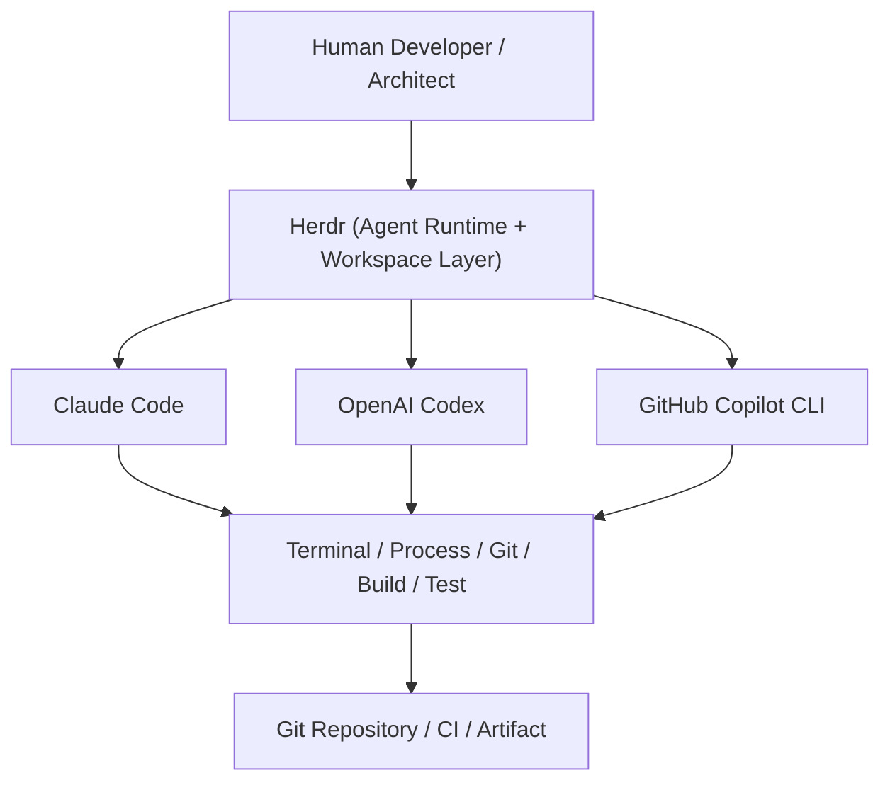

Herdr 本身不寫程式、不做 code review、不執行 build，這些工作全部由 Agent 或既有工具鏈完成；Herdr 負責的是「讓這些工作可以長時間、多個並行、可被觀察與恢復地運作」。

### 2.4 Herdr 是否等於 Agent？是否取代 Claude Code / Codex / Copilot？

**不是。** Herdr 本身不具備 LLM 推理能力，它不會幫你寫程式碼、不會回答需求問題。它是這些 Agent CLI 的「宿主環境」。拿掉 Herdr，Claude Code、Codex、Copilot CLI 依然可以在普通終端機裡執行；差別在於失去了：Session 持久化、跨裝置 Reconnect、多 Agent 狀態總覽、Socket API 自動化能力（官方已實作／建議架構混合，詳見第 4-5 章）。

### 2.5 Herdr 與 IDE、Agent Orchestrator 的關係

- **與 IDE 的關係**：Herdr 不是 IDE，沒有程式碼編輯器、沒有語法高亮、沒有 Debugger。開發者仍然需要 VS Code / IntelliJ 等 IDE 來寫程式與除錯；Herdr 負責的是 IDE 之外，Agent 實際「動手做事」的終端機環境。兩者是互補關係，不是替代關係（建議架構）。
- **與 Agent Orchestrator 的關係**：Herdr 提供 Agent 狀態可視化與 Socket API／CLI 可供腳本呼叫（官方已實作），但它**不是**一個完整的 Multi-Agent Orchestration Framework——它不內建任務分派佇列、不內建 Agent 間訊息傳遞協定、不內建重試/補償邏輯。若企業需要「Agent A 完成後自動觸發 Agent B」這類編排，仍需要在 Herdr 之上自行建立 Orchestration Layer（詳見第 27 章的界線分析）。

### 2.6 Herdr 的核心價值（企業視角）

| 價值 | 說明 | 來源標示 |
|---|---|---|
| 長時間運作 | Agent Process 由 Server 保存，不因 Client 斷線而終止 | 官方已實作 |
| 多 Agent 可視化 | 同時觀察多個 Pane 中 Agent 的 working/idle/blocked/done 狀態 | 官方已實作 |
| 隨裝置恢復 | 從筆電、Server、任何有終端機的裝置重新 attach 同一個 Session | 官方已實作 |
| 結構化 Workspace | Session→Workspace→Tab→Pane 階層，方便按專案/任務組織 | 官方已實作 |
| 自動化介面 | CLI + Socket API，可被腳本或其他 Agent 呼叫 | 官方已實作 |
| Agent-agnostic | 不綁定特定 Agent 廠商，同時支援約 19 種 Agent CLI | 官方已實作 |

### 2.7 AI Prompt 範例

```text
角色：企業內部技術教育訓練講師
任務：用 3 分鐘的口語說明，向從未使用過 Herdr 的資深 Java 工程師解釋
「為什麼我們需要在終端機之上再加一層 Herdr，而不是直接開多個終端機視窗跑
Claude Code / Codex / Copilot CLI」。
限制：不要使用行銷語言，聚焦在「長時間運作」「多 Agent 狀態可視化」
「斷線恢復」三個具體痛點，並舉一個此工程師實際會遇到的情境。
```

### 2.8 本章 Checklist 與小結

- [ ] 能用一句話說明 Herdr 是什麼（Agent Runtime / Terminal Workspace Manager）
- [ ] 能說出 Herdr 不是 IDE、不是完整 Agent Orchestrator、不取代 Claude Code/Codex/Copilot CLI
- [ ] 理解 Herdr 在 AI SDLC 中的位置：承載 Agent 執行，而非取代 Agent 或既有工具鏈

---

## 3. 為什麼企業需要 Herdr

### 3.1 傳統 AI Coding Workflow 的真實痛點

在還沒有 Runtime 層的情況下，一位工程師若要同時運用多個 AI Coding Agent，典型的作法如下：

```text
Terminal 1 → Claude Code（負責後端邏輯）
Terminal 2 → Codex（負責前端元件）
Terminal 3 → GitHub Copilot CLI（負責測試）
Terminal 4 → npm / Maven（build）
Terminal 5 → 手動執行測試
Terminal 6 → git status / git diff
```

這個模式在小型任務尚可運作，但隨著任務規模與 Agent 數量增加，會逐一浮現以下問題：

| 問題 | 具體情境 |
|---|---|
| Terminal 太多 | 6 個以上視窗切換，認知負擔高，容易看錯視窗下錯指令 |
| Agent 狀態不透明 | 不知道 Claude Code 是還在思考、等待輸入，還是已經卡住 |
| Agent 卡住不知道 | Agent 在等待 permission/確認，但畫面被其他視窗蓋住，半小時後才發現 |
| SSH 中斷 | 遠端開發時網路抖動，terminal session 直接消失，Agent 進度全失 |
| Laptop 關閉 | 筆電闔上、進入休眠，所有 local terminal 裡的 Agent process 被中止 |
| Terminal 被誤關閉 | 手滑關掉視窗，正在跑的長任務直接消失 |
| 多 Agent 難以管理 | 無法一眼看出「現在有幾個 Agent 在跑、誰卡住了、誰做完了」 |
| Context 不易保存 | 每次重新開終端機，都要重新 `cd` 到專案目錄、重新啟動 Agent |
| Agent 之間難以協作 | 沒有共用的工作區結構，Agent A 與 Agent B 的產出很難互相參照 |

### 3.2 Herdr 如何改善

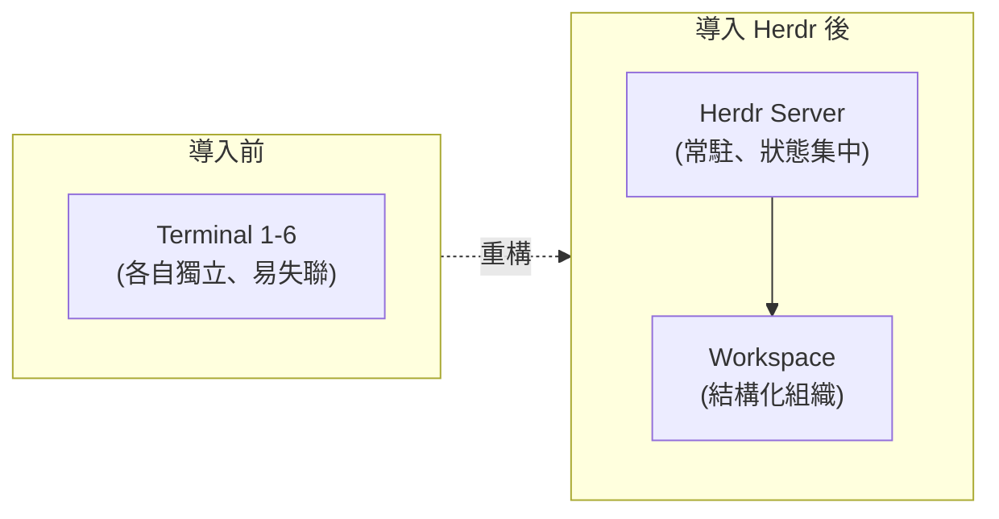

- **長時間運作**：Agent Process 由 Herdr Server 保存，Client 斷線不影響 Process 存續（官方已實作）。
- **狀態集中可視化**：在同一個 Client UI 中看到所有 Pane 的 Agent 狀態（working/idle/blocked/done/unknown）（官方已實作）。
- **結構化工作區**：用 Workspace／Tab／Pane 階層取代散亂的視窗（官方已實作）。
- **隨處恢復**：從任何裝置 `herdr` 重新連上同一個 Session（官方已實作）。
- **自動化銜接**：CLI／Socket API 讓維運腳本、CI 前置檢查等可以查詢 Agent 狀態（官方已實作）。

### 3.3 Scenario：一位資深工程師的一天

一位負責 Legacy Java 系統升級的工程師，早上在公司啟動 Herdr Session，開了三個 Workspace 分別對應「後端升級」「前端重構」「測試補強」，各自啟動 Claude Code。中午開會前 `prefix+q` detach，闔上筆電去開會。下午回來，在會議室用平板透過瀏覽器 SSH 或另一台筆電重新 `herdr` attach，三個 Agent 仍在原本的狀態繼續運作，其中一個因為等待資料庫連線字串確認而顯示 `blocked`，工程師立刻補上資訊讓它繼續。這個情境是 Herdr 的核心設計目標所直接對應的（建議架構，依官方能力推導之典型使用情境）。

### 3.4 本章 Checklist 與小結

- [ ] 能列舉至少 5 項「多終端機管理 AI Agent」的痛點
- [ ] 能說明 Herdr Server／Client 分離架構如何解決「斷線即中斷」問題
- [ ] 理解 Herdr 帶來的價值主要是「Runtime 持久化」與「狀態可視化」，而非取代 Agent 本身能力

---

## 4. Herdr 核心概念

### 4.1 六大核心概念

Herdr 官方文件（concepts 文件）定義了以下核心概念，彼此構成一個階層關係（官方已實作）：

| 概念 | 官方定義 | 白話理解 |
|---|---|---|
| **Session** | 「a persistent Herdr server namespace」持久化的 Server 命名空間 | 一個獨立運作的 Herdr 環境，可以有預設 Session 或多個具名 Session |
| **Server** | 擁有 Pane／Process 狀態，Client 離線後仍持續運作 | 真正跑東西的地方，背景常駐 |
| **Client** | 「the terminal UI attached to that server」附掛在 Server 上的終端 UI | 你眼睛看到、手在操作的那個畫面 |
| **Workspace** | 「top-level project container. Use one workspace per repo, task, or investigation.」 | 對應一個專案/任務/調查主題的最上層容器 |
| **Tab** | 「a layout inside a workspace」Workspace 內的一種版面配置 | 像瀏覽器分頁，一個 Workspace 可以有多個 Tab |
| **Pane** | 「a real terminal」真正的終端機，可上下左右切分 | 實際跑 Shell / Agent / build 指令的那一格 |

再加上疊加在 Pane 之上的：

- **Agent**：當一個 Pane 裡執行的是被 Herdr 辨識出的 Coding Agent（如 Claude Code）時，Herdr 會為這個 Pane 附加 Agent 身分與狀態追蹤（官方已實作）。

### 4.2 概念階層圖

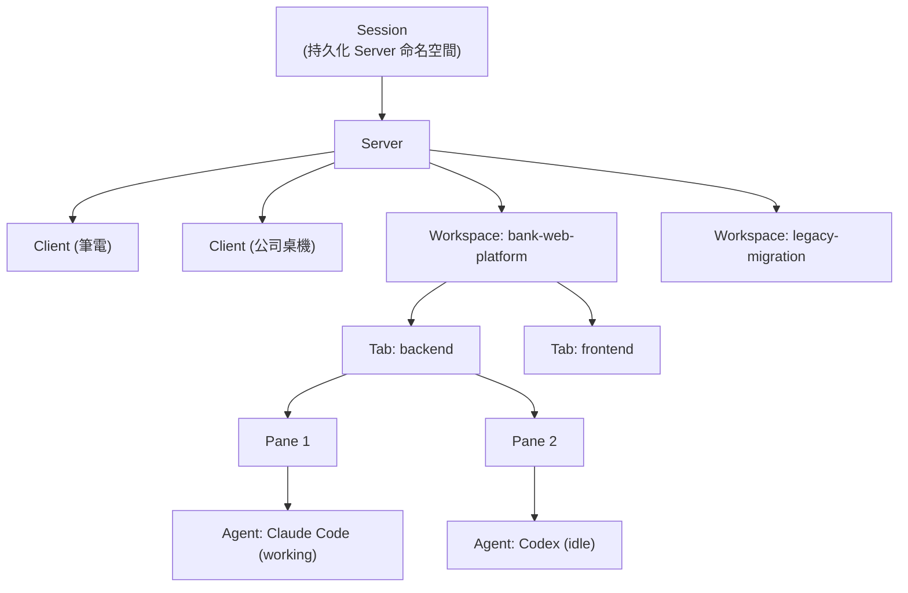

這張圖對應官方 ID 規則：Workspace 用 `w1` 表示，其下 Tab 用 `w1:t1`，其下 Pane 用 `w1:p1`（Source-confirmed，CLI/Skill 文件）。

### 4.3 ID 命名規則實例

```text
w1          → Workspace 1
w1:t1       → Workspace 1 底下的 Tab 1
w1:p1       → Workspace 1 底下的 Pane 1
```

這套扁平化 ID 規則，是 Herdr CLI 與 Socket API 用來精準定址單一 Pane／Tab／Workspace 的方式（Source-confirmed），例如：

```text
# 示意：查詢特定 Pane 的 Agent 狀態
herdr agent get w1:p1
```

### 4.4 Server／Client 分離的意義

Herdr 採用 Client/Server 架構：Server 是背景 Process，負責保存所有 Pane 的實際終端機狀態；Client 是你連上去看畫面、送鍵盤/滑鼠事件的 UI（官方已實作）。這個分離帶來的直接效果：

- 關閉 Client（甚至整台裝置斷線）不影響 Server 上運作中的 Process。
- 同一個 Server 可以先後被不同 Client（不同裝置、不同時間）attach。
- `herdr server stop` 才會真正終止所有 Process；單純關閉視窗只是 Client detach（官方已實作，concepts 文件）。

### 4.5 Scenario：一個中型 Web 專案的 Workspace 規劃

```text
Workspace: bank-web-platform
├── Tab: architecture   → Pane: Claude Code（架構規劃）
├── Tab: backend        → Pane: Claude Code（Spring Boot 開發）
├── Tab: frontend       → Pane: Codex（Vue3 開發）
├── Tab: test           → Pane: Copilot CLI（測試撰寫）
└── Tab: review         → Pane: 人類 Shell（git diff / code review）
```

（建議架構，第 13 章起會提供更完整的企業級 Workspace 設計規範）

### 4.6 AI Prompt 範例

```text
角色：Herdr 平台導入顧問
任務：針對「Legacy Java 逆向工程」專案，設計一組 Workspace/Tab/Pane 命名規劃，
需求：
- 一個 Workspace 對應此專案
- 至少包含 architecture、reverse-engineering、documentation、test 四個 Tab
- 每個 Tab 說明應該指派哪一種 Agent（Claude Code / Codex / Copilot CLI / 人類）
輸出格式：樹狀文字圖 + 一句話說明每個 Tab 的職責
```

### 4.7 本章 Checklist 與小結

- [ ] 能畫出 Session → Server/Client → Workspace → Tab → Pane → Agent 的階層圖
- [ ] 理解 `w1:t1:p1` 這類 ID 命名規則的用途
- [ ] 理解 Client 關閉 ≠ Server 停止；只有 `herdr server stop` 才真正終止 Process

---

## 5. Herdr 系統架構

### 5.1 架構總覽

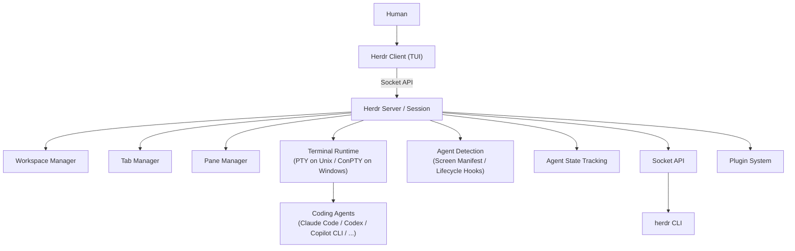

（建議架構：此圖為本手冊依官方文件描述之元件重新繪製之整合視圖，元件邊界依官方 docs 站 Install/Concepts/Agents/Socket API/Plugins 頁面之敘述整理，非官方原始碼模組圖）

### 5.2 Process Lifecycle

一個 Agent 從啟動到結束，在 Herdr 中的生命週期大致如下（建議架構，依官方 Agent 狀態機推導）：

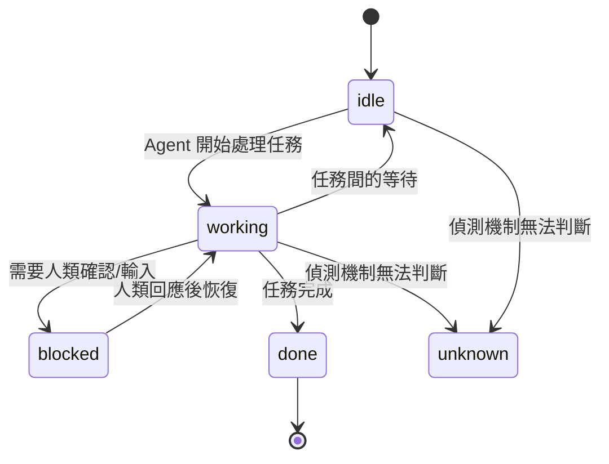

官方明確定義的狀態為 `working`／`idle`／`blocked`／`done`／`unknown`（官方已實作，agents 文件），狀態轉換的判斷依據見第 5.4 節與第 22 章。

### 5.3 Session Persistence 與 Terminal Persistence

- **Session Persistence**：Herdr Server 作為背景 Process 常駐，Session 資訊（Workspace/Tab/Pane 結構）在 Server 存活期間持續存在（官方已實作）。
- **Terminal Persistence**：每個 Pane 底層是一個真實 PTY（Unix）或 ConPTY（Windows）Process，只要 Server 不停止，這個 Process 的 stdout/stderr 緩衝與存活狀態就會被保留，Client 重新 attach 時可以看到之前的輸出（官方已實作）。
- 這兩者合稱為「Herdr session persistence」，但**這不等於程式碼被保存或備份**——它只保存「終端機 Process 的執行狀態」，不是 Git 意義上的版本控制備份（見第 33 章的重要區分：Session Recovery ≠ Code Recovery）。

官方 session-state 文件將「保存了什麼」拆成四種明確不同的情境，企業規劃維運 SOP（第 31-33 章）前應先理解這張矩陣，避免對「重啟後還在不在」有錯誤期待（官方已實作）：

| 情境 | Process 是否持續運作 | Pane/Tab/Workspace 版面是否恢復 | 近期畫面內容是否恢復 | Agent 對話是否接續 |
|---|---|---|---|---|
| Detach 後重新 Attach | 是 | 是 | 是（來自存活的終端機） | 是（因為 Process 從未停止） |
| **Server 重啟**（當機/`server stop`/機器重開） | **否** | 是（從快照重建） | 僅在啟用 `pane_history` 時 | 僅在該 Agent 有 Native Session Restore 支援時 |
| Update（未加 `--handoff`） | 相容版本可能持續、需要重啟的版本可能中斷 | 重啟後恢復 | 僅在啟用 `pane_history` 時 | 僅在該 Agent 有 Native Session Restore 支援時 |
| Update（加 `--handoff`，實驗性功能） | 盡力保留（best effort） | 是 | 是（若 Handoff 成功） | 是（若 Handoff 成功，因 Process 持續運作） |

其中兩個常被誤解的細節：

1. **`pane_history`（近期畫面內容回放）預設關閉**，因為終端輸出可能含機密、Token、指令內容，官方刻意不預設保存；企業若要啟用，需在 `config.toml` 明確設定 `[experimental] pane_history = true`，且應把這份紀錄視為與終端機歷史紀錄同等機敏（官方已實作，session-state 文件）。
2. **Native Session Restore（Agent 對話接續）需要對應 Agent 已安裝「當前版本」的官方整合**（見第 29.3 節版本需求表），版本過舊、未安裝、或 Session 參照失效時，Herdr 只能把該 Pane 恢復成一個位於原工作目錄的全新 Shell，Agent 之前的對話上下文並不會自動回來。

**Live Handoff** 是專門為「更新／`--remote` 需要替換正在運作中的 Server」所設計的特殊路徑：它嘗試把存活的 Pane 直接轉移給新 Server，而不是等舊 Server 停止後再從快照重建，因此可以保留 PTY Process 本身不中斷；但它是**實驗性、需明確加旗標啟用**的功能（`herdr update --handoff`／`herdr --remote <host> --handoff`），且僅適用於 Herdr 自身更新器管理的安裝方式——透過 Homebrew／mise／Nix 安裝時，`herdr update` 本身會被停用，也就無法使用 Handoff（官方已實作，session-state 文件，另見第 32.4 節）。

### 5.4 Detach / Attach

- **Detach**：預設鍵位 `prefix+q`（即 `ctrl+b` 後按 `q`），Client 中斷連線，Server 與其下所有 Pane 繼續運作（官方已實作，keyboard 文件）。
- **Attach**：重新執行 `herdr`（或 `herdr --session <name>`）即可重新連上原本的 Server，畫面恢復到 detach 前的狀態（官方已實作）。
- 完全停止：`herdr server stop` 才會終止 Server 與其下所有 Process（官方已實作）。

### 5.5 Agent Detection：兩層機制

Herdr 用兩層機制判斷一個 Pane 裡是不是在跑 Agent、目前狀態為何（官方已實作，agents 文件）：

1. **Lifecycle Hooks／Plugin Integration（權威來源）**：少數 Agent（Pi、OMP、Kimi Code CLI、OpenCode、Kilo Code CLI、MastraCode）安裝對應整合後，會主動回報自己的狀態，Herdr 直接信任這個回報，不需要用畫面猜測。
2. **Screen Manifest（預設 fallback）**：針對其餘 Agent（含 Claude Code、Codex、GitHub Copilot CLI、Cursor Agent CLI 等），Herdr 用 TOML 規則描述的「畫面特徵」（終端標題、OSC progress 序列、畫面下緣文字模式）去比對終端機的即時畫面快照（bottom-buffer screen snapshot），據此推論狀態；只有畫面特徵明確符合「等待核准/提問/權限」樣式時才會標記為 `blocked`，否則預設為 `idle`（官方已實作）。

**重要澄清**：Screen Manifest 偵測是「畫面樣式比對」，**不是** Herdr 真正理解 Agent 在想什麼、做什麼（不可誤寫為「Agent 語意理解」）。這是本手冊第 55 章「架構師最終評估」特別強調要避免的過度宣稱之一。

**細緻區分：Integration 實際提供的兩種能力，官方文件（integrations 文件）明確拆成兩個獨立軸線，不應混為一談：**

| Integration 能力軸線 | 作用 | 目前支援之 Agent | 來源標示 |
|---|---|---|---|
| **Lifecycle Authority（狀態權威）** | 安裝後由 Hook／Plugin 主動回報 `idle`／`working`／`blocked`，Herdr 對該 Pane 不再使用 Screen Manifest 猜測 | Pi、OMP、Kimi Code CLI、OpenCode、Kilo Code CLI、MastraCode | 官方已實作 |
| **Session Identity（原生 Session 回復）** | 安裝後回報原生 Session 參照，供 Server 重啟後以 `--resume`／`--session` 等原生指令復原對話，但狀態仍由 Screen Manifest 判斷 | Claude Code、Codex、GitHub Copilot CLI、Devin CLI、Droid、Qoder CLI、Cursor Agent CLI、Hermes Agent、Antigravity CLI、Grok CLI | 官方已實作 |

換句話說，**安裝了 Claude Code／Codex／Copilot CLI 的官方 Integration，並不會讓狀態判斷變成 Lifecycle Hook 權威**——這三者的狀態來源仍是 Screen Manifest，Integration 只是讓 Server 重啟後能自動 `claude --resume <id>` 之類的方式復原對話（Source-confirmed，session-state／integrations 文件，第 29 章有更完整的整合深度比較）。

### 5.6 Client/Server 分離、Local 與 Remote 執行

| 執行模式 | 說明 | 來源標示 |
|---|---|---|
| Local 執行 | `herdr` 在本機啟動 Server 並附掛 Client | 官方已實作 |
| SSH Remote 執行 | 先 `ssh` 進遠端主機，再於遠端執行 `herdr`，Server 跑在遠端 | 官方已實作，how-to-work 文件 |
| Thin Client Remote | `herdr --remote <host>` 從本機直接以精簡 Client 連上遠端 Server | 官方已實作（Windows 上此模式標示為 beta/部分限制，見第 8 章） |
| API 自動化 | 透過 Socket API／CLI 由腳本或其他程式操作 Herdr（不經過互動式 TUI） | 官方已實作 |

### 5.7 Scenario：架構師評估導入風險

一位 Software Architect 在評估是否導入 Herdr 時，最關心的問題通常是：「Server 掛掉會怎樣？」「多個人能不能共用同一個 Server？」——目前官方文件描述的模型是**單一 Server 對應單一使用者的 Session**，Client/Server 分離主要解決的是「同一個人跨裝置/跨時間」的持久化問題，而不是「多人協作編輯同一個 Session」的多使用者共享模型（Source-confirmed，官方文件未描述多使用者共享 Session 的正式支援；企業若有此需求，需自行評估或詢問官方，勿假設存在）。

### 5.8 AI Prompt 範例

```text
角色：DevSecOps Architect
任務：畫出一張「Herdr Server 在公司 Dev VM 上運行、多位工程師各自 SSH 進來
啟動自己的 Herdr Session」的架構圖，並標註：
1. 每位工程師的 Session 是否互相隔離
2. Server Process 的權限（跑在哪個 OS 使用者底下）
3. 一旦 Dev VM 重啟，所有 Session 會發生什麼事
輸出：Mermaid flowchart + 3 條風險備註
```

### 5.9 本章 Checklist 與小結

- [ ] 理解 Session Persistence／Terminal Persistence 的意義與限制
- [ ] 能說明 Agent Detection 的兩層機制（Lifecycle Hooks vs Screen Manifest）
- [ ] 理解 Session Recovery 不等於 Code Backup
- [ ] 理解目前官方模型偏向單使用者跨裝置持久化，而非多使用者共享同一 Session

---

## 6. Herdr 與 tmux／zellij／IDE／Agent Orchestrator 比較

### 6.1 完整比較表

| 能力 | Herdr | tmux | zellij | VS Code | Claude Code (單獨使用) | 典型 Agent Orchestrator |
|---|---|---|---|---|---|---|
| Terminal Multiplexing | 官方已實作 | 有 | 有 | 部分（內建終端機，非 multiplex） | 無 | 通常無（依賴底層 Runtime） |
| Session Persistence | 官方已實作 | 有 | 有 | 無（視窗關閉即中斷，除非搭配遠端） | 無 | 依實作而定 |
| Multi-Agent 同時管理 | 官方已實作（Pane 層級） | 無原生概念 | 無原生概念 | 無原生概念 | 不適用（本身即 Agent） | 官方已實作（設計目的） |
| Agent State 追蹤 | 官方已實作（working/idle/blocked/done/unknown） | 無 | 無 | 無 | 不適用 | 依實作而定 |
| Agent 自動偵測 | 官方已實作（Screen Manifest + Lifecycle Hooks） | 無 | 無 | 無 | 不適用 | 通常需自行整合 |
| Workspace 結構化 | 官方已實作（Session→Workspace→Tab→Pane） | 部分（Session→Window→Pane，無 Agent 語意） | 部分（類似結構，無 Agent 語意） | 有（Workspace 概念但無 Agent 狀態） | 不適用 | 依實作而定 |
| CLI | 官方已實作 | 有 | 有 | 部分（`code` CLI） | 有（本身即 CLI） | 依實作而定 |
| Socket/API 自動化 | 官方已實作 | 有限（tmux control mode） | 有限 | 有（Extension API，非終端導向） | 無獨立 API | 通常是核心賣點 |
| Plugin 系統 | 官方已實作 | 有（第三方生態） | 官方已實作 | 官方已實作（龐大生態） | 無 | 依實作而定 |
| Remote/SSH 工作 | 官方已實作 | 有 | 有 | 需搭配 Remote-SSH 擴充 | 依終端環境而定 | 依實作而定 |
| 人類直接控制（滑鼠/鍵盤） | 官方已實作（滑鼠優先設計） | 鍵盤為主 | 鍵盤為主 | 官方已實作 | 不適用 | 通常無互動 UI |
| Agent 直接控制（API 呼叫） | 官方已實作（Socket API） | 有限 | 有限 | 部分（Extension） | 不適用 | 官方已實作（核心賣點） |
| 完整任務編排/重試邏輯 | **官方未提供** | 無 | 無 | 無 | 無 | 官方已實作（核心賣點） |
| Enterprise 廣泛採用先例 | 建議架構（尚屬新興，需自行評估） | 成熟、廣泛 | 成熟、廣泛 | 成熟、廣泛 | 依 Anthropic 官方採用度 | 依產品而定 |

### 6.2 為什麼不應該只把 Herdr 當成 tmux replacement

官方自己給出的區分最精準：「**tmux keeps terminals alive; so does Herdr. The difference is Herdr knows which terminals are agents, what state each one is in, and how to wait on them. tmux sees panes.**」（官方已實作，`herdr.dev/compare/`）。

與 zellij 比較，官方的說法是：「**Zellij is a friendlier workspace for humans in terminals. Herdr is a runtime for agents in terminals: state, waits, direct attach, and an API.**」（官方已實作，同上）。

換句話說：

> tmux／zellij 解決「終端機本身的多工與持久化」；Herdr 在此基礎之上，再解決「終端機裡面跑的是不是一個 Agent、這個 Agent 現在是什麼狀態、我可不可以用程式化方式等待它完成」這一層問題（建議架構，本手冊對官方比較頁面的延伸詮釋）。

官方比較頁面（`herdr.dev/compare/`）實際涵蓋的比較對象不只 tmux／zellij，還包含終端機應用（cmux、Warp）、Process Dashboard（Solo）、以及以 Git Worktree／Diff 為核心的 Agent 管理應用（Conductor、Emdash、Superset）與 opencode 內建的 web UI（官方已實作）。官方對這些工具的核心區分邏輯一致：「Herdr 是 Runtime（Server 端持有終端機），其餘多數是 App（UI 關閉即中斷）」——例如 cmux／Warp 屬於取代既有終端機環境的應用，Herdr 則在既有終端機（iTerm、Windows Terminal、SSH 連線等）內運作，不要求換掉終端機本身；Conductor／Emdash／Superset 這類「Agent 管理 App」雖然也處理 Worktree 與 Diff 檢視，但關閉 App 通常會讓底層 Agent Process 一併停止，Herdr 的 Agent 則因為活在 Server 內而不受 Client 關閉影響（官方已實作，`herdr.dev/compare/`）。企業選型時若把 Herdr 單純與 tmux 比較，容易低估它與這類「Agent 管理 App」之間的重疊與差異，選型會議應一併納入評估（建議架構）。

### 6.3 Herdr 與 Agent Orchestrator 的界線

Herdr 提供「觀察」與「等待」的原語（例如 `herdr agent wait w1:p1 --until done`，官方已實作，socket-api 文件），但它**不是**一個具備任務佇列、DAG 編排、重試補償語意的 Orchestration Framework。若企業需要「Agent A 完成 → 自動觸發 Agent B → 失敗自動重試」這樣的完整編排邏輯，仍需要在 Herdr 之上另行建立 Orchestration Layer（此點會在第 27 章深入討論）。

### 6.4 Scenario：架構師選型會議

在一場工具選型會議上，若有人提出「我們現有的 tmux + shell script 已經很夠用，為什麼要導入 Herdr？」，比較表中最值得強調的差異點是：**tmux 不知道 Pane 裡面在跑什麼、更不知道它是否卡住**；而多 Agent 並行時，「哪個 Agent 卡住了」正是實務上最容易被忽略、卻最影響交付時程的問題。

### 6.5 本章 Checklist 與小結

- [ ] 能用官方原文（tmux sees panes vs Herdr knows agent state）向同仁解釋差異
- [ ] 理解 Herdr 不具備完整任務編排能力，不能取代 Orchestration Layer
- [ ] 能填寫本比較表向團隊/主管簡報選型理由

---

## 7. 安裝環境：Linux／macOS

### 7.1 系統需求

官方安裝腳本以 Linux 與 macOS 為 Stable Channel 的第一級支援平台（官方已實作）。Herdr 是單一 Rust 執行檔，不需要額外的 Runtime（如 JVM／Node.js）即可運作（官方已實作，README）。

### 7.2 安裝方式

```bash
# Linux / macOS — 官方安裝腳本（Stable Channel）
curl -fsSL https://herdr.dev/install.sh | sh
```

其他官方支援的安裝管道（官方已實作，agent-guide 文件）：

```bash
# Homebrew（macOS／Linuxbrew）
brew install herdr

# mise（跨平台版本管理工具）
mise use -g herdr

# Nix
nix run github:herdrdev/herdr
nix profile install github:herdrdev/herdr/v0.8.0
```

> **注意**：本手冊不建議使用 `cargo install` 作為終端使用者安裝方式——`cargo` 建置流程在官方 README 中屬於「從原始碼建置」的開發者/貢獻者流程，並非官方推薦給一般使用者的發布管道（Source-confirmed，不可視為官方正式安裝方式）。

### 7.3 PATH 設定

安裝腳本通常會將 `herdr` 執行檔放入使用者可執行路徑（例如 `~/.local/bin` 或 Homebrew 的標準路徑）。若安裝後 `herdr` 指令找不到，請確認該路徑是否已加入 `$PATH`（Source-confirmed，依安裝方式而異，具體路徑請以安裝腳本輸出訊息為準）。

### 7.4 驗證安裝

```bash
herdr --version
```

### 7.5 啟動

```bash
# 在專案目錄下執行，未指定 Session 時會自動開啟一個 Workspace
herdr
```

### 7.6 本章 Checklist 與小結

- [ ] `herdr --version` 可正確輸出版本號
- [ ] 已確認 `herdr` 執行檔所在路徑已加入 `$PATH`
- [ ] 已確認使用的安裝管道（install.sh／Homebrew／mise／Nix）以利日後升級時採用對應方式（見第 32 章）

---

## 8. 安裝環境：Windows

### 8.1 Windows 支援現況：Preview-only Beta

**必須明確標示**：截至查證日期（2026-08-12），Herdr 的原生 Windows 版本是 **preview-only beta**（官方已實作，windows-beta 文件），**不是** Stable Production Support。這代表：

- Windows 只能透過 Preview Channel 取得，`herdr channel set stable` 在 Windows 上會被拒絕（官方已實作）。
- Windows 使用 ConPTY 而非 Unix 的 PTY 模型，底層行為與 Linux/macOS 不完全相同（官方已實作）。
- 多項功能在 Windows 上被標示為 beta／部分支援／尚未驗證／不支援，包含：直接 terminal attach、`--remote` 目標主機模式、Live Server Handoff、Unix FD Handoff、簽章執行檔/SmartScreen 相關處理（官方已實作，windows-beta 文件）。

> **企業使用建議**：在 Production 或關鍵開發流程上，不應假設 Windows 原生版本與 Linux/macOS 版本行為完全一致。若企業標準開發環境是 Windows，建議先以小規模 POC 驗證 Preview 版本的穩定度（見第 8.3 節的 WSL2 建議）。

官方對 Windows 版本的未來定位刻意保持開放，windows-beta 文件明確將其定調為「學習階段」，並列出三種可能結局：**未來可能轉為 Stable**、**在成熟前持續停留於 Preview**、或**若維護成本不划算則縮減範圍**（官方已實作，windows-beta 文件）。這代表企業不應把「Windows 即將轉為 Stable」當作既定時程規劃的前提，任何 Windows 導入決策都應建立在「目前是 Preview，且官方未承諾轉正時程」這個事實之上（建議架構）。

### 8.2 安裝方式（Windows Preview）

```powershell
# Windows — Preview Channel（唯一目前提供的 Windows 通道）
powershell -ExecutionPolicy Bypass -c "irm https://herdr.dev/install.ps1 | iex"
```

驗證安裝：

```powershell
herdr --version
herdr channel show
```

### 8.3 已知限制

| 項目 | Windows 現況 | 來源標示 |
|---|---|---|
| 發布通道 | 僅 Preview，無法切換 Stable | 官方已實作 |
| 終端模型 | ConPTY（非 Unix PTY） | 官方已實作 |
| 直接 Terminal Attach | Beta／部分限制 | 官方已實作 |
| `--remote` 目標主機模式 | Beta／部分限制 | 官方已實作 |
| Live Server Handoff | 未完全驗證 | 官方已實作 |
| Unix FD Handoff | 不適用（Windows 無此機制） | 官方已實作 |
| 簽章執行檔／SmartScreen | 可能觸發 Windows SmartScreen 警示，需使用者手動允許 | Source-confirmed |
| Plugin 支援 | 標示為 Preview | 官方已實作 |

### 8.4 Windows 原生 vs WSL2 Linux 的分析建議

```text
Windows
 ├── WSL2
 │    └── Linux（Stable Channel）
 │         └── Herdr
 │              ├── Claude Code
 │              ├── Codex
 │              └── Copilot CLI
 │
 └── VS Code / IntelliJ（連接 WSL2 或直接操作 Windows 端）
```

| 評估面向 | Windows 原生 Herdr（Preview） | WSL2 內的 Linux Herdr（Stable） |
|---|---|---|
| 發布通道成熟度 | Preview-only | Stable |
| 終端模型 | ConPTY（較新、部分功能受限） | Unix PTY（與官方主要開發/測試環境一致） |
| Remote/Attach 完整度 | 部分限制 | 完整（比照 Linux） |
| 與既有 Linux 開發工具鏈相容性（Maven、部分 CI 腳本） | 需另外確認 Windows 相容性 | 天然相容 |
| 導入風險（企業 Production/關鍵專案） | 較高，功能仍在演進 | 較低，站在官方最成熟的支援基礎上 |
| 使用便利性（原生 Windows 使用者） | 較高（不需額外設定 WSL2） | 需額外安裝/設定 WSL2 |

**本手冊建議（建議架構，非官方立場）**：對於企業內部需要穩定性優先的 AI Coding Agent 開發場景，**優先建議在 WSL2 內安裝 Linux 版 Herdr**，理由是官方 Stable Channel 與主要功能驗證都以 Linux/macOS 為主；Windows 原生版本適合用於個人 POC、輕量測試，或評估未來遷移路徑，暫不建議作為企業關鍵開發流程的唯一環境。若團隊已高度依賴 Windows 原生工具鏈（例如 .NET 相關開發），則可將 Windows 原生 Preview 版本視為觀察對象，持續追蹤官方 Stable 化進度。

### 8.5 Scenario：企業 Windows 開發機導入評估

一個以 Windows 為標準配發機種的企業團隊，在導入 Herdr 前應該先問：「這個 Agent 開發流程，是否可以接受在 WSL2 裡運作？」多數情況下答案是肯定的（Claude Code、Codex、Copilot CLI 本身在 WSL2 環境下運作已相當成熟），此時建議直接採用 WSL2 + Linux Herdr 路線，避免承擔 Windows Preview 版本的不確定性。

### 8.6 本章 Checklist 與小結

- [ ] 已明確認知 Windows 版本為 Preview-only Beta，非 Stable
- [ ] 已評估是否採用 WSL2 + Linux Herdr 作為企業標準路線
- [ ] 若使用 Windows 原生版本，已知悉直接 attach／`--remote`／Live Handoff 等功能的限制

---

## 9. 安裝驗證與 Installation Checklist

### 9.1 驗證指令

```bash
# 確認可執行、版本資訊
herdr --version

# 查看內建說明（子指令與旗標）
herdr --help

# 查看目前 Server/Client 狀態
herdr status
```

> 以上指令為官方文件與 CLI 說明中可查證之指令（官方已實作／Source-confirmed）。其餘子指令請以 `herdr <group>` 不帶參數列出可用選項（例如 `herdr workspace`、`herdr agent`），不要自行假設不存在的旗標。

### 9.2 常見安裝後檢查項目

```text
1. herdr --version 能正確輸出版本
2. herdr 能在專案目錄下成功啟動並開啟一個 Workspace
3. 終端機視窗大小調整後，Herdr UI 能正確重繪
4. 滑鼠點擊 Pane／Tab 能正確切換焦點（官方已實作，滑鼠優先設計）
5. prefix+q 能正確 detach，重新執行 herdr 能重新 attach
6. herdr server stop 能正確終止 Server 與其下 Process
```

### 9.3 Installation Checklist

- [ ] `herdr --version` 顯示的版本與官方 Release 頁面一致
- [ ] 確認安裝管道（install.sh／Homebrew／mise／Nix／Windows Preview），並記錄於團隊內部 Wiki 以利日後升級對照（見第 32 章）
- [ ] 已完成一次 Detach → Attach 驗證
- [ ] 已完成一次 `herdr server stop` 驗證，確認 Process 確實被終止
- [ ] （Windows）已確認目前為 Preview Channel，並記錄於團隊已知限制清單

### 9.4 常見錯誤（安裝階段）

| Symptom | 可能原因 | 建議處理 |
|---|---|---|
| `herdr: command not found` | PATH 未包含安裝路徑 | 確認安裝腳本輸出訊息中的路徑，加入 shell 設定檔（`~/.bashrc`／`~/.zshrc`／PowerShell Profile） |
| Windows 執行時被 SmartScreen 攔截 | 未簽章或簽章尚未被系統信任（Windows Preview 現況） | 依組織資安政策評估是否允許執行，必要時走內部軟體白名單流程 |
| `herdr channel set stable` 在 Windows 失敗 | Windows 目前只提供 Preview Channel | 屬預期行為，非安裝錯誤（官方已實作） |

（完整常見錯誤清單見第 43 章，本節僅列安裝階段常見情境）

---

## 10. Herdr Quick Start

### 10.1 十步驟從零開始

官方 Quick Start 文件描述的核心流程為：於專案目錄執行 `herdr`、以滑鼠操作、在 Pane 內啟動 Agent、視需要進入 Prefix Mode 使用鍵盤、Detach、以 `herdr server stop` 完全停止（官方已實作，quick-start 文件）。本節將其擴展為十個實作步驟：

**Step 1：安裝 Herdr**

```bash
curl -fsSL https://herdr.dev/install.sh | sh   # Linux/macOS
```

預期結果：`herdr --version` 有輸出。常見錯誤：PATH 未設定（見第 9.4 節）。

**Step 2：啟動 Herdr**

```bash
cd ~/projects/bank-web-platform
herdr
```

UI 操作：Herdr 會自動開啟一個 Workspace（若尚未存在）。預期結果：看到 Herdr TUI 畫面，含至少一個 Pane。

**Step 3：建立 Workspace**

```bash
# 示意：以 CLI 建立具名 Workspace（實際操作亦可透過滑鼠於 UI 新增）
herdr workspace create bank-web-platform
```

預期結果：新的 Workspace 出現在 Workspace 清單中。

**Step 4：建立 Pane**

UI 操作：滑鼠右鍵於現有 Pane 選擇分割，或使用鍵盤 `prefix+v`（右分割）／`prefix+minus`（下分割）。預期結果：畫面出現新的終端機格子。

**Step 5：啟動 Claude Code**

```bash
# 在其中一個 Pane 內
claude
```

預期結果：Claude Code 啟動，Herdr 開始針對此 Pane 進行 Agent 偵測，狀態顯示為 `idle` 或 `working`。

**Step 6：啟動 Codex**

```bash
# 在另一個 Pane 內
codex
```

**Step 7：啟動 GitHub Copilot CLI**

```bash
# 在第三個 Pane 內（實際指令名稱依 Copilot CLI 官方安裝方式而定）
copilot
```

**Step 8：觀察 Agent 狀態**

UI 操作：在 Herdr Client 畫面中，各 Pane 標題或狀態標示會顯示 `working`／`idle`／`blocked`／`done`／`unknown`（官方已實作）。預期結果：可以一眼看出哪個 Agent 正在工作、哪個卡住。常見錯誤：剛啟動 Agent 的前幾秒可能顯示 `unknown`，屬正常現象，待畫面特徵穩定後會轉為正確狀態。

**Step 9：Detach**

鍵盤操作：`ctrl+b` 進入 Prefix Mode，再按 `q`。預期結果：Client 離線，終端機提示字元恢復正常，Server 持續在背景運作。

**Step 10：Reconnect**

```bash
herdr
# 或指定 Session
herdr --session <name>
```

預期結果：畫面恢復到 detach 前的狀態，所有 Pane 與 Agent 狀態都還在。

### 10.2 Troubleshooting（Quick Start 階段）

| 問題 | 診斷 | 解法 |
|---|---|---|
| Agent 狀態一直顯示 `unknown` | 該 Agent 未在官方支援清單中，或畫面特徵尚未被規則命中 | 對照第 5.5 節、Appendix D 確認是否為官方明確支援之 Agent |
| Detach 後找不到 Session | 未記住 Session 名稱，或啟動時使用了 `--no-session` | 使用具名 Session（`herdr --session <name>`）避免混淆 |
| Reconnect 後畫面空白 | Server 可能已經被 `herdr server stop` 終止 | 確認 Server 是否仍在執行（`herdr status`），需要的話重新 `herdr` 啟動新 Server |

### 10.3 本章 Checklist 與小結

- [ ] 完成一次完整的「安裝 → 啟動 → 建立 Workspace/Pane → 啟動 Agent → Detach → Attach」流程
- [ ] 能正確辨識 Agent 狀態顯示（working/idle/blocked/done/unknown）
- [ ] 理解 `unknown` 狀態不代表錯誤，而是偵測機制尚無法判斷

---

## 11. Keyboard／Mouse 操作

### 11.1 三種操作模式

Herdr 定義三種互動模式（官方已實作，concepts／keyboard 文件）：

| 模式 | 說明 |
|---|---|
| Terminal Mode | 鍵盤輸入直接送進當前 Pane 內的程式（例如你在跟 Claude Code 對話） |
| Prefix Mode | 按下 Prefix Key（預設 `ctrl+b`）後短暫進入，接下來一個按鍵會被 Herdr 攔截作為指令 |
| Navigate Mode | 用於在 Pane／Tab／Workspace 之間移動焦點，不會把按鍵送進終端機程式 |

### 11.2 常用鍵盤操作（預設鍵位）

| 操作 | 鍵位 | 說明 |
|---|---|---|
| 進入 Prefix Mode | `ctrl+b` | 預設 Prefix Key，可於 config.toml 自訂（見第 30 章） |
| 新增 Tab | `prefix+c` | |
| 向右分割 Pane | `prefix+v` | |
| 向下分割 Pane | `prefix+minus` | |
| Pane 間導覽 | `prefix+h/j/k/l` | 仿 Vim 方向鍵 |
| 切換 Workspace | `prefix+w` | |
| Detach | `prefix+q` | Client 離線，Server 持續運作 |
| 顯示說明 | `prefix+?` | |
| 進入 Copy Mode | `prefix+[` | 進入後可用方向鍵/搜尋選取文字 |
| Zoom（全螢幕化目前 Pane） | `prefix+z` | 再按一次還原 |
| 關閉 Pane | `prefix+x` | |

（以上鍵位為官方文件所載之預設值，官方已實作；企業可依團隊習慣於 `config.toml` 的 `[keys]` 區塊重新綁定，見第 30 章）

### 11.3 Copy Mode 內操作

進入 Copy Mode（`prefix+[`）後：

| 操作 | 鍵位 |
|---|---|
| 開始選取 | `v` 或 `space` |
| 複製選取內容 | `y` 或 `Enter` |
| 搜尋 | `/`（向下搜尋）／`?`（向上搜尋） |

### 11.4 滑鼠操作

Herdr 採「滑鼠優先」設計（官方已實作，README／首頁敘述），常見滑鼠操作包含：

- 點擊 Pane／Tab／Workspace 直接切換焦點
- 拖曳調整 Pane 大小
- 拖曳分割/合併版面
- 右鍵開啟選單（例如快速分割 Pane）

### 11.5 Scenario：鍵盤 vs 滑鼠的團隊規範

對於習慣 tmux 鍵盤流的資深工程師，建議保留 Prefix Key 操作以維持肌肉記憶；對於較少使用終端機 multiplexer 的前端/QA 同仁，建議直接以滑鼠操作 Pane/Tab，降低學習門檻（建議架構）。

### 11.6 本章 Checklist 與小結

- [ ] 能分辨 Terminal Mode／Prefix Mode／Navigate Mode 的差異
- [ ] 熟悉至少 8 個常用鍵位（split／navigate／detach／zoom／copy mode）
- [ ] 知道滑鼠可以完成大部分基本操作，鍵盤非必要但能提升效率

---

## 12. Workspace 設計（企業級規範）

### 12.1 企業級 Workspace 命名與分層原則（建議架構）

> 本節全部內容為本手冊依 Herdr 官方 Workspace/Tab/Pane 概念（見第 4 章）延伸之企業導入建議，標示為建議架構，非官方規範。

**原則一：一個 Project 對應一個 Workspace。** 避免把多個不相關專案塞進同一個 Workspace，導致 Tab 爆炸、難以辨識歸屬。

**原則二：一個 Agent 對應一個 Pane。** 避免多個 Agent 共用同一個 Pane（會互相干擾終端機輸出、Agent 偵測也會錯亂）。

**原則三：一個任務對應一個 Tab（視情境彈性調整）。** 對於中大型任務，用 Tab 區分「架構」「後端」「前端」「測試」「安全」等不同工作面向。

**原則四：多個 Agent 可以共用一個 Workspace，但不建議共用同一份 working directory 寫入同一批檔案（見第 23 章 Git 策略）。**

### 12.2 範例一：企業 Web Application Workspace

```text
bank-platform
├── frontend
├── backend
├── database
├── test
├── devops
├── security
├── claude       (Claude Code 專用 Pane/Tab)
├── codex        (Codex 專用 Pane/Tab)
└── copilot      (Copilot CLI 專用 Pane/Tab)
```

### 12.3 範例二：以角色分層的 Workspace

```text
Project Workspace
 ├── Architecture
 ├── Frontend
 ├── Backend
 ├── Database
 ├── Test
 ├── Security
 └── AI Agents
```

### 12.4 何時該用哪種模式

| 情境 | 建議模式 |
|---|---|
| 單一小型任務、單一 Agent | 一個 Workspace、一個 Tab、一個 Pane |
| 中型 Web 專案、多面向並行開發 | 一個 Workspace、依面向分 Tab（frontend/backend/test...），每 Tab 一個 Agent Pane |
| 大型企業專案、多團隊協作 | 每個子系統/服務各自一個 Workspace，內部再依角色分 Tab |
| 需要多個 Agent 交叉驗證同一段程式碼 | 同一 Tab 內用多個 Pane 並排，分別跑不同 Agent 對同一產出做 Review（見第 16 章 Pattern C） |

### 12.5 Scenario：從單人開發擴展到團隊協作

一位工程師一開始只用單一 Workspace 處理個人任務；隨著專案擴大到需要前後端與測試同步進行，逐步拆分成多個 Tab；當專案進一步擴大為跨團隊（後端團隊、前端團隊、資安團隊各自維運自己的 Agent 工作），則建議切分成多個 Workspace，並搭配第 23-24 章的 Git Worktree 策略，避免多人多 Agent 互相覆蓋彼此的工作目錄。

### 12.6 AI Prompt 範例

```text
角色：Herdr Workspace 規劃顧問
任務：為一個「將 Legacy COBOL 訂單系統重構為 Java 25 + Spring Boot 4.x 微服務」
的專案，設計 Workspace/Tab/Pane 配置。
限制：
- 需要同時進行逆向工程分析、架構設計、程式碼實作、測試撰寫、安全掃描
- 需標註每個 Tab 建議指派的 Agent（Claude Code/Codex/Copilot CLI/人類）
- 需標註哪些 Tab 之間有交付依賴關係（例如逆向工程需先於架構設計完成）
輸出：樹狀圖 + 依賴關係說明
```

### 12.7 本章 Checklist 與小結

- [ ] 已建立團隊內部 Workspace 命名規範文件
- [ ] 已確認「一個 Agent 一個 Pane」原則被遵守
- [ ] 已規劃好何時該用多 Workspace vs 單 Workspace 多 Tab

---

## 13. Claude Code + Herdr 實戰

### 13.1 啟動與基本操作

Claude Code 是 Herdr 官方明確列於支援清單中的 Agent（官方已實作，agents 文件），偵測方式為 Screen Manifest（見第 5.5、29 章）。在一個 Pane 內啟動：

```bash
claude
```

### 13.2 如何保持 Session

- 不需要特別操作，只要不執行 `herdr server stop`，Claude Code 的 Process 就會持續存在，即使 Detach 也不受影響（官方已實作）。
- 若需要長時間任務（例如大型重構），建議搭配具名 Session（`herdr --session <name>`）方便日後精準 Reconnect。

### 13.3 如何觀察狀態

在 Herdr Client UI 中，含 Claude Code 的 Pane 會顯示對應狀態標籤（working/idle/blocked/done/unknown）。當 Claude Code 進入等待使用者確認工具呼叫、等待輸入的情境時，畫面特徵通常會被 Screen Manifest 規則辨識為 `blocked`（官方已實作，見第 22 章深入解析）。

### 13.4 如何重新 Attach

```bash
herdr --session <name>
```

畫面會恢復到 Detach 前的狀態，包含 Claude Code 當時的對話畫面（因為底層 PTY 緩衝被保留）。

### 13.5 如何處理 Blocked

1. 觀察 Pane 內畫面，確認 Claude Code 實際在等待什麼（權限確認／工具呼叫核准／輸入補充資訊）。
2. 直接在該 Pane 內以 Terminal Mode 輸入回應。
3. 若長時間無法處理，記錄此 Pane 的 ID（如 `w1:p2`），交接給其他同仁或排入待辦（見第 22 章 SOP）。

### 13.6 如何避免多個 Claude Code 修改同一份程式碼造成衝突

**核心原則：不同 Claude Code 實例，應該在不同的 Git Worktree／不同的 Branch 中工作**（建議架構，見第 23-24 章）。若多個 Claude Code Pane 共用同一份 working directory，容易發生：

- 兩個 Agent 同時寫入同一檔案造成互相覆蓋
- 一個 Agent 執行 `git checkout` 切換分支，影響另一個 Agent 正在編輯的檔案
- Build/Test 結果因為程式碼被另一個 Agent 同時修改而不穩定

### 13.7 Scenario：一人多 Claude Code 分工

一位工程師在同一個 Workspace 內開了三個 Pane，分別對應三個 Git Worktree（`worktree/backend`、`worktree/frontend`、`worktree/test`），各自啟動一個 Claude Code 實例，互不干擾地並行工作，最後在人類主控的 Pane 中執行 `git diff`／`merge` 整合。

### 13.8 AI Prompt 範例（Backend Agent，供 Claude Code 使用）

```text
Role: Senior Backend Developer (Java 25 / Spring Boot 4.x)
Objective: 在 worktree/backend 分支中，實作 OrderService 的 REST API
Context: 既有系統為 Spring Boot 3.x，正進行升版至 4.x，需保持既有 API 相容
Input: src/main/java/.../OrderController.java、既有測試套件
Constraints:
  - 不得修改 frontend/、test/e2e/ 目錄下任何檔案
  - 所有變更需通過既有 JUnit 5 測試
  - 每完成一個邏輯單元即建立一次 git commit（不要一次巨大 commit）
Tasks:
  1. 分析既有 OrderController 邏輯
  2. 依 Spring Boot 4.x 相容性要求調整程式碼
  3. 補齊缺漏的單元測試
Expected Output: 可編譯、可測試通過的程式碼變更 + commit 歷程
Validation: mvn test 全數通過
Stop Conditions: 若發現需要修改資料庫 Schema，停止並回報，不擅自執行 migration
```

### 13.9 本章 Checklist 與小結

- [ ] 已在 Herdr Pane 中成功啟動 Claude Code 並觀察到狀態變化
- [ ] 已驗證 Detach/Attach 不影響 Claude Code 對話進度
- [ ] 已採用 Git Worktree 隔離多個 Claude Code 實例，避免衝突

---

## 14. GitHub Copilot CLI + Herdr 實戰

### 14.1 基本流程

GitHub Copilot CLI 同樣列於 Herdr 官方支援清單（官方已實作，agents 文件）。典型工作流程：

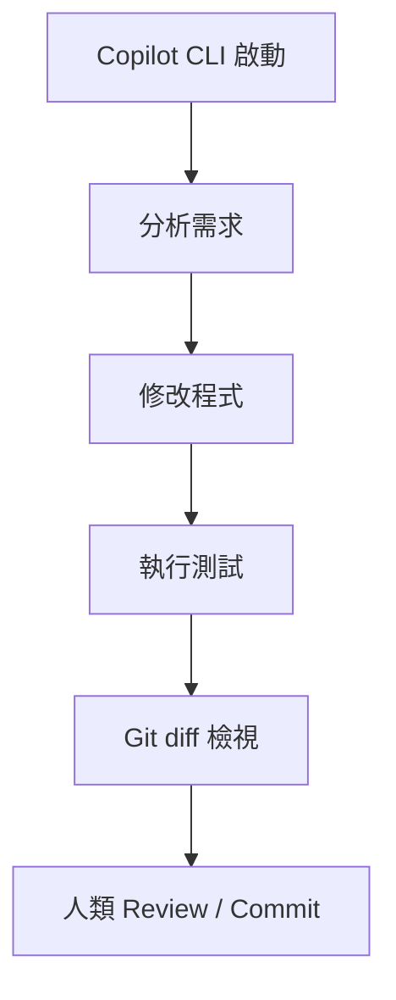

```bash
# 在 Pane 內啟動（實際指令名稱依官方 GitHub Copilot CLI 安裝方式而定）
copilot
```

### 14.2 與 Claude Code／Codex 共存

在同一個 Workspace 中，Copilot CLI 通常適合承擔「測試撰寫」「Code Review」「輕量修改」等任務，與負責主要架構/實作的 Claude Code 或 Codex 分工（建議架構，依團隊實務調整）。共存時同樣建議遵守「一個 Agent 一個 Pane」「不同 Agent 不共用同一份 working directory 寫入」的原則（見第 12、23 章）。

### 14.3 Scenario：測試補強分工

在一次 Sprint 中，Claude Code 負責後端邏輯開發，Codex 負責前端元件開發，GitHub Copilot CLI 被指派專門在 `test` Tab 中，針對前後端的產出撰寫對應的單元測試與整合測試，並在完成後於自己的 Pane 內執行 `git diff` 供人類 Review。

### 14.4 AI Prompt 範例（Test Agent，供 Copilot CLI 使用）

```text
Role: QA / Test Automation Engineer
Objective: 為 backend worktree 新增的 OrderService API 撰寫 JUnit 5 測試
Context: 使用 Spring Boot 4.x Test 框架，既有測試位於 src/test/java
Input: 新增/修改的 Controller 與 Service 類別
Constraints: 僅新增測試檔案，不修改生產程式碼
Tasks:
  1. 分析新增的 API 端點與商業邏輯分支
  2. 撰寫涵蓋正常路徑與邊界條件的測試
  3. 執行測試並回報覆蓋率
Expected Output: 新增的測試檔案 + 測試執行結果
Validation: mvn test 全數通過，新增程式碼測試覆蓋率達團隊標準
Stop Conditions: 若既有程式碼有明顯 Bug 導致測試無法通過，回報但不擅自修改生產邏輯
```

### 14.5 本章 Checklist 與小結

- [ ] 已確認 Copilot CLI 在 Herdr 中的狀態偵測正常
- [ ] 已與 Claude Code/Codex 建立清楚的任務分工邊界
- [ ] 已建立「先寫測試、人類 Review diff 再 commit」的流程

---

## 15. Codex + Herdr 實戰

### 15.1 基本流程

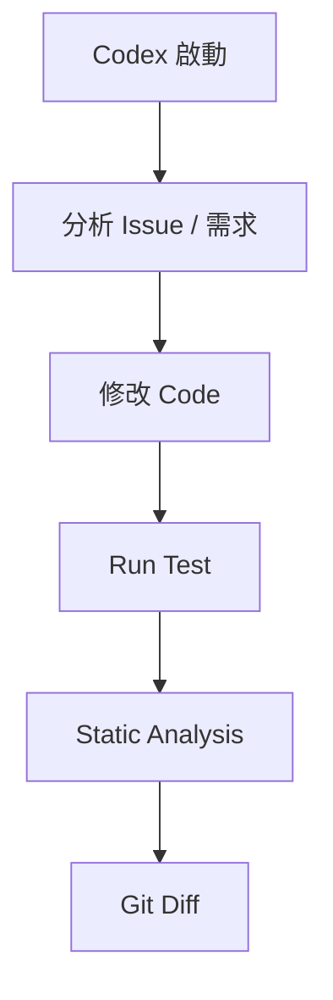

```bash
codex
```

Codex 同樣列於官方支援清單（官方已實作，agents 文件）。

### 15.2 與其他 Agent 分工

常見分工模式（建議架構）：Codex 負責前端元件開發或特定 Issue 導向的修復任務，Claude Code 負責架構規劃與後端核心邏輯，Copilot CLI 負責測試與 Review。三者各自在獨立 Pane／Worktree 中運作，透過人類在 Review Tab 中整合。

### 15.3 Scenario：Issue 導向修復

團隊將一批 GitHub Issue 指派給 Codex，在專屬 Workspace 的 `codex-fixes` Tab 中，依序處理每個 Issue：分析 → 修改 → 測試 → Static Analysis → 產生 diff，並在每個 Issue 完成後於 Pane 中留下摘要，供人類快速 Review 是否可以合併。

### 15.4 AI Prompt 範例（Frontend Agent，供 Codex 使用）

```text
Role: Frontend Developer (Vue 3 / TypeScript / PrimeVue)
Objective: 修復 Issue #482：訂單列表分頁元件在資料為空時顯示錯誤
Context: 專案使用 Vue 3 + Pinia + PrimeVue DataTable
Input: src/components/OrderList.vue、相關 Pinia store
Constraints: 不修改後端 API 契約；遵循既有 Tailwind CSS 樣式規範
Tasks:
  1. 重現並定位錯誤原因
  2. 修正元件邏輯
  3. 補上對應的前端測試（若專案已有測試框架）
Expected Output: 修正後的元件程式碼 + 修復說明
Validation: 本地執行確認空資料情境不再報錯，既有測試不因此變更而失敗
Stop Conditions: 若需求涉及後端 API 變更，停止並回報，交由 Backend Agent 處理
```

### 15.5 本章 Checklist 與小結

- [ ] 已確認 Codex 在 Herdr 中可正常啟動與被偵測
- [ ] 已建立 Codex 與 Claude Code／Copilot CLI 的分工邊界
- [ ] 每個 Issue 修復流程都留有可供人類 Review 的 diff

---

## 16. Multi-Agent Software Development

### 16.1 總覽圖

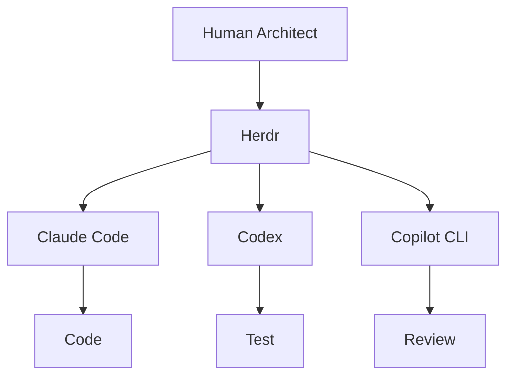

（建議架構：以下四種模式為本手冊依 Herdr 的 Multi-Pane／Multi-Agent 能力歸納之企業實務模式，非官方文件明訂之「官方模式」）

### 16.2 Pattern A：Parallel（平行分工）

```text
Agent A → Frontend
Agent B → Backend
Agent C → Test
Agent D → Security
```

**適用情境**：任務之間相依性低，可以真正同時進行。優點是總時程最短；風險是需要嚴格的 Git Worktree 隔離（見第 24 章），否則容易互相干擾。

### 16.3 Pattern B：Sequential（序列接力）

```text
Architect
   ↓
Developer
   ↓
Tester
   ↓
Reviewer
```

**適用情境**：任務之間有明確先後依賴（例如必須先有架構設計才能實作）。優點是每個階段輸出明確、容易插入人類審查點；風險是總時程較長。

### 16.4 Pattern C：Reviewer（交叉驗證）

```text
Agent A → Implementation
Agent B → Review
Agent C → Security Review
```

**適用情境**：對程式碼品質/安全性要求高的場景，讓不同 Agent（甚至不同廠商的 Agent）互相檢查彼此的產出，降低單一 Agent 的盲點風險。

### 16.5 Pattern D：Research + Implementation（研究先行）

```text
Research Agent
      ↓
Architecture Agent
      ↓
Implementation Agent
      ↓
Test Agent
```

**適用情境**：面對不熟悉的 Legacy 系統或新技術導入前，先讓一個 Agent 專注做研究/現況調查，產出給後續 Agent 使用的知識基礎，常見於第 19 章逆向工程場景。

### 16.6 四種模式比較

| 模式 | 時程 | 協調複雜度 | 適合情境 |
|---|---|---|---|
| Parallel | 最短 | 高（需嚴格隔離） | 任務彼此獨立、團隊已熟悉 Worktree 策略 |
| Sequential | 較長 | 低 | 有明確依賴鏈、需要每階段人類審查 |
| Reviewer | 中等 | 中 | 高品質/高風險程式碼、需要交叉驗證 |
| Research + Implementation | 中等偏長 | 中 | 不熟悉的系統、逆向工程、技術選型 |

### 16.7 Scenario：混合模式的真實案例

多數企業實務並非單一套用一種模式，而是混合使用：先用 Research + Implementation 模式讓一個 Agent 完成逆向工程與架構設計，再用 Parallel 模式讓多個 Agent 同時開發不同模組，最後用 Reviewer 模式做交叉安全審查（建議架構，第 53 章會提供完整端到端範例）。

### 16.8 本章 Checklist 與小結

- [ ] 能依任務相依性判斷該用 Parallel 還是 Sequential
- [ ] 高風險程式碼已導入 Reviewer 交叉驗證模式
- [ ] 面對不熟悉的系統，優先採用 Research + Implementation 模式

---

## 17. Web Application 開發實戰

### 17.1 技術 Stack 與 Herdr 的關係

**重要澄清**：以下技術 Stack 本身與 Herdr **沒有直接整合關係**——Herdr 不會知道你用的是 Vue3 還是 React、Spring Boot 還是 Quarkus。Herdr 的角色是**承載執行這些技術 Stack 開發工作流程的 AI Coding Agent** 之 Runtime／Workspace 層（建議架構，避免過度宣稱）。

本手冊示範採用的企業技術 Stack（如需深入學習，請參閱本 Repository 對應手冊）：

| 分類 | 技術 | 延伸閱讀 |
|---|---|---|
| Frontend | Vue 3、TypeScript、Tailwind CSS、PrimeVue、Pinia | [Vue3 前端framework教學](../framework/Vue3%20前端framework教學.md)、[PrimeVue使用教學](../framework/PrimeVue使用教學.md) |
| Backend | Java 25、Spring Boot 4.x、Maven | [Java25升版教學](../程式語言/Java25升版教學.md)、[Spring boot 4.x 教學手冊](../framework/Spring%20boot%204.x%20教學手冊.md) |
| Database | Oracle、DB2、PostgreSQL、SQL Server | （依專案既有手冊） |
| Testing | JUnit 5、JMeter | [Playwright 教學手冊](Playwright%20教學手冊.md)（E2E 測試參考） |
| Architecture | Clean Architecture、Hexagonal Architecture、Microservices | — |
| DevOps | Git、GitHub、GitLab、Jenkins、Podman、Kubernetes | [GitHub CLI 教學手冊](GitHub%20CLI%20教學手冊.md) |

### 17.2 開發流程中 Herdr 的角色

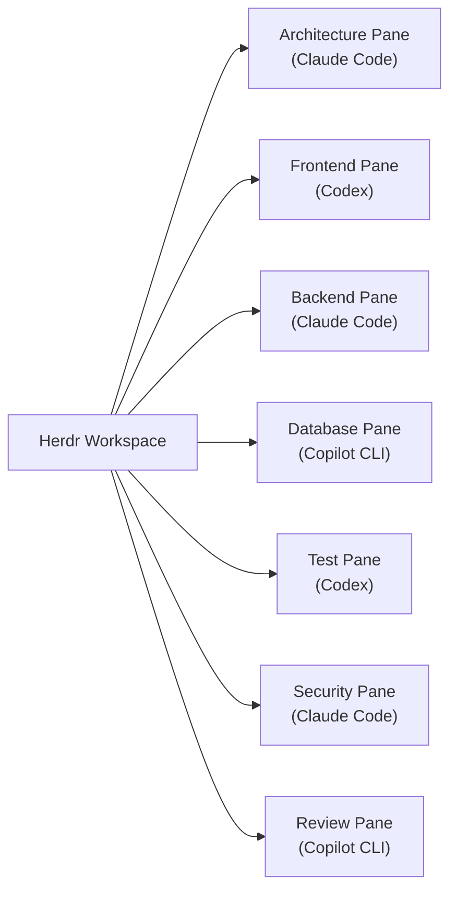

Herdr 提供的是圖中每一個 Pane 的執行環境與狀態可視化；每個 Pane 內實際執行的 `mvn`、`npm`、`git`、AI Agent 指令，都是既有工具鏈本身的能力，不是 Herdr 提供的功能。

### 17.3 Scenario：一個 Sprint 的實際運作

在一個雙週 Sprint 中，團隊在 `bank-web-platform` Workspace 內，依 Pattern A（Parallel）分配任務：Claude Code 負責後端 API、Codex 負責前端頁面、Copilot CLI 負責測試撰寫，三者在各自的 Git Worktree 中並行；Sprint 中段每天早上，人類在 Review Tab 檢視前一天各 Agent 的 commit 與 diff，處理 Blocked 狀態的 Agent；Sprint 結尾切換為 Sequential 模式，由 Claude Code 進行整合測試前的最終 Review。

### 17.4 AI Prompt 範例（Architecture Agent）

```text
Role: Software Architect
Objective: 為 bank-web-platform 專案設計符合 Hexagonal Architecture 的模組劃分
Context: Java 25 + Spring Boot 4.x 後端、Vue 3 + PrimeVue 前端、PostgreSQL 資料庫
Input: 現有需求規格文件、既有系統 ER Model（如有）
Constraints: 需與既有 [Spring boot 4.x 教學手冊] 中的架構慣例一致
Tasks:
  1. 定義 Domain / Application / Infrastructure 分層
  2. 定義模組間依賴方向（依 Hexagonal Architecture 原則，依賴指向 Domain）
  3. 產出各模組的職責說明文件
Expected Output: 架構決策文件（含 Mermaid 分層圖）
Validation: 架構文件經人類 Architect 審核通過
Stop Conditions: 若既有系統技術債過重無法直接套用 Hexagonal Architecture，先回報供人類決策
```

### 17.5 本章 Checklist 與小結

- [ ] 團隊已清楚 Herdr 是承載層，不是框架/技術選型工具
- [ ] 已依技術 Stack 分工建立對應 Workspace/Tab/Pane
- [ ] 已建立每日/每 Sprint 的人類 Review 節奏

---

## 18. Web Application Multi-Agent Workspace 範例

### 18.1 完整範例

```text
bank-web-platform
│
├── 01-architecture
│     └── Claude Code
│
├── 02-frontend
│     └── Codex
│
├── 03-backend
│     └── Claude Code
│
├── 04-database
│     └── Copilot CLI
│
├── 05-testing
│     └── Codex
│
├── 06-security
│     └── Claude Code
│
└── 07-review
      └── Copilot CLI
```

（建議架構：此為本手冊示範用 Workspace 配置，實際專案應依團隊規模與任務性質調整）

### 18.2 使用建議

- 編號前綴（`01-`、`02-`……）有助於在 Tab 清單中維持固定順序，方便團隊成員快速定位。
- `06-security` 建議獨立於 `03-backend`／`02-frontend` 之外，避免安全審查 Agent 的產出被開發中的變更污染（見第 34-35 章安全考量）。
- `07-review` 是人類與 Agent 共用的整合點，建議只做 Review／Merge，不在此 Tab 直接進行大量開發。

### 18.3 本章 Checklist 與小結

- [ ] 已依此範例調整出符合自身專案規模的 Workspace 配置
- [ ] Security 與 Review Tab 已與開發 Tab 明確分離
- [ ] 團隊成員都理解每個 Tab 的職責與負責 Agent

---

## 19. 逆向工程 Software Development

### 19.1 整體流程

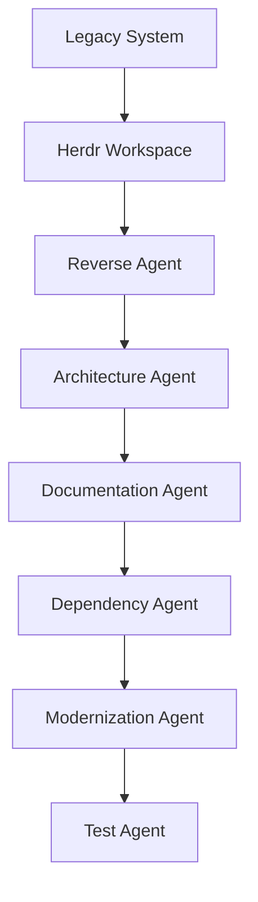

### 19.2 逆向工程十四步驟

1. **Repository Discovery**：確認原始碼結構、分支策略、建置工具
2. **Build Discovery**：確認如何從原始碼建置出可執行產物
3. **Runtime Discovery**：確認實際部署與執行環境（JVM 版本、Container、Server）
4. **Dependency Analysis**：盤點第三方套件、版本、已知漏洞
5. **Architecture Discovery**：還原分層架構、模組邊界
6. **Database Analysis**：還原 ER Model、Schema、Stored Procedure
7. **API Analysis**：盤點對外/對內 API 契約
8. **UI Analysis**：盤點前端頁面、元件、使用者流程
9. **Business Logic Discovery**：還原核心商業規則
10. **Technical Debt Analysis**：盤點技術債、風險點
11. **Test Discovery**：盤點既有測試覆蓋率與缺口
12. **Security Analysis**：盤點既有安全弱點
13. **Documentation**：產出還原後的架構/流程文件
14. **Modernization Plan**：產出現代化改造計畫

### 19.3 Agent 分工與 Workspace 配置

```text
legacy-reverse-engineering
├── 01-repo-build-runtime   → Claude Code（步驟 1-3）
├── 02-dependency-arch      → Codex（步驟 4-5）
├── 03-database-api-ui      → Copilot CLI（步驟 6-8）
├── 04-business-techdebt    → Claude Code（步驟 9-10）
├── 05-test-security        → Codex（步驟 11-12）
└── 06-docs-modernization   → Claude Code（步驟 13-14）
```

（建議架構）

### 19.4 人類審查點與 Git 分支策略

| 審查點 | 時機 | 建議動作 |
|---|---|---|
| 架構還原完成後 | 步驟 5 完成 | 人類 Architect 確認還原結果與實際系統相符 |
| 商業邏輯還原完成後 | 步驟 9 完成 | 業務端/資深工程師確認邏輯理解無誤，避免 Agent 誤解意圖 |
| 現代化計畫產出後 | 步驟 14 完成 | 人類決策是否採納，並排入正式專案排程 |

Git 分支策略建議：逆向工程過程中**不建立任何會影響現有系統的分支**，所有 Agent 產出（文件、還原後的架構圖）建議先進入獨立的 `docs/reverse-engineering` 分支或文件庫，待人類確認後才視情況併入正式開發分支（建議架構）。

### 19.5 AI Prompt 範例（Reverse Engineering Agent）

```text
Role: Reverse Engineering Analyst
Objective: 還原 legacy-order-system 的模組架構與資料庫 Schema
Context: 系統為 10 年以上歷史的 Java 7 應用，缺乏最新文件
Input: 完整原始碼、可存取的資料庫 Schema Dump（唯讀）
Constraints:
  - 僅分析，不修改任何原始碼
  - 不得對正式環境資料庫執行任何寫入/結構變更指令
Tasks:
  1. 列出所有模組與其職責
  2. 還原資料庫 ER Model
  3. 標記無法確定用途的程式碼區塊，交由人類確認
Expected Output: 架構還原文件（含 Mermaid ER Diagram）+ 待確認清單
Validation: 由資深工程師與原系統維護者共同審核
Stop Conditions: 若需要存取正式環境憑證才能繼續分析，停止並回報，不自行嘗試取得憑證
```

### 19.6 本章 Checklist 與小結

- [ ] 十四步驟逆向工程流程已對應到明確的 Agent 分工
- [ ] 每個關鍵審查點都有人類介入確認
- [ ] 逆向工程階段的 Git 策略不影響現有系統分支

---

## 20. Framework Upgrade

### 20.1 案例背景

以下以三個典型企業 Framework Upgrade 情境為案例（教學示範用虛構情境）：

```text
Java 7 → Java 21 / Java 25
Spring Boot 3.x → Spring Boot 4.x
Spring Framework 6.x → 7.x
Jakarta EE migration
```

深入的框架升級技術細節請參閱：[Java25升版教學](../程式語言/Java25升版教學.md)、[Spring boot 4.x升版教學](../framework/Spring%20boot%204.x升版教學.md)、[Spring framework 7.x 教學手冊](../framework/Spring%20framework%207.x%20教學手冊.md)、[Jakarta EE 12 教學手冊](../framework/Jakarta%20EE%2012%20教學手冊.md)。本章聚焦「如何用 Herdr 承載多 Agent 協作完成升級」，不重複框架本身的遷移細節。

### 20.2 Agent 分工流程

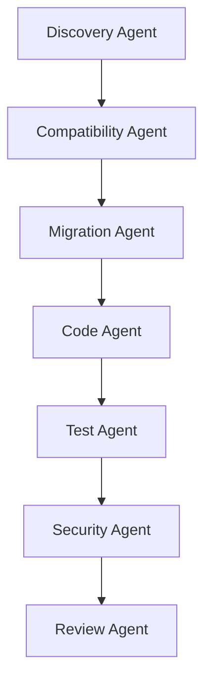

### 20.3 Herdr 如何讓這些 Agent 長時間並行或序列執行

- **並行**：Discovery Agent 完成盤點後，Compatibility Agent 與現有系統的 Test Agent（先跑既有測試建立 baseline）可以在不同 Pane 中同時進行。
- **序列**：Migration Agent 必須等 Compatibility Agent 產出相容性報告後才能開始，這類強依賴步驟建議用 Sequential 模式（見第 16.3 節），並在 Herdr 中以不同 Tab 標示進度階段。
- **長時間運作**：框架升級往往需要數天到數週，期間工程師會多次 Detach/Attach、甚至換裝置操作，Herdr 的 Session Persistence 正是支撐這種長週期任務的關镝能力（官方已實作）。

### 20.4 Scenario：Spring Boot 3.x → 4.x 升級

團隊在 `spring-boot-upgrade` Workspace 中，依序啟動 Discovery Agent（盤點目前使用的已棄用 API）→ Compatibility Agent（比對 Spring Boot 4.x Migration Guide）→ Migration Agent（產出升級計畫）→ Code Agent（實際修改程式碼，在獨立 Worktree 中進行）→ Test Agent（於升級後執行完整回歸測試）→ Security Agent（掃描新版本相依套件已知漏洞）→ Review Agent（產出最終 PR 摘要供人類審查）。

### 20.5 本章 Checklist 與小結

- [ ] 已確認升級案例的技術細節有對應既有框架手冊可參照
- [ ] 已規劃好哪些階段可並行、哪些必須序列
- [ ] 已利用 Herdr Session Persistence 支撐跨天的升級任務

---

## 21. Framework Upgrade Agent Workflow

### 21.1 十二階段總覽

| Phase | 名稱 | Agent | Herdr Pane | Input | Output | 人類核准 | Git Checkpoint |
|---|---|---|---|---|---|---|---|
| 1 | Discovery | Discovery Agent | `phase1-discovery` | 現有原始碼、pom.xml | 現況盤點報告 | 否 | 建立 `upgrade/discovery` 分支 |
| 2 | Dependency Analysis | Discovery Agent | `phase2-dependency` | pom.xml/package.json | 相依套件清單與版本落差 | 否 | — |
| 3 | Compatibility Analysis | Compatibility Agent | `phase3-compat` | 官方 Migration Guide、Phase 1-2 產出 | 相容性報告 | **是** | — |
| 4 | Migration Design | Migration Agent | `phase4-design` | 相容性報告 | 升級計畫文件 | **是** | — |
| 5 | Implementation | Code Agent | `phase5-impl` | 升級計畫 | 程式碼變更 | 否 | 每完成一模組即 commit |
| 6 | Compilation | Code Agent | `phase5-impl` | 變更後程式碼 | 編譯結果 | 否 | — |
| 7 | Unit Test | Test Agent | `phase7-test` | 編譯後程式碼 | 單元測試報告 | 否 | — |
| 8 | Integration Test | Test Agent | `phase7-test` | 單元測試通過之程式碼 | 整合測試報告 | **是** | 建立 `upgrade/verified` 分支 |
| 9 | Security Scan | Security Agent | `phase9-security` | 升級後程式碼與相依套件 | 安全掃描報告 | **是** | — |
| 10 | Performance Test | Test Agent | `phase10-perf` | 整合測試通過之程式碼 | 效能比對報告 | 否 | — |
| 11 | Review | Review Agent | `phase11-review` | 全部前述產出 | PR 摘要與風險清單 | **是** | 建立 PR |
| 12 | Release | 人類 + DevOps Agent | `phase12-release` | 已核准 PR | Release Note | **是** | Merge + Tag |

（建議架構：此表為本手冊依 SSDLC 常見階段與 Multi-Agent 分工原則設計之範本，非官方固定流程）

### 21.2 Scenario：以 Herdr Tab 對應 Phase 進度

團隊將每個 Phase 對應一個 Herdr Tab（`phase1-discovery` ~ `phase12-release`），完成的 Phase 保留其 Pane（不關閉），方便日後追溯每個階段 Agent 的實際輸出與對話紀錄；進行中的 Phase 在團隊每日站會中被列為檢視重點，特別留意是否有 Pane 顯示 `blocked` 超過預期時間。

### 21.3 本章 Checklist 與小結

- [ ] 十二階段皆已對應明確 Agent、Pane、輸入輸出
- [ ] 標示「是」的人類核准關卡皆已落實，未經核准不得進入下一 Phase
- [ ] 每個關鍵 Phase 完成都有對應 Git Checkpoint

---

## 22. AI Agent Blocked State 深入解析

### 22.1 Agent 卡住不等於 Agent 崩潰

`blocked` 狀態只是 Herdr 依畫面特徵（或 Lifecycle Hook 回報）判斷 Agent 目前處於「需要外部輸入才能繼續」的狀態（官方已實作，見第 5.5 節）。這**不代表** Agent Process 當機或錯誤，多數情況下 Agent 仍然存活，只是在等待。

### 22.2 常見 Blocked 原因

| 原因 | 說明 |
|---|---|
| 等待使用者回答 | Agent 提出澄清問題，等待人類補充需求 |
| Permission | Agent 嘗試執行某項操作前，等待使用者核准（例如刪除檔案、執行系統指令） |
| Authentication | Agent 需要的憑證/Token 過期或缺失 |
| Build failure | 編譯失敗，Agent 停下等待人類決定下一步 |
| Test failure | 測試失敗且 Agent 判斷需要人類確認方向 |
| Dependency problem | 相依套件版本衝突，Agent 無法自行決策 |
| Network problem | 網路請求失敗（例如呼叫外部 API 逾時） |
| Command failure | 執行指令回傳非預期錯誤碼 |
| Agent uncertainty | Agent 對任務範圍或需求本身感到不確定 |

### 22.3 狀態決策圖

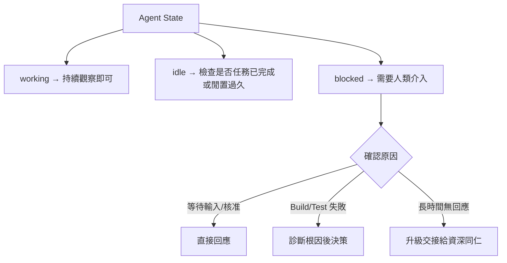

### 22.4 團隊 SOP

1. 每日固定時段（建議至少早/午/晚三次）巡查所有 Workspace 中是否有 `blocked` 狀態的 Pane。
2. 發現 `blocked` 後，5 分鐘內完成第一輪判斷（是否可自行處理）。
3. 若判斷需要跨團隊決策（例如涉及正式環境資料庫），30 分鐘內升級給對應負責人。
4. 每次處理 `blocked` 的原因與處理方式記錄下來，作為第 43 章常見錯誤清單的持續補充依據。

### 22.5 本章 Checklist 與小結

- [ ] 團隊已理解 blocked ≠ 崩潰
- [ ] 已建立巡查 blocked 狀態的固定頻率
- [ ] 已建立 blocked 升級處理的時效與責任歸屬

---

## 23. Herdr + Git

### 23.1 Multi-Agent 的 Git 分支規範

```text
Agent A → branch-a
Agent B → branch-b
Agent C → branch-c
```

**必須避免**：

```text
Agent A ─┐
Agent B ─┼── 共用同一份 working tree
Agent C ─┘
```

共用同一份 working tree 會導致：

- **merge conflict**：多個 Agent 同時修改重疊區域
- **overwritten changes**：後寫入的 Agent 覆蓋前一個 Agent 的變更
- **broken build**：某個 Agent 正在重構時，另一個 Agent 的 build 指令拿到不完整的中間狀態
- **lost changes**：未 commit 的變更被另一個 Agent 的操作（如 `git checkout .`）意外清除

### 23.2 Branch／Commit／Diff／Merge／Review／Rollback 搭配 Herdr

| Git 操作 | 建議搭配方式 |
|---|---|
| Branch | 每個 Agent 對應獨立 Branch（或搭配 Worktree，見第 24 章） |
| Commit | 要求 Agent 小步提交，方便 Rollback 到特定安全點 |
| Diff | 在人類 Review Pane 中集中檢視所有 Agent 的變更 |
| Merge | 由人類（或指定的 Review Agent 產出建議後由人類核准）執行 |
| Review | 對應 Pattern C（Reviewer）多 Agent 交叉審查 |
| Rollback | 保留每個 Phase 的 Git Checkpoint（見第 21 章），出狀況時可快速回退 |

### 23.3 本章 Checklist 與小結

- [ ] 所有並行工作的 Agent 都有獨立 Branch/Worktree
- [ ] 沒有任何 Agent 直接對共用 working tree 進行寫入
- [ ] 每個 Agent 都被要求小步 commit

---

## 24. Herdr + Git Worktree + Multi-Agent

### 24.1 進階架構

```text
Repository
│
├── main
│
├── worktree/frontend
│    └── Agent A (Codex)
│
├── worktree/backend
│    └── Agent B (Claude Code)
│
├── worktree/test
│    └── Agent C (Copilot CLI)
│
└── worktree/security
     └── Agent D (Claude Code)
```

### 24.2 為什麼 Worktree 架構比共用 Working Directory 更安全

Git Worktree 讓同一個 Repository 可以同時在多個實體目錄中，各自 checkout 不同分支且互不干擾（此為 Git 本身的原生能力，非 Herdr 提供，Source-confirmed）。搭配 Herdr 的 Pane 結構，可以做到「每個 Pane 對應一個獨立 Worktree 目錄，每個 Worktree 對應一個獨立 Branch，每個 Branch 由一個 Agent 負責」，徹底杜絕第 23.1 節列出的四種風險。

| 比較項目 | 共用 Working Directory | Git Worktree 隔離 |
|---|---|---|
| 檔案互相覆蓋風險 | 高 | 低（實體目錄隔離） |
| Build 過程互相干擾 | 高 | 低 |
| 誤操作波及其他 Agent | 高（如 `git checkout .`） | 低（各自獨立目錄） |
| 磁碟空間需求 | 低 | 較高（每個 Worktree 各自佔用空間） |
| 建置/依賴安裝重複成本 | 低 | 較高（可能需在每個 Worktree 各自安裝依賴） |

**結論（建議架構）**：對於 Multi-Agent 並行開發，Worktree 隔離架構在安全性上明顯優於共用 Working Directory，額外的磁碟與建置成本在多數企業開發環境中是可接受的代價。

### 24.3 Scenario：實務操作示意

```bash
# 示意：在既有 repo 中為不同 Agent 建立獨立 worktree
git worktree add ../worktree-backend backend-upgrade
git worktree add ../worktree-frontend frontend-upgrade

# 分別在 Herdr 的不同 Pane 中 cd 進對應 worktree 後啟動 Agent
```

### 24.4 本章 Checklist 與小結

- [ ] 已為每個並行 Agent 建立獨立 Git Worktree
- [ ] 已評估磁碟空間與建置成本是否可接受
- [ ] 已確認每個 Worktree 對應唯一負責的 Agent，避免混用

---

## 25. Remote Development

### 25.1 Herdr 與 SSH 的使用方式

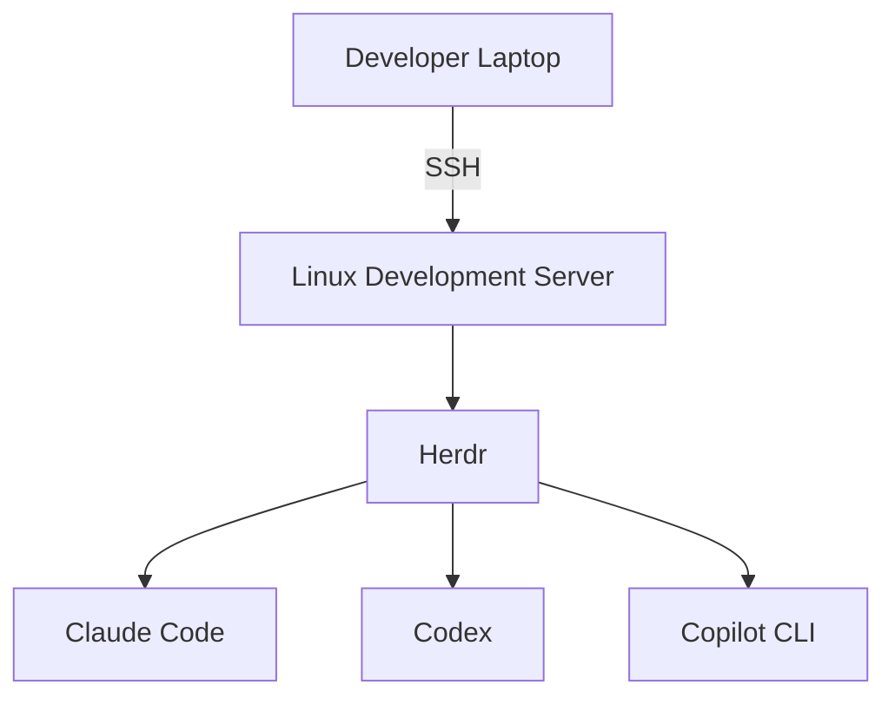

官方 how-to-work 文件描述的遠端使用模式包含：本機直接 `herdr`、先 `ssh` 進遠端主機再執行 `herdr`、以及 `herdr --remote <host>` 的 Thin Client 模式（官方已實作）。

### 25.2 斷線與恢復情境

| 情境 | Herdr 的行為 |
|---|---|
| Laptop 關閉 | 若 Server 跑在遠端主機（透過 SSH），不受影響；若 Server 跑在本機，Process 會隨之終止 |
| SSH disconnect | Server（若在遠端）持續運作，重新 SSH 後可 `herdr` 重新 attach |
| Network interruption | 同上，只要 Server 端未被終止，重新連線即可恢復 Client 畫面 |
| Reconnect | `herdr` 或 `herdr --session <name>` |

### 25.3 具名 Session（Named Sessions）

當一台主機上需要同時存在多個彼此獨立的 Herdr Server（例如同一位工程師在同一台 Dev VM 上，分別維護「日常工作」與「side project」兩條互不干擾的 Workspace 集合）時，官方提供具名 Session 機制：每個具名 Session 各自擁有獨立的 Pane／Tab／Workspace／Socket 與 Runtime 狀態，但共用同一份全域 `config.toml`（官方已實作，persistence-remote 文件）。

```bash
herdr session list                    # 列出目前所有 Session
herdr session attach work             # 建立或連接名為 work 的 Session
herdr session attach side-project     # 另一個獨立 Session
herdr session stop work               # 停止（但不刪除）
herdr session delete side-project     # 停止並刪除

# 供腳本使用的機器可讀格式
herdr session list --json
```

**企業應用建議（建議架構）**：具名 Session 適合用來區分「不同機敏等級的專案」（例如一般開發 Session vs 涉及機敏資料的 Session），或區分「常駐長任務」與「臨時驗證」兩種不同生命週期的工作，避免全部塞進同一個預設 Session 導致難以管理。

### 25.4 Remote Attach：平台支援矩陣與設定

官方文件明確定義了 `herdr --remote` 這個 Thin Client 模式的平台支援範圍，企業規劃遠端開發架構前務必先確認這張矩陣，避免假設任意平台組合都可行（官方已實作，persistence-remote 文件）：

| 本機 Client 平台 | 可連線之遠端 Server 平台 | 是否支援 |
|---|---|---|
| Linux / macOS | Linux / macOS（x86_64／aarch64） | 官方已實作 |
| Windows | Linux / macOS（x86_64／aarch64） | 官方已實作 |
| 任意平台 | **Windows** | **官方明確不支援**——Windows 不能作為 `--remote` 的遠端目標主機 |

也就是說，**Windows 只能是發起連線的 Client，不能作為被連線的 Server 端**；企業若規劃「集中式 Windows Dev Server，讓多人以 `--remote` 連入」的架構，目前官方並不支援，必須改用 Linux/macOS 作為 Server 端（Source-confirmed，企業導入前務必實測確認）。

```bash
# 直接以主機名稱／使用者連線
herdr --remote workbox
herdr --remote ssh://you@server:2222

# 搭配 SSH config（建議寫法，避免每次輸入完整連線字串）
```

```text
# ~/.ssh/config
Host workbox
  HostName server.example.com
  User you
  Port 2222
```

```bash
herdr --remote workbox
```

其他行為重點（官方已實作，persistence-remote 文件）：

- Herdr 會依序偵測遠端主機上既有的 `herdr`（PATH／Homebrew／mise／Nix 慣用安裝路徑），找不到才會詢問是否安裝到 `~/.local/bin/herdr`；**非互動式（non-interactive）執行環境下找不到就直接失敗，不會自動修改遠端主機**，避免腳本化流程意外植入執行檔。
- `--remote` 預設沿用**本機**的鍵盤綁定（keybinding snapshot，於 attach 當下擷取），可用 `--remote-keybindings server` 改用遠端 Server 端設定；本機自訂的 Custom Command Keybinding 不會被送到遠端（因為那些指令本應在遠端主機執行才有意義）。
- 若本機與遠端平台相同，Herdr 會直接複製本機執行檔安裝；平台不同或透過 Homebrew／mise／Nix 安裝時，則會從 `https://herdr.dev/latest.json` 下載對應版本的 Release Asset。
- 可用 `--session <name>` 搭配 `--remote` 連到遠端主機上的具名 Session：`herdr --remote workbox --session agents`。
- Remote Attach 認證沿用一般 OpenSSH 機制；若金鑰有 passphrase 且執行環境無法互動輸入（CI、腳本、行動裝置終端），需先 `ssh-add` 將金鑰載入 `ssh-agent`（對應第 44 章官方 Troubleshooting 頁面的「Remote attach cannot authenticate」情境）。

### 25.5 Direct Terminal Attach 與 Bridge API

除了完整的 Workspace UI，Herdr 也提供「只附掛單一終端機」的輕量模式，適合只需要盯著特定 Pane、或需要把 Herdr 終端畫面橋接進第三方工具（例如企業內部監控面板）的情境（官方已實作，persistence-remote 文件；**Direct Terminal Attach 在 Windows Preview 上僅支援 Unix 目標**）：

```bash
# 依 Agent 名稱附掛
herdr agent attach reviewer

# 依 Terminal ID 附掛
herdr terminal attach term_abc123

# 同一終端同時只允許一個「可寫入」的 Direct Attach 使用者，用 --takeover 搶奪控制權
herdr terminal attach term_abc123 --takeover
```

對需要把終端畫面串接進自有工具（例如企業內部 Dashboard、錄影/稽核工具）的團隊，官方另外提供唯讀觀察與可寫入控制兩種 Bridge 指令，皆以換行分隔 JSON 傳遞畫面訊框（官方已實作，socket-api／persistence-remote 文件）：

```bash
# 唯讀：只接收畫面訊框（terminal.frame／terminal.closed），不佔用輸入權
herdr terminal session observe w1:p1 --cols 120 --rows 40

# 可寫入：額外可送出 terminal.input／terminal.resize／terminal.scroll／terminal.release
herdr terminal session control w1:p1 --takeover --cols 120 --rows 40
```

**企業應用建議（建議架構）**：`terminal session observe` 很適合用於「唯讀稽核牆」（例如資安團隊在獨立畫面上觀察多個 Agent Pane 但不介入操作），而不需要授予完整的 Herdr Client 存取權限。

若只是想略過 Server/Client 分離架構做單機除錯，可用 `herdr --no-session` 以單一 Process 執行（官方已實作），但**這會失去 Session Persistence 的核心價值**，僅建議用於偵錯或相容性測試，不建議作為日常工作模式。

### 25.6 適合企業 Server／Dev VM／Cloud VM 的情境

**本手冊建議（建議架構）**：對於需要長時間運作、隨時可能因網路不穩定而斷線的企業開發情境，建議將 Herdr Server 跑在企業內部 Dev VM 或 Cloud VM（**須為 Linux 或 macOS**，見第 25.4 節平台矩陣）上，開發者透過 SSH 或 `--remote` 連入，即可確保 Agent 任務不因個人裝置的網路狀況而中斷。

### 25.7 本章 Checklist 與小結

- [ ] 已確認團隊的 Herdr Server 運行位置（本機 vs 遠端 Dev VM），且遠端 Server 平台為 Linux／macOS
- [ ] 已驗證斷線重連後 Agent 任務可正常恢復
- [ ] 高風險/長時間任務優先安排在遠端 Server 上執行
- [ ] 已依專案機敏等級／任務生命週期規劃具名 Session 的使用方式
- [ ] 已確認團隊未將 Windows 主機規劃為 `--remote` 的連線目標
- [ ] 若有稽核/唯讀觀察需求，已評估 `herdr terminal session observe` 是否適用

---

## 26. Herdr API／Automation

### 26.1 三層整合介面

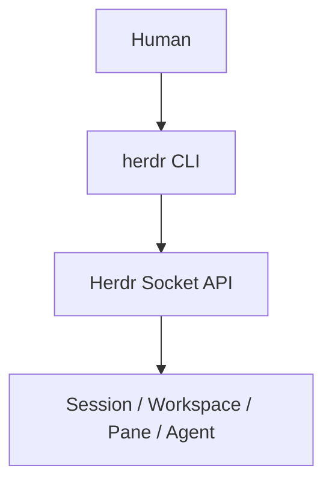

官方文件描述三種整合層級：Agent Skill、CLI Wrapper、原始 Socket API，且明確說明 CLI 本身就是 Socket API 的一層封裝（官方已實作，socket-api 文件）。

### 26.2 三個自動化原語（Primitive）

官方 agent-automation 文件將自動化能力拆成三個職責清楚的原語，選錯原語是企業自建自動化腳本時最常見的設計錯誤（官方已實作）：

| 原語 | 職責 | 適用時機 |
|---|---|---|
| **Layout**（`workspace`／`tab`／Pane 拓樸） | 建立與組織終端機所在位置 | 需要新增/調整 Workspace、Tab、Pane 結構時 |
| **Pane** | 控制一個原始終端機：執行指令、送入輸入、讀取輸出、等待輸出 | 操作 Shell、測試、Server、CI Watcher 等一般終端機程序，不需要 Herdr 理解其語意 |
| **Agent** | 依名稱或 Pane，控制一個被 Herdr 辨識出的 Coding Agent 及其 Lifecycle 狀態 | 需要 Herdr 判斷 `working`／`blocked`／`done`／`idle`／`unknown` 時 |

一個 Pane 不論是否裝載 Agent 都存在；Agent 則是「目前在該 Pane 內執行、且被 Herdr 辨識出來的程序」。因此 `agent start` **要求該 Pane 已存在且處於可互動的 Shell 提示字元狀態**，它本身不會建立、分割或搬移版面——版面規劃永遠是 Layout 原語的職責（官方已實作，agent-automation 文件）。

建立類指令一律回傳 JSON，腳本應該從回應中擷取 ID，而不是自行預測 ID 格式：

```bash
created=$(herdr workspace create --cwd ~/project --label api --no-focus)
pane_id=$(printf '%s\n' "$created" | jq -r '.result.root_pane.pane_id')

split=$(herdr pane split "$pane_id" --direction right --no-focus)
review_pane=$(printf '%s\n' "$split" | jq -r '.result.pane.pane_id')
```

### 26.3 Agent 身分、啟動與控制介面

一個 Pane ID（如 `w1:p2`）定址「終端機所在位置」；一個 Agent 名稱（如 `reviewer`）則是該 Pane 內目前 Agent 的別名，需符合 `[a-z][a-z0-9_-]{0,31}` 且在所有存活 Agent 間唯一，Agent 結束/被釋放/被取代後別名即失效（官方已實作，agent-automation 文件）。Agent 指令可用唯一存活名稱或目前裝載該 Agent 的 Pane ID 定址。

```bash
# 在既有 Pane 中以指定 kind 啟動 Agent，並附加原生參數（-- 之後原封不動傳給該執行檔）
herdr agent start reviewer --kind codex --pane "$review_pane" -- -m gpt-5.4
```

`--kind` 目前支援的 Agent 值（官方已實作，agent-automation 文件）：`pi`、`claude`、`codex`、`gemini`、`cursor`、`devin`、`agy`（Antigravity CLI）、`cline`、`omp`、`mastracode`、`opencode`、`copilot`、`kimi`、`kiro`、`droid`、`amp`、`grok`、`hermes`、`kilo`、`qodercli`、`maki`。

依「原始終端」或「Agent 語意」兩種需求，官方定義了對應的控制介面（官方已實作，agent-automation 文件）：

| 需求 | 指令 |
|---|---|
| 執行一段 Shell 指令並送出 | `pane run` |
| 送出純文字（不含 Enter） | `pane send-text` |
| 送出終端按鍵/修飾鍵組合 | `pane send-keys` |
| 等待畫面出現指定文字或正規表示式 | `pane wait-output` |
| 在既有 Pane 中啟動受支援的 Agent | `agent start` |
| 送出一段 Prompt（可選擇等待完成） | `agent prompt` |
| 對 Agent 的互動介面送出按鍵（如 `esc`／`up`／`ctrl+c`） | `agent send-keys` |
| 等待 Agent 的 Lifecycle 狀態 | `agent wait` |

`agent prompt` 會送出文字加上編碼過的 Enter，並遵循終端當下的 bracketed-paste 模式，即使 Agent 目前正在 `working` 也可以送出；`agent prompt --wait` 若五秒內未觀察到狀態變化會回傳 `agent_prompt_stalled`，而非無限等待。`agent wait`／`agent prompt --wait` 預設接受 `idle`／`done`／`blocked` 任一狀態即視為完成，可重複 `--until` 指定多個精確狀態（例如 `--until idle --until done`）（官方已實作）。

**一個實務 Recipe（官方已實作，agent-automation 文件；示意用途，實際請以當前版本 `--help` 為準）**：

```bash
# 啟動一個 Code Review 用的 Codex 分身、送出審查任務、等待完成、讀取結果
split=$(herdr pane split --current --direction right --no-focus)
review_pane=$(printf '%s\n' "$split" | jq -r '.result.pane.pane_id')
herdr agent start reviewer --kind codex --pane "$review_pane" -- -m gpt-5.4
herdr agent prompt reviewer "Review the current diff" --wait --timeout 120000
herdr agent read reviewer --source recent-unwrapped --lines 120
```

### 26.4 Agent Skill：讓 Agent 自己操作 Herdr

除了「人類/腳本呼叫 CLI 操作 Herdr」，官方也提供反過來的路徑——讓在 Pane 內運行的 Agent（例如 Claude Code）自己學會操作 Herdr，藉此建立子 Pane、檢查其他 Agent 狀態、等待別的 Agent 完成（官方已實作，agent-skill 文件）：

```bash
# 安裝官方維護的 Agent Skill（透過 npx skills 工具）
npx skills add herdrdev/herdr --skill herdr -g   # -g 全域安裝；省略則僅安裝到目前專案

# 若已安裝 Herdr，可直接印出與該執行檔版本對應的 Skill 內容
herdr --skill
```

Skill 檔案的來源與安全前提（官方已實作，agent-skill 文件）：

- Skill 本體是一份 Markdown 指令檔，維護於官方 Repository 的 [`skills/herdr/SKILL.md`](https://github.com/herdrdev/herdr/blob/master/skills/herdr/SKILL.md)，內容涵蓋 Pane ID、`pane split`／`pane run`／`pane read`／`pane wait-output`、`agent wait`、Workspace/Tab 指令與協作 Recipe。
- Skill 內建**安全準則**：只有當環境變數 `HERDR_ENV=1`（代表該 Agent 確實跑在 Herdr 管理的 Pane 內）存在時才允許操作；若未偵測到此變數，Agent 應停止並告知使用者「目前不在 Herdr Pane 內」，避免 Agent 誤操作它不擁有的 Session。
- Herdr 另外在 `herdr.dev/agent-guide.md` 提供性質不同的文件——那份是給「協助人類學習/設定/排除 Herdr 問題的 Agent」使用，與操作用的 Skill 檔案用途不同，不應混淆。

**企業應用建議（建議架構）**：對於已導入 Multi-Agent 協作模式（第 16 章）的團隊，替 Claude Code／Codex 安裝 Agent Skill 後，可以讓「架構 Agent」在完成設計後自行建立「實作 Agent」的 Pane 並下達任務，減少人類手動切換 Pane、複製貼上任務描述的操作成本；但仍應保留人類巡查機制（第 22 章），不應假設 Agent 之間的自動接力永遠正確。

### 26.5 實際可用範例

```bash
# 分割 Pane（示意，實際參數請以當前版本 herdr pane --help 為準）
herdr pane split w1:p1 --direction right

# 等待某個 Pane 內的 Agent 進入 done 狀態
herdr agent wait w1:p1 --until done

# 取得 Socket API 完整 Schema
herdr api schema --json
```

（以上指令為官方文件可查證之指令，官方已實作；具體參數請務必於實際安裝版本執行 `--help` 或 `herdr api schema` 再次確認，因版本演進可能調整）

### 26.6 Socket API 傳輸格式

Socket API 採本機 Unix Domain Socket（Windows 為 Named Pipe），以換行分隔的 JSON 訊息傳遞，每筆請求帶一個 `id`，回應以相同 `id` 對應（官方已實作，socket-api 文件）：

```json
// Request（送出）
{"id": "req_1", "method": "ping", "params": {}}

// Response（收到）
{"id": "req_1", "result": {"type": "pong"}}
```

方法依領域分組：Server、Notification、Client、Session、Workspace、Worktree、Tab、Pane、Popup、Layout、Agent、Events（如 `events.subscribe`、`events.wait`）、Integrations、Plugins（官方已實作，socket-api 文件）。Schema 本身涵蓋原始請求、成功回應、錯誤回應、事件通知與訂閱事件五種型態，可用下列三種方式取得（官方已實作）：

```bash
herdr api schema                                    # 精簡摘要
herdr api schema --json                             # 完整 JSON Schema
herdr api schema --output herdr-api.schema.json      # 存成檔案，供 IDE/驗證工具使用
```

### 26.7 目前版本不提供 / 尚未確認支援

- 官方文件未提供公開的雲端/多使用者共享 API（僅本機 Socket）（Source-confirmed）。
- 完整 Socket API method 清單未逐一驗證，實際可用方法請以 `herdr api schema --json` 的即時輸出為準，不應假設本手冊列出的範例是完整清單（Source-confirmed）。

### 26.8 本章 Checklist 與小結

- [ ] 已理解 CLI 是 Socket API 的封裝，兩者能力對等
- [ ] 已理解 Layout／Pane／Agent 三個自動化原語的職責分工，未混用 Pane 指令操作 Agent 語意
- [ ] 自動化腳本已改用 `herdr api schema` 動態確認可用方法，而非硬編碼假設
- [ ] 已知悉目前僅提供本機 Socket，非雲端/跨主機 API
- [ ] 若團隊採用 Agent 自行操作 Herdr 的模式，已安裝 Agent Skill 並理解 `HERDR_ENV=1` 安全前提

---

## 27. Agent-to-Agent Automation

### 27.1 概念示意

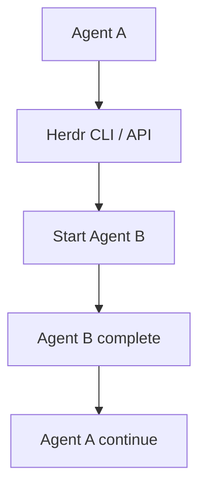

（建議架構：此為概念示意，官方文件未提供一個「內建」的 Agent-to-Agent 自動化框架，實現此流程需要企業自行撰寫腳本呼叫 Herdr CLI/API）

### 27.2 三個層次的清楚區分

| 層次 | Herdr 提供了什麼 | 需要企業自建的部分 |
|---|---|---|
| Herdr 可以做的事 | 啟動/查詢/等待 Pane 中 Agent 的狀態（`herdr agent wait ... --until done`）、透過 Socket API 訂閱事件 | — |
| Agent 本身可以做的事 | 依其自身能力（如 Claude Code 的 Tool Use）執行程式碼、呼叫外部工具 | — |
| 需要企業自建 Orchestration Layer 的事 | — | 任務佇列、DAG 相依關係管理、失敗重試/補償邏輯、跨 Agent 訊息傳遞協定、審計軌跡整合 |

### 27.3 不要把 Herdr 描述成完整 Multi-Agent Orchestrator

Herdr 提供的是「等待」與「觀察」的原語（`agent.wait`、`events.subscribe` 等，官方已實作），這讓企業可以**用少量腳本**串接出簡單的自動化流程（例如：偵測 Agent A 完成後，用腳本呼叫 CLI 啟動 Agent B）。但這與具備完整任務編排、狀態機管理、重試補償邏輯的 Orchestration Framework 是不同量級的能力，不應混淆（見第 6.3 節）。

### 27.4 AI Prompt 範例（供人類撰寫串接腳本時參考的需求描述）

```text
角色：Platform Engineer
任務：撰寫一支腳本，監聽 Herdr Socket API 的 agent 事件，當 Pane w1:p1
(Discovery Agent) 進入 done 狀態時，自動於 Pane w1:p2 啟動 Compatibility Agent。
限制：
  - 腳本需處理 Socket 連線中斷的重連邏輯（Herdr 本身不提供此保證）
  - 需記錄每次自動觸發的時間與觸發原因，供稽核使用
  - 若 Discovery Agent 進入 blocked 而非 done，腳本需通知人類而非自動繼續
輸出：腳本設計說明（虛擬碼即可，不需完整實作）
```

### 27.5 本章 Checklist 與小結

- [ ] 團隊清楚知道哪些自動化能力是 Herdr 原生提供，哪些需要自建
- [ ] 未把 Herdr 對外宣稱為「完整 Multi-Agent Orchestrator」
- [ ] 任何 Agent-to-Agent 自動化腳本都有失敗處理與人類通知機制

---

## 28. Plugin Architecture

### 28.1 Plugin 基本結構

Herdr Plugin 是一個包含 `herdr-plugin.toml` Manifest 的目錄，指令可以用任何語言撰寫（官方已實作，plugins 文件）。官方明確表示：「**the entire Herdr CLI is the plugin API**」——沒有另外獨立的 Plugin SDK，Plugin 就是透過呼叫 Herdr CLI 本身來擴充行為（官方已實作）。

### 28.2 Manifest 欄位

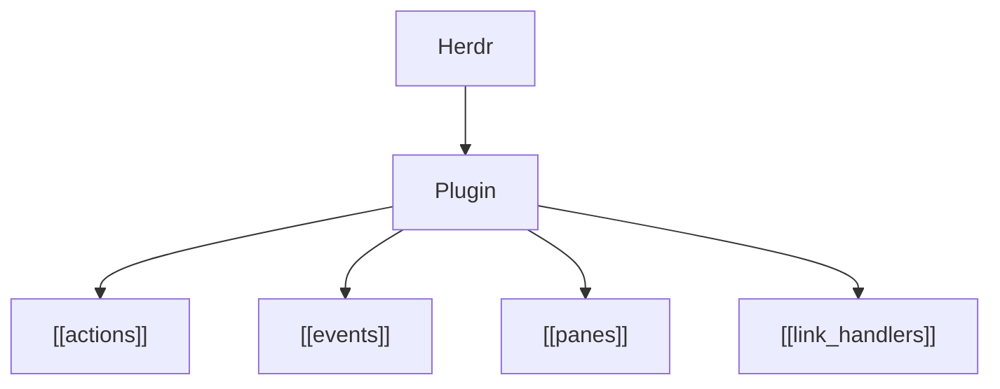

已確認的 Manifest 欄位（官方已實作，plugins 文件）：

| 欄位 | 用途 |
|---|---|
| `id` / `name` / `version` / `description` | Plugin 基本識別資訊 |
| `min_herdr_version` | 相容的最低 Herdr 版本 |
| `platforms` | 支援平台（Windows 支援目前標示為 Preview） |
| `[[build]]` | 建置步驟 |
| `[[startup]]` | Plugin 啟動時執行的動作 |
| `[[actions]]` | 使用者可觸發的動作（含 `id`/`title`/`contexts`/`command`） |
| `[[events]]` | 監聽的事件與對應要執行的 `command`（`on` 欄位定義觸發時機） |
| `[[panes]]` | Plugin 提供的自訂 Pane（`id`/`title`/`placement`/`command`） |
| `[[link_handlers]]` | 自訂連結處理（`id`/`title`/`pattern`/`action`） |

### 28.3 安裝與管理

```bash
# 從 GitHub repo 安裝
herdr plugin install owner/repo

# 本機開發模式（連結本地目錄）
herdr plugin link
```

### 28.4 Marketplace

Herdr Marketplace 會自動索引在 GitHub 上標記 `herdr-plugin` topic 的公開 repo，約每 30 分鐘更新一次；截至查證日期，Marketplace 尚未解析 Manifest 內容進行結構化展示（官方已實作，marketplace 文件）。

> **版本沿革提醒（Breaking Change）**：v0.7.5（2026-07-21）將 Plugin 的安裝與啟用狀態從「依 Herdr Session 各自隔離」改為「全域跟隨目前作業系統使用者」（官方已實作，CHANGELOG）。企業若仍在使用 0.7.3 或更早版本、且曾經只在特定具名 Session 內安裝過 Plugin，升級至 0.7.5 以後需要重新安裝或重新連結該 Plugin。規劃升級 SOP（第 32.5 節）時應把此項納入檢查清單。

### 28.5 企業內部 Plugin 可能用途（建議架構）

- 將企業內部 Wiki／Ticket 系統（如 Jira）連結為 `[[link_handlers]]`，讓 Agent 輸出中的 Ticket 編號可直接點擊開啟。
- 建立 `[[actions]]` 快速動作，例如一鍵在目前 Pane 執行企業標準的 Pre-commit 檢查腳本。
- 建立 `[[panes]]` 自訂面板，顯示企業內部 CI Pipeline 的即時狀態。

### 28.6 本章 Checklist 與小結

- [ ] 已理解 Plugin = 目錄 + `herdr-plugin.toml`，指令可用任意語言撰寫
- [ ] 已確認欲使用/開發之 Plugin 的 `min_herdr_version` 相容性
- [ ] Windows 環境使用 Plugin 前已確認目前為 Preview 狀態

---

## 29. Agent Integration 深度

### 29.1 三種整合深度比較

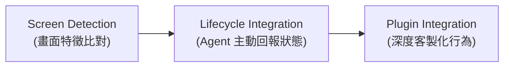

| 整合方式 | 判斷依據 | 準確度 | 目前支援之 Agent（示例） |
|---|---|---|---|
| Screen Detection | TOML 規則比對終端畫面快照（標題、OSC 序列、畫面樣式） | 中（依賴畫面樣式穩定性） | Claude Code、Codex、GitHub Copilot CLI、Cursor Agent CLI 等約 19 種 |
| Lifecycle Integration | Agent 主動透過整合機制回報自身狀態 | 高（權威來源） | Pi、OMP、Kimi Code CLI、OpenCode、Kilo Code CLI、MastraCode |
| Plugin Integration | 透過 Herdr Plugin 系統客製化 Action/Event/Pane | 依實作而定 | 依企業/社群自行開發之 Plugin |
| Unsupported Agent | 無對應規則，狀態長期顯示 `unknown` | 低 | 未列於官方支援清單之 Agent CLI |

### 29.2 為什麼 Agent Integration 越深，Herdr 越能正確理解 Agent Lifecycle

Screen Detection 本質上是「看畫面猜狀態」，當 Agent CLI 更新其終端輸出樣式（例如新版本改變了進度顯示方式）時，既有規則可能失準，導致狀態誤判。Lifecycle Integration 則是 Agent 主動告知，不依賴畫面樣式，因此更穩定、更即時（官方已實作，agents 文件）。**這不代表 Screen Detection 不可靠到不能用**——它是官方對絕大多數 Agent（含 Claude Code、Codex、Copilot CLI）採用的預設機制，只是準確度的來源基礎不同。

### 29.3 以 Claude Code／Codex／GitHub Copilot CLI 為例

- **Claude Code**：狀態判斷目前為 Screen Detection（官方已實作，agents 文件），Herdr 透過辨識終端畫面中 Claude Code 特有的提示樣式、等待輸入樣式來判斷狀態。
- **Codex**：狀態判斷同樣為 Screen Detection。
- **GitHub Copilot CLI**：狀態判斷同樣為 Screen Detection。

**重要修正／澄清**：三者的**狀態判斷**均不在目前官方列出的 Lifecycle Authority 名單中，但這**不代表三者完全沒有官方 Integration**——官方確實提供 `herdr integration install claude`／`codex`／`copilot` 三個整合套件，只是這三個整合套件提供的是**第 5.5 節定義的「Session Identity」能力**（安裝後，Server 重啟可用 `claude --resume <id>`／`codex resume <id>`／`copilot --resume=<id>` 自動復原對話 Session），**不會**把狀態判斷升級為 Lifecycle Authority（官方已實作，integrations 文件）。企業導入時應清楚區分「這個整合裝了沒有」與「裝了整合之後狀態判斷準不準」是兩個獨立的問題。

**官方整合套件安裝／解除安裝指令一覽**（官方已實作，integrations 文件；`--kind` 值與此處整合名稱可能不同，請以官方文件為準）：

```bash
herdr integration install {pi|omp|claude|codex|copilot|devin|droid|kimi|opencode|kilo|hermes|qodercli|cursor|mastracode|antigravity-cli|grok}
herdr integration uninstall <同上任一名稱>
herdr integration status   # 檢查各整合套件的已安裝版本
```

**Native Session Restore 所需最低整合版本**（節錄企業最常用之 Agent；完整清單見官方 session-state 文件，官方已實作）：

| Agent | 最低整合版本 | Server 重啟後復原指令 |
|---|---|---|
| Claude Code | `6` | `claude --resume <id>` |
| Codex | `5` | `codex resume <id>` |
| GitHub Copilot CLI | `2` | `copilot --resume=<id>` |
| Cursor Agent CLI | `1` | `cursor-agent --resume <id>` |
| Grok CLI | `1` | `grok --resume <id>` |
| OpenCode | `5` | `opencode --session <id>` |

版本不足、未安裝、或 Session 參照失效時，該 Pane 會在 Server 重啟後退回成一個位於原本工作目錄的全新 Shell，而不是自動復原對話（官方已實作）。

### 29.4 自建/客製 Agent 的整合方式

若企業內部自行開發了 Coding Agent（非官方支援清單中的任何一種），仍可透過 Socket API／CLI 讓它主動回報 Lifecycle 狀態，取得與官方整合同等的權威地位，不需要被 Herdr 收錄進官方清單才能使用（官方已實作，integrations 文件）：

```bash
# 在 Herdr 管理的 Pane 內，Agent 進程可讀到 HERDR_ENV/HERDR_PANE_ID/HERDR_BIN_PATH/HERDR_SOCKET_PATH
# 主動回報自己進入 working 狀態
"$HERDR_BIN_PATH" pane report-agent "$HERDR_PANE_ID" \
  --source custom:my-agent --agent my-agent --state working

# Agent 結束時釋放狀態權威
"$HERDR_BIN_PATH" pane release-agent "$HERDR_PANE_ID" \
  --source custom:my-agent --agent my-agent
```

實作重點（官方已實作，integrations 文件）：`--state` 僅回報 `working`／`idle`／`blocked` 等語意狀態，且僅在偵測到 `HERDR_ENV=1` 時才呼叫，確保這段整合邏輯在 Herdr 之外執行時自動變成無作用（no-op）；若回報可能不按順序抵達，應帶遞增的 `--seq`，Herdr 會忽略同一來源的過期序號。若只是想客製化顯示名稱/標題等呈現層資訊、而不想取得狀態權威，應改用 `pane report-metadata`（帶 `--token`／`--state-label`／`--display-agent` 等參數），這類 Metadata 只影響畫面呈現，不影響 Wait／通知等仍以語意狀態為準的行為。開源實例可參考社群專案 [Prime Agent 的 Herdr Reporter 實作](https://github.com/PrimeIntellect-ai/prime-agent/blob/main/packages/coding-agent/src/core/extensions/builtin/herdr-agent-state.ts)（Source-confirmed，第三方實作，非 Herdr 官方維護）。

**企業應用建議（建議架構）**：若企業已有內部維護的 Agent CLI（例如包裝自有 LLM API 的內部工具），與其等待官方收錄進支援清單，不如直接依上述方式自行整合，取得與 Pi／OMP 同等的狀態權威等級，比依賴 Screen Manifest 更準確、更不受畫面樣式改版影響。

### 29.5 本章 Checklist 與小結

- [ ] 已理解 Screen Detection 與 Lifecycle Authority 的準確度差異
- [ ] 已確認團隊主要使用的 Claude Code/Codex/Copilot CLI 目前狀態判斷為 Screen Detection，但可另外安裝官方整合取得 Session Identity（原生 Session 復原）能力
- [ ] 未把「可以在 Herdr 終端機裡執行」或「裝了官方整合套件」誤認為「一定具有 Lifecycle Authority」
- [ ] 若企業有自建 Agent，已評估透過 `pane report-agent` 自行整合取得狀態權威的可行性

---

## 30. Herdr Configuration

### 30.1 設定檔位置與格式

| 平台 | 路徑 |
|---|---|
| Linux/macOS | `~/.config/herdr/config.toml` |
| Windows | `%APPDATA%\herdr\config.toml` |

（官方已實作，configuration 文件）設定檔為 TOML 格式，不建立設定檔時 Herdr 會使用內建預設值運作（官方已實作）。

### 30.2 常用操作

```bash
# 印出目前完整的預設設定（可作為撰寫自訂設定的起點）
herdr --default-config

# 修改設定檔後，讓 Server 套用最新設定（不需重啟 Server）
herdr server reload-config
```

### 30.3 常見設定區塊（示意）

```toml
# 示意：非逐字官方預設值，實際欄位請以 `herdr --default-config` 輸出為準
[keys]
prefix = "ctrl+b"

[theme]
# 主題相關設定

[notification]
# 通知相關設定
```

（此區塊標示為「示意」，用途是說明設定檔的分區概念，並非官方原始 TOML 逐字內容；企業實際撰寫設定前，務必先執行 `herdr --default-config` 取得當前版本的真實預設值）

### 30.4 本章 Checklist 與小結

- [ ] 已確認自身平台對應的設定檔路徑
- [ ] 已執行 `herdr --default-config` 取得目前版本的完整預設設定作為基準
- [ ] 修改設定後已用 `herdr server reload-config` 驗證生效，而非重啟整個 Server

---

## 31. 系統維護 SOP

### 31.1 維運週期總覽

| 週期 | 項目 |
|---|---|
| Daily | 巡查 blocked Pane（見第 22 章）、確認 Server 運作正常 |
| Weekly | Session/Workspace 清理（關閉已完成任務的 Tab/Pane）、檢視 Log |
| Monthly | Plugin 清理（移除不再使用的 Plugin）、磁碟使用量檢查、版本檢查 |
| Release | 對照第 32 章升級 SOP 執行 |
| Incident | 依第 43-44 章 Troubleshooting 流程處理 |

### 31.2 Session Cleanup

```bash
# 列出目前所有 Session
herdr session list

# 停止/刪除不再需要的 Session
herdr session stop <name>
herdr session delete <name>
```

### 31.3 Process／磁碟檢查（建議架構，搭配作業系統既有工具）

```bash
# Linux/macOS：確認 herdr server process 資源使用狀況
ps aux | grep herdr

# 檢查 Herdr 設定/資料目錄佔用空間
du -sh ~/.config/herdr
```

### 31.4 Workspace／Agent／Plugin 清理

- 定期關閉已完成任務的 Workspace（`herdr workspace close`），避免清單過長難以辨識。
- 定期檢視已安裝 Plugin 是否仍在使用，移除未使用或未維護的 Plugin，降低供應鏈風險（見第 33 章安全考量）。

### 31.5 本章 Checklist 與小結

- [ ] 已建立 Daily/Weekly/Monthly 固定巡檢排程
- [ ] 已定期執行 Session/Workspace/Plugin 清理
- [ ] 已建立 Incident 發生時對應的處理流程入口（連結第 44 章）

---

## 32. Herdr 升級

### 32.1 `herdr update`

```bash
herdr update
```

此指令適用於透過官方 install.sh／install.ps1 安裝的情境（自我管理安裝）；若透過 Homebrew／mise／Nix 安裝，應改用該工具自身的更新機制（例如 `brew upgrade herdr`），而非 `herdr update`（官方已實作，agent-guide 文件）。

### 32.2 Stable／Preview Channel

```bash
# 查看目前 channel
herdr channel show

# 切換 channel（Linux/macOS 可切換 stable；Windows 目前僅 Preview，切換 stable 會被拒絕）
herdr channel set stable
herdr channel set preview
```

### 32.3 不同安裝方式的更新策略比較

| 安裝方式 | 更新指令 | 備註 |
|---|---|---|
| install.sh／install.ps1（自我管理） | `herdr update` | 官方已實作 |
| Homebrew | `brew upgrade herdr` | 官方已實作 |
| mise | `mise up herdr` 或 `mise use -g herdr@latest`（依 mise 版本語法而定） | Source-confirmed，請以 mise 官方語法為準 |
| Nix | `nix profile upgrade` 或重新 `nix run`／`nix build` 指定新版本 | Source-confirmed |
| Windows Preview | `herdr update`（僅能維持在 Preview Channel） | 官方已實作 |

### 32.4 Server/Client 相容性與 Live Handoff

升級 Server 版本後，正在連線的舊版 Client 可能出現不相容情形；官方提供 `--handoff` 相關機制（`herdr update --handoff`）協助降低升級時的服務中斷（官方已實作，CLI 文件），但**此機制在 Windows 上尚未完全驗證**（見第 8.3 節），Windows 環境升級時建議規劃明確的重啟時間窗口，而非假設可以無縫切換。

### 32.5 Upgrade SOP Checklist

1. 確認目前版本：`herdr --version`
2. 查閱官方 Release Notes／CHANGELOG，確認本次升級是否有 Breaking Change
3. 備份重要設定檔（`config.toml`，見第 33 章）
4. 確認目前是否有正在運作中的重要 Session（避免升級過程中斷關鍵任務）
5. 執行對應安裝方式的更新指令
6. 驗證：`herdr --version` 確認版本已更新
7. 重新 Attach 既有 Session，確認 Agent 狀態顯示正常
8. 驗證關鍵 Agent（Claude Code/Codex/Copilot CLI）偵測功能正常
9. 驗證 Workspace／Plugin 是否正常運作
10. 若發現異常，依官方文件評估是否可 Rollback 到前一版本；若無法安全 Rollback，優先回報官方 Issue 並暫緩大規模推廣此版本

- [ ] 已完成上述 10 步驟並記錄結果
- [ ] 已通知團隊本次升級的版本異動與已知風險

### 32.6 本章 Checklist 與小結

- [ ] 已確認團隊各成員採用的安裝方式，並使用對應的更新指令
- [ ] Windows 環境升級已規劃明確的重啟時間窗口，未假設無縫切換
- [ ] 已完整走過 Upgrade SOP Checklist 十步驟

---

## 33. Backup／Recovery

### 33.1 需要備份的項目

| 項目 | 說明 |
|---|---|
| Configuration Backup | `config.toml` 應納入個人/團隊的設定備份（例如 dotfiles repo） |
| Git Protection | 所有程式碼變更的唯一可靠保護機制是 Git commit/push，不是 Herdr Session |
| Agent Session Recovery | Herdr Server 存活期間，Detach/Attach 可恢復 Pane 畫面與 Process 狀態 |
| Workspace Recovery | Server 存活期間，Workspace/Tab/Pane 結構持續存在 |
| Server Restart | Server Process 被終止（當機、`herdr server stop`、機器重啟）後，所有 Pane 內未 commit 的工作進度會遺失 |
| Client Reconnect | Client 端斷線不影響任何資料，重新連線即可 |
| Machine Reboot | 若 Server 未設定開機自動啟動，機器重啟後需重新手動啟動 Herdr（Server 內原本的 Process 狀態不會被保存到磁碟並自動恢復，除非額外自建機制） |

> 上表為概念總覽；「Detach/Attach」「Server 重啟」「Update（含/不含 `--handoff`）」四種情境下，Process／版面／近期畫面／Agent 對話各自是否保留的完整矩陣，見第 5.3 節。若企業需要「Server 重啟後仍能看到近期終端畫面」，可評估啟用 `[experimental] pane_history = true`（見第 5.3 節），但需注意這會把終端輸出（可能含機密）落地存檔，須與資安團隊確認可接受範圍後再啟用（見第 34 章）。

### 33.2 最重要的觀念：Session Recovery ≠ Code Recovery

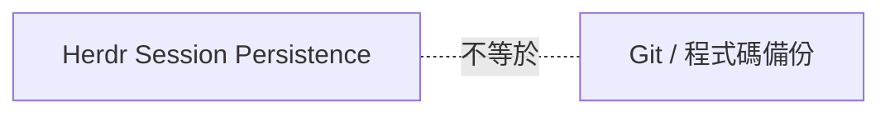

> **Herdr 的 Session Persistence，保存的是「終端機 Process 目前的執行狀態」（例如 Claude Code 對話畫面、尚未結束的 build 指令輸出），不是程式碼的版本控制備份。** 一旦 Server Process 被終止（機器當機、`herdr server stop`、未預期的系統重啟），所有尚未 `git commit` 的變更就有遺失風險，與是否使用 Herdr 無關——這是任何終端機工具都存在的根本限制（建議架構，強調此概念以避免企業誤解）。

**因此團隊規範必須明確要求**：任何 Agent 完成一個有意義的邏輯單元，就應該 `git commit`，不要依賴 Herdr 的 Session Persistence 作為程式碼保護機制。

### 33.3 本章 Checklist 與小結

- [ ] 團隊已清楚區分 Session Recovery 與 Code Recovery 是兩件事
- [ ] `config.toml` 已納入個人/團隊設定備份流程
- [ ] 所有 Agent 均被要求小步 commit，不依賴 Session Persistence 保存程式碼

---

## 34. Security

### 34.1 風險分析

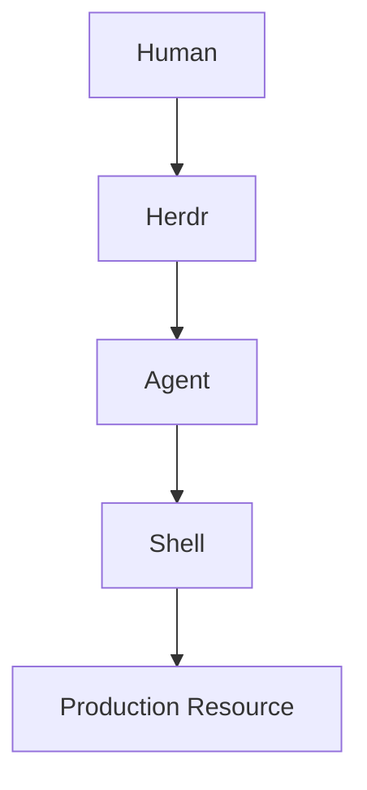

Agent 在 Herdr 的 Pane 中，實質上擁有與該 Pane 底層 Shell 相同的執行權限（Source-confirmed，Herdr 本身不額外限制 Agent 在 Shell 內可執行的指令範圍，權限邊界由 OS 使用者權限與 Agent 自身的工具使用限制決定）。這代表 Herdr 本身**不是**一個資安沙箱（Sandbox）產品，安全邊界主要仍需仰賴：作業系統層級的使用者權限管理、Agent 廠商自身的權限確認機制（如 Claude Code 的工具呼叫核准）、企業網路層級的存取控制。

### 34.2 風險項目清單

| 風險項目 | 說明 |
|---|---|
| Credential／SSH Key | 若 Agent 所在 Shell 環境可存取 SSH Key/憑證，Agent 理論上可讀取/使用這些憑證 |
| API Key／環境變數 | Agent 可能讀取到環境變數中的敏感資訊（如雲端服務金鑰） |
| Git Credential | Agent 可能執行 `git push` 等操作，需注意其使用的憑證範圍 |
| Secrets | 不應將機密資訊以明碼方式存在 Agent 可存取的檔案中 |
| Agent Command Execution | Agent 可執行的指令範圍取決於其自身設計與使用者授權，非 Herdr 控制 |
| Shell Access | Pane 本質上就是一個真實 Shell，Agent 的能力邊界即是 Shell 的能力邊界 |
| Plugin Trust | 第三方 Plugin 可執行任意語言的指令（見第 28 章），安裝前需評估來源可信度 |
| Workspace Permission | 目前官方模型未描述細緻的 Workspace 層級權限控管（Source-confirmed） |
| Remote Server | Server 跑在遠端主機時，該主機的存取控制即是資安邊界 |
| Multi-User 環境 | 官方文件未描述正式的多使用者共享 Session 模型（見第 5.7 節），企業不應自行假設存在隔離保證 |

### 34.3 AI Coding Agent + Herdr Security Checklist

- [ ] 已確認 Agent 執行所在 Shell 的 OS 使用者權限，遵循最小權限原則
- [ ] 敏感憑證（SSH Key、API Key）未以明碼形式暴露在 Agent 可讀取的一般檔案中
- [ ] 所有第三方 Plugin 安裝前已完成來源可信度評估
- [ ] Server 若跑在遠端主機，該主機已納入企業既有伺服器資安管控範圍
- [ ] 未假設 Herdr 提供多使用者 Session 隔離保證
- [ ] 已針對「Agent 意外執行破壞性指令」情境建立備份與 Rollback 機制（見第 33 章）
- [ ] Production 相關憑證未配置在日常開發用 Herdr Session 可存取的範圍內（見第 35-36 章）

### 34.4 本章 Checklist 與小結

- [ ] 已完成上方 Security Checklist 全部項目
- [ ] 團隊已理解 Herdr 不是資安沙箱，權限邊界仍在 OS/Agent/網路層級
- [ ] 已建立 Plugin 安裝前的資安審查流程

---

## 35. Banking／Enterprise Environment

### 35.1 典型企業/銀行網路拓樸

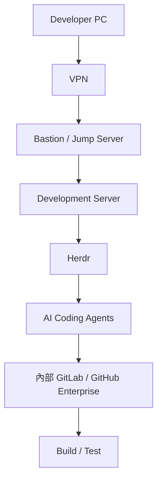

（建議架構：此為本手冊依常見銀行/大型企業網路架構歸納之示意圖，非官方文件內容）

### 35.2 需考量的企業限制

| 考量項目 | 說明 |
|---|---|
| Internet Restriction | Agent 若需連外部 LLM API 或下載 Plugin，需確認是否符合企業網路出口政策 |
| Proxy | 企業內網通常需設定 Proxy 才能對外連線，Agent CLI 與 `herdr update` 等指令都需相容企業 Proxy 設定 |
| 內部 GitLab | 建議所有程式碼變更走內部 GitLab/GitHub Enterprise，而非外部公開平台 |
| Credential 管理 | 企業級 Secret 管理（如 Vault）應與 Agent 執行環境整合，避免明碼存放 |
| Audit | 企業通常要求完整的操作稽核軌跡，Herdr 本身的 Log／Socket API 事件可作為稽核資料來源之一，但通常仍需搭配企業既有稽核系統（見第 46 章可觀測性的界線說明） |
| Data Leakage | 需評估 Agent 是否會將程式碼片段傳送至外部 LLM 服務，並依企業資安政策決定可接受範圍 |
| Source Code Confidentiality | 銀行等高機敏產業，需特別確認所選用 Agent CLI 的資料處理政策是否符合內部合規要求 |
| AI Policy | 企業應有明確的 AI 使用政策，界定哪些系統/資料可以交給 AI Agent 處理 |
| Production Isolation | Herdr Session 所在的開發環境，不應具備直接存取 Production 系統的網路路徑（見第 36 章） |

### 35.3 本章 Checklist 與小結

- [ ] 已確認 Herdr Server 部署位置符合企業網路拓樸與 Proxy 政策
- [ ] 已確認選用之 Agent CLI 的資料處理政策符合內部合規要求
- [ ] 開發環境與 Production 環境已有明確網路隔離

---

## 36. AI Coding Governance

### 36.1 治理流程

```mermaid
flowchart TD
    Approval["Human Approval"] --> Exec["Agent Execution"]
    Exec --> Test["Automated Test"]
    Test --> Scan["Security Scan"]
    Scan --> Review["Code Review"]
    Review --> Merge["Merge"]
```

### 36.2 禁止事項

**除非企業明確授權，否則 Agent 不可直接存取或操作：**

```text
Production
Database（正式環境）
Production Server
Production Secret
```

這是本手冊反覆強調的紅線（建議架構，對應第 34-35 章的安全與企業環境考量）。Herdr 本身不會阻止 Agent 執行任何指令——這道防線必須由企業自行透過網路隔離、憑證管理、OS 權限設計來落實，不能假設 Herdr 或 Agent 廠商會自動阻擋。

### 36.3 本章 Checklist 與小結

- [ ] 治理流程圖已納入團隊開發規範文件
- [ ] Agent 執行環境已透過網路/權限手段確保無法直接存取 Production
- [ ] 所有 Merge 前都經過 Automated Test + Security Scan + Code Review

---

## 37. SSDLC + Herdr

### 37.1 各階段配置 Agent

```mermaid
flowchart TD
    Req["Requirements"] --> Arch["Architecture"]
    Arch --> Design["Design"]
    Design --> Impl["Implementation"]
    Impl --> Test["Test"]
    Test --> Sec["Security"]
    Sec --> Rev["Review"]
    Rev --> Release["Release"]
    Release --> Monitor["Monitor"]
```

| 階段 | 建議 Agent | Herdr 的角色 |
|---|---|---|
| Requirements | 人類主導，Architecture Agent 協助分析 | 提供 Workspace 承載需求分析對話紀錄 |
| Architecture | Architecture Agent（Claude Code） | 承載長時間架構討論 Session |
| Design | Development Agent | 承載設計文件產出過程 |
| Implementation | Development Agent（Claude Code/Codex） | Multi-Pane 並行開發 |
| Test | Test Agent（Copilot CLI） | 獨立 Pane 執行測試，狀態可視化 |
| Security | Security Agent（Claude Code） | 獨立 Pane，避免與開發 Pane 混雜 |
| Review | Review Agent + 人類 | Review Tab 整合各 Agent 產出 |
| DevOps | DevOps Agent | 對接 CI/CD（Herdr 本身不是 CI/CD Platform，見第 27、63 章） |
| Monitor | 人類 + 既有監控工具 | Herdr 狀態資訊可作為輔助觀察來源（見第 46 章） |

### 37.2 Herdr 在其中負責什麼

Herdr 在 SSDLC 中的角色是**橫向貫穿多個階段的 Runtime 層**：它不定義流程本身（流程仍由企業 SSDLC 規範決定），而是提供「這些階段所需要的 Agent 執行工作能夠長時間、可觀察、可恢復地進行」的基礎設施（建議架構）。

### 37.3 本章 Checklist 與小結

- [ ] SSDLC 各階段已配置對應 Agent 與 Herdr Workspace/Tab
- [ ] 團隊理解 Herdr 是承載層，不是 SSDLC 流程本身
- [ ] Monitor 階段已釐清 Herdr 狀態資訊與正式監控系統的分工

---

## 38. Spec-Driven Development + Herdr

### 38.1 架構

```mermaid
flowchart TD
    Spec["Spec"] --> Plan["AI Planning"]
    Plan --> Herdr["Herdr"]
    Herdr --> A["Agent A"]
    Herdr --> B["Agent B"]
    Herdr --> C["Agent C"]
    Herdr --> D["Agent D"]
    A --> Impl["Implementation"]
    B --> Impl
    C --> Impl
    D --> Impl
```

### 38.2 Herdr 如何成為 Agent Runtime Layer

若企業採用 Spec → Plan → Tasks → Implementation → Test → Review 的 Spec-Driven Development 流程（可參考本 Repository [spec-kit使用教學](spec-kit使用教學.md)、[OpenSpec使用教學](OpenSpec使用教學.md)），Herdr 承接的是「Plan 拆解出的 Tasks，交給哪些 Agent、在哪些 Pane 中執行」這一層：每個 Task 可以對應一個 Pane，Task 之間的依賴關係則對應 Sequential／Parallel 模式的選擇（見第 16 章）。

### 38.3 本章 Checklist 與小結

- [ ] Spec 拆解出的 Tasks 已對應明確的 Herdr Pane 配置
- [ ] Task 依賴關係已反映在 Sequential/Parallel 模式選擇上

---

## 39. Loop Engineering + Herdr

### 39.1 循環流程

```mermaid
flowchart TD
    Plan["Plan"] --> Implement["Implement"]
    Implement --> Run["Run"]
    Run --> Observe["Observe"]
    Observe --> Fix["Fix"]
    Fix --> Test["Test"]
    Test --> Plan
```

（可參考本 Repository 既有的 [Loop Engineering 教學手冊](Loop%20Engineering%20教學手冊.md) 深入了解 Loop Engineering 方法論本身）

### 39.2 Herdr 如何提供長時間執行環境

Loop Engineering 強調「Plan → Implement → Run → Observe → Fix → Test → Repeat」的持續迭代循環，這類迭代往往需要數小時到數天不間斷運作。Herdr 的 Session Persistence 讓這個循環可以：

- 在 Agent 進入 `working` 狀態長時間執行時，工程師可以 Detach 去處理其他事務，不需要守在螢幕前
- 迭代過程中若發生 `blocked`（例如需要人類確認是否採用某個 Fix 方向），可即時被工程師發現並處理（見第 22 章）
- 跨天的迭代不會因為筆電關機、SSH 斷線而中斷（見第 25 章）

### 39.3 本章 Checklist 與小結

- [ ] Loop Engineering 的長時間迭代已受益於 Herdr 的 Session Persistence
- [ ] 迭代過程中的 blocked 狀態已納入日常巡查範圍

---

## 40. AI Agent Team Blueprint

### 40.1 企業級 AI Development Team 設計

```text
AI Architect
AI Analyst
AI Developer
AI Frontend Developer
AI Backend Developer
AI DBA
AI Tester
AI Security Engineer
AI DevOps Engineer
AI Reviewer
```

（建議架構：以角色命名的 Agent，實際上是「指派給特定 Agent CLI 執行個體的職責標籤」，並非 Herdr 或任何 Agent 廠商提供的正式角色系統）

### 40.2 使用 Herdr 建立對應 Workspace

```text
ai-dev-team
├── architect     → Claude Code（AI Architect）
├── analyst       → Claude Code（AI Analyst）
├── backend       → Claude Code（AI Backend Developer）
├── frontend      → Codex（AI Frontend Developer）
├── dba           → Copilot CLI（AI DBA）
├── test          → Codex（AI Tester）
├── security      → Claude Code（AI Security Engineer）
├── devops        → Copilot CLI（AI DevOps Engineer）
└── review        → Copilot CLI（AI Reviewer）
```

### 40.3 本章 Checklist 與小結

- [ ] 已依專案規模決定需要啟用哪些角色（非所有專案都需要全部十個角色）
- [ ] 每個角色的 Tab/Pane 職責已對團隊成員說明清楚

---

## 41. PM／SA／Architect／SD／PG／QA／DevOps／Security 使用方式

| 角色 | 如何利用 Herdr + AI Agent |
|---|---|
| PM | 透過 Review Tab 檢視各 Agent 進度與 blocked 狀態，掌握專案時程風險，不需深入技術細節即可看懂「working/idle/blocked/done」四種狀態 |
| SA | 在 Architecture Pane 中與 Agent 協作產出架構文件，善用 Session Persistence 進行長時間的架構探索與比較 |
| Architect | 運用第 6 章比較表評估工具選型，運用第 55 章架構師評估框架做決策 |
| SD（軟體設計） | 在 Design/Implementation Tab 中主導設計決策，指派 Agent 依設計文件實作 |
| PG（工程師） | 依第 13-15 章實戰指南，日常操作 Claude Code/Codex/Copilot CLI |
| QA | 在獨立 Test Tab 中運行 Test Agent，善用狀態可視化快速找出測試卡住的原因 |
| DevOps | 負責 Herdr Server 部署、維運 SOP（第 31 章）、升級（第 32 章），並串接既有 CI/CD |
| Security | 主導 Security Tab 的 Agent 審查工作，落實第 34-36 章的安全與治理要求 |

### 41.1 本章 Checklist 與小結

- [ ] 每個角色都清楚自己在 Herdr Multi-Agent 工作流程中的切入點
- [ ] PM/QA 等非技術/測試角色已能看懂 Agent 狀態標示的意義

---

## 42. Team Operating Model

### Rule 1：一個 Agent 一個明確責任

避免讓單一 Agent 同時身兼架構設計與程式碼實作，職責混雜會提高 Review 難度。

### Rule 2：一個 Workspace 對應一個 Project

避免跨專案混用同一個 Workspace，造成 Tab/Pane 難以歸屬。

### Rule 3：重大修改一定建立 Git Checkpoint

任何 Framework Upgrade、大型重構，都必須在關鍵節點建立可回退的 Git Checkpoint（見第 21 章）。

### Rule 4：Agent 不可直接覆蓋其他 Agent 的工作

透過 Git Worktree 隔離（見第 24 章）從架構上杜絕此風險，而非僅靠口頭約定。

### Rule 5：Blocked Agent 必須有人處理

依第 22 章 SOP，建立巡查頻率與升級處理時效。

### Rule 6：AI Agent 不可直接進 Production

依第 34-36 章，透過網路隔離與權限設計落實，而非僅靠信任 Agent 自律。

### Rule 7：所有 AI 產生的重大程式碼必須經過 Test + Review

不因為是 AI 產出就降低品質把關標準，反而應該視為需要更嚴謹交叉驗證的產出（見第 16.4 節 Reviewer 模式）。

### 42.1 本章 Checklist 與小結

- [ ] 團隊已將以上 7 條規則納入正式開發規範文件
- [ ] 新進團隊成員 Onboarding 時已涵蓋這 7 條規則

---

## 43. 常見錯誤

| # | Symptom | Cause | Diagnosis | Solution | Prevention |
|---|---|---|---|---|---|
| 1 | `herdr: command not found` | PATH 未包含安裝路徑 | 檢查安裝腳本輸出訊息 | 將安裝路徑加入 shell/PowerShell 設定檔 | 安裝後立即執行 `herdr --version` 驗證 |
| 2 | Agent not detected（狀態長期為 unknown） | Agent 不在官方支援清單，或畫面樣式未命中規則 | 對照 Appendix D 支援清單 | 確認使用官方明確支援之 Agent；如為新版 Agent CLI 改版導致樣式改變，回報官方/等待規則更新 | 導入前先確認目標 Agent 在官方支援清單中 |
| 3 | Agent status incorrect（顯示與實際不符） | Screen Detection 為畫面樣式比對，非語意理解 | 觀察實際終端輸出與狀態標示是否確實不符 | 手動判斷，必要時忽略誤判之狀態標示 | 對高度依賴狀態判斷的自動化流程，優先選用 Lifecycle Integration 之 Agent |
| 4 | Agent appears blocked（實際上已完成） | 畫面殘留符合 blocked 樣式的文字（如歷史對話中出現過的提示字樣） | 直接查看 Pane 實際內容 | 手動確認，必要時重新整理畫面或重啟該 Pane 內程式 | — |
| 5 | Session disappeared | Server 被意外終止（當機/`herdr server stop`/機器重啟） | `herdr session list` 確認 Session 是否存在 | 依第 33 章，確認程式碼已 commit，重新啟動新 Session | 重要任務安排在具開機自動啟動設定的 Dev Server 上 |
| 6 | Pane disappeared | Pane 被關閉（`prefix+x` 或其他操作誤觸） | 確認是否誤觸關閉鍵位 | 若程式碼已 commit，直接重開 Pane 重新啟動 Agent | 熟悉鍵位，避免誤觸；重要操作前先確認焦點在正確 Pane |
| 7 | Cannot reconnect | Server 已停止，或 Session 名稱記錯 | `herdr session list`、`herdr status` | 確認正確 Session 名稱；若 Server 確實已停止則需重新啟動 | 使用具名 Session，並記錄於團隊文件 |
| 8 | SSH disconnect 後任務中斷 | Server 跑在本機而非遠端 | 確認 Server 執行位置 | 改將 Server 部署在遠端 Dev/Cloud VM（見第 25 章） | 重要/長時間任務優先使用遠端 Server 模式 |
| 9 | Windows 特有問題（功能無法使用） | 該功能在 Windows Preview 尚未完整支援 | 對照第 8.3 節限制清單 | 改用 WSL2 + Linux Herdr，或等待官方 Windows 版本成熟 | 導入前先確認該功能在 Windows 上的支援狀態 |
| 10 | Permission issue（Agent 無法執行某操作） | OS 使用者權限不足，或 Agent 自身工具核准機制擋下 | 確認是 OS 權限問題還是 Agent 自身核准機制 | 依最小權限原則調整；Agent 核准機制屬正常設計，不應強行繞過 | 導入前規劃好 Agent 執行帳號的權限範圍 |
| 11 | PATH issue（找不到 Agent CLI） | Claude Code/Codex/Copilot CLI 本身未正確安裝於 PATH | 在 Pane 內直接測試該 Agent CLI 指令 | 依各 Agent 官方安裝文件修正 | 安裝 Herdr 前，先確保各 Agent CLI 已可正常於一般終端機執行 |
| 12 | Integration issue（Lifecycle Hook 未生效） | 對應整合套件未安裝或版本不相容 | 檢查該 Agent 的整合安裝狀態 | 依官方整合文件重新安裝/更新整合套件 | 升級 Herdr 或 Agent CLI 版本後，重新驗證整合是否仍生效 |
| 13 | Plugin issue（Plugin 未生效） | `min_herdr_version` 不相容，或 Manifest 撰寫錯誤 | 檢查 Plugin Manifest 與目前 Herdr 版本 | 更新 Plugin 或降級/升級 Herdr 版本以符合相容性要求 | 安裝 Plugin 前確認版本相容性 |
| 14 | Update issue（升級後行為異常） | Server/Client 版本不相容，或設定檔格式於新版本有調整 | 對照 Release Notes 確認是否有 Breaking Change | 依第 32.5 節 Upgrade SOP 排查，必要時 Rollback | 升級前務必先閱讀 Release Notes |

---

## 44. Troubleshooting Decision Tree

```mermaid
flowchart TD
    Start["Herdr 無法啟動或行為異常"] --> Q1{"command not found?"}
    Q1 -->|"是"| Path["檢查 PATH 設定（見第 43 章 #1）"]
    Q1 -->|"否"| Q2{"Server 相關問題?\n(無法啟動/無法連線)"}
    Q2 -->|"是"| ServerDiag["執行 herdr status 診斷 Server/Session 狀態（見第 43 章 #5-7）"]
    Q2 -->|"否"| Q3{"Agent 相關問題?\n(未偵測/狀態錯誤)"}
    Q3 -->|"是"| AgentDiag["確認 Agent Process 是否存活、對照支援清單（見第 43 章 #2-4）"]
    Q3 -->|"否"| Q4{"Integration/Plugin 相關問題?"}
    Q4 -->|"是"| IntegDiag["檢查整合套件安裝狀態與版本相容性（見第 43 章 #12-13）"]
    Q4 -->|"否"| Q5{"平台特有問題?\n(Windows)"}
    Q5 -->|"是"| WinDiag["對照第 8.3 節 Windows Preview 已知限制"]
    Q5 -->|"否"| Escalate["蒐集完整 Log/重現步驟，回報官方 GitHub Issue"]
```

決策樹葉節點對應第 43 章常見錯誤清單之編號，建議兩者搭配使用：先用決策樹快速定位問題類別，再查表獲得具體 Symptom/Cause/Solution。

### 44.1 官方 Troubleshooting 頁面對照

**修正說明**：官方**確實提供**獨立 Troubleshooting 頁面（`herdr.dev/docs/troubleshooting/`），本手冊初版查證時誤判為「導覽未見獨立頁面」，特此更正。該頁面收錄以下八個具體情境，建議與上方決策樹、第 43 章常見錯誤表三者交叉引用（官方已實作，troubleshooting 文件）：

| 官方情境標題 | 對應本手冊章節 |
|---|---|
| The CJK IME window is misplaced or the cursor flickers on Windows（Windows 上 IME 候選字視窗位置錯誤/游標閃爍） | 第 8.3 節；解法為將 `[ui] host_cursor` 設為 `"native"` |
| Enter, Tab, or Backspace fires twice（部分終端機版本下按鍵重複觸發） | 第 43 章 #10 類；已知最低修復版本：kitty 0.33.0／foot 1.20.0／Alacritty 0.15.0 |
| Option+Left / Option+Right inserts `;3D` or `;3C`（修飾鍵方向鍵異常） | 第 11 章鍵盤操作；需於 zsh 手動綁定 `bindkey $'\e[1;3D' backward-word` 等 |
| Herdr updated, but the running session is still old（更新後 Session 仍是舊版） | 第 32 章；需 `herdr server stop` 後重新 `herdr` 啟動新 Server |
| The `herdr` command is not found | 第 9.4 節／第 43 章 #1 |
| A direct keybinding does nothing（鍵位無反應） | 第 11 章；常見原因為作業系統或外層終端機攔截了該按鍵組合 |
| Remote attach cannot authenticate（遠端連線認證失敗） | 第 25.4 節；需先 `ssh-add` 將 passphrase 保護的金鑰載入 `ssh-agent` |
| Find diagnostic logs（尋找診斷 Log） | 第 31 章；預設位於 `~/.config/herdr/`（`herdr.log`／`herdr-client.log`／`herdr-server.log`），設定 `HERDR_LOG=herdr=debug` 取得除錯層級 Log |

### 44.2 本章 Checklist 與小結

- [ ] 團隊成員已熟悉此決策樹的五個判斷分支
- [ ] 決策樹的葉節點已與第 43 章常見錯誤清單建立交叉連結
- [ ] 團隊已知悉官方 Troubleshooting 頁面的存在與網址，並非只能依賴本手冊自建的決策樹

---

## 45. 效能與資源管理

### 45.1 需要關注的資源面向

| 面向 | 說明 |
|---|---|
| CPU | Server Process 本身開銷通常較小，主要負載來自其下運行的各 Agent／Build／Test Process |
| Memory | 多個 Agent CLI（尤其是本身即為長時間執行之 Node.js/Python 進程者）同時運作時，記憶體用量會隨 Agent 數量疊加 |
| Terminal Process | 每個 Pane 對應一個真實 PTY/ConPTY Process，Pane 數量與底層 Process 數量成正比 |
| Agent Process | 每個 Agent CLI 本身的資源需求依各 Agent 廠商實作而異，非 Herdr 可控制範圍 |
| Long-running Session | 長時間累積的終端輸出緩衝（scrollback）會佔用記憶體，過長的 Session 建議定期清理不再需要的 Pane |
| 並行 Agent 數量 | 直接影響整體資源需求，見下方容量規劃 |

### 45.2 Multi-Agent 數量如何規劃

**本手冊不提供沒有根據的硬性容量數字**（例如「最多可以跑幾個 Agent」）。實際容量取決於：

- Agent 本身模型與運算成本（例如是否為需要大量 Token 推理的複雜任務）
- 工作負載類型（純文字對話 vs 需要頻繁執行 build/test 的任務）
- Repository 大小與 build/test 執行成本（大型 Monorepo 的 build 本身就會消耗大量 CPU/Memory，與 Herdr 無關）
- 執行機器本身的資源規格（CPU 核心數、記憶體容量）

**建議做法（建議架構）**：從小規模開始（例如 2-4 個 Agent 並行）驗證機器資源狀況，再依實際觀察到的 CPU/Memory 使用趨勢逐步擴大並行數量，而非依賴一個固定的「安全數字」。

### 45.3 Scenario：資源規劃實務

一個團隊在導入初期，於一台 16 核心/64GB 記憶體的 Dev Server 上，先以 4 個 Agent 並行測試一週，觀察到 CPU 使用率尖峰約 60%、記憶體尖峰約 40%，據此評估仍有擴充空間，逐步增加到 8 個 Agent 並行，並持續監控（建議架構，示範用資源規劃方法而非提供絕對數字）。

### 45.4 本章 Checklist 與小結

- [ ] 已從小規模並行數量開始驗證，逐步擴充
- [ ] 未依賴任何未經自身環境驗證的「建議並行數量」作為容量規劃依據
- [ ] 已建立定期清理長時間 Session scrollback 的習慣

---

## 46. 可觀測性

### 46.1 可觀測的狀態面向

```mermaid
flowchart TD
    AgentState["Agent State\n(working/idle/blocked/done/unknown)"] --> Obs["Observability 基礎"]
    WorkspaceState["Workspace State"] --> Obs
    ProcessState["Process State"] --> Obs
    Obs -.->|"不等於"| APM["完整 APM / Observability Platform"]
```

### 46.2 Herdr 狀態資訊 vs 完整 Observability Platform

Herdr 提供的 Agent State／Workspace State／Process State 資訊，可以作為 AI Software Development 過程中「人類是否需要介入」的第一層判斷依據（官方已實作，狀態機制見第 5.5 章）。**但這不等於**企業級 APM（Application Performance Monitoring）或完整 Observability Platform——Herdr 不提供 Build State／Test State 的結構化追蹤（這些仍由 CI/CD 工具本身負責）、不提供跨系統的分散式追蹤（Distributed Tracing）、不提供長期歷史指標儲存與告警規則引擎。

**正確定位（建議架構，避免過度宣稱）**：Herdr 的狀態資訊適合作為「開發階段、人機協作即時觀察」的輔助工具，若企業需要正式的 Build/Test/Deploy 可觀測性，仍應整合既有 CI/CD 與 APM 工具鏈，Herdr 不能取代這些系統。

### 46.3 本章 Checklist 與小結

- [ ] 團隊已理解 Herdr 狀態資訊的適用範圍與界線
- [ ] Build/Test/Deploy 的正式可觀測性仍由既有 CI/CD/APM 工具負責
- [ ] 未將 Herdr 對外宣稱為完整 Observability Platform

---

## 47. 企業導入架構與 Enterprise Rollout Plan

### 47.1 企業導入架構

```mermaid
flowchart TD
    Enterprise["Enterprise"] --> Dev["Developer"]
    Enterprise --> Platform["AI Platform Team"]
    Enterprise --> DevOps["DevOps"]
    Dev --> Herdr["Herdr"]
    Platform --> Herdr
    DevOps --> Herdr
    Herdr --> Claude["Claude Code"]
    Herdr --> Codex["Codex"]
    Herdr --> Copilot["Copilot CLI"]
    Claude --> CI["Git / CI / Test"]
    Codex --> CI
    Copilot --> CI
```

### 47.2 Enterprise Rollout 五階段

**Phase 1：POC**
- 目標：驗證 Herdr 基本功能與團隊接受度
- 人員：1-2 位資深工程師
- 技術：單機安裝，單一小型專案
- Security：無需特殊資安措施，使用非機敏測試 Repo
- Governance：無需正式治理流程
- KPI：是否成功完成一次完整 Detach/Attach 循環、團隊主觀滿意度
- Risk：低
- Exit Criteria：核心團隊認可 Herdr 帶來可感知的效率提升

**Phase 2：Pilot Team**
- 目標：驗證 Multi-Agent 協作模式在真實任務中的可行性
- 人員：一個 5-8 人小組
- 技術：導入 Git Worktree 隔離、基本 Workspace 規範
- Security：套用第 34 章 Security Checklist
- Governance：建立初版 Team Operating Model（第 42 章 7 條規則）
- KPI：Blocked 平均處理時間、Agent 產出通過 Review 比例
- Risk：中（需觀察是否有意外的資安/品質風險）
- Exit Criteria：Pilot 任務成功交付，無重大資安事件

**Phase 3：Development Team**
- 目標：擴大到整個開發團隊常態使用
- 人員：全體開發團隊
- 技術：導入遠端 Dev Server 部署（第 25 章）、正式維運 SOP（第 31 章）
- Security：導入第 35-36 章企業環境與治理要求
- Governance：正式治理流程上線，含人類核准關卡
- KPI：見第 48 章 KPI 設計
- Risk：中
- Exit Criteria：連續一個季度無重大 Incident，KPI 達到團隊自訂門檻

**Phase 4：Department**
- 目標：跨團隊/跨部門推廣
- 人員：整個工程部門
- 技術：標準化 Workspace 命名規範、集中式維運（第 31-33 章）
- Security：正式納入企業資安審查與稽核流程
- Governance：建立跨團隊治理委員會，制定企業級 AI Coding Governance 政策
- KPI：跨團隊 KPI 一致性、治理違規事件數
- Risk：中高（規模擴大後管理複雜度上升）
- Exit Criteria：治理政策正式生效並被各團隊遵循

**Phase 5：Enterprise**
- 目標：成為企業標準 AI Coding 工作流程的一部分
- 人員：全企業相關技術人員
- 技術：與企業 IT 治理、資安平台深度整合
- Security：納入企業年度資安稽核範圍
- Governance：納入企業正式 SOP 與教育訓練體系
- KPI：長期效率提升幅度、AI 產出品質趨勢
- Risk：需持續關注 Herdr 專案本身的成熟度演進（見第 1 章重要聲明：專案仍快速迭代中）
- Exit Criteria：企業內部形成穩定的教育訓練、維運、治理閉環

### 47.3 本章 Checklist 與小結

- [ ] 已依自身組織規模，對照上述五階段判斷目前所處階段
- [ ] 每個階段的 Exit Criteria 已明確定義並可被驗證
- [ ] 已認知 Herdr 專案本身仍在快速迭代，Enterprise 階段需持續追蹤版本演進

---

## 48. KPI

### 48.1 建議 KPI 清單

| KPI | 說明 | 為什麼比「AI 寫了多少行程式碼」更好 |
|---|---|---|
| Agent Utilization | Agent 實際處於 `working` 狀態的時間占比 | 反映 Agent 是否被有效運用，而非單純產出量 |
| Blocked Time | Agent 處於 `blocked` 狀態的平均/總時長 | 直接反映流程瓶頸，行數無法呈現 |
| Lead Time | 從任務指派到 Agent 完成初版產出的時間 | 反映端到端效率 |
| Cycle Time | 從開始實作到通過 Review/Merge 的時間 | 反映品質把關是否順暢 |
| PR Throughput | 單位時間內完成並合併的 PR 數量 | 反映實際交付節奏 |
| Test Coverage | AI 產出程式碼的測試覆蓋率 | 直接關聯品質，而非產出量 |
| Defect Rate | AI 產出程式碼上線後的缺陷率 | 反映真實品質，行數完全無法呈現此面向 |
| Rework Rate | Agent 產出需要人類大幅修改的比例 | 反映 Agent 產出的可用性 |
| AI Intervention Rate | 人類需要介入處理 blocked/修正的頻率 | 反映流程成熟度與 Agent 適任程度 |
| Human Intervention Rate | 相對於 AI Intervention，特指人類主動介入調整方向的頻率 | 反映任務描述/Prompt 品質是否足夠清楚 |

### 48.2 為什麼避免只用「AI 寫了多少行程式碼」

行數（Lines of Code）作為 KPI 存在的根本問題是：它會誘導出「寫多但品質差」「用大量樣板程式碼灌水」的行為，且完全無法反映 Blocked Time、Defect Rate、Rework Rate 等真正影響交付價值的面向。本手冊建議企業避免將行數作為主要 KPI（建議架構）。

### 48.3 本章 Checklist 與小結

- [ ] 已從上述清單中選定符合團隊現況的 3-5 個核心 KPI 起步
- [ ] 未將「AI 產出程式碼行數」列為主要 KPI
- [ ] KPI 蒐集方式已明確（部分可由 Herdr 狀態/Socket API 事件輔助蒐集，部分需搭配既有 CI/CD 系統）

---

## 49. Herdr 導入建議

### 適合使用

- 需要同時運用多個 AI Coding Agent、且任務需要長時間運作的開發情境
- 遠端/跨裝置開發，需要 Session 持久化與隨處恢復能力
- 需要清楚掌握多個 Agent 即時狀態，避免 Blocked 而不自知的團隊

### 不適合使用

- 僅偶爾單次呼叫單一 Agent 完成簡短任務的輕量使用情境（額外導入 Runtime 層的效益有限）
- 需要正式多使用者共享同一 Session 的協作模型（目前官方模型未提供此保證，見第 5.7 節）
- 期待 Herdr 直接提供完整 Agent Orchestration／CI/CD／Observability 能力的情境（需自行搭配其他工具，見第 6.3、27.3、46.2 節）

### 必須搭配

- Git／Git Worktree 分支策略（第 23-24 章）
- 企業既有 CI/CD 與 APM/Observability 工具鏈（第 46 章）
- 企業既有資安與權限管理體系（第 34-36 章）
- 明確的 Team Operating Model 與治理政策（第 36、42 章）

### 不應該做的事情

- 不應該讓 Agent 在未經隔離的共用 working directory 中並行工作（第 23-24 章）
- 不應該讓 Agent 執行環境具備直接存取 Production 的網路路徑（第 36 章）
- 不應該把 Session Persistence 當作程式碼備份機制（第 33 章）
- 不應該對外宣稱 Herdr 是完整 Agent Orchestrator／IDE／CI/CD Platform（第 55 章）

### POC 建議

小規模（1-2 位工程師、1 個非機敏 Repo）驗證核心價值：Session Persistence、Agent 狀態可視化、Detach/Attach 恢復。

### Production／企業建議

依第 47 章五階段逐步擴大，每個階段都有明確 Exit Criteria；正式導入前務必完成第 34 章 Security Checklist 全部項目。

### Enterprise Governance 建議

建立跨團隊治理委員會，制定 AI Coding Governance 政策（第 36 章），並將 Herdr 專案版本追蹤（見第 1 章重要聲明）納入企業技術雷達的定期評估項目。

### 49.1 本章 Checklist 與小結

- [ ] 已對照「適合／不適合」判斷自身情境是否適合導入 Herdr
- [ ] 已確認導入前必須搭配的四項基礎設施均已到位
- [ ] 已將「不應該做的事情」四項紅線納入團隊規範

---

## 50. 最終企業標準 SOP

> **Herdr + AI Coding Agent Standard Operating Procedure**

1. **Install**：依第 7-9 章完成安裝與驗證
2. **Configure**：依第 30 章完成 `config.toml` 設定與 `herdr server reload-config` 驗證
3. **Create Workspace**：依第 12 章企業規範建立專案 Workspace
4. **Create Agent Pane**：依「一個 Agent 一個 Pane」原則建立 Pane（第 12.1 節）
5. **Start Agent**：依第 13-15 章啟動 Claude Code／Codex／Copilot CLI
6. **Assign Task**：依第 52 章 Prompt 範本明確指派任務、限制與 Stop Conditions
7. **Monitor**：依第 22 章巡查 Agent 狀態，特別留意 blocked
8. **Handle Blocked**：依第 22.4 節 SOP 處理，超時升級
9. **Test**：Test Agent 或人類執行測試，確認品質門檻
10. **Review**：依第 16.4 節 Reviewer 模式進行交叉審查
11. **Commit**：小步提交，確保 Session 意外中斷時損失最小（第 33 章）
12. **Merge**：依第 36 章治理流程，經核准後合併
13. **Detach**：任務告一段落或需離開時 `prefix+q`
14. **Reconnect**：`herdr` 或 `herdr --session <name>` 重新接續
15. **Maintain**：依第 31 章執行 Daily/Weekly/Monthly 維運
16. **Upgrade**：依第 32.5 節 Upgrade SOP Checklist 執行版本升級

### 50.1 本章 Checklist 與小結

- [ ] 本 SOP 已張貼於團隊內部知識庫，供新進成員快速上手
- [ ] 每個步驟均已對應到本手冊詳細章節，可隨時查閱細節

---

## 51. Cheat Sheet

```text
━━━━━━━━━━━━━━━━━━━━━━━━━━━━━━━━━━━━━━━━━
Herdr Cheat Sheet
━━━━━━━━━━━━━━━━━━━━━━━━━━━━━━━━━━━━━━━━━

【啟動】
herdr                          在目前目錄啟動 Herdr
herdr --session <name>         啟動/連接具名 Session
herdr --version                查看版本
herdr --help                   查看說明
herdr status                   查看 Server/Client 狀態

【Workspace / Tab / Pane】(CLI 子指令，實際旗標以 --help 為準)
herdr workspace list/create/get/focus/rename/close
herdr tab list/create/get/focus/rename/close
herdr pane split/swap/move/zoom/layout/resize/close

【Agent】
herdr agent list/get/read/explain/prompt/wait/rename/focus/start/attach
herdr agent start <name> --kind <kind> --pane <id> [-- 原生參數]
herdr agent prompt <name> "<text>" [--wait --until <state>]

【Pane 原始終端控制】
herdr pane run/send-text/send-keys/wait-output

【Remote / Session】
herdr session list/attach/stop/delete [--json]
herdr --remote <host> [--session <name>] [--handoff]
herdr terminal attach <id> [--takeover]
herdr terminal session observe/control <pane>

【Navigation（預設鍵位，Prefix = ctrl+b）】
prefix + c          新增 Tab
prefix + v           向右分割 Pane
prefix + minus       向下分割 Pane
prefix + h/j/k/l     Pane 間導覽
prefix + w           切換 Workspace
prefix + z           Zoom 目前 Pane
prefix + x           關閉 Pane
prefix + [           進入 Copy Mode
prefix + ?           顯示說明

【Detach / Attach】
prefix + q                     Detach（Server 持續運作）
herdr                          重新 Attach
herdr server stop              完全停止 Server

【Integration】
herdr integration install/status

【API】
herdr api schema [--json]      取得 Socket API Schema

【Update】
herdr update                   更新（自我管理安裝適用）
herdr channel show/set         查看/切換 Stable/Preview Channel

【Troubleshooting】
第 43 章常見錯誤表、第 44 章決策樹
━━━━━━━━━━━━━━━━━━━━━━━━━━━━━━━━━━━━━━━━━
```

（以上指令為官方文件可查證之指令集合，實際完整旗標請以當前安裝版本的 `--help` 輸出為準，官方已實作／Source-confirmed 混合，個別旗標細節可能隨版本調整）

### 51.1 本章 Checklist 與小結

- [ ] 已將本 Cheat Sheet 印出或存放於團隊常用工具列
- [ ] 新進成員第一週內已能不查手冊獨立完成基本操作

---

## 52. AI Agent Prompt 範本

以下每個範本均包含：Role／Objective／Context／Input／Constraints／Tasks／Expected Output／Validation／Stop Conditions 九個區塊，可直接依專案情境調整後交給 Claude Code／Codex／GitHub Copilot CLI 使用。

### Architecture Agent Prompt

```text
Role: Software Architect
Objective: 為指定專案設計符合企業架構規範的分層架構
Context: [填入專案技術 Stack 與既有架構限制]
Input: 需求規格文件、既有系統文件（如有）
Constraints: 需符合企業既有架構規範；不得引入未經核准的新技術元件
Tasks:
  1. 分析需求並定義模組邊界
  2. 產出分層架構圖（Mermaid）
  3. 標註各模組間依賴方向
Expected Output: 架構決策文件 + Mermaid 分層圖
Validation: 經人類 Architect 審核通過
Stop Conditions: 若既有系統限制導致無法採用建議架構，回報並提出替代方案供人類決策
```

### Reverse Engineering Agent Prompt

```text
Role: Reverse Engineering Analyst
Objective: 還原指定 Legacy 系統之架構與資料庫 Schema
Context: [填入系統年齡、技術背景、既有文件缺口]
Input: 完整原始碼、唯讀資料庫 Schema Dump
Constraints: 僅分析不修改；不得對正式環境執行任何寫入操作
Tasks:
  1. 盤點模組與職責
  2. 還原 ER Model
  3. 標記無法確定用途的區塊
Expected Output: 架構還原文件 + 待確認清單
Validation: 由原系統維護者確認還原結果正確
Stop Conditions: 需要正式環境憑證時停止並回報
```

### Frontend Agent Prompt

```text
Role: Frontend Developer (Vue 3 / TypeScript / PrimeVue)
Objective: [填入具體前端任務，例如修復特定 Issue 或實作特定元件]
Context: 專案採用 Vue 3 + Pinia + PrimeVue + Tailwind CSS
Input: 相關元件檔案、Pinia store、設計稿（如有）
Constraints: 不修改後端 API 契約；遵循既有樣式規範
Tasks:
  1. 分析需求/錯誤
  2. 實作/修正元件
  3. 補上對應測試（如專案已有測試框架）
Expected Output: 程式碼變更 + 說明
Validation: 本地驗證通過，既有測試不因此變更失敗
Stop Conditions: 若需求涉及後端 API 變更，停止並轉交 Backend Agent
```

### Backend Agent Prompt

```text
Role: Backend Developer (Java 25 / Spring Boot 4.x)
Objective: [填入具體後端任務]
Context: [填入既有系統版本與升級/開發背景]
Input: 相關 Controller/Service/Repository 類別、既有測試套件
Constraints: 保持既有 API 相容；每完成一個邏輯單元即 commit
Tasks:
  1. 分析既有邏輯
  2. 實作/調整程式碼
  3. 補齊缺漏測試
Expected Output: 可編譯、可測試通過的程式碼變更 + commit 歷程
Validation: mvn test 全數通過
Stop Conditions: 若需要修改資料庫 Schema，停止並回報
```

### Database Agent Prompt

```text
Role: Database Engineer
Objective: [填入具體資料庫任務，例如 Schema 分析或 Migration 腳本設計]
Context: [填入資料庫類型：Oracle/DB2/PostgreSQL/SQL Server]
Input: 現有 Schema、既有 Migration 歷史
Constraints: 不得直接對正式環境資料庫執行任何指令；僅產出腳本供人類審核執行
Tasks:
  1. 分析現有 Schema
  2. 設計 Migration 腳本（含 Rollback 腳本）
  3. 標註潛在風險（如大表變更的鎖表風險）
Expected Output: Migration 腳本 + Rollback 腳本 + 風險說明
Validation: 由 DBA 審核後方可於測試環境驗證
Stop Conditions: 涉及正式環境資料遷移，必須由人類 DBA 執行，Agent 不得代為執行
```

### Test Agent Prompt

```text
Role: QA / Test Automation Engineer
Objective: 為 [填入功能/模組] 撰寫測試
Context: 使用 JUnit 5（後端）／[前端測試框架，如有]
Input: 新增/修改的程式碼
Constraints: 僅新增測試檔案，不修改生產程式碼
Tasks:
  1. 分析程式碼分支與邊界條件
  2. 撰寫涵蓋正常路徑與邊界條件的測試
  3. 執行測試並回報結果
Expected Output: 測試檔案 + 執行結果
Validation: 測試全數通過，覆蓋率達團隊標準
Stop Conditions: 若發現既有程式碼 Bug，回報但不擅自修改生產邏輯
```

### Security Agent Prompt

```text
Role: Security Engineer
Objective: 對 [填入模組/功能] 進行安全審查
Context: [填入合規要求，例如銀行業資安規範]
Input: 相關原始碼、相依套件清單
Constraints: 僅分析與提出建議，不得自行修改程式碼
Tasks:
  1. 檢查常見漏洞類型（OWASP Top 10 相關）
  2. 檢查相依套件已知漏洞（CVE）
  3. 產出風險等級與修復建議
Expected Output: 安全審查報告（含風險等級分類）
Validation: 由資安團隊複核
Stop Conditions: 發現高風險漏洞時立即回報，不等待完整審查結束
```

### Code Review Agent Prompt

```text
Role: Senior Code Reviewer
Objective: Review [填入 PR/分支] 的程式碼變更
Context: [填入專案程式碼規範]
Input: Git diff、變更說明
Constraints: 僅提出審查意見，不直接修改程式碼
Tasks:
  1. 檢查程式碼品質與規範符合度
  2. 檢查是否有潛在 Bug 或邊界條件遺漏
  3. 檢查測試覆蓋是否充分
Expected Output: 審查意見清單（依嚴重度分類）
Validation: 由人類做最終合併決策
Stop Conditions: 若發現架構層級的重大問題，建議暫緩合併並回報 Architect
```

### Framework Migration Agent Prompt

```text
Role: Framework Migration Specialist
Objective: 將 [填入來源框架/版本] 升級至 [填入目標框架/版本]
Context: [填入既有系統背景，參照對應框架升級手冊]
Input: 現有原始碼、官方 Migration Guide
Constraints: 保持既有功能行為不變；每個模組獨立 commit，方便個別 Rollback
Tasks:
  1. 盤點已棄用/不相容 API
  2. 逐模組進行升級與相容性調整
  3. 執行完整回歸測試
Expected Output: 升級後程式碼 + 測試報告 + 已知風險清單
Validation: 完整回歸測試通過
Stop Conditions: 若升級涉及無法向下相容的行為變更，停止並回報供人類決策
```

### Documentation Agent Prompt

```text
Role: Technical Writer
Objective: 為 [填入系統/模組] 產出技術文件
Context: [填入目標讀者：新進工程師/架構師/維運人員]
Input: 原始碼、既有零散文件、Reverse Engineering Agent 產出（如有）
Constraints: 不得臆測未經確認的行為，不確定之處需明確標註
Tasks:
  1. 彙整現有資訊
  2. 產出結構化文件（含架構圖）
  3. 標註待確認/待補充事項清單
Expected Output: 技術文件 + 待確認清單
Validation: 由原系統負責人審核內容正確性
Stop Conditions: 若發現文件與實際程式碼行為明顯矛盾，優先回報而非自行猜測解讀
```

### DevOps Agent Prompt

```text
Role: DevOps Engineer
Objective: [填入具體 DevOps 任務，例如優化既有 CI Pipeline]
Context: [填入既有 CI/CD 工具：Jenkins/GitLab CI/GitHub Actions]
Input: 既有 Pipeline 設定檔
Constraints: 不得變更 Production 部署權限相關設定；變更需先於測試環境驗證
Tasks:
  1. 分析既有 Pipeline 瓶頸
  2. 提出優化方案
  3. 於測試環境驗證後產出變更 PR
Expected Output: Pipeline 設定變更 + 驗證結果
Validation: 由 DevOps 負責人審核後方可套用至正式 Pipeline
Stop Conditions: 涉及正式環境部署權限或密鑰管理變更，停止並回報，不得自行執行
```

### 52.1 本章 Checklist 與小結

- [ ] 已依專案實際情境填入各範本的方括號佔位內容
- [ ] 每個範本的 Stop Conditions 均已明確界定「何時必須交還人類決策」
- [ ] Prompt 範本已納入團隊共用的 Prompt Library

---

## 53. Herdr Agent Team 完整範例

### 53.1 案例目標

> 「將一個 Legacy Java Web Application 升級成 Java 25 + Spring Boot 4.x + Vue 3」

（教學示範用虛構情境，技術細節請參照 [Java25升版教學](../程式語言/Java25升版教學.md)、[Spring boot 4.x升版教學](../framework/Spring%20boot%204.x升版教學.md)）

### 53.2 Workspace 配置

```text
legacy-to-modern
│
├── architect
│    └── Claude Code
│
├── reverse-engineering
│    └── Codex
│
├── backend
│    └── Claude Code
│
├── frontend
│    └── Codex
│
├── test
│    └── Copilot CLI
│
├── security
│    └── Claude Code
│
└── review
     └── Copilot CLI
```

### 53.3 端到端流程說明

**1. Agent 如何啟動**：依第 10 章 Quick Start 流程，在對應 Tab 的 Pane 中，先 `git worktree add` 建立各自獨立目錄（第 24 章），再啟動對應 Agent CLI。

**2. Agent 如何分工**：採 Pattern D（Research + Implementation，第 16.5 節）：`reverse-engineering` Tab 的 Codex 先完成第 19 章十四步驟中與程式碼/架構還原相關的分析，產出交給 `architect` Tab 的 Claude Code 進行現代化架構設計，再轉為 Pattern A（Parallel）由 `backend`／`frontend` 同時實作。

**3. Agent 如何共享資訊**：目前 Herdr 官方未提供 Agent 間直接的訊息傳遞機制（第 27 章），實務作法是將 Reverse Engineering／Architecture 產出的文件存放於 Repository 內固定路徑（如 `docs/modernization/`），供後續 Agent 在啟動任務時讀取作為 Context。

**4. Git 如何管理**：依第 23-24 章，每個 Tab 對應獨立 Worktree 與 Branch，`review` Tab 是唯一進行 Merge 決策的地方。

**5. Herdr 如何管理**：所有 Pane 集中於同一個 `legacy-to-modern` Workspace，人類透過 Herdr Client 一次總覽所有 Agent 狀態，決定巡查順序。

**6. 人類在哪些地方介入**：對照第 21 章十二階段表中標示「是」的人類核准關卡（Compatibility Analysis、Migration Design、Integration Test、Security Scan、Review）。

**7. 如何處理 Agent Blocked**：依第 22.4 節 SOP，每日固定巡查 `legacy-to-modern` Workspace 下所有 Pane 的狀態標示。

**8. 如何測試**：`test` Tab 的 Copilot CLI 在 `backend`／`frontend` 各自完成模組後執行對應測試（見第 21 章 Phase 7-8、10）。

**9. 如何 Code Review**：`security` Tab 的 Claude Code 與 `review` Tab 的 Copilot CLI 分別從安全與一般品質角度進行 Pattern C（Reviewer）交叉審查。

**10. 如何完成升級**：`review` Tab 產出的 PR 經人類最終核准後 Merge，並依第 21 章 Phase 12 建立 Release Tag。

### 53.4 本章 Checklist 與小結

- [ ] 案例中的七個 Tab 職責與負責 Agent 已對應清楚
- [ ] 人類核准關卡與第 21 章十二階段表一致
- [ ] Agent 間資訊共享採用固定文件路徑，而非假設存在即時通訊機制

---

## 54. 最佳實務總結

### Top 10 Herdr Best Practices

1. 一個 Agent 一個 Pane，一個 Project 一個 Workspace（第 12 章）
2. 並行 Agent 一律搭配 Git Worktree 隔離（第 24 章）
3. 每個 Agent 任務都用第 52 章九區塊 Prompt 範本明確界定範圍與 Stop Conditions
4. 每日固定巡查 Blocked 狀態（第 22 章）
5. 長時間/高風險任務優先安排在遠端 Dev Server 上運行（第 25 章）
6. 小步 commit，不依賴 Session Persistence 保護程式碼（第 33 章）
7. 高風險程式碼採用 Reviewer 交叉驗證模式（第 16.4 節）
8. 定期執行 Session/Workspace/Plugin 清理（第 31 章）
9. 升級前完整走過 Upgrade SOP Checklist（第 32.5 節）
10. KPI 聚焦流程效率與品質，而非產出行數（第 48 章）

### Top 10 Mistakes

1. 多個 Agent 共用同一份 working directory 寫入
2. 把 Session Persistence 誤當成程式碼備份
3. 把 Screen Detection 的狀態顯示誤解為 Agent 語意理解
4. 讓 Agent 執行環境具備直接存取 Production 的網路路徑
5. 把 Herdr 對外宣稱為完整 Agent Orchestrator/IDE/CI/CD Platform
6. 在 Windows Preview 版本上直接視為 Production Stable 使用
7. 忽略 Blocked 狀態長時間不處理
8. 未依安裝方式使用對應的更新指令（例如 Homebrew 安裝卻手動執行 `herdr update`）
9. 安裝來源不明的第三方 Plugin 未經資安審查
10. 以「AI 寫了多少行程式碼」作為主要 KPI

### Top 10 Enterprise Recommendations

1. 依第 47 章五階段逐步擴大導入，不要一次全面推廣
2. 建立跨團隊 AI Coding Governance 委員會（第 36 章）
3. 正式導入前完成 Security Checklist 全部項目（第 34 章）
4. 建立 Workspace 命名與 Git Worktree 標準規範文件
5. 建立團隊共用的 Prompt Library（第 52 章範本為起點）
6. 持續追蹤 Herdr 專案版本演進，因其仍在快速迭代（第 1 章）
7. Production 隔離作為不可妥協的紅線（第 36 章）
8. 建立 KPI 儀表板，聚焦流程效率而非產出量（第 48 章）
9. 資深工程師優先試點，累積內部最佳實務後再全面推廣
10. 教育訓練涵蓋 PM/SA/QA/DevOps/Security 各角色（第 41 章），而非僅限開發人員

---

## 55. 架構師最終評估

### Herdr 解決什麼問題？

它解決「AI Coding Agent 缺乏長時間、可觀察、可恢復運作環境」的問題——把終端機 Process 的存續與 Client 連線解耦，並在其上加了 Agent 狀態偵測（官方已實作）。

### Herdr 沒有解決什麼問題？

它不解決「多 Agent 任務編排與依賴管理」（見第 6.3、27 章）、不解決「程式碼品質保證」（仍需 Test/Review/CI）、不解決「資安沙箱隔離」（見第 34 章）、不解決「跨系統可觀測性」（見第 46 章）。

### Herdr 與 Agent Framework 的界線？

Herdr 不是 Agent Framework——它不提供建構 Agent 本身（Prompt 邏輯、工具呼叫、記憶體管理）的能力，這些能力屬於 Claude Code、Codex、Copilot CLI 等 Agent CLI 本身或其底層框架。

### Herdr 與 Agent Orchestrator 的界線？

Herdr 提供「觀察」與「等待」原語（Socket API），但不提供任務佇列、DAG 編排、重試補償語意（第 6.3、27.3 節），複雜的多 Agent 編排仍需企業自建 Orchestration Layer。

### Herdr 與 IDE 的界線？

Herdr 沒有程式碼編輯器、語法高亮、Debugger，開發者仍需 IDE 進行程式碼撰寫與除錯；Herdr 負責的是 Agent 實際執行工作的終端機環境（第 2.5 節）。

### Herdr 與 tmux 的界線？

tmux 管理終端機 Pane 的存續，但不理解 Pane 裡面在跑什麼；Herdr 額外加上 Agent 語意（雖然是畫面樣式比對層次的語意，而非真正理解 Agent 意圖）與狀態追蹤（第 6.2 節）。

### Herdr 是否適合 Enterprise？

適合，但需分階段導入（第 47 章），且須注意此專案仍在快速迭代，企業導入時應建立版本追蹤機制，不宜將任何當前細節視為長期不變的承諾。

### Herdr 是否適合 Banking？

可以作為開發階段的 Runtime 工具導入，但必須嚴格落實第 35 章企業網路拓樸隔離與第 34 章安全 Checklist，尤其是 Production Isolation 與 Source Code Confidentiality 的要求；銀行業導入前建議先完成正式資安評估與合規審查。

### Herdr 是否適合 Legacy Modernization？

適合，第 19 章逆向工程流程與第 53 章完整範例即示範了 Herdr 承載 Multi-Agent 逆向工程/現代化工作流程的具體方式，其長時間運作與狀態可視化能力特別適合這類週期長、需要多 Agent 協作的任務。

### Herdr 是否適合 Framework Migration？

適合，理由同上，第 20-21 章提供了完整的十二階段 Agent Workflow 可直接參考套用。

### Herdr 是否適合 Multi-Agent Development？

這是 Herdr 最核心的價值主張所在——第 16 章四種 Multi-Agent 工作模式，都是建立在 Herdr 的 Multi-Pane、狀態可視化能力之上才能有效落地。

### Architecture Recommendation

```text
對於已經在使用多個 AI Coding Agent（Claude Code / Codex / Copilot CLI）、
且面臨「多終端機難以管理、Agent 狀態不透明、斷線即中斷」痛點的團隊，
建議將 Herdr 導入為標準 Agent Runtime 層，並嚴格遵循：
  1. 一個 Agent 一個 Pane，搭配 Git Worktree 隔離
  2. 明確的人類核准關卡（治理紅線不可妥協）
  3. 分階段導入（POC → Pilot → Team → Department → Enterprise）
  4. 持續追蹤官方版本演進，不對外過度宣稱其能力邊界
在此前提下，Herdr 可以成為企業 AI Coding Agent 工作流程中，
承上啟下的關鍵基礎設施層。
```

（建議架構：此為本手冊基於前述 54 章分析之綜合建議，非官方立場）

### 55.1 本章 Checklist 與小結

- [ ] 已能清楚回答以上十一個界線問題
- [ ] 已依 Architecture Recommendation 形成自身組織的導入結論

---

## 56. 結語

Herdr 代表的是 AI Coding Agent 工具鏈演進中一個具體的分層需求：當 Agent 從「單次問答工具」演變成「可以長時間自主工作的協作者」，開發者需要的不再只是更聰明的 Agent，而是一個能讓這些 Agent 安全、透明、可恢復地運作的執行環境。

本手冊嘗試把 Herdr 官方文件中分散的能力描述，重新組織成一份可以直接支撐企業導入決策、日常操作、維運治理的完整教材。但如第 1 章重要聲明所述，Herdr 仍是一個快速演進中的年輕專案，本手冊所記錄的 CLI 指令、Agent 支援清單、Windows 支援狀態，都只是查證當下（2026-08-12）的快照。

對於準備導入的團隊，本手冊最後想強調的一句話是：**先讓 Herdr 承載你已經在做的事情（讓現有的 Claude Code／Codex／Copilot CLI 工作流程更穩定、更可觀察），再逐步探索它能為 Multi-Agent 協作帶來的額外可能性；不要反過來，為了用 Herdr 而重新設計整套開發流程。**

---

## Appendix A：Command Reference

| 指令 | 用途 | 來源標示 |
|---|---|---|
| `herdr` | 於目前目錄啟動/連接 Herdr | 官方已實作 |
| `herdr --session <name>` | 啟動/連接具名 Session | 官方已實作 |
| `herdr --remote <host> [--remote-keybindings] [--handoff]` | 以 Thin Client 連接遠端 Server | 官方已實作 |
| `herdr --no-session` | 不使用 Session 模式啟動 | 官方已實作 |
| `herdr --default-config` | 印出完整預設設定 | 官方已實作 |
| `herdr --version` | 顯示版本 | 官方已實作 |
| `herdr update [--handoff]` | 更新 Herdr（自我管理安裝適用） | 官方已實作 |
| `herdr completion {zsh\|bash\|fish\|powershell\|elvish}`（別名 `completions`） | 產生 Shell 自動完成腳本 | 官方已實作 |
| `herdr channel show \| set` | 查看/切換 Stable／Preview Channel | 官方已實作 |
| `herdr status [server\|client]` | 查看 Server／Client 狀態 | 官方已實作 |
| `herdr api schema [--json] [--output PATH]` | 取得 Socket API Schema | 官方已實作 |
| `herdr server stop / reload-config / agent-manifests / update-agent-manifests / reload-agent-manifests` | Server 管理子指令群 | 官方已實作 |
| `herdr notification show` | 通知相關 | 官方已實作 |
| `herdr session list / attach / stop / delete` | Session 管理 | 官方已實作 |
| `herdr workspace list / create / get / focus / rename / report-metadata / close` | Workspace 管理 | 官方已實作 |
| `herdr worktree list / create / open / remove` | Worktree 管理 | 官方已實作 |
| `herdr tab list / create / get / focus / rename / close` | Tab 管理 | 官方已實作 |
| `herdr pane split / swap / move / zoom / layout / neighbor / resize / read / run / report-agent / report-metadata / close` | Pane 管理 | 官方已實作 |
| `herdr agent list / get / read / explain / prompt / wait / rename / focus / start / attach` | Agent 管理與互動 | 官方已實作 |
| `herdr integration install / uninstall / status <agent>` | 整合套件安裝／解除安裝／狀態查詢（見第 29 章） | 官方已實作 |
| `herdr terminal attach <id> [--takeover]` / `herdr agent attach <name>` | 直接附掛單一終端（Windows Preview 上僅支援 Unix 目標，見第 25.5 節） | 官方已實作 |
| `herdr terminal session observe <pane> [--cols] [--rows]` | 唯讀 Bridge：串流畫面訊框（見第 25.5 節） | 官方已實作 |
| `herdr terminal session control <pane> [--takeover]` | 可寫入 Bridge：串流畫面訊框＋接受輸入/縮放/捲動指令 | 官方已實作 |
| `herdr plugin install owner/repo[/subdir] / link` | Plugin 安裝／本機連結 | 官方已實作 |
| `herdr --skill`（v0.8.0 新增） | 印出與當前執行檔版本對應之 Agent Skill 內容（見第 26.4 節） | 官方已實作，CHANGELOG |
| `herdr agent start <name> --kind <kind> --pane <id> [-- 原生參數]` | 在既有 Pane 中啟動指定 Agent（見第 26.3 節） | 官方已實作 |
| `herdr agent prompt <name> "<text>" [--wait] [--until <state>] [--timeout ms]` | 對 Agent 送出 Prompt，可選擇等待完成 | 官方已實作 |
| `herdr agent send-keys <name> <key>` | 對 Agent 互動介面送出按鍵（如 `esc`／`ctrl+c`） | 官方已實作 |
| `herdr pane run / send-text / send-keys / wait-output` | 操作原始終端（不涉及 Agent 語意），見第 26.2-26.3 節 | 官方已實作 |
| `herdr pane report-agent <pane> --source <src> --agent <name> --state <state>` | 自建/客製 Agent 主動回報 Lifecycle 狀態（見第 29.4 節） | 官方已實作 |
| `herdr pane release-agent <pane> --source <src> --agent <name>` | 釋放自建 Agent 的狀態權威 | 官方已實作 |
| `herdr pane report-metadata <pane> --source <src> [--title] [--display-agent] [--token] [--state-label]` | 客製化呈現層資訊，不取得狀態權威（見第 29.4 節） | 官方已實作 |

> **重要**：以上為研究階段可查證之指令集合，**非官方 CLI 之逐一窮舉完整清單**。實際完整旗標與子指令，請務必以當前安裝版本執行對應指令加 `--help`，或執行 `herdr api schema --json` 取得即時 Schema 為準（見第 26 章）。

---

## Appendix B：Configuration Reference

| 項目 | 內容 | 來源標示 |
|---|---|---|
| 設定檔路徑（Linux/macOS） | `~/.config/herdr/config.toml` | 官方已實作 |
| 設定檔路徑（Windows） | `%APPDATA%\herdr\config.toml` | 官方已實作 |
| 格式 | TOML | 官方已實作 |
| 印出目前預設值 | `herdr --default-config` | 官方已實作 |
| 套用設定變更（不重啟 Server） | `herdr server reload-config` | 官方已實作 |
| `[keys]` 區塊 | 鍵位自訂，含 Prefix Key 與各項操作綁定 | 官方已實作 |
| Prefix Key 預設值 | `ctrl+b` | 官方已實作 |
| `[experimental] pane_history` | 是否於 Server 重啟後回放近期畫面內容，預設 `false`（見第 5.3 節） | 官方已實作 |
| `[session] resume_agents_on_restore` | 是否於 Server 重啟後嘗試 Native Session Restore，預設 `true` | 官方已實作 |
| `[remote] manage_ssh_config` | 是否由 Herdr 產生臨時 SSH 設定與連線重用 Socket，設為 `false` 改用純 `ssh`（見第 25.4 節） | 官方已實作 |
| 搜尋式 Config Reference 頁面 | `herdr.dev/docs/config-reference/`，可依鍵名篩選瀏覽每個 `config.toml` 欄位的型別、預設值、允許值 | 官方已實作 |

> 完整欄位清單請以 `herdr --default-config` 於當前版本之即時輸出為準，或瀏覽官方 Config Reference 頁面，本表僅列已於官方文件明確確認之核心項目。

---

## Appendix C：Architecture Diagrams 索引

| 圖表 | 所在章節 |
|---|---|
| Herdr 在 AI SDLC 中的位置 | 第 2.3 節 |
| Herdr 核心概念階層圖 | 第 4.2 節 |
| Herdr 系統架構總覽 | 第 5.1 節 |
| Agent Process Lifecycle 狀態圖 | 第 5.2 節 |
| Multi-Agent Software Development 總覽 | 第 16.1 節 |
| Web Application 開發 Herdr 角色圖 | 第 17.2 節 |
| 逆向工程整體流程圖 | 第 19.1 節 |
| Framework Upgrade Agent 分工圖 | 第 20.2 節 |
| Blocked State 決策圖 | 第 22.3 節 |
| Git Worktree 進階架構 | 第 24.1 節 |
| Remote Development 拓樸圖 | 第 25.1 節 |
| Socket API 三層整合 | 第 26.1 節 |
| Agent-to-Agent Automation 概念圖 | 第 27.1 節 |
| Plugin Manifest 結構圖 | 第 28.2 節 |
| Agent Integration 三種深度比較 | 第 29.1 節 |
| AI Coding Governance 流程 | 第 36.1 節 |
| SSDLC 各階段圖 | 第 37.1 節 |
| Spec-Driven Development 架構 | 第 38.1 節 |
| Loop Engineering 循環圖 | 第 39.1 節 |
| Troubleshooting Decision Tree | 第 44 章 |
| 企業導入架構圖 | 第 47.1 節 |

---

## Appendix D：Glossary

| 詞彙 | 說明 |
|---|---|
| Session | 持久化的 Herdr Server 命名空間 |
| Server | 背景常駐、擁有 Pane/Process 狀態的 Process |
| Client | 附掛在 Server 上的終端 UI |
| Workspace | 對應一個專案/任務的最上層容器 |
| Tab | Workspace 內的一種版面配置 |
| Pane | 真實終端機，Herdr 的最小操作單位 |
| Agent | 疊加在 Pane 上的 Coding Agent 身分與狀態追蹤 |
| Agent State | `working`／`idle`／`blocked`／`done`／`unknown` 五種狀態 |
| Lifecycle Authority（Lifecycle Integration） | Agent 主動回報狀態的整合方式（狀態判斷之權威來源），見第 5.5、29 章 |
| Session Identity | Integration 回報原生 Session 參照供 Server 重啟後復原對話，但不取得狀態判斷權威，見第 5.5、29.3 節 |
| Screen Manifest | 比對終端畫面樣式判斷狀態的 TOML 規則（預設 fallback） |
| Detach / Attach | Client 中斷/重新連接 Server，不影響 Server 端 Process |
| Native Session Restore | Server 重啟後，依 Integration 回報之原生 Session 參照自動復原 Agent 對話（見第 5.3、29.3 節） |
| Live Handoff | 更新／`--remote` 時，把存活 Pane 直接轉移給新 Server 的實驗性機制，見第 5.3、32.4 節 |
| Pane History | 實驗性設定，Server 重啟後回放近期終端畫面內容，預設關閉，見第 5.3 節 |
| Direct Terminal Attach | 只附掛單一終端（而非完整 Workspace UI）的輕量模式，見第 25.5 節 |
| Agent Skill | 供 Agent 自行操作 Herdr CLI 的 Markdown 指令檔，需 `HERDR_ENV=1` 方可使用，見第 26.4 節 |
| Worktree | Git 原生功能，讓同一 Repo 可在多個目錄各自 checkout 不同分支 |
| Socket API | Herdr 本機 Socket 通訊介面，CLI 為其封裝 |
| Plugin Manifest | `herdr-plugin.toml`，定義 Plugin 之 Action/Event/Pane 等 |
| Stable/Preview Channel | 官方發布通道；Windows 目前僅提供 Preview |

---

## Appendix E：Official References

- [Herdr GitHub Repository](https://github.com/herdrdev/herdr)
- [Herdr 官方網站](https://herdr.dev/)
- [Herdr Documentation 首頁](https://herdr.dev/docs/)
- [Herdr Installation](https://herdr.dev/docs/install/)
- [Herdr Quick Start](https://herdr.dev/docs/quick-start/)
- [Herdr Concepts](https://herdr.dev/docs/concepts/)
- [Herdr Agents](https://herdr.dev/docs/agents/)
- [Herdr How to Work](https://herdr.dev/docs/how-to-work/)
- [Herdr Agent Guide](https://herdr.dev/agent-guide.md)
- [Herdr Configuration](https://herdr.dev/docs/configuration/)
- [Herdr Config Reference](https://herdr.dev/docs/config-reference/)
- [Herdr Keyboard](https://herdr.dev/docs/keyboard/)
- [Herdr Socket API](https://herdr.dev/docs/socket-api/)
- [Herdr Session State and Restore](https://herdr.dev/docs/session-state/)
- [Herdr Persistence and Remote Access](https://herdr.dev/docs/persistence-remote/)
- [Herdr Integrations](https://herdr.dev/docs/integrations/)
- [Herdr Agent Automation](https://herdr.dev/docs/agent-automation/)
- [Herdr Agent Skill File](https://herdr.dev/docs/agent-skill/)
- [Herdr Troubleshooting](https://herdr.dev/docs/troubleshooting/)
- [Herdr Plugins](https://herdr.dev/docs/plugins/)
- [Herdr Marketplace](https://herdr.dev/docs/marketplace/)
- [Herdr Compare](https://herdr.dev/compare/)

---

## Appendix F：Research Sources

| 項目 | 內容 |
|---|---|
| 主要研究基準 Repository | `herdrdev/herdr`（GitHub，經 `gh api` 直接讀取 Repository metadata、Releases、Commits、原始檔案內容） |
| 研究基準 Release | v0.8.0（2026-08-03，Apache License 2.0）；並交叉核對截至查證日 2026-08-12 的 master 分支最新 commit，確認無更新之正式 Release |
| 研究基準文件來源 | GitHub `README.md`／`CHANGELOG.md`（完整讀取 v0.7.2～v0.8.0 區間）／`AGENTS.md`／`CONTRIBUTING.md`／`LICENSE`／`skills/herdr/SKILL.md`／`docs/next/website/src/content/docs/*.mdx`（install、concepts、agents、windows-beta、cli-reference、keyboard、plugins、socket-api、configuration、config-reference、troubleshooting、agent-automation、agent-skill、integrations、session-state、persistence-remote） |
| 官方網站文件來源 | `herdr.dev/`、`herdr.dev/docs/`、`herdr.dev/docs/install/`、`herdr.dev/docs/quick-start/`、`herdr.dev/docs/concepts/`、`herdr.dev/docs/agents/`、`herdr.dev/docs/how-to-work/`、`herdr.dev/agent-guide.md`、`herdr.dev/docs/windows-beta/`、`herdr.dev/docs/configuration/`、`herdr.dev/docs/config-reference/`、`herdr.dev/docs/keyboard/`、`herdr.dev/docs/socket-api/`、`herdr.dev/docs/session-state/`、`herdr.dev/docs/persistence-remote/`、`herdr.dev/docs/integrations/`、`herdr.dev/docs/agent-automation/`、`herdr.dev/docs/agent-skill/`、`herdr.dev/docs/troubleshooting/`、`herdr.dev/docs/plugins/`、`herdr.dev/docs/marketplace/`、`herdr.dev/compare/` |
| 查證日期 | 2026-08-12（初版與本次複查均於同日完成；複查修正 Troubleshooting 頁面誤判，並補強 Agent Automation／Agent Skill／Integrations／Session State／Persistence-Remote 五個先前未深入驗證頁面之內容） |
| 仍建議持續追蹤之項目 | `docs/next/website/src/content/docs/cli-reference.mdx` 完整旗標清單（版本演進快，建議以當前安裝版本 `--help`／`herdr api schema --json` 為準，不逐一窮舉）；官方 `ja/`、`zh-cn/` 在地化文件頁面之翻譯完整度（存在但未逐頁核對） |
| 本手冊撰寫慣例依據 | 本 Repository `.github/教學/AI開發/TencentDB-Agent-Memory 教學手冊.md`（結構範本）、`tools/markdown/generate_toc.py`／`check_fences.py`（格式驗證工具） |

---

