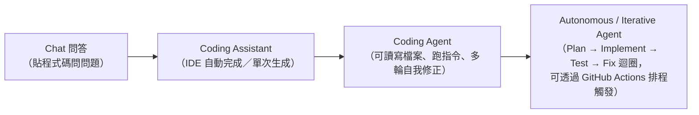
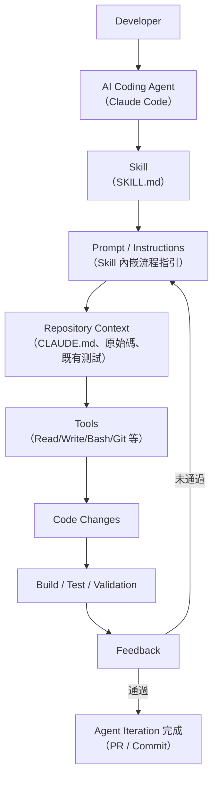
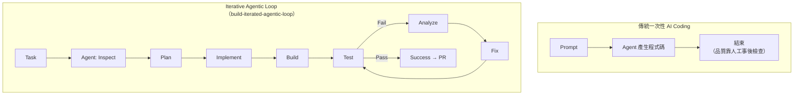
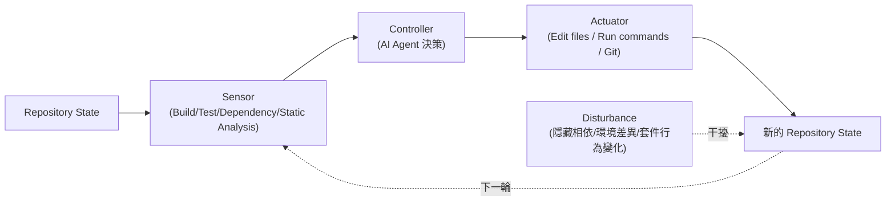
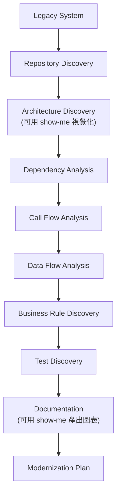
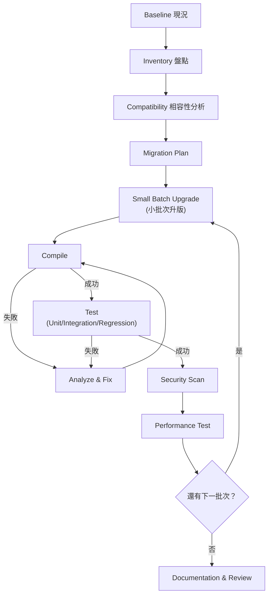
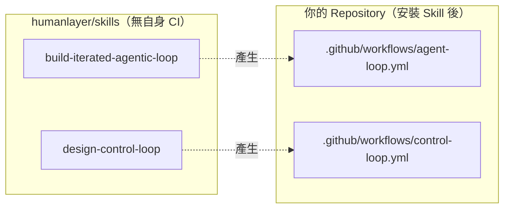
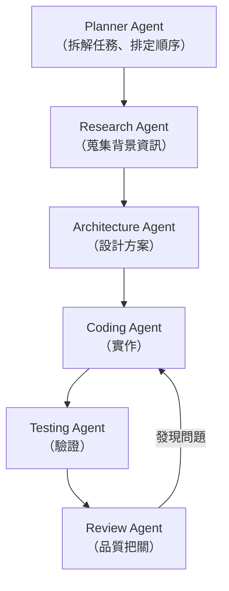
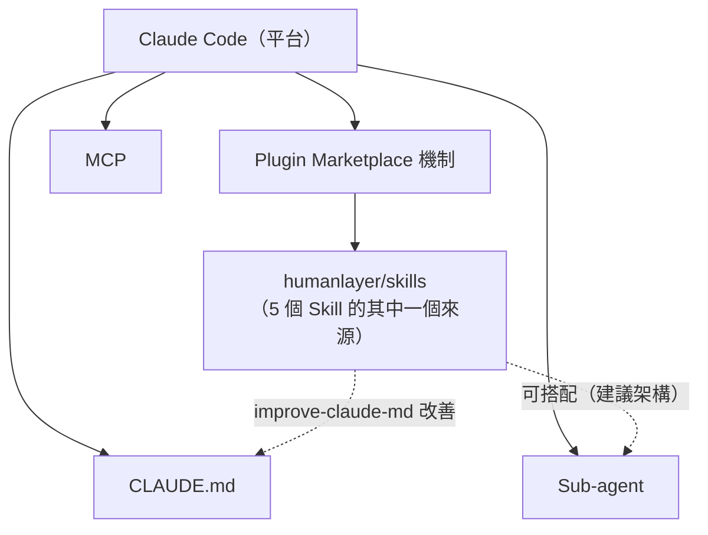
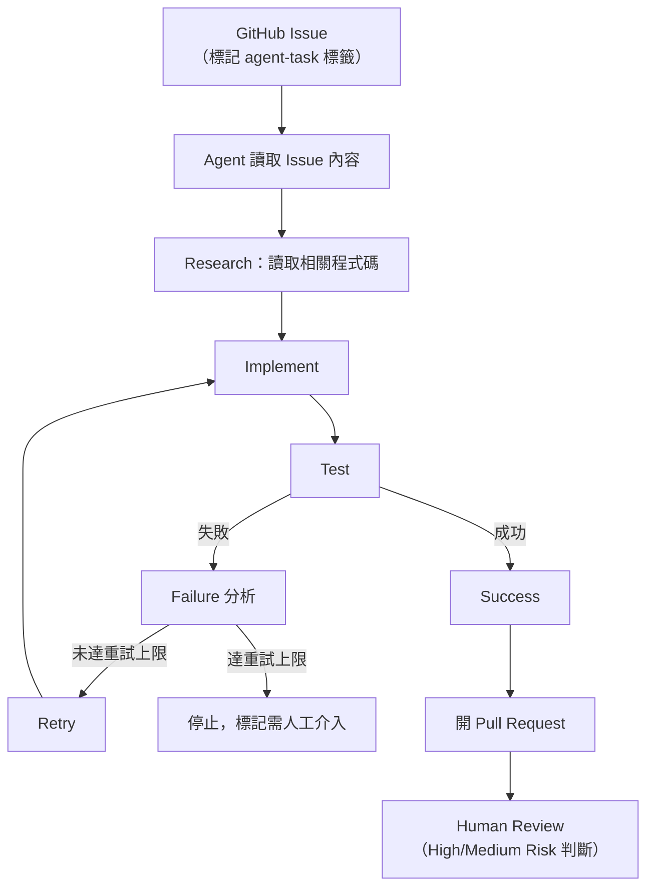

+++
date = '2026-08-24T10:52:55+08:00'
draft = false
title = 'Humanlayer Skills 教學手冊'
tags = ['教學', 'AI開發']
categories = ['教學']
+++

# humanlayer/skills 教學手冊

> **humanlayer/skills —— HumanLayer 開源之 Claude Code Skills 企業導入完整指南**
> 適用對象：資深 Software Architect、SA、Tech Lead、PM、SD/PG、DevOps、AI Engineer、Legacy Modernization Architect
> 文件性質：企業內部「humanlayer/skills」導入、開發與治理培訓教材，偏重實戰與維運
> 版本基準：`humanlayer/skills`（GitHub 官方 Repository，`main` 分支）+ `docs.humanlayer.com` 官方文件
> 查證日期：2026-08-24
> 技術堆疊：Claude Code、Node.js/npx（安裝工具鏈）、Git/GitHub、GitHub Actions（由 Skill 產生的下游範本）

---

## ⚠️ 重要聲明（請務必先讀）

1. **本手冊是彙整、重組、補充企業導入實務，而不是官方文件的翻譯。** 本書不逐字翻譯官方
   README，而是依官方 Repository（`README.md`、`.claude-plugin/marketplace.json`、
   `plugins/*/skills/*/SKILL.md`）與 `docs.humanlayer.com` 官方文件重新查證後，以繁體
   中文重新組織、延伸為企業教材，並大量補充 Scenario、AI Prompt 範例、比較表、
   Checklist 與企業導入建議。

2. **`humanlayer/skills` 是一個以 GitHub Repository 形式散布的 Claude Code Skills 集合，
   官方定位語句為「Claude Code skills from HumanLayer.」。** 本手冊會不斷強調一個
   核心觀念：**Skill 不只是一段 Prompt，而是一個可被 AI Coding Agent 執行的工作能力與
   工程流程封裝**——包含觸發條件、指令腳本、參考範本、輸出格式與（部分 Skill）會
   進一步產生 GitHub Actions workflow，讓 Agent 的執行流程可被重複觸發、可被治理、
   可被審計。

3. **必須從第一頁就知道的重要辨析：「HumanLayer 平台本身的 Skills」與
   「GitHub repo `humanlayer/skills` 裡的 Claude Code Skills（本手冊主題）」是兩件
   不同的事，只是恰好同名。** `docs.humanlayer.com` 平台文件中所稱的 "Skills"，
   指的是 HumanLayer Session/Task 介面中可用的**使用者指令**，格式為
   `/rpi:<command-name>`（例如 `/rpi:create-research-plan`），屬於 HumanLayer 產品
   操作層的概念（官方已實作，docs.humanlayer.com）；而本手冊的主題
   `humanlayer/skills` GitHub Repository，是給 **Claude Code**（Anthropic 的 CLI/IDE
   Agent 工具）使用的 Skill 套件，透過 `npx skills add` 安裝到任何 Repository 中，
   兩者**沒有強制綁定關係**，本手冊全文只討論後者，凡提及前者時會明確標註
   「HumanLayer 平台 Skills（非本書主題）」以資區別。

4. **本手冊採用五層 Provenance 標示，請務必先理解這套標示法，它貫穿全書每一個
   具體事實與主張**（標示方式與意義詳見下方「符號約定」一節）。凡是標成
   「建議架構」或「推測/Hypothesis」的內容，**都不是 `humanlayer/skills` 的官方
   功能**，請勿在企業內部溝通或對外簡報時誤植為官方保證。

5. **關於 GitHub Actions 的重要澄清**：`humanlayer/skills` 這個 Repository **本身
   並不執行任何 GitHub Actions CI/CD**（查證時其 `.github/workflows/` 目錄不存在）。
   會讓讀者誤解的地方在於，其中兩個 Skill——`build-iterated-agentic-loop` 與
   `design-control-loop`——的工作內容是「幫**安裝此 Skill 的下游 Repository**
   產生一份 GitHub Actions workflow 範本檔案」，也就是說 GitHub Actions 是這兩個
   Skill 的**輸出物**，而不是 `humanlayer/skills` 這個 Repository 自身在跑的 CI。
   本手冊第 15、42 章會用架構圖清楚呈現這個差異。

6. **關於 Skill 清單完整性**：查證時（2026-08-24）`humanlayer/skills` 的
   `.claude-plugin/marketplace.json` 實際列出 **5 個** Skill：
   `improve-claude-md`、`narrow-react-prop-types`、`build-iterated-agentic-loop`、
   `design-control-loop`、以及**容易被忽略的第五個 `show-me`**（協助使用者以
   圖表／code-shape sketch／HTML artifact 視覺化理解當前主題）。若讀者參考的
   舊版教學資料只列出前四個，屬於資訊不完整，請以本手冊或官方
   `marketplace.json` 目前實際內容為準。

7. **關於 "Agent control loop"、"Agent orchestration" 等名詞**：這兩個詞在
   `docs.humanlayer.com` 官方文件中**未查得明確的 glossary 定義**（HumanLayer
   另有一個同名但性質不同的獨立專案 `humanlayer/agentcontrolplane`，兩者不可
   混為一談）。本手冊在使用「Control Loop」「Agent Orchestration」等說法時，
   除非明確引用 `design-control-loop` Skill 本身的設計語彙，否則均屬於
   本書作者依 Control Theory 與一般 Agentic Engineering 實務所做的**建議架構**
   說明，會清楚標註
   > ⚠️ 此內容為建議整合方式，並非 humanlayer/skills 官方原生功能。

8. **企業/銀行案例聲明**：本手冊出現的企業/金融業案例（Internet Banking、
   Loan System、Payment System 等）均為**教學示範用途之虛構情境**，用於示範
   `humanlayer/skills` 與既有企業技術堆疊（Java、Spring Boot、Vue3 等）的整合
   模式，並非真實客戶專案。涉及既有框架的深入機制，請參閱本 Repository 既有
   手冊，例如 [Spring boot 4.x 教學手冊](../framework/Spring%20boot%204.x%20教學手冊.md)、
   [Vue3 前端framework教學](../framework/Vue3%20前端framework教學.md)。

9. **License 聲明**：`humanlayer/skills` 授權條款請以官方 Repository 的 `LICENSE`
   檔案逐字內容為準，本手冊不構成法律意見。

10. 官方權威來源與研究來源分級，請見第 53 章「最終 Reference」。

11. **（2026-08-24 二次改版新增）關於安裝工具與 Codex CLI 的重要修正**：
    第一版查證疏漏了兩件重要事實，本次改版已全文修正：(1) README
    展示的 `npx skills add` 指令，其安裝工具本身是**第三方開源專案
    `vercel-labs/skills`**，並非 HumanLayer 或 Claude Code 官方自建，
    支援 76+ 個 Agent（詳見第 4.5 章）；(2) Codex CLI 的相容性問題
    不可籠統回答「相容」或「不相容」，必須拆成安裝機制／內容有效性／
    CI Actuator 三個層次分別討論——其中「讓 Codex 擔任
    `build-iterated-agentic-loop`／`design-control-loop` 產生之
    workflow 的執行 Agent」是**官方原生支援**的功能，詳見第 20 章
    完整拆解。若讀者手上仍是舊版教學資料，請以本節與第 4.5、20 章
    為準。

---

## 符號約定

### Provenance 五層標示

本文以括號文字直接標示於句末，例如「...（官方已實作，README）」或
「...（建議架構）」。

| 標示 | 意義 | 使用時機 |
|---|---|---|
| **官方已實作** | README／`marketplace.json`／`SKILL.md`／`docs.humanlayer.com` 明確確認已出貨的功能 | 有明確官方文件出處可查 |
| **Source-confirmed** | 只能從 Repository 目錄結構／`SKILL.md` frontmatter 確認，官方敘述性文件（README）未著墨或有落差 | 本手冊研究團隊直接查看官方原始碼目錄與 metadata 得到的事實 |
| **建議架構** | 本手冊作者針對企業導入的建議，非官方功能 | 用於企業落地建議、原創比較表、原創案例、Control Loop/Agent Orchestration 等未經官方 glossary 定義的延伸說明 |
| **推測/Hypothesis** | 無法從任何來源確認，僅為合理推論 | 用於誠實標示研究缺口 |
| **官方目前沒有找到足夠資料確認此功能** | 明確查無資料，或第三方報導與官方一手資料衝突時 | 用於杜絕以訛傳訛 |

全書一致使用此標示法，不再重複解釋。全書亦交替使用區塊引言格式
`> ⚠️ 此內容為建議整合方式，並非 humanlayer/skills 官方原生功能。` 標示整段
（而非單句）屬於建議架構的內容，尤其用於 Spec-Driven Development 整合、
Codex CLI 相容性等章節。

### Mermaid 圖表慣例

- 所有架構圖、流程圖、序列圖均以 Mermaid 語法呈現，可直接在支援 Mermaid 的
  Markdown 檢視器（GitHub、VS Code 外掛等）中渲染。
- 節點標籤若包含括號、冒號、斜線等特殊字元，一律以雙引號包住整個標籤
  （例如 `A["Skill (SKILL.md)"]`），避免解析錯誤。
- 實線箭頭代表已從官方文件或 Repository 結構確認的關係（Source-confirmed／
  官方已實作）；虛線箭頭代表依現有事實合理推論、但官方未逐一列點確認的路徑
  （建議架構），圖說明會另外標註。

### 程式碼區塊慣例

- 標示為「示意」或「非逐字官方指令」的區塊，是本手冊為了幫助理解而重新撰寫
  的概念示範，**不是官方文件的逐字引用**，不可直接複製貼上當作生產環境設定。
- 未標示「示意」的指令（例如 `npx skills add` 系列指令）為官方 README 中
  可查證的真實指令語法。
- 所有 Placeholder（如 `<org>`、`<skill-name>`、`<your-repo>`）在使用前必須
  替換為實際值，本文不含任何真實 Secret、API Key 或密碼。

### 章節固定小節

重要章節盡量包含以下小節：Scenario（具體案例）、AI Prompt 範例、
本章 Checklist 與小結。

---

## 版本與相容性速查表

| 項目 | 值 | 來源標示 |
|---|---|---|
| Repository | `humanlayer/skills` | 官方已實作 |
| Description | "Claude Code skills from HumanLayer." | 官方已實作，README |
| 安裝工具 | `npx skills add <org>/<repo> --skill <skill-name>` | 官方已實作，README |
| 安裝工具實際維護者 | **第三方開源專案 `vercel-labs/skills`**，非 HumanLayer／Anthropic 自建；支援 76+ 個 Agent，可用 `-a <agent>` 指定安裝目標（見第 4.5 章） | Source-confirmed |
| Repository 結構 | `.claude-plugin/`、`plugins/`、`README.md`、`LICENSE` | Source-confirmed |
| Marketplace manifest | `.claude-plugin/marketplace.json`（列出全部 5 個 plugin，category: "productivity"）——僅供 Claude Code Plugin Marketplace 使用，與 `npx skills add` 安裝路徑無關 | Source-confirmed |
| 單一 Skill 內部結構 | `plugins/<name>/skills/<name>/SKILL.md` + `plugins/<name>/.claude-plugin/`；3 個 Skill 另附 `references/` 範本目錄（共 21 個檔案） | Source-confirmed |
| `SKILL.md` 規格依據 | 遵循與廠商無關的開放規格 `agentskills.io/specification`（見第 21.2 章） | Source-confirmed |
| 目前 Skill 數量 | **5 個**：`improve-claude-md`、`narrow-react-prop-types`、`build-iterated-agentic-loop`、`design-control-loop`、`show-me` | Source-confirmed，`marketplace.json` |
| Skill 版本 | 多數為 `1.0.0`，`show-me` 為 `1.0.1` | Source-confirmed |
| 本 Repository 是否有自身 GitHub Actions CI | **否**，`.github/workflows/` 不存在；2 個 Skill 會為下游 Repo 產生 workflow 範本 | Source-confirmed |
| 主要使用場域 | Claude Code（CLI／IDE Agent） | 官方已實作，README 標題 |
| Codex CLI 相關支援 | 分三層：安裝機制可行（第三方工具）／內容有效性待驗證／**官方原生支援**其作為 `build-iterated-agentic-loop`／`design-control-loop` 的 Actuator 選項之一（見第 20 章完整拆解） | 三層各異，詳見第 20.5 節彙整表 |
| HumanLayer 平台文件站 | `docs.humanlayer.com`（已改版為 Diátaxis 結構） | 官方已實作 |
| HumanLayer 平台 4 種 Workflow Type | Oneshot／RPI（Research, Plan, Implement）／PRD-Oriented／Freeform | 官方已實作，docs.humanlayer.com |
| License | 請以官方 `LICENSE` 檔案為準（`vercel-labs/skills` 另為獨立授權，需分別查證） | 官方已實作 |

---

<!-- TOC-AUTO-BEGIN -->
## 目錄（Table of Contents）

> 📖 **使用說明**：本手冊章節數量龐大（53 章，含 Provenance 標示與
> 大量表格/Mermaid 圖），以下目錄與各章子目錄均為可點擊之錨點連結
> （GitHub-flavored Markdown 錨點格式，於 GitHub 網頁版與 VS Code
> Markdown 預覽均可正確跳轉）；若所使用的檢視器對中英混排標題的
> 錨點解析略有差異，亦可改用檢視器原生大綱（GitHub 網頁版側邊欄
> 「Outline」、VS Code `Ctrl+Shift+O`）或 `Ctrl+F` 搜尋章節標題作為備援。


**Part I：基礎認識（第 1-4 章）**

- [1. Executive Summary](#1-executive-summary)
  - [1.1 humanlayer/skills 是什麼](#11-humanlayerskills-是什麼)
  - [1.2 它解決什麼問題](#12-它解決什麼問題)
  - [1.3 為什麼 AI Coding Agent 需要 Skills（而不只是 Prompt）](#13-為什麼-ai-coding-agent-需要-skills而不只是-prompt)
  - [1.4 適合什麼團隊、什麼類型的 Software Project](#14-適合什麼團隊什麼類型的-software-project)
  - [1.5 企業導入價值](#15-企業導入價值)
  - [1.6 本手冊如何使用](#16-本手冊如何使用)
  - [AI Prompt 範例（Executive Summary 情境）](#ai-prompt-範例executive-summary-情境)
  - [本章 Checklist 與小結](#本章-checklist-與小結)
- [2. humanlayer/skills 背景與發展](#2-humanlayerskills-背景與發展)
  - [2.1 HumanLayer 是什麼](#21-humanlayer-是什麼)
  - [2.2 humanlayer/skills 是什麼、Repository 定位](#22-humanlayerskills-是什麼repository-定位)
  - [2.3 Skills 與 HumanLayer 平台的關係](#23-skills-與-humanlayer-平台的關係)
  - [2.4 Agentic Engineering 的發展背景：從 Chat 到 Autonomous Agent](#24-agentic-engineering-的發展背景從-chat-到-autonomous-agent)
  - [2.5 Human-in-the-loop 的重要性](#25-human-in-the-loop-的重要性)
  - [2.6 Agent Control Loop 的概念（初步）](#26-agent-control-loop-的概念初步)
  - [AI Prompt 範例（背景研究情境）](#ai-prompt-範例背景研究情境)
  - [本章 Checklist 與小結](#本章-checklist-與小結-1)
- [3. humanlayer/skills 系統架構](#3-humanlayerskills-系統架構)
  - [3.1 整體執行流程](#31-整體執行流程)
  - [3.2 核心元件關係](#32-核心元件關係)
  - [3.3 為什麼要理解這張架構圖](#33-為什麼要理解這張架構圖)
  - [AI Prompt 範例（架構釐清情境）](#ai-prompt-範例架構釐清情境)
  - [本章 Checklist 與小結](#本章-checklist-與小結-2)
- [4. Repository Structure](#4-repository-structure)
  - [4.1 頂層結構](#41-頂層結構)
  - [4.2 單一 Skill 內部結構](#42-單一-skill-內部結構)
  - [4.3 `SKILL.md` 的角色](#43-skillmd-的角色)
  - [4.4 Plugin Metadata（`marketplace.json`）在 Agent 執行過程中的作用](#44-plugin-metadatamarketplacejson在-agent-執行過程中的作用)
  - [4.5 兩條互相獨立的安裝路徑（重要辨析）](#45-兩條互相獨立的安裝路徑重要辨析)
  - [AI Prompt 範例（Repository 探索情境）](#ai-prompt-範例repository-探索情境)
  - [本章 Checklist 與小結](#本章-checklist-與小結-3)

**Part II：Skill 詳解與上手（第 5-9 章）**

- [5. Skills 完整介紹](#5-skills-完整介紹)
  - [5.0 Skills Matrix 總覽](#50-skills-matrix-總覽)
  - [5.1 improve-claude-md](#51-improve-claude-md)
    - [5.1.1 為什麼 CLAUDE.md 容易失效](#511-為什麼-claudemd-容易失效)
    - [5.1.2 `<important if>` 的設計思想](#512-important-if-的設計思想)
    - [5.1.3 Before / After 範例](#513-before--after-範例)
    - [5.1.4 Token 成本、Instruction Relevance 與 Context Pollution](#514-token-成本instruction-relevance-與-context-pollution)
    - [AI Prompt 範例](#ai-prompt-範例)
    - [本節 Checklist 與小結](#本節-checklist-與小結)
  - [5.2 narrow-react-prop-types](#52-narrow-react-prop-types)
    - [5.2.1 React Prop Type 過度寬鬆的問題](#521-react-prop-type-過度寬鬆的問題)
    - [5.2.2 Live Code Path vs Storybook／Test／Mock 狀態](#522-live-code-path-vs-storybooktestmock-狀態)
    - [5.2.3 AI Agent 如何分析 Component、Refactoring 流程](#523-ai-agent-如何分析-componentrefactoring-流程)
    - [5.2.4 範例：收斂前後對照](#524-範例收斂前後對照)
    - [5.2.5 如何避免過度收斂造成的風險](#525-如何避免過度收斂造成的風險)
    - [AI Prompt 範例](#ai-prompt-範例-1)
    - [本節 Checklist 與小結](#本節-checklist-與小結-1)
  - [5.3 build-iterated-agentic-loop](#53-build-iterated-agentic-loop)
    - [5.3.1 Agentic Loop 與 Iterative Coding 的核心概念](#531-agentic-loop-與-iterative-coding-的核心概念)
    - [5.3.2 完整執行鏈路](#532-完整執行鏈路)
    - [5.3.3 官方互動問答的 9 個決策點（Source-confirmed）](#533-官方互動問答的-9-個決策點source-confirmed)
    - [5.3.4 自動化執行與 GitHub Actions 的角色](#534-自動化執行與-github-actions-的角色)
    - [AI Prompt 範例](#ai-prompt-範例-2)
    - [本節 Checklist 與小結](#本節-checklist-與小結-2)
  - [5.4 design-control-loop](#54-design-control-loop)
    - [5.4.1 從 Control Theory 借來的語彙（官方原始定義）](#541-從-control-theory-借來的語彙官方原始定義)
    - [5.4.2 Control Loop 架構圖](#542-control-loop-架構圖)
    - [5.4.3 Sensor、Controller、Actuator 如何設計](#543-sensorcontrolleractuator-如何設計)
    - [5.4.4 範例：Spring Boot 升版場景的 Control Loop 定義](#544-範例spring-boot-升版場景的-control-loop-定義)
    - [5.4.5 官方真實案例：react-doctor Control Loop（Source-confirmed）](#545-官方真實案例react-doctor-control-loopsource-confirmed)
    - [AI Prompt 範例](#ai-prompt-範例-3)
    - [本節 Checklist 與小結](#本節-checklist-與小結-3)
  - [5.5 show-me](#55-show-me)
    - [5.5.1 定位與用途](#551-定位與用途)
    - [5.5.2 適用情境](#552-適用情境)
    - [5.5.3 與其他 Skill 的搭配關係](#553-與其他-skill-的搭配關係)
    - [AI Prompt 範例](#ai-prompt-範例-4)
    - [本節 Checklist 與小結](#本節-checklist-與小結-4)
- [6. 安裝環境](#6-安裝環境)
  - [6.1 Node.js](#61-nodejs)
  - [6.2 npm / npx](#62-npm--npx)
  - [6.3 Git](#63-git)
  - [6.4 GitHub](#64-github)
  - [6.5 Claude Code](#65-claude-code)
  - [6.6 Codex CLI](#66-codex-cli)
  - [6.7 GitHub Actions](#67-github-actions)
  - [6.8 Repository 權限](#68-repository-權限)
  - [6.9 環境需求總表（是否必要）](#69-環境需求總表是否必要)
  - [AI Prompt 範例](#ai-prompt-範例-5)
  - [本章 Checklist 與小結](#本章-checklist-與小結-4)
- [7. 安裝 humanlayer/skills](#7-安裝-humanlayerskills)
  - [7.1 基本安裝指令](#71-基本安裝指令)
  - [7.2 安裝其他 Skill](#72-安裝其他-skill)
  - [7.3 完整旗標與子指令（Source-confirmed）](#73-完整旗標與子指令source-confirmed)
  - [7.4 安裝位置與 Skill Discovery](#74-安裝位置與-skill-discovery)
  - [7.5 Skill Activation：如何在 Claude Code 中呼叫](#75-skill-activation如何在-claude-code-中呼叫)
  - [7.6 如何確認安裝成功](#76-如何確認安裝成功)
  - [7.7 如何移除](#77-如何移除)
  - [7.8 如何更新](#78-如何更新)
  - [7.9 如何重新安裝](#79-如何重新安裝)
  - [7.10 如何管理多個 Skills](#710-如何管理多個-skills)
  - [AI Prompt 範例](#ai-prompt-範例-6)
  - [本章 Checklist 與小結](#本章-checklist-與小結-5)
- [8. 第一個 Hello World](#8-第一個-hello-world)
  - [8.1 實驗 Repository 設計](#81-實驗-repository-設計)
  - [8.2 完整示範步驟](#82-完整示範步驟)
  - [8.3 預期結果](#83-預期結果)
  - [AI Prompt 範例](#ai-prompt-範例-7)
  - [本章 Checklist 與小結](#本章-checklist-與小結-6)
- [9. CLAUDE.md 與 improve-claude-md](#9-claudemd-與-improve-claude-md)
  - [9.1 從文件層級重新理解 CLAUDE.md 的角色](#91-從文件層級重新理解-claudemd-的角色)
  - [9.2 Token 成本的結構性分析](#92-token-成本的結構性分析)
  - [9.3 Instruction Priority 與 Agent Attention](#93-instruction-priority-與-agent-attention)
  - [9.4 Context Pollution 的具體案例](#94-context-pollution-的具體案例)
  - [9.5 企業導入建議：漸進式改寫，而非一次性重寫](#95-企業導入建議漸進式改寫而非一次性重寫)
  - [AI Prompt 範例](#ai-prompt-範例-8)
  - [本章 Checklist 與小結](#本章-checklist-與小結-7)

**Part III：核心方法論（第 10-20 章）**

- [10. Web Application Development 實戰](#10-web-application-development-實戰)
  - [10.1 案例技術堆疊](#101-案例技術堆疊)
  - [10.2 新功能開發](#102-新功能開發)
  - [10.3 Bug Fix](#103-bug-fix)
  - [10.4 Refactoring](#104-refactoring)
  - [10.5 API 開發](#105-api-開發)
  - [10.6 UI 開發](#106-ui-開發)
  - [10.7 Unit Test／Integration Test／E2E Test](#107-unit-testintegration-teste2e-test)
  - [10.8 Code Review](#108-code-review)
  - [10.9 Documentation](#109-documentation)
  - [AI Prompt 範例](#ai-prompt-範例-9)
  - [本章 Checklist 與小結](#本章-checklist-與小結-8)
- [11. Legacy System Reverse Engineering](#11-legacy-system-reverse-engineering)
  - [11.1 為什麼這一章特別重要](#111-為什麼這一章特別重要)
  - [11.2 盤點流程總覽](#112-盤點流程總覽)
  - [11.3 AI Agent 如何協助找出各類元件](#113-ai-agent-如何協助找出各類元件)
  - [11.4 Legacy Reverse Engineering Skill Workflow](#114-legacy-reverse-engineering-skill-workflow)
  - [AI Prompt 範例](#ai-prompt-範例-10)
  - [本章 Checklist 與小結](#本章-checklist-與小結-9)
- [12. Software Framework Upgrade](#12-software-framework-upgrade)
  - [12.1 案例情境](#121-案例情境)
  - [12.2 13 步驟升版流程](#122-13-步驟升版流程)
  - [12.3 Framework Upgrade Agent Loop](#123-framework-upgrade-agent-loop)
  - [12.4 用 humanlayer/skills 實作 Framework Upgrade Loop](#124-用-humanlayerskills-實作-framework-upgrade-loop)
  - [AI Prompt 範例](#ai-prompt-範例-11)
  - [本章 Checklist 與小結](#本章-checklist-與小結-10)
- [13. Iterative Agentic Loop](#13-iterative-agentic-loop)
  - [13.1 完整流程回顧](#131-完整流程回顧)
  - [13.2 Stop Condition（停止條件）](#132-stop-condition停止條件)
  - [13.3 Retry Condition 與 Failure Classification](#133-retry-condition-與-failure-classification)
  - [13.4 Memory、Context、Checkpoint](#134-memorycontextcheckpoint)
  - [13.5 Rollback、Git Commit、Pull Request](#135-rollbackgit-commitpull-request)
  - [AI Prompt 範例](#ai-prompt-範例-12)
  - [本章 Checklist 與小結](#本章-checklist-與小結-11)
- [14. Control Loop Architecture](#14-control-loop-architecture)
  - [14.1 深入回顧 Control Theory 核心要素（官方定義）](#141-深入回顧-control-theory-核心要素官方定義)
  - [14.2 完整 Control Loop 範例：升版場景](#142-完整-control-loop-範例升版場景)
  - [14.3 Success Criteria 的量化定義原則](#143-success-criteria-的量化定義原則)
  - [14.4 Control Loop 與 Iterative Agentic Loop 的關係](#144-control-loop-與-iterative-agentic-loop-的關係)
  - [AI Prompt 範例](#ai-prompt-範例-13)
  - [本章 Checklist 與小結](#本章-checklist-與小結-12)
- [15. GitHub Actions 整合](#15-github-actions-整合)
  - [15.1 再次澄清：誰的 GitHub Actions](#151-再次澄清誰的-github-actions)
  - [15.2 Workflow 結構示意](#152-workflow-結構示意)
  - [15.3 官方真實範本剖析（Source-confirmed，逐字節錄關鍵片段）](#153-官方真實範本剖析source-confirmed逐字節錄關鍵片段)
  - [15.4 關鍵環節說明](#154-關鍵環節說明)
  - [15.5 Secret 管理](#155-secret-管理)
  - [15.6 Token、Permissions、Branch Protection](#156-tokenpermissionsbranch-protection)
  - [15.7 Approval、Cost Control、Security](#157-approvalcost-controlsecurity)
  - [AI Prompt 範例](#ai-prompt-範例-14)
  - [本章 Checklist 與小結](#本章-checklist-與小結-13)
- [16. AI Agent Memory](#16-ai-agent-memory)
  - [16.1 為什麼 Agentic Workflow 需要 Memory](#161-為什麼-agentic-workflow-需要-memory)
  - [16.2 各種資訊來源的比較](#162-各種資訊來源的比較)
  - [16.3 知識層級架構](#163-知識層級架構)
  - [16.4 官方真實 Memory File 格式（Source-confirmed，過去版本誤植為 JSON）](#164-官方真實-memory-file-格式source-confirmed過去版本誤植為-json)
  - [AI Prompt 範例](#ai-prompt-範例-15)
  - [本章 Checklist 與小結](#本章-checklist-與小結-14)
- [17. Multi-Agent Architecture](#17-multi-agent-architecture)
  - [17.1 為什麼需要多 Agent 分工](#171-為什麼需要多-agent-分工)
  - [17.2 典型分工模式](#172-典型分工模式)
  - [17.3 Sub-agent、Parallel Agent、Sequential Agent](#173-sub-agentparallel-agentsequential-agent)
  - [17.4 Manager Agent 與 Reviewer Agent 的角色](#174-manager-agent-與-reviewer-agent-的角色)
  - [AI Prompt 範例](#ai-prompt-範例-16)
  - [本章 Checklist 與小結](#本章-checklist-與小結-15)
- [18. 與 Spec-Driven Development 整合](#18-與-spec-driven-development-整合)
  - [18.1 Spec-Driven Development 基本流程](#181-spec-driven-development-基本流程)
  - [18.2 與 humanlayer/skills 的搭配方式（建議）](#182-與-humanlayerskills-的搭配方式建議)
  - [18.3 與其他 Spec-Driven 工具的定位差異（不宣稱官方整合）](#183-與其他-spec-driven-工具的定位差異不宣稱官方整合)
  - [AI Prompt 範例](#ai-prompt-範例-17)
  - [本章 Checklist 與小結](#本章-checklist-與小結-16)
- [19. 與 Claude Code 整合](#19-與-claude-code-整合)
  - [19.1 Claude Code 原生能力總覽](#191-claude-code-原生能力總覽)
  - [19.2 humanlayer/skills 在其中的位置](#192-humanlayerskills-在其中的位置)
  - [AI Prompt 範例](#ai-prompt-範例-18)
  - [本章 Checklist 與小結](#本章-checklist-與小結-17)
- [20. 與 Codex CLI 整合](#20-與-codex-cli-整合)
  - [20.1 Codex CLI 是什麼（概要）](#201-codex-cli-是什麼概要)
  - [20.2 問題一：安裝機制——`humanlayer/skills` 的安裝指令其實不是 Claude Code 專屬](#202-問題一安裝機制humanlayerskills-的安裝指令其實不是-claude-code-專屬)
  - [20.3 問題二：裝進去之後，內容對 Codex CLI 是否仍然有效](#203-問題二裝進去之後內容對-codex-cli-是否仍然有效)
  - [20.4 問題三：Codex CLI 可否擔任 Loop 類 Skill 產生之 workflow 的執行 Agent（官方已實作）](#204-問題三codex-cli-可否擔任-loop-類-skill-產生之-workflow-的執行-agent官方已實作)
  - [20.5 三層問題彙整表](#205-三層問題彙整表)
  - [20.6 AGENTS.md 與 CLAUDE.md 的概念對照](#206-agentsmd-與-claudemd-的概念對照)
  - [AI Prompt 範例](#ai-prompt-範例-19)
  - [本章 Checklist 與小結](#本章-checklist-與小結-18)

**Part IV：企業開發規範（第 21-31 章）**

- [21. Skill 設計最佳實務](#21-skill-設計最佳實務)
  - [21.1 為什麼要教團隊自建 Skill](#211-為什麼要教團隊自建-skill)
  - [21.2 `agentskills.io` 官方規格：目錄結構與 Frontmatter（Source-confirmed）](#212-agentskillsio-官方規格目錄結構與-frontmattersource-confirmed)
  - [21.3 Anthropic 官方撰寫建議（Source-confirmed，摘自官方工程部落格）](#213-anthropic-官方撰寫建議source-confirmed摘自官方工程部落格)
  - [21.4 設計要素：Scope、Trigger、Input、Output](#214-設計要素scopetriggerinputoutput)
  - [21.5 Preconditions、Workflow、Validation](#215-preconditionsworkflowvalidation)
  - [21.6 Failure Handling、Exit Criteria](#216-failure-handlingexit-criteria)
  - [AI Prompt 範例](#ai-prompt-範例-20)
  - [本章 Checklist 與小結](#本章-checklist-與小結-19)
- [22. 如何設計高品質 Agent Prompt](#22-如何設計高品質-agent-prompt)
  - [22.1 不要只寫一句話指令](#221-不要只寫一句話指令)
  - [22.2 完整 Prompt 應包含的九個要素](#222-完整-prompt-應包含的九個要素)
  - [22.3 模板](#223-模板)
  - [22.4 範例：把「Fix this bug」改寫成完整 Prompt](#224-範例把fix-this-bug改寫成完整-prompt)
  - [AI Prompt 範例（Meta：請 Agent 幫忙寫 Prompt）](#ai-prompt-範例meta請-agent-幫忙寫-prompt)
  - [本章 Checklist 與小結](#本章-checklist-與小結-20)
- [23. AI Agent 開發規範](#23-ai-agent-開發規範)
  - [23.1 企業級 AI Coding Agent Development Standard](#231-企業級-ai-coding-agent-development-standard)
  - [23.2 與 humanlayer/skills 的對應關係](#232-與-humanlayerskills-的對應關係)
  - [AI Prompt 範例](#ai-prompt-範例-21)
  - [本章 Checklist 與小結](#本章-checklist-與小結-21)
- [24. Reverse Engineering 使用規範](#24-reverse-engineering-使用規範)
  - [24.1 AI Reverse Engineering Standard](#241-ai-reverse-engineering-standard)
  - [24.2 為什麼這個順序不能顛倒](#242-為什麼這個順序不能顛倒)
  - [AI Prompt 範例](#ai-prompt-範例-22)
  - [本章 Checklist 與小結](#本章-checklist-與小結-22)
- [25. Framework Upgrade 使用規範](#25-framework-upgrade-使用規範)
  - [25.1 AI Framework Upgrade Standard](#251-ai-framework-upgrade-standard)
  - [25.2 各階段的強制要求](#252-各階段的強制要求)
  - [25.3 與 Control Loop 的結合](#253-與-control-loop-的結合)
  - [AI Prompt 範例](#ai-prompt-範例-23)
  - [本章 Checklist 與小結](#本章-checklist-與小結-23)
- [26. Enterprise Security](#26-enterprise-security)
  - [26.1 風險項目總覽](#261-風險項目總覽)
  - [26.2 AI Agent Security Checklist](#262-ai-agent-security-checklist)
  - [26.3 與 humanlayer/skills 特別相關的安全考量](#263-與-humanlayerskills-特別相關的安全考量)
  - [AI Prompt 範例](#ai-prompt-範例-24)
  - [本章 Checklist 與小結](#本章-checklist-與小結-24)
- [27. Human-in-the-loop](#27-human-in-the-loop)
  - [27.1 哪些操作不應該讓 Agent 自動執行](#271-哪些操作不應該讓-agent-自動執行)
  - [27.2 風險分層：Low／Medium／High](#272-風險分層lowmediumhigh)
  - [27.3 為什麼要保留人的把關角色](#273-為什麼要保留人的把關角色)
  - [AI Prompt 範例](#ai-prompt-範例-25)
  - [本章 Checklist 與小結](#本章-checklist-與小結-25)
- [28. Git 與 Branch Strategy](#28-git-與-branch-strategy)
  - [28.1 適合 AI Agent 的 Git Workflow](#281-適合-ai-agent-的-git-workflow)
  - [28.2 Small Commits](#282-small-commits)
  - [28.3 Checkpoints、Revert](#283-checkpointsrevert)
  - [28.4 Branch Isolation](#284-branch-isolation)
  - [28.5 PR、Code Review](#285-prcode-review)
  - [AI Prompt 範例](#ai-prompt-範例-26)
  - [本章 Checklist 與小結](#本章-checklist-與小結-26)
- [29. Testing Strategy](#29-testing-strategy)
  - [29.1 每次修改後的驗證鏈路](#291-每次修改後的驗證鏈路)
  - [29.2 如何避免「Agent 修改成功但系統壞掉」](#292-如何避免agent-修改成功但系統壞掉)
  - [29.3 與 Iterative Agentic Loop／Control Loop 的關係](#293-與-iterative-agentic-loopcontrol-loop-的關係)
  - [AI Prompt 範例](#ai-prompt-範例-27)
  - [本章 Checklist 與小結](#本章-checklist-與小結-27)
- [30. Observability](#30-observability)
  - [30.1 AI Coding Agent 的 Observability 要素](#301-ai-coding-agent-的-observability-要素)
  - [30.2 為什麼 GitHub Actions Logs 不夠](#302-為什麼-github-actions-logs-不夠)
  - [30.3 與 Governance 的關係](#303-與-governance-的關係)
  - [AI Prompt 範例](#ai-prompt-範例-28)
  - [本章 Checklist 與小結](#本章-checklist-與小結-28)
- [31. Token / Context Optimization](#31-token--context-optimization)
  - [31.1 優化手法總覽](#311-優化手法總覽)
  - [31.2 AI Context Optimization Checklist](#312-ai-context-optimization-checklist)
  - [AI Prompt 範例](#ai-prompt-範例-29)
  - [本章 Checklist 與小結](#本章-checklist-與小結-29)

**Part V：團隊治理（第 32-38 章）**

- [32. 團隊導入方法](#32-團隊導入方法)
  - [32.1 六個導入 Level](#321-六個導入-level)
  - [32.2 各 Level 的技術、人員、流程、Governance、風險、KPI](#322-各-level-的技術人員流程governance風險kpi)
  - [AI Prompt 範例](#ai-prompt-範例-30)
  - [本章 Checklist 與小結](#本章-checklist-與小結-30)
- [33. 團隊角色與責任](#33-團隊角色與責任)
  - [33.1 RACI 矩陣](#331-raci-矩陣)
  - [33.2 角色協作案例](#332-角色協作案例)
  - [AI Prompt 範例](#ai-prompt-範例-31)
  - [本章 Checklist 與小結](#本章-checklist-與小結-31)
- [34. AI Agent Governance](#34-ai-agent-governance)
  - [34.1 治理要素總覽](#341-治理要素總覽)
  - [34.2 Skill Registry 範例（示意）](#342-skill-registry-範例示意)
  - [AI Prompt 範例](#ai-prompt-範例-32)
  - [本章 Checklist 與小結](#本章-checklist-與小結-32)
- [35. Skill Version Management](#35-skill-version-management)
  - [35.1 版本演進流程](#351-版本演進流程)
  - [35.2 Semantic Versioning](#352-semantic-versioning)
  - [35.3 Change Log、Compatibility、Regression Test](#353-change-logcompatibilityregression-test)
  - [AI Prompt 範例](#ai-prompt-範例-33)
  - [本章 Checklist 與小結](#本章-checklist-與小結-33)
- [36. Skill Testing](#36-skill-testing)
  - [36.1 測試流程](#361-測試流程)
  - [36.2 Skill Evaluation Matrix](#362-skill-evaluation-matrix)
  - [36.3 何時該測試 Skill](#363-何時該測試-skill)
  - [AI Prompt 範例](#ai-prompt-範例-34)
  - [本章 Checklist 與小結](#本章-checklist-與小結-34)
- [37. 常見失敗模式](#37-常見失敗模式)
  - [37.1 十五種常見失敗模式](#371-十五種常見失敗模式)
  - [AI Prompt 範例](#ai-prompt-範例-35)
  - [本章 Checklist 與小結](#本章-checklist-與小結-35)
- [38. Troubleshooting](#38-troubleshooting)
  - [38.1 完整問題排除表](#381-完整問題排除表)
  - [AI Prompt 範例](#ai-prompt-範例-36)
  - [本章 Checklist 與小結](#本章-checklist-與小結-36)

**Part VI：實戰案例與企業落地（第 39-53 章）**

- [39. 實戰案例一：Vue/React Web Application](#39-實戰案例一vuereact-web-application)
  - [39.1 需求](#391-需求)
  - [39.2 完整流程](#392-完整流程)
  - [AI Prompt 範例](#ai-prompt-範例-37)
  - [本章 Checklist 與小結](#本章-checklist-與小結-37)
- [40. 實戰案例二：Legacy Java System Reverse Engineering](#40-實戰案例二legacy-java-system-reverse-engineering)
  - [40.1 情境](#401-情境)
  - [40.2 完整流程](#402-完整流程)
  - [AI Prompt 範例](#ai-prompt-範例-38)
  - [本章 Checklist 與小結](#本章-checklist-與小結-38)
- [41. 實戰案例三：Spring Boot Upgrade](#41-實戰案例三spring-boot-upgrade)
  - [41.1 情境](#411-情境)
  - [41.2 完整流程](#412-完整流程)
  - [AI Prompt 範例](#ai-prompt-範例-39)
  - [本章 Checklist 與小結](#本章-checklist-與小結-39)
- [42. 實戰案例四：自動化 Agent Loop](#42-實戰案例四自動化-agent-loop)
  - [42.1 情境](#421-情境)
  - [42.2 完整流程](#422-完整流程)
  - [AI Prompt 範例](#ai-prompt-範例-40)
  - [本章 Checklist 與小結](#本章-checklist-與小結-40)
- [43. 企業導入 Architecture Blueprint](#43-企業導入-architecture-blueprint)
  - [43.1 企業級架構總覽](#431-企業級架構總覽)
  - [43.2 各層對應本手冊章節](#432-各層對應本手冊章節)
  - [AI Prompt 範例](#ai-prompt-範例-41)
  - [本章 Checklist 與小結](#本章-checklist-與小結-41)
- [44. 與現有企業 SSDLC 整合](#44-與現有企業-ssdlc-整合)
  - [44.1 SSDLC 各階段總覽](#441-ssdlc-各階段總覽)
  - [44.2 humanlayer/skills 可放置的階段](#442-humanlayerskills-可放置的階段)
  - [44.3 整合原則](#443-整合原則)
  - [AI Prompt 範例](#ai-prompt-範例-42)
  - [本章 Checklist 與小結](#本章-checklist-與小結-42)
- [45. 與銀行企業系統整合](#45-與銀行企業系統整合)
  - [45.1 高可靠度企業系統案例](#451-高可靠度企業系統案例)
  - [45.2 AI Agent 可以做什麼](#452-ai-agent-可以做什麼)
  - [45.3 絕對不能完全自動化的工作](#453-絕對不能完全自動化的工作)
  - [45.4 為什麼銀行場景特別需要嚴格的風險分級](#454-為什麼銀行場景特別需要嚴格的風險分級)
  - [AI Prompt 範例](#ai-prompt-範例-43)
  - [本章 Checklist 與小結](#本章-checklist-與小結-43)
- [46. AI Agent Risk Classification](#46-ai-agent-risk-classification)
  - [46.1 完整風險分級表](#461-完整風險分級表)
  - [46.2 與第 27 章風險分級的對應關係](#462-與第-27-章風險分級的對應關係)
  - [46.3 humanlayer/skills 各 Skill 對應的典型 Risk Level](#463-humanlayerskills-各-skill-對應的典型-risk-level)
  - [AI Prompt 範例](#ai-prompt-範例-44)
  - [本章 Checklist 與小結](#本章-checklist-與小結-44)
- [47. 最佳實務](#47-最佳實務)
  - [Top 20 humanlayer/skills Best Practices](#top-20-humanlayerskills-best-practices)
  - [本章 Checklist 與小結](#本章-checklist-與小結-45)
- [48. 團隊標準作業程序 SOP](#48-團隊標準作業程序-sop)
  - [SOP-01 Skill Installation](#sop-01-skill-installation)
  - [SOP-02 Skill Update](#sop-02-skill-update)
  - [SOP-03 Skill Review](#sop-03-skill-review)
  - [SOP-04 AI Coding](#sop-04-ai-coding)
  - [SOP-05 Reverse Engineering](#sop-05-reverse-engineering)
  - [SOP-06 Framework Upgrade](#sop-06-framework-upgrade)
  - [SOP-07 Agent Loop](#sop-07-agent-loop)
  - [SOP-08 GitHub Actions](#sop-08-github-actions)
  - [SOP-09 Security Review](#sop-09-security-review)
  - [SOP-10 Skill Retirement](#sop-10-skill-retirement)
  - [本章 Checklist 與小結](#本章-checklist-與小結-46)
- [49. Checklist](#49-checklist)
  - [Installation Checklist](#installation-checklist)
  - [Configuration Checklist](#configuration-checklist)
  - [Web Development Checklist](#web-development-checklist)
  - [Reverse Engineering Checklist](#reverse-engineering-checklist)
  - [Framework Upgrade Checklist](#framework-upgrade-checklist)
  - [Agent Loop Checklist](#agent-loop-checklist)
  - [Security Checklist](#security-checklist)
  - [Production Checklist](#production-checklist)
- [50. FAQ](#50-faq)
- [51. Glossary](#51-glossary)
- [52. 最終導入建議](#52-最終導入建議)
  - [52.1 小型團隊](#521-小型團隊)
  - [52.2 中型團隊](#522-中型團隊)
  - [52.3 大型企業](#523-大型企業)
  - [52.4 銀行 / 金融業](#524-銀行--金融業)
  - [52.5 30 / 60 / 90 Days Adoption Plan](#525-30--60--90-days-adoption-plan)
  - [本章 Checklist 與小結](#本章-checklist-與小結-47)
- [53. 最終 Reference](#53-最終-reference)
  - [官方來源](#官方來源)
  - [相關但不宣稱官方整合的來源](#相關但不宣稱官方整合的來源)
  - [本手冊研究方法聲明](#本手冊研究方法聲明)

**附錄與文件說明**

- [施工說明（TOC 產生方式）](#施工說明toc-產生方式)
- [品質審查記錄（Technical Accuracy / Architecture / Developer Usability Review）](#品質審查記錄technical-accuracy--architecture--developer-usability-review)
<!-- TOC-AUTO-END -->

---

## 1. Executive Summary

### 1.1 humanlayer/skills 是什麼

`humanlayer/skills` 是 HumanLayer 團隊在 GitHub 上公開發布的一組
**Claude Code Skills**（官方已實作，README："Claude Code skills from
HumanLayer."）。它以 Claude Code 的 Plugin/Marketplace 機制發布，使用者透過
`npx skills add humanlayer/skills --skill <skill-name>` 這樣的指令，將其中
任一個 Skill 安裝進自己的 Repository，讓 Claude Code 在該 Repository 內執行
任務時，能夠依照該 Skill 封裝好的工作流程、範本與檢查標準來行動。

截至本次查證（2026-08-24），Repository 內共有 5 個 Skill：

| Skill | 一句話定位 |
|---|---|
| `improve-claude-md` | 改善 `CLAUDE.md`，用 `<important if>` 條件式指引取代一大串平鋪直敘的規則，提升 Agent 指令遵從度 |
| `narrow-react-prop-types` | 收斂 React Component 的 Prop Type，使其貼近「實際 Runtime 會用到的型別」而非測試/Storybook 用的寬鬆型別 |
| `build-iterated-agentic-loop` | 幫 Repository 建立一個「可反覆執行」的 Coding Agent 工作流程（Repo-local Skill + GitHub Actions workflow + Prompt + Memory + Reference Template） |
| `design-control-loop` | 訪談使用者以設計一套「Sensor／Controller／Actuator」風格的 Agent Control Loop，並落地為可本地執行的元件與排程執行的 workflow |
| `show-me` | 用簡潔的圖表、code-shape sketch、聚焦的 HTML artifact，協助使用者「看懂」目前討論的主題 |

### 1.2 它解決什麼問題

企業導入 AI Coding Agent（無論是 Claude Code、Codex CLI 或其他工具）時，
最常遇到的落地困境不是「AI 會不會寫程式」，而是：

1. **指令散落各處、無法重複使用**——每個工程師自己寫 Prompt，品質參差、
   無法傳承。
2. **`CLAUDE.md` 越寫越長、Agent 卻越用越不聽話**——因為所有規則不分情境
   全部塞進同一份 Context，稀釋了真正重要指令的注意力權重。
3. **一次性 AI Coding 容易產生「看起來成功、實際上壞掉」的結果**——沒有
   Build/Test/Validation 的反覆迴圈，Agent 給出程式碼就結束，沒人驗證。
4. **企業想要的是「工程流程」而不是「聊天結果」**——需要可重複觸發、
   可審計、可治理的自動化，而不是一次性的人機對話。

`humanlayer/skills` 針對第 1、2、3 點提供了具體、可安裝、可版本控管的解法；
第 4 點則透過其中 `build-iterated-agentic-loop` 與 `design-control-loop`
兩個 Skill，示範如何把 Agent 工作流程產品化為 Repository 內可重複執行的
資產（Prompt + Memory + GitHub Actions workflow）。

### 1.3 為什麼 AI Coding Agent 需要 Skills（而不只是 Prompt）

> Skill 不只是 Prompt，而是一個可被 AI Coding Agent 執行的**工作能力與
> 工程流程封裝**。

單純的 Prompt 是「這次要 Agent 做什麼」的臨時指令，用完即丟、無法治理、
無法版本化比對差異。而一個 Skill（以 `SKILL.md` 為核心）通常封裝了：

- **觸發條件**（Frontmatter 的 `description`，讓 Agent／使用者知道何時該用）
- **標準作業流程**（Step-by-step 的操作指引，而不是單句指令）
- **參考範本**（Reference Template／Checklist，避免每次重新發明）
- **（部分 Skill）自動化產出物**，例如生成 GitHub Actions workflow 檔案，
  讓這個能力可以脫離「一次性對話」而變成 Repository 裡持久存在的資產。

### 1.4 適合什麼團隊、什麼類型的 Software Project

- **適合**：已經在使用 Claude Code 進行日常開發、且 Repository 有一定規模
  （`CLAUDE.md` 開始膨脹、React 專案 Prop Type 開始失控、想要建立可重複的
  Agent 自動化流程）的團隊。
- **特別適合**：需要進行 Legacy System 盤點/現代化、Framework 升版、或想把
  「AI 輔助開發」從個人工具提升為團隊治理資產的企業。
- **不適合直接套用的情況**：主要使用 Codex CLI 而非 Claude Code 的團隊——
  `humanlayer/skills` 的安裝機制（`npx skills add` + Claude Code Plugin
  系統）目前是針對 Claude Code 設計，Codex CLI 相容性**官方目前沒有找到
  足夠資料確認**，詳見第 20 章。

### 1.5 企業導入價值

1. 把「資深工程師的 Prompt 經驗」轉換成團隊可共用、可版本控管的 Skill 資產。
2. 降低 `CLAUDE.md` 維護成本，避免規則越加越多、Context 越用越貴。
3. 建立「分析 → 修改 → 測試 → 修正」的 Iterative Agentic Loop，減少
   「Agent 說改好了、系統其實壞了」的風險。
4. 提供 Control Loop 思維框架，讓企業在導入自動化 Agent 時，有一套可以
   對照 Sensor/Controller/Actuator/Feedback 的治理語言，而不是黑箱操作。

### 1.6 本手冊如何使用

本手冊依照「安裝 → Hello World → 逐一 Skill 深入 → 實戰案例 → 企業治理」的
順序編排，建議依序閱讀第 6～9 章完成環境建置與第一次上手經驗，再依自己團隊
的場景（Web 開發／Legacy 盤點／Framework 升版）挑選對應的實戰章節
（第 10～12、39～42 章）。第 21～38 章屬於「進階治理」內容，建議由
Tech Lead／Architect 主責研讀，並在導入 Level 2（見第 32 章）之後再深入。

> **Scenario：企業第一次接觸這個 Repository**
> 某銀行系統開發部門的 Tech Lead 在 Claude Code 的 Plugin Marketplace
> 討論串中看到 `humanlayer/skills` 被提及，好奇它跟自己手動寫的
> `.claude/CLAUDE.md` 有什麼不同。他先執行
> `npx skills add humanlayer/skills --skill improve-claude-md`
> 在一個非正式的 sandbox Repository 中試裝，觀察 Claude Code 執行這個
> Skill 後如何重寫既有的 `CLAUDE.md`，再決定是否要在正式專案導入。
> 這正是本手冊第 7～9 章要示範的完整流程。

### AI Prompt 範例（Executive Summary 情境）

```text
我們團隊的 CLAUDE.md 已經超過 300 行，Claude Code 常常忽略後半段的規則。
請幫我評估是否適合安裝 humanlayer/skills 的 improve-claude-md，
並列出安裝前需要準備的資訊（現有 CLAUDE.md 內容、專案技術堆疊、
最常被忽略的規則有哪些）。
```

### 本章 Checklist 與小結

- [ ] 已理解 `humanlayer/skills` 是 Claude Code 的 Skill 集合，不是通用
      Prompt 範本庫。
- [ ] 已理解 Skill 與 Prompt 的差異：封裝了觸發條件、流程、範本、
      （部分）自動化產出物。
- [ ] 已確認團隊目前使用的 AI Coding Agent 是否為 Claude Code
      （若主要用 Codex CLI，需留意第 20 章的相容性澄清）。
- [ ] 已知悉 5 個 Skill 的一句話定位，作為後續章節深入閱讀的地圖。

---

## 2. humanlayer/skills 背景與發展

### 2.1 HumanLayer 是什麼

HumanLayer 是提供 Agentic Engineering 相關產品與開源工具的團隊，其官方
文件站 `docs.humanlayer.com` 描述了一套完整的「Task／Workflow／Session」
產品概念（官方已實作），核心訴求是讓 AI Coding Agent 的工作可以被結構化
管理，而不只是單一輪對話。HumanLayer 平台本身提供 4 種 Workflow Type：

| Workflow Type | 適用情境（官方描述） |
|---|---|
| **Oneshot** | 「清楚且小的變更」，流程只有 Implementation、PR 兩步 |
| **RPI**（Research, Plan, Implement） | Questions → Research → Design Discussion → Structure Outline → Implementation → PR，適合產品行為與技術設計可以放在同一份文件討論的情境 |
| **PRD-Oriented** | 把產品需求與技術設計分開：PRD 定義問題／成功指標／使用者可見的解法，TDD（技術設計文件）另外撰寫，流程為 Questions → Research → PRD → TDD → Structure Outline → Implementation → PR |
| **Freeform** | 無固定階段，彈性最高 |

（以上四種 Workflow Type 均為官方已實作，來源 docs.humanlayer.com。）

> ⚠️ **辨析提醒**：HumanLayer 平台文件中提到的 "Skills"（格式
> `/rpi:<command-name>`，例如 `/rpi:create-research-plan`）是 HumanLayer
> 平台自己的使用者指令機制，**不是**本手冊主題 `humanlayer/skills` 這個
> GitHub Repository。兩者同名但分屬不同產品層。本手冊全文只討論後者。

### 2.2 humanlayer/skills 是什麼、Repository 定位

`humanlayer/skills` 是 HumanLayer 團隊另外開源、獨立於上述平台產品之外的
一個 **Claude Code Skills 套件 Repository**。定位語句「Claude Code skills
from HumanLayer.」清楚說明它的受眾是 Claude Code 使用者，而非 HumanLayer
平台本身的用戶。可以把它理解為：HumanLayer 團隊把他們在自己專案開發中
累積的、對 Claude Code 有效的工作方法，封裝成 Skill 後開源出來，讓其他
Claude Code 使用者也能安裝使用。

Repository 使用 Claude Code 的 **Plugin Marketplace** 機制發布
（`.claude-plugin/marketplace.json`），這代表它不是一份單純的文件倉庫，
而是遵循 Claude Code 官方定義的 Plugin/Skill 結構標準來組織內容
（Source-confirmed）。

### 2.3 Skills 與 HumanLayer 平台的關係

`humanlayer/skills` 與 HumanLayer 平台（`docs.humanlayer.com` 所述的
Task/Workspace/Session 產品）**沒有強制依賴關係**——你不需要使用 HumanLayer
平台帳號，也能單獨在自己的 Repository 中安裝並使用 `humanlayer/skills`
裡的 Skill，因為它運作在 Claude Code 這一層，而非 HumanLayer 平台這一層
（建議架構，依 Repository 結構與安裝方式推論；官方未在 README 中明確聲明
兩者強制綁定或完全無關，讀者若有正式導入需求，建議直接查閱最新 README
確認）。

### 2.4 Agentic Engineering 的發展背景：從 Chat 到 Autonomous Agent

理解 `humanlayer/skills` 為何存在，有必要先理解 AI 輔助軟體開發的演進脈絡
（建議架構，本手冊作者依產業一般觀察整理，非官方文件內容）：



`humanlayer/skills` 的 5 個 Skill 明顯對應到 C、D 兩個階段：
`improve-claude-md`、`narrow-react-prop-types`、`show-me` 提升的是
「單次 Coding Agent 任務」的品質；`build-iterated-agentic-loop`、
`design-control-loop` 則是把團隊從「C：一次性 Agent 任務」推進到
「D：可重複、可排程、可治理的 Iterative/Autonomous Agent」的具體工具。

### 2.5 Human-in-the-loop 的重要性

無論是 HumanLayer 平台本身的產品訴求，或是 `humanlayer/skills` 中
`build-iterated-agentic-loop`／`design-control-loop` 這兩個會產生自動化
workflow 的 Skill，其設計精神都不是「讓 AI 自己亂改程式後直接上線」，
而是把 Human Review／PR／Approval 保留在關鍵節點上（見本手冊第 27 章
「Human-in-the-loop」的完整風險分級）。這是本手冊在企業導入建議中會
反覆強調的原則：**Skill 讓 Agent 更可靠地完成工作，但不等於移除人的
把關角色。**

### 2.6 Agent Control Loop 的概念（初步）

`design-control-loop` 這個 Skill 名稱本身就把 Control Theory 的語彙
（Sensor、Controller、Actuator、Disturbance、Feedback）帶入 Agentic
Engineering 領域，這是 `humanlayer/skills` 相對少見、也相對進階的一個
切入角度：**與其把 Agent 自動化想成「寫一個更聰明的 Prompt」，不如想成
「設計一個閉迴路控制系統」**。第 14 章會完整展開這個概念的架構設計方法；
本章先建立「這是這個 Repository 裡最具工程治理思維的 Skill」這個印象。

> **Scenario：從個人 Prompt 習慣走向團隊 Skill 資產**
> 某資深工程師在團隊內部一直有一套自己整理的「改善 CLAUDE.md」
> 心法（哪些規則該留、哪些該用條件式寫法），但這套心法只存在他的腦中與
> 零散筆記。當團隊導入 `humanlayer/skills` 的 `improve-claude-md` 後，
> 這套心法被封裝成可重複執行、可被其他同仁直接安裝使用的資產，離職或
> 轉調也不會讓這個知識流失——這正是本手冊第 1.3、1.5 節反覆強調的
> 「Skill 產品化、Repository 化」精神。

### AI Prompt 範例（背景研究情境）

```text
請幫我對照 docs.humanlayer.com 與 humanlayer/skills 這兩個來源，
整理出「HumanLayer 平台的 Skills 指令」與「humanlayer/skills 這個
GitHub Repo 的 Claude Code Skills」的差異表，並標明各自的觸發方式
與使用場域，避免我們團隊內部溝通時混用這兩個名詞。
```

### 本章 Checklist 與小結

- [ ] 已理解 HumanLayer 平台與 `humanlayer/skills` Repository 是兩個
      不同但同名的 "Skills" 概念，並能向團隊清楚說明差異。
- [ ] 已理解 `humanlayer/skills` 使用 Claude Code Plugin Marketplace
      機制發布，運作在 Claude Code 這一層。
- [ ] 已理解 Agentic Engineering 從 Chat 到 Autonomous Agent 的演進脈絡，
      並能定位 5 個 Skill 各自落在哪個階段。
- [ ] 已建立 Human-in-the-loop 是貫穿全書的治理原則，而非導入後才補上的
      限制。

---

## 3. humanlayer/skills 系統架構

### 3.1 整體執行流程

一個 Skill 從安裝到影響實際程式碼，會經過以下流程（建議架構，依 Claude
Code Plugin 機制與 Skill 內容結構整理而成的概念圖，非官方逐字文件）：



這張圖呈現的是本章
Developer → Agent → Skill → Prompt → Context → Tools → Code Changes →
Build/Test → Feedback → Iteration 鏈路，套用到 `humanlayer/skills` 的
5 個實際 Skill 上時，差異主要在於「Feedback 迴圈是否存在」：

- `improve-claude-md`、`narrow-react-prop-types`、`show-me` 的典型執行是
  **單次直線流程**（分析 → 產出結果），沒有內建的 Build/Test 反覆迴圈。
- `build-iterated-agentic-loop`、`design-control-loop` 的產出物**本身就是
  一個帶有 Feedback 迴圈的系統**（前者產生 Iterative Agentic Loop，
  後者產生 Control Loop），也就是說這兩個 Skill 的工作結果，是讓
  Repository 具備上圖中 `H → I → D` 這個回饋迴圈的能力，而不只是單次
  執行完就結束。

### 3.2 核心元件關係

| 元件 | 角色 | 與 Skill 的關係 |
|---|---|---|
| **Skill** | 一個 `SKILL.md` 為核心的能力封裝單位 | 本書主體 |
| **Prompt / Instructions** | Skill 內部的操作流程指引 | Skill 的組成部分 |
| **Context** | Agent 執行當下可見的資訊（Repository 檔案、對話歷史） | Skill 執行時讀取的輸入 |
| **Memory** | 跨任務持久保存的知識（例如 `build-iterated-agentic-loop` 產生的 Memory File） | 部分 Skill 的產出物，供未來任務重用 |
| **Hooks** | Claude Code 的事件觸發機制（例如指令執行前後） | 建議架構：`humanlayer/skills` 目前公開內容未見以 Hooks 為主要機制的 Skill，此欄位為與 Claude Code 原生能力對照用 |
| **Commands** | Claude Code 的 `/command` 觸發方式 | Skill 可透過 Claude Code 的 Skill 觸發機制被喚起，用法詳見第 19 章 |
| **Templates** | Reference Template／範本檔案 | `build-iterated-agentic-loop`、`design-control-loop` 會安裝範本到目標 Repository |
| **GitHub Actions** | CI/CD workflow | 由 `build-iterated-agentic-loop`、`design-control-loop` **產生於下游 Repository**，非本 Repository 自身的 CI |
| **Agent** | 執行 Skill 內容的 AI Coding Agent（Claude Code） | Skill 的執行者 |
| **Sub-agent** | Agent 內部可再拆分出的子任務執行者 | 建議架構：詳見第 17 章 Multi-Agent Architecture 的一般性介紹 |
| **Control Loop** | Sensor/Controller/Actuator 閉迴路架構 | `design-control-loop` 的核心產出概念，詳見第 14 章 |

> ⚠️ 上表中標示「建議架構」的欄位（Hooks、Sub-agent 對應關係），是本手冊
> 為了讓讀者對照 Claude Code 原生能力所做的延伸整理，並非
> `humanlayer/skills` 官方逐一定義的機制對照表。

### 3.3 為什麼要理解這張架構圖

企業導入時最常犯的錯誤，是把所有 Skill 都當成「一次性魔法指令」，
期待裝了就會自動維護。理解 3.1 的流程圖後，團隊應該能分辨：

1. 哪些 Skill 是「用一次、拿到結果就結束」（improve-claude-md、
   narrow-react-prop-types、show-me）。
2. 哪些 Skill 是「用一次，但會在 Repository 裡留下一個持續運作的系統」
   （build-iterated-agentic-loop、design-control-loop），這類 Skill
   安裝後需要納入正常的維運管理（誰負責、多久 Review 一次、成本上限），
   而不是裝完就不管。

> **Scenario：架構誤解導致的失望**
> 某團隊安裝 `design-control-loop` 後，期待它會「自動每天巡邏程式碼並
> 自動修好所有問題」。實際上這個 Skill 的第一步是**訪談使用者**，
> 釐清 Goal／Sensor／Success Criteria 之後，才會產出對應的本地元件與
> 排程 workflow；訪談品質直接決定了後續 Control Loop 的品質。理解
> 3.1 的流程圖，能讓團隊事先建立正確期待：Skill 提供的是「設計與落地
> 的協助」，不是「裝了就無腦全自動」。

### AI Prompt 範例（架構釐清情境）

```text
請解釋 build-iterated-agentic-loop 這個 Skill 產生的 Iterative Loop，
在我們的 Repository 中會實際新增哪些檔案（Prompt、Memory、GitHub
Actions workflow、Repo-local Skill），並畫出這些檔案彼此的依賴關係。
```

### 本章 Checklist 與小結

- [ ] 已理解 Skill 執行的標準鏈路：Developer → Agent → Skill → Prompt →
      Context → Tools → Code Changes → Build/Test → Feedback → Iteration。
- [ ] 已能分辨「單次執行型」與「留下持續運作系統型」兩類 Skill。
- [ ] 已理解 GitHub Actions 是部分 Skill 的**產出物**，不是本 Repository
      自身的 CI（避免誤植進企業內部文件）。

---

## 4. Repository Structure

### 4.1 頂層結構

```text
humanlayer/skills
├── .claude-plugin/
│   └── marketplace.json          # Plugin Marketplace 清單，列出全部 5 個 Skill
├── plugins/
│   ├── improve-claude-md/
│   ├── narrow-react-prop-types/
│   ├── build-iterated-agentic-loop/
│   ├── design-control-loop/
│   └── show-me/
├── README.md                     # "Claude Code skills from HumanLayer."
├── LICENSE
└── .gitignore
```

（Source-confirmed：頂層目錄結構、`marketplace.json` 位置、`plugins/`
下 5 個子目錄名稱，均直接對應官方 Repository 實際內容。）

### 4.2 單一 Skill 內部結構

以 `improve-claude-md` 為例，實際巢狀結構為：

```text
plugins/improve-claude-md/
├── .claude-plugin/
│   └── plugin.json                # 此 Plugin 的 metadata
└── skills/
    └── improve-claude-md/
        └── SKILL.md                # 核心內容：frontmatter + 操作流程
```

（Source-confirmed：`plugins/<name>/skills/<name>/SKILL.md` 這個
「巢狀而非扁平」的路徑格式，是 5 個 Skill 一致採用的結構。）

其餘 4 個 Skill（`narrow-react-prop-types`、`build-iterated-agentic-loop`、
`design-control-loop`、`show-me`）採用相同的巢狀結構模式，差別在於
`SKILL.md` 的內容，以及是否附帶 `references/` 參考範本目錄——這一點
過去版本常被忽略，實際上 5 個 Skill 裡有 3 個附帶了相當完整的
`references/` 目錄（Source-confirmed，逐檔查證官方 Repository 完整
目錄樹）：

```text
plugins/build-iterated-agentic-loop/skills/build-iterated-agentic-loop/
├── SKILL.md
└── references/                      # 8 個範本檔案
    ├── agent-iteration.ts           # /iterate 用：PR footer 標記 + 迭代 Prompt 產生
    ├── agent-runner-templates.md    # Claude Code／Codex／OpenCode／CodeLayer 4 種 Agent 的安裝、Secret、Headless 指令範本
    ├── example-skill.md             # 完整範例（narrow-react-prop-types 全文）
    ├── memory-template.md           # Agent Memory 檔案骨架
    ├── prompt-template.md           # GitHub Actions 內嵌 Prompt 結構
    ├── response-template.md         # PR 內文格式範例（Fix/Generation/Refactor 三種）
    ├── skill-template.md            # 產生新 Repo-local Skill 用的骨架
    └── workflow-template.yml        # 完整 GitHub Actions workflow 骨架（含 /iterate、PR 數量上限守門）

plugins/design-control-loop/skills/design-control-loop/
├── SKILL.md
└── references/                      # 10 個範本檔案，比 build-iterated-agentic-loop 多兩個
    ├── control-loop-taxonomy.md     # Control Loop 核心要素完整定義與訪談問題清單
    ├── example-control-loop.md      # 完整真實案例（HumanLayer 自家 react-doctor 案例，詳見第 5.4、42 章）
    └── ...（其餘 8 個檔案與 build-iterated-agentic-loop 同名同用途）

plugins/narrow-react-prop-types/skills/narrow-react-prop-types/
├── SKILL.md
└── references/                      # 3 個範本檔案（規模最小）
    ├── agent-narrow-component-props.yml   # 可直接參考的完整 GitHub Actions workflow 真實範例
    ├── narrow-component-props-memory.md   # Agent Memory 真實範例
    └── response-template.md               # PR 內文格式真實範例
```

`improve-claude-md`、`show-me` 這兩個 Skill 則**沒有** `references/`
目錄，全部內容都寫在單一 `SKILL.md` 檔案裡（Source-confirmed）——這與
第 21 章會介紹的 `agentskills.io` 官方規格建議「`SKILL.md` 應保持在
500 行以內、篇幅較大的內容應拆到 `references/`」的原則一致：這兩個
Skill 本身內容夠精簡，不需要拆分；另外 3 個涉及 GitHub Actions
自動化的 Skill，因為要交付完整的 workflow／prompt／memory 範本，
篇幅自然較大，因此採用 `references/` 拆分。

### 4.3 `SKILL.md` 的角色

`SKILL.md` 是每個 Skill 的核心檔案，至少包含：

- **Frontmatter**：`name`、`description` 等 metadata。`description`
  欄位的用途，是讓 Claude Code／使用者判斷「這個 Skill 何時該被觸發」，
  這也是為什麼本手冊在第 22 章談 Prompt 設計品質時，會特別強調
  「Trigger 描述要精準」的原因——它不只是文件說明，而是 Agent 判斷
  是否呼叫這個 Skill 的依據之一。
- **內文操作流程**：具體的 Step-by-step 指引、Checklist、範例輸出格式。

以下為 5 個 Skill Frontmatter `description` 欄位的**官方原文引用**
（官方已實作，逐字引用自 `SKILL.md`，非本手冊改寫）：

| Skill | `description`（官方原文） |
|---|---|
| `improve-claude-md` | "improve a CLAUDE.md file using `<important if>` blocks to improve instruction adherence" |
| `narrow-react-prop-types` | "narrow React component prop types to match live code paths" |
| `build-iterated-agentic-loop` | "build a repo-local skill and install a matching iterated coding-agent GitHub Actions workflow, prompt, memory file, and reference templates" |
| `design-control-loop` | "interview the user to design an agentic control loop (sensor, controller, actuator under disturbances) tailored to their codebase, then build it as locally-runnable components plus a scheduled coding-agent workflow" |
| `show-me` | "Help the user understand the current topic visually with concise diagrams, code-shape sketches, and focused HTML artifacts" |

### 4.4 Plugin Metadata（`marketplace.json`）在 Agent 執行過程中的作用

`marketplace.json` 是 Claude Code **Plugin Marketplace** 用來探索
（discovery）此 Repository 底下有哪些可安裝 Skill 的清單檔案，內容
包含每個 Plugin 的 `name`／`description`／`version`／`source`／
`category`／`keywords`（Source-confirmed，逐字查證官方檔案）。當使用者
在 Claude Code 內執行 `/plugin marketplace add humanlayer/skills`
並瀏覽可用 Skill 清單時，讀取的就是這份 manifest。這是「Skill 可被
發現、可被治理」的基礎機制——企業若要自建內部 Skill Marketplace
（見第 34 章 AI Agent Governance），也會採用類似的 manifest 清單模式。

> ⚠️ **需要修正的常見誤解**：`marketplace.json` **不是**
> `npx skills add humanlayer/skills --skill <name>` 這個指令的
> 前置查詢對象。查證後發現這兩者是**互相獨立的兩條安裝路徑**，
> 詳見下方 4.5 節——`npx skills` 這個安裝工具是直接讀取
> `plugins/<name>/skills/<name>/SKILL.md` 檔案本身，完全不經過
> `marketplace.json` 這一層。

### 4.5 兩條互相獨立的安裝路徑（重要辨析）

企業導入前必須先分清楚 `humanlayer/skills` 實際上提供了**兩種
互不相依**的安裝方式，混用兩者的術語會讓團隊內部溝通產生誤解：

| 安裝路徑 | 使用的清單/機制 | 誰維護這個安裝工具 | 支援的 Agent |
|---|---|---|---|
| **路徑 A：Claude Code Plugin Marketplace** | `.claude-plugin/marketplace.json` + 各 `plugins/<name>/.claude-plugin/plugin.json` | Claude Code 官方原生機制 | 僅 Claude Code |
| **路徑 B：通用 Skill 安裝 CLI** | 直接讀取 `plugins/<name>/skills/<name>/SKILL.md`，不經過 `marketplace.json` | **`vercel-labs/skills`**——Vercel Labs 開源的第三方通用工具，非 HumanLayer 或 Anthropic 自建（Source-confirmed，依 `vercel-labs/skills` 官方 README） | 76+ 個 Agent，含 Claude Code、Codex、Cursor、OpenCode、Cline、GitHub Copilot 等，可用 `-a, --agent <name>` 指定 |

`humanlayer/skills` 官方 README 展示的安裝指令
`npx skills add humanlayer/skills --skill SKILLNAME` 走的其實是
**路徑 B**：`skills` 這個 CLI 名稱容易讓人誤以為是 HumanLayer 或
Claude Code 官方自製的專屬安裝器，但它是一個獨立於本 Repository 之外
的開源專案，定位是「一套通用的 Agent Skill 安裝工具」。它之所以能
安裝 `humanlayer/skills` 裡的內容，根本原因是這 5 個 `SKILL.md` 檔案
本身遵循一份與任何單一廠商無關的**開放規格** `agentskills.io/
specification`（YAML Frontmatter `name`／`description` 必填、
`scripts/`／`references/`／`assets/` 目錄慣例），而不是因為
`vercel-labs/skills` 與 HumanLayer 之間有官方合作關係（查證時兩者
官方文件互相皆未提及對方）。第 20 章會針對「這是否代表可以裝進
Codex CLI」做完整三層次拆解，本節先建立「兩條路徑互相獨立」的
基礎認知。

> **Scenario：新人第一次瀏覽這個 Repository**
> 一位剛加入團隊的工程師被要求「研究一下 humanlayer/skills 能不能用」，
> 他直接 clone 下來，看到 `plugins/` 底下有 5 個資料夾，點開
> `plugins/design-control-loop/skills/design-control-loop/SKILL.md`
> 後才發現，真正的內容都在這個巢狀路徑底下，而不是資料夾名稱本身。
> 理解這個「巢狀而非扁平」的結構，能省下不少一開始的困惑時間。

### AI Prompt 範例（Repository 探索情境）

```text
請掃描 humanlayer/skills 這個 Repository 的 plugins/ 目錄結構，
列出每一個 Skill 的 SKILL.md 路徑，並摘要各自 frontmatter 的
description 欄位，整理成一張表格给我。
```

### 本章 Checklist 與小結

- [ ] 已理解頂層結構：`.claude-plugin/`、`plugins/`、`README.md`、
      `LICENSE`。
- [ ] 已理解單一 Skill 的巢狀路徑格式：
      `plugins/<name>/skills/<name>/SKILL.md`。
- [ ] 已知悉 5 個 Skill 官方 `description` 的實際內容，可作為判斷
      「該用哪個 Skill」的依據。
- [ ] 已理解 `marketplace.json` 在 Claude Code Plugin Marketplace
      安裝路徑中的 discovery 角色。
- [ ] 已理解 Plugin Marketplace（路徑 A）與通用 `npx skills` CLI
      （路徑 B，由第三方 `vercel-labs/skills` 維護）是兩條互相獨立
      的安裝機制，不可混為一談。
- [ ] 已知悉 3 個涉及 GitHub Actions 自動化的 Skill 帶有完整
      `references/` 範本目錄，`improve-claude-md`／`show-me` 則無。

---

## 5. Skills 完整介紹

### 5.0 Skills Matrix 總覽

| Skill | 用途 | 適用情境 | 輸入 | 輸出 | 適合的 Agent | 風險 |
|---|---|---|---|---|---|---|
| `improve-claude-md` | 用 `<important if>` 條件式區塊重寫 `CLAUDE.md` | `CLAUDE.md` 過長、Agent 常忽略後段規則 | 既有 `CLAUDE.md`、專案技術堆疊資訊 | 重構後的 `CLAUDE.md`（Foundational Context + Conditional Guidance） | Claude Code | 低：純文件重寫，需人工 Review 條件式邏輯是否合理 |
| `narrow-react-prop-types` | 收斂 React Component Prop Type | React 專案 Prop Type 過度寬鬆、與 Storybook/Test Mock 混用 | 目標 Component 檔案、其 Live 呼叫路徑 | 收斂後的 Prop Type 定義、必要時的 Component 拆分建議 | Claude Code | 中：型別收斂過緊可能誤刪合法但少見的呼叫路徑，需搭配型別檢查與測試 |
| `build-iterated-agentic-loop` | 建立可重複執行的 Iterative Coding Agent 工作流程 | 需要「分析→修改→測試→修正」的自動化重複任務（如持續修 Lint、持續跑某類重構） | 任務描述、Repository 現況 | Repo-local Skill、GitHub Actions workflow、Prompt、Memory File、Reference Template | Claude Code（+ GitHub Actions 上的 Coding Agent） | 中高：會在 Repository 新增持續運作的自動化，需納入正常維運與成本控管 |
| `design-control-loop` | 設計 Sensor/Controller/Actuator 風格的 Agent Control Loop | 需要長期、可排程、有明確 Success Criteria 的自動化治理（如持續依賴掃描、持續合規檢查） | 訪談問答（Goal、Sensor 來源、Disturbance）、Repository 現況 | 本地可執行元件、排程 Coding Agent workflow | Claude Code（+ GitHub Actions 排程） | 高：涉及排程自動觸發、需嚴謹定義 Success/Stop Condition，避免無限迴圈或誤修改 |
| `show-me` | 用圖表/HTML artifact 視覺化說明主題 | 需要快速用視覺化方式理解架構、程式碼結構、流程 | 當前討論主題、相關程式碼 | Mermaid 圖、code-shape sketch、聚焦 HTML artifact | Claude Code | 低：純輸出說明性內容，不修改程式碼 |

### 5.1 improve-claude-md

#### 5.1.1 為什麼 CLAUDE.md 容易失效

`CLAUDE.md` 是 Claude Code 讀取 Repository 時的核心 Context 來源。企業導入
初期，團隊很自然地把所有「希望 Agent 遵守的規則」都寫進這一份檔案——
「一律使用 TypeScript」「一律使用 Vue 3」「一律先跑測試」……久而久之
`CLAUDE.md` 變成一份數百行的規則清單。問題在於：

1. **Context Relevance 問題**：Agent 執行「修一個 CSS 樣式」這種小任務時，
   仍然要讀進整份 `CLAUDE.md`，包含跟這次任務完全無關的資料庫規則、
   部署規則、Security 規則——這些不相關的規則會稀釋 Agent 對「這次任務
   真正相關規則」的注意力（建議架構：此為業界對 LLM Context 使用的一般性
   觀察，非 `humanlayer/skills` 官方逐字論述，但與 `improve-claude-md`
   Skill 的設計動機一致）。
2. **Instruction Priority 不明確**：平鋪直敘的規則清單無法表達「這條規則
   只在改 API 時才重要，那條規則只在改資料庫時才重要」，Agent 只能把
   全部規則視為同等重要（或同等不重要）。
3. **維護成本遞增**：新規則不斷疊加、舊規則很少被移除，`CLAUDE.md`
   長期只會越來越長。

#### 5.1.2 `<important if>` 的設計思想

`improve-claude-md` 這個 Skill 的核心手法（官方已實作，`SKILL.md`
description："improve a CLAUDE.md file using `<important if>` blocks to
improve instruction adherence"），是把 `CLAUDE.md` 拆成兩層：

- **Foundational Context**：無論做什麼任務都該知道的基本資訊（專案是
  什麼、技術堆疊、目錄結構慣例）——這部分維持精簡的平鋪敘述。
- **Conditional Guidance**：只在特定情境才重要的規則，包在
  `<important if="...">...</important>` 區塊中，讓 Agent 能依照「目前
  任務是否符合這個條件」來決定要不要把這段規則納入高優先權考量。

這可以理解為一種廣義的「漸進式揭露」設計：Agent 不需要在每次任務都
同等程度地「記住」所有規則，而是先看到條件標籤，再決定要不要深入
理解該區塊的細節內容。

> ⚠️ **用詞辨析**：這裡的「漸進式揭露」是本手冊對 `<important if>`
> 機制效果的**類比描述**，與第 21.2 節 `agentskills.io` 規格中定義的
> **Progressive Disclosure**（Metadata／Instructions／Resources
> 三層，決定「內容是否被載入 Context」）並非同一件事——`<important
> if>` 處理的是「內容已經全部載入後，Agent 該給哪一段更高的注意力
> 權重」，Progressive Disclosure 處理的是「內容根本還沒被載入前，
> 先不佔用 Context」。兩者互補但機制層次不同，企業內部溝通時應避免
> 混用。

搭配 **Less is More** 原則——如果一條規則
永遠成立、且很短，就留在 Foundational Context；如果一條規則又長又只在
少數情境重要，就該包進 `<important if>`；如果一條規則從來沒被違反過，
甚至可以考慮直接移除。

#### 5.1.3 Before / After 範例

**Before**（平鋪直敘、規則不分情境）：

```markdown
# Project Rules

Always use TypeScript.
Always use Vue 3.
Always run tests before committing.
Always use PrimeVue for UI components.
When touching the database layer, always use parameterized queries
and never construct SQL with string concatenation.
When modifying API endpoints, always update the OpenAPI spec and
add integration tests under tests/api/.
When touching authentication code, never log tokens or passwords,
and always run the security lint step.
...
```

**After**（Foundational Context + Conditional Guidance，示意）：

```markdown
# Project Context

This is a Vue 3 + TypeScript web application using PrimeVue components,
backed by a Spring Boot REST API. Tests run via `npm test` before commit.

<important if="you are modifying API endpoints">
Update the OpenAPI spec in `docs/openapi.yaml` and add integration
tests under `tests/api/` for any new or changed endpoint.
</important>

<important if="you are modifying database access code">
Use parameterized queries only. Never construct SQL via string
concatenation. Review the existing repository pattern in
`src/repository/` before adding new query logic.
</important>

<important if="you are modifying authentication or session code">
Never log tokens, passwords, or session secrets. Run the security
lint step (`npm run lint:security`) before proposing this change.
</important>
```

> 上述 Before/After 為本手冊依 Skill 設計思想重新撰寫的**示意範例**，
> 非官方 `SKILL.md` 逐字內容，用於教學說明 `<important if>` 概念。

#### 5.1.4 Token 成本、Instruction Relevance 與 Context Pollution

改寫前後的差異可以從幾個面向評估（建議架構，企業導入時的量化參考角度）：

| 面向 | Before（平鋪規則） | After（Foundational + Conditional） |
|---|---|---|
| Token 成本 | 每次任務都完整讀入全部規則 | Foundational 部分固定精簡，Conditional 部分理論上仍會被讀入，但透過條件標籤讓 Agent 更容易判斷相關性 |
| Instruction Relevance | 規則不分情境，難以判斷優先權 | 條件式標籤明確標出「何時重要」 |
| Agent Attention | 容易被不相關規則稀釋 | 條件標籤協助 Agent 聚焦於符合當前任務情境的規則 |
| Context Pollution | 高（無關規則長期佔用 Context） | 較低（結構化分層，降低無關內容干擾） |
| 維護成本 | 新規則只會不斷疊加 | 可依情境分類管理，較容易盤點淘汰過時規則 |

> ⚠️ 需注意：`<important if>` 標籤本身仍是 Markdown 文字，並非會被
> Claude Code 「選擇性載入、未符合條件就完全不讀」的機制——具體的
> Context 載入行為屬於 Claude Code 底層實作細節，`humanlayer/skills`
> 官方文件未詳細說明其底層生效機制，本表格為方便企業理解「結構化 vs
> 平鋪」差異所做的相對比較說明（建議架構），並非官方效能數據。

> **Scenario：改善一份 300 行的 CLAUDE.md**
> 某團隊的 `CLAUDE.md` 累積到 300 多行，內容涵蓋前端、後端、資料庫、
> 部署、Security 規則。安裝 `improve-claude-md` 後，Claude Code 依照
> Skill 流程先盤點現有規則、辨識哪些是 Foundational（專案技術堆疊、
> 目錄慣例）、哪些屬於情境限定（API 開發規則、資料庫規則、Security
> 規則），重寫成 `<important if>` 結構後，Foundational 部分縮減至
> 30 行內，其餘規則分散在 6～8 個條件區塊中。團隊接著人工 Review 這些
> 條件判斷是否合理，才正式取代舊版 `CLAUDE.md`。

#### AI Prompt 範例

```text
請使用 improve-claude-md 的方法，分析我們現有的 CLAUDE.md，
找出哪些規則屬於 Foundational Context（任何任務都需要），
哪些應該改寫成 <important if> 條件區塊，並列出你建議的條件判斷邏輯，
先不要直接覆寫檔案，讓我先 Review 你的分類結果。
```

#### 本節 Checklist 與小結

- [ ] 已理解 `CLAUDE.md` 失效的三個常見原因：Context Relevance、
      Instruction Priority 不明、維護成本遞增。
- [ ] 已理解 `<important if>` 的 Foundational + Conditional 兩層設計。
- [ ] 已能寫出 Before/After 範例並向團隊說明差異。
- [ ] 已知悉「條件標籤不等於底層強制篩選機制」這個重要澄清，避免對
      Token 節省效果做過度承諾。

---

### 5.2 narrow-react-prop-types

#### 5.2.1 React Prop Type 過度寬鬆的問題

React 專案常見的技術債之一，是 Component 的 Prop Type 定義得比實際
「正式產品程式碼路徑」（Live Code Path）所需要的還要寬鬆——常見成因
包括：Storybook 範例、單元測試 Mock、早期原型程式碼，都會用比較寬鬆的
Prop 型別（例如把某個必填欄位標成 optional，或把某個字串欄位定義成
`string | undefined | null` 以便測試方便帶入各種值）。這類寬鬆定義一旦
留在正式的 Component Prop Type 上，會造成：

- 型別系統無法在編譯期抓出「這個 Component 實際上永遠不會收到 undefined
  這個 Prop」之類的錯誤假設。
- 開發者難以單靠型別定義判斷「這個 Prop 在真實頁面中到底可不可能是
  空值」，容易寫出不必要的防禦性判斷（或反過來遺漏真正需要判斷的情境）。

#### 5.2.2 Live Code Path vs Storybook／Test／Mock 狀態

`narrow-react-prop-types` 的核心工作方法，是讓 Agent 分辨兩種資訊來源：

| 來源 | 特性 | 是否該用來決定 Prop Type |
|---|---|---|
| **Live Code Path**（正式頁面實際呼叫此 Component 的地方） | 反映 Runtime 真實會發生的資料狀態 | 是——Prop Type 應該貼近這裡的實際呼叫情況 |
| **Storybook / Test / Mock** | 為了展示或測試方便，常故意帶入邊界值、空值、不完整資料 | 否（或僅供參考）——不應該讓型別定義被這些非正式呼叫路徑「反向拉寬」 |

#### 5.2.3 AI Agent 如何分析 Component、Refactoring 流程

1. 找出目標 Component 的定義檔案與現有 Prop Type。
2. 搜尋 Repository 中所有**正式頁面（非 Storybook/Test）**對這個
   Component 的呼叫位置，蒐集每個 Prop 實際傳入的型別與是否一定有值。
3. 比對現有 Prop Type 與 Live Code Path 實際觀察到的型別範圍，標出
   「型別比實際需要更寬鬆」的欄位（例如宣告成 optional 但 Live Code Path
   從未傳入 undefined）。
4. 提出收斂後的 Prop Type 建議，並標明是依據哪些呼叫位置得出此結論。
5. 若收斂後型別與 Storybook/Test 目前寫法不相容，**不是直接放寬型別遷就
   測試**，而是提示這些測試/Storybook 案例是否本身該更新，或該案例其實
   代表了一個目前 Live Code Path 尚未涵蓋、但未來可能發生的合法情境
   （此時型別不應收斂，應保留原寬鬆度並補上對應註解說明）。

> ⚠️ 上述 5 步驟為本手冊依 Skill 定位（"Narrows React component prop
> types to match live/production code paths"）與一般 Type Narrowing
> 實務重新整理撰寫，非官方 `SKILL.md` 逐字流程，實際 Skill 執行細節請以
> 安裝後 Claude Code 實際呈現的步驟為準。

#### 5.2.4 範例：收斂前後對照

```tsx
// Before（示意）：Prop Type 比實際 Live Code Path 需要的還寬鬆
interface UserCardProps {
  userName?: string | null;
  avatarUrl?: string | null;
  onSelect?: (id: string) => void;
}

// 收斂後（示意）：依 Live Code Path 觀察，userName 永遠會被提供，
// avatarUrl 可能缺席（顯示預設頭像）但不會是 null，onSelect 永遠會被提供
interface UserCardProps {
  userName: string;
  avatarUrl?: string;
  onSelect: (id: string) => void;
}
```

> 以上為本手冊撰寫之教學示意範例，非官方文件逐字內容。

#### 5.2.5 如何避免過度收斂造成的風險

Prop Type 收斂並非沒有風險——如果只依賴「目前」的 Live Code Path 收斂，
未來新增一個合法但目前尚不存在的呼叫情境時，可能會被過緊的型別定義擋下。
建議搭配：

- 收斂後執行完整型別檢查（`tsc --noEmit` 或等效指令）與既有測試，
  確認沒有真的破壞任何正式呼叫路徑。
- 收斂是漸進式的，建議先在低風險、呼叫點少的 Component 上試行，
  熟悉此 Skill 的判斷風格後再擴大套用範圍。

> **Scenario：一個「其實從來沒有真的是 null」的 Prop**
> 團隊一直以為 `UserCard` 的 `avatarUrl` 可能是 `null`（因為型別這樣
> 宣告），因此到處寫了 `avatarUrl ?? defaultAvatar` 這類防禦邏輯。
> 執行 `narrow-react-prop-types` 分析後才發現，所有正式頁面呼叫這個
> Component 時，`avatarUrl` 若缺席一律是直接不傳這個 Prop（`undefined`），
> 從未真的傳入字面上的 `null`。型別收斂後，防禦邏輯也能跟著簡化，
> 減少一種不必要的分支路徑。

#### AI Prompt 範例

```text
請對 src/components/UserCard.tsx 執行 Prop Type 收斂分析：
1. 列出所有在 src/pages/ 與 src/views/ 下呼叫這個 Component 的位置
   （排除 *.stories.tsx 與 *.test.tsx）。
2. 針對每個 Prop，比對目前型別定義與這些呼叫位置實際傳入的型別範圍。
3. 提出收斂建議，並標明是依據哪幾個呼叫位置得出結論，先不要直接修改檔案。
```

#### 本節 Checklist 與小結

- [ ] 已理解 Live Code Path 與 Storybook/Test/Mock 資料來源的差異，
      以及為何後者不該反向拉寬正式 Prop Type。
- [ ] 已理解型別收斂的 5 步驟分析流程。
- [ ] 已知悉收斂型別後必須搭配型別檢查與既有測試驗證，避免誤傷合法情境。
- [ ] 已理解此 Skill 屬於 Web 前端（React）專屬情境，若團隊主要使用
      Vue（如本 Repository 其他手冊所述技術堆疊），此 Skill 不直接適用，
      但其「收斂型別以貼近實際呼叫路徑」的方法論可作為團隊自建對應
      Vue/TypeScript Skill 時的參考（建議架構）。

---

### 5.3 build-iterated-agentic-loop

#### 5.3.1 Agentic Loop 與 Iterative Coding 的核心概念

`build-iterated-agentic-loop`（官方已實作，description："build a repo-local
skill and install a matching iterated coding-agent GitHub Actions workflow,
prompt, memory file, and reference templates"）是本 Repository 中把
「Skill 產品化」發揮得最完整的一個範例：它的產出物**本身就是另一組可
重複使用的資產**，包含：

- **Repo-local Skill**：安裝在目標 Repository 內、日後可直接重複呼叫的
  Skill（等於是「用 Skill 生出下一個 Skill」）。
- **GitHub Actions workflow**：定義何時、如何觸發這個 Iterative Coding
  Agent（例如推送特定分支、排程、或手動觸發）。
- **Prompt**：這個迴圈每次執行時要交給 Agent 的任務描述樣板。
- **Memory File**：跨執行留存的知識（例如「上次修正過的已知陷阱」），
  避免 Agent 每次都從零開始、重複犯同樣的錯。
- **Reference Template**：任務相關的參考範本（例如程式碼風格範例、
  預期輸出格式）。

#### 5.3.2 完整執行鏈路

```text
Task
 ↓
Agent
 ↓
Inspect（檢視 Repository 現況）
 ↓
Plan（規劃本次要做的變更）
 ↓
Implement（實作變更）
 ↓
Build（編譯／建置）
 ↓
Test（跑測試）
 ↓
Failure（若測試失敗）
 ↓
Analyze（分析失敗原因）
 ↓
Fix（修正）
 ↓
Retest（重新測試）
 ↓
Success（測試通過，產出 PR/Commit）
```

用 Mermaid 表示這個迴圈與「傳統一次性 AI Coding」的差異：



**與傳統一次性 AI Coding 的關鍵差異**：傳統作法在 Agent 產生程式碼後
就結束，品質驗證完全依賴人工事後檢查；Iterative Agentic Loop 把
Build/Test 內建到迴圈中，Agent 會**自己觀察失敗、自己分析、自己修正**，
直到通過驗證或達到停止條件才交給人工做最終 Review（見第 13 章對
Stop Condition／Retry Condition 的完整討論）。

#### 5.3.3 官方互動問答的 9 個決策點（Source-confirmed）

`build-iterated-agentic-loop` 執行時不是無腦問一句「你要 Agent 做
什麼」就開始產出檔案，官方 `SKILL.md` 明確定義了 Agent 必須先探索
目標 Repository（讀既有 workflow、package manager、既有驗證指令、
既有 Skill），接著依序帶使用者走過以下 **9 個設計決策點**（逐項
摘譯自官方原文，非本手冊發明）：

| # | 決策點 | 內容 |
|---|---|---|
| 1 | **Coding Agent** | Claude Code／Codex／OpenCode／CodeLayer 四選一，並說明所需 Secret 與 Headless 指令 |
| 2 | **Cadence（排程頻率）** | 每日／每週／平日／每月／僅手動／自訂 cron，依任務風險與 Review 負擔建議 |
| 3 | **Task（任務內容）** | 這個迴圈要完成什麼？是否已有既有 Skill 可參考？是否需要看最近的 PR／git history 找慣例？ |
| 4 | **Scope（範圍）** | 哪些目錄／套件允許被改動，哪些只能被檢視 |
| 5 | **Validation（驗證指令）** | Agent commit 前必須通過哪些指令（依前述探索結果提議） |
| 6 | **PR bounding（PR 數量守門）** | 是否要在已有開啟中 PR 時讓排程執行直接 no-op？**官方建議預設：是，且上限為 1**，理由是「不設限的話，一個每日執行的 Agent 一週可能疊出 5 個以上沒人審的 PR，造成 Review 疲勞與合併衝突」 |
| 7 | **PR metadata** | Label 名稱、PR 標題前綴、分支前綴（官方建議格式：`[MM/DD][Agent: <Agent Name>]: <Concise Description>`） |
| 8 | **Response format** | CI Agent 的最終回應（也就是 PR 內文）要用什麼格式呈現：摘要統計、風險等級、驗證步驟、檔案清單等 |
| 9 | **Iteration behavior** | 是否啟用 `/iterate`（在 PR 上留言請 Agent 依回饋更新既有 PR，而非重開一個新 PR） |

這 9 個決策點的設計邏輯，正呼應第 22 章「如何設計高品質 Agent
Prompt」會展開的「完整 Prompt 九要素」——`build-iterated-agentic-loop`
本質上就是把「幫 Repository 寫一份完整、可重複執行的 Agent Prompt」
這件事本身，包裝成一個結構化的訪談流程。

#### 5.3.4 自動化執行與 GitHub Actions 的角色

再次強調本章開頭「重要聲明」提過的澄清：這個 Skill 產生的 GitHub Actions
workflow，是安裝在**使用此 Skill 的目標 Repository**內，用來定期或
依事件觸發這個 Iterative Loop（例如「每天早上跑一次，嘗試修復目前
已知的 Lint 失敗清單」），而不是 `humanlayer/skills` 這個 Repository
自己在跑的 CI（詳見第 15 章完整範例）。

> **Scenario：持續修復一類已知的 Lint 錯誤**
> 團隊有一批舊程式碼違反新導入的 ESLint 規則，人工逐一修太耗時。
> 使用 `build-iterated-agentic-loop` 建立一個「每次 PR 合併後嘗試修正
> 若干個既有 Lint 錯誤」的 Iterative Loop：Agent 每次執行時 Inspect
> 目前剩餘的 Lint 錯誤清單（存在 Memory File 中，避免重複挑到已經
> 處理過的項目）、挑選一小批進行 Plan/Implement、跑 Build/Test 確認
> 沒有破壞既有行為，通過後開一個小型 PR 讓人工 Review 合併。

#### AI Prompt 範例

```text
請使用 build-iterated-agentic-loop 幫我們的 Repository 建立一個
「每週嘗試補齊缺漏的單元測試涵蓋率」的 Iterative Agent Loop，
需要一個 Prompt 範本、一個追蹤「已處理/待處理模組」的 Memory File，
以及對應的 GitHub Actions workflow（手動觸發 + 每週一排程）。
```

#### 本節 Checklist 與小結

- [ ] 已理解此 Skill 產出的四個資產：Repo-local Skill、GitHub Actions
      workflow、Prompt、Memory File（+ Reference Template）。
- [ ] 已理解 Inspect → Plan → Implement → Build → Test → Analyze → Fix →
      Retest → Success 的完整迴圈，並能對照傳統一次性 AI Coding 說明差異。
- [ ] 已再次確認 GitHub Actions 是安裝在**下游 Repository**，非
      `humanlayer/skills` 自身的 CI。
- [ ] 已理解此 Skill 安裝後會留下持續運作的自動化，需要成本與維運規劃
      （詳見第 30、31 章）。

---

### 5.4 design-control-loop

#### 5.4.1 從 Control Theory 借來的語彙（官方原始定義）

`design-control-loop`（官方已實作，description："interview the user to
design an agentic control loop (sensor, controller, actuator under
disturbances) tailored to their codebase, then build it as
locally-runnable components plus a scheduled coding-agent workflow"）是
本 Repository 5 個 Skill 中，唯一明確借用 **Control Theory（控制理論）**
語彙的一個。這套語彙原本用於描述工業控制系統（例如溫控器、巡航定速）。
以下核心元件定義**逐字整理自官方參考檔案** `references/
control-loop-taxonomy.md`（Source-confirmed，非本手冊延伸推論）：

| Control Theory 概念 | 官方定義（摘譯自 `control-loop-taxonomy.md`） |
|---|---|
| **Set point（設定點）** | 期望驅動程式碼庫達到的目標狀態：可以是不變量（"沒有模組使用舊模式"）、門檻值（"`core` 覆蓋率 ≥ 80%"），或方向性目標（"每次執行都減少發生次數"） |
| **Sensor（感測器）** | 量測目前狀態與 Set Point 差距的機制，可以是 Static Analysis／Lint 工具、結構化／AST 搜尋、型別檢查器、測試套件、遙測或錯誤查詢、自訂腳本，甚至是負責檢查的 Agent |
| **Controller（控制器）** | 把量測結果轉換成「下一步該做什麼」的機制，決定目標優先序、每次改動的規模；可以是全確定式（腳本排序後選一個）到全 Agentic（依自然語言標準決策）的光譜，是**需要隨時間持續調校**的部分 |
| **Actuator（致動器）** | 實際套用變更的機制：一個 Coding Agent（Claude Code、Codex、OpenCode、CodeLayer 等）搭配一個 Repo-local Skill，在 CI 中執行並開出 PR |
| **Disturbance（干擾）** | 任何從迴圈外部改變系統的因素：同事的 commit、依賴套件升級、產生的程式碼、不穩定的測試、大型重構——迴圈必須在這些干擾**持續存在**的前提下仍能推進 |

> ⚠️ 官方文件特別強調一個容易被忽略的實務現象：**「元件之間的界線
> 會模糊」**（"Components can blur"）——例如 Sensor 與 Controller
> 可能融合成同一個工具（一個同時回報問題又排序優先序的工具），或
> Controller 與 Actuator 融合成同一個 Agent Prompt（既挑選目標又
> 動手修改）。官方原文的立場是：**依使用者實際需要設計迴圈，不要
> 為了套用術語而人為製造分離**（"Design the loop the user actually
> needs; don't manufacture separation that isn't there."）。第 5.4.5
> 節的官方真實案例就是一個 Sensor+Controller 融合的例子。

官方文件也列出設計 Control Loop 時容易遺漏、但同樣重要的**額外要素**
（Source-confirmed）：

| 額外要素 | 用途 |
|---|---|
| **Flow control（PR 數量守門）** | 當這個迴圈已有一個開啟中的 PR 時，排程執行直接跳過，避免 Agent 產出的 PR 數量超過人工 Review 能力 |
| **Dampener（回歸阻尼／品質不倒退檢查）** | 通常掛在 PR／push 到 main 的檢查，比對 Sensor 輸出與基準線，防止問題在排程迴圈逐步修正的過程中「先變得更糟」；並非每個迴圈都需要，屬於**可選**建議 |
| **Scope gate（範圍守門）** | 限制 Actuator 只能改動安全的目錄，排除產生檔案、Vendor 程式碼、高風險套件（除非明確選定） |
| **Batch size（單次批量上限）** | 用發現數量／檔案數／套件數為單位，限制每次執行的變更量，確保 Diff 可被合理 Review |
| **Memory（跨執行記憶）** | 承載 Reviewer 的長期回饋與已知的偽陽性區域，而非一次性的執行紀錄 |

#### 5.4.2 Control Loop 架構圖

```text
Repository State
      ↓
     Sensor
      ↓
   Controller
      ↓
    Agent
      ↓
   Actuator
      ↓
 Code / Test / Git
      ↓
 Repository State（回到迴圈起點，形成閉迴路）
```

以 Mermaid 呈現：



#### 5.4.3 Sensor、Controller、Actuator 如何設計

**Sensor 如何設計**：Sensor 必須能產出「可被 Controller 判讀的明確訊號」，
而不是模糊的文字敘述。實務上常見的 Sensor 來源包括：

- Build 是否成功（Exit Code）
- 測試通過率／失敗清單
- 依賴掃描結果（是否有已知漏洞套件）
- Static Analysis／Linter 報告
- （進階）效能基準測試結果

**Controller 如何設計**：Controller 就是 AI Agent 本身，設計重點在於
「給它足夠明確的 Goal 與 Decision Boundary」——哪些狀況下該自動修正、
哪些狀況下該停下來交給人工判斷（見第 27 章 Human-in-the-loop 的風險
分級）。

**Actuator 如何設計**：Actuator 是 Agent 實際「動手」的介面，設計時需要
限定它能執行的操作範圍（例如只能編輯特定目錄下的檔案、只能跑白名單內的
指令），避免 Actuator 的權限範圍超出這個 Control Loop 應有的職責。

**Disturbance 是什麼**：泛指任何會讓「Repository 實際狀態」偏離
「Agent 原先預期狀態」的外部因素——舊系統常見的例子包括：文件沒寫清楚
的隱藏相依、只在特定環境才會出現的設定差異、第三方套件更新後的行為
變化。Disturbance 是 Control Loop 設計時必須預先假設「一定會發生」的
變數，而不是例外狀況。

**Feedback 如何取得**：每一輪 Actuator 執行後，都必須重新透過 Sensor
量測「現在的狀態」，而不是假設上一輪的判斷永遠成立。

**Success Criteria 如何定義**：必須是 Sensor 可以直接量測、不模稜兩可的
條件（例如「Build 成功且測試全數通過」「依賴掃描無 Critical/High 漏洞」），
而不是「程式碼看起來變好了」這種無法自動判讀的敘述。

#### 5.4.4 範例：Spring Boot 升版場景的 Control Loop 定義

```text
Goal:
Upgrade Spring Boot 3.x → 4.x，且既有測試全數通過

Sensor:
Maven Build 結果、既有單元/整合測試結果、依賴相容性掃描、
Spring Boot Migration Guide 中列出的已知 Breaking Change 清單

Controller:
AI Agent（依 Migration Guide 與 Sensor 回報的失敗訊息決定下一步修正）

Actuator:
編輯 pom.xml / 原始碼、執行 mvn compile、執行 mvn test

Feedback:
Compiler 錯誤訊息、測試失敗清單、Migration Guide 對照結果

Disturbance:
舊程式碼中未使用官方建議寫法的相依、內部套用的第三方套件尚未支援新版
Spring Boot、環境設定檔案中的過時屬性
```

> 以上為本手冊依 Skill 設計思想（訪談 → Sensor/Controller/Actuator 設計
> → 落地為本地元件 + 排程 workflow）重新撰寫之教學範例，非官方逐字
> `SKILL.md` 內容。完整實戰案例見第 41 章。

#### 5.4.5 官方真實案例：react-doctor Control Loop（Source-confirmed）

除了上方本手冊為 Java/Spring Boot 讀者改寫的教學範例，官方參考檔案
`references/example-control-loop.md` 本身也附了一個**完整的真實案例**
——來自 HumanLayer 自家的生產環境 Monorepo，作者明確標註「這是一個
說明用的案例，不是範本，請照抄形狀（shape）而不是照抄細節」。完整
摘要如下（Source-confirmed，逐節對應官方原文結構）：

| 元件 | 這個真實案例怎麼做 |
|---|---|
| **Set point** | `apps/riptide-ui` 這個 App 持續保持沒有高影響力的 React 問題（Lint、無障礙、正確性、架構），是方向性目標而非固定門檻 |
| **Sensor** | 開源工具 [`react-doctor`](https://github.com/millionco/react-doctor) 搭配 `doctor.config.ts` 設定檔，指令為 `bunx react-doctor --project '@codelayer/riptide-ui' --diff false --yes`；選用理由是它獨立於編輯器/Lint 設定之外，不會被一行內嵌註解悄悄關掉 |
| **Controller** | **與 Sensor 融合**，沒有獨立的 Controller：`react-doctor` 直接回報「依影響力排序的前 3 條規則」，迴圈策略是「這 3 條規則裡最多修 5 個問題」，這個挑選邏輯直接寫在 Actuator 的 Prompt 裡 |
| **Actuator** | CodeLayer（HumanLayer 自家的輕量 Agent 執行工具，`bunx @humanlayer/cli@latest codelayer`）搭配 Repo-local 的 `react-doctor` Skill，針對每個問題給 Agent 三個誠實選項——**修正**、**忽略**（連同理由寫進 `doctor.config.ts`）、**跳過**（留給人工）——並在各自 commit 前分別驗證 |
| **Disturbance／Dampener** | 干擾是團隊持續在同一個 App 上開發；Dampener 是另一個獨立 workflow（`react-doctor.yml`），在每個 PR／push 到 main 時比對合併基準，只針對**新引入**的問題留言，預設僅供參考（不會讓 PR 變紅 X），並保留未來「信任度提升後轉為強制阻擋」的升級路徑 |
| **The loop** | `agent-react-doctor.yml`：每日排程 + 手動觸發 + `/iterate`，因為 Sensor/Controller/Actuator 融合成一個 Agent 步驟，workflow **不需要**拆成三個獨立 Step |
| **人在迴圈上** | `.github/agent-memory/react-doctor.md` 每次都載入給 Agent，內容例如「修 `useEffect` 一律用 `no-use-effect` 這個 Skill」「不要因為只有特定檔案需要例外，就整條規則全域忽略」；維護者留言 `/iterate` 觸發迭代 |
| **Flow control** | 每個 PR 都貼 `agent-react-doctor` 標籤，排程執行時若已有同標籤的開啟中 PR 就跳過，人工手動觸發則略過此限制 |

這個案例最有教學價值的地方，是它示範了 5.4.1 提到的「元件會融合」
現象——現實世界的 Control Loop 未必需要湊齊四個涇渭分明的元件，
**依實際需要設計，而非為了套用術語硬做切分**，這與上方 Spring Boot
教學範例（Sensor／Controller／Actuator 三者分離）恰好形成對照，
讀者可自行比較兩種設計取向適合什麼場景。

> **Scenario：訪談決定了 Control Loop 的品質**
> 團隊安裝 `design-control-loop` 後，Claude Code 先訪談團隊「你希望
> 這個 Control Loop 監控什麼？多久跑一次？遇到無法自動判斷的情況要
> 怎麼處理？」。若團隊只回答「幫我們自動維護程式碼品質」這種模糊目標，
> Skill 產出的 Control Loop 品質也會相對模糊；若團隊能明確回答
> Goal／Sensor／Disturbance／Success Criteria（如上例），產出的 Control
> Loop 才會有明確、可驗證的行為邊界。

#### AI Prompt 範例

```text
我們要用 design-control-loop 設計一個持續依賴掃描的 Control Loop：
Goal 是「主要相依套件無 Critical/High 已知漏洞」，Sensor 用
既有的依賴掃描工具輸出，請協助訪談我們，確認 Actuator 的操作範圍
（例如是否允許自動升版 patch 版本、是否需要人工核准 minor/major 版本）
與 Disturbance（例如私有套件庫的相依）後，再產出對應元件與排程 workflow。
```

#### 本節 Checklist 與小結

- [ ] 已理解 Set Point／Sensor／Controller／Actuator／Disturbance 五個
      核心概念的**官方定義**（非本手冊延伸推論），並理解官方額外提出
      的 Flow control／Dampener／Scope gate／Batch size／Memory 五個
      輔助設計要素。
- [ ] 已理解「元件會融合」是官方明確承認的正常現象（Sensor+Controller
      融合、Controller+Actuator 融合皆可），不必為了套術語而強行拆分。
- [ ] 已能畫出 Repository State → Sensor → Controller → Agent →
      Actuator → Code/Test/Git → Repository State 的閉迴路圖。
- [ ] 已理解 Success Criteria 必須是 Sensor 可直接量測的明確條件。
- [ ] 已理解訪談品質直接決定 Control Loop 產出品質，不是裝了就自動
      產生高品質結果。
- [ ] 已閱讀官方真實案例（react-doctor／riptide-ui），能對照本手冊的
      Spring Boot 教學範例，分辨「元件分離型」與「元件融合型」兩種
      設計取向的適用情境。

---

### 5.5 show-me

#### 5.5.1 定位與用途

`show-me`（官方已實作，description："Help the user understand the
current topic visually with concise diagrams, code-shape sketches, and
focused HTML artifacts"）與其他 4 個 Skill 性質不同——它不修改程式碼、
不產生自動化 workflow，而是專注在**視覺化說明**：把目前討論的架構、
程式碼結構、流程，轉換成 Mermaid 圖、code-shape sketch（程式碼結構
草圖）、或聚焦的 HTML artifact，協助使用者更快理解複雜主題。

#### 5.5.2 適用情境

- Code Review 或架構討論時，快速產出一張說明用的架構圖。
- 向不熟悉某段程式碼的新人／跨團隊同仁解釋現有邏輯。
- 在導入本手冊其他 Skill（尤其是 `design-control-loop`）之前，先用
  `show-me` 把現況架構視覺化，作為訪談與設計討論的共同語言。

#### 5.5.3 與其他 Skill 的搭配關係

`show-me` 是本手冊建議在**多個章節前置使用**的輔助 Skill（建議架構）：
在第 11 章 Legacy Reverse Engineering 中，可用它快速產出目前發現的
Architecture Map／Dependency Map 視覺化版本；在第 14 章設計 Control
Loop 前，也可先用它畫出現況架構，幫助訪談聚焦。

> **Scenario：跨團隊架構會議前的準備**
> 某 Tech Lead 要跟另一個團隊解釋現有 Batch 系統的資料流，與其手動畫
> 投影片，改用 `show-me` 請 Agent 依現有程式碼產出一張 Mermaid 資料流圖，
> 會議中直接投影並依討論結果請 Agent 即時調整圖表內容。

#### AI Prompt 範例

```text
請用 show-me 針對 src/batch/ 目錄下的批次處理邏輯，
畫出一張資料從讀取檔案到寫入資料庫的完整流程圖，
用 Mermaid 呈現，並標出目前有哪些步驟缺乏錯誤處理。
```

#### 本節 Checklist 與小結

- [ ] 已理解 `show-me` 是唯一「不修改程式碼、純視覺化說明」的 Skill。
- [ ] 已能列舉至少 2 個適合搭配 `show-me` 的其他章節情境
      （Legacy Reverse Engineering、Control Loop 設計訪談）。

---

## 6. 安裝環境

### 6.1 Node.js

`npx skills add` 這個安裝指令依賴 Node.js 提供的 `npx` 工具鏈執行
（官方已實作，README 安裝指令使用 `npx`）。建議使用 Node.js LTS
版本（撰寫時建議 18 以上，實際最低需求請以 README／`npx` 執行時的
相容性提示為準——`humanlayer/skills` 官方文件未列出明確的最低 Node.js
版本需求，此為官方目前沒有找到足夠資料確認之項目，建議直接安裝當前
LTS 版本以策安全）。

- **Windows（PowerShell）**：
  ```powershell
  winget install OpenJS.NodeJS.LTS
  node -v
  npm -v
  ```
- **macOS / Linux**：
  ```bash
  # 建議透過 nvm 管理版本
  curl -o- https://raw.githubusercontent.com/nvm-sh/nvm/v0.40.1/install.sh | bash
  nvm install --lts
  node -v
  ```

### 6.2 npm / npx

`npx` 隨 Node.js／npm 一併安裝，不需要額外安裝步驟。`npx skills add ...`
會在執行當下暫時下載並執行 `skills` 這個 CLI 工具，不需要事先全域安裝
（官方已實作，README 安裝方式即為 `npx` 直接呼叫）。

### 6.3 Git

安裝與更新 Skill 的操作本身不一定需要 Git（`npx skills add` 是透過套件
機制安裝，非 `git clone`），但由於 Skill 安裝後的成果（重寫後的
`CLAUDE.md`、新增的 workflow 檔案等）都是要進版本控制的變更，實務上
建議在已初始化 Git 的 Repository 中操作，方便用 `git diff` 檢視 Skill
造成的實際改動（建議架構，屬企業導入實務建議）。

- Windows：`winget install Git.Git`
- macOS：`brew install git`
- Linux：發行版套件管理員（如 `apt install git`）

### 6.4 GitHub

若要使用 `build-iterated-agentic-loop`／`design-control-loop` 產生的
GitHub Actions workflow，需要：

- 一個可推送 workflow 檔案的 GitHub Repository 權限（至少可以建立/合併
  PR、若要讓 workflow 實際執行，需要有設定 GitHub Actions 的權限）。
- 若 workflow 需要呼叫外部 Coding Agent API（例如需要 API Key），
  需要 Repository 或 Organization 層級的 Secret 管理權限
  （詳見第 15、26 章 Security 討論）。

若只是要在本機用 Claude Code 執行單次 Skill（如 `improve-claude-md`），
**不強制需要 GitHub 帳號或權限**（建議架構：依 Skill 性質推論，
`improve-claude-md`／`narrow-react-prop-types`／`show-me` 屬本機分析
與檔案編輯，不涉及遠端推送）。

### 6.5 Claude Code

`humanlayer/skills` 官方定位明確是「Claude Code skills」，其內容
設計（尤其 `improve-claude-md` 利用的系統提示詞 XML tag 慣例）也是
以 Claude Code 為目標環境，因此本手冊建議**以 Claude Code 為必要
條件**。請依 Anthropic 官方文件安裝並完成登入設定（本手冊不重複官方
安裝步驟，請參閱 Claude Code 官方文件）。

> ⚠️ 嚴格來說，`SKILL.md` 檔案本身遵循與廠商無關的開放規格，理論上
> 可透過第三方工具 `vercel-labs/skills` 安裝進其他 76+ 個 Agent
> （含 Codex、Cursor 等，見第 4.5 節），但內容設計與觸發機制均以
> Claude Code 為第一目標，其他 Agent 上的實際效果未經官方驗證。
> 本手冊仍將 Claude Code 列為「必要」，是保守且對企業導入負責任的
> 建議，而非規格上的絕對限制。

### 6.6 Codex CLI

**非必要條件，但「不相容」也並非全貌**。經第 4.5、20 章完整查證，
Codex CLI 與 `humanlayer/skills` 的關係實際上分三層：Skill 檔案
可透過第三方工具安裝進 Codex CLI（Source-confirmed）、內容效果是否
對等仍待驗證（官方目前沒有找到足夠資料確認）、但 Codex 官方已是
`build-iterated-agentic-loop`／`design-control-loop` 兩個 Skill
四選一的 Coding Agent 選項之一（官方已實作）。完整三層次拆解請見
第 20 章，切勿只看本節標題就簡化為「完全不相容」。

### 6.7 GitHub Actions

**視需求而定**：若只使用 `improve-claude-md`、`narrow-react-prop-types`、
`show-me`，不需要用到 GitHub Actions；若使用
`build-iterated-agentic-loop` 或 `design-control-loop` 並希望它產出的
workflow 真的能自動排程執行，則需要目標 Repository 已啟用 GitHub
Actions，且執行 Coding Agent 的 Runner 環境需要能存取對應的 API
憑證（Secret）。

### 6.8 Repository 權限

| 操作 | 所需權限 |
|---|---|
| 在本機執行 Skill 分析/重寫檔案 | 本機檔案讀寫權限（無需 GitHub 權限） |
| 提交 Skill 造成的變更 | Repository 的 push 權限（或透過 PR 流程） |
| 安裝 `build-iterated-agentic-loop`／`design-control-loop` 產生的 workflow | 可新增 `.github/workflows/*.yml` 的權限 |
| 讓 workflow 實際自動執行 | Repository/Organization 的 GitHub Actions 啟用權限、Secret 管理權限（若 workflow 需要呼叫外部 API） |

### 6.9 環境需求總表（是否必要）

| 項目 | 是否必要 | 備註 |
|---|---|---|
| Node.js / npm / npx | **必要** | 安裝 Skill 的工具鏈依賴 |
| Git | 建議但非強制 | 方便版控追蹤 Skill 造成的改動 |
| GitHub 帳號/權限 | 視情境 | 僅本機執行不需要；要用自動化 workflow 才需要 |
| Claude Code | **必要** | Skill 的執行環境 |
| Codex CLI | 非必要；可安裝 Skill 檔案，且官方已支援作為 Loop 類 Skill 的執行 Agent | 見第 4.5、20 章 |
| GitHub Actions | 視情境 | 僅 2 個 Skill 的自動化產出物需要 |
| Docker / Podman | 官方目前沒有找到足夠資料確認需要 | README 未提及容器化需求 |
| WSL（Windows 使用者） | 非必要 | PowerShell 原生可執行 `npx` 指令，WSL 為可選替代方案 |

> **Scenario：企業內部環境盤點**
> 某企業的 DevOps 團隊在導入前，先用上表逐項確認：Node.js LTS 已由
> IT 部門統一安裝、Git 已是標準配備、Claude Code 已由 AI 工具委員會
> 核准導入，唯獨 GitHub Actions 的 Secret 管理權限需要另外走申請流程
> ——這讓團隊決定先從 `improve-claude-md`（不需要 GitHub Actions）
> 開始試行，等 Secret 管理權限核准後，再導入
> `build-iterated-agentic-loop`。

### AI Prompt 範例

```text
請幫我檢查目前這台機器是否已安裝 Node.js、npm、Git，並列出版本，
若沒有安裝，請提供 Windows PowerShell 的安裝指令（使用 winget）。
```

### 本章 Checklist 與小結

- [ ] 已安裝 Node.js（含 npm/npx）並確認版本。
- [ ] 已安裝 Git（建議但非強制）。
- [ ] 已確認 Claude Code 已安裝並完成登入。
- [ ] 已依團隊要使用的 Skill 種類，確認是否需要 GitHub Actions 權限
      與 Secret 管理權限。
- [ ] 已知悉 Codex CLI、Docker/Podman、WSL 均非必要條件。

---

## 7. 安裝 humanlayer/skills

> ⚠️ 本章原本大量標示「官方目前沒有找到足夠資料確認」的移除／更新
> 指令，經重新查證**安裝工具本身**（`vercel-labs/skills`，見第 4.5、
> 20 章的完整辨析）之官方文件後，已可確認明確語法，本次改版已將
> 對應段落從「官方目前沒有找到足夠資料確認」升級為「Source-confirmed」。

### 7.1 基本安裝指令

```bash
# Linux / macOS / Windows PowerShell / Windows CMD 語法完全相同
npx skills add humanlayer/skills --skill improve-claude-md
```

三種作業系統環境下指令語法**完全相同**，因為 `npx` 是 Node.js 生態系的
跨平台工具，不因作業系統而改變呼叫語法（Source-confirmed：`npx` 本身
跨平台行為為 Node.js 生態系通用慣例）。這個 `skills` CLI 是第三方開源
工具 `vercel-labs/skills`，不是 `humanlayer/skills` 自帶的安裝器，
細節請見第 4.5 節。

### 7.2 安裝其他 Skill

依同樣語法，把 `--skill` 後面換成對應名稱即可；也可以用
`-s '*'` 或 `--all` 一次安裝全部 Skill（Source-confirmed，
`vercel-labs/skills` 官方旗標）：

```bash
npx skills add humanlayer/skills --skill narrow-react-prop-types
npx skills add humanlayer/skills --skill build-iterated-agentic-loop
npx skills add humanlayer/skills --skill design-control-loop
npx skills add humanlayer/skills --skill show-me

# 一次全部安裝
npx skills add humanlayer/skills --all
```

### 7.3 完整旗標與子指令（Source-confirmed）

`vercel-labs/skills` 提供的旗標與子指令遠比「只會 `add`」豐富，企業
導入前應完整掌握，以下逐項來自其官方文件：

| 旗標 | 說明 |
|---|---|
| `-g, --global` | 安裝到使用者目錄，而非目前專案（適合個人慣用 Skill） |
| `-a, --agent <agents...>` | 指定安裝目標 Agent（可複選），例如 `-a claude-code -a codex`；不指定時會自動偵測本機已安裝的 Agent，偵測不到則會互動詢問 |
| `-s, --skill <skills...>` | 指定要安裝的 Skill（可複選），或用 `'*'` 安裝來源內全部 Skill |
| `-l, --list` | 只列出來源內可用 Skill，不實際安裝 |
| `--copy` | 用複製檔案取代預設的符號連結（Symlink）安裝方式 |
| `-y, --yes` | 跳過互動確認，適合 CI/CD 非互動式安裝 |
| `--all` | 無需互動，直接把來源內所有 Skill 裝到所有偵測到的 Agent |

| 子指令 | 說明 |
|---|---|
| `npx skills add <source>` | 安裝 Skill（本章主要使用的指令） |
| `npx skills list` / `npx skills ls` | 列出**目前專案已安裝**的 Skill |
| `npx skills find [query]` | 搜尋可用 Skill |
| `npx skills update [skills]` | **更新**已安裝的 Skill 至最新版本 |
| `npx skills remove [skills]` | **移除**已安裝的 Skill |
| `npx skills use <source>` | 不安裝、直接臨時使用某個 Skill |
| `npx skills init [name]` | 建立一份新的 `SKILL.md` 範本（用於團隊自建 Skill，見第 21 章） |

> 📌 **重要說明**：`humanlayer/skills` 官方 README 本身只展示了
> `add` 這一個子指令；上表其餘子指令（`list`／`update`／`remove`／
> `find`／`use`／`init`）是**安裝工具 `vercel-labs/skills` 本身**的
> 官方文件內容，對「安裝 `humanlayer/skills` 底下的任何 Skill」同樣
> 適用，因為工具與內容來源是分離的兩件事（見第 4.5 節）。預設安裝
> 方式是建立**符號連結（Symlink）**而非複製檔案，這代表 `main`
> 分支若有更新，重新執行安裝或 `update` 通常就能反映最新內容。

### 7.4 安裝位置與 Skill Discovery

Skill 安裝後，`vercel-labs/skills` 會依偵測到（或指定）的 Agent，把
內容放到該 Agent 慣用的 Skill 目錄——以 Claude Code 為例，官方
`build-iterated-agentic-loop` 的 `SKILL.md` 本身即提到 Repo-local
Skill 慣例路徑為 `.claude/skills/<skill-name>/SKILL.md`（Source-
confirmed，逐字對應官方 Skill 撰寫慣例），讓 Claude Code 在該
Repository 的工作階段中能辨識並呼叫這個 Skill。

### 7.5 Skill Activation：如何在 Claude Code 中呼叫

安裝完成後，可在 Claude Code 對話中透過該 Skill 對應的觸發方式喚起
（Claude Code 平台本身支援以 `/<skill-name>` 形式呼叫已安裝的 Skill，
此為 Claude Code 原生能力，詳見第 19 章）：

```text
/improve-claude-md
```

或直接以自然語言描述需求，讓 Claude Code 依 Skill 的 `description`
判斷是否應該呼叫對應 Skill（例如直接跟 Claude Code 說「請幫我改善
CLAUDE.md 的結構」，Agent 可能會主動判斷該使用 `improve-claude-md`）。

### 7.6 如何確認安裝成功

1. 執行 `npx skills list` 確認目前專案已安裝的 Skill 清單
   （Source-confirmed，`vercel-labs/skills` 官方子指令）。
2. 在 Claude Code 中輸入 `/` 觸發指令選單，確認清單中是否出現對應
   Skill 名稱。
3. 用 `git status` 確認 Skill 安裝過程新增/修改了哪些檔案（若採用
   `--copy` 而非預設 Symlink 安裝，檔案異動會更明顯）。

### 7.7 如何移除

```bash
npx skills remove improve-claude-md
```

（Source-confirmed，`vercel-labs/skills` 官方子指令，取代本手冊舊版
「官方目前沒有找到足夠資料確認」的保守標示。）若移除後仍想保留一份
歷史紀錄以便日後查閱，建議移除前先用 `git commit` 記錄目前狀態。

> ⚠️ 移除操作屬於「可能異動檔案」的操作，建議先確認目前 Repository
> 沒有未提交的其他重要變更，再執行移除，避免誤失無關的工作內容
> （見「執行動作時的謹慎原則」，本手冊第 23 章 AI Agent 開發規範）。

### 7.8 如何更新

```bash
npx skills update improve-claude-md
# 或不指定名稱，更新全部已安裝 Skill
npx skills update
```

（Source-confirmed，`vercel-labs/skills` 官方子指令，取代本手冊舊版
「依 npx 一般行為推論」的建議架構標示。）

### 7.9 如何重新安裝

若懷疑本機安裝的 Skill 內容已損毀或與官方版本不一致，可先
`npx skills remove <name>` 移除，再重新執行 7.1 的安裝指令；或直接
重新執行 `npx skills add` 覆蓋既有 Symlink（預設安裝方式下通常等效）。

### 7.10 如何管理多個 Skills

企業導入多個 Skill 時，建議：

1. 在團隊內部文件（例如本手冊或內部 Wiki）維護一份「本團隊已核准安裝
   的 Skill 清單」，對應到第 34 章 AI Agent Governance 的 Skill
   Registry 概念；可定期用 `npx skills list` 核對實際安裝狀態與清單
   是否一致。
2. 逐一安裝時，個別用 `git commit` 記錄每個 Skill 安裝造成的檔案異動，
   避免多個 Skill 安裝混在同一個 commit 難以追蹤（見第 28 章 Git
   Strategy）。
3. 定期（例如每季）執行 `npx skills update`，並在 Sandbox Repository
   先行驗證新版本行為無異常，再推廣到正式專案（見第 35 章 Skill
   Version Management）。

> **Scenario：Windows 開發機的第一次安裝**
> 某企業開發同仁使用 Windows 11 + PowerShell，先確認
> `node -v`／`npm -v` 正常輸出版本號後，在一個測試用的 Git Repository
> 目錄下執行 `npx skills add humanlayer/skills --skill improve-claude-md`，
> 觀察到指令輸出安裝完成訊息，接著用 `git status` 確認新增/修改了哪些
> 檔案，最後在 Claude Code 對話視窗輸入 `/` 確認選單中出現對應項目，
> 完成第一次安裝驗證。

### AI Prompt 範例

```text
我剛執行完 npx skills add humanlayer/skills --skill improve-claude-md，
請幫我用 git status 與 git diff 檢查這個安裝實際異動了哪些檔案，
並解釋每個異動檔案的用途。
```

### 本章 Checklist 與小結

- [ ] 已成功執行至少一次 `npx skills add humanlayer/skills --skill <name>`。
- [ ] 已理解 Windows PowerShell／CMD／Linux/macOS 的安裝指令語法完全相同。
- [ ] 已掌握 `vercel-labs/skills` 完整旗標（`-g`／`-a`／`-s`／`-l`／
      `--copy`／`-y`／`--all`）與子指令（`list`／`update`／`remove`／
      `find`／`use`／`init`），不再只會用 `add`。
- [ ] 已知道如何確認安裝成功（`npx skills list`、Claude Code `/`
      選單、`git status`）。
- [ ] 已能用 `npx skills remove`／`npx skills update` 正確移除或更新
      Skill，不需再依賴 Git 還原作為唯一手段。
- [ ] 已建立團隊內部管理多個 Skill 的基本流程（清單、逐一 commit、
      定期更新驗證）。

---

## 8. 第一個 Hello World

### 8.1 實驗 Repository 設計

為了在正式專案導入前先熟悉整個流程，建議先建立一個最小可行的實驗
Repository：

```text
demo-web/
├── src/
│   └── index.ts
├── tests/
│   └── index.test.ts
├── package.json
├── CLAUDE.md
└── README.md
```

### 8.2 完整示範步驟

**步驟 1：建立 Repository**

```powershell
New-Item -ItemType Directory -Force demo-web
Set-Location demo-web
git init
npm init -y
```

**步驟 2：建立一份刻意寫得雜亂的 `CLAUDE.md`（作為 improve-claude-md 的
練習素材）**

```markdown
# Project Rules

Always use TypeScript.
Always run tests before committing.
Always use meaningful variable names.
When modifying API endpoints, update the OpenAPI spec.
When touching database code, use parameterized queries.
Always write JSDoc comments.
Never commit secrets.
```

**步驟 3：安裝 Skill**

```bash
npx skills add humanlayer/skills --skill improve-claude-md
```

**步驟 4：啟動 Claude Code，於此 Repository 目錄下開啟工作階段**
（依 Claude Code 官方啟動方式，本手冊不重複官方步驟）。

**步驟 5：執行 Skill**

```text
/improve-claude-md
```

或以自然語言請求：

```text
請使用 improve-claude-md 分析並改善這份 CLAUDE.md。
```

**步驟 6：Agent 分析 Repository**

Claude Code 會依 Skill 流程讀取現有 `CLAUDE.md`、盤點規則，
並依本手冊 5.1 節說明的方法，區分 Foundational Context 與
Conditional Guidance。

**步驟 7：Agent 提出修改建議（或直接修改，依 Skill 流程而定）**

**步驟 8：執行測試（驗證此步驟未破壞任何現有邏輯）**

```bash
npm test
```

由於本範例只修改 `CLAUDE.md`（文件，非程式邏輯），這一步主要用於
確認範例流程本身沒有意外改動到 `src/`／`tests/` 下的程式碼。

**步驟 9：驗證結果**

```bash
git diff CLAUDE.md
```

人工 Review 新版 `CLAUDE.md` 的 `<important if>` 條件邏輯是否合理，
確認無誤後再 `git add` / `git commit`。

### 8.3 預期結果

完成後，`CLAUDE.md` 應該從一份平鋪直敘的規則清單，變成
Foundational Context + 若干 `<important if>` 條件區塊的結構（示意
範例見本手冊 5.1.3 節）。這個練習的目的不是產出真正複雜的成果，
而是讓團隊第一次完整走過「安裝 → 啟動 → 執行 Skill → 驗證 → 提交」
的完整流程，建立信心後再導入正式專案。

> **Scenario：用 Hello World 練習建立團隊信心**
> 某團隊在正式導入前，先讓 3 位工程師各自在自己的 `demo-web` 練習
> Repository 中完整走過一次上述 9 個步驟，並在內部分享會中比較彼此
> 得到的 `CLAUDE.md` 改寫結果，統一團隊對 `<important if>` 使用方式
> 的共識後，才正式在核心專案中安裝此 Skill。

### AI Prompt 範例

```text
我剛在 demo-web 這個練習用 Repository 完成 improve-claude-md 的
第一次執行，請幫我總結這次改動前後 CLAUDE.md 的差異，
並列出 3 個我應該在正式專案套用前額外確認的檢查項目。
```

### 本章 Checklist 與小結

- [ ] 已建立最小可行的實驗 Repository。
- [ ] 已完整走過安裝 → 啟動 Claude Code → 執行 Skill → Agent 分析 →
      修改 → 測試 → 驗證的 9 個步驟。
- [ ] 已用 `git diff` 實際檢視 Skill 造成的檔案異動內容。
- [ ] 已建立「先在練習 Repository 驗證、再導入正式專案」的團隊習慣。

---

## 9. CLAUDE.md 與 improve-claude-md

### 9.1 從文件層級重新理解 CLAUDE.md 的角色

第 5.1 節已從 Skill 執行機制的角度介紹 `improve-claude-md`；本章換一個
角度，從「`CLAUDE.md` 作為 Repository 層級 AI Instruction 文件」的
架構觀點，深入說明為什麼這個轉變（平鋪規則 → Foundational + Conditional）
值得企業投入資源導入。

```text
CLAUDE.md
    ↓
Foundational Context
    +
Conditional Instructions
    ↓
<important if="...">
```

### 9.2 Token 成本的結構性分析

平鋪直敘的 `CLAUDE.md` 會讓每一次 Agent 任務都完整讀入全部規則內容，
不論這次任務是否用得到。隨著規則數量增加，這個固定成本會隨之增加，
且增加的部分往往與「這次任務實際相關的規則」不成比例（建議架構：
一般性 Context 使用觀察，非官方逐字論述）。條件式結構化後，
雖然 Conditional 區塊在技術上仍可能被完整讀入（見 5.1.4 節的澄清），
但至少讓 Foundational 部分維持精簡固定，並提供人工與 Agent 更容易
判斷「哪些規則現在相關」的結構線索。

### 9.3 Instruction Priority 與 Agent Attention

沒有分層的規則清單，Agent 難以判斷哪些規則是「這次任務的關鍵約束」、
哪些只是「一般性建議」。`<important if>` 透過條件標籤明確標出
「這條規則何時重要」，等於是把人類 Code Review 時「這段程式碼在哪些
情境下才需要特別小心」的判斷邏輯，提前寫進文件結構中。

### 9.4 Context Pollution 的具體案例

Context Pollution 指的是「不相關的資訊持續佔用 Agent 的注意力資源，
稀釋了真正重要的訊號」。常見於：

- `CLAUDE.md` 混雜了前端、後端、資料庫、部署、Security 等多領域規則，
  但單次任務通常只涉及其中一到兩個領域。
- 規則描述過於冗長，把「為什麼要這樣做」的背景故事跟「該怎麼做」的
  具體指引混在一起，增加 Agent 判讀成本。

`improve-claude-md` 的價值，正是提供一套結構化手法來緩解這個問題，
而不是單純要求工程師「把 `CLAUDE.md` 寫短一點」這種缺乏具體方法論的
建議。

### 9.5 企業導入建議：漸進式改寫，而非一次性重寫

不建議一次把整份 `CLAUDE.md` 交給 Skill 全部重寫後直接採用，建議：

1. 先用 Skill 產出建議版本，人工 Review 每一個 `<important if>`
   條件判斷是否貼近團隊實際情境。
2. 分批採用：先套用最沒有爭議的幾個條件區塊，觀察 Agent 後續任務的
   指令遵從度是否有感提升，再逐步擴大套用範圍。
3. 定期（例如每季）重新檢視 `CLAUDE.md`，移除已經不再需要的條件區塊，
   避免重蹈「規則只增不減」的覆轍。

> **Scenario：分批導入降低風險**
> 某團隊一次把 `improve-claude-md` 的完整改寫結果套用後，發現某個
> `<important if="you are modifying payment logic">` 條件判斷過於寬鬆，
> 導致 Agent 在許多其實與付款無關的任務中都誤觸發了這段規則，反而
> 增加不必要的限制。改為分批導入、逐一驗證條件判斷準確度後，才逐步
> 擴大到全部規則，避免了這類一次性導入的風險。

### AI Prompt 範例

```text
請針對我們目前的 CLAUDE.md 草稿，逐一檢查每個 <important if> 條件
判斷邏輯，找出哪些條件過於寬鬆（容易在不相關任務中誤觸發）、
哪些條件過於狹窄（可能漏掉真正需要套用這條規則的情境），並提出調整建議。
```

### 本章 Checklist 與小結

- [ ] 已能從「文件架構」角度（而不只是 Skill 執行角度）說明
      Foundational Context + Conditional Instructions 的設計價值。
- [ ] 已理解 Token 成本、Instruction Priority、Agent Attention、
      Context Pollution 四個評估面向。
- [ ] 已採用「漸進式改寫、分批驗證」而非一次性全面套用的導入策略。

---

## 10. Web Application Development 實戰

### 10.1 案例技術堆疊

本章以本 Repository 其他手冊常見的企業 Web Application 技術堆疊為例
（虛構情境，見重要聲明第 8 點）：

```text
Frontend: Vue 3 / React、TypeScript、Tailwind CSS、PrimeVue/PrimeReact
Backend:  Java、Spring Boot、REST API
Database: PostgreSQL / Oracle / DB2
Infra:    Docker / Podman、Kubernetes、GitHub Actions
```

### 10.2 新功能開發

新功能開發任務建議的 Skill 搭配：

1. 開發前先用 `show-me` 產出目前相關模組的架構圖，建立共同理解。
2. 若涉及 React 前端且會新增/修改 Component Prop，開發完成後執行
   `narrow-react-prop-types` 收斂型別。
3. 若這是一類會重複出現的開發任務（例如「新增一個標準 CRUD 頁面」），
   考慮用 `build-iterated-agentic-loop` 建立可重複觸發的開發流程。

### 10.3 Bug Fix

Bug Fix 任務的核心原則（見第 23 章 AI Agent 開發規範）是
「先重現、再修正、再驗證」，`humanlayer/skills` 本身沒有專屬的
Bug Fix Skill，但 `design-control-loop` 的 Sensor/Feedback 思維可以
應用在「持續監控某類已知 Bug 是否復發」的場景。

### 10.4 Refactoring

Refactoring 前建議先用 `show-me` 視覺化現況架構，並嚴格遵守「小步重構、
每步都跑測試」原則（見第 23、29 章），`humanlayer/skills` 的
`narrow-react-prop-types` 本身就是一種特定類型的 Refactoring Skill
範例。

### 10.5 API 開發

`improve-claude-md` 改寫後的 `CLAUDE.md`，可以在
`<important if="you are modifying API endpoints">` 條件區塊中，明確
規範 API 開發的既有慣例（例如 OpenAPI 規格同步更新、統一錯誤回應格式），
讓每次 API 相關任務都能自動觸發正確的上下文規則。

### 10.6 UI 開發

React 專案的 UI 開發完成後，建議固定執行 `narrow-react-prop-types`
作為收尾步驟，確保新 Component 的 Prop Type 定義從一開始就貼近實際
呼叫路徑，而不是等技術債累積後才處理。

### 10.7 Unit Test／Integration Test／E2E Test

`build-iterated-agentic-loop` 特別適合用來建立「持續補齊測試涵蓋率」
的自動化迴圈（見 5.3.4 節範例）。E2E Test 因為涉及較長執行時間與
較高的環境依賴，若要排入自動化 Loop，建議先在 `design-control-loop`
的訪談階段，明確定義 Sensor（E2E 測試結果）的取得方式與執行頻率限制，
避免自動化迴圈過度頻繁觸發耗時的 E2E 測試。

### 10.8 Code Review

`show-me` 可用於產生 PR 描述中附帶的架構變更圖，協助 Reviewer 更快
理解變更範圍；`narrow-react-prop-types` 的分析報告也可作為 Code Review
時的參考依據（哪些 Prop Type 收斂是有 Live Code Path 佐證的）。

### 10.9 Documentation

`show-me` 適合用於產生說明文件中的架構圖；持續維護文件的任務（例如
「保持 API 文件與程式碼同步」）則可考慮用 `build-iterated-agentic-loop`
建立定期檢查機制。

> **Scenario：新增使用者查詢功能的完整流程**
> 詳細的端到端案例請見第 39 章「實戰案例一：Vue/React Web
> Application」，本節僅先建立各開發活動與對應 Skill 搭配的總覽地圖。

### AI Prompt 範例

```text
我們要在既有的 Spring Boot + Vue 3 專案中新增一個「使用者查詢」功能，
請先用 show-me 畫出目前使用者相關模組（Controller/Service/Repository/
前端頁面）的架構圖，讓我們在動手前先確認影響範圍。
```

### 本章 Checklist 與小結

- [ ] 已建立「開發活動 → 建議搭配 Skill」的對照地圖（新功能、Bug Fix、
      Refactoring、API、UI、Testing、Code Review、Documentation）。
- [ ] 已理解 `humanlayer/skills` 目前沒有專屬的 Bug Fix Skill，
      仍需搭配第 23、29 章的一般性開發規範。
- [ ] 已知悉 E2E Test 若要排入自動化迴圈，需在 Control Loop 設計階段
      明確限制觸發頻率。

---

## 11. Legacy System Reverse Engineering

### 11.1 為什麼這一章特別重要

Legacy System 的現代化，第一步從來不是「開始改程式碼」，而是
「先看懂系統在做什麼」。企業導入 AI Agent 協助 Legacy 盤點時，最大的
風險是讓 Agent 在還沒看懂系統全貌前就貿然修改——這正是第 24 章
「Reverse Engineering 使用規範」會明確禁止的行為。本章先建立完整的
盤點方法論，帶出一個可重複使用的 Legacy Reverse Engineering Skill
Workflow。

### 11.2 盤點流程總覽

```text
Legacy System
      ↓
Repository Discovery
      ↓
Architecture Discovery
      ↓
Dependency Analysis
      ↓
Call Flow Analysis
      ↓
Data Flow Analysis
      ↓
Business Rule Discovery
      ↓
Test Discovery
      ↓
Documentation
      ↓
Modernization Plan
```

以 Mermaid 呈現盤點各階段與 `humanlayer/skills` 可協助的環節：



> ⚠️ 上述流程與 Mermaid 圖為本手冊依 Legacy Modernization 一般實務
> 方法論整理而成的**建議架構**，`humanlayer/skills` 官方並未提供
> 名為「Legacy Reverse Engineering」的專屬 Skill，本章介紹的是
> 如何運用現有 5 個 Skill（尤其 `show-me`）搭配一般 AI Agent 分析
> 能力，組合出適合 Legacy 盤點的工作流程。

### 11.3 AI Agent 如何協助找出各類元件

| 要找的元件 | Agent 分析線索 |
|---|---|
| **Entry Point** | 路由設定檔、`main` 方法、Servlet 設定、排程觸發器設定 |
| **Controller** | 框架慣例的命名模式（如 `*Controller`）、路由註解 |
| **Service** | 業務邏輯層命名模式（如 `*Service`、`*Manager`） |
| **Repository** | 資料存取層命名模式（如 `*Repository`、`*Dao`）、ORM 設定檔 |
| **Database** | 連線設定檔、Schema 定義檔、Migration 腳本 |
| **Batch** | 排程設定檔（如 Quartz、cron 設定）、批次程式進入點 |
| **External API** | HTTP Client 設定、第三方 API 呼叫程式碼、API Key 設定 |
| **MQ** | Message Queue 連線設定、Producer/Consumer 程式碼 |
| **File Transfer** | SFTP/FTP 設定、檔案讀寫路徑設定 |
| **Configuration** | 環境設定檔（`application.properties`、`.env` 等） |
| **Security** | 認證/授權中介層、Security 設定檔 |
| **Test** | 既有測試檔案位置、測試涵蓋率報告 |

> 以上為本手冊依一般 Java/Spring 企業系統慣例整理的分析線索
> （建議架構），實際專案的命名慣例可能不同，需依 Repository 實際
> 狀況調整搜尋策略。

### 11.4 Legacy Reverse Engineering Skill Workflow

結合現有 `humanlayer/skills` 能力，建議的工作流程：

1. **Repository Discovery**：讓 Agent 先產出目錄結構總覽（可請
   Agent 條列說明，或用 `show-me` 產出視覺化樹狀圖）。
2. **Architecture Discovery**：依 11.3 表格逐項要求 Agent 找出各類
   元件，並用 `show-me` 產出整體架構圖。
3. **Dependency Analysis**：分析建置設定檔（`pom.xml`／`package.json`
   等），列出主要相依套件與版本。
4. **Call Flow Analysis**：針對關鍵業務流程（例如「使用者登入」
   「訂單建立」），請 Agent 追蹤從 Entry Point 到 Database 的完整
   呼叫鏈，並用 `show-me` 畫成流程圖。
5. **Data Flow Analysis**：追蹤關鍵資料欄位從輸入到儲存、從儲存到
   輸出的完整路徑。
6. **Business Rule Discovery**：從程式碼中的條件判斷、驗證邏輯，
   萃取出業務規則的白話描述。
7. **Test Discovery**：盤點既有測試涵蓋範圍，標出「有測試保護」與
   「沒有測試保護」的關鍵邏輯。
8. **Documentation**：把以上發現整理成正式文件（Architecture Map、
   Dependency Map、Call Graph、Data Flow、Business Rule 清單、
   Risk Register）。
9. **Modernization Plan**：基於以上盤點結果，才開始規劃現代化方案
   （見第 12 章 Framework Upgrade、第 25 章 Framework Upgrade
   使用規範）。

> ⚠️ **第一階段只能 Read／Analyze，不可修改 Legacy Code**——這是
> 第 24 章「Reverse Engineering 使用規範」的硬性要求，本章介紹的
> 9 步驟流程全部屬於分析階段，任何實際修改都必須等到人工 Review
> 盤點結果、正式進入 Modernization Plan 階段後才能開始。

> **Scenario：一個沒人記得為什麼存在的驗證規則**
> 團隊在 Business Rule Discovery 階段，透過 Agent 分析發現某段
> 訂單驗證邏輯有一個奇怪的金額上限判斷，程式碼裡沒有註解說明原因。
> Agent 進一步比對 Commit History 與相關 Test Case，找到這段邏輯
> 對應到某個舊的法規遵循需求。這類發現正是 Legacy Reverse Engineering
> 階段最有價值的產出——在真正動手修改前，先把「為什麼」找回來。

### AI Prompt 範例

```text
請只針對 src/main/java/com/example/legacy/order/ 這個模組執行
Reverse Engineering 分析，不要修改任何程式碼：
1. 列出這個模組的 Entry Point、Controller、Service、Repository。
2. 追蹤「建立訂單」這個業務流程從 Controller 到 Database 的完整呼叫鏈。
3. 找出程式碼中所有沒有註解說明原因的驗證邏輯，標記為需要人工確認的
   Business Rule。
4. 最後用 show-me 畫出這個模組的整體架構圖。
```

### 本章 Checklist 與小結

- [ ] 已理解 Legacy Reverse Engineering 的 9 步驟流程（Repository
      Discovery 到 Modernization Plan）。
- [ ] 已理解此流程為本手冊依一般實務整理的建議架構，非
      `humanlayer/skills` 官方專屬 Skill。
- [ ] 已理解「第一階段只能 Read／Analyze」的硬性原則，並會在第 24 章
      看到完整規範。
- [ ] 已能列舉至少 6 類 Legacy 系統元件的 Agent 分析線索
      （Entry Point、Controller、Service、Repository、Batch、
      External API）。

---

## 12. Software Framework Upgrade

### 12.1 案例情境

以大型企業 Java 系統常見的升版路徑為例（虛構情境）：

```text
Java 17 → Java 21 / Java 25
Spring Boot 3.x → Spring Boot 4.x
Jakarta EE → 新版本 Jakarta EE
Maven → Maven 4.x
```

### 12.2 13 步驟升版流程

1. **Repository Discovery**：盤點目前專案結構與建置設定。
2. **Dependency Analysis**：列出所有直接與間接相依套件及版本。
3. **Compatibility Analysis**：比對目標版本的相容性資訊（官方
   Migration Guide、Release Notes）。
4. **Breaking Change Analysis**：條列目標版本已知的 Breaking Change，
   並比對是否影響現有程式碼。
5. **Migration Plan**：依風險與依賴順序排出升版步驟。
6. **Incremental Upgrade**：小批次逐步升版（見 12.3 節說明為何不建議
   一次跳版）。
7. **Compile**：每個小批次後執行編譯確認。
8. **Unit Test**：執行單元測試。
9. **Integration Test**：執行整合測試。
10. **Regression Test**：執行回歸測試，確認既有功能未受影響。
11. **Security Scan**：確認升版後無新增已知安全漏洞。
12. **Performance Test**：確認升版後效能未明顯劣化。
13. **Documentation**：更新版本相關文件與升版記錄。

### 12.3 Framework Upgrade Agent Loop



> ⚠️ 上圖為本手冊依 Framework Upgrade 一般實務整理的**建議架構**，
> `humanlayer/skills` 沒有專屬名為「Framework Upgrade」的 Skill，
> 但 `build-iterated-agentic-loop` 與 `design-control-loop` 是實作
> 這個 Agent Loop 的合適工具（見 12.4 節）。

### 12.4 用 humanlayer/skills 實作 Framework Upgrade Loop

- 用 `design-control-loop` 訪談定義這次升版的 Goal（例如「Spring Boot
  4.x 升版完成且既有測試全數通過」）、Sensor（Compile 結果、測試結果、
  依賴掃描）、Actuator（編輯 `pom.xml`、跑 Maven 指令）——完整範例見
  5.4.4 節與第 41 章實戰案例。
- 用 `build-iterated-agentic-loop` 建立「小批次升版 → 編譯 → 測試 →
  失敗則分析修正 → 重測」的重複執行流程，搭配 GitHub Actions 排程
  或手動觸發。
- 升版前建議先用 `show-me` 產出目前系統依賴關係圖，確認升版影響範圍。

> **Scenario：為什麼不能一次跳版**
> 某系統原本規劃直接從 Java 17 + Spring Boot 3.x 一次跳到 Java 25 +
> Spring Boot 4.x，結果編譯失敗數量過多，Agent 難以判斷哪個失敗是
> 哪個版本跳躍造成的。改為先升 Java 版本、確認編譯與測試通過後，
> 再單獨升 Spring Boot 版本，每個小批次都能清楚歸因失敗原因，
> Control Loop 的 Feedback 訊號也更精確。

### AI Prompt 範例

```text
請先執行 Dependency Analysis：列出 pom.xml 中所有直接相依套件與版本，
並比對 Spring Boot 3.x → 4.x 官方 Migration Guide 中提到的 Breaking
Change，標出哪些套件/程式碼可能受影響，先不要開始修改任何程式碼。
```

### 本章 Checklist 與小結

- [ ] 已理解 13 步驟升版流程（Repository Discovery 到 Documentation）。
- [ ] 已理解為什麼建議 Incremental Upgrade（小批次）而非一次跳版。
- [ ] 已知道如何用 `design-control-loop` 與 `build-iterated-agentic-loop`
      組合出 Framework Upgrade Agent Loop。
- [ ] 已理解此流程為建議架構，非官方專屬 Skill。

---

## 13. Iterative Agentic Loop

### 13.1 完整流程回顧

```text
Plan
 ↓
Implement
 ↓
Build
 ↓
Test
 ↓
Observe Failure
 ↓
Analyze
 ↓
Modify
 ↓
Retest
 ↓
Evaluate
 ↓
Continue / Stop
```

此流程與第 5.3.2 節介紹的 `build-iterated-agentic-loop` 執行鏈路一致，
本章從治理角度補充 Stop Condition、Retry Condition 等關鍵設計要素。

### 13.2 Stop Condition（停止條件）

Iterative Loop 若沒有明確的停止條件，可能陷入無限迴圈（見第 37 章
常見失敗模式「Agent 無限 Loop」）。建議的停止條件類型：

- **成功停止**：達成明確定義的 Success Criteria（如全部測試通過）。
- **失敗停止**：連續 N 次 Retry 仍未成功，應停止並交由人工介入，而非
  無限重試。
- **範圍停止**：單次 Loop 修改的檔案數量、程式碼行數超過預先設定的
  上限時停止，避免 Agent 修改過多檔案（見第 37 章）。
- **成本停止**：單次 Loop 消耗的 Token／執行時間超過預算上限時停止
  （見第 30、31 章 Observability 與 Token Optimization）。

### 13.3 Retry Condition 與 Failure Classification

並非所有失敗都適合直接重試。建議先分類失敗原因：

| 失敗類型 | 適合的處理方式 |
|---|---|
| 編譯錯誤（語法/型別問題） | 適合 Agent 自行分析並重試修正 |
| 測試失敗（邏輯錯誤） | 適合 Agent 分析並重試，但需限制重試次數 |
| 環境問題（依賴無法下載、權限不足） | 不適合無限重試，應停止並通知人工檢查環境 |
| 需求不明確導致的失敗 | 不適合重試，應停止並要求人工釐清需求 |

### 13.4 Memory、Context、Checkpoint

- **Memory**：跨執行留存的知識（見第 16 章完整討論），避免每次 Loop
  重新執行時「失憶」，重複犯過去已經修正過的錯誤。
- **Context**：每一輪 Loop 執行時，Agent 能看到的資訊範圍，應包含
  上一輪的失敗訊息與已嘗試過的修正方向。
- **Checkpoint**：建議每個成功的小批次都建立一次 Git Checkpoint
  （見第 28 章 Git Strategy），讓後續步驟失敗時，可以清楚回溯到
  「上一個已知良好狀態」。

### 13.5 Rollback、Git Commit、Pull Request

Iterative Loop 的每一輪迭代，建議搭配小型 Commit，最終由 PR 統一
交付供人工 Review（見第 27 章 Human-in-the-loop 的風險分級——這正是
「Agent + Review」中等風險層級的典型應用）。若某一輪迭代造成無法
簡單修正的問題，應該直接 `git revert` 回上一個 Checkpoint，而不是
讓 Agent 在已經偏離的狀態上繼續嘗試修正（容易越修越亂）。

> **Scenario：連續失敗後的正確停止**
> 某次 Iterative Loop 在嘗試修復一個整合測試時，連續 3 次修正後
> 測試依然失敗，且每次失敗的錯誤訊息都不相同（顯示問題可能不在
> 程式邏輯本身，而是測試環境的資料狀態不穩定）。因為預先設定了
> 「連續 3 次 Retry 未成功則停止」的 Stop Condition，Loop 正確地
> 停下來並標記此任務需要人工介入，而不是繼續無意義地重試第 4、5 次。

### AI Prompt 範例

```text
請幫我們設計這個 Iterative Agentic Loop 的 Stop Condition：
成功條件是「單元測試與整合測試全數通過」，失敗重試上限是 3 次，
且如果連續 3 次失敗訊息完全不同（顯示可能是環境問題而非程式邏輯
問題），應提前停止並標記需要人工檢查，不要用完 3 次重試額度。
```

### 本章 Checklist 與小結

- [ ] 已理解 Plan → Implement → Build → Test → Analyze → Modify →
      Retest → Evaluate → Continue/Stop 的完整迭代流程。
- [ ] 已為團隊的 Iterative Loop 定義至少 4 類 Stop Condition
      （成功、失敗、範圍、成本）。
- [ ] 已建立失敗分類邏輯，避免對「不適合重試」的失敗類型持續重試。
- [ ] 已建立「小型 Commit + Checkpoint + 必要時 Revert」的版控習慣。

---

## 14. Control Loop Architecture

### 14.1 深入回顧 Control Theory 核心要素（官方定義）

本章延伸第 5.4 節對 `design-control-loop` 的介紹，聚焦在企業導入時
如何把這套語彙落地為實際可執行的治理架構。官方定義的核心要素是
**Set point／Sensor／Controller／Actuator／Disturbance** 五個
（完整定義請參閱 5.4.1 節表格，本章不重複列出）；**Feedback** 不是
獨立的第六個元件，而是「Sensor 重新量測到的新狀態，回流給 Controller
決定下一步」這條回饋路徑本身——理解這一點，能避免企業內部文件把
Feedback 錯畫成與 Sensor 平行的獨立方塊。

### 14.2 完整 Control Loop 範例：升版場景

延續 5.4.4 節的 Spring Boot 升版範例，本節從架構治理角度補充：

```text
Set point:   Upgrade Spring Boot 完成，且既有測試全數通過（見 5.4.4 節完整定義）
Sensor:      Build / Test / Dependency / Static Analysis
Controller:  AI Agent（依 Sensor 回報結果決定下一步修正）
Actuator:    Edit files / Run Maven / Run tests
Disturbance: Legacy code / hidden dependency / environment issue
Feedback:    Actuator 執行後，Sensor 重新量測（Compiler／Test／SonarQube／Runtime）
             回流給 Controller，形成下一輪迭代的輸入
```

### 14.3 Success Criteria 的量化定義原則

如同 5.4.3 節強調的，Success Criteria 必須是 Sensor 可直接量測的
明確條件。企業導入時，建議把 Success Criteria 寫成可以直接對應到
CI Pipeline Exit Code 或明確數值門檻的形式，例如：

```text
不好的定義：「升版後程式碼品質要更好」
較好的定義：「Build Exit Code = 0，且既有測試通過率維持 100%，
             且 SonarQube 新增 Critical/Blocker 問題數 = 0」
```

### 14.4 Control Loop 與 Iterative Agentic Loop 的關係

第 13 章的 Iterative Agentic Loop，可以視為 Control Loop 中
「Controller 決策 → Actuator 執行 → Sensor 量測 → Feedback」這一個
迴圈的具體實作方式；差異在於 Control Loop 額外強調了 **Disturbance**
這個要素——明確承認「執行過程中一定會遇到預期外的干擾」，並要求
Sensor／Feedback 機制要能偵測並回報這些干擾，而不只是單純判斷
「測試有沒有過」。

> **Scenario：Disturbance 導致 Feedback 訊號誤判**
> 某次升版 Control Loop 執行中，測試失敗的真正原因其實是 CI Runner
> 環境的暫時性網路問題（Disturbance），而不是程式碼本身的相容性問題。
> 若 Sensor 只回報「測試失敗」而不區分失敗類型，Controller
> （AI Agent）可能誤判為程式碼問題並嘗試「修正」原本沒有問題的程式碼。
> 這說明了為什麼 Sensor 設計需要盡可能提供足夠細節的 Feedback
> 訊號，而不只是簡單的成功/失敗二元判斷。

### AI Prompt 範例

```text
我們的 Control Loop 目前 Sensor 只回報測試「通過/失敗」，
請協助改善 Sensor 設計，讓它能區分「程式邏輯錯誤」「環境/網路問題」
「測試本身不穩定（Flaky Test）」三種不同的失敗類型，
並針對每種類型建議 Controller 應該採取的不同處理方式。
```

### 本章 Checklist 與小結

- [ ] 已能完整寫出一個實際場景（如升版）的 Goal/Sensor/Controller/
      Actuator/Feedback/Disturbance 定義。
- [ ] 已理解 Success Criteria 必須量化、可被 Sensor 直接判讀。
- [ ] 已理解 Control Loop 與 Iterative Agentic Loop 的關係
      （後者是前者的一種具體實作）。
- [ ] 已理解 Disturbance 是必須預先假設會發生的變數，Sensor 設計
      需要能區分不同失敗類型。

---

## 15. GitHub Actions 整合

### 15.1 再次澄清：誰的 GitHub Actions

> ⚠️ 本章開頭再次強調重要聲明第 5 點：`humanlayer/skills` 這個
> Repository **本身沒有 `.github/workflows/`**。本章討論的 GitHub
> Actions workflow，是 `build-iterated-agentic-loop`／
> `design-control-loop` 這兩個 Skill 安裝到**你自己的 Repository**
> 後，所產生、屬於你自己 Repository 的 CI/CD 資產。



### 15.2 Workflow 結構示意

```yaml
# .github/workflows/agent-iterated-loop.yml（示意，非官方逐字範本）
name: Iterated Coding Agent Loop

on:
  workflow_dispatch:        # 手動觸發
  schedule:
    - cron: '0 1 * * 1'     # 每週一 01:00 UTC 排程觸發

permissions:
  contents: write
  pull-requests: write

jobs:
  agentic-loop:
    runs-on: ubuntu-latest
    steps:
      - name: Checkout repository
        uses: actions/checkout@v4

      - name: Setup Node.js
        uses: actions/setup-node@v4
        with:
          node-version: '20'

      - name: Run iterated coding agent
        env:
          AGENT_API_KEY: ${{ secrets.AGENT_API_KEY }}
        run: |
          # 示意：實際執行指令依安裝的 Repo-local Skill 內容而定
          # Memory 路徑採官方真實慣例（見 16.4 節），非本手冊虛構路徑
          npx run-agent-loop --prompt .agent/prompts/task.md \
                              --memory .github/agent-memory/task-slug.md

      - name: Run build & test
        run: |
          npm install
          npm run build
          npm test

      - name: Open PR if changes exist
        if: success()
        uses: peter-evans/create-pull-request@v6
        with:
          commit-message: 'chore: iterated agent loop update'
          title: 'Iterated Agent Loop: automated update'
          body: '由 Iterated Coding Agent Loop 自動產生，請人工 Review 後合併。'
```

> ⚠️ 上述 YAML 為**示意範本**，用於說明 Trigger、Repository checkout、
> Prompt/Memory 讀取、Build/Test、PR 產出這幾個關鍵環節如何組合，
> **不是** `build-iterated-agentic-loop` 實際產生的逐字檔案內容
> ——實際內容請以 Skill 執行後在你 Repository 中產生的檔案為準。

### 15.3 官方真實範本剖析（Source-confirmed，逐字節錄關鍵片段）

上一節是本手冊為了教學而簡化的示意版本；`build-iterated-agentic-loop`
與 `design-control-loop` 官方 `references/workflow-template.yml`
實際上比示意版複雜得多，以下三個關鍵機制為官方原始碼逐字節錄，
過去版本的教學資料完全沒有涵蓋，是本次改版最重要的補強之一。

**機制一：`/iterate` 與排程觸發共用同一個 workflow，用隱藏 Marker 分流**

```yaml
# 摘自官方 references/workflow-template.yml（逐字節錄）
on:
  schedule:
    - cron: "0 13 * * *"
  workflow_dispatch:
  issue_comment:
    types: [created]        # 用於 /iterate

jobs:
  agent-task:
    # 非留言事件一律放行；留言事件僅放行「PR 上以 /iterate 開頭、
    # 且留言者是 OWNER/MEMBER/COLLABORATOR」的留言，防止任意訪客觸發
    if: |
      github.event_name != 'issue_comment' ||
      (
        github.event.issue.pull_request &&
        startsWith(github.event.comment.body, '/iterate') &&
        (github.event.comment.author_association == 'OWNER' ||
         github.event.comment.author_association == 'MEMBER' ||
         github.event.comment.author_association == 'COLLABORATOR')
      )
```

`/iterate` 留言之所以能正確路由到「當初開出這個 PR 的那個 workflow」
（而不是觸發到 Repository 裡其他 Agent Loop 的 workflow），靠的是
寫進 PR 內文的隱藏 HTML 註解 Marker：

```yaml
if grep -Fq "<!-- codelayer-agent:workflow=$WORKFLOW_ID;" <<< "$BODY"; then
  echo "run_agent=true" >> "$GITHUB_OUTPUT"
else
  echo "run_agent=false" >> "$GITHUB_OUTPUT"
  echo "PR was not created by $WORKFLOW_ID; no-op."
fi
```

**機制二：PR 數量守門（Flow control）的實際判斷邏輯**——對應第 5.3.3
節提到「官方建議預設上限為 1」，實際判斷寫在排程觸發分支：

```yaml
if [ "$EVENT_NAME" = "schedule" ]; then
  EXISTING_PR=$(gh pr list --repo "$GITHUB_REPOSITORY" --state open \
                            --label "$AGENT_LABEL" --json number,url --limit 1)
  if [ "$(echo "$EXISTING_PR" | jq 'length')" -gt 0 ]; then
    echo "run_agent=false" >> "$GITHUB_OUTPUT"
    echo "Open PR already exists for $AGENT_LABEL; no-op."
    exit 0
  fi
fi
# 手動 workflow_dispatch 觸發則略過此守門，允許強制執行
```

**機制三：四種 Coding Agent 的安裝、Secret 與回應擷取方式一次看懂**
——`references/agent-runner-templates.md` 官方提供了 Claude Code、
Codex、OpenCode、CodeLayer 四種 Agent 的完整範本，這是選擇「用誰當
Actuator」時的第一手依據：

| Coding Agent | 安裝方式 | 必要 Secret | Headless 執行指令重點 | 回應擷取方式 |
|---|---|---|---|---|
| **Claude Code** | `npm install -g @anthropic-ai/claude-code` | `ANTHROPIC_API_KEY` | `claude -p "$PROMPT" --permission-mode bypassPermissions --output-format stream-json` | `stream-json` 逐行 JSON，需用 `jq` 取最後一則 assistant 訊息 |
| **Codex** | `npm install -g @openai/codex` | `OPENAI_API_KEY` | `codex exec "$PROMPT" --ask-for-approval never --sandbox danger-full-access --output-last-message /tmp/pr-body.md` | **內建支援**，`--output-last-message` 直接產出 PR 內文，無需額外解析 |
| **OpenCode** | `bun install -g opencode-ai` | 依所選模型（常見 `ANTHROPIC_API_KEY`／`OPENAI_API_KEY`） | `opencode run "$PROMPT" --model anthropic/claude-sonnet-4-5 --format json --dangerously-skip-permissions` | 結構化 JSON，取 `messages` 陣列中最後一則 assistant 訊息 |
| **CodeLayer** | `bunx @humanlayer/cli@latest codelayer`（HumanLayer 自家輕量 Agent 執行工具） | `ANTHROPIC_API_KEY`（Anthropic 後端時） | `--provider anthropic --model claude-opus-4-8 --thinking high --prompt "$PROMPT"` | 純文字＋ANSI 色碼，需用 `sed 's/\x1b\[[0-9;]*m//g'` 去除色碼，或用專屬 parser script |

> ⚠️ 上表 Model 名稱（`claude-sonnet-4-5`／`claude-opus-4-8` 等）為
> 官方範本檔案當下（2026-08-24 查證）內嵌的範例值，企業導入時應以
> 當下實際可用的模型版本為準，不可假設這些型號永遠有效。

> 📌 **重要提醒**：官方原始檔案裡所有範本都預設使用
> `--permission-mode bypassPermissions`（Claude Code）／
> `--ask-for-approval never --sandbox danger-full-access`（Codex）／
> `--dangerously-skip-permissions`（OpenCode）這類**全開放權限模式**，
> 官方原文明確警告："Broad permission modes are appropriate only on
> trusted, isolated runners." 企業導入前務必對照第 26 章 Enterprise
> Security 與第 27 章 Human-in-the-loop 的風險分級，評估是否要收斂
> 權限範圍，不可照抄範本直接套用到正式環境。

### 15.4 關鍵環節說明

| 環節 | 說明 |
|---|---|
| **Trigger** | 手動觸發（`workflow_dispatch`）與/或排程觸發（`schedule`），視 Control Loop 設計的執行頻率而定 |
| **Repository checkout** | 標準 `actions/checkout`，讓 Agent 能存取完整程式碼 |
| **Prompt** | 這一輪任務要交給 Agent 的具體指引，通常是安裝 Skill 時產生的固定範本檔案 |
| **Memory** | 跨執行留存的狀態檔案，避免重複處理已完成的項目（見第 16 章） |
| **Artifact** | 若需要保留執行過程的產出（如分析報告），可用 `actions/upload-artifact` |
| **Logs** | GitHub Actions 內建的執行紀錄，是 Observability（第 30 章）的基礎資料來源 |
| **Test** | Build/Test 結果直接決定這一輪迭代是否成功 |
| **PR** | 成功後開 PR 而非直接推送到主分支，保留人工 Review 關卡 |

### 15.5 Secret 管理

- 任何 Agent 需要呼叫的外部 API 憑證（例如 Coding Agent 服務的 API
  Key），一律透過 GitHub Repository/Organization 的 **Secrets**
  管理，不可寫死在 workflow 檔案或 Prompt 範本中。
- 建議 Secret 使用最小權限原則設定，並定期輪替（見第 26 章 Enterprise
  Security）。

### 15.6 Token、Permissions、Branch Protection

- workflow 的 `permissions` 區塊應遵循最小權限原則，僅開放必要權限
  （如上例僅開 `contents: write` 與 `pull-requests: write`，不開放
  `actions: write` 等不必要的權限）。
- 目標分支（如 `main`）應設定 Branch Protection Rule，強制要求 PR
  Review 通過才能合併，確保 Iterative Loop 產出的變更一定經過人工
  把關，不會繞過 Code Review 直接進入主分支。

### 15.7 Approval、Cost Control、Security

- 對於高風險的自動化任務（見第 27 章風險分級），建議在 workflow 中
  加入 `environment` 保護規則，要求特定角色手動核准後才繼續執行。
- Cost Control：排程頻率、單次執行的 Token/時間上限，都應納入
  設計考量（見第 31 章）；避免 Control Loop 因為觸發過於頻繁，
  造成不必要的 API 呼叫成本。
- Security 考量詳見第 26 章，尤其是 Untrusted Code Execution 與
  Agent Command Execution 的風險。

> **Scenario：忘記設定 Branch Protection 的教訓**
> 某團隊初期導入 `build-iterated-agentic-loop` 時，workflow 直接對
> `main` 分支推送變更，且未設定 Branch Protection。某次 Iterative
> Loop 因為 Prompt 範本描述不夠精確，產生了一個非預期的大範圍檔案
> 異動並直接進了 `main`。事後檢討，團隊修正為「一律開 PR、`main`
> 分支強制 Review 通過才能合併」的設定，避免同類事件再次發生。

### AI Prompt 範例

```text
請幫我檢查目前這份 GitHub Actions workflow 檔案，
確認 permissions 是否遵循最小權限原則，Secret 是否都透過
${{ secrets.* }} 引用而非寫死在檔案中，以及是否有開 PR 而非
直接推送到 main 分支。
```

### 本章 Checklist 與小結

- [ ] 已再次確認 GitHub Actions 是下游 Repository 的資產，不是
      `humanlayer/skills` 自身的 CI。
- [ ] 已理解 workflow 中 Trigger／Checkout／Prompt／Memory／Build/Test／
      PR 各環節的作用。
- [ ] 已設定最小權限的 `permissions` 區塊與 Branch Protection Rule。
- [ ] 已將所有外部 API 憑證改用 GitHub Secrets 管理。

---

## 16. AI Agent Memory

### 16.1 為什麼 Agentic Workflow 需要 Memory

單次對話型的 AI 使用，每次任務結束後所有「這次學到的東西」都會消失。
Iterative Agentic Loop（第 13 章）與 Control Loop（第 14 章）若要能
真正跨執行「越用越聰明」而不是每次都從零開始，就需要一個持久化的
Memory 機制，記錄「上一輪做了什麼、學到什麼、還有什麼待處理」。

### 16.2 各種資訊來源的比較

| 來源 | 持久性 | 用途 |
|---|---|---|
| **Prompt** | 單次任務 | 這次任務的具體指引 |
| **CLAUDE.md** | Repository 層級長期 | 專案層級的基本規則與條件指引 |
| **Skill** | Repository 層級長期（安裝後） | 封裝好的工作能力與流程 |
| **Memory File** | 跨任務執行持久保存 | 承載永久性範圍限制、已知偽陽性、Reviewer 長期回饋（見 16.4 節，非執行狀態追蹤） |
| **Git History** | 永久 | 程式碼變更的完整歷史紀錄，可作為 Agent 理解「這段程式碼為什麼長這樣」的線索 |
| **Issue / PR** | 永久（GitHub 平台） | 需求討論與變更審查紀錄 |
| **Test Results** | 依 CI 保留策略而定 | 驗證品質的具體證據 |

### 16.3 知識層級架構

```text
Long-term Knowledge
        ↓
Repository
        ↓
CLAUDE.md
        ↓
Skill
        ↓
Memory
        ↓
Current Task
```

這個層級架構說明了「越往下層，資訊越貼近當下這次任務」：
`Repository` 是所有知識的物理載體；`CLAUDE.md` 是 Repository 層級的
基本規則；`Skill` 是封裝好的可重複能力；`Memory` 是特定 Iterative
Loop／Control Loop 累積的執行狀態；`Current Task` 則是這一輪要處理
的具體任務。Agent 在執行時，理論上會由上而下逐層取得脈絡（建議架構：
本手冊依知識管理一般原則整理的說明性層級圖，非官方逐字定義的
架構規格）。

### 16.4 官方真實 Memory File 格式（Source-confirmed，過去版本誤植為 JSON）

過去版本教學資料常把 Memory File 想像成一個記錄「已處理/待處理清單」
的結構化 JSON 狀態檔（例如 `state.json`），這其實是**誤解**。查證
官方 `references/memory-template.md` 與實際範例
`narrow-component-props-memory.md` 後發現，真實格式是**放在
`.github/agent-memory/<task-slug>.md` 的一份極簡 Markdown 檔案**：

```markdown
# Agent Memory: Narrow React Component Props

Standing feedback for future `Agent: Narrow React Component Props` runs.

## Guidance

- Focus only on `apps/riptide-ui`; do not make changes in `apps/riptide-cloud`.
```

（Source-confirmed，`narrow-react-prop-types` 官方隨附的真實 Memory
File 範例，逐字節錄。）官方文件也明確定義了什麼**該**寫進 Memory、
什麼**不該**寫進 Memory（Source-confirmed，`build-iterated-agentic-loop`
`SKILL.md` 原文）：

| 該寫進 Memory（Good） | 不該寫進 Memory（Bad） |
|---|---|
| 永久性的範圍排除規則（例如「只改 A，不要動 B」） | 一次性的單次任務指示 |
| 已知的偽陽性區域 | 單次執行的驗證輸出結果 |
| 會影響未來 Agent 選擇的 Reviewer 回饋 | 已經寫在 Skill 裡的規則（避免重複） |

判斷標準很直白（官方原文的 Completion Criterion）：**「如果刪掉這個
Memory File 會讓未來執行失去有用的脈絡，而不只是失去一份歷史紀錄，
這則內容才該留在 Memory 裡。」**這也解釋了為什麼真實格式這麼簡單、
不是結構化狀態機——Memory File 承載的是「人對 Agent 的長期指導」，
不是「Agent 自己的執行狀態追蹤」（後者通常交給 PR 標籤、Git 歷史、
或 Sensor 本身的輸出來承擔，見第 14 章 Control Loop 的 Sensor 概念）。

> **Scenario：Memory 承載 Reviewer 的長期糾正，而非執行日誌**
> 某 Iterative Loop 第一次執行時，把改動範圍不小心擴及到另一個
> 共用套件 `apps/riptide-cloud`，Reviewer 在 PR 留言指出這個問題並
> 要求收斂範圍。團隊沒有把這次的 PR 討論串當成唯一紀錄，而是直接
> 把「只改 `apps/riptide-ui`、不要動 `apps/riptide-cloud`」這條規則
> 寫進 `.github/agent-memory/<task-slug>.md`，讓**未來每一次**執行
> 都會載入這條限制，而不是靠 Reviewer 每次重複提醒。

### AI Prompt 範例

```text
請讀取 .github/agent-memory/<task-slug>.md 這份 Memory File，
列出目前記錄在「## Guidance」底下的所有永久性規則，並確認這次任務
是否會觸及這些規則涉及的範圍，若會，請先遵守對應限制再開始修改。
```

### 本章 Checklist 與小結

- [ ] 已理解 Prompt／CLAUDE.md／Skill／Memory／Git History／Issue-PR／
      Test Results 七種資訊來源的持久性與用途差異。
- [ ] 已能畫出 Long-term Knowledge → Repository → CLAUDE.md → Skill →
      Memory → Current Task 的層級架構。
- [ ] 已理解 Memory File 如何避免 Agent 在 Iterative Loop 中重複犯
      同樣的錯誤。

---

## 17. Multi-Agent Architecture

### 17.1 為什麼需要多 Agent 分工

單一 Agent 處理過於複雜的任務時，容易在單一對話/執行脈絡中同時
承擔「研究」「架構設計」「寫程式」「測試」「審查」多種角色，
導致每個角色都做得不夠深入。Multi-Agent Architecture 的核心想法，
是把這些角色拆分給專職的 Sub-agent，各自專注在單一職責上。

> ⚠️ 本節內容為本手冊依一般 Multi-Agent Engineering 實務整理的
> **建議架構**，`humanlayer/skills` 官方 5 個 Skill 中沒有直接對應
> 「Multi-Agent 協調」的專屬 Skill，但 Claude Code 平台本身支援
> Sub-agent 機制（見第 19 章），可與本章介紹的分工模式搭配使用。

### 17.2 典型分工模式

```text
Planner Agent
      ↓
Research Agent
      ↓
Architecture Agent
      ↓
Coding Agent
      ↓
Testing Agent
      ↓
Review Agent
```



### 17.3 Sub-agent、Parallel Agent、Sequential Agent

- **Sub-agent**：由一個主 Agent（Manager Agent）指派給子任務的
  執行單位，通常擁有較窄的職責範圍與工具權限。
- **Sequential Agent**：任務有明確先後依賴關係時，Sub-agent
  依序執行（例如必須先 Research 完成才能開始 Architecture 設計）。
- **Parallel Agent**：任務彼此獨立、沒有依賴關係時，可以並行執行
  多個 Sub-agent（例如同時分析前端與後端兩個獨立模組）。

### 17.4 Manager Agent 與 Reviewer Agent 的角色

- **Manager Agent**：負責任務拆解、指派、整合各 Sub-agent 的產出，
  是整個 Multi-Agent 流程的協調者。
- **Reviewer Agent**：獨立於實作 Agent 之外，專門對產出做品質審查
  ——這個「獨立審查」的設計，與第 27 章 Human-in-the-loop 的精神
  一致：即使是 Agent 對 Agent 的審查，也建議保留「獨立視角」，
  避免同一個 Agent 既是球員又是裁判。

> **Scenario：Legacy Reverse Engineering 的多 Agent分工**
> 針對一個大型 Legacy 系統的盤點任務（第 11 章），團隊將工作拆分為：
> Research Agent 負責蒐集既有文件與 Commit History、Architecture
> Agent 負責產出 11.4 節的 Architecture Map、另一個獨立的 Reviewer
> Agent 負責交叉檢查兩者產出是否有矛盾之處（例如 Architecture Map
> 畫出的模組關係，是否與 Research Agent 蒐集到的文件描述一致）。
> 這種分工方式比單一 Agent 從頭做到尾，更容易在早期發現分析誤差。

### AI Prompt 範例

```text
請把「盤點使用者模組」這個任務拆成 Research、Architecture、Review
三個階段，分別說明每個階段的具體產出物與驗收標準，
Review 階段需要交叉檢查 Architecture 階段的產出是否與 Research
階段蒐集到的既有文件一致。
```

### 本章 Checklist 與小結

- [ ] 已理解 Planner → Research → Architecture → Coding → Testing →
      Review 的典型分工鏈路。
- [ ] 已能分辨 Sequential Agent 與 Parallel Agent 的適用情境。
- [ ] 已理解 Reviewer Agent 保持獨立視角的重要性。
- [ ] 已理解此為建議架構，需搭配 Claude Code 平台的 Sub-agent 機制
      （第 19 章）落地。

---

## 18. 與 Spec-Driven Development 整合

> ⚠️ 本章全部內容屬於**建議整合方式**，`humanlayer/skills` 官方文件
> 未宣稱與任何 Spec-Driven Development 工具有官方整合關係。

### 18.1 Spec-Driven Development 基本流程

```text
Requirement
 ↓
Specification
 ↓
Plan
 ↓
Implementation
 ↓
Test
 ↓
Review
```

### 18.2 與 humanlayer/skills 的搭配方式（建議）

- **Requirement／Specification 階段**：可用 `show-me` 把需求討論中
  提到的架構/流程視覺化，幫助團隊在寫規格前先對齊理解。
- **Plan 階段**：對應 HumanLayer 平台（`docs.humanlayer.com`）的
  RPI／PRD-Oriented Workflow Type 概念（見第 2.1 節）——但需再次
  強調，這是 HumanLayer **平台**的產品概念，與 `humanlayer/skills`
  這個 GitHub Repository 是不同層次的東西，兩者沒有官方宣稱的整合，
  本手冊僅是指出「概念上可以類比、可以參考」。
- **Implementation 階段**：`build-iterated-agentic-loop` 提供的
  Iterative Loop，適合實作 Spec-Driven Development 中「依規格
  逐步實作並驗證」的執行機制。
- **Test／Review 階段**：`design-control-loop` 的 Sensor/Feedback
  概念，可用於定義「規格中的驗收標準」如何轉換成可自動量測的
  Success Criteria。

### 18.3 與其他 Spec-Driven 工具的定位差異（不宣稱官方整合）

| 工具/方法論 | 定位 | 與 humanlayer/skills 的關係 |
|---|---|---|
| GitHub Spec Kit | GitHub 官方的 Spec-Driven Development 工具 | 官方目前沒有找到足夠資料確認任何官方整合 |
| BMAD | 社群 Agentic 開發方法論框架 | 官方目前沒有找到足夠資料確認任何官方整合 |
| OpenSpec | 開源規格驅動開發工具 | 官方目前沒有找到足夠資料確認任何官方整合 |
| GSD | Agentic 開發流程方法論 | 官方目前沒有找到足夠資料確認任何官方整合 |
| Claude Code Skills（本書主題） | Claude Code 的能力封裝機制 | `humanlayer/skills` 即建構於此機制之上 |

> ⚠️ 上表刻意不對 GitHub Spec Kit／BMAD／OpenSpec／GSD 的功能細節
> 做過多描述，因為這些工具的最新狀態超出本手冊查證範圍，若讀者
> 需要深入比較，建議另行查證這些工具各自的官方文件。

> **Scenario：概念類比但不混用工具**
> 某團隊原本用 PRD-Oriented 流程（分開撰寫 PRD 與 TDD）管理需求，
> 導入 `build-iterated-agentic-loop` 後，把 TDD 文件中定義的技術
> 驗收標準，轉換成 Iterative Loop 的 Success Criteria，讓實作階段
> 有明確的自動化驗證依據。團隊清楚知道這只是「借用流程概念」，
> `humanlayer/skills` 與他們原本使用的需求管理工具之間沒有任何
> 官方串接。

### AI Prompt 範例

```text
我們的 TDD 文件中定義了以下技術驗收標準：[貼上驗收標準]，
請協助把這些標準轉換成 build-iterated-agentic-loop 可以使用的
Success Criteria 定義，格式需要是可以被自動化測試判讀的具體條件。
```

### 本章 Checklist 與小結

- [ ] 已理解本章內容全為建議整合方式，非官方宣稱的整合。
- [ ] 已理解 HumanLayer 平台的 RPI／PRD-Oriented 概念與
      `humanlayer/skills` 是不同層次的東西。
- [ ] 已知道如何把規格文件的驗收標準轉換為 Iterative Loop／Control
      Loop 可用的 Success Criteria。

---

## 19. 與 Claude Code 整合

### 19.1 Claude Code 原生能力總覽

| 能力 | 說明 | 與 humanlayer/skills 的關係 |
|---|---|---|
| **Claude Code Skill** | Claude Code 平台原生支援的能力封裝機制，可透過 Plugin Marketplace 或通用 `npx skills` CLI 兩條路徑安裝（見第 4.5 節） | `humanlayer/skills` 即是建構在此機制上的一組 Skill 內容 |
| **CLAUDE.md** | Claude Code 讀取 Repository Context 的核心檔案 | `improve-claude-md` 直接改善此檔案的結構 |
| **Commands** | `/command` 形式的使用者指令 | 已安裝的 Skill 可透過對應觸發方式呼叫（見 7.5 節） |
| **Hooks** | Claude Code 的事件觸發機制 | `humanlayer/skills` 目前公開內容未見以 Hooks 為主要機制的 Skill |
| **Sub-agent** | Claude Code 支援將任務委派給子 Agent 執行 | 第 17 章 Multi-Agent Architecture 可搭配此原生機制落地 |
| **MCP** | Model Context Protocol，讓 Claude Code 連接外部工具/資料源 | `humanlayer/skills` 官方內容未見以 MCP 為主要機制的 Skill |
| **Git** | Claude Code 可直接操作 Git 指令 | Skill 執行產出的變更最終透過 Git 進版控管 |
| **GitHub** | Claude Code 可與 GitHub 互動（開 PR、讀取 Issue 等） | `build-iterated-agentic-loop`／`design-control-loop` 產生的 workflow 依賴此整合 |

### 19.2 humanlayer/skills 在其中的位置

用一張圖總結 `humanlayer/skills` 在 Claude Code 生態系中的定位：



`humanlayer/skills` 不是 Claude Code 的替代品或競品，而是 Claude Code
Plugin 生態系中的一個內容來源——就像瀏覽器擴充功能之於瀏覽器本身。
理解這個定位，能避免企業內部把「導入 humanlayer/skills」誤解為
「導入一套新的 AI 工具」，實際上是「在既有 Claude Code 環境中，
安裝一組別人已經封裝好的能力」。

> **Scenario：釐清採購/導入決策的層級**
> 某企業 AI 工具委員會討論導入 `humanlayer/skills` 時，一開始誤以為
> 這是一個需要單獨簽約、單獨採購的產品。釐清後才確認：真正需要
> 正式採購/授權決策的是 Claude Code 本身；`humanlayer/skills`
> 只是開源、免費、透過 `npx skills add` 即可安裝的內容套件，
> 不需要另外走採購流程，但仍建議依第 34 章 Governance 的 Skill
> Registry 概念，正式記錄「團隊核准使用哪些 Skill」。

### AI Prompt 範例

```text
請說明如果我們團隊已經在用 Claude Code 的 Sub-agent 機制做
Code Review，安裝 humanlayer/skills 的 show-me 之後，
可以如何跟現有的 Sub-agent Review 流程搭配使用。
```

### 本章 Checklist 與小結

- [ ] 已理解 `humanlayer/skills` 是 Claude Code Plugin 生態系的一個
      內容來源，而非獨立的 AI 工具產品。
- [ ] 已釐清「導入 humanlayer/skills」不需要額外的採購/授權決策
      （Claude Code 本身才需要）。
- [ ] 已理解 Claude Code 原生能力（Skill／CLAUDE.md／Commands／Hooks／
      Sub-agent／MCP／Git／GitHub）各自的角色。

---

## 20. 與 Codex CLI 整合

> ⚠️ 「Codex CLI 相不相容」其實包含三個層次不同、答案也不同的問題，
> 舊版教學資料（含本手冊先前版本）常把三者混為一談，導致過度保守地
> 全部標記為「不相容」。本章依查證結果（2026-08-24，含官方 Repository
> 原始碼與第三方開源工具 `vercel-labs/skills` 官方文件）逐一釐清，
> 三個問題分別是：(1) 能否把 `humanlayer/skills` 的 `SKILL.md` **安裝
> 進** Codex CLI？(2) 裝進去之後內容對 Codex CLI **是否仍然有效**？
> (3) 能否讓 Codex CLI **擔任**兩個 Loop 類 Skill 自動產生之
> GitHub Actions workflow 裡的執行 Agent？三題答案分別是「可以，
> 透過第三方通用安裝工具」「不確定，需個案驗證」「可以，官方已提供
> 具體範本」，詳見 20.2～20.4。

### 20.1 Codex CLI 是什麼（概要）

Codex CLI 是 OpenAI 提供的另一套 AI Coding Agent CLI 工具，有自己的
Repository Context 讀取慣例（例如 `AGENTS.md`）與工作流程設計，慣用
`OPENAI_API_KEY` 作為認證方式。本手冊不深入介紹 Codex CLI 本身的
功能細節（超出本手冊查證範圍），僅聚焦在「`humanlayer/skills` 能否
／如何與 Codex CLI 搭配使用」這個問題。

### 20.2 問題一：安裝機制——`humanlayer/skills` 的安裝指令其實不是 Claude Code 專屬

`humanlayer/skills` 官方 README 展示的安裝指令是：

```bash
npx skills add humanlayer/skills --skill SKILLNAME
```

過去版本的教學常直覺假設這是「Claude Code 專屬安裝工具」，但查證
後發現：**`npx skills` 這個 CLI 本身是一個獨立於 humanlayer 之外的
第三方開源專案** `vercel-labs/skills`（Vercel Labs 開源，"The open
agent skills tool"），並非 HumanLayer 或 Anthropic 自建（Source-
confirmed，依 `vercel-labs/skills` 官方 README）。這個 CLI 的定位是
「一套通用的 Agent Skill 安裝工具」，明確支援 **76 個以上的 AI Coding
Agent**，包含 Claude Code、**Codex**、Cursor、OpenCode、Cline、
GitHub Copilot、Windsurf 等，並提供 `-a, --agent <agents...>` 旗標
指定安裝目標（不指定時會自動偵測本機已安裝的 Agent）。也就是說，
下面這個指令在語法上是成立的、可望把 `improve-claude-md` 的
`SKILL.md` 原始檔案安裝進 Codex CLI 的技能目錄（建議架構——本手冊
未實機驗證 Codex CLI 端讀取後的行為，僅確認 CLI 安裝路徑存在）：

```bash
# 示意：明確指定安裝目標為 Codex（依 vercel-labs/skills 官方旗標語法）
npx skills add humanlayer/skills --skill improve-claude-md -a codex
```

這件事之所以可行，根本原因是 `SKILL.md` 的檔案格式（YAML
Frontmatter 的 `name`／`description` 必填欄位、`scripts/`／
`references/`／`assets/` 目錄慣例）本身遵循一份**與任何單一廠商
無關的開放規格** `agentskills.io/specification`（Source-confirmed，
由獨立社群/工具聯盟 `agentskills/agentskills` 維護，Anthropic 官方
的 Claude Skills 文件與 `vercel-labs/skills` 均對齊此規格）——
`humanlayer/skills` 的 5 個 `SKILL.md` 檔案完全符合此規格
（`name` 全小寫連字號、`description` 說明用途與觸發時機），因此
理論上可被任何遵循此規格的通用安裝工具讀取，不限於 Claude Code。

> ⚠️ 需同時澄清：`humanlayer/skills` **另外**提供了一層 Claude Code
> 專屬的散布機制——`.claude-plugin/marketplace.json` + 各
> `plugins/<name>/.claude-plugin/plugin.json`，這是 Claude Code
> 原生的 **Plugin Marketplace** 格式（`/plugin marketplace add
> humanlayer/skills` 之後在 Claude Code 內啟用），**這一層才是
> 真正的 Claude Code 專屬機制**；`npx skills add` 這個通用安裝指令
> 是直接讀取 `SKILL.md`，不依賴、也不經過這層 Plugin Marketplace
> 結構。兩條路徑並存，不可混淆。

### 20.3 問題二：裝進去之後，內容對 Codex CLI 是否仍然有效

檔案「裝得進去」不代表方法論在 Codex CLI 上「一樣有效」，這是本章
最容易被忽略、也最該保留審慎態度的地方。以 `improve-claude-md` 為例，
其官方 `SKILL.md` 原文明確寫著這個技巧的原理：

> "Wrap conditionally-relevant sections of the CLAUDE.md in
> `<important if="condition">` XML tags. This exploits **the same
> XML tag pattern used in Claude Code's own system prompt**..."
>（Source-confirmed，`plugins/improve-claude-md/skills/improve-claude-md/SKILL.md`）

也就是說，這個 Skill 之所以有效，是因為它刻意模仿 **Claude Code
系統提示詞本身**已經在用的 XML tag 慣例，讓模型對這個標記特別敏感。
Codex CLI 的系統提示詞是否有對等的 XML tag 敏感度機制，**官方目前
沒有找到足夠資料確認**——因此即使把 `improve-claude-md` 的
`SKILL.md` 裝進 Codex CLI，改寫出來的 `AGENTS.md` 是否能達到同等的
「指令遵從度提升」效果，仍需團隊自行以 A/B 方式驗證，不可預設
效果對等。`narrow-react-prop-types`、`show-me` 兩個純方法論型
Skill（不依賴 Claude Code 特定系統提示詞技巧）則沒有這層疑慮，
理論上可搭配 Codex CLI 使用方法論本身。

### 20.4 問題三：Codex CLI 可否擔任 Loop 類 Skill 產生之 workflow 的執行 Agent（官方已實作）

這是三個問題中答案最明確、也最容易被舊資料低估的一點：
**`build-iterated-agentic-loop` 與 `design-control-loop` 這兩個
Skill，官方原生就把 Codex 列為四選一的「Coding Agent（Actuator）」
選項之一**（另外三個是 Claude Code、OpenCode、CodeLayer），並在其
`references/agent-runner-templates.md` 參考檔案中提供了 Codex 的
完整安裝、認證、Headless 執行指令（Source-confirmed，官方
Repository 原始碼）：

```yaml
# 摘自官方 references/agent-runner-templates.md（Codex CLI 段落，逐字節錄）
- run: npm install -g @openai/codex
- name: Login Codex
  env:
    OPENAI_API_KEY: ${{ secrets.OPENAI_API_KEY }}
  run: printenv OPENAI_API_KEY | codex login --with-api-key
- name: Run Codex
  run: |
    codex exec "$PROMPT" \
      --cd "$GITHUB_WORKSPACE" \
      --ask-for-approval never \
      --sandbox danger-full-access \
      --json \
      --output-last-message /tmp/pr-body.md \
      2>&1 | tee /tmp/agent-output.txt
```

換句話說，正確的整合框架應該是：**「用 Claude Code 執行
`build-iterated-agentic-loop`／`design-control-loop` 這兩個 Skill 本身」
與**「這兩個 Skill 幫你產生出來的 GitHub Actions workflow，日後排程
執行時要用哪一個 Coding Agent 當作實際幹活的 Actuator」是兩件可以
分開決定的事**。企業即使日常開發主力使用 Codex CLI，仍然可以：

1. 用 Claude Code（一次性）執行 `build-iterated-agentic-loop`，
   在互動過程中於「Step 2：Ask setup questions」階段選擇
   「Codex」作為 Coding Agent；
2. 產生出來的 `.github/workflows/agent-<task-name>.yml` 會直接採用
   上方的 `codex exec` 範本，日後排程觸發時執行的是 Codex CLI，
   不是 Claude Code；
3. `OPENAI_API_KEY` 作為 GitHub Secret 設定即可，不需要
   `ANTHROPIC_API_KEY`。

Codex 的回應擷取方式也已官方確認：`codex exec` 內建
`--output-last-message /tmp/pr-body.md` 參數，可直接取得 PR 內文，
不需要像 Claude Code（`stream-json` 格式）或 CodeLayer（ANSI 色碼）
那樣額外寫 `jq`／`sed` 解析。

### 20.5 三層問題彙整表

| 問題 | 答案 | Provenance |
|---|---|---|
| ① `SKILL.md` 能否安裝進 Codex CLI 的技能目錄 | **可以**，透過第三方通用工具 `vercel-labs/skills`（`npx skills add ... -a codex`） | Source-confirmed（`vercel-labs/skills` 官方文件） |
| ① `humanlayer/skills` 的 Plugin Marketplace 層本身是否相容 Codex CLI | **否**，`.claude-plugin/marketplace.json` 是 Claude Code 專屬格式 | Source-confirmed |
| ② 裝進去後，`improve-claude-md` 的 `<important if>` 技巧對 Codex CLI 是否等效 | 官方目前沒有找到足夠資料確認，需自行 A/B 驗證 | 官方目前沒有找到足夠資料確認 |
| ② `narrow-react-prop-types`／`show-me` 的純方法論部分 | 不依賴 Claude Code 系統提示詞技巧，可望直接參考套用 | 建議架構 |
| ③ Codex CLI 能否擔任 `build-iterated-agentic-loop`／`design-control-loop` 產出 workflow 的執行 Agent | **可以，官方原生支援**，四選一的官方選項之一，含完整範本 | 官方已實作（`references/agent-runner-templates.md`） |

### 20.6 AGENTS.md 與 CLAUDE.md 的概念對照

| 概念 | Claude Code | Codex CLI（一般慣例） |
|---|---|---|
| Repository Context 檔案 | `CLAUDE.md` | `AGENTS.md` |
| 能力封裝機制 | Skill（`SKILL.md`，遵循 agentskills.io 開放規格） | 官方目前沒有找到足夠資料確認是否有原生對等機制；但 `SKILL.md` 本身規格中立，理論上可被 Codex CLI 讀取（見 20.2） |
| Sub-agent | 官方已實作，Claude Code 平台原生支援 | 官方目前沒有找到足夠資料確認 |
| 作為 CI Actuator 被 Loop 類 Skill 呼叫 | 官方已實作 | **官方已實作**（見 20.4） |

> **Scenario：混合工具鏈的務實整合**
> 某企業前端團隊日常開發主力使用 Codex CLI，但 Tech Lead 想導入
> `build-iterated-agentic-loop` 幫「React Prop Type 收斂」建立排程
> 自動化。團隊的做法是：由 Tech Lead 用 Claude Code 執行一次
> `build-iterated-agentic-loop`（互動式訪談），在「Coding Agent」
> 選項中選擇 **Codex**；產生出來的 workflow 之後由 GitHub Actions
> 排程觸發，跑的是 `codex exec`，不需要團隊改變日常開發使用的工具。
> 至於 `improve-claude-md` 這個依賴 Claude Code 系統提示詞技巧的
> Skill，團隊則保守處理：先用 Claude Code 分析並產生一版
> Foundational + Conditional 結構建議，再由人工評估、手動套用到
> 團隊實際維護的 `AGENTS.md`，不預設效果會與 `CLAUDE.md` 上完全等同。

### AI Prompt 範例

```text
我們團隊日常用 Codex CLI 開發，但想用 humanlayer/skills 的
build-iterated-agentic-loop 幫「找出並修正 ESLint 高風險問題」
建立每週排程的 Agent Loop。請說明：
1. 這個 Skill 本身要用什麼工具執行（一次性設計階段）？
2. 在互動問答的「Coding Agent」選項應該選哪個，才能讓產生出來的
   GitHub Actions workflow 用 Codex CLI 執行排程任務？
3. 需要在 GitHub Repository 設定哪個 Secret？
```

### 本章 Checklist 與小結

- [ ] 已能分辨「安裝機制」「內容有效性」「擔任 CI Actuator」三個
      層次不同的相容性問題，不再籠統地說「Codex CLI 不相容」。
- [ ] 已理解 `npx skills` 安裝工具是第三方開源專案
      `vercel-labs/skills`，非 Claude Code 或 HumanLayer 自建，
      支援含 Codex 在內的 76+ 個 Agent。
- [ ] 已理解 `humanlayer/skills` 的 Claude Code Plugin Marketplace
      層（`.claude-plugin/marketplace.json`）與通用 `SKILL.md` 安裝
      路徑是兩條不同機制，不可混淆。
- [ ] 已理解 `build-iterated-agentic-loop`／`design-control-loop`
      **官方原生支援** Codex 作為排程 workflow 的執行 Agent，這點
      不需要再標示為建議架構或存疑。
- [ ] 已理解 `improve-claude-md` 依賴 Claude Code 系統提示詞的
      `<important if>` XML tag 慣例，其效果在 Codex CLI 上是否等效
      仍待個案驗證，不可預設保證。

---

## 21. Skill 設計最佳實務

### 21.1 為什麼要教團隊自建 Skill

`humanlayer/skills` 目前僅提供 5 個 Skill，企業實務上一定會遇到
「這個情境沒有現成 Skill 可用」的狀況。理解 5 個官方 Skill 的設計
手法後，團隊應該有能力自行封裝內部的 Skill，把資深工程師的經驗
轉換成可重複使用的資產（呼應第 1.3 節「Skill 產品化」的核心精神）。
值得一提的是，`build-iterated-agentic-loop`／`design-control-loop`
這兩個 Skill 自己在指導 Agent 產生新 Skill 時，官方原文明確要求
「參考 `https://agentskills.io/specification` 理解 Skill 規格」——
也就是說，**自建 Skill 並非全無標準可循**，下方 21.2 節即依此規格
重新撰寫，取代本章舊版「建議架構」的猜測性目錄結構。

### 21.2 `agentskills.io` 官方規格：目錄結構與 Frontmatter（Source-confirmed）

`agentskills.io/specification` 是一份與任何單一廠商無關的開放規格
（由獨立社群/工具聯盟 `agentskills/agentskills` 維護），`vercel-labs/
skills`、Anthropic 官方 Claude Skills 文件均對齊此規格，
`humanlayer/skills` 的 5 個 `SKILL.md` 亦完全符合。企業自建 Skill
應直接採用這份規格，而非自創格式：

```text
my-skill/
├── SKILL.md          # 必要：Frontmatter + 操作說明
├── scripts/          # 選用：可被 Agent 直接執行的程式碼
├── references/       # 選用：Agent 視需要才讀取的補充文件
├── assets/           # 選用：範本、圖片、資料檔等靜態資源
└── ...                # 任何其他檔案/目錄
```

`SKILL.md` 的 Frontmatter 欄位規則（Source-confirmed，逐項對照官方
規格文件）：

| 欄位 | 是否必填 | 規則 |
|---|---|---|
| `name` | **必填** | 1-64 字元；僅允許小寫字母、數字、連字號；不可以連字號開頭/結尾；不可有連續連字號；且**必須與所在目錄名稱一致** |
| `description` | **必填** | 1-1024 字元；須同時說明「這個 Skill 做什麼」與「什麼時候該用」，建議包含具體關鍵字 |
| `license` | 選用 | License 名稱或指向隨附授權檔案 |
| `compatibility` | 選用，1-500 字元 | 說明特定環境需求（例如指定產品、系統套件、是否需要網路存取），大多數 Skill 不需要此欄位 |
| `metadata` | 選用 | 字串對字串的自由 Key-Value，用於擴充規格未定義的屬性 |
| `allowed-tools` | 選用（實驗性） | 空白分隔的預授權工具清單，各 Agent 實作支援程度不一 |

**Progressive Disclosure（漸進式揭露）三層載入模型**（Source-confirmed，
規格原文）：

1. **Metadata 層**（約 100 tokens）：啟動時，所有已安裝 Skill 的
   `name`／`description` 會一併載入 Agent 的系統提示詞。
2. **Instructions 層**（建議 5000 tokens 以內）：Agent 判斷需要用到
   某個 Skill 時，才載入該 Skill 完整的 `SKILL.md` 本文。
3. **Resources 層**（視需要載入）：`scripts/`／`references/`／
   `assets/` 底下的檔案，只在真正需要時才被讀取。

官方建議 `SKILL.md` **本文保持在 500 行以內**，篇幅較大的內容應拆到
`references/` 讓 Agent 視需要才載入——這正好解釋了第 4.2 節看到的
現象：`improve-claude-md`／`show-me` 內容精簡、沒有拆分
`references/`；另外 3 個涉及 GitHub Actions 自動化的 Skill 篇幅大，
因此拆分成 8～10 個 `references/` 檔案。官方也提供驗證工具
`skills-ref`（`skills-ref validate ./my-skill`），可自動檢查
Frontmatter 是否符合命名規則，企業自建 Skill 前建議先過這一關。

### 21.3 Anthropic 官方撰寫建議（Source-confirmed，摘自官方工程部落格）

Anthropic 官方工程部落格（"Equipping agents for the real world with
Agent Skills"）針對如何撰寫高品質 Skill，提出以下具體建議，企業自建
Skill 時應直接採用：

1. **從評估（Evaluation）出發，而非憑空設計**：先讓 Agent 在具代表性
   的真實任務上執行，觀察它在哪裡卡關、需要哪些額外脈絡，再針對這些
   具體落差撰寫 Skill 內容——不要一開始就假設「應該教什麼」。
2. **內容變得難以維護時就拆分**：當 `SKILL.md` 本文越寫越長，把內容
   拆到獨立檔案並在本文中引用，而不是持續累加在同一份文件裡。
3. **互斥或很少同時用到的脈絡應分開存放**：這樣可以降低不必要的
   Token 消耗——Agent 不需要為了 5% 的情境，每次都載入全部內容。
4. **程式碼要嘀明是「可執行工具」還是「參考文件」**：Skill 內的程式碼
   可能是 Agent 應該直接執行的腳本，也可能只是給 Agent 讀取理解的
   範例，兩者的用途必須在 `SKILL.md` 中明確區分，避免 Agent 誤判。
5. **持續依實際使用情況迭代**：特別留意 Skill 的 `name`／`description`
   ——這是 Agent 決定「現在該不該觸發這個 Skill」的依據，效果不如
   預期時應優先檢視這兩個欄位是否描述得夠精準（呼應第 21.4 節
   Trigger 設計要素）。
6. **讓 Agent 自己協助維護 Skill**：與 Agent 一起處理任務時，可以
   直接要求它把「這次成功的做法」與「常見的錯誤」記錄回 Skill 的
   可重用內容與程式碼中，讓 Skill 隨著使用自然演進。

> ⚠️ **安全提醒（官方原文）**：Skill 應只從可信來源安裝，使用前應
> 徹底審查其程式碼相依性、隨附資源與是否會對外發起網路連線指令——
> 這點與第 26 章 Enterprise Security 的立場完全一致，Skill 本質上是
> 「會被 Agent 自動執行的內容」，供應鏈風險不可輕忽。

### 21.4 設計要素：Scope、Trigger、Input、Output

| 設計要素 | 說明 | 對照官方 Skill 範例 |
|---|---|---|
| **Scope** | 這個 Skill 負責處理的範圍邊界，範圍太廣會失焦，太窄會失去重用價值 | `narrow-react-prop-types` 明確限定在 React Prop Type 收斂，不涉及其他型別問題 |
| **Trigger** | `description` 欄位要精準描述「何時該用」，這是 Agent／使用者判斷是否呼叫的依據 | 5 個官方 Skill 的 `description` 都是一句話精準描述用途（見 4.3 節） |
| **Input** | 這個 Skill 執行時需要哪些輸入（現有檔案、使用者回答的問題等） | `design-control-loop` 明確以「訪談使用者」作為輸入蒐集方式 |
| **Output** | 明確定義產出物的形式 | `build-iterated-agentic-loop` 明確列出 4 種產出物（Skill/workflow/Prompt/Memory） |

### 21.5 Preconditions、Workflow、Validation

- **Preconditions**：執行這個 Skill 前，Repository 需要滿足什麼前提
  條件（例如「需要有現成的 CI Pipeline 才能套用」）。
- **Workflow**：具體的 Step-by-step 操作流程，避免只寫「請改善這個
  問題」這種模糊指令（見第 22 章高品質 Prompt 設計）。
- **Validation**：Skill 執行完成後，如何驗證產出是否符合預期
  （例如收斂 Prop Type 後要求跑型別檢查與既有測試）。

### 21.6 Failure Handling、Exit Criteria

- **Failure Handling**：明確定義「如果做不到會怎樣」——是停下來詢問
  使用者，還是回報無法完成並說明原因，而不是硬產出一個品質不佳的
  結果。
- **Exit Criteria**：明確的完成判斷標準，避免 Skill 執行範圍無限
  擴散（呼應第 13.2 節 Stop Condition 的精神）。

> **Scenario：企業自建「API 文件同步檢查」Skill**
> 某銀行系統開發團隊發現「API 程式碼變更後忘記同步更新 OpenAPI 規格」
> 是常見問題，於是仿照 `humanlayer/skills` 的結構，自建了一個
> `sync-openapi-spec` Skill：Scope 限定在比對 Controller 程式碼與
> `docs/openapi.yaml` 的差異；Trigger 描述為「當你修改了 API
> Controller 程式碼時使用」；Workflow 明確列出「掃描 Controller →
> 比對 OpenAPI 規格 → 列出差異 → 詢問是否要自動更新規格檔案」；
> Exit Criteria 為「規格檔案與程式碼的路徑/參數/回應格式完全一致」。

### AI Prompt 範例

```text
我們想仿照 humanlayer/skills 的結構，自建一個檢查 API 程式碼與
OpenAPI 規格是否同步的內部 Skill，請協助我定義這個 Skill 的
Scope、Trigger description、Workflow 步驟、以及 Exit Criteria。
```

### 本章 Checklist 與小結

- [ ] 已理解 `agentskills.io` 官方目錄結構（`SKILL.md` + `scripts/`／
      `references/`／`assets/`）與 Frontmatter 欄位規則（`name`／
      `description` 必填、字元數限制、命名規則），不再使用舊版猜測性
      的 `templates/`／`examples/` 結構。
- [ ] 已理解 Progressive Disclosure 三層載入模型與「`SKILL.md` 建議
      500 行以內」的官方建議。
- [ ] 已理解 Anthropic 官方提出的 6 項 Skill 撰寫建議（從評估出發、
      內容拆分、程式碼用途標明、依使用情況迭代等）。
- [ ] 已知悉可用 `skills-ref validate` 工具驗證自建 Skill 是否符合
      規格。
- [ ] 已能為自建 Skill 明確定義 Scope、Trigger、Input、Output。
- [ ] 已能為自建 Skill 定義 Preconditions、Workflow、Validation、
      Failure Handling、Exit Criteria 六個要素。
- [ ] 已理解 Skill 供應鏈安全風險：只從可信來源安裝，使用前審查
      程式碼相依性與網路連線指令。

---

## 22. 如何設計高品質 Agent Prompt

### 22.1 不要只寫一句話指令

```text
不好的 Prompt：
Fix this bug.
```

這種指令沒有提供足夠的上下文，Agent 只能自行猜測「哪個 Bug」
「修到什麼程度算完成」「有沒有不能碰的限制」。

### 22.2 完整 Prompt 應包含的九個要素

```text
Context      （背景：這是什麼系統、目前狀況）
Goal         （目標：具體要達成什麼）
Constraints  （限制：不能做什麼、有什麼邊界）
Inputs       （輸入：相關檔案、既有資料）
Process      （流程：建議的執行步驟）
Tools        （工具：可以使用哪些工具/指令）
Validation   （驗證：如何確認做對了）
Success Criteria（成功標準：明確、可判讀的完成條件）
Stop Conditions （停止條件：什麼情況該停下來問人）
```

### 22.3 模板

```text
## Context
[這是什麼系統/模組，目前的狀況是什麼]

## Goal
[具體要達成的目標，越明確越好]

## Constraints
[不能做的事、必須遵守的限制，例如「不可修改 Database Schema」]

## Inputs
[相關檔案路徑、既有測試、參考文件]

## Process
1. [建議的第一步]
2. [建議的第二步]
3. ...

## Tools
[可使用的指令/工具，例如「可執行 npm test，但不可執行 npm publish」]

## Validation
[如何確認產出正確，例如「跑 npm test 全數通過」]

## Success Criteria
[明確、可判讀的完成條件]

## Stop Conditions
[遇到什麼情況應該停下來詢問，而非自行判斷繼續]
```

### 22.4 範例：把「Fix this bug」改寫成完整 Prompt

```text
## Context
訂單模組（src/order/）在高併發情境下偶爾會產生重複扣庫存的問題，
懷疑與 InventoryService 的鎖定機制有關。

## Goal
找出並修正重複扣庫存的根本原因，不是加一個暫時性的防呆判斷。

## Constraints
不可修改 Database Schema；不可調整既有 API 的請求/回應格式。

## Inputs
src/order/OrderService.java、src/inventory/InventoryService.java、
tests/order/OrderConcurrencyTest.java（目前為 Skip 狀態的既有測試，
懷疑與此問題相關）。

## Process
1. 先重現問題：嘗試讓 OrderConcurrencyTest 這個測試可以重現重複扣庫存。
2. 分析 InventoryService 的鎖定邏輯，找出可能的競態條件（Race
   Condition）。
3. 提出修正方案，說明為什麼能解決根本原因而非治標。
4. 修正後移除 Skip 標記，確認測試穩定通過（建議連續執行 10 次確認
   非 Flaky）。

## Tools
可執行 mvn test；不可執行任何會影響正式資料庫的指令。

## Success Criteria
OrderConcurrencyTest 連續 10 次執行皆穩定通過，且既有其他測試不受影響。

## Stop Conditions
若發現問題根源涉及需要修改 Database Schema 才能徹底解決，
應停止並回報，而非繞過限制硬修。
```

> **Scenario：模糊 Prompt 導致的返工**
> 某工程師原本只給 Agent「Fix the concurrency bug in order module」
> 這句指令，Agent 加了一個 `synchronized` 區塊「看起來」解決了問題，
> 但其實只是縮小了競態條件發生的機率窗口，沒有真正解決根因，且
> 引入了新的效能瓶頸。改用 22.4 節的完整 Prompt 格式後，Agent 被
> 要求「先重現問題、分析根因、說明為什麼修正方案能解決根本原因」，
> 產出的修正方案品質明顯提升，也避免了治標不治本的返工。

### AI Prompt 範例（Meta：請 Agent 幫忙寫 Prompt）

```text
請依照 Context/Goal/Constraints/Inputs/Process/Tools/Validation/
Success Criteria/Stop Conditions 九要素模板，幫我把以下這句模糊指令
改寫成完整 Prompt：「幫我優化一下這個查詢的效能」。
```

### 本章 Checklist 與小結

- [ ] 已理解單句模糊指令的風險。
- [ ] 已能使用九要素模板撰寫完整 Prompt。
- [ ] 已能舉出至少一個「模糊 Prompt 導致治標不治本」的案例並向團隊說明。

---

## 23. AI Agent 開發規範

### 23.1 企業級 AI Coding Agent Development Standard

以下規範適用於所有使用 `humanlayer/skills` 或其他方式驅動 AI Coding
Agent 進行程式碼變更的場景（建議架構：企業導入實務彙整）：

1. **Read before write**：修改前必須先讀懂現有程式碼，不可憑檔名/
   函式名稱猜測邏輯直接修改。
2. **Understand before modify**：理解一段程式碼「為什麼」這樣寫，
   再決定要不要改（呼應第 11 章 Legacy Reverse Engineering 的
   Business Rule Discovery 精神）。
3. **Search before create**：新增功能前，先搜尋 Repository 中是否
   已有類似的既有實作可以重用，避免重複造輪子。
4. **Reuse existing patterns**：遵循 Repository 既有的架構慣例與
   命名風格，不引入不一致的新模式。
5. **Small changes**：偏好小範圍、可獨立驗證的變更，而非大範圍
   一次性重寫。
6. **Test every change**：每次變更後都要跑測試驗證，不可以「應該
   沒問題」作為結論。
7. **No blind refactoring**：不做「看起來比較好」但沒有具體理由的
   重構，重構必須有明確目的。
8. **No unnecessary dependencies**：不隨意新增第三方套件依賴，
   優先使用既有技術堆疊已提供的能力。
9. **No speculative abstraction**：不為了「未來可能用得到」而預先
   設計抽象層，只解決當下明確存在的需求。
10. **No destructive operation without approval**：刪除檔案、
    刪除資料、修改權限等破壞性操作，必須經過人工核准（見第 27 章）。
11. **Git checkpoint**：重要變更前後建立 Git Checkpoint，方便追溯
    與回滾。
12. **Rollback strategy**：任何自動化變更都應該有明確的回滾方式，
    而不是「壞了再說」。

### 23.2 與 humanlayer/skills 的對應關係

上述規範不是 `humanlayer/skills` 官方逐一定義的規則，而是本手冊
從 5 個 Skill 的設計精神歸納出的通用原則——例如
`narrow-react-prop-types` 的「先分析 Live Code Path 再收斂型別」
體現了 Read before write／Understand before modify；
`build-iterated-agentic-loop` 的 Iterative 設計體現了 Small
changes／Test every change。

> **Scenario：違反 No speculative abstraction 的教訓**
> 某次 Agent 在實作一個簡單的訂單查詢功能時，額外設計了一套通用的
> 「查詢條件建構器」抽象層，理由是「未來可能會有更複雜的查詢需求」。
> 結果這套抽象層增加了程式碼複雜度，卻從未被其他查詢功能重用。
> 團隊事後在 Prompt 中明確加入 Constraint：「僅實作當下明確需要的
> 查詢邏輯，不預先設計未來可能用到的通用抽象層」，避免重蹈覆轍。

### AI Prompt 範例

```text
請在動手修改 OrderService 前，先完整讀過這個檔案與相關的
OrderController、OrderRepository，理解現有的訂單狀態轉換邏輯，
並搜尋 Repository 中是否已有類似的狀態機實作可以重用，
確認後再回報你的理解，讓我確認無誤後再開始實作。
```

### 本章 Checklist 與小結

- [ ] 已將 12 條開發規範納入團隊的 AI Agent 使用準則文件。
- [ ] 已能舉例說明每一條規範對應到哪個 `humanlayer/skills` Skill
      的設計精神。
- [ ] 已建立「破壞性操作需人工核准」的明確流程（銜接第 27 章）。

---

## 24. Reverse Engineering 使用規範

### 24.1 AI Reverse Engineering Standard

延續第 11 章的方法論，本節建立企業必須遵守的硬性規範：

1. **不可直接修改 Legacy Code**——盤點階段的目的是理解，不是修改。
2. **第一階段只能 Read／Analyze**——任何寫入操作都不應該在盤點階段
   發生。
3. **建立 Architecture Map**——完成前必須產出書面/圖像化的架構盤點
   結果。
4. **建立 Dependency Map**——完整列出模組間與外部套件的依賴關係。
5. **建立 Call Graph**——關鍵業務流程的呼叫鏈路必須被追蹤並記錄。
6. **建立 Data Flow**——關鍵資料的流向必須被追蹤並記錄。
7. **建立 Business Rule**——從程式碼萃取的業務規則必須用白話文件化。
8. **建立 Risk Register**——盤點過程發現的風險（沒有測試保護的關鍵
   邏輯、不明原因的特殊判斷等）必須記錄成清冊。
9. **人工 Review**——以上 1-8 項產出，必須經過人工（建議由熟悉該
   系統的資深工程師或原始開發團隊）Review 確認正確性。
10. **才能進入修改階段**——只有通過人工 Review 後，才能基於盤點結果
    規劃並執行實際修改（銜接第 12、25 章 Framework Upgrade）。

### 24.2 為什麼這個順序不能顛倒

企業導入 AI Agent 協助 Legacy 系統工作時，最大的風險來自「Agent 對
系統的理解還不完整，就開始修改程式碼」——因為 Legacy 系統經常存在
沒有文件記錄的隱性業務規則（見 11.4 節 Scenario 案例），若跳過完整
盤點直接修改，很容易在不自知的情況下破壞這些隱性規則。

> **Scenario：規範被跳過的真實風險**
> 某次時間壓力下，團隊要求 Agent 直接「順便」修一個 Legacy 訂單模組
> 的小 Bug，沒有先完整走過 Architecture/Dependency/Call Graph/Data
> Flow/Business Rule 盤點流程。修正後才發現，這個「小 Bug」的判斷
> 邏輯其實與另一個看似無關的庫存模組有隱性耦合，直接修改導致庫存
> 資料在特定情境下產生不一致。事後檢討，團隊重新確立「即使是小
> 修改，也必須先完成至少 Call Graph 與 Business Rule 兩項最低限度
> 盤點」的內部規範。

### AI Prompt 範例

```text
在修改 src/legacy/order/OrderStatusService.java 之前，
請先完成以下最低限度盤點（不可修改任何程式碼）：
1. 列出所有呼叫這個類別的地方（Call Graph）。
2. 列出這個類別讀寫的所有資料表/欄位（Data Flow）。
3. 列出程式碼中所有沒有註解說明的條件判斷，標記為待確認的
   Business Rule。
完成後先讓我 Review，確認無誤後才開始討論修改方案。
```

### 本章 Checklist 與小結

- [ ] 已將 10 條 Reverse Engineering 規範納入團隊 SOP（銜接第 48
      章 SOP-05）。
- [ ] 已建立「盤點完成 → 人工 Review → 才能修改」的強制關卡，
      不可因時間壓力跳過。
- [ ] 已能舉出至少一個「跳過盤點導致風險」的案例（真實或本手冊
      Scenario）向團隊說明規範的必要性。

---

## 25. Framework Upgrade 使用規範

### 25.1 AI Framework Upgrade Standard

延續第 12 章的方法論，建立企業必須遵守的升版流程規範：

```text
Baseline
 ↓
Inventory
 ↓
Compatibility
 ↓
Migration Plan
 ↓
Small Batch Upgrade
 ↓
Compile
 ↓
Test
 ↓
Regression
 ↓
Security
 ↓
Performance
 ↓
Review
 ↓
Release
```

### 25.2 各階段的強制要求

| 階段 | 強制要求 |
|---|---|
| **Baseline** | 升版前必須先確認目前系統在「未升版」狀態下所有測試皆為綠燈，作為比對基準 |
| **Inventory** | 完整列出所有直接/間接相依套件版本，不可遺漏 |
| **Compatibility** | 必須查證官方 Migration Guide，不可僅憑 Agent 推測相容性 |
| **Migration Plan** | 必須排定小批次升版順序，並識別每批次的風險等級 |
| **Small Batch Upgrade** | 禁止一次性大範圍跳版（見 12.4 節 Scenario） |
| **Compile** | 每批次後必須確認編譯成功才能進入下一步 |
| **Test** | 單元測試、整合測試必須全數通過 |
| **Regression** | 必須額外執行回歸測試，確認既有功能未受影響（不能只看新增測試是否通過） |
| **Security** | 必須執行安全掃描，確認無新增已知漏洞 |
| **Performance** | 必須比對升版前後的效能基準，確認無明顯劣化 |
| **Review** | 必須經過人工 Review 才能進入下一批次或正式發布 |
| **Release** | 正式發布前必須完整記錄本次升版的變更範圍與已知影響 |

### 25.3 與 Control Loop 的結合

本規範可直接對應到第 14 章 Control Loop Architecture 的設計語彙：
Baseline 對應 State（升版前狀態）；Compatibility/Migration Plan
對應 Controller 的決策依據；Compile/Test/Regression/Security/
Performance 對應 Sensor；Review 對應 Human-in-the-loop 的關鍵
把關節點。

> **Scenario：跳過 Regression 測試的代價**
> 某次升版只確認了「新增/修改的測試都通過」，沒有額外執行完整的
> 回歸測試套件，上線後才發現一個與這次升版完全無關的舊功能，
> 因為底層套件行為的細微變化而出現異常。事後團隊將「Regression」
> 訂為升版流程中的強制關卡，不可用「新測試都過了」代替完整回歸測試。

### AI Prompt 範例

```text
在開始這批 Spring Boot 升版工作前，請先確認：
1. 目前 main 分支所有測試皆為綠燈（作為 Baseline）。
2. 列出這批要升版的套件清單與目標版本（Inventory）。
3. 查證官方 Migration Guide 中，這些套件版本跳躍是否有已知
   Breaking Change（Compatibility）。
完成以上三步驟並回報結果後，再開始討論 Migration Plan。
```

### 本章 Checklist 與小結

- [ ] 已將 12 階段升版流程與各階段強制要求納入團隊 SOP
      （銜接第 48 章 SOP-06）。
- [ ] 已理解 Regression 測試不可被「新增測試通過」取代。
- [ ] 已理解本規範與 Control Loop（第 14 章）的對應關係，可用同一套
      治理語言溝通升版專案的進度與風險。

---

## 26. Enterprise Security

### 26.1 風險項目總覽

| 風險 | 說明 |
|---|---|
| **Prompt Injection** | 惡意內容（例如 Repository 中被植入的檔案、外部資料源）試圖操縱 Agent 執行非預期指令 |
| **Malicious Repository Content** | Repository 中可能存在惡意程式碼或惡意設定，Agent 讀取分析時需保持警覺 |
| **Secret Leakage** | Agent 執行過程中可能不慎將 Secret 寫入 Log、Commit、或 PR 描述中 |
| **Credential Exposure** | 憑證明文出現在設定檔、環境變數 dump、或 Agent 對話紀錄中 |
| **Supply Chain** | 新增的第三方套件依賴可能帶來供應鏈風險 |
| **Dependency Attack** | 已知有漏洞或惡意行為的套件版本 |
| **GitHub Token 濫用** | workflow 使用的 Token 權限過大，一旦外洩影響範圍擴大 |
| **GitHub Actions Permission** | workflow 權限設定不當，可能被利用執行非預期操作 |
| **Untrusted Code Execution** | Agent 執行來源不明或未經審查的程式碼/腳本 |
| **Agent Command Execution** | Agent 被賦予執行系統指令的能力，若指令範圍未受限制可能造成風險 |
| **Data Exfiltration** | 敏感資料透過 Agent 的網路存取能力外洩 |

### 26.2 AI Agent Security Checklist

- [ ] Repository 中不含明文 Secret／API Key／密碼（可搭配 Secret
      掃描工具定期檢查）。
- [ ] GitHub Actions workflow 的 `permissions` 設定遵循最小權限原則
      （見 15.6 節）。
- [ ] 所有外部 API 憑證透過 GitHub Secrets 管理，不寫死在 Prompt
      範本或設定檔中。
- [ ] Agent 可執行的指令範圍有明確白名單限制（尤其是
      `build-iterated-agentic-loop`／`design-control-loop` 產生的
      自動化 workflow）。
- [ ] 新增第三方套件依賴前，經過供應鏈風險評估（版本來源、維護
      活躍度、已知漏洞）。
- [ ] Agent 產出的 PR 內容經過人工 Review，確認沒有意外洩漏敏感
      資訊（例如 Log 中夾帶的內部設定細節）。
- [ ] 高風險操作（見第 27 章）一律要求 Human Approval，不允許 Agent
      自主執行。
- [ ] 定期 Review GitHub Token／Secret 的使用範圍與輪替頻率。
- [ ] Agent 若具備網路存取能力，需明確限制可存取的網域範圍，避免
      Data Exfiltration 風險。

### 26.3 與 humanlayer/skills 特別相關的安全考量

- `build-iterated-agentic-loop`／`design-control-loop` 產生的
  GitHub Actions workflow，因為涉及自動化執行與 Secret 使用，
  是本 Repository 5 個 Skill 中風險相對最高的兩個，導入前應完整
  走過 26.2 節 Checklist。
- 安裝任何 Skill 前，建議先在非正式的 Sandbox Repository 中試裝、
  審視其產出內容，確認沒有非預期行為，再導入正式專案（呼應第 7 章
  的建議流程）。

> **Scenario：Sandbox 試裝發現的意外行為**
> 某團隊在正式導入 `build-iterated-agentic-loop` 前，先在 Sandbox
> Repository 中試裝並觀察其產生的 workflow 內容，發現預設範本中
> `permissions` 區塊開放的權限比實際需要的更廣（例如包含了不必要的
> `actions: write`）。團隊在正式導入前手動調整為最小權限設定，
> 避免了潛在的權限濫用風險。

### AI Prompt 範例

```text
請對照 26.2 節的 AI Agent Security Checklist，逐項檢查我們目前
安裝的 build-iterated-agentic-loop 產生的 GitHub Actions workflow
是否符合每一項要求，並列出不符合的項目與建議修正方式。
```

### 本章 Checklist 與小結

- [ ] 已完整走過 26.2 節 Security Checklist 至少一次。
- [ ] 已理解 `build-iterated-agentic-loop`／`design-control-loop`
      是相對高風險的兩個 Skill，需要額外的安全審視。
- [ ] 已建立「先 Sandbox 試裝、審視產出、再正式導入」的標準流程。

---

## 27. Human-in-the-loop

### 27.1 哪些操作不應該讓 Agent 自動執行

以下操作類型，無論 Iterative Loop 或 Control Loop 的自動化程度多高，
都**不應該**在沒有人工核准的情況下自動執行：

- Production Deployment（正式環境部署）
- Database Migration（正式環境資料庫遷移）
- Delete Data（刪除資料）
- Permission Change（權限變更）
- Secret Change（密鑰變更）
- Infrastructure Change（基礎設施變更）
- Firewall（防火牆規則）
- Banking Transaction Logic（銀行交易邏輯）
- Security Policy（安全政策）

### 27.2 風險分層：Low／Medium／High

```text
Low Risk
   ↓
Automatic

Medium Risk
   ↓
Agent + Review

High Risk
   ↓
Human Approval Required
```

| 風險層級 | 範例 | 建議處理方式 |
|---|---|---|
| **Low Risk** | 讀取程式碼、產生分析報告、視覺化圖表（`show-me`） | 可自動執行，無需人工事前核准 |
| **Medium Risk** | 修改原始碼、Refactoring、單元測試新增 | Agent 執行 + 人工 Code Review 後合併 |
| **High Risk** | Production Deployment、Database Migration、Security Policy 變更、Banking Transaction Logic | 必須 Human Approval，Agent 僅能提出建議/草案，不可自主執行 |

### 27.3 為什麼要保留人的把關角色

回顧本手冊第 2.5 節「Human-in-the-loop 的重要性」的核心立場：
`humanlayer/skills` 的目標不是「讓 AI 自己亂改程式」，而是「讓 AI
Agent 在明確的 Context、Skill、Workflow、Feedback、Validation 與
Governance 下，更可靠地完成 Software Engineering 工作」。即使
`build-iterated-agentic-loop`／`design-control-loop` 能建立高度
自動化的 Iterative Loop／Control Loop，**這些自動化的終點也應該是
「開一個 PR 等人 Review」，而不是「直接合併到 main 並部署到
Production」**。

> **Scenario：一個差點被自動核准的高風險變更**
> 某 Control Loop 原本設計為「測試通過即自動合併」，某次 Agent
> 為了讓測試通過，修改了一段與交易金額計算相關的邏輯，測試恰好
> 因為測試案例本身覆蓋不足而顯示通過。因為團隊事先把「Banking
> Transaction Logic」歸類為 High Risk、強制要求 Human Approval，
> 這個變更在自動合併前被攔下，人工 Review 時發現了測試案例覆蓋
> 不足的問題，避免了潛在的交易邏輯錯誤上線。

### AI Prompt 範例

```text
請依照 27.2 節的風險分層，檢視這次 Control Loop 產生的變更清單，
標出哪些屬於 Medium Risk（可 Agent + Review）、哪些屬於 High Risk
（必須 Human Approval），並說明分類理由。
```

### 本章 Checklist 與小結

- [ ] 已將 27.1 節列出的高風險操作類型，明確排除於任何自動化
      Agent Loop 的自主執行範圍之外。
- [ ] 已為團隊的 Agent 自動化任務建立 Low/Medium/High 三層風險分類。
- [ ] 已確認所有 High Risk 操作都設有 Human Approval 關卡
      （銜接第 15.7 節 GitHub Actions Environment 保護規則）。

---

## 28. Git 與 Branch Strategy

### 28.1 適合 AI Agent 的 Git Workflow

```text
main
 ↓
feature/agent-task
 ↓
Agent Changes
 ↓
Tests
 ↓
Review
 ↓
PR
 ↓
Merge
```

### 28.2 Small Commits

Agent 執行 Iterative Loop 時，建議每完成一個可獨立驗證的小步驟就
建立一次 Commit，而不是把整個 Loop 的所有變更累積成一個巨大的
Commit——小型 Commit 更容易在事後 Review 或需要 Revert 時精確定位
問題範圍。

### 28.3 Checkpoints、Revert

呼應第 13.4 節的說明，每個成功的小批次都是一個 Checkpoint。若後續
某一步驟出現無法簡單修正的問題，應直接 `git revert` 回上一個
Checkpoint，避免在已經偏離的狀態上繼續嘗試修正。

### 28.4 Branch Isolation

Agent 的變更應該在獨立分支（例如 `feature/agent-task-<name>`）上
進行，不可直接在 `main` 分支上操作，確保任何非預期行為都能被隔離、
容易捨棄，不影響其他人的工作。

### 28.5 PR、Code Review

所有 Agent 產出的變更，最終都必須透過 PR 提交，並經過人工 Code
Review 才能合併——這是第 27 章 Human-in-the-loop 原則在版控流程上
的具體落實。

> **Scenario：分支隔離避免污染主線**
> 某次 `design-control-loop` 產生的 Control Loop 因為 Sensor 設計
> 不夠精確，誤判了一個原本正常的狀態為「需要修正」，開始對程式碼
> 做了一系列非預期的變更。因為所有變更都發生在獨立的
> `feature/agent-task-inventory-sync` 分支上，團隊只需要捨棄這個
> 分支重新開始，`main` 分支完全未受影響。

### AI Prompt 範例

```text
請在 feature/agent-task-order-refactor 這個獨立分支上進行這次重構，
每完成一個可獨立驗證的小步驟（例如：拆分出一個新方法且測試通過）
就建立一次 Commit，完成後開一個 PR 供我 Review，不要直接推送到 main。
```

### 本章 Checklist 與小結

- [ ] 已建立「Agent 變更一律在獨立分支進行」的規範。
- [ ] 已建立 Small Commits 的執行習慣，方便精確定位與 Revert。
- [ ] 已確認所有變更最終透過 PR + Code Review 才能合併到 `main`。

---

## 29. Testing Strategy

### 29.1 每次修改後的驗證鏈路

```text
Lint
 ↓
Compile
 ↓
Unit Test
 ↓
Integration Test
 ↓
E2E
 ↓
Security
 ↓
Performance
```

### 29.2 如何避免「Agent 修改成功但系統壞掉」

這是本手冊反覆強調的核心風險——Agent 回報「已完成修改」不等於
系統實際運作正常。避免此風險的具體作法：

1. **絕不省略驗證鏈路中的任何一環**：即使是「看起來很小」的變更，
   也應該完整跑過 Lint → Compile → Unit Test 這三個基本關卡。
2. **驗證結果必須是客觀、可重現的**：以 Exit Code、測試通過率等
   客觀指標判斷，不接受 Agent 主觀陳述「應該沒問題」。
3. **Regression 不能被略過**：呼應第 25.2 節，新增測試通過不代表
   既有功能沒被破壞，必須執行完整回歸測試。
4. **E2E／Performance 測試視變更風險決定是否執行**：高風險變更
   （見第 27 章）應強制執行完整 E2E 與效能測試，不可僅因為耗時
   而略過。

### 29.3 與 Iterative Agentic Loop／Control Loop 的關係

第 13 章 Iterative Agentic Loop 的 Build/Test 環節、第 14 章
Control Loop 的 Sensor，本質上都是這套驗證鏈路的具體實作。差異在於
Iterative Loop／Control Loop 把這套驗證鏈路**自動化並內建成迴圈的
一部分**，讓 Agent 能自己觀察驗證結果、自己決定下一步，而不需要
人工每次手動觸發驗證。

> **Scenario：省略 Lint 導致的隱藏問題**
> 某次 Iterative Loop 因為時間壓力，設定為「只跑 Unit Test，略過
> Lint 檢查以加快速度」。結果 Agent 產生的程式碼雖然通過了所有
> Unit Test，卻引入了幾處不符合團隊程式碼風格慣例、且有輕微記憶體
> 洩漏風險的寫法（Lint 規則原本會抓出這類問題）。團隊事後恢復
> 「Lint 檢查不可省略」的規範，即使會增加每輪 Loop 的執行時間。

### AI Prompt 範例

```text
請確認這次修改已經完整跑過 Lint、Compile、Unit Test、Integration
Test 四關（本次變更風險等級為 Medium，可不需要 E2E 與 Performance
測試），並回報每一關的具體結果（通過/失敗、失敗訊息），
不要只回報「已完成修改」。
```

### 本章 Checklist 與小結

- [ ] 已建立 Lint → Compile → Unit Test → Integration Test → E2E →
      Security → Performance 的完整驗證鏈路，並依變更風險等級決定
      是否需要跑到 E2E／Performance。
- [ ] 已要求 Agent 回報客觀、可重現的驗證結果，而非主觀陳述。
- [ ] 已理解 Iterative Loop／Control Loop 是這套驗證鏈路的自動化
      實作，而非取代驗證鏈路本身。

---

## 30. Observability

### 30.1 AI Coding Agent 的 Observability 要素

企業導入 Agent 自動化後，需要能回答「這次 Loop 到底做了什麼、
花了多少成本、成功率如何」，建議追蹤以下維度：

| 維度 | 說明 |
|---|---|
| **Task** | 這次執行對應的任務描述/需求編號 |
| **Agent** | 執行此任務的 Agent（若為 Multi-Agent 架構，需標明是哪個 Sub-agent） |
| **Prompt** | 實際使用的 Prompt 內容/版本 |
| **Skill** | 呼叫了哪個 Skill |
| **Tool** | Agent 執行過程中使用了哪些工具（Read/Write/Bash 等） |
| **Command** | 實際執行的具體指令 |
| **Build** | Build 結果（成功/失敗） |
| **Test** | 測試結果（通過率、失敗清單） |
| **Failure** | 失敗原因分類（見 13.3 節 Failure Classification） |
| **Retry** | 重試次數 |
| **Duration** | 執行耗時 |
| **Token** | Token 消耗量 |
| **Cost** | 換算後的實際成本 |
| **Final Result** | 最終結果（成功/失敗/需人工介入） |

### 30.2 為什麼 GitHub Actions Logs 不夠

GitHub Actions 內建的執行紀錄（見 15.4 節）提供了基礎資料，但企業
若要長期追蹤「Agent 自動化的整體投資報酬率」，建議額外把上表維度
彙整成結構化紀錄（例如寫入 Memory File 的執行歷史區段，或另外
匯出到企業既有的 Observability 平台），而不是只依賴 GitHub Actions
原生的 Log 檢視介面。

### 30.3 與 Governance 的關係

Observability 資料是第 34 章 AI Agent Governance 進行 Skill Review
與 Deprecation 決策的重要依據——例如某個 Skill 的 Retry 次數持續
偏高、Cost 持續超出預期，就是該 Skill 需要重新設計或考慮下架的
訊號。

> **Scenario：靠 Observability 資料發現的異常**
> 某團隊透過追蹤 Duration 與 Retry 兩個維度，發現某個
> `build-iterated-agentic-loop` 建立的自動化任務，平均 Retry
> 次數逐月上升。深入分析後發現，是因為 Repository 程式碼結構
> 逐漸變化，原本的 Prompt 範本已經與現況脫節，需要更新。若沒有
> 系統性追蹤這些維度，這個問題可能要等到 Cost 明顯超支才會被
> 注意到。

### AI Prompt 範例

```text
請幫我彙整過去一個月這個 Iterative Loop 的執行紀錄，
統計平均 Duration、平均 Retry 次數、Token 消耗量趨勢，
並標出是否有 Failure 原因分類集中在特定類型的情況。
```

### 本章 Checklist 與小結

- [ ] 已建立涵蓋 Task/Agent/Prompt/Skill/Tool/Command/Build/Test/
      Failure/Retry/Duration/Token/Cost/Final Result 十四個維度的
      追蹤機制。
- [ ] 已理解不能只依賴 GitHub Actions 原生 Log，需額外彙整結構化
      紀錄供長期分析。
- [ ] 已理解 Observability 資料是 Governance 決策（Skill Review／
      Deprecation）的依據。

---

## 31. Token / Context Optimization

### 31.1 優化手法總覽

| 手法 | 說明 | 對應章節 |
|---|---|---|
| **CLAUDE.md 精簡** | 移除過時、從未被違反過的規則 | 第 9 章 |
| **Conditional Instructions** | 用 `<important if>` 取代平鋪規則 | 第 5.1、9 章 |
| **Progressive Disclosure**（官方三層載入模型） | Metadata／Instructions／Resources 三層依需要載入，避免一次全部塞進 Context | 第 21.2 節 |
| **`<important if>` 條件式指引**（與 Progressive Disclosure 相關但不同的機制） | 讓 Agent 依任務情境判斷哪些規則現在相關，屬於「內容已載入、但注意力加權」，不是「內容尚未載入」 | 第 5.1.2 節 |
| **Skill Scope** | Skill 範圍界定清楚，避免單一 Skill 承擔過多職責，導致單次執行 Context 過大 | 第 21.4 節 |
| **Repository Search** | 讓 Agent 依需要搜尋相關檔案，而非要求它一開始就讀完整個 Repository | 建議架構 |
| **Context Selection** | 明確在 Prompt 中指定相關檔案範圍（見第 22 章 Inputs 要素） | 第 22 章 |
| **Memory** | 用結構化 Memory File 取代讓 Agent 每次重新推導相同資訊 | 第 16 章 |
| **Sub-agent** | 把大任務拆給職責單一的 Sub-agent，避免單一 Agent Context 過度膨脹 | 第 17 章 |
| **Avoid duplicated instructions** | 避免同樣的規則在 `CLAUDE.md`、Skill、Prompt 中重複出現 | 建議架構 |

### 31.2 AI Context Optimization Checklist

- [ ] `CLAUDE.md` 定期（建議每季）Review，移除過時規則。
- [ ] 高頻率但情境限定的規則已改寫為 `<important if>` 區塊。
- [ ] 沒有讓單一 Skill 承擔過廣的職責範圍。
- [ ] Prompt 中明確指定相關檔案範圍，而非要求 Agent 讀完整個
      Repository。
- [ ] Iterative Loop／Control Loop 已使用 Memory File 記錄跨執行
      知識，避免重複推導。
- [ ] 大型任務已評估是否適合拆分給 Multi-Agent 分工執行。
- [ ] 已檢查 `CLAUDE.md`、Skill 內容、Prompt 範本三者之間沒有
      重複描述同一條規則。

> **Scenario：三個地方都寫同一條規則**
> 某團隊發現「所有 API 端點都要更新 OpenAPI 規格」這條規則，
> 同時出現在 `CLAUDE.md` 的 `<important if>` 區塊、`build-
> iterated-agentic-loop` 產生的 Prompt 範本、以及另一個自建 Skill
> 的 `references/` 檔案中。三份描述隨著時間推移逐漸出現措辭差異，
> 增加了維護負擔也稀釋了 Context。團隊決定以 `CLAUDE.md` 作為
> 唯一權威來源，其餘地方改為引用而非重複描述。

### AI Prompt 範例

```text
請檢查我們的 CLAUDE.md、目前安裝的 Skill 內容、以及自訂 Prompt
範本，找出是否有同一條規則在多個地方重複描述、且措辭已經出現
不一致的情況，並建議應該以哪一份作為權威來源。
```

### 本章 Checklist 與小結

- [ ] 已完整走過 31.2 節 Checklist。
- [ ] 已建立定期 Review `CLAUDE.md` 的排程（銜接第 9.5 節）。
- [ ] 已確認團隊沒有讓同一條規則分散重複在多個檔案中維護。

---

## 32. 團隊導入方法

### 32.1 六個導入 Level

| Level | 名稱 | 說明 |
|---|---|---|
| **Level 0** | Manual AI Assistance | 個別工程師自行使用 AI Chat/Coding Assistant，無團隊層級規範 |
| **Level 1** | Repository Instructions | 團隊開始維護 `CLAUDE.md`，建立基本的 Repository 層級 AI 指引 |
| **Level 2** | Skills | 開始安裝/使用 `humanlayer/skills` 等 Skill 套件，或自建內部 Skill |
| **Level 3** | Agentic Workflow | 開始用 Skill 建立單次但結構化的 Agent 工作流程（例如標準化的 Code Review 流程） |
| **Level 4** | Iterative Agent Loop | 導入 `build-iterated-agentic-loop` 等能力，建立可重複執行的自動化迴圈 |
| **Level 5** | Multi-Agent Engineering | 導入 Multi-Agent 分工架構（第 17 章），處理更複雜的任務 |
| **Level 6** | Autonomous Engineering | 高度自動化的 Control Loop（第 14 章）搭配完整 Governance 與 Observability，仍保留 Human-in-the-loop 關鍵把關 |

### 32.2 各 Level 的技術、人員、流程、Governance、風險、KPI

| Level | 技術 | 人員 | 流程 | Governance | 風險 | KPI |
|---|---|---|---|---|---|---|
| 0 | AI Chat/Coding Assistant | 個別工程師自發使用 | 無正式流程 | 無 | 品質不一致，知識無法傳承 | 難以量化 |
| 1 | `CLAUDE.md` | Tech Lead 主責維護 | 定期 Review `CLAUDE.md` | 基本文件版控 | `CLAUDE.md` 過度膨脹 | `CLAUDE.md` 行數、Agent 指令遵從度 |
| 2 | Skill 安裝/自建 | Tech Lead + 資深工程師 | Sandbox 試裝 → 正式導入（第 7 章） | Skill 清單記錄 | Skill 品質參差 | 已安裝 Skill 數量、Skill 使用頻率 |
| 3 | Skill + 標準化 Prompt | 全體工程師 | 團隊共用 Prompt 模板（第 22 章） | Prompt 版本控管 | Prompt 品質不一致 | Prompt 重用率 |
| 4 | Iterative Loop + GitHub Actions | DevOps + Tech Lead | 第 13 章 Stop/Retry Condition 設計 | Skill Registry（第 34 章） | 自動化失控、成本超支 | Loop 成功率、平均 Retry 次數、Cost |
| 5 | Multi-Agent 架構 | AI Engineer + Architect | 第 17 章分工設計 | Sub-agent 權限管理 | 分工協調失敗、責任歸屬不清 | 任務完成品質、跨 Agent 一致性 |
| 6 | Control Loop + 完整 Observability | 專責 AI Platform 團隊 | 第 14 章 Control Loop 設計 + 第 27 章風險分級 | 完整 Governance（第 34 章） | 高度自動化下的治理難度 | Sensor 準確率、Human Approval 觸發率、整體 ROI |

> **Scenario：不要跳級導入**
> 某企業一開始就想直接導入 Level 5/6 的 Multi-Agent／Control Loop
> 架構，跳過 Level 1-3 的基礎建設。結果因為 `CLAUDE.md` 本身還很
> 混亂（Level 1 未打好基礎），Multi-Agent 架構中的每個 Sub-agent
> 都在讀取同一份品質不佳的 Context，反而放大了原本的問題。團隊
> 後來退回從 Level 1（整理 `CLAUDE.md`）與 Level 2（安裝
> `improve-claude-md`）重新扎實建立基礎，才逐步往上導入。

### AI Prompt 範例

```text
請評估我們團隊目前的 AI Agent 使用現況（附上現有 CLAUDE.md 內容與
目前的 AI 工具使用方式），判斷我們目前處於 32.1 節的哪個 Level，
並建議下一步該優先補強哪些技術/人員/流程項目才能進到下一個 Level。
```

### 本章 Checklist 與小結

- [ ] 已評估團隊目前所處的導入 Level。
- [ ] 已理解不應跳級導入，Level 1-2 的基礎（`CLAUDE.md`、Skill
      安裝流程）需先扎實建立。
- [ ] 已為下一個 Level 設定對應的技術、人員、流程、Governance
      準備事項。

---

## 33. 團隊角色與責任

### 33.1 RACI 矩陣

| Role | Responsibility |
|---|---|
| **PM** | 定義業務需求與優先順序；核准 High Risk 自動化任務範圍（第 27 章）的業務面影響 |
| **SA** | 確認 Agent 產出的架構設計符合企業整體架構標準 |
| **Architect** | 主責 Control Loop（第 14 章）與 Multi-Agent（第 17 章）架構設計；定義 Sensor/Success Criteria |
| **Tech Lead** | 主責 `CLAUDE.md` 維護（第 9 章）、Skill 選用與 Sandbox 試裝（第 7、26 章）、Code Review |
| **Developer** | 撰寫/調整 Prompt（第 22 章）、執行日常 Skill 使用、Review Agent 產出的小範圍變更 |
| **QA** | 設計驗收標準（第 29 章 Testing Strategy）、確認 Regression 測試完整性 |
| **DevOps** | 維護 GitHub Actions workflow（第 15 章）、管理 Secret 與權限（第 26 章）、Observability 平台整合（第 30 章） |
| **Security** | 執行 Security Review（第 26 章）、定義高風險操作清單（第 27 章） |
| **AI Engineer** | 設計 Multi-Agent 分工（第 17 章）、優化 Token/Context 使用（第 31 章）、主責 Skill Governance（第 34 章） |

### 33.2 角色協作案例

以導入 `design-control-loop` 建立一個 Framework Upgrade Control
Loop 為例：Architect 定義 Goal 與 Success Criteria；Tech Lead
確認 Sensor 涵蓋現有 CI Pipeline 的所有檢查項目；DevOps 負責建立
對應的 GitHub Actions workflow 並管理 Secret；Security 審查
Actuator 的操作權限範圍；QA 確認 Regression 測試套件完整；
PM 核准這次升版的業務時程與風險接受範圍；最終由 Tech Lead
（或指定 Reviewer）在 PR 階段做人工核准。

> **Scenario：角色責任不清導致的延誤**
> 某團隊導入 Control Loop 初期，沒有明確劃分「誰負責定義 Success
> Criteria」「誰負責審查 Actuator 權限範圍」，導致 Architect 與
> Security 互相以為對方已經處理，直到接近上線才發現 Actuator
> 權限範圍從未經過正式 Security Review。明確導入 RACI 矩陣後，
> 此類職責真空的情況大幅減少。

### AI Prompt 範例

```text
請依照 33.1 節的 RACI 矩陣，幫我們這次導入 build-iterated-
agentic-loop 的專案，列出每個角色具體要交付的產出物與時程建議。
```

### 本章 Checklist 與小結

- [ ] 已將 33.1 節 RACI 矩陣調整為符合團隊實際組織結構的版本。
- [ ] 已在每個導入專案啟動時，明確指派各角色負責的具體產出物。
- [ ] 已避免角色責任真空（尤其是 Security Review 與 Success
      Criteria 定義）。

---

## 34. AI Agent Governance

### 34.1 治理要素總覽

- **Skill Registry**：團隊/企業層級維護的「已核准可使用 Skill」清單
  （對應第 32.1 節 Level 2 起的正式治理需求）。
- **Skill Owner**：每個安裝/自建 Skill 都應指定負責人，負責其
  持續維護與問題排除。
- **Version**：記錄每個 Skill 目前使用的版本（見第 35 章）。
- **Review**：新 Skill 導入前、既有 Skill 更新後，都需要經過
  Review 流程（技術面 + Security 面）。
- **Approval**：正式導入需要哪個層級（Tech Lead／Architect／
  Security）核准，依 Skill 風險等級而定。
- **Security Review**：對應第 26 章，尤其是涉及自動化 workflow
  的 Skill。
- **Change Log**：記錄每次 Skill 更新的內容與影響範圍。
- **Deprecation**：定義 Skill 何時應該下架（例如長期未使用、
  Observability 數據顯示效果不佳、官方已標記棄用）。
- **Testing**：見第 36 章 Skill Testing。
- **Rollback**：Skill 更新後若發現問題，需要有明確的回退機制
  （例如版控中保留前一版 `CLAUDE.md`／Prompt 範本）。

### 34.2 Skill Registry 範例（示意）

| Skill | Owner | 版本 | 核准層級 | 最後 Review 日期 | 狀態 |
|---|---|---|---|---|---|
| `improve-claude-md` | Tech Lead A | 1.0.0 | Tech Lead | 2026-08-24 | 使用中 |
| `narrow-react-prop-types` | 前端 Tech Lead B | 1.0.0 | Tech Lead | 2026-08-24 | 使用中 |
| `build-iterated-agentic-loop` | DevOps Lead C | 1.0.0 | Architect + Security | 2026-08-24 | 試行中（Sandbox） |
| `design-control-loop` | Architect D | 1.0.0 | Architect + Security | 未開始 | 評估中 |
| `show-me` | 全體工程師共用 | 1.0.1 | Tech Lead | 2026-08-24 | 使用中 |

> 以上為本手冊教學示意範例，非任何真實企業的實際治理紀錄。

> **Scenario：沒有 Skill Registry 的混亂**
> 某企業在導入初期沒有建立 Skill Registry，不同團隊各自安裝了
> 不同版本的 Skill，且沒有記錄是誰核准的。半年後想盤點「我們到底
> 用了哪些 Skill、誰在維護」時，花了大量時間才拼湊出現況。導入
> Skill Registry 後，任何新 Skill 導入都必須先登記，大幅降低了
> 後續盤點與治理的成本。

### AI Prompt 範例

```text
請幫我們建立一份 Skill Registry 表格範本，欄位包含 Skill 名稱、
Owner、版本、核准層級、最後 Review 日期、狀態，
並列出 build-iterated-agentic-loop 這類會產生自動化 workflow 的
Skill，應該額外記錄哪些欄位（例如關聯的 GitHub Actions workflow
檔案路徑、使用的 Secret 清單）。
```

### 本章 Checklist 與小結

- [ ] 已建立團隊/企業層級的 Skill Registry。
- [ ] 已為每個已安裝/自建 Skill 指定 Owner。
- [ ] 已定義 Skill 的核准層級（依風險等級對應 Tech Lead／
      Architect／Security）。
- [ ] 已建立 Deprecation 與 Rollback 機制。

---

## 35. Skill Version Management

### 35.1 版本演進流程

```text
Skill v1
 ↓
Evaluation
 ↓
Skill v2
 ↓
A/B Test
 ↓
Rollout
```

### 35.2 Semantic Versioning

建議自建 Skill 採用語意化版本（Semantic Versioning）：

- **Major（X.0.0）**：Skill 的 Scope／Workflow 有破壞性變更
  （例如原本的輸出格式改變，下游依賴此格式的自動化會受影響）。
- **Minor（0.X.0）**：新增能力但不影響既有使用方式。
- **Patch（0.0.X）**：修正錯誤或微調措辭，不影響行為。

`humanlayer/skills` 官方 Skill 目前版本（Source-confirmed，
`marketplace.json`）多數為 `1.0.0`，`show-me` 為 `1.0.1`，
可觀察到官方本身也採用語意化版本慣例。

### 35.3 Change Log、Compatibility、Regression Test

- 每次 Skill 版本更新，應記錄 Change Log（變更內容、影響範圍、
  是否為破壞性變更）。
- 更新前應評估 Compatibility：這次更新是否會影響既有已經依賴此
  Skill 產出物（如既有的 Prompt 範本、Memory File 格式）的自動化
  流程。
- 更新後應執行 Regression Test：確認既有依賴此 Skill 的工作流程
  仍正常運作。

> **Scenario：一次未預期的 Breaking Change**
> 某次官方 `build-iterated-agentic-loop` 更新後，產生的 Memory
> File 格式有調整，團隊既有的 Control Loop 因為讀取舊格式失敗而
> 中斷。事後檢討，團隊建立了「Skill 更新前先在 Sandbox Repository
> 驗證產出物格式是否相容」的規範，並在 Skill Registry 中額外記錄
> 「此 Skill 產出物格式的最後確認版本」，作為未來更新前的比對基準。

### AI Prompt 範例

```text
我們要把 improve-claude-md 從團隊試行版本升級到最新版本，
請先比較新舊版本的 SKILL.md 內容差異，標出是否有 Workflow 或
輸出格式的破壞性變更，再決定是否要在 Sandbox 先行驗證。
```

### 本章 Checklist 與小結

- [ ] 已為自建 Skill 採用語意化版本管理。
- [ ] 已建立 Change Log 記錄機制。
- [ ] 已建立「更新前先評估 Compatibility、更新後執行 Regression
      Test」的標準流程。

---

## 36. Skill Testing

### 36.1 測試流程

```text
Input
 ↓
Skill
 ↓
Agent
 ↓
Expected Behavior
```

### 36.2 Skill Evaluation Matrix

| Test | Expected | Actual | Pass |
|---|---|---|---|
| 對一份 300 行平鋪規則的 `CLAUDE.md` 執行 `improve-claude-md` | 產出 Foundational + 至少 3 個合理的 `<important if>` 區塊 | （依實際執行結果填寫） | ☐ |
| 對一個有 5 個 Live Code Path 呼叫點的 Component 執行 `narrow-react-prop-types` | 正確辨識所有 5 個呼叫點並提出型別收斂建議 | （依實際執行結果填寫） | ☐ |
| 對一個簡單重複性任務執行 `build-iterated-agentic-loop` | 產出完整 4 項資產（Skill/workflow/Prompt/Memory）且 workflow YAML 語法正確 | （依實際執行結果填寫） | ☐ |
| 對一個明確定義的升版目標執行 `design-control-loop` | 訪談問題涵蓋 Goal/Sensor/Actuator/Disturbance 四要素 | （依實際執行結果填寫） | ☐ |
| 對一段程式碼邏輯執行 `show-me` | 產出語法正確可渲染的 Mermaid 圖，且內容與程式碼邏輯一致 | （依實際執行結果填寫） | ☐ |

> 以上為本手冊提供的**測試範本結構**，`Actual`／`Pass` 欄位需依
> 團隊實際執行結果填寫，非官方提供的標準答案。

### 36.3 何時該測試 Skill

- 首次導入任何 Skill 前（見第 7 章 Sandbox 試裝流程）。
- Skill 版本更新後（見第 35 章）。
- 定期抽測（例如每季），確認 Skill 行為未因底層 Claude Code 平台
  更新而出現非預期變化。

> **Scenario：定期抽測發現的行為漂移**
> 某團隊每季對已核准使用的 Skill 執行一次 36.2 節的 Evaluation
> Matrix 抽測，某次抽測發現 `narrow-react-prop-types` 對同一個
> 測試 Component 的分析結果，與半年前的紀錄出現些微差異（辨識出
> 的呼叫點數量不同）。深入了解後，是因為底層 Claude Code 平台的
> 分析能力有所更新。這類定期抽測有助於團隊掌握 Skill 行為的
> 長期穩定性。

### AI Prompt 範例

```text
請依照 36.2 節的 Skill Evaluation Matrix 格式，
針對我們自建的 sync-openapi-spec Skill，設計至少 3 組測試案例
（涵蓋正常情境、邊界情境、應該被拒絕的情境）。
```

### 本章 Checklist 與小結

- [ ] 已為每個核心 Skill 建立至少一組 Evaluation Matrix 測試案例。
- [ ] 已在首次導入與版本更新後執行測試。
- [ ] 已建立定期抽測機制，掌握 Skill 行為的長期穩定性。

---

## 37. 常見失敗模式

### 37.1 十五種常見失敗模式

**1. Skill 太大**
- Problem：單一 Skill 承擔過多職責，難以理解與維護。
- Cause：設計時 Scope 界定不清（見 21.4 節）。
- Symptom：`SKILL.md` 內容冗長、Agent 執行時容易偏題。
- Solution：拆分成多個職責單一的 Skill。
- Prevention：設計階段就明確定義 Scope 邊界。

**2. Prompt 太長**
- Problem：Prompt 包含過多不必要的細節，稀釋關鍵指令。
- Cause：試圖在單一 Prompt 中涵蓋所有可能情境。
- Symptom：Agent 抓不到真正的任務重點。
- Solution：依 22.3 節模板精簡，只保留與這次任務相關的內容。
- Prevention：建立團隊共用的 Prompt 模板，避免每次重新發明。

**3. Condition 太寬**
- Problem：`<important if>` 條件判斷過於寬鬆，在不相關任務中誤觸發。
- Cause：條件描述不夠精確（見 9.5 節 Scenario）。
- Symptom：Agent 在明顯不相關的任務中，仍套用了某個條件區塊的規則。
- Solution：重新檢視並收斂條件描述的精確度。
- Prevention：分批導入、逐一驗證條件準確度（見 9.5 節）。

**4. CLAUDE.md 過度膨脹**
- Problem：規則持續累加、從不淘汰。
- Cause：缺乏定期 Review 機制。
- Symptom：`CLAUDE.md` 行數持續成長，Agent 指令遵從度下降。
- Solution：執行 `improve-claude-md`，並建立定期 Review 排程。
- Prevention：新規則加入前先評估是否真的需要（見 5.1.2 節 Less
  is More 原則）。

**5. Agent 沒有讀 Repository**
- Problem：Agent 憑猜測而非實際讀取程式碼就做出判斷。
- Cause：Prompt 沒有明確要求先讀取相關檔案（違反 23.1 節 Read
  before write）。
- Symptom：Agent 的分析/修改與實際程式碼邏輯不符。
- Solution：Prompt 中明確指定必須先讀取哪些檔案。
- Prevention：在 `CLAUDE.md` 或 Skill 中固化「先讀後寫」原則。

**6. Agent 過度相信文件**
- Problem：文件描述與程式碼實際行為有落差時，Agent 仍以文件為準。
- Cause：文件本身可能過時，但 Agent 缺乏交叉驗證意識。
- Symptom：依文件描述做出的修改，實際執行結果與預期不符。
- Solution：要求 Agent 同時比對文件與原始碼，發現落差時明確標示
  （呼應本手冊 Provenance 標示精神）。
- Prevention：定期同步更新文件與程式碼。

**7. Agent 沒有測試**
- Problem：修改完成後未執行任何驗證即回報完成。
- Cause：Prompt 未明確要求驗證步驟。
- Symptom：「Agent 修改成功但系統壞掉」（見 29.2 節）。
- Solution：Prompt 明確要求跑過完整驗證鏈路並回報結果。
- Prevention：在 Skill／CLAUDE.md 中固化「每次修改必須測試」原則。

**8. Agent 無限 Loop**
- Problem：Iterative Loop 沒有明確 Stop Condition，持續重試。
- Cause：未定義失敗停止條件（見 13.2 節）。
- Symptom：Loop 執行時間/成本異常偏高。
- Solution：立即補上明確的 Stop Condition。
- Prevention：設計 Loop 時，Stop Condition 是必要而非選配項目。

**9. GitHub Actions 成本過高**
- Problem：排程觸發頻率過高，或單次執行耗用資源過多。
- Cause：Control Loop／Iterative Loop 設計時未考慮成本上限。
- Symptom：GitHub Actions 用量帳單異常增加。
- Solution：調整排程頻率、設定單次執行的資源/時間上限。
- Prevention：設計階段即納入 Cost Control 考量（見 15.7 節）。

**10. Agent 修改過多檔案**
- Problem：單次任務修改範圍過廣，難以 Review。
- Cause：Prompt 未限制變更範圍（違反 23.1 節 Small changes）。
- Symptom：PR 異動檔案數量異常多，Reviewer 難以仔細審查。
- Solution：要求 Agent 縮小單次變更範圍，分批提交。
- Prevention：Prompt 中明確設定範圍限制（見 13.2 節範圍停止條件）。

**11. Agent 產生 speculative code**
- Problem：Agent 預先設計「未來可能用得到」的抽象層或功能。
- Cause：違反 23.1 節 No speculative abstraction 原則。
- Symptom：程式碼複雜度增加，但新增的彈性從未被實際使用。
- Solution：移除未使用的推測性程式碼，回歸當下明確需求。
- Prevention：Prompt 中明確加入 Constraint 排除此類設計。

**12. Agent 無法停止**
- Problem：Agent 持續嘗試「改善」已經完成的任務，超出原始範圍。
- Cause：Exit Criteria 定義不清（見 21.6 節）。
- Symptom：任務完成後 Agent 仍持續產生額外變更。
- Solution：明確定義任務的 Exit Criteria，達成後即停止。
- Prevention：Prompt 的 Success Criteria／Stop Conditions 要素
  必須明確（見 22.2 節）。

**13. Context pollution**
- Problem：不相關資訊稀釋了關鍵指令的注意力權重。
- Cause：`CLAUDE.md` 或 Prompt 未做情境化分層（見 9.4 節）。
- Symptom：Agent 在簡單任務中，仍套用了大量不相關規則。
- Solution：導入 `improve-claude-md` 的 Conditional Guidance 結構。
- Prevention：持續遵循第 31 章 Token/Context Optimization 原則。

**14. Memory 污染**
- Problem：Memory File 中累積了過時或錯誤的知識。
- Cause：Memory 內容未定期清理驗證，或把「一次性執行紀錄」誤當成
  永久規則寫進 `## Guidance` 區塊（見第 16.4 節該寫/不該寫的判準）。
- Symptom：Agent 依據過時的 Memory 規則做出不必要的防禦性判斷，
  或遺漏已經不再適用的規則。
- Solution：定期 Review Memory File 內容，移除過時項目。
- Prevention：Memory File 每筆規則加註寫入日期與理由，方便日後判斷
  時效性；只記錄「刪掉會失去未來脈絡」的內容，不記錄單次執行日誌。

**15. 錯誤 Pattern 被學習**
- Problem：Agent 在 Iterative Loop 中，把一個原本就是錯誤的實作
  模式當成「既有慣例」持續沿用。
- Cause：Repository 中已存在的不良模式，被 Agent 誤判為應遵循的
  既有慣例（違反 23.1 節 Reuse existing patterns 的判斷前提）。
- Symptom：Bug 或反模式在新程式碼中被重複複製。
- Solution：明確在 Prompt／`CLAUDE.md` 中標註哪些既有程式碼是
  已知的反模式，不應被當作範例參考。
- Prevention：定期執行 Code Review／Static Analysis，及早標記
  反模式，避免被 Agent 誤學。

> **Scenario：連續踩到兩種失敗模式**
> 某團隊的 Iterative Loop 同時出現「Agent 無限 Loop」（沒設
> Stop Condition）與「GitHub Actions 成本過高」（排程過於頻繁）
> 兩種失敗模式，直到月底帳單異常才被發現。事後補上明確的 Stop
> Condition 與合理排程頻率後，兩個問題同時獲得解決——這說明了
> 這 15 種失敗模式彼此經常有連帶關係，排查時應一併檢視相關項目。

### AI Prompt 範例

```text
請對照 37.1 節列出的 15 種常見失敗模式，逐項檢查我們目前這個
Iterative Agentic Loop 的設計，標出可能存在哪些失敗模式的風險，
並提出對應的 Prevention 建議。
```

### 本章 Checklist 與小結

- [ ] 已對照 15 種失敗模式，逐一檢視團隊現有的 Skill／Loop 設計。
- [ ] 已為每個已識別的風險項目，補上對應的 Prevention 措施。
- [ ] 已理解多種失敗模式經常連帶發生，排查時應一併檢視相關項目。

---

## 38. Troubleshooting

### 38.1 完整問題排除表

| 問題 | 原因 | 檢查方式 | 解決方式 |
|---|---|---|---|
| `npx skills add` 安裝失敗 | Node.js/npm 版本過舊；網路連線問題；套件名稱/Skill 名稱拼寫錯誤 | 執行 `node -v`／`npm -v` 確認版本；確認網路可存取 npm registry；核對 `--skill` 參數拼寫是否與 `marketplace.json` 一致 | 更新 Node.js 至 LTS 版本；確認網路設定；修正拼寫 |
| Skill 找不到 | Skill 名稱錯誤；`humanlayer/skills` 版本過舊導致清單不同步 | 核對官方 `marketplace.json` 目前實際列出的 Skill 名稱 | 使用正確名稱重新執行安裝指令 |
| Skill 沒有被觸發 | `description` 描述與任務情境不夠貼合；未使用明確的觸發語法 | 檢查 Skill 的 `description` 欄位是否精準（見 21.4 節） | 改用明確觸發語法（如 `/skill-name`），或調整任務描述使其更貼近 Skill 的 `description` |
| `/skill-name` 無法使用 | Claude Code 版本過舊；Skill 未正確安裝 | 確認 Claude Code 版本；用 `git status` 確認安裝是否真的產生了預期的檔案異動 | 更新 Claude Code；重新執行安裝指令（見第 7 章） |
| Claude Code 不理解 Skill | `SKILL.md` 格式不符合 Claude Code Plugin 規格（常見於自建 Skill） | 對照官方 5 個 Skill 的 `SKILL.md` 格式（見第 4.3 章）檢查自建 Skill 格式 | 修正 Frontmatter 與內容格式 |
| Codex CLI 用起來效果不如預期 | 先確認是哪一層問題：安裝機制／內容有效性／CI Actuator（見第 20.5 節三層彙整表） | 確認是想「用 Codex 消費 SKILL.md」還是「讓 Codex 擔任 Loop 類 Skill 的執行 Agent」——兩者答案不同 | 前者用 `vercel-labs/skills` 的 `-a codex` 安裝並自行驗證效果；後者直接在 `build-iterated-agentic-loop`／`design-control-loop` 的互動問答中選擇 Codex，官方已原生支援（見第 20.4 節） |
| GitHub Actions 失敗 | Secret 未設定；`permissions` 不足；workflow YAML 語法錯誤 | 檢查 Repository Secrets 設定；檢查 workflow 的 `permissions` 區塊；用 YAML Linter 檢查語法 | 補齊 Secret；調整權限；修正語法錯誤 |
| Permission 問題 | GitHub Token 權限範圍不足；Branch Protection 規則衝突 | 檢查 Token 的權限範圍；檢查目標分支的 Branch Protection 設定 | 依 15.6 節調整最小必要權限；調整 Branch Protection 規則以符合 PR 流程 |
| Token 問題 | Secret 未正確設定、已過期、或名稱拼寫錯誤 | 檢查 `${{ secrets.* }}` 引用的名稱是否與 Repository Secrets 設定一致 | 重新設定/更新 Secret |
| Agent Loop 無限執行 | 未設定 Stop Condition（見 37.1 節第 8 項失敗模式） | 檢查 workflow／Prompt 中是否有明確的重試上限與停止條件 | 補上 13.2 節建議的 Stop Condition |
| Test Failure | 程式邏輯錯誤；測試本身不穩定（Flaky Test）；環境問題 | 依 13.3 節 Failure Classification 分類，區分是程式問題、測試問題還是環境問題 | 依分類結果採取對應處理方式（修正邏輯／修正測試／檢查環境） |
| Context 太大 | `CLAUDE.md` 過度膨脹；Prompt 未限定相關檔案範圍 | 檢查 `CLAUDE.md` 行數與結構；檢查 Prompt 是否明確指定 Inputs 範圍 | 執行 `improve-claude-md`；依 22.3 節模板收斂 Prompt 範圍 |

> **Scenario：一次跨團隊的 Troubleshooting**
> 某次 GitHub Actions 上的 Iterative Loop 突然開始失敗，DevOps
> 團隊依照 38.1 節表格逐項排查：先確認 Secret 未過期、
> `permissions` 設定未變更，最後發現是 workflow YAML 中一個新增的
> 步驟語法有誤（縮排錯誤）。這個系統性排查表格幫助團隊在 15 分鐘內
> 定位問題，而不是憑感覺逐一猜測可能原因。

### AI Prompt 範例

```text
我們的 GitHub Actions 上的 Iterative Loop 執行失敗了，
錯誤訊息是：[貼上錯誤訊息]，請依照 38.1 節的排查表格，
協助判斷這屬於哪一類問題（Secret/Permission/YAML 語法/其他），
並提出具體檢查步驟。
```

### 本章 Checklist 與小結

- [ ] 已將 38.1 節排查表格納入團隊內部 Wiki／Runbook。
- [ ] 已為團隊建立「先分類問題類型、再依表格逐項排查」的
      Troubleshooting 習慣，而非憑感覺猜測。

---

## 39. 實戰案例一：Vue/React Web Application

### 39.1 需求

```text
新增使用者查詢功能
```

### 39.2 完整流程

```text
Requirement
 ↓
Agent Research
 ↓
Skill
 ↓
Repository Analysis
 ↓
Plan
 ↓
Implementation
 ↓
Test
 ↓
Review
```

**步驟 1：Requirement**——PM 提出「需要一個依姓名/Email 查詢使用者的
頁面，含分頁」的需求。

**步驟 2：Agent Research**——Agent 讀取既有 Repository，確認目前
使用者模組的技術堆疊（Vue 3 + PrimeVue，後端 Spring Boot REST API）。

**步驟 3：Skill**——先執行 `show-me`，產出目前使用者模組
（`UserController`／`UserService`／`UserRepository`／前端
`UserListPage.vue`）的架構圖，供團隊確認影響範圍。

**步驟 4：Repository Analysis**——Agent 搜尋既有的分頁查詢實作
（例如訂單列表頁），確認團隊既有的分頁元件/API 慣例，避免重新發明
（呼應 23.1 節 Search before create）。

**步驟 5：Plan**——依 22.3 節模板撰寫完整 Prompt：

```text
## Context
使用者模組目前只有列表頁，沒有查詢功能。既有訂單列表頁
（OrderListPage.vue + OrderController 的分頁查詢）可作為參考範例。

## Goal
新增依姓名/Email 查詢使用者的功能，含分頁，UI 風格與既有頁面一致。

## Constraints
不可修改既有 User 資料表 Schema；查詢邏輯需支援模糊比對姓名，
Email 需支援完全比對。

## Inputs
src/main/java/.../UserController.java、UserService.java、
UserRepository.java、src/views/UserListPage.vue、
既有參考範例 OrderController.java（分頁查詢實作）。

## Process
1. 在 UserRepository 新增依條件查詢的方法。
2. 在 UserService 新增對應業務邏輯。
3. 在 UserController 新增查詢 API 端點，並更新 OpenAPI 規格。
4. 在 UserListPage.vue 新增查詢表單與分頁元件。
5. 撰寫對應的單元測試與元件測試。

## Tools
可執行 mvn test、npm test；不可執行任何影響正式資料庫的指令。

## Validation
後端單元測試、前端元件測試全數通過；手動確認 API 回應格式符合
OpenAPI 規格。

## Success Criteria
查詢功能可依姓名模糊比對、Email 完全比對正確回傳分頁結果，
且既有測試不受影響。

## Stop Conditions
若發現既有 User 資料表缺乏可用於查詢的索引，導致效能疑慮，
應停止並回報，而非直接修改 Schema。
```

**步驟 6：Implementation**——Agent 依 Plan 逐步實作，屬於
Medium Risk 變更（第 27 章），可自動執行但需人工 Review。

**步驟 7：Test**——依第 29 章驗證鏈路，跑過 Lint → Compile →
Unit Test → Integration Test。

**步驟 8：Review**——Tech Lead 確認實作是否貼合既有分頁慣例，
並確認 React/Vue Prop Type（若涉及）已執行
`narrow-react-prop-types` 收斂（若此案例為 React 專案）。

> **Scenario：借用既有慣例避免重新發明**
> Agent 在 Repository Analysis 階段發現訂單列表頁已經有一套成熟的
> 分頁查詢實作，直接沿用相同的 API 回應格式與前端分頁元件，而不是
> 自己重新設計一套查詢/分頁邏輯，大幅降低了程式碼風格不一致的風險，
> 也符合 23.1 節「Reuse existing patterns」原則。

### AI Prompt 範例

見 39.2 節步驟 5 完整 Prompt 範例。

### 本章 Checklist 與小結

- [ ] 已完整走過 Requirement → Agent Research → Skill →
      Repository Analysis → Plan → Implementation → Test → Review
      八個階段。
- [ ] 已在 Plan 階段借用既有分頁查詢慣例，避免重新發明。
- [ ] 已確認此案例屬於 Medium Risk，走 Agent + Review 流程。

---

## 40. 實戰案例二：Legacy Java System Reverse Engineering

### 40.1 情境

以大型企業 Java／Spring／Servlet 系統為例（虛構情境），目標是盤點
一個沒有完整文件的舊版訂單處理模組，為後續現代化做準備。

### 40.2 完整流程

```text
Legacy Repository
 ↓
Discovery
 ↓
Architecture Map
 ↓
Dependency Map
 ↓
Call Flow
 ↓
Business Rules
 ↓
Risk
 ↓
Modernization Plan
```

**步驟 1：Legacy Repository**——確認目標為
`legacy-order-system`（假設為一個混用 Servlet 與早期 Spring MVC
的舊系統）。

**步驟 2：Discovery**——依 24.1 節規範，明確要求 Agent
「僅 Read／Analyze，不可修改任何程式碼」，先產出目錄結構總覽。

**步驟 3：Architecture Map**——依 11.3 節表格，逐項找出
Entry Point（`OrderServlet`）、Controller（`OrderMvcController`）、
Service（`OrderProcessingService`）、Repository（`OrderDaoImpl`，
直接使用 JDBC 而非 ORM）、Database（Oracle）、Batch（每日結算
排程 `DailySettlementJob`），並用 `show-me` 產出整體架構圖。

**步驟 4：Dependency Map**——分析 `pom.xml`，發現部分相依套件
已多年未更新，且有一個內部自製的共用函式庫 `legacy-common-utils`
沒有版本管理記錄。

**步驟 5：Call Flow**——追蹤「建立訂單」流程：
`OrderServlet.doPost()` → `OrderProcessingService.createOrder()` →
`OrderDaoImpl.insert()` → Oracle `ORDERS` 資料表，並用 `show-me`
畫成流程圖。

**步驟 6：Business Rules**——萃取出程式碼中的隱性規則，例如發現
`OrderProcessingService` 中有一段「訂單金額超過特定門檻時，
狀態直接設為『待覆核』而非『已確認』」的邏輯，程式碼中無註解說明，
標記為需要人工確認的 Business Rule（詳見 11.4 節 Scenario 案例
的延伸情境）。

**步驟 7：Risk**——建立 Risk Register，記錄：
`OrderDaoImpl` 使用手寫 SQL 字串拼接（潛在 SQL Injection 風險，
見第 26 章）、`DailySettlementJob` 沒有任何自動化測試覆蓋、
`legacy-common-utils` 缺乏版本管理。

**步驟 8：Modernization Plan**——基於以上盤點結果，規劃分階段
現代化順序：優先修正 SQL Injection 風險（Security 優先）、
其次補齊 `DailySettlementJob` 的測試涵蓋（降低後續修改風險）、
最後才評估 Framework 升版（見第 12、41 章）。

> ⚠️ 依 24.1 節規範，步驟 1-7 全程只做分析，任何實際修改
> （包含步驟 8 中提到的優先修正項目）都必須等人工 Review 完整
> 盤點結果後，才能正式排入開發排程執行。

### AI Prompt 範例

```text
請對 legacy-order-system/src/main/java/com/example/order/ 執行
完整 Reverse Engineering 盤點，僅能 Read/Analyze 不可修改任何
程式碼：依序完成 Architecture Map、Dependency Map（含
pom.xml 分析）、「建立訂單」流程的 Call Flow、程式碼中所有無註解
條件判斷的 Business Rule 清單、以及 Risk Register，最後用 show-me
畫出整體架構圖，完成後我會安排團隊 Review。
```

### 本章 Checklist 與小結

- [ ] 已完整產出 Architecture Map、Dependency Map、Call Flow、
      Business Rules、Risk Register 五項盤點文件。
- [ ] 已確認全程未修改任何 Legacy Code。
- [ ] 已依 Risk Register 的風險優先順序，規劃 Modernization Plan
      的執行順序（Security 優先）。

---

## 41. 實戰案例三：Spring Boot Upgrade

### 41.1 情境

延續第 40 章盤點結果，`legacy-order-system` 決定進行
Spring Boot 3.x → 4.x 升版（虛構情境）。

### 41.2 完整流程

**Inventory**：列出目前 `pom.xml` 中所有 Spring 相關依賴與版本，
確認目前為 Spring Boot 3.4.x。

**Dependency Analysis**：發現 `legacy-common-utils`（第 40 章
Risk Register 中已標記的高風險項目）內部直接依賴 Spring Boot 3.x
的部分內部 API，需要特別留意此套件是否相容 4.x。

**Breaking Changes**：查證官方 Spring Boot 4.x Migration Guide，
列出已知的 Breaking Change 清單，並比對 `OrderProcessingService`
等既有程式碼是否使用了受影響的 API。

**Migration**：依第 25 章規範，制定小批次升版順序：

```text
Batch 1: 升級 Spring Boot 內部依賴至 3.x 最新 Patch 版本（Baseline 穩定）
Batch 2: 處理 legacy-common-utils 的相容性問題（風險最高，優先隔離）
Batch 3: 正式升級核心 Spring Boot 版本至 4.x
Batch 4: 處理 Breaking Change 清單中影響到的程式碼
Batch 5: 全面 Regression 測試與效能比對
```

**Compile → Test → Regression → Security → Performance**：
每個 Batch 依 25.2 節表格逐項驗證，使用第 14 章介紹的 Control
Loop 語彙定義本次升版的 Sensor（Build/Test/依賴掃描結果）與
Success Criteria（見 5.4.4 節完整範例）。

**PR**：每個 Batch 完成後開獨立 PR，供 Architect 與 Tech Lead
分別 Review 架構面與程式碼面的影響。

> **Scenario：Batch 2 提前暴露的風險**
> 團隊原本計畫直接跳到 Batch 3 全面升級核心版本，但依 12.4 節
> 建議的小批次原則，先處理 Batch 2（`legacy-common-utils`
> 相容性），才發現這個內部函式庫確實使用了 Spring Boot 4.x
> 中已移除的內部 API，需要先重構這部分程式碼。若直接跳到 Batch 3，
> 會在一次性大範圍變更中同時面對「核心版本升級」與
> 「內部函式庫相容性」兩種問題，難以清楚歸因失敗原因。

### AI Prompt 範例

```text
請針對 legacy-common-utils 這個內部函式庫，
比對其原始碼中使用的 Spring Boot API，
與官方 Spring Boot 4.x Migration Guide 中列出的已移除/變更 API
清單，列出所有受影響的呼叫位置，先不要開始修改，
讓我們先確認影響範圍再排入 Batch 2 的修改計畫。
```

### 本章 Checklist 與小結

- [ ] 已完成 Inventory、Dependency Analysis、Breaking Changes
      三項升版前置分析。
- [ ] 已依風險排序制定 5 個小批次的 Migration 順序，優先處理
      風險最高的內部函式庫相容性問題。
- [ ] 已為每個 Batch 建立獨立 PR 與對應的 Compile/Test/Regression/
      Security/Performance 驗證紀錄。

---

## 42. 實戰案例四：自動化 Agent Loop

### 42.1 情境

以 GitHub Issue 觸發的自動化 Agent Loop 為例，展示
`build-iterated-agentic-loop` 的端到端應用。

> ⚠️ **與官方預設觸發機制的差異提醒**：官方 `references/
> workflow-template.yml` 預設只內建 `schedule`（排程）、
> `workflow_dispatch`（手動）、`issue_comment`（`/iterate` 迭代）
> 三種觸發方式（見第 15.3 節逐字節錄），**沒有**「建立 Issue 並貼標籤
> 即觸發」這種官方預設機制。本案例採用的「Issue 觸發」是本手冊示範
> 的一種**建議架構**變化型（在官方範本的 `on:` 區塊額外加上
> `issues: types: [opened, labeled]` 觸發條件，並在判斷邏輯中加入
> 標籤過濾），用來說明如何依企業實際需求客製觸發方式，而非官方
> 開箱即用的行為，導入前需自行修改 workflow YAML 才能達成。

### 42.2 完整流程

```text
Issue
 ↓
Agent
 ↓
Research
 ↓
Implement
 ↓
Test
 ↓
Failure
 ↓
Retry
 ↓
Success
 ↓
Pull Request
```



**Issue**：工程師建立一個標記 `agent-task` 標籤的 Issue：
「補齊 `InventoryService` 的單元測試涵蓋率至 80% 以上」。

**Agent**：GitHub Actions workflow 偵測到符合標籤的 Issue，
觸發 `build-iterated-agentic-loop` 產生的自動化流程（見第 15.2 節
workflow 示意結構）。

**Research**：Agent 讀取 `InventoryService` 現有程式碼與既有測試，
確認目前涵蓋率與缺口。

**Implement**：撰寫缺漏部分的單元測試。

**Test**：執行測試套件，確認新增測試通過且涵蓋率達標。

**Failure → Retry**：若某次新增測試因為對業務邏輯理解有誤而失敗，
Agent 分析失敗原因、修正測試邏輯、重新執行，依 13.2 節 Stop
Condition 設定重試上限（例如 3 次）。

**Success → Pull Request**：達成目標後開 PR，PR 描述中包含
本次涵蓋率提升的具體數據。

**Human Approval 判斷**：依第 27 章風險分級，「新增測試」屬於
Medium Risk（Agent + Review），Reviewer 確認新增測試的邏輯正確性
與涵蓋率數據後合併；若 Agent 在過程中意外修改了非測試檔案的
production 程式碼，則需要重新評估風險等級，可能需要提升到
需要 Architect 額外 Review 的層級。

> **Scenario：清楚標示哪些階段需要 Human Approval**
> 此案例中，Research／Implement／Test／Retry 屬於自動化執行範圍
> （對應第 27 章 Low/Medium Risk），Pull Request 開出後的合併
> 動作，則明確保留給人工 Review（Human Approval），這個分界點
> 在 Issue 建立時就已經在團隊規範中明確定義，避免任何一輪
> Loop 產生的變更繞過人工把關直接進入 main 分支。

### AI Prompt 範例

```text
請依照這個 GitHub Issue 的描述（補齊 InventoryService 單元測試
涵蓋率至 80% 以上），執行 Research → Implement → Test 流程，
若測試失敗，分析原因並重試，重試上限為 3 次，
達成目標或達重試上限後，開一個 PR 並在描述中附上涵蓋率提升的
具體數據，不要直接合併，等待人工 Review。
```

### 本章 Checklist 與小結

- [ ] 已完整展示 Issue → Agent → Research → Implement → Test →
      Failure/Retry → Success → PR 的端到端流程。
- [ ] 已明確標示哪些階段自動執行、哪些階段需要 Human Approval。
- [ ] 已建立「若 Agent 意外修改 production 程式碼，需重新評估
      風險等級」的例外處理原則。

---

## 43. 企業導入 Architecture Blueprint

### 43.1 企業級架構總覽

```text
                    Developer
                       │
                       ▼
                AI Coding Agent
                       │
              ┌────────┴────────┐
              │                 │
           Skills           CLAUDE.md
              │                 │
              └────────┬────────┘
                       ▼
                 Agent Workflow
                       │
              ┌────────┼────────┐
              ▼        ▼        ▼
           Research   Code    Test
              │        │        │
              └────────┼────────┘
                       ▼
                  Feedback
                       │
                       ▼
                 Control Loop
                       │
                       ▼
                 GitHub / PR
                       │
                       ▼
                  Human Review
```

### 43.2 各層對應本手冊章節

| 層級 | 對應章節 |
|---|---|
| Developer | 第 33 章角色責任 |
| AI Coding Agent | 第 19 章 Claude Code 整合 |
| Skills / CLAUDE.md | 第 4、5、9 章 |
| Agent Workflow（Research/Code/Test） | 第 13 章 Iterative Agentic Loop |
| Feedback / Control Loop | 第 14 章 Control Loop Architecture |
| GitHub / PR | 第 15、28 章 |
| Human Review | 第 27 章 Human-in-the-loop |

這張架構圖是本手冊第 3.1 節「整體執行流程」的企業治理視角延伸版——
差異在於加入了 Skills／CLAUDE.md 並列作為 Agent 的兩大知識來源，
並明確把 Control Loop 與 Human Review 標示為架構收尾的兩個關鍵
節點，呼應第 27.3 節「為什麼要保留人的把關角色」的核心立場。

> **Scenario：用這張圖對齊高層與工程團隊的理解**
> 某企業在 AI 導入委員會會議中，用這張 Architecture Blueprint
> 向非技術背景的高階主管說明「我們導入的不是一個黑箱魔法工具，
> 而是一套有明確 Feedback 與 Human Review 節點的工程流程」，
> 有效降低了高層對「AI 自動改程式碼」的疑慮。

### AI Prompt 範例

```text
請依照 43.1 節的 Architecture Blueprint，
為我們公司目前導入的 Claude Code + humanlayer/skills 現況，
標出目前每個節點分別對應到我們已經有的哪些具體工具/流程
（例如 GitHub Actions 帳號、Branch Protection 設定等），
並標出哪些節點目前還缺乏對應的具體實作。
```

### 本章 Checklist 與小結

- [ ] 已能完整畫出並解釋 Architecture Blueprint 的九個節點。
- [ ] 已用此架構圖向非技術背景的利害關係人說明導入現況。
- [ ] 已標出目前企業現況中，哪些節點仍缺乏具體實作。

---

## 44. 與現有企業 SSDLC 整合

### 44.1 SSDLC 各階段總覽

```text
Requirements
 ↓
Architecture
 ↓
Design
 ↓
Development
 ↓
Testing
 ↓
Security
 ↓
Deployment
 ↓
Monitoring
```

### 44.2 humanlayer/skills 可放置的階段

| SSDLC 階段 | 可搭配的 Skill / 概念 |
|---|---|
| **Requirement Analysis** | `show-me`（視覺化需求討論內容）；第 18 章 Spec-Driven Development 整合（建議架構） |
| **Architecture Analysis** | `show-me`（架構圖）；第 11 章 Legacy Reverse Engineering（既有系統） |
| **Coding** | `improve-claude-md`（規則指引）；`narrow-react-prop-types`（型別品質）；第 13 章 Iterative Loop |
| **Code Review** | 第 17 章 Reviewer Agent 分工；第 21 章 Skill 設計最佳實務 |
| **Security** | 第 26 章 Enterprise Security；`design-control-loop` 的 Sensor 可納入 Security 掃描結果 |
| **Testing** | 第 29 章 Testing Strategy；`build-iterated-agentic-loop` 補齊測試涵蓋率 |
| **Modernization** | 第 12 章 Framework Upgrade；第 11 章 Legacy Reverse Engineering |
| **Maintenance** | 第 16 章 AI Agent Memory；`build-iterated-agentic-loop` 持續性維護任務 |

> ⚠️ 上表為本手冊依 SSDLC 一般流程與 `humanlayer/skills` 5 個
> Skill 的能力範圍整理的**建議架構**，非官方宣稱的 SSDLC 整合
> 產品功能。

### 44.3 整合原則

`humanlayer/skills` 不是要取代企業既有的 SSDLC 治理框架（例如
既有的 Code Review 制度、Security Review 關卡、變更管理流程），
而是在既有框架的各個階段中，提供更結構化、更可重複的 AI 輔助
執行方式。第 27 章 Human-in-the-loop 的風險分級，應該與企業既有
的變更管理審批層級對齊，而不是另外發明一套平行的審批機制。

> **Scenario：與既有變更管理流程對齊，而非另立山頭**
> 某企業原本就有正式的「變更管理委員會（CAB）」審批高風險變更，
> 導入 `humanlayer/skills` 後，團隊直接把第 27 章的 High Risk
> 分類對應到「必須送 CAB 審批」，而不是另外設計一套新的 AI 專屬
> 審批流程，避免了治理框架疊床架屋的問題。

### AI Prompt 範例

```text
請幫我們對照公司既有的 SSDLC 八階段流程與變更管理審批層級，
標出 humanlayer/skills 的 5 個 Skill 分別適合放在哪個階段，
並確認第 27 章的 Low/Medium/High 風險分級如何對應到我們現有的
CAB 審批層級。
```

### 本章 Checklist 與小結

- [ ] 已將 5 個 Skill 對應到企業既有 SSDLC 的具體階段。
- [ ] 已確認 Human-in-the-loop 風險分級與既有變更管理審批層級對齊，
      而非另立平行機制。
- [ ] 已理解 `humanlayer/skills` 的定位是輔助既有治理框架，而非
      取代它。

---

## 45. 與銀行企業系統整合

> ⚠️ 本章所有案例均為**教學示範用途之虛構情境**（見重要聲明第 8
> 點），用於示範整合模式，非真實客戶專案。

### 45.1 高可靠度企業系統案例

以下系統類型的整合考量（虛構情境）：

- Internet Banking
- Branch System
- Teller System
- Loan System
- Payment System
- Batch System
- MQ
- SFTP
- Database（Oracle/DB2/PostgreSQL）
- API Gateway
- Kubernetes
- WebSphere / Liberty

### 45.2 AI Agent 可以做什麼

| 系統類型 | AI Agent 可協助的工作（Low/Medium Risk） |
|---|---|
| Internet Banking | 前端 UI 開發、非交易邏輯的頁面元件、既有頁面的無障礙/效能優化分析 |
| Branch/Teller System | 內部作業流程的文件盤點（第 11 章）、既有程式碼的 Architecture Map 建立 |
| Loan System | 非核心計算邏輯的 Refactoring（需嚴格 Review）、測試涵蓋率補齊 |
| Payment System | 監控告警設定的分析、日誌格式標準化（不涉及交易邏輯本身） |
| Batch System | 排程設定文件化、既有 Batch 程式的 Call Flow／Data Flow 盤點 |
| MQ / SFTP | 連線設定的文件化、既有整合邏輯的 Reverse Engineering 盤點 |
| Database | Schema 文件化、查詢效能分析報告（不含直接執行 Schema 變更） |
| API Gateway | API 文件同步檢查、既有路由設定的架構圖產出（`show-me`） |
| Kubernetes | 設定檔案的 Lint 檢查、非正式環境的設定草稿撰寫 |
| WebSphere / Liberty | 既有部署設定的盤點與文件化 |

### 45.3 絕對不能完全自動化的工作

呼應第 27 章 High Risk 分類，以下工作**必須要求 Human Approval**，
不可讓 Agent 自主執行：

- Payment System 的交易邏輯變更
- Loan System 的核心利率/額度計算邏輯變更
- Production 環境的 Database Migration
- Production 環境的部署
- Security Policy／IAM 權限變更
- Secret／憑證變更
- Kubernetes Production 環境的設定變更
- 任何涉及客戶資金、客戶個資的資料異動

### 45.4 為什麼銀行場景特別需要嚴格的風險分級

金融業系統的錯誤成本極高（資金損失、法規合規風險、客戶信任損害），
且往往受到嚴格的法規遵循要求（例如變更管理需要完整稽核軌跡）。
`humanlayer/skills` 提供的 Iterative Loop／Control Loop 能力，
在銀行場景中應該被定位為「提升 Low/Medium Risk 工作效率的工具」，
而不是用來加速 High Risk 變更的核准速度——核准流程本身的嚴謹度
不應該因為導入 AI Agent 而降低。

> **Scenario：AI 輔助盤點、人工決策核心邏輯**
> 某銀行系統開發團隊使用 `show-me` 與第 11 章方法論，對一個舊版
> Loan System 的利率計算模組進行完整 Reverse Engineering 盤點，
> 產出 Architecture Map、Call Flow 與 Business Rule 清單，大幅
> 節省了人工盤點的時間。但實際的利率計算邏輯修改，仍然完全由
> 資深工程師人工設計與實作，並經過完整的 CAB 審批與法遵確認，
> AI Agent 全程只扮演「加速理解現況」的角色，不涉及核心邏輯本身
> 的修改決策。

### AI Prompt 範例

```text
請只針對 Loan System 的利率計算模組執行 Reverse Engineering
盤點（不可修改任何程式碼），完整依 24.1 節規範產出 Architecture
Map、Call Flow、Business Rule 清單，特別標出所有與利率/額度計算
相關的條件判斷邏輯，供資深工程師與法遵團隊後續人工審閱。
```

### 本章 Checklist 與小結

- [ ] 已明確列出銀行系統場景中 AI Agent 可協助的 Low/Medium Risk
      工作範圍。
- [ ] 已明確列出絕對不能自動化、必須 Human Approval 的 High Risk
      工作範圍（交易邏輯、核心計算邏輯、Production 變更等）。
- [ ] 已理解金融業場景中，核准流程嚴謹度不應因導入 AI Agent 而降低。

---

## 46. AI Agent Risk Classification

### 46.1 完整風險分級表

| Risk Level | Example | Agent Permission |
|---|---|---|
| **L1** | Read Code（讀取/分析程式碼） | Auto |
| **L2** | Documentation（產出文件、架構圖） | Auto |
| **L3** | Unit Test（新增/修改單元測試） | Auto |
| **L4** | Source Change（修改正式原始碼邏輯） | Review |
| **L5** | Database Change（資料庫結構/資料變更） | Approval |
| **L6** | Production（正式環境部署/設定變更） | Human Approval |

### 46.2 與第 27 章風險分級的對應關係

本章的 6 層 Risk Classification，是第 27 章 Low/Medium/High
三層分級的細化版本：

| 第 27 章分級 | 對應本章 Level | 
|---|---|
| Low Risk（Automatic） | L1、L2、L3 |
| Medium Risk（Agent + Review） | L4 |
| High Risk（Human Approval Required） | L5、L6 |

### 46.3 humanlayer/skills 各 Skill 對應的典型 Risk Level

| Skill | 典型 Risk Level | 說明 |
|---|---|---|
| `show-me` | L2 | 純文件/圖表產出 |
| `improve-claude-md` | L2～L4 | 重寫 `CLAUDE.md` 屬文件變更（L2），但若 `CLAUDE.md` 內容直接影響後續 Agent 行為，建議以 L4 標準（需 Review）看待 |
| `narrow-react-prop-types` | L4 | 修改正式原始碼的型別定義 |
| `build-iterated-agentic-loop` | L3～L4（依產生的任務內容而定） | 產出物本身若涉及持續修改原始碼，需以 L4 標準管理 |
| `design-control-loop` | L4～L6（依 Actuator 操作範圍而定） | 若 Control Loop 的 Actuator 涉及 Production 相關操作，需以 L6 標準管理 |

> 上表為本手冊依 Skill 性質整理的**建議分級**，實際 Risk Level
> 應依每次具體任務的操作範圍重新評估，不可僅依 Skill 名稱一概而論
> ——例如同樣是 `design-control-loop`，用於「持續依賴掃描」與
> 用於「持續 Production 設定同步」，Risk Level 應該截然不同。

> **Scenario：同一個 Skill、不同的 Risk Level**
> 團隊用 `design-control-loop` 建立了兩個不同用途的 Control Loop：
> 一個用於持續依賴漏洞掃描（Actuator 僅止於產出報告與建議，
> 歸類為 L2）；另一個用於自動同步 Kubernetes ConfigMap 設定
> （Actuator 直接修改叢集設定，歸類為 L6，需 Human Approval）。
> 團隊在 Skill Registry（第 34 章）中，針對每個具體用途分別記錄
> 其 Risk Level，而不是對整個 Skill 給一個籠統的分級。

### AI Prompt 範例

```text
我們要用 design-control-loop 建立一個新的 Control Loop，
用途是「當依賴掃描發現 Critical 漏洞時，自動建立修復 PR」，
請依 46.1 節的分級表，協助判斷 Actuator 的哪些操作屬於 L4
（需 Review），哪些若涉及自動合併則會提升到 L5/L6（需 Approval）。
```

### 本章 Checklist 與小結

- [ ] 已為團隊所有 AI Agent 相關任務套用 L1-L6 六層風險分級。
- [ ] 已理解本章分級與第 27 章 Low/Medium/High 三層分級的對應關係。
- [ ] 已理解同一個 Skill 依不同用途，Risk Level 可能截然不同，
      需依具體任務個別評估，不可僅依 Skill 名稱一概而論。

---

## 47. 最佳實務

### Top 20 humanlayer/skills Best Practices

**1. 先在 Sandbox Repository 試裝，再導入正式專案**
- Why：避免未知行為直接影響正式專案（見第 7、26 章）。
- Example：第 8 章 Hello World 練習流程。
- Anti-pattern：直接在核心生產 Repository 首次安裝並執行 Skill。

**2. 漸進式改寫 CLAUDE.md，不一次全面套用**
- Why：降低條件判斷不準確造成的風險（見 9.5 節）。
- Example：分批採用 `<important if>` 區塊，逐步驗證準確度。
- Anti-pattern：一次性用 Skill 產出結果完全取代舊版 `CLAUDE.md`。

**3. 明確區分「HumanLayer 平台 Skills」與「humanlayer/skills 的
   Claude Code Skills」**
- Why：避免團隊內部溝通混淆（見第 2.1 節）。
- Example：文件中一律標註「HumanLayer 平台 Skills（非本書主題）」。
- Anti-pattern：混用兩者，對外簡報時造成誤解。

**4. GitHub Actions 是下游 Repository 的資產，不是本 Repo 的 CI**
- Why：避免誤植進企業內部文件（見重要聲明第 5 點）。
- Example：第 15.1 節架構圖。
- Anti-pattern：對外宣稱「humanlayer/skills 有自己的 CI/CD」。

**5. 為自建 Skill 明確定義 Scope、Trigger、Exit Criteria**
- Why：避免 Skill 太大、範圍失焦（見第 21、37 章失敗模式 1）。
- Example：21.6 節企業自建 Skill Scenario。
- Anti-pattern：設計一個「什麼都做」的萬用 Skill。

**6. Prompt 必須包含九要素，不寫單句模糊指令**
- Why：避免治標不治本的返工（見第 22 章）。
- Example：22.4 節完整 Prompt 範例。
- Anti-pattern：`Fix this bug.` 這類單句指令。

**7. 每次修改都要跑完整驗證鏈路，不省略任何一環**
- Why：避免「Agent 修改成功但系統壞掉」（見第 29 章）。
- Example：29.2 節四個具體作法。
- Anti-pattern：為了加快速度略過 Lint 或 Regression 測試。

**8. Iterative Loop 必須明確定義 Stop Condition**
- Why：避免無限迴圈、成本失控（見第 13.2、37 章失敗模式 8）。
- Example：13.5 節 Scenario 案例。
- Anti-pattern：Loop 只設計成功條件，沒設失敗停止條件。

**9. Control Loop 的 Success Criteria 必須可被 Sensor 直接量測**
- Why：避免模糊的成功標準無法自動判讀（見 14.3 節）。
- Example：「Build Exit Code = 0 且測試通過率 100%」。
- Anti-pattern：「升版後程式碼品質要更好」這類無法量測的標準。

**10. 高風險操作一律要求 Human Approval**
- Why：Skill 讓 Agent 更可靠，不等於移除人的把關角色（見第 27 章）。
- Example：27.1 節高風險操作清單。
- Anti-pattern：讓 Control Loop 對 Production 部署全自動核准。

**11. Legacy Reverse Engineering 第一階段只能 Read/Analyze**
- Why：避免在還沒看懂系統前貿然修改（見第 24 章）。
- Example：24.2 節 Scenario 案例。
- Anti-pattern：時間壓力下跳過盤點直接修 Legacy Code。

**12. Framework Upgrade 採 Small Batch，不一次跳版**
- Why：方便清楚歸因失敗原因（見 12.4 節）。
- Example：41.2 節 Spring Boot 升版 5 個 Batch 範例。
- Anti-pattern：一次從 Java 17 + Spring Boot 3.x 跳到 Java 25 +
  Spring Boot 4.x。

**13. Agent 的變更一律在獨立分支進行**
- Why：隔離非預期行為，避免污染主線（見第 28 章）。
- Example：28.4 節 Scenario 案例。
- Anti-pattern：Agent 直接在 `main` 分支上操作。

**14. Skill 安裝後需納入正常維運，不是裝了就不管**
- Why：`build-iterated-agentic-loop`／`design-control-loop` 會
  留下持續運作的系統（見 3.3 節）。
- Example：Skill Registry 記錄 Owner 與定期 Review（第 34 章）。
- Anti-pattern：裝完自動化 workflow 後從此無人維護。

**15. Codex CLI 相關說法要分清楚是哪一層，不可籠統宣稱「相容」或「不相容」**
- Why：安裝機制／內容有效性／CI Actuator 三層次答案完全不同，混為一談
  容易對外做出錯誤宣稱（見第 20 章三層次拆解）。
- Example：`build-iterated-agentic-loop`／`design-control-loop` 官方
  已支援 Codex 作為 Actuator（可明確宣稱）；但「用 Codex 消費
  `improve-claude-md` 效果等同 Claude Code」則沒有官方證據（不可宣稱）。
- Anti-pattern：對外簡報時說「humanlayer/skills 完全不支援 Codex CLI」
  （過度保守、與事實不符），或反過來說「完全支援 Codex CLI」（過度
  誇大、忽略內容有效性未經驗證的部分）。

**16. Memory File 只記永久性規則，不記單次執行日誌**
- Why：官方明確定義 Memory 該寫/不該寫的判準——過時或屬於「一次性」
  的內容會稀釋真正重要的長期規則（見第 16.4、37 章失敗模式 14）。
- Example：16.4 節官方真實範例 `narrow-component-props-memory.md`
  只有一條永久性範圍限制規則，沒有任何執行日誌。
- Anti-pattern：把單次驗證結果、一次性任務指示也寫進 Memory File，
  或把 Memory File 誤設計成 JSON 執行狀態機。

**17. Multi-Agent 架構中保留獨立 Reviewer Agent**
- Why：避免同一個 Agent 既是球員又是裁判（見 17.4 節）。
- Example：17.4 節 Scenario 案例。
- Anti-pattern：讓實作 Agent 自己審查自己的產出作為最終把關。

**18. Observability 追蹤十四個維度，不只看 Log**
- Why：Log 不足以支撐長期治理決策（見第 30 章）。
- Example：30.3 節 Scenario 案例。
- Anti-pattern：只依賴 GitHub Actions 原生 Log 檢視介面。

**19. Skill Registry 記錄 Owner、版本、核准層級**
- Why：避免半年後無法盤點「到底用了哪些 Skill」（見 34.2 節）。
- Example：34.2 節 Skill Registry 範例表格。
- Anti-pattern：各團隊自行安裝 Skill，無中央登記機制。

**20. 銀行/金融場景中，核准流程嚴謹度不因導入 AI 而降低**
- Why：錯誤成本極高，且受嚴格法規遵循要求（見 45.4 節）。
- Example：45.4 節 Scenario 案例。
- Anti-pattern：用「AI 已經分析過了」作為降低審批標準的理由。

### 本章 Checklist 與小結

- [ ] 已將 Top 20 Best Practices 納入團隊內部教育訓練教材。
- [ ] 已為每一項最佳實務指派至少一位負責追蹤落實情況的角色
      （見第 33 章 RACI）。

---

## 48. 團隊標準作業程序 SOP

### SOP-01 Skill Installation

1. 於 Sandbox Repository 執行 `npx skills add humanlayer/skills
   --skill <name>`（見第 7 章）。
2. 用 `git status`／`git diff` 確認安裝造成的檔案異動。
3. 執行至少一次完整 Skill 測試（見第 36 章 Evaluation Matrix）。
4. 登記進 Skill Registry（見 34.2 節），指定 Owner 與核准層級。
5. 正式導入目標 Repository。

### SOP-02 Skill Update

1. 依 35.3 節評估此次更新是否為破壞性變更。
2. 於 Sandbox Repository 先行驗證新版本行為。
3. 執行 Regression Test，確認既有依賴此 Skill 的流程不受影響。
4. 更新 Skill Registry 中的版本記錄與 Change Log。
5. 正式推廣到所有使用此 Skill 的 Repository。

### SOP-03 Skill Review

1. 依第 36 章 Evaluation Matrix 執行測試。
2. 檢查 Skill 產出是否符合第 23 章 AI Agent 開發規範十二條原則。
3. 若涉及自動化 workflow，額外執行第 26 章 Security Checklist。
4. Review 結果記錄進 Skill Registry。

### SOP-04 AI Coding

1. 依 22.3 節模板撰寫完整 Prompt。
2. 確認風險等級（第 27、46 章），決定是否需要額外核准。
3. Agent 執行後，依第 29 章驗證鏈路完整測試。
4. 依第 28 章 Git Strategy 提交 PR，等待 Code Review。

### SOP-05 Reverse Engineering

1. 依第 24 章規範，明確限定「僅 Read/Analyze」。
2. 依第 11 章 9 步驟流程，產出 Architecture Map、Dependency Map、
   Call Graph、Data Flow、Business Rule、Risk Register。
3. 提交人工 Review。
4. Review 通過後，才能規劃 Modernization Plan。

### SOP-06 Framework Upgrade

1. 依第 25 章 12 階段流程，從 Baseline 開始。
2. 依 Small Batch 原則排定 Migration Plan。
3. 每批次完成 Compile/Test/Regression/Security/Performance 驗證。
4. 每批次獨立 PR，經 Review 後才進入下一批次。

### SOP-07 Agent Loop

1. 依第 13 章定義 Plan/Implement/Build/Test 迴圈與 Stop Condition。
2. 依 13.3 節分類可能的 Failure 類型，設定對應 Retry 策略。
3. 依第 28 章 Checkpoint 機制，確保可回溯/Revert。
4. 上線前於第 30 章 Observability 十四維度建立追蹤機制。

### SOP-08 GitHub Actions

1. 依第 15 章示範結構撰寫 workflow。
2. `permissions` 遵循最小權限原則（15.6 節）。
3. 所有憑證透過 Secrets 管理（15.5 節）。
4. 設定 Branch Protection Rule，確保 PR 流程無法被繞過。
5. 高風險任務加入 `environment` Approval 保護規則（15.7 節）。

### SOP-09 Security Review

1. 依第 26.2 節 Security Checklist 逐項檢查。
2. 對 `build-iterated-agentic-loop`／`design-control-loop`
   產生的 workflow 額外審視（26.3 節）。
3. 確認高風險操作（第 27 章）均有 Human Approval 關卡。
4. Review 結果記錄進 Skill Registry 與變更管理紀錄。

### SOP-10 Skill Retirement

1. 依 Observability 資料（第 30 章）評估此 Skill 是否已長期未使用
   或效果不佳。
2. 確認沒有其他 Repository 仍依賴此 Skill 產生的自動化資產。
3. 於 Skill Registry 標記為 Deprecated，說明原因與退場時程。
4. 通知所有 Owner／使用團隊，並提供替代方案（若有）。
5. 依既定時程正式移除相關安裝與自動化資產。

### 本章 Checklist 與小結

- [ ] 已將 SOP-01 至 SOP-10 十份 SOP 納入團隊內部知識庫/Wiki。
- [ ] 已為每份 SOP 指定負責維護與定期 Review 的角色。

---

## 49. Checklist

### Installation Checklist

- [ ] Node.js／npm／npx 已安裝並確認版本。
- [ ] Git 已安裝（建議但非強制）。
- [ ] Claude Code 已安裝並完成登入。
- [ ] 已確認要安裝的 Skill 名稱與官方 `marketplace.json` 一致。
- [ ] 已於 Sandbox Repository 完成首次安裝驗證。

### Configuration Checklist

- [ ] `CLAUDE.md` 已依第 9 章結構化為 Foundational + Conditional。
- [ ] Skill Registry 已建立並記錄 Owner／版本／核准層級。
- [ ] GitHub Actions workflow（若適用）已完成 Secret／Permissions
      設定。
- [ ] Branch Protection Rule 已設定，PR 流程無法被繞過。

### Web Development Checklist

- [ ] 新功能開發前已用 `show-me` 或既有文件確認影響範圍。
- [ ] React 專案已在完成開發後執行 `narrow-react-prop-types`。
- [ ] API 開發已同步更新 OpenAPI 規格。
- [ ] 已依第 29 章完整驗證鏈路測試。

### Reverse Engineering Checklist

- [ ] 已明確限定「僅 Read/Analyze」，未修改任何 Legacy Code。
- [ ] 已產出 Architecture Map、Dependency Map、Call Graph、
      Data Flow、Business Rule、Risk Register 六項文件。
- [ ] 已完成人工 Review 才進入 Modernization Plan 階段。

### Framework Upgrade Checklist

- [ ] 已確認 Baseline（升版前所有測試皆為綠燈）。
- [ ] 已完成 Inventory 與 Compatibility 分析。
- [ ] 已採用 Small Batch 升版，未一次跳版。
- [ ] 每批次已完成 Compile/Test/Regression/Security/Performance
      驗證。

### Agent Loop Checklist

- [ ] 已明確定義 Success Criteria 與 Stop Condition。
- [ ] 已分類可能的 Failure 類型並設定對應 Retry 策略。
- [ ] 已建立 Checkpoint／Revert 機制。
- [ ] 已建立 Observability 追蹤（至少涵蓋 Duration/Retry/Cost）。

### Security Checklist

- [ ] 已完整走過 26.2 節 Security Checklist。
- [ ] 所有憑證透過 Secrets 管理。
- [ ] `permissions` 遵循最小權限原則。
- [ ] 高風險操作均有 Human Approval 關卡。

### Production Checklist

- [ ] 任何 Production 相關變更均標記為 L5/L6（第 46 章），需 Human
      Approval。
- [ ] 已確認 Rollback 策略明確可執行。
- [ ] 已確認變更已通過既有企業變更管理流程（CAB 或等效機制）。
- [ ] 已確認 Observability 監控在變更上線後持續運作。

---

## 50. FAQ

**Q1：`humanlayer/skills` 是官方 Anthropic 產品嗎？**
A：不是。它是 HumanLayer 團隊開源發布的 Claude Code Skills 集合，
Claude Code 本身才是 Anthropic 官方產品。

**Q2：安裝 `humanlayer/skills` 需要付費嗎？**
A：Repository 本身開源免費（透過 `npx skills add` 安裝），但使用
Claude Code 執行 Skill 仍需要 Claude Code 本身的存取權限/授權，
詳情請以 Anthropic 官方說明為準。

**Q3：`humanlayer/skills` 與 HumanLayer 平台的 Skills 是同一件事嗎？**
A：不是，兩者同名但分屬不同產品層，詳見第 2.1、2.3 節的完整辨析。

**Q4：目前 `humanlayer/skills` 有幾個 Skill？**
A：查證時（2026-08-24）共 5 個：`improve-claude-md`、
`narrow-react-prop-types`、`build-iterated-agentic-loop`、
`design-control-loop`、`show-me`。

**Q5：可以用在 Vue 專案嗎？**
A：`narrow-react-prop-types` 專屬 React；其餘 4 個 Skill 與前端
框架無關，可用於 Vue 專案。

**Q6：可以用在 Codex CLI 嗎？**
A：要看問的是哪一層：(1) 把 `SKILL.md` 安裝進 Codex CLI——可以，
透過第三方工具 `vercel-labs/skills` 的 `-a codex` 參數；(2) 內容
效果是否等同 Claude Code——不確定，`improve-claude-md` 依賴 Claude
Code 系統提示詞技巧，需個案驗證；(3) 讓 Codex 擔任
`build-iterated-agentic-loop`／`design-control-loop` 產生的排程
workflow 之執行 Agent——**可以，官方原生支援**，是四選一的官方選項
之一。完整拆解詳見第 20 章。

**Q7：`humanlayer/skills` 本身有 GitHub Actions CI 嗎？**
A：沒有。查證時其 `.github/workflows/` 目錄不存在，詳見重要聲明
第 5 點。

**Q8：`build-iterated-agentic-loop` 產生的 workflow 安裝在哪裡？**
A：安裝在**使用此 Skill 的下游 Repository**，不是
`humanlayer/skills` 自己的 CI。

**Q9：`design-control-loop` 的訪談流程需要多久？**
A：官方文件未提供具體時間估計，實務上取決於 Goal／Sensor 定義的
複雜度，建議團隊提前準備 5.4.4 節範例格式的答案，加快訪談效率。

**Q10：如何移除已安裝的 Skill？**
A：執行 `npx skills remove <skill-name>` 即可（`vercel-labs/skills`
官方子指令），詳見 7.7 節。

**Q11：`<important if>` 是 Claude Code 平台原生語法還是
`improve-claude-md` 自創的？**
A：這是 `improve-claude-md` 這個 Skill 採用的手法，用於改善
`CLAUDE.md` 的結構化程度，具體底層生效機制屬於 Claude Code 平台
實作細節，詳見 5.1.4 節澄清。

**Q12：多個 Skill 可以同時安裝嗎？**
A：可以，建議依 7.10 節的多 Skill 管理原則，逐一記錄安裝與版本。

**Q13：`show-me` 會修改我的程式碼嗎？**
A：不會，這是本 Repository 5 個 Skill 中唯一「純視覺化說明、
不修改程式碼」的 Skill。

**Q14：Iterative Agentic Loop 與 Control Loop 有什麼不同？**
A：Iterative Agentic Loop（第 13 章）是一次任務的迭代執行機制；
Control Loop（第 14 章）額外引入 Sensor/Controller/Actuator/
Disturbance 的治理語彙，且更強調長期、可排程的自動化治理，詳見
14.4 節的關係說明。

**Q15：如何避免 Agent 無限重試？**
A：明確定義 Stop Condition（第 13.2 節），包含成功、失敗、範圍、
成本四類停止條件。

**Q16：`humanlayer/skills` 適合小型新創團隊嗎？**
A：適合，尤其是 `improve-claude-md` 與 `show-me` 這類低風險、
不需要 GitHub Actions 的 Skill，可作為起步點。詳見第 52 章導入建議。

**Q17：Legacy 系統盤點一定要用 AI Agent 嗎？**
A：不一定，但 AI Agent 可大幅加速 Repository/Dependency/Call Flow
的初步盤點速度，詳見第 11 章方法論。人工 Review 仍是必要步驟。

**Q18：Framework Upgrade 一定要用 `design-control-loop` 嗎？**
A：不一定，這只是本手冊建議的落地方式之一，企業也可以用自己既有
的升版流程工具，`humanlayer/skills` 提供的是額外的 Agent 自動化
選項。

**Q19：如何評估 Skill 是否值得導入？**
A：建議先於 Sandbox Repository 試裝（第 7 章），並用第 36 章
Evaluation Matrix 測試，確認產出品質符合團隊需求後再正式導入。

**Q20：`humanlayer/skills` 支援哪些程式語言？**
A：官方文件未限定特定程式語言，5 個 Skill 中僅
`narrow-react-prop-types` 明確限定 React（因此隱含 JavaScript/
TypeScript）；其餘 Skill 屬於流程/文件層級，理論上與程式語言無關。

**Q21：Memory File 儲存在哪裡？**
A：官方慣例路徑為 `.github/agent-memory/<task-slug>.md`，是一份
精簡的 Markdown 檔案（非 JSON），詳見第 16.4 節官方真實格式說明。

**Q22：可以要求 Agent 不要開 PR，直接推送到 main 嗎？**
A：技術上可以要求，但強烈不建議，這違反第 27、28 章 Human-in-the-
loop 與 Branch Strategy 的核心原則。

**Q23：`humanlayer/skills` 的 License 是什麼？**
A：請以官方 Repository 的 `LICENSE` 檔案逐字內容為準，本手冊不
提供法律意見。

**Q24：如何知道 Skill 是否有新版本？**
A：目前官方未提供明確的版本通知機制，可定期執行 `npx skills update`
取得最新內容並比對差異，詳見 7.8 節與第 35 章。

**Q25：企業導入需要多久？**
A：依團隊規模與現況而定，詳見第 52 章 30/60/90 天導入計畫作為
參考基準。

**Q26：`design-control-loop` 適合用在哪些非升版的場景？**
A：任何需要長期、可排程、有明確 Success Criteria 的自動化治理場景，
例如持續依賴掃描、持續合規檢查，詳見 5.0 節 Skills Matrix。

**Q27：如果 Agent 執行過程中修改了不該碰的檔案怎麼辦？**
A：立即依第 28 章 Rollback／Revert 機制回退，並檢討 Prompt 的
Constraints 是否描述不夠明確（見第 22 章）。

**Q28：`humanlayer/skills` 與內部自建 Skill 可以混用嗎？**
A：可以，建議統一登記進同一份 Skill Registry（第 34 章）管理，
不分官方或自建。

**Q29：如何向非技術背景的主管說明這套系統？**
A：建議使用第 43 章 Architecture Blueprint 圖，強調 Feedback 與
Human Review 節點的存在，說明這不是「AI 自己亂改程式」。

**Q30：這份手冊會過時嗎？**
A：會。`humanlayer/skills` 是持續迭代中的開源專案，本手冊查證日期
為 2026-08-24，讀者在正式導入前，務必以當下官方 README／
`marketplace.json`／`SKILL.md` 重新查證，不要逕自沿用本手冊任何
版本的清單（呼應本手冊採用 QM 手冊同一套研究誠實原則）。

---

## 51. Glossary

| 名詞 | 說明 |
|---|---|
| **AI Agent** | 能夠讀寫檔案、執行指令、進行多輪自我修正的 AI 系統，區別於單純問答型 Chat |
| **Coding Agent** | 專注於軟體開發任務的 AI Agent |
| **Skill** | 可被 AI Coding Agent 執行的工作能力與工程流程封裝，不只是 Prompt（見第 1.3 節） |
| **Agent Skills / agentskills.io** | 與廠商無關的開放規格，定義 `SKILL.md` 的 Frontmatter 欄位、目錄結構（`scripts/`／`references/`／`assets/`）與 Progressive Disclosure 載入模型，由社群/工具聯盟 `agentskills/agentskills` 維護（見第 21.2 節） |
| **Progressive Disclosure（官方定義）** | Agent Skills 規格中 Metadata／Instructions／Resources 三層依需要載入的機制，用以控制 Context 用量（見第 21.2 節；勿與 5.1.2 節 `<important if>` 的類比用法混淆） |
| **`vercel-labs/skills`** | 第三方開源的通用 Skill 安裝 CLI（`npx skills`），支援 76+ 個 Agent（含 Claude Code、Codex、Cursor 等），與 HumanLayer、Anthropic 均無官方隸屬關係（見第 4.5 節） |
| **CodeLayer** | HumanLayer 自家的輕量 Coding Agent 執行工具（`bunx @humanlayer/cli@latest codelayer`），是官方範本中四選一的 Actuator 選項之一（見第 15.3 節） |
| **Prompt** | 交給 Agent 的具體任務指引 |
| **Context** | Agent 執行當下可見的資訊範圍 |
| **CLAUDE.md** | Claude Code 讀取 Repository Context 的核心檔案 |
| **AGENTS.md** | Codex CLI 一般慣例中使用的 Repository Context 檔案（見第 20.6 節） |
| **Agentic Loop** | Plan→Implement→Build→Test→Feedback 的反覆迭代執行機制 |
| **Control Loop** | 借用 Control Theory 語彙（Set point/Sensor/Controller/Actuator/Disturbance）的閉迴路自動化治理架構（見第 5.4.1 節官方定義） |
| **Set point** | Control Loop 中定義的目標狀態（不變量、門檻值或方向性目標），是 Sensor／Controller 運作所服務的對象（見第 5.4.1 節） |
| **Sensor** | Control Loop 中用來偵測系統狀態的機制 |
| **Controller** | Control Loop 中依 Sensor 訊號做決策的角色（通常即為 AI Agent） |
| **Actuator** | Control Loop 中實際執行變更的手段 |
| **Dampener** | Control Loop 的可選機制：比對 Sensor 輸出與基準線，防止問題在排程迴圈生效前變得更糟（見第 5.4.1 節） |
| **Memory** | 跨任務執行持久保存的知識，官方真實格式為精簡 Markdown（`.github/agent-memory/<task-slug>.md`），承載永久性規則而非執行日誌（見第 16.4 節） |
| **Sub-agent** | 由主 Agent 指派子任務的執行單位 |
| **Human-in-the-loop** | 在關鍵節點保留人工核准/審查角色的設計原則 |
| **RPI** | HumanLayer 平台 Workflow Type 之一，Research, Plan, Implement 三階段 |
| **PRD** | Product Requirements Document，產品需求文件 |
| **Workflow** | 一系列有明確步驟的執行流程，可能對應 GitHub Actions workflow 或概念性的工作流程 |
| **GitHub Actions** | GitHub 官方 CI/CD 自動化平台 |
| **Repository Context** | Agent 執行任務時可存取的 Repository 相關資訊總稱 |
| **Reverse Engineering** | 透過分析既有系統/程式碼，重建對其架構與行為的理解 |
| **Legacy Modernization** | 對既有舊系統進行現代化改造的過程 |
| **Plugin Marketplace** | Claude Code 用於發布/安裝 Skill 的機制 |
| **Provenance 標示** | 本手冊採用的五層事實來源標示法（官方已實作/Source-confirmed/建議架構/推測/官方未確認） |

---

## 52. 最終導入建議

### 52.1 小型團隊

建議從 Level 1-2（第 32 章）開始：先整理 `CLAUDE.md`，安裝
`improve-claude-md` 與 `show-me` 這兩個低風險、不需要 GitHub
Actions 的 Skill。不建議小型團隊一開始就投入
`build-iterated-agentic-loop`／`design-control-loop` 這類需要
額外維運資源的自動化能力。

### 52.2 中型團隊

在小型團隊基礎上，可進一步導入 Level 3-4：建立團隊共用的 Prompt
模板（第 22 章），並在有明確、重複性高的維護任務時（如持續補齊
測試涵蓋率），試行 `build-iterated-agentic-loop`，搭配完整的
Sandbox 驗證流程（第 7、26 章）與 Skill Registry（第 34 章）。

### 52.3 大型企業

建議建立專責的 AI Platform／AI Engineering 團隊，正式導入
Level 5-6：Multi-Agent 架構（第 17 章）、Control Loop（第 14 章）、
完整 Observability（第 30 章）與 Governance（第 34 章）。企業級
導入應該從第 43 章 Architecture Blueprint 出發，確保與既有 SSDLC
（第 44 章）整合，而非另立平行體系。

### 52.4 銀行 / 金融業

在大型企業建議基礎上，額外強制要求：所有 High Risk（第 27、46 章）
操作必須對齊既有 CAB／變更管理審批層級（第 44.3 節）；核心交易/
計算邏輯的修改決策全程排除 Agent 自主執行（第 45.3 節）；Security
Review（第 26 章）與法遵確認為每次高風險變更的強制關卡。

### 52.5 30 / 60 / 90 Days Adoption Plan

**Day 1-30（基礎建設）**

- 完成第 6 章環境建置（Node.js／Git／Claude Code）。
- 於 Sandbox Repository 完成第 8 章 Hello World 練習。
- 安裝 `improve-claude-md`，完成至少一份正式專案 `CLAUDE.md` 的
  漸進式改寫（第 9 章）。
- 建立初版 Skill Registry（第 34 章）。

**Day 31-60（擴大試行）**

- 依團隊需求試行 `narrow-react-prop-types`（前端團隊）或
  `show-me`（架構溝通需求）。
- 選定一個低風險、重複性高的維護任務，試行
  `build-iterated-agentic-loop`（第 5.3、13 章）。
- 完成第 26 章 Security Checklist 審查。
- 建立第 30 章 Observability 基礎追蹤機制。

**Day 61-90（正式治理）**

- 正式將 Skill Registry、SOP（第 48 章）、Checklist（第 49 章）
  納入團隊標準流程文件。
- 評估是否導入 `design-control-loop`（依團隊是否已有明確、可長期
  運作的自動化治理需求，如持續依賴掃描）。
- 完成一次跨角色（第 33 章 RACI）的導入成效檢討會議，依
  Observability 數據決定下一階段（Level 3→4 或以上）的投入規模。

> **Scenario：90 天後的檢討會議**
> 某中型團隊在 90 天計畫結束後，依 Observability 數據發現
> `build-iterated-agentic-loop` 建立的測試涵蓋率補齊任務，
> 平均每週節省約數小時的人工時間，且 Retry 率穩定在合理範圍內；
> 但 `narrow-react-prop-types` 因為前端團隊人力調整，實際使用
> 頻率偏低。團隊決定在下一階段擴大前者的應用範圍，並重新評估
> 後者是否要繼續投入維護資源，這正是第 34 章 Deprecation 機制
> 的實際應用時機。

### 本章 Checklist 與小結

- [ ] 已依團隊規模（小型/中型/大型/金融業）選定對應的導入策略。
- [ ] 已排定 30/60/90 天的具體導入里程碑。
- [ ] 已規劃 90 天後的檢討會議，依 Observability 數據決定下一階段
      投入規模。

---

## 53. 最終 Reference

### 官方來源

- `humanlayer/skills` GitHub Repository（本手冊主要研究對象，逐檔
  查證 README、`.claude-plugin/marketplace.json`、全部 5 個
  `plugins/*/skills/*/SKILL.md`，以及 `build-iterated-agentic-loop`／
  `design-control-loop`／`narrow-react-prop-types` 底下共 21 個
  `references/*` 範本檔案，查證日期 2026-08-24）
- HumanLayer 官方文件站：`docs.humanlayer.com`
  （Workflow Type、Skills、Sub-agent、Workspace、Task 等概念頁面，
  查證日期 2026-08-24；文件站已改版為 Diátaxis 結構
  Tutorials／How-to guides／Explanation／Reference／Release Notes）
- `agentskills.io/specification`（Agent Skills 開放規格：Frontmatter
  欄位定義、目錄結構慣例、Progressive Disclosure 三層模型、
  `skills-ref` 驗證工具，由獨立社群/工具聯盟 `agentskills/agentskills`
  維護，查證日期 2026-08-24）
- Anthropic 官方工程部落格 "Equipping agents for the real world with
  Agent Skills"（Skill 設計理念、Progressive Disclosure 原理、
  官方撰寫最佳實務、安全提醒，查證日期 2026-08-24）
- Claude Code 官方文件（Anthropic，Plugin Marketplace、Skill
  機制、Sub-agent、Commands、Hooks、MCP 等原生能力說明）
- `vercel-labs/skills` GitHub Repository 官方 README（`npx skills`
  安裝工具本身的完整旗標與子指令規格：`add`／`list`／`update`／
  `remove`／`find`／`use`／`init`，支援 76+ 個 Agent，查證日期
  2026-08-24——詳見第 4.5、7、20 章的完整說明）

### 相關但不宣稱官方整合的來源

- Codex CLI 官方文件（`codex exec` 指令語法比對來源；`humanlayer/
  skills` 的 `build-iterated-agentic-loop`／`design-control-loop`
  兩個 Skill 官方已將 Codex 列為 Actuator 選項之一，但 `npx skills`
  是否等效支援 Codex CLI「消費」`SKILL.md` 內容仍待個案驗證，見
  第 20 章三層次拆解）
- `react-doctor`（`github.com/millionco/react-doctor`）——第 5.4.5
  節官方真實案例 `example-control-loop.md` 提及的第三方開源工具，
  非 HumanLayer 或本手冊出品
- GitHub Actions 官方文件（`.github/workflows/` 語法、
  `permissions`、Secrets、Branch Protection 等機制說明）
- GitHub Spec Kit／BMAD／OpenSpec／GSD 等 Spec-Driven Development
  相關公開資料（第 18 章比較，非官方整合對象）

### 本手冊研究方法聲明

本手冊所有具體事實均依重要聲明第 4 點與符號約定「Provenance 五層
標示」逐一標註來源等級，查證基準時間為 2026-08-24。任何標示為
「建議架構」「推測/Hypothesis」的內容，均為本手冊作者依 Agentic
Engineering 一般實務與 `humanlayer/skills` 現有 Skill 設計精神
所做的教學延伸，非官方逐字定義或官方保證的功能。企業正式導入前，
請務必以當下實際安裝版本的官方 README／`marketplace.json`／
`SKILL.md` 內容重新查證。

---

## 施工說明（TOC 產生方式）

本文開頭「目錄（Table of Contents）」區塊，因全文章節數量龐大
（53 章、逾 370 個 `##`／`###`／`####` 子標題，另加施工說明／品質
審查記錄兩節附錄），依本 Repository `TOC-AUTO-BEGIN`／`TOC-AUTO-END`
慣例，已依內容性質分為 Part I～VI 六大部分，並以程式化方式為**每一個
章節與子章節**產生 GitHub-flavored Markdown 錨點連結（演算法：標題轉
小寫→僅保留 Unicode 字母／數字／連接標點／連字號／空白→其餘字元移除
→每個空白字元各自替換為一個連字號［不做多重連字號合併，以符合
GitHub 與 VS Code 內建 Markdown 引擎的實際錨點產生規則］→重複標題
依出現順序附加 `-1`、`-2`…流水號），並已排除程式碼區塊內的示意
「標題」（例如 CLAUDE.md Before/After 範例中的 `# Project Rules`），
避免產生指向不存在錨點的連結。若讀者使用的檢視器對特殊符號或全形
標點的錨點解析仍有個別差異，可退而使用檢視器原生大綱／目錄側邊欄
（GitHub 網頁版「Outline」、VS Code `Ctrl+Shift+O`）或文件搜尋功能
（`Ctrl+F`）作為備援跳轉方式。

---

## 品質審查記錄（Technical Accuracy / Architecture / Developer Usability Review）

依本手冊撰寫與改版時的內部品質要求，進行的三次自我審查結果摘要：

**Technical Accuracy Review**：已核對 Skill 清單（5 個，含
`show-me`）、RPI 全名（Research, Plan, Implement）、GitHub
Actions 歸屬（下游 Repository 而非本 Repo 自身）、"Agent control
loop"／"Agent orchestration" 名詞定義來源（非 docs.humanlayer.com
已定義 glossary），並於全文對應章節以 Provenance 標示或
`⚠️ 建議整合方式` 區塊明確標註。2026-08-24 二次改版另外重新查證了
Codex CLI 相容性問題（發現需拆成安裝機制／內容有效性／CI Actuator
三層次分別討論，而非籠統標示為「未經官方證實」，詳見第 20 章）、
`npx skills` 安裝工具的真實維護者（第三方 `vercel-labs/skills`，
非 HumanLayer 自建，詳見第 4.5 章）、以及 Memory File 的真實格式
（Markdown 而非 JSON，詳見第 16.4 章），三者均為初版查證疏漏，
本次已修正。

**Architecture Review**：全文架構圖（第 3、14、15、17、19、43 章）
與對應文字說明前後一致；Iterative Agentic Loop（第 13 章）與
Control Loop（第 14 章）的關係已於 14.4 節明確釐清；風險分級
（第 27 章三層／第 46 章六層）已於 46.2 節建立明確對應關係，
避免讀者混淆兩套分級系統。

**Developer Usability Review**：全文依序提供了安裝（第 6-7 章）、
第一個 Hello World（第 8 章）、自建 Skill 方法論（第 21 章）、
Web 開發實戰（第 10、39 章）、Reverse Engineering 實戰
（第 11、40 章）、Framework Upgrade 實戰（第 12、41 章）、
Agentic Loop 建立（第 13、42 章）、GitHub Actions 整合
（第 15 章）、企業安全使用規範（第 26-27 章）等完整路徑，
一位沒有使用過 `humanlayer/skills` 的工程師可依序閱讀對應章節
完成從安裝到企業級治理的完整學習路徑。

（本手冊全文完）

