+++
date = '2026-07-21T18:08:24+08:00'
draft = false
title = 'Hyperframes 教學手冊'
tags = ['教學', 'AI開發']
categories = ['教學']
+++

# HyperFrames 教學手冊

> **⚠️ 版本快照提醒：** 本手冊內容係於 **2026-07-21** 查證撰寫，主要依據 HyperFrames 官方 GitHub Repository（`github.com/heygen-com/hyperframes`）、官方文件站（`hyperframes.heygen.com`）、`README.md`、`AGENTS.md`、`CONTRIBUTING.md`、`SECURITY.md`、CLI Reference、GSAP Integration Guide、AWS Lambda Deploy Guide、Troubleshooting Guide 等第一手來源整理而成。HyperFrames 是一個仍在快速迭代（0.x 版本）的開源專案，CLI flag、Skill 數量、套件結構皆可能隨版本演進而變動，實作前請務必以 `npx hyperframes --help`、`npx hyperframes doctor` 與官方文件站最新內容為準。
>
> 本手冊**不是**官方文件的翻譯本。全書所有章節皆經過重新消化整理，並大量加入企業導入視角的架構分析、實務踩雷經驗、最佳實務與 AI Agent 協作建議——這些內容多數不會出現在官方文件中，而是撰寫團隊依據 HTML/影片渲染架構的一般工程常識、與其他無頭瀏覽器渲染系統（如 Puppeteer/Playwright 自動化測試、CI 影片生成管線）的實務經驗類比而來，並會在文中以「實務建議」「踩雷經驗」「企業導入提醒」等字樣明確標示，與官方原文（以引號或「官方文件指出」標註）做區隔，避免讀者誤將顧問建議當成官方保證。
>
> **主要參考來源**：
> - GitHub：`github.com/heygen-com/hyperframes`（README、AGENTS.md、CONTRIBUTING.md、SECURITY.md、DESIGN.md、`skills/`目錄下全部 19 個 Skill、`packages/`目錄下全部套件、CHANGELOG／Releases）
> - 官方文件站：`hyperframes.heygen.com`（introduction、quickstart、changelog、guides/gsap-animation、guides/hyperframes-vs-remotion、guides/claude-design、guides/troubleshooting、packages/core、packages/cli、deploy/aws-lambda、deploy/gcp-cloud-run、examples、catalog）
> - 社群playground：`hyperframes.dev`
>
> 本次（2026-07-21）更新已重新查證上述來源之現況，修正若干先前版本的命名誤差（如第六章 Adapter 命名）、CI/雲端渲染新功能（見第十章、第十四章、第三十二章），並補強目錄的章節／小節雙層連結（見下方目錄）。

---

## 目錄

- [使用建議](#使用建議)
- [前言](#前言)
  - [是什麼](#是什麼)
  - [發展背景與解決的問題](#發展背景與解決的問題)
  - [與其他影片框架的差異（初覽，完整比較見第四十章）](#與其他影片框架的差異初覽完整比較見第四十章)
  - [適合哪些人／不適合哪些人](#適合哪些人不適合哪些人)
  - [典型使用情境](#典型使用情境)
- [第一章 HyperFrames 深度導論](#第一章-hyperframes-深度導論)
  - [1.1 三大受眾定位再展開](#11-三大受眾定位再展開)
  - [1.2 典型案例深探：從一支 Landing Page 到一支社群影片](#12-典型案例深探從一支-landing-page-到一支社群影片)
- [第二章 整體系統架構](#第二章-整體系統架構)
  - [2.1 分層架構總覽](#21-分層架構總覽)
  - [2.2 資料流與控制流](#22-資料流與控制流)
  - [2.3 Component Diagram：套件依賴關係](#23-component-diagram套件依賴關係)
- [第三章 HyperFrames 工作流程](#第三章-hyperframes-工作流程)
  - [3.1 六步驟完整渲染流程](#31-六步驟完整渲染流程)
  - [3.2 HTML → Animation → Frame → Capture → Encode → MP4 各階段細節](#32-html--animation--frame--capture--encode--mp4-各階段細節)
- [第四章 Rendering Engine](#第四章-rendering-engine)
  - [4.1 Deterministic Rendering 的技術本質](#41-deterministic-rendering-的技術本質)
  - [4.2 Frame Timeline 與 Seek 機制](#42-frame-timeline-與-seek-機制)
  - [4.3 Timing / FPS / Resolution / Color / Codec / Quality 全解析](#43-timing--fps--resolution--color--codec--quality-全解析)
  - [4.4 Color 與 Codec 的取捨建議](#44-color-與-codec-的取捨建議)
- [第五章 HTML Render Pipeline](#第五章-html-render-pipeline)
  - [5.1 DOM／CSS／JS 三層如何被渲染引擎消費](#51-domcssjs-三層如何被渲染引擎消費)
  - [5.2 Canvas／SVG／WebGL／Three.js](#52-canvassvgwebglthreejs)
  - [5.3 Video／Audio／Image／Font 的渲染考量](#53-videoaudioimagefont-的渲染考量)
- [第六章 Animation Adapter 完整解析](#第六章-animation-adapter-完整解析)
  - [6.1 CSS Animation / CSS Transition](#61-css-animation--css-transition)
  - [6.2 Web Animations API（WAAPI）](#62-web-animations-apiwaapi)
  - [6.3 GSAP（官方最推薦）](#63-gsap官方最推薦)
  - [6.4 Anime.js](#64-animejs)
  - [6.5 Lottie](#65-lottie)
  - [6.6 Three.js](#66-threejs)
  - [6.7 TypeGPU/WebGPU（GPU 加速圖形，官方 Adapter）](#67-typegpuwebgpugpu-加速圖形官方-adapter)
  - [6.8 手刻 Canvas 2D 程式化繪圖（技巧，非官方具名 Adapter）](#68-手刻-canvas-2d-程式化繪圖技巧非官方具名-adapter)
  - [6.9 SVG Animation](#69-svg-animation)
  - [Animation Adapter 選型總表](#animation-adapter-選型總表)
- [第七章 Skill System](#第七章-skill-system)
  - [7.1 什麼是 HyperFrames Skill](#71-什麼是-hyperframes-skill)
  - [7.2 Router 決策邏輯詳解](#72-router-決策邏輯詳解)
  - [7.3 AI 如何呼叫 HyperFrames Skill](#73-ai-如何呼叫-hyperframes-skill)
  - [7.4 Skill 版本維護協定（一個容易被忽略但很重要的細節）](#74-skill-版本維護協定一個容易被忽略但很重要的細節)
- [第八章 AI Agent 整合總覽](#第八章-ai-agent-整合總覽)
  - [8.1 為什麼 HyperFrames 特別強調 Agent 整合](#81-為什麼-hyperframes-特別強調-agent-整合)
  - [8.2 各 AI 工具整合方式速覽](#82-各-ai-工具整合方式速覽)
  - [8.3 AI Agent 建立影片的標準迴圈](#83-ai-agent-建立影片的標準迴圈)
  - [8.4 修改影片、重構動畫、自動生成 HTML 的差異](#84-修改影片重構動畫自動生成-html-的差異)
- [第九章 安裝與環境建置](#第九章-安裝與環境建置)
  - [9.1 系統需求總表](#91-系統需求總表)
  - [9.2 Windows 安裝流程](#92-windows-安裝流程)
  - [9.3 macOS 安裝流程](#93-macos-安裝流程)
  - [9.4 Linux（Ubuntu/Debian）安裝流程](#94-linuxubuntudebian安裝流程)
  - [9.5 WSL（Windows Subsystem for Linux）注意事項](#95-wslwindows-subsystem-for-linux注意事項)
  - [9.6 Docker 安裝與 `--docker` 渲染模式](#96-docker-安裝與---docker-渲染模式)
  - [9.7 Podman 安裝與相容性](#97-podman-安裝與相容性)
  - [9.8 Chrome / FFmpeg 手動排除疑難](#98-chrome--ffmpeg-手動排除疑難)
- [第十章 CLI 完整參考](#第十章-cli-完整參考)
  - [10.1 專案建立類](#101-專案建立類)
  - [10.2 預覽與發布類](#102-預覽與發布類)
  - [10.3 驗證類](#103-驗證類)
  - [10.4 建置類](#104-建置類)
  - [10.5 工具類](#105-工具類)
  - [10.6 認證與雲端渲染類](#106-認證與雲端渲染類)
  - [10.7 完整環境變數表](#107-完整環境變數表)
- [第十一章 Configuration 完整設定](#第十一章-configuration-完整設定)
  - [11.1 設定來源優先順序](#111-設定來源優先順序)
  - [11.2 Composition Variables（JSON 參數化）](#112-composition-variablesjson-參數化)
  - [11.3 JSON 設定範例：一個完整的 `meta.json`](#113-json-設定範例一個完整的-metajson)
  - [11.4 YAML／CI 設定範例](#114-yamlci-設定範例)
- [第十二章 HTML Structure](#第十二章-html-structure)
  - [12.1 Composition 根節點完整屬性表](#121-composition-根節點完整屬性表)
  - [12.2 Clip（時間軸元素）屬性表](#122-clip時間軸元素屬性表)
  - [12.3 Scene（場景）與 Layer（圖層）的組織方式](#123-scene場景與-layer圖層的組織方式)
  - [12.4 完整範例：一個帶有兩個場景的 Composition](#124-完整範例一個帶有兩個場景的-composition)
- [第十三章 Animation 實戰](#第十三章-animation-實戰)
  - [13.1 Timeline 與 Keyframe 混合實戰：一個 10 秒產品介紹片段](#131-timeline-與-keyframe-混合實戰一個-10-秒產品介紹片段)
  - [13.2 Keyframe 進階技巧：多段 Easing 交錯](#132-keyframe-進階技巧多段-easing-交錯)
  - [13.3 CSS 與 GSAP 混用時的注意事項](#133-css-與-gsap-混用時的注意事項)
- [第十四章 Media 處理](#第十四章-media-處理)
  - [14.1 Image](#141-image)
  - [14.2 Video](#142-video)
  - [14.3 Audio](#143-audio)
  - [14.4 SVG](#144-svg)
  - [14.5 Canvas／GPU 圖形](#145-canvasgpu-圖形)
  - [14.6 Font](#146-font)
- [第十五章 FFmpeg 編碼與最佳化](#第十五章-ffmpeg-編碼與最佳化)
  - [15.1 FFmpeg 在整體渲染流程中的角色](#151-ffmpeg-在整體渲染流程中的角色)
  - [15.2 容器格式與適用場合](#152-容器格式與適用場合)
  - [15.3 Codec 參數調校](#153-codec-參數調校)
  - [15.4 AV1 的取捨](#154-av1-的取捨)
  - [15.5 GPU 加速編碼](#155-gpu-加速編碼)
- [第十六章 Browser 引擎](#第十六章-browser-引擎)
  - [16.1 Headless Chrome 作為渲染核心](#161-headless-chrome-作為渲染核心)
  - [16.2 CDP（Chrome DevTools Protocol）的角色](#162-cdpchrome-devtools-protocol的角色)
  - [16.3 Playwright／Puppeteer 與 HyperFrames 的關係](#163-playwrightpuppeteer-與-hyperframes-的關係)
  - [16.4 瀏覽器 GPU 加速](#164-瀏覽器-gpu-加速)
- [第十七章 API 參考](#第十七章-api-參考)
  - [17.1 `@hyperframes/core` 總覽](#171-hyperframescore-總覽)
  - [17.2 核心型別](#172-核心型別)
  - [17.3 解析與 HTML 生成函式](#173-解析與-html-生成函式)
  - [17.4 GSAP 工具函式](#174-gsap-工具函式)
  - [17.5 Linter API](#175-linter-api)
  - [17.6 Compiler（Node.js 專用）](#176-compilernodejs-專用)
  - [17.7 Runtime 與 Frame Adapter](#177-runtime-與-frame-adapter)
  - [17.8 媒體與樣式常數](#178-媒體與樣式常數)
  - [17.9 實戰範例：Node.js 批次個人化渲染腳本](#179-實戰範例nodejs-批次個人化渲染腳本)
- [第十八章 專案目錄結構](#第十八章-專案目錄結構)
  - [18.1 官方 Monorepo 套件總覽](#181-官方-monorepo-套件總覽)
  - [18.2 一般專案（`hyperframes init` 產出）的目錄結構](#182-一般專案hyperframes-init-產出的目錄結構)
  - [18.3 企業內部建議的擴充目錄慣例](#183-企業內部建議的擴充目錄慣例)
- [第十九章 Examples 官方範例解析](#第十九章-examples-官方範例解析)
  - [19.1 官方九大範例模板總覽](#191-官方九大範例模板總覽)
  - [19.2 手把手 Walkthrough：以 `warm-grain` 為基礎客製化一支 15 秒品牌影片](#192-手把手-walkthrough以-warm-grain-為基礎客製化一支-15-秒品牌影片)
  - [19.3 Catalog Block 範例：`data-chart`](#193-catalog-block-範例data-chart)
- [第二十章 與 Claude Code 整合實戰](#第二十章-與-claude-code-整合實戰)
  - [20.1 完整流程總覽](#201-完整流程總覽)
  - [20.2 安裝與初始化](#202-安裝與初始化)
  - [20.3 Claude Design 使用建議](#203-claude-design-使用建議)
  - [20.4 Claude Code 內的典型 Prompt 範例](#204-claude-code-內的典型-prompt-範例)
  - [20.5 Workflow：Claude Code 內的分工模式](#205-workflowclaude-code-內的分工模式)
- [第二十一章 與 GitHub Copilot 整合實戰](#第二十一章-與-github-copilot-整合實戰)
  - [21.1 現況：官方 Skill 系統尚未原生涵蓋 Copilot](#211-現況官方-skill-系統尚未原生涵蓋-copilot)
  - [21.2 補強做法：建立專案層級指引文件](#212-補強做法建立專案層級指引文件)
  - [21.3 Copilot Chat 實戰 Prompt 範例](#213-copilot-chat-實戰-prompt-範例)
  - [21.4 Copilot CLI（`gh copilot`）搭配 HyperFrames CLI](#214-copilot-cligh-copilot搭配-hyperframes-cli)
- [第二十二章 與 Gemini CLI 整合實戰](#第二十二章-與-gemini-cli-整合實戰)
  - [22.1 安裝與初始化](#221-安裝與初始化)
  - [22.2 完整流程](#222-完整流程)
  - [22.3 Gemini CLI 實戰 Prompt 範例](#223-gemini-cli-實戰-prompt-範例)
- [第二十三章 與 Cursor 整合實戰](#第二十三章-與-cursor-整合實戰)
  - [23.1 安裝方式](#231-安裝方式)
  - [23.2 Cursor Composer/Chat 實戰範例](#232-cursor-composerchat-實戰範例)
  - [23.3 Cursor 與 Claude Code 的分工建議](#233-cursor-與-claude-code-的分工建議)
- [第二十四章 HyperFrames 協助 AI Agent 開發大型 Web Application](#第二十四章-hyperframes-協助-ai-agent-開發大型-web-application)
  - [24.1 核心洞察：為什麼影片能加速大型系統開發？](#241-核心洞察為什麼影片能加速大型系統開發)
  - [24.2 Vue 3 升級情境](#242-vue-3-升級情境)
  - [24.3 Angular／React 升級情境](#243-angularreact-升級情境)
  - [24.4 Spring Boot／Java 升級情境](#244-spring-bootjava-升級情境)
  - [24.5 Legacy System Modernization 與 Reverse Engineering](#245-legacy-system-modernization-與-reverse-engineering)
  - [24.6 Framework Migration 與 Architecture Documentation 通用模式](#246-framework-migration-與-architecture-documentation-通用模式)
- [第二十五章 企業影片自動化情境](#第二十五章-企業影片自動化情境)
  - [25.1 API 文件影片](#251-api-文件影片)
  - [25.2 Architecture Demo（見 24.6 完整流程）](#252-architecture-demo見-246-完整流程)
  - [25.3 Training Video／教育訓練影片](#253-training-video教育訓練影片)
  - [25.4 CI/CD Demo](#254-cicd-demo)
  - [25.5 Release Note Video](#255-release-note-video)
  - [25.6 系統操作影片](#256-系統操作影片)
  - [25.7 產品展示影片](#257-產品展示影片)
  - [25.8 AI 自動生成影片的品質守門機制](#258-ai-自動生成影片的品質守門機制)
- [第二十六章 CI/CD 自動化](#第二十六章-cicd-自動化)
  - [26.1 標準自動化渲染管線設計](#261-標準自動化渲染管線設計)
  - [26.2 GitHub Actions 完整範例](#262-github-actions-完整範例)
  - [26.3 GitLab CI 完整範例](#263-gitlab-ci-完整範例)
  - [26.4 Azure DevOps Pipeline 範例](#264-azure-devops-pipeline-範例)
  - [26.5 Jenkins Declarative Pipeline 範例](#265-jenkins-declarative-pipeline-範例)
- [第二十七章 Docker 容器化部署](#第二十七章-docker-容器化部署)
  - [27.1 官方 `--docker` 模式 vs 自建映像檔](#271-官方---docker-模式-vs-自建映像檔)
  - [27.2 Dockerfile 範例](#272-dockerfile-範例)
  - [27.3 docker-compose.yml 範例：本機開發 + 渲染服務](#273-docker-composeyml-範例本機開發--渲染服務)
- [第二十八章 Kubernetes 部署](#第二十八章-kubernetes-部署)
  - [28.1 部署模式選型](#281-部署模式選型)
  - [28.2 一次性渲染 Job 範例](#282-一次性渲染-job-範例)
  - [28.3 定期批次渲染 CronJob 範例](#283-定期批次渲染-cronjob-範例)
  - [28.4 常駐 Studio 預覽服務範例（Deployment + Service）](#284-常駐-studio-預覽服務範例deployment--service)
  - [28.5 其他實務缺口：GPU 排程、Helm、私有 Registry、Pod Security（實務延伸）](#285-其他實務缺口gpu-排程helm私有-registrypod-security實務延伸)
- [第二十九章 Podman 部署](#第二十九章-podman-部署)
  - [29.1 Podman 與 Docker 的核心差異回顧](#291-podman-與-docker-的核心差異回顧)
  - [29.2 使用 Podman 建置與執行](#292-使用-podman-建置與執行)
  - [29.3 Podman Compose 範例](#293-podman-compose-範例)
  - [29.4 Podman + systemd（Quadlet）常駐服務範例](#294-podman--systemdquadlet常駐服務範例)
- [第三十章 Enterprise Best Practices](#第三十章-enterprise-best-practices)
  - [30.1 大型企業導入 HyperFrames 的階段性路徑](#301-大型企業導入-hyperframes-的階段性路徑)
  - [30.2 版本管理建議](#302-版本管理建議)
  - [30.3 資源管理](#303-資源管理)
  - [30.4 Media 管理](#304-media-管理)
  - [30.5 Template 管理](#305-template-管理)
- [第三十一章 系統維護與升級](#第三十一章-系統維護與升級)
  - [31.1 日常維護檢查清單](#311-日常維護檢查清單)
  - [31.2 升級流程](#312-升級流程)
  - [31.3 如何避免 Breaking Change 造成的衝擊](#313-如何避免-breaking-change-造成的衝擊)
  - [31.4 Migration Guide：從 Remotion 遷移](#314-migration-guide從-remotion-遷移)
- [第三十二章 Troubleshooting](#第三十二章-troubleshooting)
  - [32.1 環境與安裝類（1–8）](#321-環境與安裝類18)
  - [32.2 媒體與編碼類（9–15，第 9 題為官方，其餘為實務延伸）](#322-媒體與編碼類915第-9-題為官方其餘為實務延伸)
  - [32.3 動畫與 GSAP 類（16–24，全為實務延伸）](#323-動畫與-gsap-類1624全為實務延伸)
  - [32.4 渲染與效能類（25–33，全為實務延伸）](#324-渲染與效能類2533全為實務延伸)
  - [32.5 CI/CD 與雲端類（34–40，全為實務延伸）](#325-cicd-與雲端類3440全為實務延伸)
  - [32.6 Skill／AI Agent 協作類（41–50，全為實務延伸）](#326-skillai-agent-協作類4150全為實務延伸)
- [第三十三章 Performance Tuning](#第三十三章-performance-tuning)
  - [33.1 效能瓶頸的四大來源](#331-效能瓶頸的四大來源)
  - [33.2 Chrome 層級調校](#332-chrome-層級調校)
  - [33.3 Animation 層級調校](#333-animation-層級調校)
  - [33.4 Memory 管理](#334-memory-管理)
  - [33.5 GPU 使用建議](#335-gpu-使用建議)
  - [33.6 FFmpeg 編碼調校（回顧第十五章並延伸）](#336-ffmpeg-編碼調校回顧第十五章並延伸)
- [第三十四章 Security](#第三十四章-security)
  - [34.1 官方安全政策（Vulnerability Disclosure）](#341-官方安全政策vulnerability-disclosure)
  - [34.2 Headless Chrome 沙箱化建議（實務延伸）](#342-headless-chrome-沙箱化建議實務延伸)
  - [34.3 憑證與 API 金鑰管理](#343-憑證與-api-金鑰管理)
  - [34.4 素材與內容審核](#344-素材與內容審核)
  - [34.5 網路層面建議](#345-網路層面建議)
- [第三十五章 Logging 與 Monitoring](#第三十五章-logging-與-monitoring)
  - [35.1 CLI 內建的可觀測性能力](#351-cli-內建的可觀測性能力)
  - [35.2 建議監控的關鍵指標](#352-建議監控的關鍵指標)
  - [35.3 日誌整合範例（概念示意）](#353-日誌整合範例概念示意)
  - [35.4 建立渲染健康度儀表板](#354-建立渲染健康度儀表板)
- [第三十六章 最佳實務總彙](#第三十六章-最佳實務總彙)
  - [36.1 架構與設計（1–10）](#361-架構與設計110)
  - [36.2 HTML／Composition 撰寫（11–20）](#362-htmlcomposition-撰寫1120)
  - [36.3 動畫實作（21–30）](#363-動畫實作2130)
  - [36.4 媒體與素材（31–38）](#364-媒體與素材3138)
  - [36.5 CLI 與開發流程（39–48）](#365-cli-與開發流程3948)
  - [36.6 AI Agent 協作（49–58）](#366-ai-agent-協作4958)
  - [36.7 CI/CD（59–66）](#367-cicd5966)
  - [36.8 容器化與部署（67–74）](#368-容器化與部署6774)
  - [36.9 效能調校（75–82）](#369-效能調校7582)
  - [36.10 安全（83–90）](#3610-安全8390)
  - [36.11 企業治理（91–96）](#3611-企業治理9196)
  - [36.12 團隊協作與文件（97–102）](#3612-團隊協作與文件97102)
- [第三十七章 Coding Style Guide](#第三十七章-coding-style-guide)
  - [37.1 官方套件開發慣例（若團隊貢獻或自建 HyperFrames 相關套件）](#371-官方套件開發慣例若團隊貢獻或自建-hyperframes-相關套件)
  - [37.2 Composition 專案的程式碼風格建議（實務延伸）](#372-composition-專案的程式碼風格建議實務延伸)
  - [37.3 Node.js／TypeScript 腳本風格（使用 `@hyperframes/core` 時）](#373-nodejstypescript-腳本風格使用-hyperframescore-時)
- [第三十八章 Prompt Engineering 與完整 Prompt 範例](#第三十八章-prompt-engineering-與完整-prompt-範例)
  - [38.1 讓 AI 工具更容易產生正確 HyperFrames 程式碼的核心原則](#381-讓-ai-工具更容易產生正確-hyperframes-程式碼的核心原則)
  - [38.2 各工具的 Prompt 微調建議](#382-各工具的-prompt-微調建議)
  - [38.3 完整 Prompt 範例庫（50 則，依情境分類）](#383-完整-prompt-範例庫50-則依情境分類)
- [第三十九章 Case Study](#第三十九章-case-study)
  - [39.1 案例一：電商千人千面促銷影片](#391-案例一電商千人千面促銷影片)
  - [39.2 案例二：SaaS 產品「PR 到影片」自動化](#392-案例二saas-產品pr-到影片自動化)
  - [39.3 案例三：金融業 Legacy 系統知識傳承](#393-案例三金融業-legacy-系統知識傳承)
  - [39.4 案例四：跨國零售集團多品牌一致性治理](#394-案例四跨國零售集團多品牌一致性治理)
  - [39.5 案例五：教育科技公司個人化課程證書](#395-案例五教育科技公司個人化課程證書)
  - [39.6 案例六：企業內訓多語系教材規模化](#396-案例六企業內訓多語系教材規模化)
  - [39.7 案例七：新創公司從 Remotion 遷移](#397-案例七新創公司從-remotion-遷移)
  - [39.8 案例八：DevOps 團隊 CI/CD 視覺化 Demo](#398-案例八devops-團隊-cicd-視覺化-demo)
  - [39.9 案例九：資料視覺化團隊自動化報告影片](#399-案例九資料視覺化團隊自動化報告影片)
  - [39.10 案例十：客服團隊操作教學影片庫](#3910-案例十客服團隊操作教學影片庫)
- [第四十章 與其他框架比較](#第四十章-與其他框架比較)
  - [40.1 HyperFrames vs Remotion（官方比較，詳見前言與第三十一章 31.4）](#401-hyperframes-vs-remotion官方比較詳見前言與第三十一章-314)
  - [40.2 HyperFrames vs Motion Canvas](#402-hyperframes-vs-motion-canvas)
  - [40.3 HyperFrames vs FFCreator](#403-hyperframes-vs-ffcreator)
  - [40.4 HyperFrames vs PptxGenJS + FFmpeg 手動管線](#404-hyperframes-vs-pptxgenjs--ffmpeg-手動管線)
  - [40.5 HyperFrames vs Reveal.js Export](#405-hyperframes-vs-revealjs-export)
  - [40.6 HyperFrames vs Playwright / Puppeteer Screenshot 方案](#406-hyperframes-vs-playwright--puppeteer-screenshot-方案)
- [第四十一章 優缺點分析與未來 Roadmap](#第四十一章-優缺點分析與未來-roadmap)
  - [41.1 優點總結](#411-優點總結)
  - [41.2 缺點與限制總結](#412-缺點與限制總結)
  - [41.3 SWOT 簡要分析](#413-swot-簡要分析)
  - [41.4 未來 Roadmap 推論（依官方已知限制與產業趨勢推論，非官方公開路線圖）](#414-未來-roadmap-推論依官方已知限制與產業趨勢推論非官方公開路線圖)
- [第四十二章 附錄](#第四十二章-附錄)
  - [42.1 名詞解釋（Glossary）](#421-名詞解釋glossary)
  - [42.2 整合總覽表](#422-整合總覽表)
  - [42.3 CLI 速查表（完整版見第十章）](#423-cli-速查表完整版見第十章)
  - [42.4 API 速查表（完整版見第十七章）](#424-api-速查表完整版見第十七章)
  - [42.5 環境變數速查（彙整自全書各章，完整版見第十章 10.7）](#425-環境變數速查彙整自全書各章完整版見第十章-107)
  - [42.6 Mermaid 速查（本書使用過的圖型範例）](#426-mermaid-速查本書使用過的圖型範例)
  - [42.7 Prompt 速查（完整 50 則見第三十八章）](#427-prompt-速查完整-50-則見第三十八章)
  - [42.8 Migration Checklist（從其他方案遷移時使用）](#428-migration-checklist從其他方案遷移時使用)
  - [42.9 Deployment Checklist（部署上線時使用）](#429-deployment-checklist部署上線時使用)
  - [42.10 Security Checklist（資安上線前使用）](#4210-security-checklist資安上線前使用)
  - [42.11 Production Checklist（正式上線最終確認）](#4211-production-checklist正式上線最終確認)
  - [42.12 延伸閱讀建議](#4212-延伸閱讀建議)
  - [42.13 全書總 Checklist](#4213-全書總-checklist)

---

## 使用建議

HyperFrames 橫跨「前端渲染」「影片後製」「CLI/DevOps」「AI Agent 協作」四個領域，不同角色的讀者不需要從頭讀到尾。下表提供建議閱讀路徑：

| 讀者角色 | 目標 | 建議閱讀順序 |
|---|---|---|
| **新進工程師（第一次接觸）** | 15 分鐘內能跑出第一支影片 | 前言 → 第一章 → 第九章（安裝）→ 第十九章（Examples）→ 第三十二章（Troubleshooting，遇到問題再查） |
| **前端／動效工程師** | 熟悉 Composition 撰寫與動畫 Adapter | 第五章 → 第六章 → 第十二章 → 第十三章 → 第十四章 |
| **資深後端／架構師** | 理解整體架構、決定是否導入 | 第二章 → 第四章 → 第十七章 → 第十八章 → 第四十章（框架比較）→ 第四十一章 |
| **DevOps／平台團隊** | 建置 CI/CD、容器化、雲端渲染 | 第九章 → 第十章 → 第二十六章 → 第二十七～二十九章 → 第三十三章 → 第三十四章 |
| **AI Agent／Prompt 工程負責人** | 讓 Claude Code / Copilot / Gemini CLI / Cursor 產生正確影片 | 第七章 → 第八章 → 第二十章～二十三章 → 第三十八章 |
| **企業導入決策者／PM** | 評估導入成本與 ROI | 前言 → 第四十章 → 第四十一章 → 第三十章 |
| **急救／查問題** | 遇到 Bug 想馬上解決 | 第三十二章（Troubleshooting）→ 第四十二章附錄 CLI 速查 |

> **實務建議**：不論身處哪個角色，強烈建議至少完整跑過一次第一章與第九章的 Quickstart，親手 `render` 出一支 5 秒鐘的 MP4，再回頭閱讀理論章節——HyperFrames 是一個「先動手、後理解」比「先理論、後動手」更容易上手的框架，這與它本身「Write HTML. Render video.」的極簡設計哲學是一致的。

---

## 前言

### 是什麼

HyperFrames 是 HeyGen 開源的一套「把 HTML 轉成 deterministic（決定性）MP4 影片」的渲染框架。官方一句話定位是：**"Write HTML. Render video. Built for agents."**（寫 HTML，渲染出影片，專為 AI Agent 打造）。

具體做法是：開發者（或 AI Agent）撰寫一份「Composition」——本質上就是一個帶有 `data-start`、`data-duration`、`data-track-index` 等 `data-*` 屬性的 HTML 檔案，用來描述畫面上每個元素何時出現、播放多久、疊在哪一軌；接著 HyperFrames CLI 會啟動一個 headless Chrome，把時間軸上每一個 frame（畫格）獨立 seek 到指定時間點、截圖，再交給 FFmpeg 編碼成 MP4/WebM/MOV/GIF。

這聽起來像是「用瀏覽器錄影」，但關鍵差異在於**它不是錄影，而是逐格確定性渲染**——這是全書理解 HyperFrames 架構最重要的一個概念，我們會在第四章深入拆解。

### 發展背景與解決的問題

在 HyperFrames 出現之前，「用程式產生影片」大致有三條路：

1. **螢幕錄影 / Headless 錄影**（如用 Puppeteer 錄製瀏覽器畫面）：實作簡單，但受限於「即時播放」——CPU 忙碌、GPU 掉幀、CI Runner 效能不穩，都會讓同一份輸入產生不同長度、不同流暢度的影片，**不可重現（non-deterministic）**，難以放進自動化測試或迴歸驗證。
2. **React-based 影片框架**（如 Remotion）：把「每一幀」變成一次 React render，透過程式碼精準控制畫面，解決了不可重現的問題，但代價是**必須用 JSX/React 重新表達所有畫面**——既有的 HTML/CSS 網頁、設計稿、Landing Page 素材沒辦法直接沿用，也帶來建置流程（webpack/bundler）與授權限制（Remotion 採原始碼可見但非開源、超過門檻需付費授權）。
3. **傳統影片編輯／After Effects 樣板引擎**：對「大量客製化」（例如千人千面的個人化影片、依 API 資料自動產生的產品 Demo）不友善，難以被程式或 AI Agent 直接操作。

HyperFrames 的定位正是在「Remotion 的確定性」與「純 HTML 的可攜性」之間找一個交集：**保留 HTML/CSS/GSAP/Lottie 等既有 Web 動画技術棧，同時透過「seek 每一幀」的方式做到確定性渲染**，而非仰賴 React 重新表達畫面。

官方文件把這個設計哲學總結成三句話，分別對應三種使用者：

- **對開發者**：「You already know the stack.」——會寫網頁就會用 HyperFrames，不需要學新的 DSL。
- **對 AI Agent**：「Agents already speak HTML.」——LLM 訓練語料裡 HTML/CSS 的量遠大於任何影片 DSL，CLI 本身也刻意設計成「non-interactive by default」（所有輸入都走 flag、輸出純文字、失敗立即報錯），方便 Agent 串接。
- **對自動化管線**：「Determinism by design.」——同樣的輸入，任何時間、任何機器渲染出的結果都應該逐 frame 相同，適合放進 CI 迴歸測試與批次渲染。

### 與其他影片框架的差異（初覽，完整比較見第四十章）

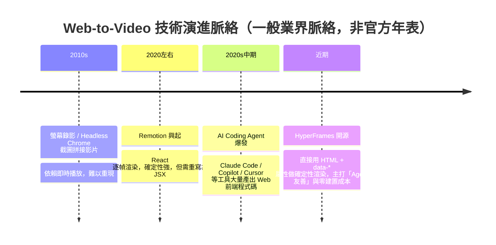

| 面向 | HyperFrames | 傳統螢幕錄影 | Remotion |
|---|---|---|---|
| 輸入格式 | 純 HTML + CSS + JS/GSAP | 任意網頁（即時播放） | React（JSX） |
| 確定性 | 是（逐 frame seek） | 否（即時播放，受機器效能影響） | 是（逐 frame render） |
| 建置步驟 | 無（`index.html` 直接播放） | 無 | 需要（webpack/bundler） |
| 授權 | Apache 2.0（開源，商用免費） | 依工具而定 | Source-available，超過門檻需付費 |
| 對既有網頁素材的相容性 | 高（貼上 HTML 就能用） | 高 | 低（需重寫為 JSX） |
| 對 AI Agent 的友善度 | 高（CLI 非互動、Skill 系統原生支援） | 低 | 中（需理解 React 慣例） |

### 適合哪些人／不適合哪些人

**適合：**
- 需要「大量、客製化、可重現」影片產出的團隊（個人化行銷影片、批次產品 Demo、逐 PR 自動產生 changelog 影片）
- 已經有網頁 UI／Landing Page／Design System，想直接沿用素材做影片而非重畫一套
- 想讓 AI Coding Agent（Claude Code、Cursor 等）自動生成/修改影片的團隊
- 需要把「影片渲染」放進 CI/CD、要求逐次渲染結果可迴歸比對的場景

**不適合／需謹慎評估：**
- 團隊已高度投資 Remotion 生態且無痛點，貿然遷移的 ROI 需仔細評估（見第三十一章 Migration Guide）
- 需要重度互動剪輯（拖曳時間軸、關鍵幀微調滑桿）的傳統影片剪輯工作流，HyperFrames Studio 雖有基礎編輯 UI，但仍偏「程式碼優先」而非「剪輯師優先」
- 完全不具備前端（HTML/CSS/JS）背景、也不打算導入的團隊，學習曲線會偏高
- 極度要求電影級 VFX、Compositing 精緻度的專業後期團隊——HyperFrames 定位是「程式化、規模化」而非「藝術指導精緻度優先」

### 典型使用情境

1. 行銷團隊依模板批次產生「千人千面」的個人化促銷影片
2. 工程團隊每次合併 PR 後自動產生「這次改了什麼」的變更說明短片
3. SaaS 產品依使用者帳號資料自動產生「你的年度報告」影片（類似 Spotify Wrapped）
4. 企業內部教育訓練平台，用同一份 Composition 模板搭配不同語言字幕批次產生多語系教材影片
5. DevRel／技術文件團隊把 API 文件或 Release Note 自動轉成短影片發布到社群

> **企業導入提醒**：HyperFrames 目前仍是 0.x 版本的年輕專案（詳見第三十一章版本管理建議），導入前建議先以「非關鍵路徑」的影片產出場景（如內部教育訓練影片）做 POC，驗證團隊 CI 環境（Headless Chrome + FFmpeg 依賴）與美術/動效協作流程都順暢後，再逐步擴大到面向客戶的關鍵行銷素材產線。

---

## 第一章 HyperFrames 深度導論

### 1.1 三大受眾定位再展開

延續前言提到的三大受眾，這裡進一步拆解各自的「爽點」與「限制」：

**開發者視角**：HyperFrames 最大的賣點是「零學習曲線的動畫技術棧」。你可以直接把現有的 Landing Page HTML 貼進 `index.html`，加上幾個 `data-*` 屬性、註冊一個 GSAP timeline，就能渲染成影片。相較於 Remotion 要求「把 HTML 語意翻譯成 JSX、把 CSS 翻譯成 CSS-in-JS 或 styled-components」，HyperFrames 省下的是一整層「語言轉換」的心力與潛在 Bug。

**AI Agent 視角**：這是 HyperFrames 差異化最強的定位。CLI 的每個指令都設計成「non-interactive」——不會跳出互動式問答卡住 Agent 的執行流程；`--json` flag 幾乎所有指令都支援，方便 Agent 解析結果做下一步決策；官方甚至維護一套 19 個「Skill」（詳見第七章），讓 Claude Code / Cursor / Gemini CLI / Codex 等工具可以直接「掛載」HyperFrames 的專業知識，不需要每次都把完整文件塞進 Prompt Context。

**自動化管線視角**：「確定性渲染」不只是「畫面好看」，更是能不能放進 CI/CD 迴歸測試的關鍵。想像一個情境：你的 Design System 元件庫每次發版都要重新產生一支「元件動畫展示影片」，如果渲染結果不確定性，PR Review 時比對影片就毫無意義；HyperFrames 的 `render --docker` 模式甚至能鎖定 Chrome 版本，確保「本機渲染」與「CI 渲染」逐 frame 一致。

### 1.2 典型案例深探：從一支 Landing Page 到一支社群影片

以官方 example `warm-grain` 為例（第十九章會有完整程式碼），典型流程是：

1. PM／行銷提供一支 15 秒的產品介紹腳本
2. 設計師輸出品牌色票、字型、Logo（或直接用 `npx hyperframes capture <url>` 從既有官網截取設計 Token，見第十章）
3. 工程師（或 AI Agent）用 `npx hyperframes init my-video --example warm-grain` 建立骨架
4. 逐步替換文案、圖片素材，用 GSAP 或 CSS 動畫做進場/出場效果
5. `npx hyperframes preview` 即時預覽、`npx hyperframes check` 做版面/對比度自動檢查
6. `npx hyperframes render --output output.mp4 --quality high` 產出最終影片
7. （選配）透過 `npx hyperframes cloud render` 或 `lambda render` 做雲端批次渲染

這個流程本身就是一個很好的「AI Agent 開發迴圈」範例——第八章會把這個流程對照到 Claude Code 的實際 Prompt 互動。

### Best Practice

- 導入初期，先讓一位熟悉前端的工程師完整跑過一次 Quickstart，建立團隊內部的「HyperFrames 守門人」，再逐步推廣給非前端背景的成員。
- 把官方 9 個 example template（見第十九章）當作團隊內部「模板庫」的起點，而不是每次從零開始寫 Composition。

### FAQ

**Q：HyperFrames 可以用來做長片（如 30 分鐘教學影片）嗎？**
A：技術上可以（timeline 長度沒有硬性上限），但官方 example 與典型用例多集中在 10 秒～3 分鐘的短影片（社群素材、產品 Demo）。長片建議評估渲染時間與記憶體佔用（見第三十三章 Performance Tuning），必要時拆成多個 Composition 用 `data-composition-src` 組合。

**Q：需要會 React 或前端框架才能用 HyperFrames 嗎？**
A：不需要。核心心智模型是純 HTML/CSS/JS，這正是它與 Remotion 最大的差異之一。但熟悉 CSS 動畫與至少一種動畫函式庫（GSAP 是官方最推薦的）會讓你事半功倍。

### Checklist

- [ ] 團隊已指派至少一位「HyperFrames 守門人」負責維護內部最佳實務
- [ ] 已釐清此專案屬於「短影片批次產出」還是「長片精緻剪輯」需求，並確認 HyperFrames 適配
- [ ] 已閱讀第四十章框架比較，確認相較 Remotion／傳統剪輯工具的取捨是團隊可接受的

---

## 第二章 整體系統架構

### 2.1 分層架構總覽

HyperFrames 可以拆解成七個邏輯層，理解這七層的職責邊界，是後續讀懂 CLI、Skill、Adapter 章節的基礎：

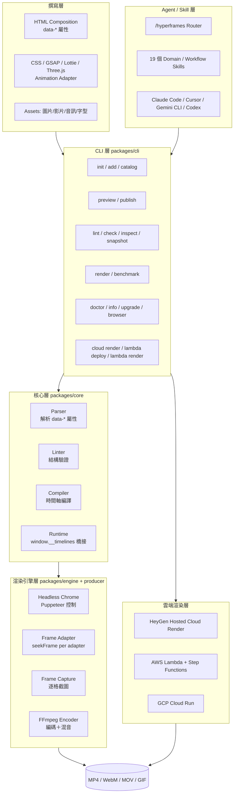

**每一層負責什麼：**

| 層級 | 對應套件 | 職責 |
|---|---|---|
| 撰寫層 | 使用者專案（`index.html` 等） | 用 HTML/CSS/JS 描述畫面與時間軸，是唯一需要人類或 AI 直接編輯的層 |
| CLI 層 | `packages/cli` | 提供所有終端指令的入口，負責參數解析、呼叫下層 API、格式化輸出（含 `--json`） |
| 核心層 | `packages/core`、`packages/parsers`、`packages/lint` | 定義 Composition 的型別系統、解析/驗證 HTML、把 `data-*` 屬性編譯成內部時間軸表示、提供 Runtime 橋接腳本（`window.__timelines`、`window.__hfLottie` 等全域物件） |
| 渲染引擎層 | `packages/engine`、`packages/producer` | 實際驅動 headless Chrome，透過 Frame Adapter 對每個動畫函式庫下達「seek 到第 N 幀」指令，截圖後交給 FFmpeg 編碼 |
| Agent/Skill 層 | `skills/` 目錄 | 把 HyperFrames 專業知識封裝成可被 AI Coding Agent 載入的 Skill 文件，透過決策樹路由到對應的 workflow |
| 雲端渲染層 | `packages/aws-lambda`、`packages/gcp-cloud-run`、HeyGen Cloud | 提供不依賴本機資源的規模化渲染選項 |
| Studio 層 | `packages/studio`、`packages/studio-server`、`packages/player` | 提供瀏覽器內即時預覽與基礎視覺化編輯 UI |

### 2.2 資料流與控制流

**資料流（Data Flow）**：Composition HTML → Parser 解析出 `CompositionSpec` → Compiler 編譯出逐 frame 的時間軸資料 → Engine 依時間軸驅動 Chrome 逐格截圖（PNG/JPG 序列，可選擇快取於 `HYPERFRAMES_EXTRACT_CACHE_DIR`）→ FFmpeg 讀取影格序列＋音訊軌 → 輸出容器格式（MP4/WebM/MOV/GIF/PNG 序列）。

**控制流（Control Flow）**：使用者（或 Agent）下達 CLI 指令 → CLI 呼叫 Core 做前置驗證（`lint`/`check`，失敗則提早中止，不浪費渲染資源）→ 驗證通過後才啟動 Engine → Engine 透過 CDP（Chrome DevTools Protocol）逐 frame 呼叫頁面內 Runtime 腳本的 `seekFrame()` → Runtime 依 Frame Adapter 類型（GSAP/CSS/Lottie…）做對應的暫停與定位 → 每格截圖完成後才推進下一幀，確保「畫面穩定後才截圖」而非「邊播放邊截圖」。

> **踩雷經驗**：很多第一次接觸的工程師會誤以為 `preview` 看到的效果就是最終 `render` 結果的保證——但 `preview` 是瀏覽器**即時播放**（受你電腦效能、Chrome 版本影響），而 `render` 是**逐 frame seek 截圖**。兩者理論上應該一致，但若動畫腳本裡混用了 `Date.now()`、`Math.random()`、或依賴 wall-clock 的邏輯（例如手動 `setInterval` 更新畫面而非交給 GSAP timeline），就會出現「preview 順、render 跳格」的落差。這也是為何 AGENTS.md 明確禁止在 Composition 腳本中使用 `Date.now()` 與未 seed 的 `Math.random()`——這類 API 天生破壞確定性渲染的前提。

### 2.3 Component Diagram：套件依賴關係

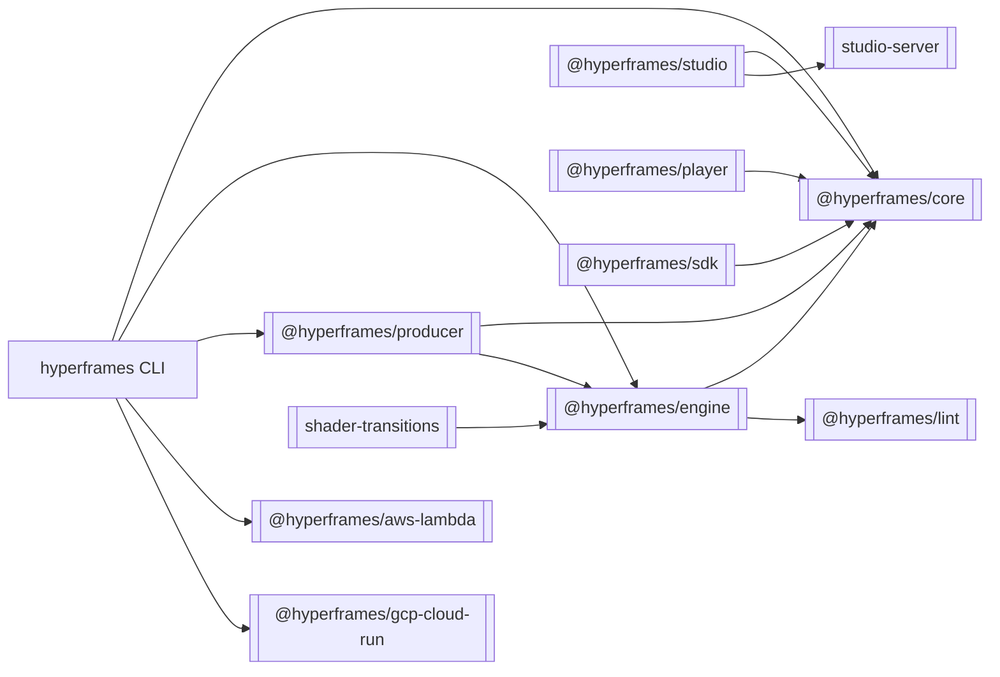

### Anti Pattern

- ❌ 把 `render` 的輸出直接當成「preview 一定跟這個一樣」的保證，而不做 `check`/`lint` 前置驗證
- ❌ 在渲染機器上跳過 `doctor` 檢查就直接上 CI，導致 Chrome/FFmpeg 版本不一致造成的間歇性失敗難以排查
- ❌ 誤把 Studio（`packages/studio`）當成生產環境的主要編輯介面——它更適合「快速預覽與微調」，複雜邏輯仍建議直接編輯 HTML/腳本

### Checklist

- [ ] 團隊已理解「撰寫層／CLI層／核心層／引擎層」的職責邊界，出問題時能快速定位是哪一層的責任
- [ ] CI 環境已安裝並鎖定 Chrome、FFmpeg 版本（或改用 `--docker` 渲染模式）
- [ ] 已避免在 Composition 腳本中使用 `Date.now()`、未 seed 的 `Math.random()`、render-time network fetch

---

## 第三章 HyperFrames 工作流程

### 3.1 六步驟完整渲染流程

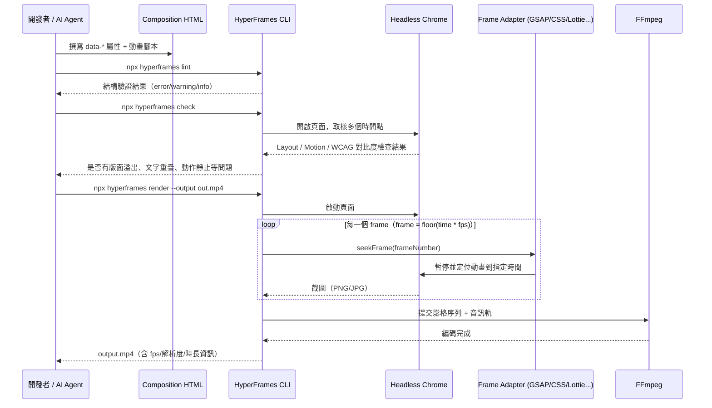

### 3.2 HTML → Animation → Frame → Capture → Encode → MP4 各階段細節

1. **HTML**：撰寫 Composition，根節點宣告 `data-composition-id`、`data-width`、`data-height`；需要參與時間軸的元素加上 `class="clip"` 與 `data-start`、`data-duration`、`data-track-index`。
2. **Animation**：用 CSS Animation/Transition、WAAPI、或 GSAP/Lottie/Three.js/Anime.js 等 Adapter 定義畫面如何隨時間變化；GSAP 需以 `{ paused: true }` 建立 timeline 並註冊到 `window.__timelines`（詳見第六章）。
3. **Frame**：Compiler 依 `data-*` 屬性與動畫時長，計算出整支影片的總 frame 數（`totalFrames = duration * fps`）。
4. **Capture**：Engine 逐一 seek 每個 frame，等待畫面穩定（無進行中的 transition/repaint）後才截圖，這一步是效能瓶頸的常見來源（見第三十三章）。
5. **Encode**：FFmpeg 讀取影格序列與音訊軌，依 `--format`/`--codec`/`--crf`/`--video-bitrate` 等參數編碼。
6. **MP4（或其他格式）**：輸出到 `--output` 指定路徑，預設 `renders/<name>.mp4`。

### 實務案例

某電商團隊需要「依商品資料自動產生 10 秒鐘的商品展示短影片」，流程對應如下：後端 API 產出商品 JSON → Node.js script 用 `@hyperframes/core` 的 `updateElementInHtml()` 把商品圖片/價格/文案動態寫入既有模板 HTML → 呼叫 `hyperframes render --variables-file product.json` 批次渲染 → 上傳到 CDN。整條管線可以完全在 CI Job 中無人值守執行，這正是「確定性渲染」帶來的最大商業價值。

### Checklist

- [ ] 已理解「先 lint/check、再 render」的標準開發迴圈，而非直接渲染除錯
- [ ] 已知道 `frame = floor(time * fps)` 這個核心公式，能推算特定時間點對應第幾個 frame（`--at`/`--snapshot` 除錯時會用到）

---

## 第四章 Rendering Engine

### 4.1 Deterministic Rendering 的技術本質

HyperFrames 官方文件的關鍵陳述是：**"Same input, same frames, same output. Built for CI, regression tests, and automated rendering."** 要做到這件事，核心手段是「seek-driven，沒有 wall-clock 依賴」——不像即時錄影是「照著時鐘播放、邊播邊錄」，HyperFrames 是對瀏覽器下達「把畫面狀態定位到第 N 幀所代表的時間點」的明確指令，再截圖。這意味著：

- 每一幀的截圖時機不受機器效能影響（渲染慢只會讓「渲染這件事」變慢，不會讓「畫面內容」跑掉）
- 兩台不同效能的機器渲染同一份 Composition，理論上應該逐 frame 位元級接近（實務上仍可能因字型渲染引擎、GPU 驅動差異產生極小的像素差異，見下方踩雷經驗）
- 可以針對任意一個時間點單獨截圖除錯（`snapshot --at 3.0,10.5`），不需要重跑整支影片

### 4.2 Frame Timeline 與 Seek 機制

每個 Composition 被編譯成一條「Frame Timeline」：一系列 `(frameNumber, elementStates)` 的對應關係。渲染時，Engine 對每一個 Frame Adapter（每種動畫函式庫各自實作一個 Adapter）呼叫其 `seekFrame(frameNumber)` 方法，Adapter 內部再換算成該函式庫自己的時間單位（例如 GSAP 的 `tl.seek(frame / fps)`）。

```typescript
// Frame Adapter 介面（依 @hyperframes/core 型別參考重新整理示意）
interface FrameAdapter {
  init?(context: FrameAdapterContext): Promise<void>;
  getDurationFrames(): number;
  seekFrame(frameNumber: number): Promise<void>;
  destroy?(): Promise<void>;
}

// 官方提供的 GSAP Adapter 建構函式
const gsapAdapter = createGSAPFrameAdapter({
  // 依專案設定調整，例如指定 timeline key
});
```

### 4.3 Timing / FPS / Resolution / Color / Codec / Quality 全解析

| 參數 | 可選值／預設 | 說明 |
|---|---|---|
| `--fps` | 1–240 或分數（如 `30000/1001`），預設 30 | 幀率越高，`render` 需要截圖的次數越多，直接影響渲染時間 |
| `--resolution` | `landscape`、`portrait`、`landscape-4k` 等預設，或自訂 `--width`/`--height` | 決定輸出畫布尺寸 |
| `--format` | `mp4`／`webm`／`mov`／`gif`／`png-sequence` | 輸出容器格式；WebM 支援透明背景（Alpha channel），適合疊加合成 |
| `--quality` | `draft`／`standard`／`high` | 內建的編碼品質預設集，`draft` 適合開發迭代，`high` 適合最終交付 |
| `--crf` | 0–51（與 `--video-bitrate` 互斥） | 數值越低畫質越好、檔案越大，常用範圍 18–28 |
| `--hdr` / `--sdr` | 布林旗標 | 強制輸出 HDR 或 SDR（僅 MP4 支援 HDR） |
| `--gpu` | `nvenc`／`videotoolbox`／`amf`／`vaapi`／`qsv` | 啟用硬體編碼加速 |

### 4.4 Color 與 Codec 的取捨建議

> **實務建議**：社群媒體投放（IG/TikTok）建議用 H.264（MP4）＋ `--quality high`，相容性最好；若影片後續要進剪輯軟體再加工，建議輸出 ProRes（`.mov`）保留更多細節與色彩深度；需要透明背景疊加合成（例如虛擬人像疊加到自訂背景）則用 WebM + VP9/Alpha。AV1 雖然壓縮效率最佳，但編碼耗時遠高於 H.264，較適合「離線批次、對渲染時間不敏感」的最終發布版本，不建議用在需要快速迭代的 `draft` 階段。

### Anti Pattern

- ❌ 開發迭代階段就用 `--quality high --fps 60` 渲染，導致每次修改都要等好幾分鐘才能看到結果——迭代階段應該用 `--quality draft` 甚至只 `snapshot` 幾個關鍵幀
- ❌ 忽略「不同機器渲染結果可能有極小像素差異」的事實，把「確定性渲染」誤解為「位元級完全相同」，導致 CI 迴歸測試用過於嚴格的像素比對（應搭配容忍度 threshold）

### FAQ

**Q：為什麼同一份 Composition，在我的 Mac 跟 CI Linux Runner 上渲染出來的畫面有些微差異？**
A：常見原因是字型渲染引擎（Core Text vs FreeType）或 Chrome 版本不同導致的次像素級差異。若對「逐 frame 完全一致」有嚴格要求（例如做視覺迴歸測試基準），建議用 `--docker` 模式統一渲染環境。

### Checklist

- [ ] 開發階段預設使用 `draft` 品質＋較低 fps 快速迭代，最終產出才切換 `high` 品質
- [ ] 已依發布通路（社群媒體 / 後製剪輯 / 透明疊加）選定對應的 Codec/容器格式
- [ ] 若需要跨機器逐 frame 一致性保證，已改用 `--docker` 渲染模式

---

## 第五章 HTML Render Pipeline

### 5.1 DOM／CSS／JS 三層如何被渲染引擎消費

HyperFrames 本質上是把「一整個網頁的渲染結果」在特定時間點截圖，所以理論上任何能在 Chrome 中正確顯示的 DOM/CSS/JS 效果都能被渲染成影片畫面，但實務上有幾個需要特別注意的行為差異：

- **DOM**：一般語意化標籤皆可正常渲染；但動態插入/移除 DOM 節點的邏輯，若沒有配合 Frame Adapter 的 `seekFrame` 時機執行，容易產生「seek 到某一幀時節點還沒插入」的問題。
- **CSS**：靜態樣式、Flexbox/Grid 版面完全支援；CSS Animation/Transition 需要遵守第六章介紹的「可 seek」限制（避免 `width`/`height` 等會觸發 layout thrashing 的屬性做逐幀動畫）。
- **JS**：允許執行任意邏輯，但涉及時間相關的效果（動畫、計時器）必須透過受控的 Frame Adapter，而不是自行呼叫 `setTimeout`/`setInterval` 更新畫面。

### 5.2 Canvas／SVG／WebGL／Three.js

- **Canvas**：2D Canvas 繪圖只要在對應 frame 前完成繪製即可正確截圖；若是逐幀動態繪製（如粒子特效），建議把繪製邏輯包裝成可被外部呼叫「畫出第 N 幀狀態」的函式，而非依賴 `requestAnimationFrame` 的內部計時器。
- **SVG**：SVG 原生動畫（`<animate>`）與 SVG + CSS/GSAP 動畫（描邊動畫、路徑變形）都是常見用法，特別適合 Logo Reveal、圖示動畫等場景。
- **WebGL / Three.js**：屬於進階場景，Three.js 場景需要透過官方或自訂 Frame Adapter 控制渲染迴圈的時間推進，而非讓 Three.js 自己的 `requestAnimationFrame` 迴圈自由跑（否則會跟 GSAP 一樣遇到「wall-clock 動畫在 render 時被截斷」的問題）。

### 5.3 Video／Audio／Image／Font 的渲染考量

- **Video**：官方文件特別提醒不要直接對 `<video>` 元素做 `width`/`height` 動畫，而應該「把 video 包在一個 `<div>` 裡，對 wrapper 做動畫」——這是 GSAP 章節（第六章）會再強調的重要踩雷點。
- **Audio**：音訊由框架統一管理播放與混音（`data-timeline-role="music"` 標記背景音樂軌，供 `beats` 指令做節拍偵測），Composition 腳本不應該自行呼叫 `audio.play()`/`audio.pause()`。
- **Image**：建議使用專案內 `assets/` 相對路徑而非外部 URL，避免 render-time network fetch 造成的不確定性與速度風險（AGENTS.md 明確列為禁止事項）。
- **Font**：字型載入建議使用本機字型檔或 Google Fonts 連結並確保在 `check` 階段驗證已完全載入，避免「preview 正常但 render 因字型未及時載入而顯示 fallback 字型」的落差。

### 踩雷經驗

一個真實常見的踩雷情境：工程師在 Composition 裡對 `<video>` 元素直接寫 `tl.to("video", { width: "100%" })` 做進場放大效果，preview 時看起來正常（瀏覽器即時播放沒有問題），但 render 出來的影片卻出現「影片畫面偶爾閃爍或黑一下」——原因是對 `<video>` 元素動態改變尺寸，會觸發瀏覽器重新請求/重新佈局該媒體元素的解碼管線，與逐幀截圖的時機產生競爭。正確做法：`<div class="video-wrapper"><video muted src="..."></video></div>`，動畫寫在 `.video-wrapper` 上。

### Checklist

- [ ] 所有 `<video>` 元素都已加上 `muted` 屬性（利於自動播放相容性）並透過 wrapper `<div>` 做尺寸/位置動畫
- [ ] 沒有任何素材（圖片/影片/音訊/字型）依賴 render-time 的外部網路請求
- [ ] Canvas／WebGL 動畫已改為「可被外部指定時間點呼叫繪製」的架構，而非依賴內部 `requestAnimationFrame` 計時器

---

## 第六章 Animation Adapter 完整解析

HyperFrames 的「Animation Adapter」機制，是它能同時支援多種動畫技術棧、又保有確定性渲染的關鍵設計。本章逐一拆解每種技術的原理、優缺點與適用場合。

### 6.1 CSS Animation / CSS Transition

**原理**：CSS Animation（`@keyframes`）與 Transition 是瀏覽器原生支援的宣告式動畫，HyperFrames 的內建 Runtime 能透過 CDP 直接控制頁面的動畫播放狀態（暫停、定位到特定時間），不需要額外的 JS Adapter。

**優點**：零額外依賴、效能最好（瀏覽器原生實作）、語法簡單、對純 CSS 背景的工程師最友善。

**缺點**：複雜的時間軸編排（多個元素交錯進出場、依賴前一動畫結束才觸發下一動畫）用純 CSS 表達會變得囉嗦；沒有內建的 timeline 巢狀能力。

**適用場合**：簡單的進場/出場效果（fade-in、slide-in）、Hover 態效果的靜態展示、對效能極度敏感的大量並行動畫元素。

```css
@keyframes fadeInUp {
  from { opacity: 0; transform: translateY(30px); }
  to   { opacity: 1; transform: translateY(0); }
}
.title.clip {
  animation: fadeInUp 1s ease-out forwards;
  animation-delay: 0.5s;
}
```

### 6.2 Web Animations API（WAAPI）

**原理**：瀏覽器原生 JS API（`element.animate()`），本質上是 CSS Animation 的程式化版本，回傳的 `Animation` 物件原生支援 `.pause()`、`.currentTime = X` 這類「可 seek」操作，天生適合確定性渲染。

**優點**：不需要載入任何第三方函式庫、原生支援精準的時間控制、瀏覽器相容性佳。

**缺點**：語法比 GSAP 冗長，社群資源與範例相對較少；複雜的 easing 函式與時間軸巢狀能力不如 GSAP 成熟。

**適用場合**：想要精準時間控制但不想引入額外套件依賴的輕量場景。

```javascript
const el = document.querySelector('#logo');
const anim = el.animate(
  [{ transform: 'scale(0)' }, { transform: 'scale(1)' }],
  { duration: 800, fill: 'forwards', easing: 'cubic-bezier(.34,1.56,.64,1)' }
);
anim.pause(); // 交給 HyperFrames Runtime 控制 currentTime
```

### 6.3 GSAP（官方最推薦）

**原理**：GSAP（GreenSock Animation Platform）是業界最成熟的 JS 動畫函式庫，HyperFrames 官方 GSAP Adapter 的做法是：`gsap.timeline({ paused: true })` 建立一條暫停狀態的時間軸，註冊到全域變數 `window.__timelines[compositionId]`，渲染時 Engine 呼叫 `tl.seek(frame / fps)` 精準定位。

**優點**：時間軸編排能力最強（`position parameter` 精準控制多元素交錯時機）、Easing 函式庫豐富、社群範例最多、官方文件涵蓋最完整。

**缺點**：需要額外載入 GSAP（CDN 或 npm）、時間軸註冊有固定的「儀式」需要遵守（`paused: true` + 註冊 `window.__timelines`），新手容易忘記其中一步導致渲染失敗或動畫不執行。

**適用場合**：官方建議的預設選擇，尤其是有多元素交錯進出場、需要精準時間控制的中大型 Composition。

```javascript
const tl = gsap.timeline({ paused: true });
tl.from("#title", { opacity: 0, y: -50, duration: 1 }, 0)
  .from("#subtitle", { opacity: 0, y: 20, duration: 0.8 }, 0.5)
  .to("#title", { scale: 1.1, duration: 0.3 }, 3)
  .to({}, {}, 8); // 用空 tween 延長 timeline 總長度到 8 秒

window.__timelines = window.__timelines || {};
window.__timelines["my-video"] = tl;
```

> **踩雷經驗（時長同步陷阱）**：官方文件明確指出一個常見錯誤——「如果你的 Composition 裡有一段 283 秒的影片素材，但 GSAP 最後一個動畫在第 8 秒結束，整支 Composition 的時長會被判定成只有 8 秒」，因為 Composition 總時長是以 timeline duration 為準。解法是用 `tl.set({}, {}, 283)` 這種「空動作」把 timeline 長度撐到你要的總時長。

### 6.4 Anime.js

**原理**：另一套輕量級 JS 動畫函式庫，API 設計比 GSAP 更精簡，同樣可以透過自訂 Frame Adapter 包裝成可 seek 的形式。

**優點**：檔案體積小、API 直覺、學習曲線平緩。

**缺點**：時間軸巢狀與進階 Easing 能力不如 GSAP 完整；官方文件著墨相對少，需要自行驗證與 HyperFrames Runtime 的整合細節。

**適用場合**：追求極簡依賴、動畫需求相對單純（單一元素的進出場效果為主）的專案。

### 6.5 Lottie

**原理**：Lottie 是 Adobe After Effects 動畫透過 Bodymovin 匯出的 JSON 動畫格式，在網頁端透過 `lottie-web` 播放。HyperFrames 提供對應的 Adapter（`window.__hfLottie` 全域註冊機制），讓 After Effects 製作的向量動畫也能被逐幀 seek。

**優點**：能直接沿用設計師在 After Effects 產出的高品質向量動畫，不需要工程師重新用程式碼實作複雜的 Motion Graphics；檔案體積遠小於影片素材。

**缺點**：Lottie 動畫本身是「黑盒子」——時間軸調整仍需要回到 After Effects 端修改再重新匯出，工程師端能調整的通常只有播放速度/起訖時間；並非所有 After Effects 特效都能被 Lottie 完整匯出（如複雜的 3D 效果、部分粒子特效）。

**適用場合**：需要設計師產出的高品質 Motion Graphics（Logo Reveal、圖示動畫、角色動畫），且工程與設計團隊已有成熟的 After Effects → Lottie 匯出協作流程。

```html
<div id="lottie-container" class="clip" data-start="0" data-duration="3"></div>
<script src="https://cdn.jsdelivr.net/npm/lottie-web/build/player/lottie.min.js"></script>
<script>
  window.__hfLottie = window.__hfLottie || {};
  const anim = lottie.loadAnimation({
    container: document.getElementById('lottie-container'),
    renderer: 'svg',
    loop: false,
    autoplay: false,
    path: 'assets/logo-reveal.json'
  });
  window.__hfLottie['logo-reveal'] = anim; // 供 Runtime 呼叫 anim.goToAndStop(frame, true)
</script>
```

### 6.6 Three.js

**原理**：3D 場景引擎，透過自訂 Frame Adapter 攔截渲染迴圈，改為外部驅動的「渲染第 N 幀狀態」模式，而非讓 Three.js 依賴自身的 `requestAnimationFrame` 迴圈。

**優點**：能做出 2D CSS/SVG 難以實現的 3D 視覺效果（產品 3D 旋轉展示、粒子場景、沉浸式背景）。

**缺點**：實作複雜度最高，需要工程師具備 3D 圖形基礎；渲染效能開銷大（見第三十三章 GPU 章節）；官方文件對 Three.js Adapter 的著墨相對簡略，建議先從官方 example 或社群案例參考起步。

**適用場合**：產品 3D 展示、科技感十足的品牌形象影片、遊戲/軟體的 3D 視覺化 Demo。

### 6.7 TypeGPU/WebGPU（GPU 加速圖形，官方 Adapter）

**原理**：官方提供的第七個 Frame Adapter，基於 **TypeGPU／WebGPU** 技術棧，讓 GPU 驅動的圖形效果（粒子系統、著色器特效、如 "liquid glass" 這類即時運算的視覺效果）也能被納入逐幀 seek 的確定性渲染管線，而非依賴瀏覽器自身的即時繪圖迴圈。

> **⚠️ 版本快照提醒：** 官方文件對 TypeGPU/WebGPU Adapter 的著墨目前仍相對簡略，且 WebGPU 本身在不同瀏覽器/驅動版本的支援成熟度仍在快速演進中，實作前務必以官方最新的 Adapter 文件與範例為準，並在 CI/雲端渲染環境提前驗證 WebGPU 是否可用（部分無 GPU 的容器環境可能不支援）。

**優點**：GPU 原生運算效能，能做出比 CSS/SVG 更複雜的即時圖形效果（粒子、著色器、流體/玻璃質感等）。

**缺點**：實作複雜度高，需要 Shader/GPU 圖形基礎；渲染環境需具備可用的 GPU 或相容的軟體 WebGPU 實作，CI/雲端無 GPU 節點需另行評估相容性（見第三十三章）。

**適用場合**：科技感十足的品牌形象影片、即時運算的粒子/著色器特效、需要 GPU 級視覺效果的產品展示。

### 6.8 手刻 Canvas 2D 程式化繪圖（技巧，非官方具名 Adapter）

**原理**：直接用瀏覽器原生 2D Canvas API 手刻繪製邏輯，透過「暴露一個可被外部呼叫、依傳入時間繪製對應畫面」的函式，讓 HyperFrames Runtime 能在每個 frame 呼叫它。**需注意**：這是一種可行的實作技巧，並非官方具名的 Frame Adapter（官方具名的第七個 Adapter 是上一節的 TypeGPU/WebGPU）；手刻 Canvas 2D 繪圖之所以能運作，是因為它遵循了與其他 Adapter 相同的「可被外部指定時間點呼叫」設計原則，而非框架本身提供了專屬的 Canvas 2D Adapter 封裝。

**優點**：完全的繪製控制權，適合資料視覺化（圖表逐步繪出）、粒子特效等需要程式化生成畫面的場景，且不需要額外的 GPU/WebGPU 相容性考量。

**缺點**：所有動畫邏輯（Easing、時間軸編排）都要自己實作，開發成本最高；沒有官方 Adapter 封裝可用，需自行確保繪製函式符合逐幀呼叫的慣例。

**適用場合**：資料圖表動畫（如官方 `data-chart` catalog block）、需要每幀程式化運算畫面內容的場景（例如依即時資料繪製的儀表板動畫）——若效果需求更接近 GPU 級即時運算（粒子/著色器），優先評估上一節的 TypeGPU/WebGPU Adapter。

```javascript
function drawFrame(progress /* 0~1 */) {
  const ctx = canvas.getContext('2d');
  ctx.clearRect(0, 0, canvas.width, canvas.height);
  const barWidth = progress * 400;
  ctx.fillStyle = '#2563eb';
  ctx.fillRect(40, 100, barWidth, 40);
}
// 由 Frame Adapter 依 frame/fps 換算出 progress 後呼叫 drawFrame()
```

### 6.9 SVG Animation

**原理**：可用 SVG 原生 `<animate>`/`<animateTransform>`，或搭配 CSS/GSAP 對 SVG 屬性（`stroke-dashoffset`、`d`、`transform`）做動畫，常見於路徑描邊動畫（Draw-on）與圖形變形（Morph）。

**優點**：向量無失真、檔案體積小、適合 Logo/圖示類動畫；GSAP 的 DrawSVG/MorphSVG 外掛能大幅簡化實作。

**缺點**：複雜路徑變形的動畫曲線需要一定的向量圖形經驗才能調得自然。

**適用場合**：Logo Reveal、圖示動畫、資訊圖表中的線條/圖形動畫。

### Animation Adapter 選型總表

| Adapter | 學習曲線 | 時間軸編排能力 | 效能 | 最佳場合 |
|---|---|---|---|---|
| CSS Animation/Transition | 低 | 低 | 高 | 簡單進出場效果 |
| WAAPI | 中 | 中 | 高 | 輕量、無額外依賴的精準控制 |
| GSAP | 中 | 高 | 高 | 官方推薦預設選擇，複雜時間軸編排 |
| Anime.js | 低 | 中 | 高 | 極簡依賴的中小型動畫 |
| Lottie | 中（設計端高） | 依 AE 來源 | 中 | 高品質 Motion Graphics，設計師主導 |
| Three.js | 高 | 高（3D） | 中～低 | 3D 展示、沉浸式視覺 |
| TypeGPU/WebGPU（官方 Adapter） | 高 | 高（GPU） | 高（需 GPU 支援） | 粒子/著色器等 GPU 級即時運算效果 |
| Canvas 2D 手繪（技巧，非具名 Adapter） | 高 | 需自行實作 | 中～高 | 資料視覺化、程式化生成畫面 |
| SVG Animation | 中 | 中 | 高 | Logo/圖示/線條動畫 |

### Anti Pattern

- ❌ GSAP timeline 忘記設定 `{ paused: true }`，導致 preview 階段動畫自行播放、render 階段時間軸狀態錯亂
- ❌ 混用多套動畫函式庫控制同一個元素的同一個屬性（例如同時用 CSS Transition 跟 GSAP 控制同一個 `opacity`），造成不可預期的覆蓋行為
- ❌ 對 Lottie/Three.js 等重量級 Adapter 不做效能評估就大量套用在同一支影片的多個場景，導致渲染時間暴增

### Checklist

- [ ] 已依「選型總表」為專案選定主要動畫技術棧，避免同專案內動畫函式庫過度混雜
- [ ] 所有 GSAP timeline 皆已確認 `{ paused: true }` 並正確註冊到 `window.__timelines`
- [ ] Lottie/Three.js 等重量級動畫已評估渲染效能影響（見第三十三章）

---

## 第七章 Skill System

### 7.1 什麼是 HyperFrames Skill

「Skill」是 HyperFrames 為 AI Coding Agent（Claude Code、Cursor、Gemini CLI、Codex 等）設計的知識封裝格式——本質上是一份 Markdown（`SKILL.md`），描述「什麼情境該用這個 Skill」「該怎麼做」，讓 Agent 在需要時才載入對應的專業知識，而不是把所有 HyperFrames 文件一次塞進 Context Window（這正好呼應 Claude Code、Anthropic 官方推廣的 Agent Skills 機制，見同目錄下《claude agent skills教學手冊.md》可交叉參照）。

官方目前提供 **19 個 Skill**，分成三層：

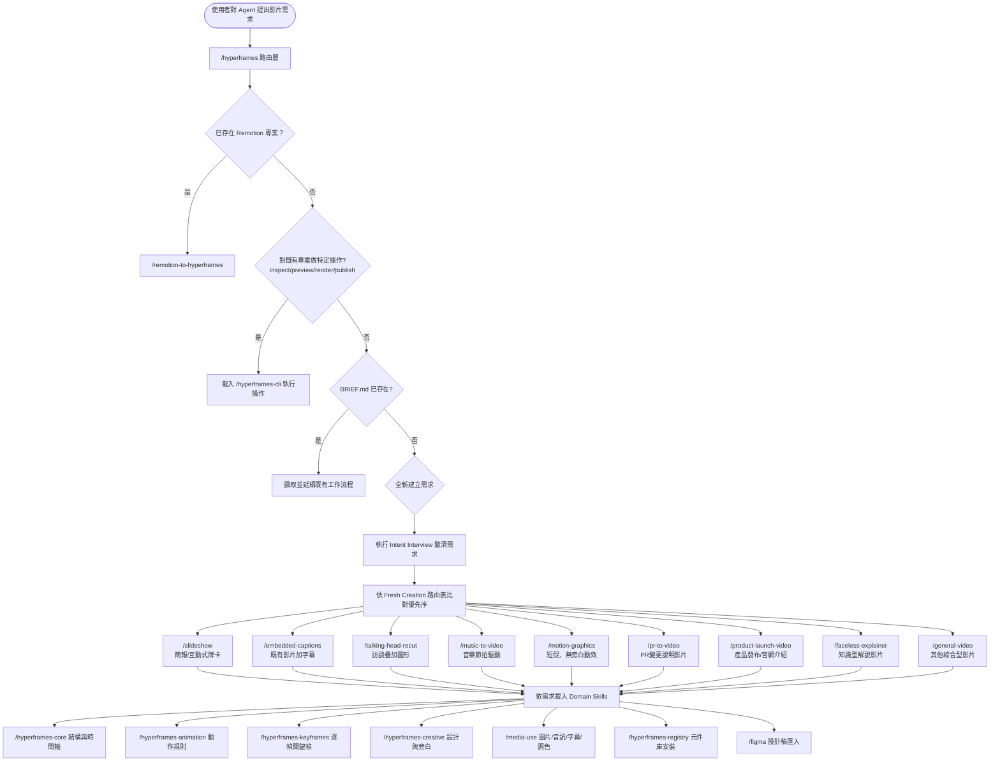

### 7.2 Router 決策邏輯詳解

`/hyperframes` 是**強制入口**——任何涉及影片、動畫、Motion Graphic 建立的請求都必須先經過它，它依「優先序」逐條比對現況：

1. 偵測到既有 Remotion 專案 → 轉去 `/remotion-to-hyperframes` 做遷移
2. 對既有專案的特定操作（檢查、診斷、驗證、預覽、渲染、發布、批次渲染）→ 只執行操作、載入 `/hyperframes-cli`
3. 對既有專案的特定編輯 → 直接編輯，略過完整意圖訪談
4. `BRIEF.md` 已存在 → 讀取既有工作流程定義並延續執行
5. `hyperframes.json` 或 `STORYBOARD.md` 已存在 → 從既有專案檔案推斷所屬 workflow 並恢復執行
6. 全新建立需求 → 執行「意圖訪談」，再依「Fresh Creation 路由表」（依**產出物類型**而非附帶的檔案類型做優先序判斷）選擇 workflow skill

路由表中有一個值得注意的邊界判斷：**「簡短、無旁白、動效驅動的片段（通常 < 10 秒）」屬於 `/motion-graphics`；一旦加上旁白或篇幅拉長就落到 `/general-video`**；音樂只有在「節拍驅動整支影片剪輯邏輯」時才會選 `/music-to-video`，若音樂只是背景配樂，仍應依主題內容路由到其他 workflow。這種細膩的邊界判斷,正是把 HyperFrames 專業知識封裝成 Skill 的價值所在——不需要每次都在 Prompt 裡重新解釋這些規則。

### 7.3 AI 如何呼叫 HyperFrames Skill

以 Claude Code 為例，安裝方式：

```bash
npx skills add heygen-com/hyperframes --full-depth
```

安裝完成後，Claude Code 在偵測到使用者輸入涉及影片/動畫建立時，會自動載入 `/hyperframes` 這個 Skill 的內容作為額外系統指引。Cursor、Gemini CLI、Codex 的安裝方式類似，也可透過 CLI 一次性安裝到多個工具：

```bash
npx hyperframes skills --claude --gemini --cursor --codex
```

### 7.4 Skill 版本維護協定（一個容易被忽略但很重要的細節）

官方 SKILL.md 特別定義了一個「維護協定」：當 Agent 要在一個「已釘選 CLI 版本」的既有專案上執行任何會影響渲染結果的指令前，必須先執行只讀探測：

```bash
npx hyperframes@latest upgrade --project . --check
```

若發現版本落後，Agent 應該主動升級、透過 `npx hyperframes check` 驗證升級後仍正常運作，並在回覆摘要中明確標註「舊版本 → 新版本」；**若驗證失敗，必須還原版本，絕不能留下一個「已升版但未驗證」的狀態**。這是一個非常值得團隊內部所有「人類撰寫的自動化腳本」也學習的設計模式——AI Agent 不該默默升級依賴而不驗證。

### Best Practice

- 安裝 Skill 時優先使用 `--full-depth` 取得完整 19 個 Skill，而非只裝 router，避免 Agent 在複雜情境下因缺乏 domain skill 而給出不精準的實作
- 團隊內部若已有標準化的影片模板（如統一的品牌 Intro/Outro），可以把這些規則寫成專案層級的補充 Skill 或放進 `CLAUDE.md`／`AGENTS.md`，與官方 Skill 疊加使用

### FAQ

**Q：不同 AI 工具（Claude Code vs Cursor）用同一組 Skill，行為會一致嗎？**
A：Skill 內容本身一致（同一份 `SKILL.md`），但各家 Agent 的「何時載入 Skill」「如何理解決策樹」仍取決於各自的模型與 Agent 框架實作，行為上可能有些微差異，建議每導入一款新工具都做一次基礎驗證。

### Checklist

- [ ] 已用 `--full-depth` 安裝完整 Skill 集合，而非僅有 router
- [ ] 團隊已知悉版本維護協定，理解 Agent 可能會主動升版並驗證
- [ ] 已評估是否需要撰寫專案層級的補充規則（品牌規範、模板慣例）疊加在官方 Skill 之上

---

## 第八章 AI Agent 整合總覽

### 8.1 為什麼 HyperFrames 特別強調 Agent 整合

回顧前言的定位：「Agents already speak HTML.」——這不只是行銷語言，而是實際的架構決策：CLI 全面 non-interactive、幾乎每個指令支援 `--json`、錯誤訊息設計成結構化可解析、Skill 系統原生封裝專業知識。這些設計讓 HyperFrames 相較其他影片框架，更容易被放進「Agent 自主執行的迴圈」中，而不需要人類在旁邊隨時確認互動視窗。

### 8.2 各 AI 工具整合方式速覽

| 工具 | 安裝指令 | 特色 |
|---|---|---|
| **Claude Code** | `npx skills add heygen-com/hyperframes --full-depth` 或 `npx hyperframes skills --claude` | 原生 Agent Skills 機制，支援最完整；適合搭配 Claude Design（見第二十章）做「設計稿 → 初版影片 → Claude Code 精修」流程 |
| **Cursor** | `npx hyperframes skills --cursor` | 透過 Cursor 的 Rules/Commands 機制掛載 Skill 內容 |
| **Gemini CLI** | `npx hyperframes skills --gemini` | 透過 Gemini CLI 的擴充機制載入 |
| **Codex（OpenAI）** | `npx hyperframes skills --codex` 或 `npx skills add heygen-com/hyperframes` | 官方 README 明確列為支援對象 |
| **GitHub Copilot** | 目前官方 Skill 系統未列出原生整合，建議透過 `AGENTS.md`／Copilot 自訂指令檔手動引用 CLI 慣例（見第二十一章詳細作法） | 需要工程團隊自行建立對應規範文件補強 |
| **OpenHands / OpenCode 等開源 Agent 框架** | 目前官方文件未明確列出專屬整合，建議以「一般終端機工具」方式呼叫 HyperFrames CLI，並將 `AGENTS.md`／`CLAUDE.md` 慣例文件放入專案根目錄供這類通用型 Agent 讀取 | 因為 CLI 本身即為 non-interactive 設計，理論上任何具備「執行終端指令＋讀取檔案」能力的 Agent 框架都能操作 HyperFrames，差異只在於是否有現成的 Skill 封裝 |

> **實務建議**：即使某個 AI 工具沒有官方 Skill 整合（如 GitHub Copilot、OpenHands），也不代表無法使用 HyperFrames——因為核心操作介面就是「終端機指令 + HTML 檔案」，任何能執行 Bash/PowerShell 並編輯檔案的 Agent 都能操作。差異在於「有沒有現成的專業知識封裝可以省去反覆試錯」。團隊可以自行把常犯的錯誤（如 GSAP `paused:true` 陷阱、`<video>` wrapper 陷阱）整理成專案內的 `AGENTS.md`，讓沒有官方 Skill 的工具也能少走彎路。
>
> **編排說明**：官方文件實際上是用「單一、統一」的 Skill 安裝機制（`npx skills add heygen-com/hyperframes`）與一份共用的 Quickstart／Skills Catalog 指南涵蓋 Claude Code、Cursor、Gemini CLI、Codex 等工具，並未針對每個工具各自撰寫獨立的官方章節。本書第二十～二十三章把各工具拆成獨立實戰章節，是撰寫團隊為了讓讀者能依自己使用的工具直接查閱、快速上手所做的**編排與深化**，內容中的安裝指令與底層支援事實皆已查證屬實，但「四個獨立章節」這個結構本身是本書的加值整理，並非直接對應官方文件站的頁面分法，請讀者知悉。

### 8.3 AI Agent 建立影片的標準迴圈

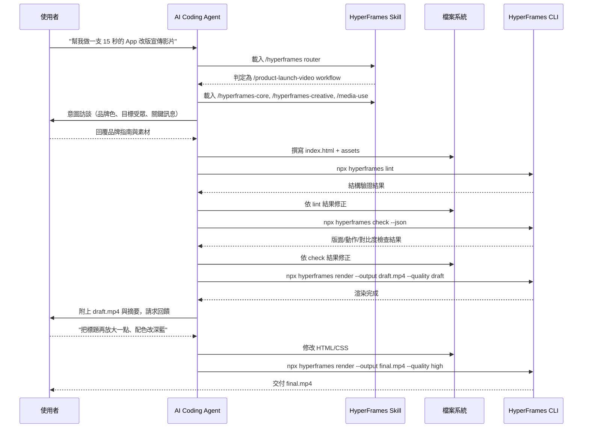

這個「建立 → lint → check → render draft → 人類回饋 → 修改 → render final」的迴圈，是本手冊後續第二十～二十三章（各 AI 工具整合實戰）與第三十八章（Prompt 範例）反覆使用的核心模式，建議讀者先熟悉這張圖。

### 8.4 修改影片、重構動畫、自動生成 HTML 的差異

- **修改影片（局部調整）**：Agent 直接編輯既有 Composition 的文案/顏色/素材，不需要重新設計時間軸結構，對應 Skill 決策樹中的「對既有專案的特定編輯」分支，會略過完整意圖訪談。
- **重構動畫（時間軸結構調整）**：例如把原本用 CSS Transition 寫的簡單效果，重構成 GSAP timeline 以支援更複雜的交錯進場，這類任務建議 Agent 先執行 `check --json` 取得目前的動作評估基準，重構後再次執行比對是否有回歸。
- **自動生成 HTML（從零建立）**：對應「Fresh Creation」路徑，Agent 需要先完成意圖訪談、決定 workflow skill、再產生初版 HTML；建議搭配官方 9 個 example template 作為起點，而非讓 Agent 完全從空白開始想像版面結構。

### Best Practice

- 讓 Agent 的每一次迭代都先跑 `lint`／`check`，把「靜態結構問題」與「視覺/動作問題」提前攔截，比等到 `render` 完才發現問題更省時間與運算資源
- 團隊可以把「意圖訪談需要蒐集哪些資訊」（品牌色票、字型、目標受眾、關鍵訊息、時長限制、發布通路）整理成固定的 checklist，貼進專案 `CLAUDE.md`／`AGENTS.md`，讓每次 Agent 互動都能一次蒐集完整資訊，減少來回確認的輪次

### Anti Pattern

- ❌ 讓 Agent 跳過 `lint`/`check` 直接進行完整 `render --quality high`，浪費運算時間在明明已知會失敗或有明顯視覺瑕疵的版本上
- ❌ 每次修改都要求 Agent 從零重新設計時間軸結構，而非局部調整——這通常代表原始 Composition 的模組化程度不足，建議拆分成多個可獨立調整的 sub-composition

### Checklist

- [ ] 已為專案選定至少一款有官方 Skill 支援的 AI 工具作為主要開發介面
- [ ] 專案根目錄已有 `AGENTS.md`／`CLAUDE.md` 補充團隊慣例，供所有 AI 工具（含無官方 Skill 整合者）參考
- [ ] 已建立「意圖訪談固定問題清單」，加速每次新影片建立的溝通效率

---

## 第九章 安裝與環境建置

### 9.1 系統需求總表

| 依賴 | 版本要求 | 用途 |
|---|---|---|
| Node.js | 22+ | CLI／開發伺服器執行環境 |
| npm 或 bun | 最新穩定版 | 套件安裝與執行 `npx` 指令 |
| FFmpeg | 建議使用近期穩定版 | 本機渲染時的影片編碼引擎（`--docker` 模式可免安裝） |
| Chrome / Chromium | 由 CLI 自動管理下載（`hyperframes browser ensure`） | Headless 渲染引擎 |
| Docker（選用） | 最新穩定版 | 提供跨機器一致的確定性渲染環境 |
| Git LFS（僅限貢獻原始碼者） | 最新版 | Clone 官方 repo 時下載 regression test 用的 ~240MB MP4 baseline 檔案 |

### 9.2 Windows 安裝流程

```powershell
# 1. 安裝 Node.js 22+（建議透過官方安裝檔或 nvm-windows 管理版本）
node -v   # 確認 >= v22

# 2. 安裝 FFmpeg（擇一）
winget install Gyan.FFmpeg
# 或使用 Chocolatey： choco install ffmpeg
ffmpeg -version

# 3. 初始化第一個專案
npx hyperframes init my-video --example blank --non-interactive
cd my-video

# 4. 環境健檢
npx hyperframes doctor --json

# 5. 預覽與渲染
npx hyperframes preview
npx hyperframes render --output output.mp4
```

> **踩雷經驗（Windows 常見）**：Windows 上若透過公司 IT 政策鎖定的環境安裝 FFmpeg，PATH 變數常常沒有正確更新，導致 `doctor` 回報 `FFmpeg not found` 但手動在終端機打 `ffmpeg -version` 卻正常——這通常是「新開的終端機視窗還沒重新載入 PATH」，或是 VS Code 內建終端機需要重啟才會抓到新 PATH。遇到這種狀況，先重開一個全新的 PowerShell 視窗再試一次 `doctor`。

### 9.3 macOS 安裝流程

```bash
# 1. 安裝 Node.js 22+
brew install node@22

# 2. 安裝 FFmpeg
brew install ffmpeg
ffmpeg -version

# 3. 初始化專案
npx hyperframes init my-video --example warm-grain
cd my-video
npx hyperframes doctor --json
npx hyperframes preview
```

### 9.4 Linux（Ubuntu/Debian）安裝流程

```bash
# 1. 安裝 Node.js 22+（建議用 nvm 管理多版本）
curl -o- https://raw.githubusercontent.com/nvm-sh/nvm/v0.40.0/install.sh | bash
nvm install 22
nvm use 22

# 2. 安裝 FFmpeg
sudo apt update && sudo apt install -y ffmpeg

# 3. 安裝 Headless Chrome 常見相依套件（無頭渲染常需要的系統函式庫）
sudo apt install -y libnss3 libatk-bridge2.0-0 libgtk-3-0 libgbm1

# 4. 初始化並健檢
npx hyperframes init my-video --example blank --non-interactive
cd my-video
npx hyperframes doctor --json
```

### 9.5 WSL（Windows Subsystem for Linux）注意事項

WSL 環境本質上是 Linux，安裝流程與上方 Linux 段落相同，但需特別留意：

- WSL2 對 GPU 加速（`--browser-gpu`）的支援視 Windows 版本與顯示卡驅動而定，建議先用 `--no-browser-gpu` 確認可正常渲染，再視效能需求評估是否啟用
- 若專案檔案放在 Windows 檔案系統（`/mnt/c/...`）而非 WSL 原生檔案系統，I/O 效能會明顯較差，建議把專案放在 WSL 原生路徑（如 `~/projects/my-video`）

### 9.6 Docker 安裝與 `--docker` 渲染模式

```bash
# 確認 Docker 已安裝並可正常運作
docker info

# 使用 Docker 模式渲染（首次執行會自動下載 HyperFrames 官方渲染映像檔）
npx hyperframes render --docker --output output.mp4
```

`--docker` 模式的價值在於「鎖定 Chrome／FFmpeg 版本，確保任何機器（本機開發／CI Runner／雲端節點）渲染出的結果一致」，這對需要嚴格迴歸驗證的團隊是關鍵能力。

### 9.7 Podman 安裝與相容性

Podman 作為 Docker 的 daemonless 替代方案，因為指令介面與 Docker CLI 高度相容，實務上可以透過以下方式讓 HyperFrames 的 `--docker` 模式改用 Podman 引擎：

```bash
# 建立 docker 指令別名指向 podman（多數發行版可用此方式相容）
alias docker=podman

# 或直接安裝 podman-docker 相容套件（Fedora/RHEL 系列）
sudo dnf install podman-docker

npx hyperframes render --docker --output output.mp4
```

> **實務建議**：官方文件並未明確保證與 Podman 的相容性測試涵蓋範圍，企業內若採用 Podman 作為容器標準（常見於資安要求 rootless 容器的組織），建議先以非關鍵專案驗證 `--docker` 渲染模式在 Podman 環境下的穩定性，並將驗證結果記錄進團隊內部的技術雷達文件。完整 Podman 部署方式見第二十九章。

### 9.8 Chrome / FFmpeg 手動排除疑難

```bash
# 檢查 CLI 內建管理的 Chrome 狀態
npx hyperframes browser path    # 印出目前使用的瀏覽器執行檔路徑
npx hyperframes browser ensure  # 若找不到會自動下載
npx hyperframes browser clear   # 清除快取的 Chrome 下載，強制重新下載

# 完整環境診斷
npx hyperframes doctor --json
```

### Best Practice

- CI 環境建議固定使用 `--docker` 渲染模式，避免 Runner 映像檔升級導致 Chrome/FFmpeg 版本漂移而產生不可預期的渲染差異
- 本機開發環境建議執行過一次 `doctor --json` 並把結果存檔，作為之後排查「這台機器渲染結果跟別人不一樣」問題時的比對基準

### Checklist

- [ ] Node.js 22+、FFmpeg、Chrome 三大依賴皆已透過 `doctor` 確認正常
- [ ] 已決定團隊標準渲染模式（本機直接渲染 vs `--docker`），並在 CI 與本機開發間保持一致
- [ ] 若使用 Podman，已完成基礎相容性驗證並記錄結果

---

## 第十章 CLI 完整參考

> 本章為速查參考章節，完整範例與情境化用法會穿插在後續各章（如 CI/CD 見第二十六章、雲端渲染見第二十五章）。所有指令皆可加上 `--help` 查詢即時線上說明，`--json` 支援的指令會在回傳的 JSON 中附上 `_meta`（含目前版本與是否有更新）欄位。

### 10.1 專案建立類

| 指令 | 主要 Flag | 說明 |
|---|---|---|
| `init <name>` | `--example/-e`、`--resolution`、`--video/-V`、`--audio/-a`、`--tailwind`、`--skip-skills`、`--skip-transcribe`、`--model`、`--language`、`--non-interactive` | 從模板建立新專案骨架 |
| `add <name>` | `--dir`、`--no-clipboard`、`--json` | 從 Registry 安裝 Block／Component 到既有專案 |
| `catalog` | `--type`、`--tag`、`--json`、`--human-friendly` | 瀏覽可安裝的 Registry 項目 |
| `compositions` | `--json` | 列出專案內所有 Composition |
| `transcribe <file>` | `--dir/-d`、`--model/-m`、`--language/-l`、`--to`、`--output/-o`、`--preserve-cues`、`--timeout`、`--json` | 語音轉字幕（word-level timestamp） |
| `tts <text>` | `--output/-o`、`--voice/-v`、`--speed/-s`、`--lang/-l`、`--list`、`--json` | 本機 AI 模型（Kokoro-82M）文字轉語音 |
| `remove-background <file>` | `--output/-o`、`--background-output/-b`、`--device`、`--quality`、`--info`、`--json` | 影片/圖片去背 |
| `capture <url>` | `-o/--output`、`--timeout`、`--skip-assets`、`--max-screenshots`、`--json` | 從既有網站擷取截圖、設計 Token、字型、素材 |

### 10.2 預覽與發布類

| 指令 | 主要 Flag | 說明 |
|---|---|---|
| `preview` | `--port`（預設 3002） | 啟動含 Hot Reload 的 Studio 即時預覽伺服器 |
| `publish` | `--yes`、`--space`（2026 年 7 月新增，產生穩定、可團隊共享的公開網址，取代每次發布皆為一次性短網址的舊行為） | 上傳專案並產生 `hyperframes.dev` 短網址；加上 `--space` 可將結果發布到團隊共享的固定 Space，方便同一團隊反覆查看最新版本 |

### 10.3 驗證類

| 指令 | 主要 Flag | 說明 |
|---|---|---|
| `lint [dir]` | `--verbose`、`--json`、`--strict` | 靜態結構檢查（error/warning/info 三級）；2026 年年中版本已新增 GSAP timeline 的 lint／seek-order 安全檢查，能提前偵測「忘記 `paused: true`」「timeline 未正確註冊」等第六章 6.3 節提到的常見陷阱，不需等到 `render` 才發現 |
| `check [dir]` | `--json`、`--snapshots`、`--samples`（預設9）、`--at`、`--at-transitions`、`--tolerance`（預設2px）、`--timeout`（預設3000ms）、`--no-contrast`、`--strict`、`--frame-check` | 瀏覽器內綜合驗證：runtime 錯誤、版面、動作、WCAG AA 對比度 |
| `beats [dir]` | `--json` | 偵測音樂節拍並輸出 beat 檔案 |
| `inspect [dir]`（已標記 deprecated，建議改用 `check`） | `--json`、`--samples`、`--at`、`--tolerance`、`--timeout`、`--collapse-static`、`--max-issues`（預設80）、`--strict` | 舊版視覺/動作檢查指令 |
| `snapshot [dir]` | `--frames`（預設5）、`--at`、`--timeout` | 擷取關鍵幀 PNG 截圖，除錯利器 |

### 10.4 建置類

| 指令 | 主要 Flag | 說明 |
|---|---|---|
| `render` | `--output`、`--composition/-c`、`--format`、`--fps`、`--quality`、`--crf`、`--video-bitrate`、`--video-frame-format`、`--resolution`、`--hdr`/`--sdr`、`--workers`、`--low-memory-mode`、`--gpu`、`--browser-gpu`/`--no-browser-gpu`、`--docker`、`--quiet`、`--variables`、`--variables-file`、`--strict-variables`、`--gif-loop`、`--browser-timeout`、`--protocol-timeout`、`--frames-cache-dir` | 渲染為 MP4/WebM/MOV/GIF/PNG 序列，是使用頻率最高的指令 |
| `benchmark [dir]` | `--runs`（預設3）、`--json` | 測試多組設定找出最佳渲染參數組合 |

### 10.5 工具類

| 指令 | 主要 Flag | 說明 |
|---|---|---|
| `doctor` | `--json` | 環境依賴健檢 |
| `info [dir]` | `--json` | 顯示專案 metadata |
| `upgrade` | `--check`、`--json`、`--yes/-y` | 檢查更新／顯示升級指令 |
| `browser` | 子指令 `ensure`／`path`／`clear` | 管理內建 Chrome |
| `docs [topic]` | 主題：`data-attributes`／`examples`／`rendering`／`gsap`／`troubleshooting`／`compositions` | 終端機內查看內建文件 |
| `feedback` | `--rating`（必填）、`--comment`、`--file-issue`、`--dir`、`--yes` | 提交匿名回饋 |
| `telemetry` | 子指令 `enable`／`disable`／`status` | 管理匿名遙測 |
| `skills` | `--claude`、`--gemini`、`--codex`、`--cursor` | 為指定 AI 工具安裝 Skill |

### 10.6 認證與雲端渲染類

```bash
# 認證
echo "$HEYGEN_API_KEY" | hyperframes auth login --api-key
hyperframes auth status --json
hyperframes auth logout --yes

# HeyGen Hosted Cloud 渲染
hyperframes cloud render . --quality high --fps 60 --idempotency-key "$(uuidgen)"
hyperframes cloud list --limit 50 --json --all
hyperframes cloud get hfr_abc123 --json
hyperframes cloud delete hfr_abc123 --no-confirm

# AWS Lambda 渲染（詳見第二十五章）
hyperframes lambda deploy --stack-name=hyperframes-prod --region=us-east-1 --concurrency=8 --memory=10240
hyperframes lambda sites create ./my-project
hyperframes lambda render ./my-project --width=1920 --height=1080 --wait --json
hyperframes lambda render-batch ./my-template --batch ./users.jsonl --max-concurrent 10
hyperframes lambda progress hf-render-abcd1234
hyperframes lambda destroy
```

### 10.7 完整環境變數表

| 變數 | 用途 |
|---|---|
| `HEYGEN_API_KEY` / `HYPERFRAMES_API_KEY` | HeyGen API 金鑰（後者為別名） |
| `HEYGEN_API_URL` | API 基礎網址（預設 `https://api.heygen.com`） |
| `HEYGEN_CONFIG_DIR` | 憑證存放目錄（預設 `~/.heygen`） |
| `HYPERFRAMES_NO_UPDATE_CHECK` | 停用更新提示 |
| `HYPERFRAMES_NO_TELEMETRY` | 停用所有遙測 |
| `HYPERFRAMES_CUDA` | 啟用 CUDA 加速去背功能 |
| `HYPERFRAMES_EXTRACT_CACHE_DIR` | 影格快取目錄 |
| `PRODUCER_LOW_MEMORY_MODE` | 強制低記憶體渲染模式 |
| `PRODUCER_PAGE_NAVIGATION_TIMEOUT_MS` | Puppeteer 頁面導航逾時（毫秒） |
| `PRODUCER_PUPPETEER_PROTOCOL_TIMEOUT_MS` | CDP 通訊逾時（毫秒） |
| `HYPERFRAMES_TRANSCRIBE_TIMEOUT_MS` | Whisper 轉錄逾時 |
| `HYPERFRAMES_OPENROUTER_MODEL` | `capture` 指令的 OpenRouter 模型覆寫 |
| `GEMINI_API_KEY` | `capture` 指令視覺增強用的 Gemini API 金鑰 |
| `OPENROUTER_API_KEY` | OpenRouter API 金鑰（優先於 Gemini） |

### Best Practice

- 自動化情境（CI/CD、批次腳本）一律加上 `--json`，並用程式化方式解析回傳結果，而非用純文字輸出比對——這是本章列出的所有指令都支援的一致性設計，值得團隊統一遵守
- 把 `lint`／`check`／`render` 這三個使用頻率最高的指令，其常用旗標組合（如 `--strict --json`）整理成團隊內部的 shell alias 或 npm script，減少每次手動輸入完整指令的出錯機率
- 遇到不確定行為時優先查詢 `npx hyperframes docs <topic>` 或 `--help`，而非只依賴本手冊——CLI 本身仍在快速迭代，終端機內建文件與 `--help` 永遠反映當下實際安裝的版本

### Anti Pattern

- ❌ 在 CI Pipeline 的 script 中直接把 `HEYGEN_API_KEY` 硬編碼進 YAML 檔案，而不是透過 CI 平台的 Secret 管理機制注入（見第三十四章 Security）
- ❌ 忽略 `--json` 輸出中的 `_meta.updateAvailable` 欄位，長期停留在過舊版本卻不自知

### Checklist

- [ ] 已熟悉 `lint`／`check`／`render` 三個最高頻指令的核心 Flag
- [ ] CI/CD 腳本已使用 `--json` 輸出並正確解析結構化結果，而非用純文字比對
- [ ] 已將所有 API 金鑰透過環境變數／Secret 管理注入，未寫死於任何指令碼中

---

## 第十一章 Configuration 完整設定

### 11.1 設定來源優先順序

HyperFrames 的設定值來源大致遵循「CLI Flag > 環境變數 > 專案設定檔 > 系統預設值」的一般慣例（與多數現代 CLI 工具一致）。實務上常見的設定入口包括：

| 設定檔／來源 | 用途 |
|---|---|
| CLI Flag（如 `--fps 60`） | 單次執行的明確覆寫，優先級最高 |
| 環境變數（見第十章 10.7） | 適合 CI/CD 或跨專案共用的設定 |
| `meta.json` | 專案層級 metadata（名稱、ID、建立時間） |
| `data-composition-variables`（HTML 屬性） | Composition 層級的參數化變數宣告，可被 `--variables`／`--variables-file` 覆寫 |
| `.env` / `.env.example` | 本機開發用的環境變數檔案（範例檔供團隊參考該填哪些變數） |
| `.fallowrc.jsonc` | Lint 相關設定 |
| `.oxlintrc.json` | oxlint 程式碼品質規則設定（適用於貢獻原始碼／自訂套件開發情境） |
| `.prettierignore` / `.editorconfig` | 格式化與編輯器一致性設定 |

### 11.2 Composition Variables（JSON 參數化）

這是「批次個人化渲染」（見第二十五章、`lambda render-batch`）的核心機制。Composition 根節點可以宣告變數：

```html
<div id="root" data-composition-id="personalized-greeting"
     data-width="1080" data-height="1920"
     data-composition-variables='[
       {"name": "userName", "type": "string", "default": "朋友"},
       {"name": "accentColor", "type": "color", "default": "#2563eb"},
       {"name": "showBadge", "type": "boolean", "default": true}
     ]'>
  <h1 class="clip" data-start="0" data-duration="4" data-var-text="userName">朋友</h1>
</div>
```

渲染時透過 CLI 覆寫：

```bash
npx hyperframes render --variables '{"userName": "Eric", "accentColor": "#dc2626"}' --output eric.mp4
# 或使用檔案
npx hyperframes render --variables-file ./overrides.json --strict-variables --output batch.mp4
```

`--strict-variables` 會在傳入未宣告的變數名稱或型別不符時直接失敗，是批次渲染管線建議一律開啟的安全網。

### 11.3 JSON 設定範例：一個完整的 `meta.json`

```json
{
  "name": "product-launch-2026",
  "id": "hf_proj_a1b2c3",
  "createdAt": "2026-07-21T00:00:00Z",
  "defaultResolution": "landscape",
  "defaultFps": 30
}
```

### 11.4 YAML／CI 設定範例

HyperFrames CLI 本身不強制要求 YAML 設定檔，但在 CI/CD 情境中，團隊通常會把渲染參數集中寫進 CI 平台的 YAML（見第二十六章完整範例）：

```yaml
# 節錄自 GitHub Actions（完整版見第二十六章）
env:
  HYPERFRAMES_FPS: "30"
  HYPERFRAMES_QUALITY: "high"
  HYPERFRAMES_NO_TELEMETRY: "1"
```

### Best Practice

- 把「品牌色票、字型、預設解析度」這類跨專案共用的設定值抽成 Composition Variables 而非寫死在 HTML 裡，方便未來批次調整或多品牌客製
- CI 環境一律設定 `HYPERFRAMES_NO_UPDATE_CHECK=1` 與 `HYPERFRAMES_NO_TELEMETRY=1`，避免非必要的網路呼叫拖慢管線並降低不確定性因素

### Checklist

- [ ] 所有需要「批次客製化」的欄位皆已改用 `data-composition-variables` 宣告
- [ ] CI 渲染腳本已加上 `--strict-variables`，防止變數命名拼錯卻默默使用預設值
- [ ] `.env.example` 已隨專案一併維護，讓新成員清楚知道需要準備哪些環境變數

---

## 第十二章 HTML Structure

### 12.1 Composition 根節點完整屬性表

| 屬性 | 必填 | 說明 |
|---|---|---|
| `data-composition-id` | 是 | Composition 唯一識別碼，同時是 GSAP `window.__timelines` 的註冊 key |
| `data-width` / `data-height` | 是 | 畫布尺寸（像素） |
| `data-start` | 否（根節點通常為 0） | 起始時間 |
| `data-composition-variables` | 否 | JSON 陣列宣告可被外部覆寫的參數化變數 |
| `data-composition-src` | 用於子 Composition 節點 | 指向另一份 HTML 檔案，用於巢狀組合多個場景（Scene） |

### 12.2 Clip（時間軸元素）屬性表

| 屬性 | 必填 | 說明 |
|---|---|---|
| `class="clip"` | 是 | 標記此元素參與時間軸排程（非 clip 的元素會被當成靜態背景，全程顯示） |
| `data-start` | 是 | 該元素登場時間（秒） |
| `data-duration` | 是 | 該元素持續時間（秒） |
| `data-track-index` | 是 | 所在軌道編號，決定圖層疊放順序與音訊混音分軌 |
| `data-timeline-role="music"` | 音訊元素選用 | 標記為背景音樂軌，供 `beats` 指令做節拍偵測 |
| `data-layout-allow-overflow` | 選用 | 標記此元素刻意超出畫布範圍，`check`/`inspect` 不予警告 |
| `data-layout-ignore` | 選用 | 標記為裝飾性元素，版面檢查時忽略 |
| `data-layout-allow-overlap` | 選用 | 標記文字刻意疊放 |
| `data-layout-allow-occlusion` | 選用 | 標記文字刻意被其他元素部分遮蔽 |

### 12.3 Scene（場景）與 Layer（圖層）的組織方式

HyperFrames 沒有強制的「Scene」語法糖，而是透過**時間軸分段**與**子 Composition 組合**兩種方式表達多場景：

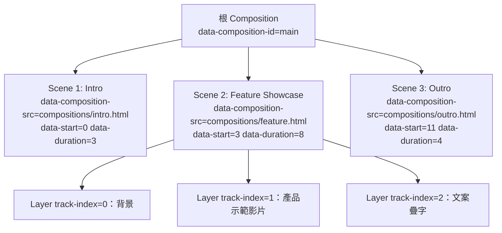

「Layer」的概念則透過 `data-track-index` 表達——數字越大代表視覺上疊得越上層（實務慣例，非強制規則，團隊需自行約定一致順序，例如 0 為背景、數字遞增依序疊加前景元素）。

### 12.4 完整範例：一個帶有兩個場景的 Composition

```html
<!DOCTYPE html>
<html lang="zh-Hant">
<head>
  <meta charset="UTF-8" />
  <style>
    body { margin: 0; }
    #root { width: 1920px; height: 1080px; position: relative; overflow: hidden; background: #0f172a; }
    .clip { position: absolute; }
  </style>
</head>
<body>
  <div id="root" data-composition-id="two-scene-demo" data-width="1920" data-height="1080">

    <div class="clip" data-composition-src="compositions/intro.html"
         data-start="0" data-duration="3" data-track-index="0"
         data-width="1920" data-height="1080"></div>

    <div class="clip" data-composition-src="compositions/feature.html"
         data-start="3" data-duration="8" data-track-index="0"
         data-width="1920" data-height="1080"></div>

  </div>

  <script src="https://cdn.jsdelivr.net/npm/gsap@3/dist/gsap.min.js"></script>
  <script>
    const tl = gsap.timeline({ paused: true });
    tl.set({}, {}, 11); // 總長度 11 秒（3 + 8）
    window.__timelines = window.__timelines || {};
    window.__timelines["two-scene-demo"] = tl;
  </script>
</body>
</html>
```

### Best Practice

- 超過 3 個場景以上的 Composition，一律拆成子 Composition 檔案（`data-composition-src`）而非全部塞在同一份 `index.html`，利於團隊分工與版本控制的 diff 可讀性
- 建立團隊內部 `data-track-index` 命名慣例文件（例如 0=背景、1=主要素材、2=文案、3=品牌浮水印），避免不同工程師疊層順序各自為政

### Anti Pattern

- ❌ 不加 `class="clip"` 卻期待元素會依 `data-start`/`data-duration` 進出場——這是新手最常犯的錯誤，缺少 `clip` class 的元素會被當作全程顯示的靜態背景
- ❌ 多個元素使用相同的 `data-track-index` 又沒有透過 `z-index` 或明確的視覺分層設計，導致疊放順序不可預期

### Checklist

- [ ] 所有需要參與時間軸排程的元素都已加上 `class="clip"`
- [ ] 團隊已有明確的 `data-track-index` 分層慣例文件
- [ ] 超過 3 場景的專案已拆分為多個子 Composition 檔案

---

## 第十三章 Animation 實戰

### 13.1 Timeline 與 Keyframe 混合實戰：一個 10 秒產品介紹片段

本節整合第六章介紹的多種 Adapter，示範一個真實感更強的複合案例——GSAP 負責主要文字/版面動畫，Lottie 負責品牌 Logo 動畫，CSS 負責背景漸層效果：

```html
<div id="root" data-composition-id="product-intro" data-width="1920" data-height="1080">

  <div class="bg-gradient"></div>

  <div id="logo" class="clip" data-start="0" data-duration="2" data-track-index="1"
       style="position:absolute; top:80px; left:80px; width:200px; height:200px;"></div>

  <h1 id="headline" class="clip" data-start="1.5" data-duration="6" data-track-index="2"
      style="position:absolute; top:400px; left:120px; font-size:96px; color:white;">
    全新體驗，即刻升級
  </h1>

  <div class="video-wrapper clip" data-start="3" data-duration="6" data-track-index="1"
       style="position:absolute; top:200px; right:100px; width:800px; height:450px;">
    <video muted src="assets/product-demo.mp4"></video>
  </div>

  <script src="https://cdn.jsdelivr.net/npm/gsap@3/dist/gsap.min.js"></script>
  <script src="https://cdn.jsdelivr.net/npm/lottie-web/build/player/lottie.min.js"></script>
  <style>
    .bg-gradient {
      position: absolute; inset: 0;
      background: linear-gradient(135deg, #0f172a, #1e3a8a);
    }
  </style>

  <script>
    // Lottie：Logo 動畫
    window.__hfLottie = window.__hfLottie || {};
    const logoAnim = lottie.loadAnimation({
      container: document.getElementById('logo'),
      renderer: 'svg', loop: false, autoplay: false,
      path: 'assets/logo-reveal.json'
    });
    window.__hfLottie['logo'] = logoAnim;

    // GSAP：文字與影片 wrapper 動畫
    const tl = gsap.timeline({ paused: true });
    tl.from("#headline", { opacity: 0, x: -60, duration: 1 }, 1.5)
      .from(".video-wrapper", { opacity: 0, scale: 0.9, duration: 1 }, 3)
      .to({}, {}, 9); // 總長度撐到 9 秒

    window.__timelines = window.__timelines || {};
    window.__timelines["product-intro"] = tl;
  </script>
</div>
```

### 13.2 Keyframe 進階技巧：多段 Easing 交錯

```javascript
const tl = gsap.timeline({ paused: true, defaults: { ease: "power2.out" } });

tl.from("#card-1", { y: 100, opacity: 0, duration: 0.6 }, 0)
  .from("#card-2", { y: 100, opacity: 0, duration: 0.6 }, 0.15)   // 錯開 0.15 秒製造層次感
  .from("#card-3", { y: 100, opacity: 0, duration: 0.6 }, 0.3)
  .to("#card-1", { scale: 1.05, duration: 0.3, ease: "back.out(2)" }, 1.2)
  .to("#card-1", { scale: 1, duration: 0.3 }, 1.5);
```

### 13.3 CSS 與 GSAP 混用時的注意事項

若同一個元素同時被 CSS Transition 與 GSAP 控制不同屬性（例如 CSS 控制 `background-color` 的 hover 態、GSAP 控制 `transform`），原則上不會衝突；但**絕對不要**讓兩者控制同一個屬性，否則會出現不可預期的優先權覆蓋問題（瀏覽器內部 CSSOM 與 GSAP 的 inline style 寫入時機競爭）。

### 實務案例

某教育科技公司用本章的複合模式，建立了一套「課程單元完成證書」動態影片模板：Lottie 負責證書邊框的描邊動畫、GSAP 負責姓名/課程名稱文字的逐字浮現效果，透過 Composition Variables（見 11.2）讓後端在使用者完成課程時，呼叫 `render --variables '{"studentName":"..."}'` 批次產生個人化證書影片，取代過去純靜態 PDF 證書，大幅提升使用者在社群分享的意願。

### Checklist

- [ ] 已確認同一元素的同一 CSS 屬性不會同時被兩種 Adapter 控制
- [ ] 複合動畫（GSAP + Lottie + CSS）已個別驗證 `check --json` 通過再整合
- [ ] 時間軸總長度已用 `tl.set({}, {}, totalDuration)` 明確鎖定，不依賴「最後一個動畫剛好結束的時間」隱性決定

---

## 第十四章 Media 處理

### 14.1 Image

建議使用專案內 `assets/` 相對路徑管理圖片，支援常見格式（PNG/JPG/WebP/SVG）。大尺寸圖片建議在放入專案前先做好壓縮與適當解析度裁切——因為渲染引擎是「每一幀都重新截圖整個頁面」，過大的圖片會拖慢每一幀的繪製時間，直接影響整體渲染時長（見第三十三章）。

```html

```

> **踩雷經驗**：`loading="lazy"` 在一般網頁瀏覽情境是效能最佳實務，但在 HyperFrames 渲染情境下**應避免使用**——因為渲染引擎可能直接 seek 到某個中後段的 frame 開始截圖（例如用 `snapshot --at 8.0` 除錯），若圖片還沒被瀏覽器判定「進入可視範圍」而觸發載入，會導致截圖出現空白。務必確保所有參與渲染的媒體元素都是 `eager` 載入或等效行為。

### 14.2 Video

- 統一使用 `<video muted>`（見第五章踩雷經驗，避免對 `<video>` 直接做尺寸動畫）
- 素材編碼建議統一為 H.264/AAC 的 MP4，避免瀏覽器對特殊編碼（如 HEVC）支援不一致導致 `preview` 黑畫面（第三十二章 Troubleshooting 第 9 題會詳述此問題；官方 2026 年更新已加強自動代理機制涵蓋 HEVC 與含 Alpha 通道影片，但建議仍以標準編碼為主，自動代理視為安全網而非常態依賴）
- 若影片需要去背疊加（如講者去背後疊加到動態背景），可用 `npx hyperframes remove-background presenter.mp4 -o presenter.webm --quality best` 產生帶 Alpha 通道的 WebM 素材

### 14.3 Audio

音訊由框架統一管理播放時機，不應在腳本中手動呼叫 `play()`/`pause()`。背景音樂軌建議標記 `data-timeline-role="music"`，方便使用 `npx hyperframes beats` 偵測節拍，供 `/music-to-video` workflow 或手動動畫做節拍同步：

```html
<audio class="clip" data-start="0" data-duration="15" data-track-index="0"
       data-timeline-role="music" data-volume="0.6" src="assets/bgm.mp3"></audio>
```

### 14.4 SVG

SVG 適合 Logo、圖示、資訊圖表線條動畫，因為向量格式在任意解析度輸出都不會失真，特別適合同時要輸出多種解析度版本（如 16:9 橫式＋9:16 直式）的素材。

### 14.5 Canvas／GPU 圖形

適合資料視覺化與程式化生成的畫面內容，詳見第六章 6.8 手刻 Canvas 2D 的原理說明；若需求偏向 GPU 級即時運算效果（粒子/著色器），改參考第六章 6.7 官方 TypeGPU/WebGPU Adapter。官方 Catalog 的 `data-chart` Block 即為典型範例（見 19.3）。

### 14.6 Font

字型建議優先使用專案內建字型檔（`@font-face` + 本機檔案）而非完全依賴 Google Fonts CDN，理由：

1. 避免 render-time 網路請求造成的不確定性（若 CDN 當下延遲或不可達，會直接影響渲染結果）
2. 確保多環境（本機／CI／雲端渲染）字型渲染結果一致
3. 符合 AGENTS.md「no render-time network fetches」的專案慣例

```css
@font-face {
  font-family: 'BrandSans';
  src: url('assets/fonts/BrandSans-Bold.woff2') format('woff2');
  font-weight: 700;
  font-display: block; /* 避免 FOUT：確保渲染時字型已完全就緒 */
}
```

### Best Practice

- 建立團隊共用的 `assets/fonts/`、`assets/brand/` 資源庫，避免每個專案重新下載/管理相同的品牌字型與 Logo 素材
- 大型影片專案的素材（尤其影片檔）建議搭配 Git LFS 或外部物件儲存（S3/GCS）管理，避免 Git repo 因二進位素材迅速膨脹

### Anti Pattern

- ❌ 對參與渲染的圖片使用 `loading="lazy"`
- ❌ 完全依賴外部 CDN 字型/圖片，未做任何本機備援

### Checklist

- [ ] 所有媒體素材皆已確認無 `loading="lazy"` 或其他延遲載入機制
- [ ] 字型已改為本機檔案並設定 `font-display: block`
- [ ] 影片素材已統一為 H.264/AAC 編碼，或已於 `check`/`preview` 階段驗證特殊編碼相容性

---

## 第十五章 FFmpeg 編碼與最佳化

### 15.1 FFmpeg 在整體渲染流程中的角色

FFmpeg 是 HyperFrames Pipeline 的最後一棒——負責把 Engine 逐幀截取的影格序列（PNG/JPG）與音訊軌，編碼合成最終的影片容器格式。理解 FFmpeg 基礎編碼概念，能幫助你更精準地調整 `render` 指令的畫質/檔案大小/相容性取捨。

### 15.2 容器格式與適用場合

| 格式 | 適用場合 | 備註 |
|---|---|---|
| MP4（H.264/AAC） | 社群媒體、通用發布 | 相容性最好，建議預設選擇 |
| MP4（H.265/HEVC） | 需要更高壓縮率的長片／4K 內容 | 部分瀏覽器/裝置支援度較差，`preview` 內建瀏覽器播放可能出現黑畫面問題（見第三十二章） |
| WebM（VP9） | 需要透明背景（Alpha） | 適合疊加合成、去背後的講者影片 |
| MOV（ProRes） | 交付給後製剪輯團隊 | 檔案極大但畫質/色彩深度損失最小，適合當作「母帶」 |
| GIF | 極短循環動圖（社群/文件展示） | 檔案大、色彩數受限，不適合正式發布用途 |
| PNG 序列 | 需要無損逐幀後製（合成到其他軟體） | 檔案數量龐大，僅建議用於特殊後製需求 |

### 15.3 Codec 參數調校

```bash
# 高畫質交付版本
npx hyperframes render --output final.mp4 --quality high --crf 18 --fps 30

# 開發迭代快速預覽版本
npx hyperframes render --output draft.mp4 --quality draft --fps 24

# 指定 bitrate 而非 CRF（適合對檔案大小有硬性限制的發布通路，如廣告投放平台）
npx hyperframes render --output ad.mp4 --video-bitrate 8M

# WebM 透明背景輸出
npx hyperframes render --format webm --output overlay-transparent.webm
```

### 15.4 AV1 的取捨

AV1 提供比 H.264/H.265 更高的壓縮效率（同畫質下檔案更小），但編碼運算成本顯著更高。實務建議：**只在「離線批次、最終發布」情境使用 AV1**，開發迭代階段一律用 H.264 + `draft` 品質，避免每次小修改都要等待漫長的編碼時間。

### 15.5 GPU 加速編碼

`--gpu` flag 支援依平台選擇對應的硬體編碼器（NVIDIA NVENC／Apple VideoToolbox／AMD AMF／Linux VAAPI／Intel QSV）。硬體編碼速度顯著快於純 CPU 編碼（`libx264`），代價是同 bitrate 下畫質通常略遜於高品質 CPU 編碼設定，適合對「渲染速度」比「極致畫質」更敏感的場景（如大量批次渲染的雲端節點）。

### Best Practice

- 開發迭代：`--quality draft` + 較低 fps；最終交付：`--quality high` + 依通路挑選合適 Codec
- 批次渲染大量影片（如 `lambda render-batch`）優先評估開啟 `--gpu`，用硬體編碼換取整體吞吐量提升

### Checklist

- [ ] 已依發布通路（社群平台 / 廣告投放 / 後製交付）選定對應容器格式與 Codec
- [ ] 已區分「開發迭代」與「最終交付」兩種不同的渲染參數設定，避免每次迭代都用最高品質設定拖慢流程

---

## 第十六章 Browser 引擎

### 16.1 Headless Chrome 作為渲染核心

HyperFrames Engine 透過 Puppeteer 控制 headless Chrome，這是它「像瀏覽器一樣完整支援 HTML/CSS/JS」的技術基礎——理論上任何能在 Chrome 中正確顯示的網頁效果，都能被 HyperFrames 截圖渲染。CLI 內建瀏覽器管理機制（`hyperframes browser ensure/path/clear`），不需要使用者自行安裝與維護 Chrome 版本。

### 16.2 CDP（Chrome DevTools Protocol）的角色

渲染引擎透過 CDP 與頁面溝通，關鍵能力包括：

- 精準控制頁面載入時機與逾時（`--browser-timeout`）
- 逐幀截圖（screenshot API）
- 透過注入的 Runtime 腳本呼叫頁面內 `window.__timelines`/`window.__hfLottie` 等橋接物件的 `seekFrame` 邏輯
- 攔截 Console 錯誤與網路請求異常，供 `check` 指令回報「runtime 錯誤」

### 16.3 Playwright／Puppeteer 與 HyperFrames 的關係

HyperFrames 底層採用 Puppeteer 作為瀏覽器自動化框架。對於熟悉 Playwright 的團隊，核心概念是相通的（都是透過 CDP 或類似協定驅動 headless 瀏覽器），但實務上不需要、也不建議自行用 Playwright 重新實作 HyperFrames 已經封裝好的截圖/seek 邏輯——除非你的需求是「單純截圖既有網頁做視覺迴歸測試」，那屬於不同的工具範疇（見第四十章與 Playwright Screenshot 方案的比較）。

### 16.4 瀏覽器 GPU 加速

`--browser-gpu`/`--no-browser-gpu` 控制是否讓 Chrome 使用硬體 GPU 做頁面渲染（不同於 15.5 的「編碼 GPU 加速」，這裡指的是「畫面繪製」階段）。在 CI/雲端無 GPU 的 Headless 環境，通常需要 `--no-browser-gpu` 並搭配軟體渲染，否則可能因缺少顯示卡驅動而渲染失敗或效能不穩定；在有 GPU 的本機開發環境，開啟 GPU 加速通常能顯著加快複雜 CSS 效果（`backdrop-filter`、大量陰影/濾鏡）的繪製速度。

### Best Practice

- CI 環境預設 `--no-browser-gpu`，除非已確認 Runner 具備可用的顯示卡與正確驅動
- 本機開發若動畫涉及大量 `filter`/`backdrop-filter` 效果，建議開啟 `--browser-gpu` 加速迭代速度

### Checklist

- [ ] 已確認 CI/雲端渲染環境的 GPU 可用性，並對應設定 `--browser-gpu`/`--no-browser-gpu`
- [ ] 團隊已理解 HyperFrames 底層是 Puppeteer 而非 Playwright，避免混淆兩者的除錯資源

---

## 第十七章 API 參考

### 17.1 `@hyperframes/core` 總覽

`@hyperframes/core` 是 HyperFrames 的型別與工具函式核心套件，適合需要用 Node.js/TypeScript **程式化操作** Composition（而非只透過 CLI）的進階場景，例如：後端服務依資料庫內容動態產生 Composition HTML、自訂內部工具做批次素材替換。

### 17.2 核心型別

```typescript
import type {
  TimelineElement, TimelineMediaElement, TimelineTextElement, TimelineCompositionElement,
  TimelineElementType,        // "video" | "image" | "text" | "audio" | "composition"
  CompositionSpec, CompositionVariable,
  CanvasResolution, Orientation,
  FrameAdapter, FrameAdapterContext,
  CompositionVariableType,    // "string" | "number" | "color" | "boolean" | "enum"
  StringVariable, NumberVariable, ColorVariable, BooleanVariable, EnumVariable,
  Keyframe, KeyframeProperties, ElementKeyframes,
  StageZoom, StageZoomKeyframe,
} from '@hyperframes/core';

import { isTextElement, isMediaElement, isCompositionElement } from '@hyperframes/core';
```

### 17.3 解析與 HTML 生成函式

```typescript
import {
  parseHtml, extractCompositionMetadata, getVariables, validateVariables,
  formatVariableValidationIssue,
  updateElementInHtml, addElementToHtml, removeElementFromHtml, validateCompositionHtml,
  generateHyperframesHtml, generateGsapTimelineScript, generateHyperframesStyles,
  generateBaseHtml, getStageStyles,
} from '@hyperframes/core';

// 範例：動態更新一個既有 Composition 內某元素的文案
const updatedHtml = updateElementInHtml(originalHtml, 'headline', {
  textContent: '雙十一限定優惠',
});
```

### 17.4 GSAP 工具函式

```typescript
import {
  serializeGsapAnimations, getAnimationsForElementId,
  validateCompositionGsap, keyframesToGsapAnimations, gsapAnimationsToKeyframes,
} from '@hyperframes/core';
```

### 17.5 Linter API

```typescript
import { lintHyperframeHtml, lintMediaUrls } from '@hyperframes/core';

const result = lintHyperframeHtml(html, { strict: false });
// result: { ok, errorCount, warningCount, findings: HyperframeLintFinding[] }
// 每個 finding: { severity, code, message, file, selector, elementId, fixHint, snippet }
```

### 17.6 Compiler（Node.js 專用）

```typescript
import { compileTimingAttrs, injectDurations, extractResolvedMedia, clampDurations } from '@hyperframes/core';
import { compileHtml } from '@hyperframes/core/node'; // 示意：Node.js 專屬進入點
import { bundleToSingleHtml, validateHyperframeHtmlContract } from '@hyperframes/core';

const compiled = await compileHtml(rawHtml, mediaDurationProber);
```

### 17.7 Runtime 與 Frame Adapter

```typescript
import {
  loadHyperframeRuntimeSource, buildHyperframesRuntimeScript,
  HYPERFRAME_RUNTIME_ARTIFACTS, HYPERFRAME_RUNTIME_CONTRACT,
  HYPERFRAME_RUNTIME_GLOBALS, HYPERFRAME_BRIDGE_SOURCES, HYPERFRAME_CONTROL_ACTIONS,
  createGSAPFrameAdapter,
} from '@hyperframes/core';
import runtime from '@hyperframes/core/runtime';
```

### 17.8 媒體與樣式常數

```typescript
import {
  copyMediaVisualStyles, quantizeTimeToFrame, MEDIA_VISUAL_STYLE_PROPERTIES,
  CANVAS_DIMENSIONS, TIMELINE_COLORS, DEFAULT_DURATIONS,
  GSAP_CDN, BASE_STYLES, ELEMENT_BASE_STYLES, MEDIA_STYLES, TEXT_STYLES, ZOOM_CONTAINER_STYLES,
} from '@hyperframes/core';
```

### 17.9 實戰範例：Node.js 批次個人化渲染腳本

```javascript
// scripts/batch-personalize.mjs
import { updateElementInHtml, validateCompositionHtml } from '@hyperframes/core';
import { readFile, writeFile, mkdir } from 'node:fs/promises';
import { execFile } from 'node:child_process';
import { promisify } from 'node:util';

const run = promisify(execFile);

const template = await readFile('./templates/certificate.html', 'utf-8');
const students = JSON.parse(await readFile('./data/students.json', 'utf-8'));

await mkdir('./renders', { recursive: true });

for (const student of students) {
  let html = updateElementInHtml(template, 'student-name', { textContent: student.name });
  html = updateElementInHtml(html, 'course-title', { textContent: student.course });

  const { valid, errors } = validateCompositionHtml(html);
  if (!valid) {
    console.error(`[SKIP] ${student.name}:`, errors);
    continue;
  }

  const outPath = `./build/${student.id}.html`;
  await writeFile(outPath, html, 'utf-8');

  await run('npx', ['hyperframes', 'render', '-c', outPath, '--output', `renders/${student.id}.mp4`, '--quality', 'high']);
  console.log(`[DONE] ${student.name} -> renders/${student.id}.mp4`);
}
```

### Best Practice

- 需要「大量、規則化」的 HTML 產生/修改邏輯，優先用 `@hyperframes/core` 提供的 `updateElementInHtml` 等函式做結構化操作，而非用字串取代（Regex 修改 HTML 容易產生難以預期的結構破壞）
- 自訂批次腳本一律先呼叫 `validateCompositionHtml`／`lintHyperframeHtml` 做前置驗證，再進入耗時的渲染步驟

### Checklist

- [ ] 已評估專案是否需要程式化操作 Composition（而非純手動編輯 HTML），若需要已引入 `@hyperframes/core`
- [ ] 批次腳本已包含驗證步驟，避免把明知有問題的 HTML 送進渲染管線浪費運算資源

---

## 第十八章 專案目錄結構

### 18.1 官方 Monorepo 套件總覽

HyperFrames 官方 Repository 採 Bun Workspaces 管理的 Monorepo，`packages/` 目錄下主要套件如下：

| 套件 | 用途 |
|---|---|
| `packages/cli` | 命令列工具本體，所有 `npx hyperframes ...` 指令的實作入口 |
| `packages/core` | 型別系統、Parser、Linter、Compiler、Runtime 橋接腳本（見第十七章） |
| `packages/engine` | 頁面到影格的擷取引擎，封裝 Puppeteer 與 Frame Adapter 邏輯 |
| `packages/producer` | 完整渲染管線協調者，串接 Engine 輸出與 FFmpeg 編碼 |
| `packages/parsers` | 資料解析輔助模組（如媒體時長探測、字幕格式解析） |
| `packages/lint` | 獨立的結構/內容 Lint 規則實作 |
| `packages/studio` | 瀏覽器內即時預覽與基礎編輯 UI（前端應用）；2026 年 7 月官方重建了 Studio 編輯器，改為統一時間軸與可原子化多選編輯的 NLE 風格介面，並將屬性面板改為單欄式設計 |
| `packages/studio-server` | Studio 的後端服務（Hot Reload、檔案監聽） |
| `packages/player` | 可嵌入其他網頁的播放元件 |
| `packages/sdk` | 供第三方應用整合呼叫的 SDK |
| `packages/sdk-playground` | SDK 互動測試場域 |
| `packages/shader-transitions` | 基於 Shader 的轉場特效庫 |
| `packages/aws-lambda` | AWS Lambda 分散式渲染部署工具（見第二十五章） |
| `packages/gcp-cloud-run` | Google Cloud Run 部署工具 |

### 18.2 一般專案（`hyperframes init` 產出）的目錄結構

```text
my-video/
├── meta.json              # 專案 metadata（名稱、ID、建立時間）
├── index.html              # 根 Composition 入口
├── compositions/           # 子 Composition（透過 data-composition-src 引用）
│   ├── intro.html
│   └── captions.html
├── assets/                 # 素材（圖片/影片/音訊/字型）
│   └── video.mp4
├── .env.example             # 環境變數範例（給團隊參考需要準備哪些金鑰）
├── BRIEF.md                 # （AI Agent 建立時可能產生）需求簡述，供 Skill 決策樹判斷是否為既有專案
├── STORYBOARD.md            # （選用）分鏡腳本文件
└── hyperframes.json          # （選用）專案層級設定
```

### 18.3 企業內部建議的擴充目錄慣例

> **實務建議**：官方腳手架只提供最小骨架，企業導入時建議依團隊規模擴充以下慣例目錄（非官方規範，屬顧問建議）：

```text
enterprise-video-monorepo/
├── templates/               # 團隊共用模板（品牌 Intro/Outro、標準版面）
├── brand-assets/            # 統一管理的品牌素材（Logo、字型、色票 JSON）
├── projects/
│   ├── product-launch-2026/
│   └── training-onboarding/
├── scripts/                 # 批次渲染、驗證用的 Node.js 工具腳本（見 17.9）
├── .github/workflows/        # CI/CD Pipeline（見第二十六章）
└── AGENTS.md                 # 團隊層級的 AI Agent 協作慣例補充文件
```

### Checklist

- [ ] 團隊已理解官方 `packages/*` 各套件職責，出問題時能快速判斷是 CLI 層、Core 層還是 Engine 層的問題
- [ ] 企業內部已建立跨專案共用的 `templates/`、`brand-assets/` 目錄慣例，避免各專案素材各自為政

---

## 第十九章 Examples 官方範例解析

### 19.1 官方九大範例模板總覽

`npx hyperframes init` 的 `--example` 參數可選擇以下官方模板，是團隊建立內部模板庫最好的起點：

| 模板 | 尺寸方向 | 說明 |
|---|---|---|
| `blank` | 可自訂 | 僅有基礎骨架的空白 Composition，適合完全自訂需求 |
| `warm-grain` | 橫式 | 米色調、帶顆粒質感的生活風格美學，含 Intro 子 Composition 與字幕支援 |
| `play-mode` | 橫式 | 活潑有彈性的動態效果，適合社群媒體 |
| `swiss-grid` | 橫式 | 瑞士國際字體排印風格的網格版面，適合企業/技術類內容 |
| `kinetic-type` | 橫式 | 大膽的動態文字排印，戲劇性的文字動畫，適合宣傳片 |
| `decision-tree` | 橫式 | 動態流程圖，含分支路徑與漸進式揭露效果，適合教育類內容 |
| `product-promo` | 橫式 | 多場景產品展示，搭配 SVG 素材 |
| `nyt-graph` | 橫式 | 紐約時報式的編輯風格資料圖表動畫 |
| `vignelli` | 直式（1080×1920） | 大膽字體排印搭配紅色點綴，適合手機端標題/公告 |

### 19.2 手把手 Walkthrough：以 `warm-grain` 為基礎客製化一支 15 秒品牌影片

```bash
# 1. 建立專案
npx hyperframes init brand-video --example warm-grain --non-interactive
cd brand-video

# 2. 檢視模板結構，找到需要客製化的文案/顏色/素材
npx hyperframes compositions --json

# 3. 啟動即時預覽，邊改邊看
npx hyperframes preview

# 4. 替換文案、Logo、配色（編輯 index.html / compositions/*.html）
# 5. 每次調整後跑驗證
npx hyperframes lint
npx hyperframes check --snapshots

# 6. 先出 draft 版本給利害關係人確認
npx hyperframes render --output draft.mp4 --quality draft

# 7. 確認無誤後輸出最終高畫質版本
npx hyperframes render --output final.mp4 --quality high --fps 30
```

### 19.3 Catalog Block 範例：`data-chart`

官方 Registry 提供可直接安裝的「Block」（獨立可用的子 Composition），例如動畫長條圖/折線圖：

```bash
npx hyperframes add data-chart
```

安裝後會在 `compositions/data-chart.html` 產生對應檔案，並可透過以下方式嵌入主 Composition：

```html
<div data-composition-id="data-chart"
     data-composition-src="compositions/data-chart.html"
     data-start="0" data-duration="15" data-track-index="1"
     data-width="1920" data-height="1080"></div>
```

其他常見 Catalog Block 尚包括 `flash-through-white`（閃白轉場特效）、`instagram-follow`（社群關注浮層），可用 `npx hyperframes catalog --type block --json` 查詢完整清單。

### Best Practice

- 新專案優先從最接近需求風格的官方模板開始，而非完全從 `blank` 手刻版面，能大幅縮短「畫面從無到有」的時間
- 團隊可以把客製化後的模板反向貢獻/內部封裝成自己的 Catalog Block，供其他專案 `add` 复用

### Checklist

- [ ] 已瀏覽九大官方模板，為目前專案選定最接近的風格起點
- [ ] 已嘗試 `npx hyperframes catalog --json` 熟悉可用的 Registry Block 清單

---

## 第二十章 與 Claude Code 整合實戰

### 20.1 完整流程總覽

Claude Code 是官方文件著墨最多、整合最深的 AI Coding Agent，尤其搭配 **Claude Design**（`claude.ai/design`）可以形成「設計稿產出初版 → Claude Code 精修落地」的完整鏈路：

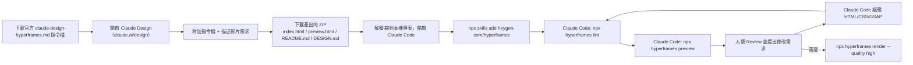

### 20.2 安裝與初始化

```bash
# 於專案根目錄安裝完整 Skill 集合
npx skills add heygen-com/hyperframes --full-depth

# 或直接透過 hyperframes CLI 安裝到 Claude Code
npx hyperframes skills --claude
```

### 20.3 Claude Design 使用建議

官方指出一個關鍵細節：**「附加檔案，不要貼網址」**——Claude Design 讀取檔案附件（截圖、PDF、品牌指南）時保留的細節，遠高於貼上的文字或網址內容，輸入可靠度排序為：檔案附件 > 貼上內容 > 網頁研究 > URL。已知限制包括：面板內拖曳微調不穩定、Claude Design 本身不含 Lint 功能（需要下載後在 Claude Code 內執行 `hyperframes lint` 驗證）、每輪對話有三次網頁擷取次數限制。

### 20.4 Claude Code 內的典型 Prompt 範例

```text
我剛幫我的 App 上線了深色模式功能，請幫我做一支 15 秒的 Instagram Reel 宣傳這個功能。
品牌色：主色 #6366F1，輔色 #1E1B4B。目標受眾是年輕的手機重度使用者，語氣要輕快活潑。
請先跑 lint 和 check 確認沒問題，再 render 一個 draft 版本讓我看。
```

```text
我們剛完成了一個 25 秒的新創募資簡報影片草稿（在 pitch/index.html），
但第二個場景（問題陳述）的文字動畫感覺太生硬，
請改用 GSAP 的 stagger 效果讓三個問題點依序浮現、更有節奏感，
記得驗證修改後 render 出來的動作沒有超出畫布範圍。
```

### 20.5 Workflow：Claude Code 內的分工模式

實務上建議把「Claude Design 產生初版」與「Claude Code 精修」明確分工——Claude Design 適合快速產生「品牌一致、結構完整」的第一版草稿，但複雜的時間軸微調、效能優化、批次客製化邏輯（Composition Variables、`@hyperframes/core` 程式化操作）更適合交給有終端機存取權限的 Claude Code 完成。

### Best Practice

- 每次讓 Claude Code 修改動畫後，養成「先 `check --json`、再 render draft、最後才 render high quality」的三段式確認習慣，避免浪費運算資源在有明顯瑕疵的版本上
- 把團隊品牌規範（色票、字型、Logo 使用規則）寫進專案 `CLAUDE.md`，讓 Claude Code 每次產生新影片都自動遵循，不需要每次都在 Prompt 裡重複交代

### Checklist

- [ ] 專案已安裝 `--full-depth` 完整 Skill 集合
- [ ] 專案根目錄已有 `CLAUDE.md` 記錄品牌規範與團隊慣例
- [ ] 已建立「lint → check → render draft → 人類確認 → render high」的標準工作迴圈

---

## 第二十一章 與 GitHub Copilot 整合實戰

### 21.1 現況：官方 Skill 系統尚未原生涵蓋 Copilot

截至本手冊查證時間點，HyperFrames 官方 19 個 Skill 主要針對 Claude Code、Cursor、Gemini CLI、Codex 設計，**GitHub Copilot 並未被列在官方原生支援清單中**。這不代表 Copilot 無法使用 HyperFrames，而是需要團隊自行補強「知識封裝」這一層——Copilot 依然能透過終端機執行 CLI 指令、編輯檔案，只是少了官方 Skill 決策樹自動路由的便利性。

### 21.2 補強做法：建立專案層級指引文件

在專案根目錄放置 `AGENTS.md`（GitHub Copilot 與多數通用 Agent 框架皆會嘗試讀取此類慣例檔案）或 `.github/copilot-instructions.md`，內容建議涵蓋：

```markdown
# AGENTS.md（節錄）

## HyperFrames 專案慣例

- 所有 Composition 根節點務必包含 `data-composition-id`、`data-width`、`data-height`
- 參與時間軸的元素務必加上 `class="clip"` 與 `data-start`/`data-duration`/`data-track-index`
- GSAP timeline 必須 `{ paused: true }` 並註冊到 `window.__timelines[compositionId]`
- 禁止對 `<video>` 元素直接做尺寸動畫，改用 wrapper `<div>`
- 修改完 HTML 後，務必依序執行：`npx hyperframes lint` → `npx hyperframes check` → `npx hyperframes render --quality draft`
- 禁止在腳本中使用 `Date.now()`、未 seed 的 `Math.random()`、render-time 網路請求
```

### 21.3 Copilot Chat 實戰 Prompt 範例

```text
@workspace 這個專案是用 HyperFrames 做的影片渲染專案，規則寫在 AGENTS.md。
請幫我在 compositions/feature-announce.html 新增一個第三場景，
展示「批次匯出」這個新功能，時長 5 秒，緊接在現有的第二場景之後，
文字動畫請參考現有場景的 GSAP 寫法保持風格一致。
```

### 21.4 Copilot CLI（`gh copilot`）搭配 HyperFrames CLI

若團隊使用 GitHub Copilot CLI 做終端機輔助，可以直接請它協助組合正確的渲染指令：

```bash
gh copilot suggest "用 hyperframes 渲染 compositions/demo.html，輸出 60fps 高畫質 mp4"
```

### Best Practice

- 沒有官方 Skill 支援的工具，務必透過 `AGENTS.md`／`.github/copilot-instructions.md` 補齊「本專案的 HyperFrames 慣例」，且內容盡量與其他 AI 工具共用的規則文件保持一致，避免不同工具產出風格不一致的 Composition
- 定期（如每季）比對 Copilot 產出的 Composition 品質與 Claude Code／Cursor 的差異，作為是否需要更詳細指引文件的依據

### Checklist

- [ ] 已建立 `AGENTS.md` 或 `.github/copilot-instructions.md` 補強 Copilot 對 HyperFrames 慣例的理解
- [ ] 已驗證 Copilot 產出的 Composition 能通過 `lint`/`check`，而非僅憑外觀判斷合格

---

## 第二十二章 與 Gemini CLI 整合實戰

### 22.1 安裝與初始化

Gemini CLI 是官方明確列出支援的 Agent 工具之一：

```bash
npx hyperframes skills --gemini
# 或
npx skills add heygen-com/hyperframes --full-depth
```

### 22.2 完整流程

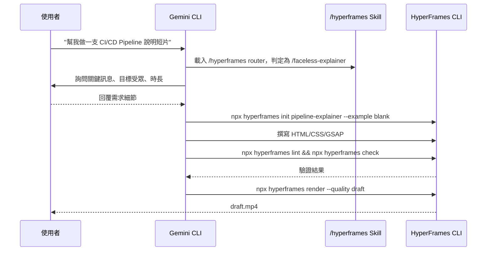

### 22.3 Gemini CLI 實戰 Prompt 範例

```text
請用 HyperFrames 幫我做一支 20 秒的「無旁白」動態圖解影片，
說明我們的 CI/CD Pipeline 如何從 PR 合併到自動部署，
用簡單的方塊圖與箭頭動畫呈現五個階段：Commit → Test → Build → Deploy → Monitor，
每個階段停留約 3 秒，風格走 Swiss Grid 那種簡潔的技術感。
```

### Best Practice

- Gemini CLI 在處理「多語言字幕」需求時表現不錯，可搭配 `npx hyperframes transcribe --language ja --to srt` 產生日文字幕後，請 Gemini CLI 協助把字幕嵌入既有 Composition 的 `/embedded-captions` workflow

### Checklist

- [ ] 已確認 Gemini CLI 環境變數（如 `GEMINI_API_KEY`）與 HyperFrames `capture` 指令的視覺增強功能無衝突（見第十章 10.7）
- [ ] 已建立團隊內部 Gemini CLI 常用 Prompt 範本庫（見第三十八章）

---

## 第二十三章 與 Cursor 整合實戰

### 23.1 安裝方式

```bash
npx hyperframes skills --cursor
```

Cursor 透過其 Rules／自訂指令機制載入 Skill 內容，實務體驗上類似在 `.cursor/rules` 或專案指引檔中掛載 HyperFrames 專業知識。

### 23.2 Cursor Composer/Chat 實戰範例

```text
在 Composer 模式下，幫我把 templates/product-promo 這個範例模板
改造成適合我們 B2B SaaS 產品的版本：
1. 把手機版面改成 16:9 橫式簡報風格
2. 把三個特色卡片動畫改成從左至右依序滑入（stagger 0.2 秒）
3. 加上結尾 CTA 畫面，顯示 "立即預約 Demo" 與網址
完成後跑 lint 和 check，有問題自動修正到通過為止。
```

### 23.3 Cursor 與 Claude Code 的分工建議

> **實務建議**：不少團隊會依開發階段混用 Cursor 與 Claude Code——Cursor 的即時程式碼補全與內嵌 Diff 檢視，適合「逐行微調」既有 Composition 的階段；Claude Code 的終端機優先、多步驟自主執行能力，更適合「從零建立完整影片」或「跑完整驗證/渲染迴圈」這類需要串接多個 CLI 指令的任務。兩者並非互斥，可依團隊習慣搭配使用。

### Best Practice

- 善用 Cursor Composer 模式內嵌的 Diff 檢視逐一確認 Agent 對 Composition 的修改，尤其是時間軸屬性（`data-start`／`data-duration`／`data-track-index`）的變動，比起讓 Agent 一次性大幅重寫更容易抓出誤改
- 把 Prompt 拆解成分步驟下達（「先做 A，完成後我會告訴你下一步」），而非一次性長 Prompt，能讓 Cursor 在 Composer 模式下維持較高的修改精準度（呼應第三十八章 38.2 的 Prompt 微調建議）
- `.cursor/rules` 內容建議與專案的 `AGENTS.md`／`CLAUDE.md` 保持同步更新，避免團隊在不同工具間切換時產出風格不一致

### Checklist

- [ ] 已確認 `.cursor/rules` 或等效指引文件已包含 HyperFrames 專案慣例
- [ ] 團隊已對「Cursor 適合逐行微調、Claude Code 適合端到端自主執行」達成共識，避免工具選擇隨機化造成的產出品質落差

---

## 第二十四章 HyperFrames 協助 AI Agent 開發大型 Web Application

> 本章聚焦使用者特別要求的情境：如何運用 HyperFrames，讓 AI Agent 在開發、維護、遷移大型 Web Application（Vue 3／Angular／React／Spring Boot／Java）時產出「架構文件影片」「Legacy 系統逆向工程說明影片」「框架升級前後對照影片」等輔助產出物。這是 HyperFrames 官方文件未直接涵蓋、但完全符合其「HTML 即輸入」設計哲學的延伸應用——本章內容屬於架構顧問建議，而非官方案例。

### 24.1 核心洞察：為什麼影片能加速大型系統開發？

大型 Web Application 開發（尤其是 Legacy Modernization、跨團隊協作）最大的隱性成本往往不是寫程式本身，而是「知識傳遞」——架構決策的脈絡、複雜業務邏輯的來龍去脈、遷移計畫的階段性目標，這些內容用純文字文件（Confluence/Wiki）常常「寫了沒人看」。HyperFrames 讓 AI Agent 能用「它本來就很擅長產生的 HTML/CSS」直接做出視覺化說明影片，大幅降低了「產出教育訓練/架構文件內容」的邊際成本。

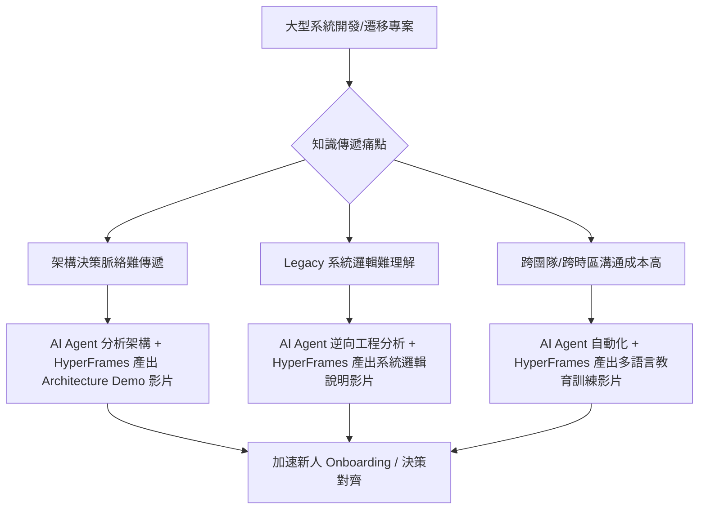

### 24.2 Vue 3 升級情境

**情境**：團隊要把大型 Vue 2 專案升級到 Vue 3（Options API → Composition API），AI Agent（如 Claude Code）協助分析程式碼並產出遷移計畫。

**HyperFrames 應用**：讓 Agent 分析完程式碼後，自動產生一支「遷移前後對照」的說明影片——左半畫面顯示 Vue 2 Options API 程式碼片段，右半畫面用動畫呈現對應的 Vue 3 Composition API 寫法，搭配語音旁白（可用 `npx hyperframes tts` 本機生成）解說關鍵差異。

```text
Prompt 範例：
分析 src/components/ 底下所有 Vue 2 元件，找出 5 個最具代表性的 Options API 用法
（data/computed/methods/生命週期鉤子），
用 HyperFrames 做一支 3 分鐘的教學影片，
左右對照呈現 Vue 2 寫法與對應的 Vue 3 <script setup> 寫法，
每個範例停留 30 秒並用箭頭動畫標示對應關係。
```

### 24.3 Angular／React 升級情境

同樣模式適用於 Angular（如 AngularJS → Angular 17+、NgModule → Standalone Components）與 React（Class Component → Hooks、CRA → Vite 遷移）。AI Agent 可以：

1. 掃描專案找出待遷移的模式（可用同目錄下《GitHub Copilot 逆向工程教學手冊.md》《企業級程式碼品質分析方法論教學手冊.md》介紹的分析手法）
2. 產出遷移前後程式碼對照的 Composition
3. 用 HyperFrames 批次渲染成一系列「遷移主題影片」，作為團隊內部教育訓練素材

### 24.4 Spring Boot／Java 升級情境

Spring Boot 2 → 3（Jakarta EE 命名空間遷移）、Java 8 → 21（LTS 升級路徑）這類後端升級，雖然沒有直接的「畫面」可展示，但可以透過 HyperFrames 做：

- **依賴關係圖動畫**：用 Mermaid 產生的架構圖轉成靜態圖片，搭配 GSAP 逐步高亮顯示「哪些模組受升級影響」
- **API 相容性變更對照表動畫**：逐條顯示 Deprecated API 與替代寫法
- **建置/測試通過率趨勢圖**：用 Canvas 資料視覺化呈現升級過程中 CI 通過率的變化趨勢，作為進度報告素材

```text
Prompt 範例：
我們正在把一個 Spring Boot 2.7 專案升級到 Spring Boot 4.x（可參考同目錄
"Spring boot 4.x升版教學.md" 的技術細節），
請用 HyperFrames 做一支給非技術主管看的 90 秒進度報告影片：
開場顯示升級範疇（模組數量、預估工時），
中段用長條圖動畫呈現目前各模組的遷移完成度，
結尾列出下一階段的風險與時程。
```

### 24.5 Legacy System Modernization 與 Reverse Engineering

對於缺乏文件的 Legacy 系統，AI Agent 逆向工程分析後產出的「系統架構理解」，往往只存在於一次性的 Agent 對話中，價值很容易流失。建議做法：

1. 讓 Agent 完成逆向工程分析（模組依賴、資料流、關鍵業務邏輯），輸出結構化文件（Markdown + Mermaid，可交叉參考《使用 GitHub Copilot 進行逆向工程並產出需求規格書.md》的方法論）
2. 再請 Agent 把分析結果的**視覺化摘要**（架構圖、資料流圖）轉成 HyperFrames Composition，用逐步揭露動畫（progressive reveal，可參考 `decision-tree` 官方模板）呈現「系統是怎麼運作的」
3. 產出的影片成為團隊「活文件」的一部分,比純文字文件更容易讓新成員快速建立心智模型

### 24.6 Framework Migration 與 Architecture Documentation 通用模式

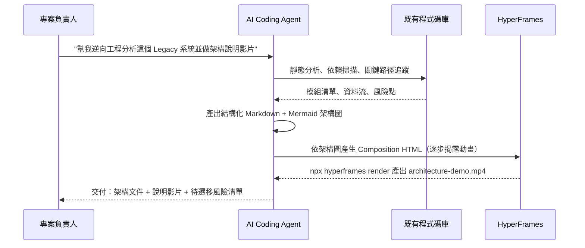

### Best Practice

- 架構說明類影片建議搭配旁白（TTS 或真人錄音）而非純文字字卡，能大幅提升非技術主管與跨團隊成員的理解效率
- 把「程式碼分析 → 架構圖 → HyperFrames 影片」的產出流程寫成團隊內部可重複執行的腳本/Prompt 範本，而非每次專案都重新設計一次流程

### 企業案例

某金融業客戶的核心交易系統採用超過十年歷史的 Java 單體架構，內部僅有少數資深工程師理解全貌。導入 AI Agent 逆向工程分析＋HyperFrames 影片化後，新進工程師的架構理解 Onboarding 時間從平均三週的「跟資深工程師逐一請教」，縮短為「一週內看完六支 10-15 分鐘的模組說明影片＋一次答疑會議」，資深工程師被打斷的頻率也顯著下降。

### Checklist

- [ ] 已將「逆向工程分析結果」與「HyperFrames 影片產出」串接成可重複執行的流程，而非一次性任務
- [ ] 架構說明影片已包含旁白或字幕，而非僅有視覺動畫
- [ ] 團隊已建立「哪些升級/遷移專案值得投資製作說明影片」的判斷標準（並非每個小改動都需要）

---

## 第二十五章 企業影片自動化情境

> 本章涵蓋使用者要求的其餘企業影片自動化情境：API 文件影片、Training Video、Release Note Video、系統操作影片、教育訓練影片、產品展示影片、CI/CD Demo、AI 自動生成影片。

### 25.1 API 文件影片

**情境**：把 OpenAPI/Swagger 規格轉成一支「如何呼叫這個 API」的示範影片。

```text
Prompt 範例：
讀取 openapi.yaml 中 /api/v1/orders 這個端點的規格，
用 HyperFrames 做一支 45 秒的示範影片：
先顯示 Request 範例（Method/URL/Headers/Body），動畫逐行淡入，
接著顯示 Response 範例，最後標註常見錯誤碼（400/401/404/500）與對應原因。
```

### 25.2 Architecture Demo（見 24.6 完整流程）

### 25.3 Training Video／教育訓練影片

企業教育訓練影片最適合搭配 Composition Variables（見 11.2）做「一份模板、多語言/多部門版本」的批次產出，例如新人資安教育訓練影片，依部門不同插入不同的案例情境文字。

### 25.4 CI/CD Demo

用於團隊展示或客戶 Demo 的「CI/CD Pipeline 運作原理」說明影片，做法同 22.3 的 Gemini CLI 範例；也可以用真實的 CI 執行紀錄資料（透過 `--variables-file`）動態產生「本次部署摘要」影片，作為 Release 通知的一部分。

### 25.5 Release Note Video

對應官方 Skill 中的 `/pr-to-video` workflow——直接把 GitHub PR 的變更內容轉成短片：

```bash
# 概念示意：讓 Agent 讀取 PR diff 與描述，路由到 /pr-to-video workflow
# Agent 會自動產生一支列出「新增/修復/變更」重點的短片
```

```text
Prompt 範例（銜接 /pr-to-video）：
幫我把 v2.4.0 這個 Release 的所有 PR 標題與描述整理成重點，
做一支 60 秒的 Release Note 影片，分成「新功能」「Bug 修復」「Breaking Change」三段，
Breaking Change 段落要用醒目的警示色標註。
```

### 25.6 系統操作影片

**情境**：內部系統教學，展示「如何操作某個管理後台功能」。做法上，可先用 `npx hyperframes capture <internal-admin-url>` 擷取畫面截圖與設計 Token（需注意內網權限與資安考量，見第三十四章），再由 Agent 組合成帶有標註箭頭/框線動畫的操作教學影片。

### 25.7 產品展示影片

對應官方 `/product-launch-video` workflow，適合官網首頁或社群發布用的產品介紹影片，見第十九章 `product-promo` 模板與 20.4 的 Claude Design 流程。

### 25.8 AI 自動生成影片的品質守門機制

> **企業導入提醒**：當「AI 自動生成影片」成為常態化流程後，務必建立品質守門機制，而非讓 Agent 產出後直接發布。建議至少包含：(1) `lint`/`check` 自動化驗證作為第一道關卡（見第三章）；(2) 品牌規範自動比對（色票/字型是否符合 `brand-assets/` 定義）；(3) 面向外部客戶/公開發布的影片，保留人工最終審核關卡，內部教育訓練類影片可視風險等級簡化審核流程。

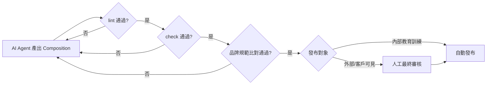

### Best Practice

- 依「發布對象是內部還是外部」設計差異化的審核關卡嚴謹度，避免一刀切造成內部素材產出效率低落，或外部素材風險控管不足
- 高頻率、規則化的影片產出（如 Release Note、系統操作教學）優先投資自動化 Pipeline（見第二十六章）；低頻率、高創意需求的影片（品牌形象大片）仍建議保留人工精修環節

### Checklist

- [ ] 已依 18 種情境中團隊實際會用到的類型，分別建立對應的 Prompt 範本（見第三十八章）
- [ ] 已建立自動生成影片的品質守門流程，區分內部/外部發布的審核嚴謹度
- [ ] 高頻率重複性影片產出已規劃納入 CI/CD 自動化（見下一章）

---

## 第二十六章 CI/CD 自動化

### 26.1 標準自動化渲染管線設計

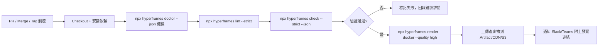

### 26.2 GitHub Actions 完整範例

```yaml
# .github/workflows/hyperframes-render.yml
name: HyperFrames Render

on:
  push:
    branches: [main]
    paths:
      - 'video-projects/**'
  pull_request:
    paths:
      - 'video-projects/**'

env:
  HYPERFRAMES_NO_UPDATE_CHECK: "1"
  HYPERFRAMES_NO_TELEMETRY: "1"

jobs:
  render:
    runs-on: ubuntu-latest
    strategy:
      matrix:
        project: [product-launch, training-onboarding]
    steps:
      - uses: actions/checkout@v4
        with:
          lfs: false  # 一般消費專案不需要官方 repo 的 regression-test LFS 資產

      - uses: actions/setup-node@v4
        with:
          node-version: '22'

      - name: Install FFmpeg
        run: sudo apt-get update && sudo apt-get install -y ffmpeg

      - name: Environment doctor check
        working-directory: video-projects/${{ matrix.project }}
        run: npx hyperframes doctor --json

      - name: Lint composition
        working-directory: video-projects/${{ matrix.project }}
        run: npx hyperframes lint --strict --json

      - name: Browser-level check (layout/motion/contrast)
        working-directory: video-projects/${{ matrix.project }}
        run: npx hyperframes check --strict --snapshots --json

      - name: Render (Docker mode for determinism)
        working-directory: video-projects/${{ matrix.project }}
        run: npx hyperframes render --docker --quality high --output ../../renders/${{ matrix.project }}.mp4

      - name: Upload artifact
        uses: actions/upload-artifact@v4
        with:
          name: ${{ matrix.project }}-video
          path: renders/${{ matrix.project }}.mp4

      - name: Publish to S3 (main branch only)
        if: github.ref == 'refs/heads/main'
        run: |
          aws s3 cp renders/${{ matrix.project }}.mp4 \
            s3://company-video-cdn/${{ matrix.project }}/latest.mp4
        env:
          AWS_ACCESS_KEY_ID: ${{ secrets.AWS_ACCESS_KEY_ID }}
          AWS_SECRET_ACCESS_KEY: ${{ secrets.AWS_SECRET_ACCESS_KEY }}
```

### 26.3 GitLab CI 完整範例

```yaml
# .gitlab-ci.yml
stages:
  - validate
  - render
  - publish

variables:
  HYPERFRAMES_NO_UPDATE_CHECK: "1"
  HYPERFRAMES_NO_TELEMETRY: "1"

.hyperframes_base:
  image: node:22-bookworm
  before_script:
    - apt-get update && apt-get install -y ffmpeg
    - cd video-projects/${PROJECT_NAME}

validate:
  extends: .hyperframes_base
  stage: validate
  script:
    - npx hyperframes doctor --json
    - npx hyperframes lint --strict --json
    - npx hyperframes check --strict --json
  rules:
    - if: '$CI_PIPELINE_SOURCE == "merge_request_event"'

render:
  extends: .hyperframes_base
  stage: render
  script:
    - npx hyperframes render --docker --quality high --output ../../renders/${PROJECT_NAME}.mp4
  artifacts:
    paths:
      - renders/${PROJECT_NAME}.mp4
    expire_in: 30 days
  rules:
    - if: '$CI_COMMIT_BRANCH == "main"'

publish:
  stage: publish
  image: amazon/aws-cli:2.15.0
  script:
    - aws s3 cp renders/${PROJECT_NAME}.mp4 s3://company-video-cdn/${PROJECT_NAME}/latest.mp4
  rules:
    - if: '$CI_COMMIT_BRANCH == "main"'
```

### 26.4 Azure DevOps Pipeline 範例

```yaml
# azure-pipelines.yml
trigger:
  branches:
    include: [main]
  paths:
    include: ['video-projects/*']

pool:
  vmImage: 'ubuntu-latest'

variables:
  HYPERFRAMES_NO_UPDATE_CHECK: '1'
  HYPERFRAMES_NO_TELEMETRY: '1'

steps:
  - task: NodeTool@0
    inputs:
      versionSpec: '22.x'

  - script: sudo apt-get update && sudo apt-get install -y ffmpeg
    displayName: 'Install FFmpeg'

  - script: |
      cd video-projects/product-launch
      npx hyperframes doctor --json
      npx hyperframes lint --strict --json
      npx hyperframes check --strict --json
    displayName: 'Validate composition'

  - script: |
      cd video-projects/product-launch
      npx hyperframes render --docker --quality high --output $(Build.ArtifactStagingDirectory)/product-launch.mp4
    displayName: 'Render video'

  - task: PublishBuildArtifacts@1
    inputs:
      pathToPublish: '$(Build.ArtifactStagingDirectory)'
      artifactName: 'rendered-videos'
```

### 26.5 Jenkins Declarative Pipeline 範例

```groovy
// Jenkinsfile
pipeline {
    agent { label 'docker-enabled' }

    environment {
        HYPERFRAMES_NO_UPDATE_CHECK = '1'
        HYPERFRAMES_NO_TELEMETRY = '1'
        PROJECT_NAME = 'product-launch'
    }

    stages {
        stage('Setup') {
            steps {
                sh 'node --version || nvm install 22'
                sh 'which ffmpeg || (apt-get update && apt-get install -y ffmpeg)'
            }
        }

        stage('Validate') {
            steps {
                dir("video-projects/${PROJECT_NAME}") {
                    sh 'npx hyperframes doctor --json'
                    sh 'npx hyperframes lint --strict --json'
                    sh 'npx hyperframes check --strict --json'
                }
            }
        }

        stage('Render') {
            when { branch 'main' }
            steps {
                dir("video-projects/${PROJECT_NAME}") {
                    sh "npx hyperframes render --docker --quality high --output ${WORKSPACE}/renders/${PROJECT_NAME}.mp4"
                }
            }
        }

        stage('Publish') {
            when { branch 'main' }
            steps {
                withCredentials([[$class: 'AmazonWebServicesCredentialsBinding', credentialsId: 'aws-video-cdn']]) {
                    sh "aws s3 cp renders/${PROJECT_NAME}.mp4 s3://company-video-cdn/${PROJECT_NAME}/latest.mp4"
                }
            }
        }
    }

    post {
        failure {
            slackSend(channel: '#video-pipeline', message: "HyperFrames 渲染失敗：${env.JOB_NAME} #${env.BUILD_NUMBER}")
        }
        always {
            archiveArtifacts artifacts: 'renders/*.mp4', allowEmptyArchive: true
        }
    }
}
```

### Best Practice

- CI 渲染一律使用 `--docker` 模式，確保與其他機器的渲染結果一致，避免「本機正常、CI 失敗」或反之的落差
- 驗證階段（`lint`/`check`）與渲染階段分開成獨立 Stage，讓「結構有問題」與「渲染失敗」在 CI 介面上一眼可辨
- 大型企業建議把渲染 Job 獨立成專屬的 Docker-enabled Runner Pool，避免與一般程式碼建置 Job 搶佔資源

### Anti Pattern

- ❌ 把 HeyGen API Key / AWS 憑證直接寫在 YAML 檔案裡而非透過 CI 平台的 Secret 管理機制
- ❌ 每次 PR 都觸發完整高畫質渲染，浪費 CI 資源——PR 階段建議只跑到 `check` 驗證，`render` 留給 merge 到 main 之後才執行

### Checklist

- [ ] CI Pipeline 已包含 `doctor`→`lint`→`check`→`render` 完整鏈路，且各階段失敗會清楚標示原因
- [ ] 渲染統一使用 `--docker` 模式
- [ ] 所有憑證透過 Secret 管理機制注入，未硬編碼於任何 YAML/Groovy 檔案中

---

## 第二十七章 Docker 容器化部署

### 27.1 官方 `--docker` 模式 vs 自建映像檔

第九章介紹的 `--docker` flag 是使用官方預先建置好的渲染映像檔；若企業有客製化需求（例如需要預裝特定字型、額外的 Node.js 相依套件），可以自建 Dockerfile。

### 27.2 Dockerfile 範例

```dockerfile
# Dockerfile
FROM node:22-bookworm-slim

# 安裝 FFmpeg 與 Headless Chrome 執行所需的系統相依套件
RUN apt-get update && apt-get install -y \
    ffmpeg \
    libnss3 libatk-bridge2.0-0 libgtk-3-0 libgbm1 libasound2 \
    fonts-noto-cjk \
    && rm -rf /var/lib/apt/lists/*

WORKDIR /app

# 安裝 HyperFrames CLI
RUN npm install -g hyperframes

# 預先確保 Chrome 已下載，避免容器啟動時才下載拖慢冷啟動
RUN npx hyperframes browser ensure

COPY . .

RUN npx hyperframes doctor --json

ENTRYPOINT ["npx", "hyperframes"]
CMD ["render", "--output", "/app/renders/output.mp4"]
```

```bash
# 建置映像檔
docker build -t company/hyperframes-renderer:latest .

# 執行渲染（掛載專案目錄）
docker run --rm \
  -v $(pwd)/video-projects/product-launch:/app \
  -v $(pwd)/renders:/app/renders \
  company/hyperframes-renderer:latest \
  render --quality high --output /app/renders/output.mp4
```

### 27.3 docker-compose.yml 範例：本機開發 + 渲染服務

```yaml
# docker-compose.yml
version: '3.9'

services:
  hyperframes-preview:
    image: company/hyperframes-renderer:latest
    entrypoint: ["npx", "hyperframes"]
    command: ["preview", "--port", "3002"]
    ports:
      - "3002:3002"
    volumes:
      - ./video-projects/product-launch:/app
    environment:
      - HYPERFRAMES_NO_TELEMETRY=1

  hyperframes-render:
    image: company/hyperframes-renderer:latest
    entrypoint: ["npx", "hyperframes"]
    command: ["render", "--docker", "--quality", "high", "--output", "/app/renders/output.mp4"]
    volumes:
      - ./video-projects/product-launch:/app
      - ./renders:/app/renders
    environment:
      - HYPERFRAMES_NO_TELEMETRY=1
    profiles:
      - render-only
```

```bash
# 啟動本機預覽服務
docker compose up hyperframes-preview

# 執行一次性渲染
docker compose --profile render-only run --rm hyperframes-render
```

### Best Practice

- 自建映像檔時預先執行 `hyperframes browser ensure` 把 Chrome 下載動作烘焙進映像檔層，避免每次容器啟動都要重新下載，顯著加快冷啟動速度
- 若團隊有多語系字幕需求，把常用的 CJK／各語系字型（如 `fonts-noto-cjk`）一併安裝進映像檔，避免渲染時因缺字型出現方塊字問題

### 踩雷經驗

一個常見的 Bind Mount 權限踩雷情境：在 Linux 主機上用 `docker run -v $(pwd)/video-projects:/app ...` 掛載專案目錄，容器內程序若以非 root 使用者執行（部分基礎映像檔預設如此），寫入 `/app/renders` 輸出檔案時可能因為主機端與容器內使用者 UID/GID 不一致而出現「Permission denied」，且錯誤訊息不會明確指向權限問題，容易被誤判成渲染邏輯錯誤。解法：確認容器內執行使用者的 UID/GID 與主機掛載目錄的擁有者一致（可用 `--user $(id -u):$(id -g)` 執行，或在 Dockerfile 內建立對應 UID 的使用者），而非直接把容器改回以 root 執行來規避問題。

另一個常踩的坑是**多架構建置（multi-arch）**：在 Apple Silicon（arm64）開發機建置的映像檔，若未指定 `--platform linux/amd64`，直接推到以 x86_64 為主的 CI/雲端 Runner 執行，headless Chrome 的下載/啟動可能因架構不符而失敗或效能顯著下降。建議團隊統一用 `docker buildx build --platform linux/amd64,linux/arm64` 產生多架構映像檔，或至少在 CI 中明確指定目標架構，避免「本機建置正常、CI 卻莫名失敗」的落差。

### Anti Pattern

- ❌ 容器內以 root 使用者執行渲染程序卻仍遇到掛載目錄權限問題就直接放寬檔案權限（如 `chmod -R 777`）規避，而非釐清 UID/GID 不一致的根本原因
- ❌ 在 Apple Silicon 開發機建置映像檔後，未確認目標 CI/雲端 Runner 的 CPU 架構就直接推送使用，導致間歇性的啟動失敗難以重現排查

### Checklist

- [ ] 自建映像檔已預先烘焙 Chrome 下載與必要字型，減少冷啟動時間
- [ ] `docker-compose.yml` 已區分「開發預覽」與「正式渲染」兩種服務定義，避免混用造成資源浪費
- [ ] 已確認容器內執行使用者的 UID/GID 與主機掛載目錄權限相容，未透過放寬檔案權限規避問題
- [ ] 若開發機與 CI/雲端 Runner 的 CPU 架構不同，已改用 `docker buildx` 建置多架構映像檔或明確指定目標架構

---

## 第二十八章 Kubernetes 部署

> **⚠️ 版本快照提醒：** 經查證，HyperFrames 官方文件站、GitHub Repository（README／AGENTS.md／CONTRIBUTING.md／各套件文件）**完全沒有提及 Kubernetes**——官方僅提供 `--docker` 渲染模式與 AWS Lambda／GCP Cloud Run／HeyGen Hosted Cloud 三種雲端渲染選項（見第二十五章）。本章**全部內容為撰寫團隊依據「HyperFrames 官方 `--docker` 模式」與一般容器化批次工作負載的產業實務，額外整理的企業導入建議**，並非官方文件、官方範例或官方保證的部署方式。導入前請自行驗證 YAML 範例在貴團隊叢集環境下的正確性。

### 28.1 部署模式選型

HyperFrames 渲染工作屬於「短暫、資源密集、批次型」任務，K8s 部署建議優先考慮 **Job／CronJob** 而非長駐 Deployment（除非是 `preview`/Studio 這類需要常駐服務的場景）。

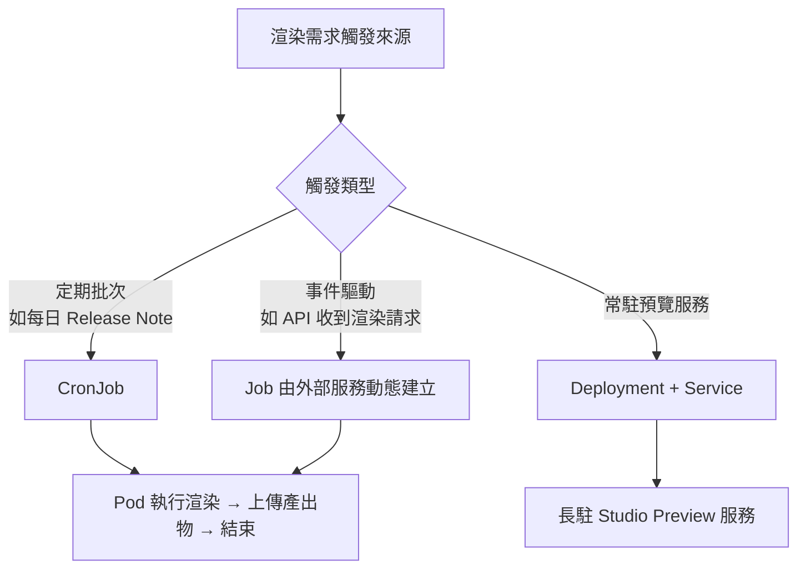

### 28.2 一次性渲染 Job 範例

```yaml
# k8s/render-job.yaml
apiVersion: batch/v1
kind: Job
metadata:
  name: hyperframes-render-product-launch
  labels:
    app: hyperframes-renderer
spec:
  backoffLimit: 2
  ttlSecondsAfterFinished: 3600
  template:
    spec:
      restartPolicy: Never
      containers:
        - name: renderer
          image: company/hyperframes-renderer:latest
          command: ["npx", "hyperframes", "render"]
          args:
            - "--docker=false"   # 容器內已是隔離環境，通常不需要再巢狀 Docker
            - "--quality=high"
            - "--output=/output/product-launch.mp4"
          resources:
            requests:
              cpu: "2"
              memory: "4Gi"
            limits:
              cpu: "4"
              memory: "8Gi"
          volumeMounts:
            - name: project-source
              mountPath: /app
            - name: output-volume
              mountPath: /output
      volumes:
        - name: project-source
          configMap:
            name: product-launch-composition
        - name: output-volume
          persistentVolumeClaim:
            claimName: video-output-pvc
```

### 28.3 定期批次渲染 CronJob 範例

```yaml
# k8s/render-cronjob.yaml
apiVersion: batch/v1
kind: CronJob
metadata:
  name: hyperframes-daily-release-note
spec:
  schedule: "0 9 * * 1-5"   # 週一到週五每天早上 9 點
  jobTemplate:
    spec:
      backoffLimit: 1
      template:
        spec:
          restartPolicy: Never
          containers:
            - name: renderer
              image: company/hyperframes-renderer:latest
              command: ["/bin/sh", "-c"]
              args:
                - |
                  npx hyperframes render --quality high --output /output/release-note-$(date +%Y%m%d).mp4 && \
                  aws s3 cp /output/release-note-$(date +%Y%m%d).mp4 s3://company-video-cdn/release-notes/
              envFrom:
                - secretRef:
                    name: aws-credentials
              volumeMounts:
                - name: output-volume
                  mountPath: /output
          volumes:
            - name: output-volume
              emptyDir: {}
```

### 28.4 常駐 Studio 預覽服務範例（Deployment + Service）

```yaml
# k8s/studio-deployment.yaml
apiVersion: apps/v1
kind: Deployment
metadata:
  name: hyperframes-studio
spec:
  replicas: 2
  selector:
    matchLabels: { app: hyperframes-studio }
  template:
    metadata:
      labels: { app: hyperframes-studio }
    spec:
      containers:
        - name: studio
          image: company/hyperframes-renderer:latest
          command: ["npx", "hyperframes", "preview", "--port", "3002"]
          ports:
            - containerPort: 3002
          resources:
            requests: { cpu: "500m", memory: "1Gi" }
            limits: { cpu: "1", memory: "2Gi" }
---
apiVersion: v1
kind: Service
metadata:
  name: hyperframes-studio-svc
spec:
  selector: { app: hyperframes-studio }
  ports:
    - port: 80
      targetPort: 3002
  type: ClusterIP
```

### 28.5 其他實務缺口：GPU 排程、Helm、私有 Registry、Pod Security（實務延伸）

- **GPU Node Scheduling／Taints**：若渲染 Job 需要用到 `--gpu` 硬體編碼或 TypeGPU/WebGPU Adapter（見第六章 6.7），叢集通常會把 GPU 節點加上 Taint（如 `nvidia.com/gpu=present:NoSchedule`），渲染 Job 的 Pod spec 需要對應加上 `tolerations` 與 `nodeSelector`／`resources.limits."nvidia.com/gpu"`，否則 Pod 會卡在 Pending 狀態且錯誤訊息不易一眼看出是排程問題。
- **Helm Chart（選用）**：企業若同時維運多個環境（dev/staging/prod）的渲染 Job/CronJob，建議把本章的 YAML 範例封裝成內部 Helm Chart，用 `values.yaml` 管理各環境的資源限制、映像檔版本、排程時間差異，而非維護多份幾乎重複的原始 YAML。
- **私有 Registry／`imagePullSecrets`**：自建的渲染映像檔（見第二十七章）若存放在企業私有 Registry，Pod spec 需要加上 `imagePullSecrets` 參考對應的 Docker Registry Secret，否則 Job 會因 `ImagePullBackOff` 失敗；建議搭配 Service Account 層級綁定 Secret，避免每個 Job YAML 都要重複宣告。
- **Pod Security Context**：headless Chrome 在部分精簡化基礎映像檔上可能需要額外的 Capabilities（如 `SYS_ADMIN`，視 Chrome sandbox 設定而定）；企業叢集若強制 Pod Security Standards（`restricted`／`baseline`），建議優先透過 `--no-sandbox` 搭配容器層級隔離取代放寬 Pod 層級權限，並將任何必要的權限放寬限縮在渲染專用的 Namespace，而非套用到整個叢集。

### Best Practice

- 渲染類 Job 務必設定合理的 `resources.limits`（尤其 memory），避免單一渲染任務因記憶體洩漏或超大素材拖垮整個 Node（見第三十三章記憶體管理）
- 使用 `ttlSecondsAfterFinished` 自動清理已完成的 Job 物件，避免叢集累積大量已完成的 Job 資源
- CronJob 排程避開叢集其他重度批次任務的時間窗口，減少資源競爭

### 踩雷經驗

一個容易被忽略的踩雷點：CronJob 的 `concurrencyPolicy` 預設為 `Allow`，若上一次排程的渲染任務因素材過大尚未完成，下一次排程時間點又觸發了新的 Job，兩者會同時搶佔叢集資源，甚至可能同時寫入同一個輸出路徑造成檔案損毀。建議明確設定 `concurrencyPolicy: Forbid`（禁止重疊執行）或 `Replace`（用新任務取代尚未完成的舊任務），依業務需求擇一，而非依賴預設值。

### Anti Pattern

- ❌ 渲染 Job 需要 GPU 卻未設定對應的 `tolerations`／`nodeSelector`，導致 Pod 長期卡在 Pending 卻誤以為是映像檔或叢集故障
- ❌ CronJob 未明確設定 `concurrencyPolicy`，放任多次排程的渲染任務同時搶佔資源或互相覆蓋輸出檔案
- ❌ 為了讓 headless Chrome 順利啟動，直接把 Pod 設為 `privileged: true` 或放寬到整個叢集的 Pod Security 標準，而非把權限放寬限縮在渲染專用 Namespace 內

### Checklist

- [ ] 渲染 Job/CronJob 已設定明確的 CPU/Memory requests 與 limits
- [ ] 已依「一次性」「定期批次」「常駐服務」三種型態選定對應的 K8s 資源類型
- [ ] 產出物已規劃持久化儲存（PVC 或直接上傳外部物件儲存）而非僅存於容器暫存空間
- [ ] 若使用 GPU 渲染，已確認節點 Taint／Toleration／`nodeSelector` 設定正確
- [ ] CronJob 已明確設定 `concurrencyPolicy`，避免任務重疊執行
- [ ] 私有 Registry 映像檔已透過 `imagePullSecrets` 授權，Pod Security 權限放寬已限縮在渲染專用 Namespace

---

## 第二十九章 Podman 部署

> **⚠️ 版本快照提醒：** 經查證，HyperFrames 官方文件與 Repository 同樣**未提及 Podman**，官方僅保證並測試 `--docker` 模式與 Docker 生態系的相容性。本章內容為撰寫團隊依「Podman CLI 高度相容 Docker CLI」的通用事實延伸整理的企業導入建議（適合對 rootless／daemonless 容器有合規要求的組織參考），並非官方測試或保證涵蓋的部署路徑，詳見 9.7 節的相同提醒。導入前請務必先在非關鍵專案驗證 `--docker` 模式在 Podman 引擎下的實際渲染結果與 Docker 環境一致。

### 29.1 Podman 與 Docker 的核心差異回顧

Podman 採 daemonless、預設 rootless 架構，對資安要求較嚴格的企業環境（尤其金融、政府相關單位）常是 Docker 的合規替代方案。由於 Podman CLI 高度相容 Docker CLI 語法，多數 Dockerfile 可直接沿用。

### 29.2 使用 Podman 建置與執行

```bash
# 建置（與 docker build 語法相同）
podman build -t company/hyperframes-renderer:latest .

# Rootless 執行渲染
podman run --rm \
  -v $(pwd)/video-projects/product-launch:/app:Z \
  -v $(pwd)/renders:/app/renders:Z \
  company/hyperframes-renderer:latest \
  render --quality high --output /app/renders/output.mp4
```

> **踩雷經驗**：Podman rootless 模式下的 Volume 掛載，在 SELinux 啟用的環境（常見於 RHEL/Fedora）需要加上 `:Z`／`:z` 標籤，否則容器內程序可能因 SELinux 政策無法讀寫掛載目錄，出現看似隨機的檔案權限錯誤——這是團隊從 Docker 遷移到 Podman 時最常踩的第一個坑。

### 29.3 Podman Compose 範例

```yaml
# podman-compose.yml（語法與 docker-compose 相容）
version: '3.9'
services:
  hyperframes-render:
    image: company/hyperframes-renderer:latest
    entrypoint: ["npx", "hyperframes"]
    command: ["render", "--quality", "high", "--output", "/app/renders/output.mp4"]
    volumes:
      - ./video-projects/product-launch:/app:Z
      - ./renders:/app/renders:Z
    environment:
      - HYPERFRAMES_NO_TELEMETRY=1
```

```bash
podman-compose up hyperframes-render
```

### 29.4 Podman + systemd（Quadlet）常駐服務範例

企業若需要 Podman 管理的常駐 Studio 預覽服務，建議透過 systemd Quadlet 整合，取得開機自動啟動與標準化服務管理：

```ini
# /etc/containers/systemd/hyperframes-studio.container
[Unit]
Description=HyperFrames Studio Preview Service

[Container]
Image=company/hyperframes-renderer:latest
Exec=npx hyperframes preview --port 3002
PublishPort=3002:3002
Volume=/srv/video-projects/product-launch:/app:Z

[Service]
Restart=always

[Install]
WantedBy=multi-user.target
```

```bash
systemctl --user daemon-reload
systemctl --user start hyperframes-studio.service
```

### Best Practice

- 導入 Podman 前，先用非關鍵專案驗證 `--docker` 渲染模式在 Podman 引擎下的行為與 Docker 一致（官方未明確保證測試涵蓋範圍，見第九章 9.7）
- SELinux 環境下的 Volume 掛載一律加上 `:Z`（私有掛載）或 `:z`（共享掛載）標籤，作為團隊標準寫法避免重複踩雷

### Checklist

- [ ] 已驗證 Podman rootless 執行下的渲染結果與 Docker 環境一致
- [ ] SELinux 環境的所有 Volume 掛載已統一加上正確的標籤
- [ ] 常駐服務已透過 systemd Quadlet 或等效機制標準化管理，而非手動 `podman run` 且無自動重啟機制

---

## 第三十章 Enterprise Best Practices

### 30.1 大型企業導入 HyperFrames 的階段性路徑


**階段一（POC）**：選擇低風險場景（如內部教育訓練影片）驗證技術可行性與團隊接受度，重點驗證 CI 環境相容性、AI Agent 整合順暢度。

**階段二（試點）**：選 1-2 個真實對外或跨部門專案，累積實戰經驗，同時開始記錄踩雷經驗與最佳實務（即為本手冊此類文件的價值所在）。

**階段三（建立標準）**：沉澱出企業內部的模板庫、CI/CD Pipeline 範本、品牌規範自動比對機制、`AGENTS.md`/`CLAUDE.md` 團隊慣例文件。

**階段四（推廣）**：對其他團隊做教育訓練（可直接使用 HyperFrames 自己產出教育訓練影片，形成有趣的自我實踐案例）。

**階段五（規模化）**：導入雲端渲染（Lambda/Cloud Run/HeyGen Hosted）因應大量批次渲染需求，建立成本監控與治理機制。

### 30.2 版本管理建議

- **鎖定 CLI 版本**：專案內用 `package.json` 的 `devDependencies` 明確鎖定 `hyperframes` 版本，而非每次都用 `npx hyperframes@latest`，避免非預期的行為變更破壞既有 Pipeline
- **善用 Skill 的版本維護協定**（見 7.4）：讓 AI Agent 在明確授權下才升版並自動驗證，而非任由版本漂移
- **建立內部 CHANGELOG 追蹤機制**：每次升版前先閱讀官方 Release Note，評估是否有 Breaking Change 影響既有 Composition（第三十一章有完整升級流程）

### 30.3 資源管理

- **渲染資源**：批次渲染任務建議統一排程管理（K8s CronJob／Lambda 併發限制），避免多團隊同時發起大量渲染任務造成成本失控或渲染 Queue 阻塞
- **素材資源**：建立集中式的 `brand-assets/` 儲存庫（見 18.3），避免每個專案各自下載/管理重複的品牌素材，也利於品牌更新時統一替換

### 30.4 Media 管理

大型企業累積的影片與素材數量會快速膨脹，建議：

1. 影片產出物依「專案／版本／語系」建立清楚的命名與目錄慣例，並上傳到 CDN/物件儲存而非留在 CI Artifact（Artifact 通常有保存期限）
2. 素材來源（尤其是有版權疑慮的圖庫/字型）建立採購授權紀錄，避免大量批次生成的影片因單一素材授權問題造成大範圍下架風險
3. 定期清理不再使用的舊版本素材與已下架專案的渲染產出物，控制儲存成本

### 30.5 Template 管理

- 模板變更需要走版本控制與 Review 流程（模板是「乘數效應」最大的資產，一個模板的 Bug 可能影響所有依賴它的批次產出）
- 建議模板本身也納入 `check --strict` 的 CI 驗證，任何模板變更都要先通過驗證才能合併
- 模板文件化：每個內部模板應附上「適用場景」「客製化欄位說明」「已知限制」的簡短說明文件，降低跨團隊誤用風險

### 企業導入案例

某跨國零售集團導入 HyperFrames 用於「區域行銷團隊各自產出在地化促銷影片」的場景。初期各區域團隊各自維護素材與模板，半年內就出現品牌視覺不一致、部分區域誤用過期折扣資訊模板的問題。導入「集中式 `brand-assets/` + 模板 Review 流程 + CI `check --strict` 強制驗證」後，品牌一致性問題大幅下降，且新的區域行銷活動從「素材確認到影片產出」的前置時間從平均 5 個工作天縮短到 1 個工作天內。

### Checklist

- [ ] 已依「POC → 試點 → 標準化 → 推廣 → 規模化」路徑規劃導入時程，而非一次全面鋪開
- [ ] CLI 版本已明確鎖定並有升版評估流程
- [ ] 已建立集中式品牌素材庫與模板 Review 機制

---

## 第三十一章 系統維護與升級

### 31.1 日常維護檢查清單

| 頻率 | 維護項目 |
|---|---|
| 每次渲染前（CI 自動化） | `doctor --json` 環境健檢 |
| 每週 | 檢查 `upgrade --check` 是否有新版本、瀏覽官方 Release Note |
| 每月 | 清理過期渲染 Artifact／未使用素材、檢視雲端渲染成本報表 |
| 每季 | Review 模板庫是否有過時內容、複查品牌規範是否需要同步更新 |
| 每半年 | 重新評估 CLI 大版本升級（尤其 0.x → 1.0 這類可能有 Breaking Change 的節點） |

### 31.2 升級流程

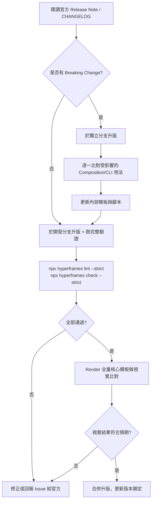

### 31.3 如何避免 Breaking Change 造成的衝擊

- **鎖定版本 + 有計畫升版**（見 30.2），而非放任自動更新
- **建立「核心模板回歸渲染」機制**：每次升版前後，對團隊最重要的幾個模板做渲染並人工/自動化比對畫面差異，而非只看 `lint`/`check` 是否通過（結構驗證通過不代表視覺效果沒有變化）
- **善用 Skill 版本維護協定**（7.4）讓 AI Agent 在有把握的情況下自動處理小版本升級，人類專注在需要判斷的大版本升級

### 31.4 Migration Guide：從 Remotion 遷移

官方 Skill 系統內建 `/remotion-to-hyperframes` workflow，是目前唯一有官方明確支援的框架遷移路徑。遷移時的核心心智轉換：

| Remotion 概念 | HyperFrames 對應概念 |
|---|---|
| `<Composition>` | 根節點 `data-composition-id` |
| `useCurrentFrame()` | Frame Adapter 的 `seekFrame(frameNumber)`，由框架驅動而非元件內取用 |
| `<Sequence from={} durationInFrames={}>` | `class="clip"` + `data-start` + `data-duration` |
| React 元件樹 | 純 HTML DOM 結構 |
| `spring()`/`interpolate()` | GSAP timeline 或 CSS/WAAPI 對應寫法 |

```text
Prompt 範例（銜接 /remotion-to-hyperframes）：
這個專案目前用 Remotion 寫了一支產品介紹影片（src/ 底下的 React 元件），
請幫我遷移到 HyperFrames：
1. 分析現有 Sequence 結構，轉換成對應的 data-start/data-duration/data-track-index
2. 把 interpolate() 的動畫邏輯改寫成 GSAP timeline
3. 遷移後跑 lint/check 驗證，並渲染出來跟原 Remotion 版本做視覺比對
```

> **實務建議**：遷移評估階段務必先跑第四十章的框架比較分析，確認遷移動機（多半是「想要更好的 Agent 友善度」或「想擺脫授權限制」）明確，而非為遷移而遷移。若既有 Remotion 專案運作良好、團隊已熟悉 React 動畫工作流，遷移成本可能不划算。

### Checklist

- [ ] 已建立日常維護排程表並指派負責人
- [ ] 升版流程已包含「核心模板回歸渲染比對」，而不只是 `lint`/`check` 通過
- [ ] 若有 Remotion 遷移計畫，已完成第四十章的框架比較評估確認遷移動機明確

---

## 第三十二章 Troubleshooting

> 本章前 9 題直接對應官方 Troubleshooting Guide 涵蓋的真實常見問題（已標註「官方」），其餘題目為撰寫團隊依據 HyperFrames 架構原理與同類無頭瀏覽器渲染系統的實務排錯經驗延伸整理（標註「實務延伸」），供讀者更全面地建立排錯地圖。

### 32.1 環境與安裝類（1–8）

**1.（官方）「No composition found」**
- 原因：專案缺少 `index.html`，或根節點沒有 `data-composition-id`
- 分析：CLI 在啟動渲染/預覽前會先尋找符合結構的根 Composition，找不到就直接中止
- 解法：執行 `npx hyperframes init` 重新建立骨架，或手動確認根節點含 `<div id="root" data-composition-id="...">`

**2.（官方）「FFmpeg not found」**
- 原因：系統未安裝 FFmpeg 或 PATH 未正確設定
- 分析：本機渲染模式（非 `--docker`）依賴系統安裝的 FFmpeg 執行編碼
- 解法：依平台安裝（`brew install ffmpeg` / `apt install ffmpeg` / Windows 手動下載或 `winget`），並用 `ffmpeg -version` 確認；或改用 `--docker` 模式繞過本機安裝需求

**3.（官方）Lint 錯誤（缺少必要屬性）**
- 原因：常見於缺少 `data-composition-id`、缺少 `class="clip"`、時間軸重疊、影片未加 `muted`、使用了已棄用屬性
- 分析：`lint` 是純結構層級驗證，不涉及瀏覽器渲染，能最快定位語法層級問題
- 解法：執行 `npx hyperframes lint --verbose` 取得完整 finding 清單，逐條依 `fixHint` 修正

**4.（官方）Preview 沒有即時更新**
- 原因：編輯了錯誤的檔案，或預覽伺服器未偵測到變更
- 分析：常發生在誤編輯了複製出去的備份檔，或瀏覽器快取了舊版本
- 解法：確認正在編輯專案的 `index.html`／子 Composition，重啟 `preview` 伺服器，並在瀏覽器做強制重新整理（Windows/Linux：`Ctrl+Shift+R`；macOS：`Cmd+Shift+R`）

**5.（官方）Preview 卡頓／低幀率**
- 原因：單一 frame 繪製時間超過 16–33ms 的預算，常見兇手是疊加多層 `backdrop-filter: blur()`、高解析度圖片、複雜濾鏡
- 分析：Preview 是即時播放，效能瓶頸會直接反映成掉幀觀感（但不影響最終 render 結果的正確性，只影響預覽體感）
- 解法：用 Chrome DevTools Performance 分頁定位瓶頸元素；開發階段改用 `--quality draft` 渲染確認效果，而非依賴卡頓的即時預覽做判斷

**6.（官方）Render 結果與 Preview 不一致**
- 原因：字型可用性差異、不同機器的 Chrome 版本差異
- 分析：Preview 走瀏覽器即時播放，Render 走 FFmpeg 編碼管線，兩者理論上該一致但環境差異會放大成可視落差
- 解法：改用 `npx hyperframes render --docker` 鎖定渲染環境；確認字型皆為本機檔案而非依賴系統預裝字型

**7.（官方）Docker 模式無法啟動**
- 原因：Docker 未啟動、權限問題、映像檔下載失敗
- 分析：`--docker` 模式依賴本機 Docker Daemon 正常運作與網路可達性
- 解法：`docker info` 確認 Daemon 狀態；`sudo usermod -aG docker $USER` 並重啟終端機解決權限問題；確認網路可正常拉取映像檔

**8.（官方）Render 速度過慢**
- 原因：`--quality high --fps 60` 等高規格設定、複雜動畫、未啟用硬體加速
- 分析：渲染時間與 frame 數量、每 frame 繪製複雜度、編碼參數三者皆正相關
- 解法：開發迭代改用 `--quality draft`；執行 `npx hyperframes benchmark` 找出最佳參數組合；評估開啟 `--gpu`；必要時降低 `--fps` 到 24；簡化過度複雜的視覺效果

### 32.2 媒體與編碼類（9–15，第 9 題為官方，其餘為實務延伸）

**9.（官方）HEVC/H.265 影片在 Preview 顯示黑畫面**
- 原因：瀏覽器無法原生解碼 HEVC；Preview 走瀏覽器播放、Render 走 FFmpeg 編碼，兩者解碼能力不同
- 分析：這是最容易誤判成「渲染引擎壞了」的問題，實際上只是預覽端的播放限制
- 解法：確認自動代理（proxy）機制未被 `--no-proxy` 停用；跑 `npx hyperframes doctor` 確認 FFmpeg/ffprobe 正常安裝，讓框架自動轉碼供預覽使用
- **2026 年更新**：官方已將此自動代理機制從單純的 HEVC 擴大到涵蓋更廣義的「不友善編碼」（hostile codecs），包含含 Alpha 通道的影片素材，會自動偵測並轉碼供 Preview 正常播放，降低第 14.2 節提到的素材編碼相容性問題發生機率

**10.（實務延伸）圖片延遲載入導致特定時間點截圖空白**
- 原因：對參與渲染的圖片使用了 `loading="lazy"`
- 分析：`snapshot --at` 或渲染引擎直接 seek 到中後段 frame 時，瀏覽器可能尚未判定該圖片「進入可視範圍」而未觸發載入
- 解法：移除所有渲染相關媒體元素的 `loading="lazy"`，改用預設 eager 載入

**11.（實務延伸）字幕/字型顯示為方框或亂碼**
- 原因：渲染環境（尤其 CI/雲端容器）缺少對應語系字型（常見於 CJK 字型缺失）
- 分析：本機開發環境通常已預裝系統字型而未察覺問題，直到部署到精簡化的容器映像檔才爆發
- 解法：在渲染環境映像檔中預先安裝對應語系字型套件（如 `fonts-noto-cjk`），或改用專案內建字型檔而非依賴系統字型

**12.（實務延伸）音訊與畫面不同步**
- 原因：手動控制音訊播放（`audio.play()`）而非交由框架統一管理
- 分析：破壞了確定性渲染的前提——音訊軌的混音時機應完全由 `data-start`/`data-duration` 決定
- 解法：移除自訂的音訊播放控制邏輯，確認音訊元素正確標記 `class="clip"` 與對應時間屬性

**13.（實務延伸）WebM 透明背景輸出後仍有黑色背景**
- 原因：輸出格式雖為 WebM 但編碼參數未正確啟用 Alpha 通道，或後續播放器不支援透明 WebM
- 分析：常見於下游系統（如某些影片編輯軟體、部分瀏覽器舊版本）對 WebM Alpha 通道支援不完整
- 解法：確認 `--format webm` 且素材本身背景為透明（而非白/黑底圖片誤判為透明）；驗證播放環境確實支援 VP9 + Alpha

**14.（實務延伸）去背（remove-background）處理速度異常緩慢**
- 原因：未使用 GPU 加速（`--device auto` 但系統未正確偵測到可用的執行提供者）
- 分析：`remove-background` 依賴本機 AI 模型推論，CPU 模式速度遠慢於 GPU
- 解法：用 `--info` 檢查偵測到的執行提供者，Windows/Linux 搭配 NVIDIA 顯卡可嘗試 `HYPERFRAMES_CUDA` 環境變數啟用 CUDA

**15.（實務延伸）TTS 生成語音音色/語速不符預期**
- 原因：未指定合適的 `--voice`／`--speed`／`--lang` 參數，使用了預設值
- 分析：`tts` 指令基於本機模型（Kokoro-82M），不同語言/音色的預設值不一定貼合所有使用情境
- 解法：先執行 `npx hyperframes tts --list` 檢視所有可用音色，依內容語氣挑選並調整 `--speed`

### 32.3 動畫與 GSAP 類（16–24，全為實務延伸）

**16. GSAP timeline 完全不執行**
- 原因：忘記設定 `{ paused: true }`，或忘記註冊到 `window.__timelines`
- 分析：這是全書多次強調的核心陷阱——沒有正確註冊，框架完全不知道該去 seek 哪個 timeline
- 解法：檢查建立 timeline 的程式碼是否同時滿足兩個條件；`data-composition-id` 與註冊 key 必須完全一致（含大小寫）

**17. Composition 總時長比預期短**
- 原因：GSAP timeline 最後一個動畫提早結束，框架依 timeline duration 判定總長
- 分析：即第六章提到的「283 秒影片但 timeline 只到 8 秒」經典陷阱
- 解法：用 `tl.set({}, {}, totalDuration)` 明確撐開總長度

**18. 影片素材偶爾黑畫面閃爍**
- 原因：對 `<video>` 元素直接做尺寸/位置動畫
- 分析：動態改變媒體元素尺寸會觸發解碼管線重新佈局，與逐幀截圖時機競爭
- 解法：改用 wrapper `<div>` 包裹 `<video>`，動畫寫在 wrapper 上

**19. 多元素動畫時機錯亂、疊在一起**
- 原因：GSAP position parameter 誤用（用了 `"+=1"` 相對定位卻搭配絕對時間的心智模型）
- 分析：GSAP 的相對與絕對定位語法混用容易造成時間軸計算錯誤
- 解法：複雜時間軸建議統一使用絕對時間定位（明確數字），減少心智負擔與除錯難度

**20. `check`/`inspect` 回報「動作靜止過久」但視覺上有動**
- 原因：動畫使用了 `check` 無法辨識為「移動」的屬性變化（例如僅改變 `filter` 而非 `transform`/`opacity`）
- 分析：`keepsMoving` 這類動作斷言通常針對常見的可視移動屬性做判斷
- 解法：若為刻意設計（如僅濾鏡漸變），可用 `data-layout-ignore` 或對應忽略屬性排除誤判；否則補上實質的位移/縮放動畫

**21. Lottie 動畫沒有跟著 seek 定位**
- 原因：未將 `lottie.loadAnimation` 回傳的實例註冊到 `window.__hfLottie`
- 分析：與 GSAP 的 `window.__timelines` 是同一類「橋接註冊」機制，缺一不可
- 解法：確認 `window.__hfLottie[key] = anim` 已正確執行，且 `autoplay: false`

**22. Three.js 場景在 render 結果中呈現卡頓/跳格**
- 原因：Three.js 自身的 `requestAnimationFrame` 迴圈未被正確接管，渲染時仍依賴 wall-clock 推進
- 分析：與 GSAP 若非 `paused: true` 會自行播放是同一類問題的 3D 版本
- 解法：確認場景渲染邏輯已包裝成可被外部呼叫「渲染指定時間點狀態」的函式，交由 Frame Adapter 控制推進

**23. CSS Animation 在 `check` 階段被判定為版面溢出**
- 原因：動畫過程中元素的中間狀態（如放大 `scale`）超出畫布邊界，但屬於刻意設計效果
- 分析：`check`/`inspect` 的版面檢查會取樣時間軸上多個時間點，中間態溢出也會被納入檢查
- 解法：若為刻意設計，加上 `data-layout-allow-overflow`；若非刻意，調整動畫幅度或使用 `overflow: hidden` 容器裁切

**24. 同一元素動畫效果互相覆蓋、行為不可預期**
- 原因：CSS Transition 與 GSAP 同時控制同一元素的同一屬性
- 分析：瀏覽器 CSSOM 與 GSAP 的 inline style 寫入時機競爭，導致最終顯示狀態不確定
- 解法：明確分工——每個屬性只由一種 Adapter 控制，混用時至少確保控制的屬性彼此不重疊

### 32.4 渲染與效能類（25–33，全為實務延伸）

**25. 渲染過程中記憶體用量持續攀升甚至 OOM**
- 原因：單一 Composition 場景/素材過多，或影格快取未適當清理
- 分析：逐幀截圖若累積在記憶體中未及時釋放，長時間/高解析度渲染容易耗盡記憶體
- 解法：開啟 `--low-memory-mode`（或設定 `PRODUCER_LOW_MEMORY_MODE`）；設定合理的 `--frames-cache-dir` 使用磁碟快取分攤記憶體壓力；拆分超長 Composition

**26. 批次渲染（`lambda render-batch`）部分任務失敗但難以定位**
- 原因：未先用 `--dry-run` 驗證 JSONL 批次格式，或個別任務的 `variables` 觸發 `--strict-variables` 失敗
- 分析：大批次任務中單一格式錯誤容易被淹沒在大量成功結果中
- 解法：正式送出前一律先 `--dry-run` 做批次格式驗證；`--json` 輸出並程式化過濾出失敗項目逐一排查

**27. `--workers` 設定越高渲染反而更慢**
- 原因：Worker 數量超過機器實際可用核心數，或與其他行程競爭 I/O 資源
- 分析：CPU 密集型任務的平行度超過實體核心數後，Context Switch 開銷會抵銷平行化效益
- 解法：改用 `--workers auto`（預設 CPU 核心數減 2）讓框架自動判斷，或透過 `benchmark` 實測找出該機器的甜蜜點

**28. Docker 模式渲染速度明顯慢於本機直接渲染**
- 原因：容器化帶來的虛擬化開銷、Volume 掛載的檔案 I/O 效能損耗（尤其 Windows/macOS 上的 Docker Desktop）
- 分析：這是容器化的已知取捨——確定性換取一定的效能損耗
- 解法：CI/雲端環境（本身即容器化）影響較小可安心使用；本機開發若對迭代速度要求高，可用非 Docker 模式配合最終才用 Docker 模式做「發布前一致性驗證」

**29. GPU 編碼（`--gpu`）啟用後畫質明顯下降**
- 原因：硬體編碼器在相同 bitrate 下的壓縮效率通常略遜於高品質 CPU 編碼（`libx264` 高 CRF 設定）
- 分析：這是硬體編碼「速度換畫質」的已知取捨，非 Bug
- 解法：若對最終畫質要求高於速度，交付版本改用 CPU 編碼；若只是想加速開發迭代預覽，GPU 編碼的畫質損失通常可接受

**30. 渲染完成但輸出檔案損毀無法播放**
- 原因：渲染中途被強制中斷（如 CI Job 逾時被 Kill）、磁碟空間不足
- 分析：FFmpeg 編碼過程被中斷會產生不完整的容器格式檔案
- 解法：確認 CI Job 的逾時設定足夠涵蓋預期渲染時間；渲染前檢查磁碟剩餘空間；渲染腳本加上明確的完成狀態檢查（例如驗證輸出檔案存在且大小合理）再視為成功

**31. `benchmark` 指令執行時間過長影響開發節奏**
- 原因：`--runs` 設定過高，或在複雜的正式 Composition 上跑 benchmark 而非簡化版本
- 分析：benchmark 本質是「多組參數各跑數次」，複雜度會乘倍放大
- 解法：先在簡化的測試 Composition 上跑 benchmark 找出大方向最佳參數，再套用到正式專案微調

**32. 雲端渲染（`cloud render`）一直卡在 processing 狀態**
- 原因：素材過大導致上傳/處理時間長，或觸發服務端的排隊機制
- 分析：`cloud render` 依賴 HeyGen 託管基礎設施的當下負載狀況
- 解法：用 `hyperframes cloud get <id> --json` 查看詳細狀態；評估是否需要調整 `--max-wait`；長時間無回應建議透過 `--callback-url` 改為非同步通知模式而非持續輪詢

**33. AWS Lambda 渲染因逾時失敗**
- 原因：`--chunk-size` 設定過大導致單一 Lambda 呼叫超過時間限制
- 分析：Lambda 有硬性執行時間上限，過大的 chunk 會直接觸發平台逾時機制
- 解法：調小 `--chunk-size`，讓每個 Lambda 呼叫處理的 frame 數量落在安全範圍內，配合 `--max-parallel-chunks` 拉高整體平行度彌補吞吐量

### 32.5 CI/CD 與雲端類（34–40，全為實務延伸）

**34. CI 環境渲染結果與本機不一致**
- 原因：CI Runner 與本機的 Chrome／FFmpeg 版本不同，或字型集不同
- 分析：這是「確定性渲染」在跨環境場景下最常見的落差來源
- 解法：CI 統一使用 `--docker` 渲染模式（見第二十六章），並在自建映像檔中鎖定所有版本

**35. GitHub Actions Runner 記憶體不足導致渲染失敗**
- 原因：預設 Runner（如 `ubuntu-latest`）記憶體規格有限，複雜 Composition 渲染超出可用記憶體
- 分析：Headless Chrome + FFmpeg 同時運作對記憶體的需求，在標準 Runner 規格下可能吃緊
- 解法：升級到更大規格的 Runner（Larger Runners／自架 Runner），或啟用 `--low-memory-mode`

**36. CI Pipeline 因 `npx` 每次都重新下載套件而變慢**
- 原因：未啟用套件管理器的快取機制
- 解法：GitHub Actions 使用 `actions/setup-node` 的 `cache` 參數，或改用 `npm ci` 搭配鎖定版本的 `package-lock.json`；企業內部可考慮架設私有 npm Registry 鏡像加速下載

**37. Docker 映像檔在 CI 中重複建置浪費時間**
- 原因：未使用 Layer 快取或映像檔 Registry 快取機制
- 解法：CI 平台通常提供 Docker Layer 快取功能（如 GitHub Actions 的 `docker/build-push-action` 搭配 `cache-from`/`cache-to`），啟用後大幅縮短重複建置時間

**38. 多分支同時觸發渲染造成資源競爭**
- 原因：未對渲染類 CI Job 做併發限制
- 解法：使用 CI 平台的併發控制機制（如 GitHub Actions 的 `concurrency` 設定），限制同一渲染資源池的同時執行數量

**39. Kubernetes CronJob 渲染任務偶發性遺漏執行**
- 原因：叢集在排程時間點資源不足，CronJob 的 `startingDeadlineSeconds` 未設定或設定過短
- 分析：K8s CronJob 若在排程時間視窗內找不到可用資源，超過期限會直接跳過該次執行
- 解法：適當放寬 `startingDeadlineSeconds`，並搭配資源監控確保排程時間點叢集有足夠容量

**40. 雲端物件儲存（S3/GCS）上傳失敗但 CI 顯示綠燈**
- 原因：上傳步驟的錯誤未正確傳遞退出碼（如用 `|| true` 吞掉錯誤，或上傳指令包在未檢查回傳值的腳本中）
- 分析：CI 腳本若沒有嚴謹的錯誤處理，容易產生「渲染成功但發布實際失敗」的假陽性
- 解法：CI Script 開啟嚴格模式（Bash 的 `set -euo pipefail`），確保任何步驟失敗都會讓整個 Job 標記失敗

### 32.6 Skill／AI Agent 協作類（41–50，全為實務延伸）

**41. AI Agent 產生的 Composition 反覆無法通過 `lint`**
- 原因：Agent 沒有正確載入 HyperFrames Skill，或專案內缺乏 `AGENTS.md` 補充慣例（尤其非官方支援的工具，見第二十一章）
- 解法：確認 Skill 安裝正確（`npx skills add heygen-com/hyperframes --full-depth`）；補充專案層級的 `AGENTS.md`／`CLAUDE.md`

**42. Agent 誤判影片需求路由到錯誤的 workflow skill**
- 原因：使用者需求描述模糊，落在第七章提到的邊界情境（如「短促但有旁白」介於 `/motion-graphics` 與 `/general-video` 之間）
- 解法：在初始 Prompt 中更明確描述時長、是否有旁白、視覺風格關鍵詞，減少路由歧義

**43. Agent 自主升級 CLI 版本後專案出現非預期行為**
- 原因：Skill 版本維護協定（7.4）執行了升版但驗證環節被跳過或驗證標準過於寬鬆
- 分析：這是「Agent 自動化操作」需要人類監督的典型情境
- 解法：Review Agent 的操作紀錄，確認升版後是否真的執行了 `check` 驗證；必要時人工介入回退版本並回報問題

**44. Agent 反覆修改同一個問題卻始終無法修好**
- 原因：問題可能不在 Composition 本身，而在素材（如損毀的影片檔）或環境（缺少字型）
- 分析：Agent 容易陷入「以為是程式邏輯問題」的思考慣性，忽略環境/素材層面的可能性
- 解法：人類介入時先執行 `doctor`／檢查素材檔案完整性，排除環境因素後再讓 Agent 繼續嘗試

**45. 不同 AI 工具（如 Claude Code 與 Cursor）產出的 Composition 風格不一致**
- 原因：缺乏統一的專案層級規範文件，各工具依各自預設慣例產生程式碼
- 解法：建立單一權威的規範文件（`AGENTS.md`）並確保所有工具都會讀取，而非各自維護不同版本的指引

**46. Agent 產出的批次個人化影片出現變數未替換的原始佔位字串**
- 原因：`--variables`／`--variables-file` 傳入的鍵名與 Composition 內宣告的變數名稱不符
- 解法：一律搭配 `--strict-variables` 執行，讓命名不符的情況直接失敗而非默默使用預設值蒙混過關

**47. Agent 在 Claude Design 產出的 ZIP 內容與後續 Claude Code 精修產生衝突**
- 原因：Claude Design 產出版本與 Claude Code 本機修改版本未妥善做版本控管，造成覆蓋
- 解法：下載 ZIP 後立即建立獨立 Git 分支/commit 作為基準點，後續 Claude Code 修改都基於此基準做增量變更並保留清楚的變更歷程

**48. Agent 執行 `capture` 指令擷取內部系統畫面時觸發資安警示**
- 原因：對內網／需要認證的系統執行未授權的自動化截圖擷取
- 解法：`capture` 指令僅用於公開可存取或已明確授權的內部系統，並遵循第三十四章的資安建議

**49. Agent 生成的 Prompt 範本每次的結果品質落差很大**
- 原因：Prompt 缺乏結構化的必要資訊（品牌色、時長、目標受眾等），導致 Agent 每次都要做不同程度的猜測
- 解法：採用第三十八章提供的結構化 Prompt 範本，確保關鍵資訊每次都完整提供

**50. 團隊過度依賴 Agent 自動生成，內部無人真正理解底層 Composition 結構**
- 原因：長期只透過自然語言 Prompt 與 Agent 互動，未安排任何工程師深入理解 HTML/CSS/GSAP 底層機制
- 分析：這是一個組織性風險而非技術問題——一旦 Agent 產出的結果需要精細調整或除錯，團隊可能完全無法自行處理
- 解法：即使高度依賴 AI Agent，仍建議至少 1-2 位工程師完整閱讀本手冊前十九章的技術原理，作為團隊內部「最後一道防線」

### Checklist

- [ ] 團隊已將本章 50 題整理成內部 Wiki 或 Runbook，方便新成員查閱
- [ ] CI/CD Pipeline 已針對第 34-40 題的常見雲端/CI 問題做防禦性設計（嚴格模式、併發限制、快取機制）
- [ ] 已指派至少 1-2 位工程師具備深入排查 Composition 底層問題的能力，不完全依賴 AI Agent 自主排錯

---

## 第三十三章 Performance Tuning

### 33.1 效能瓶頸的四大來源

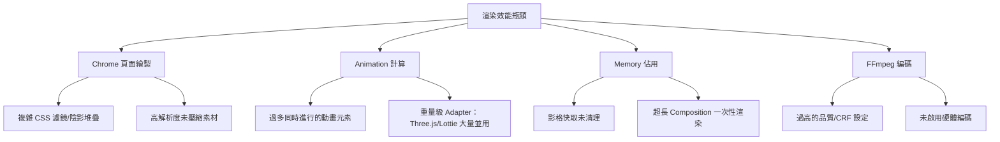

### 33.2 Chrome 層級調校

- 避免堆疊多層 `backdrop-filter`／`filter`，改用預先處理好效果的素材（如預先模糊處理好的背景圖片，而非即時運算模糊）
- 圖片素材在放入專案前先壓縮到實際顯示尺寸，避免瀏覽器花費額外時間縮放超大原圖
- 開發環境視情況開啟 `--browser-gpu` 加速頁面繪製（CI/雲端環境評估後再決定，見 16.4）

### 33.3 Animation 層級調校

- 大量並行動畫元素（如超過 20 個同時進出場的元素）建議評估是否能簡化視覺設計、減少同時動作的元素數量
- Three.js／Lottie 等重量級 Adapter 若非必要不要在同一支影片的多個場景重複使用，評估用 CSS/SVG 替代部分較簡單的效果場景

### 33.4 Memory 管理

- 開啟 `--low-memory-mode`（或 `PRODUCER_LOW_MEMORY_MODE=1`）讓渲染引擎採用更保守的記憶體使用策略（犧牲部分速度換取穩定性）
- 使用 `--frames-cache-dir` 指定磁碟快取路徑，避免大量影格資料全部堆積在記憶體
- 超長 Composition（分鐘級以上）評估拆分成多個子 Composition 分段渲染，再用後製工具或 FFmpeg 做最終串接

### 33.5 GPU 使用建議

編碼加速（`--gpu`，見 15.5）與繪製加速（`--browser-gpu`，見 16.4）是兩個獨立的 GPU 使用面向，可以分別開關：

| 情境 | `--gpu`（編碼） | `--browser-gpu`（繪製） |
|---|---|---|
| 本機開發，有獨立顯卡 | 建議開啟加速迭代 | 建議開啟 |
| CI Runner（無 GPU） | 不開啟（會失敗或無效果） | `--no-browser-gpu` |
| 雲端 GPU 渲染節點 | 建議開啟 | 依節點是否配置顯示輸出能力而定 |
| 最終高畫質交付 | 視畫質要求評估，可能改用 CPU 編碼 | 不影響最終畫質，可保持開啟加速渲染速度 |

### 33.6 FFmpeg 編碼調校（回顧第十五章並延伸）

- `benchmark` 指令是尋找「當前機器＋當前 Composition」最佳參數組合最有效率的方式，優於憑經驗猜測
- 批次渲染大量相似結構的個人化影片時，先用單一樣本跑過 `benchmark`，再把找到的最佳參數套用到整批渲染，避免每支影片都重複試錯

### Best Practice

- 建立「效能基準」機制：對團隊核心模板定期跑 `benchmark`，記錄渲染時間趨勢，若明顯劣化（可能因素材或動畫複雜度悄悄增加）能及早發現
- 效能優化順序建議：先簡化視覺設計本身的複雜度 → 再調整快取/記憶體策略 → 最後才是砸硬體資源（GPU/更大規格機器）

### 踩雷經驗

一個常見的「過度優化」踩雷情境：團隊在專案初期就投入大量時間微調 `--workers`、`--gpu`、`--frames-cache-dir` 等進階參數，試圖榨出最後 10-20% 的渲染速度，但團隊實際的渲染量體其實很小（一天不到 10 支影片），這些優化帶來的維護成本（需要額外文件說明、新成員需要理解為何用了非預設參數）遠超過實際節省的時間。**效能調校應該由實際量體與痛點驅動，而非預先假設「一定要調到最快」**——先確認渲染時間是否真的造成團隊瓶頸，再決定投入優化的優先順序。

另一個常見誤用是誤讀 `benchmark` 結果：`benchmark` 找出的「最佳參數組合」是針對**當下測試用的 Composition** 與**當下這台機器**的相對最佳解，若團隊之後把同一組參數套用到內容複雜度差異很大的其他專案，或换了一台硬體規格不同的機器（尤其換成雲端渲染節點），原本的「最佳參數」可能反而不是最佳解，應該視為需要重新驗證的起點，而非一勞永逸的標準答案。

### Anti Pattern

- ❌ 專案初期就投入大量心力做進階效能調校，卻沒有先確認實際渲染量體是否真的構成瓶頸，本末倒置地把優化本身當成目標
- ❌ 把某次 `benchmark` 在特定機器／特定 Composition 上找到的參數組合，未經驗證就直接套用到其他專案或不同規格的渲染環境

### Checklist

- [ ] 已用 `benchmark` 找出核心模板的最佳渲染參數組合
- [ ] CI/雲端環境已依實際硬體能力正確設定 `--gpu`／`--browser-gpu`
- [ ] 超長或高複雜度 Composition 已評估記憶體管理策略（`--low-memory-mode`／拆分渲染）
- [ ] 效能調校投入程度已對照實際渲染量體評估，避免過度優化造成不必要的維護成本
- [ ] 套用到新專案／新渲染環境的參數組合，已重新驗證而非直接沿用舊有 `benchmark` 結果

---

## 第三十四章 Security

### 34.1 官方安全政策（Vulnerability Disclosure）

根據官方 `SECURITY.md`：**「請勿為安全漏洞開立公開的 GitHub Issue」**，應透過 GitHub Security Advisories 回報，內容包含漏洞描述、重現步驟、潛在影響、建議修復方式；官方承諾 **48 小時內確認回報、7 天內提供修復**。此政策適用範圍涵蓋 `@hyperframes/*` npm scope 下所有套件與本 Repository 程式碼。目前僅 0.x 版本線有安全更新支援。

> **⚠️ 版本快照提醒：** 官方 SECURITY.md 僅涵蓋「漏洞回報流程」與「支援版本」，**並未提供操作面的安全建議**（如 headless Chrome 沙箱化、不受信任 HTML 的處理風險、憑證管理）。以下 34.2～34.5 節內容為撰寫團隊依據無頭瀏覽器渲染系統的一般資安實務整理，非官方文件內容，請視為補充建議而非官方保證。

### 34.2 Headless Chrome 沙箱化建議（實務延伸）

渲染引擎本質上是「執行 HTML/CSS/JS 並截圖」——若 Composition 來源不完全可信（例如允許外部使用者上傳自訂 HTML 素材的 SaaS 場景），需要比照一般「執行不受信任程式碼」的資安思維：

- 渲染程序建議在隔離環境執行（容器化 + 最小權限、避免與其他敏感服務共用執行環境）
- 若允許使用者提供的 HTML 內容包含 `<script>`，評估是否需要額外的內容安全政策（CSP）限制或內容審核流程，避免惡意腳本利用渲染環境做出站外請求（SSRF）或存取渲染節點內的敏感檔案系統
- 避免渲染節點的容器/虛擬機掛載不必要的敏感 Volume 或具備過寬的網路存取權限

### 34.3 憑證與 API 金鑰管理

- `HEYGEN_API_KEY`／AWS 憑證等敏感資訊，一律透過 CI 平台 Secret 管理機制或密鑰管理服務（如 AWS Secrets Manager、HashiCorp Vault）注入，絕不寫死於程式碼或 YAML 檔案
- `hyperframes auth login` 儲存的本機憑證位於 `~/.heygen/credentials`（或 `HEYGEN_CONFIG_DIR` 指定路徑），需確保該路徑的檔案權限適當限制，尤其在共用開發機環境
- 定期輪替（Rotate）長期有效的 API 金鑰，並在人員異動時即時撤銷相關憑證

### 34.4 素材與內容審核

- 若渲染管線的輸入素材（圖片/影片/文字）來自使用者或外部資料源，建議在進入渲染管線前先做基礎內容審核（不當內容偵測、版權疑慮篩查），避免自動化管線把有問題的素材大量放送
- `capture` 指令擷取外部/內部網站內容時，務必確認已取得對應授權，避免觸及未授權存取的疑慮（見第三十二章第 48 題）

### 34.5 網路層面建議

- 生產環境的渲染節點若不需要主動對外發起請求（除必要的素材下載/API 呼叫），建議搭配網路層級的出站流量限制（Egress Filtering），降低渲染環境被用作跳板攻擊其他內部系統的風險
- 雲端渲染（Lambda/Cloud Run）建議依最小權限原則設定 IAM 角色，避免使用過於寬鬆的 `Resource: "*"` 權限長期留在生產環境（官方 CLI 文件也提及初始生成的政策較寬鬆，應在首次部署成功後收斂）

### Best Practice

- 把「素材輸入是否可信」作為架構設計的第一個問題——完全信任內部團隊產出的素材，與允許外部使用者上傳素材，資安控管等級應有明顯差異
- 定期（如每季）Review 雲端渲染服務的 IAM 政策，收斂過寬權限

### Anti Pattern

- ❌ 把 `HEYGEN_API_KEY`、AWS 憑證等敏感資訊直接寫死在程式碼、YAML 或本機 `.env`（非 `.env.example`）並提交進版本控制，而非透過 CI 平台 Secret 管理機制或密鑰管理服務注入
- ❌ 允許外部使用者上傳自訂 HTML/Composition 素材，卻沿用與內部信任素材相同的渲染環境與權限，未做任何沙箱化或隔離處理
- ❌ 雲端渲染 IAM 角色部署後長期沿用初始生成的寬鬆政策（如 `Resource: "*"`），未在上線穩定後收斂為最小必要權限
- ❌ 對 `capture` 指令的使用不設任何範圍限制，讓 Agent 或自動化流程可以擷取任意內網／未授權系統的畫面

### Checklist

- [ ] 敏感憑證已全數透過 Secret 管理機制注入，未有任何硬編碼
- [ ] 若允許不受信任來源的 HTML/素材輸入，已建立對應的隔離與審核機制
- [ ] 雲端渲染 IAM 權限已在首次部署後收斂為最小必要範圍

---

## 第三十五章 Logging 與 Monitoring

### 35.1 CLI 內建的可觀測性能力

HyperFrames CLI 多數指令支援 `--json` 輸出，是建立自動化監控的基礎——把 `--json` 輸出導入既有的日誌/監控系統（而非仰賴人工閱讀終端機輸出），是企業導入後的必要工程投資。

### 35.2 建議監控的關鍵指標

| 指標類別 | 建議監控項目 | 資料來源 |
|---|---|---|
| 渲染成功率 | 各專案/模板的渲染成功/失敗比率 | CI Pipeline 結果、`render --json` 回傳狀態 |
| 渲染耗時 | 平均/P95 渲染時間趨勢 | CI Pipeline 時間戳記、`benchmark` 結果歷史 |
| 驗證品質 | `lint`/`check` 的 error/warning 數量趨勢 | `--json` 輸出的 `errorCount`/`warningCount` |
| 雲端渲染成本 | Lambda/Cloud Run/HeyGen Cloud 渲染成本 | 各雲端平台帳務 API、`lambda progress` 回報的成本欄位 |
| Agent 產出品質 | AI Agent 產生的 Composition 首次 `lint`/`check` 通過率 | CI Pipeline 記錄 Agent 產出 vs 人工產出的通過率差異 |
| 版本健康度 | 專案使用的 CLI 版本與最新版本的落差 | `upgrade --check --json` 定期掃描 |

### 35.3 日誌整合範例（概念示意）

```bash
# 在 CI 腳本中，把結構化 JSON 輸出導入日誌系統
npx hyperframes check --json --strict > check-result.json
if [ $? -ne 0 ]; then
  # 將失敗詳情推送到團隊監控系統（示意，依實際系統調整）
  curl -X POST https://monitoring.internal/api/events \
    -H "Content-Type: application/json" \
    -d @check-result.json
fi
```

### 35.4 建立渲染健康度儀表板

> **實務建議**：企業導入 HyperFrames 達一定規模後（如同時維運超過 10 個模板/專案），強烈建議建立一個集中式儀表板（可用同目錄下《Prometheus與Grafana教學手冊.md》《Metrics Visualization教學手冊.md》介紹的工具鏈），追蹤上表列出的關鍵指標，讓平台團隊能在「渲染失敗率悄悄上升」或「雲端成本異常暴增」時及早發現，而非等到使用者抱怨才回頭排查。

### Best Practice

- 所有 CI 中執行的 HyperFrames 指令一律加上 `--json`，即使當下沒有立即消費這些資料，也為未來建立監控系統保留完整的結構化歷史紀錄
- 雲端渲染成本建議設定預算警示（Budget Alert），避免批次渲染規模擴大後成本失控卻無人察覺

### Checklist

- [ ] CI/CD Pipeline 中所有 HyperFrames 指令輸出皆已改用 `--json` 並保存歷史紀錄
- [ ] 已建立至少涵蓋「渲染成功率」與「雲端成本」兩項關鍵指標的監控儀表板或警示機制
- [ ] 已定期執行 `upgrade --check` 掃描並追蹤團隊內各專案的版本健康度

---

## 第三十六章 最佳實務總彙

> 本章彙整全書各章節提及的最佳實務並補充額外條目，依主題分類統一編號，方便團隊製作內部檢核清單時直接引用編號。

### 36.1 架構與設計（1–10）

1. 導入前務必完成 POC，驗證團隊 CI 環境與 AI Agent 整合的相容性，而非直接全面上線
2. 依「短影片批次產出」或「長片精緻剪輯」需求光譜，判斷 HyperFrames 是否為合適工具
3. 大型專案一律拆分為多個子 Composition（`data-composition-src`），避免單一巨型 HTML 難以維護
4. 建立清楚的 `data-track-index` 分層慣例文件，避免圖層疊放順序各自為政
5. 影片模板視為「乘數效應」資產，納入版本控制與 Review 流程，不可隨意變更
6. 企業導入路徑建議依「POC→試點→標準化→推廣→規模化」階段性推進
7. 為專案選定主要動畫技術棧（CSS/GSAP/Lottie/Three.js 擇一為主），避免同專案技術棧過度混雜
8. 需要程式化操作 Composition 的場景，優先導入 `@hyperframes/core`，而非用字串取代硬改 HTML
9. 定期重新評估「HyperFrames vs 其他方案」的適配度，尤其在需求規模或性質發生變化時
10. 架構決策（如是否導入雲端渲染）應基於實際批次量體評估 ROI，而非跟風導入

### 36.2 HTML／Composition 撰寫（11–20）

11. 所有參與時間軸排程的元素務必加上 `class="clip"`
12. 根節點務必完整宣告 `data-composition-id`／`data-width`／`data-height`
13. `<video>` 元素一律加上 `muted` 並透過 wrapper `<div>` 做尺寸/位置動畫
14. 素材路徑統一使用專案內 `assets/` 相對路徑，避免 render-time 外部網路請求
15. 圖片/媒體元素禁止使用 `loading="lazy"`
16. 需要跨支影片客製化的欄位一律改用 `data-composition-variables` 宣告
17. 批次渲染腳本一律搭配 `--strict-variables`，防止變數命名拼錯卻靜默使用預設值
18. 版面刻意溢出/重疊/遮蔽的元素，明確加上對應的 `data-layout-allow-*` 屬性告知檢查工具
19. 音訊背景音樂軌務必標記 `data-timeline-role="music"`，供節拍偵測使用
20. Composition 檔案結構超過 3 場景以上就該考慮拆分子檔案，提升可維護性

### 36.3 動畫實作（21–30）

21. GSAP timeline 一律以 `{ paused: true }` 建立，並正確註冊到 `window.__timelines[compositionId]`
22. 時間軸總長度用 `tl.set({}, {}, totalDuration)` 明確鎖定，不依賴最後一個動畫隱性決定
23. Lottie 實例務必註冊到 `window.__hfLottie`，且 `autoplay: false`
24. 同一元素的同一屬性禁止被多種 Adapter 同時控制
25. Three.js／Canvas 動畫邏輯包裝成可被外部指定時間點呼叫的函式，而非依賴內部 `requestAnimationFrame`
26. 複雜多元素交錯進場，優先用 GSAP 的絕對時間定位而非混用相對定位造成心智負擔
27. 動畫腳本禁止使用 `Date.now()`、未 seed 的 `Math.random()`
28. 刻意的中間態視覺溢出（如放大效果）需搭配 `data-layout-allow-overflow`，避免誤判為 Bug
29. 重量級 Adapter（Three.js/Lottie）評估效能影響後才大量套用在多場景
30. 動畫 Easing 與時間軸編排優先參考官方 GSAP Integration Guide 的既定模式，而非重新發明

### 36.4 媒體與素材（31–38）

31. 字型優先使用本機檔案並設定 `font-display: block`，避免依賴外部 CDN 字型
32. 圖片素材放入專案前先壓縮至實際顯示尺寸
33. 影片素材統一 H.264/AAC 編碼，避免 HEVC 在 Preview 端的相容性問題
34. 建立集中式 `brand-assets/` 資源庫，避免各專案重複下載管理品牌素材
35. 大型二進位素材（尤其影片）搭配 Git LFS 或外部物件儲存管理，避免 Git repo 過度膨脹
36. 素材授權來源需留存採購/授權紀錄，降低大量批次生成內容的版權風險
37. 透明背景需求統一使用 WebM + VP9/Alpha，而非事後用其他工具去背合成
38. 定期清理不再使用的舊版本素材與已下架專案的渲染產出物

### 36.5 CLI 與開發流程（39–48）

39. 開發迭代階段預設使用 `--quality draft` + 較低 fps，最終交付才切換 `--quality high`
40. 標準開發迴圈：先 `lint`、再 `check`、最後才 `render`，避免浪費運算資源在明知有問題的版本上
41. 所有支援 `--json` 的指令，在自動化情境一律使用 `--json` 輸出並程式化解析
42. CI 環境統一使用 `--docker` 渲染模式，確保跨機器一致性
43. 定期執行 `doctor --json` 健檢並存檔，作為排查環境差異問題的比對基準
44. 批次渲染任務先用 `--dry-run`（如適用）驗證格式，避免大量任務中單一格式錯誤難以定位
45. 用 `benchmark` 實測找出最佳渲染參數組合，而非憑經驗猜測
46. `--workers` 優先使用 `auto` 讓框架依機器核心數自動判斷
47. 專案內用 `package.json` 明確鎖定 `hyperframes` 版本，避免非預期的行為變更
48. 善用 `npx hyperframes docs <topic>` 查詢終端機內建文件，減少查找官網文件的切換成本

### 36.6 AI Agent 協作（49–58）

49. 安裝 Skill 時優先使用 `--full-depth` 取得完整 19 個 Skill
50. 在專案根目錄維護 `AGENTS.md`／`CLAUDE.md`，讓所有 AI 工具（含無官方 Skill 支援者）共用同一套慣例
51. 讓 Agent 每次迭代都先跑 `lint`/`check`，把靜態與視覺問題提前攔截
52. 建立「意圖訪談固定問題清單」（品牌色/時長/受眾/關鍵訊息），加速每次影片建立溝通效率
53. 監督 Agent 的自主版本升級行為，確認升版後有確實執行驗證
54. 不同 AI 工具間使用同一份規範文件，避免產出風格因工具而異
55. 高頻率、規則化的影片產出優先投資自動化 Pipeline；低頻率高創意需求保留人工精修
56. 面向外部/客戶可見的 AI 自動生成影片，保留人工最終審核關卡
57. 團隊至少安排 1-2 位工程師深入理解底層 Composition 結構，不完全依賴 Agent 自主排錯
58. Prompt 中明確描述時長、是否有旁白、視覺風格關鍵詞，減少 Skill 路由歧義

### 36.7 CI/CD（59–66）

59. 驗證階段（`lint`/`check`）與渲染階段拆分成獨立 CI Stage，問題定位一目了然
60. PR 階段只跑驗證，`render` 留給合併到主分支後才執行，節省 CI 資源
61. 所有憑證透過 CI 平台 Secret 管理機制注入，禁止硬編碼於 YAML/Groovy 檔案
62. CI Script 開啟嚴格模式（如 Bash `set -euo pipefail`），避免子步驟失敗被靜默吞掉
63. 對渲染類 CI Job 做併發限制，避免多分支同時觸發造成資源競爭
64. 啟用套件管理器與 Docker Layer 快取機制，縮短重複建置時間
65. 大型企業建議把渲染 Job 獨立成專屬 Docker-enabled Runner Pool
66. K8s CronJob 適當設定 `startingDeadlineSeconds`，避免叢集資源緊張時任務被跳過

### 36.8 容器化與部署（67–74）

67. 自建 Docker 映像檔預先烘焙 Chrome 下載，避免每次容器啟動都重新下載
68. 自建映像檔預裝多語系字型（如 `fonts-noto-cjk`），避免渲染方框字問題
69. K8s 渲染任務優先使用 Job／CronJob，而非長駐 Deployment（除非是常駐預覽服務）
70. K8s 渲染 Job 務必設定合理的 CPU/Memory requests 與 limits
71. 使用 `ttlSecondsAfterFinished` 自動清理已完成的 K8s Job 物件
72. Podman 環境下 SELinux 啟用時，Volume 掛載統一加上 `:Z`/`:z` 標籤
73. Podman 常駐服務優先透過 systemd Quadlet 標準化管理
74. 導入 Podman 前先用非關鍵專案驗證 `--docker` 模式相容性

### 36.9 效能調校（75–82）

75. 效能優化順序：先簡化視覺設計複雜度 → 調整快取/記憶體策略 → 最後才砸硬體資源
76. 建立效能基準機制，定期對核心模板跑 `benchmark` 追蹤渲染時間趨勢
77. 超長 Composition 評估拆分成多個子 Composition 分段渲染
78. 開啟 `--low-memory-mode` 因應大型/複雜渲染任務的記憶體壓力
79. CI/雲端無 GPU 環境使用 `--no-browser-gpu`；本機開發有獨立顯卡則開啟加速迭代
80. 批次渲染大量相似結構影片，先用單一樣本跑 `benchmark` 再套用最佳參數到整批
81. 避免堆疊多層 `backdrop-filter`／`filter`，改用預先處理好效果的素材
82. AV1 僅用於離線批次最終發布，開發迭代一律使用 H.264 + draft 品質

### 36.10 安全（83–90）

83. 敏感憑證一律透過 Secret 管理機制注入，絕不寫死於程式碼
84. 不受信任來源的 HTML/素材輸入，建立對應的隔離與審核機制
85. 定期輪替長期有效的 API 金鑰，人員異動時即時撤銷相關憑證
86. 雲端渲染 IAM 權限於首次部署成功後收斂為最小必要範圍
87. 生產渲染節點依最小權限原則限制出站網路流量
88. `capture` 指令僅用於公開可存取或已明確授權的系統
89. 允許使用者上傳自訂素材的場景，比照「執行不受信任程式碼」的資安思維設計隔離環境
90. 安全漏洞回報一律透過 GitHub Security Advisories，不開公開 Issue

### 36.11 企業治理（91–96）

91. 建立集中式品牌素材庫與模板 Review 機制，避免跨團隊視覺不一致
92. 模板變更需納入版本控制與 CI `check --strict` 強制驗證
93. 每個內部模板附上「適用場景」「客製化欄位」「已知限制」說明文件
94. 建立雲端渲染成本監控與預算警示機制
95. 升版流程包含核心模板回歸渲染比對，而不只是 `lint`/`check` 通過
96. 定期（每季）Review 雲端渲染服務的 IAM 政策與模板庫是否有過時內容

### 36.12 團隊協作與文件（97–102）

97. 把本手冊 Troubleshooting 章節整理成內部 Wiki／Runbook，方便新成員自助排查
98. 建立「HyperFrames 守門人」角色，作為團隊內部疑難問題的第一線諮詢對象
99. 所有 CI 中執行的指令輸出統一改用 `--json`，為未來監控系統保留結構化歷史紀錄
100. 影片產出物依「專案／版本／語系」建立清楚命名與目錄慣例，上傳 CDN 而非僅留 CI Artifact
101. 架構/教育訓練類影片搭配旁白或字幕，而非僅有視覺動畫，降低理解門檻
102. 依「發布對象是內部還是外部」設計差異化的 AI 自動生成影片審核嚴謹度

### Checklist

- [ ] 已從本章 102 條最佳實務中，依團隊實際狀況篩選出前 20 條列為「強制要求」，其餘列為「建議事項」
- [ ] 已把本章條目編號對應到團隊內部的 Code Review／PR Checklist 範本中

---

## 第三十七章 Coding Style Guide

### 37.1 官方套件開發慣例（若團隊貢獻或自建 HyperFrames 相關套件）

依官方 `AGENTS.md`／`CONTRIBUTING.md` 整理的規範：

| 項目 | 規範 |
|---|---|
| 套件管理器 | 統一使用 **bun**（非 pnpm、非 npm 做 workspace 操作） |
| Commit 格式 | Conventional Commits（`feat:`／`fix:`／`docs:`／`refactor:`／`test:`） |
| TypeScript 型別 | 避免 `any`，使用 `unknown` 並收斂型別；避免 `as T` 斷言，優先使用型別守衛（Type Guard） |
| Non-null 斷言 | 避免 `!`，除非在已經過 if 檢查後的程式碼路徑；必要的型別轉換需附上行內註解說明原因 |
| Linter／Formatter | 統一使用 **oxlint** 與 **oxfmt**（非 eslint、非 prettier、非 biome） |
| Git Hook | Lefthook 於 pre-commit 自動執行 lint/format，提交前需通過 |
| 測試框架 | **vitest**（`bun run --filter @hyperframes/core test` 等） |
| CI 合併門檻 | 建置、型別檢查、測試、Semantic PR Title 皆須通過，且至少一位審核者核准 |

```bash
# 常用開發指令
bun install
bun run dev              # 啟動 Studio 開發模式
bun run build            # 建置所有套件
bun run --filter '\*' typecheck
bun run lint             # oxlint 全套件檢查
bun run lint:fix         # 自動修正
bun run format           # oxfmt 格式化
bun run format:check     # 僅檢查不修改
```

### 37.2 Composition 專案的程式碼風格建議（實務延伸）

官方文件對「一般使用者撰寫 Composition HTML」並未提供強制風格指南，以下為撰寫團隊依前端工程一般慣例整理的建議：

- **命名慣例**：`data-composition-id` 使用 kebab-case（如 `product-launch-2026`），元素 `id` 同樣使用 kebab-case 並具語意化（`headline`、`cta-button`，避免 `div1`、`text2`）
- **CSS 組織**：優先使用內嵌 `<style>` 於同一 HTML 檔案內（符合 HyperFrames「無建置步驟」的哲學），但建議依「版面/動畫/主題色」分區塊並加上簡短分隔註解
- **GSAP 腳本組織**：單一 timeline 內若動畫數量超過 10 個以上，建議拆成具名的中介變數（如 `const introTl = ...`），再透過 `masterTl.add(introTl)` 組合，避免單一 timeline 定義過長難以閱讀
- **變數命名**：Composition Variables 使用 camelCase（如 `userName`、`accentColor`），與 JSON/JS 慣例一致

### 37.3 Node.js／TypeScript 腳本風格（使用 `@hyperframes/core` 時）

沿用官方套件開發的 TypeScript 慣例（避免 `any`、優先型別守衛），並建議：

```typescript
// 建議：明確定義批次處理的資料型別，而非依賴隱性 any
interface StudentRecord {
  id: string;
  name: string;
  course: string;
}

// 建議：驗證失敗時明確記錄並略過，而非讓例外中斷整個批次
async function renderForStudent(student: StudentRecord): Promise<void> {
  const html = updateElementInHtml(template, 'student-name', { textContent: student.name });
  const { valid, errors } = validateCompositionHtml(html);
  if (!valid) {
    console.error(`[SKIP] ${student.id}:`, errors);
    return;
  }
  // ... 執行渲染
}
```

### Best Practice

- 團隊若同時維護「官方套件貢獻」與「內部 Composition 專案」，需清楚區分兩者適用不同的風格規範（前者遵循官方 bun/oxlint 生態系，後者可依團隊既有前端慣例）
- 把本章風格規範整理進專案 `.editorconfig`／`CONTRIBUTING.md`，並在 CI 中自動化檢查而非僅靠人工 Code Review 提醒

### Checklist

- [ ] 若貢獻官方套件，已確認開發環境使用 bun／oxlint／oxfmt 而非團隊慣用的 npm/eslint/prettier
- [ ] 內部 Composition 專案已有明確的命名與程式碼組織慣例文件
- [ ] `@hyperframes/core` 相關的批次腳本已避免 `any` 並包含失敗容錯處理

---

## 第三十八章 Prompt Engineering 與完整 Prompt 範例

### 38.1 讓 AI 工具更容易產生正確 HyperFrames 程式碼的核心原則

1. **明確提供結構性資訊**：時長、解析度方向（橫式/直式）、目標受眾、關鍵訊息、品牌色票——這些資訊越具體，Agent 產出的首版品質越高，來回修改輪次越少
2. **善用官方模板作為起點**：Prompt 中明確指名「以 `warm-grain`／`swiss-grid` 等模板為基礎」，而非讓 Agent 完全自由發揮版面設計
3. **要求驗證步驟入 Prompt**：明確要求「請跑 lint 和 check 確認沒問題再渲染」，養成 Agent 遵守標準工作迴圈的習慣
4. **描述動畫的「感覺」而非只描述效果名稱**：例如「有節奏感的依序浮現」比單純說「加動畫」更容易讓 Agent 選對 GSAP stagger 參數
5. **明確區分「新建立」與「修改既有」**：清楚告知 Agent 這是全新專案還是既有專案的局部調整，避免 Agent 觸發不必要的完整重新設計
6. **提供反例／不希望的效果**：告知「不要用淡入淡出，我們已經在很多影片用過」能有效避免千篇一律的產出
7. **對批次個人化需求，明確要求使用 Composition Variables**：避免 Agent 用寫死文字的方式處理原本該參數化的欄位

### 38.2 各工具的 Prompt 微調建議

| 工具 | 微調建議 |
|---|---|
| Claude Code | 善用專案 `CLAUDE.md` 預先寫入品牌規範，Prompt 可以更精簡，聚焦在「這次要做什麼」而非重複交代通用慣例 |
| GitHub Copilot | 因缺乏官方 Skill，Prompt 需要更明確引用 `AGENTS.md` 的規則（如 `@workspace 請依照 AGENTS.md 的規範...`） |
| Gemini CLI | 適合處理多語言需求，Prompt 中明確標註目標語言與在地化需求（不只是翻譯文字，也包含文化語境調整） |
| Cursor | Composer 模式適合分步驟拆解的 Prompt（「先做 A，完成後我會告訴你下一步」），比一次性長 Prompt 更容易掌控過程 |

### 38.3 完整 Prompt 範例庫（50 則，依情境分類）

**A. 產品發布／行銷影片（1–8）**

1. 「我們的 App 剛上線深色模式，請用 HyperFrames 做一支 15 秒 IG Reel，品牌色 #6366F1／#1E1B4B，語氣輕快活潑，先出 draft 給我看。」
2. 「幫我做一支 25 秒的新創募資簡報影片，結構是問題陳述→解決方案→成長數據，用 `swiss-grid` 模板為基礎。」
3. 「參考 `product-promo` 模板，幫我們的 SaaS 產品做一支 30 秒橫式介紹影片，強調三個核心賣點，每個賣點 8 秒。」
4. 「以官方 `vignelli` 模板為基礎，做一支 9:16 直式的限時優惠公告，文字要非常大膽、紅色點綴，時長 10 秒。」
5. 「幫我把這份 PDF 產品型錄的重點內容轉成一支 60 秒的動態圖文簡介影片。」
6. 「做一支結尾有明確 CTA（立即預約 Demo + 網址）的 B2B 產品介紹影片，16:9，時長 40 秒。」
7. 「用 `data-chart` Block 做一支 20 秒的「我們今年成長 300%」數據展示影片，長條圖動畫要有節奏感。」
8. 「幫我把這五張產品截圖組成一支 15 秒的輪播式功能介紹影片，每張停留 3 秒並帶淡入淡出。」

**B. 教育訓練與內部溝通（9–16）**

9. 「幫我做一支 3 分鐘的新人資安教育訓練影片，分成密碼管理、釣魚郵件辨識、資料分類三個段落。」
10. 「用 Composition Variables 做一個課程完成證書模板，之後我要依學生姓名批次渲染。」
11. 「把這份 CI/CD 流程文件轉成一支 90 秒的無旁白動態圖解影片，五個階段用方塊+箭頭呈現。」
12. 「幫我做一支給非技術主管看的架構升級進度報告影片，用長條圖動畫呈現各模組完成度。」
13. 「用 `decision-tree` 模板做一支請假申請流程的教學影片，含三個分支路徑的漸進式揭露。」
14. 「幫我把新版員工手冊的重點整理成一支 2 分鐘的動態摘要影片。」
15. 「做一支給客服團隊看的產品新功能操作教學短片，含畫面標註箭頭與框線動畫。」
16. 「幫我做一支多語言版本的資安意識影片模板，之後我要分別渲染中文、英文、日文版本。」

**C. 工程／技術溝通（17–26）**

17. 「分析 v2.4.0 這次 Release 的所有 PR，做一支 60 秒的 Release Note 影片，分新功能/修復/Breaking Change 三段。」
18. 「幫我把這個 OpenAPI 規格的 /orders 端點做成一支 45 秒的 API 使用示範影片。」
19. 「分析這個 Legacy Java 系統的模組依賴關係，做一支 5 分鐘的架構說明影片給新進工程師看。」
20. 「幫我把 Vue 2 Options API 轉 Vue 3 Composition API 的五個代表性範例，做成左右對照的教學影片。」
21. 「這個專案要從 Spring Boot 2.7 升級到 Spring Boot 4.x，幫我做一支給主管看的升級計畫簡報影片。」
22. 「幫我把這次資料庫 Schema 變更的影響範圍，做成一支給跨團隊看的變更說明短片。」
23. 「分析這個 React Class Component 專案，找出可以轉換成 Hooks 的模式，做教學對照影片。」
24. 「幫我做一支說明微服務架構的 Deployment Diagram 動畫，逐步顯示各服務之間的呼叫關係。」
25. 「把這次效能優化的 Before/After 基準測試數據，做成一支 30 秒的成果展示影片。」
26. 「幫我做一支說明我們 CI/CD Pipeline 各階段（Commit→Test→Build→Deploy→Monitor）的 20 秒動畫。」

**D. 社群與品牌內容（27–34）**

27. 「用 `kinetic-type` 模板幫我們的年度回顧做一支充滿動感文字的 15 秒短片。」
28. 「幫我把這五個客戶好評整理成一支社群見證影片，每個好評配上動態星星評分動畫。」
29. 「做一支我們公司文化介紹的 45 秒影片，風格要溫暖、有質感，參考 `warm-grain` 模板。」
30. 「幫我把這場產品發表會的三個重點金句做成三支各 10 秒的短影音，適合分別發到不同社群平台。」
31. 「用音樂節拍驅動，幫我把這段活動花絮照片做成一支 30 秒的節奏感十足的回顧影片。」
32. 「幫我做一支徵才主題的 20 秒短片，展示團隊文化與福利亮點。」
33. 「把我們的 Logo 動畫做成一支 3 秒鐘的品牌開場片頭，用 SVG 描邊動畫呈現。」
34. 「幫我做一支感謝合作夥伴的年終祝賀短片，帶入雙方 Logo 的融合動畫。」

**E. 資料視覺化與報告（35–40）**

35. 「幫我把這份季度營收 CSV 資料做成一支 40 秒的動態長條圖趨勢影片。」
36. 「用 `nyt-graph` 模板風格，把使用者成長數據做成一支編輯風格的資料圖表影片。」
37. 「幫我做一支呈現我們 API 平均延遲趨勢的儀表板式動畫報告。」
38. 「把這份使用者滿意度調查結果做成一支圓餅圖逐步展開的 20 秒摘要影片。」
39. 「幫我做一支多國業績比較的地圖動畫，各國數值用顏色深淺表示。」
40. 「把這次 A/B 測試的轉換率對比數據，做成一支簡潔的雙柱狀圖比較影片。」

**F. 維運／CI/CD 相關（41–46）**

41. 「幫我寫一個 GitHub Actions workflow，在每次合併到 main 時自動驗證並渲染 video-projects 底下的所有專案。」
42. 「幫我把現有的渲染腳本改成用 Docker 模式執行，確保 CI 跟本機渲染結果一致。」
43. 「幫我設計一個 K8s CronJob，每天早上自動渲染最新的 Release Note 影片並上傳到 S3。」
44. 「檢查我這份 Composition 是否有任何違反 AGENTS.md 慣例的地方，並修正。」
45. 「幫我用 `hyperframes benchmark` 找出這個專案在目前機器上的最佳渲染參數。」
46. 「幫我寫一個批次腳本，讀取 students.json 逐一渲染個人化證書影片，並在失敗時記錄錯誤但不中斷整體流程。」

**G. 遷移與現代化（47–50）**

47. 「這個專案目前用 Remotion 寫，幫我遷移到 HyperFrames，並渲染出來跟原版做視覺比對。」
48. 「幫我把這個用純螢幕錄影做的產品 Demo，重新用 HyperFrames 做成可重複渲染、可批次客製化的版本。」
49. 「分析這個 AngularJS 專案的元件結構，找出遷移到 Angular 17+ Standalone Components 的重點，做成教學影片。」
50. 「幫我評估把現有的 After Effects 影片模板，改造成 HyperFrames + Lottie 的可程式化版本是否划算，並列出優缺點。」

### Best Practice

- 把團隊最常用的 5-10 個 Prompt 範本存成共用文件（如 Notion／內部 Wiki），並隨著實際使用經驗持續迭代優化措辭
- Prompt 範本應標註「適用工具」（部分措辭在 Claude Code 效果最好，在 Cursor Composer 模式可能需要拆解成分步驟）

### Checklist

- [ ] 團隊已建立至少涵蓋前七大分類的內部 Prompt 範本庫
- [ ] 已針對團隊主要使用的 AI 工具做過至少一次 Prompt 措辭 A/B 比較，了解哪種寫法效果較好

---

## 第三十九章 Case Study

> 以下 10 個案例為撰寫團隊依據 HyperFrames 架構特性與常見企業場景重新建構的複合式案例研究，用於示範「情境→挑戰→方案→結果」的完整思路，而非官方發布的真實客戶案例，企業導入時請依自身情境調整評估。

### 39.1 案例一：電商千人千面促銷影片

**情境**：跨境電商平台需要在大型促銷檔期，依會員等級與瀏覽偏好，產生數萬支個人化促銷影片。
**挑戰**：傳統剪輯人力無法負擔如此規模的客製化需求；螢幕錄影方案渲染結果不穩定難以批次品管。
**方案**：建立一份使用 Composition Variables 的主模板，後端依會員資料透過 `render --variables-file` 或 `lambda render-batch` 批次渲染，搭配 AWS Lambda 分散式渲染因應尖峰產出需求。
**結果**：單日峰值產出數萬支影片，個人化點擊轉換率相較統一版本提升明顯，人力投入僅需 1-2 名工程師維護模板與管線。

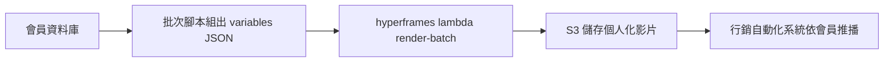

### 39.2 案例二：SaaS 產品「PR 到影片」自動化

**情境**：開發者工具 SaaS 公司希望每次重大功能上線都能快速產出說明短片，但工程團隊沒有時間手動剪輯。
**挑戰**：功能上線頻率高，若每次都靠人工剪輯，說明影片的產出速度永遠跟不上開發速度。
**方案**：導入官方 `/pr-to-video` Skill workflow，串接 CI，PR 合併到 main 且標記 `release` 標籤時，AI Agent 自動分析 PR 描述並產出變更說明短片草稿，交由 DevRel 團隊做最終審核與微調後發布。
**結果**：說明影片的產出前置時間從平均 3 天縮短到數小時內有草稿可審核。

### 39.3 案例三：金融業 Legacy 系統知識傳承

**情境**：某金融業客戶的核心交易系統採用超過十年歷史的 Java 單體架構，長年由少數幾位資深工程師維護，系統文件早已跟不上實際程式碼的演進，新進工程師僅能透過「跟資深工程師逐一請教」的方式建立系統認知。
**挑戰**：資深工程師人力有限，每次新人 Onboarding 都要投入大量一對一時間說明架構，且知識高度集中在少數人身上，形成明顯的組織風險（Bus Factor 極低）；純文字架構文件難以承載複雜模組間的資料流與呼叫關係。
**方案**：導入 AI Agent 對核心模組逐一進行逆向工程分析（依第二十四章 24.5-24.6 的方法），輸出結構化 Markdown＋Mermaid 架構圖後，再用 HyperFrames 把每個模組的架構圖轉成 10-15 分鐘的說明影片，搭配旁白解說模組職責、關鍵資料流與已知風險點，建立成一套可重複觀看的「模組說明影片庫」。
**結果**：新進工程師的架構理解 Onboarding 時間從平均三週的「跟資深工程師逐一請教」，縮短為「一週內看完六支模組說明影片＋一次集中答疑會議」，資深工程師被臨時打斷詢問的頻率也顯著下降，知識傳承不再完全依賴特定人員的時間安排。

### 39.4 案例四：跨國零售集團多品牌一致性治理

**情境**：某跨國零售集團旗下多個區域行銷團隊，各自負責在地化促銷影片的產出，早期各區域各自維護素材、模板與文案版本。
**挑戰**：半年內陸續浮現品牌視覺不一致（不同區域用了不同版本的 Logo／色票）、部分區域誤用已過期的折扣資訊模板等問題，總部行銷團隊只能在問題發生後才被動發現，缺乏事前把關機制。
**方案**：建立集中式 `brand-assets/` 資源庫統一管理品牌素材（見 18.3），所有區域團隊的模板變更需經過版本控制與 Review 流程，並在 CI 中強制執行 `hyperframes check --strict`，任何未通過驗證的模板變更都無法合併（做法詳見第三十章）。
**結果**：品牌視覺不一致與過期資訊誤用的案例大幅下降，且因為驗證與素材取用都已標準化，新的區域行銷活動從「素材確認」到「影片產出」的前置時間，從平均 5 個工作天縮短到 1 個工作天內。

### 39.5 案例五：教育科技公司個人化課程證書

**情境**：某教育科技公司過去用靜態 PDF 作為學生的課程完成證書，設計固定、無法個人化呈現學習歷程，學生在社群分享證書的意願偏低。
**挑戰**：若要為每位學生產出客製化的動態證書影片，傳統剪輯方式的人力成本會隨學生數量線性增加，完全不符合線上課程「數千甚至數萬名學生同時結業」的規模需求。
**方案**：建立一套結合 GSAP（負責姓名/課程名稱文字的逐字浮現效果）與 Lottie（負責證書邊框描邊動畫）的複合模板（做法詳見第十三章），並用 Composition Variables 宣告學生姓名、課程名稱等可覆寫欄位，後端在學生完成課程時自動呼叫 `render --variables '{"studentName":"..."}'` 批次產生個人化證書影片。
**結果**：證書從一次性靜態 PDF 轉變為可個人化的動態影片，學生在社群分享證書的意願顯著提升，証書本身也成為自然的口碑推廣管道，而整套流程完全自動化，未增加額外的人力負擔。

### 39.6 案例六：企業內訓多語系教材規模化

**情境**：跨國企業需要把同一套教育訓練內容，以 8 種語言版本發布給不同地區員工。
**挑戰**：傳統作法需要為每個語言版本個別重新剪輯，時間與人力成本隨語言數量線性增加。
**方案**：建立單一結構化模板，搭配 `npx hyperframes transcribe` 產出各語言字幕，用 Composition Variables 控制文案語系，批次渲染 8 個語言版本。
**結果**：多語系版本產出時間從「線性增加」變成「批次渲染的固定時間」，大幅降低邊際成本。

### 39.7 案例七：新創公司從 Remotion 遷移

**情境**：早期用 Remotion 建立產品介紹影片的新創團隊，隨著非工程背景的行銷同仁也需要參與影片調整，React/JSX 的學習門檻成為瓶頸。
**挑戰**：既有 Remotion 專案已有一定規模，需評估遷移成本與效益。
**方案**：使用官方 `/remotion-to-hyperframes` Skill workflow 做結構化遷移，優先遷移最常被行銷團隊調整的模板，其餘維持原狀逐步遷移。
**結果**：行銷同仁能在 AI Agent 輔助下直接調整 HTML/CSS 文案與顏色，不再每次都需要工程師介入小幅調整，工程團隊得以聚焦在更高價值的工作。

### 39.8 案例八：DevOps 團隊 CI/CD 視覺化 Demo

**情境**：平台團隊需要向其他部門展示新的 CI/CD 自動化能力，但純文字文件難以讓非技術聽眾理解。
**挑戰**：口頭簡報難以重複使用，且不同場合需要重新準備。
**方案**：用 HyperFrames 做一支標準化的 CI/CD Pipeline 動畫說明影片（見 25.4），並建立可重複渲染的模板，未來 Pipeline 有變更時只需調整資料而非重新製作。
**結果**：說明影片成為可重複使用的標準資產，新成員 Onboarding 與跨部門溝通效率提升。

### 39.9 案例九：資料視覺化團隊自動化報告影片

**情境**：數據團隊每月需要向管理層簡報關鍵指標趨勢，過去以靜態投影片呈現，缺乏動態呈現的說服力。
**挑戰**：手動製作動態圖表影片的美術與動畫技能不在數據團隊的核心能力範圍內。
**方案**：用官方 `data-chart` Catalog Block 與 `nyt-graph` 模板為基礎，建立標準化的月報影片模板，數據團隊只需更新資料 JSON 並執行渲染指令，不需要動畫製作技能。
**結果**：月報視覺呈現品質大幅提升，且完全由數據團隊自主產出，不再需要跨部門申請設計資源排隊等候。

### 39.10 案例十：客服團隊操作教學影片庫

**情境**：客服系統功能頻繁更新，操作教學文件（純文字+截圖）跟不上更新速度，新進客服人員上手時間長。
**挑戰**：每次功能更新都要重新製作教學素材，但客服團隊沒有影片製作資源。
**方案**：用 `npx hyperframes capture` 擷取系統畫面截圖，搭配標準化的「畫面+箭頭標註+步驟文字」模板，由客服主管（非工程背景）在 AI Agent 協助下快速產出操作教學短片。
**結果**：教學素材更新週期從「數週」縮短到「數小時」，新進客服人員的系統上手時間明顯縮短。

### Best Practice

- 案例研究應包含「情境」「挑戰」「量化方案」「量化結果」四個要素，缺乏量化結果的案例說服力有限
- 企業內部應建立自己的案例資料庫，取代或補充本章的示範案例，用真實內部數據佐證導入價值

### Checklist

- [ ] 已從本章十個案例中，找出與自身企業情境最接近的 2-3 個，作為內部導入提案的參考依據
- [ ] 已規劃在自身企業導入後，建立至少 1 個內部真實案例的量化成效紀錄

---

## 第四十章 與其他框架比較

### 40.1 HyperFrames vs Remotion（官方比較，詳見前言與第三十一章 31.4）

| 面向 | HyperFrames | Remotion |
|---|---|---|
| 撰寫模型 | HTML + CSS + GSAP | React（JSX） |
| 執行環境 | 瀏覽器 DOM，無框架依賴 | React Reconciliation 逐幀執行 |
| 建置步驟 | 無，`index.html` 直接播放 | 需要（webpack/bundler） |
| 函式庫時鐘動畫 | 可 seek，逐幀精準 | 依 wall-clock 播放，可能與截圖時機不同步 |
| 既有 HTML/CSS 素材 | 貼上即可用 | 需重寫為 JSX |
| 分散式渲染 | AWS Lambda 支援 | Remotion Lambda，成熟度更高 |
| HDR 輸出 | 支援 | 官方文件指出不支援 |
| 視覺編輯器 | 原生，同一份 DOM 可編輯 | 原始碼優先，需搭配建置流程 |
| 授權 | Apache 2.0（OSI 認可開源） | Source-available，非開源，超過門檻需付費 |
| 生態成熟度 | 較新，快速迭代中 | 數年生產使用經驗，社群龐大 |

**選型建議**：既有素材以 HTML/CSS 為主、團隊重視 Agent 友善度與零授權風險，傾向 HyperFrames；已深度投資 React 生態、需要成熟穩定的大規模分散式渲染方案，Remotion 的既有優勢仍值得考量。

### 40.2 HyperFrames vs Motion Canvas

Motion Canvas 是另一套以 TypeScript 程式化描述動畫的開源工具，特色是「生成器函式（Generator）驅動的程序化動畫」與內建的互動式編輯時間軸，早期定位偏向技術教學/解說類動畫（如程式概念視覺化）。

| 面向 | HyperFrames | Motion Canvas |
|---|---|---|
| 核心技術 | HTML DOM + 多種動畫 Adapter | Canvas 2D 繪圖 + TypeScript Generator |
| 適合的視覺風格 | 網頁般的排版與素材彈性 | 向量圖形、幾何動畫、演算法視覺化 |
| 學習曲線 | 熟悉 Web 技術即可上手 | 需要理解 Generator/Yield 程式模式 |
| AI Agent 友善度 | 高（訓練語料豐富、CLI 非互動設計） | 中（程式碼結構清楚但語料相對少） |
| 素材重用 | 直接沿用既有網頁素材 | 需要用程式重新繪製 |

**選型建議**：若內容以「精緻的幾何/向量動畫講解」為主（如演算法教學影片），Motion Canvas 的繪圖表達力可能更直接；若需要大量重用既有網頁/品牌視覺素材，HyperFrames 更有優勢。

### 40.3 HyperFrames vs FFCreator

FFCreator 是較早期的 Node.js 影片生成框架，透過場景/元素的 JSON 化配置驅動 FFmpeg 合成，社群活躍度近年已明顯降低。

| 面向 | HyperFrames | FFCreator |
|---|---|---|
| 撰寫模型 | HTML/CSS | 專屬 JSON/JS 場景配置 API |
| 確定性渲染 | 是（seek-driven） | 部分機制類似但缺乏「Agent 友善」的現代設計 |
| 社群活躍度 | 高（近期活躍開源專案） | 相對停滯 |
| AI Agent 整合 | 原生 Skill 系統支援 | 無官方對應機制 |

**選型建議**：FFCreator 較適合已有既存專案且穩定運作的場景；新專案考量長期維護性與 AI Agent 整合，HyperFrames 是更現代的選擇。

### 40.4 HyperFrames vs PptxGenJS + FFmpeg 手動管線

不少團隊過去採用「PptxGenJS 產生簡報 → 匯出圖片 → FFmpeg 手動拼接成影片」的克難管線應付批次影片需求。

| 面向 | HyperFrames | PptxGenJS + FFmpeg 手動管線 |
|---|---|---|
| 動畫表達力 | 完整的 Web 動畫技術棧（GSAP/Lottie/CSS等） | 極有限，通常僅有簡單轉場 |
| 開發體驗 | 統一 CLI 管理 lint/check/render 完整流程 | 需自行拼裝多個工具鏈、缺乏驗證機制 |
| 確定性 | 原生設計目標 | 需自行確保每個環節可重現 |
| 維護成本 | 中（依賴官方套件生態） | 高（自建管線通常缺乏文件與測試） |

**選型建議**：這類手動管線多半是歷史包袱而非刻意選型，建議評估遷移到 HyperFrames 或其他成熟框架，降低長期維護風險。

### 40.5 HyperFrames vs Reveal.js Export

Reveal.js 是知名的網頁簡報框架，部分團隊會用其匯出功能（搭配 decktape 等工具）把簡報轉成影片或 PDF。

| 面向 | HyperFrames | Reveal.js Export |
|---|---|---|
| 設計目的 | 通用影片渲染框架 | 簡報展示框架，影片匯出為附加功能 |
| 動畫精細度 | 逐幀確定性渲染，動畫表達力完整 | 受限於簡報切換邏輯，動畫較簡化 |
| 適用場景 | 廣泛（行銷/教育/技術說明/資料視覺化） | 偏向「簡報型」內容匯出需求 |

**選型建議**：若核心需求本來就是「製作簡報並附帶匯出影片功能」，Reveal.js 仍是合理選擇；若目標是「以影片為第一產出物」，HyperFrames 的設計目的更貼合。

### 40.6 HyperFrames vs Playwright / Puppeteer Screenshot 方案

不少團隊會直接用 Playwright 或 Puppeteer 寫腳本截圖再手動組合成影片，這與 HyperFrames 底層技術有重疊（HyperFrames 本身就是基於 Puppeteer），但抽象層級完全不同。

| 面向 | HyperFrames | 自寫 Playwright/Puppeteer 截圖腳本 |
|---|---|---|
| 抽象層級 | 高階框架，內建時間軸/動畫 Adapter/驗證/CLI | 低階工具，需自行實作所有渲染邏輯 |
| 開發成本 | 低（開箱即用） | 高（需自行處理 seek 邏輯、時間軸、編碼） |
| 適合場景 | 影片內容產出為主要目標 | 視覺回歸測試截圖、非影片產出的自動化任務 |

**選型建議**：若目的是「產出影片」，直接用 HyperFrames 而非重新造輪子；若目的是「視覺回歸測試截圖比對」（不需要動畫、不需要編碼成影片），純 Playwright/Puppeteer 腳本反而更輕量合適，屬於不同問題領域的工具。

### Checklist

- [ ] 已依「既有素材類型」「團隊技術棧」「AI Agent 整合需求」三個維度，完成 HyperFrames 與至少一個替代方案的比較評估
- [ ] 若目前使用手動拼裝管線（如 PptxGenJS+FFmpeg），已評估遷移到成熟框架的優先順序

---

## 第四十一章 優缺點分析與未來 Roadmap

### 41.1 優點總結

1. **零建置步驟、高度可攜性**：既有 HTML/CSS 素材幾乎可以直接沿用，大幅降低導入門檻
2. **確定性渲染**：適合放入 CI 迴歸測試與批次自動化管線，這是相較傳統螢幕錄影方案最核心的差異化優勢
3. **開源且授權友善**：Apache 2.0，無論商用規模大小皆無需額外授權費用
4. **AI Agent 原生設計**：CLI 非互動、`--json` 全面支援、Skill 系統封裝專業知識，是目前市面上對 AI Coding Agent 最友善的影片框架之一
5. **多元動畫技術棧支援**：CSS／GSAP／Lottie／Three.js／Anime.js／WAAPI／TypeGPU-WebGPU／SVG，能對應不同技能背景的團隊成員
6. **完整的驗證工具鏈**：`lint`／`check` 提供結構與視覺層級的自動化品質把關，減少人工肉眼檢查負擔
7. **雲端渲染選項多元**：HeyGen Hosted／AWS Lambda／GCP Cloud Run，可依企業既有雲端策略選擇

### 41.2 缺點與限制總結

1. **專案仍處於 0.x 快速迭代階段**：API／CLI Flag／Skill 數量可能隨版本演進而變動，需要團隊投入版本管理心力（見第三十一章）
2. **生態成熟度低於 Remotion**：社群範例、第三方套件、Stack Overflow 類問答資源相對較少
3. **官方文件對部分進階 Adapter（Three.js、TypeGPU/WebGPU）著墨有限**：需要團隊自行累積實務經驗
4. **官方安全指引不足**：SECURITY.md 僅涵蓋漏洞回報流程，操作面（沙箱化、不受信任輸入處理）需企業自行補強（見第三十四章）
5. **對非前端背景團隊仍有學習曲線**：雖然比 React 方案門檻低，但完全不具備 HTML/CSS/JS 基礎的使用者仍需要一定的學習投入
6. **重度互動剪輯體驗有限**：Studio 提供基礎預覽/編輯能力，但不是設計給專業剪輯師做精細時間軸微調的工具
7. **雲端渲染仍屬新興功能**：官方文件明確標註 Lambda v1 尚無 Webhook、多區域容錯、HDR 支援，成熟度不及部分競品的雲端方案

### 41.3 SWOT 簡要分析

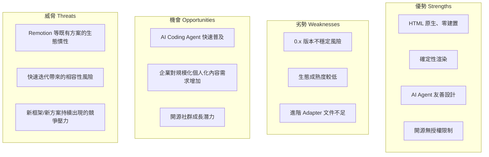

### 41.4 未來 Roadmap 推論（依官方已知限制與產業趨勢推論，非官方公開路線圖）

> **⚠️ 版本快照提醒：** 本節為撰寫團隊依據官方文件中提及的「已知限制」與影片框架產業發展趨勢所做的**合理推論**，並非官方公開的正式路線圖承諾，實際發展方向請持續關注官方 GitHub Release Note。

- **雲端渲染成熟化**：AWS Lambda 部署目前為 v1，官方已明確列出「webhook、多區域容錯、HDR 支援」為已知缺口，合理預期會是後續版本的優先補強方向
- **1.0 穩定版本里程碑**：隨著採用度提升，專案可能朝向 API/CLI 介面穩定化的 1.0 版本邁進，屆時 Breaking Change 頻率可望降低
- **更多動畫 Adapter 官方文件補強**：Three.js／TypeGPU-WebGPU 等進階場景的官方指南可能會隨社群回饋逐步完善
- **Skill 生態持續擴充**：隨著更多 AI Coding Agent 工具興起，Skill 系統可能擴展支援更多工具與更細緻的 workflow 分類
- **企業級功能需求**：隨著更多企業導入，權限管理、素材版權審核、多租戶隔離等企業治理功能的需求可能推動對應功能演進

### Checklist

- [ ] 已完成優缺點評估，並對照自身企業的風險承受度（尤其 0.x 版本的穩定性風險）做出導入決策
- [ ] 已建立追蹤官方 Release Note 的機制，掌握 Roadmap 實際進展而非僅依賴本章推論內容

---

## 第四十二章 附錄

### 42.1 名詞解釋（Glossary）

| 名詞 | 說明 |
|---|---|
| Composition | 描述一支影片內容與時間軸的 HTML 檔案 |
| Clip | 標記 `class="clip"` 且參與時間軸排程的元素 |
| Frame Adapter | 讓特定動畫函式庫（GSAP/Lottie/Three.js等）能被逐幀 seek 控制的介面實作 |
| Deterministic Rendering | 確定性渲染，指同樣輸入永遠產出逐幀相同結果的渲染機制 |
| Seek | 把動畫/媒體狀態定位到指定時間點的動作，而非即時播放 |
| Track Index | 決定元素圖層疊放順序與音訊混音分軌的軌道編號 |
| Skill | 封裝給 AI Coding Agent 使用的專業知識文件（`SKILL.md`） |
| Router Skill | `/hyperframes`，Skill 系統的強制入口，負責路由到對應 workflow |
| Workflow Skill | 對應特定影片產出情境的 Skill（如 `/product-launch-video`） |
| Domain Skill | 提供特定技術領域知識的 Skill（如 `/hyperframes-animation`） |
| Composition Variables | 可在渲染時被外部覆寫的參數化變數宣告 |
| CDP | Chrome DevTools Protocol，渲染引擎與 Headless Chrome 溝通的底層協定 |
| Frame.md | HyperFrames 的設計系統翻譯層概念，把網頁設計規範反轉給影片情境使用 |
| Block | Registry 中可直接安裝的獨立可用子 Composition（如 `data-chart`） |
| Studio | HyperFrames 內建的瀏覽器內即時預覽與基礎編輯 UI（`packages/studio`），2026 年 7 月官方重建為統一時間軸的 NLE 風格編輯器（見第十八章 18.1） |
| Registry／Catalog | 官方提供的可安裝元件庫，透過 `hyperframes add`／`catalog` 指令瀏覽與安裝現成的 Block（見第十九章 19.3） |
| Snapshot | 用 `hyperframes snapshot` 指令擷取時間軸上特定時間點的關鍵幀 PNG 截圖，是排查渲染問題的主要除錯手段（見第十章 10.3） |
| `doctor`／`lint`／`check` | 三層驗證概念：`doctor` 檢查本機環境依賴是否齊全，`lint` 做純結構層級的靜態驗證，`check` 進一步啟動瀏覽器做版面/動作/對比度的綜合驗證（見第三章） |
| AGENTS.md | 專案根目錄用來記錄 HyperFrames 專案慣例與規範的文件，供 Claude Code、Copilot 等各類 AI Agent 讀取參考（見第二十一章） |
| TypeGPU/WebGPU | 官方第七個 Frame Adapter，讓 GPU 驅動的粒子/著色器等即時運算圖形效果也能被逐幀 seek（見第六章 6.7） |
| Hostile Codec（不友善編碼） | 官方對 HEVC、含 Alpha 通道等瀏覽器原生解碼支援不佳的媒體編碼的統稱，框架會嘗試自動代理轉碼供 Preview 使用（見第三十二章第 9 題） |
| Space | `hyperframes publish --space` 產生的團隊共享固定網址空間，取代逐次發布產生一次性短網址的舊行為（見第十章 10.2） |

### 42.2 整合總覽表

| AI 工具 | 官方 Skill 支援 | 安裝方式 |
|---|---|---|
| Claude Code | 是 | `npx skills add heygen-com/hyperframes --full-depth` |
| Cursor | 是 | `npx hyperframes skills --cursor` |
| Gemini CLI | 是 | `npx hyperframes skills --gemini` |
| Codex | 是 | `npx hyperframes skills --codex` |
| GitHub Copilot | 否（需自建 `AGENTS.md`） | 手動維護指引文件 |
| OpenHands／OpenCode | 否（通用終端機工具方式可用） | 手動維護指引文件 |

### 42.3 CLI 速查表（完整版見第十章）

```bash
npx hyperframes init <name> --example <template>     # 建立新專案
npx hyperframes preview                                # 即時預覽
npx hyperframes lint --strict                          # 結構驗證
npx hyperframes check --strict --snapshots             # 瀏覽器綜合驗證
npx hyperframes snapshot --at 3.0,10.5                 # 擷取指定時間點關鍵幀截圖
npx hyperframes benchmark                              # 找出最佳渲染參數組合
npx hyperframes render --output out.mp4 --quality high # 渲染
npx hyperframes doctor --json                          # 環境健檢
npx hyperframes upgrade --check                        # 檢查更新
npx hyperframes add <block-name>                       # 安裝 Registry Block
npx hyperframes capture <url>                          # 擷取既有網站設計 Token/素材
npx hyperframes transcribe <file> --to srt             # 語音轉字幕
npx hyperframes tts "<text>" --voice <voice>            # 文字轉語音
npx hyperframes remove-background <file> -o out.webm    # 影片/圖片去背
npx hyperframes auth login --api-key                   # 登入 HeyGen API
npx hyperframes docs gsap                              # 查詢終端機內建文件
npx hyperframes publish --space                        # 發布到團隊共享固定網址
npx hyperframes cloud render . --quality high           # 雲端渲染
npx hyperframes lambda render ./project --wait          # AWS Lambda 渲染
```

### 42.4 API 速查表（完整版見第十七章）

```typescript
import {
  // 解析與 HTML 生成（見 17.3）
  parseHtml, validateCompositionHtml, updateElementInHtml,
  addElementToHtml, removeElementFromHtml, generateHyperframesHtml,
  // Lint（見 17.5）
  lintHyperframeHtml, lintMediaUrls,
  // GSAP 工具函式（見 17.4）
  createGSAPFrameAdapter, serializeGsapAnimations, keyframesToGsapAnimations,
  // Compiler，Node.js 專用（見 17.6）
  compileHtml, compileTimingAttrs,
} from '@hyperframes/core';
```

### 42.5 環境變數速查（彙整自全書各章，完整版見第十章 10.7）

| 變數 | 用途 | 常見出現章節 |
|---|---|---|
| `HEYGEN_API_KEY` / `HYPERFRAMES_API_KEY` | HeyGen API 金鑰 | 第十章、第三十四章 |
| `HEYGEN_API_URL` | API 基礎網址（預設 `https://api.heygen.com`） | 第十章 |
| `HEYGEN_CONFIG_DIR` | 憑證存放目錄（預設 `~/.heygen`） | 第十章、第三十四章 |
| `HYPERFRAMES_NO_UPDATE_CHECK` | 停用更新提示 | 第十一章、第二十六章 |
| `HYPERFRAMES_NO_TELEMETRY` | 停用所有遙測 | 第十一章、第二十六～二十九章 |
| `HYPERFRAMES_CUDA` | 啟用 CUDA 加速去背功能 | 第三十二章 |
| `HYPERFRAMES_EXTRACT_CACHE_DIR` | 影格快取目錄 | 第二章、第十章 |
| `PRODUCER_LOW_MEMORY_MODE` | 強制低記憶體渲染模式 | 第十章、第三十二～三十三章 |
| `PRODUCER_PAGE_NAVIGATION_TIMEOUT_MS` | Puppeteer 頁面導航逾時（毫秒） | 第十章 |
| `PRODUCER_PUPPETEER_PROTOCOL_TIMEOUT_MS` | CDP 通訊逾時（毫秒） | 第十章 |
| `HYPERFRAMES_TRANSCRIBE_TIMEOUT_MS` | Whisper 轉錄逾時 | 第十章 |
| `HYPERFRAMES_OPENROUTER_MODEL` | `capture` 指令的 OpenRouter 模型覆寫 | 第十章 |
| `GEMINI_API_KEY` | `capture` 指令視覺增強用的 Gemini API 金鑰 | 第十章、第二十二章 |
| `OPENROUTER_API_KEY` | OpenRouter API 金鑰（優先於 Gemini） | 第十章 |

### 42.6 Mermaid 速查（本書使用過的圖型範例）

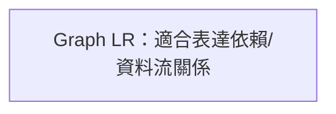

```mermaid
flowchart TD
  A[Flowchart：適合表達決策分支/路由邏輯] --> B{條件判斷}
```

```mermaid
sequenceDiagram
  participant A as 參與者A
  participant B as 參與者B
  A->>B: Sequence Diagram：適合表達時間序列互動
```

```mermaid
timeline
  title Timeline：適合表達演進脈絡
  階段一 : 事件A
  階段二 : 事件B
```

### 42.7 Prompt 速查（完整 50 則見第三十八章）

- 產品發布：「幫我做一支 X 秒的 [平台] 影片，品牌色 [色票]，語氣 [風格]，先出 draft 給我看。」
- 教育訓練：「把這份 [文件] 轉成一支 X 分鐘的教學影片，分成 [段落結構]。」
- 架構說明：「分析 [系統/程式碼]，做一支 X 分鐘的架構說明影片給 [受眾] 看。」
- CI/CD 整合：「幫我寫一個 [CI 平台] workflow，自動驗證並渲染 [專案路徑]。」

### 42.8 Migration Checklist（從其他方案遷移時使用）

- [ ] 已完成第四十章框架比較評估，確認遷移動機明確
- [ ] 已用 `/remotion-to-hyperframes`（如適用）或手動方式盤點所有既有場景/動畫邏輯
- [ ] 已建立遷移前後的視覺比對基準，逐一驗證遷移結果
- [ ] 已為受影響的 CI/CD Pipeline 更新對應指令
- [ ] 已通知所有相關團隊（行銷/設計/工程）遷移時程與影響範圍

### 42.9 Deployment Checklist（部署上線時使用）

- [ ] 已選定部署模式（本機 Docker／K8s Job-CronJob／Podman／雲端渲染）並完成第二十六至二十九章對應設定
- [ ] CI/CD Pipeline 已包含完整的 `doctor→lint→check→render` 驗證鏈路
- [ ] 已設定合理的資源限制（CPU/Memory/併發數）避免資源失控
- [ ] 已建立產出物的持久化儲存與 CDN 發布機制
- [ ] 已建立基礎監控（渲染成功率／耗時／成本，見第三十五章）

### 42.10 Security Checklist（資安上線前使用）

- [ ] 所有憑證已透過 Secret 管理機制注入，無任何硬編碼
- [ ] 若接受不受信任來源輸入，已建立隔離渲染環境與內容審核機制
- [ ] 雲端渲染 IAM 權限已收斂為最小必要範圍
- [ ] 已建立 API 金鑰定期輪替機制
- [ ] 已閱讀官方 SECURITY.md 漏洞回報流程並讓相關人員知悉

### 42.11 Production Checklist（正式上線最終確認）

- [ ] 已完成至少一次完整的端到端測試（從 Composition 撰寫到最終發布）
- [ ] 已鎖定 CLI 版本並記錄於專案文件
- [ ] 已建立內部 Troubleshooting Runbook（可直接引用第三十二章）
- [ ] 已指派 HyperFrames 守門人角色並完成基礎教育訓練
- [ ] 已建立監控與告警機制，能在渲染異常時即時通知負責團隊

### 42.12 延伸閱讀建議

- 官方文件站：`hyperframes.heygen.com`（持續更新，建議定期查閱 Release Note）
- 官方 GitHub：`github.com/heygen-com/hyperframes`（Issues／Discussions 可觀察社群常見問題與功能討論）
- 社群 Playground：`hyperframes.dev`
- 同目錄相關手冊：《Claude Code生態圈教學手冊.md》《claude agent skills教學手冊.md》《github copilot生態圈教學手冊.md》《Playwright 教學手冊.md》《Kubernetes教學手冊.md》《Podman使用教學.md》《Jenkins CI_CD 教學手冊.md》可交叉參照相關技術背景知識

### 42.13 全書總 Checklist

- [ ] 已完成第九章環境安裝並通過 `doctor --json` 健檢
- [ ] 已理解「撰寫層／CLI層／核心層／引擎層」的架構分工（第二章）
- [ ] 已掌握「先 lint、再 check、最後 render」的標準開發迴圈（第三章）
- [ ] 已為專案選定主要動畫技術棧並理解其優缺點（第六章）
- [ ] 已安裝並熟悉至少一款 AI Coding Agent 的 Skill 整合（第七、八、二十至二十三章）
- [ ] 已建立 CI/CD 自動化渲染管線（第二十六章）
- [ ] 已依企業規模選定合適的部署模式（第二十七至二十九章）
- [ ] 已建立品牌素材庫與模板治理機制（第三十章）
- [ ] 已建立版本升級與維護排程（第三十一章）
- [ ] 已將 Troubleshooting 50 題整理進內部 Runbook（第三十二章）
- [ ] 已完成效能調校基準測試（第三十三章）
- [ ] 已完成資安檢核（第三十四章，含 42.10 Checklist）
- [ ] 已建立監控儀表板（第三十五章）
- [ ] 已建立團隊 Prompt 範本庫（第三十八章）
- [ ] 已完成與其他框架的比較評估，確認選型合理性（第四十章）

---

> **查證時間點免責聲明**：本手冊內容查證與撰寫完成於 **2026-07-21**，HyperFrames 為快速迭代中的開源專案（撰寫時仍為 0.x 版本），CLI 指令、Flag、Skill 數量與內容、套件結構等技術細節皆可能隨版本更新而改變。本手冊中標註「官方」的內容係依撰寫當下查證的官方文件與 Repository 內容整理；標註「實務建議」「踩雷經驗」「企業導入提醒」「實務延伸」的內容，為撰寫團隊依產業一般實務與架構原理所做的顧問級補充，並非官方保證或承諾。使用本手冊進行實際專案導入前，務必以 `npx hyperframes --help`、`npx hyperframes doctor`、官方文件站 `hyperframes.heygen.com` 與 GitHub Repository 的最新內容為準。

