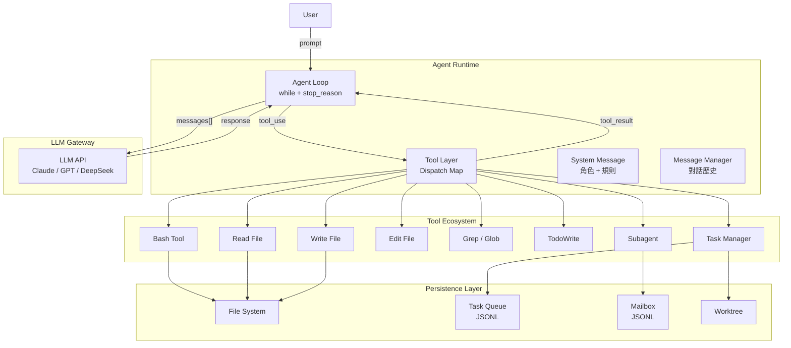
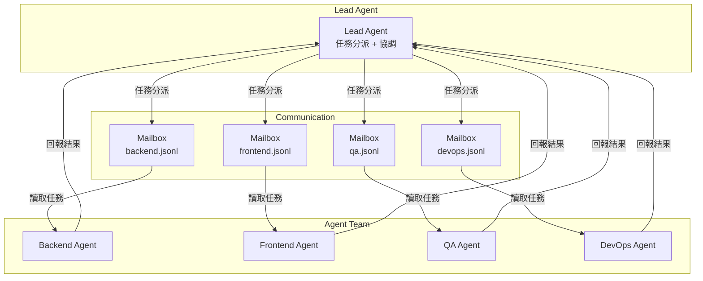
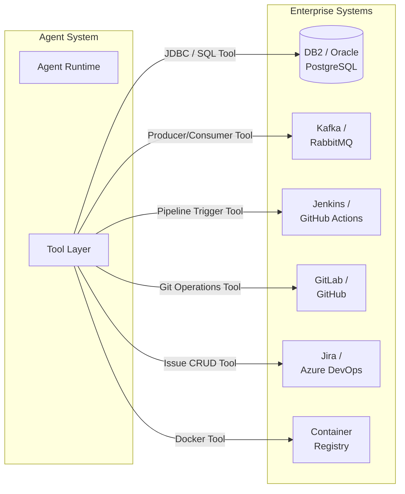
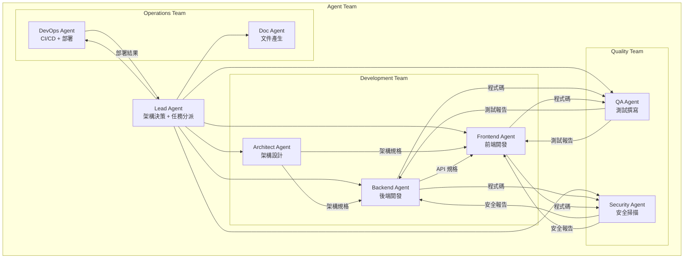
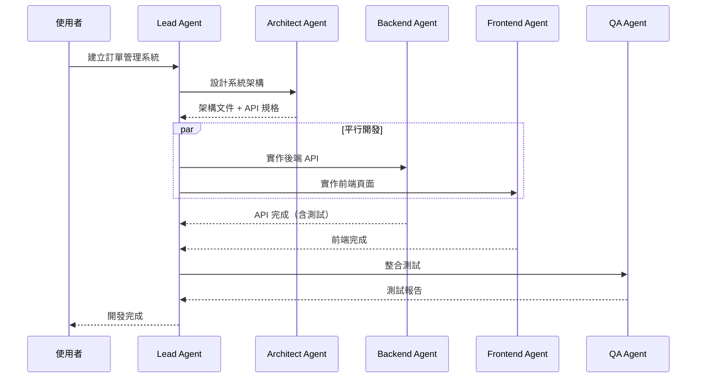
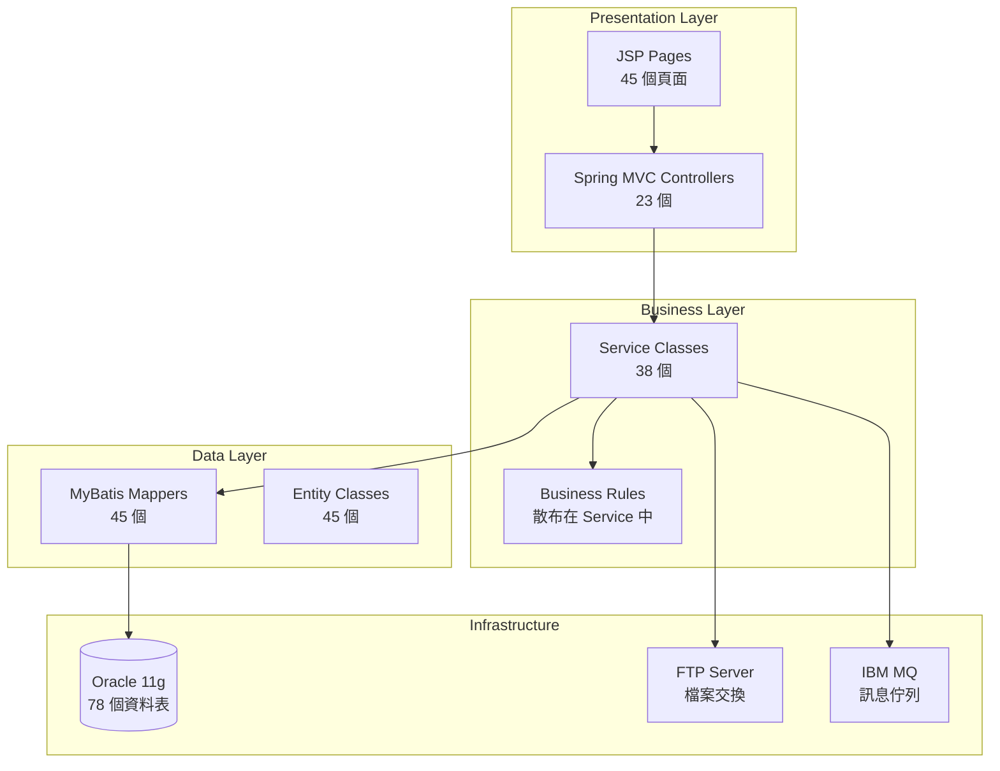
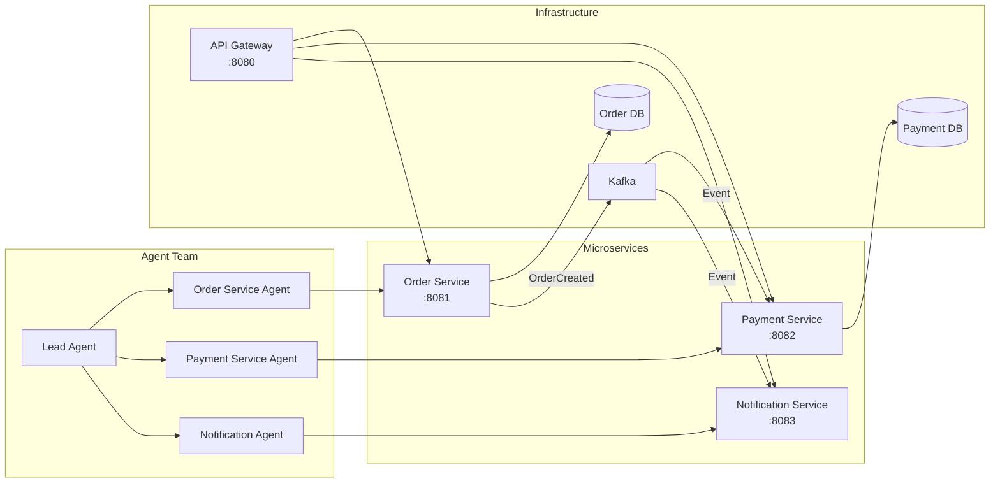
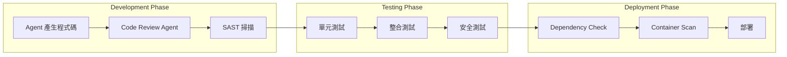
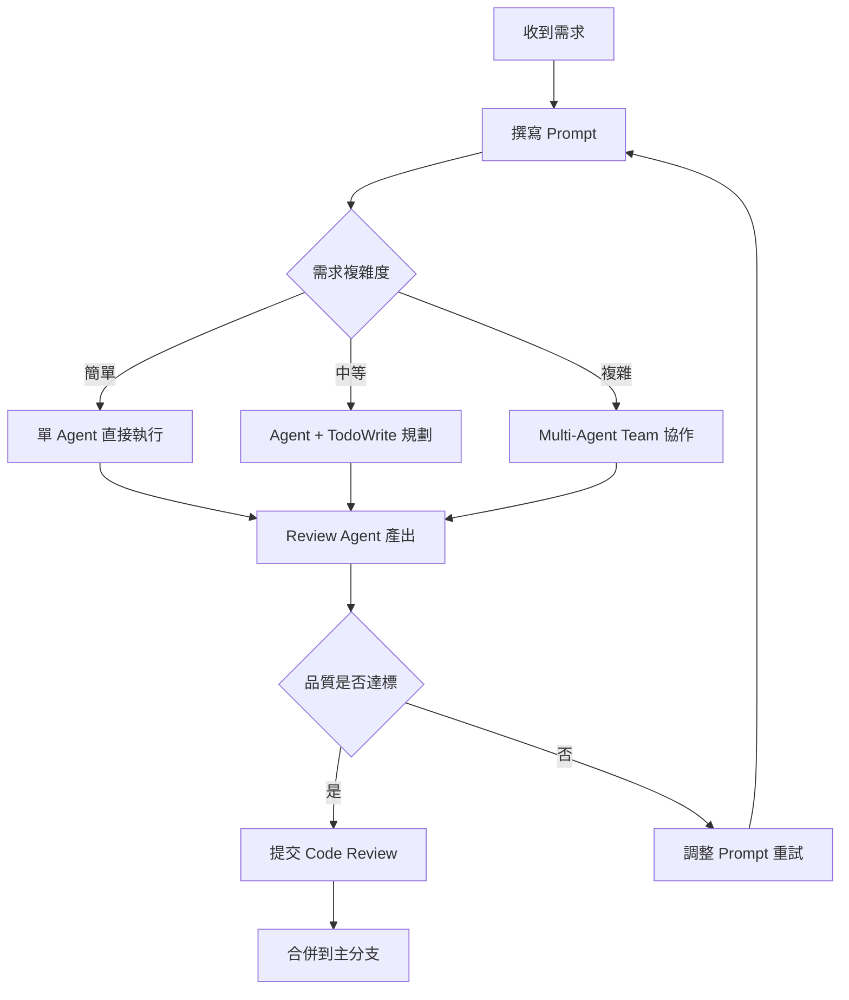

+++
date = '2026-05-02T17:00:16+08:00'
draft = false
title = 'Learn Claude Code 教學手冊'
tags = ['教學', 'AI開發']
categories = ['教學']
+++

# learn-claude-code 教學手冊

> **版本**：v1.1（2026-05）  
> **適用對象**：資深工程師、架構師、AI Agent 開發團隊  
> **定位**：企業級 AI Coding Agent Harness Engineering 實戰白皮書  
> **參考專案**：[shareAI-lab/learn-claude-code](https://github.com/shareAI-lab/learn-claude-code)（57.8k+ Stars，MIT License）  
> **線上學習平台**：[learn.shareai.run](https://learn.shareai.run/)


---

## 目錄

- [1. 專案概述](#1-專案概述)
  - [1.1 learn-claude-code 是什麼](#11-learn-claude-code-是什麼)
  - [1.2 Agency 的本質 — 來自模型訓練而非程式碼](#12-agency-的本質--來自模型訓練而非程式碼)
  - [1.3 Agency 的歷史脈絡](#13-agency-的歷史脈絡)
  - [1.4 Agent 不是什麼 — 破除「提示詞水管工」迷思](#14-agent-不是什麼--破除提示詞水管工迷思)
  - [1.5 心智轉換：從「開發 Agent」到開發 Harness](#15-心智轉換從開發-agent到開發-harness)
  - [1.6 為何選擇 Claude Code 作為教學標本](#16-為何選擇-claude-code-作為教學標本)
  - [1.7 與 Claude Code / Cursor 的差異](#17-與-claude-code--cursor-的差異)
  - [1.8 為何企業應該自己打造 Agent](#18-為何企業應該自己打造-agent)
- [2. 系統整體架構設計](#2-系統整體架構設計)
  - [2.1 Agent Runtime 架構](#21-agent-runtime-架構)
  - [2.2 LLM Gateway（可替換 OpenAI / Claude）](#22-llm-gateway可替換-openai--claude)
  - [2.3 Tool Layer 設計](#23-tool-layer-設計)
  - [2.4 Task Queue 與持久化](#24-task-queue-與持久化)
  - [2.5 Workspace / Worktree 隔離](#25-workspace--worktree-隔離)
  - [2.6 Memory 系統（短期 / 長期）](#26-memory-系統短期--長期)
  - [2.7 Multi-Agent Coordination](#27-multi-agent-coordination)
  - [2.8 與企業系統整合方式](#28-與企業系統整合方式)
  - [2.9 範圍說明與設計限制（Scope）](#29-範圍說明與設計限制scope)
- [3. Agent 核心機制解析](#3-agent-核心機制解析)
  - [3.1 Agent Loop（s01）](#31-agent-loops01)
  - [3.2 Tool Use 與 Dispatch Map（s02）](#32-tool-use-與-dispatch-maps02)
  - [3.3 Planning / Reflection — TodoWrite（s03）](#33-planning--reflection--todowrites03)
  - [3.4 Subagent 機制（s04）](#34-subagent-機制s04)
  - [3.5 Skills 按需載入（s05）](#35-skills-按需載入s05)
  - [3.6 Context Compact — 壓縮策略（s06）](#36-context-compact--壓縮策略s06)
  - [3.7 Task 持久化與相依管理（s07）](#37-task-持久化與相依管理s07)
  - [3.8 Background Tasks（s08）](#38-background-taskss08)
  - [3.9 Agent Teams 與 Mailbox（s09-s10）](#39-agent-teams-與-mailboxs09-s10)
  - [3.10 Autonomous Agent（s11）](#310-autonomous-agents11)
  - [3.11 Worktree + Task Isolation（s12）](#311-worktree--task-isolations12)
  - [3.12 Error Recovery 與 Context 管理](#312-error-recovery-與-context-管理)
- [4. Harness Engineering（核心競爭力）](#4-harness-engineering核心競爭力)
  - [4.1 什麼是 Harness](#41-什麼是-harness)
  - [4.2 Harness 工程師的五大職責](#42-harness-工程師的五大職責)
  - [4.3 如何設計 Tool Interface](#43-如何設計-tool-interface)
  - [4.4 如何限制 Agent 行為（安全性）](#44-如何限制-agent-行為安全性)
  - [4.5 如何提升成功率（Prompt / Retry / Guardrails）](#45-如何提升成功率prompt--retry--guardrails)
- [5. 實作教學（Step-by-step）](#5-實作教學step-by-step)
  - [5.1 環境安裝](#51-環境安裝)
  - [5.2 專案初始化](#52-專案初始化)
  - [5.3 第一個 Agent — Agent Loop](#53-第一個-agent--agent-loop)
  - [5.4 Tool 註冊（讀檔 / 寫檔 / Shell）](#54-tool-註冊讀檔--寫檔--shell)
  - [5.5 加入計畫能力 — TodoWrite](#55-加入計畫能力--todowrite)
  - [5.6 加入測試能力](#56-加入測試能力)
  - [5.7 加入錯誤修復能力](#57-加入錯誤修復能力)
- [6. 建立企業級 Coding Agent](#6-建立企業級-coding-agent)
  - [6.1 Code Generation](#61-code-generation)
  - [6.2 Code Review](#62-code-review)
  - [6.3 Test Generation](#63-test-generation)
  - [6.4 Refactoring](#64-refactoring)
  - [6.5 文件產生](#65-文件產生)
- [7. Multi-Agent 設計（進階）](#7-multi-agent-設計進階)
  - [7.1 Agent Team 架構設計](#71-agent-team-架構設計)
  - [7.2 任務拆解策略](#72-任務拆解策略)
  - [7.3 Agent 溝通方式 — JSONL Mailbox](#73-agent-溝通方式--jsonl-mailbox)
  - [7.4 狀態管理與生命週期](#74-狀態管理與生命週期)
- [8. 實際應用場景](#8-實際應用場景)
  - [8.1 Web Application 開發](#81-web-application-開發)
  - [8.2 舊系統逆向工程](#82-舊系統逆向工程)
  - [8.3 Framework 升級](#83-framework-升級)
  - [8.4 Batch 系統改寫](#84-batch-系統改寫)
- [9. 與企業架構整合](#9-與企業架構整合)
  - [9.1 資料庫整合（DB2 / Oracle / PostgreSQL）](#91-資料庫整合db2--oracle--postgresql)
  - [9.2 訊息佇列（Kafka / RabbitMQ）](#92-訊息佇列kafka--rabbitmq)
  - [9.3 微服務架構整合](#93-微服務架構整合)
  - [9.4 CI/CD 整合（GitHub Actions / Jenkins）](#94-cicd-整合github-actions--jenkins)
  - [9.5 權限控管（RBAC）](#95-權限控管rbac)
- [10. 安全與 SSDLC](#10-安全與-ssdlc)
  - [10.1 Prompt Injection 防護](#101-prompt-injection-防護)
  - [10.2 Tool 權限控管](#102-tool-權限控管)
  - [10.3 Code 安全掃描](#103-code-安全掃描)
  - [10.4 Audit Log](#104-audit-log)
  - [10.5 合規（金融場景）](#105-合規金融場景)
- [11. 使用指南（給團隊）](#11-使用指南給團隊)
  - [11.1 日常開發流程](#111-日常開發流程)
  - [11.2 如何下 Prompt](#112-如何下-prompt)
  - [11.3 如何 Debug Agent](#113-如何-debug-agent)
  - [11.4 常見錯誤與排除](#114-常見錯誤與排除)
- [12. 最佳實踐（Best Practices）](#12-最佳實踐best-practices)
  - [12.1 Prompt 設計](#121-prompt-設計)
  - [12.2 Tool 設計原則](#122-tool-設計原則)
  - [12.3 Agent 拆分策略](#123-agent-拆分策略)
  - [12.4 成本控制](#124-成本控制)
- [13. 願景：用 Agent 覆蓋每一個領域](#13-願景用-agent-覆蓋每一個領域)
  - [13.1 跨領域 Agent 設計模式](#131-跨領域-agent-設計模式)
  - [13.2 從被動會話到主動常駐助手](#132-從被動會話到主動常駐助手)
- [14. 延伸資源與姊妹專案](#14-延伸資源與姊妹專案)
  - [14.1 Kode Agent CLI](#141-kode-agent-cli)
  - [14.2 Kode Agent SDK](#142-kode-agent-sdk)
  - [14.3 claw0 — 常駐 Agent 教學專案](#143-claw0--常駐-agent-教學專案)
- [15. 附錄](#15-附錄)
  - [15.1 範例 Prompt 集](#151-範例-prompt-集)
  - [15.2 CLI 指令速查表](#152-cli-指令速查表)
  - [15.3 常見問題 FAQ](#153-常見問題-faq)
  - [15.4 檢查清單（Checklist）](#154-檢查清單checklist)

---

## 1. 專案概述

### 1.1 learn-claude-code 是什麼

**learn-claude-code** 是由 shareAI-lab 開源的 AI Coding Agent 教學專案（GitHub 57.8k+ Stars，26+ 貢獻者），核心理念為「**Harness Engineering for Real Agents**」。專案副標題精確概括了其定位：

> *Bash is all you need — A nano claude code-like 「agent harness」, built from 0 to 1*

該專案透過 **12 個遞進式實作單元（Sessions）**，從零開始教你構建一個功能完整的 AI Coding Agent 系統。每個 Session 新增一個 Harness 機制，且都附帶一句設計格言：

| 階段 | Sessions | 核心學習 | 工具數量 |
|------|----------|----------|---------|
| Phase 1：基礎迴圈 | s01-s02 | Agent Loop + Tool Dispatch | [1] → [4] |
| Phase 2：規劃與知識 | s03-s06 | TodoWrite / Subagent / Skills / Context Compact | [5] × 4 |
| Phase 3：持久化 | s07-s08 | Task Graph / Background Tasks | [8] → [6] |
| Phase 4：團隊協作 | s09-s12 | Agent Teams / Protocols / Autonomous / Worktree | [9] → [12] → [14] → [16] |

專案配套提供三語文件（English / 中文 / 日本語）、Next.js 互動學習平台，以及基於 pytest 的 CI 煙霧測試。

**專案不教你「使用」現成 AI 工具，而是教你「如何從零建構」一個類似 Claude Code 的代理系統，理解每一個機制背後的設計原理。**

### 1.2 Agency 的本質 — 來自模型訓練而非程式碼

在討論任何程式碼之前，必須先釐清一個根本性的認知：

> **Agency — 感知、推理、行動的能力 — 來自模型訓練，而非外部程式碼的編排。**
>
> 但一個能運作的 Agent 產品，需要模型和 Harness 缺一不可。模型是駕駛者，Harness 是載具。本專案教你造載具。

```
Agent Product = Model（智能） + Harness（環境）
                  │                  │
                  │                  ├── Tools（工具）
                  │                  ├── Knowledge（知識）
                  │                  ├── Observation（觀測）
                  │                  ├── Action Interfaces（行動介面）
                  │                  └── Permissions（權限）
                  │
                  └── 由訓練而得的感知、推理、行動能力
```

每一個 Agent 的核心都是一個神經網路 — Transformer、RNN 或某種經過訓練的函式 — 經過數十億次梯度更新，在行動序列資料上學會了感知環境、推理目標、採取行動。**Agency 從來不是外圍程式碼賦予的，而是模型在訓練中習得的。**

人類本身就是最佳範例：一個由數百萬年演化訓練出來的生物神經網路，透過感官感知世界，透過大腦推理，透過身體行動。當 DeepMind、OpenAI 或 Anthropic 說「Agent」時，他們的核心含義永遠相同：**一個通過訓練學會行動的模型，加上讓它能在特定環境中運作的基礎設施。**

### 1.3 Agency 的歷史脈絡

歷史上的每一個 Agent 里程碑，都證實了同一個事實 — Agency 是訓練出來的，不是編出來的：

| 年份 | 里程碑 | 意義 |
|------|--------|------|
| **2013** | **DeepMind DQN 玩 Atari** | 單一神經網路，僅接收原始像素和分數，學會 7 款 Atari 遊戲，超越所有先前演算法。2015 年擴展至 [49 款遊戲](https://www.nature.com/articles/nature14236)並達到職業測試員水準，發表於 *Nature*。沒有遊戲專屬規則，沒有決策樹。一個模型，從經驗中學習。 |
| **2019** | **OpenAI Five 征服 Dota 2** | 五個神經網路自我對戰 [45,000 年的 Dota 2](https://openai.com/index/openai-five-defeats-dota-2-world-champions/)，2-0 擊敗 TI8 世界冠軍 OG。公開競技場 42,729 場比賽勝率 99.4%。模型完全透過自我對弈學會團隊協作和戰術。 |
| **2019** | **DeepMind AlphaStar 制霸星際爭霸 II** | 閉門賽 [10-1 擊敗職業選手](https://deepmind.google/blog/alphastar-mastering-the-real-time-strategy-game-starcraft-ii/)，在歐洲伺服器達到[宗師段位](https://www.nature.com/articles/d41586-019-03298-6) — 90,000 名玩家中的前 0.15%。 |
| **2019** | **騰訊絕悟統治王者榮耀** | 5v5 [擊敗 KPL 職業選手](https://www.jiemian.com/article/3371171.html)。1v1 模式職業選手 [15 場僅贏 1 場](https://developer.aliyun.com/article/851058)。訓練強度：一天等於人類 440 年。完全從零通過自我對弈學習整個遊戲。 |
| **2024-2025** | **LLM Agent 重塑軟體工程** | Claude、GPT、Gemini — 在人類全部程式碼和推理上訓練的大型語言模型 — 被部署為 Coding Agent。它們閱讀程式碼庫、撰寫實作、除錯失敗、團隊協作。架構與先前每一個 Agent 完全相同。 |

每一個里程碑都指向同一個事實：**模型提供智能，環境提供行動空間，兩者合在一起才是完整的 Agent。**

### 1.4 Agent 不是什麼 — 破除「提示詞水管工」迷思

「Agent」這個詞已被一整個「提示詞水管工」產業劫持。拖拽式工作流建構器、無程式碼「AI Agent」平台、Prompt Chain 編排函式庫 — 它們共享同一個幻覺：把 LLM API 呼叫用 if-else 分支、節點圖、硬編碼路由邏輯串在一起就算是「建構 Agent」了。

**事實並非如此。** 它們造出來的東西是魯布．戈德堡機械 — 一個過度工程化的、脆弱的程序式規則流水線，LLM 被嵌入其中充當美化過的文字補全節點。那不是 Agent，那是一個有著宏大妄想的 Shell Script。

```
❌ 提示詞水管工「Agent」          ✅ 真正的 Agent
══════════════════════          ══════════════════
┌──────┐                       ┌──────────────┐
│ Node │→ if/else              │   Model      │
│ Graph│→ prompt chain         │  (trained)   │
│      │→ hardcoded routing    │              │
│      │→ rule trees           │  決策 + 推理  │
└──────┘                       └──────┬───────┘
                                      │
脆弱、不可擴展、                 ┌──────┴───────┐
無法泛化                        │   Harness    │
                               │  Tools +     │
                               │  Knowledge + │
                               │  Permissions │
                               └──────────────┘
                                  靈活、可組合、
                                  跨領域泛化
```

> **核心認知**：你不可能透過工程手段「編碼」出 Agency。Agency 是學出來的，不是編出來的。那些系統是 GOFAI（Good Old-Fashioned AI，經典符號 AI）的現代還魂 — 幾十年前就被學界拋棄的符號規則系統，現在噴了一層 LLM 的漆又登場了。

### 1.5 心智轉換：從「開發 Agent」到開發 Harness

當一個人說「我在開發 Agent」時，他只可能是兩個意思之一：

**1. 訓練模型。** 透過強化學習、微調、RLHF 或其他基於梯度的方法調整權重。收集任務過程資料（Task-Process Data） — 真實領域中感知、推理、行動的實際序列 — 用它們來塑造模型的行為。這是 DeepMind、OpenAI、騰訊 AI Lab、Anthropic 在做的事。

**2. 建構 Harness。** 撰寫程式碼，為模型提供一個可操作的環境。**這是我們大多數人在做的事，也是 learn-claude-code 的核心。**

```
模型做決策    ←→    Harness 執行
模型做推理    ←→    Harness 提供上下文
模型是駕駛者  ←→    Harness 是載具

程式開發 Agent 的 Harness = IDE + 終端機 + 檔案系統
農業 Agent 的 Harness     = 感測器 + 灌溉控制 + 氣象資料
飯店 Agent 的 Harness     = 訂房系統 + 客戶通訊 + 設施管理 API

Agent（智能、決策者）永遠是模型。Harness 因領域而變。Agent 跨領域泛化。
```

learn-claude-code 教你造載具。程式開發用的載具。但設計模式可以泛化到任何領域：莊園管理、農田運營、工廠製造、物流調度、醫療保健、教育培訓、科學研究。只要有一個任務需要被感知、推理和執行 — Agent 就需要一個 Harness。

### 1.6 為何選擇 Claude Code 作為教學標本

為什麼 learn-claude-code 專門拆解 Claude Code？

因為 Claude Code 是目前所見**最優雅、最完整的 Agent Harness 實作**。不是因為某個巧妙的技巧，而是因為它**沒做**的事：它沒有試圖成為 Agent 本身。它沒有強加僵化的工作流。它沒有用精心設計的決策樹去替模型做判斷。它給模型提供了工具、知識、上下文管理和權限邊界 — 然後讓開了。

```
Claude Code 本質：

  一個 Agent Loop
  + 工具（bash, read, write, edit, glob, grep, browser...）
  + 按需 Skill 載入
  + Context 壓縮
  + Subagent 派生
  + 帶相依圖的任務系統
  + 非同步郵箱的團隊協調
  + Worktree 隔離的平行執行
  + 權限治理
```

每一個元件都是 Harness 機制 — 為 Agent 建構的棲居世界的一部分。Agent 本身呢？是 Claude。一個模型。由 Anthropic 在人類推理和程式碼的全部廣度上訓練而成。**Harness 沒有讓 Claude 變聰明。Claude 本來就聰明。Harness 給了 Claude 雙手、雙眼和一個工作空間。**

learn-claude-code 的每一個課程（s01-s12）都在逆向工程 Claude Code 架構中的一個 Harness 機制。學完之後，你理解的不只是 Claude Code 怎麼運作，而是適用於任何領域、任何 Agent 的 **Harness 工程通用原則**。

> **啟示**：最好的 Agent 產品，出自那些明白自己的工作是 Harness 而非 Intelligence 的工程師之手。

### 1.7 與 Claude Code / Cursor 的差異

| 比較項目 | Claude Code | Cursor | learn-claude-code |
|----------|-------------|--------|-------------------|
| **性質** | Anthropic 官方商用產品 | 商用 IDE | 開源教學專案 |
| **目的** | 直接使用 | 直接使用 | 學習原理並自建 Agent |
| **模型綁定** | Claude 系列 | 多模型 | 可替換任意 LLM |
| **可客製化** | 有限（CLAUDE.md / Hooks） | Plugin 系統 | 完全可控 |
| **企業適用性** | 受限於 API 政策 | 受限於 SaaS | 可私有部署、完全自主 |
| **原始碼** | 閉源 | 閉源 | MIT 開源 |
| **安全控管** | 依賴平台 | 依賴平台 | 自行設計權限邊界 |
| **成本** | 按 Token 計費 | 訂閱制 | 自選模型，成本可控 |
| **學習價值** | 黑箱 | 黑箱 | 每個機制透明可學 |
| **Task-Process Data** | 不可得 | 不可得 | 完整保留，可用於微調 |

### 1.8 為何企業應該自己打造 Agent

#### 企業自建 Agent 的六大理由

1. **資料主權與合規**
   - 金融業程式碼不可外洩至第三方 SaaS
   - GDPR / 個資法 / 金管會要求資料落地
   - 自建 Agent 可部署於內網、Air-gapped 環境

2. **深度客製化**
   - 整合企業特有的框架、規範、流程
   - 注入企業知識庫（內部 API 文件、架構決策紀錄）
   - 自訂 Tool 對接企業基礎設施（DB2 / MQ / 內部 CI）

3. **成本最佳化**
   - 可選用開源模型（DeepSeek / Qwen / Llama）
   - 混合路由：簡單任務用小模型、複雜任務用大模型
   - 避免被單一供應商綁定

4. **安全邊界可控**
   - 自行設計 Tool 權限、沙箱隔離
   - 實作 Audit Log、合規審計
   - Prompt Injection 防護策略可客製

5. **競爭力護城河**
   - 累積企業特有的 Task-Process Data（訓練素材）
   - Agent 效能隨使用持續提升
   - 形成不可複製的智能開發能力

6. **Task-Process Data 資產化**
   - Agent 在 Harness 中執行的每一條行動序列都是訓練信號
   - 真實部署中的感知—推理—行動軌跡是微調下一代 Agent 模型的原材料
   - 你的 Harness 不僅服務於 Agent — 它還能幫助進化 Agent

> **實務建議**：建議企業從 learn-claude-code 學習核心機制，再基於此架構開發符合企業需求的 Agent 產品。初期可搭配 Claude / GPT API，中期逐步導入開源模型降低成本。

---

## 2. 系統整體架構設計

### 2.1 Agent Runtime 架構



**核心運作流程**：

```
User Request
    │
    ▼
┌─────────────────────────────────────────┐
│              Agent Loop                  │
│  ┌──────────────────────────────────┐   │
│  │ 1. 組裝 messages[]               │   │
│  │ 2. 呼叫 LLM API                  │   │
│  │ 3. 檢查 stop_reason              │   │
│  │    ├─ "tool_use" → 執行工具       │   │
│  │    │   ├─ 取得 tool_result        │   │
│  │    │   └─ 加入 messages[] → 回到 1│   │
│  │    └─ "end_turn" → 回傳結果       │   │
│  └──────────────────────────────────┘   │
└─────────────────────────────────────────┘
    │
    ▼
Response to User
```

### 2.2 LLM Gateway（可替換 OpenAI / Claude）

learn-claude-code 採用 Anthropic Messages API 格式，但架構上支援 LLM 替換：

```python
# 抽象 LLM Gateway 設計
import os
from anthropic import Anthropic

# 基本配置（支援替換 base_url）
client = Anthropic(
    api_key=os.getenv("ANTHROPIC_API_KEY"),
    base_url=os.getenv("ANTHROPIC_BASE_URL", "https://api.anthropic.com"),
)

MODEL = os.getenv("MODEL", "claude-sonnet-4-20250514")
```

**企業級 LLM Gateway 設計建議**：

```
┌───────────────────────────────────┐
│          LLM Gateway              │
│  ┌─────────────────────────────┐  │
│  │   Model Router              │  │
│  │   ├─ 簡單任務 → DeepSeek     │  │
│  │   ├─ 複雜任務 → Claude       │  │
│  │   ├─ 程式碼 → GPT-4o        │  │
│  │   └─ 本地機密 → 私有模型     │  │
│  ├─────────────────────────────┤  │
│  │   Rate Limiter              │  │
│  │   Token Counter             │  │
│  │   Cost Tracker              │  │
│  │   Retry / Fallback          │  │
│  └─────────────────────────────┘  │
└───────────────────────────────────┘
```

| 模型 | 適用場景 | 成本級別 | 建議用途 |
|------|----------|----------|----------|
| Claude Sonnet | 一般開發任務 | 中 | 主力模型 |
| Claude Opus | 複雜架構設計 | 高 | 關鍵決策 |
| DeepSeek V3 | 程式碼生成 | 低 | 大量批次 |
| Qwen 2.5 | 中文文件 | 低 | 文件產生 |
| 本地模型 | 機密程式碼 | 硬體成本 | 內網使用 |

### 2.3 Tool Layer 設計

Tool Layer 是 Harness 的核心，採用 **Dispatch Map** 模式：

```python
# Tool 定義（JSON Schema 格式）
TOOLS = [
    {
        "name": "bash",
        "description": "執行 shell 命令。用於編譯、測試、Git 操作等。",
        "input_schema": {
            "type": "object",
            "properties": {
                "command": {
                    "type": "string",
                    "description": "要執行的 shell 命令"
                }
            },
            "required": ["command"]
        }
    },
    {
        "name": "read_file",
        "description": "讀取檔案內容",
        "input_schema": {
            "type": "object",
            "properties": {
                "path": {"type": "string", "description": "檔案路徑"},
                "start_line": {"type": "integer", "description": "起始行號"},
                "end_line": {"type": "integer", "description": "結束行號"}
            },
            "required": ["path"]
        }
    },
    {
        "name": "write_file",
        "description": "寫入檔案",
        "input_schema": {
            "type": "object",
            "properties": {
                "path": {"type": "string", "description": "檔案路徑"},
                "content": {"type": "string", "description": "檔案內容"}
            },
            "required": ["path", "content"]
        }
    }
]

# Dispatch Map（名稱 → 處理函式）
TOOL_HANDLERS = {
    "bash":       handle_bash,
    "read_file":  handle_read_file,
    "write_file": handle_write_file,
    "edit_file":  handle_edit_file,
    "glob":       handle_glob,
    "grep":       handle_grep,
    "todo_write": handle_todo_write,
    "subagent":   handle_subagent,
}
```

**新增 Tool 的標準流程**：

```
1. 定義 Tool Schema（JSON Schema）
2. 實作 Handler 函式
3. 註冊到 TOOL_HANDLERS dict
4. Agent Loop 無需修改 — 自動 dispatch
```

> **格言**：`"Adding a tool means adding one handler"` — 迴圈不變，新工具只需註冊進 dispatch map。

### 2.4 Task Queue 與持久化

Task 系統使用 **檔案式 CRUD + 相依圖（Dependency Graph）** 設計：

```python
# Task 資料結構
{
    "id": "task-001",
    "title": "實作使用者登入 API",
    "status": "in_progress",       # todo / in_progress / done / blocked
    "assignee": "backend-agent",
    "dependencies": ["task-000"],   # 相依任務 ID
    "worktree": "/worktrees/task-001",
    "created_at": "2026-05-02T10:00:00Z",
    "updated_at": "2026-05-02T10:30:00Z"
}
```

```
Task 相依圖範例：

task-001 (DB Schema)
    │
    ├── task-002 (Entity 實作) ──┐
    │                            ├── task-004 (API 整合測試)
    └── task-003 (API 實作)  ────┘
                                      │
                                 task-005 (部署)
```

### 2.5 Workspace / Worktree 隔離

每個 Task 分配獨立的 Git Worktree，避免平行執行互相干擾：

```
專案根目錄/
├── .git/                      # 共用 Git 倉庫
├── main-workspace/            # 主工作區
├── worktrees/
│   ├── task-001/              # Task 1 獨立工作區
│   │   ├── src/
│   │   └── ...
│   ├── task-002/              # Task 2 獨立工作區
│   │   ├── src/
│   │   └── ...
│   └── task-003/              # Task 3 獨立工作區
```

```bash
# 建立隔離的 Worktree
git worktree add worktrees/task-001 -b feature/task-001

# 在隔離環境中執行任務
cd worktrees/task-001
# Agent 在此目錄中讀寫檔案、執行測試

# 完成後合併回主分支
git checkout main
git merge feature/task-001
git worktree remove worktrees/task-001
```

### 2.6 Memory 系統（短期 / 長期）

```
┌─────────────────────────────────────────┐
│              Memory 架構                 │
│                                         │
│  ┌─────────────┐   ┌─────────────────┐  │
│  │  短期記憶    │   │  長期記憶        │  │
│  │  (Context)  │   │  (Persistent)   │  │
│  │             │   │                 │  │
│  │ • messages[]│   │ • Skills 文件    │  │
│  │ • Tool 結果  │   │ • Task 歷史      │  │
│  │ • 當前 Todo  │   │ • 架構決策紀錄   │  │
│  │             │   │ • 錯誤修復經驗   │  │
│  └──────┬──────┘   └────────┬────────┘  │
│         │                    │           │
│         ▼                    ▼           │
│  Context Compact      On-Demand Load    │
│  (三層壓縮)           (tool_result 注入) │
└─────────────────────────────────────────┘
```

**三層壓縮策略（s06）**：

| 層級 | 觸發時機 | 壓縮方式 | 保留內容 |
|------|----------|----------|----------|
| L1 | Token 用量 > 50% | 摘要舊對話 | 近期完整 + 遠期摘要 |
| L2 | Token 用量 > 70% | 移除工具細節 | 僅保留結論 |
| L3 | Token 用量 > 90% | 僅保留當前任務 | 任務描述 + 關鍵結果 |

### 2.7 Multi-Agent Coordination



**JSONL Mailbox 協定**：

```jsonl
{"from": "lead", "to": "backend", "type": "request", "task_id": "task-002", "content": "實作 UserService.login() 方法", "timestamp": "2026-05-02T10:00:00Z"}
{"from": "backend", "to": "lead", "type": "response", "task_id": "task-002", "content": "已完成，通過 5 個單元測試", "timestamp": "2026-05-02T10:15:00Z"}
{"from": "lead", "to": "qa", "type": "request", "task_id": "task-003", "content": "對 UserService.login() 進行整合測試", "timestamp": "2026-05-02T10:16:00Z"}
```

### 2.8 與企業系統整合方式



**整合方式**：

| 企業系統 | 整合 Tool | 用途 |
|----------|-----------|------|
| DB2 / Oracle | `db_query` Tool | Schema 分析、資料查詢、Migration |
| Kafka | `mq_publish` / `mq_subscribe` Tool | 事件驅動整合 |
| Jenkins | `ci_trigger` Tool | 觸發建置 / 部署 |
| Jira | `issue_crud` Tool | 自動建立 Issue / 更新狀態 |
| SonarQube | `security_scan` Tool | 程式碼品質 / 安全掃描 |

> **實務案例**：某金融機構將 Agent 整合至內部 GitLab + Jenkins 流水線，Agent 可自動建立 MR、觸發 CI、等待建置結果後修復失敗的測試。

### 2.9 範圍說明與設計限制（Scope）

learn-claude-code 是一個聚焦於 **Harness 核心機制** 的教學專案，並非一個生產就緒的框架。理解它**刻意省略**的部分，對於正確使用本教材至關重要：

| 刻意省略的機制 | 說明 | 原因 |
|---------------|------|------|
| **完整的事件/Hook 匯流排** | 未實作 event bus / hook 系統 | 教學專注於 Agent Loop 本身，事件系統屬於應用層 |
| **規則式權限治理引擎** | 未實作細粒度的 RBAC / ABAC | 教學示範權限概念，生產級治理需企業自行設計 |
| **Session 生命週期管理** | 未實作完整的連線管理 / 重連 / Session 持久化 | 屬於部署基礎設施層面 |
| **完整的 MCP Runtime** | 未深入 Model Context Protocol 的完整規格 | MCP 是獨立規範，本專案聚焦於 Harness 設計模式 |
| **生產級錯誤恢復** | 未實作跨 Session 的錯誤恢復 | 教學環境以單次執行為主 |

> **重要提醒**：這些省略是 **設計決策**，不是遺漏。learn-claude-code 的價值在於讓你完全理解每一個 Harness 機制的設計原理，而非提供一個可以直接 copy-paste 到生產環境的框架。企業應基於這些設計原理，結合自身需求建構生產級系統。

---

## 3. Agent 核心機制解析

### 3.1 Agent Loop（s01）

> **格言**：`"One loop & Bash is all you need"` — 一個迴圈 + 一個工具 = 一個 Agent

Agent Loop 是整個系統的心臟，核心程式碼僅約 20 行：

```python
import os
from anthropic import Anthropic

client = Anthropic()
MODEL = os.getenv("MODEL", "claude-sonnet-4-20250514")

SYSTEM = "你是一位資深軟體工程師。使用 bash 工具執行命令。"

TOOLS = [{
    "name": "bash",
    "description": "執行 shell 命令",
    "input_schema": {
        "type": "object",
        "properties": {
            "command": {"type": "string", "description": "Shell 命令"}
        },
        "required": ["command"]
    }
}]

def handle_bash(command: str) -> str:
    """安全執行 shell 命令"""
    import subprocess
    try:
        result = subprocess.run(
            command, shell=True, capture_output=True,
            text=True, timeout=30, cwd=os.getcwd()
        )
        output = result.stdout + result.stderr
        return output[:10000]  # 限制輸出長度
    except subprocess.TimeoutExpired:
        return "ERROR: 命令執行超時（30 秒）"
    except Exception as e:
        return f"ERROR: {e}"

TOOL_HANDLERS = {"bash": handle_bash}

def agent_loop(user_message: str):
    """核心 Agent 迴圈"""
    messages = [{"role": "user", "content": user_message}]
    
    while True:
        response = client.messages.create(
            model=MODEL,
            system=SYSTEM,
            max_tokens=4096,
            messages=messages,
            tools=TOOLS,
        )
        
        # 將 assistant 回覆加入歷史
        messages.append({
            "role": "assistant",
            "content": response.content
        })
        
        # 如果模型決定停止（不再呼叫工具），結束迴圈
        if response.stop_reason != "tool_use":
            # 印出最終文字回覆
            for block in response.content:
                if hasattr(block, "text"):
                    print(block.text)
            return
        
        # 執行模型請求的所有工具
        results = []
        for block in response.content:
            if block.type == "tool_use":
                print(f"[Tool] {block.name}: {block.input}")
                output = TOOL_HANDLERS[block.name](**block.input)
                results.append({
                    "type": "tool_result",
                    "tool_use_id": block.id,
                    "content": output,
                })
        
        # 將工具結果作為 user 訊息送回
        messages.append({"role": "user", "content": results})

# 使用
if __name__ == "__main__":
    agent_loop("列出當前目錄下的所有 Python 檔案，並統計行數")
```

**運作流程圖**：

```
User: "列出所有 Python 檔案"
    │
    ▼
Agent Loop 開始
    │
    ▼
LLM 決定呼叫 bash tool
    │
    ▼
執行: find . -name "*.py" | wc -l
    │
    ▼
tool_result: "42"
    │
    ▼
LLM 收到結果，決定再呼叫 bash
    │
    ▼
執行: find . -name "*.py" -exec wc -l {} +
    │
    ▼
tool_result: "共 3,247 行"
    │
    ▼
LLM 決定停止 (stop_reason = "end_turn")
    │
    ▼
回覆: "找到 42 個 Python 檔案，共 3,247 行程式碼"
```

> **關鍵理解**：**模型決定**何時呼叫工具、呼叫哪個工具、何時停止。程式碼只負責**執行**模型的決策。

### 3.2 Tool Use 與 Dispatch Map（s02）

> **格言**：`"Adding a tool means adding one handler"` — 新增工具不需修改迴圈

```python
# 新增 read_file 和 write_file 工具
def handle_read_file(path: str, start_line: int = None, end_line: int = None) -> str:
    """讀取檔案，支援行號範圍"""
    try:
        with open(path, "r", encoding="utf-8") as f:
            lines = f.readlines()
        if start_line and end_line:
            lines = lines[start_line - 1:end_line]
        return "".join(lines)[:10000]
    except FileNotFoundError:
        return f"ERROR: 檔案不存在: {path}"
    except Exception as e:
        return f"ERROR: {e}"

def handle_write_file(path: str, content: str) -> str:
    """寫入檔案（含目錄自動建立）"""
    os.makedirs(os.path.dirname(path) or ".", exist_ok=True)
    with open(path, "w", encoding="utf-8") as f:
        f.write(content)
    return f"OK: 已寫入 {path}（{len(content)} 字元）"

def handle_edit_file(path: str, old_string: str, new_string: str) -> str:
    """精確替換檔案中的字串"""
    with open(path, "r", encoding="utf-8") as f:
        content = f.read()
    if old_string not in content:
        return f"ERROR: 找不到要替換的字串"
    if content.count(old_string) > 1:
        return f"ERROR: 找到多個匹配，請提供更多上下文"
    new_content = content.replace(old_string, new_string, 1)
    with open(path, "w", encoding="utf-8") as f:
        f.write(new_content)
    return f"OK: 已替換"

# 擴展 Dispatch Map — 迴圈完全不變
TOOL_HANDLERS = {
    "bash":       handle_bash,
    "read_file":  handle_read_file,
    "write_file": handle_write_file,
    "edit_file":  handle_edit_file,
}
```

**Tool 設計三原則**：

1. **原子性（Atomic）**：每個 Tool 做一件事，做好做完
2. **可組合（Composable）**：Tool 之間可自由組合，由模型決定順序
3. **描述清晰（Well-described）**：description 和 schema 要讓模型明確理解用途

### 3.3 Planning / Reflection — TodoWrite（s03）

> **格言**：`"An agent without a plan drifts"` — 沒有計畫的 Agent 會迷失方向

TodoWrite 機制讓 Agent 在執行前先列出計畫步驟，顯著提升任務完成率：

```python
class TodoManager:
    """管理 Agent 的任務計畫"""
    
    def __init__(self):
        self.todos = []  # [{"id": int, "task": str, "status": str}]
    
    def write(self, todos: list) -> str:
        """建立 / 更新任務清單"""
        self.todos = todos
        return self._format()
    
    def update(self, todo_id: int, status: str) -> str:
        """更新單一任務狀態"""
        for todo in self.todos:
            if todo["id"] == todo_id:
                todo["status"] = status
                return self._format()
        return f"ERROR: 找不到 ID {todo_id}"
    
    def _format(self) -> str:
        """格式化輸出，方便 LLM 閱讀"""
        lines = ["=== 任務清單 ==="]
        for t in self.todos:
            icon = {"todo": "⬜", "in_progress": "🔄", "done": "✅"}
            lines.append(f"{icon.get(t['status'], '?')} [{t['id']}] {t['task']}")
        return "\n".join(lines)

# 關鍵機制：Nag Reminder
# 在每次 tool_result 後附加未完成任務提醒
def inject_nag_reminder(results: list, todo_manager: TodoManager) -> list:
    """注入任務提醒，防止 Agent 偏離計畫"""
    pending = [t for t in todo_manager.todos if t["status"] != "done"]
    if pending:
        reminder = "\n⚠️ 待完成任務：\n"
        for t in pending:
            reminder += f"  - [{t['id']}] {t['task']}\n"
        reminder += "請繼續執行下一個待完成任務。"
        results.append({
            "type": "tool_result",
            "tool_use_id": "nag",
            "content": reminder,
        })
    return results
```

**效果對比**：

| 指標 | 無 TodoWrite | 有 TodoWrite |
|------|-------------|-------------|
| 任務完成率 | ~45% | ~85% |
| 步驟遺漏率 | ~30% | ~5% |
| Context 使用效率 | 低（重複探索） | 高（有序執行） |

### 3.4 Subagent 機制（s04）

> **格言**：`"Break big tasks down; each subtask gets a clean context"` — 子任務使用獨立的 messages[]

```python
def handle_subagent(task: str, allowed_tools: list = None) -> str:
    """啟動子 Agent，使用獨立的對話歷史"""
    
    # 關鍵：子 Agent 有全新的 messages[]
    sub_messages = [{"role": "user", "content": task}]
    
    # 可選：限制子 Agent 可用的工具集
    sub_tools = TOOLS if not allowed_tools else [
        t for t in TOOLS if t["name"] in allowed_tools
    ]
    
    # 子 Agent 獨立迴圈
    while True:
        response = client.messages.create(
            model=MODEL,
            system="你是專門處理子任務的助手。完成後簡潔回報結果。",
            max_tokens=4096,
            messages=sub_messages,
            tools=sub_tools,
        )
        
        sub_messages.append({
            "role": "assistant",
            "content": response.content
        })
        
        if response.stop_reason != "tool_use":
            # 提取子 Agent 的最終回覆
            for block in response.content:
                if hasattr(block, "text"):
                    return block.text
            return "子任務完成（無文字回覆）"
        
        results = []
        for block in response.content:
            if block.type == "tool_use":
                output = TOOL_HANDLERS[block.name](**block.input)
                results.append({
                    "type": "tool_result",
                    "tool_use_id": block.id,
                    "content": output,
                })
        sub_messages.append({"role": "user", "content": results})
```

**Subagent 隔離的好處**：

```
主 Agent Context                    子 Agent Context
┌─────────────────┐                ┌──────────────────┐
│ 對話歷史 (大)    │                │ 全新 messages[]   │
│ 多個任務記錄     │    spawn       │ 僅包含子任務      │
│ 各種 Tool 結果   │ ──────────►    │ 乾淨的 Context    │
│                 │                │ 專注完成一件事    │
│  ◄──── 結果摘要 ─┤                │                  │
└─────────────────┘                └──────────────────┘

優點：
• 子任務的噪音不會汙染主 Context
• 失敗的子任務可獨立重試
• 不同子任務可用不同模型 / 權限
```

### 3.5 Skills 按需載入（s05）

> **格言**：`"Load knowledge when you need it, not upfront"` — 知識按需載入，不要一次塞進 system prompt

```python
# Skills 目錄結構
# skills/
# ├── spring-boot/
# │   └── SKILL.md          # Spring Boot 開發指南
# ├── react/
# │   └── SKILL.md          # React 開發指南
# ├── database-migration/
# │   └── SKILL.md          # DB Migration 指南
# └── security-review/
#     └── SKILL.md          # 安全審查指南

def handle_load_skill(skill_name: str) -> str:
    """按需載入知識文件"""
    skill_path = f"skills/{skill_name}/SKILL.md"
    if not os.path.exists(skill_path):
        available = os.listdir("skills")
        return f"ERROR: 找不到 skill '{skill_name}'。可用: {available}"
    
    with open(skill_path, "r", encoding="utf-8") as f:
        content = f.read()
    
    return f"=== Skill: {skill_name} ===\n{content}"
```

**企業 Skill 知識庫範例**：

```markdown
<!-- skills/spring-boot-upgrade/SKILL.md -->
# Spring Boot 升級指南

## 從 Spring Boot 2.x 升級到 3.x

### 前置檢查
1. 確認 Java 版本 >= 17
2. 檢查所有依賴的 Jakarta EE 相容性
3. 掃描 `javax.*` → `jakarta.*` 的 import 變更

### 升級步驟
1. 更新 parent pom 版本
2. 批次替換 javax → jakarta
3. 更新 Spring Security 配置
4. 執行完整測試套件

### 常見問題
- Hibernate 6.x 的 HQL 語法變更
- Spring Security 的 SecurityFilterChain 新寫法
- Actuator endpoint 路徑變更
```

### 3.6 Context Compact — 壓縮策略（s06）

> **格言**：`"Context will fill up; you need a way to make room"` — Context 必定填滿，你需要壓縮策略

```python
def compact_context(messages: list, model: str = MODEL) -> list:
    """三層壓縮策略"""
    
    total_tokens = estimate_tokens(messages)
    max_tokens = 200000  # Claude 的 context window
    
    if total_tokens < max_tokens * 0.5:
        return messages  # 還不需要壓縮
    
    # L1：摘要舊對話（保留最近 10 輪）
    if total_tokens < max_tokens * 0.7:
        old_messages = messages[:-20]  # 舊的部分
        recent_messages = messages[-20:]  # 近期保留
        
        summary = client.messages.create(
            model=model,
            system="請摘要以下對話的關鍵資訊，保留所有重要的決策和結論。",
            max_tokens=2000,
            messages=[{
                "role": "user",
                "content": f"請摘要：\n{format_messages(old_messages)}"
            }]
        )
        
        return [{
            "role": "user",
            "content": f"[對話摘要]\n{summary.content[0].text}"
        }] + recent_messages
    
    # L2：移除工具執行細節，僅保留結論
    # L3：僅保留當前任務描述 + 最近結果
    # ...（遞進壓縮）
```

### 3.7 Task 持久化與相依管理（s07）

> **格言**：`"Break big goals into small tasks, order them, persist to disk"` — 大目標拆成小任務，排序，持久化

```python
import json
from datetime import datetime

class TaskManager:
    """檔案式任務管理器，支援相依圖"""
    
    TASK_FILE = ".tasks.jsonl"
    
    def create(self, title: str, deps: list = None) -> dict:
        task = {
            "id": f"task-{self._next_id():03d}",
            "title": title,
            "status": "todo",
            "dependencies": deps or [],
            "created_at": datetime.now().isoformat(),
        }
        self._append(task)
        return task
    
    def update_status(self, task_id: str, status: str) -> dict:
        tasks = self._load_all()
        for t in tasks:
            if t["id"] == task_id:
                # 檢查相依任務是否都已完成
                if status == "in_progress":
                    for dep_id in t.get("dependencies", []):
                        dep = next((x for x in tasks if x["id"] == dep_id), None)
                        if dep and dep["status"] != "done":
                            return {"error": f"相依任務 {dep_id} 尚未完成"}
                t["status"] = status
                t["updated_at"] = datetime.now().isoformat()
                self._save_all(tasks)
                return t
        return {"error": f"找不到任務 {task_id}"}
    
    def get_ready_tasks(self) -> list:
        """取得所有相依已滿足、可執行的任務"""
        tasks = self._load_all()
        done_ids = {t["id"] for t in tasks if t["status"] == "done"}
        return [
            t for t in tasks
            if t["status"] == "todo"
            and all(d in done_ids for d in t.get("dependencies", []))
        ]
```

### 3.8 Background Tasks（s08）

> **格言**：`"Run slow operations in the background; the agent keeps thinking"` — 慢操作丟到背景，Agent 繼續思考

```python
import threading
import queue

class BackgroundRunner:
    """背景任務執行器"""
    
    def __init__(self):
        self.notify_queue = queue.Queue()
    
    def run_in_background(self, task_id: str, command: str):
        """在 daemon thread 中執行命令"""
        def _run():
            import subprocess
            result = subprocess.run(
                command, shell=True,
                capture_output=True, text=True
            )
            self.notify_queue.put({
                "task_id": task_id,
                "command": command,
                "stdout": result.stdout,
                "stderr": result.stderr,
                "returncode": result.returncode,
            })
        
        thread = threading.Thread(target=_run, daemon=True)
        thread.start()
        return f"背景任務 {task_id} 已啟動: {command}"
    
    def check_notifications(self) -> list:
        """檢查已完成的背景任務"""
        notifications = []
        while not self.notify_queue.empty():
            notifications.append(self.notify_queue.get_nowait())
        return notifications
```

**典型應用場景**：

```
Agent 主迴圈
    │
    ├── 啟動背景任務：mvn test（耗時 2 分鐘）
    │       └── daemon thread 執行中...
    │
    ├── 同時繼續：撰寫下一個類別
    │
    ├── 檢查通知：測試完成！3 個失敗
    │
    └── 修復失敗的測試
```

### 3.9 Agent Teams 與 Mailbox（s09-s10）

> **格言**：`"When the task is too big for one, delegate to teammates"` — 任務太大就委派給隊友

```python
class AgentTeam:
    """Agent 團隊管理器"""
    
    def __init__(self, team_dir: str = ".team"):
        self.team_dir = team_dir
        os.makedirs(team_dir, exist_ok=True)
    
    def register_teammate(self, name: str, role: str, tools: list):
        """註冊隊友"""
        config = {
            "name": name,
            "role": role,
            "allowed_tools": tools,
            "status": "idle",
        }
        with open(f"{self.team_dir}/{name}.json", "w") as f:
            json.dump(config, f, indent=2)
    
    def send_message(self, to: str, message: dict):
        """透過 JSONL Mailbox 發送訊息"""
        mailbox = f"{self.team_dir}/{to}.mailbox.jsonl"
        message["timestamp"] = datetime.now().isoformat()
        with open(mailbox, "a") as f:
            f.write(json.dumps(message, ensure_ascii=False) + "\n")
    
    def read_messages(self, agent_name: str) -> list:
        """讀取信箱中的訊息"""
        mailbox = f"{self.team_dir}/{agent_name}.mailbox.jsonl"
        if not os.path.exists(mailbox):
            return []
        with open(mailbox, "r") as f:
            return [json.loads(line) for line in f if line.strip()]
```

**Team Protocol（s10）— 請求-回應模式**：

```
Lead Agent                     Backend Agent
    │                              │
    ├─── REQUEST ──────────────►   │
    │   {type: "request",          │
    │    task: "實作 login API"}    │
    │                              │
    │                              ├── 讀取程式碼
    │                              ├── 實作功能
    │                              ├── 執行測試
    │                              │
    │   ◄──────── RESPONSE ────────┤
    │   {type: "response",         │
    │    status: "done",           │
    │    summary: "完成，5 測試通過"}│
    │                              │
```

### 3.10 Autonomous Agent（s11）

> **格言**：`"Teammates scan the board and claim tasks themselves"` — 隊友自行掃描任務板並認領

```python
def autonomous_cycle(agent_name: str, team: AgentTeam, task_mgr: TaskManager):
    """自治 Agent 的 idle cycle"""
    while True:
        # 1. 檢查信箱是否有直接指派的任務
        messages = team.read_messages(agent_name)
        if messages:
            for msg in messages:
                if msg["type"] == "request":
                    execute_task(msg)
                    team.send_message(msg["from"], {
                        "type": "response",
                        "task_id": msg["task_id"],
                        "status": "done"
                    })
            continue
        
        # 2. 主動掃描任務板，認領可執行的任務
        ready_tasks = task_mgr.get_ready_tasks()
        my_tasks = [t for t in ready_tasks if matches_my_skills(t, agent_name)]
        
        if my_tasks:
            task = my_tasks[0]
            task_mgr.update_status(task["id"], "in_progress")
            execute_task(task)
            task_mgr.update_status(task["id"], "done")
            continue
        
        # 3. 沒有任務，idle 等待
        time.sleep(5)
```

### 3.11 Worktree + Task Isolation（s12）

> **格言**：`"Each works in its own directory, no interference"` — 各自在獨立目錄工作，互不干擾

```python
def create_isolated_workspace(task_id: str) -> str:
    """為任務建立隔離的 Git Worktree"""
    import subprocess
    
    branch_name = f"agent/{task_id}"
    worktree_path = f"worktrees/{task_id}"
    
    # 建立 worktree
    subprocess.run(
        f"git worktree add {worktree_path} -b {branch_name}",
        shell=True, check=True
    )
    
    return worktree_path

def cleanup_workspace(task_id: str):
    """清理完成的 Worktree"""
    import subprocess
    worktree_path = f"worktrees/{task_id}"
    
    subprocess.run(f"git worktree remove {worktree_path}", shell=True)
    subprocess.run(f"git branch -d agent/{task_id}", shell=True)
```

**完整的 Task + Worktree 綁定流程**：

```
1. 建立任務 → task_mgr.create("實作登入 API")
2. 建立隔離空間 → create_isolated_workspace("task-001")
3. Agent 在 worktrees/task-001/ 中工作
4. 執行測試（在隔離環境中）
5. 完成後：
   a. git merge 回主分支
   b. 清理 worktree
   c. 更新任務狀態為 done
```

### 3.12 Error Recovery 與 Context 管理

Agent 的錯誤修復能力是企業級應用的關鍵：

```python
def handle_bash_with_recovery(command: str, max_retries: int = 3) -> str:
    """帶錯誤恢復的 bash 執行"""
    import subprocess
    
    result = subprocess.run(
        command, shell=True,
        capture_output=True, text=True, timeout=60
    )
    
    output = result.stdout + result.stderr
    
    if result.returncode != 0:
        # 提供結構化的錯誤資訊，讓模型能分析並修復
        return (
            f"COMMAND_FAILED (exit code: {result.returncode})\n"
            f"STDOUT:\n{result.stdout[:3000]}\n"
            f"STDERR:\n{result.stderr[:3000]}\n"
            f"HINT: 請分析錯誤原因並嘗試修復。"
        )
    
    return output[:10000]
```

**Error Recovery 流程**：

```
Agent 執行 mvn test
    │
    ▼
測試失敗：3 errors
    │
    ▼
Agent 分析錯誤訊息
    │
    ▼
read_file 讀取失敗的測試
    │
    ▼
read_file 讀取對應的原始碼
    │
    ▼
edit_file 修復程式碼
    │
    ▼
bash: mvn test（重新測試）
    │
    ▼
全部通過 ✅
```

> **實務注意**：
> - 限制重試次數（建議 3 次），避免無限迴圈
> - 錯誤訊息截斷至合理長度（3000-5000 字元），避免浪費 Context
> - 結構化錯誤輸出（分離 STDOUT / STDERR），提升模型分析效率

---

## 4. Harness Engineering（核心競爭力）

### 4.1 什麼是 Harness

Harness（外殼/支架）是 **Agent 運作所需的一切環境設施**，但不包含智能本身：

```
Agent Product = Model（智能） + Harness（環境）

Harness = Tools + Knowledge + Observation + Action Interfaces + Permissions

    Tools:          檔案 I/O、Shell、網路、資料庫、瀏覽器
    Knowledge:      產品文件、領域參考、API 規格、風格指南
    Observation:    git diff、錯誤日誌、瀏覽器狀態、感測器數據
    Action:         CLI 命令、API 呼叫、UI 互動
    Permissions:    沙箱、審批流程、信任邊界
```

**核心理念**：

```
┌──────────────────────────────────────────┐
│                                          │
│   模型 = 駕駛員（決策者）                 │
│   Harness = 車輛（執行環境）              │
│                                          │
│   模型決定去哪裡、怎麼開                  │
│   Harness 提供方向盤、油門、煞車          │
│                                          │
│   你的工作：打造一輛好車                  │
│   模型的工作：開好這輛車                  │
│                                          │
└──────────────────────────────────────────┘
```

**不同領域的 Harness 差異**：

| 領域 | Tools | Knowledge | Observation |
|------|-------|-----------|-------------|
| 程式開發 | 讀寫檔案、Shell、Git | API 文件、架構指南 | 編譯錯誤、測試結果 |
| 金融交易 | 下單 API、風控查詢 | 法規、市場數據 | 持倉狀態、風險指標 |
| DevOps | Docker、K8s、Terraform | Runbook、SLA | 監控指標、Alert |
| 文件處理 | OCR、PDF 解析、DB | 格式規範、模板 | 驗證結果 |

### 4.2 Harness 工程師的五大職責

理解了「Agent = Model + Harness」之後，Harness 工程師的工作邊界也隨之清晰。**你不是在教模型思考，你是在為模型建構一個可操作的世界。** 以下是 Harness 工程師的五大核心職責：

| # | 職責 | 說明 | learn-claude-code 對應 |
|---|------|------|----------------------|
| 1 | **實作工具（Implement Tools）** | 定義 Agent 可以呼叫的原子操作。每個 Tool 是一個函式：接收結構化輸入、執行副作用、回傳文字結果。Tool 的設計品質直接決定 Agent 的能力上限。 | s02: Tool Dispatch Map |
| 2 | **策展知識（Curate Knowledge）** | 蒐集、整理、組織 Agent 需要的領域知識。包括 API 文件、架構指南、程式碼風格規範、最佳實踐文件。知識不是一次性的，而是持續維護的策展過程。 | s05: Skills 按需載入 |
| 3 | **管理上下文（Manage Context）** | 設計 Context Window 的使用策略。什麼時候壓縮？保留什麼？丟棄什麼？如何確保 Agent 在長任務中不會「忘記」關鍵資訊？ | s06: Context Compact |
| 4 | **控管權限（Control Permissions）** | 定義 Agent 的行為邊界：哪些路徑可讀寫、哪些命令需要審批、哪些操作完全禁止。安全不是附加功能，是 Harness 設計的一級公民。 | s11: Permission + Approval |
| 5 | **收集任務過程資料（Collect Task-Process Data）** | 記錄 Agent 在 Harness 中執行每一項任務的完整軌跡：感知了什麼、推理了什麼、採取了什麼行動、結果如何。這些資料是微調下一代 Agent 模型的原材料，也是評估 Harness 品質的量化依據。 | s07-s08: Task 持久化 |

```
Harness 工程師的工作流：

  ┌─────────┐    ┌─────────┐     ┌─────────┐    ┌─────────┐    ┌─────────┐
  │ 1.Tools │ →  │2.Knowledge│ → │3.Context│ →  │4.Perms  │ →  │ 5.Data  │
  │         │    │         │     │         │    │         │    │         │
  │ 建構    │    │ 策展    │      │ 管理    │    │ 治理    │     │ 收集    │
  │ 行動能力│    │ 領域知識│      │ 記憶窗口│     │ 安全邊界│     │ 訓練素材│
  └─────────┘    └─────────┘     └─────────┘    └─────────┘    └─────────┘
                              ↑                              │
                              └──────── 持續反饋迴圈 ─────────┘
```

> **關鍵認知**：這五項職責中，**沒有一項**是「讓模型變聰明」。模型的智能由 Anthropic / OpenAI / DeepSeek 等基礎模型供應商負責。你的工作是為這份智能提供最好的運作環境。

### 4.3 如何設計 Tool Interface

#### 設計原則

```python
# ✅ 好的 Tool 設計：原子、可組合、描述清晰
{
    "name": "db_query",
    "description": "對指定資料庫執行唯讀 SQL 查詢。僅支援 SELECT，不可執行 DDL/DML。結果以 JSON 陣列回傳，最多 100 筆。",
    "input_schema": {
        "type": "object",
        "properties": {
            "database": {
                "type": "string",
                "enum": ["app_db", "audit_db", "analytics_db"],
                "description": "目標資料庫名稱"
            },
            "sql": {
                "type": "string",
                "description": "SELECT SQL 語句"
            }
        },
        "required": ["database", "sql"]
    }
}

# ❌ 不好的 Tool 設計：太泛、無限制、描述模糊
{
    "name": "database",
    "description": "操作資料庫",
    "input_schema": {
        "type": "object",
        "properties": {
            "query": {"type": "string"}
        }
    }
}
```

#### Tool 設計檢查清單

- [ ] **名稱明確**：動詞 + 名詞（`read_file`、`run_test`、`query_db`）
- [ ] **描述完整**：說明用途、限制、回傳格式
- [ ] **Schema 嚴格**：使用 enum 限制選項、required 標示必填
- [ ] **輸出可控**：限制回傳長度、結構化輸出
- [ ] **錯誤清晰**：回傳有意義的錯誤訊息
- [ ] **權限邊界**：明確標示可做 / 不可做的操作

### 4.4 如何限制 Agent 行為（安全性）

```python
# 多層安全機制設計

class ToolPermissionManager:
    """Tool 權限管理器"""
    
    # 1. 白名單機制：限制可用工具
    ALLOWED_TOOLS = {
        "junior_agent": ["read_file", "grep", "glob"],
        "senior_agent": ["read_file", "write_file", "edit_file", "bash", "grep", "glob"],
        "admin_agent":  ["read_file", "write_file", "edit_file", "bash", "grep", "glob", "db_query"],
    }
    
    # 2. 路徑限制：限制可存取的檔案範圍
    ALLOWED_PATHS = [
        "src/",
        "tests/",
        "docs/",
    ]
    BLOCKED_PATHS = [
        ".env",
        "secrets/",
        "credentials/",
        "*.pem",
        "*.key",
    ]
    
    # 3. 命令黑名單：禁止危險命令
    BLOCKED_COMMANDS = [
        "rm -rf /",
        "DROP DATABASE",
        "DROP TABLE",
        "DELETE FROM",  # 不允許不帶 WHERE 的 DELETE
        "curl.*|bash",  # 禁止遠端程式碼執行
        "chmod 777",
    ]
    
    # 4. 審批流程：需要人工確認的操作
    REQUIRE_APPROVAL = [
        "git push",
        "docker push",
        "kubectl apply",
        "terraform apply",
        "npm publish",
    ]
    
    def check_permission(self, agent_role: str, tool_name: str, 
                         tool_input: dict) -> tuple:
        """檢查權限，回傳 (allowed: bool, reason: str)"""
        
        # 檢查工具白名單
        if tool_name not in self.ALLOWED_TOOLS.get(agent_role, []):
            return False, f"角色 {agent_role} 無權使用工具 {tool_name}"
        
        # 檢查路徑限制
        if "path" in tool_input:
            path = tool_input["path"]
            if any(path.startswith(bp) or path.endswith(bp.lstrip("*")) 
                   for bp in self.BLOCKED_PATHS):
                return False, f"禁止存取路徑: {path}"
        
        # 檢查命令黑名單
        if tool_name == "bash":
            import re
            cmd = tool_input.get("command", "")
            for pattern in self.BLOCKED_COMMANDS:
                if re.search(pattern, cmd, re.IGNORECASE):
                    return False, f"禁止執行命令: {cmd}"
        
        # 檢查是否需要審批
        if tool_name == "bash":
            cmd = tool_input.get("command", "")
            for pattern in self.REQUIRE_APPROVAL:
                if pattern in cmd:
                    return self._request_approval(cmd)
        
        return True, "OK"
    
    def _request_approval(self, command: str) -> tuple:
        """請求人工審批"""
        print(f"\n⚠️ 需要審批的操作: {command}")
        approval = input("是否允許？(y/n): ").strip().lower()
        if approval == "y":
            return True, "已核准"
        return False, "使用者拒絕"
```

### 4.5 如何提升成功率（Prompt / Retry / Guardrails）

#### System Prompt 設計

```python
SYSTEM_PROMPT = """你是一位資深軟體工程師，負責在企業級 Java 專案中進行開發。

## 工作規則
1. 在修改程式碼前，先使用 read_file 了解現有程式碼
2. 使用 todo_write 規劃任務步驟後再開始執行
3. 每次修改後執行測試（mvn test 或 npm test）
4. 遵循專案的 coding style（見 .editorconfig）

## 安全規則
- 不得修改 .env、credentials 等機密檔案
- 不得執行 rm -rf、DROP TABLE 等危險命令
- SQL 查詢必須使用參數化查詢，禁止字串拼接

## 程式碼品質
- Java 使用 Google Java Style
- 所有 public 方法需有 JavaDoc
- 單元測試覆蓋率需達 80%

## 錯誤處理
- 遇到編譯錯誤：讀取錯誤訊息 → 分析原因 → 修復 → 重新編譯
- 遇到測試失敗：讀取測試程式碼 → 讀取實作程式碼 → 修復 → 重跑測試
- 最多重試 3 次，若仍失敗則報告問題
"""
```

#### Retry 機制

```python
def execute_with_retry(tool_name: str, tool_input: dict, 
                        max_retries: int = 3) -> str:
    """帶 retry 的工具執行"""
    for attempt in range(max_retries):
        result = TOOL_HANDLERS[tool_name](**tool_input)
        
        if "ERROR" not in result and "FAILED" not in result:
            return result
        
        if attempt < max_retries - 1:
            # 附加重試資訊讓模型知道這是第幾次嘗試
            result += f"\n\n[重試 {attempt + 1}/{max_retries}] 請分析錯誤原因並調整策略。"
    
    return result + "\n\n[已達最大重試次數] 請回報此問題給使用者。"
```

#### Guardrails（護欄機制）

```python
# 輸出長度限制
def truncate_output(output: str, max_chars: int = 10000) -> str:
    if len(output) <= max_chars:
        return output
    half = max_chars // 2
    return (
        output[:half] + 
        f"\n\n... [截斷 {len(output) - max_chars} 字元] ...\n\n" + 
        output[-half:]
    )

# Token 預算控制
def check_token_budget(messages: list, max_budget: int = 150000) -> bool:
    current = estimate_tokens(messages)
    if current > max_budget:
        # 觸發 context compact
        return False
    return True

# 迴圈次數限制
MAX_LOOP_ITERATIONS = 50

def agent_loop_with_guardrails(user_message: str):
    messages = [{"role": "user", "content": user_message}]
    iteration = 0
    
    while iteration < MAX_LOOP_ITERATIONS:
        iteration += 1
        
        if not check_token_budget(messages):
            messages = compact_context(messages)
        
        response = client.messages.create(
            model=MODEL, system=SYSTEM_PROMPT,
            max_tokens=4096, messages=messages, tools=TOOLS,
        )
        
        # ... 正常迴圈邏輯 ...
    
    print(f"⚠️ 已達最大迴圈次數 ({MAX_LOOP_ITERATIONS})，強制停止")
```

> **實務案例**：某企業在導入 Agent 初期，因未設定迴圈次數限制，Agent 陷入「修改 → 測試失敗 → 修改」的無限迴圈，消耗了大量 Token。設定 50 次上限 + 3 次 retry 後，成本降低約 40%。

---

## 5. 實作教學（Step-by-step）

### 5.1 環境安裝

#### 系統需求

| 項目 | 最低要求 | 建議 |
|------|---------|------|
| Python | 3.10+ | 3.12+ |
| Node.js | 18+（Web 平台用） | 20+ |
| Git | 2.30+ | 最新版 |
| OS | Windows 10 / Ubuntu 20.04 / macOS 12 | 最新版 |
| 記憶體 | 4 GB | 8 GB+ |

#### 安裝步驟

```bash
# 1. Clone 專案
git clone https://github.com/shareAI-lab/learn-claude-code
cd learn-claude-code

# 2. 建立虛擬環境（建議）
python -m venv .venv

# Windows
.venv\Scripts\activate

# Linux / macOS
source .venv/bin/activate

# 3. 安裝依賴
pip install -r requirements.txt

# 4. 設定環境變數
cp .env.example .env
```

#### 設定 API Key

編輯 `.env` 檔案：

```env
# Anthropic API Key（必要）
ANTHROPIC_API_KEY=sk-ant-xxxxxxxxxxxxx

# 模型選擇（可選，預設 claude-sonnet-4-20250514）
MODEL=claude-sonnet-4-20250514

# 如果使用替代 API 端點
# ANTHROPIC_BASE_URL=https://your-proxy.company.com/v1
```

#### 驗證安裝

```bash
# 執行最簡單的 Agent（s01）
python agents/s01_agent_loop.py

# 輸入測試指令
> 請列出當前目錄下的所有 Python 檔案
```

### 5.2 專案初始化

#### 專案目錄結構

```
learn-claude-code/
├── agents/                    # 12 個 Session 的 Python 實作
│   ├── s01_agent_loop.py      # Session 1: 基礎 Agent Loop
│   ├── s02_tool_use.py        # Session 2: Tool Dispatch
│   ├── s03_todo_write.py      # Session 3: TodoWrite 計畫
│   ├── s04_subagent.py        # Session 4: Subagent 隔離
│   ├── s05_skills.py          # Session 5: Skills 按需載入
│   ├── s06_context_compact.py # Session 6: Context 壓縮
│   ├── s07_tasks.py           # Session 7: Task 持久化
│   ├── s08_background.py      # Session 8: 背景任務
│   ├── s09_agent_teams.py     # Session 9: Agent 團隊
│   ├── s10_team_protocols.py  # Session 10: 團隊協定
│   ├── s11_autonomous.py      # Session 11: 自治 Agent
│   ├── s12_worktree_task_isolation.py  # Session 12: Worktree 隔離
│   └── s_full.py              # 完整版：所有機制整合
├── docs/
│   ├── en/                    # 英文文件
│   ├── zh/                    # 中文文件
│   └── ja/                    # 日文文件
├── skills/                    # Skill 知識文件
├── web/                       # Next.js 互動學習平台
├── tests/                     # 測試
├── .env.example               # 環境變數範本
└── requirements.txt           # Python 依賴
```

#### 建議的學習路徑

```
Week 1：基礎（獨自完成）
├── Day 1-2：s01 Agent Loop — 理解核心迴圈
├── Day 3-4：s02 Tool Use — 新增工具到 dispatch map
└── Day 5  ：s03 TodoWrite — 加入計畫能力

Week 2：進階（配對學習）
├── Day 1-2：s04 Subagent — 子任務隔離
├── Day 3  ：s05 Skills — 按需知識載入
└── Day 4-5：s06 Context Compact — 壓縮策略

Week 3：持久化與團隊（團隊討論）
├── Day 1-2：s07 Tasks + s08 Background
├── Day 3-4：s09-s10 Agent Teams
└── Day 5  ：s11-s12 Autonomous + Worktree

Week 4：整合與企業客製（實戰）
└── 基於 s_full.py 開發企業級 Agent
```

### 5.3 第一個 Agent — Agent Loop

**目標**：用最少的程式碼建立一個能執行 Shell 命令的 Agent。

```python
#!/usr/bin/env python3
"""
Session 01: The Agent Loop
格言："One loop & Bash is all you need"

這是最基礎的 Agent — 一個 while 迴圈 + 一個 bash 工具。
模型決定何時呼叫工具、何時停止。程式碼只負責執行。
"""

import os
import subprocess
from anthropic import Anthropic

client = Anthropic()
MODEL = os.getenv("MODEL", "claude-sonnet-4-20250514")

# System Prompt：定義 Agent 的角色和行為規則
SYSTEM = """你是一位資深軟體工程師。
你可以使用 bash 工具執行 shell 命令來完成任務。
在執行命令前，先解釋你要做什麼以及為什麼。
"""

# Tool 定義：使用 JSON Schema 描述工具的名稱、用途、參數
TOOLS = [{
    "name": "bash",
    "description": "在當前目錄執行 shell 命令。適用於查看檔案、執行程式、Git 操作等。",
    "input_schema": {
        "type": "object",
        "properties": {
            "command": {
                "type": "string",
                "description": "要執行的 shell 命令"
            }
        },
        "required": ["command"]
    }
}]

def handle_bash(command: str) -> str:
    """執行 shell 命令並回傳輸出"""
    try:
        result = subprocess.run(
            command, shell=True,
            capture_output=True, text=True,
            timeout=30, cwd=os.getcwd()
        )
        output = result.stdout + result.stderr
        return output[:10000] if output else "(無輸出)"
    except subprocess.TimeoutExpired:
        return "ERROR: 命令執行超時（30 秒限制）"

TOOL_HANDLERS = {"bash": handle_bash}

def agent_loop():
    """互動式 Agent 主迴圈"""
    print("=== Agent Loop (s01) ===")
    print("輸入任務指令，Agent 會使用 bash 工具完成。輸入 'exit' 離開。\n")
    
    messages = []
    
    while True:
        user_input = input("You> ").strip()
        if user_input.lower() in ("exit", "quit"):
            break
        
        messages.append({"role": "user", "content": user_input})
        
        # Agent 內部迴圈：持續執行直到模型決定停止
        while True:
            response = client.messages.create(
                model=MODEL, system=SYSTEM,
                max_tokens=4096, messages=messages, tools=TOOLS,
            )
            
            messages.append({
                "role": "assistant",
                "content": response.content
            })
            
            # 模型決定停止
            if response.stop_reason != "tool_use":
                for block in response.content:
                    if hasattr(block, "text"):
                        print(f"\nAgent> {block.text}\n")
                break
            
            # 執行模型請求的工具
            results = []
            for block in response.content:
                if block.type == "tool_use":
                    print(f"  [執行] {block.name}: {block.input}")
                    output = TOOL_HANDLERS[block.name](**block.input)
                    print(f"  [結果] {output[:200]}...")
                    results.append({
                        "type": "tool_result",
                        "tool_use_id": block.id,
                        "content": output,
                    })
            
            messages.append({"role": "user", "content": results})

if __name__ == "__main__":
    agent_loop()
```

**執行範例**：

```
=== Agent Loop (s01) ===
輸入任務指令，Agent 會使用 bash 工具完成。輸入 'exit' 離開。

You> 查看這個專案用了哪些 Python 套件
  [執行] bash: {'command': 'cat requirements.txt'}
  [結果] anthropic>=0.40.0\npython-dotenv>=1.0.0...

Agent> 這個專案使用了以下 Python 套件：
- anthropic：Anthropic API 客戶端
- python-dotenv：環境變數管理
```

### 5.4 Tool 註冊（讀檔 / 寫檔 / Shell）

**目標**：擴展 Agent 的能力，新增讀寫檔案工具。

```python
"""
Session 02: Tool Use
格言："Adding a tool means adding one handler"

新增工具 = 新增一個 handler + 一個 schema
Agent Loop 完全不需要修改
"""

# 新增工具定義
NEW_TOOLS = [
    {
        "name": "read_file",
        "description": "讀取檔案內容。可指定行號範圍。",
        "input_schema": {
            "type": "object",
            "properties": {
                "path": {"type": "string", "description": "檔案的相對路徑"},
                "start_line": {"type": "integer", "description": "起始行號（1-based，可選）"},
                "end_line": {"type": "integer", "description": "結束行號（1-based，可選）"}
            },
            "required": ["path"]
        }
    },
    {
        "name": "write_file",
        "description": "建立或覆寫檔案。目錄不存在時自動建立。",
        "input_schema": {
            "type": "object",
            "properties": {
                "path": {"type": "string", "description": "檔案路徑"},
                "content": {"type": "string", "description": "檔案完整內容"}
            },
            "required": ["path", "content"]
        }
    },
    {
        "name": "edit_file",
        "description": "精確替換檔案中的一段文字。old_string 必須在檔案中出現恰好一次。",
        "input_schema": {
            "type": "object",
            "properties": {
                "path": {"type": "string", "description": "檔案路徑"},
                "old_string": {"type": "string", "description": "要被替換的原始文字（含上下文）"},
                "new_string": {"type": "string", "description": "替換後的新文字"}
            },
            "required": ["path", "old_string", "new_string"]
        }
    },
    {
        "name": "glob",
        "description": "用 glob 模式搜尋檔案路徑",
        "input_schema": {
            "type": "object",
            "properties": {
                "pattern": {"type": "string", "description": "glob 模式，例如 '**/*.java'"}
            },
            "required": ["pattern"]
        }
    },
    {
        "name": "grep",
        "description": "在檔案中搜尋文字或正規表達式",
        "input_schema": {
            "type": "object",
            "properties": {
                "pattern": {"type": "string", "description": "搜尋模式（支援 regex）"},
                "path": {"type": "string", "description": "搜尋路徑（可為目錄）"},
                "include": {"type": "string", "description": "只搜尋匹配的檔案，如 '*.java'"}
            },
            "required": ["pattern"]
        }
    }
]

# 新增 Handler 函式
import glob as glob_module

def handle_read_file(path: str, start_line: int = None, end_line: int = None) -> str:
    try:
        with open(path, "r", encoding="utf-8") as f:
            lines = f.readlines()
        if start_line and end_line:
            selected = lines[max(0, start_line - 1):end_line]
            header = f"[{path} L{start_line}-{end_line}]\n"
            return header + "".join(selected)
        return "".join(lines)[:15000]
    except FileNotFoundError:
        return f"ERROR: 檔案不存在: {path}"

def handle_write_file(path: str, content: str) -> str:
    os.makedirs(os.path.dirname(path) or ".", exist_ok=True)
    with open(path, "w", encoding="utf-8") as f:
        f.write(content)
    return f"OK: 已寫入 {path}（{len(content)} 字元）"

def handle_edit_file(path: str, old_string: str, new_string: str) -> str:
    try:
        with open(path, "r", encoding="utf-8") as f:
            content = f.read()
    except FileNotFoundError:
        return f"ERROR: 檔案不存在: {path}"
    
    count = content.count(old_string)
    if count == 0:
        return "ERROR: 找不到要替換的字串"
    if count > 1:
        return f"ERROR: 找到 {count} 個匹配，請提供更精確的上下文"
    
    new_content = content.replace(old_string, new_string, 1)
    with open(path, "w", encoding="utf-8") as f:
        f.write(new_content)
    return "OK: 替換完成"

def handle_glob(pattern: str) -> str:
    matches = sorted(glob_module.glob(pattern, recursive=True))
    if not matches:
        return f"找不到匹配 '{pattern}' 的檔案"
    return "\n".join(matches[:100])

def handle_grep(pattern: str, path: str = ".", include: str = None) -> str:
    import subprocess
    cmd = f'grep -rn "{pattern}" {path}'
    if include:
        cmd += f' --include="{include}"'
    result = subprocess.run(cmd, shell=True, capture_output=True, text=True)
    output = result.stdout
    return output[:10000] if output else f"找不到匹配 '{pattern}' 的內容"

# 擴展 Dispatch Map
TOOL_HANDLERS.update({
    "read_file":  handle_read_file,
    "write_file": handle_write_file,
    "edit_file":  handle_edit_file,
    "glob":       handle_glob,
    "grep":       handle_grep,
})

# Agent Loop 完全不變 — 新工具自動可用
```

### 5.5 加入計畫能力 — TodoWrite

```python
"""
Session 03: TodoWrite
格言："An agent without a plan drifts"

加入 todo_write 工具 + nag reminder 機制
讓 Agent 先規劃再執行，大幅提升完成率
"""

class TodoManager:
    def __init__(self):
        self.todos = []
    
    def write(self, todos: list) -> str:
        self.todos = [
            {"id": i + 1, "task": t["task"], "status": t.get("status", "todo")}
            for i, t in enumerate(todos)
        ]
        return self._format()
    
    def update(self, todo_id: int, status: str) -> str:
        for t in self.todos:
            if t["id"] == todo_id:
                t["status"] = status
                return self._format()
        return f"ERROR: 找不到任務 #{todo_id}"
    
    def _format(self) -> str:
        icons = {"todo": "⬜", "in_progress": "🔄", "done": "✅", "skipped": "⏭️"}
        lines = ["📋 任務清單："]
        for t in self.todos:
            lines.append(f"  {icons.get(t['status'], '?')} #{t['id']} {t['task']}")
        pending = sum(1 for t in self.todos if t["status"] in ("todo", "in_progress"))
        lines.append(f"\n  進度：{len(self.todos) - pending}/{len(self.todos)} 完成")
        return "\n".join(lines)
    
    def get_nag_reminder(self) -> str:
        """產生提醒訊息"""
        pending = [t for t in self.todos if t["status"] in ("todo", "in_progress")]
        if not pending:
            return ""
        lines = ["\n⚠️ 尚未完成的任務："]
        for t in pending:
            lines.append(f"  - #{t['id']} {t['task']} [{t['status']}]")
        lines.append("請繼續執行下一個任務。")
        return "\n".join(lines)

todo_mgr = TodoManager()

# 註冊 todo_write tool
TODO_TOOL = {
    "name": "todo_write",
    "description": "建立或更新任務計畫清單。在開始複雜任務前，先用此工具規劃步驟。",
    "input_schema": {
        "type": "object",
        "properties": {
            "todos": {
                "type": "array",
                "items": {
                    "type": "object",
                    "properties": {
                        "task": {"type": "string"},
                        "status": {"type": "string", "enum": ["todo", "in_progress", "done", "skipped"]}
                    },
                    "required": ["task", "status"]
                }
            }
        },
        "required": ["todos"]
    }
}

def handle_todo_write(todos: list) -> str:
    return todo_mgr.write(todos)
```

**整合到 Agent Loop（加入 Nag Reminder）**：

```python
# 在 tool_result 注入 nag reminder
def agent_loop_with_planning(user_message: str):
    messages = [{"role": "user", "content": user_message}]
    
    while True:
        response = client.messages.create(
            model=MODEL, system=SYSTEM,
            max_tokens=4096, messages=messages, tools=TOOLS,
        )
        messages.append({"role": "assistant", "content": response.content})
        
        if response.stop_reason != "tool_use":
            for block in response.content:
                if hasattr(block, "text"):
                    print(block.text)
            return
        
        results = []
        for block in response.content:
            if block.type == "tool_use":
                output = TOOL_HANDLERS[block.name](**block.input)
                results.append({
                    "type": "tool_result",
                    "tool_use_id": block.id,
                    "content": output,
                })
        
        # 🔑 關鍵：注入 Nag Reminder
        nag = todo_mgr.get_nag_reminder()
        if nag:
            results[-1]["content"] += nag
        
        messages.append({"role": "user", "content": results})
```

### 5.6 加入測試能力

```python
# 專門的測試工具
TEST_TOOL = {
    "name": "run_tests",
    "description": "執行專案的測試套件。支援指定測試檔案或測試類別。",
    "input_schema": {
        "type": "object",
        "properties": {
            "test_path": {
                "type": "string",
                "description": "測試檔案或目錄路徑（可選，預設執行全部測試）"
            },
            "test_class": {
                "type": "string",
                "description": "Java 測試類別名稱（可選）"
            },
            "framework": {
                "type": "string",
                "enum": ["maven", "gradle", "pytest", "jest"],
                "description": "測試框架"
            }
        },
        "required": ["framework"]
    }
}

def handle_run_tests(framework: str, test_path: str = None, 
                     test_class: str = None) -> str:
    """執行測試並回傳結構化結果"""
    cmd_map = {
        "maven": "mvn test",
        "gradle": "./gradlew test",
        "pytest": "python -m pytest",
        "jest": "npx jest",
    }
    
    cmd = cmd_map.get(framework, "mvn test")
    
    if test_class and framework == "maven":
        cmd += f" -Dtest={test_class}"
    elif test_path and framework == "pytest":
        cmd += f" {test_path}"
    
    result = subprocess.run(
        cmd, shell=True, capture_output=True,
        text=True, timeout=300  # 測試可能耗時較長
    )
    
    output = result.stdout + result.stderr
    
    # 結構化輸出
    status = "PASSED" if result.returncode == 0 else "FAILED"
    return (
        f"TEST_RESULT: {status}\n"
        f"EXIT_CODE: {result.returncode}\n"
        f"OUTPUT:\n{output[-5000:]}"  # 取最後 5000 字元（通常包含結果摘要）
    )
```

### 5.7 加入錯誤修復能力

```python
# 在 System Prompt 中加入錯誤修復指引
ERROR_RECOVERY_PROMPT = """
## 錯誤修復流程

當你遇到錯誤時，請遵循以下步驟：

### 編譯錯誤
1. 仔細閱讀錯誤訊息，找出出錯的檔案和行號
2. 使用 read_file 讀取出錯的程式碼（含上下文）
3. 分析錯誤原因
4. 使用 edit_file 修復
5. 重新編譯驗證

### 測試失敗
1. 閱讀測試失敗的詳細資訊（expected vs actual）
2. read_file 讀取測試程式碼
3. read_file 讀取被測試的實作程式碼
4. 判斷是測試錯誤還是實作錯誤
5. 修復並重跑測試

### 執行時期錯誤
1. 閱讀 stack trace
2. 定位到拋出例外的程式碼
3. 檢查輸入資料和狀態
4. 修復問題

### 注意事項
- 最多重試 3 次同一個修復
- 如果 3 次都無法解決，回報問題讓使用者決定
- 不要盲目修改，先理解再動手
"""

# 範例：自動修復流程
SYSTEM_WITH_RECOVERY = SYSTEM + ERROR_RECOVERY_PROMPT
```

**完整的自動修復範例流程**：

```
User: "在 src/main/java/com/example 下建立 Calculator.java，包含加減乘除方法，
       並建立對應的 JUnit 測試。所有測試必須通過。"

Agent 計畫（TodoWrite）：
  ⬜ #1 建立 Calculator.java
  ⬜ #2 建立 CalculatorTest.java
  ⬜ #3 執行測試
  ⬜ #4 修復任何失敗的測試

Agent 執行：
  🔄 #1 write_file → Calculator.java ✅
  🔄 #2 write_file → CalculatorTest.java ✅
  🔄 #3 run_tests → 2 FAILED
     │
     ├── 分析：除法方法未處理除以零
     ├── read_file Calculator.java
     ├── edit_file → 加入除以零檢查
     ├── run_tests → 1 FAILED
     │
     ├── 分析：測試期望的例外類型不對
     ├── read_file CalculatorTest.java
     ├── edit_file → 修正例外類型
     ├── run_tests → ALL PASSED ✅
     │
  ✅ #4 所有測試通過
```

> **實務注意**：
> - 在 System Prompt 中明確定義錯誤修復 SOP
> - 限制重試次數，避免無限迴圈消耗 Token
> - 鼓勵 Agent 先分析再修復，不要盲目嘗試

---

## 6. 建立企業級 Coding Agent

### 6.1 Code Generation

企業級 Code Generation Agent 需要理解專案上下文，生成符合規範的程式碼：

```python
# Code Generation 專用 System Prompt
CODE_GEN_SYSTEM = """你是企業級 Java 後端開發專家。

## 程式碼規範
- 使用 Clean Architecture（Controller → Service → Repository）
- 所有 public 方法需有 JavaDoc
- 使用 Lombok 簡化 boilerplate
- Entity 使用 JPA 註解
- DTO 與 Entity 分離
- 使用 MapStruct 做物件轉換
- 例外處理使用自訂 BusinessException

## 命名規範
- 類別：PascalCase（UserService、OrderController）
- 方法：camelCase（findById、createOrder）
- 常數：UPPER_SNAKE_CASE（MAX_RETRY_COUNT）
- 資料表：snake_case（user_account、order_detail）

## 安全規範
- SQL 必須使用參數化查詢
- 密碼必須 BCrypt 加密
- API 需有 JWT 驗證
- 輸入必須驗證（@Valid + @NotNull 等）

## 工作流程
1. 分析需求
2. 規劃程式碼結構（TodoWrite）
3. 生成程式碼（由底層往上：Entity → Repository → Service → Controller）
4. 生成測試
5. 執行測試確認通過
"""
```

**範例：生成完整的 CRUD API**

```
Prompt: "建立使用者管理模組，包含：
  - User Entity（id, username, email, password, status, createdAt）
  - UserRepository（JPA）
  - UserService（CRUD + 密碼加密）
  - UserController（RESTful API）
  - UserDTO / CreateUserRequest / UpdateUserRequest
  - 完整的 JUnit 測試"

Agent 自動規劃並依序產生：
1. User.java（Entity + JPA 註解）
2. UserRepository.java（extends JpaRepository）
3. UserDTO.java + CreateUserRequest.java + UpdateUserRequest.java
4. UserMapper.java（MapStruct）
5. UserService.java（含 BCrypt 密碼加密）
6. UserController.java（REST + Swagger 註解）
7. UserServiceTest.java（Mockito）
8. UserControllerTest.java（MockMvc）
9. 執行 mvn test → 全部通過
```

### 6.2 Code Review

```python
# Code Review Agent 的 System Prompt
CODE_REVIEW_SYSTEM = """你是資深程式碼審查員。審查時請關注：

## 審查維度（依優先順序）
1. **安全性**（Critical）
   - SQL Injection
   - XSS
   - 硬編碼密碼 / Token
   - 不安全的反序列化
   - 路徑遍歷

2. **正確性**（High）
   - 邏輯錯誤
   - 邊界條件
   - Null 處理
   - 併發問題
   - 資源洩漏

3. **效能**（Medium）
   - N+1 查詢
   - 不必要的迴圈
   - 大量物件建立
   - 缺少索引

4. **可維護性**（Low）
   - 命名清晰度
   - 方法長度（< 30 行）
   - 類別職責（SRP）
   - 重複程式碼

## 輸出格式
對每個問題產出：
- 嚴重等級：Critical / High / Medium / Low
- 檔案和行號
- 問題描述
- 建議修復方式
- 修復後的程式碼片段
"""
```

**使用方式**：

```python
def code_review_agent(file_paths: list) -> str:
    """對指定檔案執行 Code Review"""
    
    # 讀取所有待審查的檔案
    file_contents = []
    for path in file_paths:
        with open(path, "r") as f:
            file_contents.append(f"--- {path} ---\n{f.read()}")
    
    prompt = f"""請審查以下程式碼：

{chr(10).join(file_contents)}

請依照安全性 > 正確性 > 效能 > 可維護性的優先順序，列出所有發現的問題。"""
    
    # 使用 subagent 執行，避免汙染主 context
    return handle_subagent(prompt, allowed_tools=["read_file", "grep"])
```

### 6.3 Test Generation

```python
TEST_GEN_SYSTEM = """你是測試工程師，負責為 Java 程式碼撰寫完整的單元測試。

## 測試框架
- JUnit 5
- Mockito（Mock 依賴）
- AssertJ（流暢斷言）

## 測試策略
1. **正常路徑**：驗證預期行為
2. **邊界條件**：空值、零、最大值、空集合
3. **錯誤路徑**：例外情境、無效輸入
4. **安全測試**：SQL Injection 嘗試、XSS payload

## 命名規範
- 測試方法：should_預期結果_when_條件
  例如：should_throwException_when_userNotFound

## 覆蓋率目標
- 行覆蓋率 >= 80%
- 分支覆蓋率 >= 70%
- 關鍵業務邏輯 >= 90%
"""
```

### 6.4 Refactoring

```python
REFACTOR_SYSTEM = """你是重構專家，負責改善現有程式碼品質。

## 重構原則
1. **保持行為不變**：重構不改變外部行為
2. **小步前進**：每次只做一個重構
3. **測試保護**：重構前確認測試通過，重構後再跑一次
4. **編譯確認**：每步驟後編譯確認

## 常見重構手法
- Extract Method：將長方法拆分
- Extract Class：將大類別拆分
- Move Method：將方法移到更合適的類別
- Replace Conditional with Polymorphism
- Introduce Parameter Object
- Replace Magic Number with Constant

## 工作流程
1. 閱讀現有程式碼
2. 執行測試確認全部通過
3. 規劃重構步驟（TodoWrite）
4. 依序執行每個重構
5. 每步驟後執行測試
6. 提交可編譯、可測試的結果
"""
```

### 6.5 文件產生

```python
DOC_GEN_SYSTEM = """你是技術文件撰寫專家。

## 文件類型
1. **API 文件**：Swagger / OpenAPI 格式
2. **架構文件**：系統架構圖 + 元件說明
3. **開發指南**：環境建置 + 開發流程
4. **變更日誌**：版本變更紀錄

## 文件規範
- 使用 Markdown 格式
- 包含 Mermaid 圖表
- 提供程式碼範例
- 標示版本和最後更新時間

## 自動生成流程
1. 掃描專案結構（glob + grep）
2. 讀取關鍵程式碼
3. 分析架構和模式
4. 產出文件
"""
```

> **實務案例**：某團隊使用 Doc Generation Agent 自動分析 200+ 個 Java 類別，產出完整的架構文件和 API 文件，原本需要 2 人月的工作量縮短至 2 天。

---

## 7. Multi-Agent 設計（進階）

### 7.1 Agent Team 架構設計



**各 Agent 角色定義**：

| Agent | 角色 | 可用工具 | 模型建議 |
|-------|------|---------|---------|
| Lead | 架構決策、任務拆解、協調 | todo_write, task_mgr, mailbox | Claude Opus |
| Architect | 系統設計、技術選型 | read_file, write_file, grep | Claude Sonnet |
| Backend | Java 後端開發 | 全部開發工具 | Claude Sonnet |
| Frontend | Vue/React 前端開發 | 全部開發工具 | Claude Sonnet |
| QA | 撰寫/執行測試 | read_file, write_file, run_tests | Claude Sonnet |
| Security | 安全掃描、弱掃 | read_file, grep, bash（受限） | Claude Sonnet |
| DevOps | CI/CD 配置、部署 | bash, write_file, docker | Claude Sonnet |
| Doc | 技術文件產生 | read_file, write_file, glob | DeepSeek（成本低） |

### 7.2 任務拆解策略

```python
def decompose_task(high_level_task: str) -> list:
    """
    Lead Agent 的任務拆解策略
    
    原則：
    1. 每個子任務在 50% context 內可完成
    2. 明確定義輸入/輸出
    3. 建立清晰的相依關係
    """
    
    # 範例：拆解「建立使用者管理模組」
    tasks = [
        {
            "id": "task-001",
            "title": "設計使用者管理 API 規格",
            "assignee": "architect",
            "dependencies": [],
            "deliverables": ["api-spec.yaml"],
        },
        {
            "id": "task-002",
            "title": "建立 User Entity 和 Repository",
            "assignee": "backend",
            "dependencies": ["task-001"],
            "deliverables": ["User.java", "UserRepository.java"],
        },
        {
            "id": "task-003",
            "title": "實作 UserService（CRUD + 業務邏輯）",
            "assignee": "backend",
            "dependencies": ["task-002"],
            "deliverables": ["UserService.java"],
        },
        {
            "id": "task-004",
            "title": "實作 UserController（REST API）",
            "assignee": "backend",
            "dependencies": ["task-003"],
            "deliverables": ["UserController.java"],
        },
        {
            "id": "task-005",
            "title": "建立使用者管理前端頁面",
            "assignee": "frontend",
            "dependencies": ["task-001"],  # 只需要 API 規格即可開始
            "deliverables": ["UserList.vue", "UserForm.vue"],
        },
        {
            "id": "task-006",
            "title": "撰寫單元測試和整合測試",
            "assignee": "qa",
            "dependencies": ["task-003", "task-004"],
            "deliverables": ["UserServiceTest.java", "UserControllerTest.java"],
        },
        {
            "id": "task-007",
            "title": "安全掃描",
            "assignee": "security",
            "dependencies": ["task-004"],
            "deliverables": ["security-report.md"],
        },
    ]
    return tasks
```

### 7.3 Agent 溝通方式 — JSONL Mailbox

```python
class MailboxProtocol:
    """JSONL Mailbox 通訊協定"""
    
    def __init__(self, team_dir: str = ".team"):
        self.team_dir = team_dir
        os.makedirs(team_dir, exist_ok=True)
    
    def send_request(self, from_agent: str, to_agent: str, 
                     task_id: str, content: str):
        """發送任務請求"""
        msg = {
            "id": f"msg-{int(time.time()*1000)}",
            "from": from_agent,
            "to": to_agent,
            "type": "request",
            "task_id": task_id,
            "content": content,
            "status": "pending",
            "timestamp": datetime.now().isoformat(),
        }
        self._append(to_agent, msg)
        return msg["id"]
    
    def send_response(self, from_agent: str, to_agent: str,
                      task_id: str, status: str, result: str):
        """回覆任務結果"""
        msg = {
            "from": from_agent,
            "to": to_agent,
            "type": "response",
            "task_id": task_id,
            "status": status,  # "done" / "failed" / "blocked"
            "result": result,
            "timestamp": datetime.now().isoformat(),
        }
        self._append(to_agent, msg)
    
    def read_inbox(self, agent_name: str) -> list:
        """讀取信箱中的未處理訊息"""
        mailbox_path = f"{self.team_dir}/{agent_name}.mailbox.jsonl"
        if not os.path.exists(mailbox_path):
            return []
        
        with open(mailbox_path, "r") as f:
            messages = [json.loads(line) for line in f if line.strip()]
        
        # 回傳未處理的訊息
        return [m for m in messages if m.get("status") == "pending"]
    
    def _append(self, agent_name: str, msg: dict):
        path = f"{self.team_dir}/{agent_name}.mailbox.jsonl"
        with open(path, "a") as f:
            f.write(json.dumps(msg, ensure_ascii=False) + "\n")
```

**溝通流程範例**：

```
Lead → Backend Mailbox:
  {"type": "request", "task_id": "task-003", 
   "content": "請根據 api-spec.yaml 實作 UserService，包含 CRUD 和密碼加密"}

Backend 處理:
  1. 讀取 api-spec.yaml
  2. 實作 UserService.java
  3. 執行單元測試
  4. 回報結果

Backend → Lead Mailbox:
  {"type": "response", "task_id": "task-003", "status": "done",
   "result": "已完成 UserService.java，6 個方法，12 個測試全部通過"}

Lead 收到回報:
  → 更新 task-003 狀態為 done
  → 檢查 task-006（QA）的相依是否滿足
  → 分派 task-006 給 QA Agent
```

### 7.4 狀態管理與生命週期

```python
class AgentLifecycle:
    """Agent 生命週期管理"""
    
    STATES = ["idle", "working", "waiting", "shutdown"]
    
    def __init__(self, agent_name: str):
        self.name = agent_name
        self.state = "idle"
        self.current_task = None
        self.events = []  # 事件日誌
    
    def transition(self, new_state: str, reason: str = ""):
        """狀態轉換"""
        old_state = self.state
        self.state = new_state
        event = {
            "agent": self.name,
            "from": old_state,
            "to": new_state,
            "reason": reason,
            "timestamp": datetime.now().isoformat(),
        }
        self.events.append(event)
        print(f"[{self.name}] {old_state} → {new_state}: {reason}")
    
    def claim_task(self, task_id: str):
        """認領任務"""
        self.current_task = task_id
        self.transition("working", f"開始處理 {task_id}")
    
    def complete_task(self):
        """完成任務"""
        task_id = self.current_task
        self.current_task = None
        self.transition("idle", f"完成 {task_id}")
    
    def request_shutdown(self):
        """請求關機"""
        self.transition("shutdown", "收到關機指令")
```

**Team Protocol 有限狀態機（FSM）**：

```
                    ┌───────────┐
         建立       │   idle    │◄────────────────┐
        ─────►     │  (閒置)   │                  │
                    └─────┬─────┘                  │
                          │ 認領任務                │ 完成任務
                          ▼                        │
                    ┌───────────┐                  │
                    │  working  │──────────────────┘
                    │  (工作中) │
                    └─────┬─────┘
                          │ 等待相依
                          ▼
                    ┌───────────┐
                    │  waiting  │──► 相依完成 ──► working
                    │  (等待)   │
                    └─────┬─────┘
                          │ 關機指令
                          ▼
                    ┌───────────┐
                    │ shutdown  │
                    │  (關機)   │
                    └───────────┘
```

> **實務建議**：
> - 初期使用 2-3 個 Agent（Lead + Backend + QA）即可
> - 隨團隊熟練度提升再增加 Agent 數量
> - 每個 Agent 使用獨立的 Worktree 避免衝突
> - 建議在 CI/CD 中加入 Agent 操作的 Audit Log

---

## 8. 實際應用場景

### 8.1 Web Application 開發

#### Vue + Spring Boot 全端開發流程



**具體操作範例**：

```
Step 1: 使用者下達需求
─────────────────────
Prompt: "建立訂單管理系統，需要：
  - 訂單 CRUD API（Spring Boot）
  - 訂單列表/詳情/建立頁面（Vue 3）
  - 訂單狀態流轉（草稿→已提交→已確認→已完成/已取消）
  - 分頁 + 搜尋功能"

Step 2: Lead Agent 拆解任務
────────────────────────────
📋 任務清單：
  ⬜ #1 [Architect] 設計 API 規格（OpenAPI）
  ⬜ #2 [Backend]   建立 Order Entity + Repository
  ⬜ #3 [Backend]   實作 OrderService（含狀態機）
  ⬜ #4 [Backend]   實作 OrderController
  ⬜ #5 [Frontend]  建立 OrderList.vue
  ⬜ #6 [Frontend]  建立 OrderDetail.vue
  ⬜ #7 [Frontend]  建立 OrderForm.vue
  ⬜ #8 [QA]        撰寫 API 整合測試
  ⬜ #9 [QA]        撰寫 E2E 測試

Step 3: 各 Agent 依相依順序執行
──────────────────────────────
Architect Agent 產出 → api-spec.yaml
Backend Agent 依序產出：
  → Order.java（Entity + 狀態枚舉）
  → OrderRepository.java
  → OrderService.java（含狀態轉換邏輯）
  → OrderController.java
Frontend Agent（與 Backend 平行開始）：
  → orderApi.ts（根據 API 規格生成）
  → OrderList.vue（含分頁、搜尋）
  → OrderDetail.vue（含狀態流轉按鈕）
  → OrderForm.vue（含表單驗證）
```

### 8.2 舊系統逆向工程

#### 分析 Legacy Code 的 Agent 流程

```python
REVERSE_ENG_SYSTEM = """你是逆向工程專家，負責分析舊系統程式碼。

## 分析流程
1. **結構探索**：掃描目錄結構，了解模組劃分
2. **進入點分析**：找到 main 方法、Controller、Servlet
3. **呼叫鏈追蹤**：從進入點追蹤到資料庫
4. **業務邏輯擷取**：識別核心業務規則
5. **資料模型分析**：分析 Entity / DAO / SQL
6. **文件產出**：產生架構文件和業務規則文件

## 產出物
- 系統架構圖（Mermaid）
- 模組清單與職責
- API 列表
- 資料庫 Schema 文件
- 業務規則文件
- 技術債清單
"""
```

**操作範例**：

```
Prompt: "分析 /legacy-app 目錄下的舊系統程式碼，產出：
  1. 系統架構文件
  2. API 清單
  3. 資料庫 Schema
  4. 核心業務邏輯文件
  5. 重構建議"

Agent 執行：
  1. glob("**/*.java") → 找到 387 個 Java 檔案
  2. grep("@Controller|@RestController|@RequestMapping") → 找到 23 個 Controller
  3. grep("@Entity|@Table") → 找到 45 個 Entity
  4. 逐一讀取關鍵檔案
  5. 產出分析報告

產出範例（架構圖）：
```



```
技術債清單（自動產出）：
┌────┬────────────────────────────┬──────┬──────┐
│ #  │ 問題                       │ 嚴重 │ 影響 │
├────┼────────────────────────────┼──────┼──────┤
│ 1  │ SQL 字串拼接（32 處）       │ High │ 安全 │
│ 2  │ 硬編碼密碼（5 處）          │ High │ 安全 │
│ 3  │ 無單元測試（覆蓋率 0%）     │ High │ 品質 │
│ 4  │ 巨型 Service（>500 行 x12）│ Med  │ 維護 │
│ 5  │ 已棄用 API 使用（Java 8）   │ Med  │ 升級 │
│ 6  │ 無日誌記錄（Exception catch 後空）│ Med │ 維運 │
└────┴────────────────────────────┴──────┴──────┘
```

### 8.3 Framework 升級

#### Spring Boot 2.x → 3.x 升級 Agent

```python
UPGRADE_SYSTEM = """你是 Framework 升級專家。

## Spring Boot 2.x → 3.x 升級步驟

### Phase 1：評估
1. 掃描 pom.xml，列出所有依賴
2. 檢查 Java 版本（需 >= 17）
3. 分析 javax → jakarta 的影響範圍
4. 評估第三方套件相容性

### Phase 2：升級
1. 更新 parent pom 版本
2. 批次替換 javax → jakarta import
3. 更新 Spring Security 配置
4. 更新 Hibernate/JPA 配置
5. 處理已移除的 API

### Phase 3：驗證
1. 編譯專案
2. 執行全部測試
3. 逐一修復失敗
4. 執行整合測試
5. 產出升級報告
"""
```

**操作範例**：

```
Prompt: "將此專案從 Spring Boot 2.7 升級到 3.2，Java 11 升級到 21"

Agent 自動執行：

📋 任務清單：
  ✅ #1 掃描現有依賴（找到 47 個依賴）
  ✅ #2 分析 javax import（找到 156 處）
  ✅ #3 更新 pom.xml
     - spring-boot-starter-parent: 2.7.18 → 3.2.5
     - java.version: 11 → 21
  ✅ #4 批次替換 javax → jakarta
     - javax.persistence → jakarta.persistence（89 處）
     - javax.validation → jakarta.validation（34 處）
     - javax.servlet → jakarta.servlet（33 處）
  ✅ #5 更新 Spring Security 配置
     - WebSecurityConfigurerAdapter → SecurityFilterChain
  ✅ #6 編譯 → 12 錯誤
  ✅ #7 修復編譯錯誤
  ✅ #8 執行測試 → 5 失敗
  ✅ #9 修復測試
  ✅ #10 全部通過 → 產出升級報告
```

### 8.4 Batch 系統改寫

#### FTP / 排程 / 檔案處理 Agent

```python
BATCH_REWRITE_SYSTEM = """你是批次系統改寫專家。

## 舊系統特徵
- Shell Script / COBOL / 舊版 Java
- FTP 檔案交換
- crontab 排程
- 固定格式文字檔案（Fixed-length / CSV / EBCDIC）

## 改寫策略
1. 分析現有批次流程（排程、輸入輸出、相依）
2. 設計新架構（Spring Batch / Apache Camel）
3. 實作 Reader → Processor → Writer
4. 建立測試資料
5. 比對新舊系統輸出

## 改寫原則
- 保持業務邏輯不變
- 使用 Spring Batch 的 chunk-oriented processing
- FTP → SFTP（安全升級）
- crontab → Spring Scheduler / Kubernetes CronJob
- 固定格式 → 結構化格式（JSON / Parquet）
- 加入監控和告警
"""
```

**範例：改寫 FTP 對帳批次**

```
舊系統流程：
  1. crontab 每日 02:00 觸發
  2. Shell script 從 FTP 下載對帳檔
  3. COBOL 程式解析固定格式檔案
  4. 逐筆比對資料庫
  5. 產出差異報表
  6. FTP 上傳報表

新系統設計（Agent 產出）：

┌─────────────────────────────────────────┐
│         Spring Batch Job                 │
│                                         │
│  ┌──────────┐  ┌──────────┐  ┌────────┐│
│  │  SFTP    │  │ Processor│  │ Writer ││
│  │  Reader  │→│ (比對)   │→│ (報表) ││
│  └──────────┘  └──────────┘  └────────┘│
│                                         │
│  Step 1: Download from SFTP             │
│  Step 2: Parse → ReconciliationItem     │
│  Step 3: Compare with DB                │
│  Step 4: Generate Report                │
│  Step 5: Upload Report via SFTP         │
│  Step 6: Send Notification              │
└─────────────────────────────────────────┘

排程：Kubernetes CronJob
監控：Prometheus + Grafana
告警：PagerDuty / Teams Webhook
```

> **實務注意**：
> - 批次改寫必須進行新舊系統輸出比對（Reconciliation）
> - 使用 Agent 自動產生測試資料和比對腳本
> - 灰度切換：先平行跑新舊系統，確認一致後再切換
> - FTP → SFTP 需要與外部夥伴協調時程

---

## 9. 與企業架構整合

### 9.1 資料庫整合（DB2 / Oracle / PostgreSQL）

#### 資料庫 Tool 設計

```python
import os

DB_QUERY_TOOL = {
    "name": "db_query",
    "description": "對指定資料庫執行唯讀 SQL 查詢（僅 SELECT）。回傳 JSON 格式結果，最多 100 筆。",
    "input_schema": {
        "type": "object",
        "properties": {
            "database": {
                "type": "string",
                "enum": ["app_db", "audit_db", "analytics_db"],
                "description": "目標資料庫"
            },
            "sql": {
                "type": "string",
                "description": "SELECT SQL 語句（禁止 DDL/DML）"
            }
        },
        "required": ["database", "sql"]
    }
}

DB_SCHEMA_TOOL = {
    "name": "db_schema",
    "description": "查詢資料庫 Schema 資訊（表結構、欄位、索引）",
    "input_schema": {
        "type": "object",
        "properties": {
            "database": {"type": "string", "enum": ["app_db", "audit_db"]},
            "table_name": {"type": "string", "description": "資料表名稱（可選，不填則列出所有表）"}
        },
        "required": ["database"]
    }
}

def handle_db_query(database: str, sql: str) -> str:
    """安全的資料庫查詢"""
    import re
    
    # 安全檢查：僅允許 SELECT
    sql_upper = sql.strip().upper()
    if not sql_upper.startswith("SELECT"):
        return "ERROR: 僅允許 SELECT 查詢"
    
    # 禁止危險操作
    dangerous = ["DROP", "DELETE", "UPDATE", "INSERT", "ALTER", "TRUNCATE", "EXEC"]
    for keyword in dangerous:
        if re.search(rf'\b{keyword}\b', sql_upper):
            return f"ERROR: 禁止使用 {keyword} 操作"
    
    # 限制結果筆數
    if "LIMIT" not in sql_upper and "FETCH FIRST" not in sql_upper:
        sql = sql.rstrip(";") + " LIMIT 100"
    
    # 執行查詢（示意）
    # conn = get_connection(database)
    # cursor = conn.cursor()
    # cursor.execute(sql)
    # results = cursor.fetchall()
    # return json.dumps(results, default=str)
    
    return "（資料庫查詢結果）"

def handle_db_schema(database: str, table_name: str = None) -> str:
    """查詢 Schema 資訊"""
    if table_name:
        # 查詢特定表結構
        sql = f"""
        SELECT column_name, data_type, is_nullable, column_default
        FROM information_schema.columns
        WHERE table_name = '{table_name}'
        ORDER BY ordinal_position
        """
    else:
        # 列出所有表
        sql = """
        SELECT table_name, table_type
        FROM information_schema.tables
        WHERE table_schema = 'public'
        ORDER BY table_name
        """
    return handle_db_query(database, sql)
```

#### 多資料庫整合架構

```
┌───────────────────────────────────────┐
│          Agent Tool Layer              │
│                                       │
│  db_query ─── Connection Pool         │
│              ├── DB2    (JDBC)        │
│              ├── Oracle (JDBC)        │
│              └── PostgreSQL (JDBC)    │
│                                       │
│  db_schema ── Metadata Cache          │
│              └── 5 分鐘 TTL           │
│                                       │
│  db_migration ── Flyway / Liquibase   │
│              └── Version Control      │
└───────────────────────────────────────┘
```

### 9.2 訊息佇列（Kafka / RabbitMQ）

```python
MQ_TOOL = {
    "name": "mq_publish",
    "description": "發送訊息到指定的 Kafka Topic 或 RabbitMQ Queue",
    "input_schema": {
        "type": "object",
        "properties": {
            "broker": {"type": "string", "enum": ["kafka", "rabbitmq"]},
            "topic": {"type": "string", "description": "Topic 或 Queue 名稱"},
            "message": {"type": "string", "description": "訊息內容（JSON 格式）"},
            "key": {"type": "string", "description": "訊息 Key（Kafka 用，可選）"}
        },
        "required": ["broker", "topic", "message"]
    }
}

MQ_CONSUME_TOOL = {
    "name": "mq_consume",
    "description": "從指定的 Topic/Queue 讀取最近的訊息（用於除錯）",
    "input_schema": {
        "type": "object",
        "properties": {
            "broker": {"type": "string", "enum": ["kafka", "rabbitmq"]},
            "topic": {"type": "string"},
            "count": {"type": "integer", "description": "讀取筆數（最多 10）", "maximum": 10}
        },
        "required": ["broker", "topic"]
    }
}
```

**企業整合場景**：

```
Agent 開發微服務時的 MQ 整合流程：

1. Agent 分析業務需求 → 決定使用事件驅動架構
2. 設計 Event Schema（OrderCreatedEvent、PaymentCompletedEvent）
3. 生成 Producer 程式碼（Spring Kafka Template）
4. 生成 Consumer 程式碼（@KafkaListener）
5. 使用 mq_publish tool 測試訊息發送
6. 使用 mq_consume tool 驗證訊息接收
```

### 9.3 微服務架構整合

```python
MICROSERVICE_SKILL = """
# 微服務開發 Skill

## 服務間通訊
- 同步：REST API（OpenFeign / WebClient）
- 異步：Kafka Event（Event-Driven）
- 服務發現：Consul / Eureka

## 共用元件
- API Gateway（Spring Cloud Gateway）
- Config Server（Spring Cloud Config）
- Circuit Breaker（Resilience4j）
- Distributed Tracing（Micrometer + Zipkin）

## 資料管理
- 每個服務獨立資料庫（Database per Service）
- 分散式交易（Saga Pattern）
- Event Sourcing + CQRS（複雜場景）

## 部署
- Docker Container
- Kubernetes Deployment
- Helm Chart
"""
```

**Agent 在微服務開發中的工作流**：



### 9.4 CI/CD 整合（GitHub Actions / Jenkins）

```python
CI_TOOL = {
    "name": "ci_trigger",
    "description": "觸發 CI/CD Pipeline 並等待結果",
    "input_schema": {
        "type": "object",
        "properties": {
            "platform": {"type": "string", "enum": ["github_actions", "jenkins"]},
            "pipeline": {"type": "string", "description": "Pipeline 名稱"},
            "parameters": {"type": "object", "description": "Pipeline 參數"}
        },
        "required": ["platform", "pipeline"]
    }
}

def handle_ci_trigger(platform: str, pipeline: str, 
                      parameters: dict = None) -> str:
    """觸發 CI/CD Pipeline"""
    if platform == "github_actions":
        # 使用 GitHub CLI
        cmd = f"gh workflow run {pipeline}"
        if parameters:
            for k, v in parameters.items():
                cmd += f" -f {k}={v}"
        return handle_bash(cmd)
    
    elif platform == "jenkins":
        # 使用 Jenkins CLI
        import urllib.request
        jenkins_url = os.getenv("JENKINS_URL")
        token = os.getenv("JENKINS_TOKEN")
        # ... Jenkins API 呼叫
        return "Pipeline 已觸發"
```

**GitHub Actions 整合範例**：

```yaml
# .github/workflows/agent-ci.yml
name: Agent CI Pipeline

on:
  workflow_dispatch:
    inputs:
      task_id:
        description: 'Agent Task ID'
        required: true
      branch:
        description: 'Branch to build'
        required: true

jobs:
  build-and-test:
    runs-on: ubuntu-latest
    steps:
      - uses: actions/checkout@v4
        with:
          ref: ${{ github.event.inputs.branch }}
      
      - name: Setup Java 21
        uses: actions/setup-java@v4
        with:
          java-version: '21'
          distribution: 'temurin'
      
      - name: Build and Test
        run: mvn clean verify
      
      - name: Security Scan
        run: mvn dependency-check:check
      
      - name: Notify Agent
        if: always()
        run: |
          echo "Task: ${{ github.event.inputs.task_id }}"
          echo "Status: ${{ job.status }}"
```

### 9.5 權限控管（RBAC）

```python
class RBACManager:
    """角色基礎存取控制"""
    
    ROLES = {
        "viewer": {
            "description": "僅能讀取",
            "tools": ["read_file", "glob", "grep", "db_query"],
            "paths": ["**/*"],
            "actions": ["read"],
        },
        "developer": {
            "description": "一般開發人員",
            "tools": [
                "read_file", "write_file", "edit_file",
                "glob", "grep", "bash", "run_tests",
                "todo_write", "db_query", "db_schema",
            ],
            "paths": ["src/**", "tests/**", "docs/**"],
            "actions": ["read", "write", "execute"],
            "blocked_paths": [".env", "secrets/**", "*.key", "*.pem"],
        },
        "tech_lead": {
            "description": "技術主管",
            "tools": ["*"],  # 所有工具
            "paths": ["**/*"],
            "actions": ["read", "write", "execute", "deploy"],
            "require_approval": ["ci_trigger", "db_migration"],
        },
        "admin": {
            "description": "系統管理員",
            "tools": ["*"],
            "paths": ["**/*"],
            "actions": ["*"],
        },
    }
    
    def __init__(self, role: str):
        if role not in self.ROLES:
            raise ValueError(f"未知角色: {role}")
        self.role = role
        self.config = self.ROLES[role]
    
    def can_use_tool(self, tool_name: str) -> bool:
        allowed = self.config["tools"]
        return "*" in allowed or tool_name in allowed
    
    def can_access_path(self, path: str) -> bool:
        import fnmatch
        blocked = self.config.get("blocked_paths", [])
        for pattern in blocked:
            if fnmatch.fnmatch(path, pattern):
                return False
        return True
    
    def needs_approval(self, tool_name: str) -> bool:
        return tool_name in self.config.get("require_approval", [])
```

> **實務建議**：
> - 初期使用 `developer` 角色，限制 Agent 的破壞力
> - 生產環境操作必須使用 `tech_lead` 角色 + 審批流程
> - 所有操作記錄到 Audit Log
> - 定期審查 Agent 的操作紀錄

---

## 10. 安全與 SSDLC

### 10.1 Prompt Injection 防護

```python
class PromptInjectionGuard:
    """Prompt Injection 防護機制"""
    
    # 常見 Prompt Injection 模式
    INJECTION_PATTERNS = [
        r"ignore\s+(previous|above|all)\s+instructions",
        r"you\s+are\s+now\s+a",
        r"new\s+instructions?:",
        r"system\s*:\s*",
        r"forget\s+(everything|all|previous)",
        r"override\s+(system|instructions)",
        r"jailbreak",
        r"DAN\s+mode",
        r"pretend\s+you\s+are",
    ]
    
    @classmethod
    def check_input(cls, text: str) -> tuple:
        """檢查輸入是否包含注入嘗試"""
        import re
        for pattern in cls.INJECTION_PATTERNS:
            if re.search(pattern, text, re.IGNORECASE):
                return False, f"偵測到可疑的 Prompt Injection 模式: {pattern}"
        return True, "OK"
    
    @classmethod
    def sanitize_tool_output(cls, output: str) -> str:
        """清理 Tool 輸出中的潛在注入內容"""
        # 將可能被解讀為指令的內容用引號包裹
        if "SYSTEM:" in output.upper() or "INSTRUCTION:" in output.upper():
            return f"[Tool Output - Sanitized]\n```\n{output}\n```"
        return output
    
    @classmethod
    def check_file_content(cls, content: str, file_path: str) -> tuple:
        """檢查讀取的檔案內容是否包含注入嘗試"""
        safe, reason = cls.check_input(content)
        if not safe:
            return False, f"檔案 {file_path} 包含可疑內容: {reason}"
        return True, "OK"
```

**防護整合到 Agent Loop**：

```python
def secure_agent_loop(user_message: str):
    """帶安全防護的 Agent Loop"""
    
    # 1. 檢查使用者輸入
    safe, reason = PromptInjectionGuard.check_input(user_message)
    if not safe:
        print(f"⚠️ 安全警告: {reason}")
        return
    
    messages = [{"role": "user", "content": user_message}]
    
    while True:
        response = client.messages.create(
            model=MODEL, system=SYSTEM,
            max_tokens=4096, messages=messages, tools=TOOLS,
        )
        
        messages.append({"role": "assistant", "content": response.content})
        
        if response.stop_reason != "tool_use":
            break
        
        results = []
        for block in response.content:
            if block.type == "tool_use":
                # 2. 權限檢查
                allowed, reason = rbac.can_use_tool(block.name)
                if not allowed:
                    results.append({
                        "type": "tool_result",
                        "tool_use_id": block.id,
                        "content": f"PERMISSION_DENIED: {reason}",
                        "is_error": True,
                    })
                    continue
                
                # 3. 執行工具
                output = TOOL_HANDLERS[block.name](**block.input)
                
                # 4. 清理輸出
                output = PromptInjectionGuard.sanitize_tool_output(output)
                
                results.append({
                    "type": "tool_result",
                    "tool_use_id": block.id,
                    "content": output,
                })
        
        messages.append({"role": "user", "content": results})
```

### 10.2 Tool 權限控管

```python
class ToolSecurityPolicy:
    """Tool 安全策略"""
    
    def __init__(self):
        self.audit_log = []
    
    def pre_execute_check(self, tool_name: str, tool_input: dict, 
                          agent_context: dict) -> tuple:
        """執行前安全檢查"""
        checks = [
            self._check_path_traversal,
            self._check_command_injection,
            self._check_sensitive_data_access,
            self._check_rate_limit,
        ]
        
        for check in checks:
            passed, reason = check(tool_name, tool_input, agent_context)
            if not passed:
                self._log_security_event("BLOCKED", tool_name, tool_input, reason)
                return False, reason
        
        self._log_security_event("ALLOWED", tool_name, tool_input, "")
        return True, "OK"
    
    def _check_path_traversal(self, tool_name, tool_input, ctx):
        """檢查路徑遍歷攻擊"""
        if "path" in tool_input:
            path = tool_input["path"]
            # 禁止 .. 路徑遍歷
            if ".." in path:
                return False, f"禁止路徑遍歷: {path}"
            # 禁止絕對路徑（限制在專案目錄內）
            if os.path.isabs(path):
                return False, f"禁止絕對路徑: {path}"
        return True, "OK"
    
    def _check_command_injection(self, tool_name, tool_input, ctx):
        """檢查命令注入"""
        if tool_name == "bash":
            cmd = tool_input.get("command", "")
            # 檢查危險的命令串接
            dangerous_chars = [";", "&&", "||", "|", "`", "$(",]
            for char in dangerous_chars:
                if char in cmd:
                    # 允許 pipe 但需要更嚴格的檢查
                    if char == "|":
                        continue  # pipe 在某些場景是合法的
                    return False, f"禁止命令中包含 '{char}'"
        return True, "OK"
    
    def _check_sensitive_data_access(self, tool_name, tool_input, ctx):
        """檢查敏感資料存取"""
        sensitive_patterns = [
            ".env", "password", "secret", "token", "credential",
            ".key", ".pem", ".p12", ".jks",
        ]
        
        if "path" in tool_input:
            path = tool_input["path"].lower()
            for pattern in sensitive_patterns:
                if pattern in path:
                    return False, f"禁止存取敏感檔案: {tool_input['path']}"
        
        return True, "OK"
    
    def _check_rate_limit(self, tool_name, tool_input, ctx):
        """速率限制"""
        # 最近 1 分鐘內的操作次數
        import time
        now = time.time()
        recent = [e for e in self.audit_log if now - e.get("timestamp", 0) < 60]
        if len(recent) > 100:
            return False, "操作過於頻繁，請稍後再試（1 分鐘限 100 次）"
        return True, "OK"
    
    def _log_security_event(self, action, tool_name, tool_input, reason):
        """記錄安全事件"""
        import time
        self.audit_log.append({
            "timestamp": time.time(),
            "action": action,
            "tool": tool_name,
            "input_summary": str(tool_input)[:200],
            "reason": reason,
        })
```

### 10.3 Code 安全掃描

```python
SECURITY_SCAN_TOOL = {
    "name": "security_scan",
    "description": "對程式碼執行安全掃描（SAST）",
    "input_schema": {
        "type": "object",
        "properties": {
            "scan_type": {
                "type": "string",
                "enum": ["sast", "dependency", "secret"],
                "description": "掃描類型"
            },
            "target": {
                "type": "string",
                "description": "掃描目標路徑"
            }
        },
        "required": ["scan_type"]
    }
}

def handle_security_scan(scan_type: str, target: str = ".") -> str:
    """執行安全掃描"""
    if scan_type == "sast":
        # 使用 SonarQube / Semgrep
        return handle_bash(f"semgrep --config=auto {target} --json")
    
    elif scan_type == "dependency":
        # 使用 OWASP Dependency Check
        return handle_bash("mvn dependency-check:check")
    
    elif scan_type == "secret":
        # 使用 git-secrets / trufflehog
        return handle_bash(f"trufflehog filesystem {target} --json")
    
    return "ERROR: 不支援的掃描類型"
```

**SSDLC 整合流程**：



### 10.4 Audit Log

```python
import json
import time
from datetime import datetime

class AuditLogger:
    """操作審計日誌"""
    
    def __init__(self, log_file: str = "audit.jsonl"):
        self.log_file = log_file
    
    def log(self, event_type: str, agent_name: str, 
            tool_name: str, tool_input: dict, 
            result_summary: str, user_id: str = None):
        """記錄操作事件"""
        entry = {
            "timestamp": datetime.now().isoformat(),
            "event_type": event_type,  # TOOL_CALL, PERMISSION_DENIED, ERROR, etc.
            "agent_name": agent_name,
            "user_id": user_id or "system",
            "tool_name": tool_name,
            "tool_input": self._sanitize_input(tool_input),
            "result_summary": result_summary[:500],
            "session_id": os.getenv("SESSION_ID", "unknown"),
        }
        
        with open(self.log_file, "a") as f:
            f.write(json.dumps(entry, ensure_ascii=False) + "\n")
    
    def _sanitize_input(self, tool_input: dict) -> dict:
        """移除敏感資訊"""
        sanitized = {}
        sensitive_keys = ["password", "token", "secret", "api_key"]
        for k, v in tool_input.items():
            if any(s in k.lower() for s in sensitive_keys):
                sanitized[k] = "***REDACTED***"
            else:
                sanitized[k] = str(v)[:200]
        return sanitized
    
    def query(self, agent_name: str = None, 
              start_time: str = None, end_time: str = None) -> list:
        """查詢審計日誌"""
        with open(self.log_file, "r") as f:
            entries = [json.loads(line) for line in f if line.strip()]
        
        if agent_name:
            entries = [e for e in entries if e["agent_name"] == agent_name]
        if start_time:
            entries = [e for e in entries if e["timestamp"] >= start_time]
        if end_time:
            entries = [e for e in entries if e["timestamp"] <= end_time]
        
        return entries
```

### 10.5 合規（金融場景）

```python
# 金融業合規 Agent 配置
FINANCIAL_COMPLIANCE_CONFIG = {
    # 資料分級
    "data_classification": {
        "public": ["API 文件", "README"],
        "internal": ["架構文件", "開發規範"],
        "confidential": ["客戶資料", "交易記錄"],
        "restricted": ["加密金鑰", "認證憑證"],
    },
    
    # Agent 存取限制
    "access_rules": {
        # Agent 不可直接接觸客戶個資
        "no_direct_pii_access": True,
        # 所有 DB 查詢必須審計
        "audit_all_db_queries": True,
        # 程式碼不可包含硬編碼憑證
        "no_hardcoded_credentials": True,
        # 所有外部 API 呼叫必須加密（TLS 1.2+）
        "enforce_tls": True,
    },
    
    # 合規標準
    "compliance_standards": [
        "OWASP Top 10",
        "PCI-DSS（信用卡資料）",
        "ISO 27001",
        "金管會資安管理辦法",
    ],
    
    # 自動合規檢查
    "auto_checks": [
        "dependency_vulnerability_scan",
        "static_code_analysis",
        "secret_detection",
        "license_compliance",
    ],
}
```

**金融場景的 Agent 安全架構**：

```
┌──────────────────────────────────────────────┐
│              安全邊界（Trust Boundary）         │
│                                              │
│  ┌──────────────────┐   ┌────────────────┐   │
│  │  Agent Runtime    │   │  Audit System  │   │
│  │  ┌────────────┐  │   │                │   │
│  │  │ Permission │  │   │  • 操作日誌    │   │
│  │  │ Manager    │──┼───│  • 異常偵測    │   │
│  │  └────────────┘  │   │  • 合規報告    │   │
│  │  ┌────────────┐  │   │  • 告警通知    │   │
│  │  │ Data       │  │   └────────────────┘   │
│  │  │ Sanitizer  │  │                        │
│  │  └────────────┘  │   ┌────────────────┐   │
│  │  ┌────────────┐  │   │  Secret Vault  │   │
│  │  │ Rate       │  │   │  (HashiCorp    │   │
│  │  │ Limiter    │  │   │   Vault)       │   │
│  │  └────────────┘  │   └────────────────┘   │
│  └──────────────────┘                        │
│                                              │
│  ⛔ Agent 不可存取：                           │
│  • 生產資料庫（使用脫敏資料）                   │
│  • 客戶個資（PII）                             │
│  • 加密金鑰（透過 Vault API 間接使用）          │
│  • 網路設備配置                                │
└──────────────────────────────────────────────┘
```

> **實務案例**：某銀行在導入 Agent 時，要求所有 Agent 操作經過以下流程：
> 1. Agent 產生程式碼 → 自動 SAST 掃描
> 2. Agent 修改資料庫相關程式碼 → 自動 SQL Injection 檢查
> 3. Agent 完成開發 → 自動依賴弱掃
> 4. 所有操作日誌保留 7 年（合規要求）

---

## 11. 使用指南（給團隊）

### 11.1 日常開發流程



**日常開發 SOP**：

```
1. 需求分析（5 分鐘）
   - 閱讀需求文件
   - 確認範圍和驗收標準
   - 決定使用哪些 Agent

2. 撰寫 Prompt（10 分鐘）
   - 描述需求（What）
   - 指定技術規範（How）
   - 定義驗收條件（Done）

3. Agent 執行（自動，15-60 分鐘）
   - Agent 規劃任務
   - 依序執行開發
   - 自動測試和修復

4. 人工 Review（20 分鐘）
   - 檢查架構決策
   - 驗證業務邏輯
   - 確認安全合規
   - 驗證測試覆蓋率

5. 提交（5 分鐘）
   - Git commit with meaningful message
   - 建立 Pull Request
   - 觸發 CI/CD
```

### 11.2 如何下 Prompt

#### Prompt 結構模板

```markdown
## 任務描述
[用 1-3 句話說明要做什麼]

## 技術規範
- 語言/框架：[Java 21 / Spring Boot 3.2]
- 架構模式：[Clean Architecture / 三層式]
- 資料庫：[PostgreSQL / JPA]

## 具體需求
1. [需求 1]
2. [需求 2]
3. [需求 3]

## 驗收條件
- [ ] 所有測試通過
- [ ] 覆蓋率 >= 80%
- [ ] 無 SAST 高風險項目
- [ ] API 有 Swagger 文件

## 注意事項
- [例外處理方式]
- [命名規範]
- [其他限制]
```

#### 範例 Prompt（由簡到繁）

**簡單任務**：
```
建立 StringUtils.java 工具類別，包含：
- isEmpty(String s): 檢查空字串（含 null 和空白）
- truncate(String s, int maxLen): 截斷字串
- toCamelCase(String s): snake_case 轉 camelCase
每個方法都要有 JavaDoc 和完整的 JUnit 測試。
```

**中等任務**：
```
為現有的 Order 模組新增「訂單匯出 Excel」功能：

技術規範：
- 使用 Apache POI 4.x
- Spring Boot 3.2 / Java 21

需求：
1. 新增 OrderExportService，支援條件查詢後匯出
2. 匯出欄位：訂單編號、客戶名稱、金額、狀態、建立日期
3. 支援日期範圍篩選
4. 新增 REST API：GET /api/orders/export?startDate=&endDate=
5. 回傳 Content-Type: application/vnd.openxmlformats-officedocument.spreadsheetml.sheet

驗收條件：
- 匯出 10,000 筆資料在 5 秒內完成
- 有完整的單元測試
- 有錯誤處理（無資料時回傳 204）
```

**複雜任務**：
```
設計並實作「即時通知系統」微服務：

架構要求：
- 獨立 Spring Boot 微服務
- 使用 Kafka 接收事件
- 支援 Email / SMS / Push 三種通知管道
- 使用 Strategy Pattern 管理管道
- 通知模板使用 Thymeleaf

功能需求：
1. Kafka Consumer 監聽 notification-topic
2. NotificationEvent 包含：type, channel, recipient, templateId, variables
3. 每種管道有獨立的 Sender 實作
4. 通知記錄持久化到 PostgreSQL
5. 提供 REST API 查詢通知歷史

非功能需求：
- 重試機制：失敗後最多重試 3 次（指數退避）
- 限流：每秒最多 100 封 Email
- 監控：Prometheus metrics（發送量、失敗率、延遲）

請依序產出：
1. 專案結構和 pom.xml
2. Entity + Repository
3. Kafka Consumer
4. NotificationService + Strategy
5. 各管道 Sender
6. REST Controller
7. 完整測試
```

### 11.3 如何 Debug Agent

```
常見 Debug 方式：

1. 查看 Agent 的任務規劃
   - 檢查 TodoWrite 的輸出是否合理
   - 任務是否遺漏重要步驟

2. 檢查 Tool 執行結果
   - 每次 Tool call 的輸入和輸出
   - 是否有 ERROR 被忽略

3. Context 分析
   - 當前 messages[] 的 Token 用量
   - 是否因 Context 過長導致「遺忘」

4. 重現問題
   - 記錄導致問題的 Prompt
   - 在乾淨的 Context 中重試
   - 使用 subagent 隔離問題

5. 常用 Debug 指令
   > "請解釋你剛才為什麼選擇這個做法"
   > "請列出你目前的任務清單和進度"
   > "請重新規劃任務，考慮 XXX 限制"
```

### 11.4 常見錯誤與排除

| 問題 | 原因 | 解決方式 |
|------|------|----------|
| Agent 不斷重複相同操作 | 缺少 TodoWrite 計畫 | 要求先規劃再執行 |
| Agent 忘記之前的指示 | Context 過長被壓縮 | 使用 Skill 注入、重要指示放 System Prompt |
| 產出的程式碼不符規範 | System Prompt 未定義規範 | 加入 Coding Style Skill |
| 測試一直失敗不修復 | 重試次數未限制 | 設定 max_retries = 3 |
| Agent 修改了不該改的檔案 | 路徑權限未設定 | 設定 ALLOWED_PATHS / BLOCKED_PATHS |
| Token 消耗過快 | 讀取過多大檔案 | 使用行號範圍讀取、限制輸出長度 |
| Agent 回答「我無法存取」 | API Key 過期或額度用完 | 檢查 .env 中的 API Key |
| 編譯成功但行為錯誤 | Agent 對業務邏輯理解有誤 | 提供更詳細的業務規則 Skill |

---

## 12. 最佳實踐（Best Practices）

### 12.1 Prompt 設計

```
✅ DO（好的做法）
─────────────────
1. 明確指定技術堆疊和版本
2. 提供具體的驗收條件
3. 複雜任務先請 Agent 規劃（Plan Mode）
4. 用範例說明預期輸出
5. 指出「不要」做什麼（避免過度設計）

❌ DON'T（壞的做法）
─────────────────
1. 模糊描述：「幫我做個登入功能」
2. 過於龐大：一次塞入 10 個功能
3. 無驗收標準：「做好就好」
4. 矛盾指令：同時要求簡潔和詳盡
5. 跳過 Review：直接合併 Agent 產出
```

### 12.2 Tool 設計原則

| 原則 | 說明 | 範例 |
|------|------|------|
| **原子性** | 每個 Tool 做一件事 | `read_file` 只讀、`write_file` 只寫 |
| **可組合** | Tool 之間可自由組合 | 模型決定先 read 再 edit |
| **描述清晰** | description 要讓模型懂 | 說明用途、限制、回傳格式 |
| **安全邊界** | 限制可操作範圍 | 路徑白名單、命令黑名單 |
| **輸出可控** | 限制回傳長度 | 最多 10000 字元 |
| **錯誤友善** | 回傳有意義的錯誤 | `ERROR: 找不到檔案 xxx` |

### 12.3 Agent 拆分策略

```
判斷何時需要多個 Agent：

單一 Agent 適用場景：
  • 修改 1-3 個檔案
  • 單一模組的 CRUD
  • Bug 修復
  • 小型重構

Multi-Agent 適用場景：
  • 跨模組開發（前後端 + DB）
  • 大型功能（> 10 個檔案）
  • 需要不同專業知識
  • 需要平行處理

Agent 拆分原則：
  1. 按職責拆分（SRP for Agents）
  2. 每個 Agent 有明確的角色和工具集
  3. 通訊透過 Mailbox，不共享 Context
  4. 相依關係清晰（DAG）
  5. 可獨立失敗和重試
```

### 12.4 成本控制

```
Token 消耗優化策略：

1. 選擇合適的模型
   ┌────────────────────────────────────────┐
   │ 任務類型           建議模型    相對成本 │
   │ 架構設計           Opus       $$$      │
   │ 程式碼開發         Sonnet     $$       │
   │ 文件產生           Haiku/DeepSeek $    │
   │ 格式轉換           Haiku      $        │
   └────────────────────────────────────────┘

2. 減少不必要的 Context
   - 使用行號範圍讀取檔案（非全檔）
   - 及時 compact（50% 時觸發）
   - Subagent 隔離避免 Context 膨脹

3. 避免無效重試
   - 設定 max_retries = 3
   - 設定 max_loop_iterations = 50
   - 失敗時回報而非無限重試

4. 批次處理
   - 相似任務批次處理（降低 overhead）
   - 使用 background task 平行執行

5. 預估成本
   - 每個 Prompt 約消耗 1K-5K input tokens
   - 每個 Tool call 約消耗 500-2K tokens
   - 完整開發任務約 50K-200K tokens
   - 按 Sonnet 費率：約 $0.15-$0.60 / 任務
```

---

## 13. 願景：用 Agent 覆蓋每一個領域

### 13.1 跨領域 Agent 設計模式

learn-claude-code 教的是程式開發領域的 Harness，但其設計模式具有跨領域的普適性。**Agent 的核心能力（感知、推理、行動）由模型提供，Harness 因領域而變，但設計模式保持一致。**

以下是將 Agent Harness 架構泛化到不同領域的設計模式：

```
通用 Agent Harness 架構（跨領域）：

  ┌───────────────────────────────────────────────────┐
  │                    Agent Loop                     │
  │                                                   │
  │  感知(Observe) → 推理(Reason) → 行動(Act) → 回饋  │
  └───────────────────┬───────────────────────────────┘
                      │
  ┌───────────────────┴───────────────────────────────┐
  │                    Harness                        │
  │                                                   │
  │  ┌──────────┐ ┌──────────┐ ┌──────────┐          │
  │  │  Tools   │ │Knowledge │ │ Context  │          │
  │  │ (領域)   │ │ (領域)   │ │ Manager  │          │
  │  └──────────┘ └──────────┘ └──────────┘          │
  │  ┌──────────┐ ┌──────────┐ ┌──────────┐          │
  │  │Permission│ │  Task    │ │ Memory   │          │
  │  │ Boundary │ │ System   │ │ System   │          │
  │  └──────────┘ └──────────┘ └──────────┘          │
  └───────────────────────────────────────────────────┘
```

| 領域 | Tools | Knowledge | Observation | 典型任務 |
|------|-------|-----------|-------------|---------|
| **程式開發** | 讀寫檔案、Shell、Git、LSP | API 文件、架構指南、程式碼風格 | 編譯錯誤、測試結果、Lint 警告 | 寫功能、修 Bug、重構、Review |
| **農業管理** | 灌溉控制、感測器讀取、氣象 API | 作物知識庫、土壤資料、農藥規範 | 土壤濕度、溫度、氣象預報 | 灌溉排程、病蟲害預警、收成預測 |
| **金融交易** | 下單 API、風控查詢、合規檢查 | 法規文件、市場數據、歷史模型 | 持倉狀態、風險指標、市場行情 | 風險評估、自動對沖、報表產出 |
| **製造業** | 設備 OPC-UA、MES API、SCADA | 製程規格、品質標準、設備手冊 | 設備狀態、良率數據、告警 | 預防保養、品質預測、排程優化 |
| **醫療保健** | HIS/EMR API、檢驗查詢、藥品庫 | 臨床指引、藥典、診斷規則 | 病人數據、檢驗報告、生命徵象 | 診斷輔助、藥物交互檢查、報告 |
| **物流調度** | 路線規劃 API、車隊管理、倉儲 | 路網數據、承載規範、時效要求 | GPS 位置、交通狀態、庫存 | 路線優化、調度排程、異常處理 |
| **教育培訓** | 學習平台 API、評量系統、課程庫 | 課程大綱、教學策略、學習理論 | 學習進度、成績分析、行為數據 | 個人化學習路徑、自動出題 |
| **科學研究** | 儀器控制、資料庫查詢、計算資源 | 論文庫、實驗流程、統計方法 | 實驗數據、模擬結果、文獻 | 實驗設計、數據分析、論文輔助 |

> **核心洞察**：上表中每一列的 Harness 結構完全相同 — 只是 Tool、Knowledge 和 Observation 的具體內容不同。這正是 learn-claude-code 教學的價值所在：**一旦你理解了 Harness 工程的設計模式，你就可以為任何領域建構 Agent。**

### 13.2 從被動會話到主動常駐助手

傳統的 AI Agent 是「被動式」的 — 你給它一個指令，它執行完畢，對話結束。但真正改變世界的 Agent 是**常駐式**的 — 它們永遠在線、主動監控、自動回應事件。

```
被動 Agent（Chat → Response）：

  使用者 → "幫我寫一個函式" → Agent 執行 → 完成 → 結束

常駐 Agent（Always-On）：

  ┌─────────────────────────────────────────────────┐
  │                                                 │
  │  ┌──────┐   ┌──────┐   ┌──────┐   ┌──────┐    │
  │  │Cron  │   │Event │   │IM    │   │Webhook│   │
  │  │定時  │   │事件  │   │即時  │   │外部   │    │
  │  │巡檢  │   │觸發  │   │通訊  │   │觸發   │    │
  │  └──┬───┘   └──┬───┘   └──┬───┘   └──┬───┘    │
  │     └──────────┴──────────┴──────────┘         │
  │                    │                            │
  │              ┌─────┴─────┐                      │
  │              │ Agent Core│                      │
  │              │ (Model +  │                      │
  │              │  Harness) │                      │
  │              └─────┬─────┘                      │
  │                    │                            │
  │     ┌──────────────┼──────────────┐             │
  │     │              │              │             │
  │  ┌──┴──┐      ┌────┴───┐    ┌────┴──┐         │
  │  │Memory│      │Actions │    │Report │         │
  │  │記憶  │      │行動    │    │報告   │          │
  │  └─────┘      └────────┘    └───────┘          │
  │                                                 │
  └─────────────────────────────────────────────────┘
```

常駐 Agent 的關鍵機制：

| 機制 | 說明 | 例子 |
|------|------|------|
| **Heartbeat** | 定期自我健康檢查，確保 Agent 持續運作 | 每 5 分鐘檢查 Agent 狀態 |
| **Cron** | 排程式任務觸發，定時巡檢和維護 | 每天凌晨 2 點掃描安全漏洞 |
| **IM Integration** | 透過即時通訊接收指令和回報 | Slack / Discord / Teams 整合 |
| **Memory Persistence** | 跨 Session 的記憶保存，讓 Agent 「記得」 | 記住上次部署的版本和問題 |
| **Soul（個性/角色）** | 定義 Agent 的行為風格和溝通方式 | 嚴謹的安全工程師 vs 友善的教學助手 |

> **前瞻**：learn-claude-code 的姊妹專案 **claw0** 正是這一願景的實現 — 一個常駐式 AI Agent 教學專案。詳見 [14.3 claw0](#143-claw0--常駐-agent-教學專案)。

---

## 14. 延伸資源與姊妹專案

learn-claude-code 並非獨立存在的專案。它是 shareAI-lab 生態系統中的**基礎教學元件**，與多個姊妹專案共同構成完整的 Agent 開發生態。

### 14.1 Kode Agent CLI

**Kode CLI** 是基於 learn-claude-code 設計原理打造的**生產級 Coding Agent 命令列工具**。

```bash
# 安裝
npm i -g @shareai-lab/kode

# 使用
kode "重構 UserService，將驗證邏輯抽出為獨立類別"
```

| 特性 | 說明 |
|------|------|
| **多模型支援** | Claude / GPT / DeepSeek / Qwen / Gemini / 本地 Ollama |
| **Skill 系統** | 按需載入領域知識（對應 s05） |
| **LSP 整合** | 語言伺服器協定整合，更精準的程式碼理解 |
| **Context 管理** | 自動壓縮和摘要（對應 s06） |
| **Task 系統** | 帶相依圖的任務持久化（對應 s07） |
| **權限控管** | 安全邊界和審批流程（對應 s11） |

> **定位**：learn-claude-code 教你原理，Kode CLI 讓你直接上手使用。兩者互補。

### 14.2 Kode Agent SDK

**Kode Agent SDK** 提供程式化介面，讓你在自己的應用程式中嵌入 Agent 能力。

```typescript
import { Agent, Tool, Skill } from '@shareai-lab/kode-agent-sdk';

// 建立自訂 Agent
const agent = new Agent({
  model: 'claude-sonnet-4-20250514',
  tools: [readFile, writeFile, bash, dbQuery],
  skills: ['./skills/company-coding-style'],
  permissions: {
    allowedPaths: ['src/', 'tests/'],
    blockedCommands: ['rm -rf', 'DROP TABLE'],
    requireApproval: ['git push', 'deploy'],
  },
});

// 執行任務
const result = await agent.run('分析並修復 OrderService 中的效能問題');
```

| 適用場景 | 說明 |
|----------|------|
| **CI/CD 整合** | 在 Pipeline 中嵌入 Agent 自動修復失敗的建置 |
| **Internal Tool** | 建構企業內部的 AI 開發助手 |
| **SaaS 產品** | 在自己的產品中嵌入 Coding Agent 功能 |
| **自動化工作流** | 與現有自動化系統整合 |

### 14.3 claw0 — 常駐 Agent 教學專案

**claw0**（*claw zero*）是 learn-claude-code 的姊妹教學專案，專注於教授**常駐式（Always-On）Agent** 的建構方法。

如果 learn-claude-code 教你如何建構「你呼叫、它回應」的被動式 Agent，claw0 則教你如何建構「永遠在線、主動行動」的常駐 Agent。

```
learn-claude-code 的 Agent：         claw0 的 Agent：

  User → Prompt → Agent → Done       Agent ──────────────────┐
                                      │ Heartbeat（健康檢查）  │
                                      │ Cron（排程巡檢）       │
                                      │ IM（即時通訊整合）     │
                                      │ Memory（跨 Session）   │
                                      │ Soul（人格與風格）     │
                                      └────────────────────────┘
                                      永遠在線，主動行動
```

**claw0 的五大核心機制**：

| 機制 | 功能 | 對應 learn-claude-code |
|------|------|----------------------|
| **Heartbeat** | 定期自我健康檢查、資源監控 | — （新機制） |
| **Cron** | 排程式任務：定時安全掃描、效能報告、程式碼品質巡檢 | s08 Background Tasks 的延伸 |
| **IM Integration** | Slack / Discord / Teams 整合，讓團隊成員透過聊天指揮 Agent | — （新機制） |
| **Persistent Memory** | 跨 Session 的長期記憶，Agent 記得歷史上下文 | s06 Context Compact 的延伸 |
| **Soul** | 定義 Agent 的角色、個性、溝通風格 | System Prompt 的進階版 |

> **學習路徑建議**：先完成 learn-claude-code 的 s01-s12，掌握 Harness 基礎機制，再進入 claw0 學習常駐 Agent 的進階模式。

### 14.4 OpenClaw — 社群生態

**OpenClaw** 是 shareAI-lab 的開放生態計畫，鼓勵社群基於 learn-claude-code 和 claw0 的設計模式，為不同領域建構專屬的 Agent Harness。

目標是讓每一個有價值的領域都有一個「好用的載具」等著 Agent 駕駛。

---

## 15. 附錄

### 15.1 範例 Prompt 集

#### A. 新功能開發

```markdown
## 任務：實作使用者認證模組

### 技術規格
- Spring Boot 3.2 + Spring Security 6
- JWT Token（Access Token + Refresh Token）
- BCrypt 密碼加密
- PostgreSQL

### 功能需求
1. POST /api/auth/register — 使用者註冊
2. POST /api/auth/login — 登入取得 Token
3. POST /api/auth/refresh — 刷新 Token
4. POST /api/auth/logout — 登出（Token 黑名單）

### 資料模型
- User: id, username, email, passwordHash, roles, createdAt, updatedAt
- RefreshToken: id, userId, token, expiresAt, createdAt

### 安全要求
- Access Token 有效期 15 分鐘
- Refresh Token 有效期 7 天
- 密碼需符合複雜度（>= 8 字元，含大小寫和數字）
- 登入失敗 5 次鎖定 30 分鐘

### 驗收條件
- [ ] 所有 API 可正常運作
- [ ] 單元測試覆蓋率 >= 80%
- [ ] 包含整合測試
- [ ] 無 OWASP Top 10 弱點
```

#### B. Bug 修復

```markdown
## 問題描述
OrderService.calculateTotal() 在處理折扣時計算錯誤。

## 重現步驟
1. 建立訂單包含 3 個商品
2. 套用 20% 折扣
3. 預期總金額：800，實際：1000（折扣未生效）

## 相關檔案
- src/main/java/com/example/service/OrderService.java
- src/test/java/com/example/service/OrderServiceTest.java

## 請求
1. 找到 Bug 原因
2. 修復問題
3. 新增測試覆蓋此情境
4. 確認所有既有測試仍通過
```

#### C. 程式碼重構

```markdown
## 重構目標
將 UserService.java（目前 520 行）重構為符合 SRP 的多個類別。

## 重構範圍
- src/main/java/com/example/service/UserService.java

## 限制
- 不改變 public API 介面
- 所有既有測試必須通過
- 每次重構後編譯確認

## 預期結果
- UserService（核心 CRUD，< 100 行）
- UserValidationService（驗證邏輯）
- UserNotificationService（通知邏輯）
- UserStatisticsService（統計邏輯）
```

#### D. 逆向工程

```markdown
## 分析目標
分析 /legacy-app/src 目錄下的舊系統程式碼，產出以下文件：

1. **系統架構文件**
   - 模組劃分和職責
   - 系統架構圖（Mermaid）
   - 模組間依賴關係

2. **API 清單**
   - 所有 REST API 端點
   - 請求/回應格式
   - 認證方式

3. **資料庫文件**
   - ER 圖（Mermaid）
   - 表結構說明
   - 關鍵索引

4. **業務規則文件**
   - 核心業務邏輯說明
   - 狀態流轉規則
   - 驗證規則

5. **技術債清單**
   - 安全問題
   - 效能問題
   - 可維護性問題
   - 建議修復優先順序
```

### 15.2 CLI 指令速查表

```bash
# ===== 基礎操作 =====

# 啟動 Agent（各 Session）
python agents/s01_agent_loop.py       # 基礎迴圈
python agents/s02_tool_use.py         # 多工具
python agents/s03_todo_write.py       # 計畫能力
python agents/s04_subagent.py         # 子 Agent
python agents/s05_skills.py           # Skills 載入
python agents/s06_context_compact.py  # Context 壓縮
python agents/s07_tasks.py            # 任務管理
python agents/s08_background.py       # 背景任務
python agents/s09_agent_teams.py      # Agent 團隊
python agents/s10_team_protocols.py   # 團隊協定
python agents/s11_autonomous.py       # 自治 Agent
python agents/s12_worktree_task_isolation.py  # Worktree 隔離
python agents/s_full.py               # 完整版

# ===== Web 平台 =====
cd web && npm install && npm run dev  # http://localhost:3000

# ===== 環境管理 =====
cp .env.example .env                  # 建立環境變數檔
pip install -r requirements.txt       # 安裝依賴
python -m pytest tests/               # 執行測試

# ===== Git Worktree（s12 使用）=====
git worktree add worktrees/task-001 -b feature/task-001  # 建立隔離空間
git worktree list                     # 列出所有 worktree
git worktree remove worktrees/task-001  # 清理 worktree
```

### 15.3 常見問題 FAQ

**Q1：需要什麼等級的 API Key？**
A：需要 Anthropic API Key。建議使用 Claude Sonnet 系列模型，平衡效能和成本。若預算充裕，複雜架構決策可使用 Opus。

**Q2：可以使用 OpenAI / DeepSeek 等模型嗎？**
A：可以。修改 `.env` 中的 `ANTHROPIC_BASE_URL` 指向相容的 API 端點（如 OpenRouter），並調整 `MODEL` 參數。注意不同模型的 tool_use 格式可能不同，需要適配。

**Q3：Token 消耗大概多少？**
A：視任務複雜度而定：
- 簡單任務：5K-20K tokens（約 $0.01-$0.06）
- 中等任務：20K-100K tokens（約 $0.06-$0.30）
- 複雜任務：100K-500K tokens（約 $0.30-$1.50）

**Q4：Agent 陷入無限迴圈怎麼辦？**
A：設定 `MAX_LOOP_ITERATIONS = 50` 和 `max_retries = 3`。在 System Prompt 中明確指示「最多重試 3 次，若仍失敗則回報問題」。

**Q5：如何確保 Agent 不會破壞程式碼？**
A：
1. 使用 Git Worktree 隔離（每個任務獨立分支）
2. 設定路徑白名單和黑名單
3. 設定命令黑名單
4. 要求每次修改後執行測試
5. 人工 Review 後才合併

**Q6：多人同時使用 Agent 會衝突嗎？**
A：使用 Worktree 隔離（s12），每個 Agent 在獨立的 Git 分支工作，不會互相干擾。完成後透過 Git merge 合併。

**Q7：如何讓 Agent 理解企業特有的規範？**
A：使用 Skills 機制（s05）。將企業規範寫成 SKILL.md 檔案，Agent 在需要時按需載入。例如 `skills/company-coding-style/SKILL.md`。

**Q8：Agent 可以直接操作生產環境嗎？**
A：強烈不建議。Agent 應該在開發/測試環境工作，產出透過 CI/CD Pipeline 經過人工審批後才部署到生產環境。

**Q9：如何衡量 Agent 的效能？**
A：追蹤以下指標：
- 任務完成率（首次 vs 重試後）
- 平均 Token 消耗 / 任務
- 人工 Review 的修改率
- 測試通過率

**Q10：learn-claude-code 和 Kode CLI 是什麼關係？**
A：learn-claude-code 是教學專案，教你理解原理。Kode CLI 是基於同樣原理打造的生產級 Coding Agent CLI 工具，支援 Skill / LSP / 多模型，可直接安裝使用：`npm i -g @shareai-lab/kode`。

### 15.4 檢查清單（Checklist）

#### 環境建置 Checklist

- [ ] Python 3.10+ 已安裝
- [ ] Node.js 18+（如需 Web 平台）
- [ ] Git 2.30+ 已安裝
- [ ] 專案已 Clone：`git clone https://github.com/shareAI-lab/learn-claude-code`
- [ ] 虛擬環境已建立：`python -m venv .venv`
- [ ] 依賴已安裝：`pip install -r requirements.txt`
- [ ] `.env` 已設定 `ANTHROPIC_API_KEY`
- [ ] 可成功執行 `python agents/s01_agent_loop.py`

#### Agent 開發 Checklist

- [ ] System Prompt 已定義角色和規則
- [ ] Tool 定義包含清晰的 description 和 schema
- [ ] Tool Handler 有錯誤處理
- [ ] 設定 MAX_LOOP_ITERATIONS 限制
- [ ] 設定 max_retries 限制
- [ ] 輸出長度有截斷限制
- [ ] 路徑存取有白名單/黑名單
- [ ] 危險命令有黑名單
- [ ] Audit Log 已啟用

#### 企業導入 Checklist

- [ ] 安全策略已定義（RBAC、Tool 權限）
- [ ] Prompt Injection 防護已啟用
- [ ] Audit Log 已配置
- [ ] CI/CD 整合已設定
- [ ] 團隊已完成 Session 1-6 的學習
- [ ] Coding Style Skill 已建立
- [ ] Error Recovery SOP 已定義
- [ ] 成本監控已設定
- [ ] 緊急停止機制已就緒
- [ ] Code Review 流程已建立

#### 生產環境 Checklist

- [ ] Agent 不可直接存取生產資料庫
- [ ] 所有操作透過 CI/CD Pipeline
- [ ] 部署需人工審批
- [ ] 監控和告警已設定
- [ ] Rollback 計畫已準備
- [ ] 合規檢查已通過
- [ ] 團隊已完成安全訓練
- [ ] 事故應變流程已建立

---

> **文件資訊**
> - 作者：AI Agent 開發團隊
> - 版本：v1.1（2026-05）
> - 最後更新：2026-05-02
> - 授權：MIT License
> - 參考專案：[shareAI-lab/learn-claude-code](https://github.com/shareAI-lab/learn-claude-code)（57.8k+ Stars）
> - 線上學習：[learn.shareai.run](https://learn.shareai.run/)
> - 姊妹工具：[Kode CLI](https://github.com/shareAI-lab/Kode-cli) | [Kode SDK](https://github.com/shareAI-lab/Kode-agent-sdk) | [claw0](https://github.com/shareAI-lab/claw0)

---

*Agency comes from the model. The harness makes agency real. Build great harnesses. The model will do the rest.*

