+++
date = '2026-05-15T22:11:00+08:00'
draft = false
title = 'Mattpocock Skills 教學手冊'
tags = ['教學', 'AI開發','指引']
categories = ['教學']
+++
# mattpocock/skills 教學手冊

> **使用 mattpocock/skills 建構企業級 AI Coding Agent 工程治理平台**

| 項目 | 說明 |
|------|------|
| **版本** | v4.0.0 |
| **更新日期** | 2026-07-22 |
| **適用對象** | 資深工程師、架構師、Tech Lead、DevSecOps 工程師、AI 導入推動者 |
| **技術棧** | mattpocock/skills（CHANGELOG v1.1.0／plugin.json v1.2.0）、Claude Code / Codex 等 Coding Agent、skills.sh 生態系、agentskills.io 開放標準、CONTEXT.md、ADR |
| **參考來源** | [mattpocock/skills GitHub](https://github.com/mattpocock/skills)（180,641 stars、15,434 forks，MIT License，GitHub API 查證於 2026-07-22） |
| **前置知識** | AI Coding Agent 基本操作、Git 版本控制、基礎軟體工程概念 |

> **版本說明**：本次改版（v4.0.0）已針對 mattpocock/skills **v1.1.0**（2026-07-08 發布）的重大重構逐項核對原始碼（SKILL.md、`.claude-plugin/plugin.json`、`CHANGELOG.md`），其中最關鍵的變動是：`to-prd` 更名為 `to-spec`、`to-issues` 與已刪除的 `to-plan` 合併為 `to-tickets`、`wayfinder`（原名 `decision-mapping`）由實驗性的 in-progress 轉正為正式 Engineering Skill、新增可背景執行的調研 Skill `research`、`resolving-merge-conflicts` 結束過渡期首次正式收錄進 plugin.json。另需留意：`.claude-plugin/plugin.json` 的版號（1.2.0）目前領先於 `package.json`／CHANGELOG 記載的正式版本（1.1.0），兩者尚未對齊，屬治理上的落差，詳見第 24.6 節版本紀錄與第 23 章 FAQ。
>
> **延伸閱讀**：本手冊專注於 mattpocock/skills 特有生態系。如需了解通用 Agent Skills 開放標準，請參閱同目錄下的《Agent Skills 教學手冊》與《claude agent skills 教學手冊》。

---

## 摘要（Executive Summary）

mattpocock/skills 是由 TypeScript 專家 Matt Pocock 開發的開源 AI Coding Agent 技能庫，目標是以可驗證的工程流程（結構化質詢、TDD、ADR、深模組設計）取代不受控的「Vibe Coding」。作者在 README 中明確將其定位為與 GSD、BMAD、Spec-Kit 等「代管整個開發流程」的框架不同的路線——mattpocock/skills 刻意保持小巧、可組合、不奪走開發者的控制權。截至 2026-07-22 查證，該專案已成長至**18 萬顆以上 GitHub Star**，是 Agent Skills 生態系中採用度最高的社群技能集合之一。

本次改版（v4.0.0）反映該專案 **2026-07-08 發布之 v1.1.0** 的重大重構：規劃流程的兩個核心指令 `to-prd`／`to-issues` 已分別更名、合併為 `to-spec`／`to-tickets`；新增可處理「超過單一 Agent Session 容量」之大型專案的規劃工具 `wayfinder`，以及可背景非同步執行的調研工具 `research`；`resolving-merge-conflicts` 結束過渡期正式收錄進 plugin.json。同時，整個 Agent Skills 生態系的治理架構也更為清晰，形成 **agentskills.io（Anthropic 主導的開放標準層）→ skills.sh／npm `skills`（Vercel 維運的分發層）→ mattpocock/skills（社群內容層）** 三層分工。

對已導入 mattpocock/skills 的企業團隊，本次更新最需要立即處理的行動是：**確認團隊 CLAUDE.md／AGENTS.md 與內部教材中是否仍殘留 `/to-prd`、`/to-issues` 等已失效指令**，並評估是否導入新的 `/wayfinder` 用於大型專案規劃、`/research` 用於背景文獻調研。詳細變更範圍請見第 24.6 節版本紀錄。

---

## 目錄

- [摘要（Executive Summary）](#摘要executive-summary)
- [第 1 章：前言](#第-1-章前言)
  - [1.1 mattpocock/skills 是什麼](#11-mattpocockskills-是什麼)
  - [1.2 解決的四大 AI 失敗模式](#12-解決的四大-ai-失敗模式)
  - [1.3 Agent Skills 生態系三層架構與多 Agent 安裝機制](#13-agent-skills-生態系三層架構與多-agent-安裝機制)
  - [1.4 適用對象與使用情境](#14-適用對象與使用情境)
  - [1.5 文件使用方式](#15-文件使用方式)
- [第 2 章：mattpocock/skills 架構](#第-2-章mattpocockskills-架構)
  - [2.1 Skills Runtime 與 User-invoked／Model-invoked 分類](#21-skills-runtime-與-user-invokedmodel-invoked-分類)
  - [2.2 Context Injection 與 Prompt Pipeline](#22-context-injection-與-prompt-pipeline)
  - [2.3 Governance Layer 與 Agent Constraints](#23-governance-layer-與-agent-constraints)
  - [2.4 ADR Integration 與 Domain Discovery](#24-adr-integration-與-domain-discovery)
  - [2.5 六大分類與實際 Skill 清單](#25-六大分類與實際-skill-清單)
- [第 3 章：安裝與初始化](#第-3-章安裝與初始化)
  - [3.1 前置環境準備](#31-前置環境準備)
  - [3.2 安裝 mattpocock/skills](#32-安裝-mattpocockskills)
  - [3.3 執行 setup-matt-pocock-skills](#33-執行-setup-matt-pocock-skills)
  - [3.4 初始化建立的檔案與目錄](#34-初始化建立的檔案與目錄)
  - [3.5 Issue Tracker 配置](#35-issue-tracker-配置)
- [第 4 章：Skills 工作原理](#第-4-章skills-工作原理)
  - [4.1 SKILL.md 檔案格式與附屬資源](#41-skillmd-檔案格式與附屬資源)
  - [4.2 Plugin 註冊機制](#42-plugin-註冊機制)
  - [4.3 CONTEXT.md — 領域詞彙表](#43-contextmd--領域詞彙表)
  - [4.4 ADR（Architecture Decision Records）](#44-adrarchitecture-decision-records)
  - [4.5 Skill 載入與執行流程](#45-skill-載入與執行流程)
- [第 5 章：grill-me、grilling 與 grill-with-docs — 需求探索與挑戰](#第-5-章grill-me-grilling-與-grill-with-docs--需求探索與挑戰)
  - [5.1 grill-me — 通用計畫挑戰](#51-grill-me--通用計畫挑戰)
  - [5.2 grilling — 共用質詢引擎](#52-grilling--共用質詢引擎)
  - [5.3 grill-with-docs — 結合 Domain 的深度挑戰](#53-grill-with-docs--結合-domain-的深度挑戰)
  - [5.4 實戰案例：API 設計審查](#54-實戰案例api-設計審查)
  - [5.5 最佳實踐與常見錯誤](#55-最佳實踐與常見錯誤)
- [第 6 章：domain-modeling 與 codebase-design — Domain 塑模與架構深度理論](#第-6-章domain-modeling-與-codebase-design--domain-塑模與架構深度理論)
  - [6.1 domain-modeling — CONTEXT.md 與 ADR 的實際建立者](#61-domain-modeling--contextmd-與-adr-的實際建立者)
  - [6.2 六項會議中行為](#62-六項會議中行為)
  - [6.3 codebase-design — 深模組詞彙與 Deletion Test](#63-codebase-design--深模組詞彙與-deletion-test)
  - [6.4 depth-as-leverage：對 Ousterhout 理論的揚棄](#64-depth-as-leverage對-ousterhout-理論的揚棄)
  - [6.5 實戰案例與最佳實踐](#65-實戰案例與最佳實踐)
- [第 7 章：tdd — 測試驅動開發](#第-7-章tdd--測試驅動開發)
  - [7.1 Philosophy — 測試哲學](#71-philosophy--測試哲學)
  - [7.2 三大反模式](#72-三大反模式)
  - [7.3 Workflow — 二階段工作流（Refactor 不在循環內）](#73-workflow--二階段工作流refactor-不在循環內)
  - [7.4 Spring Boot TDD 案例](#74-spring-boot-tdd-案例)
  - [7.5 Vue 3 TDD 案例](#75-vue-3-tdd-案例)
  - [7.6 React TDD 案例](#76-react-tdd-案例)
  - [7.7 Node.js TDD 案例](#77-nodejs-tdd-案例)
  - [7.8 最佳實踐與常見錯誤](#78-最佳實踐與常見錯誤)
- [第 8 章：to-spec — 規格文件產生（原 to-prd）](#第-8-章to-spec--規格文件產生原-to-prd)
  - [8.1 AI 對話轉 Spec 流程](#81-ai-對話轉-spec-流程)
  - [8.2 三步驟流程與新增的 Testing Seam 辨識](#82-三步驟流程與新增的-testing-seam-辨識)
  - [8.3 Spec 模板結構（Deep Module 導向）](#83-spec-模板結構deep-module-導向)
  - [8.4 User Stories 撰寫](#84-user-stories-撰寫)
  - [8.5 實戰案例與最佳實踐](#85-實戰案例與最佳實踐)
- [第 9 章：to-tickets — 工作任務拆解（原 to-issues，已合併 to-plan）](#第-9-章to-tickets--工作任務拆解原-to-issues已合併-to-plan)
  - [9.1 從 Spec 到 Ticket 的流程](#91-從-spec-到-ticket-的流程)
  - [9.2 Tracer Bullet Vertical Slice 拆解策略](#92-tracer-bullet-vertical-slice-拆解策略)
  - [9.3 Wide Refactors — expand-contract 大規模機械式重構（新增）](#93-wide-refactors--expand-contract-大規模機械式重構新增)
  - [9.4 「Agent-Grabbable by Construction」與 HITL／AFK 現況](#94-agent-grabbable-by-construction與-hitlafk-現況)
  - [9.5 Ticket Template（原 Issue Body Template）](#95-ticket-template原-issue-body-template)
  - [9.6 Label 與 Triage 策略（雙軸系統）](#96-label-與-triage-策略雙軸系統)
  - [9.7 實戰案例與最佳實踐](#97-實戰案例與最佳實踐)
- [第 10 章：prototype — 快速原型建立](#第-10-章prototype--快速原型建立)
  - [10.1 Throwaway Prototype 原則](#101-throwaway-prototype-原則)
  - [10.2 Logic 分支 — 終端互動原型](#102-logic-分支--終端互動原型)
  - [10.3 UI 分支 — 多方案視覺原型](#103-ui-分支--多方案視覺原型)
  - [10.4 通用規則與實戰案例](#104-通用規則與實戰案例)
- [第 11 章：diagnosing-bugs — 結構化除錯](#第-11-章diagnosing-bugs--結構化除錯)
  - [11.1 六階段（Six Phases）除錯流程](#111-六階段six-phases除錯流程)
  - [11.2 Phase 1 — Build a Feedback Loop（建立回饋迴路）](#112-phase-1--build-a-feedback-loop建立回饋迴路)
  - [11.3 Phase 2-4 — 假設與驗證](#113-phase-2-4--假設與驗證)
  - [11.4 Phase 5-6 — 修復與回顧](#114-phase-5-6--修復與回顧)
  - [11.5 實戰案例與最佳實踐](#115-實戰案例與最佳實踐)
- [第 12 章：improve-codebase-architecture — 架構改善](#第-12-章improve-codebase-architecture--架構改善)
  - [12.1 Deepening Opportunities 與 Deletion Test](#121-deepening-opportunities-與-deletion-test)
  - [12.2 三階段改善流程（Explore / Report / Grilling Loop）](#122-三階段改善流程explore--report--grilling-loop)
  - [12.3 實戰案例與最佳實踐](#123-實戰案例與最佳實踐)
- [第 13 章：triage — 議題分類與管理](#第-13-章triage--議題分類與管理)
  - [13.1 雙軸角色系統](#131-雙軸角色系統)
  - [13.2 AGENT-BRIEF.md 範本與 Agent Brief 留言](#132-agent-briefmd-範本與-agent-brief-留言)
  - [13.3 .out-of-scope/ 知識庫](#133-out-of-scope-知識庫)
  - [13.4 AI 評論聲明](#134-ai-評論聲明)
  - [13.5 實戰案例與最佳實踐](#135-實戰案例與最佳實踐)
- [第 14 章：其他實用 Skills 與生態系擴充](#第-14-章其他實用-skills-與生態系擴充)
  - [14.1 ask-matt — Skill 路由器](#141-ask-matt--skill-路由器)
  - [14.2 handoff — 跨 Agent 交接](#142-handoff--跨-agent-交接)
  - [14.3 writing-great-skills — 自訂 Skill 開發](#143-writing-great-skills--自訂-skill-開發)
  - [14.4 implement 與 code-review — 實作與雙軸審查](#144-implement-與-code-review--實作與雙軸審查)
  - [14.5 teach 與 resolving-merge-conflicts](#145-teach-與-resolving-merge-conflicts)
  - [14.6 wayfinder — 大型任務地圖規劃（v1.1.0 新收錄）](#146-wayfinder--大型任務地圖規劃v110-新收錄)
  - [14.7 research — 背景調研 Skill（v1.1.0 新增）](#147-research--背景調研-skillv110-新增)
  - [14.8 git-guardrails-claude-code — Git 安全護欄](#148-git-guardrails-claude-code--git-安全護欄)
  - [14.9 setup-pre-commit 與其他 Misc Skills](#149-setup-pre-commit-與其他-misc-skills)
  - [14.10 開發中的 Skills（In-Progress）](#1410-開發中的-skillsin-progress)
  - [14.11 已棄用的 Skills（Deprecated）](#1411-已棄用的-skillsdeprecated)
- [第 15 章：AI Agent Workflow](#第-15-章ai-agent-workflow)
  - [15.1 端到端工作流程](#151-端到端工作流程)
  - [15.2 Skills 組合策略](#152-skills-組合策略)
  - [15.3 迭代循環與回饋機制](#153-迭代循環與回饋機制)
- [第 16 章：Web Application 實戰案例](#第-16-章web-application-實戰案例)
  - [16.1 技術棧選型](#161-技術棧選型)
  - [16.2 專案目錄結構](#162-專案目錄結構)
  - [16.3 Skills 如何限制 AI](#163-skills-如何限制-ai)
  - [16.4 避免 Vibe Coding 與架構污染](#164-避免-vibe-coding-與架構污染)
  - [16.5 完整開發流程示範](#165-完整開發流程示範)
- [第 17 章：SSDLC — 安全軟體開發生命週期](#第-17-章ssdlc--安全軟體開發生命週期)
  - [17.1 Threat Modeling 與 Skills 整合](#171-threat-modeling-與-skills-整合)
  - [17.2 SAST / DAST / Dependency Scan](#172-sast--dast--dependency-scan)
  - [17.3 Prompt Injection 防護](#173-prompt-injection-防護)
  - [17.4 AI Security Governance](#174-ai-security-governance)
- [第 18 章：AI Governance — AI 治理](#第-18-章ai-governance--ai-治理)
  - [18.1 Human Approval Gate](#181-human-approval-gate)
  - [18.2 ADR Mandatory 與 Architecture Review](#182-adr-mandatory-與-architecture-review)
  - [18.3 AI Scope Restriction 與 Protected Directories](#183-ai-scope-restriction-與-protected-directories)
  - [18.4 Prompt Review 機制](#184-prompt-review-機制)
- [第 19 章：DevSecOps 與 CI/CD](#第-19-章devsecops-與-cicd)
  - [19.1 GitHub Actions 整合](#191-github-actions-整合)
  - [19.2 Security Scan Pipeline](#192-security-scan-pipeline)
  - [19.3 AI Review Workflow](#193-ai-review-workflow)
  - [19.4 Pull Request Governance](#194-pull-request-governance)
- [第 20 章：Best Practices — 最佳實踐](#第-20-章best-practices--最佳實踐)
- [第 21 章：Anti-patterns — 反模式](#第-21-章anti-patterns--反模式)
- [第 22 章：Troubleshooting — 故障排除](#第-22-章troubleshooting--故障排除)
- [第 23 章：FAQ — 常見問題](#第-23-章faq--常見問題)
- [第 24 章：Appendix — 附錄](#第-24-章appendix--附錄)
  - [24.1 CLI 速查表](#241-cli-速查表)
  - [24.2 Prompt Templates](#242-prompt-templates)
  - [24.3 新進成員 Checklist](#243-新進成員-checklist)
  - [24.4 團隊導入 Checklist](#244-團隊導入-checklist)
  - [24.5 參考連結](#245-參考連結)
  - [24.6 版本紀錄](#246-版本紀錄)

---

## 第 1 章：前言

### 1.1 mattpocock/skills 是什麼

mattpocock/skills 是由知名 TypeScript 專家 Matt Pocock 開發的開源 AI Coding Agent 技能工具庫，最初源自他個人的 `.claude` 設定目錄，2026-02-03 建立為獨立倉庫後迅速獲得社群關注。截至 2026-07-22（GitHub API 即時查證），該專案已累積 **180,641 顆 GitHub Star**、**15,434 次 Fork**，不到半年就從約 2.3 萬星成長至 18 萬星以上，是目前 Agent Skills 生態系中成長最快、關注度最高的集合之一，採 **MIT License** 授權。作者另經營一份訂閱電子報（[aihero.dev](https://www.aihero.dev/s/skills-newsletter)），查證當下已有約 **6 萬名開發者訂閱**，同步追蹤本專案的每次更新。

其核心目標是為 AI 編碼代理加入**嚴格的工程實踐約束**，防止 AI 進行無紀律的「盲目通靈寫程式（Vibe Coding）」。作者 Matt Pocock 在 X（原 Twitter）上曾提到，這套 Skill 的設計核心是拒絕「空洞指令（no-op instruction）」——例如「把 commit message 寫詳細一點」「要仔細」這類對 Agent 行為毫無實質約束的措辭，取而代之的是可驗證、可執行的具體流程。

**核心定位**：

| 面向 | 說明 |
|------|------|
| **工程紀律** | 強制 AI 遵循 TDD、ADR、Vertical Slice 等工程實踐 |
| **需求對齊** | 透過結構化質詢（grill-me / grill-with-docs，底層由 grilling 引擎驅動）確保 AI 理解真正需求 |
| **Domain 保護** | 以 domain-modeling Skill 維護 CONTEXT.md **純詞彙表（Glossary）**，防止 AI 任意修改核心概念 |
| **架構守護** | 透過 ADR、codebase-design 與 improve-codebase-architecture 確保架構一致性 |
| **Token 優化** | v1.0.0 改版聲稱將 Skill 描述的 Token 成本降低約 63%；Domain Language 另可大幅壓縮溝通內容 |
| **安裝生態** | 透過第三方生態系網站 skills.sh／npx skills CLI 安裝，可安裝進任何相容的 Coding Agent 設定目錄 |

**與傳統 Prompt 的差異**：

```
傳統做法：開發者 → 自由文字 Prompt → AI 自由生成 → 品質不可預測
Skills 做法：開發者 → 結構化 Skill → 約束 Pipeline → 高品質可預測輸出
```

**與「代管整個流程」框架的定位差異**：README 明確將 mattpocock/skills 與 GSD、BMAD-METHOD、Spec-Kit 等同樣訴求「AI 輔助工程紀律」的框架做出區隔——原文寫道：「*Approaches like GSD, BMAD, and Spec-Kit try to help by owning the process. But while doing so, they take away your control and make bugs in the process hard to resolve.*」。也就是說，mattpocock/skills 刻意不「代管」整個開發流程，而是提供一組小巧、可拆用、可自行修改的獨立 Skill，開發者仍保有對流程的完整控制權；這與本站另有專文介紹的《BMAD-METHOD使用教學》《GSD-2教學手冊》《spec-kit使用教學》屬於不同的設計哲學，企業選型時應一併評估團隊更需要「代管流程」還是「可組合工具箱」。

> **企業提醒**：mattpocock/skills 是**持續高頻提交的活躍專案**（查證當日 `pushed_at` 仍在 24 小時內），且在 2026-07-08 剛發布 v1.1.0 重大改版：多個 Skill 被更名、合併或新增。導入前務必核對 `CHANGELOG.md` 與本手冊第 24.6 節版本紀錄，避免依賴已停用的指令（例如已從倉庫中消失的 `to-prd`、`to-issues`）。

### 1.2 解決的四大 AI 失敗模式

mattpocock/skills 設計之初就瞄準了四個常見的 AI 協作失敗模式，README 以四段引用經典工程書籍（《The Pragmatic Programmer》《Domain-Driven Design》《Extreme Programming Explained》《A Philosophy of Software Design》）逐一對應說明：

| 失敗模式 | 症狀 | 對應 Skills | 核心解法 |
|----------|------|-------------|----------|
| **需求誤解** | AI 偏離真正需求，產出無用程式碼 | `/grill-me`、`/grill-with-docs`（`/grilling` 引擎） | 在編碼前強制對齊需求 |
| **冗長輸出** | AI 回應過於囉嗦，消耗大量 Token | `/grill-with-docs`（委派 `/domain-modeling` 維護 CONTEXT.md） | 建立領域詞彙表壓縮溝通 |
| **品質低落** | 缺乏測試、錯誤處理不當 | `/tdd`、`/diagnosing-bugs` | 強制 RED-GREEN 測試循環與結構化除錯 |
| **架構腐化** | 程式碼變成「泥球」，職責混亂 | `/to-spec`（先詢問要動哪些模組）、`/improve-codebase-architecture`、`/codebase-design` | 以 depth-as-leverage 理論與 ADR 驅動架構決策 |

### 1.3 Agent Skills 生態系三層架構與多 Agent 安裝機制

查證當下，圍繞 mattpocock/skills 的生態系已可清楚拆解為**三個分工不同的層級**，企業導入前應先分辨清楚：

| 層級 | 代表方 | 主導者 | 角色 |
|------|--------|--------|------|
| **標準層** | [agentskills.io](https://agentskills.io) | Anthropic 主導、開放治理 | Agent Skills 規格本體：定義 `SKILL.md` 的 YAML frontmatter、觸發機制等格式標準，並持續向社群開放貢獻；查證當下已有約 40 個產品聲明支援此標準 |
| **分發層** | [skills.sh](https://skills.sh)／npm 套件 `skills`（查證版本 1.5.19） | **Vercel** 維運 | 「開放 Agent Skills 生態系」網站，提供 Skill 套件探索、排行榜與跨 Agent 安裝功能，可將任何符合標準的 `SKILL.md` 安裝進 20 餘種主流 Coding Agent 的設定目錄 |
| **內容層** | mattpocock/skills | Matt Pocock 與社群貢獻者 | 建立在上述標準之上的具體 Skill 內容集合，也是本手冊的主題 |

**關於「支援哪些 Agent」的正確理解**：

> **重要訂正**：舊版手冊曾列出「mattpocock/skills 原生支援 Claude Code、Cursor、Codex、GitHub Copilot、Windsurf、Gemini、Cline、AMP、Antigravity、ClawdBot 等 10+ Agent」，此說法**混淆了倉庫本身與安裝工具層**。實際查核 mattpocock/skills 的 README 原文，僅明確提到「*I built these skills as a way to fix common failure modes I see with Claude Code, Codex, and other coding agents*」與「*They work with any model*」，並未逐一點名 Cursor、Copilot 等工具。真正具備跨多種 Agent 安裝能力的是**分發層**的 skills.sh／`npx skills` CLI——它以 GitHub 倉庫為來源，將任何相容的 `SKILL.md` 安裝進使用者指定的 Agent 設定目錄，不限於 mattpocock/skills。企業導入時應理解：**Skill 內容本身與 Agent 無關，是否能用在特定 Agent 取決於當下 skills.sh CLI 的支援清單**，建議安裝前以 `npx skills@latest add mattpocock/skills --agent <目標>` 顯示的清單為準。

**兩種安裝方式**：查證當下 mattpocock/skills 提供兩種互補的安裝路徑，代表兩種不同的維護哲學：

| 安裝方式 | 指令 | 適合情境 |
|----------|------|----------|
| **skills.sh CLI**（分發層） | `npx skills@latest add mattpocock/skills` | 將 Skill 檔案複製進專案，可自行修改、客製化（"hack on them and make them your own"） |
| **Claude Code 原生 Plugin**（v1.1.0 之後新增） | `/plugin marketplace add mattpocock/skills` 接著 `/plugin install mattpocock-skills@mattpocock` | 以「訂閱」而非「複製」方式安裝，取得唯讀、隨作者更新自動同步的技能包，不需自行維護；查證當下僅 Claude Code 原生支援，作者已在 `.agents/adr/0002-ship-as-a-claude-code-plugin.md` 記錄「Codex 原生 Plugin 尚在規劃中」 |

無論採用哪種安裝方式，安裝完成後都必須在**每個專案倉庫**中執行一次 `/setup-matt-pocock-skills` 初始化（見第 3 章）。

### 1.4 適用對象與使用情境

**適合使用 mattpocock/skills 的團隊**：

- 使用 Claude Code、Codex 或其他相容 Coding Agent 作為 AI 編碼助手的團隊
- 需要 AI 治理機制的中大型開發團隊
- 重視工程紀律（TDD、ADR、Code Review）的組織
- 正在導入 AI 輔助開發但擔心品質失控的團隊
- 需要統一工程標準、且能接受 Skill 內容持續快速演進的組織

**不適合的場景**：

- 個人小型 Side Project 不需要工程治理
- 需要即時高頻互動的場景（Skills 強調深度思考而非快速回應）
- 無法容忍 Skill 指令名稱／行為頻繁變動的保守型團隊（本專案改版頻率高，需持續追蹤 CHANGELOG）

### 1.5 文件使用方式

本手冊建議按照以下順序閱讀：

1. **初次使用者**：第 1-4 章（概念與安裝）→ 第 5 章（grill-me / grilling）→ 第 7 章（tdd）
2. **架構師**：第 2 章（架構）→ 第 6 章（domain-modeling / codebase-design）→ 第 12 章（架構改善）→ 第 17-18 章（SSDLC + AI Governance）
3. **Team Lead**：第 15 章（Workflow）→ 第 20 章（Best Practices）→ 第 24 章（Checklist）
4. **DevSecOps**：第 17-19 章（SSDLC + Governance + CI/CD）

---

## 第 2 章：mattpocock/skills 架構

### 2.1 Skills Runtime 與 User-invoked／Model-invoked 分類

mattpocock/skills 透過 `.claude-plugin/plugin.json` 向 Claude Code 註冊，每個 Skill 以 `skills/<分類>/<skill-name>/SKILL.md` 檔案定義指令與約束。v1.0.0 改版將原本模糊的「Commands / Skills」命名，正式改為兩種明確角色，README 對此的定義是：「*User-invoked skills are reachable only when you type them...their job is to orchestrate. Model-invoked skills can be invoked by you or reached for automatically by the agent when the task fits...they hold the reusable discipline. A user-invoked skill may invoke model-invoked skills, but never another user-invoked one.*」

| 角色 | Frontmatter 標記 | 觸發方式 | 職責 |
|------|------------------|----------|------|
| **User-invoked（人類手動觸發）** | `disable-model-invocation: true` | 只能由開發者輸入 `/skill-name` 主動呼叫，Agent 不會自行判斷觸發 | 負責**編排（orchestrate）**——可以呼叫 Model-invoked Skill，但不可呼叫其他 User-invoked Skill |
| **Model-invoked（AI 自動判斷）** | 無此欄位 | Agent 依據對話語境與 `description` 內容自行判斷是否套用 | 承載**可重複使用的紀律（reusable discipline）** |

**現行 22 個已註冊 Skill 的完整分類**（依 README「Reference」章節與各 SKILL.md frontmatter 逐一核對，查證於 2026-07-22）：

| 分類 | User-invoked | Model-invoked |
|------|--------------|----------------|
| **Engineering**（17） | `ask-matt`、`grill-with-docs`、`triage`、`improve-codebase-architecture`、`setup-matt-pocock-skills`、`to-spec`、`to-tickets`、`implement`、`wayfinder`（9 個） | `prototype`、`diagnosing-bugs`、`research`、`tdd`、`domain-modeling`、`codebase-design`、`code-review`、`resolving-merge-conflicts`（8 個） |
| **Productivity**（5） | `grill-me`、`handoff`、`teach`、`writing-great-skills`（4 個） | `grilling`（1 個） |

**核心架構圖**（依實際 `.claude-plugin/plugin.json` 與資料夾結構繪製）：

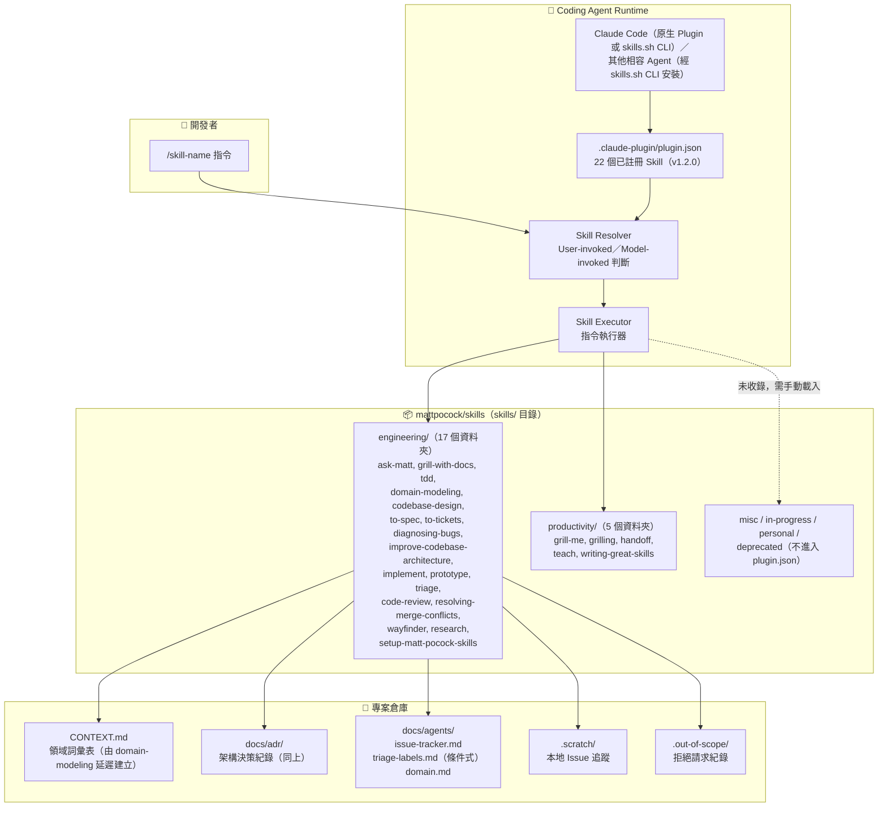

> `resolving-merge-conflicts` 已於 v1.1.0 結束「有實作但未收錄」的過渡狀態，正式收錄進 `.claude-plugin/plugin.json`；`wayfinder` 與 `research` 亦同步收錄，詳見第 2.5 節與第 4.2 節。

**關鍵運作邏輯**：

1. **安裝階段**：透過 `npx skills@latest add mattpocock/skills`（skills.sh CLI）或 `/plugin install mattpocock-skills@mattpocock`（Claude Code 原生 Plugin）將選定的 Skill 安裝至目標 Agent 的設定目錄（Claude Code CLI 安裝為 `~/.claude/skills/`）
2. **註冊階段**：`.claude-plugin/plugin.json`（查證版本 1.2.0）列出 22 個已啟用的 Skill 路徑（實際內容見第 4.2 節）
3. **觸發階段**：User-invoked Skill 等待人類輸入 `/skill-name`；Model-invoked Skill 由 Agent 依 `description` 欄位自行判斷是否套用
4. **執行階段**：Agent 讀取 SKILL.md 中的完整指令，若該 Skill 委派其他 Skill（如 grill-with-docs 委派 domain-modeling），會一併載入被委派 Skill 的內容

### 2.2 Context Injection 與 Prompt Pipeline

mattpocock/skills 的核心創新在於**結構化的上下文注入**，而非單純的 Prompt 模板：

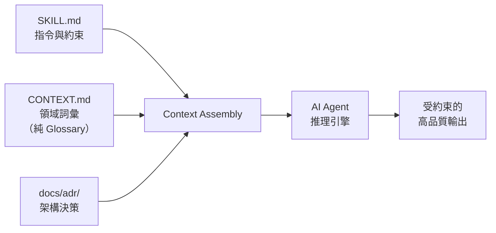

**Context 注入層級**：

| 層級 | 來源 | 作用 |
|------|------|------|
| **Skill 層** | SKILL.md + 附屬資源（*.md） | 定義工作流程、步驟、約束規則 |
| **Domain 層** | CONTEXT.md | 提供領域專有詞彙（Glossary Only），減少歧義與冗長 |
| **Architecture 層** | docs/adr/*.md | 提供已決策的架構方向，防止 AI 偏離 |
| **Project 層** | docs/agents/*.md | 提供 Issue Tracker、Triage Labels 等配置 |
| **Governance 層** | .out-of-scope/*.md | 記錄已拒絕的請求，防止重複提案 |

### 2.3 Governance Layer 與 Agent Constraints

**AI 約束機制**：

```yaml
# SKILL.md 實際觀察到的 Frontmatter 欄位（僅 name / description /
# 選用的 disable-model-invocation 三者，未發現社群傳言的 argument-hint 欄位）
---
name: skill-name
description: "描述文字 — 這是 Agent 判斷是否觸發的唯一依據"
disable-model-invocation: true  # 標記為 User-invoked，防止 Agent 自行觸發
---
```

> **訂正說明**：舊版手冊提及的 `argument-hint` 欄位，經逐一查核 tdd、grill-me、grill-with-docs、diagnosing-bugs、triage、prototype、setup-matt-pocock-skills 等 SKILL.md 原始碼，**均未發現此欄位**。若讀者在其他社群 Skill 中見過類似欄位，應視為個別作者自訂慣例，非 mattpocock/skills 的標準格式。

**約束策略對照**：

| 約束類型 | 實現方式 | 適用場景 |
|----------|----------|----------|
| **手動觸發** | `disable-model-invocation: true`（User-invoked） | 高風險或需要人類主導的操作（如 improve-codebase-architecture、triage、setup-matt-pocock-skills） |
| **ADR 門檻** | Skill 內要求先建立 ADR | 架構變更前必須記錄決策 |
| **Domain 保護** | CONTEXT.md 定義不可修改的核心概念（純 Glossary），由 domain-modeling 維護 | 防止 AI 任意重新命名領域術語 |
| **Git 護欄** | git-guardrails-claude-code 封鎖危險 git 指令 | 防止 `git push --force`、`git reset --hard` |
| **Out-of-Scope** | `.out-of-scope/*.md` 記錄已拒絕請求 | 防止 AI 重複提出已否決的功能 |

### 2.4 ADR Integration 與 Domain Discovery

**ADR 格式（最新簡化版）**：

mattpocock/skills 的 ADR 格式與傳統 ADR 不同，採用**極度精簡**的風格：

```markdown
# ADR-0001: 選擇 PostgreSQL 作為主資料庫

選擇 PostgreSQL 16+ 作為主資料庫引擎。系統需要 ACID 交易與 JSON 查詢能力，
PostgreSQL 兼具強型態和 JSON 支援，且生態成熟。代價是需要 DBA 維運經驗。
```

> **重要更新**：最新版的 ADR 格式已大幅簡化，可能只是一個段落。不再強制使用 Context / Decision / Consequences 三段式結構。

**ADR 的三項必要條件**（所有條件必須同時成立才值得記錄）：

| 條件 | 說明 | 範例 |
|------|------|------|
| **Hard to reverse** | 決策難以逆轉 | 選擇資料庫引擎 |
| **Surprising without context** | 沒有背景脈絡時會令人驚訝 | 為何不用 NoSQL |
| **Result of real trade-off** | 是真實取捨的結果（不是顯而易見的） | 效能 vs. 開發速度 |

**ADR 檔案命名**：`docs/adr/0001-slug.md`、`docs/adr/0002-slug.md`（循序編號）

**Domain Discovery 機制**：

- `CONTEXT.md` 是一份**純詞彙表（Glossary）**，明確排除任何實作細節
- 例如：以「materialization cascade」取代「a lesson inside a section of a course is made real」
- 效果：減少約 75% 的 Token 消耗，同時提高溝通精確度

### 2.5 六大分類與實際 Skill 清單

倉庫 `skills/` 目錄下實際有 6 個分類資料夾，總計 41 個 Skill 資料夾。**但頂層 README 只記錄 Engineering 與 Productivity 兩類**，其餘四類僅在各自資料夾內的 README 中說明，不對外主動宣傳；`.claude-plugin/plugin.json` 也只收錄 Engineering + Productivity 共 22 個 Skill。

| 分類 | 資料夾內 Skill 數 | 收錄於 plugin.json | 頂層 README 記錄 | Skills |
|------|---------------------|---------------------|---------------------|--------|
| **Engineering** | 17 | 17（全數收錄） | ✅ | ask-matt, code-review, codebase-design, diagnosing-bugs, domain-modeling, grill-with-docs, implement, improve-codebase-architecture, prototype, research, resolving-merge-conflicts, setup-matt-pocock-skills, tdd, to-spec, to-tickets, triage, wayfinder |
| **Productivity** | 5 | 5 | ✅ | grill-me, grilling, handoff, teach, writing-great-skills |
| **Misc** | 4 | ❌ | ❌（僅資料夾內 README，定位為「偶爾用、不主推」） | git-guardrails-claude-code, migrate-to-shoehorn, scaffold-exercises, setup-pre-commit |
| **In-progress** | 9 | ❌ | ❌（明確標示「開發中，未穩定前不進入 plugin/README」） | batch-grill-me, claude-handoff, loop-me, setup-ts-deep-modules, to-questionnaire, wizard, writing-beats, writing-fragments, writing-shape |
| **Personal** | 2 | ❌ | ❌（作者個人設定，非通用） | edit-article, obsidian-vault |
| **Deprecated** | 4 | ❌ | ❌ | design-an-interface, qa, request-refactor-plan, ubiquitous-language |

> ⚠️ **歷史訂正（v3.0.0 沿用）**：更早版本手冊列出的 Engineering 清單包含 `diagnose`、`zoom-out`；Productivity 清單包含 `caveman`、`write-a-skill`——這些名稱已不存在於現行倉庫。`zoom-out` 與 `caveman` 已在 v1.0.0 被**刪除**（作者說明分別為「went unused」與「was a duplicate, never meant to be public」）；`diagnose` 更名為 `diagnosing-bugs`；`write-a-skill` 由重寫版的 `writing-great-skills` 取代。
>
> ⚠️ **本次訂正（v4.0.0 新增，v1.1.0 帶來）**：`to-prd` 更名為 `to-spec`；`to-issues` 與已刪除的 `to-plan` 合併為 `to-tickets`；`wayfinder`（原名 `decision-mapping`）由 In-progress 轉正進入 Engineering；新增 `research`；In-progress 清單新增 `batch-grill-me`、`setup-ts-deep-modules`、`to-questionnaire` 三項。第 8、9、14 章將分別說明對應的訂正內容。
>
> `.claude-plugin/plugin.json` 的完整真實內容請見第 4.2 節。

---

## 第 3 章：安裝與初始化

### 3.1 前置環境準備

| 工具 | 最低版本 | 用途 |
|------|----------|------|
| **Node.js** | v18+ | 執行 npx 安裝指令 |
| **AI Agent** | 最新版 | Skills 執行環境（Claude Code 為主要驗證對象，其餘 Agent 依 skills.sh CLI 支援清單而定） |
| **Git** | v2.30+ | 版本控制 |
| **gh CLI**（選用） | v2.0+ | GitHub Issues 整合（若使用 GitHub 作為 Issue Tracker） |
| **glab CLI**（選用） | 最新版 | GitLab Issues 整合（若使用 GitLab 作為 Issue Tracker） |

### 3.2 安裝 mattpocock/skills

**步驟 1：執行安裝指令**

```bash
npx skills@latest add mattpocock/skills
```

**安裝過程**：

1. CLI 會自動偵測專案中使用的 Agent 類型
2. 系統顯示所有可用 Skills 清單
3. 使用方向鍵與空白鍵選擇要安裝的 Skills
4. **務必選擇 `setup-matt-pocock-skills`**（其他 Skills 依賴此配置）
5. Skills 安裝至對應 Agent 的 Skills 目錄（Claude Code 為 `~/.claude/skills/`）

**安裝驗證**：

```bash
# Claude Code 環境
ls ~/.claude/skills/

# 確認 plugin 註冊
cat ~/.claude/skills/.claude-plugin/plugin.json
```

**更新至最新版**：

```bash
npx skills@latest add mattpocock/skills
# 重新選擇 Skills 即可更新
```

### 3.3 執行 setup-matt-pocock-skills

安裝完成後，在**每個專案倉庫**中必須執行一次初始化：

```bash
# 在 Agent 對話中輸入
/setup-matt-pocock-skills
```

**初始化流程**（對照 `setup-matt-pocock-skills/SKILL.md` 實際步驟）：

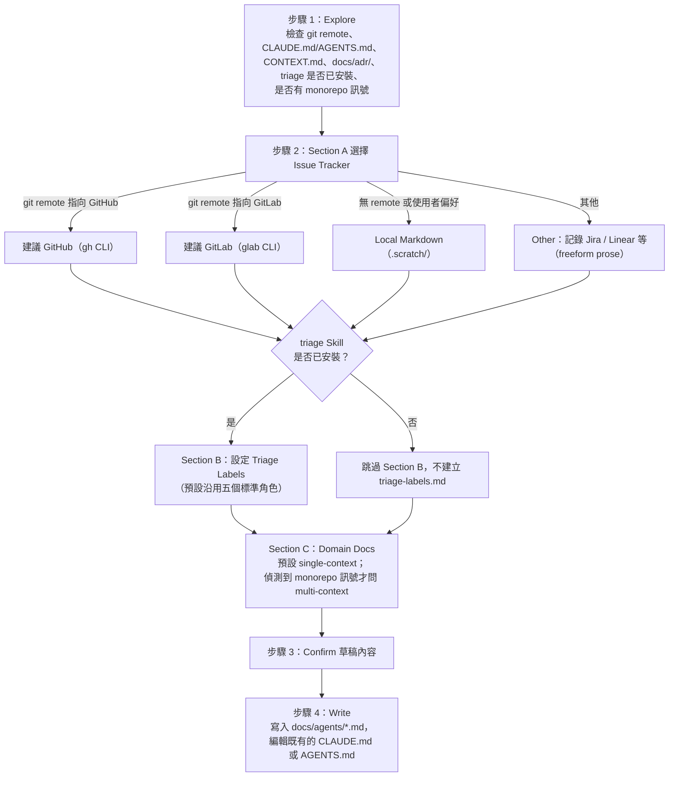

**初始化設定內容（三大 Section）**：

| Section | 設定內容 | 說明 |
|---------|----------|------|
| **Section A** | Issue Tracker | 定義使用 GitHub / GitLab / Local / Other（Jira、Linear）；依 `git remote` 指向自動建議預設選項 |
| **Section B**（**條件式**） | Triage Labels | 定義狀態角色與分類角色的標籤名稱；**僅當 `triage` Skill 已安裝時才會執行此段落**，未安裝則整段略過，不會寫入 `triage-labels.md` |
| **Section C** | Domain Docs | 記錄 CONTEXT.md 與 ADR 的**預定存放位置**（不代表會建立這些檔案）；預設 single-context，僅在偵測到 `pnpm-workspace.yaml`、`package.json` 的 `workspaces` 欄位等 monorepo 訊號時，才會詢問是否改用 `CONTEXT-MAP.md` 的 multi-context 佈局 |

> **重要**：setup 只會編輯**既有**的 `CLAUDE.md` 或 `AGENTS.md` 其中之一；若兩者都不存在，才會詢問使用者要建立哪一個。

### 3.4 初始化建立的檔案與目錄

> **重大訂正**：經查核 `setup-matt-pocock-skills/SKILL.md` 原始碼，此 Skill **只會建立 `docs/agents/` 底下的檔案並編輯 CLAUDE.md/AGENTS.md**。舊版手冊聲稱它會建立 `CONTEXT.md`、`docs/adr/` 甚至首份 ADR，此為錯誤描述——**`CONTEXT.md` 與 `docs/adr/` 是由 `domain-modeling` Skill 在對話中「延遲建立」（lazy create），只有在第一個詞彙／決策真正被確認時才會產生檔案**，setup 階段僅會檢查它們是否已存在。**`docs/agents/triage-labels.md` 更是條件式產物**：只有在 `triage` Skill 已安裝時才會寫入，未安裝則連同 Section B 一起跳過。

執行 `/setup-matt-pocock-skills` 後，專案中**實際會建立或修改**的結構：

```text
project-root/
├── CLAUDE.md 或 AGENTS.md            # 編輯既有檔案，新增「## Agent skills」區段（擇一）
└── docs/
    └── agents/
        ├── issue-tracker.md          # 新建：Issue Tracker 配置
        ├── triage-labels.md          # 條件式新建：僅當 triage Skill 已安裝時才產生
        └── domain.md                 # 新建：CONTEXT.md／ADR 預定位置的說明（single-context 或 multi-context）

# 以下檔案「不會」由本 Skill 建立，僅在後續使用 domain-modeling／grill-with-docs 時延遲產生：
# CONTEXT.md、CONTEXT-MAP.md、docs/adr/*.md
```

**各檔案用途與實際建立者**：

| 檔案 | 建立者 | 建立時機 | 用途 |
|------|--------|----------|------|
| `CLAUDE.md` 或 `AGENTS.md` | setup-matt-pocock-skills | 初始化時（編輯既有檔案） | Agent 配置入口，定義全專案的 Agent 指令 |
| `docs/agents/issue-tracker.md` | setup-matt-pocock-skills | 初始化時 | 定義 Issue Tracker 類型與存取方式 |
| `docs/agents/triage-labels.md` | setup-matt-pocock-skills | 初始化時，**僅當 `triage` Skill 已安裝** | 定義雙軸 Triage 角色的標籤名稱 |
| `docs/agents/domain.md` | setup-matt-pocock-skills | 初始化時 | 定義 CONTEXT.md 與 ADR 的存放位置（僅說明，不建立） |
| `CONTEXT.md` | domain-modeling | 首次有詞彙被確認時（延遲建立） | 領域詞彙表 Glossary（不含實作細節） |
| `docs/adr/*.md` | domain-modeling／grill-with-docs 建議 | 需要時延遲建立 | 架構決策紀錄 |
| `.out-of-scope/*.md` | triage | 拒絕請求時 | 紀錄已否決的功能請求 |
| `.scratch/` | to-tickets／使用者 | 選擇 Local Issue Tracker 時 | 本地 Ticket 追蹤目錄 |

### 3.5 Issue Tracker 配置

mattpocock/skills 支援四種 Issue Tracker 類型：

**GitHub Issues（推薦）**：

```markdown
<!-- docs/agents/issue-tracker.md -->
# Issue Tracker

Type: GitHub
CLI: gh
Repository: owner/repo-name
```

使用 `gh` CLI 進行 Issue 操作，支援建立、關閉、標籤等完整功能。

**GitLab Issues（新增支援）**：

```markdown
<!-- docs/agents/issue-tracker.md -->
# Issue Tracker

Type: GitLab
CLI: glab
Repository: group/project-name
```

使用 `glab` CLI 進行 Issue 操作，與 GitHub 體驗一致。

**Local Markdown（離線開發）**：

```markdown
<!-- docs/agents/issue-tracker.md -->
# Issue Tracker

Type: Local
Path: .scratch/
```

本地 Issue 結構：

```text
.scratch/
└── feature-user-auth/
    ├── PRD.md                    # 產品需求文件
    └── issues/
        ├── 01-setup-database.md  # 任務 1
        ├── 02-create-api.md      # 任務 2
        └── 03-add-tests.md       # 任務 3
```

**Other（Jira、Linear 等）**：

```markdown
<!-- docs/agents/issue-tracker.md -->
# Issue Tracker

Type: Other
Description: 使用 Jira，專案代號 PROJ-xxx
URL: https://company.atlassian.net/browse/PROJ
```

> **注意**：Other 類型使用 freeform prose（自由文字）描述，Agent 會根據描述嘗試最佳化操作。但 `.out-of-scope/mainstream-issue-trackers-only.md` 明確限制只支援主流 Issue Tracker。

> **實務建議**：企業團隊建議使用 GitHub 或 GitLab Issues，可與 CI/CD、Code Review 流程無縫整合。本地模式適合早期 PoC 或網路受限環境。

---

## 第 4 章：Skills 工作原理

### 4.1 SKILL.md 檔案格式與附屬資源

每個 Skill 都是一個目錄，路徑為 `skills/<分類>/<skill-name>/`，包含一個必要的 `SKILL.md` 檔案，以及可選的附屬資源檔案：

```text
skills/engineering/tdd/
├── SKILL.md           # 主指令檔（必要）
├── tests.md           # 測試撰寫原則（實際存在）
└── mocking.md         # Mocking 使用時機（實際存在）

skills/engineering/prototype/
├── SKILL.md           # 主指令檔
├── LOGIC.md           # 邏輯／狀態驗證分支
└── UI.md              # 介面視覺驗證分支

skills/engineering/triage/
├── SKILL.md
├── AGENT-BRIEF.md      # Agent 工作簡報靜態範本
└── OUT-OF-SCOPE.md     # wontfix 知識庫撰寫規範
```

> **訂正說明**：舊版手冊聲稱 `tdd` 有 5 個附屬檔（`tests.md`、`mocking.md`、`deep-modules.md`、`interface-design.md`、`refactoring.md`）。經查核 `skills/engineering/tdd/` 目錄，**實際只有 `tests.md` 與 `mocking.md` 兩個附屬檔**，`deep-modules.md`／`interface-design.md`／`refactoring.md` 並不存在——深模組相關詞彙其實定義在獨立的 `codebase-design` Skill 中（見第 6 章）。`prototype` 的 `LOGIC.md` / `UI.md` 兩分支說明則查證屬實。

**SKILL.md 格式範例**（依 `tdd/SKILL.md` 實際內容摘錄改寫）：

```markdown
---
name: tdd
description: Test-driven development. Use when the user wants to build features
  or fix bugs test-first, mentions "red-green-refactor", or wants integration tests.
---

# TDD

## Rules of the loop

Red before green. Refactoring is not part of the loop — it belongs to the
review stage, not the red → green implementation cycle.

## Anti-patterns

- Horizontal slicing — building all models, then all services, then all
  controllers, instead of one vertical slice at a time
- Implementation-coupled tests — asserting on internals instead of behaviour
- Tautological tests — tests that can never fail because they mirror the
  implementation

## Checklist Per Cycle

- [ ] Test fails for the right reason
- [ ] Implementation is minimal
- [ ] All existing tests still pass
```

**YAML Frontmatter 欄位**（實際觀察值，非社群傳言）：

| 欄位 | 必要 | 說明 |
|------|------|------|
| `name` | ✅ | Skill 名稱，用於 `/name` 觸發 |
| `description` | ✅ | **關鍵**：Agent 判斷是否觸發的唯一依據 |
| `disable-model-invocation` | 選用 | 設為 `true` 標記為 User-invoked，防止 Agent 自動觸發 |

> ⚠️ **重要**：`description` 是 Agent 發現 Skill 的**唯一入口**。寫得不精確會導致 Skill 永遠不被觸發或被錯誤觸發。舊版手冊提及的 `argument-hint` 欄位並未在實際 SKILL.md 中出現，請勿依賴此欄位撰寫自訂 Skill。

### 4.2 Plugin 註冊機制

Skills 透過 `.claude-plugin/plugin.json` 向 Claude Code 註冊。以下為**實際查證的完整內容**（2026-07-22，版本 1.2.0，共 22 個 Skill）：

```json
{
  "name": "mattpocock-skills",
  "version": "1.2.0",
  "description": "Matt Pocock's agent skills for real engineering — grilling, spec/ticket flows, TDD, code review, domain modelling and more. Plug-and-play, not vibe coding.",
  "author": { "name": "Matt Pocock", "url": "https://www.aihero.dev" },
  "homepage": "https://www.aihero.dev/s/skills-newsletter",
  "repository": "https://github.com/mattpocock/skills",
  "license": "MIT",
  "skills": [
    "./skills/engineering/ask-matt",
    "./skills/engineering/diagnosing-bugs",
    "./skills/engineering/grill-with-docs",
    "./skills/engineering/triage",
    "./skills/engineering/improve-codebase-architecture",
    "./skills/engineering/setup-matt-pocock-skills",
    "./skills/engineering/tdd",
    "./skills/engineering/to-spec",
    "./skills/engineering/to-tickets",
    "./skills/engineering/wayfinder",
    "./skills/engineering/implement",
    "./skills/engineering/prototype",
    "./skills/engineering/research",
    "./skills/engineering/domain-modeling",
    "./skills/engineering/codebase-design",
    "./skills/engineering/code-review",
    "./skills/engineering/resolving-merge-conflicts",
    "./skills/productivity/grill-me",
    "./skills/productivity/grilling",
    "./skills/productivity/handoff",
    "./skills/productivity/teach",
    "./skills/productivity/writing-great-skills"
  ]
}
```

**註冊規則**：

- 僅 `skills/engineering/`、`skills/productivity/` 兩個目錄下的 Skill 會被註冊（misc/in-progress/personal/deprecated 皆不會）
- 註冊路徑指向 Skill 的**資料夾**，而非直接指向 `SKILL.md` 檔案
- `resolving-merge-conflicts`、`wayfinder`、`research` 三者於 v1.1.0（2026-07-08）新收錄；`to-issues`／`to-prd` 已被移除，由 `to-tickets`／`to-spec` 取代（見第 8、9 章）
- **版號落差提醒**：此檔案的 `"version": "1.2.0"` 是 2026-07-13 的一次手動提升，查證當下**尚無對應的 `CHANGELOG.md` 條目或 GitHub Release**；倉庫根目錄 `package.json`（由 Changesets 管理）與 GitHub Releases 的正式版本仍是 **1.1.0**。企業導入時應理解這是 Claude Code Plugin 市集使用的獨立版號軌道，與專案主版本尚未對齊，不代表功能已進一步演進

### 4.3 CONTEXT.md — 領域詞彙表

CONTEXT.md 是 mattpocock/skills 最獨特的創新之一。最新版本明確定義它為一份**純詞彙表（Glossary）**，完全排除實作細節。

> **官方定義**：「CONTEXT.md is totally devoid of implementation details. Do not treat CONTEXT.md as a spec, a scratch pad, or a repository for implementation decisions.」

**CONTEXT.md 的四大組成部分**：

| 部分 | 用途 | 範例 |
|------|------|------|
| **Language** | 術語定義與含義 | `Materialization Cascade: 當課程中的一堂課被實體化…` |
| **Relationships** | 術語之間的關係 | `Course → Section → Lesson（一對多）` |
| **Example dialogue** | 正確使用術語的對話範例 | `「對 Lesson 執行 materialization cascade」` |
| **Flagged ambiguities** | 標記容易混淆的概念 | `「Section」不等同於「Module」` |

**範例**：

```markdown
# CONTEXT

## Language

### Materialization Cascade
When a lesson inside a section of a course is made real — its content is
generated, its exercises are scaffolded, and its metadata is populated.

### Vertical Slice
A single, independently deployable unit of work that cuts through all
architectural layers (UI → API → DB).

## Relationships

- Course → Section → Lesson (one-to-many at each level)
- Materialization Cascade operates on a single Lesson

## Example dialogue

> "Run the materialization cascade for the 'Generics' lesson in the
> 'Advanced TypeScript' section."

## Flagged ambiguities

- "Section" vs "Module": In this project, "Section" is the only valid
  grouping term. "Module" refers to code modules, not content groupings.
```

**效果**：

```
# 無 CONTEXT.md 時（32 tokens）：
"Please create the process where a lesson inside a section of a course
is made real, meaning its content is generated, its exercises are
scaffolded, and its metadata is populated."

# 有 CONTEXT.md 時（8 tokens）：
"Implement materialization cascade for Lesson entity."
```

Token 節省約 **75%**。

**CONTEXT.md 的建立時機**：

- **不在** `/setup-matt-pocock-skills` 時建立
- 實際建立者是 `/domain-modeling` Skill（`grill-with-docs` 內部委派呼叫它），採「延遲建立（lazy create）」原則：只有在第一個詞彙真正被確認定義時才產生檔案
- 後續每次 `/grill-with-docs`（透過 domain-modeling）都會就地更新（"Update CONTEXT.md inline"）
- **禁止在 CONTEXT.md 中放入實作決策**（實作決策應記錄在 ADR 中）

### 4.4 ADR（Architecture Decision Records）

ADR 是記錄架構決策的輕量文件，存放於 `docs/adr/` 目錄。

**ADR 格式（最新精簡版）**：

最新版本的 ADR 格式大幅簡化，可能只需一個段落：

```markdown
# ADR-0001: 選擇 PostgreSQL 作為主資料庫

選擇 PostgreSQL 16+ 作為主資料庫引擎。系統需要 ACID 交易與 JSON 查詢能力，
PostgreSQL 兼具強型態和 JSON 支援，且生態成熟。代價是需要 DBA 維運經驗。
```

> **注意**：傳統的 Context / Decision / Consequences 三段式仍可使用，但不再是強制格式。ADR 的重點是**記錄決策的原因與取捨**，而非遵循特定模板。

**ADR 的三項必要條件**：

三個條件**必須全部成立**，才值得建立 ADR：

1. **Hard to reverse**：決策一旦做出就難以回頭
2. **Surprising without context**：沒有背景脈絡的人會覺得這個決定很奇怪
3. **Result of real trade-off**：是真實的取捨結果，而非顯而易見的選擇

**What qualifies**（值得記錄的決策範例）：

- 選擇 PostgreSQL 而非 MongoDB
- 決定使用 Event Sourcing 而非 CRUD
- 選擇 Monorepo 而非 Multi-repo

**What does NOT qualify**（不值得記錄的決策）：

- 使用 Git 做版本控制
- 使用 HTTPS
- 遵循語言的官方 Style Guide

**ADR 在 Skills 中的作用**：

| Skill | 如何使用 ADR |
|-------|-------------|
| `/domain-modeling`（`/grill-with-docs` 委派對象） | 質詢過程中「Offer ADRs sparingly」，發現衝突或重大取捨時建議新增 ADR |
| `/improve-codebase-architecture`、`/codebase-design` | 掃描既有決策，避免提出衝突建議 |
| `/to-spec` | 在 Spec 的 Implementation Decisions 中引用相關 ADR |

### 4.5 Skill 載入與執行流程

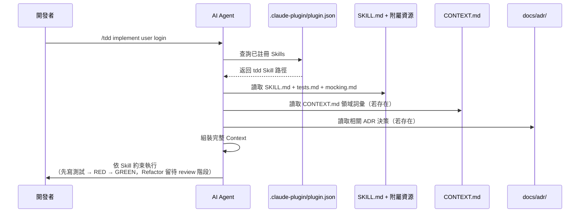

> **實務注意事項**：
> - Skills 的載入順序由 plugin.json 中的排列決定
> - 若兩個 Skills 的 description 語義重疊，Agent 可能選錯 Skill
> - 建議每個 Skill 的 description 都包含「Use when:」觸發條件
> - 附屬資源檔案（如 `tests.md`、`mocking.md`）會隨主 SKILL.md 一起載入
> - 若一個 Skill 在本文內委派另一個 Skill（如 `grill-with-docs` → `grilling` + `domain-modeling`），Agent 需一併載入被委派 Skill 的完整內容，而非僅參考其名稱

---

## 第 5 章：grill-me、grilling 與 grill-with-docs — 需求探索與挑戰

> **架構訂正**：查核 SKILL.md 原始碼後發現，`grill-me` 與 `grill-with-docs` 本體檔案都極短（1～3 行），實際的質詢邏輯全部委派給兩個新增的 Model-invoked Skill：**`grilling`**（共用質詢引擎）與 **`domain-modeling`**（CONTEXT.md／ADR 讀寫，見第 6 章）。舊版手冊將這些行為誤植在 `grill-with-docs` 本體，本章依委派關係重新歸屬。

### 5.1 grill-me — 通用計畫挑戰

**分類**：Productivity（User-invoked，`disable-model-invocation: true`）

**用途**：無情地追問開發者的設計想法或計畫，直到所有決策分支都被釐清。實際 SKILL.md 本體僅一行：「Run a `/grilling` session.」——即完全委派給 `grilling` 引擎執行。

**觸發方式**：

```bash
/grill-me 我想在系統中加入多租戶架構
```

**特性**：

- ❌ 不會修改任何檔案
- ❌ 不會讀取 CONTEXT.md 或 ADR
- ✅ 純對話式質詢
- ✅ 適合早期構想階段

> Matt Pocock 在受訪時提到 `grill-me` 是他最受歡迎的 Skill 之一：讓 AI 以一問一答方式質詢使用者，逼出結構化的思考結果。

### 5.2 grilling — 共用質詢引擎

**分類**：Productivity（Model-invoked）

`grilling` 是 v1.0.0 新增的**共用質詢引擎**，`grill-me` 與 `grill-with-docs` 皆委派給它執行實際的追問邏輯。v1.1.0（2026-07-08）針對它做了一次「Sharpen grilling on two fronts」的加強，逐字核對 SKILL.md 全文後，現行原則應更新為 **5 條**：

| # | 原則 | 說明 |
|---|------|------|
| 1 | **無情地質詢，逐一走過決策樹（Interview relentlessly, walk the decision tree）** | 「Interview me relentlessly about every aspect of this until we reach a shared understanding. Walk down each branch of the decision tree, resolving dependencies between decisions one-by-one.」持續追問並逐一解決分支間的依賴 |
| 2 | **一次只問一個問題** | 「Ask the questions one at a time, waiting for feedback on each question before continuing. Asking multiple questions at once is bewildering.」 |
| 3 | **每個問題都附上建議答案** | 「For each question, provide your recommended answer.」——不只是提問，還要給出推薦選項，降低使用者的回答負擔 |
| 4 | **事實與決策二分（v1.1.0 新增）** | 「If a *fact* can be found by exploring the environment...look it up rather than asking me. The *decisions*, though, are mine.」可從程式碼／工具查得的事實由 Agent 自行查找，但決策必須交還使用者、等待其回答 |
| 5 | **確認閘門，未達共識不得行動（v1.1.0 新增）** | 「Do not act on it until I confirm we have reached a shared understanding.」把原本隱含的「達成共識」判斷，明文轉為必須經使用者確認的**停止閘門** |

> **為什麼 v1.1.0 要拆分第 4、5 條**：CHANGELOG 說明，舊版「若問題能靠探索程式碼回答，就用探索取代提問」這條規則原本是為「與真人對話」的情境撰寫；但當 `grilling` 被其他 Skill（例如第 14 章的 `wayfinder`）在「解決票券」的框架下呼叫時，這條規則會被誤讀成「決策也可以自行探索回答」。拆分事實與決策，正是為了避免巢狀呼叫時 grilling 自問自答、跳過真人確認。

**Prompt Flow**：

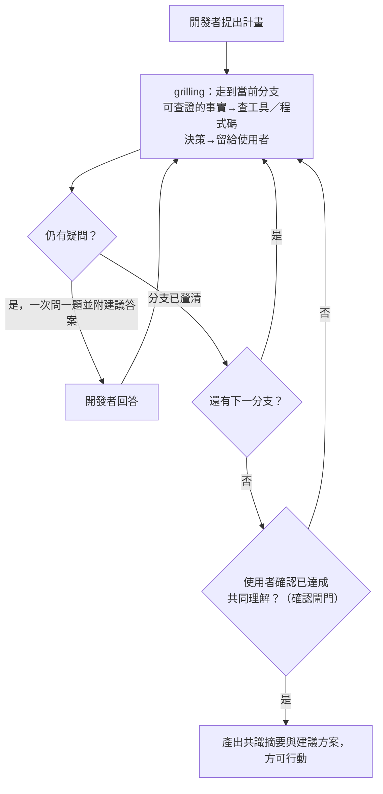

### 5.3 grill-with-docs — 結合 Domain 的深度挑戰

**分類**：Engineering（User-invoked，`disable-model-invocation: true`）

**用途**：SKILL.md 本體同樣僅一行：「Run a `/grilling` session, using the `/domain-modeling` skill.」——即在 `grilling` 引擎之上，額外委派 `domain-modeling` 負責讀寫 CONTEXT.md 與 ADR。

**觸發方式**：

```bash
/grill-with-docs 我想重構訂單模組，引入 Event Sourcing
```

**與 grill-me 的關鍵差異**：

| 面向 | grill-me | grill-with-docs |
|------|----------|-----------------|
| **分類** | Productivity | Engineering |
| **底層引擎** | grilling | grilling ＋ domain-modeling |
| **讀取 CONTEXT.md／ADR** | ❌ | ✅（由 domain-modeling 執行） |
| **更新 CONTEXT.md** | ❌ | ✅（由 domain-modeling 執行，新增領域詞彙） |
| **建議新 ADR** | ❌ | ✅（由 domain-modeling 執行） |
| **適用時機** | 早期構想 | 有既有 Domain 的情境 |

**grill-with-docs 的深度挑戰流程**：

1. 委派 `domain-modeling` 讀取 CONTEXT.md 了解現有領域詞彙（純 Glossary）與 docs/adr/ 了解已有架構決策
2. 委派 `grilling` 針對提案進行質詢，並檢查是否與現有決策衝突
3. 若發現新的領域概念，由 `domain-modeling` 就地更新 CONTEXT.md（僅更新詞彙，不加入實作細節）
4. 若發現需要新的架構決策，由 `domain-modeling` 建議建立新 ADR

> **六項會議中行為**（Challenge against the glossary、Sharpen fuzzy language 等）實際定義在 `domain-modeling/SKILL.md` 的「During the session」段落，而非 `grill-with-docs` 本體。完整內容請見第 6.2 節。

### 5.4 實戰案例：API 設計審查

**場景**：團隊想為電商系統新增「優惠券」功能。

```bash
/grill-with-docs 我要新增優惠券功能，支援百分比折扣和固定金額折扣
```

**AI 可能提出的質詢**：

```
1. 優惠券是否可疊加使用？最多疊加幾張？
2. 優惠券是否有使用次數限制？是全局限制還是每用戶限制？
3. 是否需要支援優惠碼（Coupon Code）和系統自動發放兩種方式？
4. 當訂單部分退貨時，優惠券如何處理？
5. 與現有的 VIP 等級折扣如何互動？（根據 CONTEXT.md 中 VIP Tier 定義）
6. 是否需要支援時間區間限制？
7. ADR-0003 決策了使用 Event Sourcing 處理金額變動，優惠券折扣的計算是否也需要事件化？
```

### 5.5 最佳實踐與常見錯誤

**最佳實踐**：

| 實踐 | 說明 |
|------|------|
| 先 grill-me 再 grill-with-docs | 先用 grill-me 釐清大方向，再用 grill-with-docs 深入細節 |
| 不要急於結束質詢 | 讓 AI 把所有疑慮都提出來，即使看似瑣碎 |
| 記錄共識結論 | 質詢結束後立即執行 `/to-spec` 將共識轉為正式文件 |

**常見錯誤**：

| 錯誤 | 後果 | 修正 |
|------|------|------|
| 跳過 grill 直接編碼 | AI 產出的程式碼偏離需求 | 養成「先 grill 再 code」的習慣 |
| 未初始化即使用 grill-with-docs | 找不到 CONTEXT.md，退化為 grill-me | 確保已執行 `/setup-matt-pocock-skills` |
| 對所有問題都回答「隨便」 | 失去質詢的價值 | 認真思考每個問題 |

> **安全風險提醒**：grill-me / grill-with-docs 的對話內容可能包含業務敏感資訊（如定價策略、商業邏輯）。請確保 Claude Code 的使用符合公司的資料安全政策。

---

## 第 6 章：domain-modeling 與 codebase-design — Domain 塑模與架構深度理論

> **新增章節說明**：`domain-modeling` 與 `codebase-design` 是 v1.0.0 新增的兩個 Model-invoked Engineering Skill，分別是第 5 章 grill-with-docs 與第 12 章 improve-codebase-architecture 背後真正的理論與行為來源。因其重要性與內容深度，本手冊獨立成章說明，取代舊版手冊已失效的「zoom-out」章節。

### 6.1 domain-modeling — CONTEXT.md 與 ADR 的實際建立者

**分類**：Engineering（Model-invoked）

**用途**：建立與強化專案的 Domain Model，是 CONTEXT.md 與 ADR 的實際讀寫者。`grill-with-docs` 只是入口，真正的文件讀寫邏輯全部在這裡實作。

**核心行為**：

| 行為 | 說明 |
|------|------|
| **延遲建立 CONTEXT.md** | 「Create files lazily — only when you have something to write. If no CONTEXT.md exists, create one when the first term is resolved.」不會在專案初始化時就建立空白檔案 |
| **就地更新** | 質詢過程中直接更新 CONTEXT.md 內容（"Update CONTEXT.md inline"） |
| **謹慎提議 ADR** | 「Offer ADRs sparingly」——不會每個小決策都建議寫 ADR，只在符合三項必要條件時才提出 |

### 6.2 六項會議中行為

`domain-modeling` 的 SKILL.md 中「During the session」段落，明確列出六項質詢期間必須遵守的行為（此六項行為的真正出處，訂正舊版手冊誤植於 grill-with-docs 的錯誤）：

| # | 行為 | 說明 |
|---|------|------|
| 1 | **對照詞彙表挑戰（Challenge against the glossary）** | 檢查使用者的描述是否與 CONTEXT.md 既有詞彙一致 |
| 2 | **釐清模糊語言（Sharpen fuzzy language）** | 要求使用者把模糊措辭具體化為明確定義 |
| 3 | **討論具體情境（Discuss concrete scenarios）** | 用真實案例驗證詞彙定義是否站得住腳 |
| 4 | **與程式碼交叉比對（Cross-reference with code）** | 檢查提議的詞彙是否與現有程式碼中的命名衝突或重複 |
| 5 | **就地更新 CONTEXT.md（Update CONTEXT.md inline）** | 質詢過程中即時寫入，而非事後彙整 |
| 6 | **謹慎提供 ADR（Offer ADRs sparingly）** | 非每個決策都建議寫 ADR，避免 ADR 氾濫 |

> **注意**：`domain-modeling` 更新 CONTEXT.md 時，只會以 Glossary 格式寫入（詞彙定義、關係、範例對話、易混淆概念標記），不會將實作決策放入 CONTEXT.md。

### 6.3 codebase-design — 深模組詞彙與 Deletion Test

**分類**：Engineering（Model-invoked）

**用途**：提供「深模組（Deep Module）」設計詞彙與判斷工具，是 `tdd`（介面設計判斷）與 `improve-codebase-architecture`（架構健檢）共用的理論基礎。

**核心詞彙**：

| 術語 | 定義 |
|------|------|
| **Leverage（槓桿）** | 一個模組的能力，除以學會使用其介面所需付出的成本 |
| **Locality（局部性）** | 修改一項功能時，需要觸及的模組數量與範圍；越集中越好 |
| **Deletion Test（刪除測試）** | 對任何懷疑過淺的模組提問：「如果刪除這個模組，複雜度是否也一併消失？」若答案是肯定的，代表它只是一層轉發（pass-through），價值可疑 |

**Deletion Test 判讀**：

| 刪除影響 | 診斷結果 | 建議行動 |
|----------|----------|----------|
| 大量邏輯與複雜度隨之消失 | ✅ 深模組，有真實價值 | 保留，可能進一步加深 |
| 幾乎沒有影響、只是轉發呼叫 | ⚠️ 淺模組，可能是過度抽象 | 考慮內聯（inline）或合併 |

### 6.4 depth-as-leverage：對 Ousterhout 理論的揚棄

> **重大訂正**：舊版手冊聲稱 mattpocock/skills 的模組深度理論「源自 John Ousterhout《A Philosophy of Software Design》」。查核 `codebase-design/SKILL.md` 的「Rejected framings」段落後發現，**事實正好相反**——作者明確**否決**了 Ousterhout 的定義，原文為：
>
> > 「Depth as ratio of implementation-lines to interface-lines (Ousterhout): rewards padding the implementation. We use depth-as-leverage instead.」
>
> 也就是說，Ousterhout 將深度定義為「實作行數 ÷ 介面行數」的比例，但這種算法會獎勵「把實作寫得又臭又長」的反效果；`codebase-design` 因此**揚棄**此定義，改採前一節介紹的 **depth-as-leverage**（槓桿）與 **Locality**（局部性）作為判斷依據。企業導入時應以此正確的理論脈絡向團隊說明，避免誤植為「本專案採用 Ousterhout 理論」。

Ousterhout 的原書仍是理解「淺模組 vs. 深模組」問題意識的重要參考讀物（見第 24.5 節連結），但 mattpocock/skills 的具體衡量方法已自成一派。

### 6.5 實戰案例與最佳實踐

**場景**：團隊懷疑 `OrderValidator`、`OrderPricingAdapter`、`OrderRepository` 三個類別中有過淺的模組。

```bash
/codebase-design 幫我檢查 Order 相關類別是否有淺模組
```

**AI 可能的判讀**：

```
1. OrderValidator：對其套用 Deletion Test——若刪除，呼叫端需自行處理 10 種驗證
   規則，複雜度並未消失，只是轉移。判定為深模組，建議保留。
2. OrderPricingAdapter：對其套用 Deletion Test——刪除後呼叫端只需直接呼叫底層
   PricingClient，複雜度幾乎歸零。判定為淺模組（pass-through），建議內聯。
3. OrderRepository：Leverage 高（封裝了分頁、快取、交易），Locality 良好
   （所有查詢邏輯集中於此）。判定為深模組。
```

**最佳實踐**：

| 實踐 | 說明 |
|------|------|
| 先 domain-modeling 再寫程式 | 讓 CONTEXT.md 詞彙先於實作穩定下來，避免命名反覆震盪 |
| 用 Deletion Test 而非行數比例判斷深度 | 避免落入「把實作寫長就等於深」的誤區 |
| ADR 保持精簡 | 遵循「Offer ADRs sparingly」，不要每個決策都寫 ADR |
| 與 tdd／improve-codebase-architecture 搭配使用 | domain-modeling 提供詞彙、codebase-design 提供架構判斷依據，二者互補 |

---

## 第 7 章：tdd — 測試驅動開發

### 7.1 Philosophy — 測試哲學

**分類**：Engineering（Model-invoked，無 `disable-model-invocation` 標記）

**用途**：以 TDD 的紅燈-綠燈循環開發功能或修復 Bug，一次處理一個 Vertical Slice。

**觸發方式**：

```bash
/tdd implement user registration with email validation
```

實際 `tdd/SKILL.md` 的 description 為：「Test-driven development. Use when the user wants to build features or fix bugs test-first, mentions 'red-green-refactor', or wants integration tests.」核心精神是：好的測試讀起來就像一份規格（specification），且因為不依賴內部結構，能在重構後依然存活。

**tdd Skill 的附屬資源**：

> **重大訂正**：舊版手冊聲稱 tdd 引用了 5 個附屬 `.md` 檔案。經查核 `skills/engineering/tdd/` 目錄，**實際只有 2 個附屬資源**，`deep-modules.md`、`interface-design.md`、`refactoring.md` 三者並不存在——深模組相關詞彙已移至獨立的 `codebase-design` Skill（見第 6 章）。

| 附屬資源 | 用途 |
|----------|------|
| `tests.md` | 好／壞測試範例：以介面行為為準的測試 vs. 綁定實作細節的測試 vs. 恆真（tautological）測試 |
| `mocking.md` | 只在邊界（外部 API、有時是資料庫）Mock，優先使用依賴注入 |

### 7.2 三大反模式

> **訂正**：舊版手冊只提到一個反模式「Horizontal Slices」。實際 `tdd/SKILL.md` 明確列出**三個反模式**：

| # | 反模式 | 說明 |
|---|--------|------|
| 1 | **Horizontal slicing（水平切片）** | 按架構層開發（先建所有 Model，再建所有 Service，再建所有 Controller），而非一次做完一個垂直切片 |
| 2 | **Implementation-coupled tests（實作耦合測試）** | 測試斷言的是內部實作細節而非對外行為，導致重構就會壞掉 |
| 3 | **Tautological tests（恆真測試）** | 測試邏輯完全鏡射實作邏輯，永遠不會失敗，形同無效測試 |

```
❌ 水平切片（Anti-Pattern）：
  第 1 步：建立所有 Model
  第 2 步：建立所有 Service
  第 3 步：建立所有 Controller
  第 4 步：建立所有 Test
  → 直到最後才能驗證功能是否正確

✅ 垂直切片（Correct）：
  第 1 步：User Registration（Test → Controller → Service → Model → DB）
  第 2 步：User Login（Test → Controller → Service → Model）
  第 3 步：User Profile（Test → Controller → Service → Model）
  → 每一步都能獨立驗證
```

> **Tracer Bullet 概念**：第一個 Vertical Slice 常被稱為「Tracer Bullet」——它貫穿所有架構層，證明整個系統骨架是可運作的。後續 Slice 只需沿著同樣的骨架添加功能（此概念與 to-tickets 的拆解策略共用同一套詞彙，見第 9 章）。

### 7.3 Workflow — 二階段工作流（Refactor 不在循環內）

> **重大訂正**：舊版手冊聲稱 tdd 是「RED-GREEN-REFACTOR-COMMIT」四階段循環。查核 `tdd/SKILL.md` 的「Rules of the loop」段落，原文明確寫著：
>
> > 「Red before green. **Refactoring is not part of the loop.** It belongs to the review stage, not the red → green implementation cycle.」
>
> 也就是說，**Refactor 被刻意排除在 TDD 循環之外**，歸屬於後續獨立的 Code Review 階段（見第 14.4 節 code-review Skill）。tdd 循環本身只有 RED、GREEN 兩步：

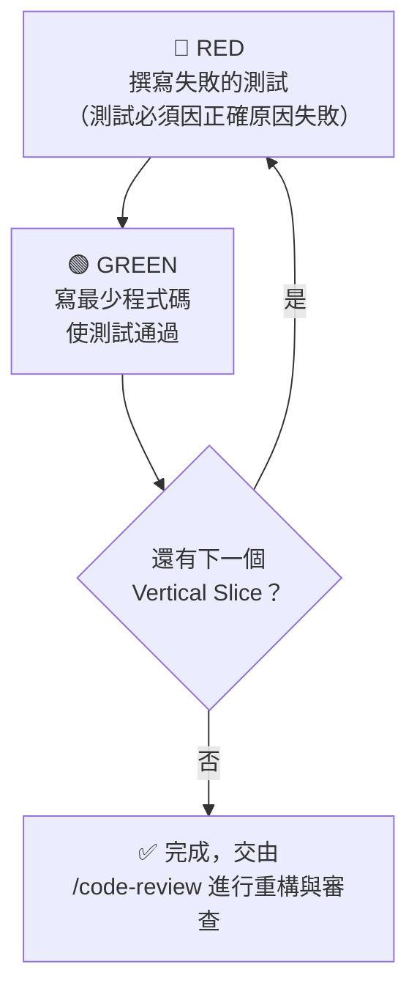

**Checklist Per Cycle**（每個 RED-GREEN 循環的檢查清單）：

- [ ] 測試因**正確的原因**失敗（不是因為語法錯誤或匯入錯誤）
- [ ] 實作是最小化的（不多寫一行）
- [ ] 所有既有測試仍然通過

**tdd Skill 的強制約束**：

1. **絕不跳過 RED 步驟**：必須先有失敗的測試
2. **一次一個 Vertical Slice**：不允許同時處理多個功能切片
3. **每次修改後執行測試**：確保沒有破壞既有功能
4. **最小實現**：GREEN 階段只寫通過測試所需的最少程式碼
5. **重構留給 Review 階段**：不要在 TDD 循環中順手重構，改以 `/code-review` 或人工審查處理

> **企業提醒**：這個設計選擇對團隊流程有實質影響——若團隊習慣「每個 Slice 都在 GREEN 之後立即重構」，需調整為「先累積若干 Slice，再統一交付 Code Review／重構」，否則會與 Skill 的預設假設脫節。

### 7.4 Spring Boot TDD 案例

**場景**：實作用戶註冊 API

**RED — 先寫失敗的測試**：

```java
@SpringBootTest
@AutoConfigureMockMvc
class UserRegistrationTest {

    @Autowired
    private MockMvc mockMvc;

    @Test
    void shouldRegisterUserWithValidEmail() throws Exception {
        String requestBody = """
            {
                "email": "user@example.com",
                "password": "SecureP@ss123",
                "name": "Test User"
            }
            """;

        mockMvc.perform(post("/api/users")
                .contentType(MediaType.APPLICATION_JSON)
                .content(requestBody))
            .andExpect(status().isCreated())
            .andExpect(jsonPath("$.email").value("user@example.com"))
            .andExpect(jsonPath("$.id").exists());
    }

    @Test
    void shouldRejectInvalidEmail() throws Exception {
        String requestBody = """
            {
                "email": "invalid-email",
                "password": "SecureP@ss123",
                "name": "Test User"
            }
            """;

        mockMvc.perform(post("/api/users")
                .contentType(MediaType.APPLICATION_JSON)
                .content(requestBody))
            .andExpect(status().isBadRequest());
    }
}
```

**GREEN — 寫最少程式碼通過測試**：

```java
@RestController
@RequestMapping("/api/users")
public class UserController {

    private final UserService userService;

    public UserController(UserService userService) {
        this.userService = userService;
    }

    @PostMapping
    public ResponseEntity<UserResponse> register(
            @Valid @RequestBody UserRegistrationRequest request) {
        UserResponse response = userService.register(request);
        return ResponseEntity.status(HttpStatus.CREATED).body(response);
    }
}
```

**（Review 階段，非 TDD 循環本身）重構改善**：

- 抽取 Validation 邏輯至獨立 Validator
- 加入 Error Handling
- 確保所有測試仍然通過
- 此步驟交由 `/code-review` 或人工審查進行，不視為 tdd 循環的一部分

### 7.5 Vue 3 TDD 案例

**場景**：實作登入表單元件

```typescript
// LoginForm.spec.ts
import { mount } from '@vue/test-utils'
import LoginForm from './LoginForm.vue'

describe('LoginForm', () => {
  it('should disable submit button when email is empty', () => {
    const wrapper = mount(LoginForm)
    const submitButton = wrapper.find('[data-testid="submit-btn"]')
    expect(submitButton.attributes('disabled')).toBeDefined()
  })

  it('should emit login event with credentials on submit', async () => {
    const wrapper = mount(LoginForm)
    await wrapper.find('[data-testid="email"]').setValue('user@test.com')
    await wrapper.find('[data-testid="password"]').setValue('password123')
    await wrapper.find('form').trigger('submit')

    expect(wrapper.emitted('login')).toBeTruthy()
    expect(wrapper.emitted('login')![0][0]).toEqual({
      email: 'user@test.com',
      password: 'password123'
    })
  })
})
```

### 7.6 React TDD 案例

**場景**：實作搜尋元件

```typescript
// SearchBar.test.tsx
import { render, screen, fireEvent } from '@testing-library/react'
import SearchBar from './SearchBar'

describe('SearchBar', () => {
  it('should call onSearch after debounce', async () => {
    const onSearch = vi.fn()
    render(<SearchBar onSearch={onSearch} debounceMs={300} />)

    fireEvent.change(screen.getByRole('searchbox'), {
      target: { value: 'test query' }
    })

    // 等待 debounce
    await vi.advanceTimersByTimeAsync(300)
    expect(onSearch).toHaveBeenCalledWith('test query')
  })
})
```

### 7.7 Node.js TDD 案例

**場景**：實作訂單計算服務

```typescript
// orderCalculator.test.ts
import { describe, it, expect } from 'vitest'
import { calculateTotal } from './orderCalculator'

describe('calculateTotal', () => {
  it('should sum item prices', () => {
    const items = [
      { name: 'Widget', price: 10, quantity: 2 },
      { name: 'Gadget', price: 25, quantity: 1 }
    ]
    expect(calculateTotal(items)).toBe(45)
  })

  it('should apply percentage discount', () => {
    const items = [{ name: 'Widget', price: 100, quantity: 1 }]
    expect(calculateTotal(items, { type: 'percentage', value: 10 })).toBe(90)
  })
})
```

### 7.8 最佳實踐與常見錯誤

**最佳實踐**：

| 實踐 | 說明 |
|------|------|
| 一個 Slice 一個 commit | 每完成一個 Vertical Slice 就 commit |
| 測試命名語義化 | `should_do_X_when_Y` 格式 |
| 先寫 Happy Path 再寫 Edge Case | 確保核心流程先通 |
| 不要在 GREEN 階段過度設計 | 只寫通過測試的最少程式碼 |
| Tracer Bullet 優先 | 第一個 Slice 應貫穿所有層，證明骨架可運作 |
| 重構交給 Review 階段 | 遵循 tdd 的「Refactoring is not part of the loop」，累積 Slice 後統一交 `/code-review` |
| 參考附屬資源 | 遇到測試撰寫或 Mocking 問題時查閱 tests.md、mocking.md |

**常見錯誤**：

| 錯誤 | 後果 | 修正 |
|------|------|------|
| 水平切片開發 | 直到最後才發現整合問題 | 嚴格執行 Vertical Slice |
| 一次寫太多測試 | 失去 TDD 的漸進式回饋 | 嚴格一次一個測試 |
| 誤以為 REFACTOR 是循環的一部分 | 團隊流程與 Skill 實際假設脫節 | 理解 Refactor 屬於 Review 階段，另行安排 |
| 寫出恆真測試（Tautological tests） | 測試通過但毫無防護力 | 確保測試斷言的是行為而非鏡射實作 |
| AI 生成的測試未實際執行 | 測試可能有語法錯誤 | 要求 AI 在每步都執行測試 |
| 未提交就開始下一個 Slice | 回滾困難，歷史混亂 | 每個 Slice 獨立 commit |

---

## 第 8 章：to-spec — 規格文件產生（原 to-prd）

> **重大訂正（v1.1.0，2026-07-08）**：`to-prd` 已在 CHANGELOG「Unify the planning skills」條目中**更名為 `to-spec`**。作者說明：「*"spec" is now the single through-line term*」——往後專案內部統一使用「spec」而非「PRD」作為規劃文件的通用詞彙，但 SKILL.md 仍在開頭保留「*you may know this document as a PRD*」一句，方便舊使用者辨識這是同一份文件的新名字。舊指令 `/to-prd` 查證當下**已從倉庫中移除**，執行會直接找不到指令。

### 8.1 AI 對話轉 Spec 流程

**分類**：Engineering（User-invoked，`disable-model-invocation: true`）

**用途**：將當前對話上下文與程式碼理解綜合整理為結構化的 Spec（規格文件），並發布至 Issue Tracker，套用 `ready-for-agent` triage 標籤，無需額外分類。實際 description：「Turn the current conversation into a spec and publish it to the project issue tracker — no interview, just synthesis of what you've already discussed.」

**觸發方式**：

```bash
/to-spec
```

> ⚠️ **重要**：`/to-spec` 不會進行質詢（interview）。它純粹**綜合現有對話與程式碼理解**。若需要先釐清需求，請先執行 `/grill-me` 或 `/grill-with-docs`。執行前須已透過 `/setup-matt-pocock-skills` 設定好 Issue Tracker 與 triage 標籤詞彙。

**典型工作流**：

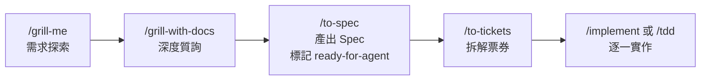

### 8.2 三步驟流程與新增的 Testing Seam 辨識

查核 `to-spec/SKILL.md` 全文，其流程由三個步驟構成，其中**第 2 步「辨識測試邊界（Testing Seam Identification）」是舊版 `to-prd` 沒有的新增內容**：

| 步驟 | 內容 |
|------|------|
| **1. 探索程式碼** | 理解目前程式庫現況，全程使用專案的 domain glossary 詞彙，並尊重相關領域已有的 ADR |
| **2. 辨識測試邊界（新增）** | 「Sketch out the seams at which you're going to test the feature. Existing seams should be preferred to new ones. Use the highest seam possible... The fewer seams across the codebase, the better - the ideal number is one.」草擬將測試此功能的邊界（seam）：優先使用既有 seam，盡量取最高層級的 seam，理想上整個變更只跨越**一個** seam；並在此步驟就先與使用者核對這些 seam 是否符合預期 |
| **3. 撰寫並發布 Spec** | 依模板撰寫，發布到 Issue Tracker 並套用 `ready-for-agent` 標籤，不需額外 triage |

### 8.3 Spec 模板結構（Deep Module 導向）

`/to-spec` 產出的 Spec 模板與舊版 `to-prd` 高度延續，呼應第 6 章 codebase-design 的槓桿（leverage）概念，強調模組設計的深度而非廣度；Implementation Decisions 一節查證後應包含的具體項目也一併補上（舊版手冊僅有留白示意）：

```markdown
## Problem Statement
[這個功能要解決什麼問題？從使用者角度描述]

## Solution
[高階解決方案描述，從使用者角度描述，聚焦「做什麼」而非「怎麼做」]

## User Stories

一份**詳盡、編號**的清單，每一則格式為：
1. As an <角色>, I want a <功能>, so that <效益>

## Implementation Decisions
已做出的實作決策，可包含：
- 將建置／修改的模組
- 這些模組將修改的介面
- 開發者提供的技術澄清
- 架構決策
- Schema 變更
- API 合約
- 特定的互動細節

**禁止**寫入具體檔案路徑或程式碼片段（容易迅速過時）；例外：若 `/prototype` 產出的片段比散文更精確地表達某個決策（狀態機、reducer、schema、型別結構），可整理精華後內嵌並註明來源於原型。

## Testing Decisions
- 好測試的判斷標準（只測外部行為，不測實作細節）
- 哪些模組將被測試
- 專案中類似測試的先例（prior art）

## Out of Scope
[明確列出不在本次範圍內的項目]

## Further Notes
[其他需要注意的事項]
```

> **Deep Module 設計原則**：Spec 應描述一個「介面簡單但功能深厚」的模組。避免產出「介面複雜但功能淺薄」的需求。例如，一個 Coupon 模組應該用簡單的 `apply(order)` 介面封裝複雜的折扣計算邏輯。

### 8.4 User Stories 撰寫

`to-spec/SKILL.md` 原文對 User Stories 一節的要求是：「*A LONG, numbered list of user stories... This list of user stories should be extremely extensive and cover all aspects of the feature.*」格式統一為單行編號句式，範例直接引用自 SKILL.md：

```markdown
## User Stories

1. As a mobile bank customer, I want to see balance on my accounts, so that I can make better informed decisions about my spending
2. As a mobile bank customer, I want to view my recent transactions, so that I can verify my spending history
3. As a mobile bank customer, I want to receive a low-balance alert, so that I can avoid an overdraft
...（依功能範圍延伸，覆蓋所有面向）
```

> **與舊版的差異**：舊版 `to-prd` 模板將每則 Story 拆成 As/I want/So that 三行、外加獨立的 Given/When/Then Acceptance Criteria 區塊。查核現行 `to-spec` 與下一章的 `to-tickets` 原始碼後確認，**Acceptance Criteria 已下移到 `to-tickets` 的個別票券模板中**（見第 9.4 節），`to-spec` 階段只產出單行編號的 User Stories 清單，不再於 Spec 文件內重複撰寫驗收條件。

**User Story 撰寫原則**：

| 原則 | 說明 |
|------|------|
| **單行、編號、大量** | 一則一行，涵蓋功能所有面向，寧可多寫也不要遺漏 |
| **用戶視角** | 從使用者角度描述「我要什麼、為什麼」，不涉及技術實作 |
| **驗收細節留給票券** | Acceptance Criteria 不在此階段撰寫，等 `/to-tickets` 拆解時才逐票補上 |

### 8.5 實戰案例與最佳實踐

**場景**：經過 grill-with-docs 討論後，產出優惠券功能 Spec

```bash
# 步驟 1：先質詢
/grill-with-docs 我們需要為電商平台新增優惠券功能

# 步驟 2：質詢結束後，產出 Spec
/to-spec
```

**最佳實踐**：

- 在 `/grill-me` 或 `/grill-with-docs` 後立即執行 `/to-spec`，避免對話 Context 流失
- 確認第 2 步辨識出的 Testing Seam 數量——理想上整個變更只跨越一個 seam，若發現需要跨越多個 seam，考慮是否該先拆分成多個 Spec
- 檢查 Implementation Decisions 是否引用了正確的 ADR
- Spec 應包含明確的 Out of Scope，防止 scope creep
- Spec 發布後會自動標記 `ready-for-agent` 標籤，供後續 `/to-tickets` 使用
- 避免在 Implementation Decisions 中貼入具體檔案路徑或程式碼片段，容易迅速過時

---

## 第 9 章：to-tickets — 工作任務拆解（原 to-issues，已合併 to-plan）

> **重大訂正（v1.1.0，2026-07-08）**：CHANGELOG「Unify the planning skills」條目明確記載：「*`to-plan` and `to-issues` are merged into one `to-tickets` skill, and `to-issues` is deleted.*」查證當下 `to-issues/SKILL.md` 路徑已回傳 404，`ask-matt` 的主流程也已改為 `idea → /to-spec → /to-tickets → /implement`。本章依 `to-tickets/SKILL.md` 全文重寫，並訂正舊版手冊對依賴表達方式的錯誤描述（見 9.1 節）。

### 9.1 從 Spec 到 Ticket 的流程

**分類**：Engineering（User-invoked，`disable-model-invocation: true`）

**用途**：將一份計畫、Spec，或當前對話拆解為一組**票券（Ticket）**，每張票券宣告自己的**阻擋邊（blocking edges）**，發布至設定好的 Issue Tracker。實際 description：「Break a plan, spec, or the current conversation into a set of tracer-bullet tickets, each declaring its blocking edges, published to the configured tracker — edges as text in one file per ticket locally, or native blocking links on a real tracker.」

**觸發方式**：

```bash
/to-tickets
# 亦可直接傳入來源：一個 Spec 路徑、Issue 編號或 URL
/to-tickets docs/specs/coupon-feature.md
```

**五步驟流程**：

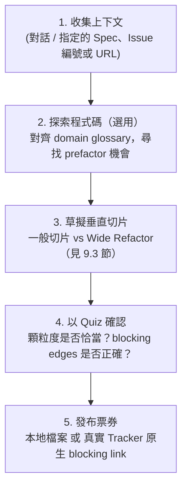

> **重要訂正：依賴關係的表達方式**。舊版手冊聲稱「Issue 之間的依賴關係以排序表達，而非標注 `blocked by`」，此描述**已不符合現行 `to-tickets`**。逐字核對原始碼確認，每張票券都必須明確宣告 **blocking edges**：「Give each ticket its **blocking edges** — the other tickets that must complete before it can start. A ticket with no blockers can start immediately.」本地檔案模式下以文字寫在每個票券檔案的「Blocked by」欄位；接上真實 Tracker（GitHub、Linear 等）時，優先使用該平台的**原生 blocking／sub-issue 關聯**，`## Blocked by` 文字區塊僅作為平台不支援原生關聯時的後備方案。凡是阻擋條件全數完成的票券即進入**frontier（前緣）**，可供多個 Agent Session 平行認領執行。

**拆解原則**：

- 每個 Ticket 是一個**獨立的 Vertical Slice**（Tracer Bullet 優先），完整貫穿 schema／API／UI／測試等所有層次，而非單一層的水平切片
- 每個 Ticket 的大小應**剛好塞得進一個全新的 Context Window**
- 探索程式碼時應主動尋找**「prefactor」機會**——「Make the change easy, then make the easy change.」（Kent Beck）：先把程式碼整理到容易變更的狀態，再進行真正的變更
- 使用在 `/setup-matt-pocock-skills` 中定義的 Triage Labels

### 9.2 Tracer Bullet Vertical Slice 拆解策略

```
❌ 傳統拆解（水平切片）：
├── Ticket #1: 建立所有 Model [backend]
├── Ticket #2: 建立所有 API [backend]
├── Ticket #3: 建立所有前端元件 [frontend]
└── Ticket #4: 整合測試 [testing]

✅ Tracer Bullet 拆解（垂直切片，含 blocking edges）：
├── Ticket #1: 🎯 Tracer Bullet — 單一優惠碼兌換（貫穿全層，無阻擋，可立即開始）
├── Ticket #2: 優惠碼 CRUD 管理（Blocked by #1）
├── Ticket #3: 批次優惠碼產生（Blocked by #2）
├── Ticket #4: 優惠碼使用限制邏輯（Blocked by #1）
├── Ticket #5: 優惠碼前端輸入 UI（Blocked by #1）
└── Ticket #6: 結帳頁折扣顯示（Blocked by #4、#5）
```

> **Tracer Bullet Ticket**：第一個 Ticket 必須貫穿所有架構層（UI → API → Service → DB），證明整個系統骨架可運作，且通常無阻擋、可立即開始。後續 Ticket 沿著同樣骨架添加功能，並依實際相依關係宣告 blocking edges——如上例 Ticket #6 需等前端 UI（#5）與限制邏輯（#4）都完成才能開始。

### 9.3 Wide Refactors — expand-contract 大規模機械式重構（新增）

`to-tickets` v1.1.0 新增了處理**大規模機械式重構（Wide Refactor）**的專屬原則，這是舊版 `to-issues` 沒有的內容。當變更是「重新命名一個欄位」「改一個共用型別」這類**單一機械式修改**、但**影響範圍（blast radius）橫跨整個程式庫**時，一次修改會同時弄壞數千個呼叫點，任何垂直切片都無法保持 CI 綠燈——這種情況**不應**硬套 Tracer Bullet 模式，而應改用 **expand–contract** 排序：

| 階段 | 動作 | 目的 |
|------|------|------|
| **1. Expand（擴張）** | 在舊形式旁邊新增新形式，兩者並存 | 確保任何現有程式碼都不會被立即弄壞 |
| **2. Migrate（遷移）** | 依 blast radius 分批遷移呼叫點（例如按 package、按目錄），**每一批各自成為一張獨立票券**，並宣告 Blocked by 前一批或 Blocked by Expand 票券 | 每批遷移完成後 CI 仍保持綠燈 |
| **3. Contract（收縮）** | 待所有呼叫端都遷移完成、無人再使用舊形式後，刪除舊形式（此票券 Blocked by 所有 Migrate 批次） | 完成收斂，避免新舊並存的長期技術債 |

> 若連分批遷移都無法各自保持 CI 綠燈，`to-tickets` 允許讓這些批次共享一條 Integration Branch，全部指向並阻擋一張最終的「integrate-and-verify」票券——**綠燈只在那張票券上被承諾**，而非每個中間批次。

### 9.4 「Agent-Grabbable by Construction」與 HITL／AFK 現況

> **歷史訂正沿用**：舊版手冊已訂正過「to-issues 有一套正式 HITL/AFK 雙分類機制」的錯誤說法，此訂正在現行 `to-tickets` 中**依然成立**——全文查無正式分類框架，唯一相關敘述是發布步驟中的一句：「Apply the `ready-for-agent` triage label unless instructed otherwise — **the tickets are agent-grabbable by construction**.」也就是說，`to-tickets` 產出的票券**預設就是為 Agent 可獨立認領執行而設計**，除非使用者另外指示，否則一律套用 `ready-for-agent` 標籤。這仍是一個「預設值」，而非逐票判斷的分類流程。
>
> **需要留意的新發展**：查證第 14 章新收錄的 `wayfinder` Skill 時發現，它**確實引入了正式的 HITL／AFK 雙分類**——「Every ticket is either **HITL** — human in the loop...or **AFK**, driven by the agent alone.」但這套分類屬於 `wayfinder` 自己的票券類型系統（`research`＝AFK、`prototype`／`grilling`＝HITL、`task`＝視情況而定），**並非 `to-tickets` 的機制**。企業導入時應區分清楚：一般規模的功能開發用 `to-tickets`（無正式 HITL/AFK 分類，預設 agent-grabbable）；超過單一 Session 容量的大型模糊專案才會進入 `wayfinder`（有正式 HITL/AFK 分類），兩者不可混淆。

若團隊需要嚴謹的人類參與判斷機制，建議自行在 `docs/agents/triage-labels.md` 中補充規則，或在 `/to-tickets` 的請求中明確指定「這幾張票券需要人類審查」。

### 9.5 Ticket Template（原 Issue Body Template）

`to-tickets` 依發布目標的不同，提供**兩種票券模板**（原文逐字節錄）：

**本地檔案模板**（寫入 `.scratch/<feature-slug>/issues/<NN>-<slug>.md`，依阻擋順序由 `01` 開始編號，**一票一檔，絕不合併成單一檔案**）：

```markdown
# <NN> — <票券標題>

**What to build:** 這張票券完成後、從使用者角度看到的端到端行為——不是逐層的實作清單

**Blocked by:** 阻擋此票券的其他票券編號／標題，或「None — can start immediately」

**Status:** ready-for-agent

- [ ] 驗收條件 1
- [ ] 驗收條件 2
```

**真實 Tracker 模板**（GitHub、Linear 等，優先使用平台原生 sub-issue／blocking 關聯）：

```markdown
## Parent
[若來源是既有 Issue，於此引用父 Issue；否則省略此段]

## What to build
端到端行為描述，不是逐層實作清單

## Acceptance criteria
- [ ] 驗收條件 1
- [ ] 驗收條件 2

## Blocked by
[阻擋此票券的其他票券參照，或「None — can start immediately」]
```

> **共通規則**：兩種模板都**禁止**寫入具體檔案路徑或程式碼片段（容易迅速過時）；例外是若 `/prototype` 產出的片段比散文更精確地表達某個決策，可整理精華後內嵌並註明來源。發布時**絕不可關閉或修改父 Issue**。

### 9.6 Label 與 Triage 策略（雙軸系統）

mattpocock/skills 的 triage 標籤系統採**雙軸系統**（State Roles × Category Roles，詳見第 13 章）：

**State Roles（狀態角色）**：

| 狀態角色 | 預設標籤 | 說明 |
|----------|----------|------|
| needs-triage | `needs-triage` | 新建立，待分類 |
| needs-info | `needs-info` | 資訊不足，需補充 |
| ready-for-agent | `ready-for-agent` | AI Agent 可直接執行 |
| ready-for-human | `ready-for-human` | 需要人類處理 |
| wontfix | `wontfix` | 不予處理 |

**Category Roles（分類角色）**：

| 分類角色 | 預設標籤 | 說明 |
|----------|----------|------|
| bug | `bug` | 缺陷修復 |
| enhancement | `enhancement` | 功能增強 |

**雙軸組合範例**：

```
Ticket #1: [bug] + [ready-for-agent]     → AI 可直接修復的 Bug
Ticket #2: [enhancement] + [needs-info]  → 需要補充資訊的功能需求
Ticket #3: [bug] + [ready-for-human]     → 需要人類判斷的複雜 Bug
Ticket #4: [enhancement] + [needs-triage]→ 新提出，尚未分類的需求
```

**自訂 Label 對照表（docs/agents/triage-labels.md）**：

```markdown
<!-- docs/agents/triage-labels.md -->
# Triage Labels

## State Roles
| Role | Label |
|------|-------|
| needs-triage | needs-triage |
| needs-info | awaiting-details |
| ready-for-agent | ready-for-agent |
| ready-for-human | needs-review |
| wontfix | wontfix |

## Category Roles
| Role | Label |
|------|-------|
| bug | bug |
| enhancement | feature |
```

> **注意**：若團隊沿用早期的 `triage / backlog / in-progress / review / done` 五階段標籤，建議改採本節的雙軸角色系統，更精確地表達 Ticket 的狀態與分類。

### 9.7 實戰案例與最佳實踐

**最佳實踐**：

| 實踐 | 說明 |
|------|------|
| Tracer Bullet 排第一 | 第一張票券貫穿全層，驗證骨架，且通常無阻擋可立即開始 |
| blocking edges 據實宣告 | 每張票券明確填寫 Blocked by，而非只靠編號順序默會排序 |
| 主動聲明需要人類參與的票券 | to-tickets 預設全部標為 agent-grabbable（`ready-for-agent`），需人類參與時務必主動說明 |
| 大規模機械式變更改用 Wide Refactor | 別把 rename 欄位這類牽動全庫的變更硬套 Tracer Bullet，改用 expand–contract（見 9.3 節） |
| Ticket Template 標準化 | 依發布目標（本地檔案 / 真實 Tracker）選用對應模板 |
| 互動確認拆解結果 | to-tickets 完成後會以 Quiz 確認顆粒度與 blocking edges 是否正確 |
| 每張 Ticket 剛好塞進一個 Context Window | 太大難以在單一 Session 完成，太小增加管理成本；若整個工作本身就超過單一 Session 容量，改用第 14 章的 `wayfinder` 規劃 |
| 探索階段留意 prefactor 機會 | 「先把變更變容易，再做容易的變更」，能降低後續票券的實作難度 |

---

## 第 10 章：prototype — 快速原型建立

### 10.1 Throwaway Prototype 原則

**分類**：Engineering（Model-invoked，無 `disable-model-invocation` 標記）

**用途**：快速建立**拋棄式原型**，用於驗證概念或比較方案。原型從第一天就被設計為拋棄品。

**觸發方式**：

```bash
/prototype create a CLI tool to validate YAML configurations
```

**六項通用規則**（「Rules that apply to both」）：

> **歷史訂正沿用**：更早版本手冊列出的六條規則中，「Hardcode Everything」與「Single File Preferred」經查核 `prototype/SKILL.md` **查無此文字**，屬於錯誤描述。
>
> **本次訂正（v4.0.0）**：逐字重新核對 `prototype/SKILL.md`，前 5 條規則內容不變，但**第 6 條的標題與內容已更新**——原標題「Delete or absorb when done」已改為「**Capture it when done**」，語意從「刪除或吸收」精修為「把原型本身當作一手史料保留下來」。

| # | 規則 | 說明 |
|---|------|------|
| 1 | **Throwaway from day one** | 原型從建立的第一天就清楚標記為拋棄品，且放在貼近實際使用位置（緊鄰要用到它的模組或頁面），但命名要讓人一眼看出這是原型、不是正式程式碼；沿用專案既有的 routing 慣例，不另創頂層結構 |
| 2 | **One command to run** | 原型必須用專案既有的 task runner 啟動（`pnpm <name>`、`python <path>`、`bun <path>` 等），使用者不需思考就能執行 |
| 3 | **No persistence by default** | 狀態預設存在記憶體中，不做資料持久化；若問題本身就涉及資料庫，才使用有明確「PROTOTYPE — wipe me」命名的暫存 DB 或本地檔案 |
| 4 | **Skip the polish** | 不寫測試、不做 runnability 以外的錯誤處理、不做抽象化，重點是快速學到東西 |
| 5 | **Surface the state** | 每次操作（Logic）或切換變體（UI）後，印出／渲染完整相關狀態，讓驗證者能立即看到變化 |
| 6 | **Capture it when done**（原「Delete or absorb when done」） | 把已驗證的決策併入正式程式碼；接著把**原型本身當作一手史料（primary source）保留**：commit 到 main 之外的拋棄分支，並在對應的實作 Ticket 上留一個指向該分支的 context pointer；驗證得到的答案（結論與所回答的問題）也要記錄在 Ticket 或 commit 訊息中。main 分支上只保留已驗證的決策本身 |

**如何選擇分支**：`prototype/SKILL.md` 說明分支選擇依據使用者的提問、周邊程式碼，或直接詢問使用者；若問題本身模糊、使用者又不在場，**預設依周邊程式碼判斷**——後端模組傾向 Logic 分支、頁面或元件傾向 UI 分支，並在原型開頭註明這個假設。選錯分支會浪費整個原型，因此兩個分支產出的成品型態差異很大，值得謹慎判斷。

### 10.2 Logic 分支 — 終端互動原型

適合驗證**商業邏輯**、**資料處理**、**演算法**等非視覺化需求。原型以 CLI 應用程式的形式建立，產出 `LOGIC.md` 作為指引：

```bash
/prototype create a CLI to test the coupon discount calculation logic
```

**LOGIC.md 格式**：

```markdown
# Prototype: Coupon Discount Calculator

## Goal
驗證折扣計算邏輯在多種情境下的正確性

## Run
npm start

## Scenarios
1. 百分比折扣 + 最低消費
2. 固定金額折扣 + 累計
3. 折扣上限限制

## Learnings
[原型結束後填寫]
```

產出可直接在終端機執行的互動式程式，輸入測試資料即可驗證計算結果。

### 10.3 UI 分支 — 多方案視覺原型

適合驗證**介面設計**、**互動流程**、**視覺排版**等需要目視確認的需求。原型產出 `UI.md` 作為指引，並可在**單一路由中產出多套 UI 變體**：

```bash
/prototype create 3 variants of a dashboard layout:
  1. Card-based grid
  2. Data table focus
  3. Chart-heavy analytics
```

**UI.md 格式**：

```markdown
# Prototype: Dashboard Layout Variants

## Goal
比較三種 Dashboard 排版方案，讓 PM 與設計師做出決策

## Run
npm run dev

## Variants
1. Card-based grid — 資訊卡片化
2. Data table focus — 以表格為核心
3. Chart-heavy analytics — 圖表為主

## Learnings
[原型結束後填寫]
```

**UI Variants 切換機制**：

- 在同一個 URL 路由下，使用 Tab 或下拉選單切換不同變體
- 每個變體獨立實作，不共享 UI 元件
- 方便利害關係人快速比較與決策

### 10.4 通用規則與實戰案例

**決策流程**：

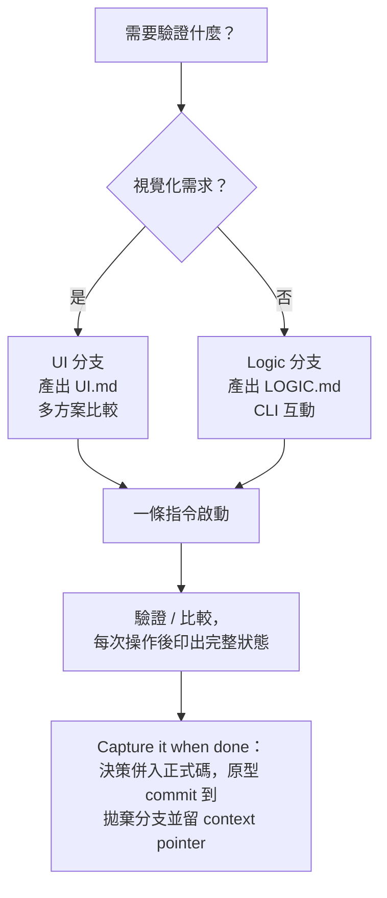

**最佳實踐**：

| 實踐 | 說明 |
|------|------|
| 限時 2 小時 | 原型不值得花太多時間 |
| 驗證後 Capture 而非直接刪除 | 不要試圖「改善」原型變成正式程式碼；已驗證的決策併入正式碼，原型本身 commit 到拋棄分支保留為一手史料 |
| 隨時印出完整狀態 | 每次操作或切換變體都應可見完整狀態，方便驗證 |
| 一條指令啟動 | 使用專案既有的 task runner，確保任何人都能立即執行 |
| 不加測試、不做多餘錯誤處理 | 原型不是生產程式碼，Skip the polish |
| 預設不做持久化 | 狀態留在記憶體即可，除非驗證目標就是持久化本身 |
| 分支不確定時依周邊程式碼判斷 | 後端模組傾向 Logic 分支、頁面／元件傾向 UI 分支，並註明假設 |

---

## 第 11 章：diagnosing-bugs — 結構化除錯

> **名稱訂正**：舊版手冊稱此 Skill 為 `diagnose`。查核 `.claude-plugin/plugin.json` 與資料夾結構後確認，**實際 Skill 名稱是 `diagnosing-bugs`**；「diagnose」只是其 `description` 中列出的觸發用詞之一，並非 Skill 本名。指令仍以 `/diagnosing-bugs` 觸發。

### 11.1 六階段（Six Phases）除錯流程

**分類**：Engineering（Model-invoked）

**用途**：以紀律化的六階段流程進行除錯，避免 AI 盲目嘗試修復。實際 description：「Diagnosis loop for hard bugs and performance regressions. Use when the user says 'diagnose'/'debug this', or reports something broken/throwing/failing/slow.」

**觸發方式**：

```bash
/diagnosing-bugs the API returns 500 when creating orders with > 100 items
```

> **重要變更**：diagnosing-bugs 使用 **Phases（階段）** 而非 Steps（步驟），強調每個階段可能包含多次迭代。

**六階段流程**（訂正：階段 2、5、6 為複合階段，非單一動作）：

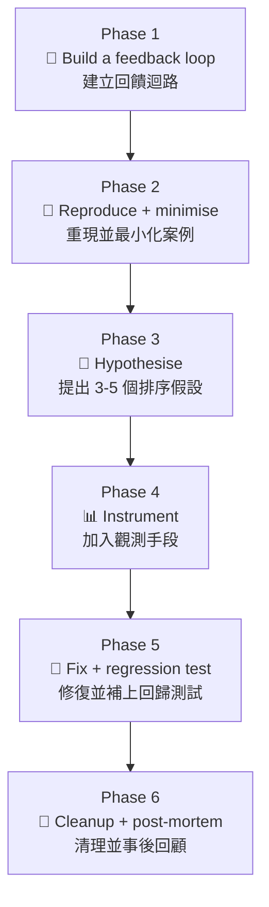

### 11.2 Phase 1 — Build a Feedback Loop（建立回饋迴路）

Phase 1 是 diagnosing-bugs 中最關鍵的階段。目標是建立一個**可重複執行的回饋迴路**，讓你能快速驗證每個假設。

**十種建立回饋迴路的方法**：

| # | 方法 | 說明 | 適用場景 |
|---|------|------|----------|
| 1 | **撰寫失敗的測試** | 最理想的方式 | 確定性 Bug |
| 2 | **增加 logging** | 在可疑路徑加入日誌 | 難以測試的路徑 |
| 3 | **加入 assertion** | 在中間狀態加入斷言 | 資料流問題 |
| 4 | **使用 debugger** | 設定中斷點逐步執行 | 複雜流程 |
| 5 | **印出中間值** | 最原始但有效 | 快速驗證 |
| 6 | **使用 REPL** | 互動式環境 | 探索性測試 |
| 7 | **curl / httpie** | HTTP 請求工具 | API 問題 |
| 8 | **DB 查詢** | 直接查看資料庫狀態 | 資料一致性 |
| 9 | **Log tail** | 即時監控日誌 | 生產環境 |
| 10 | **Metrics dashboard** | 監控面板 | 效能問題 |

**迭代指引**：

- Phase 1 可能需要多次嘗試才能建立穩定的回饋迴路
- 如果 Bug 是**非確定性的**（intermittent），先專注於提高重現率
- 不要在無法穩定重現的情況下跳到 Phase 3

### 11.3 Phase 2-4 — 假設與驗證

**Phase 2: Reproduce + minimise**

- 先確保問題能穩定重現，再移除所有無關因素
- 找到**最小重現路徑**（minimal reproduction）
- 目標：用最少的程式碼觸發同樣的問題

**Phase 3: Hypothesise**

- 列出 **3-5 個假設**，按可能性排序
- 每個假設必須是**可驗證的**（falsifiable）
- 格式範例：

```markdown
## 假設清單（按可能性排序）

1. **[高] 陣列越界**：當 items > 100 時，batch 處理邏輯未正確分頁
   - 驗證方式：用 99, 100, 101 個 items 測試
2. **[中] 記憶體溢出**：大量 items 導致 JVM heap 不足
   - 驗證方式：監控 JVM memory metrics
3. **[中] DB 連線超時**：大量 INSERT 導致 connection pool 耗盡
   - 驗證方式：檢查 connection pool metrics
4. **[低] 序列化問題**：Jackson 處理超大 JSON 時的限制
   - 驗證方式：檢查 max-string-length 設定
5. **[低] 並發競爭**：多個請求同時處理時的 race condition
   - 驗證方式：並發壓力測試
```

**Phase 4: Instrument**

- 根據排序好的假設，**由高到低**逐一加入觀測手段
- 使用 Phase 1 建立的回饋迴路執行驗證
- 證實或排除每個假設

### 11.4 Phase 5-6 — 修復與回顧

**Phase 5: Fix + regression test**

- 修復已確認的根本原因
- **補上回歸測試（regression test）**，確保同一個 Bug 未來不會再發生
- 確保 Phase 1 建立的回饋迴路（測試）現在通過
- 確認沒有破壞其他功能

**Phase 6: Cleanup + post-mortem（清理並事後回顧）**

diagnosing-bugs 的第六階段包含兩件事：先**清理**除錯過程中留下的痕跡（移除 `[DEBUG-...]` 標記、刪除臨時除錯用的程式碼／harness、確認原始重現案例已不再失敗），再回顧整個除錯過程：

```markdown
## Post-Mortem

### 問題摘要
[一句話描述問題]

### 根本原因
[最終確認的根本原因]

### 修復方式
[採取的修復措施]

### 可預防性
- 這個問題是否可以被測試提前發現？
- 是否需要新增 monitoring 或 alerting？
- 是否需要更新相關 ADR？

### 教訓
[從這次除錯中學到的教訓]
```

> **企業建議**：Post-Mortem 的結果應記入 ADR（如果涉及架構決策）或團隊知識庫。

### 11.5 實戰案例與最佳實踐

**最佳實踐**：

| 實踐 | 說明 |
|------|------|
| Phase 1 不能跳過 | 沒有穩定回饋迴路，後續都是猜測 |
| 假設限制 3-5 個 | 太少可能遺漏，太多導致分析癱瘓 |
| 假設必須排序 | 由高到低驗證，節省時間 |
| Fix 階段務必補回歸測試 | 確保同一個 Bug 不會再出現 |
| Cleanup 不可省略 | 移除除錯痕跡，避免臨時程式碼混入正式提交 |
| Post-Mortem 不是可選的 | 每次診斷都要回顧 |
| 非確定性 Bug 優先提高重現率 | 不要在無法重現的情況下猜測 |

---

## 第 12 章：improve-codebase-architecture — 架構改善

**分類**：Engineering（User-invoked，`disable-model-invocation: true`）

**用途**：掃描程式庫尋找「加深機會（Deepening Opportunities）」，以視覺化 HTML 報告呈現候選項目，再逐一與使用者質詢討論。實際 description：「Scan a codebase for deepening opportunities, present them as a visual HTML report, then grill through whichever one you pick.」

**觸發方式**：

```bash
/improve-codebase-architecture
```

> 理論基礎（Leverage、Locality、Deletion Test、depth-as-leverage 對 Ousterhout 理論的揚棄）已於第 6 章 `codebase-design` 詳細說明，本章不再重複，僅聚焦 improve-codebase-architecture 本身的操作流程。

### 12.1 Deepening Opportunities 與 Deletion Test

improve-codebase-architecture 委派 `codebase-design` 的詞彙與判斷工具，找出「加深機會」：

```markdown
## Deepening Opportunities

### 1. OrderService（目前偏淺）
- 當前介面：10 個 public methods
- 當前實作：每個方法只有 2-3 行 delegate 邏輯
- Deletion Test：若刪除 OrderService，validation／pricing／inventory check
  邏輯需轉移到呼叫端，複雜度並未消失——判定為值得加深
- 建議：將上述邏輯內聚到 OrderService，介面收斂至 4 個方法

### 2. PaymentAdapter（Leverage 中等）
- 可加深：將 retry、circuit breaker、fallback 邏輯封裝進 Adapter
- 預期效果：調用者不需要知道重試邏輯的存在，Locality 提升
```

### 12.2 三階段改善流程（Explore / Report / Grilling Loop）

> **訂正**：舊版手冊稱三階段為「Scan / Report / Propose」。查核 `improve-codebase-architecture/SKILL.md` 實際標題為 **「1. Explore」「2. Present candidates as an HTML report」「3. Grilling loop」**，且第三階段是與使用者的**質詢對話**，並非單向提出建議：

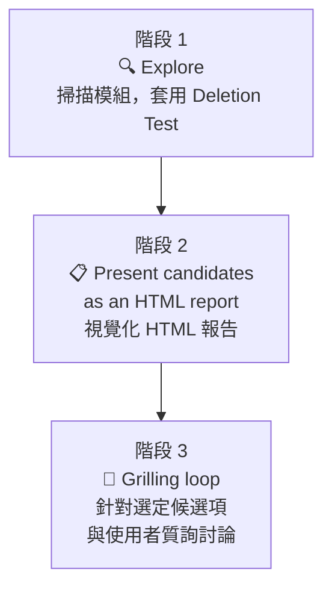

**階段 1：Explore**

- 掃描專案中所有模組（類別、套件、微服務）
- 套用 Deletion Test 評估每個模組的價值
- 檢查是否違反現有 ADR 決策

**階段 2：Present candidates as an HTML report**

- 將候選的加深機會彙整為**視覺化 HTML 報告**（非純文字清單）
- 標記過度耦合的相依關係與 Locality 問題

**階段 3：Grilling loop**

- 使用者從報告中挑選欲處理的候選項
- 針對選定項目啟動質詢對話（沿用第 5 章 grilling 引擎），確認重構方向
- 若建議涉及架構決策，提議新建 ADR

### 12.3 實戰案例與最佳實踐

**最佳實踐**：

| 實踐 | 說明 |
|------|------|
| 定期執行 | 每個 Sprint 結束時執行一次 |
| 不要一次全改 | 從 HTML 報告中選擇 2-3 個候選項優先處理 |
| 用 Deletion Test 驗證 | 每次重構後重新套用 Deletion Test 確認改善 |
| 搭配 /tdd 執行重構 | 確保重構不破壞既有功能（注意 Refactor 屬於 Review 階段，見第 7 章） |
| 記錄到 ADR | 每個重大重構決策都記入 ADR |

---

## 第 13 章：triage — 議題分類與管理

### 13.1 雙軸角色系統

**分類**：Engineering

**用途**：以雙軸角色系統（State Roles + Category Roles）管理 Issue 的分類與流轉。

**觸發方式**：

```bash
/triage review open issues and categorize them
```

最新版 triage 使用**雙軸系統**取代舊版的線性狀態機：

**State Roles（狀態角色）— 表示「這個 Issue 現在該由誰處理」**：

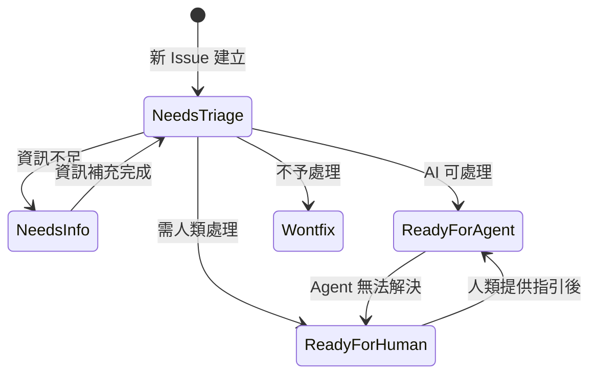

**Category Roles（分類角色）— 與 State Roles 正交，表示 Issue 的性質**：

| 分類角色 | 說明 |
|----------|------|
| `bug` | 現有功能的缺陷 |
| `enhancement` | 新功能或改善 |

### 13.2 AGENT-BRIEF.md 範本與 Agent Brief 留言

> **訂正**：舊版手冊聲稱 triage 會為每個 Issue「自動產出一份新的 AGENT-BRIEF.md 檔案」。查核 `skills/engineering/triage/` 目錄後發現，**`AGENT-BRIEF.md` 是隨 Skill 一起提供的靜態範本檔案**，內容是撰寫規範與範例，並非每個 Issue 各自產生的檔案。實際流程是：triage 依照這份範本的格式，**將 Agent Brief 以留言（comment）的形式張貼到 Issue 上**，倉庫本身不會新增檔案。

```markdown
<!-- 這是「張貼在 Issue 上的留言」內容，依 AGENT-BRIEF.md 範本格式撰寫，
     並非新建立的檔案 -->

## Summary
用戶輸入含特殊字元的優惠碼時，API 回傳 500 而非驗證錯誤訊息。

## Relevant Files
- src/main/java/com/example/domain/service/CouponService.java
- src/test/java/com/example/domain/service/CouponServiceTest.java

## Related ADRs
- ADR-0005: Input Validation Strategy

## Acceptance Criteria
- Given 用戶輸入含 `<script>` 的優惠碼
  When 提交驗證
  Then 回傳 400 Bad Request 並顯示安全錯誤訊息

## Classification
- Category: bug
- State: ready-for-agent
```

### 13.3 .out-of-scope/ 知識庫

triage 在分類 Issue 時會參考 `.out-of-scope/` 目錄中的知識，並依循 Skill 隨附的 `OUT-OF-SCOPE.md` 撰寫規範。查核 mattpocock/skills 倉庫本身的 `.out-of-scope/` 目錄，實際檔名為：

```text
.out-of-scope/
├── mainstream-issue-trackers-only.md   # 只支援主流 Issue Tracker 的限制說明
├── question-limits.md                   # 質詢輪數上限的設計決策
└── setup-skill-verify-mode.md           # setup Skill 驗證模式的範圍限制
```

> 上例為 mattpocock/skills **倉庫自身**採用 `.out-of-scope/` 的實例；企業導入時，應在**自己的專案倉庫**中建立對應目錄與檔案（檔名可自訂，只要與 `docs/agents/domain.md` 中的說明一致）。當 Issue 內容與 `.out-of-scope/` 中的項目匹配時，triage 會建議標記為 `wontfix` 並引用對應的文件。

### 13.4 AI 評論聲明

triage 在對 Issue 添加 AI 生成的評論時，會**自動附加 AI 聲明**，查核後確認實際措辭為：

```markdown
> *This was generated by AI during triage.*
```

> **企業建議**：此聲明確保團隊成員知道分類結果由 AI 產出，需要人類確認。

### 13.5 實戰案例與最佳實踐

**最佳實踐**：

| 實踐 | 說明 |
|------|------|
| 每日執行一次 | 確保新 Issue 及時被分類 |
| 維護 `.out-of-scope/` | 定期更新被拒絕的需求清單 |
| 確認 AI 分類 | Agent Brief 需要人類審閱確認 |
| 使用雙軸組合 | State + Category 組合提供更精確的分類 |
| ready-for-agent 需有 AC | 標記為 Agent 可處理的 Issue 必須有 Acceptance Criteria |

---

## 第 14 章：其他實用 Skills 與生態系擴充

> **歷史訂正沿用**：更早版本手冊第 14.1 節介紹的 `caveman` Skill **已在 v1.0.0 被刪除**，作者說明原因為「was a duplicate, never meant to be public」（本就是重複品，從未打算公開）。`write-a-skill` 已由重寫版的 `writing-great-skills` 取代。
>
> **本次訂正（v4.0.0，v1.1.0 帶來）**：`wayfinder` 已由 in-progress 轉正進入 Engineering，新增獨立的 14.6 節說明；`research` 為全新 Skill，新增 14.7 節說明；`resolving-merge-conflicts` 已正式收錄進 plugin.json，14.5 節警語隨之移除；In-progress 清單更新，原編號 14.6–14.9 依序順延為 14.8–14.11。

### 14.1 ask-matt — Skill 路由器

**分類**：Engineering（User-invoked，在 plugin.json 中列為第一個 Skill）

**用途**：作為所有 Skill 的入口路由器，協助使用者判斷「現在該用哪一個 Skill」，尤其適合不熟悉整套系統的新使用者。

```bash
/ask-matt 我想重構一個模組但不確定該用哪個指令
```

> **v1.1.0 更新**：CHANGELOG 記載 `ask-matt` 的路由表一口氣補齊了五個先前遺漏的 Skill：`tdd`（編織進 `implement` 驅動的 red-green 引擎）、`diagnosing-bugs`（新增「東西壞了」的進入點——先前完全沒有 Bug 對應的路由）、`domain-modeling` 與 `codebase-design`（新增「底層詞彙」區塊）、以及 `grilling`（共用質詢原語）；`prototype` 也從附屬說明擴充為獨立條目。作者同時在 `CLAUDE.md` 加入一條維護規則：未來任何 Skill 的新增／更名／刪除，或主流程變動，都會觸發 `ask-matt` 的重新檢查——這也是本手冊查證時確認 `ask-matt` 路由與現行 22 個 Skill 保持同步的原因。目前主流程為 `idea → /to-spec → /to-tickets → /implement`；當工作量超過單一 Session 容量時，`ask-matt` 會改指向第 14.6 節的 `/wayfinder`。

### 14.2 handoff — 跨 Agent 交接

**分類**：Productivity（User-invoked）

**用途**：將當前對話壓縮為交接文件，供另一個 Agent 繼續處理。

```bash
/handoff
```

**設計重點**：

- 使用 `mktemp` 建立臨時檔案儲存交接文件，避免污染專案目錄
- 可以用路徑或 URL 引用特定的工作成果（artifacts）

**適用場景**：

- 切換到不同的 AI Agent 會話
- 需要另一位團隊成員接手
- 長時間對話需要重新啟動

> **仍屬實驗性質**：`in-progress` 分類仍有一個獨立的 `claude-handoff` Skill（見第 14.10 節），與本節的 `handoff` 功能相近但屬於實驗性質，尚不建議用於生產流程。

### 14.3 writing-great-skills — 自訂 Skill 開發

**分類**：Productivity（User-invoked）

> **名稱訂正沿用**：更早版本手冊介紹的 `write-a-skill` 已在 v1.0.0 被**重寫並更名為 `writing-great-skills`**（作者標註為「rewritten from the ground」）。

**用途**：建立新的自訂 Skill，包含正確的目錄結構與 YAML Frontmatter，並提供撰寫高品質 Skill 描述的準則（例如避免「no-op instruction」，見第 1.1 節）。

```bash
/writing-great-skills create a skill for generating API documentation
```

**產出結構範例**：

```text
api-doc-generator/
├── SKILL.md           # 主指令檔
└── REFERENCE.md       # 選用參考文件
```

> **v1.1.0 新增兩種「Steering」失效模式**：CHANGELOG 記載新增了 **Negation（否定／大象效應）** 與 **Negative Space（負空間／留白盲區）** 兩種容易被忽略的引導失誤。Negation 指「說出不要做什麼」反而會把被禁止的行為拉進 Agent 的注意力範圍、使其更容易發生（如同「別去想大象」），解方是改用正面措辭直接描述期望行為；Negative Space 指一份 Skill 對某件事**保持沉默**時，該決定其實被隱性委派給 Agent 的先驗傾向，而非真的保持中立，解方是重新審視草稿中的每一處留白，逐一決定要填上明確規則、還是刻意保留為開放分支。

### 14.4 implement 與 code-review — 實作與雙軸審查

**分類**：Engineering（皆已收錄於 plugin.json）

**implement**：User-invoked，依據 Spec 或一組 Ticket 執行實作工作，description 為「Implement a piece of work based on a spec or set of tickets.」，銜接在 `/to-tickets` 之後，於預先約定的測試邊界（seam）驅動 `/tdd`，並在提交前收尾執行 `/code-review`。

**code-review**：Model-invoked，v1.0.0 由 in-progress 的 `review` 更名轉正而來，採**雙軸平行 subagent 審查**——同時從「Standards（程式碼風格與工程規範）」與「Spec（是否符合原始需求）」兩個維度審查，互不干擾，並將 tdd 循環中刻意排除的 Refactor 工作導向此處理（見第 7.3 節）。

```bash
/code-review 審查這次優惠券功能的實作
```

> **v1.1.0 新增 Fowler 壞味道基準線**：CHANGELOG 記載 `code-review` 在 Standards 這條軸上新增了一份**固定的 Fowler Bad Smells 基準**（而非新增第三條審查軸），內建約 12 種高訊噪比的壞味道：Mysterious Name（神秘命名）、Duplicated Code（重複程式碼）、Feature Envy（依戀情節）、Data Clumps（資料泥團）、Primitive Obsession（基本型別偏執）、Repeated Switches（重複的 Switch）、Shotgun Surgery（散彈式修改）、Divergent Change（發散式變更）、Speculative Generality（投機性一般化）、Message Chains（訊息鏈）、Middle Man（中間人）、Refused Bequest（拒收遺產）。有兩條約束確保它不會喧賓奪主：**專案自訂的文件化規範優先於此基準**；**每個壞味道都以「值得討論的判斷」呈現，而非直接判定為違規**。

### 14.5 teach 與 resolving-merge-conflicts

**teach**（分類：Productivity，User-invoked）：以目前所在目錄作為教學工作區，支援多次對話的教學情境；v1.0.1 更新為「reuse-first」設計，優先從 `./assets/` 中既有的可重用元件組成教材，而非每次重新生成。

**resolving-merge-conflicts**（分類：Engineering，Model-invoked）：description 為「Use when you need to resolve an in-progress git merge/rebase conflict.」逐一處理每個衝突區塊，依「兩邊各自的原始意圖」判斷取捨，盡量保留雙方意圖、衝突時以合併目標所述方向為準，完成後執行型別檢查／測試／格式化再收尾——**絕不使用 `--abort` 中途放棄**。

> ✅ **狀態更新（v1.1.0）**：`resolving-merge-conflicts` 已於 v1.1.0（2026-07-08）**正式收錄進 `.claude-plugin/plugin.json`**，結束此前「有實作但未收錄」的過渡狀態，不再需要手動確認是否安裝成功。

### 14.6 wayfinder — 大型任務地圖規劃（v1.1.0 新收錄）

**分類**：Engineering（User-invoked，`disable-model-invocation: true`）

**用途**：規劃「超過單一 Agent Session 容量」的大型模糊任務，將其描繪為 Issue Tracker 上的**共享地圖（shared map）**，再逐一解決地圖上的「決策票券」，直到抵達目的地的路徑清晰為止。實際 description：「Plan a huge chunk of work — more than one agent session can hold — as a shared map of decision tickets on your issue tracker, and resolve them one at a time until the way to the destination is clear.」

> **背景**：`wayfinder` 原名 `decision-mapping`，v1.1.0 CHANGELOG「Graduate and reframe wayfinder」條目說明改名原因——「*"Decision map" was jargony and inaccurate — only one ticket type is actually a decision.*」重新命名為 wayfinder 後，統一以「迷霧（fog of war）」「前緣（frontier）」「地圖（the map）」等領航隱喻貫穿整個 Skill，而非疊加一個生造詞彙。作者也明確定位它是**情境式的補充入口，而非取代既有主流程**：「*settle wayfinder's place in the docs as a situational on-ramp, not the new main entry flow — the grill-led idea → ship chain stays the front door*」——一般規模功能仍走 `grill-me/grill-with-docs → to-spec → to-tickets` 這條主線，只有規模真正超出單一 Session 才「拉高」進入 wayfinder。

**觸發方式**：

```bash
/wayfinder 我們要重新設計整個訂單模組，牽涉前後端與資料庫遷移，範圍太大不確定怎麼開始
```

**核心概念**：

| 概念 | 說明 |
|------|------|
| **Plan, don't do（只規劃，不動手）** | 地圖的產出是「決策」，不是「交付物」；地圖完成的定義是「沒有任何事情還需要決定」，而非工作已經做完 |
| **The Map（地圖）** | 一個標籤為 `wayfinder:map` 的單一 Issue，是**索引**而非**資料庫**——內容只包含 Destination（目的地）、Notes（備註）、Decisions so far（已決）、Not yet specified（尚未明朗，即 fog of war）、Out of scope（範圍外）五個區塊，決策的細節只存在於各自的票券中，地圖只做摘要與連結 |
| **Tickets（票券）** | 地圖的子 Issue，每張票券的 body 就是一個問題，大小設定為單一 100K token Session 可解決；帶有 `wayfinder:<type>` 標籤 |
| **Frontier（前緣）** | 所有阻擋條件已解除、尚未被認領的子票券集合——即「現在可以動手」的邊界 |
| **HITL／AFK 票券分類** | `wayfinder` 是查證中**少數真正擁有正式人類參與分類的 Skill**：見下表 |

**四種票券類型（`wayfinder:<type>` 標籤）**：

| 類型 | HITL／AFK | 說明 |
|------|-----------|------|
| `research` | **AFK** | 交由 `/research` 子代理閱讀文件、第三方 API、既有知識庫，找出決策所需的事實 |
| `prototype` | **HITL** | 透過 `/prototype` 產出粗略但具體的成品供人類評判「看起來╱用起來對不對」 |
| `grilling` | **HITL（預設情境）** | 透過 `/grilling` 與 `/domain-modeling` 一次一問地進行對話式決策 |
| `task` | **HITL 或 AFK** | 純執行性工作（例如申請服務帳號、搬移資料），本身不是決策，但擋住了決策的進行；Agent 能自己做的就自己做（AFK），不能的就交給人類一份精確清單（HITL） |

> **與 to-tickets 的差異提醒**：第 9.4 節已說明 `to-tickets` **沒有**正式的 HITL/AFK 分類，預設所有票券都是 `ready-for-agent`。`wayfinder` 的 HITL/AFK 分類是它自己的機制，兩者服務的規模不同，不可混用——一般功能開發用 `to-tickets`，真正大到裝不進單一 Session 的模糊專案才用 `wayfinder`。

**兩種呼叫模式**：

1. **Chart the map（繪製地圖）**：使用者帶著一個模糊想法呼叫。流程為：`/grilling` + `/domain-modeling` 先釘死目的地 → 廣度優先地再質詢一輪掃出所有已知的未決問題 → 建立地圖 Issue → 建立目前能明確描述的票券並串接 blocking 關係 → 為每張 `research` 票券並行派出 `/research` 子代理 → 停止（繪製地圖本身就是一次 Session 的完整工作，不會在此時動手解決任何票券）
2. **Work through the map（沿地圖工作）**：使用者帶著地圖連結呼叫，可指定要處理哪張票券，或留給 Agent 自動挑選 frontier 上的第一張 → 認領（assign 給自己，避免其他並行 Session 重複認領）→ 解決 → 以留言記錄答案、關閉票券、在地圖的 Decisions so far 補上一行 → 視答案是否讓「迷霧」中的新問題變得可具體描述，決定是否新增後續票券。**每個 Session 最多只解決一張票券**（`research` 票券除外，可並行處理多張）。

### 14.7 research — 背景調研 Skill（v1.1.0 新增）

**分類**：Engineering（Model-invoked）

**用途**：針對一個問題，對照高可信度的第一手來源進行調查，並將發現寫成一份附引用來源的 Markdown 檔案存回倉庫。實際 description：「Investigate a question against high-trust primary sources and capture the findings as a Markdown file in the repo. Use when the user wants a topic researched, docs or API facts gathered, or reading legwork delegated to a background agent.」

**觸發方式**：

```bash
/research 這個第三方金流 API 的 webhook 重試機制實際行為是什麼？
```

**核心特性**：

| 特性 | 說明 |
|------|------|
| **背景／非同步執行** | 「Spin up a background agent to do the research, so you keep working while it reads.」使用者可以在調研進行的同時繼續手邊其他工作 |
| **只信第一手來源** | 官方文件、原始碼、規格書、第一方 API——而非二手轉述或部落格摘要；每個論點都必須能追溯回其來源 |
| **單一 Markdown 產出** | 調研結果彙整成一份檔案，並依專案既有慣例決定存放位置；若無先例，則自行判斷合理位置並向使用者說明 |

**與 wayfinder 的關係**：`research` 是 `wayfinder` 四種票券類型之一（見 14.6 節），當地圖上某張票券的性質是「需要先查清楚一個事實才能繼續決策」時，會直接派出 `/research` 子代理平行處理；但 `research` 本身也可獨立呼叫，不需要透過 `wayfinder`。

### 14.8 git-guardrails-claude-code — Git 安全護欄

**分類**：Misc（不在 plugin.json 中，需自行留意安裝）

**用途**：封鎖危險的 Git 指令，防止 AI 執行不可逆的 Git 操作。

**建議封鎖的指令類型**：

| 指令 | 風險 |
|------|------|
| `git push --force` | 覆寫遠端歷史 |
| `git reset --hard` | 丟棄本地修改 |
| `git clean -f` | 刪除未追蹤的檔案 |

> **企業建議**：所有使用 Claude Code 的專案都應啟用此 Skill；雖不在 plugin.json 中，建議團隊將它列為必裝項目並在 CLAUDE.md 中明確要求。

### 14.9 setup-pre-commit 與其他 Misc Skills

Misc 分類共 4 個 Skill，皆**不收錄於 plugin.json**，定位為「偶爾用、不主推」的輔助工具：

| Skill | 用途 |
|-------|------|
| `setup-pre-commit` | 配置 pre-commit hooks（lint-staged、格式化、測試等） |
| `git-guardrails-claude-code` | 見 14.8 節 |
| `migrate-to-shoehorn` | 遷移至作者的 `shoehorn` 工具鏈（特定情境使用） |
| `scaffold-exercises` | 產生練習題腳手架（教學情境） |

```bash
/setup-pre-commit
```

### 14.10 開發中的 Skills（In-Progress）

> **本次訂正（v4.0.0）**：查核 `skills/in-progress/` 目錄，現行清單為 **9 個**——`wayfinder` 已轉正移入 Engineering（見 14.6 節），新加入 `batch-grill-me`、`setup-ts-deep-modules`、`to-questionnaire` 三項：

| Skill | 說明 |
|-------|------|
| `batch-grill-me` | 開發中，推測為批次質詢多個項目的 `grill-me` 變體 |
| `claude-handoff` | 用途與 `handoff` 相近，但仍在調整參數，穩定性未知（見 14.2 節） |
| `loop-me` | 開發中，推測與重複迭代式工作流程有關 |
| `setup-ts-deep-modules` | 開發中，推測為 TypeScript 專案的深模組腳手架設定 |
| `to-questionnaire` | 開發中，推測為將計畫轉為結構化問卷的 Skill |
| `wizard` | 開發中 |
| `writing-beats` | 寫作節拍規劃 |
| `writing-fragments` | 寫作片段產生 |
| `writing-shape` | 寫作架構設計 |

> **注意**：以上 Skills 皆不在 `.claude-plugin/plugin.json` 與頂層 README 中，API 可能隨時變更，不建議在生產環境使用；若需嘗試，建議先在非關鍵專案手動載入。`wayfinder` 的轉正歷程（decision-mapping → in-progress → wayfinder → engineering）顯示這份清單具有實質的流動性，企業導入前應養成每季複查一次的習慣。

### 14.11 已棄用的 Skills（Deprecated）

以下 4 個 Skill 已被棄用，不再維護（此清單經查核與現行倉庫一致，無需訂正）：

| Skill | 替代方案 | 說明 |
|-------|----------|------|
| `design-an-interface` | `improve-codebase-architecture` / `codebase-design` | 功能已整合到架構改善相關 Skill |
| `qa` | `tdd` | 測試功能已整合到 TDD Skill |
| `request-refactor-plan` | `improve-codebase-architecture` | 重構規劃已整合到架構改善 Skill |
| `ubiquitous-language` | `domain-modeling` | 語言統一功能已整合到 CONTEXT.md／domain-modeling |

---

## 第 15 章：AI Agent Workflow

### 15.1 端到端工作流程

以下是使用 mattpocock/skills 進行功能開發的**完整端到端工作流程**：

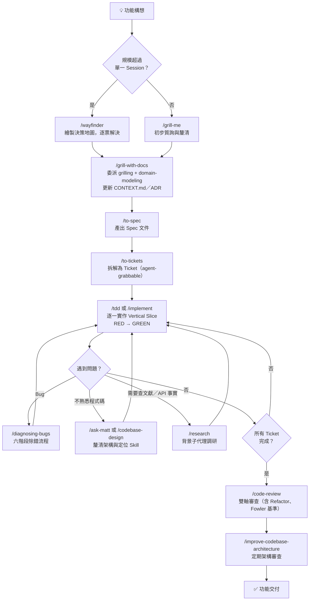

> **訂正**：本流程圖已移除 v1.0.0 刪除的 `zoom-out`（改由 `ask-matt`／`codebase-design` 承接「不熟悉程式碼時尋求全局視角」的需求），並將 tdd 循環中原本包含的 Refactor 步驟移至 `/code-review` 階段，對應第 7.3 節的訂正。**v4.0.0 更新**：`/to-prd`／`/to-issues` 依 v1.1.0 改版更名為 `/to-spec`／`/to-tickets`；新增 `/wayfinder`（規模超出單一 Session 時的入口，見第 14.6 節）與 `/research`（背景調研，見第 14.7 節）兩個分支。

### 15.2 Skills 組合策略

| 開發階段 | 推薦 Skills 組合 | 說明 |
|----------|-------------------|------|
| **大型／模糊專案先定範疇** | wayfinder（決策地圖） | 僅在規模超出單一 Session 容量時使用，見第 14.6 節 |
| **需求探索** | grill-me → grill-with-docs（grilling + domain-modeling） | 先廣後深 |
| **規劃** | to-spec → to-tickets | 文件化 → 票券化 |
| **開發** | tdd／implement（主循環）+ diagnosing-bugs（除錯）+ ask-matt（導航）+ research（背景調研） | 紀律化開發 |
| **審查** | code-review（含重構、Fowler 基準）+ improve-codebase-architecture | 定期架構健檢 |
| **協作** | handoff（交接） | 跨會話協作（`caveman` 已於 v1.0.0 移除，不再有等效 Skill） |

### 15.3 迭代循環與回饋機制

**Sprint 內循環**：

```
每個 Sprint：
1. Sprint Planning → /to-tickets 確認本 Sprint 的票券與 blocking edges
2. 每張 Ticket → /tdd 或 /implement 逐一實作
3. 遇到問題 → /diagnosing-bugs 除錯，需要查證外部資料時派 /research
4. Sprint Review → /code-review 統一處理重構，再執行 /improve-codebase-architecture 架構審查
5. Retrospective → 更新 CONTEXT.md 與 ADR（domain-modeling）
```

---

## 第 16 章：Web Application 實戰案例

### 16.1 技術棧選型

| 層級 | 技術 | 版本 |
|------|------|------|
| **Frontend** | Vue 3 + TypeScript + Tailwind CSS | Vue 3.5+, TS 5.x |
| **Backend** | Spring Boot + Java + Clean Architecture | Spring Boot 3.x, Java 21+ |
| **Database** | PostgreSQL + Redis | PG 16+, Redis 7+ |
| **Messaging** | Kafka | 3.x |
| **Infrastructure** | Docker + Kubernetes + GitHub Actions | — |

### 16.2 專案目錄結構

```text
enterprise-web-app/
├── .skills/                          # mattpocock/skills 本地配置
├── CONTEXT.md                        # 領域詞彙表
├── CONTEXT-MAP.md                    # 多 Context 映射（Monorepo）
├── AGENTS.md                         # Agent 配置入口
├── docs/
│   ├── agents/
│   │   ├── issue-tracker.md          # GitHub Issues 配置
│   │   ├── triage-labels.md          # Triage 標籤
│   │   └── domain.md                 # Domain 文件結構
│   └── adr/
│       ├── 0001-use-postgresql.md
│       ├── 0002-clean-architecture.md
│       ├── 0003-event-sourcing-orders.md
│       └── 0004-jwt-authentication.md
├── frontend/
│   ├── src/
│   │   ├── components/
│   │   ├── views/
│   │   ├── composables/
│   │   ├── stores/
│   │   └── api/
│   ├── tests/
│   └── package.json
├── backend/
│   ├── src/main/java/com/example/
│   │   ├── domain/                   # Domain Layer（核心）
│   │   │   ├── model/
│   │   │   ├── repository/          # Port（介面）
│   │   │   └── service/
│   │   ├── application/             # Application Layer
│   │   │   ├── usecase/
│   │   │   └── dto/
│   │   ├── infrastructure/          # Infrastructure Layer
│   │   │   ├── persistence/         # Adapter（實作）
│   │   │   ├── messaging/
│   │   │   └── external/
│   │   └── api/                     # API Layer
│   │       ├── controller/
│   │       ├── request/
│   │       └── response/
│   ├── src/test/
│   └── pom.xml
├── infrastructure/
│   ├── docker/
│   │   └── docker-compose.yml
│   ├── kubernetes/
│   │   ├── deployment.yaml
│   │   ├── service.yaml
│   │   └── ingress.yaml
│   └── terraform/
├── .github/
│   └── workflows/
│       ├── ci.yml
│       ├── cd.yml
│       └── security-scan.yml
└── .scratch/                         # 本地 Issue 追蹤（選用）
```

### 16.3 Skills 如何限制 AI

| 約束機制 | 實現方式 | 效果 |
|----------|----------|------|
| **Domain 保護** | CONTEXT.md（由 domain-modeling 維護）定義核心概念 | AI 不會任意重新命名 Entity 或 Value Object |
| **架構約束** | ADR-0002 指定 Clean Architecture | AI 不會在 Domain Layer 引入 Infrastructure 相依 |
| **TDD 強制** | /tdd Skill 的 RED-GREEN 約束（Refactor 另交 /code-review） | AI 不會跳過測試直接寫實作 |
| **Git 護欄** | git-guardrails-claude-code 封鎖危險操作 | AI 不會直接 push 或 force push |
| **Ticket 追蹤** | /to-tickets 產出的 Ticket 作為工作範圍 | AI 只處理被分配的 Ticket，不會無邊界擴展 |

### 16.4 避免 Vibe Coding 與架構污染

**Vibe Coding 的危險信號**：

| 信號 | 說明 | 預防 Skill |
|------|------|------------|
| AI 產出大量未經測試的程式碼 | 缺乏品質保證 | `/tdd` |
| AI 修改了 Domain Layer 的核心概念 | 架構污染 | `/grill-with-docs` + CONTEXT.md |
| AI 在多個模組間大範圍修改 | 失控的重構 | `/improve-codebase-architecture` + ADR |
| AI 繞過了既有的 ADR 決策 | 架構不一致 | grill-with-docs 會檢查 ADR 衝突 |
| AI 直接 push 到 main branch | 繞過審查 | `git-guardrails-claude-code` |

### 16.5 完整開發流程示範

**以「新增優惠券功能」為例**：

```bash
# 第 1 步：需求探索
/grill-me 我們想在電商系統中新增優惠券功能

# 第 2 步：深度質詢（結合 Domain）
/grill-with-docs 優惠券功能的詳細設計

# 第 3 步：產出 Spec
/to-spec

# 第 4 步：拆解 Ticket
/to-tickets

# 第 5 步：逐一實作（以 Ticket #1 為例）
/tdd implement Coupon entity and database migration

# 第 6 步：遇到 N+1 查詢問題
/diagnosing-bugs Coupon query is generating N+1 database calls

# 第 7 步：完成 Ticket 後統一交付 Code Review（含 Refactor）
/code-review 審查 Coupon 相關實作

# 第 8 步：完成所有 Issues 後，架構審查
/improve-codebase-architecture
```

---

## 第 17 章：SSDLC — 安全軟體開發生命週期

### 17.1 Threat Modeling 與 Skills 整合

在 `/grill-me` 和 `/grill-with-docs` 階段，AI 會主動提出安全相關質詢：

| 威脅類型 | AI 可能提出的問題 |
|----------|-------------------|
| **Authentication** | API 端點是否都需要認證？是否有未保護的端點？ |
| **Authorization** | 用戶能否存取其他人的資料？RBAC 是否正確配置？ |
| **Input Validation** | 輸入欄位是否有長度限制？是否防止 SQL Injection？ |
| **Data Exposure** | API Response 是否暴露了敏感欄位？ |
| **Rate Limiting** | 是否有限流防止 DDoS？ |

### 17.2 SAST / DAST / Dependency Scan

在 CI/CD Pipeline 中整合安全掃描（參見第 18 章）：

| 掃描類型 | 工具建議 | 整合時機 |
|----------|----------|----------|
| **SAST** | SonarQube, CodeQL | PR 階段 |
| **DAST** | OWASP ZAP | Staging 部署後 |
| **Dependency Scan** | Dependabot, Trivy | 每日 + PR 階段 |
| **Secret Scan** | GitLeaks, GitHub Secret Scanning | Pre-commit + CI |
| **Container Scan** | Trivy, Snyk | Docker Build 後 |

### 17.3 Prompt Injection 防護

使用 AI 輔助開發時必須注意 Prompt Injection 風險：

| 風險場景 | 說明 | 防護措施 |
|----------|------|----------|
| **程式碼注入** | AI 生成的程式碼可能包含惡意邏輯 | Code Review + 自動化掃描 |
| **Skill 污染** | 自訂 Skill 的 SKILL.md 被注入惡意指令 | Skill 審核機制 + 版本控管 |
| **Context 汙染** | CONTEXT.md 被修改以誤導 AI | CONTEXT.md 變更需 PR 審查 |

### 17.4 AI Security Governance

| 治理項目 | 實施方式 |
|----------|----------|
| AI 生成程式碼必須經過 Code Review | Branch Protection Rules |
| AI 不得直接修改生產環境配置 | 環境分離 + 權限控管 |
| AI 的 Prompt 與回應應留存稽核紀錄 | Claude Code 日誌留存 |
| 敏感資料不得出現在 AI 對話中 | 資料脫敏政策 |

---

## 第 18 章：AI Governance — AI 治理

### 18.1 Human Approval Gate

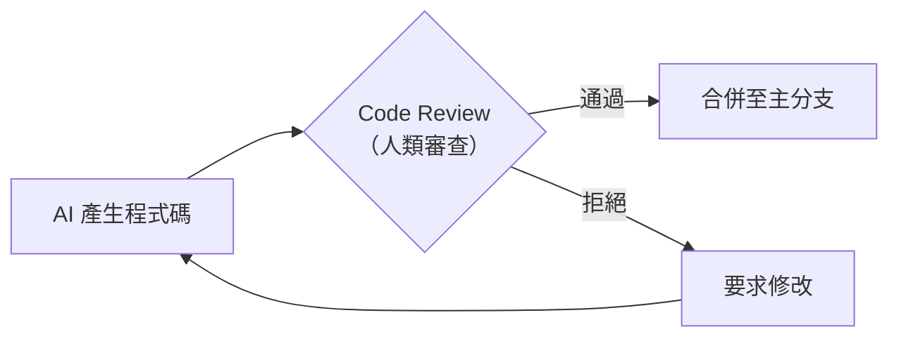

**實施方式**：

- GitHub Branch Protection：要求至少 1 位人類 Reviewer 通過
- AI 生成的 PR 標記 `ai-generated` 標籤
- 高風險變更（Domain Layer、Security Config）要求 2 位 Reviewer

### 18.2 ADR Mandatory 與 Architecture Review

| 變更類型 | 是否需要 ADR | 審查層級 |
|----------|-------------|----------|
| 新增 Dependency | ✅ | Tech Lead |
| 修改 Domain Model | ✅ | 架構師 |
| 修改 API Contract | ✅ | Tech Lead + PM |
| Bug Fix | ❌ | 一般 Review |
| UI 調整 | ❌ | 一般 Review |

### 18.3 AI Scope Restriction 與 Protected Directories

**建議的 Protected Directories（AI 不得自行修改）**：

```text
# AI 修改需要人類審查的目錄
backend/src/main/java/.../domain/     # Domain Layer
backend/src/main/resources/           # 配置檔
infrastructure/kubernetes/            # K8s 配置
.github/workflows/                    # CI/CD Pipeline
docs/adr/                             # 架構決策
CONTEXT.md                            # 領域詞彙
```

### 18.4 Prompt Review 機制

- 團隊應建立**自訂 Skill 審核流程**
- 新 Skill 建立需經過 PR Review
- 現有 Skill 修改需記錄在 CHANGELOG 中
- 定期（每季）審查所有 Skills 的有效性

---

## 第 19 章：DevSecOps 與 CI/CD

### 19.1 GitHub Actions 整合

**CI Pipeline 範例**：

```yaml
# .github/workflows/ci.yml
name: CI Pipeline

on:
  pull_request:
    branches: [main, develop]

jobs:
  test:
    runs-on: ubuntu-latest
    steps:
      - uses: actions/checkout@v4

      - name: Set up Java 21
        uses: actions/setup-java@v4
        with:
          java-version: '21'
          distribution: 'temurin'

      - name: Run Backend Tests
        run: cd backend && mvn test

      - name: Set up Node.js
        uses: actions/setup-node@v4
        with:
          node-version: '20'

      - name: Run Frontend Tests
        run: cd frontend && npm ci && npm test

  security-scan:
    runs-on: ubuntu-latest
    steps:
      - uses: actions/checkout@v4

      - name: Dependency Scan
        uses: aquasecurity/trivy-action@master
        with:
          scan-type: 'fs'
          scan-ref: '.'

      - name: Secret Scan
        uses: gitleaks/gitleaks-action@v2

  lint:
    runs-on: ubuntu-latest
    steps:
      - uses: actions/checkout@v4

      - name: Check AI-generated label
        if: contains(github.event.pull_request.labels.*.name, 'ai-generated')
        run: echo "⚠️ This PR contains AI-generated code. Extra review required."
```

### 19.2 Security Scan Pipeline

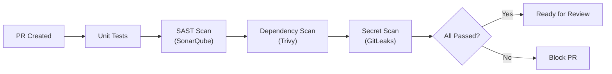

### 19.3 AI Review Workflow

```yaml
# .github/workflows/ai-review.yml
name: AI Code Review Gate

on:
  pull_request:
    types: [labeled]

jobs:
  ai-review-check:
    if: contains(github.event.pull_request.labels.*.name, 'ai-generated')
    runs-on: ubuntu-latest
    steps:
      - name: Enforce Additional Review
        uses: actions/github-script@v7
        with:
          script: |
            const { data: reviews } = await github.rest.pulls.listReviews({
              owner: context.repo.owner,
              repo: context.repo.repo,
              pull_number: context.issue.number,
            });
            const approvals = reviews.filter(r => r.state === 'APPROVED');
            if (approvals.length < 2) {
              core.setFailed('AI-generated PRs require at least 2 approvals');
            }
```

### 19.4 Pull Request Governance

| PR 類型 | 審查要求 | 自動化檢查 |
|---------|----------|------------|
| AI 生成（一般） | 1 Reviewer | Tests + Lint + Security Scan |
| AI 生成（Domain） | 2 Reviewers + 架構師 | Tests + Lint + Security + ADR Check |
| 人類撰寫 | 1 Reviewer | Tests + Lint |
| Hotfix | 1 Senior + Post-Review | Tests only |

---

## 第 20 章：Best Practices — 最佳實踐

| # | 實踐 | 說明 | 優先級 |
|---|------|------|--------|
| 1 | **ADR First** | 架構變更前必須先建立 ADR | 🔴 必要 |
| 2 | **TDD First** | 任何新功能都以 /tdd 開始，Refactor 留給 /code-review | 🔴 必要 |
| 3 | **Grill Before Code** | 編碼前先 /grill-me 或 /grill-with-docs | 🔴 必要 |
| 4 | **Vertical Slice** | 一次處理一個完整的垂直切片 | 🔴 必要 |
| 5 | **Human Review** | AI 生成的程式碼必須經過人類審查 | 🔴 必要 |
| 6 | **Small Commits** | 每個 Vertical Slice 一個 Commit | 🟡 建議 |
| 7 | **Prompt Versioning** | 自訂 Skills 要版本控管 | 🟡 建議 |
| 8 | **CONTEXT.md 維護** | 每次 /grill-with-docs（domain-modeling）後檢查 CONTEXT.md 變更 | 🟡 建議 |
| 9 | **定期架構審查** | 每 Sprint 執行一次 /improve-codebase-architecture | 🟢 推薦 |
| 10 | **Git Guardrails 啟用** | 所有使用 Claude Code 的專案都啟用 git-guardrails-claude-code | 🔴 必要 |
| 11 | **漸進式導入** | PoC → Pilot Team → 全團隊 Rollout | 🟡 建議 |
| 12 | **效率 KPI 追蹤** | 追蹤 AI 生成程式碼的 Review 通過率、TDD 覆蓋率 | 🟢 推薦 |
| 13 | **追蹤上游 CHANGELOG** | 定期核對 mattpocock/skills 的 CHANGELOG.md，該專案改版頻率高 | 🔴 必要 |
| 14 | **大型專案先上 wayfinder** | 規模明顯超出單一 Session 容量時，先用 `/wayfinder` 繪製決策地圖，避免中途失焦 | 🟡 建議 |
| 15 | **版號雙軌並行意識** | 留意 `.claude-plugin/plugin.json` 版號可能領先於 `package.json`／CHANGELOG，導入前以 CHANGELOG 為準 | 🟡 建議 |

---

## 第 21 章：Anti-patterns — 反模式

| # | 反模式 | 症狀 | 風險 | 修正方式 |
|---|--------|------|------|----------|
| 1 | **AI 直接修改 Production** | 程式碼未經審查即部署 | 🔴 嚴重 | 強制 Branch Protection + git-guardrails-claude-code |
| 2 | **AI 跳過測試** | 先寫實作再補測試（或不補） | 🔴 嚴重 | 嚴格執行 /tdd |
| 3 | **AI 大規模重構** | 一次修改數十個檔案 | 🟡 中等 | 限定 Vertical Slice 範圍 |
| 4 | **無 ADR 修改架構** | 架構變更無決策紀錄 | 🟡 中等 | ADR Mandatory 政策 |
| 5 | **無 Review 合併** | 直接 merge AI 生成的 PR | 🔴 嚴重 | Branch Protection Rules |
| 6 | **Vibe Coding** | 對 AI 說「幫我寫一個完整的用戶系統」 | 🟡 中等 | 先 /grill-me 再 /tdd 逐步實作 |
| 7 | **忽略 CONTEXT.md** | 不維護領域詞彙表 | 🟢 輕微 | 每次 /grill-with-docs 後檢查更新 |
| 8 | **過度依賴 AI** | 所有程式碼都由 AI 產生，人類不理解 | 🟡 中等 | 維持人類理解每行程式碼的能力 |
| 9 | **同時修改多張 Ticket** | AI 在一次對話中處理多個無關 Ticket | 🟡 中等 | 一次一張 Ticket，用 /tdd |
| 10 | **不執行測試** | AI 說「測試應該會通過」但未實際執行 | 🔴 嚴重 | 要求 AI 在每步都實際執行測試 |

---

## 第 22 章：Troubleshooting — 故障排除

| # | 問題 | 可能原因 | 解決方式 |
|---|------|----------|----------|
| 1 | **Skills 無法載入** | Skills 未正確安裝 | 重新執行 `npx skills@latest add mattpocock/skills` |
| 2 | **Claude Code 找不到 Skill** | Skill 未在 plugin.json 中註冊 | 確認 Skill 在 `skills/engineering/` 或 `skills/productivity/` 目錄下（misc/in-progress/personal/deprecated 皆不會被自動發現） |
| 3 | **Context 爆炸（Token 超限）** | CONTEXT.md 或 ADR 檔案過大 | 精簡 CONTEXT.md，移除過時的 ADR |
| 4 | **Prompt 汙染** | SKILL.md 或 CONTEXT.md 被注入惡意內容 | 檢查 Git diff，還原異常變更 |
| 5 | **AI 偏離需求** | 未執行 /grill-me 就開始編碼 | 回到需求階段，執行 /grill-me 或 /grill-with-docs |
| 6 | **測試失敗** | AI 生成的測試有語法錯誤 | 要求 AI 在 /tdd 過程中實際執行測試 |
| 7 | **/grill-with-docs 未讀取 CONTEXT.md** | 未執行 /setup-matt-pocock-skills，或 CONTEXT.md 尚未被 domain-modeling 延遲建立 | 先執行初始化，並確認至少完成過一次詞彙確認 |
| 8 | **Issue Tracker 無法連線** | gh CLI 未認證 | 執行 `gh auth login` |
| 9 | **ADR 編號衝突** | 多人同時建立 ADR | 使用 PR 合併解決衝突，重新編號 |
| 10 | **Skill 被錯誤觸發** | 兩個 Skill 的 description 語義重疊 | 修改 description 增加「Use when:」觸發條件 |
| 11 | **/to-tickets 產出的 Ticket 太大** | 缺乏 Vertical Slice 意識 | 引導 AI 將每張 Ticket 限定在剛好塞進一個 Context Window 的規模 |
| 12 | **`/caveman`、`/diagnose`、`/write-a-skill` 等指令找不到** | v1.0.0 已刪除或更名這些 Skill | `caveman` 已移除無替代；`diagnose` 改用 `/diagnosing-bugs`；`write-a-skill` 改用 `/writing-great-skills` |
| 13 | **不確定該用哪個 Skill** | Skill 數量多，容易選錯 | 使用 `/ask-matt` 詢問應使用哪個 Skill |
| 14 | **`/to-prd`、`/to-issues` 找不到指令** | v1.1.0（2026-07-08）已將兩者分別更名／合併為 `/to-spec`、`/to-tickets` | 改用新指令；若團隊 CLAUDE.md／AGENTS.md 或內部教材仍寫著舊指令，需一併更新 |
| 15 | **plugin.json 版號與 CHANGELOG 對不上** | `.claude-plugin/plugin.json` 的版號被獨立提升，未同步寫入 CHANGELOG | 以 `CHANGELOG.md`／GitHub Releases 記載的正式版本為準，plugin.json 版號僅供 Claude Code Plugin 市集使用 |

---

## 第 23 章：FAQ — 常見問題

**Q1：mattpocock/skills 支援哪些 AI Agent？**
> 需分三層理解（見第 1.3 節）：**標準層** agentskills.io 定義 SKILL.md 格式本身；**分發層** skills.sh／`npx skills` CLI（Vercel 維運）負責把符合標準的 SKILL.md 安裝進 20 餘種主流 Agent；**內容層**才是 mattpocock/skills 本身。倉庫 README 只明確提到 Claude Code 與 Codex，並聲明「works with any model」，並未逐一列名 Cursor、GitHub Copilot 等工具——那些是分發層的能力，不是這個倉庫自己的宣告。安裝前建議以 `npx skills@latest add mattpocock/skills` 執行時顯示的清單為準，或直接透過 Claude Code 原生 Plugin（`/plugin install mattpocock-skills@mattpocock`）安裝。

**Q2：安裝後是否需要在每個專案都執行 /setup-matt-pocock-skills？**
> 是的。每個專案倉庫需要獨立初始化，因為每個專案的 Issue Tracker、Triage Labels、Domain 都不同。

**Q3：CONTEXT.md 是手動建立還是自動產生？**
> 延遲自動產生，實際執行者是 `domain-modeling` Skill（`/grill-with-docs` 委派對象）。首次有詞彙被確認定義時才會建立檔案，後續每次質詢會就地更新。`setup-matt-pocock-skills` **不會**建立此檔案。

**Q4：可以自訂新的 Skills 嗎？**
> 可以。使用 `/writing-great-skills`（v1.0.0 由 `write-a-skill` 重寫更名而來）即可建立符合標準結構的自訂 Skill。

**Q5：Skills 更新後會覆蓋自訂配置嗎？**
> Skills 更新只影響 `~/.claude/skills/` 中的共享 Skill 檔案，不會覆蓋專案中的 CONTEXT.md、ADR 等檔案。

**Q6：一次 /tdd 會話可以處理多少個 Vertical Slice？**
> 建議一次處理一個 Vertical Slice。完成後 commit，再開始下一個。

**Q7：grill-me 和 grill-with-docs 有什麼差別？**
> `grill-me` 是通用質詢（不讀取專案檔案），`grill-with-docs` 會讀取並更新 CONTEXT.md 和 ADR。

**Q8：/diagnosing-bugs（原 diagnose）可以分析生產環境的問題嗎？**
> 可以，但需要將相關 logs、metrics 資料貼入對話中。AI 不會直接連線至生產環境。

**Q9：git-guardrails-claude-code 會封鎖人類的 git 操作嗎？**
> 不會。它只在 Claude Code 的 Agent 模式下攔截危險的 git 指令。

**Q10：多個團隊成員可以共用相同的 Skills 配置嗎？**
> Skills 安裝在 `~/.claude/skills/`（使用者層級），每個成員需要自行安裝。專案層級的配置（CONTEXT.md、ADR 等）則透過 Git 共享。

**Q11：如何衡量 mattpocock/skills 的導入效果？**
> 建議追蹤：AI 生成程式碼的 Code Review 通過率、TDD 覆蓋率變化、Bug 回報率變化、CONTEXT.md 更新頻率。

**Q12：是否需要所有 Skills 都安裝？**
> 不需要。根據團隊需求選擇。最低建議安裝：`setup-matt-pocock-skills` + `grill-with-docs`（含 `grilling`、`domain-modeling`）+ `tdd` + `git-guardrails-claude-code`。

**Q13：/prototype 產出的程式碼會進入正式程式碼庫嗎？**
> 不應該。Prototype 是拋棄式的，用於驗證可行性。正式實作應使用 `/tdd`。

**Q14：ADR 可以修改或刪除嗎？**
> ADR 不應刪除。若決策過時，應建立新 ADR 並標註舊 ADR 狀態為 `Superseded by ADR-XXXX`。

**Q15：CONTEXT.md 變更是否需要 Code Review？**
> 強烈建議。CONTEXT.md 定義了專案的核心概念，變更應經過 PR Review。

**Q16：Monorepo 專案如何使用？**
> 使用 `CONTEXT-MAP.md` 映射每個子模組的 CONTEXT.md 路徑。

**Q17：/to-spec（原 /to-prd）是否會進行質詢？**
> 不會。`/to-spec` 只綜合現有對話與程式碼理解產出 Spec 文件。質詢應在之前使用 `/grill-me` 或 `/grill-with-docs`。`/to-prd` 是這個指令 v1.1.0（2026-07-08）之前的舊名，查證當下已從倉庫中移除。

**Q18：In-Progress 的 Skills（如 claude-handoff、wizard）可以使用嗎？**
> 可以手動載入使用，但未在 plugin.json 中註冊，Claude Code 不會自動發現。品質與穩定性不保證，查證當下清單仍在頻繁變動，不建議用於生產流程。**注意**：`wayfinder` 已於 v1.1.0 由 in-progress 轉正進入 Engineering、正式收錄進 plugin.json（見第 14.6 節），不再屬於這個「開發中」分類。

**Q19：如何處理團隊內不同成員安裝了不同版本的 Skills？**
> 建議團隊統一使用相同版本，可在團隊 Wiki 或 README 中記錄建議版本。Skills 本身的更新頻率較高，建議每月同步更新。

**Q20：/handoff 產出的文件格式是什麼？**
> 壓縮的 Markdown 文件，包含對話重點摘要、待辦事項、相關檔案列表，可直接貼入新的 Claude Code 會話。

**Q21：企業環境中，AI 生成的程式碼是否有智慧財產權疑慮？**
> mattpocock/skills 本身是 MIT License。AI 生成的程式碼歸屬依 Claude Code 的使用條款而定。建議諮詢公司法務。

**Q22：舊版手冊提到的 caveman 極簡溝通模式還能用嗎？**
> 不能。`caveman` 已在 v1.0.0 被移除，作者說明原因是「本就是重複品，從未打算公開發布」，目前**沒有等效的替代 Skill**。若團隊需要壓縮溝通格式，建議自行在 CLAUDE.md／AGENTS.md 中撰寫團隊慣例，而非依賴此 Skill。

**Q23：`/to-prd`、`/to-issues` 為什麼突然找不到了？**
> 這兩個指令在 v1.1.0（2026-07-08）的「Unify the planning skills」改版中被取代：`/to-prd` 更名為 `/to-spec`（README 說明「spec」現在是統一的通用詞彙，文件仍保留「你可能認識它叫 PRD」一句方便辨識）；`/to-issues` 與另一個已消失的 `/to-plan` 合併為 `/to-tickets`，`to-issues` 本身則被刪除。核心行為與工作流程位置基本延續（見第 8、9 章），只是指令名稱與部分細節（如票券改用明確的 blocking edges）不同，建議直接更新團隊教材與 CLAUDE.md 中的指令引用。

**Q24：`wayfinder` 和 `to-tickets` 都會拆出票券，該用哪一個？**
> 依規模決定，兩者不互相取代。一般規模的功能開發（幾天到一兩週內可完成）直接用 `/to-spec → /to-tickets`；當工作真的大到連「先寫 Spec」都做不到——例如一整個模組重寫、橫跨多個 Session 才能想清楚——才用 `/wayfinder` 先繪製決策地圖。另一個關鍵差異是分類機制：`to-tickets` 沒有正式的人類參與分類，預設全部票券都是 Agent 可獨立認領（`ready-for-agent`）；`wayfinder` 則有正式的 HITL／AFK 雙分類（見第 14.6 節），因為地圖上的票券本質是「需要決策」，天生就比一般開發票券更常需要人類介入。

**Q25：`.claude-plugin/plugin.json` 顯示的版本和 CHANGELOG 對不上，該以哪個為準？**
> 以 `CHANGELOG.md`／GitHub Releases 記載的正式版本為準（查證當下為 v1.1.0）。`.claude-plugin/plugin.json` 內的版號是 Claude Code Plugin 市集使用的獨立版號軌道，查證當下已提升至 1.2.0 但尚無對應的 CHANGELOG 條目或 GitHub Release，屬於治理上尚未對齊的落差，不代表 Skill 本身的功能已進一步演進。

**Q26：`/research` 和既有的 `/grilling`／`/domain-modeling` 有什麼不同？**
> `/research` 針對的是「客觀事實」（第三方 API 行為、官方文件內容），以背景子代理非同步執行、輸出一份附引用來源的 Markdown 檔案；`/grilling`／`/domain-modeling` 針對的是「主觀決策」，需要即時、一次一問地與使用者對話才能定案。兩者互補：`wayfinder` 的地圖上，`research` 票券交給背景代理平行處理，`grilling` 票券則保留給人類即時對話（見第 14.6、14.7 節）。

---

## 第 24 章：Appendix — 附錄

### 24.1 CLI 速查表

> 以下為 `.claude-plugin/plugin.json` 實際註冊的 22 個 Skill（查證版本 v1.2.0，2026-07-22），User-invoked／Model-invoked 分類依 README「Reference」章節逐一核對（見第 2.1 節），依分類與典型使用順序排列。

| 指令 | 分類 | 觸發方式 | 用途 |
|------|------|----------|------|
| `/setup-matt-pocock-skills` | Engineering | User-invoked | 專案初始化（必須首先執行） |
| `/ask-matt` | Engineering | User-invoked | Skill 路由器，不確定用哪個指令時詢問 |
| `/grill-me` | Productivity | User-invoked | 通用計畫質詢（委派 grilling） |
| `/grilling` | Productivity | Model-invoked | 共用質詢引擎（通常不直接呼叫） |
| `/grill-with-docs` | Engineering | User-invoked | 結合 Domain 的深度質詢（委派 grilling + domain-modeling） |
| `/domain-modeling` | Engineering | Model-invoked | CONTEXT.md／ADR 讀寫（通常由 grill-with-docs 委派） |
| `/codebase-design` | Engineering | Model-invoked | 深模組詞彙、Deletion Test、depth-as-leverage |
| `/wayfinder` | Engineering | User-invoked | 超大型任務的決策地圖規劃（v1.1.0 新收錄，見 14.6 節） |
| `/research` | Engineering | Model-invoked | 背景子代理調研，輸出附引用來源的 Markdown（v1.1.0 新增，見 14.7 節） |
| `/tdd` | Engineering | Model-invoked | 測試驅動開發（RED-GREEN，Refactor 另交 code-review） |
| `/to-spec` | Engineering | User-invoked | 對話轉 Spec 文件（原 `/to-prd`） |
| `/to-tickets` | Engineering | User-invoked | Spec 拆解為 Ticket，明確宣告 blocking edges（原 `/to-issues`） |
| `/implement` | Engineering | User-invoked | 依 Spec／Ticket 執行實作，驅動 tdd 並收尾 code-review |
| `/prototype` | Engineering | Model-invoked | 快速原型建立（Logic／UI 分支） |
| `/diagnosing-bugs` | Engineering | Model-invoked | 六階段結構化除錯（原名 diagnose） |
| `/improve-codebase-architecture` | Engineering | User-invoked | 架構改善建議（Explore／Report／Grilling Loop） |
| `/code-review` | Engineering | Model-invoked | 雙軸（Standards + Spec）平行 subagent 審查，含 Refactor 與 Fowler 壞味道基準 |
| `/resolving-merge-conflicts` | Engineering | Model-invoked | 逐一解決 git merge/rebase 衝突（v1.1.0 起正式收錄） |
| `/triage` | Engineering | User-invoked | 議題分類管理（雙軸系統） |
| `/handoff` | Productivity | User-invoked | 跨 Agent 交接 |
| `/teach` | Productivity | User-invoked | 多會話教學工作區 |
| `/writing-great-skills` | Productivity | User-invoked | 自訂 Skill 開發（原名 write-a-skill） |

> **已於 v1.0.0 移除，無替代**：`caveman`、`zoom-out`。**已於 v1.1.0 移除，由新指令取代**：`to-prd`（→ `to-spec`）、`to-issues`（→ `to-tickets`）。

### 24.2 Prompt Templates

**需求探索 Prompt 範本**：

```text
/grill-with-docs
我想為 [系統名稱] 新增 [功能名稱]。
目標用戶是 [用戶角色]。
主要需求是 [核心需求描述]。
預計影響的模組有 [模組列表]。
```

**TDD 啟動 Prompt 範本**：

```text
/tdd
實作 [Ticket #N]: [Ticket 標題]
技術約束：參考 ADR-XXXX
影響範圍：[模組/層級]
```

**除錯 Prompt 範本**：

```text
/diagnosing-bugs
問題描述：[症狀]
重現步驟：[步驟]
預期行為：[應該的結果]
實際行為：[實際的結果]
環境：[開發/測試/生產]
```

**架構審查 Prompt 範本**：

```text
/improve-codebase-architecture
請聚焦在 [模組名稱]，特別關注：
1. [關注點 1]
2. [關注點 2]
最近的變更包括：[變更描述]
```

**大型任務地圖規劃 Prompt 範本**（`/wayfinder`，新增）：

```text
/wayfinder
我們要 [大範圍變更描述]，牽涉 [涉及的模組/系統範圍]。
已知的限制或偏好：[標準架構慣例、不可變動的既有決策等]
目前最大的不確定性在於：[列出已知但尚未釐清的關鍵問題]
```

**背景調研 Prompt 範本**（`/research`，新增）：

```text
/research
我想釐清：[具體問題]
請以官方文件／原始碼／規格書等第一手來源為準，
並將結論連同引用來源整理成一份 Markdown 檔案。
```

### 24.3 新進成員 Checklist

**第一天**：

- [ ] 安裝 Claude Code（最新版）
- [ ] 安裝 Node.js v18+
- [ ] 安裝 gh CLI 並完成認證（`gh auth login`）
- [ ] 執行 `npx skills@latest add mattpocock/skills`（選擇所有 Skills）或改用 Claude Code 原生 Plugin（`/plugin install mattpocock-skills@mattpocock`）
- [ ] 閱讀本手冊第 1-4 章

**第一週**：

- [ ] 在專案中執行 `/setup-matt-pocock-skills`（或確認已初始化）
- [ ] 閱讀專案的 CONTEXT.md 了解領域詞彙（若尚未建立，先了解 domain-modeling 的延遲建立機制）
- [ ] 閱讀 docs/adr/ 了解已有架構決策
- [ ] 使用 `/ask-matt` 或 `/codebase-design` 了解專案全局架構
- [ ] 完成第一個 `/tdd` 練習（修復一個小 Bug，記得 Refactor 留給 code-review）

**第一個月**：

- [ ] 使用 `/grill-me` 完成至少一次需求探索
- [ ] 使用 `/to-spec` 產出至少一份 Spec
- [ ] 使用 `/to-tickets` 拆解至少一個功能，並練習正確宣告 blocking edges
- [ ] 使用 `/tdd` 完成至少三個 Vertical Slice
- [ ] 使用 `/diagnosing-bugs` 解決至少一個 Bug
- [ ] 若手邊有規模超出單一 Session 的任務，練習用 `/wayfinder` 繪製一次決策地圖
- [ ] 閱讀本手冊第 17-19 章（SSDLC + Governance + CI/CD）

### 24.4 團隊導入 Checklist

**Phase 1：PoC（2 週）**：

- [ ] 選擇 1-2 位團隊成員作為先導者
- [ ] 在非關鍵專案上試用 mattpocock/skills
- [ ] 記錄使用體驗、問題與建議
- [ ] 產出 PoC 報告

**Phase 2：Pilot（4 週）**：

- [ ] 擴展至 3-5 位團隊成員
- [ ] 在正式專案的新功能開發中使用
- [ ] 建立團隊自訂 Skills（如有需要）
- [ ] 定義 AI Governance 政策（Branch Protection、Review 要求）
- [ ] 追蹤效率 KPI（Review 通過率、Bug 率、覆蓋率）

**Phase 3：Rollout（持續）**：

- [ ] 全團隊安裝並統一 Skills 版本
- [ ] 將 AI Governance 政策正式化（寫入團隊 Wiki）
- [ ] CI/CD Pipeline 整合 Security Scan
- [ ] 定期（每月）更新 Skills 至最新版
- [ ] 每季審查 Skills 有效性與團隊使用狀況

### 24.5 參考連結

| 資源 | 連結 | 備註 |
|------|------|------|
| mattpocock/skills GitHub | [github.com/mattpocock/skills](https://github.com/mattpocock/skills) | 180,641 stars／15,434 forks（2026-07-22 查證） |
| mattpocock/skills CHANGELOG | [CHANGELOG.md](https://github.com/mattpocock/skills/blob/main/CHANGELOG.md) | 追蹤 Skill 更名／刪除／新增的第一手來源；查證當下最新為 v1.1.0（2026-07-08） |
| agentskills.io | [agentskills.io](https://agentskills.io) | Agent Skills 開放標準規格本體，由 Anthropic 主導、開放治理，是三層生態系中的標準層（見第 1.3 節） |
| skills.sh | [skills.sh](https://skills.sh) | 由 **Vercel** 發佈維運的開放 Agent Skills 生態系分發層網站，非 mattpocock/skills 本身 |
| Claude Code 官方文件 | [code.claude.com/docs](https://code.claude.com/docs) | 已查證為現行正確網址 |
| Skills CLI（npx skills） | [npmjs.com/package/skills](https://www.npmjs.com/package/skills) | 查證版本 1.5.19 |
| 作者電子報（aihero.dev） | [aihero.dev/s/skills-newsletter](https://www.aihero.dev/s/skills-newsletter) | Matt Pocock 本人維運，同步發布 Skill 更新，查證當下約 6 萬訂閱者 |
| ADR 最佳實踐 | [adr.github.io](https://adr.github.io/) | — |
| Vertical Slice Architecture | [jimmybogard.com](https://jimmybogard.com/vertical-slice-architecture/) | — |
| TDD 入門指南 | [martinfowler.com](https://martinfowler.com/bliki/TestDrivenDevelopment.html) | — |
| A Philosophy of Software Design | [web.stanford.edu](https://web.stanford.edu/~ouster/cgi-bin/book.php) | codebase-design 明確揚棄其 Depth 定義，改採 depth-as-leverage，見第 6.4 節 |

### 24.6 版本紀錄

| 版本 | 日期 | 變更說明 |
|------|------|----------|
| v4.0.0 | 2026-07-22 | 全面查證改版：對照 mattpocock/skills **v1.1.0**（2026-07-08 發布）原始碼與生態系現況，更新 Star／Fork 數與 npm 套件版本；`to-prd`→`to-spec`、`to-issues`（與已刪除的 `to-plan`）→`to-tickets` 更名／合併，兩章全面重寫並訂正依賴表達方式（blocking edges）；`wayfinder` 由 in-progress 轉正，新增專節說明其決策地圖與 HITL/AFK 分類；新增 `research` Skill 專節；`resolving-merge-conflicts` 結束未收錄過渡期；訂正 grilling 原則（4→5 條，新增確認閘門與事實/決策二分）、prototype 第 6 條規則（Capture it when done）、setup-matt-pocock-skills 的 triage-labels.md 條件式建立；補上 code-review 的 Fowler 壞味道基準與 writing-great-skills 的新失效模式；釐清 agentskills.io／skills.sh／mattpocock-skills 三層生態系架構；新增 Executive Summary 與多則 FAQ／Troubleshooting／Best Practices 條目；全面更新目錄與章節編號；移除檔尾重複的舊版本紀錄區塊 |
| v3.0.0 | 2026-07-02 | 全面查證改版：對照 mattpocock/skills v1.0.0／v1.0.1（2026-06-17 發布）原始碼與 skills.sh／npm 生態系，訂正 Star 數與多 Agent 聲明範圍；移除已刪除的 `zoom-out`、`caveman`；`diagnose`→`diagnosing-bugs`、`write-a-skill`→`writing-great-skills` 更名；新增 domain-modeling／codebase-design 專章；訂正 tdd 二階段流程與附屬檔數量；訂正 to-issues 的 HITL/AFK 描述、prototype 六規則、improve-codebase-architecture 三階段名稱、triage 的 AGENT-BRIEF.md 性質、setup-matt-pocock-skills 實際建立檔案範圍；重新編排目錄與章節編號；修正 md 格式問題 |
| v2.0.0 | 2026-05-15 | 全面改版：更新多 Agent 支援、skills.sh 生態系、CONTEXT.md 純 Glossary 格式、ADR 簡化格式、triage 雙軸系統、HITL/AFK 分類、Module Depth 理論、Post-Mortem 階段等（本版部分內容已於 v3.0.0 訂正或推翻，請以本文最新版本為準） |
| v1.0.0 | 2026-05-15 | 初版發布，基於 mattpocock/skills 2026-05 版本調研 |

> **免責聲明**：mattpocock/skills 為持續活躍開發的開源專案，部分功能（如 In-Progress Skills）可能在未來版本中變更。建議定期參閱官方 GitHub 取得最新資訊。

