+++
date = '2026-05-15T22:11:00+08:00'
draft = true
title = 'Mattpocock Skills 教學手冊'
tags = ['教學', 'AI開發','指引']
categories = ['教學']
+++
# mattpocock/skills 教學手冊

> **使用 mattpocock/skills 建構企業級 AI Coding Agent 工程治理平台**

| 項目 | 說明 |
|------|------|
| **版本** | v2.0.0 |
| **更新日期** | 2026-05-15 |
| **適用對象** | 資深工程師、架構師、Tech Lead、DevSecOps 工程師、AI 導入推動者 |
| **技術棧** | mattpocock/skills、Claude Code / Cursor / Codex / GitHub Copilot 等多 Agent、CONTEXT.md、ADR、skills.sh |
| **參考來源** | [mattpocock/skills GitHub](https://github.com/mattpocock/skills)（84.1k stars、1.3M+ 安裝量、MIT License） |
| **前置知識** | AI Coding Agent 基本操作、Git 版本控制、基礎軟體工程概念 |

> **延伸閱讀**：本手冊專注於 mattpocock/skills 特有生態系。如需了解通用 Agent Skills 開放標準，請參閱同目錄下的《Agent Skills 教學手冊》與《claude agent skills 教學手冊》。

---

## 目錄

- [第 1 章：前言](#第-1-章前言)
  - [1.1 mattpocock/skills 是什麼](#11-mattpocockskills-是什麼)
  - [1.2 解決的四大 AI 失敗模式](#12-解決的四大-ai-失敗模式)
  - [1.3 skills.sh 生態系與多 Agent 支援](#13-skillssh-生態系與多-agent-支援)
  - [1.4 適用對象與使用情境](#14-適用對象與使用情境)
  - [1.5 文件使用方式](#15-文件使用方式)
- [第 2 章：mattpocock/skills 架構](#第-2-章mattpocockskills-架構)
  - [2.1 Skills Runtime 與多 Agent 整合](#21-skills-runtime-與多-agent-整合)
  - [2.2 Context Injection 與 Prompt Pipeline](#22-context-injection-與-prompt-pipeline)
  - [2.3 Governance Layer 與 Agent Constraints](#23-governance-layer-與-agent-constraints)
  - [2.4 ADR Integration 與 Domain Discovery](#24-adr-integration-與-domain-discovery)
  - [2.5 Skills 分類體系](#25-skills-分類體系)
- [第 3 章：安裝與初始化](#第-3-章安裝與初始化)
  - [3.1 前置環境準備](#31-前置環境準備)
  - [3.2 安裝 mattpocock/skills](#32-安裝-mattpocockskills)
  - [3.3 執行 setup-matt-pocock-skills](#33-執行-setup-matt-pocock-skills)
  - [3.4 初始化建立的檔案與目錄](#34-初始化建立的檔案與目錄)
  - [3.5 Issue Tracker 配置](#35-issue-tracker-配置)
- [第 4 章：Skills 工作原理](#第-4-章skills-工作原理)
  - [4.1 SKILL.md 檔案格式與附屬資源](#41-skillmd-檔案格式與附屬資源)
  - [4.2 Plugin 註冊機制](#42-plugin-註冊機制)
  - [4.3 CONTEXT.md — 領域詞彙表](#43-contextmd--領域詞彙表)
  - [4.4 ADR（Architecture Decision Records）](#44-adrarchitecture-decision-records)
  - [4.5 Skill 載入與執行流程](#45-skill-載入與執行流程)
- [第 5 章：grill-me 與 grill-with-docs — 需求探索與挑戰](#第-5-章grill-me-與-grill-with-docs--需求探索與挑戰)
  - [5.1 grill-me — 通用計畫挑戰](#51-grill-me--通用計畫挑戰)
  - [5.2 grill-with-docs — 結合 Domain 的深度挑戰](#52-grill-with-docs--結合-domain-的深度挑戰)
  - [5.3 grill-with-docs 的六項會議中行為](#53-grill-with-docs-的六項會議中行為)
  - [5.4 實戰案例：API 設計審查](#54-實戰案例api-設計審查)
  - [5.5 最佳實踐與常見錯誤](#55-最佳實踐與常見錯誤)
- [第 6 章：tdd — 測試驅動開發](#第-6-章tdd--測試驅動開發)
  - [6.1 Philosophy — 測試哲學](#61-philosophy--測試哲學)
  - [6.2 Anti-Pattern: Horizontal Slices](#62-anti-pattern-horizontal-slices)
  - [6.3 Workflow — 四階段工作流](#63-workflow--四階段工作流)
  - [6.4 Spring Boot TDD 案例](#64-spring-boot-tdd-案例)
  - [6.5 Vue 3 TDD 案例](#65-vue-3-tdd-案例)
  - [6.6 React TDD 案例](#66-react-tdd-案例)
  - [6.7 Node.js TDD 案例](#67-nodejs-tdd-案例)
  - [6.8 最佳實踐與常見錯誤](#68-最佳實踐與常見錯誤)
- [第 7 章：to-prd — 產品需求文件產生](#第-7-章to-prd--產品需求文件產生)
  - [7.1 AI 對話轉 PRD 流程](#71-ai-對話轉-prd-流程)
  - [7.2 PRD 模板結構（Deep Module 導向）](#72-prd-模板結構deep-module-導向)
  - [7.3 User Stories 撰寫](#73-user-stories-撰寫)
  - [7.4 實戰案例與最佳實踐](#74-實戰案例與最佳實踐)
- [第 8 章：to-issues — 工作任務拆解](#第-8-章to-issues--工作任務拆解)
  - [8.1 PRD 到 Issue Tracker](#81-prd-到-issue-tracker)
  - [8.2 Tracer Bullet Vertical Slice 拆解策略](#82-tracer-bullet-vertical-slice-拆解策略)
  - [8.3 HITL 與 AFK 分類](#83-hitl-與-afk-分類)
  - [8.4 Issue Body Template](#84-issue-body-template)
  - [8.5 Label 與 Triage 策略（新版雙軸系統）](#85-label-與-triage-策略新版雙軸系統)
  - [8.6 實戰案例與最佳實踐](#86-實戰案例與最佳實踐)
- [第 9 章：prototype — 快速原型建立](#第-9-章prototype--快速原型建立)
  - [9.1 Throwaway Prototype 原則](#91-throwaway-prototype-原則)
  - [9.2 Logic 分支 — 終端互動原型](#92-logic-分支--終端互動原型)
  - [9.3 UI 分支 — 多方案視覺原型](#93-ui-分支--多方案視覺原型)
  - [9.4 通用規則與實戰案例](#94-通用規則與實戰案例)
- [第 10 章：diagnose — 結構化除錯](#第-10-章diagnose--結構化除錯)
  - [10.1 六階段（Six Phases）除錯流程](#101-六階段six-phases除錯流程)
  - [10.2 Phase 1 — Build a Feedback Loop（建立回饋迴路）](#102-phase-1--build-a-feedback-loop建立回饋迴路)
  - [10.3 Phase 2-4 — 假設與驗證](#103-phase-2-4--假設與驗證)
  - [10.4 Phase 5-6 — 修復與回顧](#104-phase-5-6--修復與回顧)
  - [10.5 實戰案例與最佳實踐](#105-實戰案例與最佳實踐)
- [第 11 章：zoom-out — 全局視角](#第-11-章zoom-out--全局視角)
  - [11.1 Repo Discovery 與 System Mapping](#111-repo-discovery-與-system-mapping)
  - [11.2 Architecture Understanding](#112-architecture-understanding)
  - [11.3 實戰案例與最佳實踐](#113-實戰案例與最佳實踐)
- [第 12 章：improve-codebase-architecture — 架構改善](#第-12-章improve-codebase-architecture--架構改善)
  - [12.1 Module Depth 理論](#121-module-depth-理論)
  - [12.2 Deletion Test 與 Deepening Opportunities](#122-deletion-test-與-deepening-opportunities)
  - [12.3 三階段改善流程](#123-三階段改善流程)
  - [12.4 實戰案例與最佳實踐](#124-實戰案例與最佳實踐)
- [第 13 章：triage — 議題分類與管理](#第-13-章triage--議題分類與管理)
  - [13.1 雙軸角色系統](#131-雙軸角色系統)
  - [13.2 AGENT-BRIEF.md 與自動摘要](#132-agent-briefmd-與自動摘要)
  - [13.3 Out-of-Scope 知識庫](#133-out-of-scope-知識庫)
  - [13.4 AI 評論聲明](#134-ai-評論聲明)
  - [13.5 實戰案例與最佳實踐](#135-實戰案例與最佳實踐)
- [第 14 章：其他實用 Skills](#第-14-章其他實用-skills)
  - [14.1 caveman — 極簡溝通模式](#141-caveman--極簡溝通模式)
  - [14.2 handoff — 跨 Agent 交接](#142-handoff--跨-agent-交接)
  - [14.3 write-a-skill — 自訂 Skill 開發](#143-write-a-skill--自訂-skill-開發)
  - [14.4 git-guardrails-claude-code — Git 安全護欄](#144-git-guardrails-claude-code--git-安全護欄)
  - [14.5 setup-pre-commit — Pre-commit 配置](#145-setup-pre-commit--pre-commit-配置)
  - [14.6 開發中的 Skills（In-Progress）](#146-開發中的-skillsin-progress)
  - [14.7 已棄用的 Skills（Deprecated）](#147-已棄用的-skillsdeprecated)
- [第 15 章：AI Agent Workflow](#第-15-章ai-agent-workflow)
  - [15.1 端到端工作流程](#151-端到端工作流程)
  - [15.2 Skills 組合策略](#152-skills-組合策略)
  - [15.3 迭代循環與回饋機制](#153-迭代循環與回饋機制)
- [第 16 章：Web Application 實戰案例](#第-16-章web-application-實戰案例)
  - [16.1 技術棧選型](#161-技術棧選型)
  - [16.2 專案目錄結構](#162-專案目錄結構)
  - [16.3 Skills 如何限制 AI](#163-skills-如何限制-ai)
  - [16.4 避免 Vibe Coding 與架構污染](#164-避免-vibe-coding-與架構污染)
  - [16.5 完整開發流程示範](#165-完整開發流程示範)
- [第 17 章：SSDLC — 安全軟體開發生命週期](#第-17-章ssdlc--安全軟體開發生命週期)
  - [17.1 Threat Modeling 與 Skills 整合](#171-threat-modeling-與-skills-整合)
  - [17.2 SAST / DAST / Dependency Scan](#172-sast--dast--dependency-scan)
  - [17.3 Prompt Injection 防護](#173-prompt-injection-防護)
  - [17.4 AI Security Governance](#174-ai-security-governance)
- [第 18 章：AI Governance — AI 治理](#第-18-章ai-governance--ai-治理)
  - [18.1 Human Approval Gate](#181-human-approval-gate)
  - [18.2 ADR Mandatory 與 Architecture Review](#182-adr-mandatory-與-architecture-review)
  - [18.3 AI Scope Restriction 與 Protected Directories](#183-ai-scope-restriction-與-protected-directories)
  - [18.4 Prompt Review 機制](#184-prompt-review-機制)
- [第 19 章：DevSecOps 與 CI/CD](#第-19-章devsecops-與-cicd)
  - [19.1 GitHub Actions 整合](#191-github-actions-整合)
  - [19.2 Security Scan Pipeline](#192-security-scan-pipeline)
  - [19.3 AI Review Workflow](#193-ai-review-workflow)
  - [19.4 Pull Request Governance](#194-pull-request-governance)
- [第 20 章：Best Practices — 最佳實踐](#第-20-章best-practices--最佳實踐)
- [第 21 章：Anti-patterns — 反模式](#第-21-章anti-patterns--反模式)
- [第 22 章：Troubleshooting — 故障排除](#第-22-章troubleshooting--故障排除)
- [第 23 章：FAQ — 常見問題](#第-23-章faq--常見問題)
- [第 24 章：Appendix — 附錄](#第-24-章appendix--附錄)
  - [24.1 CLI 速查表](#241-cli-速查表)
  - [24.2 Prompt Templates](#242-prompt-templates)
  - [24.3 新進成員 Checklist](#243-新進成員-checklist)
  - [24.4 團隊導入 Checklist](#244-團隊導入-checklist)
  - [24.5 參考連結](#245-參考連結)

---

## 第 1 章：前言

### 1.1 mattpocock/skills 是什麼

mattpocock/skills 是由知名 TypeScript 專家 Matt Pocock 開發的開源 AI Agent 技能工具庫。最初為 Claude Code 設計，現已擴展為**跨 Agent 平台**，透過 skills.sh 登錄（Registry）支援十餘種 AI 編碼代理。截至目前，該專案已累計超過 **84.1k GitHub Stars** 與 **1.3M 次安裝**，是社群中最受歡迎的 Agent Skills 集合之一。

其核心目標是為 AI 編碼代理加入**嚴格的工程實踐約束**，防止 AI 進行無紀律的「盲目通靈寫程式（Vibe Coding）」。

**核心定位**：

| 面向 | 說明 |
|------|------|
| **工程紀律** | 強制 AI 遵循 TDD、ADR、Vertical Slice 等工程實踐 |
| **需求對齊** | 透過結構化質詢（grill-me / grill-with-docs）確保 AI 理解真正需求 |
| **Domain 保護** | 以 CONTEXT.md 建立**純詞彙表（Glossary）**，防止 AI 任意修改核心概念 |
| **架構守護** | 透過 ADR 與 improve-codebase-architecture 確保架構一致性 |
| **Token 優化** | 以 Domain Language 壓縮 ~75% 的 Token 消耗 |
| **多 Agent** | 透過 skills.sh 支援 Claude Code、Cursor、Codex、GitHub Copilot 等 10+ Agent |

**與傳統 Prompt 的差異**：

```
傳統做法：開發者 → 自由文字 Prompt → AI 自由生成 → 品質不可預測
Skills 做法：開發者 → 結構化 Skill → 約束 Pipeline → 高品質可預測輸出
```

### 1.2 解決的四大 AI 失敗模式

mattpocock/skills 設計之初就瞄準了四個常見的 AI 協作失敗模式：

| 失敗模式 | 症狀 | 對應 Skills | 核心解法 |
|----------|------|-------------|----------|
| **需求誤解** | AI 偏離真正需求，產出無用程式碼 | `/grill-me`、`/grill-with-docs` | 在編碼前強制對齊需求 |
| **冗長輸出** | AI 回應過於囉嗦，消耗大量 Token | `/grill-with-docs`（建立 CONTEXT.md） | 建立領域詞彙表壓縮溝通 |
| **品質低落** | 缺乏測試、錯誤處理不當 | `/tdd`、`/diagnose` | 強制紅燈-綠燈-重構循環 |
| **架構腐化** | 程式碼變成「泥球」，職責混亂 | `/improve-codebase-architecture` | 以 Module Depth 理論與 ADR 驅動架構決策 |

### 1.3 skills.sh 生態系與多 Agent 支援

skills.sh 是由 Vercel Labs 維護的 Skills 登錄網站（Registry），提供 Skills 的發佈、搜尋與安裝功能。mattpocock/skills 是該平台上最受歡迎的 Skills 集合。

**支援的 Agent 列表**（持續擴充中）：

| Agent | 說明 |
|-------|------|
| **Claude Code** | 原生支援，透過 `.claude-plugin/plugin.json` 註冊 |
| **Cursor** | 透過 `.cursor/rules/` 整合 |
| **Codex** | OpenAI Codex Agent 支援 |
| **GitHub Copilot** | 透過 `.github/copilot-instructions.md` 或 AGENTS.md 整合 |
| **Windsurf** | Codeium 的 Agent 環境 |
| **Gemini** | Google AI Agent |
| **Cline** | VS Code 開源 Agent |
| **AMP** | Sourcegraph Agent |
| **Antigravity** | 新興 Agent 平台 |
| **ClawdBot** | Discord/Slack Bot Agent |

> **重要變更**：早期版本的文件聲稱 mattpocock/skills 「專為 Claude Code 設計」，此描述已不再準確。最新版 README 明確標示 Skills 可與**任何模型（any model）**配合使用，skills.sh CLI 會根據目標 Agent 自動調整安裝路徑。

**安裝指令**：

```bash
npx skills@latest add mattpocock/skills
```

skills.sh 的 CLI 會自動偵測專案中使用的 Agent 並安裝至對應目錄。

### 1.4 適用對象與使用情境

**適合使用 mattpocock/skills 的團隊**：

- 使用 Claude Code、Cursor、GitHub Copilot 或其他支援 Agent 作為 AI 編碼助手的團隊
- 需要 AI 治理機制的中大型開發團隊
- 重視工程紀律（TDD、ADR、Code Review）的組織
- 正在導入 AI 輔助開發但擔心品質失控的團隊
- 跨 Agent 環境需要統一工程標準的組織

**不適合的場景**：

- 個人小型 Side Project 不需要工程治理
- 需要即時高頻互動的場景（Skills 強調深度思考而非快速回應）

### 1.5 文件使用方式

本手冊建議按照以下順序閱讀：

1. **初次使用者**：第 1-4 章（概念與安裝）→ 第 5 章（grill-me）→ 第 6 章（tdd）
2. **架構師**：第 2 章（架構）→ 第 12 章（架構改善）→ 第 17-18 章（SSDLC + AI Governance）
3. **Team Lead**：第 15 章（Workflow）→ 第 20 章（Best Practices）→ 第 24 章（Checklist）
4. **DevSecOps**：第 17-19 章（SSDLC + Governance + CI/CD）

---

## 第 2 章：mattpocock/skills 架構

### 2.1 Skills Runtime 與多 Agent 整合

mattpocock/skills 透過各 Agent 的 Plugin 機制註冊，每個 Skill 以 SKILL.md 檔案定義指令與約束。Agent 在執行時讀取 Skill 描述來決定何時觸發對應技能。以 Claude Code 為例，透過 `.claude-plugin/plugin.json` 註冊；以 GitHub Copilot 為例，透過 `AGENTS.md` 整合。

**核心架構圖**：

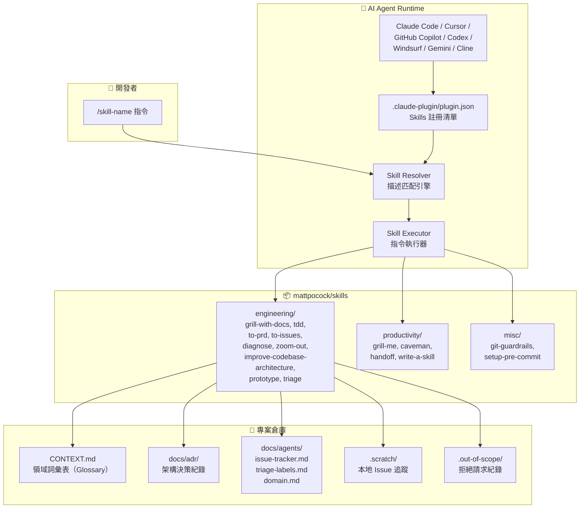

**關鍵運作邏輯**：

1. **安裝階段**：`npx skills@latest add mattpocock/skills` 將 Skills 安裝至 `~/.claude/skills/`（Claude Code）或對應 Agent 的 Skills 目錄
2. **註冊階段**：`.claude-plugin/plugin.json` 列出所有已啟用的 Skills 路徑
3. **觸發階段**：Agent 依據 Skill 的 `description` 欄位判斷何時建議使用
4. **執行階段**：Agent 讀取 SKILL.md 中的完整指令與約束，結合專案的 CONTEXT.md 與 ADR 進行回應

### 2.2 Context Injection 與 Prompt Pipeline

mattpocock/skills 的核心創新在於**結構化的上下文注入**，而非單純的 Prompt 模板：

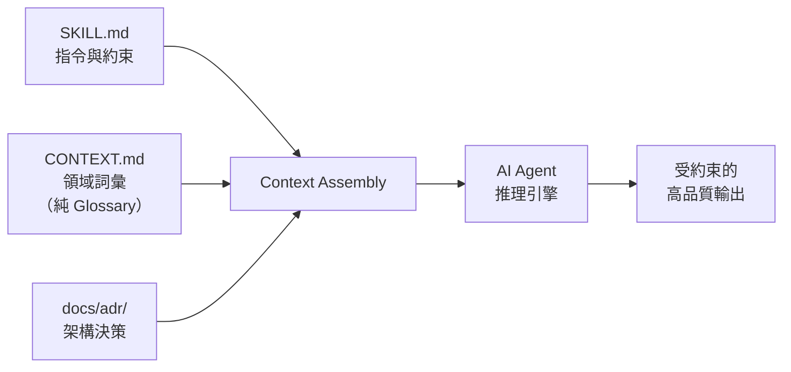

**Context 注入層級**：

| 層級 | 來源 | 作用 |
|------|------|------|
| **Skill 層** | SKILL.md + 附屬資源（*.md） | 定義工作流程、步驟、約束規則 |
| **Domain 層** | CONTEXT.md | 提供領域專有詞彙（Glossary Only），減少歧義與冗長 |
| **Architecture 層** | docs/adr/*.md | 提供已決策的架構方向，防止 AI 偏離 |
| **Project 層** | docs/agents/*.md | 提供 Issue Tracker、Triage Labels 等配置 |
| **Governance 層** | .out-of-scope/*.md | 記錄已拒絕的請求，防止重複提案 |

### 2.3 Governance Layer 與 Agent Constraints

**AI 約束機制**：

```yaml
# SKILL.md 中可使用的約束欄位
---
name: skill-name
description: "描述文字 — 這是 Agent 判斷是否觸發的唯一依據"
argument-hint: "提示使用者應輸入什麼參數"
disable-model-invocation: true  # 防止 Agent 自動觸發，必須由人類主動呼叫
---
```

**約束策略對照**：

| 約束類型 | 實現方式 | 適用場景 |
|----------|----------|----------|
| **手動觸發** | `disable-model-invocation: true` | 高風險操作（如 improve-codebase-architecture） |
| **ADR 門檻** | Skill 內要求先建立 ADR | 架構變更前必須記錄決策 |
| **Domain 保護** | CONTEXT.md 定義不可修改的核心概念（純 Glossary） | 防止 AI 任意重新命名領域術語 |
| **Git 護欄** | git-guardrails 封鎖危險 git 指令 | 防止 `git push --force`、`git reset --hard` |
| **Out-of-Scope** | `.out-of-scope/*.md` 記錄已拒絕請求 | 防止 AI 重複提出已否決的功能 |

### 2.4 ADR Integration 與 Domain Discovery

**ADR 格式（最新簡化版）**：

mattpocock/skills 的 ADR 格式與傳統 ADR 不同，採用**極度精簡**的風格：

```markdown
# ADR-0001: 選擇 PostgreSQL 作為主資料庫

選擇 PostgreSQL 16+ 作為主資料庫引擎。系統需要 ACID 交易與 JSON 查詢能力，
PostgreSQL 兼具強型態和 JSON 支援，且生態成熟。代價是需要 DBA 維運經驗。
```

> **重要更新**：最新版的 ADR 格式已大幅簡化，可能只是一個段落。不再強制使用 Context / Decision / Consequences 三段式結構。

**ADR 的三項必要條件**（所有條件必須同時成立才值得記錄）：

| 條件 | 說明 | 範例 |
|------|------|------|
| **Hard to reverse** | 決策難以逆轉 | 選擇資料庫引擎 |
| **Surprising without context** | 沒有背景脈絡時會令人驚訝 | 為何不用 NoSQL |
| **Result of real trade-off** | 是真實取捨的結果（不是顯而易見的） | 效能 vs. 開發速度 |

**ADR 檔案命名**：`docs/adr/0001-slug.md`、`docs/adr/0002-slug.md`（循序編號）

**Domain Discovery 機制**：

- `CONTEXT.md` 是一份**純詞彙表（Glossary）**，明確排除任何實作細節
- 例如：以「materialization cascade」取代「a lesson inside a section of a course is made real」
- 效果：減少約 75% 的 Token 消耗，同時提高溝通精確度

### 2.5 Skills 分類體系

| 分類 | 用途 | 收錄於 plugin.json | Skills |
|------|------|---------------------|--------|
| **Engineering** | 日常編碼工作 | ✅ | grill-with-docs, tdd, to-prd, to-issues, diagnose, zoom-out, improve-codebase-architecture, prototype, triage, setup-matt-pocock-skills |
| **Productivity** | 非程式碼工作流程 | ✅ | grill-me, caveman, handoff, write-a-skill |
| **Misc** | 輔助工具 | ✅ | git-guardrails-claude-code, migrate-to-shoehorn, scaffold-exercises, setup-pre-commit |
| **In-Progress** | 開發中（實驗性） | ❌ | review, writing-beats, writing-fragments, writing-shape |
| **Personal** | Matt 個人使用 | ❌ | edit-article, obsidian-vault |
| **Deprecated** | 已棄用 | ❌ | design-an-interface, qa, request-refactor-plan, ubiquitous-language |

> ⚠️ **注意**：僅 Engineering、Productivity、Misc 三個分類會被收錄於 `.claude-plugin/plugin.json`，其餘分類的 Skills 不會被 Agent 自動發現。

---

## 第 3 章：安裝與初始化

### 3.1 前置環境準備

| 工具 | 最低版本 | 用途 |
|------|----------|------|
| **Node.js** | v18+ | 執行 npx 安裝指令 |
| **AI Agent** | 最新版 | Skills 執行環境（Claude Code / Cursor / GitHub Copilot 等） |
| **Git** | v2.30+ | 版本控制 |
| **gh CLI**（選用） | v2.0+ | GitHub Issues 整合（若使用 GitHub 作為 Issue Tracker） |
| **glab CLI**（選用） | 最新版 | GitLab Issues 整合（若使用 GitLab 作為 Issue Tracker） |

### 3.2 安裝 mattpocock/skills

**步驟 1：執行安裝指令**

```bash
npx skills@latest add mattpocock/skills
```

**安裝過程**：

1. CLI 會自動偵測專案中使用的 Agent 類型
2. 系統顯示所有可用 Skills 清單
3. 使用方向鍵與空白鍵選擇要安裝的 Skills
4. **務必選擇 `setup-matt-pocock-skills`**（其他 Skills 依賴此配置）
5. Skills 安裝至對應 Agent 的 Skills 目錄（Claude Code 為 `~/.claude/skills/`）

**安裝驗證**：

```bash
# Claude Code 環境
ls ~/.claude/skills/

# 確認 plugin 註冊
cat ~/.claude/skills/.claude-plugin/plugin.json
```

**更新至最新版**：

```bash
npx skills@latest add mattpocock/skills
# 重新選擇 Skills 即可更新
```

### 3.3 執行 setup-matt-pocock-skills

安裝完成後，在**每個專案倉庫**中必須執行一次初始化：

```bash
# 在 Agent 對話中輸入
/setup-matt-pocock-skills
```

**初始化五步流程**：

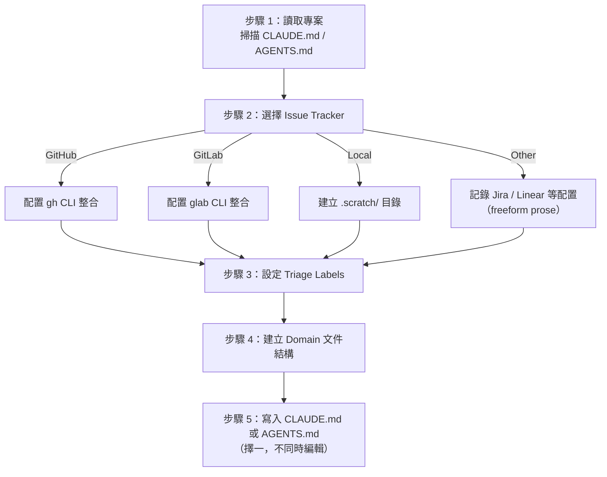

**初始化設定內容（三大 Section）**：

| Section | 設定內容 | 說明 |
|---------|----------|------|
| **Section A** | Issue Tracker | 定義使用 GitHub / GitLab / Local / Other（Jira、Linear） |
| **Section B** | Triage Labels | 定義狀態角色與分類角色的標籤名稱 |
| **Section C** | Domain Docs | 定義 CONTEXT.md 與 ADR 的存放位置 |

> **重要**：setup 會編輯 `CLAUDE.md` 或 `AGENTS.md`，但**不會同時編輯兩者**。若專案中已存在其中一個，setup 會自動使用該檔案。

### 3.4 初始化建立的檔案與目錄

執行 `/setup-matt-pocock-skills` 後，專案中會建立以下結構：

```text
project-root/
├── CLAUDE.md 或 AGENTS.md            # Agent 配置入口（擇一）
├── docs/
│   └── agents/
│       ├── issue-tracker.md          # Issue Tracker 配置
│       ├── triage-labels.md          # Triage 標籤對照表（雙軸角色）
│       └── domain.md                 # Domain 文件結構定義
├── CONTEXT.md                         # 領域詞彙表 Glossary（延遲建立）
├── CONTEXT-MAP.md                     # 多 Context 映射（Monorepo 選用）
├── .out-of-scope/                     # 被拒絕請求的紀錄目錄
└── docs/
    └── adr/                           # 架構決策紀錄目錄（延遲建立）
        └── 0001-initial-setup.md      # 首份 ADR
```

**各檔案用途**：

| 檔案 | 建立時機 | 用途 |
|------|----------|------|
| `CLAUDE.md` 或 `AGENTS.md` | 初始化時 | Agent 配置入口，定義全專案的 Agent 指令 |
| `docs/agents/issue-tracker.md` | 初始化時 | 定義 Issue Tracker 類型與存取方式 |
| `docs/agents/triage-labels.md` | 初始化時 | 定義雙軸 Triage 角色的標籤名稱 |
| `docs/agents/domain.md` | 初始化時 | 定義 CONTEXT.md 與 ADR 的存放位置 |
| `CONTEXT.md` | 首次 `/grill-with-docs` 時 | 領域詞彙表 Glossary（不含實作細節） |
| `docs/adr/*.md` | 需要時延遲建立 | 架構決策紀錄 |
| `.out-of-scope/*.md` | `/triage` 拒絕請求時 | 紀錄已否決的功能請求 |
| `.scratch/` | 選擇 Local Issue Tracker 時 | 本地 Issue 追蹤目錄 |

### 3.5 Issue Tracker 配置

mattpocock/skills 支援四種 Issue Tracker 類型：

**GitHub Issues（推薦）**：

```markdown
<!-- docs/agents/issue-tracker.md -->
# Issue Tracker

Type: GitHub
CLI: gh
Repository: owner/repo-name
```

使用 `gh` CLI 進行 Issue 操作，支援建立、關閉、標籤等完整功能。

**GitLab Issues（新增支援）**：

```markdown
<!-- docs/agents/issue-tracker.md -->
# Issue Tracker

Type: GitLab
CLI: glab
Repository: group/project-name
```

使用 `glab` CLI 進行 Issue 操作，與 GitHub 體驗一致。

**Local Markdown（離線開發）**：

```markdown
<!-- docs/agents/issue-tracker.md -->
# Issue Tracker

Type: Local
Path: .scratch/
```

本地 Issue 結構：

```text
.scratch/
└── feature-user-auth/
    ├── PRD.md                    # 產品需求文件
    └── issues/
        ├── 01-setup-database.md  # 任務 1
        ├── 02-create-api.md      # 任務 2
        └── 03-add-tests.md       # 任務 3
```

**Other（Jira、Linear 等）**：

```markdown
<!-- docs/agents/issue-tracker.md -->
# Issue Tracker

Type: Other
Description: 使用 Jira，專案代號 PROJ-xxx
URL: https://company.atlassian.net/browse/PROJ
```

> **注意**：Other 類型使用 freeform prose（自由文字）描述，Agent 會根據描述嘗試最佳化操作。但 `.out-of-scope/mainstream-issue-trackers-only.md` 明確限制只支援主流 Issue Tracker。

> **實務建議**：企業團隊建議使用 GitHub 或 GitLab Issues，可與 CI/CD、Code Review 流程無縫整合。本地模式適合早期 PoC 或網路受限環境。

---

## 第 4 章：Skills 工作原理

### 4.1 SKILL.md 檔案格式與附屬資源

每個 Skill 都是一個目錄，包含一個必要的 `SKILL.md` 檔案，以及可選的附屬資源檔案：

```text
skill-name/
├── SKILL.md           # 主指令檔（必要）
├── LOGIC.md           # 邏輯分支指令（選用，如 prototype）
├── UI.md              # UI 分支指令（選用，如 prototype）
├── tests.md           # 測試指引（選用，如 tdd）
├── mocking.md         # Mocking 指引（選用，如 tdd）
├── deep-modules.md    # 模組深度理論（選用，如 tdd）
├── interface-design.md# 介面設計指引（選用）
├── refactoring.md     # 重構指引（選用）
├── REFERENCE.md       # 詳細參考文件（選用）
├── AGENT-BRIEF.md     # Agent 摘要範本（選用，如 triage）
└── scripts/           # 輔助腳本（選用）
    └── helper.sh
```

> **重要更新**：最新版的 Skills 大量使用附屬 `.md` 檔案來拆分複雜邏輯。例如 `tdd` Skill 引用了 `tests.md`、`mocking.md`、`deep-modules.md`、`interface-design.md`、`refactoring.md` 五個附屬資源。`prototype` Skill 則分為 `LOGIC.md`（終端互動原型）和 `UI.md`（UI 變體原型）兩個分支。

**SKILL.md 格式範例**：

```markdown
---
name: tdd
description: "Test-driven development. Use when: implementing features, fixing bugs, writing tests first. Runs red-green-refactor loop with vertical slices."
argument-hint: "Describe the feature to implement or bug to fix"
disable-model-invocation: true
---

# TDD

## Philosophy

Tests are not about coverage metrics. Tests are a design tool that force you 
to think about the interface before the implementation.

## Anti-Pattern: Horizontal Slices

Never implement layer-by-layer (all models → all services → all controllers).
Always implement feature-by-feature as vertical slices.

## Workflow

1. Write a failing test (RED)
2. Write minimal code to pass (GREEN)
3. Refactor while keeping tests green (REFACTOR)
4. Commit this vertical slice
5. Repeat for next vertical slice

## Checklist Per Cycle

- [ ] Test fails for the right reason
- [ ] Implementation is minimal
- [ ] All existing tests still pass
- [ ] Code is refactored (no duplication)
```

**YAML Frontmatter 欄位**：

| 欄位 | 必要 | 說明 |
|------|------|------|
| `name` | ✅ | Skill 名稱，用於 `/name` 觸發 |
| `description` | ✅ | **關鍵**：Agent 判斷是否觸發的唯一依據 |
| `argument-hint` | 選用 | 提示使用者應輸入什麼參數 |
| `disable-model-invocation` | 選用 | 設為 `true` 防止 Agent 自動觸發 |

> ⚠️ **重要**：`description` 是 Agent 發現 Skill 的**唯一入口**。寫得不精確會導致 Skill 永遠不被觸發或被錯誤觸發。

### 4.2 Plugin 註冊機制

Skills 透過 `.claude-plugin/plugin.json` 向 Claude Code 註冊（注意路徑包含 `.claude-plugin/` 前綴目錄）：

```json
{
  "skills": [
    "engineering/tdd/SKILL.md",
    "engineering/grill-with-docs/SKILL.md",
    "engineering/to-prd/SKILL.md",
    "engineering/to-issues/SKILL.md",
    "engineering/diagnose/SKILL.md",
    "engineering/zoom-out/SKILL.md",
    "engineering/improve-codebase-architecture/SKILL.md",
    "engineering/prototype/SKILL.md",
    "engineering/triage/SKILL.md",
    "engineering/setup-matt-pocock-skills/SKILL.md",
    "productivity/grill-me/SKILL.md",
    "productivity/caveman/SKILL.md",
    "productivity/handoff/SKILL.md",
    "productivity/write-a-skill/SKILL.md",
    "misc/git-guardrails-claude-code/SKILL.md",
    "misc/setup-pre-commit/SKILL.md"
  ]
}
```

**註冊規則**：

- 僅 `engineering/`、`productivity/`、`misc/` 三個目錄下的 Skills 會被註冊
- `in-progress/`、`personal/`、`deprecated/` 下的 Skills **不會**出現在 plugin.json
- 每個 Skill 名稱必須出現在頂層 README.md 中（含 SKILL.md 的超連結）

### 4.3 CONTEXT.md — 領域詞彙表

CONTEXT.md 是 mattpocock/skills 最獨特的創新之一。最新版本明確定義它為一份**純詞彙表（Glossary）**，完全排除實作細節。

> **官方定義**：「CONTEXT.md is totally devoid of implementation details. Do not treat CONTEXT.md as a spec, a scratch pad, or a repository for implementation decisions.」

**CONTEXT.md 的四大組成部分**：

| 部分 | 用途 | 範例 |
|------|------|------|
| **Language** | 術語定義與含義 | `Materialization Cascade: 當課程中的一堂課被實體化…` |
| **Relationships** | 術語之間的關係 | `Course → Section → Lesson（一對多）` |
| **Example dialogue** | 正確使用術語的對話範例 | `「對 Lesson 執行 materialization cascade」` |
| **Flagged ambiguities** | 標記容易混淆的概念 | `「Section」不等同於「Module」` |

**範例**：

```markdown
# CONTEXT

## Language

### Materialization Cascade
When a lesson inside a section of a course is made real — its content is 
generated, its exercises are scaffolded, and its metadata is populated.

### Vertical Slice  
A single, independently deployable unit of work that cuts through all 
architectural layers (UI → API → DB).

## Relationships

- Course → Section → Lesson (one-to-many at each level)
- Materialization Cascade operates on a single Lesson

## Example dialogue

> "Run the materialization cascade for the 'Generics' lesson in the 
> 'Advanced TypeScript' section."

## Flagged ambiguities

- "Section" vs "Module": In this project, "Section" is the only valid 
  grouping term. "Module" refers to code modules, not content groupings.
```

**效果**：

```
# 無 CONTEXT.md 時（32 tokens）：
"Please create the process where a lesson inside a section of a course 
is made real, meaning its content is generated, its exercises are 
scaffolded, and its metadata is populated."

# 有 CONTEXT.md 時（8 tokens）：
"Implement materialization cascade for Lesson entity."
```

Token 節省約 **75%**。

**CONTEXT.md 的建立時機**：

- 不在 `/setup-matt-pocock-skills` 時建立
- 在首次執行 `/grill-with-docs` 時由 AI 根據對話內容自動建立
- 後續每次 `/grill-with-docs` 都會更新
- **禁止在 CONTEXT.md 中放入實作決策**（實作決策應記錄在 ADR 中）

### 4.4 ADR（Architecture Decision Records）

ADR 是記錄架構決策的輕量文件，存放於 `docs/adr/` 目錄。

**ADR 格式（最新精簡版）**：

最新版本的 ADR 格式大幅簡化，可能只需一個段落：

```markdown
# ADR-0001: 選擇 PostgreSQL 作為主資料庫

選擇 PostgreSQL 16+ 作為主資料庫引擎。系統需要 ACID 交易與 JSON 查詢能力，
PostgreSQL 兼具強型態和 JSON 支援，且生態成熟。代價是需要 DBA 維運經驗。
```

> **注意**：傳統的 Context / Decision / Consequences 三段式仍可使用，但不再是強制格式。ADR 的重點是**記錄決策的原因與取捨**，而非遵循特定模板。

**ADR 的三項必要條件**：

三個條件**必須全部成立**，才值得建立 ADR：

1. **Hard to reverse**：決策一旦做出就難以回頭
2. **Surprising without context**：沒有背景脈絡的人會覺得這個決定很奇怪
3. **Result of real trade-off**：是真實的取捨結果，而非顯而易見的選擇

**What qualifies**（值得記錄的決策範例）：

- 選擇 PostgreSQL 而非 MongoDB
- 決定使用 Event Sourcing 而非 CRUD
- 選擇 Monorepo 而非 Multi-repo

**What does NOT qualify**（不值得記錄的決策）：

- 使用 Git 做版本控制
- 使用 HTTPS
- 遵循語言的官方 Style Guide

**ADR 在 Skills 中的作用**：

| Skill | 如何使用 ADR |
|-------|-------------|
| `/grill-with-docs` | 挑戰計畫時參考現有 ADR，發現衝突時建議新增 ADR |
| `/improve-codebase-architecture` | 掃描 ADR 目錄了解已有決策，避免提出衝突建議 |
| `/to-prd` | 在 PRD 的 Implementation Decisions 中引用相關 ADR |

### 4.5 Skill 載入與執行流程

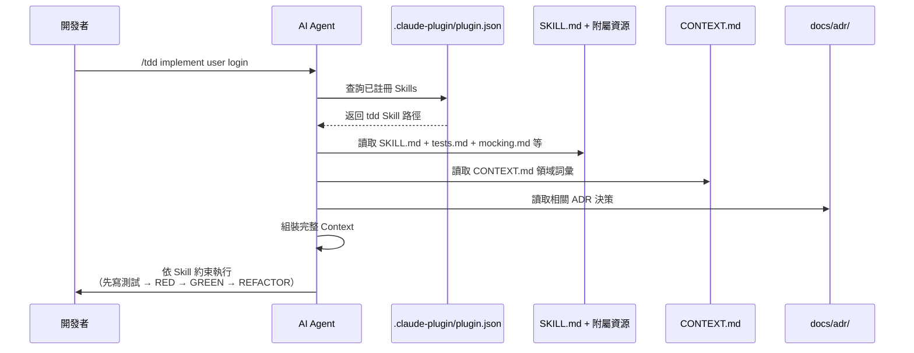

> **實務注意事項**：
> - Skills 的載入順序由 plugin.json 中的排列決定
> - 若兩個 Skills 的 description 語義重疊，Agent 可能選錯 Skill
> - 建議每個 Skill 的 description 都包含「Use when:」觸發條件
> - 附屬資源檔案（如 `tests.md`、`deep-modules.md`）會隨主 SKILL.md 一起載入

---

## 第 5 章：grill-me 與 grill-with-docs — 需求探索與挑戰

### 5.1 grill-me — 通用計畫挑戰

**分類**：Productivity（非程式碼工作流程）

**用途**：無情地追問開發者的設計想法或計畫，直到所有決策分支都被釐清。

**觸發方式**：

```bash
/grill-me 我想在系統中加入多租戶架構
```

**Prompt Flow**：

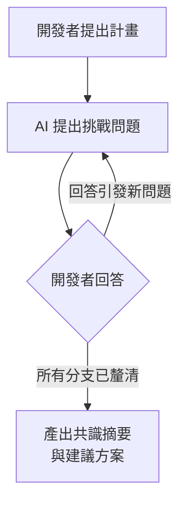

**grill-me 的挑戰範圍**：

- **Requirement Discovery**：需求是否完整？是否有遺漏的邊界案例？
- **Threat Modeling**：是否存在安全風險？攻擊面在哪？
- **Architecture Review**：架構選型是否合理？是否過度設計？
- **Design Review**：API 設計是否符合 RESTful 最佳實踐？
- **Trade-off Analysis**：不同方案的優缺點比較

**特性**：

- ❌ 不會修改任何檔案
- ❌ 不會讀取 CONTEXT.md 或 ADR
- ✅ 純對話式質詢
- ✅ 適合早期構想階段

### 5.2 grill-with-docs — 結合 Domain 的深度挑戰

**分類**：Engineering（日常編碼工作）

**用途**：結合專案現有的 Domain Model（CONTEXT.md）與 ADR 進行深度質詢，並在過程中**更新 CONTEXT.md**。

**觸發方式**：

```bash
/grill-with-docs 我想重構訂單模組，引入 Event Sourcing
```

**與 grill-me 的關鍵差異**：

| 面向 | grill-me | grill-with-docs |
|------|----------|-----------------|
| **分類** | Productivity | Engineering |
| **讀取 CONTEXT.md** | ❌ | ✅ |
| **讀取 ADR** | ❌ | ✅ |
| **更新 CONTEXT.md** | ❌ | ✅（新增領域詞彙） |
| **建議新 ADR** | ❌ | ✅ |
| **適用時機** | 早期構想 | 有既有 Domain 的情境 |

**grill-with-docs 的深度挑戰流程**：

1. 讀取 CONTEXT.md 了解現有領域詞彙（純 Glossary）
2. 讀取 docs/adr/ 了解已有架構決策
3. 針對提案進行質詢，並檢查是否與現有決策衝突
4. 若發現新的領域概念，自動更新 CONTEXT.md（僅更新詞彙，不加入實作細節）
5. 若發現需要新的架構決策，建議建立新 ADR

### 5.3 grill-with-docs 的六項會議中行為

grill-with-docs 在質詢過程中，會嚴格遵循以下六項行為規範：

| # | 行為 | 說明 |
|---|------|------|
| 1 | **讀取現有 Domain 文件** | 開始質詢前先讀取 CONTEXT.md 與所有 ADR |
| 2 | **使用 Domain 語言提問** | 質詢中使用 CONTEXT.md 中定義的術語，而非一般用語 |
| 3 | **挑戰 ADR 衝突** | 若提案與現有 ADR 衝突，明確指出並要求解釋 |
| 4 | **辨識新概念** | 發現對話中出現尚未定義在 CONTEXT.md 中的領域概念 |
| 5 | **即時更新 CONTEXT.md** | 質詢過程中將新辨識的概念以 Glossary 格式寫入 CONTEXT.md |
| 6 | **建議 ADR 創建** | 若討論中出現符合「三項必要條件」的架構決策，建議建立 ADR |

> **注意**：grill-with-docs 更新 CONTEXT.md 時，只會以 Glossary 格式寫入（Language、Relationships、Example dialogue、Flagged ambiguities）。不會將實作決策放入 CONTEXT.md。

### 5.4 實戰案例：API 設計審查

**場景**：團隊想為電商系統新增「優惠券」功能。

```bash
/grill-with-docs 我要新增優惠券功能，支援百分比折扣和固定金額折扣
```

**AI 可能提出的質詢**：

```
1. 優惠券是否可疊加使用？最多疊加幾張？
2. 優惠券是否有使用次數限制？是全局限制還是每用戶限制？
3. 是否需要支援優惠碼（Coupon Code）和系統自動發放兩種方式？
4. 當訂單部分退貨時，優惠券如何處理？
5. 與現有的 VIP 等級折扣如何互動？（根據 CONTEXT.md 中 VIP Tier 定義）
6. 是否需要支援時間區間限制？
7. ADR-0003 決策了使用 Event Sourcing 處理金額變動，優惠券折扣的計算是否也需要事件化？
```

### 5.5 最佳實踐與常見錯誤

**最佳實踐**：

| 實踐 | 說明 |
|------|------|
| 先 grill-me 再 grill-with-docs | 先用 grill-me 釐清大方向，再用 grill-with-docs 深入細節 |
| 不要急於結束質詢 | 讓 AI 把所有疑慮都提出來，即使看似瑣碎 |
| 記錄共識結論 | 質詢結束後立即執行 `/to-prd` 將共識轉為正式文件 |

**常見錯誤**：

| 錯誤 | 後果 | 修正 |
|------|------|------|
| 跳過 grill 直接編碼 | AI 產出的程式碼偏離需求 | 養成「先 grill 再 code」的習慣 |
| 未初始化即使用 grill-with-docs | 找不到 CONTEXT.md，退化為 grill-me | 確保已執行 `/setup-matt-pocock-skills` |
| 對所有問題都回答「隨便」 | 失去質詢的價值 | 認真思考每個問題 |

> **安全風險提醒**：grill-me / grill-with-docs 的對話內容可能包含業務敏感資訊（如定價策略、商業邏輯）。請確保 Claude Code 的使用符合公司的資料安全政策。

---

## 第 6 章：tdd — 測試驅動開發

### 6.1 Philosophy — 測試哲學

**分類**：Engineering

**用途**：以 TDD 的紅燈-綠燈-重構循環開發功能或修復 Bug，一次處理一個 Vertical Slice。

**觸發方式**：

```bash
/tdd implement user registration with email validation
```

> **最新版本的核心哲學**：測試不是為了覆蓋率指標（coverage metrics），而是一種**設計工具（design tool）**，強迫你在寫實作之前先思考介面（interface）。

**tdd Skill 的附屬資源**：

最新版的 tdd Skill 引用了五個附屬 `.md` 檔案，提供深入指引：

| 附屬資源 | 用途 |
|----------|------|
| `tests.md` | 測試撰寫原則與策略 |
| `mocking.md` | Mock / Stub / Spy 的使用時機與最佳實踐 |
| `deep-modules.md` | Module Depth 理論（與 improve-codebase-architecture 共用） |
| `interface-design.md` | 介面設計原則 |
| `refactoring.md` | 重構策略與時機判斷 |

### 6.2 Anti-Pattern: Horizontal Slices

最新版 tdd Skill 特別強調了一個**反模式**：水平切片開發（Horizontal Slices）。

```
❌ 水平切片（Anti-Pattern）：
  第 1 步：建立所有 Model
  第 2 步：建立所有 Service
  第 3 步：建立所有 Controller
  第 4 步：建立所有 Test
  → 直到最後才能驗證功能是否正確

✅ 垂直切片（Correct）：
  第 1 步：User Registration（Test → Controller → Service → Model → DB）
  第 2 步：User Login（Test → Controller → Service → Model）
  第 3 步：User Profile（Test → Controller → Service → Model）
  → 每一步都能獨立驗證
```

> **Tracer Bullet 概念**：第一個 Vertical Slice 被稱為「Tracer Bullet」——它貫穿所有架構層，證明整個系統骨架是可運作的。後續 Slice 只需沿著同樣的骨架添加功能。

### 6.3 Workflow — 四階段工作流

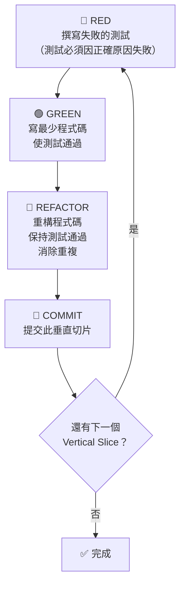

**Checklist Per Cycle**（每個 RED-GREEN-REFACTOR 循環的檢查清單）：

- [ ] 測試因**正確的原因**失敗（不是因為語法錯誤或匯入錯誤）
- [ ] 實作是最小化的（不多寫一行）
- [ ] 所有既有測試仍然通過
- [ ] 程式碼已重構（沒有重複邏輯）
- [ ] 已提交此垂直切片

**tdd Skill 的強制約束**：

1. **絕不跳過 RED 步驟**：必須先有失敗的測試
2. **一次一個 Vertical Slice**：不允許同時處理多個功能切片
3. **每次修改後執行測試**：確保沒有破壞既有功能
4. **最小實現**：GREEN 階段只寫通過測試所需的最少程式碼
5. **Commit 後再開始下一個 Slice**：每個 Slice 獨立提交

### 6.4 Spring Boot TDD 案例

**場景**：實作用戶註冊 API

**RED — 先寫失敗的測試**：

```java
@SpringBootTest
@AutoConfigureMockMvc
class UserRegistrationTest {

    @Autowired
    private MockMvc mockMvc;

    @Test
    void shouldRegisterUserWithValidEmail() throws Exception {
        String requestBody = """
            {
                "email": "user@example.com",
                "password": "SecureP@ss123",
                "name": "Test User"
            }
            """;

        mockMvc.perform(post("/api/users")
                .contentType(MediaType.APPLICATION_JSON)
                .content(requestBody))
            .andExpect(status().isCreated())
            .andExpect(jsonPath("$.email").value("user@example.com"))
            .andExpect(jsonPath("$.id").exists());
    }

    @Test
    void shouldRejectInvalidEmail() throws Exception {
        String requestBody = """
            {
                "email": "invalid-email",
                "password": "SecureP@ss123",
                "name": "Test User"
            }
            """;

        mockMvc.perform(post("/api/users")
                .contentType(MediaType.APPLICATION_JSON)
                .content(requestBody))
            .andExpect(status().isBadRequest());
    }
}
```

**GREEN — 寫最少程式碼通過測試**：

```java
@RestController
@RequestMapping("/api/users")
public class UserController {

    private final UserService userService;

    public UserController(UserService userService) {
        this.userService = userService;
    }

    @PostMapping
    public ResponseEntity<UserResponse> register(
            @Valid @RequestBody UserRegistrationRequest request) {
        UserResponse response = userService.register(request);
        return ResponseEntity.status(HttpStatus.CREATED).body(response);
    }
}
```

**REFACTOR — 重構改善**：

- 抽取 Validation 邏輯至獨立 Validator
- 加入 Error Handling
- 確保所有測試仍然通過

### 6.5 Vue 3 TDD 案例

**場景**：實作登入表單元件

```typescript
// LoginForm.spec.ts
import { mount } from '@vue/test-utils'
import LoginForm from './LoginForm.vue'

describe('LoginForm', () => {
  it('should disable submit button when email is empty', () => {
    const wrapper = mount(LoginForm)
    const submitButton = wrapper.find('[data-testid="submit-btn"]')
    expect(submitButton.attributes('disabled')).toBeDefined()
  })

  it('should emit login event with credentials on submit', async () => {
    const wrapper = mount(LoginForm)
    await wrapper.find('[data-testid="email"]').setValue('user@test.com')
    await wrapper.find('[data-testid="password"]').setValue('password123')
    await wrapper.find('form').trigger('submit')
    
    expect(wrapper.emitted('login')).toBeTruthy()
    expect(wrapper.emitted('login')![0][0]).toEqual({
      email: 'user@test.com',
      password: 'password123'
    })
  })
})
```

### 6.6 React TDD 案例

**場景**：實作搜尋元件

```typescript
// SearchBar.test.tsx
import { render, screen, fireEvent } from '@testing-library/react'
import SearchBar from './SearchBar'

describe('SearchBar', () => {
  it('should call onSearch after debounce', async () => {
    const onSearch = vi.fn()
    render(<SearchBar onSearch={onSearch} debounceMs={300} />)
    
    fireEvent.change(screen.getByRole('searchbox'), {
      target: { value: 'test query' }
    })
    
    // 等待 debounce
    await vi.advanceTimersByTimeAsync(300)
    expect(onSearch).toHaveBeenCalledWith('test query')
  })
})
```

### 6.7 Node.js TDD 案例

**場景**：實作訂單計算服務

```typescript
// orderCalculator.test.ts
import { describe, it, expect } from 'vitest'
import { calculateTotal } from './orderCalculator'

describe('calculateTotal', () => {
  it('should sum item prices', () => {
    const items = [
      { name: 'Widget', price: 10, quantity: 2 },
      { name: 'Gadget', price: 25, quantity: 1 }
    ]
    expect(calculateTotal(items)).toBe(45)
  })

  it('should apply percentage discount', () => {
    const items = [{ name: 'Widget', price: 100, quantity: 1 }]
    expect(calculateTotal(items, { type: 'percentage', value: 10 })).toBe(90)
  })
})
```

### 6.8 最佳實踐與常見錯誤

**最佳實踐**：

| 實踐 | 說明 |
|------|------|
| 一個 Slice 一個 commit | 每完成一個 Vertical Slice 就 commit |
| 測試命名語義化 | `should_do_X_when_Y` 格式 |
| 先寫 Happy Path 再寫 Edge Case | 確保核心流程先通 |
| 不要在 GREEN 階段過度設計 | 只寫通過測試的最少程式碼 |
| Tracer Bullet 優先 | 第一個 Slice 應貫穿所有層，證明骨架可運作 |
| 參考附屬資源 | 遇到 Mocking 或介面設計問題時查閱 mocking.md、interface-design.md |

**常見錯誤**：

| 錯誤 | 後果 | 修正 |
|------|------|------|
| 水平切片開發 | 直到最後才發現整合問題 | 嚴格執行 Vertical Slice |
| 一次寫太多測試 | 失去 TDD 的漸進式回饋 | 嚴格一次一個測試 |
| 跳過 REFACTOR 步驟 | 程式碼品質逐漸下降 | 每個 GREEN 後必須 REFACTOR |
| AI 生成的測試未實際執行 | 測試可能有語法錯誤 | 要求 AI 在每步都執行測試 |
| 未提交就開始下一個 Slice | 回滾困難，歷史混亂 | 每個 Slice 獨立 commit |

---

## 第 7 章：to-prd — 產品需求文件產生

### 7.1 AI 對話轉 PRD 流程

**分類**：Engineering

**用途**：將當前對話上下文綜合整理為結構化的 PRD（Product Requirements Document），並發布至 Issue Tracker，自動標記 `ready-for-agent` 標籤。

**觸發方式**：

```bash
/to-prd
```

> ⚠️ **重要**：`/to-prd` 不會進行質詢（interview）。它純粹**綜合現有對話內容**。若需要先釐清需求，請先執行 `/grill-me` 或 `/grill-with-docs`。

**典型工作流**：

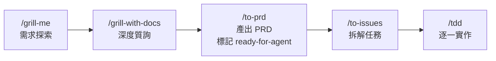

### 7.2 PRD 模板結構（Deep Module 導向）

最新版 `/to-prd` 產出的 PRD 採用 **Deep Module 導向**的模板，強調模組設計的深度而非廣度：

```markdown
# PRD: [功能名稱]

## Problem Statement
[這個功能要解決什麼問題？為什麼現有方案不足？]

## Solution
[高階解決方案描述，聚焦「做什麼」而非「怎麼做」]

## User Stories

### Story 1: [角色] 執行 [動作]
**As** [角色]
**I want** [功能]
**So that** [價值]

**Acceptance Criteria:**
- Given [前提條件]
  When [觸發動作]
  Then [預期結果]
- Given [前提條件]
  When [觸發動作]
  Then [預期結果]

### Story 2: [角色] 執行 [動作]
...

## Implementation Decisions
- 參考 ADR-0001: [相關架構決策]
- 參考 ADR-0003: [相關架構決策]
- [需要新 ADR 的決策點]

## Testing Decisions
- [測試策略與優先順序]
- [需要整合測試的範圍]
- [效能測試需求]

## Out of Scope
- [明確列出不在本次範圍內的項目]

## Further Notes
- [其他需要注意的事項]
- [風險與不確定性]
```

> **Deep Module 設計原則**：PRD 應描述一個「介面簡單但功能深厚」的模組。避免產出「介面複雜但功能淺薄」的需求。例如，一個 Coupon 模組應該用簡單的 `apply(order)` 介面封裝複雜的折扣計算邏輯。

### 7.3 User Stories 撰寫

最新版 PRD 強調以**詳盡的 User Stories** 取代傳統的 Functional Requirements 列表：

```markdown
### Story: 用戶使用優惠碼結帳

**As** 已登入的消費者
**I want** 在結帳頁面輸入優惠碼獲得折扣
**So that** 我可以用更低的價格購買商品

**Acceptance Criteria:**
- Given 用戶購物車金額為 $100
  When 用戶輸入有效的 10% 折扣優惠碼
  Then 結帳金額更新為 $90 並顯示「優惠碼已套用」

- Given 用戶輸入已過期的優惠碼
  When 用戶點擊「套用」按鈕
  Then 顯示「此優惠碼已過期」錯誤訊息，金額不變

- Given 用戶已使用過此優惠碼
  When 用戶再次輸入同一優惠碼
  Then 顯示「此優惠碼已使用」錯誤訊息
```

**User Story 撰寫原則**：

| 原則 | 說明 |
|------|------|
| **每個 Story 獨立** | 不依賴其他 Story 的完成狀態 |
| **可驗證** | 每個 Acceptance Criteria 都可以寫成自動化測試 |
| **用戶視角** | 從使用者的角度描述，不涉及技術實作 |
| **Include edge cases** | 不只寫 Happy Path，也要包含異常情境 |

### 7.4 實戰案例與最佳實踐

**場景**：經過 grill-with-docs 討論後，產出優惠券功能 PRD

```bash
# 步驟 1：先質詢
/grill-with-docs 我們需要為電商平台新增優惠券功能

# 步驟 2：質詢結束後，產出 PRD
/to-prd
```

**最佳實踐**：

- 在 `/grill-me` 或 `/grill-with-docs` 後立即執行 `/to-prd`，避免對話 Context 流失
- 檢查 PRD 的 Implementation Decisions 是否引用了正確的 ADR
- PRD 應包含明確的 Out of Scope，防止 scope creep
- PRD 發布後會自動標記 `ready-for-agent` 標籤，供後續 `/to-issues` 使用
- Testing Decisions 應在 PRD 階段就確認，而非等到開發時才決定

---

## 第 8 章：to-issues — 工作任務拆解

### 8.1 PRD 到 Issue Tracker

**分類**：Engineering

**用途**：將 PRD 或對話中的計畫拆解為獨立可執行的 Issues，發布至 Issue Tracker（GitHub / GitLab / 本地 `.scratch/` / 其他工具如 Jira、Linear）。

**觸發方式**：

```bash
/to-issues
```

**五步驟工作流**：

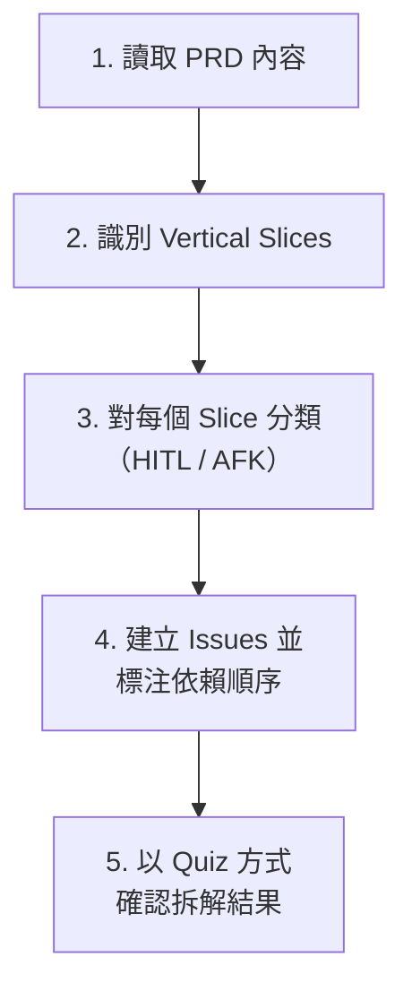

> **重要變更**：最新版 to-issues 在完成拆解後，會以互動式 Quiz 的方式向使用者確認每個 Issue 的範圍和依賴關係是否正確，確保拆解品質。

**拆解原則**：

- 每個 Issue 是一個**獨立的 Vertical Slice**（Tracer Bullet 優先）
- 每個 Issue 可以被**獨立抓取並完成**
- Issue 之間的依賴關係以**排序**表達（而非標注 `blocked by`）
- 使用在 `/setup-matt-pocock-skills` 中定義的 Triage Labels

### 8.2 Tracer Bullet Vertical Slice 拆解策略

```
❌ 傳統拆解（水平切片）：
├── Issue #1: 建立所有 Model [backend]
├── Issue #2: 建立所有 API [backend]
├── Issue #3: 建立所有前端元件 [frontend]
└── Issue #4: 整合測試 [testing]

✅ Tracer Bullet 拆解（垂直切片）：
├── Issue #1: 🎯 Tracer Bullet — 單一優惠碼兌換（貫穿全層）
├── Issue #2: 優惠碼 CRUD 管理 [HITL]
├── Issue #3: 批次優惠碼產生 [AFK]
├── Issue #4: 優惠碼使用限制邏輯 [AFK]
├── Issue #5: 優惠碼前端輸入 UI [HITL]
└── Issue #6: 結帳頁折扣顯示 [AFK]
```

> **Tracer Bullet Issue**：第一個 Issue 必須貫穿所有架構層（UI → API → Service → DB），證明整個系統骨架可運作。後續 Issue 沿著同樣骨架添加功能。

### 8.3 HITL 與 AFK 分類

最新版 to-issues 引入了 **HITL / AFK** 的 Issue 分類機制：

| 分類 | 全稱 | 說明 | 適用場景 |
|------|------|------|----------|
| **HITL** | Human-in-the-Loop | 需要人類即時回饋與協作的工作 | UI 設計審查、UX 決策、商業邏輯確認 |
| **AFK** | Away-from-Keyboard | AI Agent 可獨立完成的工作 | 資料庫 Migration、API 實作、測試撰寫 |

**分類原則**：

```markdown
## HITL 特徵（需要人類參與）
- 涉及主觀判斷（UI 美感、UX 流程）
- 需要商業知識確認（業務規則、定價邏輯）
- 安全敏感操作（權限設計、資料刪除）
- 需要即時溝通的整合工作

## AFK 特徵（AI 可獨立完成）
- 有明確的 Acceptance Criteria
- 不涉及主觀判斷
- 有既有模式可遵循（CRUD、Migration）
- 測試可自動驗證完成狀態
```

### 8.4 Issue Body Template

最新版 to-issues 為每個 Issue 產出標準化的 Body 格式：

```markdown
## Context
[此 Issue 在整體 PRD 中的位置，引用 PRD 連結]

## Requirements
[從 PRD User Story 提取的具體需求]

## Acceptance Criteria
- Given [前提] When [動作] Then [結果]
- Given [前提] When [動作] Then [結果]

## Classification
- Type: AFK / HITL
- Dependencies: #1, #3（指出依賴的其他 Issue）

## Notes
[實作注意事項、參考 ADR 等]
```

### 8.5 Label 與 Triage 策略（新版雙軸系統）

最新版 mattpocock/skills 的 triage 標籤系統已從單維度升級為**雙軸系統**：

**State Roles（狀態角色）**：

| 狀態角色 | 預設標籤 | 說明 |
|----------|----------|------|
| needs-triage | `needs-triage` | 新建立，待分類 |
| needs-info | `needs-info` | 資訊不足，需補充 |
| ready-for-agent | `ready-for-agent` | AI Agent 可直接執行 |
| ready-for-human | `ready-for-human` | 需要人類處理 |
| wontfix | `wontfix` | 不予處理 |

**Category Roles（分類角色）**：

| 分類角色 | 預設標籤 | 說明 |
|----------|----------|------|
| bug | `bug` | 缺陷修復 |
| enhancement | `enhancement` | 功能增強 |

**雙軸組合範例**：

```
Issue #1: [bug] + [ready-for-agent]     → AI 可直接修復的 Bug
Issue #2: [enhancement] + [needs-info]  → 需要補充資訊的功能需求
Issue #3: [bug] + [ready-for-human]     → 需要人類判斷的複雜 Bug
Issue #4: [enhancement] + [needs-triage]→ 新提出，尚未分類的需求
```

**自訂 Label 對照表（docs/agents/triage-labels.md）**：

```markdown
<!-- docs/agents/triage-labels.md -->
# Triage Labels

## State Roles
| Role | Label |
|------|-------|
| needs-triage | needs-triage |
| needs-info | awaiting-details |
| ready-for-agent | ready-for-agent |
| ready-for-human | needs-review |
| wontfix | wontfix |

## Category Roles
| Role | Label |
|------|-------|
| bug | bug |
| enhancement | feature |
```

> **注意**：舊版的 `triage / backlog / in-progress / review / done` 五階段標籤已棄用。新系統使用**雙軸角色**，更精確地表達 Issue 的狀態與分類。

### 8.6 實戰案例與最佳實踐

**最佳實踐**：

| 實踐 | 說明 |
|------|------|
| Tracer Bullet 排第一 | 第一個 Issue 貫穿全層，驗證骨架 |
| HITL/AFK 明確標注 | 決定 Agent 能否獨立執行 |
| 依賴以排序表達 | 依 Issue 編號排序代替 `blocked by` |
| Issue Body 標準化 | 每個 Issue 使用統一的 Body Template |
| 互動確認拆解結果 | to-issues 完成後會以 Quiz 確認正確性 |
| 每個 Issue 2-4 小時工作量 | 太大難以追蹤，太小增加管理成本 |

---

## 第 9 章：prototype — 快速原型建立

### 9.1 Throwaway Prototype 原則

**分類**：Engineering

**用途**：快速建立**拋棄式原型**，用於驗證概念或比較方案。原型從第一天就被設計為拋棄品。

**觸發方式**：

```bash
/prototype create a CLI tool to validate YAML configurations
```

**六項通用規則**：

| # | 規則 | 說明 |
|---|------|------|
| 1 | **Throwaway from Day One** | 原型從建立的第一天就被標記為拋棄品，絕不進入正式程式碼庫 |
| 2 | **One Command to Run** | 原型必須用一條指令就能啟動執行 |
| 3 | **No Tests Required** | 原型不需要測試——驗證概念才是目標 |
| 4 | **Hardcode Everything** | 可以硬編碼所有設定、資料、路徑 |
| 5 | **Single File Preferred** | 盡量將原型寫在單一檔案內，降低閱讀門檻 |
| 6 | **Record Learnings** | 原型結束後，將學到的教訓記入 ADR 或 Issue |

**原型分兩個分支**：根據驗證的對象不同，prototype 自動選擇 **Logic 分支** 或 **UI 分支**。

### 9.2 Logic 分支 — 終端互動原型

適合驗證**商業邏輯**、**資料處理**、**演算法**等非視覺化需求。原型以 CLI 應用程式的形式建立，產出 `LOGIC.md` 作為指引：

```bash
/prototype create a CLI to test the coupon discount calculation logic
```

**LOGIC.md 格式**：

```markdown
# Prototype: Coupon Discount Calculator

## Goal
驗證折扣計算邏輯在多種情境下的正確性

## Run
npm start

## Scenarios
1. 百分比折扣 + 最低消費
2. 固定金額折扣 + 累計
3. 折扣上限限制

## Learnings
[原型結束後填寫]
```

產出可直接在終端機執行的互動式程式，輸入測試資料即可驗證計算結果。

### 9.3 UI 分支 — 多方案視覺原型

適合驗證**介面設計**、**互動流程**、**視覺排版**等需要目視確認的需求。原型產出 `UI.md` 作為指引，並可在**單一路由中產出多套 UI 變體**：

```bash
/prototype create 3 variants of a dashboard layout: 
  1. Card-based grid
  2. Data table focus  
  3. Chart-heavy analytics
```

**UI.md 格式**：

```markdown
# Prototype: Dashboard Layout Variants

## Goal
比較三種 Dashboard 排版方案，讓 PM 與設計師做出決策

## Run
npm run dev

## Variants
1. Card-based grid — 資訊卡片化
2. Data table focus — 以表格為核心
3. Chart-heavy analytics — 圖表為主

## Learnings
[原型結束後填寫]
```

**UI Variants 切換機制**：

- 在同一個 URL 路由下，使用 Tab 或下拉選單切換不同變體
- 每個變體獨立實作，不共享 UI 元件
- 方便利害關係人快速比較與決策

### 9.4 通用規則與實戰案例

**決策流程**：

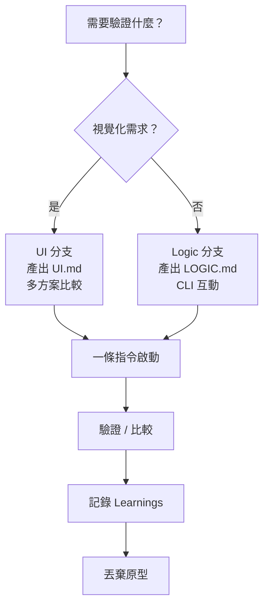

**最佳實踐**：

| 實踐 | 說明 |
|------|------|
| 限時 2 小時 | 原型不值得花太多時間 |
| 驗證後立即丟棄 | 不要試圖「改善」原型變成正式程式碼 |
| 記錄學到的教訓 | 將原型驗證結果寫入 ADR 或 Learnings 區塊 |
| 一條指令啟動 | 確保任何人都能立即執行 |
| 不要加測試 | 原型不是生產程式碼，不需要測試 |

---

## 第 10 章：diagnose — 結構化除錯

### 10.1 六階段（Six Phases）除錯流程

**分類**：Engineering

**用途**：以紀律化的六階段流程進行除錯，避免 AI 盲目嘗試修復。

**觸發方式**：

```bash
/diagnose the API returns 500 when creating orders with > 100 items
```

> **重要變更**：最新版 diagnose 使用 **Phases（階段）** 而非 Steps（步驟），強調每個階段可能包含多次迭代。

**六階段流程**：

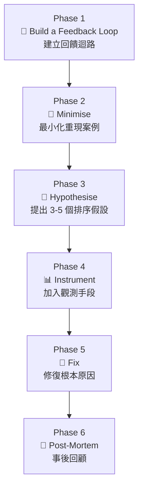

### 10.2 Phase 1 — Build a Feedback Loop（建立回饋迴路）

Phase 1 是 diagnose 中最關鍵的階段。目標是建立一個**可重複執行的回饋迴路**，讓你能快速驗證每個假設。

**十種建立回饋迴路的方法**：

| # | 方法 | 說明 | 適用場景 |
|---|------|------|----------|
| 1 | **撰寫失敗的測試** | 最理想的方式 | 確定性 Bug |
| 2 | **增加 logging** | 在可疑路徑加入日誌 | 難以測試的路徑 |
| 3 | **加入 assertion** | 在中間狀態加入斷言 | 資料流問題 |
| 4 | **使用 debugger** | 設定中斷點逐步執行 | 複雜流程 |
| 5 | **印出中間值** | 最原始但有效 | 快速驗證 |
| 6 | **使用 REPL** | 互動式環境 | 探索性測試 |
| 7 | **curl / httpie** | HTTP 請求工具 | API 問題 |
| 8 | **DB 查詢** | 直接查看資料庫狀態 | 資料一致性 |
| 9 | **Log tail** | 即時監控日誌 | 生產環境 |
| 10 | **Metrics dashboard** | 監控面板 | 效能問題 |

**迭代指引**：

- Phase 1 可能需要多次嘗試才能建立穩定的回饋迴路
- 如果 Bug 是**非確定性的**（intermittent），先專注於提高重現率
- 不要在無法穩定重現的情況下跳到 Phase 3

### 10.3 Phase 2-4 — 假設與驗證

**Phase 2: Minimise**

- 移除所有無關因素
- 找到**最小重現路徑**（minimal reproduction）
- 目標：用最少的程式碼觸發同樣的問題

**Phase 3: Hypothesise**

- 列出 **3-5 個假設**，按可能性排序
- 每個假設必須是**可驗證的**（falsifiable）
- 格式範例：

```markdown
## 假設清單（按可能性排序）

1. **[高] 陣列越界**：當 items > 100 時，batch 處理邏輯未正確分頁
   - 驗證方式：用 99, 100, 101 個 items 測試
2. **[中] 記憶體溢出**：大量 items 導致 JVM heap 不足
   - 驗證方式：監控 JVM memory metrics
3. **[中] DB 連線超時**：大量 INSERT 導致 connection pool 耗盡
   - 驗證方式：檢查 connection pool metrics
4. **[低] 序列化問題**：Jackson 處理超大 JSON 時的限制
   - 驗證方式：檢查 max-string-length 設定
5. **[低] 並發競爭**：多個請求同時處理時的 race condition
   - 驗證方式：並發壓力測試
```

**Phase 4: Instrument**

- 根據排序好的假設，**由高到低**逐一加入觀測手段
- 使用 Phase 1 建立的回饋迴路執行驗證
- 證實或排除每個假設

### 10.4 Phase 5-6 — 修復與回顧

**Phase 5: Fix**

- 修復已確認的根本原因
- 確保 Phase 1 建立的回饋迴路（測試）現在通過
- 確認沒有破壞其他功能

**Phase 6: Post-Mortem（事後回顧）**

最新版 diagnose 新增了 **Post-Mortem** 階段，要求在修復後回顧整個除錯過程：

```markdown
## Post-Mortem

### 問題摘要
[一句話描述問題]

### 根本原因
[最終確認的根本原因]

### 修復方式
[採取的修復措施]

### 可預防性
- 這個問題是否可以被測試提前發現？
- 是否需要新增 monitoring 或 alerting？
- 是否需要更新相關 ADR？

### 教訓
[從這次除錯中學到的教訓]
```

> **企業建議**：Post-Mortem 的結果應記入 ADR（如果涉及架構決策）或團隊知識庫。

### 10.5 實戰案例與最佳實踐

**最佳實踐**：

| 實踐 | 說明 |
|------|------|
| Phase 1 不能跳過 | 沒有穩定回饋迴路，後續都是猜測 |
| 假設限制 3-5 個 | 太少可能遺漏，太多導致分析癱瘓 |
| 假設必須排序 | 由高到低驗證，節省時間 |
| 永遠寫 Regression Test | 確保同一個 Bug 不會再出現 |
| Post-Mortem 不是可選的 | 每次診斷都要回顧 |
| 非確定性 Bug 優先提高重現率 | 不要在無法重現的情況下猜測 |

---

## 第 11 章：zoom-out — 全局視角

### 11.1 Repo Discovery 與 System Mapping

**分類**：Engineering

**用途**：當 AI 在不熟悉的程式碼區域工作時，請求更高層級的全局視角。

**觸發方式**：

```bash
/zoom-out what is the overall architecture of this monorepo?
```

### 11.2 Architecture Understanding

`/zoom-out` 會分析：

- 專案目錄結構與模組關係
- 主要進入點（Entry Points）
- 相依性關係圖
- CONTEXT.md 中定義的核心概念
- 現有 ADR 決策

**產出**：

- 高階架構概覽
- 模組間依賴關係
- 建議的探索路徑

### 11.3 實戰案例與最佳實踐

```bash
# 新加入專案時
/zoom-out I just joined this project, give me the big picture

# 處理不熟悉的模組時
/zoom-out what does the payment module do and how does it connect to orders?
```

**最佳實踐**：先 `/zoom-out` 了解全局，再 `/diagnose` 深入細節。

---

## 第 12 章：improve-codebase-architecture — 架構改善

### 12.1 Module Depth 理論

**分類**：Engineering

**用途**：深度掃描程式庫中的架構弱點，以 Module Depth 理論為基礎，提出「加深」模組的方案。

**觸發方式**：

```bash
/improve-codebase-architecture
```

最新版 improve-codebase-architecture 的核心理論基礎是 **Module Depth**（模組深度），源自 John Ousterhout 的《A Philosophy of Software Design》。

**Module Depth 理論詞彙表**：

| 術語 | 定義 |
|------|------|
| **Module** | 任何有介面的程式碼單元（函式、類別、套件、微服務） |
| **Interface** | Module 對外暴露的合約（public API、參數、回傳型別） |
| **Implementation** | Module 內部的實作細節 |
| **Depth** | Implementation 複雜度 ÷ Interface 複雜度。深的模組用簡單介面封裝複雜邏輯 |
| **Seam** | 模組之間的接合點，可在此處切換實作 |
| **Adapter** | 將外部介面轉換為內部介面的中間層 |
| **Leverage** | 一個模組提供的價值與其介面複雜度的比率 |
| **Locality** | 修改一個功能時需要觸及的模組數量。越少越好 |

**深 vs 淺模組圖解**：

```
深模組（好）：              淺模組（壞）：
┌─────────┐               ┌───────────────────────────────────┐
│Interface │               │           Interface               │
│ (簡單)   │               │ (非常複雜，參數多，例外多)          │
├─────────┤               ├───────────────────────────────────┤
│          │               │ Implementation                   │
│          │               │ (很少邏輯)                        │
│Implement │               └───────────────────────────────────┘
│ation    │
│(豐富的  │
│ 邏輯)   │
│          │
└─────────┘
```

### 12.2 Deletion Test 與 Deepening Opportunities

**Deletion Test（刪除測試）**：

improve-codebase-architecture 引入的一個核心檢驗工具。對每個模組問：

> 「如果我刪除這個模組，會發生什麼？」

| 刪除影響 | 診斷結果 | 建議行動 |
|----------|----------|----------|
| 大量程式碼壞掉 | ✅ 這是一個**深模組**，有價值 | 保留，可能進一步加深 |
| 幾乎沒有影響 | ⚠️ 這是一個**淺模組**，可能是過度抽象 | 考慮內聯（inline）或合併 |
| 影響不明確 | ❓ 模組邊界模糊 | 需要釐清職責 |

**Deepening Opportunities（加深機會）**：

improve-codebase-architecture 會自動識別可以「加深」的模組：

```markdown
## Deepening Opportunities

### 1. OrderService（當前 Depth: 淺）
- 當前介面：10 個 public methods
- 當前實作：每個方法只有 2-3 行 delegate 邏輯
- 建議：將 validation、pricing、inventory check 邏輯內聚到 OrderService
- 預期效果：介面減少到 4 個方法，實作深度大幅增加

### 2. PaymentAdapter（當前 Depth: 適中）
- 可加深：將 retry、circuit breaker、fallback 邏輯封裝進 Adapter
- 預期效果：調用者不需要知道重試邏輯的存在
```

### 12.3 三階段改善流程

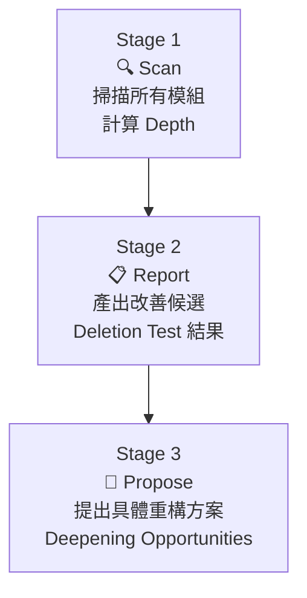

**Stage 1: Scan**
- 掃描專案中所有模組（類別、套件、微服務）
- 分析每個模組的 Interface 複雜度與 Implementation 複雜度
- 計算 Module Depth
- 檢查是否違反現有 ADR 決策

**Stage 2: Report**
- 以 Deletion Test 評估每個模組的價值
- 標記過度耦合的相依關係
- 標記 Locality 問題（修改一個功能需要觸及太多模組）

**Stage 3: Propose**
- 提出 Deepening Opportunities
- 建議具體的重構方案
- 若建議涉及架構決策，提議新建 ADR

### 12.4 實戰案例與最佳實踐

**最佳實踐**：

| 實踐 | 說明 |
|------|------|
| 定期執行 | 每個 Sprint 結束時執行一次 |
| 不要一次全改 | 選擇 Depth 最淺的 2-3 個模組優先改善 |
| 用 Deletion Test 驗證 | 每次重構後用 Deletion Test 確認深度增加 |
| 搭配 /tdd 執行重構 | 確保重構不破壞既有功能 |
| 記錄到 ADR | 每個重大重構決策都記入 ADR |

---

## 第 13 章：triage — 議題分類與管理

### 13.1 雙軸角色系統

**分類**：Engineering

**用途**：以雙軸角色系統（State Roles + Category Roles）管理 Issue 的分類與流轉。

**觸發方式**：

```bash
/triage review open issues and categorize them
```

最新版 triage 使用**雙軸系統**取代舊版的線性狀態機：

**State Roles（狀態角色）— 表示「這個 Issue 現在該由誰處理」**：

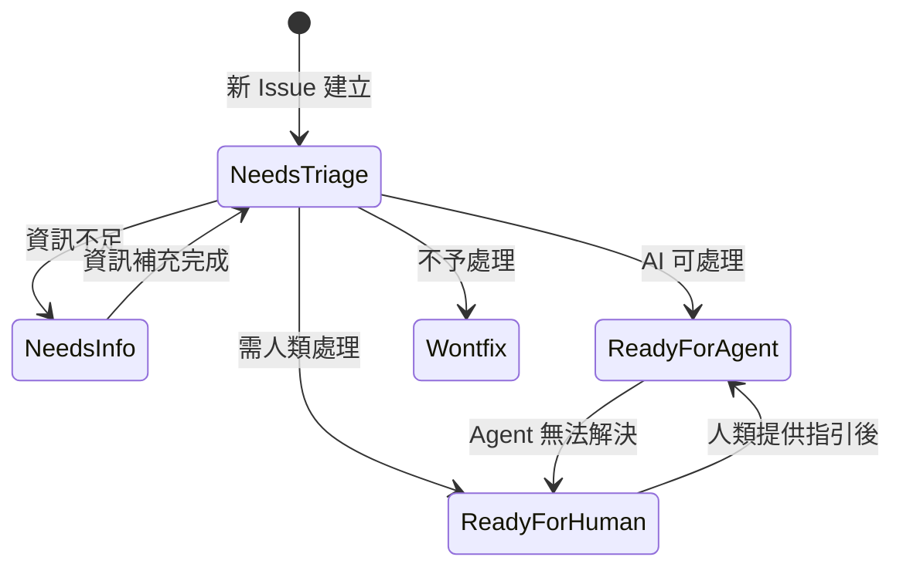

**Category Roles（分類角色）— 與 State Roles 正交，表示 Issue 的性質**：

| 分類角色 | 說明 |
|----------|------|
| `bug` | 現有功能的缺陷 |
| `enhancement` | 新功能或改善 |

### 13.2 AGENT-BRIEF.md 與自動摘要

當 triage 將 Issue 標記為 `ready-for-agent` 時，會自動產出 **AGENT-BRIEF.md** 作為 AI Agent 的工作簡報：

```markdown
# Agent Brief: Issue #42 — Fix coupon validation error

## Summary
用戶輸入含特殊字元的優惠碼時，API 回傳 500 而非驗證錯誤訊息。

## Relevant Files
- src/main/java/com/example/domain/service/CouponService.java
- src/test/java/com/example/domain/service/CouponServiceTest.java

## Related ADRs
- ADR-0005: Input Validation Strategy

## Acceptance Criteria
- Given 用戶輸入含 `<script>` 的優惠碼
  When 提交驗證
  Then 回傳 400 Bad Request 並顯示安全錯誤訊息

## Classification
- Category: bug
- State: ready-for-agent
```

### 13.3 Out-of-Scope 知識庫

triage 在分類 Issue 時會參考 `.out-of-scope/` 目錄中的知識：

```text
.out-of-scope/
├── rejected-features.md      # 已被拒絕的功能需求
├── known-limitations.md       # 已知限制（不打算修復）
└── deferred-decisions.md      # 延後的決策
```

當 Issue 內容與 `.out-of-scope/` 中的項目匹配時，triage 會自動建議標記為 `wontfix` 並引用對應的文件。

### 13.4 AI 評論聲明

最新版 triage 在對 Issue 添加 AI 生成的評論時，會**自動附加 AI 聲明**：

```markdown
> 🤖 This comment was generated by an AI agent. 
> Please verify the classification and escalate if incorrect.
```

> **企業建議**：此聲明確保團隊成員知道分類結果由 AI 產出，需要人類確認。

### 13.5 實戰案例與最佳實踐

**最佳實踐**：

| 實踐 | 說明 |
|------|------|
| 每日執行一次 | 確保新 Issue 及時被分類 |
| 維護 `.out-of-scope/` | 定期更新被拒絕的需求清單 |
| 確認 AI 分類 | Agent Brief 需要人類審閱確認 |
| 使用雙軸組合 | State + Category 組合提供更精確的分類 |
| ready-for-agent 需有 AC | 標記為 Agent 可處理的 Issue 必須有 Acceptance Criteria |

---

## 第 14 章：其他實用 Skills

### 14.1 caveman — 極簡溝通模式

**分類**：Productivity

**用途**：啟用超壓縮溝通模式，減少約 75% 的 Token 使用量。

```bash
/caveman
```

啟用後 AI 會用極簡語言回應，適合在 Token 預算有限或需要快速迭代時使用。

### 14.2 handoff — 跨 Agent 交接

**分類**：Productivity

**用途**：將當前對話壓縮為交接文件，供另一個 Agent 繼續處理。

```bash
/handoff
```

**最新版變更**：

- 使用 `mktemp` 建立臨時檔案儲存交接文件，避免污染專案目錄
- 支援 `argument-hint` 欄位，提示使用者提供交接對象的資訊
- 可以用路徑或 URL 引用特定的工作成果（artifacts）

**適用場景**：

- 切換到不同的 AI Agent 會話（不限 Claude Code）
- 需要另一位團隊成員接手
- 長時間對話需要重新啟動

### 14.3 write-a-skill — 自訂 Skill 開發

**分類**：Productivity

**用途**：建立新的自訂 Skill，包含正確的目錄結構與 YAML Frontmatter。

```bash
/write-a-skill create a skill for generating API documentation
```

**產出結構**：

```text
api-doc-generator/
├── SKILL.md           # 主指令檔
├── REFERENCE.md       # 參考文件
└── EXAMPLES.md        # 使用範例
```

### 14.4 git-guardrails-claude-code — Git 安全護欄

**分類**：Misc

**用途**：封鎖危險的 Git 指令，防止 AI 執行不可逆的 Git 操作。

**封鎖的指令**：

| 指令 | 風險 |
|------|------|
| `git push` | 可能推送未審查的程式碼 |
| `git push --force` | 覆寫遠端歷史 |
| `git reset --hard` | 丟棄本地修改 |
| `git clean` | 刪除未追蹤的檔案 |

> **企業建議**：所有使用 Claude Code 的專案都應啟用此 Skill。

### 14.5 setup-pre-commit — Pre-commit 配置

**分類**：Misc

**用途**：配置 Husky pre-commit hooks，包含 lint-staged、Prettier、測試等。

```bash
/setup-pre-commit
```

### 14.6 開發中的 Skills（In-Progress）

以下 Skills 目前仍在開發中，尚未穩定：

| Skill | 狀態 | 說明 |
|-------|------|------|
| `review` | 開發中 | 程式碼審查 Skill |
| `writing-beats` | 開發中 | 寫作節拍規劃（新增） |
| `writing-fragments` | 開發中 | 寫作片段產生 |
| `writing-shape` | 開發中 | 寫作架構設計 |

> **注意**：以上 Skills 的 API 可能隨時變更，不建議在生產環境使用。

### 14.7 已棄用的 Skills（Deprecated）

以下 Skills 已被棄用，不再維護：

| Skill | 替代方案 | 說明 |
|-------|----------|------|
| `design-an-interface` | `improve-codebase-architecture` | 功能已整合到架構改善 Skill |
| `qa` | `tdd` | 測試功能已整合到 TDD Skill |
| `request-refactor-plan` | `improve-codebase-architecture` | 重構規劃已整合到架構改善 Skill |
| `ubiquitous-language` | `setup-matt-pocock-skills` | 語言統一功能已整合到 CONTEXT.md |

---

## 第 15 章：AI Agent Workflow

### 15.1 端到端工作流程

以下是使用 mattpocock/skills 進行功能開發的**完整端到端工作流程**：

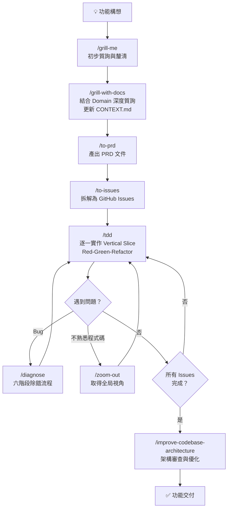

### 15.2 Skills 組合策略

| 開發階段 | 推薦 Skills 組合 | 說明 |
|----------|-------------------|------|
| **需求探索** | grill-me → grill-with-docs | 先廣後深 |
| **規劃** | to-prd → to-issues | 文件化 → 任務化 |
| **開發** | tdd（主循環）+ diagnose（除錯）+ zoom-out（導航） | 紀律化開發 |
| **審查** | improve-codebase-architecture | 定期架構健檢 |
| **協作** | handoff（交接）+ caveman（節省 Token） | 跨會話協作 |

### 15.3 迭代循環與回饋機制

**Sprint 內循環**：

```
每個 Sprint：
1. Sprint Planning → /to-issues 確認本 Sprint Issues
2. 每個 Issue → /tdd 逐一實作
3. 遇到問題 → /diagnose 除錯
4. Sprint Review → /improve-codebase-architecture 架構審查
5. Retrospective → 更新 CONTEXT.md 與 ADR
```

---

## 第 16 章：Web Application 實戰案例

### 16.1 技術棧選型

| 層級 | 技術 | 版本 |
|------|------|------|
| **Frontend** | Vue 3 + TypeScript + Tailwind CSS | Vue 3.5+, TS 5.x |
| **Backend** | Spring Boot + Java + Clean Architecture | Spring Boot 3.x, Java 21+ |
| **Database** | PostgreSQL + Redis | PG 16+, Redis 7+ |
| **Messaging** | Kafka | 3.x |
| **Infrastructure** | Docker + Kubernetes + GitHub Actions | — |

### 16.2 專案目錄結構

```text
enterprise-web-app/
├── .skills/                          # mattpocock/skills 本地配置
├── CONTEXT.md                        # 領域詞彙表
├── CONTEXT-MAP.md                    # 多 Context 映射（Monorepo）
├── AGENTS.md                         # Agent 配置入口
├── docs/
│   ├── agents/
│   │   ├── issue-tracker.md          # GitHub Issues 配置
│   │   ├── triage-labels.md          # Triage 標籤
│   │   └── domain.md                 # Domain 文件結構
│   └── adr/
│       ├── 0001-use-postgresql.md
│       ├── 0002-clean-architecture.md
│       ├── 0003-event-sourcing-orders.md
│       └── 0004-jwt-authentication.md
├── frontend/
│   ├── src/
│   │   ├── components/
│   │   ├── views/
│   │   ├── composables/
│   │   ├── stores/
│   │   └── api/
│   ├── tests/
│   └── package.json
├── backend/
│   ├── src/main/java/com/example/
│   │   ├── domain/                   # Domain Layer（核心）
│   │   │   ├── model/
│   │   │   ├── repository/          # Port（介面）
│   │   │   └── service/
│   │   ├── application/             # Application Layer
│   │   │   ├── usecase/
│   │   │   └── dto/
│   │   ├── infrastructure/          # Infrastructure Layer
│   │   │   ├── persistence/         # Adapter（實作）
│   │   │   ├── messaging/
│   │   │   └── external/
│   │   └── api/                     # API Layer
│   │       ├── controller/
│   │       ├── request/
│   │       └── response/
│   ├── src/test/
│   └── pom.xml
├── infrastructure/
│   ├── docker/
│   │   └── docker-compose.yml
│   ├── kubernetes/
│   │   ├── deployment.yaml
│   │   ├── service.yaml
│   │   └── ingress.yaml
│   └── terraform/
├── .github/
│   └── workflows/
│       ├── ci.yml
│       ├── cd.yml
│       └── security-scan.yml
└── .scratch/                         # 本地 Issue 追蹤（選用）
```

### 16.3 Skills 如何限制 AI

| 約束機制 | 實現方式 | 效果 |
|----------|----------|------|
| **Domain 保護** | CONTEXT.md 定義核心概念 | AI 不會任意重新命名 Entity 或 Value Object |
| **架構約束** | ADR-0002 指定 Clean Architecture | AI 不會在 Domain Layer 引入 Infrastructure 相依 |
| **TDD 強制** | /tdd Skill 的 RED-GREEN-REFACTOR 約束 | AI 不會跳過測試直接寫實作 |
| **Git 護欄** | git-guardrails 封鎖危險操作 | AI 不會直接 push 或 force push |
| **Issue 追蹤** | /to-issues 產出的 Issue 作為工作範圍 | AI 只處理被分配的 Issue，不會無邊界擴展 |

### 16.4 避免 Vibe Coding 與架構污染

**Vibe Coding 的危險信號**：

| 信號 | 說明 | 預防 Skill |
|------|------|------------|
| AI 產出大量未經測試的程式碼 | 缺乏品質保證 | `/tdd` |
| AI 修改了 Domain Layer 的核心概念 | 架構污染 | `/grill-with-docs` + CONTEXT.md |
| AI 在多個模組間大範圍修改 | 失控的重構 | `/improve-codebase-architecture` + ADR |
| AI 繞過了既有的 ADR 決策 | 架構不一致 | grill-with-docs 會檢查 ADR 衝突 |
| AI 直接 push 到 main branch | 繞過審查 | `git-guardrails` |

### 16.5 完整開發流程示範

**以「新增優惠券功能」為例**：

```bash
# 第 1 步：需求探索
/grill-me 我們想在電商系統中新增優惠券功能

# 第 2 步：深度質詢（結合 Domain）
/grill-with-docs 優惠券功能的詳細設計

# 第 3 步：產出 PRD
/to-prd

# 第 4 步：拆解 Issues
/to-issues

# 第 5 步：逐一實作（以 Issue #1 為例）
/tdd implement Coupon entity and database migration

# 第 6 步：遇到 N+1 查詢問題
/diagnose Coupon query is generating N+1 database calls

# 第 7 步：完成所有 Issues 後，架構審查
/improve-codebase-architecture
```

---

## 第 17 章：SSDLC — 安全軟體開發生命週期

### 17.1 Threat Modeling 與 Skills 整合

在 `/grill-me` 和 `/grill-with-docs` 階段，AI 會主動提出安全相關質詢：

| 威脅類型 | AI 可能提出的問題 |
|----------|-------------------|
| **Authentication** | API 端點是否都需要認證？是否有未保護的端點？ |
| **Authorization** | 用戶能否存取其他人的資料？RBAC 是否正確配置？ |
| **Input Validation** | 輸入欄位是否有長度限制？是否防止 SQL Injection？ |
| **Data Exposure** | API Response 是否暴露了敏感欄位？ |
| **Rate Limiting** | 是否有限流防止 DDoS？ |

### 17.2 SAST / DAST / Dependency Scan

在 CI/CD Pipeline 中整合安全掃描（參見第 18 章）：

| 掃描類型 | 工具建議 | 整合時機 |
|----------|----------|----------|
| **SAST** | SonarQube, CodeQL | PR 階段 |
| **DAST** | OWASP ZAP | Staging 部署後 |
| **Dependency Scan** | Dependabot, Trivy | 每日 + PR 階段 |
| **Secret Scan** | GitLeaks, GitHub Secret Scanning | Pre-commit + CI |
| **Container Scan** | Trivy, Snyk | Docker Build 後 |

### 17.3 Prompt Injection 防護

使用 AI 輔助開發時必須注意 Prompt Injection 風險：

| 風險場景 | 說明 | 防護措施 |
|----------|------|----------|
| **程式碼注入** | AI 生成的程式碼可能包含惡意邏輯 | Code Review + 自動化掃描 |
| **Skill 污染** | 自訂 Skill 的 SKILL.md 被注入惡意指令 | Skill 審核機制 + 版本控管 |
| **Context 汙染** | CONTEXT.md 被修改以誤導 AI | CONTEXT.md 變更需 PR 審查 |

### 17.4 AI Security Governance

| 治理項目 | 實施方式 |
|----------|----------|
| AI 生成程式碼必須經過 Code Review | Branch Protection Rules |
| AI 不得直接修改生產環境配置 | 環境分離 + 權限控管 |
| AI 的 Prompt 與回應應留存稽核紀錄 | Claude Code 日誌留存 |
| 敏感資料不得出現在 AI 對話中 | 資料脫敏政策 |

---

## 第 18 章：AI Governance — AI 治理

### 18.1 Human Approval Gate

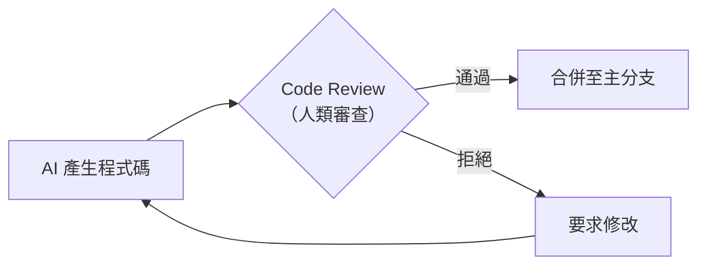

**實施方式**：

- GitHub Branch Protection：要求至少 1 位人類 Reviewer 通過
- AI 生成的 PR 標記 `ai-generated` 標籤
- 高風險變更（Domain Layer、Security Config）要求 2 位 Reviewer

### 18.2 ADR Mandatory 與 Architecture Review

| 變更類型 | 是否需要 ADR | 審查層級 |
|----------|-------------|----------|
| 新增 Dependency | ✅ | Tech Lead |
| 修改 Domain Model | ✅ | 架構師 |
| 修改 API Contract | ✅ | Tech Lead + PM |
| Bug Fix | ❌ | 一般 Review |
| UI 調整 | ❌ | 一般 Review |

### 18.3 AI Scope Restriction 與 Protected Directories

**建議的 Protected Directories（AI 不得自行修改）**：

```text
# AI 修改需要人類審查的目錄
backend/src/main/java/.../domain/     # Domain Layer
backend/src/main/resources/           # 配置檔
infrastructure/kubernetes/            # K8s 配置
.github/workflows/                    # CI/CD Pipeline
docs/adr/                             # 架構決策
CONTEXT.md                            # 領域詞彙
```

### 18.4 Prompt Review 機制

- 團隊應建立**自訂 Skill 審核流程**
- 新 Skill 建立需經過 PR Review
- 現有 Skill 修改需記錄在 CHANGELOG 中
- 定期（每季）審查所有 Skills 的有效性

---

## 第 19 章：DevSecOps 與 CI/CD

### 19.1 GitHub Actions 整合

**CI Pipeline 範例**：

```yaml
# .github/workflows/ci.yml
name: CI Pipeline

on:
  pull_request:
    branches: [main, develop]

jobs:
  test:
    runs-on: ubuntu-latest
    steps:
      - uses: actions/checkout@v4
      
      - name: Set up Java 21
        uses: actions/setup-java@v4
        with:
          java-version: '21'
          distribution: 'temurin'
      
      - name: Run Backend Tests
        run: cd backend && mvn test
      
      - name: Set up Node.js
        uses: actions/setup-node@v4
        with:
          node-version: '20'
      
      - name: Run Frontend Tests
        run: cd frontend && npm ci && npm test

  security-scan:
    runs-on: ubuntu-latest
    steps:
      - uses: actions/checkout@v4
      
      - name: Dependency Scan
        uses: aquasecurity/trivy-action@master
        with:
          scan-type: 'fs'
          scan-ref: '.'
      
      - name: Secret Scan
        uses: gitleaks/gitleaks-action@v2

  lint:
    runs-on: ubuntu-latest
    steps:
      - uses: actions/checkout@v4
      
      - name: Check AI-generated label
        if: contains(github.event.pull_request.labels.*.name, 'ai-generated')
        run: echo "⚠️ This PR contains AI-generated code. Extra review required."
```

### 19.2 Security Scan Pipeline

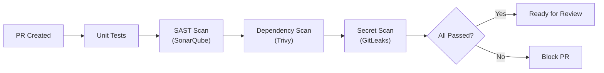

### 19.3 AI Review Workflow

```yaml
# .github/workflows/ai-review.yml
name: AI Code Review Gate

on:
  pull_request:
    types: [labeled]

jobs:
  ai-review-check:
    if: contains(github.event.pull_request.labels.*.name, 'ai-generated')
    runs-on: ubuntu-latest
    steps:
      - name: Enforce Additional Review
        uses: actions/github-script@v7
        with:
          script: |
            const { data: reviews } = await github.rest.pulls.listReviews({
              owner: context.repo.owner,
              repo: context.repo.repo,
              pull_number: context.issue.number,
            });
            const approvals = reviews.filter(r => r.state === 'APPROVED');
            if (approvals.length < 2) {
              core.setFailed('AI-generated PRs require at least 2 approvals');
            }
```

### 19.4 Pull Request Governance

| PR 類型 | 審查要求 | 自動化檢查 |
|---------|----------|------------|
| AI 生成（一般） | 1 Reviewer | Tests + Lint + Security Scan |
| AI 生成（Domain） | 2 Reviewers + 架構師 | Tests + Lint + Security + ADR Check |
| 人類撰寫 | 1 Reviewer | Tests + Lint |
| Hotfix | 1 Senior + Post-Review | Tests only |

---

## 第 20 章：Best Practices — 最佳實踐

| # | 實踐 | 說明 | 優先級 |
|---|------|------|--------|
| 1 | **ADR First** | 架構變更前必須先建立 ADR | 🔴 必要 |
| 2 | **TDD First** | 任何新功能都以 /tdd 開始 | 🔴 必要 |
| 3 | **Grill Before Code** | 編碼前先 /grill-me 或 /grill-with-docs | 🔴 必要 |
| 4 | **Vertical Slice** | 一次處理一個完整的垂直切片 | 🔴 必要 |
| 5 | **Human Review** | AI 生成的程式碼必須經過人類審查 | 🔴 必要 |
| 6 | **Small Commits** | 每個 Vertical Slice 一個 Commit | 🟡 建議 |
| 7 | **Prompt Versioning** | 自訂 Skills 要版本控管 | 🟡 建議 |
| 8 | **CONTEXT.md 維護** | 每次 /grill-with-docs 後檢查 CONTEXT.md 變更 | 🟡 建議 |
| 9 | **定期架構審查** | 每 Sprint 執行一次 /improve-codebase-architecture | 🟢 推薦 |
| 10 | **Git Guardrails 啟用** | 所有使用 Claude Code 的專案都啟用 | 🔴 必要 |
| 11 | **漸進式導入** | PoC → Pilot Team → 全團隊 Rollout | 🟡 建議 |
| 12 | **效率 KPI 追蹤** | 追蹤 AI 生成程式碼的 Review 通過率、TDD 覆蓋率 | 🟢 推薦 |

---

## 第 21 章：Anti-patterns — 反模式

| # | 反模式 | 症狀 | 風險 | 修正方式 |
|---|--------|------|------|----------|
| 1 | **AI 直接修改 Production** | 程式碼未經審查即部署 | 🔴 嚴重 | 強制 Branch Protection + git-guardrails |
| 2 | **AI 跳過測試** | 先寫實作再補測試（或不補） | 🔴 嚴重 | 嚴格執行 /tdd |
| 3 | **AI 大規模重構** | 一次修改數十個檔案 | 🟡 中等 | 限定 Vertical Slice 範圍 |
| 4 | **無 ADR 修改架構** | 架構變更無決策紀錄 | 🟡 中等 | ADR Mandatory 政策 |
| 5 | **無 Review 合併** | 直接 merge AI 生成的 PR | 🔴 嚴重 | Branch Protection Rules |
| 6 | **Vibe Coding** | 對 AI 說「幫我寫一個完整的用戶系統」 | 🟡 中等 | 先 /grill-me 再 /tdd 逐步實作 |
| 7 | **忽略 CONTEXT.md** | 不維護領域詞彙表 | 🟢 輕微 | 每次 /grill-with-docs 後檢查更新 |
| 8 | **過度依賴 AI** | 所有程式碼都由 AI 產生，人類不理解 | 🟡 中等 | 維持人類理解每行程式碼的能力 |
| 9 | **同時修改多個 Issue** | AI 在一次對話中處理多個無關 Issue | 🟡 中等 | 一次一個 Issue，用 /tdd |
| 10 | **不執行測試** | AI 說「測試應該會通過」但未實際執行 | 🔴 嚴重 | 要求 AI 在每步都實際執行測試 |

---

## 第 22 章：Troubleshooting — 故障排除

| # | 問題 | 可能原因 | 解決方式 |
|---|------|----------|----------|
| 1 | **Skills 無法載入** | Skills 未正確安裝 | 重新執行 `npx skills@latest add mattpocock/skills` |
| 2 | **Claude Code 找不到 Skill** | Skill 未在 plugin.json 中註冊 | 確認 Skill 在 engineering/productivity/misc 目錄下 |
| 3 | **Context 爆炸（Token 超限）** | CONTEXT.md 或 ADR 檔案過大 | 精簡 CONTEXT.md，移除過時的 ADR |
| 4 | **Prompt 汙染** | SKILL.md 或 CONTEXT.md 被注入惡意內容 | 檢查 Git diff，還原異常變更 |
| 5 | **AI 偏離需求** | 未執行 /grill-me 就開始編碼 | 回到需求階段，執行 /grill-me 或 /grill-with-docs |
| 6 | **測試失敗** | AI 生成的測試有語法錯誤 | 要求 AI 在 /tdd 過程中實際執行測試 |
| 7 | **/grill-with-docs 未讀取 CONTEXT.md** | 未執行 /setup-matt-pocock-skills | 先執行初始化 |
| 8 | **Issue Tracker 無法連線** | gh CLI 未認證 | 執行 `gh auth login` |
| 9 | **ADR 編號衝突** | 多人同時建立 ADR | 使用 PR 合併解決衝突，重新編號 |
| 10 | **Skill 被錯誤觸發** | 兩個 Skill 的 description 語義重疊 | 修改 description 增加「Use when:」觸發條件 |
| 11 | **/to-issues 產出的 Issue 太大** | 缺乏 Vertical Slice 意識 | 引導 AI 將每個 Issue 限定在 2-4 小時工作量 |
| 12 | **caveman 模式無法退出** | 模式未正確關閉 | 開啟新的 Claude Code 會話 |

---

## 第 23 章：FAQ — 常見問題

**Q1：mattpocock/skills 支援哪些 AI Agent？**
> 支援任何模型（"works with any model"）。透過 [skills.sh](https://skills.sh) 註冊，目前已確認支援的 Agent 包括：Claude Code、Cursor、Codex、GitHub Copilot、Windsurf、Gemini CLI、Cline、AMP、Antigravity、ClawdBot 等 10+ 種工具。不同 Agent 使用不同的配置檔（如 Claude 使用 `CLAUDE.md`，GitHub Copilot 使用 `AGENTS.md`）。

**Q2：安裝後是否需要在每個專案都執行 /setup-matt-pocock-skills？**
> 是的。每個專案倉庫需要獨立初始化，因為每個專案的 Issue Tracker、Triage Labels、Domain 都不同。

**Q3：CONTEXT.md 是手動建立還是自動產生？**
> 延遲自動產生。首次執行 `/grill-with-docs` 時由 AI 根據對話內容建立，後續每次 `/grill-with-docs` 會自動更新。

**Q4：可以自訂新的 Skills 嗎？**
> 可以。使用 `/write-a-skill` 即可建立符合標準結構的自訂 Skill。

**Q5：Skills 更新後會覆蓋自訂配置嗎？**
> Skills 更新只影響 `~/.claude/skills/` 中的共享 Skill 檔案，不會覆蓋專案中的 CONTEXT.md、ADR 等檔案。

**Q6：一次 /tdd 會話可以處理多少個 Vertical Slice？**
> 建議一次處理一個 Vertical Slice。完成後 commit，再開始下一個。

**Q7：grill-me 和 grill-with-docs 有什麼差別？**
> `grill-me` 是通用質詢（不讀取專案檔案），`grill-with-docs` 會讀取並更新 CONTEXT.md 和 ADR。

**Q8：/diagnose 可以分析生產環境的問題嗎？**
> 可以，但需要將相關 logs、metrics 資料貼入對話中。AI 不會直接連線至生產環境。

**Q9：git-guardrails 會封鎖人類的 git 操作嗎？**
> 不會。它只在 Claude Code 的 Agent 模式下攔截危險的 git 指令。

**Q10：多個團隊成員可以共用相同的 Skills 配置嗎？**
> Skills 安裝在 `~/.claude/skills/`（使用者層級），每個成員需要自行安裝。專案層級的配置（CONTEXT.md、ADR 等）則透過 Git 共享。

**Q11：如何衡量 mattpocock/skills 的導入效果？**
> 建議追蹤：AI 生成程式碼的 Code Review 通過率、TDD 覆蓋率變化、Bug 回報率變化、CONTEXT.md 更新頻率。

**Q12：是否需要所有 Skills 都安裝？**
> 不需要。根據團隊需求選擇。最低建議安裝：`setup-matt-pocock-skills` + `grill-with-docs` + `tdd` + `git-guardrails`。

**Q13：/prototype 產出的程式碼會進入正式程式碼庫嗎？**
> 不應該。Prototype 是拋棄式的，用於驗證可行性。正式實作應使用 `/tdd`。

**Q14：ADR 可以修改或刪除嗎？**
> ADR 不應刪除。若決策過時，應建立新 ADR 並標註舊 ADR 狀態為 `Superseded by ADR-XXXX`。

**Q15：CONTEXT.md 變更是否需要 Code Review？**
> 強烈建議。CONTEXT.md 定義了專案的核心概念，變更應經過 PR Review。

**Q16：Monorepo 專案如何使用？**
> 使用 `CONTEXT-MAP.md` 映射每個子模組的 CONTEXT.md 路徑。

**Q17：/to-prd 是否會進行質詢？**
> 不會。`/to-prd` 只綜合現有對話內容產出 PRD。質詢應在之前使用 `/grill-me` 或 `/grill-with-docs`。

**Q18：In-Progress 的 Skills（如 review）可以使用嗎？**
> 可以手動載入使用，但未在 plugin.json 中註冊，Claude Code 不會自動發現。品質與穩定性不保證。

**Q19：如何處理團隊內不同成員安裝了不同版本的 Skills？**
> 建議團隊統一使用相同版本，可在團隊 Wiki 或 README 中記錄建議版本。Skills 本身的更新頻率較高，建議每月同步更新。

**Q20：/handoff 產出的文件格式是什麼？**
> 壓縮的 Markdown 文件，包含對話重點摘要、待辦事項、相關檔案列表，可直接貼入新的 Claude Code 會話。

**Q21：企業環境中，AI 生成的程式碼是否有智慧財產權疑慮？**
> mattpocock/skills 本身是 MIT License。AI 生成的程式碼歸屬依 Claude Code 的使用條款而定。建議諮詢公司法務。

**Q22：使用 caveman 模式是否會降低 AI 的回答品質？**
> 不會降低推理品質，只是壓縮輸出格式。適合在 Token 預算有限或需要快速迭代時使用。

---

## 第 24 章：Appendix — 附錄

### 24.1 CLI 速查表

| 指令 | 分類 | 用途 |
|------|------|------|
| `/setup-matt-pocock-skills` | Engineering | 專案初始化（必須首先執行） |
| `/grill-me` | Productivity | 通用計畫質詢 |
| `/grill-with-docs` | Engineering | 結合 Domain 的深度質詢 |
| `/tdd` | Engineering | 測試驅動開發循環 |
| `/to-prd` | Engineering | 對話轉 PRD 文件 |
| `/to-issues` | Engineering | PRD 拆解為 Issues |
| `/prototype` | Engineering | 快速原型建立 |
| `/diagnose` | Engineering | 六步結構化除錯 |
| `/zoom-out` | Engineering | 取得全局視角 |
| `/improve-codebase-architecture` | Engineering | 架構改善建議 |
| `/triage` | Engineering | 議題分類管理 |
| `/caveman` | Productivity | 極簡溝通模式 |
| `/handoff` | Productivity | 跨 Agent 交接 |
| `/write-a-skill` | Productivity | 自訂 Skill 開發 |

### 24.2 Prompt Templates

**需求探索 Prompt 範本**：

```text
/grill-with-docs
我想為 [系統名稱] 新增 [功能名稱]。
目標用戶是 [用戶角色]。
主要需求是 [核心需求描述]。
預計影響的模組有 [模組列表]。
```

**TDD 啟動 Prompt 範本**：

```text
/tdd
實作 [Issue #N]: [Issue 標題]
技術約束：參考 ADR-XXXX
影響範圍：[模組/層級]
```

**除錯 Prompt 範本**：

```text
/diagnose
問題描述：[症狀]
重現步驟：[步驟]
預期行為：[應該的結果]
實際行為：[實際的結果]
環境：[開發/測試/生產]
```

**架構審查 Prompt 範本**：

```text
/improve-codebase-architecture
請聚焦在 [模組名稱]，特別關注：
1. [關注點 1]
2. [關注點 2]
最近的變更包括：[變更描述]
```

### 24.3 新進成員 Checklist

**第一天**：

- [ ] 安裝 Claude Code（最新版）
- [ ] 安裝 Node.js v18+
- [ ] 安裝 gh CLI 並完成認證（`gh auth login`）
- [ ] 執行 `npx skills@latest add mattpocock/skills`（選擇所有 Skills）
- [ ] 閱讀本手冊第 1-4 章

**第一週**：

- [ ] 在專案中執行 `/setup-matt-pocock-skills`（或確認已初始化）
- [ ] 閱讀專案的 CONTEXT.md 了解領域詞彙
- [ ] 閱讀 docs/adr/ 了解已有架構決策
- [ ] 使用 `/zoom-out` 了解專案全局架構
- [ ] 完成第一個 `/tdd` 練習（修復一個小 Bug）

**第一個月**：

- [ ] 使用 `/grill-me` 完成至少一次需求探索
- [ ] 使用 `/to-prd` 產出至少一份 PRD
- [ ] 使用 `/to-issues` 拆解至少一個功能
- [ ] 使用 `/tdd` 完成至少三個 Vertical Slice
- [ ] 使用 `/diagnose` 解決至少一個 Bug
- [ ] 閱讀本手冊第 16-18 章（SSDLC + Governance + CI/CD）

### 24.4 團隊導入 Checklist

**Phase 1：PoC（2 週）**：

- [ ] 選擇 1-2 位團隊成員作為先導者
- [ ] 在非關鍵專案上試用 mattpocock/skills
- [ ] 記錄使用體驗、問題與建議
- [ ] 產出 PoC 報告

**Phase 2：Pilot（4 週）**：

- [ ] 擴展至 3-5 位團隊成員
- [ ] 在正式專案的新功能開發中使用
- [ ] 建立團隊自訂 Skills（如有需要）
- [ ] 定義 AI Governance 政策（Branch Protection、Review 要求）
- [ ] 追蹤效率 KPI（Review 通過率、Bug 率、覆蓋率）

**Phase 3：Rollout（持續）**：

- [ ] 全團隊安裝並統一 Skills 版本
- [ ] 將 AI Governance 政策正式化（寫入團隊 Wiki）
- [ ] CI/CD Pipeline 整合 Security Scan
- [ ] 定期（每月）更新 Skills 至最新版
- [ ] 每季審查 Skills 有效性與團隊使用狀況

### 24.5 參考連結

| 資源 | 連結 |
|------|------|
| mattpocock/skills GitHub | https://github.com/mattpocock/skills |
| skills.sh 官方註冊網站 | https://skills.sh |
| Claude Code 官方文件 | https://code.claude.com/docs |
| Skills CLI（npx skills） | https://www.npmjs.com/package/skills |
| ADR 最佳實踐 | https://adr.github.io/ |
| Vertical Slice Architecture | https://jimmybogard.com/vertical-slice-architecture/ |
| TDD 入門指南 | https://martinfowler.com/bliki/TestDrivenDevelopment.html |
| A Philosophy of Software Design | https://web.stanford.edu/~ouster/cgi-bin/book.php |

---

> **文件版本紀錄**
> 
> | 版本 | 日期 | 變更說明 |
> |------|------|----------|
> | v2.0.0 | 2026-05-15 | 全面改版：更新多 Agent 支援、skills.sh 生態系、CONTEXT.md 純 Glossary 格式、ADR 簡化格式、triage 雙軸系統、HITL/AFK 分類、Module Depth 理論、Post-Mortem 階段等 |
> | v1.0.0 | 2026-05-15 | 初版發布，基於 mattpocock/skills 2026-05 版本調研 |
> 
> **免責聲明**：mattpocock/skills 為持續活躍開發的開源專案，部分功能（如 In-Progress Skills）可能在未來版本中變更。建議定期參閱官方 GitHub 取得最新資訊。


