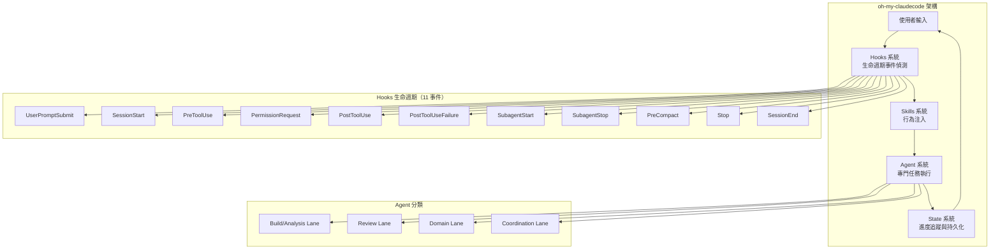
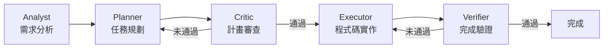
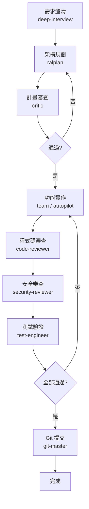

+++
date = '2026-07-01T00:00:00+08:00'
draft = false
title = 'Oh My Claudecode 教學手冊'
tags = ['教學', 'AI開發']
categories = ['教學']
+++

# oh-my-claudecode 教學手冊（完整版）

> **版本**：v4.15.1（2026-06-27）  
> **文件更新日期**：2026-07-01  
> **適用對象**：資深工程師、架構師、技術主管  
> **定位**：企業級 Multi-Agent 編排實戰手冊  
> **授權**：MIT License  
> **官方網站**：<https://oh-my-claudecode.dev>

---

## 目錄

- [1. 概述](#1-概述)
  - [1.1 什麼是 oh-my-claudecode](#11-什麼是-oh-my-claudecode)
  - [1.2 與傳統 Claude Code 的差異](#12-與傳統-claude-code-的差異)
  - [1.3 與 GitHub Copilot 的整合方式](#13-與-github-copilot-的整合方式)
  - [1.4 適用場景](#14-適用場景)
- [2. 整體架構設計（Architecture）](#2-整體架構設計architecture)
  - [2.1 Multi-Agent 架構圖](#21-multi-agent-架構圖)
  - [2.2 Agent 分工（29 個 Agent）](#22-agent-分工29-個-agent)
  - [2.3 任務分解機制（Task Decomposition）](#23-任務分解機制task-decomposition)
  - [2.4 Agent 角色邊界](#24-agent-角色邊界)
  - [2.5 驗證協定（Verification Protocol）](#25-驗證協定verification-protocol)
  - [2.6 Agent 通訊機制](#26-agent-通訊機制)
  - [2.7 狀態管理架構：Control Plane vs Data Plane](#27-狀態管理架構control-plane-vs-data-plane)
  - [2.8 與外部系統整合](#28-與外部系統整合)
- [3. 安裝與環境建置（Step-by-step）](#3-安裝與環境建置step-by-step)
  - [3.1 前置需求](#31-前置需求)
  - [3.2 安裝 oh-my-claudecode](#32-安裝-oh-my-claudecode)
  - [3.3 初始設定（Setup）](#33-初始設定setup)
  - [3.4 tmux / psmux 安裝（各平台）](#34-tmux--psmux-安裝各平台)
  - [3.5 可選：多 AI 模型支援](#35-可選多-ai-模型支援)
  - [3.6 啟用 Claude Code Native Teams](#36-啟用-claude-code-native-teams)
  - [3.7 驗證安裝](#37-驗證安裝)
- [4. 核心設定（Configuration）](#4-核心設定configuration)
  - [4.1 設定檔結構與優先順序](#41-設定檔結構與優先順序)
  - [4.2 環境變數](#42-環境變數)
  - [4.3 Agent 設定（自訂 / 修改）](#43-agent-設定自訂--修改)
  - [4.4 模型路由策略（Cost Optimization）](#44-模型路由策略cost-optimization)
  - [4.5 Company Context via MCP](#45-company-context-via-mcp)
  - [4.6 Remote OMC / Remote MCP Access](#46-remote-omc--remote-mcp-access)
  - [4.7 Plugin 目錄旗標（Decision Matrix）](#47-plugin-目錄旗標decision-matrix)
  - [4.8 Skills 設定](#48-skills-設定)
  - [4.9 任務模板設定](#49-任務模板設定)
  - [4.10 何時需要重新執行 Setup](#410-何時需要重新執行-setup)
- [5. 使用方式（實戰）](#5-使用方式實戰)
  - [5.1 基本使用（含 Ultragoal、Multi-Repo 整合）](#51-基本使用)
  - [5.2 Web Application 開發（重點）](#52-web-application-開發重點)
  - [5.3 逆向工程（Legacy System）](#53-逆向工程legacy-system)
  - [5.4 Framework 升級](#54-framework-升級)
- [6. Multi-Agent 協作設計（進階）](#6-multi-agent-協作設計進階)
  - [6.1 Agent Roles 設計模式](#61-agent-roles-設計模式)
  - [6.2 Planner → Executor → Reviewer Flow](#62-planner--executor--reviewer-flow)
  - [6.3 tmux CLI Workers（多模型協作）](#63-tmux-cli-workers多模型協作)
  - [6.4 Code Review Agent](#64-code-review-agent)
  - [6.5 Security Agent（SSDLC）](#65-security-agentssdlc)
- [7. Skills Learning 系統](#7-skills-learning-系統)
  - [7.1 Skills 總覽（35 個 Skills 完整清單）](#71-skills-總覽)
  - [7.2 Skills 如何產生](#72-skills-如何產生)
  - [7.3 Skills 儲存與重用](#73-skills-儲存與重用)
  - [7.4 建立企業內知識庫](#74-建立企業內知識庫)
- [8. 效能與成本優化](#8-效能與成本優化)
  - [8.1 Token 使用最佳化](#81-token-使用最佳化)
  - [8.2 模型選擇策略](#82-模型選擇策略)
  - [8.3 平行處理設計](#83-平行處理設計)
  - [8.4 HUD 監控與分析](#84-hud-監控與分析)
- [9. SSDLC 整合（企業級重點）](#9-ssdlc-整合企業級重點)
  - [9.1 安全設定（Security Mode）](#91-安全設定security-mode)
  - [9.2 Secure Coding](#92-secure-coding)
  - [9.3 SAST / DAST 整合](#93-sast--dast-整合)
  - [9.4 威脅建模（Threat Modeling）](#94-威脅建模threat-modeling)
  - [9.5 Compliance（金融業）](#95-compliance金融業)
  - [9.6 已知安全限制](#96-已知安全限制)
- [10. 系統維運（Maintenance）](#10-系統維運maintenance)
  - [10.1 Log 與監控](#101-log-與監控)
  - [10.2 Agent Debug](#102-agent-debug)
  - [10.3 錯誤排除](#103-錯誤排除)
  - [10.4 狀態管理](#104-狀態管理)
  - [10.5 Project Memory 系統](#105-project-memory-系統)
  - [10.6 Notepad 系統（壓縮抗性備忘錄）](#106-notepad-系統壓縮抗性備忘錄)
  - [10.7 Plan Notepad（每計畫知識擷取）](#107-plan-notepad每計畫知識擷取)
  - [10.8 Session Scope（Session 隔離）](#108-session-scopesession-隔離)
  - [10.9 Code Simplifier Hook](#109-code-simplifier-hook)
  - [10.10 OpenClaw 整合（外部事件閘道器）](#1010-openclaw-整合外部事件閘道器)
- [11. 系統升級（Upgrade）](#11-系統升級upgrade)
  - [11.1 oh-my-claudecode 升級策略](#111-oh-my-claudecode-升級策略)
  - [11.2 升級後驗證](#112-升級後驗證)
  - [11.3 Agent 相容性](#113-agent-相容性)
  - [11.4 Config Migration](#114-config-migration)
  - [11.5 解除安裝](#115-解除安裝)
  - [11.6 版本遷移指南摘要](#116-版本遷移指南摘要)
- [12. 最佳實務（Best Practices）](#12-最佳實務best-practices)
  - [12.1 Agent 設計原則](#121-agent-設計原則)
  - [12.2 Prompt Engineering](#122-prompt-engineering)
  - [12.3 開發流程標準化](#123-開發流程標準化)
- [13. 範例（完整案例）](#13-範例完整案例)
  - [13.1 案例一：Web 系統開發（全流程）](#131-案例一web-系統開發全流程)
  - [13.2 案例二：Legacy 系統重構](#132-案例二legacy-系統重構)
  - [13.3 案例三：Framework 升級](#133-案例三framework-升級)
- [14. 團隊導入建議](#14-團隊導入建議)
  - [14.1 如何導入公司](#141-如何導入公司)
  - [14.2 Developer Workflow 設計](#142-developer-workflow-設計)
  - [14.3 Governance（權限 / 審核）](#143-governance權限--審核)
- [15. 附錄](#15-附錄)
  - [15.1 CLI 指令清單](#151-cli-指令清單)
  - [15.2 常見錯誤](#152-常見錯誤)
  - [15.3 Prompt 範本](#153-prompt-範本)
  - [15.4 可用工具清單](#154-可用工具清單)
- [16. 檢查清單（Checklist）](#16-檢查清單checklist)

---

## 1. 概述

### 1.1 什麼是 oh-my-claudecode

oh-my-claudecode（簡稱 **OMC**）是一個開源的 **Multi-Agent 編排框架**，專為 Claude Code CLI 打造。它讓 Claude Code 從「單一 Agent 對話工具」升級為「Teams-first 多智能體協作平台」。

核心理念：**Don't learn Claude Code. Just use OMC.**

OMC 由韓國開發者 Yeachan Heo（@Yeachan-Heo）創建，目前在 GitHub 上擁有超過 37,200 顆星、3,400+ Forks，已發佈超過 235 個版本。npm 套件名稱為 `oh-my-claude-sisyphus`。

**核心能力一覽**：

| 能力 | 說明 |
|------|------|
| Zero Configuration | 智能預設值，開箱即用 |
| Team-first Orchestration | Team 是標準的多 Agent 編排表面 |
| 自然語言介面 | 無需記憶指令，描述需求即可 |
| 自動平行化 | 複雜任務自動分配給專門 Agent |
| 持久執行模式 | 不完成不放棄（Ralph 模式） |
| 成本最佳化 | 智能模型路由，節省 30-50% Token |
| 經驗學習 | 自動提取並重用問題解決模式（Skills） |
| 即時可視化 | HUD 狀態列顯示運作狀態 |

### 1.2 與傳統 Claude Code 的差異

| 面向 | 傳統 Claude Code | oh-my-claudecode |
|------|-----------------|------------------|
| Agent 委派 | 手動指定 | 根據任務自動委派 |
| 關鍵字偵測 | 無 | ultrawork、search、ralph 等魔術關鍵字 |
| Todo 延續 | 基礎 | 強制完成驗證 |
| 模型路由 | 預設模型 | 智能分層選擇（Haiku/Sonnet/Opus） |
| 技能組合 | 無 | 自動組合多層技能 |
| 平行執行 | 單一 Agent | 多 Agent 同步執行 |
| 狀態持久化 | 無 | `.omc/` 目錄結構完整保存 |
| 成本追蹤 | 無 | 內建 Token 分析與成本報告 |

### 1.3 與 GitHub Copilot 的整合方式

OMC 與 GitHub Copilot 可以在同一開發環境中共存，各司其職：

- **GitHub Copilot**：IDE 層級的即時程式碼補完、inline chat、PR review
- **OMC / Claude Code**：CLI 層級的多 Agent 編排、架構設計、大範圍重構、自動化流程

**協作模式建議**：

```
┌─────────────────────────────────────────────────────────────┐
│  開發者工作流                                                  │
├─────────────────────────────────────────────────────────────┤
│                                                               │
│  [VS Code IDE]                    [Terminal / CLI]           │
│   ├── GitHub Copilot              ├── Claude Code + OMC      │
│   │   ├── 程式碼補完              │   ├── 架構規劃（ralplan）  │
│   │   ├── Inline Chat             │   ├── 多檔重構（ultrawork）│
│   │   └── PR Review               │   ├── 自動開發（autopilot）│
│   │                               │   ├── 安全審查            │
│   └── Agent Mode                  │   └── 持久執行（ralph）    │
│       └── 複雜任務 → 也可呼叫 OMC │                           │
└─────────────────────────────────────────────────────────────┘
```

### 1.4 適用場景

| 場景 | 推薦模式 | 說明 |
|------|---------|------|
| 企業大型系統開發 | Team + Ralph | 多 Agent 協作、持久驗證 |
| 個人專案快速開發 | Autopilot | 端對端自動完成 |
| 舊系統逆向工程 | Deep Interview + Ultrawork | 需求釐清 → 平行分析 |
| Framework 升級 | Ralplan + Team | 規劃 → 執行 → 驗證迴圈 |
| 安全審查 | Security Review Agent | 專門的安全檢查 |
| 程式碼重構 | Ultrawork | 最大平行度 |

> **實務建議**：企業環境建議以 Team Mode 為主要編排模式，搭配 `OMC_SECURITY=strict` 確保安全合規。

---

## 2. 整體架構設計（Architecture）

### 2.1 Multi-Agent 架構圖

OMC 建立在四個互鎖系統之上：



**四大系統運作流程**：

```
User Input --> Hooks (事件偵測) --> Skills (行為注入)
           --> Agents (任務執行) --> State (進度追蹤)
```

#### Hooks 系統事件詳細對照

OMC 註冊了 **20 個 Hook 腳本**，橫跨 **11 個 Claude Code 生命週期事件**：

| 事件 | Hook 腳本 | 逾時 |
|------|-----------|------|
| UserPromptSubmit | keyword-detector.mjs, skill-injector.mjs | 5s, 3s |
| SessionStart | session-start.mjs, project-memory-session.mjs, setup-init.mjs, setup-maintenance.mjs | 5s, 5s, 30s, 60s |
| PreToolUse | pre-tool-enforcer.mjs | 3s |
| PermissionRequest | permission-handler.mjs（僅 Bash） | 5s |
| PostToolUse | post-tool-verifier.mjs, project-memory-posttool.mjs | 3s, 3s |
| PostToolUseFailure | post-tool-use-failure.mjs | 3s |
| SubagentStart | subagent-tracker.mjs（start） | 3s |
| SubagentStop | subagent-tracker.mjs（stop）, verify-deliverables.mjs | 5s, 5s |
| PreCompact | pre-compact.mjs, project-memory-precompact.mjs | 10s, 5s |
| Stop | context-guard-stop.mjs, persistent-mode.cjs, code-simplifier.mjs | 5s, 10s, 5s |
| SessionEnd | session-end.mjs | 30s |

> **注意**：autopilot、ralph、ultrawork、ultraqa 是 Skills（透過 keyword-detector 啟動），不是 Hooks。`persistent-mode.cjs` Hook 透過阻擋 Stop 事件來強制它們繼續執行。

### 2.2 Agent 分工（29 個 Agent）

OMC 提供 **29 個專門 Agent**（含分層變體），分為四大通道：

#### Build/Analysis Lane（建構與分析通道）

| Agent | 模型層級 | 職責 |
|-------|---------|------|
| explore / explore-high | haiku / opus | 程式碼探索、檔案與符號映射 |
| analyst | opus | 需求分析、隱含約束發現 |
| planner | opus | 任務排序、執行計畫制定 |
| architect / architect-low / architect-medium | opus / haiku / sonnet | 系統設計、介面定義、取捨分析 |
| debugger | sonnet | 根因分析、建構錯誤修復 |
| executor / executor-low / executor-high | sonnet / haiku / opus | 程式碼實作、重構 |
| tracer | sonnet | 證據驅動因果追蹤 |

#### Review Lane（審查通道）

| Agent | 模型層級 | 職責 |
|-------|---------|------|
| security-reviewer / security-reviewer-low | sonnet / haiku | 安全漏洞、信任邊界、認證授權審查 |
| code-reviewer | opus | 完整程式碼審查、API 合約、向後相容性 |

#### Domain Lane（領域專家通道）

| Agent | 模型層級 | 職責 |
|-------|---------|------|
| test-engineer | sonnet | 測試策略、覆蓋率、不穩定測試加固 |
| designer / designer-low / designer-high | sonnet / haiku / opus | UI/UX 架構、互動設計 |
| writer | haiku | 文件、遷移備註 |
| qa-tester | sonnet | 互動式 CLI/服務運行時驗證 |
| scientist / scientist-high | sonnet / opus | 資料分析、統計研究 |
| git-master | sonnet | Git 操作、提交、rebase、歷史管理 |
| document-specialist | sonnet | 外部文件、API/SDK 參考查詢 |
| code-simplifier | opus | 程式碼簡化、可讀性、可維護性提升 |

#### Coordination Lane（協調通道）

| Agent | 模型層級 | 職責 |
|-------|---------|------|
| critic | opus | 計畫與設計的缺口分析、多角度審查 |

### 2.3 任務分解機制（Task Decomposition）

OMC 的任務分解採用**分層管線設計**：

```
┌────────────────────────────────────────────────────────────────────┐
│                    Team Mode 五階段管線                              │
│                                                                      │
│  team-plan → team-prd → team-exec → team-verify → team-fix (loop) │
│                                                                      │
│  規劃階段     需求文件     執行階段     驗證階段      修復迴圈       │
└────────────────────────────────────────────────────────────────────┘
```

**典型 Agent 工作流**：

```
explore --> analyst --> planner --> critic --> executor --> verifier
(探索)     (分析)     (排序)     (審查)     (實作)     (確認)
```

**委派決策原則**：

- **委派給 Agent 的情境**：多檔案變更、重構需求、除錯或根因分析、程式碼或安全審查、規劃或研究
- **直接處理的情境**：簡單檔案查詢、直接問答、單一指令操作

### 2.4 Agent 角色邊界

各 Agent 有明確的職責範圍，避免角色混淆：

| Agent | 核心職責 | 不應涉及 |
|-------|---------|----------|
| architect | 程式碼分析、除錯、驗證 | 需求收集、規劃 |
| analyst | 發現需求缺口 | 程式碼分析、規劃 |
| planner | 建立任務計畫 | 需求分析、計畫審查 |
| critic | 審查計畫品質 | 需求分析、程式碼分析 |

### 2.5 驗證協定（Verification Protocol）

驗證模組確保工作完成並附帶證據：

| 檢查項目 | 說明 |
|---------|------|
| BUILD | 編譯通過 |
| TEST | 所有測試通過 |
| LINT | 無 Linting 錯誤 |
| FUNCTIONALITY | 功能如預期運作 |
| ARCHITECT | Opus 層級審查通過 |
| TODO | 所有任務已完成 |
| ERROR_FREE | 無未解決的錯誤 |

> **重要**：證據必須是新鮮的（5 分鐘內），並包含實際命令輸出。

### 2.6 Agent 通訊機制

Agent 之間透過 **Task Tool** 進行委派，並使用模型路由：

```javascript
// Agent 委派範例
Task(
  subagent_type = "oh-my-claudecode:executor",
  model = "sonnet",
  prompt = "Implement feature..."
)
```

**模型路由策略**（四層級，v4.14.7 起新增 Fable 5）：

| 層級 | 模型 | 特性 | 成本 |
|------|------|------|------|
| LOW | haiku | 快速、低成本 | 低 |
| MEDIUM | sonnet | 均衡性能與成本 | 中 |
| HIGH | opus | 最高品質推理 | 高 |
| ULTRA | fable | 超長上下文推理、複雜架構決策（v4.14.7+） | 最高 |

**預設模型分配**：

- **Haiku**：快速查詢（explore、writer）
- **Sonnet**：程式碼實作、除錯、測試（executor、debugger、test-engineer）
- **Opus**：架構設計、策略分析、審查（architect、planner、critic、code-reviewer）
- **Fable 5**：超高品質推理（v4.14.7 新增，適用複雜架構決策與深度分析）

> **Fable 5 路由說明（v4.14.7+）**：OMC 自 v4.14.7 起支援 Claude Fable 5 模型路由。Fable 5 提供更強的長上下文推理能力，特別適合超大型 codebase 分析與複雜架構設計。在 Agent 設定中可明確指定 `model: fable` 使用 Fable 5。

### 2.7 狀態管理架構：Control Plane vs Data Plane

OMC 將編排中繼資料與大型持久 artifacts 分離：

| 層面 | 內容 | 儲存路徑 |
|------|------|---------|
| **Control Plane** | 佇列狀態、worker 指派、session 狀態、跨工具任務/訊息信封 | `.omc/state/**` |
| **Data Plane** | 計畫、規格書、prompts、結果、traces 等持久 artifacts | `.omc/plans/`、`.omc/notepads/`、`.omc/prompts/` |

**Artifact Descriptors（有界交接）**：

當交接需要參照大型 artifact 時，使用 descriptor/handle 而非內嵌全部 payload：

| 欄位 | 說明 |
|------|------|
| kind | Artifact 類型（plan、prompt、result、trace 等） |
| path | 持久 artifact 路徑 |
| contentHash? | 可選的完整性 hash |
| createdAt | 建立時間戳記 |
| producer | 擁有者（worker/tool/skill） |
| sizeBytes? | 可選的大小（用於門檻判斷） |
| retention | 保留/所有權提示 |
| expiresAt? | 可選的過期時間 |

**有界交接原則**：
1. 當呼叫端的閾值允許時，保持小 payload inline
2. 大 payload 時，傳送簡短摘要加 descriptor
3. 將持久內容保存在 artifact 路徑，而非嵌入佇列或狀態記錄

### 2.8 與外部系統整合

#### CI/CD 整合

```yaml
# GitHub Actions 整合範例
name: OMC Agent Review
on: [pull_request]
jobs:
  review:
    runs-on: ubuntu-latest
    steps:
      - uses: actions/checkout@v4
      - name: Setup Claude Code
        run: |
          # 安裝 Claude Code CLI 並透過 plugin 方式安裝 OMC
          claude plugin marketplace add https://github.com/Yeachan-Heo/oh-my-claudecode
          claude plugin install oh-my-claudecode
      - name: Run Security Review
        run: |
          omc ask claude --agent-prompt security-reviewer \
            --prompt "review the changes in this PR for security issues"
```

#### GitHub Issue / PR Flow

OMC 可透過 `/ask` 指令搭配不同 Agent 來處理 PR 審查：

```bash
# PR 架構審查（透過 Codex）
omc ask codex "review this PR for architecture risks"

# PR 安全審查（透過 Claude）
omc ask claude --agent-prompt security-reviewer --prompt "review auth changes"

# PR UI 審查（透過 Gemini）
omc ask gemini --prompt "review UI component accessibility"
```

#### 通知整合（Telegram / Discord / Slack）

```bash
# 設定 Discord 通知
omc config-stop-callback discord --enable \
  --webhook <webhook_url> \
  --tag-list "@here,123456789012345678"

# 設定 Telegram 通知
omc config-stop-callback telegram --enable \
  --token <bot_token> \
  --chat <chat_id> \
  --tag-list "@alice,bob"

# 設定 Slack 通知
omc config-stop-callback slack --enable \
  --webhook <webhook_url> \
  --tag-list "<!here>,<@U1234567890>"
```

> **實務建議**：企業部署時，建議整合 Discord 或 Slack 通知，讓團隊成員即時掌握 Agent 執行狀態。

---

## 3. 安裝與環境建置（Step-by-step）

### 3.1 前置需求

| 項目 | 需求 | 備註 |
|------|------|------|
| Claude Code CLI | 必要 | [官方安裝指引](https://docs.anthropic.com/claude-code) |
| Claude 訂閱 | 必要 | Max/Pro 訂閱或 Anthropic API Key |
| Node.js | 建議 v18+ | 用於 npm 安裝與 Hook 執行 |
| tmux / psmux | 建議 | Team 模式與速率限制偵測所需 |

### 3.2 安裝 oh-my-claudecode

#### Claude Code Plugin（唯一支援方式）

> **⚠️ 重要變更**：自最新版起，**僅支援 Claude Code Plugin 安裝方式**。其他安裝方式（npm、bun、curl）已棄用，可能無法正常運作。

在 Claude Code 會話中依序執行：

```bash
# Step 1：新增 marketplace
/plugin marketplace add https://github.com/Yeachan-Heo/oh-my-claudecode

# Step 2：安裝 plugin
/plugin install oh-my-claudecode
```

> **注意**：這是 Claude Code 斜線指令，需在 Claude Code 會話中逐行輸入，不可同時貼上兩行。Plugin 系統會自動處理所有安裝和 Hook 設定。

#### 本地開發 Checkout（進階用途）

若需使用本地 clone 進行開發或除錯，可使用 `--plugin-dir` 方式：

```bash
# 使用 omc shim 啟動（推薦）
omc --plugin-dir /path/to/oh-my-claudecode

# 搭配 setup 啟用 dev 模式
omc setup --plugin-dir-mode
```

此方式直接從 checkout 路徑載入 agents/skills，無需透過 plugin cache，編輯後下次 session 即生效。

#### npm 安裝（已棄用）

```bash
# ⚠️ 已棄用 — 不建議使用
npm i -g oh-my-claude-sisyphus@latest
```

> **套件命名說明**：專案品牌名為 `oh-my-claudecode`，但 npm 套件發佈為 `oh-my-claude-sisyphus`。此方式已不再被官方支援，請改用 Plugin 方式。

### 3.3 初始設定（Setup）

```bash
# 在 Claude Code 會話中
/setup
# 或
/omc-setup

# 從終端機
omc setup
```

#### 專案層級設定（推薦）

```bash
/oh-my-claudecode:omc-setup --local
```

- 在目前專案建立 `./.claude/CLAUDE.md`
- 設定僅影響此專案
- 不影響其他專案或全域設定

#### 全域設定

```bash
/oh-my-claudecode:omc-setup
```

- 建立 `~/.claude/CLAUDE.md`
- 設定套用到所有專案

### 3.4 tmux / psmux 安裝（各平台）

| 平台 | 套件 | 安裝指令 |
|------|------|---------|
| macOS | tmux | `brew install tmux` |
| Ubuntu/Debian | tmux | `sudo apt install tmux` |
| Fedora | tmux | `sudo dnf install tmux` |
| Arch | tmux | `sudo pacman -S tmux` |
| **Windows（原生）** | **psmux** | **`winget install psmux`** |
| Windows（WSL2） | tmux | `sudo apt install tmux`（WSL 內） |

> **Windows 使用者注意**：原生 Windows（win32）支援為**實驗性**。OMC 需要 tmux，但原生 Windows 不提供。**強烈建議 Windows 使用者使用 WSL2**。參見 [WSL2 安裝指南](https://learn.microsoft.com/zh-tw/windows/wsl/install)。原生 Windows 問題可能僅獲得有限支援。
>
> [psmux](https://github.com/marlocarlo/psmux) 提供原生 Windows 的 tmux 相容指令（76 個指令），但請注意實驗性限制。
>
> **v4.14.4 Windows 改善**：自 v4.14.4 起，原生 Windows 的 plugin hooks 已重寫為直接使用 Node.js 執行（不再透過 shell 呼叫），大幅改善了 Windows 原生模式下 hooks 的穩定性與可靠性。Windows 原生使用者如遇 hook 問題，建議先升級至 v4.14.4+。

> **進階選項**：在 macOS/Linux 上，設定 `OMC_USE_NODE_HOOKS=1` 可改用 Node.js Hooks（預設為 Bash）。

### 3.5 可選：多 AI 模型支援

| 工具 | 安裝指令 | 用途 |
|------|---------|------|
| Gemini CLI | `npm install -g @google/gemini-cli` | 設計審查、UI 一致性（100 萬 Token 上下文） |
| Codex CLI | `npm install -g @openai/codex` | 架構驗證、程式碼審查交叉檢查 |

> **成本估算**：3 個 Pro 方案（Claude + Gemini + ChatGPT）每月約 $60 美元。

### 3.6 啟用 Claude Code Native Teams

在 `~/.claude/settings.json` 中加入：

```json
{
  "env": {
    "CLAUDE_CODE_EXPERIMENTAL_AGENT_TEAMS": "1"
  }
}
```

> **注意**：若未啟用 Teams，OMC 會發出警告並在可能時回退到非 Team 執行模式。

### 3.7 驗證安裝

```bash
# 在 Claude Code 會話中執行診斷
/oh-my-claudecode:omc-doctor

# 若使用本地 checkout，可指定 plugin 路徑
omc doctor --plugin-dir /path/to/oh-my-claudecode

# 也支援 conflicts 子命令
omc doctor conflicts --plugin-dir /path/to/oh-my-claudecode
```

檢查項目包括：
- 缺少的依賴
- 設定錯誤
- Hook 安裝狀態
- Agent 可用性
- Skill 註冊

> **實務建議**：首次安裝完成後務必執行 `/omc-doctor`，確認所有元件正確安裝。

---

## 4. 核心設定（Configuration）

### 4.1 設定檔結構與優先順序

```
./.claude/CLAUDE.md  (專案)  →  覆蓋  →  ~/.claude/CLAUDE.md  (全域)
```

**專案層級設定檔案**：

| 檔案 | 路徑 | 用途 |
|------|------|------|
| CLAUDE.md | `./.claude/CLAUDE.md` | 專案特定指令與規則 |
| omc.jsonc | `.claude/omc.jsonc` | OMC 專案設定 |
| config.jsonc | `~/.config/claude-omc/config.jsonc` | 使用者層級設定 |
| config.json | `${XDG_CONFIG_HOME:-~/.config}/omc/config.json` | 全域 OMC 設定（Code Simplifier 等） |
| settings.json | `~/.claude/settings.json` | Claude Code 全域設定 |

> **注意**：舊版 `~/.omc/config.json` 路徑仍作為 fallback 讀取，但建議遷移到 XDG 標準路徑。

### 4.2 環境變數

| 變數 | 預設 | 說明 |
|------|------|------|
| `OMC_STATE_DIR` | （未設定） | 集中式狀態目錄。設定後 OMC 在 `$OMC_STATE_DIR/{project-id}/` 儲存狀態 |
| `OMC_PARALLEL_EXECUTION` | `true` | 啟用/停用平行 Agent 執行 |
| `OMC_CODEX_DEFAULT_MODEL` | （provider 預設） | Codex CLI worker 預設模型 |
| `OMC_GEMINI_DEFAULT_MODEL` | （provider 預設） | Gemini CLI worker 預設模型 |
| `OMC_LSP_TIMEOUT_MS` | `15000` | LSP 請求逾時（毫秒），大型 repo 或慢速語言伺服器建議增加 |
| `OMC_PLUGIN_ROOT` | （自動偵測） | Plugin 根目錄路徑，`omc --plugin-dir` 自動設定 |
| `OMC_BRIDGE_SCRIPT` | （自動偵測） | Python bridge 腳本路徑 |
| `DISABLE_OMC` | （未設定） | 設定任意值以停用所有 Hook |
| `OMC_SKIP_HOOKS` | （未設定） | 逗號分隔的 Hook 名稱跳過清單 |
| `OMC_SECURITY` | （未設定） | 設為 `strict` 啟用全部安全功能 |
| `OMC_USE_NODE_HOOKS` | （未設定） | 設為 `1` 在 macOS/Linux 上使用 Node.js Hooks |
| `OMC_OPENCLAW` | （未設定） | 啟用 OpenClaw 外部事件閘道器整合 |
| `OMC_OPENCLAW_DEBUG` | （未設定） | 啟用 OpenClaw 偵錯日誌輸出 |
| `OMC_OPENCLAW_CONFIG` | （自動偵測） | 自訂 OpenClaw 設定檔路徑 |
| `OPENCLAW_REPLY_CHANNEL` | （未設定） | OpenClaw 回應通道（github-comment、slack 等） |
| `OPENCLAW_REPLY_TARGET` | （未設定） | 回應目標（Webhook URL、頻道 ID 等） |
| `OPENCLAW_REPLY_THREAD` | （未設定） | 回應執行緒識別符（Slack thread_ts 等） |

### 4.3 Agent 設定（自訂 / 修改）

Agent 檔案位於 `~/.claude/agents/`，格式如下：

```yaml
---
name: architect
description: Your custom description
tools: Read, Grep, Glob, Bash, Edit
model: opus  # 或 sonnet, haiku
# effort: high（可選，預設繼承父 session）
---
Your custom system prompt here...
```

> **注意**：內建 OMC Agent 不含 `effort:` frontmatter 欄位。Agent markdown 中的 effort 語言是 prompt 行為引導，運行時 effort 繼承自父 Claude Code session，除非明確宣告覆蓋。

### 4.4 模型路由策略（Cost Optimization）

OMC 的智能模型路由根據任務複雜度自動選擇模型：

```
┌──────────────────────────────────────────────────────────┐
│              模型路由決策樹                                 │
├──────────────────────────────────────────────────────────┤
│                                                            │
│  任務類型判斷                                               │
│  ├── 簡單查詢/文件撰寫 → Haiku（低成本）                    │
│  ├── 程式碼實作/除錯/測試 → Sonnet（平衡）                  │
│  └── 架構設計/策略分析/審查 → Opus（高品質）                │
│                                                            │
│  實際節省：30-50% Token 費用                                │
└──────────────────────────────────────────────────────────┘
```

### 4.5 Company Context via MCP

OMC 支援透過 MCP 表面提供企業上下文的契約：

```jsonc
// .claude/omc.jsonc（專案）或 ~/.config/claude-omc/config.jsonc（使用者）
{
  "companyContext": {
    "tool": "mcp__vendor__get_company_context",
    "onError": "warn"
  }
}
```

| 欄位 | 說明 |
|------|------|
| `tool` | 要呼叫的完整 MCP 工具名稱 |
| `onError` | prompt 層級備援行為：`warn`、`silent` 或 `fail` |

MCP 伺服器本身仍透過正常的 Claude/OMC MCP 設定路徑註冊。詳見 [company-context-interface.md](https://github.com/Yeachan-Heo/oh-my-claudecode/blob/main/docs/company-context-interface.md)。

### 4.6 Remote OMC / Remote MCP Access

OMC 支援透過統一 MCP 註冊表連接到遠端 MCP 伺服器：

```jsonc
{
  "mcpServers": {
    "remoteOmc": {
      "url": "https://lab.example.com/mcp",
      "timeout": 30
    }
  }
}
```

**支援範圍**：
- ✅ 連接遠端 MCP 伺服器（透過統一 MCP registry）
- ❌ 不支援通用「OMC 叢集」、共享遠端檔案系統、或自動遠端聯邦
- 💡 完整遠端 shell 工作流仍建議使用 SSH、worktree 或掛載的網路檔案系統

### 4.7 Plugin 目錄旗標（Decision Matrix）

使用本地開發 checkout 而非 marketplace plugin 時的配置選擇：

| 場景 | 啟動方式 | Setup 方式 | 行為 |
|------|---------|-----------|------|
| Marketplace plugin（推薦） | `omc` 或 `claude`（預設） | `omc setup` | 正常：agents/skills 複製到 `~/.claude/` |
| 本地 checkout + OMC shim | `omc --plugin-dir /path` | `omc setup --plugin-dir-mode` | Dev 模式：從 /path 載入 |
| 本地 checkout + 無 shim | `claude --plugin-dir /path` + `export OMC_PLUGIN_ROOT=/path` | `omc setup --plugin-dir-mode` | Dev 模式 + 手動 env |
| 本地 checkout + 需 bundled skills | `omc --plugin-dir /path` | `omc setup --no-plugin` | 強制使用 `~/.claude/skills/` |
| 診斷特定路徑 | N/A | `omc doctor --plugin-dir /path` | 對指定路徑執行診斷 |

### 4.8 Skills 設定

Skills 分為兩個層級：

| 層級 | 路徑 | 分享範圍 | 優先級 |
|------|------|---------|--------|
| 專案層級 | `.omc/skills/` | 團隊（commit 後跨 worktree 共享） | 較高（覆蓋使用者層級） |
| 使用者層級 | `~/.omc/skills/` | 所有專案 | 較低（備用） |

#### Skills 2.0 相容性

OMC 的 Skill 目錄除了 `.omc/skills/` 外，也讀取 `.agents/skills/` 的相容性 Skills。對於內建和斜線載入的 Skills，OMC 還會在 skill 目錄包含 bundled assets（helper scripts、templates 等）時，附加標準化的 Skill Resources 區段。

Skill 檔案格式：

```markdown
---
name: Fix Proxy Crash
description: aiohttp proxy crashes on ClientDisconnectedError
triggers: ["proxy", "aiohttp", "disconnected"]
source: extracted
---
Wrap handler at server.py:42 in try/except ClientDisconnectedError...
```

### 4.9 任務模板設定

OMC 的 Skill Pipeline 支援 frontmatter 宣告管線流程：

```yaml
pipeline: [deep-interview, omc-plan, autopilot]
next-skill: omc-plan
next-skill-args: --consensus --direct
handoff: .omc/specs/deep-interview-{slug}.md
```

> **實務建議**：建議團隊統一使用專案層級設定（`--local`），避免全域設定影響其他專案。將 `.claude/CLAUDE.md` 和 `.omc/skills/` 納入版本控制。

### 4.10 何時需要重新執行 Setup

| 場景 | 動作 |
|------|------|
| 首次安裝 | 執行 setup（選擇專案或全域） |
| 更新後 | 重新執行以取得最新設定 |
| 不同機器 | 在每台使用 Claude Code 的機器上執行 |
| 新專案 | 執行 `/oh-my-claudecode:omc-setup --local` |

> **⚠️ 重要**：更新 plugin（透過 `npm update`、`git pull` 或 Claude Code 的 plugin update）後，**必須**重新執行 `/oh-my-claudecode:omc-setup` 以套用最新的 CLAUDE.md 變更。

---

## 5. 使用方式（實戰）

### 5.1 基本使用

#### CLI 操作流程

OMC 提供兩種操作表面：

| 表面 | 說明 | 範例 |
|------|------|------|
| **Terminal CLI 指令** | 在 shell 中執行 `omc ...` | `omc team 2:codex "review code"` |
| **In-session Skills** | 在 Claude Code 會話中執行 `/...` | `/team 3:executor "fix errors"` |

```bash
# 快速開始 — 在 Claude Code 會話中
/autopilot "build a REST API for managing tasks"

# 自然語言方式（無需斜線指令）
autopilot: build a REST API for managing tasks
```

#### 單 Agent vs 多 Agent

| 模式 | 指令 | 場景 |
|------|------|------|
| Autopilot（單 Agent） | `/autopilot "任務描述"` | 端對端功能開發 |
| Team（多 Agent，推薦） | `/team 3:executor "任務描述"` | 協調多 Agent 共同工作 |
| Ultrawork（多 Agent） | `/ultrawork "任務描述"` | 最大平行度的爆發式修復 |
| Ralph（持久模式） | `/ralph "任務描述"` | 必須完全完成的任務 |

#### 編排模式總覽

| 模式 | 管線 | 適用場景 |
|------|------|---------|
| Team（推薦） | team-plan → team-prd → team-exec → team-verify → team-fix | 協調多 Agent 共享任務清單 |
| omc team (CLI) | tmux CLI workers | Codex/Gemini/Antigravity/Grok CLI 任務，按需生成 |
| ccg | /ask codex + /ask antigravity → Claude 合成 | 混合後端+UI 工作 |
| Autopilot | 自主執行（單一主 Agent） | 端對端功能開發 |
| Ultrawork | 最大平行度（非 Team） | 爆發式平行修復/重構 |
| Ultragoal | 持久多目標工作流（含計畫/帳本持久化） | 多目標長期任務（v4.14.0+ 新增） |
| Ralph | 持久模式+驗證/修復迴圈 | 必須完全完成的任務 |
| Pipeline | 順序分階段處理 | 嚴格排序的多步驟轉換 |

#### Ralph 進階參數

Ralph 支援 `--critic` 旗標指定持久迴圈中使用的批評者 Agent：

```bash
# 預設使用 critic agent 做驗證
/ralph "implement user authentication"

# 指定 architect 作為批評者（適合架構級任務）
/ralph --critic=architect "refactor the entire data access layer"
```

| 參數 | 說明 |
|------|------|
| `--critic=<agent>` | 指定驗證迴圈中的批評者 Agent（預設：`critic`） |

> **提示**：`--critic=architect` 適合需要架構層面驗證的大型重構任務，確保修改符合整體架構設計。

#### Ralplan 進階參數

Ralplan 支援 `--deliberate` 旗標啟用高風險深思模式：

```bash
# 標準共識規劃
/ralplan "design the new microservice architecture"

# 深思模式（高風險決策）
/ralplan --deliberate "plan database migration from Oracle to PostgreSQL"
```

| 參數 | 說明 |
|------|------|
| `--deliberate` | 啟用高風險深思模式，增加額外的風險評估與替代方案分析階段 |

> **適用場景**：不可逆的基礎設施變更、跨服務資料遷移、安全架構重新設計。

#### 不確定從何開始？使用 Deep Interview

```bash
/deep-interview "I want to build a task management app"
```

Deep Interview 使用蘇格拉底式提問來釐清需求，在任何程式碼撰寫之前揭露隱含假設。

#### Deep-Dive（兩階段深度分析）

Deep-Dive 是一個兩階段的追蹤分析管線：`trace → deep-interview`，帶有上下文交接。適合對複雜問題進行深度調查：

```bash
# 啟動 deep-dive 追蹤
/deep-dive "why does the payment service timeout under load?"
```

第一階段（trace）會廣泛搜尋相關程式碼路徑與依賴關係，第二階段（deep-interview）則基於追蹤結果進行深入的互動式分析。

#### Autoresearch（狀態性研究迴圈）

```bash
# 使用 in-session skill（推薦）
/oh-my-claudecode:autoresearch "investigate performance bottleneck in the API"

# 或透過 deep-interview 的 autoresearch 旗標（v4.14.x+ 推薦方式）
/oh-my-claudecode:deep-interview --autoresearch "investigate performance bottleneck in the API"
```

Autoresearch 是一個**狀態性單一任務評估驅動改進迴圈**。它持續研究直到評估器認為目標已達成。

> **注意**：`omc autoresearch` CLI 指令已**硬廢棄**為空殼（shim），請改用 in-session skill `/oh-my-claudecode:autoresearch` 或 `/deep-interview --autoresearch`。

#### Ultragoal（持久多目標工作流）

> **v4.14.0 新增功能**

```bash
# 啟動多目標持久工作流
/oh-my-claudecode:ultragoal "build and deploy the entire microservices platform:
Goal 1: Design service boundaries and API contracts
Goal 2: Implement auth-service
Goal 3: Implement product-service
Goal 4: Implement order-service
Goal 5: Integration testing and deployment pipeline"
```

Ultragoal 是從 OMX 移植的工作流，提供：

- **持久計畫/帳本（Persisted Plan/Ledger）**：每個目標的進度持久儲存於 `.omc/ultragoal/` 目錄
- **目標追蹤**：各目標獨立追蹤，支援中斷後從上次進度繼續
- **跨 Session 持久化**：即使 Claude Code session 中斷也不遺失進度
- **差異化於 ralph**：ralph 適合「單一任務必須完成」，ultragoal 適合「多個獨立目標依序推進」

| 特性 | ralph | ultragoal |
|------|-------|-----------|
| 目標數量 | 單一任務 | 多個獨立目標 |
| 持久化 | Session 內 | 跨 Session |
| 進度記錄 | 驗證迴圈 | 計畫/帳本 artifacts |
| 適用場景 | 必須完成的任務 | 長期多階段專案 |

#### Multi-Repo 工作空間整合

> **v4.14.5 新增功能**

OMC 支援跨多個 Git 儲存庫的工作空間整合，允許 Agent 在單一會話中協調多個 repo 的工作：

```bash
# 在多 repo 工作空間中使用 Team 模式
/team 3:executor "integrate microservices:
  - repo: api-gateway → update routing rules
  - repo: auth-service → update JWT config
  - repo: frontend → update API client endpoints"
```

多 repo 工作空間整合適合：

- **微服務架構**：同時修改多個服務 repo
- **前後端分離**：同步更新 API 合約與客戶端
- **Monorepo 拆分遷移**：從 monorepo 逐步拆分為多個 repo

### 5.2 Web Application 開發（重點）

#### 前端（Vue / React）生成

```bash
# 使用 Autopilot 全流程生成 React 前端
/autopilot "build a React dashboard with:
- user authentication (OAuth2)
- role-based access control
- real-time notifications
- responsive design with Tailwind CSS"

# 使用 Designer Agent 處理 UI/UX
/team 2:executor "implement the frontend components"
```

#### 後端（Spring Boot / FastAPI）

```bash
# 使用 Team 模式開發 Spring Boot 後端
/team 3:executor "build a Spring Boot 3.x REST API with:
- Clean Architecture (domain/application/infrastructure layers)
- JPA entities for User, Role, Permission
- JWT authentication filter
- Global exception handler
- OpenAPI documentation"
```

#### API 設計

```bash
# 使用 Architect Agent 進行 API 設計
/ralplan "design RESTful API for an e-commerce system with:
- product catalog CRUD
- shopping cart management
- order processing workflow
- payment integration interface"
```

#### DB Schema 設計

```bash
# 使用 Analyst + Architect 協作
/deep-interview "I need a database schema for a multi-tenant SaaS platform"
# 釐清需求後
/autopilot "implement the database schema with Flyway migrations"
```

### 5.3 逆向工程（Legacy System）

#### 讀取舊系統程式碼

```bash
# Step 1：使用 Deep Interview 理解系統
/deep-interview "I need to reverse engineer a 10-year-old Java monolith
with no documentation. The system handles banking transactions."

# Step 2：使用 Explore Agent 探索程式碼
/ultrawork "analyze the codebase structure:
1. Map all packages and their dependencies
2. Identify entry points and main flows
3. Document all external integrations
4. List all database tables and relationships"
```

#### 分析 Architecture

```bash
# 使用 Architect Agent 分析架構
/team 3:executor "reverse engineer this legacy system:
1. architect: analyze the overall architecture pattern
2. explore: map module dependencies
3. document-specialist: generate architecture documentation"
```

#### 自動產出文件

```bash
# 使用 Deepinit 生成階層式文件
/oh-my-claudecode:deepinit

# 使用 Writer Agent 產生詳細文件
/autopilot "generate comprehensive documentation for this codebase:
- System overview and architecture
- Module-by-module descriptions
- API endpoint documentation
- Database schema documentation
- Deployment guide"
```

#### 重構建議

```bash
# 使用 Architect + Critic 協作規劃重構
/ralplan "plan the modernization of this legacy system:
- Identify technical debt hot spots
- Propose microservice boundaries
- Design migration strategy (strangler fig pattern)
- Estimate effort for each phase"
```

### 5.4 Framework 升級

#### Spring Boot 升級

```bash
# Step 1：使用 Analyst 分析影響
/deep-interview "upgrade Spring Boot from 2.7 to 3.2:
- Current dependencies and their compatibility
- Breaking changes analysis
- Migration path"

# Step 2：使用 Team 執行升級
/team 3:executor "execute Spring Boot upgrade:
1. Update pom.xml / build.gradle dependencies
2. Fix javax → jakarta namespace migration
3. Update deprecated APIs
4. Run and fix all tests
5. Verify application startup"
```

#### 前端框架升級

```bash
# Vue 2 → Vue 3 升級
/ralph "upgrade Vue 2 to Vue 3:
1. Analyze all components for breaking changes
2. Update Options API to Composition API where beneficial
3. Migrate Vuex to Pinia
4. Update Vue Router configuration
5. Fix template syntax changes
6. Run all tests"
```

#### 依賴分析

```bash
# 使用 CCG 進行多角度依賴分析
/ccg "analyze all project dependencies:
- Codex: identify security vulnerabilities and outdated packages
- Gemini: suggest alternative libraries for deprecated ones
- Claude: create a prioritized upgrade plan"
```

> **實務建議**：Framework 升級建議使用 Ralph 模式確保所有步驟完整執行，並搭配 `team-verify` 階段進行自動驗證。

---

## 6. Multi-Agent 協作設計（進階）

### 6.1 Agent Roles 設計模式

OMC 的 Skills 系統採用三層堆疊設計：

```
┌──────────────────────────────────────────────────────────┐
│  保證層（Guarantee Layer）— 可選                           │
│  ralph: "在驗證完成前不可停止"                              │
└──────────────────────────────────────────────────────────┘
                          │
                          ▼
┌──────────────────────────────────────────────────────────┐
│  增強層（Enhancement Layer）— 0~N 個技能                   │
│  ultrawork (平行) | git-master (提交) | frontend-ui-ux    │
└──────────────────────────────────────────────────────────┘
                          │
                          ▼
┌──────────────────────────────────────────────────────────┐
│  執行層（Execution Layer）— 主要技能                       │
│  default (建構) | orchestrate (協調) | planner (規劃)     │
└──────────────────────────────────────────────────────────┘
```

**組合公式**：`[執行技能] + [0-N 增強] + [可選保證]`

```bash
# 範例：ultrawork + default + git-master
ultrawork: refactor API with proper commits
# 啟用技能：ultrawork（平行執行）+ default（建構）+ git-master（原子提交）
```

### 6.2 Planner → Executor → Reviewer Flow



**Team Mode 五階段管線**：

```bash
# 啟動 Team 模式
/team 3:executor "implement fullstack todo app"

# 管線自動執行：
# 1. team-plan：規劃任務
# 2. team-prd：產生需求文件
# 3. team-exec：執行實作
# 4. team-verify：驗證完成
# 5. team-fix：修復問題（迴圈）
```

### 6.3 tmux CLI Workers（多模型協作）

自 v4.4.0 起，OMC 使用 CLI-first Team runtime 生成 tmux worker 窗格：

```bash
# 生成 Codex workers 進行安全審查
omc team 2:codex "review auth module for security issues"

# 生成 Gemini workers 進行 UI 設計
omc team 2:gemini "redesign UI components for accessibility"

# 生成 Antigravity workers（Gemini 替代方案，v4.15.0 新增）
omc team 2:antigravity "analyze UI design patterns"

# 生成 Grok Build workers（v4.14.5 新增）
omc team 1:grok "review code architecture"

# 生成 Cursor workers
omc team 1:cursor "implement the payment flow"

# 生成 Claude workers 實作功能
omc team 1:claude "implement the payment flow"

# 檢查 Team 狀態
omc team status auth-review

# 關閉 Team
omc team shutdown auth-review

# 透過 API 領取任務（進階）
omc team api claim-task --input '{"team_name":"auth-review","task_id":"1","worker":"worker-1"}' --json
```

#### Native Team Worktree Mode（opt-in）

原生 Team Worktree 模式是 opt-in/config-gated 的 runtime-v2 功能。詳見 [TEAM-WORKTREE-MODE.md](https://github.com/Yeachan-Heo/oh-my-claudecode/blob/main/docs/TEAM-WORKTREE-MODE.md)。

功能包括：
- Worktree 路徑契約
- Canonical `OMC_TEAM_STATE_ROOT` 行為
- 狀態欄位
- Dirty-worktree 清理策略

#### Topology 行為

| 環境 | 行為 |
|------|------|
| 經典 tmux 內（`$TMUX` 已設定） | 重用目前 tmux 表面（split-pane 或 `--new-window`） |
| cmux 內（`CMUX_SURFACE_ID` 且無 `$TMUX`） | 啟動 detached tmux session |
| 一般 terminal | 啟動 detached tmux session |

#### 三模型顧問模式（CCG）

```bash
# 混合 Codex + Antigravity + Claude 分析（v4.15.0 起，antigravity 取代 gemini 成為預設 ccg 夥伴）
/ccg Review this PR — architecture (Codex) and UI components (Antigravity)

# 仍可明確指定 gemini
/ccg Review this PR — architecture (Codex) and UI (Gemini)
```

| 指令 | 用途 | 適用場景 |
|------|------|---------|
| `omc team N:codex "..."` | N 個 Codex CLI 窗格 | 程式碼審查、安全分析、架構 |
| `omc team N:gemini "..."` | N 個 Gemini CLI 窗格 | UI/UX 設計、文件、大上下文任務 |
| `omc team N:antigravity "..."` | N 個 Antigravity CLI 窗格（v4.15.0+） | Gemini 替代方案，UI/UX、大上下文 |
| `omc team N:grok "..."` | N 個 Grok Build CLI 窗格（v4.14.5+） | 程式碼審查、架構分析 |
| `omc team N:cursor "..."` | N 個 Cursor CLI 窗格 | 程式碼補完輔助任務 |
| `omc team N:claude "..."` | N 個 Claude CLI 窗格 | 通用任務 |
| `/ccg` | /ask codex + /ask antigravity（或 gemini） | 三模型顧問合成 |

> **Provider 選擇建議**：`antigravity`（agy）是 Gemini 的直接替代方案，擁有相似的大上下文能力。若組織已有 Gemini API Key，繼續使用 `gemini`；若希望嘗試替代方案，可改用 `antigravity`。

### 6.4 Code Review Agent

```bash
# 全面程式碼審查
/oh-my-claudecode:ask claude --agent-prompt code-reviewer \
  "review the changes in src/auth/ for:
  - code quality and maintainability
  - API contract backward compatibility
  - error handling completeness
  - test coverage adequacy"
```

### 6.5 Security Agent（SSDLC）

```bash
# 安全審查
/oh-my-claudecode:ask claude --agent-prompt security-reviewer \
  "review this codebase for:
  - OWASP Top 10 vulnerabilities
  - authentication/authorization issues
  - input validation gaps
  - sensitive data exposure
  - dependency vulnerabilities"

# 快速安全掃描（使用 haiku 降低成本）
/oh-my-claudecode:ask claude --agent-prompt security-reviewer-low \
  "quick security scan of the auth module"
```

> **實務建議**：建議在 PR 審查流程中加入 `code-reviewer` + `security-reviewer` 的自動化審查。使用 `omc ask` 指令將審查結果存為 artifact，方便追蹤。

---

## 7. Skills Learning 系統

### 7.1 Skills 總覽

OMC 提供 **35 個 Skills**（34 個正式 + 1 個已棄用別名 `psm`）。Runtime 真實來源來自內建 Skill loader 掃描 `skills/*/SKILL.md` 並展開 frontmatter 中宣告的別名。

#### 完整 Skills 清單

| Skill | 說明 | 呼叫方式 |
|-------|------|---------|
| ai-slop-cleaner | Anti-slop 清理工作流（`--review` 僅審查模式） | `/oh-my-claudecode:ai-slop-cleaner` |
| ask | 透過本地 CLI 詢問 Claude/Codex/Gemini 並擷取 artifact | `/oh-my-claudecode:ask` |
| autoresearch | 狀態性單一任務評估驅動改進迴圈 | `/oh-my-claudecode:autoresearch` |
| autopilot | 從構想到可運作程式碼的全自主執行 | `/oh-my-claudecode:autopilot` |
| cancel | 統一取消活動模式 | `/oh-my-claudecode:cancel` |
| ccg | 三模型工作流：ask codex + ask gemini → Claude 合成 | `/oh-my-claudecode:ccg` |
| configure-notifications | 透過自然語言設定通知整合（Telegram/Discord/Slack） | `/oh-my-claudecode:configure-notifications` |
| deep-dive | 兩階段 trace → deep-interview 管線（含上下文交接） | `/oh-my-claudecode:deep-dive` |
| deep-interview | 蘇格拉底式深度訪談（含模糊度門控） | `/oh-my-claudecode:deep-interview` |
| deepinit | 生成階層式 AGENTS.md 文件 | `/oh-my-claudecode:deepinit` |
| external-context | 平行 document-specialist 研究 | `/oh-my-claudecode:external-context` |
| hud | 設定 HUD/狀態列 | `/oh-my-claudecode:hud` |
| learner | 從 session 中提取可重用 skill | `/oh-my-claudecode:learner` |
| mcp-setup | 設定 MCP 伺服器 | `/oh-my-claudecode:mcp-setup` |
| omc-doctor | 診斷並修復安裝問題 | `/oh-my-claudecode:omc-doctor` |
| omc-plan | 規劃工作流（/plan 安全別名） | `/oh-my-claudecode:omc-plan` |
| omc-reference | 詳細 OMC agent/tools/team/commit 參考 | 自動載入（僅參考） |
| omc-setup | 一次性設定精靈 | `/oh-my-claudecode:omc-setup` |
| omc-teams | 生成 claude/codex/gemini tmux workers 進行平行執行 | `/oh-my-claudecode:omc-teams` |
| project-session-manager | 管理隔離開發環境（git worktrees + tmux） | `/oh-my-claudecode:project-session-manager` |
| psm | **已棄用**，project-session-manager 的相容性別名 | `/oh-my-claudecode:psm` |
| ralph | 持久迴圈直到驗證完成 | `/oh-my-claudecode:ralph` |
| ralplan | 共識規劃（/omc-plan --consensus 的別名） | `/oh-my-claudecode:ralplan` |
| release | 自動化發佈工作流 | `/oh-my-claudecode:release` |
| self-improve | 自主進化程式碼改進引擎（含錦標賽選擇） | `/oh-my-claudecode:self-improve` |
| setup | 統一設定入口（install、diagnostics、MCP） | `/oh-my-claudecode:setup` |
| sciomc | 平行 scientist 編排 | `/oh-my-claudecode:sciomc` |
| skill | 管理本地 skills（list/add/remove/search/edit） | `/oh-my-claudecode:skill` |
| team | 協調多 Agent 工作流 | `/oh-my-claudecode:team` |
| trace | 證據驅動追蹤（含平行 tracer 假設） | `/oh-my-claudecode:trace` |
| ultraqa | QA 循環直到目標達成 | `/oh-my-claudecode:ultraqa` |
| ultrawork | 最大平行吞吐量模式 | `/oh-my-claudecode:ultrawork` |
| visual-verdict | 結構化視覺 QA 判定（截圖/參考比較） | `/oh-my-claudecode:visual-verdict` |
| wiki | LLM Wiki — 跨 session 累積的持久 Markdown 知識庫 | `/oh-my-claudecode:wiki` |
| writer-memory | 寫作專案的 Agent 記憶系統 | `/oh-my-claudecode:writer-memory` |

#### 重點 Skills 詳解

##### Self-Improve（自主進化引擎）

Self-Improve 使用錦標賽選擇（Tournament Selection）驅動程式碼品質迭代改進。產出的 artifact 按主題分類存放：

```
.omc/self-improve/topics/
├── performance/         # 效能最佳化主題
│   ├── v1.md           # 第一代改進
│   ├── v2.md           # 第二代改進（錦標賽勝出）
│   └── tournament.json # 評估記錄
├── security/
│   └── ...
└── readability/
    └── ...
```

```bash
# 針對特定主題啟動自主改進
/self-improve "optimize database query performance"
```

##### Visual-Verdict（視覺 QA 判定）

Visual-Verdict 透過截圖比較生成結構化的視覺品質判定，適合前端 UI 驗收：

```bash
# 比較截圖與設計稿
/visual-verdict "compare current login page with design mockup"
```

輸出格式化的判定報告，包含：差異區域標記、嚴重度評分、修復建議。

##### Writer-Memory（寫作記憶系統）

Writer-Memory 為長篇寫作專案維護 Agent 級別的持久記憶（風格指南、術語表、章節大綱等），確保跨會話的寫作一致性。

```bash
# 初始化寫作專案記憶
/writer-memory "technical documentation for our API"
```

### 7.2 Skills 如何產生

OMC 支援兩種 Skill 產生方式：

#### 手動建立

```bash
# 管理技能
/skill list              # 列出所有技能
/skill add               # 新增技能
/skill remove <name>     # 移除技能
/skill edit <name>       # 編輯技能
/skill search <query>    # 搜尋技能
```

#### 自動學習（Learner）

```bash
# 使用 Learner 從會話中提取可重用模式
/learner
```

Learner 功能：
- 從對話中自動提取問題解決模式
- 使用嚴格品質門檻過濾低品質模式
- 產生結構化的 Skill 檔案

### 7.3 Skills 儲存與重用

#### Skill 檔案結構

```markdown
# .omc/skills/fix-proxy-crash.md
---
name: Fix Proxy Crash
description: aiohttp proxy crashes on ClientDisconnectedError
triggers: ["proxy", "aiohttp", "disconnected"]
source: extracted
---
Wrap handler at server.py:42 in try/except ClientDisconnectedError...
```

#### 自動注入機制

- **觸發匹配**：當使用者輸入包含 `triggers` 中的關鍵字時，對應 Skill 自動載入到上下文
- **無需手動呼叫**：匹配的 Skills 自動注入，無需記憶或手動召喚

#### Skills 2.0 相容性

OMC 的 Skill 目錄除了 `.omc/skills/` 外，也讀取 `.agents/skills/` 的相容性 Skills。

### 7.4 建立企業內知識庫

#### 知識庫架構建議

```
~/.omc/skills/                  # 全域（跨專案）
├── company-coding-standards.md  # 公司程式碼規範
├── security-patterns.md         # 安全模式
├── db-optimization.md           # 資料庫最佳化
└── ci-cd-patterns.md            # CI/CD 模式

.omc/skills/                     # 專案層級
├── project-architecture.md      # 專案架構模式
├── api-conventions.md           # API 設計慣例
├── test-patterns.md             # 測試模式
└── deployment-checklist.md      # 部署清單
```

#### 知識庫建立步驟

1. **識別共通模式**：從團隊日常開發中提取反覆出現的解決方案
2. **撰寫 Skill 檔案**：使用標準格式記錄，包含觸發條件
3. **團隊審查**：透過 PR 審查 Skill 品質
4. **版本控制**：將專案層級 Skills 納入 Git 管理
5. **定期更新**：隨專案演進更新 Skills 內容

#### Wiki 系統（持久知識庫）

```bash
# 使用 Wiki skill 建立持久的 Markdown 知識庫
/oh-my-claudecode:wiki
```

Wiki 系統在會話間累積知識，形成專案的長期記憶。

> **實務建議**：建議團隊定期（每月）進行 Skills 盤點，清理過時的 Skills，補充新發現的模式。使用 `/learner` 自動提取模式，再由資深工程師審查品質。

---

## 8. 效能與成本優化

### 8.1 Token 使用最佳化

#### 模型分層策略

| 任務複雜度 | 推薦模型 | Token 成本 |
|-----------|---------|-----------|
| 快速程式碼查詢 | explore (haiku) | 最低 |
| 檔案搜尋 | explore (haiku) | 最低 |
| 文件撰寫 | writer (haiku) | 最低 |
| 功能實作 | executor (sonnet) | 中等 |
| 除錯 | debugger (sonnet) | 中等 |
| 架構設計 | architect (opus) | 最高 |
| 程式碼審查 | code-reviewer (opus) | 最高 |

#### Context 管理

- **50% Context Rule**：當上下文使用率達 50% 時執行 `/compact`
- **Notepad 持久化**：重要資訊寫入 `.omc/notepad.md`，在壓縮後自動恢復
- **Remember Tags**：使用 `<remember>` 標籤保留關鍵資訊

```markdown
<!-- 保留 7 天 -->
<remember>API endpoint changed to /v2</remember>

<!-- 永久保留 -->
<remember priority>Never access production DB directly</remember>
```

### 8.2 模型選擇策略

#### Provider Advisor 功能

```bash
# 使用不同 Provider 進行交叉驗證
omc ask claude "review this migration plan"
omc ask codex --prompt "identify architecture risks"
omc ask gemini --prompt "propose UI polish ideas"
```

每次 Ask 的結果存為 artifact：`.omc/artifacts/ask/{provider}-{slug}-{timestamp}.md`

#### 成本控制建議

| 策略 | 說明 | 預估節省 |
|------|------|---------|
| 模型路由 | 讓 OMC 自動選擇模型 | 30-50% |
| 任務拆解 | 小任務用 haiku，大任務用 opus | 20-30% |
| Context 壓縮 | 定期 `/compact` | 15-25% |
| Skills 重用 | 避免重複解釋相同問題 | 10-20% |

### 8.3 平行處理設計

#### Ultrawork 平行模式

```bash
# 啟用最大平行度
/ultrawork "fix all TypeScript errors in the project"
```

#### Team 平行模式

```bash
# 3 個 Executor Agent 同時工作
/team 3:executor "implement all CRUD endpoints"
```

#### 環境變數控制

```bash
# 啟用/停用平行執行
export OMC_PARALLEL_EXECUTION=true
```

### 8.4 HUD 監控與分析

```bash
# 設定 HUD 預設值
/oh-my-claudecode:hud setup
```

HUD 設定（`~/.claude/settings.json`）：

```json
{
  "omcHud": {
    "preset": "focused",
    "elements": {
      "cwd": true,
      "gitRepo": true,
      "gitBranch": true,
      "showTokens": true,
      "contextBar": true,
      "agents": true,
      "todos": true,
      "ralph": true,
      "autopilot": true
    }
  }
}
```

可用預設值：`minimal`、`focused`、`full`、`dense`、`analytics`、`opencode`

#### HUD 版面配置選項

| 選項 | 說明 | 預設 |
|------|------|------|
| maxWidth | 最大 HUD 行寬（terminal columns） | 未設定 |
| wrapMode | `truncate`（省略號）或 `wrap`（在 `|` 邊界換行），需搭配 maxWidth | truncate |

#### 外部資源

- [Performance Monitoring Guide](https://github.com/Yeachan-Heo/oh-my-claudecode/blob/main/docs/PERFORMANCE-MONITORING.md) — 完整效能監控文件
- [MarginLab.ai](https://marginlab.ai/) — SWE-Bench-Pro 效能追蹤，含統計顯著性測試

> **實務建議**：企業環境建議使用 `analytics` 預設值進行成本追蹤，並設定每月 Token 使用預算。定期檢查 `.omc/sessions/*.json` 分析使用模式。

---

## 9. SSDLC 整合（企業級重點）

### 9.1 安全設定（Security Mode）

#### 快速啟用嚴格模式

```bash
export OMC_SECURITY=strict
```

嚴格模式啟用的安全功能：

| 功能 | 說明 |
|------|------|
| Tool Path Restriction | AST 工具限制在專案根目錄 |
| Python REPL Sandbox | 阻擋危險模組和內建函式 |
| Remote MCP Disable | 不啟動 Exa/Context7 外部 MCP 伺服器 |
| External LLM Disable | Team 模式中阻擋 Codex/Gemini workers |
| Auto-Update Disable | 防止未驗證的版本安裝 |
| Hard Max Iterations | 持久模式上限 200 次迭代 |

#### 細粒度設定

`.claude/omc.jsonc`（專案層級）或 `~/.config/claude-omc/config.jsonc`（使用者層級）：

```json
{
  "security": {
    "restrictToolPaths": true,
    "pythonSandbox": true,
    "disableRemoteMcp": true,
    "disableExternalLLM": true,
    "disableAutoUpdate": true,
    "hardMaxIterations": 200
  }
}
```

#### 優先順序規則

- **嚴格模式**：設定檔只能加強安全性，不能放寬。布林值使用 `||`（true 保持 true），`hardMaxIterations` 使用 `Math.min`（只會減少）
- **非嚴格模式**：設定檔可自由覆蓋預設值

#### 安全功能詳解

##### Tool Path Restriction（`restrictToolPaths`）

將 `ast_grep_search` 和 `ast_grep_replace` 限制在專案根目錄中執行，防止讀取或修改專案外部的檔案。

##### Python REPL Sandbox（`pythonSandbox`）

阻擋 Python REPL 中的危險模組和內建函式：

- **阻擋模組**：`os`、`subprocess`、`shutil`、`socket`、`ctypes`、`multiprocessing`、`webbrowser`、`http.server`、`xmlrpc.server`、`importlib`、`sys`、`io`、`pathlib`、`signal`
- **阻擋內建函式**：`exec`、`eval`、`compile`、`__import__`、`open`、`breakpoint`

> **注意**：`sys`、`io`、`pathlib` 被刻意阻擋，雖然會限制部分合法用途。這是縱深防禦的設計取捨。Python 層級的阻擋名單本身並非安全邊界；建議對不信任的程式碼使用 OS 層級程序隔離。

##### Remote MCP Disable（`disableRemoteMcp`）

阻止 Exa（網路搜尋）和 Context7（外部文件）MCP 伺服器啟動。啟用時不會向外部伺服器發送任何查詢。

##### External LLM Disable（`disableExternalLLM`）

阻止 Team 模式中生成 Codex（OpenAI）和 Gemini（Google）CLI workers。只允許 Claude workers。在 `getContract()` 層級的 team worker contract 系統中強制執行。

##### Hard Max Iterations（`hardMaxIterations`）

限制持久模式（ralph、autopilot、ultrawork）的最大迭代次數。預設值：**500**（非嚴格模式）、**200**（嚴格模式）。防止失控迴圈。

### 9.2 Secure Coding

#### Security Review Agent 使用

```bash
# 全面安全審查
/oh-my-claudecode:ask claude --agent-prompt security-reviewer \
  "perform a comprehensive security review:
  1. OWASP Top 10 analysis
  2. Authentication and authorization review
  3. Input validation and output encoding
  4. Cryptographic implementation review
  5. Session management analysis
  6. Error handling and logging review"

# 快速安全掃描
/oh-my-claudecode:ask claude --agent-prompt security-reviewer-low \
  "quick security scan of recent changes"
```

### 9.3 SAST / DAST 整合

#### 整合到開發流程

```bash
# 在 Team 模式中加入安全檢查階段
/team 3:executor "implement feature with security gates:
1. executor: implement the feature
2. security-reviewer: scan for vulnerabilities
3. test-engineer: write security test cases"
```

#### 自動化安全 Hook

OMC 的 Hook 系統可在工具使用前後進行安全檢查：

| Hook | 事件 | 安全用途 |
|------|------|---------|
| pre-tool-enforcer.mjs | PreToolUse | 工具使用前驗證權限 |
| permission-handler.mjs | PermissionRequest | Bash 指令權限處理 |
| post-tool-verifier.mjs | PostToolUse | 工具使用後驗證結果 |

### 9.4 威脅建模（Threat Modeling）

```bash
# 使用 Architect + Security Reviewer 進行威脅建模
/ralplan "perform threat modeling for the authentication system:
1. Identify trust boundaries
2. Map data flows
3. Identify threats (STRIDE)
4. Assess risks
5. Propose mitigations"
```

### 9.5 Compliance（金融業）

#### 企業部署建議

```bash
# 環境設定
export OMC_SECURITY=strict
```

```json
// .claude/omc.jsonc
{
  "security": {
    "restrictToolPaths": true,
    "pythonSandbox": true,
    "disableRemoteMcp": true,
    "disableExternalLLM": true,
    "disableAutoUpdate": true,
    "hardMaxIterations": 200
  }
}
```

#### 操作指引

- 只使用經核准的 LLM API 和 AI 閘道器
- 只使用經核准的 MCP 伺服器
- 不要在 Claude Code 設定中設定 `"permission": {"*": "allow"}`，使用 `"ask"` 模式
- 避免 hook commands（`hook.command`）— 它們以 `shell: true` 執行
- 最小化敏感環境變數（API Key、Token）— MCP 程序會繼承
- 手動安裝 OMC，不要透過 Agent 安裝
- 使用 `"disableAutoUpdate": true` 釘選到已驗證版本
- 只從可信來源 clone repository — `.mcp.json` 檔案會被 Claude Code 自動載入

### 9.6 已知安全限制

| 限制 | 風險 | 緩解措施 |
|------|------|---------|
| 無 OS 層級程序沙箱 | 中 | Python blocklist 提供縱深防禦；建議對不信任程式碼使用 OS 層級隔離 |
| Agent 之間無安全邊界 | 中 | Agent 共享檔案系統和 MCP 存取；worker 程序的環境變數使用 allowlist |
| 背景 Agent 監控盲區 | 低 | Team 模式中使用者無法監看所有平行 Agent |

> **實務建議**：金融業環境**必須**啟用 `OMC_SECURITY=strict`。建議搭配企業級 SAST 工具（如 SonarQube、Checkmarx）進行額外掃描。所有 Agent 產出的程式碼應經過人工審查後才能合併。

---

## 10. 系統維運（Maintenance）

### 10.1 Log 與監控

#### 監控工具總覽

| 工具 | 功能 | 來源 |
|------|------|------|
| Agent Observatory | 即時 Agent 狀態、效率、瓶頸 | HUD / API |
| Session-End Summaries | 每次 session 摘要和回呼 payload | `.omc/sessions/*.json` |
| Session Replay | 事件時間軸（事後分析） | `.omc/state/agent-replay-*.jsonl` |
| Session Search | 搜尋歷史 session/transcript | `omc session search` |
| Intervention System | 自動偵測停滯 Agent、成本超支 | 自動 |

#### CLI 監控指令

```bash
# 渲染 HUD 狀態列
omc hud

# 檢查 Team 工作狀態
omc team status <team-name>

# 檢視最近的 replay log
tail -20 .omc/state/agent-replay-*.jsonl

# 列出 session 摘要
ls .omc/sessions/*.json

# 搜尋歷史 session
omc session search "team leader stale"
omc session search notify-hook --since 7d
omc session search provider-routing --project all --json

# Session 摩擦分析報告（v4.14.x 新增）
omc session friction report --since 24h
omc session friction report --since 7d --json
```

> **Session Friction Report**：此指令分析過去一段時間內的 session 記錄，找出常見的阻礙點（工具失敗、重試模式、停滯的 Agent），產出可操作的改善建議，協助工程師識別工作流程中的痛點。

### 10.2 Agent Debug

#### 診斷工具

```bash
# 執行全面診斷
/oh-my-claudecode:omc-doctor
```

檢查項目：
- 缺少的依賴
- 設定錯誤
- Hook 安裝狀態
- Agent 可用性
- Skill 註冊

#### 停用特定 Hook 進行除錯

```bash
# 停用所有 OMC Hook
export DISABLE_OMC=1

# 跳過特定 Hook
export OMC_SKIP_HOOKS="keyword-detector,persistent-mode"
```

### 10.3 錯誤排除

#### 常見問題

| 問題 | 解決方案 |
|------|---------|
| 指令找不到 | 重新執行 `/oh-my-claudecode:omc-setup` |
| Hook 未執行 | 檢查權限：`chmod +x ~/.claude/hooks/**/*.sh` |
| Agent 未委派 | 驗證 CLAUDE.md 已載入：檢查 `./.claude/CLAUDE.md` 或 `~/.claude/CLAUDE.md` |
| LSP 工具無法運作 | 安裝語言伺服器：`npm install -g typescript-language-server` |
| Token 限制錯誤 | 使用 `/oh-my-claudecode:` 進行 Token 高效執行 |

#### Rate Limit 處理

```bash
# 檢查速率限制狀態
omc wait

# 啟用自動恢復 daemon
omc wait --start

# 停用 daemon
omc wait --stop
```

#### Session Search 詳解

Session Search 提供 CLI 和 MCP/Tool 兩個介面搜尋歷史 session：

**CLI 介面**：

```bash
# 基本搜尋
omc session search "team leader stale"

# 時間範圍搜尋
omc session search notify-hook --since 7d

# 跨專案搜尋（JSON 輸出）
omc session search provider-routing --project all --json
```

**MCP/Tool 介面**（`session_search`）：

Agent 可在會話中透過 `session_search` MCP 工具程式化地搜尋歷史記錄。此工具回傳結構化 JSON，方便 Agent 分析先前的會話模式和決策。

### 10.4 狀態管理

#### 目錄結構

```
.omc/
├── state/                    # 每模式狀態檔
│   ├── autopilot-state.json  # autopilot 進度
│   ├── ralph-state.json      # ralph 迴圈狀態
│   ├── team/                 # team 任務狀態
│   ├── interop/              # 跨工具任務/訊息信封
│   └── sessions/             # 每 session 狀態
│       └── {sessionId}/
├── notepad.md                # 壓縮抗性備忘錄
├── project-memory.json       # 專案知識庫
├── plans/                    # 執行計畫
├── notepads/                 # 每計畫知識擷取
│   └── {plan-name}/
│       ├── learnings.md
│       ├── decisions.md
│       ├── issues.md
│       └── problems.md
├── prompts/                  # 持久化 prompt/response artifacts
├── skills/                   # 專案層級 Skills
├── sessions/                 # session 摘要
├── artifacts/                # Ask 等產出的 artifacts
│   └── ask/
├── autopilot/                # autopilot artifacts
│   └── spec.md
├── research/                 # 研究結果
└── logs/                     # 執行日誌
```

#### 集中式狀態管理

```bash
# 在 shell profile 中設定（~/.bashrc, ~/.zshrc）
export OMC_STATE_DIR="$HOME/.claude/omc"
```

狀態存儲路徑：`~/.claude/omc/{project-identifier}/`，其中 project identifier 使用 Git remote URL 的 hash（跨 worktree 穩定）。若同時存在舊版 `{worktree}/.omc/` 目錄和集中式目錄，OMC 會記錄通知並使用集中式目錄。

### 10.5 Project Memory 系統

檔案：`.omc/project-memory.json`

Project Memory 是專案層級的持久知識庫，跨 session 存續。

#### MCP 工具

| 工具 | 說明 |
|------|------|
| `project_memory_read` | 讀取專案記憶 |
| `project_memory_write` | 覆寫整個專案記憶 |
| `project_memory_add_note` | 新增備註 |
| `project_memory_add_directive` | 新增指示 |

#### 生命週期整合

| 事件 | 行為 |
|------|------|
| SessionStart | 載入 project memory 並注入到上下文 |
| PostToolUse | 從工具結果中提取專案知識並儲存 |
| PreCompact | 在上下文壓縮前儲存 project memory |

### 10.6 Notepad 系統（壓縮抗性備忘錄）

檔案：`.omc/notepad.md`

Notepad 在上下文壓縮後仍然存續。寫入其中的內容即使在 context window 重置後也會持續保留。

#### MCP 工具

| 工具 | 說明 |
|------|------|
| `notepad_read` | 讀取 notepad 內容 |
| `notepad_write_priority` | 寫入高優先備忘（永久保留） |
| `notepad_write_working` | 寫入工作備忘 |
| `notepad_write_manual` | 寫入手動備忘 |
| `notepad_prune` | 清理舊備忘 |
| `notepad_stats` | 檢視 notepad 統計 |

#### 運作機制

1. 在 `PreCompact` 事件時，重要資訊儲存到 notepad
2. 壓縮完成後，notepad 內容重新注入到上下文
3. Agent 使用 notepad 恢復先前的上下文

### 10.7 Plan Notepad（每計畫知識擷取）

路徑：`.omc/notepads/{plan-name}/`

分別儲存每個執行計畫的學習成果：

| 檔案 | 內容 |
|------|------|
| `learnings.md` | 發現的模式、成功的方法 |
| `decisions.md` | 架構決策與理由 |
| `issues.md` | 問題與阻礙 |
| `problems.md` | 技術債與注意事項 |

所有條目自動加上時間戳記。

### 10.8 Session Scope（Session 隔離）

路徑：`.omc/state/sessions/{sessionId}/`

儲存按 session 隔離的狀態。同一專案上的多個 session 可同時運行而不會產生狀態衝突。

### 10.9 Code Simplifier Hook

`code-simplifier` Stop hook 在每次 Claude 回合結束後，自動將最近修改的原始碼檔案委派給 `code-simplifier` agent。**預設停用**，需透過全域 OMC 設定檔明確啟用：

```json
{
  "codeSimplifier": {
    "enabled": true,
    "extensions": [".ts", ".tsx", ".js", ".jsx", ".py", ".go", ".rs"],
    "maxFiles": 10
  }
}
```

| 選項 | 型別 | 預設 | 說明 |
|------|------|------|------|
| enabled | boolean | false | 啟用自動簡化 |
| extensions | string[] | [".ts",".tsx",".js",".jsx",".py",".go",".rs"] | 要考慮的副檔名 |
| maxFiles | number | 10 | 每回合最大簡化檔案數 |

運作流程：
1. Claude 停止時，hook 執行 `git diff HEAD --name-only` 找出修改的檔案
2. 若發現修改的原始碼檔案，hook 注入訊息要求 Claude 委派給 `code-simplifier` agent
3. Agent 在不改變行為的前提下簡化檔案的清晰度和一致性
4. 回合範圍標記防止 hook 在同一回合週期中重複觸發

> **實務建議**：建議設定 `OMC_STATE_DIR` 集中管理狀態，避免 worktree 刪除時遺失狀態。定期備份 `.omc/project-memory.json` 和 `.omc/skills/`。

### 10.10 OpenClaw 整合（外部事件閘道器）

[OpenClaw](https://github.com/nicekid1/OpenClaw) 是 OMC 的**外部事件閘道器整合**，讓 Claude Code 實例能夠回應外部世界的事件驅動觸發（GitHub webhook、Slack 指令、排程器 cron 等），而非僅限於終端互動。

#### 核心概念

```
外部事件 (GitHub/Slack/Cron/API)
        ↓
  OpenClaw Gateway
        ↓
  Event → Task 轉換
        ↓
  OMC Team / Ralph / Autopilot
        ↓
  結果回報（Webhook / Notification）
```

OpenClaw 解決的是「**Claude Code 是互動式工具，但企業需要事件驅動自動化**」的缺口。

#### 典型使用場景

| 場景 | 觸發來源 | OMC 處理 |
|------|----------|----------|
| PR 建立時自動 Code Review | GitHub Webhook | `omc team 1:code-reviewer "review PR #123"` |
| Issue 指派時自動實作 | GitHub Webhook | `omc team 2:executor "implement issue #456"` |
| 排程安全掃描 | Cron Job | `omc ask --agent-prompt security-reviewer` |
| Slack 指令觸發部署分析 | Slack Bot | `omc team 1:architect "analyze deployment readiness"` |
| CI/CD 失敗時自動 Debug | CI Webhook | `omc ask --agent-prompt debugger "fix CI failure"` |

#### 設定方式

```jsonc
// .omc/openclaw.jsonc
{
  "enabled": true,
  "gateway": {
    "port": 8090,
    "auth": "bearer-token"   // 或 "webhook-secret"
  },
  "routes": [
    {
      "event": "github.pull_request.opened",
      "action": "team",
      "config": {
        "workers": "1:code-reviewer",
        "taskTemplate": "Review PR #{payload.number}: {payload.title}"
      }
    },
    {
      "event": "github.issues.assigned",
      "action": "ralph",
      "config": {
        "taskTemplate": "Implement issue #{payload.number}: {payload.title}"
      }
    },
    {
      "event": "cron.daily.security",
      "action": "ask",
      "config": {
        "agentPrompt": "security-reviewer",
        "task": "Run daily security audit on recent changes"
      }
    }
  ],
  "notifications": {
    "onComplete": ["github-comment", "slack"],
    "onFailure": ["slack", "email"]
  }
}
```

#### 安全注意事項

- **驗證所有 Webhook 簽名**：使用 `webhook-secret` 模式驗證 GitHub 的 `X-Hub-Signature-256`
- **限制事件類型**：僅允許白名單內的事件觸發 OMC 任務
- **Rate Limiting**：設定每分鐘最大觸發次數，防止惡意事件洪流
- **Token 隔離**：OpenClaw 使用的 API Key 應與開發者個人 Key 分離
- **沙箱執行**：建議在容器化環境中執行 OpenClaw 閘道器

> **企業建議**：OpenClaw 適合 CI/CD 自動化與 DevOps 流程整合。在生產環境部署前，務必通過安全審查並設定適當的存取控制。

---

## 11. 系統升級（Upgrade）

### 11.1 oh-my-claudecode 升級策略

#### Plugin 安裝升級（推薦）

```bash
# 在 Claude Code 會話中
# Step 1：更新 marketplace clone
/plugin marketplace update omc

# Step 2：重新執行 setup 刷新設定
/setup
```

> **⚠️ 重要**：更新 plugin 後，**必須**重新執行 `/oh-my-claudecode:omc-setup` 以套用最新的 CLAUDE.md 變更。

#### npm 安裝升級（已棄用）

```bash
# ⚠️ 已棄用 — 不建議使用
npm i -g oh-my-claude-sisyphus@latest
```

#### 本地 Checkout 升級

```bash
# 如果是本地 checkout 或 git worktree
cd /path/to/oh-my-claudecode
git pull origin main

# 重新執行 setup
omc setup
```

### 11.2 升級後驗證

```bash
# 升級後問題排除
/omc-doctor
```

### 11.3 Agent 相容性

升級後注意事項：

- **Agent 檔案更新**：升級後重新執行 `/setup` 以更新 `~/.claude/agents/` 中的 Agent 定義
- **Skills 相容性**：檢查自訂 Skills 是否與新版 frontmatter 格式相容
- **Hook 變更**：確認自訂 Hook 與新的生命週期事件相容

### 11.4 Config Migration

#### 設定優先順序確認

```
./.claude/CLAUDE.md  (專案)  →  覆蓋  →  ~/.claude/CLAUDE.md  (全域)
```

#### 自動更新機制

OMC 內建靜默自動更新系統：

- **速率限制**：每 24 小時最多檢查一次
- **併發安全**：Lock file 防止同時更新
- **跨平台**：macOS 和 Linux 皆支援

> **注意**：企業環境建議設定 `"disableAutoUpdate": true` 並手動管理升級。

#### 何時需要重新執行 Setup

| 場景 | 動作 |
|------|------|
| 首次安裝 | 執行 setup（選擇專案或全域） |
| 更新後 | 重新執行以取得最新設定 |
| 不同機器 | 在每台使用 Claude Code 的機器上執行 |
| 新專案 | 在每個需要 OMC 的專案中執行 `--local` |

### 11.5 解除安裝

```bash
# 使用 Claude Code plugin 管理
/plugin uninstall oh-my-claudecode@oh-my-claudecode

# 或手動移除
rm ~/.claude/agents/{architect,document-specialist,explore,designer,writer,vision,critic,analyst,executor,qa-tester}.md
rm ~/.claude/commands/{analyze,autopilot,deepsearch,plan,review,ultrawork}.md
```

> **實務建議**：建議建立升級 SOP，包含：備份設定 → 更新 OMC → 執行 setup → 執行 doctor → 驗證核心功能。

### 11.6 版本遷移指南摘要

以下摘要涵蓋各主要版本遷移的關鍵變更。完整遷移指南請參閱 [MIGRATION.md](https://github.com/Yeachan-Heo/oh-my-claudecode/blob/main/docs/MIGRATION.md)。

#### v2.x → v3.0：套件重新命名與自動啟動

| 項目 | 變更內容 |
|------|---------|
| 品牌名稱 | `oh-my-claudecode`（GitHub、plugin、指令） |
| npm 套件名 | `oh-my-claude-sisyphus`（向後相容，不變） |
| 安裝方式 | **Plugin 系統為唯一方式**（npm/bun 已棄用） |
| 行為啟動 | 自然語言自動偵測（無需記憶斜線指令） |
| Magic Keywords | `ralph`、`ralplan`、`ulw`/`ultrawork`、`plan` |
| 取消操作 | 說 "stop"/"cancel"/"abort" 即可 |
| Agent 命名 | 描述性角色名稱（`architect`、`executor`、`critic`） |

```bash
# 遷移步驟
/plugin marketplace add https://github.com/Yeachan-Heo/oh-my-claudecode
/plugin install oh-my-claudecode
# 然後說 "setup omc"
```

#### v3.x → v3.4.0：平行執行與進階工作流

新增：Pipeline 順序鏈結、Unified Cancel、Explore-High Agent、State 標準化。

#### v3.5.x：Skill 整合

- 移除 8 個已棄用 Skills（`cancel-*`、`omc-default`、`planner`）
- 最終 Skill 數量：37 → 後續調整為 35

#### Team MCP Runtime 棄用（CLI-Only）

> **⚠️ 重要**：`omc_run_team_start/status/wait/cleanup` MCP 工具已**硬棄用**。呼叫時回傳 `deprecated_cli_only` 錯誤。

```bash
# ❌ 舊方式（已棄用）
mcp__team__omc_run_team_start(...)

# ✅ 新方式（CLI-first）
omc team 2:codex "review auth flow"
omc team status review-auth-flow
omc team shutdown review-auth-flow --force
```

#### `omc ask` 環境變數別名日落

`OMC_ASK_*` 為正式環境變數。`OMX_ASK_ADVISOR_SCRIPT` 和 `OMX_ASK_ORIGINAL_TASK` 已於 **2026-06-30 硬廢棄**，呼叫時將拋出錯誤而非警告。請立即遷移：

```bash
# ❌ 已硬廢棄（2026-06-30 起報錯）
export OMX_ASK_ADVISOR_SCRIPT=/path/to/script
export OMX_ASK_ORIGINAL_TASK="my task"

# ✅ 正確方式
export OMC_ASK_ADVISOR_SCRIPT=/path/to/script
export OMC_ASK_ORIGINAL_TASK="my task"
```

#### Native Team Worktree Mode（Opt-In）

`omc team` runtime-v2 選配的 worker worktree 模式。Worker 在專屬 git worktree 中運作，而任務生命週期、mailbox、狀態和 manifest 保留在 leader workspace 的 team 協調根目錄下。

```
<repo>/.omc/team/<team-name>/worktrees/<worker-name>   # Worker worktree
<repo>/.omc/state/team/<team-name>                      # 狀態/協調根
```

#### v4.14.x → v4.15.x 遷移指南

**v4.14.0**：Plugin Skill Registry 重構

- Skill 目錄結構重組為 compact shims，on-demand 載入完整 body
- 若有自訂 Skill 載入邏輯，需更新為新的 shim 格式
- 建議重新執行 `/setup` 以刷新 skill registry

**v4.14.4**：Windows Plugin Hooks 重寫

- 原生 Windows plugin hooks 不再透過 shell 呼叫
- 若先前使用 shell 腳本 hooks，需驗證相容性
- 改善：穩定性提升，減少「hooks not executing」問題

**v4.14.5**：安全加固（目錄邊界驗證）

- 信任路徑驗證（trusted-path validation）現在強制執行目錄邊界
- 若有 custom tool paths 指向專案根目錄外，需更新設定

**v4.15.0**：Antigravity Provider 新增

- `omc ask gemini` 仍可使用，無破壞性變更
- 新增 `omc ask antigravity`（或縮寫 `agy`）作為替代
- CCG 工作流中 gemini 位置可改用 antigravity

**v4.15.1**：Bug Fixes

- 修復 superproject 與 git submodule 的狀態錨定問題
- 若有 git submodule 設定，升級後建議重新執行 `/omc-doctor` 確認
- 修復 session-search 底線（`_`）編碼問題

---

## 12. 最佳實務（Best Practices）

### 12.1 Agent 設計原則

1. **專職化**：每個 Agent 專注單一領域，避免「全能型 Agent」
2. **分層選擇**：根據任務複雜度選擇適當模型層級
3. **組合優先**：善用 Skills 三層堆疊，靈活組合行為
4. **驗證閉環**：所有重要任務使用 Verifier 確認完成

### 12.2 Prompt Engineering

#### 有效 Prompt 結構

```bash
# 好的 Prompt 範例
/team 3:executor "implement user authentication:
1. JWT token generation and validation
2. Refresh token mechanism
3. Password hashing with bcrypt
4. Rate limiting for login attempts
5. Session management with Redis

Technical constraints:
- Spring Boot 3.2 with Spring Security 6
- PostgreSQL for user storage
- Redis for session cache
- Must pass OWASP authentication checks"
```

#### 不同場景的 Prompt 模式

| 場景 | 推薦 Prompt 模式 |
|------|-----------------|
| 新功能開發 | 列出具體需求 + 技術約束 + 驗收標準 |
| 逆向工程 | 描述系統背景 + 分析目標 + 預期產出 |
| Framework 升級 | 現有版本 + 目標版本 + 已知破壞性變更 |
| Bug 修復 | 問題描述 + 重現步驟 + 預期行為 |
| 安全審查 | 審查範圍 + 合規要求 + 風險等級 |

### 12.3 開發流程標準化

#### 推薦工作流



#### 魔術關鍵字速查

| 關鍵字 | 效果 |
|--------|------|
| `ultrawork` / `ulw` / `uw` | 平行 Agent 編排 |
| `autopilot` / `build me` / `e2e this` | 全自主執行 |
| `ralph` / `don't stop` / `must complete` | 持久模式直到驗證完成 |
| `ccg` / `claude-codex-gemini` | 三模型編排 |
| `ralplan` | 迭代規劃共識 |
| `deep interview` / `ouroboros` | 蘇格拉底式深度訪談 |
| `deepsearch` | 程式碼搜尋模式 |
| `ultrathink` / `think hard` | 深度推理模式 |
| `tdd` / `test first` / `red green` | TDD 工作流 |
| `code review` | 全面程式碼審查 |
| `security review` | 安全審查 |
| `cancelomc` / `stopomc` | 取消/停止活動模式 |
| `deslop` / `anti-slop` | AI 表達清理 |
| `deepanalyze` / `deep-analyze` | 深度分析模式 |

> **實務建議**：建議團隊制定統一的 Prompt 模板和工作流程文件，新成員入職時進行培訓。使用 `.omc/skills/` 存放團隊共用的 Prompt 模式。

---

## 13. 範例（完整案例）

### 13.1 案例一：Web 系統開發（全流程）

**場景**：開發一個企業級任務管理系統（前後端分離）

#### Step 1：需求釐清

```bash
/deep-interview "I want to build an enterprise task management system with:
- Multi-tenant support
- Role-based access control (Admin/Manager/Developer)
- Task lifecycle (Created → In Progress → Review → Done)
- Real-time notifications
- REST API + React frontend
- PostgreSQL database"
```

#### Step 2：架構規劃

```bash
/ralplan "design the system architecture:
- Clean Architecture with domain-driven design
- Spring Boot 3.2 backend
- React 18 + TypeScript frontend
- PostgreSQL + Redis
- JWT authentication
- WebSocket for real-time updates"
```

#### Step 3：執行實作

```bash
# 使用 Team 模式平行開發
/team 3:executor "implement the task management system:
Agent 1: Backend API (Spring Boot + JPA + Security)
Agent 2: Frontend Components (React + TypeScript + Tailwind)
Agent 3: Database Schema + Migrations (Flyway)"
```

#### Step 4：安全與品質驗證

```bash
# 安全審查
/oh-my-claudecode:ask claude --agent-prompt security-reviewer \
  "review the entire codebase for security vulnerabilities"

# 程式碼審查
/oh-my-claudecode:ask claude --agent-prompt code-reviewer \
  "comprehensive code review focusing on:
  - API contract quality
  - Error handling
  - Test coverage
  - Performance concerns"
```

#### Step 5：持久模式確保完成

```bash
/ralph "ensure all components are working:
1. All unit tests pass
2. Integration tests pass
3. API documentation is complete
4. Frontend builds without errors
5. Database migrations run successfully"
```

### 13.2 案例二：Legacy 系統重構

**場景**：一個 10 年歷史的 Java 銀行交易系統，無文件，原開發者已離職

#### Step 1：系統探索

```bash
/ultrawork "analyze this legacy banking system:
1. Map the package structure and dependencies
2. Identify all entry points (servlets, schedulers, message listeners)
3. Document all database tables and their relationships
4. List all external integrations (SWIFT, payment gateways, etc.)
5. Identify design patterns currently in use"
```

#### Step 2：架構還原

```bash
/team 3:executor "reverse engineer the architecture:
Agent 1 (architect): Draw the system architecture diagram
Agent 2 (explore): Map all inter-module dependencies
Agent 3 (document-specialist): Generate module documentation"
```

#### Step 3：風險評估

```bash
/ralplan "assess migration risks:
1. Identify tightly coupled modules
2. Find undocumented business rules in code
3. Assess test coverage gaps
4. List deprecated dependencies with CVEs
5. Propose strangler fig migration boundaries"
```

#### Step 4：漸進式重構

```bash
/ralph "refactor the authentication module:
1. Extract auth logic from monolith
2. Implement as standalone microservice
3. Add comprehensive test coverage
4. Ensure backward compatibility
5. Document API contracts"
```

### 13.3 案例三：Framework 升級

**場景**：Spring Boot 2.7 升級至 3.2，包含 javax → jakarta 命名空間遷移

#### Step 1：影響分析

```bash
/deep-interview "upgrade Spring Boot from 2.7 to 3.2:
Current state:
- 200+ Java files
- 50+ Spring Security configurations
- 30+ JPA entities
- Custom servlet filters
- Third-party library integrations"
```

#### Step 2：依賴分析

```bash
/ccg "analyze all dependencies for Spring Boot 3.2 compatibility:
- Codex: identify incompatible libraries and suggest alternatives
- Gemini: check for deprecated APIs and migration guides
- Claude: create a prioritized upgrade plan"
```

#### Step 3：執行升級

```bash
/ralph "execute Spring Boot upgrade step by step:
1. Update parent POM to Spring Boot 3.2
2. Migrate javax.* → jakarta.* imports
3. Update Spring Security configuration to new API
4. Fix deprecated method calls
5. Update third-party libraries
6. Run all tests and fix failures
7. Verify application startup
8. Performance regression test"
```

#### Step 4：驗證

```bash
/ultrawork "verify the upgrade:
1. All unit tests pass
2. All integration tests pass
3. Application starts successfully
4. API endpoints respond correctly
5. Security configurations work
6. Database operations function properly
7. No compilation warnings"
```

> **實務建議**：大型升級建議分階段進行，每個階段使用 `ralph` 確保完整驗證。保留 `omc session search` 記錄供事後檢討。

---

## 14. 團隊導入建議

### 14.1 如何導入公司

#### Phase 1：試點（1-2 週）

- 選擇 2-3 位資深工程師組成先鋒團隊
- 安裝 OMC 並完成基礎設定
- 在低風險專案上試用基本功能（autopilot、ultrawork）
- 記錄使用心得和問題

#### Phase 2：標準化（2-4 週）

- 建立團隊 CLAUDE.md 範本
- 建立共用 Skills 知識庫
- 制定 OMC 使用規範
- 進行團隊培訓

#### Phase 3：全面推廣（4-8 週）

- 所有開發團隊導入 OMC
- 整合到 CI/CD 流程
- 建立定期 Skills 審查機制
- 成本監控與優化

### 14.2 Developer Workflow 設計

#### 日常開發流程

```
┌─────────────────────────────────────────────────────────────┐
│                    OMC 輔助開發流程                           │
├─────────────────────────────────────────────────────────────┤
│                                                               │
│  1. 需求理解      → /deep-interview "需求描述"               │
│  2. 架構設計      → /ralplan "設計需求"                       │
│  3. 程式碼實作    → /team N:executor "實作任務"               │
│  4. 程式碼審查    → code-reviewer + security-reviewer         │
│  5. 測試          → test-engineer + qa-tester                  │
│  6. 文件          → writer + document-specialist               │
│  7. Git 操作      → git-master                                │
│                                                               │
└─────────────────────────────────────────────────────────────┘
```

### 14.3 Governance（權限 / 審核）

#### 安全治理

| 項目 | 建議 |
|------|------|
| 安全模式 | 生產環境強制 `OMC_SECURITY=strict` |
| 自動更新 | 企業環境停用，手動管理版本 |
| MCP 伺服器 | 僅允許經核准的 MCP 伺服器 |
| API Key | 使用企業金鑰管理系統 |
| 程式碼審查 | Agent 產出必須經人工審查 |
| 權限模式 | 使用 `"ask"` 模式，不允許 `"allow"` |

#### 成本治理

| 項目 | 建議 |
|------|------|
| 模型選擇 | 根據任務複雜度選擇適當模型 |
| 迭代上限 | 設定 `hardMaxIterations` 防止失控 |
| Token 追蹤 | 使用 HUD analytics 監控使用量 |
| 預算管理 | 設定每月 Token 使用預算 |

> **實務建議**：建議指定一位「OMC Champion」負責：維護共用 Skills、管理安全設定、追蹤成本、處理團隊問題。

---

## 15. 附錄

### 15.1 CLI 指令清單

#### Terminal CLI 指令

| 指令 | 說明 |
|------|------|
| `omc setup` | 初始設定 |
| `omc setup --plugin-dir-mode` | 開發模式設定 |
| `omc ask <provider> "prompt"` | Provider 顧問 |
| `omc team N:agent "task"` | Team CLI workers |
| `omc team status <name>` | 檢查 Team 狀態 |
| `omc team shutdown <name>` | 關閉 Team |
| `omc session search "query"` | 搜尋歷史 session |
| `omc hud` | 渲染 HUD 狀態列 |
| `omc wait` | 速率限制管理 |
| `omc wait --start` | 啟用自動恢復 |
| `omc config-stop-callback` | 設定通知回呼 |
| `omc doctor` | 診斷工具 |
| `omc doctor --plugin-dir <path>` | 指定 plugin 路徑進行診斷 |
| `omc doctor conflicts` | 診斷衝突 |
| `omc team api claim-task` | 透過 API 領取 Team 任務 |

#### In-Session Skills（斜線指令）

| 指令 | 說明 |
|------|------|
| `/oh-my-claudecode:setup` | 統一設定入口 |
| `/oh-my-claudecode:omc-doctor` | 診斷安裝問題 |
| `/oh-my-claudecode:autopilot <task>` | 全自主執行 |
| `/oh-my-claudecode:ralph <task>` | 持久模式 |
| `/oh-my-claudecode:ultrawork <task>` | 最大平行度 |
| `/oh-my-claudecode:team N:agent <task>` | 協調多 Agent |
| `/oh-my-claudecode:ccg <task>` | 三模型編排 |
| `/oh-my-claudecode:ralplan <desc>` | 迭代規劃共識 |
| `/oh-my-claudecode:deep-interview <idea>` | 蘇格拉底式訪談 |
| `/oh-my-claudecode:deep-dive <problem>` | 追蹤→深度訪談管線 |
| `/oh-my-claudecode:ask <provider> <prompt>` | Provider 顧問 |
| `/oh-my-claudecode:learner` | 提取可重用模式 |
| `/oh-my-claudecode:skill list\|add\|remove` | 管理 Skills |
| `/oh-my-claudecode:trace` | 證據驅動追蹤 |
| `/oh-my-claudecode:release` | 自動化發佈 |
| `/oh-my-claudecode:hud setup` | HUD 設定 |
| `/oh-my-claudecode:ai-slop-cleaner` | AI 表達清理 |
| `/oh-my-claudecode:deepinit` | 生成 AGENTS.md 文件 |
| `/oh-my-claudecode:mcp-setup` | 設定 MCP 伺服器 |
| `/oh-my-claudecode:sciomc <topic>` | 平行研究編排 |
| `/oh-my-claudecode:ultraqa <goal>` | 自主 QA 循環 |
| `/oh-my-claudecode:visual-verdict` | 視覺 QA 判定 |
| `/oh-my-claudecode:wiki` | 持久知識庫 |
| `/oh-my-claudecode:cancel` | 取消活動模式 |
| `/oh-my-claudecode:configure-notifications` | 設定通知 |
| `/oh-my-claudecode:self-improve` | 自主進化改進引擎 |
| `/oh-my-claudecode:external-context` | 平行文件研究 |
| `/oh-my-claudecode:writer-memory` | 寫作專案記憶系統 |

### 15.2 常見錯誤

| 錯誤 | 原因 | 解決方案 |
|------|------|---------|
| `Commands not found` | 未完成 setup | 執行 `/oh-my-claudecode:omc-setup` |
| `Hooks not executing` | 權限問題 | `chmod +x ~/.claude/hooks/**/*.sh` |
| `Agents not delegating` | CLAUDE.md 未載入 | 檢查 `./.claude/CLAUDE.md` 或 `~/.claude/CLAUDE.md` |
| `LSP tools not working` | 語言伺服器未安裝 | `npm install -g typescript-language-server` |
| `Token limit errors` | 上下文溢出 | 使用 `/compact` 或切換到更高效模式 |
| `Team disabled` | 未啟用 experimental flag | 在 settings.json 加入 `CLAUDE_CODE_EXPERIMENTAL_AGENT_TEAMS: "1"` |
| `tmux not found` | 未安裝 tmux | 安裝 tmux 或 psmux（Windows） |
| `Plugin cache issues` | 舊版快取衝突 | 執行 `/omc-doctor` |

### 15.3 Prompt 範本

#### 新功能開發

```
/autopilot "implement [FEATURE_NAME]:

Requirements:
1. [具體需求 1]
2. [具體需求 2]
3. [具體需求 3]

Technical constraints:
- [技術框架/版本]
- [資料庫/快取]
- [安全要求]

Acceptance criteria:
- [驗收標準 1]
- [驗收標準 2]
- All tests pass
- No security vulnerabilities"
```

#### 程式碼審查

```
/oh-my-claudecode:ask claude --agent-prompt code-reviewer \
  "review [TARGET] for:
  1. Code quality and maintainability
  2. API contract correctness
  3. Error handling completeness
  4. Test coverage adequacy
  5. Performance concerns
  6. Security best practices"
```

#### 逆向工程

```
/ultrawork "analyze [LEGACY_SYSTEM]:
1. Map module structure and dependencies
2. Identify all entry points and data flows
3. Document business rules embedded in code
4. List all external integrations
5. Assess technical debt and risk areas
6. Generate architecture documentation"
```

#### Framework 升級

```
/ralph "upgrade [FRAMEWORK] from [OLD_VERSION] to [NEW_VERSION]:
1. Update dependency definitions
2. Fix breaking API changes
3. Migrate deprecated features
4. Update configuration files
5. Run and fix all tests
6. Verify application startup
7. Performance regression check"
```

#### 安全審查

```
/oh-my-claudecode:ask claude --agent-prompt security-reviewer \
  "security review for [TARGET]:
  1. OWASP Top 10 analysis
  2. Authentication/authorization review
  3. Input validation and encoding
  4. Cryptographic implementation
  5. Session management
  6. Dependency vulnerabilities
  7. Configuration security"
```

### 15.4 可用工具清單

#### 標準工具

| 工具 | 說明 |
|------|------|
| Read | 讀取檔案 |
| Write | 建立檔案 |
| Edit | 修改檔案 |
| Bash | 執行 shell 指令 |
| Glob | 依模式尋找檔案 |
| Grep | 搜尋檔案內容 |
| WebSearch | 搜尋網路 |
| WebFetch | 擷取網頁 |
| Task | 生成 subagent |
| TodoWrite | 追蹤任務 |

#### LSP 工具

| 工具 | 說明 |
|------|------|
| lsp_hover | 取得型別資訊與文件 |
| lsp_goto_definition | 跳到定義 |
| lsp_find_references | 尋找所有用法 |
| lsp_document_symbols | 檔案大綱（函式、類別等） |
| lsp_workspace_symbols | 工作區符號搜尋 |
| lsp_diagnostics | 錯誤/警告/提示 |
| lsp_diagnostics_directory | 專案層級型別檢查 |
| lsp_prepare_rename | 檢查重新命名是否有效 |
| lsp_rename | 跨專案重新命名 |
| lsp_code_actions | 可用的重構 |
| lsp_code_action_resolve | 取得 code action 的詳細資訊 |
| lsp_servers | 列出可用的語言伺服器 |

> **注意**：LSP 工具需要安裝對應的語言伺服器（typescript-language-server、ty、rust-analyzer、gopls 等）。使用 `lsp_servers` 檢查安裝狀態。

#### AST 工具（ast-grep）

| 工具 | 說明 |
|------|------|
| ast_grep_search | AST 模式匹配搜尋 |
| ast_grep_replace | AST 模式匹配替換 |

> **注意**：AST 工具使用 [@ast-grep/napi](https://ast-grep.github.io/) 進行結構化程式碼匹配。支援 meta-variables：`$VAR`（單一節點）和 `$$$`（多個節點）。

#### Notepad MCP 工具

| 工具 | 說明 |
|------|------|
| notepad_read | 讀取 notepad 內容 |
| notepad_write_priority | 寫入高優先備忘（永久保留） |
| notepad_write_working | 寫入工作備忘 |
| notepad_write_manual | 寫入手動備忘 |
| notepad_prune | 清理舊備忘 |
| notepad_stats | 檢視 notepad 統計 |

#### Project Memory MCP 工具

| 工具 | 說明 |
|------|------|
| project_memory_read | 讀取專案記憶 |
| project_memory_write | 覆寫整個專案記憶 |
| project_memory_add_note | 新增備註 |
| project_memory_add_directive | 新增指示 |

---

## 16. 檢查清單（Checklist）

### 新成員入門清單

- [ ] 安裝 Claude Code CLI
- [ ] 取得 Claude Pro/Max 訂閱或 API Key
- [ ] 安裝 OMC Plugin：`/plugin marketplace add` + `/plugin install`
- [ ] 執行初始設定：`/setup` 或 `/omc-setup`（選擇 `--local` 進行專案層級設定）
- [ ] 安裝 tmux（macOS/Linux）或使用 WSL2（Windows，**強烈建議**）
- [ ] 啟用 Claude Code Native Teams（settings.json）
- [ ] 執行診斷確認：`/omc-doctor`
- [ ] 熟悉基本指令：`/autopilot`、`/team`、`/ralph`、`/ultrawork`
- [ ] 閱讀團隊 CLAUDE.md 與 Skills 規範
- [ ] 完成第一個測試任務

### 專案初始化清單

- [ ] 執行專案層級設定：`/oh-my-claudecode:omc-setup --local`
- [ ] 建立 `.claude/CLAUDE.md` 專案設定
- [ ] 建立 `.omc/skills/` 專案 Skills 目錄
- [ ] 設定安全模式（`OMC_SECURITY=strict` for enterprise）
- [ ] 設定 HUD 預設值
- [ ] 設定通知整合（Discord/Slack/Telegram）
- [ ] 將 `.claude/` 和 `.omc/skills/` 納入版本控制
- [ ] 團隊成員確認可正常使用

### 安全合規清單（企業環境）

- [ ] 啟用 `OMC_SECURITY=strict`
- [ ] 設定 `"disableAutoUpdate": true`
- [ ] 設定 `"disableRemoteMcp": true`
- [ ] 設定 `"disableExternalLLM": true`（視需要）
- [ ] 設定 `"restrictToolPaths": true`
- [ ] 設定 `"pythonSandbox": true`
- [ ] 設定 `"hardMaxIterations": 200`
- [ ] Claude Code 權限設為 `"ask"` 模式
- [ ] 確認只使用經核准的 MCP 伺服器
- [ ] 設定 API Key 管理策略
- [ ] 所有 Agent 產出須經人工審查

### 升級前清單

- [ ] 備份 `.claude/CLAUDE.md`
- [ ] 備份 `.omc/skills/` 目錄
- [ ] 備份 `.omc/project-memory.json`
- [ ] 記錄目前版本號
- [ ] 執行升級指令
- [ ] 重新執行 `/setup`
- [ ] 執行 `/omc-doctor` 驗證
- [ ] 測試核心功能（autopilot、team、ralph）
- [ ] 驗證自訂 Skills 相容性
- [ ] 確認 Hook 正常運作

### 日常開發清單

- [ ] 複雜任務先用 `/deep-interview` 釐清需求
- [ ] 架構設計使用 `/ralplan` 取得共識
- [ ] 多檔案修改使用 `/team` 或 `/ultrawork`
- [ ] 必須完成的任務使用 `/ralph`
- [ ] 上下文超過 50% 執行 `/compact`
- [ ] 重要發現記錄到 `<remember priority>` 標籤
- [ ] 提交前執行 `code-reviewer` + `security-reviewer`
- [ ] 定期檢查 HUD 的 Token 使用量

---

> **文件維護**：本手冊基於 oh-my-claudecode v4.15.1（2026-06-27）撰寫，最後更新日期 2026-07-01。建議隨 OMC 版本升級同步更新本文件。
> 
> **專案統計**（截至 v4.15.1）：37,200+ GitHub Stars、3,400+ Forks、235 Releases
> 
> **官方資源**：
> - [GitHub Repository](https://github.com/Yeachan-Heo/oh-my-claudecode)
> - [Official Website](https://oh-my-claudecode.dev)
> - [Full Reference](https://github.com/Yeachan-Heo/oh-my-claudecode/blob/main/docs/REFERENCE.md)
> - [Architecture Guide](https://github.com/Yeachan-Heo/oh-my-claudecode/blob/main/docs/ARCHITECTURE.md)
> - [Security Guide](https://github.com/Yeachan-Heo/oh-my-claudecode/blob/main/SECURITY.md)
> - [Migration Guide](https://github.com/Yeachan-Heo/oh-my-claudecode/blob/main/docs/MIGRATION.md)
> - [Team Worktree Mode](https://github.com/Yeachan-Heo/oh-my-claudecode/blob/main/docs/TEAM-WORKTREE-MODE.md)
> - [Performance Monitoring](https://github.com/Yeachan-Heo/oh-my-claudecode/blob/main/docs/PERFORMANCE-MONITORING.md)
> - [Changelog](https://github.com/Yeachan-Heo/oh-my-claudecode/blob/main/CHANGELOG.md)
> - [Discord Community](https://discord.gg/PUwSMR9XNk)

