+++
date = '2026-06-30T10:00:00+08:00'
draft = false
title = 'Oh My Openagent（Oh My OpenCode, OMO）教學手冊'
tags = ['教學', 'AI開發']
categories = ['教學']
+++

# oh-my-openagent（Oh My OpenCode, OMO）教學手冊

> **版本**：v6.0｜**最後更新**：2026-06-30  
> **對應 OMO 版本**：v4.14.1（208 releases）  
> **適用對象**：資深工程師、架構師、技術主管  
> **定位**：企業級 Multi-Harness AI Agent OS 教學手冊  
> **GitHub**：[https://github.com/code-yeongyu/oh-my-openagent](https://github.com/code-yeongyu/oh-my-openagent)  
> **官網**：[https://omo.dev/](https://omo.dev/)

---

## 📑 目錄

- [第 1 章：總覽（Overview）](#第-1-章總覽overview)
- [第 2 章：系統架構設計（Architecture）](#第-2-章系統架構設計architecture)
- [第 3 章：安裝與環境建置（Installation）](#第-3-章安裝與環境建置installation)
- [第 4 章：設定與專案初始化（Configuration）](#第-4-章設定與專案初始化configuration)
- [第 5 章：Agent 系統詳解（Discipline Agents）](#第-5-章agent-系統詳解discipline-agents)
- [第 6 章：開發流程（ultrawork / Plan / Build）](#第-6-章開發流程ultrawork--plan--build)
- [第 7 章：Team Mode（v4.0 新增）](#第-7-章team-modev40-新增)
- [第 8 章：Boulder 追蹤系統（v4.1 新增）](#第-8-章boulder-追蹤系統v41-新增)
- [第 9 章：Web Application 實戰](#第-9-章web-application-實戰)
- [第 10 章：測試與品質（Testing & Quality）](#第-10-章測試與品質testing--quality)
- [第 11 章：維運與除錯（Maintenance）](#第-11-章維運與除錯maintenance)
- [第 12 章：升級與版本管理（Upgrade）](#第-12-章升級與版本管理upgrade)
- [第 13 章：安全（SSDLC）](#第-13-章安全ssdlc)
- [第 14 章：團隊導入策略（Enterprise Adoption）](#第-14-章團隊導入策略enterprise-adoption)
- [第 15 章：最佳實務（Best Practices）](#第-15-章最佳實務best-practices)
- [第 16 章：常見問題（FAQ）](#第-16-章常見問題faq)
- [第 17 章：遙測與隱私（Telemetry & Privacy）](#第-17-章遙測與隱私telemetry--privacy)
- [第 18 章：附錄（Appendix）](#第-18-章附錄appendix)
- [檢查清單（Checklist）](#檢查清單checklist)

---

## 第 1 章：總覽（Overview）

### 1.1 什麼是 oh-my-openagent（OMO）

oh-my-openagent（簡稱 OMO，又稱 Oh My OpenCode）是由 [code-yeongyu](https://github.com/code-yeongyu) 開發的 **Multi-Harness AI Agent OS**，以 TypeScript 編寫（86.2%），專為將 [OpenCode](https://github.com/anomalyco/opencode)（開源終端 AI 編碼代理）升級為一個具備**紀律型多代理協作（Discipline Agents）**能力的 AI 開發團隊。自 v4.3.0 起，OMO 進行了 **Multi-Harness 重構**，將核心邏輯拆分為 9 個獨立 workspace packages，支援 OpenCode、Codex CLI 等多種 Harness 平台。

> **重要**：OMO 提供兩個版本——**Ultimate Edition**（OpenCode 完整版，11 個 Agent、63+ lifecycle hooks、5 個內建 MCP）和 **Light Edition**（Codex CLI 可攜版，含 rules、comment-checker、LSP、ultrawork、ulw-loop、start-work continuation、telemetry）。Ultimate 版透過 OpenCode 的插件系統運行，與 Claude Code 完全相容——所有 Claude Code 的 hooks、commands、skills、MCPs 和 plugins 都可以直接使用。

**核心統計（截至 2026 年 6 月）**：

| 指標 | 數值 |
|------|------|
| GitHub Stars | 64.3k |
| Forks | 5.3k |
| Contributors | 290 |
| Releases | 208 |
| 最新版本 | v4.14.1 |
| 授權方式 | SUL（Sisyphus Use License） |
| 主要語言 | TypeScript (86.2%), JavaScript (7.3%), HTML (3.7%), Python (1.7%), Shell (0.9%) |
| OpenCode 最低版本 | v1.14.0（v4.5.1+ 支援 OpenCode 1.15） |
| 官方網站 | [omo.dev](https://omo.dev/) |
| CLI 別名 | `oh-my-opencode`、`oh-my-openagent`、`omo`（推薦）、`lazycodex-ai` |

**核心特性**：

| 特性 | 說明 |
|------|------|
| Discipline Agents | 內建 11+ 專業 Agent：Sisyphus（編排）、Hephaestus（深度工作）、Prometheus（規劃）、Oracle（驗證）等 |
| Multi-Harness Agent OS（v4.3.0+） | 兩個版本：**Ultimate**（OpenCode 完整版）與 **Light**（Codex CLI 可攜版）。9 個 workspace packages 支援跨 Harness 重用 |
| Team Mode（v4.0 新增） | Lead Agent + 最多 8 個平行成員，即時 tmux 視覺化，專用 `team_*` 工具。內建 `hyperplan`（5 個敵對批評者）和 `security-research`（3 獵手 + 2 PoC 工程師）Skill |
| Boulder 追蹤（v4.1 新增） | 多 Session 工作追蹤，per-task 計時器、完成偵測、耗時提示。`bunx omo boulder` CLI 儀表板 |
| ultrawork / ulw | 一鍵啟動所有 Agent 協作，任務不完成不停止（Ultimate 與 Light 均支援） |
| Hash-Anchored Edits | LINE#ID 內容雜湊驗證每次修改，零 stale-line 錯誤 |
| Background Agents | 同時啟動 5+ 個專家 Agent 平行工作 |
| Category-Based Routing | 基於任務類別（visual、deep、quick、ultrabrain）自動匹配最佳模型 |
| Skills 系統 | 技能攜帶專屬 MCP 伺服器，按需啟動 |
| Claude Code 相容 | 完全支援 hooks、commands、skills、MCPs、plugins |
| 多模型編排 | Claude / GPT / Kimi / GLM / Gemini / Qwen，不鎖定單一供應商 |
| /init-deep | 自動生成分層 AGENTS.md，實現精準上下文注入 |
| Ralph Loop 迭代上限 | 500 次迭代上限（v3.16.0+），防止無限迴圈。v4.5.0+ 新增 30 分鐘 Oracle 上限、零進度自動停止 |
| 匿名遙測 | PostHog 匿名 DAU 追蹤（可停用）。Ultimate: `oh_my_openagent_daily_active`；Light: `omo_codex_daily_active` |
| Object-Style Fallback | fallback_models 支援物件格式，含 per-model 設定（v3.14.0+） |
| Vercel AI Gateway | 新增 Vercel AI Gateway 作為 Provider（v3.17.2+） |
| Dynamic Custom Agents | 透過 agent_definitions 和 opencode.json 動態定義自訂 Agent（v3.17.3+） |
| replace_plan | 隱藏原生 plan agent，完全取代為 OMO 規劃流程（v3.17.3+） |
| GPT-5.5 原生支援 | Oracle、Hephaestus、deep 類別預設升級至 GPT-5.5（v3.17.6+，自動從 GPT-5.4 遷移） |
| Claude Opus 4.7 支援 | Sisyphus 新增 Claude Opus 4.7 原生 Prompt（v3.17.6+） |
| Kimi K2.7 Prompt | Atlas、Prometheus、Sisyphus、Sisyphus-Junior、Metis 新增 Kimi K2.7 原生 Prompt 變體（v4.10.0+） |
| GLM-5.1 支援 | Sisyphus fallback 升級至 GLM-5.1（v4.0.0+） |
| 智慧信用額度 Fallback | 當 Provider 回傳 insufficient balance/credits/forbidden 時，自動降級至下一個模型（v3.17.10+） |
| CodeGraph-first 開發（v4.11.0+） | CodeGraph 成為預設 Agent 工作流程，索引式程式碼智慧優先於文字搜尋。透過 CodeGraph MCP 啟動，不支援的 runtime 優雅降級 |
| Monitor 工具（v4.11.0+） | 背景命令追蹤、session-aware output injection、schema/docs 覆蓋、teardown 清理、記憶體上限、ReDoS 防護 |
| TUI Sidebar（v4.11.0+） | 專案鏡射、安全標題處理、關機行為、隱私遮蔽，活躍工作更易掃描 |
| Insane Search / Ultimate Browsing（v4.13.0+） | 分層搜索階梯：API→存檔/快取→Jina/RSS→Naver/媒體→Playwright 升級→TLS 模擬→WAF 分析→cookie-aware 擷取 |
| Ultraresearch / ulw-research（v4.13.0+） | claim-ledger verification gate，使研究結論可審計。v4.14.0 改名為 `ulw-research` |
| Codex Team Mode（v4.12.0+） | LazyCodex teammode skill，durable Codex threads、team.json、worktree 整合。v4.13.0+ 新增 worktree merge-commit 整合 |
| Frontend design-system workflow（v4.14.0+） | `/frontend` 強制 design-system 工作流程：DESIGN.md contracts、元件追蹤至 tokens/states、完成工作證明渲染表面 |
| Designpowers（v4.14.0+） | 內建前端設計：personas、accessibility、design critique |
| Visual QA 強化（v4.14.0+） | CJK line breaks、transparency、terminal secret redaction |
| Windows ARM64（v4.10.0+） | 原生 `oh-my-opencode-windows-arm64` platform package |
| Node CLI Runtime Fallback（v4.9.0+） | 無法運行 Bun 的主機自動 fallback 至 Node CLI。透過 `OMO_RUNTIME=node` 強制 |
| 共享 LSP Daemon（v4.9.0+） | 單一 per-user LSP daemon，跨 session 共享語言伺服器，unix socket / named pipe 存取 |
| lsp-setup Skill（v4.9.0+） | 20+ 語言伺服器的導引式安裝設定流程 |
| Provider Exhaustion Fallback（v4.13.0+） | 模型級別 provider exhaustion 重試策略 |
| sparkshell 移除（v4.14.0+） | sparkshell 相關功能已移除 |
| claude-opus-4.7 alias 移除（v4.14.1） | 移除過時的 claude-opus-4.7 alias，重新產生 capabilities cache |
| Electron/Desktop 相容 | 19 個 Bun 呼叫改為 runtime shim，支援 Node/Electron 環境（v4.1.0+） |
| Plugin Disposal | 註冊清理 handler，優雅關閉 managers、MCP clients 和背景任務（v4.1.0+） |
| 階層式配置探索 | 向上搜尋目錄樹合併祖先 plugin 配置（v4.0.0+） |
| 容錯 Fsync | 雲端同步資料夾（iCloud / Dropbox / OneDrive）寫入不再因 EPERM 崩潰（v4.1.0+） |
| Manual QA Gate | GPT-5.5 Agent 必須實際使用交付物（啟動 binary / 載入頁面），不再僅靠測試通過（v3.17.11+） |
| 多語系 i18n（v4.3.0+） | Agent 名稱、toast 通知支援多語言，自動偵測系統語言 |
| Auto-Activated Modes（v4.3.0+） | Mode 可設定自動啟動條件，無需手動切換 |
| 50 MB Log Rotation（v4.2.0+） | `oh-my-opencode.log` 自動輪轉至 `.1` → `.2`，防止磁碟空間無限增長 |
| Anthropic 1M Context（v4.2.0+） | Claude Opus 4.6/4.7 與 Sonnet 4.6 解鎖 1M 上下文，從 200K 提升至完整容量 |
| Doctor JSON Schema（v4.5.0+） | `oh-my-opencode doctor`、`sandbox`、`status`、`acp` 提供 JSON schema，支援 shell 補全與結構化 CLI 內省 |
| Publish Safety（v4.5.0+） | Runtime-fallback 不再信任 4xx 的 `isRetryable: true`，parent-wake 新增 bounded escape |
| Codex CLI Light Edition（v4.5.12+） | 可攜式 OMO 元件運行於 OpenAI Codex CLI。安裝：`bunx oh-my-openagent install --platform=codex` 或 `npx lazycodex-ai install` |

### 1.2 OMO 的設計理念

OMO 的核心理念可以用一句話概括：

> "Models get cheaper every month. Smarter every month. No single provider will dominate. We're building for that open market, not their walled gardens."

OMO 不綁定任何單一模型供應商，而是**編排所有模型的優勢**：

| 模型 | 用途 |
|------|------|
| Claude Opus 4.7 | 複雜編排、推理（Sisyphus 主模型，v3.17.6+ 新增原生 Prompt） |
| Claude Opus 4.6 | 編排（Sisyphus / Prometheus，v3.17.6 前預設主模型） |
| Kimi K2.7 | 編排替代方案（Sisyphus fallback，v4.0.0+ 升級至 K2.6，v4.10.0+ 升級至 K2.7 原生 Prompt） |
| GLM-5.1 | 編排備選（unspecified-high 預設，v4.0.0+ 升級至 GLM-5.1） |
| GPT-5.5 | 推理、深度工作、驗證（Oracle / Hephaestus / deep 類別預設，ultrabrain 路由至 GPT-5.5 xhigh） |
| GPT-5.4 | 推理、Agent 任務（xhigh/high/medium variants，v3.17.6 前 Hephaestus 預設） |
| GPT-5.4-mini / mini-fast | 快速任務（quick 類別預設，Explore / Librarian 主模型） |
| GPT-5.3-codex | 深度自主工作（舊版 Hephaestus 預設，v3.13.x 以前） |
| Gemini | 創意任務 |
| MiniMax M2.7 | 速度需求（v3.14.0+ 升級至 M2.7，擴展至更多 Agent/Category） |

### 1.3 與傳統 AI Coding 工具差異

| 面向 | GitHub Copilot | Claude Code | Cursor | OMO |
|------|---------------|-------------|--------|-----|
| 互動方式 | 行內補全 / Chat | 終端 Agent | IDE 內建 | Multi-Agent 編排 |
| 上下文管理 | 單檔案 / @workspace | CLAUDE.md | .cursorrules | 分層 AGENTS.md + /init-deep |
| Agent 模型 | 單一 Agent | 單一 Agent | 單一 Agent | Discipline Agents（10+ 專家） |
| 模型支援 | OpenAI / Claude | Claude only | 多模型 | 任意模型（自動路由） |
| 自動化程度 | 被動建議 | 半自動 | 半自動 | ultrawork 全自動（不停止直到完成） |
| 編輯精度 | 標準 | 標準 | 標準 | Hash-Anchored（LINE#ID 驗證） |
| 平行能力 | 否 | 有限 | 否 | Background Agents（5+ 平行） |
| 開源 | 否 | 否 | 否 | 是（SUL License） |
| 適合場景 | 個人加速 | 個人/小團隊 | 個人/小團隊 | 企業級團隊協作 |

### 1.4 與 Agent Framework 比較

| 面向 | AutoGPT | CrewAI | Devin | OMO |
|------|---------|--------|-------|-----|
| 定位 | 通用 AI Agent | Multi-Agent 框架 | AI 軟體工程師 | Multi-Harness AI Agent OS（OpenCode 插件） |
| 聚焦 | 任務自動化 | 任務編排 | 軟體開發 | 軟體開發（終端原生，Ultimate + Light 雙版本） |
| Agent 設計 | 自定義 | Role-based | 封閉 | Discipline Agents（專家角色） |
| 模型鎖定 | 部分 | 部分 | 完全 | 無（多模型編排） |
| 編輯精度 | 低 | 低 | 中 | 高（Hashline） |
| 企業適用性 | 低 | 中 | 中 | 高（Hook 安全、權限控管） |
| 社群生態 | 活躍 | 成長中 | 封閉 | 活躍（60.4k Stars, 268 Contributors） |

### 1.5 適用場景

#### 企業級應用

- 金融系統（銀行核心系統、交易平台）開發
- 大型 Web Application（微服務架構）
- 需要多代理協作的複雜專案
- SSDLC 合規要求的開發流程
- 多語言/多框架混合專案

#### 團隊開發

- 大型 codebase 重構與遷移
- 自動化 code review 與品質控管
- 平行功能開發（Branch + Background Agents）
- 持續整合/持續交付（CI/CD）整合

#### 個人開發者

- 快速原型開發（ultrawork 一鍵啟動）
- 全端專案自動化
- 開源專案維護

> **使用者評價**：  
> "It made me cancel my Cursor subscription." — Arthur Guiot  
> "Knocked out 8000 eslint warnings with Oh My Opencode, just in a day" — Jacob Ferrari  
> "If Claude Code does in 7 days what a human does in 3 months, Sisyphus does it in 1 hour." — B, Quant Researcher

---

## 第 2 章：系統架構設計（Architecture）

### 2.1 OMO 整體架構圖

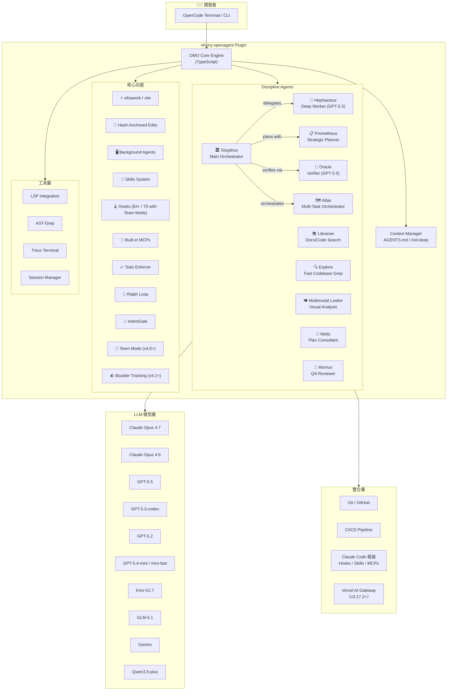

### 2.2 Discipline Agents 設計

OMO 的 Agent 設計遵循「紀律型代理」（Discipline Agents）原則——每個 Agent 都針對特定模型的優勢進行調校，不做「通用 Agent」。

| Agent | 主模型 | 備選模型 | 職責 | 特色 |
|-------|--------|---------|------|------|
| **Sisyphus** | Claude Opus 4.7 | Kimi K2.7 / K2.x / GLM-5.1 | 主編排器，規劃、委派、驅動任務完成 | 積極平行執行，不會中途停止。v3.17.6+ 新增 Opus 4.7、Kimi K2.x 原生 Prompt，v4.10.0+ 升級至 K2.7 |
| **Hephaestus** | GPT-5.5 | GPT-5.4 / GPT-5.3-codex (fallback) | 自主深度工作者，端到端執行 | v3.17.6+ 預設從 GPT-5.4 升級至 GPT-5.5，以 outcome-first delegation 重寫 Prompt。v4.10.0+ 限制為 GPT-native 模型專用 |
| **Prometheus** | Claude Opus 4.7 | Kimi K2.7 / GLM-5.1 | 戰略規劃者，面談式需求分析 | /start-work 觸發，建立完整計劃。v4.9.0+ per-model prompts |
| **Oracle** | GPT-5.5 high | GPT-5.4 high (fallback) | 架構驗證、除錯 | v3.17.6+ 預設從 GPT-5.4 升級至 GPT-5.5，ULW-Loop 強制驗證 |
| **Atlas** | Claude Sonnet | GPT-5.4 medium fallback | 多任務編排，Final Verification Wave | 管理 Boulder 持續執行 |
| **Metis** | GPT-5.4 high | — | 計劃顧問，QA 場景可執行性檢查 | 與 Prometheus 協作 |
| **Momus** | GPT-5.4 xhigh | — | QA 審查，場景可執行性驗證 | 模型路由 + QA 場景 |
| **Librarian** | GPT-5.4-mini-fast | — | 文件/程式碼搜尋 | v3.17.5+ 改用 mini-fast 作為主模型，整合 Exa Web Search |
| **Explore** | GPT-5.4-mini-fast | — | 快速程式碼 grep | v3.17.5+ 改用 mini-fast 作為主模型，輕量級搜尋 |
| **Multimodal Looker** | GPT-5.4 medium | — | 圖像分析、視覺理解 | HEIC/RAW/PSD 自動轉換 |
| **Sisyphus Junior** | — | GPT-5.4 / GPT-5.3-codex | 輕量編排 | GPT 特定路由 |

### 2.3 Category-Based Model Routing

Sisyphus 委派子任務時，不指定模型，而是指定**任務類別（Category）**，系統自動匹配最佳模型：

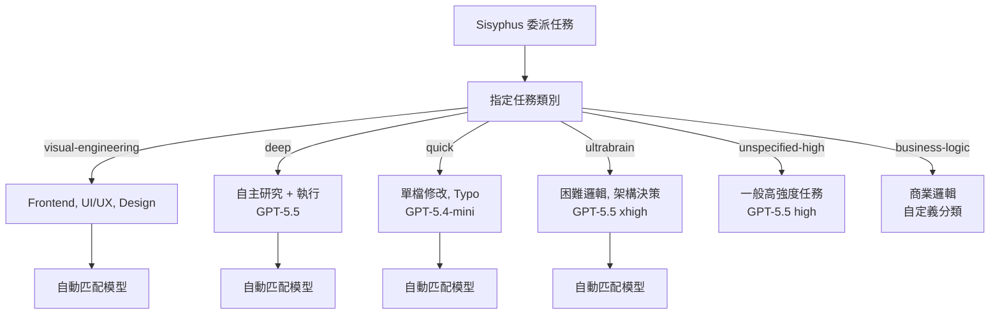

#### 模型 Fallback 鏈

Sisyphus 主鏈：
```
claude-opus-4-7 max → kimi-k2.7 → gpt-5.5 medium → glm-5.1 → qwen3.5-plus → big-pickle
```

> **設計原理**：Agent 說「需要什麼類型的工作」，Harness 挑選對應模型。`ultrabrain` 類別現在預設路由到 GPT-5.5 xhigh（v3.17.6+），`quick` 類別預設路由到 GPT-5.4-mini（v3.13.0+），`deep` 類別預設路由到 GPT-5.5（v3.17.6+），`delegate_task`（deep 類別）從 v4.0.0 起強制每次呼叫只能有一個目標。使用者無需手動配置。若 Provider 回傳 insufficient balance/credits/forbidden 錯誤，runtime 會自動將其視為 quota exhaustion 並降級至下一個模型（v3.17.10+）。v3.17.12 修正了「Sisyphus 隨機降級至 claude-opus-4.7」的錯誤（forbidden pattern matching 過於寬鬆）。v4.5.0+ 新增安全護欄：runtime-fallback 不再信任 4xx 錯誤上的 `isRetryable: true` 標記，僅對無狀態碼、5xx、`retry_on_errors` 清單及 `{408, 425, 429}` 允許重試。

### 2.4 Hook 系統架構

OMO 提供 **54 個內建 Hooks**（含 Team Mode 共 **61 個**），在 Agent 生命週期的各個節點注入自定義行為：

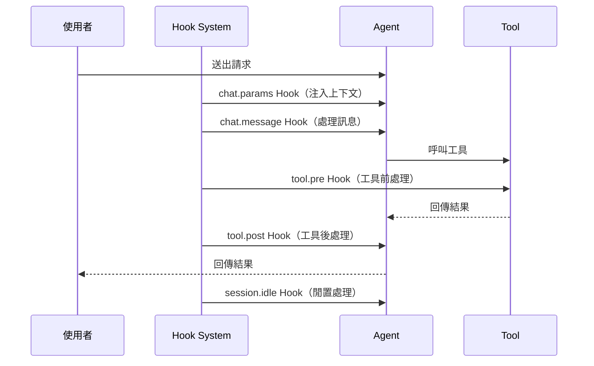

主要 Hook 類別：

| Hook 類別 | 說明 | 範例 |
|-----------|------|------|
| Context Injection | 自動注入 AGENTS.md、README | `context-injector` |
| Agent Behavior | 控制 Agent 行為 | `comment-checker`, `todo-enforcer` |
| Model Override | 模型切換 | `ultrawork-model-override` |
| Tool Enhancement | 工具增強 | `hashline-read-enhancer`, `hashline-edit` |
| Session Management | 會話管理 | `todo-continuation`, `ralph-loop` |
| Security | 安全控管 | `blocked-operations`, URL scheme validation |

### 2.5 與 Claude Code 生態整合

OMO 100% 相容 Claude Code 生態系統：

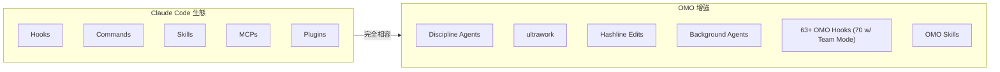

> **注意**：OMO 從 oh-my-opencode 改名為 oh-my-openagent（v3.11.0），兩個套件名稱都支援。配置檔偵測同時支援 `oh-my-opencode.json(c)` 和 `oh-my-openagent.jsonc`。
>
> **v3.17.2 新增**：支援 **Vercel AI Gateway** 作為 Provider，可透過 `--vercel-ai-gateway` CLI 旗標啟用，提供統一的 AI 模型路由層。

---

## 第 3 章：安裝與環境建置（Installation）

### 3.1 前置需求

| 軟體 | 需求 | 說明 |
|------|------|------|
| OpenCode | ≥ v1.14.0 | Go 語言編寫的終端 AI 編碼代理（必須先安裝，v4.5.1+ 支援 OpenCode 1.15） |
| Node.js | 18+ | 插件執行環境 |
| Bun | 最新版 | OMO 的構建與打包工具 |
| Git | 2.30+ | 版本控制 |
| tmux | 建議安裝 | 完整終端整合功能（REPL、Debugger、TUI） |

#### 可選但建議的訂閱方案

OMO 的 ultrawork 功能搭配以下訂閱即可良好運作：

| 服務 | 費用（美元/月） | 用途 |
|------|----------------|------|
| ChatGPT Subscription | $20 | GPT-5.x 模型（Hephaestus / Oracle，v3.17.6+ 預設 GPT-5.5） |
| Kimi Code Subscription | $19 | Kimi K2.7（Sisyphus 備選，v4.0.0 升級至 K2.6，v4.10.0 升級至 K2.7） |
| GLM Coding Plan | $10 | GLM-5.1（Sisyphus 備選，v4.0.0 升級） |

> 若使用 pay-per-token，Kimi 和 Gemini 模型費用較低。

### 3.2 安裝步驟

OMO 提供兩個版本（Edition）：

| 版本 | 安裝指令 | 說明 |
|------|---------|------|
| **Ultimate**（OpenCode） | `bunx oh-my-openagent install` | 完整版：11 個 Agent、63+ hooks、5 個內建 MCP、Team Mode、ulw-loop、ultrawork、hashline |
| **Light**（Codex CLI / LazyCodex） | `bunx oh-my-openagent install --platform=codex`<br/>或 `npx lazycodex-ai install` | 可攜版：rules、comment-checker、LSP、ultrawork、ulw-loop、start-work continuation、telemetry |
| **兩者皆裝** | `bunx oh-my-openagent install --platform=both` | 同時安裝 Ultimate 與 Light |

`--platform` 預設為 `opencode`（Ultimate）。`npx lazycodex-ai install` 是 `bunx oh-my-openagent install --platform=codex` 的快捷別名。

> **CLI 別名說明**：`oh-my-opencode`、`oh-my-openagent`、`omo`、`lazycodex-ai` 均呼叫同一個編譯後的 CLI。`omo` 是推薦的簡短形式。`lazycodex-ai` 僅用於 Light 版安裝快捷方式。v4.7.0+ 起 LazyCodex 支援自動更新（可透過 `LAZYCODEX_AUTO_UPDATE_DISABLED=1` 關閉）。

#### 方法 1：讓 AI Agent 安裝（推薦）

將以下 Prompt 貼入你的 LLM Agent（Claude Code、AmpCode、Cursor 等）：

```
Install and configure oh-my-opencode by following the instructions here:
https://raw.githubusercontent.com/code-yeongyu/oh-my-openagent/refs/heads/dev/docs/guide/installation.md
```

#### 方法 2：手動安裝

```bash
# Step 1: 安裝 OpenCode（如尚未安裝）
# macOS / Linux
curl -fsSL https://opencode.ai/install.sh | bash

# Windows（PowerShell）
irm https://opencode.ai/install.ps1 | iex

# Step 2: 透過 OpenCode 安裝 OMO 插件（推薦使用 bunx）
bunx oh-my-openagent install

# 或安裝 Light 版本（Codex CLI / LazyCodex）
npx lazycodex-ai install

# 或手動編輯 ~/.config/opencode/opencode.json 或 opencode.jsonc
```

將 `"oh-my-openagent"` 加入 `plugin` 陣列（v3.14.0+ 新名稱，舊 `"oh-my-opencode"` 仍相容）：

```jsonc
{
  "plugin": [
    "oh-my-openagent"
  ]
}
```

```bash
# Step 3: 啟動 OpenCode 驗證插件載入
opencode --version
# 插件應自動載入
```

#### Vercel AI Gateway 支援（v3.17.2+）

v3.17.2 新增 **Vercel AI Gateway** 作為 Provider，提供統一的 AI 模型路由層：

```bash
# 透過 CLI 旗標啟用 Vercel AI Gateway
bunx oh-my-opencode install --vercel-ai-gateway

# 或在配置中手動指定
```

> Vercel AI Gateway 可在多模型供應商之間進行統一路由、快取和限速管理，適合企業環境中需要集中化 AI 模型管理的場景。

> **Telemetry 注意事項（v3.17.0+）**：
> OMO 預設啟用匿名遙測（PostHog），僅追蹤 DAU/WAU/MAU，使用 hashed installation identifier（非原始 hostname），且不建立 PostHog person profiles。
> - **Ultimate 版**：事件 `oh_my_openagent_daily_active`，每個 UTC 日每台機器最多傳送一次
> - **Light 版（Codex CLI）**：事件 `omo_codex_daily_active`，來源為 `install_completed` 和 `session_start`
>
> 停用方式：
> - Ultimate 版：`OMO_DISABLE_POSTHOG=1` 或 `OMO_SEND_ANONYMOUS_TELEMETRY=0`
> - Light 版：`OMO_CODEX_DISABLE_POSTHOG=1` 或 `OMO_CODEX_SEND_ANONYMOUS_TELEMETRY=0`（全域旗標也會停用 Codex）
>
> 詳見 [Privacy Policy](https://github.com/code-yeongyu/oh-my-openagent/blob/dev/docs/legal/privacy-policy.md) 和 [Terms of Service](https://github.com/code-yeongyu/oh-my-openagent/blob/dev/docs/legal/terms-of-service.md)。

#### 方法 3：從 LLM Agent 取得安裝指南

```bash
curl -s https://raw.githubusercontent.com/code-yeongyu/oh-my-openagent/refs/heads/dev/docs/guide/installation.md
```

### 3.3 安裝後驗證

```bash
# 執行 Doctor 指令檢查安裝狀態
# 在 OpenCode 會話中輸入：
/doctor

# Doctor 會檢查：
# - 插件版本
# - 已載入的 Agent
# - 模型連線狀態
# - LSP 伺服器與擴展偵測
# - 配置路徑
```

### 3.4 配置檔位置

OMO 使用 JSONC（JSON with Comments）格式，支援兩個層級的配置：

| 層級 | 路徑 | 說明 |
|------|------|------|
| 專案級 | `.opencode/oh-my-opencode.jsonc` | 專案特定配置（優先） |
| 專案級（替代） | `.opencode/oh-my-opencode.json` | JSON 格式 |
| 專案級（新名稱） | `.opencode/oh-my-openagent.jsonc` | v3.13.0+ 支援 |
| 專案級（v4.1+） | `.agents/oh-my-openagent.jsonc` | v4.1.0+ `.opencode` → `.agents` 過渡目錄 |
| 專案級（LSP） | `.opencode/lsp.json` | v4.3.0+ LSP 伺服器配置（**從頂層 `lsp` key 遷移**） |
| 使用者級 | `~/.config/opencode/oh-my-opencode.jsonc` | 全域配置 |
| 使用者級（替代） | `~/.config/opencode/oh-my-opencode.json` | JSON 格式 |
| 使用者級（新名稱） | `~/.config/opencode/oh-my-openagent.jsonc` | v3.13.0+ 支援 |

> **Windows 補充**：Windows 上使用 `%LOCALAPPDATA%\opencode\` 或 `XDG_CONFIG_HOME` 環境變數指定的路徑。OMO v3.12.0+ 支援 `XDG_CONFIG_HOME` 在 Windows 上的使用。

> **階層式配置探索（Walk-up Config Discovery，v4.0.0+）**：
> OMO 會從當前專案目錄向上搜尋目錄樹，合併所有祖先目錄中的 plugin 配置檔。最近的配置檔優先（closest wins）。這對 monorepo 結構特別有用，可在子專案中覆蓋父專案配置。

### 3.5 Model Setup（Agent-Model Matching）

OMO 的 Agent-Model 匹配內建於安裝指南中。核心匹配規則：

```jsonc
// .opencode/oh-my-opencode.jsonc
{
  // Agent 模型覆蓋（可選，預設已由 OMO 自動匹配）
  "agents": {
    "sisyphus": {
      "model": "claude-opus-4-7"  // 預設：Claude Opus 4.7（v3.17.6+）
    },
    "hephaestus": {
      "model": "gpt-5.5"   // 預設：GPT-5.5（v3.17.6+，舊版為 GPT-5.4）
    },
    "oracle": {
      "model": "gpt-5.5"         // 預設：GPT-5.5 high（v3.17.6+）
    }
  },

  // Background Tasks 並行限制
  "background_tasks": {
    "concurrency": 5  // 最多 5 個背景 Agent 同時執行
  }
}
```

### 3.6 常見安裝問題排除

| 問題 | 原因 | 解決方案 |
|------|------|---------|
| 插件未載入 | OpenCode 配置未加入 plugin | 在 `opencode.json` 的 `plugin` 陣列加入 `"oh-my-openagent"`（優先）或 `"oh-my-opencode"` |
| `pluginVersion is null` | 版本偵測問題 | 使用 `/doctor` 檢查，升級至 v3.15.0+ |
| 模型連線失敗 | API Key 未設定 | 在 OpenCode 設定中配置對應 Provider |
| Windows 彈出視窗 | `Bun.spawn` 問題 | OMO v3.9.0+ 已修復（`windowsHide`） |
| Cache 版本過期 | 舊版 cache | 執行 `/doctor` 自動修復或手動清除 cache |
| 配置無法儲存 | 權限或路徑問題 | 檢查 `~/.config/opencode/` 目錄權限 |
| OpenCode 版本太低 | v4.2.0+ 強制檢查 | 升級 OpenCode 至 v1.14.0 以上（v4.5.1+ 支援 1.15） |
| JSONC BOM 解析失敗 | 檔案含 BOM 標記 | v3.16.0+ 自動處理 BOM 剥離 |
| tuple-format plugin 設定 | opencode.json 使用元組格式 | v3.15.1+ 支援處理 tuple-format plugin entries |

---

## 第 4 章：設定與專案初始化（Configuration）

### 4.1 JSONC 配置檔完整範例

```jsonc
// .opencode/oh-my-opencode.jsonc
// OMO 配置檔 - 支援註解與尾隨逗號
{
  // === Agent 配置 ===
  "agents": {
    // 覆蓋 Agent 模型（通常無需手動設定）
    "sisyphus": {
      "model": "claude-opus-4-7",
      "temperature": 0.3
    },
    "hephaestus": {
      "model": "gpt-5.5"  // v3.17.6+ 預設：GPT-5.5（舊版為 GPT-5.4）
    },
    // 自定義 Agent
    "custom_agents": {
      "banking-expert": {
        "name": "Banking Domain Expert",
        "model": "claude-opus-4-7",
        "system_prompt": "You are an expert in banking domain...",
        "permissions": ["read_files", "write_files"]
      }
    }
  },

  // === Skills 配置 ===
  "skills": {
    "enabled": [
      "playwright",      // 瀏覽器自動化
      "git-master",      // 原子提交、rebase surgery
      "frontend-ui-ux"   // 設計優先 UI
    ]
  },

  // === Hooks 配置 ===
  "disabled_hooks": [
    // 停用特定 Hook（預設全部啟用）
    // "hashline_edit"   // v3.10.0+ hashline_edit 預設停用
  ],

  // === Disabled Tools ===
  "disabled_tools": [
    // 停用特定工具
  ],

  // === Background Tasks ===
  "background_tasks": {
    "concurrency": 5,
    "stale_timeout_ms": 2700000,    // 45 分鐘（v3.13.0+ 預設）
    "session_wait_ms": 60000        // 1 分鐘
  },

  // === Circuit Breaker（v3.12.0+）===
  "circuit_breaker": {
    "enabled": true,
    "max_consecutive_calls": 10
  },

  // === Fallback Models（v3.14.0+）===
  // 支援 object-style，含 per-model 設定
  "fallback_models": [
    "kimi-k2.7",
    { "model": "gpt-5.5", "variant": "medium" },
    "glm-5.1",
    "qwen3.5-plus"
  ],

  // === Team Mode（v4.0.0+）===
  // Lead Agent + 最多 8 個平行成員，即時 tmux 視覺化
  "team_mode": {
    "enabled": false,         // 預設關閉，需手動啟用
    "max_parallel_members": 4,
    "tmux_visualization": true
  },

  // === Disabled Providers（v4.3.0+）===
  // 停用特定 Provider，防止自動 fallback 至該 Provider
  // "disabled_providers": ["zhipu"],

  // === Agent 排序（v4.1.0+）===
  // 自定義 Agent 顯示順序，未列出的 Agent 回退至內建順序
  "agent_order": [
    "sisyphus",
    "hephaestus",
    "prometheus",
    "oracle"
  ],

  // === Dynamic Custom Agents（v3.17.3+）===
  // 透過 agent_definitions 檔案或 opencode.json 動態定義自訂 Agent
  "agent_definitions": "path/to/agent-definitions.json",

  // === Plan Agent 替換（v3.17.3+）===
  // 設為 true 時隱藏原生 plan agent，完全由 OMO 的 Prometheus 接管
  "replace_plan": true,

  // === Vercel AI Gateway（v3.17.2+）===
  // "vercel_ai_gateway": {
  //   "enabled": true,
  //   "url": "https://your-gateway.vercel.app"
  // },

  // === 實驗性功能 ===
  "experimental": {
    "aggressive_truncation": false,
    "auto_resume": false,
    "hashline_edit": false     // 需要手動啟用
  }
}
```

### 4.2 AGENTS.md 與 /init-deep

`AGENTS.md` 是 OMO 理解專案的核心文件。OMO 提供 `/init-deep` 指令自動生成**分層** AGENTS.md：

```bash
# 在 OpenCode 會話中執行
/init-deep
```

生成的分層結構：

```
project/
├── AGENTS.md                  ← 專案級上下文
├── src/
│   ├── AGENTS.md              ← src 目錄上下文
│   └── components/
│       └── AGENTS.md          ← 組件級上下文
├── tests/
│   └── AGENTS.md              ← 測試相關上下文
└── infra/
    └── AGENTS.md              ← 基礎設施上下文
```

Agent 會自動讀取相關層級的 AGENTS.md，**無需手動管理上下文注入**。

#### AGENTS.md 撰寫範例（企業級）

```markdown
# Project: Enterprise Banking Portal

## Overview
企業銀行入口網站，提供帳戶管理、轉帳、報表等功能。
服務 500 萬用戶，日均交易量 200 萬筆。

## Tech Stack
- **Backend**: Java 21 + Spring Boot 3.2 + Spring Security 6
- **Frontend**: Vue 3 + TypeScript + Tailwind CSS
- **Database**: Oracle 19c（主）+ Redis（快取）
- **Message Queue**: Apache Kafka
- **API Style**: RESTful + OpenAPI 3.0

## Architecture
- Clean Architecture（DDD）
- 微服務架構（12 services）

## Coding Standards
- Java: Google Java Style Guide
- No Lombok（公司規範）
- Constructor Injection only
- All dates: java.time.*

## Security Requirements
- OWASP Top 10 防護
- JWT 認證 + OAuth2
- AES-256 加密
- Rate Limiting

## Testing
- 單元測試覆蓋率 ≥ 80%
- JUnit 5 + Mockito
```

> **重要原則**：
> - 控制在 500-1000 行以內，避免浪費 Token
> - 不放敏感資訊（密碼、Key、內部 URL）
> - 使用 `/init-deep` 自動生成，人工微調

### 4.3 Skills 設計

Skills 不只是 Prompt——每個 Skill 可攜帶自己的 MCP 伺服器，按需啟動：

```
.opencode/skills/
├── playwright/
│   └── SKILL.md          # 瀏覽器自動化技能
├── git-master/
│   └── SKILL.md          # Git 原子提交、rebase
├── frontend-ui-ux/
│   └── SKILL.md          # 設計優先 UI
└── custom-banking/
    └── SKILL.md          # 自定義銀行業技能
```

也可放在使用者全域目錄：`~/.config/opencode/skills/*/SKILL.md`

#### SKILL.md 範例

```markdown
# Skill: Banking Domain Expert

## Description
專精銀行業務邏輯的開發技能，涵蓋帳戶管理、轉帳、監管合規。

## System Instructions
- 所有金額計算使用 BigDecimal
- 遵循 ACID 事務要求
- 敏感操作需要雙重驗證

## MCP Servers
- banking-api-docs: 內部 API 文件查詢

## Permissions
- read_files
- write_files
- run_tests
```

### 4.4 Prompt Template 設計

透過 Hooks 和 Agent 配置精細控制行為：

```jsonc
// .opencode/oh-my-opencode.jsonc
{
  "agents": {
    "sisyphus": {
      // 自定義系統提示追加
      "system_prompt_append": "When working on this banking project:\n1. Always use BigDecimal for amounts\n2. Enforce ACID transaction boundaries\n3. Log all state-changing operations"
    }
  }
}
```

### 4.5 Built-in MCP 伺服器

OMO 內建三個 MCP 伺服器，隨 Agent 自動可用：

| MCP | 功能 | 用途 |
|-----|------|------|
| **websearch (Exa)** | 網路搜尋 | 查找文件、API 參考、Stack Overflow |
| **context7** | 官方文件查詢 | 查找框架/庫的最新官方文件 |
| **grep_app** | GitHub 程式碼搜尋 | 搜尋 GitHub 上的程式碼範例 |

> **注意**：Skill-Embedded MCPs 是 OMO 的獨特設計——MCP 伺服器跟隨 Skill 按需啟動，任務完成後自動關閉，不會持續佔用上下文窗口。

---

## 第 5 章：Agent 系統詳解（Discipline Agents）

### 5.1 Sisyphus — 主編排器

Sisyphus 是 OMO 的核心 Agent，負責接受使用者請求、規劃任務、委派給專家 Agent，並驅動任務至完成。

**命名由來**：如同希臘神話中的薛西弗斯推石上山，永不放棄——Sisyphus 不會中途停止。

| 屬性 | 值 |
|------|-----|
| 主模型 | Claude Opus 4.7 (max variant)，v3.17.6+ 新增原生 Prompt |
| 備選模型 | Kimi K2.7 → GPT-5.5 medium → GLM-5.1 |
| 角色 | 主編排器（Orchestrator） |
| 特色 | 積極平行委派、不停止直到完成、GPT-native 支援（v3.11.0+）、Kimi K2.x 原生 Prompt（v3.17.6+） |

**Sisyphus 工作流程**：

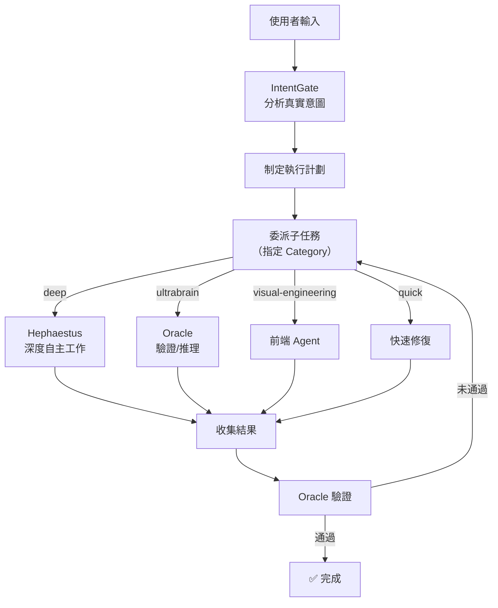

**GPTPhus（v3.11.0+）**：Sisyphus 原生支援 GPT-5.4 以上（含 GPT-5.5），使用 8-block 架構的專屬 Prompt。對於 OpenAI-only 設定的使用者，依然能獲得完整的 Sisyphus 編排體驗。

**Kimi K2.x 原生 Prompt（v3.17.6+）**：Sisyphus 新增 Kimi K2.x 模型的原生 Prompt 變體，最佳化 K2 系列的編排能力。搭配 Claude Opus 4.7 原生 Prompt，Sisyphus 現已針對三大主流模型家族分別定製最佳 Prompt。

**v4.5.0+ Prompts-Core 遷移**：Sisyphus、Prometheus 等核心 Agent 的 Prompt 已經從內嵌字串遷移至版本化 Markdown 檔案（prompts-core 套件，50+ 提交），更易於社群貢獻與審查。779 行的 `prompt-async-gate` 已拆分為 6 個子模組。

### 5.2 Hephaestus — 深度自主工作者

| 屬性 | 值 |
|------|-----|
| 主模型 | GPT-5.5（v3.17.6+，從 GPT-5.4 升級，outcome-first delegation 重寫） |
| 備選模型 | GPT-5.4 / GPT-5.3-codex（fallback） |
| 角色 | 自主深度工作者 |
| 特色 | 給目標不給步驟，自行探索 codebase 並端到端執行 |
| **v4.10.0+ 限制** | 僅限 GPT-native 模型（禁止 Claude/Kimi fallback），確保 outcome-first 行為一致性 |

**命名由來**：希臘鍛造之神赫淮斯托斯——「The Legitimate Craftsman」。Anthropic 封鎖 OpenCode 後的回應，Hephaestus 從 GPT-5.3-codex 升級至 GPT-5.4，再於 v3.17.6 升級至 GPT-5.5，提供更強的自主執行能力。GPT-5.5 prompt 採用 outcome-first delegation 架構（融合 Codex 5.2 與 Amp distillation 風格）重寫，明確區分直接工具調用與 Agent 委派。

> **v3.17.6 重要變更**：Hephaestus 預設模型從 `gpt-5.4` 升級為 `gpt-5.5`，同時 Oracle 對 Hephaestus 的驗證僅限於失敗升級場景（failure-escalation only）。

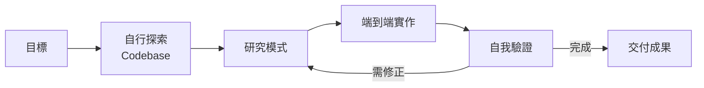

> **最佳實務**：Hephaestus 最適合「給目標，不給步驟」的任務——例如「重構這個模組以支援多租戶」而非「在 XXX 檔案的第 YYY 行加入 ZZZ」。

### 5.3 Prometheus — 戰略規劃者

| 屬性 | 值 |
|------|-----|
| 主模型 | Claude Opus 4.7 |
| 備選模型 | Kimi K2.7 / GLM-5.1 |
| 角色 | 戰略規劃者 |
| 觸發方式 | `/start-work` 指令 |
| 特色 | 面談模式：提問 → 釐清範圍 → 建立完整計劃，支援 `--worktree`（v3.9.0+） |
| **v4.9.0+ 增強** | Per-model prompts——為不同模型（Claude / GPT / Kimi）分別客製規劃提示語，提升規劃品質 |

**使用流程**：

```bash
# 在 OpenCode 會話中
/start-work

# Prometheus 會以面談方式：
# 1. 提問釐清需求
# 2. 識別範圍與模糊點
# 3. 建立驗證過的執行計劃
# 4. 計劃確認後才開始執行
```

**Worktree 支援（v3.9.0+）**：

```bash
# 指定 Worktree，平行開發不衝突
/start-work --worktree /path/to/feature-branch
```

### 5.4 Oracle — 驗證者

| 屬性 | 值 |
|------|-----|
| 主模型 | GPT-5.5 high（v3.17.6+ 從 GPT-5.4 自動遷移） |
| 角色 | 架構驗證、除錯 |
| 特色 | ULW-Loop 強制驗證（v3.11.0+：Oracle 驗證變為強制） |

**ULW-Loop Oracle 驗證（v3.11.0+）**：

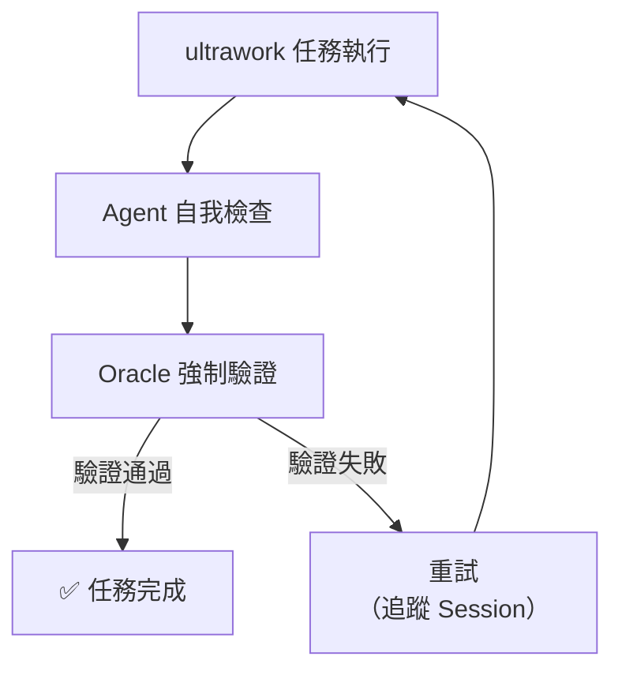

> v3.11.0 後，ULW-Loop 的 Oracle 驗證變為**強制性**。任務可能需要更長時間完成，但完成信心度顯著提升。

### 5.5 Atlas — 多任務編排器

Atlas 負責管理多個 Boulder（大型任務單元），包含 Final Verification Wave 確保所有任務完成：

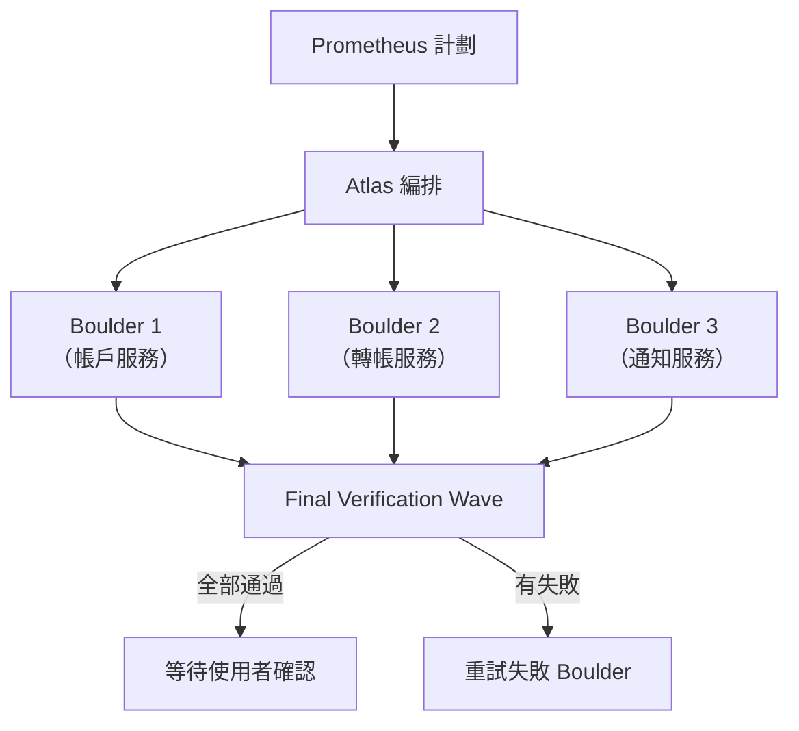

### 5.6 Background Agents

OMO 支援同時啟動多個 Agent 在背景執行：

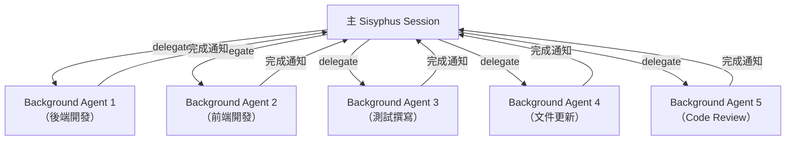

**配置**：

```jsonc
{
  "background_tasks": {
    "concurrency": 5,           // 最多 5 個平行 Agent
    "stale_timeout_ms": 2700000 // 45 分鐘超時（v3.13.0+ 預設）
  }
}
```

**特性（v3.12.x – v3.13.x）**：
- Circuit Breaker 防止子 Agent 無限迴圈
- Target-aware loop detection（v3.12.1）
- Consecutive Call Detection 取代 Sliding Window（v3.12.2）
- 被取消的子任務自動釋放配額（v3.12.0）
- 兄弟任務執行時延遲清理（v3.12.0）
- Atlas task session reuse 提升效能（v3.13.0）
- 預設 max tool calls 增至 4000（v3.13.0）
- Stale timeout 增至 45/60 分鐘（v3.13.0）
- Circuit Breaker false positive 修復（v3.13.0）

**v4.9.0+ 改進**：
- **LSP Daemon 背景整合**：Background Agent 可共享 LSP daemon 提供的 diagnostics、hover、go-to-definition
- **Node CLI fallback**：Bun 不可用時自動降級至 Node.js 啟動背景 Agent

**v4.11.0+ 改進**：
- **CodeGraph-first**：背景 Agent 優先使用 CodeGraph 索引進行程式碼導覽，減少文字搜尋開銷
- **Monitor 工具**：新增背景命令追蹤，session-aware output injection

---

## 第 6 章：開發流程（ultrawork / Plan / Build）

### 6.1 ultrawork — 一鍵啟動

**ultrawork（或 ulw）** 是 OMO 最強大的功能——輸入一個詞，所有 Agent 啟動，任務不完成不停止。

```bash
# 在 OpenCode 會話中
ultrawork

# 或簡寫
ulw
```

ultrawork 背後的運作：

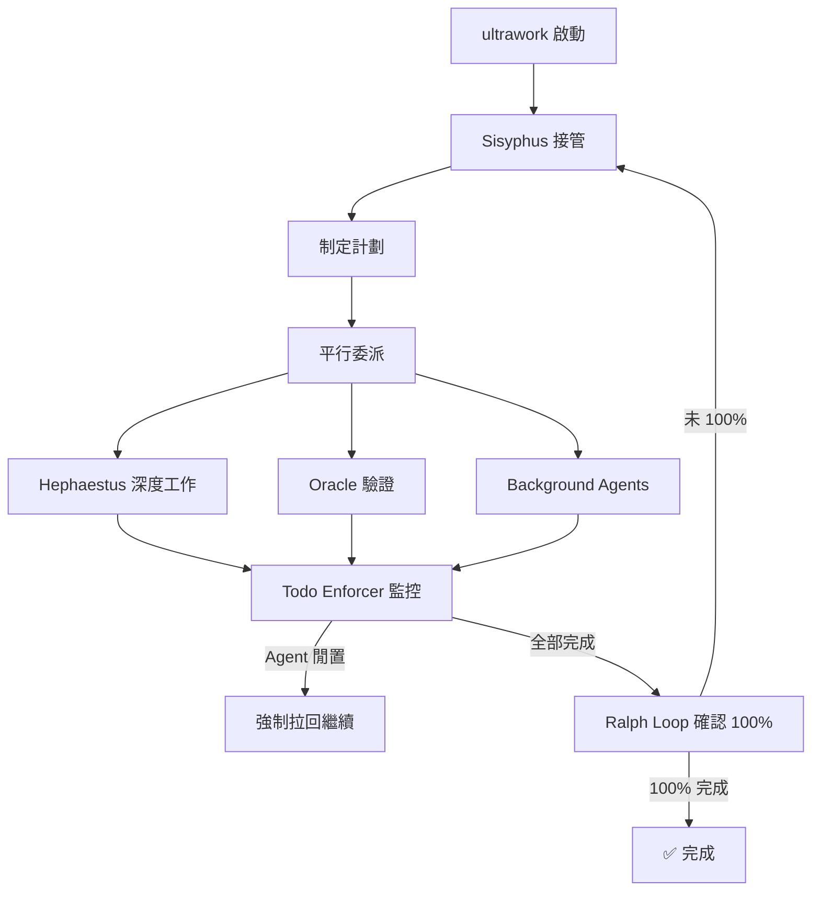

### 6.2 /ulw-loop（Ralph Loop）

Ralph Loop 是 ultrawork 的自參考迴圈機制——Agent 持續工作直到 100% 完成：

```bash
# 啟動 Ralph Loop
/ulw-loop

# Agent 會不斷自我檢查：
# → 任務是否 100% 完成？
# → 是否有遺漏的邊界情況？
# → 測試是否全部通過？
# → 直到確認完全完成才停止
```

**v3.9.0 改進**：
- 完成偵測範圍限定為迴圈啟動後的訊息
- 防止無限重新觸發的 in-flight guard
- Session reset 與 TUI 切換的競態條件修復

**v3.11.0 改進**：
- Oracle 驗證變為強制步驟
- 明確的 Oracle session tracking
- 驗證失敗時的 parent session retry

**v3.13.0 改進**：
- 強化 Oracle verification flow
- 偵測 tool_result parts 中的 promise tags 進行 ULW 驗證
- todo-continuation-enforcer 增加 compaction epoch 意識

**v3.15.x – v3.16.0 改進**：
- Ralph Loop 新增 **500 次迭代上限**（v3.16.0），防止無限迴圈
- Oracle VERIFIED 偵測強化（tool_result 層級檢測）
- 偵測 token-limit errors 在 todo-continuation 中，防止無限 loop
- Background Agent 完成通知改進（variant propagation）
- Compaction recovery cap 跨 cycle 持久化

**v4.0.0 改進**：
- Ralph Loop runtime error retries 加入護欄，防止級聯錯誤
- Atlas 在 runtime error 後自動重試 boulder
- ultrawork 加入完整 retry coverage

**v4.1.0 改進（7 項針對性修復）**：
- **Prompt dispatch failures** 現在會正確拋出錯誤，而非靜默吞噬
- **Synthetic idle replays** 被忽略，避免過時迭代重啟工作
- **Ownership races** 偵測與拒絕——overlapping continuation events 無法再劫持迴圈
- **Compaction ownership guard** 確保壓縮 continuation 的所有權正確
- **Delayed-start snapshots** 正確隔離，防止狀態洩漏
- Iteration commit 延遲至 verification continuation 派發後才執行
- `continueIteration` 回傳型別化的 `ContinuationResult`

**v4.1.1 改進**：
- 所有 continuation hooks（Team wake、Atlas、Ralph Loop、todo-continuation）在注入內部 prompt 前重新檢查 session activity
- Stale idle events 不再觸發重疊回覆

**v4.1.2 改進**：
- Compaction continuation ownership guard 強化
- Delayed start snapshots 隔離修復

**v4.2.0 改進（「The Reliability Foundation」）**：
- **50MB Log Rotation**：超過 50MB 的日誌檔自動輪替，防止磁碟空間耗盡
- **Anthropic 1M Context**：支援 Anthropic 1M token GA context limit
- **OpenCode 1.14+ 相容**：最低版本需求從 v1.4.0 提升至 v1.14.0
- **本地化 Provider 錯誤**：Zhipu/GLM Provider 錯誤訊息以中文顯示
- **anthropic-effort clamp**：防止 effort 值超出允許範圍
- **config.skills.paths discovery**：支援從自定義路徑探索 Skills
- **Exa MCP Bearer auth**：支援 Bearer token 認證

**v4.2.3 改進**：
- Package layering + security hardening
- **rules-core symlink escape block**：阻止 symlink 跨出專案目錄（安全強化）

**v4.3.0 改進（「Zero-Config High-Agency and a Hardened Core」）**：
- **i18n 國際化**：插件介面支援多語言
- **Auto-Activated Modes**：根據專案上下文自動啟用對應模式
- **Scoped Skills**：Skills 可限定於特定專案或目錄
- **Async Vision**：非同步圖像處理（Multimodal Looker）
- **8 個 workspace packages**：內部模組化重構
- **779 行 prompt-async-gate 拆分為 6 子模組**
- **37 位社群貢獻者**
- **❗ BREAKING**：頂層 `lsp` 配置鍵移除 → 遷移至 `.opencode/lsp.json`

**v4.3.1 改進**：
- Comment-checker deadloop 修復
- Desktop sidecar crash 修復
- Node-safe subprocess streaming

**v4.4.0 改進**：
- **`/security-research`** 新增為 Team Mode skill
- **parent-wake race** 修復
- Model config edge cases 恢復
- TUI QoL：可點擊 subagent 條目、look_at 修復、`/stop-continuation` 被尊重
- **❗ BREAKING（清理）**：頂層 `lsp` 配置鍵移除（含遷移指引）

**v4.5.0 改進（「Publish Safety & Internal Refactor」）**：
- **Runtime-fallback 安全強化**：不再信任 4xx 錯誤上的 `isRetryable: true` 標記
- **Parent-wake bounded escape**：防止 parent wake 無限循環
- **Ralph-loop liveness**：30 分鐘 oracle ceiling、zero-progress auto-stop
- **Background-agent delivery**：4 項修復（包含 stale parent wakes）
- **Team-Mode UX**：leaders wake on unread mailbox、model overrides preserved、lead closes teams
- **Prompts-core migration**：50+ commits，核心 prompt 遷移至版本化 Markdown
- **Doctor + help JSON schemas**
- **9 個 published packages**：utils, model-core, prompts-core, rules-engine, agents-md-core, ast-grep-core, comment-checker-core, hashline-core, boulder-state
- **Web domain → omo.dev**

**v4.5.1 改進**：
- OpenCode 1.15 DB 支援

**v4.5.12 改進**：
- lazycodex / omo-codex 功能（Light Edition）
- Boulder continuations 改進
- Thinking blocks preservation
- Background agent stale parent wakes 修復

**v4.7.0–v4.9.2 改進**：
- **LazyCodex 自動更新**：startup hook 自動檢查並更新 LazyCodex（v4.7.0）
- **Autonomous Codex**：新安裝預設 autonomous permissions（v4.7.0）
- **ulw-loop CLI**：CLI 版 ulw-loop 持續執行（v4.7.2+）
- **Model catalog**：集中式模型能力資料庫（v4.7.5）
- **Codex multi-agent v2 修復**：解決 HTTP 400 問題、Hephaestus rule preservation（v4.8.0–v4.8.1）
- **LSP Daemon**：背景語言伺服器常駐程式，持續提供 diagnostics、hover、go-to-definition（v4.9.0）
- **Node CLI fallback**：Bun 不可用時自動降級至 Node.js（v4.9.0）
- **lsp-setup skill**：支援 20+ 語言的導引式 LSP 安裝設定（v4.9.0）
- **Per-model prompts**：Prometheus 為不同模型客製提示語（v4.9.1）
- **claude-opus-4-8 GA**：辨識為 1M-context 模型（v4.9.0）

**v4.10.0–v4.11.1 改進**：
- **Kimi K2.7 升級**：5 個 Agent 配置全面升級至 K2.7 fallback（v4.10.0）
- **Windows ARM64**：原生支援 Windows ARM64 架構（v4.10.0）
- **Hephaestus GPT-native 限制**：限定僅使用 GPT-native 模型（v4.10.0）
- **CodeGraph-first**：索引式程式碼智慧優先於文字搜尋（v4.11.0）
- **Monitor 工具**：背景命令追蹤、session-aware output injection（v4.11.0）
- **TUI Sidebar**：專案鏡射、隱私遮蔽的側欄 UI（v4.11.0）
- **ast-grep MCP 移除**：以 CodeGraph 取代 ast-grep MCP server（v4.11.0）
- **claude-fable-5 / claude-mythos-5**：新模型族群偵測（v4.11.0）

**v4.12.0–v4.14.1 改進（最新）**：
- **Codex Team Mode**：teammode skill、durable threads、team.json 拓撲定義（v4.12.0）
- **Insane Search / Ultimate Browsing**：分層搜索替代 Google API（v4.13.0）
- **Ultraresearch claim-ledger**：研究結果宣告帳本（v4.13.0）
- **Provider exhaustion fallback**：model-level provider exhaustion 重試策略（v4.13.0）
- **Worktree 整合**：Team Mode worktree merge-commit 自動化（v4.13.0）
- **Designpowers**：前端 design-system personas、accessibility、design critique（v4.14.0）
- **Visual QA**：CJK line breaks、transparency、terminal secret redaction 證據收集（v4.14.0）
- **ulw-research 改名**：ultraresearch → ulw-research（v4.14.0）
- **sparkshell 移除**：高風險 REPL 模式從 CLI 移除（v4.14.0）
- **claude-opus-4-7 別名移除**：統一使用 `claude-opus-4.7`（v4.14.0）

### 6.3 /start-work — 規劃先行

```bash
# 啟動 Prometheus 規劃
/start-work

# Prometheus 會：
# 1. 像真正的工程師一樣面談你
# 2. 識別範圍和模糊點
# 3. 建立詳細的驗證計劃
# 4. 等你確認後才開始執行

# 支援 Worktree（v3.9.0+）
/start-work --worktree /path/to/feature
```

### 6.4 /init-deep — 深度初始化

```bash
# 自動生成分層 AGENTS.md
/init-deep

# 效果：在整個專案的各層目錄生成 AGENTS.md
# Agent 自動讀取相關上下文
# 對 Token 效率和 Agent 效能都有顯著幫助
# v4.9.0+ 整合 LSP 語言伺服器和 CodeGraph 索引
# v4.11.0+ CodeGraph-first 開發——索引式程式碼智慧優先於文字搜尋
```

### 6.5 Hash-Anchored Edits（Hashline）

OMO 的 Hashline 系統解決了「Harness Problem」——大多數 Agent 失敗不是模型問題，而是編輯工具問題。

```
# Agent 讀取檔案時，每行附帶內容雜湊：
11#VK| function hello() {
22#XJ|   return "world";
33#MB| }
```

Agent 編輯時引用這些標籤。若檔案自上次讀取後已變更，雜湊不匹配則**拒絕編輯**，防止損壞。

**效果**：Grok Code Fast 1 的成功率從 6.7% 提升至 68.3%。

```jsonc
// 啟用 Hashline Edit（v3.10.0+ 預設停用）
{
  "experimental": {
    "hashline_edit": true
  }
}
```

**Hashline 操作模型**（v3.8.5 三操作模型）：
- `replace`：替換指定行範圍
- `insert`：在指定位置插入
- `delete`：刪除指定行範圍

### 6.6 Plan Mode vs Build Mode

| 特性 | Plan Mode | Build Mode |
|------|-----------|------------|
| 觸發 | 預設模式 | ultrawork / 確認後切換 |
| 檔案操作 | 僅讀取、分析 | 讀取 + 寫入 + 修改 |
| 適用 | 需求分析、架構設計、方案評估 | 程式碼實作、重構、Bug 修復 |
| 安全性 | 最高（不修改任何檔案） | 需搭配 Git branch + Review |
| Agent | Prometheus 為主 | Sisyphus + 全團隊 |

### 6.7 Git 整合流程

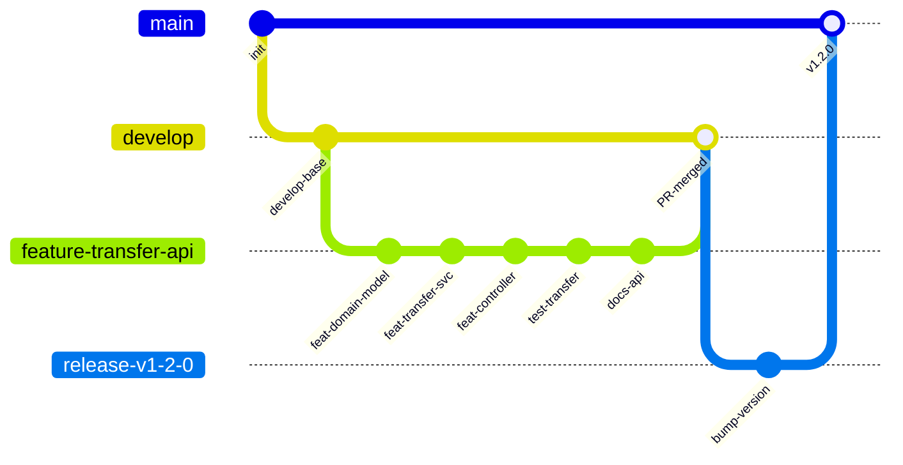

**Skills: git-master**

OMO 內建 `git-master` Skill，支援：
- 原子提交（Atomic Commits）
- Rebase surgery
- 智慧合併衝突解決

> **企業最佳實務**：
> - Hephaestus 的 auto-commit 行為已在 v3.9.0 移除——Agent 不會未經允許自動提交
> - 使用 `start-work` 的 `auto_commit` 配置來控制提交行為
> - 每步完成都手動確認後 commit

---

## 第 7 章：Team Mode（v4.0 新增）

### 7.1 概述

Team Mode 是 v4.0.0 最重要的新功能——將 OMO 從「一個 Agent 帶子 Agent」轉變為真正的**多 Agent 系統**。一個 Lead Agent 編排最多 8 個專業成員，即時平行協作，透過 tmux 視覺化所有成員的工作狀態。

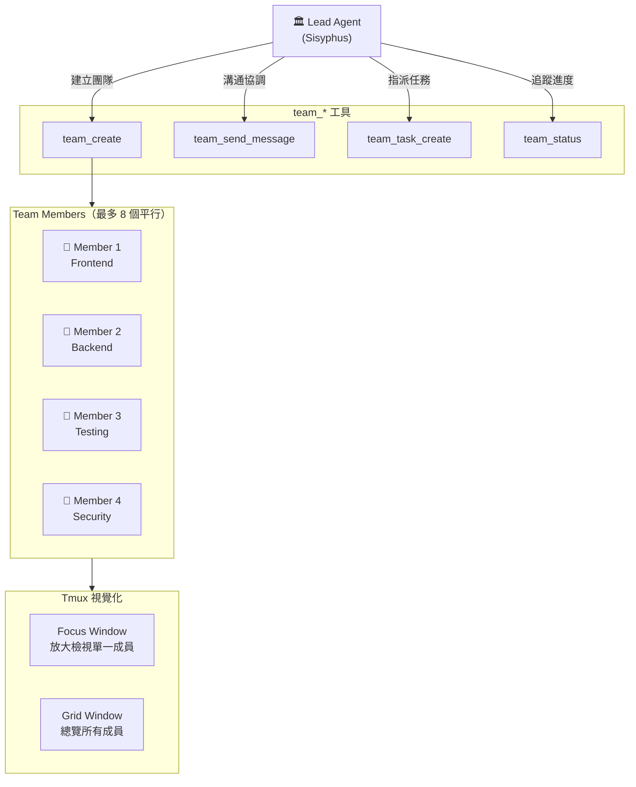

### 7.2 啟用 Team Mode

```jsonc
// .opencode/oh-my-openagent.jsonc
{
  "team_mode": {
    "enabled": true,            // 預設 false，需手動啟用
    "max_parallel_members": 4,  // 最多 4 個同時執行的成員
    "tmux_visualization": true  // 啟用 tmux 即時視覺化
  }
}
```

啟用後重啟 OpenCode，`team_*` 工具組即解鎖。

> **注意**：當 Team Mode 啟用時，成員之間透過 `team_*` 工具協作，**不再使用 `delegate_task`**。

### 7.3 Team Mode 專屬工具

| 工具 | 說明 |
|------|------|
| `team_create` | 建立一個新團隊，指定成員分類與數量 |
| `team_send_message` | 向特定成員或整個團隊傳送訊息 |
| `team_task_create` | 指派任務給特定成員 |
| `team_status` | 查詢團隊狀態與各成員進度 |

### 7.4 內建 Team Skills

#### hyperplan Skill

5 個敵對 Agent 從正交角度撕裂你的計劃，在寫第一行程式碼之前找出所有漏洞：

```bash
# 使用 hyperplan skill
# Sisyphus 會自動啟動 5 個 hostile critics 同時檢視計劃
```

#### security-research Skill

3 個漏洞獵手 + 2 個 PoC 工程師平行審計程式碼，嚴重性根據實際可利用性校準：

```bash
# 使用 security-research skill
# 自動啟動 5 個安全專家平行掃描
```

### 7.5 Tmux 視覺化

Team Mode 利用 tmux 即時呈現所有成員的工作狀態：

- **Focus Window**：放大檢視單一成員的輸出
- **Grid Window**：總覽所有成員的即時狀態

```bash
# 聚焦特定成員
# tmux layout 自動調整

# 當成員過多時，自動切換至 grid 模式
# 防止 tmux 凍結（v4.0.0 修復）
```

### 7.6 Team Mode 注意事項

| 項目 | 說明 |
|------|------|
| 預設狀態 | 關閉（off by default） |
| 使用 delegate_task | Team Mode 啟用時，成員使用 `team_*` 工具，不用 `delegate_task` |
| tmux kill-server | v4.1.1 禁止危險的 `tmux kill-server` 操作 |
| Session 追蹤 | v4.1.0 修復 team-mode session tracking |
| 關閉清理 | v4.1.0 新增 shutdown 時自動清理 team runs |
| resolveCallerTeamLead | v3.17.13 新增 `resolveCallerTeamLead` helper，改善團隊 Lead 解析 |
| Leaders wake on unread | v4.5.0+ Lead Agent 在有未讀郵件時自動喚醒，不再錯過成員回報 |
| Model overrides preserved | v4.5.0+ Team 成員的模型覆寫在團隊操作中正確保留 |
| Lead closes teams | v4.5.0+ Lead Agent 可主動關閉團隊，優雅清理所有成員 |

### 7.7 Codex Team Mode（v4.12.0+）

v4.12.0 為 Codex 平台帶來專屬的 `teammode` skill，與上述 OpenCode Team Mode 架構不同，它針對 Codex CLI / LazyCodex 的特性最佳化：

| 特性 | 說明 |
|------|------|
| **Durable Threads** | 持久化對話線程，中斷後可從斷點恢復 |
| **team.json** | 團隊拓撲定義檔（`team.json`），宣告式描述成員角色與通訊規則 |
| **Worktree 整合** | v4.13.0+ 自動建立 Git worktree，每個成員在獨立工作目錄執行，最終 merge-commit 回主分支 |
| **結構化 Bug Report** | 搭配 `lcx-report-bug` skill 提交標準化問題回報 |

```bash
# 在 Codex CLI 中使用 teammode skill
teammode
```

---

## 第 8 章：Boulder 追蹤系統（v4.1 新增）

### 8.1 概述

Boulder 系統追蹤多 Session 工作的進度。每個計劃任務都有 per-task 計時器、完成偵測和耗時提示，讓你隨時知道每項工作花了多少時間。

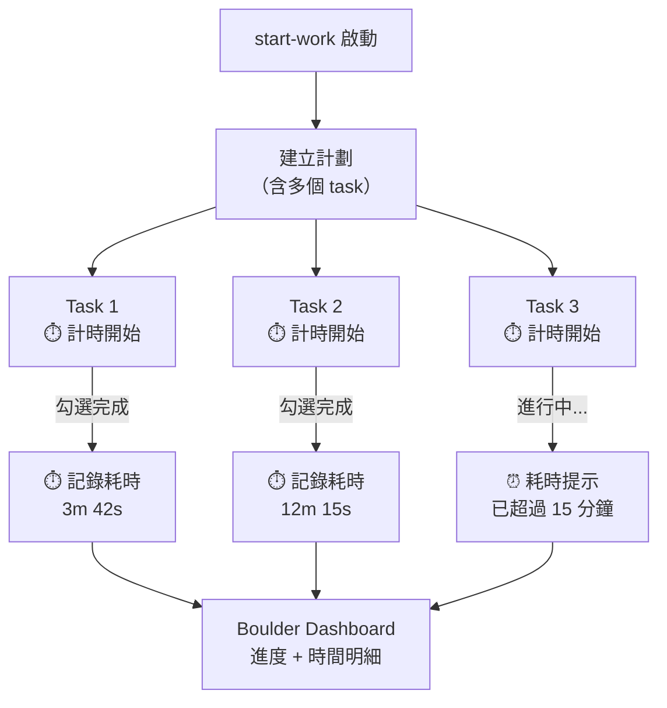

### 8.2 Boulder CLI

```bash
# 查看所有 Boulder 工作項的進度儀表板
bunx omo boulder
```

輸出包含：
- 所有活躍和已完成的工作項
- 進度百分比
- 每個 task 的計時明細
- 耗時警告提示

### 8.3 核心功能

| 功能 | 說明 |
|------|------|
| Per-task Timers | 每個任務自動開始計時，完成時記錄耗時 |
| 完成偵測 | 當計劃中的 checkbox 被勾選（`[x]`），自動結束計時 |
| 耗時提示（Nudge） | 任務執行過久時注入提示，提醒 Agent 注意效率 |
| 多 Session 支援 | 工作追蹤跨 Session 持久化 |
| 多 Work 恢復 | 支援選擇性恢復之前中斷的工作（`getWorkResumeOptions`） |
| `completeBoulder` | 當所有任務完成時標記 Boulder 為完成（idempotent） |
| Boulder continuations | v4.5.12+ 支援 boulder continuation 機制，中斷後可從上次進度繼續執行 |
| Atlas subagent retry | v4.5.0+ Atlas 在 usage-limit errors 時自動重試 subagent |

### 8.4 整合 Atlas

Boulder 系統與 Atlas Agent 深度整合：

- Atlas 在委派任務時捕獲 `task_key`
- 任務完成時自動呼叫 `endTaskTimer`
- 計劃 checkbox 被編輯勾選時也觸發計時結束
- 所有任務完成時注入 `BOULDER_COMPLETE_PROMPT`

### 8.5 企業應用場景

Boulder 對企業團隊的價值：
- **Sprint 追蹤**：精確知道每個任務實際花費時間
- **效率分析**：發現哪些類型的任務花費最多時間
- **持續改善**：根據歷史數據優化未來估算

---

## 第 9 章：Web Application 實戰

### 9.1 實戰場景：企業帳戶管理系統

以下用一個完整的「帳戶管理系統」示範 OMO 如何協助開發。

#### 系統需求

- 帳戶 CRUD
- 帳戶餘額查詢
- 轉帳功能
- 交易紀錄查詢

### 9.2 Step 1：使用 Prometheus 規劃

```bash
/start-work

# Prometheus 面談：
> 我需要開發一個帳戶管理系統，使用 Clean Architecture + Spring Boot 3.2，
> 包含帳戶 CRUD、餘額查詢、轉帳功能。資料庫使用 PostgreSQL。

# Prometheus 會提問：
# 「轉帳需要支援預約轉帳嗎？」
# 「需要多幣別支援嗎？」
# 「並發轉帳的隔離級別需求？」
# ...然後建立完整計劃
```

**Prometheus 規劃輸出**：

```
📋 Plan: 帳戶管理系統

## 1. Domain Model
- Account (Entity)
- Transfer (Entity)
- AccountStatus (Value Object)

## 2. API 設計
GET    /api/v1/accounts          → 帳戶列表
POST   /api/v1/accounts          → 建立帳戶
GET    /api/v1/accounts/{id}     → 帳戶詳情
POST   /api/v1/transfers         → 執行轉帳
GET    /api/v1/transfers         → 轉帳記錄

## 3. 安全考量
⚠️ 轉帳必須使用 DB Transaction + 悲觀鎖
⚠️ 需要 Rate Limiting
⚠️ 金額伺服器端驗證

## 4. 預估範圍
- 新增 3 Controller
- 新增 2 Service + Interface
- 新增 2 Repository
- 新增 2 Flyway Migration
- 新增 15+ 測試案例

確認此計劃？(y/n)
```

### 9.3 Step 2：ultrawork 執行

確認計劃後，Sisyphus 接管並平行委派：

```bash
# 確認計劃後
ultrawork

# Sisyphus 自動：
# 1. 委派 Hephaestus → 後端 Domain + Service
# 2. 平行委派 Background Agent → Controller + DTO
# 3. 委派 Background Agent → 測試生成
# 4. Oracle 驗證所有產出
```

### 9.4 後端開發產出（Spring Boot）

**Domain Layer — Entity**：

```java
package com.company.banking.domain.entity;

import java.math.BigDecimal;
import java.time.LocalDateTime;

/**
 * 帳戶實體 - Domain Layer 核心物件
 */
public class Account {
    private final Long id;
    private final String accountNumber;
    private String holderName;
    private BigDecimal balance;
    private AccountStatus status;
    private final LocalDateTime createdAt;
    private LocalDateTime updatedAt;

    public Account(Long id, String accountNumber, String holderName,
                   BigDecimal balance, AccountStatus status,
                   LocalDateTime createdAt, LocalDateTime updatedAt) {
        this.id = id;
        this.accountNumber = accountNumber;
        this.holderName = holderName;
        this.balance = balance;
        this.status = status;
        this.createdAt = createdAt;
        this.updatedAt = updatedAt;
    }

    /**
     * 執行扣款 - Domain Logic
     */
    public void debit(BigDecimal amount) {
        if (amount.compareTo(BigDecimal.ZERO) <= 0) {
            throw new IllegalArgumentException("扣款金額必須大於零");
        }
        if (this.balance.compareTo(amount) < 0) {
            throw new InsufficientBalanceException(
                "帳戶餘額不足：餘額=" + this.balance + ", 扣款=" + amount);
        }
        this.balance = this.balance.subtract(amount);
        this.updatedAt = LocalDateTime.now();
    }

    /**
     * 執行入帳 - Domain Logic
     */
    public void credit(BigDecimal amount) {
        if (amount.compareTo(BigDecimal.ZERO) <= 0) {
            throw new IllegalArgumentException("入帳金額必須大於零");
        }
        this.balance = this.balance.add(amount);
        this.updatedAt = LocalDateTime.now();
    }

    // Getters
    public Long getId() { return id; }
    public String getAccountNumber() { return accountNumber; }
    public String getHolderName() { return holderName; }
    public BigDecimal getBalance() { return balance; }
    public AccountStatus getStatus() { return status; }
    public LocalDateTime getCreatedAt() { return createdAt; }
    public LocalDateTime getUpdatedAt() { return updatedAt; }
}
```

**Application Layer — Use Case**：

```java
package com.company.banking.application.usecase;

import com.company.banking.domain.entity.Account;
import com.company.banking.domain.repository.AccountRepository;
import org.springframework.stereotype.Service;
import org.springframework.transaction.annotation.Transactional;

import java.math.BigDecimal;

/**
 * 轉帳用例 - Application Layer
 */
@Service
public class TransferUseCase {

    private final AccountRepository accountRepository;

    public TransferUseCase(AccountRepository accountRepository) {
        this.accountRepository = accountRepository;
    }

    @Transactional
    public TransferResult execute(Long fromAccountId, Long toAccountId,
                                   BigDecimal amount) {
        // 悲觀鎖避免 Race Condition
        Account fromAccount = accountRepository
            .findByIdWithLock(fromAccountId)
            .orElseThrow(() -> new AccountNotFoundException(fromAccountId));

        Account toAccount = accountRepository
            .findByIdWithLock(toAccountId)
            .orElseThrow(() -> new AccountNotFoundException(toAccountId));

        // Domain Logic
        fromAccount.debit(amount);
        toAccount.credit(amount);

        accountRepository.save(fromAccount);
        accountRepository.save(toAccount);

        return new TransferResult(
            fromAccount.getAccountNumber(),
            toAccount.getAccountNumber(),
            amount,
            fromAccount.getBalance()
        );
    }
}
```

**Presentation Layer — Controller**：

```java
package com.company.banking.presentation.controller;

import com.company.banking.application.usecase.TransferUseCase;
import com.company.banking.presentation.dto.ApiResponse;
import com.company.banking.presentation.dto.TransferRequest;
import com.company.banking.presentation.dto.TransferResponse;
import io.swagger.v3.oas.annotations.Operation;
import io.swagger.v3.oas.annotations.tags.Tag;
import jakarta.validation.Valid;
import org.slf4j.Logger;
import org.slf4j.LoggerFactory;
import org.springframework.http.ResponseEntity;
import org.springframework.web.bind.annotation.*;

@RestController
@RequestMapping("/api/v1/transfers")
@Tag(name = "Transfer", description = "轉帳管理 API")
public class TransferController {

    private static final Logger log = LoggerFactory.getLogger(TransferController.class);
    private final TransferUseCase transferUseCase;

    public TransferController(TransferUseCase transferUseCase) {
        this.transferUseCase = transferUseCase;
    }

    @PostMapping
    @Operation(summary = "執行轉帳", description = "從來源帳戶轉帳至目標帳戶")
    public ResponseEntity<ApiResponse<TransferResponse>> transfer(
            @Valid @RequestBody TransferRequest request) {

        log.info("Transfer request: from={}, to={}, amount={}",
            request.fromAccountId(), request.toAccountId(), request.amount());

        var result = transferUseCase.execute(
            request.fromAccountId(),
            request.toAccountId(),
            request.amount());

        return ResponseEntity.ok(ApiResponse.success(
            new TransferResponse(
                result.fromAccountNumber(),
                result.toAccountNumber(),
                result.amount(),
                result.remainingBalance())));
    }
}
```

### 9.5 前端開發產出（Vue 3 + TypeScript）

```vue
<!-- views/TransferView.vue -->
<script setup lang="ts">
import { ref, computed } from 'vue'
import { useTransferApi } from '@/composables/useTransferApi'
import { useNotification } from '@/composables/useNotification'

interface TransferForm {
  fromAccountId: number | null
  toAccountId: number | null
  amount: string
}

const form = ref<TransferForm>({
  fromAccountId: null,
  toAccountId: null,
  amount: ''
})

const { transfer, loading, error } = useTransferApi()
const { showSuccess, showError } = useNotification()

const isValid = computed(() => {
  return form.value.fromAccountId !== null
    && form.value.toAccountId !== null
    && parseFloat(form.value.amount) > 0
    && form.value.fromAccountId !== form.value.toAccountId
})

async function handleSubmit() {
  if (!isValid.value) return
  try {
    const result = await transfer({
      fromAccountId: form.value.fromAccountId!,
      toAccountId: form.value.toAccountId!,
      amount: parseFloat(form.value.amount)
    })
    showSuccess(`轉帳成功！剩餘餘額：${result.remainingBalance}`)
    resetForm()
  } catch (err) {
    showError('轉帳失敗：' + (err as Error).message)
  }
}

function resetForm() {
  form.value = { fromAccountId: null, toAccountId: null, amount: '' }
}
</script>

<template>
  <div class="max-w-md mx-auto p-6">
    <h1 class="text-2xl font-bold mb-6">帳戶轉帳</h1>
    <form @submit.prevent="handleSubmit" class="space-y-4">
      <div>
        <label class="block text-sm font-medium mb-1">來源帳戶</label>
        <AccountSelector v-model="form.fromAccountId" />
      </div>
      <div>
        <label class="block text-sm font-medium mb-1">目標帳戶</label>
        <AccountSelector v-model="form.toAccountId" :exclude="form.fromAccountId" />
      </div>
      <div>
        <label class="block text-sm font-medium mb-1">轉帳金額</label>
        <input v-model="form.amount" type="number" min="1" step="1"
               class="w-full border rounded-lg px-3 py-2" placeholder="請輸入金額" />
      </div>
      <div v-if="error" class="text-red-600 text-sm bg-red-50 p-3 rounded">{{ error }}</div>
      <button type="submit" :disabled="!isValid || loading"
              class="w-full bg-blue-600 text-white py-2 rounded-lg hover:bg-blue-700
                     disabled:bg-gray-400 disabled:cursor-not-allowed">
        <span v-if="loading">處理中...</span>
        <span v-else>確認轉帳</span>
      </button>
    </form>
  </div>
</template>
```

### 9.6 DB Migration

```sql
-- Flyway: V20240301__create_transfer_tables.sql
CREATE TABLE accounts (
    id              BIGSERIAL PRIMARY KEY,
    account_number  VARCHAR(20) NOT NULL UNIQUE,
    holder_name     VARCHAR(100) NOT NULL,
    balance         DECIMAL(18, 2) NOT NULL DEFAULT 0.00,
    status          VARCHAR(20) NOT NULL DEFAULT 'ACTIVE',
    created_at      TIMESTAMP NOT NULL DEFAULT CURRENT_TIMESTAMP,
    updated_at      TIMESTAMP NOT NULL DEFAULT CURRENT_TIMESTAMP,
    CONSTRAINT chk_balance_non_negative CHECK (balance >= 0),
    CONSTRAINT chk_status CHECK (status IN ('ACTIVE', 'FROZEN', 'CLOSED'))
);

CREATE TABLE transfer_records (
    id                  BIGSERIAL PRIMARY KEY,
    from_account_id     BIGINT NOT NULL REFERENCES accounts(id),
    to_account_id       BIGINT NOT NULL REFERENCES accounts(id),
    amount              DECIMAL(18, 2) NOT NULL,
    status              VARCHAR(20) NOT NULL DEFAULT 'COMPLETED',
    created_at          TIMESTAMP NOT NULL DEFAULT CURRENT_TIMESTAMP,
    CONSTRAINT chk_amount_positive CHECK (amount > 0),
    CONSTRAINT chk_different_accounts CHECK (from_account_id != to_account_id)
);

CREATE INDEX idx_transfer_from ON transfer_records(from_account_id);
CREATE INDEX idx_transfer_to ON transfer_records(to_account_id);
CREATE INDEX idx_transfer_created ON transfer_records(created_at);
```

### 9.7 OMO 開發流程摘要

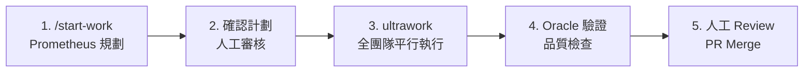

---

## 第 10 章：測試與品質（Testing & Quality）

### 10.1 OMO 自動測試生成

ultrawork 執行時，Background Agent 會自動生成測試：

```java
package com.company.banking.application.usecase;

import com.company.banking.domain.entity.*;
import com.company.banking.domain.repository.AccountRepository;
import org.junit.jupiter.api.*;
import org.junit.jupiter.api.extension.ExtendWith;
import org.mockito.*;
import org.mockito.junit.jupiter.MockitoExtension;

import java.math.BigDecimal;
import java.time.LocalDateTime;
import java.util.Optional;

import static org.assertj.core.api.Assertions.*;
import static org.mockito.Mockito.*;

@ExtendWith(MockitoExtension.class)
@DisplayName("轉帳用例測試")
class TransferUseCaseTest {

    @Mock
    private AccountRepository accountRepository;

    @InjectMocks
    private TransferUseCase transferUseCase;

    private Account fromAccount;
    private Account toAccount;

    @BeforeEach
    void setUp() {
        fromAccount = new Account(1L, "ACC001", "張三",
            new BigDecimal("10000.00"), AccountStatus.ACTIVE,
            LocalDateTime.now(), LocalDateTime.now());
        toAccount = new Account(2L, "ACC002", "李四",
            new BigDecimal("5000.00"), AccountStatus.ACTIVE,
            LocalDateTime.now(), LocalDateTime.now());
    }

    @Nested
    @DisplayName("正向測試")
    class HappyPath {
        @Test
        @DisplayName("應該成功執行轉帳 - 當餘額充足時")
        void should_transfer_successfully_when_balance_sufficient() {
            when(accountRepository.findByIdWithLock(1L))
                .thenReturn(Optional.of(fromAccount));
            when(accountRepository.findByIdWithLock(2L))
                .thenReturn(Optional.of(toAccount));

            TransferResult result = transferUseCase.execute(
                1L, 2L, new BigDecimal("3000.00"));

            assertThat(result.amount()).isEqualByComparingTo("3000.00");
            assertThat(result.remainingBalance()).isEqualByComparingTo("7000.00");
            verify(accountRepository, times(2)).save(any());
        }
    }

    @Nested
    @DisplayName("負向測試")
    class ErrorCases {
        @Test
        @DisplayName("應該拋出例外 - 當來源帳戶不存在時")
        void should_throw_when_from_account_not_found() {
            when(accountRepository.findByIdWithLock(999L))
                .thenReturn(Optional.empty());
            assertThatThrownBy(() ->
                transferUseCase.execute(999L, 2L, new BigDecimal("1000.00")))
                .isInstanceOf(AccountNotFoundException.class);
        }

        @Test
        @DisplayName("應該拋出例外 - 當餘額不足時")
        void should_throw_when_insufficient_balance() {
            when(accountRepository.findByIdWithLock(1L))
                .thenReturn(Optional.of(fromAccount));
            when(accountRepository.findByIdWithLock(2L))
                .thenReturn(Optional.of(toAccount));
            assertThatThrownBy(() ->
                transferUseCase.execute(1L, 2L, new BigDecimal("99999.00")))
                .isInstanceOf(InsufficientBalanceException.class);
        }
    }

    @Nested
    @DisplayName("邊界值測試")
    class BoundaryTests {
        @Test
        @DisplayName("應該成功 - 當轉帳全部餘額時")
        void should_succeed_when_transfer_entire_balance() {
            when(accountRepository.findByIdWithLock(1L))
                .thenReturn(Optional.of(fromAccount));
            when(accountRepository.findByIdWithLock(2L))
                .thenReturn(Optional.of(toAccount));
            TransferResult result = transferUseCase.execute(
                1L, 2L, new BigDecimal("10000.00"));
            assertThat(result.remainingBalance()).isEqualByComparingTo("0.00");
        }

        @Test
        @DisplayName("應該成功 - 當轉帳最小金額 0.01 時")
        void should_succeed_when_transfer_minimum_amount() {
            when(accountRepository.findByIdWithLock(1L))
                .thenReturn(Optional.of(fromAccount));
            when(accountRepository.findByIdWithLock(2L))
                .thenReturn(Optional.of(toAccount));
            TransferResult result = transferUseCase.execute(
                1L, 2L, new BigDecimal("0.01"));
            assertThat(result.remainingBalance()).isEqualByComparingTo("9999.99");
        }
    }
}
```

### 10.2 Comment Checker

OMO 內建 Comment Checker Hook，自動偵測並拒絕 AI 生成的低品質註解（"AI slop"）——確保程式碼讀起來像資深工程師寫的。

### 10.3 SonarQube 整合

```yaml
# .github/workflows/quality.yml
name: Quality Check
on: [pull_request]

jobs:
  quality:
    runs-on: ubuntu-latest
    steps:
      - uses: actions/checkout@v4
      - name: Run Tests with Coverage
        run: mvn verify jacoco:report
      - name: SonarQube Analysis
        run: mvn sonar:sonar
      - name: Quality Gate
        run: |
          if [ "$QUALITY_GATE_STATUS" != "OK" ]; then
            echo "Quality Gate FAILED"
            exit 1
          fi
```

> **實務建議**：OMO 自動生成的測試作為起點，團隊仍需 Review 完整性。金融核心邏輯的測試建議人工撰寫。

---

## 第 11 章：維運與除錯（Maintenance）

### 11.1 /doctor — 診斷工具

```bash
# 在 OpenCode 會話中執行
/doctor

# Doctor 會檢查：
# ✅ Plugin 版本
# ✅ 已偵測的 LSP 伺服器和擴展（v3.12.0+ 動態偵測）
# ✅ Agent 載入狀態
# ✅ 模型連線
# ✅ 配置路徑
# ✅ 自動更新設定
```

**v3.12.0 改進**：Doctor 現在顯示**實際偵測到的 LSP 伺服器和擴展**，而非硬編碼的計數。

**v3.14.0+ 改進**：
- Doctor 在偵測到使用舊套件名稱 `oh-my-opencode` 時發出警告，引導遷移至 `oh-my-openagent`
- 支援自定義 Provider 偵測（`/doctor` 可正確識別自配 Provider）
- 同時支援雙套件名稱的版本偵測

### 11.2 Token 與成本管理

#### 模型成本參考

| 模型 | 定位 | 用於 Agent |
|------|------|-----------|
| Claude Opus 4.7 | 最高階推理 | Sisyphus, Prometheus（v3.17.6+ 預設） |
| GPT-5.5 (xhigh/high/medium) | 推理 + Agent 任務 | Oracle, Hephaestus, Momus, Metis（v3.17.6+ 預設） |
| GPT-5.4 (xhigh/high/medium) | 推理 + Agent 任務（舊版預設） | Oracle, Momus, Metis, Atlas 備選, Hephaestus fallback |
| GPT-5.3-codex | 深度自主工作（更早版預設） | Hephaestus 舊版 fallback |
| Kimi K2.7 | 編排替代 | Sisyphus 備選（K2.x 原生 prompt，v4.0.0 升級 K2.6，v4.10.0 升級 K2.7） |
| GLM-5.1 | 編排備選 | Sisyphus 備選（v4.0.0 升級，unspecified-high default） |
| MiniMax M2.7 | 速度需求 | 多 Agent / Category 擴展（v3.14.0+） |

#### Token 最佳化策略

| 策略 | 說明 | 效果 |
|------|------|------|
| `/init-deep` 分層上下文 | 每個目錄獨立 AGENTS.md | Agent 只讀取相關上下文 |
| Preemptive Compaction | 上下文增長時自動壓縮 | 防止 Token 超限 |
| Category-based routing | 簡單任務用小模型 | 自動節省成本 |
| Stale timeout | 背景任務 45/60 分鐘超時 | 防止懸掛浪費 |

### 11.3 Circuit Breaker（v3.12.0+）

防止子 Agent 進入無限迴圈的熔斷機制：

```jsonc
{
  "circuit_breaker": {
    "enabled": true,              // 啟用/停用（escape hatch）
    "max_consecutive_calls": 10   // 連續呼叫上限
  }
}
```

**v3.12.x – v3.13.x 改進歷程**：
- v3.12.0：Smart Circuit Breaker 引入，應用於 Background Agent Manager events
- v3.12.1：Target-aware loop detection via tool signatures
- v3.12.2：Sliding Window 改為 Consecutive Call Detection，效能最佳化（regex 預編譯、hot-path 最佳化）
- v3.13.0：Circuit Breaker false positive 修復（flat-format events）

### 11.4 Agent Debug 方法

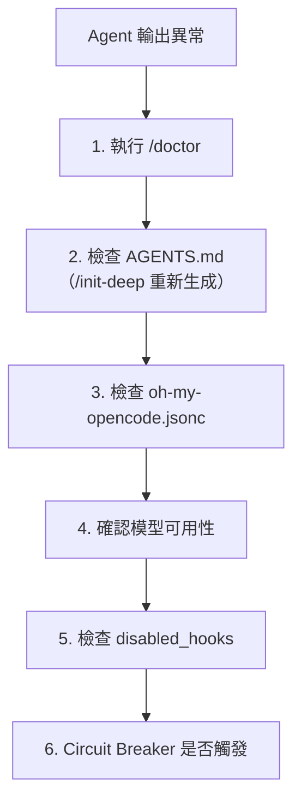

### 11.5 Session 管理工具

OMO 提供完整的 session 管理功能：

- **Session 列表**：查看所有歷史會話
- **Session 搜尋**：搜尋特定會話內容
- **Session 分析**：分析 Token 使用、模型分布
- **Session 通知**：背景 Agent 完成時通知（v3.9.0+：排隊等待閒置 session）

---

## 第 12 章：升級與版本管理（Upgrade）

### 12.1 版本歷程概覽

| 版本 | 發布時間 | 重大特性 |
|------|---------|---------|
| v4.14.1 | 2026-06-30 | Codex-Only LazyCodex、OpenCode skill loading 修復、移除過時 `claude-opus-4.7` alias 並重新產生 capabilities cache |
| v4.14.0 | 2026-06-30 | **Frontend design-system workflow**（`/frontend` 強制 DESIGN.md contracts）、**Designpowers**（personas、accessibility、design critique）、**Visual QA** 強化（CJK line breaks、transparency）、`ulw-research` 改名、**sparkshell 移除**、terminal secret redaction |
| v4.13.0 | 2026-06-22 | **Insane Search / Ultimate Browsing**（分層搜索階梯）、**Ultraresearch claim-ledger** verification gate、provider exhaustion fallback policy、teammode worktree merge-commit 自動化、CodeGraph cross-platform bundle、7 社群貢獻者 |
| v4.12.1 | 2026-06-20 | CodeGraph init guidance、Codex session hygiene（thread title nudge）、Ultraresearch team coordination（cooperating team shape + raise-law broadcast）、3 社群貢獻者 |
| v4.12.0 | 2026-06-19 | **Codex Team Mode**（teammode skill、durable threads、team.json、composition invariants、worktree 整合）、CodeGraph guidance hook、plugin component retry |
| v4.11.1 | 2026-06-17 | GPT/Codex release hardening（GPT 5.3 Codex stays on Sisyphus path）、claude-fable-5 / claude-mythos-5 偵測加入 hasGA1MContext、programming skill 恢復 250 LOC 硬限、4 社群貢獻者 |
| v4.11.0 | 2026-06-16 | **357 commits mega-release**：**CodeGraph-first** 開發、**Monitor 工具**（背景命令追蹤、session-aware output injection）、**TUI Sidebar**（專案鏡射、隱私遮蔽）、ast-grep MCP 移除改用 shared skill、Prometheus/ultrawork/ulw-loop 強化、LazyCodex 成熟化、packaging 可靠性、6 社群貢獻者 |
| v4.10.0 | 2026-06-14 | **Kimi K2.7** 支援（Atlas/Prometheus/Sisyphus/Sisyphus-Junior/Metis 5 個 Agent 原生 prompt）、**Windows ARM64** 原生 platform package、Hephaestus GPT-native 限制、runtime provisioning 強化、recovery/reliability（atomic config writes、stale tmux pane cleanup）、21 社群貢獻者 |
| v4.9.2 | 2026-06-07 | **Reliable background-agent wake routing**：live parent wake routing 經 topology probe + cached live-listener client |
| v4.9.1 | 2026-06-07 | `omo doctor` 修復 zero-dependency installs crash（Bun ResolveMessage 不是 instanceof Error） |
| v4.9.0 | 2026-06-06 | **共享 per-user LSP daemon**（跨 session 共享語言伺服器、unix socket / named pipe）、`lsp-setup` skill（20+ 語言伺服器導引式安裝）、**Node CLI runtime fallback**（`OMO_RUNTIME=node`）、sparkshell output summarization、per-model Claude prompts（Opus 4.6/4.7/4.8、Fable 5）、`claude-opus-4-8` 1M context GA、consensus tool 移除、`multi_agent_v2` force-disabled、14 社群貢獻者 |
| v4.8.1 | 2026-06-04 | Codex multi-agent v2 修復、Hephaestus rule preservation（hephaestus.md 免截斷）、`omo run` 尊重 configured agent display names |
| v4.8.0 | 2026-06-04 | Cross-platform test gate 強化（Windows 修復）、MCP OAuth callback server 穩定化、GPT ultrawork session-scoped directives、9 社群貢獻者 |
| v4.7.0–v4.7.5 | 2026-06-03 | **LazyCodex 自動更新**（startup hook）、**Autonomous Codex by default**、`omo ulw-loop` CLI wiring、model catalog + managed config migration、`lcx-report-bug` skill、LazyCodex context cleanup / config migration 安全加固、LSP MCP packaging 修復、9 社群貢獻者 |
| v4.5.12 | 2026-05-31 | **Codex CLI Light Edition** 正式釋出、LazyCodex 可攜版 |
| v4.1.2 | 2026-05-14 | Hidden agents 排除於委派發現、Windows ComSpec 修復、Ralph Loop compaction guard 強化、fallback duplicate prompt injection 防護 |
| v4.1.1 | 2026-05-13 | Background task idle-wait（等待 parent session idle 才喚醒）、所有 continuation hooks 重新檢查 session activity、block tmux kill-server、synthetic continuation 正確標記 |
| v4.1.0 | 2026-05-13 | **Boulder 追蹤系統**、Electron 相容（19 shims）、Ralph Loop 7 項修復、tolerant fsync（雲端同步資料夾）、`agent_order` 配置、plugin disposal、`.opencode→.agents`、88 bug fixes、16 社群貢獻者 |
| v4.0.0 | 2026-05-09 | **Team Mode**（lead + members + tmux）、GPT-5.2/5.3-codex 專用 prompt、walk-up config、K2.6/GLM-5.1/qwen3.5-plus 模型更新、PostHog 計費最佳化、**Vercel 加入 adopters**、bun:sqlite lazy-load for Electron |
| v3.17.15 | 2026-05-08 | **Bun spawn shim for Electron/Node**（消除 25 個 `globalThis.Bun` 解構）、runtime fallback infinite-loop 修復（[@paolo-notaro](https://github.com/paolo-notaro)）、spawn shim stdio/error 語義對齊 |
| v3.17.14 | 2026-05-07 | bun:sqlite lazy-load for Electron、process cleanup、CLI premature exit 修復（[@CHLK](https://github.com/CHLK)）、Atlas pending continuation 競態修復、auto-update 語義版本比較、7 社群貢獻者 |
| v3.17.13 | 2026-05-06 | Background agent false completion guard（status API 中斷時防誤報完成）、picomatch security patch、PostHog narrowed to `omo_daily_active` only、cmux notification provider、messages-transform hook 隔離 |
| v3.17.12 | 2026-05-02 | 修復「Sisyphus randomly drops to claude-opus-4.7」bug——bare `"403"`/`"forbidden"` 比對改為精確 phrase |
| v3.17.11 | 2026-05-01 | **GPT-5.5 Manual QA Gate**（Agent 必須實際使用產出物才能宣告完成）、investigate-before-acting 升級為獨立行為區塊、parallelize-aggressively 成為一級行為、`apply_patch` 權限矛盾修復 |
| v3.17.10 | 2026-04-30 | **智慧信用額度 Fallback**：Provider 回傳 insufficient balance/credits/forbidden 時自動視為 quota exhaustion 並降級至下一個模型；CI preflight-trust gate；auto-update-checker 修復（偏好 loaded module 的 package.json） |
| v3.17.6 | 2026-04-28 | **GPT-5.5 成為 oracle/hephaestus/deep 預設**（自動從 GPT-5.4 遷移）；Sisyphus 新增 **Claude Opus 4.7** 和 **Kimi K2.x** 原生 Prompt；Hephaestus GPT-5.5 以 outcome-first delegation 重寫；Ralph loop 背景任務執行時跳過 idle-continuation；Doctor 支援 multi-slash model IDs；Frontier agents 正確 tool whitelist；PostHog 於 Bun runtime 啟動 crash 修復 |
| v3.17.5 | 2026-04-23 | GPT-5.5 原生 Sisyphus 支援；Explore/Librarian 改用 **gpt-5.4-mini-fast** 作為主模型；**ast-grep pattern misuse detection**；delegate-task metadata hardening；效能改善（lazy loading、memoization、deferred startup）；tmux 自動清理 stale sessions |
| v3.17.4 | 2026-04-18 | Installer hyphenated Anthropic IDs 修復；variant=max Anthropic OAuth 相容；Shared metadata bridge；Background agent wait-for-task-session helper |
| v3.17.3 | 2026-04-15 | **Dynamic Custom Agent** 支援（`agent_definitions` + `opencode.json` 動態載入）、`replace_plan` 配置隱藏原生 plan agent、3 項 Bug 修復（#3366, #3272, #3222） |
| v3.17.2 | 2026-04-14 | **Vercel AI Gateway** 新增為 Provider（`--vercel-ai-gateway` CLI 旗標）、Rename transition 穩定性更新、delegate-task 合約與 runtime registration 行為更新、PostHog init failures 防護、CLI session idle 狀態修復 |
| v3.17.1 | 2026-04-12 | AGENTS.md 文件生成更新（prometheus/hephaestus/sisyphus variants/builtin-skills）、Gateway URL validator 提取、OpenClaw 共享 gateway URL 驗證 |
| v3.17.0 | 2026-04-11 | **PostHog 匿名遙測**（可停用）、Session Management 工具、Agent 排序修復（permanent canonical ordering）、Haiku effort injection 修復、Anthropic 1M GA context limit、`delegate-task` depth guard、GPT `apply_patch` 權限守衛 |
| v3.16.0 | 2026-04-08 | **OpenCode v1.4.0 最低版本檢查**、Ralph Loop **500 次迭代上限**、ultrawork iteration cap、quota 錯誤分類為 STOP（不重試）、`maxOutputTokens` 遷移、Boulder 進度計算修復、OAuth 原子寫入 + refresh mutex、安裝升級路徑安全檢查、Installer 配置備份 |
| v3.15.3 | 2026-04-05 | Hephaestus Oracle 限制為 failure-escalation only（GPT-5.4 prompt）、Boulder continuation lineage support、Session origins tracking、delegate-task description validation |
| v3.15.1 | 2026-04-02 | **27+ 社群貢獻者**、Rename transition（Package rename compatibility layer）、delegate-task contract 更新、Runtime-fallback variant loss 修復、Model alias pattern matching 重構、JSONC BOM 處理、fallback_models 含 fallback settings 寫入 |
| v3.14.0 | 2026-03-29 | **Hephaestus 預設模型升級至 GPT-5.4**、Package rename compatibility layer（oh-my-opencode → oh-my-openagent）、**Object-style fallback_models**、MiniMax M2.7 升級、models.dev-backed model capabilities、Agent order 支援、OAuth discovery root fallback、Spawn budget lifetime 語義修正、WindowsSymlink 配置路徑修復、19+ 社群貢獻者 |
| v3.13.1 | 2026-03-25 | MCP OAuth port binding 修復、Provider-agnostic fallback、Prometheus 尊重 model override、non-Opus Claude variant clamp |
| v3.13.0 | 2026-03-25 | `quick` 類別預設改為 GPT-5.4-mini、Background Agent max tool calls 增至 4000、stale timeout 增至 45/60 分鐘、Atlas task session reuse、OpenClaw 雙向整合、`oh-my-openagent.jsonc` 配置偵測、csh/tcsh shell 偵測、null byte 清理、Gemini MCP schema 相容、Building in Public |
| v3.12.3 | 2026-03-18 | Bug fixes, debug logging cleanup |
| v3.12.2 | 2026-03-18 | Circuit Breaker 改為 Consecutive Call Detection、效能最佳化（regex 預編譯、hot-path 最佳化） |
| v3.12.1 | 2026-03-18 | Target-aware loop detection、todo-description-override hook、Ralph Loop stale Oracle abort |
| v3.12.0 | 2026-03-18 | Smart Circuit Breaker、OpenClaw 整合（已回退）、Windows XDG_CONFIG_HOME、Doctor 動態 LSP 偵測、pre-publish review Skills |
| v3.11.2 | 2026-03-11 | oh-my-openagent 雙發布 platform binaries、idle notification grace period、cache 版本無效化修復 |
| v3.11.1 | 2026-03-04 | npm 發布 oh-my-openagent 套件名稱 |
| v3.11.0 | 2026-03-04 | **改名為 oh-my-openagent**，GPT-5.4 era，Oracle 強制驗證，GPTPhus 8-block 架構 |
| v3.10.0 | 2026-03-04 | HTTP Hook 安全（SSRF 防護），Hashline Edit opt-in，read-image-resizer hook |
| v3.9.0 | 2026-02 | Worktree planning, Gemini 支援, 可靠性強化 |
| v3.8.5 | 2026-02 | Hashline 編輯精度大幅提升 |

### 12.2 升級步驟

OMO 作為 OpenCode 插件，升級方式取決於安裝方式：

```bash
# 如果使用 npm 全域安裝（推薦使用新套件名稱）
npm update -g oh-my-openagent
# 或舊套件名稱（仍支援）
npm update -g oh-my-opencode

# OpenCode 通常會自動檢測插件更新
# 可透過 /doctor 確認目前版本

# v3.16.0+ 自動檢查 OpenCode 最低版本需求
# 若 OpenCode 低於 v1.4.0，安裝會被攔截
```

> **重要**：v3.15.1+ 的自動更新使用 canonical 套件名稱 `oh-my-openagent`。建議逐步遷移至新名稱。

**v4.x 升級注意事項**：

| 項目 | 說明 |
|------|------|
| `.opencode` → `.agents` | v4.1.0 起專案層級 Agent 配置目錄重新命名，舊目錄仍可讀取但建議遷移 |
| `delegate_task` (deep) | v4.0.0 起每次呼叫只允許一個 goal |
| Team Mode | 預設關閉，需手動啟用 `team_mode.enabled = true` |
| 模型更新 | kimi-k2.5→k2.6→k2.7（v4.10.0+）、glm-5→glm-5.1、minimax-m2.7→qwen3.5-plus |
| Plugin disposal | v4.1.0 新增，OpenCode 退出時自動清理，無需手動配置 |
| **lsp 配置遷移** | v4.3.0+ 頂層 `lsp` key 移除，需建立 `.opencode/lsp.json`（BREAKING） |
| **OpenCode 最低版本** | v4.2.0+ 需要 ≥ v1.14.0（v4.5.1+ 支援 1.15） |
| **Light Edition** | v4.5.12 新增 Codex CLI 可攜版（`bunx oh-my-openagent install --platform=codex`） |
| **安裝指令變更** | v4.7.0+ 起安裝指令變更為 `bunx oh-my-openagent install`，Light 版變更為 `npx lazycodex-ai install`，舊 `bunx omo install` 仍相容 |
| **ast-grep MCP 移除** | v4.11.0 起 ast-grep 不再以內建 MCP 方式提供，改用 shared ast-grep skill / `sg` resolver。升級後重啟 session 即可 |
| **Hephaestus GPT-native 限制** | v4.10.0+ Hephaestus 限制為 GPT-native 模型專用 |
| **sparkshell 移除** | v4.14.0 起 sparkshell 相關功能已移除 |
| **claude-opus-4.7 alias 移除** | v4.14.1 移除過時的 `claude-opus-4.7` alias |
| **multi_agent_v2 強制停用** | v4.9.0 起每次 Codex session 啟動時強制停用 `multi_agent_v2`，避免 HTTP 400 錯誤 |

### 12.3 Migration Notes（v3.14.0 → v4.14.1）

#### v4.6.0 → v4.14.1 重要變更

| 變更項目 | 說明 |
|----------|------|
| **安裝指令變更** | Ultimate: `bunx oh-my-openagent install`；Light: `npx lazycodex-ai install`。舊指令 `bunx omo install`、`bunx lazycodex install` 仍相容 |
| **CodeGraph-first** | v4.11.0 起 CodeGraph 成為預設 Agent 工作流程，索引式程式碼智慧優先於文字搜尋 |
| **Monitor 工具** | v4.11.0 新增背景命令追蹤，session-aware output injection，記憶體上限和 ReDoS 防護 |
| **TUI Sidebar** | v4.11.0 新增專案鏡射、安全標題處理、隱私遮蔽 |
| **ast-grep MCP 移除** | v4.11.0 起改用 shared ast-grep skill / `sg` resolver。升級後重啟 session |
| **Codex Team Mode** | v4.12.0 新增 teammode skill，支援 durable threads、team.json、worktree 整合 |
| **Insane Search** | v4.13.0 新增 Ultimate Browsing 分層搜索階梯，內建於 shared skill bundle |
| **Ultraresearch 改名** | v4.14.0 起 `ultraresearch` 改名為 `ulw-research` |
| **Frontend design-system** | v4.14.0 起 `/frontend` 強制 DESIGN.md contracts 工作流程 |
| **sparkshell 移除** | v4.14.0 起 sparkshell 相關功能已移除 |
| **claude-opus-4.7 alias** | v4.14.1 移除過時的 `claude-opus-4.7` alias |
| **Kimi K2.7** | v4.10.0 起 5 個 Agent 支援 K2.7 原生 prompt，模型匹配在 K2.7 之前先偵測 |
| **Windows ARM64** | v4.10.0 新增 `oh-my-opencode-windows-arm64` platform package |
| **Node CLI Fallback** | v4.9.0 起無法運行 Bun 的主機自動 fallback 至 Node CLI。透過 `OMO_RUNTIME=node` 強制 |
| **LSP Daemon** | v4.9.0 起共享 per-user LSP daemon，LSP 不再運行 in-process，改為 thin proxy |
| **multi_agent_v2** | v4.9.0 起每次 Codex session 強制停用，避免 HTTP 400 |
| **LazyCodex 自動更新** | v4.7.0 起 LazyCodex 從 startup hook 自動檢查更新，可用 `LAZYCODEX_AUTO_UPDATE_DISABLED=1` 關閉 |
| **Autonomous Codex** | v4.7.0 起新安裝預設 autonomous permissions |
| **claude-opus-4-8 GA** | v4.9.0 起 `claude-opus-4-8` 被識別為 GA 1M-context 模型，無需設定 `ANTHROPIC_1M_CONTEXT=true` |
| **Provider exhaustion** | v4.13.0 新增 model-level provider exhaustion fallback policy |

#### v4.5.0 → v4.5.12 重要變更

| 變更項目 | 說明 |
|----------|------|
| **Light Edition** | v4.5.12 新增 Codex CLI Light 版本（`bunx oh-my-openagent install --platform=codex` 或 `npx lazycodex-ai install`），提供可攜式子集：rules、comment-checker、LSP、ultrawork、ulw-loop |
| **Telemetry 雙產品** | Ultimate: `oh_my_openagent_daily_active`；Light: `omo_codex_daily_active`。Light 版停用：`OMO_CODEX_DISABLE_POSTHOG=1` |
| **Boulder continuations** | v4.5.12 支援中斷後從上次進度繼續執行 |
| **OpenCode 1.15** | v4.5.1+ 支援 OpenCode 1.15 DB |
| **omo.dev** | 官方網站從 GitHub Pages 遷移至 omo.dev |

#### v4.2.0 → v4.4.0 重要變更

| 變更項目 | 說明 |
|----------|------|
| **❗ BREAKING: lsp 配置遷移** | v4.3.0 起頂層 `lsp` 配置鍵移除，需遷移至 `.opencode/lsp.json`。v4.4.0 重複清理並提供遷移指引 |
| **50MB Log Rotation** | v4.2.0 新增自動日誌輪替，防止磁碟空間耗盡 |
| **OpenCode 最低版本** | v4.2.0 起需要 OpenCode ≥ v1.14.0（從 v1.4.0 提升） |
| **i18n** | v4.3.0 新增插件介面國際化支援 |
| **Auto-Activated Modes** | v4.3.0 根據專案上下文自動啟用對應模式 |
| **9 published packages** | v4.5.0 將內部模組發布為獨立套件 |
| **rules-core symlink escape** | v4.2.3 安全強化：阻止 symlink 跨出專案目錄 |
| **/security-research** | v4.4.0 新增 Team Mode 安全研究 skill |

#### v4.1.0 → v4.1.2 重要變更

| 變更項目 | 說明 |
|----------|------|
| **Hidden agents 排除** | 標記為 hidden 的 agents 不再出現於 delegate-task 發現清單（v4.1.2） |
| **Windows ComSpec** | 非互動式 session 正確偵測 Windows 命令 shell（v4.1.2） |
| **Continuation hooks 安全化** | Team wake、Atlas、Ralph Loop、todo-continuation 注入 prompt 前重新檢查 session activity（v4.1.1） |
| **Block tmux kill-server** | 禁止 interactive_bash 執行 `tmux kill-server`，防止意外終止所有 session（v4.1.1） |
| `.opencode` → `.agents` | 專案層級 Agent 配置目錄從 `.opencode` 重新命名為 `.agents`（v4.1.0） |
| **agent_order** | 新配置鍵，可自訂 Agent 顯示順序（v4.1.0） |
| **Plugin disposal** | 新增清理 handler，OpenCode 退出時優雅 teardown managers、MCP clients、background tasks（v4.1.0） |
| **Tolerant fsync** | 雲端同步資料夾（iCloud/Dropbox/OneDrive）的 `EPERM on fsync` 改為 graceful skip（v4.1.0） |

#### v4.0.0 重要變更

| 變更項目 | 說明 |
|----------|------|
| **Team Mode** | 新功能，預設關閉。啟用：`team_mode.enabled = true`。成員透過 `team_*` 工具溝通，非 `delegate_task` |
| **delegate_task (deep)** | 每次呼叫強制只允許一個 goal，多 goal 需並行呼叫 |
| **Walk-up config** | 配置檔探索改為向上遍歷目錄樹，合併祖先配置 |
| **Model updates** | kimi-k2.5→k2.6→k2.7（v4.10.0+）、glm-5→glm-5.1、minimax-m2.7→qwen3.5-plus |
| **PostHog 計費** | Feature flags 停用、`plugin_loaded` 事件移除 |
| **Deepgram** | 加入 adopters 清單 |

#### v3.17.11 → v3.17.15 重要變更

| 變更項目 | 說明 |
|----------|------|
| **GPT-5.5 Manual QA Gate** | Agent 必須透過對應工具實際操作產出物（TUI→tmux、Web→playwright、HTTP→curl）才能宣告完成（v3.17.11） |
| **Sisyphus model drop bug** | v3.17.10 引入的 bare `"403"` 比對造成 Sisyphus 靜默降級至 claude-opus-4.7，v3.17.12 修復 |
| **Background false completion** | Status API 中斷時不再誤報任務完成（v3.17.13） |
| **PostHog scope narrowed** | 遙測事件收窄為僅 `omo_daily_active`，移除所有 lifecycle/install/exception 事件（v3.17.13） |
| **bun:sqlite lazy-load** | 支援 Electron/Node runtime（v3.17.14） |
| **Bun spawn shim** | 完全消除 `globalThis.Bun` top-level 解構，OpenCode Desktop 可正常載入（v3.17.15） |
| **Runtime fallback loop** | 當 fallback model 與當前 model 相同時不再無限迴圈（v3.17.15） |

#### v3.17.10 重要變更

| 變更項目 | 說明 |
|----------|------|
| **智慧信用額度 Fallback** | Provider 回傳 `insufficient balance`、`no credits` 或 `forbidden` 時，runtime 自動視為 quota exhaustion 並降級至下一個已配置的模型（#3519） |
| CI preflight-trust gate | 新增 CI preflight trust gate，npm OIDC exchange 201 視為成功 |
| auto-update-checker | 偏好 loaded module 的 `package.json` 而非 flat-install candidates |
| model-fallback | clone session fallback chains，確保 background tasks 可使用正確的 fallback 鏈 |
| background-agent | guard stale launch errors and retry links |

#### v3.17.6 重要變更

| 變更項目 | 說明 |
|----------|------|
| **GPT-5.5 預設升級** | `oracle`、`hephaestus`、`deep` 類別預設模型從 GPT-5.4 **升級至 GPT-5.5**（含自動遷移） |
| **Claude Opus 4.7 Sisyphus** | Sisyphus 新增 Claude Opus 4.7 原生 Prompt（`isClaudeOpus47Model` type guard） |
| **Kimi K2.x Sisyphus** | Sisyphus 新增 Kimi K2.x prompt variant |
| **Hephaestus GPT-5.5 rewrite** | Hephaestus Prompt 以 outcome-first delegation 架構（Codex 5.2 + Amp distillation 風格）重寫 |
| Ralph loop 改善 | 背景任務執行時跳過 idle-continuation |
| Doctor 改善 | 支援 multi-slash model IDs，不再對已解決的 provider capabilities 發出警告 |
| Frontier agents | Opus 4.7、dotted Opus、GPT-5.5 Sisyphus 獲得正確的 tool whitelist |
| PostHog 修復 | Bun runtime 上 `os.cpus()` 權限錯誤不再造成 crash |
| 遙測精簡 | 移除 PostHog HAU tracking，僅保留 DAU |

#### v3.17.5 重要變更

| 變更項目 | 說明 |
|----------|------|
| GPT-5.5 Sisyphus | 新增 GPT-5.5 原生 Sisyphus prompt 支援 |
| **Explore/Librarian 模型** | 改用 `gpt-5.4-mini-fast` 作為主要模型，提升搜尋速度 |
| ast-grep 改善 | 新增 pattern misuse detection，防止 regex-style 誤用回傳空結果 |
| delegate-task metadata | hardening metadata recovery、extraction 和 variant preservation |
| 效能改善 | lazy loading、memoization、deferred startup、per-directory memoize |
| tmux 清理 | 首次 spawn 時自動清理 stale `omo-agents-` sessions |

#### v3.17.4 重要變更

| 變更項目 | 說明 |
|----------|------|
| Installer 修復 | 修復 hyphenated Anthropic IDs 問題 |
| Anthropic OAuth | variant=max Anthropic OAuth 相容性修復 |
| Shared metadata bridge | 新增共享 metadata contract 和 bridge，統一 tool metadata 處理 |
| Background agent | 新增 `wait-for-task-session` helper |

#### v3.17.3 重要變更

| 變更項目 | 說明 |
|----------|------|
| **Dynamic Custom Agents** | 新增 `agent_definitions` 檔案載入器和 `opencode.json` Agent 定義讀取器，支援動態自訂 Agent 定義 |
| **replace_plan** | 設為 `true` 時隱藏原生 plan agent，完全由 OMO 的 Prometheus 接管規劃流程 |
| Agent precedence chain | agent_definitions 和 opencode.json agents 加入優先順序鏈（precedence chain） |
| Bug fixes | 修復 3 項 Bug（#3366, #3272, #3222），包括 delegate-task 和 background agent 相關問題 |

#### v3.17.2 重要變更

| 變更項目 | 說明 |
|----------|------|
| **Vercel AI Gateway** | 新增 Vercel AI Gateway 作為 Provider，透過 `--vercel-ai-gateway` CLI 旗標啟用 |
| PostHog init guard | 防護 PostHog 初始化失敗，避免影響正常運作 |
| CLI session idle | 修復 CLI session status 缺失時視為 idle 的問題 |
| Provider model ID | 使用 gateway-specific model IDs 進行 Vercel 轉換 |
| delegate-task | 拒絕 primary agents 在 task subagent resolution 中出現 |

#### v3.17.1 重要變更

| 變更項目 | 說明 |
|----------|------|
| AGENTS.md 文件 | 新增 prometheus、hephaestus、sisyphus variants 和 builtin-skills 的 AGENTS.md 文件 |
| Configuration | sisyphus-junior 加入 Agent 列表文件 |
| CLI docs | 新增 `--vercel-ai-gateway` 旗標文件 |
| OpenClaw | 提取共享 gateway URL 驗證邏輯 |

#### v3.17.0 重要變更

| 變更項目 | 說明 |
|----------|------|
| **匿名遙測** | 新增 PostHog 匿名遙測，預設啟用。停用方式：`OMO_SEND_ANONYMOUS_TELEMETRY=0` 或 `OMO_DISABLE_POSTHOG=1` |
| Session Management | 新增 session 管理工具（list、read、search、analyze） |
| Agent 排序 | Permanent canonical agent ordering 策略，確保 Agent 列表排序一致 |
| Haiku effort injection | 跳過 Haiku 模型的 effort injection，避免相容性問題 |

#### v3.16.0 重要變更

| 變更項目 | 說明 |
|----------|------|
| OpenCode 最低版本 | **要求 OpenCode ≥ v1.4.0**，安裝時強制檢查 |
| Ralph Loop 迭代上限 | 新增 **500 次迭代上限**，防止無限迴圈 |
| Quota 錯誤處理 | quota exhaustion 分類為 STOP（不重試），避免浪費 Token |
| `maxOutputTokens` | `chat.params` 遷移至 `maxOutputTokens` 格式（OpenCode v1.4.0 相容） |
| OAuth 安全 | 原子存儲寫入（token safety）、per-server refresh mutex |
| Installer | 新增升級路徑安全檢查、配置備份工具 |

#### v3.15.x 重要變更

| 變更項目 | 說明 |
|----------|------|
| Rename transition | Package detection、plugin/config 相容性全面更新 |
| delegate-task | 任務委派合約變更，限制可委派的 Agent 模式 |
| 安全強化 | tar parser 嚴格 fail-closed、CI injection 防護 |
| Legacy config 遷移 | 自動原子遷移 legacy 配置檔 |
| tmux | honor tmux disablement 設定 |
| Boulder progress | 支援 structured 和 simple plan 格式的進度計算 |

#### v3.14.0 重要變更

| 變更項目 | 說明 |
|----------|------|
| **Hephaestus 模型** | 預設模型從 `gpt-5.3-codex` **升級至 `gpt-5.4`** |
| **Object-style fallback_models** | `fallback_models` 支援混合 plain string 和 per-model object settings |
| Package rename | 完整的 `oh-my-opencode` → `oh-my-openagent` 相容層 |
| MiniMax 升級 | MiniMax 從 M2.5 升級至 M2.7，擴展至更多 Agent/Category |
| Model capabilities | 新增 models.dev-backed model capabilities 資料 |
| Agent ordering | 支援 Agent 列表排序自定義 |
| Doctor 警告 | 使用舊套件名稱時發出遷移警告 |

**v3.13.0 重要變更**：

| 變更項目 | 說明 |
|----------|------|
| `quick` 類別預設模型 | `claude-haiku-4-5` → `gpt-5.4-mini` |
| Background Agent max tool calls | 預設增至 4000 |
| Stale timeout | 前台 20 分 → 45 分、背景 20 分 → 60 分 |
| `gpt-permission-continuation` Hook | **已移除**（GPT 權限自動續航由其他機制取代） |
| `oh-my-openagent.jsonc` | 現在正式支援作為配置檔名稱偵測 |
| OpenClaw 雙向整合 | 新增 OpenClaw bidirectional integration |
| Shell 偵測 | 支援 csh/tcsh 環境變數語法（`setenv`） |
| Null byte 清理 | bash 指令中的 null bytes 自動清除，防止 crash |
| MCP Schema | 為 Gemini 相容性移除 `contentEncoding` |
| Hashline formatter cache | 改為按專案目錄作用域（per-project scope） |
| Atlas task session | 支援 session reuse，提升效能 |

**v3.13.1 修復**：

| 修復項目 | 說明 |
|----------|------|
| Data/Cache 路徑 | 寫入目錄 fallback，避免唯讀目錄問題 |
| MCP OAuth | 回呼伺服器 robust port binding |
| Agent 保留 | 明確配置模型的 Agent 永遠保留 |
| Anthropic variant clamp | non-Opus Claude 模型 fallback 時 clamp `max` → `high` |
| Provider-agnostic fallback | fallback provider 選擇不再綁定特定 provider |
| Prometheus model override | 尊重 Agent 級別的 model override，不再使用全域 `opencode.json` 模型 |
| OpenCode Build Agent | 預設保持啟用 |

### 12.4 Migration Notes（v3.11.0）

**從 oh-my-opencode 遷移到 oh-my-openagent**：

- 兩個套件名稱都受支援（雙發布機制 dual-publish）
- 配置檔同時偵測 `oh-my-opencode.json(c)` 和 `oh-my-openagent.jsonc`
- 環境變數：`OMX_*` 已更名為 `OMO_*`

**GPT-5.5 遷移**（v3.17.6+）：

| Agent / Category | 舊模型 | 新模型 |
|------------------|--------|--------|
| Oracle | GPT-5.4 high | **GPT-5.5 high** |
| Hephaestus | GPT-5.4 | **GPT-5.5**（outcome-first delegation 重寫） |
| deep 類別 | GPT-5.4 | **GPT-5.5** |
| Sisyphus | Claude Opus 4.6 | **Claude Opus 4.7**（+ Kimi K2.x variant） |
| Explore/Librarian | gpt-5.4-mini | **gpt-5.4-mini-fast**（v3.17.5+） |

**GPT-5.4 遷移**（v3.11.0）：

| Agent | 舊模型 | 新模型 |
|-------|--------|--------|
| Oracle | GPT-5.2 | GPT-5.4 high |
| Momus | GPT-5.2 | GPT-5.4 xhigh |
| Metis | GPT-5.2 | GPT-5.4 high |
| Prometheus | GPT-5.2 | GPT-5.4 high |
| Atlas | Claude Sonnet | + GPT-5.4 medium fallback |
| Multimodal Looker | GPT-5.3-codex | GPT-5.4 medium |

**ULW-Loop 注意事項**：
- Oracle 驗證變為強制 → 任務耗時略增，但完成信心度顯著提升

**OpenAI-Only 使用者**：
- Sisyphus 現在原生支援 GPT-5.4 → 不再需要退回 Hephaestus

> **注意**：v3.14.0 後 Hephaestus 預設模型再次從 `gpt-5.3-codex` 升級至 `gpt-5.4`，使所有主要 Agent 統一使用 GPT-5.4 系列。

### 12.5 版本升級策略

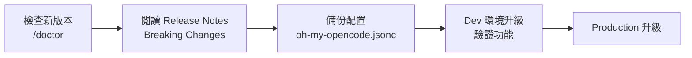

---

## 第 13 章：安全（SSDLC）

### 13.1 Hook Security（v3.10.0+）

OMO v3.10.0 強化了 Hook 安全，防止 SSRF 和其他攻擊：

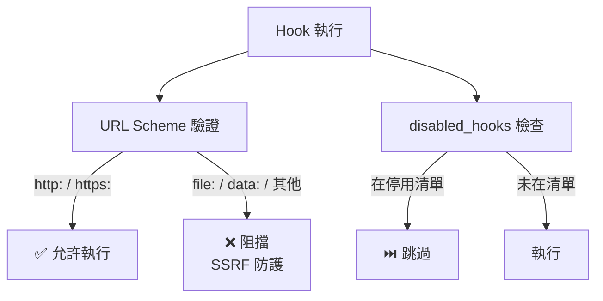

**重要安全特性**：

| 版本 | 安全特性 |
|------|---------|
| v3.10.0 | HTTP Hook URL scheme validation（只允許 http/https） |
| v3.10.0 | `disabled_hooks` 機制擴展到 HTTP hooks |
| v3.10.0 | Deterministic message/part IDs（防止儲存碰撞） |
| v3.12.0 | Agent name normalization 防止 alias bypass |
| v3.12.0 | Forward-compatible disabled hooks |
| v3.15.1 | **tar parser 嚴格 fail-closed**，拒絕任何未解析的條目 |
| v3.15.1 | CI injection 防護強化（heredoc env var 擴展） |
| v3.15.1 | Config 寫入原子化（atomic writes），防止部分寫入 |
| v3.16.0 | OAuth 原子存儲寫入（token safety） |
| v3.16.0 | per-server refresh mutex（防止並發 token refresh） |
| v3.16.0 | 安裝升級路徑安全檢查 |
| v3.17.0 | 遙測資料使用 hashed installation identifier（非原始 hostname） |
| v4.2.3 | **rules-core symlink escape** 阻止 symlink 跨出專案目錄 |
| v4.9.0 | **multi_agent_v2 強制停用**，每次 Codex session 阻斷 HTTP 400 |
| v4.13.0 | **provider exhaustion fallback** model-level 重試策略 |
| v4.14.0 | **sparkshell 移除**——高風險 REPL 模式從 CLI 移除 |
| v4.14.0 | **Visual QA terminal secret redaction**——終端輸出敏感資料自動遮蔽 |

### 13.2 Prompt Injection 防護

```jsonc
// .opencode/oh-my-opencode.jsonc
{
  // 停用危險工具
  "disabled_tools": [
    // 禁止特定工具
  ],
  
  // 停用特定 hooks
  "disabled_hooks": [
    // 根據需要停用
  ]
}
```

OMO 的 Agent 設計本身包含防護：
- **IntentGate**：分析真實使用者意圖，而非字面解釋
- **Role Boundary**：每個 Agent 有明確職責邊界
- **blocked_operations**：內建危險指令封鎖

### 13.3 Secrets 管理

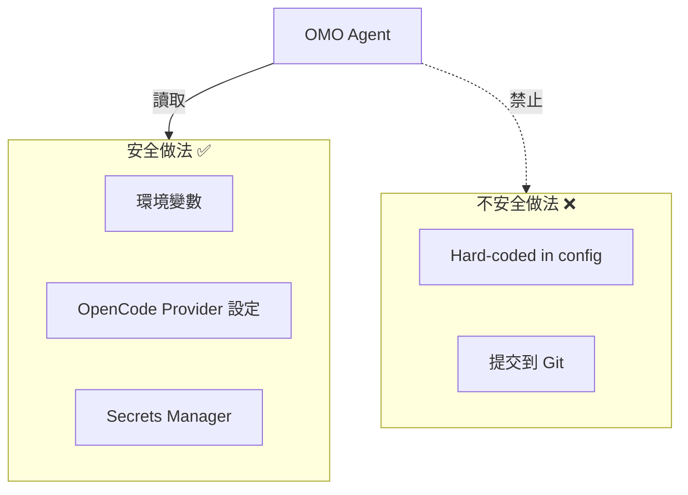

```bash
# .gitignore
.opencode/oh-my-opencode.json
.opencode/oh-my-opencode.jsonc
*.env
*.key
*.pem
```

### 13.4 安全掃描 CI/CD

```yaml
# .github/workflows/security.yml
name: Security Scan
on:
  pull_request:
    branches: [develop, main]

jobs:
  security:
    runs-on: ubuntu-latest
    steps:
      - uses: actions/checkout@v4
      - name: SAST - SonarQube
        run: mvn sonar:sonar -Dsonar.qualitygate.wait=true
      - name: Dependency Check
        uses: dependency-check/Dependency-Check_Action@main
        with:
          project: 'enterprise-banking'
          format: 'HTML'
      - name: Secret Scanning
        uses: trufflesecurity/trufflehog@main
        with:
          extra_args: --only-verified
      - name: Container Scan
        uses: aquasecurity/trivy-action@master
        with:
          image-ref: 'enterprise-banking:latest'
          severity: 'CRITICAL,HIGH'
```

### 13.5 Dependabot 配置

```yaml
# .github/dependabot.yml
version: 2
updates:
  - package-ecosystem: "maven"
    directory: "/"
    schedule:
      interval: "weekly"
    open-pull-requests-limit: 10
  - package-ecosystem: "npm"
    directory: "/src/frontend"
    schedule:
      interval: "weekly"
```

> **SSDLC 檢查清單**：
> - [ ] AGENTS.md 不含敏感資訊
> - [ ] API Key 通過 OpenCode Provider 設定（非 hard-code）
> - [ ] Git hooks 防止 Secrets 提交
> - [ ] `disabled_hooks` / `disabled_tools` 已配置
> - [ ] HTTP Hook 僅允許 http/https scheme
> - [ ] CI/CD 包含 SAST / DAST / SCA
> - [ ] 依賴套件定期更新

---

## 第 14 章：團隊導入策略（Enterprise Adoption）

### 14.1 導入階段

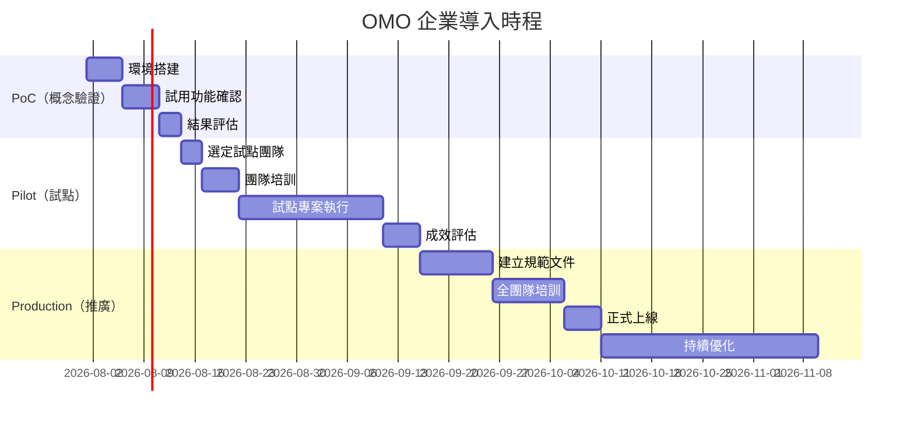

#### Phase 1：PoC — 2 週

| 任務 | 說明 | 產出 |
|------|------|------|
| 環境搭建 | 安裝 OpenCode + OMO 插件、配置 LLM Provider | 可用的開發環境 |
| 功能驗證 | ultrawork、/start-work、/init-deep | 功能驗證報告 |
| 安全評估 | Hook Security、disabled_tools 配置 | 安全評估報告 |
| 成本估算 | 預估月 Token 成本（根據 Agent 分類） | 成本分析報告 |

#### Phase 2：Pilot — 4-6 週

| 任務 | 說明 | 產出 |
|------|------|------|
| 團隊選定 | 2-3 位資深開發者 | 試點小組 |
| 培訓 | AGENTS.md 撰寫、ultrawork 使用、Agent 系統理解 | 培訓教材 |
| 實戰 | 選一個中等複雜度功能用 OMO 開發 | 實作成果 |
| 回饋收集 | 匯集問題與改善建議 | 改善報告 |

#### Phase 3：Production — 持續

| 任務 | 說明 | 產出 |
|------|------|------|
| 規範建立 | 制定 AGENTS.md 規範、安全配置標準 | 團隊規範文件 |
| 全員培訓 | Workshop + Hands-on | 培訓記錄 |
| 知識庫 | FAQ + 最佳實務 + Skill 範本庫 | 內部 Wiki |
| 持續優化 | 定期 Review Agent 配置與成本 | 月度報告 |

### 14.2 使用 OMO 的企業

根據官方資訊，以下企業已在使用 OMO：

| 企業 | 用途 |
|------|------|
| **Indent** | Spray（網紅行銷）、vovushop（跨境電商）、vreview（AI 商業評論） |
| **Vercel** | 內部團隊使用（v4.0.0 起加入 adopters） |
| **Google** | 部分團隊使用 |
| **Microsoft** | 部分團隊使用 |
| **ELESTYLE** | elepay（多行動支付閘道）、OneQR（無現金 SaaS） |
| **Deepgram** | AI 語音辨識平台（v4.5.0+ 加入 adopters） |

### 14.3 教育訓練建議

| 階段 | 對象 | 內容 | 時間 |
|------|------|------|------|
| Level 1 | 全體工程師 | OMO 概念、ultrawork 基本使用 | 2 小時 |
| Level 2 | 資深工程師 | /init-deep、Agent 系統、Skills、配置 | 4 小時 |
| Level 3 | Tech Lead | Category routing、Background Agents、成本管理 | 4 小時 |
| Level 4 | 架構師 | Hooks 設計、Custom Agent、安全配置 | 8 小時 |
| Workshop | 全員 | Hands-on：用 ultrawork 開發完整功能 | 4 小時 |

---

## 第 15 章：最佳實務（Best Practices）

### 15.1 Context Engineering

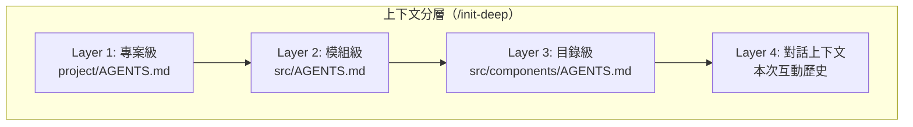

**原則**：
- 使用 `/init-deep` 自動生成分層 AGENTS.md
- 專案級 AGENTS.md 控制在 500-1000 行
- Agent 自動讀取相關層級——無需手動管理
- 對 Token 效率和 Agent 效能都有顯著幫助

### 15.2 任務分類策略

善用 OMO 的 Category 系統，讓正確的模型處理正確的任務：

| Category | 適用場景 | 預設模型 |
|----------|---------|---------|
| `visual-engineering` | 前端、UI/UX | 視覺類模型 |
| `deep` | 自主研究 + 長時間執行 | GPT-5.5（v3.17.6+，舊版為 GPT-5.4） |
| `quick` | 單檔修改、Typo | GPT-5.4-mini |
| `ultrabrain` | 困難邏輯、架構決策 | GPT-5.5 xhigh（v3.17.6+） |
| `unspecified-high` | 一般高強度任務 | GPT-5.5 high（v3.17.6+） |
| 自定義 | `business-logic` 等 | 可配置 |

### 15.3 Skills 最佳實務

- 針對特定領域建立 Skills（如 `banking-domain`、`k8s-ops`）
- Skills 可攜帶 MCP 伺服器，按需啟動，不佔用上下文
- 放在 `.opencode/skills/*/SKILL.md` 或 `~/.config/opencode/skills/*/SKILL.md`
- 使用 `/get-unpublished-changes` 和 `/review-work` Skill 進行發布前審查

### 15.4 避免 AI 亂改程式

| 策略 | 做法 |
|------|------|
| **先 /start-work** | 永遠先用 Prometheus 規劃 |
| **小步前進** | 一次只做一個功能 |
| **Git Branch** | 每個任務在獨立分支，方便 rollback |
| **Oracle 驗證** | ultrawork 強制 Oracle 驗證所有產出 |
| **Comment Checker** | 自動拒絕 AI slop 註解 |
| **人工 Review** | 所有 AI 產出必須 Code Review |

### 15.5 成本最佳化

| 方法 | 說明 |
|------|------|
| Category routing | 讓系統自動為簡單任務用小模型 |
| `/init-deep` | 精準上下文減少 Token 浪費 |
| Preemptive Compaction | 自動壓縮過長的上下文 |
| Background Agent timeout | 防止懸掛 Agent 浪費 Token |
| 模型 Fallback | 主模型不可用時自動降級 |

---

## 第 16 章：常見問題（FAQ）

### Q1：ultrawork 執行後 Agent 不停止怎麼辦？

**解決方案**：
1. 這是設計行為——ultrawork 不完成不停止
2. 如果確實陷入迴圈，Circuit Breaker（v3.12.0+）會自動觸發
3. 可手動停止會話
4. 檢查 `circuit_breaker.enabled: true` 是否已設定

### Q2：Hashline Edit 要不要啟用？

| 情況 | 建議 |
|------|------|
| 大量批次修改 | 啟用（提升精度） |
| 簡單單檔修改 | 可不啟用（v3.10.0+ 預設停用） |
| 精度要求高 | 啟用 |

```jsonc
{
  "experimental": {
    "hashline_edit": true
  }
}
```

### Q3：多模型如何選擇？

| 場景 | 推薦 | 理由 |
|------|------|------|
| 架構編排 | Claude Opus 4.7 | 最強推理，Sisyphus/Prometheus 預設 |
| 深度自主工作 | GPT-5.5（v3.17.6+ 預設） | Hephaestus 新預設，outcome-first delegation |
| 驗證與推理 | GPT-5.5 high | Oracle 預設，強推理 + 成本合理 |
| 規劃 | Claude Opus 4.7 / Kimi K2.7 | 結構化思維 |
| OpenAI-only | GPT-5.5 + GPTPhus | Sisyphus 原生 GPT 支援 |
| 離線環境 | 需要自行配置本地模型 | 透過 OpenCode Provider |
| 回退方案 | GPT-5.4 | 舊 Hephaestus/Oracle 預設，可作為 fallback |

### Q4：OMO 與 Claude Code 的關係？

OMO 透過 OpenCode 插件系統運行，**100% 相容 Claude Code 生態**：
- Claude Code 的 `hooks.json` → OMO 可讀取
- Claude Code 的 `CLAUDE.md` → 等同於 `AGENTS.md`
- Claude Code 的 Skills → OMO 完全支援
- Claude Code 的 MCP → OMO 內建 + 自定義
- Claude Code 的 Plugins → OMO 相容（v3.12.0+ v3 flat array format）

### Q5：如何確保 AI 生成的程式碼安全？

1. **Hook Security**：v3.10.0+ HTTP Hook URL scheme validation（SSRF 防護）
2. **Comment Checker**：自動拒絕 AI slop
3. **Oracle 強制驗證**：ultrawork 所有產出經 Oracle 驗證
4. **disabled_tools / disabled_hooks**：精細控管
5. **CI/CD 掃描**：SAST + SCA + Secret Scan
6. **人工 Review**：永遠最後一道防線

### Q6：套件名稱是 oh-my-opencode 還是 oh-my-openagent？

- v3.11.0 起改名為 **oh-my-openagent**
- 新的套件名稱：`oh-my-openagent`
- 舊的套件名稱 `oh-my-opencode` 仍然支援（雙發布）
- 配置檔偵測三者：`oh-my-opencode.json(c)`、`oh-my-openagent.jsonc`（v3.13.0+）
- npm 同時發布兩個套件名稱（v3.11.1+）

### Q7：v3.14.0+ 升級後有什麼需要注意？

| 項目 | 影響 |
|------|------|
| Hephaestus 預設模型 | v3.14.0 從 `gpt-5.3-codex` 升級為 `gpt-5.4`；**v3.17.6+ 再升級為 `gpt-5.5`**（outcome-first delegation 重寫） |
| `quick` 預設模型 | 從 `claude-haiku-4-5` 改為 `gpt-5.4-mini`（v3.13.0），如需舊行為可手動配置 |
| Object-style fallback_models | `fallback_models` 陣列現在支援混合 string 和 object 格式 |
| OpenCode 最低版本 | v3.16.0+ 要求 OpenCode ≥ v1.4.0 |
| Ralph Loop 迭代上限 | v3.16.0+ 新增 500 次迭代上限 |
| Stale timeout | 從 20 分鐘增至 45/60 分鐘，Background Agent 有更多時間完成任務 |
| Max tool calls | 預設增至 4000，允許更長的 Agent 執行 |
| 匿名遙測 | v3.17.0+ 預設啟用 PostHog 匿名遙測，可停用 |

### Q8：如何確保 Provider-agnostic fallback 正常運作？

v3.14.0+ 進一步改進了 fallback 機制：
1. 系統自動偵測可用的 Provider 和模型
2. Fallback chain 依據任務類別（Category）自動選擇
3. 明確配置的 Agent model override 優先於全域設定
4. non-Opus Claude 模型 fallback 時自動 clamp `max` variant 為 `high`
5. **Object-style fallback_models**（v3.14.0+）：陣列可混合 string 和 object，object 格式允許指定 `reasoning_effort`：
   ```jsonc
   "fallback_models": [
     "claude-opus-4-7",
     { "model": "gpt-5.5", "reasoning_effort": "high" }
   ]
   ```
6. **models.dev 線上模型能力資料庫**（v3.14.0+）：自動查詢模型 context window、支援功能等

### Q9：什麼是 Building in Public？

OMO 維護者在 Discord 的 `#building-in-public` 頻道公開即時開發過程。所有功能開發、Bug 修復、Issue 分流都透過 AI 助手 Jobdori 即時執行並公開透明。這是 OMO 社群的獨特文化，使用者可以直接觀看專案如何被建構。

加入 Discord：[https://discord.gg/PUwSMR9XNk](https://discord.gg/PUwSMR9XNk)

### Q10：v3.17.0 新增的匿名遙測（Telemetry）是什麼？

v3.17.0 開始，OMO 預設啟用 **PostHog 匿名遙測**。v3.17.13 起範圍大幅收窄。v4.5.0+ 因 Light Edition 加入，現在有**雙產品遙測事件**：

- **Ultimate 版**：`oh_my_openagent_daily_active`（每日活躍計數，每日僅觸發一次）
- **Light 版（Codex CLI）**：`omo_codex_daily_active`（install + session）

兩者都不含任何個人資訊、lifecycle 事件或 exception 回報。

**停用方式**：
```bash
# 全域停用（Ultimate + Light）
export OMO_DISABLE_POSTHOG=1

# 僅停用 Ultimate
export OMO_SEND_ANONYMOUS_TELEMETRY=0

# 僅停用 Light
export OMO_CODEX_DISABLE_POSTHOG=1
```

> ⚠️ 企業環境建議在部署腳本中預設停用，並在資安政策中記錄此決定。  
> 詳見官方 [Privacy Policy](https://github.com/code-yeongyu/oh-my-openagent/blob/dev/docs/legal/privacy-policy.md) 和 [Terms of Service](https://github.com/code-yeongyu/oh-my-openagent/blob/dev/docs/legal/terms-of-service.md)。

---

## 第 17 章：遙測與隱私（Telemetry & Privacy）

### 17.1 匿名遙測概述

v3.17.0 起，OMO 預設啟用 **PostHog 匿名遙測系統**。v3.17.13 起大幅收窄範圍。v4.5.0+ 因 Light Edition 加入，現在有**雙產品遙測事件**：Ultimate 版收集 `oh_my_openagent_daily_active`、Light 版收集 `omo_codex_daily_active`，兩者均為每日活躍計數，不包含任何功能使用統計、lifecycle 事件或 exception 回報。

**遙測架構**（v4.5.0+）：

```mermaid
flowchart TD
    OMO["OMO Plugin"] --> Collect["匿名事件收集"]
    Collect --> Hash["Hashed Installation ID<br/>（非原始 hostname）"]
    Hash --> PostHog["PostHog Analytics<br/>（第三方服務）"]
    
    Collect --> Events["僅收集事件"]
    Events --> E1["oh_my_openagent_daily_active<br/>（Ultimate，每日一次）"]
    Events --> E2["omo_codex_daily_active<br/>（Light，install + session）"]
    
    PostHog --> Dashboard["DAU 計數儀表板"]
```

> 📌 **v4.0.0 變更**：`plugin_loaded` 事件移除、feature flags 停用。v3.17.13 起移除 `cli_run_start`、`cli_run_end`、`install_command`、`activity_state` 等所有 lifecycle 事件及 `captureException`。v4.5.0+ 新增 Light Edition 獨立事件 `omo_codex_daily_active`。

### 17.2 收集的資料範圍

| 資料類別 | 說明 | 是否含個人資訊 |
|----------|------|---------------|
| Installation ID | 基於安裝環境產生的 Hash 值 | ❌ 非原始 hostname |
| `oh_my_openagent_daily_active` | Ultimate 版每日活躍計數（每日僅觸發一次） | ❌ |
| `omo_codex_daily_active` | Light 版每日活躍計數（install + session） | ❌ |
| 原始碼內容 | — | ❌ 不收集 |
| API Key / Secrets | — | ❌ 不收集 |
| 使用者身份 | — | ❌ 不收集 |
| CLI lifecycle 事件 | — | ❌ v3.17.13 起不再收集 |
| Install 事件 | — | ❌ v3.17.13 起不再收集 |
| Exception / Crash | — | ❌ v3.17.13 起不再收集 |

### 17.3 停用遙測

OMO 提供多種方式完全停用匿名遙測：

```bash
# Ultimate 版停用（二擇一）
export OMO_SEND_ANONYMOUS_TELEMETRY=0
export OMO_DISABLE_POSTHOG=1

# Light 版（Codex CLI）停用（二擇一）
export OMO_CODEX_SEND_ANONYMOUS_TELEMETRY=0
export OMO_CODEX_DISABLE_POSTHOG=1
# 注意：全域旗標 OMO_DISABLE_POSTHOG=1 也會停用 Codex 遙測
```

**Windows PowerShell**：

```powershell
# 臨時停用（Ultimate + Light）
$env:OMO_DISABLE_POSTHOG = "1"

# 永久停用（加入 Profile）
Add-Content $PROFILE 'Set-Item -Path Env:OMO_DISABLE_POSTHOG -Value "1"'
```

**Docker / CI/CD 環境**：

```yaml
# docker-compose.yml
environment:
  - OMO_DISABLE_POSTHOG=1

# GitHub Actions
env:
  OMO_DISABLE_POSTHOG: "1"
```

### 17.4 Crash Isolation（v3.17.0+）

遙測程式碼具備完整的崩潰隔離機制——即使 PostHog 初始化失敗（v3.17.2+ guard），也不會影響 OMO 的正常運作：

- PostHog init failures 被靜默處理
- CLI run/install 中的 telemetry failures 被隔離
- Activity state shape 驗證防止非預期資料結構

### 17.5 企業合規建議

| 場景 | 建議 |
|------|------|
| 內部開發環境 | 評估後決定是否啟用，記錄決策 |
| 受監管行業（金融/醫療） | 建議停用，並在資安政策中記錄 |
| 離線/隔離網路 | 無影響（PostHog 無法連線時靜默失敗） |
| CI/CD Pipeline | 建議在部署腳本中預設停用 |
| 開源專案貢獻者 | 建議保持啟用以協助改善產品 |

### 17.6 法律文件

OMO 提供完整的法律文件，說明遙測資料的收集、使用與保護：

| 文件 | 連結 |
|------|------|
| Privacy Policy | [docs/legal/privacy-policy.md](https://github.com/code-yeongyu/oh-my-openagent/blob/dev/docs/legal/privacy-policy.md) |
| Terms of Service | [docs/legal/terms-of-service.md](https://github.com/code-yeongyu/oh-my-openagent/blob/dev/docs/legal/terms-of-service.md) |
| SUL License | [LICENSE.md](https://github.com/code-yeongyu/oh-my-openagent/blob/dev/LICENSE.md) |
| CLA（貢獻者授權） | [CLA.md](https://github.com/code-yeongyu/oh-my-openagent/blob/dev/CLA.md) |

> **重要**：v3.17.0 的 telemetry 文件新增了多語言翻譯（日文、韓文、簡體中文、俄文），確保全球使用者都能了解遙測政策。

---

## 第 18 章：附錄（Appendix）

### 18.1 Slash Commands 速查表

| 指令 | 說明 |
|------|------|
| `ultrawork` / `ulw` | 啟動全自動多 Agent 執行 |
| `/ulw-loop` | 自參考迴圈，100% 完成才停止 |
| `/start-work` | Prometheus 面談式規劃 |
| `/start-work --worktree <path>` | 指定 Worktree 規劃 |
| `/init-deep` | 自動生成分層 AGENTS.md（v4.9.0+ 整合 LSP + CodeGraph） |
| `/doctor` | 診斷安裝狀態（v4.9.1+ 修復 zero-dependency installs） |
| `/get-unpublished-changes` | 查看未發布的變更 |
| `/review-work` | 觸發 pre-publish review |
| `/handoff` | 將對話交接給另一個 Agent（v4.9.0+ 綁定 session_read 輸出） |
| `team_create` | 建立 Team Mode 團隊（v4.0.0+） |
| `team_send_message` | 向 Team 成員發送訊息（v4.0.0+） |
| `team_task_create` | 為 Team 成員建立任務（v4.0.0+） |
| `teammode` | Codex Team Mode skill（v4.12.0+，支援 durable threads、worktree 整合） |
| `boulder` | Boulder 追蹤儀表板（v4.1.0+，CLI：`bunx omo boulder`） |
| `lsp-setup` | 語言伺服器導引式安裝設定（v4.9.0+，支援 20+ 語言） |
| `lcx-report-bug` | LazyCodex 結構化 bug report（v4.7.0+） |
| `ulw-research` | 研究工作流程，前身為 ultraresearch（v4.14.0+ 改名） |
| `/frontend` | 前端 design-system 工作流程（v4.14.0+，強制 DESIGN.md contracts） |

### 18.2 Agent 一覽表

| Agent | 主模型 | 角色 |
|-------|--------|------|
| Sisyphus | Claude Opus 4.7（+ Kimi K2.7 variant） | 主編排器 |
| Hephaestus | GPT-5.5（fallback: GPT-5.4）；v4.10.0+ 限 GPT-native 模型 | 深度自主工作者（outcome-first delegation） |
| Prometheus | Claude Opus 4.7（+ Kimi K2.7 / GLM-5.1 fallback）；v4.9.0+ per-model prompt | 戰略規劃者 |
| Oracle | GPT-5.5 high | 驗證者 |
| Atlas | Claude Sonnet | 多任務編排器 |
| Metis | GPT-5.4 high | 計劃顧問 |
| Momus | GPT-5.4 xhigh | QA 審查者 |
| Librarian | gpt-5.4-mini-fast | 文件/程式碼搜尋 |
| Explore | gpt-5.4-mini-fast | 快速 Grep |
| Multimodal Looker | GPT-5.4 medium | 圖像分析（v4.14.0+ Visual QA） |
| Sisyphus Junior | GPT-5.5/5.4 | 輕量編排 |

> **v4.11.0+ 模型偵測更新**：新增 `claude-fable-5` 與 `claude-mythos-5` 模型族群偵測，可自動分類至正確 category。`claude-opus-4-7` 別名於 v4.14.0 移除，請使用 `claude-opus-4.7`。

### 18.3 Category 模型映射

| Category | 預設模型 | Fallback 鏈 | 用途 |
|----------|---------|------------|------|
| `visual-engineering` | 視覺類模型 | — | 前端 / UI / 設計 |
| `deep` | GPT-5.5（v3.17.6+） | GPT-5.4 → kimi-k2.7 | 自主研究 + 執行 |
| `quick` | GPT-5.4-mini | gpt-5.4-mini-fast | 單檔修改 |
| `ultrabrain` | GPT-5.5 xhigh（v3.17.6+） | claude-opus-4-7 max | 困難邏輯 / 架構 |
| `unspecified-high` | GPT-5.5 high（v3.17.6+） | glm-5.1 → qwen3.5-plus | 一般高強度 |
| `writing` | Claude Opus 4.7 | kimi-k2.7 | 文件撰寫 |

### 18.4 Hook 一覽（63 內建 / 70 with Team Mode）

下表列出主要 Hook，完整清單請參閱 [官方 Hook 文件](https://github.com/code-yeongyu/oh-my-openagent/tree/dev/src/hooks)。

| Hook | 類別 | 說明 |
|------|------|------|
| `context-injector` | Context | 自動注入 AGENTS.md, README |
| `comment-checker` | Quality | 拒絕 AI slop 註解 |
| `todo-enforcer` | Behavior | 閒置 Agent 強制拉回 |
| `todo-continuation` | Session | 任務持續執行 |
| `ultrawork-model-override` | Model | ultrawork 模型切換 |
| `hashline-read-enhancer` | Tool | 讀取時加入 LINE#ID |
| `hashline-edit` | Tool | 雜湊驗證編輯 |
| `ralph-loop` | Session | 自參考完成迴圈（v3.15.0+ 支援 500 次迭代上限） |
| `read-image-resizer` | Tool | 圖像尺寸最佳化（僅解碼前 32KB） |
| `todo-description-override` | Behavior | 強制原子 todo 格式 |
| `preemptive-compaction` | Token | 自動壓縮過長上下文 |
| `auto-slash-command` | Behavior | 自動 slash command |
| `delegation-depth-guard` | Security | 委派深度護欄，防止無限遞迴（v3.14.0+） |
| `session-lineage-tracker` | Session | 追蹤 session 繼承鏈（v3.14.0+） |
| `gpt-apply-patch-permission` | Security | GPT apply_patch 權限守衛（v3.14.0+） |
| `file-uri-resolver` | Tool | 支援 `file://` URI 解析 Agent 配置（v3.14.0+） |
| `legacy-config-migrator` | Config | `oh-my-opencode` → `oh-my-openagent` 自動遷移（v3.14.0+） |
| `models-dev-capability` | Model | 查詢 models.dev 線上模型能力資料庫（v3.14.0+） |
| `mcp-env-isolation` | Security | MCP Server 環境變數隔離（v3.15.0+） |
| `background-race-guard` | Session | Background Agent 競爭條件防護（v3.15.0+） |
| `opencode-version-check` | Config | OpenCode 版本檢查（≥ v1.4.0）（v3.16.0+） |
| `oauth-atomic-storage` | Security | OAuth token 原子寫入（v3.16.0+） |
| `skill-mcp-data-redact` | Security | Skill-MCP 敏感資料脫敏（v3.16.0+） |
| `telemetry-crash-isolation` | Telemetry | 遙測程式碼崩潰隔離（v3.17.0+） |
| `shell-detection-priority` | Tool | Shell 偵測優先級修正（v3.17.0+） |
| `invisible-char-cleanup` | Quality | 不可見字元清理（v3.17.0+） |
| `gpt-5.5-manual-qa-gate` | Quality | GPT-5.5 Agent 必須實際使用產出物才能宣告完成（v3.17.11+） |
| `codegraph-guidance` | Tool | CodeGraph post-tool guidance 注入（v4.11.0+，v4.12.1 強化 init guidance） |
| `monitor-manager` | Session | Monitor 背景命令追蹤、session-aware output injection（v4.11.0+） |
| `tui-sidebar` | UI | TUI Sidebar 專案鏡射、隱私遮蔽（v4.11.0+） |
| `provider-exhaustion-fallback` | Model | Provider exhaustion 重試策略（v4.13.0+） |
| `teammode-worktree` | Team | Codex teammode worktree merge-commit 整合（v4.13.0+） |
| `ultimate-browsing` | Tool | Insane Search / Ultimate Browsing 分層搜索（v4.13.0+） |
| `designpowers` | Skill | 前端 design-system personas、accessibility、design critique（v4.14.0+） |
| `visual-qa` | Quality | Visual QA 證據收集（CJK line breaks、transparency、terminal secret redaction）（v4.14.0+） |
| `team-lead-orchestrator` | Team | Team Mode lead agent 編排器（v4.0.0+） |
| `team-member-coordinator` | Team | Team Mode 成員協調與 tmux 可視化（v4.0.0+） |
| `boulder-progress-tracker` | Session | Boulder 工作追蹤與計時（v4.1.0+） |
| `tolerant-fsync` | Tool | 雲端同步資料夾（iCloud/Dropbox/OneDrive）fsync EPERM 容錯（v4.1.0+） |
| `plugin-disposal` | Lifecycle | OpenCode 退出時優雅清理 managers/MCP/background tasks（v4.1.0+） |
| `continuation-activity-guard` | Session | 所有 continuation hooks 注入 prompt 前檢查 session activity（v4.1.1+） |
| `hidden-agent-filter` | Security | 排除 hidden agents 於 delegate-task 發現（v4.1.2+） |

> 📌 以上列出 34 個代表性 Hook。其餘 Hook 涵蓋：Tool 呼叫攔截、Provider 重試策略、Token 計算、模型降級、Context Window 管理、Session 持久化等。詳情請查閱原始碼 `src/hooks/` 目錄。

### 18.5 AGENTS.md 完整範例

```markdown
# Project: Enterprise Online Banking System

## Overview
企業網路銀行系統，提供帳戶管理、轉帳、繳費等功能。
服務 500 萬用戶，日均交易量 200 萬筆。

## Tech Stack
### Backend
- Language: Java 21（Virtual Threads enabled）
- Framework: Spring Boot 3.2.x + Spring Cloud 2023
- Security: Spring Security 6 + OAuth2 + JWT
- ORM: Spring Data JPA + Hibernate 6
- DB Migration: Flyway
- Cache: Redis Cluster
- Message: Apache Kafka

### Frontend
- Framework: Vue 3.4 + TypeScript 5
- UI: Element Plus
- State: Pinia
- Build: Vite 5

### Infrastructure
- Container: Docker + Kubernetes
- CI/CD: GitHub Actions
- Monitoring: Prometheus + Grafana
- Logging: ELK Stack

## Architecture
- Clean Architecture + DDD
- Microservices（12 services）
- REST（同步）+ Kafka（異步）
- CQRS + Event Sourcing（交易相關）

## Coding Standards
- Google Java Style Guide
- No Lombok
- Constructor Injection only
- All dates: java.time.*
- Response: ResponseEntity<ApiResponse<T>>
- Logging: SLF4J + Log4j2

## Security
- OWASP Top 10
- Parameterized Query only
- CSP Header + Output Encoding
- OAuth2 + JWT + 2FA
- AES-256 + TLS 1.3

## Testing
- Unit Test Coverage ≥ 80%
- JUnit 5 + Mockito
- Performance: P99 < 500ms
```

### 18.6 配置檔完整範例

```jsonc
// .opencode/oh-my-openagent.jsonc（v3.14.0+ 新路徑）
// 舊路徑 .opencode/oh-my-opencode.jsonc 仍相容，系統自動遷移
{
  // Agent 覆蓋
  "agents": {
    "sisyphus": {
      "model": "claude-opus-4-7"  // v3.17.6+ 預設，舊版為 claude-opus-4-6
    },
    "hephaestus": {
      "model": "gpt-5.5"  // v3.17.6+ 預設，舊版為 gpt-5.4
    }
  },

  // Fallback Models（v3.14.0+ 支援 object-style）
  "fallback_models": [
    "claude-opus-4-7",
    { "model": "gpt-5.5", "reasoning_effort": "high" },
    "gpt-5.4"
  ],

  // Skills
  "skills": {
    "enabled": ["playwright", "git-master", "frontend-ui-ux"]
  },

  // 停用的 Hooks
  "disabled_hooks": [],

  // 停用的 Tools
  "disabled_tools": [],

  // Background Tasks
  "background_tasks": {
    "concurrency": 5,
    "stale_timeout_ms": 2700000,
    "session_wait_ms": 60000
  },

  // Circuit Breaker
  "circuit_breaker": {
    "enabled": true
  },

  // 匿名遙測（v3.17.0+，預設啟用）
  // 停用方式：設定環境變數 OMO_SEND_ANONYMOUS_TELEMETRY=0
  // 或 OMO_DISABLE_POSTHOG=1

  // 實驗性功能
  "experimental": {
    "hashline_edit": false,
    "aggressive_truncation": false
  }
}
```

### 18.7 相關資源連結

| 資源 | 連結 |
|------|------|
| 官方網站 | https://omo.dev |
| GitHub Repository | https://github.com/code-yeongyu/oh-my-openagent |
| Releases | https://github.com/code-yeongyu/oh-my-openagent/releases |
| Installation Guide | https://github.com/code-yeongyu/oh-my-openagent/blob/dev/docs/guide/installation.md |
| Features Documentation | https://github.com/code-yeongyu/oh-my-openagent/blob/dev/docs/reference/features.md |
| Configuration Documentation | https://github.com/code-yeongyu/oh-my-openagent/blob/dev/docs/reference/configuration.md |
| Overview Guide | https://github.com/code-yeongyu/oh-my-openagent/blob/dev/docs/guide/overview.md |
| Orchestration Guide | https://github.com/code-yeongyu/oh-my-openagent/blob/dev/docs/guide/orchestration.md |
| Agent-Model Matching | https://github.com/code-yeongyu/oh-my-openagent/blob/dev/docs/guide/agent-model-matching.md |
| CLI Documentation | https://github.com/code-yeongyu/oh-my-openagent/blob/dev/docs/reference/cli.md |
| Ollama Guide | https://github.com/code-yeongyu/oh-my-openagent/blob/dev/docs/guide/ollama.md |
| Ultrawork Manifesto | https://github.com/code-yeongyu/oh-my-openagent/blob/dev/docs/manifesto.md |
| Privacy Policy | https://github.com/code-yeongyu/oh-my-openagent/blob/dev/docs/legal/privacy-policy.md |
| Terms of Service | https://github.com/code-yeongyu/oh-my-openagent/blob/dev/docs/legal/terms-of-service.md |
| Contributing | https://github.com/code-yeongyu/oh-my-openagent/blob/dev/CONTRIBUTING.md |
| Discord | https://discord.gg/PUwSMR9XNk |
| DeepWiki | https://deepwiki.com/code-yeongyu/oh-my-openagent |
| Sisyphus Labs | https://sisyphuslabs.ai/ |
| npm Package | https://www.npmjs.com/package/oh-my-opencode |

---

## 檢查清單（Checklist）

### 新手上路 - 快速開始

- [ ] 安裝 OpenCode CLI（≥ v1.14.0，v4.2.0+ 最低要求）
- [ ] 在 OpenCode 配置中加入 `oh-my-openagent` 插件（v3.14.0+ 新名稱，舊 `oh-my-opencode` 仍相容）
- [ ] 執行 `/doctor` 驗證安裝
- [ ] 配置 LLM Provider（API Key）
- [ ] 評估是否停用匿名遙測（`OMO_SEND_ANONYMOUS_TELEMETRY=0`）
- [ ] 在專案中執行 `/init-deep` 生成 AGENTS.md
- [ ] 試用 `/start-work`（Prometheus 規劃）
- [ ] 試用 `ultrawork`（全自動執行）

### 日常開發 Checklist

- [ ] 新功能先用 `/start-work` 規劃
- [ ] `ultrawork` 在獨立 Git branch 操作
- [ ] Oracle 驗證通過後再 commit
- [ ] Comment Checker 確認無 AI slop
- [ ] 人工 Review 所有 AI 產出
- [ ] 執行測試確認品質
- [ ] PR 通過 Quality Gate 再 Merge

### 專案配置 Checklist

- [ ] `AGENTS.md` 已透過 `/init-deep` 生成或手動撰寫
- [ ] `.opencode/oh-my-openagent.jsonc` 已配置（舊路徑 `oh-my-opencode.jsonc` 仍相容）
- [ ] Skills 已建立（如需要領域特定技能）
- [ ] `disabled_hooks` / `disabled_tools` 已依需求配置
- [ ] `circuit_breaker` 已啟用
- [ ] Background Tasks `concurrency` 已設定
- [ ] 匿名遙測（Telemetry）政策已確認並記錄
- [ ] CI/CD 整合已完成（Quality Gate + Security Scan）
- [ ] Git hooks 已安裝（Pre-commit Secret Scan）

### 上線前 Checklist

- [ ] 所有 AI 產出程式碼通過 Code Review
- [ ] 單元測試覆蓋率 ≥ 80%
- [ ] 整合測試通過
- [ ] SAST 掃描無 Critical / High 問題
- [ ] 依賴套件無已知漏洞
- [ ] Secret Scan 通過
- [ ] 效能測試通過（P99 < SLA 門檻）
- [ ] AGENTS.md 已同步更新
- [ ] 變更記錄已載入 CHANGELOG

---

> **文件結束**  
> 本文件為 oh-my-openagent（OMO）企業導入教學手冊。  
> 基於 GitHub Repository v4.14.1 版本資訊撰寫。  
> 如有疑問，請參考 [官方文件](https://omo.dev) 或加入 [Discord 社群](https://discord.gg/PUwSMR9XNk)。  
> **最後更新**：2026-06-30 | **版本**：v6.0

