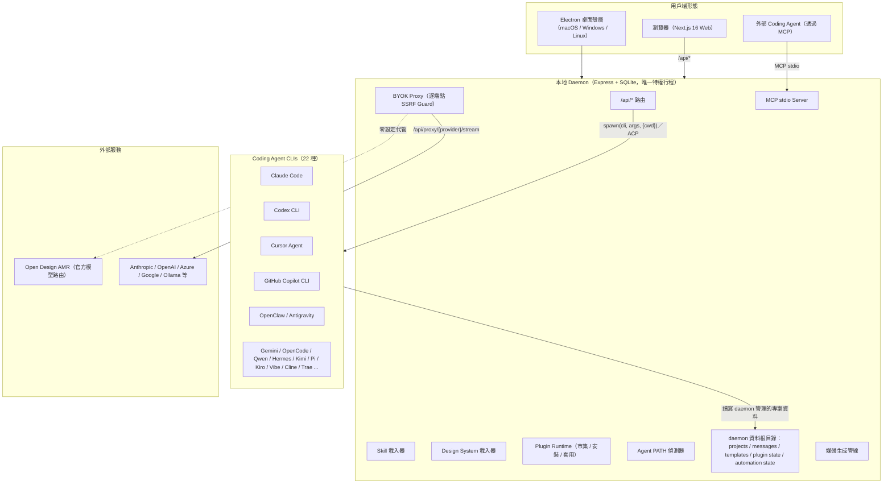
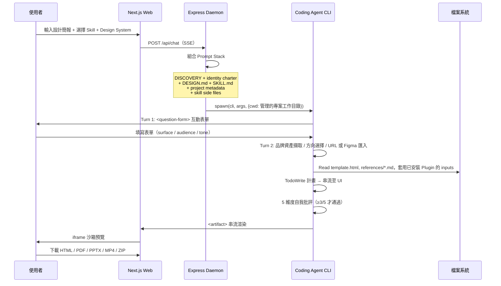
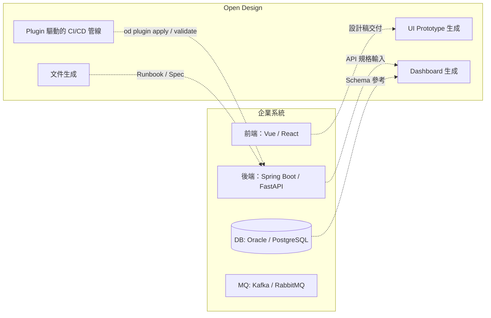
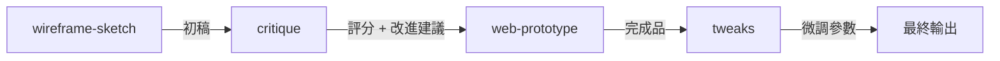
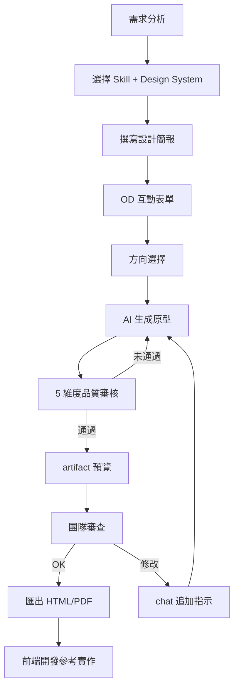
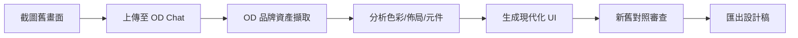
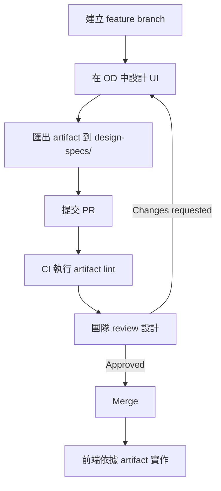
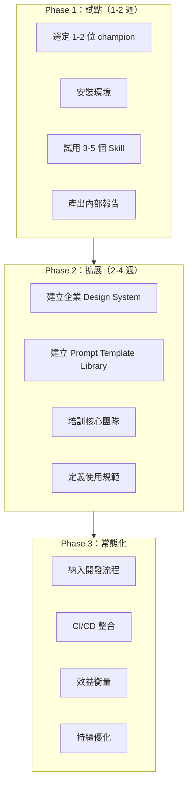
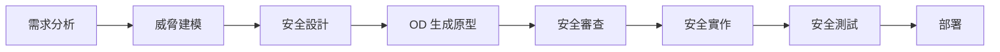
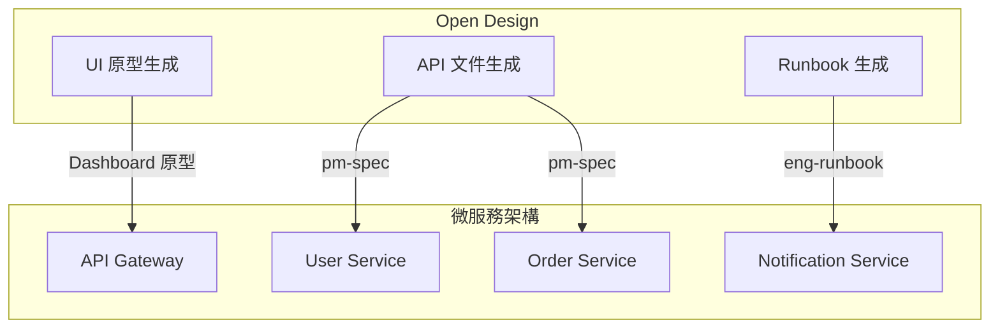

+++
date = '2026-05-03T22:20:09+08:00'
draft = false
title = 'Open Design 教學手冊'
tags = ['教學', 'AI開發']
categories = ['教學']
+++

# Open Design 教學手冊

> **版本**：v0.13.0「Stay in Flow」（對應 Open Design 0.13.0）  
> **最後更新**：2026-07-02  
> **適用對象**：資深工程師、前後端開發人員、UI/UX 設計師、AI 架構師、平台維運與採購決策者  
> **授權**：Apache-2.0（部分內建 Plugin／Skill 沿用原始授權，詳見附錄 A）  
> **文件等級**：企業標準技術白皮書

---

## 目錄

- [1. 概述與背景](#1-概述與背景)
  - [1.1 Open Design 是什麼](#11-open-design-是什麼)
  - [1.2 為何需要 Open Design](#12-為何需要-open-design)
  - [1.3 市場產品比較全景](#13-市場產品比較全景)
  - [1.4 BYOK 與 AMR 雙軌設計理念](#14-byok-與-amr-雙軌設計理念)
  - [1.5 適用場景](#15-適用場景)
  - [1.6 開源基石與技術譜系](#16-開源基石與技術譜系)
- [2. 系統整體架構設計](#2-系統整體架構設計)
  - [2.1 高階架構圖](#21-高階架構圖)
  - [2.2 技術組成](#22-技術組成)
  - [2.3 AI Agent 整合架構](#23-ai-agent-整合架構)
  - [2.4 設計生成流程](#24-設計生成流程)
  - [2.5 Prompt Stack 組合機制](#25-prompt-stack-組合機制)
  - [2.6 專案目錄結構與資料治理](#26-專案目錄結構與資料治理)
  - [2.7 與企業架構整合](#27-與企業架構整合)
- [3. 安裝與環境建置](#3-安裝與環境建置)
  - [3.1 系統需求](#31-系統需求)
  - [3.2 安裝路徑總覽](#32-安裝路徑總覽)
  - [3.3 首次啟動與驗證](#33-首次啟動與驗證)
  - [3.4 BYOK 設定](#34-byok-設定)
  - [3.5 桌面版安裝](#35-桌面版安裝)
  - [3.6 容器化與雲端部署](#36-容器化與雲端部署)
  - [3.7 多語系與國際化](#37-多語系與國際化)
- [4. 核心機制解析](#4-核心機制解析)
  - [4.1 Skill 驅動架構](#41-skill-驅動架構)
  - [4.2 HTML PPT Studio 技能體系](#42-html-ppt-studio-技能體系)
  - [4.3 Design System 設計系統](#43-design-system-設計系統)
  - [4.4 Visual Directions 視覺方向](#44-visual-directions-視覺方向)
  - [4.5 Anti-AI-Slop 防劣質機制](#45-anti-ai-slop-防劣質機制)
  - [4.6 媒體生成能力](#46-媒體生成能力)
  - [4.7 Craft 設計參考系統](#47-craft-設計參考系統)
  - [4.8 OD Library 與使用者資產庫](#48-od-library-與使用者資產庫)
- [5. Plugin 系統與 MCP 整合](#5-plugin-系統與-mcp-整合)
  - [5.1 Plugin 市集架構與定位](#51-plugin-市集架構與定位)
  - [5.2 官方 Plugin 六大分類](#52-官方-plugin-六大分類)
  - [5.3 Plugin CLI 操作](#53-plugin-cli-操作)
  - [5.4 建立與貢獻 Plugin](#54-建立與貢獻-plugin)
  - [5.5 MCP Server 整合](#55-mcp-server-整合)
  - [5.6 Open Design AMR 模型路由器](#56-open-design-amr-模型路由器)
- [6. AI 開發流程（企業級）](#6-ai-開發流程企業級)
  - [6.1 Web Application 開發](#61-web-application-開發)
  - [6.2 舊系統逆向工程](#62-舊系統逆向工程)
  - [6.3 Framework 升級](#63-framework-升級)
  - [6.4 企業文件與報表生成](#64-企業文件與報表生成)
- [7. Prompt Engineering](#7-prompt-engineering)
  - [7.1 Prompt 結構設計原則](#71-prompt-結構設計原則)
  - [7.2 高品質 Prompt 範本](#72-高品質-prompt-範本)
  - [7.3 Prompt 最佳化策略](#73-prompt-最佳化策略)
- [8. 設計品質控管機制](#8-設計品質控管機制)
  - [8.1 五維度自我審核機制](#81-五維度自我審核機制)
  - [8.2 P0 / P1 / P2 Checklist](#82-p0--p1--p2-checklist)
  - [8.3 Artifact Lint API](#83-artifact-lint-api)
  - [8.4 Slop 黑名單](#84-slop-黑名單)
- [9. 輸出與整合](#9-輸出與整合)
  - [9.1 匯出格式](#91-匯出格式)
  - [9.2 CI/CD 整合](#92-cicd-整合)
  - [9.3 Git / PR 開發流程整合](#93-git--pr-開發流程整合)
  - [9.4 Claude Design ZIP 匯入](#94-claude-design-zip-匯入)
- [10. 系統維護與營運](#10-系統維護與營運)
  - [10.1 日誌與監控](#101-日誌與監控)
  - [10.2 錯誤處理](#102-錯誤處理)
  - [10.3 Skill 管理](#103-skill-管理)
  - [10.4 Design System 更新策略](#104-design-system-更新策略)
  - [10.5 資料備份與復原](#105-資料備份與復原)
- [11. 系統升級策略](#11-系統升級策略)
  - [11.1 Open Design 升級流程](#111-open-design-升級流程)
  - [11.2 相容性管理](#112-相容性管理)
  - [11.3 版本控管策略](#113-版本控管策略)
  - [11.4 回滾機制](#114-回滾機制)
- [12. 團隊導入建議](#12-團隊導入建議)
  - [12.1 開發團隊使用方式](#121-開發團隊使用方式)
  - [12.2 設計師協作模式](#122-設計師協作模式)
  - [12.3 AI Agent 分工策略](#123-ai-agent-分工策略)
  - [12.4 SSDLC 整合方式](#124-ssdlc-整合方式)
- [13. 最佳實踐（Best Practices）](#13-最佳實踐best-practices)
- [14. 常見問題與風險](#14-常見問題與風險)
- [15. 與企業架構深度整合](#15-與企業架構深度整合)
  - [15.1 微服務架構整合](#151-微服務架構整合)
  - [15.2 Clean Architecture 對應](#152-clean-architecture-對應)
  - [15.3 前端框架整合（Vue / React）](#153-前端框架整合vue--react)
  - [15.4 後端框架整合（Spring Boot / FastAPI）](#154-後端框架整合spring-boot--fastapi)
- [16. 檢查清單（Checklist）](#16-檢查清單checklist)
- [附錄 A：參考來源與技術譜系](#附錄-a參考來源與技術譜系)
- [附錄 B：Roadmap 發展藍圖](#附錄-broadmap-發展藍圖)

---

## 1. 概述與背景

### 1.1 Open Design 是什麼

Open Design（OD）是由 nexu-io 團隊主導開發的**開源設計生成平台**，定位為 Anthropic Claude Design 的全功能開源替代方案。經過近兩個月的高速迭代，OD 已從單純的「Web app + 本地 daemon」演進為**原生桌面應用、MCP 整合、Plugin 市集三翼並進**的完整平台，但核心設計原則維持不變：

- **Local-first**：所有專案資料、對話紀錄、SQLite 資料庫、Agent 執行時資料均保留在本機由 daemon 管理的資料根目錄內，完全不依賴外部雲端儲存；實際路徑規則由官方 `AGENTS.md` 的「Daemon data directory contract」統一定義，並以環境變數 `OD_DATA_DIR` 解析，本文件不重複列舉具體路徑，企業導入時請直接以官方文件為準
- **BYOK（Bring Your Own Key）**：不內建任何 AI 模型或推理引擎。使用者透過已安裝的 Coding Agent CLI、自行提供 OpenAI 相容 API Key，或改用官方代管的 **AMR（Agentic Model Router）** 服務驅動生成
- **Skill / Plugin 雙層驅動**：底層仍採用 Claude Code 的 `SKILL.md` 檔案慣例；v0.8.0 起在其上疊加一層**可市集化、可攜式的 Plugin 系統**，讓設計能力得以被打包、發布、版本化與跨 Agent 複用
- **Agent-agnostic**：daemon 啟動時自動掃描 `PATH`，支援 22 種主流 Coding Agent CLI 自動偵測與切換；也可透過 `od mcp install <agent>` 讓外部 Agent 以 MCP 協定直接呼叫 OD，不綁定任何特定廠商

**專案基本資訊**（2026-07-02 查證）：

| 項目 | 說明 |
| ------ | ------ |
| GitHub | [nexu-io/open-design](https://github.com/nexu-io/open-design) |
| 目前版本 | v0.13.0「Stay in Flow」（2026-07-02 發布） |
| 授權 | Apache-2.0（部分內建 Plugin／Skill 沿用原始授權，詳見附錄 A） |
| Stars | 74,000+ |
| Forks | 8,400+ |
| 貢獻者 | 340+ 人 |
| 語言組成 | TypeScript 66.3% / HTML 24.7% / CSS 4.4% / JavaScript 1.8% / Astro 1.5% / Python 1.0% / 其他 0.3% |
| 多語系文件 | English · Español · Português · Deutsch · Français · 简体中文 · 繁體中文 · 한국어 · 日本語 · العربية · Русский · Українська · Türkçe（共 13 種） |
| 分發形態 | 原生桌面應用（macOS / Windows，Linux AppImage 為選用通道）· MCP Server · Docker / Sealos 容器化部署 · 原始碼建置 |

> **與 v0.2.0 版本的關鍵差異**：規模上，Skill 由 31 個成長至 **100+**、Design System 由 129 個成長至 **150** 個、Coding Agent CLI 由 13 種成長至 **22** 種；產品形態上新增了原生桌面應用、**261 個官方 Plugin 市集**、**MCP Server 整合**與**官方模型路由服務 AMR**。本文件即依此基準全面改版。

### 1.2 為何需要 Open Design

2026 年 4 月，Anthropic 發布 Claude Design，向業界展示了 LLM 從生成文字轉向直接生成設計產物（artifact）的全新範式——使用者輸入簡報，AI 直接產出可渲染的 HTML 設計稿，一度掀起熱烈討論。然而此產品存在根本性限制：

1. **封閉原始碼**：無法檢視、修改或自行託管
2. **付費門檻**：需要 Pro / Max / Team 等級訂閱方可使用
3. **廠商鎖定**：僅支援 Anthropic 自家模型，無法接入其他 LLM
4. **無法私有部署**：無法在企業內網、私有雲、容器平台或自架伺服器部署
5. **技能不可擴充**：內建技能為封閉系統，無法新增自定義技能或安裝第三方能力
6. **設計系統不透明**：無法匯入企業自有品牌規範

Open Design 提出了「相同的設計迴圈品質，零鎖定」的方案：**同一套發現簡報 → 鎖定方向 → 串流產出 artifact → 批評 → 交付的迴圈，開放成一套 Agent 已讀寫得懂的技能／設計系統／Plugin 檔案系統**。它不重新發明 Agent——市面上最強的 Coding Agent 早已在使用者的筆電上執行——而是把它們接進這套工作流程；可以在本機執行、以桌面應用形式安裝、透過 MCP 掛進既有 Agent，也能以容器化方式部署到企業內部或雲端環境，並在每一層都保持 BYOK。隨著市場上同時出現了 Figma 這類老牌設計工具、以及 Lovable / v0 / Bolt 等雲端「一句話生網站」工具的競爭，Open Design 的差異化定位也從單純對標 Claude Design，擴展為「開放原始碼、可自架、Agent 原生」三個維度的整體訴求。

### 1.3 市場產品比較全景

截至 2026-07-02，AI 設計生成賽道上主要有四類代表性產品，定位與能力差異顯著：

| 維度 | Claude Design | Figma | Lovable / v0 / Bolt | Open Design |
| ------ | ------ | ------ | ------ | ------ |
| 開放原始碼 | ❌ | ❌ | ❌ | ✅ Apache-2.0 |
| 自架 / 桌面部署 | ❌ | ❌ | ❌ | ✅ macOS + Windows + Docker / Sealos |
| Agent 原生（在使用者 CLI 中執行） | 僅 Anthropic | ❌ | 僅雲端代管 Agent | ✅ 22 種 CLI + BYOK |
| 品牌級 DESIGN.md | 私有 | Theme JSON（有限 token） | 有限 token | ✅ 150 個內建系統 |
| Skill / Plugin / 模板生態 | 封閉 | 外掛市集 | 封閉 | ✅ 100+ Skill · 261 個官方 Plugin |
| HyperFrames（HTML→MP4） | ❌ | ❌ | ❌ | ✅ 一級公民能力 |
| 既有專案品牌重構 | ❌ | ❌ | ❌ | ✅ 透過 Agent + DESIGN.md（部分能力仍在 roadmap） |
| 最低費用 | Pro / Max / Team | Pro / Org | Pro / Team | BYOK 或任一相容端點；另可用官方 AMR 按用量計費 |

> **與舊版比較表的差異**：早期版本的比較基準是 open-codesign（`OpenCoworkAI/open-codesign`），該專案作為 Open Design UX 設計的「北極星」，其串流 artifact 迴圈、沙箱 iframe 預覽、即時 Agent 面板等體驗仍深刻影響 OD 的產品設計，因此保留在附錄 A 的技術血緣表中；但隨著 Open Design 自身生態擴張，官方現行的比較敘事已改為對標 Claude Design、Figma、Lovable/v0/Bolt 這類更主流的市場玩家。

### 1.4 BYOK 與 AMR 雙軌設計理念

BYOK（Bring Your Own Key）仍是 Open Design 的核心設計哲學，從根本上實現「零廠商鎖定」；v0.9.0 起官方額外推出 **AMR（Agentic Model Router，官方代管模型路由服務）**，兩者並存，企業可依治理需求擇一或並用：

```text
┌───────────────────────────────────────────────────┐
│                Open Design (OD)                    │
│                                                     │
│  不內建 AI 模型 · 不綁定特定廠商 · 不強制付費帳號     │
│                                                     │
│  路徑一：BYOK（自帶金鑰 / CLI）                       │
│  ├── 已安裝的 Coding Agent CLI                       │
│  │   （claude / codex / gemini / cursor-agent …）    │
│  │   daemon 自動偵測 PATH，無需設定                   │
│  └── 或 OpenAI 相容 / Anthropic / Azure / Google     │
│      / Ollama 等 API Key                             │
│      POST /api/proxy/{provider}/stream               │
│      SSE 串流直通 + 逐端點 SSRF 防護                  │
│                                                     │
│  路徑二：Open Design AMR（官方代管，選用）             │
│  └── 一次儲值即可使用 20+ 旗艦模型，依實際 token       │
│      用量計費，零額外設定                             │
└───────────────────────────────────────────────────┘
```

**BYOK 的兩條子路徑**：

| 路徑 | 機制 | 適用場景 |
| ------ | ------ | --------- |
| **CLI 路徑**（推薦） | daemon 掃描 PATH，偵測 22 種 CLI，透過 `child_process.spawn` 或 ACP 協定驅動 | 已安裝任一 Coding Agent 的開發者 |
| **API 路徑** | `POST /api/proxy/{anthropic,openai,azure,google,ollama,senseaudio}/stream` → 對應供應商相容端點 | 無 CLI 環境、輕量需求、成本敏感或多雲治理場景 |

**安全機制**：

- API Key 僅存於本機環境變數或應用內加密設定，不會回傳至第三方伺服器
- BYOK Proxy 對每個供應商端點皆內建 SSRF 防護：拒絕 loopback（127.0.0.0/8、::1）、link-local（169.254.0.0/16）、RFC1918 私有位址與 CGNAT 網段
- 特定模型（如 MiMo）自動調整工具呼叫參數，避免工具 schema 在自由生成時異常
- 本機／daemon 執行時資料一律排除在版本控制之外，實際路徑規則請以官方 `AGENTS.md` 為準，不建議在企業內部文件中硬編路徑
- 生產環境使用環境變數注入，不硬編碼 Key；透過 MCP 對外開放時，連線憑證與即時預覽路由一律維持僅限本機（loopback-only）

### 1.5 適用場景

| 場景 | 說明 | 適用 Skill／Plugin | 模式 |
| ------ | ------ | ------ | ------ |
| UI Prototype | 快速產出網頁/App 原型 | web-prototype, mobile-app | prototype |
| Dashboard | 管理後台、數據面板、即時 KPI 牆 | dashboard, live-dashboard | prototype |
| 行銷素材 | 社群貼文、Email、海報 | social-carousel, email-marketing, magazine-poster | prototype |
| 簡報 | 投資簡報、週報 | guizang-ppt, simple-deck, weekly-update | deck |
| HTML PPT | 15 種全主題簡報模板 | html-ppt, html-ppt-pitch-deck, html-ppt-tech-sharing | deck |
| 企業文件 | PM 規格書、OKR、會議記錄 | pm-spec, team-okrs, meeting-notes | prototype |
| 逆向工程 | 舊系統 UI 重建 | web-prototype + 自定義 | prototype |
| Framework 升級 | UI 層面的設計遷移 | critique + web-prototype | prototype |
| 影片製作 | 產品展示、動態圖形 | hyperframes, Seedance 模板 | video |
| 圖片生成 | 海報、頭像、資訊圖表 | gpt-image-2 模板 | image |
| 動畫設計 | 精靈動畫、動態 Hero | sprite-animation, motion-frames | prototype |
| 遊戲化應用 | 任務/成就/等級 UI | gamified-app | prototype |
| Figma／既有系統遷移 | 品牌資產轉換、既有程式碼重構 | `od-figma-migration`, `od-code-migration` Plugin | scenario |
| 自動化排程工作流程 | 定期批次產出設計稿 | Automation 頁面編排的 Plugin 管線 | scenario |

### 1.6 開源基石與技術譜系

Open Design 站在多個開源專案的肩膀上，各自貢獻了不同的核心能力：

| 來源專案 | 貢獻範疇 | 在 OD 中的實現 |
| --------- | --------- | --------------- |
| **alchaincyf/huashu-design** | 設計哲學核心 | Junior-Designer 工作流程、5 步品牌資產協議、anti-AI-slop 檢查清單、5 維度自我批評、「5 學派 × 20 設計哲學」方向選擇器 |
| **op7418/guizang-ppt-skill** | Deck 模式 | 雜誌風格 PPT 技能原封不動整合，保留原始 LICENSE（MIT），為 deck 模式預設；P0/P1/P2 檢查清單文化擴展至所有 Skill |
| **lewislulu/html-ppt-skill** | HTML PPT Studio | 15 種模板、36 種主題、31 種頁面佈局、動畫執行時、磁性卡片演示模式，MIT 授權 |
| **OpenCoworkAI/open-codesign** | UX 北極星 | 串流 artifact 迴圈、沙箱 iframe 預覽、即時 Agent 面板（todos + 工具呼叫 + 可中斷生成）、五格式匯出、comment-mode 預覽註解——雖已不是官方比較表中的對照對象，但其 UX 影響延續至今 |
| **multica-ai/multica** | Daemon 架構 | PATH 掃描 Agent 偵測、本地 daemon 作為唯一特權行程、Agent-as-teammate 世界觀 |
| **heygen-com/hyperframes** | 動態圖形引擎 | HTML→MP4 動態圖形框架，Apache-2.0 授權，現為 OD 影片能力的一級公民（`hyperframes-html`） |

其他技術來源：

| 來源 | 貢獻 |
| ------ | ------ |
| VoltAgent/awesome-design-md | 9 段式 DESIGN.md schema 來源，貢獻 150 個品牌系統中的核心產品系統 |
| bergside/awesome-design-skills | 額外設計技能併入 design-systems 生態 |
| Claude Code SKILL.md 慣例 | SKILL.md 檔案慣例原封採用，並延伸為 Plugin 的相容基礎（`compat.agentSkills[].path`） |

---

## 2. 系統整體架構設計

### 2.1 高階架構圖



> 資料根目錄的實際路徑規則由官方 `AGENTS.md` 的「Daemon data directory contract」唯一定義（以環境變數 `OD_DATA_DIR` 解析），本文件不重複列舉具體路徑，企業導入時請以官方文件為準。

### 2.2 技術組成

| 層級 | 技術 | 說明 |
| ------ | ------ | ------ |
| **前端** | Next.js 16 App Router + React 18 + TypeScript | 可部署至 Vercel（僅涵蓋 Web 層） |
| **桌面殼層** | Electron + sidecar IPC | macOS（Apple Silicon / Intel）、Windows（x64）、Linux AppImage（選用通道） |
| **Daemon** | Node 24 · Express · SSE streaming · better-sqlite3 | 本地唯一特權伺服器行程 |
| **Agent 傳輸** | child_process.spawn ／ ACP（Agent Client Protocol） | 22 種 CLI 適配器 |
| **MCP Server** | stdio MCP server | 供外部 Agent 讀寫專案檔案、搜尋、取得 artifact |
| **Plugin Runtime** | `apps/daemon` Plugin 子系統 | 261 個官方 Plugin 的安裝、套用、驗證 |
| **BYOK 代理** | `POST /api/proxy/{provider}/stream` | 顯式支援 anthropic / openai / azure / google / ollama 等供應商 |
| **儲存** | 檔案系統 + SQLite | 由 `OD_DATA_DIR` 解析出的資料根目錄，詳見官方 `AGENTS.md` |
| **預覽** | 沙箱 iframe（srcdoc） | 每個 `<artifact>` 獨立渲染 |
| **匯出** | HTML / PDF / PPTX / ZIP / Markdown / MP4（HyperFrames） | 多格式輸出 |
| **生命週期管理** | `pnpm tools-dev`（原始碼）／`tools-pack`（封裝版） | 單一進入點：start / stop / run / status / logs / inspect / check |

### 2.3 AI Agent 整合架構

Open Design 支援兩種整合模式：① daemon 啟動時掃描 `PATH`，自動偵測並以 `spawn` / ACP 驅動已安裝的 Coding Agent CLI；② 反向透過 `od mcp install <agent>` 把 OD 安裝成該 Agent 的 MCP Server，讓外部 Agent 主動呼叫 OD 的工具。截至 v0.13.0，官方支援的 CLI／平台已達 22 種，以下列出代表性項目：

| Agent／平台 | 二進位檔／整合方式 | 串流格式 | 支援狀態 |
| ------- | --------- | --------- | --------- |
| Claude Code | `claude` | claude-stream-json | ✅ CLI + MCP |
| Codex CLI | `codex` | json-event-stream | ✅ CLI + MCP |
| Cursor | `cursor-agent` | json-event-stream | ✅ CLI + MCP |
| GitHub Copilot CLI／VS Code Copilot | `copilot` | copilot-stream-json | ✅ CLI + MCP |
| Gemini CLI | `gemini` | json-event-stream | ✅ CLI + MCP |
| OpenCode | `opencode` | json-event-stream | ✅ CLI + MCP |
| OpenClaw | `openclaw` | json-event-stream | ✅ MCP |
| Antigravity | `antigravity` | json-event-stream | ✅ MCP |
| Cline | `cline` | json-event-stream | ✅ MCP |
| Trae | `trae` | json-event-stream | ✅ MCP |
| Qwen Code | `qwen` | plain | ✅ CLI |
| Hermes Agent | `hermes` | acp-json-rpc | ✅ CLI + MCP |
| Kimi CLI | `kimi` | acp-json-rpc | ✅ CLI + MCP |
| Kiro／Kilo CLI | `kiro-cli` / `kilo` | acp-json-rpc | ✅ CLI |
| Mistral Vibe CLI | `vibe-acp` | acp-json-rpc | ✅ CLI + MCP |
| Pi Agent | `pi` | pi-rpc（stdio JSON-RPC） | ✅ CLI + MCP |
| Qoder、DeepSeek、Reasonix、Aider、Devin 等 | 各自 CLI | 依 Agent 而異 | ✅ CLI（部分為社群適配） |

**兩種整合模式的差異**：

| 模式 | 發起方 | 典型場景 |
| ------ | -------- | --------- |
| **spawn / ACP 驅動**（OD 為主控） | Open Design daemon 主動呼叫 Agent CLI | 在 OD 的 Web／桌面介面中操作，OD 統籌 Prompt Stack 與流程 |
| **MCP 整合**（Agent 為主控） | 外部 Agent（如 Claude Code）透過 `od mcp install` 呼叫 OD 工具 | 開發者已在慣用的 Agent／IDE 中工作，不想切換視窗，直接以 `od search-files`、`od get-file` 等指令讀寫 OD 專案 |

**新增 CLI 適配器**：只需在 `apps/daemon/src/agents.ts` 中增加一個適配器條目與對應的串流解析器，詳細合約見官方 `docs/agent-adapters.md`。

### 2.4 設計生成流程



> 註：MCP 整合模式下，改由外部 Agent 直接呼叫 `od get-file`／`od plugin apply` 等指令讀寫同一份專案資料，流程精神相同，僅發起端互換。

### 2.5 Prompt Stack 組合機制

Open Design 的核心競爭力在於 **Prompt Stack**——它不是簡單的 "system + user"，而是多層可組合的指令堆疊：

```text
DISCOVERY directives     ← Turn-1 表單、Turn-2 品牌分支（含 URL / Figma / 截圖匯入）、TodoWrite、5 維批評
+ identity charter       ← OFFICIAL_DESIGNER_PROMPT、anti-AI-slop、junior-pass
+ active DESIGN.md       ← 150 個系統可選
+ active SKILL.md        ← 100+ 個技能可選
+ plugin inputs          ← 若透過 `od plugin apply` 呼叫，帶入 od.inputs[] 參數
+ project metadata       ← kind、fidelity、speakerNotes、animations
+ skill side files       ← 自動注入：read assets/template.html + references/*.md
+ DECK_FRAMEWORK_DIRECTIVE  ← （僅 deck 模式：nav / counter / scroll / print）
```

每一層都是可編輯的檔案。閱讀官方 `apps/web/src/prompts/system.ts` 與 `apps/web/src/prompts/discovery.ts` 可查看實際合約。

### 2.6 專案目錄結構與資料治理

理解 Open Design 的原始碼佈局對企業導入和二次開發至關重要。以下依官方 `AGENTS.md` 核對後的頂層結構：

```text
open-design/
├── README.md                      ← 主文件（13 種語言切換）
├── QUICKSTART.md                  ← 執行 / 建置 / 部署指南
├── CONTRIBUTING.md                ← 貢獻指南（含多語版本）
├── AGENTS.md                      ← 全репо唯一權威的 Agent 行為與資料路徑約定（含 Daemon data directory contract）
├── MAINTAINERS.md                 ← 維護者規則與 Fellow 計畫
├── TRANSLATIONS.md                ← 多語文件翻譯指引
├── package.json                   ← pnpm workspace 定義
│
├── apps/
│   ├── daemon/                    ← Node + Express，唯一特權伺服器與 `od` CLI／MCP server
│   ├── web/                       ← Next.js 16 App Router + React 客戶端
│   ├── desktop/                   ← Electron 桌面殼層（透過 sidecar IPC 探索 web URL）
│   └── packaged/                  ← 封裝版 Electron 進入點（自動更新、`od://` 協定）
│
├── packages/
│   ├── contracts/                 ← 共用的 web/daemon 應用程式合約
│   ├── sidecar-proto/             ← Open Design sidecar 業務協議
│   ├── sidecar/                   ← 泛用 sidecar 執行時元件
│   └── platform/                  ← 泛用行程／作業系統元件
│
├── skills/                        ← Agent 任務中呼叫的功能型技能（utility／brief／packager 等）
├── design-templates/              ← 渲染型錄：prototype / deck / image / video / audio 模板（100+ Skill 的主體）
├── design-systems/                ← 150 個品牌級 DESIGN.md 系統
├── plugins/
│   ├── _official/                 ← 261 個官方 Plugin（scenarios / image-templates / video-templates / design-systems / atoms / examples）
│   ├── community/                 ← 社群貢獻 Plugin
│   ├── registry/                  ← 發佈流程
│   └── spec/                      ← Plugin 規格書、Agent 開發指南
│
├── craft/                         ← 品牌無關的設計參考，可透過 `od.craft.requires` 選用
├── deploy/                        ← Docker Compose / Sealos 部署範本
├── mocks/                         ← 各 CLI 的錄製回放假 Agent，供測試與自我驗證
├── prompt-templates/              ← 即用媒體 prompt 模板（image / video / audio）
├── scripts/
│   └── sync-design-systems.ts     ← 重新匯入上游 awesome-design-md
│
├── docs/                          ← spec.md / architecture.md / skills-protocol.md / agent-adapters.md / roadmap.md / references.md 等
├── e2e/                           ← Playwright UI + Vitest 整合測試
├── tools/
│   ├── dev/                       ← 本地開發生命週期控制（`pnpm tools-dev`）
│   ├── pack/                      ← 封裝建置／啟停／更新通道控制（`pnpm tools-pack`）
│   └── serve/                     ← 固定測試資料的本地服務（`pnpm tools-serve`）
│
└──（daemon 執行時資料根目錄，由 OD_DATA_DIR 解析，gitignored）
    ← 內容包含 SQLite、專案工作目錄、Artifact、MCP 設定、Automation／Plugin 狀態、連接器憑證等
    ← 具體路徑規則、例外情況與「已知不得沿用的舊路徑」清單，一律以官方 AGENTS.md「Daemon data directory contract」為準
```

> **治理提醒**：官方 `AGENTS.md` 明確禁止任何文件（含企業內部 SOP）在說明資料路徑時臆造或沿用具體範例路徑，一律指向 `OD_DATA_DIR` 這個唯一真實來源。企業撰寫內部維運手冊時，建議直接連結官方 `AGENTS.md` 而非自行複製路徑範例，以免版本落後後失真。

### 2.7 與企業架構整合



> **實務建議**：Open Design 產出的是設計原型（HTML artifact），不是生產級前端程式碼。企業應將 OD 定位為「設計階段工具」，產出的 artifact 作為前端開發的視覺規格。

---

## 3. 安裝與環境建置

### 3.1 系統需求

> **重要更新**：官方 `AGENTS.md` 明訂 **macOS、Linux、WSL2 為主要支援路徑，Windows 原生僅為 best-effort**（已知摩擦點記錄於歷史 issue #10、#96、#100、#203、#315）。企業若以 Windows 為主要開發環境，建議優先評估「桌面應用（免建置）」或「WSL2 + 原始碼建置」，而非原生 Windows 建置路徑。

| 項目 | 最低需求 | 建議版本 |
| ------ | --------- | --------- |
| OS（桌面應用路徑） | macOS 12+（Apple Silicon 或 Intel）／Windows 10+ x64 | macOS 14+／Windows 11 |
| OS（原始碼建置路徑） | macOS / Linux / WSL2（主要支援）；Windows 原生（best-effort） | macOS 14 / Ubuntu 22.04+ / WSL2 |
| Node.js | ~24 | Node 24.x（最新 LTS） |
| pnpm | 10.33.x（透過 corepack 或 `npm install -g pnpm@10.33.2`） | 10.33.2 |
| Git | 2.30+ | 最新版 |
| 磁碟空間 | 2 GB（桌面應用）／5 GB（原始碼建置，含 better-sqlite3 編譯） | 10 GB+ |
| Coding Agent CLI | 至少安裝一種（或使用 BYOK／AMR） | Claude Code 推薦 |
| Docker（容器化路徑） | Docker 24+ + Docker Compose v2 | 最新版 |

> **Windows 原生建置注意**：`corepack enable` 在 Windows 上可能因權限不足（無法寫入 `Program Files` 的 shim）而報 EPERM，建議改用 `npm install -g pnpm@10.33.2`；`better-sqlite3` 在 win32 + Node 24 無預編譯二進位，`pnpm install` 會透過 node-gyp 現場編譯（需要 Visual Studio Build Tools 2022+，約需 2 分鐘），這是預期行為而非版本不相容。

### 3.2 安裝路徑總覽

Open Design 提供四條安裝路徑，企業可依治理需求與團隊技術背景擇一或並用：

| 路徑 | 適用對象 | 特性 |
| ------ | --------- | ------ |
| **① 下載桌面應用**（建議） | 一般使用者、非工程背景設計師 | 零設定，macOS／Windows 安裝檔，自動偵測 Agent CLI |
| **② MCP 安裝進既有 Coding Agent** | 已在 Claude Code / Cursor / Codex 等 Agent 中工作的工程師 | 一行指令 `od mcp install <agent>`，免開啟 GUI |
| **③ Docker Compose／Sealos 容器化** | 需要團隊共用實例、私有雲部署的企業 IT | `deploy/` 範本 + `OD_API_TOKEN`，適合集中治理 |
| **④ 原始碼建置** | 需要客製化、貢獻程式碼、或評估內部改版的團隊 | 完整原始碼掌控，Node 24 + pnpm 10.33.x |

以下以「④ 原始碼建置」為例，說明完整流程（其餘三條路徑詳見 3.5、3.6）：

#### Step 1：安裝 Node.js 24

```bash
# 使用 fnm（推薦）
fnm install 24
fnm use 24
node --version  # v24.x.x

# 或使用 nvm
nvm install 24
nvm use 24
```

#### Step 2：啟用 corepack 並安裝 pnpm

```bash
corepack enable
corepack pnpm --version   # 應印出 10.33.2

# Windows 若 corepack enable 出現 EPERM，改用：
npm install -g pnpm@10.33.2
```

#### Step 3：Clone 專案

```bash
git clone https://github.com/nexu-io/open-design.git
cd open-design
```

#### Step 4：安裝依賴

```bash
pnpm install
```

#### Step 5：啟動開發環境

```bash
pnpm tools-dev run web
# 終端機會印出 web URL，在瀏覽器中開啟
```

#### 常用 Lifecycle 指令

| 指令 | 說明 |
| ------ | ------ |
| `pnpm tools-dev run web` | 啟動 daemon + web |
| `pnpm tools-dev start` | 背景啟動 |
| `pnpm tools-dev stop` | 停止所有行程 |
| `pnpm tools-dev status` | 查看行程狀態 |
| `pnpm tools-dev logs` | 查看日誌 |
| `pnpm tools-dev inspect` | 偵錯工具 |
| `pnpm tools-dev check` | 健康檢查 |

#### 自訂埠號

```bash
pnpm tools-dev run web --daemon-port 4000 --web-port 3001
```

#### Namespace 隔離

```bash
pnpm tools-dev run web --namespace beta
# 不同 namespace 使用彼此隔離的 daemon 資料根目錄，具體路徑規則見官方 AGENTS.md
```

> `tools-dev --namespace <name>` 本身只負責 sidecar 執行時／記錄／IPC 的命名隔離；若開發環境需要完全獨立的 daemon 資料根目錄，需額外顯式傳入 `OD_DATA_DIR` 環境變數給 daemon 行程。

### 3.3 首次啟動與驗證

首次載入時，系統會自動執行：

1. **偵測 Agent CLI**：掃描 `PATH`，找到已安裝的 Coding Agent 並自動選擇；桌面應用另會偵測可用的 MCP 安裝目標
2. **載入資源**：100+ Skills（含 `design-templates/` 渲染型錄）＋ 150 個 Design Systems ＋ 261 個官方 Plugin
3. **歡迎對話框**：可貼上 API Key（僅 BYOK 路徑需要）或直接以 AMR 一鍵登入
4. **自動建立 daemon 資料根目錄**：由 `OD_DATA_DIR` 解析，內含 SQLite、專案工作目錄、Artifact 等，具體結構請參照官方 `AGENTS.md`，本文件不重複列舉

**驗證步驟**：

1. 開啟桌面應用，或在瀏覽器開啟 web URL
2. 選擇一個 Skill（如 `web-prototype`）
3. 選擇一個 Design System（如 `default`）
4. 輸入簡單的設計簡報（如「一個咖啡店的首頁」）
5. 觀察互動表單出現 → 填寫 → TodoWrite 串流 → artifact 渲染

### 3.4 BYOK 設定

#### 方式一：使用已安裝的 Coding Agent CLI（推薦）

如果你已安裝 Claude Code、Gemini CLI 等，daemon 會自動偵測，無需額外設定。

```bash
# 確認 CLI 已安裝且在 PATH 中
which claude    # macOS/Linux/WSL2
where claude    # Windows
```

#### 方式二：使用相容 API（多供應商顯式路由）

在設定面板中依供應商填入對應端點，daemon 依 `POST /api/proxy/{provider}/stream` 分流：

| 欄位 | 範例值 |
| ------ | ------- |
| Provider | `anthropic` / `openai` / `azure` / `google` / `ollama` |
| Base URL | 例如 `https://api.deepseek.com`（相容 OpenAI schema） |
| API Key | `sk-xxx...` |
| Model | `deepseek-chat` |

支援的 Provider／端點：

- Anthropic（原生）
- OpenAI
- Azure OpenAI
- Google Gemini
- Ollama／LM Studio／自建 vLLM（本機或內網推論）
- 任何 OpenAI 相容端點（DeepSeek、Groq、OpenRouter 等）
- MiMo 模型會自動調整工具呼叫參數，避免工具 schema 在自由生成時異常

#### 方式三：Open Design AMR（官方代管，零設定）

不想自行管理多個 API Key 時，可改用官方 **AMR（Agentic Model Router）**：一次儲值即可使用 20+ 旗艦模型（涵蓋 GPT、Claude、Gemini、DeepSeek 等），依實際 token 用量計費，桌面應用內建一鍵登入，詳見 5.6 節。

**安全注意事項**：

```text
⚠️ BYOK Proxy 對每個供應商端點皆內建 SSRF 防護：
   - 拒絕 loopback 位址（127.0.0.0/8, ::1）
   - 拒絕 link-local 位址（169.254.0.0/16）
   - 拒絕 RFC1918 私有位址（10.0.0.0/8, 172.16.0.0/12, 192.168.0.0/16）
   - 拒絕 CGNAT 位址（100.64.0.0/10）

✅ 企業環境建議：
   - API Key 使用環境變數注入
   - 不要在程式碼中硬編碼 Key
   - 定期輪換 API Key
   - 監控 Token 使用量（無論 BYOK 或 AMR）
   - daemon 預設僅綁定 127.0.0.1；若需區網存取，須明確設定 OD_BIND_HOST 與 OD_ALLOWED_ORIGINS
```

### 3.5 桌面版安裝

自 v0.10.0 起，**原生桌面應用已是官方建議的預設安裝路徑**（而非早期版本中的選用項目）：

- **macOS**（Apple Silicon／Intel x64）與 **Windows**（x64）提供正式安裝檔；**Linux AppImage** 為選用發布通道
- 安裝後自動偵測 `PATH` 上所有 Coding Agent CLI，載入 100+ Skill 與 150 個 Design System，免任何額外設定
- 沙箱化渲染器 + sidecar IPC，支援 STATUS / EVAL / SCREENSHOT / CONSOLE / CLICK / SHUTDOWN 通道，可用於 E2E 測試自動化
- 封裝版本具備自動更新機制與版本通道模型（詳見 11.1 節）

```bash
# 官方安裝檔：open-design.ai 或 GitHub Releases
# 開發模式下以原始碼啟動桌面殼層：
pnpm tools-dev run desktop
```

### 3.6 容器化與雲端部署

除了桌面應用與原始碼建置，v0.10.0 起新增了正式的容器化部署路徑，適合企業將 Open Design 部署為團隊共用服務：

#### Docker Compose

```bash
git clone https://github.com/nexu-io/open-design.git
cd open-design/deploy
cp .env.example .env
echo "OD_API_TOKEN=$(openssl rand -hex 32)" >> .env
docker compose up -d
# 開啟 http://localhost:7456
```

> **macOS 常見問題**：若 Web UI 出現 `Authorization: Bearer <OD_API_TOKEN> required`，通常是 Docker Desktop 的 bridge networking 所致，修正方式見 `deploy/README.md`。

#### Sealos 一鍵部署

Sealos App Store 提供官方發布的 Docker image 範本，內建持久化工作區儲存與公開代理的 Basic Auth；若需自訂反向代理或多團隊共用部署，請參照 `deploy/README.md` 中的 `OPEN_DESIGN_ALLOWED_ORIGINS` 設定指引。

#### Vercel 部署（僅 Web 層）

```bash
# 1. Fork 專案到你的 GitHub
# 2. 在 Vercel 匯入專案
# 3. 設定環境變數（如需要）
# 4. 部署（已內建 vercel.json 配置）
vercel deploy
```

> **注意**：Vercel 部署僅含 Web 前端層，daemon 仍須在本地、企業內網伺服器或前述 Docker／Sealos 路徑中運行；三種部署路徑可依「前端／後端分離治理」的需求並用。

### 3.7 多語系與國際化

Open Design 目前支援 **13 種語言**的介面與文件（較早期 7 種大幅擴充）：

**已支援語系**：

| 語系 | 說明 |
| ------ | ------ |
| English | 主文件語言 |
| Español | 完整文件翻譯 |
| Português（巴西） | 完整文件翻譯 |
| Deutsch | 完整文件翻譯 |
| Français | 完整文件翻譯 |
| 简体中文 | 完整文件翻譯 |
| 繁體中文 | 完整文件翻譯 |
| 한국어 | 文件翻譯 |
| 日本語 | 完整文件翻譯 |
| العربية | 含完整 RTL（右至左）佈局支援 |
| Русский | 文件翻譯 |
| Українська | 文件翻譯 |
| Türkçe | 文件翻譯 |

**企業導入建議**：

- 中文環境的 Design System 可在 `DESIGN.md` 的 `## 7. Voice` 段落指定 `Language: 繁體中文`
- Prompt 中明確指定語言可確保 artifact 輸出使用正確語系
- 阿拉伯語支援包含完整的 RTL（Right-to-Left）佈局翻轉
- 翻譯貢獻流程與各語系檔案對應規則見官方 `TRANSLATIONS.md`

---

## 4. 核心機制解析

### 4.1 Skill 驅動架構

#### Skill 是什麼

Skill 是 Open Design 的核心設計單元，遵循 Claude Code 的 `SKILL.md` 慣例，每個 Skill 是一個資料夾：

```text
skills/
└── web-prototype/
    ├── SKILL.md              ← 技能定義 + od: 擴展前綴
    ├── assets/
    │   └── template.html     ← 種子模板
    └── references/
        ├── themes.md         ← 主題參考
        ├── layouts.md        ← 佈局參考
        ├── components.md     ← 元件參考
        └── checklist.md      ← P0/P1/P2 檢查清單
```

#### od: 擴展前綴

Skill 的 YAML frontmatter 包含 OD 專屬的 `od:` 欄位，daemon 會原封不動解析這些欄位（見 `apps/daemon/src/skills.ts`）：

```yaml
---
name: web-prototype
description: Single-page HTML prototype
od:
  mode: prototype          # prototype | deck
  platform: desktop        # desktop | mobile
  scenario: design         # design | marketing | operation | engineering | ...
  preview:
    type: iframe
  design_system:
    requires: true
  default_for: prototype   # 預設 Skill
  featured: true
  fidelity: high
  speaker_notes: false
  animations: true
  example_prompt: "Create a landing page for a SaaS product"
---
```

#### 100+ 個內建 Skill

Skill 目錄自 v0.10.0 起分為兩層：`skills/`（Agent 任務中呼叫的功能型技能，如摘要、封裝、簡報產生器）與 `design-templates/`（渲染型錄，涵蓋 prototype／deck／image／video／audio 等輸出樣式），兩者合計已超過 **100 個**可選能力，遠超早期版本的 31 個。以下列出企業最常用的代表性分類（完整清單請以官方 `docs/skills-protocol.md` 與 `design-templates/` 目錄為準）：

**Prototype 模式（代表性項目）**：

| 分類 | Skills | 說明 |
| ------ | -------- | ------ |
| 設計 | web-prototype | 單頁 HTML——Landing、行銷、Hero 頁面（prototype 預設） |
| 設計 | mobile-app | iPhone 15 Pro / Pixel 框架行動 App 畫面 |
| 設計 | mobile-onboarding | 多畫面行動 Onboarding 流程（splash · value-prop · sign-in） |
| 設計 | wireframe-sketch | 手繪風格構想草圖——用於「儘早展示可見成果」 |
| 設計 | critique | 5 維度自我批評評分表（Philosophy · Hierarchy · Detail · Function · Innovation） |
| 設計 | tweaks | AI 微調面板——模型浮現值得調整的參數 |
| 設計 | gamified-app | 三框架遊戲化行動 App 原型 |
| 行銷 | saas-landing | Hero / 功能 / 定價 / CTA 行銷佈局 |
| 行銷 | email-marketing | 品牌產品發布 HTML 信件（table-fallback 安全） |
| 行銷 | social-carousel | 3 卡 1080×1080 社群媒體輪播 |
| 行銷 | magazine-poster | 單頁雜誌風格海報 |
| 行銷 | motion-frames | 動態設計 Hero，含迴圈 CSS 動畫 |
| 行銷 | sprite-animation | 像素/8-bit 動畫說明簡報 |
| 行銷 | digital-eguide | 雙頁數位電子指南（封面 + 課程） |
| 行銷 | blog-post | 編輯長文 |
| 營運 | dashboard | 管理/分析面板，含側邊欄 + 密集資料佈局 |
| 營運 | meeting-notes | 會議決議紀錄 |
| 營運 | kanban-board | 看板快照 |
| 工程 | docs-page | 3 欄式文件佈局 |
| 工程 | eng-runbook | 事件維運手冊 |
| 產品 | pm-spec | PM 規格文件，含 TOC + 決策日誌 |
| 產品 | team-okrs | OKR 記分卡 |
| 財務 | finance-report | 高階財務摘要 |
| 財務 | invoice | 單頁發票 |
| 人資 | hr-onboarding | 新人到職計畫 |
| 業務 | pricing-page | 獨立定價 + 比較表 |
| 個人 | dating-web | 消費者交友 Dashboard 原型 |

**Deck／其他模式（代表性項目）**：

| Skill | 模式 | 說明 |
| ------- | ------ | ------ |
| guizang-ppt | deck | 雜誌風格 web PPT（deck 預設），源自 op7418/guizang-ppt-skill，MIT 授權 |
| simple-deck | deck | 簡約水平滑動 deck |
| replit-deck | deck | 產品走訪 deck（Replit 風格） |
| weekly-update | deck | 團隊週報 deck（進度 · 阻礙 · 下週） |
| hyperframes | video | HTML → MP4 動態圖形（HeyGen 開源框架整合） |
| critique | utility | 五維度自我批評評分表 |
| tweaks | utility | AI 微調面板，模型自動浮現值得調整的參數 |

> Skill 的 `mode` 欄位涵蓋 `prototype` / `deck` / `image` / `video` / `audio` / `template` / `design-system` / `utility` 共 8 種；`scenario` 欄位則依受眾分為 `design`／`marketing`／`operation`／`engineering`／`product`／`finance`／`hr`／`sale`／`personal`。

#### 自定義 Skill

```bash
# 1. 複製現有 Skill 作為模板
cp -r skills/web-prototype skills/my-custom-skill

# 2. 修改 SKILL.md
# 3. 修改 assets/template.html
# 4. 修改 references/*.md
# 5. 重啟 daemon

pnpm tools-dev stop
pnpm tools-dev run web

# 新 Skill 自動出現在選擇器中
# API：GET /api/skills 查看全部，GET /api/skills/:id/example 查看範例
```

#### Skill Chaining（技能鏈）



**實務範例**：

1. 先用 `wireframe-sketch` 生成草圖，讓使用者確認方向
2. 用 `critique` 對草圖進行 5 維度評分
3. 用 `web-prototype` 生成高保真原型
4. 用 `tweaks` 微調色彩、間距、字型等參數

### 4.2 HTML PPT Studio 技能體系

Open Design 於早期版本即整合了來自 lewislulu/html-ppt-skill（MIT 授權）的完整 HTML PPT Studio 技能體系，這是 OD 在簡報領域的重大能力擴充，經核對截至 v0.13.0 各項數字仍維持一致：

#### 架構概觀

```text
skills/
├── html-ppt/                      ← 主技能（Master Skill）
│   ├── SKILL.md                   ← 核心 Prompt + 全域設計規則
│   ├── LICENSE                    ← MIT（lewislulu）
│   └── references/
│       ├── layouts.md             ← 31 種單頁佈局
│       ├── themes.md              ← 36 種主題
│       ├── animations.md          ← 27 個 CSS 動畫 + 20 個 Canvas FX
│       └── keyboard-runtime.md    ← 鍵盤導航執行時
│
├── html-ppt-pitch-deck/           ← 投資簡報模板
├── html-ppt-tech-sharing/         ← 技術分享模板
├── html-ppt-presenter-mode/       ← 磁性卡片演示模式
├── html-ppt-xhs-post/             ← 小紅書風格貼文
└── ... （共 15 種模板包裝）
```

#### 能力規格

| 維度 | 數量 | 說明 |
| ------ | ------ | ------ |
| 全主題簡報模板 | 15 | pitch-deck、tech-sharing、presenter-mode、xhs-post 等 |
| 佈局 | 31 | 單頁版面：全螢幕 Hero、分割式、網格式、時間軸、比較表等 |
| 主題 | 36 | 深色 / 淺色 / 漸層 / 品牌 / 季節 / 科技等視覺風格 |
| CSS 動畫 | 27 | 進場 / 退場 / 強調 / 過場動畫 |
| Canvas FX | 20 | 粒子、波紋、星空、矩陣雨等背景特效 |
| 鍵盤執行時 | ✅ | 方向鍵切頁、ESC 概覽、F 全螢幕 |
| 磁性卡片演示 | ✅ | 拖曳式卡片互動演示模式 |

#### 與 guizang-ppt 的定位差異

| 維度 | guizang-ppt | html-ppt |
| ------ | ------------- | ---------- |
| 風格 | 雜誌 / 編輯風格，WebGL Hero | 通用型多模板，CSS/Canvas 特效 |
| 模板數 | 1 | 15 |
| 佈局數 | 4 | 31 |
| 動畫方式 | 純 CSS | CSS + Canvas FX |
| 適用場景 | 高端品牌、投資簡報 | 日常簡報、技術分享、社群貼文 |
| 來源 | op7418/guizang-ppt-skill | lewislulu/html-ppt-skill |
| 授權 | MIT | MIT |

#### 使用範例

```text
# 建立技術分享簡報
請使用 html-ppt-tech-sharing 技能，建立一份 Java 21 新特性介紹簡報：

頁面 1 - 封面：標題「Java 21 新特性完全指南」+ 講者名
頁面 2 - 大綱：4 個主題（Virtual Threads / Pattern Matching / Record / Sealed Classes）
頁面 3-6 - 每個主題一頁，含程式碼範例
頁面 7 - 總結 + Q&A

主題：深色科技風格
動畫：代碼區塊打字機效果
```

### 4.3 Design System 設計系統

#### 150 個內建系統

Open Design 內建 **150 個**品牌級 `DESIGN.md` 系統（早期版本為 129 個），來源仍是 `VoltAgent/awesome-design-md`，並依官方最新 README 重新以九大類別組織：

| 類別 | 代表品牌 |
| ------ | --------- |
| AI & LLM | claude、cohere、mistral-ai、minimax、together-ai、replicate、runwayml、elevenlabs、ollama、x-ai |
| Developer Tools | cursor、vercel、linear-app、framer、expo、clickhouse、mongodb、supabase、hashicorp、posthog、sentry、warp、webflow、sanity 等 |
| Productivity | notion、figma、miro、airtable、superhuman、intercom、zapier、cal、clay、raycast |
| Fintech | stripe、coinbase、binance、kraken、mastercard、revolut、wise |
| E-commerce | shopify、airbnb、uber、nike、starbucks、pinterest |
| Media | spotify、playstation、wired、theverge、meta |
| Automotive | tesla、bmw、ferrari、lamborghini、bugatti、renault |
| Other | apple、ibm、nvidia、vodafone、resend、spacex |
| Starters | default（Neutral Modern）、warm-editorial |

> 完整清單請以官方 `design-systems/README.md` 為準；其中 **142 個**同時以 Plugin 型態包裝於 `plugins/_official/design-systems/`，可透過 `od plugin install` 安裝到市集流程（詳見第 5 章）。

每個系統是一個 9 段式 `DESIGN.md` 檔案：

```markdown
# Design System: [Brand Name]

## 1. Color
## 2. Typography
## 3. Spacing
## 4. Layout
## 5. Components
## 6. Motion
## 7. Voice
## 8. Brand
## 9. Anti-patterns
```

#### 選擇設計系統的策略

| 場景 | 推薦系統 | 原因 |
| ------ | --------- | ------ |
| 內部管理後台 | Linear / Notion | 資訊密度高、功能導向 |
| 客戶面向產品 | Stripe / Vercel | 現代、專業、高轉換率 |
| 行動應用 | Apple / Cursor | 行動優先設計語言 |
| 電商平台 | Airbnb | 溫暖、信任感 |
| 資料密集 | Supabase / PostHog | 表格、圖表最佳化 |
| 品牌自定義 | default + 自建 DESIGN.md | 企業自有品牌規範 |

#### 品牌一致性控制

```bash
# 新增企業專屬設計系統
mkdir design-systems/my-company
cat > design-systems/my-company/DESIGN.md << 'EOF'
# Design System: My Company

## 1. Color
- Primary: oklch(0.55 0.15 250)   /* 企業藍 */
- Secondary: oklch(0.65 0.10 150) /* 輔助綠 */
- Neutral-50: oklch(0.97 0 0)
- Neutral-900: oklch(0.15 0 0)

## 2. Typography
- Display: "Noto Sans TC", sans-serif
- Body: "Noto Sans TC", sans-serif
- Mono: "JetBrains Mono", monospace

## 3. Spacing
- Base unit: 4px
- Scale: 4 / 8 / 12 / 16 / 24 / 32 / 48 / 64

## 4. Layout
- Max content width: 1200px
- Grid: 12-column, 24px gutter

## 5. Components
- Border radius: 8px (cards), 4px (inputs)
- Shadows: 0 1px 3px oklch(0 0 0 / 0.1)

## 6. Motion
- Duration: 200ms (micro), 400ms (page)
- Easing: cubic-bezier(0.4, 0, 0.2, 1)

## 7. Voice
- Tone: 專業、簡潔、溫暖
- Language: 繁體中文為主

## 8. Brand
- Logo: 水平版，最小寬度 120px
- Safe area: 1x logo height

## 9. Anti-patterns
- 禁止使用漸層按鈕
- 禁止陰影超過 2 層
- 禁止在深色背景使用純白文字
EOF

# 重啟 daemon 即可在選擇器中看到
pnpm tools-dev stop && pnpm tools-dev run web
```

#### 同步上游設計系統

```bash
# 重新匯入 awesome-design-md 最新版
pnpm tsx scripts/sync-design-systems.ts
```

### 4.4 Visual Directions 視覺方向

當使用者沒有品牌規範時，OD 會在 Turn 2 提供 5 種預設視覺方向：

| 方向 | 風格 | 參考 |
| ------ | ------ | ------ |
| **Editorial — Monocle / FT** | 印刷雜誌、墨色 + 奶油色 + 暖鏽色 | Monocle · FT Weekend · NYT Magazine |
| **Modern Minimal — Linear / Vercel** | 冷色調、結構化、極簡重點色 | Linear · Vercel · Stripe |
| **Tech Utility** | 資訊密度高、等寬字型、終端機風格 | Bloomberg · Bauhaus 工具 |
| **Brutalist** | 粗獷、超大字型、無陰影、強烈重點色 | Bloomberg Businessweek · Achtung |
| **Soft Warm** | 慷慨、低對比、桃色中性色 | Notion 行銷 · Apple Health |

每個方向都是確定性規格——OKLch 色板 + 字型堆疊 + 佈局姿態，一鍵選擇即綁定，無 AI 即興發揮。

### 4.5 Anti-AI-Slop 防劣質機制

Open Design 移植了 huashu-design 的完整防劣質策略：

#### 機制一覽

| 機制 | 說明 |
| ------ | ------ |
| **Question Form First** | Turn 1 只發 `<question-form>`，不思考、不調用工具、不敘述 |
| **Brand-spec Extraction** | 5 步驟品牌資產擷取（locate → download → grep hex → codify brand-spec.md → vocalise） |
| **Five-dim Critique** | 發射前靜默評分 1-5：Philosophy / Hierarchy / Execution / Specificity / Restraint |
| **P0/P1/P2 Checklist** | 每個 Skill 自帶 `references/checklist.md`，P0 為硬性閘門 |
| **Slop Blacklist** | 明確禁止：紫色漸層、通用 emoji 圖示、左邊框卡片、手繪 SVG 人物、Inter 作為展示字型、虛構數據 |
| **Honest Placeholders** | 沒有真實數據時寫 `—` 或灰色區塊，不寫 "10× faster" |

### 4.6 媒體生成能力

Open Design 不僅生成程式碼/設計，也支援圖片、影片和音訊生成；**HyperFrames 自整合以來已是影片能力的一級公民**，與傳統 text-to-video 模型並列為主要生成路徑：

#### 圖片生成

| 模型 | 供應商 | 用途 |
| ------ | -------- | ------ |
| gpt-image-2 | Azure / OpenAI | 海報、頭像、資訊圖表、插畫地圖 |

43 個即用 prompt 模板位於 `prompt-templates/image/`。

#### 影片生成

| 模型 | 供應商 | 能力 |
| ------ | -------- | ------ |
| Seedance 2.0 | ByteDance（Fal） | 15秒電影級 text-to-video / image-to-video |
| Kling 2.0 / 1.6 / 1.5 | 快手（Fal） | 短影片生成，多解析度 |
| Veo 3 / Veo 2 | Google（Fal） | 高品質 text-to-video |
| Sora 2 / Sora 2 Pro | OpenAI（Fal） | 精準的 text-to-video |
| MiniMax video-01 | MiniMax | 快速影片生成 |
| HyperFrames | HeyGen（OSS） | HTML→MP4 動態圖形轉換 |

39 個 Seedance prompt 模板 + 11 個 HyperFrames 模板位於 `prompt-templates/video/`。

#### 音訊生成

| 模型 | 供應商 | 類型 |
| ------ | -------- | ------ |
| Suno v5 / v4.5 | Suno | 音樂生成（歌曲、背景音樂） |
| Udio v2 | Udio | 音樂生成（高品質音軌） |
| Lyria 2 | Google DeepMind | 音樂生成 |
| gpt-4o-mini-tts | OpenAI | 語音合成（TTS） |
| MiniMax TTS | MiniMax | 語音合成 |

音訊模板目錄 `prompt-templates/audio/` 已建立，歡迎社群貢獻。

#### 媒體模型支援架構

```text
apps/daemon/src/media-models.ts     ← 模型派發器
apps/web/src/media/models.ts        ← 前端模型定義
prompt-templates/
├── image/                          ← 43 個 gpt-image-2 模板
├── video/                          ← 39 Seedance + 11 HyperFrames
└── audio/                          ← 開放貢獻中
```

> **BYOK 注意**：媒體模型需要各自的 API Key。圖片使用 OpenAI / Azure 金鑰；影片和音訊多數透過 [Fal.ai](https://fal.ai) 統一代理，僅需設定 `FAL_KEY`；若不想個別管理這些金鑰，也可改用 Open Design AMR 一次性代管計費（詳見 5.6 節）。

### 4.7 Craft 設計參考系統

`craft/` 目錄包含品牌無關的設計參考素材，源自 Refero 等設計靈感庫的衍生連結：

```text
craft/
├── README.md                       ← 使用說明
├── landing-pages/                  ← Landing Page 參考
├── dashboards/                     ← Dashboard 佈局參考
├── mobile/                         ← 行動端參考
└── ...                             ← 按場景持續擴充
```

**用途**：

- Agent 在 Turn-1 Discovery 階段可引用 `craft/` 中的連結作為視覺參考
- Skill 的 `references/` 目錄可透過相對路徑引用 `craft/` 的素材
- 企業可在此目錄加入自有品牌的設計參考

### 4.8 OD Library 與使用者資產庫

早期版本的「使用者儲存模板」功能，已隨 v0.12.0「Brand-backed Design System」擴充為更完整的 **OD Library 資產庫**機制：

#### 能力範圍

| 功能 | 說明 |
| ------ | ------ |
| 儲存成功設計為模板 | 延續既有能力，滿意的 artifact 可存為可重複使用的模板，出現在 Picker 面板中 |
| **品牌轉設計系統** | 貼上品牌 URL、上傳 `DESIGN.md`、離線匯入 Figma 檔案，或直接在瀏覽器中截取品牌素材（截圖 / 色票），即可自動生成一份可重複使用的 `DESIGN.md` |
| 資產登錄 | 使用者的截圖、字型、色板、已確認的 artifact 會逐次累積為預設值，供下一次會話自動帶入，減少重工與風格漂移 |
| API 存取 | `GET/POST /api/templates`、`GET/DELETE /api/templates/:id` 等端點延續可用，供自動化管線查詢 |

#### 使用流程

1. 在 Chat／Studio 中完成設計 → 預覽滿意
2. 點擊「Save as Template」，或在「Design System」頁面透過 URL／Figma／截圖建立新的品牌系統
3. 填入名稱與描述，系統寫入 daemon 管理的資料庫（實際儲存路徑規則見官方 `AGENTS.md`，本文件不重複列舉）
4. 模板／設計系統出現在對應的 Picker／Library 面板中
5. 下次新專案可直接從模板或已學習的品牌資產啟動，減少重複輸入

---

## 5. Plugin 系統與 MCP 整合

本章為 v0.13.0 版本相對於早期文件**全新新增**的章節，對應 Open Design 自 v0.8.0（Plugin 市集基礎設施）以來最重大的能力擴充：把「Skill」這種嵌入式設計能力，進一步包裝成可安裝、可版本化、可跨 Agent 分發的「Plugin」，並透過 MCP（Model Context Protocol）讓外部 Coding Agent 直接呼叫 Open Design。

### 5.1 Plugin 市集架構與定位

**Plugin 與 Skill 的關係**：Skill 是嵌在 Open Design 內、供其自身 Agent 讀取的設計能力資料夾；Plugin 則是在 Skill 之上疊加一層**市集中繼資料**的可攜式單元——本質是「一個 `SKILL.md`（任何支援 Agent Skills 的 Agent 都能讀）＋一個選用的 `open-design.json`（賦予 Open Design 市集才需要的中繼資料：輸入參數、預覽圖、管線、能力宣告）」。這個設計讓同一份能力既能單獨被其他 Agent 當作 Skill 使用，也能在 Open Design 市集中被安裝、搜尋、套用與升級版本。

```text
my-plugin/
├── SKILL.md            ← 必要：YAML frontmatter（name、description）+ 觸發語句 + 工作流程（建議 < 500 行）
├── open-design.json     ← 若要上架市集才需要：市集中繼資料 + 輸入參數 + 管線 + 能力宣告
├── README.md            ← 選用：使用方式、安裝、登錄檔連結
├── preview/              ← 選用：index.html / poster.png（視覺型 Plugin 強烈建議提供）
└── examples/             ← 選用：具體使用案例
```

`open-design.json` 核心欄位：`specVersion`（目前為 `1.0.0`）、`name`（穩定 ID）、`version`（semver）、`compat.agentSkills[].path`（指向 `./SKILL.md`）、`od.kind`（`skill` / `scenario` / `atom` / `bundle`）、`od.taskKind`（`new-generation` / `figma-migration` / `code-migration` / `tune-collab`）、`od.mode`（輸出型態，如 `prototype` / `deck` / `live-artifact` / `image` / `video` / `hyperframes` / `audio` / `design-system` / `scenario`）、`od.capabilities[]`（**最小權限原則**——受限安裝預設只授予 `prompt:inject`）、`od.inputs[]`（套用時的參數）。

### 5.2 官方 Plugin 六大分類

官方目前提供 **261 個 Plugin**，全部位於 `plugins/_official/`，依用途分為六大類：

| 分類 | 數量 | 內容 |
| ------ | ------ | ------ |
| `scenarios/` | 11 | 完整設計情境：`od-default`、`od-design-refine`、`od-figma-migration`、`od-code-migration`、`od-react-export`、`od-nextjs-export`、`od-vue-export`、`od-media-generation`、`od-new-generation`、`od-tune-collab`、`od-plugin-authoring` |
| `image-templates/` | 45 | 一次性圖片 Prompt：編輯、電影感、產品、人像等風格 |
| `video-templates/` | 50 | HyperFrames／Seedance／Veo 動態圖形模板 |
| `design-systems/` | 142 | 品牌 `DESIGN.md` 包裝為 Plugin 型態，可透過 Plugin CLI 安裝 |
| `atoms/` | 13 | 可重用 UI 片段（按鈕、Hero、KPI 卡片等） |
| `examples/` | 140 | 可直接remix 的參考輸出 |

另有 `plugins/community/` 收錄社群貢獻 Plugin，`plugins/registry/` 定義發佈流程。企業導入時，建議先盤點 `scenarios/` 中與自身遷移需求相關的項目（如 `od-figma-migration`、`od-code-migration`），作為導入 Plugin 生態的第一步。

### 5.3 Plugin CLI 操作

Plugin 在 **Web UI／桌面應用**與 **`od` CLI** 兩端功能對等，皆呼叫相同的 `/api/plugins` 端點：

- **圖形介面**：開啟「Plugin」頁面瀏覽市集並點擊安裝；在專案 Studio 內，已安裝的 Plugin 會以 composer 上的小工具（chip）形式出現，點擊即可套用並填入宣告的輸入參數
- **命令列**（外部自動化管線的主要路徑）：

```bash
od plugin list                       # 列出已安裝 Plugin（支援 --task-kind / --mode / --tag 篩選）
od plugin search "landing page"      # 依關鍵字搜尋
od plugin info od-default            # 檢視中繼資料、輸入參數、能力宣告
od plugin install od-figma-migration # 從登錄檔安裝；也接受 ./本地資料夾 或 https://... 連結
od plugin apply od-default --input brief="為我們的種子輪募資做一頁式簡報"
od plugin upgrade od-default         # 升級
od plugin uninstall od-default       # 移除
```

每個指令皆支援 `--json`，可透過 `jq` / `xargs` 接入企業既有的自動化管線（例如排程批次產出簡報、CI 中驗證設計稿）。

### 5.4 建立與貢獻 Plugin

**最小結構**只需一份 `SKILL.md`；若要上架市集則需補上 `open-design.json`。官方提供鷹架與驗證工具：

```bash
od plugin scaffold --id my-plugin --title "My Plugin"   # 產生骨架
od plugin validate ./my-plugin                          # 檢查 manifest / 檔案結構
pnpm guard && pnpm --filter @open-design/plugin-runtime typecheck
```

**貢獻流程**：

1. 第三方 Plugin 放入 `plugins/community/`；若要隨 Open Design 一併發佈，放入 `plugins/_official/` 對應分類
2. 通過驗證：`od plugin validate`、`pnpm guard`、`pnpm --filter @open-design/plugin-runtime typecheck`
3. 依 `plugins/spec/CONTRIBUTING.md` 範本送出 PR（含 ID、版本、分類、mode、capabilities、觸發語句範例；視覺型 Plugin 附上截圖／預覽）
4. 若要發佈至外部登錄檔（skills.sh、ClawHub 或獨立 GitHub repo），流程見 `plugins/spec/PUBLISHING-REGISTRIES.md`

> **企業治理建議**：內部貢獻 Plugin 時，`od.capabilities[]` 應遵循最小權限原則——只宣告該 Plugin 實際需要的能力，避免受限安裝情境下被授予超出需求的權限；社群 Plugin 上線前應比照第三方套件納入既有的程式碼／供應鏈審查流程（詳見 14 章風險表）。

### 5.5 MCP Server 整合

Open Design 提供一個 **stdio MCP server**，讓任何支援 MCP 的外部 Agent（不限於 Open Design 自己驅動的 CLI）都能直接讀寫本機 Open Design 專案的檔案——tokens CSS、JSX 元件、entry HTML——如同呼叫一個具名結構化 API，且永遠讀取即時檔案，而非過期的匯出快照。

```bash
# 一行安裝進慣用的 Agent（支援 16+ 種 CLI）：
od mcp install <agent>
# <agent> = claude | codex | cursor | copilot | openclaw | antigravity | gemini
#         | pi | vibe | hermes | cline | kimi | trae | opencode

# 或用託管腳本安裝：
curl -fsSL https://open-design.ai/install.sh | sh -s <agent>

# 安裝後，Agent 內即可呼叫：
od search-files "primary button"      # 跨專案搜尋檔案
od get-file design-systems/linear-app/DESIGN.md
od get-artifact <slug>                # 取得最新渲染的 artifact
od plugin run web-prototype --brief "..."
od skill list --scenario marketing
```

`od mcp install <agent> --print` 可預覽安裝內容而不實際寫入，`--uninstall` 可移除。

**安全模型**：daemon 預設**唯讀**、僅綁定 `127.0.0.1`；區網存取需要明確設定 `OD_BIND_HOST` 與 `OD_ALLOWED_ORIGINS`；連接器憑證與即時預覽路由無論如何都維持僅限本機（loopback-only），不因區網開放而暴露。

> **WSL2 使用者注意**：若 Coding Agent CLI 是在 WSL2 內執行，Linux 內建的 `/usr/bin/od`（octal dump 指令）可能與 Open Design 的 `od` 指令衝突，請先參照官方 `docs/wsl-setup.md` 排除路徑衝突。

### 5.6 Open Design AMR 模型路由器

**AMR（Agentic Model Router）** 是官方自 v0.9.0 起推出的代管模型服務，作為 BYOK 之外的第三條模型供應路徑：

| 特性 | 說明 |
| ------ | ------ |
| 定位 | 官方代管、零額外設定的模型路由服務 |
| 模型涵蓋 | 20+ 旗艦模型，涵蓋 GPT、Claude、Gemini、DeepSeek 等主流供應商 |
| 計費方式 | 一次儲值（recharge），依實際 token 用量計費，不需個別申請與管理多組 API Key |
| 登入方式 | 桌面應用內建一鍵登入 |
| 適用情境 | 企業希望降低多供應商 API Key 治理負擔、或需要跨模型比較但不想個別簽約時 |

**與 BYOK 的取捨**：BYOK 給予企業對供應商、資料落地、合約條款的完全掌控，適合有明確供應商治理政策的組織；AMR 則以「單一帳務窗口＋零設定」換取管理便利性，適合中小型團隊或希望快速跨模型實驗的場景。兩者可以並存——例如日常原型設計使用 AMR，正式合規敏感的專案改走企業已簽約供應商的 BYOK 路徑。

---

## 6. AI 開發流程（企業級）

### 6.1 Web Application 開發



#### 實際操作步驟

##### Step 1：選擇適當的 Skill

| 產出物 | Skill | Design System 建議 |
| -------- | ------- | ------------------- |
| 產品首頁 | web-prototype | Stripe / Vercel |
| SaaS Landing | saas-landing | Linear |
| 管理後台 | dashboard | Notion / Supabase |
| 行動 App | mobile-app | Apple / Cursor |
| Onboarding 流程 | mobile-onboarding | 自定義 |

##### Step 2：撰寫高品質設計簡報

```text
為我們的企業內部人事管理系統設計一個 Dashboard。

系統背景：
- 使用者：HR 部門，約 50 人
- 功能：員工管理、請假審核、薪資查詢
- 資料量：約 5000 名員工

設計需求：
- 左側導航列
- 頂部搜尋列 + 通知
- 主區域顯示 KPI 卡片（在職人數、本月新進、離職率、平均年資）
- 下方顯示請假審核待辦清單
- 右側顯示快速操作面板
```

##### Step 3：互動表單填寫

OD 會自動彈出表單，詢問：

- Surface type: Desktop
- Target audience: HR 專員
- Visual tone: Professional / Clean
- Brand context: 企業內部系統
- Scale: Medium complexity

##### Step 4：審查與迭代

```text
# 追加修改指示
- 請將 KPI 卡片改為 2x2 格局
- 顏色調整為企業藍（#1B4F72）
- 新增「本月壽星」小元件到右側面板
```

### 6.2 舊系統逆向工程

#### 流程



#### 實際操作

**輸入**：

```text
這是我們 10 年前的員工管理系統截圖。
請分析此畫面的：
1. 資訊架構（IA）
2. 資料欄位
3. 操作流程

然後使用 dashboard skill + Linear design system，
重新設計一個現代化的版本，保留所有功能但改善 UX。

約束條件：
- 必須保留所有現有欄位
- 操作流程不可增加步驟
- 支援繁體中文
```

**輸出**：

- 現代化 UI 原型（HTML artifact）
- 資訊架構分析
- 新舊功能對照表

### 6.3 Framework 升級

#### 場景：jQuery → Vue / React

```text
我們正在將一個基於 jQuery + Bootstrap 3 的管理後台
升級為 Vue 3 + Element Plus。

請根據以下舊畫面截圖，使用 dashboard skill，
設計新版本的 UI，需要：

1. 保留現有功能佈局
2. 使用 Element Plus 的設計語言
3. 響應式設計
4. 暗色模式支援
5. 產出元件拆分建議
```

#### 場景：舊版 Spring MVC 畫面 → 新版 SPA

```text
這是我們 Spring MVC + JSP 的訂單管理頁面。
請分析畫面元素，並使用 web-prototype skill，
重新設計為現代 SPA 風格：

- 左側：訂單篩選器
- 中間：訂單清單（可排序/篩選）
- 右側：訂單詳情面板
- 底部：分頁控制
```

### 6.4 企業文件與報表生成

| 場景 | Skill | 範例 Prompt |
| ------ | ------- | ------------ |
| PM 規格書 | pm-spec | 「為我們的線上銀行轉帳功能撰寫 PM 規格書」 |
| OKR 記分卡 | team-okrs | 「為 Q3 研發團隊建立 OKR 記分卡，3 個 Objective」 |
| 會議記錄 | meeting-notes | 「整理今天的架構審查會議決議」 |
| 維運手冊 | eng-runbook | 「為 API Gateway 故障撰寫 incident runbook」 |
| 財務報告 | finance-report | 「Q2 營收摘要報告，含 YoY 比較」 |
| 發票 | invoice | 「為客戶 A 產生本月顧問服務發票」 |

> **CLI／自動化路徑**：以上場景皆可改用第 5 章介紹的 Plugin CLI 執行，例如 `od plugin apply od-default --input brief="為 Q3 研發團隊建立 OKR 記分卡"`，適合排入排程或接進企業既有的文件產出管線，不需手動開啟介面逐一輸入。

---

## 7. Prompt Engineering

### 7.1 Prompt 結構設計原則

Open Design 的 Prompt 設計遵循以下原則：

1. **具體優於抽象**：描述具體的使用者、場景、數據
2. **約束優於自由**：明確列出限制條件，減少 AI 即興
3. **結構優於散文**：使用列表、表格、分區
4. **品牌優於預設**：附上品牌規範或選擇 Design System
5. **迭代優於一次**：先粗後細，分步精修

### 7.2 高品質 Prompt 範本

#### 範本 1：企業 Dashboard

```text
設計一個企業級 IT 資產管理 Dashboard。

使用者角色：IT 管理員
使用頻率：每日
關鍵指標：
- 設備總數 / 在用 / 閒置 / 報修
- 軟體授權使用率
- 本月資安事件數
- 設備到期預警（30/60/90天）

佈局要求：
- 頂部：全域搜尋 + 通知鈴 + 使用者頭像
- 左側：收合式導航（Dashboard / 設備 / 軟體 / 報表 / 設定）
- 主區域上方：4 個 KPI 卡片
- 主區域中間：設備狀態折線圖（近 12 個月）
- 主區域下方：待處理事項表格

色彩偏好：藍灰色系，專業穩重
字型：Noto Sans TC
語言：繁體中文
```

#### 範本 2：行動 App Onboarding

```text
設計一個銀行行動 App 的 Onboarding 流程，共 4 個畫面：

畫面 1 - Splash：
- 銀行 Logo + Tagline
- 「開始體驗」按鈕

畫面 2 - 功能介紹：
- 圖示 + 標題 + 說明
- 功能：轉帳、繳費、投資

畫面 3 - 安全承諾：
- 生物辨識圖示
- 端對端加密說明
- 金管會核准字樣

畫面 4 - 登入/註冊：
- 手機號碼輸入
- OTP 驗證按鈕
- 隱私政策連結

裝置：iPhone 15 Pro
風格：Modern Minimal
語言：繁體中文
```

#### 範本 3：SaaS Landing Page

```text
為一個 AI 程式碼審查工具設計 Landing Page。

產品名稱：CodeGuard AI
Tagline：「讓每一行程式碼都經得起考驗」

頁面區塊：
1. Hero：大標題 + 副標題 + CTA「免費試用」+ 產品截圖
2. 痛點：3 欄式，開發者常見困擾
3. 功能：4 個核心功能卡片（自動審查、安全掃描、效能建議、CI/CD 整合）
4. 數據：「已審查 1000 萬行程式碼」等社會證明
5. 定價：Free / Pro / Enterprise 三欄
6. 客戶評價：3 則推薦
7. CTA：重複呼籲行動
8. Footer：連結、社群、法律

Design System：Vercel
動態效果：微妙的滾動進場動畫
```

#### 範本 4：週報簡報

```text
為研發團隊產生本週工作週報簡報（deck 模式）。

日期：2026-W18（5/4 - 5/8）

頁面 1 - 封面：團隊名稱 + 週次

頁面 2 - 本週亮點：
- 完成 API Gateway v2 上線
- 修復 12 個 P1 bugs
- 新增 3 位團隊成員

頁面 3 - 進度追蹤：
- Sprint Burndown（剩餘 15 story points）
- 完成率 78%

頁面 4 - 阻礙與風險：
- DB 連線池不足
- 第三方 API 不穩定

頁面 5 - 下週計畫：
- 壓測目標 1000 TPS
- 開始 SSO 整合

風格：簡潔專業
```

#### 範本 5：逆向工程 — 舊系統重設計

```text
[附上舊系統截圖]

這是我們 2012 年開發的客戶關係管理系統（CRM）。
技術棧：Struts 2 + JSP + Oracle

請分析此畫面並重新設計：

保留功能：
- 客戶搜尋（姓名/統編/電話）
- 客戶清單（表格，含分頁）
- 客戶詳情（側邊面板）
- 新增/編輯客戶表單

改善方向：
- 現代化視覺風格
- 響應式佈局
- 搜尋改為即時篩選
- 表格支援排序、固定表頭
- 表單改為分步驟

Design System: Linear
```

### 7.3 Prompt 最佳化策略

| 策略 | 說明 | 範例 |
| ------ | ------ | ------ |
| **附上截圖** | 讓 OD 執行品牌資產擷取 | 上傳現有系統截圖 |
| **指定 Design System** | 避免 AI 自由發揮 | `Design System: Stripe` |
| **列出反模式** | 明確禁止不要的元素 | 「不要使用漸層按鈕」 |
| **提供真實數據** | 讓原型更貼近真實 | 列出實際 KPI 名稱 |
| **分段生成** | 先 wireframe 再 high-fidelity | 先用 wireframe-sketch，再用 web-prototype |

---

## 8. 設計品質控管機制

### 8.1 五維度自我審核機制

在 Agent 發射 `<artifact>` 之前，會靜默進行 5 維度自我評分（1-5 分）：

| 維度 | 英文 | 評分標準 |
| ------ | ------ | --------- |
| **哲學** | Philosophy | 設計是否傳達正確的價值觀和情感？ |
| **層次** | Hierarchy | 視覺層次是否清晰？使用者能否快速找到重點？ |
| **執行** | Execution | 技術實作是否精確？像素對齊？間距一致？ |
| **具體性** | Specificity | 設計是否針對此特定場景量身打造？還是通用模板？ |
| **克制** | Restraint | 是否過度設計？是否添加不必要的裝飾？ |

**規則**：任何維度低於 3/5 為回歸，必須修復後重新評分。通常需要兩次通過。

### 8.2 P0 / P1 / P2 Checklist

每個 Skill 在 `references/checklist.md` 中定義檢查清單：

| 等級 | 說明 | 範例 |
| ------ | ------ | ------ |
| **P0（阻斷）** | 必須通過才能發射 | 色彩對比 ≥ 4.5:1、文字可讀、核心功能可見 |
| **P1（重要）** | 強烈建議修復 | 間距一致、圖示尺寸統一、響應式斷點 |
| **P2（建議）** | 錦上添花 | 動畫流暢、暗色模式支援、微互動 |

### 8.3 Artifact Lint API

```text
POST /api/artifacts/lint
Content-Type: application/json

{
  "html": "<artifact>...</artifact>",
  "skillId": "web-prototype",
  "designSystemId": "linear-app"
}

Response:
{
  "findings": [
    {
      "level": "error",
      "message": "Broken <artifact> framing",
      "line": 1
    },
    {
      "level": "warning",
      "message": "Stale palette token: --color-primary not in DESIGN.md",
      "line": 45
    }
  ]
}
```

5 維度自我批評使用此 API 的結果來錨定評分，基於真實證據而非感覺。

### 8.4 Slop 黑名單

以下設計元素在 Prompt Stack 中被**明確禁止**：

```text
❌ 侵略性紫色漸層
❌ 通用 emoji 圖示作為功能圖示
❌ 左邊框彩色卡片（通用感太重）
❌ 手繪 SVG 人物插圖
❌ Inter 字型作為展示字型（太普通）
❌ 虛構的統計數據（「10× faster」）
❌ 無意義的裝飾性漸層
```

**正確做法**：

- 沒有真實數據時，使用 `—` 或標記灰色區塊
- 使用 Design System 指定的字型，不自行選擇
- 圖示使用 SVG icon set，不用 emoji

---

## 9. 輸出與整合

### 9.1 匯出格式

| 格式 | 說明 | 適用場景 |
| ------ | ------ | --------- |
| **HTML** | 內聯資源，單一檔案 | 快速預覽、分享 |
| **PDF** | 瀏覽器列印，deck 感知 | 正式文件、交付 |
| **PPTX** | Agent 驅動生成 | 簡報、會議 |
| **ZIP** | archiver 打包 | 專案交付 |
| **Markdown** | 文字版本 | 文件系統 |
| **MP4**（HyperFrames） | 無頭 Chrome + FFmpeg 決定性渲染 | 產品展示、社群動態圖形、簡報開場影片 |

### 9.2 CI/CD 整合

```yaml
# .github/workflows/design-review.yml
name: Design Review
on:
  pull_request:
    paths:
      - 'design-specs/**'
      - 'plugins/community/**'

jobs:
  lint-artifacts:
    runs-on: ubuntu-latest
    steps:
      - uses: actions/checkout@v4
      - uses: actions/setup-node@v4
        with:
          node-version: '24'
      - run: corepack enable && pnpm install
      - run: |
          # 對所有 artifact 執行 lint
          for f in design-specs/*.html; do
            curl -X POST http://localhost:3457/api/artifacts/lint \
              -H "Content-Type: application/json" \
              -d "{\"html\": \"$(cat $f)\"}"
          done
      - run: |
          # 若 PR 涉及自製 Plugin，一併驗證
          if [ -d plugins/community ]; then
            for p in plugins/community/*/; do
              od plugin validate "$p"
            done
          fi
      - run: pnpm guard
```

### 9.3 Git / PR 開發流程整合



### 9.4 Claude Design ZIP 匯入

如果團隊之前使用 Claude Design，可以無縫遷移：

```text
1. 從 claude.ai 匯出設計 ZIP
2. 在 OD 歡迎對話框拖放 ZIP 檔案
3. POST /api/import/claude-design 自動解析
4. 自動建立對應的專案工作目錄（由 daemon 資料根目錄管理）
5. 開啟入口檔案為分頁
6. 準備好 continue-where-Anthropic-left-off prompt
```

---

## 10. 系統維護與營運

### 10.1 日誌與監控

```bash
# 查看 daemon 日誌
pnpm tools-dev logs

# 查看行程狀態
pnpm tools-dev status

# 健康檢查
pnpm tools-dev check

# 檢查已偵測的 Agent
curl http://localhost:3457/api/agents

# 檢查已載入的 Skills
curl http://localhost:3457/api/skills

# 檢查已載入的 Design Systems
curl http://localhost:3457/api/design-systems

# 檢查已安裝的 Plugin
curl http://localhost:3457/api/plugins
```

#### 建議監控項目

| 項目 | 方式 | 告警閾值 |
| ------ | ------ | --------- |
| Daemon 行程存活 | `pnpm tools-dev status` | 行程不存在 |
| daemon 資料根目錄大小 | 依官方 `AGENTS.md` 指引查詢（不建議在監控腳本中硬編 SQLite 檔名與路徑） | 依企業容量規劃設定 |
| 磁碟空間 | `df -h` | < 10% 可用 |
| Agent CLI 可用性 | `GET /api/agents` | 0 個可用 Agent |
| Plugin 市集可用性 | `GET /api/plugins` | 端點無回應 |
| MCP Server 連線狀態 | 各 Agent 內測試 `od search-files` 等指令 | 連續呼叫失敗 |
| API 回應時間 | 自訂 middleware | > 5s |

### 10.2 錯誤處理

| 問題 | 原因 | 解決方案 |
| ------ | ------ | --------- |
| Agent 無法連線 | CLI 不在 PATH 中 | 確認 `which claude` 或重新安裝 |
| BYOK 連線失敗 | API Key 無效或過期 | 重新設定 API Key |
| artifact 無法渲染 | HTML 格式錯誤 | 使用 Artifact Lint API 檢查 |
| SQLite 鎖定 | 多行程競爭 | 使用 `--namespace` 隔離 |
| Windows 路徑過長 | ENAMETOOLONG | OD 自動改用 stdin 傳遞 prompt |

### 10.3 Skill 管理

```bash
# 列出所有 Skills
curl http://localhost:3457/api/skills | jq '.[] | .id'

# 查看特定 Skill 的範例
curl http://localhost:3457/api/skills/web-prototype/example

# 新增 Skill：放入資料夾 → 重啟 daemon
cp -r skills/web-prototype skills/my-new-skill
# 編輯 SKILL.md...
pnpm tools-dev stop && pnpm tools-dev run web

# 未來：Skill 市場（roadmap）
# od skills install <github-repo>
# od skill add | list | remove | test
```

### 10.4 Design System 更新策略

```bash
# 同步上游設計系統
pnpm tsx scripts/sync-design-systems.ts

# 手動更新特定系統
# 編輯 design-systems/<brand>/DESIGN.md
# 重啟 daemon

# 版本管理建議：
# - 將自定義 Design System 加入版本控制
# - 上游系統用 sync 腳本管理
# - 記錄每次更新的變更
```

### 10.5 資料備份與復原

> **治理提醒**：本節刻意不列出具體資料夾／檔名範例。官方 `AGENTS.md` 的「Daemon data directory contract」明訂資料路徑僅有 `OD_DATA_DIR` 這一個真實來源，任何文件（含企業內部 SOP）都不應臆造或沿用具體路徑範例，以免版本更新後失真。企業撰寫備份腳本時，請先讀取當次部署設定的 `OD_DATA_DIR` 值，再對該目錄整體備份。

```bash
# 概念示意：先解析 daemon 實際使用的資料根目錄，再整體備份／還原
# （$OD_DATA_DIR 的實際設定值請以當次部署環境為準，勿寫死路徑）
cp -r "$OD_DATA_DIR" "${OD_DATA_DIR}.bak.$(date +%Y%m%d)"

# 完全重置
pnpm tools-dev stop
rm -rf "$OD_DATA_DIR"
pnpm tools-dev run web
# daemon 會自動重建所有必要結構

# 環境隔離（每個 namespace／租戶使用獨立的 OD_DATA_DIR）
OD_DATA_DIR=/path/to/isolated pnpm tools-dev run web
```

封裝版桌面應用的資料根目錄由 `apps/packaged` 依通道與 namespace 自動解析，**不建議**依應用名稱、Electron `userData`、埠號或通道名稱自行猜測路徑；備份策略應改為透過應用內建的匯出／診斷功能，或參照官方封裝建置文件操作。

---

## 11. 系統升級策略

### 11.1 Open Design 升級流程

企業導入的部署路徑不同，升級方式也不同，以下分別說明：

#### 桌面應用（封裝版）：自動更新通道

自 v0.10.0 起，封裝版桌面應用具備**自動更新機制**與**版本通道模型**（由 `tools/pack` 的 release channel 定義），一般使用者只需依應用內提示更新即可；企業若需控管更新節奏（如集中測試後才放行），應參照官方封裝建置文件規劃內部發布通道，而非逐台手動更新。

#### 原始碼建置：手動升級流程

```bash
# Step 1：備份現有資料（依 10.5 節方式，先備份 $OD_DATA_DIR 指向的資料根目錄）

# Step 2：拉取最新版本
git fetch origin
git log --oneline origin/main..HEAD  # 檢查差異，留意 CHANGELOG／release note 中的破壞性變更

# Step 3：停止服務
pnpm tools-dev stop

# Step 4：合併更新
git pull origin main

# Step 5：更新依賴
pnpm install

# Step 6：啟動新版本
pnpm tools-dev run web

# Step 7：驗證
pnpm tools-dev check
curl http://localhost:3457/api/agents
curl http://localhost:3457/api/skills
curl http://localhost:3457/api/plugins
```

### 11.2 相容性管理

| 元件 | 相容性考量 |
| ------ | ----------- |
| Skills | SKILL.md 格式向後相容；新增 `od:` 欄位不影響舊 Skill |
| Plugins | `open-design.json` 之 `specVersion` 獨立於 Skill 格式版本，升級前建議先跑 `od plugin validate` |
| Design Systems | DESIGN.md 9 段式 schema 穩定 |
| SQLite Schema | daemon 啟動時自動遷移 |
| Node.js | 綁定 ~24，小版本升級安全 |
| pnpm | 綁定 10.33.x，由 corepack 管理 |

### 11.3 版本控管策略

```text
建議的 Git 策略：

main ─────────────────────── 穩定版本
  │
  ├── feature/custom-skill ── 自定義 Skill 開發
  │
  ├── feature/design-system ─ 企業 Design System
  │
  └── upstream/main ────────── 追蹤上游更新

操作流程：
1. Fork 官方 repo
2. 在 fork 中新增自定義內容
3. 定期 rebase 上游更新
4. 衝突集中在 skills/、design-systems/ 與 plugins/community/
```

### 11.4 回滾機制

```bash
# 快速回滾到上一個版本
git log --oneline -5
git checkout <previous-commit>
pnpm install
pnpm tools-dev run web

# 資料回滾（$OD_DATA_DIR 為當次部署實際設定的資料根目錄，依 10.5 節備份而來）
pnpm tools-dev stop
rm -rf "$OD_DATA_DIR"
mv "${OD_DATA_DIR}.bak.<備份日期>" "$OD_DATA_DIR"
pnpm tools-dev run web
```

---

## 12. 團隊導入建議

### 12.1 開發團隊使用方式



#### 日常開發流程

```text
1. 需求確認 → PM 撰寫需求規格
2. 設計階段 → 使用 OD 生成 UI 原型
   - 選擇適當 Skill + Design System
   - 填寫互動表單
   - 審查 artifact
3. 開發階段 → 前端依據 artifact 實作
   - 匯出 HTML 作為視覺規格
   - 擷取色彩、間距、字型等 token
4. 審查階段 → 比對實作與設計稿
5. 交付
```

### 12.2 設計師協作模式

| 角色 | 使用方式 |
| ------ | --------- |
| UI 設計師 | 使用 OD 快速生成初稿 → Figma 精修 |
| UX 設計師 | 使用 wireframe-sketch 討論資訊架構 |
| 品牌設計師 | 維護企業 DESIGN.md |
| 前端工程師 | 參考 artifact 的 CSS token 實作 |

### 12.3 AI Agent 分工策略

| Agent | 角色 | 適用場景 |
| ------- | ------ | --------- |
| Claude Code | 主力設計 Agent | 複雜 UI、高品質原型 |
| Gemini CLI | 長上下文分析 | 舊系統截圖分析 |
| Copilot CLI | 程式碼生成 | 元件程式碼產出 |
| Codex CLI | 批次處理 | 批量生成多個頁面 |

### 12.4 SSDLC 整合方式



**安全設計階段使用 OD**：

1. 使用 `dashboard` Skill 設計安全監控面板
2. 使用 `eng-runbook` 生成安全維運手冊
3. 使用自定義 Skill 生成權限管理 UI
4. 所有 artifact 經過 Artifact Lint API 檢查

---

## 13. 最佳實踐（Best Practices）

| # | 類別 | 實踐 |
| --- | ------ | ------ |
| 1 | Prompt | 每個設計簡報包含明確的使用者角色、場景、約束條件 |
| 2 | Prompt | 附上品牌規範截圖或指定 Design System，避免 AI 自由發揮 |
| 3 | Prompt | 先用 `wireframe-sketch` 確認方向，再用 high-fidelity Skill |
| 4 | 架構 | 建立企業專屬 DESIGN.md，確保所有專案視覺一致 |
| 5 | 架構 | 使用 `--namespace` 隔離不同專案/環境的資料 |
| 6 | AI 協作 | 善用互動表單，不要跳過 Turn 1 的探索流程 |
| 7 | AI 協作 | 不同複雜度選擇不同 Agent（簡單用 BYOK，複雜用 Claude Code） |
| 8 | 安全 | API Key 不提交版本控制，使用環境變數管理 |
| 9 | 安全 | 定期輪換 API Key，監控 Token 使用量 |
| 10 | 安全 | 生產環境不部署 BYOK Proxy 到公網 |
| 11 | 品質 | 每次生成後檢查 5 維度評分，低於 3 分立即重做 |
| 12 | 品質 | 為自定義 Skill 撰寫 `references/checklist.md` |
| 13 | 維運 | 定期備份 daemon 資料根目錄（依 `OD_DATA_DIR`，勿在腳本中硬編具體檔名路徑） |
| 14 | 維運 | 使用 `pnpm tools-dev check` 定期健康檢查 |
| 15 | 團隊 | 建立 Prompt Template Library 供團隊共用 |
| 16 | Plugin 治理 | 自製／社群 Plugin 一律先跑 `od plugin validate`，`od.capabilities[]` 僅宣告實際需要的最小權限 |
| 17 | MCP 安全 | daemon 預設唯讀且僅綁定 127.0.0.1；除非有明確需求，不開放 `OD_BIND_HOST`／`OD_ALLOWED_ORIGINS` 至區網 |
| 18 | 成本治理 | 無論走 BYOK 或 AMR，皆納入既有的雲端支出監控與預算告警機制 |

---

## 14. 常見問題與風險

### FAQ

| # | 問題 | 解答 |
| --- | ------ | ------ |
| 1 | Agent CLI 無法偵測？ | 確認 CLI 在 `PATH` 中：`which claude`（macOS/Linux/WSL2）或 `where claude`（Windows） |
| 2 | BYOK API Key 無效？ | 檢查 Key 格式、餘額、對應 Provider 端點是否正確（`/api/proxy/{provider}/stream`） |
| 3 | artifact 渲染空白？ | 檢查瀏覽器 console 錯誤，確認 `<artifact>` 格式正確，或用 Artifact Lint API 檢查 |
| 4 | 生成的設計太通用？ | 指定 Design System、附上品牌規範截圖、列出反模式 |
| 5 | Windows 路徑過長錯誤？ | OD 已內建 ENAMETOOLONG fallback（stdin / prompt-file）；若持續發生，建議改走桌面應用或 WSL2 路徑，Windows 原生僅為 best-effort 支援 |
| 6 | 如何重置環境？ | `pnpm tools-dev stop && rm -rf "$OD_DATA_DIR" && pnpm tools-dev run web`（`$OD_DATA_DIR` 為當次部署設定的資料根目錄） |
| 7 | 能否多人同時使用？ | 每個使用者需要自己的 OD 實例；使用 `--namespace` 或獨立 `OD_DATA_DIR` 隔離 |
| 8 | 匯入 Claude Design ZIP 失敗？ | 確認 ZIP 是從 claude.ai 直接匯出的格式 |
| 9 | 如何降低 API 成本？ | 使用 DeepSeek 等低成本模型作為 BYOK Provider，或改用依用量計費的 AMR |
| 10 | 生成速度慢？ | 使用本地模型（LM Studio）或更快的 Agent CLI |
| 11 | `od mcp install <agent>` 後 Agent 找不到 OD 工具？ | 確認該 Agent 的 MCP 設定檔已寫入（`~/.config/<agent>/open-design.json` 或平台對應位置），必要時加 `--print` 先預覽再實際安裝 |
| 12 | WSL2 下 `od` 指令沒有反應或行為異常？ | Linux 內建的 `/usr/bin/od`（octal dump）可能與 Open Design 的 `od` 指令衝突，請參照官方 `docs/wsl-setup.md` 排除路徑衝突 |
| 13 | 安裝的 Plugin 部分功能被拒絕執行？ | 檢查該 Plugin 的 `od.capabilities[]` 宣告與實際安裝時授予的權限範圍是否一致，受限安裝預設僅有 `prompt:inject` |

### 風險管理

| 風險 | 影響 | 緩解措施 |
| ------ | ------ | --------- |
| **AI Hallucination** | 設計中出現虛構數據 | 啟用 honest-placeholder 規則；review artifact |
| **設計不一致** | 不同人產出的設計風格不同 | 統一 Design System；建立 Prompt Template |
| **成本失控** | API／AMR 用量費用過高 | 監控 Token 用量；使用低成本模型；設定預算上限 |
| **API Key 洩漏** | 未授權使用 | 環境變數管理；定期輪換；不提交版控 |
| **品牌侵權** | 使用他人品牌 Design System 發布 | 自定義系統僅供內部使用；遵循 DESIGN.md 授權 |
| **過度依賴** | 團隊喪失手動設計能力 | OD 定位為輔助工具，非替代工具 |
| **Plugin 供應鏈風險** | 社群 Plugin 未經審核即安裝，可能取得超出預期的能力或注入不當內容 | 內部使用僅安裝 `plugins/_official/` 或經審查的社群 Plugin；安裝前執行 `od plugin validate` 並檢視 `od.capabilities[]`；比照第三方套件納入既有供應鏈安全審查流程 |
| **MCP 過度開放** | daemon 若誤設 `OD_BIND_HOST`／`OD_ALLOWED_ORIGINS` 開放至區網，可能被未授權裝置存取本機專案資料 | 預設維持僅限 loopback；區網開放前先評估風險並限制來源網段 |

---

## 15. 與企業架構深度整合

### 15.1 微服務架構整合



**使用場景**：

1. **API Gateway 管理面板**：使用 `dashboard` Skill 設計流量監控 Dashboard
2. **服務狀態頁**：使用 `web-prototype` 設計 Status Page
3. **微服務文件**：使用 `pm-spec` 為每個服務生成規格文件
4. **維運手冊**：使用 `eng-runbook` 為關鍵服務生成 Incident Runbook

### 15.2 Clean Architecture 對應

```text
Clean Architecture              Open Design 產出
────────────────                ──────────────
Entities                        → pm-spec（Domain 規格）
Use Cases                       → pm-spec（Use Case 文件）
Interface Adapters              → dashboard / web-prototype（UI 層設計）
Frameworks & Drivers            → eng-runbook（部署/維運）
```

### 15.3 前端框架整合（Vue / React）

#### Vue 3 + Element Plus

```text
Prompt 範例：

設計一個員工管理系統的列表頁面。
請使用以下 Element Plus 元件：
- el-table（表格）
- el-pagination（分頁）
- el-input（搜尋框）
- el-button（操作按鈕）
- el-dialog（彈窗）

佈局參考 Element Plus 的 Admin 風格。
色彩使用 Element Plus 預設色系。

產出的 artifact 將作為前端 Vue 元件的視覺規格。
```

#### React + Ant Design

```text
Prompt 範例：

設計一個數據分析 Dashboard。
請使用以下 Ant Design 元件風格：
- Card（指標卡片）
- Table（數據表格）
- Chart（圖表，ECharts 風格）
- Breadcrumb（麵包屑）
- Menu（側邊選單）

Design System: 使用 Ant Design 的色彩體系
（主色 #1677ff，成功 #52c41a，警告 #faad14，錯誤 #ff4d4f）
```

### 15.4 後端框架整合（Spring Boot / FastAPI）

#### Spring Boot API 文件生成

```text
Prompt 範例（使用 pm-spec Skill）：

為以下 Spring Boot REST API 生成 PM 規格文件：

Service: Employee Management API
Base Path: /api/v1/employees

Endpoints:
- GET    /           → 查詢員工列表（支援分頁、篩選）
- GET    /{id}       → 查詢單一員工
- POST   /           → 新增員工
- PUT    /{id}       → 更新員工資料
- DELETE /{id}       → 刪除員工（軟刪除）
- GET    /{id}/leave  → 查詢請假記錄

安全性：
- JWT Bearer Token 認證
- RBAC 權限控管（ADMIN / HR / VIEWER）

請包含：
- 每個 endpoint 的 request/response 範例
- 錯誤碼定義
- 分頁格式定義
```

#### FastAPI 服務 Dashboard

```text
Prompt 範例（使用 dashboard Skill）：

設計一個 FastAPI 微服務監控 Dashboard。

監控指標：
- 請求數/秒（QPS）
- 平均回應時間（ms）
- 錯誤率（%）
- 活躍連線數

服務清單：
- auth-service（認證）
- user-service（使用者）
- order-service（訂單）
- payment-service（支付）

佈局：
- 頂部：時間範圍選擇器（1h / 6h / 24h / 7d）
- 中間：4 個 KPI 卡片
- 下方左：QPS 折線圖
- 下方右：服務健康狀態表格
```

---

## 16. 檢查清單（Checklist）

### 環境建置 Checklist

- [ ] 已確認部署路徑（桌面應用／MCP 安裝／Docker-Sealos／原始碼建置）
- [ ] Node.js 24.x 已安裝（原始碼建置路徑）
- [ ] pnpm 10.33.x 已啟用（corepack enable，Windows 若 EPERM 改用 `npm install -g pnpm@10.33.2`）
- [ ] Git 已安裝
- [ ] 已 clone open-design repo（原始碼建置路徑）
- [ ] `pnpm install` 成功完成
- [ ] `pnpm tools-dev run web` 可正常啟動，或桌面應用／容器已成功啟動
- [ ] 至少一個 Coding Agent CLI 已安裝並在 PATH 中
- [ ] 或 BYOK API Key 已設定，或已完成 AMR 一鍵登入
- [ ] 瀏覽器／桌面應用可正常開啟主畫面
- [ ] 互動表單可正常顯示

### 首次使用 Checklist

- [ ] 選擇適當的 Skill
- [ ] 選擇適當的 Design System
- [ ] 撰寫包含具體約束的設計簡報
- [ ] 完整填寫互動表單
- [ ] 確認 5 維度評分 ≥ 3/5
- [ ] 審查生成的 artifact
- [ ] 測試匯出功能（HTML / PDF / PPTX / MP4 / ZIP）

### MCP 安裝 Checklist

- [ ] 確認目標 Agent 支援 MCP（見 2.3 節對照表）
- [ ] 執行 `od mcp install <agent> --print` 預覽安裝內容
- [ ] 確認實際安裝後的 MCP 設定檔已正確寫入
- [ ] 在 Agent 內測試 `od search-files`／`od get-file` 可正常取得資料
- [ ] WSL2 環境已排除 `/usr/bin/od` 與 Open Design `od` 指令的衝突
- [ ] 確認 daemon 僅綁定 127.0.0.1，未在無評估情況下開放 `OD_BIND_HOST`

### Plugin 治理 Checklist

- [ ] 已盤點需要的官方 Plugin 分類（scenarios／image-templates／video-templates／design-systems／atoms／examples）
- [ ] 自製或社群 Plugin 安裝前已執行 `od plugin validate`
- [ ] `od.capabilities[]` 僅宣告實際需要的最小權限
- [ ] 內部貢獻 Plugin 已依 `plugins/spec/CONTRIBUTING.md` 走完 PR 流程
- [ ] 社群 Plugin 已納入既有的供應鏈／安全審查流程

### 企業導入 Checklist

- [ ] 指定 1-2 位 champion 負責試點
- [ ] 建立企業專屬 DESIGN.md
- [ ] 建立 Prompt Template Library
- [ ] 定義 API Key／AMR 帳務管理策略
- [ ] 制定使用規範（何時用/何時不用）
- [ ] 完成團隊培訓（含 hands-on）
- [ ] 納入開發流程（設計階段工具）
- [ ] 設定 CI/CD 中的 Artifact Lint 與 Plugin 驗證
- [ ] 建立效益衡量指標
- [ ] 定期回顧和優化

### 安全 Checklist

- [ ] API Key 不提交版本控制
- [ ] 使用環境變數管理敏感資訊
- [ ] daemon 資料根目錄已加入 .gitignore（依 `OD_DATA_DIR`，不硬編路徑）
- [ ] BYOK Proxy 不暴露於公網
- [ ] 定期輪換 API Key
- [ ] 監控 Token／AMR 使用量和費用
- [ ] 企業 Design System 標記為「僅限內部使用」
- [ ] 生成的 artifact 不包含敏感資訊
- [ ] MCP／Plugin 相關風險已納入第 14 章風險表定期複核

### 維運 Checklist

- [ ] 設定定期備份 daemon 資料根目錄（依官方 AGENTS.md 指引，透過 `$OD_DATA_DIR` 操作）
- [ ] 設定磁碟空間監控
- [ ] 設定 daemon 健康檢查（`pnpm tools-dev check`）
- [ ] 桌面應用已確認自動更新通道設定符合企業節奏
- [ ] 建立升級 SOP
- [ ] 建立回滾 SOP
- [ ] 記錄已知問題和解決方案

---

## 附錄 A：參考來源與技術譜系

### 上游專案

| 專案 | 貢獻 | 授權 |
| ------ | ------ | ------ |
| [tldraw/tldraw](https://github.com/tldraw/tldraw) | Canvas 白板引擎、sketch/wireframe 基礎 | Apache-2.0 |
| [pear-ai/pearai-app](https://github.com/pear-ai/pearai-app) | VS Code fork 桌面外殼、LLM 整合骨架 | Apache-2.0 |
| [lewislulu/html-ppt-skill](https://github.com/lewislulu/html-ppt-skill) | 完整 HTML PPT Studio 技能體系（15 模板、36 主題） | MIT |
| [op7418/guizang-ppt-skill](https://github.com/op7418/guizang-ppt-skill) | 雜誌風格 deck Skill（deck 預設） | MIT |
| [OpenCoworkAI/open-codesign](https://github.com/OpenCoworkAI/open-codesign) | 首個開源 Claude Design 替代方案，串流 artifact 迴圈、沙箱 iframe、即時 Agent 面板等 UX 血緣（詳見 1.6 節） | MIT |
| [multica-ai/multica](https://github.com/multica-ai/multica) | Daemon + 適配器架構：PATH 掃描 Agent 偵測、本地 daemon 作為唯一特權行程 | 依上游專案授權 |
| [heygen-com/hyperframes](https://github.com/heygen-com/hyperframes) | HTML→MP4 動態圖形框架，現為 OD 影片能力一級公民（`hyperframes-html`） | Apache-2.0 |

### 設計系統來源

| 來源 | 說明 |
| ------ | ------ |
| [VoltAgent/awesome-design-md](https://github.com/VoltAgent/awesome-design-md) | 9 段式 DESIGN.md schema 與核心產品系統來源 |
| [bergside/awesome-design-skills](https://github.com/bergside/awesome-design-skills) | 額外設計技能來源 |
| 官方彙整 | 合計 150 個內建品牌系統，其中 142 個同時包裝為 Plugin |

### 媒體模型供應商

| 供應商 | 用途 |
| -------- | ------ |
| OpenAI / Azure OpenAI | gpt-image-2（圖片）、gpt-4o-mini-tts（語音合成） |
| ByteDance（via Fal） | Seedance 2.0（影片生成） |
| 快手（via Fal） | Kling 2.0/1.6/1.5（影片生成） |
| Google（via Fal） | Veo 3/2（影片生成）、Lyria 2（音樂生成） |
| OpenAI（via Fal） | Sora 2/2-Pro（影片生成） |
| MiniMax | video-01（影片）、TTS（語音合成） |
| Suno | v5/v4.5（音樂生成） |
| Udio | v2（音樂生成） |
| HeyGen | HyperFrames（HTML→MP4 動態圖形） |
| Open Design AMR | 20+ 旗艦模型的官方統一路由與計費（詳見 5.6 節） |

### 官方文件與社群

| 資源 | 連結 |
| ------ | ------ |
| GitHub Repository | [nexu-io/open-design](https://github.com/nexu-io/open-design)（74,000+ Stars／8,400+ Forks／340+ 貢獻者，截至 2026-07-02） |
| 官方網站 | [open-design.ai](https://open-design.ai) |
| Discord 社群 | 透過官方網站或 README 中的邀請連結加入 |
| X / Twitter | [@OpenDesignHQ](https://x.com/OpenDesignHQ) |
| 多語文件 | README.md 含 13 種語言切換（EN/ES/PT-BR/DE/FR/zh-CN/zh-TW/KO/JA/AR/RU/UK/TR） |
| 貢獻指南 | `CONTRIBUTING.md`（含多語版本） |
| 架構與協議文件 | `docs/architecture.md`、`docs/skills-protocol.md`、`docs/agent-adapters.md`、`AGENTS.md` |
| Plugin 規格文件 | `plugins/spec/SPEC.md`、`plugins/spec/AGENT-DEVELOPMENT.md`、`plugins/spec/PUBLISHING-REGISTRIES.md` |

---

## 附錄 B：Roadmap 發展藍圖

以下依官方最新公開資訊（截至 v0.13.0，2026-07-02）重新整理：

### 已完成項目

| 項目 | 版本 | 說明 |
| ------ | ------ | ------ |
| Daemon + 22 種 Coding Agent CLI 適配器 + Skill／Design System 目錄 | 持續擴充 | 較早期 13 種 CLI 大幅成長 |
| Web app + 互動表單 + 5 方向選擇器 + Todo 進度 + 沙箱預覽 | 持續維護 | 核心設計迴圈 |
| 100+ Skill、150 個 Design System、5 種視覺方向、5 種裝置框架 | 持續擴充 | 較早期 31 Skill／129 系統大幅成長 |
| 多供應商 BYOK Proxy（`/api/proxy/{provider}/stream`）+ SSRF Guard | 持續維護 | 由單一 OpenAI 相容端點擴充為顯式多供應商路由 |
| Claude Design ZIP 匯入、Sidecar 協議 + Electron 桌面、Artifact Lint API + 5 維批評閘門 | 持續維護 | 核心品質機制 |
| **Plugin 市集基礎設施**（261 個官方 Plugin、manifest 規格、各 Agent 安裝腳本） | v0.8.0 | 全新能力，詳見第 5 章 |
| **Open Design AMR**（官方模型路由服務，零設定、一鍵登入） | v0.9.0 | 全新能力，詳見 5.6 節 |
| 封裝版 Electron 建置（macOS Apple Silicon/Intel + Windows x64 + Linux AppImage 選用通道） | v0.10.0 前後 | 桌面應用成為建議預設路徑 |
| All-in-one Agentic 設計工作區（Lexical 編輯器、互動終端機、留言附件、參考看板） | v0.10.0 | 產品體驗整合 |
| 更廣泛 Agent 支援（Amp、Codebuddy 等適配器）、官方 Deck／Slide 藝廊 | v0.11.0「The Bazaar」 | 生態擴張 |
| 品牌轉設計系統（URL／Figma 離線匯入／瀏覽器截取）、OD Library 資產登錄、150 個品牌系統 | v0.12.0「Brand-backed Design System」 | 對應本文 4.8 節 |
| 原生 session resume、BYOK provider 預設值、螢幕截圖式匯出至 PPTX/PDF | v0.13.0「Stay in Flow」 | 目前最新版 |

### 進行中／未完成項目

| 項目 | 狀態 | 說明 |
| ------ | ------ | ------ |
| Comment-mode 精確編輯 | 部分實現 | 可靠的局部精準修補仍在開發中 |
| AI Tweaks 面板 UX | 未實現 | 模型浮現建議調整參數的互動介面 |
| `npx od init` 專案鷹架指令 | 未實現 | 快速以 `DESIGN.md` 起始新專案 |
| Plugin SDK CLI（`od plugin {add,list,remove,test,publish}`） | 未實現 | 較本文 5.3 節現有指令更完整的開發工具鏈 |
| Figma／Pencil → React/Next/Vue 遷移 Plugin | Alpha | 對應 `od-figma-migration` |
| 既有專案品牌重構 Plugin（指向 git repo + DESIGN.md 產出 PR） | 開發中 | 對應 `od-code-migration` |

### 版本歷程（近期）

| 版本 | 代號 | 日期 | 重點 |
| ------ | ------ | ------ | ------ |
| v0.13.0 | Stay in Flow | 2026-07-02 | Session resume、BYOK provider 預設、截圖式匯出、更廣 Agent 支援（Codex、Mimo Code 等） |
| v0.12.0 | Brand-backed Design System | 2026-06-26 | 品牌轉設計系統（URL／DESIGN.md／Figma 離線匯入／瀏覽器截取）、OD Library、150 個品牌系統 |
| v0.11.0 | The Bazaar | 2026-06-17 | 擴大 Agent 支援、官方 Deck／Slide 藝廊、21 種 Agent 導覽頁 |
| v0.10.x | All-in-one Agentic Design Workspace | 2026-06-11～06-12 | 整合式設計工作區、BYOK 全面驗證、沙箱執行時基礎、生產級部署範本 |
| v0.9.0 | — | — | Open Design AMR 官方模型路由服務 |
| v0.8.0 | — | — | Plugin 市集基礎設施 |
| v0.2.0 | — | 2026-05-02 | 早期版本：HTML PPT Studio、音訊模型、Craft 參考、使用者模板、i18n（7 語言） |
| v0.1.x | — | 2025 Q3-Q4 | 初始版本：Skill/Design System 架構、13 Agent、BYOK、93 媒體模板 |

---

> **本文件維護者**：開發團隊  
> **下次審查日期**：建議每季或於 Open Design 發布重大版本（如 minor version 躍升）時重新核對  
> **參考來源**：[nexu-io/open-design](https://github.com/nexu-io/open-design)（Apache-2.0），內容經 GitHub API 與官方 README／AGENTS.md 原始檔查證（查證時間：2026-07-02）
