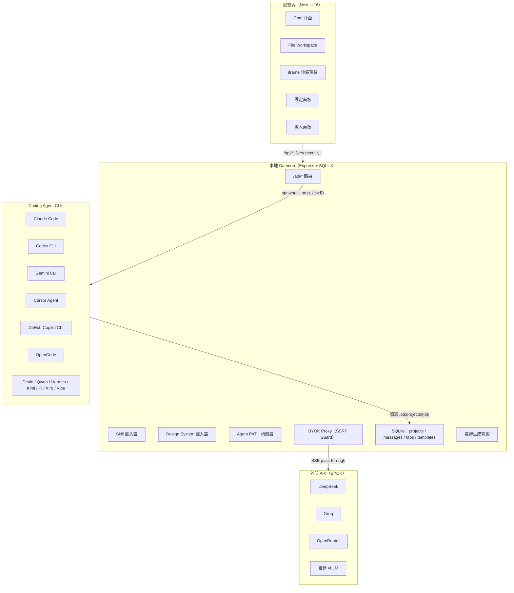
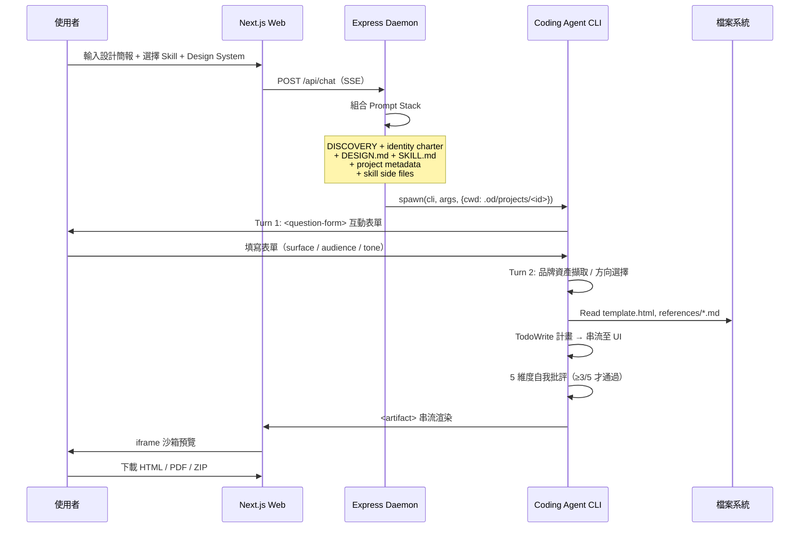
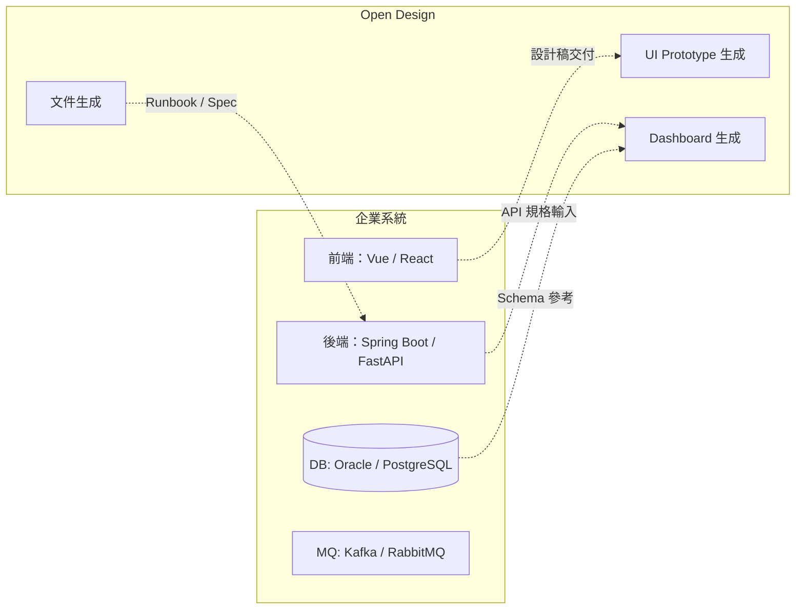
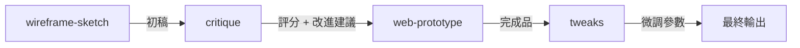
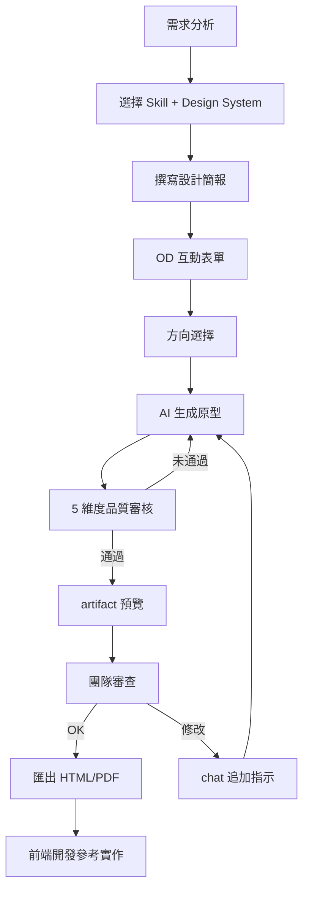
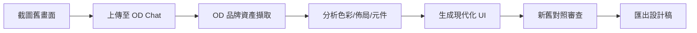
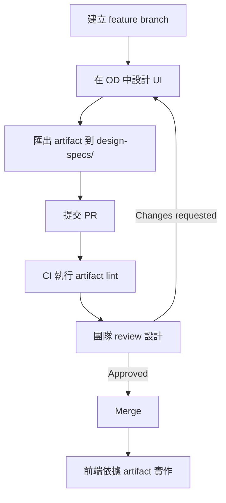
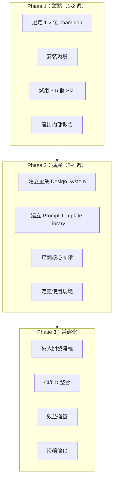
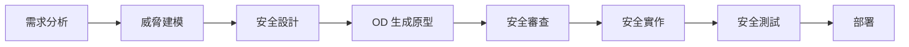
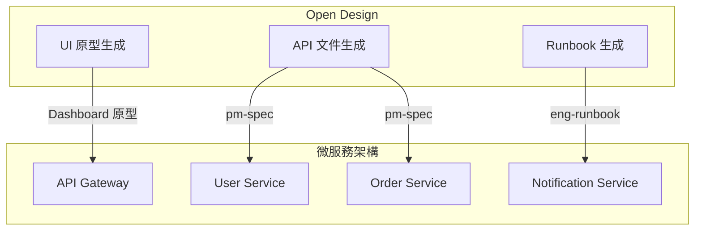

+++
date = '2026-05-03T22:20:09+08:00'
draft = false
title = 'Open Design 教學手冊'
tags = ['教學', 'AI開發']
categories = ['教學']
+++

# Open Design 教學手冊

> **版本**：v0.2.0（對應 Open Design 0.2.0）  
> **最後更新**：2026-05-03  
> **適用對象**：資深工程師、前後端開發人員、UI/UX 設計師、AI 架構師  
> **授權**：Apache-2.0  
> **文件等級**：企業標準技術白皮書

---

## 目錄

- [1. 概述與背景](#1-概述與背景)
  - [1.1 Open Design 是什麼](#11-open-design-是什麼)
  - [1.2 為何需要 Open Design](#12-為何需要-open-design)
  - [1.3 三方產品比較（Claude Design / open-codesign / Open Design）](#13-三方產品比較claude-design--open-codesign--open-design)
  - [1.4 BYOK 設計理念](#14-byok-設計理念)
  - [1.5 適用場景](#15-適用場景)
  - [1.6 開源基石與技術譜系](#16-開源基石與技術譜系)
- [2. 系統整體架構設計](#2-系統整體架構設計)
  - [2.1 高階架構圖](#21-高階架構圖)
  - [2.2 技術組成](#22-技術組成)
  - [2.3 AI Agent 整合架構](#23-ai-agent-整合架構)
  - [2.4 設計生成流程](#24-設計生成流程)
  - [2.5 Prompt Stack 組合機制](#25-prompt-stack-組合機制)
  - [2.6 專案目錄結構](#26-專案目錄結構)
  - [2.7 與企業架構整合](#27-與企業架構整合)
- [3. 安裝與環境建置](#3-安裝與環境建置)
  - [3.1 系統需求](#31-系統需求)
  - [3.2 安裝步驟](#32-安裝步驟)
  - [3.3 首次啟動與驗證](#33-首次啟動與驗證)
  - [3.4 BYOK 設定](#34-byok-設定)
  - [3.5 Desktop 版本安裝（選用）](#35-desktop-版本安裝選用)
  - [3.6 Vercel 部署](#36-vercel-部署)
  - [3.7 多語系與國際化](#37-多語系與國際化)
- [4. 核心機制解析](#4-核心機制解析)
  - [4.1 Skill 驅動架構](#41-skill-驅動架構)
  - [4.2 HTML PPT Studio 技能體系](#42-html-ppt-studio-技能體系)
  - [4.3 Design System 設計系統](#43-design-system-設計系統)
  - [4.4 Visual Directions 視覺方向](#44-visual-directions-視覺方向)
  - [4.5 Anti-AI-Slop 防劣質機制](#45-anti-ai-slop-防劣質機制)
  - [4.6 媒體生成能力（圖片 / 影片 / 音訊）](#46-媒體生成能力圖片--影片--音訊)
  - [4.7 Craft 設計參考系統](#47-craft-設計參考系統)
  - [4.8 使用者儲存模板](#48-使用者儲存模板)
- [5. AI 開發流程（企業級）](#5-ai-開發流程企業級)
  - [5.1 Web Application 開發](#51-web-application-開發)
  - [5.2 舊系統逆向工程](#52-舊系統逆向工程)
  - [5.3 Framework 升級](#53-framework-升級)
  - [5.4 企業文件與報表生成](#54-企業文件與報表生成)
- [6. Prompt Engineering](#6-prompt-engineering)
  - [6.1 Prompt 結構設計原則](#61-prompt-結構設計原則)
  - [6.2 高品質 Prompt 範本](#62-高品質-prompt-範本)
  - [6.3 Prompt 最佳化策略](#63-prompt-最佳化策略)
- [7. 設計品質控管機制](#7-設計品質控管機制)
  - [7.1 五維度自我審核機制](#71-五維度自我審核機制)
  - [7.2 P0 / P1 / P2 Checklist](#72-p0--p1--p2-checklist)
  - [7.3 Artifact Lint API](#73-artifact-lint-api)
  - [7.4 Slop 黑名單](#74-slop-黑名單)
- [8. 輸出與整合](#8-輸出與整合)
  - [8.1 匯出格式](#81-匯出格式)
  - [8.2 CI/CD 整合](#82-cicd-整合)
  - [8.3 Git / PR 開發流程整合](#83-git--pr-開發流程整合)
  - [8.4 Claude Design ZIP 匯入](#84-claude-design-zip-匯入)
- [9. 系統維護與營運](#9-系統維護與營運)
  - [9.1 日誌與監控](#91-日誌與監控)
  - [9.2 錯誤處理](#92-錯誤處理)
  - [9.3 Skill 管理](#93-skill-管理)
  - [9.4 Design System 更新策略](#94-design-system-更新策略)
  - [9.5 資料備份與復原](#95-資料備份與復原)
- [10. 系統升級策略](#10-系統升級策略)
  - [10.1 Open Design 升級流程](#101-open-design-升級流程)
  - [10.2 相容性管理](#102-相容性管理)
  - [10.3 版本控管策略](#103-版本控管策略)
  - [10.4 回滾機制](#104-回滾機制)
- [11. 團隊導入建議](#11-團隊導入建議)
  - [11.1 開發團隊使用方式](#111-開發團隊使用方式)
  - [11.2 設計師協作模式](#112-設計師協作模式)
  - [11.3 AI Agent 分工策略](#113-ai-agent-分工策略)
  - [11.4 SSDLC 整合方式](#114-ssdlc-整合方式)
- [12. 最佳實踐（Best Practices）](#12-最佳實踐best-practices)
- [13. 常見問題與風險](#13-常見問題與風險)
- [14. 與企業架構深度整合](#14-與企業架構深度整合)
  - [14.1 微服務架構整合](#141-微服務架構整合)
  - [14.2 Clean Architecture 對應](#142-clean-architecture-對應)
  - [14.3 前端框架整合（Vue / React）](#143-前端框架整合vue--react)
  - [14.4 後端框架整合（Spring Boot / FastAPI）](#144-後端框架整合spring-boot--fastapi)
- [15. 檢查清單（Checklist）](#15-檢查清單checklist)
- [附錄 A：參考來源與技術譜系](#附錄-a參考來源與技術譜系)
- [附錄 B：Roadmap 發展藍圖](#附錄-broadmap-發展藍圖)

---

## 1. 概述與背景

### 1.1 Open Design 是什麼

Open Design（OD）是由 nexu-io 團隊主導開發的**開源設計生成平台**，定位為 Anthropic Claude Design 的全功能開源替代方案。平台圍繞四項核心設計原則構建：

- **Local-first**：所有專案資料、對話紀錄、SQLite 資料庫均保留於本地 `.od/` 目錄內，完全不依賴外部雲端儲存，隱私與合規可控
- **BYOK（Bring Your Own Key）**：不內建任何 AI 模型或推理引擎。使用者透過已安裝的 Coding Agent CLI，或自行提供 OpenAI 相容 API Key 驅動生成
- **Skill-driven**：採用 Claude Code 的 `SKILL.md` 檔案慣例，每項設計能力以可組合的資料夾形式存在，含模板、參考文件、品質檢查清單
- **Agent-agnostic**：daemon 啟動時自動掃描 `PATH`，支援 13 種主流 Coding Agent CLI 自動偵測與切換，不綁定任何特定廠商

**專案基本資訊**：

| 項目 | 說明 |
|------|------|
| GitHub | https://github.com/nexu-io/open-design |
| 目前版本 | v0.2.0（2026-05-02 發布，9 個 release） |
| 授權 | Apache-2.0 |
| Stars | 18k+ |
| Forks | 2k+ |
| 貢獻者 | 77 人 |
| 語言組成 | TypeScript 57.8% / HTML 28.7% / CSS 6.6% / JavaScript 4.3% / Python 2.5% |
| 多語系文件 | English · Deutsch · 简体中文 · 繁體中文 · 한국어 · 日本語 · العربية |

### 1.2 為何需要 Open Design

Anthropic 的 Claude Design（2026-04-17 發布，基於 Opus 4.7）向業界展示了 LLM 從生成文字轉向生成設計產物（artifact）的全新範式——使用者輸入簡報，AI 直接產出可渲染的 HTML 設計稿。然而此產品存在根本性限制：

1. **封閉原始碼**：無法檢視、修改或自行託管
2. **付費門檻**：需要 Pro / Max / Team 等級訂閱方可使用
3. **廠商鎖定**：僅支援 Anthropic 自家模型，無法接入其他 LLM
4. **無法私有部署**：無法在企業內網、私有雲或 Vercel 部署
5. **技能不可擴充**：內建技能為封閉系統，無法新增自定義技能
6. **設計系統不透明**：無法匯入企業自有品牌規範

Open Design 提出了「相同的設計迴圈品質，零鎖定」的方案。它不重新發明 Agent——最強的 Coding Agent 已在你的筆電上執行——而是將它們接入一套以 Skill 驅動的設計工作流程，在本地執行，可部署 Web 層至 Vercel，並在每一層保持 BYOK。

### 1.3 三方產品比較（Claude Design / open-codesign / Open Design）

目前市場上主要有三個 AI 設計生成產品。以下為系統性比較：

| 維度 | Claude Design | open-codesign | Open Design |
|------|---------------|---------------|-------------|
| 授權 | 封閉 | MIT | Apache-2.0 |
| 形態 | Web（claude.ai） | 桌面應用（Electron） | Web app + 本地 daemon |
| Vercel 部署 | ❌ | ❌ | ✅ |
| Agent 運行時 | 內建（Opus 4.7） | 內建（pi-ai） | 委託使用者現有 CLI（13 種） |
| Skills | 私有 | 12 個 TS 模組 + SKILL.md | 31 個檔案式 SKILL.md 套件 + HTML PPT Studio |
| 設計系統 | 私有 | DESIGN.md（v0.2 roadmap） | 129 個 DESIGN.md 系統（72 核心 + 57 設計技能） |
| Provider 彈性 | 僅 Anthropic | 7+ via pi-ai | 13 種 CLI 適配器 + OpenAI 相容 BYOK proxy |
| 互動表單（Turn 1） | ❌ | ❌ | ✅ 硬性規則 |
| 方向選擇器 | ❌ | ❌ | ✅ 5 種確定性方向 |
| 即時 Todo 進度 + 工具串流 | ❌ | ✅ | ✅（UX 模式源自 open-codesign） |
| 沙箱 iframe 預覽 | ❌ | ✅ | ✅（模式源自 open-codesign） |
| Claude Design ZIP 匯入 | N/A | ❌ | ✅ POST /api/import/claude-design |
| 註解模式精確編輯 | ❌ | ✅ | 🟡 部分實現（預覽元素註解 + 聊天附件） |
| AI 微調面板 | ❌ | ✅ | 🚧 roadmap |
| 檔案系統等級工作區 | ❌ | 部分（Electron 沙箱） | ✅ 真實 cwd、真實工具、持久化 SQLite |
| 5 維度自我批評 | ❌ | ❌ | ✅ 發射前閘門 |
| Artifact Lint API | ❌ | ❌ | ✅ POST /api/artifacts/lint |
| Sidecar IPC + 無頭桌面 | ❌ | ❌ | ✅ 帶時戳的行程 + tools-dev inspect |
| 匯出格式 | 有限 | HTML / PDF / PPTX / ZIP / Markdown | HTML / PDF / PPTX / ZIP / Markdown |
| 媒體生成（圖片/影片/音訊） | ❌ | ❌ | ✅ gpt-image-2 / Seedance / HyperFrames + 音訊 |
| 最低費用 | Pro / Max / Team | BYOK | BYOK — 貼上任何 OpenAI 相容 baseUrl |

### 1.4 BYOK 設計理念

BYOK（Bring Your Own Key）是 Open Design 的核心設計哲學，從根本上實現了「零廠商鎖定」：

```
┌─────────────────────────────────────────┐
│         Open Design (OD)                │
│                                         │
│  不內建 AI 模型                          │
│  不綁定特定廠商                          │
│  不需要 OD 付費帳號                      │
│                                         │
│  使用者提供：                            │
│  ├── 已安裝的 Coding Agent CLI          │
│  │   （claude / codex / gemini ...）    │
│  │   daemon 自動偵測 PATH，無需設定      │
│  └── 或 OpenAI 相容 API Key            │
│       （DeepSeek / Groq / OpenRouter）  │
│       POST /api/proxy/stream            │
│       SSE 串流直通 + SSRF 防護           │
└─────────────────────────────────────────┘
```

**BYOK 的兩條路徑**：

| 路徑 | 機制 | 適用場景 |
|------|------|---------|
| **CLI 路徑**（推薦） | daemon 掃描 PATH，偵測 13 種 CLI，透過 `child_process.spawn` 驅動 | 已安裝任一 Coding Agent 的開發者 |
| **API 路徑** | POST /api/proxy/stream → OpenAI 相容端點 | 無 CLI 環境、輕量需求、成本敏感場景 |

**安全機制**：

- API Key 僅存於本地 `.env` 或瀏覽器 localStorage，不傳送至 OD 伺服器
- BYOK Proxy 內建 SSRF 防護：拒絕 loopback（127.0.0.0/8, ::1）、link-local（169.254.0.0/16）、RFC1918 私有位址
- MiMo 模型自動設定 `tool_choice: 'none'`，因其工具 schema 在自由生成時會異常
- 永遠不要將 `.od/` 目錄提交至版本控制
- 生產環境使用環境變數注入，不硬編碼 Key

### 1.5 適用場景

| 場景 | 說明 | 適用 Skill | 模式 |
|------|------|-----------|------|
| UI Prototype | 快速產出網頁/App 原型 | web-prototype, mobile-app | prototype |
| Dashboard | 管理後台、數據面板 | dashboard | prototype |
| 行銷素材 | 社群貼文、Email、海報 | social-carousel, email-marketing, magazine-poster | prototype |
| 簡報 | 投資簡報、週報 | guizang-ppt, simple-deck, weekly-update | deck |
| HTML PPT | 15 種全主題簡報模板 | html-ppt, html-ppt-pitch-deck, html-ppt-tech-sharing | deck |
| 企業文件 | PM 規格書、OKR、會議記錄 | pm-spec, team-okrs, meeting-notes | prototype |
| 逆向工程 | 舊系統 UI 重建 | web-prototype + 自定義 | prototype |
| Framework 升級 | UI 層面的設計遷移 | critique + web-prototype | prototype |
| 影片製作 | 產品展示、動態圖形 | HyperFrames, Seedance | 媒體 |
| 圖片生成 | 海報、頭像、資訊圖表 | gpt-image-2 | 媒體 |
| 動畫設計 | 精靈動畫、動態 Hero | sprite-animation, motion-frames | prototype |
| 遊戲化應用 | 任務/成就/等級 UI | gamified-app | prototype |

### 1.6 開源基石與技術譜系

Open Design 站在四個開源專案的肩膀上，各自貢獻了不同的核心能力：

| 來源專案 | 貢獻範疇 | 在 OD 中的實現 |
|---------|---------|---------------|
| **alchaincyf/huashu-design** | 設計哲學核心 | Junior-Designer 工作流程、5 步品牌資產協議、anti-AI-slop 檢查清單、5 維度自我批評、「5 學派 × 20 設計哲學」方向選擇器 → 寫入 `discovery.ts` 與 `directions.ts` |
| **op7418/guizang-ppt-skill** | Deck 模式 | 雜誌風格 PPT 技能原封不動整合至 `skills/guizang-ppt/`，保留原始 LICENSE（MIT）；P0/P1/P2 檢查清單文化擴展至所有 Skill |
| **OpenCoworkAI/open-codesign** | UX 北極星 | 串流 artifact 迴圈、沙箱 iframe 預覽（vendored React 18 + Babel）、即時 Agent 面板（todos + 工具呼叫 + 可中斷生成）、五格式匯出、comment-mode 預覽註解 |
| **multica-ai/multica** | Daemon 架構 | PATH 掃描 Agent 偵測、本地 daemon 作為唯一特權行程、Agent-as-teammate 世界觀 |

其他技術來源：

| 來源 | 貢獻 |
|------|------|
| VoltAgent/awesome-design-md | 9 段式 DESIGN.md schema 與 70 個產品系統 |
| bergside/awesome-design-skills | 57 個設計技能直接加入 design-systems/ |
| lewislulu/html-ppt-skill | HTML PPT Studio 完整技能體系（MIT） |
| farion1231/cc-switch | symlink 式 Skill 分發靈感 |
| Claude Code SKILL.md | SKILL.md 檔案慣例原封採用 |

---

## 2. 系統整體架構設計

### 2.1 高階架構圖



### 2.2 技術組成

| 層級 | 技術 | 說明 |
|------|------|------|
| **前端** | Next.js 16 App Router + React 18 + TypeScript | 可部署至 Vercel |
| **Daemon** | Node 24 · Express · SSE streaming · better-sqlite3 | 本地唯一伺服器行程 |
| **Agent 傳輸** | child_process.spawn | 13 種 CLI 適配器 |
| **BYOK 代理** | POST /api/proxy/stream | OpenAI 相容 /v1/chat/completions |
| **儲存** | 檔案系統 + SQLite | `.od/projects/<id>/` + `.od/app.sqlite` |
| **預覽** | 沙箱 iframe（srcdoc） | 每個 `<artifact>` 獨立渲染 |
| **匯出** | HTML / PDF / PPTX / ZIP / Markdown | 多格式輸出 |
| **桌面（選用）** | Electron + sidecar IPC | STATUS / EVAL / SCREENSHOT / CONSOLE / CLICK / SHUTDOWN |

### 2.3 AI Agent 整合架構

Open Design 在 daemon 啟動時掃描 `PATH`，自動偵測已安裝的 Coding Agent CLI：

| Agent | 二進位檔 | 串流格式 | 啟動指令 |
|-------|---------|---------|---------|
| Claude Code | `claude` | claude-stream-json | `claude -p <prompt> --output-format stream-json --verbose --permission-mode bypassPermissions` |
| Codex CLI | `codex` | json-event-stream | `codex exec --json --skip-git-repo-check --full-auto - (stdin)` |
| Devin | `devin` | acp-json-rpc | `devin --permission-mode dangerous acp` |
| Gemini CLI | `gemini` | json-event-stream | `gemini --output-format stream-json --skip-trust --yolo - (stdin)` |
| OpenCode | `opencode` | json-event-stream | `opencode run --format json --dangerously-skip-permissions - (stdin)` |
| Cursor Agent | `cursor-agent` | json-event-stream | `cursor-agent --print --output-format stream-json --force --trust - (stdin)` |
| Qwen Code | `qwen` | plain | `qwen --yolo - (stdin)` |
| Copilot CLI | `copilot` | copilot-stream-json | `copilot -p <prompt> --allow-all-tools --output-format json` |
| Hermes | `hermes` | acp-json-rpc | `hermes acp --accept-hooks` |
| Kimi CLI | `kimi` | acp-json-rpc | `kimi acp` |
| Kiro CLI | `kiro-cli` | acp-json-rpc | `kiro-cli acp` |
| Mistral Vibe | `vibe-acp` | acp-json-rpc | `vibe-acp` |
| Pi | `pi` | pi-rpc (stdio JSON-RPC) | `pi --mode rpc --no-session` |

**新增 CLI 適配器**：只需在 `apps/daemon/src/agents.ts` 中增加一個 `AGENT_DEFS` 條目。

### 2.4 設計生成流程



### 2.5 Prompt Stack 組合機制

Open Design 的核心競爭力在於 **Prompt Stack**——它不是簡單的 "system + user"，而是多層可組合的指令堆疊：

```
DISCOVERY directives     ← Turn-1 表單、Turn-2 品牌分支、TodoWrite、5 維批評
+ identity charter       ← OFFICIAL_DESIGNER_PROMPT、anti-AI-slop、junior-pass
+ active DESIGN.md       ← 129 個系統可選
+ active SKILL.md        ← 31 個技能可選
+ project metadata       ← kind、fidelity、speakerNotes、animations
+ skill side files       ← 自動注入：read assets/template.html + references/*.md
+ DECK_FRAMEWORK_DIRECTIVE  ← （僅 deck 模式：nav / counter / scroll / print）
```

每一層都是可編輯的檔案。閱讀 `apps/web/src/prompts/system.ts` 和 `apps/web/src/prompts/discovery.ts` 查看實際合約。

### 2.6 專案目錄結構

理解 Open Design 的原始碼佈局對企業導入和二次開發至關重要：

```
open-design/
├── README.md                      ← 主文件（含 Deutsch / 简中 / 繁中 / 한국어 / 日本語 / العربية）
├── QUICKSTART.md                  ← 執行 / 建置 / 部署指南
├── CONTRIBUTING.md                ← 貢獻指南（含多語版本）
├── CHANGELOG.md                   ← 版本變更紀錄
├── AGENTS.md                      ← Agent 行為約定
├── CLAUDE.md                      ← Claude Code 整合約定
├── package.json                   ← pnpm workspace 定義
│
├── apps/
│   ├── daemon/                    ← Node + Express，唯一伺服器
│   │   └── src/
│   │       ├── cli.ts             ← `od` CLI 二進位原始碼
│   │       ├── server.ts          ← /api/* 路由（projects, chat, files, exports）
│   │       ├── agents.ts          ← PATH 掃描器 + 每 CLI 的 argv 產生器
│   │       ├── claude-stream.ts   ← Claude Code stdout 串流 JSON 解析器
│   │       ├── skills.ts          ← SKILL.md frontmatter 載入器
│   │       ├── db.ts              ← SQLite schema（projects/messages/templates/tabs）
│   │       └── media-models.ts    ← 媒體生成模型派發器
│   │
│   ├── web/                       ← Next.js 16 App Router + React 客戶端
│   │   └── src/
│   │       ├── App.tsx            ← 路由、引導、設定
│   │       ├── components/        ← chat、composer、picker、preview、sketch 等
│   │       ├── prompts/
│   │       │   ├── system.ts      ← composeSystemPrompt()
│   │       │   ├── discovery.ts   ← Turn-1 表單 + Turn-2 分支 + 5 維批評
│   │       │   └── directions.ts  ← 5 視覺方向 × OKLch 色板 + 字型堆疊
│   │       ├── artifacts/         ← 串流 <artifact> 解析器 + manifest
│   │       ├── media/
│   │       │   └── models.ts      ← 前端媒體模型定義
│   │       ├── runtime/           ← iframe srcdoc、markdown、匯出輔助
│   │       ├── providers/         ← daemon SSE + BYOK API 傳輸層
│   │       └── state/             ← 設定 + 專案（localStorage + daemon 備份）
│   │
│   └── desktop/                   ← Electron 桌面版（選用）
│
├── packages/
│   ├── contracts/                 ← 共用的 web/daemon 應用程式合約
│   ├── sidecar-proto/             ← Open Design sidecar 協議合約
│   ├── sidecar/                   ← 泛用 sidecar 執行時元件
│   └── platform/                  ← 泛用行程/平台元件
│
├── skills/                        ← 31+ SKILL.md 技能套件
│   ├── web-prototype/             ← prototype 模式預設
│   ├── html-ppt/                  ← HTML PPT Studio 主技能（MIT, lewislulu）
│   ├── html-ppt-*/                ← 15 種 PPT 模板包裝
│   ├── guizang-ppt/               ← 雜誌風格 deck（MIT, op7418）
│   └── ...（按場景分組）
│
├── design-systems/                ← 129 個 DESIGN.md 系統
│   ├── default/                   ← Neutral Modern（預設 starter）
│   ├── warm-editorial/            ← Warm Editorial（starter）
│   └── linear-app/ vercel/ stripe/ airbnb/ notion/ ...
│
├── craft/                         ← 品牌無關的設計參考 + Refero 衍生連結
│
├── assets/
│   └── frames/                    ← 共用裝置框架（跨 Skill 使用）
│       ├── iphone-15-pro.html
│       ├── android-pixel.html
│       ├── ipad-pro.html
│       ├── macbook.html
│       └── browser-chrome.html
│
├── templates/
│   ├── deck-framework.html        ← deck 基準（nav / counter / print）
│   └── kami-deck.html             ← kami 風格 deck starter
│
├── prompt-templates/              ← 93 個即用媒體 prompt 模板
│   ├── image/                     ← 43 個 gpt-image-2 模板
│   ├── video/                     ← 39 個 Seedance + 11 個 HyperFrames
│   └── audio/                     ← 音訊模板（開放貢獻）
│
├── scripts/
│   └── sync-design-systems.ts     ← 重新匯入上游 awesome-design-md
│
├── docs/                          ← 規格、架構、Roadmap 等文件
├── e2e/                           ← Playwright UI + Vitest 整合測試
├── tools/                         ← 平台工具（含 cmd.exe 包裝）
│
└── .od/                           ← 執行時資料（gitignored，自動建立）
    ├── app.sqlite                 ← 專案 / 對話 / 訊息 / 分頁 / 模板
    ├── projects/<id>/             ← 每專案工作資料夾（Agent 的 cwd）
    └── artifacts/                 ← 儲存的一次性渲染
```

### 2.7 與企業架構整合



> **實務建議**：Open Design 產出的是設計原型（HTML artifact），不是生產級前端程式碼。企業應將 OD 定位為「設計階段工具」，產出的 artifact 作為前端開發的視覺規格。

---

## 3. 安裝與環境建置

### 3.1 系統需求

| 項目 | 最低需求 | 建議版本 |
|------|---------|---------|
| OS | Windows 10+ / macOS 12+ / Ubuntu 20.04+ | Windows 11 / macOS 14 |
| Node.js | ~24 | Node 24.x（最新 LTS） |
| pnpm | 10.33.x | 10.33.2 |
| Git | 2.30+ | 最新版 |
| 磁碟空間 | 2 GB | 5 GB+ |
| Coding Agent CLI | 至少安裝一種（或使用 BYOK） | Claude Code 推薦 |

### 3.2 安裝步驟

#### Step 1：安裝 Node.js 24

```bash
# 使用 fnm（推薦）
fnm install 24
fnm use 24
node --version  # v24.x.x

# 或使用 nvm
nvm install 24
nvm use 24
```

#### Step 2：啟用 corepack 並安裝 pnpm

```bash
corepack enable
corepack pnpm --version   # 應印出 10.33.2
```

#### Step 3：Clone 專案

```bash
git clone https://github.com/nexu-io/open-design.git
cd open-design
```

#### Step 4：安裝依賴

```bash
pnpm install
```

#### Step 5：啟動開發環境

```bash
pnpm tools-dev run web
# 終端機會印出 web URL，在瀏覽器中開啟
```

#### 常用 Lifecycle 指令

| 指令 | 說明 |
|------|------|
| `pnpm tools-dev run web` | 啟動 daemon + web |
| `pnpm tools-dev start` | 背景啟動 |
| `pnpm tools-dev stop` | 停止所有行程 |
| `pnpm tools-dev status` | 查看行程狀態 |
| `pnpm tools-dev logs` | 查看日誌 |
| `pnpm tools-dev inspect` | 偵錯工具 |
| `pnpm tools-dev check` | 健康檢查 |

#### 自訂埠號

```bash
pnpm tools-dev run web --daemon-port 4000 --web-port 3001
```

#### Namespace 隔離

```bash
pnpm tools-dev run web --namespace beta
# 不同 namespace 使用完全獨立的 .od/ 資料樹
```

### 3.3 首次啟動與驗證

首次載入時，系統會自動執行：

1. **偵測 Agent CLI**：掃描 `PATH`，找到已安裝的 Coding Agent 並自動選擇
2. **載入資源**：31 個 Skills + 129 個 Design Systems
3. **歡迎對話框**：可貼上 API Key（僅 BYOK 路徑需要）
4. **自動建立 `.od/`**：本地運行時資料夾

```
.od/
├── app.sqlite           ← projects / conversations / messages / tabs
├── artifacts/           ← 一次性「Save to disk」渲染（帶時間戳）
└── projects/<id>/       ← 每個專案的工作目錄（也是 agent 的 cwd）
```

**驗證步驟**：

1. 在瀏覽器開啟 web URL
2. 選擇一個 Skill（如 `web-prototype`）
3. 選擇一個 Design System（如 `default`）
4. 輸入簡單的設計簡報（如「一個咖啡店的首頁」）
5. 觀察互動表單出現 → 填寫 → TodoWrite 串流 → artifact 渲染

### 3.4 BYOK 設定

#### 方式一：使用已安裝的 Coding Agent CLI（推薦）

如果你已安裝 Claude Code、Gemini CLI 等，daemon 會自動偵測，無需額外設定。

```bash
# 確認 CLI 已安裝且在 PATH 中
which claude    # macOS/Linux
where claude    # Windows
```

#### 方式二：使用 OpenAI 相容 API

在設定面板中填入：

| 欄位 | 範例值 |
|------|-------|
| Base URL | `https://api.deepseek.com` |
| API Key | `sk-xxx...` |
| Model | `deepseek-chat` |

支援的 Provider：

- Anthropic（透過 OpenAI 相容 shim）
- DeepSeek
- Groq
- MiMo（自動設定 `tool_choice: 'none'`）
- OpenRouter
- 自建 vLLM
- 任何 OpenAI 相容端點

**安全注意事項**：

```
⚠️ BYOK Proxy 內建 SSRF 防護：
   - 拒絕 loopback 位址（127.0.0.0/8, ::1）
   - 拒絕 link-local 位址（169.254.0.0/16）
   - 拒絕 RFC1918 私有位址（10.0.0.0/8, 172.16.0.0/12, 192.168.0.0/16）
   
✅ 企業環境建議：
   - API Key 使用環境變數注入
   - 不要在程式碼中硬編碼 Key
   - 定期輪換 API Key
   - 監控 Token 使用量
```

### 3.5 Desktop 版本安裝（選用）

Open Design 提供選用的 Electron 桌面版本：

- 沙箱化渲染器 + sidecar IPC
- 支援 STATUS / EVAL / SCREENSHOT / CONSOLE / CLICK / SHUTDOWN 通道
- 可用於 E2E 測試自動化

```bash
pnpm tools-dev run desktop
```

### 3.6 Vercel 部署

```bash
# 1. Fork 專案到你的 GitHub
# 2. 在 Vercel 匯入專案
# 3. 設定環境變數（如需要）
# 4. 部署

# 或使用 vercel.json 配置（已內建）
vercel deploy
```

> **注意**：Vercel 部署僅含 Web 層。daemon 需要在本地或獨立伺服器運行。完整的隧道拓撲（Topology B）仍在 roadmap 中。

### 3.7 多語系與國際化

Open Design 自 v0.2.0 起支援完整的多語系介面與文件：

**已支援語系**：

| 語系 | 文件 | UI 介面 |
|------|------|--------|
| English | ✅ README.md, QUICKSTART.md, CONTRIBUTING.md | ✅ |
| Deutsch | ✅ README.de.md, QUICKSTART.de.md, CONTRIBUTING.de.md | ✅ |
| 简体中文 | ✅ README.zh-CN.md, CONTRIBUTING.zh-CN.md | ✅ |
| 繁體中文 | ✅ README.zh-TW.md | ✅ |
| 한국어 | ✅ README.ko.md | ✅ |
| 日本語 | ✅ README.ja-JP.md, QUICKSTART.ja-JP.md, CONTRIBUTING.ja-JP.md | ✅ |
| العربية | ✅（含完整 RTL 佈局支援） | ✅ |

**企業導入建議**：

- 中文環境的 Design System 可在 `DESIGN.md` 的 `## 7. Voice` 段落指定 `Language: 繁體中文`
- Prompt 中明確指定語言可確保 artifact 輸出使用正確語系
- 阿拉伯語支援包含完整的 RTL（Right-to-Left）佈局翻轉

---

## 4. 核心機制解析

### 4.1 Skill 驅動架構

#### Skill 是什麼

Skill 是 Open Design 的核心設計單元，遵循 Claude Code 的 `SKILL.md` 慣例，每個 Skill 是一個資料夾：

```
skills/
└── web-prototype/
    ├── SKILL.md              ← 技能定義 + od: 擴展前綴
    ├── assets/
    │   └── template.html     ← 種子模板
    └── references/
        ├── themes.md         ← 主題參考
        ├── layouts.md        ← 佈局參考
        ├── components.md     ← 元件參考
        └── checklist.md      ← P0/P1/P2 檢查清單
```

#### od: 擴展前綴

Skill 的 YAML frontmatter 包含 OD 專屬的 `od:` 欄位，daemon 會原封不動解析這些欄位（見 `apps/daemon/src/skills.ts`）：

```yaml
---
name: web-prototype
description: Single-page HTML prototype
od:
  mode: prototype          # prototype | deck
  platform: desktop        # desktop | mobile
  scenario: design         # design | marketing | operation | engineering | ...
  preview:
    type: iframe
  design_system:
    requires: true
  default_for: prototype   # 預設 Skill
  featured: true
  fidelity: high
  speaker_notes: false
  animations: true
  example_prompt: "Create a landing page for a SaaS product"
---
```

#### 31 個內建 Skill 分類

**Prototype 模式（27 個）**：

| 分類 | Skills | 說明 |
|------|--------|------|
| 設計 | web-prototype | 單頁 HTML——Landing、行銷、Hero 頁面（prototype 預設） |
| 設計 | mobile-app | iPhone 15 Pro / Pixel 框架行動 App 畫面 |
| 設計 | mobile-onboarding | 多畫面行動 Onboarding 流程（splash · value-prop · sign-in） |
| 設計 | wireframe-sketch | 手繪風格構想草圖——用於「儘早展示可見成果」 |
| 設計 | critique | 5 維度自我批評評分表（Philosophy · Hierarchy · Detail · Function · Innovation） |
| 設計 | tweaks | AI 微調面板——模型浮現值得調整的參數 |
| 設計 | gamified-app | 三框架遊戲化行動 App 原型 |
| 行銷 | saas-landing | Hero / 功能 / 定價 / CTA 行銷佈局 |
| 行銷 | email-marketing | 品牌產品發布 HTML 信件（table-fallback 安全） |
| 行銷 | social-carousel | 3 卡 1080×1080 社群媒體輪播 |
| 行銷 | magazine-poster | 單頁雜誌風格海報 |
| 行銷 | motion-frames | 動態設計 Hero，含迴圈 CSS 動畫 |
| 行銷 | sprite-animation | 像素/8-bit 動畫說明簡報 |
| 行銷 | digital-eguide | 雙頁數位電子指南（封面 + 課程） |
| 行銷 | blog-post | 編輯長文 |
| 營運 | dashboard | 管理/分析面板，含側邊欄 + 密集資料佈局 |
| 營運 | meeting-notes | 會議決議紀錄 |
| 營運 | kanban-board | 看板快照 |
| 工程 | docs-page | 3 欄式文件佈局 |
| 工程 | eng-runbook | 事件維運手冊 |
| 產品 | pm-spec | PM 規格文件，含 TOC + 決策日誌 |
| 產品 | team-okrs | OKR 記分卡 |
| 財務 | finance-report | 高階財務摘要 |
| 財務 | invoice | 單頁發票 |
| 人資 | hr-onboarding | 新人到職計畫 |
| 業務 | pricing-page | 獨立定價 + 比較表 |
| 個人 | dating-web | 消費者交友 Dashboard 原型 |

**Deck 模式（4 個）**：

| Skill | 說明 |
|-------|------|
| guizang-ppt | 雜誌風格 web PPT（deck 預設），源自 op7418/guizang-ppt-skill，MIT 授權 |
| simple-deck | 簡約水平滑動 deck |
| replit-deck | 產品走訪 deck（Replit 風格） |
| weekly-update | 團隊週報 deck（進度 · 阻礙 · 下週） |

#### 自定義 Skill

```bash
# 1. 複製現有 Skill 作為模板
cp -r skills/web-prototype skills/my-custom-skill

# 2. 修改 SKILL.md
# 3. 修改 assets/template.html
# 4. 修改 references/*.md
# 5. 重啟 daemon

pnpm tools-dev stop
pnpm tools-dev run web

# 新 Skill 自動出現在選擇器中
# API：GET /api/skills 查看全部，GET /api/skills/:id/example 查看範例
```

#### Skill Chaining（技能鏈）



**實務範例**：

1. 先用 `wireframe-sketch` 生成草圖，讓使用者確認方向
2. 用 `critique` 對草圖進行 5 維度評分
3. 用 `web-prototype` 生成高保真原型
4. 用 `tweaks` 微調色彩、間距、字型等參數

### 4.2 HTML PPT Studio 技能體系

v0.2.0 整合了來自 lewislulu/html-ppt-skill（MIT 授權）的完整 HTML PPT Studio 技能體系，這是 Open Design 在簡報領域的重大能力擴充：

#### 架構概觀

```
skills/
├── html-ppt/                      ← 主技能（Master Skill）
│   ├── SKILL.md                   ← 核心 Prompt + 全域設計規則
│   ├── LICENSE                    ← MIT（lewislulu）
│   └── references/
│       ├── layouts.md             ← 31 種單頁佈局
│       ├── themes.md              ← 36 種主題
│       ├── animations.md          ← 27 個 CSS 動畫 + 20 個 Canvas FX
│       └── keyboard-runtime.md    ← 鍵盤導航執行時
│
├── html-ppt-pitch-deck/           ← 投資簡報模板
├── html-ppt-tech-sharing/         ← 技術分享模板
├── html-ppt-presenter-mode/       ← 磁性卡片演示模式
├── html-ppt-xhs-post/             ← 小紅書風格貼文
└── ... （共 15 種模板包裝）
```

#### 能力規格

| 維度 | 數量 | 說明 |
|------|------|------|
| 全主題簡報模板 | 15 | pitch-deck、tech-sharing、presenter-mode、xhs-post 等 |
| 佈局 | 31 | 單頁版面：全螢幕 Hero、分割式、網格式、時間軸、比較表等 |
| 主題 | 36 | 深色 / 淺色 / 漸層 / 品牌 / 季節 / 科技等視覺風格 |
| CSS 動畫 | 27 | 進場 / 退場 / 強調 / 過場動畫 |
| Canvas FX | 20 | 粒子、波紋、星空、矩陣雨等背景特效 |
| 鍵盤執行時 | ✅ | 方向鍵切頁、ESC 概覽、F 全螢幕 |
| 磁性卡片演示 | ✅ | 拖曳式卡片互動演示模式 |

#### 與 guizang-ppt 的定位差異

| 維度 | guizang-ppt | html-ppt |
|------|-------------|----------|
| 風格 | 雜誌 / 編輯風格，WebGL Hero | 通用型多模板，CSS/Canvas 特效 |
| 模板數 | 1 | 15 |
| 佈局數 | 4 | 31 |
| 動畫方式 | 純 CSS | CSS + Canvas FX |
| 適用場景 | 高端品牌、投資簡報 | 日常簡報、技術分享、社群貼文 |
| 來源 | op7418/guizang-ppt-skill | lewislulu/html-ppt-skill |
| 授權 | MIT | MIT |

#### 使用範例

```
# 建立技術分享簡報
請使用 html-ppt-tech-sharing 技能，建立一份 Java 21 新特性介紹簡報：

頁面 1 - 封面：標題「Java 21 新特性完全指南」+ 講者名
頁面 2 - 大綱：4 個主題（Virtual Threads / Pattern Matching / Record / Sealed Classes）
頁面 3-6 - 每個主題一頁，含程式碼範例
頁面 7 - 總結 + Q&A

主題：深色科技風格
動畫：代碼區塊打字機效果
```

### 4.3 Design System 設計系統

#### 129 個內建系統

Open Design 內建 129 個品牌級設計系統：

- **2 個手工 Starter**：Neutral Modern（default）、Warm Editorial
- **70 個產品系統**：Linear, Stripe, Vercel, Airbnb, Tesla, Notion, Anthropic, Apple, Cursor, Supabase, Figma, Xiaohongshu 等
- **57 個設計技能**：來自 awesome-design-skills

每個系統是一個 9 段式 `DESIGN.md` 檔案：

```markdown
# Design System: [Brand Name]

## 1. Color
## 2. Typography
## 3. Spacing
## 4. Layout
## 5. Components
## 6. Motion
## 7. Voice
## 8. Brand
## 9. Anti-patterns
```

#### 選擇設計系統的策略

| 場景 | 推薦系統 | 原因 |
|------|---------|------|
| 內部管理後台 | Linear / Notion | 資訊密度高、功能導向 |
| 客戶面向產品 | Stripe / Vercel | 現代、專業、高轉換率 |
| 行動應用 | Apple / Cursor | 行動優先設計語言 |
| 電商平台 | Airbnb | 溫暖、信任感 |
| 資料密集 | Supabase / PostHog | 表格、圖表最佳化 |
| 品牌自定義 | default + 自建 DESIGN.md | 企業自有品牌規範 |

#### 品牌一致性控制

```bash
# 新增企業專屬設計系統
mkdir design-systems/my-company
cat > design-systems/my-company/DESIGN.md << 'EOF'
# Design System: My Company

## 1. Color
- Primary: oklch(0.55 0.15 250)   /* 企業藍 */
- Secondary: oklch(0.65 0.10 150) /* 輔助綠 */
- Neutral-50: oklch(0.97 0 0)
- Neutral-900: oklch(0.15 0 0)

## 2. Typography
- Display: "Noto Sans TC", sans-serif
- Body: "Noto Sans TC", sans-serif
- Mono: "JetBrains Mono", monospace

## 3. Spacing
- Base unit: 4px
- Scale: 4 / 8 / 12 / 16 / 24 / 32 / 48 / 64

## 4. Layout
- Max content width: 1200px
- Grid: 12-column, 24px gutter

## 5. Components
- Border radius: 8px (cards), 4px (inputs)
- Shadows: 0 1px 3px oklch(0 0 0 / 0.1)

## 6. Motion
- Duration: 200ms (micro), 400ms (page)
- Easing: cubic-bezier(0.4, 0, 0.2, 1)

## 7. Voice
- Tone: 專業、簡潔、溫暖
- Language: 繁體中文為主

## 8. Brand
- Logo: 水平版，最小寬度 120px
- Safe area: 1x logo height

## 9. Anti-patterns
- 禁止使用漸層按鈕
- 禁止陰影超過 2 層
- 禁止在深色背景使用純白文字
EOF

# 重啟 daemon 即可在選擇器中看到
pnpm tools-dev stop && pnpm tools-dev run web
```

#### 同步上游設計系統

```bash
# 重新匯入 awesome-design-md 最新版
pnpm tsx scripts/sync-design-systems.ts
```

### 4.4 Visual Directions 視覺方向

當使用者沒有品牌規範時，OD 會在 Turn 2 提供 5 種預設視覺方向：

| 方向 | 風格 | 參考 |
|------|------|------|
| **Editorial — Monocle / FT** | 印刷雜誌、墨色 + 奶油色 + 暖鏽色 | Monocle · FT Weekend · NYT Magazine |
| **Modern Minimal — Linear / Vercel** | 冷色調、結構化、極簡重點色 | Linear · Vercel · Stripe |
| **Tech Utility** | 資訊密度高、等寬字型、終端機風格 | Bloomberg · Bauhaus 工具 |
| **Brutalist** | 粗獷、超大字型、無陰影、強烈重點色 | Bloomberg Businessweek · Achtung |
| **Soft Warm** | 慷慨、低對比、桃色中性色 | Notion 行銷 · Apple Health |

每個方向都是確定性規格——OKLch 色板 + 字型堆疊 + 佈局姿態，一鍵選擇即綁定，無 AI 即興發揮。

### 4.5 Anti-AI-Slop 防劣質機制

Open Design 移植了 huashu-design 的完整防劣質策略：

#### 機制一覽

| 機制 | 說明 |
|------|------|
| **Question Form First** | Turn 1 只發 `<question-form>`，不思考、不調用工具、不敘述 |
| **Brand-spec Extraction** | 5 步驟品牌資產擷取（locate → download → grep hex → codify brand-spec.md → vocalise） |
| **Five-dim Critique** | 發射前靜默評分 1-5：Philosophy / Hierarchy / Execution / Specificity / Restraint |
| **P0/P1/P2 Checklist** | 每個 Skill 自帶 `references/checklist.md`，P0 為硬性閘門 |
| **Slop Blacklist** | 明確禁止：紫色漸層、通用 emoji 圖示、左邊框卡片、手繪 SVG 人物、Inter 作為展示字型、虛構數據 |
| **Honest Placeholders** | 沒有真實數據時寫 `—` 或灰色區塊，不寫 "10× faster" |

### 4.6 媒體生成能力

Open Design 不僅生成程式碼/設計，也支援圖片、影片和音訊生成：

#### 圖片生成

| 模型 | 供應商 | 用途 |
|------|--------|------|
| gpt-image-2 | Azure / OpenAI | 海報、頭像、資訊圖表、插畫地圖 |

43 個即用 prompt 模板位於 `prompt-templates/image/`。

#### 影片生成

| 模型 | 供應商 | 能力 |
|------|--------|------|
| Seedance 2.0 | ByteDance（Fal） | 15秒電影級 text-to-video / image-to-video |
| Kling 2.0 / 1.6 / 1.5 | 快手（Fal） | 短影片生成，多解析度 |
| Veo 3 / Veo 2 | Google（Fal） | 高品質 text-to-video |
| Sora 2 / Sora 2 Pro | OpenAI（Fal） | 精準的 text-to-video |
| MiniMax video-01 | MiniMax | 快速影片生成 |
| HyperFrames | HeyGen（OSS） | HTML→MP4 動態圖形轉換 |

39 個 Seedance prompt 模板 + 11 個 HyperFrames 模板位於 `prompt-templates/video/`。

#### 音訊生成

| 模型 | 供應商 | 類型 |
|------|--------|------|
| Suno v5 / v4.5 | Suno | 音樂生成（歌曲、背景音樂） |
| Udio v2 | Udio | 音樂生成（高品質音軌） |
| Lyria 2 | Google DeepMind | 音樂生成 |
| gpt-4o-mini-tts | OpenAI | 語音合成（TTS） |
| MiniMax TTS | MiniMax | 語音合成 |

音訊模板目錄 `prompt-templates/audio/` 已建立，歡迎社群貢獻。

#### 媒體模型支援架構

```
apps/daemon/src/media-models.ts     ← 模型派發器
apps/web/src/media/models.ts        ← 前端模型定義
prompt-templates/
├── image/                          ← 43 個 gpt-image-2 模板
├── video/                          ← 39 Seedance + 11 HyperFrames
└── audio/                          ← 開放貢獻中
```

> **BYOK 注意**：媒體模型需要各自的 API Key。圖片使用 OpenAI / Azure 金鑰；影片和音訊多數透過 [Fal.ai](https://fal.ai) 統一代理，僅需設定 `FAL_KEY`。

### 4.7 Craft 設計參考系統

`craft/` 目錄包含品牌無關的設計參考素材，源自 Refero 等設計靈感庫的衍生連結：

```
craft/
├── README.md                       ← 使用說明
├── landing-pages/                  ← Landing Page 參考
├── dashboards/                     ← Dashboard 佈局參考
├── mobile/                         ← 行動端參考
└── ...                             ← 按場景持續擴充
```

**用途**：

- Agent 在 Turn-1 Discovery 階段可引用 `craft/` 中的連結作為視覺參考
- Skill 的 `references/` 目錄可透過相對路徑引用 `craft/` 的素材
- 企業可在此目錄加入自有品牌的設計參考

### 4.8 使用者儲存模板

v0.2.0 新增使用者自訂模板功能，允許將成功的設計存為可重複使用的模板：

#### API 端點

```
POST   /api/templates          ← 儲存新模板
GET    /api/templates          ← 列出所有模板
GET    /api/templates/:id      ← 取得單一模板
DELETE /api/templates/:id      ← 刪除模板
```

#### 儲存機制

模板資料存在 daemon 的 SQLite 資料庫（`.od/app.sqlite`）：

```sql
CREATE TABLE templates (
  id TEXT PRIMARY KEY,
  name TEXT NOT NULL,
  description TEXT,
  skill TEXT,                -- 使用的 Skill 名稱
  design_system TEXT,        -- 使用的 Design System
  html TEXT,                 -- 完整 HTML 內容
  thumbnail TEXT,            -- Base64 縮圖
  created_at TEXT DEFAULT (datetime('now')),
  updated_at TEXT DEFAULT (datetime('now'))
);
```

#### 使用流程

1. 在 Chat 中完成設計 → 預覽滿意
2. 點擊「Save as Template」按鈕
3. 填入模板名稱和描述
4. 模板出現在 Picker 面板中
5. 下次新專案可直接從模板啟動

---

## 5. AI 開發流程（企業級）

### 5.1 Web Application 開發



#### 實際操作步驟

**Step 1：選擇適當的 Skill**

| 產出物 | Skill | Design System 建議 |
|--------|-------|-------------------|
| 產品首頁 | web-prototype | Stripe / Vercel |
| SaaS Landing | saas-landing | Linear |
| 管理後台 | dashboard | Notion / Supabase |
| 行動 App | mobile-app | Apple / Cursor |
| Onboarding 流程 | mobile-onboarding | 自定義 |

**Step 2：撰寫高品質設計簡報**

```
為我們的企業內部人事管理系統設計一個 Dashboard。

系統背景：
- 使用者：HR 部門，約 50 人
- 功能：員工管理、請假審核、薪資查詢
- 資料量：約 5000 名員工

設計需求：
- 左側導航列
- 頂部搜尋列 + 通知
- 主區域顯示 KPI 卡片（在職人數、本月新進、離職率、平均年資）
- 下方顯示請假審核待辦清單
- 右側顯示快速操作面板
```

**Step 3：互動表單填寫**

OD 會自動彈出表單，詢問：
- Surface type: Desktop
- Target audience: HR 專員
- Visual tone: Professional / Clean
- Brand context: 企業內部系統
- Scale: Medium complexity

**Step 4：審查與迭代**

```
# 追加修改指示
- 請將 KPI 卡片改為 2x2 格局
- 顏色調整為企業藍（#1B4F72）
- 新增「本月壽星」小元件到右側面板
```

### 5.2 舊系統逆向工程

#### 流程



#### 實際操作

**輸入**：

```
這是我們 10 年前的員工管理系統截圖。
請分析此畫面的：
1. 資訊架構（IA）
2. 資料欄位
3. 操作流程

然後使用 dashboard skill + Linear design system，
重新設計一個現代化的版本，保留所有功能但改善 UX。

約束條件：
- 必須保留所有現有欄位
- 操作流程不可增加步驟
- 支援繁體中文
```

**輸出**：
- 現代化 UI 原型（HTML artifact）
- 資訊架構分析
- 新舊功能對照表

### 5.3 Framework 升級

#### 場景：jQuery → Vue / React

```
我們正在將一個基於 jQuery + Bootstrap 3 的管理後台
升級為 Vue 3 + Element Plus。

請根據以下舊畫面截圖，使用 dashboard skill，
設計新版本的 UI，需要：

1. 保留現有功能佈局
2. 使用 Element Plus 的設計語言
3. 響應式設計
4. 暗色模式支援
5. 產出元件拆分建議
```

#### 場景：舊版 Spring MVC 畫面 → 新版 SPA

```
這是我們 Spring MVC + JSP 的訂單管理頁面。
請分析畫面元素，並使用 web-prototype skill，
重新設計為現代 SPA 風格：

- 左側：訂單篩選器
- 中間：訂單清單（可排序/篩選）
- 右側：訂單詳情面板
- 底部：分頁控制
```

### 5.4 企業文件與報表生成

| 場景 | Skill | 範例 Prompt |
|------|-------|------------|
| PM 規格書 | pm-spec | 「為我們的線上銀行轉帳功能撰寫 PM 規格書」 |
| OKR 記分卡 | team-okrs | 「為 Q3 研發團隊建立 OKR 記分卡，3 個 Objective」 |
| 會議記錄 | meeting-notes | 「整理今天的架構審查會議決議」 |
| 維運手冊 | eng-runbook | 「為 API Gateway 故障撰寫 incident runbook」 |
| 財務報告 | finance-report | 「Q2 營收摘要報告，含 YoY 比較」 |
| 發票 | invoice | 「為客戶 A 產生本月顧問服務發票」 |

---

## 6. Prompt Engineering

### 6.1 Prompt 結構設計原則

Open Design 的 Prompt 設計遵循以下原則：

1. **具體優於抽象**：描述具體的使用者、場景、數據
2. **約束優於自由**：明確列出限制條件，減少 AI 即興
3. **結構優於散文**：使用列表、表格、分區
4. **品牌優於預設**：附上品牌規範或選擇 Design System
5. **迭代優於一次**：先粗後細，分步精修

### 6.2 高品質 Prompt 範本

#### 範本 1：企業 Dashboard

```
設計一個企業級 IT 資產管理 Dashboard。

使用者角色：IT 管理員
使用頻率：每日
關鍵指標：
- 設備總數 / 在用 / 閒置 / 報修
- 軟體授權使用率
- 本月資安事件數
- 設備到期預警（30/60/90天）

佈局要求：
- 頂部：全域搜尋 + 通知鈴 + 使用者頭像
- 左側：收合式導航（Dashboard / 設備 / 軟體 / 報表 / 設定）
- 主區域上方：4 個 KPI 卡片
- 主區域中間：設備狀態折線圖（近 12 個月）
- 主區域下方：待處理事項表格

色彩偏好：藍灰色系，專業穩重
字型：Noto Sans TC
語言：繁體中文
```

#### 範本 2：行動 App Onboarding

```
設計一個銀行行動 App 的 Onboarding 流程，共 4 個畫面：

畫面 1 - Splash：
- 銀行 Logo + Tagline
- 「開始體驗」按鈕

畫面 2 - 功能介紹：
- 圖示 + 標題 + 說明
- 功能：轉帳、繳費、投資

畫面 3 - 安全承諾：
- 生物辨識圖示
- 端對端加密說明
- 金管會核准字樣

畫面 4 - 登入/註冊：
- 手機號碼輸入
- OTP 驗證按鈕
- 隱私政策連結

裝置：iPhone 15 Pro
風格：Modern Minimal
語言：繁體中文
```

#### 範本 3：SaaS Landing Page

```
為一個 AI 程式碼審查工具設計 Landing Page。

產品名稱：CodeGuard AI
Tagline：「讓每一行程式碼都經得起考驗」

頁面區塊：
1. Hero：大標題 + 副標題 + CTA「免費試用」+ 產品截圖
2. 痛點：3 欄式，開發者常見困擾
3. 功能：4 個核心功能卡片（自動審查、安全掃描、效能建議、CI/CD 整合）
4. 數據：「已審查 1000 萬行程式碼」等社會證明
5. 定價：Free / Pro / Enterprise 三欄
6. 客戶評價：3 則推薦
7. CTA：重複呼籲行動
8. Footer：連結、社群、法律

Design System：Vercel
動態效果：微妙的滾動進場動畫
```

#### 範本 4：週報簡報

```
為研發團隊產生本週工作週報簡報（deck 模式）。

日期：2026-W18（5/4 - 5/8）

頁面 1 - 封面：團隊名稱 + 週次

頁面 2 - 本週亮點：
- 完成 API Gateway v2 上線
- 修復 12 個 P1 bugs
- 新增 3 位團隊成員

頁面 3 - 進度追蹤：
- Sprint Burndown（剩餘 15 story points）
- 完成率 78%

頁面 4 - 阻礙與風險：
- DB 連線池不足
- 第三方 API 不穩定

頁面 5 - 下週計畫：
- 壓測目標 1000 TPS
- 開始 SSO 整合

風格：簡潔專業
```

#### 範本 5：逆向工程 — 舊系統重設計

```
[附上舊系統截圖]

這是我們 2012 年開發的客戶關係管理系統（CRM）。
技術棧：Struts 2 + JSP + Oracle

請分析此畫面並重新設計：

保留功能：
- 客戶搜尋（姓名/統編/電話）
- 客戶清單（表格，含分頁）
- 客戶詳情（側邊面板）
- 新增/編輯客戶表單

改善方向：
- 現代化視覺風格
- 響應式佈局
- 搜尋改為即時篩選
- 表格支援排序、固定表頭
- 表單改為分步驟

Design System: Linear
```

### 6.3 Prompt 最佳化策略

| 策略 | 說明 | 範例 |
|------|------|------|
| **附上截圖** | 讓 OD 執行品牌資產擷取 | 上傳現有系統截圖 |
| **指定 Design System** | 避免 AI 自由發揮 | `Design System: Stripe` |
| **列出反模式** | 明確禁止不要的元素 | 「不要使用漸層按鈕」 |
| **提供真實數據** | 讓原型更貼近真實 | 列出實際 KPI 名稱 |
| **分段生成** | 先 wireframe 再 high-fidelity | 先用 wireframe-sketch，再用 web-prototype |

---

## 7. 設計品質控管機制

### 7.1 五維度自我審核機制

在 Agent 發射 `<artifact>` 之前，會靜默進行 5 維度自我評分（1-5 分）：

| 維度 | 英文 | 評分標準 |
|------|------|---------|
| **哲學** | Philosophy | 設計是否傳達正確的價值觀和情感？ |
| **層次** | Hierarchy | 視覺層次是否清晰？使用者能否快速找到重點？ |
| **執行** | Execution | 技術實作是否精確？像素對齊？間距一致？ |
| **具體性** | Specificity | 設計是否針對此特定場景量身打造？還是通用模板？ |
| **克制** | Restraint | 是否過度設計？是否添加不必要的裝飾？ |

**規則**：任何維度低於 3/5 為回歸，必須修復後重新評分。通常需要兩次通過。

### 7.2 P0 / P1 / P2 Checklist

每個 Skill 在 `references/checklist.md` 中定義檢查清單：

| 等級 | 說明 | 範例 |
|------|------|------|
| **P0（阻斷）** | 必須通過才能發射 | 色彩對比 ≥ 4.5:1、文字可讀、核心功能可見 |
| **P1（重要）** | 強烈建議修復 | 間距一致、圖示尺寸統一、響應式斷點 |
| **P2（建議）** | 錦上添花 | 動畫流暢、暗色模式支援、微互動 |

### 7.3 Artifact Lint API

```
POST /api/artifacts/lint
Content-Type: application/json

{
  "html": "<artifact>...</artifact>",
  "skillId": "web-prototype",
  "designSystemId": "linear-app"
}

Response:
{
  "findings": [
    {
      "level": "error",
      "message": "Broken <artifact> framing",
      "line": 1
    },
    {
      "level": "warning",
      "message": "Stale palette token: --color-primary not in DESIGN.md",
      "line": 45
    }
  ]
}
```

5 維度自我批評使用此 API 的結果來錨定評分，基於真實證據而非感覺。

### 7.4 Slop 黑名單

以下設計元素在 Prompt Stack 中被**明確禁止**：

```
❌ 侵略性紫色漸層
❌ 通用 emoji 圖示作為功能圖示
❌ 左邊框彩色卡片（通用感太重）
❌ 手繪 SVG 人物插圖
❌ Inter 字型作為展示字型（太普通）
❌ 虛構的統計數據（「10× faster」）
❌ 無意義的裝飾性漸層
```

**正確做法**：
- 沒有真實數據時，使用 `—` 或標記灰色區塊
- 使用 Design System 指定的字型，不自行選擇
- 圖示使用 SVG icon set，不用 emoji

---

## 8. 輸出與整合

### 8.1 匯出格式

| 格式 | 說明 | 適用場景 |
|------|------|---------|
| **HTML** | 內聯資源，單一檔案 | 快速預覽、分享 |
| **PDF** | 瀏覽器列印，deck 感知 | 正式文件、交付 |
| **PPTX** | Agent 驅動生成 | 簡報、會議 |
| **ZIP** | archiver 打包 | 專案交付 |
| **Markdown** | 文字版本 | 文件系統 |

### 8.2 CI/CD 整合

```yaml
# .github/workflows/design-review.yml
name: Design Review
on:
  pull_request:
    paths:
      - 'design-specs/**'

jobs:
  lint-artifacts:
    runs-on: ubuntu-latest
    steps:
      - uses: actions/checkout@v4
      - uses: actions/setup-node@v4
        with:
          node-version: '24'
      - run: corepack enable && pnpm install
      - run: |
          # 對所有 artifact 執行 lint
          for f in design-specs/*.html; do
            curl -X POST http://localhost:3457/api/artifacts/lint \
              -H "Content-Type: application/json" \
              -d "{\"html\": \"$(cat $f)\"}"
          done
```

### 8.3 Git / PR 開發流程整合



### 8.4 Claude Design ZIP 匯入

如果團隊之前使用 Claude Design，可以無縫遷移：

```
1. 從 claude.ai 匯出設計 ZIP
2. 在 OD 歡迎對話框拖放 ZIP 檔案
3. POST /api/import/claude-design 自動解析
4. 自動建立 .od/projects/<id>/
5. 開啟入口檔案為分頁
6. 準備好 continue-where-Anthropic-left-off prompt
```

---

## 9. 系統維護與營運

### 9.1 日誌與監控

```bash
# 查看 daemon 日誌
pnpm tools-dev logs

# 查看行程狀態
pnpm tools-dev status

# 健康檢查
pnpm tools-dev check

# 檢查已偵測的 Agent
curl http://localhost:3457/api/agents

# 檢查已載入的 Skills
curl http://localhost:3457/api/skills

# 檢查已載入的 Design Systems
curl http://localhost:3457/api/design-systems
```

#### 建議監控項目

| 項目 | 方式 | 告警閾值 |
|------|------|---------|
| Daemon 行程存活 | `pnpm tools-dev status` | 行程不存在 |
| SQLite 檔案大小 | `ls -la .od/app.sqlite` | > 500MB |
| 磁碟空間 | `df -h` | < 10% 可用 |
| Agent CLI 可用性 | `GET /api/agents` | 0 個可用 Agent |
| API 回應時間 | 自訂 middleware | > 5s |

### 9.2 錯誤處理

| 問題 | 原因 | 解決方案 |
|------|------|---------|
| Agent 無法連線 | CLI 不在 PATH 中 | 確認 `which claude` 或重新安裝 |
| BYOK 連線失敗 | API Key 無效或過期 | 重新設定 API Key |
| artifact 無法渲染 | HTML 格式錯誤 | 使用 Artifact Lint API 檢查 |
| SQLite 鎖定 | 多行程競爭 | 使用 `--namespace` 隔離 |
| Windows 路徑過長 | ENAMETOOLONG | OD 自動改用 stdin 傳遞 prompt |

### 9.3 Skill 管理

```bash
# 列出所有 Skills
curl http://localhost:3457/api/skills | jq '.[] | .id'

# 查看特定 Skill 的範例
curl http://localhost:3457/api/skills/web-prototype/example

# 新增 Skill：放入資料夾 → 重啟 daemon
cp -r skills/web-prototype skills/my-new-skill
# 編輯 SKILL.md...
pnpm tools-dev stop && pnpm tools-dev run web

# 未來：Skill 市場（roadmap）
# od skills install <github-repo>
# od skill add | list | remove | test
```

### 9.4 Design System 更新策略

```bash
# 同步上游設計系統
pnpm tsx scripts/sync-design-systems.ts

# 手動更新特定系統
# 編輯 design-systems/<brand>/DESIGN.md
# 重啟 daemon

# 版本管理建議：
# - 將自定義 Design System 加入版本控制
# - 上游系統用 sync 腳本管理
# - 記錄每次更新的變更
```

### 9.5 資料備份與復原

```bash
# 備份
cp .od/app.sqlite .od/app.sqlite.bak
cp -r .od/projects .od/projects.bak

# 完全重置
pnpm tools-dev stop
rm -rf .od
pnpm tools-dev run web
# daemon 會自動重建所有必要結構

# 環境隔離
OD_DATA_DIR=/path/to/isolated pnpm tools-dev run web
```

---

## 10. 系統升級策略

### 10.1 Open Design 升級流程

```bash
# Step 1：備份現有資料
cp -r .od .od.backup.$(date +%Y%m%d)

# Step 2：拉取最新版本
git fetch origin
git log --oneline origin/main..HEAD  # 檢查差異

# Step 3：停止服務
pnpm tools-dev stop

# Step 4：合併更新
git pull origin main

# Step 5：更新依賴
pnpm install

# Step 6：啟動新版本
pnpm tools-dev run web

# Step 7：驗證
pnpm tools-dev check
curl http://localhost:3457/api/agents
curl http://localhost:3457/api/skills
```

### 10.2 相容性管理

| 元件 | 相容性考量 |
|------|-----------|
| Skills | SKILL.md 格式向後相容；新增 `od:` 欄位不影響舊 Skill |
| Design Systems | DESIGN.md 9 段式 schema 穩定 |
| SQLite Schema | daemon 啟動時自動遷移 |
| Node.js | 綁定 ~24，小版本升級安全 |
| pnpm | 綁定 10.33.x，由 corepack 管理 |

### 10.3 版本控管策略

```
建議的 Git 策略：

main ─────────────────────── 穩定版本
  │
  ├── feature/custom-skill ── 自定義 Skill 開發
  │
  ├── feature/design-system ─ 企業 Design System
  │
  └── upstream/main ────────── 追蹤上游更新

操作流程：
1. Fork 官方 repo
2. 在 fork 中新增自定義內容
3. 定期 rebase 上游更新
4. 衝突集中在 skills/ 和 design-systems/
```

### 10.4 回滾機制

```bash
# 快速回滾到上一個版本
git log --oneline -5
git checkout <previous-commit>
pnpm install
pnpm tools-dev run web

# 資料回滾
pnpm tools-dev stop
rm -rf .od
mv .od.backup.20260503 .od
pnpm tools-dev run web
```

---

## 11. 團隊導入建議

### 11.1 開發團隊使用方式



#### 日常開發流程

```
1. 需求確認 → PM 撰寫需求規格
2. 設計階段 → 使用 OD 生成 UI 原型
   - 選擇適當 Skill + Design System
   - 填寫互動表單
   - 審查 artifact
3. 開發階段 → 前端依據 artifact 實作
   - 匯出 HTML 作為視覺規格
   - 擷取色彩、間距、字型等 token
4. 審查階段 → 比對實作與設計稿
5. 交付
```

### 11.2 設計師協作模式

| 角色 | 使用方式 |
|------|---------|
| UI 設計師 | 使用 OD 快速生成初稿 → Figma 精修 |
| UX 設計師 | 使用 wireframe-sketch 討論資訊架構 |
| 品牌設計師 | 維護企業 DESIGN.md |
| 前端工程師 | 參考 artifact 的 CSS token 實作 |

### 11.3 AI Agent 分工策略

| Agent | 角色 | 適用場景 |
|-------|------|---------|
| Claude Code | 主力設計 Agent | 複雜 UI、高品質原型 |
| Gemini CLI | 長上下文分析 | 舊系統截圖分析 |
| Copilot CLI | 程式碼生成 | 元件程式碼產出 |
| Codex CLI | 批次處理 | 批量生成多個頁面 |

### 11.4 SSDLC 整合方式



**安全設計階段使用 OD**：

1. 使用 `dashboard` Skill 設計安全監控面板
2. 使用 `eng-runbook` 生成安全維運手冊
3. 使用自定義 Skill 生成權限管理 UI
4. 所有 artifact 經過 Artifact Lint API 檢查

---

## 12. 最佳實踐（Best Practices）

| # | 類別 | 實踐 |
|---|------|------|
| 1 | Prompt | 每個設計簡報包含明確的使用者角色、場景、約束條件 |
| 2 | Prompt | 附上品牌規範截圖或指定 Design System，避免 AI 自由發揮 |
| 3 | Prompt | 先用 `wireframe-sketch` 確認方向，再用 high-fidelity Skill |
| 4 | 架構 | 建立企業專屬 DESIGN.md，確保所有專案視覺一致 |
| 5 | 架構 | 使用 `--namespace` 隔離不同專案/環境的資料 |
| 6 | AI 協作 | 善用互動表單，不要跳過 Turn 1 的探索流程 |
| 7 | AI 協作 | 不同複雜度選擇不同 Agent（簡單用 BYOK，複雜用 Claude Code） |
| 8 | 安全 | API Key 不提交版本控制，使用環境變數管理 |
| 9 | 安全 | 定期輪換 API Key，監控 Token 使用量 |
| 10 | 安全 | 生產環境不部署 BYOK Proxy 到公網 |
| 11 | 品質 | 每次生成後檢查 5 維度評分，低於 3 分立即重做 |
| 12 | 品質 | 為自定義 Skill 撰寫 `references/checklist.md` |
| 13 | 維運 | 定期備份 `.od/app.sqlite` |
| 14 | 維運 | 使用 `pnpm tools-dev check` 定期健康檢查 |
| 15 | 團隊 | 建立 Prompt Template Library 供團隊共用 |

---

## 13. 常見問題與風險

### FAQ

| # | 問題 | 解答 |
|---|------|------|
| 1 | Agent CLI 無法偵測？ | 確認 CLI 在 `PATH` 中：`which claude`（macOS/Linux）或 `where claude`（Windows） |
| 2 | BYOK API Key 無效？ | 檢查 Key 格式、餘額、是否支援 `/v1/chat/completions` |
| 3 | artifact 渲染空白？ | 檢查瀏覽器 console 錯誤，確認 `<artifact>` 格式正確 |
| 4 | 生成的設計太通用？ | 指定 Design System、附上品牌規範截圖、列出反模式 |
| 5 | Windows 路徑過長錯誤？ | OD 已內建 ENAMETOOLONG fallback（stdin / prompt-file），升級至最新版 |
| 6 | 如何重置環境？ | `pnpm tools-dev stop && rm -rf .od && pnpm tools-dev run web` |
| 7 | 能否多人同時使用？ | 每個使用者需要自己的 OD 實例；使用 `--namespace` 隔離 |
| 8 | 匯入 Claude Design ZIP 失敗？ | 確認 ZIP 是從 claude.ai 直接匯出的格式 |
| 9 | 如何降低 API 成本？ | 使用 DeepSeek 等低成本模型作為 BYOK Provider |
| 10 | 生成速度慢？ | 使用本地模型（LM Studio）或更快的 Agent CLI |

### 風險管理

| 風險 | 影響 | 緩解措施 |
|------|------|---------|
| **AI Hallucination** | 設計中出現虛構數據 | 啟用 honest-placeholder 規則；review artifact |
| **設計不一致** | 不同人產出的設計風格不同 | 統一 Design System；建立 Prompt Template |
| **成本失控** | API 呼叫費用過高 | 監控 Token 用量；使用低成本模型；設定預算上限 |
| **API Key 洩漏** | 未授權使用 | 環境變數管理；定期輪換；不提交版控 |
| **品牌侵權** | 使用他人品牌 Design System 發布 | 自定義系統僅供內部使用；遵循 DESIGN.md 授權 |
| **過度依賴** | 團隊喪失手動設計能力 | OD 定位為輔助工具，非替代工具 |

---

## 14. 與企業架構深度整合

### 14.1 微服務架構整合



**使用場景**：

1. **API Gateway 管理面板**：使用 `dashboard` Skill 設計流量監控 Dashboard
2. **服務狀態頁**：使用 `web-prototype` 設計 Status Page
3. **微服務文件**：使用 `pm-spec` 為每個服務生成規格文件
4. **維運手冊**：使用 `eng-runbook` 為關鍵服務生成 Incident Runbook

### 14.2 Clean Architecture 對應

```
Clean Architecture              Open Design 產出
────────────────                ──────────────
Entities                        → pm-spec（Domain 規格）
Use Cases                       → pm-spec（Use Case 文件）
Interface Adapters              → dashboard / web-prototype（UI 層設計）
Frameworks & Drivers            → eng-runbook（部署/維運）
```

### 14.3 前端框架整合（Vue / React）

#### Vue 3 + Element Plus

```
Prompt 範例：

設計一個員工管理系統的列表頁面。
請使用以下 Element Plus 元件：
- el-table（表格）
- el-pagination（分頁）
- el-input（搜尋框）
- el-button（操作按鈕）
- el-dialog（彈窗）

佈局參考 Element Plus 的 Admin 風格。
色彩使用 Element Plus 預設色系。

產出的 artifact 將作為前端 Vue 元件的視覺規格。
```

#### React + Ant Design

```
Prompt 範例：

設計一個數據分析 Dashboard。
請使用以下 Ant Design 元件風格：
- Card（指標卡片）
- Table（數據表格）
- Chart（圖表，ECharts 風格）
- Breadcrumb（麵包屑）
- Menu（側邊選單）

Design System: 使用 Ant Design 的色彩體系
（主色 #1677ff，成功 #52c41a，警告 #faad14，錯誤 #ff4d4f）
```

### 14.4 後端框架整合（Spring Boot / FastAPI）

#### Spring Boot API 文件生成

```
Prompt 範例（使用 pm-spec Skill）：

為以下 Spring Boot REST API 生成 PM 規格文件：

Service: Employee Management API
Base Path: /api/v1/employees

Endpoints:
- GET    /           → 查詢員工列表（支援分頁、篩選）
- GET    /{id}       → 查詢單一員工
- POST   /           → 新增員工
- PUT    /{id}       → 更新員工資料
- DELETE /{id}       → 刪除員工（軟刪除）
- GET    /{id}/leave  → 查詢請假記錄

安全性：
- JWT Bearer Token 認證
- RBAC 權限控管（ADMIN / HR / VIEWER）

請包含：
- 每個 endpoint 的 request/response 範例
- 錯誤碼定義
- 分頁格式定義
```

#### FastAPI 服務 Dashboard

```
Prompt 範例（使用 dashboard Skill）：

設計一個 FastAPI 微服務監控 Dashboard。

監控指標：
- 請求數/秒（QPS）
- 平均回應時間（ms）
- 錯誤率（%）
- 活躍連線數

服務清單：
- auth-service（認證）
- user-service（使用者）
- order-service（訂單）
- payment-service（支付）

佈局：
- 頂部：時間範圍選擇器（1h / 6h / 24h / 7d）
- 中間：4 個 KPI 卡片
- 下方左：QPS 折線圖
- 下方右：服務健康狀態表格
```

---

## 15. 檢查清單（Checklist）

### 環境建置 Checklist

- [ ] Node.js 24.x 已安裝
- [ ] pnpm 10.33.x 已啟用（corepack enable）
- [ ] Git 已安裝
- [ ] 已 clone open-design repo
- [ ] `pnpm install` 成功完成
- [ ] `pnpm tools-dev run web` 可正常啟動
- [ ] 至少一個 Coding Agent CLI 已安裝並在 PATH 中
- [ ] 或 BYOK API Key 已設定
- [ ] 瀏覽器可開啟 web URL
- [ ] 互動表單可正常顯示

### 首次使用 Checklist

- [ ] 選擇適當的 Skill
- [ ] 選擇適當的 Design System
- [ ] 撰寫包含具體約束的設計簡報
- [ ] 完整填寫互動表單
- [ ] 確認 5 維度評分 ≥ 3/5
- [ ] 審查生成的 artifact
- [ ] 測試匯出功能（HTML / PDF / ZIP）

### 企業導入 Checklist

- [ ] 指定 1-2 位 champion 負責試點
- [ ] 建立企業專屬 DESIGN.md
- [ ] 建立 Prompt Template Library
- [ ] 定義 API Key 管理策略
- [ ] 制定使用規範（何時用/何時不用）
- [ ] 完成團隊培訓（含 hands-on）
- [ ] 納入開發流程（設計階段工具）
- [ ] 設定 CI/CD 中的 Artifact Lint
- [ ] 建立效益衡量指標
- [ ] 定期回顧和優化

### 安全 Checklist

- [ ] API Key 不提交版本控制
- [ ] 使用環境變數管理敏感資訊
- [ ] `.od/` 目錄已加入 .gitignore
- [ ] BYOK Proxy 不暴露於公網
- [ ] 定期輪換 API Key
- [ ] 監控 Token 使用量和費用
- [ ] 企業 Design System 標記為「僅限內部使用」
- [ ] 生成的 artifact 不包含敏感資訊

### 維運 Checklist

- [ ] 設定定期備份 `.od/app.sqlite`
- [ ] 設定磁碟空間監控
- [ ] 設定 daemon 健康檢查（`pnpm tools-dev check`）
- [ ] 建立升級 SOP
- [ ] 建立回滾 SOP
- [ ] 記錄已知問題和解決方案

---

## 附錄 A：參考來源與技術譜系

### 上游專案

| 專案 | 貢獻 | 授權 |
|------|------|------|
| [tldraw/tldraw](https://github.com/tldraw/tldraw) | Canvas 白板引擎、sketch/wireframe 基礎 | Apache-2.0 |
| [pear-ai/pearai-app](https://github.com/pear-ai/pearai-app) | VS Code fork 桌面外殼、LLM 整合骨架 | Apache-2.0 |
| [lewislulu/html-ppt-skill](https://github.com/lewislulu/html-ppt-skill) | 完整 HTML PPT Studio 技能體系（15 模板、36 主題） | MIT |
| [op7418/guizang-ppt-skill](https://github.com/op7418/guizang-ppt-skill) | 雜誌風格 deck Skill（deck 預設） | MIT |

### 設計系統來源

| 來源 | 說明 |
|------|------|
| [awesome-design-md](https://github.com/nexu-io/awesome-design-md) | 72 個核心 DESIGN.md 系統 |
| 社群貢獻 | 57 個額外 design skills，共計 129 個系統 |

### 媒體模型供應商

| 供應商 | 用途 |
|--------|------|
| OpenAI / Azure OpenAI | gpt-image-2（圖片）、gpt-4o-mini-tts（語音合成） |
| ByteDance（via Fal） | Seedance 2.0（影片生成） |
| 快手（via Fal） | Kling 2.0/1.6/1.5（影片生成） |
| Google（via Fal） | Veo 3/2（影片生成）、Lyria 2（音樂生成） |
| OpenAI（via Fal） | Sora 2/2-Pro（影片生成） |
| MiniMax | video-01（影片）、TTS（語音合成） |
| Suno | v5/v4.5（音樂生成） |
| Udio | v2（音樂生成） |
| HeyGen | HyperFrames（HTML→MP4 動態圖形） |

### 官方文件與社群

| 資源 | 連結 |
|------|------|
| GitHub Repository | [nexu-io/open-design](https://github.com/nexu-io/open-design) |
| Discord 社群 | 透過 README 中的邀請連結加入 |
| 多語文件 | README.md 含 7 種語言切換（EN/DE/zh-CN/zh-TW/ko/ja/ar） |
| 貢獻指南 | CONTRIBUTING.md（含多語版本） |

---

## 附錄 B：Roadmap 發展藍圖

以下為 Open Design 官方公開的發展方向（截至 v0.2.0）：

### 近期目標

| 項目 | 狀態 | 說明 |
|------|------|------|
| Design Tokens 匯出 | 計畫中 | 將 Design System 轉為 Figma / Style Dictionary tokens |
| Figma 雙向同步 | 計畫中 | 從 Figma 匯入 / 匯出為 Figma 檔案 |
| Topology B（隧道模式） | 計畫中 | 遠端部署 daemon + 安全隧道 |
| 協作模式 | 計畫中 | 多人即時編輯同一專案 |
| 更多 Agent 支援 | 進行中 | 持續整合新的 Coding Agent CLI |

### 社群驅動方向

| 方向 | 說明 |
|------|------|
| 更多 Skill | 社群可貢獻新的 SKILL.md + 模板 |
| 更多 Design System | 持續擴充 `design-systems/` |
| 更多媒體模型 | 接入更多生成模型（需供應商支援 API） |
| 更多語言支援 | 文件與 UI 的國際化擴展 |
| 企業部署指南 | Kubernetes / Docker Compose 部署文件 |

### 版本歷程

| 版本 | 日期 | 重點 |
|------|------|------|
| v0.2.0 | 2026-05-02 | HTML PPT Studio、音訊模型、Craft 參考、使用者模板、i18n（7 語言） |
| v0.1.x | 2025 Q3-Q4 | 初始版本：Skill/Design System 架構、13 Agent、BYOK、93 媒體模板 |

---

> **本文件維護者**：開發團隊  
> **下次審查日期**：依 Open Design 新版本發布時更新  
> **參考來源**：[nexu-io/open-design](https://github.com/nexu-io/open-design)（Apache-2.0）

