+++
date = '2026-08-03T17:29:56+08:00'
draft = false
title = 'Open Code Review 教學手冊'
tags = ['教學', 'AI開發']
categories = ['教學']
+++

# Open Code Review 教學手冊

> **副標題**：AI 原生軟體開發平台的自動化 Code Review 引擎 —— 從安裝、設定、LLM 串接、
> AI Agent 整合，到 Legacy Reverse Engineering、Framework Upgrade 與銀行級企業導入實戰
>
> **適用對象**：資深後端／全端工程師、DevSecOps 工程師、AI Agent 平台團隊、
> Tech Lead／架構師、企業導入評估的技術主管
>
> **文件性質**：本手冊為作者依據官方原始碼與文件重新整理、統整、擴充後的教學/實戰教材，
> 非官方文件的翻譯或逐字引用。文中明確區分「官方已確認事實」與「作者補充／企業實務建議／
> 推論」，請務必先閱讀下方「重要聲明」章節。
>
> **版本基準**：
>
> - 專案：`alibaba/open-code-review`（Go 語言，Apache-2.0 授權，建立於 2026-05-18）
> - npm 套件：`@alibaba-group/open-code-review`
> - CLI 指令：`ocr`
> - 查證基準日：2026-08-03，直接查證 GitHub API metadata、官方 `README.md`／
>   `ROADMAP.md`／`pages/src/content/docs/en/*.md` 文件頁與部分 `internal/`／
>   `cmd/opencodereview/` 原始碼（★ 18,203 顆星、1,225 forks、76 open issues、
>   最新版本 `v1.8.6`，發布於 2026-08-03）
> - 官方網站／文件站：`https://open-codereview.ai`、`https://open-codereview.ai/docs`

---

## 重要聲明（請務必先讀）

本手冊撰寫時，作者以官方 README、`ROADMAP.md`、`pages/src/content/docs/en/*.md`
文件頁面與 `internal/` 原始碼目錄逐一查證，而非僅憑第二手摘要或行銷文案。以下區分兩種
內容：

- 🟢 **官方已確認事實**：可在官方 repo（原始碼、文件頁、`ROADMAP.md`、GitHub API metadata）
  中直接查證的內容。
- 🟡 **作者補充／企業實務建議／推論**：官方文件未明確涵蓋，由作者依業界慣例、企業導入
  經驗、或架構原理合理推論、延伸建議的內容。所有這類內容都會在該段落明確標示
  「（企業建議）」「（作者推論）」「（原則上可行，非官方紀錄）」等字樣。

請特別留意以下幾項容易望文生義、與坊間常見說法有落差的訂正：

1. **模型供應商清單**：官方 `internal/llm/providers.go` 內建的 provider registry 是
   `anthropic`、`openai`、`edenai`、`dashscope`（阿里雲通義千問 Qwen）、
   `dashscope-tokenplan`、`volcengine`（火山引擎）、`deepseek`、`tencent-tokenhub`、
   `hy-tokenplan`、`iflytek`（科大訊飛）、`kimi`、`z-ai` / `z-ai-coding`（智譜 GLM）、
   `mimo`、`minimax`、`baidu-qianfan`（百度千帆）、`ollama-cloud`、`litellm`。
   **官方並沒有內建 Azure OpenAI、OpenRouter、Google Gemini 的預設 provider**，
   但可透過 `custom_providers.<name>.url/protocol/model/api_key` 自行接上任何
   OpenAI-compatible 或 Anthropic-protocol 端點（本地 Ollama 官方文件就是用這個機制
   示範接法）；`litellm` 這個 provider 本身即是一個可轉接近百種供應商的萬用閘道。
   `ROADMAP.md` 中雖然寫「已支援 OpenAI-compatible、Anthropic、Google Gemini、
   Amazon Bedrock、Azure OpenAI 等多供應商」，但比對原始碼後可確定這是指「透過
   custom/OpenAI-compatible 機制可達成」，而非上述四者皆有官方預設值 —— 詳見
   第12章。
2. **沒有官方 Docker image**：官方僅提供 npm 套件、安裝腳本（`install.sh`/`install.ps1`）
   與 GitHub Release 各平台執行檔（如 `opencodereview-darwin-amd64`），
   **未見官方維護的 Docker image**。第5章的 Docker 段落為作者提供的「企業自行封裝」
   建議做法，非官方產物。
3. **AI Agent／IDE 整合的實際範圍**：官方 repo 內 `plugins/open-code-review/`
   目錄下實際存在 `claude-code/`、`.codex-plugin/`、`.cursor-plugin/`、`opencode/`
   四個子目錄，加上 `skills/open-code-review/SKILL.md`（通用 Agent Skill manifest）
   與 `skills/open-code-review-delegate/`（Delegate 模式專用 Skill），證實的整合
   對象是 **Claude Code（Plugin + slash command）、Codex、Cursor、OpenCode**，
   透過「Agent Skill」「Command」「Delegation Mode」三種機制對接（見第13章
   13.1～13.2 節的機制差異說明）。此外 `ROADMAP.md` 的「Current State」明確列出
   **官方已提供 VSCode 延伸套件**（in-editor code review），JetBrains 外掛則列在
   H2 2026 規劃中、尚未釋出——這點過去版本的手冊未收錄，第13章已補上。GitHub
   Copilot、Gemini CLI、OpenHands、Roo Code、Cline、Aider、Goose、OpenManus、
   OpenDevin 等工具**並未見官方文件證實整合**，第13章會將其標註為「原則上可行
   （因為都支援 MCP 或可讀取 Agent Skill 檔案），但非官方紀錄」。
4. **CI/CD 整合的實際範圍**：官方確認且提供現成範本的只有 **GitHub Actions**
   （`examples/github_actions/ocr-review.yml`，觸發 `pull_request_target` 或
   留言 `/open-code-review`／`@open-code-review`，透過 GitHub Pull Request
   Review API 貼行內留言）與 **GitLab CI**（`examples/gitlab_ci/.gitlab-ci.yml`，
   透過 GitLab Discussions API，並用 MR `versions` 端點校正行號）。`ROADMAP.md`
   的「Current State」原文僅寫「CI/CD integration (GitHub Actions, GitLab CI,
   etc.)」——**查證當下的 `ROADMAP.md` 全文並未出現 GitFlic CI 或 Gerrit 字樣**，
   舊版手冊「Roadmap 另外提及 GitFlic CI、Gerrit」的敘述查無來源，本次已勘誤移除。
   **Jenkins、Azure DevOps Pipeline 並無官方範例**，第18章會標註為「可透過
   CLI + `--format json` 輸出自行串接」而非官方整合範本。
5. **Delegate 模式「已上線」但 `ROADMAP.md` 文字仍以未來式描述**：`cmd/opencodereview/
   delegate_cmd.go`（`ocr delegate preview` / `ocr delegate rule`）與官方文件
   `pages/src/content/docs/en/integrations/delegate.md` 都以現在式、完整步驟
   說明這是**已可用**的功能；但 `ROADMAP.md` 在「H2 2026 規劃」中仍把「Delegate
   Mode」列為「An opt-in mode where `ocr` no longer depends on a separately-
   configured LLM endpoint…」這種未來式敘述。本手冊判斷：**指令本身已隨目前版本
   出貨並有專頁文件**，`ROADMAP.md` 的措辭很可能只是尚未更新，或指未來會有的
   進一步強化（例如更多宿主 Agent 的官方範本）。第7、8、13章一律以「已上線」
   為準，並在此處註明文件落差，避免讀者誤判功能狀態。
6. **「code-review-graph」章節的性質**：作者查證後確認，**不存在**任何 Alibaba
   官方、與 `open-code-review` 有文件化整合關係的「code-review-graph」知識圖譜
   專案。本系列教材中另有一本《[code-review-graph 教學手冊](code-review-graph%20教學手冊.md)》，
   其介紹的是一套**獨立、非 Alibaba 出品**的 Tree-sitter/AST + SQLite +
   MCP Server 知識圖譜工具。第14章會清楚標註：該章內容是**作者提出的架構整合模式
   建議**，用來說明「Deterministic Pipeline 型 Code Review 工具」與「知識圖譜型
   Context Enhancement 工具」如何在企業內部搭配使用，並非 Alibaba 官方發布或
   文件化的整合功能。
7. **Roadmap 內容**：第25章引用的是官方 `ROADMAP.md` 真實內容（H2 2026 規劃
   JetBrains 外掛、Delegate 模式強化、「Ultra Mode」高召回率選配；H1 2027 規劃
   domain-specific 長期記憶），並忠實列出官方明確排除的項目（不做無人審核的自動
   修復、不成為通用型 coding assistant、不內建/自架 LLM），不做過度延伸的想像。
8. **規則細節**：官方 `pages/src/content/docs/en/review-rules.md` 已完整列出
   embedded `system_rules.json` 的比對順序，共 **31 個依副檔名／路徑比對的規則
   文件＋ 1 個 `default.md` fallback**：`.properties`、MyBatis mapper/dao XML、
   `pom.xml`、`build.gradle`、`package.json`、`Cargo.toml`、`composer.json`、
   通用 `.json`/`.json5`、GitHub Actions workflow YAML、其餘 `.github` YAML、
   通用 `.yaml`/`.yml`、Java、Go、FreeMarker（`.ftl`/`.ftlh`/`.ftlx`）、
   ArkTS（`.ets`）、Astro、TS/JS/TSX/JSX、Kotlin、Rust、C++（`.cpp`/`.cc`/`.hpp`）、
   C、Python、PHP（`.php`/`.phtml`）、Protocol Buffers、gettext `.po`/`.pot`、
   GraphQL、Prisma、Julia、Terraform/HCL（`.tf`/`.hcl`/`.tfvars`）、Bicep。
   官方 repo 描述欄位本身即標明 NPE（Null Pointer）、Thread Safety、XSS、
   SQL Injection 為旗艦規則類別。**各規則文件的逐字內容未被收錄於本手冊**
   （原始檔非公開瀏覽路徑），第11章的規則說明是作者依規則「類別名稱」與通用
   資安/程式碼品質原則重新撰寫的教學內容，非官方規則原文引用。
9. **Benchmark 方法論**：官方 README 揭露的評測方法為：基於 **50 個開源專案、
   200 個真實 Pull Request、涵蓋 10 種程式語言**，並由 **80 餘位資深工程師**
   標註出 **1,505 筆基準問題（annotated baseline issues）**，用以計算
   Precision／Recall／F1；姊妹 Benchmark 專案 `alibaba/aacr-bench`（Python）
   即為此評測基準的程式碼實作。官方同時宣稱平均 Token 消耗約為通用 Agent
   直接審查的 **1/9**（精確度優先、Recall 相對保守的設計取捨）。此為官方自述
   數據，本手冊未能取得獨立第三方複現結果，讀者評估時請視為廠商自評基準。

> 💡 **如何閱讀本聲明**：後續章節中，凡屬於上述九類容易混淆的內容，會在段落旁以
> 🟢／🟡 圖示或「（企業建議）」「（作者推論）」等字樣重複提醒，避免讀者將教學延伸
> 內容誤認為官方規格。

---

## 目錄

> 本目錄含完整子章節（二至三層）錨點連結，皆可直接跳轉至內文對應段落。另請參閱
> 開篇的 [重要聲明](#重要聲明請務必先讀)。

- [第1章 Open Code Review 介紹](#第1章-open-code-review-介紹)
  - [1.1 專案背景與痛點](#11-專案背景與痛點)
  - [1.2 發展歷史與開源脈絡](#12-發展歷史與開源脈絡)
  - [1.3 阿里巴巴內部使用經驗（官方自述）](#13-阿里巴巴內部使用經驗官方自述)
  - [1.4 為什麼要開源？（作者推論）](#14-為什麼要開源作者推論)
  - [1.5 解決哪些問題？適合哪些團隊？](#15-解決哪些問題適合哪些團隊)
  - [1.6 與傳統 Code Review 方式比較](#16-與傳統-code-review-方式比較)
  - [1.7 常見誤解](#17-常見誤解)
  - [1.8 本章 Best Practice](#18-本章-best-practice)
  - [1.9 常見錯誤](#19-常見錯誤)
- [第2章 系統架構](#第2章-系統架構)
  - [2.1 說明：模組總覽](#21-說明模組總覽)
  - [2.2 架構圖（Mermaid）](#22-架構圖mermaid)
  - [2.3 各層與傳統 Code Review 工具的對照](#23-各層與傳統-code-review-工具的對照)
  - [2.4 Workspace（工作區）與 Cache 概念](#24-workspace工作區與-cache-概念)
  - [2.5 Sequence Diagram：宿主 Agent 呼叫 OCR，以及 OCR 呼叫外部 MCP Server](#25-sequence-diagram宿主-agent-呼叫-ocr以及-ocr-呼叫外部-mcp-server)
  - [2.6 資料模型概覽（`internal/model`）](#26-資料模型概覽internalmodel)
  - [2.7 Best Practice](#27-best-practice)
  - [2.8 常見錯誤](#28-常見錯誤)
- [第3章 核心設計理念](#第3章-核心設計理念)
  - [3.1 Deterministic Pipeline x LLM Agent 混合架構](#31-deterministic-pipeline-x-llm-agent-混合架構)
  - [3.2 Hybrid Review 的具體實作機制](#32-hybrid-review-的具體實作機制)
  - [3.3 架構圖：Hybrid Review 決策點](#33-架構圖hybrid-review-決策點)
  - [3.4 各設計元件逐一說明](#34-各設計元件逐一說明)
  - [3.5 範例：Bundle 分包的簡化示意](#35-範例bundle-分包的簡化示意)
  - [3.6 Best Practice](#36-best-practice)
  - [3.7 常見錯誤](#37-常見錯誤)
- [第4章 工作流程](#第4章-工作流程)
  - [4.1 說明：從開發者到合併的完整旅程](#41-說明從開發者到合併的完整旅程)
  - [4.2 完整流程圖（Mermaid）](#42-完整流程圖mermaid)
  - [4.3 兩種觸發時機的差異](#43-兩種觸發時機的差異)
  - [4.4 Sequence Diagram：PR 觸發到留言的完整互動](#44-sequence-diagrampr-觸發到留言的完整互動)
  - [4.5 範例：GitHub PR 上的實際互動片段](#45-範例github-pr-上的實際互動片段)
  - [4.6 Best Practice](#46-best-practice)
  - [4.7 常見錯誤](#47-常見錯誤)
- [第5章 安裝](#第5章-安裝)
  - [5.1 說明：三種安裝方式總覽](#51-說明三種安裝方式總覽)
  - [5.2 前置需求](#52-前置需求)
  - [5.3 Windows 安裝](#53-windows-安裝)
  - [5.4 macOS 安裝](#54-macos-安裝)
  - [5.5 Linux 安裝](#55-linux-安裝)
  - [5.6 WSL（Windows Subsystem for Linux）](#56-wslwindows-subsystem-for-linux)
  - [5.7 Docker（企業建議，非官方產物）](#57-docker企業建議非官方產物)
  - [5.8 Proxy／企業內網環境](#58-proxy企業內網環境)
  - [5.9 安裝驗證清單](#59-安裝驗證清單)
  - [5.10 Best Practice](#510-best-practice)
  - [5.11 常見錯誤](#511-常見錯誤)
- [第6章 設定](#第6章-設定)
  - [6.1 說明：設定檔位置與優先序](#61-說明設定檔位置與優先序)
  - [6.2 設定檔結構範例](#62-設定檔結構範例)
  - [6.3 環境變數對照表](#63-環境變數對照表)
  - [6.4 各家 LLM 設定範例](#64-各家-llm-設定範例)
  - [6.5 最佳設定建議（企業場景）](#65-最佳設定建議企業場景)
  - [6.6 中國大陸供應商設定範例補充](#66-中國大陸供應商設定範例補充)
  - [6.7 進階設定：審查語言、Vendor 專屬欄位與 MCP Servers](#67-進階設定審查語言vendor-專屬欄位與-mcp-servers)
  - [6.8 Best Practice](#68-best-practice)
  - [6.9 常見錯誤](#69-常見錯誤)
- [第7章 CLI 完整指令參考](#第7章-cli-完整指令參考)
  - [7.1 說明：頂層指令總覽](#71-說明頂層指令總覽)
  - [7.2 `ocr review`：核心審查指令（Diff-Based）](#72-ocr-review核心審查指令diff-based)
    - [模式（三選一，互斥）](#模式三選一互斥)
    - [完整旗標](#完整旗標)
    - [JSON 輸出結構（`--format json`）](#json-輸出結構--format-json)
    - [Exit Code](#exit-code)
    - [其他細節](#其他細節)
  - [7.3 `ocr scan`（別名 `ocr s`）：全檔掃描模式](#73-ocr-scan別名-ocr-s全檔掃描模式)
  - [7.4 `ocr delegate`（別名 `ocr d`）：委派模式](#74-ocr-delegate別名-ocr-d委派模式)
  - [7.5 `ocr rules`](#75-ocr-rules)
  - [7.6 `ocr config`](#76-ocr-config)
  - [7.7 `ocr llm`](#77-ocr-llm)
  - [7.8 `ocr session`（別名 `ocr sessions`）](#78-ocr-session別名-ocr-sessions)
  - [7.9 `ocr viewer`](#79-ocr-viewer)
  - [7.10 `ocr version`](#710-ocr-version)
  - [7.11 完整 Cheat Sheet 速查表](#711-完整-cheat-sheet-速查表)
  - [7.12 Best Practice](#712-best-practice)
  - [7.13 常見錯誤](#713-常見錯誤)
- [第8章 Review Mode](#第8章-review-mode)
  - [8.1 說明：五種審查模式總覽](#81-說明五種審查模式總覽)
  - [8.2 Incremental Review（增量審查）與 Whole Project Review（全專案審查）的取捨](#82-incremental-review增量審查與-whole-project-review全專案審查的取捨)
  - [8.3 範例：三種模式的實際指令與情境](#83-範例三種模式的實際指令與情境)
  - [8.4 Best Practice](#84-best-practice)
  - [8.5 常見錯誤](#85-常見錯誤)
- [第9章 Context Retrieval](#第9章-context-retrieval)
  - [9.1 說明：為什麼「只看 Diff」不夠](#91-說明為什麼只看-diff不夠)
  - [9.2 Context Retrieval 工具一覽](#92-context-retrieval-工具一覽)
  - [9.3 架構圖：Context Retrieval 如何融入審查迴圈](#93-架構圖context-retrieval-如何融入審查迴圈)
  - [9.4 跨檔案分析（Cross File Analysis）與依賴分析](#94-跨檔案分析cross-file-analysis與依賴分析)
  - [9.5 如何提升 Review 品質：實務技巧](#95-如何提升-review-品質實務技巧)
  - [9.6 範例：完整多步工具呼叫紀錄（模擬 Session 逐字稿）](#96-範例完整多步工具呼叫紀錄模擬-session-逐字稿)
  - [9.7 Best Practice](#97-best-practice)
  - [9.8 常見錯誤](#98-常見錯誤)
- [第10章 AI Review 流程](#第10章-ai-review-流程)
  - [10.1 說明：Agent 如何「思考」一次審查任務](#101-說明agent-如何思考一次審查任務)
  - [10.2 Context 如何建立](#102-context-如何建立)
  - [10.3 Prompt 如何生成](#103-prompt-如何生成)
  - [10.4 Reasoning 與 Structured Output](#104-reasoning-與-structured-output)
  - [10.5 Review Report 的產出](#105-review-report-的產出)
  - [10.6 Mermaid：AI Review 全流程心智模型](#106-mermaidai-review-全流程心智模型)
  - [10.7 Best Practice](#107-best-practice)
  - [10.8 常見錯誤](#108-常見錯誤)
- [第11章 Rule Engine](#第11章-rule-engine)
  - [11.1 說明：四層規則優先序](#111-說明四層規則優先序)
  - [11.2 五道過濾閘門（File Filter）](#112-五道過濾閘門file-filter)
  - [11.3 內建規則涵蓋的檔案類型（依副檔名/路徑模式）](#113-內建規則涵蓋的檔案類型依副檔名路徑模式)
  - [11.4 規則分類詳解](#114-規則分類詳解)
    - [11.4.1 Null Pointer（NPE）](#1141-null-pointernpe)
    - [11.4.2 Thread Safety（執行緒安全）](#1142-thread-safety執行緒安全)
    - [11.4.3 Race Condition（競態條件）](#1143-race-condition競態條件)
    - [11.4.4 Dead Lock（死鎖）](#1144-dead-lock死鎖)
    - [11.4.5 SQL Injection](#1145-sql-injection)
    - [11.4.6 XSS（跨站腳本攻擊）](#1146-xss跨站腳本攻擊)
    - [11.4.7 CSRF](#1147-csrf)
    - [11.4.8 XXE（XML External Entity）](#1148-xxexml-external-entity)
    - [11.4.9 Hardcode Secret（硬編碼機密）](#1149-hardcode-secret硬編碼機密)
    - [11.4.10 Memory Leak（記憶體洩漏）](#11410-memory-leak記憶體洩漏)
    - [11.4.11 Performance（效能）](#11411-performance效能)
    - [11.4.12 Exception（例外處理）](#11412-exception例外處理)
    - [11.4.13 Logging（日誌）](#11413-logging日誌)
    - [11.4.14 Security（綜合資安）](#11414-security綜合資安)
    - [11.4.15 Architecture（架構）](#11415-architecture架構)
    - [11.4.16 Maintainability（可維護性）](#11416-maintainability可維護性)
  - [11.5 範例：自訂專案規則檔](#115-範例自訂專案規則檔)
  - [11.6 各規則分類的自訂規則範例](#116-各規則分類的自訂規則範例)
  - [11.7 Best Practice](#117-best-practice)
  - [11.8 常見錯誤](#118-常見錯誤)
- [第12章 支援模型](#第12章-支援模型)
  - [12.1 說明：原生內建 vs 自行串接](#121-說明原生內建-vs-自行串接)
  - [12.2 原生內建 Provider 一覽](#122-原生內建-provider-一覽)
  - [12.3 各家模型優缺點比較](#123-各家模型優缺點比較)
  - [12.4 企業選型建議（作者建議）](#124-企業選型建議作者建議)
  - [12.5 深度比較：延遲、Context Window 與成本考量（作者補充）](#125-深度比較延遲context-window-與成本考量作者補充)
  - [12.6 Best Practice](#126-best-practice)
  - [12.7 常見錯誤](#127-常見錯誤)
- [第13章 與 AI Agent 整合](#第13章-與-ai-agent-整合)
  - [13.1 說明：官方證實的整合 vs 原則上可行的整合](#131-說明官方證實的整合-vs-原則上可行的整合)
  - [13.2 三種整合機制的原理與差異](#132-三種整合機制的原理與差異)
    - [Agent Skill 執行流程（`SKILL.md` 展開後 Agent 實際會做的事）](#agent-skill-執行流程skillmd-展開後-agent-實際會做的事)
  - [13.3 Open Code Review 如何協助 AI Agent 提升品質（特別章節）](#133-open-code-review-如何協助-ai-agent-提升品質特別章節)
  - [13.4 範例：Claude Code 中使用 OCR Command Plugin](#134-範例claude-code-中使用-ocr-command-plugin)
  - [13.5 範例：讓 OCR 呼叫外部 MCP Server（OCR 作為 MCP Client）](#135-範例讓-ocr-呼叫外部-mcp-serverocr-作為-mcp-client)
  - [13.6 各官方證實 Agent 工具的個別設定範例](#136-各官方證實-agent-工具的個別設定範例)
    - [13.6.1 Codex](#1361-codex)
    - [13.6.2 Cursor](#1362-cursor)
    - [13.6.3 OpenCode](#1363-opencode)
  - [13.7 VSCode／JetBrains：IDE 層級整合](#137-vscodejetbrainside-層級整合)
  - [13.8 Best Practice](#138-best-practice)
  - [13.9 常見錯誤](#139-常見錯誤)
- [第14章 與 code-review-graph 整合](#第14章-與-code-review-graph-整合)
  - [14.1 說明：兩種工具的定位差異](#141-說明兩種工具的定位差異)
  - [14.2 作者提出的整合模式（Author-Proposed Integration Pattern）](#142-作者提出的整合模式author-proposed-integration-pattern)
  - [14.3 具體場景範例（作者假設情境，非官方功能）](#143-具體場景範例作者假設情境非官方功能)
  - [14.4 知識圖譜如何增強 Context（Context Enhancement，作者觀點）](#144-知識圖譜如何增強-contextcontext-enhancement作者觀點)
  - [14.5 Best Practice（企業導入角度）](#145-best-practice企業導入角度)
  - [14.6 常見錯誤](#146-常見錯誤)
- [第15章 AI 開發流程](#第15章-ai-開發流程)
  - [15.1 說明：把 OCR 嵌入 AI Native 開發生命週期](#151-說明把-ocr-嵌入-ai-native-開發生命週期)
  - [15.2 完整流程圖](#152-完整流程圖)
  - [15.3 各階段 OCR 的角色說明](#153-各階段-ocr-的角色說明)
  - [15.4 範例：AI Agent 與 OCR 的緊密迴圈（Claude Code 情境）](#154-範例ai-agent-與-ocr-的緊密迴圈claude-code-情境)
  - [15.5 Best Practice](#155-best-practice)
  - [15.6 常見錯誤](#156-常見錯誤)
- [第16章 Reverse Engineering](#第16章-reverse-engineering)
  - [16.1 說明：為什麼 Code Review 工具能拿來做逆向工程](#161-說明為什麼-code-review-工具能拿來做逆向工程)
  - [16.2 支援語言與 Legacy 場景對照](#162-支援語言與-legacy-場景對照)
  - [16.3 如何分析 Legacy/Monolith/Microservice（特別章節）](#163-如何分析-legacymonolithmicroservice特別章節)
  - [16.4 Dependency Analysis（依賴分析）](#164-dependency-analysis依賴分析)
  - [16.5 Call Graph（呼叫關係圖）重建](#165-call-graph呼叫關係圖重建)
  - [16.6 Business Logic（業務邏輯）萃取](#166-business-logic業務邏輯萃取)
  - [16.7 範例：對一個陌生 Java Monolith 做逆向工程體檢](#167-範例對一個陌生-java-monolith-做逆向工程體檢)
  - [16.8 各 Legacy 技術棧的逆向工程實務要點](#168-各-legacy-技術棧的逆向工程實務要點)
    - [16.8.1 Legacy Java](#1681-legacy-java)
    - [16.8.2 Legacy PHP](#1682-legacy-php)
    - [16.8.3 Legacy Python](#1683-legacy-python)
    - [16.8.4 Legacy C#／.NET](#1684-legacy-cnet)
    - [16.8.5 COBOL](#1685-cobol)
  - [16.9 Best Practice](#169-best-practice)
  - [16.10 常見錯誤](#1610-常見錯誤)
- [第17章 Framework Upgrade](#第17章-framework-upgrade)
  - [17.1 說明：Framework Upgrade 為什麼需要 AI Review 把關](#171-說明framework-upgrade-為什麼需要-ai-review-把關)
  - [17.2 各框架 Upgrade 場景與規則覆蓋對照](#172-各框架-upgrade-場景與規則覆蓋對照)
  - [17.3 大型專案 Upgrade 完整流程](#173-大型專案-upgrade-完整流程)
  - [17.4 範例：Spring Boot Upgrade 自訂規則檔](#174-範例spring-boot-upgrade-自訂規則檔)
  - [17.5 範例：Vue 2 to 3 遷移規則](#175-範例vue-2-to-3-遷移規則)
  - [17.6 Java Upgrade（大型專案）注意事項](#176-java-upgrade大型專案注意事項)
  - [17.7 範例：Angular Upgrade 規則](#177-範例angular-upgrade-規則)
  - [17.8 範例：React Class Component to Function Component 遷移規則](#178-範例react-class-component-to-function-component-遷移規則)
  - [17.9 Best Practice](#179-best-practice)
  - [17.10 常見錯誤](#1710-常見錯誤)
- [第18章 Enterprise DevSecOps](#第18章-enterprise-devsecops)
  - [18.1 說明：官方證實的 CI/CD 整合 vs 需自行串接](#181-說明官方證實的-cicd-整合-vs-需自行串接)
  - [18.2 GitHub Actions 範例](#182-github-actions-範例)
  - [18.3 GitLab CI 範例](#183-gitlab-ci-範例)
  - [18.4 Jenkins Pipeline 範例（企業自行串接，非官方）](#184-jenkins-pipeline-範例企業自行串接非官方)
  - [18.5 Azure DevOps Pipeline 範例（企業自行串接，非官方）](#185-azure-devops-pipeline-範例企業自行串接非官方)
  - [18.6 Review Gate 與 Merge Policy 設計](#186-review-gate-與-merge-policy-設計)
  - [18.7 Approval Flow 設計建議](#187-approval-flow-設計建議)
  - [18.8 Best Practice](#188-best-practice)
  - [18.9 常見錯誤](#189-常見錯誤)
- [第19章 Banking 案例](#第19章-banking-案例)
  - [19.1 案例背景設定](#191-案例背景設定)
  - [19.2 為什麼銀行導入 AI Code Review 需要特別謹慎](#192-為什麼銀行導入-ai-code-review-需要特別謹慎)
  - [19.3 安全（Security）設計](#193-安全security設計)
  - [19.4 稽核（Audit）設計](#194-稽核audit設計)
  - [19.5 法遵（Compliance）設計](#195-法遵compliance設計)
  - [19.6 版本管理與多團隊協作](#196-版本管理與多團隊協作)
  - [19.7 導入時程建議（作者建議範例）](#197-導入時程建議作者建議範例)
  - [19.8 範例：一次核心帳務變更的完整審查情境](#198-範例一次核心帳務變更的完整審查情境)
  - [19.9 Oracle／DB2 特定規則範例](#199-oracledb2-特定規則範例)
  - [19.10 Best Practice](#1910-best-practice)
  - [19.11 常見錯誤](#1911-常見錯誤)
- [第20章 與 SSDLC 整合](#第20章-與-ssdlc-整合)
  - [20.1 說明：OCR 在 Secure SDLC 各階段的定位](#201-說明ocr-在-secure-sdlc-各階段的定位)
  - [20.2 Threat Modeling 如何轉化為 OCR 規則](#202-threat-modeling-如何轉化為-ocr-規則)
  - [20.3 Secure Coding 與 Review 的銜接](#203-secure-coding-與-review-的銜接)
  - [20.4 Testing、Deploy、Monitoring、Audit、Compliance 的銜接](#204-testingdeploymonitoringauditcompliance-的銜接)
  - [20.5 如何建立企業 Review Standard（特別章節）](#205-如何建立企業-review-standard特別章節)
    - [20.5.1 Coding Standard](#2051-coding-standard)
    - [20.5.2 Security Standard](#2052-security-standard)
    - [20.5.3 Architecture Standard](#2053-architecture-standard)
    - [20.5.4 Review Rule 治理](#2054-review-rule-治理)
    - [20.5.5 Prompt Library（企業提示詞庫）](#2055-prompt-library企業提示詞庫)
    - [20.5.6 Governance（治理）](#2056-governance治理)
  - [20.6 範例：STRIDE 威脅模型對應 OCR 規則轉譯總表](#206-範例stride-威脅模型對應-ocr-規則轉譯總表)
  - [20.7 Best Practice](#207-best-practice)
  - [20.8 常見錯誤](#208-常見錯誤)
- [第21章 最佳實務](#第21章-最佳實務)
  - [21.1 安裝與環境設定（BP1–BP7）](#211-安裝與環境設定bp1bp7)
  - [21.2 設定與模型選型（BP8–BP15）](#212-設定與模型選型bp8bp15)
  - [21.3 規則設計與治理（BP16–BP24）](#213-規則設計與治理bp16bp24)
  - [21.4 CLI 與 Pipeline 使用（BP25–BP31）](#214-cli-與-pipeline-使用bp25bp31)
  - [21.5 Review Gate 與 DevSecOps（BP32–BP37）](#215-review-gate-與-devsecopsbp32bp37)
  - [21.6 AI Agent 與開發流程整合（BP38–BP43）](#216-ai-agent-與開發流程整合bp38bp43)
  - [21.7 Legacy／Reverse Engineering／Upgrade（BP44–BP47）](#217-legacyreverse-engineeringupgradebp44bp47)
  - [21.8 企業治理與導入（BP48–BP52）](#218-企業治理與導入bp48bp52)
- [第22章 常見錯誤](#第22章-常見錯誤)
  - [22.1 安裝與環境（E1–E6）](#221-安裝與環境e1e6)
  - [22.2 設定與模型（E7–E13）](#222-設定與模型e7e13)
  - [22.3 規則設計（E14–E20）](#223-規則設計e14e20)
  - [22.4 CLI 與 CI/CD（E21–E28）](#224-cli-與-cicde21e28)
  - [22.5 AI Agent 整合（E29–E33）](#225-ai-agent-整合e29e33)
  - [22.6 Legacy／Upgrade／逆向工程（E34–E38）](#226-legacyupgrade逆向工程e34e38)
  - [22.7 企業治理與導入（E39–E44）](#227-企業治理與導入e39e44)
- [第23章 效能調校](#第23章-效能調校)
  - [23.1 說明：效能瓶頸的來源分類](#231-說明效能瓶頸的來源分類)
  - [23.2 Context 與 Token 優化](#232-context-與-token-優化)
  - [23.3 LLM 延遲與限流調校](#233-llm-延遲與限流調校)
  - [23.4 Cache 與重複審查的避免](#234-cache-與重複審查的避免)
  - [23.5 Prompt 與規則精簡化](#235-prompt-與規則精簡化)
  - [23.6 並行處理（Parallel）策略](#236-並行處理parallel策略)
  - [23.7 Best Practice](#237-best-practice)
  - [23.8 常見錯誤](#238-常見錯誤)
- [第24章 系統維護](#第24章-系統維護)
  - [24.1 說明：維護的四個面向](#241-說明維護的四個面向)
  - [24.2 版本更新](#242-版本更新)
  - [24.3 模型更新](#243-模型更新)
  - [24.4 Prompt／規則更新](#244-prompt規則更新)
  - [24.5 企業治理維護](#245-企業治理維護)
  - [24.6 Best Practice](#246-best-practice)
  - [24.7 常見錯誤](#247-常見錯誤)
- [第25章 Roadmap](#第25章-roadmap)
  - [25.1 說明：官方 Roadmap 現況與規劃](#251-說明官方-roadmap-現況與規劃)
    - [25.1.1 目前已具備（Current State）](#2511-目前已具備current-state)
    - [25.1.2 H2 2026 規劃](#2512-h2-2026-規劃)
    - [25.1.3 H1 2027 規劃](#2513-h1-2027-規劃)
    - [25.1.4 官方明確排除的項目](#2514-官方明確排除的項目)
  - [25.2 Mermaid：Roadmap 時間軸](#252-mermaidroadmap-時間軸)
  - [25.3 未來 AI Review 趨勢（作者觀察）](#253-未來-ai-review-趨勢作者觀察)
  - [25.4 Best Practice](#254-best-practice)
  - [25.5 常見錯誤](#255-常見錯誤)
- [第26章 完整企業導入指南](#第26章-完整企業導入指南)
  - [26.1 說明：導入策略總覽](#261-說明導入策略總覽)
  - [26.2 導入策略五階段詳解](#262-導入策略五階段詳解)
  - [26.3 教育訓練設計](#263-教育訓練設計)
  - [26.4 治理框架](#264-治理框架)
  - [26.5 KPI 設計](#265-kpi-設計)
  - [26.6 ROI 設計](#266-roi-設計)
  - [26.7 成熟度模型](#267-成熟度模型)
  - [26.8 推廣方式](#268-推廣方式)
  - [26.9 管理制度建議](#269-管理制度建議)
  - [26.10 企業導入 Checklist](#2610-企業導入-checklist)
  - [26.11 範例：季度治理報告 KPI 儀表板（示意數據）](#2611-範例季度治理報告-kpi-儀表板示意數據)
  - [26.12 Best Practice](#2612-best-practice)
  - [26.13 常見錯誤](#2613-常見錯誤)
- [第27章 FAQ](#第27章-faq)
  - [27.1 基礎概念（Q1–Q10）](#271-基礎概念q1q10)
  - [27.2 安裝與環境（Q11–Q20）](#272-安裝與環境q11q20)
  - [27.3 設定與模型（Q21–Q32）](#273-設定與模型q21q32)
  - [27.4 CLI 與指令（Q33–Q42）](#274-cli-與指令q33q42)
  - [27.5 Review Mode（Q43–Q48）](#275-review-modeq43q48)
  - [27.6 Rule Engine（Q49–Q58）](#276-rule-engineq49q58)
  - [27.7 AI Agent 整合（Q59–Q66）](#277-ai-agent-整合q59q66)
  - [27.8 code-review-graph 與 Context（Q67–Q70）](#278-code-review-graph-與-contextq67q70)
  - [27.9 CI/CD 與 DevSecOps（Q71–Q78）](#279-cicd-與-devsecopsq71q78)
  - [27.10 Reverse Engineering 與 Upgrade（Q79–Q86）](#2710-reverse-engineering-與-upgradeq79q86)
  - [27.11 Banking 與 SSDLC（Q87–Q92）](#2711-banking-與-ssdlcq87q92)
  - [27.12 企業導入、治理與 Roadmap（Q93–Q105）](#2712-企業導入治理與-roadmapq93q105)
- [第28章 附錄](#第28章-附錄)
  - [28.1 CLI Cheat Sheet](#281-cli-cheat-sheet)
  - [28.2 Prompt／規則描述 Cheat Sheet](#282-prompt規則描述-cheat-sheet)
  - [28.3 Review Checklist（單次 PR 審查）](#283-review-checklist單次-pr-審查)
  - [28.4 Security Checklist](#284-security-checklist)
  - [28.5 Migration Checklist（工具/版本遷移）](#285-migration-checklist工具版本遷移)
  - [28.6 Upgrade Checklist（Framework Upgrade 專案）](#286-upgrade-checklistframework-upgrade-專案)
  - [28.7 Architecture Checklist](#287-architecture-checklist)
  - [28.8 企業導入 Checklist（摘要版，完整版見文末附錄）](#288-企業導入-checklist摘要版完整版見文末附錄)
- [附錄 企業導入總檢查清單](#附錄-企業導入總檢查清單)
  - [A.1 安裝與環境](#a1-安裝與環境)
  - [A.2 設定與模型選型](#a2-設定與模型選型)
  - [A.3 規則與治理（Review Standard）](#a3-規則與治理review-standard)
  - [A.4 Code Review／CI-CD 整合](#a4-code-reviewci-cd-整合)
  - [A.5 安全與合規](#a5-安全與合規)
  - [A.6 維護與治理](#a6-維護與治理)
  - [A.7 團隊賦能（Enablement）](#a7-團隊賦能enablement)

---

# 第1章 Open Code Review 介紹

## 1.1 專案背景與痛點

在 AI 輔助開發（AI-assisted development）快速普及的這幾年，幾乎每個團隊都遇過同一個
矛盾：**LLM 讓寫程式變快了，卻沒有讓「審查程式碼」變快、變準**。當開發者用 Copilot、
Claude Code、Cursor 這類工具在一天內產出過去一週的程式碼量時，傳統的人工 Code Review
流程反而成為交付瓶頸 —— Reviewer 的認知頻寬並沒有跟著 LLM 一起加速。

`alibaba/open-code-review`（以下簡稱 **OCR**，與其 CLI 指令 `ocr` 同名）就是在這個
背景下誕生的：這是阿里巴巴內部使用超過兩年、服務數萬名工程師、找出數百萬個程式碼缺陷
的 AI Code Review 助理，於 2026 年開源。🟢（官方 README 自述數據）

它想解決的核心痛點可以歸納為三類：

| 痛點類別 | 傳統做法的問題 | OCR 的因應 |
| --- | --- | --- |
| **審查量能不足** | Reviewer 人力有限，PR 越堆越多，Review 淪為橡皮圖章 | 自動化第一輪審查，Reviewer 只需處理 AI 篩選後的高風險項目 |
| **一般 LLM Agent 審查不穩定** | 通用型 Agent（如直接請 Claude Code 對整個 repo 提問）容易出現「涵蓋不完整」「行號位置漂移」「品質時好時壞」 | 採用 **Deterministic Engineering × Agent 混合架構**（見第3章），用確定性流程限制 LLM 的自由度 |
| **企業導入門檻高** | 商用 SaaS 型 Code Review 工具常有資料外洩疑慮、無法客製規則、無法選擇模型供應商 | CLI 型工具、原始碼可自架、規則可覆寫、模型供應商可自由組合（見第12章） |

> 🟡 **作者推論**：OCR 的專案描述中明確將自己定位為與「通用型 Coding Agent + Skills」
> 對比的存在，白皮書式的論述指出通用 Agent 直接做 Review 常見「涵蓋不完整」
> （incomplete coverage）、「位置漂移」（position drift）、「品質不穩定」
> （unstable quality）三大問題 —— 這正是第3章「Deterministic Pipeline」設計理念
> 的立論基礎。

## 1.2 發展歷史與開源脈絡

- OCR 對應的 GitHub repo 建立於 2026-05-18，語言為 **Go**，授權為 **Apache-2.0**。🟢
- 開源後採取極高頻率的版本迭代：查證當下（2026-08-03）已累積 **99 個 tag**（`v1.0.0`
  至 `v1.8.6`），且當日仍有新版本釋出，Release 均由 `github-actions[bot]` 自動發布，
  顯示背後有成熟的 CI/CD 自動化發版流程。🟢
- 專案同時維護一個姊妹 Benchmark 專案 `alibaba/aacr-bench`（Python），
  用於評估 LLM 在「repository-level 自動化 Code Review」任務上的 Precision／
  Recall／F1 表現，是 OCR README 中引用基準數據的來源。🟢
- 官方文件明確標示 i18n（多語系文件：英文／中文／日文／韓文／俄文）已完成，顯示其
  已鎖定跨國企業做為目標受眾。🟢

**Benchmark 方法論細節**🟢（官方 README 自述）：評測基準取樣自 **50 個開源專案、
200 個真實 Pull Request、涵蓋 10 種程式語言**，由 **80 餘位資深工程師**人工標註
出 **1,505 筆基準問題（annotated baseline issues）**，作為計算 Precision／Recall／
平均耗時／平均 Token 用量四項指標的「標準答案」。官方宣稱在此基準上，OCR 的 Token
消耗約為「直接請通用 Agent 審查」的 **1/9**，但 Recall 刻意保守（precision-first
的設計取捨，見1.1節通用 Agent 的三大痛點對照）。🟡 **作者提醒**：這是廠商自評
（vendor-reported）基準，本手冊未查得獨立第三方復現該數據的公開報告，讀者評估
選型時建議仍以自家程式庫做 POC 驗證，而非直接採信官方基準百分比。

## 1.3 阿里巴巴內部使用經驗（官方自述）

官方 README 對內部使用經驗的自述重點：

1. **服務規模**：內部服務「數萬名工程師」。🟢
2. **累積效益**：協助找出「數百萬個程式碼缺陷」。🟢
3. **導入時間**：內部孵化與打磨時間約兩年，才決定開源釋出。🟢

> 💡 **Tip**：這類「內部用了兩年才開源」的專案，通常代表其架構已經歷過真實生產環境的
> 反覆調整（例如 Rule Engine 的五道過濾閘門、Smart File Packing 的並行策略），比起
> 剛起步的實驗性專案，更適合直接評估導入企業 Pipeline。

## 1.4 為什麼要開源？（作者推論）

🟡 官方並未明文列出開源動機的完整清單，以下為作者依產業慣例的合理推論，供讀者參考評估：

- **建立行業標準／生態系影響力**：透過 Agent Skill、MCP Server 等開放介面，讓 OCR
  能被 Claude Code、Cursor、Codex、OpenCode 等第三方 Agent 工具原生使用，擴大採用面。
- **吸引外部貢獻補足語言/框架規則覆蓋率**：OCR 的規則引擎按副檔名分派（見第11章），
  開源後更容易由社群貢獻新語言的規則模板。
- **提升徵才與雇主品牌**：作為阿里巴巴內部大規模驗證過的 AI 基礎設施，開源本身就是
  技術實力的展示。
- **建立產業 Benchmark 話語權**：搭配 `aacr-bench` 一起發布，等於同時定義了「Repo-level
  AI Code Review」這個新興任務類別的評測標準。

## 1.5 解決哪些問題？適合哪些團隊？

OCR 特別適合的團隊特徵：

- ✅ 已經導入 AI Coding Agent（Claude Code / Cursor / Codex 等），但缺乏配套的
  自動化 Review 把關機制。
- ✅ 需要在**不把原始碼上傳到公有 SaaS** 的前提下做 AI Review（可自架、可選本地模型
  如 Ollama）。
- ✅ 多語言、多技術棧的大型 Monorepo 或微服務叢集，人工 Reviewer 難以覆蓋每個語言的
  最佳實務。
- ✅ 正在進行 Legacy System 現代化、Framework Upgrade，需要對大量歷史程式碼做
  一致性審查（見第16、17章）。
- ✅ 金融、政府等受監管產業，需要「規則可稽核、可版本控制、可離線執行」的 Review
  工具（見第19、20章）。

較不適合／需謹慎評估的情境（作者建議）：

- 🟡 極小型專案或原型階段：Deterministic Pipeline 的設定成本（規則檔、CI 整合）
  對小專案可能得不償失，先用 IDE 內建 AI 建議即可。
- 🟡 團隊尚未建立任何 Coding Standard：OCR 的規則引擎是「放大現有標準」，而非
  「無中生有制定標準」，建議先參考第20章、第26章建立基礎治理後再導入。

## 1.6 與傳統 Code Review 方式比較

| 比較項目 | 人工 Review | SonarQube 等靜態分析 | GitHub Copilot Review | Claude Code（直接請 Agent 審查） | **Open Code Review** |
| --- | --- | --- | --- | --- | --- |
| 審查依據 | Reviewer 經驗與主觀判斷 | 固定規則/AST 靜態分析，無語意理解 | LLM 語意理解，但無固定 Pipeline 保證涵蓋率 | 通用 Agent + 使用者自訂 Prompt，無專屬審查 Pipeline | Deterministic Pipeline（確定性檔案篩選/規則比對）+ LLM Agent 語意審查混合 |
| 是否理解程式碼語意/業務邏輯 | ✅ 高（但因人而異） | ❌ 低（規則型） | ✅ 中高 | ✅ 高 | ✅ 高（Agent 側） |
| 審查涵蓋率穩定性 | 依 Reviewer 精力波動 | ✅ 穩定（規則固定） | ⚠️ 依 Prompt/情境波動 | ⚠️ 容易「涵蓋不完整」「位置漂移」 | ✅ Deterministic 篩選保證檔案不遺漏，行號比對有專屬模組校正 |
| 行號/位置精準度 | ✅ 人工核對 | ✅ 精準（AST） | ⚠️ 偶有偏移 | ⚠️ 常見偏移（通用 Agent 常見問題） | ✅ 有專屬 comment positioning 模組校正 |
| 可否自訂規則 | ✅（口頭/文件約定） | ✅（Quality Profile） | ❌ 有限 | ✅（靠 Prompt） | ✅（四層規則優先序，見第11章） |
| 模型/資料是否可控（是否上傳原始碼給第三方） | 不適用 | 通常本地執行 | 上傳給 GitHub/OpenAI | 依所用 Agent 而定 | ✅ 可完全自架 + 自選模型供應商（含本地 Ollama） |
| 是否原生支援 Delegate 給宿主 Agent 的模型（免自備 API Key） | 不適用 | 不適用 | 不適用 | 不適用 | ✅（`ocr delegate`，見第8章） |
| 對大型 Legacy/多語言專案的擴充性 | ⚠️ 隨規模急遽下降 | ✅ 良好 | ⚠️ 中等 | ⚠️ 中等（受限於 context window） | ✅ Smart File Packing + 並行子任務（見第3章） |
| 導入成本 | 低（但長期人力成本高） | 中 | 低 | 低 | 中（需設定規則/CI，但回報高） |

> ⚠️ **注意事項**：這張表格的「Claude Code（直接請 Agent 審查）」欄位指的是「未經過
> 專屬 Review Pipeline 包裝、單純把 Diff 貼給通用 Agent」的用法，**不是**指 Claude
> Code 透過 OCR 的 Agent Skill/Delegate 機制運作的情境 —— 後者其實正是第13、14章
> 要介紹的「兩者互補」用法，不是互斥關係。

## 1.7 常見誤解

1. **「OCR 是取代人工 Review」** —— 錯誤。官方 Roadmap 明確排除「無人審核的自動修復」
   （見第25章），OCR 定位是**放大**人工 Reviewer 的效率，把顯而易見的問題攔在
   PR 送審前，讓人工 Reviewer 專注在架構決策與業務邏輯正確性。
2. **「OCR 只支援 OpenAI 跟 Claude」** —— 錯誤，見第12章，內建 provider 涵蓋多家
   中國大陸 LLM 供應商，且可透過 custom provider 機制接上任意 OpenAI-compatible
   端點。
3. **「OCR 是通用型 Coding Agent」** —— 錯誤，Roadmap 明確排除「成為通用型 coding
   assistant」，OCR 專注在 Review 這一個垂直場景，這也是它與 Claude Code/Cursor
   這類通用 Agent 「互補而非競爭」的關鍵原因。

## 1.8 本章 Best Practice

1. 導入前，先用 `ocr review --preview` 在一個代表性 PR 上跑一次 **dry-run**，確認
   規則篩選出的檔案清單符合預期，再決定要不要接上真正的 LLM 呼叫（避免第一次就
   燒掉大量 Token 卻發現規則沒設對）。
2. 把「本地優先、原始碼不外流」列為導入評估的硬性條件之一，尤其是受監管產業 —— 這比
   單純比較 Review 準確率的百分點更重要。
3. 導入初期先鎖定 1–2 個試點團隊/專案，蒐集「AI 建議採納率」數據，作為後續向管理層
   爭取全公司推廣的量化基礎（詳見第26章 KPI 設計）。

## 1.9 常見錯誤

| # | 錯誤 | 原因 | 解法 | 預防 |
| --- | --- | --- | --- | --- |
| 1 | 一開始就要求 100% 準確率才導入 | 誤把 OCR 當作取代人工 Review 的黑盒子 | 明確定位為「輔助篩選層」，Reviewer 仍是最終把關者 | 導入前的教育訓練說明清楚定位（見第26章） |
| 2 | 直接拿內建規則套用到所有語言的 legacy 專案 | 忽略內建規則是通用範本，不是專案客製 | 依第11章的四層優先序疊加專案專屬 `rule.json` | Onboarding checklist 中加入「規則客製」步驟 |
| 3 | 把「code-review-graph」誤認為官方子產品 | 命名相近造成混淆 | 参考第14章聲明，明確區分兩個獨立專案 | 內部文件加註第14章的免責聲明連結 |

---

# 第2章 系統架構

## 2.1 說明：模組總覽

OCR 的原始碼以 Go 撰寫，`internal/` 目錄下按職責切分為多個模組（🟢 以下模組名稱均可於
官方 repo 的 `internal/` 目錄下直接查證）：

| 模組 | 職責 |
| --- | --- |
| `agent` | LLM Agent 主迴圈、Plan/Main 兩階段工具使用迴圈的協調 |
| `config` | 讀寫 `~/.opencodereview/config.json`，管理 provider/model/規則路徑等設定 |
| `delegate` | Delegate 模式：只做檔案篩選與規則解析，把實際審查工作交給宿主 Agent 的 LLM |
| `diff` | Git diff 取得邏輯（`internal/diff/git.go`），支援 Workspace/Commit/Range 三種模式 |
| `gitcmd` | 底層 Git 指令包裝 |
| `llm` | LLM 客戶端與 provider registry（`providers.go`），定義 anthropic/openai/openai-responses 三種協定 |
| `llmloop` | 工具呼叫（tool calling）迴圈的執行引擎 |
| `mcp` | MCP **用戶端**實作：讓 OCR 的審查 Agent 可連線外部 MCP Server 取得額外上下文（`mcp_servers.*` 設定，見6.7節）；OCR 本身**不**提供可供其他 Agent 連入的 MCP 伺服端（見2.5、13.1節勘誤） |
| `model` | 內部資料模型（Diff、Comment、Session 等結構） |
| `pathutil` | 路徑/glob 比對工具（搭配 `bmatcuk/doublestar/v4` 做規則 include/exclude 比對） |
| `release` | 版本/更新檢查邏輯 |
| `scan` | 全檔掃描模式（非 diff-based）的實作，對應 `ocr scan` 指令 |
| `session` | Review Session 的持久化與 resume 邏輯 |
| `stdout` | 文字/JSON 輸出格式化 |
| `suggestdiff` | 產生具體修改建議（suggested diff）的邏輯 |
| `telemetry` | OpenTelemetry 整合 |
| `tool` | 提供給 LLM Agent 呼叫的工具集：`code_search`、`file_read`、`file_read_diff`、`file_find`、`code_comment`、`task_done` |
| `viewer` | 本地 Session Viewer Web UI（`ocr viewer`，預設埠 5483） |

## 2.2 架構圖（Mermaid）

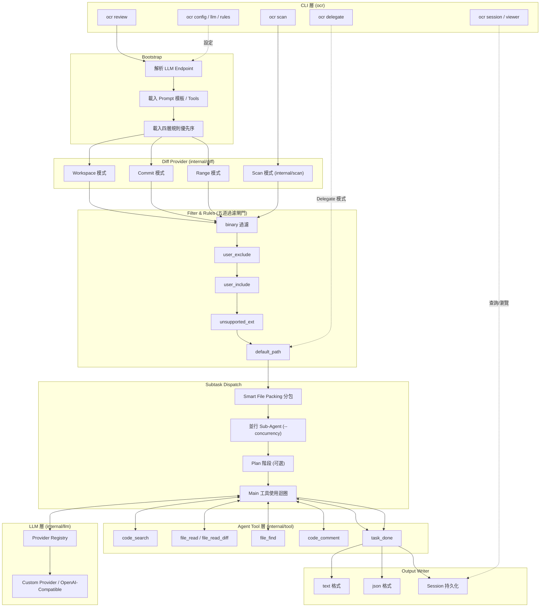

## 2.3 各層與傳統 Code Review 工具的對照

| 層級 | 對應到人工 Review 的哪個動作 | 對應到 SonarQube 的哪個模組 |
| --- | --- | --- |
| Diff Provider | Reviewer 打開 PR 的 Diff 頁面 | SCM Provider 整合 |
| Filter & Rules | Reviewer 憑經驗略過測試檔/產生檔 | Quality Profile 的 Exclusion 設定 |
| Smart File Packing | Reviewer 依模組分批看檔案 | 無直接對應（SonarQube 逐檔案跑規則，無需打包給 LLM） |
| Tool 層（code_search / file_read） | Reviewer 跳轉到定義、查看呼叫端 | IDE 的 Find Usage（SonarQube 本身不做） |
| LLM 層 | Reviewer 的專業判斷與經驗 | 規則引擎的靜態邏輯 |
| Output Writer | Reviewer 在 PR 留言 | SonarQube Dashboard/Quality Gate |

## 2.4 Workspace（工作區）與 Cache 概念

- OCR 對 Git 工作區的操作透過 `internal/gitcmd` 包裝，本質上是呼叫本地 `git` 執行檔
  （因此官方要求 Git ≥ 2.41）🟢，而非自行實作 Git 協定，這讓行為與開發者本機 `git diff`
  完全一致，降低「AI 看到的程式碼」與「人看到的程式碼」不一致的風險。
- Session（`internal/session`）扮演類似「執行快取」的角色：Range/Commit 模式的長時間
  審查可以被中斷後用 `ocr review --resume <session-id>` 續跑，避免大型 PR 審查中途
  斷線要整個重來。
- 🟡（作者補充）：目前查證到的 Session 機制設計目的是「可續跑」而非「跨執行的語意
  快取」（例如不會快取 LLM 對某段程式碼的判斷結果供下次審查重用）—— 若企業需要
  這類「Review 記憶」，屬於官方 Roadmap H1 2027 規劃的「domain-specific 長期記憶」
  範疇（見第25章），現階段尚未提供。

## 2.5 Sequence Diagram：宿主 Agent 呼叫 OCR，以及 OCR 呼叫外部 MCP Server

> ⚠️ **勘誤**：本節在舊版手冊中曾描述「第三方 Agent 透過 MCP 協定呼叫
> `ocr mcp`」，經比對官方 `mcp.md` 文件與 `cmd/opencodereview/` 原始碼目錄
> （**沒有** `mcp_cmd.go`，`cli-reference.md` 頂層指令列表也沒有 `mcp`）後
> 確認**不成立**：OCR 只實作 MCP **用戶端**（Client），沒有提供讓其他 Agent
> 連入的 MCP 伺服端。詳見第13章13.1節的完整勘誤說明。以下改為兩張正確的
> 序列圖。

**(A) 宿主 Agent 呼叫 OCR**——實際上是透過 Agent Skill／Command 機制，讓
宿主 Agent 的執行環境直接**呼叫 `ocr` CLI 子行程**，而非透過 MCP 協定：

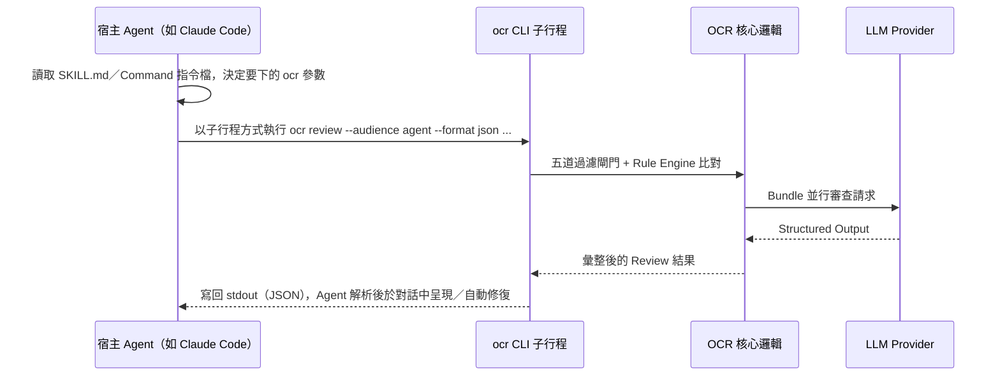

**(B) OCR 呼叫外部 MCP Server**——方向相反：OCR 的審查 Agent 在需要額外上下文
（如查 Jira 需求單、內部文件）時，主動以 MCP Client 身分連線外部 MCP Server
（設定見6.7節）：

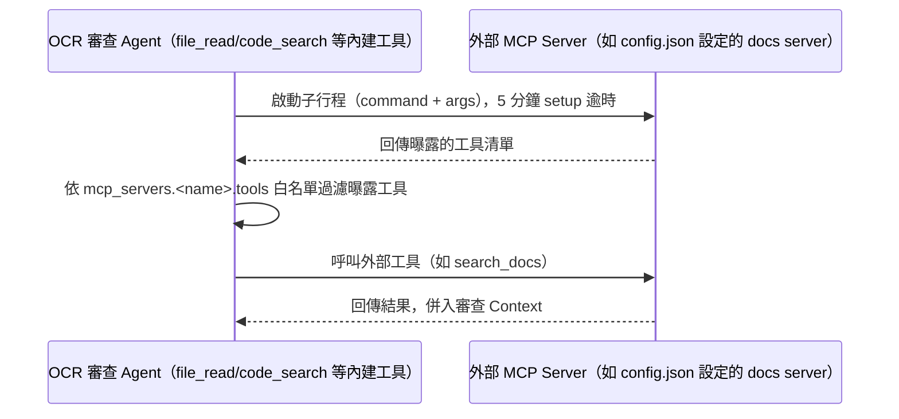

兩張圖合起來說明：OCR 對宿主 Agent 而言是「一個可以直接執行的 CLI／一份可讀的
Skill 描述檔」，對外部知識來源而言則是「一個 MCP 用戶端」——**兩個方向都不是
「OCR 暴露 MCP Server 給別人連」**。

## 2.6 資料模型概覽（`internal/model`）

🟡（作者依架構原理整理）雖然 `internal/model` 屬於內部套件（不應被外部直接
import，見2.6節常見錯誤3），但理解其核心資料結構的概念，有助於掌握
Structured Output（見第10章）的欄位設計邏輯：

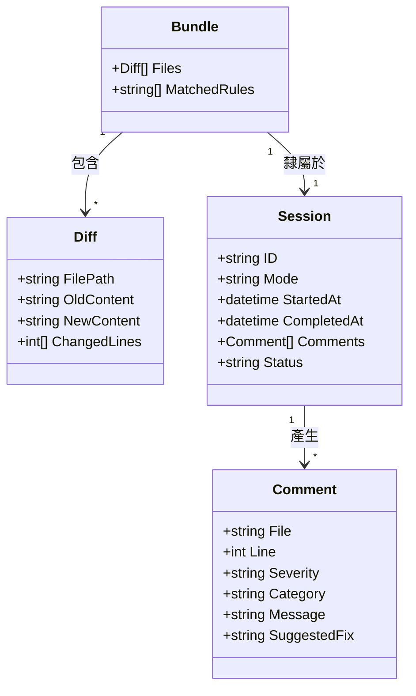

- **Diff**：對應單一檔案的變更內容，是 Diff Provider 的輸出單位。
- **Bundle**：Smart File Packing 分包後的單位，內含一組相關聯的 Diff 與
  命中的規則清單。
- **Comment**：LLM Agent 產出的單筆審查留言，欄位對應第10.4節的 Structured
  Output Schema。
- **Session**：一次完整審查執行的容器，彙整所有 Bundle 產出的 Comment，
  並記錄執行狀態（供 `--resume` 使用）。

## 2.7 Best Practice

1. 在 CI 環境執行時，固定使用 `--format json` 搭配 `Output`／`Session` 層，把結果落地
   成 artifact，方便之後串接自製的 Dashboard 或提報系統，而不要只依賴人眼讀 `stdout`。
2. 大型 Monorepo 建議提高 `--concurrency`（預設 8）並觀察 LLM Provider 的 rate limit，
   在「審查速度」與「API 成本/限流」之間找到平衡點（見第23章效能調校）。
3. 把 `internal/tool` 提供的工具集（尤其 `code_search`、`file_read_diff`）視為「AI
   版的 IDE 導覽能力」——這正是它優於「單純把 diff 貼給通用 LLM」的關鍵架構優勢，
   企業教育訓練時應該特別強調這一點，避免同仁誤以為 OCR 只是「換一個模型的 ChatGPT
   Code Review」。

## 2.8 常見錯誤

| # | 錯誤 | 原因 | 解法 | 預防 |
| --- | --- | --- | --- | --- |
| 1 | 誤以為 OCR 直接讀取 GitHub/GitLab API 取得 Diff | 不了解其本質是包裝本地 `git` 指令 | 確保 CI Runner 有完整 clone（`fetch-depth: 0`）與正確權限 | 在 CI 範本中固定加上 `fetch-depth: 0` |
| 2 | Session 中斷後直接重新執行整個 Range 審查 | 不知道 `--resume` 可續跑 | 改用 `ocr session list` 查詢再 `--resume` | Onboarding 文件中加入 resume 用法 |
| 3 | 把 `internal/` 模組名稱當作穩定 Public API 直接寫程式呼叫 | 誤把內部套件當作公開 SDK | 一律透過 CLI、Agent Skill／Command／Delegation Mode 整合，不要 import `internal/*` | Code Review checklist 中加入「禁止依賴 internal 套件」 |

---

# 第3章 核心設計理念

## 3.1 Deterministic Pipeline x LLM Agent 混合架構

OCR 官方文件（`architecture.md`）明確提出「**Deterministic Engineering × Agent
Hybrid**」的設計哲學 🟢，用來對比「純 Agent（例如直接請通用 Coding Agent 讀 diff
給意見）」的方式。核心主張是：

> LLM 擅長「語意理解」，但不擅長「保證涵蓋率」與「保證精確定位」；因此把「決定要看
> 哪些檔案、如何分包、如何比對規則」這些**可以被工程化保證正確**的部分，交給確定性
> 程式邏輯處理，只把「這段程式碼有沒有問題、問題是什麼」這種**需要語意判斷**的部分，
> 交給 LLM Agent。

| 面向 | Deterministic 側負責 | LLM Agent 側負責 |
| --- | --- | --- |
| 檔案範圍 | Diff Provider + 五道過濾閘門，保證不遺漏、不誤觸 | — |
| 分包策略 | Smart File Packing，依 Token 預算與依賴關係分包 | — |
| 規則比對 | Rule Engine 依副檔名/路徑做模板化比對 | — |
| 語意判斷 | — | 判斷是否為 NPE、Race Condition、業務邏輯錯誤等需要理解上下文的問題 |
| 定位校正 | 外部 comment positioning 模組，修正 LLM 給的行號 | — |
| 推理過程 | — | Reasoning + Structured Output（見第10章） |

## 3.2 Hybrid Review 的具體實作機制

1. **Smart File Packing（智慧檔案打包）**：大型 Changeset 會被拆成多個「Bundle」，
   每個 Bundle 有自己獨立的 Sub-Agent Context，彼此並行處理（divide-and-conquer），
   而不是把整個 Diff 塞進單一個超長 Context。
2. **Repository Search / Dynamic File Retrieval**：Agent 並非只看 Diff 本身，而是
   可以主動呼叫 `code_search`、`file_read`、`file_find` 等工具，動態拉取 Diff 之外
   的相關程式碼（例如被修改函式的呼叫端），彌補「只看 Diff 看不到全貌」的盲點。
3. **Line-Level Review（行級審查）**：審查結果不是「這個檔案有問題」的粗粒度結論，
   而是具體到「第幾行」的行級留言，並透過 comment positioning 模組校正 LLM 常見的
   行號偏移問題。
4. **Structured Output（結構化輸出）**：Agent 完成審查後透過 `task_done` 工具收斂為
   結構化資料（可用 `--format json` 取得），而非自由格式的文字報告，方便下游系統
   （PR 留言 API、Dashboard）程式化解析。
5. **Review Reasoning（審查推理）**：Agent 在下結論前會展示（或至少內部維護）推理
   軌跡，這也是官方所述「從分析數萬條工具呼叫軌跡蒸餾出專屬工具集」的依據 —— 讓
   Reasoning 過程盡量落在「工具的召回範圍內」，而不是漫無邊際地自由聯想。

## 3.3 架構圖：Hybrid Review 決策點

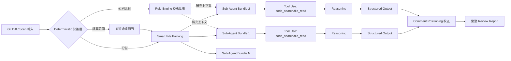

## 3.4 各設計元件逐一說明

- **Context Recall（上下文回憶）**：Agent 在處理某個檔案時，可回憶（重新查詢）先前
  Bundle 已審查過的相關發現，避免同一個跨檔案問題被重複回報或彼此矛盾。🟡（作者依
  多 Sub-Agent 架構的常見設計原則補充，官方文件未逐字使用「Context Recall」一詞，
  但其 Dynamic File Retrieval + 並行 Bundle 架構隱含此需求。）
- **Repository Search**：`code_search` 工具讓 Agent 可以做關鍵字/符號搜尋，而不是
  只能線性讀檔案，這對「找出某個被改壞的函式还有哪裡在呼叫」特別關鍵。
- **Tool Use**：官方強調工具集是「從分析 Alibaba 內部大量真實工具呼叫軌跡中蒸餾」而
  來，而非憑空設計 —— 這也是它與許多「隨手加十幾個工具」的通用 Agent 框架的差異化
  賣點。

## 3.5 範例：Bundle 分包的簡化示意

```text
變更檔案清單（範例）：
  src/service/OrderService.java      (+120 -45)
  src/service/PaymentService.java    (+30  -5)
  src/dao/OrderMapper.xml            (+8   -2)
  src/controller/OrderController.java(+15  -3)
  test/OrderServiceTest.java         (+200 -0)

Smart File Packing 分包結果（示意）：
  Bundle A: OrderService.java + OrderMapper.xml     # 依賴關係緊密，一起看
  Bundle B: PaymentService.java + OrderController.java
  Bundle C: OrderServiceTest.java                    # 測試檔獨立一包，降低互相干擾
```

## 3.6 Best Practice

1. 導入初期，先用 `ocr review --preview` 觀察 Smart File Packing 的分包結果是否
   符合模組邊界的直覺，若發現分包不合理，優先檢查是否為規則檔（`rule.json`）路徑
   設定不當導致誤判依賴關係。
2. 對高風險模組（如支付、核心交易）可額外提高該路徑對應規則的嚴謹度（見第11章），
   讓 Deterministic 層先做一次「粗篩」，降低 LLM 漏判的機率。
3. 向團隊說明 Hybrid 架構時，強調「LLM 不是從零開始猜」，而是「在確定性 Pipeline
   框好的範圍內做語意判斷」，有助於建立對 AI Review 結果的信任度。

## 3.7 常見錯誤

| # | 錯誤 | 原因 | 解法 | 預防 |
| --- | --- | --- | --- | --- |
| 1 | 認為 OCR 的分包是隨機或黑箱的 | 不了解 Smart File Packing 依賴關係邏輯 | 用 `--preview` 檢視分包結果並依規則調整 | 導入文件說明分包邏輯 |
| 2 | 期待 Agent 記住「上次 Review」的所有結論 | 混淆 Session 續跑機制與跨執行的語意記憶 | 明確認知目前無跨執行語意快取（見2.4、25章） | 教育訓練時說明現況與 Roadmap 差異 |

---

# 第4章 工作流程

## 4.1 說明：從開發者到合併的完整旅程

本章把 OCR 放進一個典型 PR 生命週期中，說明每個階段實際發生了什麼事，以及開發者/
Reviewer 分別在哪個環節與 OCR 互動。

## 4.2 完整流程圖（Mermaid）

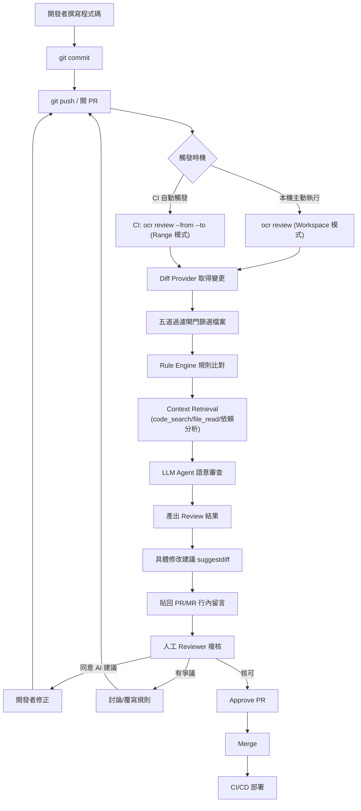

## 4.3 兩種觸發時機的差異

| 觸發時機 | 使用的 Review Mode | 適合情境 |
| --- | --- | --- |
| **開發者本機主動執行** | Workspace 模式（預設，涵蓋 staged + unstaged + untracked） | 提交前自我審查，越早發現問題成本越低 |
| **CI Pipeline 自動觸發** | Range 模式（`--from`/`--to`，計算 `merge-base(from,to)..to`）或 Commit 模式（`--commit`） | PR 開啟/更新時自動跑一輪，結果貼回 PR |

## 4.4 Sequence Diagram：PR 觸發到留言的完整互動

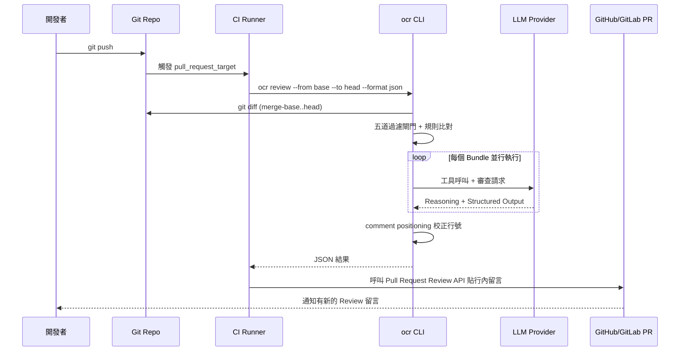

## 4.5 範例：GitHub PR 上的實際互動片段

```text
🤖 open-code-review 建議 (檔案: src/service/OrderService.java, 行號: 87)

⚠️ 可能的 NullPointerException
`order.getCustomer().getAddress()` 未檢查 `getCustomer()` 是否為 null。
若訂單來自舊資料匯入流程，customer 欄位可能為 null（參考 OrderImportJob.java:42）。

建議修改：
    Customer customer = order.getCustomer();
    if (customer == null) {
        throw new OrderDataException("訂單缺少客戶資料: " + order.getId());
    }
```

## 4.6 Best Practice

1. 將「本機主動執行」與「CI 自動觸發」設計成**互補**而非重複：本機用 Workspace 模式
   做快速自檢，CI 用 Range 模式做最終把關並留下正式紀錄（Session/JSON artifact）。
2. PR 留言應設計「可回饋」的動線 —— 讓開發者對 AI 建議按讚/按不同意，長期累積下來
   的資料可用於調整規則嚴謹度與 Prompt（見第22、24章）。
3. Merge 前的 Approve 步驟應保留人工，避免落入「AI 說沒問題就自動合併」的反模式
   （這也與官方 Roadmap 明確排除「無人審核的自動修復」的立場一致）。

## 4.7 常見錯誤

| # | 錯誤 | 原因 | 解法 | 預防 |
| --- | --- | --- | --- | --- |
| 1 | CI 只 checkout 單一 commit 導致 Range 模式算不出正確 diff | 未設定 `fetch-depth: 0` | 修正 checkout 設定 | CI 範本強制加上完整 fetch 設定 |
| 2 | 開發者忽略本機 Workspace 審查結果，直接推上 CI | 覺得本機審查是多餘步驟 | 說明本機審查可省下 CI 排隊等待時間 | 將本機審查納入 pre-push hook（見第18章） |

---

# 第5章 安裝

## 5.1 說明：三種安裝方式總覽

🟢 官方提供三種安裝方式：npm 套件、安裝腳本（`install.sh`/`install.ps1`）、GitHub
Release 平台專屬執行檔（如 `opencodereview-darwin-amd64`）。三者本質上都是取得同一個
Go 編譯出的執行檔，差別只在「取得的管道」。

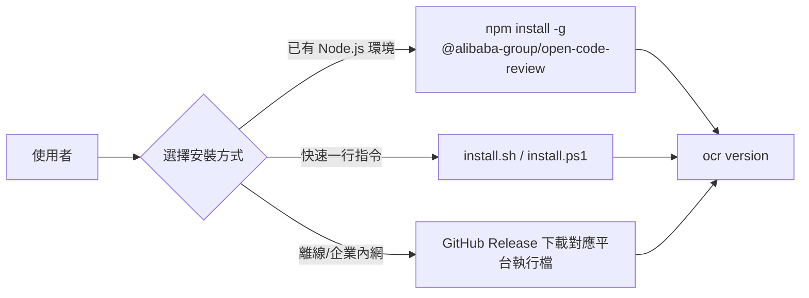

## 5.2 前置需求

- **Git ≥ 2.41**（OCR 透過 `internal/gitcmd` 呼叫本地 `git` 執行檔，版本過舊可能缺少
  必要的 diff/merge-base 行為）🟢
- 若採 npm 安裝方式，需要 Node.js（用來執行 npm 套件內包裝的安裝/呼叫腳本）
- 作業系統：Windows、macOS、Linux 均有官方支援 🟢

## 5.3 Windows 安裝

方式一：npm（建議，與其他 Node.js 工具鏈一致）

```powershell
npm install -g @alibaba-group/open-code-review
ocr version
```

方式二：PowerShell 安裝腳本

```powershell
irm https://open-codereview.ai/install.ps1 | iex
ocr version
```

方式三：手動下載 Release 執行檔

1. 前往 GitHub Release 頁面，下載對應 Windows 版本的執行檔（如
   `opencodereview-windows-amd64.exe`）。
2. 將執行檔改名為 `ocr.exe` 並放到 `PATH` 中的某個目錄（例如
   `C:\Users\<user>\bin\`）。
3. 開新的終端機視窗執行 `ocr version` 驗證。

> ⚠️ **注意事項**：PowerShell 執行原則（Execution Policy）若設為 `Restricted`，
> 直接執行安裝腳本可能被擋下。企業內網環境建議改用「方式三：手動下載」，避免需要
> 調整 Execution Policy 這種較敏感的系統設定。

## 5.4 macOS 安裝

```bash
# 方式一：npm
npm install -g @alibaba-group/open-code-review

# 方式二：安裝腳本
curl -fsSL https://open-codereview.ai/install.sh | sh

# 驗證
ocr version
```

## 5.5 Linux 安裝

```bash
# 方式一：npm
npm install -g @alibaba-group/open-code-review

# 方式二：安裝腳本
curl -fsSL https://open-codereview.ai/install.sh | sh

# 方式三：手動下載 Release 執行檔（適合無 npm 環境的 CI Runner）
curl -LO https://github.com/alibaba/open-code-review/releases/latest/download/opencodereview-linux-amd64
chmod +x opencodereview-linux-amd64
sudo mv opencodereview-linux-amd64 /usr/local/bin/ocr

ocr version
```

## 5.6 WSL（Windows Subsystem for Linux）

WSL 環境視為一個標準 Linux 環境即可，依 5.5 節安裝。🟡（企業建議）常見的坑是
Windows 端與 WSL 端各自獨立安裝了一份 `ocr`，導致「在 VS Code 整合終端機用的是哪一個」
混淆 —— 建議團隊統一約定：**只在 WSL 內安裝**，Windows 端的 IDE 透過 WSL Remote
連線使用同一份安裝，避免版本不一致。

## 5.7 Docker（企業建議，非官方產物）

> ⚠️ **重要提醒**：官方**未提供**任何 Docker image，以下為作者提供的企業自架封裝
> 範例，供需要在容器化 CI（如 Kubernetes Job、GitLab Runner Docker Executor）中
> 執行 OCR 的團隊參考，非官方維護內容。

```dockerfile
# Dockerfile（作者示範，非官方）
FROM golang:1.23-alpine AS fetch
RUN apk add --no-cache curl git ca-certificates
RUN curl -LO https://github.com/alibaba/open-code-review/releases/latest/download/opencodereview-linux-amd64 \
    && chmod +x opencodereview-linux-amd64 \
    && mv opencodereview-linux-amd64 /usr/local/bin/ocr

FROM alpine:3.20
RUN apk add --no-cache git ca-certificates
COPY --from=fetch /usr/local/bin/ocr /usr/local/bin/ocr
ENTRYPOINT ["ocr"]
```

```bash
docker build -t internal-registry/ocr:latest .
docker run --rm -v "$(pwd):/repo" -w /repo internal-registry/ocr:latest review --format json
```

## 5.8 Proxy／企業內網環境

大型企業內網通常無法直接存取 GitHub Release 或 npm 官方 registry，建議：

1. **npm 安裝**：設定企業內部 npm mirror/Artifactory 代理 `@alibaba-group/open-code-review`
   套件，或使用 `npm config set proxy` / `npm config set https-proxy` 指向企業代理伺服器。
2. **Binary 安裝**：由資安/平台團隊統一下載通過驗證的 Release 執行檔，上傳到內部
   Artifact 儲存（如 Nexus/Artifactory），開發者從內部來源取得，避免每台機器各自對外
   連線 GitHub。
3. **LLM API 呼叫**：若企業對外流量需經過正向代理，記得同時設定 `HTTP_PROXY`/
   `HTTPS_PROXY` 環境變數，否則即使 CLI 安裝成功，實際呼叫 LLM Provider 時仍會逾時
   失敗。

```bash
export HTTP_PROXY=http://proxy.corp.internal:8080
export HTTPS_PROXY=http://proxy.corp.internal:8080
export NO_PROXY=localhost,127.0.0.1,*.corp.internal
ocr review --preview
```

## 5.9 安裝驗證清單

```bash
ocr version              # 確認版本號
git --version             # 確認 >= 2.41
ocr config provider        # 互動式確認 Provider 設定入口可正常開啟
ocr review --preview       # 在測試 repo 內確認檔案篩選邏輯正常
```

## 5.10 Best Practice

1. 企業環境建議統一由平台團隊維護一份「已驗證版本」的安裝方式（例如固定版本的
   Binary + 內部 Artifact 儲存），而非任由各團隊各自 `npm install -g` 抓最新版，
   避免版本漂移造成規則/輸出格式不一致。
2. 在 CI Runner 的映像檔建置階段就把 `ocr` 安裝進去（而非每次 Job 執行時才安裝），
   縮短每次 Pipeline 的執行時間。
3. 安裝後立即執行 `ocr version` 與 `ocr review --preview` 兩個指令作為「安裝是否
   成功」的標準驗收動作，寫進 Onboarding 文件。

## 5.11 常見錯誤

| # | 錯誤 | 原因 | 解法 | 預防 |
| --- | --- | --- | --- | --- |
| 1 | Git 版本過舊導致 diff 行為異常 | 企業內網機器 Git 版本管制寬鬆 | 升級 Git 至 2.41 以上 | CI 映像檔統一鎖定 Git 最低版本 |
| 2 | 誤以為官方有 Docker image 而在網路上找官方 image 找不到 | 混淆其他工具的安裝習慣 | 使用 5.7 節作者提供的自架 Dockerfile | 導入文件明確標示「無官方 Docker image」 |
| 3 | 企業內網安裝腳本因無法連外而卡住 | 未設定 Proxy 或內網無法直連 GitHub | 改用內部 Artifact 儲存的 Binary | 提前規劃離線安裝流程（5.8節） |
| 4 | WSL 與 Windows 各自安裝不同版本 | 缺乏團隊約定 | 統一只在 WSL 安裝，IDE 用 Remote 連線 | Onboarding 文件明確約定安裝位置 |

---

# 第6章 設定

## 6.1 說明：設定檔位置與優先序

🟢 OCR 的設定核心是本機的 `~/.opencodereview/config.json`，官方文件
（`configuration.md`）列出三種編輯方式，**建議順序如下**：

1. **互動式 TUI（推薦）**：`ocr config provider` 引導選擇內建或自訂 Provider、
   輸入 API Key、選擇 Model，存檔後會自動跑一次 `ocr llm test` 驗證端點；
   之後若只想換模型，用 `ocr config model` 即可。
2. **命令列直接寫入（CI／腳本適用）**：`ocr config set <key> <value>`；
   刪除一個 custom provider 用 `ocr config unset custom_providers.<name>`
   （若刪除的剛好是目前使用中的 provider，`provider`／`model` 會一併被清空，
   需重新設定）。
3. **手動編輯 JSON（官方不建議）**：直接改 `~/.opencodereview/config.json`，
   但下次執行 `ocr config set` 時檔案會被重新格式化。

環境變數扮演「內建 Provider 的 API Key 備援」角色：若 `config.json` 中
`providers.<name>.api_key` 未設定，就會退而讀取該 provider 對應的**特定**
環境變數（見6.3節對照表 —— **每家不同，並非統一的 `<PROVIDER>_API_KEY` 命名
慣例**）。⚠️ 需特別注意：**`custom_providers.*` 沒有環境變數備援**，`api_key`
欄位必填（即使是不驗證金鑰的本地 Ollama，也要填一個非空字串佔位）。🟢

## 6.2 設定檔結構範例

```json
{
  "providers": {
    "anthropic": {
      "api_key": "",
      "model": "claude-sonnet-5"
    },
    "dashscope": {
      "api_key": "",
      "model": "qwen-max"
    }
  },
  "custom_providers": {
    "azure-openai-prod": {
      "url": "https://<your-resource>.openai.azure.com/openai/deployments/<deployment>",
      "protocol": "openai",
      "model": "gpt-4.1",
      "api_key": ""
    },
    "local-ollama": {
      "url": "http://127.0.0.1:11434/v1",
      "protocol": "openai",
      "model": "qwen2.5-coder:32b",
      "api_key": "not-needed"
    }
  },
  "default_provider": "anthropic",
  "rule_path": ".opencodereview/rule.json"
}
```

> ⚠️ **注意事項**：上方 `azure-openai-prod` 是「透過 custom_providers 機制自行接上」
> 的示範，**不是**官方內建的 `azure-openai` provider 型別（官方 registry 並無此
> 型別，見第12章與本章開頭的重要聲明）。

## 6.3 環境變數對照表

🟢 依官方 `configuration.md` 逐一核對，14 個內建 Provider 中「有列出對應
Base URL 與 API Key 環境變數」的名單如下 —— **每家命名並不統一**，不可用
`<PROVIDER>_API_KEY` 這種猜測慣例硬套：

| Provider (`providers.<name>`) | Protocol | Base URL | API Key 環境變數 |
| --- | --- | --- | --- |
| `anthropic` | anthropic | `https://api.anthropic.com` | `ANTHROPIC_API_KEY` |
| `openai` | openai | `https://api.openai.com/v1` | `OPENAI_API_KEY` |
| `dashscope` | openai | `https://dashscope.aliyuncs.com/compatible-mode/v1` | `DASHSCOPE_API_KEY` |
| `dashscope-tokenplan` | openai | `https://token-plan.cn-beijing.maas.aliyuncs.com/compatible-mode/v1` | `DASHSCOPE_TOKENPLAN_KEY` |
| `volcengine` | openai | `https://ark.cn-beijing.volces.com/api/v3` | `ARK_API_KEY` |
| `deepseek` | openai | `https://api.deepseek.com` | `DEEPSEEK_API_KEY` |
| `tencent-tokenhub` | openai | `https://tokenhub.tencentmaas.com/v1` | `TENCENT_TOKENHUB_API_KEY` |
| `hy-tokenplan` | openai | `https://api.lkeap.cloud.tencent.com/plan/v3` | `TENCENT_HUNYUAN_TOKENPLAN_KEY` |
| `iflytek` | openai | `https://spark-api-open.xf-yun.com/v1` | `SPARK_API_KEY` |
| `kimi` | openai | `https://api.moonshot.cn/v1` | `MOONSHOT_API_KEY` |
| `z-ai` | openai | `https://open.bigmodel.cn/api/paas/v4` | `Z_AI_API_KEY` |
| `mimo` | openai | `https://api.xiaomimimo.com/v1` | `MIMO_API_KEY` |
| `minimax` | openai | `https://api.minimaxi.com/v1` | `MINIMAX_API_KEY` |
| `baidu-qianfan` | openai | `https://qianfan.baidubce.com/v2` | `QIANFAN_API_KEY` |

> 🟡 **作者提醒**：`edenai`、`z-ai-coding`、`ollama-cloud`、`litellm` 這 4 個
> `internal/llm/providers.go` 中確實存在的 provider，並未出現在官方
> `configuration.md` 這張表格內，**本手冊無法查證其確切環境變數名稱**（`z-ai-coding`
> 極可能與 `z-ai` 共用 `Z_AI_API_KEY`，但屬推論而非查證事實）。導入前請務必用
> `ocr llm providers` 或 `ocr config provider` 互動選單以當下版本為準，
> 或直接改用 `config.json` 內 `providers.<name>.api_key` 寫死（測試環境可接受，
> 正式環境仍建議搭配 6.7 節的 secret 注入方式）。

**逾時（Timeout）是兩個完全獨立的概念，官方文件明確區分，舊版手冊曾經混淆**：

| 層級 | 設定方式 | 預設值 | 涵蓋範圍 |
| --- | --- | --- | --- |
| 單檔審查總預算 | `ocr review --timeout <分鐘>` | **10 分鐘**（`0` 表示不限制） | 一個檔案從 Plan 到 `task_done` 整個 tool-use 迴圈的總時間上限，見第7章 |
| 單次 LLM HTTP 請求逾時 | `providers.<name>.timeout_sec` / `custom_providers.<name>.timeout_sec`（僅能手動編輯 `config.json`，`ocr config set` 不支援這個 key）、或 `llm.timeout_sec`（舊版 `llm` 區塊）、或環境變數 `OCR_LLM_TIMEOUT`（整數秒，覆寫所有解析路徑，優先序最高） | **300 秒（5 分鐘）** | 單一次呼叫 LLM API 的 HTTP timeout；本地 Ollama 等慢速模型常需調高 |

| 環境變數 | 用途 | 優先序 |
| --- | --- | --- |
| `OCR_LLM_TIMEOUT` | 覆寫**單次 LLM HTTP 請求**逾時秒數（見上表，非 `--timeout` 那個檔案級預算） | 全域生效，覆寫 `config.json` 內任何 `timeout_sec` 設定 |
| `HTTP_PROXY` / `HTTPS_PROXY` / `NO_PROXY` | 對外連線代理設定（見5.8節） | 標準 Go net/http 讀取慣例 |

## 6.4 各家 LLM 設定範例

Anthropic Claude

```bash
ocr config set providers.anthropic.model claude-sonnet-5
export ANTHROPIC_API_KEY=sk-ant-xxxxx
ocr config set default_provider anthropic
```

OpenAI

```bash
ocr config set providers.openai.model gpt-4.1
export OPENAI_API_KEY=sk-xxxxx
ocr config set default_provider openai
```

Azure OpenAI（透過 custom_providers 自行接上，非官方預設）

```bash
ocr config set custom_providers.azure-openai-prod.url \
  "https://<resource>.openai.azure.com/openai/deployments/<deployment>"
ocr config set custom_providers.azure-openai-prod.protocol openai
ocr config set custom_providers.azure-openai-prod.model gpt-4.1
ocr config set custom_providers.azure-openai-prod.api_key <azure-api-key>
ocr config set default_provider custom_providers.azure-openai-prod
```

OpenRouter（透過 custom_providers，OpenAI-compatible 端點）

```bash
ocr config set custom_providers.openrouter.url "https://openrouter.ai/api/v1"
ocr config set custom_providers.openrouter.protocol openai
ocr config set custom_providers.openrouter.model "anthropic/claude-sonnet-5"
ocr config set custom_providers.openrouter.api_key <openrouter-api-key>
```

本地 Ollama（官方文件示範接法）

```bash
ollama pull qwen2.5-coder:32b
ollama serve

ocr config set custom_providers.local-ollama.url "http://127.0.0.1:11434/v1"
ocr config set custom_providers.local-ollama.protocol openai
ocr config set custom_providers.local-ollama.model "qwen2.5-coder:32b"
ocr config set default_provider custom_providers.local-ollama
```

litellm（萬用閘道，一次打開近百種供應商）

```bash
# 先自行部署 litellm proxy（第三方專案，非本手冊範疇）
ocr config set providers.litellm.url "http://litellm-proxy.corp.internal:4000"
ocr config set providers.litellm.model "gemini/gemini-2.5-pro"
```

## 6.5 最佳設定建議（企業場景）

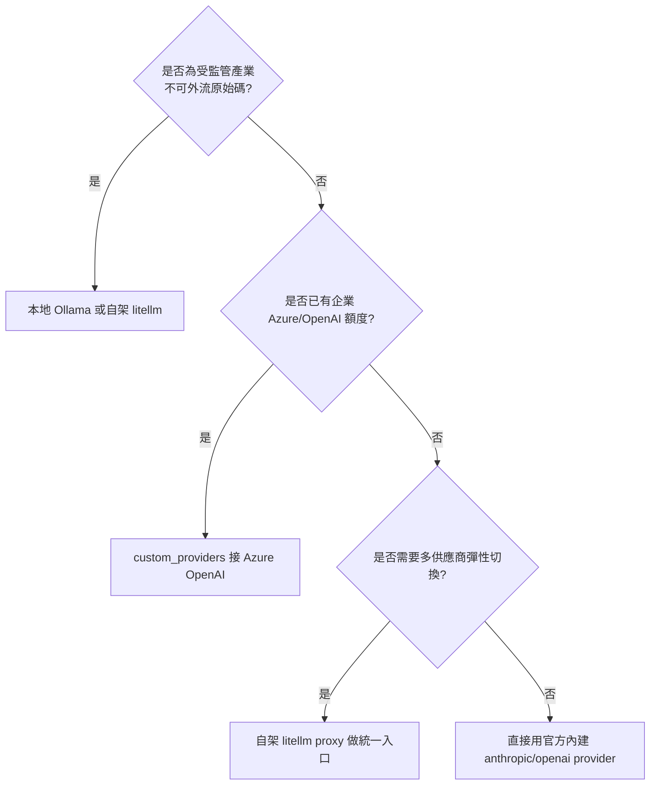

## 6.6 中國大陸供應商設定範例補充

第12章比較了各家模型的優缺點，這裡補充官方原生內建的中國大陸供應商 Provider
的實際設定指令，方便讀者對照 6.4 節的歐美供應商設定方式：

```bash
# 通義千問 Qwen（dashscope）
ocr config set providers.dashscope.model qwen-max
export DASHSCOPE_API_KEY=sk-xxxxx

# DeepSeek
ocr config set providers.deepseek.model deepseek-chat
export DEEPSEEK_API_KEY=sk-xxxxx

# 智譜 GLM（z-ai，官方文件確認的環境變數是 Z_AI_API_KEY；z-ai-coding 為程式碼
# 審查場景的模型變體，本手冊未查得其獨立環境變數名稱，建議直接以
# providers.z-ai-coding.api_key 設定，或用 ocr config provider 互動選單確認）
ocr config set providers.z-ai.model glm-4-plus
export Z_AI_API_KEY=xxxxx

# 百度千帆
ocr config set providers.baidu-qianfan.model ernie-4.0
export QIANFAN_API_KEY=xxxxx
```

> 🟢 **官方查證**：上述環境變數名稱已逐一比對官方 `configuration.md`，
> 並非「`<PROVIDER>_API_KEY`」猜測慣例（見6.3節完整對照表）。若導入版本
> 與本手冊查證版本（`v1.8.6`）不同，仍建議以 `ocr llm providers` 或
> `ocr config provider` 互動選單顯示的內容為最終依據。

## 6.7 進階設定：審查語言、Vendor 專屬欄位與 MCP Servers

🟢 除了 Provider／Model，`config.json` 還支援下列常用進階鍵：

**審查留言語言**（未設定時預設英文）：

```bash
ocr config set language 中文
# 或
ocr config set language English
```

**Vendor 專屬請求欄位**（`extra_body`，會被合併進每一次 LLM 請求，
用於如 Bedrock 風格的 `thinking` 參數等非標準欄位）：

```bash
ocr config set providers.anthropic.extra_body '{"thinking":{"type":"disabled"}}'
```

**單一 Provider 逾時**（`timeout_sec`，僅能手動編輯 JSON，`ocr config set`
不支援此 key，對應6.3節表格中的「單次 LLM HTTP 請求逾時」）：

```json
{
  "custom_providers": {
    "ollama": { "url": "http://127.0.0.1:11434/v1", "protocol": "openai", "timeout_sec": 900 }
  }
}
```

**MCP Servers**（讓審查 Agent 除了內建工具外，還能呼叫外部 MCP Server 提供
的工具，例如查詢 Jira 需求單、內部知識庫；詳見第13章）：

```bash
# 最小設定：只給執行指令
ocr config set mcp_servers.docs.command npx
# 帶參數（陣列需以 JSON 字串傳入）
ocr config set mcp_servers.docs.args '["-y", "@acme/docs-mcp-server"]'
# 限制曝露給審查 Agent 的工具名單（避免工具過多稀釋 Agent 專注力）
ocr config set mcp_servers.docs.tools '["search_docs", "get_page"]'
# 啟動前的一次性安裝指令（5 分鐘逾時，於 repo 根目錄執行）
ocr config set mcp_servers.docs.setup "npm install -g @acme/docs-mcp-server"
# 環境變數（KEY=VALUE 陣列）
ocr config set mcp_servers.docs.env '["DOCS_TOKEN=secret"]'
# 移除
ocr config unset mcp_servers.docs
```

> ⚠️ **注意事項**：MCP 工具與內建工具（`file_read`、`code_search`、
> `task_done`…）共用同一個命名空間；若 MCP Server 曝露的工具名稱與內建工具
> 或另一個已註冊的 MCP Server 衝突，OCR 會**跳過**該工具並記錄警告（先註冊
> 者優先），而不是報錯中斷。

## 6.8 Best Practice

1. **不要**把 API Key 直接寫進 `config.json` 並提交進版控 —— 用環境變數注入，
   `config.json` 只保留 model 名稱與 provider 結構，並將 `~/.opencodereview/`
   排除在任何專案倉庫之外。
2. 企業內建議由平台團隊統一維護一份「標準 `custom_providers` 範本」（如
   Azure OpenAI 端點、內部 litellm proxy 位址），開發者只需注入自己的 API Key，
   降低設定錯誤機率。
3. 分清楚兩種逾時再調校：CI 中大型檔案常需要拉長 `--timeout`（單檔預算，
   分鐘單位）；本地 Ollama 等慢速模型則常需要拉長 `OCR_LLM_TIMEOUT` 或
   `timeout_sec`（單次 HTTP 請求，秒單位）——調錯層級是常見的排查陷阱。
4. 導入 MCP Server 時先用 `tools` 白名單限制曝露的工具數量，並確認工具
   名稱不與內建工具或其他 MCP Server 衝突，避免工具被靜默跳過卻不自知。

## 6.9 常見錯誤

| # | 錯誤 | 原因 | 解法 | 預防 |
| --- | --- | --- | --- | --- |
| 1 | 誤把 API Key 寫進 `config.json` 並 commit 進 repo | 不了解環境變數備援機制 | 立即撤銷該 Key，改用環境變數 | pre-commit hook 掃描 secret（見第11章 Hardcode Secret 規則） |
| 2 | 以為有官方 `azure-openai` provider 型別可直接設定 | 混淆 custom_providers 與內建 provider | 依 6.4 節用 `custom_providers` 手動接上 | 第12章比較表先釐清原生 vs 自行串接的差異 |
| 3 | 本地 Ollama 逾時頻繁失敗，調了 `OCR_LLM_TIMEOUT` 卻沒用 | 把「單檔預算」與「單次 HTTP 逾時」搞混，實際該調 `--timeout` 或 `timeout_sec` | 依 6.3 節對照表分清楚兩種逾時 | 導入文件明確畫出兩張逾時表格 |
| 4 | `custom_providers.*` 沒填 `api_key` 導致連線失敗 | 誤以為所有 provider 都有環境變數備援 | custom provider 必填 `api_key`（無備援機制），本地模型可填任意佔位字串 | Onboarding 範本內建佔位值提醒 |

---

# 第7章 CLI 完整指令參考

## 7.1 說明：頂層指令總覽

🟢 官方 `cli-reference.md` 記載的頂層指令是：

```text
ocr review (別名: r)
ocr rules
ocr config
ocr llm
ocr viewer
ocr session (別名: sessions)
ocr version
```

> ⚠️ **文件落差提醒**：`cmd/opencodereview/scan_cmd.go`、`delegate_cmd.go` 兩個
> 原始碼檔案，以及官方 README 的 Quick Start 範例、獨立專頁
> `pages/src/content/docs/en/integrations/delegate.md`，都證實 `ocr scan`
> （別名 `ocr s`）與 `ocr delegate`（別名 `ocr d`，含 `preview`／`rule` 兩個
> 子指令）是**真實存在、且隨版本出貨的正式指令**——只是 `cli-reference.md`
> 這一份文件頁面本身漏收錄了這兩個指令。本章仍將其完整收錄，並補上官方文件
> 頁面沒有的細節（直接查證原始碼 `scanOptions`／`delegateOptions` 結構）。

完整頂層指令共 **9** 個：`review`／`r`、`scan`／`s`、`delegate`／`d`、`rules`、
`config`、`llm`、`viewer`、`session`／`sessions`、`version`。每個子指令都支援
`-h` / `--help`。

## 7.2 `ocr review`：核心審查指令（Diff-Based）

### 模式（三選一，互斥）

| 模式 | 觸發方式 | 實際比對範圍 |
| --- | --- | --- |
| Workspace（預設） | 不帶任何模式旗標 | `git diff HEAD`（staged+unstaged，若為空則退回 `git diff --staged`）＋ `git ls-files --others --exclude-standard` 讀出的 untracked 檔案（視為全新增） |
| Range | `--from <ref> --to <ref>` | `merge-base(from, to)..to` —— 只看該分支「引入」的變更，不含 `from` 之後主幹上發生的無關變更 |
| Commit | `--commit <sha>` / `-c <sha>` | 等同 `git show <sha>`，即該次 commit 相對其 parent 的變更 |

三種模式**互斥**，同時給多個模式旗標會直接報錯；`--resume` 只能搭配 Range／Commit
模式（Workspace 模式無法續跑）。

### 完整旗標

| Flag | 短旗標 | 預設值 | 說明 |
| --- | --- | --- | --- |
| `--repo <path>` | — | 目前目錄 | Git repo 根目錄 |
| `--from <ref>` / `--to <ref>` | — | — | Range 模式的起訖 ref |
| `--commit <sha>` | `-c` | — | Commit 模式 |
| `--preview` | `-p` | `false` | Dry-run：只跑過濾流程並列出檔案清單／排除原因，不呼叫 LLM |
| `--resume <session-id>` | — | — | 續跑相容的 Range／Commit Session（不能與 `--preview` 併用） |
| `--format text\|json` | `-f` | `text` | 輸出格式 |
| `--audience human\|agent` | — | `human` | `human` 會持續輸出進度行；`agent` 靜音進度，只印最終摘要／JSON |
| `--background <text>` | `-b` | — | 注入 Plan／Main prompt 的需求或業務背景說明（見7.12節：最高槓桿旗標） |
| `--concurrency <n>` | — | `8` | 並行審查的檔案數上限 |
| `--timeout <分鐘>` | — | `10` | **單檔**審查總預算（`0` 表示不限制）；這不是 LLM HTTP 逾時，見第6章6.3節區分 |
| `--rule <path>` | — | — | 自訂規則 JSON，最高優先序（覆寫專案層與全域層，見第11章） |
| `--max-tools <n>` | — | 模板預設（`30`） | 單檔最大工具呼叫輪數：`0`＝用模板預設；1–9 會被拉高到 `10`；`≥10` 才會真的覆寫模板預設值（即使小於 30） |
| `--model <name>` | — | — | 覆寫本次執行使用的模型 |
| `--max-git-procs <n>` | — | `16` | 並行 git 子行程數上限 |
| `--tools <path>` | — | 內建 | 自訂工具集 JSON，覆寫內建工具定義 |

```bash
# 範例 1：本機 Workspace 模式快速自檢
ocr review

# 範例 2：CI 常用的 Range 模式 + JSON 輸出 + 帶入 PR 標題當背景
ocr review --from origin/main --to HEAD --format json --audience agent \
  --background "feat(order): 新增訂單退款流程"

# 範例 3：Dry-run 確認規則篩選結果，不花費任何 Token
ocr review --preview

# 範例 4：針對單一 commit 的事後稽核
ocr review --commit 8f3a1c2 --format json --audience agent

# 範例 5：續跑中斷的大型 Range 審查（--from/--to 須與原本一致）
ocr session list
ocr review --from main --to feature --resume <session-id>
```

### JSON 輸出結構（`--format json`）

```json
{
  "status": "success",
  "summary": {
    "files_reviewed": 9,
    "comments": 14,
    "total_tokens": 21344,
    "input_tokens": 18012,
    "output_tokens": 3332,
    "elapsed": "1m12s"
  },
  "comments": [
    {
      "path": "src/foo.go",
      "content": "Concurrent map access without a lock — wrap with sync.RWMutex.",
      "start_line": 42,
      "end_line": 47,
      "existing_code": "m[k] = v",
      "suggestion_code": "mu.Lock(); defer mu.Unlock(); m[k] = v",
      "thinking": "Looking at line 42, the map …"
    }
  ]
}
```

| 欄位 | 說明 |
| --- | --- |
| `status` | `success` / `completed_with_warnings` / `completed_with_errors` / `skipped` |
| `message` | 選填，人類可讀摘要（如「No comments generated.」） |
| `summary` | 選填，`skipped` 時省略；含 `cache_read_tokens`／`cache_write_tokens`（有快取命中時才出現） |
| `comments` | 一律存在，可能是空陣列 |
| `warnings` | 選填，有 sub-agent 失敗或檔案被 Token 門檻擋下時出現 |
| `session_id` | 選填，Range／Commit 審查才會有；用於 `--resume` |
| `resume` | 選填，續跑時出現，含 `resumed_from`／`reused_files`／`rerun_files`／`previous_model`／`current_model` |

**`start_line`／`end_line` 皆為 `0`** 代表這則留言的行號比對失敗（「無法定位」的
隱含訊號），下游若要過濾這類留言，需自行判斷 `start_line == 0`，OCR 不會額外
標一個 flag 欄位。

### Exit Code

| Code | 意義 |
| --- | --- |
| `0` | 審查完成（可能 0 則留言、也可能有非致命警告） |
| `1` | 致命錯誤：旗標錯誤、無法解析 LLM 端點、所有 sub-agent 全部失敗等，錯誤訊息印到 stderr |

### 其他細節

- 單檔 diff 若本身就超過 `MAX_TOKENS`（預設 `58888`）的 80%，該檔會被直接
  跳過（記錄為警告，不會讓整個 Job 失敗）。
- 變更行數低於 `PLAN_MODE_LINE_THRESHOLD`（預設 `50`）的檔案會自動跳過 Plan
  階段，直接進入 Main 迴圈，降低延遲。
- `--audience agent` **不等於** `--format json`——兩者分別控制「UI 是否安靜」與
  「輸出是否結構化」，CI／Agent 場景通常兩個一起打開。

## 7.3 `ocr scan`（別名 `ocr s`）：全檔掃描模式

不需要 diff，直接對整份檔案內容做審查，適合「不熟悉的 legacy 專案全面體檢」
（見第16章）或「沒有 PR 可比對的目錄」。🟢（原始碼 `scan_cmd.go` 直接查證）

| Flag | 說明 |
| --- | --- |
| `--path <paths>` | 逗號分隔的檔案／目錄清單；不給則掃描整個 repo |
| `--exclude <patterns>` | 逗號分隔的排除 glob |
| `--format text\|json` | 同 `ocr review` |
| `--audience human\|agent` | 同 `ocr review` |
| `--background <text>` / `-b` | 同 `ocr review` |
| `--concurrency <n>` | 同 `ocr review`，預設 8 |
| `--timeout <分鐘>` | 單檔逾時 |
| `--rule <path>` | 自訂規則檔 |
| `--max-tools <n>` | 同 `ocr review`，作用在 scan 專用的 `scan_template.json` 上（只會「往上調」，不會調低模板預設） |
| `--max-git-procs <n>` | 同 `ocr review` |
| `--preview` | Dry-run，只列出將被掃描的檔案 |
| `--no-plan` | 跳過每檔的 `PLAN_TASK` 前置分析 |
| `--no-dedup` / `--no-summary` | 關閉去重／摘要後處理 |
| `--batch <strategy>` | 覆寫批次策略（未知值會靜默退回 `none`） |
| `--max-tokens-budget <n>` | 覆寫掃描模板的 Token 預算上限 |
| `--model <name>` | 覆寫本次使用的模型 |

```bash
# 掃描整個 repo
ocr scan

# 只掃描指定目錄
ocr scan --path internal/agent

# 掃描多個特定檔案
ocr scan --path internal/agent/agent.go,internal/diff/scan.go

# 排除產生檔／測試 fixture
ocr scan --exclude '**/generated/*,**/testdata/*'

# Dry-run 確認範圍後再正式跑
ocr scan --preview
ocr scan --format json > scan-report.json
```

> 🟡 **架構補充**：scan 模式會把 `file_read_diff` 工具從曝露給 LLM 的工具集中
> 移除（因為 scan 模式沒有 diff 可讀），避免 Agent 浪費工具呼叫輪數去嘗試讀取
> 不存在的 diff 內容。

## 7.4 `ocr delegate`（別名 `ocr d`）：委派模式

輸出「審查所需的規格」（檔案清單＋規則），**不呼叫任何 LLM**，交由宿主 Agent
（如 Claude Code）用自己的訂閱額度執行實際審查。🟢（原始碼 `delegate_cmd.go`
與官方 `integrations/delegate.md` 專頁直接查證）詳細機制與適用情境見第8、13章。

子指令如下：

| 子指令 | 用途 |
| --- | --- |
| `ocr delegate preview` | 列出可審查檔案清單＋模式/ref metadata（供宿主 Agent 自行組 `git diff` 指令） |
| `ocr delegate rule <path...>` | 解析多個檔案命中的規則，依規則內容分組輸出（避免重複規則被印多次） |

兩個子指令共用下列旗標：

| Flag | 說明 |
| --- | --- |
| `--from <ref>` / `--to <ref>` | Range 模式 |
| `--commit <sha>` / `-c` | Commit 模式 |
| `--repo <path>` | Repo 根目錄 |
| `--rule <path>` | 自訂規則檔 |
| `--exclude <patterns>` | 排除 glob |
| `--background <text>` / `-b` | 業務背景（若審查 Commit 模式且未提供，會自動帶入該 commit message） |
| `--background-file <path>` / `-B` | 從 Markdown 檔讀取業務背景 |
| `--max-git-procs <n>` | 並行 git 子行程數 |

```bash
# Step 1：Preview——決定要審查什麼
ocr delegate preview --from main --to feature
ocr delegate preview                    # workspace 模式
ocr delegate preview -c abc123          # commit 模式

# Step 2：取得每個檔案該套用的規則（依規則內容分組）
ocr delegate rule internal/agent/agent.go internal/llm/client.go

# Step 3：宿主 Agent 自行用 git 取得 diff（Range 用 merge-base，Commit 用 git show，
#          Workspace 用 git diff HEAD／cat 讀取 untracked 檔案）
# Step 4／5：宿主 Agent 依規則逐檔審查，並依 Critical/High/Medium/Low 分級回報
```

## 7.5 `ocr rules`

只有一個子指令：`ocr rules check <file-path>`，回報該檔案命中哪一層、哪個
glob pattern、以及最終解析出的規則內容——排查「自訂規則為什麼沒生效」的
第一步。

```bash
ocr rules check src/main/java/com/example/Foo.java
# File: src/main/java/com/example/Foo.java
# Source: System built-in
# Pattern: **/*.java
# Rule: ...(java.md 內容)...

ocr rules check --rule custom.json src/main/resources/mapper/UserMapper.xml
```

| Flag | 說明 |
| --- | --- |
| `--repo <path>` | Repo 根目錄 |
| `--rule <path>` | 自訂規則 JSON |

## 7.6 `ocr config`

四個子指令：`set`／`unset`／`provider`／`model`（詳見第6章）。

```bash
ocr config set providers.anthropic.model claude-sonnet-5
ocr config unset custom_providers.old-endpoint   # 只支援刪除 custom_providers
ocr config provider     # 互動式選單設定 Provider（存檔後自動跑一次 ocr llm test）
ocr config model        # 互動式選單設定 Model
```

## 7.7 `ocr llm`

```bash
ocr llm test        # 用內建測試對話驗證目前設定的端點是否可用，並印出來源/URL/模型
ocr llm providers    # 列出所有內建 Provider（NAME / PROTOCOL / BASE URL 三欄表）
```

## 7.8 `ocr session`（別名 `ocr sessions`）

讀取 `~/.opencodereview/sessions/` 底下的本地 Session 紀錄。

| 子指令 | 常用 Flag | 說明 |
| --- | --- | --- |
| `list` / `ls` | `--repo`、`--json`、`--limit <n>`（預設 `20`，`0`＝不限） | 列出目前 repo 的 Session |
| `show <id>` | `--repo`、`--json` | 顯示單一 Session 的 metadata 與逐檔 checkpoint |
| `comments <id>` | `--repo`、`--json`、`--severity <list>`、`--category <list>` | 印出該 Session 產出的留言，可依嚴重度／分類篩選 |

```bash
ocr session list --limit 50
ocr session show <session-id> --json
ocr session comments <session-id> --severity critical,high --category bug,security
```

## 7.9 `ocr viewer`

```bash
ocr viewer                  # 啟動本地 Session Viewer，預設監聽 localhost:5483
ocr viewer --addr :3000     # 綁定所有介面的 3000 埠
```

啟動一個內嵌 HTTP Server，直接讀取 `~/.opencodereview/sessions/...` 並在瀏覽器
呈現過往審查紀錄（無資料庫，純讀取 append-only 的 JSONL 檔案）。

## 7.10 `ocr version`

```bash
ocr version
ocr --version
ocr -V
```

印出建置時戳的版本號、簡短 Git commit（若有）、平台（`<GOOS>/<GOARCH>`）、
建置日期（若有）與 GitHub URL。

## 7.11 完整 Cheat Sheet 速查表

| 情境 | 指令 |
| --- | --- |
| 本機快速自檢 | `ocr review` |
| CI PR 審查 | `ocr review --from <base> --to <head> --format json --audience agent` |
| Dry-run 看篩選結果 | `ocr review --preview` |
| 全檔掃描 legacy 專案 | `ocr scan` / `ocr scan --path <dir>` |
| 免自備 API Key 的委派模式 | `ocr delegate preview` |
| 檢查單檔命中規則 | `ocr rules check <file>` |
| 切換模型 | `ocr config model` |
| 測試連線 | `ocr llm test` |
| 續跑中斷 Session | `ocr review --from <a> --to <b> --resume <id>` |
| 開啟本地檢視器 | `ocr viewer` |

## 7.12 Best Practice

1. CI 環境固定使用 `--format json --audience agent`，把「給人看的說明文字」與
   「給下游系統解析的結構化資料」分開處理，避免用正則表達式硬解 `text` 格式輸出。
2. 大型 PR 建議先下 `--preview` 確認篩選檔案數量與預期相符，再正式呼叫 LLM，
   避免規則設定錯誤導致大量無謂的 API 呼叫與費用。
3. `--background` 是投資報酬率最高的旗標之一——CI 中把 PR 標題／描述帶進去，
   審查品質提升明顯；若標題遵循語意化格式（如 `feat(auth): add OAuth2`），
   效果更好。
4. 將常用指令組合（如 CI 用的完整 `ocr review` 參數）封裝成 Makefile 或 npm
   script，統一團隊使用方式，避免每個人各自記不同的參數組合。

## 7.13 常見錯誤

| # | 錯誤 | 原因 | 解法 | 預防 |
| --- | --- | --- | --- | --- |
| 1 | 在 `cli-reference.md` 找不到 `scan`/`delegate` 就以為不存在 | 官方文件頁面本身有缺漏 | 參考 README、原始碼 `scan_cmd.go`/`delegate_cmd.go` 確認指令實際存在 | 手冊中明確記錄此文件落差 |
| 2 | 把 `--timeout`（單檔分鐘預算）與 `OCR_LLM_TIMEOUT`（單次 HTTP 秒數）搞混 | 兩者都叫「timeout」但涵蓋範圍不同 | 依第6章6.3節對照表分清楚 | CLI 說明文字中加強區分用詞 |
| 3 | CI 逾時被單一大檔案拖垮整個 Job | 使用預設逾時但檔案特別大 | 針對大檔案路徑用 `--rule` 或分開跑，並調整 `--timeout` | 對超大檔案（如產生的程式碼）加入 exclude 規則 |
| 4 | `--concurrency` 設太高導致 LLM Provider 限流 | 未考慮 Provider 的 rate limit | 依 Provider 限制調整並觀察錯誤率 | 導入前先在小範圍測試最佳並行值 |
| 5 | 誤判 JSON 輸出中 `start_line`/`end_line` 為 `0` 是資料缺漏 | 不知道 `0` 是「無法定位」的隱含訊號 | 下游解析時明確判斷 `start_line == 0` 並歸類為待人工定位 | 文件中說明此慣例，避免誤丟棄留言 |

---

# 第8章 Review Mode

## 8.1 說明：五種審查模式總覽

🟢 OCR 提供五種審查模式，分別對應不同的輸入來源與使用情境：

| 模式 | 對應指令 | 輸入範圍 | 適用情境 |
| --- | --- | --- | --- |
| **Workspace 模式** | `ocr review`（預設） | staged + unstaged + untracked 變更 | 開發者本機提交前自檢 |
| **Range 模式** | `ocr review --from --to` | `merge-base(from,to)..to` | CI 對 PR/MR 做審查 |
| **Commit 模式** | `ocr review --commit <sha>` | 單一 commit 的變更 | 事後稽核特定提交、Hotfix 審查 |
| **全檔掃描（Scan）** | `ocr scan` | 整個檔案/目錄，非 diff-based | Legacy/陌生專案的全面體檢 |
| **委派模式（Delegate）** | `ocr delegate preview\|rule` | 由宿主 Agent 決定範圍，OCR 只做篩選/規則解析 | 已有 Claude Code/Cursor 等付費 Agent，不想重複付 LLM 費用 |

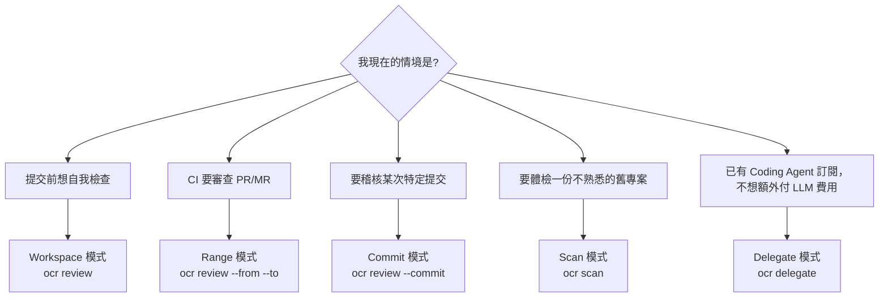

## 8.2 Incremental Review（增量審查）與 Whole Project Review（全專案審查）的取捨

- **Incremental Review**（對應 Range/Commit 模式）：只審查「這次變更」，速度快、
  Token 成本低，適合日常 PR 流程。
- **Whole Project Review**（對應 Scan 模式）：審查整個專案或目錄，成本高、耗時長，
  但能發現「從未被 diff 觸碰過」的既有問題，適合：
  - 導入 OCR 前的一次性「地基體檢」
  - Framework Upgrade / Legacy Modernization 前的全面盤點（見第16、17章）
  - 定期（如每季）的技術債總體檢

## 8.3 範例：三種模式的實際指令與情境

```bash
# 情境一：開發者提交前自檢
ocr review

# 情境二：CI 對 PR 做審查
ocr review --from origin/main --to HEAD --format json

# 情境三：稽核上週某次 Hotfix
ocr review --commit 8f3a1c2 --audience human

# 情境四：對剛接手的 legacy 專案做全面體檢
ocr scan --repo ./legacy-erp-system --format json > baseline-scan.json

# 情境五：已用 Claude Code 訂閱額度，改用委派模式省 LLM 費用
ocr delegate rule --from origin/main --to HEAD --format json
```

## 8.4 Best Practice

1. 新專案導入 OCR 時，先跑一次 **Scan 模式** 建立「基準線」（baseline），把當下
   已存在的問題記錄下來，後續 Range/Commit 模式的審查只需關注「新增」的問題，
   避免舊技術債洗版 PR 留言。
2. Delegate 模式特別適合「團隊已經人手一份 Claude Code/Cursor 訂閱」的情境 ——
   讓 OCR 專心做「檔案篩選 + 規則解析」，實際的 LLM 呼叫費用由既有訂閱吸收，
   避免雙重付費。
3. Commit 模式適合搭配事件觸發（如 Hotfix 部署前的強制稽核關卡），而非取代日常
   Range 模式的 PR 審查。

## 8.5 常見錯誤

| # | 錯誤 | 原因 | 解法 | 預防 |
| --- | --- | --- | --- | --- |
| 1 | 對整個大型 Monorepo 每次 PR 都跑 Scan 模式 | 混淆 Scan 與 Range 模式的適用情境 | 日常 PR 一律用 Range 模式，Scan 只在必要時執行 | 團隊規範明確寫清楚各模式適用時機 |
| 2 | 導入 OCR 當天就要求「新舊問題全部清零」 | 沒有先建立基準線 | 先跑 Scan 模式建立 baseline，逐步排除舊技術債 | 導入 SOP 第一步固定為「建立基準線」 |

---

# 第9章 Context Retrieval

## 9.1 說明：為什麼「只看 Diff」不夠

Diff 只告訴你「哪幾行變了」，但要判斷「這個變更是否安全」，往往需要知道：

- 這個函式還有誰在呼叫？呼叫端有沒有假設舊的行為？
- 這個欄位在其他檔案是怎麼定義、怎麼被驗證的？
- 這個變更影不影響到其他模組的依賴關係？

這正是官方工具集（`internal/tool`）存在的理由：讓 Agent 有能力**主動**跳出 Diff
範圍去查找答案，而不是被動地只看眼前這幾行。

## 9.2 Context Retrieval 工具一覽

| 工具 | 對應人類 Reviewer 的哪個動作 |
| --- | --- |
| `code_search` | IDE 的「全域搜尋」或 `git grep`，找關鍵字/符號出現的位置 |
| `file_read` | 打開一個檔案完整閱讀 |
| `file_read_diff` | 只看某個檔案的變更部分（等同 `git diff <file>`） |
| `file_find` | 依檔名/路徑模式尋找檔案（類似 `find`／IDE 的 Go to File） |
| `code_comment` | 在特定行號留下審查意見 |
| `task_done` | 宣告本次審查任務完成，收斂為 Structured Output |

## 9.3 架構圖：Context Retrieval 如何融入審查迴圈

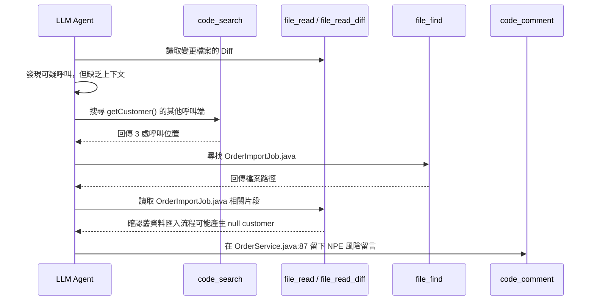

## 9.4 跨檔案分析（Cross File Analysis）與依賴分析

- **跨檔案分析**：透過 `code_search` + `file_read` 的組合，Agent 可以重建「這個變更
  影響到哪些其他檔案」的局部依賴圖，而不需要真正建置整個專案（比對比 IDE 的
  「Find Usages」但不需要完整編譯環境）。
- **依賴分析（Dependency Analysis）**：對於 `pom.xml`、`build.gradle`、
  `package.json` 等依賴宣告檔案，OCR 內建規則會特別檢查依賴版本升降級是否引入
  已知風險（見第11章）。

## 9.5 如何提升 Review 品質：實務技巧

1. **善用 `--rule` 指向更精確的規則檔**，讓 Deterministic 層先框定「這類檔案該
   特別注意什麼」，減少 Agent 需要靠 Context Retrieval 從頭摸索的工作量。
2. **控制 `--max-tools`**：工具呼叫次數並非越多越好，過多的探索反而可能讓 Agent
   偏離審查焦點、拉長審查時間與成本；建議先用預設值觀察典型 PR 的工具呼叫次數，
   再依需要微調上限。
3. **搭配 Smart File Packing 的分包結果**：確保有依賴關係的檔案被打包在同一個
   Bundle，讓 Context Retrieval 的搜尋範圍更聚焦（見第3章）。

## 9.6 範例：完整多步工具呼叫紀錄（模擬 Session 逐字稿）

以下是一段模擬的 `ocr session show <id> --verbose` 輸出，展示 Agent 從讀取
Diff 到形成結論的完整工具呼叫鏈，幫助讀者建立「Agent 到底在背後做了什麼」的
具體印象：

```text
[Step 1] file_read_diff(src/service/RefundService.java)
  → 發現新增方法 processRefund()，內含
    accountService.getAccount(userId).deduct(amount)

[Step 2] code_search(query="getAccount", scope="src/**/*.java")
  → 找到 3 處呼叫端：
     - RefundService.java:45（本次變更）
     - OrderService.java:112
     - AccountController.java:30
  → 觀察到 OrderService.java 呼叫前都有先做 null 檢查，本次新增的呼叫沒有

[Step 3] file_read(src/service/AccountService.java)
  → 確認 getAccount() 的方法簽章：可能回傳 null（帳戶不存在時）

[Step 4] file_find(pattern="*AccountNotFoundException*")
  → 找到既有的例外類別 AccountNotFoundException，代表這是專案既有的錯誤處理慣例

[Step 5] Reasoning（內部推理，非留言內容）
  → 假設驗證：processRefund() 缺少 null 檢查，且未依循專案既有的
    AccountNotFoundException 慣例，屬於高風險 NPE

[Step 6] code_comment(file="RefundService.java", line=45, severity="high",
          category="null-pointer",
          message="getAccount() 可能回傳 null，建議依循 AccountService 既有慣例
                   拋出 AccountNotFoundException，而非直接呼叫 .deduct()")

[Step 7] task_done()
  → 收斂為 Structured Output，本次 Bundle 審查完成
```

這個逐字稿說明了 Context Retrieval 的價值：Agent 不只是「看到一行可疑程式碼
就下結論」，而是透過 4 次工具呼叫，找到專案既有的錯誤處理慣例（
`AccountNotFoundException`），讓最終建議不只是「這裡可能有問題」，而是
「這裡應該比照專案既有慣例修正」——這種具體、可執行的建議品質，正是 Context
Retrieval 機制存在的意義。

## 9.7 Best Practice

1. 對關鍵模組（如支付、權限）额外準備「架構說明」放進 `.opencodereview/rule.json`
   的註解或關聯文件，幫助 Agent 更快建立正確的業務上下文，而不必完全依賴即時搜尋。
2. 定期抽查 Session（`ocr session show <id>`）中的工具呼叫紀錄，觀察 Agent 是否
   有「搜尋了但沒找到關鍵資訊」的情形，作為調整規則/文件的依據。
3. 大型 Monorepo 建議搭配路徑範圍限縮（規則 include/exclude），避免 `code_search`
   在無關的其他服務目錄底下做無意義的搜尋，浪費 Token。

## 9.8 常見錯誤

| # | 錯誤 | 原因 | 解法 | 預防 |
| --- | --- | --- | --- | --- |
| 1 | 誤以為 Agent 只看得到 Diff 內容 | 不了解 Context Retrieval 工具集的存在 | 教育訓練說明工具集的作用與限制 | 手冊/Wiki 明確列出工具能力範圍 |
| 2 | `--max-tools` 設太低導致 Agent 來不及查完上下文就被迫結束 | 誤以為越低越省成本 | 依典型 PR 複雜度調整合理上限 | 導入初期先做基準測試找出合理值 |

---

# 第10章 AI Review 流程

## 10.1 說明：Agent 如何「思考」一次審查任務

把前面幾章的元件串起來，一次完整的 AI Review 在 Agent 視角下大致經歷以下心智過程：

1. **接收任務框架**：從 Deterministic 層拿到「這個 Bundle 該看哪些檔案、命中了哪些
   規則」。
2. **建立初步理解**：透過 `file_read_diff` 先看變更本身，形成初步假設（例如「這裡
   可能有 NPE 風險」）。
3. **驗證假設**：透過 `code_search`/`file_read`/`file_find` 主動查找上下文，驗證
   或推翻初步假設。
4. **形成結論並定位**：確定問題後，決定要留言的具體行號與說明文字。
5. **收斂輸出**：呼叫 `task_done`，把所有留言收斂成 Structured Output。

## 10.2 Context 如何建立

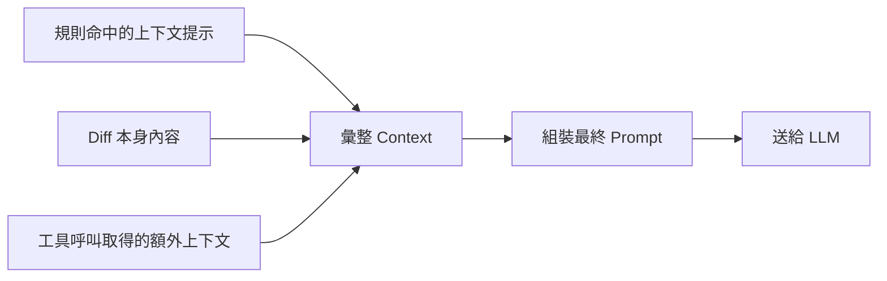

## 10.3 Prompt 如何生成

🟡（作者依架構原理補充）Prompt 組裝大致包含：

- **System/Scenario Prompt**：依審查情境（PR 審查 vs 全檔掃描 vs 委派模式）套用
  不同的場景化 Prompt 模板。
- **規則注入**：命中的規則描述會被插入 Prompt，提醒 Agent 這類檔案該特別注意
  什麼（例如 MyBatis Mapper XML 要特別注意 SQL Injection）。
- **工具定義**：可用工具的 Schema（`code_search`、`file_read` 等）作為 Tool
  Definition 一併提供給 LLM。
- **輸出格式約束**：要求最終透過 `task_done` 以固定 Schema 收斂結果，而非自由文字。

## 10.4 Reasoning 與 Structured Output

- **Reasoning（推理）**：Agent 在工具呼叫之間會展現／維護推理鏈，決定下一步要
  查什麼、何時已經蒐集足夠證據可以下結論。
- **Structured Output（結構化輸出）**：最終結果透過 `task_done` 固定成含
  `file`、`line`、`severity`、`message`、`suggested_fix` 等欄位的結構化資料，
  這是下游系統（PR 留言 API、Dashboard、Session Viewer）能夠可靠解析的關鍵。

```json
{
  "file": "src/service/OrderService.java",
  "line": 87,
  "severity": "high",
  "category": "null-pointer",
  "message": "order.getCustomer() 可能為 null，缺少防呆檢查",
  "suggested_fix": "新增 null 檢查並拋出明確例外訊息",
  "reasoning_summary": "透過 code_search 找到 OrderImportJob.java 中存在未設定 customer 的訂單匯入路徑"
}
```

## 10.5 Review Report 的產出

`ocr session show <id>` 與 `ocr viewer` 都是基於同一份 Structured Output 資料源
呈現，差別只是「命令列文字檢視」vs「本地網頁圖形化檢視」。企業可以將這份 JSON
資料進一步匯入自己的 BI 工具，累積長期的品質趨勢報告（見第23、24章）。

## 10.6 Mermaid：AI Review 全流程心智模型

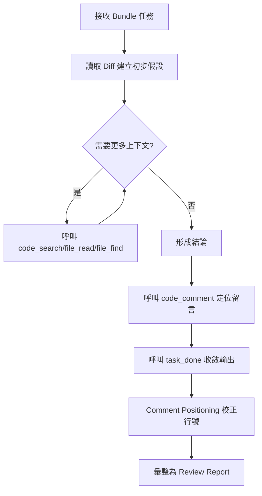

## 10.7 Best Practice

1. 審查關鍵模組時，可透過 `--audience agent` 取得更精簡的 Structured Output，
   減少不必要的說明性文字，加快下游自動化處理速度。
2. 定期抽查 `reasoning_summary`（若 Provider/版本有提供推理摘要），評估 Agent
   的判斷邏輯是否合理，而不只是看最終結論 —— 這對建立團隊對 AI Review 的信任
   感特別重要。
3. 把 Structured Output 的 `category` 欄位對應到企業自己的缺陷分類體系
   （見第26章 KPI 設計），方便長期追蹤各類問題的趨勢。

## 10.8 常見錯誤

| # | 錯誤 | 原因 | 解法 | 預防 |
| --- | --- | --- | --- | --- |
| 1 | 直接用正則表達式解析 `text` 格式輸出 | 不知道有 `--format json` 可用 | 一律改用 JSON 輸出做程式化處理 | CI 範本固定使用 JSON 格式 |
| 2 | 忽略 `severity` 欄位，把所有留言一視同仁處理 | 沒有依嚴重度分流 | 依 severity 分流：high 阻擋合併、low 僅供參考 | 治理流程明訂 severity 對應的處理方式（見第20章） |

---

# 第11章 Rule Engine

## 11.1 說明：四層規則優先序

🟢 官方 `review-rules.md` 記載，規則採四層優先序（由高到低）：

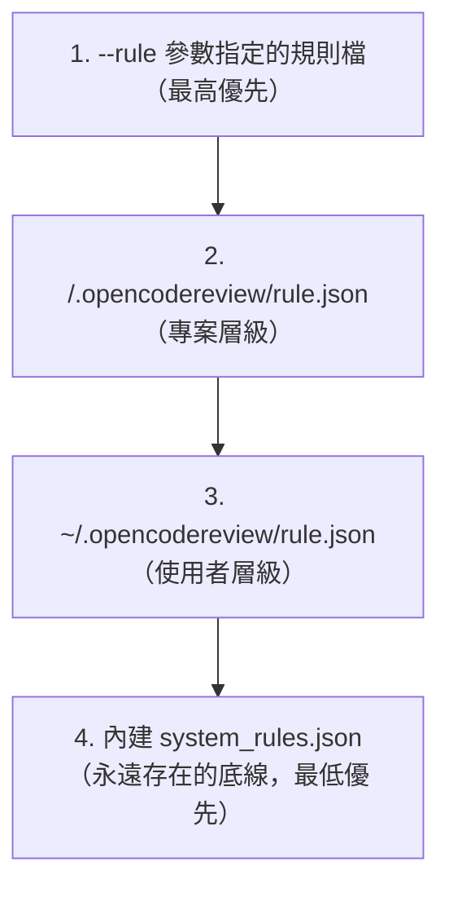

規則檔（第1～3層）三個獨立欄位：`include`、`exclude`、`rules`——
`rules` 是 `{path, rule}` 陣列，**依宣告順序**逐一比對，第一個 glob 命中的
`path` 就決定該檔案套用哪段規則描述（不是「所有命中規則都套用」）。若某一層
對應的檔案不存在（例如專案從未建立 `.opencodereview/rule.json`），就直接靜默
跳過該層，**不是錯誤**，繼續往下一層找；系統層一定存在（隨執行檔內嵌），所以
最終一定會解析出某段規則文字。

> ⚠️ **`include` 常見誤解**：`include` **不是白名單**，而是「繞過內建預設
> 排除規則（主要是測試檔排除模式，見11.2節）」的機制。即使檔案完全沒有命中
> 任何 `include` pattern，仍會照常走過 `unsupported_ext`／`default_path` 兩道
> 閘門判斷是否審查；`include` 命中時則會**跳過**這兩道閘門直接保留（常用於
> 「我要強制審查一個原本會被預設規則排除的測試檔」的情境）。

## 11.2 五道過濾閘門（File Filter）

🟢 官方 `internal/agent/preview.go` 的 `whyExcluded` 依序執行五道判斷
（原始檔與 `review-rules.md`／`architecture.md` 交叉查證）：

1. **binary**：二進位檔案，直接排除。
2. **user_exclude**：命中使用者 `exclude` pattern，永遠優先排除（最高權重）。
3. **user_include**：若使用者定義了 `include` 且路徑命中，**立即保留**
   （跳過第4、5道閘門）。
4. **unsupported_ext**：副檔名不在內建
   [`supported_file_types.json`](https://github.com/alibaba/open-code-review/blob/main/internal/config/allowlist/supported_file_types.json)
   允許清單內，排除。
5. **default_path**：命中內建**測試檔**排除樣式（如 `**/*_test.go`、
   `**/*.test.{js,jsx,ts,tsx}`、`**/*_spec.rb`、`**/__tests__/**` 等），排除。

全部通過才會送進 LLM。另有一個 `deleted` 分類**不是閘門**，是 `Preview()`
在檔案通過五道閘門後，另外針對「新路徑為 `/dev/null`」（即被刪除的檔案）
額外標記的結果——沒有新內容可審查。

🟡（架構補充）`vendor/`、`node_modules/`、`target/` 等「雜訊目錄」的過濾發生
**更早**，在 Diff Provider 層（`internal/diff/git.go` 的
`providerDirIgnoreDirs`），根本不會進到上述五道閘門，效能上比逐檔案判斷更快。

可用 `ocr review --preview` 或 `ocr rules check <file>` 觀察某個檔案實際通過/未
通過哪一道閘門、以及最終命中的規則層級與 pattern。

## 11.3 內建規則涵蓋的檔案類型（依副檔名/路徑模式）

🟢 官方 `review-rules.md` 完整列出 embedded `system_rules.json` 的比對順序，
共 **31 個規則文件＋ 1 個 fallback**（第一個命中的 pattern 勝出）：

| 比對順序 | Glob Pattern | 規則文件 | 涵蓋內容 |
| --- | --- | --- | --- |
| 1 | `**/*.properties` | `properties.md` | i18n／設定檔 |
| 2 | `**/*{mapper,dao}*.xml` | `mapper_dao_xml.md` | MyBatis 風格 Mapper SQL |
| 3 | `**/pom.xml` | `pom_xml.md` | Maven 依賴 |
| 4 | `**/build.gradle` | `build_gradle.md` | Gradle 依賴 |
| 5 | `**/package.json` | `package_json.md` | npm 依賴／scripts |
| 6 | `**/Cargo.toml` | `cargo_toml.md` | Rust manifest |
| 7 | `**/composer.json` | `composer_json.md` | Composer 依賴／autoload／scripts |
| 8 | `**/*.{json,json5}` | `json.md` | 通用 JSON |
| 9 | `.github/workflows/**/*.{yaml,yml}` | `github_workflows.md` | GitHub Actions workflow |
| 10 | `.github/**/*.{yaml,yml}` | `github_config.md` | 其餘 `.github` 設定 YAML |
| 11 | `**/*.{yaml,yml}` | `yaml.md` | 通用 YAML |
| 12 | `**/*.java` | `java.md` | Java |
| 13 | `**/*.go` | `go.md` | Go |
| 14 | `**/*.{ftl,ftlh,ftlx}` | `freemarker.md` | FreeMarker（SSTI／XSS／null 處理） |
| 15 | `**/*.ets` | `arkts.md` | ArkTS／HarmonyOS |
| 16 | `**/*.astro` | `astro.md` | Astro |
| 17 | `**/*.{ts,js,tsx,jsx}` | `ts_js_tsx_jsx.md` | TS／JS／TSX／JSX |
| 18 | `**/*.kt` | `kotlin.md` | Kotlin |
| 19 | `**/*.rs` | `rust.md` | Rust |
| 20 | `**/*.{cpp,cc,hpp}` | `cpp.md` | C++（與 C 是**兩份獨立**規則文件） |
| 21 | `**/*.c` | `c.md` | C |
| 22 | `**/*.py` | `python.md` | Python |
| 23 | `**/*.{php,phtml}` | `php.md` | PHP（含 PHP 樣板） |
| 24 | `**/*.proto` | `protobuf.md` | Protocol Buffers 相容性 |
| 25 | `**/*.po` | `po.md` | gettext 翻譯來源 |
| 26 | `**/*.pot` | `pot.md` | gettext 樣板 |
| 27 | `**/*.{graphql,gql}` | `graphql.md` | GraphQL schema／operations |
| 28 | `**/*.prisma` | `prisma.md` | Prisma schema |
| 29 | `**/*.jl` | `julia.md` | Julia |
| 30 | `**/*.{tf,hcl,tfvars}` | `terraform.md` | Terraform／HCL |
| 31 | `**/*.bicep` | `bicep.md` | Bicep（Azure） |
| — | *(fallback)* | `default.md` | 未命中以上任何 pattern 的檔案 |

> 🟡 **作者提醒**：這些規則文件的逐字內容並非公開瀏覽路徑，本章11.4節的規則
> 類別說明是作者依據「規則類別名稱」＋通用資安/軟體工程原則重新整理撰寫的
> 教學內容，用於幫助讀者理解**這個類別的規則大概會抓什麼樣的問題**，並非官方
> 規則原文引用。

**Glob 語法**（底層為 `bmatcuk/doublestar/v4`，`ocr rules check <path>` 可驗證
實際比對結果）：

| 語法 | 意義 |
| --- | --- |
| `*` | 比對除 `/` 以外的任意字元 |
| `**` | 跨目錄層級比對（如 `src/**/*.go` 涵蓋任意深度） |
| `{a,b,c}` | 大括號展開，`*.{ts,tsx,js,jsx}` 等同展開成 4 個 pattern 逐一比對 |
| `?` | 比對單一字元 |
| `[abc]` | 字元類別 |

> ⚠️ 所有 pattern 比對前檔案路徑會先轉小寫（**大小寫不敏感**），不確定的話
> 一律用 `ocr rules check <path>` 實測確認。

## 11.4 規則分類詳解

### 11.4.1 Null Pointer（NPE）
檢查缺乏防呆的鏈式呼叫（如 `a.getB().getC()`）、未檢查回傳值即直接解參考的情形。
🟢 官方 repo 描述欄位本身即標明 NPE 為旗艦規則類別之一。

### 11.4.2 Thread Safety（執行緒安全）
檢查共享可變狀態未加同步保護、非執行緒安全的集合類別在並行環境下被誤用等情形。
🟢 同樣是官方描述欄位標明的旗艦類別。

### 11.4.3 Race Condition（競態條件）
檢查「檢查後才操作」（check-then-act）缺乏原子性保護的模式，例如先查詢庫存再扣減，
中間沒有鎖或樂觀鎖版本控管。

### 11.4.4 Dead Lock（死鎖）
檢查多把鎖的取得順序是否可能在不同執行緒間形成循環等待。

### 11.4.5 SQL Injection
🟢 官方描述欄位標明的旗艦類別，MyBatis mapper/dao XML 有專屬規則文件，重點檢查
`${}`（字串直接替換，高風險）誤用於本該用 `#{}`（參數化綁定）的情境。

### 11.4.6 XSS（跨站腳本攻擊）
🟢 官方描述欄位標明的旗艦類別，FreeMarker 樣板規則特別聚焦 SSTI／XSS，前端框架
（TS/JS/JSX/TSX/Astro）規則則聚焦未跳脫的使用者輸入直接輸出到 DOM。

### 11.4.7 CSRF
檢查狀態變更型 API（POST/PUT/DELETE）是否缺乏 CSRF Token 或 SameSite Cookie 保護。

### 11.4.8 XXE（XML External Entity）
檢查 XML 解析器是否停用外部實體解析，MyBatis 等大量使用 XML 設定檔的技術棧
需特別留意。

### 11.4.9 Hardcode Secret（硬編碼機密）
檢查程式碼/設定檔（含 `.properties`、`package.json` 等）中是否直接寫入 API Key、
密碼等機密資訊。

### 11.4.10 Memory Leak（記憶體洩漏）
Java 檢查未關閉的資源（Connection/Stream）、監聽器未移除；Go 檢查 goroutine
洩漏、未關閉的 channel。

### 11.4.11 Performance（效能）
檢查明顯的 N+1 查詢、迴圈內重複建立昂貴物件等常見效能反模式。

### 11.4.12 Exception（例外處理）
檢查空的 catch 區塊、吞掉例外不記錄、過度寬泛的例外捕捉（如直接 catch
`Exception`/`Throwable`）。

### 11.4.13 Logging（日誌）
檢查敏感資訊（密碼、個資）是否被記錄到日誌、日誌等級使用是否恰當。

### 11.4.14 Security（綜合資安）
涵蓋上述 SQLi/XSS/CSRF/XXE/Hardcode Secret 之外的其他 OWASP Top 10 相關模式，
如不安全的反序列化、路徑穿越（Path Traversal）。

### 11.4.15 Architecture（架構）
檢查是否違反既定分層原則（如 Controller 直接操作 DAO，跳過 Service 層）。

### 11.4.16 Maintainability（可維護性）
檢查過長函式、過深巢狀、重複程式碼等可維護性指標。

## 11.5 範例：自訂專案規則檔

```json
{
  "rules": [
    {
      "path": "src/main/java/**/service/payment/**",
      "rule": "此目錄為金流核心模組：任何涉及金額計算的變更必須檢查精度處理（禁止直接用 double 做金額運算），並確認交易性 API 具備冪等性設計。"
    },
    {
      "path": "**/*Mapper.xml",
      "rule": "MyBatis Mapper：嚴格禁止 ${} 直接拼接使用者輸入，一律改用 #{} 參數化綁定。"
    },
    {
      "path": "src/main/resources/application*.properties",
      "rule": "設定檔：任何 password/secret/token 相關 key 禁止填入明碼，必須改用環境變數或密鑰管理服務參照。"
    }
  ],
  "exclude": ["**/generated/**", "**/*.min.js"]
}
```

## 11.6 各規則分類的自訂規則範例

延續11.4節的分類說明，以下提供更多分類的實際自訂規則檔片段範例，方便讀者
直接套用調整：

```json
{
  "rules": [
    {
      "path": "src/main/java/**/service/inventory/**",
      "rule": "Race Condition：庫存扣減操作必須使用樂觀鎖版本欄位或資料庫層級的原子操作（如 UPDATE ... WHERE stock >= ? ），禁止先 SELECT 查詢庫存再於應用層判斷後 UPDATE。"
    },
    {
      "path": "src/main/java/**/*.java",
      "rule": "Dead Lock：若方法內需要同時取得兩把以上的鎖，必須確保所有呼叫路徑都依照相同順序取得鎖（建議依類別名稱字母序），並在程式碼註解中標明鎖定順序。"
    },
    {
      "path": "**/*.xml",
      "rule": "XXE：所有 XML 解析器初始化程式碼必須明確停用外部實體解析（如 Java 的 setFeature(\"http://apache.org/xml/features/disallow-doctype-decl\", true)）。"
    },
    {
      "path": "src/main/java/**/*.java",
      "rule": "Memory Leak：實作 Closeable/AutoCloseable 的資源（Connection、InputStream 等）必須使用 try-with-resources，禁止手動 close() 且未包在 finally 區塊。"
    },
    {
      "path": "src/main/java/**/*.java",
      "rule": "Exception：禁止空的 catch 區塊；catch Exception 或 Throwable 時必須有明確理由註解，且必須記錄日誌或重新拋出，不可靜默吞掉例外。"
    },
    {
      "path": "src/main/java/**/*.java",
      "rule": "Logging：日誌輸出禁止包含密碼、身分證字號、信用卡卡號等敏感欄位；記錄使用者輸入前應做適當遮罩處理。"
    }
  ]
}
```

> 💡 **Tip**：建議把這類「分類規則範本」集中維護在企業內部的 Prompt/規則庫
> （見第20.5.5節），依專案技術棧與風險等級挑選適用的範本疊加使用，而不是
> 每個專案重新從零撰寫。

## 11.7 Best Practice

1. 不要試圖用一份規則檔涵蓋所有情境 —— 依「高風險模組」「一般模組」「產生型
   程式碼」三個層級分別設計 include/exclude 範圍，聚焦資源在真正重要的地方。
2. 規則描述用**具體、可執行**的語言撰寫（例如「禁止 ${} 拼接」而非「注意 SQL
   安全」），讓 LLM Agent 有明確的判斷依據，減少模稜兩可的誤判。
3. 規則檔納入版本控制，變更走 PR 審核流程 —— 規則本身也是需要治理的資產
   （見第20、26章）。

## 11.8 常見錯誤

| # | 錯誤 | 原因 | 解法 | 預防 |
| --- | --- | --- | --- | --- |
| 1 | 誤把內建規則文件內容當作可直接引用的官方原文 | 不了解規則原文並非公開瀏覽路徑 | 以規則類別名稱 + 團隊自訂描述重新撰寫規則檔 | 本章已於11.3節明確標註此限制 |
| 2 | 誤把 `include` 當白名單，以為沒列進去的檔案就不會被審查 | 不了解 `include` 只是「繞過預設測試檔排除」的機制，不是範圍限制 | 真正要限縮審查範圍請用 `exclude`；`include` 只用於強制納入本會被排除的檔案 | 依 11.1 節說明清楚兩者語意差異 |
| 3 | 規則描述寫得過於抽象籠統 | 誤以為 LLM 能自行腦補所有細節 | 具體列出「禁止」「必須」的明確條件 | 規則撰寫範本強制要求具體化描述 |

---

# 第12章 支援模型

## 12.1 說明：原生內建 vs 自行串接

🟢 這是本手冊最需要精確澄清的一章：官方 `internal/llm/providers.go` 內建的
provider registry，與坊間常聽到的「支援 GPT/Claude/Gemini」等說法，並不完全等價。
以下先建立正確的分類框架，再逐一比較各家模型的優缺點。

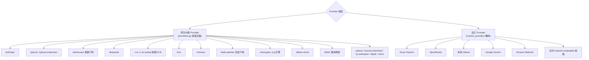

## 12.2 原生內建 Provider 一覽

🟢 官方 `providers.go` 中確認的協定型別只有三種：`anthropic`、`openai`、
`openai-responses`；各家 Provider 依此三種協定之一實作。

| Provider 標識 | 對應廠商/模型系列 | 協定 |
| --- | --- | --- |
| `anthropic` | Claude 系列 | anthropic |
| `openai` | GPT 系列 | openai |
| `dashscope` / `dashscope-tokenplan` | 阿里雲通義千問 Qwen | openai-compatible |
| `deepseek` | DeepSeek 系列 | openai-compatible |
| `z-ai` / `z-ai-coding` | 智譜 GLM 系列 | openai-compatible |
| `kimi` | Moonshot Kimi | openai-compatible |
| `minimax` | MiniMax abab 系列 | openai-compatible |
| `baidu-qianfan` | 百度文心（千帆平台） | openai-compatible |
| `volcengine` | 火山引擎（豆包等） | openai-compatible |
| `ollama-cloud` | Ollama 雲端代管服務 | openai-compatible |
| `litellm` | 萬用代理閘道（可轉接近百種供應商） | openai-compatible |
| `edenai` / `tencent-tokenhub` / `hy-tokenplan` / `iflytek` / `mimo` | 其他區域性/聚合型供應商 | openai-compatible |

## 12.3 各家模型優缺點比較

| 模型系列 | 優點 | 缺點/限制 | 接入方式 |
| --- | --- | --- | --- |
| **GPT（OpenAI）** | 生態成熟、工具呼叫穩定性高、文件/社群資源豐富 | 需上傳程式碼到美國/OpenAI 基礎設施，受監管產業需評估合規 | 原生 `openai` provider |
| **Claude** | 長文本/大量工具呼叫場景表現穩定，Agentic coding 評測表現佳 | 同樣是雲端 API，需評估資料落地問題 | 原生 `anthropic` provider |
| **Gemini** | 多模態能力強、Google Cloud 生態整合佳 | **無原生 provider**，需透過 custom/litellm 接入 | Custom provider（OpenAI-compatible 端點）或 litellm |
| **Qwen（通義千問）** | 中文語境理解佳、原生內建、阿里雲生態內部署便利 | 英文技術文件/國際社群資源相對少 | 原生 `dashscope` provider |
| **DeepSeek** | 高性價比、開源版本可自架 | 工具呼叫穩定性因版本而異，需自行驗證 | 原生 `deepseek` provider |
| **Llama** | 開源、可完全自架、無 API 費用 | **無原生 provider**，需自架推論服務後以 custom/Ollama 接入；本地硬體需求高 | Custom provider 或本地 Ollama |
| **Mistral** | 開源選擇多、歐洲資料主權合規較有利 | **無原生 provider**，需 custom 接入 | Custom provider |
| **GLM（智譜）** | 原生內建、中文場景表現佳 | 國際化文件相對少 | 原生 `z-ai`/`z-ai-coding` provider |
| **OpenRouter** | 一個 API Key 打通多家供應商，方便比較/切換 | **非原生**，屬於 custom provider 接法；多一層代理可能增加延遲 | Custom provider（OpenAI-compatible） |
| **Ollama（本地）** | 完全離線、原始碼零外流、無 API 費用 | 需自備硬體（GPU），大型模型推論速度較雲端慢 | Custom provider（官方文件示範接法） |

## 12.4 企業選型建議（作者建議）

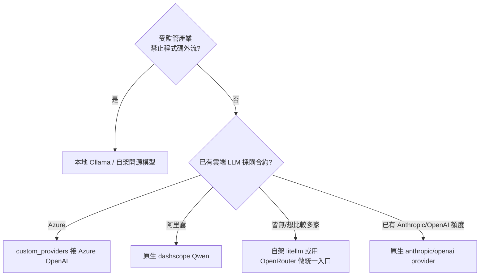

## 12.5 深度比較：延遲、Context Window 與成本考量（作者補充）

🟡 除了「原生 vs 自訂」的接入方式差異外，企業選型時還應該考量以下三個實務
面向，這些數據會隨供應商版本迭代而變動，建議導入前自行實測，以下僅提供
評估框架：

| 考量面向 | 說明 | 對 OCR 使用情境的影響 |
| --- | --- | --- |
| **延遲（Latency）** | 雲端 API 延遲通常穩定在數百毫秒至數秒；本地模型依硬體差異可能達數秒至數十秒 | 影響 CI Pipeline 的總執行時間，本地模型建議降低 `--concurrency` 換取穩定性 |
| **Context Window** | 不同模型系列支援的最大上下文長度不同 | 影響 Smart File Packing 的分包策略——Context Window 越小，需要分越多包，並行呼叫次數增加 |
| **每次呼叫成本** | 雲端 API 依 Token 計費；本地模型無 API 費用但有硬體攤提成本 | 大型 Monorepo 頻繁審查時，成本差異會被放大，需納入 ROI 計算（見第26.6節） |
| **工具呼叫穩定性** | 部分模型在複雜多步工具呼叫情境下穩定性較低（如漏呼叫 `task_done`） | 直接影響 Structured Output 的完整性，建議選型時針對「多步工具呼叫」情境做壓力測試 |

## 12.6 Best Practice

1. 導入前務必先確認「原生 vs 自訂」的區別 —— 若採購決策依賴「官方支援 Gemini/
   Azure OpenAI」這類說法，務必要求對方指出是走 custom provider 機制，並提前
   測試該接法的穩定性與延遲。
2. 針對受監管產業（銀行、政府），優先評估本地 Ollama 或自架開源模型路線，把
   「資料是否外流」列為選型的第一道硬性關卡（見第19章銀行案例）。
3. 若需要跨多個供應商比較審查品質差異，可用 `--model` 參數在同一份 PR 上快速
   切換模型跑多次比較，建立內部的模型選型基準測試（Benchmark）流程。

## 12.7 常見錯誤

| # | 錯誤 | 原因 | 解法 | 預防 |
| --- | --- | --- | --- | --- |
| 1 | 誤以為官方原生支援 Azure OpenAI/Gemini/OpenRouter | 混淆 Roadmap 用語與原始碼實際定義 | 依 12.1 節分類框架，一律走 custom_providers 接法 | 採購/導入評估文件中明確標註此差異 |
| 2 | 為了「用最強的模型」而忽略資料落地合規要求 | 選型時只比較準確率，未評估法遵風險 | 依 12.4 節先做合規篩選，再比較模型能力 | 企業導入 Checklist 中加入合規優先於效能的原則 |

---

# 第13章 與 AI Agent 整合

## 13.1 說明：官方證實的整合 vs 原則上可行的整合

🟢 官方 repo `plugins/open-code-review/` 目錄下實際存在 `claude-code/`、
`.codex-plugin/`、`.cursor-plugin/`、`opencode/` 四個子目錄，加上根層級的
`skills/open-code-review/`（通用 Agent Skill）與 `skills/open-code-review-delegate/`
（Delegate 模式專用 Skill），以及官方文件 `pages/src/content/docs/en/integrations/`
下的 `agent-skill.md`、`claude-code.md`、`delegate.md`、`ci.md` 四篇專頁。
綜合以上，官方證實的整合對象與**機制**如下：

| Agent／IDE 工具 | 整合方式 | 證實狀態 |
| --- | --- | --- |
| **Claude Code** | ①Agent Skill（`npx skills add`）②Command／Plugin（`/open-code-review:review`，內建自動修復）③Delegation Mode | 🟢 官方證實，三種機制皆可用，且有專屬 plugin 目錄 |
| **Codex** | Agent Skill＋專屬 `.codex-plugin/` 封裝 | 🟢 官方證實 |
| **Cursor** | Agent Skill＋專屬 `.cursor-plugin/` 封裝 | 🟢 官方證實 |
| **OpenCode** | Agent Skill＋專屬 `opencode/` 封裝 | 🟢 官方證實 |
| **VSCode** | 官方 VSCode 延伸套件（in-editor code review） | 🟢 官方證實（`ROADMAP.md` Current State 明確列出，屬編輯器層級整合，非 Agent Skill 機制） |
| JetBrains（IntelliJ IDEA／GoLand／PyCharm 等） | IDE 外掛 | 🟡 `ROADMAP.md` H2 2026 規劃中，**尚未釋出** |
| GitHub Copilot | — | 🟡 未見官方文件，原則上可行（Copilot 支援讀取專案內的通用設定/Skill 檔） |
| Gemini CLI | — | 🟡 未見官方文件，原則上可行（若能讀取 Agent Skill 檔或透過 Delegation Mode 手動接） |
| OpenHands / Roo Code / Cline / Aider / Goose / OpenManus / OpenDevin | — | 🟡 未見官方文件證實，理論上可透過 Agent Skill 慣例或 Delegation Mode 手動整合，但未經作者驗證 |

> ⚠️ **重要修正**：官方 `mcp.md` 文件與 `cmd/opencodereview/` 原始碼目錄
> （無 `mcp_cmd.go`、`cli-reference.md` 頂層指令列表也無 `ocr mcp`）已交叉確認：
> **OCR 只扮演 MCP「用戶端」（Client）角色**——它可以設定連到外部 MCP Server
> 取得額外上下文（見6.7節），**但官方並未提供讓其他 Agent 透過 MCP 協定「呼叫
> OCR 自己」的伺服端功能**。舊版手冊 13.5 節「其他 Agent 透過 MCP 呼叫 OCR」的
> 範例經查證後**不成立**，本次已改寫為正確方向（OCR 呼叫外部 MCP Server），
> 詳見13.5節。真正讓其他 Agent「呼叫 OCR」的機制是 Agent Skill、Command、
> Delegation Mode 這三種，不是 MCP。

## 13.2 三種整合機制的原理與差異

🟢 官方文件明確區分三種讓 Coding Agent「呼叫 OCR」的機制，機制之間互斥／互補
關係如下（依 `integrations/agent-skill.md`／`claude-code.md`／`delegate.md`
彙整）：

| 機制 | 誰呼叫 LLM？ | 預設行為 | 安裝方式 |
| --- | --- | --- | --- |
| **Agent Skill** | OCR（需自備 LLM 設定） | 完整代跑 `ocr review`，分類 High/Medium/Low 後**先問使用者才修復** | `npx skills add alibaba/open-code-review --skill open-code-review` |
| **Command**（目前僅 Claude Code Plugin 形式） | OCR（需自備 LLM 設定） | 完整代跑 `ocr review --audience agent`，**預設自動修復** High/Medium 項目 | `/plugin marketplace add alibaba/open-code-review` + `/plugin install open-code-review@open-code-review`，或直接複製指令檔 |
| **Delegation Mode** | 宿主 Agent（用自己的訂閱額度，OCR 不需要 LLM） | OCR 只輸出檔案清單＋規則，由宿主 Agent 逐檔審查 | `npx skills add alibaba/open-code-review --skill open-code-review-delegate` |

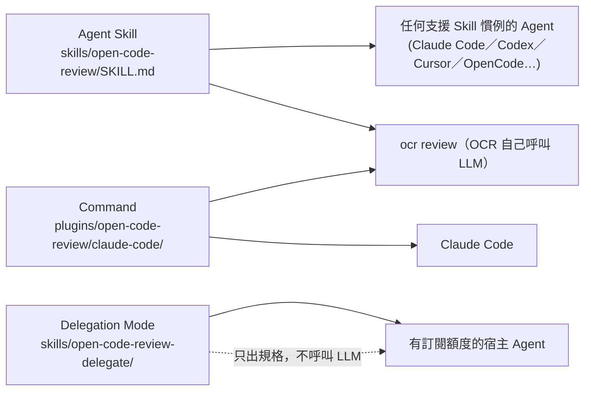

三者皆是**同一份 `ocr` CLI**在不同封裝下的呼叫方式，差別在「誰決定審查邏輯／
誰付 LLM 的錢／修復是否自動」，而不是三套獨立的程式碼。

### Agent Skill 執行流程（`SKILL.md` 展開後 Agent 實際會做的事）

1. **前置檢查**：跑 `which ocr` 確認 CLI 在 `PATH` 上，再跑 `ocr llm test`
   確認 LLM 端點可用。
2. **CLI 缺失時自動安裝**：若 `which ocr` 顯示未安裝，直接執行
   `npm install -g @alibaba-group/open-code-review`，視為例行設定步驟，**不**
   詢問使用者。
3. **LLM 未設定則停下來問**：`ocr llm test` 失敗時，Agent **不會**自己編造
   憑證，而是列出「環境變數」或「`ocr config set`」兩種選項，等待使用者提供
   API Key。
4. **萃取業務背景**：檢視審查目標（commit／branch／working copy），合成一段
   簡短的 `--background` 字串。
5. **執行審查**：呼叫 `ocr review --audience agent --background "…"`（依情境
   加 `--commit` 或 `--from/--to`）。
6. **分類與回報**：依 SKILL.md 內建的 rubric 把留言分成 High／Medium／Low
   （臭蟲與資安問題列 High，明顯的誤判與吹毛求疵靜默丟棄），輸出 Markdown 摘要。
7. **依要求修復**：使用者若明確說「review 並且 fix」才會自動改程式碼，否則
   先問過再動手——這點與 Command 機制的「預設自動修復」相反。

## 13.3 Open Code Review 如何協助 AI Agent 提升品質（特別章節）

這是本手冊「特別要求」中的核心主題之一：OCR 本身雖然是 Review 工具，但它的
Deterministic Pipeline 設計對「使用 AI Agent 開發」這件事本身也有直接助益：

1. **降低 Context 浪費**：Agent 開發程式碼時常常需要「順便看一下有沒有寫錯」，
   若讓通用 Agent 自己重新掃描整個變更去找問題，等於重複消耗大量 Context；
   改用 OCR 的 Deterministic 篩選 + 專屬工具集，只把「真正需要語意判斷」的部分
   交給 LLM，效率更高。
2. **減少位置漂移與幻覺**：官方明確指出通用 Agent 直接做審查容易出現「位置漂移」
   問題（回報的行號跟實際問題行號對不上），OCR 有專屬的 comment positioning
   校正模組解決這個問題 —— 這對「Agent 生成程式碼後緊接著自我審查」的場景特別
   重要。
3. **工具集是從真實軌跡蒸餾而來**：官方強調工具集是分析大量真實工具呼叫軌跡後
   精煉出的結果，而非憑空設計，這代表 Agent 在使用這組工具時，行為模式更貼近
   「真正有效的審查行為」，而非漫無目的地探索。
4. **委派模式讓 Agent 生態系互補而非重複投資**：透過 `ocr delegate`，已經在用
   Claude Code/Cursor 訂閱額度的團隊，可以讓宿主 Agent 的 LLM 直接執行審查邏輯，
   OCR 只負責「篩選與規則框架」，避免為了同一件事重複購買兩份 LLM 額度。

## 13.4 範例：Claude Code 中使用 OCR Command Plugin

🟢（依官方 `integrations/claude-code.md` 逐字核對）

```bash
# 方式一：Plugin Marketplace（建議，會自動保持更新）
/plugin marketplace add alibaba/open-code-review
/plugin install open-code-review@open-code-review
# 註冊為 /open-code-review:review

# 方式二：直接複製指令檔（專案層級，隨 repo 一起 commit，團隊共用）
mkdir -p .claude/commands
curl -o .claude/commands/open-code-review.md \
  https://raw.githubusercontent.com/alibaba/open-code-review/main/plugins/open-code-review/claude-code/commands/review.md
# 註冊為 /open-code-review（無 :review 後綴）
```

```text
/open-code-review:review
/open-code-review:review review this PR against main
/open-code-review:review focus on race conditions in commit abc123
/open-code-review:review --from main --to feature
```

指令會依你的描述自動推斷 `ocr review` 該用哪個模式（沒描述→Workspace；提到
commit→`--commit`；提到分支範圍→`--from`/`--to`），內部固定加上
`--audience agent`，並**預設自動修復** High／Medium 等級的發現——這是它與
Agent Skill 機制（預設先問過再修）最大的行為差異（見13.2節）。若不想要
自動修復，需自行編輯本機複製的指令檔調整規則。

## 13.5 範例：讓 OCR 呼叫外部 MCP Server（OCR 作為 MCP Client）

🟢（依官方 `mcp.md` 逐字核對，並在13.1節已勘誤：OCR **沒有**可供其他 Agent
連入的 MCP Server 模式，方向是反過來——OCR 的審查 Agent 主動去連外部 MCP
Server 取得額外上下文，設定寫在 `config.json` 的 `mcp_servers` 區塊，見6.7節）：

```bash
# 讓審查 Agent 除了內建工具外，還能查詢公司內部文件 MCP Server
ocr config set mcp_servers.docs.command npx
ocr config set mcp_servers.docs.args '["-y", "@acme/docs-mcp-server"]'
ocr config set mcp_servers.docs.tools '["search_docs", "get_page"]'
ocr config set mcp_servers.docs.env '["DOCS_TOKEN=secret"]'
```

適用情境：審查時需要對照 Jira 需求單、內部 API 文件、或呼叫自訂的 linter／
schema 檢查工具（詳見6.7節與官方 `mcp.md`）。若只是要「讀 repo 本身的程式
碼」，內建的 `file_read`／`code_search` 已足夠，不需要額外接 MCP。

## 13.6 各官方證實 Agent 工具的個別設定範例

### 13.6.1 Codex

```bash
# 方式一：Agent Skill（通用）
npx skills add alibaba/open-code-review --skill open-code-review

# 方式二：repo 內建的 .codex-plugin/ 封裝（見官方 plugins/open-code-review/README.md
# 與 CODEX.ko-KR.md，本手冊未查得逐字安裝步驟，建議以 repo 內該目錄下的
# 說明檔為準）
```

```bash
# 安裝完成後，於 Codex 對話中可用自然語言觸發，
# 或直接請它執行底層指令：
ocr review --from origin/main --to HEAD --audience agent --format json
```

### 13.6.2 Cursor

```bash
# Agent Skill（通用機制）
npx skills add alibaba/open-code-review --skill open-code-review

# 或 repo 內建的 .cursor-plugin/ 封裝，安裝細節請以該目錄內文件為準
```

> ⚠️ 舊版手冊此處曾示範用 `.cursor/mcp.json` 註冊 `ocr mcp` 讓 Cursor
> 連進 OCR——經查證 **並無 `ocr mcp` 這個子指令**（見13.1節勘誤），該範例
> 已移除。Cursor 呼叫 OCR 的正確途徑是 Agent Skill 或 `.cursor-plugin/`
> 封裝，如需要「Cursor 消費外部 MCP 資源」則是 Cursor 自己的 MCP 用戶端
> 設定，與 OCR 無關。

### 13.6.3 OpenCode

```bash
# Agent Skill（通用機制）
npx skills add alibaba/open-code-review --skill open-code-review

# 或 repo 內建的 opencode/ 封裝，讀取專案內的 Agent Skill 描述後於對話中即可觸發
```

> 💡 **Tip**：Codex／Cursor／OpenCode 共通的最保險做法是 `npx skills add`
> 安裝通用 Agent Skill（`open-code-review` 或 `open-code-review-delegate`），
> 這是唯一在官方文件中有逐字步驟佐證的安裝法；`plugins/open-code-review/`
> 底下各家專屬封裝目錄（`.codex-plugin/`、`.cursor-plugin/`、`opencode/`）
> 確實存在，但本手冊未查得個別的逐字安裝說明，建議直接參考 repo 內對應
> 目錄的 README。

## 13.7 VSCode／JetBrains：IDE 層級整合

🟢 這是與上述「Coding Agent 整合」不同的另一條軌道——直接在編輯器內做
in-editor code review，不透過 Agent Skill／Command／Delegation：

| IDE | 狀態 |
| --- | --- |
| VSCode | 🟢 官方延伸套件已發布（`extensions/vscode/`，`ROADMAP.md` 列為 Current State） |
| JetBrains（IntelliJ IDEA／GoLand／PyCharm 等） | 🟡 `ROADMAP.md` H2 2026 規劃中，**尚未釋出**，目標是提供與 VSCode 延伸套件相同的能力 |

🟡（作者提醒）本手冊未取得 VSCode 延伸套件的獨立安裝／操作步驟頁面
（未見對應的 `pages/src/content/docs/en/*.md` 專頁），建議直接於 VSCode
Marketplace 搜尋官方發布的延伸套件並參考套件本身的說明頁面。

## 13.8 Best Practice

1. 優先採用官方已證實的三種機制（Agent Skill／Command／Delegation Mode），
   若團隊使用的是「原則上可行」清單中的工具，導入前務必先做小範圍實測，不要
   直接假設官方等級的穩定性。
2. 對於已有 Coding Agent 訂閱的團隊，優先評估 Delegation Mode，避免重複投資
   LLM 額度（見13.3節第4點、第8章）。
3. 需要「審查時查詢外部上下文」（Jira／內部文件／自訂 linter）才考慮接 MCP
   Server，且方向是 OCR 呼叫出去，不是等其他 Agent 連進來（見13.5節勘誤）。
4. Claude Code 若選擇 Command 機制，記得它預設會自動修復——正式導入前先在
   測試分支確認自動修復的品質與範圍符合團隊預期，避免未經審視的變更被直接
   套用。

## 13.9 常見錯誤

| # | 錯誤 | 原因 | 解法 | 預防 |
| --- | --- | --- | --- | --- |
| 1 | 假設 OCR 有 `ocr mcp` 指令可讓其他 Agent 連進來 | 混淆「OCR 是 MCP Client」與「OCR 是 MCP Server」 | 依 13.1／13.5 節勘誤，改用 Agent Skill／Command／Delegation Mode | 手冊已明確標註此勘誤並移除錯誤範例 |
| 2 | 假設所有「支援 Skill 慣例」的 Agent 工具都已官方驗證與 OCR 相容 | 混淆「機制相容」與「官方驗證整合」 | 依 13.1 節分類，未證實項目自行實測後才推廣 | 導入文件明確標示驗證狀態 |
| 3 | 同時用宿主 Agent 訂閱 + OCR 自己的 API Key 重複審查同一份 PR | 未理解 Delegation Mode 的省錢用途 | 依團隊訂閱情況二選一，避免重複付費 | 導入 SOP 明確選定一種模式 |
| 4 | 誤以為 Claude Code 的 Command 機制跟 Agent Skill 行為一樣會先問過再修 | 沒注意到兩者「是否自動修復」的預設值不同 | 依 13.2 節對照表確認，需要人工把關就選 Agent Skill 或自行改指令檔 | Onboarding 文件標明兩者差異 |

---

# 第14章 與 code-review-graph 整合

> ⚠️ **本章性質聲明**：作者查證 Alibaba 官方 repo、ROADMAP.md、GitHub 原始碼後，
> **確認不存在**任何 Alibaba 官方、與 `open-code-review` 有文件化整合關係的
> 「code-review-graph」知識圖譜專案。本系列教材中另有一本
> 《[code-review-graph 教學手冊](code-review-graph%20教學手冊.md)》，介紹的是一套
> **獨立、非 Alibaba 出品**的 Tree-sitter/AST + SQLite + MCP Server 知識圖譜工具。
> **本章全部內容為作者提出的架構整合模式建議**，用來說明兩類工具在企業內部如何
> 互補搭配，並非官方發布或文件化的整合功能。閱讀本章時請以「架構參考模式」的
> 心態閱讀，不要當作 OCR 的官方功能敘述。

## 14.1 說明：兩種工具的定位差異

| 面向 | Open Code Review | （姊妹手冊）code-review-graph |
| --- | --- | --- |
| 核心定位 | Deterministic Pipeline + LLM Agent 的**審查執行引擎** | Tree-sitter/AST 解析 + SQLite 儲存的**程式碼知識圖譜** |
| 主要輸出 | Review 留言（Structured Output） | 程式碼實體/關係的圖譜資料（可查詢） |
| 上下文取得方式 | 即時工具呼叫（`code_search`/`file_read`） | 預先建置好的靜態知識圖譜，查詢速度快 |
| 對「跨檔案關聯」的處理 | 依賴 Agent 當下主動搜尋，可能重複查詢相同資訊 | 關聯已預先計算好，可一次查詢取得完整依賴鏈 |

## 14.2 作者提出的整合模式（Author-Proposed Integration Pattern）

🟡 **核心構想**：讓 code-review-graph 事先建置好的知識圖譜，成為 OCR「Context
Retrieval」層的**加速快取**，減少 Agent 需要即時搜尋的次數，同時提供比即時搜尋更
完整的跨檔案依賴視角。

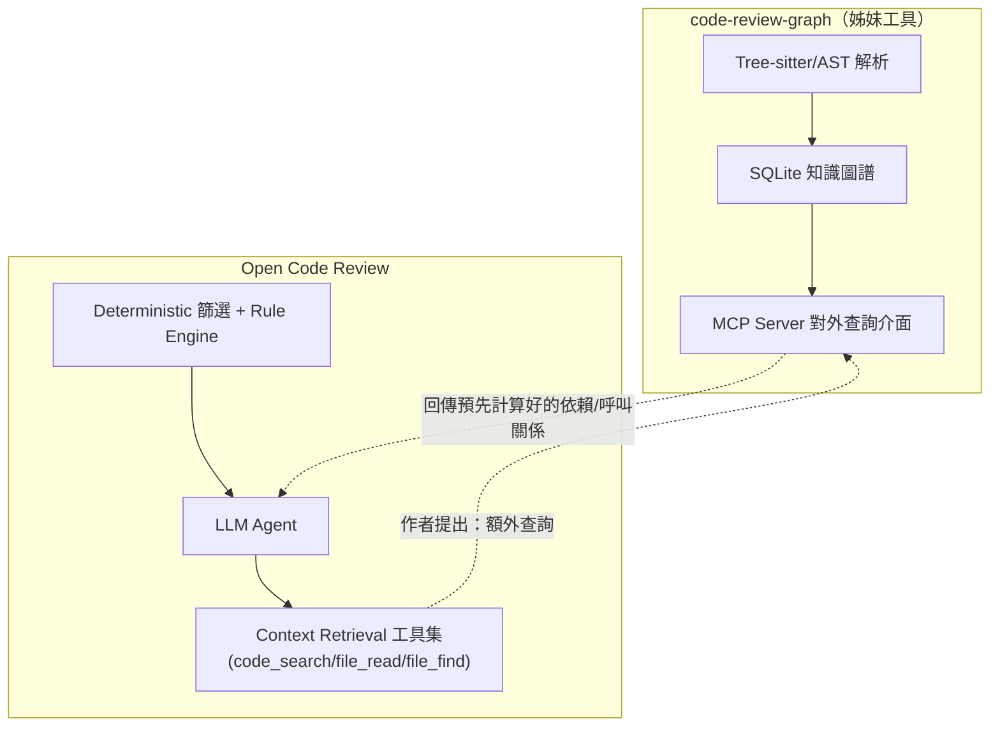

## 14.3 具體場景範例（作者假設情境，非官方功能）

```text
情境：審查一個修改了 OrderService.calculateTotal() 的 PR

【單獨使用 OCR】
Agent 需要自行呼叫 code_search 找出所有呼叫端，逐一 file_read 確認，
可能需要 3-5 次工具呼叫才能拼湊出完整的呼叫關係。

【假設整合 code-review-graph 後（作者提出的模式）】
Agent 可以直接向 code-review-graph 的 MCP Server 查詢
「calculateTotal() 的完整呼叫鏈與影響範圍」，一次查詢取得
預先計算好的完整依賴圖，减少即時搜尋次数，理論上可降低
Token 消耗與審查延遲。
```

## 14.4 知識圖譜如何增強 Context（Context Enhancement，作者觀點）

1. **降低重複搜尋成本**：多個 Bundle 若涉及相同的共用模組，各自的 Sub-Agent
   不需要各自重新搜尋一次，可共用圖譜查詢結果。
2. **提供比 Diff 更早期的架構視角**：在 Agent 開始逐檔審查前，先用圖譜資料判斷
   「這次變更觸及了架構的哪個層級」，讓規則比對（Rule Engine）能更精準地套用
   架構層級規則（如11.4.15節 Architecture 規則）。
3. **對 Legacy/Reverse Engineering 場景特別有價值**：第16章會進一步說明，
   對完全陌生的舊系統，先用知識圖譜建立全貌，再用 OCR 做逐步審查，效率遠高於
   兩者分開使用。

## 14.5 Best Practice（企業導入角度）

1. 若企業已經導入 code-review-graph 做為架構知識庫，**不需要等待官方整合**才能
   受益 —— 可以先讓工程師在審查前手動查詢圖譜取得背景知識，再進行 OCR 審查，
   這是「流程面」而非「系統整合面」的初階作法。
2. 若團隊具備工程能力，可考慮自行開發一個小型「橋接工具」，讓 OCR 的
   `--tools` 自訂工具集設定檔額外註冊一個「查詢知識圖譜」的工具，這屬於
   OCR 官方支援的擴充機制（自訂工具集），技術上可行，但需要自行開發與維護。
3. 導入前務必對內部溝通清楚：這是**企業自建的整合**，不是官方功能，避免未來
   官方或姊妹專案改版導致自建橋接失效時，誤以為是「官方支援中斷」。

## 14.6 常見錯誤

| # | 錯誤 | 原因 | 解法 | 預防 |
| --- | --- | --- | --- | --- |
| 1 | 誤以為兩個工具由同一家公司開發、有官方整合 | 名稱與領域相近造成混淆 | 參考本章開頭聲明，明確告知團隊兩者為獨立專案 | 內部文件轉發本章聲明連結 |
| 2 | 期待安裝兩個工具後自動產生整合效果 | 誤解「作者提出的模式」為「開箱即用功能」 | 依 14.5 節，若要整合需自行開發橋接工具 | 導入評估文件明確標示需要額外開發工作量 |

---

# 第15章 AI 開發流程

## 15.1 說明：把 OCR 嵌入 AI Native 開發生命週期

本手冊背景設定是企業正在建立「AI Native Software Development Platform」，OCR
在其中扮演的角色不是單點工具，而是嵌入整個 Web Application 開發生命週期的
**品質關卡**。

## 15.2 完整流程圖

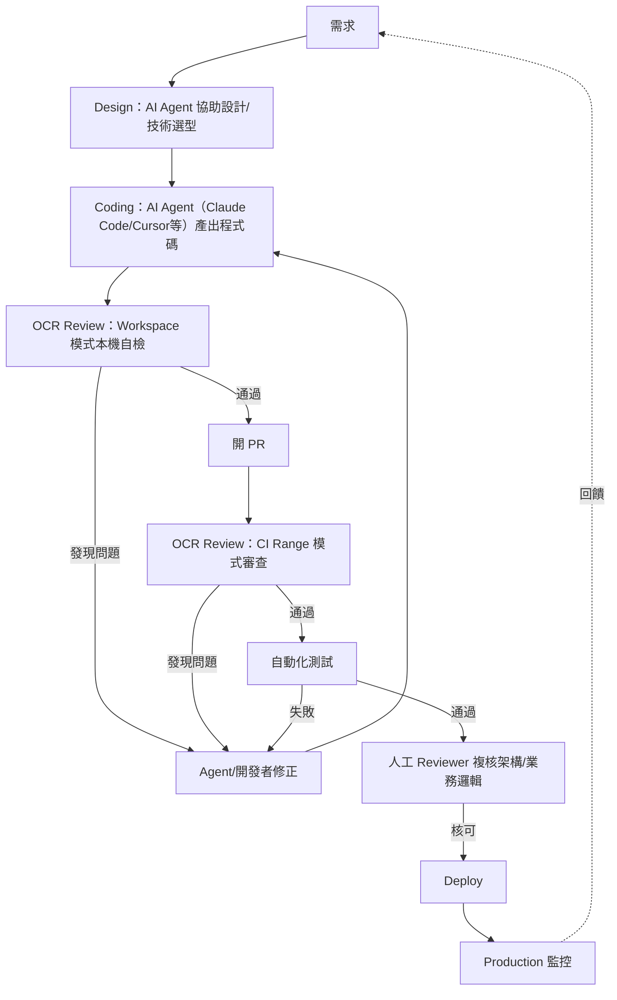

## 15.3 各階段 OCR 的角色說明

| 階段 | OCR 的角色 |
| --- | --- |
| Coding | Agent 生成程式碼後，本機立即用 Workspace 模式自我審查，形成「生成→自檢」的緊密迴圈 |
| OCR Review（本機） | 第一道防線，攔截明顯問題，避免帶著問題進 PR |
| CI Review | 第二道防線，正式紀錄留存（Session/JSON artifact），作為合併前的品質關卡 |
| Test | OCR 不取代自動化測試，兩者互補：OCR 抓「程式碼品質/安全」問題，測試抓「行為正確性」問題 |
| Human Review | 人工 Reviewer 聚焦在 AI 難以判斷的架構決策、業務邏輯合理性 |

## 15.4 範例：AI Agent 與 OCR 的緊密迴圈（Claude Code 情境）

```bash
# 1. 請 Claude Code 實作新功能
# （於 Claude Code 對話中）"幫我實作訂單退款功能"

# 2. Agent 完成程式碼後，立即本機自檢
ocr review

# 3. 若 OCR 回報問題，Agent 讀取結果並自行修正
ocr review --format json | agent-fix-loop.sh

# 4. 確認無問題後才提交
git add -A && git commit -m "feat: 訂單退款功能"
git push
```

## 15.5 Best Practice

1. 把「Agent 生成程式碼 → 立即本機 OCR 自檢」設計成緊密迴圈，而不是等到 PR
   階段才第一次審查 —— 越早發現問題，修正成本越低。
2. 明確劃分 OCR 與自動化測試的職責邊界：OCR 抓「寫法/安全/架構」問題，測試抓
   「行為是否符合預期」，兩者互補而非重複。
3. Production 監控發現的問題，應回饋到規則檔的持續調整（見第24章），形成
   「監控 → 規則強化 → 下次開發自動避免」的閉環。

## 15.6 常見錯誤

| # | 錯誤 | 原因 | 解法 | 預防 |
| --- | --- | --- | --- | --- |
| 1 | 只在 CI 階段跑 OCR，本機開發階段完全不用 | 忽略本機自檢可以更早攔截問題 | 將 `ocr review` 納入本機 pre-push hook | Onboarding 教育訓練強調本機自檢的價值 |
| 2 | 把 OCR 當作測試的替代品，砍掉自動化測試預算 | 誤解兩者的職責邊界 | 明確溝通 OCR 與測試互補而非取代 | 開發流程文件清楚標示兩者分工 |

---

# 第16章 Reverse Engineering

## 16.1 說明：為什麼 Code Review 工具能拿來做逆向工程

逆向工程（Reverse Engineering）的核心需求是「在缺乏文件的情況下，重建對系統的
理解」。OCR 的 **Scan 模式**（`ocr scan`，全檔案掃描而非 diff-based）與其
Context Retrieval 工具集，剛好對應到這個需求：不需要先有「變更」才能分析，
可以直接對整個陌生的程式碼庫做系統性體檢。

## 16.2 支援語言與 Legacy 場景對照

| Legacy 技術棧 | OCR 內建規則涵蓋 | 逆向工程可行性 |
| --- | --- | --- |
| **Legacy Java** | 🟢 官方內建 Java 規則 | ✅ 直接可用 |
| **Legacy PHP** | 🟢 官方內建 PHP 規則 | ✅ 直接可用 |
| **Legacy Python** | 🟢 官方內建 Python 規則 | ✅ 直接可用 |
| Legacy C# / .NET | 🟡 未見官方內建專屬規則文件 | ⚠️ 可用通用工具集（`code_search`/`file_read`）做結構分析，但缺乏語言專屬規則加強 |
| Legacy C++ | 🟢 官方內建 C/C++ 規則 | ✅ 可用 |
| COBOL | 🟡 未見官方內建規則 | ⚠️ 僅能依賴 LLM 通用理解能力，建議搭配第14章知識圖譜模式先建立結構全貌 |

## 16.3 如何分析 Legacy/Monolith/Microservice（特別章節）

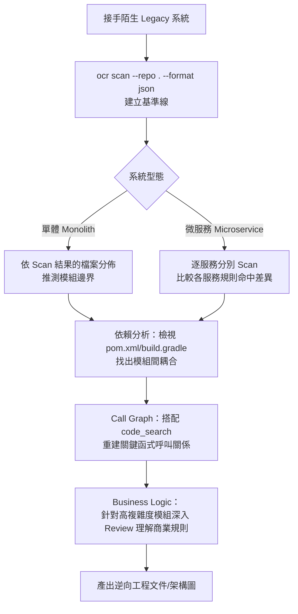

## 16.4 Dependency Analysis（依賴分析）

- 對 `pom.xml`/`build.gradle`（Java）、`package.json`（前端）、`Cargo.toml`
  （Rust）等依賴宣告檔案，OCR 內建規則會檢查依賴版本，這在逆向工程階段可以
  快速盤點「這個系統到底用了哪些框架/函式庫版本」，作為 Framework Upgrade
  （第17章）評估風險的基礎資料。
- 🟡（作者建議）：搭配第14章提到的知識圖譜模式，可進一步視覺化模組間的依賴
  關係圖，比單純看依賴宣告檔案更直觀。

## 16.5 Call Graph（呼叫關係圖）重建

雖然 OCR 官方並未提供獨立的「產生完整 Call Graph」功能，但可以透過以下組合式
做法（作者建議的實務流程）重建關鍵路徑的呼叫關係：

```bash
# 步驟1：全檔掃描找出高複雜度/高風險檔案
ocr scan --repo . --format json > baseline.json

# 步驟2：針對關鍵檔案，人工或搭配 Agent 用 code_search 概念手動追蹤呼叫鏈
#（此步驟目前需人工或搭配第14章知識圖譜工具輔助，OCR 本身不提供圖形化 Call Graph 輸出）
```

## 16.6 Business Logic（業務邏輯）萃取

Scan 模式產生的 Review 留言中，`message`／`reasoning_summary` 欄位（見第10章）
往往會包含 Agent 理解程式碼時形成的業務假設（例如「此處假設訂單狀態必為
已付款」），這些內容經人工整理後，可以成為重建業務邏輯文件的第一手素材，
比讓工程師從零開始讀懂整個系統快得多。

## 16.7 範例：對一個陌生 Java Monolith 做逆向工程體檢

```bash
ocr scan --repo ./legacy-core-system --format json > legacy-baseline.json

# 依 severity 排序，找出最需要優先理解/處理的模組
jq '.findings | sort_by(-.severity_score) | .[0:20]' legacy-baseline.json
```

## 16.8 各 Legacy 技術棧的逆向工程實務要點

### 16.8.1 Legacy Java

🟢 規則覆蓋最完整的技術棧。建議搭配自訂規則檔標註「已知的舊框架特徵」
（如 Struts 1.x Action 類別、EJB 2.x Home/Remote 介面），讓 Scan 結果能
自動標記出「這是哪個世代的架構模式」，加速理解系統的技術債分佈。

```bash
ocr scan --repo ./legacy-java-system --rule ./legacy-java-markers.json --format json
```

### 16.8.2 Legacy PHP

🟢 官方內建 PHP 規則可用。PHP legacy 系統常見的挑戰是「無框架的程序式
程式碼與物件導向程式碼混雜」，建議先用 Scan 模式搭配路徑規則區分「舊程序式
目錄」與「新物件導向目錄」，分別評估技術債嚴重程度。

### 16.8.3 Legacy Python

🟢 官方內建 Python 規則可用。重點關注 Python 2 → 3 的殘留語法（如
`print` 語句而非函式呼叫），可自訂規則明確標註這類特徵作為「尚未完成
遷移」的訊號。

### 16.8.4 Legacy C#／.NET

🟡 因無官方專屬規則，建議策略：
1. 先用通用工具集（`code_search`/`file_read`）對關鍵入口點（如
   `Global.asax`、`Startup.cs`）做結構性理解。
2. 自訂規則檔補強常見 .NET 資安/品質模式（如 SQL 組字串而非參數化查詢）。
3. 適度提高人工複核比例，彌補規則覆蓋不足的落差。

### 16.8.5 COBOL

🟡 挑戰最大的技術棧，因完全無官方規則且語言範式與現代語言差異最大。
建議做法：
1. 不要期待 Scan 模式能像審查 Java 一樣給出精準的行級建議。
2. 優先用於「產生初步的模組功能摘要」（依賴 LLM 的通用理解能力），再由
   熟悉 COBOL 的資深工程師複核修正。
3. 搭配第14章知識圖譜模式，先建立 `PERFORM`/`CALL` 呼叫關係的圖譜，
   彌補 OCR 本身不提供 Call Graph 視覺化的限制。

## 16.9 Best Practice

1. 逆向工程專案務必先跑一次 Scan 建立基準線，再決定要深入研究哪些高風險/高
   複雜度模組，避免試圖「從頭讀懂整個系統」導致專案失焦。
2. 對 C#/.NET、COBOL 等缺乏官方專屬規則的技術棧，優先依賴 LLM 的通用理解能力，
   並搭配 `--rule` 自訂規則檔補強領域知識（例如提示 Agent「COBOL 中的 PERFORM
   對應到現代語言的函式呼叫」）。
3. 把 Scan 結果的 `reasoning_summary` 視為「AI 生成的初稿系統文件」，交由熟悉
   業務的資深工程師複核修正，而不是要求 AI 一次產出完美文件。

## 16.10 常見錯誤

| # | 錯誤 | 原因 | 解法 | 預防 |
| --- | --- | --- | --- | --- |
| 1 | 對缺乏內建規則的技術棧（COBOL）期待與 Java 同等的規則精準度 | 誤解所有語言的規則覆蓋率相同 | 依 16.2 節評估各語言的實際可行性，調整期望值 | 專案啟動前先確認技術棧的規則覆蓋現況 |
| 2 | 一次對整個超大型 Monolith 跑 Scan，Token 成本失控 | 未評估專案規模就直接全量掃描 | 先掃描核心模組子集，逐步擴大範圍 | 逆向工程 SOP 規定先做範圍評估（見第23章效能調校） |

---

# 第17章 Framework Upgrade

## 17.1 說明：Framework Upgrade 為什麼需要 AI Review 把關

Framework Upgrade（如 Spring Boot 2.x → 4.x、Java 8 → 21+、Vue 2 → 3、
AngularJS → Angular）的核心風險不是「升級指令跑不過」，而是**大量檔案被自動化
工具或 Agent 批次修改後，人工難以逐一複核每一處修改是否語意正確**。這正好是
OCR 的 Range/Commit 模式 + 自訂規則檔最擅長的場景。

## 17.2 各框架 Upgrade 場景與規則覆蓋對照

| 框架 | OCR 內建規則涵蓋 | Upgrade Review 建議做法 |
| --- | --- | --- |
| **Spring Boot / Spring Framework** | 🟢 官方內建 Java 規則 | 自訂規則檔標註「已棄用 API 清單」（見17.4節範例），搭配 Range 模式逐批審查 |
| **Jakarta EE**（`javax.*` → `jakarta.*`） | 🟢 依託 Java 規則 + 自訂規則 | 自訂規則檢查是否仍殘留 `javax.*` import |
| **Vue（2→3）** | 🟢 官方內建 TS/JS/JSX/TSX 規則 | 自訂規則標註 Options API → Composition API 遷移注意事項 |
| **Angular** | 🟢 官方內建 TS/JS 規則 | 自訂規則檢查 NgModule → Standalone Component 遷移 |
| **React** | 🟢 官方內建 JSX/TSX 規則 | 自訂規則檢查 Class Component → Function Component + Hooks 遷移 |
| **.NET** | 🟡 未見官方專屬規則 | 依賴通用工具集 + LLM 理解能力，規則覆蓋較弱，建議加強人工複核比例 |

## 17.3 大型專案 Upgrade 完整流程

```mermaid
flowchart TD
    A[盤點現況：ocr scan 建立升級前基準線] --> B[制定自訂規則檔<br/>標註棄用API/遷移模式]
    B --> C[Agent/工具批次執行升級<br/>如 OpenRewrite/Codemod]
    C --> D["ocr review --from before --to after<br/>Range模式逐批審查"]
    D -->|發現違反遷移規則| E[修正]
    E --> D
    D -->|通過| F[執行完整測試套件]
    F -->|失敗| E
    F -->|通過| G[人工架構師複核關鍵模組]
    G --> H[分批合併/上線]
    H --> I["ocr scan 建立升級後基準線<br/>與步驟A比較差異"]
```

## 17.4 範例：Spring Boot Upgrade 自訂規則檔

```json
{
  "rules": [
    {
      "path": "src/main/java/**/*.java",
      "rule": "Spring Boot 4.x 遷移：禁止使用已棄用的 javax.servlet.* import，一律改用 jakarta.servlet.*；WebSecurityConfigurerAdapter 已移除，需改用 SecurityFilterChain Bean 寫法。"
    },
    {
      "path": "src/main/resources/application*.properties",
      "rule": "檢查是否殘留 Spring Boot 3.x 之前已棄用的設定 key（如舊版 management.endpoints 寫法）。"
    }
  ]
}
```

## 17.5 範例：Vue 2 to 3 遷移規則

```json
{
  "rules": [
    {
      "path": "src/**/*.vue",
      "rule": "Vue 3 遷移：檢查 Options API 元件是否已正確轉換為 Composition API；filters 選項已移除，需改用 computed 或 method；$on/$off/$once 事件總線已移除。"
    }
  ]
}
```

## 17.6 Java Upgrade（大型專案）注意事項

- 搭配規則檔標註「本次升級明確排除的模組」（例如尚未升級的第三方套件相依模組），
  避免 Agent 對這些暫不處理的模組產生誤導性建議。
- 建議先在小範圍（單一微服務或單一模組）試點，驗證規則檔的有效性後，再套用到
  整個大型專案，避免一次性大規模誤判。

## 17.7 範例：Angular Upgrade 規則

```json
{
  "rules": [
    {
      "path": "src/**/*.ts",
      "rule": "Angular Standalone 遷移：檢查元件是否已加上 standalone: true 並移除對應 NgModule 中的宣告；檢查是否仍使用已棄用的 @angular/http（應改用 @angular/common/http 的 HttpClient）。"
    }
  ]
}
```

## 17.8 範例：React Class Component to Function Component 遷移規則

```json
{
  "rules": [
    {
      "path": "src/**/*.{jsx,tsx}",
      "rule": "React Hooks 遷移：檢查 Class Component（extends React.Component）是否已轉換為 Function Component + Hooks；componentDidMount/componentDidUpdate 邏輯應合併為對應的 useEffect；禁止在 Function Component 中殘留 this.setState 呼叫。"
    }
  ]
}
```

## 17.9 Best Practice

1. Framework Upgrade 前，先用 Scan 模式建立「升級前」與「升級後」兩份基準線，
   兩相比較可以量化「這次升級到底改善/引入了多少問題」，作為升級成效的具體
   數據（見第26章 ROI 設計）。
2. 自訂規則檔應該把「這次升級的遷移對照表」（舊寫法 → 新寫法）直接寫成規則
   描述，讓 Agent 有明確依據判斷是否遷移完整，而不是只依賴通用框架知識。
3. 對 .NET 等規則覆蓋較弱的技術棧，適度提高人工複核比例，不要完全依賴 AI
   Review 的判斷。

## 17.10 常見錯誤

| # | 錯誤 | 原因 | 解法 | 預防 |
| --- | --- | --- | --- | --- |
| 1 | 一次對整個大型專案套用升級工具+AI審查，不分批 | 低估大規模變更的審查複雜度 | 依模組/微服務分批進行（17.6節） | 升級專案計畫書明確規劃分批策略 |
| 2 | 自訂規則檔沒有明確的「舊寫法 → 新寫法」對照 | 誤以為 AI 能自行推斷所有遷移細節 | 規則描述具體列出對照表（17.4、17.5節範例） | 規則撰寫範本要求具體化 |

---

# 第18章 Enterprise DevSecOps

## 18.1 說明：官方證實的 CI/CD 整合 vs 需自行串接

| CI/CD 平台 | 整合狀態 | 說明 |
| --- | --- | --- |
| **GitHub Actions** | 🟢 官方證實，有現成範本 | 官方範本工作流程 [`examples/github_actions/ocr-review.yml`](https://github.com/alibaba/open-code-review/blob/main/examples/github_actions/ocr-review.yml)，觸發 `pull_request_target`（`opened`）與 `issue_comment`（留言以 `/open-code-review` 或 `@open-code-review` 開頭），透過 GitHub Pull Request Review API 貼行內留言，批次送出失敗時逐筆重試並在摘要留言中回報 |
| **GitLab CI** | 🟢 官方證實，有現成範本 | 官方範本管線 [`examples/gitlab_ci/.gitlab-ci.yml`](https://github.com/alibaba/open-code-review/blob/main/examples/gitlab_ci/.gitlab-ci.yml)，觸發 `merge_requests` 事件，透過 GitLab Discussions API（搭配 MR `versions` 端點校正行號）貼留言 |
| GitFlic CI | 🟡 **查無來源** | 查證當下（`v1.8.6`）`ROADMAP.md` 全文**沒有** GitFlic 字樣，舊版手冊此處敘述已勘誤移除 |
| Gerrit | 🟡 **查無來源** | 同上，`ROADMAP.md` 全文沒有 Gerrit 字樣，已勘誤移除 |
| **Jenkins** | 🟡 無官方範例 | 可透過 CLI + `--format json` 輸出自行寫 Pipeline Script 串接（見18.4節） |
| **Azure DevOps** | 🟡 無官方範例 | 同上，需自行串接（見18.5節） |

> ⚠️ **勘誤說明**：舊版手冊在此列出「GitFlic CI、Gerrit 為 ROADMAP 提及的
> 官方規劃項目」，本次重新逐字查證 `ROADMAP.md`（`Current State`／
> `Planned — H2 2026`／`Planned — H1 2027`／`Not Planned` 四段全文）後，
> **找不到任一處提及這兩個工具**，故予以移除，避免誤導讀者。`ROADMAP.md`
> 現況欄位僅寫「CI/CD integration (GitHub Actions, GitLab CI, etc.)」，
> 沒有進一步列名。

## 18.2 GitHub Actions 範例

🟢 依官方 `examples/github_actions/ocr-review.yml` 與 `integrations/ci.md`
逐字核對的精簡版（完整版請直接複製官方檔案）：

```yaml
name: Open Code Review
on:
  pull_request_target:
    types: [opened]
  issue_comment:
    types: [created]

jobs:
  ocr-review:
    if: >
      github.event_name == 'pull_request_target' ||
      (github.event_name == 'issue_comment' && github.event.issue.pull_request &&
       (startsWith(github.event.comment.body, '/open-code-review') ||
        startsWith(github.event.comment.body, '@open-code-review')))
    runs-on: ubuntu-latest
    permissions:
      pull-requests: write
      contents: read
    steps:
      - uses: actions/checkout@v4
        with:
          fetch-depth: 0   # Range 模式需要完整歷史，否則算不出 merge-base
      - run: npm install -g @alibaba-group/open-code-review
      - name: Configure OCR
        env:
          OCR_LLM_URL: ${{ secrets.OCR_LLM_URL }}
          OCR_LLM_AUTH_TOKEN: ${{ secrets.OCR_LLM_AUTH_TOKEN }}
          OCR_LLM_MODEL: ${{ secrets.OCR_LLM_MODEL }}
        run: |
          ocr config set llm.url "$OCR_LLM_URL"
          ocr config set llm.auth_token "$OCR_LLM_AUTH_TOKEN"
          ocr config set llm.model "$OCR_LLM_MODEL"
          # 相容性考量：關閉 thinking 模式（並非所有 Provider 支援此欄位）
          ocr config set llm.extra_body '{"thinking": {"type": "disabled"}}'
      - name: Run OCR review
        env:
          PR_TITLE: ${{ github.event.pull_request.title }}
          BASE_REF: ${{ github.base_ref }}
          HEAD_REF: ${{ github.head_ref }}
        run: |
          ocr review --background "$PR_TITLE" \
            --from "origin/$BASE_REF" --to "origin/$HEAD_REF" \
            --format json --audience agent > /tmp/ocr-result.json
      # 後續步驟：解析 JSON、呼叫 GitHub Pull Request Review API 貼留言
      # （完整腳本見官方 ocr-review.yml，此處省略以聚焦設定重點）
```

必要 Secrets（**Settings → Secrets and variables → Actions**）：

| Secret | 必要 | 說明 |
| --- | --- | --- |
| `OCR_LLM_URL` | 是 | LLM API 端點 |
| `OCR_LLM_AUTH_TOKEN` | 是 | LLM 驗證 Token（對應到 `ocr config set llm.auth_token`；OCR 自己讀取的環境變數其實是 `OCR_LLM_TOKEN`，CI Secret 名稱不同，別搞混） |
| `OCR_LLM_MODEL` | 否 | 模型名稱，**沒有預設值，必須明確指定** |
| `OCR_LLM_USE_ANTHROPIC` | 否 | 設為 `true` 表示使用 Anthropic Claude 協定 |

`GITHUB_TOKEN` 由 GitHub 自動提供，workflow 需宣告 `pull-requests: write` 權限。
`PR_TITLE`／`BASE_REF`／`HEAD_REF` 一律透過 `env:` 傳遞，**不要**直接把
`${{ github.event.pull_request.title }}` 內插進 `run:` 字串——PR 標題可能含
shell 特殊字元，直接內插等於在 Runner 上執行未經過濾的字串。

## 18.3 GitLab CI 範例

🟢 依官方 `examples/gitlab_ci/.gitlab-ci.yml` 與 `integrations/ci.md` 逐字核對：

```yaml
ocr-review:
  stage: review
  image: node:20
  variables:
    GIT_DEPTH: 0   # 強制完整 clone，Range 模式才能算出 merge-base
  before_script:
    - npm install -g @alibaba-group/open-code-review
    - ocr config set llm.url "$OCR_LLM_URL"
    - ocr config set llm.auth_token "$OCR_LLM_AUTH_TOKEN"
    - ocr config set llm.model "$OCR_LLM_MODEL"
    - ocr config set llm.use_anthropic false   # GitLab 變數長度需 ≥8 字元的限制，改用 Anthropic 需直接改腳本
    - ocr config set llm.extra_body '{"thinking": {"type": "disabled"}}'
  script:
    - |
      ocr review \
        --background "$CI_MERGE_REQUEST_TITLE" \
        --from "origin/$CI_MERGE_REQUEST_TARGET_BRANCH_NAME" \
        --to "${CI_COMMIT_SHA}" \
        --format json --audience agent > /tmp/ocr-result.json
    # 後續：Python 腳本解析 JSON，透過 GitLab Discussions API（搭配 MR versions
    # 端點取得 base_sha/start_sha/head_sha）貼行內留言，完整腳本見官方檔案
  rules:
    - if: '$CI_PIPELINE_SOURCE == "merge_request_event"'
```

必要 CI/CD 變數（**Settings → CI/CD → Variables**）：

| 變數 | 必要 | 遮罩 | 說明 |
| --- | --- | --- | --- |
| `OCR_LLM_URL` | 是 | 否 | LLM API 端點 |
| `OCR_LLM_AUTH_TOKEN` | 是 | 是 | LLM 驗證 Token |
| `OCR_LLM_MODEL` | 否 | 否 | 模型名稱，無預設值 |
| `GITLAB_API_TOKEN` | 否 | 是 | 具 `api` scope 的 Token；未設定時退回內建 `CI_JOB_TOKEN`（可涵蓋 fork MR，但穩定性建議還是設專屬 Token） |

> 🟡 官方腳本會偵測既有 OCR 留言以避免同一個 MR 在每次 push 都重跑（GitLab
> 沒有原生的「只在建立時觸發」事件），實作方式是先呼叫 Notes API 檢查是否已有
> OCR 留言，有的話就跳過本次執行，詳見官方 `.gitlab-ci.yml` 與 `ci.md`。

## 18.4 Jenkins Pipeline 範例（企業自行串接，非官方）

```groovy
pipeline {
    agent any
    stages {
        stage('OCR Review') {
            steps {
                sh '''
                  npm install -g @alibaba-group/open-code-review
                  ocr review --from origin/main --to HEAD --format json > ocr-result.json
                '''
                script {
                    def result = readJSON file: 'ocr-result.json'
                    def highSeverity = result.findings.findAll { it.severity == 'high' }
                    if (highSeverity.size() > 0) {
                        error "OCR 發現 ${highSeverity.size()} 個高風險問題，阻擋合併"
                    }
                }
            }
        }
    }
}
```

## 18.5 Azure DevOps Pipeline 範例（企業自行串接，非官方）

```yaml
trigger: none
pr:
  branches:
    include: [main]

pool:
  vmImage: 'ubuntu-latest'

steps:
  - checkout: self
    fetchDepth: 0
  - script: |
      npm install -g @alibaba-group/open-code-review
      ocr review --from origin/main --to HEAD --format json > $(Build.ArtifactStagingDirectory)/ocr-result.json
    displayName: 'Run Open Code Review'
    env:
      ANTHROPIC_API_KEY: $(ANTHROPIC_API_KEY)
  - task: PublishBuildArtifacts@1
    inputs:
      pathToPublish: '$(Build.ArtifactStagingDirectory)/ocr-result.json'
      artifactName: 'ocr-review-result'
```

> ⚠️ **注意事項**：上方範例只負責產出 JSON 結果並落地為 Build Artifact，
> **實際貼回 PR 行內留言的邏輯需自行撰寫**（呼叫 Azure DevOps REST API 的
> Pull Request Thread 端點），官方並未提供現成的 Azure DevOps 整合模組。

## 18.6 Review Gate 與 Merge Policy 設計

```mermaid
flowchart TD
    PR[PR/MR 建立] --> OCRRun[OCR Review 自動執行]
    OCRRun --> Severity{發現的最高 Severity?}
    Severity -->|high| Block[阻擋合併，強制要求處理]
    Severity -->|medium| Warn[允許合併但需 Reviewer 明確確認]
    Severity -->|low| Info[僅供參考，不阻擋]
    Block --> Fix[開發者修正]
    Fix --> OCRRun
    Warn --> HumanApprove[人工 Approve]
    Info --> HumanApprove
    HumanApprove --> Merge[Merge]
```

## 18.7 Approval Flow 設計建議

| Severity | 建議 Approval 要求 |
| --- | --- |
| high | 必須修正或由 Tech Lead 明確簽核例外原因，才可合併 |
| medium | 至少一位人工 Reviewer 確認後可合併 |
| low | 一般 Reviewer 標準流程即可 |

## 18.8 Best Practice

1. 不要把「AI 給出的 severity」當作唯一的合併關卡依據 —— 建議搭配企業自己的
   風險分級（例如「支付模組」一律視為 high，無論 AI 判定為何），做雙重保險。
2. Jenkins/Azure DevOps 用戶務必自行維護串接腳本的版本相容性，OCR 版本升級後
   需重新驗證 `--format json` 的輸出 Schema 是否有變動。
3. Review Gate 的規則應該透明公開讓全團隊知悉（見第20章治理流程），避免「AI
   憑什麼卡我的 PR」的抵觸情緒。

## 18.9 常見錯誤

| # | 錯誤 | 原因 | 解法 | 預防 |
| --- | --- | --- | --- | --- |
| 1 | GitHub Actions／GitLab CI 未設定完整 clone 導致 `Cannot find merge-base` | GitHub 預設 `fetch-depth`、GitLab 預設 `GIT_DEPTH` 都只抓淺層歷史 | GitHub 加 `fetch-depth: 0`；GitLab 加 `GIT_DEPTH: 0` | CI 範本強制包含此設定（同第2章常見錯誤1） |
| 2 | Jenkins Pipeline 直接信任 `text` 格式輸出做字串比對 | 未使用結構化 JSON 輸出 | 改用 `--format json` + `readJSON` 解析 | 企業內部 CI 範本統一規定使用 JSON 格式 |
| 3 | 把所有 severity 一視同仁都阻擋合併 | 未設計分級 Approval Flow | 依 18.6 節設計分級策略 | 導入前先與團隊共識 Review Gate 規則 |
| 4 | `Failed to parse OCR output` | `OCR_LLM_URL`／`OCR_LLM_AUTH_TOKEN`（GitHub）或同名 CI 變數（GitLab）設錯或缺漏 | 重新核對 Secrets／Variables 設定頁的值 | CI 範本加入設定完成後的 `ocr llm test` 自我檢查步驟 |
| 5 | 誤把 `OCR_DEBUG=1` 當作官方支援的除錯開關 | 官方文件明確指出這個環境變數**目前未實作**，設了也沒效果 | 改看 workflow 寫出的原始 JSON／stderr（官方範本會落地到 `/tmp/ocr-result.json`／`/tmp/ocr-stderr.log`），或本機直接跑 `ocr review` 除錯 | CI 範本註解中說明現況，避免工程師誤以為除錯開關失效是自己設定錯誤 |

---

# 第19章 Banking 案例

> 🟡 **本章聲明**：本章為作者依業界銀行系統導入經驗建構的**假設性教學案例**，
> 用於示範 OCR 在高度受監管產業的完整導入模式，非任何真實銀行的實際導入紀錄。

## 19.1 案例背景設定

某銀行「核心交易系統」現代化專案，技術棧涵蓋：

- 後端：Java 8 → Java 21、Spring Framework 4.x → Spring Boot 4.x
- 前端：Vue 2 舊版行員操作介面 → Vue 3 重構
- 資料庫：Oracle（核心帳務）+ DB2（部分舊主機系統整合）
- 系統規模：多團隊（帳務、支付、風控、報表）共約 40 位工程師，Monorepo + 微服務
  混合架構

## 19.2 為什麼銀行導入 AI Code Review 需要特別謹慎

```mermaid
flowchart TD
    Bank[銀行導入 AI Code Review] --> Concern1[原始碼絕不可外流至公有雲 API]
    Bank --> Concern2[所有 AI 建議需可稽核追溯]
    Bank --> Concern3[需符合金融監理法規<br/>如個資保護/資安治理規範]
    Bank --> Concern4[多團隊需一致但可差異化的規則]
    Concern1 --> Sol1[採用本地 Ollama 或自架 litellm/私有雲部署模型]
    Concern2 --> Sol2[所有 Session/JSON 結果落地保存並納入稽核軌跡]
    Concern3 --> Sol3[規則檔納入資安團隊審核流程]
    Concern4 --> Sol4[四層規則優先序：全行基礎規則 + 各團隊專屬規則]
```

## 19.3 安全（Security）設計

1. **模型部署**：一律採用第12章建議的「本地優先」路線 —— 自架開源模型（如
   Llama/Qwen 系列透過 custom provider 或 Ollama 接入），確保原始碼與交易邏輯
   完全不外流至公有雲 API。
2. **網路隔離**：OCR 執行環境與 LLM 推論服務均部署於銀行內網，透過內部 Proxy
   控管所有對外連線（若無公有雲呼叫需求，可直接禁用對外流量）。
3. **API Key/憑證管理**：所有 Provider 憑證改用內部密鑰管理服務注入環境變數，
   禁止寫入任何設定檔或版控（見第6章、第11章 Hardcode Secret 規則）。

## 19.4 稽核（Audit）設計

- 每次 CI 觸發的 `ocr review` 執行結果（`--format json`）皆落地保存至獨立的
  稽核儲存空間，保留期限依銀行法遵要求設定（通常需求為 5–7 年）。
- `ocr session list`／`ocr session show` 的紀錄作為「AI 曾經給過什麼建議、
  人工是否採納」的完整軌跡，供稽核與監理機關查核使用。
- 每一次 Merge 若有「AI 判定 high severity 但人工選擇不處理」的情形，強制要求
  留下簽核紀錄（見18.6節 Approval Flow）。

## 19.5 法遵（Compliance）設計

- 規則檔（`.opencodereview/rule.json`）中納入銀行內部資安基準（如個資欄位
  遮罩檢查、交易金額精度規則），並將規則檔變更納入正式的法遵/資安審核流程，
  而非任由開發團隊自行修改。
- 定期（如每季）由資安團隊複核規則覆蓋率是否仍符合最新監理要求。

## 19.6 版本管理與多團隊協作

```mermaid
flowchart TB
    subgraph Global["行內全域規則（資安團隊維護）"]
        G1["~/.opencodereview/rule.json 對應之<br/>企業標準模板，各團隊 repo 統一引用"]
    end
    subgraph Payment["支付團隊 repo"]
        P1[".opencodereview/rule.json<br/>疊加支付模組專屬規則"]
    end
    subgraph Risk["風控團隊 repo"]
        R1[".opencodereview/rule.json<br/>疊加風控模組專屬規則"]
    end
    Global --> Payment
    Global --> Risk
```

- 全行共用的基礎規則由資安團隊統一維護一份範本，各團隊 repo 的
  `.opencodereview/rule.json` 只疊加該團隊專屬的規則，避免規則各自為政、
  標準不一致。
- 規則範本本身納入版本控制與 Code Review，任何調整都留有變更歷史可追溯。

## 19.7 導入時程建議（作者建議範例）

| 階段 | 時程（範例） | 內容 |
| --- | --- | --- |
| 1. 試點評估 | 第 1–4 週 | 選定 1 個非核心模組試跑本地模型 + OCR，驗證安全/效能可行性 |
| 2. 規則制定 | 第 5–8 週 | 資安/架構團隊共同制定全行基礎規則範本 |
| 3. 試點團隊導入 | 第 9–16 週 | 選 1–2 個團隊正式導入，蒐集採納率/誤判率數據 |
| 4. 全行推廣 | 第 17–24 週 | 依試點經驗調整後，逐步推廣至所有團隊 |
| 5. 持續治理 | 長期 | 規則季度複核、KPI 追蹤（見第26章） |

## 19.8 範例：一次核心帳務變更的完整審查情境

```mermaid
sequenceDiagram
    participant Dev as 帳務團隊工程師
    participant OCR as ocr CLI（本地部署模型）
    participant Rule as 全行+團隊規則
    participant Auditor as 稽核儲存系統

    Dev->>OCR: 修改 TransferService.executeTransfer()
    OCR->>Rule: 比對命中「金流精度」「樂觀鎖」等規則
    Rule-->>OCR: 命中2條 high 等級規則描述
    OCR->>OCR: 本地模型語意審查（原始碼不外流）
    OCR-->>Dev: 回報：金額運算使用 double，建議改用 BigDecimal
    Dev->>Dev: 修正為 BigDecimal 運算
    Dev->>OCR: 重新提交審查
    OCR-->>Dev: 通過，無 high/medium 等級問題
    OCR->>Auditor: 落地保存本次 Session JSON（含修正前後對照）
    Dev->>Dev: 提交 PR，走18.6節分級 Approval Flow
```

## 19.9 Oracle／DB2 特定規則範例

```json
{
  "rules": [
    {
      "path": "src/main/resources/mapper/**/*Mapper.xml",
      "rule": "Oracle/DB2 雙資料庫相容性：檢查 SQL 是否使用僅單一資料庫支援的方言函式（如 Oracle 的 NVL 對應 DB2 的 COALESCE），確保跨主機系統整合時的 SQL 可攜性；所有金額欄位運算必須明確指定精度（如 NUMBER(18,2)）。"
    }
  ]
}
```

## 19.10 Best Practice

1. 銀行類導入務必把「本地模型可行性驗證」排在時程最前面 —— 若本地模型的審查
   品質無法接受，後續所有規劃都需要重新評估架構（見第12章模型選型）。
2. 稽核軌跡的保存策略應提前與法遵部門確認保留年限與存取權限設計，避免上線
   後才發現保存策略不符合監理要求。
3. 多團隊協作採「全行基礎規則 + 團隊疊加規則」的兩層設計，而不是每個團隊
   各自從零開始寫規則，兼顧一致性與彈性。

## 19.11 常見錯誤

| # | 錯誤 | 原因 | 解法 | 預防 |
| --- | --- | --- | --- | --- |
| 1 | 直接採用雲端 API 型模型，事後才發現違反資安政策 | 導入初期未優先評估合規要求 | 立即改用本地模型路線，重新評估專案時程 | 導入 SOP 第一步固定為合規/安全評估 |
| 2 | 各團隊各自維護獨立規則，長期造成標準分歧 | 缺乏全行治理層級的規則範本 | 依 19.6 節建立兩層規則架構 | 資安團隊主導規則範本的統一維護 |

---

# 第20章 與 SSDLC 整合

## 20.1 說明：OCR 在 Secure SDLC 各階段的定位

Secure Software Development Lifecycle（SSDLC）強調安全考量要「左移」（Shift
Left），越早階段導入安全把關，修復成本越低。OCR 主要落在 **Coding／Review**
階段，但透過規則治理與稽核資料，也能與其他階段串接。

```mermaid
flowchart LR
    Threat[Threat Modeling] --> Secure[Secure Coding 開發階段]
    Secure --> Review["Code Review<br/>(OCR 主要發揮階段)"]
    Review --> Testing[Testing / SAST/DAST]
    Testing --> Deploy[Deploy]
    Deploy --> Monitoring[Monitoring]
    Monitoring --> Audit[Audit]
    Audit --> Compliance[Compliance 回饋]
    Compliance -.regel更新.-> Threat
```

## 20.2 Threat Modeling 如何轉化為 OCR 規則

Threat Modeling（如 STRIDE 分析）產出的威脅清單，可以直接轉譯為
`.opencodereview/rule.json` 中的具體規則描述，讓「威脅模型的結論」真正落地到
每一次 Code Review，而不是只停留在文件裡：

```json
{
  "rules": [
    {
      "path": "src/main/java/**/api/**",
      "rule": "威脅模型項目T-07（Spoofing）：所有對外 API 端點必須驗證呼叫端身份，禁止僅依賴前端傳入的 user_id 參數判斷權限。"
    },
    {
      "path": "src/main/java/**/*Repository.java",
      "rule": "威脅模型項目T-12（Tampering）：所有涉及金額異動的 Repository 方法必須有樂觀鎖版本欄位保護。"
    }
  ]
}
```

## 20.3 Secure Coding 與 Review 的銜接

第11章的規則分類（SQL Injection、XSS、CSRF、XXE、Hardcode Secret 等）本質上
就是把常見的 Secure Coding 準則工程化為可自動檢查的規則，OCR 在此階段扮演
「自動化把關第一線」的角色，讓資安團隊可以聚焦在更複雜的架構層級風險評估。

## 20.4 Testing、Deploy、Monitoring、Audit、Compliance 的銜接

| SSDLC 階段 | 與 OCR 的銜接方式 |
| --- | --- |
| Testing | OCR 找出的問題若涉及可測試的行為缺陷，應同步補上對應測試案例，而非只修正程式碼 |
| Deploy | Review Gate（第18章）作為部署前的品質關卡之一 |
| Monitoring | 生產環境監控發現的問題，回饋轉化為新的規則（見第24章） |
| Audit | Session/JSON 落地紀錄作為稽核軌跡（見第19章） |
| Compliance | 規則變更需經過法遵/資安審核流程，形成閉環治理 |

## 20.5 如何建立企業 Review Standard（特別章節）

這是本手冊「特別要求」的核心主題之一：如何把「Review 標準」從口頭默契變成
可執行、可稽核的治理資產。

### 20.5.1 Coding Standard

企業應先有一份獨立於 OCR 之外的 Coding Standard 文件（如命名慣例、分層原則），
再將其中「可被工程化檢查」的部分轉譯為規則檔（見11.5節範例），無法自動化的
部分（如變數命名語意是否恰當）仍保留人工 Review 判斷。

### 20.5.2 Security Standard

比照20.2節做法，把資安團隊制定的 Security Standard／Threat Model 結論，逐條
轉譯為規則描述，並建立「規則 ↔ 標準條文」的對照表，方便稽核時追溯每條規則的
依據。

### 20.5.3 Architecture Standard

把架構分層原則（如 Controller 不可直接呼叫 DAO）寫入規則檔的 Architecture
分類（見11.4.15節），確保架構決策不會因為程式碼審查疏漏而被逐漸侵蝕。

### 20.5.4 Review Rule 治理

```mermaid
flowchart TD
    Draft[規則草案<br/>由架構師/資安人員提出] --> PR[以 PR 形式提交規則變更]
    PR --> RuleReview[規則變更走 Code Review 流程]
    RuleReview --> Test[於試點專案驗證規則效果]
    Test -->|有效| Merge[合併至全行/團隊規則範本]
    Test -->|誤判過多| Revise[修正規則描述]
    Revise --> PR
    Merge --> Monitor[持續監控規則命中率/誤判率]
    Monitor -.定期複核.-> Draft
```

### 20.5.5 Prompt Library（企業提示詞庫）

除了規則檔，企業也可以累積一份「常用審查情境提示詞庫」，用於：
- Delegate 模式下引導宿主 Agent 更精準地執行審查任務
- 教育訓練新進工程師如何寫出有效的規則描述
- 標準化跨團隊對同類問題（如「金額精度處理」）的審查用語

### 20.5.6 Governance（治理）

上述所有標準與規則，最終應該收斂到一個明確的治理框架：誰有權提出規則變更、
誰負責審核、多久複核一次、如何衡量規則的有效性（見第26章 KPI/成熟度模型）。

## 20.6 範例：STRIDE 威脅模型對應 OCR 規則轉譯總表

以下示範一次完整的 STRIDE（Spoofing／Tampering／Repudiation／Information
Disclosure／Denial of Service／Elevation of Privilege）分析結論如何逐條
轉譯為規則描述：

| STRIDE 類別 | 威脅模型結論（範例） | 對應規則描述 |
| --- | --- | --- |
| Spoofing | 內部 API 可能被偽造呼叫端身份 | 「所有對外 API 端點必須驗證呼叫端身份，禁止僅依賴前端傳入參數判斷權限」 |
| Tampering | 交易資料可能被併發修改覆蓋 | 「涉及金額異動的 Repository 方法必須有樂觀鎖版本欄位保護」 |
| Repudiation | 缺乏操作紀錄，事後無法追溯是誰做的變更 | 「所有異動金流狀態的方法必須記錄操作者、時間戳與變更前後值到稽核日誌」 |
| Information Disclosure | 日誌可能外洩客戶個資 | 「日誌輸出禁止包含密碼、身分證字號、信用卡卡號等敏感欄位」（見11.4.13節） |
| Denial of Service | 大量請求可能耗盡資料庫連線池 | 「對外 API 必須設定合理的請求逾時與連線池上限，禁止無限制的迴圈查詢」 |
| Elevation of Privilege | 一般使用者可能透過參數竄改取得管理員權限 | 「權限判斷邏輯禁止依賴前端傳入的 role/isAdmin 參數，必須以後端 Session 為準」 |

> 💡 **Tip**：把這張表格本身納入企業內部的 Prompt Library（見20.5.5節）
> 與規則庫文件，作為未來新專案啟動威脅建模時的標準參考範本，避免每次
> 都要重新從零發想常見威脅類別的因應規則。

## 20.7 Best Practice

1. 把 Threat Modeling 的結論當作規則檔的「輸入來源」之一，而不是兩條平行線
   —— 這是 SSDLC「左移」精神真正落地的關鍵。
2. Review Standard 的治理流程本身也要走 Code Review（規則即程式碼的精神），
   確保每一次調整都有紀錄、可回溯。
3. Prompt Library 與規則檔應該互相參照，避免同一個審查邏輯在兩個地方各自
   維護、逐漸產生分歧。

## 20.8 常見錯誤

| # | 錯誤 | 原因 | 解法 | 預防 |
| --- | --- | --- | --- | --- |
| 1 | Threat Modeling 文件束之高閣，從未轉譯為實際規則 | 缺乏「文件 → 規則」的轉譯流程 | 依 20.2 節建立轉譯 SOP | 威脅模型會議固定產出「待轉譯規則清單」 |
| 2 | 規則變更沒有經過任何審核就直接生效 | 治理流程缺失 | 依 20.5.4 節建立規則變更的 PR 審核機制 | 規則檔納入版控與 CODEOWNERS 保護 |

---

# 第21章 最佳實務

> 本章彙整全書出現過的最佳實務，依主題分類，總計 50 條以上，方便作為企業內部
> 快速查閱的總表。

## 21.1 安裝與環境設定（BP1–BP7）

1. **BP1**：企業統一由平台團隊維護「已驗證版本」的安裝管道（內部 Artifact
   儲存），避免各團隊各自抓最新版造成版本漂移。
2. **BP2**：CI Runner 映像檔建置階段就內建 `ocr`，不要每次 Job 才安裝。
3. **BP3**：安裝後固定用 `ocr version` + `ocr review --preview` 做驗收動作。
4. **BP4**：WSL 環境統一只在 WSL 內安裝，IDE 用 Remote 連線，避免版本分裂。
5. **BP5**：企業內網環境提前規劃 Proxy／離線安裝策略，不要等到導入當天才發現
   連不到外網。
6. **BP6**：Docker 化執行時，牢記官方無現成 image，需自行維護 Dockerfile 並
   納入版控。
7. **BP7**：Git 版本統一鎖定在 2.41 以上，納入 CI 映像檔的基礎檢查項目。

## 21.2 設定與模型選型（BP8–BP15）

8. **BP8**：API Key 一律用環境變數注入，`config.json` 不得寫入明碼機密。
9. **BP9**：受監管產業把「本地優先、原始碼不外流」列為選型硬性條件。
10. **BP10**：導入前務必分清楚「原生內建 Provider」與「custom_providers 自行
    接上」的差異，避免誤信行銷用語做採購決策。
11. **BP11**：本地 Ollama 模型延遲較高，`OCR_LLM_TIMEOUT` 應對應調整。
12. **BP12**：需要跨供應商比較審查品質時，用 `--model` 在同一 PR 快速切換
    測試，建立內部 Benchmark。
13. **BP13**：litellm 或 OpenRouter 適合需要「彈性切換多家供應商」的團隊，
    作為統一入口降低串接複雜度。
14. **BP14**：企業統一維護一份標準 `custom_providers` 範本，開發者只需注入
    個人 API Key。
15. **BP15**：合規優先於效能 —— 選型時先做法遵/資安篩選，再比較模型能力。

## 21.3 規則設計與治理（BP16–BP24）

16. **BP16**：規則檔依「高風險模組／一般模組／產生型程式碼」分層設計
    include/exclude 範圍。
17. **BP17**：規則描述使用具體、可執行的語言（「禁止 ${} 拼接」而非「注意
    SQL 安全」）。
18. **BP18**：規則檔納入版控，變更走 PR 審核流程。
19. **BP19**：把 Threat Modeling 結論轉譯為具體規則描述，落實 SSDLC 左移。
20. **BP20**：建立「規則 ↔ 標準條文」對照表，方便稽核追溯依據。
21. **BP21**：規則變更先在試點專案驗證效果，再推廣到全公司範本。
22. **BP22**：定期（如每季）由資安/架構團隊複核規則覆蓋率是否過時。
23. **BP23**：Framework Upgrade 規則檔應具體列出「舊寫法 → 新寫法」對照表。
24. **BP24**：企業維護 Prompt Library，與規則檔互相參照，避免邏輯分裂。

## 21.4 CLI 與 Pipeline 使用（BP25–BP31）

25. **BP25**：CI 環境固定使用 `--format json --audience agent`，避免用正則
    解析 `text` 輸出。
26. **BP26**：大型 PR 先用 `--preview` 確認篩選結果，再正式呼叫 LLM。
27. **BP27**：把常用指令組合封裝成 Makefile/npm script，統一團隊使用方式。
28. **BP28**：本機開發階段就用 Workspace 模式自檢，不要只依賴 CI 階段。
29. **BP29**：Range 模式的 CI 設定務必加上 `fetch-depth: 0`，否則 diff 計算
    錯誤。
30. **BP30**：`--concurrency` 依 Provider 限流狀況調整，避免過高導致限流
    失敗。
31. **BP31**：續跑大型 Range 審查優先用 `--resume`，而非整個重跑。

## 21.5 Review Gate 與 DevSecOps（BP32–BP37）

32. **BP32**：依 severity 設計分級 Approval Flow（high 阻擋、medium 需確認、
    low 僅供參考）。
33. **BP33**：高風險模組（支付、權限）不論 AI 判定結果如何，一律視為 high
    等級，做雙重保險。
34. **BP34**：Jenkins/Azure DevOps 等需自行串接的平台，務必在 OCR 版本升級
    後重新驗證輸出 Schema。
35. **BP35**：Review Gate 規則公開透明，讓全團隊理解「AI 為何卡關」，降低
    抵觸情緒。
36. **BP36**：把 AI 建議採納率、誤判率等數據，作為向管理層爭取推廣資源的
    量化依據。
37. **BP37**：導入前先用一個代表性 PR 跑 dry-run，驗證规则設定符合預期後
    再正式串接 CI。

## 21.6 AI Agent 與開發流程整合（BP38–BP43）

38. **BP38**：優先採用官方證實的整合對象（Claude Code/Codex/Cursor/
    OpenCode），未證實工具先小範圍實測。
39. **BP39**：已有 Coding Agent 訂閱的團隊優先評估 Delegate 模式，避免重複
    投資 LLM 額度。
40. **BP40**：把「Agent 生成程式碼 → 立即本機自檢」設計成緊密迴圈，越早
    發現問題成本越低。
41. **BP41**：明確劃分 OCR 與自動化測試的職責邊界，兩者互補而非取代。
42. **BP42**：MCP Server 設定納入標準開發環境設定檔，確保團隊一致性。
43. **BP43**：Production 監控發現的問題應回饋到規則檔調整，形成持續改善
    閉環。

## 21.7 Legacy／Reverse Engineering／Upgrade（BP44–BP47）

44. **BP44**：逆向工程專案先跑 Scan 模式建立基準線，再決定深入研究範圍，
    避免試圖一次讀懂整個系統。
45. **BP45**：缺乏官方規則覆蓋的技術棧（C#、COBOL）適度提高人工複核比例。
46. **BP46**：Framework Upgrade 前後各建立一次基準線，量化升級成效。
47. **BP47**：大型專案 Upgrade 分批（依模組/微服務）進行，避免一次性大規模
    誤判。

## 21.8 企業治理與導入（BP48–BP52）

48. **BP48**：導入初期先鎖定 1–2 個試點團隊，蒐集量化數據再全公司推廣。
49. **BP49**：多團隊協作採「全行/全公司基礎規則 + 團隊疊加規則」兩層設計。
50. **BP50**：稽核軌跡保存策略提前與法遵部門確認保留年限與存取權限。
51. **BP51**：導入前明確定位 OCR 為「放大人工 Reviewer 效率」而非取代，
    避免不切實際的期待。
52. **BP52**：企業導入 KPI 與成熟度模型應在導入初期就設計好（見第26章），
    而非事後補做。

---

# 第22章 常見錯誤

> 本章彙整全書及企業導入實務中常見的錯誤，總計 40 條以上，依主題分類，每項均
> 包含問題、原因、解法、預防四個面向。

## 22.1 安裝與環境（E1–E6）

| # | 問題 | 原因 | 解法 | 預防 |
| --- | --- | --- | --- | --- |
| E1 | 誤以為官方提供 Docker image，找不到而卡關 | 混淆其他工具的安裝慣例 | 用第5.7節作者提供的自架 Dockerfile | 導入文件明確標示「無官方 Docker image」 |
| E2 | Git 版本過舊造成 diff 行為異常 | 內網機器版本管制寬鬆 | 升級至 2.41 以上 | CI 映像檔鎖定最低版本 |
| E3 | 企業內網安裝腳本因無法連外而卡住 | 未設定 Proxy 或無法直連 GitHub | 改用內部 Artifact 儲存的 Binary | 提前規劃離線安裝流程 |
| E4 | WSL 與 Windows 各自安裝不同版本 | 缺乏團隊約定 | 統一只在 WSL 安裝 | Onboarding 文件明確約定 |
| E5 | PowerShell Execution Policy 擋下安裝腳本 | 企業安全政策限制腳本執行 | 改用手動下載 Binary 方式 | 內網環境優先採用 Binary 安裝 |
| E6 | npm 全域安裝權限不足失敗 | 未使用管理者權限或 npm 全域路徑設定不當 | 調整 npm 全域安裝路徑或使用適當權限執行 | Onboarding 文件註明常見權限問題排解 |

## 22.2 設定與模型（E7–E13）

| # | 問題 | 原因 | 解法 | 預防 |
| --- | --- | --- | --- | --- |
| E7 | API Key 寫入 `config.json` 並 commit 進版控 | 不了解環境變數備援機制 | 立即撤銷 Key，改用環境變數 | pre-commit hook 掃描 secret |
| E8 | 誤信官方原生支援 Azure OpenAI/Gemini/OpenRouter | 混淆 Roadmap 用語與原始碼實際定義 | 依第12章分類，走 custom_providers 接法 | 採購文件明確標註此差異 |
| E9 | 本地 Ollama 逾時頻繁失敗 | 使用預設逾時但本地推論較慢 | 調高 `OCR_LLM_TIMEOUT` | 本地模型範本內建較長逾時值 |
| E10 | 為了用最強模型忽略資料落地合規要求 | 選型只比較準確率未評估法遵風險 | 先做合規篩選再比較能力 | Checklist 加入合規優先原則 |
| E11 | 多團隊各自設定不同 Provider 造成審查結果不一致 | 缺乏統一設定範本 | 平台團隊統一維護標準設定範本 | 設定範本納入版控與 Onboarding |
| E12 | litellm/OpenRouter 代理延遲過高被誤判為 OCR 本身緩慢 | 未意識到多一層代理增加延遲 | 評估代理延遲，必要時改直連原生 Provider | 選型前先做延遲基準測試 |
| E13 | 忽略 `NO_PROXY` 設定導致內網服務也被導向代理 | Proxy 環境變數設定過於寬泛 | 明確設定 `NO_PROXY` 排除內網位址 | 內網部署範本統一包含正確 Proxy 設定 |

## 22.3 規則設計（E14–E20）

| # | 問題 | 原因 | 解法 | 預防 |
| --- | --- | --- | --- | --- |
| E14 | 把內建規則文件內容當作官方原文逐字引用 | 不了解規則原文非公開瀏覽路徑 | 以類別名稱重新撰寫規則描述 | 手冊/文件明確標註此限制 |
| E15 | 規則檔 include 範圍過寬拖慢審查速度 | glob 語法不熟悉 | 用 `ocr rules check` 驗證比對結果 | 規則變更走 Code Review |
| E16 | 規則描述過於抽象籠統 | 誤以為 LLM 能自行腦補細節 | 具體列出禁止/必須條件 | 規則撰寫範本強制具體化 |
| E17 | 規則變更未經任何審核就生效 | 治理流程缺失 | 建立規則變更 PR 審核機制 | 規則檔納入版控與 CODEOWNERS |
| E18 | 各團隊各自維護獨立規則長期標準分歧 | 缺乏全公司治理層級範本 | 建立兩層規則架構（全域+團隊疊加） | 資安/架構團隊主導範本維護 |
| E19 | 規則檔對高風險模組與一般模組一視同仁 | 未依風險分層設計 | 依模組風險分層設計 include/exclude | 導入時先做風險模組盤點 |
| E20 | Threat Modeling 文件從未轉譯為實際規則 | 缺乏轉譯流程 | 建立文件轉規則 SOP | 威脅模型會議固定產出待轉譯清單 |

## 22.4 CLI 與 CI/CD（E21–E28）

| # | 問題 | 原因 | 解法 | 預防 |
| --- | --- | --- | --- | --- |
| E21 | CI 只 checkout 單一 commit 導致 Range 模式算不出 diff | 未設定 `fetch-depth: 0` | 修正 checkout 設定 | CI 範本強制加上完整 fetch |
| E22 | 直接用正則解析 `text` 格式輸出 | 不知道有 `--format json` | 改用 JSON 輸出程式化處理 | CI 範本固定使用 JSON |
| E23 | Session 中斷後直接整個重新執行 | 不知道 `--resume` 可續跑 | 用 `ocr session list` 查詢後續跑 | Onboarding 文件加入 resume 用法 |
| E24 | `--concurrency` 設太高導致 Provider 限流 | 未考慮 rate limit | 依限制調整並觀察錯誤率 | 導入前先在小範圍測試最佳值 |
| E25 | `--max-tools` 設太低導致 Agent 來不及查完上下文 | 誤以為越低越省成本 | 依複雜度調整合理上限 | 導入初期先做基準測試 |
| E26 | 大檔案（如產生的程式碼）拖垮單次審查逾時 | 未排除產生型檔案 | 加入 exclude 規則並調整 `--timeout` | 規則範本內建常見產生型檔案排除清單 |
| E27 | Jenkins 直接信任 `text` 輸出做字串比對 | 未使用 JSON 輸出 | 改用 `--format json` + JSON 解析 | 企業 CI 範本統一規定 JSON 格式 |
| E28 | 把所有 severity 一視同仁都阻擋合併 | 未設計分級 Approval Flow | 依 severity 設計分級策略 | 導入前先與團隊共識 Review Gate 規則 |

## 22.5 AI Agent 整合（E29–E33）

| # | 問題 | 原因 | 解法 | 預防 |
| --- | --- | --- | --- | --- |
| E29 | 假設所有支援 Agent Skill 慣例或 MCP 用戶端的 Agent 都已官方驗證相容 OCR | 混淆機制相容與官方驗證；也常誤以為 OCR 有 MCP 伺服端可讓其他 Agent 連入 | 依第13章分類，未證實項目自行實測；OCR 只有 MCP 用戶端 | 導入文件明確標示驗證狀態與 MCP 角色勘誤 |
| E30 | 同時用宿主 Agent 訂閱與 OCR 自己 API Key 重複審查 | 未理解 Delegate 模式省錢用途 | 依訂閱情況二選一 | 導入 SOP 明確選定一種模式 |
| E31 | 誤以為 code-review-graph 是官方整合功能 | 命名相近造成混淆 | 參考第14章聲明釐清 | 內部文件轉發聲明連結 |
| E32 | 期待安裝兩個工具後自動產生整合效果 | 誤解作者提出的模式為開箱即用 | 依14.5節需自行開發橋接工具 | 導入評估文件標示額外開發工作量 |
| E33 | 只在 CI 階段跑 OCR，本機開發階段完全不用 | 忽略本機自檢可更早攔截問題 | 納入本機 pre-push hook | Onboarding 強調本機自檢價值 |

## 22.6 Legacy／Upgrade／逆向工程（E34–E38）

| # | 問題 | 原因 | 解法 | 預防 |
| --- | --- | --- | --- | --- |
| E34 | 對缺乏內建規則的技術棧期待同等精準度 | 誤解所有語言規則覆蓋率相同 | 依第16章評估各語言可行性 | 專案啟動前確認規則覆蓋現況 |
| E35 | 一次對超大型 Monolith 跑 Scan，Token 成本失控 | 未評估規模就全量掃描 | 先掃描核心模組子集 | 逆向工程 SOP 規定先做範圍評估 |
| E36 | 一次對整個大型專案套用升級+AI審查不分批 | 低估大規模變更複雜度 | 依模組/微服務分批進行 | 升級計畫書明確規劃分批策略 |
| E37 | 升級規則檔沒有明確新舊寫法對照 | 誤以為 AI 能自行推斷遷移細節 | 規則具體列出對照表 | 規則撰寫範本要求具體化 |
| E38 | Legacy 系統逆向工程未先建立基準線就開始深入研究 | 缺乏系統性方法 | 先跑 Scan 建立基準線 | 逆向工程 SOP 第一步固定為 Scan |

## 22.7 企業治理與導入（E39–E44）

| # | 問題 | 原因 | 解法 | 預防 |
| --- | --- | --- | --- | --- |
| E39 | 一開始就要求 100% 準確率才導入 | 誤把 OCR 當作取代人工 Review 的黑盒子 | 明確定位為輔助篩選層 | 導入教育訓練說明清楚定位 |
| E40 | 直接拿內建規則套用到所有 legacy 專案 | 忽略內建規則是通用範本 | 依四層優先序疊加專案專屬規則 | Onboarding checklist 加入規則客製步驟 |
| E41 | 導入 KPI 只設「AI 抓到幾個 bug」單一指標 | 忽略採納率/誤判率等品質指標 | 依第26章設計多維度 KPI | 導入前先設計完整 KPI 框架 |
| E42 | 稽核軌跡保存策略未提前與法遵部門確認 | 導入時只關注技術面 | 提前確認保留年限與存取權限 | 導入 SOP 第一步固定為合規評估 |
| E43 | 把 AI Review 結果當作最終定論，跳過人工複核 | 過度信任 AI 判斷 | 維持人工 Approve 作為最終關卡 | 治理流程明訂人工複核為必要步驟 |
| E44 | 導入後從未追蹤規則的長期有效性 | 缺乏持續治理機制 | 依第24章建立定期複核機制 | 治理框架明訂複核週期 |

---

# 第23章 效能調校

## 23.1 說明：效能瓶頸的來源分類

```mermaid
flowchart TB
    Bottleneck{效能瓶頸來源} --> B1[Context 過大<br/>Token 消耗高]
    Bottleneck --> B2[LLM API 延遲/限流]
    Bottleneck --> B3[並行度設定不當]
    Bottleneck --> B4[重複審查/快取缺失]
    Bottleneck --> B5[Prompt 設計冗長]
```

## 23.2 Context 與 Token 優化

1. **精準的 `--rule`/include-exclude 設定**：把不需要審查的檔案（產生型
   程式碼、第三方 vendor 目錄、測試 fixture）排除在外，直接減少送進 LLM
   的 Token 量。
2. **善用 Smart File Packing 的分包邊界**：合理的規則設定能讓分包更貼近
   真實模組邊界，減少 Agent 為了拼湊上下文而做的額外工具呼叫（見第9章）。
3. **`--audience agent` 模式**：省略給人類看的說明性文字，換取更精簡的
   Token 使用量，適合純自動化的 CI 場景。

## 23.3 LLM 延遲與限流調校

| 情境 | 建議調整 |
| --- | --- |
| 雲端 API（OpenAI/Claude/Qwen 等）延遲穩定 | `--concurrency` 可設較高值（如 8–16），加速整體審查 |
| 常遇到 429/限流錯誤 | 降低 `--concurrency`，或申請提高 Provider 的 rate limit 額度 |
| 本地 Ollama/自架模型 | 依硬體算力調整並行度，通常需低於雲端 API 的並行值 |
| litellm/OpenRouter 代理 | 評估代理本身的延遲開銷，必要時改直連原生 Provider |

## 23.4 Cache 與重複審查的避免

- **Session 續跑（`--resume`）**：避免大型 Range 審查中斷後從頭重來，直接
  節省已完成部分的 Token 花費。
- **基準線比較**：透過 Scan 模式的基準線（見第16、17章），避免每次都對
  「舊有、已知」的問題重複產生審查結果，聚焦在真正的「新增變更」。
- 🟡（作者補充）：目前官方架構**沒有**跨執行的語意快取機制（例如「上次
  審查過這段程式碼給過的結論，這次直接重用」），這屬於官方 Roadmap H1 2027
  規劃的「domain-specific 長期記憶」範疇（見第25章），現階段若要達到類似
  效果，需依賴企業自行設計的「已知問題白名單」機制。

## 23.5 Prompt 與規則精簡化

- 規則描述應精簡且具體，避免把整份 Coding Standard 文件塞進單一條規則描述，
  這樣會拉長 Prompt 長度但未必提升判斷準確度。
- 針對高頻率觸發但低價值的規則（例如過於寬泛、大量誤判的規則），應優先精簡
  或移除，減少不必要的 Token 消耗與雜訊。

## 23.6 並行處理（Parallel）策略

```mermaid
flowchart LR
    Files[變更檔案清單] --> Pack[Smart File Packing 分包]
    Pack --> Bundle1[Bundle 1] & Bundle2[Bundle 2] & BundleN[Bundle N]
    Bundle1 & Bundle2 & BundleN -->|並行處理，受 --concurrency 限制| LLMPool[LLM Provider 呼叫池]
    LLMPool --> Merge[彙整結果]
```

- 並行子任務數（`--concurrency`）與單檔逾時（`--timeout`）需搭配調整：並行度
  越高，同時間對 Provider 的請求量越大，若逾時設太長，某個卡住的請求可能拖慢
  整批審查的完成時間。
- 大型 Monorepo 建議先用中等並行度（如 8）跑一次基準測試，觀察總耗時與錯誤率，
  再逐步調高找出最佳平衡點。

## 23.7 Best Practice

1. 把「Token 消耗量」與「審查完成時間」都納入效能監控指標，而不只是關注
   「有沒有跑完」。
2. 定期檢視高頻誤判的規則，精簡或修正，同時降低 Token 浪費與 Reviewer 的
   信任耗損。
3. 針對本地模型的效能瓶頸，優先評估是否為硬體算力限制，而非一味調整軟體
   參數（並行度/逾時）。

## 23.8 常見錯誤

| # | 錯誤 | 原因 | 解法 | 預防 |
| --- | --- | --- | --- | --- |
| 1 | 對整個 Monorepo 每次都全量審查，即使只改了一個小模組 | 未善用 Range 模式的增量特性 | 確保 Range 模式正確計算 diff 範圍 | CI 設定正確的 `--from`/`--to` |
| 2 | 並行度設定一味求高，導致限流錯誤率上升反而拖慢整體速度 | 誤以為並行度與速度線性正相關 | 依 Provider 限流狀況找出實際最佳值 | 導入前先做並行度基準測試 |

---

# 第24章 系統維護

## 24.1 說明：維護的四個面向

```mermaid
flowchart TB
    Maintain[系統維護] --> V[版本更新]
    Maintain --> M[模型更新]
    Maintain --> P[Prompt/規則更新]
    Maintain --> G[企業治理]
```

## 24.2 版本更新

🟢 官方以極高頻率發版（查證當下已有 99 個 tag），且由 CI 自動化流程發布。
企業維護建議：

1. **不要自動追蹤 latest**：企業內部應鎖定經過驗證的特定版本，透過內部
   Artifact 管道分發，新版本先在測試環境驗證後才升級生產 CI 使用的版本。
2. **版本升級檢查清單**：確認 CLI 參數是否有變動（尤其 `--format json` 的
   輸出 Schema）、確認規則檔語法是否相容、確認 Provider Registry 是否有
   新增/棄用的供應商。
3. 訂閱官方 Release 頁面或 RSS，並指派專人定期檢視 Changelog。

## 24.3 模型更新

- LLM Provider 端的模型本身也會持續迭代（如 Claude/GPT/Qwen 系列的新版本
  發布），企業應定期評估是否切換到新版模型，並重新驗證審查品質（準確率、
  誤判率）是否有變化。
- 模型切換前，建議先在測試專案上跑 A/B 比較（用 `--model` 參數切換），
  確認新模型的表現符合預期後才全面切換。

## 24.4 Prompt／規則更新

```mermaid
flowchart LR
    Monitor[監控規則命中率/誤判率] --> Review[定期複核會議<br/>如每季]
    Review --> Decide{規則是否需要調整?}
    Decide -->|過於寬鬆/嚴格| Adjust[調整規則描述]
    Decide -->|已過時| Remove[移除規則]
    Decide -->|發現新風險| Add[新增規則]
    Adjust --> PRFlow[走 PR 審核流程]
    Remove --> PRFlow
    Add --> PRFlow
    PRFlow --> Deploy[部署更新後的規則範本]
    Deploy --> Monitor
```

- 規則與 Prompt Library（見第20章）應視為「活的文件」，隨著專案演進、新的
  資安威脅出現、新的技術棧導入而持續調整，而非導入當下一次性寫死。
- 每次規則調整都應記錄「調整原因」，方便未來回溯決策脈絡。

## 24.5 企業治理維護

- 定期（如每季/每半年）檢視 KPI 與成熟度模型進度（見第26章），評估導入成效
  是否符合預期，並依此調整下一階段的推廣/深化策略。
- 治理框架本身（誰有權變更規則、審核流程如何運作）也應該隨著組織規模成長
  適度調整，避免小團隊時期的輕量流程在全公司推廣後變成瓶頸。

## 24.6 Best Practice

1. 建立「版本升級」與「規則變更」兩條獨立但都需要走審核流程的變更管道，
   避免混為一談造成責任不清。
2. 模型更新前一定要有 A/B 比較的量化數據支撐決策，不要單憑「新模型比較
   厲害」的印象就直接切換。
3. 把「規則調整原因」的紀錄視為企業重要的知識資產，離職/輪調人員的決策
   脈絡才不會隨之流失。

## 24.7 常見錯誤

| # | 錯誤 | 原因 | 解法 | 預防 |
| --- | --- | --- | --- | --- |
| 1 | 生產環境 CI 自動追蹤 latest 版本 | 貪圖方便省去版本管理 | 鎖定驗證過的特定版本 | 內部 Artifact 管道統一管控版本 |
| 2 | 模型切換沒有任何 A/B 比較就全面上線 | 缺乏驗證流程 | 切換前先在測試專案做量化比較 | 治理流程要求切換前提交比較報告 |
| 3 | 規則調整從未留下原因紀錄 | 缺乏文件化習慣 | 規則變更 PR 強制要求說明調整原因 | PR 範本內建「調整原因」欄位 |

---

# 第25章 Roadmap

## 25.1 說明：官方 Roadmap 現況與規劃

🟢 以下內容忠實引用官方 `ROADMAP.md`（查證基準日 2026-08-03）的現況與規劃，
不做過度延伸的想像。

### 25.1.1 目前已具備（Current State）

- CLI 核心（review/scan/delegate/config/llm/rules/session/viewer）
- AI Agent 整合（Claude Code、Codex、Cursor，官方原文列為 plugin/skill；
  依 repo 實際目錄結構＋README，OpenCode 與 Delegation Mode 也已提供，見第13章）
- VS Code 擴充套件
- CI/CD 整合（`ROADMAP.md` 原文僅寫「GitHub Actions, GitLab CI, etc.」，
  **沒有**進一步列名，舊版手冊「另提及 GitFlic CI、Gerrit」的敘述查無來源，
  已勘誤移除，見開篇重要聲明與第18章）
- 多供應商 LLM 支援（原生 provider + custom_providers 機制，見第12章）
- MCP **用戶端**支援（OCR 呼叫外部 MCP Server 取得上下文，**不是**提供 MCP
  伺服端給其他 Agent 連入，見第2、13章勘誤）
- Rule Engine
- 多語系文件（英/中/日/韓/俄）

### 25.1.2 H2 2026 規劃

- **JetBrains 外掛**（目前僅 VS Code 擴充套件已存在）
- **Delegate 模式強化**：`ROADMAP.md` 原文以未來式描述「移除對獨立 LLM 端點的
  依賴，改由宿主 Agent 執行審查」；但 `ocr delegate preview`／`rule` 指令與
  官方 `integrations/delegate.md` 專頁**已隨目前版本出貨且可用**（見開篇重要
  聲明第5點），本手冊判斷 Roadmap 這段文字很可能指未來的**進一步強化**（例如
  更多宿主 Agent 的官方範本），而非功能從零開始
- **「Ultra Mode」**：官方描述為選配的高召回率模式（推測會以更高 Token 成本
  換取更全面的問題涵蓋率，具體機制官方尚未完整公開）

### 25.1.3 H1 2027 規劃

- **Domain-specific 長期記憶**：讓系統能累積「長期的審查知識」，這正是本手冊
  第2、9、23章多次提到「目前尚無跨執行語意快取」這個限制的官方解方方向。

### 25.1.4 官方明確排除的項目

🟢 這部分同樣是官方 Roadmap 明確聲明，對企業導入評估特別重要（避免誤期待）：

- ❌ **不會**做無人審核的自動修復（Auto-fix without human review）
- ❌ **不會**成為通用型 coding assistant（定位始終聚焦在 Review 這個垂直場景）
- ❌ **不會**內建或自架 LLM（模型永遠是外部可配置的，不會被綁死在特定模型）

## 25.2 Mermaid：Roadmap 時間軸

```mermaid
timeline
    title Open Code Review Roadmap（官方，查證於2026-08-03）
    section 現況
        CLI核心 : Review/Scan/Delegate/Config/LLM/Rules/Session/Viewer
        Agent整合 : Claude Code/Codex/Cursor/OpenCode
        CI/CD : GitHub Actions/GitLab CI
        MCP 用戶端 : 已提供
    section H2 2026
        JetBrains外掛 : 規劃中
        Delegate模式強化 : 規劃中
        Ultra Mode : 高召回率選配模式
    section H1 2027
        長期記憶 : Domain-specific 記憶機制
```

## 25.3 未來 AI Review 趨勢（作者觀察）

雖然不是 OCR 官方內容，但作者依產業觀察補充幾個值得企業長期關注的趨勢方向，
供讀者評估長期投資策略時參考：

1. **Agentic Review（代理式審查）**：從「被動回應 PR」演進到「主動巡查
   整個 codebase 找出潛在風險」，這與 OCR 現有的 Scan 模式方向一致，未來
   可能進一步自動化排程執行。
2. **Autonomous Review 的邊界**：業界普遍在探討「AI 是否該有權自動合併
   低風險變更」，但 OCR 官方立場明確排除「無人審核的自動修復」，這代表
   至少在可預見的規劃內，人工把關仍是不可或缺的一環。
3. **長期記憶與知識累積**：官方 H1 2027 規劃的「domain-specific 長期記憶」
   若能落地，將是 AI Review 工具從「單次審查」進化到「持續學習團隊慣例」
   的關鍵一步，企業可提前思考如何準備結構化的歷史審查資料，為未來銜接
   這類功能做準備。

## 25.4 Best Practice

1. 導入評估時，若供應商/顧問宣稱「Roadmap 上有的功能」，務必分清楚「已具備」
   與「規劃中」的差異，避免基於尚未上線的功能做採購決策。
2. 對「Ultra Mode」等尚未完整公開機制的功能，導入前先觀察官方正式發布後的
   文件與早期使用者回饋，不要急於在關鍵生產流程中率先嘗試。
3. 提前規劃企業內部的「歷史審查資料保存策略」（見第19、24章稽核設計），
   為未來可能銜接的長期記憶功能預留資料基礎。

## 25.5 常見錯誤

| # | 錯誤 | 原因 | 解法 | 預防 |
| --- | --- | --- | --- | --- |
| 1 | 把 Roadmap 規劃項目當作已上線功能來評估導入 | 未區分「現況」與「規劃」 | 依 25.1 節明確分類 | 導入評估文件標註功能狀態 |
| 2 | 誤以為未來會支援無人審核自動合併 | 對「Agentic」「Autonomous」等詞彙過度延伸想像 | 依官方明確排除項目重新校正期待 | 教育訓練時清楚說明官方立場 |

---

# 第26章 完整企業導入指南

## 26.1 說明：導入策略總覽

```mermaid
flowchart TD
    Phase1[階段一：評估與試點] --> Phase2[階段二：規則與治理建立]
    Phase2 --> Phase3[階段三：試點團隊正式導入]
    Phase3 --> Phase4[階段四：全公司推廣]
    Phase4 --> Phase5[階段五：持續治理與優化]
    Phase5 -.回饋.-> Phase2
```

## 26.2 導入策略五階段詳解

| 階段 | 關鍵任務 | 產出 |
| --- | --- | --- |
| 1. 評估與試點 | 合規/安全評估、模型選型、小範圍 dry-run | 可行性評估報告 |
| 2. 規則與治理建立 | 制定基礎規則範本、建立規則變更審核流程 | 規則範本 v1、治理 SOP |
| 3. 試點團隊導入 | 選 1–2 團隊正式使用，蒐集採納率/誤判率數據 | 試點成效報告 |
| 4. 全公司推廣 | 依試點經驗調整後全面推廣，搭配教育訓練 | 推廣完成率報表 |
| 5. 持續治理與優化 | 定期複核規則、追蹤 KPI、模型/版本更新 | 季度治理報告 |

## 26.3 教育訓練設計

1. **新進工程師 Onboarding**：納入 OCR 基本操作（本手冊第5–8章）、規則
   撰寫入門（第11章）、企業內部治理規範連結。
2. **Tech Lead／架構師專場**：聚焦規則設計、Review Gate 治理、KPI 追蹤
   （第20、26章）。
3. **資安/法遵團隊專場**：聚焦稽核軌跡、合規設計（第19、20章）。
4. 建議搭配「內部認證」機制（如完成教育訓練並通過情境測驗），確保推廣品質
   一致。

## 26.4 治理框架

延續第20章的 Review Standard 治理設計，企業導入指南層級需額外定義：

- **決策層級**：誰有權核准全公司規則範本的重大變更（建議由架構治理委員會
  或同等級組織核准）。
- **例外管理**：當團隊需要暫時停用某條規則（如遷移過渡期），需要明確的
  申請與到期覆核機制，避免例外變成永久遺留問題。
- **跨團隊爭議處理**：當不同團隊對規則嚴謹度有歧見時的仲裁機制。

## 26.5 KPI 設計

| KPI 類別 | 指標範例 | 資料來源 |
| --- | --- | --- |
| 效率類 | 平均 PR 審查耗時、CI 審查完成時間 | Session/CI 紀錄 |
| 品質類 | AI 建議採納率、誤判率、production 缺陷密度變化 | Structured Output + 缺陷追蹤系統 |
| 覆蓋率類 | 已套用規則的專案比例、規則覆蓋的程式碼行數比例 | 規則檔盤點 |
| 治理類 | 規則變更平均審核時間、季度複核完成率 | 治理 SOP 執行紀錄 |

## 26.6 ROI 設計

🟡（作者建議）ROI 計算應同時考量「節省的人工 Review 時間」與「提早發現
缺陷節省的修復成本」兩個面向：

```text
ROI（簡化估算範例）＝
   (人工 Review 時數節省 × 平均工程師時薪)
 + (提早發現缺陷數 × 缺陷平均修復成本差異[production修復 - Review階段修復])
 − (LLM API 費用 + 導入/維護人力成本)
```

> ⚠️ **注意事項**：務必在導入初期就先跑一次 Benchmark，量化「導入前 vs
> 導入後」的實際數據，作為向管理層溝通投資報酬率的第一手資料，而非僅憑
> 官方或坊間宣稱的效益倍數。

## 26.7 成熟度模型

```mermaid
flowchart LR
    L1[Level 1<br/>個別團隊自行試用] --> L2[Level 2<br/>試點團隊正式導入+基礎規則]
    L2 --> L3[Level 3<br/>全公司推廣+兩層規則治理]
    L3 --> L4[Level 4<br/>KPI/ROI 量化追蹤+定期治理]
    L4 --> L5[Level 5<br/>與 SSDLC/知識圖譜等生態系統深度整合]
```

| Level | 特徵 |
| --- | --- |
| Level 1 | 個別工程師自行安裝試用，無統一規則與治理 |
| Level 2 | 1–2 個試點團隊正式導入，有基礎規則範本 |
| Level 3 | 全公司推廣，建立全域+團隊兩層規則架構 |
| Level 4 | KPI/ROI 有系統性追蹤，規則有定期複核機制 |
| Level 5 | 與 SSDLC、知識圖譜工具（見第14章）、AI 開發流程（第15章）深度整合，形成完整的 AI Native 開發治理生態 |

## 26.8 推廣方式

1. **由上而下**：管理層明確宣示導入決心，並將 KPI 納入團隊考核參考（適度，
   避免造成過度防禦心態）。
2. **由下而上**：讓試點團隊分享實際案例（如「AI 抓到了什麼過去人工漏掉的
   問題」），透過同儕影響力自然擴散。
3. **混合式**（建議）：管理層提供資源與方向，試點團隊提供實證案例，兩者
   搭配推動最為順暢。

## 26.9 管理制度建議

- 建立「規則範本」的正式 Owner（通常是架構治理委員會或資安團隊）。
- 建立「導入成效」的定期報告機制（如季度治理報告），呈報給技術管理層。
- 建立「異常/爭議」的申訴管道，讓第一線工程師的回饋能被有效蒐集與處理。

## 26.10 企業導入 Checklist

- [ ] 已完成合規/安全評估（是否需本地模型部署）
- [ ] 已確定模型選型與 Provider 設定範本
- [ ] 已建立全域基礎規則範本
- [ ] 已建立規則變更審核流程（PR + Code Review）
- [ ] 已選定試點團隊並完成小範圍導入
- [ ] 已設計 KPI 追蹤機制與資料來源
- [ ] 已完成 ROI 基準測試（導入前後比較）
- [ ] 已設計教育訓練課程並完成首輪授課
- [ ] 已建立稽核軌跡保存策略並經法遵部門確認
- [ ] 已定義治理框架（決策層級/例外管理/爭議仲裁）
- [ ] 已規劃全公司推廣時程與方式
- [ ] 已建立定期（季度）複核機制

## 26.11 範例：季度治理報告 KPI 儀表板（示意數據）

🟡 以下為作者建構的示意數據，展示一份典型的季度治理報告可能呈現的樣貌，
供企業設計自己的 KPI 儀表板時參考：

| KPI 指標 | Q1（試點期） | Q2（推廣期） | Q3（穩定期） | 趨勢 |
| --- | --- | --- | --- | --- |
| 平均 PR 審查耗時 | 4.2 小時 | 2.1 小時 | 1.3 小時 | ⬇️ 改善中 |
| AI 建議採納率 | 58% | 71% | 82% | ⬆️ 改善中 |
| High Severity 誤判率 | 22% | 14% | 8% | ⬇️ 改善中 |
| 規則覆蓋專案比例 | 15% | 60% | 95% | ⬆️ 改善中 |
| Production 缺陷密度（每千行） | 3.1 | 2.4 | 1.6 | ⬇️ 改善中 |
| 規則變更平均審核時間 | 5 天 | 3 天 | 1.5 天 | ⬇️ 改善中 |

> ⚠️ **注意事項**：上表為示意數據，實際企業導入的數字會因團隊規模、既有
> 品質基礎、模型選型等因素有很大差異。重點不是「數字本身」，而是建立
> **持續追蹤同一組指標、觀察趨勢變化**的治理習慣——這比任何單一時間點
> 的絕對數值更有參考價值。

## 26.12 Best Practice

1. 五階段導入策略務必循序漸進，不要跳過「試點」直接全公司推廣，避免規則
   設計不成熟導致大規模誤判、損害團隊對 AI Review 的信任。
2. KPI 與 ROI 的量化數據，是後續爭取更多資源（如採購更好的模型、擴大團隊）
   的關鍵籌碼，導入初期就應該設計好資料蒐集機制。
3. 成熟度模型的 Level 5（與 SSDLC/知識圖譜深度整合）不是一蹴可幾，企業
   應該務實地依自身資源規劃合理的進化節奏。

## 26.13 常見錯誤

| # | 錯誤 | 原因 | 解法 | 預防 |
| --- | --- | --- | --- | --- |
| 1 | 跳過試點階段直接全公司推廣 | 求快，低估規則不成熟的風險 | 依 26.2 節五階段循序漸進 | 導入計畫書明確要求試點階段 |
| 2 | 導入後從未量化 ROI，管理層質疑投資效益 | 缺乏基準測試與追蹤機制 | 依 26.6 節建立 ROI 量化框架 | 導入初期即設計好資料蒐集流程 |

---

# 第27章 FAQ

> 本章彙整 105 題常見問答，依主題分類，方便讀者快速查閱。標註 🟢 為官方可查證
> 事實，🟡 為作者建議/推論。

## 27.1 基礎概念（Q1–Q10）

**Q1：OCR 是什麼？** 🟢 阿里巴巴開源的 AI 驅動 Code Review CLI 工具，Go
語言撰寫，CLI 指令為 `ocr`。

**Q2：OCR 會取代人工 Reviewer 嗎？** 🟡 不會，官方 Roadmap 明確排除「無人
審核的自動修復」，定位是放大人工效率，而非取代。

**Q3：OCR 的授權條款是什麼？** 🟢 Apache-2.0。

**Q4：OCR 開源多久了？服務過多少人？** 🟢 內部使用約兩年後於2026年開源，
官方自述服務數萬名工程師，找出數百萬個缺陷。

**Q5：OCR 與 SonarQube 有什麼不同？** 見第1章比較表，核心差異是 SonarQube
為規則型靜態分析，OCR 為 Deterministic Pipeline + LLM Agent 混合架構。

**Q6：OCR 適合小型新創團隊嗎？** 🟡 技術上可行，但設定成本（規則檔、CI
整合）對極小型/原型階段專案可能報酬率不高，建議先用 IDE 內建 AI 建議。

**Q7：OCR 是否需要網路連線？** 依所選 Provider 而定：雲端 API 需要網路，
本地 Ollama/自架模型可完全離線運作。

**Q8：OCR 的核心設計理念是什麼？** Deterministic Engineering × Agent
Hybrid，見第3章。

Q9：「OCR」這個縮寫跟光學字元辨識（Optical Character Recognition）有關嗎？
沒有關係，這裡的 `ocr` 純粹是 open-code-review 的 CLI 指令縮寫。

**Q10：OCR 支援哪些作業系統？** 🟢 Windows、macOS、Linux 均官方支援。

## 27.2 安裝與環境（Q11–Q20）

**Q11：安裝 OCR 有哪幾種方式？** npm、安裝腳本、GitHub Release Binary，見
第5章。

**Q12：官方有提供 Docker image 嗎？** 🟢 沒有，第5.7節有作者提供的自架
Dockerfile 範例。

**Q13：WSL 環境該怎麼安裝？** 視為標準 Linux 環境安裝即可，建議只在 WSL
內安裝一份。

**Q14：企業內網無法連外怎麼辦？** 用內部 Artifact 儲存 Binary，或設定
企業內部 npm mirror，見第5.8節。

**Q15：Git 版本有最低要求嗎？** 🟢 需 ≥ 2.41。

**Q16：安裝後如何驗證成功？** `ocr version` + `ocr review --preview`。

**Q17：npm 全域安裝失敗怎麼辦？** 通常是權限問題，檢查 npm 全域安裝路徑
設定或改用 Binary 安裝方式。

**Q18：可以在 CI Runner 映像檔中預先安裝嗎？** 可以，建議這麼做以縮短
每次 Pipeline 執行時間。

**Q19：PowerShell 安裝腳本被 Execution Policy 擋下怎麼辦？** 改用手動下載
Binary 的方式，避免調整系統執行原則設定。

**Q20：Proxy 環境下安裝/使用需要注意什麼？** 需同時設定 `HTTP_PROXY`/
`HTTPS_PROXY`/`NO_PROXY`，見第5.8節。

## 27.3 設定與模型（Q21–Q32）

**Q21：設定檔在哪裡？** `~/.opencodereview/config.json`。

**Q22：API Key 該寫在哪？** 建議用環境變數（如 `ANTHROPIC_API_KEY`），不要
寫進 `config.json` 明碼。

**Q23：官方原生支援哪些模型供應商？** 🟢 anthropic、openai、dashscope、
deepseek、z-ai、kimi、minimax、baidu-qianfan、volcengine、ollama-cloud、
litellm 等，見第12章。

**Q24：官方原生支援 Azure OpenAI 嗎？** 🟢 沒有原生預設，需透過
`custom_providers` 自行接上。

**Q25：官方原生支援 Google Gemini 嗎？** 🟢 沒有，需透過 custom provider
或 litellm 接入。

**Q26：官方原生支援 OpenRouter 嗎？** 🟢 沒有原生型別，需以 custom
provider（OpenAI-compatible）方式接入。

**Q27：可以用本地 Ollama 嗎？** 🟢 可以，官方文件有示範接法（見第6.4節）。

**Q28：litellm 是什麼？** 一個可轉接近百種供應商的代理閘道，本身是 OCR
原生內建的 provider 之一。

**Q29：如何測試 Provider 連線是否正常？** `ocr llm test`。

**Q30：可以同時設定多個 Provider 嗎？** 可以，用 `default_provider` 指定
預設使用哪一個，其餘可用 `--model`/相關參數切換。

**Q31：`OCR_LLM_TIMEOUT` 是做什麼用的？** 全域覆寫 LLM 呼叫的逾時秒數，
本地模型建議調高。

**Q32：如何選擇最適合企業的模型？** 依合規要求（是否可外流）優先篩選，
再比較能力與成本，見第12.4節。

## 27.4 CLI 與指令（Q33–Q42）

**Q33：OCR 的頂層指令有哪些？** `review`、`scan`、`delegate`、`rules`、
`config`、`llm`、`viewer`、`session`、`version`，見第7章。

**Q34：`ocr scan` 跟 `ocr review` 有什麼差別？** `review` 是 diff-based
增量審查，`scan` 是全檔案掃描，非 diff-based。

**Q35：`ocr delegate` 是做什麼的？** 委派模式，只做篩選/規則解析，交給
宿主 Agent 的 LLM 執行實際審查。

**Q36：為什麼官方 CLI 參考頁面沒有列出 `scan`/`delegate`？** 這是文件本身
的落差，兩者確實存在且有原始碼佐證，見第7.1節。

**Q37：如何做 dry-run（不實際呼叫 LLM）？** `ocr review --preview`。

**Q38：如何取得結構化 JSON 輸出？** `--format json`。

**Q39：Session 中斷後如何續跑？** `ocr review --resume <session-id>`。

**Q40：如何查詢某個檔案會命中哪些規則？** `ocr rules check <file>`。

**Q41：`--audience human` 跟 `--audience agent` 差在哪？** 前者含更多說明
文字給人看，後者更精簡結構化給下游系統解析。

**Q42：本地檢視器怎麼開啟？** `ocr viewer`，預設監聽 localhost:5483。

## 27.5 Review Mode（Q43–Q48）

**Q43：OCR 有哪幾種審查模式？** Workspace、Range、Commit、Scan、Delegate，
見第8章。

**Q44：CI 應該用哪種模式？** Range 模式（`--from`/`--to`）最常見。

**Q45：想稽核某次特定提交怎麼做？** Commit 模式（`--commit <sha>`）。

**Q46：對陌生舊系統該用哪種模式？** Scan 模式，建立全面基準線。

**Q47：已有 Claude Code 訂閱，還需要另外付 LLM 費用嗎？** 可用 Delegate
模式避免重複付費。

**Q48：Incremental Review 跟 Whole Project Review 該怎麼選？** 日常用
Incremental（Range/Commit），定期或導入初期用 Whole Project（Scan）。

## 27.6 Rule Engine（Q49–Q58）

**Q49：規則的優先序是什麼？** `--rule` 參數 > 專案 `rule.json` > 使用者
`rule.json` > 內建 `system_rules.json`，見第11.1節。

**Q50：五道過濾閘門是哪五道？** binary、user_exclude、user_include、
unsupported_ext、default_path。

**Q51：內建規則涵蓋哪些語言？** Java、Go、Python、PHP、Rust、C/C++、
TS/JS/JSX/TSX、Kotlin 等數十種，見第11.3節。

**Q52：C#/.NET 有官方內建規則嗎？** 🟢 未見官方專屬規則文件。

**Q53：規則檔怎麼寫？** JSON 格式，`{path, rule}` 結構配合 include/exclude
glob，見第11.5節範例。

Q54：NPE、Thread Safety、SQL Injection、XSS 是官方旗艦規則類別嗎？
🟢 是，官方 repo 描述欄位本身標明。

**Q55：規則描述可以多具體？** 建議非常具體（如「禁止 ${} 拼接」），避免
籠統模糊的描述。

**Q56：規則變更需要審核嗎？** 🟡（企業建議）建議走 PR 審核流程，納入版控。

**Q57：如何確認某個檔案有沒有被規則排除？** `ocr review --preview` 或
`ocr rules check <file>`。

**Q58：規則文件的逐字內容公開嗎？** 🟡 官方內建規則文件本身非公開瀏覽
路徑，本手冊第11章內容是依類別名稱重新整理。

## 27.7 AI Agent 整合（Q59–Q66）

**Q59：OCR 官方證實整合哪些 Agent／IDE 工具？** 🟢 Claude Code、Codex、Cursor、
OpenCode（Agent Skill／Command／Delegation Mode 三種機制），另有官方 VSCode
延伸套件（IDE 層級整合），見第13.1節。

**Q60：GitHub Copilot 可以用 OCR 嗎？** 🟡 未見官方文件證實，原則上可行
但需自行驗證。

**Q61：整合機制的原理是什麼？** 三種：Agent Skill（`SKILL.md`，先問過再修）、
Command（Claude Code Plugin，預設自動修復）、Delegation Mode（宿主 Agent 自己
呼叫 LLM）。**不是**透過 MCP 協定——OCR 只有 MCP 用戶端，沒有 MCP 伺服端，
見第13.1、13.2節。

**Q62：Claude Code 怎麼用 OCR？** 透過官方 Plugin Marketplace 安裝
`/open-code-review:review` slash command，見第13.4節範例。

**Q63：MCP Server 怎麼設定？** 這是設定 OCR 去連「外部」MCP Server（取得
Jira／內部文件等額外上下文），不是讓其他 Agent 連進 OCR，見第6.7、13.5節。

**Q64：OCR 對「用 AI 開發程式碼」這件事本身有什麼幫助？** 降低 Context
浪費、減少位置漂移、工具集經過真實軌跡蒸餾，見第13.3節。

**Q65：Delegate 模式跟一般整合有什麼不同？** Delegate 是把實際 LLM 呼叫
交給宿主 Agent，一般整合則是 OCR 自己呼叫 LLM。

**Q66：VS Code 有官方擴充套件嗎？** 🟢 有，`extensions/vscode/` 目錄存在；
JetBrains 外掛則規劃在 H2 2026（見第25章）。

## 27.8 code-review-graph 與 Context（Q67–Q70）

**Q67：code-review-graph 是 Alibaba 官方產品嗎？** 🟢 不是，是獨立第三方
專案，見第14章聲明。

**Q68：第14章的整合內容是官方功能嗎？** 🟡 不是，是作者提出的架構整合
模式建議。

**Q69：OCR 怎麼取得 Diff 之外的上下文？** 透過 `code_search`/`file_read`/
`file_find` 等工具主動查找，見第9章。

**Q70：知識圖譜工具能加速 OCR 的審查嗎？** 🟡（作者觀點）理論上可以減少
即時搜尋次數，但需要企業自行開發橋接工具，非官方內建功能。

## 27.9 CI/CD 與 DevSecOps（Q71–Q78）

**Q71：官方支援哪些 CI/CD 平台？** 🟢 GitHub Actions、GitLab CI 官方證實；
GitFlic CI、Gerrit 為 Roadmap 提及。

**Q72：Jenkins 可以用嗎？** 🟡 可以，但需自行串接（見18.4節範例），非
官方範本。

**Q73：Azure DevOps 呢？** 同上，需自行串接。

**Q74：CI 設定 Range 模式常見的坑是什麼？** 忘記設定 `fetch-depth: 0`
導致 diff 算不出來。

**Q75：Review Gate 該怎麼設計？** 依 severity 分級 Approval Flow，見
第18.5–18.6節。

**Q76：AI 判定 high 但團隊想合併，該怎麼處理？** 建議要求明確簽核例外
原因並留下紀錄（尤其受監管產業，見第19.4節）。

**Q77：留言會貼到哪裡？** GitHub 透過 Pull Request Review API 貼行內留言；
GitLab 透過 discussions API。

**Q78：找不到合適位置貼行內留言怎麼辦？** 🟢 GitHub Actions 整合會退回
貼總結留言。

## 27.10 Reverse Engineering 與 Upgrade（Q79–Q86）

**Q79：OCR 能用來做逆向工程嗎？** 可以，用 Scan 模式對整個陌生專案做
全面體檢，見第16章。

**Q80：COBOL 有內建規則嗎？** 🟢 未見官方內建規則，需依賴 LLM 通用理解
能力。

**Q81：逆向工程第一步該做什麼？** 先跑 `ocr scan` 建立基準線。

**Q82：怎麼重建 Call Graph？** 官方無獨立功能，需搭配 `code_search` 手動
追蹤或搭配知識圖譜工具（見16.5節）。

**Q83：Framework Upgrade 該怎麼搭配 OCR？** 用 Range/Commit 模式 + 自訂
規則檔標註新舊寫法對照，見第17章。

**Q84：Spring Boot 升級規則怎麼寫？** 見17.4節範例（javax→jakarta、
WebSecurityConfigurerAdapter 等）。

**Q85：大型專案升級要一次做完嗎？** 不建議，應依模組/微服務分批進行。

**Q86：升級前後怎麼量化成效？** 分別跑 Scan 建立升級前後基準線，比較差異。

## 27.11 Banking 與 SSDLC（Q87–Q92）

**Q87：第19章的銀行案例是真實案例嗎？** 🟡 不是，是作者建構的假設性教學
案例。

**Q88：銀行導入最優先要考慮什麼？** 資料是否外流的合規評估，優先於效能
比較。

**Q89：稽核軌跡怎麼設計？** Session/JSON 結果落地保存，保留年限依法遵
要求設定。

**Q90：多團隊協作的規則怎麼設計？** 全行基礎規則 + 團隊疊加規則的兩層
架構，見19.6節。

**Q91：Threat Modeling 怎麼跟 OCR 銜接？** 把威脅模型結論轉譯為具體規則
描述，見20.2節。

**Q92：SSDLC 各階段 OCR 分別扮演什麼角色？** 主要落在 Coding/Review
階段，見第20.4節對照表。

## 27.12 企業導入、治理與 Roadmap（Q93–Q105）

**Q93：企業導入建議分幾個階段？** 五階段：評估試點、規則治理建立、試點
團隊導入、全公司推廣、持續治理，見26.2節。

**Q94：KPI 該追蹤什麼？** 效率、品質、覆蓋率、治理四類指標，見26.5節。

**Q95：ROI 怎麼計算？** 節省的人工時間 + 提早發現缺陷節省的修復成本 −
API/維護成本，見26.6節。

**Q96：成熟度模型分幾級？** Level 1–5，見26.7節。

**Q97：導入該由上而下還是由下而上推動？** 建議混合式，見26.8節。

**Q98：官方 Roadmap 規劃了什麼？** H2 2026：JetBrains 外掛、Delegate
強化、Ultra Mode；H1 2027：長期記憶，見第25章。

**Q99：官方明確排除哪些功能？** 無人審核自動修復、通用型 coding
assistant、內建/自架 LLM。

**Q100：「Ultra Mode」是什麼？** 🟢 官方描述為選配的高召回率模式，具體
機制尚未完整公開。

**Q101：未來會有跨執行的語意快取/長期記憶嗎？** 🟢 官方規劃在 H1 2027，
目前尚未提供。

**Q102：企業如何量化導入前的效益基準？** 建議導入前先跑一次 Benchmark
（見26.6節提醒），量化導入前後差異。

**Q103：規則多久該複核一次？** 🟡（企業建議）建議至少每季複核一次。

**Q104：模型多久該重新評估一次？** 🟡（企業建議）每次 Provider 發布重大
新版本時，建議做 A/B 比較評估。

**Q105：新進工程師該從本手冊哪裡開始讀？** 建議依序讀第1、5、6、7章建立
基本操作能力，再依角色（Tech Lead/資安/架構師）選讀對應深化章節。

---

# 第28章 附錄

本章彙整全書提及的各類速查表與檢查清單，方便讀者不需要翻找章節即可快速查閱。

## 28.1 CLI Cheat Sheet

| 情境 | 指令 |
| --- | --- |
| 本機快速自檢 | `ocr review` |
| CI PR 審查 | `ocr review --from <base> --to <head> --format json` |
| Dry-run 看篩選結果 | `ocr review --preview` |
| 全檔掃描 legacy 專案 | `ocr scan --repo <path>` |
| 委派模式（省 LLM 費用） | `ocr delegate preview` / `ocr delegate rule` |
| 檢查單檔命中規則 | `ocr rules check <file>` |
| 切換 Provider/Model | `ocr config provider` / `ocr config model` |
| 測試 LLM 連線 | `ocr llm test` |
| 列出可用 Provider | `ocr llm providers` |
| 續跑中斷 Session | `ocr review --resume <id>` |
| 查詢 Session 列表 | `ocr session list` |
| 開啟本地檢視器 | `ocr viewer` |
| 查詢版本 | `ocr version` |

## 28.2 Prompt／規則描述 Cheat Sheet

| 情境 | 規則描述撰寫範例 |
| --- | --- |
| 金流模組 | 「禁止直接用 double 做金額運算，需檢查精度處理；交易性 API 需具備冪等性設計」 |
| MyBatis Mapper | 「嚴格禁止 ${} 直接拼接使用者輸入，一律改用 #{} 參數化綁定」 |
| 設定檔機密 | 「password/secret/token 相關 key 禁止填入明碼，改用環境變數或密鑰管理服務」 |
| Framework Upgrade | 「禁止使用已棄用的 [舊 API]，一律改用 [新 API]」（具體列出對照表） |
| 威脅模型轉譯 | 「威脅模型項目[編號]（[STRIDE分類]）：[具體防護要求]」 |

## 28.3 Review Checklist（單次 PR 審查）

- [ ] 已確認 CI 使用正確的 Range/Commit 模式與 `fetch-depth: 0`
- [ ] 已依 severity 分級處理 AI 建議（high 阻擋/medium 確認/low 參考）
- [ ] 高風險模組（支付/權限）已有額外規則把關
- [ ] 人工 Reviewer 已複核架構決策與業務邏輯正確性
- [ ] Structured Output 結果已落地保存（供稽核追溯）

## 28.4 Security Checklist

- [ ] API Key 一律透過環境變數注入，未寫入版控
- [ ] 規則檔涵蓋 SQL Injection、XSS、CSRF、XXE、Hardcode Secret 等關鍵類別
- [ ] 受監管產業已評估本地模型部署可行性
- [ ] 稽核軌跡保存策略已與法遵部門確認
- [ ] 規則變更需經資安團隊審核

## 28.5 Migration Checklist（工具/版本遷移）

- [ ] 已確認新版本 CLI 參數與 JSON Schema 是否有變動
- [ ] 已在測試環境驗證新版本後才升級生產 CI
- [ ] 舊版本的自訂規則檔已驗證在新版本仍相容
- [ ] 已通知所有使用團隊版本升級時程

## 28.6 Upgrade Checklist（Framework Upgrade 專案）

- [ ] 已用 Scan 模式建立升級前基準線
- [ ] 已制定「舊寫法 → 新寫法」對照規則檔
- [ ] 已規劃分批（依模組/微服務）升級策略
- [ ] 升級後已用 Scan 模式建立基準線並與升級前比較
- [ ] 已通過完整測試套件與人工架構複核

## 28.7 Architecture Checklist

- [ ] 已確認 Deterministic Pipeline（篩選/規則）與 LLM Agent 職責邊界清楚
- [ ] Smart File Packing 分包結果符合模組邊界直覺
- [ ] 高頻共用模組已考慮知識圖譜輔助（見第14章，屬企業自建方案）
- [ ] Rule Engine 已涵蓋 Architecture 分類規則（防止分層原則被侵蝕）

## 28.8 企業導入 Checklist（摘要版，完整版見文末附錄）

- [ ] 合規/安全評估已完成
- [ ] 模型選型與 Provider 設定已確定
- [ ] 規則範本與治理流程已建立
- [ ] 試點團隊已完成導入並蒐集數據
- [ ] KPI/ROI 追蹤機制已設計
- [ ] 教育訓練已規劃並執行
- [ ] 全公司推廣時程已規劃

---

# 附錄 企業導入總檢查清單

> 本附錄彙整全書所有章節提及的檢查項目，依導入生命週期的七大面向重新整理，
> 做為企業導入專案的最終驗收依據。建議影印或轉貼至內部 Wiki，作為專案里程碑
> 的驗收清單使用。

## A.1 安裝與環境

- [ ] 已確認 Git 版本 ≥ 2.41
- [ ] 已選定安裝方式（npm／安裝腳本／Binary）並由平台團隊統一管控版本
- [ ] 企業內網/Proxy 環境已規劃離線安裝或代理設定
- [ ] 已知悉官方無提供 Docker image，如需容器化已自行維護 Dockerfile
- [ ] CI Runner 映像檔已預先安裝 `ocr`
- [ ] 已完成 `ocr version` 與 `ocr review --preview` 驗收

## A.2 設定與模型選型

- [ ] API Key 一律以環境變數注入，未寫入版控
- [ ] 已明確分辨「原生內建 Provider」與「custom_providers 自行接上」的差異
- [ ] 已依合規要求（是否可外流原始碼）完成模型選型
- [ ] 受監管場景已評估本地 Ollama／自架開源模型可行性
- [ ] 已建立企業標準 `custom_providers` 設定範本
- [ ] 已設定合理的 `OCR_LLM_TIMEOUT`（尤其本地模型）

## A.3 規則與治理（Review Standard）

- [ ] 已建立全域基礎規則範本（Coding／Security／Architecture Standard 轉譯）
- [ ] 已建立規則變更的 PR 審核流程與 Owner
- [ ] Threat Modeling 結論已轉譯為具體規則描述
- [ ] 已建立「規則 ↔ 標準條文」對照表供稽核追溯
- [ ] 多團隊已採「全域規則 + 團隊疊加規則」兩層架構
- [ ] 已規劃規則的定期複核週期（建議每季）

## A.4 Code Review／CI-CD 整合

- [ ] CI 已正確設定 `fetch-depth: 0` 等完整歷史抓取
- [ ] 已依 severity 設計分級 Review Gate／Approval Flow
- [ ] 高風險模組已有額外的人工把關機制（不完全依賴 AI 判定）
- [ ] 已選定並驗證對應 CI/CD 平台的串接方式（官方範本或自行串接）
- [ ] 已建立「AI 建議採納率」等資料蒐集機制

## A.5 安全與合規

- [ ] 規則檔已涵蓋 SQLi/XSS/CSRF/XXE/Hardcode Secret 等關鍵資安類別
- [ ] Session/JSON 稽核軌跡已落地保存並經法遵部門確認保留年限
- [ ] 例外處理（如暫時停用某規則）已有明確申請與到期覆核機制
- [ ] 已釐清 code-review-graph 等姊妹工具的官方/非官方整合性質，避免誤導
  管理層或稽核單位

## A.6 維護與治理

- [ ] 已建立版本升級的驗證流程（不自動追蹤 latest）
- [ ] 模型切換前已建立 A/B 比較機制
- [ ] 已設計 KPI（效率/品質/覆蓋率/治理）追蹤機制
- [ ] 已完成導入前後的 ROI 基準測試
- [ ] 已定義成熟度模型現況與下一階段目標

## A.7 團隊賦能（Enablement）

- [ ] 已規劃分角色教育訓練（工程師/Tech Lead/資安法遵）
- [ ] 已建立試點團隊並蒐集實證案例作為推廣素材
- [ ] 已建立異常/爭議的申訴管道
- [ ] 已規劃全公司推廣時程與由上而下/由下而上的推動策略
- [ ] Prompt Library／規則庫已有明確維護 Owner 與更新流程

---

> 📌 **結語**：Open Code Review 的價值不在於「取代人」，而在於用 Deterministic
> Pipeline 把「保證涵蓋率、保證定位精準」這類工程可以解決的問題交給程式邏輯，
> 讓 LLM Agent 專心處理真正需要語意理解的判斷 —— 也讓人工 Reviewer 得以從
> 「地毯式檢查」解放出來，專注在架構決策與業務邏輯正確性這些真正需要經驗與
> 智慧的地方。企業導入的成敗關鍵，從來不是模型多強，而是規則治理、稽核設計
> 與團隊賦能是否扎實 —— 這也是本手冊從第1章到附錄，反覆強調「官方事實」與
> 「企業實務」必須清楚分界的原因。祝各位導入順利。


