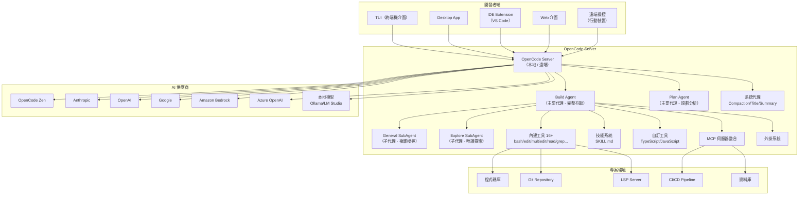
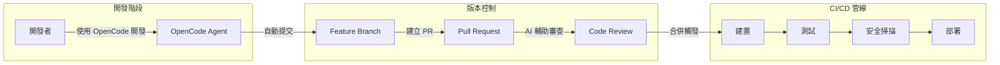
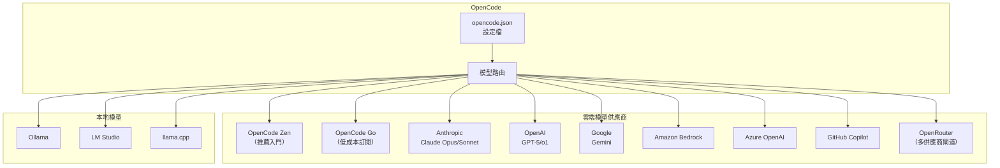
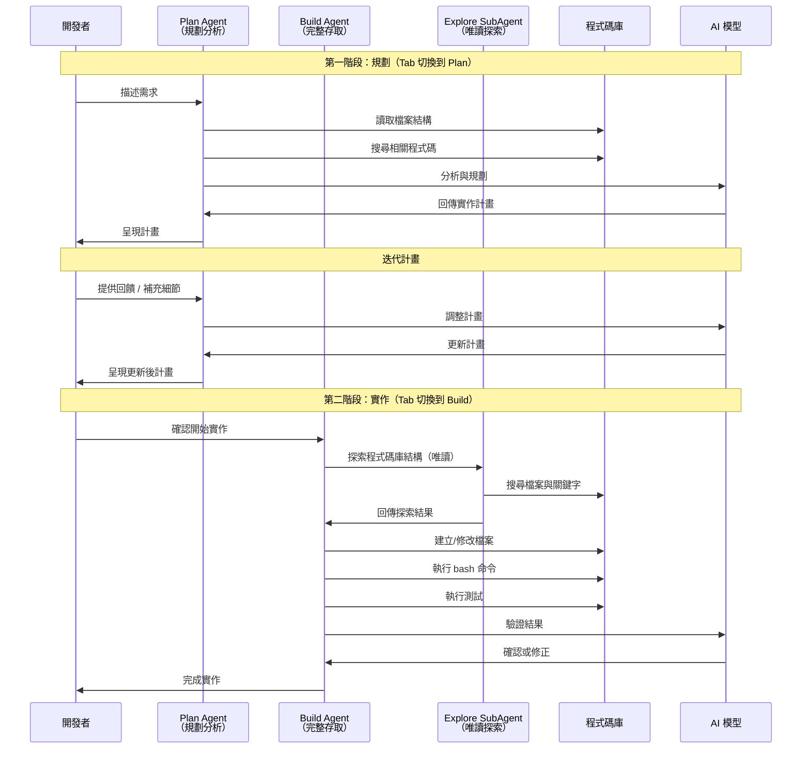
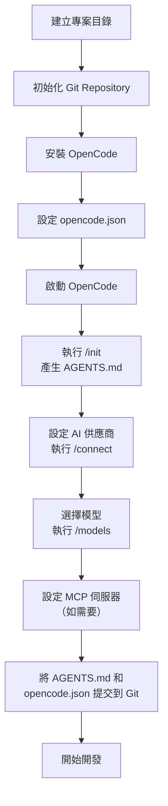
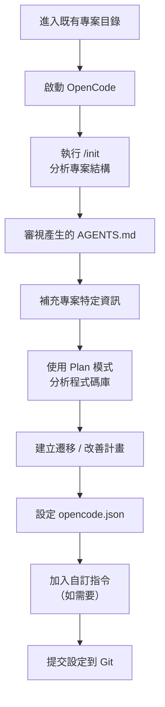
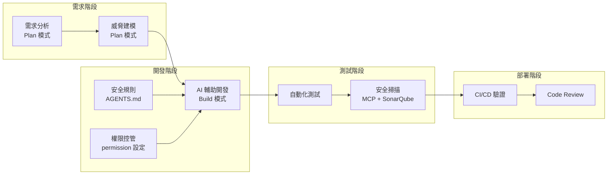
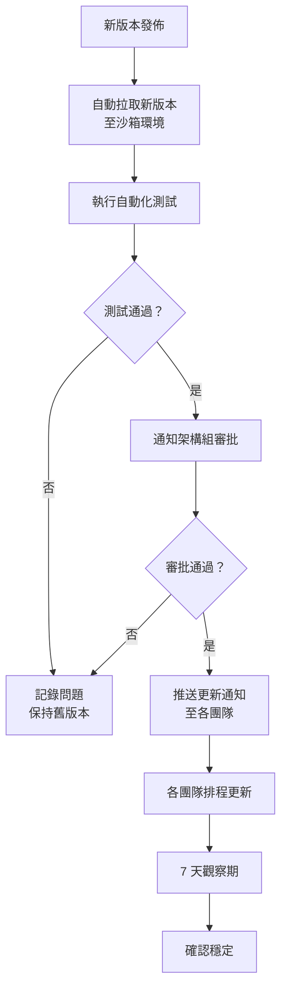
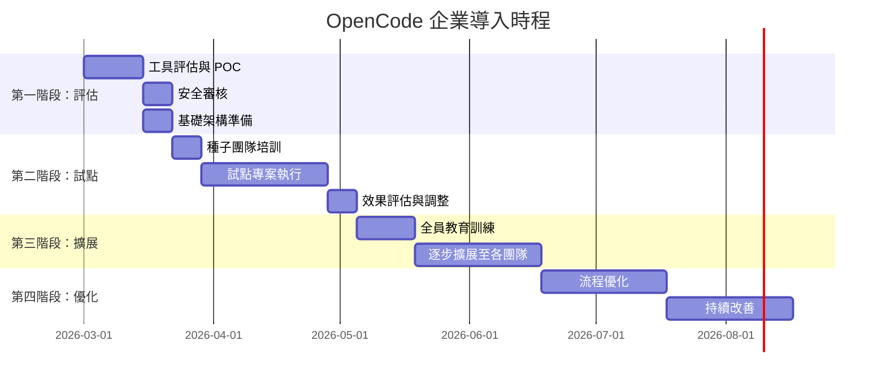

+++
date = '2026-03-04T13:29:00+08:00'
draft = false
title = 'Opencode生態系教學手冊'
tags = ['教學', 'AI開發']
categories = ['教學']
+++

# OpenCode 生態系教學手冊

> **版本**：基於 OpenCode v1.2.16（2026 年 3 月）  
> **適用對象**：資深工程師、架構師、DevOps 工程師  
> **維護單位**：軟體架構組  
> **最後更新**：2026-03-04

---

## 目錄

- [第一章：OpenCode 生態系總覽](#第一章opencode-生態系總覽)
  - [1.1 OpenCode 核心理念](#11-opencode-核心理念)
  - [1.2 與傳統 AI Coding Tool 差異](#12-與傳統-ai-coding-tool-差異)
  - [1.3 與 GitHub Copilot / Claude Code 等工具比較](#13-與-github-copilot--claude-code-等工具比較)
  - [1.4 適用場景分析](#14-適用場景分析)
- [第二章：系統架構設計](#第二章系統架構設計)
  - [2.1 OpenCode 在 Web Application 開發架構中的角色](#21-opencode-在-web-application-開發架構中的角色)
  - [2.2 與前端框架整合方式](#22-與前端框架整合方式)
  - [2.3 與後端框架整合方式](#23-與後端框架整合方式)
  - [2.4 與 Git / CI/CD 整合架構](#24-與-git--cicd-整合架構)
  - [2.5 與本地模型 / 雲端模型整合架構](#25-與本地模型--雲端模型整合架構)
  - [2.6 代理系統（Agent System）](#26-代理系統agent-system)
    - [2.6.1 主要代理（Primary Agents）](#261-主要代理primary-agents)
    - [2.6.2 子代理（SubAgents）](#262-子代理subagents)
    - [2.6.3 隱藏系統代理](#263-隱藏系統代理)
    - [2.6.4 自訂代理](#264-自訂代理)
    - [2.6.5 代理進階選項](#265-代理進階選項)
    - [2.6.6 Plan / Build 運作流程](#266-plan--build-運作流程)
- [第三章：安裝與環境建置](#第三章安裝與環境建置)
  - [3.1 系統需求](#31-系統需求)
  - [3.2 Windows 安裝步驟](#32-windows-安裝步驟)
  - [3.3 macOS 安裝步驟](#33-macos-安裝步驟)
  - [3.4 Linux 安裝步驟](#34-linux-安裝步驟)
  - [3.5 Desktop App 安裝](#35-desktop-app-安裝)
  - [3.6 終端機模式設定](#36-終端機模式設定)
  - [3.7 IDE 擴充設定](#37-ide-擴充設定)
  - [3.8 模型設定（雲端 API / 本地模型）](#38-模型設定雲端-api--本地模型)
  - [3.9 環境變數與 Proxy 設定](#39-環境變數與-proxy-設定)
  - [3.10 企業網路限制處理方式](#310-企業網路限制處理方式)
- [第四章：專案導入標準流程（SOP）](#第四章專案導入標準流程sop)
  - [4.1 新專案導入流程](#41-新專案導入流程)
  - [4.2 舊專案導入流程](#42-舊專案導入流程)
  - [4.3 Branch 管理策略](#43-branch-管理策略)
  - [4.4 PR 與 Code Review 搭配方式](#44-pr-與-code-review-搭配方式)
  - [4.5 團隊協作模式](#45-團隊協作模式)
  - [4.6 安全開發流程（SSDLC 整合方式）](#46-安全開發流程ssdlc-整合方式)
- [第五章：實戰操作教學](#第五章實戰操作教學)
  - [5.1 使用 Plan 模式設計系統架構](#51-使用-plan-模式設計系統架構)
  - [5.2 使用 Build 模式產生程式碼](#52-使用-build-模式產生程式碼)
  - [5.3 自動產生測試](#53-自動產生測試)
  - [5.4 重構（Refactor）](#54-重構refactor)
  - [5.5 Debug](#55-debug)
  - [5.6 批次修改專案](#56-批次修改專案)
  - [5.7 生成文件（README / API 文件）](#57-生成文件readme--api-文件)
  - [5.8 使用 Explore SubAgent 探索程式碼庫](#58-使用-explore-subagent-探索程式碼庫)
  - [5.9 使用自訂指令加速工作流程](#59-使用自訂指令加速工作流程)
- [第六章：最佳實踐（Best Practices）](#第六章最佳實踐best-practices)
  - [6.1 Prompt 撰寫策略](#61-prompt-撰寫策略)
  - [6.2 Token 控制策略](#62-token-控制策略)
  - [6.3 避免幻覺（Hallucination）](#63-避免幻覺hallucination)
  - [6.4 如何做 Code Validation](#64-如何做-code-validation)
  - [6.5 與 SonarQube / 測試工具整合](#65-與-sonarqube--測試工具整合)
  - [6.6 大型專案使用策略](#66-大型專案使用策略)
  - [6.7 多模組專案管理建議](#67-多模組專案管理建議)
- [第七章：系統維護與治理](#第七章系統維護與治理)
  - [7.1 模型版本管理策略](#71-模型版本管理策略)
  - [7.2 OpenCode 版本管理](#72-opencode-版本管理)
  - [7.3 日誌管理](#73-日誌管理)
  - [7.4 成本控制](#74-成本控制)
  - [7.5 權限管理](#75-權限管理)
    - [7.5.1 完整權限列表](#751-完整權限列表)
    - [7.5.2 細粒度權限控制](#752-細粒度權限控制)
    - [7.5.3 「ask」選項的三個選擇](#753ask選項的三個選擇)
    - [7.5.4 代理專屬權限](#754-代理專屬權限)
  - [7.6 技能系統（Skills）](#76-技能系統skills)
    - [7.6.1 SKILL.md 檔案格式](#761-skillmd-檔案格式)
    - [7.6.2 技能發現路徑](#762-技能發現路徑)
    - [7.6.3 技能權限控制](#763-技能權限控制)
  - [7.7 自訂工具（Custom Tools）](#77-自訂工具custom-tools)
    - [7.7.1 工具定義](#771-工具定義)
    - [7.7.2 多工具匯出](#772-多工具匯出)
    - [7.7.3 覆蓋內建工具](#773-覆蓋內建工具)
  - [7.8 風險控管](#78-風險控管)
- [第八章：系統升級策略](#第八章系統升級策略)
  - [8.1 升級前檢查清單](#81-升級前檢查清單)
  - [8.2 版本相容性測試](#82-版本相容性測試)
  - [8.3 回滾策略](#83-回滾策略)
  - [8.4 CI/CD 驗證流程](#84-cicd-驗證流程)
- [第九章：企業導入建議](#第九章企業導入建議)
  - [9.1 導入階段規劃](#91-導入階段規劃)
  - [9.2 教育訓練策略](#92-教育訓練策略)
  - [9.3 試點專案規劃](#93-試點專案規劃)
  - [9.4 成本效益分析](#94-成本效益分析)
  - [9.5 KPI 設計](#95-kpi-設計)
- [第十章：常見問題與故障排除](#第十章常見問題與故障排除)
  - [10.1 API 失敗](#101-api-失敗)
  - [10.2 模型回應不穩](#102-模型回應不穩)
  - [10.3 權限問題](#103-權限問題)
  - [10.4 IDE 無法連線](#104-ide-無法連線)
  - [10.5 效能問題](#105-效能問題)
- [附錄：快速上手檢查清單（Checklist）](#附錄快速上手檢查清單checklist)
  - [環境準備](#環境準備)
  - [初始設定](#初始設定)
  - [專案設定](#專案設定)
  - [日常操作](#日常操作)
  - [安全合規](#安全合規)
  - [團隊協作](#團隊協作)
  - [常見 OpenCode 指令速查表](#常見-opencode-指令速查表)
  - [重要參考資源](#重要參考資源)

---

## 第一章：OpenCode 生態系總覽

### 1.1 OpenCode 核心理念

OpenCode 是一個 **100% 開源** 的 AI 編碼代理（AI Coding Agent），由 Anomaly 團隊開發維護，截至 2026 年 3 月已獲得 **115k+ GitHub Stars**、**785+ 貢獻者**、**726+ 版本發佈**，月活躍開發者超過 **250 萬人**。

**核心理念：**

| 理念 | 說明 |
|------|------|
| 開源優先 | MIT 授權，完整原始碼公開，企業可自行審計 |
| 隱私優先 | **不儲存您的程式碼或上下文資料**，所有處理均在本地完成 |
| 供應商中立 | 不綁定任何特定 AI 供應商，支援 35+ LLM 提供商 |
| 多介面支援 | TUI（終端機介面）、Desktop App、IDE Extension、Web、CLI |
| Agent 架構 | 內建 4 個代理（Build、Plan、General、Explore）+ 3 個隱藏系統代理 |
| 可擴展性 | 支援 MCP 伺服器、自訂工具、技能系統、外掛系統、SDK |
| 團隊協作 | 對話分享、規則系統（AGENTS.md）、統一設定管理 |

**技術堆疊：**

- 前端：TypeScript（52.5%）、MDX（43.2%）、CSS（3.2%）
- 核心引擎：Rust（0.6%）
- 套件管理：Bun / npm / pnpm
- 架構：Client/Server 架構，TUI 只是其中一種客戶端

> **實務建議**：OpenCode 的 Client/Server 架構允許在本地電腦執行 Agent，同時從行動裝置遠端操控，非常適合需要長時間執行任務的場景。

---

### 1.2 與傳統 AI Coding Tool 差異

| 特性 | 傳統 AI Coding Tool | OpenCode |
|------|---------------------|----------|
| 運作模式 | 補全 / 建議式 | **Agent 式**（自主規劃與執行） |
| 操作範圍 | 單一檔案 / 函式 | **整個專案**（讀取、搜尋、編輯、執行） |
| 上下文理解 | 當前開啟的檔案 | **整個程式碼庫** + LSP + 網路搜尋 |
| 工具整合 | 有限 | **MCP 伺服器** + **自訂工具** + **外掛系統** |
| 模型選擇 | 固定供應商 | **75+ 提供商** + 本地模型 |
| 版本控制 | 無 | 內建 `/undo` `/redo`，整合 Git |
| 可擴展性 | 低 | SDK、Plugin、Custom Tools |

**關鍵差異說明：**

1. **Agent 模式 vs 補全模式**：OpenCode 不只是建議程式碼，它會自主規劃任務、搜尋程式碼庫、讀寫檔案、執行命令
2. **內建工具系統**：bash、edit、multiedit、write、read、grep、glob、list、patch、lsp、webfetch、websearch、codesearch、todoread、todowrite、question、skill 等 16+ 工具讓 AI 能夠直接操作開發環境
3. **上下文壓縮**：自動管理上下文視窗，支援長時間工作階段
4. **技能系統（Skills）**：透過 SKILL.md 檔案定義可重用的代理技能，支援跨專案共享

---

### 1.3 與 GitHub Copilot / Claude Code 等工具比較

| 比較維度 | GitHub Copilot | Claude Code | OpenCode |
|----------|----------------|-------------|----------|
| **開源** | ❌ 商業 | ❌ 商業 | ✅ MIT 授權 |
| **供應商綁定** | 綁定 GitHub/OpenAI | 綁定 Anthropic | ✅ 供應商中立 |
| **支援模型數** | 有限 | Claude 系列 | **75+ 提供商**，含本地模型 |
| **TUI 體驗** | 基本 | 良好 | ✅ 由 Neovim 使用者打造 |
| **LSP 支援** | IDE 內建 | 無 | ✅ 開箱即用 |
| **MCP 整合** | 有限 | 支援 | ✅ 完整支援（本地 + 遠端 + OAuth） |
| **Desktop App** | ❌ | ❌ | ✅ Beta（macOS/Windows/Linux） |
| **Client/Server** | ❌ | ❌ | ✅ 支援遠端控制 |
| **企業版** | ✅ | ✅ | ✅ Enterprise 方案 |
| **價格** | $19-39/月 | 按 Token 計費 | **免費開源** + 可選 Zen/Go 方案 |
| **自訂代理** | 有限 | 有限 | ✅ 完全可自訂 |
| **外掛系統** | 擴充市集 | 無 | ✅ npm 外掛 + 本地外掛 |

> **官方說明**（來自 OpenCode FAQ）：  
> OpenCode 在功能上與 Claude Code 非常相似，關鍵差異在於：100% 開源、不綁定供應商、開箱即用的 LSP 支援、專注 TUI 體驗、Client/Server 架構。

---

### 1.4 適用場景分析

| 場景 | 適用程度 | 說明 |
|------|----------|------|
| Web Application 全端開發 | ⭐⭐⭐⭐⭐ | 前後端皆可覆蓋 |
| 遺留系統現代化 | ⭐⭐⭐⭐⭐ | Plan 模式分析 → Build 模式轉換 |
| API 開發與測試 | ⭐⭐⭐⭐⭐ | 自動產生 API、測試、文件 |
| DevOps / CI/CD 自動化 | ⭐⭐⭐⭐ | 產生 Dockerfile、GitHub Actions、K8s 配置 |
| 程式碼審查輔助 | ⭐⭐⭐⭐ | 可設定唯讀代理專門做 Code Review |
| 文件產生 | ⭐⭐⭐⭐⭐ | README、API 文件、架構文件 |
| 資料庫操作 | ⭐⭐⭐ | 需搭配 MCP 伺服器 |
| 即時協作 | ⭐⭐⭐ | 透過 `/share` 分享對話 |

> **注意事項**：OpenCode 特別適合需要跨多個檔案、多個步驟的複雜任務。對於簡單的程式碼補全，傳統 IDE 內建的 AI 補全可能更為即時。

---

## 第二章：系統架構設計

### 2.1 OpenCode 在 Web Application 開發架構中的角色

OpenCode 採用 **Client/Server 架構**，在整體開發流程中扮演 **智慧開發助手** 角色：



---

### 2.2 與前端框架整合方式

OpenCode 透過以下方式與前端框架（Vue / React / Tailwind）整合：

**1. 專案初始化與 AGENTS.md**

```bash
# 進入前端專案目錄
cd /path/to/vue-project

# 啟動 OpenCode
opencode

# 初始化專案（產生 AGENTS.md）
/init
```

**2. AGENTS.md 範例（Vue 3 專案）**

```markdown
# AGENTS.md

## 專案說明
這是一個 Vue 3 + TypeScript + Tailwind CSS 專案。

## 技術堆疊
- Vue 3 Composition API
- TypeScript 5.x
- Tailwind CSS 4.x
- Vite 6.x
- Pinia（狀態管理）
- Vue Router（路由）

## 編碼規範
- 元件使用 `<script setup lang="ts">` 語法
- 樣式使用 Tailwind utility classes
- 狀態管理使用 Pinia store
- 命名慣例：PascalCase（元件）、camelCase（函式/變數）

## 目錄結構
- src/components/ - 共用元件
- src/views/ - 頁面元件
- src/stores/ - Pinia stores
- src/composables/ - 組合式函式
- src/types/ - TypeScript 型別定義
```

**3. 搭配 MCP 伺服器使用 Context7 查詢文件**

```json
{
  "$schema": "https://opencode.ai/config.json",
  "mcp": {
    "context7": {
      "type": "remote",
      "url": "https://mcp.context7.com/mcp"
    }
  }
}
```

```
建立一個 Vue 3 元件，實作使用者清單的 CRUD 功能。use context7 查詢 Vue 3 Composition API 最新用法。
```

---

### 2.3 與後端框架整合方式

**Spring Boot 整合範例：**

```markdown
# AGENTS.md

## 專案說明
Spring Boot 3.x + Java 21 微服務專案

## 技術堆疊
- Spring Boot 3.4
- Java 21
- Spring Data JPA
- Spring Security
- MapStruct
- Lombok
- OpenAPI 3.0

## 編碼規範
- 使用 Clean Architecture
- Controller → Service → Repository 分層
- DTO 使用 Record 類別
- 日誌使用 SLF4J
- 例外處理使用 @ControllerAdvice
```

**Node.js / FastAPI 整合範例：**

```
# Node.js
opencode 進入專案後使用 /init，會自動識別 package.json 並產生對應的 AGENTS.md

# FastAPI
opencode 進入專案後使用 /init，會自動識別 pyproject.toml 並產生對應的 AGENTS.md
```

---

### 2.4 與 Git / CI/CD 整合架構



**OpenCode GitHub 整合設定：**

OpenCode 可直接整合 GitHub，支援：
- 讀取 Issue 和 PR 資訊
- 建立和管理分支
- 產生 PR 描述和 Commit Message

```json
{
  "$schema": "https://opencode.ai/config.json",
  "mcp": {
    "github": {
      "type": "local",
      "command": ["npx", "-y", "@modelcontextprotocol/server-github"],
      "environment": {
        "GITHUB_TOKEN": "{env:GITHUB_TOKEN}"
      }
    }
  }
}
```

---

### 2.5 與本地模型 / 雲端模型整合架構



**雲端模型設定範例（Anthropic）：**

```bash
# 在 OpenCode TUI 中
/connect
# 選擇 Anthropic → Claude Pro/Max 或手動輸入 API Key

/models
# 選擇模型，如 claude-sonnet-4-5
```

**本地模型設定範例（Ollama）：**

```json
{
  "$schema": "https://opencode.ai/config.json",
  "provider": {
    "ollama": {
      "npm": "@ai-sdk/openai-compatible",
      "name": "Ollama (local)",
      "options": {
        "baseURL": "http://localhost:11434/v1"
      },
      "models": {
        "qwen3-coder:a3b": {
          "name": "Qwen3-Coder (local)",
          "limit": {
            "context": 128000,
            "output": 65536
          }
        }
      }
    }
  }
}
```

**企業自訂提供商設定範例：**

```json
{
  "$schema": "https://opencode.ai/config.json",
  "provider": {
    "company-llm": {
      "npm": "@ai-sdk/openai-compatible",
      "name": "公司內部 LLM",
      "options": {
        "baseURL": "https://llm-gateway.internal.company.com/v1",
        "apiKey": "{env:COMPANY_LLM_API_KEY}",
        "headers": {
          "X-Team-ID": "engineering"
        }
      },
      "models": {
        "company-model-v2": {
          "name": "Company Model v2",
          "limit": {
            "context": 200000,
            "output": 65536
          }
        }
      }
    }
  }
}
```

---

### 2.6 代理系統（Agent System）

OpenCode 內建完整的多代理系統，包含 **4 個內建代理** 和 **3 個隱藏系統代理**：

#### 2.6.1 主要代理（Primary Agents）

透過 **Tab 鍵** 在兩個主要代理之間快速切換：

| 代理 | 用途 | 權限 | 適用場景 |
|------|------|------|----------|
| **Build**（預設） | 完整開發 | 完整讀寫存取 | 實作功能、修改程式碼、執行命令 |
| **Plan** | 分析規劃 | 編輯/bash 預設為 **ask**（非完全唯讀） | 探索程式碼庫、設計架構、制定計畫 |

> **注意**：Plan Agent 並非完全唯讀。根據官方文件，Plan Agent 的 `edit` 和 `bash` 權限預設為 `ask`（需確認），而非 `deny`。這讓 Plan Agent 在必要時也能執行修改操作。

#### 2.6.2 子代理（SubAgents）

子代理由主要代理呼叫，用於特定作業：

| 子代理 | 呼叫方式 | 用途 | 特點 |
|--------|----------|------|------|
| **General** | `@general` | 複雜搜尋和多步驟任務 | 通用型子代理 |
| **Explore** | 自動呼叫 | **唯讀**程式碼庫探索 | 快速找檔案、搜尋關鍵字、回答程式碼問題 |

**Explore SubAgent** 是一個專門的唯讀子代理，用於快速探索程式碼庫：
- 依模式尋找檔案
- 搜尋關鍵字和符號
- 回答有關程式碼庫結構的問題
- **無法修改任何檔案**，確保安全性

#### 2.6.3 隱藏系統代理

這些代理在背景自動運作，使用者無需直接操作：

| 系統代理 | 功能 | 說明 |
|----------|------|------|
| **Compaction** | 上下文壓縮 | 當對話上下文過長時自動壓縮，保留關鍵資訊 |
| **Title** | 標題生成 | 自動為對話產生摘要標題 |
| **Summary** | 摘要生成 | 生成對話摘要，輔助上下文管理 |

#### 2.6.4 自訂代理

可透過 JSON 設定或 Markdown 檔案建立自訂代理：

**方法一：JSON 設定（opencode.json）**

```json
{
  "$schema": "https://opencode.ai/config.json",
  "agent": {
    "security-reviewer": {
      "description": "Security-focused code reviewer",
      "model": "anthropic/claude-sonnet-4-5",
      "prompt": "You are a security expert. Review code for vulnerabilities following OWASP Top 10.",
      "temperature": 0.2,
      "steps": 50,
      "mode": "subagent",
      "tools": {
        "bash": false,
        "edit": false,
        "write": false,
        "websearch": true,
        "webfetch": true
      },
      "permission": {
        "read": "allow",
        "edit": "deny",
        "bash": "deny"
      }
    }
  }
}
```

**方法二：Markdown 檔案（`.opencode/agents/frontend-dev.md`）**

```markdown
---
description: Frontend development specialist
model: anthropic/claude-sonnet-4-5
temperature: 0.5
steps: 100
mode: primary
tools:
  websearch: true
  bash: true
permission:
  edit: allow
  bash: ask
color: "#42b883"
---

You are a frontend development specialist working with Vue 3 and TypeScript.
Follow the Composition API style and use Tailwind CSS for styling.
```

**方法三：CLI 建立**

```bash
# 使用互動式命令建立代理
opencode agent create
```

#### 2.6.5 代理進階選項

| 選項 | 說明 | 預設值 |
|------|------|--------|
| `description` | 代理描述 | - |
| `model` | 使用的模型 | 繼承全域設定 |
| `prompt` | 系統提示詞（支援 `{file:./path}` 語法） | - |
| `temperature` | 溫度 (0.0-1.0) | 模型預設 |
| `top_p` | Top-P 取樣 | 模型預設 |
| `steps` | 最大步驟數（取代已棄用的 maxSteps） | 100 |
| `disable` | 停用代理 | `false` |
| `hidden` | 隱藏代理（不顯示於列表） | `false` |
| `mode` | 代理模式：`primary` / `subagent` / `all` | `all` |
| `color` | 代理顏色（hex 或 theme） | - |
| `tools` | 工具啟用/停用（支援萬用字元如 `mymcp_*`） | - |
| `permission` | 代理專屬權限（覆蓋全域設定） | - |
| `task` | 子代理的工作權限 | - |

**供應商特定選項：**

```json
{
  "agent": {
    "deep-thinker": {
      "model": "anthropic/claude-sonnet-4-5",
      "options": {
        "reasoningEffort": "high",
        "textVerbosity": "verbose"
      }
    }
  }
}
```

#### 2.6.6 Plan / Build 運作流程



**實際操作流程：**

```bash
# 1. 啟動 OpenCode
opencode

# 2. 按 Tab 切換到 Plan 模式（右下角顯示模式指示器）
<TAB>

# 3. 描述需求
> When a user deletes a note, we'd like to flag it as deleted in the database.
> Then create a screen that shows all the recently deleted notes.
> From this screen, the user can undelete a note or permanently delete it.

# 4. AI 回傳計畫，開發者審視並提供回饋
> We'd like to design this new screen using a design I've used before.
> [Image #1] Take a look at this image and use it as a reference.

# 5. 滿意後，按 Tab 切換回 Build 模式
<TAB>

# 6. 開始實作
> Sounds good! Go ahead and make the changes.
```

> **實務建議**：複雜功能建議先用 Plan 模式做充分設計，確認方案後再切到 Build 模式實作。這能大幅減少返工的機率。

---

## 第三章：安裝與環境建置

### 3.1 系統需求

| 項目 | 最低需求 | 建議需求 |
|------|----------|----------|
| 作業系統 | Windows 10+、macOS 12+、Linux（x64/ARM64） | Windows 11、macOS 14+、Ubuntu 22.04+ |
| Node.js | 18.x | 20.x+ |
| 終端機 | 任意終端機 | WezTerm、Alacritty、Ghostty、Kitty |
| 記憶體 | 4 GB | 8 GB+ |
| 磁碟空間 | 500 MB | 1 GB+ |
| 網路 | 連線至 AI 供應商 | 穩定寬頻 |

---

### 3.2 Windows 安裝步驟

> **最佳實踐**：Windows 上建議搭配 WSL 使用，能獲得更好的效能與完整相容性。

**方法一：使用 Chocolatey（推薦）**

```powershell
# 安裝 Chocolatey（若未安裝）
Set-ExecutionPolicy Bypass -Scope Process -Force
[System.Net.ServicePointManager]::SecurityProtocol = [System.Net.ServicePointManager]::SecurityProtocol -bor 3072
iex ((New-Object System.Net.WebClient).DownloadString('https://community.chocolatey.org/install.ps1'))

# 安裝 OpenCode
choco install opencode

# 驗證安裝
opencode --version
```

**方法二：使用 Scoop**

```powershell
# 安裝 Scoop（若未安裝）
irm get.scoop.sh | iex

# 安裝 OpenCode
scoop install opencode

# 驗證安裝
opencode --version
```

**方法三：使用 npm（全域安裝）**

```powershell
# 透過 npm 全域安裝
npm install -g opencode-ai@latest

# 驗證安裝
opencode --version
```

**方法四：使用 Docker**

```powershell
docker run -it --rm ghcr.io/anomalyco/opencode
```

**方法五：WSL 安裝（推薦完整體驗）**

```bash
# 在 WSL 中使用安裝腳本
curl -fsSL https://opencode.ai/install | bash

# 驗證安裝
opencode --version
```

---

### 3.3 macOS 安裝步驟

**方法一：使用 Homebrew（推薦）**

```bash
# 使用 OpenCode 官方 tap（最新版本）
brew install anomalyco/tap/opencode

# 或使用官方 brew formula（更新較慢）
brew install opencode

# 驗證安裝
opencode --version
```

**方法二：使用安裝腳本**

```bash
curl -fsSL https://opencode.ai/install | bash
opencode --version
```

---

### 3.4 Linux 安裝步驟

**方法一：安裝腳本（通用）**

```bash
curl -fsSL https://opencode.ai/install | bash

# 自訂安裝路徑
OPENCODE_INSTALL_DIR=/usr/local/bin curl -fsSL https://opencode.ai/install | bash

# 使用 XDG 路徑
XDG_BIN_DIR=$HOME/.local/bin curl -fsSL https://opencode.ai/install | bash
```

**方法二：Arch Linux**

```bash
# 穩定版
sudo pacman -S opencode

# 最新 AUR 版本
paru -S opencode-bin
```

**方法三：Homebrew（macOS 和 Linux）**

```bash
brew install anomalyco/tap/opencode
```

**安裝目錄優先順序：**

1. `$OPENCODE_INSTALL_DIR` - 自訂安裝目錄
2. `$XDG_BIN_DIR` - XDG 規範路徑
3. `$HOME/bin` - 標準使用者二進位目錄
4. `$HOME/.opencode/bin` - 預設回退路徑

---

### 3.5 Desktop App 安裝

OpenCode 也提供桌面應用程式（Beta）：

| 平台 | 安裝檔 |
|------|--------|
| macOS（Apple Silicon） | `opencode-desktop-darwin-aarch64.dmg` |
| macOS（Intel） | `opencode-desktop-darwin-x64.dmg` |
| Windows | `opencode-desktop-windows-x64.exe` |
| Linux | `.deb`、`.rpm` 或 AppImage |

```bash
# macOS（Homebrew）
brew install --cask opencode-desktop

# Windows（Scoop）
scoop bucket add extras
scoop install extras/opencode-desktop
```

下載頁面：https://github.com/anomalyco/opencode/releases 或 https://opencode.ai/download

---

### 3.6 終端機模式設定

**推薦的現代終端機：**

| 終端機 | 平台 | 特色 |
|--------|------|------|
| [WezTerm](https://wezterm.org/) | 跨平台 | GPU 加速、Lua 設定 |
| [Alacritty](https://alacritty.org/) | 跨平台 | 極致效能、YAML 設定 |
| [Ghostty](https://ghostty.org/) | Linux / macOS | 原生渲染 |
| [Kitty](https://sw.kovidgoal.net/kitty/) | Linux / macOS | 圖片支援 |

**TUI 設定（`tui.json`）：**

```json
{
  "$schema": "https://opencode.ai/tui.json",
  "theme": "tokyonight",
  "keybinds": {},
  "scroll_speed": 3,
  "scroll_acceleration": {
    "enabled": true
  },
  "diff_style": "auto"
}
```

---

### 3.7 IDE 擴充設定

OpenCode 提供 **VS Code 擴充（SDK v1.2.16）**：

1. 在 VS Code 擴充商店搜尋 "OpenCode"
2. 安裝擴充
3. 擴充會自動偵測已安裝的 OpenCode CLI

---

### 3.8 模型設定（雲端 API / 本地模型）

**第一步：連接供應商**

```bash
# 啟動 OpenCode
opencode

# 新增供應商（互動式選擇）
/connect

# 推薦入門：OpenCode Zen
# 選擇 opencode → 前往 opencode.ai/auth → 取得 API Key

# 選擇模型
/models
```

**供應商連接方式一覽：**

| 供應商 | 連接方式 | 備註 |
|--------|----------|------|
| OpenCode Zen | `/connect` → API Key | 推薦入門，精選模型 |
| OpenCode Go | `/connect` → API Key | 低成本訂閱 |
| Anthropic | `/connect` → Pro/Max 或 API Key | Claude 系列 |
| OpenAI | `/connect` → Plus/Pro 或 API Key | GPT-5、o1 系列 |
| GitHub Copilot | `/connect` → GitHub 裝置授權 | 需 Pro+ 訂閱 |
| Amazon Bedrock | 環境變數 + 設定檔 | `AWS_PROFILE` 或 IAM |
| Azure OpenAI | `/connect` + 環境變數 | 需 `AZURE_RESOURCE_NAME` |
| Google Vertex AI | 環境變數 | `GOOGLE_CLOUD_PROJECT` |
| Ollama（本地） | 設定 `opencode.json` | 免費，離線可用 |
| LM Studio（本地） | 設定 `opencode.json` | 免費，GUI 管理 |

**專案層級設定檔（`opencode.json`）：**

```json
{
  "$schema": "https://opencode.ai/config.json",
  "model": "anthropic/claude-sonnet-4-5",
  "small_model": "anthropic/claude-haiku-4-5",
  "provider": {
    "anthropic": {
      "options": {
        "timeout": 600000
      }
    }
  }
}
```

---

### 3.9 環境變數與 Proxy 設定

**常用環境變數：**

```bash
# === 供應商認證 ===
export ANTHROPIC_API_KEY="sk-ant-..."
export OPENAI_API_KEY="sk-..."
export AWS_PROFILE="my-dev-profile"
export AWS_REGION="us-east-1"
export AZURE_RESOURCE_NAME="my-azure-resource"
export GOOGLE_CLOUD_PROJECT="my-gcp-project"

# === OpenCode 設定 ===
export OPENCODE_CONFIG="/path/to/custom-config.json"
export OPENCODE_CONFIG_DIR="/path/to/config-directory"
export OPENCODE_CONFIG_CONTENT='{"model":"anthropic/claude-sonnet-4-5"}'  # 行內設定覆蓋（最高優先級）
export OPENCODE_INSTALL_DIR="/usr/local/bin"

# === Claude Code 相容性控制 ===
export OPENCODE_DISABLE_CLAUDE_CODE=true       # 停用所有 Claude Code 相容性（CLAUDE.md 等）
export OPENCODE_DISABLE_CLAUDE_CODE_RULES=true  # 僅停用 CLAUDE.md 規則讀取
export OPENCODE_DISABLE_CLAUDE_CODE_SKILLS=true  # 僅停用 .claude/skills/ 讀取

# === Proxy 設定 ===
export HTTP_PROXY="http://proxy.company.com:8080"
export HTTPS_PROXY="http://proxy.company.com:8080"
export NO_PROXY="localhost,127.0.0.1,.internal.company.com"

# === 實驗性功能 ===
export OPENCODE_EXPERIMENTAL_LSP_TOOL=true
export OPENCODE_ENABLE_EXA=1
```

---

### 3.10 企業網路限制處理方式

**1. Proxy 設定**

```bash
# 系統級 Proxy
export HTTP_PROXY="http://proxy.company.com:8080"
export HTTPS_PROXY="http://proxy.company.com:8080"

# npm Proxy（用於安裝 MCP 套件）
npm config set proxy http://proxy.company.com:8080
npm config set https-proxy http://proxy.company.com:8080
```

**2. 自訂 Base URL（使用內部 API Gateway）**

```json
{
  "$schema": "https://opencode.ai/config.json",
  "provider": {
    "anthropic": {
      "options": {
        "baseURL": "https://ai-gateway.internal.company.com/anthropic/v1"
      }
    }
  }
}
```

**3. Amazon Bedrock VPC 端點**

```json
{
  "$schema": "https://opencode.ai/config.json",
  "provider": {
    "amazon-bedrock": {
      "options": {
        "region": "us-east-1",
        "profile": "production",
        "endpoint": "https://bedrock-runtime.us-east-1.vpce-xxxxx.amazonaws.com"
      }
    }
  }
}
```

**4. 停用分享功能**

```json
{
  "$schema": "https://opencode.ai/config.json",
  "share": "disabled"
}
```

**5. 限制可用供應商**

```json
{
  "$schema": "https://opencode.ai/config.json",
  "enabled_providers": ["anthropic", "amazon-bedrock"],
  "disabled_providers": ["openai", "openrouter"]
}
```

**6. 停用自動更新**

```json
{
  "$schema": "https://opencode.ai/config.json",
  "autoupdate": false
}
```

> **企業注意事項**：建議透過內部鏡像站或 API Gateway 代理 AI 供應商的 API，以統一管理流量、日誌和安全策略。

---

## 第四章：專案導入標準流程（SOP）

### 4.1 新專案導入流程



**步驟詳解：**

```bash
# 1. 建立專案
mkdir my-web-app && cd my-web-app
git init

# 2. 建立 opencode.json
cat > opencode.json << 'EOF'
{
  "$schema": "https://opencode.ai/config.json",
  "model": "anthropic/claude-sonnet-4-5",
  "small_model": "anthropic/claude-haiku-4-5",
  "share": "manual",
  "permission": {
    "bash": "ask",
    "edit": "allow"
  },
  "compaction": {
    "auto": true,
    "prune": true
  }
}
EOF

# 3. 啟動 OpenCode
opencode

# 4. 連接供應商
/connect

# 5. 初始化專案
/init

# 6. 提交設定
git add AGENTS.md opencode.json
git commit -m "chore: add OpenCode configuration"
```

---

### 4.2 舊專案導入流程



**操作範例：**

```bash
# 1. 進入專案目錄
cd /path/to/legacy-project

# 2. 啟動 OpenCode
opencode

# 3. 初始化（OpenCode 會分析專案 README、package.json、pom.xml 等）
/init

# 4. 切換到 Plan 模式分析程式碼庫
<TAB>

# 5. 請 AI 分析專案
> 分析這個專案的整體架構、技術堆疊和程式碼品質，
> 列出主要的技術債和改善建議。

# 6. 根據分析結果補充 AGENTS.md
<TAB>  # 切回 Build 模式
> 請根據剛才的分析結果，更新 AGENTS.md，
> 加入專案特定的編碼規範和注意事項。
```

---

### 4.3 Branch 管理策略

**建議的分支策略：**

```
main           ← 生產環境
├── develop    ← 開發主線
│   ├── feature/OC-001-user-auth     ← AI 輔助開發的功能分支
│   ├── feature/OC-002-api-gateway   ← 以 OpenCode 工作階段 ID 追蹤
│   └── refactor/OC-003-cleanup      ← AI 輔助重構
├── release/v1.2.0                    ← 釋出分支
└── hotfix/security-patch             ← 緊急修補
```

**命名慣例：**

```
feature/OC-{TICKET}-{描述}    # 功能分支
refactor/OC-{TICKET}-{描述}   # 重構分支
bugfix/OC-{TICKET}-{描述}     # 修復分支
docs/OC-{TICKET}-{描述}       # 文件分支
```

> **最佳實踐**：每個 OpenCode 工作階段建議對應一個分支，便於追蹤 AI 產出的程式碼變更。

---

### 4.4 PR 與 Code Review 搭配方式

**1. 使用 OpenCode 建立 Code Review 專用代理**

```json
{
  "$schema": "https://opencode.ai/config.json",
  "agent": {
    "code-reviewer": {
      "description": "Reviews code for best practices and potential issues",
      "model": "anthropic/claude-sonnet-4-5",
      "prompt": "You are a code reviewer. Focus on security, performance, and maintainability. Check for OWASP Top 10 vulnerabilities.",
      "tools": {
        "write": false,
        "edit": false,
        "bash": false
      }
    }
  }
}
```

**2. AI 輔助產生 PR 描述**

```
請為目前 Git 暫存區的所有修改產生一份 Pull Request 描述，包含：
1. 變更摘要
2. 影響範圍分析
3. 測試狀態
4. 破壞性變更說明
```

**3. 分享對話作為 Review 參考**

```bash
# 在 OpenCode 中分享工作階段
/share
# 將產生的連結加入 PR 描述中
```

---

### 4.5 團隊協作模式

**設定檔層級與優先順序（由低到高）：**

| 層級 | 路徑 | 用途 |
|------|------|------|
| 遠端設定 | `.well-known/opencode` | 組織預設值 |
| 全域設定 | `~/.config/opencode/opencode.json` | 個人偏好 |
| 自訂設定 | `OPENCODE_CONFIG` 環境變數 | 環境覆寫 |
| 專案設定 | `opencode.json`（專案根目錄） | 專案特定（提交到 Git） |
| `.opencode` 目錄 | `.opencode/agents/`、`.opencode/commands/` | 代理、指令（提交到 Git） |
| 內嵌設定 | `OPENCODE_CONFIG_CONTENT` 環境變數 | 執行時覆寫 |

**團隊共享設定：**

```
project-root/
├── opencode.json          ← 專案共用設定（提交到 Git）
├── AGENTS.md              ← 專案代理規則（提交到 Git）
├── .opencode/
│   ├── agents/            ← 自訂代理
│   │   └── reviewer.md
│   ├── commands/          ← 自訂指令
│   │   ├── test.md
│   │   └── deploy.md
│   ├── skills/            ← 代理技能
│   └── plugins/           ← 本地外掛
```

**團隊共用指令範例：**

```json
{
  "$schema": "https://opencode.ai/config.json",
  "command": {
    "test": {
      "template": "Run the full test suite with coverage report and show any failures.\nFocus on the failing tests and suggest fixes.",
      "description": "Run tests with coverage",
      "agent": "build"
    },
    "component": {
      "template": "Create a new React component named $ARGUMENTS with TypeScript support.\nInclude proper typing and basic structure.",
      "description": "Create a new component"
    },
    "review": {
      "template": "Review the changes in the current git diff for:\n1. Security vulnerabilities\n2. Performance issues\n3. Code style consistency",
      "description": "Review current changes",
      "agent": "plan",
      "subtask": true
    }
  }
}
```

**自訂指令進階功能：**

| 功能 | 語法 | 說明 |
|------|------|------|
| 帶入參數 | `$ARGUMENTS`、`$1`、`$2` | 使用者輸入的參數會取代佔位符 |
| 執行 Shell | `` !`git diff --staged` `` | 嵌入 Shell 命令的輸出結果 |
| 引用檔案 | `@src/config.ts` | 載入檔案內容作為上下文 |
| 強制子代理 | `"subtask": true` | 指令一律以子代理方式執行 |
| 指定代理 | `"agent": "plan"` | 指定執行指令的代理 |
| 指定模型 | `"model": "anthropic/claude-sonnet-4-5"` | 覆蓋預設模型 |

**自訂指令 Markdown 檔案格式（`.opencode/commands/deploy.md`）：**

```markdown
---
description: Deploy to staging environment
agent: build
model: anthropic/claude-sonnet-4-5
---

Check the current git status and run the following deployment steps:
1. Run `mvn clean package -DskipTests`
2. Deploy to staging: !`./scripts/deploy-staging.sh`
3. Verify deployment by checking @config/staging.yml
4. Report deployment status for $ARGUMENTS
```

**設定檔變數語法：**

OpenCode 設定檔支援變數取代，避免硬編碼敏感資訊：

```json
{
  "$schema": "https://opencode.ai/config.json",
  "provider": {
    "company-llm": {
      "npm": "@ai-sdk/openai-compatible",
      "options": {
        "apiKey": "{env:COMPANY_API_KEY}",
        "baseURL": "{env:LLM_GATEWAY_URL}"
      }
    }
  }
}
```

| 變數語法 | 說明 | 範例 |
|----------|------|------|
| `{env:VAR_NAME}` | 讀取環境變數值 | `{env:API_KEY}` |
| `{file:./path}` | 讀取檔案內容 | `{file:./secrets/key.txt}` |

**Claude Code 相容性：**

OpenCode 支援 Claude Code 的設定格式，方便團隊遷移：

| Claude Code 檔案 | OpenCode 對應 | 說明 |
|-------------------|---------------|------|
| `CLAUDE.md` | `AGENTS.md`（自動回退讀取） | 專案規則 |
| `.claude/settings.json` | `opencode.json` | 設定檔 |
| `.claude/skills/` | `.opencode/skills/`（自動搜尋） | 技能檔案 |

> **注意**：可透過設定 `OPENCODE_DISABLE_CLAUDE_CODE=true` 環境變數完全停用 Claude Code 相容性。

**載入額外指示檔案（instructions）：**

```json
{
  "$schema": "https://opencode.ai/config.json",
  "instructions": [
    "CONTRIBUTING.md",
    "docs/architecture.md",
    { "path": "docs/**/*.md", "glob": true },
    "https://raw.githubusercontent.com/org/repo/main/RULES.md"
  ]
}
```

支援本地檔案路徑、glob 模式和遠端 URL，所有匹配的檔案內容會自動載入為代理的額外指示。

---

### 4.6 安全開發流程（SSDLC 整合方式）



**安全設定建議：**

```json
{
  "$schema": "https://opencode.ai/config.json",
  "share": "disabled",
  "permission": {
    "bash": "ask",
    "edit": "allow",
    "write": "allow",
    "webfetch": "ask"
  },
  "tools": {
    "websearch": false
  },
  "enabled_providers": ["amazon-bedrock"],
  "disabled_providers": ["openrouter"],
  "autoupdate": false
}
```

**AGENTS.md 安全規則：**

```markdown
# 安全規則

## 程式碼安全
- 所有使用者輸入必須進行驗證和清理
- SQL 查詢必須使用參數化查詢
- 敏感資料（密碼、API Key）不得寫入程式碼
- 使用 HTTPS 進行所有外部通訊
- 遵循 OWASP Top 10 防護措施

## 禁止事項
- 不得在程式碼中包含任何硬編碼的密鑰或憑證
- 不得停用 CSRF 保護
- 不得使用 eval() 或類似的動態執行函式
- 不得在日誌中記錄敏感資訊
```

> **實務建議**：建議將安全規則寫入 AGENTS.md 並提交到 Git，讓每位使用 OpenCode 的團隊成員都受到相同的安全約束。

---

## 第五章：實戰操作教學

### 5.1 使用 Plan 模式設計系統架構

**場景**：設計一個使用者認證模組

```bash
# 1. 啟動 OpenCode 並切換到 Plan 模式
opencode
<TAB>  # 切換到 Plan 模式

# 2. 描述需求
```

**Prompt 範例：**

```
我們需要為這個 Spring Boot 專案設計一個完整的使用者認證模組，需求如下：

1. 支援帳號密碼登入和 OAuth2 社交登入（Google、GitHub）
2. 使用 JWT Token 進行 Stateless 認證
3. 支援 Refresh Token 機制
4. 需要 RBAC（角色存取控制）
5. 支援 2FA（雙因素認證）

請分析現有程式碼庫，設計完整的實作計畫，包含：
- 需要新增的類別結構
- 資料庫表結構設計
- API 端點設計
- 安全考量
```

**AI 回覆計畫後，進行迭代：**

```
這個計畫看起來不錯，但需要調整：
1. 考慮加入 Rate Limiting 防止暴力攻擊
2. Token 過期時間需符合公司安全政策（Access Token 15 分鐘，Refresh Token 7 天）
3. 需要支援 IP 白名單功能
```

---

### 5.2 使用 Build 模式產生程式碼

**場景**：實作 RESTful API CRUD

```bash
# 切換到 Build 模式
<TAB>

# 指令範例
```

**Prompt 範例：**

```
請為 @src/main/java/com/tutorial/java/Student.java 這個實體類別建立完整的 REST API，包含：

1. Controller（RESTful CRUD 端點）
2. Service 層（業務邏輯）
3. Repository（JPA Repository）
4. DTO（Request/Response）
5. 例外處理（全域例外處理器）
6. Validation（Bean Validation）

請參考 @src/main/java/com/tutorial/java/Person.java 的現有模式。
```

**使用 `@` 符號引用檔案：**

```
查看 @src/main/java/com/tutorial/java/App.java 的實作方式，
然後建立一個類似的啟動類別，但加入 Spring Boot 自動設定。
```

---

### 5.3 自動產生測試

**Prompt 範例：**

```
請為 @src/main/java/com/tutorial/java/util/Utils.java 建立完整的單元測試：

1. 使用 JUnit 5
2. 覆蓋所有公開方法
3. 包含正常情境和邊界情境
4. 包含例外情境測試
5. 使用 @DisplayName 提供清楚的測試描述
6. 目標行覆蓋率 80%+

請參考 @src/test/java/com/tutorial/java/util/UtilsTest.java 的現有風格。
```

**批次產生測試：**

```
掃描 src/main/java/com/tutorial/ 目錄下所有尚未有對應測試的類別，
為每個類別產生完整的單元測試，放在對應的 test 目錄中。
```

---

### 5.4 重構（Refactor）

**Prompt 範例：**

```
分析 @src/main/java/com/tutorial/java/App.java，
找出程式碼異味（Code Smells）並進行重構：

1. 提取重複邏輯為共用方法
2. 改善命名（方法名、變數名）
3. 遵循 SOLID 原則
4. 減少方法複雜度（Cyclomatic Complexity < 10）
5. 加入適當的 JavaDoc 註解
```

**復原與重做：**

```bash
# 如果重構結果不滿意
/undo

# 重新調整提示詞再試一次
# ...

# 如果之前的版本更好
/redo
```

---

### 5.5 Debug

**Prompt 範例：**

```
我在執行 mvn test 時遇到以下錯誤：
[ErrorMessage]

請：
1. 分析錯誤原因
2. 找出相關的原始碼
3. 提供修復方案
4. 驗證修復是否有效（執行測試）
```

**搭配 Bash 工具 Debug：**

```
請執行 mvn test -pl :java-tutorial -Dtest=StudentTest 
並分析測試失敗的原因，然後修復程式碼。
```

---

### 5.6 批次修改專案

**場景**：將所有 Logger 從 System.out.println 改為 Log4j2

```
掃描整個專案，將所有使用 System.out.println 的地方改為使用 Log4j2：

1. 找出所有包含 System.out.println 的檔案
2. 在每個類別中加入 private static final Logger logger = LogManager.getLogger()
3. 根據上下文將 System.out.println 替換為適當的 logger.info/debug/error
4. 確保 import 正確
5. 列出所有修改的檔案清單
```

**場景**：批次更新依賴版本

```
分析 pom.xml 中所有依賴的版本，找出可升級到最新穩定版的依賴，
建立一份升級計畫並執行升級。確保升級後 mvn compile 和 mvn test 都能通過。
```

---

### 5.7 生成文件（README / API 文件）

**Prompt 範例（README）：**

```
為這個專案產生一份專業的 README.md，包含：

1. 專案說明
2. 技術堆疊
3. 系統需求
4. 安裝步驟
5. 使用方式
6. 專案結構說明
7. 開發指南
8. 測試方式
9. 部署說明
10. 貢獻指南

請依據實際專案內容撰寫,不要是模板。
```

**Prompt 範例（API 文件）：**

```
掃描 src/ 目錄下所有 Controller 類別，
產生完整的 API 文件（Markdown 格式），包含：
- 端點 URL
- HTTP 方法
- 請求參數
- 請求 Body 範例
- 回應格式範例
- 錯誤碼說明
```

> **實務建議**：每次使用 Build 模式完成功能後，養成使用 Plan 模式做一次程式碼審查的習慣，可以有效提高程式碼品質。

---

### 5.8 使用 Explore SubAgent 探索程式碼庫

Explore SubAgent 是專門用於**唯讀**程式碼庫探索的子代理，它會在 Build Agent 需要理解程式碼結構時自動被呼叫。

**場景一**：快速了解不熟悉的專案

```
這個專案的整體架構是什麼？
請找出所有跟使用者認證相關的檔案和類別。
```

> Build Agent 會自動呼叫 Explore SubAgent 來搜尋和閱讀檔案，而不會修改任何內容。

**場景二**：使用 @general 進行複雜搜尋

```
@general 搜尋這個專案中所有使用 deprecated API 的地方，
列出檔案路徑、行號和被棄用的 API 名稱。
```

**場景三**：建立唯讀的 Code Review 代理

```json
{
  "agent": {
    "explorer": {
      "description": "Read-only codebase explorer",
      "mode": "subagent",
      "tools": {
        "edit": false,
        "write": false,
        "bash": false
      },
      "permission": {
        "edit": "deny",
        "write": "deny",
        "bash": "deny"
      }
    }
  }
}
```

---

### 5.9 使用自訂指令加速工作流程

**建立常用指令：**

在 `.opencode/commands/` 目錄下建立 Markdown 檔案：

**`.opencode/commands/test-fix.md`：**

```markdown
---
description: Run tests and fix failures
agent: build
---

1. Run the test suite: !`mvn test`
2. Analyze any test failures
3. Fix the failing tests
4. Re-run to verify: !`mvn test`
5. Report the results for $ARGUMENTS
```

**使用方式：**

```bash
# 在 OpenCode TUI 中
/test-fix StudentTest
```

**內建指令速查：**

| 指令 | 功能 |
|------|------|
| `/init` | 初始化專案（產生 AGENTS.md） |
| `/undo` | 復原上次 AI 修改 |
| `/redo` | 重做修改 |
| `/share` | 分享當前對話 |
| `/help` | 顯示說明 |

---

## 第六章：最佳實踐（Best Practices）

### 6.1 Prompt 撰寫策略

**核心原則：把 AI 當作團隊中的一名初級開發者來溝通。**

**1. 提供充分上下文**

```
# ❌ 不好的 Prompt
幫我寫一個登入功能

# ✅ 好的 Prompt
請為這個 Spring Boot 3.4 專案實作使用者登入功能：
- 使用 JWT Token 認證
- Token 有效期 15 分鐘
- 參考 @src/main/java/.../SecurityConfig.java 的現有安全設定
- 密碼使用 BCrypt 加密
- 登入失敗超過 5 次鎖定帳號 30 分鐘
```

**2. 使用 @ 引用檔案**

```
分析 @src/main/java/com/tutorial/java/Student.java 的實作，
仿照這個模式為 Teacher 實體建立完整的 CRUD 功能。
```

**3. 分步驟提出需求**

```
# 第一步：先規劃
<TAB>  # Plan 模式
設計一個通知系統，支援 Email、SMS、Push 三種管道...

# 第二步：確認計畫
看起來不錯，但需要加入重試機制...

# 第三步：實作
<TAB>  # Build 模式
按照剛才的計畫開始實作。
```

**4. 拖放圖片作為參考**

```
# 在 TUI 中，將 UI 設計稿圖片拖放到終端機
請根據這張設計稿，使用 Vue 3 + Tailwind CSS 實作登入頁面。
[Image #1]
```

---

### 6.2 Token 控制策略

**1. 設定上下文壓縮**

```json
{
  "$schema": "https://opencode.ai/config.json",
  "compaction": {
    "auto": true,
    "prune": true,
    "reserved": 10000
  }
}
```

- `auto`：上下文滿時自動壓縮
- `prune`：刪除舊的工具輸出以節省 Token
- `reserved`：壓縮時的 Token 緩衝區

**2. 使用 small_model 減少成本**

```json
{
  "$schema": "https://opencode.ai/config.json",
  "model": "anthropic/claude-sonnet-4-5",
  "small_model": "anthropic/claude-haiku-4-5"
}
```

`small_model` 用於標題生成等輕量級任務，自動降低成本。

**3. MCP 伺服器控管**

> **重要**：MCP 伺服器會佔用上下文空間。如果啟用大量工具，上下文消耗會迅速增加。

```json
{
  "$schema": "https://opencode.ai/config.json",
  "mcp": {
    "github": {
      "type": "local",
      "command": ["npx", "-y", "@modelcontextprotocol/server-github"],
      "enabled": false
    }
  }
}
```

建議：按需啟用 MCP 伺服器，避免全部啟用。

**4. 使用代理工具控管**

```json
{
  "$schema": "https://opencode.ai/config.json",
  "agent": {
    "focused-coder": {
      "tools": {
        "webfetch": false,
        "websearch": false
      }
    }
  }
}
```

**5. 限制代理步驟數**

```json
{
  "$schema": "https://opencode.ai/config.json",
  "agent": {
    "quick-task": {
      "steps": 30,
      "temperature": 0.3,
      "description": "Fast, focused agent with limited steps"
    }
  }
}
```

`steps` 限制代理完成一次任務的最大步驟數（預設 100），可有效防止 Token 用量失控。`temperature` 越低，回應越確定性，減少不必要的探索。

**6. 善用 Explore SubAgent**

Explore SubAgent 為唯讀操作，不會觸發編輯或 bash 工具，消耗的 Token 較少。對於純粹的程式碼探索和搜尋任務，它比 Build Agent 更經濟。

---

### 6.3 避免幻覺（Hallucination）

| 策略 | 說明 | 實作方式 |
|------|------|----------|
| 驗證優先 | 產出程式碼後立即驗證 | 要求 AI 執行 `mvn test` 或 `npm test` |
| 引用檔案 | 確保 AI 基於實際程式碼 | 使用 `@` 引用具體檔案 |
| Plan 先行 | 先規劃再實作 | Plan 模式 → 確認 → Build 模式 |
| `context7` | 查詢最新文件 | MCP 整合 Context7 |
| 限制範圍 | 避免過大的任務 | 拆分為小任務逐步完成 |
| Code Review | 人工審查 AI 產出 | 搭配 PR Review 流程 |

**發現幻覺時的處理：**

```bash
# 復原修改
/undo

# 提供更多上下文重新嘗試
> 剛才產生的程式碼有誤。請重新查看 @src/... 的實際實作，
> 不要假設 API 結構，直接讀取現有程式碼後再修改。
```

---

### 6.4 如何做 Code Validation

**1. 自動化驗證流程**

```
請完成以下功能後，依序執行驗證：
1. 產生程式碼
2. 執行 mvn compile 確認編譯通過
3. 執行 mvn test 確認測試通過
4. 確認沒有引入新的警告
5. 列出所有修改的檔案
```

**2. 使用自訂指令**

```json
{
  "command": {
    "validate": {
      "template": "Execute the following validation steps:\n1. Run 'mvn compile' and check for errors\n2. Run 'mvn test' and check for failures\n3. Check for any new warnings\n4. Report results",
      "description": "Validate code changes"
    }
  }
}
```

使用方式：`/validate`

---

### 6.5 與 SonarQube / 測試工具整合

**整合 SonarQube（透過 MCP 或 bash）：**

```
執行 SonarQube 掃描：
mvn sonar:sonar -Dsonar.host.url=http://sonar.company.com -Dsonar.token=$SONAR_TOKEN

分析掃描結果，修復所有 Critical 和 Major 等級的問題。
```

**整合測試覆蓋率：**

```
1. 執行 mvn test jacoco:report
2. 分析覆蓋率報告
3. 找出覆蓋率低於 80% 的類別
4. 為這些類別補充測試案例
```

---

### 6.6 大型專案使用策略

**1. 依模組工作**

```
# 一次只處理一個模組
在 Build 模式中：
> 請只專注在 @packages/auth/ 模組，
> 不要修改其他模組的程式碼。

# 使用 instructions 限定範圍
```

**2. 使用 instructions 載入模組文件**

```json
{
  "$schema": "https://opencode.ai/config.json",
  "instructions": [
    "CONTRIBUTING.md",
    "docs/guidelines.md",
    "docs/architecture.md"
  ]
}
```

**3. 使用 watcher 忽略不必要的目錄**

```json
{
  "$schema": "https://opencode.ai/config.json",
  "watcher": {
    "ignore": ["node_modules/**", "dist/**", ".git/**", "target/**"]
  }
}
```

---

### 6.7 多模組專案管理建議

**1. 每個模組獨立的 AGENTS.md**

```
project-root/
├── AGENTS.md              ← 專案整體規則
├── packages/
│   ├── frontend/
│   │   └── AGENTS.md      ← 前端特定規則
│   ├── backend/
│   │   └── AGENTS.md      ← 後端特定規則
│   └── shared/
│       └── AGENTS.md      ← 共用模組規則
```

**2. 模組專屬代理**

```json
{
  "$schema": "https://opencode.ai/config.json",
  "agent": {
    "frontend-dev": {
      "description": "Frontend development with Vue 3",
      "prompt": "Focus on frontend code in packages/frontend/. Use Vue 3 Composition API.",
      "model": "anthropic/claude-sonnet-4-5"
    },
    "backend-dev": {
      "description": "Backend development with Spring Boot",
      "prompt": "Focus on backend code in packages/backend/. Follow Clean Architecture.",
      "model": "anthropic/claude-sonnet-4-5"
    }
  }
}
```

> **實務建議**：大型專案建議將工作拆分為獨立的工作階段，每個工作階段專注於一個模組或功能。完成後使用 `/share` 分享階段結果，便於團隊追蹤。

---

## 第七章：系統維護與治理

### 7.1 模型版本管理策略

| 面向 | 策略 |
|------|------|
| 模型選擇 | 在 `opencode.json` 中明確指定模型版本，避免使用 `latest` |
| 測試驗證 | 更換模型前先在測試專案驗證輸出品質 |
| 記錄追蹤 | 記錄每個專案使用的模型版本 |
| 回退計畫 | 保留前一版本的設定，以便快速回退 |

**建議設定：**

```json
{
  "$schema": "https://opencode.ai/config.json",
  "model": "anthropic/claude-sonnet-4-5",
  "small_model": "anthropic/claude-haiku-4-5",
  "provider": {
    "anthropic": {
      "options": {
        "timeout": 600000
      }
    }
  }
}
```

---

### 7.2 OpenCode 版本管理

**版本管理策略：**

| 環境 | 更新策略 | 設定 |
|------|----------|------|
| 開發環境 | 自動通知，手動更新 | `"autoupdate": "notify"` |
| 測試環境 | 手動更新，先行驗證 | `"autoupdate": false` |
| 生產支援環境 | 經審批後統一更新 | `"autoupdate": false` |

**版本鎖定：**

```bash
# npm 安裝特定版本
npm install -g opencode-ai@1.2.16

# 查看當前版本
opencode --version
```

**企業更新流程：**

```
1. 架構組在沙箱環境測試新版本
2. 驗證與現有設定的相容性
3. 發佈內部更新通知（含 Release Notes）
4. 各團隊按排程更新
5. 保留 7 天觀察期
```

---

### 7.3 日誌管理

**OpenCode 日誌位置：**

```bash
# 預設日誌目錄
~/.local/share/opencode/

# 認證資料
~/.local/share/opencode/auth.json

# MCP OAuth Token
~/.local/share/opencode/mcp-auth.json
```

**企業日誌管理建議：**

| 類型 | 保留策略 | 說明 |
|------|----------|------|
| 對話記錄 | 30 天 | 透過 `/share` 匯出重要對話 |
| 認證日誌 | 90 天 | 追蹤 Token 刷新和失效 |
| MCP 日誌 | 30 天 | 監控外部工具呼叫 |
| 錯誤日誌 | 90 天 | 排障和改善依據 |

**透過 Helicone 監控（可選）：**

```json
{
  "$schema": "https://opencode.ai/config.json",
  "provider": {
    "helicone": {
      "npm": "@ai-sdk/openai-compatible",
      "name": "Helicone",
      "options": {
        "baseURL": "https://ai-gateway.helicone.ai",
        "headers": {
          "Helicone-Cache-Enabled": "true",
          "Helicone-User-Id": "opencode"
        }
      }
    }
  }
}
```

---

### 7.4 成本控制

**OpenCode 計費模式：**

| 方案 | 說明 | 適用場景 |
|------|------|----------|
| 自帶 API Key | 各供應商獨立計費 | 已有 API Key 的團隊 |
| OpenCode Zen | 精選模型，按用量計費 | 初次使用 |
| OpenCode Go | 低成本訂閱 | 預算有限 |

**成本控制策略：**

1. **使用 small_model**：輕量任務自動使用便宜模型
2. **上下文壓縮**：減少每次請求的 Token 數
3. **MCP 伺服器按需啟用**：避免不必要的工具佔用上下文
4. **快取策略**：搭配 Helicone 等快取服務
5. **共享工作階段**：避免重複工作

```json
{
  "compaction": {
    "auto": true,
    "prune": true,
    "reserved": 10000
  },
  "small_model": "anthropic/claude-haiku-4-5"
}
```

---

### 7.5 權限管理

OpenCode 提供細緻的權限管理系統，支援全域、專案和代理層級的權限控制。

#### 7.5.1 完整權限列表

| 權限鍵 | 說明 | 預設值 | 建議（開發） | 建議（生產） |
|--------|------|--------|-------------|-------------|
| `read` | 讀取檔案 | `allow` | `allow` | `allow` |
| `edit` | 編輯檔案 | `allow` | `allow` | `ask` |
| `write` | 建立新檔案 | `allow` | `allow` | `ask` |
| `glob` | 檔案搜尋（模式匹配） | `allow` | `allow` | `allow` |
| `grep` | 內容搜尋 | `allow` | `allow` | `allow` |
| `list` | 列出目錄內容 | `allow` | `allow` | `allow` |
| `bash` | 執行 Shell 命令 | `allow` | `ask` | `deny` |
| `task` | 建立子任務 | `allow` | `allow` | `allow` |
| `skill` | 使用技能 | `allow` | `allow` | `allow` |
| `lsp` | LSP 工具（實驗性） | `allow` | `allow` | `allow` |
| `todoread` | 讀取 TODO 列表 | `allow` | `allow` | `allow` |
| `todowrite` | 寫入 TODO 列表 | `allow` | `allow` | `allow` |
| `webfetch` | 擷取網頁內容 | `allow` | `allow` | `deny` |
| `websearch` | 網路搜尋 | `allow` | `allow` | `deny` |
| `codesearch` | 程式碼搜尋 | `allow` | `allow` | `allow` |
| `external_directory` | 存取專案目錄外的檔案 | **`ask`** | `ask` | `deny` |
| `doom_loop` | 偵測代理陷入迴圈時介入 | **`ask`** | `ask` | `ask` |

> **注意**：`.env` 檔案預設為 **deny**（拒絕讀取），以防止意外洩露環境變數中的敏感資訊。

#### 7.5.2 細粒度權限控制

權限值支援字串或物件格式，可使用 glob 模式進行精確控制：

```json
{
  "permission": {
    "read": "allow",
    "edit": {
      "allow": ["src/**/*.java", "src/**/*.ts"],
      "deny": ["*.env", "*.secret", "config/production/**"]
    },
    "bash": {
      "allow": ["mvn *", "npm *", "git *"],
      "deny": ["rm -rf *", "sudo *", "curl * | bash"]
    },
    "external_directory": {
      "allow": ["~/shared-libs/**", "/opt/company-tools/**"]
    }
  }
}
```

**glob 模式支援：**

| 模式 | 說明 | 範例 |
|------|------|------|
| `*` | 匹配任意字元序列 | `*.java` |
| `?` | 匹配單一字元 | `test?.ts` |
| `**` | 匹配任意目錄層級 | `src/**/*.java` |
| `~` / `$HOME` | 使用者家目錄（自動展開） | `~/projects/**` |

#### 7.5.3 「ask」選項的三個選擇

當權限設為 `ask` 時，使用者在 TUI 中會看到三個選項：

| 選項 | 說明 |
|------|------|
| **Once**（一次） | 僅此次允許，下次仍會詢問 |
| **Always**（永遠） | 本次工作階段中永遠允許 |
| **Reject**（拒絕） | 拒絕此操作 |

#### 7.5.4 代理專屬權限

可為特定代理覆蓋全域權限設定：

**JSON 設定：**

```json
{
  "agent": {
    "code-reviewer": {
      "permission": {
        "edit": "deny",
        "write": "deny",
        "bash": "deny",
        "read": "allow",
        "grep": "allow"
      }
    },
    "full-dev": {
      "permission": {
        "edit": "allow",
        "bash": {
          "allow": ["mvn *", "npm *"],
          "deny": ["rm *"]
        }
      }
    }
  }
}
```

**Markdown 代理設定（`.opencode/agents/reviewer.md`）：**

```markdown
---
description: Read-only code reviewer
permission:
  edit: deny
  write: deny
  bash: deny
  read: allow
---

You are a code reviewer. Analyze code quality without modifying files.
```

**開發環境設定：**

```json
{
  "permission": {
    "bash": "ask",
    "edit": "allow",
    "webfetch": "allow"
  }
}
```

**生產支援環境設定（唯讀分析）：**

```json
{
  "permission": {
    "bash": "deny",
    "edit": "deny",
    "write": "deny",
    "webfetch": "deny",
    "external_directory": "deny"
  },
  "default_agent": "plan"
}
```

---

### 7.6 技能系統（Skills）

技能是可重用的代理能力定義，透過 SKILL.md 檔案描述，讓代理能夠學習和套用專門化的知識。

#### 7.6.1 SKILL.md 檔案格式

```markdown
---
name: spring-boot-crud
description: Generate Spring Boot CRUD endpoints following company standards
license: MIT
compatibility:
  - opencode >= 1.2.0
metadata:
  author: architecture-team
  version: 1.0.0
---

## 使用方式

當需要建立 Spring Boot REST API 時，請遵循以下步驟：

1. 建立 Entity 類別（使用 JPA 註解）
2. 建立 Repository interface（extends JpaRepository）
3. 建立 Service 層（含介面和實作）
4. 建立 Controller（RESTful 端點）
5. 建立 DTO（Request / Response Record）
6. 建立單元測試

## 編碼規範

- 使用 Java Record 作為 DTO
- Controller 使用 @RestController
- Service 層使用 interface + impl 模式
- Repository 繼承 JpaRepository
- 例外處理使用 @ControllerAdvice
```

#### 7.6.2 技能發現路徑

| 路徑 | 用途 |
|------|------|
| `.opencode/skills/` | 專案專屬技能 |
| `~/.config/opencode/skills/` | 全域技能 |
| `.claude/skills/` | Claude Code 相容（自動搜尋） |
| `.agents/skills/` | 替代路徑 |

#### 7.6.3 技能權限控制

```json
{
  "permission": {
    "skill": {
      "allow": ["spring-boot-*", "testing-*"],
      "deny": ["experimental-*"]
    }
  }
}
```

可為特定代理覆蓋技能權限：

```json
{
  "agent": {
    "junior-dev": {
      "permission": {
        "skill": {
          "allow": ["basic-*"],
          "deny": ["advanced-*"]
        }
      }
    }
  }
}
```

---

### 7.7 自訂工具（Custom Tools）

除了 MCP 伺服器外，OpenCode 支援透過 TypeScript/JavaScript 直接建立自訂工具。

#### 7.7.1 工具定義

工具檔案放在 `.opencode/tools/`（專案）或 `~/.config/opencode/tools/`（全域）：

**`.opencode/tools/check-dependencies.ts`：**

```typescript
import { tool } from "@opencode-ai/plugin";
import { z } from "zod";

export default tool({
  name: "check-dependencies",
  description: "Check for outdated dependencies in the project",
  schema: z.object({
    packageManager: z.enum(["npm", "maven", "pip"]).describe("Package manager to check"),
    severity: z.enum(["all", "major", "critical"]).optional().default("all"),
  }),
  async run(input, context) {
    // context 提供：agent, sessionID, messageID, directory, worktree
    const { packageManager } = input;
    
    if (packageManager === "maven") {
      const result = await Bun.$`mvn versions:display-dependency-updates`.text();
      return result;
    }
    
    if (packageManager === "npm") {
      const result = await Bun.$`npm outdated --json`.text();
      return result;
    }
    
    return "Unsupported package manager";
  },
});
```

#### 7.7.2 多工具匯出

一個檔案可以匯出多個工具（命名規則：`<filename>_<exportname>`）：

```typescript
import { tool } from "@opencode-ai/plugin";
import { z } from "zod";

export const lint = tool({
  name: "lint",
  description: "Run linter on the project",
  schema: z.object({}),
  async run() {
    return await Bun.$`npm run lint`.text();
  },
});

export const format = tool({
  name: "format",
  description: "Format code",
  schema: z.object({
    path: z.string().describe("File or directory to format"),
  }),
  async run(input) {
    return await Bun.$`npx prettier --write ${input.path}`.text();
  },
});
```

#### 7.7.3 覆蓋內建工具

自訂工具可以覆蓋 OpenCode 內建工具，只需使用相同的名稱即可。這允許企業自訂工具行為（例如加入審計日誌）。

> **注意**：自訂工具使用 Bun 執行環境。確保開發環境已安裝 Bun，或使用 OpenCode 內建的 Bun 執行時。

---

### 7.8 風險控管

| 風險類型 | 風險說明 | 緩解措施 |
|----------|----------|----------|
| 程式碼品質 | AI 產出可能包含 Bug | 強制 Code Review + 自動化測試 |
| 安全漏洞 | AI 可能產出不安全程式碼 | AGENTS.md 安全規則 + SonarQube |
| 資料外洩 | 程式碼透過 API 傳送至外部 | 使用 Amazon Bedrock / 本地模型 |
| 供應商依賴 | 雲端服務中斷 | 多供應商 + 本地模型備援 |
| 授權問題 | AI 產出的程式碼可能有版權疑慮 | 程式碼掃描 + 法務審核 |
| 幻覺風險 | AI 編造 API 或套件 | 驗證步驟 + Plan 模式審查 |
| 成本失控 | Token 用量暴增 | 限額 + 監控 + small_model |

---

## 第八章：系統升級策略

### 8.1 升級前檢查清單

| 項目 | 檢查內容 | 負責人 |
|------|----------|--------|
| ☐ | 閱讀新版本 Release Notes | 架構師 |
| ☐ | 確認是否有破壞性變更（Breaking Changes） | 架構師 |
| ☐ | 在沙箱環境測試新版本 | 開發人員 |
| ☐ | 驗證現有 opencode.json 設定相容性 | 開發人員 |
| ☐ | 驗證現有 AGENTS.md 相容性 | 開發人員 |
| ☐ | 驗證 MCP 伺服器相容性 | DevOps |
| ☐ | 驗證外掛相容性 | 開發人員 |
| ☐ | 確認供應商 API 相容性 | 架構師 |
| ☐ | 備份現有設定 | 開發人員 |
| ☐ | 準備回滾計畫 | DevOps |

---

### 8.2 版本相容性測試

**測試流程：**

```bash
# 1. 在沙箱環境安裝新版本
npm install -g opencode-ai@<new-version>

# 2. 驗證基本功能
opencode --version
opencode     # 啟動 TUI

# 3. 測試供應商連線
/connect     # 重新驗證
/models      # 確認模型可用

# 4. 測試現有設定
# 確認 opencode.json 正確載入
# 確認 AGENTS.md 正確識別
# 確認自訂指令可用

# 5. 測試 MCP 伺服器
# 確認本地和遠端 MCP 正常連線

# 6. 執行典型工作流程
# Plan 模式 → Build 模式 → 檔案修改 → 測試
```

---

### 8.3 回滾策略

```bash
# 方法一：npm 降級
npm install -g opencode-ai@<previous-version>

# 方法二：還原安裝腳本安裝的版本
# 從 https://github.com/anomalyco/opencode/releases 下載之前版本的二進位檔

# 方法三：Docker（使用指定版本標籤）
docker run -it --rm ghcr.io/anomalyco/opencode:<previous-version>
```

---

### 8.4 CI/CD 驗證流程



---

## 第九章：企業導入建議

### 9.1 導入階段規劃



| 階段 | 時間 | 目標 | 參與人數 |
|------|------|------|----------|
| 評估 | 3 週 | POC + 安全審核 | 3-5 人 |
| 試點 | 6 週 | 種子團隊實戰 | 10-15 人 |
| 擴展 | 6 週 | 全團隊導入 | 50-100 人 |
| 優化 | 持續 | 流程優化與治理 | 全員 |

---

### 9.2 教育訓練策略

| 層級 | 對象 | 內容 | 時長 |
|------|------|------|------|
| Level 1 | 全體工程師 | 基礎安裝、設定、基本操作 | 4 小時 |
| Level 2 | 資深工程師 | Plan/Build 模式、進階 Prompt、MCP 整合 | 8 小時 |
| Level 3 | 架構師 | 自訂代理、外掛開發、企業治理 | 8 小時 |
| Level 4 | DevOps | CI/CD 整合、維運管理、安全設定 | 4 小時 |

**訓練大綱（Level 1）：**

1. OpenCode 簡介與安裝（1 小時）
2. 基本操作：問答、指令、模式切換（1 小時）
3. 實作練習：建立 CRUD API（1 小時）
4. 團隊規範與 AGENTS.md（1 小時）

---

### 9.3 試點專案規劃

**選擇標準：**

| 條件 | 說明 |
|------|------|
| 專案規模 | 中型（5-10 人月） |
| 技術堆疊 | 主流（Spring Boot / Vue / React） |
| 安全要求 | 中等（非核心金融系統） |
| 團隊意願 | 高度配合，願意回饋 |
| 期程彈性 | 允許 10-15% 學習曲線時間 |

**衡量指標：**

| 指標 | 基線 | 目標 |
|------|------|------|
| 功能完成速度 | - | 提升 30-50% |
| 程式碼覆蓋率 | 60% | 80%+ |
| Bug 率 | - | 降低 20-30% |
| 開發者滿意度 | - | 4.0/5.0+ |

---

### 9.4 成本效益分析

**成本項目：**

| 項目 | 月費估算（50 人團隊） |
|------|----------------------|
| AI 供應商 API 費用 | $2,000-5,000 |
| OpenCode Zen/Go（可選） | $500-1,000 |
| 教育訓練成本（一次性） | $5,000-10,000 |
| 維運管理人力 | 0.5 FTE |

**預期效益：**

| 項目 | 估算 |
|------|------|
| 開發效率提升 | 30-50%（相當於 15-25 人產能） |
| 程式碼品質改善 | Bug 率降低 20-30% |
| 文件產出效率 | 提升 5-10 倍 |
| 學習曲線縮短 | 新進人員上手時間減少 40% |

> **ROI 預估**：以 50 人團隊、月均成本 $5,000 計算，效率提升 30% 約等同每月節省 15 人天，約價值 $15,000-20,000，ROI 約 3-4 倍。

---

### 9.5 KPI 設計

| KPI | 衡量方式 | 目標值 |
|-----|----------|--------|
| 採用率 | 活躍使用人數 / 總開發人數 | > 80% |
| 平均每日使用時間 | 日誌分析 | > 2 小時 |
| 程式碼產出速度 | 每週完成的 Story Points | 提升 30% |
| 程式碼品質 | SonarQube 評級 | A 級 |
| 測試覆蓋率 | JaCoCo / Istanbul 報告 | > 80% |
| Bug 密度 | 每千行程式碼 Bug 數 | 下降 25% |
| 開發者滿意度 | 季度調查 | > 4.0/5.0 |
| 成本效益比 | 效率提升 / 工具成本 | > 3:1 |

---

## 第十章：常見問題與故障排除

### 10.1 API 失敗

| 問題 | 可能原因 | 解決方式 |
|------|----------|----------|
| 401 Unauthorized | API Key 過期或無效 | 執行 `/connect` 重新認證 |
| 429 Too Many Requests | 超過 Rate Limit | 等待後重試，或升級方案 |
| 403 Forbidden | 無存取權限 | 檢查組織授權和 API Key 範圍 |
| 500 Internal Server Error | 供應商端問題 | 切換備援供應商 |
| Timeout | 網路延遲或模型過載 | 增加 timeout 設定 |
| Connection Refused | 網路不通 | 檢查 Proxy 和防火牆設定 |

**診斷步驟：**

```bash
# 1. 檢查認證狀態
opencode auth list

# 2. 檢查供應商連線
# 在 TUI 中嘗試簡單的問答

# 3. 檢查網路
curl -I https://api.anthropic.com

# 4. 重新設定認證
/connect
```

---

### 10.2 模型回應不穩

| 問題 | 解決方式 |
|------|----------|
| 回應品質不一致 | 增加 Prompt 細節和上下文 |
| 回應截斷 | 檢查模型的 output limit |
| 回應速度慢 | 切換較快的模型或供應商 |
| 上下文溢出 | 啟用自動壓縮：`compaction.auto: true` |
| 幻覺嚴重 | 使用 `@` 引用具體檔案，避免模糊提問 |

**增加穩定性的設定：**

```json
{
  "$schema": "https://opencode.ai/config.json",
  "provider": {
    "anthropic": {
      "options": {
        "timeout": 600000,
        "setCacheKey": true
      }
    }
  },
  "compaction": {
    "auto": true,
    "prune": true,
    "reserved": 10000
  }
}
```

---

### 10.3 權限問題

| 問題 | 原因 | 解決方式 |
|------|------|----------|
| 無法編輯檔案 | `permission.edit` 設為 `deny` | 修改 `opencode.json` 中的權限設定 |
| 無法執行命令 | `permission.bash` 設為 `deny` | 修改權限或使用 `ask` |
| MCP 工具不可用 | 工具被關閉 | 檢查 `tools` 設定 |
| Plan 模式無法修改 | Plan 代理的 edit/bash 預設為 `ask` | 確認時選擇 "Once" 或 "Always"，或切換到 Build 模式 |
| 存取專案外檔案被拒 | `external_directory` 預設為 `ask` | 設定 `external_directory` 權限允許特定目錄 |
| 代理陷入無窮迴圈 | `doom_loop` 偏好設定 | 設定 `doom_loop: "ask"` 以便手動介入 |

---

### 10.4 IDE 無法連線

| 問題 | 解決方式 |
|------|----------|
| VS Code 擴充無法啟動 | 確認 OpenCode CLI 已正確安裝於 PATH |
| 擴充無回應 | 重啟 VS Code，檢查擴充日誌 |
| 模型選擇清單為空 | 確認已執行 `/connect` 設定供應商 |

---

### 10.5 效能問題

| 問題 | 原因 | 解決方式 |
|------|------|----------|
| 啟動慢 | MCP 伺服器載入 | 增加 `timeout` 或停用不需要的 MCP |
| 回應延遲 | 上下文過大 | 啟用 `compaction` |
| 記憶體使用高 | 多個 MCP 伺服器 | 減少啟用的 MCP 數量 |
| 搜尋慢 | 專案過大 | 設定 `watcher.ignore` 排除大目錄 |

**效能優化設定：**

```json
{
  "$schema": "https://opencode.ai/config.json",
  "watcher": {
    "ignore": ["node_modules/**", "dist/**", "target/**", ".git/**", "*.log"]
  },
  "compaction": {
    "auto": true,
    "prune": true
  },
  "mcp": {
    "heavy-mcp": {
      "type": "local",
      "command": ["npx", "-y", "heavy-mcp-server"],
      "enabled": false,
      "timeout": 10000
    }
  }
}
```

**MCP 伺服器偵錯：**

```bash
# 列出所有 MCP 伺服器及狀態
opencode mcp list

# 偵錯特定 MCP 伺服器
opencode mcp debug my-mcp-server

# 清除 MCP OAuth 憑證
opencode mcp logout my-oauth-server
```

---

## 附錄：快速上手檢查清單（Checklist）

### 環境準備

- [ ] 安裝 Node.js 20.x+
- [ ] 安裝現代終端機（WezTerm / Alacritty / Ghostty）
- [ ] 安裝 OpenCode（`choco install opencode` 或 `brew install anomalyco/tap/opencode`）
- [ ] 驗證安裝：`opencode --version`

### 初始設定

- [ ] 啟動 OpenCode：`opencode`
- [ ] 連接 AI 供應商：`/connect`
- [ ] 選擇模型：`/models`
- [ ] 初始化專案：`/init`
- [ ] 確認 AGENTS.md 已產生

### 專案設定

- [ ] 建立 `opencode.json` 設定檔
- [ ] 設定模型和供應商
- [ ] 設定權限（`permission`）
- [ ] 設定 MCP 伺服器（如需要）
- [ ] 設定上下文壓縮（`compaction`）
- [ ] 設定自訂指令（`command`，如需要）
- [ ] 將 `AGENTS.md` 和 `opencode.json` 提交到 Git

### 日常操作

- [ ] 使用 Plan 模式（`Tab`）規劃複雜任務
- [ ] 使用 Build 模式（`Tab`）實作功能
- [ ] 使用 `@` 引用相關檔案
- [ ] 驗證 AI 產出（執行編譯和測試）
- [ ] 使用 `/undo` 和 `/redo` 管理變更
- [ ] 使用 `/share` 分享重要對話

### 安全合規

- [ ] 確認已設定安全規則於 AGENTS.md
- [ ] 確認已限制可用供應商（如需要）
- [ ] 確認已停用分享功能（如需要）
- [ ] 確認已設定適當的工具權限
- [ ] 確認 AI 產出的程式碼通過安全掃描

### 團隊協作

- [ ] 統一 `opencode.json` 設定
- [ ] 統一 AGENTS.md 規則
- [ ] 建立自訂指令庫（`.opencode/commands/`）
- [ ] 建立技能庫（`.opencode/skills/`）
- [ ] 建立自訂工具（`.opencode/tools/`，如需要）
- [ ] 建立 Code Review 流程
- [ ] 設定成本監控

---

### 常見 OpenCode 指令速查表

| 指令 | 功能 |
|------|------|
| `Tab` | 切換 Plan / Build 模式 |
| `/connect` | 連接 AI 供應商 |
| `/models` | 選擇模型 |
| `/init` | 初始化專案（產生 AGENTS.md） |
| `/share` | 分享當前對話 |
| `/undo` | 復原上次修改 |
| `/redo` | 重做修改 |
| `@filename` | 引用專案檔案 |
| `@general` | 呼叫 General SubAgent |
| `opencode --version` | 查看版本 |
| `opencode auth list` | 列出認證資訊 |
| `opencode mcp list` | 列出 MCP 伺服器 |
| `opencode mcp auth <name>` | MCP OAuth 認證 |
| `opencode mcp debug <name>` | MCP 偵錯 |
| `opencode mcp logout <name>` | 清除 MCP 憑證 |
| `opencode run "<prompt>"` | CLI 模式執行 |
| `opencode serve` | 啟動伺服器 |
| `opencode web` | 啟動 Web 介面 |

---

### 重要參考資源

| 資源 | 網址 |
|------|------|
| OpenCode 官方網站 | https://opencode.ai |
| OpenCode GitHub | https://github.com/anomalyco/opencode |
| 官方文件 | https://opencode.ai/docs |
| 官方文件（繁體中文） | https://opencode.ai/docs/zh-tw |
| 設定文件 | https://opencode.ai/docs/config |
| 供應商列表 | https://opencode.ai/docs/providers |
| MCP 伺服器 | https://opencode.ai/docs/mcp-servers |
| 工具文件 | https://opencode.ai/docs/tools |
| 代理文件 | https://opencode.ai/docs/agents |
| 權限文件 | https://opencode.ai/docs/permissions |
| 規則文件 | https://opencode.ai/docs/rules |
| 自訂指令文件 | https://opencode.ai/docs/commands |
| 技能文件 | https://opencode.ai/docs/skills |
| 自訂工具文件 | https://opencode.ai/docs/custom-tools |
| Discord 社群 | https://opencode.ai/discord |
| Release Notes | https://github.com/anomalyco/opencode/releases |

---

> **文件維護說明**：本手冊應隨 OpenCode 新版本發佈進行更新。建議每季度至少審視一次內容的時效性，並根據團隊實際使用回饋持續改善。

