+++
date = '2026-03-04T13:29:00+08:00'
draft = false
title = 'OpenCode 生態系完整教學手冊'
tags = ['教學', 'AI開發']
categories = ['教學']
+++

# OpenCode 生態系完整教學手冊

> **版本**：基於 OpenCode v1.2.21（2026 年 3 月）  
> **適用對象**：資深工程師、架構師、DevOps 工程師、技術主管  
> **文件等級**：企業標準技術白皮書  
> **維護單位**：軟體架構組  
> **最後更新**：2026-03-08  
> **涵蓋範圍**：OpenCode 核心、Oh My OpenAgent（OmO）外掛、OpenWork 桌面協作平台

---

## 文件修訂紀錄

| 版本 | 日期 | 修訂者 | 修訂說明 |
|------|------|--------|----------|
| 1.0 | 2026-03-04 | 軟體架構組 | 初版建立 |
| 2.0 | 2026-03-08 | 軟體架構組 | 全面更新至 v1.2.21；新增 OmO、OpenWork 章節；擴充至企業白皮書等級 |

---

## 目錄

- [第一章：OpenCode 生態系總覽](#第一章opencode-生態系總覽)
  - [1.1 OpenCode 核心理念](#11-opencode-核心理念)
  - [1.2 生態系全景圖](#12-生態系全景圖)
  - [1.3 與傳統 AI Coding Tool 差異](#13-與傳統-ai-coding-tool-差異)
  - [1.4 與 GitHub Copilot / Claude Code 等工具比較](#14-與-github-copilot--claude-code-等工具比較)
  - [1.5 適用場景分析](#15-適用場景分析)
  - [1.6 版本演進與藍圖](#16-版本演進與藍圖)
- [第二章：系統架構設計](#第二章系統架構設計)
  - [2.1 總體架構](#21-總體架構)
  - [2.2 Client/Server 架構](#22-clientserver-架構)
  - [2.3 代理系統（Agent System）](#23-代理系統agent-system)
    - [2.3.1 主要代理（Primary Agents）](#231-主要代理primary-agents)
    - [2.3.2 子代理（SubAgents）](#232-子代理subagents)
    - [2.3.3 隱藏系統代理](#233-隱藏系統代理)
    - [2.3.4 自訂代理](#234-自訂代理)
    - [2.3.5 代理進階選項](#235-代理進階選項)
    - [2.3.6 Plan / Build 運作流程](#236-plan--build-運作流程)
  - [2.4 工具系統（Tools）](#24-工具系統tools)
  - [2.5 MCP 伺服器整合架構](#25-mcp-伺服器整合架構)
  - [2.6 外掛系統（Plugins）](#26-外掛系統plugins)
  - [2.7 技能系統（Skills）](#27-技能系統skills)
  - [2.8 與前端框架整合方式](#28-與前端框架整合方式)
  - [2.9 與後端框架整合方式](#29-與後端框架整合方式)
  - [2.10 與 Git / CI/CD 整合架構](#210-與-git--cicd-整合架構)
  - [2.11 與本地模型 / 雲端模型整合架構](#211-與本地模型--雲端模型整合架構)
- [第三章：安裝與環境建置](#第三章安裝與環境建置)
  - [3.1 系統需求](#31-系統需求)
  - [3.2 Windows 安裝步驟](#32-windows-安裝步驟)
  - [3.3 macOS 安裝步驟](#33-macos-安裝步驟)
  - [3.4 Linux 安裝步驟](#34-linux-安裝步驟)
  - [3.5 Desktop App 安裝](#35-desktop-app-安裝)
  - [3.6 終端機模式設定](#36-終端機模式設定)
  - [3.7 IDE 擴充設定](#37-ide-擴充設定)
  - [3.8 模型設定（雲端 API / 本地模型）](#38-模型設定雲端-api--本地模型)
  - [3.9 環境變數與 Proxy 設定](#39-環境變數與-proxy-設定)
  - [3.10 企業網路限制處理方式](#310-企業網路限制處理方式)
- [第四章：專案導入標準流程（SOP）](#第四章專案導入標準流程sop)
  - [4.1 新專案導入流程](#41-新專案導入流程)
  - [4.2 舊專案導入流程](#42-舊專案導入流程)
  - [4.3 Branch 管理策略](#43-branch-管理策略)
  - [4.4 PR 與 Code Review 搭配方式](#44-pr-與-code-review-搭配方式)
  - [4.5 團隊協作模式](#45-團隊協作模式)
  - [4.6 安全開發流程（SSDLC 整合方式）](#46-安全開發流程ssdlc-整合方式)
- [第五章：實戰操作教學](#第五章實戰操作教學)
  - [5.1 使用 Plan 模式設計系統架構](#51-使用-plan-模式設計系統架構)
  - [5.2 使用 Build 模式產生程式碼](#52-使用-build-模式產生程式碼)
  - [5.3 自動產生測試](#53-自動產生測試)
  - [5.4 重構（Refactor）](#54-重構refactor)
  - [5.5 Debug](#55-debug)
  - [5.6 批次修改專案](#56-批次修改專案)
  - [5.7 生成文件（README / API 文件）](#57-生成文件readme--api-文件)
  - [5.8 使用 Explore SubAgent 探索程式碼庫](#58-使用-explore-subagent-探索程式碼庫)
  - [5.9 使用自訂指令加速工作流程](#59-使用自訂指令加速工作流程)
  - [5.10 網路搜尋與網頁擷取](#510-網路搜尋與網頁擷取)
  - [5.11 LSP 整合操作](#511-lsp-整合操作)
- [第六章：最佳實踐（Best Practices）](#第六章最佳實踐best-practices)
  - [6.1 Prompt 撰寫策略](#61-prompt-撰寫策略)
  - [6.2 Token 控制策略](#62-token-控制策略)
  - [6.3 避免幻覺（Hallucination）](#63-避免幻覺hallucination)
  - [6.4 如何做 Code Validation](#64-如何做-code-validation)
  - [6.5 與 SonarQube / 測試工具整合](#65-與-sonarqube--測試工具整合)
  - [6.6 大型專案使用策略](#66-大型專案使用策略)
  - [6.7 多模組專案管理建議](#67-多模組專案管理建議)
  - [6.8 格式化器整合](#68-格式化器整合)
- [第七章：系統維護與治理](#第七章系統維護與治理)
  - [7.1 模型版本管理策略](#71-模型版本管理策略)
  - [7.2 OpenCode 版本管理](#72-opencode-版本管理)
  - [7.3 日誌管理](#73-日誌管理)
  - [7.4 成本控制](#74-成本控制)
  - [7.5 權限管理](#75-權限管理)
    - [7.5.1 完整權限列表](#751-完整權限列表)
    - [7.5.2 細粒度權限控制](#752-細粒度權限控制)
    - [7.5.3 「ask」選項的三個選擇](#753ask選項的三個選擇)
    - [7.5.4 代理專屬權限](#754-代理專屬權限)
  - [7.6 技能系統（Skills）](#76-技能系統skills)
    - [7.6.1 SKILL.md 檔案格式](#761-skillmd-檔案格式)
    - [7.6.2 技能發現路徑](#762-技能發現路徑)
    - [7.6.3 技能權限控制](#763-技能權限控制)
  - [7.7 自訂工具（Custom Tools）](#77-自訂工具custom-tools)
    - [7.7.1 工具定義](#771-工具定義)
    - [7.7.2 多工具匯出](#772-多工具匯出)
    - [7.7.3 覆蓋內建工具](#773-覆蓋內建工具)
  - [7.8 規則系統（Rules）](#78-規則系統rules)
  - [7.9 風險控管](#79-風險控管)
- [第八章：系統升級策略](#第八章系統升級策略)
  - [8.1 升級前檢查清單](#81-升級前檢查清單)
  - [8.2 版本相容性測試](#82-版本相容性測試)
  - [8.3 回滾策略](#83-回滾策略)
  - [8.4 CI/CD 驗證流程](#84-cicd-驗證流程)
- [第九章：企業導入建議](#第九章企業導入建議)
  - [9.1 導入階段規劃](#91-導入階段規劃)
  - [9.2 教育訓練策略](#92-教育訓練策略)
  - [9.3 試點專案規劃](#93-試點專案規劃)
  - [9.4 成本效益分析](#94-成本效益分析)
  - [9.5 KPI 設計](#95-kpi-設計)
  - [9.6 企業版功能](#96-企業版功能)
- [第十章：Oh My OpenAgent（OmO）生態系](#第十章oh-my-openagentomo生態系)
  - [10.1 OmO 總覽與定位](#101-omo-總覽與定位)
  - [10.2 核心概念：Discipline Agents](#102-核心概念discipline-agents)
  - [10.3 ultrawork / ulw 一鍵啟動](#103-ultrawork--ulw-一鍵啟動)
  - [10.4 IntentGate 意圖閘道](#104-intentgate-意圖閘道)
  - [10.5 Hash-Anchored Edit Tool](#105-hash-anchored-edit-tool)
  - [10.6 /init-deep 深度初始化](#106-init-deep-深度初始化)
  - [10.7 Prometheus 規劃器](#107-prometheus-規劃器)
  - [10.8 背景代理（Background Agents）](#108-背景代理background-agents)
  - [10.9 Skill-Embedded MCPs](#109-skill-embedded-mcps)
  - [10.10 Ralph Loop 自我迴圈](#1010-ralph-loop-自我迴圈)
  - [10.11 Todo Enforcer 與 Comment Checker](#1011-todo-enforcer-與-comment-checker)
  - [10.12 內建 MCP 伺服器](#1012-內建-mcp-伺服器)
  - [10.13 LSP 與 AST-Grep 整合](#1013-lsp-與-ast-grep-整合)
  - [10.14 Tmux 整合](#1014-tmux-整合)
  - [10.15 Claude Code 完整相容性](#1015-claude-code-完整相容性)
  - [10.16 Agent Orchestration 模型路由](#1016-agent-orchestration-模型路由)
  - [10.17 安裝與設定](#1017-安裝與設定)
  - [10.18 設定檔詳解](#1018-設定檔詳解)
  - [10.19 企業導入 OmO 建議](#1019-企業導入-omo-建議)
- [第十一章：OpenWork 桌面應用與協作平台](#第十一章openwork-桌面應用與協作平台)
  - [11.1 OpenWork 總覽與定位](#111-openwork-總覽與定位)
  - [11.2 核心理念](#112-核心理念)
  - [11.3 功能架構](#113-功能架構)
  - [11.4 Host 模式與 Client 模式](#114-host-模式與-client-模式)
  - [11.5 技能管理器（Skill Manager）](#115-技能管理器skill-manager)
  - [11.6 OpenWork Orchestrator CLI](#116-openwork-orchestrator-cli)
  - [11.7 OpenCode Router（WhatsApp / Slack / Telegram）](#117-opencode-routerwhatsapp--slack--telegram)
  - [11.8 OpenPackage 套件管理](#118-openpackage-套件管理)
  - [11.9 安裝與設定](#119-安裝與設定)
  - [11.10 架構詳解](#1110-架構詳解)
  - [11.11 安全性設計](#1111-安全性設計)
  - [11.12 企業導入 OpenWork 建議](#1112-企業導入-openwork-建議)
- [第十二章：生態系整合與進階工作流程](#第十二章生態系整合與進階工作流程)
  - [12.1 OpenCode + OmO + OpenWork 三層整合](#121-opencode--omo--openwork-三層整合)
  - [12.2 多代理協作工作流程](#122-多代理協作工作流程)
  - [12.3 企業級 AI 開發平台架構](#123-企業級-ai-開發平台架構)
  - [12.4 跨團隊協作模式](#124-跨團隊協作模式)
  - [12.5 從 Claude Code 遷移指南](#125-從-claude-code-遷移指南)
  - [12.6 GitHub / GitLab 深度整合](#126-github--gitlab-深度整合)
  - [12.7 ACP（Agent Communication Protocol）支援](#127-acpagent-communication-protocol支援)
- [第十三章：常見問題與故障排除](#第十三章常見問題與故障排除)
  - [13.1 安裝問題](#131-安裝問題)
  - [13.2 API 連線失敗](#132-api-連線失敗)
  - [13.3 模型回應不穩](#133-模型回應不穩)
  - [13.4 權限問題](#134-權限問題)
  - [13.5 IDE 無法連線](#135-ide-無法連線)
  - [13.6 效能問題](#136-效能問題)
  - [13.7 OmO 特定問題](#137-omo-特定問題)
  - [13.8 OpenWork 特定問題](#138-openwork-特定問題)
- [附錄 A：快速上手檢查清單（Checklist）](#附錄-a快速上手檢查清單checklist)
- [附錄 B：常見 OpenCode 指令速查表](#附錄-b常見-opencode-指令速查表)
- [附錄 C：OmO 指令速查表](#附錄-como-指令速查表)
- [附錄 D：設定檔完整範例](#附錄-d設定檔完整範例)
- [附錄 E：MCP 伺服器推薦清單](#附錄-emcp-伺服器推薦清單)
- [附錄 F：模型推薦與比較](#附錄-f模型推薦與比較)
- [附錄 G：重要參考資源](#附錄-g重要參考資源)
- [附錄 H：術語表](#附錄-h術語表)

---

## 第一章：OpenCode 生態系總覽

### 1.1 OpenCode 核心理念

OpenCode 是一個 **100% 開源** 的 AI 編碼代理（AI Coding Agent），由 Anomaly 團隊開發維護。截至 2026 年 3 月，OpenCode 已達到以下里程碑：

| 指標 | 數值 |
|------|------|
| GitHub Stars | **118k+** |
| 貢獻者 | **798+** |
| 版本發佈 | **731+** |
| 最新版本 | **v1.2.21** |
| 月活躍開發者 | **250 萬+** |
| 支援語言 | **25+** |
| 支援模型供應商 | **75+** |

**核心理念：**

| 理念 | 說明 |
|------|------|
| 開源優先 | MIT 授權，完整原始碼公開，企業可自行審計 |
| 隱私優先 | **不儲存您的程式碼或上下文資料**，所有處理均在本地完成 |
| 供應商中立 | 不綁定任何特定 AI 供應商，支援 75+ LLM 提供商 |
| 多介面支援 | TUI（終端機介面）、Desktop App、IDE Extension、Web、CLI |
| Agent 架構 | 內建 4 個代理（Build、Plan、General、Explore）+ 3 個隱藏系統代理 |
| 可擴展性 | 支援 MCP 伺服器、自訂工具、技能系統、外掛系統、SDK |
| 團隊協作 | 對話分享、規則系統（AGENTS.md）、統一設定管理 |
| 生態系豐富 | Oh My OpenAgent 外掛、OpenWork 桌面平台、第三方外掛 |

**技術堆疊：**

| 語言/技術 | 佔比 | 用途 |
|-----------|------|------|
| TypeScript | 53.6% | 核心引擎、工具系統 |
| MDX | 42.0% | 文件系統 |
| CSS | 3.3% | TUI 樣式 |
| Rust | 0.6% | 效能關鍵路徑 |
| Astro | 0.2% | 文件網站 |
| JavaScript | 0.1% | 相容層 |

> **實務建議**：OpenCode 的 Client/Server 架構允許在本地電腦執行 Agent，同時從行動裝置遠端操控，非常適合需要長時間執行任務的場景。

---

### 1.2 生態系全景圖

OpenCode 生態系由三大核心專案與周邊工具組成：

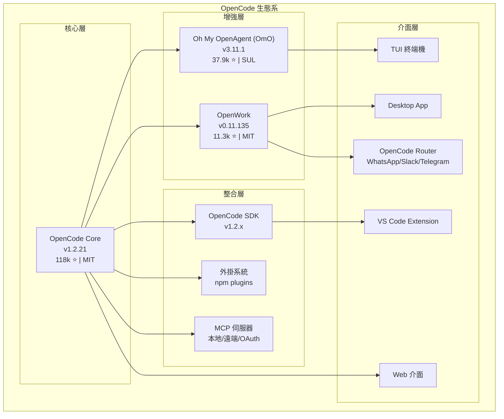

| 專案 | 定位 | GitHub | 版本 | Stars | 授權 |
|------|------|--------|------|-------|------|
| **OpenCode** | AI 編碼代理核心 | [anomalyco/opencode](https://github.com/anomalyco/opencode) | v1.2.21 | 118k | MIT |
| **Oh My OpenAgent** | 進階外掛（多代理協作） | [code-yeongyu/oh-my-openagent](https://github.com/code-yeongyu/oh-my-openagent) | v3.11.1 | 37.9k | SUL |
| **OpenWork** | 桌面 GUI 協作平台 | [different-ai/openwork](https://github.com/different-ai/openwork) | v0.11.135 | 11.3k | MIT |

---

### 1.3 與傳統 AI Coding Tool 差異

| 特性 | 傳統 AI Coding Tool | OpenCode |
|------|---------------------|----------|
| 運作模式 | 補全 / 建議式 | **Agent 式**（自主規劃與執行） |
| 操作範圍 | 單一檔案 / 函式 | **整個專案**（讀取、搜尋、編輯、執行） |
| 上下文理解 | 當前開啟的檔案 | **整個程式碼庫** + LSP + 網路搜尋 |
| 工具整合 | 有限 | **MCP 伺服器** + **自訂工具** + **外掛系統** |
| 模型選擇 | 固定供應商 | **75+ 提供商** + 本地模型 |
| 版本控制 | 無 | 內建 `/undo` `/redo`，整合 Git |
| 可擴展性 | 低 | SDK、Plugin、Custom Tools、Skills |
| 桌面應用 | 通常無 | Desktop App + OpenWork GUI |
| 團隊協作 | 基本 | 對話分享、規則系統、OpenWork 協作 |

**關鍵差異說明：**

1. **Agent 模式 vs 補全模式**：OpenCode 不只是建議程式碼，它會自主規劃任務、搜尋程式碼庫、讀寫檔案、執行命令
2. **內建工具系統**：bash、edit、multiedit、write、read、grep、glob、list、patch、lsp、webfetch、websearch、codesearch、todoread、todowrite、question、skill 等 17+ 工具讓 AI 能夠直接操作開發環境
3. **上下文壓縮**：自動管理上下文視窗，支援長時間工作階段
4. **技能系統（Skills）**：透過 SKILL.md 檔案定義可重用的代理技能，支援跨專案共享
5. **外掛系統**：透過 npm 安裝外掛（如 Oh My OpenAgent），大幅擴展功能

---

### 1.4 與 GitHub Copilot / Claude Code 等工具比較

| 比較維度 | GitHub Copilot | Claude Code | Cursor | OpenCode | OmO |
|----------|----------------|-------------|--------|----------|-----|
| **開源** | ❌ 商業 | ❌ 商業 | ❌ 商業 | ✅ MIT | ✅ SUL |
| **供應商綁定** | 綁定 GitHub/OpenAI | 綁定 Anthropic | 多供應商 | ✅ 供應商中立 | ✅ 供應商中立 |
| **支援模型數** | 有限 | Claude 系列 | 多供應商 | **75+ 提供商** | 75+ + 自動路由 |
| **TUI 體驗** | 基本 | 良好 | ❌ | ✅ 由 Neovim 使用者打造 | ✅ 增強型 |
| **LSP 支援** | IDE 內建 | 無 | IDE 內建 | ✅ 開箱即用 | ✅ + AST-Grep |
| **MCP 整合** | 有限 | 支援 | 有限 | ✅ 完整支援 | ✅ + 內建 MCP |
| **Desktop App** | ❌ | ❌ | ✅ | ✅ Beta | ✅（透過 OpenWork） |
| **Client/Server** | ❌ | ❌ | ❌ | ✅ | ✅ |
| **多代理協作** | 有限 | 有限 | 有限 | ✅ 4 代理 | ✅ 6+ 代理並行 |
| **外掛系統** | 擴充市集 | 無 | 無 | ✅ npm 外掛 | ✅ 本身就是外掛 |
| **企業版** | ✅ | ✅ | ✅ | ✅ Enterprise | ✅ |
| **價格** | $19-39/月 | 按 Token 計費 | $20/月 | **免費開源** | **免費開源** |
| **Hash-Anchored Edit** | ❌ | ❌ | ❌ | ❌ | ✅ |
| **背景代理** | ❌ | ❌ | ❌ | ❌ | ✅ 5+ 並行 |
| **WhatsApp 連接** | ❌ | ❌ | ❌ | ❌ | ❌（OpenWork 提供）|

> **官方說明**（來自 OpenCode FAQ）：  
> OpenCode 在功能上與 Claude Code 非常相似，關鍵差異在於：100% 開源、不綁定供應商、開箱即用的 LSP 支援、專注 TUI 體驗、Client/Server 架構。

> **OmO 社群評價**：  
> "If Claude Code does in 7 days what a human does in 3 months, Sisyphus does it in 1 hour." — B, Quant Researcher  
> "Knocked out 8000 eslint warnings with Oh My Opencode, just in a day." — Jacob Ferrari

---

### 1.5 適用場景分析

| 場景 | OpenCode | + OmO | + OpenWork | 說明 |
|------|----------|-------|------------|------|
| Web Application 全端開發 | ⭐⭐⭐⭐⭐ | ⭐⭐⭐⭐⭐ | ⭐⭐⭐⭐⭐ | 前後端皆可覆蓋 |
| 遺留系統現代化 | ⭐⭐⭐⭐⭐ | ⭐⭐⭐⭐⭐ | ⭐⭐⭐⭐ | Plan 模式分析 → Build 模式轉換 |
| API 開發與測試 | ⭐⭐⭐⭐⭐ | ⭐⭐⭐⭐⭐ | ⭐⭐⭐⭐ | 自動產生 API、測試、文件 |
| DevOps / CI/CD 自動化 | ⭐⭐⭐⭐ | ⭐⭐⭐⭐⭐ | ⭐⭐⭐⭐ | 產生 Dockerfile、GitHub Actions、K8s 配置 |
| 程式碼審查輔助 | ⭐⭐⭐⭐ | ⭐⭐⭐⭐⭐ | ⭐⭐⭐⭐⭐ | 可設定唯讀代理專門做 Code Review |
| 文件產生 | ⭐⭐⭐⭐⭐ | ⭐⭐⭐⭐⭐ | ⭐⭐⭐⭐ | README、API 文件、架構文件 |
| 資料庫操作 | ⭐⭐⭐ | ⭐⭐⭐⭐ | ⭐⭐⭐ | 需搭配 MCP 伺服器 |
| 即時協作 | ⭐⭐⭐ | ⭐⭐⭐ | ⭐⭐⭐⭐⭐ | OpenWork 提供桌面 GUI 協作 |
| 非技術人員使用 | ⭐⭐ | ⭐⭐ | ⭐⭐⭐⭐⭐ | OpenWork 提供友善 GUI |
| 大規模重構 | ⭐⭐⭐⭐ | ⭐⭐⭐⭐⭐ | ⭐⭐⭐⭐ | OmO 並行代理加速 |
| 多語言跨平台專案 | ⭐⭐⭐⭐ | ⭐⭐⭐⭐⭐ | ⭐⭐⭐⭐ | OmO 模型路由自動匹配 |

> **注意事項**：OpenCode 特別適合需要跨多個檔案、多個步驟的複雜任務。對於簡單的程式碼補全，傳統 IDE 內建的 AI 補全可能更為即時。

---

### 1.6 真實案例研究

#### 案例 1：金融科技新創 — 全端 API 平台開發

**背景**：一家金融科技新創公司（20 人工程師團隊）需要在 3 個月內完成 REST API 平台，包含 120+ 端點、OAuth 2.0 認證、交易核心引擎。

**導入策略：**

| 階段 | 週期 | 工具 | 工作內容 |
|------|------|------|----------|
| 架構設計 | 第 1-2 週 | OpenCode Plan 模式 | 微服務架構設計、API Schema、DDD 領域模型 |
| 核心實作 | 第 3-6 週 | OpenCode Build + OmO | 交易引擎、認證服務、帳戶管理 |
| API 層開發 | 第 7-8 週 | OpenCode Build | 120+ REST 端點、驗證邏輯、Error Handling |
| 測試 | 第 9-10 週 | OpenCode + SonarQube MCP | 單元測試（90%+ 覆蓋率）、整合測試、負載測試腳本 |
| 文件 | 第 11 週 | OpenCode | OpenAPI 3.0 文件、內部文件、README |
| 部署 | 第 12 週 | OpenCode + K8s MCP | Docker 化、K8s manifests、CI/CD pipeline |

**成效指標：**

| 指標 | 導入前（預估） | 導入後（實際） | 提升 |
|------|---------------|---------------|------|
| 開發週期 | 6 個月 | 3 個月 | 50% ↓ |
| 程式碼行數 | - | 85,000 行 | - |
| 測試覆蓋率 | 預估 60% | 92% | +32% |
| Bug 密度 | 業界平均 15/KLOC | 3.2/KLOC | 78% ↓ |
| API 文件 | 手寫預估 4 週 | 3 天 | 89% ↓ |
| 安全漏洞 | - | 0 Critical, 2 Medium | SonarQube 驗證 |

**關鍵 Prompt 範例：**

```markdown
## 任務：設計交易核心引擎

### 背景
我們正在開發金融交易平台，需要一個高可靠的交易核心引擎。

### 需求
1. 支援多幣別交易（TWD, USD, EUR, JPY）
2. ACID 交易保證
3. 雙重記帳法（Double-entry bookkeeping）
4. 交易限額控制（每日、每筆、每月）
5. 防重複提交（Idempotency）
6. 完整審計軌跡

### 技術約束
- Java 21 + Spring Boot 3.2
- PostgreSQL 16
- Redis 7（分散式鎖）

### 要求
1. 先用 Plan 模式設計架構（類別圖、序列圖）
2. 再用 Build 模式實作核心類別
3. 包含完整單元測試
4. 符合 OWASP 安全規範
```

---

#### 案例 2：政府機構 — 遺留系統現代化

**背景**：某政府機構需要將 15 年歷史的 Java 6 + Struts 2 系統遷移至 Java 21 + Spring Boot 3。系統包含 200+ JSP 頁面、50+ Action 類別、30+ DAO 類別。

**遺留系統分析流程：**

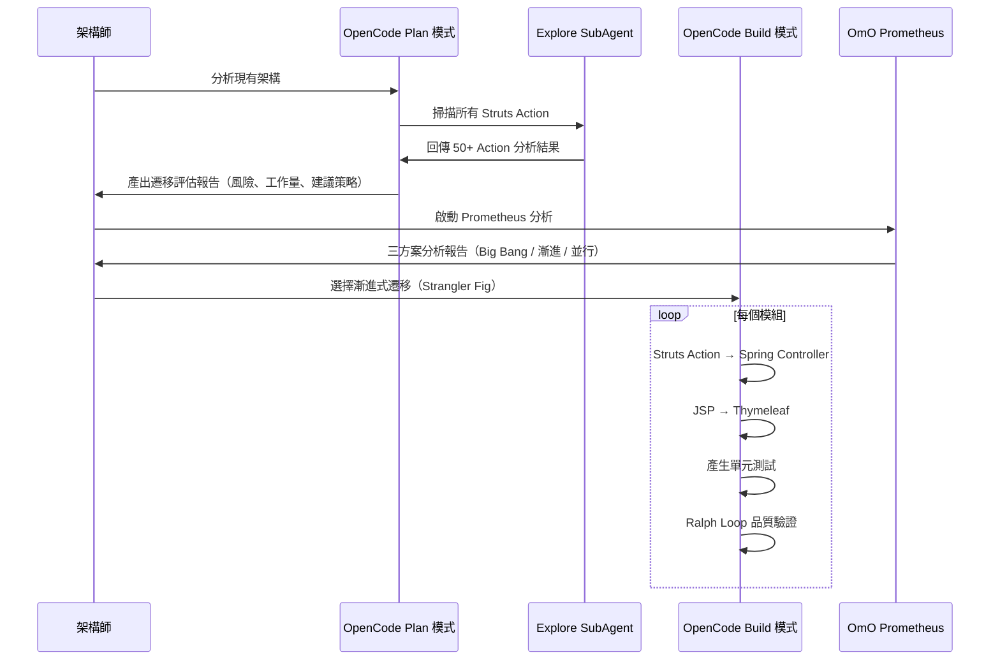

**遷移對照表：**

| Struts 2 元件 | Spring Boot 對應 | 遷移難度 |
|--------------|------------------|----------|
| struts.xml | @Controller/@RestController | ⭐⭐ |
| Action 類別 | @Controller + @RequestMapping | ⭐⭐ |
| ActionForm | DTO + @Valid | ⭐⭐ |
| JSP + OGNL | Thymeleaf 或前端 SPA | ⭐⭐⭐⭐ |
| Interceptor | Spring HandlerInterceptor | ⭐⭐⭐ |
| DAO（原生 JDBC） | Spring Data JPA | ⭐⭐⭐ |
| 資源注入（Spring 2.x） | @Autowired（Spring 6.x） | ⭐⭐ |
| struts-tiles | Thymeleaf Layout | ⭐⭐⭐ |

**成效：**

| 指標 | 遷移前 | 遷移後 |
|------|--------|--------|
| Java 版本 | Java 6 | Java 21 |
| 框架 | Struts 2.3 | Spring Boot 3.2 |
| 測試覆蓋率 | 0% | 85% |
| 安全漏洞（已知 CVE） | 47 | 0 |
| 啟動時間 | 45 秒 | 8 秒 |
| 應用伺服器 | Tomcat 6 | 內嵌 Tomcat 10 |
| 遷移耗時 | 原估 18 個月 | 實際 6 個月 |

---

#### 案例 3：SaaS 公司 — 多租戶平台

**背景**：SaaS 公司需要將單租戶系統改造為多租戶架構，支援 Schema-per-tenant 隔離策略。

**OpenCode 使用方式：**

```markdown
## Plan 模式 Prompt

分析目前的 Spring Boot 專案，設計多租戶改造方案：
1. 租戶識別策略（Header / Subdomain / JWT Claim）
2. 資料隔離策略（Schema-per-tenant）
3. 動態 DataSource 路由
4. 租戶管理 API
5. 資料遷移腳本
6. 需要修改的所有檔案清單
```

**Build 模式產出的核心程式碼：**

```java
// TenantContext.java - 租戶上下文管理
@Component
public class TenantContext {
    private static final ThreadLocal<String> currentTenant = new ThreadLocal<>();

    public static void set(String tenantId) {
        currentTenant.set(tenantId);
    }

    public static String get() {
        return currentTenant.get();
    }

    public static void clear() {
        currentTenant.remove();
    }
}

// TenantFilter.java - 租戶攔截器
@Component
@Order(Ordered.HIGHEST_PRECEDENCE)
public class TenantFilter extends OncePerRequestFilter {
    @Override
    protected void doFilterInternal(HttpServletRequest request,
                                     HttpServletResponse response,
                                     FilterChain chain)
            throws ServletException, IOException {
        String tenantId = extractTenantId(request);
        if (tenantId == null) {
            response.sendError(HttpServletResponse.SC_BAD_REQUEST,
                "Missing tenant identification");
            return;
        }
        try {
            TenantContext.set(tenantId);
            chain.doFilter(request, response);
        } finally {
            TenantContext.clear();
        }
    }

    private String extractTenantId(HttpServletRequest request) {
        // 優先順序：Header > JWT Claim > Subdomain
        String tenantId = request.getHeader("X-Tenant-Id");
        if (tenantId != null) return tenantId;

        // 從 JWT 提取
        String token = request.getHeader("Authorization");
        if (token != null && token.startsWith("Bearer ")) {
            return extractFromJwt(token.substring(7));
        }

        // 從 Subdomain 提取
        String host = request.getServerName();
        if (host != null && host.contains(".")) {
            return host.split("\\.")[0];
        }
        return null;
    }
}

// TenantRoutingDataSource.java - 動態 DataSource 路由
public class TenantRoutingDataSource extends AbstractRoutingDataSource {
    @Override
    protected Object determineCurrentLookupKey() {
        return TenantContext.get();
    }
}
```

---

#### 案例 4：開源社群 — OSS 專案維護

**背景**：一個 4,000+ stars 的開源 TypeScript 函式庫，使用 OpenCode 處理 Issue triage、PR review、版本發佈。

**Issue Triage 工作流程：**

```bash
# 使用 OpenCode + GitHub MCP 處理 Issues
> 請分析 #234 Issue 的內容，判斷是 bug、feature request 還是 question，
  並建議處理優先順序和可能的解決方案
```

**PR Review 工作流程：**

```bash
# 使用唯讀 code-reviewer 代理
> use skill code-reviewer
> 請審查 PR #567 的所有變更，重點關注：
  1. 破壞性變更（Breaking Changes）
  2. 效能影響
  3. 類型安全
  4. 測試覆蓋
  5. 文件更新
```

---

### 1.7 版本演進與藍圖

**OpenCode 版本里程碑：**

| 版本 | 日期 | 重要更新 |
|------|------|----------|
| v0.1.x | 2025 Q1 | 初始版本，基本 TUI |
| v0.5.x | 2025 Q2 | MCP 伺服器支援 |
| v1.0.0 | 2025 Q3 | 穩定版本，Agent 系統 |
| v1.1.x | 2025 Q4 | 外掛系統、Skills |
| v1.2.0 | 2026 Q1 | Desktop App、ACP 支援 |
| v1.2.16 | 2026-03-04 | SDK v1.2.16、VS Code Extension |
| v1.2.21 | 2026-03-08 | 最新穩定版 |

**Oh My OpenAgent 版本里程碑：**

| 版本 | 重要更新 |
|------|----------|
| v1.x | 初始外掛版本 |
| v2.x | Discipline Agents 引入 |
| v3.x | Hash-Anchored Edit、Background Agents |
| v3.11.1 | 最新版，149 releases |

**OpenWork 版本里程碑：**

| 版本 | 重要更新 |
|------|----------|
| v0.1.x | 初始桌面應用 |
| v0.10.x | Skill Manager、Templates |
| v0.11.x | Orchestrator CLI、Router 整合 |
| v0.11.135 | 最新版，933 releases，OpenCode 1.2.20 CI pin |

---

## 第二章：系統架構設計

### 2.1 總體架構

OpenCode 採用 **Client/Server 架構**，在整體開發流程中扮演 **智慧開發助手** 角色：

```mermaid
graph TB
    subgraph "介面層（Clients）"
        TUI["TUI（終端機介面）"]
        Desktop["Desktop App"]
        IDE["IDE Extension<br/>（VS Code SDK v1.2.21）"]
        Web["Web 介面"]
        Mobile["遠端操控<br/>（行動裝置）"]
        OW_App["OpenWork Desktop<br/>（Tauri App）"]
        Router["OpenCode Router<br/>（WhatsApp/Slack/Telegram）"]
    end

    subgraph "OpenCode Server 層"
        Server["OpenCode Server<br/>（本地 / 遠端）"]
        AgentBuild["Build Agent<br/>（主要代理 - 完整存取）"]
        AgentPlan["Plan Agent<br/>（主要代理 - 規劃分析）"]
        SubGeneral["General SubAgent<br/>（子代理 - 複雜搜尋）"]
        SubExplore["Explore SubAgent<br/>（子代理 - 唯讀探索）"]
        SysAgents["系統代理<br/>Compaction/Title/Summary"]
        Tools["內建工具 17+<br/>bash/edit/multiedit/read/grep..."]
        Skills["技能系統<br/>SKILL.md"]
        CustomTools["自訂工具<br/>TypeScript/JavaScript"]
        MCP["MCP 伺服器整合<br/>本地/遠端/OAuth"]
        Plugins["外掛系統<br/>npm plugins"]
    end

    subgraph "OmO 增強層（可選）"
        Sisyphus["Sisyphus 主編排器"]
        Hephaestus["Hephaestus 深度工匠"]
        Prometheus["Prometheus 策略規劃"]
        Oracle["Oracle 架構/除錯"]
        Librarian["Librarian 文件搜尋"]
        BgAgents["背景代理<br/>5+ 並行"]
        HashEdit["Hash-Anchored Edit"]
        IntentGate_["IntentGate 意圖閘道"]
    end

    subgraph "AI 供應商層"
        Zen["OpenCode Zen"]
        Anthropic["Anthropic<br/>Claude Opus 4.6/Sonnet"]
        OpenAI["OpenAI<br/>GPT-5/o1"]
        Google["Google<br/>Gemini"]
        Kimi["Kimi<br/>K2.5"]
        GLM["GLM-5"]
        AWS["Amazon Bedrock"]
        Azure["Azure OpenAI"]
        Local["本地模型<br/>Ollama/LM Studio"]
    end

    subgraph "專案環境層"
        Code["程式碼庫"]
        Git["Git Repository"]
        LSP["LSP Server"]
        CI["CI/CD Pipeline"]
        DB["資料庫"]
    end

    TUI --> Server
    Desktop --> Server
    IDE --> Server
    Web --> Server
    Mobile --> Server
    OW_App --> Server
    Router --> Server

    Server --> AgentBuild
    Server --> AgentPlan
    Server --> SysAgents
    AgentBuild --> SubGeneral
    AgentBuild --> SubExplore
    AgentBuild --> Tools
    AgentBuild --> Skills
    AgentBuild --> CustomTools
    AgentBuild --> MCP
    AgentBuild --> Plugins

    Plugins --> Sisyphus
    Sisyphus --> Hephaestus
    Sisyphus --> Prometheus
    Sisyphus --> Oracle
    Sisyphus --> Librarian
    Sisyphus --> BgAgents
    Hephaestus --> HashEdit
    Sisyphus --> IntentGate_

    Server --> Zen
    Server --> Anthropic
    Server --> OpenAI
    Server --> Google
    Server --> Kimi
    Server --> GLM
    Server --> AWS
    Server --> Azure
    Server --> Local

    Tools --> Code
    Tools --> Git
    Tools --> LSP
    MCP --> CI
    MCP --> DB
```

---

### 2.2 Client/Server 架構

OpenCode 的 Client/Server 架構是其區別於其他 AI 編碼工具的核心特點：

**架構原理：**

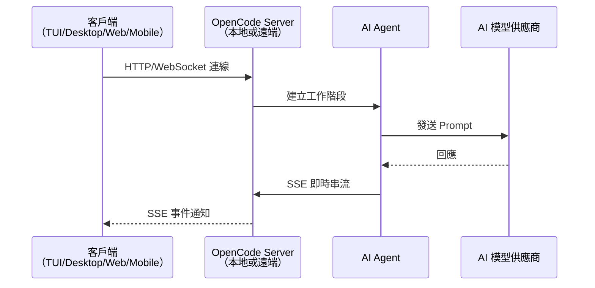

**關鍵優勢：**

| 特性 | 說明 |
|------|------|
| 本地執行 | Server 在本地電腦執行，保護程式碼隱私 |
| 遠端控制 | 從行動裝置遠端操控，適合長時間執行任務 |
| 多客戶端 | TUI、Desktop App、Web、IDE 共用同一 Server |
| SSE 串流 | Server-Sent Events 實現即時更新 |
| 可擴展 | 未來可部署為團隊共用的中央 Server |

**啟動 Server 模式：**

```bash
# 啟動 OpenCode Server（供其他客戶端連線）
opencode serve --hostname 127.0.0.1 --port 3000

# 從另一個終端機連線
opencode connect --url http://127.0.0.1:3000
```

---

### 2.3 代理系統（Agent System）

OpenCode 內建完整的多代理系統，包含 **4 個內建代理** 和 **3 個隱藏系統代理**：

#### 2.3.1 主要代理（Primary Agents）

透過 **Tab 鍵** 在兩個主要代理之間快速切換：

| 代理 | 用途 | 權限 | 適用場景 |
|------|------|------|----------|
| **Build**（預設） | 完整開發 | 完整讀寫存取 | 實作功能、修改程式碼、執行命令 |
| **Plan** | 分析規劃 | 編輯預設為 deny，bash 預設為 ask | 探索程式碼庫、設計架構、制定計畫 |

> **注意**：Plan Agent 的 `edit` 權限預設為 `deny`（拒絕編輯），`bash` 權限預設為 `ask`（需確認）。這確保 Plan Agent 不會意外修改檔案，但在必要時可透過確認執行命令。

#### 2.3.2 子代理（SubAgents）

子代理由主要代理呼叫，用於特定作業：

| 子代理 | 呼叫方式 | 用途 | 特點 |
|--------|----------|------|------|
| **General** | `@general` | 複雜搜尋和多步驟任務 | 通用型子代理 |
| **Explore** | 自動呼叫 | **唯讀**程式碼庫探索 | 快速找檔案、搜尋關鍵字、回答程式碼問題 |

**Explore SubAgent** 是一個專門的唯讀子代理，用於快速探索程式碼庫：

- 依模式尋找檔案
- 搜尋關鍵字和符號
- 回答有關程式碼庫結構的問題
- **無法修改任何檔案**，確保安全性

#### 2.3.3 隱藏系統代理

這些代理在背景自動運作，使用者無需直接操作：

| 系統代理 | 功能 | 說明 |
|----------|------|------|
| **Compaction** | 上下文壓縮 | 當對話上下文過長時自動壓縮，保留關鍵資訊 |
| **Title** | 標題生成 | 自動為對話產生摘要標題 |
| **Summary** | 摘要生成 | 生成對話摘要，輔助上下文管理 |

#### 2.3.4 自訂代理

可透過 JSON 設定或 Markdown 檔案建立自訂代理：

**方法一：JSON 設定（opencode.json）**

```json
{
  "$schema": "https://opencode.ai/config.json",
  "agent": {
    "security-reviewer": {
      "description": "Security-focused code reviewer",
      "model": "anthropic/claude-sonnet-4-5",
      "prompt": "You are a security expert. Review code for vulnerabilities following OWASP Top 10.",
      "temperature": 0.2,
      "steps": 50,
      "mode": "subagent",
      "tools": {
        "bash": false,
        "edit": false,
        "write": false,
        "websearch": true,
        "webfetch": true
      },
      "permission": {
        "read": "allow",
        "edit": "deny",
        "bash": "deny"
      }
    }
  }
}
```

**方法二：Markdown 檔案（`.opencode/agents/frontend-dev.md`）**

```markdown
---
description: Frontend development specialist
model: anthropic/claude-sonnet-4-5
temperature: 0.5
steps: 100
mode: primary
tools:
  websearch: true
  bash: true
permission:
  edit: allow
  bash: ask
color: "#42b883"
---

You are a frontend development specialist working with Vue 3 and TypeScript.
Follow the Composition API style and use Tailwind CSS for styling.
```

**方法三：CLI 建立**

```bash
# 使用互動式命令建立代理
opencode agent create
```

#### 2.3.5 代理進階選項

| 選項 | 說明 | 預設值 |
|------|------|--------|
| `description` | 代理描述 | - |
| `model` | 使用的模型 | 繼承全域設定 |
| `prompt` | 系統提示詞（支援 `{file:./path}` 語法） | - |
| `temperature` | 溫度 (0.0-1.0) | 模型預設 |
| `top_p` | Top-P 取樣 | 模型預設 |
| `steps` | 最大步驟數（取代已棄用的 maxSteps） | 100 |
| `disable` | 停用代理 | `false` |
| `hidden` | 隱藏代理（不顯示於列表） | `false` |
| `mode` | 代理模式：`primary` / `subagent` / `all` | `all` |
| `color` | 代理顏色（hex 或 theme） | - |
| `tools` | 工具啟用/停用（支援萬用字元如 `mymcp_*`） | - |
| `permission` | 代理專屬權限（覆蓋全域設定） | - |
| `task` | 子代理的工作權限 | - |

**供應商特定選項：**

```json
{
  "agent": {
    "deep-thinker": {
      "model": "anthropic/claude-sonnet-4-5",
      "options": {
        "reasoningEffort": "high",
        "textVerbosity": "verbose"
      }
    }
  }
}
```

#### 2.3.6 Plan / Build 運作流程

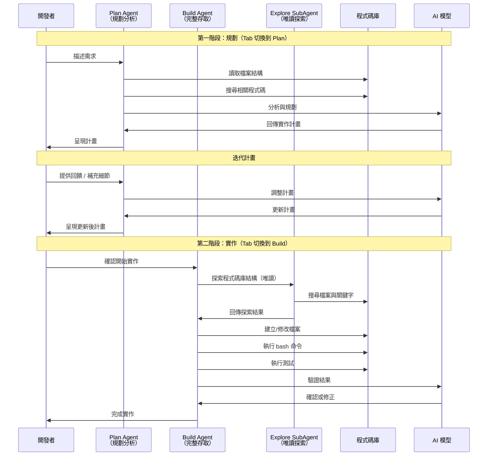

**實際操作流程：**

```bash
# 1. 啟動 OpenCode
opencode

# 2. 按 Tab 切換到 Plan 模式（右下角顯示模式指示器）
<TAB>

# 3. 描述需求
> When a user deletes a note, we'd like to flag it as deleted in the database.
> Then create a screen that shows all the recently deleted notes.
> From this screen, the user can undelete a note or permanently delete it.

# 4. AI 回傳計畫，開發者審視並提供回饋
> We'd like to design this new screen using a design I've used before.
> [Image #1] Take a look at this image and use it as a reference.

# 5. 滿意後，按 Tab 切換回 Build 模式
<TAB>

# 6. 開始實作
> Sounds good! Go ahead and make the changes.
```

> **實務建議**：複雜功能建議先用 Plan 模式做充分設計，確認方案後再切到 Build 模式實作。這能大幅減少返工的機率。

---

### 2.4 工具系統（Tools）

OpenCode 內建 17+ 工具，讓 AI Agent 能直接操作開發環境：

| 工具名稱 | 功能 | 權限需求 | 說明 |
|----------|------|----------|------|
| `bash` | 執行 Shell 命令 | bash | 執行任意終端機命令 |
| `edit` | 編輯檔案 | edit | 修改現有檔案內容 |
| `multiedit` | 批次編輯 | edit | 一次修改多個檔案 |
| `write` | 建立檔案 | write | 建立新檔案 |
| `read` | 讀取檔案 | read | 讀取檔案內容 |
| `grep` | 內容搜尋 | grep | 在程式碼中搜尋關鍵字 |
| `glob` | 檔案搜尋 | glob | 依模式搜尋檔案 |
| `list` | 列出目錄 | list | 列出目錄內容 |
| `patch` | 套用修補 | edit | 套用 diff 格式的修補 |
| `lsp` | LSP 工具 | lsp | 利用語言伺服器功能（實驗性） |
| `webfetch` | 擷取網頁 | webfetch | 擷取網頁內容 |
| `websearch` | 網路搜尋 | websearch | 搜尋網路資訊 |
| `codesearch` | 程式碼搜尋 | codesearch | 搜尋程式碼索引 |
| `todoread` | 讀取 TODO | todoread | 讀取工作清單 |
| `todowrite` | 寫入 TODO | todowrite | 更新工作清單 |
| `question` | 提問使用者 | - | 向使用者詢問資訊 |
| `skill` | 使用技能 | skill | 呼叫已定義的技能 |
| `task` | 建立子任務 | task | 委派子任務給子代理 |

**工具控管範例：**

```json
{
  "$schema": "https://opencode.ai/config.json",
  "tools": {
    "websearch": false,
    "webfetch": true
  },
  "agent": {
    "safe-coder": {
      "tools": {
        "bash": false,
        "websearch": false,
        "mymcp_*": true
      }
    }
  }
}
```

---

### 2.5 MCP 伺服器整合架構

OpenCode 完整支援 **Model Context Protocol（MCP）**，包含三種連接方式：

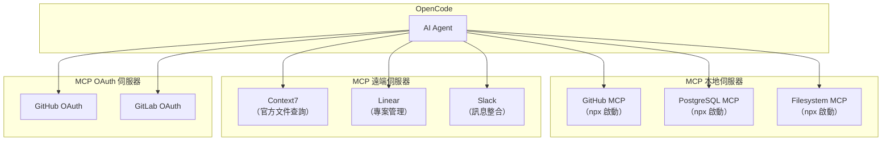

**三種 MCP 連接類型：**

| 類型 | 設定方式 | 適用場景 | 範例 |
|------|----------|----------|------|
| **local** | `command` + `args` | 本地工具 | GitHub MCP、PostgreSQL MCP |
| **remote** | `url` | 雲端服務 | Context7、Linear |
| **oauth** | `url` + OAuth 流程 | 需認證的服務 | GitHub OAuth、GitLab OAuth |

**設定範例：**

```json
{
  "$schema": "https://opencode.ai/config.json",
  "mcp": {
    "github": {
      "type": "local",
      "command": ["npx", "-y", "@modelcontextprotocol/server-github"],
      "environment": {
        "GITHUB_TOKEN": "{env:GITHUB_TOKEN}"
      }
    },
    "context7": {
      "type": "remote",
      "url": "https://mcp.context7.com/mcp"
    },
    "postgres": {
      "type": "local",
      "command": ["npx", "-y", "@modelcontextprotocol/server-postgres"],
      "environment": {
        "POSTGRES_CONNECTION_STRING": "{env:DATABASE_URL}"
      }
    }
  }
}
```

---

### 2.6 外掛系統（Plugins）

OpenCode 的外掛系統允許透過 npm 安裝第三方擴展：

**安裝外掛：**

```json
{
  "$schema": "https://opencode.ai/config.json",
  "plugin": ["oh-my-opencode", "opencode-wakatime"]
}
```

**外掛類型：**

| 類型 | 說明 | 範例 |
|------|------|------|
| npm 外掛 | 從 npm registry 安裝 | `oh-my-opencode`、`opencode-wakatime` |
| 本地外掛 | 從本地路徑載入 | `.opencode/plugins/my-plugin` |
| GitHub 外掛 | 從 GitHub 安裝 | `github:user/repo` |

**外掛能力：**

- 新增自訂代理
- 新增自訂工具
- 新增自訂指令
- 新增自訂技能
- 修改系統行為（Hooks）
- 攜帶 MCP 伺服器

---

### 2.7 技能系統（Skills）

技能（Skills）是可重用的代理能力模組：

**SKILL.md 檔案格式：**

```markdown
---
name: api-designer
description: Design RESTful APIs following best practices
tools:
  webfetch: true
  websearch: true
mcp:
  context7:
    type: remote
    url: https://mcp.context7.com/mcp
permission:
  edit: allow
  bash: ask
---

You are an API design specialist. Follow these principles:
1. RESTful conventions
2. Proper HTTP status codes
3. HATEOAS when applicable
4. OpenAPI 3.0 specification
5. Pagination for list endpoints
```

**技能發現路徑（優先順序由高到低）：**

| 路徑 | 範圍 | 說明 |
|------|------|------|
| `.opencode/skills/*/SKILL.md` | 專案 | 專案專屬技能 |
| `~/.config/opencode/skills/*/SKILL.md` | 全域 | 使用者全域技能 |
| `.claude/skills/*/SKILL.md` | 專案（Claude Code 相容） | Claude Code 遷移 |
| 外掛攜帶 | 外掛 | OmO 內建技能 |

---

### 2.8 與前端框架整合方式

OpenCode 透過以下方式與前端框架（Vue / React / Tailwind）整合：

**1. 專案初始化與 AGENTS.md**

```bash
# 進入前端專案目錄
cd /path/to/vue-project

# 啟動 OpenCode
opencode

# 初始化專案（產生 AGENTS.md）
/init
```

**2. AGENTS.md 範例（Vue 3 專案）**

```markdown
# AGENTS.md

## 專案說明
這是一個 Vue 3 + TypeScript + Tailwind CSS 專案。

## 技術堆疊
- Vue 3 Composition API
- TypeScript 5.x
- Tailwind CSS 4.x
- Vite 6.x
- Pinia（狀態管理）
- Vue Router（路由）

## 編碼規範
- 元件使用 `<script setup lang="ts">` 語法
- 樣式使用 Tailwind utility classes
- 狀態管理使用 Pinia store
- 命名慣例：PascalCase（元件）、camelCase（函式/變數）

## 目錄結構
- src/components/ - 共用元件
- src/views/ - 頁面元件
- src/stores/ - Pinia stores
- src/composables/ - 組合式函式
- src/types/ - TypeScript 型別定義
```

**3. 搭配 MCP 伺服器使用 Context7 查詢文件**

```json
{
  "$schema": "https://opencode.ai/config.json",
  "mcp": {
    "context7": {
      "type": "remote",
      "url": "https://mcp.context7.com/mcp"
    }
  }
}
```

```
建立一個 Vue 3 元件，實作使用者清單的 CRUD 功能。
use context7 查詢 Vue 3 Composition API 最新用法。
```

---

### 2.9 與後端框架整合方式

**Spring Boot 整合範例：**

```markdown
# AGENTS.md

## 專案說明
Spring Boot 3.x + Java 21 微服務專案

## 技術堆疊
- Spring Boot 3.4
- Java 21
- Spring Data JPA
- Spring Security
- MapStruct
- Lombok
- OpenAPI 3.0

## 編碼規範
- 使用 Clean Architecture
- Controller → Service → Repository 分層
- DTO 使用 Record 類別
- 日誌使用 SLF4J
- 例外處理使用 @ControllerAdvice
```

**Node.js / FastAPI 整合：**

```bash
# Node.js
# opencode 進入專案後使用 /init，會自動識別 package.json 並產生對應的 AGENTS.md

# FastAPI
# opencode 進入專案後使用 /init，會自動識別 pyproject.toml 並產生對應的 AGENTS.md
```

**AGENTS.md 範例（FastAPI）：**

```markdown
# AGENTS.md

## 專案說明
FastAPI + Python 3.12 RESTful API 專案

## 技術堆疊
- FastAPI 0.115+
- Python 3.12
- SQLAlchemy 2.0（ORM）
- Alembic（資料庫遷移）
- Pydantic V2（資料驗證）
- pytest（測試）

## 編碼規範
- 使用 async/await 非同步程式設計
- 路由使用 APIRouter 分組
- 依賴注入使用 Depends()
- 回應模型明確定義
- 使用 typing 完整型別標註
```

---

### 2.10 與 Git / CI/CD 整合架構

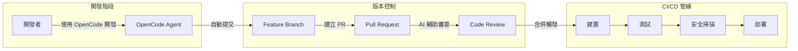

**OpenCode GitHub 整合設定：**

```json
{
  "$schema": "https://opencode.ai/config.json",
  "mcp": {
    "github": {
      "type": "local",
      "command": ["npx", "-y", "@modelcontextprotocol/server-github"],
      "environment": {
        "GITHUB_TOKEN": "{env:GITHUB_TOKEN}"
      }
    }
  }
}
```

**OpenCode GitLab 整合：**

OpenCode 也支援 GitLab 整合，詳見 [GitLab 文件](https://opencode.ai/docs/zh-tw/gitlab/)。

---

### 2.11 與本地模型 / 雲端模型整合架構

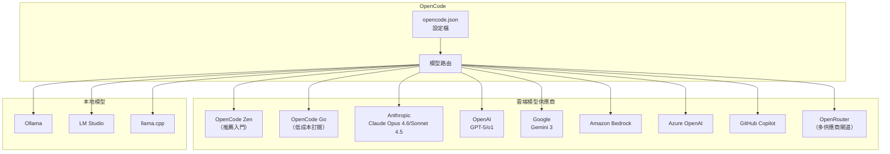

**雲端模型設定範例（Anthropic）：**

```bash
# 在 OpenCode TUI 中
/connect
# 選擇 Anthropic → Claude Pro/Max 或手動輸入 API Key

/models
# 選擇模型，如 claude-sonnet-4-5
```

**本地模型設定範例（Ollama）：**

```json
{
  "$schema": "https://opencode.ai/config.json",
  "provider": {
    "ollama": {
      "npm": "@ai-sdk/openai-compatible",
      "name": "Ollama (local)",
      "options": {
        "baseURL": "http://localhost:11434/v1"
      },
      "models": {
        "qwen3-coder:a3b": {
          "name": "Qwen3-Coder (local)",
          "limit": {
            "context": 128000,
            "output": 65536
          }
        }
      }
    }
  }
}
```

**企業自訂提供商設定範例：**

```json
{
  "$schema": "https://opencode.ai/config.json",
  "provider": {
    "company-llm": {
      "npm": "@ai-sdk/openai-compatible",
      "name": "公司內部 LLM",
      "options": {
        "baseURL": "https://llm-gateway.internal.company.com/v1",
        "apiKey": "{env:COMPANY_LLM_API_KEY}",
        "headers": {
          "X-Team-ID": "engineering"
        }
      },
      "models": {
        "company-model-v2": {
          "name": "Company Model v2",
          "limit": {
            "context": 200000,
            "output": 65536
          }
        }
      }
    }
  }
}
```

---

## 第三章：安裝與環境建置

### 3.1 系統需求

| 項目 | 最低需求 | 建議需求 |
|------|----------|----------|
| 作業系統 | Windows 10+、macOS 12+、Linux（x64/ARM64） | Windows 11、macOS 14+、Ubuntu 22.04+ |
| Node.js | 18.x | 20.x+ |
| Bun | 1.3.9+（OmO 需要） | 最新版 |
| 終端機 | 任意終端機 | WezTerm、Alacritty、Ghostty、Kitty |
| 記憶體 | 4 GB | 8 GB+（OmO 建議 16 GB+） |
| 磁碟空間 | 500 MB | 1 GB+ |
| 網路 | 連線至 AI 供應商 | 穩定寬頻 |
| Rust | -（OpenWork 需要） | 最新 stable |

---

### 3.2 Windows 安裝步驟

> **最佳實踐**：Windows 上建議搭配 WSL 使用，能獲得更好的效能與完整相容性。詳見 [Windows WSL 文件](https://opencode.ai/docs/zh-tw/windows-wsl)。

**方法一：使用 Chocolatey（推薦）**

```powershell
# 安裝 Chocolatey（若未安裝）
Set-ExecutionPolicy Bypass -Scope Process -Force
[System.Net.ServicePointManager]::SecurityProtocol = [System.Net.ServicePointManager]::SecurityProtocol -bor 3072
iex ((New-Object System.Net.WebClient).DownloadString('https://community.chocolatey.org/install.ps1'))

# 安裝 OpenCode
choco install opencode

# 驗證安裝
opencode --version
```

**方法二：使用 Scoop**

```powershell
# 安裝 Scoop（若未安裝）
irm get.scoop.sh | iex

# 安裝 OpenCode
scoop install opencode

# 驗證安裝
opencode --version
```

**方法三：使用 npm（全域安裝）**

```powershell
# 透過 npm 全域安裝
npm install -g opencode-ai@latest

# 驗證安裝
opencode --version
```

**方法四：使用 Mise**

```powershell
# 使用 mise 安裝
mise use -g github:anomalyco/opencode
```

**方法五：使用 Docker**

```powershell
docker run -it --rm ghcr.io/anomalyco/opencode
```

**方法六：WSL 安裝（推薦完整體驗）**

```bash
# 在 WSL 中使用安裝腳本
curl -fsSL https://opencode.ai/install | bash

# 驗證安裝
opencode --version
```

> **注意**：Windows 上透過 Bun 安裝 OpenCode 的支援目前正在開發中。建議使用上述其他方式安裝。

---

### 3.3 macOS 安裝步驟

**方法一：使用 Homebrew（推薦）**

```bash
# 使用 OpenCode 官方 tap（最新版本，推薦）
brew install anomalyco/tap/opencode

# 或使用官方 brew formula（更新較慢）
brew install opencode

# 驗證安裝
opencode --version
```

**方法二：使用安裝腳本**

```bash
curl -fsSL https://opencode.ai/install | bash
opencode --version
```

**方法三：使用 npm**

```bash
npm install -g opencode-ai@latest
# 或 bun install -g opencode-ai@latest
# 或 pnpm install -g opencode-ai@latest
# 或 yarn global add opencode-ai@latest
```

**方法四：使用 Nix**

```bash
nix run nixpkgs#opencode           # 穩定版
nix run github:anomalyco/opencode  # 最新 dev 分支
```

---

### 3.4 Linux 安裝步驟

**方法一：安裝腳本（通用，推薦）**

```bash
curl -fsSL https://opencode.ai/install | bash

# 自訂安裝路徑
OPENCODE_INSTALL_DIR=/usr/local/bin curl -fsSL https://opencode.ai/install | bash

# 使用 XDG 路徑
XDG_BIN_DIR=$HOME/.local/bin curl -fsSL https://opencode.ai/install | bash
```

**方法二：Arch Linux**

```bash
# 穩定版
sudo pacman -S opencode

# 最新 AUR 版本
paru -S opencode-bin
```

**方法三：Homebrew（macOS 和 Linux）**

```bash
brew install anomalyco/tap/opencode
```

**安裝目錄優先順序：**

1. `$OPENCODE_INSTALL_DIR` - 自訂安裝目錄
2. `$XDG_BIN_DIR` - XDG 規範路徑
3. `$HOME/bin` - 標準使用者二進位目錄
4. `$HOME/.opencode/bin` - 預設回退路徑

> **重要**：安裝前請移除 0.1.x 以前的舊版本，避免版本衝突。

---

### 3.5 Desktop App 安裝

OpenCode 也提供桌面應用程式（Beta）：

| 平台 | 安裝檔 |
|------|--------|
| macOS（Apple Silicon） | `opencode-desktop-darwin-aarch64.dmg` |
| macOS（Intel） | `opencode-desktop-darwin-x64.dmg` |
| Windows | `opencode-desktop-windows-x64.exe` |
| Linux | `.deb`、`.rpm` 或 AppImage |

```bash
# macOS（Homebrew）
brew install --cask opencode-desktop

# Windows（Scoop）
scoop bucket add extras
scoop install extras/opencode-desktop
```

下載頁面：[GitHub Releases](https://github.com/anomalyco/opencode/releases) 或 [opencode.ai/download](https://opencode.ai/download)

---

### 3.6 終端機模式設定

**推薦的現代終端機：**

| 終端機 | 平台 | 特色 |
|--------|------|------|
| [WezTerm](https://wezterm.org/) | 跨平台 | GPU 加速、Lua 設定 |
| [Alacritty](https://alacritty.org/) | 跨平台 | 極致效能、YAML 設定 |
| [Ghostty](https://ghostty.org/) | Linux / macOS | 原生渲染 |
| [Kitty](https://sw.kovidgoyal.net/kitty/) | Linux / macOS | 圖片支援 |

**TUI 設定（`tui.json`）：**

```json
{
  "$schema": "https://opencode.ai/tui.json",
  "theme": "tokyonight",
  "keybinds": {},
  "scroll_speed": 3,
  "scroll_acceleration": {
    "enabled": true
  },
  "diff_style": "auto"
}
```

**可自訂主題列表（部分）：**

| 主題名稱 | 風格 |
|----------|------|
| `opencode` | 預設主題 |
| `tokyonight` | 深色柔和 |
| `catppuccin` | 奶茶色系 |
| `dracula` | 經典暗色 |
| `gruvbox` | 復古暖色 |
| `nord` | 北歐冷色 |
| `solarized` | 精確色彩 |

更多主題與快捷鍵設定：[主題文件](https://opencode.ai/docs/zh-tw/themes/)、[快捷鍵文件](https://opencode.ai/docs/zh-tw/keybinds/)

---

### 3.7 IDE 擴充設定

OpenCode 提供 **VS Code 擴充（SDK v1.2.21）**：

1. 在 VS Code 擴充商店搜尋 "OpenCode"
2. 安裝擴充
3. 擴充會自動偵測已安裝的 OpenCode CLI

**IDE 文件**：[IDE 擴充文件](https://opencode.ai/docs/zh-tw/ide/)

---

### 3.8 模型設定（雲端 API / 本地模型）

**第一步：連接供應商**

```bash
# 啟動 OpenCode
opencode

# 新增供應商（互動式選擇）
/connect

# 推薦入門：OpenCode Zen
# 選擇 opencode → 前往 opencode.ai/auth → 取得 API Key

# 選擇模型
/models
```

**供應商連接方式一覽：**

| 供應商 | 連接方式 | 備註 |
|--------|----------|------|
| OpenCode Zen | `/connect` → API Key | 推薦入門，精選模型 |
| OpenCode Go | `/connect` → API Key | 低成本訂閱 |
| Anthropic | `/connect` → Pro/Max 或 API Key | Claude 系列 |
| OpenAI | `/connect` → Plus/Pro 或 API Key | GPT-5、o1 系列 |
| GitHub Copilot | `/connect` → GitHub 裝置授權 | 需 Pro+ 訂閱 |
| Amazon Bedrock | 環境變數 + 設定檔 | `AWS_PROFILE` 或 IAM |
| Azure OpenAI | `/connect` + 環境變數 | 需 `AZURE_RESOURCE_NAME` |
| Google Vertex AI | 環境變數 | `GOOGLE_CLOUD_PROJECT` |
| Ollama（本地） | 設定 `opencode.json` | 免費，離線可用 |
| LM Studio（本地） | 設定 `opencode.json` | 免費，GUI 管理 |

**專案層級設定檔（`opencode.json`）：**

```json
{
  "$schema": "https://opencode.ai/config.json",
  "model": "anthropic/claude-sonnet-4-5",
  "small_model": "anthropic/claude-haiku-4-5",
  "provider": {
    "anthropic": {
      "options": {
        "timeout": 600000
      }
    }
  }
}
```

更多模型設定：[模型文件](https://opencode.ai/docs/zh-tw/models/)、[供應商文件](https://opencode.ai/docs/zh-tw/providers/)

---

### 3.9 環境變數與 Proxy 設定

**常用環境變數：**

```bash
# === 供應商認證 ===
export ANTHROPIC_API_KEY="sk-ant-..."
export OPENAI_API_KEY="sk-..."
export AWS_PROFILE="my-dev-profile"
export AWS_REGION="us-east-1"
export AZURE_RESOURCE_NAME="my-azure-resource"
export GOOGLE_CLOUD_PROJECT="my-gcp-project"

# === OpenCode 設定 ===
export OPENCODE_CONFIG="/path/to/custom-config.json"
export OPENCODE_CONFIG_DIR="/path/to/config-directory"
export OPENCODE_CONFIG_CONTENT='{"model":"anthropic/claude-sonnet-4-5"}'  # 行內設定覆蓋（最高優先級）
export OPENCODE_INSTALL_DIR="/usr/local/bin"

# === Claude Code 相容性控制 ===
export OPENCODE_DISABLE_CLAUDE_CODE=true       # 停用所有 Claude Code 相容性（CLAUDE.md 等）
export OPENCODE_DISABLE_CLAUDE_CODE_RULES=true  # 僅停用 CLAUDE.md 規則讀取
export OPENCODE_DISABLE_CLAUDE_CODE_SKILLS=true  # 僅停用 .claude/skills/ 讀取

# === Proxy 設定 ===
export HTTP_PROXY="http://proxy.company.com:8080"
export HTTPS_PROXY="http://proxy.company.com:8080"
export NO_PROXY="localhost,127.0.0.1,.internal.company.com"

# === 實驗性功能 ===
export OPENCODE_EXPERIMENTAL_LSP_TOOL=true
export OPENCODE_ENABLE_EXA=1
```

---

### 3.10 企業網路限制處理方式

**1. Proxy 設定**

```bash
# 系統級 Proxy
export HTTP_PROXY="http://proxy.company.com:8080"
export HTTPS_PROXY="http://proxy.company.com:8080"

# npm Proxy（用於安裝 MCP 套件）
npm config set proxy http://proxy.company.com:8080
npm config set https-proxy http://proxy.company.com:8080
```

**2. 自訂 Base URL（使用內部 API Gateway）**

```json
{
  "$schema": "https://opencode.ai/config.json",
  "provider": {
    "anthropic": {
      "options": {
        "baseURL": "https://ai-gateway.internal.company.com/anthropic/v1"
      }
    }
  }
}
```

**3. Amazon Bedrock VPC 端點**

```json
{
  "$schema": "https://opencode.ai/config.json",
  "provider": {
    "amazon-bedrock": {
      "options": {
        "region": "us-east-1",
        "profile": "production",
        "endpoint": "https://bedrock-runtime.us-east-1.vpce-xxxxx.amazonaws.com"
      }
    }
  }
}
```

**4. 停用分享功能**

```json
{
  "$schema": "https://opencode.ai/config.json",
  "share": "disabled"
}
```

**5. 限制可用供應商**

```json
{
  "$schema": "https://opencode.ai/config.json",
  "enabled_providers": ["anthropic", "amazon-bedrock"],
  "disabled_providers": ["openai", "openrouter"]
}
```

**6. 停用自動更新**

```json
{
  "$schema": "https://opencode.ai/config.json",
  "autoupdate": false
}
```

**7. 網路設定參考**

更多網路設定詳見 [網路文件](https://opencode.ai/docs/zh-tw/network/)。

> **企業注意事項**：建議透過內部鏡像站或 API Gateway 代理 AI 供應商的 API，以統一管理流量、日誌和安全策略。

---

## 第四章：專案導入標準流程（SOP）

### 4.1 新專案導入流程

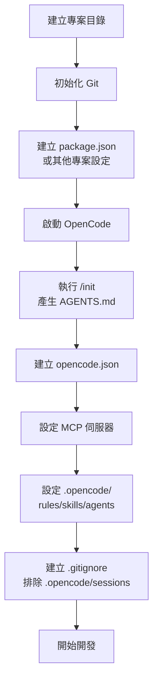

**步驟一：建立專案基礎**

```bash
# 建立專案目錄
mkdir my-new-project && cd my-new-project

# 初始化 Git
git init

# 使用 Plan 模式以 OpenCode 建立專案
opencode
```

**步驟二：使用 `/init` 初始化**

```bash
# 在 OpenCode TUI 中
/init
```

`/init` 會自動：
- 分析專案結構
- 偵測技術堆疊
- 產生 AGENTS.md 檔案
- 根據 `.gitignore` 識別排除模式

**步驟三：建立 `opencode.json`**

```json
{
  "$schema": "https://opencode.ai/config.json",
  "model": "anthropic/claude-sonnet-4-5",
  "small_model": "anthropic/claude-haiku-4-5",
  "tools": {
    "websearch": true,
    "webfetch": true
  },
  "mcp": {
    "github": {
      "type": "local",
      "command": ["npx", "-y", "@modelcontextprotocol/server-github"],
      "environment": {
        "GITHUB_TOKEN": "{env:GITHUB_TOKEN}"
      }
    },
    "context7": {
      "type": "remote",
      "url": "https://mcp.context7.com/mcp"
    }
  }
}
```

**步驟四：設定專案規則**

```bash
# 建立專案層級規則
mkdir -p .opencode/rules
```

`.opencode/rules/project.md`：

```markdown
# 專案開發規則

## 語言與框架
- 使用 TypeScript strict mode
- 專案框架：Next.js 15

## 編碼規範
- 使用 ESLint + Prettier
- 命名慣例：camelCase（變數/函式）、PascalCase（元件/型別）
- 檔案命名：kebab-case

## 安全規範
- 所有使用者輸入必須驗證
- SQL 操作必須使用參數化查詢
- 敏感資料使用環境變數，禁止硬編碼
```

**步驟五：設定 `.gitignore`**

```gitignore
# OpenCode 工作目錄（排除會話資料）
.opencode/sessions/
.opencode/share/

# 保留設定檔（提交到版本控制）
# .opencode/rules/       ← 保留
# .opencode/skills/      ← 保留
# .opencode/agents/      ← 保留
# opencode.json          ← 保留
# AGENTS.md              ← 保留
```

---

### 4.2 舊專案導入流程

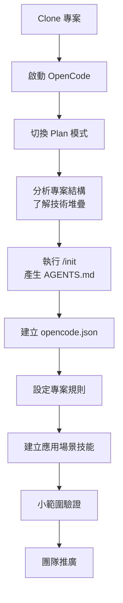

**舊專案導入注意事項：**

1. **先分析，後行動**：使用 Plan 模式充分了解專案架構
2. **建立完善的 AGENTS.md**：對舊專案尤為重要，讓 AI 了解歷史決策和技術債
3. **小範圍試驗**：先在一個模組中驗證 OpenCode 的效果
4. **重視 Code Review**：舊專案的程式碼風格可能多樣，需確保 AI 生成的程式碼符合現有風格

**AGENTS.md 範例（舊專案）：**

```markdown
# AGENTS.md

## 專案說明
這是一個執行超過 5 年的遺留系統，正在進行漸進式現代化。

## 技術堆疊
- 後端：Java 8 → 目標 Java 21
- 框架：Spring MVC → 目標 Spring Boot 3.x
- 前端：jQuery + JSP → 目標 Vue 3
- 資料庫：Oracle → 目標 PostgreSQL

## 模組結構
- core/ - 核心業務邏輯（穩定，勿大幅修改）
- web/ - Web 層（優先重構）
- batch/ - 批次處理（延後重構）
- integration/ - 外部系統整合

## 注意事項
- 保留向後相容性
- 新程式碼使用 Java 21 語法
- 新元件使用 Spring Boot 3.x
- 禁止修改 core/ 下的 PaymentService 和 AccountService（正在其他分支重構）
- 所有修改必須通過現有測試套件
```

---

### 4.3 Branch 管理策略

**建議的 Git Branch 策略與 OpenCode 搭配：**

```mermaid
gitgraph
    commit id: "Initial"
    branch develop
    checkout develop
    commit id: "v1.0"
    branch feature/ai-auth
    checkout feature/ai-auth
    commit id: "Plan: 設計認證模組"
    commit id: "Build: 實作 JWT 驗證"
    commit id: "Build: 新增測試"
    checkout develop
    merge feature/ai-auth
    branch feature/ai-crud
    checkout feature/ai-crud
    commit id: "Plan: 設計 CRUD API"
    commit id: "Build: 實作 CRUD Service"
    commit id: "Build: 新增整合測試"
    checkout develop
    merge feature/ai-crud
    checkout main
    merge develop id: "Release v1.1"
```

**建議做法：**

| 原則 | 說明 |
|------|------|
| 每功能一分支 | 以 `feature/ai-<功能名>` 命名 |
| Plan 先行 | 在 feature branch 上先用 Plan 模式設計 |
| 小步提交 | Build 模式每完成一個子任務就提交 |
| 搭配 `/undo`、`/redo` | 利用 OpenCode 內建版本控制快速回溯 |
| PR 前執行 `/compact`（或自動 compact） | 壓縮過長的對話歷史以利審查 |

**常用 Git 指令搭配：**

```bash
# 在 OpenCode TUI 中直接執行 Git 操作
> 建立一個新的 feature branch 叫 feature/user-management 並切換過去

# 或使用 / 指令
> 分析當前 branch 的所有修改，整理成規範的 commit message
```

---

### 4.4 PR 與 Code Review 搭配方式

**搭配 MCP GitHub 伺服器實現自動化 PR：**

```json
{
  "$schema": "https://opencode.ai/config.json",
  "mcp": {
    "github": {
      "type": "local",
      "command": ["npx", "-y", "@modelcontextprotocol/server-github"],
      "environment": {
        "GITHUB_TOKEN": "{env:GITHUB_TOKEN}"
      }
    }
  }
}
```

**PR 建立流程：**

```bash
# 步驟 1: 完成開發後
> 提交所有修改，commit message 遵循 Conventional Commits 規範

# 步驟 2: 建立 PR
> 使用 GitHub MCP 建立 Pull Request，標題包含 JIRA ticket 編號，
> 描述包含：修改摘要、影響範圍、測試結果、截圖（如適用）

# 步驟 3: 使用 Plan 模式做 Code Review
> 切換到 Plan 模式，審查 PR 中的所有修改，
> 檢查：安全性、效能、可讀性、測試覆蓋率
```

**AI 輔助 Code Review 代理（建議設定）：**

```json
{
  "$schema": "https://opencode.ai/config.json",
  "agent": {
    "code-reviewer": {
      "description": "Code Review 專家",
      "model": "anthropic/claude-sonnet-4-5",
      "prompt": "你是一位嚴謹的 Code Reviewer。請依照以下標準審查程式碼：\n1. OWASP Top 10 安全性\n2. 效能瓶頸\n3. 可讀性和可維護性\n4. 測試完整性\n5. 錯誤處理\n6. 命名規範",
      "mode": "primary",
      "tools": {
        "bash": false,
        "edit": false,
        "write": false
      },
      "permission": {
        "edit": "deny",
        "bash": "deny"
      }
    }
  }
}
```

---

### 4.5 團隊協作模式

**OpenCode 團隊協作架構：**

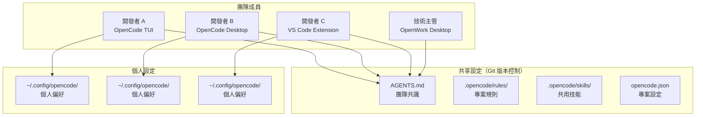

**團隊協作設定清單：**

| 項目 | 是否提交 Git | 說明 |
|------|-------------|------|
| `AGENTS.md` | ✅ | 團隊共識，專案說明 |
| `opencode.json` | ✅ | 共用模型設定、MCP、外掛 |
| `.opencode/rules/` | ✅ | 編碼規範 |
| `.opencode/skills/` | ✅ | 共用技能 |
| `.opencode/agents/` | ✅ | 自訂代理 |
| `.opencode/sessions/` | ❌ | 個人對話記錄 |
| `.opencode/share/` | ❌ | 分享資料 |
| `~/.config/opencode/` | ❌ | 個人偏好 |

**對話分享功能：**

```bash
# 分享當前對話
/share

# 匯出 Markdown
/share --format markdown

# 分享到線上
/share --provider opencode
```

---

### 4.6 安全開發流程（SSDLC 整合方式）

**安全軟體開發生命週期（SSDLC）與 OpenCode 整合：**

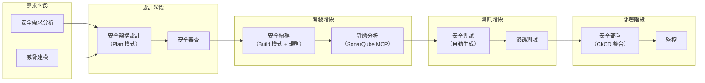

**安全編碼規則範例 `.opencode/rules/security.md`：**

```markdown
# 安全編碼規則

## 必須遵守
1. 所有使用者輸入必須經過驗證和消毒（sanitization）
2. SQL 操作必須使用參數化查詢或 ORM
3. 密碼必須使用 bcrypt/argon2 雜湊儲存
4. API 端點必須實作適當的認證和授權
5. 敏感資料（API Key、密碼）禁止硬編碼
6. CORS 設定必須明確指定允許的來源
7. 檔案上傳必須驗證類型和大小
8. 日誌中禁止記錄敏感資訊

## OWASP Top 10 檢查項目
- [ ] A01: Broken Access Control
- [ ] A02: Cryptographic Failures
- [ ] A03: Injection
- [ ] A04: Insecure Design
- [ ] A05: Security Misconfiguration
- [ ] A06: Vulnerable Components
- [ ] A07: Authentication Failures
- [ ] A08: Software Integrity Failures
- [ ] A09: Logging Failures
- [ ] A10: SSRF
```

---

## 第五章：實戰操作教學

### 5.1 使用 Plan 模式設計系統架構

**操作示範：設計一個微服務系統**

```bash
# 啟動 OpenCode 並切換到 Plan 模式
opencode
<TAB>  # 切換到 Plan 模式

# 提出需求
> 我需要設計一個電商系統的微服務架構。
> 需要以下服務：
> 1. 使用者服務（認證、個人資料）
> 2. 商品服務（CRUD、搜尋）
> 3. 訂單服務（建立、付款、狀態追蹤）
> 4. 通知服務（Email、簡訊）
>
> 技術堆疊：
> - Spring Boot 3.4 + Java 21
> - PostgreSQL（使用者、訂單）
> - MongoDB（商品目錄）
> - Redis（快取）
> - Kafka（事件驅動）
> - Docker + Kubernetes
>
> 請設計完整架構，包含：
> - 服務間通訊方式
> - 資料庫設計
> - API 端點設計
> - 部署架構
```

**Plan 模式會：**

1. 分析需求，識別服務邊界
2. 設計服務間通訊（同步 REST / 非同步 Kafka）
3. 設計資料模型
4. 產生 API 規格書
5. 產生 Mermaid 架構圖
6. 輸出實作計畫（分步驟）

**接續：在 Plan 中迭代**

```bash
> 我有一些調整：
> 1. 商品搜尋需要使用 Elasticsearch
> 2. 訂單服務需要加入 Saga Pattern 處理分散式交易
> 3. 增加 API Gateway 使用 Spring Cloud Gateway
```

**確認後切換到 Build 模式：**

```bash
<TAB>  # 切換回 Build 模式
> 按照剛才的計畫，先實作使用者服務。
> 建立 Spring Boot 專案結構，包含：
> 1. Entity、Repository、Service、Controller 各層
> 2. JWT 認證
> 3. 單元測試和整合測試
> 4. Dockerfile
> 5. docker-compose.yml（含 PostgreSQL）
```

---

### 5.2 使用 Build 模式產生程式碼

**Build 模式核心功能：**

| 功能 | 說明 | 範例指令 |
|------|------|----------|
| 產生程式碼 | 根據描述產生新的程式碼檔案 | "建立一個 REST API Controller" |
| 修改程式碼 | 修改現有程式碼 | "在 UserService 中加入 email 驗證" |
| 批次修改 | 同時修改多個檔案 | "將所有 Service 類別加入日誌功能" |
| 執行命令 | 執行 shell 命令 | "執行 npm test 看看結果" |
| 自動修正 | 根據錯誤訊息自動修正 | "修正上述的編譯錯誤" |

**操作示範：產生 REST API**

```bash
# 在 Build 模式中
> 在 src/controllers/ 下建立一個 ProductController.ts
> 技術需求：
> - Express.js + TypeScript
> - 實作完整 CRUD（GET/POST/PUT/DELETE）
> - 使用 Zod 做輸入驗證
> - 回應格式使用統一的 ApiResponse<T> 包裝
> - 錯誤處理使用自訂 AppError 類別
> - 加入 JSDoc 註解
```

**Build Agent 會自動：**

1. 讀取專案結構，了解現有的 Controller 風格
2. 搜尋相關的 type 定義和工具函式
3. 產生符合專案風格的 Controller 檔案
4. 更新路由設定（如果有集中路由檔案）
5. 產生對應的型別定義
6. 建議建立對應的測試檔案

---

### 5.3 自動產生測試

**操作示範：為現有程式碼產生測試**

```bash
# 單元測試
> 為 src/services/UserService.ts 產生完整的單元測試。
> 使用 Vitest + testing-library。
> 需要覆蓋所有 public 方法。
> 使用 vi.mock() 模擬外部依賴。
> 邊界條件也要測試。

# 整合測試
> 為 UserController 產生整合測試。
> 使用 supertest + testcontainers（PostgreSQL）。
> 測試完整的 HTTP 請求/回應流程。

# E2E 測試
> 為使用者登入流程產生 Playwright E2E 測試。
> 包含：
> 1. 正常登入
> 2. 錯誤密碼
> 3. 帳號鎖定
> 4. 記住我功能
```

**測試生成策略（最佳實踐）：**

| 策略 | 說明 |
|------|------|
| 先寫測試 | TDD 模式：先描述測試案例，再讓 Build 模式實作 |
| 分層測試 | 單元 → 整合 → E2E 逐層產生 |
| 邊界條件 | 明確要求 AI 覆蓋邊界和異常情況 |
| 隔離外部依賴 | 使用 mock/stub 確保測試穩定性 |
| 測試即文件 | 測試案例名稱使用中文描述業務場景 |

---

### 5.4 重構（Refactor）

**操作示範：大規模重構**

```bash
# Plan 模式：分析重構範圍
<TAB>
> 分析 src/services/ 目錄下的所有 Service 類別。
> 識別以下問題：
> 1. 重複的程式碼
> 2. 過大的函式（超過 50 行）
> 3. 缺乏介面抽象
> 4. 硬編碼的設定值
> 5. 缺乏錯誤處理
> 提供重構計畫和優先順序。

# Build 模式：執行重構
<TAB>
> 根據剛才的分析，從高優先順序開始重構：
> 1. 先抽取共用邏輯到 BaseService
> 2. 將硬編碼的設定搬到 config
> 3. 添加統一的錯誤處理
> 4. 確保所有現有測試仍通過
```

**安全重構技巧：**

| 技巧 | 說明 |
|------|------|
| 使用 `/undo` | 不滿意可立即復原 |
| 小步重構 | 每次只重構一個面向 |
| 搭配測試 | 每次重構後執行測試確認 |
| 利用 Explore SubAgent | 先探索所有相關用法 |
| 搭配 LSP | 利用 LSP 找到所有參照 |

---

### 5.5 Debug

**操作示範：除錯流程**

```bash
# 提供錯誤訊息
> 執行 npm test 時出現以下錯誤：
> TypeError: Cannot read property 'find' of undefined
>   at UserService.findById (/src/services/UserService.ts:42:30)
>   at UserController.getUser (/src/controllers/UserController.ts:18:28)
> 請分析原因並修正。

# AI 會自動：
# 1. 讀取 UserService.ts 第 42 行附近
# 2. 讀取 UserController.ts 第 18 行附近
# 3. 搜尋相關的依賴注入設定
# 4. 識別問題（可能是 Repository 未正確注入）
# 5. 提供修正方案
# 6. 修正後重新執行測試驗證
```

**除錯最佳實踐：**

| 實踐 | 說明 |
|------|------|
| 提供完整錯誤訊息 | 包含堆疊追蹤（Stack Trace） |
| 提供複製步驟 | 告訴 AI 如何觸發錯誤 |
| Copy/Paste 整段日誌 | 讓 AI 能看到完整上下文 |
| 搭配 LSP | `lsp` 工具可提供更精確的型別資訊 |
| 讓 AI 自行執行 | 給予 bash 權限，讓 AI 自行執行測試驗證 |

---

### 5.6 批次修改專案

**操作示範：跨檔案批次修改**

```bash
# 批次添加日誌功能
> 找出 src/controllers/ 下所有 Controller 檔案。
> 在每個公開 API 方法的開頭加入日誌記錄：
> - 記錄方法名稱
> - 記錄請求參數（排除敏感欄位）
> - 記錄響應狀態碼
> - 記錄執行時間

# 批次更新 import
> 將專案中所有 import moment from 'moment'
> 更改為 import dayjs from 'dayjs'
> 並更新所有相關的 API 呼叫

# 批次修正 lint 錯誤
> 執行 eslint 檢查所有 src/ 下的檔案。
> 自動修正所有可以安全修正的錯誤。
> 對於需要手動判斷的錯誤，列出清單讓我決定。
```

> **提示**：OpenCode 的 `multiedit` 工具支援一次修改多個檔案，比 `edit` 更高效。AI Agent 會自動選擇最適合的工具。

---

### 5.7 生成文件（README / API 文件）

```bash
# 產生 README
> 分析本專案的結構和功能，產生一份完整的 README.md。
> 包含：
> 1. 專案說明
> 2. 技術堆疊
> 3. 快速開始（安裝、設定、執行）
> 4. 專案結構
> 5. API 文件連結
> 6. 貢獻指南
> 7. 授權

# 產生 API 文件
> 分析 src/controllers/ 和 src/routes/ 下的所有端點。
> 產生 OpenAPI 3.0 規格書（YAML 格式）。
> 包含：請求/回應範例、錯誤碼、認證方式。

# 產生架構文件
> 使用 Mermaid 語法產生以下架構圖：
> 1. 系統架構圖（C4 Model - Context Level）
> 2. 容器圖（Container Level）
> 3. 元件圖（Component Level）
> 4. 部署圖（Deployment Diagram）
> 5. 資料流圖
```

---

### 5.8 使用 Explore SubAgent 探索程式碼庫

Explore SubAgent 是一個 **只讀** 子代理，專門用於快速探索程式碼庫：

**呼叫方式：**

```bash
# 直接呼叫 Explore SubAgent
@general 這個專案的認證機制是如何實作的？

# 深度探索
@general 分析本專案所有使用到 Redis 的地方，
包含快取策略、過期時間設定、Key 命名規則
```

**Explore SubAgent 的特性：**

| 特性 | 說明 |
|------|------|
| 只讀操作 | 不會修改任何檔案 |
| 並行搜尋 | 同時搜尋多個檔案 |
| 語義理解 | 理解程式碼結構和邏輯 |
| 快速回應 | 使用小型模型回應，降低延遲和成本 |

**進階用法：深度程式碼考古**

```bash
# 追蹤呼叫鏈
@general 追蹤 UserService.processPayment() 的完整呼叫鏈，
從 Controller 入口到 Repository 層，
列出每一層的參數轉換和驗證邏輯

# 分析設計模式
@general 分析本專案使用了哪些設計模式？
對於每個模式：
1. 在哪些檔案中使用
2. 如何實作
3. 是否有改進空間

# 依賴關係分析
@general 分析 src/services/ 目錄下所有 Service 之間的依賴關係，
畫出依賴圖（Mermaid 語法），
標記是否有循環依賴
```

**Explore SubAgent 實用場景清單：**

| 場景 | Prompt 範例 |
|------|------------|
| 接手新專案 | @general 給我這個專案的完整概覽，包含架構、技術棧、主要模組 |
| 理解業務邏輯 | @general 訂單建立到完成的完整業務流程是什麼？ |
| 找出技術債 | @general 找出專案中所有的 TODO、FIXME、HACK 註解 |
| 安全審計 | @general 找出專案中所有可能的安全風險點 |
| 效能分析 | @general 哪些查詢可能導致 N+1 問題？ |
| API 清點 | @general 列出所有 REST API 端點及其 HTTP 方法和路徑 |
| 組態分析 | @general 所有環境變數和設定值清單 |
| 測試覆蓋 | @general 哪些核心業務邏輯沒有對應的測試？ |

---

### 5.9 使用自訂指令加速工作流程

**自訂指令的設定方式：**

```json
{
  "$schema": "https://opencode.ai/config.json",
  "commands": {
    "review": {
      "description": "程式碼審查",
      "prompt": "請審查 {file} 中的程式碼變更，重點關注安全性和效能。{file:.opencode/rules/review-checklist.md}"
    },
    "test-gen": {
      "description": "測試生成",
      "prompt": "為 {file} 產生完整的測試套件。使用 {file:.opencode/rules/testing.md} 中的測試規範。"
    },
    "api-doc": {
      "description": "API 文件生成",
      "prompt": "分析 {file} 中的 API 端點，產生 OpenAPI 3.0 規格。"
    },
    "security-check": {
      "description": "安全檢查",
      "prompt": "對 {file} 執行安全檢查，依據 {file:.opencode/rules/security.md}。"
    },
    "refactor": {
      "description": "智慧重構",
      "prompt": "分析 {file} 並建議重構方案。遵循 Clean Code 原則和 SOLID 原則。"
    },
    "migration": {
      "description": "資料庫遷移",
      "prompt": "根據目前的 Entity 變更，產生對應的資料庫遷移腳本（Flyway SQL 格式）。"
    }
  }
}
```

**使用方式：**

```bash
# 使用自訂指令
> /review src/controllers/PaymentController.ts
> /test-gen src/services/OrderService.ts
> /security-check src/auth/
> /migration
```

---

### 5.10 網路搜尋與網頁擷取

**websearch — 搜尋網路資料：**

```bash
# 搜尋最新的技術資料
> 搜尋 Spring Boot 3.4 的新功能
> 搜尋 PostgreSQL 17 的效能改進
> 搜尋 Vite 6 相容性問題

# AI 會使用 websearch 工具搜尋，
# 並整合結果提供摘要
```

**webfetch — 擷取網頁內容：**

```bash
# 擷取技術文件
> 請到 https://docs.spring.io/spring-boot/docs/3.4.0/reference/html/
> 擷取關於 Actuator 的設定方式

# 擷取 API 規格
> 請擷取 https://api.example.com/openapi.yaml 的內容，
> 並根據這份 API 規格實作 Client SDK
```

**進階組合用法：**

```bash
# 查詢 + 實作
> 搜尋 NestJS Guard 的最新最佳實踐，
> 然後根據搜尋結果為本專案實作一個 RolesGuard。

# Context7 MCP（取代手動 webfetch）
> 使用 Context7 查詢 React Query v5 的 useSuspenseQuery 用法，
> 然後為本專案的 UserList 元件實作 Suspense 查詢。
```

---

### 5.11 LSP 整合操作

OpenCode 整合 **Language Server Protocol（LSP）**，獲得與 IDE 相同的程式碼智慧：

**LSP 提供的功能：**

```bash
# 使用 lsp 工具取得型別和定義資訊
> 使用 lsp 工具找出 UserService 介面的所有實作類別
> 使用 lsp 找出所有呼叫 processPayment 方法的地方
> 使用 lsp 取得 OrderDTO 的完整型別定義
```

**LSP 啟用設定：**

```json
{
  "$schema": "https://opencode.ai/config.json",
  "permission": {
    "lsp": "allow"
  }
}
```

**LSP 支援的語言與工具鏈：**

| 語言 | Language Server | 功能 |
|------|----------------|------|
| TypeScript | tsserver | 型別推斷、定義跳轉、參照 |
| Java | Eclipse JDT.LS | 重構、診斷、自動匯入 |
| Python | Pylance / Pyright | 型別檢查、自動補全 |
| Go | gopls | 型別分析、重構 |
| Rust | rust-analyzer | 型別推斷、借用檢查 |
| C/C++ | clangd | 語法分析、診斷 |
| C# | OmniSharp | 智能感知、重構 |

> **重要**：LSP 讓 AI 能獲得精確的型別資訊，大幅減少幻覺（hallucination）。強烈建議在 IDE 整合時啟用 LSP。

---

### 5.12 實戰範例：完整的 CRUD API 開發流程

以下展示使用 OpenCode 從零開始建立一個完整的 RESTful CRUD API 的完整流程：

**步驟 1：Plan 模式 — 需求分析與架構設計**

```bash
<TAB>  # 切換到 Plan 模式
> 我需要建立一個「課程管理系統」的 REST API。
> 技術棧：NestJS + TypeScript + PostgreSQL + Prisma
>
> 業務實體：
> - Course（課程）：id, title, description, price, duration, instructor, category, status
> - Student（學生）：id, name, email, enrolledCourses
> - Enrollment（報名）：id, studentId, courseId, enrolledAt, status
>
> 需要：
> 1. 所有實體的 CRUD API
> 2. 多對多關係（學生 ↔ 課程 透過 Enrollment）
> 3. 分頁查詢
> 4. 篩選與排序
> 5. API 認證（JWT）
> 6. 請求驗證（class-validator）
> 7. Swagger 文件
>
> 請先設計 API 規格（端點、HTTP 方法、Request/Response 格式）。
```

**Plan Agent 回應摘要：**

```yaml
# API 端點設計
POST   /api/v1/auth/login       # 登入
POST   /api/v1/auth/register    # 註冊
GET    /api/v1/courses           # 課程列表（分頁、篩選）
GET    /api/v1/courses/:id       # 課程詳情
POST   /api/v1/courses           # 建立課程
PUT    /api/v1/courses/:id       # 更新課程
DELETE /api/v1/courses/:id       # 刪除課程
GET    /api/v1/students          # 學生列表
GET    /api/v1/students/:id      # 學生詳情
POST   /api/v1/enrollments       # 報名
DELETE /api/v1/enrollments/:id   # 取消報名
GET    /api/v1/courses/:id/students  # 查詢課程學生
GET    /api/v1/students/:id/courses  # 查詢學生課程
```

**步驟 2：Build 模式 — 產生 Prisma Schema**

```bash
<TAB>  # 切換到 Build 模式
> 根據剛才的設計，先建立 Prisma Schema。
> 包含完整的關聯定義和索引設計。
```

**Build Agent 產出（prisma/schema.prisma）：**

```prisma
generator client {
  provider = "prisma-client-js"
}

datasource db {
  provider = "postgresql"
  url      = env("DATABASE_URL")
}

model Course {
  id          String       @id @default(uuid())
  title       String       @db.VarChar(200)
  description String       @db.Text
  price       Decimal      @db.Decimal(10, 2)
  duration    Int          // 分鐘
  instructor  String       @db.VarChar(100)
  category    String       @db.VarChar(50)
  status      CourseStatus @default(DRAFT)
  createdAt   DateTime     @default(now()) @map("created_at")
  updatedAt   DateTime     @updatedAt @map("updated_at")
  enrollments Enrollment[]

  @@index([category])
  @@index([status])
  @@index([instructor])
  @@map("courses")
}

model Student {
  id          String       @id @default(uuid())
  name        String       @db.VarChar(100)
  email       String       @unique @db.VarChar(255)
  password    String       @db.VarChar(255)
  createdAt   DateTime     @default(now()) @map("created_at")
  updatedAt   DateTime     @updatedAt @map("updated_at")
  enrollments Enrollment[]

  @@map("students")
}

model Enrollment {
  id         String           @id @default(uuid())
  studentId  String           @map("student_id")
  courseId   String           @map("course_id")
  enrolledAt DateTime         @default(now()) @map("enrolled_at")
  status     EnrollmentStatus @default(ACTIVE)
  student    Student          @relation(fields: [studentId], references: [id])
  course     Course           @relation(fields: [courseId], references: [id])

  @@unique([studentId, courseId])
  @@index([studentId])
  @@index([courseId])
  @@map("enrollments")
}

enum CourseStatus {
  DRAFT
  PUBLISHED
  ARCHIVED
}

enum EnrollmentStatus {
  ACTIVE
  COMPLETED
  CANCELLED
}
```

**步驟 3：Build 模式 — 產生 DTO 與 Controller**

```bash
> 現在產生 Course 模組的完整程式碼：
> 1. DTO（CreateCourseDto, UpdateCourseDto, CourseResponseDto, PaginationQueryDto）
> 2. Service（CourseService）
> 3. Controller（CourseController）
> 4. Module（CourseModule）
> 5. Guard（JwtAuthGuard）
> 6. 完整的 Swagger 裝飾器
```

**Build Agent 產出（部分示例 — CourseController）：**

```typescript
// src/courses/course.controller.ts
import {
  Controller, Get, Post, Put, Delete,
  Body, Param, Query, UseGuards, HttpCode, HttpStatus,
  ParseUUIDPipe
} from '@nestjs/common';
import {
  ApiTags, ApiOperation, ApiResponse, ApiBearerAuth,
  ApiQuery, ApiParam
} from '@nestjs/swagger';
import { JwtAuthGuard } from '../auth/guards/jwt-auth.guard';
import { CourseService } from './course.service';
import { CreateCourseDto } from './dto/create-course.dto';
import { UpdateCourseDto } from './dto/update-course.dto';
import { PaginationQueryDto } from '../common/dto/pagination-query.dto';
import { CourseResponseDto } from './dto/course-response.dto';

@ApiTags('Courses')
@Controller('api/v1/courses')
export class CourseController {
  constructor(private readonly courseService: CourseService) {}

  @Get()
  @ApiOperation({ summary: '查詢課程列表（分頁）' })
  @ApiResponse({ status: 200, description: '成功', type: [CourseResponseDto] })
  @ApiQuery({ name: 'category', required: false })
  @ApiQuery({ name: 'status', required: false, enum: ['DRAFT', 'PUBLISHED', 'ARCHIVED'] })
  async findAll(@Query() query: PaginationQueryDto) {
    return this.courseService.findAll(query);
  }

  @Get(':id')
  @ApiOperation({ summary: '查詢課程詳情' })
  @ApiParam({ name: 'id', description: '課程 ID（UUID）' })
  @ApiResponse({ status: 200, description: '成功', type: CourseResponseDto })
  @ApiResponse({ status: 404, description: '課程不存在' })
  async findOne(@Param('id', ParseUUIDPipe) id: string) {
    return this.courseService.findOne(id);
  }

  @Post()
  @UseGuards(JwtAuthGuard)
  @ApiBearerAuth()
  @ApiOperation({ summary: '建立課程' })
  @ApiResponse({ status: 201, description: '建立成功', type: CourseResponseDto })
  @ApiResponse({ status: 401, description: '未認證' })
  async create(@Body() createCourseDto: CreateCourseDto) {
    return this.courseService.create(createCourseDto);
  }

  @Put(':id')
  @UseGuards(JwtAuthGuard)
  @ApiBearerAuth()
  @ApiOperation({ summary: '更新課程' })
  @ApiResponse({ status: 200, description: '更新成功', type: CourseResponseDto })
  @ApiResponse({ status: 404, description: '課程不存在' })
  async update(
    @Param('id', ParseUUIDPipe) id: string,
    @Body() updateCourseDto: UpdateCourseDto,
  ) {
    return this.courseService.update(id, updateCourseDto);
  }

  @Delete(':id')
  @UseGuards(JwtAuthGuard)
  @ApiBearerAuth()
  @HttpCode(HttpStatus.NO_CONTENT)
  @ApiOperation({ summary: '刪除課程' })
  @ApiResponse({ status: 204, description: '刪除成功' })
  @ApiResponse({ status: 404, description: '課程不存在' })
  async remove(@Param('id', ParseUUIDPipe) id: string) {
    return this.courseService.remove(id);
  }

  @Get(':id/students')
  @ApiOperation({ summary: '查詢課程的學生名單' })
  async findStudentsByCourse(@Param('id', ParseUUIDPipe) id: string) {
    return this.courseService.findStudentsByCourse(id);
  }
}
```

**步驟 4：Build 模式 — 產生測試**

```bash
> 為 CourseService 和 CourseController 產生完整測試。
> 使用 Jest + @nestjs/testing。
> 覆蓋所有 CRUD 操作和邊界情況。
```

**Build Agent 產出（測試範例）：**

```typescript
// src/courses/course.service.spec.ts
import { Test, TestingModule } from '@nestjs/testing';
import { CourseService } from './course.service';
import { PrismaService } from '../prisma/prisma.service';
import { NotFoundException } from '@nestjs/common';

describe('CourseService', () => {
  let service: CourseService;
  let prisma: PrismaService;

  const mockCourse = {
    id: '550e8400-e29b-41d4-a716-446655440000',
    title: 'TypeScript 進階教學',
    description: '深入解析 TypeScript 型別系統',
    price: 2999,
    duration: 480,
    instructor: 'John Doe',
    category: '程式語言',
    status: 'PUBLISHED',
    createdAt: new Date(),
    updatedAt: new Date(),
  };

  beforeEach(async () => {
    const module: TestingModule = await Test.createTestingModule({
      providers: [
        CourseService,
        {
          provide: PrismaService,
          useValue: {
            course: {
              findMany: jest.fn(),
              findUnique: jest.fn(),
              create: jest.fn(),
              update: jest.fn(),
              delete: jest.fn(),
              count: jest.fn(),
            },
          },
        },
      ],
    }).compile();

    service = module.get<CourseService>(CourseService);
    prisma = module.get<PrismaService>(PrismaService);
  });

  describe('findOne', () => {
    it('應該回傳指定的課程', async () => {
      (prisma.course.findUnique as jest.Mock).mockResolvedValue(mockCourse);
      const result = await service.findOne(mockCourse.id);
      expect(result).toEqual(mockCourse);
      expect(prisma.course.findUnique).toHaveBeenCalledWith({
        where: { id: mockCourse.id },
        include: { enrollments: true },
      });
    });

    it('課程不存在時應拋出 NotFoundException', async () => {
      (prisma.course.findUnique as jest.Mock).mockResolvedValue(null);
      await expect(service.findOne('non-existent-id'))
        .rejects.toThrow(NotFoundException);
    });
  });

  describe('create', () => {
    it('應該建立並回傳新課程', async () => {
      const createDto = {
        title: 'TypeScript 進階教學',
        description: '深入解析 TypeScript 型別系統',
        price: 2999,
        duration: 480,
        instructor: 'John Doe',
        category: '程式語言',
      };
      (prisma.course.create as jest.Mock).mockResolvedValue(mockCourse);
      const result = await service.create(createDto);
      expect(result).toEqual(mockCourse);
      expect(prisma.course.create).toHaveBeenCalledWith({
        data: createDto,
      });
    });
  });

  describe('findAll', () => {
    it('應該回傳分頁結果', async () => {
      const courses = [mockCourse];
      (prisma.course.findMany as jest.Mock).mockResolvedValue(courses);
      (prisma.course.count as jest.Mock).mockResolvedValue(1);
      const result = await service.findAll({ page: 1, limit: 10 });
      expect(result.data).toEqual(courses);
      expect(result.total).toBe(1);
      expect(result.page).toBe(1);
    });
  });
});
```

**步驟 5：Build 模式 — 產生 Docker 與部署設定**

```bash
> 產生以下部署相關檔案：
> 1. Dockerfile（多階段建置）
> 2. docker-compose.yml（含 PostgreSQL）
> 3. .dockerignore
> 4. GitHub Actions CI/CD workflow
```

**完整流程回顧：**

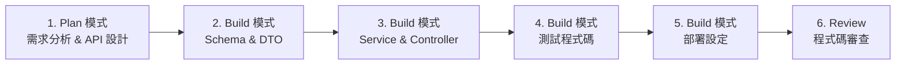

> **實務心得**：整個流程約 30-60 分鐘可完成一個完整 CRUD 模組。若手動開發，同等品質通常需要 2-3 天。

```bash
# Explore SubAgent 會被 Build/Plan Agent 自動呼叫
# 也可以透過建立 read-only 自訂代理達到類似效果

# 常見使用場景：
> 找出所有使用 Redis 的檔案和用法
> 分析 src/utils/ 目錄下每個工具函式的功能
> 列出所有 API 端點和對應的 Controller、Service
> 找出哪些模組依賴 AuthService
```

**Explore SubAgent 特點：**

| 特點 | 說明 |
|------|------|
| 唯讀 | 不能修改任何檔案 |
| 快速 | 使用較小的模型，回應更快 |
| 安全 | 不會意外修改程式碼 |
| 自動呼叫 | 由主要代理根據需要自動調用 |

---

### 5.9 使用自訂指令加速工作流程

OpenCode 支援自訂命令（Custom Commands），在終端介面中以 `/` 開頭：

**建立自訂指令：**

`.opencode/commands/deploy-check.md`：

```markdown
---
description: 部署前檢查清單
---

請執行以下部署前檢查：
1. 執行所有測試套件（`npm test`）
2. 執行 lint 檢查（`npm run lint`）
3. 檢查是否有未提交的修改
4. 驗證 .env.example 是否包含所有需要的環境變數
5. 檢查 package.json 中是否有安全漏洞（`npm audit`）
6. 產生部署報告
```

**使用方式：**

```bash
# 在 OpenCode TUI 中
/deploy-check
```

**更多自訂指令範例：**

| 指令 | 功能 |
|------|------|
| `/gen-test <file>` | 為指定檔案產生測試 |
| `/security-scan` | 執行安全掃描 |
| `/doc-update` | 更新文件 |
| `/cleanup` | 清理未使用的程式碼 |
| `/perf-check` | 效能分析 |

---

### 5.10 網路搜尋與網頁擷取

OpenCode 支援在對話中搜尋網路和擷取網頁內容：

```bash
# 搜尋最新技術資訊
> 搜尋 Vue 3.5 的最新特性和使用方法

# 擷取特定文件頁面
> 幫我查看 https://pinia.vuejs.org/core-concepts/ 的內容，
> 然後按照最新用法更新我們的 Pinia store

# 搭配 Context7 MCP 查詢文件
> use context7 查詢 TypeORM 0.3 的 migration 最新寫法
```

> **注意**：`websearch` 和 `webfetch` 工具需要在 `opencode.json` 中啟用。企業環境可能需要設定 Proxy。

---

### 5.11 LSP 整合操作

OpenCode 內建 LSP 整合（實驗性），可提供更精確的程式碼分析：

```bash
# 啟用 LSP（實驗性功能）
export OPENCODE_EXPERIMENTAL_LSP_TOOL=true

# LSP 能提供的功能：
# - 型別資訊查詢
# - 符號定義跳轉
# - 參照搜尋（Find References）
# - 自動補全建議
# - 診斷資訊（錯誤和警告）
```

**適用場景：**

| 場景 | 說明 |
|------|------|
| 大型 TypeScript 專案 | 精確的型別推導 |
| Java / C# 專案 | 完整的符號解析 |
| 重構時的影響分析 | 找出所有參照點 |
| 跨檔案型別追蹤 | 追蹤型別定義鏈 |

---

## 第六章：最佳實踐（Best Practices）

### 6.1 Prompt 撰寫策略

**有效 Prompt 的三大原則：**

| 原則 | 說明 | 範例 |
|------|------|------|
| **具體** | 明確說明需求、技術、格式 | "使用 TypeScript strict mode + Zod 驗證" |
| **分步** | 複雜任務拆分成步驟 | "先分析、再設計、最後實作" |
| **提供上下文** | 說明背景、限制、風格 | "按照現有 UserService 的風格" |

**Prompt 撰寫範例：**

```bash
# ❌ 不好的 Prompt
> 幫我寫一個登入功能

# ✅ 好的 Prompt
> 在 src/controllers/AuthController.ts 中實作登入 API。
> 技術需求：
> - Express.js + TypeScript
> - JWT Token（access token 15分鐘、refresh token 7天）
> - 使用 bcrypt 驗證密碼
> - 登入失敗 5 次鎖定帳號 30 分鐘
> - 回傳格式參考 src/types/ApiResponse.ts
> - 錯誤處理使用 src/utils/AppError.ts
> - 產生對應的單元測試
```

**進階 Prompt 技巧：**

| 技巧 | 說明 |
|------|------|
| 參照現有檔案 | "按照 UserController 的風格" |
| 使用圖片 | 拖拽設計稿到 OpenCode（支援圖片輸入） |
| 引用 URL | "參考 https://... 的文件" |
| 使用 `{file:./path}` 語法 | 在 prompt 或規則中引用檔案內容 |
| 使用技能 | "use skill api-designer" |

---

### 6.2 Token 控制策略

| 策略 | 說明 | 操作 |
|------|------|------|
| 使用 `/compact` 指令 | 手動壓縮長對話 | 在 TUI 中輸入 `/compact` |
| 自動壓縮 | 系統自動壓縮過長上下文 | Compaction Agent 自動觸發 |
| 小模型搭配 | 使用 `small_model` 處理簡單任務 | 設定 `"small_model": "claude-haiku-4-5"` |
| 適時開新對話 | 避免單一對話過長 | 使用 `/new` 開始新對話 |
| 恢復對話 | 從先前的對話繼續 | 使用 `/resume` 或 `--resume` 參數 |
| 使用子代理 | 子代理有獨立上下文，不佔用主對話空間 | Explore SubAgent、General SubAgent |

**模型選擇策略：**

| 場景 | 建議模型 | 理由 |
|------|----------|------|
| 系統架構設計 | Claude Opus 4.6 / GPT-5 | 複雜推理能力 |
| 日常編碼 | Claude Sonnet 4.5 | 效能/成本平衡 |
| 快速修正 | Claude Haiku 4.5 | 低延遲、低成本 |
| 程式碼審查 | Claude Sonnet 4.5 | 需要判斷力 |
| 文件生成 | Claude Sonnet 4.5 | 語言表達能力 |
| 一般探索 | Claude Haiku 4.5 | 唯讀場景成本控制 |

---

### 6.3 避免幻覺（Hallucination）

| 策略 | 說明 |
|------|------|
| 要求引用來源 | "請引用你所參考的檔案路徑和行號" |
| 要求驗證 | "修改後請執行測試確認功能正常" |
| 使用 LSP 確認 | LSP 提供精確的型別和符號資訊 |
| 搭配 Context7 | 使用 MCP 查詢官方文件，而非依賴 AI 記憶 |
| 網路搜尋 | 對不確定的 API 使用 websearch 確認最新版本 |
| 使用 Explore SubAgent | 讓 AI 先探索程式碼庫，避免臆測 |
| 明確告知限制 | "如果不確定，請告訴我而不是猜測" |

**規則範例（防幻覺）：**

```markdown
# .opencode/rules/anti-hallucination.md

## 防幻覺規則

1. 修改程式碼前必須先讀取原始檔案
2. 使用外部函式庫 API 時，必須先查詢文件確認
3. 不確定的資訊標記為 [需確認]
4. 生成的程式碼必須能通過編譯
5. 產生測試案例必須實際可執行
```

---

### 6.4 如何做 Code Validation

**驗證流程：**

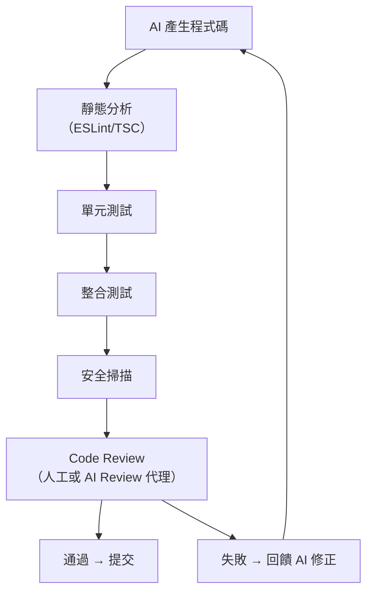

```bash
# 在 OpenCode 中執行驗證流程
> 請依序執行以下驗證：
> 1. tsc --noEmit（TypeScript 編譯檢查）
> 2. eslint src/（lint 檢查）
> 3. npm test（測試）
> 4. npm run build（確認可建置）
> 如果有錯誤，請修正後重新驗證。
```

---

### 6.5 與 SonarQube / 測試工具整合

**SonarQube MCP 整合：**

```json
{
  "$schema": "https://opencode.ai/config.json",
  "mcp": {
    "sonarqube": {
      "type": "local",
      "command": ["npx", "-y", "@sonarsource/sonarqube-mcp-server"],
      "environment": {
        "SONARQUBE_URL": "{env:SONARQUBE_URL}",
        "SONARQUBE_TOKEN": "{env:SONARQUBE_TOKEN}"
      }
    }
  }
}
```

```bash
# 使用 SonarQube 分析
> 使用 SonarQube MCP 分析當前專案的程式碼品質。
> 重點關注：
> 1. 安全漏洞（Vulnerabilities）
> 2. 臭味程式碼（Code Smells）
> 3. 重複程式碼（Duplications）
> 4. 技術債務（Technical Debt）
```

---

### 6.6 大型專案使用策略

**大型專案（100+ 檔案）最佳實踐：**

| 策略 | 說明 |
|------|------|
| 模組化 AGENTS.md | 清楚描述模組邊界 |
| 使用 `.gitignore` 模式 | 排除不相關的檔案（如 `node_modules`、`dist`） |
| 分區開發 | 每次只在一個模組中工作 |
| 善用 Explore SubAgent | 先對程式碼庫進行全面了解而不佔用主對話上下文 |
| 建立專案技能 | 將常用的操作封裝成 Skill |
| 使用子代理 | 將複雜任務委派給子代理 |

---

### 6.7 多模組專案管理建議

**Monorepo 設定範例：**

```json
{
  "$schema": "https://opencode.ai/config.json",
  "model": "anthropic/claude-sonnet-4-5",
  "agent": {
    "frontend-dev": {
      "description": "前端開發專家",
      "prompt": "你是前端開發專家，專注在 packages/frontend/ 目錄。{file:./packages/frontend/AGENTS.md}"
    },
    "backend-dev": {
      "description": "後端開發專家",
      "prompt": "你是後端開發專家，專注在 packages/backend/ 目錄。{file:./packages/backend/AGENTS.md}"
    },
    "shared-lib": {
      "description": "共用模組開發者",
      "prompt": "你負責 packages/shared/ 共用模組，確保前後端相容性。"
    }
  }
}
```

---

### 6.8 格式化器整合

OpenCode 支援在編輯完成後自動格式化：

**安裝格式化器：**

```bash
# 使用 treefmt（推薦）
opencode install treefmt

# OpenCode 偵測到的格式化器：
# - Prettier（JavaScript/TypeScript）
# - Black（Python）
# - rustfmt（Rust）
# - gofmt（Go）
# - treefmt（多語言）
```

更多格式化器設定：[格式化器文件](https://opencode.ai/docs/zh-tw/formatter/)

---

### 6.9 多語言專案管理策略

**語言特定的 AGENTS.md 設定：**

以下展示一個同時包含 Java 後端、React 前端、Python 資料管線的多語言專案：

```markdown
# AGENTS.md（多語言專案）

## 專案概覽
全端電商平台，包含三個主要模組。

## 模組結構
- `backend/` — Java 21 + Spring Boot 3.2 + PostgreSQL
- `frontend/` — React 18 + TypeScript + Vite
- `data-pipeline/` — Python 3.12 + Apache Airflow + Pandas

## 通用規則
- 所有 API 使用 JSON 格式
- 日期格式統一使用 ISO 8601
- ID 使用 UUID v4
- 所有模組共用 `shared/openapi.yaml` 定義的 API 契約

## Java 模組規範
- 使用 Gradle 8.x 建置
- 測試框架：JUnit 5 + Mockito
- 遵循 DDD 分層架構（domain/application/infrastructure/presentation）
- 使用 Flyway 資料庫遷移
- 不使用 Lombok

## React 模組規範
- 使用 pnpm 管理依賴
- 狀態管理：Zustand
- 樣式：Tailwind CSS
- 測試框架：Vitest + Testing Library
- 使用 React Hook Form + Zod 驗證
- 國際化：react-i18next

## Python 模組規範
- 使用 Poetry 管理依賴
- 遵循 PEP 8 + type hints
- 測試框架：pytest
- 使用 Pydantic v2 資料驗證
```

**多語言專案的代理設定：**

```json
{
  "$schema": "https://opencode.ai/config.json",
  "agent": {
    "java-dev": {
      "description": "Java 後端開發專家",
      "model": "anthropic/claude-sonnet-4-5",
      "prompt": "你是 Java 21 + Spring Boot 3 專家。{file:./backend/AGENTS.md}",
      "tools": { "bash": true, "edit": true }
    },
    "react-dev": {
      "description": "React 前端開發專家",
      "model": "anthropic/claude-sonnet-4-5",
      "prompt": "你是 React 18 + TypeScript 專家。{file:./frontend/AGENTS.md}",
      "tools": { "bash": true, "edit": true }
    },
    "python-dev": {
      "description": "Python 資料管線專家",
      "model": "anthropic/claude-sonnet-4-5",
      "prompt": "你是 Python 3.12 + Airflow 專家。{file:./data-pipeline/AGENTS.md}",
      "tools": { "bash": true, "edit": true }
    },
    "api-contract": {
      "description": "API 契約管理",
      "model": "anthropic/claude-sonnet-4-5",
      "prompt": "你負責維護 shared/openapi.yaml 的 API 契約，確保前後端一致。",
      "tools": { "edit": true, "bash": false }
    }
  }
}
```

---

### 6.10 程式碼審查最佳實踐

**1. 建立專屬 Code Review 代理：**

```json
{
  "agent": {
    "code-reviewer": {
      "description": "嚴格的程式碼審查員",
      "model": "anthropic/claude-sonnet-4-5",
      "temperature": 0.2,
      "prompt": "你是一位資深的程式碼審查員。請依照以下檢查清單審查程式碼：\n\n## 架構層面\n- 是否遵循現有的架構模式\n- 是否有不必要的複雜度\n- 模組間的耦合度是否合適\n\n## 程式碼品質\n- 命名是否清晰\n- 函式是否過長（建議不超過 30 行）\n- 是否有重複邏輯\n- 錯誤處理是否完善\n\n## 安全性\n- 使用者輸入是否有驗證\n- 是否有注入攻擊風險\n- 敏感資訊是否正確處理\n- 是否有適當的授權檢查\n\n## 效能\n- 是否有 N+1 查詢\n- 是否有不必要的記憶體分配\n- 是否有可能的記憶體洩漏\n\n## 測試\n- 是否有對應的測試\n- 邊界條件是否覆蓋\n- 測試是否有意義（不是為了湊覆蓋率）",
      "tools": {
        "bash": false,
        "edit": false,
        "write": false
      },
      "permission": {
        "edit": "deny",
        "bash": "deny"
      }
    }
  }
}
```

**2. 程式碼審查流程：**

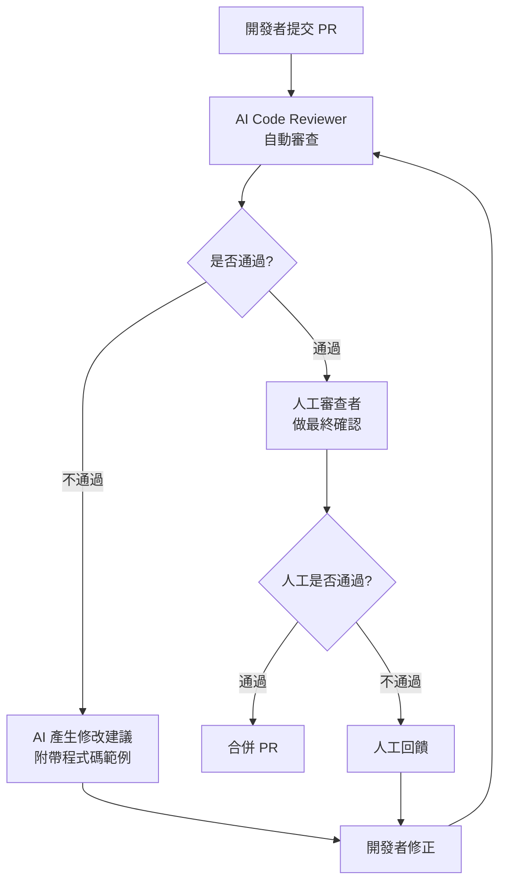

**3. Code Review Prompt 模板（按照變更類型）：**

| 變更類型 | 審查重點 | 建議模型 |
|----------|----------|----------|
| 新功能 | 架構一致性、API 設計、測試覆蓋 | Sonnet 4.5 |
| Bug Fix | 根因分析、回歸風險、邊界條件 | Sonnet 4.5 |
| 重構 | 行為保持、效能影響、測試通過 | Sonnet 4.5 |
| 安全修正 | 漏洞修補完整性、OWASP 合規 | Opus 4.6 |
| 效能優化 | 基準測試數據、複雜度分析 | Sonnet 4.5 |
| 依賴升級 | 破壞性變更、CVE、相容性 | Haiku 4.5 |

---

### 6.11 TDD/BDD 與 OpenCode 整合

**TDD 工作流程（Test-Driven Development）：**

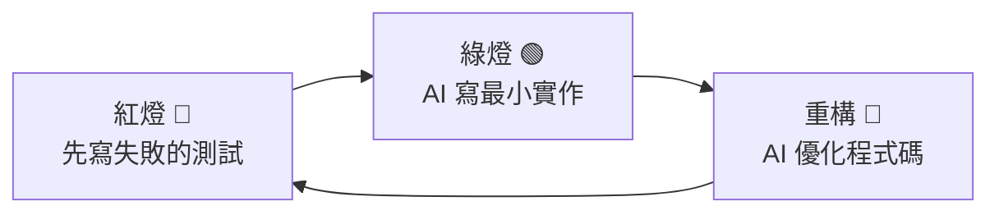

**實際操作：**

```bash
# Step 1：寫測試（紅燈）
> 我要實作一個 PriceCalculator 類別。
> 先只寫測試，不要寫實作。
> 測試案例：
> 1. 一般商品原價計算
> 2. 會員 9 折優惠
> 3. 滿 1000 元打 85 折
> 4. 折扣不能低於成本價
> 5. 多重折扣只取最惠

# Step 2：最小實作（綠燈）
> 現在實作 PriceCalculator，讓所有測試通過。
> 只寫最小可行的實作，不要提前優化。

# Step 3：重構
> 所有測試都通過了。
> 現在重構 PriceCalculator：
> 1. 將折扣策略抽取為策略模式
> 2. 使用 Chain of Responsibility 處理折扣優先順序
> 3. 確保所有測試仍然通過
```

**BDD 工作流程（Behavior-Driven Development）：**

```bash
# 從 Gherkin 規格產生測試
> 根據以下 Gherkin 規格產生 Cucumber 測試：
>
> Feature: 購物車結帳
>   Scenario: 一般使用者購買單一商品
>     Given 購物車中有一件價格 500 元的商品
>     When 使用者點擊「結帳」
>     Then 訂單總額應為 500 元
>     And 訂單狀態應為「待付款」
>
>   Scenario: VIP 使用者享有折扣
>     Given 購物車中有一件價格 1000 元的商品
>     And 使用者身份為 VIP
>     When 使用者點擊「結帳」
>     Then 訂單總額應為 900 元
>     And 折扣金額應為 100 元
>
>   Scenario: 庫存不足
>     Given 購物車中有一件商品，庫存為 0
>     When 使用者點擊「結帳」
>     Then 應顯示「庫存不足」錯誤
>     And 訂單不應被建立
```

---

### 6.12 安全編碼規範指南

**安全規則檔案範例 `.opencode/rules/security-enterprise.md`：**

```markdown
# 企業安全編碼規範

## 輸入驗證
- 所有使用者輸入必須在入口點驗證（Controller/Handler 層）
- 使用白名單策略而非黑名單
- 數值型態做範圍檢查
- 字串長度限制
- 使用 parameterized query，禁止字串拼接 SQL
- 檔案上傳：檢查 MIME type、檔案大小、副檔名白名單

## 認證與授權
- 密碼：bcrypt（work factor ≥ 12）或 argon2id
- JWT：使用 RS256 或 ES256，禁止 HS256（用於內部服務間除外）
- Token 過期：Access Token ≤ 15 分鐘，Refresh Token ≤ 7 天
- 登入失敗鎖定：5 次失敗鎖定 30 分鐘
- 敏感操作需要二次驗證（2FA / 再次輸入密碼）

## 資料保護
- 敏感資料加密儲存（AES-256-GCM）
- 傳輸一律使用 TLS 1.3
- 日誌中遮罩敏感資訊（PII、信用卡號、密碼）
- API Response 不回傳多餘欄位（DTO 投影）

## Session 管理
- 使用 Secure + HttpOnly + SameSite Cookie
- Session ID 使用密碼學安全的隨機產生器
- 登出時銷毀 Session

## 錯誤處理
- 不向使用者暴露內部錯誤訊息
- 記錄完整錯誤到內部日誌
- 統一錯誤回應格式

## 依賴管理
- 定期執行 npm audit / OWASP Dependency Check
- 使用 lockfile 固定版本
- 禁止使用已知有 CVE 的套件版本
```

**在 Prompt 中引用安全規範：**

```bash
> 請實作使用者註冊 API。
> 必須遵循 {file:.opencode/rules/security-enterprise.md} 中的所有安全規範。
> 特別注意：
> 1. 密碼強度驗證（至少 8 字元、包含大小寫、數字、特殊符號）
> 2. Email 格式驗證
> 3. 防止重複註冊
> 4. Rate Limiting
```

---

### 6.13 效能優化策略

**使用 OpenCode 進行效能分析與優化：**

```bash
# 分析效能瓶頸
> 分析 src/services/OrderService.ts 的效能問題。
> 重點關注：
> 1. N+1 查詢問題
> 2. 不必要的資料載入
> 3. 可以快取的查詢
> 4. 缺乏分頁的大量查詢
> 5. 同步操作可以改為非同步的
```

**效能優化 Checklist：**

| 類別 | 檢查項目 | OpenCode 指令 |
|------|----------|--------------|
| 資料庫 | 缺少索引 | "分析這個查詢是否需要索引" |
| 資料庫 | N+1 查詢 | "找出所有可能的 N+1 查詢" |
| 快取 | 重複查詢 | "建議哪些查詢適合加入 Redis 快取" |
| API | 回應過大 | "檢查 API 回應是否包含不必要的欄位" |
| 前端 | Bundle 過大 | "分析哪些依賴可以 tree-shaking 或 lazy load" |
| 並行 | 序列化操作 | "找出可以並行化的操作" |
| 記憶體 | 記憶體洩漏 | "檢查是否有未釋放的資源或監聽器" |

---

## 第七章：系統維護與治理

### 7.1 模型版本管理策略

| 策略 | 說明 |
|------|------|
| 固定版本 | 在 `opencode.json` 中指定精確版本 |
| 分環境設定 | 開發用 Sonnet、Architecture Review 用 Opus |
| 降級策略 | 模型不可用時的備選方案 |
| 版本追蹤 | 紀錄哪些程式碼由哪個模型版本產生 |

```json
{
  "$schema": "https://opencode.ai/config.json",
  "model": "anthropic/claude-sonnet-4-5",
  "small_model": "anthropic/claude-haiku-4-5",
  "agent": {
    "plan": {
      "model": "anthropic/claude-opus-4-6"
    },
    "build": {
      "model": "anthropic/claude-sonnet-4-5"
    }
  }
}
```

---

### 7.2 OpenCode 版本管理

**自動更新（預設啟用）：**

```bash
# OpenCode 預設會自動更新到最新版本
# 可透過設定停用
```

```json
{
  "$schema": "https://opencode.ai/config.json",
  "autoupdate": false
}
```

**手動更新：**

```bash
# Homebrew
brew upgrade opencode

# npm
npm install -g opencode-ai@latest

# Scoop
scoop update opencode

# 安裝腳本
curl -fsSL https://opencode.ai/install | bash
```

---

### 7.3 日誌管理

```bash
# 啟用除錯日誌
opencode --debug

# 日誌存放位置
# Linux/macOS: ~/.local/share/opencode/logs/
# Windows: %APPDATA%/opencode/logs/
# 或使用 XDG 規範路徑

# 日誌內容包含：
# - API 請求/回應（脫敏）
# - 工具執行紀錄
# - 錯誤和警告
# - 效能指標
```

---

### 7.4 成本控制

**方法一：使用模型分層**

| 任務 | 推薦模型 | 每 100K tokens 約成本 |
|------|----------|----------------------|
| 架構設計 | Opus 4.6 | $15-25 |
| 日常開發 | Sonnet 4.5 | $3-5 |
| 簡單查詢 | Haiku 4.5 | $0.25-0.5 |

**方法二：使用 `small_model`**

```json
{
  "$schema": "https://opencode.ai/config.json",
  "model": "anthropic/claude-sonnet-4-5",
  "small_model": "anthropic/claude-haiku-4-5"
}
```

`small_model` 自動用於：
- 標題生成
- 上下文壓縮
- 簡單的子代理任務

**方法三：Token 追蹤**

OpenCode TUI 底部會顯示：
- 當前對話的 Token 消耗
- 預估成本
- Cache 命中率

**方法四：本地模型（零成本）**

```json
{
  "$schema": "https://opencode.ai/config.json",
  "provider": {
    "ollama": {
      "npm": "@ai-sdk/openai-compatible",
      "options": {
        "baseURL": "http://localhost:11434/v1"
      },
      "models": {
        "qwen3-coder:a3b": {
          "name": "Qwen3-Coder (local)",
          "limit": {
            "context": 128000,
            "output": 65536
          }
        }
      }
    }
  }
}
```

**方法五：使用 OpenCode Go（經濟訂閱）**

OpenCode Go 提供低成本的訂閱方案，適合個人開發者。

---

### 7.5 權限管理

#### 7.5.1 完整權限列表

| 權限 | 說明 | 預設值 |
|------|------|--------|
| `read` | 讀取專案檔案 | `allow`（Build/Plan） |
| `edit` | 修改專案檔案 | `allow`（Build）/ `deny`（Plan） |
| `bash` | 執行 bash 命令 | `allow`（Build）/ `ask`（Plan） |
| `mcp` | 使用 MCP 伺服器工具 | `ask` |
| `admin` | 安裝 MCP 伺服器及其他管理操作 | `ask` |
| `lsp` | 使用 LSP 伺服器 | `allow` |

#### 7.5.2 細粒度權限控制

```json
{
  "$schema": "https://opencode.ai/config.json",
  "permission": {
    "read": "allow",
    "edit": "allow",
    "bash": "ask",
    "mcp": "ask",
    "admin": "deny",
    "lsp": "allow"
  }
}
```

#### 7.5.3 「ask」選項的三個選擇

當權限設為 `ask` 時，使用者會看到三個選項：

| 選項 | 說明 |
|------|------|
| **Yes** | 允許本次操作 |
| **Always allow in this session** | 本次會話中始終允許 |
| **No** | 拒絕本次操作 |

#### 7.5.4 代理專屬權限

```json
{
  "$schema": "https://opencode.ai/config.json",
  "agent": {
    "plan": {
      "permission": {
        "edit": "deny",
        "bash": "ask"
      }
    },
    "build": {
      "permission": {
        "edit": "allow",
        "bash": "allow"
      }
    },
    "code-reviewer": {
      "permission": {
        "edit": "deny",
        "bash": "deny",
        "read": "allow"
      }
    }
  }
}
```

---

### 7.6 技能系統（Skills）

#### 7.6.1 SKILL.md 檔案格式

```markdown
---
name: database-migration
description: 產生和管理資料庫遷移腳本
tools:
  bash: true
  webfetch: true
mcp:
  postgres:
    type: local
    command: ["npx", "-y", "@modelcontextprotocol/server-postgres"]
    environment:
      POSTGRES_CONNECTION_STRING: "{env:DATABASE_URL}"
permission:
  edit: allow
  bash: ask
---

你是一位資料庫遷移專家。

## 職責
1. 根據實體變更產生遷移腳本
2. 確保遷移的可逆性（支援 up/down）
3. 驗證遷移腳本的安全性
4. 處理資料遷移（不只是結構遷移）

## 規則
- 每個遷移腳本必須有 rollback 方案
- 大表修改必須使用 online DDL
- 禁止在遷移中使用 DROP TABLE（改用 rename + 新建）
- 索引建立使用 CONCURRENTLY
```

#### 7.6.2 技能發現路徑

```
.opencode/skills/database-migration/SKILL.md    # 專案層級
~/.config/opencode/skills/api-designer/SKILL.md  # 使用者層級
.claude/skills/*/SKILL.md                        # Claude Code 相容（若未停用）
```

#### 7.6.3 技能權限控制

技能可以攜帶自己的工具和權限設定，在技能執行期間這些設定會覆蓋全域設定。這允許技能擁有比一般代理更多（或更少）的權限。

---

### 7.7 自訂工具（Custom Tools）

#### 7.7.1 工具定義

```typescript
// .opencode/tools/check-coverage.ts
import { tool } from "opencode/tool";

export default tool({
  name: "check_coverage",
  description: "檢查指定模組的測試覆蓋率",
  parameters: {
    module: {
      type: "string",
      description: "要檢查的模組路徑"
    },
    threshold: {
      type: "number",
      description: "最低覆蓋率門檻（百分比）",
      default: 80
    }
  },
  async execute({ module, threshold }) {
    const { execSync } = await import("child_process");
    const result = execSync(
      `npx vitest --coverage --reporter=json ${module}`,
      { encoding: "utf-8" }
    );
    const coverage = JSON.parse(result);
    const totalCoverage = coverage.total.lines.pct;

    if (totalCoverage < threshold) {
      return `⚠️ 覆蓋率 ${totalCoverage}% 低於門檻 ${threshold}%`;
    }
    return `✅ 覆蓋率 ${totalCoverage}%，通過門檻 ${threshold}%`;
  }
});
```

#### 7.7.2 多工具匯出

```typescript
// .opencode/tools/project-utils.ts
import { tool } from "opencode/tool";

export const listEndpoints = tool({
  name: "list_endpoints",
  description: "列出所有 API 端點",
  parameters: {},
  async execute() {
    // ...
  }
});

export const checkDeps = tool({
  name: "check_deps",
  description: "檢查依賴更新",
  parameters: {},
  async execute() {
    // ...
  }
});
```

#### 7.7.3 覆蓋內建工具

自訂工具可以使用與內建工具相同的名稱來覆蓋它們。例如，覆蓋 `edit` 工具以添加自動格式化功能。

更多自訂工具文件：[自訂工具文件](https://opencode.ai/docs/zh-tw/custom-tools/)

---

### 7.8 規則系統（Rules）

OpenCode 的規則系統讓你為 AI 代理定義行為準則：

**規則檔案位置：**

| 位置 | 範圍 | 說明 |
|------|------|------|
| `.opencode/rules/*.md` | 專案 | 適用於當前專案的所有代理 |
| `~/.config/opencode/rules/*.md` | 全域 | 適用於所有專案 |
| `AGENTS.md`（專案根目錄） | 專案 | 專案說明和規則 |
| `CLAUDE.md`（若未停用） | 專案 | Claude Code 相容 |

**規則範例 `.opencode/rules/coding-standards.md`：**

```markdown
# 編碼標準

## TypeScript 規範
- 使用 strict mode
- 使用 interface 而非 type（除非需要 union type）
- 避免 any，使用 unknown + type guard
- 非同步操作使用 async/await，避免 .then()

## 測試規範
- 每個 Service 至少 80% 覆蓋率
- 測試檔案命名：*.test.ts 或 *.spec.ts
- 使用 describe/it 結構
- 每個 it 只測試一件事
```

---

### 7.9 風險控管

| 風險 | 緩解措施 |
|------|----------|
| AI 產生有安全漏洞的程式碼 | 安全規則 + SonarQube 掃描 + Code Review |
| AI 意外修改關鍵檔案 | Plan 模式（edit deny）+ 權限控制 |
| API Key 外洩 | 環境變數管理 + .gitignore |
| Token 成本失控 | 模型分層 + 成本追蹤 + 預算警告 |
| AI 幻覺誤導 | 防幻覺規則 + 驗證流程 + 搜尋確認 |
| 資料隱私 | 本地模型 + 企業 API Gateway |

---

## 第八章：系統升級策略

### 8.1 升級前檢查清單

| 項目 | 檢查內容 | 負責人 |
|------|----------|--------|
| ☐ 版本確認 | 確認目前版本和目標版本 | DevOps |
| ☐ 變更日誌 | 閱讀 Release Notes，了解 Breaking Changes | Tech Lead |
| ☐ 測試環境 | 在測試環境先升級驗證 | DevOps |
| ☐ 外掛相容性 | 確認所有外掛與新版本相容（特別是 OmO） | 開發者 |
| ☐ 自訂工具 | 確認自訂工具 API 未改變 | 開發者 |
| ☐ MCP 伺服器 | 確認 MCP 伺服器連線正常 | DevOps |
| ☐ 備份設定 | 備份 opencode.json 和 .opencode/ | DevOps |
| ☐ SDK 版本 | IDE Extension 版本需與 CLI 版本匹配 | 開發者 |
| ☐ 團隊通知 | 通知團隊成員升級時程 | Tech Lead |

---

### 8.2 版本相容性測試

```bash
# 步驟 1: 在測試環境安裝新版本
npm install -g opencode-ai@1.2.21

# 步驟 2: 驗證 CLI
opencode --version

# 步驟 3: 驗證設定檔
opencode config validate

# 步驟 4: 驗證 MCP 伺服器
opencode mcp status

# 步驟 5: 驗證外掛
opencode plugin list
opencode plugin check-compatibility

# 步驟 6: 在測試專案中執行基本操作
#   - 開啟對話
#   - 切換 Plan/Build
#   - 執行工具（edit、bash、grep）
#   - 測試 MCP 伺服器呼叫
#   - 測試自訂工具
#   - 測試技能
```

---

### 8.3 回滾策略

```bash
# 方法一：安裝指定版本
npm install -g opencode-ai@1.2.16

# 方法二：Homebrew 回滾
brew uninstall opencode
brew install anomalyco/tap/opencode@1.2.16

# 方法三：使用 docker 固定版本
docker run -it ghcr.io/anomalyco/opencode:1.2.16
```

---

### 8.4 CI/CD 驗證流程

```yaml
# .github/workflows/opencode-verify.yml
name: OpenCode Upgrade Verification

on:
  pull_request:
    paths:
      - 'opencode.json'
      - '.opencode/**'

jobs:
  verify:
    runs-on: ubuntu-latest
    steps:
      - uses: actions/checkout@v4

      - name: Install OpenCode
        run: |
          curl -fsSL https://opencode.ai/install | bash
          opencode --version

      - name: Validate Config
        run: opencode config validate

      - name: Check MCP Servers
        run: opencode mcp status

      - name: Run Basic Smoke Test
        run: |
          echo "測試基本 CLI 功能"
          opencode --help
```

---

## 第九章：企業導入建議

### 9.1 導入階段規劃

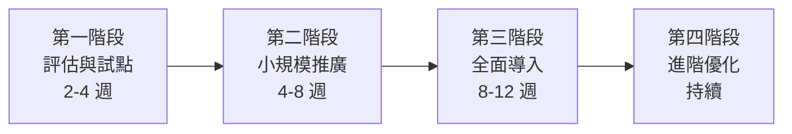

**第一階段：評估與試點（2-4 週）**

| 項目 | 說明 |
|------|------|
| 選擇試點團隊 | 3-5 人，技術能力較強 |
| 選擇試點專案 | 非關鍵任務、新功能開發 |
| 安裝與設定 | 統一設定 opencode.json、AGENTS.md |
| 定義成功指標 | 程式碼產出量、品質、開發時間 |
| 安全評估 | 確認資料隱私、API 金鑰管理 |

**第二階段：小規模推廣（4-8 週）**

| 項目 | 說明 |
|------|------|
| 教育訓練 | Prompt 撰寫、Plan/Build 工作流程 |
| 建立團隊規則 | AGENTS.md、.opencode/rules/ |
| 建立共用技能 | .opencode/skills/ |
| 導入 MCP 伺服器 | GitHub、SonarQube、CI/CD |
| 開始追蹤 KPI | 效率指標、品質指標 |

**第三階段：全面導入（8-12 週）**

| 項目 | 說明 |
|------|------|
| 全團隊導入 | 所有開發團隊使用 OpenCode |
| 導入 OmO（可選） | 進階多代理協作 |
| 導入 OpenWork（可選） | 非技術人員參與 |
| 建立內部知識庫 | 最佳實踐、常見問題 |
| 優化工作流程 | 結合 CI/CD、Code Review |

**第四階段：進階優化（持續）**

| 項目 | 說明 |
|------|------|
| 導入 ACP | Agent Communication Protocol |
| 自訂模型路由 | 根據任務自動選擇模型 |
| 建立企業外掛 | 開發內部專用外掛 |
| 持續優化成本 | 模型降級策略、Cache 優化 |
| 技能管理成熟度提升 | 跨團隊技能共享 |

---

### 9.2 教育訓練策略

| 角色 | 訓練內容 | 時長 |
|------|----------|------|
| **開發者** | 安裝設定、Prompt 技巧、Plan/Build 流程、常用工具 | 8 小時 |
| **資深開發者** | 自訂代理、技能開發、MCP 伺服器、外掛開發 | 16 小時 |
| **Tech Lead** | 團隊設定管理、Code Review 策略、品質控管 | 8 小時 |
| **DevOps** | 安裝部署、CI/CD 整合、安全設定、版本管理 | 8 小時 |
| **專案經理** | OpenWork 使用、協作流程、成本追蹤 | 4 小時 |

---

### 9.3 試點專案規劃

**建議的試點專案特徵：**

| 特徵 | 原因 |
|------|------|
| 新功能開發 | 避免影響現有功能 |
| 中等複雜度 | 能展現 AI 的價值 |
| 有明確需求文件 | 方便 AI 理解需求 |
| 有完善測試 | 方便驗證 AI 產出品質 |
| 非關鍵系統 | 降低風險 |

---

### 9.4 成本效益分析

**成本項目：**

| 項目 | 月成本（預估） | 說明 |
|------|---------------|------|
| API 費用 | $50-200/人 | 依使用量而定 |
| 基建成本 | $0-50 | 本地部署基本免費 |
| 訓練成本 | 一次性 | 8-16 小時/人 |

**效益項目：**

| 項目 | 預估效益 | 說明 |
|------|----------|------|
| 開發速度 | +40-60% | 自動化重複性工作 |
| 程式碼品質 | +20-30% | 規則系統 + Review 代理 |
| 文件品質 | +50% | 自動生成文件 |
| 學習曲線 | 降低 30% | AI 輔助程式碼探索 |
| 團隊滿意度 | +25% | 減少枯燥工作 |

---

### 9.5 KPI 設計

| KPI | 計算方式 | 目標值 |
|-----|----------|--------|
| 程式碼產出量 | 每日有效 commit 行數 | 提升 40%+ |
| 缺陷密度 | Bugs / KLOC | 降低 20%+ |
| 測試覆蓋率 | Line Coverage | 達到 80%+ |
| PR 審查時間 | 從提交到合併的時間 | 縮短 30%+ |
| 開發者滿意度 | 季度問卷調查 | ≥ 4/5 |
| AI 使用率 | 每日使用 OpenCode 的開發者比例 | ≥ 80% |
| Token 成本 | 每人每月 API 費用 | ≤ $200 |

---

### 9.6 企業版功能

OpenCode Enterprise 提供額外的企業功能：

| 功能 | 說明 |
|------|------|
| SSO 整合 | SAML/OIDC 單一登入 |
| 集中設定管理 | 從中央伺服器下發設定 |
| 進階稽核日誌 | 完整的操作記錄 |
| 合規控制 | 限制可用模型、供應商 |
| 優先支援 | 專屬支援團隊 |
| SLA 保證 | 服務等級協議 |
| 自訂部署 | 私有雲 / on-premises |

詳情參考 [企業版文件](https://opencode.ai/docs/zh-tw/enterprise/)。

---

### 9.7 企業級安全治理架構

**安全架構總覽：**

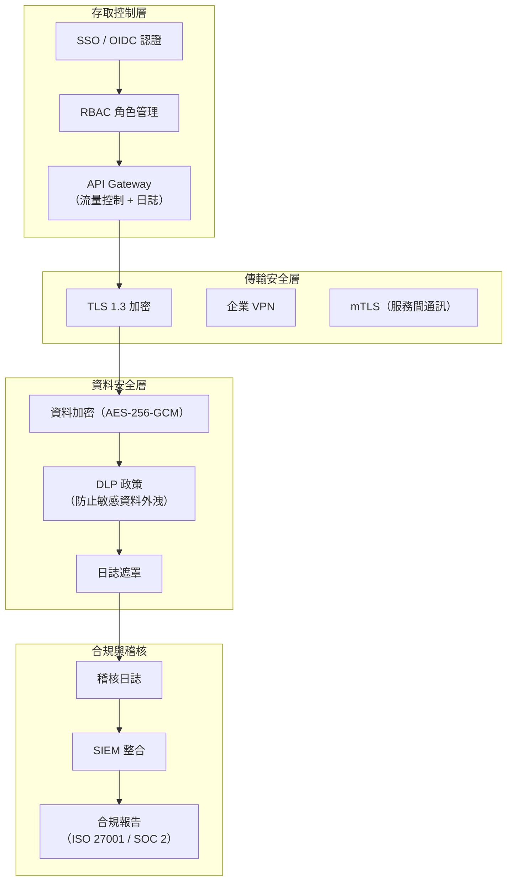

**企業安全設定範例：**

```json
{
  "$schema": "https://opencode.ai/config.json",
  "share": "disabled",
  "autoupdate": false,

  "permission": {
    "read": "allow",
    "edit": "allow",
    "bash": "ask",
    "mcp": "ask",
    "admin": "deny"
  },

  "security": {
    "audit_log": true,
    "audit_log_path": "/var/log/opencode/audit.log",
    "sensitive_patterns": [
      "password",
      "secret",
      "api_key",
      "token",
      "credit_card"
    ],
    "blocked_domains": [
      "pastebin.com",
      "transfer.sh"
    ]
  },

  "enabled_providers": ["anthropic", "amazon-bedrock"],
  "disabled_providers": ["openai", "openrouter", "google"]
}
```

**RBAC 角色建議：**

| 角色 | 可用代理 | 工具權限 | 模型權限 |
|------|----------|----------|----------|
| 初級工程師 | Build | edit: allow, bash: ask | Sonnet |
| 資深工程師 | Build, Plan | edit: allow, bash: allow | Sonnet, Opus |
| 架構師 | Build, Plan, 自訂 | 全權限 | 全模型 |
| 審查員 | code-reviewer | read: allow, edit: deny | Sonnet |
| 實習生 | Plan 模式（唯讀） | edit: deny, bash: deny | Haiku |

---

### 9.8 企業導入常見挑戰與解決方案

| 挑戰 | 解決方案 |
|------|----------|
| 開發者抗拒改變 | 從志願者開始、展示成效、漸進推廣 |
| 資安團隊疑慮 | 本地模型 + API Gateway + 稽核日誌 |
| 成本控制困難 | 每人每月預算上限 + 模型分層使用 |
| 程式碼品質不一 | 統一規則系統 + AI Code Review 代理 |
| 知識產權問題 | MIT 授權澄清 + 法務審查 |
| 網路限制 | 內部 API Gateway + Bedrock VPC |
| 合規要求 | 稽核日誌 + 存取控制 + 資料不上傳 |

**導入成功的關鍵因素：**

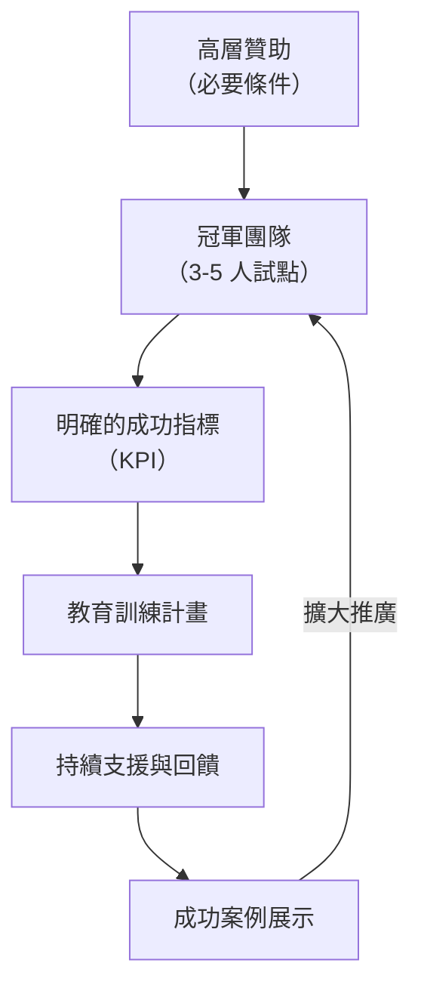

---

### 9.9 多團隊統一管理方案

**中央設定分發架構：**

```mermaid
graph TB
    subgraph "設定管理中心"
        ConfigRepo["設定 Git Repository"]
        ConfigAPI["設定 API 服務"]
    end

    subgraph "團隊 A"
        A1["opencode.json（繼承 base）"]
        A2["AGENTS.md（團隊 A 專用）"]
        A3[".opencode/rules/"]
    end

    subgraph "團隊 B"
        B1["opencode.json（繼承 base）"]
        B2["AGENTS.md（團隊 B 專用）"]
        B3[".opencode/rules/"]
    end

    ConfigRepo --> ConfigAPI
    ConfigAPI --> A1
    ConfigAPI --> B1
```

**基礎設定模板（base.opencode.json）：**

```json
{
  "$schema": "https://opencode.ai/config.json",
  "_comment": "企業基礎設定 — 所有團隊繼承",
  "share": "disabled",
  "autoupdate": false,
  "enabled_providers": ["anthropic", "amazon-bedrock"],
  "permission": {
    "bash": "ask",
    "admin": "deny"
  },
  "mcp": {
    "github": {
      "type": "local",
      "command": ["npx", "-y", "@modelcontextprotocol/server-github"],
      "environment": {
        "GITHUB_TOKEN": "{env:GITHUB_TOKEN}"
      }
    },
    "sonarqube": {
      "type": "local",
      "command": ["npx", "-y", "@sonarsource/sonarqube-mcp-server"],
      "environment": {
        "SONARQUBE_URL": "https://sonarqube.internal.company.com",
        "SONARQUBE_TOKEN": "{env:SONARQUBE_TOKEN}"
      }
    }
  }
}
```

**團隊覆寫設定（team-a.opencode.json）：**

```json
{
  "$schema": "https://opencode.ai/config.json",
  "_extends": "base",
  "model": "anthropic/claude-sonnet-4-5",
  "agent": {
    "build": { "model": "anthropic/claude-sonnet-4-5" },
    "plan": { "model": "anthropic/claude-opus-4-6" }
  },
  "mcp": {
    "jira": {
      "type": "remote",
      "url": "https://jira-mcp.internal.company.com/mcp",
      "environment": {
        "JIRA_TOKEN": "{env:JIRA_TOKEN}"
      }
    }
  }
}
```

---

### 9.10 成本分析與 ROI 模型

**月度成本預估（20 人工程團隊）：**

| 項目 | 單價 | 數量 | 月費 |
|------|------|------|------|
| Claude Sonnet 4.5 API | ~$80/人/月 | 20 | $1,600 |
| Claude Opus 4.6 API（架構師用） | ~$200/人/月 | 3 | $600 |
| Claude Haiku 4.5 API（子代理） | ~$20/人/月 | 20 | $400 |
| 基礎設施（Server/Gateway） | $500/月 | 1 | $500 |
| 教育訓練（一次性，攤提 6 月） | $10,000 | 1 | $1,667 |
| **月度總計** | | | **$4,767** |

**ROI 分析：**

| 指標 | 數值 | 說明 |
|------|------|------|
| 開發效率提升 | 40-60% | 等同增加 8-12 人的產能 |
| 工程師月薪（均值） | $4,000 | 台灣資深工程師平均 |
| 等效人力成本節省 | $32,000-$48,000/月 | 8-12 人 × $4,000 |
| OpenCode 月成本 | $4,767/月 | 上表費用 |
| **淨節省** | **$27,233-$43,233/月** | |
| **ROI** | **571%-906%** | 投入 1 元回收 5.7-9 元 |

> **注意**：以上數字為估算值，實際效益因團隊技能水準、專案類型和導入時程而異。建議在試點階段收集實際數據驗證。

---

## 第十章：Oh My OpenAgent（OmO）生態系

### 10.1 OmO 總覽與定位

**Oh My OpenAgent（OmO）** 是 OpenCode 生態系中最重要的第三方外掛，前身為 **Oh My OpenCode**（ohmo）。OmO 透過引入多代理協作系統，將 OpenCode 從單一 AI 代理提升為企業級多代理編排平台。

| 指標 | 數值 |
|------|------|
| GitHub 名稱 | `code-yeongyu/oh-my-openagent` |
| 版本 | **v3.11.1** |
| GitHub Stars | **37.9k+** |
| 貢獻者 | **151+** |
| 版本發佈 | **149+** |
| 授權 | **SUL**（Sisyphus Use License） |
| npm 套件名 | `oh-my-opencode` |
| CLI 入口 | `ultrawork` / `ulw` |
| 前身 | `oh-my-opencode`（ohmo） |

**核心定位：**

OmO 不是要取代 OpenCode，而是在 OpenCode 基礎上添加「紀律層」（Discipline Layer）——讓 AI 代理在自主操作時保持結構化、可驗證、可追蹤。

```mermaid
graph TB
    subgraph "OmO 架構層次"
        L1["使用者介面<br/>ultrawork / ulw 一鍵啟動"]
        L2["意圖閘道<br/>IntentGate"]
        L3["紀律代理層<br/>Discipline Agents"]
        L4["編輯與驗證<br/>Hash-Anchored Edit"]
        L5["底層引擎<br/>OpenCode Core"]
    end

    L1 --> L2
    L2 --> L3
    L3 --> L4
    L4 --> L5
```

> **品牌說明**：Oh My OpenAgent 的 npm 套件名仍為 `oh-my-opencode`（歷史原因），但 GitHub repo 和官方品牌已更名為 `oh-my-openagent`。CLI 入口為 `ultrawork` 或 `ulw`。

---

### 10.2 核心概念：Discipline Agents

OmO 的核心創新是 **Discipline Agents**——一組專門化的 AI 代理，各自負責不同的職責：

```mermaid
graph TB
    subgraph "Discipline Agents 編排架構"
        User["使用者"]
        IG["IntentGate<br/>意圖閘道"]

        subgraph "主編排器"
            Sisyphus["🏔️ Sisyphus<br/>主編排器<br/>claude-opus-4-6 / kimi-k2.5 / glm-5"]
        end

        subgraph "專業代理"
            Hephaestus["🔨 Hephaestus<br/>深度工匠<br/>gpt-5.3-codex"]
            Prometheus["🔥 Prometheus<br/>策略規劃<br/>Thinking Model"]
            Oracle["🔮 Oracle<br/>架構/除錯"]
            Librarian["📚 Librarian<br/>文件搜尋"]
        end

        subgraph "輔助系統"
            BG["背景代理<br/>5+ 並行"]
            TODO["Todo Enforcer"]
            Comment["Comment Checker"]
            Ralph["Ralph Loop"]
        end
    end

    User --> IG
    IG --> Sisyphus
    Sisyphus --> Hephaestus
    Sisyphus --> Prometheus
    Sisyphus --> Oracle
    Sisyphus --> Librarian
    Sisyphus --> BG
    Sisyphus --> TODO
    Sisyphus --> Comment
    Sisyphus --> Ralph
```

| 代理 | 角色 | 預設模型 | 職責 |
|------|------|----------|------|
| **Sisyphus** 🏔️ | 主編排器 | `claude-opus-4-6` / `kimi-k2.5` / `glm-5` | 任務分解、子代理調度、品質控管 |
| **Hephaestus** 🔨 | 深度工匠 | `gpt-5.3-codex` | 複雜程式碼實作、長時間深度工作 |
| **Prometheus** 🔥 | 策略規劃 | Thinking Model | 多方案分析、風險評估、長期規劃 |
| **Oracle** 🔮 | 架構/除錯 | 按需選擇 | 架構決策、複雜除錯 |
| **Librarian** 📚 | 文件搜尋 | 快速模型 | 搜尋官方文件、API 參考 |

**Sisyphus 的 AI 路由策略：**

Sisyphus 使用情境感知的模型路由：

```
任務類型 → 自動選擇最適模型
├── 複雜程式碼實作 → Hephaestus（gpt-5.3-codex）
├── 架構設計與規劃 → Prometheus（Thinking Model）
├── 架構除錯 → Oracle（按需）
├── 文件搜尋 → Librarian（快速模型）
└── 協調與編排 → Sisyphus 自身（claude-opus-4-6）
```

---

### 10.3 ultrawork / ulw 一鍵啟動

`ultrawork`（簡寫 `ulw`）是 OmO 的入口命令，一鍵啟動完整的多代理環境：

```bash
# 一鍵啟動 OmO + OpenCode
ultrawork

# 或簡寫
ulw

# 等效於手動啟動 OpenCode + 載入 OmO 外掛 + 初始化所有 Discipline Agents
```

**ultrawork 啟動流程：**

```mermaid
sequenceDiagram
    participant User as 使用者
    participant ULW as ultrawork
    participant OC as OpenCode
    participant IG as IntentGate
    participant Sis as Sisyphus

    User->>ULW: ulw
    ULW->>OC: 啟動 OpenCode
    OC->>ULW: Server 就緒
    ULW->>IG: 初始化 IntentGate
    ULW->>Sis: 初始化 Sisyphus + Discipline Agents
    Sis->>ULW: 所有代理就緒
    ULW->>User: TUI 介面就緒（含 OmO 功能）
```

---

### 10.4 IntentGate 意圖閘道

**IntentGate** 是 OmO 的入口守衛，分析使用者意圖並路由到適當的代理：

```mermaid
graph TB
    Input["使用者輸入"]
    IG["IntentGate<br/>意圖分析"]

    Simple["簡單任務<br/>（OpenCode 內建代理處理）"]
    Complex["複雜任務<br/>（Sisyphus 編排）"]
    Plan["規劃任務<br/>（Prometheus）"]
    Debug["除錯任務<br/>（Oracle）"]
    Search["搜尋任務<br/>（Librarian）"]

    Input --> IG
    IG -->|"簡單修改"| Simple
    IG -->|"複雜功能開發"| Complex
    IG -->|"架構設計"| Plan
    IG -->|"除錯分析"| Debug
    IG -->|"文件查詢"| Search
```

**IntentGate 的決策邏輯：**

| 意圖類型 | 路由目標 | 範例 |
|----------|----------|------|
| 簡單修改 | OpenCode Build Agent | "修改檔案名稱" |
| 複雜功能開發 | Sisyphus → Hephaestus | "實作完整的使用者認證系統" |
| 架構設計 | Sisyphus → Prometheus | "設計微服務遷移策略" |
| 除錯分析 | Sisyphus → Oracle | "分析這個 race condition" |
| 文件搜尋 | Librarian | "查詢 TypeORM 最新 API" |
| 多步驟任務 | Sisyphus（全面編排） | "重構整個 API 層並更新測試" |

---

### 10.5 Hash-Anchored Edit Tool

**Hash-Anchored Edit** 是 OmO 最重要的技術創新之一，解決了 AI 編輯程式碼時的「行號漂移」問題：

**傳統編輯方式的問題：**

```
問題：AI 在 Line 42 插入程式碼後，
      原本 Line 50 的程式碼變成了 Line 53。
      如果 AI 接著要修改原 Line 50，就會改錯地方。
```

**Hash-Anchored Edit 解決方案：**

```
每一行程式碼都有一個唯一的 Hash ID（LINE#ID）
修改時使用 Hash ID 定位，而非行號。
即使行號漂移，Hash ID 仍然正確指向目標行。
```

**運作流程：**

```mermaid
sequenceDiagram
    participant Agent as AI 代理
    participant HAE as Hash-Anchored Edit
    participant File as 目標檔案

    Agent->>HAE: 編輯請求<br/>（LINE#ID: abc123, 新內容）
    HAE->>File: 讀取檔案
    HAE->>HAE: 1. 計算每行的 content hash
    HAE->>HAE: 2. 對比 LINE#ID 與 hash
    HAE->>HAE: 3. 驗證 hash 匹配
    alt Hash 匹配
        HAE->>File: 修改正確的行
        HAE->>Agent: ✅ 編輯成功
    else Hash 不匹配
        HAE->>Agent: ❌ 內容已變更，重新讀取檔案
    end
```

**Hash-Anchored Edit 的優勢：**

| 優勢 | 說明 |
|------|------|
| 消除行號漂移 | 使用 content hash 而非行號定位 |
| 自動驗證 | 編輯前驗證目標行內容是否如預期 |
| 衝突偵測 | 即時偵測多代理編輯衝突 |
| 安全回滾 | hash 不匹配時自動中止，防止錯誤覆寫 |
| 並行安全 | 多背景代理同時編輯也不會衝突 |

---

### 10.6 /init-deep 深度初始化

`/init-deep` 是 OmO 增強的初始化命令，生成 **階層式 AGENTS.md** 系統：

```bash
# 在 OpenCode TUI 中
/init-deep
```

**階層式 AGENTS.md 結構：**

```
project-root/
├── AGENTS.md                          # 專案級（全域規則）
├── src/
│   ├── AGENTS.md                      # src 級規則
│   ├── controllers/
│   │   └── AGENTS.md                  # Controller 層規則
│   ├── services/
│   │   └── AGENTS.md                  # Service 層規則
│   └── models/
│       └── AGENTS.md                  # Model 層規則
├── tests/
│   └── AGENTS.md                      # 測試規則
└── infra/
    └── AGENTS.md                      # 基建規則
```

**頂層 AGENTS.md 範例（/init-deep 自動生成）：**

```markdown
# AGENTS.md (Root)

## 專案概覽
這是一個 Next.js 15 + TypeScript 全端應用程式。

## 架構決策紀錄
- ADR-001: 使用 App Router（非 Pages Router）
- ADR-002: 使用 Server Components 為預設
- ADR-003: 使用 tRPC 進行類型安全的 API 呼叫

## 全域規則
- 所有檔案使用 UTF-8 編碼
- 所有 commit 遵循 Conventional Commits
- 禁止使用 var，使用 const/let
- 所有 async 函式必須有 error handling
```

**子目錄 AGENTS.md 範例：**

```markdown
# AGENTS.md (src/controllers/)

## Controller 層規則
- 每個路由一個 Controller 檔案
- Controller 不含業務邏輯，只做路由和入參驗證
- 使用 Zod schema 驗證請求
- 統一使用 ApiResponse<T> 包裝回應
- 錯誤一律拋出 AppError，由全域 middleware 處理
```

---

### 10.7 Prometheus 規劃器

**Prometheus** 是 OmO 的策略規劃代理，專門處理需要「深度思考」的任務：

**適用場景：**

| 場景 | 說明 |
|------|------|
| 架構設計 | 設計新的系統架構或遷移策略 |
| 多方案評估 | 分析多種實作方案的優劣 |
| 風險評估 | 分析技術決策的潛在風險 |
| 重構規劃 | 大規模重構的步驟規劃 |
| 效能優化 | 分析效能瓶頸或提出優化策略 |

**使用方式：**

```bash
# Prometheus 由 Sisyphus 自動調用
# 也可以手動請求：
> 我需要 Prometheus 分析一下把 REST API 遷移到 GraphQL 的可行性。
> 請提供至少 3 種遷移策略，各自的優缺點和風險。
```

**Prometheus 的輸出格式：**

```markdown
## 策略分析報告

### 策略 A: Big Bang 遷移
- 優點: 一步到位，避免維護兩套系統
- 缺點: 風險高，測試範圍大
- 風險等級: 🔴 高
- 預估工期: 4 週

### 策略 B: 漸進式遷移（Strangler Fig Pattern）
- 優點: 低風險，可隨時回滾
- 缺點: 需要維護兩套系統
- 風險等級: 🟢 低
- 預估工期: 8 週

### 策略 C: 並行運行
- 優點: 完全不影響現有系統
- 缺點: 資源消耗較大
- 風險等級: 🟡 中
- 預估工期: 6 週

### 建議
推薦策略 B（漸進式遷移），原因...
```

---

### 10.8 背景代理（Background Agents）

OmO 支援最多 **5+ 個背景代理** 同時運行：

```mermaid
graph TB
    Sis["Sisyphus<br/>主編排器"]

    BG1["背景代理 #1<br/>重構 Service 層"]
    BG2["背景代理 #2<br/>產生測試"]
    BG3["背景代理 #3<br/>更新文件"]
    BG4["背景代理 #4<br/>安全掃描"]
    BG5["背景代理 #5<br/>效能分析"]

    HAE["Hash-Anchored Edit<br/>衝突仲裁"]

    Sis --> BG1
    Sis --> BG2
    Sis --> BG3
    Sis --> BG4
    Sis --> BG5

    BG1 --> HAE
    BG2 --> HAE
    BG3 --> HAE
```

**背景代理的特點：**

| 特點 | 說明 |
|------|------|
| 並行執行 | 多個代理同時處理不同任務 |
| 衝突仲裁 | Hash-Anchored Edit 自動處理並行編輯衝突 |
| 獨立上下文 | 每個背景代理有獨立的上下文 |
| Sisyphus 監控 | 主編排器監控進度和質量 |
| 自動合併 | 結果由 Sisyphus 審查後合併 |

**使用場景：**

```bash
# 大規模重構（並行執行）
> 我需要對以下模組進行並行重構：
> 1. UserService - 改用 Repository Pattern
> 2. ProductService - 加入快取層
> 3. OrderService - 加入 Saga Pattern
> 4. 同時為以上三個 Service 產生單元測試
> 5. 更新相關文件
>
> 請使用背景代理並行處理。
```

---

### 10.9 Skill-Embedded MCPs

OmO 引入了 **技能嵌入式 MCP 伺服器**：自訂技能可以攜帶 MCP 伺服器，在使用技能時自動啟動：

```markdown
---
name: k8s-ops
description: Kubernetes 運維技能
mcp:
  k8s:
    type: local
    command: ["npx", "-y", "@mcp/kubernetes-server"]
    environment:
      KUBECONFIG: "{env:KUBECONFIG}"
---

你是 Kubernetes 運維專家。使用 k8s MCP 伺服器管理叢集。
```

**優勢：**

| 優勢 | 說明 |
|------|------|
| 隨需啟動 | MCP 伺服器只在使用技能時啟動 |
| 封裝完整 | 技能自帶所需的外部工具 |
| 可移植 | 技能 + MCP 打包後可跨團隊共享 |
| 安全 | 技能的 MCP 權限受技能定義的 permission 控制 |

---

### 10.10 Ralph Loop 自我迴圈

**Ralph Loop** 是 OmO 的品質保證機制，確保每個實作循環（代理的一次完整工作迴圈）都通過驗證：

```mermaid
graph TB
    A["代理接收任務"] --> B["執行實作"]
    B --> C["Ralph 自我檢查"]
    C -->|通過| D["標記完成"]
    C -->|失敗| E["分析失敗原因"]
    E --> F["自動修正"]
    F --> B

    style C fill:#f9f,stroke:#333
```

**Ralph Loop 檢查項目：**

| 檢查 | 說明 |
|------|------|
| 編譯通過 | 確認程式碼能編譯/轉譯 |
| 測試通過 | 執行相關測試確認不會回歸 |
| Lint 通過 | 確認程式碼符合規範 |
| TODO 完成 | 確認所有待辦事項已處理 |
| 註解完整 | 確認關鍵邏輯有註解 |

---

### 10.11 Todo Enforcer 與 Comment Checker

**Todo Enforcer：**

確保 AI 代理在工作過程中使用 TODO 追蹤進度：

```bash
# Todo Enforcer 會：
# 1. 要求代理在任務開始時建立 TODO 清單
# 2. 追蹤每個 TODO 的完成狀態
# 3. 任務結束時驗證所有 TODO 已完成
# 4. 未完成的 TODO 會被報告
```

**Comment Checker：**

在程式碼提交前檢查臨時註解：

```bash
# Comment Checker 會偵測：
# - // TODO: ... （未完成的事項）
# - // FIXME: ... （已知問題）
# - // HACK: ... （臨時解法）
# - // XXX: ... （需要注意）
# 並要求代理完成或移除這些臨時註解
```

---

### 10.12 內建 MCP 伺服器

OmO 內建多個 MCP 伺服器：

| MCP 伺服器 | 功能 |
|------------|------|
| `ohmo-search-docs` | 文件搜尋 |
| `ohmo-git-analysis` | Git 歷史分析 |
| `ohmo-metrics` | 程式碼指標分析 |
| `ohmo-refactor` | 重構輔助 |

---

### 10.13 LSP 與 AST-Grep 整合

OmO 深度整合 LSP 和 AST-Grep 進行精確的程式碼分析：

**LSP 整合：**

```bash
# OmO 自動偵測並連接專案的 LSP Server
# 支援：TypeScript、Python、Java、Go、Rust 等

# 提供的功能：
# - 精確的符號解析
# - 型別推導
# - 參照搜尋
# - 重構支援
```

**AST-Grep 整合：**

```bash
# AST-Grep 提供結構化程式碼搜尋
# 比 grep 更精確，因為它理解程式碼的 AST 結構

# 範例：找出所有未 await 的 async 函式呼叫
# AST-Grep 可以精確匹配語法結構，而非簡單的文字匹配
```

---

### 10.14 Tmux 整合

OmO 支援 Tmux 整合，提供多視窗工作環境：

```bash
# OmO 可以在 Tmux session 中管理多個代理窗格
# 每個背景代理在獨立的 Tmux pane 中運行
# 主視窗顯示 Sisyphus 的協調狀態

# Tmux 整合設定（在 OmO 設定檔中）
# tmux:
#   enabled: true
#   layout: "tiled"
#   auto_split: true
```

---

### 10.15 Claude Code 完整相容性

OmO 與 Claude Code 完全相容：

| Claude Code 功能 | OmO 支援 | 說明 |
|------------------|----------|------|
| CLAUDE.md | ✅ | 可作為 AGENTS.md 的替代品 |
| .claude/skills/ | ✅ | 技能系統完全相容 |
| /init command | ✅ | 支援 /init 和增強的 /init-deep |
| /compact | ✅ | 相容壓縮指令 |
| Max mode | ✅ | 對應 Sisyphus 主編排 |
| Sub-agents | ✅ | 對應 Discipline Agents |

**從 Claude Code 遷移：**

```bash
# 方法一：直接替換（CLAUDE.md 自動識別）
# 1. 安裝 OpenCode + OmO
# 2. 執行 ultrawork
# 3. OmO 自動讀取現有的 CLAUDE.md 和 .claude/skills/

# 方法二：產生 AGENTS.md（推薦）
# 1. 執行 /init-deep
# 2. 手動整合 CLAUDE.md 中的規則到 AGENTS.md
# 3. 設定 OPENCODE_DISABLE_CLAUDE_CODE=true（可選）
```

---

### 10.16 Agent Orchestration 模型路由

OmO 的模型路由策略讓不同任務自動使用最適合的模型：

```mermaid
graph TB
    Task["任務輸入"]

    Router["Sisyphus<br/>模型路由器"]

    M1["claude-opus-4-6<br/>（複雜推理/協調）"]
    M2["gpt-5.3-codex<br/>（深度碼實作）"]
    M3["kimi-k2.5<br/>（中文場景/替代）"]
    M4["glm-5<br/>（中文場景/替代）"]
    M5["Thinking Model<br/>（策略規劃）"]
    M6["Fast Model<br/>（文件搜尋/簡單任務）"]

    Task --> Router
    Router -->|"協調/編排"| M1
    Router -->|"深度碼實作"| M2
    Router -->|"中文場景"| M3
    Router -->|"中文場景"| M4
    Router -->|"策略分析"| M5
    Router -->|"快速查詢"| M6
```

**自訂路由設定（`omo.config.yaml`）：**

```yaml
model_routing:
  default: claude-opus-4-6
  rules:
    - task_type: deep_coding
      model: gpt-5.3-codex
      reason: "深度程式碼實作需要長上下文和精確編輯"
    - task_type: planning
      model: claude-opus-4-6
      reason: "策略規劃需要強推理能力"
    - task_type: search
      model: claude-haiku-4-5
      reason: "搜尋任務用輕量模型即可"
    - task_type: chinese_context
      model: kimi-k2.5
      reason: "中文場景使用中文模型效果更好"
```

---

### 10.17 安裝與設定

**安裝 OmO：**

```bash
# 前置需求：Bun 1.3.9+
curl -fsSL https://bun.sh/install | bash

# 方法一：使用 Bun（推薦）
bun install -g oh-my-opencode

# 方法二：使用 npm
npm install -g oh-my-opencode

# 方法三：在 opencode.json 中設定為外掛
# 見下方設定

# 驗證安裝
ultrawork --version
# 或
ulw --version
```

**在 opencode.json 中啟用 OmO 外掛：**

```json
{
  "$schema": "https://opencode.ai/config.json",
  "plugin": ["oh-my-opencode"]
}
```

---

### 10.18 設定檔詳解

OmO 使用 YAML 設定檔，支援多層級設定：

**全域設定 `~/.config/omo/config.yaml`：**

```yaml
# OmO 全域設定
version: "3.11"

# Discipline Agents 設定
agents:
  sisyphus:
    model: claude-opus-4-6
    max_steps: 200
    temperature: 0.3
  hephaestus:
    model: gpt-5.3-codex
    max_steps: 500
    temperature: 0.2
  prometheus:
    model: claude-opus-4-6
    max_steps: 100
    temperature: 0.5

# 背景代理設定
background_agents:
  max_concurrent: 5
  timeout_minutes: 30

# Hash-Anchored Edit 設定
hash_edit:
  enabled: true
  validation: strict

# IntentGate 設定
intent_gate:
  enabled: true
  complexity_threshold: medium  # low/medium/high

# Ralph Loop 設定
ralph_loop:
  enabled: true
  max_retries: 3
  checks:
    - compile
    - test
    - lint

# Todo Enforcer 設定
todo_enforcer:
  enabled: true
  strict: true

# Comment Checker 設定
comment_checker:
  enabled: true
  patterns:
    - "TODO:"
    - "FIXME:"
    - "HACK:"
    - "XXX:"
```

**專案設定 `.omo/config.yaml`：**

```yaml
# 專案特定 OmO 設定
extends: global  # 繼承全域設定

agents:
  hephaestus:
    model: gpt-5.3-codex
    context_files:
      - "src/**/*.ts"
      - "tests/**/*.ts"

# 專案特定規則
rules:
  - "所有 API 端點必須有 OpenAPI 文件"
  - "所有 Service 必須有單元測試"
```

---

### 10.19 企業導入 OmO 建議

| 階段 | 建議 |
|------|------|
| 評估期 | 先以 OpenCode 原生功能為主，再逐步導入 OmO |
| 試點期 | 選擇 1-2 個複雜專案試點，評估 OmO 的效益 |
| 推廣期 | 建立 OmO 使用規範，統一設定管理 |
| 成熟期 | 客製化 Discipline Agents，優化模型路由 |

**OmO vs 原生 OpenCode 選擇指南：**

| 場景 | 建議 |
|------|------|
| 簡單日常開發 | 原生 OpenCode 足夠 |
| 大規模重構 | ✅ 使用 OmO（背景代理並行） |
| 多人協作複雜專案 | ✅ 使用 OmO（Sisyphus 編排） |
| 需要嚴格品質控管 | ✅ 使用 OmO（Ralph Loop + Todo Enforcer） |
| 遺留系統現代化 | ✅ 使用 OmO（Prometheus 規劃 + 背景代理執行） |
| 快速原型開發 | 原生 OpenCode 即可 |

---

### 10.20 OmO 實戰教學：微服務拆分

以下展示使用 OmO 將一個單體應用拆分為微服務的完整流程。

**背景**：一個 Spring Boot 單體應用（45+ Controller、80+ Service），需要拆分為 5 個微服務。

**步驟 1：使用 /init-deep 初始化**

```bash
$ ulw
# 啟動 OmO + OpenCode

> /init-deep
# OmO Librarian 掃描專案，產生階層式 AGENTS.md
```

**/init-deep 產出的部分 AGENTS.md：**

```markdown
# AGENTS.md（自動產生）

## 專案概覽
Spring Boot 2.7 單體應用，包含使用者、訂單、商品、支付、通知五大領域。

## 架構決策紀錄
- ADR-001: 目前為單體架構，所有模組共用資料庫
- ADR-002: 使用者認證使用 Spring Security + JWT
- ADR-003: 所有 Repository 使用 Spring Data JPA

## 模組依賴分析（自動檢測）
- user-module → 無依賴
- product-module → 無依賴
- order-module → 依賴 user-module, product-module
- payment-module → 依賴 order-module
- notification-module → 依賴 user-module, order-module

## 潛在問題
- ⚠️ 發現 15 處循環依賴
- ⚠️ Service 層存在跨模組直接呼叫（45 處）
- ⚠️ 共用資料庫耦合嚴重
```

**步驟 2：Prometheus 產生遷移策略**

```bash
> 使用 Prometheus 分析這個專案，產生微服務拆分策略。
> 目標：拆分為 5 個微服務（user/product/order/payment/notification）。
> 考慮：
> 1. 資料庫拆分策略
> 2. 服務間通訊方式（REST vs 事件驅動）
> 3. 共用程式碼處理
> 4. 遷移順序和風險
```

**Prometheus 回傳分析報告：**

```markdown
## 微服務拆分策略分析報告

### 策略 A：漸進式拆分（Strangler Fig）— 推薦

**遷移順序（依耦合度由低到高）：**

1. notification-service（最低耦合 → 最先拆分）
   - 風險：低
   - 預估工時：2 天
   - 通訊方式：事件驅動（RabbitMQ/Kafka）

2. user-service（基礎服務）
   - 風險：中
   - 預估工時：3 天
   - 通訊方式：REST（gRPC 可選）

3. product-service（獨立領域）
   - 風險：低
   - 預估工時：2 天
   - 通訊方式：REST

4. payment-service（外部整合多）
   - 風險：高
   - 預估工時：4 天
   - 通訊方式：Saga Pattern

5. order-service（核心業務，依賴最多 → 最後拆分）
   - 風險：高
   - 預估工時：5 天
   - 通訊方式：REST + Event

### 資料庫拆分建議
- 第一步：Schema per Service（同一個 DB，不同 Schema）
- 第二步：Database per Service（獨立 DB 實例）

### 共用程式碼處理
- 抽取 common-lib（DTO、工具類別、常數）
- 使用 Maven 多模組管理
```

**步驟 3：啟動並行背景代理執行**

```bash
> 按照 Prometheus 的建議，開始執行拆分。
> 先處理 notification-service 和 product-service（無依賴，可並行）。
> 
> 背景代理 #1：拆分 notification-service
> - 建立新的 Spring Boot 專案結構
> - 遷移相關的 Controller/Service/Repository
> - 設定 RabbitMQ 事件消費
> - 產生 API 文件
> - 產生單元測試和整合測試
>
> 背景代理 #2：拆分 product-service
> - 建立新的 Spring Boot 專案結構
> - 遷移商品相關的所有程式碼
> - 設定獨立的 PostgreSQL Schema
> - 產生 REST API
> - 產生測試
>
> 主代理：同時修改原單體應用
> - 替換直接呼叫為 REST Client / Event Publisher
> - 保持原有功能不中斷
```

**步驟 4：Ralph Loop 驗證**

```bash
# OmO Ralph Loop 自動執行：
# ✅ notification-service 編譯通過
# ✅ notification-service 18 個測試全部通過
# ✅ product-service 編譯通過
# ✅ product-service 25 個測試全部通過
# ✅ 原單體應用 regression test 通過
# ✅ 整合測試（跨服務呼叫）通過
```

**步驟 5：Todo Enforcer 檢查**

```bash
# Todo Enforcer 報告：
# ✅ [完成] 建立 notification-service 專案結構
# ✅ [完成] 遷移 NotificationController
# ✅ [完成] 遷移 NotificationService
# ✅ [完成] 設定 RabbitMQ consumer
# ✅ [完成] 產生 API 文件
# ✅ [完成] 產生測試程式碼
# ✅ [完成] 建立 product-service 專案結構
# ✅ [完成] 遷移所有商品相關程式碼
# ⚠️ [未完成] 更新部署腳本 → 尚需處理
```

---

### 10.21 OmO 與 OpenCode 功能對照表

| 功能 | OpenCode（原生） | + OmO |
|------|-----------------|-------|
| 基本對話 | ✅ | ✅ |
| Build 模式 | ✅ | ✅ + Hephaestus 增強 |
| Plan 模式 | ✅ | ✅ + Prometheus 增強 |
| 單代理操作 | ✅ | ✅ |
| 多代理並行 | ❌ | ✅（5+ 背景代理） |
| 意圖分析 | 基本 | ✅ IntentGate |
| 編輯可靠性 | 行號（可能漂移） | ✅ Hash-Anchored Edit |
| 專案初始化 | /init | ✅ /init-deep（階層式） |
| 品質驗證 | 手動 | ✅ Ralph Loop（自動） |
| TODO 追蹤 | 手動 | ✅ Todo Enforcer（自動） |
| 註解清理 | 手動 | ✅ Comment Checker |
| 模型路由 | 單模型 | ✅ 多模型智慧路由 |
| Tmux 整合 | 一個面板 | ✅ 多面板管理 |
| LSP 深度整合 | 基本 | ✅ AST-Grep 增強 |
| Claude Code 相容 | 部分 | ✅ 完全相容 |
| MCP 管理 | 手動配置 | ✅ Skill-Embedded MCPs |

---

### 10.22 OmO 效能調優指南

**記憶體與效能建議：**

| 場景 | 建議設定 |
|------|----------|
| 小型專案（<50 檔案） | max_concurrent: 2, 標準模型 |
| 中型專案（50-200 檔案） | max_concurrent: 3, Sonnet + Haiku |
| 大型專案（200+ 檔案） | max_concurrent: 5, 分層模型路由 |
| 遺留系統遷移 | max_concurrent: 3, Opus + Codex |

**減少 Token 消耗的策略：**

```yaml
# omo.config.yaml 效能優化
background_agents:
  max_concurrent: 3
  idle_timeout: 300  # 閒置 5 分鐘回收

intent_gate:
  complexity_threshold: medium  # 避免簡單任務啟動完整編排

ralph_loop:
  max_retries: 2  # 減少重試次數
  checks:
    - compile  # 只檢查編譯
    - test     # 只檢查測試

model_routing:
  default: claude-sonnet-4-5  # 預設使用中階模型
  rules:
    - task_type: search
      model: claude-haiku-4-5  # 搜尋用小模型
    - task_type: planning
      model: claude-opus-4-6   # 規劃用大模型
```

---

## 第十一章：OpenWork 桌面應用與協作平台

### 11.1 OpenWork 總覽與定位

**OpenWork** 是 OpenCode 生態系中的 **桌面 GUI 協作平台**，定位為開源版的 Claude Cowork 替代品。OpenWork 讓非終端機使用者也能享受 AI 編碼代理的能力，並提供團隊級的協作功能。

| 指標 | 數值 |
|------|------|
| GitHub 名稱 | `different-ai/openwork` |
| 版本 | **v0.11.135** |
| GitHub Stars | **11.3k+** |
| 貢獻者 | **37+** |
| 版本發佈 | **933+** |
| 授權 | **MIT** |
| 技術堆疊 | TypeScript 73.7% / Rust 8.5%（Tauri） |
| OpenCode 版本 PIN | **1.2.20**（CI 固定） |
| Desktop Framework | **Tauri**（輕量跨平台桌面框架） |

**核心定位：**

```mermaid
graph TB
    subgraph "OpenCode 生態系使用者光譜"
        A["資深工程師<br/>🖥️ OpenCode TUI"]
        B["一般開發者<br/>💻 VS Code Extension"]
        C["技術主管 / PM<br/>🖱️ OpenWork Desktop"]
        D["非技術人員<br/>📱 OpenWork + Router"]
    end

    A -->|"需要 GUI"| C
    B -->|"需要更多功能"| C
    C -->|"需要遠端協作"| D
```

---

### 11.2 核心理念

OpenWork 的設計理念：

| 理念 | 說明 |
|------|------|
| **GUI 優先** | 提供友善的圖形化介面 |
| **技能驅動** | 一切皆技能（Skills as first-class） |
| **開放平台** | OpenPackage（opkg）套件管理 |
| **雙模式** | Host 模式（本地）+ Client 模式（連線） |
| **通訊整合** | 透過 OpenCode Router 連接 WhatsApp/Slack/Telegram |
| **模板系統** | 內建加速器模板快速啟動 |

---

### 11.3 功能架構

```mermaid
graph TB
    subgraph "OpenWork Desktop（Tauri App）"
        UI["GUI 介面"]
        SM["技能管理器<br/>Skill Manager"]
        TP["模板系統<br/>Templates"]
        Session["會話管理"]
        Settings["設定管理"]
    end

    subgraph "核心引擎"
        OC["OpenCode Core<br/>v1.2.20"]
        MCP["MCP 伺服器"]
        Tools["工具系統"]
    end

    subgraph "擴展層"
        OPKG["OpenPackage<br/>（opkg）"]
        Router["OpenCode Router<br/>WhatsApp/Slack/Telegram"]
        Orch["Orchestrator CLI<br/>（openwork-orchestrator）"]
    end

    subgraph "外部連接"
        Git["Git"]
        LLM["AI 模型供應商"]
        IDE["IDE"]
    end

    UI --> SM
    UI --> TP
    UI --> Session
    UI --> Settings
    SM --> OC
    TP --> OC
    OC --> MCP
    OC --> Tools
    SM --> OPKG
    OC --> Router
    Orch --> OC
    OC --> Git
    OC --> LLM
    OC --> IDE
```

**核心功能清單：**

| 功能 | 說明 | 狀態 |
|------|------|------|
| 桌面應用 | Tauri 原生桌面應用 | ✅ 穩定 |
| 對話介面 | 友善的 Chat UI | ✅ 穩定 |
| 技能管理器 | 安裝、管理、使用技能 | ✅ 穩定 |
| OpenPackage | 技能套件管理系統 | ✅ 穩定 |
| 模板 | 內建加速器模板 | ✅ 穩定 |
| Host 模式 | 本地運行 OpenCode | ✅ 穩定 |
| Client 模式 | 連線到遠端 Server | ✅ 穩定 |
| SSE 串流 | 即時回應串流 | ✅ 穩定 |
| Router 整合 | WhatsApp/Slack/Telegram | ✅ 穩定 |
| Orchestrator CLI | 批次自動化 | ✅ 穩定 |
| MCP 管理 | 視覺化 MCP 伺服器管理 | ✅ 穩定 |

---

### 11.4 Host 模式與 Client 模式

**Host 模式（本地模式）：**

```mermaid
graph TB
    OW["OpenWork Desktop"]
    OC["OpenCode<br/>（內建 / 本地安裝）"]
    LLM["AI 模型供應商"]

    OW -->|"啟動"| OC
    OC -->|"API 呼叫"| LLM
```

- OpenWork 內建或偵測本地安裝的 OpenCode
- 直接在本地啟動 OpenCode Server
- 適合個人使用或單機開發

**Client 模式（連線模式）：**

```mermaid
graph TB
    OW["OpenWork Desktop<br/>（Client）"]
    Server["OpenCode Server<br/>（遠端 / 團隊）"]
    LLM["AI 模型供應商"]

    OW -->|"HTTP/SSE 連線"| Server
    Server -->|"API 呼叫"| LLM
```

- 連接到遠端的 OpenCode Server
- 適合團隊部署、共用 Server 場景
- 支援 SSE 即時串流

---

### 11.5 技能管理器（Skill Manager）

OpenWork 的技能管理器提供視覺化界面管理技能：

```mermaid
graph TB
    SM["技能管理器 UI"]

    Install["安裝技能<br/>（從 OpenPackage）"]
    Create["建立技能<br/>（SKILL.md 編輯器）"]
    Manage["管理技能<br/>（啟用/停用/設定）"]
    Share["分享技能<br/>（發佈到 opkg）"]

    SM --> Install
    SM --> Create
    SM --> Manage
    SM --> Share
```

**支援的技能來源：**

| 來源 | 說明 |
|------|------|
| OpenPackage（opkg） | 官方技能市場 |
| GitHub | 從 GitHub repo 安裝 |
| 本地目錄 | 直接載入本地技能 |
| 內建技能 | OpenWork 預裝的基礎技能 |

---

### 11.6 OpenWork Orchestrator CLI

**Orchestrator CLI** 是 OpenWork 的命令列自動化工具，透過 npm 套件 `openwork-orchestrator` 提供：

```bash
# 安裝 Orchestrator CLI
npm install -g openwork-orchestrator

# 基本用法
openwork-orchestrator run --task "重構所有 Service 類別" --project ./my-project

# 批次任務
openwork-orchestrator batch --tasks tasks.yaml --concurrency 3

# 排程任務
openwork-orchestrator schedule --cron "0 2 * * *" --task "每日安全掃描"
```

**tasks.yaml 範例：**

```yaml
tasks:
  - name: "重構 UserService"
    type: refactor
    target: src/services/UserService.ts
    skills:
      - clean-code
      - testing
    agent: build

  - name: "更新 API 文件"
    type: documentation
    target: src/controllers/
    skills:
      - api-docs
    agent: plan

  - name: "安全掃描"
    type: security
    target: src/
    skills:
      - security-audit
    agent: code-reviewer
```

**Orchestrator CLI 功能：**

| 功能 | 說明 |
|------|------|
| 批次任務執行 | 定義多個任務並行或序列執行 |
| 排程任務 | Cron 排程自動執行 |
| 任務依賴 | 定義任務間的依賴關係 |
| 失敗重試 | 自動重試失敗的任務 |
| 結果報告 | 產生任務執行報告 |
| CI/CD 整合 | 可嵌入 CI/CD pipeline |

---

### 11.7 OpenCode Router（WhatsApp / Slack / Telegram）

**OpenCode Router** 讓非技術人員透過常用通訊軟體與 OpenCode 互動：

```mermaid
graph TB
    subgraph "通訊平台"
        WA["WhatsApp"]
        SL["Slack"]
        TG["Telegram"]
    end

    Router["OpenCode Router<br/>（訊息轉發）"]

    subgraph "OpenCode 後端"
        OW["OpenWork"]
        OC["OpenCode Server"]
    end

    WA --> Router
    SL --> Router
    TG --> Router
    Router --> OW
    OW --> OC
```

**適用場景：**

| 場景 | 說明 |
|------|------|
| PM 提需求 | 專案經理透過 Slack 描述需求，AI 自動分析 |
| CEO 快速查詢 | 透過 WhatsApp 問專案狀態 |
| 遠端監控 | 透過 Telegram 接收 CI/CD 狀態通知 |
| 非正式 Code Review | 透過聊天軟體請求 AI 審查 |

**Router 設定範例：**

```json
{
  "router": {
    "whatsapp": {
      "enabled": true,
      "webhook_url": "https://your-server.com/webhook/whatsapp"
    },
    "slack": {
      "enabled": true,
      "bot_token": "{env:SLACK_BOT_TOKEN}",
      "signing_secret": "{env:SLACK_SIGNING_SECRET}"
    },
    "telegram": {
      "enabled": true,
      "bot_token": "{env:TELEGRAM_BOT_TOKEN}"
    }
  }
}
```

---

### 11.8 OpenPackage 套件管理

**OpenPackage（opkg）** 是 OpenWork 的套件管理系統：

```bash
# 搜尋技能套件
opkg search "api design"

# 安裝技能套件
opkg install @openwork/skill-api-designer
opkg install @openwork/skill-terraform
opkg install @openwork/skill-k8s-ops

# 列出已安裝套件
opkg list

# 更新套件
opkg update @openwork/skill-api-designer

# 發佈自訂套件
opkg publish ./my-skill
```

**OpenPackage 架構：**

| 元素 | 說明 |
|------|------|
| Registry | 官方套件倉庫 |
| Skill 套件 | 技能定義 + MCP + 設定 |
| Template 套件 | 專案模板 |
| Agent 套件 | 自訂代理定義 |
| Plugin 套件 | OpenCode 外掛 |

---

### 11.9 安裝與設定

**安裝 OpenWork Desktop：**

```bash
# macOS（Homebrew）
brew install --cask openwork

# Windows（Scoop）
scoop bucket add openwork https://github.com/different-ai/scoop-openwork
scoop install openwork

# Linux（AppImage）
# 從 GitHub Releases 下載
wget https://github.com/different-ai/openwork/releases/latest/download/openwork-linux-x86_64.AppImage
chmod +x openwork-linux-x86_64.AppImage
./openwork-linux-x86_64.AppImage

# 或使用 npm（Orchestrator CLI）
npm install -g openwork-orchestrator
```

**首次設定：**

1. 開啟 OpenWork Desktop
2. 選擇 Host 模式（本地）或 Client 模式（連線）
3. 設定 AI 模型供應商（與 OpenCode 共用設定）
4. 安裝所需的技能套件

---

### 11.10 架構詳解

**Tauri 架構：**

```mermaid
graph TB
    subgraph "前端（WebView）"
        React["React/TypeScript"]
        UI["UI 元件"]
        State["狀態管理"]
    end

    subgraph "Tauri 橋接層"
        Commands["Tauri Commands"]
        Events["Event System"]
        Plugins["Tauri Plugins"]
    end

    subgraph "後端（Rust）"
        Core["核心邏輯"]
        FS["檔案系統存取"]
        Process["程序管理"]
        HTTP["HTTP Client"]
    end

    subgraph "OpenCode 整合"
        OC["OpenCode CLI/Server"]
        MCP["MCP 伺服器"]
    end

    React --> Commands
    UI --> Events
    Commands --> Core
    Events --> Core
    Core --> FS
    Core --> Process
    Core --> HTTP
    Process --> OC
    OC --> MCP
```

**技術堆疊：**

| 層級 | 技術 | 用途 |
|------|------|------|
| 前端 | TypeScript + React | GUI 介面 |
| 橋接 | Tauri | 前端與後端通訊 |
| 後端 | Rust | 效能關鍵路徑、檔案操作 |
| 引擎 | OpenCode Core | AI 代理功能 |

---

### 11.11 安全性設計

| 安全特性 | 說明 |
|----------|------|
| 本地執行 | 所有程式碼處理在本地進行 |
| 沙箱模式 | Tauri 的 WebView 有嚴格的沙箱限制 |
| 權限控制 | 繼承 OpenCode 的權限系統 |
| API Key 保護 | 使用作業系統的 Keychain/Credential Manager |
| 更新驗證 | Tauri 更新器驗證簽章 |

---

### 11.12 企業導入 OpenWork 建議

| 場景 | 建議 |
|------|------|
| 小型團隊 | 每人安裝 Desktop App（Host 模式） |
| 中型團隊 | 部署共用 OpenCode Server + Client 模式 |
| 大型組織 | 中央 Server + Router + Orchestrator CLI |
| 非技術團隊 | OpenWork Desktop + Router（WhatsApp/Slack） |

**OpenWork + OpenCode 的典型企業架構：**

```mermaid
graph TB
    subgraph "開發團隊"
        Dev1["開發者<br/>OpenCode TUI"]
        Dev2["開發者<br/>VS Code"]
        Dev3["開發者<br/>OpenWork Desktop"]
    end

    subgraph "管理團隊"
        PM["專案經理<br/>OpenWork Desktop"]
        TL["技術主管<br/>OpenWork Desktop"]
    end

    subgraph "外部使用者"
        Ext1["客戶<br/>WhatsApp"]
        Ext2["產品經理<br/>Slack"]
    end

    subgraph "中央伺服器"
        Server["OpenCode Server"]
        Router["OpenCode Router"]
        Registry["OpenPackage Registry<br/>（內部）"]
    end

    Dev1 --> Server
    Dev2 --> Server
    Dev3 --> Server
    PM --> Server
    TL --> Server
    Ext1 --> Router
    Ext2 --> Router
    Router --> Server
    Server --> Registry
```

---

## 第十二章：生態系整合與進階工作流程

### 12.1 OpenCode + OmO + OpenWork 三層整合

**三層整合架構：**

```mermaid
graph TB
    subgraph "Layer 3: OpenWork（協作層）"
        OW_SM["技能管理器"]
        OW_TP["模板"]
        OW_Router["Router"]
        OW_Orch["Orchestrator"]
    end

    subgraph "Layer 2: OmO（增強層）"
        Sisyphus["Sisyphus 編排"]
        Discipline["Discipline Agents"]
        HashEdit["Hash-Anchored Edit"]
        BG["背景代理"]
    end

    subgraph "Layer 1: OpenCode（核心層）"
        Agent["Build/Plan Agents"]
        Tools["工具系統"]
        MCP["MCP 伺服器"]
        Skills["技能系統"]
    end

    OW_SM --> Sisyphus
    OW_TP --> Agent
    OW_Router --> Agent
    OW_Orch --> Sisyphus

    Sisyphus --> Agent
    Discipline --> Agent
    HashEdit --> Tools
    BG --> Agent

    Agent --> Tools
    Agent --> MCP
    Agent --> Skills
```

**三層整合的典型工作流程：**

```mermaid
sequenceDiagram
    participant PM as 專案經理<br/>（OpenWork Desktop）
    participant TL as 技術主管<br/>（OpenWork Desktop）
    participant OmO as Sisyphus<br/>（OmO）
    participant Dev as 開發者<br/>（OpenCode TUI）
    participant OC as OpenCode<br/>（核心引擎）

    PM->>TL: 提出需求（透過 Slack Router）
    TL->>OmO: 使用 Prometheus 分析需求
    OmO->>TL: 回傳分析報告和實作計畫
    TL->>OmO: 確認計畫，啟動實作
    OmO->>Dev: 分派任務給開發者（背景代理提供輔助）
    Dev->>OC: 使用 Build 模式實作
    OC->>Dev: 回傳結果
    Dev->>OmO: 提交完成的程式碼
    OmO->>OmO: Ralph Loop 品質驗證
    OmO->>TL: 回報完成狀態
    TL->>PM: 通知功能完成
```

---

### 12.2 多代理協作工作流程

**場景：大型功能開發**

```mermaid
graph TB
    subgraph "1. 需求分析"
        A1["PM 透過 Slack 提出需求"]
        A2["OpenWork Router 接收"]
        A3["Prometheus 分析需求"]
    end

    subgraph "2. 架構設計"
        B1["Prometheus 設計架構"]
        B2["技術主管 Review"]
        B3["確認方案"]
    end

    subgraph "3. 並行開發"
        C1["背景代理 #1<br/>前端元件"]
        C2["背景代理 #2<br/>後端 API"]
        C3["背景代理 #3<br/>資料庫遷移"]
        C4["背景代理 #4<br/>測試撰寫"]
    end

    subgraph "4. 整合驗證"
        D1["Sisyphus 合併結果"]
        D2["Ralph Loop 驗證"]
        D3["Todo Enforcer 檢查"]
    end

    subgraph "5. 交付"
        E1["PR 建立"]
        E2["Code Review（AI + 人工）"]
        E3["合併與部署"]
    end

    A1 --> A2 --> A3
    A3 --> B1 --> B2 --> B3
    B3 --> C1
    B3 --> C2
    B3 --> C3
    B3 --> C4
    C1 --> D1
    C2 --> D1
    C3 --> D1
    C4 --> D1
    D1 --> D2 --> D3
    D3 --> E1 --> E2 --> E3
```

---

### 12.3 企業級 AI 開發平台架構

**完整企業部署架構：**

```mermaid
graph TB
    subgraph "DMZ / 外部"
        Ext["外部使用者<br/>WhatsApp/Slack"]
    end

    subgraph "接入層"
        LB["負載均衡器"]
        Router["OpenCode Router"]
        Auth["認證服務<br/>SSO/OIDC"]
    end

    subgraph "應用層"
        OW["OpenWork<br/>Web/Desktop<br/>（多實例）"]
        Orch["Orchestrator<br/>（排程與自動化）"]
    end

    subgraph "引擎層"
        OC1["OpenCode Server #1"]
        OC2["OpenCode Server #2"]
        OC3["OpenCode Server #3"]
    end

    subgraph "模型層"
        GW["API Gateway"]
        Cloud["雲端模型<br/>Anthropic/OpenAI"]
        Local["本地模型<br/>Ollama Cluster"]
    end

    subgraph "資料層"
        Git["GitLab / GitHub"]
        Sonar["SonarQube"]
        CICD["CI/CD<br/>Jenkins/GitHub Actions"]
        Monitor["監控與日誌"]
    end

    Ext --> Router
    Router --> Auth
    Auth --> LB
    LB --> OW
    OW --> OC1
    OW --> OC2
    OW --> OC3
    Orch --> OC1
    OC1 --> GW
    OC2 --> GW
    OC3 --> GW
    GW --> Cloud
    GW --> Local
    OC1 --> Git
    OC1 --> Sonar
    OC1 --> CICD
    OC1 --> Monitor
```

---

### 12.4 跨團隊協作模式

| 模式 | 說明 | 適用場景 |
|------|------|----------|
| 中央 Server | 所有團隊連接同一個 Server | 小公司、統一管理 |
| 分散式 Server | 每個團隊有獨立 Server | 大公司、資料隔離 |
| 混合模式 | 核心服務中央化 + 團隊自治 | 中型公司 |

**跨團隊技能共享：**

```bash
# 使用內部 OpenPackage Registry
opkg config set registry https://opkg.internal.company.com

# 團隊 A 發佈技能
opkg publish --scope @team-a ./skills/api-designer

# 團隊 B 安裝技能
opkg install @team-a/skill-api-designer
```

---

### 12.5 從 Claude Code 遷移指南

**遷移步驟：**

| 步驟 | 操作 | 說明 |
|------|------|------|
| 1 | 安裝 OpenCode | `npm i -g opencode-ai@latest` |
| 2 | 保留 CLAUDE.md | OpenCode 自動讀取 |
| 3 | 保留 .claude/skills/ | 自動相容 |
| 4 | 執行 /init | 產生 AGENTS.md |
| 5 | 遷移設定 | 將 Claude Code 設定轉移到 opencode.json |
| 6 | 測試功能 | 驗證所有工作流程正常 |
| 7 | 安裝 OmO（可選） | 獲得進階功能 |
| 8 | 安裝 OpenWork（可選） | 獲得 GUI |

**相容性對照表：**

| Claude Code 功能 | OpenCode 對等功能 | 備註 |
|------------------|-------------------|------|
| CLAUDE.md | AGENTS.md | 自動讀取（可停用） |
| .claude/skills/ | .opencode/skills/ | 自動發現 |
| /init | /init（+ OmO 的 /init-deep） | 增強版 |
| /compact | /compact | 完全相容 |
| Max mode | Tab 切換 Plan/Build | 概念對應 |
| Tool Use | 17+ 內建工具 | 超集 |
| MCP | MCP（local/remote/oauth） | 增強版 |

**環境變數控制：**

```bash
# 停用所有 Claude Code 相容性
export OPENCODE_DISABLE_CLAUDE_CODE=true

# 僅停用 CLAUDE.md 規則讀取
export OPENCODE_DISABLE_CLAUDE_CODE_RULES=true

# 僅停用 .claude/skills/ 讀取
export OPENCODE_DISABLE_CLAUDE_CODE_SKILLS=true
```

---

### 12.6 GitHub / GitLab 深度整合

**GitHub 整合（MCP）：**

```json
{
  "$schema": "https://opencode.ai/config.json",
  "mcp": {
    "github": {
      "type": "local",
      "command": ["npx", "-y", "@modelcontextprotocol/server-github"],
      "environment": {
        "GITHUB_TOKEN": "{env:GITHUB_TOKEN}"
      }
    }
  }
}
```

**GitLab 整合（MCP）：**

```json
{
  "$schema": "https://opencode.ai/config.json",
  "mcp": {
    "gitlab": {
      "type": "remote",
      "url": "https://gitlab-mcp.company.com/mcp",
      "environment": {
        "GITLAB_TOKEN": "{env:GITLAB_TOKEN}"
      }
    }
  }
}
```

**可執行的操作：**

| 操作 | 說明 |
|------|------|
| 建立 PR / MR | 自動建立 Pull Request / Merge Request |
| 審查 PR | AI 代理審查程式碼變更 |
| 管理 Issues | 建立、更新、關閉 Issues |
| 搜尋程式碼 | 跨 Repo 搜尋 |
| 管理 Branches | 建立、刪除分支 |
| Release 管理 | 自動建立 Release Notes |
| CI/CD 觸發 | 觸發 Pipeline 執行 |

---

### 12.7 ACP（Agent Communication Protocol）支援

OpenCode 支援 **Agent Communication Protocol（ACP）**，允許不同 AI 代理之間通訊：

```mermaid
graph TB
    subgraph "Agent Network"
        OC_Agent["OpenCode Agent"]
        External_Agent["外部 AI Agent"]
        Tool_Agent["工具 Agent"]
    end

    ACP["ACP Protocol<br/>Agent Communication"]

    OC_Agent --> ACP
    External_Agent --> ACP
    Tool_Agent --> ACP
```

**ACP 的用途：**

| 用途 | 說明 |
|------|------|
| 跨平台協作 | 不同 AI 平台的代理互相通訊 |
| 工具共享 | 不同代理共享工具和能力 |
| 任務委派 | 將任務委派給專門的代理處理 |
| 結果匯報 | 代理間共享工作結果 |

更多 ACP 資訊：[ACP 文件](https://opencode.ai/docs/zh-tw/acp/)

---

### 12.8 CI/CD 管線深度整合

將 OpenCode 生態系整合進 CI/CD 管線，可實現全自動化的程式碼品質保證流程。

**GitHub Actions 整合範例：**

```yaml
# .github/workflows/ai-code-review.yml
name: AI Code Review Pipeline
on:
  pull_request:
    branches: [main, develop]
    types: [opened, synchronize]

permissions:
  contents: read
  pull-requests: write
  issues: write

jobs:
  ai-code-review:
    runs-on: ubuntu-latest
    timeout-minutes: 30
    steps:
      - name: Checkout
        uses: actions/checkout@v4
        with:
          fetch-depth: 0

      - name: Setup Node.js
        uses: actions/setup-node@v4
        with:
          node-version: '20'

      - name: Install OpenCode
        run: npm install -g opencode-ai@latest

      - name: Get Changed Files
        id: changed
        run: |
          CHANGED=$(git diff --name-only origin/${{ github.base_ref }}...HEAD | grep -E '\.(ts|js|py|java|go|rs)$' || true)
          echo "files=$CHANGED" >> $GITHUB_OUTPUT
          echo "Changed files: $CHANGED"

      - name: AI Security Review
        if: steps.changed.outputs.files != ''
        env:
          ANTHROPIC_API_KEY: ${{ secrets.ANTHROPIC_API_KEY }}
        run: |
          opencode --model anthropic/claude-sonnet-4-5 \
            --agent code-reviewer \
            --print \
            --prompt "審查以下變更檔案的安全性，依照 OWASP Top 10 標準：
          ${{ steps.changed.outputs.files }}
          
          請以 Markdown 格式輸出報告，包含：
          1. 嚴重性分級（Critical/High/Medium/Low）
          2. 問題描述
          3. 修復建議
          4. 受影響的程式碼行號" \
            > review-report.md

      - name: AI Architecture Check
        if: steps.changed.outputs.files != ''
        env:
          ANTHROPIC_API_KEY: ${{ secrets.ANTHROPIC_API_KEY }}
        run: |
          opencode --model anthropic/claude-sonnet-4-5 \
            --agent plan \
            --print \
            --prompt "分析此次變更是否符合專案的架構設計原則：
          1. 是否遵循 Clean Architecture 分層
          2. 是否有循環依賴
          3. 是否符合 SOLID 原則
          4. API 介面是否向後相容" \
            >> review-report.md

      - name: Post Review Comment
        if: steps.changed.outputs.files != ''
        uses: actions/github-script@v7
        with:
          script: |
            const fs = require('fs');
            const report = fs.readFileSync('review-report.md', 'utf8');
            github.rest.issues.createComment({
              issue_number: context.issue.number,
              owner: context.repo.owner,
              repo: context.repo.repo,
              body: `## 🤖 AI Code Review Report\n\n${report}`
            });

  ai-test-generation:
    runs-on: ubuntu-latest
    needs: ai-code-review
    if: github.event.pull_request.labels.*.name == 'auto-test'
    steps:
      - name: Checkout
        uses: actions/checkout@v4

      - name: Install Dependencies
        run: |
          npm install -g opencode-ai@latest
          npm install

      - name: Generate Missing Tests
        env:
          ANTHROPIC_API_KEY: ${{ secrets.ANTHROPIC_API_KEY }}
        run: |
          opencode --model anthropic/claude-sonnet-4-5 \
            --agent build \
            --prompt "分析專案中缺少測試覆蓋的模組，為每個模組產生對應的單元測試。
          使用專案現有的測試框架和風格。
          確保新測試可以通過 npm test。"

      - name: Run Tests
        run: npm test

      - name: Commit Generated Tests
        if: success()
        run: |
          git config --local user.email "ai-bot@company.com"
          git config --local user.name "AI Test Bot"
          git add -A
          git diff --staged --quiet || git commit -m "test: AI 自動產生的單元測試"
          git push
```

**GitLab CI 整合範例：**

```yaml
# .gitlab-ci.yml
stages:
  - review
  - test
  - deploy

variables:
  OPENCODE_SHARE: "disabled"
  OPENCODE_AUTOUPDATE: "false"

ai-review:
  stage: review
  image: node:20-slim
  rules:
    - if: $CI_PIPELINE_SOURCE == "merge_request_event"
  before_script:
    - npm install -g opencode-ai@latest
  script:
    - |
      CHANGED_FILES=$(git diff --name-only $CI_MERGE_REQUEST_DIFF_BASE_SHA...HEAD)
      opencode --model anthropic/claude-sonnet-4-5 \
        --agent code-reviewer \
        --print \
        --prompt "審查以下變更：$CHANGED_FILES" \
        > review.md
    - cat review.md
  artifacts:
    paths:
      - review.md
    expire_in: 7 days

ai-test-coverage:
  stage: test
  image: node:20-slim
  rules:
    - if: $CI_PIPELINE_SOURCE == "merge_request_event"
  before_script:
    - npm install -g opencode-ai@latest
    - npm install
  script:
    - npm test -- --coverage --coverageReporters=json-summary
    - |
      COVERAGE=$(cat coverage/coverage-summary.json)
      opencode --model anthropic/claude-haiku-4-5 \
        --print \
        --prompt "分析以下測試覆蓋率報告，找出覆蓋率低於 80% 的模組：
      $COVERAGE
      輸出建議需要補充測試的具體函式。" \
        > coverage-analysis.md
  artifacts:
    paths:
      - coverage-analysis.md
    expire_in: 7 days
```

**Jenkins Pipeline 整合範例：**

```groovy
// Jenkinsfile
pipeline {
    agent any
    
    environment {
        ANTHROPIC_API_KEY = credentials('anthropic-api-key')
    }
    
    stages {
        stage('AI Code Review') {
            when {
                changeRequest()
            }
            steps {
                sh 'npm install -g opencode-ai@latest'
                sh '''
                    opencode --model anthropic/claude-sonnet-4-5 \
                        --agent code-reviewer \
                        --print \
                        --prompt "審查此次 PR 的所有變更，重點關注：
                    1. 安全漏洞
                    2. 效能問題
                    3. 程式碼品質
                    4. API 向後相容性" \
                        > ai-review.md
                '''
                archiveArtifacts artifacts: 'ai-review.md'
            }
        }
        
        stage('AI Assisted Fix') {
            when {
                expression { 
                    return currentBuild.previousBuild?.result == 'FAILURE' 
                }
            }
            steps {
                sh '''
                    opencode --model anthropic/claude-sonnet-4-5 \
                        --agent build \
                        --prompt "上一次建置失敗，請分析錯誤日誌並嘗試修復：
                    $(cat previous-build.log | tail -100)"
                '''
            }
        }
    }
    
    post {
        failure {
            sh 'cat build.log | tail -100 > previous-build.log'
        }
    }
}
```

---

### 12.9 多倉庫聯合開發模式

**場景：微服務架構下的多倉庫協同**

在大型微服務專案中，往往需要同時修改多個倉庫才能完成一個功能。OpenCode 生態系支援多倉庫聯合開發模式：

```mermaid
graph TB
    subgraph "功能需求"
        REQ["新增訂單退款功能"]
    end

    subgraph "影響範圍分析（Prometheus）"
        A1["order-service<br/>新增退款 API"]
        A2["payment-service<br/>新增退款閘道"]
        A3["notification-service<br/>退款通知"]
        A4["api-gateway<br/>路由設定"]
        A5["shared-types<br/>型別定義"]
    end

    subgraph "並行開發（背景代理）"
        B1["Agent #1<br/>order-service"]
        B2["Agent #2<br/>payment-service"]
        B3["Agent #3<br/>notification-service"]
        B4["Agent #4<br/>api-gateway"]
        B5["Agent #5<br/>shared-types"]
    end

    subgraph "整合驗證"
        C1["跨服務契約測試"]
        C2["E2E 測試"]
        C3["效能測試"]
    end

    REQ --> A1
    REQ --> A2
    REQ --> A3
    REQ --> A4
    REQ --> A5

    A1 --> B1
    A2 --> B2
    A3 --> B3
    A4 --> B4
    A5 --> B5

    B1 --> C1
    B2 --> C1
    B3 --> C1
    B4 --> C1
    B5 --> C1
    C1 --> C2 --> C3
```

**Monorepo 整合設定（opencode.json）：**

```json
{
  "$schema": "https://opencode.ai/config.json",
  "model": "anthropic/claude-sonnet-4-5",
  
  "agent": {
    "monorepo-planner": {
      "description": "Monorepo 跨服務架構規劃師",
      "model": "anthropic/claude-opus-4-6",
      "prompt": "你是 Monorepo 架構專家。分析需求對各個 package 的影響，產生跨服務實作計畫。\n\nWorkspace 結構：\n- packages/order-service/\n- packages/payment-service/\n- packages/notification-service/\n- packages/api-gateway/\n- packages/shared-types/\n\n{file:./AGENTS.md}",
      "mode": "primary",
      "tools": {
        "edit": false,
        "bash": false
      }
    },
    "contract-tester": {
      "description": "跨服務契約測試生成器",
      "model": "anthropic/claude-sonnet-4-5",
      "prompt": "你是契約測試專家。根據各服務的 API 定義，產生 Pact 契約測試。確保所有服務間的介面相容。",
      "mode": "primary"
    }
  },

  "mcp": {
    "filesystem": {
      "type": "local",
      "command": ["npx", "-y", "@modelcontextprotocol/server-filesystem", 
                  "./packages/order-service",
                  "./packages/payment-service",
                  "./packages/notification-service",
                  "./packages/api-gateway",
                  "./packages/shared-types"]
    }
  }
}
```

**多倉庫同步修改流程：**

```bash
# 步驟 1：使用 Prometheus 分析影響範圍
> 分析「新增訂單退款功能」對所有微服務的影響

# Prometheus 回覆：
# 影響 5 個服務，建議修改順序：
# 1. shared-types（先定義型別）
# 2. payment-service（核心退款邏輯）
# 3. order-service（訂單狀態更新）
# 4. notification-service（退款通知）
# 5. api-gateway（路由設定）

# 步驟 2：OmO 背景代理並行開發
# Sisyphus 自動分派 5 個背景代理

# 步驟 3：Ralph Loop 跨服務驗證
# 自動執行契約測試確認介面相容

# 步驟 4：統一建立 PR（每個服務一個 PR，關聯 Issue）
> 為所有修改建立 PR，關聯 Issue #1234，並在描述中說明跨服務依賴關係
```

---

### 12.10 資料庫遷移自動化

OpenCode 可以與資料庫工具深度整合，實現自動化的 Schema 遷移：

**Prisma 遷移整合：**

```typescript
// 使用 OpenCode 自動產生的遷移腳本

// Step 1: OpenCode 分析需求，產生 Schema 變更
// schema.prisma
model Order {
  id          String       @id @default(cuid())
  status      OrderStatus
  totalAmount Decimal      @db.Decimal(10, 2)
  refundedAt  DateTime?    // 新增：退款時間
  refundAmount Decimal?    @db.Decimal(10, 2) // 新增：退款金額
  refundReason String?     // 新增：退款原因
  refundStatus RefundStatus? // 新增：退款狀態
  createdAt   DateTime     @default(now())
  updatedAt   DateTime     @updatedAt

  items       OrderItem[]
  payments    Payment[]
  refunds     Refund[]    // 新增：退款記錄關聯

  @@index([status, createdAt])
  @@index([refundStatus])  // 新增索引
}

// 新增模型
model Refund {
  id            String       @id @default(cuid())
  orderId       String
  order         Order        @relation(fields: [orderId], references: [id])
  amount        Decimal      @db.Decimal(10, 2)
  reason        String
  status        RefundStatus @default(PENDING)
  processedBy   String?
  processedAt   DateTime?
  gatewayRefId  String?      // 金流閘道退款參考號
  createdAt     DateTime     @default(now())
  updatedAt     DateTime     @updatedAt

  @@index([orderId])
  @@index([status])
  @@index([gatewayRefId])
}

enum RefundStatus {
  PENDING
  APPROVED
  PROCESSING
  COMPLETED
  REJECTED
  FAILED
}
```

```bash
# Step 2: OpenCode 自動化遷移流程
> 為退款功能的 Schema 變更建立資料庫遷移

# OpenCode 執行：
npx prisma migrate dev --name add-refund-feature

# Step 3: 產生遷移前後驗證腳本
> 產生遷移驗證腳本，確保：
> 1. 新欄位有正確的預設值
> 2. 索引已建立
> 3. 外鍵約束正確
> 4. 舊資料不受影響
```

**遷移驗證腳本（OpenCode 自動產生）：**

```sql
-- migration-verification.sql
-- 驗證 Refund 表已建立
SELECT EXISTS (
  SELECT FROM information_schema.tables 
  WHERE table_name = 'Refund'
) AS refund_table_exists;

-- 驗證新欄位存在
SELECT column_name, data_type, is_nullable, column_default
FROM information_schema.columns
WHERE table_name = 'Order' 
  AND column_name IN ('refundedAt', 'refundAmount', 'refundReason', 'refundStatus');

-- 驗證索引已建立
SELECT indexname, indexdef
FROM pg_indexes
WHERE tablename IN ('Order', 'Refund')
  AND indexname LIKE '%refund%';

-- 驗證外鍵約束
SELECT conname, conrelid::regclass, confrelid::regclass
FROM pg_constraint
WHERE conrelid = 'Refund'::regclass 
  AND contype = 'f';

-- 驗證舊資料完整性
SELECT COUNT(*) AS total_orders, 
       COUNT(CASE WHEN "refundStatus" IS NULL THEN 1 END) AS null_refund_status
FROM "Order";
-- 預期：null_refund_status = total_orders（所有舊訂單的退款狀態為 NULL）
```

---

### 12.11 監控與可觀察性整合

**Prometheus + Grafana 監控面板：**

```yaml
# opencode-metrics.yml
# OpenCode 使用量監控指標

global:
  scrape_interval: 30s

scrape_configs:
  - job_name: 'opencode-server'
    static_configs:
      - targets: ['opencode-server:9090']
    metrics_path: /metrics

# 關鍵指標：
# opencode_requests_total - 總請求數
# opencode_tokens_consumed_total - 總 Token 消耗
# opencode_session_duration_seconds - 工作階段持續時間
# opencode_tool_calls_total - 工具呼叫次數
# opencode_errors_total - 錯誤次數
# opencode_model_latency_seconds - 模型回應延遲
```

**Grafana Dashboard JSON（核心面板）：**

```json
{
  "dashboard": {
    "title": "OpenCode Enterprise Dashboard",
    "panels": [
      {
        "title": "每日 Token 消耗趨勢",
        "type": "timeseries",
        "targets": [{
          "expr": "sum(rate(opencode_tokens_consumed_total[24h])) by (team, model)",
          "legendFormat": "{{team}} - {{model}}"
        }]
      },
      {
        "title": "各團隊使用量",
        "type": "piechart",
        "targets": [{
          "expr": "sum(opencode_requests_total) by (team)",
          "legendFormat": "{{team}}"
        }]
      },
      {
        "title": "模型回應延遲 P95",
        "type": "gauge",
        "targets": [{
          "expr": "histogram_quantile(0.95, sum(rate(opencode_model_latency_seconds_bucket[5m])) by (le, model))",
          "legendFormat": "{{model}}"
        }],
        "fieldConfig": {
          "defaults": {
            "thresholds": {
              "steps": [
                {"color": "green", "value": 0},
                {"color": "yellow", "value": 5},
                {"color": "red", "value": 15}
              ]
            },
            "unit": "s"
          }
        }
      },
      {
        "title": "工具呼叫熱力圖",
        "type": "heatmap",
        "targets": [{
          "expr": "sum(rate(opencode_tool_calls_total[1h])) by (tool_name)",
          "legendFormat": "{{tool_name}}"
        }]
      },
      {
        "title": "錯誤率告警",
        "type": "stat",
        "targets": [{
          "expr": "sum(rate(opencode_errors_total[5m])) / sum(rate(opencode_requests_total[5m])) * 100",
          "legendFormat": "Error Rate %"
        }],
        "fieldConfig": {
          "defaults": {
            "thresholds": {
              "steps": [
                {"color": "green", "value": 0},
                {"color": "yellow", "value": 2},
                {"color": "red", "value": 5}
              ]
            },
            "unit": "percent"
          }
        }
      }
    ]
  }
}
```

**告警規則設定：**

```yaml
# alerting-rules.yml
groups:
  - name: opencode_alerts
    rules:
      - alert: HighTokenConsumption
        expr: sum(rate(opencode_tokens_consumed_total[1h])) > 1000000
        for: 30m
        labels:
          severity: warning
        annotations:
          summary: "Token 消耗超過閾值"
          description: "過去 30 分鐘每小時 Token 消耗率超過 100 萬"

      - alert: HighErrorRate
        expr: |
          sum(rate(opencode_errors_total[5m])) 
          / sum(rate(opencode_requests_total[5m])) > 0.05
        for: 10m
        labels:
          severity: critical
        annotations:
          summary: "OpenCode 錯誤率超過 5%"
          description: "過去 10 分鐘錯誤率持續超過 5%"

      - alert: ModelLatencyHigh
        expr: |
          histogram_quantile(0.95, 
            sum(rate(opencode_model_latency_seconds_bucket[5m])) by (le)
          ) > 30
        for: 15m
        labels:
          severity: warning
        annotations:
          summary: "模型回應延遲 P95 超過 30 秒"

      - alert: ServerDown
        expr: up{job="opencode-server"} == 0
        for: 2m
        labels:
          severity: critical
        annotations:
          summary: "OpenCode Server 不可用"
```

---

### 12.12 基礎架構即程式碼（IaC）整合

OpenCode 可以協助產生和管理 IaC 設定，實現 AI 輔助的基礎架構管理：

**Terraform 整合範例：**

```hcl
# main.tf — OpenCode 協助產生的 Kubernetes 叢集設定

terraform {
  required_version = ">= 1.5"
  required_providers {
    aws = {
      source  = "hashicorp/aws"
      version = "~> 5.0"
    }
    kubernetes = {
      source  = "hashicorp/kubernetes"
      version = "~> 2.25"
    }
  }
  
  backend "s3" {
    bucket = "company-terraform-state"
    key    = "opencode-infra/terraform.tfstate"
    region = "ap-northeast-1"
  }
}

# OpenCode Server 叢集
resource "aws_eks_cluster" "opencode" {
  name     = "opencode-cluster"
  role_arn = aws_iam_role.eks_role.arn
  version  = "1.29"

  vpc_config {
    subnet_ids         = var.private_subnet_ids
    security_group_ids = [aws_security_group.opencode_sg.id]
  }
}

resource "aws_eks_node_group" "opencode_nodes" {
  cluster_name    = aws_eks_cluster.opencode.name
  node_group_name = "opencode-workers"
  node_role_arn   = aws_iam_role.node_role.arn
  subnet_ids      = var.private_subnet_ids

  scaling_config {
    desired_size = 3
    max_size     = 10
    min_size     = 2
  }

  instance_types = ["m6i.xlarge"]
  
  tags = {
    Environment = "production"
    Service     = "opencode"
    ManagedBy   = "terraform"
  }
}

# Ollama 本地模型服務（GPU 節點）
resource "aws_eks_node_group" "gpu_nodes" {
  cluster_name    = aws_eks_cluster.opencode.name
  node_group_name = "ollama-gpu"
  node_role_arn   = aws_iam_role.node_role.arn
  subnet_ids      = var.private_subnet_ids

  scaling_config {
    desired_size = 2
    max_size     = 5
    min_size     = 1
  }

  instance_types = ["g5.2xlarge"]
  ami_type       = "AL2_x86_64_GPU"

  labels = {
    "nvidia.com/gpu" = "true"
    workload         = "ollama"
  }

  taint {
    key    = "nvidia.com/gpu"
    value  = "true"
    effect = "NO_SCHEDULE"
  }
}
```

**Kubernetes 部署清單：**

```yaml
# k8s/opencode-server.yaml
apiVersion: apps/v1
kind: Deployment
metadata:
  name: opencode-server
  namespace: opencode
  labels:
    app: opencode-server
spec:
  replicas: 3
  selector:
    matchLabels:
      app: opencode-server
  template:
    metadata:
      labels:
        app: opencode-server
    spec:
      containers:
        - name: opencode
          image: opencode/server:1.2.21
          ports:
            - containerPort: 3000
          env:
            - name: ANTHROPIC_API_KEY
              valueFrom:
                secretKeyRef:
                  name: opencode-secrets
                  key: anthropic-api-key
            - name: OPENCODE_SHARE
              value: "disabled"
          resources:
            requests:
              cpu: "500m"
              memory: "1Gi"
            limits:
              cpu: "2"
              memory: "4Gi"
          livenessProbe:
            httpGet:
              path: /health
              port: 3000
            initialDelaySeconds: 10
            periodSeconds: 30
          readinessProbe:
            httpGet:
              path: /ready
              port: 3000
            initialDelaySeconds: 5
            periodSeconds: 10
---
apiVersion: v1
kind: Service
metadata:
  name: opencode-server
  namespace: opencode
spec:
  selector:
    app: opencode-server
  ports:
    - port: 3000
      targetPort: 3000
  type: ClusterIP
---
apiVersion: networking.k8s.io/v1
kind: Ingress
metadata:
  name: opencode-ingress
  namespace: opencode
  annotations:
    nginx.ingress.kubernetes.io/ssl-redirect: "true"
    cert-manager.io/cluster-issuer: "letsencrypt-prod"
spec:
  ingressClassName: nginx
  tls:
    - hosts:
        - opencode.company.com
      secretName: opencode-tls
  rules:
    - host: opencode.company.com
      http:
        paths:
          - path: /
            pathType: Prefix
            backend:
              service:
                name: opencode-server
                port:
                  number: 3000
```

---

### 12.13 企業級日誌與稽核系統

**結構化日誌設定：**

```json
{
  "$schema": "https://opencode.ai/config.json",
  "logging": {
    "level": "info",
    "format": "json",
    "output": "file",
    "path": "/var/log/opencode/",
    "rotation": {
      "maxSize": "100MB",
      "maxAge": "90d",
      "compress": true
    }
  }
}
```

**日誌格式範例：**

```json
{
  "timestamp": "2026-03-08T14:32:15.678Z",
  "level": "info",
  "service": "opencode-server",
  "event": "tool_call",
  "data": {
    "session_id": "sess_abc123",
    "user": "developer@company.com",
    "team": "backend",
    "agent": "build",
    "model": "anthropic/claude-sonnet-4-5",
    "tool": "edit",
    "target_file": "src/services/OrderService.ts",
    "action": "modify",
    "lines_changed": 45,
    "tokens_input": 12500,
    "tokens_output": 3200,
    "latency_ms": 4520,
    "success": true
  }
}
```

**稽核追蹤查詢（ELK Stack）：**

```json
// Kibana 查詢：追蹤特定使用者的所有檔案修改
{
  "query": {
    "bool": {
      "must": [
        { "term": { "data.user": "developer@company.com" }},
        { "term": { "data.tool": "edit" }},
        { "range": { "timestamp": { "gte": "now-7d" }}}
      ]
    }
  },
  "sort": [{ "timestamp": "desc" }],
  "size": 100,
  "_source": ["timestamp", "data.target_file", "data.action", "data.lines_changed"]
}
```

**合規報告自動產生（月報）：**

```bash
# monthly-compliance-report.sh
#!/bin/bash

MONTH=$(date -d "last month" +%Y-%m)
REPORT_FILE="compliance-report-${MONTH}.md"

echo "# OpenCode 合規月報 - ${MONTH}" > $REPORT_FILE
echo "" >> $REPORT_FILE

# 使用量統計
echo "## 1. 使用量統計" >> $REPORT_FILE
curl -s "http://elasticsearch:9200/opencode-logs-*/_search" \
  -H 'Content-Type: application/json' \
  -d '{
    "size": 0,
    "query": {
      "range": { "timestamp": { "gte": "'${MONTH}'-01", "lt": "'${MONTH}'-01||+1M" }}
    },
    "aggs": {
      "by_team": {
        "terms": { "field": "data.team.keyword" },
        "aggs": {
          "total_tokens": { "sum": { "field": "data.tokens_input" }},
          "unique_users": { "cardinality": { "field": "data.user.keyword" }},
          "total_sessions": { "cardinality": { "field": "data.session_id.keyword" }}
        }
      }
    }
  }' | jq -r '.aggregations.by_team.buckets[] | "| \(.key) | \(.unique_users.value) | \(.total_sessions.value) | \(.total_tokens.value) |"' >> $REPORT_FILE

# 安全事件
echo "" >> $REPORT_FILE
echo "## 2. 安全事件" >> $REPORT_FILE
curl -s "http://elasticsearch:9200/opencode-logs-*/_search" \
  -H 'Content-Type: application/json' \
  -d '{
    "size": 0,
    "query": {
      "bool": {
        "must": [
          { "range": { "timestamp": { "gte": "'${MONTH}'-01", "lt": "'${MONTH}'-01||+1M" }}},
          { "terms": { "data.tool": ["bash", "admin"] }},
          { "term": { "data.success": false }}
        ]
      }
    },
    "aggs": {
      "by_event": { "terms": { "field": "data.tool.keyword" }}
    }
  }' >> $REPORT_FILE

echo "報告已產生：${REPORT_FILE}"
```

---

### 12.14 企業災難復原與高可用方案

**高可用架構設計：**

```mermaid
graph TB
    subgraph "Region A（主要）"
        LB_A["負載均衡器 A"]
        OC_A1["OpenCode Server A1"]
        OC_A2["OpenCode Server A2"]
        OC_A3["OpenCode Server A3"]
        DB_A["PostgreSQL Primary"]
        Cache_A["Redis Cluster"]
    end

    subgraph "Region B（備援）"
        LB_B["負載均衡器 B"]
        OC_B1["OpenCode Server B1"]
        OC_B2["OpenCode Server B2"]
        DB_B["PostgreSQL Standby"]
        Cache_B["Redis Replica"]
    end

    subgraph "外部服務"
        CDN["CDN / DNS Failover"]
        AI["AI Model APIs<br/>（多供應商）"]
        Git["Git Server<br/>（GitLab HA）"]
    end

    CDN --> LB_A
    CDN -.->|failover| LB_B

    LB_A --> OC_A1
    LB_A --> OC_A2
    LB_A --> OC_A3

    LB_B --> OC_B1
    LB_B --> OC_B2

    OC_A1 --> DB_A
    OC_A1 --> Cache_A
    OC_A1 --> AI
    OC_A1 --> Git

    OC_B1 --> DB_B
    OC_B1 --> Cache_B

    DB_A -->|流式複寫| DB_B
    Cache_A -->|同步| Cache_B
```

**災難復原 SOP：**

| 步驟 | 操作 | 預估時間 | 負責人 |
|------|------|----------|--------|
| 1 | 偵測到主要 Region 不可用 | 自動 | 監控系統 |
| 2 | DNS Failover 切換至備援 Region | 30 秒 | 自動 |
| 3 | PostgreSQL Standby 提升為 Primary | 1-2 分鐘 | DBA |
| 4 | 驗證備援 Region 所有服務健康 | 2-3 分鐘 | SRE |
| 5 | 通知所有使用者切換完成 | 5 分鐘 | 管理團隊 |
| 6 | 事後檢視與修復主要 Region | - | SRE + DBA |

**RTO / RPO 目標：**

| 指標 | 目標值 | 說明 |
|------|--------|------|
| RTO（復原時間目標） | < 5 分鐘 | 服務恢復可用的最長時間 |
| RPO（復原點目標） | < 1 分鐘 | 資料可接受的最大丟失時間 |
| 可用性目標 | 99.95% | 每月最多 21.6 分鐘停機 |

**模型供應商容錯：**

```json
{
  "$schema": "https://opencode.ai/config.json",
  "provider": {
    "anthropic": {
      "models": ["claude-sonnet-4-5", "claude-haiku-4-5"],
      "priority": 1
    },
    "openai": {
      "models": ["gpt-5"],
      "priority": 2
    },
    "ollama": {
      "models": ["qwen3-coder:14b"],
      "baseURL": "http://ollama-cluster.internal:11434",
      "priority": 3
    }
  },
  "fallback": {
    "enabled": true,
    "strategy": "priority",
    "retryCount": 2,
    "retryDelay": 5000
  }
}
```

---

## 第十三章：常見問題與故障排除

### 13.1 安裝問題

**Q1：安裝後執行 `opencode` 顯示 "command not found"**

```bash
# 檢查安裝路徑是否在 PATH 中
echo $PATH

# 常見解決方式
# Bash
echo 'export PATH="$HOME/.opencode/bin:$PATH"' >> ~/.bashrc
source ~/.bashrc

# Zsh
echo 'export PATH="$HOME/.opencode/bin:$PATH"' >> ~/.zshrc
source ~/.zshrc

# Fish
fish_add_path ~/.opencode/bin
```

**Q2：Windows 安裝失敗**

```powershell
# 確認 Node.js 版本
node --version  # 需要 18.x+

# 確認 npm 權限
# 使用管理員權限執行 PowerShell
npm install -g opencode-ai@latest

# 或使用 Scoop（不需要管理員權限）
scoop install opencode
```

**Q3：npm 安裝衝突**

```bash
# 清除 npm 快取
npm cache clean --force

# 重新安裝
npm install -g opencode-ai@latest
```

---

### 13.2 API 連線失敗

**Q4：API Key 無效**

```bash
# 驗證 API Key
opencode config check

# 重新設定
/connect
# 選擇供應商重新輸入 API Key
```

**Q5：Proxy 造成連線失敗**

```bash
# 設定 Proxy
export HTTP_PROXY="http://proxy.company.com:8080"
export HTTPS_PROXY="http://proxy.company.com:8080"

# 排除本地服務
export NO_PROXY="localhost,127.0.0.1"
```

**Q6：API Rate Limit**

```bash
# 降低請求頻率
# 在 opencode.json 中設定
{
  "provider": {
    "anthropic": {
      "options": {
        "timeout": 600000
      }
    }
  }
}
```

---

### 13.3 模型回應不穩

**Q7：模型輸出品質不佳**

| 可能原因 | 解決方案 |
|----------|----------|
| Prompt 不夠具體 | 提供更詳細的需求描述 |
| 模型選擇不當 | 換用更強的模型（如 Opus） |
| 上下文過長 | 使用 `/compact` 壓縮上下文 |
| 缺少規則 | 建立 AGENTS.md 和 .opencode/rules/ |
| 溫度過高 | 降低 temperature 設定（如 0.2） |

**Q8：模型產生不存在的 API**

```markdown
# 在 .opencode/rules/ 中加入
## 防幻覺規則
- 使用外部 API 前必須先查詢 Context7 或 websearch 確認
- 不確定的 API 呼叫必須標記 [需確認]
```

---

### 13.4 權限問題

**Q9：修改檔案被拒絕**

```bash
# 檢查當前權限設定
# 可能原因：
# 1. 使用 Plan Agent（edit 預設 deny）→ 切換到 Build Agent
# 2. 檔案在 .gitignore 中 → 確認 OpenCode 的檔案存取範圍
# 3. 權限設定為 deny → 修改 opencode.json 中的 permission
```

**Q10：bash 指令需要反覆確認**

```json
{
  "$schema": "https://opencode.ai/config.json",
  "permission": {
    "bash": "allow"
  }
}
```

> **安全警告**：將 bash 設為 `allow` 意味著 AI 可以不經確認執行任意命令。在信任的開發環境中使用，正式環境建議保持 `ask`。

---

### 13.5 IDE 無法連線

**Q11：VS Code Extension 無法連接 OpenCode**

```bash
# 確認 OpenCode CLI 已安裝
opencode --version

# 確認 Server 可以啟動
opencode serve --port 3000

# 檢查 VS Code Extension 設定
# Settings → OpenCode → Server URL
```

---

### 13.6 效能問題

**Q12：OpenCode 啟動緩慢**

| 可能原因 | 解決方案 |
|----------|----------|
| MCP 伺服器啟動慢 | 減少不必要的 MCP 伺服器 |
| 外掛載入慢 | 檢查外掛數量和版本 |
| 網路慢 | 使用本地模型測試 |
| 專案過大 | 優化 .gitignore 排除不必要的檔案 |

**Q13：回應延遲高**

```json
{
  "$schema": "https://opencode.ai/config.json",
  "model": "anthropic/claude-haiku-4-5",
  "provider": {
    "anthropic": {
      "options": {
        "timeout": 120000
      }
    }
  }
}
```

---

### 13.7 OmO 特定問題

**Q14：ultrawork 啟動失敗**

```bash
# 確認 Bun 版本
bun --version  # 需要 1.3.9+

# 確認 OmO 安裝
bun pm ls -g | grep oh-my-opencode

# 重新安裝
bun install -g oh-my-opencode@latest
```

**Q15：Hash-Anchored Edit 失敗**

```bash
# 可能原因：檔案被外部修改
# 解決方案：重新讀取檔案讓 OmO 重新計算 hash
> 請重新讀取 src/services/UserService.ts 的內容
```

**Q16：背景代理衝突**

```bash
# 減少並行代理數
# 在 omo config 中設定
background_agents:
  max_concurrent: 3  # 降低並行數
```

---

### 13.8 OpenWork 特定問題

**Q17：OpenWork Desktop 無法啟動**

```bash
# macOS：檢查安全設定
# System Preferences → Security & Privacy → Allow openwork

# Windows：檢查防火牆
# 允許 OpenWork 通過防火牆

# Linux：AppImage 權限
chmod +x openwork-linux-x86_64.AppImage
```

**Q18：Router 連線失敗**

```bash
# 確認 Router 服務正在執行
curl http://localhost:3001/health

# 確認 Webhook URL 正確設定
# 確認 Bot Token 有效
```

**Q19：OpenPackage 安裝失敗**

```bash
# 清除快取
opkg cache clean

# 使用指定 Registry
opkg install --registry https://opkg.openwork.software @openwork/skill-name
```

---

## 附錄 A：快速上手檢查清單（Checklist）

### 個人使用者

- [ ] 安裝 OpenCode（`npm i -g opencode-ai@latest`）
- [ ] 執行 `opencode --version` 確認安裝
- [ ] 執行 `opencode`
- [ ] 使用 `/connect` 連接 AI 供應商
- [ ] 使用 `/models` 選擇模型
- [ ] 嘗試 Plan 模式（Tab 切換）
- [ ] 嘗試 Build 模式（Tab 切換）
- [ ] 在專案中執行 `/init`
- [ ] 建立 `opencode.json`

### 團隊使用

- [ ] 建立 AGENTS.md
- [ ] 建立 .opencode/rules/ 規則檔案
- [ ] 建立 opencode.json（共用設定）
- [ ] 設定 MCP 伺服器（GitHub、SonarQube 等）
- [ ] 配置 .gitignore（排除 sessions）
- [ ] 建立自訂代理（Code Reviewer 等）
- [ ] 建立共用技能
- [ ] 教育訓練

### 進階使用

- [ ] 安裝 OmO（`bun i -g oh-my-opencode`）
- [ ] 使用 ultrawork 啟動
- [ ] 嘗試 /init-deep
- [ ] 安裝 OpenWork Desktop
- [ ] 設定 OpenPackage
- [ ] 設定 Orchestrator CLI
- [ ] 設定 Router（WhatsApp/Slack）

---

## 附錄 B：常見 OpenCode 指令速查表

| 指令 | 功能 | 說明 |
|------|------|------|
| `/init` | 初始化專案 | 產生 AGENTS.md |
| `/connect` | 連接供應商 | 設定 API Key |
| `/models` | 選擇模型 | 切換 AI 模型 |
| `/compact` | 壓縮上下文 | 減少 Token 消耗 |
| `/share` | 分享對話 | 匯出或線上分享 |
| `/new` | 新對話 | 開始新的工作階段 |
| `/resume` | 恢復對話 | 繼續先前工作 |
| `/undo` | 復原 | 復原上一次修改 |
| `/redo` | 重做 | 重做上一次復原 |
| `/clear` | 清除 | 清除當前對話 |
| `/bug` | 回報 Bug | 回報問題給 OpenCode 團隊 |
| `/help` | 說明 | 顯示可用指令 |
| `Tab` | 切換代理 | Plan ↔ Build |
| `Ctrl+C` | 中斷 | 中斷當前操作 |
| `@general` | 呼叫子代理 | 呼叫 General SubAgent |
| `use skill <name>` | 使用技能 | 呼叫已定義的技能 |

---

## 附錄 C：OmO 指令速查表

| 指令 | 功能 | 說明 |
|------|------|------|
| `ultrawork` / `ulw` | 啟動 OmO | 一鍵啟動完整環境 |
| `/init-deep` | 深度初始化 | 產生階層式 AGENTS.md |
| 背景代理 | 自動管理 | 由 Sisyphus 自動調度 |
| Hash-Anchored Edit | 自動啟用 | 替代傳統行號編輯 |
| Ralph Loop | 自動驗證 | 每次編輯後自動檢查 |
| Todo Enforcer | 自動追蹤 | 追蹤 TODO 完成狀態 |
| Comment Checker | 自動檢查 | 偵測臨時註解 |

---

## 附錄 D：設定檔完整範例

### opencode.json（完整企業設定）

```json
{
  "$schema": "https://opencode.ai/config.json",

  "model": "anthropic/claude-sonnet-4-5",
  "small_model": "anthropic/claude-haiku-4-5",

  "autoupdate": false,
  "share": "disabled",

  "permission": {
    "read": "allow",
    "edit": "allow",
    "bash": "ask",
    "mcp": "ask",
    "admin": "deny",
    "lsp": "allow"
  },

  "tools": {
    "websearch": true,
    "webfetch": true
  },

  "agent": {
    "plan": {
      "model": "anthropic/claude-opus-4-6",
      "permission": {
        "edit": "deny",
        "bash": "ask"
      }
    },
    "build": {
      "model": "anthropic/claude-sonnet-4-5",
      "steps": 200,
      "permission": {
        "edit": "allow",
        "bash": "allow"
      }
    },
    "code-reviewer": {
      "description": "安全導向的 Code Reviewer",
      "model": "anthropic/claude-sonnet-4-5",
      "prompt": "你是一位安全專家。請依照 OWASP Top 10 和公司安全規範審查程式碼。{file:./.opencode/rules/security.md}",
      "mode": "primary",
      "temperature": 0.2,
      "tools": {
        "bash": false,
        "edit": false,
        "write": false
      },
      "permission": {
        "edit": "deny",
        "bash": "deny"
      }
    }
  },

  "mcp": {
    "github": {
      "type": "local",
      "command": ["npx", "-y", "@modelcontextprotocol/server-github"],
      "environment": {
        "GITHUB_TOKEN": "{env:GITHUB_TOKEN}"
      }
    },
    "context7": {
      "type": "remote",
      "url": "https://mcp.context7.com/mcp"
    },
    "sonarqube": {
      "type": "local",
      "command": ["npx", "-y", "@sonarsource/sonarqube-mcp-server"],
      "environment": {
        "SONARQUBE_URL": "{env:SONARQUBE_URL}",
        "SONARQUBE_TOKEN": "{env:SONARQUBE_TOKEN}"
      }
    }
  },

  "plugin": ["oh-my-opencode"]
}
```

### AGENTS.md（完整企業範例）

```markdown
# AGENTS.md — 企業標準 AI 代理設定

## 專案概述
本專案為企業級電商平台後端服務。
- 語言：TypeScript
- Runtime：Node.js 20 LTS
- Framework：NestJS 10.x
- ORM：Prisma 5.x
- Database：PostgreSQL 16
- Cache：Redis 7
- Queue：BullMQ
- 測試：Jest + Supertest

## 架構原則
1. 遵循 Clean Architecture（Controller → Service → Repository）
2. 所有 Service 透過介面注入（DI）
3. 每個模組獨立一個資料夾
4. API 遵循 RESTful 規範 + OpenAPI 3.0
5. 所有公開 API 必須有 DTO 驗證（class-validator）

## 程式碼風格
- 使用 ESLint + Prettier（設定在 .eslintrc.js）
- 變數命名：camelCase
- 類別命名：PascalCase
- 檔案命名：kebab-case
- 每個函式不超過 30 行
- 每個檔案不超過 300 行

## 安全規範
- 所有使用者輸入必須驗證和消毒
- SQL 查詢只能透過 Prisma ORM
- 禁止直接使用 eval()、Function()、child_process
- API 認證使用 JWT + Refresh Token
- 敏感資料必須加密儲存
- 密碼使用 bcrypt（cost factor >= 12）

## 測試規範
- 每個 Service 必須有對應的 .spec.ts
- 測試覆蓋率目標 >= 80%
- 使用 describe/it 結構
- Mock 外部依賴
- E2E 測試使用 Supertest

## Git 規範
- Commit Message 格式：`type(scope): description`
- type: feat, fix, docs, style, refactor, test, chore
- 每個 commit 只做一件事
- PR 描述必須包含：變更原因、影響範圍、測試方式

## 禁止事項
- 不要修改 prisma/migrations/ 下的已有遷移檔案
- 不要直接修改 package-lock.json
- 不要在程式碼中硬編碼 API Key 或密碼
- 不要使用 any 型別（除非有充分理由並加註釋）
- 不要繞過 ESLint 規則（no eslint-disable）
```

### .opencode/rules/ 規則檔案範例

#### security.md

```markdown
# 安全規則

## 輸入驗證
- 所有外部輸入必須使用 class-validator 驗證
- 使用 ValidationPipe 的 whitelist: true 和 forbidNonWhitelisted: true
- 檔案上傳必須檢查：型別、大小、內容（不只副檔名）

## 認證與授權
- API 使用 JWT Bearer Token 認證
- Refresh Token 存放在 httpOnly cookie
- 實作 Role-Based Access Control (RBAC)
- 管理員操作必須記錄稽核日誌

## 資料保護
- PII（個人識別資訊）在日誌中必須遮罩
- 密碼使用 bcrypt 雜湊（salt rounds >= 12）
- 敏感設定使用環境變數，不寫入程式碼
- 資料庫連線使用 SSL

## API 安全
- 實作 Rate Limiting（預設 100 req/min）
- 啟用 CORS 並限制允許的來源
- 使用 Helmet 中介軟體
- 禁用不必要的 HTTP 方法
```

#### code-style.md

```markdown
# 程式碼風格規則

## 命名規範
- 變數/函式：camelCase
- 類別/介面/型別：PascalCase
- 常數：UPPER_SNAKE_CASE
- 檔案：kebab-case.ts
- 測試檔案：kebab-case.spec.ts

## 函式設計
- 單一職責：每個函式只做一件事
- 參數不超過 3 個（超過使用物件）
- 使用 early return 減少巢狀
- 避免副作用

## 型別使用
- 優先使用 interface 而非 type（除非需要 union/intersection）
- 禁止使用 any（使用 unknown 替代）
- 使用 Enum 替代魔術數字/字串
- DTO 和 Entity 必須有完整的型別定義

## 錯誤處理
- 使用 NestJS 內建的 Exception Filters
- 自訂例外繼承 HttpException
- 業務邏輯錯誤使用自訂 BusinessException
- 所有 catch 區塊必須記錄日誌
```

#### api-design.md

```markdown
# API 設計規則

## RESTful 規範
- GET：查詢（不修改資料）
- POST：建立
- PUT：完整更新
- PATCH：部分更新
- DELETE：刪除

## URL 設計
- 使用複數名詞：/users, /orders
- 巢狀資源最多兩層：/users/:id/orders
- 查詢參數用於過濾、排序、分頁
- 避免 URL 中出現動詞

## 回應格式
- 成功：{ data: T, meta?: { page, limit, total } }
- 錯誤：{ error: { code, message, details? } }
- HTTP 狀態碼：200, 201, 204, 400, 401, 403, 404, 409, 422, 500

## 分頁
- 查詢參數：?page=1&limit=20
- 預設 limit: 20, 最大 limit: 100
- 回應包含 meta：{ page, limit, total, totalPages }

## 版本控制
- URL 路徑版本：/api/v1/users
- 主要版本變更才升版
- 舊版 API 維護至少 6 個月
```

---

## 附錄 E：MCP 伺服器推薦清單

### 官方 MCP 伺服器

| MCP 伺服器 | 用途 | 安裝方式 |
|------------|------|----------|
| GitHub | 版本控制整合 | `npx @modelcontextprotocol/server-github` |
| GitLab | 版本控制整合 | `npx @modelcontextprotocol/server-gitlab` |
| PostgreSQL | 資料庫操作 | `npx @modelcontextprotocol/server-postgres` |
| SQLite | 輕量資料庫 | `npx @modelcontextprotocol/server-sqlite` |
| Context7 | 官方文件查詢 | 遠端：`https://mcp.context7.com/mcp` |
| Filesystem | 檔案系統操作 | `npx @modelcontextprotocol/server-filesystem` |
| SonarQube | 程式碼品質掃描 | `npx @sonarsource/sonarqube-mcp-server` |
| Docker | 容器管理 | `npx @mcp/docker-server` |
| Kubernetes | K8s 管理 | `npx @mcp/kubernetes-server` |
| Linear | 專案管理 | 遠端 |
| Slack | 訊息整合 | 遠端 |
| Jira | 問題追蹤 | `npx @mcp/jira-server` |

### 社群推薦 MCP 伺服器

| MCP 伺服器 | 用途 | 說明 |
|------------|------|------|
| Brave Search | 網路搜尋 | 比內建 websearch 更精確的搜尋結果 |
| Puppeteer | 瀏覽器自動化 | 網頁爬蟲、截圖、E2E 測試 |
| Redis | 快取操作 | 直接操作 Redis 資料 |
| MongoDB | NoSQL 資料庫 | 查詢與管理 MongoDB |
| AWS | 雲端服務 | 管理 AWS 資源（S3, Lambda, EC2 等） |
| Azure | 雲端服務 | 管理 Azure 資源 |
| GCP | 雲端服務 | 管理 Google Cloud 資源 |
| Sentry | 錯誤追蹤 | 查詢和分析應用程式錯誤 |
| Datadog | 監控 | 查詢監控指標和日誌 |
| Notion | 知識管理 | 存取 Notion 資料庫與頁面 |
| Confluence | 文件管理 | 存取企業 Wiki 文件 |

### MCP 伺服器設定完整範例

**多伺服器整合設定：**

```json
{
  "$schema": "https://opencode.ai/config.json",
  "mcp": {
    "github": {
      "type": "local",
      "command": ["npx", "-y", "@modelcontextprotocol/server-github"],
      "environment": {
        "GITHUB_TOKEN": "{env:GITHUB_TOKEN}"
      }
    },
    "context7": {
      "type": "remote",
      "url": "https://mcp.context7.com/mcp"
    },
    "postgres": {
      "type": "local",
      "command": ["npx", "-y", "@modelcontextprotocol/server-postgres"],
      "environment": {
        "DATABASE_URL": "{env:DATABASE_URL}"
      }
    },
    "sonarqube": {
      "type": "local",
      "command": ["npx", "-y", "@sonarsource/sonarqube-mcp-server"],
      "environment": {
        "SONARQUBE_URL": "{env:SONARQUBE_URL}",
        "SONARQUBE_TOKEN": "{env:SONARQUBE_TOKEN}"
      }
    },
    "brave-search": {
      "type": "local",
      "command": ["npx", "-y", "@modelcontextprotocol/server-brave-search"],
      "environment": {
        "BRAVE_API_KEY": "{env:BRAVE_API_KEY}"
      }
    },
    "sentry": {
      "type": "remote",
      "url": "https://mcp.sentry.dev/sse",
      "environment": {
        "SENTRY_AUTH_TOKEN": "{env:SENTRY_AUTH_TOKEN}"
      }
    },
    "internal-docs": {
      "type": "remote",
      "url": "https://mcp-docs.internal.company.com/mcp",
      "environment": {
        "AUTH_TOKEN": "{env:INTERNAL_DOCS_TOKEN}"
      }
    }
  }
}
```

**自建 MCP 伺服器範例（Node.js）：**

```typescript
// custom-mcp-server.ts
// 自建企業內部 MCP 伺服器 — 查詢公司知識庫

import { McpServer } from "@modelcontextprotocol/sdk/server/mcp.js";
import { StdioServerTransport } from "@modelcontextprotocol/sdk/server/stdio.js";
import { z } from "zod";

const server = new McpServer({
  name: "company-knowledge-base",
  version: "1.0.0",
});

// 工具：搜尋公司知識庫
server.tool(
  "search_knowledge",
  "搜尋公司內部知識庫文件",
  {
    query: z.string().describe("搜尋關鍵字"),
    category: z
      .enum(["api-docs", "architecture", "runbook", "policy"])
      .optional()
      .describe("文件類別"),
    limit: z.number().default(10).describe("回傳筆數上限"),
  },
  async ({ query, category, limit }) => {
    // 呼叫內部 Elasticsearch
    const results = await searchInternalDocs(query, category, limit);
    return {
      content: [
        {
          type: "text",
          text: JSON.stringify(results, null, 2),
        },
      ],
    };
  }
);

// 工具：查詢 API 文件
server.tool(
  "get_api_spec",
  "取得指定服務的 OpenAPI 規格",
  {
    serviceName: z.string().describe("服務名稱"),
    version: z.string().optional().describe("API 版本"),
  },
  async ({ serviceName, version }) => {
    const spec = await fetchApiSpec(serviceName, version || "latest");
    return {
      content: [{ type: "text", text: JSON.stringify(spec, null, 2) }],
    };
  }
);

// 工具：查詢服務健康狀態
server.tool(
  "check_service_health",
  "檢查指定微服務的健康狀態",
  {
    serviceName: z.string().describe("服務名稱"),
    environment: z
      .enum(["dev", "staging", "production"])
      .describe("環境"),
  },
  async ({ serviceName, environment }) => {
    const health = await checkHealth(serviceName, environment);
    return {
      content: [{ type: "text", text: JSON.stringify(health, null, 2) }],
    };
  }
);

// 啟動伺服器
const transport = new StdioServerTransport();
await server.connect(transport);
```

---

## 附錄 F：模型推薦與比較

### 雲端模型推薦

| 模型 | 供應商 | 推薦用途 | 價格帶 |
|------|--------|----------|--------|
| Claude Opus 4.6 | Anthropic | 架構設計、複雜推理 | 高 |
| Claude Sonnet 4.5 | Anthropic | 日常開發（最佳均衡） | 中 |
| Claude Haiku 4.5 | Anthropic | 快速查詢、子代理 | 低 |
| GPT-5 | OpenAI | 通用開發 | 中-高 |
| GPT-5.3 Codex | OpenAI | 深度程式碼（OmO） | 高 |
| o1 | OpenAI | 複雜推理 | 高 |
| Gemini 3 | Google | 長上下文 | 中 |
| Kimi K2.5 | Moonshot | 中文場景 | 中 |
| GLM-5 | Zhipu | 中文場景 | 中 |

### 本地模型推薦

| 模型 | 大小 | 推薦用途 | 執行方式 |
|------|------|----------|----------|
| Qwen3-Coder | 1.5B-14B | 輕量編碼 | Ollama |
| DeepSeek Coder V3 | 33B | 進階編碼 | Ollama/vLLM |
| Codestral | 22B | 多語言程式碼 | LM Studio |
| CodeLlama | 7B-70B | 通用程式碼 | Ollama |

---

## 附錄 G：重要參考資源

| 資源 | URL |
|------|-----|
| OpenCode 官方文件 | [opencode.ai/docs](https://opencode.ai/docs) |
| OpenCode 繁體中文文件 | [opencode.ai/docs/zh-tw](https://opencode.ai/docs/zh-tw) |
| OpenCode GitHub | [github.com/anomalyco/opencode](https://github.com/anomalyco/opencode) |
| Oh My OpenAgent GitHub | [github.com/code-yeongyu/oh-my-openagent](https://github.com/code-yeongyu/oh-my-openagent) |
| OpenWork GitHub | [github.com/different-ai/openwork](https://github.com/different-ai/openwork) |
| OpenWork 官網 | [openwork.software](https://openwork.software) |
| MCP 規範 | [modelcontextprotocol.io](https://modelcontextprotocol.io) |
| Context7 MCP | [context7.com](https://context7.com) |

---

## 附錄 H：術語表

| 術語 | 英文 | 說明 |
|------|------|------|
| 代理 | Agent | AI 代理，能自主規劃和執行任務 |
| 子代理 | SubAgent | 由主要代理呼叫的輔助代理 |
| 紀律代理 | Discipline Agent | OmO 的專業化代理（Sisyphus、Hephaestus 等） |
| 背景代理 | Background Agent | 在背景中平行執行的代理，可同時處理多個任務 |
| 技能 | Skill | 可重用的代理能力模組（SKILL.md） |
| 工具 | Tool | AI 可呼叫的操作功能（bash、edit、grep 等） |
| 規則 | Rules | 指導 AI 行為的文件（.opencode/rules/） |
| 外掛 | Plugin | 透過 npm 安裝的擴展（如 OmO） |
| 對話 | Session / Conversation | 一次工作階段 |
| 上下文壓縮 | Compaction | 壓縮過長的對話歷史以減少 Token 消耗 |
| 上下文視窗 | Context Window | 模型一次可處理的最大 Token 數量 |
| Token | Token | 模型處理的基本文字單位，約 4 個英文字元或 1-2 個中文字 |
| MCP | Model Context Protocol | 模型上下文協議，統一 AI 與外部工具的溝通介面 |
| ACP | Agent Communication Protocol | 代理通訊協議，允許不同代理之間互相通訊 |
| TUI | Terminal User Interface | 終端機使用者介面 |
| SSE | Server-Sent Events | 伺服器推送事件（用於即時串流回應） |
| LSP | Language Server Protocol | 語言伺服器協議，提供程式碼智慧感知 |
| Hash-Anchored Edit | - | OmO 的雜湊錨定編輯技術，比行號更準確 |
| IntentGate | - | OmO 的意圖閘道，過濾不適當的代理行為 |
| Ralph Loop | - | OmO 的品質自我迴圈驗證，每次編輯後自動檢查 |
| Todo Enforcer | - | OmO 的待辦事項強制追蹤器 |
| Comment Checker | - | OmO 的臨時註解偵測器，防止 TODO/FIXME 殘留 |
| opkg | OpenPackage | OpenWork 的套件管理系統 |
| SUL | Sisyphus Use License | OmO 的授權協議 |
| Prompt Engineering | 提示工程 | 設計有效的 AI 提示以獲得理想輸出的技術 |
| RAG | Retrieval-Augmented Generation | 檢索增強生成，結合搜尋與生成的 AI 技術 |
| RBAC | Role-Based Access Control | 基於角色的存取控制 |
| CI/CD | Continuous Integration / Continuous Delivery | 持續整合/持續交付 |
| SSDLC | Secure Software Development Life Cycle | 安全軟體開發生命週期 |
| IaC | Infrastructure as Code | 基礎架構即程式碼 |
| SRE | Site Reliability Engineering | 網站可靠性工程 |
| RTO | Recovery Time Objective | 復原時間目標 |
| RPO | Recovery Point Objective | 復原點目標 |
| DI | Dependency Injection | 依賴注入，一種設計模式 |
| DTO | Data Transfer Object | 資料傳輸物件 |
| ORM | Object-Relational Mapping | 物件關聯映射 |
| E2E | End-to-End | 端對端（測試） |
| TDD | Test-Driven Development | 測試驅動開發 |
| BDD | Behavior-Driven Development | 行為驅動開發 |
| DDD | Domain-Driven Design | 領域驅動設計 |
| CQRS | Command Query Responsibility Segregation | 命令查詢責任分離 |
| SOLID | - | 物件導向五大設計原則（SRP, OCP, LSP, ISP, DIP） |
| Hallucination | 幻覺 | AI 模型產生不存在或不正確資訊的現象 |
| Agentic Coding | 代理式編碼 | AI 代理自主完成編碼任務的開發方式 |
| Vibe Coding | 氛圍編碼 | 透過自然語言描述讓 AI 產生程式碼的輕量開發方式 |

---

> **文件結束**  
> 本文件涵蓋 OpenCode v1.2.21、Oh My OpenAgent v3.11.1、OpenWork v0.11.135 的完整生態系教學。  
> 如有任何問題或更新需求，請聯繫軟體架構組。  
> 最後更新：2026-03-08

