+++
date = '2026-08-16T17:24:49+08:00'
draft = false
title = 'Pdf Inspector教學手冊'
tags = ['教學', 'AI開發']
categories = ['教學']
+++

# pdf-inspector 教學手冊

> **pdf-inspector —— Firecrawl 開源 PDF 分類與擷取引擎：企業 AI Agent 文件理解基礎架構完整實戰指南**
> 適用對象：資深 Software Architect、SA、Backend/Frontend Engineer、AI Agent 平台團隊、DevSecOps、Tech Lead、QA、企業導入負責人
> 文件性質：企業內部「PDF 前處理 + AI Agent 開發 / Legacy Reverse Engineering / Framework Upgrade / RAG」導入與維運培訓教材
> 版本基準：`firecrawl/pdf-inspector`（MIT License），研究基準為官方 GitHub `main` 分支與 `Cargo.toml`，目前版本 **v1.14.2**（PyPI 最後發布 2026-08-13）
> 查證日期：2026-08-16
> 技術堆疊：Rust（核心，edition 2021）、Python `>=3.8`（PyPI `pdf-inspector`）、Node.js/Bun（npm `@firecrawl/pdf-inspector`）、Browser WebAssembly（npm `@firecrawl/pdf-inspector-wasm`）、CLI（`pdf2md` / `detect-pdf`）、MIT License

---

## ⚠️ 重要聲明（請務必先讀）

1. **pdf-inspector 是一個版本快速迭代的年輕開源專案。** 本手冊查證當下版本為 `1.14.2`，但官方 `docs/benchmarking.md` 中引用的最近一次公開 Benchmark（2026-07-31）測試的是 `pdf-inspector 0.2.6`——這代表短短兩週內版本號已從 `0.2.x` 跳到 `1.14.x`，變動速度非常快。**任何指令、函式簽名、Benchmark 數字、目錄結構，在正式導入前務必以你實際安裝版本的官方 `README.md`、各語言 binding 文件與 Release/Changelog 為準，不要假設本手冊記載的數字在你閱讀時仍然成立。**
   **版本跳躍原因（Source-confirmed，2026-08-16 補充查證 GitHub Releases 頁面）**：這不是「兩週內發布了上千次迭代」，而是**版本號機制本身發生了變更**。查證到的 `packages-2026-08-10` 彙總發布中，四種 binding 當時仍各自使用獨立版本號：Rust crate `0.1.8`、Python `0.2.7`、Node.js `1.13.0`、WASM `0.1.4`——彼此不同步。到了 `v1.14.2`（2026-08-13），所有 binding 已統一為同一個版本號。這與姊妹專案 `anydoc` 官方 Changelog 中「Bump pdf-inspector from 0.1.8 to 1.14.2」的記載互相印證（見〔[anydoc 教學手冊](anydoc教學手冊.md)〕第 35.3 節）。**推測（Hypothesis）**：官方很可能是把既有版本號最高的 Node binding（`1.13.x`）訂為統一基準，讓四個 binding 從此以同一版本號同步發布（見第 38.1 節「單一版本號同步」發布機制）；但官方一手資料並未發布逐字說明此次版本號統一的決策公告，此為合理推論而非官方逐字確認，仍建議正式導入前自行查核。

2. **本手冊是彙整、重組、補充企業導入實務，而不是官方文件的翻譯。** 不逐字翻譯官方 README，而是依官方 GitHub Repository（`firecrawl/pdf-inspector`）、官方部落格（`firecrawl.dev/blog`）、`docs/` 目錄下各文件、`napi/README.md`、`wasm/README.md`、`AGENTS.md`、`CLAUDE.md`、`SECURITY.md` 重新查證後，以繁體中文重新組織、延伸為企業教材，並大量補充 Scenario/Example、比較表、Checklist 與企業導入建議。

3. **本手冊採用五層 Provenance 標示，貫穿全書每一個具體事實與主張：**

   | 標示 | 意義 | 使用時機 |
   |---|---|---|
   | **官方已實作** | 官方 README／`docs/*.md`／`AGENTS.md`／`SECURITY.md`／各語言 binding README／官方部落格明確確認已出貨的功能 | 有明確官方文件出處可查 |
   | **Source-confirmed** | 本手冊研究團隊查證 `Cargo.toml`、官方部落格、PyPI/npm 頁面等一手資料得到的事實，但官方 README 未必用同樣文字描述 | 有具體查證路徑（檔名／頁面），但非逐字引用 |
   | **Roadmap/Issue（規劃中）** | 官方 Issue／PR／討論中出現，尚未 merge、尚未出貨 | 用於區分「已規劃」與「已出貨」，避免混淆 |
   | **建議架構 / Enterprise Extension** | 本手冊作者針對企業導入的建議，非 pdf-inspector 官方功能（含使用者原始需求中提及的「Enterprise Extension」概念） | 用於企業落地建議、原創比較表、原創案例、架構圖延伸、MCP 包裝設計等 |
   | **推測/Hypothesis** | 無法從官方一手資料確認，僅為合理推論 | 用於誠實標示研究缺口，提醒讀者自行查證 |

   凡是標成「建議架構 / Enterprise Extension」或「推測/Hypothesis」的內容，**都不是 pdf-inspector 的官方功能**，請勿在企業內部溝通或對外簡報時誤植為官方保證。

4. **pdf-inspector 不是 OCR 引擎。** 這是本手冊反覆強調的核心原則：pdf-inspector 的職責邊界是「判斷 PDF 結構、決定後續處理策略、對文字型內容做本地擷取與 Markdown 化」；真正的影像文字辨識（OCR）不在其範圍內，需要另外整合 OCR 服務（見第 32 章）。

5. **pdf-inspector 與 AnyDoc、Firecrawl Parse 是三個不同層級的產品，本手冊會在第 2 章明確釐清關係**：pdf-inspector 是開源、本地執行、專精 PDF、不含 OCR 的 Rust 函式庫；AnyDoc 是同樣開源的文件轉換函式庫，支援 14 種格式，其內部**嵌入 pdf-inspector** 處理 PDF 的部分；Firecrawl Parse 是託管 API，內部同樣使用 pdf-inspector，但額外提供雲端 OCR 模型處理掃描頁。**不要把 Firecrawl Parse 的雲端 OCR 能力誤植為 pdf-inspector 本身的原生能力。** 本 Repository 已有〔[anydoc 教學手冊](anydoc教學手冊.md)〕可交叉參考兩者關係。

6. **Benchmark 數字的引用原則，請特別留意版本落差**：本手冊所有效能／品質分數，均引用自官方 `docs/benchmarking.md` 所述測試方法論與 2026-07-31 的測試結果（**測試對象為 pdf-inspector `0.2.6`，非目前的 `1.14.2`**），詳見第 35 章與 Appendix F。若後續版本有更新的 Benchmark 數字，請以你實際查詢當下的官方頁面為準，不可直接沿用本手冊數字作為 `1.14.2` 或更新版本的效能保證。

7. **第 26、30 章的銀行／金融業案例聲明**：本手冊中出現的銀行／金融業案例（例如 RFP 分析、ISO 20022 文件、PACS.008/009 規格解析等）均為**教學示範用途之虛構情境**，用於示範 pdf-inspector 與既有企業技術堆疊（Java 25、Spring Boot 4.x、Vue 3 等）的整合模式，並非真實客戶專案。涉及既有框架的深入機制，請參閱本 Repository 既有手冊：
   - [Spring boot 4.x 教學手冊](../framework/Spring%20boot%204.x%20教學手冊.md)
   - [Vue3 前端framework教學](../framework/Vue3%20前端framework教學.md)
   - [Java25升版教學](../程式語言/Java25升版教學.md)
   - [anydoc 教學手冊](anydoc教學手冊.md)

8. **MCP 現況聲明（避免誤導）**：Firecrawl **有**官方 MCP Server（`firecrawl-mcp-server`），但那是給 Firecrawl 網路爬蟲產品使用的，**與 pdf-inspector 無關**。本手冊查證當下**沒有找到官方的 pdf-inspector MCP Server**。第 23 章的 MCP 整合設計是**企業自行包裝的 wrapper 架構（建議架構 / Enterprise Extension）**，不是 pdf-inspector 官方功能，請勿對外宣稱「pdf-inspector 官方 MCP」。

9. **MIT License 授權範圍聲明**：pdf-inspector 採 MIT License，本手冊對授權條款的說明僅供參考，實際權利義務請以官方 Repository 的 `LICENSE` 檔案逐字內容為準，本手冊不構成法律意見。

10. 官方權威來源與研究來源分級，請見 Appendix E（Official References）與 Appendix F（Research Sources）。

---

## 符號約定

### Provenance 五層標示

本文以括號文字直接標示於句末，例如「... (官方已實作，docs/rust-api.md)」或「... (建議架構)」。標示意義同上表，全書一致使用，不再重複解釋。

### Mermaid 圖表慣例

- 所有架構圖、流程圖、序列圖均以 Mermaid 語法呈現，可直接在支援 Mermaid 的 Markdown 檢視器（GitHub、VS Code 外掛等）中渲染。
- 節點標籤若包含括號、冒號、斜線等特殊字元，一律以雙引號包住整個標籤（例如 `A["PdfType::Mixed (confidence)"]`），避免解析錯誤。
- 實線箭頭代表已從官方原始碼／文件確認的關係（Source-confirmed／官方已實作）；虛線箭頭代表依現有事實合理推論、但官方未逐一列點確認的路徑（建議架構），圖說明會另外標註。

### 程式碼區塊慣例

- 標示為「示意」或「非逐字原始碼」的程式碼區塊，是本手冊為了幫助理解而重新撰寫的概念示範，**不是官方原始碼的逐字引用**，不可直接複製貼上當作生產環境設定。
- 未標示「示意」的指令與 API 呼叫（例如 CLI 指令、`process_pdf()`／`processPdf()` 等函式簽名）為官方文件中可查證的真實用法，但仍請對照你實際安裝的版本。

### 章節固定小節

重要章節盡量包含以下小節：Scenario／Input／Process／Output／Example（具體案例）、AI Prompt 範例、本章 Checklist 與小結。

---

## 版本與相容性速查表

| 項目 | 值 | 來源標示 |
|---|---|---|
| Repository | `firecrawl/pdf-inspector` | 官方已實作 |
| License | MIT | 官方已實作 |
| 核心語言 | Rust（edition 2021） | 官方已實作 |
| 目前版本 | `1.14.2`（Cargo.toml／PyPI 一致，PyPI 最後發布 2026-08-13） | 官方已實作 |
| MSRV（最低 Rust 版本） | 官方 `Cargo.toml` 未明確標示 | Source-confirmed（研究缺口，見 Appendix F） |
| GitHub 統計 | ⭐ 約 15.8k、Fork 約 1.1k、約 454 commits（main 分支） | Source-confirmed |
| Rust crate | `pdf-inspector`（crates.io，`cargo add pdf-inspector`；CLI：`cargo install pdf-inspector`） | 官方已實作 |
| Python 套件 | `pdf-inspector`（PyPI，import 名稱 `pdf_inspector`，maturin 建置） | 官方已實作 |
| Node.js 套件 | `@firecrawl/pdf-inspector`（npm，NAPI-RS 原生 binding，內含 CLI） | 官方已實作 |
| WASM 套件 | `@firecrawl/pdf-inspector-wasm`（npm） | 官方已實作 |
| CLI 指令 | `pdf2md`（轉換）、`detect-pdf`（分類）；另有 `dump_ops`（legacy 除錯用二進位，官方 `docs/debugging.md` 已建議改用 `RUST_LOG`，見第 10.5 節） | 官方已實作（Source-confirmed，`Cargo.toml` `[[bin]]` 清單） |
| PDF 分類類型 | `TextBased` / `Scanned` / `ImageBased` / `Mixed`，10–50ms 完成分類 | 官方已實作 |
| OCR 能力 | pdf-inspector **不含** OCR，僅標示哪些頁面需要 OCR（`pages_needing_ocr`） | 官方已實作 |
| Benchmark（官方 2026-07-31，版本 0.2.6） | 200 份文件語料庫，Overall 0.875、Reading Order 0.915、Tables 0.814、Speed 0.470s | 官方已實作（**注意版本落差，見重要聲明第 6 點**） |
| 測試涵蓋 | 267+ unit tests、73+ integration tests（`cargo test`） | 官方已實作（AGENTS.md） |
| MCP Server | pdf-inspector 本身**沒有**官方 MCP Server；Firecrawl 另有獨立的 `firecrawl-mcp-server`（web scraping 用途，非 PDF） | Source-confirmed |
| 與 AnyDoc 關係 | AnyDoc（支援 14 種格式）內部嵌入 pdf-inspector 處理 PDF 部分 | 官方已實作（Firecrawl 官方部落格） |
| 平台原生二進位（Node） | 官方提供 6 個平台套件：Linux x64/ARM64（glibc、musl 各二）、macOS ARM64、Windows x64，免安裝 Rust 工具鏈；**不含 macOS Intel（`darwin-x64`）**，見第 12.2 節 | 官方已實作（Source-confirmed，napi/README.md optionalDependencies 清單） |
| Python wheels | CPython ≥3.8，Linux x86_64/aarch64、macOS Intel/Apple Silicon、Windows x64 | 官方已實作 |
| 漏洞回報管道 | Firecrawl Bugcrowd 或 `help@firecrawl.dev`，不使用公開 GitHub Issue | 官方已實作（SECURITY.md） |

---

> 以下目錄與子目錄皆為可點擊錨點連結，可直接跳轉至本文對應章節／小節。TOC 由 `tools/markdown/generate_toc.py` 自動維護。

<!-- TOC-AUTO-BEGIN -->
## 目錄（Table of Contents）

- [1. 文件說明](#1-文件說明)
  - [1.1 這份手冊要解決什麼問題](#11-這份手冊要解決什麼問題)
  - [1.2 如何閱讀這份手冊](#12-如何閱讀這份手冊)
  - [1.3 本手冊涵蓋的三大企業情境](#13-本手冊涵蓋的三大企業情境)
  - [1.4 本章 Checklist 與小結](#14-本章-checklist-與小結)
- [2. pdf-inspector 簡介](#2-pdf-inspector-簡介)
  - [2.1 pdf-inspector 是什麼](#21-pdf-inspector-是什麼)
  - [2.2 為什麼 Firecrawl 要開發 pdf-inspector](#22-為什麼-firecrawl-要開發-pdf-inspector)
  - [2.3 為什麼不能直接把 PDF 丟給 LLM](#23-為什麼不能直接把-pdf-丟給-llm)
  - [2.4 pdf-inspector 與 AnyDoc 的關係](#24-pdf-inspector-與-anydoc-的關係)
  - [2.5 pdf-inspector 與 Firecrawl Parse 的關係](#25-pdf-inspector-與-firecrawl-parse-的關係)
  - [2.6 pdf-inspector 與 RAG 的關係](#26-pdf-inspector-與-rag-的關係)
  - [2.7 pdf-inspector 與 AI Agent 的關係](#27-pdf-inspector-與-ai-agent-的關係)
  - [2.8 pdf-inspector 與 MCP 的關係](#28-pdf-inspector-與-mcp-的關係)
  - [2.9 AI Prompt 範例](#29-ai-prompt-範例)
  - [2.10 本章 Checklist 與小結](#210-本章-checklist-與小結)
- [3. 系統架構](#3-系統架構)
  - [3.1 企業導入視角的完整 Pipeline（建議架構，融合官方元件與企業延伸）](#31-企業導入視角的完整-pipeline建議架構融合官方元件與企業延伸)
  - [3.2 各元件關係說明（官方已實作／Source-confirmed）](#32-各元件關係說明官方已實作source-confirmed)
  - [3.3 與使用者常見誤解架構的差異說明](#33-與使用者常見誤解架構的差異說明)
  - [3.4 AI Prompt 範例](#34-ai-prompt-範例)
  - [3.5 本章 Checklist 與小結](#35-本章-checklist-與小結)
- [4. 核心設計原理](#4-核心設計原理)
  - [4.1 為什麼用 Rust 處理 PDF](#41-為什麼用-rust-處理-pdf)
  - [4.2 Detection 引擎設計](#42-detection-引擎設計)
  - [4.3 Extraction 引擎設計](#43-extraction-引擎設計)
  - [4.4 Table Detection：Cascading 策略](#44-table-detectioncascading-策略)
  - [4.5 Column / Reading Order 重建](#45-column-reading-order-重建)
  - [4.6 Markdown 轉換設計原則](#46-markdown-轉換設計原則)
  - [4.7 本章 Checklist 與小結](#47-本章-checklist-與小結)
- [5. Classification 詳解](#5-classification-詳解)
  - [5.1 四種 PDF 類型](#51-四種-pdf-類型)
  - [5.2 Confidence Score 與判斷依據](#52-confidence-score-與判斷依據)
  - [5.3 重要原則：不要用「是否含影像」二分](#53-重要原則不要用是否含影像二分)
  - [5.4 Python 範例（官方已實作，`docs/python.md`）](#54-python-範例官方已實作docspythonmd)
  - [5.5 Node.js 範例（官方已實作，napi/README.md）](#55-nodejs-範例官方已實作napireadmemd)
  - [5.6 AI Prompt 範例](#56-ai-prompt-範例)
  - [5.7 本章 Checklist 與小結](#57-本章-checklist-與小結)
- [6. Per-Page OCR Routing 深入](#6-per-page-ocr-routing-深入)
  - [6.1 為什麼要做到「頁面」而非「文件」等級](#61-為什麼要做到頁面而非文件等級)
  - [6.2 Per-Page Routing 流程](#62-per-page-routing-流程)
  - [6.3 對企業的價值](#63-對企業的價值)
  - [6.4 CLI 範例](#64-cli-範例)
  - [6.5 實務案例](#65-實務案例)
  - [6.6 本章 Checklist 與小結](#66-本章-checklist-與小結)
- [7. Position-aware Text Extraction](#7-position-aware-text-extraction)
  - [7.1 為什麼「文字順序」比「有沒有把文字抽出來」更重要](#71-為什麼文字順序比有沒有把文字抽出來更重要)
  - [7.2 TextItem 資料結構（官方已實作，`docs/python.md` / `docs/rust-api.md`）](#72-textitem-資料結構官方已實作docspythonmd-docsrust-apimd)
  - [7.3 CID Font 與 ToUnicode CMap](#73-cid-font-與-tounicode-cmap)
  - [7.4 多欄與 RTL](#74-多欄與-rtl)
  - [7.5 Python 範例：檢視前幾個文字片段](#75-python-範例檢視前幾個文字片段)
  - [7.6 Region-based 擷取：只取指定座標範圍](#76-region-based-擷取只取指定座標範圍)
  - [7.7 Tagged PDF 結構樹](#77-tagged-pdf-結構樹)
  - [7.8 本章 Checklist 與小結](#78-本章-checklist-與小結)
- [8. PDF → Markdown 轉換策略](#8-pdf-markdown-轉換策略)
  - [8.1 轉換管線](#81-轉換管線)
  - [8.2 支援的 Markdown 結構元素（官方已實作，`docs/rust-api.md` 綜合 README 描述）](#82-支援的-markdown-結構元素官方已實作docsrust-apimd-綜合-readme-描述)
  - [8.3 Markdown 是「語意優先」而非「排版優先」](#83-markdown-是語意優先而非排版優先)
  - [8.4 CLI 範例](#84-cli-範例)
  - [8.5 AI Prompt 範例](#85-ai-prompt-範例)
  - [8.6 本章 Checklist 與小結](#86-本章-checklist-與小結)
- [9. Table Detection 深入](#9-table-detection-深入)
  - [9.1 PDF 表格不是天然的 HTML Table](#91-pdf-表格不是天然的-html-table)
  - [9.2 三段 Cascading 策略（回顧第 4.4 節）](#92-三段-cascading-策略回顧第-44-節)
  - [9.3 財務表格與 Footnote](#93-財務表格與-footnote)
  - [9.4 跨頁表格](#94-跨頁表格)
  - [9.5 CLI 範例：取得 Layout 分析](#95-cli-範例取得-layout-分析)
  - [9.6 本章 Checklist 與小結](#96-本章-checklist-與小結)
- [10. CLI 安裝與使用](#10-cli-安裝與使用)
  - [10.1 安裝](#101-安裝)
  - [10.2 `pdf2md`：PDF 轉 Markdown](#102-pdf2mdpdf-轉-markdown)
  - [10.3 `detect-pdf`：分類](#103-detect-pdf分類)
  - [10.4 Bash 範例：Agent 決策 Pipeline 雛形](#104-bash-範例agent-決策-pipeline-雛形)
  - [10.5 進階除錯：`dump_ops`（legacy）與 `RUST_LOG`（官方建議）](#105-進階除錯dump_opslegacy與-rust_log官方建議)
  - [10.6 AI Prompt 範例](#106-ai-prompt-範例)
  - [10.7 本章 Checklist 與小結](#107-本章-checklist-與小結)
- [11. Windows 開發環境安裝](#11-windows-開發環境安裝)
  - [11.1 前置需求](#111-前置需求)
  - [11.2 PowerShell 安裝與驗證](#112-powershell-安裝與驗證)
  - [11.3 常見 Windows 問題](#113-常見-windows-問題)
  - [11.4 是否需要 WSL](#114-是否需要-wsl)
  - [11.5 本章 Checklist 與小結](#115-本章-checklist-與小結)
- [12. Linux / macOS / CI Server 安裝](#12-linux-macos-ci-server-安裝)
  - [12.1 Ubuntu / Debian](#121-ubuntu-debian)
  - [12.2 macOS](#122-macos)
  - [12.3 GitHub Actions](#123-github-actions)
  - [12.4 GitLab CI / Jenkins](#124-gitlab-ci-jenkins)
  - [12.5 Docker 內建置（先行預告，完整內容見第 39 章）](#125-docker-內建置先行預告完整內容見第-39-章)
  - [12.6 本章 Checklist 與小結](#126-本章-checklist-與小結)
- [13. JSON Output 與 Agent Pipeline 設計](#13-json-output-與-agent-pipeline-設計)
  - [13.1 為什麼 JSON 比純 Markdown 更適合自動化](#131-為什麼-json-比純-markdown-更適合自動化)
  - [13.2 Agent Pipeline 設計](#132-agent-pipeline-設計)
  - [13.3 JSON Schema 概念示範（示意，非官方逐字定義）](#133-json-schema-概念示範示意非官方逐字定義)
  - [13.4 AI Prompt 範例](#134-ai-prompt-範例)
  - [13.5 本章 Checklist 與小結](#135-本章-checklist-與小結)
- [14. Compact Output 與 Token Optimization](#14-compact-output-與-token-optimization)
  - [14.1 Token 優化的管線位置](#141-token-優化的管線位置)
  - [14.2 Compact 帶來的差異](#142-compact-帶來的差異)
  - [14.3 Token Optimization 建議（建議架構）](#143-token-optimization-建議建議架構)
  - [14.4 本章 Checklist 與小結](#144-本章-checklist-與小結)
- [15. Python 使用](#15-python-使用)
  - [15.1 安裝](#151-安裝)
  - [15.2 核心 API（官方已實作，`docs/python.md`）](#152-核心-api官方已實作docspythonmd)
  - [15.3 範例](#153-範例)
  - [15.4 PyO3、GIL 與 Multithreading](#154-pyo3gil-與-multithreading)
  - [15.5 封裝建議（建議架構）](#155-封裝建議建議架構)
  - [15.6 生產環境部署](#156-生產環境部署)
  - [15.7 本章 Checklist 與小結](#157-本章-checklist-與小結)
- [16. Node.js / TypeScript 使用](#16-nodejs-typescript-使用)
  - [16.1 安裝](#161-安裝)
  - [16.2 核心 API 與 TypeScript 型別（官方已實作，napi/README.md）](#162-核心-api-與-typescript-型別官方已實作napireadmemd)
  - [16.3 Async 變體與 libuv Thread Pool](#163-async-變體與-libuv-thread-pool)
  - [16.4 Express / NestJS 整合範例（示意）](#164-express-nestjs-整合範例示意)
  - [16.5 CPU-bound 工作與 Worker Threads](#165-cpu-bound-工作與-worker-threads)
  - [16.6 本章 Checklist 與小結](#166-本章-checklist-與小結)
- [17. Browser WASM 使用](#17-browser-wasm-使用)
  - [17.1 安裝](#171-安裝)
  - [17.2 API（官方已實作）](#172-api官方已實作)
  - [17.3 瀏覽器使用範例](#173-瀏覽器使用範例)
  - [17.4 架構圖](#174-架構圖)
  - [17.5 隱私與 No Server Round Trip](#175-隱私與-no-server-round-trip)
  - [17.6 Web Worker 與效能限制](#176-web-worker-與效能限制)
  - [17.7 重要提醒：Browser WASM 不等於適合所有大型 PDF](#177-重要提醒browser-wasm-不等於適合所有大型-pdf)
  - [17.8 本章 Checklist 與小結](#178-本章-checklist-與小結)
- [18. Rust 使用](#18-rust-使用)
  - [18.1 安裝](#181-安裝)
  - [18.2 核心 API（官方已實作，`docs/rust-api.md`）](#182-核心-api官方已實作docsrust-apimd)
  - [18.3 錯誤處理](#183-錯誤處理)
  - [18.4 Release Build 與效能](#184-release-build-與效能)
  - [18.5 與既有 Rust 微服務整合](#185-與既有-rust-微服務整合)
  - [18.6 本章 Checklist 與小結](#186-本章-checklist-與小結)
- [19. Spring Boot / Java 企業整合](#19-spring-boot-java-企業整合)
  - [19.1 問題背景](#191-問題背景)
  - [19.2 五種整合方案比較](#192-五種整合方案比較)
  - [19.3 Option A：Spring Boot 呼叫 CLI（示意）](#193-option-aspring-boot-呼叫-cli示意)
  - [19.4 Option C：Node.js Microservice（企業推薦選項之一）](#194-option-cnodejs-microservice企業推薦選項之一)
  - [19.5 Enterprise Recommendation](#195-enterprise-recommendation)
  - [19.6 本章 Checklist 與小結](#196-本章-checklist-與小結)
- [20. 企業推薦架構](#20-企業推薦架構)
  - [20.1 大型企業 / 銀行系統完整架構](#201-大型企業-銀行系統完整架構)
  - [20.2 各層職責](#202-各層職責)
  - [20.3 實務案例](#203-實務案例)
  - [20.4 本章 Checklist 與小結](#204-本章-checklist-與小結)
- [21. AI Agent Integration 架構](#21-ai-agent-integration-架構)
  - [21.1 Agent 如何使用 pdf-inspector](#211-agent-如何使用-pdf-inspector)
  - [21.2 決策邏輯示意（非官方逐字實作，示意 Pseudocode）](#212-決策邏輯示意非官方逐字實作示意-pseudocode)
  - [21.3 本章 Checklist 與小結](#213-本章-checklist-與小結)
- [22. AI Agent Tool 設計](#22-ai-agent-tool-設計)
  - [22.1 建議的 Tool 集合（建議架構）](#221-建議的-tool-集合建議架構)
  - [22.2 Tool 定義範例：`classify_pdf`](#222-tool-定義範例classify_pdf)
  - [22.3 Tool 定義範例：`convert_pdf_to_markdown`](#223-tool-定義範例convert_pdf_to_markdown)
  - [22.4 本章 Checklist 與小結](#224-本章-checklist-與小結)
- [23. MCP 整合設計](#23-mcp-整合設計)
  - [23.1 架構](#231-架構)
  - [23.2 建議 MCP Tools（建議架構）](#232-建議-mcp-tools建議架構)
  - [23.3 設計考量](#233-設計考量)
  - [23.4 Node.js MCP Server 骨架（示意）](#234-nodejs-mcp-server-骨架示意)
  - [23.5 本章 Checklist 與小結](#235-本章-checklist-與小結)
- [24. AI Coding Agent 整合](#24-ai-coding-agent-整合)
  - [24.1 決策流程](#241-決策流程)
  - [24.2 通用 Prompt 範例](#242-通用-prompt-範例)
  - [24.3 Requirement Analysis Prompt](#243-requirement-analysis-prompt)
  - [24.4 Reverse Engineering Prompt](#244-reverse-engineering-prompt)
  - [24.5 Framework Migration Prompt](#245-framework-migration-prompt)
  - [24.6 API Analysis / Architecture Analysis / Code Generation / Code Review Prompts](#246-api-analysis-architecture-analysis-code-generation-code-review-prompts)
  - [24.7 本章 Checklist 與小結](#247-本章-checklist-與小結)
- [25. Agent Skill 設計](#25-agent-skill-設計)
  - [25.1 概念設計：`pdf-inspector.skill.md`（建議架構，本手冊原創設計，非官方 Skill）](#251-概念設計pdf-inspectorskillmd建議架構本手冊原創設計非官方-skill)
  - [25.2 本章 Checklist 與小結](#252-本章-checklist-與小結)
- [26. 情境 A 實戰案例：RFP PDF Analysis](#26-情境-a-實戰案例rfp-pdf-analysis)
  - [26.1 案例背景（教學示範用途之虛構情境）](#261-案例背景教學示範用途之虛構情境)
  - [26.2 管線](#262-管線)
  - [26.3 實作步驟](#263-實作步驟)
  - [26.4 Output 範例（示意）](#264-output-範例示意)
  - [26.5 注意事項](#265-注意事項)
  - [26.6 本章 Checklist 與小結](#266-本章-checklist-與小結)
- [27. 情境 B 實戰案例：Legacy System Reverse Engineering](#27-情境-b-實戰案例legacy-system-reverse-engineering)
  - [27.1 案例背景（教學示範用途之虛構情境）](#271-案例背景教學示範用途之虛構情境)
  - [27.2 管線](#272-管線)
  - [27.3 AI Agent 需產出的內容](#273-ai-agent-需產出的內容)
  - [27.4 實務案例與注意事項](#274-實務案例與注意事項)
  - [27.5 交叉比對表：與情境 A、C 的差異](#275-交叉比對表與情境-ac-的差異)
  - [27.6 本章 Checklist 與小結](#276-本章-checklist-與小結)
- [28. 情境 C 實戰案例：Framework Upgrade](#28-情境-c-實戰案例framework-upgrade)
  - [28.1 案例背景（教學示範用途之虛構情境）](#281-案例背景教學示範用途之虛構情境)
  - [28.2 管線](#282-管線)
  - [28.3 涵蓋的升版類型](#283-涵蓋的升版類型)
  - [28.4 AI Prompt 範例（延伸第 24.5 節）](#284-ai-prompt-範例延伸第-245-節)
  - [28.5 實務案例與注意事項](#285-實務案例與注意事項)
  - [28.6 本章 Checklist 與小結](#286-本章-checklist-與小結)
- [29. RAG Pipeline 設計與 Metadata](#29-rag-pipeline-設計與-metadata)
  - [29.1 管線](#291-管線)
  - [29.2 Structure-aware Chunking](#292-structure-aware-chunking)
  - [29.3 Metadata 設計](#293-metadata-設計)
  - [29.4 為什麼 Page Metadata 對企業 RAG Citation 如此重要](#294-為什麼-page-metadata-對企業-rag-citation-如此重要)
  - [29.5 本章 Checklist 與小結](#295-本章-checklist-與小結)
- [30. 金融業 / 銀行企業情境](#30-金融業-銀行企業情境)
  - [30.1 常見文件類型（教學示範用途之虛構情境）](#301-常見文件類型教學示範用途之虛構情境)
  - [30.2 核心原則：LLM 不可作為唯一可信來源](#302-核心原則llm-不可作為唯一可信來源)
  - [30.3 架構延伸（在第 20 章基礎上，強化稽核需求）](#303-架構延伸在第-20-章基礎上強化稽核需求)
  - [30.4 實務案例與注意事項](#304-實務案例與注意事項)
  - [30.5 本章 Checklist 與小結](#305-本章-checklist-與小結)
- [31. Security 架構](#31-security-架構)
  - [31.1 官方 SECURITY.md 摘要（官方已實作）](#311-官方-securitymd-摘要官方已實作)
  - [31.2 企業處理流程](#312-企業處理流程)
  - [31.3 Untrusted PDF 威脅面](#313-untrusted-pdf-威脅面)
  - [31.4 File Size / Page Limits / Timeout 建議（建議架構）](#314-file-size-page-limits-timeout-建議建議架構)
  - [31.5 Sandbox / 容器隔離](#315-sandbox-容器隔離)
  - [31.6 資料保留與 PII](#316-資料保留與-pii)
  - [31.7 本章 Checklist 與小結](#317-本章-checklist-與小結)
- [32. OCR Fallback 架構與引擎選型](#32-ocr-fallback-架構與引擎選型)
  - [32.1 核心原則](#321-核心原則)
  - [32.2 Fallback 架構](#322-fallback-架構)
  - [32.3 OCR 引擎選型比較（建議架構，企業導入決策參考；各工具版本與能力請以你評估當下之官方文件為準）](#323-ocr-引擎選型比較建議架構企業導入決策參考各工具版本與能力請以你評估當下之官方文件為準)
  - [32.4 選型建議流程](#324-選型建議流程)
  - [32.5 本章 Checklist 與小結](#325-本章-checklist-與小結)
- [33. 與其他 PDF Parser 比較](#33-與其他-pdf-parser-比較)
  - [33.1 比較表（建議架構，綜合官方 `docs/benchmarking.md` 與各工具公開資訊；**請注意版本落差**——官方 Benchmark 測試對象為 pdf-inspector `0.2.6`，非目前 `1.14.2`，見重要聲明第 6 點）](#331-比較表建議架構綜合官方-docsbenchmarkingmd-與各工具公開資訊請注意版本落差官方-benchmark-測試對象為-pdf-inspector-026非目前-1142見重要聲明第-6-點)
  - [33.2 不要只看「誰最好」](#332-不要只看誰最好)
  - [33.3 本章 Checklist 與小結](#333-本章-checklist-與小結)
- [34. 適用與不適用情境](#34-適用與不適用情境)
  - [34.1 最適合](#341-最適合)
  - [34.2 不適合單獨使用](#342-不適合單獨使用)
  - [34.3 本章 Checklist 與小結](#343-本章-checklist-與小結)
- [35. 效能與 Benchmark](#35-效能與-benchmark)
  - [35.1 官方 Benchmark 方法論（官方已實作，`docs/benchmarking.md`）](#351-官方-benchmark-方法論官方已實作docsbenchmarkingmd)
  - [35.2 官方公開數字（**⚠️ 版本落差警示，請先讀重要聲明第 6 點**）](#352-官方公開數字-版本落差警示請先讀重要聲明第-6-點)
  - [35.3 企業自行實測 Benchmark 表（**需要在企業環境實測**，以下僅為量測維度範本，數字非官方提供）](#353-企業自行實測-benchmark-表需要在企業環境實測以下僅為量測維度範本數字非官方提供)
  - [35.4 影響效能的因素](#354-影響效能的因素)
  - [35.5 本章 Checklist 與小結](#355-本章-checklist-與小結)
- [36. Observability](#36-observability)
  - [36.1 追蹤管線](#361-追蹤管線)
  - [36.2 建議指標（建議架構）](#362-建議指標建議架構)
  - [36.3 建議工具鏈（建議架構）](#363-建議工具鏈建議架構)
  - [36.4 本章 Checklist 與小結](#364-本章-checklist-與小結)
- [37. 錯誤處理與 Error Taxonomy](#37-錯誤處理與-error-taxonomy)
  - [37.1 Error Taxonomy](#371-error-taxonomy)
  - [37.2 錯誤處理決策流程](#372-錯誤處理決策流程)
  - [37.3 各錯誤類型的處理建議](#373-各錯誤類型的處理建議)
  - [37.4 本章 Checklist 與小結](#374-本章-checklist-與小結)
- [38. CI/CD](#38-cicd)
  - [38.1 官方專案的 CI 要求（官方已實作，AGENTS.md）](#381-官方專案的-ci-要求官方已實作agentsmd)
  - [38.2 企業 CI/CD 建議管線（建議架構）](#382-企業-cicd-建議管線建議架構)
  - [38.3 企業導入 pdf-inspector 依賴時的 CI 建議](#383-企業導入-pdf-inspector-依賴時的-ci-建議)
  - [38.4 本章 Checklist 與小結](#384-本章-checklist-與小結)
- [39. Docker](#39-docker)
  - [39.1 Production Container 設計原則](#391-production-container-設計原則)
  - [39.2 Node.js Service Dockerfile 範例](#392-nodejs-service-dockerfile-範例)
  - [39.3 Python Service Dockerfile 範例](#393-python-service-dockerfile-範例)
  - [39.4 docker-compose 資源限制範例](#394-docker-compose-資源限制範例)
  - [39.5 本章 Checklist 與小結](#395-本章-checklist-與小結)
- [40. Kubernetes](#40-kubernetes)
  - [40.1 架構](#401-架構)
  - [40.2 Deployment 設計要點（建議架構）](#402-deployment-設計要點建議架構)
  - [40.3 HPA 範例（示意）](#403-hpa-範例示意)
  - [40.4 Pod Security Context 範例（示意）](#404-pod-security-context-範例示意)
  - [40.5 本章 Checklist 與小結](#405-本章-checklist-與小結)
- [41. Golden Dataset 與版本升級](#41-golden-dataset-與版本升級)
  - [41.1 版本升級流程](#411-版本升級流程)
  - [41.2 企業 Golden Dataset 設計](#412-企業-golden-dataset-設計)
  - [41.3 用途](#413-用途)
  - [41.4 回歸比對範例（示意）](#414-回歸比對範例示意)
  - [41.5 語意層級比對優於字元層級 Diff](#415-語意層級比對優於字元層級-diff)
  - [41.6 本章 Checklist 與小結](#416-本章-checklist-與小結)
- [42. AI Agent Evaluation Framework](#42-ai-agent-evaluation-framework)
  - [42.1 評估管線](#421-評估管線)
  - [42.2 評估維度](#422-評估維度)
  - [42.3 本章 Checklist 與小結](#423-本章-checklist-與小結)
- [43. 完整 Enterprise Workflow 總圖](#43-完整-enterprise-workflow-總圖)
  - [43.1 總覽](#431-總覽)
  - [43.2 各階段負責團隊建議（建議架構）](#432-各階段負責團隊建議建議架構)
  - [43.3 本章 Checklist 與小結](#433-本章-checklist-與小結)
- [44. 五個實戰 Lab](#44-五個實戰-lab)
  - [Lab 1：PDF → Markdown](#lab-1pdf-markdown)
  - [Lab 2：PDF Classification → OCR Routing](#lab-2pdf-classification-ocr-routing)
  - [Lab 3：Spring Boot API + pdf-inspector](#lab-3spring-boot-api-pdf-inspector)
  - [Lab 4：PDF → RAG → AI Agent](#lab-4pdf-rag-ai-agent)
  - [Lab 5：Legacy System Reverse Engineering](#lab-5legacy-system-reverse-engineering)
- [45. Enterprise PDF Processing Standard](#45-enterprise-pdf-processing-standard)
  - [Standard 1：所有 PDF 先 Classification](#standard-1所有-pdf-先-classification)
  - [Standard 2：Text-based PDF 不得無條件送 OCR](#standard-2text-based-pdf-不得無條件送-ocr)
  - [Standard 3：Mixed PDF 使用 Page-level Routing](#standard-3mixed-pdf-使用-page-level-routing)
  - [Standard 4：AI Agent 優先使用 Markdown / 結構化 JSON](#standard-4ai-agent-優先使用-markdown-結構化-json)
  - [Standard 5：保留 Page Metadata](#standard-5保留-page-metadata)
  - [Standard 6：保留原始 PDF](#standard-6保留原始-pdf)
  - [Standard 7：建立 Golden Dataset](#standard-7建立-golden-dataset)
  - [Standard 8：Production 必須有 Observability](#standard-8production-必須有-observability)
  - [Standard 9：PDF 必須視為 Untrusted Input](#standard-9pdf-必須視為-untrusted-input)
  - [Standard 10：AI Agent 不得把 Extracted Content 視為絕對真實](#standard-10ai-agent-不得把-extracted-content-視為絕對真實)
  - [45.1 本章 Checklist 與小結](#451-本章-checklist-與小結)
- [46. 30 分鐘快速入門](#46-30-分鐘快速入門)
  - [46.1 pdf-inspector 是什麼（5 分鐘）](#461-pdf-inspector-是什麼5-分鐘)
  - [46.2 安裝（5 分鐘）](#462-安裝5-分鐘)
  - [46.3 `detect-pdf`（3 分鐘）](#463-detect-pdf3-分鐘)
  - [46.4 `pdf2md`（3 分鐘）](#464-pdf2md3-分鐘)
  - [46.5 JSON（2 分鐘）](#465-json2-分鐘)
  - [46.6 Markdown（2 分鐘）](#466-markdown2-分鐘)
  - [46.7 AI Agent（3 分鐘）](#467-ai-agent3-分鐘)
  - [46.8 OCR Routing（3 分鐘）](#468-ocr-routing3-分鐘)
  - [46.9 Spring Boot Integration（2 分鐘）](#469-spring-boot-integration2-分鐘)
  - [46.10 最佳實務（2 分鐘）](#4610-最佳實務2-分鐘)
  - [46.11 本章 Checklist 與小結](#4611-本章-checklist-與小結)
- [47. FAQ](#47-faq)
- [48. 故障排除](#48-故障排除)
  - [48.1 本章 Checklist 與小結](#481-本章-checklist-與小結)
- [49. 企業導入 Roadmap 與 KPI](#49-企業導入-roadmap-與-kpi)
  - [49.1 八階段 Roadmap](#491-八階段-roadmap)
  - [49.2 KPI 總表](#492-kpi-總表)
  - [49.3 本章 Checklist 與小結](#493-本章-checklist-與小結)
- [50. 最終架構建議](#50-最終架構建議)
  - [50.1 pdf-inspector 應該放在哪一層？](#501-pdf-inspector-應該放在哪一層)
  - [50.2 為什麼是「第一層」而不是「工具箱裡的一個工具」](#502-為什麼是第一層而不是工具箱裡的一個工具)
  - [50.3 資深架構師的最終結論](#503-資深架構師的最終結論)
  - [50.4 本章 Checklist 與小結](#504-本章-checklist-與小結)
- [51. 結語](#51-結語)
- [Appendix A：CLI / API 對照表](#appendix-acli-api-對照表)
  - [A.1 CLI](#a1-cli)
  - [A.2 Python API](#a2-python-api)
  - [A.3 Node.js API](#a3-nodejs-api)
  - [A.4 Rust API](#a4-rust-api)
  - [A.5 WebAssembly API](#a5-webassembly-api)
- [Appendix B：錯誤碼 / Configuration Reference](#appendix-b錯誤碼-configuration-reference)
  - [B.1 Rust `PdfError` 列舉（官方已實作）](#b1-rust-pdferror-列舉官方已實作)
  - [B.2 建議的企業設定值（建議架構，非官方預設值）](#b2-建議的企業設定值建議架構非官方預設值)
- [Appendix C：架構圖索引](#appendix-c架構圖索引)
- [Appendix D：Glossary（詞彙表）](#appendix-dglossary詞彙表)
- [Appendix E：Official References](#appendix-eofficial-references)
- [Appendix F：Research Sources（本次查證方法與來源分級）](#appendix-fresearch-sources本次查證方法與來源分級)
  - [F.1 查證方法](#f1-查證方法)
  - [F.2 查證日期與時效性提醒](#f2-查證日期與時效性提醒)
  - [F.3 已知研究缺口清單](#f3-已知研究缺口清單)

<!-- TOC-AUTO-END -->

---

## 1. 文件說明

### 1.1 這份手冊要解決什麼問題

企業導入 AI Agent 處理技術文件時，最常見的第一個坑就是「把 PDF 原封不動丟給 LLM」。這樣做的後果包括：Token 成本暴增、Context Window 被無意義的版面雜訊塞滿、閱讀順序錯亂導致幻覺、機密文件內容被上傳到第三方雲端服務。

`pdf-inspector` 是 Firecrawl 開源的 Rust 函式庫，專門解決「PDF 前處理」這一層問題：它在毫秒等級判斷一份 PDF 是文字型還是掃描型、逐頁決定是否需要 OCR、並將文字型內容轉換成保留閱讀順序、結構清晰的 Markdown。本手冊的目標，是把 pdf-inspector 放進企業既有的 AI Agent 技術堆疊中，成為「PDF → AI Agent」這條管線的**第一層基礎元件**，而不是把它當成單純的格式轉換工具介紹完就結束。

### 1.2 如何閱讀這份手冊

- 若你是第一次接觸 pdf-inspector，建議從第 2 章（簡介）、第 5 章（Classification）、第 10 章（CLI）開始，快速建立第一手操作經驗。
- 若你是 Software Architect，建議關注第 3、19、20、21、31、51 章，這些章節聚焦架構決策與企業導入建議。
- 若你是 AI Agent / AI Coding Agent 開發者，第 21～25 章、第 44 章是核心。
- 若你是 DevOps / SRE，第 32、37、39、40 章涵蓋 Security、Observability、CI/CD、容器化。
- 若你只有 30 分鐘，直接看第 47 章「30 分鐘快速入門」。

### 1.3 本手冊涵蓋的三大企業情境

1. **AI Agent 驅動的 Web Application 開發**：從 RFP、需求規格 PDF 出發，用 AI Agent 產生功能需求、技術規格、程式碼。
2. **Legacy System Reverse Engineering**：從系統手冊、介面規格、批次規格等 PDF，重建系統知識與架構模型。
3. **Framework / Version Upgrade**：從官方 Migration Guide PDF 出發，比對既有程式碼，產生升版計畫。

這三大情境會在第 26～28 章各自展開完整案例。

### 1.4 本章 Checklist 與小結

- [ ] 理解 pdf-inspector 定位是「PDF 前處理與智慧路由」，不是萬能 OCR 或 AI 引擎。
- [ ] 依自己的角色（Architect／Developer／DevOps／AI Engineer）挑選對應章節優先閱讀。
- [ ] 記住本書的三大情境（Web 開發、Reverse Engineering、Framework Upgrade），後續章節會反覆以這三者為案例背景。

---

## 2. pdf-inspector 簡介

### 2.1 pdf-inspector 是什麼

pdf-inspector 官方定位為「Fast Rust library for PDF classification and text extraction」(官方已實作，README 開頭原句逐字引用，2026-08-16 重新查證修正此前版本多加了一個「inspection,」的不精確引述)。它做三件事：

1. **Classification**：在不做完整文字擷取的情況下，快速判斷一份 PDF（或其中每一頁）是 `TextBased`、`Scanned`、`ImageBased` 還是 `Mixed`，並給出 0.0–1.0 的信心分數。
2. **Position-aware Text Extraction**：對文字型內容，擷取文字及其座標、字型、粗體/斜體/底線等樣式資訊，並重建正確的閱讀順序。
3. **Markdown Conversion**：將擷取結果轉換成保留標題、清單、表格、程式碼區塊等結構的 Markdown，供 LLM／RAG 使用。

它**不做**OCR、**不做**影像理解、**不做**語意分析——這些交給下游的 OCR 引擎或 LLM。

### 2.2 為什麼 Firecrawl 要開發 pdf-inspector

依 Firecrawl 官方部落格〈Introducing AnyDoc and pdf-inspector〉(官方已實作)：多數 PDF 處理管線預設「每一頁都可能是掃描件，所以整份跑 OCR」，這個假設「慢、貴，而且準確度往往比不上 PDF 內部原本就存在的原生文字」。Firecrawl 需要一個能在毫秒等級判斷「這頁到底需不需要 OCR」的元件，讓自家託管服務 Fire-PDF 只對真正需要的頁面呼叫昂貴的 GPU OCR 資源，官方部落格指出這使 Fire-PDF 引擎比舊管線快 **3.5～5 倍**（以 200 頁文件中 150 頁為文字型為例）。官方 README（官方已實作，2026-08-16 重新查證）另外提供一個更貼近「一般企業文件母體」的統計：Firecrawl 設計 pdf-inspector 的目標情境，是讓文字型 PDF 在**本地 200ms 內**完成處理，藉此讓約 **54% 不需要 OCR 的 PDF** 完全跳過昂貴的 OCR 步驟——這個 54% 是官方對其典型企業文件母體的估計值，不是普適常數，企業應以自己的文件語料庫實測實際佔比（見第 41 章 Golden Dataset）。

### 2.3 為什麼不能直接把 PDF 丟給 LLM

| 問題 | 說明 |
|---|---|
| Token 效率 | PDF 原始位元組／未經整理的抽取文字含大量版面雜訊，會浪費 Context Window |
| 閱讀順序 | PDF 內部文字通常依繪製順序儲存，多欄版面、頁首頁尾若不重建順序，LLM 讀到的內容順序是錯的 |
| 幻覺風險 | 順序錯亂的輸入更容易誘發 LLM 產生看似合理但錯誤的推論 |
| 隱私與延遲 | 若透過雲端 OCR／Vision LLM 處理整份 PDF，機密文件會離開企業邊界，且延遲隨頁數線性增加 |
| 成本 | 對純文字型 PDF 使用 OCR 或 Vision LLM 是不必要的運算成本 |

pdf-inspector 的核心價值主張可以濃縮成一句話（建議架構，本手冊歸納）：

> **先判斷 PDF 的結構，再決定後續處理策略——而不是無條件對所有內容套用最貴的處理方式。**

### 2.4 pdf-inspector 與 AnyDoc 的關係

依官方部落格，pdf-inspector 與 AnyDoc 是「one lineage, two Firecrawl products」：

- **pdf-inspector**：專精 PDF，提供分類、擷取、Markdown 轉換。
- **AnyDoc**：支援 14 種文件格式（docx/xlsx/pptx/…），內部**嵌入 pdf-inspector** 處理 PDF 格式的部分。

若企業同時有大量非 PDF 文件（Word、Excel、PowerPoint 等），建議直接評估〔[anydoc 教學手冊](anydoc教學手冊.md)〕；若企業文件以 PDF 為絕對主力（RFP、規格書、財報、契約），pdf-inspector 本身已足夠，且體積與依賴更輕量。

### 2.5 pdf-inspector 與 Firecrawl Parse 的關係

Firecrawl Parse 是 Firecrawl 的**託管 API**（`/v2/parse`），內部同樣使用 pdf-inspector／AnyDoc 處理非掃描文件，但額外提供雲端 OCR 模型處理掃描頁 (官方已實作)。**pdf-inspector 本身是開源、本地執行、不含 OCR 的函式庫**；若企業要「local-first」、資料不落地到第三方雲端，應直接使用 pdf-inspector 而非 Firecrawl Parse。

### 2.6 pdf-inspector 與 RAG 的關係

pdf-inspector 產生的 Markdown／JSON 是 RAG pipeline 中 **Ingestion 層**的輸出，銜接後續的 Chunking → Metadata → Embedding → Vector DB（見第 29 章）。pdf-inspector 本身**不做**向量化、**不做**檢索。

### 2.7 pdf-inspector 與 AI Agent 的關係

在 AI Agent 架構中，pdf-inspector 適合被包裝成一個或多個 **Tool**（見第 22 章），由 Agent 依 `detect-pdf` 的分類結果決策：文字型頁面走 pdf-inspector 本地擷取，需要 OCR 的頁面轉交 OCR Tool。pdf-inspector 本身不具備規劃、推理能力，這些是 Agent／LLM 的職責。

### 2.8 pdf-inspector 與 MCP 的關係

**pdf-inspector 本身不是 MCP Server，官方也未提供 pdf-inspector 專用的 MCP Server**（查證日期 2026-08-16，Source-confirmed）。Firecrawl 官方的 `firecrawl-mcp-server` 是給 Firecrawl 網路爬蟲/搜尋產品使用的，與 pdf-inspector 無關。第 23 章提供的 MCP 整合設計是**企業自行包裝的 wrapper 架構（建議架構）**。

### 2.9 AI Prompt 範例

```text
You are a senior software architect evaluating document-processing tools.

Given the following facts about pdf-inspector (Rust, MIT license,
classification + position-aware extraction + Markdown conversion, no OCR),
explain in 5 bullet points why it should sit at the PDF-ingestion layer of
an enterprise AI Agent platform, and what it explicitly does NOT replace
(OCR engines, vector databases, LLM reasoning).
Do not invent capabilities beyond what is stated above.
```

### 2.10 本章 Checklist 與小結

- [ ] 能用一句話說明 pdf-inspector 的定位：「先分類、再決定要不要 OCR、再做本地文字擷取與 Markdown 化」。
- [ ] 理解 pdf-inspector ≠ OCR ≠ RAG ≠ Agent，四者各有職責邊界。
- [ ] 理解 pdf-inspector、AnyDoc、Firecrawl Parse 三者的層級差異，避免把雲端 OCR 能力誤植給開源函式庫本身。
- [ ] 理解目前沒有官方 pdf-inspector MCP Server，任何 MCP 整合都是企業自建。

---

## 3. 系統架構

### 3.1 企業導入視角的完整 Pipeline（建議架構，融合官方元件與企業延伸）

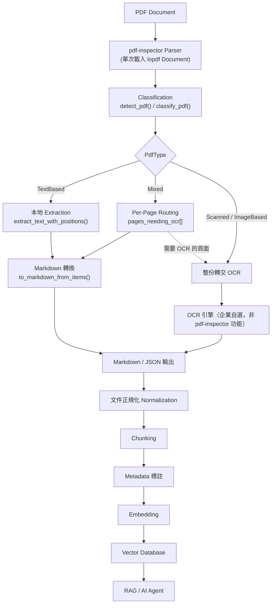

### 3.2 各元件關係說明（官方已實作／Source-confirmed）

| 元件 | 職責 | Input | Output | 官方查證 |
|---|---|---|---|---|
| Parser（`lopdf` 為底層） | 解析 PDF 物件結構，單次載入後供 detection/extraction 共用 | PDF bytes/path | 內部 Document 物件 | Source-confirmed（此前版本以直接引號標示為官方部落格逐字引用，2026-08-16 重新查證未能在官方部落格、`docs/rust-api.md` 中找到此逐字句子，已改標示為本手冊依 `process_pdf()` 內部行為與整體效能數字合理推論的架構描述，而非逐字引用） |
| Detector | 依內容流特徵（文字運算子密度、影像涵蓋率）判斷 PdfType | Document | `PdfType` + confidence + `pages_needing_ocr` | `docs/rust-api.md` |
| Extractor | 擷取文字、座標、字型、CID/ToUnicode 解碼 | Document | `TextItem[]` | `docs/rust-api.md`、`docs/python.md` |
| Layout / Column 分析 | Histogram-based valley detection 重建多欄閱讀順序 | `TextItem[]` | 排序後的 `TextItem[]` | AGENTS.md |
| Table Detection | Rect-based → line-based → heuristic 三段 cascading 策略，first valid result wins | `TextItem[]` + 繪圖運算子 | 表格結構 | AGENTS.md |
| Markdown Converter | 依字型分析、清單/標題偵測，轉出 GFM | `TextItem[]` + 表格結構 | Markdown 字串 | `docs/rust-api.md` |

以上「Parser 單次載入、Detector 與 Extractor 共用同一份 Document」是 pdf-inspector 相對其他工具的重要效能設計（官方已實作，避免同一份 PDF 被解析兩次）。

### 3.3 與使用者常見誤解架構的差異說明

企業初次規劃時，常見的錯誤假設是「有圖片的 PDF = 需要整份 OCR」。pdf-inspector 的實際設計是**逐頁、甚至逐段落**判斷是否需要 OCR，而非以「PDF 是否包含任何影像」作為二分法依據（見第 5、6 章）。另一個常見誤解是把 pdf-inspector 當成「PDF → HTML Table」轉換器；實際上表格重建是根據座標與繪圖運算子的推論結果，不是 PDF 原生結構（見第 9 章）。

### 3.4 AI Prompt 範例

```text
Draw and explain the pdf-inspector processing pipeline for a colleague who
has never used Rust or parsed a PDF before. Cover: classification, per-page
OCR routing, position-aware extraction, and Markdown conversion. Explicitly
state which steps are pdf-inspector's responsibility and which steps
(OCR, embedding, vector storage) are NOT part of pdf-inspector.
```

### 3.5 本章 Checklist 與小結

- [ ] 理解 pdf-inspector 內部「單次解析、detection 與 extraction 共用」的效能設計。
- [ ] 理解 Table Detection 是三段 cascading 策略，非單一演算法。
- [ ] 能畫出「PDF → Classification → Per-page Routing → Markdown → RAG/Agent」的完整管線圖並向非技術背景同仁解釋。

---

## 4. 核心設計原理

### 4.1 為什麼用 Rust 處理 PDF

PDF 解析牽涉大量二進位結構解析（cross-reference table、stream 物件、content stream 運算子），對效能與記憶體安全要求高。pdf-inspector 選擇 Rust，底層 PDF 物件解析交給成熟的 `lopdf` crate（`0.42.0`，Source-confirmed，見 Cargo.toml），自身則專注於分類、版面分析、Markdown 轉換等加值邏輯。Rust 的所有權模型也讓「處理不受信任的 PDF」這件事（見第 31 章）在記憶體安全上有先天優勢。

### 4.2 Detection 引擎設計

依 AGENTS.md 與官方部落格，Detection 引擎透過「抽樣內容流（content stream）」估算文字運算子密度與影像涵蓋率，而非完整解析全部內容，因此可以在 **10–50ms** 內完成分類 (官方已實作)。Rust API 提供 `ScanStrategy` 列舉（`EarlyExit`／`Full`／`Sample(n)`／`Pages(vec)`，Source-confirmed，`docs/rust-api.md`），代表分類策略本身可調整取樣深度換取速度或準確度。

### 4.3 Extraction 引擎設計

Extraction 會擷取每個文字片段的 `TextItem`：文字內容、x/y 座標、寬高、字型、字級、粗體/斜體/底線/刪除線樣式、頁碼（1-indexed）、以及對應 Tagged PDF 結構樹的 `mcid`（Marked-Content ID，官方已實作，`docs/python.md`）。這是後續「Reading Order 重建」與「Markdown 結構推斷」的原始材料。

### 4.4 Table Detection：Cascading 策略

依 AGENTS.md：Table Detection 採「rect-based → line-based → heuristic」三段策略，**first valid result wins**（第一個產生有效結果的策略即採用，不會疊加多個策略的結果）：

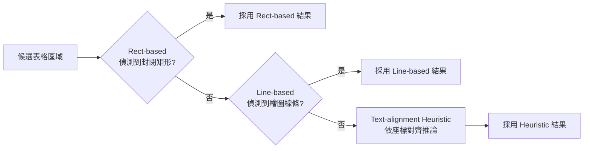

### 4.5 Column / Reading Order 重建

多欄版面的閱讀順序重建採用 **histogram-based valley detection**：把文字片段依 x 座標分佈畫成直方圖，欄與欄之間會形成低密度的「山谷」，藉此切分欄位；對於跨欄的標題或表格等「spanning lines」會先做 pre-masking 排除，避免污染直方圖 (官方已實作，AGENTS.md)。

**版面分類決定閱讀順序策略（Source-confirmed，2026-08-16 直接查證 `AGENTS.md`，此前版本手冊未提及此區分）**：偵測到的多欄版面會先被分類為「newspaper」或「tabular」兩種型態之一，兩者採用**不同**的閱讀順序重建邏輯——`newspaper` 型態（例如報紙、學術論文常見的直式分欄）依欄位**循序**閱讀（先讀完整個左欄，再讀右欄）；`tabular` 型態（例如並排的多欄資料表）則依 Y 座標**交錯**（interleave）讀取各欄同一列的內容。企業若發現某份多欄文件的閱讀順序「看起來合理但邏輯不對」，可能是文件版面被分類到錯誤的型態（newspaper vs tabular 誤判），而非閱讀順序演算法本身失效，除錯時建議先用 `--items-json`（見第 10.2 節）確認 pdf-inspector 對該文件的版面分類判斷。

### 4.6 Markdown 轉換設計原則

依 AGENTS.md，pdf-inspector 的輸出「以 Token 效率與語意品質為優先，而非視覺還原」——這與許多以「像素級還原排版」為目標的 PDF 轉換工具方向不同，非常契合 AI Agent 消費 Markdown 的場景。

### 4.7 本章 Checklist 與小結

- [ ] 理解 Detection 靠取樣、Extraction 才是完整擷取，兩者速度數量級不同。
- [ ] 記住 Table Detection 是「first valid result wins」的 cascading 策略，不是單一演算法或 ML 模型。
- [ ] 理解 pdf-inspector 的設計哲學是「語意/Token 效率優先」，不是「視覺還原優先」——這代表它不適合需要精確重現原始版面的場景（見第 34 章）。

---

## 5. Classification 詳解

### 5.1 四種 PDF 類型

| PDF 類型 | 特徵 | 建議處理 |
|---|---|---|
| `TextBased` | 頁面內含大量可解析的原生文字，影像涵蓋率低 | 直接用 pdf-inspector 本地擷取 |
| `Mixed` | 部分頁面為文字型，部分頁面主要為影像 | Page-level Routing：文字頁用 pdf-inspector，影像頁轉 OCR |
| `Scanned` | 頁面主要由掃描影像組成，幾乎沒有可解析文字 | 整份轉交 OCR |
| `ImageBased` | 內容以影像為主（例如整頁廣告圖、圖表掃描），文字極少或不存在 | OCR 或 Vision LLM |

### 5.2 Confidence Score 與判斷依據

`classify_pdf()` / `detect_pdf()` 回傳的結果包含 `confidence`（0.0–1.0）與 `pages_needing_ocr`（需要 OCR 的頁碼清單），官方也會標示 `has_encoding_issues`（字型編碼異常旗標，官方已實作，`docs/python.md`）。信心分數偏低時，代表該頁面文字/影像比例接近判斷邊界，企業導入時建議對低信心頁面加上人工複核或雙重處理（建議架構）。

> ⚠️ **重要陷阱（Source-confirmed，2026-08-16 直接查證 `pdf_inspector.pyi` 型別定義檔）**：`classify_pdf()` 回傳的輕量 `PdfClassification` 物件，其 `pages_needing_ocr` 是 **0-indexed**；但 `process_pdf()`／`detect_pdf()` 回傳的完整 `PdfResult` 物件，其 `pages_needing_ocr` 卻是 **1-indexed**——兩者頁碼基準不一致，官方文件並未在明顯位置強調這個差異。若企業程式碼先呼叫輕量的 `classify_pdf()` 做初步判斷，之後又混用 `process_pdf()`／`extract_pages_markdown()` 的結果做逐頁路由（見第 6 章），直接假設兩者頁碼基準相同，會產生真實的 off-by-one 錯誤（把第 N 頁的 OCR 需求誤植到第 N+1 頁，或反之）。**建議架構**：企業封裝呼叫端程式碼時，務必在單元測試中明確驗證你安裝版本兩種回傳物件的頁碼基準，不要憑本節描述直接寫死邏輯——官方後續版本可能調整這個行為而未在 Changelog 頭條位置說明。

### 5.3 重要原則：不要用「是否含影像」二分

> **不要因為 PDF 存在 image，就直接判斷整份 PDF 需要 OCR。**

許多 PDF（尤其是企業規格書、財報）會嵌入 Logo、簽名圖檔、示意圖，但主體內容仍是原生文字。pdf-inspector 的分類是依「內容流中文字運算子密度 vs. 影像涵蓋率」的**比例**判斷，而非「是否存在任何影像物件」。AGENTS.md 亦提到，當文字品質低於字母數字佔比 50% 的門檻時，`Mixed` 頁面會被重新分類為 `Scanned`——代表分類結果同時考慮「有沒有文字」與「文字是否可信」兩個維度。

### 5.4 Python 範例（官方已實作，`docs/python.md`）

```python
import pdf_inspector

result = pdf_inspector.detect_pdf("document.pdf")
print(result.pdf_type)              # "text_based" / "scanned" / "image_based" / "mixed"
print(result.confidence)            # 0.0 - 1.0
print(result.pages_needing_ocr)     # [3, 7, 12, ...]
print(result.has_encoding_issues)   # True / False
```

### 5.5 Node.js 範例（官方已實作，napi/README.md）

```typescript
import { classifyPdf } from "@firecrawl/pdf-inspector";
import { readFileSync } from "node:fs";

const classification = classifyPdf(readFileSync("document.pdf"));
console.log(classification.pdfType, classification.confidence);
console.log(classification.pagesNeedingOcr); // number[]
```

### 5.6 AI Prompt 範例

```text
Given a detect-pdf --json output for a document, decide the processing
route for each page:
- pdf_type == "text_based" AND page not in pages_needing_ocr → local extraction
- page in pages_needing_ocr → route to OCR
Explain your reasoning per page and flag any page with confidence < 0.6
for manual review. Do not assume pages with images automatically need OCR.
```

### 5.7 本章 Checklist 與小結

- [ ] 熟記四種分類：TextBased / Mixed / Scanned / ImageBased。
- [ ] 理解 confidence 與 `has_encoding_issues` 是分類結果的一部分，不只是單純的類型字串。
- [ ] 記住「有圖片 ≠ 需要整份 OCR」這條核心原則，並能向團隊解釋原因。
- [ ] 對低信心（例如 < 0.6）的分類結果，建立企業內部的人工複核流程。

---

## 6. Per-Page OCR Routing 深入

### 6.1 為什麼要做到「頁面」而非「文件」等級

一份 200 頁的年報，可能只有附錄的 10 頁是掃描的簽核文件，其餘 190 頁是原生文字。若以文件為單位判斷「整份需要 OCR」，等於讓 190 頁本可秒級處理的內容也去排隊等 OCR／GPU 資源。pdf-inspector 透過 `pages_needing_ocr` 欄位，讓下游系統可以只對「真正需要」的頁面呼叫 OCR。

### 6.2 Per-Page Routing 流程

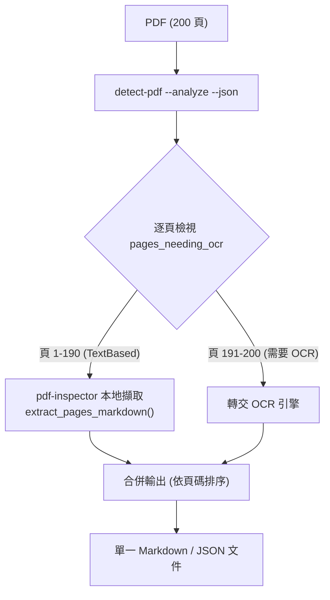

### 6.3 對企業的價值

| 價值 | 說明 |
|---|---|
| 降低 OCR 成本 | 只對真正需要的頁面呼叫（通常是按頁計費的）OCR／Vision 服務 |
| 降低 Latency | 文字頁在毫秒等級完成，不用等待 OCR/GPU 佇列 |
| 降低 Token | 避免把 OCR 辨識結果的雜訊（誤判字元、版面錯亂）帶進 LLM Context |
| 提高 Throughput | 大量文件批次處理時，多數文件可完全略過 OCR 排程 |
| 適合大型 PDF | 掃描附錄不會拖慢整份文件的處理時間 |
| 適合文件 Pipeline | 可依頁面類型分派到不同 Worker Queue，獨立擴展 |

### 6.4 CLI 範例

```bash
# 先用 detect-pdf 取得逐頁需要 OCR 的清單
detect-pdf annual-report.pdf --analyze --json > classification.json

# 依 classification.json 中 pages_needing_ocr 之外的頁面，用 pdf2md 只轉換文字頁
pdf2md annual-report.pdf --select-pages 1-190 --json > text-pages.json

# 需要 OCR 的頁面（191-200）另外轉交 OCR pipeline，企業自行整合
```

### 6.5 實務案例

某企業有 5,000 份財報 PDF，平均每份 80 頁，僅約 6% 頁面為掃描附錄。導入 Per-Page Routing 前，OCR 服務需處理 400,000 頁；導入後僅需處理約 24,000 頁，**降幅約 94%**（此為示範情境數字，非官方 Benchmark，企業實際比例需自行統計）。

### 6.6 本章 Checklist 與小結

- [ ] 理解 Per-Page Routing 的價值主要來自「避免整份 OCR」，而非分類演算法本身的準確度。
- [ ] 設計 Pipeline 時，將文字頁與 OCR 頁的處理佇列分開，讓兩者可以獨立擴展。
- [ ] 合併輸出時務必依頁碼排序，維持文件邏輯順序。

---

## 7. Position-aware Text Extraction

### 7.1 為什麼「文字順序」比「有沒有把文字抽出來」更重要

許多傳統 PDF 文字擷取工具只回傳一長串字串，順序依 PDF 內部繪製指令而非人類閱讀順序。對雙欄論文、財報這類版面而言，逐字依繪製順序輸出常常是「左欄第一行、右欄第一行、左欄第二行…」交錯排列，人類讀者靠版面直覺仍能理解，但 LLM 逐序閱讀文字流時會把不相關的句子拼接在一起，直接產生語意錯誤或幻覺。pdf-inspector 的 Position-aware Extraction 保留每個文字片段的座標，讓後續的 Reading Order 重建（第 4.5 節）可以依人類真實閱讀順序輸出。

### 7.2 TextItem 資料結構（官方已實作，`docs/python.md` / `docs/rust-api.md`）

| 欄位 | 說明 |
|---|---|
| `text` | 文字內容 |
| `x` / `y` / `width` / `height` | 座標與尺寸 |
| `font` / `font_size` | 字型名稱與級數 |
| `is_bold` / `is_italic` / `is_underline` / `is_strikeout` | 樣式旗標 |
| `linkUrl` / `link_url`（Node/Python 命名風格差異，見第 10.4 節） | 若此文字片段對應 PDF 內部超連結，回傳連結目標 URL（Source-confirmed，2026-08-16 直接查證 Node.js `index.d.ts`，此前版本手冊漏列） |
| `page` | 頁碼（1-indexed） |
| `item_type` | 文字片段類型標記（Source-confirmed，2026-08-16 直接查證 `pdf_inspector.pyi`；此前版本手冊漏列此欄位，具體可能值官方型別檔未逐一列舉，建議以你安裝版本實際輸出為準） |
| `mcid` | Marked-Content ID，對應 Tagged PDF 結構樹（若存在） |

### 7.3 CID Font 與 ToUnicode CMap

企業常見的中文/日文 PDF 大量使用 CID（Character ID）字型，字元編碼不是直接對應 Unicode，而是透過 `ToUnicode` CMap 對照表轉換。pdf-inspector 官方文件明確提到支援此能力，napi/README.md 原句為「Robust text decoding — CID/Type0 fonts via ToUnicode CMaps, plus automatic flagging of broken encodings so callers can fall back to OCR」(官方已實作，2026-08-16 重新查證修正此前版本中英夾雜、非逐字的引述)。官方 README（官方已實作，2026-08-16 重新查證）進一步標明支援的具體對象是 **Type0／Identity-H 字型**，ToUnicode CMap 解碼涵蓋 **UTF-16BE、UTF-8、Latin-1** 三種編碼——這代表若企業 PDF 使用上述三種以外的罕見自訂編碼對照，仍可能落入 `has_encoding_issues` 情境。若某頁字型缺少 ToUnicode 對照或對照表本身損毀，pdf-inspector 會透過 `has_encoding_issues` 旗標提示，此時建議走 OCR fallback 而非信任擷取結果。

### 7.4 多欄與 RTL

Layout 分析支援多欄閱讀順序重建（第 4.5 節），napi/README.md 亦提到支援 RTL（右至左）文字。對於中英混排、直式排版等更複雜版面，建議先用 `--items-json` 或 `extract_text_with_positions()` 取得原始座標資料，人工抽樣驗證閱讀順序是否符合預期，再決定是否需要企業自訂後處理規則（建議架構）。

### 7.5 Python 範例：檢視前幾個文字片段

```python
import pdf_inspector

items = pdf_inspector.extract_text_with_positions("document.pdf")
for item in items[:5]:
    print(f"'{item.text}' page={item.page} at ({item.x:.0f}, {item.y:.0f}) "
          f"font={item.font} bold={item.is_bold}")
```

### 7.6 Region-based 擷取：只取指定座標範圍

```python
regions = pdf_inspector.extract_text_in_regions("doc.pdf", page_regions)
for page_result in regions:
    for region in page_result.regions:
        print(region.text)
```

這在「已知欄位固定位置的表單類 PDF」（例如標準化申請書、發票）特別實用：可直接鎖定金額欄、日期欄等固定座標區域擷取，不需整頁 Markdown 化。

### 7.7 Tagged PDF 結構樹

若 PDF 具備 Tagged PDF 結構（`extract_structure_elements()`），可取得每段文字對應的語意角色（`H1`–`H6`、`P`、`Table` 等，官方已實作），比純座標推論更可靠：

```python
elements = pdf_inspector.extract_structure_elements("tagged.pdf")
roles = {(e.page, e.mcid): e.role for e in elements}
headings = [
    item.text for item in pdf_inspector.extract_text_with_positions("tagged.pdf")
    if roles.get((item.page, item.mcid), "").startswith("H")
]
```

**注意**：並非所有 PDF 都具備 Tagged 結構（多數由 Office 軟體直接「列印為 PDF」產生的文件不具備），此功能適用範圍有限，企業不應假設所有輸入 PDF 都能用此方式取得語意標題。

### 7.8 本章 Checklist 與小結

- [ ] 理解「文字順序」的重要性不亞於「文字內容」，多欄/雙欄文件務必檢查 Reading Order 是否正確。
- [ ] 遇到中文/日文 PDF 擷取出現亂碼時，優先檢查 `has_encoding_issues` 旗標與 ToUnicode CMap 是否存在問題（見第 48 章 故障排除）。
- [ ] 對固定版面表單，優先使用 Region-based 擷取而非整頁 Markdown 化。
- [ ] Tagged PDF 結構樹是加分項，不能假設所有輸入文件都具備。

---

## 8. PDF → Markdown 轉換策略

### 8.1 轉換管線

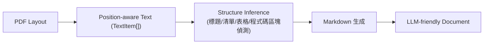

### 8.2 支援的 Markdown 結構元素（官方已實作，`docs/rust-api.md` 綜合 README 描述）

| 元素 | 說明 |
|---|---|
| Heading | 依字型大小/粗體等視覺特徵推斷標題層級，**官方 README 明確標示僅支援 H1–H4**（官方已實作，2026-08-16 重新查證）；文件原生若有 H5/H6 語意層級（例如 Tagged PDF 結構樹標示為更深層標題），轉換後會被壓平為 H4 或視為一般粗體段落，企業導入前應注意此深度上限 |
| Paragraph | 依 Y 座標間距（Y-gap analysis）判斷段落邊界 |
| Bullet list / Numbered list | 依項目符號字元與縮排推斷，官方 README 提及支援項目符號、數字編號與字母編號（bullet/numbered/letter）三種清單樣式 |
| Bold / Italic | 依字型樣式旗標轉為 `**bold**` / `*italic*` |
| Code block | 依等寬字型或縮排特徵偵測 |
| URL | 連結偵測（napi/README.md 提及位置/字型 metadata 支援） |
| Table | 見第 9 章 |
| Page break | `--pages` 參數插入分頁標記 |
| 多欄 → 單欄線性化 | Reading Order 重建後輸出為線性 Markdown |

### 8.3 Markdown 是「語意優先」而非「排版優先」

依 AGENTS.md 的設計哲學，pdf-inspector 的 Markdown 輸出目標是給 LLM／Agent 消費，因此優先保留語意結構（標題層級、清單、表格），而不是像素級還原原始版面（例如精確的字距、換行位置）。若企業需求是「產生視覺上與原始 PDF 一模一樣的文件」，pdf-inspector 不是適合的工具（見第 34 章）。

### 8.4 CLI 範例

```bash
pdf2md document.pdf > document.md
pdf2md document.pdf --compact > document.compact.md   # 見第 14 章 Token Optimization
pdf2md document.pdf --pages > document.paged.md        # 保留分頁標記
```

### 8.5 AI Prompt 範例

```text
The following is Markdown converted from a PDF via pdf-inspector.
Summarize the document structure only (headings and their levels),
without summarizing content. If a heading level seems inconsistent
(e.g. an H3 appearing without a preceding H2), flag it as a possible
extraction artifact rather than silently correcting it.
```

### 8.6 本章 Checklist 與小結

- [ ] 理解轉換管線的四個階段：Position-aware Text → Structure Inference → Markdown → LLM-friendly Document。
- [ ] 記住輸出是「語意優先」，不是「視覺還原優先」。
- [ ] 大量文件導入前，抽樣檢查標題層級推斷是否合理，必要時建立企業內部後處理規則修正。

---

## 9. Table Detection 深入

### 9.1 PDF 表格不是天然的 HTML Table

> **PDF 表格不是天然的 HTML table。**

PDF 格式本身沒有「表格」這個原生物件，它只描述：

```text
Text + 座標 + 繪圖運算子（線條、矩形）
```

因此 Table Detection 本質上是一個 **layout reconstruction 問題**：從文字座標的對齊模式與可能存在的繪圖線條，反推出「這些內容原本排列成一個表格」。

### 9.2 三段 Cascading 策略（回顧第 4.4 節）

1. **Rect-based**：偵測封閉矩形繪圖物件，最可靠，適用有明確格線的表格。
2. **Line-based**：偵測水平/垂直線條組合，適用只有部分格線（例如僅有橫線分隔的財務報表）的表格。
3. **Text-alignment Heuristic**：完全無格線時，依文字欄位的座標對齊模式（同一 Y 座標範圍內、規律的 X 座標間隔）推論表格結構，適用性最廣但準確度也最容易受版面複雜度影響。

三者 **first valid result wins**——不是三者結果加權合併。

**⚠️ 欄數上限（Source-confirmed，2026-08-16 直接查證 `AGENTS.md`）**：表格偵測有硬性欄數上限 **25 欄**，超過此上限的表格不會被正確識別為表格；此外，合併儲存格傳播邏輯（`propagate_merged_cells`）在**超過 10 欄**時會被停用。企業若有寬幅財務報表（例如逐月 12 期 × 多個指標欄位、或跨年度比較表），欄數容易超過這兩個門檻，轉換結果的合併儲存格可能無法正確傳播，甚至整張表格降級為一般段落文字——這是此前版本手冊完全沒有記載的具體限制，建議對寬幅表格文件特別列入第 41 章 Golden Dataset 的測試樣本。

### 9.3 財務表格與 Footnote

財務報表常見「表格 + 表格下方星號註記」的組合。pdf-inspector 的表格重建聚焦於表格主體本身；註腳/Footnote 的關聯性判斷（例如「這行文字是否屬於上方表格的註解」）目前**沒有找到官方文件明確說明專用機制**——本輪查證除既有的 README/docs 系列文件外，另外直接查證了 `AGENTS.md`（Source-confirmed，2026-08-16），同樣未見專用機制說明，確認此為官方一手資料中持續存在的研究缺口，而非查證不夠深入（研究缺口，見 Appendix F），企業導入時建議對財務文件抽樣人工複核表格與註腳的對應關係。

### 9.4 跨頁表格

大型表格經常跨越多頁（例如逐月財務數字表）。以「頁面」為單位個別偵測表格，可能導致同一張邏輯表格被拆成多個獨立表格輸出。目前官方文件未明確描述跨頁表格自動合併機制（研究缺口，本輪已另外直接查證 `AGENTS.md` 與 `docs/rust-api.md`，同樣未見說明，確認為持續存在的官方文件空白）；企業若有大量跨頁表格文件，建議在下游 Normalization 階段（第 4.6 節管線中的「文件正規化」）自行實作「相鄰頁表格欄位數/欄名相同則合併」的規則（建議架構），並留意第 9.2 節新發現的 25 欄上限——跨頁合併後的總欄數若超過門檻，合併儲存格傳播邏輯同樣會失效。

### 9.5 CLI 範例：取得 Layout 分析

```bash
detect-pdf financial-report.pdf --analyze --json
```

`--analyze` 會回傳 `LayoutComplexity`（官方已實作，`docs/rust-api.md`），包含多欄與表格偵測的旗標，可用於在正式轉換前預判文件複雜度。

### 9.6 本章 Checklist 與小結

- [ ] 理解表格重建是 layout reconstruction 問題，準確度受版面複雜度影響，不是 100% 保證正確。
- [ ] 對財務文件的表格輸出，抽樣人工複核，特別留意跨頁表格與 Footnote 對應關係（已知研究缺口）。
- [ ] 大量處理前先用 `--analyze` 預判文件複雜度，決定是否需要人工複核流程。

---

## 10. CLI 安裝與使用

### 10.1 安裝

```bash
# 需要本機 Rust 工具鏈（cargo）
cargo install pdf-inspector
```

安裝完成後會取得兩個執行檔：`pdf2md`、`detect-pdf`。若不想安裝 Rust 工具鏈，Node.js 使用者可透過 `npm install -g @firecrawl/pdf-inspector` 取得含 prebuilt binary 的 CLI（見第 16 章）。

### 10.2 `pdf2md`：PDF 轉 Markdown

| 指令 | 功能 | What | Why | How | When | 範例 |
|---|---|---|---|---|---|---|
| `pdf2md document.pdf` | 轉換為 Markdown，輸出至 stdout | 基本轉換 | 最快取得可讀 Markdown | 直接執行 | 快速預覽單一文件 | `pdf2md report.pdf > report.md` |
| `pdf2md document.pdf --json` | 輸出結構化 JSON | 含 metadata 的完整結果 | 供程式化下游處理 | 加 `--json` | Pipeline 自動化、Agent 決策 | `pdf2md report.pdf --json > report.json` |
| `pdf2md document.pdf --items-json` | 輸出定位 TextItem JSON | 含座標/字型的原始資料 | 除錯、自訂後處理 | 加 `--items-json` | 需要座標資訊時 | `pdf2md report.pdf --items-json > items.json` |
| `pdf2md document.pdf --raw` | 輸出無標頭的原始 Markdown | 不含額外 metadata 區塊 | 需要最精簡輸出 | 加 `--raw` | 直接餵給 LLM，不需要 metadata | `pdf2md report.pdf --raw` |
| `pdf2md document.pdf --compact` | 壓縮多餘留白 | 減少 Token 用量 | Token 成本敏感場景 | 加 `--compact` | 大量文件送入 LLM Context | 見第 14 章 |
| `pdf2md document.pdf --pages` | 插入分頁標記 | 保留頁碼對應關係 | 需要引用來源頁碼（Citation） | 加 `--pages` | RAG、金融/法律文件 | 見第 26 章 |
| `pdf2md document.pdf --select-pages 1,3,5-10` | 只處理指定頁面 | 節省處理時間 | 搭配 Per-Page Routing | 加 `--select-pages` | 已知只需部分頁面 | 見第 6.4 節 |

**注意事項**：`--json` 與 `--items-json` 是兩種不同層級的輸出，前者是「轉換完成後的結構化結果」，後者是「轉換前的原始定位資料」，用途不同，不要混用預期。

### 10.3 `detect-pdf`：分類

| 指令 | 功能 | 適合 AI Agent 的情境 |
|---|---|---|
| `detect-pdf document.pdf` | 純文字輸出分類結果 | 人工快速檢視 |
| `detect-pdf document.pdf --json` | JSON 輸出分類結果 | Agent 讀取後做路由決策（見第 6 章） |
| `detect-pdf document.pdf --analyze --json` | 含 Layout 分析（多欄/表格旗標） | Agent 預判文件複雜度，決定是否需要額外處理策略 |

### 10.4 Bash 範例：Agent 決策 Pipeline 雛形

```bash
#!/usr/bin/env bash
set -euo pipefail

pdf="$1"
classification=$(detect-pdf "$pdf" --json)
pdf_type=$(echo "$classification" | jq -r '.pdfType // .pdf_type')

case "$pdf_type" in
  text_based|TextBased)
    pdf2md "$pdf" --pages --json > "${pdf%.pdf}.json"
    ;;
  mixed|Mixed)
    echo "Mixed PDF：需依 pages_needing_ocr 逐頁路由，見第 6 章" >&2
    ;;
  *)
    echo "整份需要 OCR，交由企業 OCR pipeline 處理" >&2
    ;;
esac
```

（示意腳本，實際欄位名稱請以你安裝版本的 `--json` 輸出為準，Node/Rust/Python 三種 binding 的 JSON key 命名風格不完全相同，例如 Node 為 camelCase `pdfType`，Python/Rust 內部欄位為 snake_case `pdf_type`。）

### 10.5 進階除錯：`dump_ops`（legacy）與 `RUST_LOG`（官方建議）

**Source-confirmed（2026-08-16 直接查證 `Cargo.toml` 與 `docs/debugging.md`）**：官方 `Cargo.toml` 的 `[[bin]]` 清單其實有三個執行檔，不是只有 `pdf2md` 與 `detect-pdf`——還有一個 `dump_ops`（對應 `src/bin/dump_ops.rs`）。但官方 `docs/debugging.md` 明確把它標示為舊工具：文件中「Raw PDF content stream operators」這項除錯情境，原文註明「replaces dump_ops」——也就是說，**官方建議的除錯方式已從獨立的 `dump_ops` 執行檔，轉為透過 `RUST_LOG` 環境變數搭配標準 `pdf2md`/`detect-pdf` 執行**（官方已實作，`docs/debugging.md`）。`dump_ops` 二進位目前仍存在於原始碼中，但企業導入除錯流程時應以 `RUST_LOG` 為主，不建議把 `dump_ops` 當成官方長期支援的除錯介面（本手冊此前版本完全未提及此二進位與 `docs/debugging.md`，屬於本輪查證新增內容）。

官方 `docs/debugging.md` 列出的模組化除錯情境（官方已實作，模組路徑請以你安裝版本原始碼為準）：

| 除錯目標 | 用途 |
|---|---|
| 內容流運算子（取代 `dump_ops`） | 檢視原始 PDF content stream 運算子，除錯層級最底層 |
| 字型處理 | 字型 metadata、編碼、連字（ligature）處理 |
| 字元對照 | CID/ToUnicode CMap 解析（見第 7.3 節） |
| 文字定位 | 逐頁 `TextItem` 座標資料（見第 7.2 節） |
| Layout 處理 | 多欄偵測與閱讀順序判斷（見第 4.5 節） |
| 段落分析 | Y-gap 分析與段落邊界門檻（見第 8.2 節） |
| 表格偵測 | Cascading 表格偵測除錯（見第 4.4、9 章） |
| 全域除錯 | `pdf_inspector=debug`，系統整體輸出 |

CLI 呼叫模式（官方已實作，`docs/debugging.md`）：

```bash
RUST_LOG=<module_path>=<level> cargo run --bin pdf2md -- document.pdf > /dev/null
```

`> /dev/null`（Windows PowerShell 可用 `> $null`）把正常輸出丟棄，讓寫入 stderr 的除錯資訊單獨呈現，方便針對分類、擷取、版面、表格等特定階段逐一排查，不需要在不同除錯執行檔間切換。此機制僅適用於**從原始碼以 `cargo run` 執行**的情境（見第 18 章 Rust 使用），透過 npm/PyPI 安裝 prebuilt binary 的使用者無法直接設定 `RUST_LOG` 影響二進位內部行為，除錯時仍需搭配 `--items-json`（見第 10.2 節）取得原始資料自行比對。

### 10.6 AI Prompt 範例

```text
You have access to a shell tool. Given a PDF file path, run:
1. `detect-pdf <path> --analyze --json`
2. Based on pdf_type and pages_needing_ocr, decide whether to run
   `pdf2md <path> --pages --json` directly, or flag pages for OCR.
Report your decision and the exact commands you would run, but do not
execute destructive operations or overwrite the original PDF.
```

### 10.7 本章 Checklist 與小結

- [ ] 熟悉 `pdf2md` 的 7 個常用 flag 與各自適用情境。
- [ ] 理解 `--json` 與 `--items-json` 的差異。
- [ ] 建立一個簡單的 Agent 決策腳本雛形，依 `detect-pdf --json` 結果路由。
- [ ] 知道 `dump_ops` 是官方標示為 legacy 的除錯二進位，正式除錯流程改用 `RUST_LOG`（僅適用於原始碼建置場景）。

---

## 11. Windows 開發環境安裝

### 11.1 前置需求

| 工具 | 用途 | 安裝方式 |
|---|---|---|
| Rustup / Cargo | 建置 Rust crate / CLI | `winget install Rustlang.Rustup` 或至 <https://rustup.rs> 下載安裝程式 |
| Node.js（LTS） | 使用 Node/npm binding | `winget install OpenJS.NodeJS.LTS` |
| Python 3.8+ | 使用 Python binding | `winget install Python.Python.3.12` |
| Visual C++ Build Tools | Rust 在 Windows 上編譯原生模組所需 | 安裝 Visual Studio「使用 C++ 的桌面開發」工作負載，或單獨安裝 Build Tools |
| VS Code | 編輯與除錯 | `winget install Microsoft.VisualStudioCode` |

### 11.2 PowerShell 安裝與驗證

```powershell
# 安裝 CLI（需要已安裝 Rust 工具鏈）
cargo install pdf-inspector

# 驗證安裝
pdf2md --help
detect-pdf --help

# Node.js binding（免 Rust 工具鏈，直接用 prebuilt binary）
npm install -g @firecrawl/pdf-inspector
pdf2md --version
```

### 11.3 常見 Windows 問題

| 問題 | 可能原因 | 排除方式 |
|---|---|---|
| `cargo install` 編譯失敗，出現 `link.exe not found` | 缺少 Visual C++ Build Tools | 安裝 Visual Studio Build Tools 的 C++ 工作負載後重試 |
| PowerShell 執行原生模組報「不受信任的發行者」 | 執行原則限制 | 依企業安全政策評估是否調整 `Set-ExecutionPolicy`，不建議全域關閉簽章檢查 |
| Python `pip install pdf-inspector` 找不到 wheel | Python 版本過舊或非 CPython | 確認為 CPython ≥3.8，必要時改用 `maturin develop` 從原始碼建置 |
| 路徑含中文或空白導致 CLI 讀取檔案失敗 | Windows 路徑編碼問題 | 用雙引號包住路徑，並優先測試英數路徑排除變因 |

### 11.4 是否需要 WSL

若企業 CI/CD 目標環境是 Linux 容器，本機開發建議直接在 WSL2（Ubuntu）中安裝 Rust/Node/Python 工具鏈，行為與正式環境更一致，可減少「本機可跑、容器內失敗」的落差（建議架構）。

### 11.5 本章 Checklist 與小結

- [ ] 確認 Visual C++ Build Tools 已安裝，這是 Windows 上多數 Rust 編譯失敗的根因。
- [ ] 優先使用 Node.js binding 的 prebuilt binary，避免不必要的本機 Rust 編譯。
- [ ] 若目標部署環境是 Linux，評估改用 WSL2 做開發，降低環境落差風險。

---

## 12. Linux / macOS / CI Server 安裝

### 12.1 Ubuntu / Debian

```bash
# Rust 工具鏈
curl --proto '=https' --tlsv1.2 -sSf https://sh.rustup.rs | sh
source "$HOME/.cargo/env"

cargo install pdf-inspector

# 或使用 Node.js binding
curl -fsSL https://deb.nodesource.com/setup_lts.x | sudo -E bash -
sudo apt-get install -y nodejs
npm install -g @firecrawl/pdf-inspector
```

### 12.2 macOS

```bash
# 透過 Homebrew 安裝 Rust 工具鏈
brew install rustup-init
rustup-init -y

cargo install pdf-inspector
```

Node.js binding 官方提供 macOS ARM64 prebuilt binary（官方已實作，napi/README.md）。**此前版本手冊將 Intel Mac 支援標示為待確認事項，本輪已解決（Source-confirmed，2026-08-16 直接查證 napi/README.md 的 optionalDependencies 清單）**：官方目前發布的六個平台套件為 `linux-x64-gnu`、`linux-x64-musl`、`linux-arm64-gnu`、`linux-arm64-musl`、`darwin-arm64`、`win32-x64-msvc`——**不含 macOS Intel（`darwin-x64`）**。若企業仍有 Intel Mac 開發機或 CI Runner，`npm install` 時不會有對應的 prebuilt binary 可用，需改走 `cargo install pdf-inspector`（本機編譯，見第 10 章）或改用不受此限制的 Python/WASM binding。

### 12.3 GitHub Actions

```yaml
name: pdf-inspector-ci
on: [push]
jobs:
  build:
    runs-on: ubuntu-latest
    steps:
      - uses: actions/checkout@v4
      - uses: actions/setup-node@v4
        with:
          node-version: 20
      - run: npm install @firecrawl/pdf-inspector
      - run: node scripts/extract.js sample.pdf
```

### 12.4 GitLab CI / Jenkins

GitLab CI 與 Jenkins 的整合方式與 GitHub Actions 概念相同：在 Runner/Agent 映像中安裝對應語言工具鏈（或直接使用含 prebuilt binary 的 npm/PyPI 套件），避免在每次 CI 執行時重新編譯 Rust 原始碼（建議架構，可大幅縮短 CI 時間）。

```yaml
# .gitlab-ci.yml 示意
pdf_pipeline_test:
  image: node:20
  script:
    - npm install @firecrawl/pdf-inspector
    - node scripts/extract.js sample.pdf
```

### 12.5 Docker 內建置（先行預告，完整內容見第 39 章）

```dockerfile
FROM node:20-slim
WORKDIR /app
COPY package*.json ./
RUN npm ci --omit=dev
COPY . .
CMD ["node", "server.js"]
```

由於 Node/Python binding 提供 Linux glibc 與 musl 的 prebuilt binary（官方已實作，napi/README.md、PyPI wheels），一般企業容器（Debian-based 或 Alpine-based）都可直接安裝，不需要在容器映像內安裝 Rust 工具鏈。

### 12.6 本章 Checklist 與小結

- [ ] CI 環境優先使用含 prebuilt binary 的 Node/Python 套件，避免每次建置都重新編譯 Rust。
- [ ] 確認容器基底映像的 libc 版本（glibc vs musl）與套件提供的 prebuilt binary 相符。
- [ ] macOS Intel 平台的官方支援狀態，導入前請以當下查詢的 napi/README.md 為準。

---

## 13. JSON Output 與 Agent Pipeline 設計

### 13.1 為什麼 JSON 比純 Markdown 更適合自動化

| 用途 | Markdown | JSON |
|---|---|---|
| Agent 路由決策 | 需額外解析文字 | 直接讀取 `pdf_type`、`confidence`、`pages_needing_ocr` 等欄位 |
| Automation / Workflow | 難以程式化判斷成功/失敗 | 結構化欄位可直接接入條件判斷 |
| Metadata | 需另外約定格式 | 原生攜帶頁碼、字型、信心分數等 metadata |
| Audit | 純文字難以稽核 | 可保存為結構化紀錄，供事後追蹤 |
| Debugging | 較難定位問題出處 | `--items-json` 可精確定位到座標層級 |
| 下游處理 | 需額外剖析 | 可直接映射為程式語言物件（Pydantic/TypeScript interface 等） |

### 13.2 Agent Pipeline 設計

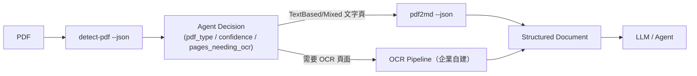

### 13.3 JSON Schema 概念示範（示意，非官方逐字定義）

```json
{
  "pdfType": "Mixed",
  "pageCount": 42,
  "confidence": 0.87,
  "pagesNeedingOcr": [12, 13, 40],
  "hasEncodingIssues": false,
  "processingTimeMs": 38,
  "pages": [
    {
      "page": 1,
      "markdown": "# Annual Report\n\n...",
      "needsOcr": false
    }
  ]
}
```

### 13.4 AI Prompt 範例

```text
Parse the following detect-pdf --json output. Produce a routing plan as
JSON: {"local_extraction": [page numbers], "ocr_required": [page numbers],
"manual_review": [pages with confidence below 0.6]}.
Only use fields present in the input; do not fabricate fields.
```

### 13.5 本章 Checklist 與小結

- [ ] 企業自動化 Pipeline 一律以 JSON 輸出為主，Markdown 僅作為最終交付格式。
- [ ] 保留原始 JSON 作為 Audit Log 的一部分，而非僅保存最終 Markdown。

---

## 14. Compact Output 與 Token Optimization

### 14.1 Token 優化的管線位置


### 14.2 Compact 帶來的差異

`--compact` 旗標會收斂多餘留白（官方已實作，README 原文為「Token-efficient output (collapses long dot leaders and similar source padding)」，2026-08-16 重新查證修正此前版本的不精確引述）。「dot leaders」是目錄頁常見的「.......」導引點，PDF 原生排版常以大量句點字元填滿標題與頁碼之間的空白——`--compact` 特別會處理這類典型 PDF 排版產物，而不只是單純壓縮空白字元。對於 PDF 常見的「每行間夾雜大量空白字元/多餘換行」問題，這能直接減少送進 LLM 的 Token 數，而不影響語意完整性。

| 面向 | 影響 |
|---|---|
| Token 數 | 直接減少，降低單次呼叫成本 |
| Context Window | 同樣的 Context 上限可容納更多文件內容 |
| LLM 成本 | 依 Token 計費的模型，成本隨 Token 數線性下降 |
| Agent Latency | 更少 Token 代表更快的推論時間 |
| RAG Chunking | 減少雜訊有助於切分出語意完整的 Chunk |
| Prompt 效率 | 同樣預算下可以放入更多相關文件片段 |

### 14.3 Token Optimization 建議（建議架構）

1. Pipeline 中預設使用 `--compact`，除非下游需要保留原始排版供人工比對。
2. 對於超大型文件，優先用 `--select-pages` 或 Per-Page Routing（第 6 章）減少不必要頁面的處理，而不是等轉換完再截斷。
3. RAG 場景下，Chunking 前先做 Compact，可以讓每個 Chunk 容納更多語意內容、減少 Chunk 總數。
4. 定期抽樣比較 Compact 前後的 Token 數與下游任務準確度，避免過度壓縮導致語意流失。

### 14.4 本章 Checklist 與小結

- [ ] 預設 Pipeline 啟用 `--compact`，除非有明確理由需要保留原始留白。
- [ ] 用實際文件量測 Token 節省幅度，而非直接沿用他人數字（Token 節省比例高度依賴文件版面特性）。

---

## 15. Python 使用

### 15.1 安裝

```bash
pip install pdf-inspector
```

官方提供 CPython ≥3.8 的 prebuilt wheels，涵蓋 Linux（x86_64、aarch64）、macOS（Intel、Apple Silicon）、Windows（x64）(官方已實作，PyPI 頁面)。若需要從原始碼建置（例如客製化 feature flag）：

```bash
pip install maturin
maturin develop --release
```

### 15.2 核心 API（官方已實作，`docs/python.md`）

| 函式 | 用途 |
|---|---|
| `process_pdf(path, pages=None)` | 完整流程：分類 + 擷取 + Markdown 轉換 |
| `process_pdf_bytes(data, pages=None)` | 同上，輸入為 bytes（不需落地檔案） |
| `detect_pdf(path)` / `detect_pdf_bytes(data)` | 僅分類，不做文字擷取，回傳完整 `PdfResult`（`markdown` 為 `None`） |
| `classify_pdf(path)` / `classify_pdf_bytes(data)` | 輕量分類，回傳精簡的 `PdfClassification`（**注意其 `pages_needing_ocr` 為 0-indexed，與 `PdfResult` 的 1-indexed 不同，見第 5.2 節警示**） |
| `extract_text(path)` / `extract_text_bytes(data)` | 取得純文字 |
| `extract_text_with_positions(path, pages=None)` / `..._bytes(data, pages=None)` | 含座標/字型/樣式的 `TextItem` 清單 |
| `extract_text_in_regions(path, page_regions)` / `..._bytes(data, page_regions)` | 指定座標範圍擷取，回傳 `list[PageRegionTexts]`（頁碼 0-indexed） |
| `extract_pages_markdown(path, pages=None)` / `..._bytes(data, pages=None)` | 逐頁 Markdown + metadata，回傳 `PagesExtractionResult` |
| `extract_structure_elements(path, pages=None)` / `..._bytes(data, pages=None)` | Tagged PDF 結構樹角色，回傳 `list[StructureElement]`（頁碼 1-indexed） |

**修正（Source-confirmed，2026-08-16 直接查證 `pdf_inspector.pyi` 型別定義檔）**：此前版本手冊只列出路徑式函式與 `process_pdf_bytes`，遺漏了官方為**每一個**路徑式函式都提供對應 `_bytes` 版本這件事——上表已補齊。另外，`pdf_inspector.pyi` 揭露的 `PdfResult` 欄位比此前版本手冊描述的更完整，除 `pdf_type`／`markdown`／`page_count`／`processing_time_ms`／`pages_needing_ocr`／`confidence`／`has_encoding_issues` 外，還包含：`title`（`str | None`，PDF 文件標題 metadata）、`is_complex_layout`（`bool`，版面複雜度旗標）、`pages_with_tables`（含表格的頁碼清單）、`pages_with_columns`（含多欄版面的頁碼清單）、`ocr_reasons_by_page`（逐頁 OCR 需求原因清單）。企業若只依賴本手冊此前版本列出的欄位子集寫程式，可能錯過 `is_complex_layout`／`pages_with_tables`／`pages_with_columns` 這些能直接用於第 9 章表格處理與第 35.4 節效能評估的現成旗標，而重新自行實作。

### 15.3 範例

```python
import pdf_inspector

result = pdf_inspector.process_pdf("document.pdf")
print(result.pdf_type)              # 分類結果
print(result.markdown)              # Markdown 輸出
print(result.page_count)
print(result.processing_time_ms)
print(result.pages_needing_ocr)
print(result.confidence)
```

### 15.4 PyO3、GIL 與 Multithreading

pdf-inspector 的 Python binding 透過 `pyo3`（`0.25`，optional feature，Source-confirmed，Cargo.toml）將 Rust 函式暴露給 Python。實務上需注意：

- 呼叫進入 Rust 端運算時，長時間運算若未釋放 GIL，會阻塞同一 Process 內其他 Python 執行緒；企業導入前應以自己的批次量實測是否需要改用多 Process（`multiprocessing`）而非多 Thread 來平行處理多份 PDF（建議架構，官方文件未明確說明 GIL 釋放細節，屬研究缺口）。
- 錯誤處理：Rust 端錯誤（例如 `PdfError::Encrypted`、`PdfError::InvalidStructure`）會映射為 Python 例外，建議用 `try/except` 包住呼叫並記錄原始檔名／頁碼，方便後續除錯。

### 15.5 封裝建議（建議架構）

```python
import logging
import pdf_inspector

logger = logging.getLogger("pdf_pipeline")

def safe_process_pdf(path: str) -> dict | None:
    try:
        result = pdf_inspector.process_pdf(path)
        return {
            "pdf_type": result.pdf_type,
            "confidence": result.confidence,
            "markdown": result.markdown,
            "pages_needing_ocr": result.pages_needing_ocr,
        }
    except Exception:
        logger.exception("pdf-inspector 處理失敗: %s", path)
        return None
```

### 15.6 生產環境部署

- 使用虛擬環境（`venv` 或 `uv`）隔離依賴版本，避免與其他套件的 Rust extension 衝突。
- Docker 映像建議使用官方 prebuilt wheel 對應的 Python 版本與作業系統，避免容器內觸發原始碼編譯（會需要額外安裝 Rust 工具鏈，拉長映像建置時間）。
- 若走 FastAPI／Flask 等同步框架處理大量 PDF，建議搭配 Worker Pool（如 `concurrent.futures.ProcessPoolExecutor`）避免阻塞主要請求執行緒。

### 15.7 本章 Checklist 與小結

- [ ] 確認部署環境的 CPython 版本與作業系統在官方 wheel 支援範圍內，避免觸發本機編譯。
- [ ] 大量批次處理時，實測多 Process 是否比多 Thread 更適合（GIL 影響未經官方文件證實，屬研究缺口）。
- [ ] 統一封裝錯誤處理，記錄失敗檔案供人工複核，而非讓例外直接中斷整個批次。

---

## 16. Node.js / TypeScript 使用

### 16.1 安裝

```bash
npm install @firecrawl/pdf-inspector
# 或
bun add @firecrawl/pdf-inspector
```

官方提供 Linux（x64/ARM64，glibc 與 musl）、macOS ARM64、Windows x64 的 prebuilt binary，不需要本機 Rust 工具鏈 (官方已實作，napi/README.md)。

### 16.2 核心 API 與 TypeScript 型別（官方已實作，napi/README.md）

```typescript
interface PdfClassification {
  pdfType: string;
  pageCount: number;
  pagesNeedingOcr: number[];
  confidence: number; // 0.0 - 1.0
}

interface PageRegions {
  page: number;
  regions: number[][]; // [[x1, y1, x2, y2], ...]
}

interface RegionText {
  text: string;
  needsOcr: boolean;
  ocrReason?: string; // 例如 "suspected_garbled_text"（Source-confirmed，2026-08-16 查證 napi/README.md，此前版本手冊未列出具體值）
}
```

```typescript
import { readFileSync } from "fs";
import { processPdf, classifyPdf } from "@firecrawl/pdf-inspector";

const bytes = readFileSync("document.pdf");
const classification = classifyPdf(bytes);
console.log(classification.pdfType, classification.confidence);

const result = processPdf(bytes);
console.log(result.pdfType);
console.log(result.markdown);
```

### 16.3 Async 變體與 libuv Thread Pool

官方提供 `classifyPdfAsync()`、`extractTextInRegionsAsync()`、`extractPagesMarkdownAsync()`（官方已實作，napi/README.md），這些變體「在 libuv thread pool 上執行解析，避免阻塞 Event Loop」。**這對 Node.js 伺服器場景至關重要**：PDF 解析屬於 CPU-bound 工作，若誤用同步 API（`processPdf()`）處理大檔案，會讓整個 Node.js Process 在解析期間無法處理其他請求。

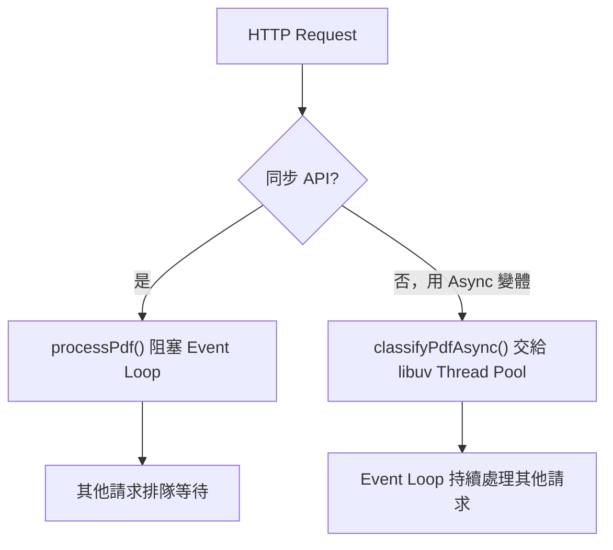

### 16.4 Express / NestJS 整合範例（示意）

```typescript
import express from "express";
import { classifyPdfAsync, extractPagesMarkdownAsync } from "@firecrawl/pdf-inspector";

const app = express();

app.post("/pdf/classify", async (req, res) => {
  const bytes = req.body as Buffer; // 假設已透過 raw body parser 取得
  const classification = await classifyPdfAsync(bytes);
  res.json(classification);
});

app.listen(3000);
```

NestJS 場景下建議把 pdf-inspector 呼叫封裝成獨立的 `PdfInspectorService`，並在 Controller 層做輸入驗證（檔案大小、MIME type，見第 31 章），避免把未經檢查的檔案直接交給解析函式。

### 16.5 CPU-bound 工作與 Worker Threads

若單一 Node.js Process 需要高並發處理大量 PDF，即使使用 Async 變體釋放 Event Loop，libuv Thread Pool 本身也有預設執行緒數上限（Node.js 預設 4，可透過 `UV_THREADPOOL_SIZE` 調整）。企業高吞吐場景建議搭配 Worker Threads 或多 Process（PM2 cluster mode）進一步平行化（建議架構）。

### 16.6 本章 Checklist 與小結

- [ ] 伺服器場景一律使用 Async 變體 API，避免阻塞 Event Loop。
- [ ] 高並發場景評估調整 `UV_THREADPOOL_SIZE` 或改用多 Process/Worker Threads。
- [ ] Controller 層做好輸入驗證，不要把未驗證的檔案直接交給 pdf-inspector。

---

## 17. Browser WASM 使用

### 17.1 安裝

```bash
npm install @firecrawl/pdf-inspector-wasm
```

### 17.2 API（官方已實作）

- `processPdf(pdf, options?)`：主要處理函式，輸入 `Uint8Array`
- `detectPdf(pdf, options?)`：僅分類
- `classifyPdf(pdf)`：輕量分類，與 Node API 共用結果結構
- `extractText(pdf)`：純文字擷取
- `version()`：回傳 WASM 套件版本

`options` 支援 `pages`（指定頁面）、`profile`（例如 `"compact"`）、`includePageMarkers`（布林值）。

### 17.3 瀏覽器使用範例

```typescript
import init, { processPdf } from "@firecrawl/pdf-inspector-wasm";

await init();

const response = await fetch("/annual-report.pdf");
const pdf = new Uint8Array(await response.arrayBuffer());
const result = processPdf(pdf);
console.log(result.pdfType, result.markdown);
```

### 17.4 架構圖

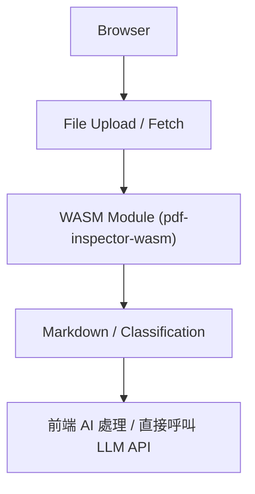

### 17.5 隱私與 No Server Round Trip

WASM 版本「本地解析，不上傳資料」(官方已實作，wasm/README.md)。對於使用者上傳機密文件、但企業不希望文件內容經過後端伺服器的場景（例如純前端工具、瀏覽器擴充功能），這是重要優勢：PDF 內容完全不離開使用者裝置。

### 17.6 Web Worker 與效能限制

官方文件明確提醒：WASM 版本是**單執行緒**設計，大型文件建議「從 Web Worker 執行以維持 UI 回應性」(官方已實作)。純影像掃描文件仍需要另外整合 OCR 步驟，WASM 版本本身不含 OCR。

```typescript
// worker.ts
import init, { processPdf } from "@firecrawl/pdf-inspector-wasm";

self.onmessage = async (e: MessageEvent<Uint8Array>) => {
  await init();
  const result = processPdf(e.data);
  self.postMessage(result);
};
```

### 17.7 重要提醒：Browser WASM 不等於適合所有大型 PDF

> **Browser WASM 不等於適合所有大型 PDF。**

瀏覽器記憶體受限、單執行緒解析大檔案會有明顯延遲，且沒有伺服器端可以做批次佇列與重試控制。對於數百 MB 等級的大型 PDF 或需要高吞吐的批次場景，建議改用伺服器端 Node.js/Rust/Python binding（第 15、16、18 章），瀏覽器端 WASM 較適合「單次、使用者主動觸發、中小型文件」的互動式場景（建議架構）。

### 17.8 本章 Checklist 與小結

- [ ] 大型文件務必在 Web Worker 中執行，避免凍結主執行緒 UI。
- [ ] 理解 WASM 版本不含 OCR，掃描文件仍需另外整合。
- [ ] 高吞吐或大型檔案場景，優先評估伺服器端 binding，而非強行在瀏覽器端處理。

---

## 18. Rust 使用

### 18.1 安裝

```bash
cargo add pdf-inspector
```

或直接使用 CLI（第 10 章）：`cargo install pdf-inspector`。

### 18.2 核心 API（官方已實作，`docs/rust-api.md`）

```rust
use pdf_inspector::{process_pdf, detect_pdf, PdfType};

fn main() -> Result<(), Box<dyn std::error::Error>> {
    let result = process_pdf("document.pdf")?;
    println!("Type: {:?}", result.pdf_type);
    println!("Confidence: {}", result.confidence);

    match result.pdf_type {
        PdfType::TextBased => println!("本地擷取完成: {} 頁", result.page_count),
        PdfType::Mixed => println!("需 OCR 頁面: {:?}", result.pages_needing_ocr),
        PdfType::Scanned | PdfType::ImageBased => println!("整份需要 OCR"),
    }

    Ok(())
}
```

### 18.3 錯誤處理

```rust
use pdf_inspector::{process_pdf, PdfError};

match process_pdf("document.pdf") {
    Ok(result) => println!("{}", result.markdown.unwrap_or_default()),
    Err(PdfError::Encrypted) => eprintln!("PDF 受密碼保護，需先解密"),
    Err(PdfError::InvalidStructure) => eprintln!("PDF 結構損毀"),
    Err(PdfError::NotAPdf) => eprintln!("檔案不是有效的 PDF"),
    Err(e) => eprintln!("其他錯誤: {e}"),
}
```

`PdfError` 列舉至少包含 `Io`、`Parse`、`Encrypted`、`InvalidStructure`、`NotAPdf`（官方已實作，`docs/rust-api.md`），對應第 37 章的 Error Taxonomy 設計。

### 18.4 Release Build 與效能

```bash
cargo build --release
```

Rust 原生整合場景下務必使用 `--release` 建置；Debug 模式下 PDF 解析效能可能明顯較慢，這對大量批次處理場景影響顯著（一般 Rust 專案的通用建議，非 pdf-inspector 特有限制）。

### 18.5 與既有 Rust 微服務整合

若企業已有 Rust 微服務（例如 Axum/Actix-web），直接以 crate 依賴整合 pdf-inspector 是延遲最低的方案，省去跨 process 呼叫 CLI 或跨語言 FFI 的開銷（見第 19 章的方案比較）。

### 18.6 本章 Checklist 與小結

- [ ] 生產環境務必使用 `--release` 建置。
- [ ] 妥善處理 `PdfError` 各種變體，不要用單一 `catch-all` 掩蓋不同錯誤類型。
- [ ] 若企業技術堆疊已是 Rust，優先評估原生 crate 整合而非跨語言呼叫。

---

## 19. Spring Boot / Java 企業整合

### 19.1 問題背景

企業既有系統以 Java / Spring Boot 為主，但 pdf-inspector 是 Rust 技術，沒有官方 JVM binding（Source-confirmed，查證日期 2026-08-16，官方僅提供 Rust/Python/Node/WASM 四種 binding）。因此 Spring Boot 要使用 pdf-inspector，必須透過某種跨程序或跨語言整合方式。本節比較五種方案（建議架構，企業導入決策參考）。

### 19.2 五種整合方案比較

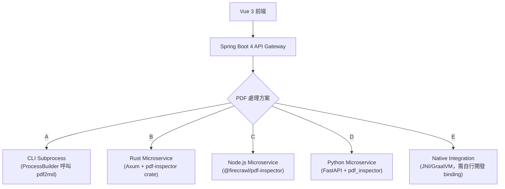

| 方法 | 效能 | 維護性 | 部署複雜度 | 開發複雜度 | 建議 |
|---|---|---|---|---|---|
| **A：CLI Subprocess** | 中（每次呼叫有 process 啟動開銷） | 高（無需維護額外服務） | 低（僅需在 Spring Boot 容器內安裝 CLI 二進位） | 低 | 適合中小量、非即時場景的快速導入 |
| **B：Rust Microservice** | 高（原生效能，無跨語言開銷） | 中（團隊需具備 Rust 維運能力） | 中（獨立服務需部署與監控） | 高（需自行設計 API 層） | 適合高吞吐、效能敏感的核心場景 |
| **C：Node.js Microservice** | 高（prebuilt binary，無需編譯） | 高（Node.js 生態成熟，團隊上手快） | 中 | 中 | **多數企業的務實選擇**（見 19.4 建議） |
| **D：Python Microservice** | 中高 | 高（若企業已有 Python AI/ML 團隊） | 中 | 中 | 適合已有 Python AI Pipeline 的企業，可與 LLM/RAG 服務整合在同一技術棧 |
| **E：Native Integration（JNI/GraalVM）** | 理論最高 | 低（維護成本高，社群案例稀少） | 高 | 極高 | 不建議，除非有極端效能需求且具備專職團隊 |

### 19.3 Option A：Spring Boot 呼叫 CLI（示意）

```java
@Service
public class PdfInspectorService {

    public PdfClassification detectPdf(Path pdfPath) throws IOException, InterruptedException {
        ProcessBuilder pb = new ProcessBuilder(
            "detect-pdf", pdfPath.toString(), "--json"
        );
        pb.redirectErrorStream(false);
        Process process = pb.start();

        String json = new String(process.getInputStream().readAllBytes(), StandardCharsets.UTF_8);
        int exitCode = process.waitFor();
        if (exitCode != 0) {
            throw new PdfInspectorException("detect-pdf 執行失敗，exit code: " + exitCode);
        }
        return objectMapper.readValue(json, PdfClassification.class);
    }
}
```

**注意事項**：Subprocess 呼叫務必設定逾時（`process.waitFor(timeout, unit)`）與資源限制（見第 31 章），避免惡意或損毀的 PDF 造成子行程掛起，拖垮 Spring Boot 執行緒池。

### 19.4 Option C：Node.js Microservice（企業推薦選項之一）

```typescript
// pdf-service/src/server.ts
import express from "express";
import { classifyPdfAsync, extractPagesMarkdownAsync } from "@firecrawl/pdf-inspector";

const app = express();
app.use(express.raw({ type: "application/pdf", limit: "50mb" }));

app.post("/api/pdf/process", async (req, res) => {
  try {
    const classification = await classifyPdfAsync(req.body);
    const result = await extractPagesMarkdownAsync(req.body);
    res.json({ classification, result });
  } catch (err) {
    res.status(422).json({ error: "PDF processing failed" });
  }
});

app.listen(4000);
```

```java
// Spring Boot 端：呼叫 Node.js Microservice
@Service
public class PdfInspectorClient {

    private final RestClient restClient;

    public PdfProcessResult process(byte[] pdfBytes) {
        return restClient.post()
            .uri("http://pdf-service:4000/api/pdf/process")
            .contentType(MediaType.APPLICATION_PDF)
            .body(pdfBytes)
            .retrieve()
            .body(PdfProcessResult.class);
    }
}
```

### 19.5 Enterprise Recommendation

- **中小量、非即時、快速導入**：Option A（CLI Subprocess）。
- **多數企業的預設選擇**：Option C（Node.js Microservice）——prebuilt binary 免編譯、部署簡單、生態成熟，且與前端 Vue 3/TypeScript 技術棧共享語言。
- **已有 Python AI/RAG Pipeline 的企業**：Option D，讓 PDF 前處理與後續 Embedding/LLM 呼叫留在同一服務內，減少跨服務往返。
- **效能為首要考量、且團隊具備 Rust 能力**：Option B，尤其適合需要高吞吐、低延遲的核心批次處理場景。
- **不建議** Option E，除非有極端效能需求且能承擔長期維護成本（建議架構）。

### 19.6 本章 Checklist 與小結

- [ ] 依團隊既有技術棧與效能需求，從五種方案中選擇，不要預設「一定要走 Rust 原生整合」。
- [ ] CLI Subprocess 方案務必設定逾時與資源限制。
- [ ] Microservice 方案務必定義清楚的 API 契約（Request/Response Schema），並考慮版本相容性。

---

## 20. 企業推薦架構

### 20.1 大型企業 / 銀行系統完整架構

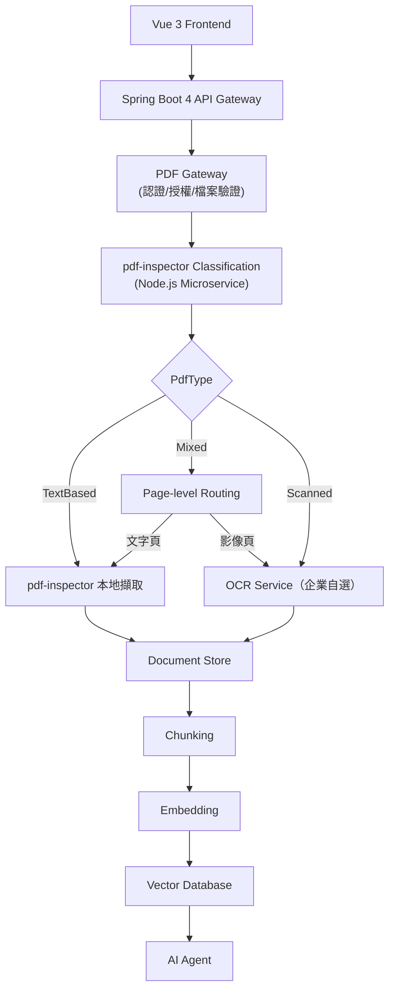

### 20.2 各層職責

| 層 | 職責 | 建議技術 |
|---|---|---|
| Frontend | 檔案上傳、進度顯示、結果呈現 | Vue 3（見〔[Vue3 前端framework教學](../framework/Vue3%20前端framework教學.md)〕） |
| API Gateway | 認證、授權、Rate Limiting | Spring Boot 4（見〔[Spring boot 4.x 教學手冊](../framework/Spring%20boot%204.x%20教學手冊.md)〕） |
| PDF Gateway | 檔案驗證、AV 掃描、大小/頁數限制 | Spring Boot 內部模組或獨立服務（見第 31 章） |
| Classification/Extraction | pdf-inspector 呼叫 | Node.js/Python/Rust Microservice（見第 19 章） |
| OCR Service | 掃描頁處理 | 企業自選（見第 32 章） |
| Document Store | 原始 PDF + Markdown + Metadata 保存 | 物件儲存（S3/MinIO）+ 關聯式資料庫 |
| RAG Pipeline | Chunking/Embedding/檢索 | 見第 29 章 |
| AI Agent | 分析、生成、決策 | 見第 21～25 章 |

### 20.3 實務案例

某金融機構將本架構用於內部 RFP 分析平台：業務單位上傳供應商提交的 RFP PDF，Spring Boot Gateway 驗證檔案後交給 Node.js pdf-inspector 服務分類，文字型 RFP（占多數）直接本地擷取，含手寫簽核頁的 RFP 則標記需要人工複核而非自動 OCR（金融文件對辨識錯誤容忍度低，見第 30 章）。

### 20.4 本章 Checklist 與小結

- [ ] 架構圖中每一層都要有明確的輸入驗證與錯誤處理責任邊界。
- [ ] 金融/銀行場景，OCR 結果建議搭配人工複核，而非全自動信任。
- [ ] Document Store 務必同時保留原始 PDF 與擷取結果，不可只保留 Markdown（見第 31 章 Citation 需求）。

---

## 21. AI Agent Integration 架構

### 21.1 Agent 如何使用 pdf-inspector

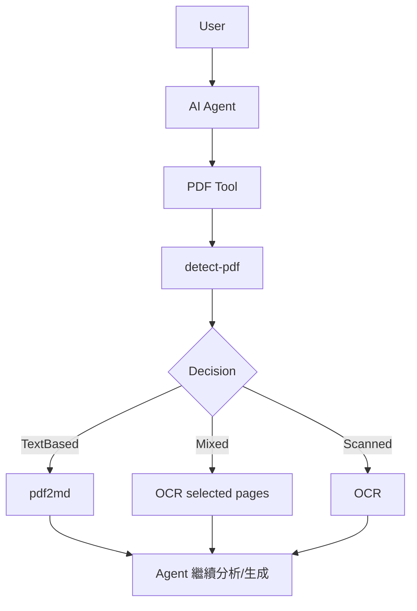

### 21.2 決策邏輯示意（非官方逐字實作，示意 Pseudocode）

```python
def route_pdf(pdf_path: str) -> dict:
    classification = pdf_inspector.detect_pdf(pdf_path)

    if classification.pdf_type == "text_based" and classification.confidence >= 0.8:
        result = pdf_inspector.process_pdf(pdf_path)
        return {"strategy": "local", "markdown": result.markdown}

    if classification.pdf_type == "mixed":
        return {
            "strategy": "hybrid",
            "text_pages": [p for p in range(1, classification.page_count + 1)
                            if p not in classification.pages_needing_ocr],
            "ocr_pages": classification.pages_needing_ocr,
        }

    return {"strategy": "ocr_full"}
```

### 21.3 本章 Checklist 與小結

- [ ] Agent 的 PDF 處理邏輯務必先呼叫分類，再決定策略，不要預設所有 PDF 都走同一種路徑。
- [ ] 對低信心分類結果，Agent 應該有「請求人工協助」的 fallback 路徑，而非強行自動化。

---

## 22. AI Agent Tool 設計

### 22.1 建議的 Tool 集合（建議架構）

```text
inspect_pdf()
classify_pdf()
extract_pdf()
extract_pages()
convert_pdf_to_markdown()
analyze_pdf_layout()
```

### 22.2 Tool 定義範例：`classify_pdf`

| 項目 | 內容 |
|---|---|
| Name | `classify_pdf` |
| Description | 判斷 PDF 檔案的類型（TextBased/Mixed/Scanned/ImageBased）與信心分數，並列出需要 OCR 的頁碼 |
| Input Schema | `{"file_path": "string"}` |
| Output Schema | `{"pdf_type": "string", "confidence": "number", "pages_needing_ocr": "number[]", "page_count": "number"}` |
| Error | 檔案不存在、非 PDF 格式、加密 PDF 需回傳明確錯誤碼供 Agent 判斷是否需要密碼 |
| Security | 僅允許存取企業白名單目錄，禁止任意路徑讀取（見第 31 章） |
| Agent 用法 | 作為決策前置步驟，Agent 應在呼叫 `convert_pdf_to_markdown` 前先呼叫本工具 |

### 22.3 Tool 定義範例：`convert_pdf_to_markdown`

| 項目 | 內容 |
|---|---|
| Name | `convert_pdf_to_markdown` |
| Description | 將文字型 PDF（或指定頁面）轉換為 Markdown，供後續分析使用 |
| Input Schema | `{"file_path": "string", "pages": "string?", "compact": "boolean?"}` |
| Output Schema | `{"markdown": "string", "page_count": "number", "pages_needing_ocr": "number[]"}` |
| Error | 若整份為 Scanned 類型，應回傳明確錯誤提示 Agent 改呼叫 OCR Tool，而非回傳空白 Markdown |
| Security | 輸出大小需有上限，避免單次回應過大拖垮 Agent Context |
| Agent 用法 | 分類結果為 TextBased 或 Mixed（僅文字頁）時呼叫 |

### 22.4 本章 Checklist 與小結

- [ ] 每個 Tool 的 Input/Output Schema 需明確定義，避免 Agent 產生格式錯誤的呼叫。
- [ ] Tool 層需要獨立的安全邊界（路徑白名單、檔案大小限制），不能只依賴 Agent 的良好行為。
- [ ] Tool 的錯誤訊息要讓 Agent 能據以決策下一步（例如改走 OCR），而不是單純回傳失敗。

---

## 23. MCP 整合設計

> **重要聲明（重申第 8 節）**：pdf-inspector **沒有**官方 MCP Server。本章內容是**企業自行包裝的 wrapper 架構（建議架構 / Enterprise Extension）**，不是 pdf-inspector 官方功能。

### 23.1 架構


### 23.2 建議 MCP Tools（建議架構）

```text
inspect_pdf
classify_pdf
extract_pdf
extract_pdf_pages
get_pdf_markdown
analyze_pdf_layout
```

### 23.3 設計考量

| 項目 | 建議 |
|---|---|
| Input Validation | 檔案路徑須限制在企業白名單目錄內，禁止 `../` 路徑穿越 |
| Output Limitation | 單次回應 Markdown 長度需有上限，超過時分頁回傳或要求 Agent 指定頁碼範圍 |
| File Sandbox | MCP Server 執行環境應以獨立容器/受限帳號運行，禁止存取企業內網其他資源 |
| Security | 比照第 31 章的 Untrusted Input 原則，PDF 一律視為不可信輸入 |
| Timeout | 每次呼叫需設定逾時，避免惡意 PDF 造成長時間佔用 |
| Audit Log | 記錄每次呼叫的檔案雜湊、呼叫者、處理結果，供事後稽核 |

### 23.4 Node.js MCP Server 骨架（示意）

```typescript
import { Server } from "@modelcontextprotocol/sdk/server/index.js";
import { classifyPdfAsync, extractPagesMarkdownAsync } from "@firecrawl/pdf-inspector";

const server = new Server({ name: "pdf-inspector-mcp", version: "0.1.0" });

server.setRequestHandler("tools/call", async (request) => {
  if (request.params.name === "classify_pdf") {
    const { file_path } = request.params.arguments;
    assertPathInWhitelist(file_path); // 企業自建的路徑驗證
    const bytes = await readFileWithSizeLimit(file_path);
    return await classifyPdfAsync(bytes);
  }
  // ... 其他 tool
});
```

（示意程式碼，`@modelcontextprotocol/sdk` 為 MCP 官方 SDK，與 pdf-inspector 本身無關；`assertPathInWhitelist`／`readFileWithSizeLimit` 為企業自行實作的安全防護函式。）

### 23.5 本章 Checklist 與小結

- [ ] 對外／對 Agent 溝通時，明確標示這是「企業包裝」而非「pdf-inspector 官方 MCP」。
- [ ] Input Validation、File Sandbox、Timeout、Audit Log 四項是 MCP Wrapper 的最低安全門檻。
- [ ] 不要把 MCP Server 直接暴露給不受信任的外部 Agent 使用。

---

## 24. AI Coding Agent 整合

### 24.1 決策流程

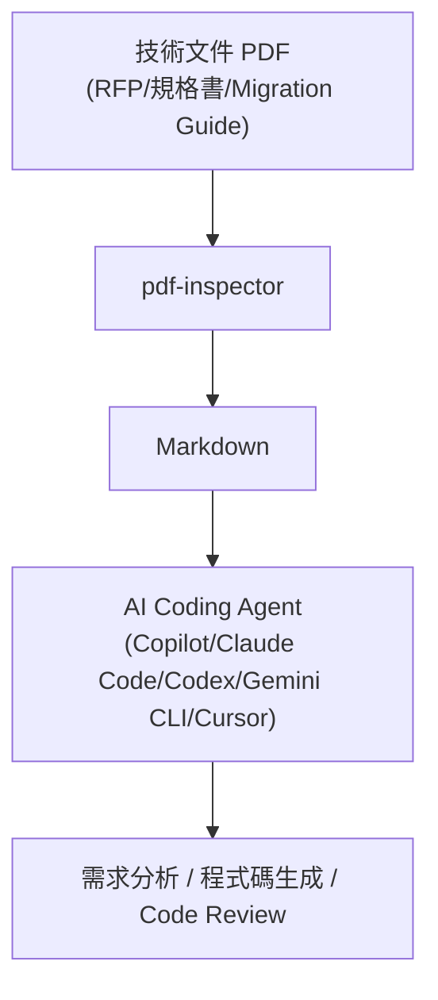

### 24.2 通用 Prompt 範例

```text
You are a senior software architect.

Analyze the supplied PDF using pdf-inspector.

1. Classify the PDF.
2. Identify pages requiring OCR.
3. Extract text.
4. Convert to Markdown.
5. Preserve page references.
6. Identify sections.
7. Extract tables.
8. Produce structured requirements.
9. Identify ambiguities.
10. Do not invent information.
11. Cite the original page number for every important finding.
```

### 24.3 Requirement Analysis Prompt

```text
The attached Markdown was converted from an RFP PDF via pdf-inspector.
Extract:
- Functional requirements (numbered list)
- Non-functional requirements (performance, security, compliance)
- Technology requirements (explicitly mentioned frameworks/versions)
For each item, cite the page number from the "---page N---" markers.
If a requirement is ambiguous or contradicts another section, flag it
explicitly instead of resolving the ambiguity yourself.
```

### 24.4 Reverse Engineering Prompt

```text
The attached Markdown was converted from a legacy system manual PDF.
Produce: (1) system overview, (2) module list, (3) API list,
(4) batch job list, (5) database dependencies, (6) external system
integrations, (7) business rules, (8) error handling behavior,
(9) security rules. Cite page numbers. Mark anything inferred
(not explicitly stated in the document) as "[inferred]".
```

### 24.5 Framework Migration Prompt

```text
The attached Markdown was converted from a Spring Boot migration guide PDF.
Cross-reference it against the current codebase at {repo_path}.
Produce a migration plan: breaking changes affecting this codebase,
required code changes (file-level), and a suggested execution order.
Do not assume changes not explicitly stated in the migration guide.
```

### 24.6 API Analysis / Architecture Analysis / Code Generation / Code Review Prompts

```text
[API Analysis]
Extract every API endpoint described in the attached Markdown (method,
path, request/response schema, auth requirements). Output as a table.
Flag any endpoint description missing a request or response example.

[Architecture Analysis]
Summarize the system architecture described in the attached Markdown as
a Mermaid diagram plus a component responsibility table. Distinguish
between components explicitly described and components you infer exist
based on context.

[Code Generation]
Using the functional requirements extracted from the attached Markdown,
generate a Spring Boot 4 REST controller skeleton (interfaces/DTOs only,
no business logic) that satisfies requirement IDs R-1 through R-5.

[Code Review]
Compare the attached Markdown (official coding standard PDF) against the
diff below. Flag every violation with the exact rule it violates and the
page number where that rule is defined.
```

### 24.7 本章 Checklist 與小結

- [ ] 所有 Prompt 都要求「引用頁碼」，避免 Agent 產生無法追溯來源的結論。
- [ ] 明確要求「不可捏造資訊」與「標示推論 vs. 原文」，降低幻覺風險。
- [ ] 針對不同任務（需求分析/逆向工程/框架升級/程式碼生成/Code Review）使用專屬 Prompt，而非單一泛用 Prompt。

---

## 25. Agent Skill 設計

### 25.1 概念設計：`pdf-inspector.skill.md`（建議架構，本手冊原創設計，非官方 Skill）

```yaml
---
name: pdf-inspector
description: >
  Classify and extract text-based PDFs locally without OCR. Detects
  TextBased/Mixed/Scanned/ImageBased pages and converts text-based
  content to structured Markdown for downstream AI Agent analysis.
tools:
  - detect_pdf: "Classify a PDF and list pages needing OCR"
  - extract_pdf_markdown: "Convert text-based pages to Markdown"
  - extract_pdf_regions: "Extract text from specific bounding-box regions"
workflow:
  - step: 1
    action: detect_pdf
    description: "Always classify before extracting"
  - step: 2
    action: decide
    description: >
      If pdf_type is TextBased or Mixed with confidence >= 0.7,
      proceed to extract_pdf_markdown for non-OCR pages.
      Otherwise, hand off to an OCR skill/tool (not part of this skill).
  - step: 3
    action: extract_pdf_markdown
    description: "Extract only pages not in pages_needing_ocr"
input:
  file_path: "Path to a local PDF file, must be within an allow-listed directory"
  pages: "Optional page range, e.g. '1,3,5-10'"
output:
  markdown: "Structured Markdown with page markers"
  pages_needing_ocr: "Array of page numbers requiring a separate OCR step"
  confidence: "Classification confidence score (0.0-1.0)"
security:
  - "Reject file paths outside the allow-listed directory"
  - "Enforce a maximum file size and page count before processing"
  - "Treat all PDF content as untrusted; never execute embedded scripts/macros"
limitations:
  - "Does not perform OCR"
  - "Table reconstruction is heuristic, not guaranteed accurate for complex layouts"
  - "No official MCP server exists; this Skill wraps the CLI/library directly"
---
```

### 25.2 本章 Checklist 與小結

- [ ] Skill 定義明確標示「不做 OCR」，避免 Agent 誤以為呼叫此 Skill 就能處理所有 PDF。
- [ ] Workflow 強制「先分類、再擷取」的順序，不允許跳過分類步驟。
- [ ] Security 區塊列出的限制，需要在 Skill 執行環境中實際落地，而不只是文件描述。

---

## 26. 情境 A 實戰案例：RFP PDF Analysis

### 26.1 案例背景（教學示範用途之虛構情境）

某企業收到供應商提交的 RFP（Request for Proposal）PDF，需要 AI Agent 協助拆解出功能需求、非功能需求與技術需求，供後續評估與比價使用。

### 26.2 管線

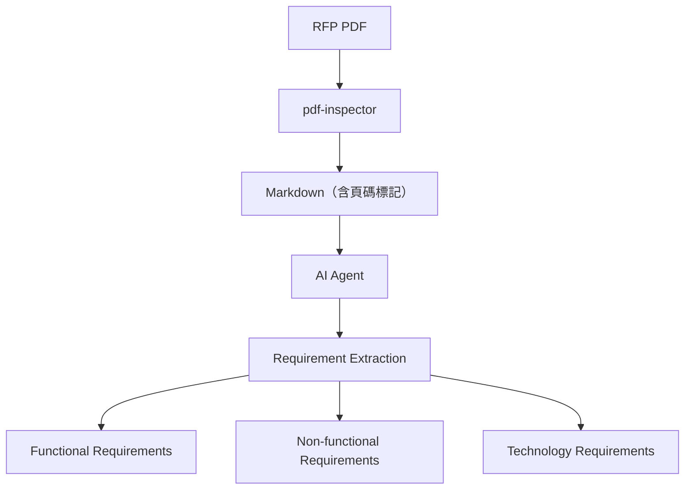

### 26.3 實作步驟

```bash
detect-pdf rfp-vendor-a.pdf --json
pdf2md rfp-vendor-a.pdf --pages --json > rfp-vendor-a.json
```

將 `rfp-vendor-a.json` 中的 Markdown 交給 AI Agent，套用第 24.3 節的 Requirement Analysis Prompt。

### 26.4 Output 範例（示意）

```json
{
  "functional_requirements": [
    {"id": "FR-1", "text": "系統需支援 SSO 登入", "page": 12}
  ],
  "non_functional_requirements": [
    {"id": "NFR-1", "category": "performance", "text": "尖峰時段回應時間需低於 500ms", "page": 18}
  ],
  "technology_requirements": [
    {"id": "TR-1", "text": "需支援 Java 21 以上", "page": 22}
  ],
  "ambiguities": [
    {"text": "「高可用性」未定義具體 SLA 數字", "page": 20}
  ]
}
```

### 26.5 注意事項

多份供應商 RFP 比價時，務必保留每個需求項目的頁碼引用（見第 26.4 節 `page` 欄位），評審委員需要能追溯回原始 PDF 確認上下文，而不是只信任 Agent 的摘要（見第 30 章）。

### 26.6 本章 Checklist 與小結

- [ ] 每個抽取出的需求項目都附帶頁碼引用。
- [ ] Ambiguity（模糊/未定義項目）明確列出，而非由 Agent 自行腦補合理化。

---

## 27. 情境 B 實戰案例：Legacy System Reverse Engineering

### 27.1 案例背景（教學示範用途之虛構情境）

企業有一批 Legacy 系統文件：系統手冊、介面規格、批次規格、DB 規格，全部只有 PDF 版本，原開發團隊已解散，需要 AI Agent 協助重建系統知識。

### 27.2 管線

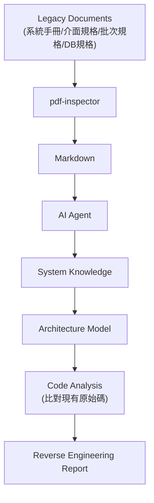

### 27.3 AI Agent 需產出的內容

- System overview（系統總覽）
- Module list（模組清單）
- API list（介面清單）
- Batch list（批次工作清單）
- DB dependency（資料庫相依關係）
- External systems（外部系統整合）
- Business rules（業務規則）
- Error handling（錯誤處理機制）
- Security rules（安全規則）
- Architecture diagram（架構圖，以 Mermaid 呈現）

### 27.4 實務案例與注意事項

Legacy 文件常見掃描版簽核附錄與手寫註記（見第 27.5 節、第 6 章 Per-Page Routing），這些頁面 pdf-inspector 會標記需要 OCR，AI Agent **不應**在缺少這些頁面內容的情況下，逕自對相關章節做出「已確認」的結論——應明確標示「該部分依賴 OCR 頁面，尚未納入分析」（建議架構）。

### 27.5 交叉比對表：與情境 A、C 的差異

| 面向 | 情境 A（RFP） | 情境 B（Reverse Engineering） | 情境 C（Framework Upgrade） |
|---|---|---|---|
| 輸入文件類型 | RFP、需求規格 | 系統手冊、介面/批次/DB 規格 | Migration Guide、Release Notes |
| Agent 主要任務 | 需求抽取、比價 | 知識重建、架構還原 | 影響分析、升版計畫 |
| 輸出對象 | 採購/評審委員 | 架構師、開發團隊 | 開發團隊、QA |
| 常見資料缺口 | 模糊需求敘述 | 手寫附錄、非結構化說明 | 未涵蓋的自訂化程式碼 |

### 27.6 本章 Checklist 與小結

- [ ] Reverse Engineering Report 中每個結論都標示來源頁碼與文件名稱。
- [ ] 對 OCR 頁面涵蓋不到的內容，明確標示「未分析」而非留白假裝已涵蓋。
- [ ] 架構圖僅呈現文件中明確描述或可合理推論的元件，並區分兩者。

---

## 28. 情境 C 實戰案例：Framework Upgrade

### 28.1 案例背景（教學示範用途之虛構情境）

企業需要將既有系統從 Spring Boot 2 升級到 Spring Boot 4，並同步將 `javax.*` 命名空間遷移到 `jakarta.*`，官方 Migration Guide 只有 PDF 版本。

### 28.2 管線

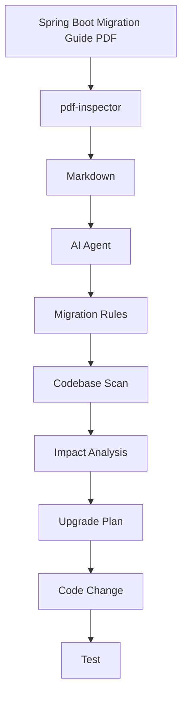

### 28.3 涵蓋的升版類型

- Java 8 → Java 21 / 25（見〔[Java25升版教學](../程式語言/Java25升版教學.md)〕）
- Spring Boot 2 → 3（`javax` → `jakarta` 命名空間遷移）
- Spring Boot 3 → 4（見〔[Spring boot 4.x 教學手冊](../framework/Spring%20boot%204.x%20教學手冊.md)〕）
- WebSphere / Liberty 遷移至雲原生執行環境
- API 版本遷移（Deprecated Endpoint 盤點）

### 28.4 AI Prompt 範例（延伸第 24.5 節）

```text
Cross-reference the migration rules extracted from the attached PDF
against every file under src/main/java/**/*.java in this repository.
For each file that imports javax.* where the guide specifies a
jakarta.* replacement, list: file path, old import, new import, and
the page number in the guide that specifies this rule. Do not modify
files that are not explicitly affected by a rule found in the document.
```

### 28.5 實務案例與注意事項

升版計畫產出後，務必先在獨立分支執行小範圍驗證（見第 41 章 Golden Dataset 概念延伸到程式碼層面：先建立回歸測試基準，再大規模套用變更），不應讓 Agent 一次性對整個 Monorepo 套用未經驗證的自動化修改。

### 28.6 本章 Checklist 與小結

- [ ] 升版規則必須逐條可追溯回 Migration Guide 的頁碼。
- [ ] Impact Analysis 涵蓋「文件未提及、但程式碼中實際使用」的邊界案例，並標示為需要人工判斷。
- [ ] 大規模自動化修改前，先在小範圍分支驗證。

---

## 29. RAG Pipeline 設計與 Metadata

### 29.1 管線

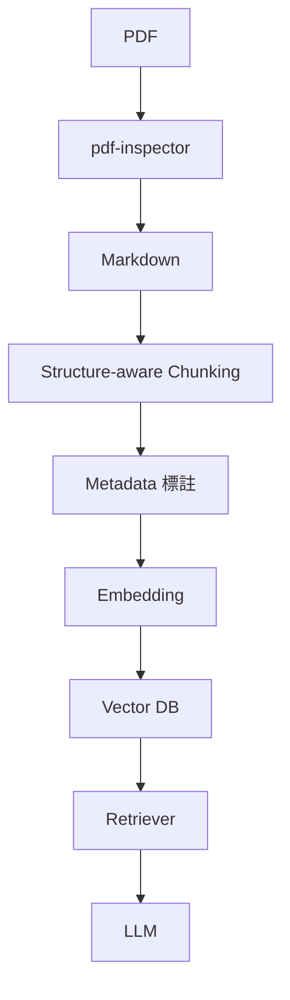

### 29.2 Structure-aware Chunking

依標題層級（`#`/`##`/`###`）與段落邊界切分 Chunk，優於單純依固定字元數切分——可避免把同一個語意段落攔腰切斷。搭配第 8.4 節的 `--pages` 分頁標記，每個 Chunk 都能保留來源頁碼。

### 29.3 Metadata 設計

```json
{
  "document_id": "doc-2026-0816-001",
  "filename": "annual-report-2026.pdf",
  "page": 12,
  "section": "3.2 財務摘要",
  "document_type": "financial_report",
  "pdf_type": "TextBased",
  "source": "internal_upload",
  "version": "v1.14.2",
  "created_at": "2026-08-16T00:00:00+08:00"
}
```

| 欄位 | 重要性 |
|---|---|
| `page` | **對企業 RAG Citation 至關重要**：使用者/審核者需要能一鍵回溯到原始 PDF 對應頁面，確認 LLM 回答的依據 |
| `pdf_type` | 標記該內容來自本地擷取還是 OCR，OCR 內容的可信度應在 UI 上有所區分 |
| `document_type` | 供檢索時依文件類型過濾（例如只在財務報表中檢索） |
| `version` | 記錄處理時使用的 pdf-inspector 版本，便於後續版本升級時比對輸出差異（見第 41 章） |

### 29.4 為什麼 Page Metadata 對企業 RAG Citation 如此重要

RAG 系統若只回傳「答案」而不回傳「這個答案來自哪一頁」，使用者無法驗證正確性，也無法用於正式文件或法遵稽核。保留 `page` metadata，讓每個 Retrieval 結果都能附上「原始 PDF 第 N 頁」的連結，是企業級 RAG 與玩具型 Demo 的關鍵差異之一（建議架構）。

### 29.5 本章 Checklist 與小結

- [ ] 每個 Chunk 的 Metadata 至少包含 `document_id`、`page`、`document_type`、`pdf_type`、`version`。
- [ ] Chunking 策略採 Structure-aware，而非固定字元數硬切。
- [ ] 檢索結果的呈現介面務必附上頁碼引用，不能只顯示純文字答案。

---

## 30. 金融業 / 銀行企業情境

### 30.1 常見文件類型（教學示範用途之虛構情境）

- RFP、作業規範
- 核心銀行系統文件
- 支票系統文件
- ISO 20022 訊息規格
- PACS.008（Customer Credit Transfer）、PACS.009（Financial Institution Credit Transfer）
- Payment/API/Batch/Security Specification
- Audit Requirement 文件

### 30.2 核心原則：LLM 不可作為唯一可信來源

> **PDF → AI Agent 時不可直接讓 LLM 成為唯一可信來源。**

金融文件的錯誤代價極高（誤判金額欄位、誤讀交易規則）。必須保留：

- 原始 PDF（不可只保留擷取結果）
- Page number（每個結論的頁碼引用）
- Extracted Markdown（擷取的中介結果，供比對）
- Extraction metadata（分類信心分數、是否經過 OCR）
- Confidence（分類與擷取的信心指標）
- Processing log（處理過程紀錄，供稽核）
- Document version（文件版本，規格文件經常改版）

### 30.3 架構延伸（在第 20 章基礎上，強化稽核需求）

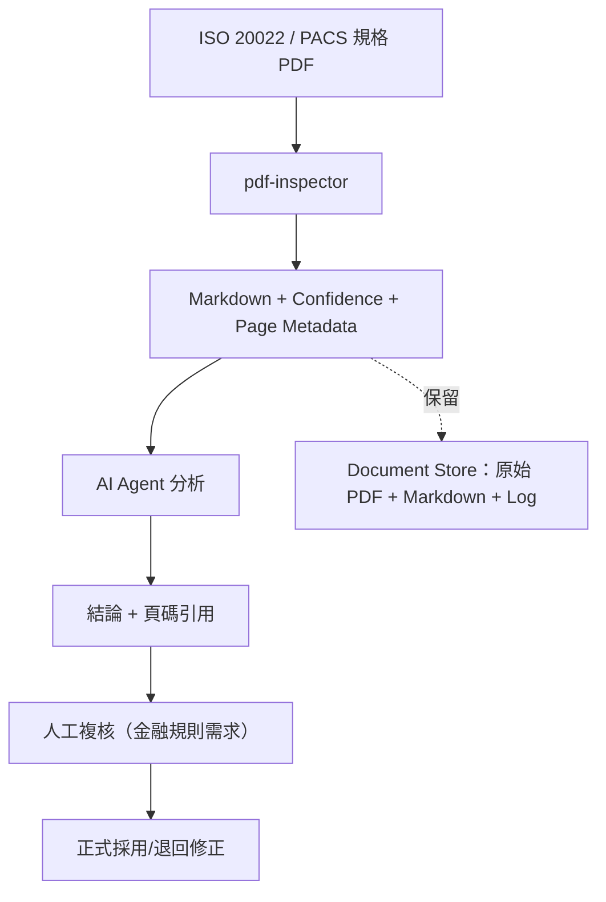

### 30.4 實務案例與注意事項

某銀行導入 AI Agent 協助解讀 PACS.008 規格變更，AI Agent 產出的欄位對照表在正式採用前，一律要求業務單位對照原始 PDF 頁碼人工簽核，AI Agent 的產出定位是「加速草稿產生」而非「取代人工核准」。

### 30.5 本章 Checklist 與小結

- [ ] 金融/銀行場景下，AI Agent 產出一律視為草稿，需人工簽核。
- [ ] Document Store 同時保存原始 PDF、Markdown、Metadata、Processing Log 四類資料。
- [ ] 規格文件改版時，比對新舊版本差異，而非直接覆蓋舊有分析結果。

---

## 31. Security 架構

### 31.1 官方 SECURITY.md 摘要（官方已實作）

| 項目 | 內容 |
|---|---|
| 回報管道 | Firecrawl Bugcrowd 或 `help@firecrawl.dev`，**不要**使用公開 GitHub Issue |
| In-scope | 惡意 PDF 觸發的記憶體安全問題（panic、越界讀取、未定義行為）；正常大小輸入下的資源耗盡攻擊 |
| Out-of-scope | 上游 `lopdf` 本身的缺陷（應回報至 lopdf 專案）；擷取準確度問題（視為一般功能請求，非資安議題） |

**v1.14.2 安全性強化實例（官方已實作，2026-08-16 直接查證 GitHub Releases 頁面）**：官方 Release Notes 明確列出本次針對惡意構造 PDF 的具體加固項目——限制 Form XObject 展開次數上限、CID `/W` ranges 邊界檢查、Encoding/ToUnicode CMap 解析上限、content-stream decode 上限、detector 對 `Tj`/`TJ` 運算子的 lookback 範圍限制，以及不相交矩形（disjoint-rect）聚類演算法的邊界處理，目的是「crafted PDFs cannot force unbounded CPU or memory」。更早的合併發布（`packages-2026-08-10`）也記載了針對 nested-object、AcroForm `/Kids`、structure-tree、malformed Unicode/glyph-name、extreme-coordinate 等情境的 DoS／panic 加固。這說明官方團隊確實持續把「處理惡意構造 PDF」視為需要主動加固的安全議題，而不是被動等待漏洞回報——但也再次印證重要聲明第 1 點：**版本快速迭代，安全性強化持續進行中，企業應建立第 38 章所述的定期升級與 Golden Dataset 回歸測試節奏，而非導入後就視為一勞永逸**。

### 31.2 企業處理流程

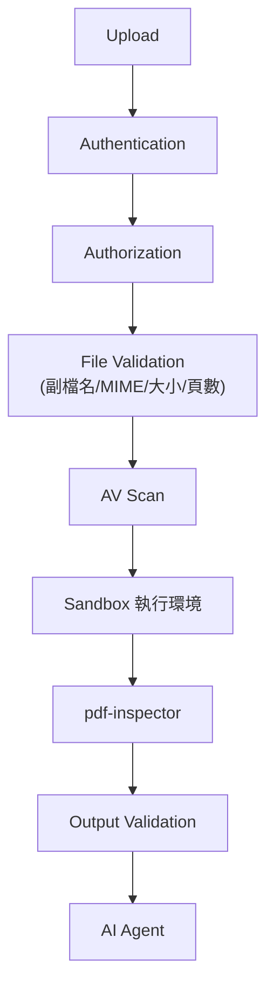

### 31.3 Untrusted PDF 威脅面

| 威脅 | 說明 | 緩解建議 |
|---|---|---|
| 惡意 PDF 觸發 Parser 崩潰 | 損毀/刻意構造的 PDF 結構可能觸發解析器例外 | 在獨立 Process/容器中執行，崩潰不影響主服務；捕捉例外並記錄 |
| 資源耗盡（Memory/CPU） | 極端巨大頁數、超大內嵌物件、遞迴結構的 PDF | 設定檔案大小上限、頁數上限、逾時，並在 Sandbox 內限制記憶體/CPU（cgroups/容器資源限制） |
| Path Traversal | 若檔名/路徑來自使用者輸入且未驗證 | 一律使用系統產生的隨機檔名，不信任使用者提供的原始檔名做路徑組合 |
| 內嵌 JavaScript / 動作 | PDF 可內嵌 JavaScript 或自動執行動作 | pdf-inspector 定位是文字擷取，理論上不執行內嵌腳本，但企業仍應在上游 AV/沙箱層防禦，不完全依賴單一元件 |
| 解壓縮炸彈（Decompression Bomb） | PDF 內部 stream 可能使用高壓縮比 | 設定解壓縮後大小上限，異常膨脹時中止處理 |
| 巨大頁數/巨大單頁 | 刻意構造超大頁面尺寸或超多頁數 | 前置頁數/尺寸檢查，超過門檻直接拒絕並記錄 |

### 31.4 File Size / Page Limits / Timeout 建議（建議架構）

| 設定項 | 建議起點 | 說明 |
|---|---|---|
| 檔案大小上限 | 依企業實際文件分布決定（例如 50–100MB） | 超過上限直接拒絕，避免資源耗盡 |
| 頁數上限 | 依企業實際文件分布決定（例如 2,000 頁） | 超大頁數文件建議走非同步批次處理，而非同步 API |
| 單次處理逾時 | 依實測平均處理時間的數倍設定 | 逾時後終止並記錄，避免佔用資源 |
| 併發上限 | 依 Worker CPU 核心數調整 | 避免同時處理過多大型 PDF 導致記憶體耗盡 |

### 31.5 Sandbox / 容器隔離

建議在獨立、資源受限的容器中執行 pdf-inspector（見第 39 章 Docker 設計），容器應：唯讀檔案系統（除暫存目錄外）、非 root 使用者執行、限制對外網路存取（PDF 解析不需要對外連線）。

### 31.6 資料保留與 PII

金融/機密文件的 Markdown 擷取結果，仍可能含個資（PII）或機密資訊。企業需依既有資料治理政策，對擷取結果套用同等級的存取控制、加密與保留期限規範，**不能因為內容已從 PDF 轉為 Markdown，就降低資料分類等級**（建議架構）。

### 31.7 本章 Checklist 與小結

- [ ] 漏洞回報一律走 Bugcrowd 或 `help@firecrawl.dev`，不使用公開 Issue。
- [ ] 所有 PDF 一律視為 Untrusted Input，即使來自內部同仁上傳。
- [ ] 檔案大小、頁數、逾時、併發四項限制務必落地在企業自建的 Gateway 層，不能只依賴 pdf-inspector 本身。
- [ ] 擷取後的 Markdown 內容延續原始 PDF 的資料分類等級與存取控制。

---

## 32. OCR Fallback 架構與引擎選型

### 32.1 核心原則

> pdf-inspector 不應該被當成 OCR 替代品。

### 32.2 Fallback 架構

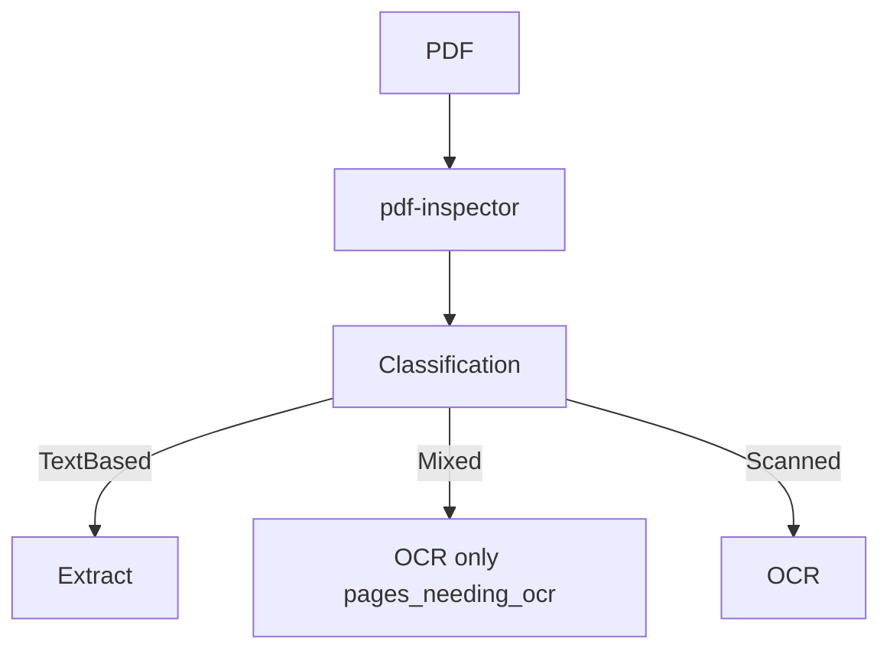

### 32.3 OCR 引擎選型比較（建議架構，企業導入決策參考；各工具版本與能力請以你評估當下之官方文件為準）

| 引擎 | 部署方式 | 優點 | 缺點 | 適合場景 |
|---|---|---|---|---|
| Tesseract | 本地開源 | 免費、可離線、社群成熟 | 複雜版面/手寫辨識率較低 | 中小量、成本敏感、可接受中等準確度 |
| Cloud OCR（AWS Textract / Azure Document Intelligence / Google Document AI） | 雲端 API | 準確度高、支援表單/表格結構化辨識 | 資料需離開企業邊界、按量計費 | 大量、對準確度要求高、可接受雲端傳輸 |
| Vision LLM（GPT-4V/Claude Vision 等多模態模型） | 雲端 API | 可同時理解版面語意與內容，適合複雜文件 | 成本較高、延遲較大、可能有幻覺風險 | 少量、高複雜度、需要語意理解的文件 |
| Enterprise OCR（企業內部自建/採購方案） | 內部部署 | 可客製化、資料不出企業邊界 | 建置與維運成本高 | 金融/政府等高合規要求場景 |

### 32.4 選型建議流程

```mermaid
flowchart TD
    A["需要 OCR 的頁面"] --> B{"資料是否可離開企業邊界?"}
    B -->|否| C["本地 OCR（Tesseract / Enterprise OCR）"]
    B -->|是| D{"準確度要求?"}
    D -->|一般| E["Cloud OCR"]
    D -->|高，含複雜版面理解| F["Vision LLM 或 Enterprise Document AI"]
```

### 32.5 本章 Checklist 與小結

- [ ] OCR 選型先問「資料能否離開企業邊界」，再考慮準確度與成本。
- [ ] 混合使用 pdf-inspector（分類+文字頁擷取）與 OCR（僅影像頁），而非用 OCR 取代 pdf-inspector 的全部功能。
- [ ] 定期抽樣人工複核 OCR 結果的準確度，不同引擎的錯誤模式不同。

---

## 33. 與其他 PDF Parser 比較

### 33.1 比較表（建議架構，綜合官方 `docs/benchmarking.md` 與各工具公開資訊；**請注意版本落差**——官方 Benchmark 測試對象為 pdf-inspector `0.2.6`，非目前 `1.14.2`，見重要聲明第 6 點）

**部署形態分類提醒（本輪查證後新增）**：下表把「本地函式庫」與「託管 API」混在同一張表比較並不完全公平——兩者的成本結構、資料主權、維運責任完全不同。表格最後一欄新增「部署形態」，企業選型時應先依這一欄篩選，而非只看功能欄位。

| 工具 | 語言 | OCR | Layout 分析 | Table | 部署形態 | AI Agent 友善度 |
|---|---|---|---|---|---|---|
| **pdf-inspector** | Rust（+ Python/Node/WASM binding） | 不含（僅標示需求） | 有（多欄/Reading Order） | 有（Cascading 策略） | 本地函式庫 | 高（Token 效率優先設計） |
| PyMuPDF | C（Python binding） | 不含 | 有 | 部分 | 本地函式庫 | 中 |
| PyMuPDF4LLM | Python（基於 PyMuPDF） | 不含 | 有 | 部分 | 本地函式庫 | 高（專為 LLM 輸出設計） |
| MarkItDown（Microsoft） | Python | 部分（可整合外部 OCR） | 基本 | 部分 | 本地函式庫 | 中高 |
| Docling（IBM Research） | Python | 有（可插拔多種 OCR 引擎） | 有（含版面語意理解） | 有 | 本地函式庫 | 高 |
| **Marker**（VikParuchuri） | Python（內建 Surya OCR） | 有（預設內建，另可選 `--use_llm` 疊加 LLM 校正） | 有 | 有 | 本地函式庫（建議 GPU） | 高（原生輸出 Markdown/JSON/Chunk） |
| **Unstructured** | Python | 部分（Hybrid：規則式＋AI 版面偵測） | 有 | 有 | 本地函式庫 + 託管版本 | 高（語意元素標註，利於自訂 Chunking） |
| MinerU（OpenDataLab） | Python | 有（自動偵測掃描/亂碼 PDF 並啟用） | 有（含公式/表格轉 LaTeX） | 有 | 本地函式庫 | 高 |
| OpenDataLoader | 多語言 | 依配置 | 有 | 有 | 本地函式庫 | 中高（獨立第三方 Benchmark 專案 `opendataloader-bench` 的同名解析引擎，與 MinerU/OpenDataLab **無隸屬關係**，Source-confirmed，2026-08-16 查證 `opendataloader-project` GitHub 組織） |
| LiteParse | — | 依配置 | 有 | 部分 | 本地函式庫 | 中（官方 Benchmark 對照組之一） |
| **LlamaParse**（LlamaIndex） | — | 有 | 有 | 有（強項） | 託管 API（付費） | 高（原生整合 LlamaIndex RAG 生態） |
| **Reducto** | — | 有 | 有 | 有（強項，財務表格） | 託管 API（付費） | 高 |
| Firecrawl Parse | 同 pdf-inspector（內部即使用 pdf-inspector） | 有（Smart OCR Routing） | 有 | 有 | 託管 API（付費） | 高 |

**新增工具說明（Source-confirmed，2026-08-16 補充查證）**：

- **Marker**：以 Surya OCR 為核心的開源工具，預設即內建 OCR（與 pdf-inspector「不含 OCR」的定位明顯不同），可選擇性疊加 LLM 校正提升複雜版面準確度，對學術論文、含大量參考文獻與公式的文字密集文件評價較高；有 GPU 時速度最快。
- **Unstructured**：採規則式＋AI 混合的版面偵測，強項是「語意元素標註」（把內容切成 Title/NarrativeText/Table 等語意標籤），特別適合已用 LangChain/LlamaIndex 且需要精細 Chunking 策略控制的 RAG pipeline；同時提供本地函式庫與託管版本。
- **LlamaParse／Reducto**：兩者皆為託管 API，非本地函式庫，商業模式與 pdf-inspector（開源、本地執行、零費用）完全不同；適合不介意資料出境、且要換取更高複雜表格/版面準確度的場景，企業導入前需另外評估資料出境合規性（比照第 32 章選型原則）。
- **來源**：以上定位描述綜合 Firecrawl 官方部落格〈Best PDF Parsers for AI and RAG Workflows in 2026〉（`firecrawl.dev/blog/best-pdf-parsers`，發布於 2026-04-27）與各工具官方文件。**重要提醒**：這篇 Firecrawl 官方部落格文章本質是**廠商比較自家產品與競品的行銷內容**，文中明確將 Firecrawl（託管 API，內部即使用 pdf-inspector）定位為「AI Agent 最實用的 PDF Parser」，但也誠實承認「Docling 與 Marker-PDF 是最好的自架開源選項」——本手冊引用其對各工具的功能定位描述，但不採信其行銷性質的排名結論，企業選型仍應以自己的文件語料庫實測為準（見第 41 章 Golden Dataset）。

### 33.2 不要只看「誰最好」

> 不要只寫「誰最好」，必須依使用情境選擇。

- **純文字型企業文件（規格書、財報、契約）、且要求低延遲/本地執行、零費用**：pdf-inspector 是輕量、快速的選擇，尤其若已在 Node.js/Python/Rust 技術棧中。
- **需要處理大量掃描/複雜版面文件、且能接受較重量級 Python 環境、希望一個工具內建 OCR**：Docling、MinerU、Marker 這類內建 OCR pipeline 的工具可能更省事（企業需自行整合 OCR 的成本更低）。
- **已使用 PyMuPDF 生態系、Python 為主**：PyMuPDF4LLM 是同技術棧內的自然選擇。
- **已用 LangChain/LlamaIndex，需要精細語意 Chunking 控制**：Unstructured 的語意元素標註較貼近此需求。
- **可接受資料出境、追求最高表格/複雜版面準確度、不想自行維運解析服務**：LlamaParse、Reducto、Firecrawl Parse 等託管 API 是另一條路線，但這與 pdf-inspector「本地、開源、零費用」的定位屬於不同象限的選擇，不是同一個決策維度上的直接替代品。
- **多格式（不限 PDF）文件轉換**：見〔[anydoc 教學手冊](anydoc教學手冊.md)〕。

### 33.3 本章 Checklist 與小結

- [ ] 工具選型前，先釐清企業文件組成（文字型 vs. 掃描型比例）與技術棧限制。
- [ ] 選型時先依「本地函式庫 vs. 託管 API」分類篩選，再比較功能，避免把兩種不同成本結構的方案放在同一個維度直接比較。
- [ ] 不直接沿用本表的 Benchmark 數字做決策，應以自己的文件語料庫實測比較（見第 41 章 Golden Dataset）。
- [ ] 若企業同時有大量非 PDF 格式文件，優先評估 AnyDoc 或 Docling 等多格式工具，而非只評估 PDF 專用工具。
- [ ] 引用廠商官方部落格的工具比較內容時，留意其行銷性質，僅採信客觀功能描述、不採信排名結論。

---

## 34. 適用與不適用情境

### 34.1 最適合

| 情境 | 說明 |
|---|---|
| Native-text PDF | 由 Office/LaTeX 等軟體直接產生的原生文字 PDF |
| Technical Documentation | API 文件、系統手冊、規格書 |
| RFP / 標案文件 | 見第 26 章 |
| Legal Documents | 契約、法規（文字型為主） |
| Financial Reports | 財報、公告（見第 30 章需搭配人工複核） |
| Invoices（文字型） | 系統產生的電子發票 PDF |
| Research Papers | 學術論文（多欄版面，受惠於 Reading Order 重建） |
| API Documentation | 見第 24 章 AI Coding Agent 案例 |

### 34.2 不適合單獨使用

| 情境 | 原因 | 建議替代方案 |
|---|---|---|
| 純掃描文件 | pdf-inspector 不含 OCR | 搭配第 32 章 OCR 引擎 |
| 手寫內容 | 手寫辨識非其設計目標 | 專用手寫辨識 OCR / Vision LLM |
| 複雜影像理解（圖表數據判讀） | 需要視覺理解能力 | Vision LLM |
| 需要像素級版面還原 | 設計哲學是語意優先，非視覺還原（見第 8.3 節） | 專用 PDF 渲染工具（非文字擷取工具） |
| 需要精確重現原始排版供列印 | 同上 | 保留原始 PDF，不透過 Markdown 中介 |

### 34.3 本章 Checklist 與小結

- [ ] 導入前先用第 41 章 Golden Dataset 概念，抽樣測試企業實際文件是否落在「最適合」情境內。
- [ ] 不要把 pdf-inspector 當成處理掃描文件或手寫內容的主力工具。

---

## 35. 效能與 Benchmark

### 35.1 官方 Benchmark 方法論（官方已實作，`docs/benchmarking.md`）

官方使用 `bench_opendataloader.py` 對兩個 `pdf2md` 二進位（baseline／candidate）跑同一份 OpenDataLoader 語料庫，避免語料庫或評分器版本不同造成的誤差；另有 `probe_backend_evidence.py` 比對定位文字項目與 MuPDF structured text，用於尋找原生實作可改進之處。

```bash
# 官方測試方式（示意，需自行 clone opendataloader-bench 語料庫）
cargo build --release
python3 scripts/bench_opendataloader.py \
  --bench-dir ../opendataloader-bench \
  --baseline ../pdf-inspector-main/target/release/pdf2md \
  --candidate target/release/pdf2md
```

### 35.2 官方公開數字（**⚠️ 版本落差警示，請先讀重要聲明第 6 點**）

| 測試日期 | 版本 | 語料庫 | Overall | Reading Order | Tables | Speed |
|---|---|---|---|---|---|---|
| 2026-07-31 | **pdf-inspector 0.2.6**（非目前 1.14.2） | 200 份 PDF（OpenDataLoader 語料庫，單 process 循序執行，OCR 停用，Apple M4 Pro） | 0.875 | 0.915 | 0.814 | 0.470s（200 份） |

同批測試對照組：LiteParse 2.10.1、OpenDataLoader 2.2.1、PyMuPDF4LLM 0.2.0、MarkItDown 0.1.5（官方已實作，`docs/benchmarking.md`）。

### 35.3 企業自行實測 Benchmark 表（**需要在企業環境實測**，以下僅為量測維度範本，數字非官方提供）

| 頁數規模 | Classification 延遲 | Extraction 延遲 | Markdown 轉換延遲 | 記憶體用量 | Throughput |
|---|---|---|---|---|---|
| 10 頁 | 需要在企業環境實測 | 需要在企業環境實測 | 需要在企業環境實測 | 需要在企業環境實測 | 需要在企業環境實測 |
| 50 頁 | 需要在企業環境實測 | 需要在企業環境實測 | 需要在企業環境實測 | 需要在企業環境實測 | 需要在企業環境實測 |
| 100 頁 | 需要在企業環境實測 | 需要在企業環境實測 | 需要在企業環境實測 | 需要在企業環境實測 | 需要在企業環境實測 |
| 500 頁 | 需要在企業環境實測 | 需要在企業環境實測 | 需要在企業環境實測 | 需要在企業環境實測 | 需要在企業環境實測 |
| 1000 頁 | 需要在企業環境實測 | 需要在企業環境實測 | 需要在企業環境實測 | 需要在企業環境實測 | 需要在企業環境實測 |

### 35.4 影響效能的因素

| 因素 | 影響 |
|---|---|
| PDF 大小/頁數 | 直接影響總處理時間，惟 Classification 因採樣策略，不完全隨頁數線性增長 |
| CPU 核心數 | Rust 底層可搭配 `rayon`（Cargo.toml 依賴，官方已實作）做平行處理 |
| Release vs Debug Build | Rust 原生整合務必用 `--release`（見第 18.4 節） |
| Python Binding 額外開銷 | PyO3 跨語言呼叫有一定 overhead，大量小檔案批次處理建議評估 batch 化或多 Process |
| Node.js 同步 vs 非同步 API | 見第 16.3 節，誤用同步 API 會阻塞 Event Loop，影響「感受到」的吞吐量 |
| WASM 單執行緒限制 | 見第 17.6 節，大型文件建議 Web Worker |

### 35.5 本章 Checklist 與小結

- [ ] 導入前務必用企業實際文件語料庫跑 Benchmark，不直接沿用官方 0.2.6 版本的數字。
- [ ] 若升級 pdf-inspector 版本，重新跑一次 Benchmark 比較（見第 41 章）。
- [ ] 效能瓶頸優先排查「是否誤用同步 API」「是否為 Debug Build」這兩個常見根因。

---

## 36. Observability

### 36.1 追蹤管線

```mermaid
flowchart TD
    A["PDF Request"] --> B["Trace ID 產生"]
    B --> C["Classification"]
    C --> D["Extraction"]
    D --> E["OCR Routing (若需要)"]
    E --> F["Markdown"]
    F --> G["Chunking"]
    G --> H["Embedding"]
    H --> I["AI Agent"]
```

### 36.2 建議指標（建議架構）

| 指標 | 說明 |
|---|---|
| `pdf_processed_total` | 處理的 PDF 總數（依 `pdf_type` 分類標籤） |
| `pdf_processing_latency_seconds` | 端對端處理延遲（Histogram） |
| `pdf_classification_latency_seconds` | 僅分類階段延遲 |
| `pdf_extraction_latency_seconds` | 僅擷取階段延遲 |
| `pdf_ocr_routing_rate` | 需要 OCR 的頁面佔比 |
| `pdf_ocr_pages_total` | 實際轉交 OCR 的頁數 |
| `pdf_processing_failure_total` | 失敗次數（依錯誤類型標籤，見第 37 章） |
| `pdf_process_memory_bytes` | 處理過程記憶體用量 |
| `pdf_process_cpu_seconds` | 處理過程 CPU 用量 |
| `pdf_output_size_bytes` | 輸出 Markdown/JSON 大小 |
| `pdf_output_token_estimate` | 估算輸出 Token 數（供成本追蹤） |

### 36.3 建議工具鏈（建議架構）

- **OpenTelemetry**：為每次 PDF 處理請求建立 Trace，串接 Gateway → pdf-inspector Service → OCR Service → RAG Pipeline 的完整鏈路。
- **Prometheus**：收集上述指標，設定告警規則（例如 `pdf_processing_failure_total` 短時間內異常升高）。
- **Grafana**：視覺化 Dashboard，區分依文件類型、企業部門的處理量與延遲分布。
- **Structured Logging**：每筆處理紀錄至少包含 `document_id`、`trace_id`、`pdf_type`、`confidence`、`processing_time_ms`、`error_code`（若有）。

### 36.4 本章 Checklist 與小結

- [ ] 每筆請求都有 Trace ID，可串接 Gateway 到 AI Agent 的完整鏈路。
- [ ] `pdf_ocr_routing_rate` 是評估 Per-Page Routing 導入效益的核心指標，建議建立長期趨勢圖。
- [ ] 告警規則涵蓋失敗率異常、延遲異常兩類，避免問題累積到影響大量使用者才被發現。

---

## 37. 錯誤處理與 Error Taxonomy

### 37.1 Error Taxonomy

```text
Invalid PDF
Corrupted PDF
Unsupported PDF
Encrypted PDF
Password protected PDF
Broken encoding (has_encoding_issues = true)
Extraction failure
Memory limit exceeded
Timeout
OCR required (非錯誤，是正常路由結果)
OCR failure（下游 OCR 服務失敗）
Markdown conversion failure
```

其中 `Encrypted`、`InvalidStructure`、`NotAPdf`、`Io`、`Parse` 對應官方 Rust `PdfError` 列舉（官方已實作，`docs/rust-api.md`，見第 18.3 節）；Node.js binding 對應的錯誤處理機制官方文件未逐一列出對照表（研究缺口，建議企業自行以實際版本測試各語言 binding 的錯誤傳遞方式）。

### 37.2 錯誤處理決策流程

```mermaid
flowchart TD
    A["Error"] --> B["Classify"]
    B --> C{"Retry?"}
    C -->|"暫時性錯誤 (Timeout/資源暫時不足)"| D["Yes：有限次數重試"]
    C -->|"永久性錯誤 (Corrupted/Encrypted/NotAPdf)"| E["No"]
    D --> F{"重試後成功?"}
    F -->|否| E
    E --> G["Fallback"]
    G --> H{"是否為內容問題導致擷取失敗?"}
    H -->|是| I["轉交 OCR"]
    H -->|否，結構性損毀| J["Manual Review"]
    I --> K{"OCR 是否成功?"}
    K -->|否| J
```

### 37.3 各錯誤類型的處理建議

| 錯誤類型 | 建議處理 |
|---|---|
| Encrypted / Password protected | 提示上傳者提供密碼，或轉交企業內部解密流程，不自動嘗試暴力破解 |
| Corrupted / InvalidStructure | 記錄並標記為需人工檢查，通常代表檔案本身損毀或非標準 PDF |
| NotAPdf | 檢查上傳流程的檔案類型驗證是否有漏洞（見第 31 章） |
| Timeout | 檢查是否為異常大型文件，考慮調高逾時或改走非同步批次處理 |
| has_encoding_issues | 不直接信任該頁擷取結果，標記信心較低或轉交 OCR 覆核 |
| OCR failure | 依企業 SLA 決定重試次數，超過門檻後轉人工處理佇列 |

### 37.4 本章 Checklist 與小結

- [ ] 區分「暫時性錯誤」與「永久性錯誤」，只對前者重試。
- [ ] 每種錯誤類型都有明確的下一步（Retry/Fallback/Manual Review），不要讓錯誤處理邏輯淪為單一 `catch-all`。
- [ ] `has_encoding_issues` 視為「需要額外覆核」的訊號，而非單純的布林旗標。

---

## 38. CI/CD

### 38.1 官方專案的 CI 要求（官方已實作，AGENTS.md）

```text
Git
 ↓
cargo fmt（格式檢查）
 ↓
cargo clippy -- -D warnings（Lint，零警告容忍）
 ↓
cargo test（267+ unit tests、73+ integration tests）
 ↓
cargo build --release（Release 建置）
 ↓
Benchmark（見第 35 章，官方 bench_opendataloader.py）
```

官方發布流程（`docs/publishing.md`）採「單一版本號同步」機制：`Cargo.toml` 為版本真實來源，`scripts/version.py <version>` 同步更新所有語言 binding 的版本號；各 Registry（crates.io、PyPI、npm 主套件、npm WASM 套件）各自獨立的 GitHub Actions Workflow 從同一個 commit 建置發布，並使用 **GitHub Actions OIDC** 取代長期存活的 Registry Token，提升發布安全性 (官方已實作)。

**官方回歸測試機制（Source-confirmed，2026-08-16 直接查證 `AGENTS.md`，此前版本手冊未提及）**：官方團隊維護一個獨立的姊妹 Repository `pdf-evals`，內含約 200 份快照測試 PDF；CI 除 `cargo fmt`/`cargo clippy`/`cargo test` 外，還會執行 `bench.py test`（比對輸出快照）與 `bench.py score`（語意品質評分，涵蓋 TEDS 表格分數、MHS 標題分數、Reading Order、清單保留度等維度，呼應第 35.1 節 Benchmark 方法論）。**這與本手冊第 41 章建議企業自建 Golden Dataset 的作法完全一致**——官方自己就是用同一套「獨立快照語料庫 + 語意層級評分」模式做回歸測試，而非逐字元 diff，企業可直接把這個機制當成第 41 章 Golden Dataset 設計的參考範本。

### 38.2 企業 CI/CD 建議管線（建議架構）

```mermaid
flowchart TD
    A["Git Push"] --> B["Build"]
    B --> C["Unit/Integration Test"]
    C --> D["Lint（企業自身程式碼，若有客製封裝層）"]
    D --> E["Security Scan<br/>(依賴掃描/SCA)"]
    E --> F["Benchmark（比對前次版本）"]
    F --> G["Package"]
    G --> H["Container Build"]
    H --> I["Deploy"]
```

### 38.3 企業導入 pdf-inspector 依賴時的 CI 建議

- 若企業直接依賴 pdf-inspector 的 Rust crate 或 Node/Python 套件，CI 中加入版本鎖定檢查（`Cargo.lock`／`package-lock.json`／`requirements.txt` 精確版本），避免 CI 環境與正式環境使用不同版本。
- 升級 pdf-inspector 版本前，在 CI 中跑一次第 41 章的 Golden Dataset 回歸比對，而非直接合併升級 PR。
- 依賴掃描（SCA）納入 pdf-inspector 及其依賴（`lopdf`、`pyo3` 等），追蹤上游安全公告。

### 38.4 本章 Checklist 與小結

- [ ] CI 中鎖定 pdf-inspector 依賴版本，避免非預期的版本飄移。
- [ ] 升級前先跑 Golden Dataset 回歸比對，再合併。
- [ ] 納入依賴掃描，追蹤 pdf-inspector 與其上游依賴（`lopdf` 等）的安全公告。

---

## 39. Docker

### 39.1 Production Container 設計原則

```mermaid
flowchart TD
    A["Application"] --> B["PDF Processing Service"]
    B --> C["pdf-inspector"]
```

| 原則 | 說明 |
|---|---|
| Minimal Image | 使用精簡基底映像（如 `node:20-slim`、`python:3.12-slim`），減少攻擊面 |
| Non-root User | 容器內以非 root 使用者執行處理程序 |
| Read-only Filesystem | 除暫存目錄外，檔案系統設為唯讀，降低被寫入惡意檔案的風險 |
| Resource Limits | 設定 CPU/Memory Limit（見第 31.4 節），避免單一惡意 PDF 拖垮整個節點 |
| Timeout | 容器內處理程序層級與應用層級都設定逾時 |
| Temp Directory | 暫存目錄使用容器內獨立 volume，處理完成後清除 |
| Network Restriction | PDF 解析不需要對外網路連線，容器可設定為無對外網路存取 |

### 39.2 Node.js Service Dockerfile 範例

```dockerfile
FROM node:20-slim

RUN groupadd -r pdfservice && useradd -r -g pdfservice pdfservice

WORKDIR /app
COPY package*.json ./
RUN npm ci --omit=dev

COPY . .

RUN mkdir -p /tmp/pdf-work && chown pdfservice:pdfservice /tmp/pdf-work
USER pdfservice

ENV TMPDIR=/tmp/pdf-work
EXPOSE 4000

CMD ["node", "server.js"]
```

### 39.3 Python Service Dockerfile 範例

```dockerfile
FROM python:3.12-slim

RUN groupadd -r pdfservice && useradd -r -g pdfservice pdfservice

WORKDIR /app
COPY requirements.txt .
RUN pip install --no-cache-dir -r requirements.txt

COPY . .
USER pdfservice

CMD ["uvicorn", "main:app", "--host", "0.0.0.0", "--port", "8000"]
```

### 39.4 docker-compose 資源限制範例

```yaml
services:
  pdf-service:
    build: .
    read_only: true
    tmpfs:
      - /tmp/pdf-work
    deploy:
      resources:
        limits:
          cpus: "2.0"
          memory: 2G
    networks:
      - internal
    # 不對外開放網際網路存取
networks:
  internal:
    internal: true
```

### 39.5 本章 Checklist 與小結

- [ ] 容器一律以非 root 使用者執行，檔案系統除暫存目錄外設為唯讀。
- [ ] 設定明確的 CPU/Memory Limit，避免單一請求耗盡節點資源。
- [ ] 評估是否可將容器網路存取限制為僅內網，降低攻擊面。

---

## 40. Kubernetes

### 40.1 架構

```mermaid
flowchart TD
    A["Ingress"] --> B["PDF API Service"]
    B --> C["PDF Processing Pod<br/>(pdf-inspector)"]
    C --> D["OCR Service"]
    C --> E["Document Store"]
```

### 40.2 Deployment 設計要點（建議架構）

| 項目 | 建議 |
|---|---|
| Horizontal Pod Autoscaling | 依 CPU 使用率或處理佇列長度（自訂 Metrics）自動擴縮 |
| Resource Requests/Limits | 依第 35 章實測結果設定，避免 Pod 被 OOMKilled 或搶佔過多資源 |
| Queue-based 架構 | 大量批次處理建議搭配訊息佇列（如 RabbitMQ/Kafka），Pod 從佇列消費任務而非直接同步處理 HTTP 請求 |
| Retry / Dead Letter Queue | 處理失敗的任務進入 DLQ，供人工複核，避免無限重試 |
| Timeout | Pod 內處理逾時與 Ingress/Gateway 逾時需一致，避免用戶端等待時間與後端行為不匹配 |
| Pod Security | 比照第 39 章 Non-root、Read-only Filesystem 原則，並設定 `securityContext` |
| Network Policy | 限制 Pod 僅能與必要服務（OCR Service、Document Store）通訊 |

### 40.3 HPA 範例（示意）

```yaml
apiVersion: autoscaling/v2
kind: HorizontalPodAutoscaler
metadata:
  name: pdf-processing-hpa
spec:
  scaleTargetRef:
    apiVersion: apps/v1
    kind: Deployment
    name: pdf-processing
  minReplicas: 2
  maxReplicas: 20
  metrics:
    - type: Resource
      resource:
        name: cpu
        target:
          type: Utilization
          averageUtilization: 70
```

### 40.4 Pod Security Context 範例（示意）

```yaml
securityContext:
  runAsNonRoot: true
  readOnlyRootFilesystem: true
  allowPrivilegeEscalation: false
  capabilities:
    drop: ["ALL"]
```

### 40.5 本章 Checklist 與小結

- [ ] 大量批次場景優先採 Queue-based 架構，而非直接讓 HPA 應付突發同步請求。
- [ ] Resource Requests/Limits 依實測數字設定，避免過度保守（浪費資源）或過度激進（頻繁 OOMKilled）。
- [ ] Network Policy 限制 Pod 僅能存取必要服務，降低橫向移動風險。

---

## 41. Golden Dataset 與版本升級

### 41.1 版本升級流程

```mermaid
flowchart TD
    A["Current Version"] --> B["Release Notes"]
    B --> C["Breaking Changes"]
    C --> D["API Changes"]
    D --> E["Dependency Changes"]
    E --> F["Benchmark"]
    F --> G["Regression Test"]
    G --> H["Production"]
```

升版前必須：建立 Test Corpus、建立 Golden Output、執行 Extraction Comparison、執行 Markdown Diff、執行 Table Comparison、執行 Performance Benchmark。

### 41.2 企業 Golden Dataset 設計

```text
test-data/
├── text/
├── scanned/
├── mixed/
├── tables/
├── multi-column/
├── chinese/
├── english/
├── japanese/
├── financial/
├── legal/
└── corrupted/
```

每份 PDF 建立：

```text
input.pdf
expected.json
expected.md
metadata.json
```

### 41.3 用途

| 用途 | 說明 |
|---|---|
| Regression | 版本升級後比對輸出是否劣化 |
| Upgrade | 驗證升級後行為符合預期 |
| Benchmark | 追蹤效能趨勢 |
| Agent Evaluation | 見第 42 章，作為 Agent 端到端評估的輸入語料庫 |

### 41.4 回歸比對範例（示意）

```python
import json
from pathlib import Path
import pdf_inspector

def regression_check(test_dir: Path) -> list[dict]:
    failures = []
    for pdf_path in test_dir.glob("**/input.pdf"):
        expected = json.loads((pdf_path.parent / "expected.json").read_text())
        actual = pdf_inspector.process_pdf(str(pdf_path))
        if actual.pdf_type != expected["pdf_type"]:
            failures.append({"file": str(pdf_path), "issue": "pdf_type mismatch"})
        # 建議進一步比對 Markdown 結構相似度，而非逐字元比對
        # （逐字元 diff 對結構性改進會產生大量假陽性，見第 41.5 節）
    return failures
```

### 41.5 語意層級比對優於字元層級 Diff

依 AGENTS.md，官方團隊使用 `bench.py score` 做語意評估，明確提到「字元層級 diff 會誤判結構性改進」。企業建立回歸測試時，建議優先比較結構性指標（標題層級是否一致、表格列數是否一致、頁碼標記是否對齊），而非要求 Markdown 逐字元相同——版本升級帶來的措辭/空白微調不代表品質劣化。

### 41.6 本章 Checklist 與小結

- [ ] Golden Dataset 涵蓋文字型、掃描型、混合型、多欄、多語言、財務、法律、損毀 PDF 等類別。
- [ ] 回歸比對採語意/結構層級，而非逐字元比對。
- [ ] 每次升級前，先在 Golden Dataset 上跑完整回歸，再排程 Production 更新。

---

## 42. AI Agent Evaluation Framework

### 42.1 評估管線

```mermaid
flowchart TD
    A["PDF (Golden Dataset)"] --> B["pdf-inspector"]
    B --> C["Markdown"]
    C --> D["AI Agent"]
    D --> E["Answer"]
    E --> F["評估指標"]
```

### 42.2 評估維度

| 維度 | 說明 |
|---|---|
| Extraction Accuracy | 擷取內容與 Golden Output 的相似度 |
| Reading Order | 多欄文件的閱讀順序是否正確 |
| Table Accuracy | 表格列/欄數與內容是否正確重建 |
| Heading Accuracy | 標題層級推斷是否正確 |
| Page Citation | Agent 回答是否正確引用來源頁碼 |
| Requirement Extraction | 需求抽取任務的召回率/精確率（對照第 26 章案例） |
| Hallucination | Agent 是否產生文件中不存在的內容 |
| Token Usage | 端到端 Token 消耗量 |
| Latency | 端到端回應時間 |

### 42.3 本章 Checklist 與小結

- [ ] 評估框架同時涵蓋「擷取品質」與「Agent 任務品質」兩個層級，兩者問題根因不同。
- [ ] Page Citation 正確性建議納入自動化檢查（比對 Agent 引用頁碼與 Golden Dataset 標註是否一致）。
- [ ] Hallucination 檢測可用「要求 Agent 僅回答文件中明確提及的內容」作為對照基準。

---

## 43. 完整 Enterprise Workflow 總圖

### 43.1 總覽

```mermaid
flowchart TD
    A["PDF"] --> B["File Validation"]
    B --> C["Security Scan"]
    C --> D["pdf-inspector"]
    D --> E["Classification"]
    E --> F1["TextBased"]
    E --> F2["Mixed"]
    E --> F3["Scanned"]
    F1 --> G1["Extraction"]
    F2 --> G2["Page Routing"]
    F3 --> G3["OCR"]
    G1 --> H["Markdown"]
    G2 --> H
    G3 --> H
    H --> I["Normalization"]
    I --> J["Chunking"]
    J --> K["Metadata"]
    K --> L["Embedding"]
    L --> M["Vector Store"]
    M --> N["RAG / Agent"]
    N --> O1["Development"]
    N --> O2["Reverse Engineering"]
    N --> O3["Upgrade"]
```

### 43.2 各階段負責團隊建議（建議架構）

| 階段 | 建議負責團隊 |
|---|---|
| File Validation / Security Scan | DevSecOps |
| pdf-inspector / Classification / Extraction | Platform / Backend 團隊 |
| OCR | Platform 團隊 + OCR 廠商/雲端服務 |
| Normalization / Chunking / Metadata | AI Engineer |
| Embedding / Vector Store | AI Engineer / Data 團隊 |
| RAG / Agent | AI Agent 開發團隊 |
| Development / Reverse Engineering / Upgrade | 應用開發團隊（消費 Agent 產出） |

### 43.3 本章 Checklist 與小結

- [ ] 對照此總圖，盤點企業目前各階段的負責團隊與現有工具，找出缺口。
- [ ] 三個下游應用情境（開發／逆向工程／升版）共用同一套前處理管線，避免重複建設。

---

## 44. 五個實戰 Lab

### Lab 1：PDF → Markdown

**Goal**：完成第一次 pdf-inspector 轉換，理解基本輸出格式。

**Architecture**：`PDF → pdf2md CLI → Markdown 檔案`

**Prerequisite**：已安裝 Rust 工具鏈或 Node.js（見第 10、11、12 章）。

**Installation**：

```bash
cargo install pdf-inspector
# 或
npm install -g @firecrawl/pdf-inspector
```

**Directory Structure**：

```text
lab1-pdf2md/
├── sample.pdf
└── output/
```

**Commands**：

```bash
mkdir -p lab1-pdf2md/output
pdf2md lab1-pdf2md/sample.pdf > lab1-pdf2md/output/sample.md
pdf2md lab1-pdf2md/sample.pdf --pages --compact > lab1-pdf2md/output/sample.compact.md
```

**Expected Output**：`output/sample.md` 含結構化 Markdown（標題、段落、清單）。

**Troubleshooting**：若輸出為空，先用 `detect-pdf sample.pdf` 確認 `pdf_type` 是否為 `TextBased`；若為 `Scanned`，屬預期行為（pdf-inspector 不含 OCR，見第 34 章）。

**Extension Exercise**：比較 `--raw`、`--compact`、一般輸出三者的檔案大小與 Token 估算差異。

---

### Lab 2：PDF Classification → OCR Routing

**Goal**：實作 Per-Page Routing 決策腳本（第 6 章的完整落地）。

**Architecture**：`PDF → detect-pdf --analyze --json → 決策腳本 → pdf2md（文字頁）+ OCR（影像頁）`

**Prerequisite**：Lab 1 環境 + `jq`（JSON 處理）+ 已選定的 OCR 引擎（可先用 Tesseract 示範）。

**Directory Structure**：

```text
lab2-ocr-routing/
├── mixed-sample.pdf
├── route.sh
└── output/
```

**Commands / Code**（`route.sh`，示意腳本）：

```bash
#!/usr/bin/env bash
set -euo pipefail
pdf="$1"
outdir="output"
mkdir -p "$outdir"

classification=$(detect-pdf "$pdf" --analyze --json)
echo "$classification" > "$outdir/classification.json"

pdf_type=$(echo "$classification" | jq -r '.pdfType // .pdf_type')
echo "PDF type: $pdf_type"

if [ "$pdf_type" = "Mixed" ] || [ "$pdf_type" = "mixed" ]; then
  echo "偵測到 Mixed PDF，需依 pages_needing_ocr 逐頁路由（見第 6 章）"
fi

pdf2md "$pdf" --pages --json > "$outdir/text-content.json"
```

**Expected Output**：`output/classification.json` 含 `pagesNeedingOcr` 清單；`output/text-content.json` 含文字頁的 Markdown。

**Troubleshooting**：JSON 欄位命名依 binding 而異（camelCase vs snake_case，見第 10.4 節），先用 `jq .` 檢視實際欄位名稱再寫死腳本邏輯。

**Extension Exercise**：串接一個實際 OCR 引擎（如 Tesseract CLI），將 `pages_needing_ocr` 頁面另外輸出成圖片後跑 OCR，最後依頁碼合併兩者輸出成單一 Markdown。

---

### Lab 3：Spring Boot API + pdf-inspector

**Goal**：實作第 19 章 Option C（Node.js Microservice）+ Spring Boot Gateway 的最小可行架構。

**Architecture**：`Vue/前端 → Spring Boot Gateway → Node.js pdf-inspector Service`

**Prerequisite**：JDK 21+、Spring Boot 3.x/4.x 專案骨架、Node.js 20+。

**Directory Structure**：

```text
lab3-springboot-integration/
├── pdf-service/          # Node.js microservice
│   ├── package.json
│   └── src/server.ts
└── gateway/               # Spring Boot 專案
    └── src/main/java/.../PdfInspectorClient.java
```

**Commands**：

```bash
# pdf-service
cd lab3-springboot-integration/pdf-service
npm install express @firecrawl/pdf-inspector
npm run build && node dist/server.js
```

**Code**：見第 19.4 節的 `server.ts` 與 `PdfInspectorClient.java` 範例，可直接複製為本 Lab 起點。

**Expected Output**：對 `gateway` 服務的 `/api/pdf/process` 端點上傳 PDF，回傳分類與 Markdown 結果的 JSON。

**Troubleshooting**：若 Spring Boot 呼叫逾時，先確認 Node.js Service 是否使用 Async API（第 16.3 節），同步 API 處理大檔案可能造成明顯延遲。

**Extension Exercise**：加上第 31 章的檔案大小/頁數驗證，以及第 36 章的 Trace ID 傳遞（Spring Boot → Node.js Service）。

---

### Lab 4：PDF → RAG → AI Agent

**Goal**：完成第 29 章 RAG Pipeline 的最小可行版本。

**Architecture**：`PDF → pdf-inspector → Chunking → Embedding → 本地向量儲存 → 簡易檢索 → LLM`

**Prerequisite**：Python 3.10+、任一 Embedding 模型 API 存取權限、簡易向量儲存（可用記憶體內實作示範，不需要正式 Vector DB）。

**Directory Structure**：

```text
lab4-rag/
├── documents/
├── ingest.py
└── query.py
```

**Commands / Code**（`ingest.py`，示意）：

```python
import pdf_inspector

def ingest(pdf_path: str) -> list[dict]:
    result = pdf_inspector.process_pdf(pdf_path)
    chunks = split_by_heading(result.markdown)  # 自行實作：依標題切分
    return [
        {
            "text": chunk,
            "metadata": {
                "document_id": pdf_path,
                "pdf_type": result.pdf_type,
                "confidence": result.confidence,
            },
        }
        for chunk in chunks
    ]
```

**Expected Output**：`query.py` 對某個問題檢索出相關 Chunk，並附上來源 `document_id`。

**Troubleshooting**：若檢索結果不相關，先檢查 Chunking 策略是否把語意段落切碎（見第 29.2 節 Structure-aware Chunking）。

**Extension Exercise**：加入 `page` metadata（改用 `extract_pages_markdown()` 取得逐頁結果），讓檢索結果可以引用頁碼。

---

### Lab 5：Legacy System Reverse Engineering

**Goal**：完成第 27 章案例的端到端流程。

**Architecture**：`Legacy PDF 文件集 → pdf-inspector → Markdown → AI Agent → Reverse Engineering Report`

**Prerequisite**：一批（可為範例／公開）系統手冊 PDF、可呼叫的 LLM/Agent 環境（如 Claude Code）。

**Directory Structure**：

```text
lab5-legacy-re/
├── docs/
│   ├── system-manual.pdf
│   ├── interface-spec.pdf
│   └── batch-spec.pdf
└── output/
    └── reverse-engineering-report.md
```

**Commands**：

```bash
for f in lab5-legacy-re/docs/*.pdf; do
  pdf2md "$f" --pages --json > "lab5-legacy-re/output/$(basename "$f" .pdf).json"
done
```

**Code**：將輸出的 JSON 逐一交給 AI Agent，套用第 24.4 節的 Reverse Engineering Prompt，彙整為 `reverse-engineering-report.md`。

**Expected Output**：包含 System overview、Module list、API list、Batch list、DB dependency 等第 27.3 節列出的九項內容，且每項結論附頁碼引用。

**Troubleshooting**：若多份文件之間結論衝突，優先標示衝突而非自動選擇其中一份為準——衝突本身是重要的發現，可能代表文件已過時或系統經過未記錄的變更。

**Extension Exercise**：將產出的 Module list、API list 與現有原始碼（若存在）交叉比對，找出「文件描述但程式碼中已不存在」或「程式碼存在但文件未記載」的落差項目。

---

## 45. Enterprise PDF Processing Standard

以下十條標準為本手冊依全書內容彙整之**建議架構**，供企業訂定內部規範參考：

### Standard 1：所有 PDF 先 Classification

任何 PDF 進入處理管線前，一律先呼叫 `detect-pdf`，不得跳過分類直接假設處理策略（見第 5 章）。

### Standard 2：Text-based PDF 不得無條件送 OCR

分類結果為 `TextBased` 且信心分數達門檻的頁面，一律走本地擷取，不得為求方便而整份送 OCR（見第 5.3 節）。

### Standard 3：Mixed PDF 使用 Page-level Routing

分類結果為 `Mixed` 的文件，必須依 `pages_needing_ocr` 做逐頁路由，不得整份降級為 OCR 或整份強制本地擷取（見第 6 章）。

### Standard 4：AI Agent 優先使用 Markdown / 結構化 JSON

Agent 的輸入應優先使用 pdf-inspector 產出的 Markdown 或 JSON，而非原始 PDF 位元組或未經整理的純文字（見第 2.3 章）。

### Standard 5：保留 Page Metadata

所有下游儲存（Document Store、Vector DB）必須保留頁碼 metadata，供 Citation 與稽核使用（見第 29.3 節）。

### Standard 6：保留原始 PDF

不得只保留 Markdown 擷取結果而刪除原始 PDF，原始檔案是唯一的最終真實來源（見第 30.2 節）。

### Standard 7：建立 Golden Dataset

任何版本升級或工具替換前，必須有 Golden Dataset 可供回歸測試（見第 41 章）。

### Standard 8：Production 必須有 Observability

正式環境部署必須具備 Trace、Metrics、Log 三項基本可觀測性（見第 36 章）。

### Standard 9：PDF 必須視為 Untrusted Input

不論來源（內部同仁、外部客戶、供應商），所有 PDF 一律視為不受信任輸入，套用第 31 章的驗證與 Sandbox 原則。

### Standard 10：AI Agent 不得把 Extracted Content 視為絕對真實

Agent 產出的結論必須可追溯回原始頁碼，重大決策（金融、法遵、合約）需人工複核，不得將 Agent 輸出直接視為最終真理（見第 30.2 節）。

### 45.1 本章 Checklist 與小結

- [ ] 十條標準已納入企業內部 PDF 處理規範文件或架構決策紀錄（ADR）。
- [ ] 每條標準都有對應的技術落地機制（不只是文件宣示）。

---

## 46. 30 分鐘快速入門

給沒有 Rust 背景的 Java / TypeScript / Python 開發者：

### 46.1 pdf-inspector 是什麼（5 分鐘）

一個用 Rust 寫的 PDF 分類與文字擷取函式庫，能判斷 PDF 是文字型還是掃描型，並把文字型內容轉成 Markdown。不含 OCR。詳見第 2 章。

### 46.2 安裝（5 分鐘）

依你的語言選一種（無需 Rust 背景，皆有 prebuilt binary/wheel）：

```bash
npm install @firecrawl/pdf-inspector       # Node.js/TypeScript
pip install pdf-inspector                  # Python
```

### 46.3 `detect-pdf`（3 分鐘）

```bash
npm install -g @firecrawl/pdf-inspector
detect-pdf your-file.pdf --json
```

看輸出的 `pdfType`：`TextBased`/`Mixed`/`Scanned`/`ImageBased`。

### 46.4 `pdf2md`（3 分鐘）

```bash
pdf2md your-file.pdf > output.md
```

打開 `output.md`，比對原始 PDF，感受 Markdown 化的效果。

### 46.5 JSON（2 分鐘）

```bash
pdf2md your-file.pdf --json > output.json
```

JSON 版本含頁碼、信心分數等結構化欄位，適合寫程式處理（見第 13 章）。

### 46.6 Markdown（2 分鐘）

理解 Markdown 輸出是「語意優先」，標題/清單/表格會被推斷重建，但不是像素級還原原始排版（見第 8.3 節）。

### 46.7 AI Agent（3 分鐘）

把 `output.md` 貼給任何 LLM/Agent，比較直接把 PDF 檔案丟給支援檔案上傳的 LLM 兩種方式的 Token 用量與回答品質差異。

### 46.8 OCR Routing（3 分鐘）

理解「有圖片 ≠ 需要 OCR」，`pages_needing_ocr` 欄位才是判斷依據（見第 5.3、6 章）。

### 46.9 Spring Boot Integration（2 分鐘）

Java 開發者：pdf-inspector 沒有官方 JVM binding，需透過 CLI Subprocess 或 Microservice 整合，見第 19 章。

### 46.10 最佳實務（2 分鐘）

- 先分類、再決定策略。
- 保留原始 PDF 與頁碼引用。
- 大量文件導入前先建 Golden Dataset 抽樣測試。
- PDF 一律視為不受信任輸入。

### 46.11 本章 Checklist 與小結

- [ ] 已成功執行一次 `detect-pdf` 與 `pdf2md`。
- [ ] 理解 JSON 與 Markdown 兩種輸出各自的適用場景。
- [ ] 知道下一步該讀哪一章（依自己的角色，見第 1.2 節）。

---

## 47. FAQ

**Q1：pdf-inspector 是 OCR 嗎？**
不是。它是分類與本地文字擷取函式庫，不含 OCR 引擎（見第 2.1、34 章）。

**Q2：Scanned PDF 可以直接處理嗎？**
`detect-pdf`／`process_pdf` 會回傳分類結果與空的/受限的 Markdown，但**不會**幫你做 OCR。你需要自行整合 OCR 引擎處理 Scanned 頁面（見第 32 章）。

**Q3：Mixed PDF 怎麼辦？**
依 `pages_needing_ocr` 做 Page-level Routing：文字頁本地擷取，影像頁轉 OCR（見第 6 章）。**⚠️ 陷阱**：`classify_pdf()` 回傳的 `pages_needing_ocr` 是 0-indexed，`process_pdf()`/`detect_pdf()` 回傳的同名欄位卻是 1-indexed，混用會產生 off-by-one 錯誤，詳見第 5.2 節警示。

**Q4：為什麼不直接把 PDF 給 LLM？**
Token 效率、閱讀順序、幻覺風險、隱私、成本五個面向都有明確劣勢，見第 2.3 節完整說明。

**Q5：為什麼 Markdown 對 AI Agent 比 PDF 好？**
Markdown 保留語意結構（標題/清單/表格）且經過 Reading Order 重建，比原始 PDF 位元組或未整理文字更適合 LLM 消費（見第 8 章）。

**Q6：Table Extraction 準確嗎？**
表格重建是 layout reconstruction 問題（見第 9.1 節），採三段 Cascading 策略，準確度受版面複雜度影響，官方 Benchmark（0.2.6 版）Tables 分數為 0.814，**但此為特定版本、特定語料庫下的數字**，不保證所有企業文件都達到相同準確度，建議自行用 Golden Dataset 驗證。另有硬性上限：**超過 25 欄的表格無法正確識別，超過 10 欄的合併儲存格傳播邏輯會停用**（見第 9.2 節），寬幅財務報表需特別留意。

**Q7：支援中文嗎？**
支援。透過 CID Font 與 ToUnicode CMap 解碼機制處理中文/日文常見的 CID 字型（見第 7.3 節）；若遇到亂碼，優先檢查 `has_encoding_issues` 旗標。

**Q8：支援多欄文件嗎？**
支援，透過 Histogram-based valley detection 重建多欄閱讀順序（見第 4.5 節）。

**Q9：支援瀏覽器嗎？**
支援，透過 `@firecrawl/pdf-inspector-wasm`，本地解析不上傳資料，但大型文件建議搭配 Web Worker（見第 17 章）。

**Q10：可以在 Spring Boot 使用嗎？**
沒有官方 JVM binding，需透過 CLI Subprocess 或 Microservice（Node/Python/Rust）整合，見第 19 章的五種方案比較。

**Q11：可以在 Docker 使用嗎？**
可以，官方提供的 Node/Python prebuilt binary/wheel 可直接安裝於一般 Linux 容器映像，不需要 Rust 工具鏈，見第 39 章。

**Q12：可以在 Kubernetes 使用嗎？**
可以，建議搭配 Queue-based 架構與 HPA，見第 40 章。

**Q13：可以完全離線嗎？**
可以。pdf-inspector 本身（Rust/Python/Node/WASM binding）皆為本地執行，不需要網路連線；若企業選擇整合雲端 OCR，則 OCR 那一段需要網路連線，這與 pdf-inspector 本身無關。

**Q14：是否會把文件傳到 Firecrawl？**
不會。pdf-inspector 是開源、本地執行的函式庫，不會將檔案內容傳送到 Firecrawl 的伺服器。會將資料傳到雲端的是 Firecrawl Parse（託管 API 產品，見第 2.5 節），與本手冊介紹的開源函式庫是不同產品。

**Q15：如何處理機密文件？**
比照第 31 章 Security 架構：Untrusted Input 原則、Sandbox 隔離、資源限制；擷取後的內容延續原始文件的資料分類等級（見第 31.6 節）。

**Q16：如何升級版本？**
先讀 Release Notes 確認 Breaking Changes，再跑 Golden Dataset 回歸測試，確認無劣化後才上正式環境（見第 41 章）。

**Q17：如何測試升級是否破壞 extraction？**
用語意/結構層級比對（標題層級、表格列數、頁碼對齊），而非逐字元 diff（見第 41.5 節）。

**Q18：如何降低 Token？**
使用 `--compact` 旗標、Per-Page Routing 避免處理不必要頁面、Structure-aware Chunking（見第 14、6、29 章）。

**Q19：如何和 RAG 整合？**
pdf-inspector 產出 Markdown/JSON 作為 Ingestion 層輸出，銜接 Chunking → Metadata → Embedding → Vector DB，見第 29 章。

**Q20：如何和 AI Coding Agent 整合？**
將 Markdown 交給 Copilot/Claude Code/Codex/Gemini CLI/Cursor 等工具，搭配第 24 章提供的專屬 Prompt（需求分析、逆向工程、框架升級、API 分析、架構分析、程式碼生成、Code Review）。

---

## 48. 故障排除

| 問題 | 可能原因 | 排除方式 |
|---|---|---|
| `cargo install pdf-inspector` 失敗 | 缺少系統編譯工具鏈（Windows 缺 Build Tools、Linux 缺 `build-essential`） | 見第 11、12 章對應平台安裝步驟 |
| Rust 工具鏈版本錯誤 | Cargo.toml 未明確標示 MSRV（見版本速查表），但過舊的 `rustc` 仍可能編譯失敗 | 執行 `rustup update` 更新至最新穩定版 |
| Python binding 安裝失敗 | 非官方支援的 CPython 版本/平台，觸發本機編譯但缺少 Rust 工具鏈 | 確認 CPython ≥3.8 且平台在官方 wheel 支援範圍內；否則安裝 `maturin` 從原始碼建置 |
| Node.js 原生模組載入失敗 | Node.js 版本或平台架構與 prebuilt binary 不符 | 確認 Node.js 版本與作業系統架構（x64/ARM64）在官方支援清單內 |
| WASM 初始化失敗 | 未呼叫 `await init()` 或載入時機錯誤 | 確認依官方範例先 `await init()` 再呼叫其他函式 |
| 損毀 PDF 導致例外 | 檔案本身結構損毀或非標準 PDF | 依第 37 章 Error Taxonomy 分類處理，不建議忽略例外直接跳過 |
| 編碼問題（亂碼） | ToUnicode CMap 缺失或損毀 | 檢查 `has_encoding_issues` 旗標，考慮轉交 OCR（見第 7.3 節） |
| CID Font 問題 | PDF 使用非標準 CID 字型對照 | 同上，並可用 `--items-json` 檢視原始 TextItem 座標協助判斷 |
| 中文文字擷取異常 | 同上，或字型子集嵌入不完整 | 抽樣比對原始 PDF 與擷取結果，異常頁面標記人工複核 |
| 多欄文件順序錯亂 | Column Detection 對特殊版面（如不規則欄寬）誤判，或版面被誤判為 `newspaper`／`tabular` 中錯誤的一種類型 | 用 `--items-json` 檢視座標分佈，評估是否需企業自訂後處理規則（見第 4.5 節版面分類說明） |
| 表格辨識錯誤 | 版面過於複雜，三段策略皆未能正確重建；或欄數超過 25 欄上限、合併儲存格超過 10 欄未正確傳播 | 見第 9.2～9.4 節已知限制，複雜財務/跨頁/寬幅表格建議人工複核 |
| Per-Page Routing 頁碼對不上（OCR 頁面錯位） | 混用 `classify_pdf()`（0-indexed `pages_needing_ocr`）與 `process_pdf()`/`detect_pdf()`（1-indexed `pages_needing_ocr`），未統一頁碼基準 | 見第 5.2 節警示；企業封裝層固定只用其中一種 API 取得 `pages_needing_ocr`，或在整合層明確轉換索引基準並寫單元測試驗證 |
| 需要底層除錯（內容流運算子、字型、CMap 等） | 僅從輸出結果無法定位問題根因 | 見第 10.5 節 `RUST_LOG` 除錯機制（僅適用於原始碼建置場景），不建議依賴已標示為 legacy 的 `dump_ops` |
| 記憶體用量過高 | 超大型 PDF 或大量並發處理 | 設定檔案大小/頁數上限與併發限制（見第 31.4 節） |
| 效能不如預期 | 誤用同步 API、Debug Build、單執行緒 WASM 處理大檔 | 見第 35.4 節逐項排查 |
| 權限問題（檔案讀取失敗） | 容器內非 root 使用者對暫存目錄無寫入權限 | 確認 Dockerfile 中暫存目錄已正確 `chown`（見第 39.2 節） |
| Windows 特有問題 | 路徑含中文/空白、執行原則限制 | 見第 11.3 節 |
| Linux 特有問題 | glibc/musl 版本不符 prebuilt binary 需求 | 確認容器基底映像的 libc 類型與版本 |
| Docker 內建置緩慢 | 容器內觸發 Rust 原始碼編譯而非使用 prebuilt binary | 優先使用官方 prebuilt binary 對應的基底映像（見第 12.5 節） |

### 48.1 本章 Checklist 與小結

- [ ] 遇到擷取異常，第一步永遠是先看 `has_encoding_issues` 與 `confidence` 兩個欄位。
- [ ] 效能問題優先排查「是否誤用同步 API」與「是否為 Debug Build」。
- [ ] 建立企業內部的已知問題清單，隨版本升級持續更新（可搭配第 41 章 Golden Dataset 一併維護）。

---

## 49. 企業導入 Roadmap 與 KPI

### 49.1 八階段 Roadmap

```mermaid
flowchart LR
    A["Phase 1<br/>POC"] --> B["Phase 2<br/>PDF Classification"]
    B --> C["Phase 3<br/>Markdown Pipeline"]
    C --> D["Phase 4<br/>OCR Routing"]
    D --> E["Phase 5<br/>RAG"]
    E --> F["Phase 6<br/>AI Agent"]
    F --> G["Phase 7<br/>Reverse Engineering"]
    G --> H["Phase 8<br/>Enterprise Platform"]
```

| 階段 | Goal | Deliverables | 建議團隊 | 主要風險 | KPI | Exit Criteria |
|---|---|---|---|---|---|---|
| Phase 1：POC | 驗證 pdf-inspector 適用性 | 10–20 份代表性文件的分類/擷取結果 | 1–2 位 Backend/AI Engineer | 樣本不具代表性，結論過度樂觀 | 分類正確率、擷取可讀性主觀評分 | 團隊對「適用/不適用情境」有共識（見第 34 章） |
| Phase 2：PDF Classification | 建立分類服務 | Classification API + 基本 Dashboard | Platform 團隊 | 邊界案例（低信心分數）未妥善處理 | Classification 延遲、信心分數分布 | 分類服務可穩定支撐企業實際流量 |
| Phase 3：Markdown Pipeline | 建立完整轉換管線 | 含 Normalization 的 Markdown 輸出服務 | Platform 團隊 | 表格/多欄準確度不如預期 | 擷取成功率、人工複核比例 | 端到端管線通過 Golden Dataset 驗收 |
| Phase 4：OCR Routing | 導入 Per-Page Routing | OCR 引擎選型與整合 | Platform 團隊 + OCR 廠商 | OCR 成本超出預期 | OCR 頁面佔比、OCR 成本 | OCR 成本較「整份 OCR」基準降低達目標比例 |
| Phase 5：RAG | 建立 Chunking/Embedding/檢索 | RAG API + Vector DB | AI Engineer | Metadata 設計不足，缺乏 Citation | 檢索準確度、Citation 覆蓋率 | 檢索結果均可回溯頁碼 |
| Phase 6：AI Agent | 整合 Agent 決策與 Tool | Agent Tool/Skill 上線 | AI Agent 團隊 | Agent 誤信低信心擷取結果 | Agent 任務成功率、Hallucination 率 | Agent 在 Golden Dataset 上通過第 42 章評估框架 |
| Phase 7：Reverse Engineering | 落地逆向工程案例 | 至少一份完整 Reverse Engineering Report | 應用開發 + AI Agent 團隊 | 文件本身過時或不完整 | 報告涵蓋率、人工修正比例 | 產出報告經架構師驗收 |
| Phase 8：Enterprise Platform | 平台化、多團隊共用 | 自助式 PDF 處理平台 + 治理規範 | Platform + 治理委員會 | 缺乏統一標準，各團隊各自為政 | 平台採用率、Standard 遵循率（見第 45 章） | 多個應用團隊穩定使用同一平台 |

### 49.2 KPI 總表

| KPI | 說明 |
|---|---|
| PDF Processing Latency | 端到端處理延遲（分位數） |
| OCR Reduction % | Per-Page Routing 導入後，OCR 頁面佔比下降幅度 |
| Extraction Success Rate | 成功完成擷取（未拋出錯誤）的文件比例 |
| Table Extraction Accuracy | 抽樣人工複核的表格準確率 |
| Token Reduction % | Compact/Chunking 優化後的 Token 節省幅度 |
| AI Response Accuracy | Agent 端到端任務準確度（見第 42 章） |
| Processing Cost | 每份文件的運算/OCR 成本 |
| Throughput | 單位時間可處理文件數 |
| Failure Rate | 處理失敗比例（依錯誤類型細分，見第 37 章） |
| Regression Rate | 版本升級後 Golden Dataset 回歸測試的劣化比例 |

### 49.3 本章 Checklist 與小結

- [ ] 每個 Phase 都有明確的 Exit Criteria，不以「時間到了」作為推進依據。
- [ ] KPI 從 Phase 1 就開始量測，建立長期趨勢基準，而非等到 Phase 8 才回頭補量測。
- [ ] Roadmap 依企業實際規模調整，非強制八階段全部循序，小型團隊可合併 Phase 2–3、Phase 6–7。

---

## 50. 最終架構建議

### 50.1 pdf-inspector 應該放在哪一層？

> 如果企業準備建立 AI Agent 驅動的 Web Application Development / Reverse Engineering / Framework Upgrade 平台，pdf-inspector 應該放在哪一層？

```mermaid
flowchart BT
    A["PDF Files"] --> B["pdf-inspector"]
    B --> C["PDF Processing Layer"]
    C --> D["Document Intelligence"]
    D --> E["RAG / Knowledge"]
    E --> F["AI Agent Layer"]
```

**（Architect Recommendation）pdf-inspector 不應該被視為單純的 PDF converter，而應被視為 AI Agent Document Ingestion Pipeline 的第一層基礎元件。**

### 50.2 為什麼是「第一層」而不是「工具箱裡的一個工具」

把 pdf-inspector 當成「需要轉 PDF 時才想到的工具」，企業會不斷在各專案中重複造輪子——各團隊各自寫路徑驗證、各自決定 OCR 策略、各自處理 Token 優化。把它定位為**平台層的基礎元件**（第 20 章企業推薦架構、第 45 章 Enterprise Standard），所有下游應用（開發、逆向工程、升版）共用同一套經過驗證、有 Observability、有 Golden Dataset 保護的管線，才能真正發揮「基礎設施」的槓桿效益。

### 50.3 資深架構師的最終結論

1. pdf-inspector 解決的是「PDF 前處理」這一個明確、有邊界的問題，不要期待它解決分類之外的事（OCR、語意理解、檢索）。
2. 它的核心價值在於**智慧路由**——用最低成本判斷「這份/這頁內容該怎麼處理」，而不是自己成為最強的擷取引擎。
3. 企業導入的成敗關鍵，不在於工具選型本身，而在於：是否誠實面對版本快速迭代的風險（見重要聲明第 1 點）、是否建立了 Golden Dataset 與 Observability、是否把「Agent 產出不可全信」的原則落實到每一個 Prompt 與審核流程中。
4. 三大應用情境（Web 開發、Reverse Engineering、Framework Upgrade）看似不同，實際上共用同一套「PDF → Markdown → RAG/Agent」基礎設施，企業不應該為每個情境各自建置一套管線。

### 50.4 本章 Checklist 與小結

- [ ] 架構決策文件（ADR）中明確記錄 pdf-inspector 的定位層級與邊界。
- [ ] 三大應用情境共用同一套基礎設施，避免重複建設。
- [ ] 定期（例如每季）回顧版本升級狀態與 Golden Dataset 回歸結果，而非一次導入後就視為完成。

---

## 51. 結語

pdf-inspector 是一個定位清晰、但仍在快速迭代的年輕開源專案：它把「PDF 智慧路由」這件事做得快、做得專注，並且天生為 Token 效率與 AI Agent 消費場景設計。但正如本手冊反覆強調的，**它只是企業 AI 文件智慧架構中的第一塊積木**——從「安裝一個 CLI」到「Enterprise AI Development Platform」之間，還需要 Per-Page Routing 策略、OCR 整合、Metadata 治理、RAG、Security Sandbox、Observability、Golden Dataset、企業標準等一整套配套建設。

真正決定企業 AI Agent 導入成敗的，往往不是「選對了 PDF 處理工具」，而是：

- 是否誠實面對工具的能力邊界（不誇大成 OCR 引擎，不神化成萬能文件理解系統）。
- 是否把「PDF 內容擷取結果不可全信」這個原則貫徹到每一個 Agent Prompt 與人工複核流程中。
- 是否為版本快速迭代的年輕開源專案建立了足夠的 Benchmark、Golden Dataset 與回退機制。
- 是否把金融/敏感資料的稽核需求，當作和格式轉換同等重要的工程課題。

希望這份手冊能成為團隊導入 pdf-inspector 時的實戰參考，也提醒每一位使用者：**技術文件會過時，但查證的習慣不會**——任何指令、版本號、Benchmark 數字，請始終以你當下查詢到的官方最新資料為準。

---

## Appendix A：CLI / API 對照表

### A.1 CLI

| 指令 | 說明 |
|---|---|
| `pdf2md <file>` | 轉換為 Markdown，輸出至 stdout |
| `pdf2md <file> --json` | 輸出結構化 JSON |
| `pdf2md <file> --items-json` | 輸出定位 TextItem JSON |
| `pdf2md <file> --raw` | 輸出無標頭的原始 Markdown |
| `pdf2md <file> --compact` | 壓縮多餘留白 |
| `pdf2md <file> --pages` | 插入分頁標記 |
| `pdf2md <file> --select-pages 1,3,5-10` | 只處理指定頁面 |
| `detect-pdf <file>` | 純文字輸出分類結果 |
| `detect-pdf <file> --json` | JSON 輸出分類結果 |
| `detect-pdf <file> --analyze --json` | 含 Layout 分析的 JSON 輸出 |
| `cargo install pdf-inspector` | 安裝 CLI（需 Rust 工具鏈） |

### A.2 Python API

| 函式 | 簽名（概念呈現） |
|---|---|
| `process_pdf(path, pages=None)` / `process_pdf_bytes(data, pages=None)` | `(str \| bytes, list[int] \| None) -> PdfResult` |
| `detect_pdf(path)` / `detect_pdf_bytes(data)` | `(str \| bytes) -> PdfResult`（`markdown` 為 `None`） |
| `classify_pdf(path)` / `classify_pdf_bytes(data)` | `(str \| bytes) -> PdfClassification`（`pages_needing_ocr` 為 0-indexed，見第 5.2 節警示） |
| `extract_text(path)` / `extract_text_bytes(data)` | `(str \| bytes) -> str` |
| `extract_text_with_positions(path, pages=None)` / `..._bytes(...)` | `(str \| bytes, list[int] \| None) -> list[TextItem]` |
| `extract_text_in_regions(path, page_regions)` / `..._bytes(...)` | `(str \| bytes, list[PageRegions]) -> list[PageRegionTexts]`（頁碼 0-indexed） |
| `extract_pages_markdown(path, pages=None)` / `..._bytes(...)` | `(str \| bytes, list[int] \| None) -> PagesExtractionResult` |
| `extract_structure_elements(path, pages=None)` / `..._bytes(...)` | `(str \| bytes, list[int] \| None) -> list[StructureElement]`（頁碼 1-indexed） |

（Source-confirmed，2026-08-16 直接查證 `pdf_inspector.pyi`：每個路徑式函式官方均提供對應 `_bytes` 版本，此前版本手冊僅列出 `process_pdf_bytes` 一項，本輪已補齊。）

### A.3 Node.js API

| 函式 | 說明 |
|---|---|
| `processPdf(bytes)` | 完整流程（同步） |
| `detectPdf(bytes)` | 僅分類（同步） |
| `classifyPdf(bytes)` | 輕量分類（同步） |
| `extractTextInRegions(bytes, regions)` | 指定區域擷取（同步） |
| `classifyPdfAsync(bytes)` | 分類（libuv thread pool，非同步） |
| `extractTextInRegionsAsync(bytes, regions)` | 區域擷取（非同步） |
| `extractPagesMarkdownAsync(bytes, pages?)` | 逐頁 Markdown（非同步） |

### A.4 Rust API

| 函式 | 說明 |
|---|---|
| `process_pdf(path)` | 完整流程 |
| `detect_pdf(path)` | 僅分類（10–50ms） |
| `process_pdf_with_options(path, options)` | 可自訂 `PdfOptions` 的處理流程（`PdfOptions` 目前查證到的 builder 方法：`.mode(ProcessMode)`、`.detection(DetectionConfig)`、`.pages([u32])`，完整欄位官方文件未逐一列舉） |
| `process_pdf_mem(bytes)` / `detect_pdf_mem(bytes)` | 從記憶體位元組處理 |
| `process_pdf_mem_with_options(bytes, options)` | 記憶體位元組版的 `process_pdf_with_options`（Source-confirmed，2026-08-16 查證 `docs/rust-api.md`，此前版本手冊未列出） |
| `extract_text(path)` / `extract_text_with_positions(path)` | 文字擷取 |
| `extract_pages_markdown(path, pages)` / `extract_pages_markdown_mem(bytes, pages)` | 逐頁 Markdown（後者為記憶體版本，Source-confirmed，此前版本手冊未列出） |
| `to_markdown(text, options)` | 純文字轉 Markdown |
| `to_markdown_from_items(items, options)` | TextItem 轉 Markdown |
| `to_markdown_from_items_with_rects(items, options, rects)` | 含表格偵測的 Markdown 轉換 |
| `extract_structure_elements(path, pages)` / `extract_structure_elements_mem(bytes, pages)` | Tagged PDF 結構樹擷取（後者為記憶體版本，Source-confirmed，此前版本手冊未列出） |

### A.5 WebAssembly API

| 函式 | 說明 |
|---|---|
| `init()` | 初始化 WASM 模組（瀏覽器） |
| `processPdf(pdf, options?)` | 完整處理流程 |
| `detectPdf(pdf, options?)` | 僅分類 |
| `classifyPdf(pdf)` | 輕量分類 |
| `extractText(pdf)` | 純文字擷取 |
| `version()` | 回傳 WASM 套件版本 |

---

## Appendix B：錯誤碼 / Configuration Reference

### B.1 Rust `PdfError` 列舉（官方已實作）

| 變體 | 意義 |
|---|---|
| `Io` | 檔案讀寫錯誤 |
| `Parse` | PDF 內部結構解析錯誤 |
| `Encrypted` | 檔案受密碼保護 |
| `InvalidStructure` | PDF 結構損毀 |
| `NotAPdf` | 檔案不是有效的 PDF |

### B.2 建議的企業設定值（建議架構，非官方預設值）

| 設定項 | 建議起點 | 說明 |
|---|---|---|
| 檔案大小上限 | 依企業實際文件分布決定（例如 50–100MB） | 見第 31.4 節 |
| 頁數上限 | 依企業實際文件分布決定（例如 2,000 頁） | 見第 31.4 節 |
| 單次處理逾時 | 依實測平均處理時間的數倍設定 | 見第 31.4 節 |
| 併發上限 | 依 Worker CPU 核心數調整 | 見第 31.4、40.2 節 |
| 分類信心分數門檻 | 例如 0.6–0.8，低於門檻轉人工複核 | 見第 5.2 節 |
| OCR/擷取失敗重試次數 | 最多 2 次，區分暫時性/永久性錯誤 | 見第 37.2 節 |

---

## Appendix C：架構圖索引

| 圖表 | 位置 |
|---|---|
| 企業導入視角完整 Pipeline | 第 3.1 節 |
| Table Detection Cascading 策略 | 第 4.4 節 |
| Per-Page OCR Routing 流程 | 第 6.2 節 |
| PDF → Markdown 轉換管線 | 第 8.1 節 |
| Agent Pipeline（JSON） | 第 13.2 節 |
| Token Optimization 管線 | 第 14.1 節 |
| Node.js Event Loop 阻塞示意 | 第 16.3 節 |
| Browser WASM 架構 | 第 17.4 節 |
| Spring Boot 五種整合方案 | 第 19.2 節 |
| 企業推薦架構（銀行/大型企業） | 第 20.1 節 |
| AI Agent Integration 決策流程 | 第 21.1 節 |
| MCP 整合架構（企業 wrapper） | 第 23.1 節 |
| AI Coding Agent 決策流程 | 第 24.1 節 |
| RFP Analysis 案例管線 | 第 26.2 節 |
| Legacy Reverse Engineering 案例管線 | 第 27.2 節 |
| Framework Upgrade 案例管線 | 第 28.2 節 |
| RAG Pipeline | 第 29.1 節 |
| 金融業案例架構 | 第 30.3 節 |
| 企業安全處理管線 | 第 31.2 節 |
| OCR Fallback 架構 | 第 32.2 節 |
| CI/CD Pipeline | 第 38.2 節 |
| Observability 追蹤管線 | 第 36.1 節 |
| 錯誤處理決策流程 | 第 37.2 節 |
| Kubernetes 架構 | 第 40.1 節 |
| 版本升級流程 | 第 41.1 節 |
| AI Agent Evaluation 管線 | 第 42.1 節 |
| 完整 Enterprise Workflow 總圖 | 第 43.1 節 |
| 企業導入 Roadmap 八階段 | 第 49.1 節 |
| 最終架構建議 | 第 50.1 節 |

---

## Appendix D：Glossary（詞彙表）

| 詞彙 | 說明 |
|---|---|
| pdf-inspector | Firecrawl 開源的 Rust PDF 分類與擷取函式庫（本手冊主題） |
| AnyDoc | Firecrawl 開源的多格式（14 種）文件轉 Markdown 函式庫，內部嵌入 pdf-inspector 處理 PDF |
| Firecrawl Parse | Firecrawl 的託管 API，內部使用 pdf-inspector，額外提供雲端 OCR |
| PdfType | 分類結果列舉：`TextBased` / `Scanned` / `ImageBased` / `Mixed` |
| Confidence Score | 分類結果的信心分數，0.0–1.0 |
| `pages_needing_ocr` | 分類結果中標記需要 OCR 的頁碼清單 |
| TextItem | 擷取結果的基本單位，含文字、座標、字型、樣式 |
| CID Font / ToUnicode CMap | 中文/日文等常見的字元編碼機制，pdf-inspector 支援解碼 |
| Cascading Table Detection | Rect-based → Line-based → Heuristic 三段表格偵測策略，first valid result wins |
| Per-Page Routing | 依頁面分類結果，分別路由至本地擷取或 OCR 的架構模式 |
| Compact Output | `--compact` 旗標產生的精簡輸出，用於 Token 優化 |
| MCP | Model Context Protocol，pdf-inspector 本身**沒有**官方 MCP Server（見第 2.8、23 章） |
| Golden Dataset | 企業自建的回歸測試基準文件集（第 41 章） |
| Provenance 標示 | 本手冊的五層事實查證標示法（官方已實作/Source-confirmed/Roadmap/建議架構/推測） |

---

## Appendix E：Official References

以下為本手冊查證過程中使用的官方一手資料來源，依查證日期（2026-08-16）記錄：

- pdf-inspector GitHub Repository：`https://github.com/firecrawl/pdf-inspector`
- pdf-inspector 官方 README（Repository 根目錄）
- pdf-inspector GitHub Releases 頁面（版本號統一機制、v1.14.2 安全性強化細節查證來源，見重要聲明第 1 點、第 31.1 節）：`https://github.com/firecrawl/pdf-inspector/releases`
- pdf-inspector `Cargo.toml`：`https://raw.githubusercontent.com/firecrawl/pdf-inspector/main/Cargo.toml`
- pdf-inspector `AGENTS.md`：`https://raw.githubusercontent.com/firecrawl/pdf-inspector/main/AGENTS.md`
- pdf-inspector `CLAUDE.md`：`https://raw.githubusercontent.com/firecrawl/pdf-inspector/main/CLAUDE.md`
- pdf-inspector `SECURITY.md`：`https://github.com/firecrawl/pdf-inspector/blob/main/SECURITY.md`
- pdf-inspector `docs/python.md`：`https://github.com/firecrawl/pdf-inspector/blob/main/docs/python.md`
- pdf-inspector `docs/rust-api.md`：`https://github.com/firecrawl/pdf-inspector/blob/main/docs/rust-api.md`
- pdf-inspector `docs/benchmarking.md`：`https://github.com/firecrawl/pdf-inspector/blob/main/docs/benchmarking.md`
- pdf-inspector `docs/debugging.md`：`https://github.com/firecrawl/pdf-inspector/blob/main/docs/debugging.md`
- pdf-inspector `docs/publishing.md`：`https://github.com/firecrawl/pdf-inspector/blob/main/docs/publishing.md`
- pdf-inspector `napi/README.md`：`https://github.com/firecrawl/pdf-inspector/blob/main/napi/README.md`
- pdf-inspector `wasm/README.md`：`https://github.com/firecrawl/pdf-inspector/blob/main/wasm/README.md`
- pdf-inspector PyPI 頁面：`https://pypi.org/project/pdf-inspector/`
- pdf-inspector npm 頁面：`https://www.npmjs.com/package/@firecrawl/pdf-inspector`
- pdf-inspector 線上文件：`https://firecrawl.github.io/pdf-inspector/`
- Firecrawl 官方部落格〈Introducing AnyDoc and pdf-inspector〉：`https://www.firecrawl.dev/blog/anydoc-and-pdf-inspector`
- Firecrawl 官方網站：`https://www.firecrawl.dev`
- Firecrawl Parse 產品頁：`https://www.firecrawl.dev/parse`
- Firecrawl 官方部落格〈Best PDF Parsers for AI and RAG Workflows in 2026〉（第 33 章比較表補充來源，發布於 2026-04-27，性質為廠商行銷內容，見第 33.1 節提醒）：`https://www.firecrawl.dev/blog/best-pdf-parsers`
- `opendataloader-bench`（獨立第三方 PDF Parser 評測專案，`opendataloader-project` GitHub 組織維護，與 MinerU/OpenDataLab 無隸屬關係，見第 33.1 節）：`https://github.com/opendataloader-project/opendataloader-bench`
- `firecrawl-mcp-server` GitHub Repository（與 pdf-inspector 無關的獨立 MCP 專案，見第 2.8、23 章聲明）：`https://github.com/firecrawl/firecrawl-mcp-server`
- `anydoc` 教學手冊（本 Repository 既有文件，交叉參考用）：〔[anydoc 教學手冊](anydoc教學手冊.md)〕

**License**：pdf-inspector 採 MIT License，實際條款請以 Repository 內 `LICENSE` 檔案為準。

---

## Appendix F：Research Sources（本次查證方法與來源分級）

### F.1 查證方法

本手冊撰寫過程採以下步驟查證 pdf-inspector 相關事實：

1. 透過網頁搜尋確認 pdf-inspector 專案存在性與官方 Repository 位置、GitHub 統計數字（Star/Fork/Commit 數）。
2. 直接讀取官方 GitHub Repository 根目錄 README、`Cargo.toml`、`AGENTS.md`、`SECURITY.md`、`CLAUDE.md`。
3. 直接讀取 `docs/` 目錄下 `python.md`、`rust-api.md`、`benchmarking.md`、`debugging.md`、`publishing.md`，以及 `napi/README.md`、`wasm/README.md`。
4. 讀取 PyPI、npm 套件頁面，交叉確認版本號與發布日期（npm 頁面因存取限制未能直接讀取，版本號以 `Cargo.toml`／PyPI 為準，並依 `docs/publishing.md` 所述「單一版本號同步」機制推論 npm 套件版本與之一致）。
5. 讀取 Firecrawl 官方部落格〈Introducing AnyDoc and pdf-inspector〉，確認產品定位與設計動機。
6. 針對 MCP 現況，另外搜尋確認 Firecrawl 官方 `firecrawl-mcp-server` 的實際用途（網路爬蟲，非 PDF），排除誤將其視為 pdf-inspector 官方 MCP 的可能。
7. 對於本 Repository 既有的教學手冊撰寫慣例（Provenance 標示、章節固定小節、Appendix 結構、TOC-AUTO 機制），直接讀取既有的 `anydoc教學手冊.md` 作為結構範本，並讀取 `tools/markdown/generate_toc.py` 確認 TOC 產生工具的 slugify 行為。
8. 對於官方文件未明確說明的細節（例如財務表格 Footnote 關聯、跨頁表格合併機制、Python binding 的 GIL 釋放細節），明確標示為「研究缺口」，不假裝已查證。
9. 比較其他 PDF Parser 工具（Docling、MinerU）時，另外搜尋各工具官方 Repository／官方網站確認基本定位，未逐一深入其原始碼。

### F.2 查證日期與時效性提醒

本手冊所有查證均完成於 **2026-08-16**。pdf-inspector 目前版本迭代速度快（見重要聲明第 1 點：本次查證期間版本已從官方 Benchmark 引用的 `0.2.6` 跳到 `1.14.2`），讀者查閱本手冊時，務必自行至 Appendix E 所列官方連結確認當下最新狀態，不應假設本手冊記載的版本號、CLI 參數、API 簽名、Benchmark 數字在未來版本中維持不變。

### F.3 已知研究缺口清單

**2026-08-16 第二輪查證後已解決的項目**：

- ~~版本號為何從 Benchmark 引用的 `0.2.6` 短時間跳到 `1.14.2`~~ → 已透過查證 GitHub Releases 頁面確認：`packages-2026-08-10` 彙總發布時，四種 binding 仍各自使用獨立版本號（Rust `0.1.8`、Python `0.2.7`、Node.js `1.13.0`、WASM `0.1.4`），到 `v1.14.2`（2026-08-13）才統一為單一版本號，並與姊妹專案 `anydoc` 官方 Changelog 的「Bump pdf-inspector from 0.1.8 to 1.14.2」記載互相印證（見重要聲明第 1 點、第 38.1 節）。**推測**部分：確切的版本號統一決策公告官方未逐字發布，本手冊的「以 Node 既有版本號 `1.13.x` 為統一基準」說法為合理推論，非官方逐字確認。
- ~~`docs/debugging.md`、`dump_ops` 二進位是否存在於此前版本手冊的涵蓋範圍~~ → 此前版本手冊完全未提及兩者。本輪查證已確認 `Cargo.toml` 的 `[[bin]]` 清單包含 `dump_ops`（`src/bin/dump_ops.rs`），且官方 `docs/debugging.md` 已將除錯方式導向 `RUST_LOG` 環境變數機制，`dump_ops` 屬於官方標示為 legacy 的工具（見第 10.5 節）。

**仍未解決的研究缺口**：

- **MSRV（最低 Rust 版本需求）**：官方 `Cargo.toml` 未明確標示 `rust-version` 欄位，本手冊未能從其他官方管道確認明確數字。
- **Python binding 的 GIL 釋放細節**：官方 `docs/python.md` 未明確說明長時間 Rust 端運算是否釋放 GIL，本手冊第 15.4 節的建議（評估多 Process）屬合理推論，非官方逐字保證。
- **財務表格 Footnote 與主體表格的關聯判斷機制**：官方文件未明確說明專用機制（第 9.3 節）。
- **跨頁表格自動合併機制**：官方文件未明確描述（第 9.4 節）。
- **多欄 Reading Order 重建的原始碼等級演算法細節**：僅確認採用 Histogram-based valley detection 的概念（AGENTS.md 提及），未取得逐行原始碼層級的實作細節。
- **npm 套件頁面（`@firecrawl/pdf-inspector`）的即時版本號**：查證當下因存取限制（HTTP 403）未能直接讀取，改以 `Cargo.toml`／PyPI 版本號與官方「單一版本號同步」發布機制（`docs/publishing.md`）推論一致，但未逐一實際驗證 npm registry 當下發布狀態。
- **crates.io 頁面內容**：查證當下因頁面為 JavaScript 動態渲染，未能直接讀取下載量等統計數字，本手冊未引用 crates.io 頁面上的統計數據。

以上項目建議企業在正式導入前，自行以實際測試文件與你當下安裝的版本驗證，而非直接採信本手冊或任何未經自行查證的二手轉述。

---

**文件版本**：v1.0（初版）
**建立日期**：2026-08-16
**維護方式**：隨 pdf-inspector 官方版本更新，建議每季或每次重大版本升級後，重新查證 Appendix E 所列來源並更新本手冊。


