+++
date = '2026-06-23T19:11:06+08:00'
draft = false
title = 'Pm Skills教學手冊'
tags = ['教學', 'AI開發']
categories = ['教學']
+++
# PM Skills 教學手冊（企業級 AI Native Product Management 實戰指南）

> **版本**：v1.1.0
> **更新日期**：2026-06-23
> **適用對象**：資深工程師、Tech Lead、產品經理（PM）、架構師、DevOps / SSDLC 負責人
> **技術棧**：Claude Code、Claude Cowork、Cursor、Gemini CLI、Codex CLI、OpenCode、Kiro、Spring Boot、Java、Vue 3
> **資料來源**：[phuryn/pm-skills](https://github.com/phuryn/pm-skills)（PM Skills Marketplace，MIT License，由 [The Product Compass Newsletter](https://www.productcompass.pm/) 作者 Paweł Huryn 維護）
> **查證說明**：本手冊內容已對照 repo 當前版本 **v2.0.0**（2026-06-05 發布，主分支最後提交至 2026-06-22）重新查證並整理編寫，非官方文件之複製。截至查證時，repo 實際包含 **9 個 Plugin、68 個 Skills、42 個串接式 Commands**——這與部分網路上流傳「八大 Plugin」的說法不同（缺少 `pm-ai-shipping`），本手冊以實際查證結果為準。另外，repo 首頁標語使用「100+ agentic skills, commands, and plugins」字樣，是把 68 個 Skills 與 42 個 Commands 合計（約 110）後的行銷性概數，並非 Skill 數量本身被誇大，本手冊內文一律採用精確數字 68 / 42 / 9。

---

## 目錄

> 點選章節標題前的箭頭可展開／收合子章節清單；點選任一連結可直接跳轉至本文對應段落。

<details>
<summary><a href="#第-1-章pm-skills-專案介紹">第 1 章：PM Skills 專案介紹</a></summary>

- [1.1 專案背景](#11-專案背景)
- [1.2 建立目的](#12-建立目的)
- [1.3 解決什麼問題](#13-解決什麼問題)
- [1.4 與 Prompt Engineering 的差異](#14-與-prompt-engineering-的差異)
- [1.5 為何需要 Agentic Skills](#15-為何需要-agentic-skills)
- [1.6 為何 PM 需要標準化工作流](#16-為何-pm-需要標準化工作流)
- [1.7 適用場景](#17-適用場景)

</details>

<details>
<summary><a href="#第-2-章pm-skills-核心理念">第 2 章：PM Skills 核心理念</a></summary>

- [2.1 核心概念定義](#21-核心概念定義)
- [2.2 五大 PM 職能與 Plugin 的對應關係](#22-五大-pm-職能與-plugin-的對應關係)
- [2.3 為什麼這五個職能要循環而非線性](#23-為什麼這五個職能要循環而非線性)

</details>

<details>
<summary><a href="#第-3-章系統架構解析">第 3 章：系統架構解析</a></summary>

- [3.1 整體架構（Overall Architecture）](#31-整體架構overall-architecture)
- [3.2 Plugin 架構（Plugin Architecture）](#32-plugin-架構plugin-architecture)
- [3.3 Skill 載入流程（Skill Loading Flow）](#33-skill-載入流程skill-loading-flow)
- [3.4 Command 執行流程（Command Execution Flow）](#34-command-執行流程command-execution-flow)
- [3.5 與 Anthropic 官方 Agent Skills 規格的對應關係](#35-與-anthropic-官方-agent-skills-規格的對應關係)

</details>

<details>
<summary><a href="#第-4-章repository-結構解析">第 4 章：Repository 結構解析</a></summary>

- [4.1 頂層目錄結構](#41-頂層目錄結構)
- [4.2 各目錄用途說明](#42-各目錄用途說明)
- [4.3 版本管理慣例](#43-版本管理慣例)

</details>

<details>
<summary><a href="#第-5-章skills-framework-詳解">第 5 章：Skills Framework 詳解</a></summary>

- [5.1 設計理念](#51-設計理念)
- [5.2 Skill 組成結構](#52-skill-組成結構)
- [5.3 漸進式揭露的實際效益](#53-漸進式揭露的實際效益)
- [5.4 範例：`interview-script` Skill 的設計思路](#54-範例interview-script-skill-的設計思路)

</details>

<details>
<summary><a href="#第-6-章commands-framework-詳解">第 6 章：Commands Framework 詳解</a></summary>

- [6.1 Slash Commands 的工作原理](#61-slash-commands-的工作原理)
- [6.2 `/discover` 實際執行流程（真實案例還原）](#62-discover-實際執行流程真實案例還原)
- [6.3 如何串接多個 Skill](#63-如何串接多個-skill)
- [6.4 如何建立自訂 Command](#64-如何建立自訂-command)

</details>

<details>
<summary><a href="#第-7-章九大-plugin-完整解析">第 7 章：九大 Plugin 完整解析</a></summary>

- [7.1 pm-product-discovery（13 skills / 5 commands）](#71-pm-product-discovery13-skills--5-commands)
- [7.2 pm-product-strategy（12 skills / 5 commands）](#72-pm-product-strategy12-skills--5-commands)
- [7.3 pm-execution（16 skills / 11 commands，規模最大的 Plugin）](#73-pm-execution16-skills--11-commands規模最大的-plugin)
- [7.4 pm-market-research（7 skills / 3 commands）](#74-pm-market-research7-skills--3-commands)
- [7.5 pm-data-analytics（3 skills / 3 commands，最精簡的 Plugin）](#75-pm-data-analytics3-skills--3-commands最精簡的-plugin)
- [7.6 pm-go-to-market（6 skills / 3 commands）](#76-pm-go-to-market6-skills--3-commands)
- [7.7 pm-marketing-growth（5 skills / 2 commands）](#77-pm-marketing-growth5-skills--2-commands)
- [7.8 pm-toolkit（4 skills / 5 commands）](#78-pm-toolkit4-skills--5-commands)
- [7.9 pm-ai-shipping（2 skills / 5 commands，第九個 Plugin）](#79-pm-ai-shipping2-skills--5-commands第九個-plugin)

</details>

<details>
<summary><a href="#第-8-章pm-skills-安裝與設定">第 8 章：PM Skills 安裝與設定</a></summary>

- [8.1 Claude Code（CLI）](#81-claude-codecli)
- [8.2 Claude Cowork](#82-claude-cowork)
- [8.3 Cursor](#83-cursor)
- [8.4 Gemini CLI](#84-gemini-cli)
- [8.5 Codex CLI（原生 Marketplace 支援）](#85-codex-cli原生-marketplace-支援)
- [8.6 OpenCode 與 Kiro（手動複製 Skill）](#86-opencode-與-kiro手動複製-skill)
- [8.7 多工具能力對照](#87-多工具能力對照)

</details>

<details>
<summary><a href="#第-9-章使用-pm-skills-協助-web-application-開發">第 9 章：使用 PM Skills 協助 Web Application 開發</a></summary>

- [9.1 Discovery 階段](#91-discovery-階段)
- [9.2 Strategy 階段](#92-strategy-階段)
- [9.3 Requirement 階段](#93-requirement-階段)
- [9.4 PRD 階段](#94-prd-階段)
- [9.5 Sprint 階段](#95-sprint-階段)
- [9.6 Release 階段](#96-release-階段)

</details>

<details>
<summary><a href="#第-10-章使用-pm-skills-進行逆向工程">第 10 章：使用 PM Skills 進行逆向工程</a></summary>

- [10.1 分析現況系統](#101-分析現況系統)
- [10.2 還原商業流程與功能模組](#102-還原商業流程與功能模組)
- [10.3 還原 User Journey](#103-還原-user-journey)
- [10.4 建立新需求與 Roadmap](#104-建立新需求與-roadmap)

</details>

<details>
<summary><a href="#第-11-章使用-pm-skills-進行-framework-升級">第 11 章：使用 PM Skills 進行 Framework 升級</a></summary>

- [11.1 定義 Upgrade Scope](#111-定義-upgrade-scope)
- [11.2 風險評估](#112-風險評估)
- [11.3 影響範圍分析](#113-影響範圍分析)
- [11.4 產出 Epic / Story / Roadmap](#114-產出-epic--story--roadmap)

</details>

<details>
<summary><a href="#第-12-章ai-agent-協作模式">第 12 章：AI Agent 協作模式</a></summary>

- [12.1 與不同 AI 工具協作的差異](#121-與不同-ai-工具協作的差異)
- [12.2 Multi-Agent Workflow](#122-multi-agent-workflow)
- [12.3 協作模式的關鍵原則](#123-協作模式的關鍵原則)

</details>

<details>
<summary><a href="#第-13-章與-ssdlc-整合">第 13 章：與 SSDLC 整合</a></summary>

- [13.1 Requirements（需求階段）](#131-requirements需求階段)
- [13.2 Design（設計階段）](#132-design設計階段)
- [13.3 Development（開發階段）](#133-development開發階段)
- [13.4 Testing（測試階段）](#134-testing測試階段)
- [13.5 Deployment（部署階段）](#135-deployment部署階段)
- [13.6 Operation（維運階段）](#136-operation維運階段)

</details>

<details>
<summary><a href="#第-14-章與-agile--scrum-整合">第 14 章：與 Agile / Scrum 整合</a></summary>

- [14.1 Product Backlog 自動產生](#141-product-backlog-自動產生)
- [14.2 Sprint Planning 自動產生](#142-sprint-planning-自動產生)
- [14.3 Sprint Review 紀錄](#143-sprint-review-紀錄)
- [14.4 Retrospective 改善項目產生](#144-retrospective-改善項目產生)

</details>

<details>
<summary><a href="#第-15-章企業導入最佳實務">第 15 章：企業導入最佳實務</a></summary>

- [15.1 金融業](#151-金融業)
- [15.2 政府單位](#152-政府單位)
- [15.3 大型企業](#153-大型企業)
- [15.4 SaaS 團隊](#154-saas-團隊)

</details>

- [第 16 章：常見問題 FAQ](#第-16-章常見問題-faq)
- [第 17 章：常見錯誤與排除方式](#第-17-章常見錯誤與排除方式)

<details>
<summary><a href="#第-18-章最佳實踐best-practices">第 18 章：最佳實踐（Best Practices）</a></summary>

- [18.1 Skill 管理](#181-skill-管理)
- [18.2 Command 管理](#182-command-管理)
- [18.3 Prompt 管理](#183-prompt-管理)
- [18.4 Agent 管理](#184-agent-管理)
- [18.5 Repository 管理](#185-repository-管理)

</details>

<details>
<summary><a href="#第-19-章建議搭配工具比較">第 19 章：建議搭配工具比較</a></summary>

- [19.1 選型建議](#191-選型建議)

</details>

- [第 20 章：結論](#第-20-章結論)
- [附錄 A：Web Application 開發範本](#附錄-aweb-application-開發範本)
- [附錄 B：Legacy System 逆向工程範本](#附錄-blegacy-system-逆向工程範本)
- [附錄 C：Framework Upgrade 範本](#附錄-cframework-upgrade-範本)
- [附錄 D：Enterprise PM Agent Team 範本](#附錄-denterprise-pm-agent-team-範本)
- [附錄 E：AI Agent Prompt Library](#附錄-eai-agent-prompt-library)
- [附錄 F：Mermaid 圖總覽索引](#附錄-fmermaid-圖總覽索引)

<details>
<summary><a href="#附錄-g檢查清單checklist">附錄 G：檢查清單（Checklist）</a></summary>

- [G.1 新人快速上手檢查清單](#g1-新人快速上手檢查清單)
- [G.2 PRD / 需求文件撰寫檢查清單](#g2-prd--需求文件撰寫檢查清單)
- [G.3 企業導入檢查清單](#g3-企業導入檢查清單)
- [G.4 Framework 升級 / 逆向工程專案檢查清單](#g4-framework-升級--逆向工程專案檢查清單)

</details>

---

## 第 1 章：PM Skills 專案介紹

### 1.1 專案背景

`phuryn/pm-skills` 是由 Paweł Huryn 維護的開源專案，定位為「**PM Skills Marketplace**」：一套可安裝到 Claude Code / Claude Cowork（也相容於 Cursor、Gemini CLI、Codex CLI 等工具）的 **Agentic Skills、Commands 與 Plugins** 集合，目標是把產品經理（PM）日常工作中重複出現的方法論——從 Discovery、Strategy、Execution、Analytics 到 Go-To-Market——封裝成 AI 可以直接載入並執行的知識模組。

專案以 MIT License 授權，採用 GitHub 的 Plugin Marketplace 機制發行，任何人都可以透過一行指令把整套或部分 Plugin 安裝進自己的 AI 工具中。

**維護者背景**：Paweł Huryn 擁有 15 年以上產品與技術資歷，曾任企業 CPO，目前主筆 [The Product Compass](https://www.productcompass.pm/)——一份擁有 13 萬以上訂閱者、聚焦 AI 與產品管理實務的電子報。`pm-skills` 即是他把電子報長期累積、經實戰驗證的 PM 方法論，系統化整理成可被 AI 直接載入的知識資產後對外開源的成果。

專案首頁的定位標語是「**Generic AI gives you text. PM Skills Marketplace gives you structure.**」（通用型 AI 給你的是文字，PM Skills Marketplace 給你的是結構），這句話精準點出它與單純「問 AI 問題」的本質差異：它封裝的框架嚴謹度，師承自 Teresa Torres（《Continuous Discovery Habits》作者，倡導持續探索方法論）與 Marty Cagan（《INSPIRED》作者，矽谷產品組織 SVPG 創辦人）等業界公認的產品管理思想領袖，而非泛用、未經驗證的通用建議。

### 1.2 建立目的

多數企業導入 AI 協作時，PM 與工程師最常見的做法是「複製一段 Prompt 貼到 ChatGPT / Claude」。這種做法有三個結構性問題：

1. **知識不可重用**：Prompt 散落在個人筆記、Slack 訊息、Notion 頁面，無法被團隊共用與版本控管。
2. **品質不穩定**：同一個任務（例如寫 PRD），不同人寫的 Prompt 品質差異很大，輸出格式也不一致。
3. **無法組合成工作流**：單次 Prompt 通常只能完成一個步驟，PM 想要的「從 idea 到 PRD 到 Sprint 計畫」的完整流程，需要人工銜接多次對話。

PM Skills 的建立目的，就是把這些零散的 Prompt 重新組織成：

- **Skill**：封裝單一方法論的知識模組（例如 JTBD、OST、PRD 範本），AI 會在對話情境相關時自動載入。
- **Command**：把多個 Skill 串接成一個使用者可以一鍵觸發的端到端工作流（例如 `/discover`）。
- **Plugin**：把相關的 Skill 與 Command 打包成可獨立安裝的單元（例如 `pm-product-discovery`）。

### 1.3 解決什麼問題

| 問題 | 傳統 Prompt Engineering 做法 | PM Skills 做法 |
|---|---|---|
| 知識保存 | 存在個人對話歷史，難以共用 | 以 Markdown 檔案存放在 Git Repo，可版本控管、可 Code Review |
| 觸發方式 | 每次手動貼上完整 Prompt | AI 依語意自動載入相關 Skill，或用 `/command` 主動觸發 |
| 一致性 | 因人而異，輸出格式不穩定 | Skill 內建固定框架（如 Impact×Risk 矩陣、OKR 範本），輸出結構一致 |
| 工作流組合 | 需要人工在多次對話間複製貼上 | Command 自動串接多個 Skill，形成 7 步驟以上的完整流程 |
| 團隊擴散 | 知識停留在寫 Prompt 的人身上 | 整個團隊安裝同一個 Plugin Marketplace，知識成為團隊資產 |

### 1.4 與 Prompt Engineering 的差異

Prompt Engineering 關注「如何寫出一段有效的指令」，而 PM Skills 關注「如何把一整套產品管理方法論變成可重複使用、可組合、可治理的知識資產」。兩者的關係可以理解為：**Skill 是 Prompt Engineering 的工程化產出**——把反覆優化過的 Prompt，封裝成具備明確 metadata（`name`、`description`）、漸進式揭露內容、且可被版本控管的檔案。

關鍵差異整理：

- Prompt Engineering 是「技巧」；Agentic Skill 是「資產」。
- Prompt 是一次性、情境依附的；Skill 是可重用、可被多個情境觸發的。
- 單一 Prompt 通常做一件事；Command 把多個 Skill 串成一條工作流。
- Prompt 品質依賴撰寫者經驗；Skill 品質可以透過 Code Review、`validate_plugins.py` 等機制做品質把關。

### 1.5 為何需要 Agentic Skills

隨著 Claude Code、Cursor、Gemini CLI 等工具開始支援「Skill 自動載入」機制，AI Agent 不再只是被動回答問題，而是會：

1. 根據對話上下文判斷「現在使用者在做 Discovery 還是寫 PRD」。
2. 自動載入對應的 Skill，取得該任務的最佳實務框架。
3. 用框架引導使用者完成結構化思考，而不是給出空泛的建議。

這代表 PM 與 AI 協作的方式正在從「我問、AI 答」轉變為「AI 主動套用方法論引導我」。Agentic Skill 正是讓這種轉變可規模化的關鍵基礎設施。

### 1.6 為何 PM 需要標準化工作流

企業內部的 PM 工作流通常存在於資深 PM 的腦中或散落的文件範本裡，新人需要數月才能內化。PM Skills 把這些工作流寫成 Command（例如 `/discover`、`/write-prd`、`/sprint`），讓：

- **新人**：透過執行 Command，跟著結構化步驟把任務做完，同時學習方法論。
- **資深 PM**：把重複性高的初稿工作交給 AI，把時間留給判斷與決策。
- **跨團隊**：所有人用同一套 Command，PRD、OKR、Roadmap 格式天然一致，降低溝通成本。

### 1.7 適用場景

- 新創團隊缺乏資深 PM，需要 AI 補足方法論知識缺口。
- 企業 PM 團隊想標準化 PRD / OKR / Sprint 文件格式。
- 工程團隊要做 Legacy System 逆向工程，需要先建立商業邏輯與需求文件。
- Vibe Coding（AI 寫的程式碼）需要補上文件、測試、安全稽核才能上線。
- 企業要导入 AI Native Product Management 工作流，但不知道從哪裡開始。

> **實務案例**：一家中型 SaaS 公司在導入 PM Skills 前，PRD 撰寫平均耗時 3 個工作日，且不同 PM 寫的 PRD 結構差異很大，導致工程團隊每次都要重新適應格式。導入 `pm-execution` Plugin 的 `/write-prd` Command 後，PRD 初稿產出時間縮短到 30 分鐘內，且所有 PRD 都遵循相同結構（背景、目標、User Story、驗收標準），工程團隊 Review 效率明顯提升。
>
> **注意事項**：Skill 與 Command 提供的是「結構化初稿」，不是「最終決策」。PM 仍須對市場判斷、商業邏輯、優先順序做最終把關，避免把 AI 輸出直接當作定案內容發布。

---

## 第 2 章：PM Skills 核心理念

### 2.1 核心概念定義

- **Agentic Skill**：一個讓 AI Agent 在對話中「擁有某項專業能力」的知識模組，通常以 Markdown 檔案形式存在，內含 metadata（`name`、`description`）與詳細指引（方法論、範本、檢查清單）。AI 會依照 `description` 判斷目前情境是否需要載入該 Skill。
- **Skill Marketplace**：一個集中發布、安裝、版本管理多個 Skill / Command / Plugin 的機制。`pm-skills` 透過 `claude plugin marketplace add` 把整個 GitHub Repo 註冊為一個 Marketplace，使用者可以從中選擇安裝特定 Plugin。
- **Prompt Standardization**：把過去依賴個人經驗撰寫的 Prompt，提煉成具備固定結構（背景 → 框架 → 輸出格式）的 Skill 內容，確保不同使用者、不同時間點得到品質一致的輸出。
- **PM Workflow Automation**：用 Command 把多個 Skill 串接成端到端流程，例如 `/discover` 自動依序執行「理解情境 → Brainstorm → 識別假設 → 排序 → 設計實驗」共 7 個步驟，使用者不需要手動切換多次對話。
- **AI Native Product Management**：一種新的 PM 工作模式——PM 的核心產出（PRD、OKR、Roadmap、市場分析）預設由 AI Agent 產生初稿，PM 負責提供情境、做判斷與把關，而非從零手寫每一份文件。

### 2.2 五大 PM 職能與 Plugin 的對應關係

PM Skills 的 9 個 Plugin 覆蓋了完整的產品管理生命週期，可以對應到五大職能：

| PM 職能 | 對應 Plugin | 核心任務 |
|---|---|---|
| Product Discovery | `pm-product-discovery` | 探索使用者需求、驗證假設 |
| Product Strategy | `pm-product-strategy` | 制定願景、商業模式、定價策略 |
| Product Delivery | `pm-execution` | PRD、OKR、Sprint、User Story |
| Product Analytics | `pm-data-analytics`、`pm-market-research` | SQL 查詢、Cohort 分析、市場研究 |
| Go-To-Market | `pm-go-to-market`、`pm-marketing-growth` | 上市策略、成長迴圈、定位文案 |

另外兩個 Plugin 屬於支援性質：`pm-toolkit`（履歷審查、法律文件、校稿等通用工具）與 `pm-ai-shipping`（把 AI 寫的程式碼整理成可審查的交付包，銜接「工程交付」與「產品上線」）。

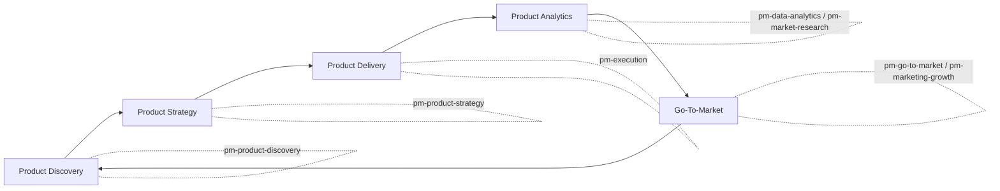

### 2.3 為什麼這五個職能要循環而非線性

實務上 PM 工作不是「做完 Discovery 才做 Strategy，做完 Strategy 才做 Delivery」的瀑布式流程，而是持續循環：上線後的 Analytics 數據會回饋到下一輪 Discovery，GTM 階段收集到的客戶意見也會修正 Strategy。PM Skills 的設計刻意讓每個 Plugin 獨立可安裝、互不強制依賴，正是為了支援這種非線性、隨時可以回頭呼叫任一階段 Skill 的真實工作模式。

> **實務案例**：某網路銀行 App 團隊在上線 3 個月後，用 `pm-data-analytics` 的 `/analyze-cohorts` 發現某個用戶群留存率偏低，於是回頭用 `pm-product-discovery` 的 `/interview` 設計訪談腳本，找出問題根因後再用 `pm-execution` 的 `/write-prd` 產出改善需求——一次完整的「Analytics 回饋 Discovery」循環。
>
> **注意事項**：不要把五大職能誤解為固定執行順序，PM Skills 的價值在於「任何階段需要時都能立刻呼叫對應方法論」，而不是強制走完整套流程。

---

## 第 3 章：系統架構解析

### 3.1 整體架構（Overall Architecture）

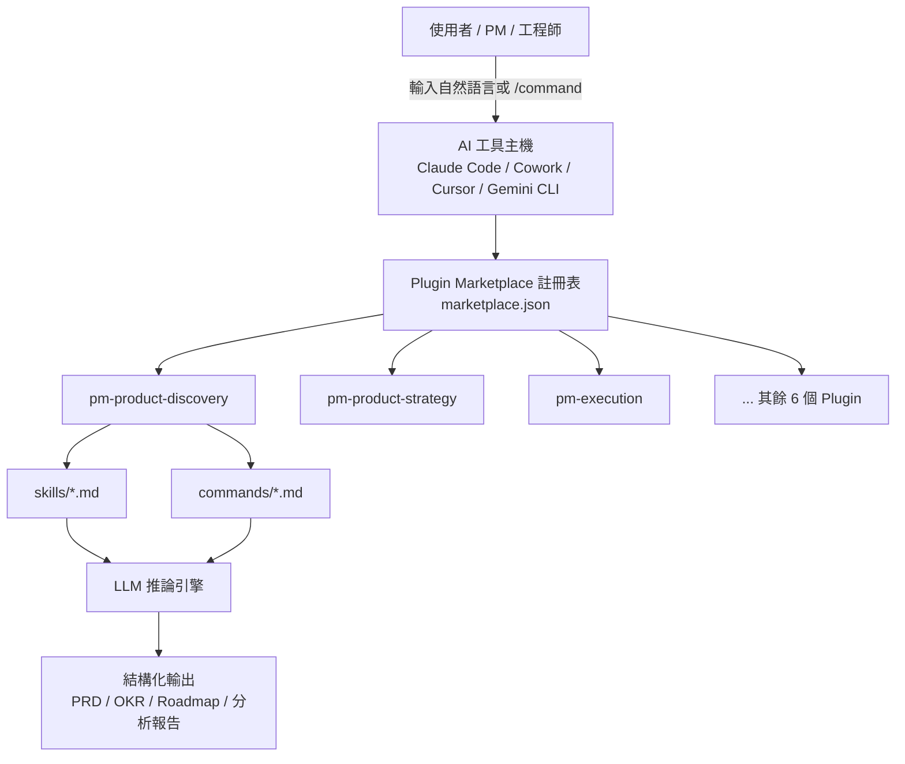

整體架構分為四層：

1. **使用者介面層**：PM 或工程師在 Claude Code / Cowork / Cursor 等工具中輸入自然語言，或直接呼叫 `/command-name`。
2. **Marketplace 註冊層**：`marketplace.json` 定義這個 Repo 提供哪些 Plugin，AI 工具依此清單列出可安裝項目。
3. **Plugin 內容層**：每個 Plugin 內含 `skills/` 與 `commands/` 兩個資料夾，是實際知識與工作流的存放處。
4. **推論與輸出層**：LLM 讀取被載入的 Skill 內容作為上下文，依框架產出結構化文件。

### 3.2 Plugin 架構（Plugin Architecture）

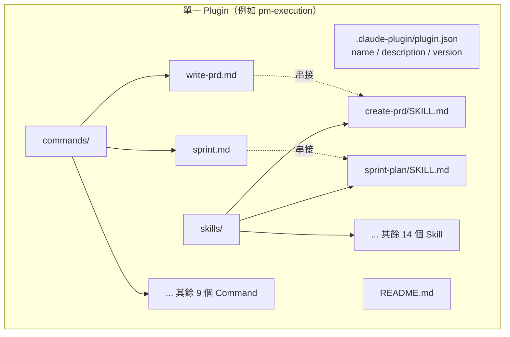

每個 Plugin 都是「自包含」的：它有自己的 manifest、README、skills、commands，可以獨立安裝、獨立解除安裝，且**不允許跨 Plugin 互相引用**——這是 `pm-skills` 維護者在 `CLAUDE.md` 中明訂的硬規則，目的是確保任何 Plugin 都能單獨運作，不會因為使用者沒安裝另一個 Plugin 而報錯或行為異常。

### 3.3 Skill 載入流程（Skill Loading Flow）

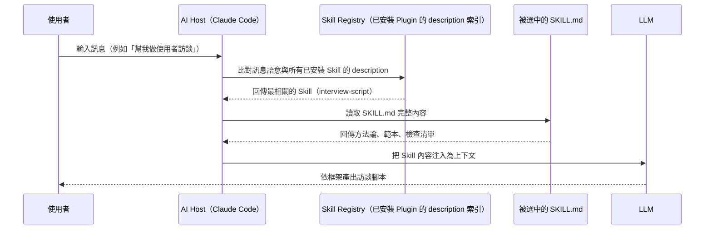

Skill 採用「**漸進式揭露（Progressive Disclosure）**」設計：frontmatter（`name`、`description`）永遠常駐在 AI 的索引中，但完整內文只有在語意相關被觸發時才會載入到上下文，避免所有 68 個 Skill 同時佔用 Token 預算。使用者也可以用 `/plugin-name:skill-name` 語法強制載入特定 Skill，不需要等待語意自動判斷。

### 3.4 Command 執行流程（Command Execution Flow）

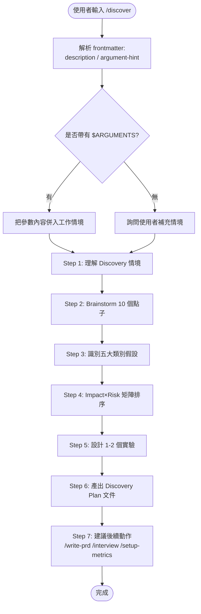

Command 的本質是一份「結構化的多步驟提示詞」，frontmatter 只需要 `description` 與 `argument-hint` 兩個欄位，內文用自然語言描述步驟順序、每步驟要呼叫哪個 Skill、以及每個 checkpoint 該怎麼跟使用者互動（例如允許跳過、深入、重做）。它不是傳統意義上的程式碼函式呼叫，而是引導 LLM 依序完成一連串結構化思考的「劇本」。

> **實務案例**：在 `/discover` 的真實實作中，Command 明確標註「這是一個 15-30 分鐘的結構化工作流」，並建議使用者在開始前先準備好既有的研究資料，避免 AI 從零開始假設情境。
>
> **注意事項**：Command 不會自動讀取外部系統（如 Jira、Confluence）的資料，所有情境輸入仍需使用者在對話中提供或貼上，這是目前 Claude Code Skill 機制的限制，而非 Bug。

### 3.5 與 Anthropic 官方 Agent Skills 規格的對應關係

`pm-skills` 的 Skill 載入機制並非自創，而是直接建立在 Anthropic 官方的 **Agent Skills** 規格之上（見 [Anthropic 官方文件](https://platform.claude.com/docs/en/agents-and-tools/agent-skills/overview)）。官方文件明確定義了三層「漸進式揭露（Progressive Disclosure）」架構，並給出精確的 Token 成本量級：

| 層級 | 載入時機 | Token 成本 | 內容 |
|---|---|---|---|
| **Level 1：Metadata** | 常駐（啟動時即載入系統提示） | 每個 Skill 約 100 tokens | `name` + `description`（YAML frontmatter） |
| **Level 2：Instructions** | 被觸發時才載入 | 通常低於 5,000 tokens | `SKILL.md` 本文（方法論、範本、檢查清單） |
| **Level 3：Resources** | 依需求才存取 | 幾乎無上限 | 透過 bash 讀取的附加檔案、可執行腳本；腳本執行結果才進入上下文，腳本原始碼本身不會 |

這與本手冊 5.3 節描述的「常駐成本極低、載入成本可控」完全吻合，差別在於官方文件提供了具體的數字佐證，而非僅憑經驗推論。值得注意的是，官方文件也明確指出 **Claude Code 的 Custom Skills 屬於檔案系統層級**（存放於 `~/.claude/skills/` 或專案內 `.claude/skills/`，也可透過 Plugin 分享），與 claude.ai、Claude API 上傳的 Skill 互不同步——這正是第 8 章「多工具能力對照」中，Cursor、Gemini CLI 等工具需要手動複製 Skill 資料夾、而非直接共用同一份安裝的根本原因。

官方文件同時列出明確的安全考量，企業導入前應一併納入治理規範：Skill 本質上是「對 AI 下達的指令 + 可選的可執行程式碼」，只應使用來自可信來源的 Skill；若 Skill 涉及存取外部 URL 或執行腳本，應在安裝前完整審閱內容，避免被植入隱藏指令或惡意程式碼。`pm-skills` 本身全部以純 Markdown 撰寫、不含任何可執行腳本，相對風險較低，但企業若日後自建或引入其他 Skill 來源，仍應依此原則建立審核流程（呼應第 17、18 章既有的治理建議）。

---

## 第 4 章：Repository 結構解析

### 4.1 頂層目錄結構

```mermaid
graph TD
    Root[pm-skills/] --> ClaudePlugin[.claude-plugin/<br/>marketplace.json]
    Root --> Docs[.docs/<br/>內部文件與設計筆記]
    Root --> Agents[AGENTS.md<br/>給通用 AI Agent 的說明]
    Root --> ClaudeMd[CLAUDE.md<br/>給 Claude Code 的貢獻規範]
    Root --> Contributing[CONTRIBUTING.md]
    Root --> License[LICENSE　MIT]
    Root --> Readme[README.md]
    Root --> Validate[validate_plugins.py<br/>結構驗證腳本]
    Root --> P1[pm-product-discovery/]
    Root --> P2[pm-product-strategy/]
    Root --> P3[pm-execution/]
    Root --> P4[pm-market-research/]
    Root --> P5[pm-data-analytics/]
    Root --> P6[pm-go-to-market/]
    Root --> P7[pm-marketing-growth/]
    Root --> P8[pm-toolkit/]
    Root --> P9[pm-ai-shipping/]
```

### 4.2 各目錄用途說明

| 目錄 / 檔案 | 用途 |
|---|---|
| `.claude-plugin/marketplace.json` | 定義整個 Repo 作為一個 Marketplace，列出所有可安裝的 Plugin 名稱、版本、描述 |
| `<plugin>/.claude-plugin/plugin.json` | 單一 Plugin 的 manifest，記錄名稱、版本、描述，必須與該 Plugin 的 `README.md` 描述一致 |
| `<plugin>/README.md` | Plugin 層級的說明文件，列出該 Plugin 包含的 Skill 與 Command 清單 |
| `<plugin>/skills/<skill-name>/SKILL.md` | 單一 Skill 的完整內容（frontmatter + 方法論內文） |
| `<plugin>/commands/<command-name>.md` | 單一 Command 的完整內容（frontmatter + 多步驟工作流劇本） |
| `CLAUDE.md` / `AGENTS.md` | 給 AI Agent（包括 Claude Code 自己）的貢獻規範說明，定義 Skill / Command 撰寫規則 |
| `CONTRIBUTING.md` | 給人類貢獻者的 PR 流程說明 |
| `validate_plugins.py` | 結構驗證腳本，檢查每個 Plugin 的 manifest、Skill、Command 是否符合規範（缺少必要欄位、跨 Plugin 引用等） |

### 4.3 版本管理慣例

所有 Plugin 共用同步的版本號（查證時為 `2.0.0`），代表 Marketplace 採用「整體發布」模式而非各 Plugin 獨立版本號。任何 Skill 或 Command 異動後，貢獻者都必須：

1. 執行 `python3 validate_plugins.py` 確認結構正確。
2. 同步更新 `README.md` 中的 Skill / Command 總數。
3. 確認 `marketplace.json` 的 Plugin 描述與各自 `plugin.json` / `README.md` 一致。
4. 統一遞增所有受影響 manifest 的版本號。

> **實務案例**：企業若要 Fork 這個 Repo 建立內部專屬 Plugin（例如加入符合公司內部 PRD 範本的 Skill），建議保留 `validate_plugins.py` 驗證機制，並在內部 CI 加入這支腳本作為 PR 檢查的一環，避免結構性錯誤被合併進主分支。
>
> **注意事項**：`.claude-plugin` 與 `.docs` 目錄在一般檔案列表中可能因為是隱藏目錄而被忽略，Clone 後務必確認這兩個目錄存在，否則 Marketplace 註冊會失敗。

---

## 第 5 章：Skills Framework 詳解

### 5.1 設計理念

PM Skills 的每一個 Skill 都遵循四個設計原則：

- **Markdown-Based Skills**：完全用 Markdown 撰寫，沒有程式碼、沒有編譯步驟，PM 或非技術人員也能直接閱讀、修改。
- **Structured Thinking**：每個 Skill 內建一個明確的分析框架（例如 Impact×Risk 矩陣、JTBD 陳述句、OKR 公式），引導 AI 與使用者用結構化方式思考，而不是自由發散。
- **Reusable Methodologies**：封裝的是「方法論」而不是「一次性答案」，同一個 Skill 可以套用在完全不同的產品情境。
- **AI Readable Knowledge**：內容格式對 LLM 友善（清楚的標題層級、條列、範例），確保 AI 能準確抽取與套用框架，不會因排版混亂而誤解。

### 5.2 Skill 組成結構

一個 Skill 的目錄結構固定為：

```text
skills/
└── create-prd/
    └── SKILL.md
```

`SKILL.md` 內容分為兩部分：

```yaml
---
name: create-prd
description: 引導使用者撰寫結構化 PRD（產品需求文件），包含背景、目標、User Story、驗收標準、風險評估。當使用者提到「寫 PRD」、「需求文件」、「product requirements」時應載入此 Skill。
---

## 目標
（說明這個 Skill 要解決什麼問題）

## 核心框架
（例如 PRD 的標準章節結構）

## 範例
（一份簡化版的 PRD 範例）

## 檢查清單
（PRD 完成前的自我檢查項目）
```

| Frontmatter 欄位 | 是否必填 | 說明 |
|---|---|---|
| `name` | 必填 | 必須與 Skill 所在目錄名稱完全一致 |
| `description` | 必填 | 常駐載入於 AI 的 Skill 索引中，需包含足夠的觸發關鍵字，讓 AI 在語意相關時能準確判斷是否載入 |

與一般 Command 不同，**Skill 沒有 `argument-hint`、沒有 `$ARGUMENTS`**——Skill 設計上直接讀取目前對話的上下文，不需要使用者額外傳參數，這也是 Skill 與 Command 在設計哲學上的核心差異。

### 5.3 漸進式揭露的實際效益

68 個 Skill 如果同時全文載入，會佔用大量 Token 預算並拖慢回應速度。漸進式揭露機制讓：

- **常駐成本極低**：只有 `name` + `description`（通常 1-3 句話）常駐在索引中，依 Anthropic 官方規格約為每個 Skill 100 tokens（詳見 3.5 節的官方三層 Token 成本表）。
- **載入成本可控**：只有被判定為相關的 Skill，才會把完整 `SKILL.md` 內文載入上下文，官方規格的經驗值為低於 5,000 tokens。
- **可擴展性高**：即使團隊持續新增上百個 Skill，常駐索引的 Token 成長也是線性且可控的——68 個 Skill 全部常駐也僅約 6,800 tokens，遠低於主流 LLM 的上下文視窗。

### 5.4 範例：`interview-script` Skill 的設計思路

`pm-product-discovery` Plugin 中的 `interview-script` Skill，其 `description` 會包含「使用者訪談」「interview script」「客戶訪談腳本」等觸發詞。當 PM 在對話中說「幫我設計一份客戶訪談腳本」，AI 會自動載入此 Skill，內文通常包含：

- 訪談開場白範本（建立信任、說明目的）。
- 依 JTBD 框架設計的核心問題（過去行為 > 困難情境 > 替代方案 > 理想結果）。
- 結尾追問技巧（避免引導性問題）。
- 訪談紀錄整理範本，銜接後續的 `summarize-interview` Skill。

> **實務案例**：某團隊在企業內部複製 `create-prd` Skill 並修改其 `description`，加入公司內部慣用詞（例如「規格書」「SRS」），讓同仁用習慣的中文詞彙也能正確觸發該 Skill，不需要學習英文術語才能使用。
>
> **注意事項**：修改 `description` 後務必同步檢查 `plugin.json` 與 `README.md` 中對應的 Skill 列表說明是否仍然一致，避免文件與實際行為產生落差。

---

## 第 6 章：Commands Framework 詳解

### 6.1 Slash Commands 的工作原理

Command 是「使用者主動觸發」的工作流，而 Skill 是「AI 自動載入」的知識模組。兩者的關係是：**Command 負責編排順序，Skill 負責提供方法論內容**。例如 `pm-product-discovery` Plugin 的 `/discover` Command，本身不包含 Brainstorm 的詳細框架，而是在工作流的某個步驟「呼叫」`brainstorm-ideas-new`／`brainstorm-ideas-existing` 這兩個 Skill 來取得框架內容。

Command 的 frontmatter 規格：

```yaml
---
description: 引導完成一次完整的產品探索循環（Discovery Cycle）
argument-hint: "[產品名稱或情境描述]"
---
```

- `description`：簡短說明這個 Command 做什麼，會顯示在 Command 選單中。
- `argument-hint`：提示使用者呼叫時可以帶入什麼參數，對應內文中的單一 `$ARGUMENTS` 佔位符。

### 6.2 `/discover` 實際執行流程（真實案例還原）

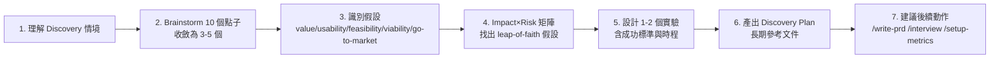

這個流程刻意區分「既有產品（有真實使用者）」與「全新產品（未驗證概念）」兩種情境，在每個步驟設置 checkpoint，讓使用者可以選擇「跳過」「深入」或「重新來一次」，而不是被迫走完整套死板流程。Command 內文也明確標註「這是一個 15-30 分鐘的結構化工作流」，並建議使用者在開始前先準備好既有研究資料。

### 6.3 如何串接多個 Skill

Command 串接 Skill 的方式不是程式碼層面的函式呼叫，而是在 Command 的劇本敘述中，直接指示 AI「在這個步驟，套用某個 Skill 的方法論」。由於同一 Plugin 內的 Skill 與 Command 永遠一起安裝、一起解除安裝，**Command 可以放心引用同 Plugin 內的任何 Skill**，但**絕對不能引用其他 Plugin 的 Skill**——這條規則在 `CLAUDE.md` 中被列為硬性要求，原因是使用者可能只安裝 `pm-execution` 而沒安裝 `pm-product-discovery`，跨 Plugin 引用會導致該 Command 在缺少依賴 Plugin 時行為異常或報錯。

### 6.4 如何建立自訂 Command

企業若要建立內部專屬 Command（例如串接公司內部的 PRD 模板與 Jira 票卡格式），建議遵循以下步驟：

1. 在既有 Plugin 內（或新建一個內部 Plugin）的 `commands/` 目錄新增 `.md` 檔案。
2. 撰寫 frontmatter：`description`（一句話說明用途）、`argument-hint`（參數提示）。
3. 內文用條列式步驟描述工作流，每個步驟標明要套用哪個 Skill 的框架。
4. 在每個關鍵步驟加入 checkpoint 敘述，允許使用者中途調整方向。
5. 結尾加入「建議後續動作」，引導使用者銜接下一個相關 Command，但只能銜接同 Plugin 內的 Command。
6. 執行 `validate_plugins.py` 確認格式正確，並更新該 Plugin 的 `README.md`。

> **實務案例**：金融業團隊建立內部 `/compliance-review` Command，串接公司專屬的法規檢查 Skill 與既有的 `pre-mortem`（風險預演）Skill，讓每次 PRD 定案前都會自動跑一次合規與風險雙重檢查。
>
> **注意事項**：避免把 Command 寫得過長過細，步驟超過 10 個以上的工作流會讓單次互動時間過長、使用者容易在中途流失耐心；可以考慮拆成兩個互補的 Command，例如 `/discover`（前段探索）與 `/setup-metrics`（後段度量），讓使用者依需要分開呼叫。

---

## 第 7 章：九大 Plugin 完整解析

> 以下數據（Skill 數、Command 數、Command 名稱）皆為查證 repo 實際內容後的真實資訊。市面上流傳的「八大 Plugin」說法缺少 `pm-ai-shipping`，本章補齊為完整九大 Plugin。

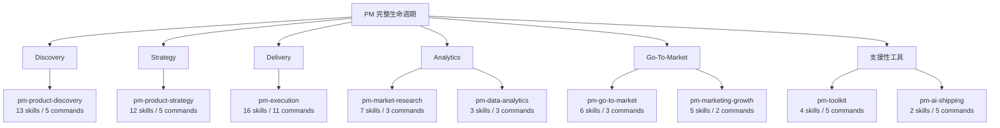

### 7.1 pm-product-discovery（13 skills / 5 commands）

**定位**：產品探索期的核心工具箱，涵蓋 Teresa Torres 的 Continuous Discovery 方法論。

- **代表 Skill**：`brainstorm-ideas-new` / `brainstorm-ideas-existing`、`identify-assumptions-new` / `identify-assumptions-existing`、`opportunity-solution-tree`、`interview-script`、`summarize-interview`、`prioritize-assumptions`、`prioritize-features`、`analyze-feature-requests`、`metrics-dashboard`。
- **Command**：`/discover`（完整探索循環）、`/brainstorm`、`/triage-requests`（需求請求分流）、`/interview`、`/setup-metrics`。

> **實務案例**：開發網路銀行 App 時，產品團隊用 `/discover` 探索「年輕族群為何不願意把薪轉帳戶換到我們的 App」。流程跑完 Brainstorm 階段後收斂出 3 個假設方向（手續費透明度、開戶流程過長、信任度不足），再用 Impact×Risk 矩陣排序，發現「開戶流程過長」是 leap-of-faith 假設，於是設計一個「5 分鐘線上開戶」原型實驗，並用 `opportunity-solution-tree` Skill 把整個探索過程視覺化呈現給主管。

### 7.2 pm-product-strategy（12 skills / 5 commands）

**定位**：產品願景、商業模式與市場定位的策略層工具。

- **代表 Skill**：`product-strategy`、`product-vision`、`lean-canvas`、`business-model`、`pricing-strategy`、`SWOT`、`PESTLE`、`Porter's Five Forces`。
- **Command**：`/strategy`、`/business-model`、`/value-proposition`、`/market-scan`、`/pricing`。

> **實務案例**：企業數位轉型平台團隊用 `/strategy` 重新檢視產品願景是否仍符合市場現況，搭配 `PESTLE` Skill 分析法規與技術趨勢（例如 AI 法規、雲端遷移趨勢），再用 `lean-canvas` 把轉型平台的價值主張、客群、收入模式快速視覺化，作為向董事會報告的基礎素材。

### 7.3 pm-execution（16 skills / 11 commands，規模最大的 Plugin）

**定位**：PM 日常執行層的核心工具箱，涵蓋從需求文件到 Sprint 管理的完整交付鏈。

- **代表 Skill**：`create-prd`、`brainstorm-okrs`、`sprint-plan`、`pre-mortem`、`stakeholder-map`、`prioritization-frameworks`、`strategy-red-team`。
- **Command**：`/write-prd`、`/plan-okrs`、`/sprint`、`/pre-mortem`、`/red-team-prd`、`/meeting-notes`、`/stakeholder-map`、`/write-stories`、`/test-scenarios`、`/generate-data`。

> **實務案例**：Spring Boot 專案需求規格撰寫——後端團隊要重構會員系統的訂閱續約邏輯，PM 用 `/write-prd` 產出 PRD 初稿，內含背景、目標、User Story（「身為訂閱用戶，我希望續約失敗時收到明確錯誤原因」）、驗收標準（Gherkin 格式）。接著用 `/red-team-prd` 對 PRD 進行對抗式檢視，找出「自動續約失敗的重試機制未定義」這個遺漏，最後用 `/write-stories` 把 PRD 拆解成可排入 Sprint 的 User Story 清單，直接交給 Spring Boot 開發團隊估點。

### 7.4 pm-market-research（7 skills / 3 commands）

**定位**：使用者研究與競爭分析。

- **代表 Skill**：`user-personas`、`market-segments`、`customer-journey-map`、`market-sizing`、`competitor-analysis`、`sentiment-analysis`。
- **Command**：`/research-users`、`/competitive-analysis`、`/analyze-feedback`。

> **實務案例**：金融科技產品分析——團隊要評估是否進入「中小企業放款」市場，用 `market-sizing` Skill 估算 TAM/SAM/SOM，再用 `competitor-analysis` 整理三家主要競品的利率、審核時間、額度上限，最後用 `customer-journey-map` 畫出中小企業主從「資金需求出現」到「核貸撥款」的完整旅程，找出競品在「審核透明度」環節的體驗缺口作為差異化切入點。

### 7.5 pm-data-analytics（3 skills / 3 commands，最精簡的 Plugin）

**定位**：數據分析的技術性支援工具。

- **代表 Skill**：`sql-queries`、`cohort-analysis`、`ab-test-analysis`。
- **Command**：`/write-query`、`/analyze-cohorts`、`/analyze-test`。

> **實務案例**：會員系統分析——PM 不熟悉 SQL 語法，用 `/write-query` 描述「我想知道過去 90 天新註冊用戶中，有完成首次購買的比例，依註冊管道分組」，AI 依 `sql-queries` Skill 的框架產出對應 SQL，再用 `/analyze-cohorts` 對「依月份註冊」的用戶群組做留存率趨勢分析，找出第 3 個月留存率明顯下滑的拐點。

### 7.6 pm-go-to-market（6 skills / 3 commands）

**定位**：產品上市策略，聚焦灘頭市場與客戶輪廓。

- **代表 Skill**：`gtm-strategy`、`beachhead-segment`、`ideal-customer-profile`、`growth-loops`、`competitive-battlecard`。
- **Command**：`/plan-launch`、`/growth-strategy`、`/battlecard`。

> **實務案例**：SaaS 平台上線——團隊用 `beachhead-segment` Skill 鎖定「10-50 人的軟體開發團隊」作為第一波灘頭市場，用 `ideal-customer-profile` 定義出該客群的關鍵特徵（已使用 CI/CD、有專職 DevOps），再用 `/plan-launch` 規劃完整上市時程，包含 Beta 邀請名單、發布會節點、首週客服應變計畫。

### 7.7 pm-marketing-growth（5 skills / 2 commands）

**定位**：行銷定位與成長度量。

- **代表 Skill**：`marketing-ideas`、`positioning-ideas`、`value-prop-statements`、`product-name`、`north-star-metric`。
- **Command**：`/market-product`、`/north-star`。

> **實務案例**：新產品推廣——團隊要幫一個新的 AI 寫作助理功能命名與定位，用 `product-name` Skill 產出多個候選名稱並評估可註冊性與語意聯想，再用 `value-prop-statements` 寫出一句話價值主張，最後用 `/north-star` 確認這個新功能該追蹤的北極星指標是「週活躍寫作次數」而不是單純的「功能開啟次數」。

### 7.8 pm-toolkit（4 skills / 5 commands）

**定位**：通用支援工具，與核心 PM 工作流相對獨立。

- **代表 Skill**：`review-resume`、`draft-nda`、`privacy-policy`、`grammar-check`。
- **Command**：`/review-resume`、`/tailor-resume`、`/draft-nda`、`/privacy-policy`、`/proofread`。

> **實務案例**：專案管理實務——PM 團隊招募新成員時，用 `/review-resume` 快速篩選履歷亮點與落差，新產品上線前用 `/privacy-policy` 產出隱私權政策初稿交給法務複核，日常文件對外發布前用 `/proofread` 做最後一輪校稿。

### 7.9 pm-ai-shipping（2 skills / 5 commands，第九個 Plugin）

**定位**：銜接「AI 寫的程式碼」與「可上線交付」之間的缺口，是九大 Plugin 中最新、也是使用者模板常遺漏的一個。

- **代表 Skill**：`shipping-artifacts`、`intended-vs-implemented`（比對「原本想做的」與「實際做出來的」之間的落差）。
- **Command**：`/ship-check`、`/document-app`、`/derive-tests`、`/security-audit-static`、`/performance-audit-static`。

> **實務案例**：AI 程式碼出貨稽核——團隊用 Claude Code 快速 Vibe Coding 出一個內部報表工具原型，上線前用 `/document-app` 自動補上架構文件，用 `/security-audit-static` 做靜態安全掃描，用 `/derive-tests` 依現有程式碼反推應該補上的測試案例，最後用 `/ship-check` 彙整成一份「Reviewer-Ready」的交付包，讓 Code Review 不需要從零開始理解整個專案。
>
> **注意事項**：`pm-ai-shipping` 的稽核屬於「靜態分析」層級，不能取代真正的滲透測試或動態安全掃描；企業導入時應將其定位為「第一道防線」，而非唯一防線。

---

## 第 8 章：PM Skills 安裝與設定

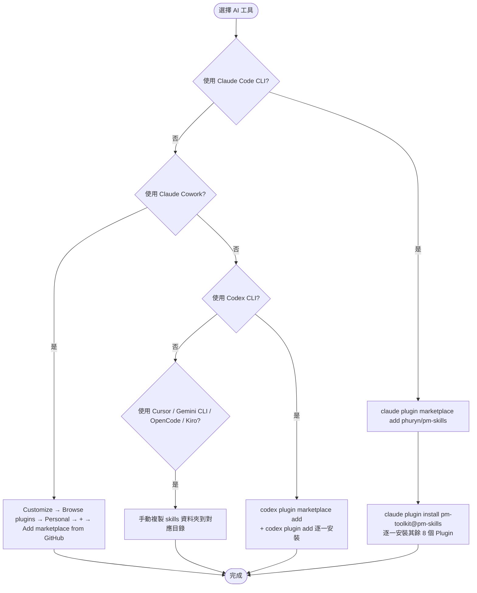

### 8.1 Claude Code（CLI）

**安裝方式**：

```bash
# 步驟 1：註冊 Marketplace
claude plugin marketplace add phuryn/pm-skills

# 步驟 2：安裝個別 Plugin（可只裝需要的）
claude plugin install pm-toolkit@pm-skills
claude plugin install pm-product-strategy@pm-skills
claude plugin install pm-product-discovery@pm-skills
claude plugin install pm-market-research@pm-skills
claude plugin install pm-data-analytics@pm-skills
claude plugin install pm-marketing-growth@pm-skills
claude plugin install pm-go-to-market@pm-skills
claude plugin install pm-execution@pm-skills
claude plugin install pm-ai-shipping@pm-skills
```

**目錄結構**：安裝後，Skill 與 Command 會被 Claude Code 索引至其內部 Plugin 管理機制中，使用者不需要手動移動檔案。

**Skill / Command 確認**：安裝完成後，可在對話中輸入 `/` 觀察是否出現對應 Command（如 `/write-prd`），或直接描述任務情境觀察是否有 Skill 被自動載入。

**實際案例**：企業內部標準化開發機需求，建議在 onboarding 文件中直接附上上述安裝指令清單，新人加入第一天就能完整安裝整套 Marketplace。

### 8.2 Claude Cowork

**安裝方式**：在 Cowork 介面中，依序點選 **Customize → Browse plugins → Personal → +**，選擇 **Add marketplace from GitHub**，輸入 `phuryn/pm-skills`，即可從清單中勾選要安裝的 Plugin。

**Agent Mode 整合**：Cowork 屬於多人協作場景，安裝後的 Plugin 對團隊內所有成員可見，適合企業團隊共用同一套標準化工作流。

**實際案例**：PM 團隊主管在 Cowork 中統一安裝 `pm-execution` 與 `pm-product-discovery`，確保所有 PM 成員產出的 PRD 與 Discovery 文件格式一致，新人也能立刻套用團隊既有規範，不需要額外教學。

### 8.3 Cursor

**安裝方式**：Cursor 的 Skill 機制遵循通用格式，將 `pm-skills` 各 Plugin 下的 `skills/` 資料夾內容，複製到專案的 `.cursor/skills/` 目錄。

```bash
git clone https://github.com/phuryn/pm-skills.git /tmp/pm-skills
mkdir -p .cursor/skills
cp -r /tmp/pm-skills/pm-execution/skills/* .cursor/skills/
cp -r /tmp/pm-skills/pm-product-discovery/skills/* .cursor/skills/
```

**注意**：Command（`/discover` 等 Slash Command 語法）為 Claude 專屬，Cursor 中無法直接以相同語法觸發，需改用自然語言描述對應工作流（例如直接打字「請依照 discover 流程幫我探索這個產品機會」）。

**實際案例**：前端工程師在 Cursor 中複製 `pm-execution` 的 Skill 後，當他在對話中描述「我要寫一個 User Story」，Cursor 會自動載入 `create-prd` 相關 Skill 內容，協助寫出符合驗收標準格式的 User Story，不需要額外安裝外部工具。

### 8.4 Gemini CLI

**安裝方式**：將 Skill 資料夾複製到 `~/.gemini/skills/` 目錄。

```bash
mkdir -p ~/.gemini/skills
cp -r /tmp/pm-skills/pm-data-analytics/skills/* ~/.gemini/skills/
```

**Skill 載入方式**：Gemini CLI 依其自身的上下文比對機制決定是否載入，原理與 Claude Code 類似，但因為缺乏 Command 機制，多步驟工作流（如 `/discover`）需要使用者自行依照原始 Command 文件的步驟順序，逐步用自然語言引導 Gemini 完成。

**實際案例**：資料分析師在 Gemini CLI 中複製 `pm-data-analytics` 的 `sql-queries` Skill，描述「幫我寫一個查詢過去 30 天活躍用戶的 SQL」，Gemini 依 Skill 框架產出結構化 SQL 查詢與欄位說明。

### 8.5 Codex CLI（原生 Marketplace 支援）

**安裝方式**：Codex CLI 自 repo v2.0.0 起提供與 Claude Code 對等的原生 Marketplace 指令，不再需要手動複製檔案：

```bash
# 步驟 1：註冊 Marketplace
codex plugin marketplace add phuryn/pm-skills

# 步驟 2：安裝個別 Plugin
codex plugin add pm-toolkit@pm-skills
codex plugin add pm-execution@pm-skills
```

**與 Claude Code 的差異**：指令語法、安裝流程與 Claude Code 幾乎一致（僅 `claude` 換成 `codex`），降低了團隊內部混用 Claude 與 OpenAI 生態系工具時的學習成本。

**實際案例**：已導入 OpenAI 生態系作為主要開發工具鏈的團隊，可直接沿用與 Claude Code 相同的 Onboarding 文件範本，只需把指令中的 `claude` 替換成 `codex`，不需要重新撰寫一套安裝教學。

### 8.6 OpenCode 與 Kiro（手動複製 Skill）

**安裝方式**：與 Cursor、Gemini CLI 相同，皆為手動複製 `skills/` 資料夾內容到工具指定目錄，僅目錄路徑不同：

```bash
# OpenCode
mkdir -p .opencode/skills
cp -r /tmp/pm-skills/pm-execution/skills/* .opencode/skills/

# Kiro
mkdir -p .kiro/skills
cp -r /tmp/pm-skills/pm-product-discovery/skills/* .kiro/skills/
```

**注意**：這兩個工具與 Cursor、Gemini CLI 一樣不支援 Slash Command 語法，多步驟工作流需改用自然語言依照原始 Command 文件描述逐步引導。

### 8.7 多工具能力對照

| AI 工具 | Marketplace 原生支援 | Skill 自動載入 | Command（Slash） | 安裝複雜度 |
|---|---|---|---|---|
| Claude Code | 是 | 是 | 是 | 低（一行指令） |
| Claude Cowork | 是 | 是 | 是 | 低（UI 點選） |
| Codex CLI | 是 | 是 | 是 | 低（一行指令，語法與 Claude Code 對等） |
| Cursor | 否 | 是 | 否（需改自然語言） | 中（需手動複製） |
| Gemini CLI | 否 | 是 | 否（需改自然語言） | 中（需手動複製） |
| OpenCode | 否 | 是 | 否（需改自然語言） | 中（需手動複製） |
| Kiro | 否 | 是 | 否（需改自然語言） | 中（需手動複製） |

> **注意事項**：手動複製 Skill 資料夾的方式（Cursor / Gemini CLI / OpenCode / Kiro）無法自動取得後續版本更新，企業若選擇這類路線，建議寫一支簡單的同步腳本，定期 `git pull` 原始 Repo 並重新複製，避免長期使用過時版本的方法論內容。

---

## 第 9 章：使用 PM Skills 協助 Web Application 開發

以 **Vue 3 + Spring Boot** 專案為例，說明 PM Skills 如何貫穿從探索到上線的完整生命週期。

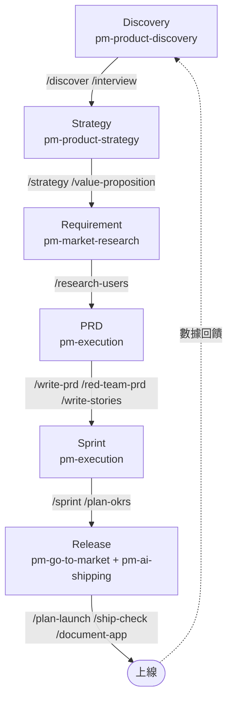

### 9.1 Discovery 階段

使用 `pm-product-discovery` 的 `/discover` 與 `/interview`：確認「企業內部報表系統」要新增的 Vue 3 前端儀表板，到底要解決哪些使用者的哪些痛點，先用 `brainstorm-ideas-existing`（既有產品情境）收斂候選方向，再設計訪談腳本驗證假設。

### 9.2 Strategy 階段

使用 `pm-product-strategy` 的 `/strategy` 與 `/value-proposition`：確認這個新儀表板功能是否符合公司整體數位轉型願景，避免做出與既有 Roadmap 衝突的功能。

### 9.3 Requirement 階段

使用 `pm-market-research` 的 `/research-users`：訪談既有 Spring Boot 後端 API 的內部使用者（業務部門同仁），確認他們對報表的真實需求，避免工程團隊憑空猜測欄位需求。

### 9.4 PRD 階段

使用 `pm-execution` 的 `/write-prd`：產出包含 Vue 3 前端互動規格、Spring Boot 後端 API 規格、資料庫欄位需求的完整 PRD，再用 `/red-team-prd` 找出遺漏的邊界案例（例如「報表資料量超過 10 萬筆時的分頁與效能要求」）。

### 9.5 Sprint 階段

使用 `pm-execution` 的 `/write-stories` 把 PRD 拆解為 User Story，搭配 `/sprint` 規劃兩週一次的 Sprint 排程，前端（Vue 3 元件開發）與後端（Spring Boot REST API）的 Story 分別估點、分配給對應團隊。

### 9.6 Release 階段

使用 `pm-go-to-market` 的 `/plan-launch` 規劃內部公告與使用教學時程，搭配 `pm-ai-shipping` 的 `/ship-check` 與 `/document-app`，確保 AI 協助產生的 Spring Boot Controller / Service 程式碼在上線前已補齊架構文件與基本安全稽核。

> **實務案例**：某保險公司的保單查詢儀表板專案，全程使用上述六階段對應的 Command，PRD 撰寫到 Sprint 排程的時間從過去平均 2 週縮短到 4 個工作日，且因為 `/red-team-prd` 提前抓出「大量資料分頁效能」的需求遺漏，避免了上線後才發現的效能問題。
>
> **注意事項**：六個階段不需要在同一次對話中跑完，建議每個階段獨立開一次新對話並貼上前一階段的輸出摘要作為輸入，避免單次對話上下文過長導致 AI 混淆不同階段的目標。

---

## 第 10 章：使用 PM Skills 進行逆向工程

**目標**：對 Legacy System 進行 Modernization，先建立完整的商業邏輯與需求認知，再制定現代化計畫。

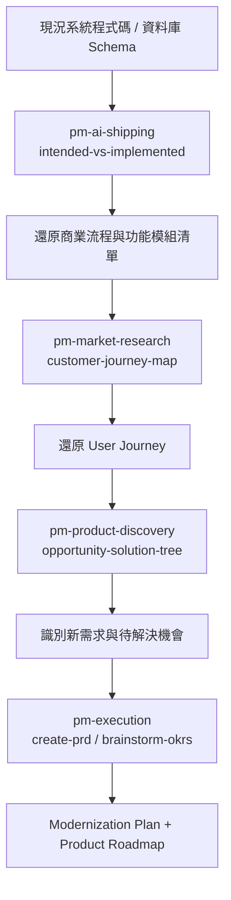

### 10.1 分析現況系統

工程師先讓 AI 閱讀 Legacy System 的程式碼（例如一套 10 年歷史的 Struts + Oracle 保單核保系統），用 `pm-ai-shipping` 的 `intended-vs-implemented` Skill 思路，比對程式碼實際行為與當初可能的設計意圖，整理出隱藏在程式碼中、從未被文件化的商業規則（例如「核保金額超過某門檻時會觸發人工複核，但條件散落在三個不同的 Service 類別中」）。

### 10.2 還原商業流程與功能模組

把上一步整理出的規則，用 `pm-execution` 的框架整理成結構化的功能模組清單與流程圖，建立「現況系統能力地圖」。

### 10.3 還原 User Journey

用 `pm-market-research` 的 `customer-journey-map` Skill，從現有系統的操作日誌或使用者訪談，反推出實際的 User Journey，往往會發現現況系統存在大量「使用者為了繞過系統限制而發展出的迂迴操作」，這些正是 Modernization 時應該優先簡化的環節。

### 10.4 建立新需求與 Roadmap

用 `pm-product-discovery` 的 `opportunity-solution-tree` 把還原出的痛點轉化為機會點，再用 `pm-execution` 的 `create-prd` 與 `brainstorm-okrs`，產出 Modernization Plan 與分階段的 Product Roadmap（例如先做資料庫遷移、再做 API 層重構、最後才動前端）。

> **實務案例**：某銀行的核心放款系統（COBOL + 大型主機）逆向工程專案，團隊先用 AI 閱讀部分批次作業程式碼，還原出「逾期繳款超過 N 天會自動調整信用評等」的隱藏規則，這條規則從未出現在任何現存文件中。還原後團隊才意識到，這個規則在過去 5 年已經產生多次邊界案例錯誤（例如假日計算方式不一致），逆向工程過程本身就直接挖出了一個待修復的 Bug，並轉化為 Modernization Roadmap 中的高優先項目。
>
> **注意事項**：逆向工程過程中 AI 只能基於「看得到的程式碼」推論意圖，無法保證 100% 還原原始設計者的真實想法；產出的商業規則文件務必交由熟悉該系統的資深工程師或業務人員覆核，避免誤判規則邊界後寫進新系統的 PRD 中。

---

## 第 11 章：使用 PM Skills 進行 Framework 升級

**案例**：Spring Boot 2 → Spring Boot 4、Java 17 → Java 25。

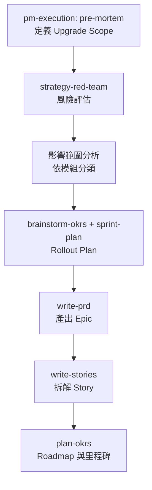

### 11.1 定義 Upgrade Scope

用 `pre-mortem` Skill 反向思考「升級失敗會是什麼樣子」，藉此提早定義出範圍邊界：哪些模組必須升級、哪些可以延後、是否要一次升級到 Java 25 還是分階段先到 Java 21 LTS。

### 11.2 風險評估

用 `strategy-red-team` Skill 對升級計畫做對抗式檢視，常見會被抓出的風險包括：第三方函式庫尚未支援新版 Spring Boot、Reflection 相關程式碼在新 JVM 版本行為改變、CI/CD Pipeline 的建置映像需要同步更新。

### 11.3 影響範圍分析

依模組分類影響範圍，例如：「使用 `javax.*` 命名空間的舊模組需要先完成 Jakarta EE 命名空間遷移，才能進行 Spring Boot 4 升級」「使用已棄用的 `WebSecurityConfigurerAdapter` 的安全設定模組需要重寫」。

### 11.4 產出 Epic / Story / Roadmap

用 `write-prd` 把整個升級計畫包裝成一個 Epic 等級的 PRD，內含每個階段的驗收標準（例如「所有單元測試在新版本下全數通過」「效能基準測試不低於舊版本的 95%」），再用 `write-stories` 拆解成可排入 Sprint 的具體任務，最後用 `plan-okrs` 把整個升級工程轉化為可追蹤的季度目標與里程碑。

> **實務案例**：一個擁有 200+ 模組的企業級 Spring Boot 2 專案規劃升級到 Spring Boot 4，PM 與架構師合作用 `pre-mortem` 找出最大風險是「自訂的 AOP 切面大量依賴舊版 Spring 內部 API」，於是把 Rollout Plan 拆成三個階段：先升級對 AOP 依賴度低的周邊模組驗證流程可行性，再處理核心交易模組，最後才動到高風險的 AOP 切面層，並把每階段都設為獨立 Epic，分散風險。
>
> **注意事項**：Framework 升級類任務涉及大量技術細節判斷（相容性矩陣、Breaking Change 清單），PM Skills 提供的是「專案管理與風險規劃框架」，技術可行性的最終判斷仍須由架構師依官方 Migration Guide 與實際相容性測試結果決定，不可僅憑 AI 產出的風險清單就直接拍板。

---

## 第 12 章：AI Agent 協作模式

### 12.1 與不同 AI 工具協作的差異

- **Claude Code / Cowork**：原生支援 Skill 自動載入與 Slash Command，適合作為 PM 與工程團隊共用的主力協作平台。
- **GitHub Copilot**：適合工程師在 IDE 內，把 PM Skills 產出的 PRD / User Story 直接轉化為程式碼骨架，搭配 Custom Instructions 讓 Copilot 理解專案慣例。
- **Cursor Agent**：適合工程師在開發過程中即時呼叫已複製的 Skill，邊寫程式邊核對 PRD 中的驗收標準。
- **Gemini CLI**：適合作為資料分析、SQL 查詢這類單一任務型工具的補充。

### 12.2 Multi-Agent Workflow

企業導入 AI Native PM 工作流時，可以把不同職責拆解成獨立的 Agent 角色，各自載入不同 Plugin：

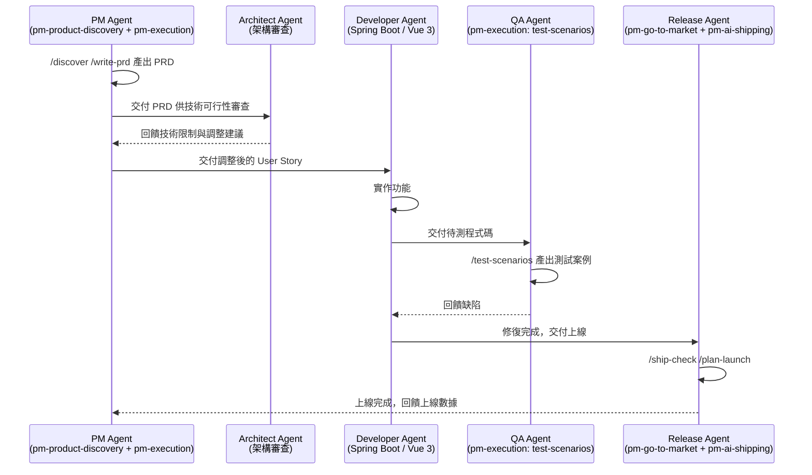

### 12.3 協作模式的關鍵原則

1. **單一真相來源**：所有 Agent 角色都應該以同一份 PRD 作為共同上下文，避免不同 Agent 各自理解任務範圍。
2. **明確交接點**：每個角色之間的交付物要明確（PM 交付 PRD 給 Architect，Architect 交付技術限制回饋給 PM），避免責任真空。
3. **人類保留最終決策權**：Multi-Agent Workflow 加速的是「產出初稿與發現問題」的速度，最終的商業判斷、技術選型決策仍應由人類角色拍板。

> **實務案例**：一個五人小型團隊（1 PM + 2 工程師 + 1 QA + 1 維運）導入此模式後，把 PM 自己同時扮演 PM Agent 與 Release Agent 兩個角色，工程師輪流扮演 Developer Agent 與 Architect Agent，QA 維持單一角色，整個團隊用同一套 Plugin Marketplace 確保交接文件格式一致，PRD 到上線的平均週期縮短了約 30%。
>
> **注意事項**：Multi-Agent Workflow 不代表需要五個獨立的 AI 帳號或五套不同系統，在小團隊中，同一個人在不同階段切換「角色提示」即可運作，真正的價值在於工作流程的結構化，而不是技術上的多 Agent 部署。

---

## 第 13 章：與 SSDLC 整合

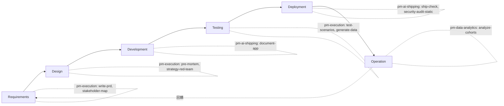

### 13.1 Requirements（需求階段）

用 `pm-execution` 的 `/write-prd` 與 `/stakeholder-map`，確保需求文件不只描述功能，也明確標註利害關係人與其關注點，作為後續 Design 階段安全與合規考量的輸入。

### 13.2 Design（設計階段）

用 `/pre-mortem` 與 `/red-team-prd` 對設計方案做對抗式檢視，提前找出架構層級的安全與效能風險（例如「這個設計沒有考慮到並發寫入時的資料一致性」）。

### 13.3 Development（開發階段）

開發過程中用 `pm-ai-shipping` 的 `/document-app` 同步維護架構文件，避免文件與程式碼脫節，這對後續的 Code Review 與安全稽核都是必要輸入。

### 13.4 Testing（測試階段）

用 `pm-execution` 的 `/test-scenarios` 從 PRD 驗收標準反推測試案例，搭配 `/generate-data` 產生測試用的模擬資料，確保測試覆蓋 PRD 中明確定義的邊界情境。

### 13.5 Deployment（部署階段）

部署前用 `pm-ai-shipping` 的 `/ship-check` 與 `/security-audit-static` 做最後一輪靜態安全與架構檢查，作為進入正式環境前的品質關卡（Quality Gate）。

### 13.6 Operation（維運階段）

上線後用 `pm-data-analytics` 的 `/analyze-cohorts` 持續監控功能使用狀況，數據異常時回饋到 Requirements 階段重新評估。

> **實務案例**：金融業內部系統導入 SSDLC 流程時，把 `/security-audit-static` 設為 CI Pipeline 中的強制檢查點之一，任何 Pull Request 若未附上稽核報告就無法進入合併審核，確保「文件先行、安全先行」的開發文化落實到流程層級而非僅依賴個人自覺。
>
> **注意事項**：PM Skills 的安全稽核 Skill 屬於輔助性質的靜態檢查，企業在金融、醫療等高合規要求產業，仍必須搭配正式的資安團隊審查與滲透測試，不能將其視為合規認證的替代品。

---

## 第 14 章：與 Agile / Scrum 整合

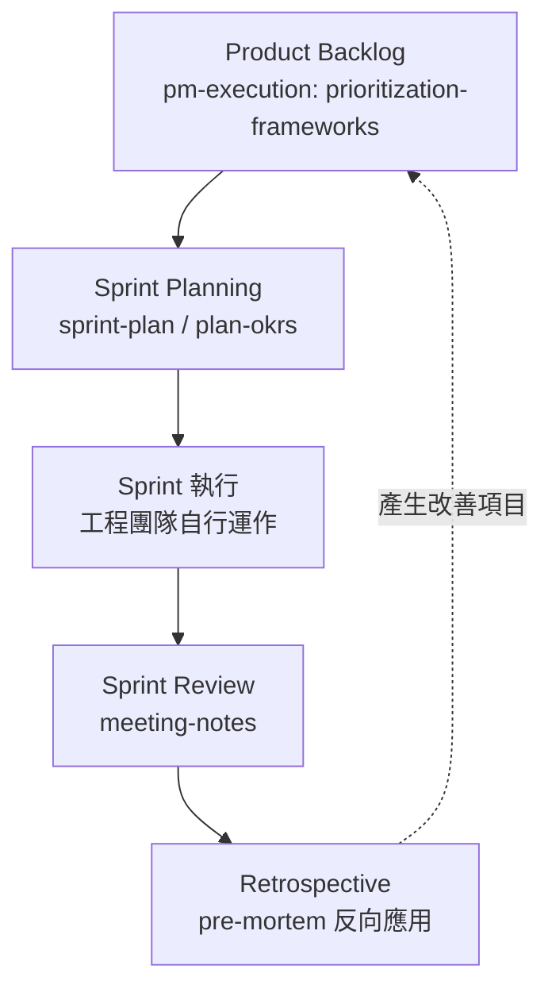

### 14.1 Product Backlog 自動產生

用 `prioritization-frameworks` Skill（涵蓋常見的 RICE、MoSCoW、Kano 模型），把 Discovery 階段收集到的大量需求請求，依框架排序產出優先順序明確的 Backlog，避免 Backlog 淪為「誰先提需求誰先做」的先進先出隊列。

### 14.2 Sprint Planning 自動產生

用 `sprint-plan` 與 `/plan-okrs`，把當季 OKR 拆解對應到具體 Sprint 目標，確保每個 Sprint 的任務都能追溯回更高層級的產品目標，而不是純粹的工程任務清單。

### 14.3 Sprint Review 紀錄

用 `/meeting-notes` 把 Sprint Review 會議中討論的內容結構化整理成行動項目清單，並標明負責人與時限，避免會議結論流於形式、事後無人追蹤。

### 14.4 Retrospective 改善項目產生

`pre-mortem` Skill 原本設計用於事前風險預演，也可以反向應用在 Retrospective：讓團隊回顧「這個 Sprint 哪裡差點搞砸」，用同樣的結構化框架整理出改善行動項目，回饋進下一輪 Backlog。

> **實務案例**：一個採用兩週 Sprint 節奏的團隊，把 `/meeting-notes` 整合進每次 Sprint Review 的會議流程，會議結束後 5 分鐘內就能產出結構化紀錄並同步到團隊 Wiki，過去需要會議主持人額外花 1-2 小時整理逐字稿，現在大幅縮短到幾乎零額外負擔。
>
> **注意事項**：AI 產出的會議紀錄仍需與會者快速核對是否準確反映討論內容，尤其是涉及承諾交付日期、責任分配的關鍵決議，避免因 AI 誤解語境而產生錯誤紀錄。

---

## 第 15 章：企業導入最佳實務

### 15.1 金融業

金融業導入時最大的考量是合規與稽核軌跡。建議優先安裝 `pm-execution`（PRD / Pre-mortem 留下決策紀錄）與 `pm-ai-shipping`（安全稽核），並要求所有 AI 產出文件都標註「AI 輔助生成，需人工覆核」的免責聲明，確保符合內部稽核要求。

### 15.2 政府單位

政府單位的需求文件常涉及多個外部委外廠商，建議統一安裝 `pm-execution` 的 `/write-prd` 與 `/stakeholder-map`，確保需求規格書格式一致，降低不同委外團隊對需求理解產生落差的風險。資料若涉及機密，務必確認所使用 AI 工具的資料保留政策符合政府資安規範，避免把敏感需求內容貼入不受信任的雲端服務。

### 15.3 大型企業

大型企業跨多個產品線、多個 PM 團隊，建議由中央平台團隊統一維護一份 Fork 過的內部專屬 Marketplace（加入公司慣用詞彙、內部範本），透過 Claude Cowork 的團隊安裝機制，確保所有 BU 使用同一套標準化工作流，同時保留 Plugin 獨立安裝的彈性，讓不同 BU 依需求選裝。

### 15.4 SaaS 團隊

SaaS 團隊通常節奏快、人力精簡，建議直接採用官方 Marketplace 原版，不需要額外客製化，重點放在把 `pm-go-to-market` 與 `pm-marketing-growth` 的工作流，盡早整合進產品上線前的標準作業流程（SOP），確保每次發布都有一致的 GTM 動作清單。

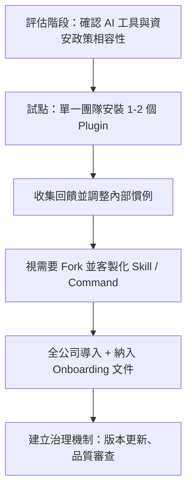

> **實務案例**：某大型保險集團採用「先試點再擴散」策略，先在一個 5 人的數位創新小組安裝 `pm-product-discovery` 與 `pm-execution` 三個月，確認 PRD 品質與 Sprint 效率提升後，才正式納入全公司 PM 團隊的標準工具鏈，並把安裝步驟寫進新人 Onboarding 文件第一週的任務清單。
>
> **注意事項**：企業導入前務必確認資料外洩風險——AI 工具的對話內容是否可能被用於模型訓練、是否符合公司資料分類規範，這點在金融與政府單位導入前必須先取得資安部門書面確認，不應由 PM 團隊自行決定。

---

## 第 16 章：常見問題 FAQ

**基礎概念**

1. **PM Skills 是什麼？** 一套可安裝到 Claude Code / Cowork 等工具的 Agentic Skill、Command、Plugin 集合，封裝產品管理方法論。
2. **它和 ChatGPT 的 GPTs 有什麼不同？** GPTs 是單一對話介面的客製化助理，PM Skills 是檔案化、可版本控管、可被多個工具複用的知識模組。
3. **需要寫程式才能用嗎？** 不需要，Skill 與 Command 都是純 Markdown，PM 與非技術人員可直接閱讀與修改。
4. **是免費的嗎？** Repo 採 MIT License 開源免費，但需自備可使用的 AI 工具帳號（如 Claude Code）。
5. **Skill 和 Command 哪個先學？** 建議先用 Command（例如 `/discover`），體驗完整工作流後再深入了解背後個別 Skill 的細節。
6. **一定要安裝全部 9 個 Plugin 嗎？** 不需要，每個 Plugin 可獨立安裝，依團隊實際需求選裝即可。
7. **Plugin 之間真的完全沒有依賴關係嗎？** 是的，這是維護者明訂的硬規則，確保任何 Plugin 都能單獨運作。
8. **這套工具能取代 PM 嗎？** 不能，它是輔助結構化思考與加速初稿產出的工具，最終商業判斷仍須人類 PM 把關。

**安裝與設定**

9. **Claude Code 要怎麼安裝？** `claude plugin marketplace add phuryn/pm-skills`，再逐一 `claude plugin install <plugin>@pm-skills`。
10. **Cursor 可以用嗎？** 可以，但需手動把 `skills/` 資料夾複製到 `.cursor/skills/`，且無法使用 Slash Command。
11. **可以只安裝部分 Skill 而不是整個 Plugin 嗎？** 官方安裝機制是以 Plugin 為單位，若要更細粒度，需手動複製單一 Skill 資料夾。
12. **安裝後找不到 Slash Command 怎麼辦？** 確認所用工具是否原生支援 Plugin Marketplace（Cursor / Gemini CLI 不支援，需改用自然語言觸發）。
13. **更新 Plugin 版本要怎麼做？** 重新執行 `claude plugin marketplace add` 或在 UI 中檢查更新，依工具介面而定。
14. **企業內部能 Fork 後自建 Marketplace 嗎？** 可以，MIT License 允許自由 Fork 與修改，但建議保留 `validate_plugins.py` 驗證機制。
15. **Codex CLI 支援到什麼程度？** 原生支援 Marketplace 安裝，但 Slash Command 需改用自然語言提示觸發對應工作流。

**Skill 與 Command 運作機制**

16. **Skill 是怎麼被自動載入的？** AI 依據對話語意與已安裝 Skill 的 `description` 做比對，判斷是否載入完整內文。
17. **可以強制載入某個 Skill 嗎？** 可以，使用 `/plugin-name:skill-name` 語法強制載入。
18. **Command 和 Skill 的 frontmatter 有什麼差異？** Skill 只需 `name` + `description`；Command 需要 `description` + `argument-hint`。
19. **為什麼 Skill 沒有參數，但 Command 有？** Skill 設計上直接讀取對話上下文；Command 是使用者主動觸發，需要明確的輸入提示。
20. **一個 Command 最多可以串接幾個 Skill？** 沒有官方上限，但建議步驟數不超過 10 個，避免單次互動時間過長。
21. **Command 可以呼叫其他 Plugin 的 Command 嗎？** 不可以，這違反「不可跨 Plugin 引用」的硬規則。
22. **如果我同時安裝了多個 Plugin，會不會互相衝突？** 不會，每個 Plugin 內容互相獨立，僅在 Command 銜接建議上以自然語言提及，不做硬連結。

**內容客製化**

23. **可以修改 Skill 的內文嗎？** 可以，建議先 Fork 整個 Repo 再修改，保留原始版本以便比對差異。
24. **修改後要怎麼確保格式正確？** 執行 `python3 validate_plugins.py` 驗證結構。
25. **可以新增公司內部專屬的 Skill 嗎？** 可以，依照既有 Skill 目錄結構新增 `SKILL.md`，並更新對應 Plugin 的 `README.md`。
26. **新增 Skill 後一定要寫 Command 嗎？** 不一定，Skill 可以獨立存在，依語意自動載入；Command 是選擇性的工作流封裝。
27. **可以用中文撰寫 Skill 內容嗎？** 可以，AI 工具對中文內容理解能力已相當成熟，企業可直接用中文撰寫內部 Skill。
28. **Skill 的 description 寫太長會有問題嗎？** 會增加常駐索引的 Token 成本，建議精簡在 1-3 句話內，但要包含足夠觸發關鍵字。

**工作流與案例**

29. **`/discover` 大概要花多久時間？** Command 內文標註約 15-30 分鐘的結構化工作流。
30. **新產品和既有產品的 Discovery 流程一樣嗎？** 不一樣，`pm-product-discovery` 對兩種情境分別提供對應 Skill（如 `brainstorm-ideas-new` vs `brainstorm-ideas-existing`）。
31. **PRD 寫完後一定要走 `/red-team-prd` 嗎？** 非強制，但建議重要功能的 PRD 都跑一次對抗式檢視，提早發現遺漏。
32. **Sprint Plan 可以對接 Jira 嗎？** Skill 本身不直接整合外部系統，需使用者自行把產出內容貼入或匯入 Jira。
33. **可以用這套工具做逆向工程嗎？** 可以，搭配 `pm-ai-shipping` 與 `pm-market-research` 的框架，詳見第 10 章。
34. **Framework 升級規劃適合用哪個 Plugin？** 主要是 `pm-execution`（`pre-mortem`、`strategy-red-team`、`brainstorm-okrs`）。
35. **PM Skills 能幫忙寫測試案例嗎？** 可以，`pm-execution` 的 `/test-scenarios` 可從 PRD 驗收標準反推測試案例。
36. **能幫忙做安全稽核嗎？** `pm-ai-shipping` 的 `/security-audit-static` 提供靜態層級的安全檢查，非完整滲透測試。

**Plugin 細節**

37. **9 個 Plugin 裡哪個 Skill 數量最多？** `pm-execution`，共 16 個 Skill、11 個 Command。
38. **哪個 Plugin 規模最精簡？** `pm-ai-shipping`，僅 2 個 Skill，但有 5 個 Command。
39. **`pm-ai-shipping` 是做什麼的？** 把 AI 寫的程式碼整理成可審查的交付包，包含文件、測試推導、安全與效能靜態稽核。
40. **`pm-toolkit` 跟產品管理有什麼關係？** 它是通用支援工具（履歷審查、NDA、隱私權政策、校稿），與核心 PM 工作流相對獨立但實務常用。
41. **`pm-data-analytics` 可以取代資料工程師嗎？** 不能，它協助 PM 自助產生 SQL 查詢與基礎分析框架，複雜資料管線仍需專業工程支援。

**團隊協作與治理**

42. **多人團隊安裝後，每個人看到的 Skill 一樣嗎？** 在 Claude Cowork 中，團隊安裝後對所有成員可見；CLI 安裝則依個人環境設定。
43. **如何避免不同同仁各自修改 Skill 導致內容分裂？** 建議集中由平台團隊維護 Fork 版本，個人不應私自修改共用 Skill 內容。
44. **AI 產出的 PRD 算正式文件嗎？** 不算，應視為初稿，需經 PM 與相關利害關係人覆核確認後才能定案。
45. **如何追蹤哪個 Command 被團隊最常使用？** 目前官方未提供使用追蹤機制，企業可自行在內部流程中加入紀錄環節。
46. **Skill 內容會不會過時？** 會，方法論與框架仍需隨業界實務演進更新，建議定期檢視官方 Repo 更新紀錄。

**與其他工具比較**

47. **PM Skills 和 BMAD-METHOD 有什麼差異？** [`bmad-code-org/BMAD-METHOD`](https://github.com/bmad-code-org/BMAD-METHOD)（Breakthrough Method for Agile AI-Driven Development）是涵蓋 12+ 種專職 Agent 角色（PM、Architect、Developer、QA、UX 等）、貫穿整個軟體開發生命週期的通用 Agent 協作框架，同時支援 Claude、Gemini、GPT、Grok 等多家模型；PM Skills 則專注於「產品管理」這一個職能領域，把方法論封裝成 Skill/Command 而非角色人格。兩者定位互補：企業可用 BMAD-METHOD 安排 Architect / Developer / QA 等工程角色的協作流程，PM 角色的產出則交由 PM Skills 的 Plugin 負責。
48. **PM Skills 可以跟 GitHub Copilot Custom Instructions 一起用嗎？** 可以，PRD/Story 由 PM Skills 產出後，可作為 Copilot Custom Instructions 的補充上下文。
49. **跟企業內部知識庫（如 Confluence）整合嗎？** 沒有原生整合，需人工複製貼上，或自行開發橋接腳本。
50. **未來會支援更多 AI 工具嗎？** Skill 格式本身是通用 Markdown，理論上任何支援自訂 Skill 載入的工具都能相容，取決於各工具廠商的支援程度。

**疑難排解相關**

51. **安裝後 Command 沒有出現怎麼辦？** 確認 Plugin 是否安裝成功，並重新啟動 AI 工具的對話 Session。
52. **AI 沒有自動載入 Skill 怎麼辦？** 確認對話描述是否包含足夠的語意觸發詞，或直接用 `/plugin:skill` 語法強制載入。
53. **`validate_plugins.py` 報錯怎麼辦？** 詳見第 17 章常見錯誤與排除方式，多數為 frontmatter 欄位缺漏或跨 Plugin 引用問題。

> **注意事項**：以上 FAQ 為依照查證的 repo 實際機制整理，部分尚無官方明文規範的細節（如使用追蹤、企業整合）已標明「目前未提供」，避免讀者誤以為功能已存在。

---

## 第 17 章：常見錯誤與排除方式

**安裝與設定類**

1. **錯誤**：`claude plugin marketplace add phuryn/pm-skills` 失敗，找不到 Repo。
   **排除**：確認網路可連線 GitHub，且 Repo 名稱拼寫正確（注意大小寫與底線/橫線）。
2. **錯誤**：安裝 Plugin 後，對應 Command 沒有出現在選單中。
   **排除**：重新啟動對話 Session，部分工具需要重新整理 Plugin 索引才會生效。
3. **錯誤**：Cursor 中複製 Skill 後完全沒有任何反應。
   **排除**：確認複製路徑為 `.cursor/skills/<skill-name>/SKILL.md`，且專案根目錄存在 `.cursor/` 目錄。
4. **錯誤**：Gemini CLI 載入 Skill 後行為與預期不符。
   **排除**：Gemini CLI 缺乏官方 Command 機制，多步驟工作流需自行依照原始 Command 文件描述逐步引導，不能期待自動串接。
5. **錯誤**：企業內網無法存取 GitHub，Marketplace 安裝逾時。
   **排除**：改用內部 Git 鏡像或下載 Release 壓縮包後手動部署。
6. **錯誤**：團隊成員安裝的 Plugin 版本不一致，導致輸出格式有差異。
   **排除**：建立內部安裝 SOP 文件，統一指定版本號，或集中由平台團隊管理安裝。

**Skill / Command 使用類**

7. **錯誤**：描述任務時 AI 一直沒有自動載入預期的 Skill。
   **排除**：在描述中加入更明確的觸發關鍵字，或直接用 `/plugin-name:skill-name` 強制載入。
8. **錯誤**：執行 `/discover` 後 AI 直接跳過前幾個步驟。
   **排除**：在輸入中明確要求「請依序執行完整七步驟，不要跳過」，避免 AI 自行判斷部分步驟可省略。
9. **錯誤**：Command 輸出的 PRD 格式跟團隊既有範本不一致。
   **排除**：先在對話中提供團隊既有 PRD 範本作為參考，或 Fork 後修改 `create-prd` Skill 內容。
10. **錯誤**：多次呼叫同一 Command，輸出品質不穩定。
    **排除**：確認每次提供的情境資訊是否完整一致，資訊量不足會導致 AI 自行假設，產生輸出差異。
11. **錯誤**：`$ARGUMENTS` 帶入的內容沒有被正確套用。
    **排除**：確認呼叫語法正確（依工具介面規定的 Command 呼叫方式），且參數內容不包含特殊字元干擾解析。
12. **錯誤**：以為 Command 可以直接讀取 Jira / Confluence 資料。
    **排除**：目前機制不支援外部系統直接整合，需手動貼上或匯出相關內容作為輸入。

**內容客製化類**

13. **錯誤**：修改 Skill 後 `validate_plugins.py` 報錯「missing required field」。
    **排除**：檢查 `SKILL.md` frontmatter 是否同時包含 `name` 與 `description` 兩個必填欄位。
14. **錯誤**：`validate_plugins.py` 報錯「name mismatch」。
    **排除**：確認 frontmatter 的 `name` 欄位與所在目錄名稱完全一致（包含大小寫）。
15. **錯誤**：新增 Command 後驗證報錯「cross-plugin reference detected」。
    **排除**：移除對其他 Plugin 的 Skill 或 Command 的引用，改用同 Plugin 內的等效內容，或在內文用通用敘述取代直接引用。
16. **錯誤**：修改後 `plugin.json` 描述與 `README.md` 不一致，造成混淆。
    **排除**：依 `CLAUDE.md` 規定的流程，異動後同步檢查並更新兩處描述。
17. **錯誤**：新增的 Skill 內容過長，導致載入後回應變慢。
    **排除**：精簡內文，把過長的範例改為附錄連結或拆成多個更聚焦的 Skill。
18. **錯誤**：Skill 的 `description` 寫得太籠統（例如「幫助 PM」），導致幾乎每次對話都被誤觸發。
    **排除**：在 `description` 中加入更具體的任務範圍描述與明確觸發情境關鍵字。
19. **錯誤**：團隊中有人直接修改共用的 Marketplace Fork，未經審核就推上主分支。
    **排除**：建立 PR 審核機制，要求所有異動先經過 Code Review 與 `validate_plugins.py` 通過才能合併。

**輸出品質與內容信任類**

20. **錯誤**：把 AI 產出的 PRD 直接視為定案文件發給工程團隊。
    **排除**：建立內部規範，要求所有 AI 初稿都需經 PM 與相關利害關係人覆核確認後才能標記為「正式版」。
21. **錯誤**：誤信 AI 產出的市場規模估算（TAM/SAM/SOM）為精確數字。
    **排除**：將其視為粗估參考，重大投資決策仍需搭配真實市場數據與專業分析驗證。
22. **錯誤**：逆向工程時把 AI 還原的商業規則直接寫進新系統 PRD，未經人工確認。
    **排除**：AI 只能依「看得到的程式碼」推論，務必請熟悉舊系統的資深人員覆核還原結果。
23. **錯誤**：把 `security-audit-static` 的稽核結果當作完整資安認證依據。
    **排除**：這僅是靜態層級檢查，正式上線仍需搭配專業資安團隊的滲透測試與動態掃描。
24. **錯誤**：用 AI 產出的會議紀錄直接當作具有法律效力的決議文件。
    **排除**：與會者應快速核對內容是否準確，尤其是承諾交付日期與責任分配等關鍵決議。

**團隊治理類**

25. **錯誤**：不同部門各自客製化 Skill，導致企業內部出現多套互不相容的「方言版本」。
    **排除**：由平台團隊集中維護一份內部標準 Fork，部門需求透過 PR 提交而非各自為政。
26. **錯誤**：新人不知道哪些 Command 該用、哪些不該用。
    **排除**：建立內部 Onboarding 文件，明確列出團隊核准使用的 Command 清單與使用情境。
27. **錯誤**：版本更新後團隊沒有任何人注意到 Breaking Change。
    **排除**：指定一位 Plugin 維護負責人，定期關注上游 Repo 更新紀錄並評估是否同步更新內部 Fork。
28. **錯誤**：把高度機密的商業策略內容直接貼進公開雲端 AI 工具對話中。
    **排除**：導入前先確認資安部門對 AI 工具資料保留政策的書面核准，敏感內容考慮使用企業內部部署的模型。

**框架升級與逆向工程情境類**

29. **錯誤**：Framework 升級規劃完全依賴 `strategy-red-team` 的風險清單，未做實際相容性測試就排定 Rollout 時程。
    **排除**：AI 產出的風險清單是起點而非終點，務必搭配官方 Migration Guide 與實測結果調整計畫。
30. **錯誤**：逆向工程過程中，把單次程式碼閱讀的結論當作系統全貌。
    **排除**：大型 Legacy System 應分模組多次閱讀並交叉比對，避免單一切片誤判整體架構。
31. **錯誤**：升級 Epic 的驗收標準寫得過於模糊（例如「系統運作正常」）。
    **排除**：要求 `write-prd` 產出可量化的驗收標準（如「所有單元測試通過率 100%」「效能不低於舊版本 95%」）。

> **注意事項**：本章節列出的錯誤多數屬於「使用方式不當」而非「工具本身缺陷」，PM Skills 作為輔助工具，其價值高度依賴使用者是否理解其設計邊界（靜態分析、無外部系統整合、需人工覆核）。

---

## 第 18 章：最佳實踐（Best Practices）

### 18.1 Skill 管理

- 每個 Skill 聚焦單一明確任務，避免一個 Skill 試圖涵蓋過多情境。
- `description` 務必包含具體觸發關鍵字，避免過於籠統導致誤觸發或從不觸發。
- 定期檢視 Skill 內容是否仍符合目前團隊實務（方法論會隨業界演進更新）。

### 18.2 Command 管理

- 步驟數控制在 10 個以內，超過建議拆成多個互補 Command。
- 每個關鍵步驟保留 checkpoint，允許使用者跳過、深入或重做。
- Command 結尾提供「建議後續動作」，但僅能銜接同 Plugin 內的其他 Command。

### 18.3 Prompt 管理

- 企業內部慣用詞彙應整理進 Skill 的 `description` 與內文，降低團隊成員的學習門檻。
- 重要任務（PRD、安全稽核）的輸入情境資訊務必完整提供，避免 AI 自行假設關鍵細節。
- 建立內部 Prompt / Command 使用紀錄範例庫，讓新人有具體參考範本。

### 18.4 Agent 管理

- Multi-Agent Workflow 中，明確定義每個角色的輸入與輸出交付物，避免責任真空。
- 人類保留關鍵決策權，AI Agent 產出僅作為加速初稿與發現問題的工具。
- 角色切換時，確保上下文（PRD、前一階段結論）完整傳遞，避免下一個角色從零開始猜測情境。

### 18.5 Repository 管理

- Fork 內部版本時，保留 `validate_plugins.py` 驗證機制並整合進 CI Pipeline。
- 異動後同步檢查 `plugin.json`、`README.md`、`marketplace.json` 三處描述是否一致。
- 統一版本號管理，所有 Plugin 異動後一致遞增版本，避免內部版本與上游版本混亂對不上。

> **實務案例**：某企業平台團隊把 `validate_plugins.py` 整合進 GitHub Actions，任何修改 Skill / Command 的 PR 若驗證失敗會自動標記為不可合併，確保內部 Marketplace 長期維持結構一致性。
>
> **注意事項**：最佳實踐的核心精神是「治理優先於客製化」——客製化方便個別團隊使用，但缺乏治理機制會讓企業內部 Marketplace 在半年內就分裂成多個互不相容的版本。

---

## 第 19 章：建議搭配工具比較

| 工具 | Marketplace 安裝 | Skill 自動載入 | Slash Command | IDE 整合 | 適合場景 |
|---|---|---|---|---|---|
| **Claude Code** | 原生支援 | 是 | 是 | CLI / VS Code 擴充 | PM 與工程團隊共用主力工作流，企業導入首選 |
| **Claude Cowork** | 原生支援（UI） | 是 | 是 | 瀏覽器 / 桌面應用 | 多人協作團隊，統一安裝管理 |
| **GitHub Copilot** | 否（用 Custom Instructions 替代） | 否 | 否 | 深度 IDE 整合 | 工程師把 PRD/Story 轉化為程式碼骨架 |
| **Codex CLI** | 原生支援（語法與 Claude Code 對等） | 是 | 是 | CLI | 已採用 OpenAI 生態系的團隊，安裝體驗與 Claude Code 一致 |
| **Cursor** | 否（手動複製 Skill） | 是 | 否（自然語言替代） | 原生 IDE | 工程師邊寫程式邊核對 PRD 驗收標準 |
| **Gemini CLI** | 否（手動複製 Skill） | 是 | 否（自然語言替代） | CLI | 單一任務型應用（如 SQL 查詢生成） |
| **OpenCode** | 否（手動複製 Skill） | 是 | 否（自然語言替代） | CLI | 已採用 OpenCode 作為主力 Agent 工具的團隊 |
| **Kiro** | 否（手動複製 Skill） | 是 | 否（自然語言替代） | CLI / IDE | 已採用 Kiro 作為主力 Agent 工具的團隊 |
| **Cline** | 否 | 否（需自行貼上內容） | 否 | VS Code 擴充 | 工程導向任務，PM 內容需手動轉譯 |
| **Roo Code** | 否 | 否（需自行貼上內容） | 否 | VS Code 擴充 | 與 Cline 類似，適合純工程場景 |

### 19.1 選型建議

- **以 PM 為核心使用者的團隊**：優先選擇 Claude Code 或 Claude Cowork，能完整發揮 Skill 自動載入與 Command 串接的效益；若團隊技術棧已採用 OpenAI 生態系，Codex CLI 現已提供對等的原生安裝與 Command 體驗，是同樣完整的替代選項。
- **以工程師為核心使用者的團隊**：可用 Cursor 搭配手動複製的 Skill，把 PM 文件與程式碼開發流程銜接在同一個介面內。
- **混合團隊**：建議 PM 用 Claude Code/Cowork 產出標準化文件，工程師用 Cursor 或 GitHub Copilot 消化這些文件並轉化為程式碼，兩端透過共用文件（PRD、User Story）銜接，而非要求所有人使用同一個工具。

> **注意事項**：工具選型應以「團隊實際工作習慣」為主要考量，而非單純追求功能最完整的工具；強迫工程師改用不熟悉的介面，往往會抵銷掉 PM Skills 帶來的效率提升。

---

## 第 20 章：結論

PM Skills 代表的不只是一套好用的 Prompt 集合，而是把「產品管理是一門可被結構化、可被傳承的專業」這個信念，轉化成可執行、可版本控管、可團隊共用的工程化資產。在 AI Native Product Management 的時代，PM 的核心價值正在從「親手寫出每一份文件」轉移到「精準判斷、有效把關、持續優化工作流」。

對企業而言，導入 PM Skills 的真正價值不在於省下多少撰寫 PRD 的時間，而在於：

1. **知識不再隨人員流動而流失**——資深 PM 的方法論被沉澱成 Skill，新人也能立刻套用。
2. **跨團隊溝通成本降低**——統一的 PRD、OKR、Roadmap 格式讓工程、設計、業務團隊更容易對齊。
3. **AI Agent 協作成為可規模化的能力**——從單一 PM 與 AI 對話，演進到 PM/Architect/Developer/QA/Release 多角色協作的標準化工作流。

當然，PM Skills 不是萬能解方。它無法取代 PM 對市場的敏銳判斷、對商業模式的深度理解、對利害關係人的溝通藝術——這些仍是人類 PM 不可被取代的核心能力。PM Skills 真正釋放的，是把這些核心能力從「重複性文件撰寫」的負擔中解放出來的時間與精力。

> **給準備導入的團隊的最後建議**：從一個小規模試點開始（單一 Plugin、單一團隊、明確的成功指標），驗證效益後再逐步擴散，並從第一天就建立治理機制——這比一次性導入全部 9 個 Plugin 給整個組織，更可能換來長期的成功採用。

---

## 附錄 A：Web Application 開發範本

**適用情境**：以 Vue 3 + Spring Boot 為例的完整新功能開發工作流，可直接套用至類似的企業內部 Web 應用開發專案。

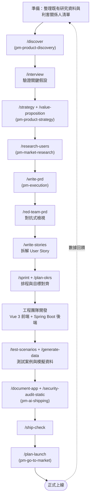

**逐步操作指引**：

1. 開新對話，貼上既有研究資料摘要，呼叫 `/discover` 啟動探索循環。
2. 針對排序後的高風險假設，呼叫 `/interview` 設計訪談腳本並實際執行訪談。
3. 用 `/strategy` 確認此功能與既有產品願景一致，`/value-proposition` 寫出一句話價值主張。
4. 用 `/research-users` 補齊目標使用者輪廓與需求細節。
5. 呼叫 `/write-prd`，提供完整情境（前端 Vue 3 互動規格、後端 Spring Boot API 規格），產出 PRD 初稿。
6. 呼叫 `/red-team-prd` 找出遺漏的邊界案例與風險。
7. 用 `/write-stories` 把 PRD 拆解為 User Story，分別標註前端 / 後端負責範圍。
8. 用 `/sprint` 規劃排程，`/plan-okrs` 確認與當季產品目標對齊。
9. 工程團隊依 User Story 開發，期間可用 `/test-scenarios` 反推測試案例。
10. 上線前用 `/document-app`、`/security-audit-static`、`/ship-check` 完成 AI 出貨稽核三步驟。
11. 用 `/plan-launch` 規劃內部公告與使用教學排程，正式上線。

> **注意事項**：步驟 5 的 PRD 情境輸入品質直接決定後續所有步驟的品質，建議花足夠時間準備完整的前後端規格描述，而不是只給一句話的功能需求。

---

## 附錄 B：Legacy System 逆向工程範本

**適用情境**：對缺乏文件、維護多年的 Legacy System 進行現代化改造前的需求還原與規劃工作流。

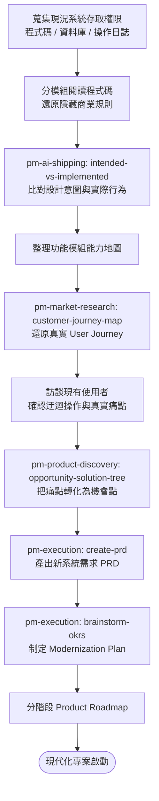

**逐步操作指引**：

1. 取得現況系統的程式碼、資料庫 Schema、操作日誌存取權限（務必確認資安與權限合規）。
2. 依模組分批讓 AI 閱讀程式碼，每次聚焦單一模組，避免上下文過載導致分析失真。
3. 對每個模組整理出「程式碼實際行為」與「可能的原始設計意圖」對照表，標註落差與疑點。
4. 把所有模組的分析結果彙整成一張功能模組能力地圖，標註模組間的依賴關係。
5. 用 `customer-journey-map` 從操作日誌或訪談還原真實使用流程，特別留意使用者為繞過系統限制而發展出的迂迴操作。
6. 對還原出的痛點，用 `opportunity-solution-tree` 系統化轉化為待解決的機會點清單。
7. 用 `create-prd` 把優先的機會點轉化為新系統需求文件。
8. 用 `brainstorm-okrs` 把整個現代化工程拆解為分階段、可追蹤的目標與里程碑。
9. 將還原出的商業規則與新需求文件交由熟悉舊系統的資深人員或業務人員覆核確認。

> **注意事項**：步驟 9 的人工覆核不可省略——AI 還原的規則僅基於「看得到的程式碼」，無法保證捕捉到所有未被程式碼直接體現的業務慣例或例外處理流程。

---

## 附錄 C：Framework Upgrade 範本

**適用情境**：Spring Boot / Java 主版本升級等大型技術債清償專案的規劃工作流。

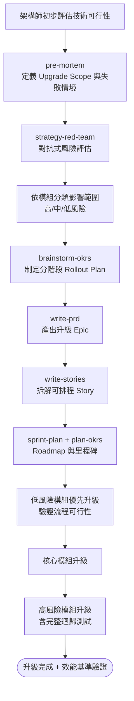

**逐步操作指引**：

1. 架構師先確認官方 Migration Guide 與已知 Breaking Change 清單，作為後續規劃的事實基礎。
2. 用 `pre-mortem` 反向思考「升級失敗會是什麼樣子」，藉此定義範圍邊界。
3. 用 `strategy-red-team` 對升級計畫做對抗式檢視，找出第三方相容性、Reflection 行為改變等風險。
4. 依模組對風險進行分類分級，標註每個模組的升級複雜度。
5. 用 `brainstorm-okrs` 制定分階段 Rollout Plan，原則上低風險模組先行、高風險模組最後處理。
6. 用 `write-prd` 把整個升級包裝成 Epic 等級需求文件，含可量化的驗收標準。
7. 用 `write-stories` 拆解為可排入 Sprint 的具體任務。
8. 用 `sprint-plan` 與 `plan-okrs` 建立可追蹤的 Roadmap 與里程碑。
9. 依計畫分階段執行升級，每階段結束後做效能基準測試與完整迴歸測試，確認達標後才進入下一階段。

> **注意事項**：第 9 步的效能基準測試不可省略，升級後的效能回歸往往要到生產環境真實負載下才會顯現，分階段上線並保留回退（Rollback）方案是降低風險的關鍵。

---

## 附錄 D：Enterprise PM Agent Team 範本

**適用情境**：企業導入 Multi-Agent Workflow 時，七個角色的職責分工與對應 Plugin 配置。

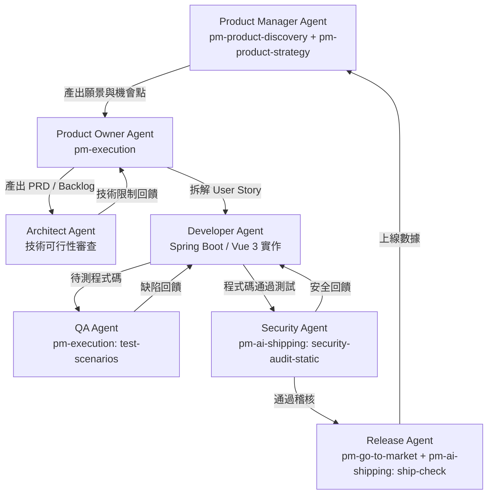

| 角色 | 對應 Plugin | 核心職責 | 關鍵產出 |
|---|---|---|---|
| Product Manager Agent | `pm-product-discovery`、`pm-product-strategy` | 探索機會、制定願景與策略 | Discovery Plan、產品策略文件 |
| Product Owner Agent | `pm-execution` | 把策略轉化為可執行需求 | PRD、Backlog、優先順序 |
| Architect Agent | （無對應 Plugin，純技術判斷） | 審查技術可行性、把關架構決策 | 技術限制回饋、架構決策紀錄 |
| Developer Agent | （無對應 Plugin，純工程實作） | 實作功能 | 可運作的程式碼 |
| QA Agent | `pm-execution`（`test-scenarios`） | 設計與執行測試 | 測試案例、缺陷報告 |
| Security Agent | `pm-ai-shipping`（`security-audit-static`） | 靜態安全稽核 | 安全稽核報告 |
| Release Agent | `pm-go-to-market`、`pm-ai-shipping`（`ship-check`） | 規劃上市與最終出貨檢查 | 上市計畫、Shipping Artifact |

> **實務案例**：一個 12 人的企業數位部門依此範本建立角色輪值制度——同一批工程師依專案階段輪流扮演 Architect Agent 與 Developer Agent，QA 與 Security 角色由固定的兩位同仁長期擔任以累積專業判斷力，PM 與 PO 角色則由產品團隊兩人分工，確保每個角色都有清楚的交付物定義，跨角色交接時不需要額外開會釐清範圍。
>
> **注意事項**：Architect Agent 與 Developer Agent 在 PM Skills 中沒有對應 Plugin，這兩個角色仍須依賴團隊現有的技術判斷能力與工程工具鏈，PM Skills 只負責銜接 PM 與工程角色之間的文件交接品質。

---

## 附錄 E：AI Agent Prompt Library

以下提供 50 個可直接套用的常用 Prompt，依九大 Plugin 分類整理，皆假設已安裝對應 Plugin 並可呼叫對應 Command。

**Discovery 類（pm-product-discovery）**

1. 「請執行 `/discover`，協助我探索 [產品/功能名稱] 的機會與風險，這是一個既有產品的新功能。」
2. 「請執行 `/brainstorm`，針對 [使用者痛點描述] 產生至少 10 個可能的解決方向。」
3. 「請用 `identify-assumptions-new` 的框架，列出 [新產品概念] 在 value/usability/feasibility/viability/go-to-market 五個面向的關鍵假設。」
4. 「請執行 `/interview`，幫我設計一份針對 [目標使用者群] 的訪談腳本，重點驗證 [特定假設]。」
5. 「請用 `summarize-interview` 整理以下訪談逐字稿，提取關鍵痛點與意外發現：[貼上逐字稿]」
6. 「請執行 `/triage-requests`，幫我把以下這批使用者需求請求分類並排序優先順序：[貼上需求清單]」
7. 「請用 `opportunity-solution-tree` 把我們剛剛討論的痛點視覺化成機會解決樹。」
8. 「請執行 `/setup-metrics`，幫我針對 [產品/功能] 設計一套追蹤儀表板指標。」
9. 「請用 `prioritize-assumptions` 的 Impact×Risk 矩陣，幫我排序以下假設：[貼上假設清單]」
10. 「請用 `analyze-feature-requests` 分析這批客戶功能請求背後共同的潛在需求。」

**Strategy 類（pm-product-strategy）**

11. 「請執行 `/strategy`，幫我檢視 [產品名稱] 目前的產品策略是否仍符合市場現況。」
12. 「請用 `lean-canvas` 框架，幫我把 [新產品概念] 的商業模式快速視覺化。」
13. 「請執行 `/business-model`，協助評估 [產品] 三種可能的收費模式的優劣。」
14. 「請用 `PESTLE` 分析 [產業/市場] 目前面臨的政治、經濟、社會、技術、法規、環境趨勢。」
15. 「請執行 `/value-proposition`，幫我把 [產品功能] 的價值主張寫成一句話陳述。」
16. 「請用 `product-vision` 框架，幫我為 [產品] 草擬一份三年願景陳述。」
17. 「請執行 `/market-scan`，幫我快速掃描 [市場/產業] 目前的主要趨勢與機會。」
18. 「請用 `Porter's Five Forces` 分析 [產業] 的競爭結構。」
19. 「請執行 `/pricing`，幫我評估 [產品] 三種定價策略方案的優缺點。」
20. 「請用 `SWOT` 框架分析 [產品/公司] 目前的優勢、劣勢、機會與威脅。」

**Execution 類（pm-execution）**

21. 「請執行 `/write-prd`，幫我把以下需求描述寫成完整 PRD：[貼上需求描述]」
22. 「請執行 `/red-team-prd`，對抗式檢視以下 PRD，找出遺漏的邊界案例：[貼上 PRD]」
23. 「請執行 `/plan-okrs`，幫我把 [年度/季度目標] 拆解成可衡量的 OKR。」
24. 「請執行 `/sprint`，幫我規劃接下來兩週的 Sprint 排程，這是我們的 Backlog：[貼上清單]」
25. 「請執行 `/pre-mortem`，幫我反向思考 [專案/計畫] 可能失敗的所有情境。」
26. 「請執行 `/write-stories`，把以下 PRD 拆解成可估點的 User Story：[貼上 PRD]」
27. 「請執行 `/stakeholder-map`，幫我整理 [專案] 的利害關係人地圖與各自關注點。」
28. 「請執行 `/meeting-notes`，幫我把以下會議逐字稿整理成結構化行動項目：[貼上逐字稿]」
29. 「請用 `prioritization-frameworks` 中的 RICE 模型，幫我排序以下功能清單的優先順序。」
30. 「請執行 `/test-scenarios`，依以下驗收標準反推測試案例：[貼上驗收標準]」
31. 「請執行 `/generate-data`，幫我為 [功能] 的測試產生模擬資料集。」
32. 「請用 `strategy-red-team` 對以下升級計畫做對抗式風險評估：[貼上計畫]」

**Market Research 類（pm-market-research）**

33. 「請執行 `/research-users`，幫我整理 [目標客群] 的使用者輪廓畫像。」
34. 「請用 `market-sizing` 估算 [市場] 的 TAM/SAM/SOM。」
35. 「請執行 `/competitive-analysis`，幫我比較 [競品 A、B、C] 在 [關鍵維度] 上的差異。」
36. 「請用 `customer-journey-map` 畫出 [使用者角色] 從 [起點] 到 [終點] 的完整旅程。」
37. 「請執行 `/analyze-feedback`，幫我分析以下客戶意見的情緒傾向與共同主題：[貼上意見]」
38. 「請用 `market-segments` 幫我把 [市場] 的客群切分成幾個有意義的區隔。」

**Data Analytics 類（pm-data-analytics）**

39. 「請執行 `/write-query`，幫我寫一個 SQL 查詢：[描述查詢需求]」
40. 「請執行 `/analyze-cohorts`，幫我分析依 [分組維度] 區分的用戶留存趨勢。」
41. 「請執行 `/analyze-test`，幫我分析這個 A/B 測試的結果是否具統計顯著性：[貼上數據]」

**Go-To-Market 類（pm-go-to-market）**

42. 「請執行 `/plan-launch`，幫我規劃 [產品/功能] 的上市時程與關鍵節點。」
43. 「請用 `beachhead-segment` 幫我找出 [產品] 最適合的第一波灘頭市場。」
44. 「請執行 `/growth-strategy`，幫我設計 [產品] 的成長策略選項。」
45. 「請用 `ideal-customer-profile` 幫我定義 [產品] 的理想客戶輪廓。」
46. 「請執行 `/battlecard`，幫我整理一份對抗 [競品名稱] 的銷售作戰卡。」

**Marketing & Growth 類（pm-marketing-growth）**

47. 「請執行 `/north-star`，幫我為 [產品] 確認最合適的北極星指標。」
48. 「請執行 `/market-product`，幫我為 [功能/產品] 想出幾個候選名稱與定位文案。」

**AI Shipping 類（pm-ai-shipping）**

49. 「請執行 `/document-app`，幫我為這個程式碼庫補上架構說明文件。」
50. 「請執行 `/ship-check`，幫我把這個專案整理成一份 Reviewer-Ready 的交付包。」

> **注意事項**：實際使用時請把方括號內的描述換成真實情境內容，情境資訊愈完整，輸出品質愈高；對於高敏感資訊（客戶個資、未公開財務數據），請先確認所用 AI 工具的資料處理政策後再貼入對話。

---

## 附錄 F：Mermaid 圖總覽索引

本手冊共包含 22 張 Mermaid 圖，索引如下，方便讀者快速定位：

| 編號 | 圖名 | 所在章節 |
|---|---|---|
| 1 | PM 五大職能循環關係圖 | 第 2 章 |
| 2 | 整體架構圖（Overall Architecture） | 第 3 章 |
| 3 | Plugin 架構圖 | 第 3 章 |
| 4 | Skill 載入流程（序列圖） | 第 3 章 |
| 5 | Command 執行流程（`/discover` 範例） | 第 3 章 |
| 6 | Repository 頂層目錄結構 | 第 4 章 |
| 7 | `/discover` 七步驟工作流 | 第 6 章 |
| 8 | 九大 Plugin 對應 PM 生命週期圖 | 第 7 章 |
| 9 | 多工具安裝決策流程 | 第 8 章 |
| 10 | Web App 開發六階段工作流 | 第 9 章 |
| 11 | Legacy System 逆向工程流程 | 第 10 章 |
| 12 | Framework 升級規劃流程 | 第 11 章 |
| 13 | Multi-Agent Workflow 序列圖 | 第 12 章 |
| 14 | SSDLC 整合映射圖 | 第 13 章 |
| 15 | Agile / Scrum 整合流程 | 第 14 章 |
| 16 | 企業導入路線圖 | 第 15 章 |
| 17 | 附錄 A：Web Application 開發範本詳細流程 | 附錄 A |
| 18 | 附錄 B：Legacy 逆向工程範本詳細流程 | 附錄 B |
| 19 | 附錄 C：Framework Upgrade 範本詳細流程 | 附錄 C |
| 20 | 附錄 D：Enterprise PM Agent Team 架構圖 | 附錄 D |

> **注意事項**：Mermaid 圖在 GitHub、GitLab、大多數支援 Markdown 預覽的 IDE（如 VS Code 搭配 Markdown Preview Mermaid Support 擴充套件）中可直接渲染；若使用的平台不支援 Mermaid，請改用線上 Mermaid Live Editor 貼上程式碼預覽。

---

## 附錄 G：檢查清單（Checklist）

### G.1 新人快速上手檢查清單

- [ ] 已確認團隊使用的 AI 工具（Claude Code / Cowork / Cursor 等）並完成對應安裝步驟。
- [ ] 已成功執行 `claude plugin marketplace add phuryn/pm-skills`（或對應工具的安裝流程）。
- [ ] 已安裝團隊核准使用的 Plugin 清單，並確認對應 Slash Command 可正常呼叫。
- [ ] 已閱讀本手冊第 5、6 章，理解 Skill 與 Command 的差異與運作原理。
- [ ] 已執行過至少一次 `/discover` 或 `/write-prd`，熟悉完整工作流的 checkpoint 互動方式。
- [ ] 已知道團隊核准的 PRD / User Story 範本格式（若有客製化內部 Skill）。
- [ ] 已了解所有 AI 產出文件皆為初稿，需經人工覆核才能視為定案。

### G.2 PRD / 需求文件撰寫檢查清單

- [ ] 是否已用 `/write-prd` 產出初稿，並補齊背景、目標、User Story、驗收標準？
- [ ] 是否已執行 `/red-team-prd` 找出潛在遺漏的邊界案例？
- [ ] 驗收標準是否可量化（避免「系統運作正常」這類模糊描述）？
- [ ] 是否已標註利害關係人（`/stakeholder-map`）並確認相關方已知會？
- [ ] 高合規要求情境（金融/醫療/政府）是否已附上「AI 輔助生成，需人工覆核」聲明？

### G.3 企業導入檢查清單

- [ ] 是否已取得資安部門對 AI 工具資料保留政策的書面核准？
- [ ] 是否已選定試點團隊與明確的成功衡量指標？
- [ ] 是否已指定 Plugin 維護負責人，負責追蹤上游版本更新？
- [ ] 若 Fork 內部版本，是否已把 `validate_plugins.py` 整合進 CI Pipeline？
- [ ] 是否已建立 Onboarding 文件，列出核准使用的 Command 清單？
- [ ] 是否已建立治理機制，避免不同部門各自客製化導致版本分裂？

### G.4 Framework 升級 / 逆向工程專案檢查清單

- [ ] 是否已用 `pre-mortem` 與 `strategy-red-team` 完成風險評估，且結果已交由架構師核實？
- [ ] 升級 / 改造的 Rollout Plan 是否已分階段，並包含回退方案？
- [ ] 逆向工程還原出的商業規則是否已交由熟悉舊系統的人員覆核？
- [ ] 每個階段是否都設有可量化的驗收標準與效能基準測試？

> **使用建議**：建議把本附錄四份檢查清單轉化為團隊內部的 Pull Request 範本或 Confluence 頁面範本，讓檢查項目成為流程中自然會被執行的步驟，而不是僅停留在文件中的建議。

---

*本手冊依據 2026-06 查證之 [phuryn/pm-skills](https://github.com/phuryn/pm-skills) repo 實際內容重新整理編寫，內容若與最新版本 Repo 有出入，請以官方 Repo 當下狀態為準。*


