+++
date = '2026-06-22T14:28:52+08:00'
draft = false
title = 'Ponytail 教學手冊'
tags = ['教學', 'AI開發']
categories = ['教學']
+++
# Ponytail 教學手冊

> **版本**：v1.1（2026-06-22，已對照官方 Repository 原始檔案逐章核實修訂）
> **適用對象**：系統分析師、軟體架構師、後端工程師、前端工程師、DevOps工程師、SRE工程師、AI工程師、企業資訊部門、Framework維護團隊、Legacy System維護團隊
> **內容定位**：本手冊聚焦於開源 AI Agent 精簡化技能（Skill）**Ponytail** 的理念、架構、安裝設定、與主流 AI Coding Agent（Claude Code / GitHub Copilot / Cursor / Codex / Gemini CLI 等共 14 個受支援平台）的整合方式，並延伸至企業級開發流程（SSDLC、多 Agent 團隊協作、Legacy 逆向工程、Framework 升級）的實務導入
> **重要聲明**：本手冊第 1～12、15 章內容基於 Ponytail 官方 GitHub Repository（`DietrichGebert/ponytail`）之 `README.md`、`AGENTS.md`、`skills/ponytail/SKILL.md`、`skills/ponytail-review/SKILL.md`、`docs/agent-portability.md`、`docs/platform-native.md` 等公開資料，逐項核對原文後整理改寫而成（非逐字抄錄）；第 13、14、16、20 章為「企業實務延伸」章節，是顧問觀點下將 Ponytail 精簡哲學套用於企業開發治理的建議做法，**並非 Ponytail 官方功能宣稱**，文中會明確標註。GitHub 社群數據（Star／Fork／Issue 數）反映查詢當下時間點，會隨時間持續變動
> **授權**：內部教育訓練使用

---

## 如何使用本手冊

Ponytail 不是一個框架，也不是一個 IDE，而是一套**注入到 AI Coding Agent 的行為準則（Skill / Plugin）**。它的任務很單純：在 AI Agent 動手寫程式之前，先逼它像一個「已經看過太多過度設計專案、留著馬尾、戴著圓框眼鏡的資深工程師」一樣，先問一句「這真的需要寫嗎？」。本手冊依角色整理出建議閱讀路徑：

| 角色 | 建議優先閱讀章節 |
|---|---|
| 新進工程師 | 第1、3、5、6章 |
| 後端／前端工程師 | 第7、8、9、10章 |
| 架構師／系統分析師 | 第2、4、11、12章 |
| DevOps／SRE | 第6、7、19章 |
| AI Coding Agent 重度使用者 | 第4、5、15、17、18章 |
| 企業資訊部門主管 | 第13、14、16、20章 |
| Legacy System維護團隊 | 第11、12章 |
| Code Review／品質把關者 | 第9、17、18章 |

---

## 目錄

- [第 1 章 Ponytail 概述](#第-1-章-ponytail-概述)
  - [1.1 專案背景](#11-專案背景)
  - [1.2 作者介紹](#12-作者介紹)
  - [1.3 發展歷程與版本里程碑](#13-發展歷程與版本里程碑)
  - [1.4 GitHub 社群狀況](#14-github-社群狀況)
  - [1.5 為何爆紅](#15-為何爆紅)
  - [1.6 解決哪些問題](#16-解決哪些問題)
- [第 2 章 AI Coding Agent 常見問題](#第-2-章-ai-coding-agent-常見問題)
  - [2.1 Over Engineering](#21-over-engineering)
  - [2.2 Reinvent The Wheel](#22-reinvent-the-wheel)
  - [2.3 Token Waste](#23-token-waste)
  - [2.4 Context Pollution](#24-context-pollution)
  - [2.5 Hallucination Driven Design](#25-hallucination-driven-design)
  - [2.6 Framework Ignorance](#26-framework-ignorance)
  - [2.7 Existing Code Ignorance](#27-existing-code-ignorance)
  - [2.8 Legacy System Rewrite Syndrome](#28-legacy-system-rewrite-syndrome)
  - [2.9 案例分析總表](#29-案例分析總表)
- [第 3 章 Ponytail 核心理念](#第-3-章-ponytail-核心理念)
  - [3.1 Lazy Senior Developer Mindset](#31-lazy-senior-developer-mindset)
  - [3.2 Less Code Principle](#32-less-code-principle)
  - [3.3 Existing Solution First](#33-existing-solution-first)
  - [3.4 Delete Before Build](#34-delete-before-build)
  - [3.5 Native Feature First](#35-native-feature-first)
  - [3.6 Library Before Custom Code](#36-library-before-custom-code)
  - [3.7 Configuration Before Programming](#37-configuration-before-programming)
  - [3.8 Simplicity First](#38-simplicity-first)
  - [3.9 Maintainability First](#39-maintainability-first)
  - [3.10 Cost Awareness](#310-cost-awareness)
- [第 4 章 Ponytail 系統架構](#第-4-章-ponytail-系統架構)
  - [4.1 Architecture Overview](#41-architecture-overview)
  - [4.2 Skill Architecture](#42-skill-architecture)
  - [4.3 Agent Workflow](#43-agent-workflow)
  - [4.4 Review Loop](#44-review-loop)
  - [4.5 Self Critique Loop](#45-self-critique-loop)
  - [4.6 Decision Flow](#46-decision-flow)
  - [4.7 Prompt Enhancement Flow](#47-prompt-enhancement-flow)
  - [4.8 Integration Flow](#48-integration-flow)
- [第 5 章 Ponytail 工作原理](#第-5-章-ponytail-工作原理)
  - [5.1 第一階：這個功能真的需要存在嗎（YAGNI）](#51-第一階這個功能真的需要存在嗎yagni)
  - [5.2 第二階：標準函式庫能解決嗎](#52-第二階標準函式庫能解決嗎)
  - [5.3 第三階：平台原生功能能解決嗎](#53-第三階平台原生功能能解決嗎)
  - [5.4 第四階：已安裝的相依套件能解決嗎](#54-第四階已安裝的相依套件能解決嗎)
  - [5.5 第五階：能用一行寫完嗎](#55-第五階能用一行寫完嗎)
  - [5.6 第六階：只寫最小可行實作](#56-第六階只寫最小可行實作)
  - [5.7 企業實務延伸：刪除與精簡思維（呼應 ponytail-review）](#57-企業實務延伸刪除與精簡思維呼應-ponytail-review)
  - [5.8 內部思考流程整合範例](#58-內部思考流程整合範例)
- [第 6 章 安裝與部署](#第-6-章-安裝與部署)
  - [6.1 Claude Code](#61-claude-code)
  - [6.2 GitHub Copilot](#62-github-copilot)
  - [6.3 Cursor](#63-cursor)
  - [6.4 OpenAI Codex／Agent](#64-openai-codexagent)
  - [6.5 Gemini CLI](#65-gemini-cli)
  - [6.6 VS Code 整合](#66-vs-code-整合)
  - [6.7 JetBrains 整合](#67-jetbrains-整合)
  - [6.8 Pi Agent Harness](#68-pi-agent-harness)
  - [6.9 OpenCode](#69-opencode)
  - [6.10 CodeWhale](#610-codewhale)
  - [6.11 OpenClaw](#611-openclaw)
  - [6.12 Kiro](#612-kiro)
  - [6.13 系統需求](#613-系統需求)
- [第 7 章 Ponytail 設定說明](#第-7-章-ponytail-設定說明)
  - [7.1 Agent Configuration](#71-agent-configuration)
  - [7.2 Rules](#72-rules)
  - [7.3 Skills](#73-skills)
  - [7.4 Context](#74-context)
  - [7.5 Hooks](#75-hooks)
  - [7.6 Templates](#76-templates)
  - [7.7 Review Policies](#77-review-policies)
  - [7.8 Team Standards](#78-team-standards)
- [第 8 章 與 Claude Code 整合](#第-8-章-與-claude-code-整合)
  - [8.1 Agent Skill](#81-agent-skill)
  - [8.2 Custom Instructions](#82-custom-instructions)
  - [8.3 Commands](#83-commands)
  - [8.4 Workflows](#84-workflows)
  - [8.5 Best Practices](#85-best-practices)
  - [8.6 Enterprise Standards](#86-enterprise-standards)
- [第 9 章 與 GitHub Copilot 整合](#第-9-章-與-github-copilot-整合)
  - [9.1 Copilot Agent](#91-copilot-agent)
  - [9.2 Copilot Coding Agent](#92-copilot-coding-agent)
  - [9.3 Repository Instructions](#93-repository-instructions)
  - [9.4 Prompt Files](#94-prompt-files)
  - [9.5 Agent Files](#95-agent-files)
  - [9.6 Skills](#96-skills)
  - [9.7 完整範例](#97-完整範例)
- [第 10 章 Web Application 開發實戰](#第-10-章-web-application-開發實戰)
  - [10.1 技術棧總覽](#101-技術棧總覽)
  - [10.2 API 開發](#102-api-開發)
  - [10.3 CRUD 開發](#103-crud-開發)
  - [10.4 Batch 開發](#104-batch-開發)
  - [10.5 Security 開發](#105-security-開發)
  - [10.6 Integration 開發](#106-integration-開發)
  - [10.7 Ponytail 如何減少程式碼](#107-ponytail-如何減少程式碼)
- [第 11 章 Legacy System Reverse Engineering](#第-11-章-legacy-system-reverse-engineering)
  - [11.1 Mainframe](#111-mainframe)
  - [11.2 COBOL](#112-cobol)
  - [11.3 Lotus Domino](#113-lotus-domino)
  - [11.4 Struts](#114-struts)
  - [11.5 JSF](#115-jsf)
  - [11.6 舊版 Spring](#116-舊版-spring)
  - [11.7 WebSphere](#117-websphere)
  - [11.8 WebLogic](#118-weblogic)
  - [11.9 Ponytail 在逆向工程中的角色與限制](#119-ponytail-在逆向工程中的角色與限制)
- [第 12 章 Framework Upgrade 實戰](#第-12-章-framework-upgrade-實戰)
  - [12.1 Spring Boot 2 到 3](#121-spring-boot-2-到-3)
  - [12.2 Java 8 到 21](#122-java-8-到-21)
  - [12.3 Vue2 到 Vue3](#123-vue2-到-vue3)
  - [12.4 Jakarta Migration](#124-jakarta-migration)
  - [12.5 JDK Upgrade](#125-jdk-upgrade)
  - [12.6 Dependency Upgrade](#126-dependency-upgrade)
  - [12.7 降低升級成本的具體做法](#127-降低升級成本的具體做法)
- [第 13 章 與 SSDLC 整合（企業實務延伸）](#第-13-章-與-ssdlc-整合企業實務延伸)
  - [13.1 定位澄清：Ponytail 不是安全工具](#131-定位澄清ponytail-不是安全工具)
  - [13.2 Threat Modeling](#132-threat-modeling)
  - [13.3 SAST](#133-sast)
  - [13.4 DAST](#134-dast)
  - [13.5 Dependency Check](#135-dependency-check)
  - [13.6 Secret Detection](#136-secret-detection)
  - [13.7 Secure Coding](#137-secure-coding)
  - [13.8 Compliance](#138-compliance)
  - [13.9 Audit](#139-audit)
- [第 14 章 與 AI Agent 團隊整合（企業實務延伸）](#第-14-章-與-ai-agent-團隊整合企業實務延伸)
  - [14.1 多 Agent 團隊架構總覽](#141-多-agent-團隊架構總覽)
  - [14.2 Planner Agent](#142-planner-agent)
  - [14.3 Architect Agent](#143-architect-agent)
  - [14.4 Developer Agent](#144-developer-agent)
  - [14.5 Reviewer Agent](#145-reviewer-agent)
  - [14.6 Security Agent](#146-security-agent)
  - [14.7 QA Agent](#147-qa-agent)
  - [14.8 Release Agent](#148-release-agent)
  - [14.9 Ponytail 在團隊中的角色](#149-ponytail-在團隊中的角色)
- [第 15 章 Token Optimization](#第-15-章-token-optimization)
  - [15.1 Token Reduction](#151-token-reduction)
  - [15.2 Context Reduction](#152-context-reduction)
  - [15.3 Prompt Compression](#153-prompt-compression)
  - [15.4 Reuse Existing Logic](#154-reuse-existing-logic)
  - [15.5 Knowledge Reuse](#155-knowledge-reuse)
  - [15.6 Memory Optimization](#156-memory-optimization)
  - [15.7 實際數據案例](#157-實際數據案例)
- [第 16 章 企業導入指南（企業實務延伸）](#第-16-章-企業導入指南企業實務延伸)
  - [16.1 Governance](#161-governance)
  - [16.2 Standards](#162-standards)
  - [16.3 Team Adoption](#163-team-adoption)
  - [16.4 Change Management](#164-change-management)
  - [16.5 Training Plan](#165-training-plan)
  - [16.6 KPI](#166-kpi)
  - [16.7 ROI](#167-roi)
- [第 17 章 最佳實務](#第-17-章-最佳實務)
- [第 18 章 常見錯誤](#第-18-章-常見錯誤)
- [第 19 章 維運與升級](#第-19-章-維運與升級)
  - [19.1 Version Upgrade](#191-version-upgrade)
  - [19.2 Skill Upgrade](#192-skill-upgrade)
  - [19.3 Agent Upgrade](#193-agent-upgrade)
  - [19.4 Prompt Upgrade](#194-prompt-upgrade)
  - [19.5 Governance Upgrade](#195-governance-upgrade)
- [第 20 章 完整企業導入範例（企業實務延伸）](#第-20-章-完整企業導入範例企業實務延伸)
  - [20.1 案例背景：大型銀行共用平台](#201-案例背景大型銀行共用平台)
  - [20.2 開發流程](#202-開發流程)
  - [20.3 Code Review](#203-code-review)
  - [20.4 SSDLC](#204-ssdlc)
  - [20.5 Release Flow](#205-release-flow)
  - [20.6 Production Support](#206-production-support)
- [附錄：新進成員快速 Checklist](#附錄新進成員快速-checklist)

---

# 第 1 章 Ponytail 概述

## 1.1 專案背景

Ponytail 是一套開源的 **AI Agent 行為準則（Skill / Plugin）**，目標只有一個：讓 AI Coding Agent 在動手寫程式前，先經過「這真的有必要嗎」的層層質疑，而不是看到需求就立刻開始搭框架、拉套件、寫一堆「以後可能用得到」的抽象層。

它不是一個獨立的應用程式，也不需要部署伺服器；它的本體是一份（或一組）以 Markdown 撰寫的 **Skill 定義檔**（`SKILL.md`）與一份通用指引檔（`AGENTS.md`），透過 Claude Code、Codex CLI、GitHub Copilot CLI、Cursor 等工具的 Plugin / Rules 機制載入，成為 Agent 在每一次回應前都會套用的「人設與決策準則」。

專案的核心主張可以濃縮成一句話（官方標語）：

> **「The best code is the code you never wrote.」**
> 最好的程式碼，是你從來不需要寫的那段程式碼。

## 1.2 作者介紹

Ponytail 由開發者 **Dietrich Gebert** 建立並維護，Repository 為 `DietrichGebert/ponytail`，採用 **MIT License**（官方說法：「The shortest license that works」— 呼應整個專案「能短就不要長」的精神，連授權條款的選擇都在貫徹自己的理念）。

## 1.3 發展歷程與版本里程碑

Ponytail 最初是作者在實際使用 AI Coding Agent 協作開發時，發現一個反覆出現的痛點：**只要把需求丟給 Agent，Agent 幾乎必定傾向「多做」而不是「剛好做」**——明明 `<input type="date">` 就能解決的日期選擇器，Agent 會主動安裝第三方套件、包一層 Wrapper Component、加上自訂樣式表，甚至開始討論時區處理的抽象設計。

針對這個現象，作者把資深工程師在 Code Review 時最常脫口而出的吐槽（「這個標準函式庫就有了吧」「為什麼要為了一種實作寫一個介面」「這段刪掉也不會少功能」）整理成一套結構化的決策階梯，並包裝成可被各種 AI Agent 載入的 Skill，逐步擴充出：

- 主技能 `ponytail`（強制套用精簡決策階梯）
- 審查技能 `ponytail-review`（針對既有 diff 找出可刪除的過度設計）
- 稽核指令 `/ponytail-audit`（掃描整個 Repository）
- 技術債追蹤 `/ponytail-debt`（彙整刻意簡化但需要日後升級的標記）
- 效益儀表板 `/ponytail-gain`（顯示導入後的量化效益）

並逐步擴大支援平台，從最初的 Claude Code 擴展到 Codex、GitHub Copilot CLI、Cursor、Windsurf、Cline、Aider、Gemini CLI／Antigravity、OpenCode、Pi agent harness、CodeWhale、OpenClaw、Kiro 等共 14 個主流 AI Coding Agent 生態（官方 README 徽章標註「works with 14 agents」，完整清單與安裝方式見第 6 章）。

## 1.4 GitHub 社群狀況

以 `gh api repos/DietrichGebert/ponytail` 直接查詢 GitHub API 的實測結果（查詢時間點：2026-06-22，數值會隨時間持續變動，企業導入前建議自行重新查詢一次以取得最新值）：

| 指標 | 數值 |
|---|---|
| Star 數 | 47,001 |
| Fork 數 | 2,312 |
| Open Issues | 54 |
| 授權條款 | MIT License |
| 最新 Release | v4.7.0（2026-06-16） |
| 主要語言 | JavaScript |

短時間內累積大量 Star，反映出社群對「AI Agent 過度設計」這個痛點的高度共鳴——幾乎每個重度使用 AI Coding Agent 的團隊都遇過同樣的問題。

## 1.5 為何爆紅

綜合社群討論、部落格分析與實測心得，Ponytail 之所以快速擴散，可歸納為四個原因：

1. **痛點極度普遍**：不論用 Claude、GPT 還是 Gemini 系列模型，「過度工程化」幾乎是所有 AI Coding Agent 的共同傾向，而非單一廠商的個別問題，因此解法具有跨平台吸引力。
2. **零侵入、低成本導入**：不需要改架構、不需要寫程式碼，只要載入一份 Skill / Rules 文件即可生效，導入成本極低，風險也極低（不滿意隨時關閉即可）。
3. **有量化數據佐證**：官方提供的 Benchmark（詳見 1.6 節與第 15 章）讓「精簡」不再只是主觀感覺，而是可以用程式碼行數、Token 用量、成本、時間四個維度量化的效益。
4. **人設討喜、易於傳播**：「留著馬尾、戴圓框眼鏡、已經在公司待得比版本控制系統還久的資深工程師」這個形象生動具體，比起一份枯燥的 Coding Standard，更容易讓人記住核心精神並在團隊內部口語傳播。

## 1.6 解決哪些問題

Ponytail 主要針對的是 **AI Coding Agent 在生成程式碼時的複雜度失控問題**，具體而言：

- 程式碼量過多、可讀性下降、維護成本上升
- 為單一情境提前設計的抽象層、介面、Factory，在沒有第二種實作前就已存在
- 重複造輪子：自行實作標準函式庫、瀏覽器原生功能、平台既有功能已經提供的能力
- Token 與運算成本浪費：多餘的程式碼意味著更多的 Context、更多的審查時間、更高的 API 成本

需要特別強調**官方文件明確排除的範圍**：Ponytail 的審查機制（`ponytail-review`）明確聲明只處理「過度設計 / 複雜度」問題，**不負責正確性 Bug、安全性漏洞、效能問題**——這些仍應交由一般的 Code Review 或專門的 SAST/DAST 工具處理（見第 13 章）。

> **實務案例**：官方 Benchmark 中有一個經典案例——要求 Agent 實作「日期選擇器（Date Picker）」。沒有 Ponytail 時，Agent 安裝了第三方套件（如 flatpickr）、包裝元件、加上樣式表，並開始討論時區處理，最終產出 404 行程式碼；套用 Ponytail 後，Agent 給出的答案是一行：`<input type="date">`，總計縮減到 23 行。官方同時揭露這是 12 個任務中**減幅最大的個案（達 94%）**，並非平均值——若程式碼原本就已經夠精簡，減幅會趨近於零；完整方法論與數據請見第 15.7 節。

---

# 第 2 章 AI Coding Agent 常見問題

在理解 Ponytail 的解法之前，必須先正確診斷問題。以下八種「AI Coding Agent 常見病徵」是企業導入 AI 開發時最常遇到、也最容易被忽視的風險，每一種都附上實際案例分析。

## 2.1 Over Engineering

**現象**：Agent 收到一個簡單需求，卻產出遠超需求複雜度的解法——多層抽象、提前泛化、為「未來可能的需求」預留擴充點。

**案例**：需求是「在表單裡加一個顏色選擇器」。Agent 的典型反應：建立 `ColorPickerStrategy` 介面、`ColorPickerFactory`、三種顏色格式轉換器（HEX/RGB/HSL）、一個 Context Provider 統一管理選色狀態——官方 Benchmark 顯示，這類案例可以從 287 行壓縮到 23 行（原生 `<input type="color">` 即可滿足 9 成情境）。

**根因**：訓練語料中「教科書範例」與「最佳實踐文章」往往示範的是「可擴充的通用設計」，而不是「剛好夠用的設計」，模型在沒有強制約束時會傾向模仿這類「看起來更專業」的寫法。

## 2.2 Reinvent The Wheel

**現象**：明明標準函式庫、語言內建功能、平台原生 API 已經提供解法，Agent 仍選擇手刻一份功能相近、但缺乏邊界測試與長期維護的版本。

**案例**：要求「字串去除頭尾空白並轉成 Title Case」，Agent 可能寫出一個 20 行的自訂迴圈，而不是呼叫語言內建的 `strip()` / `trim()` 搭配對應的大小寫轉換函式。又如要求「防止重複提交」，Agent 可能自行刻一套 Debounce 機制，而專案中其實已經安裝了 Lodash 並有現成的 `debounce()`。

## 2.3 Token Waste

**現象**：因為程式碼量膨脹，連帶導致 Context Window 中充斥大量非必要程式碼，後續每一次互動都要重新讀取、理解這些多餘程式碼，造成 Token 成本與延遲同步上升。

**案例**：一個原本 50 行就能完成的 CRUD API，Agent 寫成 300 行（含 Repository 介面、抽象 Service 層、DTO Mapper、自訂例外類別），後續每次 Code Review 或修改都要重新載入這 300 行作為 Context，長期累積下來的 Token 成本遠超過初始開發節省的時間。

## 2.4 Context Pollution

**現象**：Agent 在一次任務中引入大量無關的中間產物（暫存檔、未使用的 import、過時的設計草稿、重複的工具函式），污染後續任務的 Context，導致模型在下一輪對話中參考到錯誤或過時的資訊。

**案例**：Agent 在嘗試三種不同實作方案後選定其中一種，卻把另外兩種方案的程式碼留在專案中「以防之後要用」，後續的 Agent（甚至是同一個 Agent 在下一次對話）容易誤把廢棄方案當作現行邏輯來修改。

## 2.5 Hallucination Driven Design

**現象**：Agent 基於不存在或已過時的 API、套件版本、設計模式做出架構決策，產出看似合理但實際上無法運作或已被淘汰的程式碼。

**案例**：要求串接某雲端服務的 SDK，Agent 卻引用了該 SDK 兩個大版本前已移除的方法名稱，並在此基礎上設計了整套錯誤處理機制——問題不在於錢，而在於這類因幻覺產生的「架構決策」往往比單純的語法錯誤更難被發現，因為程式碼讀起來邏輯通順。

## 2.6 Framework Ignorance

**現象**：Agent 不熟悉專案實際採用的框架慣例與既有能力，繞過框架原生機制，自行實作一套「平行系統」。

**案例**：在 Spring Boot 專案中，Agent 不使用 `@Valid` + Bean Validation 做參數驗證，而是手寫一堆 `if (xxx == null) throw new RuntimeException(...)`；在 Vue3 專案中，不使用內建的 `computed` / `watch`，而是手動維護一堆 `mutated` flag 來模擬響應式。

## 2.7 Existing Code Ignorance

**現象**：Agent 沒有先搜尋專案內是否已有相同或相似邏輯的工具函式、Service、Component，直接重新寫一份，導致同一邏輯在專案中以多個版本並存。

**案例**：專案中已有 `DateUtils.formatToYyyyMmDd()`，Agent 在新功能裡又寫了一個 `formatDate()`，邏輯幾乎相同但格式字串寫法略有差異，造成兩種日期格式並存於同一系統。

## 2.8 Legacy System Rewrite Syndrome

**現象**：面對 Legacy 系統（COBOL、Struts、舊版 Spring 等），Agent 傾向直接建議「全部重寫」，而非先進行充分的逆向工程、依賴分析與風險評估。

**案例**：被要求「幫忙了解這個 Struts 模組在做什麼」，Agent 在還沒讀完所有 Action 類別與 XML 設定前，就先給出「建議全面改寫為 Spring Boot + React」的結論，完全忽略該模組背後串接的十幾個下游系統與大量隱性業務規則，這類建議若被未經驗證地採納，往往是大型重構專案失敗的起點。

## 2.9 案例分析總表

| 問題類型 | 典型徵兆 | 對應 Ponytail 機制 |
|---|---|---|
| Over Engineering | 多層抽象、提前泛化 | 決策階梯第1、6階 |
| Reinvent The Wheel | 手刻已有功能 | 決策階梯第2、3、4階 |
| Token Waste | Context 過大、成本上升 | Less Code Principle |
| Context Pollution | 殘留廢棄方案 | Delete Before Build |
| Hallucination Driven Design | 引用不存在的 API | （Ponytail 不處理，需搭配一般 Code Review） |
| Framework Ignorance | 繞過框架機制自建 | Native Feature First / Framework First |
| Existing Code Ignorance | 重複實作既有邏輯 | Existing Solution First |
| Legacy System Rewrite Syndrome | 未分析就建議重寫 | （需搭配第11章逆向工程方法論） |

> **注意事項**：表格最後一欄可以看到，Ponytail 並非萬能解藥——它對「Hallucination Driven Design」與「Legacy System Rewrite Syndrome」沒有直接對應機制，這兩類問題仍須仰賴人員的領域知識、既有的 Code Review 流程、以及第 11 章介紹的逆向工程方法論來補強。這也是為什麼本手冊第 13、14 章會強調 Ponytail 必須與其他治理機制**並用**，而不是取代它們。

---

# 第 3 章 Ponytail 核心理念

Ponytail 的所有行為都從一句官方原文延伸而來：「You are a lazy senior developer. Lazy means efficient, not careless.」（你是一個懶惰的資深工程師。懶惰指的是有效率，不是不負責任。）以下十項理念，是這句話在實務上展開後的具體準則。

## 3.1 Lazy Senior Developer Mindset

真正的資深工程師不是「什麼都會寫」，而是「知道什麼不必寫」。這個人設刻意設計成有點不耐煩、惜字如金——官方對輸出格式的要求是「程式碼優先，接著最多三行說明：跳過了什麼、什麼時候該補上」，這逼著 Agent 不能用大量說明文字來掩飾過度設計的程式碼。

**反面教材**：Agent 用五段文字解釋「為什麼選擇 Factory Pattern」，卻沒有人問它需不需要 Factory Pattern。
**Ponytail 風格**：直接給出一行 `if/else`，註明「`ponytail:` 目前只有兩種情境，第三種情境出現時再抽介面」。

## 3.2 Less Code Principle

程式碼行數本身就是一種維護成本——每多一行，就多一份要被理解、測試、除錯、未來要被修改的負擔。Ponytail 將「行數」視為可被量化、可被當作 KPI 追蹤的指標（見第 15 章 Token Optimization 與官方 Benchmark 數據）。

## 3.3 Existing Solution First

寫新程式碼前，先問「這個專案、這個框架、這個語言，是不是已經有解法？」決策順序明確排在「標準函式庫 > 平台原生功能 > 已安裝套件 > 一行解 > 自行實作」之後（詳見第 5 章工作原理）。

## 3.4 Delete Before Build

面對新需求，優先評估「是否可以靠刪除現有限制/程式碼來達成」，而不是預設要新增程式碼才能解決問題。例如某個功能被多個 flag 鎖住而表現不正確，正確答案可能是刪掉一個過時的 flag，而不是再加一層判斷邏輯去繞過它。

## 3.5 Native Feature First

瀏覽器、作業系統、執行環境本身內建的能力，優先於第三方套件。經典案例：`<input type="date">`、`<input type="color">`、CSS `:has()` 選擇器、原生 `fetch()`，都比對應的 JS 套件更輕量、更少維護成本。

## 3.6 Library Before Custom Code

如果原生功能無法滿足，下一個順位是「專案中已經安裝的相依套件」，而不是再新增一個套件，更不是自己刻一份。這一條同時也是控制相依套件數量、降低供應鏈風險的副作用（見第 13 章 Dependency Check）。

## 3.7 Configuration Before Programming

許多「需求」其實只是設定值的調整，而不是新功能的開發。例如「不同環境要有不同的逾時秒數」，正確答案通常是一個設定檔的 key，而不是寫一段判斷目前環境的程式碼邏輯。

## 3.8 Simplicity First

在多個可行方案中，預設選擇最簡單、最容易被下一個人看懂的方案，而不是「理論上最優雅」的方案。Boring code（無聊但可預期的程式碼）優於 clever code（聰明但難懂的程式碼）。

## 3.9 Maintainability First

精簡不是為了精簡本身，而是為了長期可維護性。因此官方明確列出「永不可被精簡掉」的紅線：trust-boundary 驗證、資料遺失防護、安全性措施、無障礙設計（accessibility）、**硬體校正**（hardware calibration）、使用者明確要求的功能、以及非 trivial 邏輯必要的測試覆蓋——這些項目即使在 `ultra` 強度下也不能被刪除（詳見第 7.7 節 Review Policies）。其中「硬體校正」是企業內部較少注意到的一條：官方原文強調「平台規格永遠不是現實世界的理想值——真實的時鐘會飄移、真實的感測器會有誤差」，因此校正參數必須保留，不能因為模型本身的最小化邏輯而被視為「多餘的設定」。這條對企業 IoT、批次排程、嵌入式系統整合場景特別重要：例如批次排程的時間容忍度緩衝、感測器讀值的校正係數，外觀上常常像是「寫死的魔術數字」，但其實是不可刪除的現實世界誤差補償。

## 3.10 Cost Awareness

程式碼量、Token 用量、開發時間、雲端運算成本，在 AI 輔助開發的時代是同一條成本曲線上的四個刻度。Ponytail 把「省 Token」「省成本」「省時間」當作精簡程式碼的自然副產品，而不是額外要花力氣去做的優化（詳見第 15 章）。

> **實務案例**：某團隊在导入 Ponytail 前，後端 API 的 Service 層普遍存在「Interface + Impl」雙檔案結構，即使全專案 99% 的 Service 都只有一種實作。導入 `ultra` 強度後，新開發的 Service 直接以單一類別呈現，介面留待真正出現第二種實作（例如要支援多種付款管道）時才抽出——這正是 Delete Before Build 與 YAGNI 的具體體現。

---

# 第 4 章 Ponytail 系統架構

## 4.1 Architecture Overview

Ponytail 本質上是「**注入到 Agent 系統提示詞（System Prompt）中的一段決策準則**」，並透過各平台的 Plugin / Rules 機制掛載，整體運作方式可以用下圖表示：

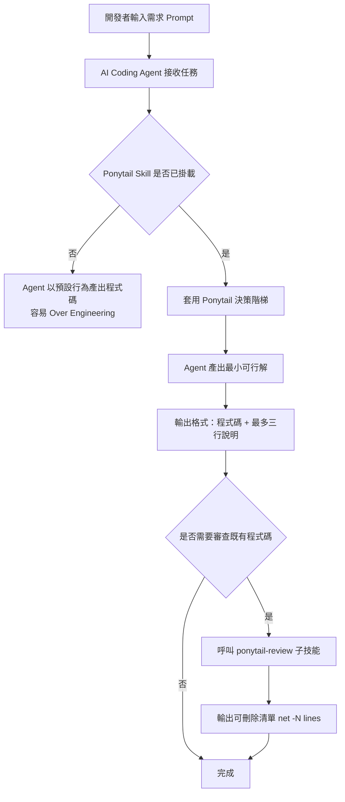

## 4.2 Skill Architecture

Ponytail 以「主技能 + 子技能」的方式組織：

| 元件 | 角色 | 對應檔案 |
|---|---|---|
| `ponytail`（主技能） | 在**寫程式前**套用決策階梯，強制最小化實作 | `skills/ponytail/SKILL.md` |
| `ponytail-review`（子技能） | 在**程式寫完後**審查 diff，找出可刪除的過度設計 | `skills/ponytail-review/SKILL.md` |
| `AGENTS.md` | 通用指引檔，給不支援 Plugin 機制的工具（如純粹讀取 `AGENTS.md` 的工具）直接讀取 | `AGENTS.md` |
| `.rules` 系列檔 | 給 Cursor / Windsurf / Cline / Aider 等以「規則檔」為主要機制的編輯器使用 | `.cursor/rules`、`.windsurfrules` 等 |

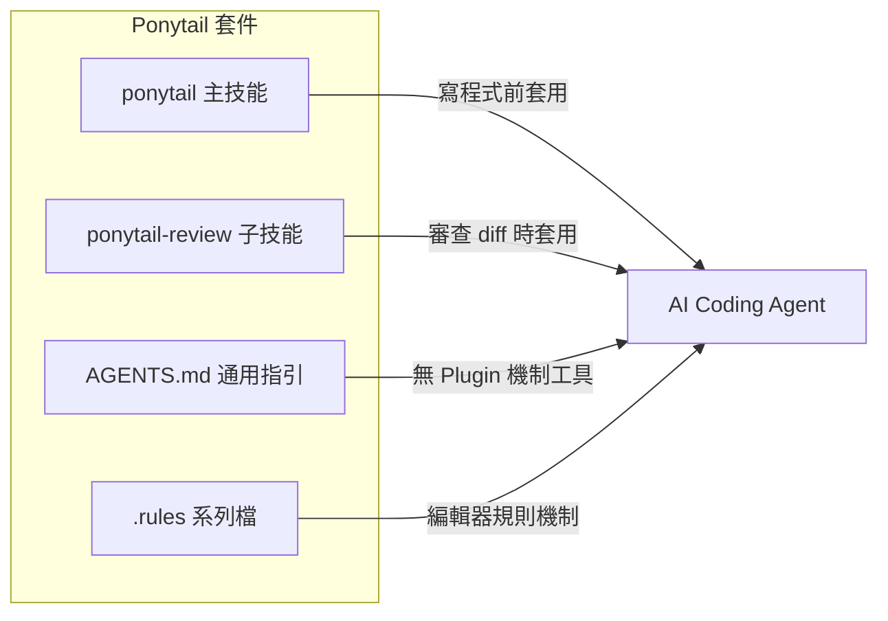

## 4.3 Agent Workflow

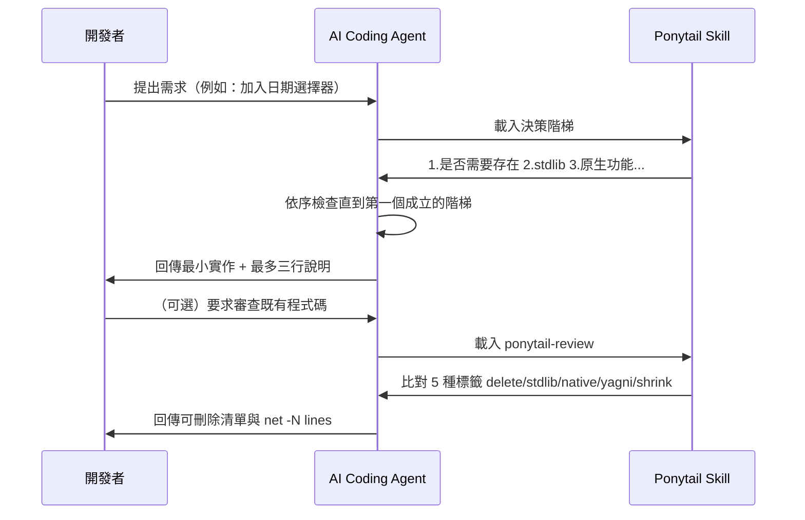

## 4.4 Review Loop

`ponytail-review` 的審查迴圈是 Ponytail 架構中對「已存在程式碼」的補強機制，與主技能的「寫程式前」定位互補：

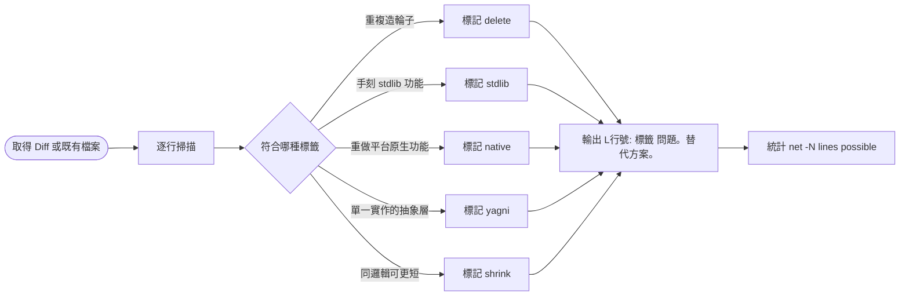

## 4.5 Self Critique Loop

官方 `skills/ponytail/SKILL.md` 中有一條值得特別注意的規則：**「Ship the lazy version and question it in the same response... Never stall on an answer you can default.」**——也就是說，Ponytail 並不要求 Agent 在動手前先想清楚一切（那本身就是另一種形式的 Over Engineering），而是要求 Agent **先交付最小版本，同時用一句話自我質疑這個版本的局限**，而不是為了「想清楚」而拖延輸出。官方給的範例句型是：「Did X; Y covers it. Need full X? Say so.」這形成一個輕量的自我批判循環：交付 → 標註限制（`ponytail:` 註記）→ 留待真正需要時再升級。

## 4.6 Decision Flow

決策階梯本身就是一個決策樹，這也是 Ponytail 最核心的演算法。官方 `AGENTS.md`／`skills/ponytail/SKILL.md` 明確定義這是一條**六階**階梯（"Stop at the first rung that holds"——在第一個成立的階層就停下，不需要逐一驗證到底）：

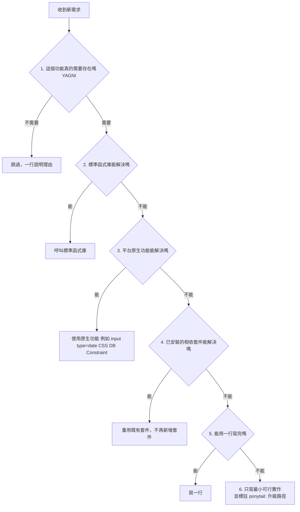

> **注意事項**：官方階梯**僅有六階**，並沒有獨立的「框架」「設定」「基礎設施」「資料庫」階層——這些情境其實都被歸入第 3 階「平台原生功能」的廣義範疇（例如資料庫的 `UNIQUE` 約束、框架的 Bean Validation，本質上都是「平台/框架已經提供的原生能力」）。市面上若有資料宣稱 Ponytail 是九階決策樹，應視為對官方階梯的誤解或過度詮釋；本手冊第 5 章會在六階的基礎上，另外標註企業場景中常見的延伸判斷情境，並清楚區分「官方階梯」與「企業實務延伸」。

## 4.7 Prompt Enhancement Flow

Ponytail 不會改變開發者輸入的原始 Prompt，而是在 Agent 的**系統層級提示詞**中插入決策準則，相當於對每一次任務都自動附加一段「思考前檢查清單」。對開發者而言，使用體驗近乎無感——你照常輸入需求，Agent 在背後多走一趟決策階梯後才開始產出程式碼。

## 4.8 Integration Flow

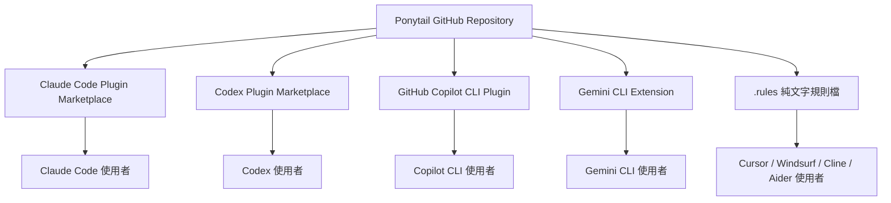

> **實務案例**：某企業內部評估 Ponytail 導入策略時，曾誤以為它是一個「需要架設的服務」，因而排入基礎設施申請流程。實際上它只是一份掛載到 Agent 的指引文件，導入流程應該走的是「開發工具設定變更」而非「系統上線申請」，這個誤解一旦澄清，導入時間可以從數週縮短到數小時。

---

# 第 5 章 Ponytail 工作原理

本章把第 4.6 節的**官方六階決策階梯**逐階展開，說明每一階背後的內部思考流程，並在第 5.3 節之後額外標註「企業實務延伸」——這些是顧問觀點下，把官方階梯套用到企業常見技術棧（Spring Boot、Vue3、Oracle/PostgreSQL 等）時的具體判斷情境，**不是官方文件定義的獨立階層**，避免讀者誤以為官方階梯有更多層級。官方原文對這條階梯的定性是：「The ladder is a reflex, not a research project. Two rungs work → take the higher one and move on.」（這條階梯是反射動作，不是研究專案；兩階都能解時，選層級較高、較省力的那階即可，不需要逐一驗證到底。）

## 5.1 第一階：這個功能真的需要存在嗎（YAGNI）

**檢查內容**：這是官方階梯最優先、也最常被略過的一階——在考慮「怎麼做」之前，先問「真的需要做嗎」。官方原文：「Speculative need = skip it, say so in one line.」（純粹推測性的需求，跳過，並用一行說明理由。）

**思考流程**：常見於「以防之後要用」「業務單位口頭提過可能要」這類沒有明確驗收標準的需求。Agent（與人類工程師）應反問：這個功能現在就有人要用嗎？沒有的話，先不寫，把原因記下來即可。

**對應問題**：2.1 Over Engineering。

## 5.2 第二階：標準函式庫能解決嗎

**檢查內容**：語言或框架的標準函式庫（Java 的 `java.util`/`java.time`、JavaScript 的 ES 內建方法、Python 的 `itertools`/`functools`）是否已內建所需能力？

**思考流程**：Agent 應先以語意搜尋（而非僅關鍵字比對）確認專案語言的標準函式庫是否已有對應 API，而不是手刻一份功能相近、但缺乏邊界測試的版本。例如「字串去除頭尾空白並轉 Title Case」應優先使用語言內建方法，而非自訂迴圈。

**對應問題**：2.2 Reinvent The Wheel。

## 5.3 第三階：平台原生功能能解決嗎

**檢查內容**：瀏覽器、作業系統、框架、資料庫等「平台」本身是否已內建對應能力？官方對此階的經典範例就是 `<input type="date">` 取代日期選擇器套件。

**思考流程**：原生方案優先於第三方套件或手刻邏輯，因為原生方案不會隨套件版本更新而破壞相容性，也不需要額外維護。官方文件 `docs/platform-native.md` 提供了一份逐層對照表（HTML 表單元素、CSS 能力、JS/瀏覽器 API、Node.js 標準庫、Python 標準庫、資料庫原生能力），是這一階最具體的查詢清單，部分摘錄如下：

| 你以為需要 | 平台原生已有 |
|---|---|
| 日期選擇器套件 | `<input type="date">` |
| 顏色選擇器套件 | `<input type="color">` |
| `lodash.clonedeep` | `structuredClone(obj)`（瀏覽器/Node 原生） |
| `uuid` 套件 | `crypto.randomUUID()` |
| 應用層分頁邏輯 | SQL `LIMIT ... OFFSET ...` |
| 應用層唯一性檢查 | 資料庫 `UNIQUE` 約束（Constraint） |
| 應用層樹狀遍歷 | `WITH RECURSIVE`（遞迴 CTE） |

> **企業實務延伸（非官方獨立階層）**：在企業常見的 Spring Boot / Vue3 / Oracle 技術棧中，「平台原生功能」實務上會展開為三個常見子情境，仍歸屬於官方第 3 階，而非另立新階：
> - **框架原生機制**：Spring Boot 的參數驗證該用 `@Valid` + Bean Validation，而非手寫一堆 null check；Vue3 的響應式狀態該用 `ref`/`computed`，而非手動管理 flag 重新渲染（對應問題 2.6 Framework Ignorance）。
> - **資料庫原生能力**：「同一個 Email 不可重複註冊」應以資料庫 `UNIQUE` 約束作為最後防線，而非只在應用層檢查（應用層檢查可作為第一層使用者體驗，但不能是唯一防線）；「計算兩個日期差幾天」應使用資料庫內建日期函式，而非把資料全部撈回應用層計算。
> - **基礎設施原生能力**：「限流」可交給 API Gateway 的 Rate Limiting 設定；「重試」可交給訊息佇列（Kafka、RabbitMQ）內建的重試與死信佇列機制，不需要在應用程式碼中手刻計數器或重試迴圈。
>
> 三者的共通邏輯，與官方「配置優先於程式」的精神一致：許多「需求」本質上是設定值的調整（如逾時秒數、API Base URL、Feature Flag），應放進 `application.yml`／`.env`／設定中心，而不是寫成程式碼裡的條件判斷。

## 5.4 第四階：已安裝的相依套件能解決嗎

**檢查內容**：`package.json` / `pom.xml` / `requirements.txt` 中已安裝的相依套件，是否已內建所需能力？官方原文：「Never add a new one for what a few lines can do.」（不要為了幾行就能完成的事新增一個套件。）

**思考流程**：例如專案已安裝 Lodash，需求是「深拷貝物件」，正確答案是 `_.cloneDeep()`，而不是自行寫遞迴複製函式；專案已安裝 Apache Commons Lang，需求是「字串是否為空白」，答案是 `StringUtils.isBlank()`。

**對應問題**：2.2 Reinvent The Wheel、2.7 Existing Code Ignorance。

## 5.5 第五階：能用一行寫完嗎

**檢查內容**：在以上四階都確認無法解決後，才問「能不能用一行表達式完成」。

**思考流程**：許多看似需要一個函式、甚至一個 Class 的需求，本質上是一行運算或一個標準函式呼叫的組合。官方在 README 給出的去抖動（debounce）範例就是典型案例——三行的閉包寫法即可取代一整個套件依賴。

## 5.6 第六階：只寫最小可行實作

**檢查內容**：以上五階都無法解決，才進入「動手寫程式碼」，且範圍要收斂到「剛好滿足當下需求」。

**思考流程**：即使到了這一階，仍必須遵守第 3.9 節的紅線——輸入驗證、錯誤處理、安全性、無障礙設計、使用者明確要求的功能、以及非 trivial 邏輯必要的測試覆蓋，這些永遠不能因為「想精簡」而被犧牲。寫完後，建議的下一步是用 `ponytail:` 註記標註「跳過了什麼、何時該升級」（見 4.5 節 Self Critique Loop）。

## 5.7 企業實務延伸：刪除與精簡思維（呼應 ponytail-review）

六階決策階梯處理的是「**寫程式碼之前**」的判斷，而「刪除」與「精簡」其實是官方 `ponytail-review` 子技能（見 4.4、7.6 節）在審查既有程式碼時使用的標籤，並非主階梯的一部分，但精神一致，適合在企業導入時與六階階梯一併教育：

- **可刪除（對應 `delete` 標籤）**：常見於「修 Bug」情境——某個 Bug 的根因往往是一段過時的特殊邏輯（為了應付已不存在的舊情境），正確修法是刪掉那段特殊邏輯，而不是再疊加一層新的判斷去繞過它。
- **可精簡（對應 `shrink` 標籤）**：同一邏輯能否用語言內建的高階函式（`map`/`filter`/`reduce`、Stream API）取代多層迴圈與暫存變數，達到同樣行為但更短的程式碼。

## 5.8 內部思考流程整合範例

以「需求：使用者下單後寄送確認信」為例，完整思考路徑：

| 階層 | 檢查結果 |
|---|---|
| 5.1 是否需要存在 | 需要，使用者明確期待收到確認 |
| 5.2 標準函式庫 | 不適用，寄信邏輯非標準函式庫範疇 |
| 5.3 平台原生功能（含企業延伸：框架/資料庫/基礎設施） | Spring Boot 可用 `@TransactionalEventListener` 確保下單交易成功後才寄信；寄信失敗重試交給訊息佇列內建機制，不在應用層手刻重試迴圈 |
| 5.4 已安裝套件 | 專案已有 `EmailService.send()`，直接重用，不需新套件 |
| 5.5 一行解 | 不適用，需要監聽交易事件 |
| 5.6 最小實作 | 只需新增一個 Event Listener，約 10 行，內部呼叫既有 `EmailService` |
| 5.7 可刪除/可精簡 | 發現舊有的同步寄信程式碼可以順勢刪除，改為非同步事件驅動 |

> **注意事項**：六階檢查不是要 Agent（或人類工程師）每次都機械式地逐條跑過一遍，而是建立一種「**先找答案、再寫程式**」的反射性思考順序，且「兩階都能解時取較高階」（5.3 節官方引言）。對企業團隊而言，這套順序也適合直接拿來當作 Junior 工程師的 Code Review 提問清單。

---

# 第 6 章 安裝與部署

依官方文件 `docs/agent-portability.md`，Ponytail 目前共支援 14 個 AI Agent／編輯器（官方 README 徽章標註「works with 14 agents」），依擴充機制可分為四種安裝模式：**Plugin Marketplace 安裝**（Claude Code / Codex / Copilot CLI / Pi agent harness，具備完整的指令、強度切換與生命週期 Hook）、**Extension 安裝**（Gemini CLI／Antigravity、OpenClaw 透過 ClawHub）、**伺服器外掛安裝**（OpenCode，需修改 `opencode.json`）、**純檔案複製／指引檔讀取**（Cursor、Windsurf、Cline、Kiro、CodeWhale、GitHub Copilot 編輯器版等以規則檔或 `AGENTS.md` 為主的工具，僅有常駐規則、沒有指令與強度切換）。以下逐一說明。

## 6.1 Claude Code

**桌面版／Web 版**：
1. 開啟 Customize → 個人 Plugin 設定 → Create plugin → Add from repository
2. 輸入 Repository URL：`DietrichGebert/ponytail`

**CLI 版（Web/CLI 共用指令）**：
```bash
/plugin marketplace add DietrichGebert/ponytail
/plugin install ponytail@ponytail
```

啟用後，於對話中輸入 `/ponytail full` 即可切換強度（詳見第 7 章）。

## 6.2 GitHub Copilot

**Copilot CLI**：
```bash
copilot plugin marketplace add DietrichGebert/ponytail
copilot plugin install ponytail@ponytail
```
指令呼叫採命名空間格式：`/ponytail:ponytail ultra`。

**Copilot（編輯器內建，無 Plugin 機制版本）**：
將官方提供的 `.github/copilot-instructions.md` 複製到專案根目錄的對應路徑，Copilot 會在每次互動時自動讀取作為 Repository Instructions（詳見第 9.3 節）。

## 6.3 Cursor

Cursor 目前以「規則檔」機制為主，沒有原生 Plugin Marketplace，安裝方式為複製官方倉庫中對應的 `.rules` 系列檔到專案的 `.cursor/rules/` 目錄。Windsurf、Cline、Aider 採用相同模式，分別對應 `.windsurfrules`、Cline 規則設定、Aider 的 conventions 檔。

## 6.4 OpenAI Codex／Agent

**Codex CLI**：
```bash
codex plugin marketplace add DietrichGebert/ponytail
/plugins
```
安裝後需在 `/hooks` 中信任其生命週期 Hook（lifecycle hooks），並重新啟動 Codex CLI 使設定生效。

**VS Code + Codex 擴充套件**：Codex 在 VS Code 內會自動讀取專案根目錄的 `AGENTS.md`，無需額外設定即可套用 Ponytail 的通用指引。

## 6.5 Gemini CLI

```bash
gemini extensions install https://github.com/DietrichGebert/ponytail
```

安裝後會將決策階梯以「常駐 Context」形式載入每個 Session，並註冊 `/ponytail` 系列指令；`skills/` 目錄的子技能（`ponytail-review` 等）也會隨之啟用。

**Antigravity CLI（Gemini CLI 改名）**：Google 已將 Gemini CLI 改名為 Antigravity CLI（執行檔名稱改為 `agy`），安裝指令格式相同：

```bash
agy plugin install https://github.com/DietrichGebert/ponytail
```

兩個重要差異需注意：①Antigravity 會將 `/ponytail` 系列指令轉換成技能（Skill），因此呼叫方式是直接在對話中輸入 `/ponytail-review` 這串文字（當作一般訊息），而不是從 Slash 選單挑選；②官方文件指出，在改名完全遷移完成前（約 2026 年 6 月 18 日前後），原本的 `gemini extensions install` 指令仍可正常運作，企業導入時應留意這個過渡期的時間窗。若想以「常駐規則」而非「擴充套件」方式套用，也可以直接將規則內容放入 `.agents/rules/` 目錄。

## 6.6 VS Code 整合

VS Code 本身不直接執行 Ponytail，而是透過其上運行的 AI Agent 擴充套件（GitHub Copilot Chat、Claude Code 擴充套件、Codex 擴充套件等）間接套用。實務上的整合方式：

1. 若使用 Copilot Chat：將 `.github/copilot-instructions.md` 放入專案根目錄
2. 若使用 Claude Code 擴充套件：依 6.1 節的 Plugin Marketplace 流程安裝
3. 若使用 Codex 擴充套件：確保專案根目錄存在 `AGENTS.md`

## 6.7 JetBrains 整合

JetBrains 系列 IDE（IntelliJ IDEA、WebStorm 等）若搭配 GitHub Copilot 或 Claude Code 的官方外掛，同樣是透過外掛內部呼叫的 Agent 來間接套用 Ponytail，整合方式與 VS Code 一致：確認外掛支援讀取專案層級的指引檔（`AGENTS.md` 或 `.github/copilot-instructions.md`），並依各外掛文件啟用「專案自訂指令」功能。

## 6.8 Pi Agent Harness

```bash
pi install git:github.com/DietrichGebert/ponytail
```

Pi 是完整支援指令與生命週期 Hook 的平台之一，安裝後即可使用 `/ponytail` 系列指令（在 Pi 中以 `@` 觸發，例如 `@ponytail-review`）。

## 6.9 OpenCode

OpenCode 採「Server Plugin」機制，需從本倉庫的 checkout 執行 OpenCode（外掛會重用本倉庫的 `hooks/` 與 `skills/` 目錄），並於專案的 `opencode.json` 中加入：

```json
{ "plugin": ["./.opencode/plugins/ponytail.mjs"] }
```

外掛會在每個對話輪次注入決策階梯規則，並提供 `/ponytail` 指令（含 `lite/full/ultra/off` 強度切換）。OpenCode 也會自動讀取本倉庫的 `AGENTS.md`，因此即使不裝外掛，規則本身依然生效，只是少了指令與強度切換。若要在多個專案共用同一份 checkout，建議將 `opencode.json` 的路徑改為絕對路徑，並將指令檔案以符號連結方式發佈：`ln -sf /絕對路徑/ponytail/.opencode/command/* ~/.config/opencode/command/`。

## 6.10 CodeWhale

CodeWhale 採零設定模式：直接讀取專案根目錄的 `AGENTS.md`，不需要額外安裝步驟。將官方 `AGENTS.md` 複製到專案根目錄，或直接從本倉庫 checkout 執行 `codewhale` 即可生效。

## 6.11 OpenClaw

```bash
clawhub install ponytail
```

透過 ClawHub 將 Ponytail 安裝為 OpenClaw 技能；`ponytail-review`／`ponytail-audit`／`ponytail-debt`／`ponytail-gain`／`ponytail-help` 等子技能也可用相同方式個別安裝（例如 `clawhub install ponytail-review`）。OpenClaw 會在程式碼任務中自動套用，同時也提供 `/ponytail` 指令。若企業無法使用 ClawHub，可直接將 `.openclaw/skills/ponytail` 目錄複製到 `~/.openclaw/skills/`。

## 6.12 Kiro

將官方 `.kiro/steering/ponytail.md` 複製到 `~/.kiro/steering/`（全域套用）或專案的 `.kiro/steering/`（單一專案套用），即可作為 Kiro 的 Steering Rule 套用，屬於常駐規則模式，沒有指令與強度切換。

## 6.13 系統需求

| 項目 | 說明 |
|---|---|
| Node.js | Claude Code 與 Codex 的生命週期 Hook 依賴兩個輕量 Node.js 腳本，需要 `node` 在 PATH 中（Nix/nvm 使用者須確認非互動式 Shell 也能找到 `node`）；缺少時 Plugin 仍可靜默運作，僅生命週期 Hook 的常駐啟用提示不會出現 |
| Python 3 | 僅 Benchmark 的正確性驗證腳本需要（`python3` 優先，其次才是 `python`，CSV 檢查需要 `pandas`），一般企業導入不需安裝 |
| 網路權限 | Plugin Marketplace／Extension 安裝需要存取 GitHub；若企業內網有 Proxy 限制，建議改用「純檔案複製」安裝模式（如 6.10、6.12 節的 CodeWhale、Kiro 模式） |

> **實務案例**：某金融業團隊因內網無法直接存取 GitHub Plugin Marketplace，改採「純檔案複製」模式——直接將 `AGENTS.md` 與對應的規則檔下載後，透過內部 Git Server 鏡像分發給所有專案，達到與線上安裝相同的效果，且更易於納入既有的內部套件治理流程。

---

# 第 7 章 Ponytail 設定說明

## 7.1 Agent Configuration

最基本的設定是「強度等級」，可透過環境變數設定：

```bash
# Linux / macOS
export PONYTAIL_DEFAULT_MODE=full

# Windows PowerShell
$env:PONYTAIL_DEFAULT_MODE = "full"
```

或透過設定檔：

```json
// ~/.config/ponytail/config.json（Windows: %APPDATA%\ponytail\config.json）
{
  "defaultMode": "full"
}
```

## 7.2 Rules

四種強度等級的行為差異：

| 強度 | 行為 |
|---|---|
| `off` | 完全停用，Agent 恢復預設行為 |
| `lite` | 仍交付 Agent 原本想給的方案，但額外用一行指出更精簡的替代方案 |
| `full`（預設） | 強制套用決策階梯，優先 stdlib／原生功能，並精簡說明文字 |
| `ultra` | YAGNI 極端模式：刪除優先於新增，主動挑戰需求本身是否合理，但仍同步交付最小可行程式碼 |

## 7.3 Skills

企業內導入時，建議將 `ponytail`（寫程式前）與 `ponytail-review`（審查既有 diff）視為**互補而非互斥**的兩個技能，分別掛載在不同的工作流程節點：

- `ponytail`：掛載在「日常開發對話」
- `ponytail-review`：掛載在「PR 提交前自我審查」或「Code Review 流程中的第一輪掃描」

## 7.4 Context

Ponytail 本身不涉及專案的業務 Context，但企業可以在團隊自訂的 `CLAUDE.md` / `AGENTS.md` 中，將 Ponytail 的決策階梯與**專案特定的既有工具函式清單**結合，例如明確列出「本專案的日期處理請一律使用 `DateUtils`，不要再寫新的」，把第 5.4 節「已安裝的相依套件能解決嗎」延伸到專案內既有工具函式的重用，具體化成可執行的清單。

## 7.5 Hooks

在 Claude Code 與 Codex 中，Ponytail 部分功能（如 `/ponytail-gain` 效益儀表板的自動更新）依賴生命週期 Hook（PreToolUse / PostToolUse 等）。企業導入時應在 `/hooks` 介面中明確檢視並信任這些 Hook 的行為範圍，避免誤信任來源不明的第三方 Hook（安全考量詳見第 13.6 節 Secret Detection 與企業既有的 Hook 安全規範）。

## 7.6 Templates

`ponytail-review` 的輸出有固定格式範本：

```text
L42: yagni 單一實作的 PaymentStrategy 介面。直接 inline 成一個 if/else，第二種付款方式出現再抽介面。
L88: stdlib 手刻的陣列去重迴圈。改用 Set 或 distinct()。
L120: native 用 JS 套件做的日期格式化。改用 Intl.DateTimeFormat。
net: -37 lines possible.
```

若全文沒有可刪除項目，輸出固定為：`Lean already. Ship.`（已經夠精簡了，可以直接送出。）

## 7.7 Review Policies

企業導入時，建議明確訂出「**永不可被精簡**」的審查紅線清單，並寫入團隊版的 Skill 設定中，呼應第 3.9 節 Maintainability First：

- 輸入驗證（特別是跨信任邊界的輸入）
- 防止資料遺失的錯誤處理
- 認證、授權、加密相關邏輯
- 無障礙設計（accessibility）屬性與標記
- 硬體校正參數（如時鐘飄移補償、感測器誤差校正係數，官方原文用語為「the calibration real hardware needs」）
- 使用者明確要求保留的功能
- 非 trivial 邏輯的必要測試覆蓋

## 7.8 Team Standards

建議將 Ponytail 的強度等級與團隊的開發階段對應：

| 開發階段 | 建議強度 | 原因 |
|---|---|---|
| 概念驗證（PoC） | `lite` | 此階段重視速度與彈性試錯，過度精簡反而打斷探索 |
| 一般功能開發 | `full` | 預設強度，兼顧精簡與可維護性 |
| 重構／技術債清理專案 | `ultra` | 重構的目的就是減少複雜度，適合最積極的強度 |
| Legacy 系統維護（高風險） | `off` 或 `lite` | 對不熟悉的既有邏輯，過度刪減反而增加風險，應先理解再精簡 |

> **範例設定（團隊共用設定檔片段）**：
> ```json
> {
>   "defaultMode": "full",
>   "neverSimplify": [
>     "validation",
>     "error-handling",
>     "security",
>     "accessibility",
>     "tests"
>   ],
>   "preferExisting": [
>     "src/utils/DateUtils.*",
>     "src/utils/StringHelper.*"
>   ]
> }
> ```
> 上述 `neverSimplify` 與 `preferExisting` 為企業可自行擴充的慣例性設定，並非官方標準欄位，使用前請先確認所用平台版本是否支援自訂欄位讀取。

---

# 第 8 章 與 Claude Code 整合

## 8.1 Agent Skill

Claude Code 將 Ponytail 視為標準的 Agent Skill（`SKILL.md` 格式），可與專案既有的其他 Skill（例如本系列手冊中介紹過的 Agent Skills、Superpowers 等）並存，依各自的 `description` 欄位由 Claude Code 自動判斷何時載入。

## 8.2 Custom Instructions

企業可在專案的 `CLAUDE.md` 中加入一段「優先順序聲明」，明確告知 Claude Code：當 Ponytail 的精簡建議與專案既有的 Coding Standard 衝突時，以何者為準。範例：

```markdown
## AI 協作守則
- 本專案已啟用 Ponytail（full 強度）。
- 若 Ponytail 建議精簡的程式碼涉及金額計算、權限判斷，請維持現有的完整實作，
  並在 PR 說明中註明「Ponytail 建議精簡但保留」及原因。
```

## 8.3 Commands

| 指令 | 用途 |
|---|---|
| `/ponytail [lite\|full\|ultra\|off]` | 切換強度 |
| `/ponytail-review` | 審查目前 diff，列出可刪除清單 |
| `/ponytail-audit` | 掃描整個 Repository，找出累積的過度設計 |
| `/ponytail-debt` | 彙整程式碼中 `ponytail:` 註記，產出技術債清單 |
| `/ponytail-gain` | 顯示導入後的效益儀表板（行數/Token/成本/時間） |
| `/ponytail-help` | 顯示指令說明 |

## 8.4 Workflows

建議的日常工作流程：

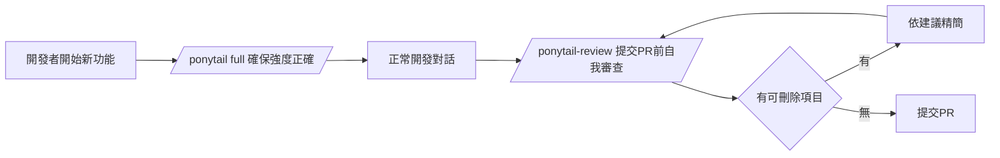

## 8.5 Best Practices

- 在團隊的 `CLAUDE.md` 中明確記錄目前專案採用的強度等級，避免不同成員因本機環境變數不同而產生不一致的程式碼風格
- 將 `/ponytail-review` 納入 PR 提交前的個人檢查清單，而不是只依賴最終的人工 Code Review
- 定期執行 `/ponytail-audit` 與 `/ponytail-debt`，把累積的 `ponytail:` 簡化標記轉化為排入 Backlog 的技術債項目

## 8.6 Enterprise Standards

企業導入 Claude Code + Ponytail 時，建議將「強度等級」與「環境」綁定，並透過團隊共用的 `settings.json`（而非個人環境變數）統一管理，避免各自為政：

```json
{
  "env": {
    "PONYTAIL_DEFAULT_MODE": "full"
  }
}
```

> **範例 Prompt**：
> ```
> 請使用 ultra 強度的 Ponytail 原則，重新檢視 src/order/OrderService.java，
> 找出可以刪除或合併的抽象層，但保留所有交易完整性與例外處理邏輯。
> ```

---

# 第 9 章 與 GitHub Copilot 整合

## 9.1 Copilot Agent

在 IDE 內的 Copilot Chat / Agent 模式中，Ponytail 透過 9.3 節介紹的 Repository Instructions 機制生效，效果與 Claude Code 的 Custom Instructions 類似，但 Copilot 端目前沒有對等的 Slash 指令集（如 `/ponytail-review`），需仰賴指引檔本身的描述觸發。

## 9.2 Copilot Coding Agent

Copilot Coding Agent（可自主處理 GitHub Issue 並開 PR 的版本）同樣會讀取 Repository 層級的指引檔，建議企業在指派 Issue 給 Copilot Coding Agent 前，確認 Repository Instructions 中已包含 Ponytail 的精簡準則，避免 Agent 在無人即時審查的情況下產出過度設計的 PR。

## 9.3 Repository Instructions

於專案根目錄建立 `.github/copilot-instructions.md`，內容取自官方提供的指引範本，例如：

```markdown
# Copilot Instructions

You are a lazy senior developer. Lazy means efficient, not careless.
Before writing code, check in order:
1. Does this need to exist?
2. Does the standard library provide it?
3. Does a native platform feature provide it?
4. Does an already-installed dependency provide it?
5. Can it be a one-liner?
6. Only then, write the minimal implementation.
Never skip validation, error handling, security, or accessibility.
```

## 9.4 Prompt Files

Copilot 支援以 `.prompt.md` 形式建立可重複呼叫的 Prompt 範本，企業可建立一份 `ponytail-review.prompt.md`，把 `ponytail-review` 的審查格式（5 種標籤＋`net -N lines`）固化成可重複使用的審查 Prompt：

```markdown
---
mode: agent
---
請以 ponytail-review 的精神審查目前選取的程式碼，找出：
- delete：可直接刪除的死碼或多餘彈性
- stdlib：重複實作標準函式庫的部分
- native：重複實作平台原生功能的部分
- yagni：只有單一實作卻存在的抽象層
- shrink：邏輯相同但可以更短的寫法
輸出格式：L<行號>: <標籤> <問題>。<替代方案>。
最後輸出：net: -<N> lines possible.
```

## 9.5 Agent Files

對於支援讀取 `AGENTS.md` 的 Copilot 版本，可直接沿用官方提供的 `AGENTS.md` 內容（見第 1.1 節原文摘錄），不需重新撰寫。

## 9.6 Skills

Copilot CLI（終端機版本）的 Skills/Plugin 機制與 Claude Code 接近，安裝方式已於 6.2 節說明，差異在於指令呼叫需加上命名空間前綴（`/ponytail:ponytail`）。

## 9.7 完整範例

某團隊在 `.github/copilot-instructions.md` 中，將官方 Ponytail 指引與專案既有規範整合的完整範例：

```markdown
# Copilot Instructions

## 精簡原則（Ponytail）
[官方 Ponytail 決策階梯內容，見 9.3 節]

## 專案既有規範（優先於精簡原則）
- 所有金額相關運算必須使用 BigDecimal，不可因精簡而改用 double
- 所有跨服務呼叫必須保留現有的重試與斷路器（Circuit Breaker）邏輯
- 既有的稽核日誌（Audit Log）寫入點不可被視為「死碼」而刪除
```

> **注意事項**：第 9.4 節與第 9.7 節中的 Prompt 範本與規範組合，是依官方公開的 Ponytail 指引精神重新整理撰寫而成的企業使用範例，並非逐字複製官方 README；企業導入前建議仍以官方 Repository 當下版本的 `SKILL.md` 原文為準。

---

# 第 10 章 Web Application 開發實戰

## 10.1 技術棧總覽

本章以企業常見的全端組合示範 Ponytail 的實際效果：

- **Frontend**：Vue 3 + TypeScript + Tailwind CSS
- **Backend**：Java 21 + Spring Boot 3.x
- **Database**：Oracle / PostgreSQL

## 10.2 API 開發

**需求**：提供一個查詢會員資料的 API，依會員編號查詢。

**未套用 Ponytail 的典型產出**（約 60 行）：定義 `MemberQueryRequest` DTO、`MemberQueryResponse` DTO、`MemberQueryStrategy` 介面、`MemberQueryStrategyImpl` 實作、`MemberController`、`MemberService` 介面、`MemberServiceImpl`，共 7 個檔案。

**套用 Ponytail（full）的產出**（約 15 行）：

```java
@RestController
@RequestMapping("/api/members")
class MemberController {

    private final MemberRepository memberRepository;

    MemberController(MemberRepository memberRepository) {
        this.memberRepository = memberRepository;
    }

    @GetMapping("/{id}")
    MemberResponse getMember(@PathVariable Long id) {
        return memberRepository.findById(id)
            .map(MemberResponse::from)
            .orElseThrow(() -> new MemberNotFoundException(id));
    }
}
// ponytail: 目前只有單一查詢情境，若未來出現多條件查詢，再抽 Service 層與 Specification。
```

Spring Data JPA 的 `Repository` 本身就是「框架已提供能力」（對應第 5.3 節「平台原生功能能解決嗎」中框架原生機制的企業延伸判斷），不需要再包一層 Service 介面與實作。

## 10.3 CRUD 開發

CRUD 場景最容易出現「為了完整性而過度設計」——例如四個操作各自建立一個 Command 物件、一個 Handler、一個 Validator，形成事實上的 CQRS，卻只有一個資料表、一種使用情境。Ponytail 的建議路徑：

| 操作 | 預設建議 |
|---|---|
| Create / Read / Update / Delete | Spring Data JPA 內建方法（`save`/`findById`/`deleteById`）已可滿足 90% 情境，無需自訂 Repository 方法 |
| 複雜查詢 | 先試 JPQL 或 Query Method 命名規則，無法滿足才考慮 Specification 或 QueryDSL |
| 批次刪除 | `deleteAllByIdInBatch()` 已是框架原生能力，不需手寫迴圈逐筆刪除 |

## 10.4 Batch 開發

**需求**：每日凌晨將前一天的訂單彙總寫入報表表。

**過度設計版本**：自建 Scheduler 介面、Task 抽象類別、自訂執行緒池管理、自訂重試邏輯。

**Ponytail 建議**：Spring Boot 已內建 `@Scheduled`，搭配 `spring-boot-starter-batch`（若已安裝）的 `Job`/`Step` 機制即可滿足大多數批次需求，重試與失敗處理交給 Spring Batch 內建的 `RetryPolicy`，不需重新發明。

## 10.5 Security 開發

這是 Ponytail 紅線最明確的領域（見 3.9 節、7.7 節）——**精簡原則不適用於安全相關邏輯**。例如：

- 密碼雜湊：必須使用 `BCryptPasswordEncoder` 等成熟函式庫，不可為了「少一個套件」而自行實作雜湊演算法
- 權限檢查：`@PreAuthorize` 等框架機制應完整套用，不可因「目前只有一種角色」而省略授權檢查框架，直接寫死 `if (role == "ADMIN")`
- 輸入驗證：跨信任邊界的輸入（API 參數、檔案上傳）一律要驗證，這條規則在任何強度下都不可被精簡

## 10.6 Integration 開發

串接第三方系統時，Ponytail 的「Existing Solution First」原則建議：優先使用官方 SDK，而非自行包裝 HTTP Client；若官方 SDK 過重，再考慮專案已安裝的通用 HTTP Client（如 Spring 的 `RestClient`），而不是新增一個新的 HTTP Client 套件。

## 10.7 Ponytail 如何減少程式碼

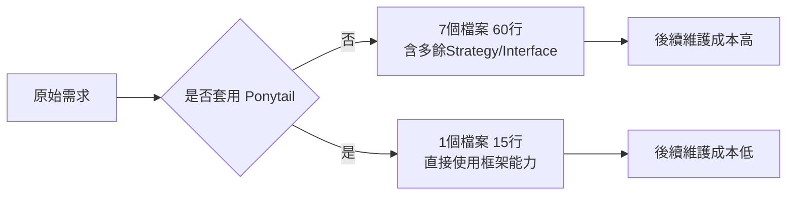

> **實務案例**：某團隊將既有的會員查詢 API 套用 `ponytail-review` 進行回溯審查，掃描出 3 個只有單一實作的 Strategy 介面、2 個未被任何地方呼叫的 Mapper 方法，合計 `net: -86 lines possible`。團隊評估後採納其中 80%（保留了 1 個介面，因為下個月確定會新增第二種查詢方式）。

---

# 第 11 章 Legacy System Reverse Engineering

## 11.1 Mainframe

**情境**：Mainframe 系統通常以 JCL（Job Control Language）排程批次工作，邏輯散落在多個 COBOL/PL1 程式與 Copybook 之間。

**Ponytail 在此情境的角色**：Ponytail 本身不具備逆向工程能力，但其「Existing Solution First」「Configuration Before Programming」的思維方式，可以用來**約束逆向工程後的重寫範圍**——避免工程團隊在不完全理解 Mainframe 邏輯的情況下，"順手"用新框架重新設計一套自己覺得更優雅、但其實過度泛化的替代邏輯。

## 11.2 COBOL

逆向工程 COBOL 程式的標準流程：先用 AI Agent 逐一解析 Copybook 定義的資料結構，再解析 Procedure Division 的業務邏輯分支，最後產出依賴關係圖。Ponytail 的精簡原則在這個階段應**暫停套用**（建議強度設為 `off` 或 `lite`）——因為逆向工程階段的目標是「完整理解」，不是「精簡產出」，過早精簡反而可能遺漏 COBOL 原始邏輯中看似多餘、實際上處理特定歷史情境的分支。

## 11.3 Lotus Domino

Lotus Domino 應用常以 View、Form、LotusScript Agent 組成，邏輯與資料高度耦合在同一份 `.nsf` 檔案中。AI Agent 協助逆向工程時，應先要求其產出「Form 與 View 清單」「LotusScript Agent 觸發時機表」，再進入細節分析，避免一次性要求 Agent 直接給出「重構建議」（對應第 2.8 節 Legacy System Rewrite Syndrome 的風險）。

## 11.4 Struts

Struts 的 Action / ActionForm / `struts-config.xml` 三者構成請求處理邏輯。逆向工程時建議讓 Agent 先建立「URL → Action → JSP」的對照表，確認所有路由後，才開始分析個別 Action 內的業務邏輯。

## 11.5 JSF

JSF（JavaServer Faces）的邏輯分散在 Managed Bean、Facelets（`.xhtml`）與 `faces-config.xml` 之間，逆向工程時容易因為 Bean 的生命週期（Request/View/Session/Application Scope）誤判狀態管理邏輯，須特別請 Agent 標明每個 Bean 的 Scope。

## 11.6 舊版 Spring

常見於 Spring 3.x / 4.x，以 XML 設定為主（`applicationContext.xml`），混合少量 Annotation。逆向工程重點是先還原 Bean 的相依關係圖，確認 AOP 攔截邏輯（Transaction、Logging）作用範圍，才能安全規劃升級路徑（見第 12 章）。

## 11.7 WebSphere

WebSphere 應用常綁定特定的 JNDI 資源設定、EJB、JMS 佇列。逆向工程時須將「應用程式邏輯」與「WebSphere 平台層設定」（透過 `ibm-web-ext.xml` 等）分開記錄，避免將平台層設定誤判為應用邏輯而遺漏。

## 11.8 WebLogic

WebLogic 的特殊之處在於其 `weblogic.xml` 部署描述檔與 WebLogic 專屬的 Connection Pool / JTA 設定，逆向工程時建議將這些平台特定設定獨立列表，作為日後遷移到雲原生平台（如 Kubernetes + 標準 JTA 實作）時的對照清單。

## 11.9 Ponytail 在逆向工程中的角色與限制

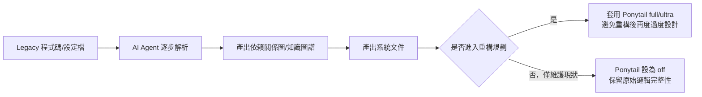

**限制**：

- Ponytail 不具備理解 COBOL/LotusScript 等語言語意的特殊能力，逆向工程的準確性仍取決於 Agent 本身的模型能力與人工驗證
- 逆向工程階段建議關閉或降低 Ponytail 強度，避免 Agent 在「理解」與「精簡」兩種目標之間角色衝突
- Ponytail 真正發揮價值的時機是在「依賴分析完成後、確定要動手重構」的階段，用來防止重構又走回 Over Engineering 的老路

> **注意事項**：本章內容是依 Ponytail 的核心理念延伸出的逆向工程實務建議，並非 Ponytail 官方文件涵蓋的功能。企業導入時應將其視為「治理流程的補充建議」，而非 Ponytail 工具本身的能力清單。

---

# 第 12 章 Framework Upgrade 實戰

## 12.1 Spring Boot 2 到 3

升級涉及 Jakarta Namespace 遷移（`javax.*` → `jakarta.*`）、最低 Java 版本要求（Java 17+）。Ponytail 的價值在於：升級時 AI Agent 往往會「順便」把舊程式碼一起重構成更現代的寫法，Ponytail 的紅線思維可以提醒團隊——**升級 PR 應只處理升級本身**，額外的風格重構應拆成獨立 PR，避免兩種變更混在一起增加審查難度與回歸風險。

## 12.2 Java 8 到 21

新版本帶來 Record、Pattern Matching、Virtual Threads 等特性。Ponytail 的「Native Feature First」原則建議：升級後逐步以 Record 取代純資料用途的 POJO（含手寫的 getter/setter/equals/hashCode/toString），這正是「用語言原生功能取代手刻邏輯」的典型應用。

## 12.3 Vue2 到 Vue3

Vue3 的 Composition API 鼓勵以 `ref`/`computed`/`watch` 取代 Vue2 常見的 Mixin 模式。Ponytail 原則在此提醒：遷移時若 Agent 建議引入額外的狀態管理套件（如為了一個簡單的共享狀態就引入完整的 Pinia Store），應先評估 `provide`/`inject` 或單純的 `ref` 是否已足夠。

## 12.4 Jakarta Migration

Jakarta EE 遷移最常見的過度設計，是團隊趁機導入一套自製的「相容層」來同時支援 `javax` 與 `jakarta` 命名空間，以為這樣比較「保險」。Ponytail 原則建議：除非有明確的雙軌並行需求（例如分階段升級的大型系統），否則應直接全面遷移，不要新增相容層這種「YAGNI」式的保險設計。

## 12.5 JDK Upgrade

JDK 升級常見的延伸需求是「順便」升級 Garbage Collector 設定、JVM 啟動參數。建議將 JDK 升級與 JVM 調優拆開處理——前者是版本相容性問題，後者是效能調校決策，混在一起會讓升級 PR 難以審查與回滾。

## 12.6 Dependency Upgrade

相依套件升級時，AI Agent 常見的過度設計是「順手」把所有相關套件都升級到最新版，即使某些套件並非本次升級範圍。Ponytail 的「Less Code Principle」延伸到升級情境，建議的做法是：**每次只處理範圍內的相依套件**，其餘留待下一輪升級，降低單次變更的風險面。

## 12.7 降低升級成本的具體做法

| 做法 | 說明 |
|---|---|
| 升級前先跑 `/ponytail-audit` | 找出升級範圍內既有的過度設計，趁升級機會一併清理，但拆成獨立 commit |
| 升級 PR 與重構 PR 分離 | 避免審查者無法分辨「升級必要變更」與「順手優化」 |
| 升級後跑 `/ponytail-review` | 確認 AI Agent 在升級過程中沒有引入新的過度設計（如為了相容性新增不必要的 Adapter 層） |
| 保留 `ponytail:` 升級路徑註記 | 對於暫時妥協的相容寫法，標註未來何時可以移除 |

> **實務案例**：某團隊在 Spring Boot 2 升級到 3 的過程中，Agent 主動提議建立一個 `LegacyJavaxCompatAdapter` 抽象層以「平滑過渡」，但團隊評估後發現所有程式碼可以一次性遷移完成，並無分階段需求，因此依 Ponytail 的 YAGNI 原則否決了這個提議，直接完成遷移，省下後續維護一個臨時相容層的長期成本。

---

# 第 13 章 與 SSDLC 整合（企業實務延伸）

> 本章為企業實務延伸內容，說明如何將 Ponytail 的精簡哲學**併入**既有的 SSDLC（Secure Software Development Lifecycle）流程，而非取代 SSDLC 的任何環節。

## 13.1 定位澄清：Ponytail 不是安全工具

必須再次強調官方文件的明確聲明（見第 1.6 節）：`ponytail-review` 的審查範圍**明確排除**正確性 Bug、安全性漏洞與效能問題。企業導入時最容易犯的錯誤，就是誤以為「裝了 Ponytail 就等於有了安全把關」——這是危險的誤解。Ponytail 解決的是「複雜度」，SSDLC 解決的是「風險」，兩者目標不同、缺一不可。

## 13.2 Threat Modeling

Threat Modeling 應在功能設計階段、Ponytail 套用之前完成。原因：Threat Modeling 經常需要「預先設計」一些看似多餘的防護機制（例如速率限制、輸入消毒、最小權限的服務帳號），這些防護機制不應被 Ponytail 的精簡邏輯誤判為「過度設計」。建議在團隊的 Skill 設定中，將 Threat Model 文件中列出的防護措施明確加入 7.7 節提到的「永不可被精簡」清單。

## 13.3 SAST

靜態應用安全測試（SAST，如 SonarQube、Checkmarx）應作為 CI Pipeline 中**獨立於 Ponytail** 的檢查關卡。建議流程順序：`ponytail-review`（複雜度審查）→ 人工 Code Review → SAST 掃描 → 合併。三者各司其職，不應互相取代。

## 13.4 DAST

動態應用安全測試（DAST）測試的是執行期行為，與程式碼是否精簡無關。唯一需要注意的整合點是：若 Ponytail 建議的精簡寫法改變了 API 的錯誤回應格式（例如把自訂例外類別簡化為標準例外），需確認 DAST 規則庫中比對錯誤回應格式的測試案例同步更新。

## 13.5 Dependency Check

這是 Ponytail 與既有安全工具**正向協同**的領域。Ponytail 的「Existing Solution First」「Library Before Custom Code」原則會自然減少新增相依套件的頻率，間接降低 SCA（Software Composition Analysis，如 OWASP Dependency-Check、Snyk）需要追蹤的套件數量與供應鏈攻擊面。但減少新套件不代表現有套件不需要掃描，Dependency Check 仍應對所有既有相依套件持續執行。

## 13.6 Secret Detection

`/ponytail-gain` 等指令依賴的生命週期 Hook，理論上不會涉及機密資訊存取，但企業導入任何第三方 Plugin / Hook 時，都應遵循既有的 Secret Detection 規範（如 git-secrets、Gitleaks），確認 Hook 的執行範圍不會意外讀取或回傳 `.env`、憑證檔案等敏感內容。這是治理流程的一般性要求，與 Ponytail 本身的功能無關。

## 13.7 Secure Coding

第 10.5 節已說明，Security 開發是 Ponytail 紅線最明確的領域。企業應將公司既有的 Secure Coding Guideline（如 OWASP Top 10 對應的編碼規範）獨立於 Ponytail 的決策階梯之外，作為**前置且優先**的檢查項——也就是說，決策階梯的「能不能精簡」永遠在「是否符合安全規範」之後才考慮。

## 13.8 Compliance

金融、醫療等受監管產業常有特定法規要求的程式碼模式（如稽核軌跡欄位、資料保留政策的強制實作）。這些模式即使在程式碼層面看起來像是「多餘的重複欄位」，也不應被視為過度設計。建議將法規要求的欄位/邏輯模式整理成清單，與 Threat Model 防護清單一併納入 Ponytail 設定的排除範圍。

## 13.9 Audit

稽核軌跡（Audit Log）的寫入邏輯，是另一個常被誤判為「死碼」的高風險區域——稽核日誌往往「寫入後沒有任何地方讀取」，在純粹的靜態分析下容易被標記為 `delete`。企業導入 `ponytail-review` 時，應在審查清單中明確排除所有稽核相關的寫入點（如第 9.7 節範例所示）。

> **實務案例**：某銀行內部曾發生 `ponytail-review` 掃描出一段「沒有被任何地方呼叫」的交易記錄寫入邏輯，並標記為 `delete` 候選。經人工複核後發現該邏輯是稽核合規要求、由批次排程觸發（並非由應用程式碼直接呼叫），幸好團隊已將稽核相關程式碼路徑列入排除清單，審查建議才停留在「候選」階段、未被自動套用。此案例後來被納入企業內部的 Ponytail 導入教育訓練教材。

---

# 第 14 章 與 AI Agent 團隊整合（企業實務延伸）

> 本章為企業實務延伸內容，說明在「多 Agent 協作開發團隊」的架構下，Ponytail 應掛載在哪個角色、哪個環節，這是顧問觀點下的建議架構，非 Ponytail 官方規範的團隊模型。

## 14.1 多 Agent 團隊架構總覽

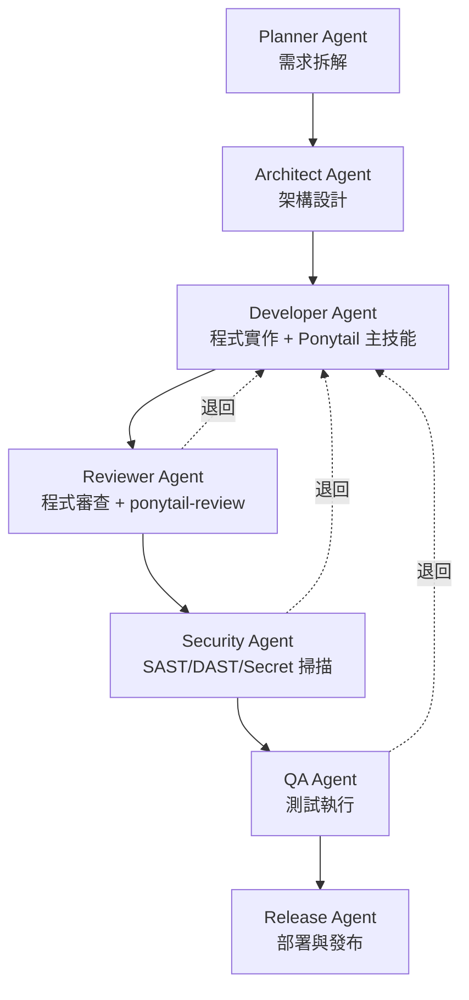

## 14.2 Planner Agent

負責將業務需求拆解為可執行的開發任務。**不掛載** Ponytail——這個階段需要的是完整列出所有可能的需求變化，過早精簡反而可能漏掉邊界情境。

## 14.3 Architect Agent

負責技術選型與架構設計。建議掛載 Ponytail 的理念（但不一定是技術上的 Skill 掛載），用「決策階梯」的思維方式審視架構提案——例如評估「是否真的需要引入訊息佇列」「是否真的需要拆分微服務」，而不是預設「越複雜的架構越專業」。

## 14.4 Developer Agent

**主要掛載點**。Developer Agent 在實作階段套用 `ponytail` 主技能（強度建議 `full`），確保產出的程式碼符合決策階梯。

## 14.5 Reviewer Agent

**次要掛載點**。Reviewer Agent 在審查階段套用 `ponytail-review` 子技能，產出可刪除清單，作為人工 Code Review 前的第一輪自動篩選，但**不應自動套用刪除建議**——所有刪除建議仍需人工確認（呼應 9.7 節的稽核日誌案例）。

## 14.6 Security Agent

**不掛載** Ponytail 主技能。Security Agent 的職責是 SAST/DAST/Secret Detection/Dependency Check，這是第 13 章強調的「Ponytail 不取代安全機制」的具體落實——Security Agent 應該是獨立於 Ponytail 之外運作的角色。

## 14.7 QA Agent

**不掛載** Ponytail。QA Agent 負責測試案例生成與執行，其判斷標準是「功能是否正確」，與「程式碼是否精簡」無關。但 QA Agent 產出的測試程式碼，仍可受益於 Ponytail 的精簡原則（測試程式碼也不該過度設計），因此可視團隊偏好選擇性掛載。

## 14.8 Release Agent

**不掛載** Ponytail。Release Agent 負責部署流程，與程式碼精簡程度無關。

## 14.9 Ponytail 在團隊中的角色

整體而言，Ponytail 在多 Agent 團隊架構中扮演的是**「實作與審查兩個節點的品質守門員」**，而非貫穿全流程的治理工具。下表彙整各角色的掛載建議：

| Agent 角色 | 是否掛載 Ponytail | 原因 |
|---|---|---|
| Planner Agent | 否 | 需求拆解階段需要完整性，不宜過早精簡 |
| Architect Agent | 理念參考，非技術掛載 | 用決策階梯思維審視架構提案 |
| Developer Agent | 是（`ponytail` 主技能） | 核心掛載點，直接影響程式碼產出 |
| Reviewer Agent | 是（`ponytail-review`） | 作為人工審查前的第一輪篩選 |
| Security Agent | 否 | 職責範圍互斥，避免混淆責任界線 |
| QA Agent | 視團隊偏好 | 測試程式碼品質可受益，但非必要 |
| Release Agent | 否 | 與部署流程無關 |

> **注意事項**：本節的角色劃分是企業實務上常見的多 Agent 分工模型之一，實際導入時應依團隊現有的 Agent 架構（可參考本系列其他手冊，如 Agent Skills 教學手冊、Hermes Agent 生態系教學手冊）調整，Ponytail 只是其中一個可掛載的元件，不是團隊架構本身。

---

# 第 15 章 Token Optimization

## 15.1 Token Reduction

Token 用量與程式碼行數高度相關——每一行程式碼在後續的每一次 Agent 互動中都會被重新讀取、重新理解。官方 Benchmark 顯示，程式碼行數減少 54%（最高 94%）對應的 Token 用量減少幅度為 **22%**（Token 減少幅度通常小於行數減少幅度，因為說明文字、設定檔等非程式碼內容的佔比不會同步等比例下降）。

## 15.2 Context Reduction

精簡程式碼的直接效果是減少 Context Window 中需要載入的內容量。對於大型 Repository，這意味著 Agent 在執行「讀取整個模組再回答問題」這類任務時，所需的 Context 預算更低，間接也降低了觸發 Context 壓縮（Compaction）的頻率。

## 15.3 Prompt Compression

Ponytail 的輸出格式規範本身就是一種 Prompt 層級的壓縮——強制「程式碼優先、最多三行說明」的格式，避免 Agent 用大量說明文字解釋一個本可以一行解決的方案，這同時減少了輸出 Token 與閱讀者的認知負擔。

## 15.4 Reuse Existing Logic

第 5.2 節「標準函式庫能解決嗎」與第 5.4 節「已安裝的相依套件能解決嗎」這兩道檢查，本質上是一種知識重用機制——重用已驗證過的邏輯，比起讓 Agent 重新生成一份功能相近的程式碼，不僅減少當次 Token 用量，也減少未來每次維護時的理解成本。

## 15.5 Knowledge Reuse

企業可將專案中常被重用的工具函式清單，整理成一份簡短的索引（而不是把整份原始碼塞進 Context），讓 Agent 能用更少的 Token 快速判斷「這個功能是否已存在」，這是對第 7.4 節 Context 設定建議的具體落實。

## 15.6 Memory Optimization

對於支援持久記憶（Persistent Memory）機制的 Agent 平台（如本系列「claude code cli 教學手冊」第 10.5 節介紹的子 Agent 持久記憶），可以將「本專案已有哪些工具函式」「曾經被 Ponytail 標記但保留的特殊邏輯」等資訊寫入記憶，避免每次新對話都要重新搜尋一次。

## 15.7 實際數據案例

官方目前採用的正式 Benchmark 是 **Agentic 測試**：以一個真實的開源 Repository（[tiangolo/full-stack-fastapi-template](https://github.com/fastapi/full-stack-fastapi-template)，FastAPI + React 全端範本）為對象，讓同一個 Claude Code Headless Session 分別在「有 / 無 Ponytail」的情境下處理 12 個功能任務（n=4，模型為 Haiku 4.5），以實際產出的 `git diff` 計分。官方同時設了兩個對照組，完整呈現在下表：

| vs. 無套用任何 Skill 基準 | LOC | Token | 成本 | 時間 | 安全性 |
|---|--:|--:|--:|--:|--:|
| **ponytail** | **-54%** | **-22%** | **-20%** | **-27%** | **100%** |
| caveman（陽春精簡提示詞對照組） | -20% | +7% | +3% | +2% | 100% |
| 「YAGNI + 一行解」陽春提示詞對照組 | -33% | -14% | -21% | -30% | 95% |

關鍵解讀（這是官方刻意設計三組對照、而非只給 Ponytail 一組數字的原因）：

- **Ponytail 是唯一一組「每個指標都下降、同時安全性維持 100%」的方案**——單純要求 Agent「精簡」或「YAGNI」（第三組）雖然行數減幅更大（-33%），但安全性掉到 95%，代表會犧牲不該犧牲的驗證或錯誤處理；只給陽春提示詞而沒有結構化階梯（第二組 caveman）甚至讓 Token、成本、時間不減反增。
- 減幅最大的個案是日期選擇器（404 行→23 行，**-94%**）與顏色選擇器（287 行→23 行），減幅最小、甚至趨近於零的是程式碼本身已經夠精簡的任務——**-54% 是 12 個任務的平均值，不是每個任務的固定減幅，企業不應將其當作單一任務的保證值**。
- 官方明確自我修正：較早期的「單次生成（Single-shot）」測試（Haiku/Sonnet/Opus 三模型、五個任務、十次取中位數）曾顯示 **80%～94%** 的程式碼減少幅度，但社群在 [issue #126](https://github.com/DietrichGebert/ponytail/issues/126) 合理指出：無套用 Skill 的基準模型（bare-model baseline）在單次生成情境下習慣用大量說明文字與多方案討論「灌水」答案，使對照基準失真，減幅因此被放大。官方接受這個質疑，將上述 Agentic 測試的數字列為「修正後、更具公平性的版本」，單次生成的舊數字僅作為歷史參考，**企業引用時應優先採用 Agentic 數字（-54% 均值，最高 -94%），而非舊版 80-94% 的單次生成數字**。
- 官方也誠實揭露 Benchmark 的局限：「規則從來不是『token 最少』，而是只寫任務真正需要的東西，絕不刪減驗證、錯誤處理、安全性或無障礙設計。」程式碼變短是必要性的結果，不是刻意 Golf 出來的；官方並提到對於會在推理過程消耗大量思考 Token 去反覆斟酌六階階梯的「終端推理模型」，精簡階梯不一定降低成本與延遲，反而可能升高——官方原文舉的例子是「on GPT-5.5 it does」（在 GPT-5.5 上確實如此）。企業導入前若使用的是重推理型模型，應先用自己的工作負載實測，而非預設套用 Ponytail 必然降低成本。

> **實務案例**：某團隊在自有的 Spring Boot 專案上比照官方方法論做了內部小規模測試（同一需求分別在開啟/關閉 Ponytail 的情境下各執行 4 次），測得程式碼行數減少約 41%，Token 成本降低約 18%——數值略低於官方 Benchmark，推測原因是該專案本身既有的 Coding Standard 已經相對嚴格，過度設計的「可壓縮空間」原本就比官方測試用的開源範例專案小。**這也說明 Benchmark 數據會因專案既有規範成熟度而有差異，不應直接套用官方數字作為自身專案的預期目標。**

---

# 第 16 章 企業導入指南（企業實務延伸）

> 本章為企業實務延伸內容，提供將 Ponytail 導入企業開發治理流程的建議步驟，屬顧問觀點下的導入方法論。

## 16.1 Governance

建議將 Ponytail 的導入納入既有的「開發工具治理」流程，而非另起一套新治理機制。具體做法：

- 由架構治理委員會（或對等角色）核准預設強度等級（建議起始值 `full`）
- 將「永不可被精簡」清單（見 7.7 節）納入企業 Secure Coding Guideline 的附錄
- 明確定義例外申請流程：當團隊認為某個專案不適合套用 Ponytail（如逆向工程階段，見 11.9 節）時的申請與核准方式

## 16.2 Standards

建議將 Ponytail 相關設定（強度等級、排除清單）與既有的 Lint 設定（ESLint、Checkstyle）、Code Review Checklist 整合進同一份團隊規範文件，而不是另開一份「Ponytail 專用規範」造成文件碎片化。

## 16.3 Team Adoption

分階段導入建議：

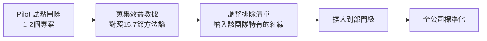

## 16.4 Change Management

最大的變革阻力通常來自資深工程師的疑慮：「AI 幫我決定什麼該精簡，會不會反而把重要邏輯刪掉？」應對方式是**強調 `ponytail-review` 只產出建議清單，從不自動套用刪除**（見 9.1 節指令說明），所有變更仍經過人工確認與既有 Code Review 流程，Ponytail 是輔助篩選工具，不是自動化決策者。

## 16.5 Training Plan

建議的教育訓練順序：

1. 第 1～5 章：理念與工作原理（全員）
2. 第 6～9 章：安裝與工具整合（實際動手操作者）
3. 第 13、14 章：與既有治理機制的邊界（架構師、資安團隊）
4. 第 17、18 章：最佳實務與常見錯誤（全員，建議搭配實際 Code Review 案例討論）

## 16.6 KPI

建議追蹤的量化指標（可比照第 15.7 節的四個維度）：

| KPI | 量測方式 |
|---|---|
| 新增程式碼行數變化 | 比較導入前後相同類型任務的平均 LOC |
| PR 平均審查時間 | 程式碼量減少通常伴隨審查時間下降 |
| `ponytail-review` 採納率 | 建議刪除清單中，實際被人工採納的比例 |
| 技術債清單成長速度 | `/ponytail-debt` 彙整的 `ponytail:` 註記數量與處理速度 |

## 16.7 ROI

ROI 評估應同時考慮**直接成本節省**（Token/API 成本，見 15.7 節 -20%）與**間接維護成本節省**（程式碼量減少帶來的長期可維護性提升，較難量化但影響更大）。建議企業在試點階段（16.3 節）就同步建立 KPI 追蹤基準，半年後再評估間接效益（如同類型 Bug 修復時間是否因程式碼更簡潔而縮短）。

> **注意事項**：第 16 章所有導入流程、KPI 與 ROI 評估方式均為顧問觀點下的建議做法，企業應依自身治理成熟度調整，不存在「官方標準導入流程」。

---

# 第 17 章 最佳實務

以下 50 條最佳實務，依七大類別整理，部分直接對應 Ponytail 官方原則，部分為企業實務延伸建議（已於各條標註類別，不再逐條重複聲明官方/延伸）。

## Architecture（架構，1～8）

1. 新增抽象層前，先確認是否已有第二種真實存在的實作需求，沒有就不抽（呼應 3.4 Delete Before Build）。
2. 微服務拆分前，先問「這個邊界是業務邊界，還是只是團隊喜好」，避免為了趕流行而拆分。
3. 架構決策（ADR）應記錄「為什麼不選更複雜的方案」，而不是只記錄「選了什麼」。
4. 訊息佇列、快取、搜尋引擎等基礎設施元件，引入前先確認現有系統真的無法滿足，而非預先假設規模。
5. 避免在單一服務內過早建立「可插拔」的 Plugin 架構，除非已有明確的第三方擴充需求。
6. 善用第 5.3 節「平台原生功能能解決嗎」中基礎設施原生能力的延伸判斷，許多應用層的「韌性設計」其實已由基礎設施提供。
7. 架構審查會議應固定納入「這個設計是否符合 YAGNI」的提問環節。
8. 對 Legacy 系統的架構決策，優先理解現狀（第 11 章），再評估是否真的需要新架構。

## Coding（編碼，9～20）

9. 寫程式前先搜尋專案內既有工具函式，避免重複實作（5.4 節）。
10. 善用語言與框架原生功能，原生方案優先於第三方套件（3.5 節）。
11. 已安裝的相依套件若有對應功能，不要再新增套件（3.6 節）。
12. 能用一行表達式完成的邏輯，不要展開成多行迴圈與暫存變數（決策階梯第5階）。
13. 單一實作的介面、Strategy、Factory，先以具體類別實作，等真正出現第二種情境再抽象（3.1、3.4 節）。
14. 善用語言新特性（如 Java Record、Vue3 Composition API）取代手刻的樣板程式碼（12.2、12.3 節）。
15. 程式碼審查時主動詢問「這段刪掉會少什麼功能」，無法回答就是刪除候選。
16. 避免「防禦性複製貼上」——擔心未來會改就先複製一份保留，應改用版本控制工具追蹤歷史，而非保留死碼。
17. 命名與註解應反映「為什麼這樣寫」而非「這段在做什麼」，後者應由清晰的程式碼本身表達。
18. 對於刻意簡化的實作，使用一致的標記（如 `ponytail:`）註明限制與升級時機（4.5 節 Self Critique Loop）。
19. 設定值與環境差異一律走設定檔，不寫死在程式碼條件判斷中（3.7 節）。
20. 批次/排程邏輯優先使用框架內建機制（如 Spring Batch、`@Scheduled`），避免手刻執行緒池管理（10.4 節）。

## Testing（測試，21～28）

21. 測試覆蓋率的目標應放在「非 trivial 邏輯」，而非機械式追求百分比（3.9 節紅線之一）。
22. 測試程式碼同樣適用精簡原則，但測試案例本身的完整性（涵蓋邊界值）不可被精簡（7.7 節）。
23. `ponytail-review` 的「最低底線是保留至少一個 smoke test 或斷言」，企業應確保此底線在 CI Pipeline 中強制檢查。
24. 升級或重構 PR 應附帶「升級前後行為一致」的對照測試，而非僅靠人工檢視。
25. 對 Legacy 系統的逆向工程產出，應先建立特性測試（Characterization Test）固定現有行為，才能安全地後續精簡。
26. AI 生成的測試案例應人工複核是否真正測到關鍵邏輯，而非只是讓覆蓋率數字好看的空泛斷言。
27. 整合測試優先使用框架提供的測試工具（如 Spring Boot Test、Testcontainers），避免自建測試替身框架。
28. 測試資料建置應重用既有的 Test Fixture / Builder，避免每個測試各自重複建立相似的測試資料。

## Security（安全性，29～35）

29. 安全相關邏輯（驗證、授權、加密）永遠排除在精簡範圍之外，任何強度都不可被刪減（3.9、10.5、13.7 節）。
30. Ponytail 的審查建議涉及安全相關程式碼時，一律要求資安角色額外覆核，不可僅憑 Reviewer Agent 的建議直接採納。
31. 相依套件選擇精簡（3.6 節）的同時，仍須對所有套件執行 SCA 掃描（13.5 節），精簡不等於安全。
32. 稽核日誌、合規欄位即使表面上像死碼，刪除前必須與法遵/稽核角色確認（13.8、13.9 節）。
33. 跨信任邊界的輸入驗證屬於最高優先紅線，比「程式碼精簡」與「開發速度」都優先。
34. Secret 管理（API Key、憑證）的處理邏輯，不應因為「程式碼太短看起來像是可以inline」而被精簡到失去必要的存取控制包裝。
35. 第三方 Plugin / Hook（含 Ponytail 本身的生命週期 Hook）導入前，先依既有的供應鏈安全規範評估其執行範圍（13.6 節）。

## AI Usage（AI 使用方式，36～42）

36. 在團隊的 Agent 指引檔中明確聲明 Ponytail 強度等級，避免成員各自使用不同強度造成風格不一致（7.8、8.6 節）。
37. PoC 與正式開發階段使用不同強度，PoC 階段不強制精簡，避免打斷快速試錯（7.8 節）。
38. 對 Legacy 逆向工程任務，主動降低或關閉 Ponytail 強度，理解優先於精簡（11.9 節）。
39. 不要把 Ponytail 的審查建議當作自動化決策，所有刪除建議都需要人工確認（14.5、16.4 節）。
40. 多 Agent 團隊架構中，謹慎選擇 Ponytail 的掛載節點，避免在 Security/QA/Release Agent 上掛載造成職責混淆（14.6～14.8 節）。
41. 定期（如每月）執行 `/ponytail-audit` 進行全 Repository 掃描，而不是只在新功能開發時被動套用。
42. 將 AI Agent 輸出的「跳過了什麼、何時該補上」說明文字（4.5 節）正式收錄進技術債清單，而非讓它隨對話消失。

## Agent Usage（Agent 治理，43～46）

43. 為不同專案類型（新系統 / Legacy 維護 / 重構專案）建立不同的 Ponytail 設定範本，而非全公司套用同一份設定（7.8 節）。
44. 將「永不可精簡清單」與企業 Secure Coding Guideline 版本同步更新，避免兩份文件各自演化而出現矛盾（13.7、16.1 節）。
45. 導入初期選擇 1～2 個試點專案，蒐集數據後才擴大範圍，避免一次性全公司導入造成的混亂（16.3 節）。
46. 建立例外申請流程，讓團隊可以針對特殊情境（如高合規要求模組）申請調整強度或排除清單（16.1 節）。

## Cost Optimization（成本優化，47～50）

47. 將程式碼行數變化、Token 成本變化納入既有的工程 KPI 儀表板，而非另開一套獨立報表（16.6 節）。
48. 比較導入前後的 PR 平均審查時間，量化精簡對團隊整體生產力的間接貢獻（16.6、16.7 節）。
49. 不要直接套用官方 Benchmark 數字作為自身專案的預期目標，應建立自己的基準對照（15.7 節實務案例）。
50. 把「能否用配置/原生功能/既有套件解決」這個提問，內化成 Code Review 的標準問題之一，使成本意識不僅停留在工具層面，而成為團隊文化的一部分。

---

# 第 18 章 常見錯誤

以下 30 個 Anti-Pattern，依「過度設計」與「導入治理」兩大類整理，每條皆附改善方式。

## 過度設計類 Anti-Pattern（1～18）

1. **單一實作介面**：為只有一種實作的類別建立介面。*改善*：直接使用具體類別，第二種實作出現再抽介面。
2. **預先泛化的 Factory**：建立 Factory 模式但實際上只生產一種物件。*改善*：直接 `new`，待真正有多型需求再引入 Factory。
3. **手刻標準函式庫功能**：自行實作字串處理、陣列去重等語言已內建的功能。*改善*：改用 stdlib 對應 API（5.2 節）。
4. **重做平台原生功能**：用 JS 套件做日期選擇器、顏色選擇器等瀏覽器已原生支援的元件。*改善*：改用 `<input type="date">` 等原生標籤（3.5 節）。
5. **過早的微服務拆分**：在使用者規模與團隊規模都不需要的情況下拆分微服務。*改善*：先以模組化的單體（Modular Monolith）開發，等真正出現獨立擴展需求才拆分。
6. **防禦性保留死碼**：擔心未來要用而保留已棄用的程式碼分支。*改善*：刪除並依賴版本控制系統的歷史記錄。
7. **配置寫死在程式碼**：環境差異用 `if (env == "prod")` 寫在程式邏輯中。*改善*：移至設定檔（3.7 節）。
8. **多餘的 DTO/Mapper 層**：Request/Response/Entity 之間建立多層幾乎相同欄位的轉換類別。*改善*：評估是否可直接重用同一個資料結構，或用框架內建的物件映射機制。
9. **過度的例外類別體系**：為每一種錯誤情境建立獨立的自訂例外類別繼承樹。*改善*：使用少量通用例外類別搭配錯誤碼欄位。
10. **重複的驗證邏輯**：前端、後端、資料庫各自獨立實作一套不一致的驗證規則。*改善*：以資料庫約束為最後防線，前後端共用驗證規則定義。
11. **自建快取機制**：手刻一套記憶體快取，而框架或既有相依套件已提供成熟的快取抽象。*改善*：改用框架內建快取（如 Spring Cache）。
12. **自建重試邏輯**：手刻迴圈搭配 `sleep` 實作重試，而訊息佇列或 HTTP Client 已有內建重試機制。*改善*：使用既有元件的重試設定（5.3 節）。
13. **過度配置化**：把幾乎不會變動的邏輯也做成可設定項，導致設定檔本身變得難以理解。*改善*：只有真正會因環境/客戶而異的邏輯才配置化。
14. **未驗證的「重寫優於維護」結論**：未充分理解 Legacy 邏輯就建議全面重寫。*改善*：先完成依賴分析與知識圖譜（11.9 節），再評估重寫範圍。
15. **升級夾帶重構**：在框架升級 PR 中順手做風格重構。*改善*：升級與重構拆成獨立 PR（12.1 節）。
16. **臨時相容層常態化**：本應是過渡性的相容層，因為沒有後續排程而長期留存。*改善*：在引入時即標註移除時間點並排入 Backlog（12.4 節）。
17. **測試案例空洞化**：為了覆蓋率數字而寫沒有實際斷言關鍵邏輯的測試。*改善*：聚焦於非 trivial 邏輯的真實斷言（17 章 21 條）。
18. **AI 生成程式碼未經人工確認即合併**：信任 AI Agent 的輸出而省略 Code Review。*改善*：`ponytail-review` 等工具的建議永遠只是輔助，最終決策仍需人工（16.4 節）。

## 導入治理類 Anti-Pattern（19～30）

19. **誤把 Ponytail 當安全工具**：以為裝了 Ponytail 就涵蓋安全把關。*改善*：明確區分精簡（Ponytail）與安全（SAST/DAST/13章）的職責邊界。
20. **全公司一次性強制 `ultra` 強度**：未經試點就全面套用最激進設定。*改善*：依 16.3 節分階段導入。
21. **未設定排除清單就上線**：未先盤點安全/合規/稽核相關程式碼路徑，直接讓審查建議自動套用。*改善*：上線前先建立並核准排除清單（7.7、13.9 節）。
22. **在 Legacy 逆向工程階段使用高強度設定**：導致 Agent 在尚未完全理解既有邏輯前就建議精簡。*改善*：逆向工程階段降低或關閉強度（11.9 節）。
23. **將 Ponytail 設定視為個人偏好而非團隊規範**：不同成員各自設定不同強度。*改善*：團隊共用設定檔統一管理（7.8、8.6 節）。
24. **忽略 `ponytail:` 升級路徑標記**：標記了卻從未追蹤處理，形同虛設。*改善*：定期透過 `/ponytail-debt` 彙整並排入 Backlog（8.5 節）。
25. **把 Benchmark 數字當作 KPI 硬指標**：要求團隊必須達到官方的 -54% 行數縮減。*改善*：以自身專案基準線為準，而非直接套用官方數字（15.7 節）。
26. **多 Agent 團隊中職責混淆**：在 Security Agent 或 QA Agent 上也掛載 Ponytail 主技能，導致審查標準混亂。*改善*：依 14.9 節角色劃分表明確掛載。
27. **缺乏例外申請流程**：團隊遇到特殊情境（如高合規模組）卻無正式管道調整設定，只能私下繞過工具。*改善*：建立正式的例外申請與核准流程（16.1 節）。
28. **導入後不追蹤效益就放棄或盲目擴大**：缺乏 KPI 數據支撐導入決策的延續或擴大。*改善*：依 16.6 節建立量化追蹤機制。
29. **誤把指引檔當成一次性文件，不隨版本更新**：`AGENTS.md`／Repository Instructions 設定後從未檢視是否與官方倉庫的最新版本同步。*改善*：納入第 19 章的維運升級流程定期檢視。
30. **過度依賴單一工具解決組織性問題**：以為導入 Ponytail 就能解決團隊本身對「簡潔」與「過度設計」缺乏共識的根本問題。*改善*：工具只是輔助，真正關鍵是透過 16.5 節的教育訓練建立團隊共同的工程文化。

---

# 第 19 章 維運與升級

## 19.1 Version Upgrade

Ponytail 本身會持續發布新版本（見第 1.3、1.4 節的 Release/PR 活躍度）。建議企業指派固定角色（如平台團隊）每季檢視官方 Repository 的 Release Notes，評估新版本的決策階梯是否有調整，並在試點專案驗證後才推廣到全公司設定。

## 19.2 Skill Upgrade

若企業已依第 9.7 節做法將官方指引與專案規範整合進自訂的 `copilot-instructions.md` 或 `CLAUDE.md`，升級官方 Ponytail 版本時務必同步比對差異，避免自訂規範與官方原始版本長期分歧後，反而出現兩份文件互相矛盾的情況。

## 19.3 Agent Upgrade

當底層 AI 模型版本升級（如從 Haiku 4.5 升級到更新世代模型），過度設計的傾向程度可能改變，官方 Benchmark 數據（15.7 節）也是針對特定模型版本測得，企業應在模型升級後，重新評估是否需要調整 Ponytail 強度等級——更強的模型不一定代表過度設計傾向降低，仍需以實測數據為準，而非主觀假設。

## 19.4 Prompt Upgrade

第 9.4、9.7 節中企業自訂的 Prompt 範本與規範整合範例，應隨著實際使用回饋逐步優化——例如發現某類程式碼反覆被誤判為可刪除，就應該把該類別明確加入排除清單的 Prompt 描述中，形成持續調整的回饋迴圈。

## 19.5 Governance Upgrade

治理規範本身也需要版本管理：建議將「永不可被精簡清單」「強度等級對應表」「KPI 追蹤基準」等文件納入版本控制，每次調整都留下異動紀錄與決策理由，方便日後追溯為何某個例外被核准、又為何被收回。

> **實務案例**：某團隊在底層模型由 Haiku 系列升級到更新世代後，發現原本 `ultra` 強度下偶爾出現「過度刪減」的情況（例如把確實必要但使用頻率低的防護邏輯誤判為死碼）大幅減少，遂評估後將部分原本因保守而設為 `full` 的專案改為 `ultra`，同時持續保留人工確認流程（呼應 16.4 節），未因模型能力提升而省略覆核步驟。

---

# 第 20 章 完整企業導入範例（企業實務延伸）

> 本章為虛構但具代表性的企業導入案例，綜合第 6～16 章的做法，示範一個大型受監管產業組織如何將 Ponytail 納入既有的開發治理體系。案例中的組織名稱與細節均為示範用途。

## 20.1 案例背景：大型銀行共用平台

某大型銀行的「共用服務平台」團隊，負責為集團內多個業務單位（個金、法金、信用卡）提供共用的會員、帳務、通知等核心服務，技術棧如下：

| 分類 | 技術 |
|---|---|
| Frontend | Vue3、TypeScript |
| Backend | Spring Boot 3.5 |
| Database | Oracle（核心帳務）、PostgreSQL（共用服務）、DB2（部分法金 Legacy 系統） |
| Infrastructure | Kubernetes、Docker、GitHub Actions |
| AI 工具 | Claude Code（主力開發）、GitHub Copilot（IDE 內輔助）、OpenAI（部分內部知識庫問答） |

該平台過去面臨的典型問題：多個業務單位各自要求客製化，團隊長期傾向「先做成可配置的通用框架」以應付未來可能的客製需求，導致核心服務的程式碼複雜度逐年攀升，新人上手時間長達 3 個月以上。

## 20.2 開發流程

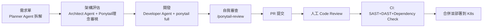

導入後，團隊在開發流程中新增一道「**客製化需求預設拒絕**」的審查關卡：任何業務單位提出的客製化需求，預設先評估「能否用設定取代客製化程式碼」（呼應 3.7 節），只有確認設定無法滿足、且該客製化需求已有兩個以上業務單位提出時，才核准開發成可配置功能。

## 20.3 Code Review

Code Review Checklist 在原有的正確性、安全性審查項目之外，新增「精簡度」審查欄位，由 `/ponytail-review` 自動產出建議清單作為 Reviewer 的輔助參考（而非取代 Reviewer 判斷，呼應 16.4 節）：

```text
PR #4821 ponytail-review 摘要：
L56: yagni 單一客戶端的 NotificationChannelStrategy 介面。建議 inline，第二種通知管道需求出現再抽介面。
L102: stdlib 手刻的金額四捨五入邏輯。建議改用 BigDecimal.setScale()。
net: -24 lines possible.
人工覆核結果：採納 L102 建議；L56 因法金單位下月將提供簡訊通知管道，保留介面設計。
```

## 20.4 SSDLC

依第 13 章原則，`ponytail-review` 僅作為複雜度審查的第一道關卡，安全相關檢查維持既有 SSDLC 流程獨立運作：Threat Modeling 在設計階段由 Architect Agent 與資安團隊共同完成；SAST/DAST/Dependency Check/Secret Detection 全部維持在 CI Pipeline 中獨立執行，不受 Ponytail 設定影響；稽核日誌與法遵欄位（帳務交易紀錄、KYC 相關欄位）全數列入排除清單。

## 20.5 Release Flow

GitHub Actions Pipeline 中，Ponytail 相關檢查（`/ponytail-review` 摘要）作為 PR 描述的必要附件，但**不是**合併的強制關卡（強制關卡仍是測試通過、SAST/DAST 無高風險發現、至少一位人工 Reviewer 核准）。部署到 Kubernetes 採藍綠部署，與 Ponytail 導入無直接關聯，但因程式碼量減少，部署映像檔建置時間平均縮短，間接提升了 Release 頻率。

## 20.6 Production Support

上線後的 Production Support 階段，團隊發現一個額外效益：因為程式碼更精簡、抽象層更少，On-call 工程師在處理事故時，追蹤一個請求的完整呼叫路徑所需要跳轉的檔案數量明顯減少，事故平均排查時間（MTTR）有感縮短。團隊將此現象記錄為內部案例，作為向其他業務單位推廣導入 Ponytail 的佐證。

> **注意事項**：本案例所有數據與細節均為示範性質，目的是展示第 1～19 章方法論如何組合落地，企業實際導入時應依自身平台特性與法遵要求調整，不應直接套用本案例的具體配置作為標準答案。

---

# 附錄：新進成員快速 Checklist

## 上手前必懂

- [ ] 理解 Ponytail 的核心主張：「最好的程式碼是不需要寫的程式碼」（1.1 節）
- [ ] 理解決策階梯六階順序：需要存在？stdlib？原生功能？既有套件？一行解？最小實作？（4.6 節）
- [ ] 理解四種強度等級 `off`/`lite`/`full`/`ultra` 的差異（7.2 節）
- [ ] 理解「永不可被精簡」紅線：驗證、錯誤處理、安全、無障礙、硬體校正、明確需求、必要測試（3.9、7.7 節）
- [ ] 理解 Ponytail **不是**安全工具，不能取代 SAST/DAST/Dependency Check（13.1 節）

## 安裝與設定

- [ ] 確認所用平台（Claude Code／Copilot／Cursor／Codex／Gemini CLI）對應的安裝方式（第6章）
- [ ] 確認團隊統一的強度等級設定，而非使用個人預設值（7.8、8.6 節）
- [ ] 確認專案的「排除清單」已包含安全、合規、稽核相關程式碼路徑（7.7、13.9 節）

## 日常開發

- [ ] 新功能開發前，先用 5.1～5.6 節的六項檢查確認是否真的需要寫新程式碼
- [ ] PR 提交前執行 `/ponytail-review`，並人工複核每一項建議，而非全盤採納或全盤忽略
- [ ] 對刻意保留的「未精簡」程式碼，使用 `ponytail:` 註記說明原因與升級時機

## 特殊情境

- [ ] Legacy 系統逆向工程時，先降低或關閉強度，理解優先於精簡（11.9 節）
- [ ] Framework／JDK 升級時，將升級變更與精簡重構拆成不同 PR（12.1、17章15條）
- [ ] 多 Agent 團隊架構中，確認 Ponytail 只掛載在 Developer／Reviewer 角色，不影響 Security／QA／Release（14.9 節）

## 治理與追蹤

- [ ] 定期執行 `/ponytail-audit` 進行全 Repository 掃描（8.5 節）
- [ ] 定期透過 `/ponytail-debt` 彙整技術債清單並排入 Backlog（19.4 節）
- [ ] 追蹤行數／Token／審查時間等 KPI，作為導入效益的量化依據，而非僅憑感覺評估（16.6 節）

---

> 本手冊內容整理自 Ponytail 官方 GitHub Repository（`DietrichGebert/ponytail`）公開資料，並結合企業大型系統開發實務延伸撰寫而成，旨在作為企業內部教育訓練與開發規範參考。實際導入前，請以官方 Repository 當下版本之 `README.md`／`SKILL.md`／`AGENTS.md` 原文為準。


