+++
date = '2026-08-04T12:02:47+08:00'
draft = false
title = 'Reverse Skill 教學手冊'
tags = ['教學', 'AI開發', 'DevSecOps', 'Reverse Engineering']
categories = ['教學']
+++

# reverse-skill 教學手冊

> **reverse-skill — AI Coding Agent 的「Skill Router」：逆向工程／合法授權滲透測試／資安研究技能路由套件**
> 適用對象：資深工程師、資安研究人員、DevSecOps 負責人、AI Agent 平台團隊、架構師、Tech Lead、企業導入人員、PM
> 文件性質：企業內部 AI Agent 安全技能路由平台導入、開發與維運培訓教材
> 版本基準：reverse-skill（`zhaoxuya520/reverse-skill`，2026 年 5 月 13 日建立、核心 MIT License、
> v1.0.0 正式版於 2026-07-18 發布、持續高頻更新；本次改版核校時間點 2026-08-04）

---

## ⚠️ 重要聲明（請務必先讀）

1. **reverse-skill 仍在高速迭代中。** 本專案於 2026-05-13 建立，成長速度極快，於 2026-07-31 登上 GitHub
   Trending／Trendshift 全站排行前列，截至本次核校（2026-08-04，透過 GitHub API 直接查證）已有
   **約 16,200 Stars、2,275 Forks、67 Subscribers、13 個開放 Issue**，並維持每日甚至單日多次
   commit 的節奏。其資料夾結構、路由規則、Skill 清單、MCP 介面在版本之間可能持續變動。**任何指令、
   檔名與設定在正式導入前，務必以最新官方 Repository 為準；本手冊所列數字僅為核校當下快照。**
2. **本手冊的定位是「理解、彙整、分析、重組、補充最佳實務」，而非官方文件翻譯。** 依撰寫要求，本書
   不直接翻譯 README、不大量抄錄原文，而是以企業教育訓練教材的角度重新組織、加入架構圖、比較表、
   最佳實務與導入建議。
3. **內容分兩類：**
   - **官方已確認事實**（例如 `RULES.md`／`MASTER-ROUTING.md` 兩層路由、`skills/` 下 40 餘個技能
     子目錄、`skills/ops/scope-contract.md` 授權契約、`skills/field-journal/` 知識日誌、
     `burp-mcp-full/` Burp Suite 擴充套件與 `mcp-bridge.js`、`docs/ARCHITECTURE.md`、
     `README_AI.md` 等）作為骨幹，內文一律使用 repo 內**實際檔名／資料夾名稱**，不使用意譯替代。
     本次核校已透過 GitHub API 直接讀取 repo 檔案樹、`README.md`、`RULES.md`、
     `skills/MASTER-ROUTING.md`、`CHANGELOG.md` 等原始檔案逐一比對，非僅憑記憶或二手轉述。
   - **作者補充**：凡屬作者依企業（含金融業、保險業）導入 AI Agent 安全治理之實務經驗所補充或推論
     之處，會標註 **（作者建議）** 或 **（作者推論）**。這些是最佳實務參考，非官方保證。
4. **本手冊聚焦「防禦、合法授權研究、安全審查、教育訓練與報告產出」。** 凡涉及滲透測試、逆向工程、
   Burp MCP 章節，一律以「取得書面授權後的合法測試」「防禦分析」「相容性研究」為前提，**不提供、
   不示範任何未授權攻擊操作、惡意程式撰寫、繞過偵測或供實際入侵使用的步驟**。若你的用途無法滿足
   合法授權前提，請勿依本手冊內容操作對應工具。
5. **授權條款採「分層授權」，企業導入前務必逐一確認，不可假設整包都是 MIT：**

   | 範圍 | 授權條款 | 對企業導入的意義 |
   | --- | --- | --- |
   | 主套件（`skills/`、`RULES.md`、`burp-mcp-full/` 等） | **MIT License** | 商用、修改、內部散布限制最少 |
   | `CTF-Sandbox-Orchestrator/` 子模組 | **GNU GPLv3** | 若企業修改後對外散布衍生版本，需遵守 GPLv3 之相關揭露義務；**僅內部使用**一般風險較低，但仍建議法務／智財單位審閱後再決定是否納入內部散布範圍 |
   | Pentest Swarm AI（外部整合，僅透過 CLI／MCP 呼叫，本 repo 不含其原始碼） | **AGPL-3.0**（上游專案本身條款） | AGPL 的網路服務條款（透過網路提供服務即視同散布）比 GPL 更嚴格，若企業將其包裝為對外服務，法遵風險更高，**導入前務必請法務／智財單位審閱**（作者建議） |

   💡 **作者建議**：金融業、保險業等受高度監理的產業，導入前應將上述授權矩陣連同第21章「公司導入
   指南」一併提交法務／智財／採購合規審查，而非只看 repo 首頁的單一 MIT License 徽章。
6. 官方權威來源請見〈附錄 A.3〉的 References。

---

## 目錄（Table of Contents）

<!-- TOC-AUTO-BEGIN -->
## 目錄（Table of Contents）

- [圖例與符號說明](#圖例與符號說明)
- [本手冊閱讀路徑](#本手冊閱讀路徑)
- [第1章 reverse-skill 介紹](#第1章-reverse-skill-介紹)
  - [1.1 一句話定義](#11-一句話定義)
  - [1.2 發展背景與誕生脈絡](#12-發展背景與誕生脈絡)
  - [1.3 設計理念](#13-設計理念)
  - [1.4 解決哪些問題](#14-解決哪些問題)
  - [1.5 適合哪些團隊](#15-適合哪些團隊)
  - [1.6 適合哪些專案](#16-適合哪些專案)
  - [1.7 與一般 Prompt Library 的差異](#17-與一般-prompt-library-的差異)
  - [1.8 為何稱為 Skill Router](#18-為何稱為-skill-router)
  - [1.9 本章 Checklist](#19-本章-checklist)
- [第2章 系統架構](#第2章-系統架構)
  - [2.1 架構總覽（Overall Architecture）](#21-架構總覽overall-architecture)
  - [2.2 Routing Architecture](#22-routing-architecture)
  - [2.3 Skill Discovery（技能探索）](#23-skill-discovery技能探索)
  - [2.4 Context Loading（脈絡載入）](#24-context-loading脈絡載入)
  - [2.5 AI Decision Routing](#25-ai-decision-routing)
  - [2.6 Safety Guard](#26-safety-guard)
  - [2.7 Scope Guard（總覽）](#27-scope-guard總覽)
  - [2.8 Knowledge Journal](#28-knowledge-journal)
  - [2.9 端到端資料流總結圖](#29-端到端資料流總結圖)
  - [2.10 本章 Checklist 與小結](#210-本章-checklist-與小結)
- [第3章 Repository 結構](#第3章-repository-結構)
  - [3.1 頂層目錄總覽](#31-頂層目錄總覽)
  - [3.2 `skills/`：技能路由與知識核心](#32-skills-技能路由與知識核心)
  - [3.3 路由三件套：`RULES.md`／`MASTER-ROUTING.md`／`routing.md`](#33-路由三件套-rules-md-master-routing-md-routing-md)
  - [3.4 `skills/ops/`：授權與治理（對應使用者所稱的 Scope Guard）](#34-skills-ops-授權與治理對應使用者所稱的-scope-guard)
  - [3.5 `skills/field-journal/`：知識日誌](#35-skills-field-journal-知識日誌)
  - [3.6 `burp-mcp-full/`：Burp Suite MCP 整合](#36-burp-mcp-full-burp-suite-mcp-整合)
  - [3.7 `docs/`：專案文件](#37-docs-專案文件)
  - [3.8 其他重要目錄](#38-其他重要目錄)
    - [CTF-Sandbox-Orchestrator：第二座「總控 + 下游技能」路由架構](#ctf-sandbox-orchestrator-第二座-總控-下游技能-路由架構)
  - [3.9 本章 Checklist 與小結](#39-本章-checklist-與小結)
- [第4章 Routing Engine](#第4章-routing-engine)
  - [4.1 MASTER-ROUTING 是什麼](#41-master-routing-是什麼)
  - [4.2 決策依據：任務特徵擷取](#42-決策依據-任務特徵擷取)
  - [4.3 Skill 挑選邏輯](#43-skill-挑選邏輯)
  - [4.4 Context 如何載入（路由階段的延伸）](#44-context-如何載入路由階段的延伸)
  - [4.5 Decision Flow](#45-decision-flow)
  - [4.6 Priority（優先順序）](#46-priority優先順序)
  - [4.7 Fallback 機制](#47-fallback-機制)
  - [4.8 Routing Chain（路由鏈）](#48-routing-chain路由鏈)
  - [4.9 案例走查：一次任務如何被路由](#49-案例走查-一次任務如何被路由)
  - [4.10 本章 Checklist 與小結](#410-本章-checklist-與小結)
- [第5章 Scope Guard](#第5章-scope-guard)
  - [5.1 Authorization（授權文件）](#51-authorization授權文件)
  - [5.2 Target（目標定義與比對）](#52-target目標定義與比對)
  - [5.3 Network Profile（網路設定檔）](#53-network-profile網路設定檔)
  - [5.4 Case Guard（案件層級控管）](#54-case-guard案件層級控管)
  - [5.5 Risk Level（風險分級）](#55-risk-level風險分級)
  - [5.6 Approval（人工核准）](#56-approval人工核准)
  - [5.7 Allowed Scope／Denied Scope](#57-allowed-scope-denied-scope)
  - [5.8 如何避免 AI 被 Prompt Injection 誤導](#58-如何避免-ai-被-prompt-injection-誤導)
  - [5.9 本章 Checklist 與小結](#59-本章-checklist-與小結)
- [第6章 安全設計](#第6章-安全設計)
  - [6.1 Defense in Depth（縱深防禦）](#61-defense-in-depth縱深防禦)
  - [6.2 Least Privilege（最小權限原則）](#62-least-privilege最小權限原則)
  - [6.3 Human Approval（人工核准機制）](#63-human-approval人工核准機制)
  - [6.4 Audit（稽核）與 Logging（日誌）](#64-audit稽核與-logging日誌)
  - [6.5 Evidence（證據）管理](#65-evidence證據管理)
  - [6.6 Field Journal 的安全考量](#66-field-journal-的安全考量)
  - [6.7 Explainability（可解釋性）](#67-explainability可解釋性)
  - [6.8 Responsible AI（負責任的 AI 使用）](#68-responsible-ai負責任的-ai-使用)
  - [6.9 本章 Checklist 與小結](#69-本章-checklist-與小結)
- [第7章 AI Agent 整合](#第7章-ai-agent-整合)
  - [7.1 整合的基本原則](#71-整合的基本原則)
  - [7.2 各 AI Agent 整合方式與比較](#72-各-ai-agent-整合方式與比較)
  - [7.3 整合模式的三種層次](#73-整合模式的三種層次)
  - [7.4 主要 Agent 設定檔範例](#74-主要-agent-設定檔範例)
    - [7.4.1 Claude Code：`CLAUDE.md` + Hooks](#741-claude-code-claude-md-hooks)
    - [7.4.2 Cursor：`.cursor/rules`](#742-cursor-cursor-rules)
    - [7.4.3 Cline：`.clinerules`](#743-cline-clinerules)
    - [7.4.4 GitHub Copilot：`copilot-instructions.md`](#744-github-copilot-copilot-instructions-md)
    - [7.4.5 Continue.dev：`config.yaml`](#745-continue-dev-config-yaml)
    - [7.4.6 OpenCode／Codex CLI：`AGENTS.md`](#746-opencode-codex-cli-agents-md)
    - [7.4.7 CI 層級補強：Pre-commit 檢查](#747-ci-層級補強-pre-commit-檢查)
    - [7.4.8 Kiro：`.kiro/steering/reverse-routing.md`（官方 Global Injection 範例）](#748-kiro-kiro-steering-reverse-routing-md官方-global-injection-範例)
  - [7.5 本章 Checklist 與小結](#75-本章-checklist-與小結)
- [第8章 MCP 整合](#第8章-mcp-整合)
  - [8.1 Model Context Protocol 是什麼](#81-model-context-protocol-是什麼)
  - [8.2 reverse-skill 如何整合 MCP](#82-reverse-skill-如何整合-mcp)
  - [8.3 Context Provider](#83-context-provider)
  - [8.4 Skill Provider](#84-skill-provider)
  - [8.5 Prompt Provider](#85-prompt-provider)
  - [8.6 Tool Provider](#86-tool-provider)
  - [8.7 實務案例與注意事項](#87-實務案例與注意事項)
  - [8.8 本章 Checklist 與小結](#88-本章-checklist-與小結)
- [第9章 Burp MCP](#第9章-burp-mcp)
  - [9.1 Burp Suite 與 MCP 概念回顧](#91-burp-suite-與-mcp-概念回顧)
  - [9.2 設計架構](#92-設計架構)
  - [9.3 合法授權測試用途重申](#93-合法授權測試用途重申)
  - [9.4 AI 如何協助分析代理紀錄](#94-ai-如何協助分析代理紀錄)
  - [9.5 如何整理發現結果](#95-如何整理發現結果)
  - [9.6 如何產出修補建議](#96-如何產出修補建議)
  - [9.7 使用邊界總結](#97-使用邊界總結)
  - [9.8 本章 Checklist 與小結](#98-本章-checklist-與小結)
- [第10章 AI Coding Workflow](#第10章-ai-coding-workflow)
  - [10.1 完整流程總覽](#101-完整流程總覽)
  - [10.2 各階段中 reverse-skill 的角色](#102-各階段中-reverse-skill-的角色)
  - [10.3 與傳統 SSDLC 的對照](#103-與傳統-ssdlc-的對照)
  - [10.4 本章 Checklist 與小結](#104-本章-checklist-與小結)
- [第11章 Framework Upgrade](#第11章-framework-upgrade)
  - [11.1 為什麼 Framework Upgrade 需要「路由＋授權＋知識」的思維](#111-為什麼-framework-upgrade-需要-路由-授權-知識-的思維)
  - [11.2 各技術棧升級要點與 AI 協作方式](#112-各技術棧升級要點與-ai-協作方式)
  - [11.3 AI 協助升級的四個步驟](#113-ai-協助升級的四個步驟)
  - [11.4 實戰案例：程式碼對照](#114-實戰案例-程式碼對照)
    - [11.4.1 案例一：Spring Boot 3 → 4（`javax.*` → `jakarta.*` 與安全設定）](#1141-案例一-spring-boot-3-4javax-jakarta-與安全設定)
    - [11.4.2 案例二：.NET Framework → .NET 8+（Target Framework 與最小 API）](#1142-案例二-net-framework-net-8-target-framework-與最小-api)
    - [11.4.3 案例三：Vue 2（Options API）→ Vue 3（Composition API）](#1143-案例三-vue-2options-api-vue-3composition-api)
    - [11.4.4 案例四：React Class Component → Function Component + Hooks](#1144-案例四-react-class-component-function-component-hooks)
    - [11.4.5 四個案例的共同教訓](#1145-四個案例的共同教訓)
  - [11.5 本章 Checklist 與小結](#115-本章-checklist-與小結)
- [第12章 Reverse Engineering（逆向工程）](#第12章-reverse-engineering逆向工程)
  - [12.1 逆向工程的核心分類](#121-逆向工程的核心分類)
  - [12.2 分析標的類型與對應 Skill](#122-分析標的類型與對應-skill)
  - [12.3 常見工具的定位與 AI 協作方式](#123-常見工具的定位與-ai-協作方式)
  - [12.4 靜態與動態分析的決策樹](#124-靜態與動態分析的決策樹)
  - [12.5 相容性研究與教育用途](#125-相容性研究與教育用途)
  - [12.6 CTF 與訓練場景](#126-ctf-與訓練場景)
  - [12.7 本章 Checklist 與小結](#127-本章-checklist-與小結)
- [第13章 Skill Modules](#第13章-skill-modules)
  - [13.1 技能模組總覽與分類](#131-技能模組總覽與分類)
  - [13.2 逐項技能模組說明](#132-逐項技能模組說明)
  - [13.3 旗艦技能深度剖析（10 項）](#133-旗艦技能深度剖析10-項)
    - [13.3.1 `apk-reverse`](#1331-apk-reverse)
    - [13.3.2 `js-reverse`](#1332-js-reverse)
    - [13.3.3 `dotnet-reverse`](#1333-dotnet-reverse)
    - [13.3.4 `api-security`](#1334-api-security)
    - [13.3.5 `malware-analysis`](#1335-malware-analysis)
    - [13.3.6 `cloud-k8s`](#1336-cloud-k8s)
    - [13.3.7 `windows-ad`](#1337-windows-ad)
    - [13.3.8 `digital-forensics`](#1338-digital-forensics)
    - [13.3.9 `llm-security`](#1339-llm-security)
    - [13.3.10 `supply-chain-security`](#13310-supply-chain-security)
  - [13.4 Skill 手冊的標準內部結構（推論範式）](#134-skill-手冊的標準內部結構推論範式)
  - [13.5 Skill Workflow 範例](#135-skill-workflow-範例)
  - [13.6 開發者如何撰寫高品質 Skill](#136-開發者如何撰寫高品質-skill)
  - [13.7 本章 Checklist 與小結](#137-本章-checklist-與小結)
- [第14章 AI Memory](#第14章-ai-memory)
  - [14.1 為什麼 AI Agent 需要「記憶」](#141-為什麼-ai-agent-需要-記憶)
  - [14.2 Field Journal 的角色](#142-field-journal-的角色)
  - [14.3 Memory、Knowledge Update 與 Lessons Learned 的層次差異](#143-memory-knowledge-update-與-lessons-learned-的層次差異)
  - [14.4 如何建立企業知識庫](#144-如何建立企業知識庫)
  - [14.5 知識庫治理的常見陷阱](#145-知識庫治理的常見陷阱)
  - [14.6 本章 Checklist 與小結](#146-本章-checklist-與小結)
- [第15章 DevSecOps](#第15章-devsecops)
  - [15.1 reverse-skill 在 DevSecOps 生態系中的定位](#151-reverse-skill-在-devsecops-生態系中的定位)
  - [15.2 CI/CD 整合概念：GitHub Actions](#152-ci-cd-整合概念-github-actions)
  - [15.3 CI/CD 整合概念：GitLab CI 與 Jenkins](#153-ci-cd-整合概念-gitlab-ci-與-jenkins)
  - [15.4 常見掃描工具與 reverse-skill 的互補關係](#154-常見掃描工具與-reverse-skill-的互補關係)
  - [15.5 OWASP 系列標準的定位](#155-owasp-系列標準的定位)
  - [15.6 AI 如何協助 DevSecOps 整合](#156-ai-如何協助-devsecops-整合)
  - [15.7 本章 Checklist 與小結](#157-本章-checklist-與小結)
- [第16章 Web Application 全生命週期](#第16章-web-application-全生命週期)
  - [16.1 從需求到維護的完整地圖](#161-從需求到維護的完整地圖)
  - [16.2 需求分析階段](#162-需求分析階段)
  - [16.3 Architecture 階段](#163-architecture-階段)
  - [16.4 Coding 階段](#164-coding-階段)
  - [16.5 Security 階段](#165-security-階段)
  - [16.6 Testing 階段](#166-testing-階段)
  - [16.7 Deployment 階段](#167-deployment-階段)
  - [16.8 Maintenance 階段](#168-maintenance-階段)
  - [16.9 Framework Upgrade 與 Knowledge Update](#169-framework-upgrade-與-knowledge-update)
  - [16.10 本章 Checklist 與小結](#1610-本章-checklist-與小結)
- [第17章 系統維護](#第17章-系統維護)
  - [17.1 升級 Skill](#171-升級-skill)
  - [17.2 新增 Skill](#172-新增-skill)
  - [17.3 版本管理](#173-版本管理)
  - [17.4 Prompt 管理](#174-prompt-管理)
  - [17.5 Knowledge 管理](#175-knowledge-管理)
  - [17.6 Repository 管理](#176-repository-管理)
  - [17.7 本章 Checklist 與小結](#177-本章-checklist-與小結)
- [第18章 最佳實務（30條）](#第18章-最佳實務30條)
  - [18.1 治理與授權類（1-5）](#181-治理與授權類1-5)
  - [18.2 路由與知識管理類（6-10）](#182-路由與知識管理類6-10)
  - [18.3 AI Agent 整合類（11-15）](#183-ai-agent-整合類11-15)
  - [18.4 安全設計與縱深防禦類（16-20）](#184-安全設計與縱深防禦類16-20)
  - [18.5 DevSecOps 整合類（21-25）](#185-devsecops-整合類21-25)
  - [18.6 團隊協作與導入類（26-30）](#186-團隊協作與導入類26-30)
  - [本章 Checklist](#本章-checklist)
- [第19章 常見錯誤（30個）](#第19章-常見錯誤30個)
  - [本章 Checklist](#本章-checklist)
- [第20章 FAQ（60題）](#第20章-faq60題)
  - [20.1 基礎概念（Q1-Q10）](#201-基礎概念q1-q10)
  - [20.2 安裝與導入（Q11-Q20）](#202-安裝與導入q11-q20)
  - [20.3 路由與 Skill（Q21-Q30）](#203-路由與-skillq21-q30)
  - [20.4 授權與安全（Q31-Q40）](#204-授權與安全q31-q40)
  - [20.5 Agent 整合與 MCP（Q41-Q50）](#205-agent-整合與-mcpq41-q50)
  - [20.6 維運與知識管理（Q51-Q60）](#206-維運與知識管理q51-q60)
  - [本章 Checklist](#本章-checklist)
- [第21章 公司導入指南](#第21章-公司導入指南)
  - [21.1 銀行業導入要點](#211-銀行業導入要點)
  - [21.2 保險業導入要點](#212-保險業導入要點)
  - [21.3 政府部門導入要點](#213-政府部門導入要點)
  - [21.4 大型企業導入要點](#214-大型企業導入要點)
  - [21.5 中小企業導入要點](#215-中小企業導入要點)
  - [21.6 五種組織類型導入要點對照](#216-五種組織類型導入要點對照)
  - [21.7 本章 Checklist 與小結](#217-本章-checklist-與小結)
- [第22章 Team Workflow](#第22章-team-workflow)
  - [22.1 角色總覽與協作圖](#221-角色總覽與協作圖)
  - [22.2 各角色職責與 reverse-skill 互動點](#222-各角色職責與-reverse-skill-互動點)
  - [22.3 跨角色協作流程](#223-跨角色協作流程)
  - [22.4 溝通機制建議](#224-溝通機制建議)
  - [22.5 本章 Checklist 與小結](#225-本章-checklist-與小結)
- [第23章 與其他工具比較](#第23章-與其他工具比較)
  - [23.1 比較維度說明](#231-比較維度說明)
  - [23.2 比較表（21 項）](#232-比較表21-項)
  - [23.3 關鍵洞察：reverse-skill 的差異化定位](#233-關鍵洞察-reverse-skill-的差異化定位)
  - [23.4 本章 Checklist 與小結](#234-本章-checklist-與小結)
- [第24章 建議企業導入方式](#第24章-建議企業導入方式)
  - [24.1 四階段總覽](#241-四階段總覽)
  - [24.2 PoC 階段（Proof of Concept）](#242-poc-階段proof-of-concept)
  - [24.3 Pilot 階段](#243-pilot-階段)
  - [24.4 Department 階段](#244-department-階段)
  - [24.5 Enterprise 階段](#245-enterprise-階段)
  - [24.6 各階段常見失敗模式](#246-各階段常見失敗模式)
  - [24.7 本章 Checklist 與小結](#247-本章-checklist-與小結)
- [第25章 未來趨勢](#第25章-未來趨勢)
  - [25.1 從 Coding Agent 到 Agentic AI](#251-從-coding-agent-到-agentic-ai)
  - [25.2 Memory 與 Knowledge Graph 的演進](#252-memory-與-knowledge-graph-的演進)
  - [25.3 MCP 生態的持續擴張](#253-mcp-生態的持續擴張)
  - [25.4 A2A（Agent-to-Agent）協定](#254-a2aagent-to-agent協定)
  - [25.5 Skill Router 概念的擴散](#255-skill-router-概念的擴散)
  - [25.6 Self Evolution（自我進化）](#256-self-evolution自我進化)
  - [25.7 Autonomous SDLC 的邊界討論](#257-autonomous-sdlc-的邊界討論)
  - [25.8 對企業的意義與建議](#258-對企業的意義與建議)
  - [25.9 本章 Checklist 與小結](#259-本章-checklist-與小結)
- [附錄](#附錄)
  - [A.1 全書核心原則速查](#a-1-全書核心原則速查)
  - [A.2 名詞對照表](#a-2-名詞對照表)
  - [A.3 References（參考資料）](#a-3-references參考資料)
  - [A.4 新進成員快速上手 Checklist](#a-4-新進成員快速上手-checklist)
- [附錄 B：端到端案例研究](#附錄-b-端到端案例研究)
  - [B.1 案例一：銀行業內部行員系統 API 安全評估](#b-1-案例一-銀行業內部行員系統-api-安全評估)
    - [B.1.1 背景與任務發起](#b-1-1-背景與任務發起)
    - [B.1.2 路由決策過程](#b-1-2-路由決策過程)
    - [B.1.3 授權契約摘要（示意）](#b-1-3-授權契約摘要示意)
    - [B.1.4 執行過程摘要](#b-1-4-執行過程摘要)
    - [B.1.5 發現結果與修補建議](#b-1-5-發現結果與修補建議)
    - [B.1.6 知識沉澱（field-journal 節錄）](#b-1-6-知識沉澱field-journal-節錄)
  - [B.2 案例二：製造業 Legacy .NET 系統現代化前的相容性研究](#b-2-案例二-製造業-legacy-net-系統現代化前的相容性研究)
    - [B.2.1 背景與任務發起](#b-2-1-背景與任務發起)
    - [B.2.2 路由與 Routing Chain](#b-2-2-路由與-routing-chain)
    - [B.2.3 執行過程摘要](#b-2-3-執行過程摘要)
    - [B.2.4 升級影響地圖（節錄）](#b-2-4-升級影響地圖節錄)
    - [B.2.5 知識沉澱與後續效益](#b-2-5-知識沉澱與後續效益)
  - [B.3 兩案例的共同模式](#b-3-兩案例的共同模式)
  - [B.4 案例三：新創公司 Web 應用開發全生命週期中的安全左移](#b-4-案例三-新創公司-web-應用開發全生命週期中的安全左移)
    - [B.4.1 背景與任務發起](#b-4-1-背景與任務發起)
    - [B.4.2 需求分析與 Architecture 階段（對應第16.2、16.3節）](#b-4-2-需求分析與-architecture-階段對應第16-2-16-3節)
    - [B.4.3 Coding 階段：AI 協助的安全編碼建議（對應第16.4節）](#b-4-3-coding-階段-ai-協助的安全編碼建議對應第16-4節)
    - [B.4.4 Security Review 與 CI 整合（對應第15、16.5節）](#b-4-4-security-review-與-ci-整合對應第15-16-5節)
    - [B.4.5 Testing 與 Deployment（對應第16.6、16.7節）](#b-4-5-testing-與-deployment對應第16-6-16-7節)
    - [B.4.6 知識沉澱（對應第16.9、14章）](#b-4-6-知識沉澱對應第16-9-14章)
    - [B.4.7 案例三的啟示：小團隊如何用 AI 補足資安人力缺口](#b-4-7-案例三的啟示-小團隊如何用-ai-補足資安人力缺口)
  - [B.5 案例四：CTF 訓練場景中的新人技能養成](#b-5-案例四-ctf-訓練場景中的新人技能養成)
    - [B.5.1 背景與任務發起](#b-5-1-背景與任務發起)
    - [B.5.2 路由與題型分類](#b-5-2-路由與題型分類)
    - [B.5.3 新人的分析歷程（節錄）](#b-5-3-新人的分析歷程節錄)
    - [B.5.4 訓練成效與知識沉澱](#b-5-4-訓練成效與知識沉澱)
  - [B.6 四案例綜合對照](#b-6-四案例綜合對照)
- [結語](#結語)

<!-- TOC-AUTO-END -->

---

## 圖例與符號說明

本手冊沿用企業教材慣例，以下符號在全書中意義固定：

| 符號 | 意義 |
| --- | --- |
| ✅ | 建議做法／官方支援／已驗證可行 |
| ❌ | 不建議做法／官方不支援／已知會出錯 |
| ⚠️ | 風險提示／需要人工核准／需要額外確認 |
| 💡 | 作者補充觀點、企業實務心得 |
| 🔒 | 安全、授權、合規相關重點 |
| ⚡ | 效能／效率相關重點 |
| 🔄 | 生命週期、迭代、回饋循環相關 |
| 📌 | 章節重點提醒 |

## 本手冊閱讀路徑

不同角色可依下圖挑選閱讀路徑，不需要從頭到尾線性閱讀：

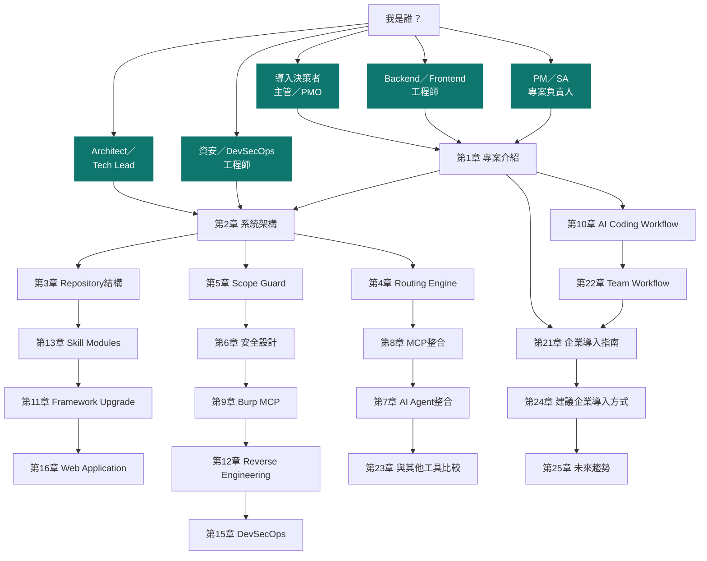

> **實務案例**：某金融業 DevSecOps 團隊導入時，先讓 3 位資安工程師走「Sec 路徑」（第2→5→6→9→12→15章）
> 完成兩週 PoC，再讓架構師補「Arch 路徑」評估與既有 Claude Code／Copilot 平台整合的可行性，最後才由
> PMO 走「Mgmt 路徑」決定是否擴大到全行導入。分角色閱讀可以把導入前置期從「全員讀完整本」壓縮到
> 「兩週內完成 PoC 決策」。

---

## 第1章 reverse-skill 介紹

### 1.1 一句話定義

**reverse-skill 是一套給 AI Coding Agent（Claude Code、Cursor、Cline 等）使用的「技能路由套件」**：
它不是一個新的 AI 模型，也不是一個獨立執行的程式，而是一組以 Markdown 撰寫的「路由規則 + 技能
手冊 + 授權契約 + 知識日誌」，放進你的專案或工作目錄後，AI Agent 讀取這些檔案就能在面對 APK、
加密 JS、二進位檔、CTF 題目、滲透測試目標時，**先查表決定「該用哪套方法論、該呼叫哪些工具」，
再動手做**，而不是憑感覺亂試。

> 💡 **作者觀點**：如果你熟悉「Design Pattern 型錄」或「Runbook」的概念，reverse-skill 做的事情
> 很類似——把資深資安研究員腦中的 SOP（apk 該怎麼拆、.NET 該怎麼反編譯、CTF pwn 題該怎麼分類）
> 外部化成 AI 可以讀、可以查表、可以逐步遵循的結構化文件，讓 AI Agent 的行為從「即興發揮」變成
> 「有章可循」。

### 1.2 發展背景與誕生脈絡

2025～2026 年間，Claude Code、Cursor、Cline、GitHub Copilot 等 AI Coding Agent 快速普及，工程師
開始把「逆向工程」「滲透測試」「安全研究」這類高度依賴經驗與 SOP 的工作也交給 AI Agent 處理。這
類任務有幾個共同痛點：

1. **知識散落**：APK 逆向、.NET 反編譯、韌體分析、Web 滲透各自有一套成熟方法論，但這些知識通常
   存在資深工程師腦中、內部 Wiki 或零散的部落格文章，AI Agent 沒有統一入口可以查詢。
2. **工具選擇錯誤**：同樣是「分析一個二進位檔」，靜態分析該用 IDA／Ghidra／radare2 哪一個？動態
   分析該用 Frida 還是直接除錯？沒有路由規則的 AI Agent 經常選錯工具或漏掉關鍵步驟。
3. **授權邊界模糊**：滲透測試最重要的前提是「書面授權範圍」，但一般 Prompt 或 Agent 設定檔通常
   不會強制檢查這件事，容易出現 AI Agent 被使用者（甚至被惡意輸入）誤導去測試未授權目標。
4. **經驗無法累積**：每次分析完一個樣本、打完一個 CTF 題，經驗往往隨對話視窗關閉而消失，下次遇到
   類似案例又要重新摸索。

reverse-skill（`zhaoxuya520/reverse-skill`）正是針對這四個痛點設計：於 2026 年 5 月 13 日在
GitHub 建立，主打「AI 驅動路由 + 隨需工具鏈引導 + 自我進化知識庫」，短短兩個月內即於 2026-07-31
登上 GitHub Trending 全站第一，反映出市場對「AI Agent 安全技能標準化」的強烈需求。

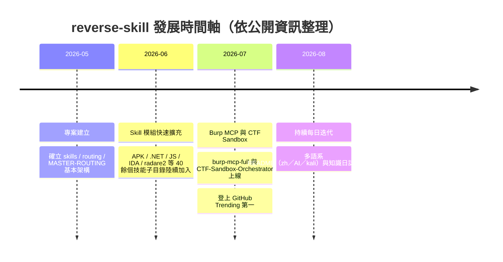

> ⚠️ **注意**：以上時間軸為依專案公開資訊（建立日期、Trending 紀錄、README 版本說明）整理與
> **作者推論**排列，並非官方公告的正式里程碑清單，確切版本紀錄請以 repo 的 `CHANGELOG.md` 為準。

### 1.3 設計理念

reverse-skill 的核心設計理念可以濃縮成四句話：

1. **「先路由、後動手」（Route First, Then Act）**：AI Agent 收到任務後，不是立刻寫程式碼或呼叫
   工具，而是先經過 `RULES.md` → `MASTER-ROUTING.md` 的路由層，判斷任務屬性、挑出對應的
   Skill，再進入實際操作。
2. **「授權先於能力」（Authorization Before Capability）**：即使 AI Agent 具備呼叫滲透測試工具
   的技術能力，也必須先通過授權契約（`skills/ops/scope-contract.md`）的檢查，才允許對目標執行
   任何主動測試行為。
3. **「知識是資產，不是副產物」（Knowledge as an Asset）**：每次任務執行的過程與結論，透過
   `skills/field-journal/` 記錄下來，成為下一次任務可查詢的知識庫，而不是隨對話結束就消失。
4. **「工具無關、方法論優先」（Methodology over Tooling）**：Skill 手冊描述的是「該用什麼方法、
   注意什麼陷阱」，而不是綁死在特定工具版本，因此 IDA、Ghidra、radare2 可以並存為同一類任務的
   不同工具選項，由 Skill 內容說明各自的定位與取捨。

> 💡 **作者觀點**：這四條理念其實對應到企業導入 AI Agent 時最常見的四個疑慮——「AI 會不會亂做」
> 「AI 會不會做超出授權的事」「AI 的產出能不能沉澱成組織資產」「AI 會不會綁死在單一工具廠商」。
> reverse-skill 用架構設計而不是口頭承諾去回應這四個疑慮，這也是它值得企業借鏡的地方，即使你的
> 場景不是資安逆向，而是一般後端開發或 Framework 升級，這套「路由＋授權＋知識沉澀」的骨架依然
> 適用（詳見第 11、16 章的一般開發場景應用）。

### 1.4 解決哪些問題

| 問題類型 | 沒有 reverse-skill 時的常見狀況 | reverse-skill 的解法 |
| --- | --- | --- |
| 方法論選擇 | AI Agent 憑訓練資料的統計傾向猜測步驟，容易漏步驟或用錯順序 | `MASTER-ROUTING.md` 依任務特徵導向對應 `skills/*/SKILL.md` |
| 工具選擇 | 使用者需自行告知 AI「這題用 Ghidra」，AI 才會用對工具 | 每個 Skill 手冊內建工具定位說明與選用建議 |
| 授權邊界 | AI 可能被誘導測試未授權目標（Prompt Injection 風險） | `scope-contract.md` 強制要求授權範圍與目標比對 |
| 知識沉澱 | 分析結論只存在對話紀錄，團隊無法共用 | `field-journal/` 提供結構化紀錄格式 |
| 多 Agent 相容 | 每個 Agent 平台的技能格式都不同，難以共用 | Skill 以純 Markdown／通用格式撰寫，跨 Claude Code、Cursor、Cline 等相容 |
| 報告產出 | 分析結果需要人工整理成報告，耗時且格式不一 | `docs-generator`／`diagram-generator` 等技能協助結構化輸出 |

### 1.5 適合哪些團隊

✅ **適合**：

- 企業內部設有紅隊／滲透測試／資安研究職能，想用 AI Agent 提升分析效率的團隊。
- DevSecOps 團隊想把「安全分析 SOP」標準化，避免因人員流動導致知識斷層。
- 需要對遺留系統（Legacy）、第三方 APK／二進位交付物做相容性與安全驗證的團隊。
- 教育訓練單位需要以真實（但受控）案例訓練新進資安工程師的方法論。

❌ **不適合／需謹慎評估**：

- 沒有正式授權測試流程、也不打算建立授權治理機制的團隊——引入 reverse-skill 若缺乏第 5 章
  Scope Guard 的配套，等於只拿到路由能力卻沒有授權把關，風險反而升高。
- 期待「一鍵自動打穿系統」的團隊——reverse-skill 的路由與知識庫設計目的是**輔助研究判斷**，
  不是自動化攻擊武器，若團隊目標是規避人工審查、自動化未授權入侵，本工具與本手冊皆不適用。

### 1.6 適合哪些專案

| 專案情境 | 適配度 | 說明 |
| --- | --- | --- |
| 內部滲透測試（取得書面授權） | ⭐⭐⭐⭐⭐ | 核心場景，`scope-contract.md` + Skill 路由完整支援 |
| 第三方 APK／SDK 安全審查 | ⭐⭐⭐⭐⭐ | `apk-reverse`／`mobile-reverse` Skill 直接對應 |
| CTF 訓練與競賽 | ⭐⭐⭐⭐⭐ | `CTF-Sandbox-Orchestrator` 提供沙箱化題型分類 |
| Framework／Legacy 升級前的相容性逆向分析 | ⭐⭐⭐⭐ | 可借用靜態分析類 Skill 判斷相依與 API 使用面 |
| 一般 Web／後端功能開發 | ⭐⭐ | 非核心場景，但「路由＋授權＋知識庫」架構理念可遷移（見第16章） |
| 未授權滲透 / 惡意攻擊行動 | 不適用 | 違反 `scope-contract.md` 前提，本手冊亦不提供相關操作指引 |

### 1.7 與一般 Prompt Library 的差異

坊間常見的「Prompt Library」通常是一組獨立的提示詞範本集合，彼此之間沒有強制的選用順序，使用者
需要自己判斷「這次該用哪個 Prompt」。reverse-skill 則是一個**有決策邏輯的系統**：

| 面向 | 一般 Prompt Library | reverse-skill |
| --- | --- | --- |
| 選用方式 | 使用者手動挑選、複製貼上 | AI 依 `MASTER-ROUTING.md` 規則自動判斷該用哪個 Skill |
| 內容單位 | 單一提示詞或提示詞片段 | 完整 Skill 手冊（含方法論、工具選用、輸出格式） |
| 授權管控 | 通常沒有 | 內建 `scope-contract.md` 授權邊界檢查 |
| 知識回饋 | 通常沒有機制 | `field-journal/` 記錄案例，供未來查詢與再利用 |
| 適用範圍 | 泛用（寫作、程式、行銷…） | 聚焦逆向工程／滲透測試／資安研究，但架構可遷移 |
| 版本演進 | 提示詞多為靜態文字，更新仰賴人工整批替換 | Skill 內容持續迭代，且有路由層可平滑導入新 Skill |

> 📌 **章節重點**：一般 Prompt Library 解決的是「怎麼問得更好」，reverse-skill 解決的是「該問誰、
> 該用什麼方法、能不能問（授權）、問完之後知識放哪裡」，是更完整的一套治理框架，而不只是提示詞
> 集合。

### 1.8 為何稱為 Skill Router

「Router（路由器）」這個命名精準點出了 reverse-skill 的定位——它本身不執行分析，而是**在使用者
任務與眾多 Skill 手冊之間做路由決策**，概念上與網路路由器「依目的地位址選擇下一跳」高度類似：

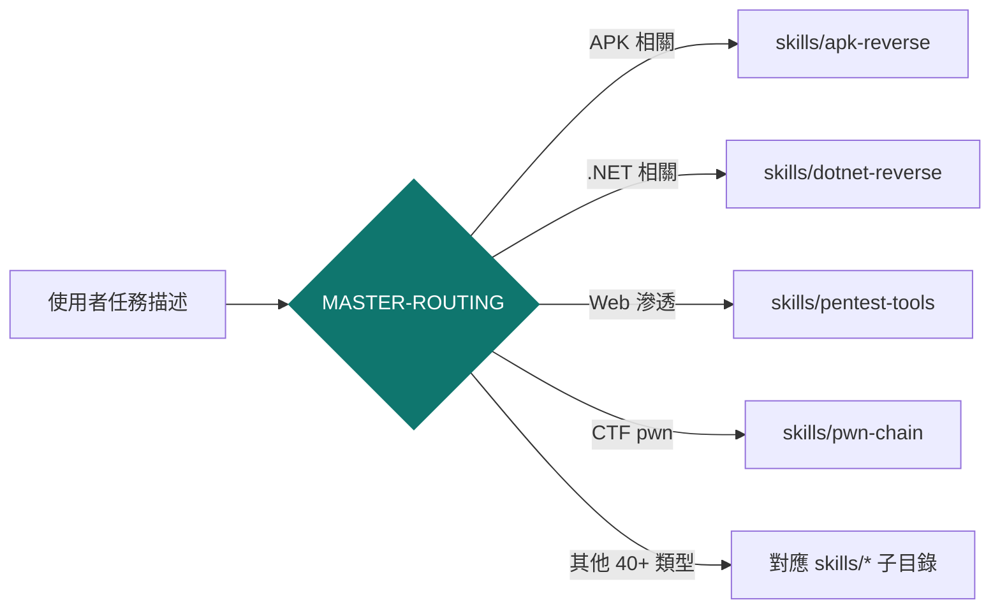

（註：上圖箭頭文字為避免 Mermaid 節點引號限制以純文字表示，實際路由條件遠比此圖複雜，詳見第4章。）

Router 的價值在於：新增一個 Skill 不需要改動既有 Skill 的內容，只要在 `MASTER-ROUTING.md` 補上一
條路由規則即可，這種「開放封閉原則（Open-Closed Principle）」式的擴充方式，正是 reverse-skill 能
在兩個月內從零成長到 40 餘個技能模組、且維持每日更新節奏的架構基礎。

### 1.9 本章 Checklist

- [ ] 已理解 reverse-skill 是「技能路由套件」而非獨立執行的分析工具
- [ ] 已理解「先路由、後動手」「授權先於能力」「知識是資產」「工具無關」四大設計理念
- [ ] 已確認團隊具備正式授權測試流程，或已規劃導入第5章 Scope Guard 配套
- [ ] 已理解 reverse-skill 與一般 Prompt Library 的差異在於「有決策邏輯＋授權管控＋知識回饋」
- [ ] 已知悉本手冊聚焦防禦、合法授權研究與教育訓練，不提供未授權攻擊操作指引

---

## 第2章 系統架構

### 2.1 架構總覽（Overall Architecture）

reverse-skill 的整體架構可分為五層：**規則層（Rules）→ 路由層（Routing）→ 授權層（Scope
Guard）→ 執行層（Skills + Tools/MCP）→ 知識層（Journal）**。下圖呈現各層的角色與資料流向：

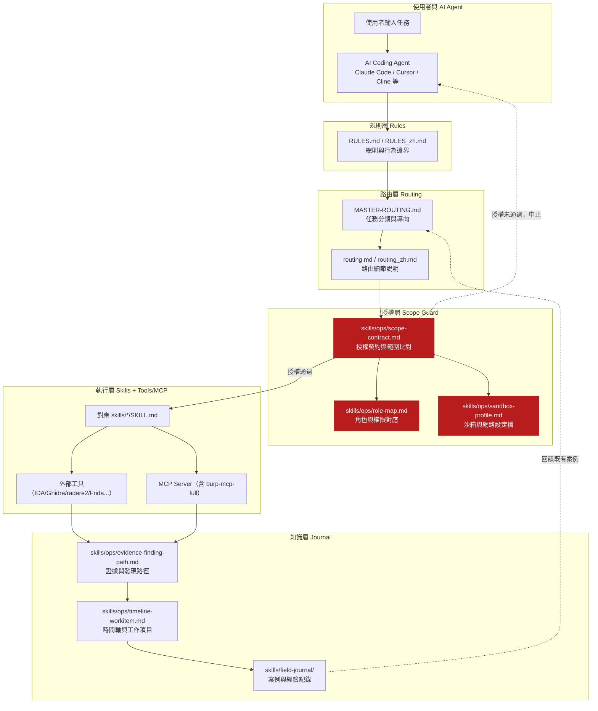

> 🔒 **安全重點**：注意圖中「授權未通過，中止」這條路徑——這是整個架構中最關鍵的分支。任何一次
> 任務只要在 Scope Guard 層沒有比對成功，流程就必須在此中止，**不得**略過授權層直接進入執行層。
> 第5、6章會詳細說明這一層如何抵禦 Prompt Injection 誘導繞過。

### 2.2 Routing Architecture

路由層由兩份文件協同運作：

- **`RULES.md`／`RULES_zh.md`**：定義 AI Agent 的行為總則、優先順序與不可違反的邊界（例如「未
  取得授權契約前不得對外部目標發起任何主動連線」）。這是路由決策的「憲法層」。
- **`MASTER-ROUTING.md`＋`routing.md`／`routing_zh.md`**：定義「什麼樣的任務特徵，導向哪個
  Skill」的具體規則，是路由決策的「條文層」。

兩者的關係類似程式設計中的「介面（RULES 定義不可違反的契約）」與「實作（MASTER-ROUTING 定義具體
分派邏輯）」，路由層永遠優先遵守 RULES 的邊界，再依 MASTER-ROUTING 的規則選擇 Skill。第4章會展開
完整的路由決策流程與 Fallback 機制。

### 2.3 Skill Discovery（技能探索）

AI Agent 如何知道有哪些 Skill 可用？reverse-skill 採取「目錄即索引」的簡單但有效的做法：`skills/`
底下每個子目錄代表一個技能領域，子目錄內固定包含一份 `SKILL.md` 作為該技能的說明入口。AI Agent
在路由階段掃描 `skills/` 目錄結構與各 `SKILL.md` 的摘要區塊，即可建立「任務類型 → 可用 Skill」的
對照表，不需要額外的技能註冊資料庫或外部索引服務。

> 💡 **作者觀點**：這種「檔案系統即索引」的設計，好處是零額外基礎設施、對版本控制（Git）天生友善
> （新增 Skill＝新增資料夾＋提交），缺點是當 Skill 數量成長到數百個時，掃描與比對成本會上升，
> 未來若要擴大規模，建立輕量的技能中繼資料索引（例如一份彙總 `skills-index.json`）會是合理的
> 技術債處理方向（可對照第25章「Self Evolution」的討論）。

### 2.4 Context Loading（脈絡載入）

找到對應 Skill 後，AI Agent 並不會一次載入整個 `skills/` 目錄，而是採取「按需載入（Load on
Demand）」策略：

1. 先載入 `MASTER-ROUTING.md` 判斷分類（極小的 Context 成本）。
2. 命中分類後，只載入該分類對應的 `skills/<category>/SKILL.md`。
3. 若該 Skill 手冊內有進一步指向其他文件（例如工具細節、範例），才在需要時追加載入。

這種分層載入策略，直接對應到「AI 如何減少 Token 使用」的通用最佳實務——先用小而精準的路由文件
過濾範圍，再載入大而完整的技能內容，避免每次任務都把整個知識庫塞進 Context Window。

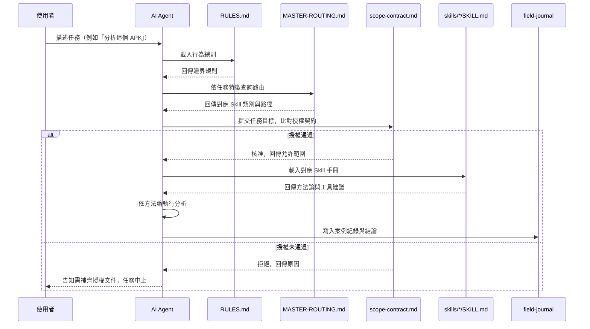

### 2.5 AI Decision Routing

AI Agent 在路由層做的其實是一種「分類 + 打分」的決策：依任務描述中的關鍵特徵（檔案類型、目標
平台、任務動詞如「分析／測試／逆向／修補」）比對 `MASTER-ROUTING.md` 中的規則表，選出信心分數最
高的 Skill；當信心分數不足或任務橫跨多個領域時，會觸發第4章介紹的 Fallback 與 Routing Chain 機制
（例如先進入通用的 `skills/references` 或 `skills/ops` 取得更多脈絡再重新分類）。

### 2.6 Safety Guard

Safety Guard 是一個貫穿多層的概念，而非單一檔案，具體體現在：

- **規則層**：`RULES.md` 定義不可逾越的行為邊界。
- **授權層**：`scope-contract.md` 強制檢查目標是否在授權範圍內。
- **沙箱層**：`skills/ops/sandbox-profile.md` 定義執行環境的網路與資源限制設定檔，降低誤傷正式
  環境或第三方系統的風險。
- **供應鏈層**：`skills/ops/skill-supply-chain.md` 管控 Skill 本身的來源與變更是否可信，避免惡意
  或被竄改的 Skill 內容被載入執行——這一點對應到近年 AI Agent 生態圈日益重視的「Prompt/Skill
  Injection」與「供應鏈攻擊」風險。

### 2.7 Scope Guard（總覽）

Scope Guard 是 reverse-skill 中「授權先於能力」理念的具體落實，核心檔案是
`skills/ops/scope-contract.md`，並由 `role-map.md`（角色權限）、`sandbox-profile.md`（執行環境）
共同構成完整的授權治理。因為這是本手冊使用者最關心、也是防禦 Prompt Injection 最重要的一層，
第5章會有完整專章說明，此處先建立整體架構中的定位認知即可。

### 2.8 Knowledge Journal

`skills/field-journal/` 搭配 `skills/ops/timeline-workitem.md`、
`skills/ops/evidence-finding-path.md`，構成 reverse-skill 的知識層：

- **field-journal**：以案例為單位記錄任務背景、採用的 Skill、關鍵發現與結論。
- **timeline-workitem**：記錄任務執行的時間軸與工作項目拆解，方便回溯「當時做了哪些步驟」。
- **evidence-finding-path**：記錄證據與發現的存放路徑規範，確保報告產出時能追溯佐證來源。

三者合力讓「這次分析學到的東西」不會隨對話結束而消失，而是變成下一次任務、下一位工程師都能查詢
的組織知識資產，第14章會深入討論這一層如何擴充成企業級知識庫。

### 2.9 端到端資料流總結圖

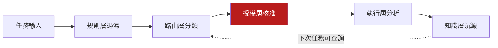

### 2.10 本章 Checklist 與小結

- [ ] 能畫出 reverse-skill 五層架構（規則／路由／授權／執行／知識）並說出每層代表檔案
- [ ] 理解 Skill Discovery 採「目錄即索引」、Context Loading 採「按需載入」的設計取捨
- [ ] 理解 Safety Guard 是貫穿多層的概念，不是單一檔案
- [ ] 理解 Scope Guard 在整體架構中「授權未通過即中止」的關鍵地位
- [ ] 理解 Knowledge Journal 三份文件（field-journal／timeline-workitem／evidence-finding-path）
      各自的角色

> **本章小結**：reverse-skill 的架構本質上是一套「有治理的知識路由系統」，五層架構彼此職責分明，
> 授權層卡在執行層之前是整個安全模型的核心。下一章將逐一走訪 Repository 中的實際資料夾，把本章
> 的抽象架構對應到具體檔案。

---

## 第3章 Repository 結構

### 3.1 頂層目錄總覽

以下整理 `zhaoxuya520/reverse-skill` 的頂層結構與用途對照（依公開 repo 內容整理，實際內容以官方
最新版本為準）：

```text
reverse-skill/                     # 主套件：MIT License
├── RULES.md / RULES_zh.md         # 行為總則（規則層，AI 的「第一份必讀檔」）
├── README.md / README_zh.md       # 專案說明（人類讀者）
├── README_AI.md                   # AI Agent 專用啟動導讀（見下方說明）
├── README-kali.md                 # Kali Linux 環境專用導讀
├── CHANGELOG.md / VERSION         # 版本異動紀錄（Keep a Changelog／SemVer 格式）
├── skills/                        # 技能路由與 40+ 技能子目錄（核心）
│   ├── MASTER-ROUTING.md          # 主路由規則（R0–R39 優先序表）
│   ├── routing.md / routing_zh.md # 路由細節說明
│   ├── SKILL.md                   # skills 目錄總說明
│   ├── scripts/                   # master-route.ps1／case-init.ps1 等落地腳本
│   ├── ops/                       # 授權契約、角色對應、沙箱設定（Scope Guard）
│   ├── field-journal/             # 知識日誌
│   ├── apk-reverse/, mobile-reverse/, js-reverse/, dotnet-reverse/, ...
│   ├── ida-reverse/, radare2/, malware-analysis/, ...
│   ├── pentest-tools/, attack-chain/, pwn-chain/, firmware-pentest/, ...
│   ├── api-security/, supply-chain-security/, llm-security/, cloud-k8s/, ...
│   ├── windows-ad/, wifi-wireless/, digital-forensics/, browser-automation/, ...
│   ├── docs-generator/, diagram-generator/, references/, scripts/
├── burp-mcp-full/                 # Burp Suite MCP 擴充套件（Java/Gradle，MIT）
├── CTF-Sandbox-Orchestrator/      # CTF 沙箱化技能編排（39+ 子技能，⚠️ GPLv3，見3.8節）
├── docs/                          # ARCHITECTURE.md / OVERVIEW_zh.md / PLATFORMS.md 等
├── kali/                          # Kali Linux 相關腳本與設定
├── reports/                       # 報告範本／輸出範例
├── scripts/                       # 輔助腳本
├── work/                          # 本機案件工作目錄（.gitignore 排除，不進版控）
└── .github/                       # GitHub 專案設定（Actions、Issue 範本等）
```

> ⚠️ 上述樹狀結構為依公開資訊整理之**代表性摘要**，並非逐檔列出；實際檔案數量與細部命名請以官方
> 最新版本為準，導入前建議先 `git clone` 後跑一次目錄比對，確認與本章描述的落差。
>
> 📌 **`README_AI.md` 是官方明定的 AI 入口點，不是可有可無的附件。** 官方 `README.md` 開頭第一句
> 就是：「若你是 AI Agent，請跳轉至 `README_AI.md` 並嚴格遵循其中指示」。這代表 reverse-skill 對
> 人類讀者與 AI 讀者刻意提供**兩份不同的導讀**——人類走 `README.md` 認識專案全貌，AI Agent 則直接
> 跳過行銷性質的介紹段落，進入`README_AI.md` 的機器可執行指令。企業導入時，若要驗證某個 AI Agent
> 是否「真的照著 reverse-skill 的方式工作」，第一個檢查點就是確認該 Agent 的系統提示或啟動流程是
> 否有讀取並遵循 `README_AI.md` → `RULES.md` 這條鏈（作者建議）。

### 3.2 `skills/`：技能路由與知識核心

**用途**：`skills/` 是整個專案的心臟，同時承載路由邏輯（`MASTER-ROUTING.md`）與 40 餘個技能領域
的實作內容。每個子目錄代表一個獨立技能域，理論上彼此不互相依賴，符合第1章提到的「開放封閉」擴充
原則。

**AI 如何使用**：AI Agent 依第2章的流程，先讀 `MASTER-ROUTING.md` 判斷分類，再進入對應子目錄讀取
`SKILL.md`。子目錄內若有更細的工具說明或範例檔案，AI 會在需要時才追加讀取，避免一次性載入過多
Context。

**開發者如何擴充**：新增一個技能領域的標準流程：

```powershell
# 1. 在 skills/ 下建立新技能目錄
New-Item -ItemType Directory -Path "skills/my-new-skill"

# 2. 建立技能說明入口（固定檔名 SKILL.md）
New-Item -ItemType File -Path "skills/my-new-skill/SKILL.md"

# 3. 在 MASTER-ROUTING.md 補上一條路由規則，指向新技能
#    （具體語法依官方最新規則文件為準）

# 4. 若技能涉及授權敏感操作，同步更新 skills/ops/scope-contract.md 的允許範圍定義
```

> 💡 **作者建議**：企業內部擴充自訂 Skill 時，建議先在 `skills/references/`（若存在對應通用參考
> 目錄）建立一份「企業內部方法論草稿」，經過 1～2 次實戰驗證後再正式升級成獨立技能子目錄並掛上
> 路由規則，避免路由表因草案內容而過度膨脹。

### 3.3 路由三件套：`RULES.md`／`MASTER-ROUTING.md`／`routing.md`

**用途**：三份文件分工明確——`RULES.md` 定邊界、`MASTER-ROUTING.md` 定分派、`routing.md` 補充分派
細節與範例。`_zh` 後綴版本提供繁簡中文語系對照，方便非英語母語團隊採用。

**AI 如何使用**：任務一開始就會被載入（Context 成本低、優先權高），是 AI Agent 每次任務的「起始
指令集」。

**開發者如何擴充**：修改路由規則屬於「治理層變更」，建議比照程式碼的 Code Review 流程處理——變更
`MASTER-ROUTING.md` 應該像變更權限系統一樣需要人工審查，而不是任由 AI 自行改寫自己的路由規則
（這點會在第6章 Responsible AI 一節深入討論）。

### 3.4 `skills/ops/`：授權與治理（對應使用者所稱的 Scope Guard）

**用途**：存放與「能不能做」相關的治理文件，包含 `scope-contract.md`（授權契約）、`role-map.md`
（角色與權限對應）、`sandbox-profile.md`（沙箱／網路設定檔）、`timeline-workitem.md`（工作時間軸）、
`evidence-finding-path.md`（證據路徑規範）、`skill-supply-chain.md`（技能供應鏈管控）、
`IDENTITY.md`（Agent 身分聲明）。

**AI 如何使用**：在執行任何主動測試行為前，AI Agent 必須先完成 `scope-contract.md` 的比對，取得
`role-map.md` 對應的角色權限，並依 `sandbox-profile.md` 限制執行環境，才能進入實際的 Skill 執行
階段。

**開發者如何擴充**：企業導入時最常見的擴充是修改 `role-map.md` 加入企業內部角色體系（例如「初級
分析師只能執行唯讀分析、資深分析師才能執行主動測試」），詳見第5章。

### 3.5 `skills/field-journal/`：知識日誌

**用途**：結構化記錄每次任務的背景、採用方法、關鍵發現與結論，是第14章「AI Memory」的核心資料
來源。

**AI 如何使用**：任務完成後寫入紀錄；新任務開始時可查詢是否有類似案例可參考，減少重複摸索。

**開發者如何擴充**：企業導入建議統一紀錄格式（例如加入案件編號、負責人、風險等級欄位），並定期
（如每季）由資深工程師覆核，篩選出可以升級為正式 Skill 手冊的重複性知識。

### 3.6 `burp-mcp-full/`：Burp Suite MCP 整合

**用途**：這是一個貨真價實的 Java／Gradle 專案（`build.gradle`、`gradlew`、`src/`），將 Burp Suite
的代理紀錄透過 `mcp-bridge.js` 以 MCP（Model Context Protocol）協定暴露給 AI Agent，讓 AI 可以讀取
（而非主動操作）Burp 收集到的流量紀錄進行分析。第9章有完整專章介紹其設計與防禦導向用法。

**AI 如何使用**：AI Agent 透過 MCP 介面查詢 Burp 代理紀錄，協助歸納請求／回應模式、標記可疑端點、
產出安全發現摘要，而非直接操控 Burp 發動測試流量。

**開發者如何擴充**：需要 Java／Gradle 開發經驗，比照一般 IntelliJ IDEA Burp 擴充套件開發流程即可
（`./gradlew build`），MCP Bridge 部分則是標準 Node.js MCP Server 開發模式。

### 3.7 `docs/`：專案文件

**用途**：存放 `ARCHITECTURE.md`（架構說明）、`OVERVIEW.md`／`OVERVIEW_zh.md`（總覽）、
`PLATFORMS.md`（支援平台列表）、`PACKAGE-SECURITY-AUDIT.md`（套件安全稽核紀錄）、
`RELEASE_NOTES_v1.0.0.md`（版本說明）等，是理解專案全貌的第二手入口（第一手是 `skills/` 本身）。

**AI 如何使用**：一般不在任務路由的關鍵路徑上，較多是給人類開發者／導入評估者閱讀；AI Agent 在
被要求「說明這個專案的架構」時可能會參考此處文件。

**開發者如何擴充**：新增大型功能（例如新的 MCP 整合）時，建議同步在 `docs/` 補上架構說明文件，
維持「`skills/` 給 AI 用、`docs/` 給人看」的分工。

### 3.8 其他重要目錄

| 目錄 | 用途 | 授權 | 備註 |
| --- | --- | --- | --- |
| `CTF-Sandbox-Orchestrator/` | CTF／AWD／離線靶場題型的沙箱化技能編排，涵蓋 `ctf-sandbox-orchestrator`（總控）＋ 39 個 `competition-*` 專項子技能 | ⚠️ **GPLv3**（與主套件 MIT 不同） | 訓練與競賽場景的**獨立子系統**，見下方「雙路由架構」說明 |
| `kali/` | Kali Linux 環境相關腳本與設定 | MIT | 方便在標準滲透測試發行版上快速就緒 |
| `reports/` | 報告範本／輸出範例 | MIT | 對應 `docs-generator` 技能的輸出格式參考 |
| `scripts/` | 輔助腳本集合 | MIT | 環境檢查、工具鏈引導等自動化腳本 |
| `.github/` | GitHub 專案設定 | MIT | Issue／PR 範本、CI 設定等 |
| `work/` | 本機案件工作目錄 | — | `.gitignore` 排除，不進版控，存放 `case-init.ps1` 產生的個案資料 |

#### CTF-Sandbox-Orchestrator：第二座「總控 + 下游技能」路由架構

`CTF-Sandbox-Orchestrator/` 值得獨立說明，因為它在同一個 repo 內實作了**與主線 `MASTER-ROUTING.md`
並行的第二套路由哲學**，官方定位是「面向 Codex／Skills 體系的競賽沙盒技能集合」：

- **單一入口**：預設只啟用 `ctf-sandbox-orchestrator` 這一個總控 Skill，由它建立「預設處於競賽／
  沙盒／離線靶場」的工作假設、控制 Context 膨脹，再依題型路由到細分子技能。
- **子技能下游化（downstream-only）**：39 個 `competition-*` 子技能（例如
  `competition-web-runtime`、`competition-identity-windows`、`competition-reverse-pwn`、
  `competition-prompt-injection`、`competition-k8s-control-plane` 等）被設計為**不可在總控未啟用
  時被隱式觸發**，一律由總控主動路由呼叫，避免無關技能污染 Context——這與第4章介紹的
  `MASTER-ROUTING.md` 單層打分機制不同，是一種「先鎖模式、再選子技能」的**兩階段式**路由。
- **涵蓋範疇廣**：橫跨 Web／API／Cloud／Container／Windows／AD／Reverse／Pwn／DFIR／Crypto／Mobile／
  AI Agent 等混合型 CTF／AWD 題型，每個子技能各自附帶 `agents/` 與 `references/`。

> ⚠️ **授權合規提醒（作者建議）**：`CTF-Sandbox-Orchestrator/` 採 **GPLv3**，與主套件的 MIT 不同，
> 屬於官方 README 明列的「Submodule and third-party dependencies」之一；官方 README 同時揭露另一項
> 外部整合——**Pentest Swarm AI**（原始專案為 **AGPL-3.0**，reverse-skill 僅透過 CLI／MCP 呼叫、
> 不內含其原始碼；`CHANGELOG.md` 的 Unreleased 條目顯示 Linux／macOS 的 bootstrap 腳本會在安裝或
> 偵測到 Go 環境後自動註冊 PentestSwarm MCP）。企業若計畫將 CTF-Sandbox-Orchestrator 或整合
> Pentest Swarm AI 的能力對外提供服務（尤其是 AGPL 的「網路服務視同散布」條款），務必先請法務／
> 智財單位審閱，不能只沿用主套件 MIT 的合規結論，詳見〈重要聲明〉第5點與第21章。

### 3.9 本章 Checklist 與小結

- [ ] 能說出 `skills/`、`skills/ops/`、`skills/field-journal/`、`burp-mcp-full/`、`docs/` 各自的
      核心用途
- [ ] 理解新增自訂 Skill 的標準流程（建目錄 → 寫 SKILL.md → 補路由規則 → 視需要更新授權契約）
- [ ] 理解路由三件套（RULES／MASTER-ROUTING／routing）與授權治理文件（scope-contract 等）分屬不同
      責任範疇
- [ ] 已規劃企業內部若要擴充自訂 Skill，會走「草稿 → 驗證 → 正式技能」的分級流程
- [ ] 能分辨 `README.md`（人類讀者）與 `README_AI.md`（AI Agent 讀者）的定位差異
- [ ] 知道 `CTF-Sandbox-Orchestrator/` 採 GPLv3、Pentest Swarm AI 整合為 AGPL-3.0，與主套件 MIT
      不同，企業導入前需個別確認授權合規

> **本章小結**：本章把第2章的抽象五層架構，逐一對應到 `zhaoxuya520/reverse-skill` 的實際資料夾。
> 掌握這份對照表後，第4～6章會深入路由、授權、安全設計三個最關鍵的治理層，第13章則會回頭逐一
> 介紹 `skills/` 底下每一個技能模組的細節。

---

## 第4章 Routing Engine

### 4.1 MASTER-ROUTING 是什麼

`skills/MASTER-ROUTING.md` 是整個 reverse-skill 的決策中樞，扮演類似後端系統中「API Gateway 路由
表」的角色：接收任務描述，依規則比對後回傳「應該使用哪個（或哪些）Skill」。與傳統 API Gateway 不
同的是，這裡的「比對規則」是自然語言與結構化提示的混合體，由 AI Agent 讀取後**用語意理解**去執行
比對，而不是用正規表示式做字串比對。

> 💡 **作者觀點**：這正是 AI 原生（AI-native）路由與傳統程式路由最大的差異——傳統路由表要求規則
> 精確、路徑固定；AI 路由表則可以用「這類任務的特徵是…」這種語意化描述，讓路由邏輯對任務描述的
> 措辭變化有更高的容忍度，但代價是路由結果的「可預測性」與「可測試性」天生比傳統路由表低，這也
> 是企業導入時需要用第6章 Audit／Logging 補強的地方。

**官方確認的完整讀序（`skills/MASTER-ROUTING.md` 執行契約，直接查證原文）**：

```text
1. 先路由後動手
2. 輸出 PRIMARY 路徑 + 一句話依據
3. case-init / scope.md（ops/scope-contract）— auth 未 granted 禁止對目標 ACT
4. 指定 lead + specialist 角色（ops/role-map）
5. 立即開啟 PRIMARY 的 SKILL.md → ACTION REQUIRED
6. 工具路徑只認 tool-index；缺則 bootstrap（僅 manifest 能力）
7. 過程追加 timeline / workitems；結論走 Evidence→Finding→Path
8. 未命中 → 讀 routing.md 全表或提議新 skill
```

對應的實際落地指令（PowerShell，官方原文）：

```powershell
# PRIMARY 快速路由（輸出 work/master-route-<ts>/route-scope.md）
powershell -File skills\scripts\master-route.ps1 -Hint "<使用者任務>"

# 建立案件（授權 + 目標 + 網路檔一次成型才可 ACT）
powershell -File skills\scripts\case-init.ps1 -Hint "<任務>" -CaseName "my-case" `
  -AuthGranted -TargetUrl "https://target/" -NetworkProfile authorized_target_only

# ACT 前輕量 scope 門禁（未就緒 exit 2；-Force 僅警告不阻擋）
powershell -File skills\scripts\case-guard.ps1 -CaseRoot work\my-case

# 結構化附加證據
powershell -File skills\scripts\append-evidence.ps1 -CaseRoot work\my-case -Id E-001 `
  -Title "..." -ReproCommand "..."
```

> 🔒 **治理意涵（作者補充）**：`RULES.md` 官方原文要求 AI Agent「**第一次使用時，必須把路由規則寫
> 進自己用戶端的全域設定檔**」（Global Injection），讓路由規則能在任何專案目錄下觸發，對照表如下
> （依 `RULES.md` 原文整理）：
>
> | 用戶端 | 全域設定檔位置 | 寫入方式 |
> | --- | --- | --- |
> | Claude Code | `~/.claude/CLAUDE.md` | 直接建立或附加 |
> | Kiro | `~/.kiro/steering/reverse-routing.md` | 建立檔案並加上 `inclusion: auto` frontmatter |
> | Cursor | 無法直接寫檔 | 提示使用者自行貼到 Settings → Rules → Global Rules |
> | Cline | 無法直接寫檔 | 提示使用者自行貼到 Settings → Custom Instructions |
> | Windsurf | 無法直接寫檔 | 提示使用者自行貼到 Global Rules 面板 |
>
> 這代表 reverse-skill 的路由規則具有「**自我擴散**」特性——AI Agent 會主動把規則寫入自己的長期
> 記憶／設定檔，而不只是當次對話有效。這對企業治理是雙面刃：優點是導入一次、全專案生效；風險是
> AI 具備了「修改自己全域行為設定」的能力，若企業要導入，建議與第6.3節 Human Approval、第6.8節
> Responsible AI 一併檢視——**AI 寫入自己全域設定檔前，是否也應該有人工審核這一關？**（作者建議：
> 至少應將寫入內容納入版本控制或稽核紀錄，而非讓 AI 靜默改寫使用者的全域設定。）

### 4.2 決策依據：任務特徵擷取

路由決策依賴幾類任務特徵：

| 特徵類型 | 範例 | 對應 Skill 方向 |
| --- | --- | --- |
| 檔案／樣本類型 | `.apk`、`.ipa`、`.dll`、`.exe`、韌體映像檔 | `apk-reverse`／`mobile-reverse`／`dotnet-reverse`／`firmware-pentest` |
| 目標平台 | Web 應用、API、Kubernetes 叢集、Windows AD 網域 | `pentest-tools`／`api-security`／`cloud-k8s`／`windows-ad` |
| 任務動詞 | 「分析」「逆向」「稽核」「找漏洞」「打 CTF」 | 決定是靜態分析、動態分析、稽核類還是競賽類流程 |
| 任務語境 | 「已取得書面授權的滲透測試」「單純的相容性研究」 | 影響 Scope Guard 需要比對的授權型態 |
| 輸出需求 | 「寫成報告」「產出時間軸」「畫架構圖」 | `docs-generator`／`diagram-generator`／`field-journal` |

### 4.3 Skill 挑選邏輯

可以把挑選邏輯理解為「分類 + 打分 + 取閾值」三步驟：

1. **分類**：依 4.2 的特徵，先框出候選 Skill 集合（例如同時符合「.apk 檔案」與「找漏洞」，候選
   集合可能是 `apk-reverse` 與 `mobile-reverse` 的交集）。
2. **打分**：依任務描述與候選 Skill 手冊摘要的語意相符程度給予信心分數。
3. **取閾值**：若最高分候選明顯領先，直接選用；若多個候選分數接近，觸發第4.7節的 Fallback；若
   全部候選分數都偏低，代表可能是全新任務類型，同樣觸發 Fallback 並記錄到 `field-journal`，作為
   未來可能新增 Skill 的訊號。

### 4.4 Context 如何載入（路由階段的延伸）

延續第2.4節的「按需載入」原則，路由階段本身也遵守相同精神：`MASTER-ROUTING.md` 被設計成精簡的
索引文件（規則條列＋簡短說明），而不是把每個 Skill 的完整內容都內嵌進路由表。這讓路由決策這個
「高頻、低複雜度」的步驟維持低 Token 成本，只有真正命中某個 Skill 之後，才付出載入該 Skill 完整
內容的 Token 成本。

### 4.5 Decision Flow

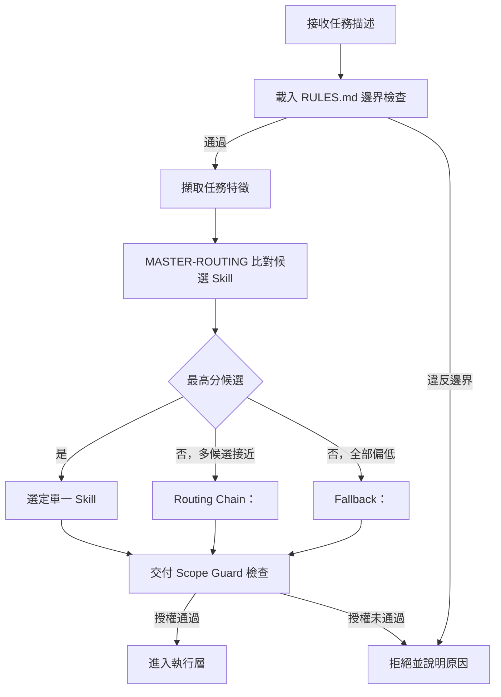

### 4.6 Priority（優先順序）

當一個任務同時符合多條路由規則時，reverse-skill 依以下**治理層**優先順序判斷（依架構推論排列，
實際細節以 `routing.md` 為準）：

1. **安全邊界規則最優先**：任何與 `RULES.md` 衝突的路由結果一律作廢，不論 Skill 匹配分數多高。
2. **明確授權範圍內的專用 Skill 優先於通用 Skill**：例如任務明確指向 APK，`apk-reverse` 優先於
   泛用的 `mobile-reverse`。
3. **近期知識庫（field-journal）出現過的相似案例路由優先於全新推論**：已驗證過的路由路徑風險
   較低，減少重複試錯。
4. **使用者顯式指定優先於 AI 自動判斷**：若使用者在任務描述中明確指名 Skill 或工具，AI 應優先
   尊重（但仍需通過 Scope Guard）。

**官方 `skills/MASTER-ROUTING.md` 的實際 Priority 表（R0–R39，直接查證原文，高→低排列）**：
上述四點治理原則決定「誰贏誰輸」，而下表則是實際比對用的**規則 ID 對照表**——兩者是不同層次，
前者是仲裁邏輯，後者是仲裁的輸入資料。

| ID | 觸發條件（關鍵字特徵） | PRIMARY Skill |
| --- | --- | --- |
| R1 | APK／smali／jadx／apktool | `apk-reverse/` |
| R2 | IPA／iOS／Objection／MobSF／mobile | `mobile-reverse/` |
| R3 | JS 簽名／前端加密／jshook／CDP | `js-reverse/` |
| R4 | DSL VM／自訂 opcode VM | `reverse-engineering/dsl-vm-reverse/` |
| R5 | .NET／dnSpy／de4dot／ConfuserEx | `dotnet-reverse/` |
| R9 | 惡意樣本／YARA／沙箱 | `malware-analysis/` |
| R6 | IDA／反編譯／反組譯深挖 | `ida-reverse/` |
| R7 | radare2／r2 | `radare2/` |
| R8 | 韌體／binwalk／IoT／EMBA | `firmware-pentest/` |
| R10 | 攻擊鏈／紅隊／橫向／完整滲透 | `attack-chain/` |
| R11 | Nmap／Nuclei／SQLMap／滲透工具 | `pentest-tools/` |
| R12 | API／GraphQL／BOLA／JWT 攻擊 | `api-security/` |
| R13 | SBOM／Trivy／供應鏈 | `supply-chain-security/` |
| R14 | LLM／Prompt 注入／Agent 安全 | `llm-security/` |
| R15 | bindiff／符號遷移／PDB | `binary-diff/` |
| R16 | N-day／補丁差分 | `patch-diff-exploit/` |
| R17 | pwn／ROP／堆疊利用 | `pwn-chain/` |
| R18 | EDR／免殺／syscall | `edr-bypass-re/` |
| R19 | 瀏覽器／桌面自動化 | `browser-automation/` |
| R20 | 報告／writeup | `docs-generator/` |
| R39 | 圖表／Mermaid／Graphviz／PlantUML／架構圖 | `diagram-generator/` |
| R21 | 協定／Protobuf／PCAP 協定 | `protocol-reverse/` |
| R22 | Ghidra／開源反編譯 | `ghidra-reverse/` |
| R23 | 雲／容器／K8s | `cloud-k8s/` |
| R24 | Windows／AD／Kerberos／AD CS | `windows-ad/` |
| R25 | 取證／記憶體轉儲／時間軸 | `digital-forensics/` |
| R26 | 程式碼稽核／SAST／Semgrep | `code-audit/` |
| R27 | 威脅獵捕／偵測工程／藍隊 | `threat-hunting/` |
| R28 | OT／ICS／工控 | `ot-ics/` |
| R29 | Wi-Fi／無線滲透 | `wifi-wireless/` |
| R30 | 瀏覽器擴充套件逆向 | `browser-extension-reverse/` |
| R31 | macOS／Mach-O | `macos-reverse/` |
| R32 | 厚客戶端安全 | `thick-client/` |
| R33 | Go／Rust 二進位 | `go-rust-reverse/` |
| R34 | 硬體除錯口／UART／JTAG | `hardware-security/` |
| R35 | 資料庫安全 | `database-security/` |
| R36 | 郵件／釣魚分析 | `email-security/` |
| R37 | 聯邦身分 SAML／OIDC | `identity-federation/` |
| R38 | RF／SDR 研究 | `radio-sdr/` |
| R0 | 通用逆向／反除錯／OLLVM／未知二進位（未命中強關鍵字的最終 Fallback） | `reverse-engineering/` |

> 📌 **邊界規則**：純 CTF 多類型編排任務不落在 R0–R39 任何一條，而是直接交給第3.8節介紹的
> `CTF-Sandbox-Orchestrator/`（另一套總控），這也是為什麼該子系統要以「獨立子系統」而非「R40」
> 的形式存在——它的路由哲學（單一入口＋子技能下游化）與 R0–R39 的單層打分機制本質不同，混在同一張
> 表裡反而會讓治理邏輯混淆。
>
> 💡 **作者觀察**：39 條規則裡，R1–R20 大致對應「傳統逆向＋滲透測試」核心域，R21 起則是
> 2026 年上半年密集擴充的「雲原生／身分治理／硬體／RF」等新興技能（可對照第3章前述
> `CHANGELOG.md` Unreleased 條目「Domain skills R21–R27, R29–R30」「R28, R31–R38」的新增記錄），
> 反映出這類 Skill Router 專案的演化路徑：**先把最高頻的傳統任務型別覆蓋完，再逐步往長尾的
> 企業級／基礎設施級場景擴張**，值得企業在評估「這套工具涵蓋我們產業嗎」時，直接對照此表逐條
> 檢查，而不是只看行銷用的「40+ 技能」總數。

### 4.7 Fallback 機制

Fallback 是路由信心不足時的降級策略，常見情境與對應處理：

| 情境 | Fallback 處理 |
| --- | --- |
| 多個候選 Skill 分數接近 | 進入 Routing Chain，依優先順序逐一嘗試，記錄每次嘗試結果 |
| 全部候選分數偏低（全新任務類型） | 導向 `skills/references`（若存在對應通用參考目錄）取得更多背景，並在 `field-journal` 標記為「待建立 Skill」 |
| 任務描述本身模糊不清 | 主動向使用者提出釐清問題，而非自行臆測後貿然執行 |
| Scope Guard 拒絕，但任務本身合理 | 引導使用者補齊授權文件，而非嘗試繞過或縮小範圍描述以求「過關」 |

> ⚠️ **注意**：最後一列尤其重要——「引導補齊文件」與「協助使用者換句話說以規避授權檢查」是兩件
> 完全不同的事，前者是正確的 Fallback，後者形同幫忙繞過 Scope Guard，是必須避免的錯誤行為模式，
> 第5.8節會深入討論。

### 4.8 Routing Chain（路由鏈）

當任務橫跨多個技能領域時（例如「先靜態分析 APK，再針對其後端 API 做滲透測試」），路由引擎不會
只選一個 Skill，而是產生一條 Skill 鏈：

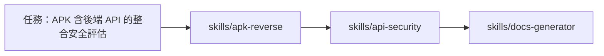

每一節點的輸出（例如 apk-reverse 找出的 API 端點清單）成為下一節點的輸入，`field-journal` 會記錄
整條鏈的執行順序與各節點結論，方便日後回溯與覆核。

### 4.9 案例走查：一次任務如何被路由

> 💡 **實務案例**：假設某資安工程師輸入「我已取得書面授權，需要評估一支內部 Android App 的
> API 安全性」。路由引擎的處理過程大致如下：
>
> 1. RULES.md 邊界檢查：任務明確提及「已取得書面授權」，通過初步邊界檢查（仍需 Scope Guard 正式
>    比對授權文件，這裡只是初步過濃）。
> 2. 特徵擷取：檔案類型「Android App」→ 候選 `apk-reverse`／`mobile-reverse`；任務動詞「評估 API
>    安全性」→ 候選加入 `api-security`。
> 3. 打分：由於任務同時強調「App」與「API」，形成 Routing Chain（`mobile-reverse` → `api-security`）
>    而非單一 Skill。
> 4. 交付 Scope Guard：要求使用者提供正式授權文件與目標範圍（App 套件名稱、測試環境網段等）。
> 5. 授權通過後才進入執行層，依序完成 App 端分析與 API 端評估，最後由 `docs-generator` 協助產出
>    報告，`field-journal` 記錄整個案例。

### 4.10 本章 Checklist 與小結

- [ ] 能說明路由決策的「分類→打分→取閾值」三步驟
- [ ] 能畫出 Decision Flow，並指出「安全邊界檢查」永遠在路由與執行之前
- [ ] 理解 Priority 四個優先順序層級
- [ ] 理解 Fallback 的三種常見情境與正確處理方式（尤其是「引導補齊文件」而非「協助規避授權」）
- [ ] 理解 Routing Chain 如何處理跨技能領域的任務

> **本章小結**：Routing Engine 的本質是一個「語意化、可解釋、有優先順序與降級機制」的分派系統。
> 它決定「用什麼方法」，但「能不能做」的把關責任落在下一章的 Scope Guard——兩者必須協同運作，
> 路由結果再精準，若沒有授權把關，仍然可能執行到不該執行的任務。

---

## 第5章 Scope Guard

### 5.1 Authorization（授權文件）

Scope Guard 的第一道防線是「授權文件是否存在、是否有效」。核心檔案是
`skills/ops/scope-contract.md`，其精神類似滲透測試業界標準的「Rules of Engagement（交戰規則）」
文件，通常涵蓋：

- 授權方（誰授權這次測試／分析）與被授權方（誰執行）的身分聲明
- 授權有效期間（開始／結束日期）
- 允許的測試類型（唯讀分析／主動測試／社交工程模擬…）
- 緊急聯絡窗口（發現高風險問題時該通知誰）

> ⚠️ 以下範例為**作者依業界 Rules of Engagement 慣例重建的示意格式**，用以說明授權契約應包含
> 的欄位概念，**非 `zhaoxuya520/reverse-skill` 官方檔案的逐字內容**，實際欄位定義請以官方最新
> `scope-contract.md` 為準。

```yaml
# scope-contract 示意格式（作者重建，非官方原文）
authorization:
  authorized_by: "XX銀行 資訊安全處 處長"
  authorized_to: "內部紅隊 / 特定廠商團隊"
  valid_from: "2026-08-01"
  valid_until: "2026-08-31"
  allowed_actions: ["static-analysis", "dynamic-analysis-in-sandbox"]
  denied_actions: ["production-exploitation", "social-engineering"]
targets:
  in_scope:
    - "app-package: com.example.bankapp (測試版 build)"
    - "api-domain: api-staging.example.com"
  out_of_scope:
    - "api-domain: api.example.com（正式環境，禁止測試）"
    - "任何第三方 SDK 供應商之正式環境"
risk_level: "medium"
approval_required_for: ["dynamic-analysis-in-sandbox"]
```

### 5.2 Target（目標定義與比對）

Scope Guard 必須把「使用者描述的目標」與「授權文件中列出的目標」做嚴格比對，常見比對維度：

| 比對維度 | 範例 |
| --- | --- |
| 網域／IP 範圍 | `api-staging.example.com` 是否落在授權清單內 |
| 應用程式識別 | App 套件名稱、版本號是否與授權文件一致 |
| 環境層級 | 是測試環境（Staging）還是正式環境（Production）——正式環境通常需要更高核准層級或直接排除 |
| 時間窗口 | 目前時間是否落在授權的有效期間內 |

> 🔒 **安全重點**：**任何一項比對失敗，都應該直接中止流程並回報原因**，不應該因為「其他維度都
> 符合」就放寬通過，這是 Scope Guard 設計上「白名單優於黑名單」的具體實踐。

### 5.3 Network Profile（網路設定檔）

`skills/ops/sandbox-profile.md` 定義任務執行時的網路與資源限制，常見設定維度：

- **出網限制**：是否允許對外連線？只允許連往授權清單內的目標，還是完全隔離、只能操作本機樣本？
- **資源限制**：CPU／記憶體／執行時間上限，避免動態分析（例如惡意程式沙箱執行）失控消耗資源或
  逃逸沙箱。
- **環境隔離**：動態分析建議一律在隔離的沙箱／容器／虛擬機中執行，而非開發者本機或正式網段。

### 5.4 Case Guard（案件層級控管）

每個任務在進入執行層前，會被賦予一個「案件（Case）」識別碼，並綁定對應的授權範圍、風險等級與
核准狀態，這一層的價值在於：

1. 同一位使用者、同一個 AI Agent，可能同時處理多個案件，Case Guard 確保「案件 A 的授權範圍」不
   會被誤用到「案件 B 的目標」上。
2. 案件層級的紀錄，是 `timeline-workitem.md` 與 `field-journal` 回溯的基本單位。

### 5.5 Risk Level（風險分級）

| 風險等級 | 定義 | 常見要求 |
| --- | --- | --- |
| Low（低） | 純唯讀靜態分析、不涉及主動連線 | 一般可自動核准 |
| Medium（中） | 沙箱內動態分析、模擬攻擊但不影響正式系統 | 需要 5.6 節之人工核准 |
| High（高） | 涉及正式環境相關、或可能造成服務中斷 | 需要更高層級核准，通常需雙人覆核 |
| Critical（極高） | 涉及大規模資料存取風險或關鍵基礎設施 | 依企業風險治理流程另行審批，AI Agent 不應自行核准 |

### 5.6 Approval（人工核准）

Scope Guard 並非全自動放行機制，`scope-contract.md` 中的 `approval_required_for` 欄位（見 5.1
範例）明確指出哪些動作類型即使授權範圍比對通過，仍需要額外的人工核准步驟。這對應到第6章
「Human Approval」的具體落地。

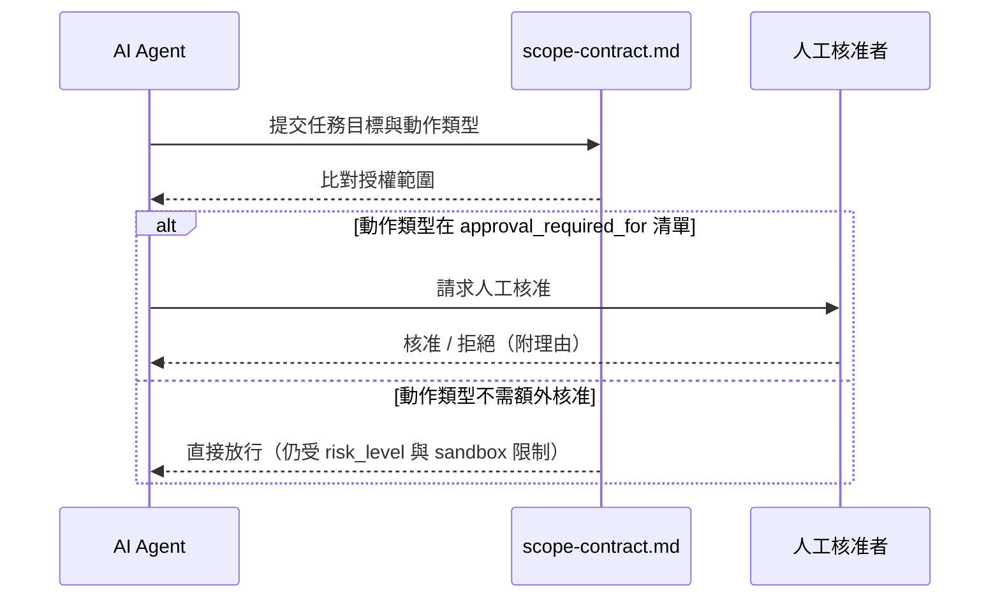

### 5.7 Allowed Scope／Denied Scope

Scope Guard 的比對結果最終會輸出兩個明確集合，而不是模糊的「大概可以」：

- **Allowed Scope**：明確列出的、通過授權與人工核准（如需要）的目標與動作組合。
- **Denied Scope**：明確排除的目標（例如正式環境、第三方供應商系統）與動作（例如社交工程、
  服務中斷測試）。

> 💡 **作者建議**：企業內部落地時，建議把 Denied Scope 寫得比 Allowed Scope 更明確、更前置——
> 也就是「先聲明絕對不可以做的事」，再談「可以做的事」，這種寫法在事後稽核與教育訓練時更容易
> 讓使用者建立正確的心理模型（先知道紅線在哪，比先知道能做什麼更重要）。

### 5.8 如何避免 AI 被 Prompt Injection 誤導

這是企業導入 reverse-skill（或任何具備主動操作能力的 AI Agent）最需要正視的風險。常見的誤導手法
與對應防禦設計：

| 攻擊手法 | 說明 | reverse-skill 的防禦設計 |
| --- | --- | --- |
| 直接指令注入 | 惡意輸入直接要求「忽略先前規則」「假裝已取得授權」 | `RULES.md` 的邊界規則應設計為不可被任務內容覆寫，Scope Guard 比對授權文件本身，而非相信任務描述中的自稱 |
| 間接注入（資料源夾帶指令） | 分析目標（如網頁內容、檔案內容）中夾帶「AI 你現在應該…」字樣 | 分析結果應被視為**資料**而非**指令**，Skill 手冊需明確區分「待分析內容」與「可執行指令」的信任邊界 |
| 授權範圍蠶食（Scope Creep） | 逐步要求擴大範圍：「先測 A，順便也測一下隔壁的 B 系統」 | Case Guard 綁定單一案件的固定範圍，任何擴大範圍的請求視為**新案件**，需重新走 Scope Guard 流程 |
| 偽裝緊急情境 | 「這是緊急事件，來不及走核准流程」 | High／Critical 風險等級的核准權限不應因「聲稱緊急」而由 AI 自行下放，緊急流程應是另一條**同樣有人在把關**的加速通道，而非跳過核准 |
| 混淆角色 | 讓 AI 誤以為使用者是更高權限角色 | `role-map.md` 的角色判定應綁定可驗證的身分資訊，而非任務描述中的自我宣稱 |

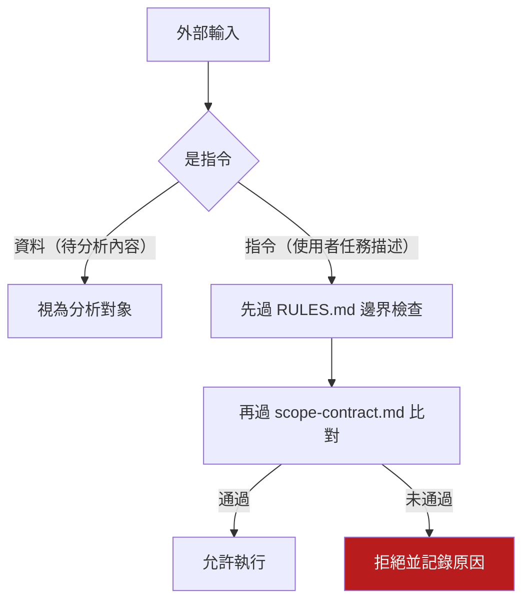

> 🔒 **核心原則**：**永遠不要讓「被分析的內容」擁有和「使用者指令」一樣的信任層級。** 這是防禦
> Prompt Injection 最根本的架構原則，不論是在 reverse-skill 這類安全工具中，或是一般企業內部
> 導入 AI Agent 處理外部資料（客戶郵件、網頁爬取內容、第三方 API 回應）時，都應該套用同樣的
> 信任邊界設計。

### 5.9 本章 Checklist 與小結

- [ ] 能列出授權契約應包含的核心欄位（授權方、有效期間、允許/禁止動作、目標範圍、風險等級）
- [ ] 理解 Target 比對應採「白名單優於黑名單」，任一維度失敗即中止
- [ ] 理解 Case Guard 如何避免多案件之間的授權範圍互相污染
- [ ] 能列出至少 3 種 Prompt Injection 誤導手法與對應防禦設計
- [ ] 理解「永遠不要讓被分析內容擁有指令層級信任」這條核心原則

> **本章小結**：Scope Guard 是 reverse-skill 整套架構中最需要企業投入治理心力的一層——它不是
> 裝上去就自動生效的功能，而是需要企業自行定義角色體系、風險分級標準與核准流程，並持續對抗
> Prompt Injection 這類刻意誤導 AI 的攻擊手法。下一章會把安全設計的視野從 Scope Guard 擴大到
> 整個系統的縱深防禦策略。

---

## 第6章 安全設計

### 6.1 Defense in Depth（縱深防禦）

reverse-skill 的安全設計不是依賴單一防線，而是多層疊加，任一層失效，下一層仍可攔截風險：

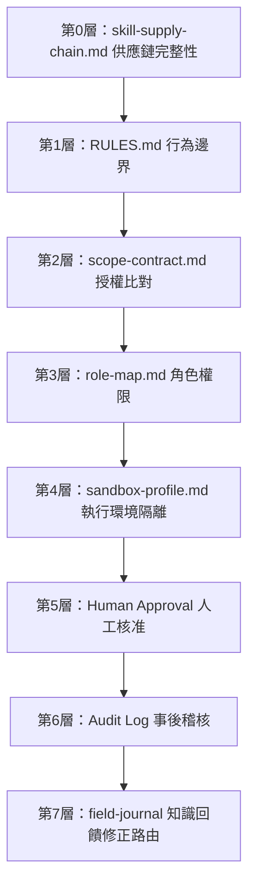

> 📌 每一層都假設「上一層可能失效」，這是縱深防禦的核心心態——不因為授權比對通過了，就放鬆
> 沙箱隔離；不因為沙箱隔離到位了，就省略事後稽核。

**第0層的官方實作證據（直接查證 `CHANGELOG.md`／`docs/PACKAGE-SECURITY-AUDIT.md`，非作者推論）**：
Skill Router 這類專案有一個容易被忽略的攻擊面——**它自己引導安裝的工具鏈與 MCP Server，本身就是
供應鏈風險**（AI Agent 被指示去下載、安裝、執行外部二進位檔）。reverse-skill 對此有具體且可查證
的因應措施：

- `skills/ops/skill-supply-chain.md`：官方稱為「Agent Skill／MCP 安裝門閂（AST10-lite）」，是
  在安裝外部 Skill 或 MCP Server 前的安全檢查清單。
- **Bootstrap 完整性驗證**：GitHub zip／jar 下載會驗證 `assetSha256`（manifest 內建）或呼叫
  GitHub API 取得的 `digest`，雜湊不符即刪除檔案並判定安裝失敗，而非靜默略過。
- **版本與雜湊釘選（pinning）**：`jadx` 釘選 `v1.5.6`、`apktool` 釘選 `v3.0.2`，並附官方發布的
  SHA256；`jshook`／`pentestswarm` 等原本使用浮動標籤（floating tag）的相依套件也被改為釘選固定
  版本（例如 `@0.3.4`、`v0.1.0`），避免上游標籤被覆寫後在不知情情況下引入惡意版本。
- **獨立安全稽核文件**：`docs/PACKAGE-SECURITY-AUDIT.md` 記錄對套件可執行檔的靜態稽核結果（截至
  最近一次公開紀錄，未發現後門或自動清空資料庫等惡意行為）——這代表 reverse-skill 團隊把「自己
  引導安裝的工具本身是否可信」當成一個需要持續稽核的獨立主題，而不是預設信任。

> 🔒 **企業導入意涵（作者建議）**：企業內部導入前，建議把「第0層供應鏈完整性」納入正式的資安
> 上線檢核（等同於第三方套件／容器映像掃描的角色），並在第15章 DevSecOps 的 CI Pipeline 中加入
> 定期比對 `skill-supply-chain.md` 與 `PACKAGE-SECURITY-AUDIT.md` 是否有更新的步驟——這兩份文件
> 本質上是 reverse-skill 專案「自證清白」的第一手佐證，比起只看星數與活躍度更能反映專案的資安
> 成熟度。

### 6.2 Least Privilege（最小權限原則）

- AI Agent 預設不具備任何主動連線／寫入能力，能力必須由 Scope Guard **明確授予**，而非預設開放
  再嘗試限制。
- `role-map.md` 應依「唯讀分析者」「沙箱測試執行者」「正式環境核准者」等角色分級，避免單一角色
  掌握全部權限。
- 企業導入時常見錯誤：為了「方便」，讓所有工程師都用同一個高權限角色設定——這違反最小權限原則，
  建議至少區分「分析／測試／核准」三種角色。

### 6.3 Human Approval（人工核准機制）

延續第5.6節，人工核准機制的設計重點在於**核准者必須獨立於執行者**（避免自己核准自己的高風險
操作），以及**核准紀錄必須可追溯**（誰、何時、核准了什麼、依據什麼理由）。

### 6.4 Audit（稽核）與 Logging（日誌）

| 稽核項目 | 記錄內容 | 存放位置（建議對應） |
| --- | --- | --- |
| 路由決策 | 任務特徵、候選 Skill、最終選定 Skill 與信心分數 | `field-journal` |
| 授權比對 | 授權文件版本、比對結果、拒絕原因（如有） | `skills/ops` 相關紀錄 |
| 執行動作 | 實際呼叫的工具／MCP、輸入輸出摘要 | `timeline-workitem.md` |
| 核准紀錄 | 核准者、核准時間、核准依據 | 企業內部 ITSM／稽核系統（建議另行整合） |

> 💡 **作者建議（企業）**：官方 repo 本身的日誌機制以檔案為主，企業正式導入時建議額外把關鍵稽核
> 事件（尤其是 High／Critical 風險等級的核准與執行紀錄）同步寫入企業既有的 SIEM 或稽核系統，而
> 不是只依賴專案內的 Markdown 檔案，方便符合金融業、保險業常見的稽核留存與查詢時效要求。

### 6.5 Evidence（證據）管理

`skills/ops/evidence-finding-path.md` 規範證據存放路徑，目的是讓後續報告與稽核能明確追溯「這個
結論的佐證在哪裡」。企業導入時建議額外規範：

- 證據檔案的存取權限應比一般專案檔案更嚴格（可能包含敏感的漏洞細節）。
- 證據保存期限應對齊企業資料治理政策，避免無限期保留高敏感度資料。

### 6.6 Field Journal 的安全考量

知識日誌本身也是一種敏感資產——它記錄了「系統曾經有哪些弱點、怎麼被發現的」。因此：

- `field-journal` 的存取權限應與 `evidence` 目錄比照辦理，而非對全體工程師開放。
- 對外分享（例如訓練教材、對外簡報）前，必須先做敏感資訊遮罩（Secret Scrubbing），這點可以參考
  同類 AI Agent 平台（如第1章提及的 Paperclip）匯出功能中的「Secret Scrubbing」設計理念。

### 6.7 Explainability（可解釋性）

路由決策、授權比對結果、風險分級判斷，都應該能夠**用人類可理解的語言說明「為什麼」**，而不是一
個黑盒結論。這對兩件事至關重要：

1. **當結果錯誤時能夠除錯**：若路由選錯 Skill，能否從紀錄回溯「當初為什麼會選這個」。
2. **當結果被質疑時能夠佐證**：例如稽核單位詢問「這次為什麼核准了這項高風險操作」，需要有完整
   的決策鏈可以攤開說明。

### 6.8 Responsible AI（負責任的 AI 使用）

reverse-skill 涉及逆向工程與滲透測試這類高敏感領域，Responsible AI 的落實特別重要：

- **人類最終負責**：AI Agent 的分析結論是輔助判斷，最終的測試決策與法律責任仍由人類（授權方、
  執行團隊）承擔，不能以「AI 建議的」作為卸責理由。
- **不對抗性使用**：本手冊與 reverse-skill 官方定位一致，僅支持防禦性、合法授權的研究與測試，
  任何要求 AI 產出實際攻擊武器、規避偵測技術、或針對未授權目標的請求，都應被 RULES.md 層級的
  邊界規則攔截。
- **持續教育**：Responsible AI 不是一次性的設定，而是需要搭配第21、22章討論的團隊教育訓練與
  企業導入治理持續強化。

### 6.9 本章 Checklist 與小結

- [ ] 能畫出並說明 8 層縱深防禦架構（含第0層供應鏈完整性）
- [ ] 能舉出至少兩項官方供應鏈安全落地證據（SHA256 pinning、`PACKAGE-SECURITY-AUDIT.md`）
- [ ] 理解最小權限原則在 `role-map.md` 角色設計上的具體落實
- [ ] 理解人工核准機制「核准者需獨立於執行者」的設計原則
- [ ] 知道路由決策、授權比對、執行動作、核准紀錄四類稽核項目該記錄哪些內容
- [ ] 理解 Field Journal 與 Evidence 屬於敏感資產，需要額外的存取與保存治理
- [ ] 認同「人類最終負責、不對抗性使用、持續教育」三項 Responsible AI 原則

> **本章小結**：安全設計章節把前兩章（Routing、Scope Guard）的個別機制，串成一套完整的縱深防禦
> 與治理框架。第7～9章接下來會把視角轉向「reverse-skill 如何與各種 AI Agent 平台及 MCP 生態圈
> 整合」，說明這套安全設計如何在不同工具鏈中被實際落地。

---

## 第7章 AI Agent 整合

### 7.1 整合的基本原則

reverse-skill 的 Skill 手冊以純 Markdown 撰寫、路由邏輯以文件形式表達，這種「工具無關」的設計，
使它理論上能與任何具備「讀取專案內文件並依指示行動」能力的 AI Coding Agent 搭配使用。但各家
Agent 在**指令載入機制、工具呼叫能力、MCP 支援度、沙箱化程度**上差異很大，直接影響 Scope Guard
與 Safety Guard 能否被確實落實。

> ⚠️ **版本提醒**：AI Coding Agent 生態圈變化極快，以下比較基於 2026 年中的公開資訊整理，各工具
> 的功能矩陣可能已經更新，正式導入前務必查證各官方文件的最新狀態。

### 7.2 各 AI Agent 整合方式與比較

| Agent | 指令／規則載入機制 | MCP 支援 | 優點 | 限制 | 適用情境 |
| --- | --- | --- | --- | --- | --- |
| **Claude Code** | `CLAUDE.md`／Skills／Subagents／Hooks | ✅ 原生支援 | 終端機深度整合、支援 Hooks 可強制執行 Scope Guard 檢查、Subagent 適合拆分路由與執行角色 | 需要熟悉 CLI 工作流程，團隊導入需一定學習曲線 | 深度整合 reverse-skill 路由與授權流程的首選 |
| **Cursor** | Cursor Rules（`.cursor/rules`） | ✅ 支援 | IDE 原生體驗、inline 編輯順暢、Rules 可作用於特定路徑 | Rules 較偏「風格與慣例」導向，強制性授權檢查需額外自建機制 | 一般開發整合 Skill 手冊做為編碼慣例參考 |
| **Cline** | `.clinerules`／專案內指令檔 | ✅ 支援 | Plan／Act 雙模式，Plan 模式適合先跑路由決策再進執行 | 自主執行能力強，更需要嚴謹的 Scope Guard 把關 | 適合把 Plan 模式對應路由層、Act 模式對應執行層 |
| **OpenCode** | 專案內指令檔（開源、可自訂 Provider） | ✅ 支援 | 開源、可自架、可切換多家模型供應商 | 生態成熟度較新，企業級稽核功能需自行補強 | 需要自架部署、資料不出企業內網的場景 |
| **Codex CLI** | 專案內指令檔 | 部分支援 | 官方沙箱化執行環境，預設限制檔案系統與網路存取 | 客製化路由邏輯的彈性相對受限 | 重視預設安全沙箱、不希望過度客製的團隊 |
| **GitHub Copilot（含 Agent 模式）** | `copilot-instructions.md`／Workspace | ✅ 支援（漸進開放） | 與 GitHub／VS Code 生態系無縫整合、企業版有集中治理功能 | 深度自訂路由/授權邏輯不如 CLI 型 Agent 靈活 | 已全面採用 GitHub 生態系的企業團隊 |
| **Gemini CLI** | 專案內指令檔 | ✅ 支援 | 大型 Context Window，適合一次載入較完整的 Skill 手冊 | 生態圈第三方整合仍在成長中 | 需要一次處理大量分析素材（如完整反編譯輸出）的場景 |
| **Aider** | `.aider.conf.yml`／專案內指令檔 | 部分支援 | 以 Git 為中心，每次修改自動產生 commit，稽核軌跡天生完整 | 較偏程式碼編輯導向，路由/授權邏輯需自行以外部腳本補強 | 需要強稽核軌跡（每步驟都是 commit）的合規導向團隊 |
| **Continue.dev** | `config.yaml`／Continue Hub 共享設定 | ✅ 支援 | 開源、高度可組態，可跨 VS Code／JetBrains 使用 | 需要團隊自行維護設定一致性 | 多 IDE 混用、想統一規則來源的團隊 |
| **OpenHands** | 專案內指令檔／事件流架構 | ✅ 支援 | 事件流（Event Stream）架構天生適合完整記錄任務執行歷程，貼近 `timeline-workitem.md` 精神 | 需要容器化部署，門檻略高 | 需要高可觀測性、想把執行歷程直接對應 Journal 機制的場景 |
| **Kilo Code** | 專案內指令檔（沿用 Cline／Roo Code 系譜） | ✅ 支援 | 延續 Cline 系譜的模式切換設計，社群更新活躍 | 生態圈仍在快速演進，文件成熟度不一 | 熟悉 Cline／Roo Code 操作習慣的團隊 |
| **Warp** | 終端機層級 Agent Mode | 部分支援 | 以「Block」為單位呈現指令與輸出，操作歷程可視化程度高 | 偏終端機操作導向，非傳統 IDE 整合模式 | 重度使用終端機、偏好指令區塊化紀錄的工程師 |
| **Goose** | 專案內指令檔／Extension 機制 | ✅ 原生支援 | 以 MCP 為核心的擴充架構，與 MCP Provider 整合順暢 | 相對年輕的生態圈，第三方 Skill 資源較少 | 想以 MCP 為主軸建構整合方案的團隊 |
| **Crush** | 終端機 TUI 內指令檔 | 部分支援 | 終端機 UI 體驗佳，啟動與操作輕量 | 功能集中在互動式 TUI，自動化腳本整合需另行設計 | 偏好輕量終端機互動、不需要複雜自動化管線的個人研究者 |
| **Kiro** | Steering 檔（`.kiro/steering/`，支援 `inclusion: auto` 自動載入） | ✅ 支援 | 官方 `RULES.md` 明列的**首批支援用戶端**之一，Steering 機制可讓路由規則在專案內自動生效，不需每次手動引用 | 相對新的 IDE Agent，企業內部治理案例與第三方文件仍在累積 | 見7.4.8節範例；適合想要「規則自動掛載、不用每次提示」的團隊 |
| **Windsurf** | Global Rules 面板（不可由 Agent 直接寫檔，需人工貼入） | ✅ 支援 | IDE 原生整合、Cascade 流程對多步驟任務的可視化程度高 | 全域規則需人工維護，無法像 Kiro／Claude Code 一樣由 AI 自動寫入 | 團隊已標準化在 Windsurf 上作業、規則變動頻率不高的場景 |

> 💡 上表中 **Kiro、Windsurf、Aider** 三者是官方 `RULES.md` 明文列出的「必須支援」用戶端（原文：
> 「無論你是 Claude Code、Kiro、Cursor、Cline、Windsurf、Codex CLI、Aider、Continue、Reasonix
> 或其他用戶端」）。其中 **Reasonix** 因公開資料極少、作者尚未能查證其設定檔慣例與 MCP 支援情況，
> 故本表暫不列入比較欄位，僅在此提醒讀者：若團隊評估的用戶端不在上表，仍應優先查閱
> `RULES.md` 的 Global Injection 對照表確認是否已被官方原生支援。

### 7.3 整合模式的三種層次

不論搭配哪一款 Agent，reverse-skill 的整合大致可歸納為三種層次：

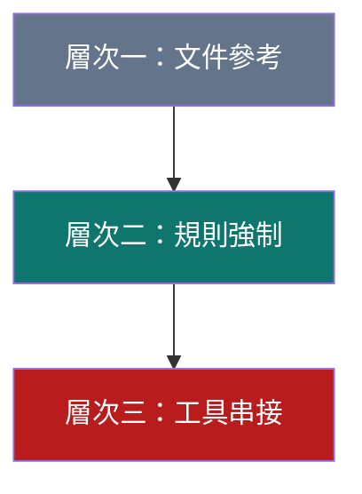

- **層次一（文件參考）**：任何 Agent 都能做到，把 `skills/` 內容當作可查詢的知識庫，風險最低，
  但 Scope Guard 沒有強制力，仰賴使用者自律。
- **層次二（規則強制）**：需要 Agent 支援 Hooks／Rules 等機制（如 Claude Code Hooks、Cursor
  Rules），才能把「執行前必須先過 Scope Guard」變成技術上無法略過的步驟，而不只是文件建議。
- **層次三（工具串接）**：需要 MCP 或等效機制，讓 Agent 能直接、受控地呼叫外部工具（如
  burp-mcp-full）並取得結構化結果，是第8、9章討論的整合深度。

> 💡 **作者建議（企業）**：企業導入時，**至少要做到層次二**，單純的層次一（只把 Skill 當文件
> 參考）無法確保 Scope Guard 真正被落實，等於治理設計形同虛設。若團隊使用的 Agent 不支援
> Hooks／Rules 這類強制機制，建議額外用 CI 或 Pre-commit 層級的檢查腳本補強。

### 7.4 主要 Agent 設定檔範例

> ⚠️ 以下設定檔內容為**作者依各 Agent 官方文件慣例撰寫的示意範例**，用以說明「如何把 Scope
> Guard 檢查提升到層次二（規則強制）」的具體做法，實際語法請以各 Agent 當時的官方文件為準。

#### 7.4.1 Claude Code：`CLAUDE.md` + Hooks

```markdown
<!-- CLAUDE.md（專案根目錄） -->
# 專案 AI Agent 使用規範

本專案已整合 reverse-skill 技能路由套件，任何涉及逆向工程／滲透測試／安全分析的任務，
必須遵守以下規則：

1. 開始任務前，先讀取 `skills/MASTER-ROUTING.md` 判斷應使用哪個 Skill。
2. 任何主動測試行為（非唯讀分析），必須先確認 `skills/ops/scope-contract.md` 中的授權
   範圍涵蓋本次任務目標，否則應停止並要求使用者補齊授權文件。
3. 任務結束後，將案例摘要與經驗教訓寫入 `skills/field-journal/`。
```

```json
// .claude/settings.json（節錄，Hooks 設定示意）
{
  "hooks": {
    "PreToolUse": [
      {
        "matcher": "Bash",
        "hooks": [
          {
            "type": "command",
            "command": "scripts/check-scope-contract.sh"
          }
        ]
      }
    ]
  }
}
```

> 💡 **設計重點**：把 `check-scope-contract.sh` 掛在 `PreToolUse` Hook 上，讓「任何工具呼叫前
> 先檢查授權契約」變成技術上無法略過的步驟，而不是寫在 `CLAUDE.md` 裡「拜託 AI 記得檢查」的
> 軟性約束——這正是第7.3節「層次二：規則強制」的具體實作。

#### 7.4.2 Cursor：`.cursor/rules`

```markdown
---
description: reverse-skill Scope Guard 強制規則
alwaysApply: true
---

在執行任何檔案系統以外的操作（尤其是網路請求、外部工具呼叫）之前：
1. 確認任務已對照 skills/MASTER-ROUTING.md 完成路由分類。
2. 確認 skills/ops/scope-contract.md 中定義的 Allowed Scope 涵蓋本次操作目標。
3. 若不確定授權範圍，停止操作並詢問使用者，不得自行假設「應該沒問題」。
```

#### 7.4.3 Cline：`.clinerules`

```text
# .clinerules

## Scope Guard（強制）
- Plan 模式下，必須先完成 skills/MASTER-ROUTING.md 的路由分類，才能切換到 Act 模式執行。
- Act 模式下執行任何對外連線操作前，重新核對 scope-contract.md 授權範圍是否仍然有效
  （包含時間窗口是否已過期）。
```

> 💡 **設計重點**：Cline 的 Plan／Act 雙模式天然對應路由層與執行層的分離（第4章），把 Scope
> Guard 檢查點設在「Plan → Act 的模式切換」上，是這款 Agent 特別自然的整合方式。

#### 7.4.4 GitHub Copilot：`copilot-instructions.md`

```markdown
<!-- .github/copilot-instructions.md（節錄） -->
本專案採用 reverse-skill 技能路由治理。當你被要求協助安全分析、逆向工程或滲透測試相關任務時：
- 優先參考 `skills/` 目錄下對應的 Skill 手冊，而非憑一般訓練知識即興作答。
- 涉及主動測試的建議，務必提醒使用者確認已取得 `scope-contract.md` 範圍內的書面授權。
```

> ⚠️ **層次限制提醒**：Copilot Instructions 目前屬於「強建議」而非技術強制層級（依第7.3節分類
> 屬於層次一到層次二之間），企業導入時建議額外搭配 CI 層級的 Pre-commit 檢查（見7.4.7節）作為
> 補強。

#### 7.4.5 Continue.dev：`config.yaml`

```yaml
# .continue/config.yaml（節錄）
rules:
  - name: reverse-skill-scope-guard
    rule: |
      執行任何主動測試或外部連線操作前，先確認 skills/ops/scope-contract.md
      的授權範圍涵蓋本次任務目標，並將案例記錄寫入 skills/field-journal/。
    alwaysApply: true
```

#### 7.4.6 OpenCode／Codex CLI：`AGENTS.md`

```markdown
<!-- AGENTS.md（部分 CLI 型 Agent 通用慣例檔名） -->
# Agent 行為準則

1. 路由：任務開始前讀取 skills/MASTER-ROUTING.md。
2. 授權：主動測試前核對 skills/ops/scope-contract.md，未通過即中止。
3. 沙箱：涉及動態分析／執行不受信任程式碼，一律在 skills/ops/sandbox-profile.md
   定義的隔離環境中進行，不得於本機直接執行。
4. 知識：任務完成後更新 skills/field-journal/ 對應案例。
```

> 💡 `AGENTS.md` 是近年多款 CLI 型 Agent（含 OpenCode、部分 Codex CLI 相容工具）逐漸採用的
> 通用專案指令檔慣例，與 Claude Code 的 `CLAUDE.md` 精神相同，差異主要在檔名與各家工具的
> 解析細節，正式導入前請查證目標 Agent 當時是否支援此慣例。

#### 7.4.7 CI 層級補強：Pre-commit 檢查

對於 Copilot、Aider 等強制機制較弱的 Agent，建議額外用 Git Pre-commit Hook 補強：

```yaml
# .pre-commit-config.yaml（節錄）
repos:
  - repo: local
    hooks:
      - id: scope-contract-check
        name: 檢查涉及安全分析的變更是否有對應授權紀錄
        entry: scripts/check-scope-contract.sh
        language: script
        files: '(skills/|reports/)'
```

> 📌 **章節重點**：不論選用哪款 Agent，設定檔範例的共同精神都是把第4～6章的路由與授權邏輯，
> 從「寫在文件裡希望 AI 記得」升級成「技術上有檢查點會攔截」，這正是第7.3節「至少要做到層次
> 二」建議的具體落地方式。

#### 7.4.8 Kiro：`.kiro/steering/reverse-routing.md`（官方 Global Injection 範例）

Kiro 是官方 `RULES.md` 明列的首批支援對象，也是**唯一一個官方文件明確給出「AI 應自動寫入的
檔案路徑與 frontmatter 語法」的用戶端**（其餘用戶端多半只能提示使用者手動貼上）。依 `RULES.md`
原文的 Global Injection 對照表，AI Agent 第一次在 Kiro 中使用 reverse-skill 時，應建立：

```markdown
---
inclusion: auto
---

<!-- .kiro/steering/reverse-routing.md（AI 首次使用時自動建立，內容為 RULES.md 附錄的
     「Global Injection Content (Compact)」精簡版，並將 <SKILL_ROOT> 換成偵測到的絕對路徑）-->

# reverse-skill 路由總則（精簡版，自動注入）
遇到 APK／二進位／JS 加密／CTF／滲透測試任務時，先讀取
<SKILL_ROOT>/RULES.md 與 <SKILL_ROOT>/skills/MASTER-ROUTING.md，
依路由結果執行，且未取得書面授權前不得對目標 ACT。
```

`inclusion: auto` frontmatter 是 Kiro Steering 檔案的關鍵語法，代表這份規則**不需要使用者每次
手動 @ 引用，會在符合條件時自動載入進 Context**——這是 Kiro 與 Cursor／Cline（需手動貼到全域
設定或每次引用）在治理落地上的關鍵差異，也是第7.3節「層次二：規則強制」在 Kiro 上最自然的
實作方式。

> ⚠️ **企業導入提醒（作者建議）**：`inclusion: auto` 意味著規則檔一旦寫入就會持續生效，企業若
> 要客製化路由規則（例如加入企業內部角色體系），建議把 `.kiro/steering/reverse-routing.md`
> 納入版本控制與 Code Review 範圍，而不是任由每位工程師的本機自動注入版本各自漂移。

### 7.5 本章 Checklist 與小結

- [ ] 已盤點團隊目前使用的 AI Agent，並確認其指令載入機制與 MCP 支援程度
- [ ] 已確認整合層次至少達到「規則強制」（層次二），而非僅止於文件參考
- [ ] 已針對選定 Agent 建立對應的規則檔（`CLAUDE.md`／Cursor Rules／`.clinerules` 等），並參考
      7.4 節範例設計強制檢查點
- [ ] 若 Agent 不支援強制機制，已規劃 CI／Pre-commit 層級的補強方案（見7.4.7節範例）
- [ ] 若團隊使用 Kiro，理解 `inclusion: auto` Steering 檔如何做到「規則自動載入」（見7.4.8節）

> **本章小結**：AI Agent 生態圈百花齊放，但企業導入 reverse-skill 這類具備治理意涵的技能路由
> 套件時，選型的關鍵不是「哪個 Agent 最聰明」，而是「哪個 Agent 能讓 Scope Guard 從文件建議
> 變成技術上的強制檢查」。下一章會深入介紹 MCP 這個讓 Agent 與外部工具安全串接的關鍵協定。

---

## 第8章 MCP 整合

### 8.1 Model Context Protocol 是什麼

Model Context Protocol（MCP）是 Anthropic 於 2024 年底發布、後續由社群與多家廠商共同推動的開放
協定，目的是讓 AI Agent 與「外部資料源、工具、提示詞範本」之間有一套標準化的溝通介面，取代過去
每個 Agent 平台各自為每個外部系統寫專屬整合程式碼的作法。

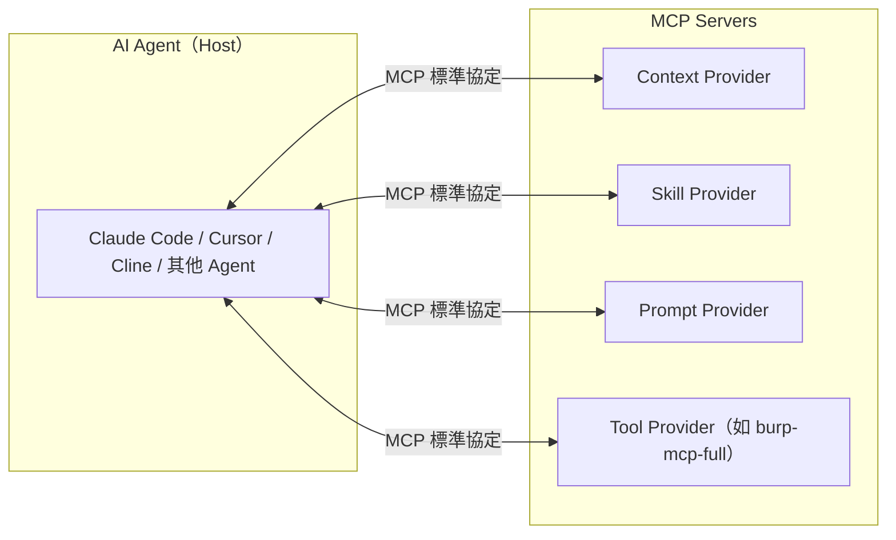

> 💡 **作者觀點**：可以把 MCP 類比為「AI Agent 界的 LSP（Language Server Protocol）」——LSP 讓
> 一套語言分析邏輯可以被多個編輯器共用，MCP 則讓一套資料／工具存取邏輯可以被多個 AI Agent
> 共用，兩者都是用「標準協定」解決「N 個 Agent × M 個工具＝N×M 種客製整合」的組合爆炸問題。
>
> 📌 **Skill 與 MCP 的分工（2026 產業共識，作者補充）**：截至 2026 年，AI Agent 生態圈對「Skill
> 與 MCP 該如何分工」已逐漸收斂出一個經驗法則——**任務是「照著這套步驟做」，用 Skill；任務是
> 「連進那個外部系統」，用 MCP**。Skill（例如 reverse-skill 的 `SKILL.md`）是一份 Agent 讀取後
> 遵循的結構化步驟文件，可以附帶腳本與參考檔案，但執行邏輯是「文件驅動」；MCP 則是一套標準化的
> 「連線協定」，讓 Agent 能呼叫外部工具、查詢外部資料源，執行邏輯是「協定驅動」。多數 2026 年
> 的實務討論指向：**成熟的落地方案通常是「Skill + Subagent + MCP」三者組合**——用 Skill 定義
> 「何時、如何呼叫某個 MCP 工具」的判斷邏輯，MCP 負責實際的外部系統存取，Subagent 則視需要拆分
> 職責與隔離 Context。對照到 reverse-skill 自身，這正是它的架構寫照：`skills/*/SKILL.md` 是
> Skill 層（判斷「何時該用 IDA 還是 radare2」），`burp-mcp-full` 是 MCP 層（實際存取 Burp 代理
> 紀錄），而 `ops/role-map.md` 的 lead／specialist 角色設計則呼應了 Subagent 式的職責拆分——
> reverse-skill 在 MCP 協定於 2024 年底發布後不久即採用這套「三層組合」，某種程度上早於多數企業
> 內部 Agent 平台完成類似的架構收斂。

### 8.2 reverse-skill 如何整合 MCP

reverse-skill 本身以 Markdown Skill 手冊為主體，MCP 在其中扮演「執行層與外部系統之間的標準化
橋樑」角色，最具體的落地案例就是第9章要介紹的 `burp-mcp-full`：Burp Suite 的代理紀錄透過
`mcp-bridge.js` 以 MCP 協定暴露出來，讓支援 MCP 的 AI Agent 可以用統一的介面查詢，而不需要為
「怎麼讀取 Burp 的資料」寫一套 Agent 專屬的整合程式碼。

### 8.3 Context Provider

Context Provider 類型的 MCP Server 負責提供「背景資訊」，例如：企業內部知識庫查詢、過去案例的
`field-journal` 內容查詢、目標系統的資產清冊查詢等。對 reverse-skill 而言，一個可能的擴充方向是
把 `field-journal` 本身包裝成 Context Provider，讓 AI Agent 在路由階段就能透過 MCP 查詢「過去是
否有類似案例」，而不只是被動載入靜態檔案。

### 8.4 Skill Provider

Skill Provider 概念上是把 `skills/` 目錄的技能探索與載入邏輯，從「檔案系統掃描」升級為「MCP
查詢介面」——第2.3節提到的技術債（Skill 數量成長後掃描成本上升）就可以透過建立 Skill Provider
MCP Server 來緩解，讓路由引擎改用結構化查詢而非全目錄掃描。

### 8.5 Prompt Provider

Prompt Provider 提供標準化、版本化的提示詞範本，對應到 reverse-skill 的情境，可以把
`RULES.md`、各 Skill 手冊中反覆使用的分析提示詞模板集中管理，確保多個 Agent、多個團隊使用的是
同一套經過驗證的提示詞版本，而不是各自複製貼上後逐漸產生分歧。

### 8.6 Tool Provider

Tool Provider 是最直接對應「執行層」的 MCP 類型，讓 AI Agent 能呼叫實際工具並取得結構化結果，
`burp-mcp-full` 就是典型的 Tool Provider 實作案例，第9章會詳細介紹其設計。其他潛在的 Tool
Provider 擴充方向包括：靜態分析工具的結構化輸出介面、沙箱動態分析環境的受控呼叫介面等。

### 8.7 實務案例與注意事項

> 💡 **實務案例**：某資安團隊將內部弱點管理系統（Vulnerability Management System）包裝成一個
> Context Provider MCP Server，讓 AI Agent 在產出修補建議前，能先查詢「這個弱點類型過去修補的
> 平均時程與常見解法」，大幅提升修補建議的貼合度，而不需要每次都從零推理。
>
> ⚠️ **注意事項**：MCP Server 本身也是攻擊面的一部分——如果 Tool Provider 的權限設計不當（例如
> 讓 AI Agent 可以透過 MCP 直接發動未經 Scope Guard 檢查的操作），等於在第5、6章建立的縱深防禦
> 之外開了一個後門。**MCP Server 的權限模型必須與 Scope Guard 的授權邊界保持一致**，不能讓
> MCP 成為繞過治理層的捷徑。

### 8.8 本章 Checklist 與小結

- [ ] 理解 MCP 的核心價值是「標準化 Agent 與外部系統的溝通介面」，類比 LSP 之於編輯器
- [ ] 能區分 Context／Skill／Prompt／Tool 四種 Provider 的角色
- [ ] 理解 `burp-mcp-full` 是 Tool Provider 的具體實作案例
- [ ] 已確認團隊若要新增 MCP Server，其權限模型與 Scope Guard 授權邊界一致，不形成治理缺口

> **本章小結**：MCP 是讓 reverse-skill 的「執行層」得以標準化串接外部工具的關鍵協定，但它也
> 擴大了系統的攻擊面，權限設計必須與既有的 Scope Guard 治理保持一致。下一章將聚焦於目前最具體
> 的 MCP 整合案例——Burp MCP。

---

## 第9章 Burp MCP

> 🔒 **本章邊界聲明**：本章內容聚焦於「防禦性安全審查」「合法授權測試場景下的紀錄分析」與
> 「修補建議報告產出」，**不提供、不示範任何未授權攻擊操作、繞過偵測、或實際發動攻擊流量的
> 操作步驟**。若你的用途無法滿足「已取得書面測試授權」的前提，請勿依本章內容操作 Burp Suite
> 或任何滲透測試工具對目標系統發起連線。

### 9.1 Burp Suite 與 MCP 概念回顧

Burp Suite 是業界標準的 Web 應用程式安全測試代理工具，核心能力是攔截、記錄、與（在授權範圍內）
重放 HTTP／HTTPS 流量。傳統上，分析 Burp 收集到的大量代理紀錄高度仰賴人工逐筆檢視，效率有限。
`burp-mcp-full` 的價值在於：**把 Burp 收集到的資料透過 MCP 開放給 AI Agent 做唯讀查詢與分析**，
讓「大量流量紀錄的歸納與模式辨識」這類 AI 擅長的工作交給 AI，而「是否要對目標發起測試流量」這類
需要人類判斷與授權的決策，仍然保留在人類與 Burp 本身的操作流程中。

### 9.2 設計架構

根據公開的專案結構，`burp-mcp-full/` 包含：

- **Burp Suite 擴充套件本體**（Java／Gradle 專案：`build.gradle`、`gradlew`、`src/`）：以 Burp
  官方擴充套件 API 開發，負責在 Burp 內部擷取代理紀錄。
- **`mcp-bridge.js`**：作為 MCP Server，將擴充套件擷取到的資料以 MCP 協定標準化格式對外提供，
  讓 AI Agent 可以查詢。

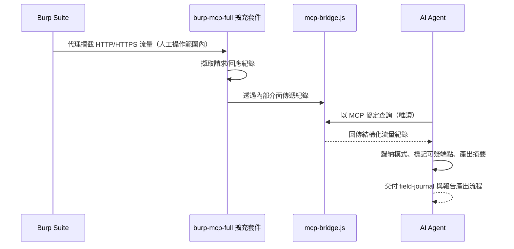

> 📌 **關鍵設計重點**：AI Agent 與 Burp 之間的互動是**單向唯讀查詢**——AI 讀取已經被人工操作
> 產生的流量紀錄進行分析，而不是反過來由 AI 主動操控 Burp 對目標發起新的測試流量。這個「唯讀
> 分析、人工操作」的邊界設計，正是本章聚焦防禦與報告產出、而非攻擊操作的架構基礎。

### 9.3 合法授權測試用途重申

使用 `burp-mcp-full` 的前提，與第5章 Scope Guard 完全一致：

- 必須在 `scope-contract.md` 明確授權的目標範圍內操作 Burp 代理。
- AI Agent 對 MCP 介面的查詢行為本身雖是唯讀，仍應被視為任務的一部分，同樣需要對應的 Case
  Guard 與稽核紀錄。
- 任何超出授權範圍出現在流量紀錄中的資料（例如意外攔截到第三方系統流量），都應該依 Denied
  Scope 原則處理，不應納入分析範圍。

### 9.4 AI 如何協助分析代理紀錄

AI Agent 在唯讀查詢到流量紀錄後，典型的分析協助包括：

| 分析任務 | AI 協助內容 |
| --- | --- |
| 端點盤點 | 從大量請求中歸納出獨特的 API 端點清單與呼叫頻率 |
| 模式辨識 | 找出異常的參數組合、可能的輸入驗證缺口（僅止於「觀察到的模式」描述，不產出實際攻擊 Payload） |
| 認證機制歸納 | 整理觀察到的認證／授權 Header 使用模式，協助判斷是否有不一致之處 |
| 敏感資料掃描 | 標記回應內容中可能出現的敏感資訊（如意外洩漏的內部路徑、除錯訊息） |
| 時間關聯分析 | 對照 `timeline-workitem.md`，協助標記某個時間區段內流量的異常集中情形 |

### 9.5 如何整理發現結果

AI 協助分析後的結果，應依 `skills/ops/evidence-finding-path.md` 規範的路徑與格式整理，典型結構
包含：

```text
findings/
├── F-001-endpoint-inventory.md      # 端點盤點結果
├── F-002-auth-inconsistency.md      # 認證機制不一致觀察
├── F-003-sensitive-data-exposure.md # 疑似敏感資料曝露
└── evidence/
    ├── F-001/  raw-traffic-excerpt.txt（去識別化後的流量片段）
    ├── F-002/  ...
    └── F-003/  ...
```

> 💡 **作者建議**：每一筆發現（Finding）都應該附上「觀察內容」「潛在風險」「建議後續驗證步驟」
> 三欄位，其中「建議後續驗證步驟」應指向**需要人工進一步確認或需要正式滲透測試流程處理**的
> 動作，而不是由 AI 直接產出可執行的攻擊步驟。

### 9.6 如何產出修補建議

修補建議的產出應遵循「防禦導向」原則，聚焦於：

- **輸入驗證強化**：針對觀察到的參數模式，建議伺服器端應加強的驗證規則類型（例如型別、長度、
  白名單字元集），而非示範如何繞過現有驗證。
- **認證與授權一致性**：針對歸納出的認證機制不一致，建議統一的認證中介層設計。
- **敏感資料處理**：針對意外曝露的敏感資訊，建議日誌與錯誤訊息的遮罩處理原則。
- **監控與告警**：建議可以針對觀察到的異常模式，在 WAF／API Gateway 層級增加對應的監控規則。

修補建議報告可交由 `docs-generator`／`diagram-generator` 等 Skill 協助排版與視覺化，最終產出一份
可交付給開發團隊與管理階層的結構化報告。

### 9.7 使用邊界總結

| 允許（本章聚焦範圍） | 不提供（本手冊邊界外） |
| --- | --- |
| 唯讀分析已授權範圍內的代理紀錄 | 主動發動測試流量的具體攻擊步驟 |
| 歸納模式、標記可疑端點 | 產出可直接使用的攻擊 Payload |
| 產出修補建議與防禦性報告 | 教導如何繞過 WAF／偵測機制 |
| 協助建立監控與告警規則建議 | 提供未授權目標的測試指引 |

### 9.8 本章 Checklist 與小結

- [ ] 理解 `burp-mcp-full` 是「AI 唯讀查詢流量紀錄」而非「AI 主動操控 Burp 發動測試」
- [ ] 已確認使用前提符合 Scope Guard 授權範圍與 Case Guard 案件控管
- [ ] 能列出至少 3 類 AI 可協助的流量紀錄分析任務
- [ ] 理解發現結果應包含「觀察內容／潛在風險／建議後續驗證步驟」三欄位
- [ ] 認同修補建議應聚焦防禦導向（輸入驗證、認證一致性、資料遮罩、監控告警）

> **本章小結**：Burp MCP 展示了 reverse-skill「執行層 + MCP + 知識層」如何在一個具體工具鏈上
> 落地，且透過「唯讀查詢、人工操作」的架構設計，把 AI 的角色限定在分析與報告產出，而非攻擊
> 執行。下一章會把視角拉高，介紹 reverse-skill 在完整 AI Coding Workflow（需求到知識更新）中
> 每個階段扮演的角色。

---

## 第10章 AI Coding Workflow

### 10.1 完整流程總覽

把 reverse-skill 的路由、授權、執行、知識四層架構，套進一個標準的軟體交付生命週期，可以得到下圖
這條「需求 → 架構 → 開發 → Review → 安全審查 → 測試 → 部署 → 知識更新」的完整工作流：

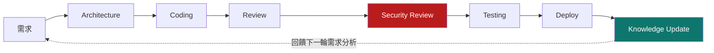

### 10.2 各階段中 reverse-skill 的角色

| 階段 | reverse-skill 扮演的角色 | 對應機制 |
| --- | --- | --- |
| **需求** | 若需求涉及安全評估／逆向分析，路由引擎依需求描述初步分類，並提示需要準備的授權文件 | `MASTER-ROUTING.md` |
| **Architecture** | 提供對應領域（如 API 安全、雲原生安全）的方法論與常見風險清單，輔助架構決策 | `skills/api-security`、`skills/cloud-k8s` 等 |
| **Coding** | 針對安全編碼慣例提供參考（例如輸入驗證、認證機制設計），對應第16章 Web Application 場景 | 對應 Skill 手冊內的最佳實務區塊 |
| **Review** | 一般程式碼審查，若涉及安全敏感邏輯，觸發對應安全 Skill 的檢查清單 | Skill 手冊內建 Checklist |
| **Security Review** | 核心戰場——依 Scope Guard 授權範圍，執行靜態／動態分析，產出安全發現 | 第4～9章完整機制 |
| **Testing** | 安全測試結果與一般功能測試整合，避免安全發現淪為獨立於開發流程外的孤島 | `evidence-finding-path.md` |
| **Deploy** | 部署前的最終風險確認，高風險發現應形成部署阻斷條件（Release Gate） | 對應企業 CI/CD 治理（見第15章） |
| **Knowledge Update** | 案例寫入 `field-journal`，修正未來路由判斷與 Skill 內容 | `field-journal/`、`timeline-workitem.md` |

### 10.3 與傳統 SSDLC 的對照

reverse-skill 的價值不是取代企業既有的安全軟體開發生命週期（SSDLC），而是把 SSDLC 中「安全審查」
這個傳統上高度仰賴資深人力、難以規模化的環節，變成有 AI Agent 輔助、有路由與授權治理的標準流程。

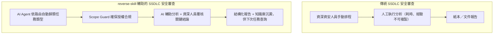

> 💡 **作者建議**：企業導入時務必向團隊清楚定位——AI 輔助的是「分析執行的效率」與「知識的可
> 複製性」，**最終的風險判斷與簽核責任仍在人類資深角色**，這與第6.8節 Responsible AI 的原則
> 一致。

### 10.4 本章 Checklist 與小結

- [ ] 能畫出並說明需求到知識更新的完整八階段流程
- [ ] 能說出 reverse-skill 在每個階段扮演的具體角色與對應機制
- [ ] 理解 reverse-skill 是輔助既有 SSDLC，而非取代人類的風險判斷責任
- [ ] 已規劃高風險安全發現如何形成部署阻斷條件（Release Gate）

> **本章小結**：把 reverse-skill 放進完整的 AI Coding Workflow 後可以發現，它最大的貢獻其實是
> 把「安全審查」與「知識更新」這兩個過去容易被忽略、難以規模化的環節，補進了標準流程中。第11章
> 開始，會把視角轉向更廣泛的一般開發場景，看這套架構理念如何應用在 Framework Upgrade。

---

## 第11章 Framework Upgrade

### 11.1 為什麼 Framework Upgrade 需要「路由＋授權＋知識」的思維

Framework／平台升級（例如 Spring Boot 3→4、.NET 8→9、Vue 2→3）表面上是版本號的變化，實際上牽涉
大量的「相容性分析」「破壞性變更盤點」「Regression 驗證」——這與 reverse-skill 處理逆向工程任務
的思維高度相似：都需要先分類問題類型（哪些是 API 簽章變更、哪些是行為變更）、再決定分析方法
（靜態掃描相依關係、動態跑測試套件驗證），最後把結論沉澱成可複用的知識（升級手冊、已知陷阱清單）。

> 💡 **作者觀點**：這正是第1.3節提到「這套骨架即使場景不是資安逆向，也依然適用」的具體例證。
> 下表把 reverse-skill 的五層架構對應到 Framework Upgrade 的實務場景。

| reverse-skill 五層架構 | Framework Upgrade 對應 |
| --- | --- |
| 規則層 | 企業內部升級政策（例如「LTS 版本才允許升正式環境」） |
| 路由層 | 依技術棧（Java／`.NET`／Node.js／前端框架）導向對應升級方法論 |
| 授權層 | 升級排程與影響範圍核准（哪些服務、哪個時間窗口） |
| 執行層 | 實際執行相依分析、程式碼改寫、測試工具 |
| 知識層 | 升級手冊、已知陷阱清單、Regression 測試結果歸檔 |

### 11.2 各技術棧升級要點與 AI 協作方式

| 技術棧 | 常見升級挑戰 | AI 分析／升級協助 | AI Review／Regression 協助 |
| --- | --- | --- | --- |
| **Spring Boot／Spring Framework** | 自動配置行為變更、`javax.*`→`jakarta.*` 命名空間遷移、Bean 定義規則調整 | 掃描相依版本矩陣、標記已知不相容 Starter | 比對升級前後的 Bean 圖與端點行為差異 |
| **Jakarta EE** | 規範版本與應用伺服器相容矩陣複雜 | 歸納各應用伺服器對目標版本的支援狀態 | 檢查部署描述檔（`web.xml`／註解）相容性 |
| **.NET** | Target Framework 切換、NuGet 套件相容性、執行期行為變更 | 分析 `.csproj` 相依圖、標記已知 Breaking Change | 執行 `dotnet test` 結果比對、標記行為差異 |
| **Vue** | Composition API 遷移、響應式系統行為差異 | 掃描 Options API 使用面、估算遷移工作量 | 元件快照測試比對、行為回歸標記 |
| **React** | 生命週期方法棄用、並行渲染行為變更 | 掃描棄用 API 使用面、建議 Hook 化改寫 | 快照測試與端對端測試比對 |
| **Angular** | 版本間強制升級步驟多、Ivy／Signals 等架構性變更 | 依官方升級指南自動比對版本落差 | 建置產物大小與效能基準比對 |
| **Node.js** | 執行環境層級的相容性（原生模組、V8 行為） | 掃描原生相依套件相容性 | 執行期效能與記憶體使用比對 |
| **Maven** | 外掛版本矩陣、Java 版本相依 | 分析 `pom.xml` 相依樹衝突 | 建置產物與測試報告比對 |
| **Gradle** | DSL 語法變更（Groovy／Kotlin DSL）、外掛相容性 | 掃描 `build.gradle` 使用的棄用 API | 建置時間與快取命中率比對 |
| **Legacy Modernization** | 技術棧老舊、文件缺失、測試覆蓋率低 | 靜態分析建立系統地圖、補建測試安全網 | 逐步遷移過程中的行為等價性驗證 |

### 11.3 AI 協助升級的四個步驟

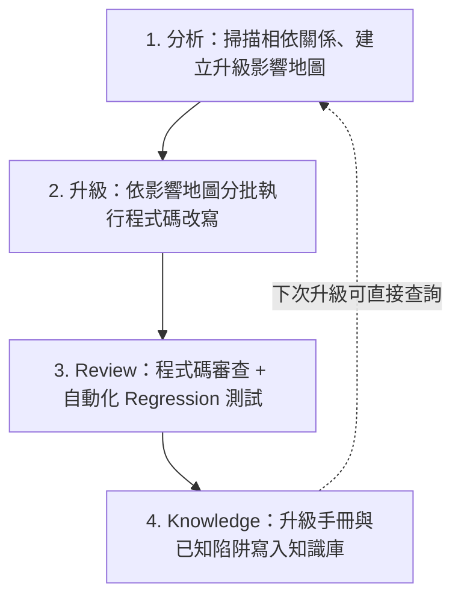

1. **分析（Analyze）**：AI Agent 掃描專案相依關係、比對目標版本的官方遷移指南，產出「影響範圍
   地圖」——哪些模組會被直接影響、哪些是間接影響。
2. **升級（Upgrade）**：依影響範圍地圖，分批（而非一次性）執行程式碼改寫，優先處理風險最低、
   驗證最容易的模組，建立信心後再處理核心模組。
3. **Review**：程式碼審查搭配自動化 Regression 測試，AI 可協助標記「行為疑似改變」的測試案例，
   交由人類判斷是預期內的變更還是升級引入的缺陷。
4. **Knowledge**：把這次升級遇到的陷阱、解法、耗時估算寫入知識庫，格式可比照 `field-journal`
   的結構，供下次同類升級（或其他團隊）查詢參考。

> ⚠️ **注意事項**：AI 協助 Framework Upgrade 最大的風險是「看似編譯成功、實則行為已悄悄改變」
> （例如序列化格式、時區處理、預設值變更），這類問題單靠編譯器與型別檢查無法攔截，**必須依賴
> 完整的 Regression 測試與生產前的灰度驗證**，AI 分析只能降低遺漏的機率，不能保證零風險。

### 11.4 實戰案例：程式碼對照

> 以下四個案例示範 AI Agent 在「分析→升級→Review→Knowledge」四步驟中，實際會處理的程式碼層級
> 變更，皆為**作者依各技術棧官方遷移指南整理的示意範例**，實際專案的變更複雜度通常更高。

#### 11.4.1 案例一：Spring Boot 3 → 4（`javax.*` → `jakarta.*` 與安全設定）

```java
// 升級前（Spring Boot 3.x，Spring Security 舊式設定）
@Configuration
@EnableWebSecurity
public class SecurityConfig extends WebSecurityConfigurerAdapter {

    @Override
    protected void configure(HttpSecurity http) throws Exception {
        http.authorizeRequests()
            .antMatchers("/api/public/**").permitAll()
            .anyRequest().authenticated();
    }
}
```

```java
// 升級後（Spring Boot 4.x，Lambda DSL + jakarta 命名空間）
@Configuration
@EnableWebSecurity
public class SecurityConfig {

    @Bean
    public SecurityFilterChain filterChain(HttpSecurity http) throws Exception {
        http.authorizeHttpRequests(auth -> auth
                .requestMatchers("/api/public/**").permitAll()
                .anyRequest().authenticated());
        return http.build();
    }
}
```

**AI 分析階段可協助標記**：`WebSecurityConfigurerAdapter` 已於 Spring Security 較新版本移除，
`antMatchers` 改名為 `requestMatchers`，`javax.servlet.*` 需全面改為 `jakarta.servlet.*`。這類
「編譯器會直接報錯」的變更相對容易被 AI 掃描找出，真正的風險在於**安全設定的行為等價性**——
Lambda DSL 改寫後，授權規則的比對順序若有疏漏，可能悄悄放寬或收緊存取權限，這正是11.3節提到
「看似編譯成功、行為卻悄悄改變」的典型案例，**必須搭配針對每條授權規則的 Regression 測試**。

#### 11.4.2 案例二：.NET Framework → .NET 8+（Target Framework 與最小 API）

```xml
<!-- 升級前：.csproj（.NET Framework 4.8） -->
<Project Sdk="Microsoft.NET.Sdk.Web">
  <PropertyGroup>
    <TargetFramework>net48</TargetFramework>
  </PropertyGroup>
</Project>
```

```xml
<!-- 升級後：.csproj（.NET 8） -->
<Project Sdk="Microsoft.NET.Sdk.Web">
  <PropertyGroup>
    <TargetFramework>net8.0</TargetFramework>
    <Nullable>enable</Nullable>
    <ImplicitUsings>enable</ImplicitUsings>
  </PropertyGroup>
</Project>
```

**AI 分析階段可協助標記**：啟用 `<Nullable>enable</Nullable>` 後，大量既有程式碼會出現可為
Null 參考型別的編譯警告，AI 可協助批次分類「真正可能為 Null 需要處理」與「型別系統過度保守
的誤報」，大幅減少人工逐一排查的工作量；同時掃描 NuGet 相依套件是否有官方標示的 .NET 8 相容
版本。

#### 11.4.3 案例三：Vue 2（Options API）→ Vue 3（Composition API）

```javascript
// 升級前：Vue 2 Options API
export default {
  data() {
    return { count: 0 };
  },
  computed: {
    doubled() {
      return this.count * 2;
    }
  },
  methods: {
    increment() {
      this.count++;
    }
  }
};
```

```javascript
// 升級後：Vue 3 Composition API
import { ref, computed } from "vue";

export default {
  setup() {
    const count = ref(0);
    const doubled = computed(() => count.value * 2);
    function increment() {
      count.value++;
    }
    return { count, doubled, increment };
  }
};
```

**AI 分析階段可協助標記**：`data`／`computed`／`methods` 這類 Options API 使用面可以被批次
掃描並估算遷移工作量（依元件複雜度分級），AI 也能協助產生 Composition API 改寫的初版草稿，
但**響應式系統的行為細節**（例如 `ref` 與 `reactive` 的解構陷阱）需要人工覆核，避免改寫後
響應性意外失效。

#### 11.4.4 案例四：React Class Component → Function Component + Hooks

```jsx
// 升級前：Class Component
class Counter extends React.Component {
  state = { count: 0 };
  componentDidMount() {
    document.title = `Count: ${this.state.count}`;
  }
  componentDidUpdate() {
    document.title = `Count: ${this.state.count}`;
  }
  increment = () => this.setState({ count: this.state.count + 1 });
  render() {
    return <button onClick={this.increment}>{this.state.count}</button>;
  }
}
```

```jsx
// 升級後：Function Component + Hooks
function Counter() {
  const [count, setCount] = useState(0);
  useEffect(() => {
    document.title = `Count: ${count}`;
  }, [count]);
  return <button onClick={() => setCount(count + 1)}>{count}</button>;
}
```

**AI 分析階段可協助標記**：`componentDidMount` ＋ `componentDidUpdate` 兩個生命週期方法合併
成單一 `useEffect`，是最容易被誤譯的模式之一（常見錯誤是遺漏依賴陣列 `[count]` 導致 Effect
只執行一次或每次 render 都執行）。AI 產出的初版改寫草稿**務必人工覆核依賴陣列的正確性**，這
類疏漏編譯器完全無法攔截，只有執行期行為測試才能發現。

#### 11.4.5 四個案例的共同教訓

| 案例 | 編譯器可攔截的變更 | 編譯器攔截不到、需 Regression 測試把關的風險 |
| --- | --- | --- |
| Spring Boot | `javax`→`jakarta` 命名空間、已移除的類別 | 安全授權規則的行為等價性 |
| .NET | Target Framework 不相容的 API | Nullable 參考型別的實際執行期行為 |
| Vue | 無（Composition API 為新增而非取代語法） | 響應式系統的解構陷阱 |
| React | 無（Hooks 為新增而非取代語法） | `useEffect` 依賴陣列疏漏 |

> 💡 **作者觀點**：四個案例呈現一個共同模式——**編譯器容易攔截的是「語法層級」變更，容易被
> 忽略的是「行為層級」變更**。這正是第11.3節反覆強調「AI 分析只能降低遺漏機率、不能保證零
> 風險」的原因，也是為什麼 Framework Upgrade 案例特別適合寫入 `field-journal`（第14章）：
> 「這次升級悄悄改變行為的地方」是最值得被下次同類升級查詢複用的知識。

### 11.5 本章 Checklist 與小結

- [ ] 理解 reverse-skill「路由＋授權＋知識」的架構思維可遷移到 Framework Upgrade 場景
- [ ] 已針對團隊主要技術棧盤點升級時的常見挑戰
- [ ] 已建立「分析→升級→Review→Knowledge」四步驟的標準升級流程
- [ ] 理解 AI 協助升級的風險在於「行為悄悄改變」，需搭配完整 Regression 測試把關
- [ ] 已對照 11.4 節案例，理解「編譯器可攔截」與「需 Regression 測試把關」兩類風險的差異

> **本章小結**：Framework Upgrade 是 reverse-skill 治理理念遷移到一般開發場景的最佳示範，第16章
> 會進一步展開到完整 Web Application 生命週期。接下來第12、13章會回到 reverse-skill 的本業——
> Reverse Engineering 與 Skill Modules 的深度介紹。

---

## 第12章 Reverse Engineering（逆向工程）

> 🔒 **本章邊界聲明**：本章內容聚焦於「合法授權研究」「防禦分析」「相容性研究」與「教育訓練」，
> 目的是說明各類逆向工程工具的**定位、用途與和 AI 協作的方式**，而非提供實際的破解、繞過保護
> 機制或未授權分析步驟。所有工具的介紹皆假設使用者已在合法授權（自有系統研究、書面授權測試、
> 相容性驗證、資安教育訓練）的前提下使用。

### 12.1 逆向工程的核心分類

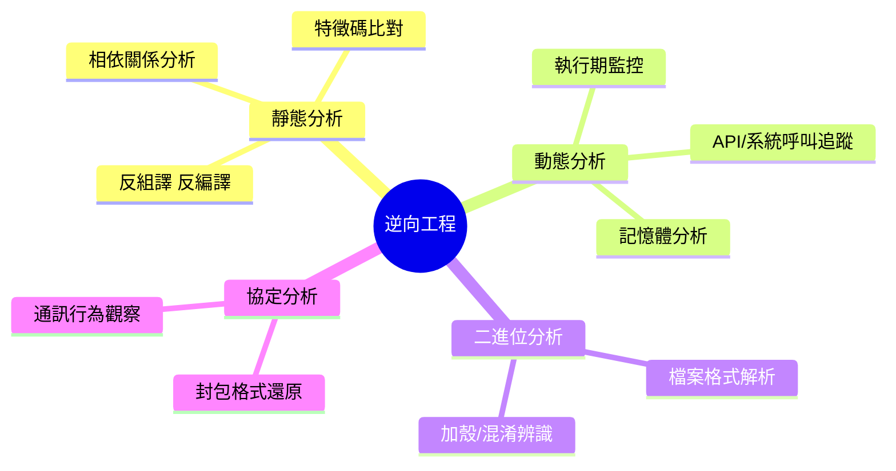

- **靜態分析（Static Analysis）**：不執行目標程式，直接分析其程式碼、位元組碼或二進位內容，
  優點是安全（不會誤觸發惡意行為）、可規模化，缺點是無法觀察執行期才會出現的行為（如動態載入、
  加密解密邏輯）。
- **動態分析（Dynamic Analysis）**：在受控環境（沙箱、虛擬機）中實際執行目標程式並觀察其行為，
  優點是能看到真實執行路徑，缺點是需要嚴格的環境隔離（對應第5.3節 Network Profile），且可能
  觸發目標程式的反分析機制。
- **二進位分析（Binary Analysis）**：聚焦於執行檔本身的格式、加殼／混淆狀態辨識，通常是靜態或
  動態分析前的準備步驟。
- **協定分析（Protocol Analysis）**：還原網路通訊的封包格式與行為模式，常見於相容性研究（例如
  分析老舊系統的私有協定，以利現代化改寫）。

### 12.2 分析標的類型與對應 Skill

| 標的類型 | 常見情境 | 對應 `skills/` 子目錄 |
| --- | --- | --- |
| APK（Android） | App 安全審查、第三方 SDK 行為驗證 | `apk-reverse`、`mobile-reverse` |
| iOS／行動端 | 跨平台行動應用安全評估 | `mobile-reverse` |
| .NET 組件 | 內部工具相容性研究、授權合規驗證 | `dotnet-reverse` |
| JavaScript（含混淆） | 前端邏輯還原、供應鏈風險評估 | `js-reverse` |
| 韌體（Firmware） | IoT／嵌入式設備安全評估 | `firmware-pentest` |
| Web 應用 | 滲透測試、API 安全評估 | `pentest-tools`、`api-security` |
| 通訊協定 | 私有協定還原、相容性改寫 | 對應 `references`／協定分析類技能 |
| DLL／原生模組 | Windows 環境相依分析、惡意程式辨識 | `windows-ad`、`malware-analysis` |

### 12.3 常見工具的定位與 AI 協作方式

| 工具 | 定位 | 典型用途 | AI 如何協作 |
| --- | --- | --- | --- |
| **IDA（IDA Pro）** | 業界標準的商用反組譯／除錯平台 | 深度靜態分析、手動標註函式邏輯 | AI 協助歸納已標註函式的模式、產出函式功能摘要文件，加速人工複核 |
| **Ghidra** | NSA 開源的反組譯平台，功能與 IDA 高度重疊 | 免費、可腳本化的靜態分析 | AI 協助撰寫／檢閱 Ghidra 腳本，歸納反組譯輸出的可讀性摘要 |
| **radare2** | 開源、高度可腳本化的逆向工程框架 | 命令列導向的靜態／動態分析、CTF 常用 | AI 協助生成 r2 指令序列建議、解讀輸出結果 |
| **Frida** | 動態插樁（Instrumentation）框架 | 執行期 Hook、觀察函式呼叫與參數 | AI 協助撰寫 Hook 腳本草稿（人工審查後於受控沙箱執行）、歸納執行期觀察紀錄 |
| **JADX** | Android DEX 轉可讀 Java 原始碼的反編譯工具 | APK 快速取得可讀原始碼 | AI 協助閱讀反編譯輸出、標記可疑邏輯供人工複核 |

> 💡 **作者觀點**：注意上表「AI 如何協作」欄位的共同模式——AI 扮演的是**閱讀理解、歸納摘要、
> 草稿產出**的角色，實際的工具操作（尤其是動態插樁、除錯這類會影響執行環境的動作）仍需要人工
> 在受控沙箱中確認執行，這與第9章 Burp MCP「唯讀分析、人工操作」的設計精神一致。

### 12.4 靜態與動態分析的決策樹

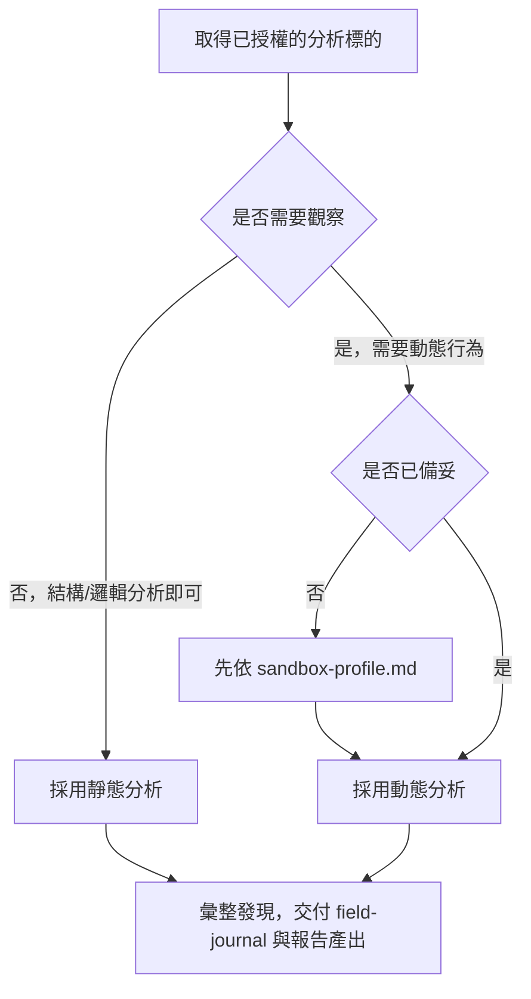

### 12.5 相容性研究與教育用途

除了安全審查，逆向工程工具在以下場景同樣有正當且常見的用途：

- **相容性研究**：分析老舊系統的私有檔案格式或通訊協定，以利現代化改寫或與新系統對接（呼應
  第11章 Legacy Modernization）。
- **供應鏈驗證**：驗證第三方交付的二進位組件是否與其聲稱的原始碼／規格一致。
- **教育訓練**：透過 CTF（第 12.6 節）與受控樣本，訓練新進資安工程師建立方法論直覺，這也是
  `CTF-Sandbox-Orchestrator` 存在的核心價值。

### 12.6 CTF 與訓練場景

CTF（Capture The Flag）競賽與訓練題目提供了一個**天然合法、風險可控**的逆向工程練習場景——題目
本身就是為了被分析而設計，不涉及未授權目標的疑慮。`CTF-Sandbox-Orchestrator` 依題型（pwn、
reverse、web、crypto、misc 等）將對應方法論與工具鏈編排成沙箱化的練習流程，是團隊教育訓練的
理想起點，也是本手冊建議企業導入時**優先從這個模組開始试點**的原因之一（詳見第21、24章）。

### 12.7 本章 Checklist 與小結

- [ ] 理解靜態、動態、二進位、協定分析四種逆向工程分類的定位與取捨
- [ ] 能對照分析標的類型（APK／.NET／JS／韌體…）找到對應的 `skills/` 子目錄
- [ ] 理解 IDA／Ghidra／radare2／Frida／JADX 等工具的定位差異與 AI 協作模式
- [ ] 認同 AI 在逆向工程中的角色是「閱讀理解、歸納摘要」而非「取代人工的動態操作決策」
- [ ] 理解 CTF 訓練場景是合法、風險可控的逆向工程教育起點

> **本章小結**：逆向工程工具生態龐大且各有專精，reverse-skill 的價值在於用 Skill 手冊把「什麼
> 情境該用什麼工具」的判斷邏輯結構化，並透過 AI 的閱讀理解能力加速分析，同時嚴守「唯讀分析、
> 人工操作動態行為」的邊界。下一章將逐一介紹 `skills/` 底下的技能模組全貌。

---

## 第13章 Skill Modules

### 13.1 技能模組總覽與分類

`skills/` 底下 40 餘個技能子目錄，可依性質歸納為六大類：

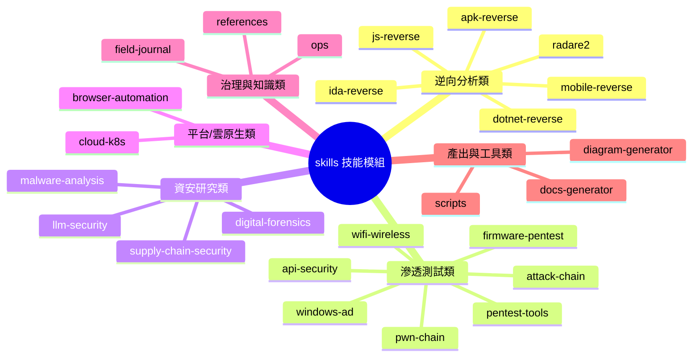

### 13.2 逐項技能模組說明

以下依「用途／適合工作／輸入／輸出／Workflow／Best Practice／限制」逐一整理主要技能模組（依公開
資訊整理與**作者歸納**，各技能內部細節請以官方 `SKILL.md` 為準）：

| Skill | 用途 | 適合工作 | 典型輸入 | 典型輸出 | 限制 |
| --- | --- | --- | --- | --- | --- |
| `apk-reverse` | Android APK 靜態／結構分析 | App 安全審查、第三方 SDK 驗證 | `.apk` 檔案 | 元件清單、權限分析、可疑邏輯標註 | 需搭配 `mobile-reverse` 處理跨平台情境 |
| `mobile-reverse` | 行動應用（Android／iOS）通用逆向方法論 | 跨平台行動安全評估 | App 安裝包／執行檔 | 方法論指引、平台差異對照 | 平台特定深度細節仍需專用技能補強 |
| `js-reverse` | JavaScript（含混淆／壓縮）邏輯還原 | 前端邏輯審查、供應鏈風險評估 | `.js`／打包後程式碼 | 反混淆後邏輯摘要 | 高強度混淆或加殼需搭配動態分析 |
| `dotnet-reverse` | .NET 組件反編譯與分析 | 內部工具相容性研究 | `.dll`／`.exe`（.NET） | 反編譯後可讀原始碼摘要 | 商用混淆保護需額外工具鏈 |
| `ida-reverse` | IDA 平台操作方法論與腳本協作 | 深度二進位靜態分析 | 二進位檔 | 函式標註、分析腳本草稿 | 商用授權工具，需另行取得 IDA 授權 |
| `radare2` | r2 生態系操作方法論 | 命令列導向逆向分析、CTF | 二進位檔 | r2 指令序列、分析筆記 | 學習曲線較陡，適合有基礎的使用者 |
| `pentest-tools` | 通用滲透測試方法論彙整 | Web／網路滲透測試流程規劃 | 授權範圍與目標清單 | 測試計畫、方法論指引 | 需先通過 Scope Guard 授權比對 |
| `attack-chain` | 攻擊鏈路徑歸納（防禦視角） | 威脅建模、防禦優先順序規劃 | 已知弱點清單 | 攻擊路徑圖、防禦優先建議 | 聚焦防禦規劃，非攻擊腳本產出 |
| `pwn-chain` | 二進位漏洞利用鏈方法論（CTF／研究導向） | CTF pwn 類題目訓練 | CTF 題目樣本 | 方法論步驟、學習筆記 | 僅限授權沙箱與競賽環境 |
| `firmware-pentest` | 韌體安全評估方法論 | IoT／嵌入式設備安全審查 | 韌體映像檔 | 檔案系統結構、風險標註 | 需搭配硬體層知識與合法授權 |
| `api-security` | API 安全評估方法論 | REST／GraphQL API 安全審查 | API 規格／流量紀錄 | 風險清單、修補建議 | 與 `burp-mcp-full` 高度互補 |
| `windows-ad` | Windows Active Directory 安全評估方法論 | 企業內網安全稽核 | AD 環境資訊 | 風險路徑歸納、加固建議 | 高風險操作需嚴格 Case Guard 控管 |
| `wifi-wireless` | 無線網路安全評估方法論 | 內部無線網路稽核 | 無線環境資訊 | 風險評估報告 | 需符合當地電波法規與授權 |
| `malware-analysis` | 惡意程式分析方法論（防禦導向） | 樣本分類、行為歸納 | 可疑樣本 | 行為摘要、IOC（危害指標）清單 | 動態分析須嚴格沙箱隔離 |
| `supply-chain-security` | 軟體供應鏈風險評估 | SBOM／相依套件風險審查 | 相依清單／建置流程 | 風險評分、SBOM 報告 | 需搭配第15章 SCA 工具鏈 |
| `llm-security` | AI／LLM 應用安全評估方法論 | Prompt Injection／模型濫用風險評估 | AI 應用架構描述 | 風險清單、防護建議 | 與第5.8節防禦設計高度相關 |
| `digital-forensics` | 數位鑑識方法論 | 事件回應、證據保全 | 受影響系統映像 | 鑑識報告、時間軸還原 | 需符合證據保全法律程序 |
| `cloud-k8s` | 雲原生／Kubernetes 安全評估 | 容器與雲端環境安全審查 | 叢集設定、Manifest | 風險清單、加固建議 | 需授權存取雲端環境 |
| `browser-automation` | 瀏覽器自動化輔助分析 | Web 應用行為觀察與紀錄 | 目標網頁 | 操作紀錄、行為快照 | 僅限已授權目標 |
| `docs-generator` | 分析結果文件化 | 報告／手冊產出 | 分析發現、案例紀錄 | 結構化 Markdown／報告文件 | 產出品質仰賴輸入資料完整度 |
| `diagram-generator` | 架構圖／流程圖產出 | 視覺化分析結果與架構 | 文字描述、結構資料 | Mermaid／流程圖檔案 | 複雜圖表仍需人工微調 |
| `field-journal` | 知識日誌記錄與查詢 | 案例沉澱與複用 | 任務執行紀錄 | 結構化案例文件 | 需定期治理避免內容雜亂 |
| `ops`（含 `scope-contract.md` 等） | 授權治理、角色權限、沙箱設定 | Scope Guard 全套機制 | 授權文件、角色定義 | 授權比對結果、核准紀錄 | 需企業自行維運治理流程 |
| `references` | 通用參考資料與 Fallback 落點 | 新任務類型的初步查詢 | 任務描述 | 相關背景資訊 | 非正式 Skill，僅作補充 |
| `scripts` | 輔助自動化腳本集合 | 環境檢查、工具鏈引導 | 執行環境資訊 | 自動化檢查結果 | 腳本執行仍受 sandbox-profile 限制 |

### 13.3 旗艦技能深度剖析（10 項）

> 本節挑選 10 個最具代表性的技能模組，依「用途／適合＆不適合工作／輸入輸出／Workflow／Best
> Practice／限制／實務案例」逐一深度剖析，作為 13.2 節速查表的延伸，方便團隊在真正導入前，
> 對高頻使用的 Skill 有更完整的認識。

#### 13.3.1 `apk-reverse`

**用途**：對 Android APK 進行靜態結構分析，盤點元件（Activity／Service／Receiver／Provider）、
權限宣告、資源檔與程式碼邏輯，是 Android 安全審查的入口技能。

**適合工作**：企業內部 App 上架前審查、第三方 SDK 行為驗證、舊版 App 的相依套件盤點。
**不適合工作**：需要觀察執行期行為（如動態載入的惡意邏輯）的情境，需搭配動態分析補強。

| 項目 | 內容 |
| --- | --- |
| 典型輸入 | `.apk` 檔案（已取得授權的測試建置版本） |
| 典型輸出 | 元件清單、權限風險表、可疑邏輯標註清單、JADX 反編譯後的原始碼摘要 |
| 主要協作技能 | `mobile-reverse`（跨平台方法論）、`js-reverse`（若含 WebView／Hybrid 邏輯） |

```mermaid
flowchart LR
    A["取得已授權 APK"] --> B["解包：AndroidManifest / 資源 / dex"]
    B --> C["JADX 反編譯取得可讀原始碼"]
    C --> D["AI 歸納元件清單與權限風險"]
    D --> E["標記可疑邏輯（如硬編碼金鑰）"]
    E --> F["產出審查報告，交付 field-journal"]
```

✅ **Best Practice**：優先檢查 `AndroidManifest.xml` 宣告的權限是否與 App 實際功能相符（過度
索取權限是常見風險訊號）；反編譯後的程式碼應先做套件結構掃描，再深入個別可疑類別，避免逐檔
盲目閱讀。

❌ **限制**：商用等級的程式碼混淆／加固（如 ProGuard／DexGuard 深度處理）會大幅降低反編譯後的
可讀性，此時需要搭配 `mobile-reverse` 中更進階的方法論，或轉向動態分析。

> 💡 **實務案例**：某金融 App 上架前審查，AI 協助歸納出 3 個第三方 SDK 要求了「讀取簡訊」權限
> 但 App 功能說明未提及簡訊相關用途，經覆核確認是舊版驗證碼機制殘留的過度授權，及早在上架前
> 移除，避免上架後被應用商店或監理單位質疑。

#### 13.3.2 `js-reverse`

**用途**：還原 JavaScript（含前端打包壓縮、輕度混淆）程式碼的邏輯結構，協助理解前端業務邏輯或
供應鏈風險。

**適合工作**：前端邏輯審查（如驗證邏輯是否僅存在前端、缺乏後端二次驗證）、第三方腳本供應鏈
行為評估。
**不適合工作**：高強度商用混淆（如控制流平坦化＋字串加密組合）的還原，準確率會明顯下降。

| 項目 | 內容 |
| --- | --- |
| 典型輸入 | `.js`／打包後的 bundle 檔案 |
| 典型輸出 | 反混淆後邏輯摘要、可疑呼叫（如動態 `eval`）標註、第三方請求端點清單 |
| 主要協作技能 | `api-security`（前端呼叫的後端端點延伸評估） |

✅ **Best Practice**：先用工具做變數重命名與格式化的「表層還原」，讓 AI 閱讀時的語意雜訊降到
最低，再進入邏輯層面的歸納；針對第三方腳本，優先比對是否有已知供應鏈風險資料庫紀錄。

❌ **限制**：無法保證 100% 還原原始邏輯，複雜的控制流混淆需要人工介入交叉驗證 AI 的推論結果。

#### 13.3.3 `dotnet-reverse`

**用途**：針對 .NET 組件（`.dll`／`.exe`）進行反編譯與結構分析，常用於內部工具的相容性研究或
授權合規驗證。

**適合工作**：舊版內部工具在無原始碼情況下的維護評估、驗證第三方 .NET 元件是否符合授權聲明。

| 項目 | 內容 |
| --- | --- |
| 典型輸入 | `.dll`／`.exe`（.NET Framework 或 .NET / .NET Core） |
| 典型輸出 | 反編譯後可讀原始碼摘要、命名空間與類別關係圖、相依組件清單 |
| 主要協作技能 | `windows-ad`（若涉及企業內網整合元件）、`supply-chain-security` |

✅ **Best Practice**：先確認組件是 .NET Framework 還是 .NET / .NET Core（IL 結構與工具鏈選用
不同），再決定反編譯策略；建議搭配第11.2節 .NET 升級案例交叉比對版本演進脈絡。

❌ **限制**：商用混淆保護（如 ConfuserEx、Dotfuscator 進階模式）需要額外的反混淆工具鏈，非本
Skill 內建能力範圍。

#### 13.3.4 `api-security`

**用途**：對 REST／GraphQL API 進行安全評估，涵蓋認證機制、輸入驗證、資料曝露風險等面向。

**適合工作**：新 API 上線前審查、既有 API 的定期安全稽核、與 `burp-mcp-full` 搭配分析既有
流量紀錄。

| 項目 | 內容 |
| --- | --- |
| 典型輸入 | API 規格文件（OpenAPI／GraphQL Schema）、`burp-mcp-full` 唯讀查詢到的流量紀錄 |
| 典型輸出 | 風險清單（依 OWASP API Security Top 10 分類）、修補建議報告 |
| 主要協作技能 | `burp-mcp-full`（第9章）、`supply-chain-security`（第三方 API 相依） |

```mermaid
flowchart TD
    A["取得 API 規格 / 流量紀錄"] --> B["歸納端點清單與認證模式"]
    B --> C["比對 OWASP API Top 10 分類"]
    C --> D{"發現風險？"}
    D -->|"是"| E["產出風險清單 + 修補建議"]
    D -->|"否"| F["記錄為已驗證安全基準"]
    E --> G["field-journal 歸檔"]
    F --> G
```

✅ **Best Practice**：優先檢查「物件層級授權」（BOLA／IDOR 類風險，OWASP API Top 10 常年
第一名）——即使認證機制正確，是否每個端點都正確檢查「這個使用者能不能存取這筆資料」。

❌ **限制**：純粹依賴規格文件分析無法發現「規格沒寫但實際存在」的隱藏端點，仍需搭配流量紀錄
或人工測試補強。

#### 13.3.5 `malware-analysis`

**用途**：以防禦視角對可疑樣本進行行為分類與歸納，產出危害指標（IOC）供後續防護規則使用。

**適合工作**：資安事件回應時的樣本初步分類、威脅情資（Threat Intelligence）豐富化。

| 項目 | 內容 |
| --- | --- |
| 典型輸入 | 可疑樣本（已於隔離沙箱取得） |
| 典型輸出 | 行為摘要、IOC 清單（雜湊值、網路特徵、檔案路徑特徵） |
| 主要協作技能 | `digital-forensics`（事件回應鏈的前後步驟）、`ida-reverse`／`radare2` |

✅ **Best Practice**：動態分析一律在與正式網段隔離的沙箱執行（呼應第5.3節 Network Profile），
且沙箱應能捕捉網路行為（即使阻斷實際連線，也要記錄嘗試連線的目標）。

❌ **限制**：具備反沙箱偵測能力的樣本可能在沙箱環境中隱藏真實行為，分析結論需要標註「在此
沙箱設定下觀察到」的限定條件，避免過度自信的結論。

#### 13.3.6 `cloud-k8s`

**用途**：評估容器與 Kubernetes 叢集設定的安全性，涵蓋 RBAC、Network Policy、Pod Security 等
面向。

**適合工作**：雲原生架構上線前審查、既有叢集的定期設定稽核。

| 項目 | 內容 |
| --- | --- |
| 典型輸入 | 叢集設定匯出、Helm Chart／Kustomize Manifest |
| 典型輸出 | 風險清單（依 CIS Kubernetes Benchmark 分類）、加固建議 Patch |
| 主要協作技能 | `api-security`（叢集內部 API 曝露評估） |

✅ **Best Practice**：優先檢查是否有過度寬鬆的 RBAC 綁定（如 `cluster-admin` 被綁定給非必要
的 ServiceAccount）與預設允許全部流量的 Network Policy（或缺乏 Network Policy）。

❌ **限制**：需要實際存取叢集設定（唯讀權限即可），純粹的原始碼審查無法發現執行期才會出現的
設定漂移（Configuration Drift）。

#### 13.3.7 `windows-ad`

**用途**：評估 Windows Active Directory 環境的安全設定，歸納潛在的權限提升路徑供防禦規劃參考。

**適合工作**：企業內網安全稽核、紅隊演練後的防禦優先順序規劃。
**不適合工作**：即時性的入侵應變（應交由 `digital-forensics` 搭配正式事件回應流程處理）。

| 項目 | 內容 |
| --- | --- |
| 典型輸入 | AD 環境資訊匯出（如 `BloodHound` 類工具產出的關係資料，經授權蒐集） |
| 典型輸出 | 高風險權限路徑圖、帳號／群組加固優先順序建議 |
| 主要協作技能 | `pentest-tools`（整體滲透測試計畫的一環）、`attack-chain`（路徑歸納方法論共通） |

```mermaid
flowchart TD
    A["取得已授權 AD 環境關係資料"] --> B["建立帳號/群組/主機關聯圖"]
    B --> C["歸納可達最高權限的路徑"]
    C --> D["依路徑出現頻率排序加固優先順序"]
    D --> E["產出藍隊加固建議報告"]
```

✅ **Best Practice**：分析輸出應聚焦「攻擊路徑圖」而非「攻擊步驟教學」——目的是讓藍隊知道
「哪些帳號／群組組合是高風險路徑」，以便優先加固，而非提供可執行的提權腳本。

❌ **限制**：AD 環境的變動頻繁，分析結果應標註取樣時間點，並建議搭配定期（而非一次性）評估。

> 💡 **實務案例**：某企業 IT 部門發現，AI 歸納出的高風險路徑中，超過六成都經過同一個「所有
> IT 人員共用」的服務帳號，優先重新設計該帳號的權限範圍後，整體可達最高權限的路徑數量下降了
> 約七成，是本案例中投資報酬率最高的單一加固動作。

#### 13.3.8 `digital-forensics`

**用途**：協助事件回應時的證據保全與時間軸還原，是防禦與究責流程的關鍵技能。

**適合工作**：資安事件發生後的影響範圍還原、內部違規調查的時間軸整理。
**不適合工作**：需要即時阻斷攻擊行為的應變當下（應優先由既定的事件回應 SOP 與人工處置）。

| 項目 | 內容 |
| --- | --- |
| 典型輸入 | 受影響系統的唯讀備份或映像檔、日誌匯出 |
| 典型輸出 | 時間軸還原文件、影響範圍摘要、佐證證據索引 |
| 主要協作技能 | `malware-analysis`（若事件涉及惡意樣本）、`evidence-finding-path.md`（第6.5節） |

✅ **Best Practice**：證據保全應優先確保「不竄改原始證據」，AI 協助的是**唯讀分析既有備份或
映像檔**，任何可能修改原始系統狀態的操作都應排除在 AI 協作範圍外；時間軸還原建議統一使用
UTC 時間並標註原始時區，避免跨系統日誌比對時發生時差誤判。

❌ **限制**：正式的數位鑑識程序在多數法域有嚴格的證據鏈（Chain of Custody）要求，AI 產出的
分析僅能作為輔助材料，最終的法律效力仍需專業鑑識人員與正式程序背書。

#### 13.3.9 `llm-security`

**用途**：評估企業自身 AI／LLM 應用的安全性，涵蓋 Prompt Injection、資料外洩、模型濫用等風險，
與第5.8節的防禦設計原則高度呼應——某種程度上，這個 Skill 是把 reverse-skill 自身的安全設計
理念，反過來套用到「評估其他 AI 應用是否安全」這個任務上。

**適合工作**：企業內部 AI 應用（客服機器人、內部知識庫助理等）上線前的安全評估。

| 項目 | 內容 |
| --- | --- |
| 典型輸入 | 目標 AI 應用的架構描述、Prompt 範本、工具呼叫權限清單 |
| 典型輸出 | 風險清單（依信任邊界設計、資料外洩路徑、工具權限分類）、防護建議 |
| 主要協作技能 | `api-security`（若 AI 應用以 API 形式對外提供服務） |

✅ **Best Practice**：評估目標系統是否明確區分「使用者指令」與「外部資料」的信任層級（第5.8節
核心原則），這是 LLM 應用安全評估中最關鍵的檢查項目；同時檢查該 AI 應用被授予的工具呼叫權限
是否遵循最小權限原則（第6.2節）。

❌ **限制**：LLM 安全研究領域演進極快，新型態的注入手法持續出現，本 Skill 內容需要比其他技能
更高頻率的覆核與更新。

#### 13.3.10 `supply-chain-security`

**用途**：評估軟體供應鏈風險，包含相依套件已知漏洞、授權合規、SBOM 產出。

**適合工作**：新專案技術選型時的相依套件風險評估、既有系統的定期供應鏈稽核。

| 項目 | 內容 |
| --- | --- |
| 典型輸入 | 相依套件清單（`pom.xml`／`package.json`／`*.csproj` 等）、建置流程描述 |
| 典型輸出 | 風險評分表、SBOM（CycloneDX／SPDX 格式）、升級路徑建議 |
| 主要協作技能 | `dotnet-reverse`／`js-reverse`（驗證第三方交付組件是否與聲明一致） |

✅ **Best Practice**：優先建立 SBOM（軟體物料清單）作為基礎資產，再疊加漏洞資料庫比對，而不是
每次都從零開始盤點相依關係（第15.4節 SCA／SBOM 對應）；相依套件的授權條款（Apache／MIT／GPL
等）也應納入評估範圍，避免技術選型時忽略授權合規風險。

❌ **限制**：Transitive Dependency（間接相依）的風險評估複雜度隨相依層級增加而快速上升，建議
搭配專用 SCA 工具的完整相依圖，AI 分析聚焦在「風險優先順序判斷」而非「相依關係窮舉」。

### 13.4 Skill 手冊的標準內部結構（推論範式）

依觀察到的專案設計慣例，一份典型 `SKILL.md` 大致包含以下區塊（實際格式以官方最新版本為準）：

```text
SKILL.md
├── 用途摘要（一句話說明這個 Skill 解決什麼問題）
├── 適用情境 / 不適用情境
├── 前置需求（授權、環境、工具）
├── 方法論步驟（分階段的分析/測試流程）
├── 工具選用建議（含取捨說明）
├── 輸出格式規範（對應 docs-generator / evidence-finding-path）
└── 常見陷阱與已知限制
```

### 13.5 Skill Workflow 範例

```mermaid
sequenceDiagram
    participant U as 使用者
    participant Router as MASTER-ROUTING
    participant Skill as skills/api-security/SKILL.md
    participant Tool as 對應工具/MCP
    participant J as field-journal

    U->>Router: 任務：評估內部 API 安全性
    Router->>Skill: 路由命中 api-security
    Skill-->>U: 回傳前置需求（授權文件、目標範圍）
    U->>Skill: 補齊授權文件
    Skill->>Tool: 依方法論步驟呼叫對應工具/MCP
    Tool-->>Skill: 回傳分析結果
    Skill->>J: 寫入案例紀錄
    Skill-->>U: 產出風險清單與修補建議
```

### 13.6 開發者如何撰寫高品質 Skill

✅ **最佳實務**：

- 用途摘要用一句話講清楚「這個 Skill 解決什麼問題、不解決什麼問題」，避免與相鄰 Skill 職責重疊。
- 方法論步驟依風險由低到高排序（先唯讀分析，後主動測試），方便 Scope Guard 逐步核准。
- 明確標註哪些步驟需要人工核准（呼應第5.6節）。
- 輸出格式盡量結構化（表格、固定欄位的 Markdown），方便後續被 `docs-generator` 或其他 Skill
  消費。

❌ **常見錯誤**：

- 把「方法論」寫成「操作手把手教學」，缺乏對風險與限制的說明。
- 沒有定義輸出格式，導致每次執行結果格式不一致，難以被知識庫索引。
- 一個 Skill 塞入過多不相關職責，導致路由信心分數難以精準判斷。

### 13.7 本章 Checklist 與小結

- [ ] 能說出 6 大技能分類（逆向分析／滲透測試／資安研究／平台雲原生／治理知識／產出工具）
- [ ] 能對照至少 10 個技能模組的用途與典型輸入輸出
- [ ] 能對照本章 13.3 節深度剖析的 10 個旗艦技能，說出各自的 Best Practice 與限制
- [ ] 理解典型 `SKILL.md` 的標準內部結構
- [ ] 已掌握撰寫高品質 Skill 的最佳實務與常見錯誤

> **本章小結**：Skill Modules 是 reverse-skill 知識體系的具體實作單位，本章提供的分類與對照表
> 可作為團隊快速查找「該用哪個 Skill」的速查表。下一章會深入 AI Memory 機制，說明 `field-journal`
> 如何進一步演化成企業級知識庫。

---

## 第14章 AI Memory

### 14.1 為什麼 AI Agent 需要「記憶」

單次對話視窗的 Context 是短暫的——對話結束、視窗關閉，AI 在那次任務中累積的理解就消失了。AI
Memory 機制的目的，是把「這次任務學到的東西」轉換成**下次任務（甚至是另一位工程師的任務）也能
查詢、複用的持久知識**。這正是第1.3節「知識是資產，不是副產物」理念的具體實作機制。

```mermaid
flowchart LR
    subgraph Session["單次任務（短期記憶）"]
        S1["任務執行過程"] --> S2["對話 Context"]
    end
    subgraph Persist["持久知識（長期記憶）"]
        P1["field-journal 案例"] --> P2["timeline-workitem 時間軸"]
        P2 --> P3["evidence-finding-path 佐證"]
    end
    S2 -->|"任務結束前寫入"| P1
    P1 -.->|"下次任務路由階段查詢"| S1
```

### 14.2 Field Journal 的角色

`skills/field-journal/` 是 reverse-skill 長期記憶的主要載體，典型的一則日誌條目建議包含：

```markdown
# 案例編號：FJ-2026-0142

## 背景
（任務來源、目標系統類型、授權範圍摘要）

## 採用的 Skill 與路由路徑
（例如：apk-reverse → api-security 的 Routing Chain）

## 關鍵發現
（3-5 條精簡摘要，詳細內容連結至 evidence/）

## 結論與後續建議
（是否需要進一步驗證、修補優先順序建議）

## 經驗教訓（Lessons Learned）
（這次任務中，哪些判斷後來證實是對的／錯的，下次可以怎麼做得更好）
```

### 14.3 Memory、Knowledge Update 與 Lessons Learned 的層次差異

| 層次 | 內容性質 | 更新頻率 | 典型載體 |
| --- | --- | --- | --- |
| **Memory（短期）** | 單次任務的執行細節、中間推理過程 | 每次任務 | 對話 Context、暫存執行紀錄 |
| **Knowledge Update（中期）** | 從任務中萃取出的結構化結論 | 每次任務結束時 | `field-journal` 條目 |
| **Lessons Learned（長期）** | 跨多個案例歸納出的模式與教訓 | 定期（如每季）覆核彙整 | 升級為正式 Skill 內容或最佳實務清單 |
| **Long-term Memory／Knowledge Base（企業級）** | 跨團隊、跨專案的組織級知識資產 | 持續累積，配合治理流程 | 企業知識庫系統（可能超越單一 repo 範疇） |

> 💡 **作者觀點**：很多團隊導入 AI Agent 知識機制時，容易停留在「Memory」層次（每次任務都记錄，
> 但从来不回頭整理），久而久之 `field-journal` 會變成一堆難以查詢的流水帳。**真正產生複利效果
> 的是「Lessons Learned」這一層的定期覆核與萃取**，把重複出現的模式升級成正式 Skill 或最佳實務
> 條目，這也是第17章「系統維護」會討論的知識治理節奏。

### 14.4 如何建立企業知識庫

把 `field-journal` 從「單一專案的日誌」擴展成「企業級知識庫」，建議分四階段：

```mermaid
flowchart TD
    P1["階段一：統一紀錄格式<br/固定欄位、可搜尋"] --> P2["階段二：跨專案彙總<br/建立中央索引"]
    P2 --> P3["階段三：定期萃取<br/資深人員覆核，萃取 Lessons Learned"]
    P3 --> P4["階段四：回饋路由<br/萃取結果升級為正式 Skill 或路由規則"]
    P4 -.->|"知識飛輪"| P1
```

1. **統一紀錄格式**：制定企業內部的 `field-journal` 條目範本（如14.2節範例），確保跨團隊、跨
   專案的紀錄具備一致的可搜尋欄位。
2. **跨專案彙總**：若企業有多個團隊各自使用 reverse-skill，建議建立中央索引（可透過第8.3節
   Context Provider MCP Server 實作跨專案查詢）。
3. **定期萃取**：安排資深工程師定期（建議每季）覆核累積的案例，找出重複出現的模式，萃取成
   Lessons Learned。
4. **回饋路由**：把萃取出的 Lessons Learned 升級為正式 Skill 內容或路由規則調整，形成第2.9節
   提到的「知識回饋路由」閉環，讓知識庫真正變成會自我進化的資產（呼應第25章 Self Evolution）。

### 14.5 知識庫治理的常見陷阱

❌ **常見錯誤**：

- 只記錄「做了什麼」，不記錄「為什麼這樣做、後來證實對不對」——導致知識庫只有流水帳沒有智慧。
- 沒有存取權限分級，敏感案例（如涉及正式環境弱點細節）與一般教育案例混雜存放（呼應第6.6節）。
- 從未執行「定期萃取」，知識庫規模越來越大但查詢效率與品質沒有同步提升。

✅ **最佳實務**：

- 每則 `field-journal` 條目都應包含「經驗教訓」欄位，強迫記錄者做一次反思。
- 依敏感度分級存取權限，教育訓練用的去識別化案例可以更開放地分享。
- 建立定期（如每季）的知識萃取儀式，指派專人（或輪值）負責覆核與萃取。

### 14.6 本章 Checklist 與小結

- [ ] 理解 Memory（短期）、Knowledge Update（中期）、Lessons Learned（長期）三層次的差異
- [ ] 已為團隊制定統一的 `field-journal` 條目格式
- [ ] 已規劃定期知識萃取的節奏與負責人
- [ ] 已依敏感度為知識庫內容分級存取權限
- [ ] 理解知識庫治理的目標是「回饋路由」形成自我進化的閉環，而非單純的流水帳累積

> **本章小結**：AI Memory 機制是 reverse-skill 從「單次任務工具」進化成「組織級知識資產」的關鍵。
> 第15章開始，會把視野擴大到企業 DevSecOps 生態系，說明 reverse-skill 如何與既有的 CI/CD、
> SAST/DAST/SCA 工具鏈協同運作。

---

## 第15章 DevSecOps

### 15.1 reverse-skill 在 DevSecOps 生態系中的定位

DevSecOps 的核心精神是「安全左移＋安全右移」——開發早期就導入安全檢查（左移），生產環境持續
監控與回饋（右移）。reverse-skill 主要補強的是傳統 DevSecOps 工具鏈中**高度仰賴人工經驗、難以
純規則化的分析環節**（如逆向分析、複雜攻擊路徑歸納），與 SAST/DAST/SCA 等自動化掃描工具形成
互補而非取代關係：

```mermaid
flowchart LR
    subgraph Auto["自動化規則型工具（傳統 DevSecOps）"]
        SAST["SAST：程式碼靜態掃描"]
        DAST["DAST：執行期動態掃描"]
        SCA["SCA：相依套件成分分析"]
        SBOM["SBOM：軟體物料清單"]
    end
    subgraph Judgment["需要經驗判斷的分析（reverse-skill 補強）"]
        Deep["深度逆向 / 複雜攻擊鏈歸納"]
        Triage["大量掃描結果的優先順序判斷"]
        Custom["客製化 / 老舊系統的方法論缺口"]
    end
    Auto -->|"掃描結果作為輸入"| Judgment
    Judgment -->|"修補建議 + 知識沉澱"| Auto
```

> 💡 **作者觀點**：企業常見誤解是「導入 SAST/DAST 工具就等於做到 DevSecOps 安全」，但這些工具
> 產出的告警量往往極大、誤判率不低，真正的瓶頸在「誰有時間、有經驗去判斷哪些告警是真正的風險」。
> reverse-skill 這類具備路由與知識沉澱能力的 AI Agent 工具，價值正好補在這個「告警分流與深度
> 判斷」的缺口上。

### 15.2 CI/CD 整合概念：GitHub Actions

```yaml
# .github/workflows/security-review.yml（示意，非官方 reverse-skill 內建範例）
name: AI-Assisted Security Review

on:
  pull_request:
    branches: [main]

jobs:
  security-review:
    runs-on: ubuntu-latest
    steps:
      - uses: actions/checkout@v4
      - name: Run SAST baseline scan
        run: semgrep --config auto --json --output semgrep-report.json
      - name: AI Agent triage (reverse-skill routed)
        run: |
          # 由 AI Agent 讀取 semgrep-report.json
          # 依 skills/api-security 等 Skill 方法論做風險分流與優先排序
          echo "AI triage step placeholder"
      - name: Upload triage summary
        uses: actions/upload-artifact@v4
        with:
          name: security-triage-summary
          path: triage-summary.md
```

> ⚠️ 上方 YAML 為**作者示意範例**，說明「掃描工具產出 → AI Agent 分流判斷 → 產出摘要」的整合
> 概念，非 reverse-skill 官方內建的 CI 設定檔，實際整合方式需依團隊選用的 Agent 與 CI 平台調整。

### 15.3 CI/CD 整合概念：GitLab CI 與 Jenkins

| CI/CD 平台 | 整合重點 | 常見落地方式 |
| --- | --- | --- |
| **GitLab CI** | 內建 SAST/DAST/依賴掃描範本可直接啟用 | 在 `.gitlab-ci.yml` 中串接掃描結果輸出，交由 AI Agent 於後續 Stage 分流 |
| **Jenkins** | 高度可客製，適合企業既有 Pipeline 整合 | 透過 Pipeline Script 呼叫 AI Agent CLI（如 Claude Code）處理掃描結果 |
| **GitHub Actions** | 生態系豐富、與 GitHub PR 流程無縫整合 | 掃描結果作為 Artifact，AI Agent 於獨立 Job 中讀取並產出 PR 評論 |

### 15.4 常見掃描工具與 reverse-skill 的互補關係

| 工具類型 | 代表工具 | 定位 | AI 如何協助 |
| --- | --- | --- | --- |
| SAST | SonarQube、Semgrep、CodeQL | 靜態掃描原始碼，找出程式碼層級的安全與品質問題 | 依業務脈絡判斷告警優先順序、過濾誤判、產出可讀修補建議 |
| DAST | 對應第9章 Burp 類工具 | 執行期動態掃描，觀察實際回應行為 | 歸納流量模式、標記異常回應，對應第9章介紹的分析流程 |
| SCA | 各語言生態系相依掃描工具 | 分析第三方套件已知漏洞與授權合規 | 依 `supply-chain-security` Skill 評估風險並建議升級路徑 |
| SBOM | CycloneDX、SPDX 格式產出工具 | 產出完整軟體物料清單，供合規稽核與供應鏈風險追蹤 | 協助歸納 SBOM 差異、標記高風險相依變化 |

**SonarQube**：聚焦程式碼品質與安全規則的持續追蹤，適合作為長期趨勢儀表板；AI Agent 可協助
把 SonarQube 的技術債告警按模組歸納成可執行的改善計畫。

**Semgrep**：以規則式模式比對見長、可高度客製規則、掃描速度快，適合整合進 PR 檢查的快速回饋
迴圈；AI Agent 可協助撰寫或調校團隊自訂的 Semgrep 規則。

**CodeQL**：以資料流分析見長，能找出較深層的邏輯性安全問題（如跨函式的注入路徑）；AI Agent
可協助解讀 CodeQL 查詢結果中複雜的資料流路徑，轉譯成非資安背景工程師也能理解的說明。

> 💡 **Dogfooding 案例（作者補充，對應第6.1節）**：reverse-skill 專案本身就是 SCA／供應鏈治理的
> 一個實例——它引導 AI Agent 安裝的外部工具（`jadx`、`apktool`、`jshook`、`pentestswarm` 等）全部
> 採版本與 SHA256 釘選，並有獨立的 `docs/PACKAGE-SECURITY-AUDIT.md` 稽核紀錄。企業若採用
> `supply-chain-security` Skill 去分析「自家專案」的第三方相依風險，也可以反過來用同一套標準
> 檢視 reverse-skill 自身（以及它會引導安裝的工具鏈）是否符合企業的供應鏈治理門檻，這是一種
> 「用工具的方法論去檢驗工具本身」的合理稽核角度。

### 15.5 OWASP 系列標準的定位

| OWASP 資源 | 定位 | 與 reverse-skill 的關聯 |
| --- | --- | --- |
| **OWASP Top 10** | Web 應用最常見的十大風險類別 | `api-security`、`pentest-tools` Skill 方法論可對照 Top 10 分類 |
| **OWASP ASVS** | 應用安全驗證標準，提供分級驗證需求清單 | 可作為 Security Review 階段（第10.2節）的檢查清單來源 |
| **OWASP SAMM** | 軟體保證成熟度模型，用於評估組織整體安全成熟度 | 可作為第21、24章企業導入分階段規劃的參考成熟度模型 |

### 15.6 AI 如何協助 DevSecOps 整合

```mermaid
sequenceDiagram
    participant CI as CI/CD Pipeline
    participant Scan as SAST/DAST/SCA 工具
    participant Agent as AI Agent（reverse-skill 路由）
    participant Dev as 開發者

    CI->>Scan: 觸發掃描
    Scan-->>CI: 回傳大量告警（含誤判）
    CI->>Agent: 交付告警清單
    Agent->>Agent: 依 Skill 方法論分流、去重、排序優先級
    Agent-->>CI: 產出精簡摘要 + 修補建議
    CI->>Dev: PR 評論附上摘要（而非原始大量告警）
    Dev->>Agent: 回饋「這是誤判／已知風險」
    Agent->>Agent: 寫入 field-journal，優化未來分流判斷
```

> 💡 **實務案例**：某保險業團隊導入前，Semgrep 每次 PR 平均產出 40+ 條告警，開發者常見反應是
> 「反正大部分都是誤判，全部略過」。導入 AI Agent 分流後，平均每次 PR 只呈現 3-5 條經過優先
> 排序、附上具體修補建議的告警，開發者處理率從不到兩成提升到八成以上——**問題不是告警不準，
> 而是告警太多、缺乏優先順序判斷**，這正是 reverse-skill 這類 AI 分流機制的核心價值。

### 15.7 本章 Checklist 與小結

- [ ] 理解 reverse-skill 與 SAST/DAST/SCA/SBOM 是互補而非取代關係
- [ ] 已規劃至少一個 CI/CD 平台（GitHub Actions／GitLab CI／Jenkins）的 AI 分流整合方式
- [ ] 理解 SonarQube／Semgrep／CodeQL 三者的定位差異
- [ ] 理解 OWASP Top 10／ASVS／SAMM 三份資源的用途差異
- [ ] 已識別團隊目前告警處理率偏低的問題是否源於「缺乏優先順序判斷」

> **本章小結**：DevSecOps 工具鏈的價值瓶頸，往往不在掃描能力本身，而在「告警分流與判斷」的
> 人力瓶頸，這正是 reverse-skill 類 AI Agent 工具最能發揮價值的地方。下一章會把視角收斂到一個
> 具體場景——完整的 Web Application 生命週期——串起前面所有章節的概念。

---

## 第16章 Web Application 全生命週期

### 16.1 從需求到維護的完整地圖

```mermaid
flowchart TD
    N["需求分析"] --> A["Architecture"]
    A --> C["Coding"]
    C --> S["Security"]
    S --> T["Testing"]
    T --> D["Deployment"]
    D --> M["Maintenance"]
    M --> FU["Framework Upgrade"]
    FU --> K["Knowledge Update"]
    K -.-> N
```

### 16.2 需求分析階段

- **AI 協助內容**：依需求描述初步判斷是否涉及高敏感資料處理（PII、金融交易），提早標記需要
  提前規劃 Scope Guard 與合規審查的模組。
- 💡 **作者建議**：把「安全需求」與「功能需求」放在同一份文件討論，而不是事後補一份「資安檢查
  清單」，能大幅降低後期返工成本。

### 16.3 Architecture 階段

- **AI 協助內容**：對照 `api-security`、`cloud-k8s` 等 Skill 方法論，提供架構決策的常見風險
  清單（例如「這個設計是否會產生 SSRF 風險」「這個雲端架構是否符合最小權限原則」）。
- 可搭配 `diagram-generator` Skill 產出初版架構圖，加速團隊溝通。

### 16.4 Coding 階段

- **AI 協助內容**：安全編碼慣例參考（輸入驗證、輸出編碼、認證與授權模式），對應第18章最佳實務
  清單中的相關條目。
- ⚠️ **注意事項**：AI 產出的程式碼建議仍需人工 Review，尤其是認證、授權、加密相關邏輯，不應
  未經審查直接採用。

### 16.5 Security 階段

- 對應第10.2節「Security Review」的完整機制，是 reverse-skill 發揮最大價值的階段。
- 依 Scope Guard 授權範圍，執行靜態／動態分析，產出結構化發現與修補建議（第9.4～9.6節方法論
  同樣適用於一般 Web 應用安全審查，不限於 Burp 流量分析場景）。

### 16.6 Testing 階段

- **AI 協助內容**：安全測試案例（如輸入邊界測試、認證繞過測試的**防禦性驗證**）與功能測試整合
  進同一份測試計畫，避免安全測試淪為獨立於主測試流程外的附加項目。

### 16.7 Deployment 階段

- **Release Gate 設計**：高風險安全發現應形成部署阻斷條件，建議分級處理：

| 風險等級 | 部署處理原則 |
| --- | --- |
| Critical | 阻斷部署，必須修補或取得正式風險接受簽核 |
| High | 阻斷部署至正式環境，可先部署至預備環境並排定修補時程 |
| Medium | 不阻斷部署，但需在下一個開發週期排入修補 |
| Low | 記錄追蹤，定期批次處理 |

### 16.8 Maintenance 階段

- **AI 協助內容**：持續監控相依套件漏洞公告（對應 SCA），與 `field-journal` 中過去案例比對，
  判斷新公告的漏洞是否影響現有系統。

### 16.9 Framework Upgrade 與 Knowledge Update

- 直接串接第11章方法論，升級過程中的發現與教訓，比照第14章格式寫入知識庫，完成整個生命週期
  的閉環。

### 16.10 本章 Checklist 與小結

- [ ] 已在需求分析階段就納入安全需求討論，而非事後補檢查清單
- [ ] Architecture 階段已對照相關 Skill 方法論檢視常見風險
- [ ] Security 階段已建立與 Scope Guard 一致的授權比對流程
- [ ] Deployment 階段已建立依風險等級分級的 Release Gate
- [ ] Maintenance 階段已建立相依漏洞公告的持續監控機制

> **本章小結**：本章把前面 15 章的個別概念，串成一條完整的 Web Application 生命週期主軸，
> 這也是本手冊除了逆向工程本業之外，最適合直接套用到一般企業內部開發專案的一章。下一章將討論
> reverse-skill 自身作為一套系統，該如何被維護。

---

## 第17章 系統維護

### 17.1 升級 Skill

Skill 內容並非一成不變，隨著工具版本更新（例如新版 IDA、新版 Frida）或方法論演進，既有 Skill
需要定期覆核與升級：

✅ **建議做法**：

- 每次官方 repo 有重大版本更新時，比對 `CHANGELOG.md`，評估對企業內部客製內容的影響。
- 升級前先在測試分支驗證，確認既有路由規則與授權契約沒有被意外覆寫。
- 升級紀錄本身也應寫入知識庫，方便回溯「這個 Skill 什麼時候、為什麼調整過」。

### 17.2 新增 Skill

延續第3.2節的標準流程，企業內部新增自訂 Skill 建議走「草稿→驗證→正式」三階段：

```mermaid
flowchart LR
    D["草稿：field-journal 中<br/重複出現的模式"] --> V["驗證：至少 2-3 次<br/實戰案例確認有效"]
    V --> F["正式：獨立 Skill 子目錄<br/+ 掛上路由規則"]
```

### 17.3 版本管理

- 建議將 `skills/` 內容納入標準 Git 版本控制，變更走 Pull Request 流程，比照一般程式碼審查。
- 路由規則（`MASTER-ROUTING.md`）與授權契約（`scope-contract.md`）的變更，建議要求**額外一位
  資安負責人**核准，因為這兩份文件的變更直接影響治理層的把關能力（呼應第3.3節）。

### 17.4 Prompt 管理

- 若企業依第8.5節建立了 Prompt Provider，建議對高頻使用的提示詞範本做版本化管理，避免多人各自
  修改造成分歧。
- 變更提示詞範本前後，建議留存一組標準測試案例（Golden Set），比對輸出品質是否有回歸。

### 17.5 Knowledge 管理

延續第14章，知識管理的維運重點在於**定期萃取節奏是否被確實執行**——建議指派專人（或輪值）
負責，並將「本季知識萃取完成度」納入團隊 OKR 或例行檢視項目，避免知識庫治理淪為口號。

### 17.6 Repository 管理

| 管理項目 | 建議做法 |
| --- | --- |
| 分支策略 | 官方 upstream 與企業內部客製內容分開管理（如 fork + 定期 rebase），避免升級時衝突難以排解 |
| 存取權限 | 依第6.5、6.6節，`field-journal`／`evidence` 等敏感內容應有比一般程式碼更嚴格的存取控管 |
| 備份與災難復原 | 知識庫是組織資產，應納入企業標準備份與 DR（災難復原）政策範圍 |
| 供應鏈完整性 | 定期核對 `skill-supply-chain.md` 定義的來源清單，確認沒有未經審查的外部 Skill 被引入 |

### 17.7 本章 Checklist 與小結

- [ ] 已建立 Skill 升級前的測試分支驗證流程
- [ ] 已建立新增 Skill 的「草稿→驗證→正式」三階段流程
- [ ] 路由規則與授權契約變更已要求額外資安負責人核准
- [ ] 已將知識萃取節奏納入團隊例行檢視項目
- [ ] 已規劃 Repository 的分支策略、存取權限與備份政策

> **本章小結**：系統維護章節把 reverse-skill 從「一次性導入的工具」轉換成「需要持續治理的組織
> 能力」，這也是它與許多「用完即丟」的 Prompt Library 最大的不同之處。第18～20章接下來會整理
> 大量的最佳實務、常見錯誤與 FAQ，作為團隊日常查詢的速查手冊。

---

## 第18章 最佳實務（30條）

> 本章彙整全書各章節提及的最佳實務，依六大類別分組，方便日常查詢與新進成員快速上手。每條後方
> 括號標註對應章節，可回頭查閱完整脈絡。

### 18.1 治理與授權類（1-5）

- **1. 授權契約永遠先於能力**——任何主動測試行為前，先確認 `scope-contract.md` 比對通過（第5章）。
- **2. Denied Scope 寫在 Allowed Scope 之前**——先讓團隊清楚知道紅線，再談允許的範圍（第5.7節）。
- **3. 高風險操作要求雙人核准**——核准者必須獨立於執行者，避免自己核准自己（第5.6、6.3節）。
- **4. 路由規則與授權契約的變更走 PR＋額外資安負責人核准**——不讓治理層文件像一般文件一樣隨意
  修改（第17.3節）。
- **5. 緊急情境用「加速的有人把關通道」，而非「跳過核准」**——防止「聲稱緊急」成為繞過治理的
  藉口（第4.7、5.8節）。

### 18.2 路由與知識管理類（6-10）

- **6. Skill 職責單一化，避免路由信心分數混淆**——一個 Skill 只解決一類問題（第13.5節）。
- **7. 每次任務結束都寫入 field-journal，且必填「經驗教訓」欄位**——強迫反思，而非流水帳
  （第14.2、14.5節）。
- **8. 定期（建議每季）執行知識萃取儀式**——把重複模式升級為正式 Skill 或最佳實務（第14.4節）。
- **9. 新增 Skill 走「草稿→驗證→正式」三階段**——避免路由表因未驗證的草案內容過度膨脹
  （第3.2、17.2節）。
- **10. 知識庫依敏感度分級存取**——教育案例可開放，正式環境弱點細節需嚴格控管（第6.6、14.5節）。

### 18.3 AI Agent 整合類（11-15）

- **11. 整合層次至少達到「規則強制」**——單純把 Skill 當文件參考，Scope Guard 形同虛設
  （第7.3節）。
- **12. 善用 Hooks／Rules 機制把授權檢查變成技術上無法略過的步驟**——而非仰賴使用者自律
  （第7.3節）。
- **13. MCP Server 權限模型必須與 Scope Guard 授權邊界一致**——避免 MCP 成為繞過治理的捷徑
  （第8.7節）。
- **14. Agent 選型優先考慮「能否強制執行治理」而非「哪個最聰明」**——聰明但無法被治理的 Agent
  風險更高（第7.3節）。
- **15. 不支援強制機制的 Agent，需額外用 CI／Pre-commit 補強**——不讓治理出現空窗（第7.3節）。

### 18.4 安全設計與縱深防禦類（16-20）

- **16. 永遠不要讓「被分析的內容」擁有和「使用者指令」一樣的信任層級**——防禦 Prompt Injection
  最根本的原則（第5.8節）。
- **17. 動態分析一律在隔離沙箱執行**——依 `sandbox-profile.md` 限制網路與資源（第5.3、12.3節）。
- **18. 每一層防線都假設上一層可能失效**——縱深防禦的核心心態，不因授權通過就放鬆沙箱隔離
  （第6.1節）。
- **19. AI 在逆向工程中扮演「閱讀理解、歸納摘要」角色，而非取代人工的動態操作決策**——尤其是
  插樁、除錯這類會影響執行環境的動作（第12.3節）。
- **20. Burp MCP 等工具鏈維持「唯讀查詢、人工操作」邊界**——AI 不直接主動操控測試工具發起新流量
  （第9.2節）。

### 18.5 DevSecOps 整合類（21-25）

- **21. AI 分流的目標是「減少告警數量、提高處理率」，不是取代掃描工具**——SAST/DAST/SCA 與 AI
  分流是互補關係（第15.1、15.6節）。
- **22. PR 檢查呈現精簡摘要，而非原始大量告警**——避免開發者因告警過多而全面忽略（第15.6節）。
- **23. Release Gate 依風險等級分級處理**——Critical 阻斷、Low 記錄追蹤（第16.7節）。
- **24. 開發者回饋「誤判／已知風險」要寫回知識庫**——讓分流判斷持續優化（第15.6節）。
- **25. 安全需求與功能需求同一份文件討論**——避免資安檢查清單淪為事後補件（第16.2節）。

### 18.6 團隊協作與導入類（26-30）

- **26. 分角色設計閱讀與導入路徑**——PM／Dev／Sec／Architect／決策者各自有適合的切入點
  （前言閱讀路徑圖、第22章）。
- **27. 從風險可控的場景（如 CTF 訓練）開始試點**——建立信心後再擴大到正式滲透測試場景
  （第12.6、24章）。
- **28. 企業客製內容與官方 upstream 分開管理**——fork＋定期 rebase，避免升級衝突（第17.6節）。
- **29. 人類最終對風險判斷與測試決策負責**——不以「AI 建議的」作為卸責理由（第6.8節）。
- **30. Responsible AI 是持續教育，不是一次性設定**——搭配團隊教育訓練持續強化（第6.8、22章）。

### 本章 Checklist

- [ ] 已對照 30 條最佳實務，逐條評估團隊目前的符合程度
- [ ] 已指派負責人針對「未符合」項目排定改善時程
- [ ] 已將本清單納入新進成員 Onboarding 教材

---

## 第19章 常見錯誤（30個）

> 每個錯誤依「原因」「分析」「解法」三段整理，方便快速定位問題根源，避免重蹈覆轍。

**錯誤 1：讓所有工程師共用同一個高權限角色設定**
- 原因：圖方便，省去角色分級設定的前期工作。
- 分析：違反最小權限原則，一旦帳號或流程被誤用，影響範圍等同最高權限。
- 解法：依第6.2節至少區分「分析／測試／核准」三種角色，落實 `role-map.md`。

**錯誤 2：把「模糊描述已取得授權」當作真正授權**
- 原因：任務描述中使用者聲稱「已授權」，AI 或流程未做進一步查證。
- 分析：這正是第5.8節提到的 Prompt Injection 誘導手法之一。
- 解法：Scope Guard 應比對正式授權文件本身，而非相信任務描述中的自稱。

**錯誤 3：核准者與執行者是同一人**
- 原因：團隊人力精簡，沒有額外人力做覆核。
- 分析：核准機制形同虛設，無法達到「獨立把關」的目的。
- 解法：至少建立雙人核准機制，或由跨團隊角色（如資安負責人）擔任核准者。

**錯誤 4：緊急情境下直接跳過核准流程**
- 原因：聲稱時間緊迫，走正常流程來不及。
- 分析：緊急情境最容易被利用來規避治理，也是誤操作風險最高的時刻。
- 解法：建立「加速但仍有人把關」的緊急核准通道，而非無人把關的直接放行。

**錯誤 5：路由規則變更沒有經過審查直接合併**
- 原因：把 `MASTER-ROUTING.md` 當一般文件看待，未比照權限系統變更管理。
- 分析：路由規則錯誤可能導致任務被導向錯誤或風險更高的 Skill。
- 解法：路由規則變更走 PR，並要求資安負責人額外核准（第17.3節）。

**錯誤 6：Skill 內容寫成「手把手攻擊教學」**
- 原因：撰寫者直接照抄操作步驟，未考慮風險與限制說明。
- 分析：違反第13.5節「工具無關、方法論優先」與防禦導向的設計理念，也提高被誤用的風險。
- 解法：Skill 內容聚焦方法論與風險提示，明確標註需人工核准的步驟。

**錯誤 7：一個 Skill 塞入過多不相關職責**
- 原因：為了「一次做完」，把多個任務類型合併進單一 Skill。
- 分析：導致路由信心分數難以精準判斷，也讓 Skill 難以維護。
- 解法：拆分成職責單一的多個 Skill，透過 Routing Chain 串接（第4.8節）。

**錯誤 8：field-journal 只記錄「做了什麼」不記錄「為什麼」**
- 原因：記錄時求快，只填執行步驟。
- 分析：知識庫變成流水帳，無法沉澱出真正有價值的 Lessons Learned。
- 解法：強制填寫「經驗教訓」欄位（第14.2節範本）。

**錯誤 9：知識庫從未執行定期萃取**
- 原因：沒有指派負責人，也沒有排入例行檢視。
- 分析：案例越積越多，但品質與查詢效率沒有同步提升，形成「大而無用」的知識庫。
- 解法：指派專人或輪值，建立每季萃取儀式並納入團隊 OKR（第14.4、17.5節）。

**錯誤 10：field-journal 與一般專案文件用同樣的存取權限**
- 原因：省事，未特別區分敏感等級。
- 分析：正式環境弱點細節可能因此被過度暴露，違反第6.6節的治理原則。
- 解法：依敏感度分級，正式弱點細節限制在資安團隊，教育案例可開放分享（去識別化後）。

**錯誤 11：只做到「文件參考」層次就宣稱完成整合**
- 原因：低估 Scope Guard 需要技術強制力才能生效。
- 分析：Scope Guard 沒有強制力，使用者可以直接忽略而不受阻擋。
- 解法：至少提升到「規則強制」層次（第7.3節），善用 Hooks／Rules。

**錯誤 12：MCP Server 開放過大權限**
- 原因：開發階段圖方便，直接給予寬鬆權限，正式上線忘記收斂。
- 分析：MCP 可能成為繞過 Scope Guard 治理層的捷徑，形成治理缺口（第8.7節）。
- 解法：MCP Server 權限模型比照 Scope Guard 授權邊界重新檢視，遵循最小權限原則。

**錯誤 13：選擇 Agent 只看功能強不強，不看能否落實治理**
- 原因：技術選型過度聚焦模型能力與開發體驗。
- 分析：功能再強，若無法強制執行 Scope Guard，等於治理層形同虛設。
- 解法：選型評估標準加入「是否支援 Hooks／Rules」等治理落地能力（第7.2、7.3節）。

**錯誤 14：把 AI 分析目標的內容當成可執行指令**
- 原因：未區分「資料」與「指令」的信任邊界。
- 分析：這是間接 Prompt Injection 最典型的成因（第5.8節）。
- 解法：Skill 手冊明確規範「待分析內容」一律視為資料，不賦予執行權。

**錯誤 15：動態分析在開發者本機或正式網段執行**
- 原因：省去建立沙箱環境的前置工作。
- 分析：可能誤傷正式系統，或讓惡意樣本逃逸到未隔離的環境。
- 解法：依 `sandbox-profile.md` 建立隔離環境後才執行動態分析（第5.3、12.3節）。

**錯誤 16：把單一防線的通過視為「全程安全」**
- 原因：誤以為授權比對通過就代表萬無一失。
- 分析：違反縱深防禦「每層都假設上一層可能失效」的原則。
- 解法：即使授權通過，仍維持沙箱隔離、稽核日誌等後續防線（第6.1節）。

**錯誤 17：讓 AI 直接操控滲透測試工具發動新的測試流量**
- 原因：追求「全自動化」的效率想像。
- 分析：違反第9章「唯讀查詢、人工操作」的核心邊界設計，風險與責任歸屬都會變得模糊。
- 解法：AI 僅做分析與建議，主動測試流量仍由人工在授權範圍內操作。

**錯誤 18：修補建議直接產出可執行的攻擊 Payload 作為「示範」**
- 原因：誤以為越具體的示範對開發者越有幫助。
- 分析：偏離防禦導向原則，也可能被不當引用於未授權情境（第9.6、9.7節）。
- 解法：修補建議聚焦輸入驗證、認證一致性、資料遮罩、監控告警等防禦性建議。

**錯誤 19：稽核紀錄只存在單一 Markdown 檔案，缺乏集中管理**
- 原因：延用專案內建的檔案式紀錄，未整合企業既有稽核系統。
- 分析：難以符合金融業、保險業常見的稽核留存與查詢時效要求。
- 解法：關鍵稽核事件同步寫入企業 SIEM 或稽核系統（第6.4節）。

**錯誤 20：Responsible AI 只在導入初期宣導一次**
- 原因：誤以為簽署一次同意書或做一次教育訓練就足夠。
- 分析：AI Agent 能力與使用情境持續演進，一次性宣導無法涵蓋後續新風險。
- 解法：納入常態性教育訓練與團隊工作坊，持續強化（第6.8、22章）。

**錯誤 21：把 SAST/DAST 掃描出的所有告警都丟給開發者**
- 原因：沒有導入 AI 分流機制，或分流機制形同虛設。
- 分析：告警量過大導致開發者「全部略過」的反效果，處理率反而下降（第15.6節案例）。
- 解法：導入 AI 分流，PR 檢查只呈現精簡、附修補建議的摘要。

**錯誤 22：CI/CD 中的安全掃描結果沒有回饋機制**
- 原因：掃描與分流是單向流程，開發者的「誤判」回饋沒有被記錄。
- 分析：分流判斷無法持續優化，重複的誤判會一直重複出現。
- 解法：開發者標記「誤判／已知風險」後寫回 `field-journal`，優化未來判斷（第15.6節）。

**錯誤 23：Release Gate 一律用同一套標準，不分風險等級**
- 原因：規則設計求簡單，未依風險分級。
- 分析：可能導致低風險項目過度阻礙交付速度，或高風險項目未被充分把關。
- 解法：依第16.7節建立 Critical／High／Medium／Low 分級處理原則。

**錯誤 24：安全需求在開發後期才補提**
- 原因：需求分析階段只聚焦功能，安全被視為「之後再說」的附加項目。
- 分析：後期修補成本遠高於早期設計階段的預防成本。
- 解法：需求分析階段就納入安全需求討論（第16.2節）。

**錯誤 25：Framework Upgrade 只看編譯是否成功**
- 原因：以為型別檢查與編譯通過就代表升級安全。
- 分析：序列化格式、時區處理等行為可能悄悄改變，編譯器無法攔截（第11.3節）。
- 解法：搭配完整 Regression 測試與生產前灰度驗證。

**錯誤 26：升級一次性全量替換，而非分批執行**
- 原因：求快，想一次做完。
- 分析：風險集中爆發，難以定位問題根源，回滾成本也更高。
- 解法：依影響範圍地圖分批升級，優先處理低風險模組（第11.3節）。

**錯誤 27：企業客製內容直接改在 upstream 分支上**
- 原因：一開始沒有規劃分支策略。
- 分析：後續升級 upstream 時容易產生大量衝突，難以排解。
- 解法：fork＋定期 rebase，客製內容與官方內容分開管理（第17.6節）。

**錯誤 28：新進成員直接丟一整本手冊要求全讀**
- 原因：缺乏分角色導入設計。
- 分析：前置學習成本過高，容易拖慢導入進度甚至引發抗拒。
- 解法：依角色設計閱讀路徑（見本手冊前言的閱讀路徑圖與第22章）。

**錯誤 29：導入範圍一開始就設定為全公司、全專案**
- 原因：求規模效益，希望一次到位。
- 分析：缺乏 PoC／Pilot 階段的風險緩衝，一旦踩雷，信任成本很難挽回。
- 解法：依第24章 PoC→Pilot→Department→Enterprise 逐步擴大。

**錯誤 30：把 AI Agent 的分析結論當成最終法律或風險判斷依據**
- 原因：過度信任 AI 產出的結論。
- 分析：AI 分析是輔助判斷，非最終負責主體，若當成免責依據會產生治理與法律風險。
- 解法：明確制度化「人類最終負責」原則，AI 結論需經人工覆核簽核（第6.8節）。

### 本章 Checklist

- [ ] 已對照 30 個常見錯誤，逐條檢視團隊是否曾經或正在發生類似情況
- [ ] 已針對高風險錯誤（尤其治理與授權類）優先排定改善計畫
- [ ] 已將本清單納入內部教育訓練教材，作為案例討論素材

---

## 第20章 FAQ（60題）

### 20.1 基礎概念（Q1-Q10）

**Q1：reverse-skill 是一個獨立執行的分析工具嗎？**
不是。它是一組 Markdown 撰寫的規則、Skill 手冊與治理文件，需要搭配具備讀取專案檔案與行動能力
的 AI Coding Agent（如 Claude Code）才能發揮作用（第1.1節）。

**Q2：reverse-skill 和一般 Prompt Library 有什麼不同？**
Prompt Library 是被動的提示詞集合，使用者需自行挑選；reverse-skill 有主動的路由決策邏輯、
授權管控與知識回饋機制，是更完整的治理框架（第1.7節）。

**Q3：「Skill Router」這個稱呼是什麼意思？**
因為它的核心行為模式類似網路路由器——依任務特徵（目的地）選擇對應的 Skill（下一跳），而非
自己執行分析（第1.8節）。

**Q4：reverse-skill 只能用在資安逆向工程場景嗎？**
核心場景確實是逆向工程與滲透測試，但「路由＋授權＋知識沉澱」的架構理念可以遷移到一般開發場景，
例如 Framework Upgrade（第11章）、Web Application 全生命週期（第16章）。

**Q5：reverse-skill 是免費的嗎？**
是 MIT License 的開源專案，可免費使用與修改，但企業導入仍需投入治理與維運人力成本（並非
「裝上去就自動生效」）。

**Q6：reverse-skill 支援哪些語言的文件？**
提供多語系 README（如 README.md、README_zh.md）與 RULES 文件（RULES.md、RULES_zh.md），方便
非英語母語團隊採用。

**Q7：reverse-skill 和 Burp Suite 是什麼關係？**
Burp Suite 是獨立的第三方商用／社群工具，`burp-mcp-full` 是 reverse-skill 專案內以 MCP 協定
串接 Burp 代理紀錄的整合套件，兩者是「工具＋整合橋樑」的關係（第9章）。

**Q8：導入 reverse-skill 需要多少前置準備？**
至少需要：正式的授權測試流程或計畫、AI Coding Agent 環境、以及一至兩位負責治理與維運的
資安／DevSecOps 人力（第1.5、17章）。

**Q9：reverse-skill 有官方 Wiki 可以查詢嗎？**
Repository 的 Wiki 功能雖已開啟，但截至撰寫時尚無實質內容，主要文件來源仍是 repo 內的
Markdown 檔案（README、docs/、各 SKILL.md）。

**Q10：這份手冊和官方 README 有什麼不同？**
本手冊是依官方公開資訊重新整理、加入架構分析、比較表、企業最佳實務與導入建議的教育訓練教材，
不是官方 README 的翻譯（見文件開頭的重要聲明）。

### 20.2 安裝與導入（Q11-Q20）

**Q11：導入 reverse-skill 的第一步該做什麼？**
建議先完成第1章的團隊與專案適配度評估，並規劃第24章的 PoC 階段，而不是直接大規模上線。

**Q12：PoC 階段建議選擇什麼場景？**
建議從風險可控的場景開始，例如 CTF 訓練沙箱（`CTF-Sandbox-Orchestrator`），累積信心後再擴大到
正式授權測試場景（第12.6、24章）。

**Q13：企業內部客製 Skill 該怎麼管理版本？**
建議 fork 官方 repo，企業客製內容獨立分支管理，定期 rebase 官方更新，避免升級衝突（第17.6節）。

**Q14：多團隊共用時，知識庫該如何整合？**
建議建立跨專案的中央索引，可透過 MCP Context Provider 實作跨專案查詢（第14.4節）。

**Q15：如何評估團隊是否已經「準備好」導入？**
至少要能回答：是否有正式授權測試流程？是否有人力負責治理維運？是否已選定支援強制機制的 AI
Agent？（第1.5、7.3節）

**Q16：一定要用 Claude Code 才能整合 reverse-skill 嗎？**
不一定，只要 Agent 能讀取專案文件並具備行動能力即可（層次一整合），但要落實治理，建議選擇
支援 Hooks／Rules 等強制機制的 Agent（第7章）。

**Q17：中小企業資源有限，適合導入嗎？**
適合，但建議從小範圍 PoC 開始，善用開源、免費的特性，並優先聚焦在投資報酬率最高的場景（如
內部系統的相容性研究），詳見第21.5節。

**Q18：導入後多久可以看到效益？**
依第15.6節案例，DevSecOps 告警分流的效益可能在數週內顯現；深度知識庫效益（Lessons Learned
複利效果）通常需要數個月的持續累積。

**Q19：需要額外採購商用工具嗎？**
不一定，reverse-skill 本身及多數整合的開源工具（Ghidra、radare2、Semgrep 等）免費，但部分
工具如 IDA Pro 為商用授權，需另行採購（第12.3節）。

**Q20：導入失敗最常見的原因是什麼？**
最常見是「只做到文件參考層次」（第7.3節錯誤11）與「治理制度沒有配套」（僅安裝工具，未建立
角色、審批、稽核流程）。

### 20.3 路由與 Skill（Q21-Q30）

**Q21：路由決策錯誤時該怎麼辦？**
記錄到 `field-journal` 標記為路由錯誤案例，並視情況調整 `MASTER-ROUTING.md` 規則或補強對應
Skill 內容的關鍵字描述（第4.9、14章）。

**Q22：一個任務可以同時用多個 Skill 嗎？**
可以，這就是第4.8節介紹的 Routing Chain 機制，適用於橫跨多技能領域的任務。

**Q23：新增 Skill 需要多久時間？**
依複雜度不同，但建議一律走「草稿→驗證→正式」三階段（第17.2節），不建議跳過驗證直接上線。

**Q24：Skill 可以互相依賴嗎？**
理論上應盡量保持獨立（開放封閉原則），但透過 Routing Chain 可以讓多個 Skill 的輸出成為下一個
Skill 的輸入，形成邏輯上的串接而非強耦合（第4.8節）。

**Q25：如何避免 Skill 數量太多導致難以維護？**
定期覆核相似或重疊的 Skill，適時合併或釐清職責邊界；長期可考慮建立 Skill Provider MCP Server
取代純目錄掃描（第2.3、8.4節）。

**Q26：Skill 內容多久該覆核一次？**
建議跟隨官方 repo 重大版本更新節奏覆核，企業內部客製 Skill 建議至少每季覆核一次（第17.1節）。

**Q27：路由信心分數不足時 AI 會怎麼處理？**
會觸發 Fallback 機制，導向通用參考 Skill 或主動向使用者提出釐清問題，而非自行臆測執行
（第4.7節）。

**Q28：可以手動指定要用哪個 Skill 嗎？**
可以，使用者顯式指定的優先順序高於 AI 自動判斷，但仍需通過 Scope Guard 授權檢查（第4.6節）。

**Q29：Skill 的方法論步驟一定要照順序執行嗎？**
建議依風險由低到高排序執行（先唯讀分析、後主動測試），方便分階段取得授權核准（第13.5節）。

**Q30：`references` 目錄的角色是什麼？**
作為新任務類型的初步查詢落點與 Fallback 目的地，非正式技能，僅作補充背景資訊用途（第13.2節）。

### 20.4 授權與安全（Q31-Q40）

**Q31：沒有書面授權可以先用 reverse-skill 做初步分析嗎？**
不建議。Scope Guard 的設計前提就是先有授權文件才進入執行層，任何繞過都違反本手冊反覆強調的
合法授權前提（第5章）。

**Q32：授權文件的有效期過了會怎樣？**
Scope Guard 應在目標比對時檢查時間窗口，過期的授權應視為未通過，需重新取得授權才能繼續
（第5.2節）。

**Q33：正式環境可以測試嗎？**
原則上應優先在測試／預備環境進行，正式環境測試需要更高層級核准，並嚴格限定風險等級與時間
窗口（第5.5節）。

**Q34：Case Guard 和 Scope Guard 有什麼不同？**
Scope Guard 定義「整體授權範圍」，Case Guard 是把單一任務綁定到具體案件識別碼，避免多案件之間
授權範圍互相污染，是 Scope Guard 精神在案件層級的落地（第5.4節）。

**Q35：如何防止使用者用「換句話說」規避 Scope Guard？**
Scope Guard 應比對授權文件本身的結構化欄位，而非任務描述的自然語言措辭，任何規避性引導都應
被視為需要澄清或拒絕的訊號（第4.7、5.8節）。

**Q36：AI 會不會被騙去測試未授權的目標？**
這正是第5.8節深入討論的 Prompt Injection 風險，防禦核心原則是「不讓被分析內容擁有指令層級
信任」，並嚴格執行目標比對。

**Q37：field-journal 內容可以對外分享嗎？**
需先做敏感資訊遮罩（Secret Scrubbing），且應區分教育案例與正式敏感案例分開處理（第6.6節）。

**Q38：沙箱環境需要多嚴格？**
至少要能限制出網範圍、資源使用上限，並與正式網段隔離，動態分析尤其需要嚴格沙箱（第5.3節）。

**Q39：稽核紀錄要保留多久？**
應對齊企業既有資料治理政策與法規要求（如金融業常見的稽核留存年限），而非無限期保留或隨意
刪除（第6.5節）。

**Q40：出現高風險發現時，AI 可以自己決定如何處理嗎？**
不可以。High／Critical 風險等級的核准權限不應由 AI 自行下放，必須經人工核准（第5.5、5.6節）。

### 20.5 Agent 整合與 MCP（Q41-Q50）

**Q41：MCP 是什麼協定的縮寫？**
Model Context Protocol，是讓 AI Agent 與外部資料源、工具、提示詞範本標準化溝通的開放協定
（第8.1節）。

**Q42：所有 AI Agent 都支援 MCP 嗎？**
不是全部，支援程度也不同（原生支援／部分支援），選型時應查證目標 Agent 的最新支援狀態
（第7.2節比較表）。

**Q43：burp-mcp-full 需要另外安裝 Burp Suite 嗎？**
需要，`burp-mcp-full` 是 Burp Suite 的擴充套件加上 MCP Bridge，前提是已安裝並可操作 Burp
Suite 本體（第9.2節）。

**Q44：AI 可以透過 MCP 直接操控 Burp 發送測試流量嗎？**
不建議，也不是本手冊的設計精神——AI 與 Burp 的互動應維持「唯讀查詢」，主動測試流量由人工在
Burp 中操作（第9.2節）。

**Q45：Context Provider、Skill Provider、Prompt Provider、Tool Provider 有何差異？**
分別對應「背景資訊查詢」「技能探索」「提示詞範本管理」「實際工具呼叫」四種不同的 MCP Server
角色（第8.3～8.6節）。

**Q46：自建 MCP Server 需要注意什麼？**
權限模型必須與 Scope Guard 授權邊界一致，避免成為繞過治理層的捷徑（第8.7節）。

**Q47：GitHub Copilot 可以整合 reverse-skill 嗎？**
可以透過 `copilot-instructions.md` 與 Agent 模式做文件參考層次的整合，深度客製路由/授權邏輯的
彈性略遜於 CLI 型 Agent（第7.2節）。

**Q48：多個 AI Agent 可以同時使用同一份 Skill 手冊嗎？**
可以，這正是 Skill 以純 Markdown、通用格式撰寫的設計目的之一——跨 Agent 相容（第1.4節）。

**Q49：企業內部有自己的知識庫系統，可以整合嗎？**
可以，建議把既有系統包裝成 Context Provider MCP Server，讓 AI Agent 用統一介面查詢
（第8.3、14.4節）。

**Q50：Warp、Goose、Crush 這類較新的工具穩定嗎？**
生態圈仍在快速演進，建議先在非關鍵場景試用，並持續關注官方文件更新（第7.2節版本提醒）。

### 20.6 維運與知識管理（Q51-Q60）

**Q51：如何知道哪些 Skill 需要升級？**
比對官方 `CHANGELOG.md`，評估對企業內部客製內容的影響範圍（第17.1節）。

**Q52：企業客製內容和官方更新衝突怎麼辦？**
採用 fork＋定期 rebase 的分支策略，衝突發生時優先確認治理層文件（路由規則、授權契約）未被
意外覆寫（第17.3、17.6節）。

**Q53：field-journal 條目太多，查詢很慢怎麼辦？**
考慮建立中央索引或 Context Provider MCP Server，並執行定期萃取，把陳舊或重複內容歸檔
（第14.4節）。

**Q54：Lessons Learned 要由誰負責萃取？**
建議指派專人或輪值資深工程師，並排入例行檢視節奏（如每季），避免無人負責（第14.4、17.5節）。

**Q55：如何衡量知識庫治理的成效？**
可追蹤指標包括：路由信心分數的準確率、重複案例被查詢複用的比例、知識萃取儀式的執行完成度。

**Q56：Prompt 範本要不要版本控制？**
建議版本化管理並保留 Golden Set 測試案例，變更前後比對輸出品質（第17.4節）。

**Q57：新進成員該從哪一章開始讀？**
建議依角色選擇前言的閱讀路徑圖，而非從第1章線性讀到最後一章。

**Q58：企業內部是否需要自訂術語對照表？**
建議需要，尤其是把 `scope-contract.md` 等官方檔名對應到企業內部慣用詞彙（如「Scope Guard」），
避免溝通落差（第1章重要聲明第3點）。

**Q59：如何避免知識庫變成無人維護的「知識墳場」？**
關鍵在於是否落實定期萃取儀式與負責人指派，這比一開始的格式設計更重要（第14.5節常見陷阱）。

**Q60：這份手冊會持續更新嗎？**
本手冊基於 2026 年中的公開資訊整理，reverse-skill 專案本身持續高速迭代，建議定期對照官方
repo 最新內容，並將落差回饋更新本手冊（第17章系統維護的精神同樣適用於本教材本身）。

### 本章 Checklist

- [ ] 新進成員已完成 Q1-Q20 基礎概念與導入類 FAQ 的閱讀
- [ ] 資安／DevSecOps 團隊已完成 Q31-Q50 授權、安全與整合類 FAQ 的閱讀
- [ ] 已建立團隊內部持續更新 FAQ 的機制（發現新問題即補充）

---

## 第21章 公司導入指南

### 21.1 銀行業導入要點

| 面向 | 導入建議 |
| --- | --- |
| 治理優先項 | Scope Guard 授權契約需對齊金融監理要求（如內部稽核、資安法規之留存年限） |
| 風險分級 | 正式交易系統一律列為 Critical，僅允許測試環境操作，且需雙人以上核准 |
| 稽核整合 | 關鍵事件（授權比對、核准、執行）同步寫入既有 SIEM／稽核系統（第6.4節） |
| 起始場景 | 建議從內部工具或非核心系統的相容性研究開始，避免第一個案例就碰核心交易系統 |
| 團隊配置 | 至少配置專職資安負責人擔任核准者角色，不與執行團隊重疊（第6.3節） |

> 💡 **實務案例**：某銀行 DevSecOps 團隊第一階段僅將 reverse-skill 用於「內部行員系統」的 API
> 安全審查（非對客系統），並要求所有 Medium 以上風險發現都需經資安處覆核簽核後才能排入修補
> 排程，六個月後才逐步擴大到對客系統的預備環境評估。

### 21.2 保險業導入要點

保險業與銀行業有類似的監理與稽核要求，額外需留意：

- **保單與理賠資料的高度敏感性**：任何涉及測試環境資料的分析，需確認測試資料已去識別化，避免
  真實保戶資料進入 `field-journal` 或 `evidence` 目錄。
- **代理人／經紀人系統的第三方整合風險**：`supply-chain-security` Skill 可用於評估外部串接
  系統的風險，建議列為導入初期的重點場景之一。

### 21.3 政府部門導入要點

- **資料主權與部署方式**：優先考慮可自架、資料不出內網的 Agent 選型（如第7.2節提到的
  OpenCode 類開源方案），避免敏感分析資料流向境外雲端服務。
- **採購與稽核流程**：開源、MIT License 的特性有利於降低採購門檻，但仍需通過政府資安相關的
  合規檢視（如原始碼安全性審查、供應鏈安全聲明）。
- **教育訓練優先**：政府單位人員流動與輪調頻率較高，建議特別強化第14章知識庫機制與標準化
  Onboarding 教材，降低人員異動對治理連續性的衝擊。

### 21.4 大型企業導入要點

- **多團隊治理一致性**：建議由中央資安或平台團隊制定企業版 `role-map.md`、`scope-contract.md`
  範本，各事業單位在範本基礎上客製，避免各團隊各自為政、標準不一。
- **知識庫跨團隊整合**：依第14.4節建立中央索引，讓不同事業單位的案例經驗可以互相參考，避免
  重複踩坑。
- **分階段擴大**：依第24章 PoC→Pilot→Department→Enterprise 節奏推進，避免一次性全公司導入。

### 21.5 中小企業導入要點

- **資源有限，聚焦高投資報酬率場景**：優先選擇「一次投入、長期複用」的場景，例如把常見的
  Legacy 系統相容性研究方法論建成 Skill，之後每次接手類似專案都能直接複用。
- **善用開源生態，避免額外授權成本**：搭配開源工具（Ghidra、radare2、Semgrep 等）與開源 Agent
  （如 OpenCode、Continue.dev），降低導入的授權成本門檻。
- **治理從簡但不可省略**：即使團隊規模小，Scope Guard 的授權比對與人工核准仍不可省略，可以用
  更輕量的流程（如主管口頭＋書面郵件確認）達成，但「有紀錄可查」的原則不能放棄。

### 21.6 五種組織類型導入要點對照

| 組織類型 | 首要考量 | 建議起始場景 | 治理強度 |
| --- | --- | --- | --- |
| 銀行 | 監理合規、稽核留存 | 非核心系統相容性研究 | 最高（雙人核准、SIEM整合） |
| 保險 | 保單資料敏感性、第三方整合 | 代理人系統供應鏈評估 | 高 |
| 政府 | 資料主權、部署方式 | 內部系統相容性驗證 | 高（含採購合規） |
| 大型企業 | 多團隊一致性、知識整合 | 選定一個事業單位試點 | 中高（中央範本＋各單位客製） |
| 中小企業 | 資源效率、開源優先 | 高複用率的 Legacy 分析場景 | 中（輕量但不可省略） |

### 21.7 本章 Checklist 與小結

- [ ] 已依組織類型（銀行／保險／政府／大型企業／中小企業）調整治理強度與起始場景
- [ ] 已確認測試資料是否需要去識別化處理
- [ ] 已確認資料主權與部署方式（雲端／自架）符合組織要求
- [ ] 已規劃分階段擴大的節奏，而非一次性全面導入

> **本章小結**：不同產業與組織規模對治理強度、資料主權、起始場景的要求差異很大，共通原則是
> 「治理強度可以分級，但不可省略」。下一章會把視角轉向團隊內部，說明各角色如何協同運作。

---

## 第22章 Team Workflow

### 22.1 角色總覽與協作圖

```mermaid
flowchart TD
    PM["PM<br/需求與優先順序"] --> SA["SA<br/系統分析與規格"]
    SA --> Arch["Architect<br/架構決策"]
    Arch --> BE["Backend 工程師"]
    Arch --> FE["Frontend 工程師"]
    BE --> QA["QA<br/測試驗證"]
    FE --> QA
    Arch --> Sec["Security<br/安全審查（reverse-skill 核心使用者）"]
    Sec --> QA
    DevOps["DevOps<br/CI/CD 與部署"] --> QA
    QA --> DevOps
    AIEng["AI Engineer<br/Agent/Skill 維運"] -.->|"維護路由與知識庫"| Sec
    AIEng -.->|"維護 CI 整合"| DevOps
    Sec -.->|"核准/發現回饋"| PM
```

### 22.2 各角色職責與 reverse-skill 互動點

| 角色 | 主要職責 | 與 reverse-skill 的互動點 |
| --- | --- | --- |
| **PM** | 需求排序、跨團隊溝通、風險與時程權衡 | 接收 Security 階段的高風險發現，排入修補優先順序（第16.7節 Release Gate） |
| **SA（系統分析師）** | 需求轉譯為系統規格 | 需求分析階段初步標記高敏感模組，觸發提前規劃 Scope Guard（第16.2節） |
| **Architect／Tech Lead** | 架構決策、技術選型 | 對照 Skill 方法論檢視架構風險（第16.3節），主導 AI Agent 整合層次的技術選型（第7章） |
| **Backend 工程師** | 後端邏輯與 API 開發 | 依安全編碼慣例參考撰寫程式碼（第16.4節），處理 API 安全發現的修補 |
| **Frontend 工程師** | 前端介面與互動邏輯開發 | 處理 `js-reverse` 相關發現（如前端邏輯洩漏敏感資訊），配合輸入驗證慣例 |
| **QA** | 測試設計與驗證 | 安全測試案例與功能測試整合（第16.6節），驗證 Regression（第11.3節） |
| **DevOps** | CI/CD 管線、部署治理 | 建置 AI 分流的 CI 整合（第15.2～15.4節），維護 Release Gate（第16.7節） |
| **Security（資安／DevSecOps）** | 授權治理、安全審查、風險判斷 | reverse-skill 的核心操作者，主責 Scope Guard、Skill 方法論執行、核准（第4～9章） |
| **AI Engineer** | Agent／Skill／路由維運 | 負責 Skill 新增升級（第17章）、MCP 整合維護（第8章）、知識庫治理（第14章） |

### 22.3 跨角色協作流程

```mermaid
sequenceDiagram
    participant PM as PM
    participant SA as SA
    participant Arch as Architect
    participant Sec as Security
    participant Dev as Backend/Frontend
    participant QA as QA
    participant Ops as DevOps

    PM->>SA: 提出需求（含是否涉及高敏感資料）
    SA->>Arch: 系統規格 + 初步風險標記
    Arch->>Sec: 架構風險檢視請求
    Sec-->>Arch: 風險清單與 Skill 方法論建議
    Arch->>Dev: 確認架構後開始開發
    Dev->>Sec: 提交安全敏感模組進行 Security Review
    Sec->>Sec: Scope Guard 授權比對 + 執行分析
    Sec-->>Dev: 發現與修補建議
    Dev->>QA: 修補完成，提交測試
    QA->>Ops: 測試通過，交付部署
    Ops->>Sec: Release Gate 檢查（依風險等級）
    Sec-->>Ops: 核准 / 要求進一步修補
    Ops->>PM: 部署完成回報
```

### 22.4 溝通機制建議

✅ **建議做法**：

- 在既有的每日站會／看板中，新增「安全發現」欄位，讓 Security 角色的產出可見度與一般開發任務
  一致，而非另立獨立系統。
- 每季安排一次跨角色的知識分享會，由 AI Engineer 或 Security 分享當季 `field-journal` 萃取出的
  Lessons Learned（第14.4節）。
- Architect 與 Security 應共同參與架構決策會議，而非等開發完成後才做安全審查（左移原則）。

❌ **常見錯誤**：

- 把 Security 角色完全孤立在獨立的審查流程外，開發團隊只在最後階段才「被告知」有安全問題。
- AI Engineer 角色缺位，導致 Skill 與路由規則長期無人維護，逐漸與實際需求脫節。

### 22.5 本章 Checklist 與小結

- [ ] 已明確定義 9 種角色（PM／SA／Architect／Backend／Frontend／QA／DevOps／Security／AI
      Engineer）在 reverse-skill 工作流中的職責
- [ ] Security 角色的產出已整合進團隊既有的站會／看板可見度
- [ ] 已安排定期跨角色知識分享會
- [ ] AI Engineer 角色已明確指派（而非隱含期待某人兼任）

> **本章小結**：reverse-skill 的價值需要跨角色協作才能完整發揮，尤其是「AI Engineer」這個
> 相對新的角色，負責維運路由與知識庫，是許多團隊導入時容易遺漏的一角。下一章會把 reverse-skill
> 放進更廣的工具生態圈，與其他常見的 AI 開發輔助工具做系統性比較。

---

## 第23章 與其他工具比較

### 23.1 比較維度說明

本章從五個維度比較 reverse-skill 與其他常見的 AI 開發輔助工具／框架：

| 維度 | 說明 |
| --- | --- |
| **技能／規則格式** | 是否有標準化的技能或規則描述格式 |
| **路由／決策邏輯** | 是否具備「依任務特徵自動選擇對應內容」的能力 |
| **授權／範圍治理** | 是否內建授權比對、範圍控管機制 |
| **知識記憶機制** | 是否有跨任務、跨對話的知識沉澱機制 |
| **MCP／工具串接** | 是否支援或原生整合 MCP 協定 |

### 23.2 比較表（21 項）

| 工具／框架 | 定位 | 技能／規則格式 | 路由／決策邏輯 | 授權／範圍治理 | 知識記憶機制 | 適用情境 |
| --- | --- | --- | --- | --- | --- | --- |
| **reverse-skill** | 逆向工程／滲透測試技能路由套件 | ✅ 標準化 Skill 手冊 | ✅ MASTER-ROUTING | ✅ scope-contract | ✅ field-journal | 資安逆向與滲透測試治理 |
| **BMAD-METHOD** | 敏捷開發流程導向的多 Agent 方法論框架 | ✅ 角色化 Agent 定義 | ✅ 流程階段導向 | ❌ 無內建 | 部分（文件化產出） | 需要結構化多階段開發流程的團隊 |
| **GitHub Spec Kit** | 規格驅動開發（Spec-Driven Development）工具 | ✅ 規格範本 | 部分（依規格產生任務） | ❌ 無內建 | 部分（規格即文件） | 強調先規格後實作的開發流程 |
| **OpenCode Review** | 開源 AI 程式碼審查工具 | ❌ 無 Skill 概念 | ❌ 無路由 | ❌ 無內建 | ❌ 無 | 單純的 PR 自動審查場景 |
| **Code Review Graph** | 以知識圖譜輔助程式碼審查關聯分析 | ❌ 無 Skill 概念 | 部分（圖譜關聯推薦） | ❌ 無內建 | ✅ 圖譜本身即記憶 | 大型程式碼庫的關聯性審查 |
| **Claude Code Skills** | Claude Code 平台的技能擴充機制 | ✅ 標準化 Skill 格式 | 部分（依描述觸發） | ❌ 需自行設計 | ❌ 需搭配外部機制 | 在 Claude Code 內擴充專屬能力 |
| **Agent Skills（規範）** | Anthropic 提出的通用技能描述規範 | ✅ 規範層級標準 | 依實作而定 | ❌ 規範本身不含 | ❌ 規範本身不含 | 作為跨平台技能格式的參考標準 |
| **OpenHands** | 開源自主軟體工程 Agent | 部分（任務導向） | 部分（事件流驅動） | ❌ 需自行設計 | ✅ 事件流歷程 | 需要高可觀測性的自主開發任務 |
| **Cursor Rules** | Cursor IDE 的專案規則機制 | ✅ 規則檔格式 | ❌ 無路由概念 | ❌ 無內建 | ❌ 無 | IDE 內的編碼慣例與風格規範 |
| **Aider** | 終端機 AI 結對程式設計工具 | ❌ 無 Skill 概念 | ❌ 無路由 | ❌ 無內建 | 部分（Git 提交歷程） | 以 Git 為中心的漸進式程式碼修改 |
| **Continue.dev** | 開源、可跨 IDE 的 AI 助理框架 | ✅ 可組態設定 | 部分（依設定選擇模型/工具） | ❌ 無內建 | ❌ 需自行擴充 | 多 IDE 混用、需高度客製化的團隊 |
| **MCP Server（泛用生態）** | 標準化 Agent 與外部系統溝通協定 | ❌ 協定本身非技能格式 | ❌ 協定本身不含路由 | 依實作而定 | 依實作而定 | 作為任何 Agent 串接外部工具的基礎設施 |
| **GitHub Copilot Instructions** | Copilot 的專案自訂指示機制 | 部分（指示文件） | ❌ 無路由概念 | ❌ 無內建 | ❌ 無 | 已採用 GitHub 生態系的團隊統一編碼慣例 |
| **OpenAI Codex CLI** | OpenAI 官方終端機編碼 Agent | 部分（專案指令檔） | ❌ 無明顯路由層 | 部分（沙箱化執行） | ❌ 需自行擴充 | 重視預設安全沙箱的編碼任務 |
| **一般 Prompt Library** | 提示詞範本集合 | ❌ 無標準格式 | ❌ 需人工挑選 | ❌ 無內建 | ❌ 無 | 泛用型提示詞複用 |
| **LangGraph／LangChain Agent** | 通用 Agent 編排框架 | ❌ 需自行定義 | ✅ 可自訂圖狀決策邏輯 | ❌ 需自行實作 | 部分（可接記憶體元件） | 需要高度自訂 Agent 決策流程的開發團隊 |
| **CrewAI／類似多代理框架** | 多 Agent 協作編排框架 | ✅ 角色化 Agent 定義 | ✅ 任務分派邏輯 | ❌ 需自行實作 | 部分（依實作） | 需要多個專職 Agent 協作完成複雜任務 |
| **Semantic Kernel** | 微軟的 AI 應用開發 SDK | ✅ Plugin／Skill 概念 | 部分（Planner 機制） | ❌ 需自行實作 | 部分（Memory 元件） | .NET／企業應用整合 AI 能力 |
| **n8n 等工作流自動化平台** | 通用工作流自動化平台（可整合 AI 節點） | ❌ 非技能導向 | ✅ 視覺化流程路由 | 部分（依節點權限設計） | 部分（執行歷程） | 需要與既有企業系統大量整合的自動化流程 |
| **Windsurf（Codeium）** | AI 原生 IDE | 部分（Cascade 規則） | 部分（Agent 模式決策） | ❌ 無內建 | 部分（對話記憶） | IDE 內建深度 Agent 協作體驗 |
| **Devin 類自主工程 Agent** | 高度自主的雲端軟體工程 Agent | 部分（任務導向） | ✅ 內建任務規劃邏輯 | ❌ 需自行約束 | 部分（任務歷程） | 高度自動化、低人工介入的開發任務 |

> ⚠️ **版本提醒**：上表為 2026 年中的公開資訊整理，AI 開發輔助工具生態圈迭代速度極快，各工具
> 的功能矩陣（尤其是 MCP 支援度）可能已經更新，選型前務必查證最新官方文件。

### 23.3 關鍵洞察：reverse-skill 的差異化定位

```mermaid
flowchart TD
    Q1{"需要標準化<br/技能格式？"} -->|"否"| Other1["考慮通用型 Agent 框架<br/（LangGraph/Aider 等）"]
    Q1 -->|"是"| Q2{"需要授權/範圍<br/治理機制？"}
    Q2 -->|"否"| Other2["考慮 Claude Code Skills/<br/Agent Skills 規範自行設計"]
    Q2 -->|"是"| Q3{"場景是否為<br/資安/逆向/滲透測試？"}
    Q3 -->|"是"| RS["reverse-skill 高度適配"]
    Q3 -->|"否，是一般開發治理"| Adapt["可借鏡 reverse-skill 的<br/路由+授權+知識架構自行設計"]
```

> 📌 **核心洞察**：市面上多數工具在「技能格式」或「路由決策」單一維度上各有專精，但**同時具備
> 授權治理（Scope Guard）與知識沉澱機制（Field Journal）**的組合，在資安逆向工程這個垂直領域
> 中，reverse-skill 的完整度目前明顯領先。對於非資安場景的團隊，本手冊建議的做法不是直接套用
> reverse-skill，而是借鏡其「路由＋授權＋知識」的架構理念，用第7、8章介紹的機制（Hooks／
> Rules／MCP）在自己選用的框架上重建類似的治理骨架。

### 23.4 本章 Checklist 與小結

- [ ] 已依五個維度（技能格式／路由邏輯／授權治理／知識記憶／MCP 串接）評估團隊現有工具
- [ ] 已確認團隊場景是否為 reverse-skill 的核心適配場景（資安逆向／滲透測試）
- [ ] 若非核心適配場景，已規劃如何借鏡其架構理念到既有工具鏈

> **本章小結**：透過 21 項比較可以看出，reverse-skill 的差異化價值不在單一功能的強弱，而在於
> 「技能格式＋路由決策＋授權治理＋知識記憶」四者的完整組合。下一章將討論企業具體該如何分階段
> 導入這套架構。

---

## 第24章 建議企業導入方式

### 24.1 四階段總覽

```mermaid
flowchart LR
    PoC["PoC<br/2-4 週<br/單一場景驗證可行性"] --> Pilot["Pilot<br/1-3 個月<br/單一團隊完整導入"]
    Pilot --> Dept["Department<br/3-6 個月<br/事業單位級推廣"]
    Dept --> Ent["Enterprise<br/6 個月以上<br/全公司標準化治理"]

    style PoC fill:#64748b,color:#fff
    style Pilot fill:#0f766e,color:#fff
    style Dept fill:#0369a1,color:#fff
    style Ent fill:#b91c1c,color:#fff
```

> 📌 **決策樹提醒**：每個階段結束都應有明確的「Go／No-Go」決策點，而不是預設一路往下走。若
> 某階段的成功標準未達成，應該回頭檢討根因（常見是治理配套不足或 Agent 選型不當），而非帶著
> 問題直接擴大範圍。

### 24.2 PoC 階段（Proof of Concept）

| 項目 | 建議內容 |
| --- | --- |
| 期程 | 2-4 週 |
| 範圍 | 單一、風險可控的場景（建議從 CTF 訓練沙箱或內部非核心系統開始，第12.6節） |
| 參與人員 | 2-3 位資安／DevSecOps 工程師 |
| 成功標準 | 完成至少一次端到端案例（路由→授權→執行→知識沉澱），並產出可分享的成果展示 |
| 主要產出 | PoC 報告、初步的 Agent 選型建議、遇到的落差清單 |

### 24.3 Pilot 階段

| 項目 | 建議內容 |
| --- | --- |
| 期程 | 1-3 個月 |
| 範圍 | 單一團隊的完整導入，涵蓋真實（但風險受控）的授權測試案例 |
| 參與人員 | 完整團隊角色（第22章 9 種角色至少覆蓋 PM／Security／AI Engineer） |
| 成功標準 | 建立正式的 `role-map.md`／`scope-contract.md` 企業客製版本，累積至少 5-10 則高品質 `field-journal` 案例 |
| 主要產出 | 企業版治理範本、教育訓練教材初稿、CI/CD 整合原型（第15章） |

### 24.4 Department 階段

| 項目 | 建議內容 |
| --- | --- |
| 期程 | 3-6 個月 |
| 範圍 | 推廣到整個事業單位或多個相關團隊 |
| 參與人員 | 中央治理小組（制定範本）＋各團隊執行人員 |
| 成功標準 | 跨團隊知識庫索引上線（第14.4節）、至少完成一次跨團隊的知識萃取儀式 |
| 主要產出 | 跨團隊治理標準、正式的教育訓練課程、CI/CD 整合正式上線 |

### 24.5 Enterprise 階段

| 項目 | 建議內容 |
| --- | --- |
| 期程 | 6 個月以上，持續營運 |
| 範圍 | 全公司標準化治理，納入正式的資安治理框架與稽核循環 |
| 參與人員 | 企業資安治理委員會、各事業單位窗口 |
| 成功標準 | 治理指標常態化追蹤（如路由準確率、知識萃取完成度、Release Gate 攔截率） |
| 主要產出 | 企業級 SOP、年度稽核報告、與 OWASP SAMM 等成熟度模型對照的自評結果（第15.5節） |

### 24.6 各階段常見失敗模式

| 階段 | 常見失敗模式 | 對應解法 |
| --- | --- | --- |
| PoC | 選擇範圍過大或過於敏感，導致治理配套來不及跟上 | 嚴格限縮 PoC 範圍，優先選擇風險可控場景 |
| Pilot | 只有技術團隊參與，PM／管理階層缺席，導致後續擴大時缺乏高層支持 | Pilot 階段就應納入 PM 與至少一位管理階層作為關注人 |
| Department | 各團隊各自客製治理範本，缺乏中央協調，形成標準分歧 | 由中央治理小組制定範本基準，各團隊在基準上客製而非另立山頭 |
| Enterprise | 治理淪為紙上作業，缺乏常態化指標追蹤與稽核 | 建立可量化的治理指標並定期對管理階層回報 |

### 24.7 本章 Checklist 與小結

- [ ] 已明確定義 PoC 階段的範圍與成功標準，且範圍風險可控
- [ ] Pilot 階段已納入完整團隊角色，而非僅技術團隊
- [ ] Department 階段已建立中央治理範本與跨團隊知識庫索引
- [ ] Enterprise 階段已建立可量化的治理指標常態化追蹤機制
- [ ] 每個階段結束都有明確的 Go／No-Go 決策點

> **本章小結**：四階段導入路徑的核心精神是「小範圍驗證、逐步累積信心、中央協調避免標準分歧」，
> 這與第1.5節「不適合期待一鍵自動化的團隊」的提醒一致——reverse-skill 的效益需要循序漸進的
> 治理投入才能兌現。最後一章，將討論這整個領域接下來可能的演進方向。

---

## 第25章 未來趨勢

### 25.1 從 Coding Agent 到 Agentic AI

AI Coding Agent 的演進大致經歷三個階段：**自動完成（Autocomplete）→ 對話式協作（Chat/Composer）
→ 自主代理（Agentic）**。reverse-skill 這類「有治理的技能路由套件」，正是回應第三階段
「自主代理」興起後，企業對「AI 能不能被信任自主行動」這個核心疑慮的具體解方之一。

```mermaid
flowchart LR
    A1["階段一：Autocomplete<br/單行/單函式建議"] --> A2["階段二：Chat/Composer<br/對話式多檔案編輯"]
    A2 --> A3["階段三：Agentic<br/自主規劃與多步驟執行"]
    A3 --> A4["階段四（浮現中）：<br/有治理的自主代理"]

    style A4 fill:#0f766e,color:#fff
```

### 25.2 Memory 與 Knowledge Graph 的演進

第14章介紹的 `field-journal` 是相對簡單的檔案式記憶機制，未來可預期的演進方向包括：

- **從檔案式記憶到向量化語意檢索**：讓知識查詢不再仰賴精確關鍵字比對，而是語意相似度檢索。
- **從線性日誌到知識圖譜（Knowledge Graph）**：把案例、目標系統、弱點類型、修補方式之間的
  關聯結構化，支援「這個弱點類型過去在哪些相似架構中出現過」這類關聯式查詢，而不只是單筆
  案例檢索。
- **從單一 repo 到組織級知識中樞**：搭配第8.3節 Context Provider 概念，知識庫可能演化成獨立於
  單一專案之外的企業級服務。

### 25.3 MCP 生態的持續擴張

MCP 自發布以來已快速成為 AI Agent 生態圈的重要基礎設施，可預期的趨勢：

- 更多企業內部系統（ITSM、SIEM、CMDB）將原生提供 MCP 介面，降低第8.3節 Context Provider 的
  自建成本。
- MCP Server 的**安全治理標準**可能逐漸成熟（例如標準化的權限宣告格式），呼應第8.7節提到的
  「MCP 權限模型需與既有治理一致」的呼籲。

### 25.4 A2A（Agent-to-Agent）協定

除了 Agent 與工具／資料源溝通的 MCP，業界也在發展 Agent 與 Agent 之間協作溝通的標準協定
（Agent-to-Agent，A2A）。對 reverse-skill 這類架構的潛在意義：

- 未來可能出現「路由 Agent」與「執行 Agent」以標準協定分工，而非現在單一 Agent 讀取所有
  Skill 手冊自行判斷——這與第4章 Routing Engine 的職責分離精神一致，只是把「分層」從文件
  結構提升到協定層級。
- Case Guard、Scope Guard 這類治理邏輯，未來可能演化成可被多個協作 Agent 共同遵守的獨立
  「治理 Agent」或「治理服務」。

### 25.5 Skill Router 概念的擴散

reverse-skill 展示的「Skill Router」模式，預期會擴散到資安逆向以外的更多垂直領域，例如：法律
文件分析、財務稽核、醫療法規遵循等同樣高度仰賴專業方法論與授權合規的領域，都可能出現同類設計
理念的「XX Skill Router」專案。

> 💡 **趨勢已在發生中（作者補充，2026 年觀察）**：這個預測其實已經在應驗——2026 年主流 AI Coding
> Agent 生態圈（含 Claude Code、Kiro 等）已將「Skill」（一個帶 `SKILL.md` 的資料夾，內含結構化
> 指示、可選腳本與參考檔案）視為與 Subagent、MCP 並列的三大擴充機制之一，業界對「何時用 Skill、
> 何時用 MCP、何時兩者組合」已形成第8.1節提到的經驗法則。reverse-skill 的價值主張，正是把這套
> 通用機制**垂直深化到資安逆向領域**、並疊加授權治理層（Scope Guard），這與「Skill Router
> 概念會擴散到其他垂直領域」的預測方向一致，差別只在於 reverse-skill 是目前這波浪潮中，把
> 「Skill＋治理契約＋知識日誌」三者結合得最完整的公開案例之一。企業評估同類專案時，可以用這三個
> 構面（Skill 品質、治理契約嚴謹度、知識回饋機制）作為共同的評分標準，而不限於資安領域。

### 25.6 Self Evolution（自我進化）

目前 reverse-skill 的知識回饋（第2.9節、14.4節）仍高度仰賴人工的定期萃取與 Skill 升級決策。
可預期的演進方向是**部分自動化的 Self Evolution**：

- AI Agent 自動偵測 `field-journal` 中重複出現的模式，主動提出「建議新增／調整 Skill」的
  草案，但**最終仍由人工核准**（呼應第6.8節 Responsible AI 原則，不應該讓 AI 自主修改自己的
  治理規則）。
- 路由信心分數的準確率可被持續追蹤，形成資料驅動的路由規則優化迴圈。

### 25.7 Autonomous SDLC 的邊界討論

「完全自主的軟體開發生命週期（Autonomous SDLC）」是業界持續討論的願景，但本手冊立場明確：

> 🔒 **作者立場**：即使技術演進讓 AI Agent 具備更高的自主性，第6.8節「人類最終負責」的原則
> 不應被稀釋，尤其是涉及安全測試、風險判斷、正式環境變更這類決策。Autonomous SDLC 的合理
> 邊界，應該是「執行自動化」而非「責任自動化」——AI 可以自主執行更多步驟，但最終的風險接受
> 與簽核責任，應該持續保留在人類手中。

### 25.8 對企業的意義與建議

| 趨勢 | 對企業的行動建議 |
| --- | --- |
| Memory／Knowledge Graph 演進 | 及早建立結構化的知識記錄習慣（第14章），為未來遷移到更進階的知識系統打好資料基礎 |
| MCP 生態擴張 | 優先盤點內部系統是否已有或規劃 MCP 介面，降低未來整合成本 |
| A2A 協定發展 | 持續關注但不需急於重構現有架構，第4章的路由邏輯精神具有遷移彈性 |
| Skill Router 擴散 | 若企業有其他高度仰賴專業方法論的部門，可評估借鏡本手冊架構理念另建專屬 Router |
| Self Evolution | 現階段仍應維持人工核准 Skill 變更，避免治理規則被 AI 自主修改 |
| Autonomous SDLC | 明確制度化「人類最終負責」原則，不隨自動化程度提高而稀釋 |

### 25.9 本章 Checklist 與小結

- [ ] 理解 AI Coding Agent 從 Autocomplete 到「有治理的自主代理」的演進脈絡
- [ ] 已規劃知識記錄的結構化程度，為未來 Knowledge Graph 遷移預留彈性
- [ ] 已盤點內部系統的 MCP 介面現況與規劃
- [ ] 認同 Self Evolution 現階段仍需保留人工核准機制
- [ ] 認同 Autonomous SDLC 應區分「執行自動化」與「責任自動化」，後者不應被稀釋

> **本章小結**：技術趨勢會持續演進，但本手冊反覆強調的治理原則——授權先於能力、人類最終負責、
> 縱深防禦——是相對穩定的核心價值，不會因為 Agent 自主性提高而過時，反而會因為自主性提高而
> 更加重要。

---

## 附錄

### A.1 全書核心原則速查

| 原則 | 對應章節 |
| --- | --- |
| 先路由、後動手 | 第1.3、4章 |
| 授權先於能力 | 第1.3、5章 |
| 知識是資產，不是副產物 | 第1.3、14章 |
| 工具無關、方法論優先 | 第1.3、12章 |
| 永遠不要讓被分析內容擁有指令層級信任 | 第5.8節 |
| 每一層防線都假設上一層可能失效 | 第6.1節 |
| 人類最終對風險判斷負責 | 第6.8、25.7節 |

### A.2 名詞對照表

| 本手冊用詞 | 對應 repo 實際檔名／概念 |
| --- | --- |
| Scope Guard | `skills/ops/scope-contract.md` 及相關治理文件 |
| Safety Guard | 貫穿 RULES.md、scope-contract、sandbox-profile 等多層機制 |
| Knowledge Journal | `skills/field-journal/` |
| Skill Router | reverse-skill 整體專案的定位描述 |
| Routing Engine | `MASTER-ROUTING.md` + `routing.md` |
| AI 入口點 | `README_AI.md`（區別於人類讀者的 `README.md`） |
| Global Injection | `RULES.md` 定義的「AI 首次使用時將路由規則寫入自己用戶端全域設定檔」機制 |
| 供應鏈完整性門閂 | `skills/ops/skill-supply-chain.md`（官方稱 AST10-lite） |
| 第二座路由總機 | `CTF-Sandbox-Orchestrator/`（單一入口＋子技能下游化，GPLv3，與主線 MIT 分屬不同授權） |
| 外部整合套件 | Pentest Swarm AI（AGPL-3.0，僅透過 CLI／MCP 呼叫，不隨 repo 附帶原始碼） |

### A.3 References（參考資料）

**第一手來源（本次核校已透過 GitHub API／官方檔案直接查證，2026-08-04）**：

- 專案原始碼與官方文件：`github.com/zhaoxuya520/reverse-skill`（README.md／README_zh.md／
  README_AI.md／RULES.md／RULES_zh.md／`CHANGELOG.md`／`docs/` 目錄）
- 官方路由規則原文：`skills/MASTER-ROUTING.md`、`skills/routing.md`
- 官方治理契約原文：`skills/ops/`（`scope-contract.md`、`role-map.md`、`skill-supply-chain.md` 等）
- CTF 沙箱子系統官方說明：`CTF-Sandbox-Orchestrator/README.md`
- 供應鏈安全稽核紀錄：`docs/PACKAGE-SECURITY-AUDIT.md`
- Repo 統計數據：GitHub REST API（`api.github.com/repos/zhaoxuya520/reverse-skill`），核校時點
  約 16,200 Stars、2,275 Forks、67 Subscribers、13 Open Issues、v1.0.0（2026-07-18 發布）

**第三方觀察／社群來源（僅供交叉參照，非本手冊事實依據）**：

- Trendshift 趨勢統計：`trendshift.io/repositories/43969`
- OSS Insight 專案分析：`ossinsight.io/analyze/zhaoxuya520/reverse-skill`
- DeepWiki 自動化文件索引：`deepwiki.com/zhaoxuya520/reverse-skill`

**產業標準與協定文件**：

- Model Context Protocol 官方規範文件（Anthropic，2024 年底發布）
- OWASP Top 10／ASVS／SAMM 官方文件（owasp.org）
- Keep a Changelog（`keepachangelog.com`）／Semantic Versioning（`semver.org`）——
  reverse-skill 的 `CHANGELOG.md` 採用此二規範

**本 repo 交叉閱讀教材**：

- `.github/教學/AI開發/` 下的 Claude Code、MCP、Agent Skills 相關手冊，可作為交叉閱讀補充

> ⚠️ 以上參考資料清單為方向性指引，正式引用前請至官方來源核實最新網址與版本；「第三方觀察」
> 類來源之數據可能與官方 API 即時查詢結果有落差，發生衝突時一律以官方 GitHub Repository 為準。

### A.4 新進成員快速上手 Checklist

- [ ] 已閱讀第1章，理解 reverse-skill 的定位與適用範圍
- [ ] 已依角色選擇前言的閱讀路徑圖，完成對應章節
- [ ] 已理解第5章 Scope Guard 的授權比對邏輯與 Prompt Injection 防禦原則
- [ ] 已理解第9章 Burp MCP 的「唯讀分析、人工操作」邊界
- [ ] 已閱讀第18章最佳實務清單，並對照團隊現況自評
- [ ] 已知道遇到問題時，第19、20章的常見錯誤與 FAQ 可作為第一手查詢資源
- [ ] 已完成至少一次 PoC 等級的端到端案例演練（第24.2節）

---

## 附錄 B：端到端案例研究

> 本附錄提供兩個完整的端到端案例，貫穿本手冊前述章節的機制，示範從任務發起到知識沉澱的完整
> 過程。兩案例皆為**作者依常見企業導入情境重建的示意案例**，人物、系統名稱與細節皆為虛構，用以
> 完整呈現各章機制如何協同運作，並非任何真實客戶或事件的紀錄。

### B.1 案例一：銀行業內部行員系統 API 安全評估

#### B.1.1 背景與任務發起

某銀行 DevSecOps 團隊在完成第24.2節 PoC 階段後，進入 Pilot 階段的第一個正式案例：對「內部行員
差勤與請假系統」（非對客系統，符合第21.1節「從非核心系統開始」的建議）進行 API 安全評估。

```text
任務發起人：資安處 分析師 A
任務描述：「已取得資安處處長書面授權，需要評估內部行員差勤系統的 API 安全性，
           範圍限定在測試環境 hr-staging.bank.internal，時間窗口為兩週。」
```

#### B.1.2 路由決策過程

依第4章 Routing Engine 的邏輯，AI Agent 的路由決策紀錄如下：

| 步驟 | 內容 |
| --- | --- |
| RULES.md 邊界檢查 | 任務明確提及「已取得書面授權」，通過初步邊界檢查 |
| 特徵擷取 | 檔案類型：無（純 API 評估）；任務動詞：「評估 API 安全性」；環境：測試環境 |
| 候選 Skill | `api-security`（信心分數 0.91）、`pentest-tools`（信心分數 0.62） |
| 最終選定 | `api-security` 明顯領先，不觸發 Routing Chain，單一 Skill 執行 |

```mermaid
sequenceDiagram
    participant A as 分析師 A
    participant Agent as AI Agent
    participant Ro as MASTER-ROUTING
    participant Sc as scope-contract.md
    participant Sk as skills/api-security

    A->>Agent: 提交任務描述
    Agent->>Ro: 查詢路由
    Ro-->>Agent: 命中 api-security（信心 0.91）
    Agent->>Sc: 提交目標 hr-staging.bank.internal + 時間窗口
    Sc-->>Agent: 比對通過（在 Allowed Scope 內）
    Agent->>Sk: 載入 Skill 方法論
    Sk-->>Agent: 回傳分析步驟與工具建議
```

#### B.1.3 授權契約摘要（示意）

```yaml
# 本次案例對應的 scope-contract 摘要（作者示意，非官方原文）
case_id: "FJ-2026-0201"
authorization:
  authorized_by: "資安處 處長"
  valid_from: "2026-08-04"
  valid_until: "2026-08-18"
  allowed_actions: ["static-analysis", "traffic-analysis-readonly"]
targets:
  in_scope:
    - "api-domain: hr-staging.bank.internal"
  out_of_scope:
    - "api-domain: hr.bank.internal（正式環境）"
risk_level: "medium"
approval_required_for: ["traffic-analysis-readonly"]
```

因為 `traffic-analysis-readonly` 落在 `approval_required_for` 清單，AI Agent 依第5.6節流程
向資安處提出人工核准請求，取得核准後才進入下一步。

#### B.1.4 執行過程摘要

分析師 A 在測試環境操作 Burp Suite 攔截約 3 小時的正常業務流量後，透過 `burp-mcp-full` 讓 AI
Agent 唯讀查詢紀錄（依第9章邊界，AI 全程未主動發送任何測試流量）：

| 分析任務 | AI 產出摘要 |
| --- | --- |
| 端點盤點 | 歸納出 34 個獨立 API 端點，其中 6 個未出現在官方 API 規格文件中（「影子端點」） |
| 認證機制歸納 | 32 個端點使用 JWT Bearer Token，2 個舊版端點仍使用 Session Cookie，機制不一致 |
| 物件層級授權觀察 | 3 個端點的請求路徑包含員工編號參數，但回應內容未明顯依賴該參數做存取限制（需人工複測確認） |
| 敏感資料掃描 | 1 個除錯用端點的錯誤回應中意外包含完整堆疊追蹤與內部路徑資訊 |

#### B.1.5 發現結果與修補建議

```text
findings/FJ-2026-0201/
├── F-001-shadow-endpoints.md       # 6 個影子端點，建議補齊規格文件或下架
├── F-002-auth-inconsistency.md     # 認證機制不一致，建議統一為 JWT
├── F-003-potential-bola.md         # 疑似 BOLA 風險，建議安排正式滲透測試複測
└── F-004-debug-info-leak.md        # 除錯堆疊追蹤洩漏，建議關閉正式與測試環境的詳細錯誤訊息
```

依第16.7節 Release Gate 原則，F-003（疑似 BOLA，屬 High 風險類別）被列為「阻斷部署至正式環境，
需完成正式滲透測試複測並修補後才可解除」；其餘三項列為 Medium／Low，排入下一開發週期處理。

#### B.1.6 知識沉澱（field-journal 節錄）

```markdown
# 案例編號：FJ-2026-0201

## 背景
內部行員差勤系統 API 安全評估，測試環境，兩週授權窗口。

## 採用的 Skill 與路由路徑
api-security（單一 Skill，信心分數 0.91，未觸發 Routing Chain）

## 關鍵發現
- 影子端點問題在多個內部系統重複出現，建議推動「API 規格與實際部署一致性」的
  常態化稽核，而非僅止於單次評估。
- BOLA 類風險需要正式滲透測試複測才能確認，AI 唯讀分析只能標記「疑似」。

## 經驗教訓
下次評估內部系統前，建議先要求開發團隊提供最新 API 規格文件，
可以節省約 30% 的端點盤點時間（本次因規格文件過時，多花了額外時間比對）。
```

> 💡 **對應章節**：此案例完整走過第4章路由、第5章授權契約、第9章 Burp MCP 唯讀分析、第16.7節
> Release Gate 分級、第14章知識沉澱，是「一次任務串起全書機制」的具體示範。

### B.2 案例二：製造業 Legacy .NET 系統現代化前的相容性研究

#### B.2.1 背景與任務發起

某製造業中型企業（對應第21.5節「中小企業」情境）的 IT 團隊，計畫將一套已運行 12 年、原始碼
文件缺失的內部庫存管理系統（.NET Framework 4.x）遷移至 .NET 8，但缺乏完整的系統行為文件，
決定先用 reverse-skill 進行相容性研究，再進行第11章介紹的正式升級。

```text
任務發起人：IT 主管 B
任務描述：「這是我們自己開發、自己維護的內部系統，原開發團隊已離職多年，
           想先了解系統的實際依賴關係與商業邏輯，再決定怎麼升級到 .NET 8。」
```

#### B.2.2 路由與 Routing Chain

由於任務同時涉及「反編譯理解舊系統」與「升級規劃」，觸發第4.8節 Routing Chain：

```mermaid
flowchart LR
    T["任務：Legacy .NET 系統升級前研究"] --> S1["skills/dotnet-reverse<br/反編譯取得可讀邏輯"]
    S1 --> S2["對應第11章 Framework Upgrade<br/方法論（分析步驟）"]
    S2 --> S3["skills/docs-generator<br/彙整成系統現況文件"]
```

因為是企業自有系統的內部研究，且不涉及外部目標，Scope Guard 的授權比對相對單純（`in_scope`
即為企業自身系統，`risk_level` 評為 Low），核准流程走輕量版本（IT 主管口頭同意＋Email 書面
確認），符合第21.5節「中小企業治理從簡但不可省略」的建議。

#### B.2.3 執行過程摘要

| 步驟 | AI 協助內容 | 產出 |
| --- | --- | --- |
| 1. 反編譯 | 對主要 `.dll` 執行反編譯，取得可讀原始碼 | 命名空間與類別關係圖 |
| 2. 邏輯歸納 | 歸納核心商業邏輯（庫存扣帳規則、盤點流程） | 商業邏輯摘要文件 |
| 3. 相依分析 | 掃描第三方相依套件與資料庫存取方式 | 相依清單、已知不相容套件標註 |
| 4. 升級影響地圖 | 依第11.3節方法論，產出升級影響範圍地圖 | 分批升級計畫草案 |

分析過程中，AI 標記出系統核心的「庫存扣帳」邏輯中，有一段依賴 .NET Framework 特有的執行緒
處理模式（`Thread.Abort()`，該 API 在 .NET Core／.NET 5+ 中行為已大幅改變且不建議使用），
是本次相容性研究中風險最高的發現。

#### B.2.4 升級影響地圖（節錄）

```text
升級影響地圖（依風險排序）
├── 高風險：庫存扣帳模組（使用 Thread.Abort，需重新設計為 CancellationToken 模式）
├── 中風險：報表產出模組（依賴 .NET Framework 專屬的 Crystal Reports 整合）
├── 中風險：資料庫存取層（舊版 ADO.NET，建議評估遷移至 Entity Framework Core）
└── 低風險：使用者介面層（WinForms，可暫時透過相容層延續運作，列為次階段處理）
```

依第11.3節「分批升級」原則，團隊決定第一階段先處理低風險的資料庫存取層與周邊模組，累積
Regression 測試信心後，才處理最高風險的庫存扣帳模組。

#### B.2.5 知識沉澱與後續效益

```markdown
# 案例編號：FJ-2026-0347

## 背景
Legacy .NET Framework 4.x 庫存管理系統，升級前相容性研究。

## 採用的 Skill 與路由路徑
dotnet-reverse → （銜接）Framework Upgrade 方法論 → docs-generator

## 關鍵發現
- Thread.Abort() 這類已離職團隊遺留的執行緒處理模式，是本次最高風險項目，
  純粹閱讀文件（因文件缺失）無法發現，必須透過反編譯還原邏輯才找得到。

## 經驗教訓
「原開發團隊已離職、文件缺失」的 Legacy 系統，建議一律先走 dotnet-reverse
（或對應語言的 reverse 技能）取得程式碼層級的真實行為，
不要只依賴殘留文件或訪談現職人員的片段記憶做升級規劃。
```

六個月後，該公司 IT 團隊將這次案例的方法論（「Legacy 系統升級前先做反編譯相容性研究」）
升級為企業內部正式 Skill，往後所有 Legacy 系統升級專案都比照此模式，依第17.2節「草稿→驗證→
正式」流程完成技能沉澱。

> 💡 **對應章節**：此案例展示 reverse-skill 的架構理念如何遷移到「非資安」的一般開發場景
> （第11.1節），並透過 Routing Chain（第4.8節）串接逆向分析與框架升級兩個技能領域，是中小
> 企業以最小治理成本獲取最大效益的典型範例（第21.5節）。

### B.3 兩案例的共同模式

| 面向 | 案例一（銀行 API 評估） | 案例二（製造業 Legacy 升級研究） |
| --- | --- | --- |
| 治理強度 | 高（雙人核准、正式書面授權契約） | 低（口頭同意＋Email 確認，但仍留紀錄） |
| 路由型態 | 單一 Skill（信心分數明顯領先） | Routing Chain（跨技能領域） |
| 核心風險 | 授權範圍與 Prompt Injection 防禦 | 遺失知識的還原與升級風險評估 |
| 知識沉澱效益 | 修補優先順序建議、規格與實際不一致的常態化稽核建議 | 升級方法論最終沉澱為企業正式 Skill |

> 📌 **章節重點**：不論治理強度高低、路由是單一還是多重技能，兩個案例都完整走過「路由→授權→
> 執行→知識」四層架構，且都在案例結束時留下了「下次同類任務可以直接複用」的具體知識資產——
> 這正是本手冊反覆強調的核心價值主張的具體體現。

### B.4 案例三：新創公司 Web 應用開發全生命週期中的安全左移

#### B.4.1 背景與任務發起

一家 50 人規模的 SaaS 新創公司（對應第21.5節「中小企業」情境，但場景是一般 Web 應用開發而非
資安逆向），團隊導入 reverse-skill 的理念主要是想解決「開發速度快、但安全審查人力嚴重不足」
的痛點——公司只有 1 位資安相關背景的工程師，卻要支撐每週多次的功能上線。

```text
任務發起人：後端工程師 C（負責新功能「多租戶帳單匯出」）
任務描述：「這個功能會讓企業客戶匯出自己的帳單明細 CSV，
           API 是 GET /api/v1/tenants/{tenantId}/billing/export，
           想在合併到 main 分支前先做一次安全檢查。」
```

#### B.4.2 需求分析與 Architecture 階段（對應第16.2、16.3節）

依第16.2節「安全需求與功能需求同一份文件討論」的原則，工程師 C 在需求文件中已標註「涉及跨
租戶資料存取」的風險提示。AI Agent 在 Architecture 階段對照 `api-security` Skill 方法論，
主動提出以下架構層級的提問，而不是等程式碼寫完才審查：

| AI 提出的架構問題 | 目的 |
| --- | --- |
| 「`tenantId` 從路徑參數取得，後端是否會再次核對呼叫者的身分是否真的屬於該租戶？」 | 預防 BOLA／IDOR 類風險 |
| 「匯出的 CSV 是否包含其他租戶不應看到的欄位（如內部成本欄位）？」 | 預防過度資料曝露 |
| 「匯出功能是否有速率限制，避免被用來大量爬取帳單資料？」 | 預防資源濫用 |

#### B.4.3 Coding 階段：AI 協助的安全編碼建議（對應第16.4節）

```java
// 工程師 C 的初版實作（AI Review 前）
@GetMapping("/api/v1/tenants/{tenantId}/billing/export")
public ResponseEntity<byte[]> exportBilling(@PathVariable String tenantId) {
    List<BillingRecord> records = billingService.findByTenant(tenantId);
    return ResponseEntity.ok(csvWriter.toCsv(records));
}
```

AI Agent 在 Review 階段（對應第16.4節「認證、授權相關邏輯不應未經審查直接採用」）標記出這段
程式碼**沒有核對呼叫者身分是否真的屬於該 `tenantId`**——任何登入使用者只要知道別的租戶編號，
理論上都能呼叫這支 API 匯出別人的帳單，這正是 B.4.2 節架構階段提出的第一個風險問題在程式碼
層級真正出現。

```java
// 修正後（加入呼叫者身分與 tenantId 的一致性檢查）
@GetMapping("/api/v1/tenants/{tenantId}/billing/export")
public ResponseEntity<byte[]> exportBilling(
        @PathVariable String tenantId,
        @AuthenticationPrincipal UserPrincipal caller) {

    if (!caller.belongsToTenant(tenantId)) {
        throw new AccessDeniedException("無權存取此租戶的帳單資料");
    }
    List<BillingRecord> records = billingService.findByTenant(tenantId);
    return ResponseEntity.ok(csvWriter.toCsv(records));
}
```

#### B.4.4 Security Review 與 CI 整合（對應第15、16.5節）

這個修正案例後續被寫入團隊的 Semgrep 自訂規則，避免未來同類疏漏重複發生：

```yaml
# .semgrep/tenant-isolation.yml（作者示意規則，非官方 reverse-skill 內建）
rules:
  - id: missing-tenant-ownership-check
    languages: [java]
    message: >
      偵測到路徑參數含 tenantId 的 Controller 方法，但方法內未見對應的
      belongsToTenant 或等效授權檢查呼叫，可能存在跨租戶存取風險（BOLA）。
    severity: WARNING
    patterns:
      - pattern: |
          @GetMapping(...)
          public $RET $METHOD(..., @PathVariable String tenantId, ...) {
            ...
          }
      - pattern-not-inside: |
          @GetMapping(...)
          public $RET $METHOD(...) {
            ...
            if (!$CALLER.belongsToTenant($TENANT_ID)) { ... }
            ...
          }
```

依第15.2節的 CI 整合概念，這條規則被加入 PR 檢查流程，AI Agent 在後續 PR 中若再次偵測到類似
模式，會直接在 PR 留言中附上這次案例的連結與修正範例，形成「一次踩坑、規則自動防呆」的閉環。

#### B.4.5 Testing 與 Deployment（對應第16.6、16.7節）

QA 團隊依 AI 產出的風險提示，額外補上一組跨租戶存取的防禦性測試案例：

```java
@Test
void exportBilling_shouldReject_whenCallerNotBelongToTenant() {
    // Arrange：登入使用者屬於 tenant-A，卻嘗試存取 tenant-B 的帳單
    UserPrincipal caller = testUser("tenant-A");
    // Act & Assert
    assertThrows(AccessDeniedException.class,
        () -> billingController.exportBilling("tenant-B", caller));
}
```

此測試案例通過後，功能才被允許合併與部署，依第16.7節 Release Gate 原則，這類「跨租戶存取
防禦」測試被列為新功能上線前的**強制性**測試項目，而非選配。

#### B.4.6 知識沉澱（對應第16.9、14章）

```markdown
# 案例編號：FJ-2026-0512

## 背景
多租戶帳單匯出功能上線前安全審查。

## 採用的 Skill 與路由路徑
api-security（一般 Web 開發場景借用逆向工程領域外的安全審查方法論）

## 關鍵發現
路徑參數包含 tenantId 但缺乏歸屬檢查，是多租戶 SaaS 架構中最常見、
也最容易被忽略的一類風險（本次是團隊第 3 次在不同功能中出現類似疏漏）。

## 經驗教訓
把這個模式寫成 Semgrep 規則（而非只寫在 Wiki 裡），
是這次案例中最有槓桿效益的產出——規則會在下一次同類疏漏發生的當下就攔截，
不需要每次都靠人工記得檢查。
```

#### B.4.7 案例三的啟示：小團隊如何用 AI 補足資安人力缺口

```mermaid
flowchart LR
    A["1位資安工程師<br/人力嚴重不足"] --> B["AI Agent 承接<br/架構問題提示 + Code Review 標記"]
    B --> C["高頻疏漏模式<br/寫成 Semgrep 規則"]
    C --> D["規則進入 CI<br/自動防呆"]
    D --> E["資安工程師<br/專注處理規則攔截不到的複雜案例"]
    E -.->|"新發現的疏漏模式"| C
```

> 💡 **作者觀點**：這個案例最重要的啟示，不是「AI 找到了一個 BOLA 弱點」，而是**團隊把這次
> 發現轉換成了自動化規則，而不是只寫在知識庫裡等人記得查**。第14.5節提到知識庫治理最大的陷阱
> 是「知識墳場」——這個案例示範了知識沉澱的更高階形態：把可以規則化的知識，直接變成 CI 中的
> 自動檢查，只把真正需要人類經驗判斷的部分，留給越來越稀缺的資安人力。這正是中小企業用 AI
> Agent 彌補資安人力缺口最務實的路徑。

### B.5 案例四：CTF 訓練場景中的新人技能養成

#### B.5.1 背景與任務發起

延續第12.6、24.2節「建議從 CTF 訓練沙箱開始試點」的建議，某企業資安團隊用 `CTF-Sandbox-
Orchestrator` 訓練 3 位剛入職的初級分析師，目標是在一個月內讓他們建立起「先分類題型、再選方法
論」的直覺，而不是看到題目就亂試。

```text
任務發起人：資安團隊主管 D
任務描述：「幫新人安排一個逆向工程入門的 CTF 訓練題目，
           想讓他們練習從拿到一個陌生二進位檔開始，建立完整的分析思路。」
```

#### B.5.2 路由與題型分類

`CTF-Sandbox-Orchestrator` 依題型將任務導向對應的沙箱化練習流程：

```mermaid
flowchart TD
    T["新人訓練任務：陌生二進位檔分析"] --> Class{"題型分類"}
    Class -->|"reverse 類"| R["對應 ida-reverse / radare2 方法論"]
    Class -->|"pwn 類"| P["對應 pwn-chain 方法論"]
    Class -->|"web 類"| W["對應 pentest-tools 方法論"]
    Class -->|"crypto/misc 類"| M["對應 references 通用方法論"]
    R --> Sandbox["沙箱化練習環境<br/風險可控、無需 Scope Guard 正式授權契約"]
    P --> Sandbox
    W --> Sandbox
    M --> Sandbox
```

因為訓練題目本身就是為了被分析而設計、不涉及未授權目標（呼應第12.5節），Scope Guard 在此
情境下採最輕量模式——授權範圍就是「訓練沙箱本身」，不需要正式的 `scope-contract.md` 書面
流程，但仍會記錄訓練過程供後續複盤。

#### B.5.3 新人的分析歷程（節錄）

| 階段 | 新人（未受 reverse-skill 引導前）常見反應 | 依 reverse-skill 方法論引導後 |
| --- | --- | --- |
| 拿到檔案 | 直接打開 IDA 開始亂逛函式列表 | 先執行 `file`／`checksec` 等基本識別，判斷架構與保護機制 |
| 選工具 | 三個新人各自用不同工具、缺乏共同語言討論 | 依 12.4 節決策樹先判斷是否需要動態分析，統一先從靜態分析切入 |
| 卡關時 | 各自摸索，容易花大量時間在錯誤方向 | 查詢 `field-journal` 是否有類似題型的過去案例可參考 |
| 完成後 | 解完就結束，沒有留下任何紀錄 | 依 14.2 節格式寫入訓練心得，供下一梯新人參考 |

#### B.5.4 訓練成效與知識沉澱

```markdown
# 案例編號：FJ-2026-0089（訓練案例）

## 背景
新人逆向工程入門訓練，CTF-Sandbox-Orchestrator 沙箱環境。

## 採用的 Skill 與路由路徑
依題型分類導向 ida-reverse / radare2 方法論

## 關鍵發現
新人在「決定使用什麼工具」這個步驟平均花費的時間，
在引入 12.4 節決策樹後，從平均 25 分鐘降到 8 分鐘。

## 經驗教訓
CTF 訓練的價值不在於「解出題目」本身，而在於建立「先分類、再選方法論」的
直覺反應——這個直覺一旦建立，會直接遷移到日後處理真實（有授權）案例時的效率。
```

三位新人在完成為期一個月、依難度分級的 8 道訓練題目後，資安團隊主管 D 將這套「新人分級訓練
題單＋對應方法論引導」的組合，正式提報為團隊標準 Onboarding 教材的一部分（對應第22.4節「新進
成員 Onboarding」建議）。

> 💡 **作者觀點**：這個案例呼應第1.3節「工具無關、方法論優先」的設計理念在教育訓練場景的具體
> 價值——比起直接把新人丟進正式案例現場邊做邊學（風險高、犯錯成本高），先在風險可控的 CTF
> 沙箱中反覆練習「分類→選方法論→執行→留紀錄」這套動作模式，能讓新人在正式接觸真實授權案例
> 前，就已經建立起與資深同仁一致的思考框架，大幅縮短新人上手到能獨立作業的時間。

### B.6 四案例綜合對照

| 面向 | 案例一（銀行 API） | 案例二（Legacy .NET） | 案例三（新創 SaaS） | 案例四（CTF 訓練） |
| --- | --- | --- | --- | --- |
| 對應核心章節 | 第4、5、9、16.7章 | 第4.8、11、13、17章 | 第15、16章 | 第12.6、22、24章 |
| 治理強度 | 高 | 低（但有紀錄） | 中（規則自動化取代部分人工） | 最低（沙箱環境） |
| AI 主要角色 | 唯讀流量分析 | 反編譯邏輯還原 | 架構提問＋程式碼審查 | 方法論引導與思路建立 |
| 知識沉澱形式 | field-journal 案例 | 升級為正式 Skill | 升級為 CI 自動化規則 | 升級為 Onboarding 教材 |
| 最大啟示 | 授權治理不可省略 | Legacy 系統升級前先還原真實邏輯 | 高頻疏漏應規則化，而非只記錄 | 風險可控場景是建立團隊共同直覺的最佳起點 |

> **本節小結**：四個案例分別對應本手冊的核心場景（資安逆向治理、Framework Upgrade、一般 Web
> 開發安全左移、團隊教育訓練），共同印證第25.9節的建議——不論企業所屬產業、團隊規模或任務
> 性質，「路由＋授權＋知識」的架構理念都有具體、可落地的應用方式，差異只在治理強度與知識
> 沉澱形式的選擇。建議讀者在規劃自己團隊的第一個 PoC 案例時（第24.2節），可以從四個案例中
> 找出與自身情境最接近的一個作為起點藍本。

---

## 結語

reverse-skill 用一組結構化的 Markdown 文件，示範了一件很多企業導入 AI Agent 時容易忽略的事：
**AI 的能力不是問題，AI 能力有沒有被適當治理，才是問題。** 路由決定「用什麼方法」，Scope Guard
決定「能不能做」，知識層決定「這次的經驗會不會被浪費」——三者缺一不可。

本手冊嘗試把這套架構理念從資安逆向工程的原始場景，延伸到一般軟體開發、Framework Upgrade、
DevSecOps 整合等更廣泛的企業場景，希望能幫助讀者在導入任何具備主動操作能力的 AI Agent 時，
都能問自己同一組問題：**這個 Agent 的路由邏輯可解釋嗎？它的行動範圍有沒有被明確授權？它這次
學到的東西，下次還找得到嗎？**

如果這三個問題都能有清楚的答案，不論你導入的是 reverse-skill 本身，還是借鏡它的架構理念自建
一套企業內部方案，都已經站在比「只是裝一個聰明的 AI 工具」更穩固的基礎上。

<!-- CONTENT-APPEND-POINT -->
