+++
date = '2026-07-06T19:20:21+08:00'
draft = false
title = 'Strix 教學手冊'
tags = ['教學', 'AI開發']
categories = ['教學']
+++
# Strix 完整教學手冊（Enterprise Edition）

> AI Agent 自動化滲透測試．AI Security Testing．DevSecOps．Secure SDLC．CI/CD Security．Framework Upgrade Security．Reverse Engineering Security

> 📖 **本手冊撰寫依據**：本手冊內容根據 Strix（`github.com/usestrix/strix`，官方文件 `docs.strix.ai`）之公開原始碼、官方文件與 Release 資訊重新理解、消化後撰寫而成，並非官方 README 之翻譯或複製。文中會明確標註「已於官方原始碼/文件驗證」與「概念性說明、建議讀者自行對照最新原始碼確認」兩類內容，避免將未證實的細節當作官方保證的規格陳述。Strix 是一個仍在快速迭代（Apache-2.0 授權）的開源專案，實際旗標、環境變數與行為請務必以當下版本之官方 repo 為準。
>
> ⚠️ **使用倫理提醒**：Strix 屬於「主動攻擊型」AI Agent 安全測試工具，具備實際發起滲透測試行為的能力（注入、越權嘗試、RCE PoC 驗證等）。**僅可在取得明確授權的目標（自有系統、合約載明範圍之客戶系統、或合法 CTF/實驗環境）上使用**，未經授權對第三方系統執行掃描或攻擊行為可能觸犯電腦犯罪相關法規。企業導入前務必先建立授權範圍書（Rules of Engagement）。

## 📌 使用建議

依讀者角色，建議以下閱讀路徑：

- **資安工程師 / 滲透測試人員**：第一章 → 第二～四章（架構與運作原理）→ 第九～十四章（掃描模式與漏洞偵測）→ 第二十二章（報告）
- **DevSecOps / 平台工程師**：第一章 → 第六～八章（安裝與設定）→ 第十九～二十一章（SSDLC、CI/CD、Headless）→ 第二十五章
- **研發主管 / 架構師（導入評估）**：第一章 → 第五章（LLM 成本與能力）→ 第二十三～二十四章（企業最佳實務、大型平台案例）→ 全文結尾之「企業導入指南」
- **AI Coding / Claude Code 重度使用者**：第四章（Agent 原理）→ 第十五～十六章（與 Claude Code / Copilot 整合）→ 第二十六～二十七章
- **金融 / 政府 / 醫療等高合規產業**：第一章 → 第十九章（SSDLC）→ 第二十三章（企業最佳實務）→ 第三十五章附錄之 OWASP/MITRE ATT&CK/CWE Mapping

> 💡 **提醒**：本手冊篇幅龐大（35 章 + 附錄），建議搭配目錄以「主題」而非「從頭到尾」方式查閱，並在企業內部依實際導入節奏分批研讀、分批落地。

---

## 目錄

- [第一章 Strix 是什麼](#第一章-strix-是什麼)
  - [1.1 發展背景與為何誕生](#11-發展背景與為何誕生)
  - [1.2 Strix 解決哪些問題](#12-strix-解決哪些問題)
  - [1.3 與傳統 Pentest 的差異](#13-與傳統-pentest-的差異)
  - [1.4 Agentic Security 是什麼](#14-agentic-security-是什麼)
  - [1.5 AI Security Platform 的定位](#15-ai-security-platform-的定位)
  - [1.6 特色與核心能力](#16-特色與核心能力)
  - [1.7 優缺點分析](#17-優缺點分析)
  - [1.8 適用情境與不適用情境](#18-適用情境與不適用情境)
- [第二章 Strix 系統架構](#第二章-strix-系統架構)
  - [2.1 整體架構總覽](#21-整體架構總覽)
  - [2.2 Agent Runtime 與協調機制](#22-agent-runtime-與協調機制)
  - [2.3 專職 Agent 角色說明](#23-專職-agent-角色說明)
  - [2.4 執行環境元件](#24-執行環境元件)
  - [2.5 與外部系統的整合邊界](#25-與外部系統的整合邊界)
- [第三章 工作流程](#第三章-工作流程)
  - [3.1 端到端掃描流程](#31-端到端掃描流程)
  - [3.2 各階段詳細說明](#32-各階段詳細說明)
  - [3.3 Diff Scan 與 PR Scan 的流程差異](#33-diff-scan-與-pr-scan-的流程差異)
- [第四章 AI Agent 如何工作](#第四章-ai-agent-如何工作)
  - [4.1 Agent 的核心迴圈](#41-agent-的核心迴圈)
  - [4.2 Planning 與 Reasoning](#42-planning-與-reasoning)
  - [4.3 Task 分解與 Memory](#43-task-分解與-memory)
  - [4.4 Knowledge 與 Skill](#44-knowledge-與-skill)
  - [4.5 Tool Calling](#45-tool-calling)
  - [4.6 Reflection 與 Validation](#46-reflection-與-validation)
- [第五章 支援哪些 LLM](#第五章-支援哪些-llm)
  - [5.1 支援的 Provider 總覽](#51-支援的-provider-總覽)
  - [5.2 各 Provider 設定方式](#52-各-provider-設定方式)
  - [5.3 模型建議](#53-模型建議)
  - [5.4 成本分析](#54-成本分析)
  - [5.5 速度與推理能力比較](#55-速度與推理能力比較)
- [第六章 安裝](#第六章-安裝)
  - [6.1 系統需求](#61-系統需求)
  - [6.2 macOS / Linux 安裝](#62-macos--linux-安裝)
  - [6.3 Windows / WSL 安裝](#63-windows--wsl-安裝)
  - [6.4 Docker 與 Dev Container 安裝](#64-docker-與-dev-container-安裝)
  - [6.5 pipx / PyPI 安裝](#65-pipx--pypi-安裝)
  - [6.6 安裝驗證](#66-安裝驗證)
- [第七章 Configuration](#第七章-configuration)
  - [7.1 環境變數總覽](#71-環境變數總覽)
  - [7.2 LLM 相關變數](#72-llm-相關變數)
  - [7.3 Sandbox / Runtime 相關變數](#73-sandbox--runtime-相關變數)
  - [7.4 觀測性（Telemetry / Tracing）變數](#74-觀測性telemetry--tracing變數)
  - [7.5 設定檔與 CLI Config](#75-設定檔與-cli-config)
- [第八章 CLI](#第八章-cli)
  - [8.1 指令總覽](#81-指令總覽)
  - [8.2 目標與範圍相關旗標](#82-目標與範圍相關旗標)
  - [8.3 執行模式相關旗標](#83-執行模式相關旗標)
  - [8.4 常用組合範例](#84-常用組合範例)
- [第九章 Scan Mode](#第九章-scan-mode)
  - [9.1 Quick / Standard / Deep](#91-quick--standard--deep)
  - [9.2 Diff Scan](#92-diff-scan)
  - [9.3 PR Scan](#93-pr-scan)
  - [9.4 Repository Scan / Web Scan / API Scan](#94-repository-scan--web-scan--api-scan)
- [第十章 掃描模式（目標型態）](#第十章-掃描模式目標型態)
  - [10.1 Local Folder](#101-local-folder)
  - [10.2 GitHub Repository](#102-github-repository)
  - [10.3 Running Website](#103-running-website)
  - [10.4 API / Microservice](#104-api--microservice)
  - [10.5 Container / Cloud](#105-container--cloud)
- [第十一章 Browser Automation](#第十一章-browser-automation)
  - [11.1 Playwright 瀏覽器自動化](#111-playwright-瀏覽器自動化)
  - [11.2 HTTP Proxy 與流量攔截](#112-http-proxy-與流量攔截)
  - [11.3 Session、Cookie 與 JWT 處理](#113-session-cookie-與-jwt-處理)
  - [11.4 Authentication 情境設定](#114-authentication-情境設定)
- [第十二章 漏洞檢測能力](#第十二章-漏洞檢測能力)
  - [12.1 OWASP Top 10 / SANS Top 25 對照](#121-owasp-top-10--sans-top-25-對照)
  - [12.2 IDOR](#122-idor)
  - [12.3 SQL Injection / NoSQL Injection](#123-sql-injection--nosql-injection)
  - [12.4 XSS](#124-xss)
  - [12.5 CSRF](#125-csrf)
  - [12.6 SSRF](#126-ssrf)
  - [12.7 XXE](#127-xxe)
  - [12.8 Command Injection / RCE](#128-command-injection--rce)
  - [12.9 JWT 相關漏洞](#129-jwt-相關漏洞)
  - [12.10 Race Condition](#1210-race-condition)
  - [12.11 Business Logic 漏洞](#1211-business-logic-漏洞)
  - [12.12 Privilege Escalation](#1212-privilege-escalation)
  - [12.13 Prototype Pollution](#1213-prototype-pollution)
- [第十三章 PoC Validation](#第十三章-poc-validation)
  - [13.1 為何需要 PoC](#131-為何需要-poc)
  - [13.2 如何降低 False Positive](#132-如何降低-false-positive)
- [第十四章 Auto Fix](#第十四章-auto-fix)
  - [14.1 Fix Recommendation](#141-fix-recommendation)
  - [14.2 自動建立 Pull Request](#142-自動建立-pull-request)
  - [14.3 Code Review 整合](#143-code-review-整合)
- [第十五章 與 Claude Code 整合](#第十五章-與-claude-code-整合)
  - [15.1 整合情境與價值](#151-整合情境與價值)
  - [15.2 完整流程](#152-完整流程)
  - [15.3 最佳 Prompt 與 Workflow](#153-最佳-prompt-與-workflow)
- [第十六章 與 GitHub Copilot Agent 整合](#第十六章-與-github-copilot-agent-整合)
  - [16.1 整合方式](#161-整合方式)
  - [16.2 與 Claude Code 整合的差異比較](#162-與-claude-code-整合的差異比較)
- [第十七章 Framework Upgrade](#第十七章-framework-upgrade)
  - [17.1 為何升級是高風險時刻](#171-為何升級是高風險時刻)
  - [17.2 Spring Boot / .NET / Node.js](#172-spring-boot--net--nodejs)
  - [17.3 Vue / React / Angular](#173-vue--react--angular)
  - [17.4 Python / FastAPI / Django](#174-python--fastapi--django)
  - [17.5 如何用 Strix 驗證升級安全性](#175-如何用-strix-驗證升級安全性)
- [第十八章 Reverse Engineering](#第十八章-reverse-engineering)
  - [18.1 Legacy System 的資安困境](#181-legacy-system-的資安困境)
  - [18.2 大型銀行系統與 Mainframe](#182-大型銀行系統與-mainframe)
  - [18.3 Java / COBOL 混合系統](#183-java--cobol-混合系統)
  - [18.4 如何利用 Strix 找出安全漏洞](#184-如何利用-strix-找出安全漏洞)
- [第十九章 Secure SDLC](#第十九章-secure-sdlc)
  - [19.1 SSDLC 全貌](#191-ssdlc-全貌)
  - [19.2 Threat Modeling](#192-threat-modeling)
  - [19.3 Code Review 階段](#193-code-review-階段)
  - [19.4 Pentest 階段](#194-pentest-階段)
  - [19.5 Release 與 Production 階段](#195-release-與-production-階段)
- [第二十章 CI/CD](#第二十章-cicd)
  - [20.1 GitHub Actions](#201-github-actions)
  - [20.2 Azure DevOps（社群延伸整合，非官方文件收錄）](#202-azure-devops社群延伸整合非官方文件收錄)
  - [20.3 GitLab CI](#203-gitlab-ci)
  - [20.4 Jenkins](#204-jenkins)
  - [20.5 ArgoCD / Tekton（社群延伸整合，非官方文件收錄）](#205-argocd--tekton社群延伸整合非官方文件收錄)
  - [20.6 CircleCI](#206-circleci)
  - [20.7 完整 Pipeline 範例](#207-完整-pipeline-範例)
- [第二十一章 Headless Mode](#第二十一章-headless-mode)
  - [21.1 Non-Interactive 執行](#211-non-interactive-執行)
  - [21.2 Batch 與 Schedule](#212-batch-與-schedule)
  - [21.3 Nightly Scan 設計](#213-nightly-scan-設計)
  - [21.4 Exit Code 與自動化判斷](#214-exit-code-與自動化判斷)
- [第二十二章 Report](#第二十二章-report)
  - [22.1 報告格式與存放位置](#221-報告格式與存放位置)
  - [22.2 Severity 分級](#222-severity-分級)
  - [22.3 Evidence 與 PoC 呈現](#223-evidence-與-poc-呈現)
  - [22.4 Fix 建議呈現方式](#224-fix-建議呈現方式)
- [第二十三章 企業最佳實務](#第二十三章-企業最佳實務)
  - [23.1 金融業](#231-金融業)
  - [23.2 政府](#232-政府)
  - [23.3 醫療](#233-醫療)
  - [23.4 製造業](#234-製造業)
  - [23.5 SaaS](#235-saas)
- [第二十四章 大型 Web Platform 導入案例](#第二十四章-大型-web-platform-導入案例)
  - [24.1 案例背景](#241-案例背景)
  - [24.2 Spring Boot + Vue3 微服務架構](#242-spring-boot--vue3-微服務架構)
  - [24.3 Docker / Kubernetes 層](#243-docker--kubernetes-層)
  - [24.4 資料層：Oracle / PostgreSQL / Redis](#244-資料層oracle--postgresql--redis)
  - [24.5 訊息與搜尋層：Kafka / RabbitMQ / ElasticSearch](#245-訊息與搜尋層kafka--rabbitmq--elasticsearch)
- [第二十五章 DevSecOps 最佳實務](#第二十五章-devsecops-最佳實務)
- [第二十六章 AI Coding 最佳實務](#第二十六章-ai-coding-最佳實務)
  - [26.1 Claude Code](#261-claude-code)
  - [26.2 GitHub Copilot](#262-github-copilot)
  - [26.3 Gemini CLI](#263-gemini-cli)
  - [26.4 OpenAI Codex](#264-openai-codex)
  - [26.5 Cursor / VS Code Agent](#265-cursor--vs-code-agent)
- [第二十七章 Prompt Engineering](#第二十七章-prompt-engineering)
  - [27.1 撰寫最佳 Security Prompt 的原則](#271-撰寫最佳-security-prompt-的原則)
  - [27.2 範例 Prompt 庫](#272-範例-prompt-庫)
- [第二十八章 常見錯誤](#第二十八章-常見錯誤)
- [第二十九章 Troubleshooting](#第二十九章-troubleshooting)
  - [常見問題排解](#常見問題排解)
- [第三十章 FAQ](#第三十章-faq)
- [第三十一章 效能最佳化](#第三十一章-效能最佳化)
  - [掃描效能與成本的關鍵槓桿](#掃描效能與成本的關鍵槓桿)
- [第三十二章 系統維護](#第三十二章-系統維護)
  - [日常維護要點](#日常維護要點)
- [第三十三章 版本升級](#第三十三章-版本升級)
  - [33.1 如何安全升級](#331-如何安全升級)
  - [33.2 Release Notes 追蹤](#332-release-notes-追蹤)
  - [33.3 Migration 注意事項](#333-migration-注意事項)
- [第三十四章 Roadmap](#第三十四章-roadmap)
- [第三十五章 附錄](#第三十五章-附錄)
  - [35.1 CLI Cheat Sheet](#351-cli-cheat-sheet)
  - [35.2 ENV Cheat Sheet](#352-env-cheat-sheet)
  - [35.3 Architecture Cheat Sheet](#353-architecture-cheat-sheet)
  - [35.4 Prompt Cheat Sheet](#354-prompt-cheat-sheet)
  - [35.5 企業導入 Checklist](#355-企業導入-checklist)
  - [35.6 安全 Checklist](#356-安全-checklist)
  - [35.7 OWASP / MITRE ATT&CK / CWE Mapping](#357-owasp--mitre-attck--cwe-mapping)
- [結語與企業導入十大建議](#結語與企業導入十大建議)
  - [1. 完整企業導入指南](#1-完整企業導入指南)
  - [2. 大型 Web Application 導入建議](#2-大型-web-application-導入建議)
  - [3. 大型金融系統導入建議](#3-大型金融系統導入建議)
  - [4. Claude Code 使用建議](#4-claude-code-使用建議)
  - [5. GitHub Copilot 使用建議](#5-github-copilot-使用建議)
  - [6. Framework Upgrade 使用建議](#6-framework-upgrade-使用建議)
  - [7. Reverse Engineering 使用建議](#7-reverse-engineering-使用建議)
  - [8. 企業 DevSecOps 導入藍圖](#8-企業-devsecops-導入藍圖)
  - [9. AI Security Center of Excellence 建議](#9-ai-security-center-of-excellence-建議)
  - [10. 未來發展趨勢分析](#10-未來發展趨勢分析)

---

# 第一章 Strix 是什麼

## 1.1 發展背景與為何誕生

過去十年，Web/API 資安測試的困境一直沒有真正被解決：滲透測試（Pentest）依賴資深資安顧問人力，排程動輒需要提前數週預約；掃描器（DAST/SAST）雖然便宜、快速，卻充滿誤報（False Positive），且無法理解「業務邏輯」層級的漏洞；而開發團隊在 Sprint 節奏下，往往等到上線前才做一次性資安檢測，早已來不及回頭修正架構性問題。

與此同時，2023～2025 年間 LLM Agent 能力大幅躍進：具備長任務規劃（Planning）、多輪工具呼叫（Tool Calling）、程式碼理解與撰寫、以及瀏覽器操作能力的 Agent 開始能夠完成過去需要人類專家才能執行的多步驟任務。Strix 正是誕生於這個交叉點——**把資深滲透測試工程師的思路（偵察 → 假設攻擊面 → 嘗試利用 → 驗證 → 回報）拆解成可由 AI Agent 自動化執行的流程**，並且直接在真實環境（本機容器、真實網站、真實 Repository）中「動手做」，而不是只靠靜態規則比對。

> 💡 **實務案例**：某些團隊在導入 Strix 之前，資安回饋週期是「PR 合併 → 三週後年度 Pentest → 回報漏洞 → 回頭修 3 個月前的程式碼」；導入 Diff Scan 後，資安回饋週期縮短到「PR 建立時」，修復成本大幅降低，因為修的是剛寫完、開發者記憶猶新的程式碼，而不是三個月前的舊邏輯。

## 1.2 Strix 解決哪些問題

| 傳統痛點 | Strix 的因應方式 |
|---|---|
| Pentest 人力昂貴、排程緩慢 | Agent 全自動 24/7 執行，可隨時觸發 |
| DAST/SAST 誤報率高，開發者信任度低 | 具備 **PoC Validation** 機制，實際嘗試利用漏洞後才回報，大幅降低 False Positive |
| 掃描器看不懂業務邏輯（Business Logic）漏洞 | Agent 具備推理（Reasoning）能力，能理解「這個 API 應該只有本人能存取」這類語境 |
| 資安回饋太晚（上線前才測） | 可整合進 CI/CD，於 PR/Diff 階段即時掃描 |
| 修復建議空泛、不可執行 | 提供 Fix Recommendation，並可串接自動化流程產生 Pull Request（此串接方式屬概念性建議，詳見第十四章 14.2 的查證狀態說明） |
| 舊系統/遺留系統無人敢碰、資安debt 累積 | 可對 Legacy/Reverse Engineering 情境進行探索式測試 |

> ⚠️ **注意事項**：Strix 降低的是「執行門檻」與「回饋速度」，並非取代資安治理與威脅建模（Threat Modeling）的角色。企業導入時仍需搭配第十九章 Secure SDLC 的完整流程，Strix 是流程中的自動化引擎，而非治理框架本身。

## 1.3 與傳統 Pentest 的差異

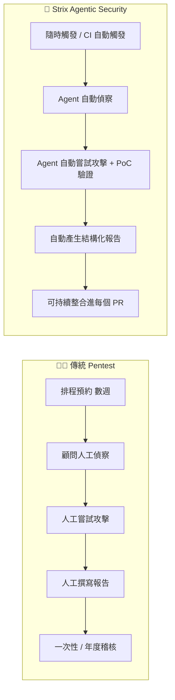

| 比較項目 | 傳統 Pentest | Strix（Agentic Security） |
|---|---|---|
| 執行頻率 | 通常一年 1-2 次 | 可每次 PR / 每日 / 隨時觸發 |
| 成本結構 | 人天計價，成本高 | LLM Token + 運算資源，邊際成本低 |
| 深度與創造力 | 資深顧問可發現複雜邏輯漏洞 | 依賴 LLM 推理能力，持續進步中，仍可能漏掉極複雜之業務邏輯漏洞 |
| 一致性 | 依顧問經驗與當天狀態而異 | 具一致的檢測流程，但仍受 Prompt/模型版本影響 |
| 法遵/簽核價值 | 具備顧問簽章、正式報告，普遍被合規要求採認 | 目前多作為「輔助/持續性」工具，尚不能完全取代正式簽署的第三方稽核報告 |
| 對「未知/新型」攻擊手法的敏感度 | 依賴顧問個人經驗與情資 | 依賴 LLM 訓練資料與可整合的即時情資（如啟用 `PERPLEXITY_API_KEY` 做即時 Web 查證） |

> 💡 **企業導入建議**：不要把 Strix 定位成「Pentest 的替代品」，而是「持續性資安回饋的第一道防線」。正式合規稽核（如 PCI DSS、ISO 27001 要求之年度滲透測試）仍建議保留具資格的第三方顧問簽署報告；Strix 適合填補「兩次正式 Pentest 之間」的空窗期。

## 1.4 Agentic Security 是什麼

「Agentic Security」指的是以自主 Agent（而非單一 Prompt 問答）執行安全相關任務的技術路線，其核心特徵是：

1. **具備多步驟自主規劃能力**：不是「使用者問一句、AI 答一句」，而是 Agent 自行拆解「掃描這個網站」成數十甚至數百個子任務並自主執行。
2. **具備工具使用（Tool Calling）能力**：Agent 能操作終端機、瀏覽器、HTTP Proxy、程式語言直譯器等真實工具，而非僅輸出文字建議。
3. **具備驗證迴圈（Validation Loop）**：發現「疑似漏洞」後，Agent 會嘗試實際利用以確認真偽，而非直接回報未驗證的假設。
4. **具備記憶與知識管理**：長時間任務中，Agent 需要記住已探索過的路徑、已排除的假設，避免重複勞動。

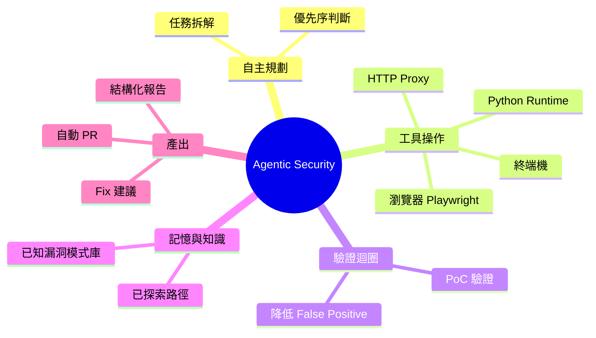

## 1.5 AI Security Platform 的定位

Strix 可視為一個「AI Security Platform」，意即它不只是單一掃描工具，而是一整套涵蓋 **執行環境（Docker Sandbox）+ Agent 協作機制（Coordination）+ 工具鏈（瀏覽器/Proxy/終端機/Python）+ LLM 抽象層（透過 LiteLLM 支援上百種模型）+ CI/CD 整合 + 報告產出** 的平台化解決方案。這使得企業可以將其視為「資安測試的執行引擎」，疊加在既有的 SSDLC 流程之上。

## 1.6 特色與核心能力

- **多 Agent 協調**：以協調圖（Coordination Graph）方式讓多個專職 Agent 並行處理偵察、攻擊、驗證等子任務。
- **真實環境執行**：透過 Docker Sandbox 提供隔離但真實的執行環境，Agent 可以真的執行程式碼、發送封包、操作瀏覽器。
- **多元目標型態**：支援本機資料夾、GitHub Repository、線上網站、API 等多種目標型態（詳見第十章）。
- **多 LLM 供應商彈性**：透過 LiteLLM 抽象層，可自由選擇 OpenAI、Anthropic、Vertex AI、Bedrock、Azure OpenAI、Ollama 等（詳見第五章）。
- **CI/CD 原生整合**：官方文件記載了 GitHub Actions 整合方式，支援針對 PR 的 Diff-Scope 自動掃描。
- **PoC 驗證機制**：降低傳統掃描器最為人詬病的 False Positive 問題。
- **開源、可自架**：Apache-2.0 授權，企業可將其部署於自有基礎設施，滿足資料不外流的合規需求（但仍需注意 LLM API 呼叫本身的資料流向，詳見第七章與第二十三章）。

## 1.7 優缺點分析

| 面向 | 優點 | 限制/風險 |
|---|---|---|
| 成本 | 邊際成本遠低於人力顧問，可高頻執行 | LLM Token 成本會隨掃描深度（`--scan-mode deep`）與目標規模明顯上升，需搭配 `--max-budget-usd` 控管 |
| 速度 | 可在數十分鐘至數小時內完成一輪掃描 | 深度掃描仍需要時間，無法做到「秒級」即時回饋 |
| 覆蓋廣度 | 涵蓋 OWASP Top 10 為主的多種漏洞類型 | 對於高度領域特化（如金融清算邏輯、保險核保規則）的業務漏洞，仍高度依賴 Prompt 品質與模型能力 |
| 誤報率 | PoC Validation 機制可有效降低 | 並非零誤報，仍需人工複核高風險發現 |
| 一致性/可重現性 | 流程標準化 | LLM 輸出具一定隨機性，同一目標兩次掃描結果可能有差異 |
| 資料治理 | 可自架、可選擇本地/私有雲 LLM（Ollama/LM Studio） | 若使用雲端 LLM API，原始碼/流量片段會傳輸至第三方模型供應商，須納入資料分類與合規評估 |
| 專案成熟度 | 開源、社群活躍、版本快速迭代 | 早期專案，API/CLI/ENV 命名仍可能於版本間調整，企業導入需建立版本鎖定與升級測試流程（見第三十三章） |

## 1.8 適用情境與不適用情境

**適用情境：**

- 開發階段的持續性資安回饋（PR / Diff Scan）
- 兩次正式 Pentest 之間的空窗期補強
- 大量微服務/API 的廣度掃描（人力顧問難以逐一覆蓋）
- Framework/技術棧升級後的回歸性資安驗證
- Legacy 系統的探索式資安盤點（見第十八章）
- 內部紅隊（Red Team）的自動化輔助工具

**不適用情境：**

- **完全取代法遵要求之正式第三方簽署 Pentest 報告**（多數合規框架仍要求具資格人員簽署）
- **對外部第三方系統（未取得授權）進行掃描**——這是法律紅線，不因工具是 AI 就被允許
- **高度複雜、需要深厚領域知識的業務邏輯稽核**（如衍生性金融商品定價邏輯）——建議 Strix 掃描 + 領域專家覆核並行
- **對可用性/穩定性極度敏感的正式環境（Production）做未經規劃的主動測試**——應在 Staging 或具備 Rate Limit / 隔離措施的環境執行

> ⚠️ **注意事項**：切勿直接對 Production 環境無限制執行 `--scan-mode deep`。建議先在 Staging／影子環境驗證 Agent 行為模式，並搭配 `--max-budget-usd`、Rate Limit、WAF 白名單等防護措施，避免掃描行為本身造成服務中斷。

### ✅ 第一章 Checklist

- [ ] 已理解 Strix 是「Agentic Security」而非傳統靜態掃描器，核心差異在於自主規劃 + 工具操作 + PoC 驗證迴圈
- [ ] 已理解 Strix 定位為「持續性資安回饋」，而非法遵要求之正式簽署 Pentest 的替代品
- [ ] 已確認團隊將以取得授權的環境（自有系統/合約範圍/實驗環境）作為測試目標
- [ ] 已對照優缺點分析表，評估團隊當前痛點是否與 Strix 的強項吻合
- [ ] 已辨識不適用情境，避免對 Production 或未授權第三方系統貿然執行

---

# 第二章 Strix 系統架構

## 2.1 整體架構總覽

Strix 的架構可分為四大層次：**互動層**（CLI / CI 觸發）、**Agent 協調層**（多 Agent 協調圖）、**執行環境層**（Docker Sandbox 內的工具鏈）、**外部整合層**（LLM、GitHub、CI/CD、雲端/目標系統）。以下架構圖依官方文件所述之元件重新繪製：

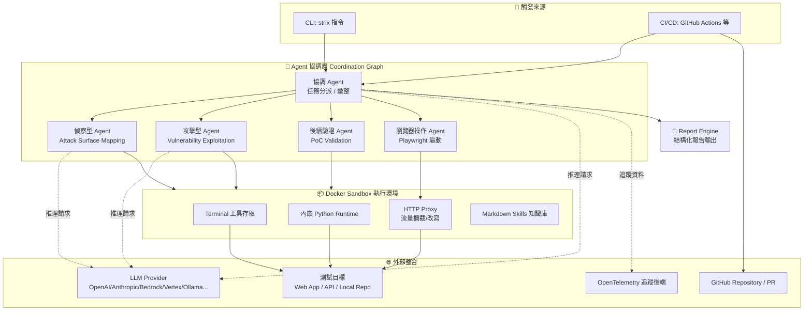

> 📖 **已驗證**：Docker Sandbox 為必要執行環境（官方文件明確要求 Docker 需在本機執行中），Playwright 瀏覽器自動化、HTTP Proxy（含 Caido 整合）、內嵌 Python Runtime、Markdown 化的 Skills 系統、OpenTelemetry 追蹤皆為官方文件所述之真實元件。
>
> 📖 **概念性說明**：圖中「Coordination Graph」下的各專職 Agent 命名（偵察型、攻擊型、後續驗證、瀏覽器操作）為依官方所述「多 Agent 並行處理偵察/攻擊/後滲透」之角色概念重新歸納命名，並非官方原始碼中逐一對應的精確類別名稱，實際模組命名請以最新原始碼為準。

## 2.2 Agent Runtime 與協調機制

Agent Runtime 負責維護每個 Agent 的執行狀態、任務佇列與彼此之間的訊息傳遞。多個專職 Agent 可以**並行**處理不同面向的任務（例如偵察 Agent 持續繪製攻擊面地圖的同時，攻擊 Agent 已針對已發現的端點嘗試利用），並透過協調機制彙整成單一、去重後的漏洞清單。

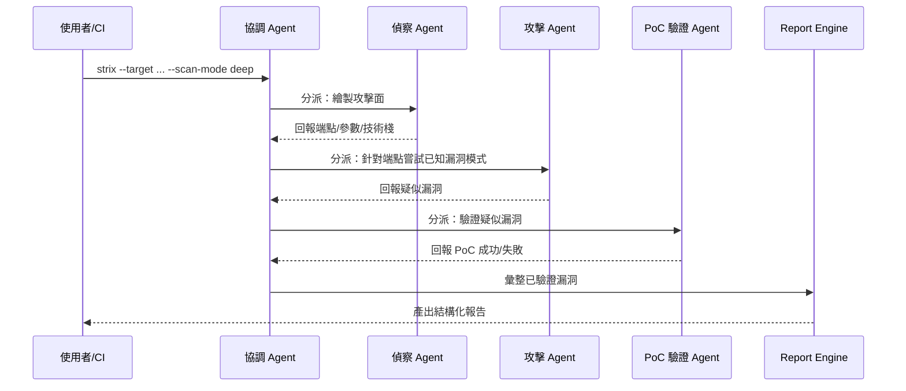

## 2.3 專職 Agent 角色說明

| 角色（概念性歸類） | 主要職責 | 依賴的工具/元件 |
|---|---|---|
| 協調 Agent | 任務分派、去重、彙整結果、預算（Budget）控管 | LLM 推理、任務佇列 |
| 偵察 Agent | 繪製攻擊面：端點、參數、認證機制、技術棧指紋 | Terminal、HTTP Proxy、瀏覽器 |
| 攻擊 Agent | 依攻擊面嘗試已知漏洞模式（注入類、存取控制類等） | Python Runtime、Terminal、HTTP Proxy |
| 瀏覽器操作 Agent | 處理需要真實瀏覽器互動的攻擊面（前端邏輯、Client-side XSS、CSRF 流程） | Playwright |
| PoC 驗證 Agent | 對「疑似漏洞」進行實際可重現的利用驗證 | Python Runtime、Terminal |

> ⚠️ **注意事項**：以上角色命名為教學上的概念性歸類，便於讀者建立心智模型；企業內部若要撰寫自動化整合或監控告警，務必實際閱讀當下版本原始碼中的模組/類別名稱，避免文件與程式碼不一致造成維運誤解。

## 2.4 執行環境元件

- **Docker Sandbox**：所有實際攻擊行為（發送封包、執行程式碼、操作瀏覽器）都在容器化沙箱中進行，達成與本機環境的隔離。可透過 `STRIX_RUNTIME_BACKEND`、`STRIX_IMAGE`、`DOCKER_HOST` 等環境變數調整（詳見第七章）。
- **Terminal 工具存取**：Agent 可執行 Shell 指令操作沙箱內建工具進行輔助偵察與利用。
- **內嵌 Python Runtime**：用於撰寫/執行客製化的攻擊腳本、資料處理、Payload 產生等。
- **HTTP Proxy**：以 **Caido** 為底層的攔截代理，攔截、記錄、改寫 HTTP 流量；Agent 透過 `caido_api` Python 模組操作（如 `list_requests()`、`view_request()`、`repeat_request()`、`list_sitemap()`），並提供 Caido Desktop UI 供資安人員在掃描過程中與 Agent 協同、事後複核實際請求/回應。
- **瀏覽器工具（Playwright）**：以無頭 Chrome 驅動，支援導航、表單互動、JavaScript 執行、螢幕截圖、多分頁操作，專門用來測試需要真實瀏覽器渲染/執行才能觸發的攻擊面（如 DOM-based XSS）；瀏覽器流量會一併經過 Caido Proxy，方便統一複核。
- **File Editor / Notes / Reporting 工具**：分別對應「讀寫目標程式碼與設定檔」「記錄探索過程中的中繼發現，避免長任務中重工」「產出結構化最終報告」三種職能，是 Agent 完成 PoC 驗證後產出報告的最後一哩路。
- **Web Search（透過 `PERPLEXITY_API_KEY`）**：啟用即時網路查證能力，供 Agent 查詢最新 CVE、公開情資等，非必要設定但可提升對新型攻擊手法的敏感度（詳見第七章 7.2）。
- **Markdown Skills 知識庫**：以 Markdown 文件形式儲存的漏洞模式、攻擊手法「技能」，供 Agent 在推理時參考，也方便企業自行擴充領域知識（例如加入自家系統特有的業務邏輯規則）；詳細分類請見第 4.4 節。

> 📖 **官方文件已驗證**（`docs.strix.ai/tools/sandbox.md`）：Docker Sandbox 映像檔以 **Kali Linux** 為基礎，預先安裝超過 18 種資安工具，涵蓋偵察類（Nmap、Naabu、Subfinder、httpx、katana）、漏洞掃描類（Nuclei、OWASP ZAP）、利用類（SQLMap、ffuf）、程式碼/密鑰掃描類（Semgrep、Bandit、tree-sitter、TruffleHog、Gitleaks）、供應鏈/映像檔掃描類（Trivy）等。具體工具清單會隨映像檔版本更新調整，讀者可透過自訂 `STRIX_IMAGE` 環境變數觀察沙箱內實際安裝的工具版本。

## 2.5 與外部系統的整合邊界

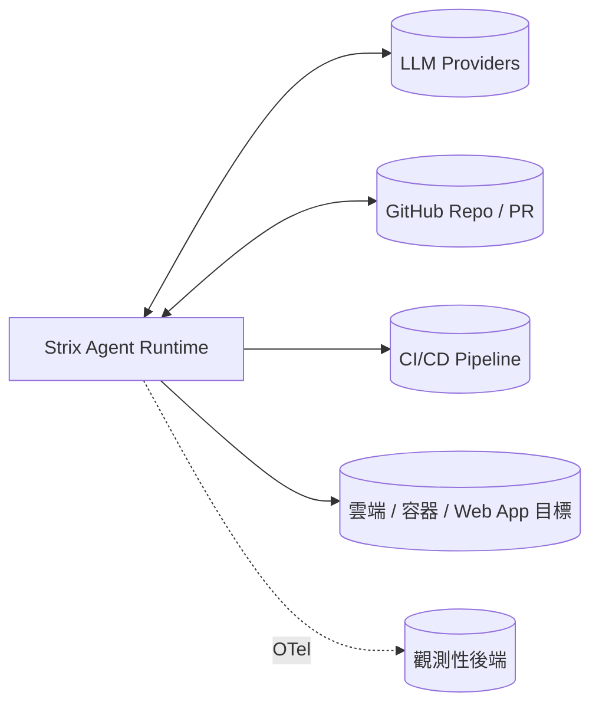

> 💡 **企業導入建議**：導入前務必畫出這張「整合邊界圖」的企業版本，明確標示哪些流量會離開內網（例如呼叫雲端 LLM API）、哪些資料會被傳送到第三方（程式碼片段、掃描目標的回應內容），作為資安與法遵單位審查的依據。若企業對資料外流有嚴格要求，可評估改用 Ollama / LM Studio 等本地 LLM（見第五章），但需注意本地模型的推理能力落差可能影響漏洞發現率。

### ✅ 第二章 Checklist

- [ ] 已理解 Strix 架構的四層次：互動層、Agent 協調層、執行環境層、外部整合層
- [ ] 已確認 Docker 為必要執行環境，並規劃好 Sandbox 執行所需的運算資源
- [ ] 已理解 Agent 角色命名屬教學概念性歸類，正式整合前會核對當下版本原始碼
- [ ] 已畫出企業內部版本的「整合邊界圖」，標示資料外流路徑
- [ ] 已評估是否需要使用本地 LLM 以滿足資料治理要求

---

# 第三章 工作流程

## 3.1 端到端掃描流程

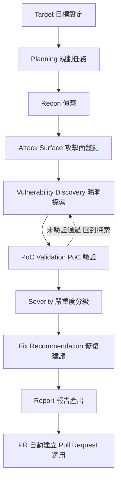

## 3.2 各階段詳細說明

| 階段 | 說明 | 對應章節 |
|---|---|---|
| Target | 定義掃描目標型態（本機資料夾/GitHub Repo/網站/API）與範圍 | 第八、十章 |
| Planning | Agent 依目標特性規劃偵察與攻擊策略、預算分配 | 第四章 |
| Recon | 蒐集端點、參數、技術棧、認證機制等資訊 | 第二章 |
| Attack Surface | 將偵察結果整理為可測試的攻擊面清單 | 第二章 |
| Vulnerability Discovery | 依攻擊面嘗試各類漏洞模式 | 第十二章 |
| PoC Validation | 對疑似漏洞進行實際驗證，降低誤報 | 第十三章 |
| Severity | 依 CVSS 概念與業務影響評估嚴重度 | 第二十二章 |
| Fix Recommendation | 產出具體修復建議，甚至程式碼層級修補 | 第十四章 |
| Report | 產出結構化報告（預設寫入 `strix_runs/<run-name>/`） | 第二十二章 |
| PR | 可選：自動建立 Pull Request 呈現修復建議 | 第十四章 |

> 💡 **實務案例**：在 CI 中的 PR Scan 情境下，此流程通常會在 `--non-interactive` 模式下執行，並以 Exit Code（0 = 乾淨、1 = 執行錯誤、2 = 發現漏洞）作為 Pipeline 是否要 Fail Build 的判斷依據（詳見第二十一章 21.4）。

## 3.3 Diff Scan 與 PR Scan 的流程差異

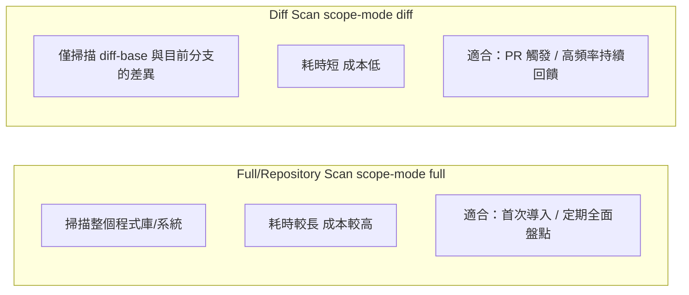

> ⚠️ **注意事項**：Diff Scan 雖然效率高，但僅針對「變更部分」推理攻擊面，對於「舊程式碼因新程式碼而產生的間接影響」（例如新增的呼叫路徑觸發舊有未受保護的函式）之偵測能力，會弱於 Full Scan。建議企業採「Diff Scan 高頻 + Full/Deep Scan 定期（如每週/每月）」的混合節奏。

### ✅ 第三章 Checklist

- [ ] 已理解端到端流程的十個階段，並知道每階段對應本手冊哪一章節可深入閱讀
- [ ] 已理解 PoC Validation 未通過時會回頭迭代漏洞探索，而非直接以未驗證假設回報
- [ ] 已規劃 Diff Scan（高頻）與 Full/Deep Scan（定期）的混合掃描節奏
- [ ] 已確認 CI 中會依 Exit Code 決定 Pipeline 是否 Fail Build

---

# 第四章 AI Agent 如何工作

## 4.1 Agent 的核心迴圈

理解 Strix 的關鍵，是理解「Agent」與傳統「一問一答式 LLM 呼叫」的本質差異。Agent 會持續執行「感知 → 思考 → 行動 → 觀察」的迴圈，直到任務完成或達到停止條件（例如預算上限、最大步數）：

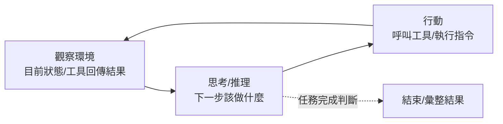

這個迴圈本身並不新穎（強化學習領域早已有 Observe-Think-Act 的概念），Strix 的價值在於把這個通用迴圈**特化到資安測試領域**：工具集是滲透測試工具鏈、知識庫是漏洞模式與攻擊手法、驗證迴圈是 PoC 可重現性檢查。

## 4.2 Planning 與 Reasoning

- **Planning（規劃）**：Agent 在任務開始前（以及執行中遇到新資訊時）會產生或調整「計畫」——例如「先繪製攻擊面地圖，再依優先序嘗試高風險端點」。
- **Reasoning（推理）**：面對具體情境時的即時判斷，例如「這個回應時間差異可能代表 Race Condition，值得進一步驗證」。搭配 `STRIX_REASONING_EFFORT` 環境變數（值域：`none/minimal/low/medium/high/xhigh`），可以在**推理深度**與**成本/速度**之間取捨。

> 💡 **實務案例**：對於快速的 CI PR Scan，通常會搭配較低的 Reasoning Effort（如 `low`/`medium`）以控制單次 PR 掃描時間；對於排程的 Nightly Deep Scan，則可以拉高到 `high`/`xhigh` 換取更深入的業務邏輯推理，但需搭配 `--max-budget-usd` 避免成本失控。

## 4.3 Task 分解與 Memory

Agent 會將高層次目標（例如「掃描此電商網站的結帳流程」）拆解為具體子任務（列出結帳相關端點 → 檢查優惠券套用邏輯是否可疊加濫用 → 檢查金額計算是否可在前端竄改後未於後端重新驗證……）。由於掃描任務往往橫跨數十至數百個步驟，**Memory（記憶）機制**負責：

- 記錄已探索過的路徑，避免重複繞圈
- 保留已驗證為安全/已驗證為漏洞的假設，避免自相矛盾
- 在長任務中對舊有上下文做壓縮（對應 `STRIX_MEMORY_COMPRESSOR_TIMEOUT` 環境變數所描述的機制），避免上下文爆炸拖垮效能與成本

## 4.4 Knowledge 與 Skill

Strix 採用**以 Markdown 檔案表示的 Skills 系統**：每個 Skill 描述一類攻擊手法、檢測技巧或工具使用方式，供 Agent 在推理時參考、組合運用。這個設計對企業導入的重要意義在於：**Skill 是可讀、可審查、可擴充的**——資安團隊可以審視「這個工具到底知道哪些攻擊手法」，甚至可以新增企業自有的 Skill（例如自家系統特有的認證機制檢測邏輯），而不需要重新訓練模型。

> 📖 **官方文件已驗證**（`docs.strix.ai/advanced/skills.md`）：每個 Agent 實例化時，系統會依當下情境從 Skill 庫中**動態挑選最多 5 個**相關 Skill 注入其上下文，而非一次載入全部 Skill（避免上下文膨脹、稀釋推理品質）。官方目前將 Skill 分為五大類：

| Skill 分類 | 內容範例（查證時點） |
|---|---|
| **Vulnerabilities（漏洞類）** | `jwt_auth`、`idor`、`sqli`、`xss`、`ssrf`、`csrf`、`xxe`、`rce`、`business_logic`、`race_conditions`、`path_traversal_lfi_rfi`、`open_redirect`、`mass_assignment`、`insecure_file_uploads`、`information_disclosure`、`subdomain_takeover`、`broken_function_level_authorization` |
| **Frameworks（框架類）** | `fastapi`、`nextjs` |
| **Technologies（技術/後端服務類）** | `supabase`、`firebase_firestore` |
| **Protocols（協定類）** | `graphql` |
| **Tooling（工具操作類）** | `nmap`、`nuclei`、`httpx`、`ffuf`、`subfinder`、`naabu`、`sqlmap` |

> ⚠️ **提醒**：官方 GitHub Release Notes（如 v0.8.3）曾提及新增 NoSQL Injection、Kubernetes、NestJS 相關能力，但查證當下的 `skills.md` 文件列表中未見到完全對應的獨立 Skill 名稱——這可能代表官方文件頁面為精簡摘要、或該能力已併入其他 Skill／改以其他形式實作。若企業要據此規劃測試覆蓋範圍，建議直接以 `strix --help` 與當下版本官方文件複驗實際可用的 Skill 清單，而非直接引用本表。
>
> 💡 **企業導入建議**：將企業內部曾經發生過的資安事件（Postmortem）萃取為新的 Skill 文件，讓 Agent 之後掃描時能主動檢查「同類問題是否又出現」，把過去的教訓轉化為持續性的自動化防護。

## 4.5 Tool Calling

Agent 透過標準化的 Tool Calling 機制操作終端機、瀏覽器（Playwright）、HTTP Proxy、Python Runtime 等真實工具。這與純文字生成的 LLM 應用最大的不同在於：**Agent 的輸出不是「建議」，而是「已經執行的行為與其觀察結果」**。這也是為何 Docker Sandbox 隔離如此重要——工具呼叫是真實的，必須確保「真實」被限制在安全的邊界內。

## 4.6 Reflection 與 Validation

- **Reflection（反思）**：Agent 在得到工具回傳結果後，會反思「這個結果是否支持我原本的假設？下一步該調整策略嗎？」
- **Validation（驗證）**：這是 Strix 用以壓低 False Positive 的核心機制（詳見第十三章）——任何「疑似漏洞」在正式列入報告前，都會經過一次「能否實際重現利用」的驗證步驟。

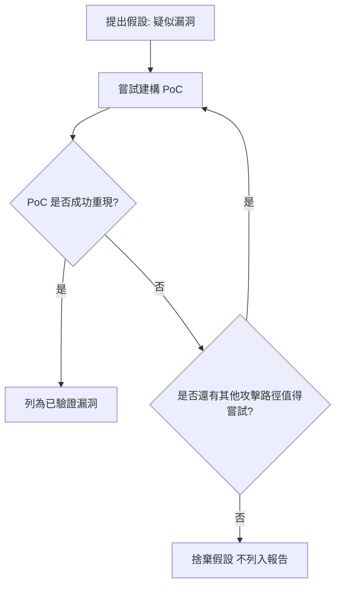

> ⚠️ **注意事項**：Reflection/Validation 機制雖能大幅降低誤報，但也代表**掃描時間與成本會隨著驗證嘗試次數增加**。若對時效性要求極高（例如 5 分鐘內的輕量 PR Check），建議搭配 `--scan-mode quick` 犧牲部分深度換取速度，並將 Deep 驗證留給排程掃描。

### ✅ 第四章 Checklist

- [ ] 已理解 Agent 的核心迴圈（觀察-思考-行動）與傳統一問一答式 LLM 呼叫的差異
- [ ] 已依團隊情境（PR Check vs. 排程掃描）規劃 `STRIX_REASONING_EFFORT` 的取捨策略
- [ ] 已理解 Skills 系統可被企業擴充，並規劃將內部資安事件萃取為自訂 Skill
- [ ] 已理解 Validation 迴圈是降低誤報的核心，並評估其對掃描時間的影響

---

# 第五章 支援哪些 LLM

## 5.1 支援的 Provider 總覽

Strix 底層透過 LiteLLM 作為 LLM 抽象層，理論上可對接上百種模型供應商；官方文件明確列出的常見供應商如下：

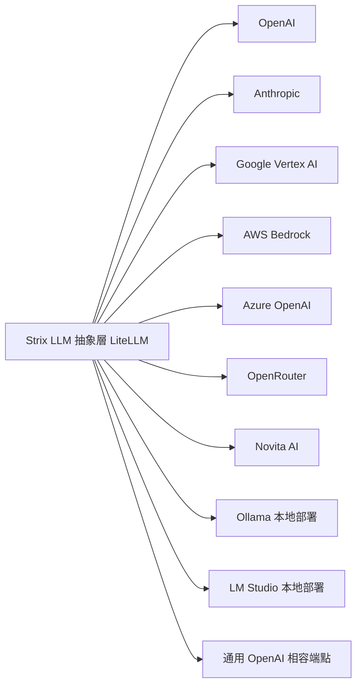

> 📖 **已驗證**：以上供應商列表、以及「模型字串採用 `provider/model` 格式」皆依官方文件確認。文中出現的具體模型字串（如 `anthropic/claude-sonnet-4-6`、`openai/gpt-5.4`）僅為**查證當下**的示意範例，用以說明格式規則，**並非官方保證長期有效的模型名稱**——Anthropic、OpenAI 等供應商的模型版本迭代速度極快，讀者導入前務必自行查閱當下可用的模型清單與命名慣例，不應直接照抄本手冊範例字串上線使用。

## 5.2 各 Provider 設定方式

以環境變數 `STRIX_LLM` 指定要使用的模型字串，`LLM_API_KEY` 提供對應金鑰，雲端/本地供應商各有其慣用設定方式：

```bash
# 使用 Anthropic Claude（模型字串僅為查證當下示例，請自行核對當下版本）
export STRIX_LLM="anthropic/claude-sonnet-4-6"
export LLM_API_KEY="sk-ant-xxxxxxxx"

# 使用 OpenAI（同上，僅為示例）
export STRIX_LLM="openai/gpt-5.4"
export LLM_API_KEY="sk-xxxxxxxx"

# 使用 Azure OpenAI（需額外指定 API Base / 版本，實際變數名稱依 LiteLLM 慣例）
export STRIX_LLM="azure/my-gpt-deployment"
export LLM_API_KEY="xxxxxxxx"
export LLM_API_BASE="https://my-resource.openai.azure.com"

# 使用本地 Ollama（免金鑰，指向本地服務）
export STRIX_LLM="ollama/llama3.1:70b"
export LLM_API_BASE="http://localhost:11434"
```

> ⚠️ **注意事項**：Azure OpenAI、Vertex AI、Bedrock 等企業雲端服務通常還需要額外的雲端身份驗證設定（如 Service Principal、IAM Role），實際變數名稱可能隨 LiteLLM 版本調整，務必以官方文件當下版本為準，切勿憑經驗直接照搬其他專案的變數命名。

## 5.3 模型建議

| 使用情境 | 建議模型類型 | 理由 |
|---|---|---|
| PR Diff Scan（高頻、低延遲要求） | 中階、高速模型 | 需要快速回饋，過度強大的模型會拖慢 PR 檢查速度 |
| Nightly Deep Scan（排程、可接受較長時間） | 旗艦級推理模型 + 較高 Reasoning Effort | 追求最大漏洞覆蓋率與業務邏輯理解深度 |
| 高合規/資料不可外流 | 本地部署模型（Ollama/LM Studio） | 資料不離開內網，但需自行承擔模型能力落差 |
| 成本極度敏感的大規模掃描 | 中低階模型 + Quick/Standard 模式 | 用廣度換深度，適合先做初篩再對高風險目標用旗艦模型複測 |

> 💡 **企業導入建議**：許多團隊採「兩階段模型策略」——先用便宜/快速模型做大規模初篩（Recon + Quick Scan），再針對初篩標記為高風險的目標，改用旗艦模型 + Deep Scan 做精細複測，兼顧成本與深度。

## 5.4 成本分析

LLM 成本主要受三個因素影響：**模型單價**、**Reasoning Effort（推理深度）**、**掃描深度（Scan Mode）**。企業應建立內部的成本估算基準：

| 成本因子 | 影響方向 | 控制手段 |
|---|---|---|
| 模型選擇 | 旗艦模型 Token 單價通常為中階模型數倍 | 依情境分流（見 5.3） |
| Reasoning Effort | 越高的推理深度，思考 Token 消耗越多 | `STRIX_REASONING_EFFORT` 依情境調整 |
| Scan Mode | `deep` 模式會嘗試更多攻擊路徑與驗證迴圈 | `--scan-mode` 依情境選擇 |
| 掃描範圍 | Full Scan vs. Diff Scan 差異可達數十倍 | 優先使用 `--scope-mode diff` |
| 預算硬上限 | 避免單次掃描失控（如陷入無窮迴圈式的嘗試） | `--max-budget-usd` 務必設定 |

> ⚠️ **注意事項**：`--max-budget-usd` 是重要的成本護欄，建議所有 CI 中的自動化掃描都明確設定此參數，避免因為 Agent 進入非預期的長迴圈（例如反覆嘗試同一個不可行的攻擊路徑）而產生預期外的高額 API 費用。

## 5.5 速度與推理能力比較

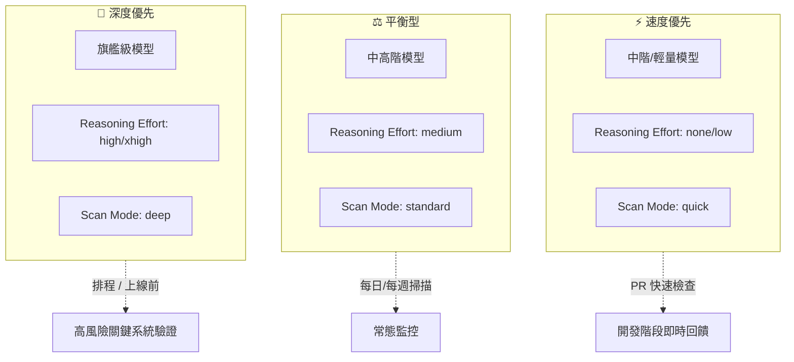

> 💡 **實務案例**：金融交易核心系統建議在正式上線前，以「深度優先」組合（旗艦模型 + `xhigh` Reasoning + `deep` Scan Mode）進行至少一次完整掃描，並保留報告作為上線稽核附件；日常開發則以「速度優先」組合做 PR 級持續回饋。

### ✅ 第五章 Checklist

- [ ] 已確認團隊將使用的 LLM Provider，並完成對應 API Key / 認證設定
- [ ] 已依 PR 掃描 vs. 排程掃描情境，規劃不同的模型/Reasoning Effort 組合
- [ ] 已設定 `--max-budget-usd` 作為每次掃描的成本護欄
- [ ] 已評估是否因資料治理要求需採用本地部署模型（Ollama/LM Studio）
- [ ] 已建立內部 LLM 成本追蹤機制（例如透過 OpenTelemetry/Tracing 匯出使用量）

---

# 第六章 安裝

## 6.1 系統需求

- **Docker 為所有安裝方式的必要前提，並非與其他安裝方式並列的選項之一**：無論透過 curl 一鍵腳本、pipx、pip 或原始碼安裝 Strix CLI 本身，執行掃描時都會需要本機 Docker 已安裝並啟動，因為 Strix 的漏洞驗證行為實際發生在其自動拉取的 Docker Sandbox 映像檔（以 Kali Linux 為基礎、內建多項滲透測試工具，詳見第 2.4 節與第 35.3 節）中，未啟動 Docker 將無法執行掃描。
- Python 3.12 以上版本（3.13/3.14 亦受官方支援）
- 建議至少 4GB RAM（官方建議 8GB 以上）、5GB 可用磁碟空間（供 Sandbox 映像檔使用，映像檔本身約 2GB）
- 具備存取所選 LLM Provider API 的網路權限（雲端 LLM）或本地 GPU/CPU 資源（本地模型）
- 若掃描 GitHub Repository/PR，需具備對應 GitHub 存取權杖

> 📖 **官方文件已驗證**：作業系統支援範圍為 **Linux、macOS，或透過 WSL2 的 Windows**；Windows 若未透過 WSL2（即無 Docker 執行環境）則不受官方支援。

## 6.2 macOS / Linux 安裝

官方提供一鍵安裝腳本：

```bash
curl -sSL https://strix.ai/install | bash
```

> ⚠️ **注意事項**：透過 `curl | bash` 執行遠端腳本前，企業內部應依安全政策評估是否需要先下載腳本、人工審閱內容後再執行，而非直接在具敏感權限的環境中盲目執行遠端腳本，這是一般性的供應鏈安全良好實務，不限於 Strix。

## 6.3 Windows / WSL 安裝

Windows 環境建議透過 **WSL2（Windows Subsystem for Linux）** 執行，原因是 Docker 與多數 Linux 原生工具鏈在 WSL2 中相容性最佳：

```powershell
# 於 PowerShell 中確認 WSL2 已安裝
wsl --status

# 進入 WSL2 環境後，比照 Linux 安裝方式
wsl
curl -sSL https://strix.ai/install | bash
```

> 💡 **提醒**：Windows 上的 Docker Desktop 需開啟「Use the WSL 2 based engine」，並確認 WSL 發行版有掛載到 Docker Desktop 的資源設定中，否則 Strix 在 WSL 內會抓不到 Docker daemon。

## 6.4 Docker 與 Dev Container 安裝

> ⚠️ **官方文件狀態說明**：經查證 `usestrix/strix` 官方 repo 與 `docs.strix.ai`，**並未發現官方提供或記載 Dev Container 設定**（無 `.devcontainer` 目錄、文件站亦無對應頁面）。以下內容為**本手冊建議之概念性做法**，用於企業希望完全隔離安裝環境、避免污染開發機器的情境，並非官方功能，採用前請自行驗證於團隊環境中的可行性。

若企業希望以容器化方式運行 Strix CLI 本身，可參考以下概念（注意：這與 Strix 內部使用的 Docker Sandbox 是兩個層次——一個是「執行 Strix 的環境」，一個是「Strix 用來跑攻擊行為的沙箱」，兩者都需要 Docker，但用途不同）。

```yaml
# .devcontainer/devcontainer.json（範例概念，非官方固定格式）
{
  "name": "strix-dev",
  "image": "mcr.microsoft.com/devcontainers/python:3.12",
  "features": {
    "ghcr.io/devcontainers/features/docker-in-docker:2": {}
  },
  "postCreateCommand": "curl -sSL https://strix.ai/install | bash"
}
```

> ⚠️ **注意事項**：Docker-in-Docker 的巢狀虛擬化在企業共用建置機（Build Agent）上可能受資源政策限制，導入前建議先在測試用 Runner 上驗證可行性。

## 6.5 pipx / PyPI 安裝

官方亦提供 PyPI 套件 `strix-agent`，適合已有 Python 套件管理習慣的團隊：

```bash
# 使用 pipx（建議，可獨立於系統 Python 環境）
pipx install strix-agent

# 或使用 pip
pip install strix-agent
```

## 6.6 安裝驗證

```bash
strix --version
strix --help
```

> 💡 **實務案例**：企業建議將「安裝與版本驗證」納入新進資安/開發同仁的 Onboarding 腳本中，並鎖定特定版本（見第三十三章版本升級），避免團隊成員各自使用不同版本導致掃描結果不一致、難以比對歷史趨勢。

### ✅ 第六章 Checklist

- [ ] 已確認本機/CI Runner 已安裝並啟動 Docker
- [ ] 已依作業系統選擇對應安裝方式（macOS/Linux 原生、Windows WSL2、Dev Container、pipx）
- [ ] 已審閱一鍵安裝腳本內容，符合企業供應鏈安全政策
- [ ] 已透過 `strix --version` 驗證安裝成功並記錄版本號
- [ ] 已將版本鎖定策略納入團隊 Onboarding 文件

---

# 第七章 Configuration

## 7.1 環境變數總覽

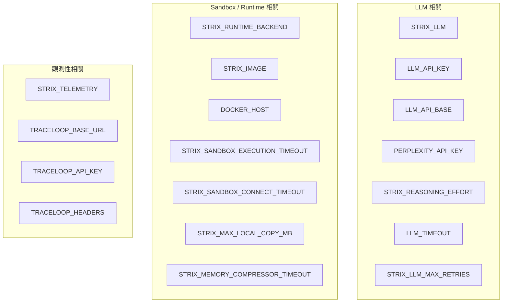

> 📖 **已驗證**：以上變數名稱皆依官方文件核實存在。實際預設值、可選值範圍可能隨版本調整，執行前建議以 `strix --help` 或官方文件當下版本再次確認。

## 7.2 LLM 相關變數

| 變數 | 用途 | 範例 |
|---|---|---|
| `STRIX_LLM` | 指定模型字串，格式 `provider/model`（範例僅供示意） | `anthropic/claude-sonnet-4-6` |
| `LLM_API_KEY` | LLM 供應商 API 金鑰 | `sk-xxxx` |
| `LLM_API_BASE` | 自訂 API Base URL（別名含 `OPENAI_API_BASE`、`LITELLM_BASE_URL`、`OLLAMA_API_BASE`） | `http://localhost:11434` |
| `PERPLEXITY_API_KEY` | 啟用即時 Web 搜尋查證能力（例如查詢最新 CVE 資訊） | `pplx-xxxx` |
| `STRIX_REASONING_EFFORT` | 推理深度：`none/minimal/low/medium/high/xhigh`（官方文件對預設值的敘述在不同頁面略有差異，一般情境預設偏向 `high`，`quick` 掃描模式下則可能採用較低的預設值，請以當下版本官方文件為準） | `high` |
| `LLM_TIMEOUT` | 單次 LLM 請求逾時秒數 | `120` |
| `STRIX_LLM_MAX_RETRIES` | LLM 請求失敗重試次數 | `3` |

> 💡 **企業導入建議**：`PERPLEXITY_API_KEY` 啟用後，Agent 能查詢最新公開情資（例如新公布的框架 CVE），對於「Framework Upgrade 後驗證」（第十七章）情境特別有價值，但也代表會有額外的第三方 API 呼叫與潛在費用，需納入資料治理評估。

## 7.3 Sandbox / Runtime 相關變數

| 變數 | 用途 |
|---|---|
| `STRIX_RUNTIME_BACKEND` | 指定 Sandbox 執行後端 |
| `STRIX_IMAGE` | 自訂 Docker Sandbox 映像檔（例如企業內建置好、已預裝額外工具的映像） |
| `DOCKER_HOST` | 指定 Docker Daemon 位置（適合遠端 Docker 或特殊網路架構） |
| `STRIX_SANDBOX_EXECUTION_TIMEOUT` | 單一沙箱指令執行逾時 |
| `STRIX_SANDBOX_CONNECT_TIMEOUT` | 連線沙箱逾時 |
| `STRIX_MAX_LOCAL_COPY_MB` | 本機檔案複製進沙箱之大小上限 |
| `STRIX_MEMORY_COMPRESSOR_TIMEOUT` | 長任務記憶壓縮機制逾時設定 |

> ⚠️ **注意事項**：企業若自訂 `STRIX_IMAGE`，務必自行維護該映像檔的資安更新（Base Image Patch），避免因為自訂映像檔含有已知漏洞的相依套件，反而讓「拿來做資安測試的工具」本身變成攻擊面。

## 7.4 觀測性（Telemetry / Tracing）變數

| 變數 | 用途 |
|---|---|
| `STRIX_TELEMETRY` | 開關遙測資料回傳 |
| `TRACELOOP_BASE_URL` | OpenTelemetry 追蹤後端位址 |
| `TRACELOOP_API_KEY` | 追蹤後端金鑰 |
| `TRACELOOP_HEADERS` | 追蹤請求自訂標頭 |

> 💡 **企業導入建議**：將 Strix 的 OTel 追蹤資料匯入既有的可觀測性平台（如企業內部的 Grafana/Datadog），可用來監控「每次掃描的 Token 消耗趨勢」「平均掃描時長」，作為第三十一章效能最佳化的資料基礎。

## 7.5 設定檔與 CLI Config

> 📖 **官方文件已驗證**：Strix 的預設設定檔路徑為 **`~/.strix/cli-config.json`**（JSON 格式，而非 YAML），可透過 `--config` 指定替代路徑；設定優先順序為「`--config` 指定的設定檔」＞「環境變數」＞「預設儲存的設定檔」。

除環境變數外，可將常用參數組合（模型選擇、推理深度、掃描模式、預算上限等）固化於設定檔中，避免每次下指令都要重複輸入一長串旗標：

```json
// ~/.strix/cli-config.json（示意內容，實際欄位名稱請以當下版本官方文件為準）
{
  "llm": "anthropic/claude-sonnet-4-6",
  "reasoning_effort": "medium",
  "scan_mode": "standard",
  "max_budget_usd": 5
}
```

```bash
strix --config ~/.strix/cli-config.json --target .
```

> ⚠️ **注意事項**：設定檔中若含有 API Key 等機密資訊，切勿提交進版本控制系統；建議機密資訊仍透過環境變數或 Secret 管理服務注入，設定檔僅存放非機密的行為參數。

### ✅ 第七章 Checklist

- [ ] 已完整盤點團隊會用到的環境變數，並記錄於內部設定文件
- [ ] 已確認機密性變數（API Key）透過 Secret 管理機制注入，未寫入版本控制
- [ ] 已評估是否啟用 `PERPLEXITY_API_KEY` 及其資料治理意涵
- [ ] 已設定合理的 Sandbox Timeout，避免單一掃描卡死佔用 CI Runner 資源
- [ ] 已規劃將 OTel 追蹤資料接入企業既有觀測性平台

---

# 第八章 CLI

## 8.1 指令總覽

Strix 的主要進入點為 `strix` 指令。以下彙整官方文件所述之核心旗標：

```bash
strix --target <path|url|domain|ip> \
      --instruction "<自然語言指示>" \
      --scan-mode deep \
      --scope-mode auto \
      --non-interactive \
      --max-budget-usd 10
```

## 8.2 目標與範圍相關旗標

| 旗標 | 說明 |
|---|---|
| `--target` / `-t`（可重複） | 指定目標：本機路徑、GitHub URL、網域或 IP，可多次指定以掃描多個目標 |
| `--instruction` | 以自然語言提供額外指示，例如聚焦特定功能模組 |
| `--instruction-file` | 從檔案讀取較長的指示內容，適合複雜的掃描範圍/規則說明 |
| `--scope-mode` | `auto`（自動判斷）/ `diff`（僅差異）/ `full`（完整範圍） |
| `--diff-base` | 指定 Diff 比對基準分支，預設為專案預設分支（如 `origin/main`） |
| `--mount` | 掛載額外的本機路徑進沙箱環境 |

## 8.3 執行模式相關旗標

| 旗標 | 說明 |
|---|---|
| `--scan-mode` / `-m` | `quick` / `standard` / `deep`（預設為 `deep`） |
| `--non-interactive` / `-n` | 非互動（Headless/CI）模式，執行完畢後以 Exit Code 表示結果（0=乾淨、1=執行錯誤、2=發現漏洞），不會等待人工互動輸入 |
| `--config` | 指定設定檔路徑 |
| `--max-budget-usd` | 設定本次掃描的美金預算上限，達上限即停止 |

> 📖 **已驗證/未驗證說明**：以上旗標皆依官方文件/CLI 說明核實存在。使用者原始需求中提及的獨立 `--headless` 旗標**未在官方文件中找到對應的獨立旗標**——「Headless」是對 `--non-interactive` 行為的描述，並非另一個獨立旗標；同樣地，獨立的 `--report` 旗標也未被證實存在，報告預設會自動寫入 `strix_runs/<run-name>/` 目錄，無需額外旗標觸發（詳見第二十二章）。企業撰寫自動化腳本前，務必以 `strix --help` 當下版本輸出為準。

## 8.4 常用組合範例

```bash
# 對本機 Repository 做完整深度掃描
strix --target . --scan-mode deep --scope-mode full

# 對 GitHub PR 做 Diff Scan（CI 情境）
strix --target https://github.com/org/repo \
      --scope-mode diff \
      --diff-base origin/main \
      --scan-mode standard \
      --non-interactive \
      --max-budget-usd 5

# 對正在運行的網站做偵察與掃描
strix --target https://staging.example.com \
      --instruction "僅測試 /api/v1 底下的端點，勿觸碰 /admin" \
      --scan-mode standard

# 使用指示檔案提供詳細規則（複雜情境）
strix --target . --instruction-file ./strix-scope.md --scan-mode deep
```

> 💡 **實務案例**：`--instruction` / `--instruction-file` 是控制掃描「該做什麼、不該做什麼」最直接的手段，強烈建議在對 Production-like 環境掃描時，明確告知 Agent 排除高風險/不可測試區域（如金流真實扣款端點），而不是僅依賴 Agent 自行判斷。

### ✅ 第八章 Checklist

- [ ] 已熟悉 `--target`、`--scope-mode`、`--diff-base` 的目標與範圍控制邏輯
- [ ] 已確認團隊腳本中使用的旗標皆以當下版本 `strix --help` 核實存在（避免誤用未證實旗標如 `--headless`/`--report`）
- [ ] 已在對敏感環境掃描時，透過 `--instruction`/`--instruction-file` 明確排除高風險區域
- [ ] 已在 CI 腳本中固定使用 `--non-interactive` 與 `--max-budget-usd`

---

# 第九章 Scan Mode

## 9.1 Quick / Standard / Deep

`--scan-mode`（`-m`）控制掃描的深度與廣度取捨：

| 模式 | 特性 | 適合情境 |
|---|---|---|
| `quick` | 僅嘗試高信心度、常見的漏洞模式，較少 PoC 驗證迴圈 | 快速健檢、PR 上極輕量的初篩 |
| `standard` | 平衡廣度與深度，涵蓋多數 OWASP Top 10 類別並進行基本驗證 | 日常 CI 掃描、每日排程 |
| `deep`（預設） | 嘗試更廣泛的攻擊路徑組合、更多驗證迴圈、更深的業務邏輯推理 | 排程 Nightly Scan、上線前關鍵驗證 |

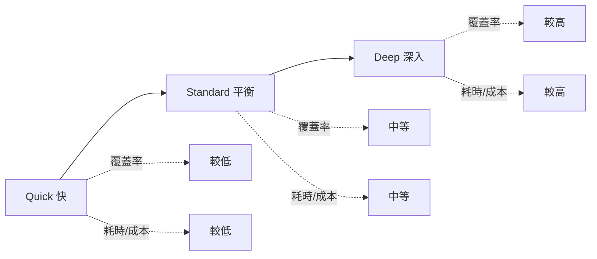

## 9.2 Diff Scan

`--scope-mode diff` 搭配 `--diff-base`，僅針對目前分支與基準分支的差異進行掃描，是 PR 情境下最常用的組合（詳見 3.3、8.2）。

## 9.3 PR Scan

PR Scan 泛指在 CI/CD 中，於 Pull Request 建立/更新時觸發的掃描（通常是 Diff Scan + `--non-interactive` 的組合），並將結果以 Exit Code 或報告回饋至 PR（詳見第二十章）。

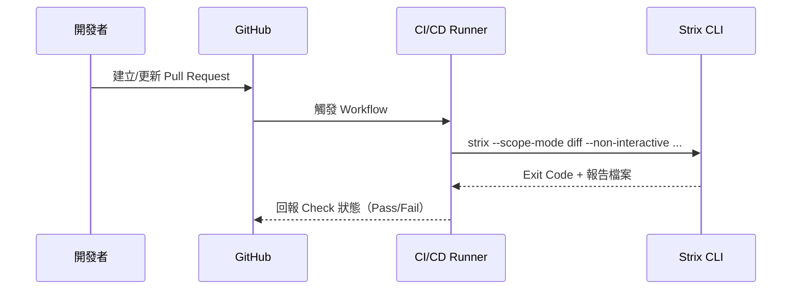

## 9.4 Repository Scan / Web Scan / API Scan

| 掃描類型 | 目標型態 | 說明 |
|---|---|---|
| Repository Scan | 本機或遠端 Git Repository | 靜態層面分析程式碼、設定檔、相依套件，並可能結合動態驗證 |
| Web Scan | 運行中的網站 | 透過瀏覽器自動化 + HTTP 互動，測試前後端整合行為 |
| API Scan | REST/GraphQL 等 API 端點 | 聚焦請求/回應層級的注入、授權、速率限制等問題 |

> 💡 **實務案例**：微服務架構下，建議「Repository Scan 覆蓋程式碼與相依套件層」+「API Scan 覆蓋執行期端點行為」雙管齊下，因為僅靠原始碼掃描可能漏掉「執行期設定（如反向代理層的路由規則）」造成的漏洞。

### ✅ 第九章 Checklist

- [ ] 已依情境（PR/日常/排程）選擇合適的 `--scan-mode`
- [ ] 已在 PR 情境中固定採用 Diff Scan 組合
- [ ] 已理解 Repository/Web/API Scan 的覆蓋範圍差異，並規劃互補策略

---

# 第十章 掃描模式（目標型態）

## 10.1 Local Folder

適合在開發者本機或 CI Runner 上，直接對 Checkout 下來的原始碼資料夾進行掃描：

```bash
strix --target . --scan-mode standard
```

## 10.2 GitHub Repository

可直接指定 GitHub URL 作為目標，Strix 會自行處理 Clone/存取：

```bash
strix --target https://github.com/org/repo --scope-mode diff --diff-base origin/main
```

> ⚠️ **注意事項**：若為私有 Repository，需確保執行環境具備正確的 Git 認證（如 Token/SSH Key），且該 Token 權限應遵循最小權限原則，避免使用具備過多權限（如 Org owner 權杖）的憑證執行自動化掃描。

## 10.3 Running Website

對正在運行的網站（Staging/測試環境）進行黑箱式測試，Agent 會透過瀏覽器自動化與 HTTP 互動探索攻擊面：

```bash
strix --target https://staging.example.com --scan-mode deep
```

> ⚠️ **注意事項**：務必先確認目標網站屬於「取得授權的範圍」，並事先與維運團隊溝通排程時段，避免掃描流量被誤判為攻擊而觸發 WAF/告警疲勞，或影響其他測試人員的並行作業。

## 10.4 API / Microservice

針對 API/微服務，通常需要提供認證資訊（如 API Key、OAuth Token）才能測試已認證後的攻擊面：

```bash
strix --target https://api.example.com \
      --instruction "使用提供的 Bearer Token 進行已認證測試，涵蓋 /v1/orders 與 /v1/payments 端點"
```

## 10.5 Container / Cloud

對容器化服務或雲端資源進行測試時，除了應用層攻擊面外，也應納入容器設定（如是否以 root 執行、是否掛載不必要的敏感 Volume）與雲端資源設定（如過度寬鬆的 IAM 角色）的檢查範疇，這部分建議搭配雲端原生的設定掃描工具（CSPM）與 Strix 的應用層測試互補，而非期待單一工具涵蓋所有雲端資安面向。

> 💡 **企業導入建議**：建立「目標型態 × 掃描頻率」矩陣，明確規範哪些目標型態需要每日/每週/每次 PR 掃描，避免資源分配失焦。

| 目標型態 | 建議頻率 |
|---|---|
| Local Folder / Repository（開發中） | 每次 PR（Diff Scan） |
| Running Website（Staging） | 每日或每週（Standard/Deep） |
| API / Microservice（正式環境對應之 Staging） | 上線前 + 每週排程 |
| Container / Cloud 設定 | 每次部署變更 + 每週排程 |

### ✅ 第十章 Checklist

- [ ] 已確認各目標型態（本機/Repo/網站/API/容器）之授權範圍
- [ ] 已為私有 Repository 設定最小權限的存取憑證
- [ ] 已與維運團隊協調 Running Website 掃描時段，避免誤觸告警
- [ ] 已建立「目標型態 × 掃描頻率」矩陣

---

# 第十一章 Browser Automation

## 11.1 Playwright 瀏覽器自動化

Strix 使用 Playwright 驅動真實瀏覽器，讓 Agent 能處理需要 JavaScript 執行、前端狀態管理、多步驟操作流程（如登入 → 加入購物車 → 結帳）才能觸發的攻擊面，這是純 HTTP 層級掃描器難以覆蓋的範疇。

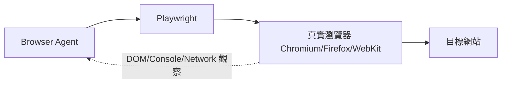

## 11.2 HTTP Proxy 與流量攔截

所有透過瀏覽器或直接發出的 HTTP 請求，皆可透過內建 HTTP Proxy 攔截、記錄，並支援與 Caido 等專業攔截代理工具整合，方便資安人員事後複核 Agent 實際發送的請求/回應內容，這對於**稽核與可解釋性**至關重要——企業不應該只信任「Agent 說有漏洞」，而應該能夠回放「Agent 具體做了什麼」。

## 11.3 Session、Cookie 與 JWT 處理

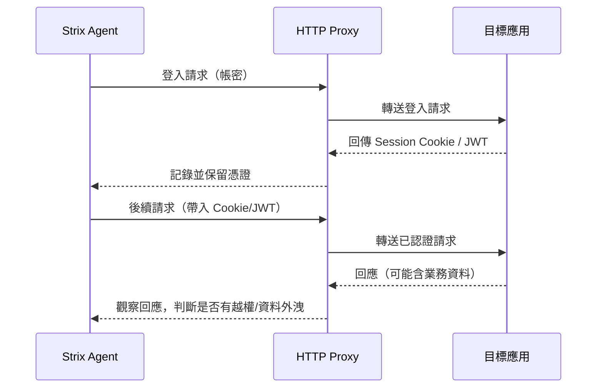

## 11.4 Authentication 情境設定

多數有意義的漏洞（IDOR、權限提升、業務邏輯濫用）都發生在「已登入」狀態之後，因此設定好測試帳號與認證情境是掃描品質的關鍵前提：

```bash
strix --target https://staging.example.com \
      --instruction-file ./auth-context.md
```

```markdown
<!-- auth-context.md 範例概念 -->
# 測試帳號情境
- 一般會員帳號：test_user_a / test_user_b（用於測試 IDOR：A 能否存取 B 的資料）
- 管理員帳號：test_admin（用於測試權限提升）
- 登入端點：POST /api/auth/login
- 測試範圍：僅 /api/v1/** ，禁止觸碰 /api/v1/payments/charge（真實扣款端點）
```

> ⚠️ **注意事項**：務必使用**專門建立的測試帳號**而非真實使用者帳號進行掃描，且測試帳號的資料應為合成資料（Synthetic Data），避免掃描過程中意外存取、修改或外洩真實使用者的個資。

### ✅ 第十一章 Checklist

- [ ] 已理解 Playwright 瀏覽器自動化適合處理需要前端互動才能觸發的攻擊面
- [ ] 已將 HTTP Proxy 記錄接入複核流程，確保 Agent 行為可回放稽核
- [ ] 已準備至少兩組（一般使用者 A/B）測試帳號以利 IDOR 類測試
- [ ] 已明確排除真實扣款/真實通知等高風險端點，並使用合成測試資料

---

# 第十二章 漏洞檢測能力

本章針對每種漏洞類型說明：**原理、攻擊流程、PoC 概念、Strix 如何發現、修補建議**。內容為安全教育目的之通用原理說明，實際 PoC 應僅在取得授權的環境中執行。

## 12.1 OWASP Top 10 / SANS Top 25 對照

| Strix 檢測類別 | OWASP Top 10 (2021) 對應 | SANS/CWE Top 25 對應（示意） |
|---|---|---|
| 存取控制類（IDOR/權限提升） | A01 Broken Access Control | CWE-862, CWE-863 |
| 注入類（SQL/NoSQL/Command） | A03 Injection | CWE-89, CWE-78 |
| 加密/JWT 相關 | A02 Cryptographic Failures | CWE-347 |
| SSRF | A10 Server-Side Request Forgery | CWE-918 |
| 設計缺陷/Business Logic | A04 Insecure Design | — |
| 安全設定錯誤 | A05 Security Misconfiguration | — |
| 元件漏洞（相依套件） | A06 Vulnerable and Outdated Components | — |
| 認證失效 | A07 Identification and Authentication Failures | — |
| 資料完整性（含 Prototype Pollution 類） | A08 Software and Data Integrity Failures | CWE-1321 |
| 日誌與監控不足 | A09 Security Logging and Monitoring Failures | — |

## 12.2 IDOR

- **原理**：伺服器僅依賴使用者提供的識別碼（如 `/api/orders/1002`）存取資源，卻未驗證該資源是否屬於當前登入使用者。
- **攻擊流程**：登入帳號 A → 觀察其資源 ID → 將請求中的 ID 換成帳號 B 的資源 ID → 觀察是否仍能取得資料。
- **PoC 概念**：以帳號 A 的 Session，發送 `GET /api/orders/{B的訂單ID}`，比對回應是否包含不應屬於 A 的資料。
- **Strix 如何發現**：偵察 Agent 建立多組測試帳號的資源對照表，攻擊 Agent 系統性地互換 ID 並觀察回應差異，PoC 驗證 Agent 確認回應中確實含有屬於他人的敏感欄位。
- **如何修補**：所有資源存取皆須於後端驗證「當前使用者是否有權限存取此資源」，而非僅檢查「使用者已登入」；建議採用間接參照（如 UUID + 授權表查詢）取代可預測的遞增 ID。

## 12.3 SQL Injection / NoSQL Injection

- **原理**：使用者輸入未經參數化處理即拼接進查詢語句，攻擊者可操控查詢邏輯。
- **攻擊流程**：於輸入欄位嘗試 `' OR '1'='1` 等 Payload，觀察回應時間差異（Blind/Time-based）或錯誤訊息洩漏（Error-based）判斷是否可注入；NoSQL（如 MongoDB）則常見 `{"$ne": null}` 類運算子注入。
- **Strix 如何發現**：Agent 對所有可疑輸入點系統性嘗試多種 Payload 類型（Union-based、Boolean-based、Time-based），並以 PoC（如刻意觸發延遲、或萃取出資料庫版本字串）驗證。
- **如何修補**：一律使用參數化查詢（Prepared Statement）/ORM，禁止字串拼接組 SQL；NoSQL 需嚴格驗證輸入型別，禁止使用者輸入直接作為查詢運算子。

## 12.4 XSS

- **原理**：未經適當編碼的使用者輸入被瀏覽器當作可執行的 HTML/JavaScript 解析。
- **攻擊流程**：於輸入欄位（含儲存型留言、URL 參數反射型）注入 `<script>` 或事件處理屬性，觀察是否於受害者瀏覽器中執行。
- **Strix 如何發現**：瀏覽器操作 Agent 實際將 Payload 注入頁面，並觀察瀏覽器 Console/DOM 是否真的執行了注入的腳本（而非僅比對字串是否被反射，降低誤報）。
- **如何修補**：輸出時依情境（HTML Body/屬性/JS 字串/URL）做正確編碼，並搭配 Content-Security-Policy 作縱深防禦。

## 12.5 CSRF

- **原理**：瀏覽器會自動夾帶已登入的 Cookie，若伺服器僅依賴 Cookie 驗證身份而無額外的來源驗證，攻擊者可誘導使用者瀏覽器發出非自願請求。
- **攻擊流程**：建構自動送出表單/請求的惡意頁面，誘導已登入受害者訪問。
- **Strix 如何發現**：檢查關鍵狀態變更請求（如變更密碼、轉帳）是否具備 CSRF Token 驗證或 SameSite Cookie 保護，並嘗試在缺乏對應 Token 的情況下重放請求。
- **如何修補**：狀態變更請求使用同步 Token（Synchronizer Token Pattern）、設定 `SameSite=Lax/Strict` Cookie 屬性。

## 12.6 SSRF

- **原理**：伺服器依使用者輸入去發送出站請求（如「輸入圖片 URL 讓伺服器抓取」），攻擊者可誘導伺服器對內部網段或雲端中介資料服務發起請求。
- **攻擊流程**：將目標 URL 改為 `http://169.254.169.254/...`（雲端中介資料服務位址）或內網位址，觀察伺服器是否代為請求並回傳內容。
- **Strix 如何發現**：Agent 針對所有「伺服器端會發出請求」的輸入點，嘗試導向可控外部 Listener（確認伺服器確實發起請求）及內網/雲端中介資料位址。
- **如何修補**：對出站請求目的地做白名單限制、禁止存取內網網段與雲端中介資料位址，或於網路層隔離。

## 12.7 XXE

- **原理**：XML 解析器若未停用外部實體（External Entity）解析，攻擊者可透過惡意 XML 讀取伺服器檔案或觸發 SSRF。
- **攻擊流程**：提交含 `<!ENTITY xxe SYSTEM "file:///etc/passwd">` 的 XML，觀察回應是否洩漏檔案內容。
- **Strix 如何發現**：對接受 XML 輸入的端點注入外部實體 Payload，並確認是否成功讀取到已知的標記檔案內容。
- **如何修補**：停用 XML 解析器的外部實體與 DTD 處理，改用安全預設設定的解析函式庫。

## 12.8 Command Injection / RCE

- **原理**：使用者輸入被直接拼接進系統指令執行。
- **攻擊流程**：於輸入欄位嘗試 `; whoami` 等鏈接指令的 Payload，觀察回應是否包含指令執行結果。
- **Strix 如何發現**：Agent 嘗試多種指令注入語法變體，並以「觸發可觀察的副作用（如刻意的延遲指令、或讀取已知標記檔案）」驗證 RCE 是否成立，而非僅憑回應字串相似度判斷。
- **如何修補**：避免直接呼叫系統 Shell 執行使用者輸入，改用語言原生 API 或嚴格白名單參數。

## 12.9 JWT 相關漏洞

- **原理**：常見問題包含：`alg: none` 繞過簽章驗證、使用弱密鑰可被暴力破解、未驗證 `iss`/`aud`/`exp` 等聲明。
- **攻擊流程**：竄改 JWT Header 的 `alg` 欄位或嘗試以空簽章提交，觀察伺服器是否仍接受該 Token。
- **Strix 如何發現**：Agent 系統性嘗試已知的 JWT 弱點模式並觀察伺服器接受/拒絕行為。
- **如何修補**：伺服器端嚴格指定並驗證演算法（禁止信任 Header 中的 `alg`）、使用足夠強度的簽章密鑰、完整驗證所有聲明欄位。

## 12.10 Race Condition

- **原理**：多執行緒/多請求並行時，若關鍵業務邏輯（如扣款、發放優惠券）缺乏適當鎖定機制，可能被利用重複觸發。
- **攻擊流程**：對同一端點在極短時間內發送大量並行請求，觀察是否可繞過「僅能使用一次」的業務限制。
- **Strix 如何發現**：Agent 對疑似具有數量/次數限制的端點進行高並行請求測試，比對實際扣款/發放次數是否超出預期上限。
- **如何修補**：關鍵業務邏輯使用資料庫層級鎖定（如悲觀鎖、唯一索引約束）或分散式鎖，避免僅依賴應用層的條件判斷。

## 12.11 Business Logic 漏洞

- **原理**：系統各項功能單獨看似合理，組合起來卻違反業務意圖（如優惠券可疊加使用、退貨流程可無限循環套利）。
- **攻擊流程**：理解業務流程後，嘗試非預期的操作順序或參數組合。
- **Strix 如何發現**：這是最依賴 LLM 推理能力（而非固定規則比對）的類別，Agent 需要「理解」業務意圖才能發現「合規但不合理」的操作路徑，建議搭配 `--instruction` 提供業務規則描述以提升發現率。
- **如何修補**：於後端明確實作業務規則的約束檢查，而非僅信賴前端流程限制。

## 12.12 Privilege Escalation

- **原理**：一般權限使用者透過操作缺陷取得管理員或更高權限。
- **攻擊流程**：嘗試竄改角色/權限相關參數（如註冊請求中夾帶 `role: admin`），或利用功能缺陷間接取得高權限操作能力。
- **Strix 如何發現**：Agent 比對一般帳號與高權限帳號的功能差異，並嘗試以低權限帳號觸發高權限才應有的操作。
- **如何修補**：權限判斷一律於後端依可信賴的來源（如伺服器端 Session/資料庫角色）進行，禁止信任用戶端提交的角色欄位。

## 12.13 Prototype Pollution

- **原理**（常見於 JavaScript/Node.js 生態）：攻擊者透過操控物件的 `__proto__`/`constructor.prototype` 屬性，污染全域物件原型，進而影響應用程式邏輯甚至達成 RCE。
- **攻擊流程**：於支援深層合併（Deep Merge）的輸入點提交含 `__proto__` 鍵值的 JSON，觀察是否成功污染原型鏈。
- **Strix 如何發現**：Agent 針對常見的深層合併/解析函式庫使用模式，嘗試提交污染 Payload 並驗證全域行為是否受影響。
- **如何修補**：升級至已修補的函式庫版本、對輸入鍵值進行黑名單過濾（拒絕 `__proto__`/`constructor`/`prototype`）、使用 `Object.freeze(Object.prototype)` 等縱深防禦手段。

> ⚠️ **注意事項**：以上原理與攻擊流程說明僅供資安教育與授權測試使用，任何 PoC 驗證行為皆應限定在取得明確授權的環境中執行。

### ✅ 第十二章 Checklist

- [ ] 已理解本章所列各類漏洞的原理與典型攻擊流程
- [ ] 已理解 Business Logic 類漏洞高度依賴 `--instruction` 提供業務規則描述
- [ ] 已將本章對照表（12.1）用於團隊漏洞分類與修補優先序溝通
- [ ] 已確認所有 PoC 驗證行為僅於授權環境執行

---

# 第十三章 PoC Validation

## 13.1 為何需要 PoC

傳統掃描器最為人詬病之處，就是「回報一大堆疑似問題，開發者花大把時間查證後發現多數是誤報」，長期下來會導致「Alert Fatigue（告警疲勞）」——開發者開始忽略資安報告，反而讓真正的漏洞被淹沒。**PoC Validation 的核心價值，就是只回報「已證實可被實際利用」的問題**，讓每一筆報告都值得開發者認真看待。

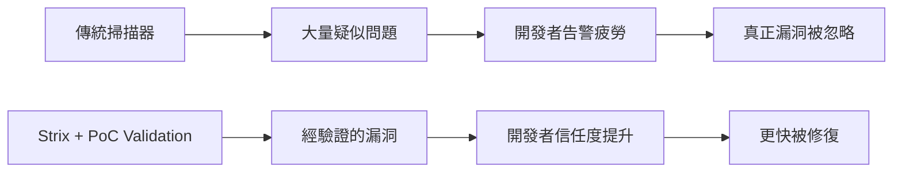

## 13.2 如何降低 False Positive

| 手段 | 說明 |
|---|---|
| 實際利用驗證 | 不僅比對特徵字串，而是嘗試真的觸發漏洞的可觀察後果（如萃取出資料、觸發延遲、修改狀態） |
| 多輪反思 | Agent 對初步結果進行 Reflection，排除因環境雜訊（如網路延遲）誤判的情況 |
| 業務語境理解 | 透過 LLM 推理判斷「這個行為在業務語境下是否合理」，減少對正常功能的誤報 |
| 人工複核高風險項目 | 對於 Critical/High 等級的發現，建議仍由資安人員做最終覆核再進入修復流程 |

> 💡 **企業導入建議**：即使 PoC Validation 大幅降低了誤報率，企業仍建議建立「人工複核關卡」——尤其是會觸發自動 PR 或自動修復的高風險發現，避免自動化鏈路中的單一環節誤判造成連鎖影響。

### ✅ 第十三章 Checklist

- [ ] 已理解 PoC Validation 對降低告警疲勞、提升開發者信任度的價值
- [ ] 已針對 Critical/High 等級發現，建立人工複核關卡
- [ ] 已將 PoC 驗證結果（而非僅疑似清單）作為修復優先序的依據

---

# 第十四章 Auto Fix

## 14.1 Fix Recommendation

針對每個已驗證漏洞，Strix 會產出對應的修復建議，內容通常包含：問題根因說明、具體修改方向、必要時附上修改後的程式碼片段範例。

## 14.2 自動建立 Pull Request

> ⚠️ **查證狀態說明**：本次查證 `docs.strix.ai` 官方文件時，已確認的報告輸出格式為 Markdown/JSON 檔案（詳見第二十二章），但**未能在官方文件中找到「自動建立 Pull Request」此一具體功能的逐字佐證**；Strix Cloud（app.strix.ai）行銷頁面提及「PR 自動掃描」，但這與「自動產生修復 Commit 並開 PR」是不同能力。以下內容為概念性說明，描述「若企業要自行串接此類自動化，應如何設計流程與治理把關點」，實際是否有官方原生功能可直接達成，請於採用前向官方或當下版本文件確認。

在具備 Repository 寫入權限與適當設定的情境下，若企業串接 Strix 的修復建議與既有 CI/CD 自動化（或官方/第三方工具鏈），可讓修復流程進一步自動化為建立 Pull Request，讓開發者可以直接審閱、測試、合併，而非只拿到一份文字報告後還要自己動手改。

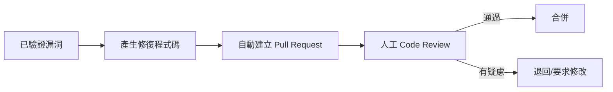

> ⚠️ **注意事項**：自動產生的修復 PR **必須**經過人工 Code Review 後才能合併，絕不應設定為自動合併（Auto-Merge）。自動修復可能因為對業務邏輯理解不足而產生錯誤修補（例如過度嚴格的輸入驗證導致正常功能失效），人工把關是必要的最後防線。

## 14.3 Code Review 整合

企業可將 Strix 的 Fix PR 納入既有的 Code Review 流程與規範（例如要求至少一位資深工程師 + 一位資安人員雙重審核），並可搭配既有的 Code Review 工具鏈（如 SonarQube 靜態分析）交叉驗證修復是否引入新的程式碼品質問題。

> 💡 **實務案例**：建議為 Strix 自動產生的 PR 加上明確標籤（如 `strix-auto-fix`）與說明模板，內容包含「原始漏洞描述」「PoC 摘要」「修復邏輯說明」，讓 Reviewer 能快速掌握上下文，而不需要重新從頭理解問題。

### ✅ 第十四章 Checklist

- [ ] 已理解 Fix Recommendation 的產出內容與價值
- [ ] 已確認自動產生的 Fix PR 絕不會被設定為自動合併
- [ ] 已將 Strix Fix PR 納入既有 Code Review 規範，並要求資安人員參與審核
- [ ] 已為自動 PR 建立標準化說明模板，方便 Reviewer 快速理解上下文

---

# 第十五章 與 Claude Code 整合

> ⚠️ **官方整合狀態說明**：經查證 `usestrix/strix` 官方 repo 與 `docs.strix.ai`，Strix **目前並未提供與 Claude Code 的原生整合功能**；官方對 MCP（Model Context Protocol）的支援仍是 GitHub 上一則開放中的 Issue（`#109`），尚未上線實作。本章內容為**本手冊作者依 Strix CLI 既有能力（`--scope-mode diff`、`--instruction`、Exit Code 等）設計之建議性工作流程**，屬於「如何手動串接兩個獨立工具」的方法論，並非 Strix 官方功能，採用前請自行評估團隊的自動化程度需求。另有非官方第三方專案 `tghastings/strix-claude-code`（以 MCP Server 包裝 Strix 概念，供 Claude Code 呼叫）可供參考，但其與 `usestrix/strix` 並無官方關係，導入前請自行評估其可信度與維護狀態。

## 15.1 整合情境與價值

Claude Code 作為終端機內的 AI 編碼助手，擅長理解專案結構、撰寫/修改程式碼、執行測試；Strix 則專精於「動手驗證資安假設」。兩者的整合價值在於形成一個閉環：**Claude Code 負責開發與修復程式碼，Strix 負責驗證修復是否真的解決問題、以及是否引入新的資安缺陷**。

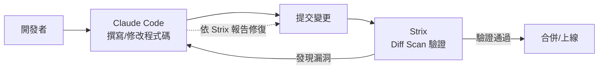

## 15.2 完整流程

1. 開發者在 Claude Code 中完成功能開發或修復。
2. 於本機或 CI 觸發 `strix --scope-mode diff --target .`，針對本次變更做 Diff Scan。
3. 若 Strix 回報已驗證漏洞，將報告內容（含 PoC 說明）作為新的上下文提供給 Claude Code。
4. 請 Claude Code 依報告內容修復程式碼，並說明修復邏輯。
5. 重新執行 Strix Diff Scan 驗證修復是否有效、且未引入新問題。
6. 反覆進行直到 Diff Scan 顯示乾淨（Exit Code 0）。

## 15.3 最佳 Prompt 與 Workflow

```text
請閱讀以下 Strix 掃描報告（JSON/Markdown），針對每一個 Critical/High 等級的已驗證漏洞：
1. 先用一句話說明根因（root cause），不要只複述報告內容
2. 提出具體修復方案，並說明是否會影響既有功能行為
3. 直接修改對應檔案，修改範圍盡量限縮在必要的最小變更
4. 修改完成後，列出這次變更會如何讓 Strix 的 PoC 無法再重現

[貼上 Strix 報告內容]
```

> 💡 **最佳實務**：不要只把 Strix 報告整包丟給 Claude Code 要求「照著修」，而是明確要求「先解釋根因、再提修法、再動手」，避免 Agent 為了消除報告中的症狀而做出治標不治本、甚至破壞既有功能的修改（例如簡單粗暴地把某個 API 直接關掉）。

> ⚠️ **注意事項**：Claude Code 修復完成後，務必重新執行 Strix 驗證，不能只信任 Claude Code 的自我陳述「已修復」；同時也建議照常執行既有的單元測試/整合測試，確保修復沒有破壞正常功能。

### ✅ 第十五章 Checklist

- [ ] 已建立「Claude Code 修復 → Strix 驗證」的閉環開發流程
- [ ] 已設計要求「先解釋根因、再提修法」的 Prompt 範本
- [ ] 已確認修復後會重新執行 Strix Diff Scan 與既有測試套件驗證

---

# 第十六章 與 GitHub Copilot Agent 整合

> ⚠️ **官方整合狀態說明**：與第十五章相同，經查證官方 repo 與文件，Strix **並未記載與 GitHub Copilot Agent 的原生整合**。本章描述的是「於 PR 流程中，將 Strix Diff Scan 結果與 Copilot Agent 分工搭配」的建議性工作流程，屬於本手冊作者基於兩項工具既有能力設計的實務模式，而非 Strix 官方功能。

## 16.1 整合方式

GitHub Copilot Agent 模式同樣具備多步驟自主修改程式碼的能力，可比照 Claude Code 的整合模式：於 PR 中觸發 Strix Diff Scan，將報告作為 Issue/PR Comment 提供給 Copilot Agent 作為修復依據，形成「PR 內」的閉環，而不需要開發者手動在終端機與編輯器間切換上下文。

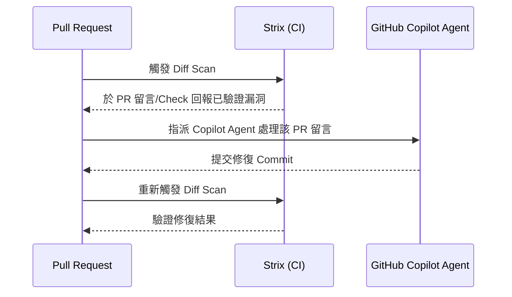

## 16.2 與 Claude Code 整合的差異比較

| 面向 | Claude Code 整合 | GitHub Copilot Agent 整合 |
|---|---|---|
| 主要工作位置 | 終端機／本機開發流程 | GitHub PR/Issue 介面內 |
| 適合階段 | 開發中即時修復（Inner Loop） | PR 審查階段修復（Outer Loop） |
| 上下文取得方式 | 開發者手動貼上/串接報告 | 可直接於 PR Comment/Check 中取得報告連結 |
| 團隊可視性 | 較偏個人開發流程 | 天然具備團隊可視性（PR 討論串留存脈絡） |

> 💡 **企業導入建議**：兩者並非互斥，建議「開發階段用 Claude Code 快速迭代」+「PR 階段用 Copilot Agent 或既有 CI 流程做最後把關」，依團隊既有的 AI Coding 工具生態彈性搭配（詳見第二十六章）。

### ✅ 第十六章 Checklist

- [ ] 已評估團隊 PR 流程是否適合導入 Copilot Agent + Strix 的自動修復閉環
- [ ] 已確認 Strix 報告能以 PR Comment/Check 形式呈現，維持團隊可視性
- [ ] 已釐清 Claude Code（開發階段）與 Copilot Agent（PR 階段）的分工邊界

---

# 第十七章 Framework Upgrade

## 17.1 為何升級是高風險時刻

框架/語言版本升級（如 Spring Boot 2 → 3、.NET Framework → .NET 8、Vue 2 → 3）往往牽動大量底層行為變更：安全預設值可能改變（例如某些框架新版預設關閉了舊版原本隱含的防護）、相依套件連鎖升級可能引入新漏洞、大規模程式碼改寫容易在重構過程中遺漏原有的安全檢查邏輯。**升級當下正是資安回歸測試最關鍵，也最容易被忽略的時刻**——團隊往往聚焦在「功能是否正常」，而忽略「安全行為是否不變」。

```mermaid
flowchart TB
    Before[升級前: 已知安全基準] --> Upgrade[框架/語言版本升級]
    Upgrade --> After[升級後: 未知安全狀態]
    After --> Risk1[安全預設值變更]
    After --> Risk2[相依套件連鎖升級]
    After --> Risk3[重構遺漏安全邏輯]
    After --> StrixScan[Strix 全面回歸掃描]
    StrixScan --> Confirmed[確認安全基準是否維持]
```

## 17.2 Spring Boot / .NET / Node.js

| 框架 | 常見升級資安風險點 |
|---|---|
| Spring Boot 2→3 | Jakarta EE 命名空間遷移可能遺漏部分 Security 設定遷移、Actuator 端點預設曝露範圍變化 |
| .NET Framework → .NET (Core) | 組態檔格式改變（web.config → appsettings.json）可能遺漏原有的安全標頭/驗證設定 |
| Node.js 主版本升級 | 相依套件生態同步升級，需重新檢視 `package-lock.json` 中是否引入新的已知漏洞套件 |

## 17.3 Vue / React / Angular

前端框架升級的資安重點通常在於：模板渲染機制變更是否影響原有的 XSS 防護假設（例如某些版本間 `v-html`/`dangerouslySetInnerHTML` 相關行為的細節差異）、狀態管理套件升級、以及建置工具鏈（Webpack/Vite）配置遷移過程中是否不慎暴露原始碼或環境變數。

## 17.4 Python / FastAPI / Django

Python 主版本升級需留意標準函式庫行為變更；FastAPI/Django 升級則需重新檢視 ORM 查詢建構方式是否仍維持參數化查詢、以及升級版本的預設中介軟體（Middleware）安全設定（如 CORS、CSRF 保護）是否被無意間關閉或改變預設值。

## 17.5 如何用 Strix 驗證升級安全性

建議的升級資安驗證流程：

```bash
# 1. 於升級前，對舊版本執行一次完整 Deep Scan，建立安全基準報告
git checkout before-upgrade-branch
strix --target . --scan-mode deep --scope-mode full

# 2. 完成升級後，對新版本再次執行相同掃描
git checkout after-upgrade-branch
strix --target . --scan-mode deep --scope-mode full

# 3. 人工或腳本比對兩份報告，確認：
#    - 原本已驗證安全的項目，升級後是否新增了漏洞
#    - 是否有因框架行為改變而新增的攻擊面
```

> 💡 **企業導入建議**：將「升級前後 Deep Scan 報告比對」納入正式的框架升級驗收標準之一，與功能回歸測試、效能測試並列為升級 Checklist 的必要項目，而非升級後才臨時想起要做資安確認。

### ✅ 第十七章 Checklist

- [ ] 已在框架升級計畫中，明確排入「升級前後 Strix Deep Scan 比對」步驟
- [ ] 已盤點所升級框架的已知安全預設值變更（查閱官方 Migration Guide）
- [ ] 已重新檢視升級後的中介軟體/安全標頭設定是否維持預期行為
- [ ] 已將升級資安驗證結果納入正式上線簽核文件

---

# 第十八章 Reverse Engineering

## 18.1 Legacy System 的資安困境

許多企業的核心系統歷經十數年演進，原始開發團隊可能早已離職、文件缺失、甚至原始碼庫本身就混雜多種語言與世代的技術。這類系統常見的資安困境是：**沒有人敢改、也沒有人完全理解它現在的行為**，導致資安弱點長期累積卻無法被有效盤點與修復。

## 18.2 大型銀行系統與 Mainframe

大型銀行核心系統常見以 Mainframe（大型主機）搭配 COBOL/PL/I 撰寫核心批次與交易邏輯，外圍再包覆 Java/.NET 等現代化服務層對接。此類架構的資安測試挑戰在於：核心邏輯的攻擊面往往不是透過公開網路直接暴露，而是透過外圍服務層間接暴露，因此測試重點應放在**外圍服務層與核心系統之間的介接協定與資料驗證**，而非期待直接對 Mainframe 進行黑箱測試。

```mermaid
flowchart LR
    subgraph Legacy["核心 Legacy 層"]
        Mainframe[Mainframe / COBOL 核心交易邏輯]
    end
    subgraph Modern["外圍現代化層"]
        API[Java/.NET API Gateway]
        Web[Web/Mobile 前端]
    end
    Web --> API
    API -->|介接協定 常見弱點聚集處| Mainframe
    StrixScan[Strix 測試重點] -.-> API
```

## 18.3 Java / COBOL 混合系統

此類混合系統常見的資安測試重點：API Gateway 層是否對輸入做了完整驗證後才轉送給後端 Mainframe（避免 Mainframe 端因缺乏現代化輸入驗證機制而暴露風險）、服務間認證是否使用過時或弱加密機制、批次作業排程介接是否具備適當的存取控制。

## 18.4 如何利用 Strix 找出安全漏洞

由於 Strix 主要作用於現代化的 Web/API 攻擊面，對 Legacy 系統的實務作法建議為：

1. **聚焦外圍現代化層**：將 Strix 掃描範圍鎖定在 Java/.NET API Gateway、Web/Mobile 前端等 Strix 有能力直接測試的範疇。
2. **以 `--instruction` 提供架構脈絡**：告知 Agent 後端為 Legacy 系統，協助其判斷「這個回應異常，是否代表後端 Legacy 系統的邊界條件處理不當」。
3. **搭配 Reverse Engineering 靜態分析**：對於能取得原始碼的 COBOL/Java 舊系統模組，可先以 Claude Code/其他工具輔助理解程式邏輯，萃取出關鍵業務規則，再轉化為 Strix 的 `--instruction-file` 業務規則描述，提升 Business Logic 類漏洞的發現率。
4. **漸進式盤點，而非期待一次到位**：Legacy 系統資安盤點應是持續性專案，建議先從高風險、高曝險模組開始，逐步擴大掃描範圍。

> ⚠️ **注意事項**：對 Legacy/Mainframe 系統執行任何測試前，務必確認該系統的可用性容忍度——許多核心批次系統在特定時間窗口（如日終結算）極度敏感，任何非預期的負載都可能造成嚴重營運風險，測試時段與範圍需與維運團隊嚴格協調。

### ✅ 第十八章 Checklist

- [ ] 已釐清 Legacy 系統的架構分層，將 Strix 掃描聚焦於現代化外圍層
- [ ] 已使用 `--instruction`/`--instruction-file` 提供 Legacy 架構與業務規則脈絡
- [ ] 已與維運團隊確認核心系統的可用性容忍時段，避免測試造成營運風險
- [ ] 已建立漸進式、分階段的 Legacy 資安盤點計畫而非一次性掃描

---

# 第十九章 Secure SDLC

## 19.1 SSDLC 全貌

```mermaid
flowchart LR
    Req[需求] --> Design[設計]
    Design --> ThreatModel[Threat Modeling]
    ThreatModel --> Dev[開發]
    Dev --> CodeReview[Code Review]
    CodeReview --> StrixDiff[Strix Diff Scan]
    StrixDiff --> Pentest[定期 Pentest / Strix Deep Scan]
    Pentest --> Release[Release]
    Release --> Production[Production]
    Production -.持續監控/排程掃描.-> StrixDiff
```

## 19.2 Threat Modeling

Threat Modeling（威脅建模）應發生在設計階段，先透過人工分析（如 STRIDE 模型）辨識系統層級的威脅假設，Strix 的角色是在後續開發階段**驗證這些威脅假設是否真的被有效防範**，兩者互補而非取代——Threat Modeling 回答「我們擔心什麼」，Strix 協助回答「我們擔心的事，真的被擋住了嗎」。

## 19.3 Code Review 階段

建議在 Code Review 階段納入 Strix Diff Scan 作為自動化檢查的一環（詳見第九章 9.2 Diff Scan），讓資安檢查與既有的程式碼審查流程並行，而非事後補做。

## 19.4 Pentest 階段

如第一章所述，Strix 定位為「持續性回饋」而非正式簽署 Pentest 的替代品；建議將 Strix Deep Scan 結果作為正式 Pentest 前的「預檢」，先行修復容易發現的問題，讓正式 Pentest 顧問能把時間專注在更深層、更需要人類專業判斷的複雜攻擊路徑上。

## 19.5 Release 與 Production 階段

上線前建議執行一次完整 Deep Scan 作為 Release Gate 的一環；上線後則搭配 Headless/排程掃描（第二十一章）持續監控，形成完整的閉環。

> 💡 **企業導入建議**：將「Strix Scan 結果」納入 Release Checklist 的正式簽核項目之一，明確定義何種嚴重度的未修復發現會阻擋上線（例如：任何未修復的 Critical/High 發現皆阻擋 Release），避免資安檢查淪為「跑個形式」。

### ✅ 第十九章 Checklist

- [ ] 已將 Strix Diff Scan 納入 Code Review 階段的自動化檢查
- [ ] 已明確定義 Strix Deep Scan 與正式 Pentest 之間的互補分工
- [ ] 已建立以 Strix 發現嚴重度為依據的 Release Gate 規則
- [ ] 已規劃上線後的持續性排程掃描機制

---

# 第二十章 CI/CD

> 📖 **官方文件已驗證**：經查證 `docs.strix.ai`，官方文件目前明確收錄的 CI/CD 整合平台為 **GitHub Actions、GitLab CI、Jenkins、CircleCI** 四者（20.1、20.3、20.4、20.6）。**Azure DevOps（20.2）與 ArgoCD/Tekton（20.5）並未見於官方文件**，屬本手冊依 Strix CLI 通用能力（任何能執行 Shell 指令的 CI/CD 平台皆可比照辦理）延伸整理之社群/概念性做法，內容邏輯可用但非官方掛保證的整合方式。
>
> 另外，範例中的 `STRIX_LLM: anthropic/claude-sonnet-4-6` 僅為示意用途——Strix 透過 LiteLLM 支援上百種模型且 Anthropic/OpenAI 等模型版本更新頻繁，實際專案應以第五章 5.2 之設定方式為準，並定期核對當下可用的模型字串。

## 20.1 GitHub Actions

```yaml
name: Strix Security Scan
on:
  pull_request:
    branches: [main]

jobs:
  strix-scan:
    runs-on: ubuntu-latest
    steps:
      - uses: actions/checkout@v4
        with:
          fetch-depth: 0
      - name: Install Strix
        run: curl -sSL https://strix.ai/install | bash
      - name: Run Strix Diff Scan
        env:
          STRIX_LLM: anthropic/claude-sonnet-4-6
          LLM_API_KEY: ${{ secrets.LLM_API_KEY }}
        run: |
          strix --target . \
                --scope-mode diff \
                --diff-base origin/main \
                --scan-mode standard \
                --non-interactive \
                --max-budget-usd 5
```

> ⚠️ **注意事項**：`fetch-depth: 0` 確保 Checkout 動作取得完整 Git 歷史，讓 Diff Scan 能正確比對 `--diff-base`；若使用預設的淺層 Clone，Diff 比對可能失敗或不準確。

## 20.2 Azure DevOps（社群延伸整合，非官方文件收錄）

> ⚠️ **提醒**：以下為本手冊依 Strix CLI 通用能力整理之概念範例，`docs.strix.ai` 官方文件並未收錄 Azure DevOps 整合頁面，語法與行為未經官方驗證，採用前請自行於測試 Pipeline 驗證。

```yaml
# azure-pipelines.yml（概念範例，非官方文件收錄）
trigger: none
pr:
  branches:
    include: [main]

pool:
  vmImage: 'ubuntu-latest'

steps:
  - checkout: self
    fetchDepth: 0
  - script: curl -sSL https://strix.ai/install | bash
    displayName: 'Install Strix'
  - script: |
      strix --target . --scope-mode diff --diff-base origin/main \
            --scan-mode standard --non-interactive --max-budget-usd 5
    displayName: 'Run Strix Diff Scan'
    env:
      STRIX_LLM: anthropic/claude-sonnet-4-6
      LLM_API_KEY: $(LLM_API_KEY)
```

## 20.3 GitLab CI

```yaml
# .gitlab-ci.yml（概念範例）
strix_scan:
  stage: test
  image: python:3.12
  rules:
    - if: '$CI_PIPELINE_SOURCE == "merge_request_event"'
  script:
    - curl -sSL https://strix.ai/install | bash
    - strix --target . --scope-mode diff --diff-base origin/main
            --scan-mode standard --non-interactive --max-budget-usd 5
  variables:
    STRIX_LLM: "anthropic/claude-sonnet-4-6"
```

> 💡 **提醒**：GitLab CI 中的 `LLM_API_KEY` 建議透過 GitLab 的 Masked/Protected CI/CD Variables 管理，而非明文寫在 `.gitlab-ci.yml` 中（可參照本目錄下《GitLab 與 GitLab CLI 教學手冊》第七章 Secret 管理實務）。

## 20.4 Jenkins

```groovy
// Jenkinsfile（概念範例）
pipeline {
    agent any
    stages {
        stage('Strix Security Scan') {
            when { changeRequest() }
            environment {
                STRIX_LLM = 'anthropic/claude-sonnet-4-6'
                LLM_API_KEY = credentials('strix-llm-api-key')
            }
            steps {
                sh 'curl -sSL https://strix.ai/install | bash'
                sh '''
                  strix --target . --scope-mode diff --diff-base origin/main \
                        --scan-mode standard --non-interactive --max-budget-usd 5
                '''
            }
        }
    }
}
```

## 20.5 ArgoCD / Tekton（社群延伸整合，非官方文件收錄）

> ⚠️ **提醒**：`docs.strix.ai` 官方文件並未收錄 ArgoCD/Tekton 整合頁面，以下為本手冊依 GitOps 部署模式延伸整理之概念性做法，非官方保證的整合方式。

ArgoCD 專注於 GitOps 部署同步，較不適合直接嵌入 Strix 掃描邏輯；建議做法是在 **部署前的 Tekton Pipeline 階段**執行 Strix 掃描作為 Quality Gate，掃描通過（Exit Code 0）才允許 ArgoCD 同步至叢集：

```yaml
# Tekton Task（概念範例，非官方文件收錄）
apiVersion: tekton.dev/v1
kind: Task
metadata:
  name: strix-security-scan
spec:
  steps:
    - name: run-strix
      image: python:3.12
      script: |
        curl -sSL https://strix.ai/install | bash
        strix --target . --scan-mode standard --non-interactive --max-budget-usd 5
```

## 20.6 CircleCI

> 📖 **官方文件已驗證**：CircleCI 為 `docs.strix.ai` 官方 CI/CD 整合文件明確收錄的平台之一。

```yaml
# .circleci/config.yml（官方文件收錄之整合模式）
version: 2.1

jobs:
  strix-scan:
    docker:
      - image: cimg/python:3.12
    steps:
      - checkout
      - setup_remote_docker
      - run:
          name: Install Strix
          command: curl -sSL https://strix.ai/install | bash
      - run:
          name: Run Strix Diff Scan
          command: |
            strix --target . \
                  --scope-mode diff \
                  --diff-base origin/main \
                  --scan-mode standard \
                  --non-interactive \
                  --max-budget-usd 5
          environment:
            STRIX_LLM: anthropic/claude-sonnet-4-6

workflows:
  pr-security-scan:
    jobs:
      - strix-scan:
          filters:
            branches:
              ignore: main
```

> ⚠️ **注意事項**：CircleCI 執行 Docker-based 掃描需啟用 `setup_remote_docker`（Remote Docker 環境），這會產生額外的執行成本，企業導入前建議先確認方案（Plan）是否包含此功能與其計費方式。`LLM_API_KEY` 應透過 CircleCI Contexts 或 Project Environment Variables 管理，避免明文寫入設定檔。

## 20.7 完整 Pipeline 範例

```mermaid
flowchart TB
    Commit[開發者提交 PR] --> Build[Build/單元測試]
    Build --> StrixGate[Strix Diff Scan Quality Gate]
    StrixGate -- Exit 0 乾淨 --> CodeReview[人工 Code Review]
    StrixGate -- Exit 2 發現漏洞 --> Block[阻擋合併/通知開發者]
    CodeReview --> Merge[合併至 main]
    Merge --> DeepScan[排程 Deep Scan]
    DeepScan --> Tekton[Tekton Pre-Deploy Gate]
    Tekton -- 通過 --> ArgoCD[ArgoCD 同步部署]
```

### ✅ 第二十章 Checklist

- [ ] 已在慣用的 CI/CD 平台（GitHub Actions/GitLab CI/Jenkins/CircleCI 為官方文件收錄；Azure DevOps/ArgoCD/Tekton 為社群延伸做法）建立 Strix Scan Job
- [ ] 已確認 Checkout 步驟取得完整 Git 歷史以支援 Diff Scan
- [ ] 已將 LLM API Key 等機密資訊透過對應平台的 Secret 機制管理
- [ ] 已規劃部署前的 Quality Gate（如 Tekton/ArgoCD 情境，注意此為非官方延伸模式）納入 Strix 掃描結果判斷

---

# 第二十一章 Headless Mode

## 21.1 Non-Interactive 執行

`--non-interactive`（`-n`）是 Strix 用於 CI/自動化情境的核心旗標：執行過程不會等待人工輸入，完成後直接以 Exit Code 表示結果，方便腳本化判斷（詳見 8.3）。

## 21.2 Batch 與 Schedule

多目標批次掃描可透過腳本迴圈或多次 `--target` 達成：

```bash
#!/bin/bash
# nightly-scan.sh
TARGETS=("https://staging-a.example.com" "https://staging-b.example.com")
for t in "${TARGETS[@]}"; do
  strix --target "$t" --scan-mode deep --non-interactive --max-budget-usd 10
  echo "Target $t finished with exit code $?"
done
```

## 21.3 Nightly Scan 設計

```mermaid
flowchart LR
    Cron[排程觸發 例如每日 02:00] --> Scan[strix --scan-mode deep --non-interactive]
    Scan --> Report[產出報告 strix_runs/]
    Report --> Notify{是否發現漏洞?}
    Notify -- 是 --> Alert[通知資安/開發團隊 Slack/Email]
    Notify -- 否 --> Log[記錄乾淨結果]
```

> 💡 **實務案例**：Nightly Scan 建議選在系統低流量時段執行（如凌晨），並針對 Staging 環境而非 Production 執行，避免深度掃描的高強度請求影響白天的正式服務流量或真實使用者體驗。

## 21.4 Exit Code 與自動化判斷

> 📖 **官方文件已驗證**：非互動模式下的 Exit Code 語意為 `0`／`1`／`2` 三種，已於官方 CLI 與 CI/CD 文件頁面查證一致。

| Exit Code | 意義 | 建議自動化行為 |
|---|---|---|
| 0 | 掃描乾淨，未發現已驗證漏洞 | 允許 Pipeline 繼續 |
| 1 | 執行本身發生錯誤（非掃描結果，例如 Docker 未啟動、LLM 連線失敗） | 視為基礎設施問題，需人工排查（見第二十九章），不得視為「掃描通過」 |
| 2 | 發現已驗證漏洞 | 依嚴重度決定是否阻擋 Pipeline，並觸發通知 |

> ⚠️ **注意事項**：務必在腳本中明確區分「Exit Code 2（發現漏洞，這是掃描器正常運作的結果）」與「Exit Code 1（執行本身出錯，與掃描結果無關）」，避免將基礎設施問題誤判為「掃描通過」而讓有問題的版本流入下一階段。

### ✅ 第二十一章 Checklist

- [ ] 已在所有自動化情境中使用 `--non-interactive`
- [ ] 已設計 Nightly/排程掃描腳本，並選定低流量時段執行
- [ ] 已在腳本中正確區分 Exit Code 0（乾淨）/1（執行錯誤）/2（發現漏洞）
- [ ] 已建立漏洞發現後的自動通知機制（Slack/Email/Ticket）

---

# 第二十二章 Report

## 22.1 報告格式與存放位置

Strix 執行完成後，報告會自動寫入 `strix_runs/<run-name>/` 目錄（依官方文件），內容通常涵蓋掃描摘要、已驗證漏洞清單、各項發現的詳細內容。企業可將此目錄接入既有的產出物歸檔（Artifact）機制，作為稽核軌跡保存。

```bash
# CI 中將報告目錄上傳為 Artifact（以 GitHub Actions 為例）
- name: Upload Strix Report
  if: always()
  uses: actions/upload-artifact@v4
  with:
    name: strix-report
    path: strix_runs/
```

## 22.2 Severity 分級

報告中的每一項已驗證發現，通常會依風險程度分級（概念上對應 Critical/High/Medium/Low/Info），分級考量因素包含：資料敏感度、是否需要認證才能利用、利用難度、潛在業務影響範圍。

| 等級 | 概念說明 | 建議處理時效 |
|---|---|---|
| Critical | 未經認證即可造成大規模資料外洩或系統控制權喪失 | 立即處理，阻擋上線 |
| High | 需認證但影響嚴重（如跨帳號資料存取） | 短期內（如 3 個工作天）修復 |
| Medium | 影響範圍有限或利用門檻較高 | 排入下個迭代修復 |
| Low/Info | 潛在風險或最佳實務建議 | 依團隊資源排程處理 |

## 22.3 Evidence 與 PoC 呈現

報告中的 Evidence（證據）應包含足以重現問題的具體資訊：請求/回應範例、操作步驟、螢幕截圖或瀏覽器 Trace（來自 Playwright）。這些證據是後續 Fix Recommendation 與人工複核的基礎，也是回頭確認「修復是否真的解決問題」的依據。

## 22.4 Fix 建議呈現方式

建議搭配的呈現原則：**根因說明 → 具體修復方向 → 程式碼範例（如適用）→ 驗證方式**，讓開發者不需要額外詢問就能直接動手修復並自行驗證。

> 💡 **企業導入建議**：將 Strix 報告格式與企業既有的漏洞管理系統（如 Jira Security、DefectDojo）整合，把「已驗證發現」自動轉為對應的 Ticket，並保留報告連結，避免資安發現淪為只存在於 CI Log 中、無人追蹤後續處理進度的孤島資訊。

### ✅ 第二十二章 Checklist

- [ ] 已將 `strix_runs/` 報告目錄接入 CI 的產出物歸檔機制
- [ ] 已建立團隊內部一致的 Severity 分級與對應處理時效標準
- [ ] 已確認報告中的 Evidence 足以支援問題重現與修復驗證
- [ ] 已評估是否將報告與既有漏洞管理系統（Jira/DefectDojo 等）整合

---

# 第二十三章 企業最佳實務

## 23.1 金融業

金融業導入重點：**合規優先、資料不外流、雙重簽核**。建議優先評估本地部署 LLM 或具備資料落地保證的雲端 LLM 服務、將 Strix 報告納入既有的資安治理委員會審查流程、並保留 Strix 作為「輔助工具」而非正式簽署 Pentest 的替代品（詳見第一章 1.3）。

## 23.2 政府

政府機關系統多有明確的資安法規遵循要求（如資通安全管理法相關規範），建議將 Strix 定位為「日常持續性檢測」的工具，並確保所有掃描活動皆有完整的授權文件與稽核軌跡（Log），以利日後稽核追溯。

## 23.3 醫療

醫療系統常涉及病患個資（PHI），測試時務必使用去識別化的合成測試資料，避免掃描過程中意外存取、外洩真實病患資料；建議搭配資料分類機制，確保 Agent 測試範圍不會觸及生產環境的真實病患資料庫。

## 23.4 製造業

製造業常見 IT（資訊系統）與 OT（工業控制系統）並存的架構，Strix 適合的範疇主要在 IT 層（ERP、MES 等 Web/API 系統），**不建議**直接對 OT/工控設備執行主動測試，因工控系統對非預期流量的容忍度極低，應由專門的 OT 資安團隊以專用工具與方法處理。

## 23.5 SaaS

多租戶 SaaS 系統的測試重點在於「租戶隔離（Tenant Isolation）」是否有效——這正是 IDOR/權限提升類漏洞在 SaaS 情境下的高風險變形（跨租戶資料存取）。建議在 `--instruction`/`--instruction-file` 中明確描述多租戶情境，並準備至少兩個不同租戶的測試帳號組合。

```mermaid
flowchart TB
    subgraph Industries["產業別導入重點"]
        Fin[金融業: 合規優先/資料不外流]
        Gov[政府: 稽核軌跡/授權文件]
        Med[醫療: 合成資料/PHI 隔離]
        Mfg[製造業: 聚焦 IT 層 勿觸 OT]
        SaaS[SaaS: 租戶隔離測試]
    end
```

> ⚠️ **注意事項**：不同產業的法規遵循要求差異極大，本章僅提供通用方向性建議，實際導入仍須由企業內部法遵/資安治理單位確認是否符合產業特定法規（如 PCI DSS、HIPAA、資通安全管理法等）之要求。

### ✅ 第二十三章 Checklist

- [ ] 已依所屬產業別，對照本章重點盤點導入前提
- [ ] 已確認測試資料為合成/去識別化資料，避免觸及真實敏感資料
- [ ] 已釐清 IT/OT 邊界（如為製造業），避免對工控系統執行主動測試
- [ ] 已將產業特定法規要求交由法遵/資安治理單位確認

---

# 第二十四章 大型 Web Platform 導入案例

## 24.1 案例背景

以下以一個常見的大型電商/金融 Web Platform 技術棧為例，說明 Strix 在複雜微服務架構下的導入方式（本節為教學示範性質的通用架構案例，非特定真實企業案例）。

## 24.2 Spring Boot + Vue3 微服務架構

```mermaid
flowchart TB
    subgraph Frontend["前端"]
        Vue[Vue3 SPA]
    end
    subgraph Gateway["API Gateway 層"]
        GW[Spring Cloud Gateway]
    end
    subgraph Services["微服務層 Spring Boot"]
        Order[訂單服務]
        Payment[支付服務]
        User[會員服務]
    end
    Vue --> GW
    GW --> Order
    GW --> Payment
    GW --> User

    StrixWeb[Strix Web Scan] -.-> Vue
    StrixAPI[Strix API Scan] -.-> GW
    StrixRepo[Strix Repository Scan] -.-> Order
    StrixRepo -.-> Payment
    StrixRepo -.-> User
```

針對此架構，建議分層施測：Web Scan 針對 Vue3 前端的 Client-side 邏輯（如 XSS、前端狀態竄改）、API Scan 針對 Gateway 層的路由與認證邏輯、Repository Scan（含 CI 中的 Diff Scan）針對各微服務的程式碼與相依套件。

## 24.3 Docker / Kubernetes 層

微服務通常部署於 Kubernetes，Strix 主要測試應用層攻擊面；容器與叢集設定層面的資安（如 Pod Security Standards、Network Policy、RBAC 設定）建議搭配專門的 K8s 資安掃描工具（CSPM/KSPM 類）互補，Strix 的角色聚焦在「應用程式本身的邏輯與程式碼層面」。

## 24.4 資料層：Oracle / PostgreSQL / Redis

資料層測試重點在於**應用程式與資料庫互動的方式**（是否參數化查詢、是否有 SQL/NoSQL 注入風險），而非直接對資料庫本身進行滲透測試；Redis 作為快取層需留意的常見風險是「是否意外曝露未認證的存取埠」，這部分通常屬於基礎設施設定範疇，建議搭配基礎設施掃描工具確認。

## 24.5 訊息與搜尋層：Kafka / RabbitMQ / ElasticSearch

訊息佇列（Kafka/RabbitMQ）與搜尋引擎（ElasticSearch）常見風險包含：管理介面未設認證即暴露於網路、服務間通訊未加密。Strix 可透過 API Scan 測試「應用程式如何使用這些中介軟體」的相關 API 端點（如經由應用層 API 觸發的訊息發布/查詢邏輯），但對於中介軟體本身的存取控制設定，仍建議搭配基礎設施層的設定稽核。

> 💡 **企業導入建議**：大型微服務平台建議建立一份「攻擊面地圖」，明確標示每一層（前端/Gateway/微服務/資料層/中介軟體）分別由哪些工具（Strix / CSPM / KSPM / 基礎設施稽核）負責覆蓋，避免因工具分工不清而產生覆蓋率盲區，也避免多個工具重複測試同一層造成資源浪費。

### ✅ 第二十四章 Checklist

- [ ] 已為微服務平台建立分層攻擊面地圖，明確各工具的覆蓋範疇
- [ ] 已針對前端/Gateway/微服務三層分別規劃 Web/API/Repository Scan
- [ ] 已確認容器/叢集/資料層/中介軟體設定由適當的基礎設施工具覆蓋
- [ ] 已避免工具間重複覆蓋造成的資源浪費

---

# 第二十五章 DevSecOps 最佳實務

DevSecOps 的核心精神是「安全左移（Shift Left）+ 安全右移（Shift Right）並行」——不只是在開發早期做檢查，也要在正式環境持續監控。Strix 在這個框架下可扮演貫穿多階段的角色：

```mermaid
flowchart LR
    subgraph ShiftLeft["安全左移"]
        IDE[IDE/Claude Code 開發期輔助]
        PR[PR Diff Scan]
    end
    subgraph Middle["中期把關"]
        Release[Release Gate Deep Scan]
    end
    subgraph ShiftRight["安全右移"]
        Nightly[排程 Nightly Scan]
        Prod[Production 持續監控]
    end
    ShiftLeft --> Middle --> ShiftRight
    ShiftRight -.回饋.-> ShiftLeft
```

**DevSecOps 導入原則彙整：**

- **自動化優先，但保留人工把關點**：所有例行掃描自動化，但 Critical 發現與自動修復 PR 仍需人工核准。
- **快速回饋優於完美覆蓋**：PR 階段寧可用較快的 Quick/Standard 模式換取即時回饋，完整覆蓋交給排程 Deep Scan。
- **量化指標驅動改善**：追蹤「平均修復時間（MTTR）」「已驗證漏洞趨勢」「掃描覆蓋率」等指標，作為 DevSecOps 成熟度的量化依據。
- **工具鏈整合而非孤島**：Strix 報告、既有 SAST/DAST/SCA 工具（如 SonarQube）、漏洞管理系統應彼此串接，形成單一事實來源（Single Source of Truth）。
- **文化先於工具**：工具只是手段，真正的目標是讓開發團隊將資安視為工程品質的一部分，而非資安團隊單方面的稽核負擔。

> 💡 **實務案例**：建議每季檢視一次「Strix 發現 → 修復 → 驗證」的平均週期時間，若週期持續拉長，通常代表流程中出現瓶頸（例如 Fix PR 長期無人 Review），須優先排除流程瓶頸而非一味增加掃描頻率。

### ✅ 第二十五章 Checklist

- [ ] 已建立涵蓋左移（開發期）與右移（正式環境）的完整 DevSecOps 掃描節奏
- [ ] 已明確定義哪些環節保留人工把關（如 Critical 發現、自動 PR 合併）
- [ ] 已建立 MTTR 等量化指標追蹤機制
- [ ] 已將 Strix 與既有 SAST/DAST/SCA/漏洞管理工具鏈整合

---

# 第二十六章 AI Coding 最佳實務

本章說明 Strix 與主流 AI Coding 工具搭配時的定位與最佳實務，核心原則一致：**AI Coding 工具負責「寫」，Strix 負責「驗」**，兩者角色不應混淆。

> ⚠️ **官方整合狀態說明**：與第十五、十六章相同，本章描述的皆是**本手冊建議之工作流程搭配模式**，而非 Strix 官方記載的原生整合功能——經查證，`usestrix/strix` 官方文件目前未記載與任何 AI Coding 工具的原生整合，MCP 支援仍是待實作的 GitHub Issue（`#109`）。

## 26.1 Claude Code

如第十五章所述，Claude Code 適合作為「開發階段」的主力搭檔，透過終端機內的深度專案理解能力，快速依 Strix 報告定位並修復問題根因。

## 26.2 GitHub Copilot

如第十六章所述，GitHub Copilot Agent 適合在 PR 審查階段，於 GitHub 原生介面內完成「Strix 發現 → Copilot 修復 → 重新驗證」的閉環，優勢是天然具備團隊可視性。

## 26.3 Gemini CLI

Gemini CLI 等終端機型 AI Coding 工具可比照 Claude Code 的整合模式：將 Strix 報告作為上下文輸入，要求先解釋根因再修復。不同工具間的核心差異主要在於程式碼理解深度、上下文視窗大小與工具呼叫穩定性，企業可依既有工具授權與團隊熟悉度選擇，整合模式並無本質差異。

## 26.4 OpenAI Codex

OpenAI Codex（或 Codex CLI/Agent 類產品）同樣可整合進「修復 → 驗證」閉環。使用時建議留意不同供應商模型在「是否會過度自信地宣稱已修復」上的傾向差異——**不論使用哪個 AI Coding 工具，都不應省略 Strix 重新驗證這一步**。

## 26.5 Cursor / VS Code Agent

IDE 內建的 Agent 模式（Cursor、VS Code 內建 Agent 等）適合在編碼當下即時取得 Strix 掃描回饋，形成最短的反饋迴圈（Inner Loop）。建議搭配編輯器層級的任務/腳本設定，讓開發者能一鍵於本機觸發 Diff Scan，而不需要記憶完整 CLI 指令。

```mermaid
flowchart TB
    subgraph InnerLoop["Inner Loop 本機/IDE"]
        Cursor[Cursor / VS Code Agent]
        ClaudeCode[Claude Code]
        Gemini[Gemini CLI]
        Codex[OpenAI Codex]
    end
    subgraph OuterLoop["Outer Loop PR/CI"]
        Copilot[GitHub Copilot Agent]
        CIScan[CI 中的 Strix Diff Scan]
    end
    InnerLoop -- 本機 Diff Scan 快速回饋 --> InnerLoop
    InnerLoop --> PR[建立 Pull Request]
    PR --> OuterLoop
    OuterLoop -- 驗證/修復 --> PR
```

> 💡 **企業導入建議**：不強求全公司統一單一 AI Coding 工具，但建議統一「Strix 驗證閉環」的流程規範（何時觸發、報告如何呈現、修復後如何重新驗證），讓不同團隊即使使用不同 AI Coding 工具，仍遵循一致的資安把關流程。

### ✅ 第二十六章 Checklist

- [ ] 已釐清「AI Coding 工具負責寫、Strix 負責驗」的角色分工原則
- [ ] 已依團隊既有工具授權選定 Inner Loop（IDE/終端機）AI Coding 工具
- [ ] 已確認無論使用哪種 AI Coding 工具，修復後都會重新執行 Strix 驗證
- [ ] 已建立跨工具一致的驗證閉環流程規範

---

# 第二十七章 Prompt Engineering

## 27.1 撰寫最佳 Security Prompt 的原則

撰寫給 Strix（`--instruction`/`--instruction-file`）的 Prompt，品質直接影響掃描的精準度與 Business Logic 類漏洞的發現率。核心原則：

1. **明確授權範圍**：清楚列出可測試/禁止測試的路徑與功能，而非讓 Agent 自行判斷。
2. **提供業務語境**：說明關鍵業務規則（例如「優惠券不可疊加」「每個帳號每日限提領一次」），幫助 Agent 判斷「合規但不合理」的操作。
3. **提供測試帳號情境**：明確提供不同權限層級的測試帳號組合，方便進行 IDOR/權限提升類測試。
4. **明確排除高風險操作**：如真實金流扣款、真實通知發送等，避免測試造成非預期的業務副作用。
5. **具體而非籠統**：避免僅寫「請找出所有漏洞」，應具體描述本次掃描的重點目標（如「本次聚焦結帳流程」）。

## 27.2 範例 Prompt 庫

```text
# 範例一：一般 Web 應用掃描
目標：https://staging.example.com
範圍：僅測試 /app/** 路徑，禁止測試 /admin/** 與 /internal-tools/**
業務規則：
- 每個使用者帳號只能查看/修改自己的訂單（/app/orders/{id}）
- 優惠券每個帳號僅能使用一次，不可疊加
測試帳號：
- user_a / user_b（一般會員，用於跨帳號存取測試）
請聚焦於存取控制與業務邏輯類漏洞，暫不需要測試效能相關問題。
```

```text
# 範例二：Framework 升級後回歸驗證
背景：本專案剛從 Spring Boot 2.7 升級至 Spring Boot 3.2，Jakarta EE 命名空間已遷移完成
請特別關注：
1. Spring Security 設定於升級過程中是否有遺漏遷移的規則
2. Actuator 端點（/actuator/**）在新版本下的預設曝露範圍是否有變化
3. 與升級前版本相比，是否有新增的攻擊面
```

```text
# 範例三：微服務 API 掃描（含認證情境）
目標：https://api.example.com
認證方式：POST /api/v1/auth/login 取得 Bearer Token
測試帳號：
- tenant_a_user（租戶 A 一般使用者）
- tenant_b_user（租戶 B 一般使用者）
重點：本系統為多租戶 SaaS，請特別測試跨租戶資料存取（tenant_a_user 是否能存取 tenant_b 的資料）
禁止事項：請勿呼叫 /api/v1/billing/charge（真實扣款端點）
```

> ⚠️ **注意事項**：Prompt 中提供的測試帳號、業務規則屬於企業內部敏感資訊，若透過 `--instruction-file` 以檔案形式提供，該檔案切勿提交進公開版本控制系統，建議存放於企業內部的機密設定管理機制中。

### ✅ 第二十七章 Checklist

- [ ] 已建立團隊共用的 Security Prompt 範本庫，涵蓋常見掃描情境
- [ ] 已在 Prompt 中明確列出授權範圍、業務規則、測試帳號與禁止事項
- [ ] 已確認含敏感資訊的 `--instruction-file` 未提交進公開版本控制系統
- [ ] 已依不同掃描情境（一般 Web/升級驗證/多租戶 API）調整 Prompt 重點

---

# 第二十八章 常見錯誤

| 常見錯誤 | 說明與後果 | 建議做法 |
|---|---|---|
| 直接對 Production 執行 Deep Scan | 可能造成非預期負載，甚至觸發真實業務副作用（如真實扣款） | 先於 Staging 驗證，Production 掃描需搭配 Rate Limit 與明確授權 |
| 未設定 `--max-budget-usd` | 可能因 Agent 陷入非預期長迴圈導致 LLM 成本失控 | 所有自動化掃描皆應設定合理預算上限 |
| 使用真實使用者帳號測試 | 可能意外存取/修改真實個資 | 一律使用合成資料建立的專用測試帳號 |
| 完全信任「AI Coding 工具已修復」的自我陳述 | 修復可能治標不治本或引入新問題 | 修復後務必重新執行 Strix 驗證與既有測試套件 |
| 自動修復 PR 設定自動合併 | 錯誤修補可能未經人工把關即上線 | 自動 PR 必須經過人工 Code Review |
| 誤用未證實存在的旗標（如臆測的 `--headless`/`--report`） | 腳本可能因旗標不存在而執行失敗 | 以當下版本 `strix --help` 為準，勿憑舊文件或臆測撰寫腳本 |
| 忽略 `--scope-mode`/`--diff-base` 設定，誤把 Diff Scan 當 Full Scan 使用 | 掃描覆蓋範圍與預期不符，可能漏掉舊程式碼受影響的部分 | 明確理解並驗證掃描範圍設定的實際效果 |
| 在私有 Repository 場景使用過度寬鬆權限的 Token | 擴大憑證外洩時的損害範圍 | 遵循最小權限原則核發存取憑證 |
| 對工控（OT）設備直接執行主動測試 | 可能造成工業控制系統非預期停機，引發實體安全風險 | 僅測試 IT 層，OT 層交由專門團隊與工具處理 |

> ⚠️ **注意事項**：以上錯誤多數並非 Strix 特有，而是「AI Agent 類自動化工具」導入初期常見的通用陷阱，核心教訓是：**自動化不等於免於治理，速度不能犧牲授權與可回溯性**。

### ✅ 第二十八章 Checklist

- [ ] 已對照本章常見錯誤清單，逐項確認團隊流程未觸犯
- [ ] 已針對高風險項目（Production 掃描、自動合併 PR）建立明確的禁止性規範
- [ ] 已將本章內容納入新進團隊成員的教育訓練材料

---

# 第二十九章 Troubleshooting

## 常見問題排解

**問題：`strix` 指令執行後立即報錯，提示無法連線 Docker**

- 排查步驟：確認 Docker Desktop / Docker Daemon 是否已啟動；確認 `DOCKER_HOST` 環境變數（若有設定）指向正確位址；於 WSL2 環境需確認 Docker Desktop 已啟用對應發行版的整合。

**問題：LLM 呼叫持續逾時或失敗**

- 排查步驟：確認 `LLM_API_KEY` 是否正確且未過期；確認網路是否可正常存取所選 Provider 端點（企業防火牆/代理是否阻擋）；適度調高 `LLM_TIMEOUT`；檢查 `STRIX_LLM_MAX_RETRIES` 設定是否合理。

**問題：Diff Scan 掃描範圍與預期不符（掃到不該掃的檔案，或漏掃了變更的檔案）**

- 排查步驟：確認 `--diff-base` 指定的基準分支是否正確且為最新；確認 CI 中的 Checkout 步驟是否使用完整歷史（避免淺層 Clone 導致 Diff 比對異常）。

**問題：掃描耗時遠超預期，遲遲無法完成**

- 排查步驟：檢視是否誤用 `--scan-mode deep` 於原本應使用 `quick`/`standard` 的高頻情境；檢視 `STRIX_REASONING_EFFORT` 是否設定過高；檢視 `STRIX_SANDBOX_EXECUTION_TIMEOUT` 等逾時設定是否合理，避免單一卡住的子任務拖累整體進度。

**問題：CI 中 Exit Code 判斷邏輯失效（明明有漏洞卻沒有 Fail Build）**

- 排查步驟：確認 CI 腳本是否正確接住 `strix` 指令的 Exit Code（尤其是在 Shell 腳本中若有多層管線/函式呼叫，Exit Code 容易被吞掉）；確認未誤用非官方存在的旗標導致指令實際上未如預期執行。

**問題：報告目錄找不到或為空**

- 排查步驟：確認執行帳號對 `strix_runs/` 所在路徑具備寫入權限；確認掃描是否因逾時/預算上限提前中止而未完整產出報告。

> 💡 **提醒**：由於 Strix 為快速迭代中的專案，實際錯誤訊息與排查細節可能隨版本調整，遇到本章未涵蓋的問題時，建議優先查閱當下版本的官方 GitHub Issues 與官方文件的 Troubleshooting 章節。

### ✅ 第二十九章 Checklist

- [ ] 已建立團隊內部的 Troubleshooting 常見問題文件，並持續補充新遇到的案例
- [ ] 已確認 CI 腳本正確傳遞/檢查 `strix` 指令的 Exit Code
- [ ] 已知道遇到版本相關疑難時，優先查閱官方最新 Issues/文件

---

# 第三十章 FAQ

**Q1：Strix 可以完全取代人工滲透測試顧問嗎？**
不建議。Strix 適合作為持續性、高頻率的自動化補強，但正式合規要求的簽署報告，多數框架仍要求具資格的人類顧問簽核（詳見 1.3）。

**Q2：Strix 掃描會不會把我的原始碼傳給第三方 LLM 供應商？**
若使用雲端 LLM（如 OpenAI、Anthropic 等），Agent 推理過程中確實會將相關程式碼片段/回應內容傳送給該供應商的 API。若對資料外流有嚴格要求，可評估改用本地部署模型（Ollama/LM Studio），並自行承擔可能的能力落差。

**Q3：Strix 的誤報率高嗎？**
官方定位上以 PoC Validation 機制降低誤報，但不代表零誤報，仍建議對 Critical/High 等級發現安排人工複核（詳見第十三章）。

**Q4：可以對別人的網站（未取得授權）用 Strix 測試看看嗎？**
不可以。未經授權對第三方系統執行掃描/攻擊行為可能觸犯法規，Strix 僅可用於自有系統、合約載明範圍之客戶系統，或合法的實驗/CTF 環境。

**Q5：需要多強的 LLM 才能有效使用 Strix？**
沒有絕對答案，需依情境權衡：日常 PR 檢查可用中階模型換取速度，關鍵系統的深度驗證建議使用旗艦級模型並拉高 Reasoning Effort（詳見第五章）。

**Q6：Strix 可以用在 Legacy/Mainframe 系統嗎？**
Strix 主要作用於現代化 Web/API 攻擊面；對 Mainframe/COBOL 核心系統，建議聚焦其外圍現代化服務層，並搭配 `--instruction` 提供架構脈絡（詳見第十八章）。

**Q7：自動產生的修復 PR 可以直接自動合併嗎？**
不建議，務必經過人工 Code Review 後才能合併（詳見 14.2）。

**Q8：Diff Scan 和 Full Scan 該如何選擇頻率？**
建議「Diff Scan 高頻（每次 PR）+ Full/Deep Scan 定期（如每週/每月）」的混合節奏（詳見 3.3）。

### ✅ 第三十章 Checklist

- [ ] 已將本章 FAQ 納入團隊內部知識庫，供新進成員自助查閱
- [ ] 已確認團隊對「Strix 不能取代正式簽署 Pentest」有正確認知
- [ ] 已確認團隊對「未授權掃描第三方系統」的法律風險有正確認知

---

# 第三十一章 效能最佳化

## 掃描效能與成本的關鍵槓桿

```mermaid
flowchart TB
    Perf[效能與成本最佳化] --> A[掃描範圍精準化]
    Perf --> B[模型與 Reasoning Effort 分流]
    Perf --> C[Sandbox 資源與逾時調校]
    Perf --> D[排程錯開尖峰負載]
    Perf --> E[結果快取/去重]

    A --> A1[優先使用 scope-mode diff]
    B --> B1[PR 用中階模型 排程用旗艦模型]
    C --> C1[依目標規模調整 STRIX_SANDBOX_EXECUTION_TIMEOUT]
    D --> D1[Nightly Scan 排開日間尖峰]
    E --> E1[已驗證安全的舊發現不必每次重新驗證]
```

**具體建議：**

1. **優先使用 Diff Scan**：多數情境下，`--scope-mode diff` 相較 `--scope-mode full` 能大幅縮短掃描時間與成本，僅在必要時（如每週/每月定期）才執行 Full Scan。
2. **依情境分流模型與 Reasoning Effort**：如第五章 5.5 所述，快速回饋情境不需要動用旗艦模型的最高推理深度。
3. **調校 Sandbox 逾時參數**：`STRIX_SANDBOX_EXECUTION_TIMEOUT`、`STRIX_SANDBOX_CONNECT_TIMEOUT` 應依實際目標規模設定合理值，避免過短導致誤判逾時、過長導致單一卡住任務拖垮整體排程。
4. **善用 `STRIX_MAX_LOCAL_COPY_MB`**：避免將過大的本機檔案複製進沙箱，對於超大型 Monorepo，可考慮先做路徑範圍限縮。
5. **監控 Token 消耗趨勢**：透過 OpenTelemetry 追蹤資料（第七章 7.4）建立儀表板，觀察哪些目標/情境的掃描成本異常偏高，作為進一步優化的依據。

> 💡 **實務案例**：某團隊發現 Nightly Deep Scan 平均耗時持續攀升，追查後發現是目標 Repository 中新增了大量非必要的靜態資源檔案被一併複製進沙箱，透過調整 `STRIX_MAX_LOCAL_COPY_MB` 與排除規則後，掃描時間明顯縮短。

### ✅ 第三十一章 Checklist

- [ ] 已優先採用 Diff Scan 作為高頻掃描的預設模式
- [ ] 已依情境分流模型選擇與 Reasoning Effort
- [ ] 已依目標規模調校 Sandbox 逾時與檔案複製上限參數
- [ ] 已建立 Token 消耗趨勢的觀測儀表板

---

# 第三十二章 系統維護

## 日常維護要點

- **定期檢查 Sandbox 映像檔更新**：若使用自訂 `STRIX_IMAGE`，需定期更新底層套件，避免測試工具本身累積已知漏洞。
- **憑證與 API Key 輪替**：`LLM_API_KEY`、GitHub 存取權杖等機密資訊應納入企業既有的憑證輪替政策。
- **報告歸檔與清理**：`strix_runs/` 目錄若長期未清理，可能佔用大量儲存空間，建議設定歸檔後清理的自動化排程，同時保留符合稽核需求的最短保存期限。
- **觀測性資料檢視**：定期檢視 OTel 追蹤資料，確認掃描效能與成本趨勢無異常。
- **Skill/Prompt 資產維護**：企業自訂的 Skill 文件與 Prompt 範本庫應納入版本控制，並隨業務規則變動同步更新（例如業務邏輯規則變更後，對應的 `--instruction-file` 也需同步調整）。

```mermaid
flowchart LR
    Weekly[每週] --> W1[檢視掃描效能趨勢]
    Weekly --> W2[檢視新發現漏洞修復進度]
    Monthly[每月] --> M1[Sandbox 映像檔更新檢查]
    Monthly --> M2[報告歸檔與清理]
    Quarterly[每季] --> Q1[憑證輪替]
    Quarterly --> Q2[Skill/Prompt 資產盤點更新]
    Quarterly --> Q3[版本升級評估 見第三十三章]
```

> ⚠️ **注意事項**：切勿因為 Strix 是「自動化工具」就假設它可以完全零維護地長期運作——如同任何工具鏈，缺乏定期維護的自動化系統，長期反而會累積出「大家都不再信任其結果」的技術債。

### ✅ 第三十二章 Checklist

- [ ] 已建立自訂 Sandbox 映像檔的定期更新機制
- [ ] 已將相關憑證納入企業既有的輪替政策
- [ ] 已設定報告歸檔/清理的自動化排程並符合稽核保存要求
- [ ] 已建立 Skill/Prompt 資產的版本控制與定期盤點機制

---

# 第三十三章 版本升級

## 33.1 如何安全升級

Strix 本身作為快速迭代的開源專案，其 CLI 旗標、環境變數、行為都可能隨版本調整（如本手冊第八章已標註部分旗標「未證實存在」，即反映了文件與版本可能不同步的風險）。建議的升級流程：

```mermaid
flowchart LR
    Check[檢視 Release Notes] --> Sandbox[於隔離測試環境試裝新版本]
    Sandbox --> Compare[比對新舊版本 CLI/ENV 差異]
    Compare --> Regression[於既有測試目標執行回歸掃描 比對報告差異]
    Regression --> Rollout[確認無異常後 逐步推廣至全體 CI Pipeline]
```

## 33.2 Release Notes 追蹤

建議指派專人（或排入固定週期）追蹤官方 GitHub Repository 的 Release/Changelog，重點關注：CLI 旗標新增/棄用、環境變數變更、Sandbox 執行環境需求變更（如最低 Docker 版本要求）、已知安全性修補（工具本身的漏洞修補，Strix 作為需要高權限執行的工具，本身的安全性同樣重要）。

> 📖 **官方文件已驗證（GitHub Releases，查證時點：2026 年中）**：以下為查證當下觀察到的版本節奏示例，用以說明「如何解讀 Release Notes 的重要性」，**版本號與內容會持續變動，請勿直接引用作為當下最新狀態**：

| 版本 | 重點內容（查證時點觀察） |
|---|---|
| v1.0.0（Major） | 原生 Tool Calling、Save & Resume、Multi-Agent Control；依賴管理由 Poetry 遷移至 uv |
| v1.0.1 – v1.0.4 | 陸續修正 PyInstaller 打包、推理模型相容性、SDK Tracing 洩漏、TUI 效能與 Sandbox 容器問題 |
| v0.8.3 | 新增 NestJS 測試相關能力、導入 OpenTelemetry 可觀測性 |
| v0.8.0 | 漏洞報告機制改版 |
| v0.7.0 | Markdown Skill 遷移、TUI 效能優化 |

> 💡 **企業導入建議**：從上述節奏可觀察到 Strix 發版頻繁（約每週至每月一次），且 Major Version（如 v1.0.0）可能伴隨底層依賴管理工具的更換（Poetry→uv），這類變更雖不直接影響 CLI 使用介面，但會影響「從原始碼建置」的流程，若企業採用原始碼建置方式部署，升級前應特別留意建置腳本是否需要同步調整。

## 33.3 Migration 注意事項

- 升級前務必先在非關鍵 Pipeline（如非正式的測試專案）驗證新版本行為，確認既有腳本中使用的旗標/環境變數仍然有效。
- 若新版本調整了報告格式，需同步檢查既有的報告解析/歸檔腳本是否需要調整。
- 大版本升級（Major Version）建議保留舊版本可回退的能力（如透過容器化的固定版本標籤），直到新版本於 CI 中穩定運作至少一個完整迭代週期。

> ⚠️ **注意事項**：切勿在缺乏驗證的情況下，讓 CI 腳本使用「永遠抓最新版」的安裝方式（如未鎖定版本的一鍵安裝腳本）直接套用在正式 Pipeline 上，這會讓每次 CI 執行的行為變成不可預測、難以除錯的浮動狀態，建議鎖定明確版本號，並透過受控流程升級。

### ✅ 第三十三章 Checklist

- [ ] 已建立 Release Notes 追蹤機制（專人或固定週期）
- [ ] 已在非關鍵 Pipeline 完成新版本驗證後才推廣至正式 CI
- [ ] 已在 CI 腳本中鎖定明確版本號，而非永遠抓取最新版
- [ ] 已保留大版本升級時的回退能力

---

# 第三十四章 Roadmap

Strix 作為快速迭代的開源專案，其官方 Roadmap 會隨社群與商業化進展調整，本手冊不對外部專案的未來規劃做過度臆測性陳述。以下先整理查證時點（2026 年中）可觀察到的版本節奏作為「如何解讀專案發展速度」的具體參考，再說明企業導入時建議採取的態度。

> 📖 **官方文件已驗證（GitHub Releases，查證時點之觀察）**：`usestrix/strix` 的發版節奏約為每週至每月一次。近期重要里程碑包括：**v1.0.0**（原生 Tool Calling、Save & Resume、Multi-Agent Control，並將依賴管理由 Poetry 遷移至 uv）、其後的 v1.0.1～v1.0.4 陸續修正 TUI 效能、Sandbox 容器與 SDK Tracing 等問題；再往前則有 v0.8.3（新增 NestJS 測試能力、導入 OpenTelemetry 可觀測性）與 v0.8.0（漏洞報告機制改版）。**版本號與日期會持續變動，此處僅供理解「專案仍在活躍且快速演進」之用，實際版本請務必以 GitHub Releases 頁面當下內容為準**（詳見第三十三章 33.2）。

- **關注但不過度依賴未發布功能**：企業內部流程設計應以「當前穩定版本已提供的能力」為基礎，未發布的路線圖項目可作為長期規劃參考，但不應將關鍵流程綁定在尚未發布的功能上。
- **參與社群回饋**：作為開源專案的採用者，企業可透過 GitHub Issues 回報使用中遇到的問題與需求，實質影響專案發展方向；例如 MCP（Model Context Protocol）支援目前即是一則公開討論中、尚未實作的 Issue（`#109`），有意見的企業可直接參與討論。
- **釐清開源版與 Strix Cloud（app.strix.ai）的功能邊界**：官方另提供名為 Strix Cloud 的託管服務，其首頁明確宣傳的功能包含 **PR 自動掃描、可分享的 Dashboard、CI/CD Gating、持續監控**等能力。至於 SSO 單一登入、SOC2/ISO 27001/PCI DSS 等正式合規報告是否屬於 Strix Cloud 的付費方案範疇，本次查證未能在官方頁面找到逐字佐證，**應視為需要企業自行向官方確認的採購問題，而非本手冊可代為斷言的事實**；企業評估自建（開源版）或採購（Cloud 版）時，建議直接向官方索取當下最新的方案功能對照表。

> 💡 **提醒**：關於路線圖的最新、最準確資訊，請直接參考官方 GitHub Repository 的 Releases/Discussions/Issues 與官方部落格，本手冊僅提供「如何看待路線圖」的方法論建議與查證時點的版本節奏參考，不代為預測具體功能發布時程。

### ✅ 第三十四章 Checklist

- [ ] 已建立關注官方 Roadmap 動態的固定管道（如訂閱 Release 通知）
- [ ] 已確認關鍵企業流程未綁定在尚未正式發布的功能上
- [ ] 已釐清開源版與可能的商業版功能邊界，作為採購決策參考

---

# 第三十五章 附錄

## 35.1 CLI Cheat Sheet

```bash
# 基本掃描
strix --target <path|url|domain|ip>

# 指定範圍與基準分支（Diff Scan）
strix --target . --scope-mode diff --diff-base origin/main

# 指定掃描深度
strix --target . --scan-mode quick|standard|deep

# 提供自然語言指示
strix --target . --instruction "僅測試 /api/** ，禁止測試 /admin/**"

# 從檔案讀取詳細指示
strix --target . --instruction-file ./scope.md

# CI / 非互動模式 + 預算上限
strix --target . --non-interactive --max-budget-usd 5

# 掛載額外路徑進沙箱
strix --target . --mount ./extra-data:/data

# 使用設定檔（預設路徑為 ~/.strix/cli-config.json，JSON 格式）
strix --config ~/.strix/cli-config.json --target .

# 查詢版本與說明（務必用來核對當下版本實際支援旗標）
strix --version
strix --help
```

## 35.2 ENV Cheat Sheet

| 分類 | 變數 | 用途 |
|---|---|---|
| LLM | `STRIX_LLM` | 指定模型字串 `provider/model` |
| LLM | `LLM_API_KEY` | API 金鑰 |
| LLM | `LLM_API_BASE` | 自訂 API Base URL |
| LLM | `PERPLEXITY_API_KEY` | 啟用即時 Web 查證 |
| LLM | `STRIX_REASONING_EFFORT` | 推理深度 `none/minimal/low/medium/high/xhigh` |
| LLM | `LLM_TIMEOUT` | 單次請求逾時秒數 |
| LLM | `STRIX_LLM_MAX_RETRIES` | 請求失敗重試次數 |
| Runtime | `STRIX_RUNTIME_BACKEND` | Sandbox 執行後端 |
| Runtime | `STRIX_IMAGE` | 自訂 Docker 映像檔 |
| Runtime | `DOCKER_HOST` | Docker Daemon 位置 |
| Runtime | `STRIX_SANDBOX_EXECUTION_TIMEOUT` | 沙箱指令執行逾時 |
| Runtime | `STRIX_SANDBOX_CONNECT_TIMEOUT` | 沙箱連線逾時 |
| Runtime | `STRIX_MAX_LOCAL_COPY_MB` | 本機檔案複製大小上限 |
| Runtime | `STRIX_MEMORY_COMPRESSOR_TIMEOUT` | 長任務記憶壓縮逾時 |
| 觀測性 | `STRIX_TELEMETRY` | 遙測資料開關 |
| 觀測性 | `TRACELOOP_BASE_URL` / `TRACELOOP_API_KEY` / `TRACELOOP_HEADERS` | OpenTelemetry 追蹤設定 |

> ⚠️ 以上變數已於研究階段對照官方文件核實存在，惟實際預設值/可選值可能隨版本調整，執行前請以當下版本官方文件為準。

## 35.3 Architecture Cheat Sheet

```mermaid
flowchart LR
    CliCi["CLI / CI"] --> Coordination[Agent 協調層]
    Coordination --> Sandbox["Docker Sandbox（Kali-based）: Terminal / Python / Caido Proxy / Playwright"]
    Sandbox --> Target[測試目標]
    Coordination -.推理.-> LLM[LLM Provider via LiteLLM]
    Coordination --> Report[Report Engine]
```

**Sandbox 內建工具速查**（依官方文件 `tools/sandbox.md`，Kali Linux 基礎映像檔）：

| 類別 | 工具 |
|---|---|
| 偵察 | Nmap、Naabu、Subfinder、httpx、katana |
| 漏洞掃描 | Nuclei、OWASP ZAP |
| 利用 | SQLMap、ffuf |
| 程式碼/密鑰掃描 | Semgrep、Bandit、tree-sitter、TruffleHog、Gitleaks |
| 供應鏈/映像檔掃描 | Trivy |

> ⚠️ 實際工具版本與清單會隨沙箱映像檔更新調整，請以當下版本 `STRIX_IMAGE` 內容為準。

## 35.4 Prompt Cheat Sheet

```text
[目標] 明確的 URL/路徑/Repo
[範圍] 可測試 vs. 禁止測試的路徑或功能
[業務規則] 關鍵業務邏輯限制（如：不可疊加優惠券、單日提領上限）
[測試帳號] 不同權限層級的帳號組合
[禁止事項] 明確排除的高風險操作（真實扣款、真實通知等）
[本次重點] 具體聚焦的功能模組或漏洞類型
```

## 35.5 企業導入 Checklist

- [ ] 已完成 Strix 授權範圍書（Rules of Engagement）簽署
- [ ] 已完成 LLM Provider 選型與資料治理評估
- [ ] 已建立 Diff Scan（高頻）+ Deep Scan（定期）混合掃描節奏
- [ ] 已將 Strix 整合進至少一種 CI/CD 平台
- [ ] 已建立 Fix PR 的人工 Code Review 強制規範
- [ ] 已建立漏洞 Severity 分級與對應處理時效標準
- [ ] 已建立 Strix 報告與既有漏洞管理系統的整合
- [ ] 已完成團隊教育訓練（含常見錯誤、Prompt Engineering）
- [ ] 已建立版本升級與 Release Notes 追蹤機制
- [ ] 已建立效能/成本監控儀表板

## 35.6 安全 Checklist

- [ ] 僅於取得明確授權的目標執行掃描
- [ ] 測試帳號一律使用合成資料，不使用真實使用者/病患/客戶資料
- [ ] 機密資訊（API Key、`--instruction-file` 內容）不提交進公開版本控制
- [ ] 自動修復 PR 不設定自動合併
- [ ] Production 環境掃描需搭配 Rate Limit 與維運團隊協調時段
- [ ] OT/工控系統不進行主動測試
- [ ] 私有 Repository 存取憑證遵循最小權限原則
- [ ] 定期更新自訂 Sandbox 映像檔，避免工具本身累積已知漏洞

## 35.7 OWASP / MITRE ATT&CK / CWE Mapping

| 漏洞類型 | OWASP Top 10 (2021) | CWE（示意） | MITRE ATT&CK（概念對應，Web 情境） |
|---|---|---|---|
| IDOR / 權限提升 | A01 | CWE-862/863 | Initial Access / Privilege Escalation |
| SQL/NoSQL Injection | A03 | CWE-89 | Initial Access（經由 Exploit Public-Facing Application） |
| XSS | A03 | CWE-79 | Execution（Client-side） |
| CSRF | A01 | CWE-352 | — |
| SSRF | A10 | CWE-918 | Initial Access / Lateral Movement（雲端中介資料濫用） |
| XXE | A05 | CWE-611 | Exfiltration |
| Command Injection / RCE | A03 | CWE-78/94 | Execution |
| JWT 相關 | A02/A07 | CWE-347 | Defense Evasion / Privilege Escalation |
| Race Condition | A04 | CWE-362 | — |
| Business Logic | A04 | — | — |
| Prototype Pollution | A08 | CWE-1321 | Execution |

> 📖 **概念性說明**：本對照表旨在協助團隊快速將 Strix 發現對應至企業既有的資安框架語彙（如內部風險報告慣用 OWASP/CWE/ATT&CK 分類），實際 CWE 編號與 ATT&CK 技術對應應由資安團隊依具體案例確認，本表僅供教學參考起點。

### ✅ 第三十五章 Checklist

- [ ] 已將 CLI/ENV Cheat Sheet 印製/連結置於團隊內部知識庫顯眼位置
- [ ] 已依企業導入 Checklist 與安全 Checklist 逐項確認導入完整度
- [ ] 已將 OWASP/CWE/ATT&CK 對照表用於與既有風險報告框架接軌

---

# 結語與企業導入十大建議

## 1. 完整企業導入指南

導入 Strix 建議依循「試點 → 擴大 → 制度化」三階段：**試點階段**（4-8 週）選定 1-2 個非關鍵專案，驗證 LLM 選型、掃描節奏、報告品質是否符合團隊需求；**擴大階段**（1-2 季）將 Diff Scan 逐步推廣至所有核心專案的 CI Pipeline，並建立 Fix PR 的標準審查流程；**制度化階段**（長期）將 Strix 發現的 Severity 分級、修復時效正式納入研發治理指標（如 OKR/KPI），並與既有 SSDLC 治理框架（第十九章）完全整合。切記全程保留人工把關點（Critical 發現複核、自動 PR 審查），並以第三十五章的企業導入 Checklist 作為每個階段的驗收依據。

## 2. 大型 Web Application 導入建議

大型 Web Application（尤其微服務架構）建議採用第二十四章所述的「分層攻擊面地圖」方法：明確劃分前端（Web Scan）、Gateway/API 層（API Scan）、各微服務程式碼（Repository/Diff Scan）的覆蓋責任，避免工具分工不清造成的覆蓋盲區。掃描節奏建議「Diff Scan 隨每次 PR」+「跨服務 Full Scan 每週」+「重大版本發布前 Deep Scan」三層並行，並將結果匯入統一的漏洞管理系統，避免各微服務團隊各自為政、資訊孤島化。

## 3. 大型金融系統導入建議

金融系統導入須以合規為最高優先：優先評估本地部署 LLM 或具資料落地保證的雲端服務（第五章、第二十三章 23.1）；所有掃描活動須有完整書面授權與稽核軌跡；Strix 定位為「兩次正式 Pentest/監理委外檢查之間」的持續性補強，而非取代正式簽署的第三方稽核報告（第一章 1.3）；對於 Mainframe/COBOL 核心交易系統，測試範疇應聚焦外圍現代化服務層（第十八章），核心批次系統的測試時段須與維運/日終結算團隊嚴格協調。

## 4. Claude Code 使用建議

將 Claude Code 定位為「Inner Loop」開發期修復搭檔：開發者於本機完成功能後，先執行 Diff Scan，再將報告餵給 Claude Code 要求「先解釋根因、再提修法、再動手」（第十五章 15.3 Prompt 範本），修復後務必重新執行 Strix 驗證與既有測試套件，不可僅信任 AI 的自我陳述。建議搭配編輯器層級的一鍵腳本，降低開發者手動輸入完整 CLI 指令的摩擦成本。

## 5. GitHub Copilot 使用建議

將 GitHub Copilot Agent 定位為「Outer Loop」PR 審查期修復搭檔：於 PR Check 中觸發 Strix Diff Scan，將結果以 PR Comment 呈現，指派 Copilot Agent 於 PR 內直接提交修復 Commit，維持團隊可視性與討論脈絡完整保留在 PR 討論串中（第十六章）。與 Claude Code 分工並行、互不取代。

## 6. Framework Upgrade 使用建議

任何框架/語言版本升級，皆應將「升級前後 Strix Deep Scan 報告比對」納入正式升級驗收標準（第十七章 17.5），與功能回歸測試、效能測試並列。升級前於舊版本建立安全基準報告，升級後比對是否有新增攻擊面或安全預設值劣化，並優先查閱官方 Migration Guide 中已知的安全相關變更點。

## 7. Reverse Engineering 使用建議

對 Legacy/Mainframe 系統，切勿期待 Strix 直接對核心系統進行黑箱測試，應聚焦於可測試的現代化外圍服務層，並透過 `--instruction`/`--instruction-file` 提供架構脈絡與業務規則描述（第十八章）；建議搭配 AI Coding 工具先行輔助理解舊有程式碼邏輯，萃取關鍵業務規則後轉化為 Strix 的測試指示，採漸進式、分階段盤點而非期待一次到位。

## 8. 企業 DevSecOps 導入藍圖

以第二十五章之「安全左移 + 安全右移並行」為藍圖核心：開發期（IDE/Claude Code）→ PR 期（Diff Scan + Copilot）→ 發布期（Release Gate Deep Scan）→ 正式環境期（排程 Nightly Scan + 持續監控），四階段緊密銜接並互相回饋。導入時應同步建立量化指標（MTTR、覆蓋率、漏洞趨勢）與工具鏈整合（第二十二章報告整合），並持續投資團隊文化建設，讓資安成為工程品質的一部分而非外加負擔。

## 9. AI Security Center of Excellence 建議

建議企業成立跨職能的「AI Security CoE（卓越中心）」，成員涵蓋資安工程師、DevSecOps 平台工程師、法遵/治理代表與各產品線資深開發者代表。CoE 職責包含：維護企業版 Prompt/Skill 資產庫（第二十七章）、制定 Severity 分級與處理時效標準（第二十二章）、追蹤 Strix 版本升級與 Release Notes（第三十三章）、定期複核自動化流程的人工把關點是否被落實執行、以及作為各產品團隊採用 AI Security 工具鏈的諮詢窗口，避免各團隊各自摸索、重複踩坑。

## 10. 未來發展趨勢分析

Agentic Security 領域預期將持續朝三個方向演進：**推理能力持續提升**帶動 Business Logic 類漏洞的自動發現率提高；**多 Agent 協作模式更成熟**，偵察/攻擊/驗證等專職 Agent 的協調效率與可解釋性將持續優化；**與 AI Coding 生態的整合更緊密**，「AI 寫程式碼、AI 驗證安全性、AI 修復」的閉環有機會進一步縮短至近乎即時。與此同時，企業導入的核心挑戰不會消失——**治理、授權、人工把關、資料主權**這些議題不會因工具進步而自動解決，仍需要企業持續投入制度設計。建議企業以「持續學習、漸進採用、保留人工判斷權」的心態看待這個快速演進的領域，而非追求一次到位的完美方案。

---

> 📘 **手冊結語**：本手冊依據 Strix（`usestrix/strix`）公開可查證之官方資訊，結合企業導入 AI Agent 安全測試工具的通用最佳實務重新整理而成，目的是提供資深工程師與資安團隊一份可直接落地操作的參考架構，而非官方文件的替代品。由於 Strix 仍是快速迭代中的開源專案，CLI 旗標、環境變數、內部架構命名皆可能隨版本演進而調整，請務必養成「以當下版本官方原始碼與文件為最終依據」的習慣，將本手冊視為建立心智模型與導入方法論的起點，而非一成不變的操作聖經。祝各位團隊在導入 Agentic Security 的路上，能在效率與治理之間找到最適合自身組織的平衡點。
