+++
date = '2026-03-30T13:52:29+08:00'
draft = false
title = '企業級程式碼品質分析方法論教學手冊'
tags = ['教學', 'AI開發','指引']
categories = ['教學']
+++
# 企業級程式碼品質分析方法論教學手冊

> **版本**：v2.0｜**日期**：2026-03-30｜**適用對象**：初階至資深工程師、Tech Lead、架構師  
> **適用技術棧**：Java / Spring Boot、Vue / TypeScript、微服務架構  
> **適用產業**：銀行、金融業、保險業等高穩定度 / 高安全系統  
> **重要更新**：OWASP Top 10: 2025 版、PMD 7.x、Checkstyle 13.x、SpotBugs 4.9.x、ESLint 9.x Flat Config

---

## 📋 目錄

- [第 1 章：程式碼品質概論](#第-1-章程式碼品質概論)
  - [1.1 程式碼品質的定義](#11-程式碼品質的定義)
  - [1.2 技術債（Technical Debt）](#12-技術債technical-debt)
  - [1.3 為什麼企業需要品質管理](#13-為什麼企業需要品質管理)
  - [1.4 品質管理全景圖](#14-品質管理全景圖)
  - [1.5 實務落地建議](#15-實務落地建議)
- [第 2 章：程式碼品質模型（核心方法論）](#第-2-章程式碼品質模型核心方法論)
  - [2.1 品質模型總覽](#21-品質模型總覽)
  - [2.2 可讀性（Readability）](#22-可讀性readability)
  - [2.3 可維護性（Maintainability）](#23-可維護性maintainability)
  - [2.4 可測試性（Testability）](#24-可測試性testability)
  - [2.5 效能（Performance）](#25-效能performance)
  - [2.6 安全性（Security）](#26-安全性security)
  - [2.7 可擴展性（Scalability）](#27-可擴展性scalability)
  - [2.8 實務落地建議](#28-實務落地建議)
- [第 3 章：程式碼異味（Code Smells）](#第-3-章程式碼異味code-smells)
  - [3.1 什麼是 Code Smell](#31-什麼是-code-smell)
  - [3.2 常見 15+ 種 Code Smells](#32-常見-15-種-code-smells)
  - [3.3 實務落地建議](#33-實務落地建議)
- [第 4 章：靜態分析與工具](#第-4-章靜態分析與工具)
  - [4.1 靜態分析概述](#41-靜態分析概述)
  - [4.2 SonarQube](#42-sonarqube)
  - [4.3 ESLint](#43-eslint)
  - [4.4 PMD / Checkstyle](#44-pmd--checkstyle)
  - [4.5 SpotBugs](#45-spotbugs)
  - [4.6 工具功能比較](#46-工具功能比較)
  - [4.7 企業導入方式](#47-企業導入方式)
  - [4.8 實務落地建議](#48-實務落地建議)
- [第 5 章：Code Review 方法論](#第-5-章code-review-方法論)
  - [5.1 Code Review 的價值](#51-code-review-的價值)
  - [5.2 Review Checklist（企業版）](#52-review-checklist企業版)
  - [5.3 Pull Request 標準](#53-pull-request-標準)
  - [5.4 Review 角色分工](#54-review-角色分工)
  - [5.5 常見錯誤](#55-常見錯誤)
  - [5.6 實務落地建議](#56-實務落地建議)
- [第 6 章：CI/CD 與品質門檻（Quality Gate）](#第-6-章cicd-與品質門檻quality-gate)
  - [6.1 CI/CD 品質整合概述](#61-cicd-品質整合概述)
  - [6.2 Quality Gate 設計](#62-quality-gate-設計)
  - [6.3 Pipeline 品質檢查流程](#63-pipeline-品質檢查流程)
  - [6.4 Fail Pipeline 策略](#64-fail-pipeline-策略)
  - [6.5 實務落地建議](#65-實務落地建議)
- [第 7 章：測試策略與品質關聯](#第-7-章測試策略與品質關聯)
  - [7.1 測試金字塔](#71-測試金字塔)
  - [7.2 單元測試（Unit Test）](#72-單元測試unit-test)
  - [7.3 整合測試（Integration Test）](#73-整合測試integration-test)
  - [7.4 覆蓋率迷思](#74-覆蓋率迷思)
  - [7.5 測試與品質的關係](#75-測試與品質的關係)
  - [7.6 實務落地建議](#76-實務落地建議)
- [第 8 章：重構（Refactoring）策略](#第-8-章重構refactoring策略)
  - [8.1 何時該重構](#81-何時該重構)
  - [8.2 安全重構流程](#82-安全重構流程)
  - [8.3 常見重構技巧](#83-常見重構技巧)
  - [8.4 實務落地建議](#84-實務落地建議)
- [第 9 章：企業實務最佳實踐（Best Practices）](#第-9-章企業實務最佳實踐best-practices)
  - [9.1 銀行 / 金融系統案例](#91-銀行--金融系統案例)
  - [9.2 微服務品質管理](#92-微服務品質管理)
  - [9.3 DevSecOps 整合](#93-devsecops-整合)
  - [9.4 實務落地建議](#94-實務落地建議)
- [第 10 章：導入策略（企業落地）](#第-10-章導入策略企業落地)
  - [10.1 推動步驟（Roadmap）](#101-推動步驟roadmap)
  - [10.2 組織角色](#102-組織角色)
  - [10.3 KPI 指標](#103-kpi-指標)
  - [10.4 成熟度模型（Level 1～5）](#104-成熟度模型level-15)
  - [10.5 實務落地建議](#105-實務落地建議)
- [附錄 A：新進成員檢查清單（Checklist）](#附錄-a新進成員檢查清單checklist)
- [附錄 B：品質指標速查表](#附錄-b品質指標速查表)
- [附錄 C：推薦學習資源](#附錄-c推薦學習資源)

---

## 第 1 章：程式碼品質概論

### 1.1 程式碼品質的定義

程式碼品質不只是「能跑就好」，在企業級系統中，品質直接影響系統的穩定性、安全性與長期維護成本。

**品質的四個核心維度**：

| 維度 | 英文 | 說明 |
|------|------|------|
| **可維護性** | Maintainability | 修改程式碼的難易程度，能否快速修 Bug、加新功能 |
| **可讀性** | Readability | 他人是否能快速理解程式碼意圖 |
| **可靠性** | Reliability | 系統在各種情況下能否正確運作 |
| **安全性** | Security | 是否存在可被利用的安全漏洞 |

> **架構師觀點**：在銀行系統中，一個安全漏洞可能導致數億元損失；一個效能問題可能在月底批次作業時造成全行當機。品質不是可選項，而是必要條件。

#### 好程式碼的特徵

```java
// ✅ Good：意圖清晰、命名有意義、職責單一
public class TransferService {
    
    private final AccountRepository accountRepository;
    private final TransactionLogger transactionLogger;
    
    /**
     * 執行帳戶間轉帳
     * @param fromAccountId 轉出帳號
     * @param toAccountId 轉入帳號
     * @param amount 金額（必須大於零）
     * @throws InsufficientFundsException 餘額不足時拋出
     */
    public TransferResult transfer(String fromAccountId, String toAccountId, BigDecimal amount) {
        validateAmount(amount);
        
        Account fromAccount = accountRepository.findById(fromAccountId)
            .orElseThrow(() -> new AccountNotFoundException(fromAccountId));
        Account toAccount = accountRepository.findById(toAccountId)
            .orElseThrow(() -> new AccountNotFoundException(toAccountId));
        
        fromAccount.debit(amount);
        toAccount.credit(amount);
        
        accountRepository.save(fromAccount);
        accountRepository.save(toAccount);
        
        transactionLogger.log(fromAccountId, toAccountId, amount);
        
        return TransferResult.success(fromAccountId, toAccountId, amount);
    }
    
    private void validateAmount(BigDecimal amount) {
        if (amount == null || amount.compareTo(BigDecimal.ZERO) <= 0) {
            throw new InvalidAmountException("轉帳金額必須大於零");
        }
    }
}
```

```java
// ❌ Bad：命名模糊、邏輯混亂、沒有校驗
public class Svc {
    public void doIt(String a, String b, double amt) {
        // 直接操作 DB，沒有交易控制
        db.execute("UPDATE account SET balance = balance - " + amt + " WHERE id = '" + a + "'");
        db.execute("UPDATE account SET balance = balance + " + amt + " WHERE id = '" + b + "'");
    }
}
```

> 上述 Bad 範例存在 SQL Injection 漏洞、無金額校驗、無交易控制、命名不可讀等多項問題。

---

### 1.2 技術債（Technical Debt）

技術債是指為了短期快速交付而做出的技術妥協，這些妥協在未來需要花費更多成本來修復。

#### 技術債的類型

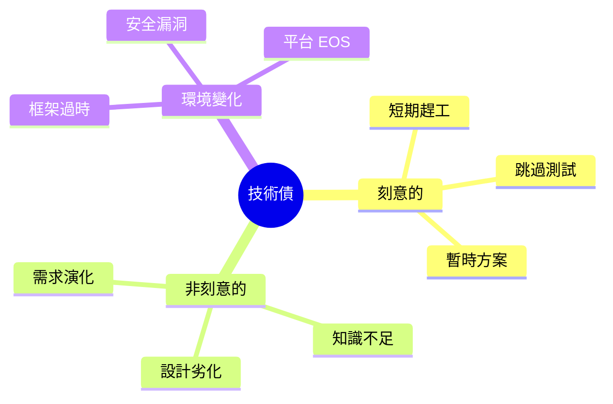

#### 技術債的量化

| 指標 | 計算方式 | 建議閾值 |
|------|----------|----------|
| **技術債比率** | 修復成本 ÷ 重新開發成本 × 100% | < 5% |
| **技術債天數** | SonarQube 計算的修復工時 | < 21 天（每萬行） |
| **新增技術債** | 每次 Sprint 新增的技術債 | 趨勢遞減 |

#### 技術債的四象限模型

| | **魯莽（Reckless）** | **謹慎（Prudent）** |
|---|---|---|
| **刻意（Deliberate）** | 「我們沒時間寫測試」 | 「我們知道有風險，先上線後排期修復」 |
| **非刻意（Inadvertent）** | 「什麼是 SOLID 原則？」 | 「現在我們才知道更好的做法」 |

> **金融業案例**：某銀行核心系統累積 10 年技術債，平台 EOS（End of Support）後，每年花費超過原始開發 3 倍成本進行維護與安全修補。

---

### 1.3 為什麼企業需要品質管理

#### 品質管理的 ROI（投資報酬率）

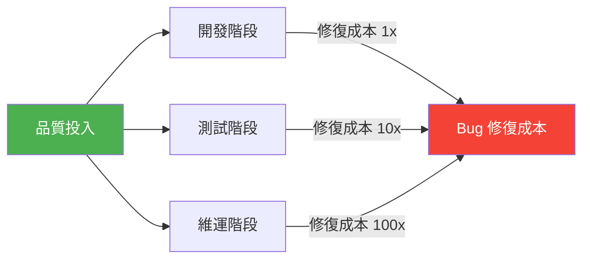

**越早發現問題，修復成本越低**：

| 階段 | 修復成本倍數 | 說明 |
|------|-------------|------|
| 開發中 | 1x | IDE / 靜態分析提示 |
| Code Review | 3x | PR 被打回重寫 |
| QA 測試 | 10x | 需排查、修復、重測 |
| 生產環境 | 100x | 影響客戶、需緊急修復、調查報告 |

#### 企業級品質管理的驅動因素

1. **法規遵循**：金融業受金管會、PCIDSS 等法規約束
2. **安全要求**：OWASP Top 10 的防護
3. **營運穩定**：7×24 服務不停機
4. **成本控制**：減少維運花費
5. **團隊效率**：降低新人上手難度

---

### 1.4 品質管理全景圖

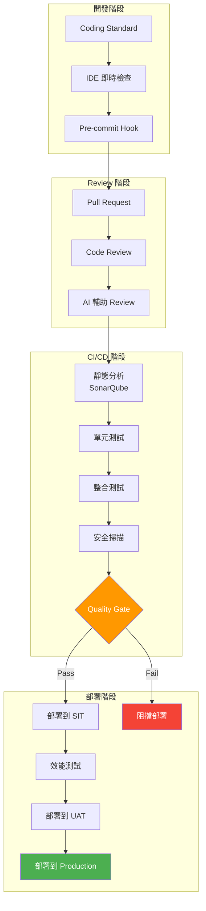

---

### 1.5 實務落地建議

1. **不要一次導入所有品質工具**：先從 SonarQube + 基本 Code Review 開始
2. **先量化現狀**：掃描現有程式碼，建立 baseline
3. **設定可達成的目標**：例如「新程式碼 Bug 率 < A 等級」
4. **建立品質文化**：品質不是 QA 的事，是所有人的事
5. **銀行業注意**：安全性檢查應列為最高優先順序

---

## 第 2 章：程式碼品質模型（核心方法論）

### 2.1 品質模型總覽

本手冊提出一套「企業級六維品質模型（Enterprise Six-Dimension Quality Model, E6DQM）」，適用於大型企業系統。

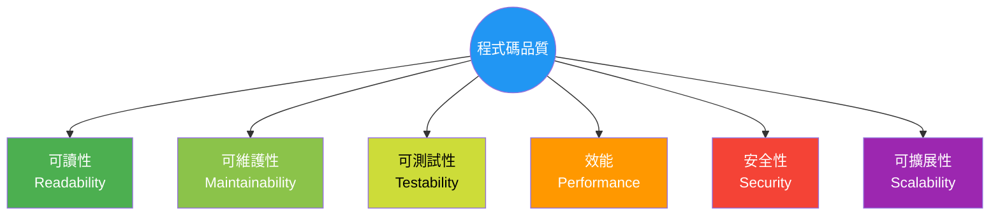

#### 品質維度權重建議（依產業別）

| 維度 | 銀行/金融 | 電商 | 內部系統 |
|------|-----------|------|----------|
| 可讀性 | ★★★★ | ★★★ | ★★★ |
| 可維護性 | ★★★★★ | ★★★★ | ★★★ |
| 可測試性 | ★★★★ | ★★★ | ★★ |
| 效能 | ★★★★★ | ★★★★★ | ★★ |
| 安全性 | ★★★★★ | ★★★★ | ★★★ |
| 可擴展性 | ★★★★ | ★★★★★ | ★★ |

---

### 2.2 可讀性（Readability）

#### 定義

程式碼能被**其他開發者**在合理時間內理解的程度。一段好的程式碼，應該像散文一樣可以被「閱讀」。

#### 評估方式

| 指標 | 量化方式 | 建議閾值 |
|------|----------|----------|
| 方法行數 | Lines Per Method | ≤ 30 行 |
| 類別行數 | Lines Per Class | ≤ 500 行 |
| 巢狀深度 | Nesting Depth | ≤ 3 層 |
| 命名品質 | 命名規範符合率 | ≥ 95% |
| 認知複雜度 | Cognitive Complexity (SonarQube) | ≤ 15 |

#### 常見問題

```java
// ❌ Bad：巢狀太深、命名不清
public void proc(List<Map<String, Object>> d) {
    for (Map<String, Object> m : d) {
        if (m.get("type") != null) {
            if (m.get("type").equals("A")) {
                if (m.get("status") != null) {
                    if (m.get("status").equals("1")) {
                        // 處理邏輯...
                    }
                }
            }
        }
    }
}
```

#### 改善方法

```java
// ✅ Good：Early Return + 有意義命名 + Guard Clause
public void processTransactions(List<Transaction> transactions) {
    for (Transaction transaction : transactions) {
        if (!transaction.isTypeA()) {
            continue;
        }
        if (!transaction.isActive()) {
            continue;
        }
        processActiveTypeATransaction(transaction);
    }
}

private void processActiveTypeATransaction(Transaction transaction) {
    // 處理邏輯...
}
```

**改善技巧摘要**：
1. 使用 **Guard Clause**（衛語句）取代巢狀 `if`
2. 提取方法（Extract Method）
3. 使用 **有意義的命名**（不要用 `d`, `m`, `proc`）
4. 善用 Java Stream API 增強表達力

---

### 2.3 可維護性（Maintainability）

#### 定義

修改、擴展、修復程式碼的難易程度。可維護性高的系統，能讓團隊在最小風險下進行變更。

#### 評估方式

| 指標 | 量化方式 | 建議閾值 |
|------|----------|----------|
| 圈複雜度 | Cyclomatic Complexity | ≤ 10（每個方法） |
| 耦合度 | Coupling Between Objects (CBO) | ≤ 8 |
| 繼承深度 | Depth of Inheritance Tree (DIT) | ≤ 4 |
| LCOM4 | Lack of Cohesion of Methods | ≤ 1（理想值） |
| SonarQube 評級 | Maintainability Rating | A |

#### 常見問題

- **God Class**：一個類別超過 2000 行，包辦所有功能
- **Shotgun Surgery**：改一個需求要改 10+ 個檔案
- **Copy-Paste Code**：重複程式碼散落各處

#### 改善方法

**遵循 SOLID 原則**：

```java
// ❌ Bad：違反 SRP，一個類別包辦帳務、通知、報表
public class AccountManager {
    public void createAccount(AccountDto dto) { /* ... */ }
    public void sendEmail(String to, String body) { /* ... */ }
    public void generateReport(Date from, Date to) { /* ... */ }
    public void calculateInterest(String accountId) { /* ... */ }
}

// ✅ Good：職責分離
public class AccountService {
    public void createAccount(AccountDto dto) { /* ... */ }
    public void calculateInterest(String accountId) { /* ... */ }
}

public class NotificationService {
    public void sendEmail(String to, String body) { /* ... */ }
}

public class ReportService {
    public void generateReport(Date from, Date to) { /* ... */ }
}
```

**關鍵原則**：

| 原則 | 說明 | 違反時的症狀 |
|------|------|-------------|
| **SRP** | 單一職責 | 類別太大，改一處影響多處 |
| **OCP** | 開放封閉 | 加新功能需改現有程式碼 |
| **LSP** | Liskov 替換 | 子類別無法替換父類別 |
| **ISP** | 介面隔離 | 實作被迫 override 不需要的方法 |
| **DIP** | 依賴反轉 | 高階模組直接依賴低階模組 |

---

### 2.4 可測試性（Testability）

#### 定義

程式碼能被有效測試的程度。可測試性高的程式碼，可以輕鬆寫出快速、穩定、獨立的測試。

#### 評估方式

| 指標 | 量化方式 | 建議閾值 |
|------|----------|----------|
| 測試覆蓋率 | Line / Branch Coverage | ≥ 80%（新程式碼） |
| 測試執行時間 | Unit Test Total Time | ≤ 5 分鐘 |
| 可 Mock 性 | 依賴注入比率 | 100% |
| 測試穩定性 | Flaky Test Rate | ≤ 1% |

#### 常見問題

```java
// ❌ Bad：在方法內部直接 new 依賴，無法 Mock
public class OrderService {
    public void placeOrder(OrderDto dto) {
        // 直接 new，無法替換
        EmailService emailService = new EmailService();
        PaymentGateway gateway = new PaymentGateway();
        
        gateway.charge(dto.getAmount());
        emailService.send(dto.getEmail(), "訂單成功");
    }
}
```

#### 改善方法

```java
// ✅ Good：依賴注入，可輕鬆 Mock
@Service
public class OrderService {
    
    private final EmailService emailService;
    private final PaymentGateway paymentGateway;
    
    // 建構子注入
    public OrderService(EmailService emailService, PaymentGateway paymentGateway) {
        this.emailService = emailService;
        this.paymentGateway = paymentGateway;
    }
    
    public void placeOrder(OrderDto dto) {
        paymentGateway.charge(dto.getAmount());
        emailService.send(dto.getEmail(), "訂單成功");
    }
}
```

```java
// ✅ 對應的測試
@ExtendWith(MockitoExtension.class)
class OrderServiceTest {
    
    @Mock
    private EmailService emailService;
    
    @Mock
    private PaymentGateway paymentGateway;
    
    @InjectMocks
    private OrderService orderService;
    
    @Test
    void placeOrder_shouldChargeAndSendEmail() {
        OrderDto dto = new OrderDto("user@bank.com", BigDecimal.valueOf(1000));
        
        orderService.placeOrder(dto);
        
        verify(paymentGateway).charge(BigDecimal.valueOf(1000));
        verify(emailService).send("user@bank.com", "訂單成功");
    }
}
```

---

### 2.5 效能（Performance）

#### 定義

程式碼在給定資源條件下的執行效率，包含回應時間、吞吐量、資源使用率。

#### 評估方式

| 指標 | 量化方式 | 建議閾值（銀行等級） |
|------|----------|---------------------|
| 回應時間 | P95 Response Time | ≤ 200ms（API） |
| 吞吐量 | TPS (Transactions Per Second) | ≥ 1000 TPS |
| CPU 使用率 | Peak CPU | ≤ 70% |
| 記憶體 | Heap Usage | ≤ 80% |
| 資料庫查詢 | Slow Query Rate | ≤ 0.1% |

#### 常見問題

```java
// ❌ Bad：N+1 Query 問題
public List<OrderDetailDto> getOrders(List<String> orderIds) {
    List<OrderDetailDto> results = new ArrayList<>();
    for (String orderId : orderIds) {
        // 每筆訂單都查一次 DB（N+1）
        Order order = orderRepository.findById(orderId).orElse(null);
        if (order != null) {
            results.add(toDto(order));
        }
    }
    return results;
}
```

#### 改善方法

```java
// ✅ Good：批次查詢
public List<OrderDetailDto> getOrders(List<String> orderIds) {
    return orderRepository.findAllById(orderIds)
        .stream()
        .map(this::toDto)
        .collect(Collectors.toList());
}
```

**效能最佳實踐**：
1. 避免 N+1 Query，使用 `@EntityGraph` 或 `JOIN FETCH`
2. 適當使用快取（Redis / Caffeine）
3. 資料庫索引優化
4. 避免在迴圈中做 I/O 操作
5. 使用連線池（HikariCP）

---

### 2.6 安全性（Security）

#### 定義

程式碼抵禦攻擊、保護資料的能力。在金融業中，安全性是最高優先順序。

#### 評估方式

| 指標 | 量化方式 | 建議閾值 |
|------|----------|----------|
| OWASP 漏洞數 | 靜態掃描結果 | 0（Critical / High） |
| 相依套件漏洞 | CVE 數量 | 0（Known Exploited） |
| Secrets 洩漏 | Hard-coded 密碼/金鑰 | 0 |
| 安全測試覆蓋 | Security Test Coverage | ≥ 100%（關鍵流程） |

#### 常見問題（OWASP Top 10: 2025）

> ⚠️ **重要更新**：OWASP 於 2025 年發布全新版本 Top 10，取代 2021 版。主要變動包括新增「**A03 軟體供應鏈失敗**」與「**A10 異常條件處理不當**」，反映供應鏈攻擊與錯誤處理成為當代主要威脅。

```java
// ❌ Bad：SQL Injection（A05:2025 - Injection）
public User findUser(String username) {
    String sql = "SELECT * FROM users WHERE username = '" + username + "'";
    return jdbcTemplate.queryForObject(sql, User.class);
}
```

#### 改善方法

```java
// ✅ Good：Parameterized Query
public User findUser(String username) {
    String sql = "SELECT * FROM users WHERE username = ?";
    return jdbcTemplate.queryForObject(sql, new Object[]{username}, userRowMapper);
}

// ✅ Better：使用 Spring Data JPA
public interface UserRepository extends JpaRepository<User, Long> {
    Optional<User> findByUsername(String username);
}
```

**安全性檢查清單（OWASP Top 10: 2025）**：

| **排名** | **OWASP 2025 項目** | **防護方式** |
|----------|----------------------|-------------|
| A01 | Broken Access Control（存取控制失效） | RBAC / 最小權限原則 / 預設拒絕存取 |
| A02 | Security Misconfiguration（安全設定錯誤） | 安全 Header / 最小化安裝 / Production Profile |
| A03 | **Software Supply Chain Failures（軟體供應鏈失敗）** 🆕 | SCA 掃描 / SBOM 管理 / 相依套件簽章驗證 |
| A04 | Cryptographic Failures（加密失敗） | TLS 1.3 / AES-256 / 禁用弱雜湊（MD5/SHA1） |
| A05 | Injection（注入攻擊） | Parameterized Query / ORM / 輸入驗證 |
| A06 | Insecure Design（不安全設計） | 威脅建模 / 安全設計審查 / Abuse Cases |
| A07 | Authentication Failures（認證失敗） | MFA / 密碼強度策略 / Session 管理 |
| A08 | Software or Data Integrity Failures（軟體與資料完整性失敗） | 數位簽章 / CI/CD Pipeline 安全 / 白名單驗證 |
| A09 | Security Logging and Alerting Failures（安全日誌與告警失敗） | 完整稽核日誌 / SIEM 整合 / 即時告警 |
| A10 | **Mishandling of Exceptional Conditions（異常條件處理不當）** 🆕 | 統一錯誤處理 / 避免洩漏堆疊資訊 / Fail-safe 設計 |

> 📌 **2025 vs 2021 主要變動**：
> - **新增 A03**：Software Supply Chain Failures（原 A06 Vulnerable and Outdated Components 擴展而來，強調整個供應鏈安全）
> - **新增 A10**：Mishandling of Exceptional Conditions（取代 SSRF，強調例外處理不當的風險）
> - **A02 上升**：Security Misconfiguration 從 A05 升至 A02，反映雲端環境設定錯誤問題日益嚴重
> - **參考**：[OWASP Top 10: 2025 官方網站](https://owasp.org/Top10/2025/)

---

### 2.7 可擴展性（Scalability）

#### 定義

系統應對增長（使用者、資料量、功能）的能力，包含水平擴展與垂直擴展。

#### 評估方式

| 指標 | 量化方式 | 建議 |
|------|----------|------|
| 模組化程度 | Package Coupling | 低耦合 |
| 介面抽象度 | Interface Usage Rate | ≥ 80%（外部依賴） |
| 設定外部化 | Hard-coded Config | 0 |
| 無狀態設計 | Stateless Service Rate | 100%（Web 層） |

#### 常見問題

```java
// ❌ Bad：Hard-coded 設定、緊耦合
public class PaymentService {
    private static final String API_URL = "https://payment.bank.com/api/v1";
    private static final int TIMEOUT = 3000;
    
    public void pay(PaymentRequest request) {
        // 直接使用 HttpClient，無法切換實作
        HttpClient client = HttpClient.newHttpClient();
        // ...
    }
}
```

#### 改善方法

```java
// ✅ Good：設定外部化 + 介面抽象
@ConfigurationProperties(prefix = "payment.gateway")
public class PaymentGatewayProperties {
    private String apiUrl;
    private int timeoutMs = 3000;
    // getters / setters
}

public interface PaymentGateway {
    PaymentResult pay(PaymentRequest request);
}

@Service
@Profile("production")
public class BankPaymentGateway implements PaymentGateway {
    
    private final PaymentGatewayProperties properties;
    private final RestTemplate restTemplate;
    
    public BankPaymentGateway(PaymentGatewayProperties properties, RestTemplate restTemplate) {
        this.properties = properties;
        this.restTemplate = restTemplate;
    }
    
    @Override
    public PaymentResult pay(PaymentRequest request) {
        return restTemplate.postForObject(
            properties.getApiUrl() + "/pay",
            request,
            PaymentResult.class
        );
    }
}
```

---

### 2.8 實務落地建議

1. **從最重要的維度開始**：銀行系統先顧安全性與可靠性
2. **每個維度設定可量化指標**：透過 SonarQube Dashboard 追蹤
3. **不要追求完美**：先達到「及格線」，再逐步提升
4. **定期 Review 品質趨勢**：每兩週一次品質回顧會議
5. **工具自動化**：人工檢查不可靠，必須仰賴工具

---

## 第 3 章：程式碼異味（Code Smells）

### 3.1 什麼是 Code Smell

Code Smell 不是 Bug，而是程式碼中「暗示潛在問題」的跡象。它不會讓程式當場出錯，但會逐漸侵蝕系統品質。

> **Martin Fowler**：「A code smell is a surface indication that usually corresponds to a deeper problem in the system.」


---

### 3.2 常見 15+ 種 Code Smells

#### Smell #1：Long Method（過長方法）

**說明**：方法超過 30 行，難以理解和測試。

```java
// ❌ Bad：一個方法做太多事
public TransactionResult processTransaction(TransactionRequest request) {
    // 驗證... (20行)
    // 查詢帳戶... (15行)
    // 計算手續費... (25行)
    // 執行轉帳... (20行)
    // 發送通知... (15行)
    // 產生報表... (10行)
    // 共 105 行
}
```

```java
// ✅ Good：拆分為小方法
public TransactionResult processTransaction(TransactionRequest request) {
    validate(request);
    Account account = findAccount(request.getAccountId());
    BigDecimal fee = calculateFee(request);
    TransactionResult result = executeTransfer(account, request, fee);
    sendNotification(result);
    return result;
}
```

**改善方式**：Extract Method（提取方法）

---

#### Smell #2：God Class（上帝類別）

**說明**：一個類別承擔過多職責，通常超過 500-1000 行。

```java
// ❌ Bad：什麼都做
public class BankingHelper {
    public void createAccount() { }
    public void transferMoney() { }
    public void sendSMS() { }
    public void generatePDF() { }
    public void calculateTax() { }
    public void syncExternalSystem() { }
    // ... 2000+ 行
}
```

```java
// ✅ Good：按職責拆分
public class AccountService { /* 帳戶相關 */ }
public class TransferService { /* 轉帳相關 */ }
public class NotificationService { /* 通知相關 */ }
public class ReportService { /* 報表相關 */ }
public class TaxCalculationService { /* 稅務計算 */ }
```

**改善方式**：Extract Class（提取類別）+ SRP

---

#### Smell #3：Primitive Obsession（基本型別偏執）

**說明**：用 `String`、`int` 等基本型別表達業務概念。

```java
// ❌ Bad
public void transfer(String fromAccount, String toAccount, double amount, String currency) {
    // fromAccount 格式是什麼？amount 可以是負數嗎？currency 有哪些？
}
```

```java
// ✅ Good：使用 Value Object
public void transfer(AccountNumber from, AccountNumber to, Money amount) {
    // 型別安全，自帶校驗
}

public record AccountNumber(String value) {
    public AccountNumber {
        if (!value.matches("\\d{3}-\\d{2}-\\d{7}")) {
            throw new InvalidAccountNumberException(value);
        }
    }
}

public record Money(BigDecimal amount, Currency currency) {
    public Money {
        if (amount.compareTo(BigDecimal.ZERO) < 0) {
            throw new NegativeAmountException(amount);
        }
    }
}
```

**改善方式**：Replace Primitive with Object / Introduce Value Object

---

#### Smell #4：Feature Envy（依戀情結）

**說明**：一個方法大量使用其他類別的資料，而非自己類別的資料。

```java
// ❌ Bad：大量存取 account 的內部資料
public class TransactionValidator {
    public boolean isValid(Account account, BigDecimal amount) {
        return account.getBalance().subtract(account.getHoldAmount())
            .subtract(account.getPendingAmount())
            .compareTo(amount) >= 0
            && account.getStatus().equals("ACTIVE")
            && !account.isFrozen();
    }
}
```

```java
// ✅ Good：邏輯放到資料所在的類別
public class Account {
    public boolean canWithdraw(BigDecimal amount) {
        BigDecimal available = balance.subtract(holdAmount).subtract(pendingAmount);
        return available.compareTo(amount) >= 0
            && "ACTIVE".equals(status)
            && !frozen;
    }
}
```

**改善方式**：Move Method（搬移方法）

---

#### Smell #5：Duplicate Code（重複程式碼）

**說明**：相同或極相似的程式碼出現在多處。

```java
// ❌ Bad：多個 Controller 都有相同的日期驗證
// AccountController.java
if (startDate.isAfter(endDate)) {
    throw new BadRequestException("起始日不得大於結束日");
}

// TransactionController.java
if (startDate.isAfter(endDate)) {
    throw new BadRequestException("起始日不得大於結束日");
}
```

```java
// ✅ Good：提取為共用方法或工具類
public class DateValidator {
    public static void validateRange(LocalDate startDate, LocalDate endDate) {
        if (startDate.isAfter(endDate)) {
            throw new BadRequestException("起始日不得大於結束日");
        }
    }
}
```

**改善方式**：Extract Method / Pull Up Method

---

#### Smell #6：Shotgun Surgery（散彈式修改）

**說明**：一個業務需求的變更需要修改多個類別。

**改善方式**：Move Method / Move Field，將相關邏輯集中到同一個模組。

---

#### Smell #7：Data Clumps（資料泥團）

**說明**：一組資料總是一起出現多個方法簽名中。

```java
// ❌ Bad：startDate, endDate 總是一起出現
public List<Transaction> search(LocalDate startDate, LocalDate endDate, String accountId) { }
public BigDecimal summarize(LocalDate startDate, LocalDate endDate, String accountId) { }
public Report generate(LocalDate startDate, LocalDate endDate, String accountId) { }
```

```java
// ✅ Good：封裝為物件
public record TransactionQuery(DateRange dateRange, AccountNumber accountId) { }
public record DateRange(LocalDate from, LocalDate to) { }

public List<Transaction> search(TransactionQuery query) { }
public BigDecimal summarize(TransactionQuery query) { }
public Report generate(TransactionQuery query) { }
```

**改善方式**：Introduce Parameter Object

---

#### Smell #8：Dead Code（死碼）

**說明**：永遠不會被執行的程式碼。

```java
// ❌ Bad
public void process() {
    return;
    System.out.println("永遠不會執行"); // Dead Code
}

// 或是被註解掉的舊程式碼
// public void oldMethod() { ... }  // TODO: 確認後刪除（已存在 3 年）
```

**改善方式**：直接刪除。版本控制（Git）會保留歷史。

---

#### Smell #9：Comments as Deodorant（用註解掩蓋臭味）

**說明**：需要大量註解才能理解的程式碼，本身可讀性就有問題。

```java
// ❌ Bad
// 檢查使用者是否有權限且帳戶是有效的且金額大於零
if (u.getR() == 1 && a.getS().equals("A") && amt > 0) { }

// ✅ Good：程式碼自己說話
if (user.hasTransferPermission() && account.isActive() && amount.isPositive()) { }
```

**改善方式**：重新命名 + Extract Method，讓程式碼自文件化。

---

#### Smell #10：Magic Number（魔術數字）

**說明**：程式碼中出現無意義的數字常數。

```java
// ❌ Bad
if (account.getBalance().compareTo(new BigDecimal("50000")) > 0) {
    applyDiscount(0.15);
}

// ✅ Good
private static final BigDecimal VIP_THRESHOLD = new BigDecimal("50000");
private static final BigDecimal VIP_DISCOUNT_RATE = new BigDecimal("0.15");

if (account.getBalance().compareTo(VIP_THRESHOLD) > 0) {
    applyDiscount(VIP_DISCOUNT_RATE);
}
```

**改善方式**：Replace Magic Number with Named Constant

---

#### Smell #11：Large Class（過大類別）

**說明**：類別包含過多的欄位和方法，超過 500 行。

**改善方式**：Extract Class / Extract Subclass

---

#### Smell #12：Inappropriate Intimacy（不當親密）

**說明**：兩個類別過度了解對方的內部實作細節。

**改善方式**：Move Method / Move Field / Extract Class

---

#### Smell #13：Speculative Generality（推測性泛化）

**說明**：為了「未來可能用到」而過度設計的抽象層。

```java
// ❌ Bad：只有一種實作卻建了抽象層
public interface DataProcessor { }
public abstract class AbstractDataProcessor implements DataProcessor { }
public class ConcreteDataProcessor extends AbstractDataProcessor { }
// 四年了仍然只有一種實作
```

**改善方式**：刪除不必要的抽象。YAGNI（You Aren't Gonna Need It）。

---

#### Smell #14：Switch Statements（過多 Switch/If-else）

**說明**：冗長的 switch/if-else 鏈，通常在多處重複。

```java
// ❌ Bad
public BigDecimal calculateFee(String accountType, BigDecimal amount) {
    switch (accountType) {
        case "SAVINGS": return amount.multiply(new BigDecimal("0.001"));
        case "CHECKING": return amount.multiply(new BigDecimal("0.002"));
        case "VIP": return BigDecimal.ZERO;
        default: throw new IllegalArgumentException("Unknown type");
    }
}
```

```java
// ✅ Good：使用多型
public interface FeeStrategy {
    BigDecimal calculate(BigDecimal amount);
}

public class SavingsFeeStrategy implements FeeStrategy {
    @Override
    public BigDecimal calculate(BigDecimal amount) {
        return amount.multiply(new BigDecimal("0.001"));
    }
}

// 使用 Map 或 Spring @Qualifier 注入
```

**改善方式**：Replace Conditional with Polymorphism

---

#### Smell #15：Lazy Class（冗餘類別）

**說明**：類別做的事太少，不值得獨立存在。

**改善方式**：Inline Class（將內容合併到使用者類別）

---

#### Smell #16：Middle Man（中間人）

**說明**：一個類別的大部分方法只是委派給另一個物件。

```java
// ❌ Bad：幾乎所有方法都只是 delegate
public class AccountManager {
    private final AccountService service;
    
    public Account find(String id) { return service.find(id); }
    public void save(Account a) { service.save(a); }
    public void delete(String id) { service.delete(id); }
    // 沒有任何自己的邏輯
}
```

**改善方式**：Remove Middle Man，讓呼叫者直接使用被委派的物件。

---

#### Smell #17：Refused Bequest（被拒絕的遺產）

**說明**：子類別繼承了父類別但只用到少部分功能，或覆寫拋出 `UnsupportedOperationException`。

**改善方式**：使用組合（Composition）取代繼承（Inheritance），或重新設計類別階層。

---

### 3.3 實務落地建議

1. **導入 SonarQube**：自動偵測大部分 Code Smells
2. **在 Code Review 中關注 Top 5**：Long Method、God Class、Duplicate Code、Magic Number、Primitive Obsession
3. **每 Sprint 分配 10-15% 時間修復 Code Smells**
4. **建立團隊共識**：哪些異味必須修、哪些可以暫緩
5. **銀行業優先**：與安全性相關的 Smell（如 Dead Code、不當親密）優先處理

---

## 第 4 章：靜態分析與工具

### 4.1 靜態分析概述

靜態分析是指**不執行程式碼**的情況下，透過分析原始碼或位元碼來發現潛在問題的技術。它是品質管理自動化的基石。

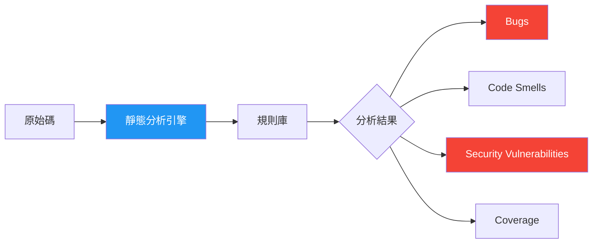

#### 靜態分析的效益

| 效益 | 說明 |
|------|------|
| **早期發現** | 在開發階段即發現問題，成本最低 |
| **自動化** | 無需人工逐行檢查 |
| **一致性** | 統一標準，不因 Reviewer 不同而有落差 |
| **持續追蹤** | 品質趨勢可視化 |

---

### 4.2 SonarQube

#### 功能概述

SonarQube 是目前最廣泛使用的企業級程式碼品質平台，支援 30+ 種程式語言。

**核心功能**：
- **Bugs 偵測**：可能導致執行錯誤的程式碼
- **Vulnerabilities**：安全漏洞偵測
- **Code Smells**：可維護性問題
- **Coverage**：測試覆蓋率追蹤
- **Duplications**：重複程式碼分析
- **Quality Gate**：品質門檻控管

#### SonarQube 品質評級系統

| 評級 | Technical Debt Ratio | 說明 |
|------|---------------------|------|
| **A** | ≤ 5% | 優良 |
| **B** | 6-10% | 尚可 |
| **C** | 11-20% | 需改善 |
| **D** | 21-50% | 嚴重 |
| **E** | > 50% | 危急 |

#### 企業導入配置範例

```yaml
# sonar-project.properties（Java Spring Boot 專案）
sonar.projectKey=banking-core-system
sonar.projectName=Banking Core System
sonar.projectVersion=1.0

# 原始碼路徑
sonar.sources=src/main/java
sonar.tests=src/test/java
sonar.java.binaries=target/classes

# 排除規則（不掃描自動產生的程式碼）
sonar.exclusions=**/generated/**,**/dto/**/*Mapper.java

# 覆蓋率報告
sonar.coverage.jacoco.xmlReportPaths=target/site/jacoco/jacoco.xml

# 編碼
sonar.sourceEncoding=UTF-8
```

#### Maven 整合

```xml
<!-- pom.xml -->
<build>
    <plugins>
        <!-- JaCoCo 覆蓋率 -->
        <plugin>
            <groupId>org.jacoco</groupId>
            <artifactId>jacoco-maven-plugin</artifactId>
            <version>0.8.12</version>
            <executions>
                <execution>
                    <goals>
                        <goal>prepare-agent</goal>
                    </goals>
                </execution>
                <execution>
                    <id>report</id>
                    <phase>test</phase>
                    <goals>
                        <goal>report</goal>
                    </goals>
                </execution>
            </executions>
        </plugin>
    </plugins>
</build>
```

```bash
# 執行掃描
mvn clean verify sonar:sonar \
  -Dsonar.host.url=https://sonarqube.company.com \
  -Dsonar.token=${SONAR_TOKEN}
```

---

### 4.3 ESLint

#### 功能概述

ESLint 是 JavaScript / TypeScript 的靜態分析工具，適用於前端（Vue / React）專案。

> 📌 **版本說明**：ESLint 9.x 起全面採用 **Flat Config**（`eslint.config.js`）格式，取代舊版 `.eslintrc.*`。以下同時提供兩種格式範例。

**核心功能**：
- 語法錯誤偵測
- 程式碼風格統一
- 最佳實踐規則
- 可自訂規則

#### 企業級 ESLint 配置範例（Flat Config — ESLint 9.x+ 推薦）

```javascript
// eslint.config.js（Vue 3 + TypeScript 專案）
import eslint from '@eslint/js';
import tseslint from 'typescript-eslint';
import pluginVue from 'eslint-plugin-vue';
import pluginSecurity from 'eslint-plugin-security';

export default tseslint.config(
  eslint.configs.recommended,
  ...tseslint.configs.recommended,
  ...pluginVue.configs['flat/recommended'],
  {
    files: ['**/*.{ts,vue}'],
    plugins: {
      security: pluginSecurity,
    },
    rules: {
      // 命名規範
      '@typescript-eslint/naming-convention': [
        'error',
        { selector: 'interface', format: ['PascalCase'] },
        { selector: 'class', format: ['PascalCase'] },
        { selector: 'variable', format: ['camelCase', 'UPPER_CASE'] },
      ],
      // 複雜度限制
      'complexity': ['error', { max: 10 }],
      'max-lines-per-function': ['warn', { max: 50 }],
      'max-depth': ['error', { max: 3 }],
      // 安全性
      'no-eval': 'error',
      'no-implied-eval': 'error',
    },
  },
);
```

#### 舊版格式（`.eslintrc.js` — ESLint 8.x 及更早）

<details>
<summary>點擊展開舊版配置</summary>

```javascript
// .eslintrc.js（Vue 3 + TypeScript 專案）
module.exports = {
  root: true,
  env: {
    browser: true,
    node: true,
    es2022: true,
  },
  extends: [
    'eslint:recommended',
    'plugin:vue/vue3-recommended',
    'plugin:@typescript-eslint/recommended',
    'plugin:security/recommended',
  ],
  parser: 'vue-eslint-parser',
  parserOptions: {
    parser: '@typescript-eslint/parser',
    ecmaVersion: 2022,
    sourceType: 'module',
  },
  rules: {
    // 命名規範
    '@typescript-eslint/naming-convention': [
      'error',
      { selector: 'interface', format: ['PascalCase'] },
      { selector: 'class', format: ['PascalCase'] },
      { selector: 'variable', format: ['camelCase', 'UPPER_CASE'] },
    ],
    // 複雜度限制
    'complexity': ['error', { max: 10 }],
    'max-lines-per-function': ['warn', { max: 50 }],
    'max-depth': ['error', { max: 3 }],
    // 安全性
    'no-eval': 'error',
    'no-implied-eval': 'error',
  },
};
```

</details>

---

### 4.4 PMD / Checkstyle

#### PMD

PMD 是 Java 靜態分析工具，專注於**程式碼問題偵測**（如未使用變數、空 catch、不必要的物件建立）。

> 📌 **版本說明**：PMD 引擎最新版本為 **7.23.0**（≥ 7.0 為重大版本升級，規則格式有變動）。以下使用 Apache Maven PMD Plugin 3.24.0，它預設纁結 PMD 7.x 引擎。

```xml
<!-- pom.xml：PMD Plugin（使用 PMD 7.x 引擎） -->
<plugin>
    <groupId>org.apache.maven.plugins</groupId>
    <artifactId>maven-pmd-plugin</artifactId>
    <version>3.24.0</version>
    <configuration>
        <rulesets>
            <ruleset>category/java/bestpractices.xml</ruleset>
            <ruleset>category/java/errorprone.xml</ruleset>
            <ruleset>category/java/security.xml</ruleset>
            <ruleset>category/java/performance.xml</ruleset>
        </rulesets>
        <failOnViolation>true</failOnViolation>
        <printFailingErrors>true</printFailingErrors>
    </configuration>
</plugin>
```

#### Checkstyle

Checkstyle 專注於**程式碼風格與格式**（命名、縮排、JavaDoc）。

> 📌 **版本說明**：Checkstyle 引擎最新版本為 **13.4.0**（≥ 13.0.0 要求 JDK 21+）。若專案使用 JDK 17，請使用 Checkstyle 12.x。以下使用 Apache Maven Checkstyle Plugin 3.4.0。

```xml
<!-- pom.xml：Checkstyle Plugin -->
<plugin>
    <groupId>org.apache.maven.plugins</groupId>
    <artifactId>maven-checkstyle-plugin</artifactId>
    <version>3.4.0</version>
    <configuration>
        <configLocation>checkstyle.xml</configLocation>
        <failsOnError>true</failsOnError>
        <consoleOutput>true</consoleOutput>
    </configuration>
</plugin>
```

```xml
<!-- checkstyle.xml：企業級規則範例 -->
<?xml version="1.0"?>
<!DOCTYPE module PUBLIC
    "-//Checkstyle//DTD Checkstyle Configuration 1.3//EN"
    "https://checkstyle.org/dtds/configuration_1_3.dtd">
<module name="Checker">
    <module name="TreeWalker">
        <!-- 命名規範 -->
        <module name="TypeName">
            <property name="format" value="^[A-Z][a-zA-Z0-9]+$"/>
        </module>
        <module name="MethodName">
            <property name="format" value="^[a-z][a-zA-Z0-9]+$"/>
        </module>
        <!-- 複雜度 -->
        <module name="CyclomaticComplexity">
            <property name="max" value="10"/>
        </module>
        <!-- 方法長度 -->
        <module name="MethodLength">
            <property name="max" value="30"/>
        </module>
        <!-- 類別長度 -->
        <module name="FileLength">
            <property name="max" value="500"/>
        </module>
        <!-- JavaDoc -->
        <module name="MissingJavadocMethod">
            <property name="scope" value="public"/>
        </module>
    </module>
</module>
```

---

### 4.5 SpotBugs

SpotBugs（FindBugs 的繼任者）透過分析 **Java Bytecode** 來偵測潛在 Bug。

> 📌 **版本說明**：SpotBugs 最新版本為 **4.9.8**（≥ 4.9.0 要求 JRE 11+）。

**擅長偵測**：
- Null Pointer Dereference
- Infinite Recursive Loop
- Resource Leak（未關閉的 Stream / Connection）
- Concurrency Issues（多執行緒問題）
- Thread Safety Violations（≥ 4.9.0 新增 SharedVariableAtomicityDetector）

```xml
<!-- pom.xml：SpotBugs Plugin -->
<plugin>
    <groupId>com.github.spotbugs</groupId>
    <artifactId>spotbugs-maven-plugin</artifactId>
    <version>4.9.3.0</version>
    <configuration>
        <effort>Max</effort>
        <threshold>Medium</threshold>
        <failOnError>true</failOnError>
        <plugins>
            <!-- 安全性擴充：fb-contrib + find-sec-bugs -->
            <plugin>
                <groupId>com.h3xstream.findsecbugs</groupId>
                <artifactId>findsecbugs-plugin</artifactId>
                <version>1.13.0</version>
            </plugin>
        </plugins>
    </configuration>
</plugin>
```

---

### 4.6 工具功能比較

| 功能/工具 | SonarQube | ESLint | PMD | Checkstyle | SpotBugs |
|-----------|-----------|--------|-----|------------|----------|
| **語言** | 30+ | JS/TS | Java | Java | Java |
| **分析對象** | 原始碼 | 原始碼 | 原始碼 | 原始碼 | Bytecode |
| **Bug 偵測** | ✅ | ⚠️ | ✅ | ❌ | ✅✅ |
| **安全漏洞** | ✅ | ⚠️ | ⚠️ | ❌ | ✅ |
| **Code Smell** | ✅ | ✅ | ✅ | ⚠️ | ❌ |
| **程式碼風格** | ⚠️ | ✅ | ❌ | ✅✅ | ❌ |
| **重複偵測** | ✅ | ❌ | ✅ | ❌ | ❌ |
| **覆蓋率** | ✅ | ❌ | ❌ | ❌ | ❌ |
| **Quality Gate** | ✅ | ❌ | ❌ | ❌ | ❌ |
| **Dashboard** | ✅✅ | ❌ | ❌ | ❌ | ❌ |
| **成本** | 社群版免費 | 免費 | 免費 | 免費 | 免費 |

> ✅✅ = 優秀、✅ = 支援、⚠️ = 部分支援、❌ = 不支援

---

### 4.7 企業導入方式

#### 推薦組合策略

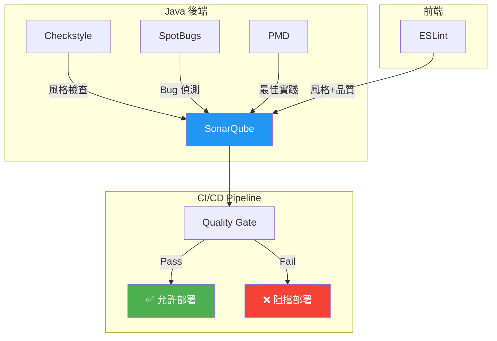

**分階段導入建議**：

| 階段 | 工具 | 目標 |
|------|------|------|
| Phase 1（第1-2週） | Checkstyle | 統一程式碼風格 |
| Phase 2（第3-4週） | SonarQube | 綜合品質掃描 |
| Phase 3（第5-6週） | SpotBugs + FindSecBugs | 安全性掃描 |
| Phase 4（第7-8週） | Quality Gate 整合 | 自動化品質門檻 |

---

### 4.8 實務落地建議

1. **IDE 整合優先**：在開發時就能看到問題（SonarLint for VS Code / IntelliJ）
2. **不要一次開啟所有規則**：先從 Critical / Blocker 開始
3. **新程式碼 vs 舊程式碼**：SonarQube 支援「New Code」模式，只檢查新增程式碼
4. **自訂規則**：根據企業需求調整規則集（如銀行禁止 `System.out.println`）
5. **定期更新規則庫**：確保能偵測最新的安全漏洞模式

---

## 第 5 章：Code Review 方法論

### 5.1 Code Review 的價值

Code Review 不只是找 Bug，更是：
- **知識傳遞**：資深帶初階
- **設計討論**：在合併前發現設計問題
- **品質把關**：人工補充自動化工具的不足
- **團隊共識**：建立共同的程式碼標準

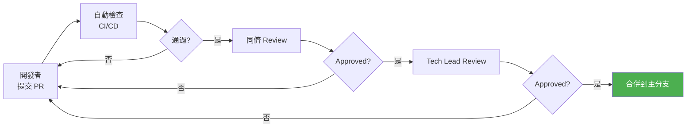

---

### 5.2 Review Checklist（企業版）

#### 功能正確性

- [ ] 是否符合需求規格
- [ ] 邊界條件是否處理（null、空集合、最大值、最小值）
- [ ] 錯誤情況是否有適當處理
- [ ] 併發場景是否安全

#### 設計品質

- [ ] 是否遵循 SOLID 原則
- [ ] 類別職責是否單一
- [ ] 是否有不必要的耦合
- [ ] API 設計是否符合 RESTful 規範

#### 安全性（銀行等級必查）

- [ ] 是否有 SQL Injection 風險
- [ ] 是否有 XSS 風險
- [ ] 敏感資料是否有遮蔽（帳號、密碼）
- [ ] 權限控制是否正確（RBAC）
- [ ] 是否有 Hard-coded 密碼或金鑰
- [ ] 日誌是否洩漏敏感資訊

#### 效能

- [ ] 是否有 N+1 Query
- [ ] 迴圈中是否有不必要的 I/O
- [ ] 是否適當使用快取
- [ ] 大量資料是否有分頁處理

#### 可維護性

- [ ] 命名是否清晰、有意義
- [ ] 方法長度是否合理（≤ 30 行）
- [ ] 是否有重複程式碼
- [ ] 是否有 Magic Number

#### 測試

- [ ] 是否有對應的單元測試
- [ ] 測試是否覆蓋主要路徑與邊界條件
- [ ] 測試命名是否清晰（given-when-then）
- [ ] Mock 使用是否合理

---

### 5.3 Pull Request 標準

#### PR 大小建議

| 大小 | 行數 | Review 時間 | 品質 |
|------|------|-------------|------|
| **XS** | < 50 行 | 10 分鐘 | ⭐⭐⭐⭐⭐ |
| **S** | 50-200 行 | 30 分鐘 | ⭐⭐⭐⭐ |
| **M** | 200-400 行 | 1 小時 | ⭐⭐⭐ |
| **L** | 400-800 行 | 2 小時（品質下降） | ⭐⭐ |
| **XL** | > 800 行 | 不建議 | ⭐ |

> **Google 的研究**：超過 400 行的 PR，Review 品質顯著下降。建議將大 PR 拆分為多個小 PR。

#### PR 描述模板

```markdown
## 變更說明
<!-- 簡述此 PR 的目的 -->

## 變更類型
- [ ] 新功能（Feature）
- [ ] Bug 修復（Bugfix）
- [ ] 重構（Refactoring）
- [ ] 效能優化
- [ ] 安全性修復

## 關聯 Issue
<!-- Fixes #123 -->

## 測試
<!-- 說明測試方式 -->
- [ ] 新增單元測試
- [ ] 通過所有現有測試
- [ ] 手動測試（說明步驟）

## 安全性自檢
- [ ] 無敏感資料洩漏
- [ ] 無 SQL Injection 風險
- [ ] 權限控制正確

## Checklist
- [ ] 程式碼符合團隊規範
- [ ] JavaDoc 已更新
- [ ] SonarQube 掃描通過
```

---

### 5.4 Review 角色分工

| 角色 | 職責 | 關注點 |
|------|------|--------|
| **Author**（提交者） | 提供清晰的 PR 描述、自我檢查 | 確保 CI 通過後再請求 Review |
| **Peer Reviewer** | 程式碼邏輯、可讀性、測試 | 至少 1 位同團隊 |
| **Tech Lead** | 設計決策、架構影響 | 涉及核心模組或架構變更時 |
| **Security Reviewer** | 安全性檢查 | 涉及認證、授權、資料加密時 |
| **Domain Expert** | 業務邏輯正確性 | 涉及複雜業務規則時 |

---

### 5.5 常見錯誤

| 錯誤 | 說明 | 改善方式 |
|------|------|----------|
| **橡皮圖章（Rubber Stamping）** | 不仔細看就 Approve | 強制至少留 2 則 Comment |
| **過度挑剔** | 糾結空格、換行等小事 | 自動化格式檢查，Review 專注邏輯 |
| **PR 太大** | 一次提交 2000+ 行 | 限制 PR ≤ 400 行 |
| **Review 太慢** | PR 放了 3 天沒人看 | SLA：24 小時內首次 Review |
| **情緒化評論** | 「這寫太爛了」 | 改為建議式：「建議可以考慮...」 |
| **只看新增不看刪除** | 忽略刪除的程式碼 | 確認刪除不會影響其他功能 |

---

### 5.6 實務落地建議

1. **自動化先行**：格式、風格交給 Checkstyle / ESLint；人工 Review 專注設計和邏輯
2. **PR 大小 ≤ 400 行**：超過就要求拆分
3. **Review SLA**：24 小時內首次回覆，48 小時內完成
4. **Review 作為學習機會**：鼓勵提問而非只有批評
5. **使用 AI 輔助**：GitHub Copilot Code Review 可自動偵測常見問題

---

## 第 6 章：CI/CD 與品質門檻（Quality Gate）

### 6.1 CI/CD 品質整合概述

在 CI/CD Pipeline 中嵌入品質檢查，是自動化品質管理的關鍵。

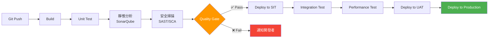

---

### 6.2 Quality Gate 設計

#### SonarQube Quality Gate 設定建議

**New Code（新程式碼）策略**——只對新增 / 修改的程式碼設門檻：

| 條件 | 閾值 | 說明 |
|------|------|------|
| **Coverage on New Code** | ≥ 80% | 新程式碼測試覆蓋率 |
| **Duplicated Lines on New Code** | ≤ 3% | 新程式碼重複率 |
| **Maintainability Rating** | A | 可維護性評級 |
| **Reliability Rating** | A | 可靠性評級 |
| **Security Rating** | A | 安全性評級 |
| **Security Hotspots Reviewed** | 100% | 安全熱點已審查 |

**Overall Code（全部程式碼）策略**——針對整個專案：

| 條件 | 閾值 | 階段 |
|------|------|------|
| Overall Coverage | ≥ 60% | Phase 1（初期） |
| Overall Coverage | ≥ 70% | Phase 2（中期） |
| Overall Coverage | ≥ 80% | Phase 3（成熟期） |
| Critical Bugs | 0 | 立即執行 |
| Critical Vulnerabilities | 0 | 立即執行 |

---

### 6.3 Pipeline 品質檢查流程

#### GitHub Actions 範例

```yaml
# .github/workflows/quality-gate.yml
name: Quality Gate

on:
  pull_request:
    branches: [main, develop]
  push:
    branches: [main, develop]

jobs:
  quality-check:
    runs-on: ubuntu-latest
    steps:
      - uses: actions/checkout@v4
        with:
          fetch-depth: 0  # SonarQube 需要完整歷史

      - name: Set up JDK 21
        uses: actions/setup-java@v4
        with:
          java-version: '21'
          distribution: 'temurin'

      - name: Cache Maven packages
        uses: actions/cache@v4
        with:
          path: ~/.m2
          key: ${{ runner.os }}-m2-${{ hashFiles('**/pom.xml') }}

      # Step 1: 編譯
      - name: Build
        run: mvn clean compile -DskipTests

      # Step 2: 單元測試 + 覆蓋率
      - name: Unit Tests with Coverage
        run: mvn test jacoco:report

      # Step 3: Checkstyle
      - name: Checkstyle
        run: mvn checkstyle:check

      # Step 4: SpotBugs
      - name: SpotBugs
        run: mvn spotbugs:check

      # Step 5: PMD
      - name: PMD
        run: mvn pmd:check

      # Step 6: SonarQube 掃描
      - name: SonarQube Scan
        env:
          SONAR_TOKEN: ${{ secrets.SONAR_TOKEN }}
        run: |
          mvn sonar:sonar \
            -Dsonar.host.url=${{ secrets.SONAR_URL }} \
            -Dsonar.token=${{ secrets.SONAR_TOKEN }}

      # Step 7: Quality Gate 檢查
      - name: SonarQube Quality Gate
        uses: sonarsource/sonarqube-quality-gate-action@master
        timeout-minutes: 5
        env:
          SONAR_TOKEN: ${{ secrets.SONAR_TOKEN }}

      # Step 8: OWASP Dependency Check
      - name: OWASP Dependency Check
        run: mvn org.owasp:dependency-check-maven:check
```

---

### 6.4 Fail Pipeline 策略

#### 分級阻擋機制

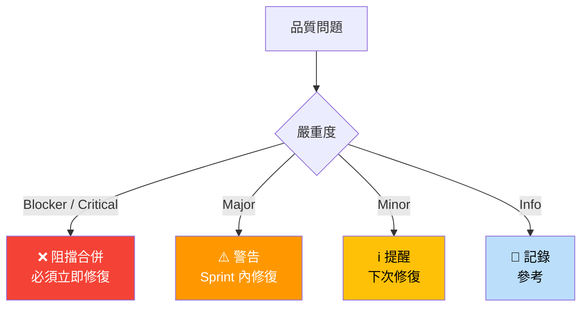

**企業建議策略（分階段實施）**：

| Phase | 阻擋條件 | 適用時機 |
|-------|----------|----------|
| **Phase 1**（寬鬆） | 僅 Blocker Bug + Critical Vulnerability | 剛導入階段 |
| **Phase 2**（中等） | Phase 1 + Coverage < 60% | 3 個月後 |
| **Phase 3**（嚴格） | 完整 Quality Gate（A 評級） | 6 個月後 |
| **Phase 4**（銀行等級） | Phase 3 + 安全掃描 + 相依套件掃描 | 1 年後 |

---

### 6.5 實務落地建議

1. **先監控再阻擋**：前 1-2 個月只產出報告，不阻擋 Pipeline
2. **新程式碼優先**：使用 SonarQube New Code Period，不因歷史程式碼而卡關
3. **快速回饋**：Pipeline 應在 15 分鐘內完成，超過要優化
4. **報告可視化**：SonarQube Dashboard 連結到 Slack / Teams 通知
5. **Security Gate 不可妥協**：Critical Vulnerability 永遠阻擋，無例外

---

## 第 7 章：測試策略與品質關聯

### 7.1 測試金字塔

測試金字塔（Test Pyramid）是一個指導測試策略的模型，從下到上分為:

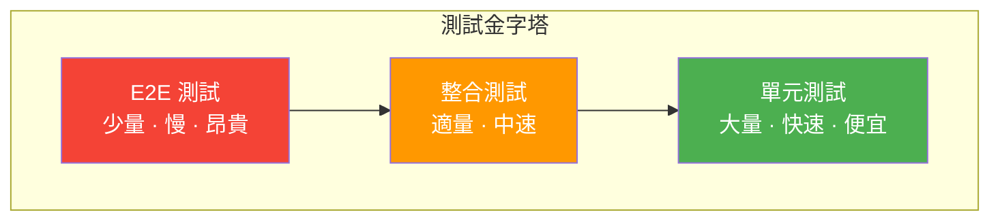

**各層級建議比例**：

| 測試類型 | 比例 | 執行時間 | 穩定性 |
|----------|------|----------|--------|
| **單元測試** | 70% | 毫秒級 | 非常高 |
| **整合測試** | 20% | 秒級 | 高 |
| **E2E 測試** | 10% | 分鐘級 | 中 |

---

### 7.2 單元測試（Unit Test）

#### 什麼是好的單元測試

遵循 **F.I.R.S.T.** 原則：

| 原則 | 英文 | 說明 |
|------|------|------|
| **F** | Fast | 執行快速（毫秒級） |
| **I** | Independent | 測試之間互不影響 |
| **R** | Repeatable | 任何環境都能重複執行 |
| **S** | Self-Validating | 有明確的 Pass/Fail 結果 |
| **T** | Timely | 與生產程式碼同步撰寫 |

#### 測試命名規範

推薦使用 **Given-When-Then** 或 **Should** 風格：

```java
@ExtendWith(MockitoExtension.class)
class AccountServiceTest {

    @Mock
    private AccountRepository accountRepository;
    
    @InjectMocks
    private AccountService accountService;

    // ✅ Good：命名清楚表達測試意圖
    @Test
    @DisplayName("當帳戶餘額不足時，轉帳應拋出 InsufficientFundsException")
    void transfer_whenInsufficientBalance_shouldThrowException() {
        // Given
        Account fromAccount = Account.builder()
            .id("ACC-001")
            .balance(new BigDecimal("100"))
            .build();
        when(accountRepository.findById("ACC-001")).thenReturn(Optional.of(fromAccount));
        
        // When & Then
        assertThrows(InsufficientFundsException.class, () -> {
            accountService.transfer("ACC-001", "ACC-002", new BigDecimal("500"));
        });
    }

    @Test
    @DisplayName("當金額為零時，應拋出 InvalidAmountException")
    void transfer_whenAmountIsZero_shouldThrowInvalidAmountException() {
        // Given
        BigDecimal zeroAmount = BigDecimal.ZERO;
        
        // When & Then
        assertThrows(InvalidAmountException.class, () -> {
            accountService.transfer("ACC-001", "ACC-002", zeroAmount);
        });
    }

    @Test
    @DisplayName("正常轉帳應成功扣款並入帳")
    void transfer_withValidRequest_shouldDebitAndCredit() {
        // Given
        Account from = Account.builder().id("ACC-001").balance(new BigDecimal("1000")).build();
        Account to = Account.builder().id("ACC-002").balance(new BigDecimal("500")).build();
        
        when(accountRepository.findById("ACC-001")).thenReturn(Optional.of(from));
        when(accountRepository.findById("ACC-002")).thenReturn(Optional.of(to));
        
        // When
        accountService.transfer("ACC-001", "ACC-002", new BigDecimal("300"));
        
        // Then
        assertThat(from.getBalance()).isEqualByComparingTo(new BigDecimal("700"));
        assertThat(to.getBalance()).isEqualByComparingTo(new BigDecimal("800"));
        verify(accountRepository, times(2)).save(any(Account.class));
    }
}
```

#### 反面教材：常見的壞測試

```java
// ❌ Bad：測試命名不清
@Test
void test1() { }

// ❌ Bad：沒有 Assert
@Test
void testTransfer() {
    accountService.transfer("A", "B", BigDecimal.TEN);
    // 沒有任何驗證...
}

// ❌ Bad：測試太大，同時驗證多件事
@Test
void testEverything() {
    // 測試建立 + 查詢 + 更新 + 刪除... 200 行
}
```

---

### 7.3 整合測試（Integration Test）

整合測試驗證多個元件之間的協作是否正確。

#### Spring Boot 整合測試範例

```java
@SpringBootTest
@ActiveProfile("test")
@Transactional // 測試後自動 Rollback
class AccountIntegrationTest {

    @Autowired
    private AccountService accountService;
    
    @Autowired
    private AccountRepository accountRepository;

    @Test
    @DisplayName("完整轉帳流程：從建立帳戶到轉帳成功")
    void fullTransferFlow() {
        // Given：建立兩個帳戶
        Account sender = accountRepository.save(
            Account.builder().balance(new BigDecimal("10000")).build()
        );
        Account receiver = accountRepository.save(
            Account.builder().balance(new BigDecimal("5000")).build()
        );
        
        // When：執行轉帳
        TransferResult result = accountService.transfer(
            sender.getId(), receiver.getId(), new BigDecimal("3000")
        );
        
        // Then：驗證結果
        assertThat(result.isSuccess()).isTrue();
        
        Account updatedSender = accountRepository.findById(sender.getId()).orElseThrow();
        Account updatedReceiver = accountRepository.findById(receiver.getId()).orElseThrow();
        
        assertThat(updatedSender.getBalance()).isEqualByComparingTo(new BigDecimal("7000"));
        assertThat(updatedReceiver.getBalance()).isEqualByComparingTo(new BigDecimal("8000"));
    }
}
```

#### API 整合測試

```java
@SpringBootTest(webEnvironment = SpringBootTest.WebEnvironment.RANDOM_PORT)
@ActiveProfile("test")
class AccountApiIntegrationTest {

    @Autowired
    private TestRestTemplate restTemplate;

    @Test
    @DisplayName("POST /api/transfers 應成功回傳 200")
    void createTransfer_withValidRequest_shouldReturn200() {
        // Given
        TransferRequest request = new TransferRequest("ACC-001", "ACC-002", new BigDecimal("100"));
        
        // When
        ResponseEntity<TransferResult> response = restTemplate.postForEntity(
            "/api/transfers", request, TransferResult.class
        );
        
        // Then
        assertThat(response.getStatusCode()).isEqualTo(HttpStatus.OK);
        assertThat(response.getBody().isSuccess()).isTrue();
    }
}
```

---

### 7.4 覆蓋率迷思

#### 覆蓋率不代表品質

```java
// ✅ Coverage = 100%，但測試品質很差
@Test
void testGetBalance() {
    Account account = new Account();
    account.setBalance(new BigDecimal("100"));
    account.getBalance(); // 呼叫了但沒有驗證！
    // 覆蓋率 100%，但什麼都沒測到
}
```

#### 正確看待覆蓋率

| 覆蓋率 | 意義 | 建議 |
|--------|------|------|
| < 30% | 幾乎沒有測試 | 🔴 需要立即加強 |
| 30-60% | 基本覆蓋 | 🟡 持續提升 |
| 60-80% | 良好覆蓋 | 🟢 大多數專案的合理目標 |
| 80-90% | 優秀覆蓋 | 🟢 核心業務邏輯的目標 |
| > 95% | 可能過度測試 | ⚠️ 小心為衝覆蓋率而寫無效測試 |

**正確的策略**：

1. **覆蓋率是地板，不是天花板**：80% 是最低要求，不是最終目標
2. **Branch Coverage > Line Coverage**：分支覆蓋比行覆蓋更有意義
3. **關注 Mutation Testing**：使用 PIT（pitest）測試你的測試是否真正有效
4. **核心業務邏輯 > 工具類別**：轉帳邏輯需要 95%，DTO getter/setter 不用測

---

### 7.5 測試與品質的關係

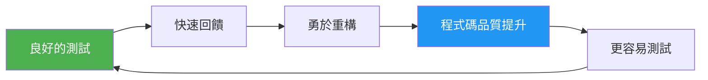

**測試帶來的品質改善**：

| 測試活動 | 品質影響 |
|----------|----------|
| 寫單元測試 | 迫使你設計可測試的程式碼（低耦合） |
| TDD | 確保每行程式碼都有測試覆蓋 |
| 測試先行 | 更清楚了解需求 |
| 整合測試 | 確保模組間正確協作 |
| 效能測試 | 及早發現效能瓶頸 |

---

### 7.6 實務落地建議

1. **新程式碼一律寫測試**：作為 Code Review 的必要條件
2. **不要為 Coverage 而測試**：專注在業務邏輯和邊界條件
3. **使用 TDD 處理複雜邏輯**：如銀行利息計算、手續費規則
4. **測試環境隔離**：使用 Testcontainers 或 H2 取代真實 DB
5. **Flaky Test 零容忍**：不穩定的測試要立即修復或標記

---

## 第 8 章：重構（Refactoring）策略

### 8.1 何時該重構

#### 重構的觸發條件

| 觸發信號 | 說明 | 優先級 |
|----------|------|--------|
| **修 Bug 困難** | 找不到問題在哪、改一處壞多處 | 🔴 高 |
| **加新功能困難** | 需要改動大量現有程式碼 | 🔴 高 |
| **重複程式碼** | 同樣邏輯出現 3+ 處 | 🟡 中 |
| **SonarQube 紅燈** | 品質趨勢持續下降 | 🟡 中 |
| **Code Review 反覆提出** | 某些區域頻繁被 Review 出問題 | 🟡 中 |
| **新人上手困難** | 程式碼無法被理解 | 🟢 低 |

#### 不該重構的時機

- ❌ 即將上線前（風險太高）
- ❌ 沒有測試覆蓋的區域（重構沒有安全網）
- ❌ 為了重構而重構（沒有明確的業務價值）

---

### 8.2 安全重構流程

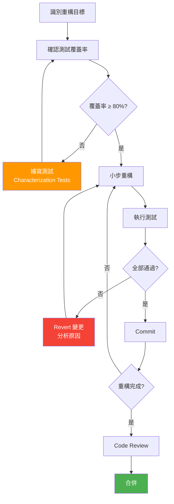

**安全重構的核心原則**：

1. **先有測試再重構**：沒有測試覆蓋的程式碼不要碰
2. **小步前進**：每次只做一個小變更，立即測試
3. **頻繁 Commit**：每完成一個小步驟就 Commit，方便 Revert
4. **不改變外部行為**：重構 ≠ 改功能

---

### 8.3 常見重構技巧

#### 技巧 1：Extract Method（提取方法）

**適用場景**：方法太長、邏輯混在一起

```java
// Before（60 行的方法）
public void processPayroll(List<Employee> employees) {
    for (Employee emp : employees) {
        // 計算基本薪資（15行）
        BigDecimal baseSalary = emp.getGrade().getBaseSalary();
        // ... 複雜計算
        
        // 計算加班費（10行）
        BigDecimal overtime = calculateOvertimeHours(emp) 
            .multiply(emp.getHourlyRate())
            .multiply(new BigDecimal("1.5"));
        
        // 計算扣除額（15行）
        BigDecimal deductions = calculateTax(baseSalary.add(overtime))
            .add(calculateInsurance(emp))
            .add(calculatePension(emp));
        
        // 發放薪資（10行）
        BigDecimal netSalary = baseSalary.add(overtime).subtract(deductions);
        payrollRepository.save(new PayrollRecord(emp, netSalary));
        notificationService.sendPayslip(emp, netSalary);
    }
}
```

```java
// After：清晰的高層抽象
public void processPayroll(List<Employee> employees) {
    for (Employee emp : employees) {
        BigDecimal baseSalary = calculateBaseSalary(emp);
        BigDecimal overtime = calculateOvertime(emp);
        BigDecimal deductions = calculateDeductions(emp, baseSalary, overtime);
        BigDecimal netSalary = baseSalary.add(overtime).subtract(deductions);
        
        saveAndNotify(emp, netSalary);
    }
}
```

#### 技巧 2：Replace Conditional with Polymorphism（以多型取代條件式）

```java
// Before
public BigDecimal calculateInterest(Account account) {
    switch (account.getType()) {
        case SAVINGS:
            return account.getBalance().multiply(new BigDecimal("0.02"));
        case CHECKING:
            return account.getBalance().multiply(new BigDecimal("0.005"));
        case FIXED_DEPOSIT:
            return account.getBalance()
                .multiply(new BigDecimal("0.04"))
                .multiply(BigDecimal.valueOf(account.getTermInYears()));
        default:
            return BigDecimal.ZERO;
    }
}
```

```java
// After：使用策略模式
public interface InterestCalculator {
    BigDecimal calculate(Account account);
}

@Component("SAVINGS")
public class SavingsInterestCalculator implements InterestCalculator {
    private static final BigDecimal RATE = new BigDecimal("0.02");
    
    @Override
    public BigDecimal calculate(Account account) {
        return account.getBalance().multiply(RATE);
    }
}

@Service
public class InterestService {
    private final Map<String, InterestCalculator> calculators;
    
    public InterestService(Map<String, InterestCalculator> calculators) {
        this.calculators = calculators;
    }
    
    public BigDecimal calculateInterest(Account account) {
        return calculators.getOrDefault(account.getType().name(), a -> BigDecimal.ZERO)
            .calculate(account);
    }
}
```

#### 技巧 3：Introduce Parameter Object（引入參數物件）

```java
// Before：過多參數
public List<Transaction> search(String accountId, LocalDate from, LocalDate to,
        String type, BigDecimal minAmount, BigDecimal maxAmount, int page, int size) { }

// After
public record TransactionSearchCriteria(
    String accountId,
    DateRange dateRange,
    String type,
    AmountRange amountRange,
    Pageable pageable
) { }

public List<Transaction> search(TransactionSearchCriteria criteria) { }
```

#### 技巧 4：Replace Magic Number with Named Constant

```java
// Before
if (retryCount > 3) { Thread.sleep(5000); }

// After
private static final int MAX_RETRY_COUNT = 3;
private static final long RETRY_DELAY_MS = 5000L;

if (retryCount > MAX_RETRY_COUNT) { Thread.sleep(RETRY_DELAY_MS); }
```

#### 其他常用重構技巧

| 技巧 | 適用場景 |
|------|----------|
| Move Method | 方法放錯類別 |
| Extract Class | 類別太大 |
| Inline Method | 方法體太簡單，不需獨立存在 |
| Replace Temp with Query | 用方法呼叫取代暫時變數 |
| Decompose Conditional | 複雜條件式拆解 |
| Consolidate Duplicate Conditional | 合併重複條件 |
| Replace Inheritance with Delegation | 以委託取代繼承 |

---

### 8.4 實務落地建議

1. **Boy Scout Rule**：離開時比來時更乾淨——每次改動時順手小重構
2. **每 Sprint 分配 15% 重構預算**：不要等到「重構 Sprint」
3. **重構 PR 和功能 PR 分開**：方便 Review 和追蹤
4. **IDE 重構工具**：善用 VS Code / IntelliJ 的自動重構功能
5. **銀行系統**：重構核心帳務邏輯前必須有 100% 的關鍵路徑測試覆蓋

---

## 第 9 章：企業實務最佳實踐（Best Practices）

### 9.1 銀行 / 金融系統案例

#### 案例一：核心帳務系統品質問題

**背景**：某銀行核心帳務系統，10+ 年歷史，200 萬行程式碼。

**問題**：
- 無單元測試（覆蓋率 0%）
- SonarQube 掃描出 15,000+ Code Smells
- 每次改版平均引入 5 個 Bug
- 新進人員需 6 個月才能獨立開發

**改善策略**：

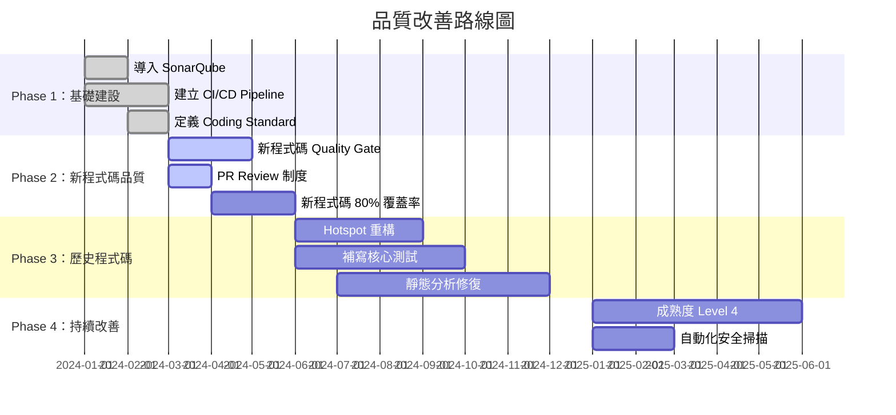

**成效**：
- 6 個月後，新程式碼 Bug 率下降 60%
- 12 個月後，整體覆蓋率從 0% 提升到 45%
- 新人上手時間從 6 個月縮短到 2 個月

#### 案例二：金融交易比對系統

**情境**：每日處理 500 萬筆交易比對，要求零錯誤。

**品質策略**：

```java
// 核心業務規則使用 Property-Based Testing
@Property
void transferShouldPreserveTotalBalance(
        @ForAll @BigRange(min = "0", max = "999999999") BigDecimal initialFromBalance,
        @ForAll @BigRange(min = "0", max = "999999999") BigDecimal initialToBalance,
        @ForAll @BigRange(min = "1", max = "999999999") BigDecimal transferAmount) {
    
    // 假設：轉出帳戶餘額足夠
    Assume.that(initialFromBalance.compareTo(transferAmount) >= 0);
    
    Account from = Account.withBalance(initialFromBalance);
    Account to = Account.withBalance(initialToBalance);
    BigDecimal totalBefore = from.getBalance().add(to.getBalance());
    
    // 執行轉帳
    from.debit(transferAmount);
    to.credit(transferAmount);
    
    BigDecimal totalAfter = from.getBalance().add(to.getBalance());
    
    // 斷言：總金額不變（守恆定律）
    assertThat(totalAfter).isEqualByComparingTo(totalBefore);
}
```

---

### 9.2 微服務品質管理

#### 微服務品質挑戰

| 挑戰 | 說明 | 對策 |
|------|------|------|
| **服務邊界** | 職責是否切對 | Domain-Driven Design |
| **API 契約** | 介面變更的品質控管 | Consumer-Driven Contract Testing |
| **分散式追蹤** | Bug 在哪個服務 | Distributed Tracing（Jaeger / Zipkin） |
| **資料一致性** | 跨服務的資料一致 | Saga Pattern + 補償交易 |
| **整體品質可視性** | 每個服務的品質不一 | 統一 SonarQube Dashboard |

#### 微服務品質架構

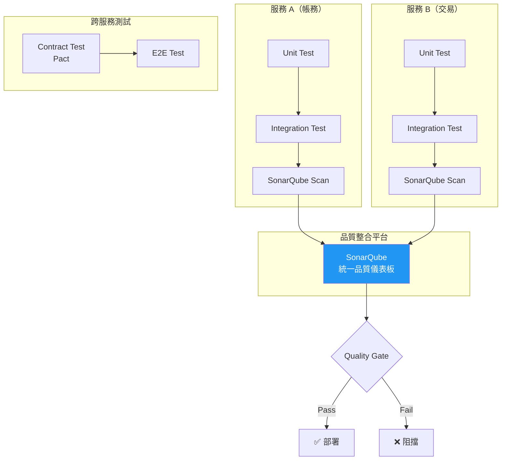

#### Contract Testing 範例（Pact）

```java
// Consumer 端（呼叫方）
@Pact(consumer = "transaction-service", provider = "account-service")
public V4Pact getAccountBalance(PactDslWithProvider builder) {
    return builder
        .given("Account ACC-001 exists with balance 10000")
        .uponReceiving("a request to get account balance")
            .path("/api/accounts/ACC-001/balance")
            .method("GET")
        .willRespondWith()
            .status(200)
            .body(newJsonBody(body -> {
                body.stringType("accountId", "ACC-001");
                body.decimalType("balance", 10000.00);
            }).build())
        .toPact(V4Pact.class);
}

@Test
@PactTestFor(pactMethod = "getAccountBalance")
void testGetAccountBalance(MockServer mockServer) {
    AccountClient client = new AccountClient(mockServer.getUrl());
    AccountBalance balance = client.getBalance("ACC-001");
    
    assertThat(balance.getAccountId()).isEqualTo("ACC-001");
    assertThat(balance.getBalance()).isEqualByComparingTo(new BigDecimal("10000"));
}
```

---

### 9.3 DevSecOps 整合

#### DevSecOps Pipeline 品質整合

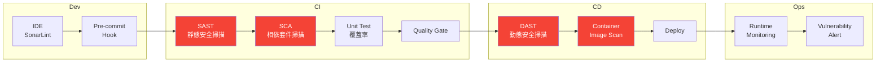

#### 安全工具整合

| 階段 | 工具 | 檢查內容 |
|------|------|----------|
| **開發** | SonarLint | 即時安全提示 |
| **SAST** | SonarQube / Fortify | 原始碼安全漏洞 |
| **SCA** | OWASP Dependency Check / Snyk | 相依套件 CVE |
| **Secret Scan** | GitLeaks / TruffleHog | 密碼 / 金鑰洩漏 |
| **DAST** | OWASP ZAP | 執行時安全測試 |
| **Container** | Trivy / Grype | 容器映像漏洞 |

#### OWASP Dependency Check 配置

```xml
<!-- pom.xml -->
<plugin>
    <groupId>org.owasp</groupId>
    <artifactId>dependency-check-maven</artifactId>
    <version>11.0.1</version>
    <configuration>
        <failBuildOnCVSS>7</failBuildOnCVSS>
        <suppressionFiles>
            <suppressionFile>owasp-suppressions.xml</suppressionFile>
        </suppressionFiles>
    </configuration>
</plugin>
```

---

### 9.4 實務落地建議

1. **品質即文化**：不是靠一個工具就能搞定，需要持續推動
2. **從新專案開始**：新專案直接用最高標準，舊系統逐步改善
3. **KPI 可視化**：把品質指標放在團隊看板上
4. **安全左移**：越早發現安全問題，修復成本越低
5. **銀行業**：必須同時符合內部稽核與外部法規要求

---

## 第 10 章：導入策略（企業落地）

### 10.1 推動步驟（Roadmap）

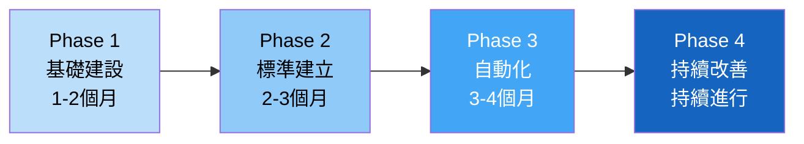

#### Phase 1：基礎建設（第 1-2 個月）

| 任務 | 負責人 | 產出 |
|------|--------|------|
| 安裝 SonarQube | DevOps | SonarQube Server |
| 建立 CI/CD Pipeline | DevOps | GitHub Actions / Jenkins |
| 定義 Coding Standard | Architect | Checkstyle / ESLint 規則 |
| 掃描現有程式碼 Baseline | Architect | 品質基線報告 |

#### Phase 2：標準建立（第 2-3 個月）

| 任務 | 負責人 | 產出 |
|------|--------|------|
| 定義 Quality Gate | Architect + TL | SonarQube 品質門檻 |
| 建立 Code Review 制度 | TL | Review Checklist + PR Template |
| 教育訓練 | Architect | 培訓簡報 + Workshop |
| 試行新程式碼品質要求 | Team | New Code 品質達標 |

#### Phase 3：自動化（第 3-4 個月）

| 任務 | 負責人 | 產出 |
|------|--------|------|
| Quality Gate 整合 CI/CD | DevOps | 自動品質阻擋 |
| 安全掃描整合 | Security | SAST + SCA Pipeline |
| 品質 Dashboard | Architect | 看板 + 通知 |
| Git Hook（Pre-commit） | TL | 本地品質檢查 |

#### Phase 4：持續改善（持續進行）

| 任務 | 頻率 | 負責人 |
|------|------|--------|
| 品質週報 Review | 每週 | TL |
| 品質月會 | 每月 | Architect |
| 規則調整 | 每季 | Architect + TL |
| 技術債 Sprint | 每季 | Team |
| 成熟度評估 | 每半年 | Architect |

---

### 10.2 組織角色

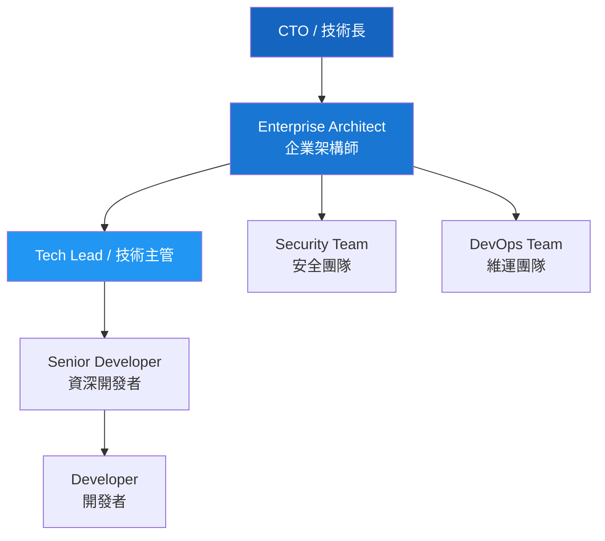

| 角色 | 品質相關職責 |
|------|-------------|
| **Enterprise Architect** | 定義品質模型、選擇工具、設定標準、成熟度評估 |
| **Tech Lead** | 執行 Quality Gate、主持 Review、分配重構任務 |
| **Senior Developer** | 輔導 Junior、撰寫關鍵測試、識別 Code Smell |
| **Developer** | 遵循標準、寫測試、修復品質問題 |
| **Security Team** | 定義安全規則、審查安全掃描結果 |
| **DevOps Team** | 維護 CI/CD Pipeline、SonarQube 伺服器 |

---

### 10.3 KPI 指標

#### 品質 KPI 儀表板

| KPI 指標 | 計算方式 | 目標值 | 追蹤頻率 |
|----------|----------|--------|----------|
| **新程式碼覆蓋率** | JaCoCo New Code Coverage | ≥ 80% | 每次 PR |
| **新程式碼 Bug 率** | New Bugs / New Lines × 1000 | < 1 | 每次 PR |
| **Quality Gate 通過率** | Passed / Total PRs × 100% | ≥ 95% | 每週 |
| **Critical 漏洞數** | SonarQube Critical Vulnerabilities | 0 | 每日 |
| **技術債比率** | Remediation Cost / Dev Cost × 100% | < 5% | 每月 |
| **重複程式碼率** | Duplicated Lines % | < 5% | 每月 |
| **PR Review 時間** | 從建立到首次 Review | < 24 小時 | 每週 |
| **Bug Escape Rate** | 上線後 Bug / 總 Bug | < 5% | 每月 |
| **平均修復時間** | Bug 發現到修復的時間 | < 2 天（Critical） | 每月 |

---

### 10.4 成熟度模型（Level 1～5）

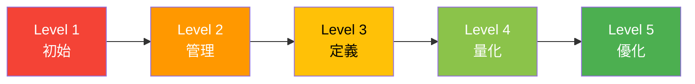

| Level | 名稱 | 特徵 | 典型指標 |
|-------|------|------|----------|
| **Level 1**<br/>初始 | Ad-hoc | 無標準、靠個人經驗、無測試 | Coverage 0%、無 CI/CD |
| **Level 2**<br/>管理 | Managed | 有 CI/CD、有基本 Review | Coverage < 30%、有 Pipeline |
| **Level 3**<br/>定義 | Defined | 有 Coding Standard、有 Quality Gate、有測試策略 | Coverage ≥ 60%、Quality Gate 啟用 |
| **Level 4**<br/>量化 | Quantified | 品質指標可追蹤、趨勢可視化、主動改善 | Coverage ≥ 80%、Bug Escape < 5% |
| **Level 5**<br/>優化 | Optimized | 持續改善、AI 輔助、自動化全面 | Coverage ≥ 85%、技術債 < 3%、零 Critical |

#### 成熟度評估維度

| 維度 | Level 1 | Level 3 | Level 5 |
|------|---------|---------|---------|
| **測試** | 無測試 | 新程式碼有測試 | TDD + Mutation Testing |
| **Review** | 無 Review | 有 Checklist | AI 輔助 + 自動標記風險 |
| **靜態分析** | 無 | SonarQube 基本掃描 | 全面分析 + 自訂規則 |
| **安全** | 無 | 基本 SAST | SAST + DAST + SCA + Secret Scan |
| **自動化** | 手動建置 | CI/CD 基本 Pipeline | 全自動 DevSecOps |
| **指標** | 無追蹤 | 有 Dashboard | 預測分析 + 自動告警 |

---

### 10.5 實務落地建議

1. **由上而下推動**：需要管理層支持（CTO/VP level）
2. **先贏得小勝利**：選一個小專案試行，展示成效後再擴展
3. **不要一口氣全做**：分階段導入，每階段 2-3 個月
4. **培養品質 Champion**：每個團隊指定 1-2 位品質推動者
5. **獎勵機制**：將品質 KPI 納入績效考核（但比重不要太高，避免作弊）
6. **真實數據說話**：用 SonarQube 報表向管理層報告成效

---

## 附錄 A：新進成員檢查清單（Checklist）

### 🟢 開發前（每日）

- [ ] IDE 已安裝 SonarLint（VS Code / IntelliJ）
- [ ] 已拉取最新程式碼（`git pull --rebase`）
- [ ] 了解今天要開發的需求和驗收標準
- [ ] 確認相關 API 規格文件

### 🟢 開發中（每次 Commit）

- [ ] 程式碼符合命名規範（PascalCase / camelCase / UPPER_SNAKE_CASE）
- [ ] 方法長度 ≤ 30 行
- [ ] 巢狀深度 ≤ 3 層
- [ ] 無 Magic Number（使用常數）
- [ ] 無 Hard-coded 密碼或設定值
- [ ] 使用 Parameterized Query（防 SQL Injection）
- [ ] 敏感資料已遮蔽（帳號、密碼不出現在 Log 中）
- [ ] 已處理 Null 和邊界條件
- [ ] 新增的 public 方法有 JavaDoc
- [ ] 已撰寫對應的單元測試（覆蓋主要路徑 + 邊界條件）

### 🟢 提交 PR 前

- [ ] 本地 SonarLint 無 Blocker / Critical 問題
- [ ] 所有單元測試通過（`mvn test`）
- [ ] PR 大小 ≤ 400 行（如超過請拆分）
- [ ] PR 描述清楚（變更說明 + 測試方式 + 關聯 Issue）
- [ ] 已自我 Review 一遍
- [ ] 無不必要的 `System.out.println` 或 Debug 程式碼

### 🟢 Code Review 時

- [ ] 邏輯是否正確（特別是邊界條件）
- [ ] 安全性檢查（注入、權限、資料洩漏）
- [ ] 效能檢查（N+1 Query、不必要的迴圈 I/O）
- [ ] 命名是否清晰易懂
- [ ] 是否有重複程式碼
- [ ] 測試是否充分

### 🟢 上線前

- [ ] CI/CD Pipeline 全部通過
- [ ] SonarQube Quality Gate 通過
- [ ] 安全掃描無 Critical / High 漏洞
- [ ] 相依套件無已知 CVE
- [ ] 效能測試通過（如有必要）

---

## 附錄 B：品質指標速查表

### 程式碼指標

| 指標 | 工具 | 建議閾值 |
|------|------|----------|
| Cyclomatic Complexity | SonarQube / PMD | ≤ 10 per method |
| Cognitive Complexity | SonarQube | ≤ 15 per method |
| Lines per Method | Checkstyle | ≤ 30 |
| Lines per Class | Checkstyle | ≤ 500 |
| Nesting Depth | SonarQube | ≤ 3 |
| Coupling (CBO) | PMD | ≤ 8 |
| Duplicated Lines | SonarQube | ≤ 3%（新程式碼） |

### 測試指標

| 指標 | 工具 | 建議閾值 |
|------|------|----------|
| Line Coverage（新程式碼） | JaCoCo | ≥ 80% |
| Branch Coverage（新程式碼） | JaCoCo | ≥ 70% |
| Mutation Score | PIT | ≥ 60% |
| Unit Test Time | Maven Surefire | ≤ 5 min |
| Flaky Test Rate | CI Analytics | ≤ 1% |

### 安全指標

| 指標 | 工具 | 建議閾值 |
|------|------|----------|
| Critical Vulnerability | SonarQube | 0 |
| High Vulnerability | SonarQube | 0 |
| Known CVE (High+) | OWASP Dependency Check | 0 |
| Hard-coded Secrets | GitLeaks | 0 |
| Security Hotspot Review | SonarQube | 100% reviewed |

### 流程指標

| 指標 | 工具 | 建議閾值 |
|------|------|----------|
| PR Size | GitHub | ≤ 400 行 |
| PR Review Time | GitHub | ≤ 24 小時（首次） |
| Quality Gate Pass Rate | SonarQube | ≥ 95% |
| Bug Escape Rate | Jira / SonarQube | ≤ 5% |
| Technical Debt Ratio | SonarQube | ≤ 5% |

---

## 附錄 C：推薦學習資源

### 書籍

| 書名 | 作者 | 主題 |
|------|------|------|
| Clean Code | Robert C. Martin | 程式碼品質基礎 |
| Refactoring | Martin Fowler | 重構技巧 |
| Clean Architecture | Robert C. Martin | 架構設計 |
| Working Effectively with Legacy Code | Michael Feathers | 處理遺留系統 |
| Test Driven Development | Kent Beck | TDD 方法論 |
| Effective Java (3rd Edition) | Joshua Bloch | Java 最佳實踐 |
| Domain-Driven Design | Eric Evans | 領域驅動設計 |

### 線上資源

| 資源 | 網址 | 說明 |
|------|------|------|
| SonarQube 文件 | [docs.sonarsource.com/sonarqube-server](https://docs.sonarsource.com/sonarqube-server/2025/) | 官方使用指南 |
| OWASP Top 10: 2025 | [owasp.org/Top10/2025](https://owasp.org/Top10/2025/) | Web 安全 Top 10（2025 最新版） |
| PMD 文件 | [docs.pmd-code.org](https://docs.pmd-code.org/latest/) | PMD 7.x 官方文件 |
| Checkstyle 文件 | [checkstyle.org](https://checkstyle.org/) | Checkstyle 13.x 官方文件 |
| SpotBugs 文件 | [spotbugs.github.io](https://spotbugs.github.io/) | SpotBugs 官方文件 |
| Refactoring Guru | [refactoring.guru](https://refactoring.guru/) | 重構與設計模式 |
| Martin Fowler Blog | [martinfowler.com](https://martinfowler.com/) | 架構與品質文章 |

### 工具

| 工具 | 用途 | 安裝方式 |
|------|------|----------|
| SonarQube Community | 綜合品質平台 | Docker / 獨立安裝 |
| SonarLint | IDE 即時品質檢查 | VS Code / IntelliJ Plugin |
| JaCoCo | Java 覆蓋率 | Maven Plugin |
| SpotBugs | Bug 偵測 | Maven Plugin |
| Checkstyle | 程式碼風格 | Maven Plugin |
| PMD | 最佳實踐 | Maven Plugin |
| OWASP Dependency Check | 相依套件安全 | Maven Plugin |
| PIT (pitest) | Mutation Testing | Maven Plugin |
| Testcontainers | 整合測試容器 | Maven Dependency |

---

> **文件維護**：本手冊建議每季 Review 一次，根據工具版本更新與團隊實踐經驗持續改善。  
> **問題回饋**：如有任何問題或建議，請透過內部 Wiki 或 Slack #code-quality 頻道提出。

