+++
date = '2026-03-31T14:54:15+08:00'
draft = false
title = '使用 GitHub Copilot 進行逆向工程並產出需求規格書'
tags = ['教學', 'AI開發','指引']
categories = ['教學']
+++
# 使用 GitHub Copilot 進行逆向工程並產出需求規格書

> **版本**：2.0 | **更新日期**：2026-03-31  
> **適用對象**：資深工程師、系統分析師、架構師、PM  
> **技術環境**：VS Code + GitHub Copilot（含 Agent Mode、Coding Agent、MCP 整合）  
> **產業適用**：銀行、金融、保險等高合規性企業系統  
> **AI 模型支援**：GPT-5.4 / GPT-5.4 mini / GPT-5.3-Codex / Gemini 3.1 Pro / 自動模型選擇

---

## 目錄

- [第 1 章 逆向工程方法論](#第-1-章-逆向工程方法論)
  - [1.1 什麼是逆向工程](#11-什麼是逆向工程)
  - [1.2 企業系統中的逆向工程應用場景](#12-企業系統中的逆向工程應用場景)
  - [1.3 Code → Requirement 轉換模型](#13-code--requirement-轉換模型)
  - [1.4 各層級程式碼的需求推導策略](#14-各層級程式碼的需求推導策略)
  - [1.5 逆向工程成熟度模型](#15-逆向工程成熟度模型)
- [第 2 章 GitHub Copilot 使用策略](#第-2-章-github-copilot-使用策略)
  - [2.1 Copilot 在逆向工程中的角色定位](#21-copilot-在逆向工程中的角色定位)
    - [2.1.1 GitHub Copilot 2026 功能架構全景](#211-github-copilot-2026-功能架構全景)
    - [2.1.2 各功能在逆向工程中的定位](#212-各功能在逆向工程中的定位)
    - [2.1.3 AI 模型選擇策略](#213-ai-模型選擇策略)
  - [2.2 Prompt Engineering 核心原則](#22-prompt-engineering-核心原則)
    - [2.2.1 角色設定（Role Setting）](#221-角色設定role-setting)
    - [2.2.2 結構化 Prompt 模板](#222-結構化-prompt-模板)
    - [2.2.3 五大 Prompt 策略](#223-五大-prompt-策略)
  - [2.3 逐段分析程式碼的技巧](#23-逐段分析程式碼的技巧)
    - [2.3.1 分段策略](#231-分段策略)
    - [2.3.2 VS Code 操作技巧](#232-vs-code-操作技巧)
  - [2.4 C# 程式碼解讀策略與 Prompt 範例](#24-c-程式碼解讀策略與-prompt-範例)
  - [2.5 SQL / Stored Procedure 解讀策略與 Prompt 範例](#25-sql--stored-procedure-解讀策略與-prompt-範例)
  - [2.6 Batch Job 解讀策略與 Prompt 範例](#26-batch-job-解讀策略與-prompt-範例)
  - [2.7 從技術描述轉換為商業需求描述](#27-從技術描述轉換為商業需求描述)
  - [2.8 Before / After 完整範例](#28-before--after-完整範例)
  - [2.9 Agent Mode 與 Coding Agent 在逆向工程中的進階應用](#29-agent-mode-與-coding-agent-在逆向工程中的進階應用)
    - [2.9.1 使用 Agent Mode 進行跨檔案逆向分析](#291-使用-agent-mode-進行跨檔案逆向分析)
    - [2.9.2 使用 Plan Agent 規劃逆向工程任務](#292-使用-plan-agent-規劃逆向工程任務)
    - [2.9.3 使用 Copilot Coding Agent 進行自動化逆向分析](#293-使用-copilot-coding-agent-進行自動化逆向分析)
    - [2.9.4 使用 MCP 擴展逆向工程能力](#294-使用-mcp-擴展逆向工程能力)
    - [2.9.5 使用 Custom Agent 建立專用逆向工程分析師](#295-使用-custom-agent-建立專用逆向工程分析師)
    - [2.9.6 使用 Copilot Memory 累積逆向工程知識](#296-使用-copilot-memory-累積逆向工程知識)
    - [2.9.7 第三方 Coding Agent 與外部平台整合](#297-第三方-coding-agent-與外部平台整合)
    - [2.9.8 使用背景代理進行非同步逆向分析](#298-使用背景代理進行非同步逆向分析)
- [第 3 章 實戰流程（Step-by-Step）](#第-3-章-實戰流程step-by-step)
  - [3.1 Step 1 — 程式碼盤點](#31-step-1--程式碼盤點)
    - [3.1.1 模組分類方法](#311-模組分類方法)
    - [3.1.2 使用 Copilot 快速摘要](#312-使用-copilot-快速摘要)
    - [3.1.3 自動化盤點腳本](#313-自動化盤點腳本)
  - [3.2 Step 2 — 邏輯解析](#32-step-2--邏輯解析)
    - [3.2.1 API 邏輯分析](#321-api-邏輯分析)
    - [3.2.2 Batch Job 邏輯分析](#322-batch-job-邏輯分析)
    - [3.2.3 DB 邏輯分析](#323-db-邏輯分析)
  - [3.3 Step 3 — 商業邏輯抽取](#33-step-3--商業邏輯抽取)
    - [3.3.1 從技術邏輯到業務需求的轉換方法](#331-從技術邏輯到業務需求的轉換方法)
    - [3.3.2 商業規則分類框架](#332-商業規則分類框架)
    - [3.3.3 需求追溯矩陣](#333-需求追溯矩陣)
  - [3.4 Step 4 — 文件產出](#34-step-4--文件產出)
    - [3.4.1 SRS 文件自動生成流程](#341-srs-文件自動生成流程)
    - [3.4.2 文件品質檢查](#342-文件品質檢查)
  - [3.5 端到端流程圖](#35-端到端流程圖)
- [第 4 章 SRS 文件標準格式](#第-4-章-srs-文件標準格式)
  - [4.1 SRS 文件結構概覽](#41-srs-文件結構概覽)
  - [4.2 系統概述](#42-系統概述)
  - [4.3 Use Case 描述](#43-use-case-描述)
  - [4.4 功能需求（Functional Requirements）](#44-功能需求functional-requirements)
  - [4.5 非功能需求（Non-functional Requirements）](#45-非功能需求non-functional-requirements)
  - [4.6 資料流程（DFD）](#46-資料流程dfd)
  - [4.7 ER Model（資料結構）](#47-er-model資料結構)
  - [4.8 Batch Flow](#48-batch-flow)
  - [4.9 企業級 SRS 範本（完整）](#49-企業級-srs-範本完整)
- [第 5 章 完整實戰範例](#第-5-章-完整實戰範例)
  - [5.1 範例一：C# API 控制器逆向分析](#51-範例一c-api-控制器逆向分析)
    - [5.1.1 原始程式碼](#511-原始程式碼)
    - [5.1.2 Copilot 分析過程](#512-copilot-分析過程)
    - [5.1.3 推導出的需求](#513-推導出的需求)
  - [5.2 範例二：Stored Procedure 逆向分析](#52-範例二stored-procedure-逆向分析)
    - [5.2.1 原始程式碼](#521-原始程式碼)
    - [5.2.2 Copilot 分析過程](#522-copilot-分析過程)
    - [5.2.3 推導出的需求](#523-推導出的需求)
  - [5.3 範例三：Batch Job 逆向分析](#53-範例三batch-job-逆向分析)
    - [5.3.1 分析場景](#531-分析場景)
    - [5.3.2 Copilot 分析結果](#532-copilot-分析結果)
  - [5.4 最終 SRS 文件片段產出](#54-最終-srs-文件片段產出)
- [第 6 章 企業最佳實務](#第-6-章-企業最佳實務)
  - [6.1 避免誤判需求的策略](#61-避免誤判需求的策略)
    - [6.1.1 常見的誤判類型](#611-常見的誤判類型)
    - [6.1.2 防範策略](#612-防範策略)
    - [6.1.3 信心度評估框架](#613-信心度評估框架)
  - [6.2 需求驗證流程](#62-需求驗證流程)
    - [6.2.1 三層驗證機制](#621-三層驗證機制)
    - [6.2.2 驗證會議範本](#622-驗證會議範本)
  - [6.3 整合 SSDLC](#63-整合-ssdlc)
  - [6.4 搭配版本控制（Git）](#64-搭配版本控制git)
    - [6.4.1 SRS 文件的 Git 管理策略](#641-srs-文件的-git-管理策略)
    - [6.4.2 Git Branching 策略](#642-git-branching-策略)
    - [6.4.3 Commit 訊息規範](#643-commit-訊息規範)
  - [6.5 常見錯誤與修正策略](#65-常見錯誤與修正策略)
  - [6.6 使用 Copilot Code Review 驗證 SRS 品質](#66-使用-copilot-code-review-驗證-srs-品質)
    - [6.6.1 設定 Copilot Code Review 規則](#661-設定-copilot-code-review-規則)
    - [6.6.2 SRS Pull Request 審查流程](#662-srs-pull-request-審查流程)
  - [6.7 使用 Copilot Spaces 管理逆向工程上下文](#67-使用-copilot-spaces-管理逆向工程上下文)
- [第 7 章 架構延伸（進階）](#第-7-章-架構延伸進階)
  - [7.1 從逆向結果到 Spring Boot API 設計](#71-從逆向結果到-spring-boot-api-設計)
    - [7.1.1 技術對照表](#711-技術對照表)
    - [7.1.2 SRS → API 設計的轉換流程](#712-srs--api-設計的轉換流程)
    - [7.1.3 範例：從 SRS 到 Spring Boot](#713-範例從-srs-到-spring-boot)
  - [7.2 微服務架構轉換](#72-微服務架構轉換)
    - [7.2.1 從單體到微服務的拆分策略](#721-從單體到微服務的拆分策略)
    - [7.2.2 Stored Procedure 的遷移策略](#722-stored-procedure-的遷移策略)
  - [7.3 Domain Modeling（DDD）](#73-domain-modelingddd)
    - [7.3.1 從逆向結果推導領域模型](#731-從逆向結果推導領域模型)
    - [7.3.2 統一語言表](#732-統一語言表)
  - [7.4 Clean Architecture 對應](#74-clean-architecture-對應)
    - [7.4.1 分層架構設計](#741-分層架構設計)
    - [7.4.2 Spring Boot 專案結構](#742-spring-boot-專案結構)
  - [7.5 使用 Copilot Coding Agent 自動化遷移工作](#75-使用-copilot-coding-agent-自動化遷移工作)
    - [7.5.1 從 SRS 到 Spring Boot 骨架自動生成](#751-從-srs-到-spring-boot-骨架自動生成)
    - [7.5.2 SP 邏輯遷移自動化](#752-sp-邏輯遷移自動化)
    - [7.5.3 Hooks 自動化品質檢查](#753-hooks-自動化品質檢查)
- [第 8 章 Prompt 工程模板庫](#第-8-章-prompt-工程模板庫)
  - [8.1 程式碼摘要類](#81-程式碼摘要類)
  - [8.2 邏輯解析類](#82-邏輯解析類)
  - [8.3 需求轉換類](#83-需求轉換類)
  - [8.4 文件產出類](#84-文件產出類)
  - [8.5 驗證與審查類](#85-驗證與審查類)
- [第 9 章 自動化流程（AI + Script）](#第-9-章-自動化流程ai--script)
  - [9.1 自動化盤點腳本](#91-自動化盤點腳本)
    - [9.1.1 C# 專案自動盤點（PowerShell）](#911-c-專案自動盤點powershell)
    - [9.1.2 SQL Server Stored Procedure 盤點](#912-sql-server-stored-procedure-盤點)
  - [9.2 批次分析流程](#92-批次分析流程)
    - [9.2.1 分析工作流程自動化](#921-分析工作流程自動化)
    - [9.2.2 分析任務分配模板](#922-分析任務分配模板)
  - [9.3 SRS 自動組裝](#93-srs-自動組裝)
    - [9.3.1 SRS 組裝腳本（PowerShell）](#931-srs-組裝腳本powershell)
    - [9.3.2 SRS 品質檢查腳本](#932-srs-品質檢查腳本)
  - [9.4 Copilot Coding Agent 端到端自動化流程](#94-copilot-coding-agent-端到端自動化流程)
    - [9.4.1 自動化流程架構](#941-自動化流程架構)
    - [9.4.2 GitHub Actions 工作流配置](#942-github-actions-工作流配置)
    - [9.4.3 批次 Issue 建立腳本](#943-批次-issue-建立腳本)
    - [9.4.4 追溯矩陣自動生成](#944-追溯矩陣自動生成)
- [附錄 A 檢查清單（Checklist）](#附錄-a-檢查清單checklist)
  - [A.1 逆向工程啟動檢查清單](#a1-逆向工程啟動檢查清單)
  - [A.2 每日分析檢查清單](#a2-每日分析檢查清單)
  - [A.3 模組完成檢查清單](#a3-模組完成檢查清單)
  - [A.4 SRS 發佈前檢查清單](#a4-srs-發佈前檢查清單)
  - [A.5 Copilot 使用安全檢查清單](#a5-copilot-使用安全檢查清單)
  - [A.6 Copilot Coding Agent 使用檢查清單](#a6-copilot-coding-agent-使用檢查清單)
- [附錄 B 術語表](#附錄-b-術語表)
- [附錄 C 參考資源](#附錄-c-參考資源)
  - [C.1 工具](#c1-工具)
  - [C.2 標準與規範](#c2-標準與規範)
  - [C.3 推薦閱讀](#c3-推薦閱讀)
  - [C.4 GitHub Copilot 相關資源](#c4-github-copilot-相關資源)

---

## 第 1 章 逆向工程方法論

### 1.1 什麼是逆向工程

**逆向工程（Reverse Engineering）** 是從既有系統的成品（程式碼、資料庫、設定檔等）出發，反推出系統的設計意圖、業務規則與需求規格的過程。

在企業系統脈絡中，逆向工程的目標不是「破解」軟體，而是：

- **還原業務知識**：從程式碼中提取隱含的業務規則
- **補足文件缺口**：為缺乏文件的舊系統建立完整的技術與業務文件
- **支援系統遷移**：為舊系統轉新系統提供精確的需求基線

> **實務案例**：某銀行核心系統運行 15 年，原始開發團隊已全數離職，僅剩一位維運工程師。系統面臨 EOS（End of Support）壓力，需在 12 個月內完成新系統重建。逆向工程成為唯一可行的需求取得方式。

### 1.2 企業系統中的逆向工程應用場景

| 場景 | 說明 | 挑戰 |
|------|------|------|
| **系統現代化** | 舊系統（COBOL / VB6 / .NET Framework）遷移到新平台 | 業務邏輯散落在各層，難以整理 |
| **供應商交接** | 系統由外包廠商開發，知識未完整移轉 | 缺乏設計文件，Code 即唯一真實來源 |
| **合規需求** | 金管會 / 資安稽核要求完整系統文件 | 文件已過時，與系統現狀不符 |
| **系統整合** | 多系統合併或重組 | 需瞭解每個系統的精確功能範圍 |
| **技術債清理** | 大量技術債需評估影響範圍 | 邏輯糾纏，修改影響難以預估 |

### 1.3 Code → Requirement 轉換模型

逆向工程的核心框架是「**Code → Requirement 轉換模型**」，分為四個層次：

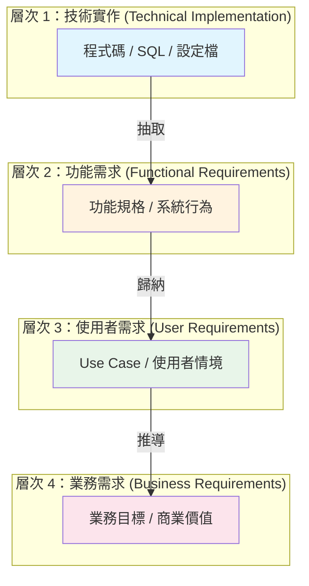

**轉換流程說明**：

| 步驟 | 輸入 | 處理 | 輸出 |
|------|------|------|------|
| 1. 程式碼分析 | 原始碼、SQL、Config | 識別資料流、控制流、商業規則 | 技術規格 |
| 2. 功能歸納 | 技術規格 | 合併相關邏輯、標記功能邊界 | 功能清單 |
| 3. 場景重建 | 功能清單 | 重建使用者操作流程 | Use Case |
| 4. 需求推導 | Use Case | 推導業務目標與價值 | SRS |

### 1.4 各層級程式碼的需求推導策略

#### 1.4.1 Controller / API 層

**推導目標**：使用者操作介面、API 合約、輸入驗證規則

```
推導路徑：
Route/Endpoint → 功能入口
Request Model → 輸入欄位與驗證
Response Model → 輸出結果
HTTP Status → 錯誤處理邏輯
Authorization → 權限需求
```

**Copilot Prompt**：

```
請分析這段 C# Web API Controller，告訴我：
1. 提供了哪些 API 端點（含 HTTP Method 與 Route）
2. 每個端點的輸入參數與驗證規則
3. 回傳的資料結構
4. 權限控制機制
5. 推導這些端點對應的業務功能
```

#### 1.4.2 Service / Business Logic 層

**推導目標**：商業規則、計算邏輯、流程控制

```
推導路徑：
Method Signature → 業務操作名稱
Parameters → 業務輸入條件
If/Switch 判斷 → 商業規則
Exception → 業務例外情境
Transaction → 資料一致性需求
```

**Copilot Prompt**：

```
請分析這段 Service 類別，針對每個 public 方法：
1. 用商業術語描述這個方法在做什麼
2. 列出所有商業規則（if/else 條件判斷）
3. 標記資料驗證邏輯
4. 說明交易範圍（Transaction Scope）
5. 列出例外處理代表的業務情境
```

#### 1.4.3 DAO / Repository 層

**推導目標**：資料存取模式、資料關聯

```
推導路徑：
Query → 資料讀取需求
Insert/Update/Delete → 資料異動需求
Join → 資料關聯
Where 條件 → 篩選邏輯
```

#### 1.4.4 Stored Procedure

**推導目標**：複雜商業邏輯、批次計算、報表邏輯

```
推導路徑：
Input Parameters → 業務輸入
Cursor/Loop → 批次處理邏輯
CASE/IF → 商業規則
INSERT INTO / MERGE → 資料產出
Output Parameters / Result Set → 業務輸出
```

**Copilot Prompt**：

```
請分析這段 SQL Server Stored Procedure：
1. 用商業術語描述此 SP 的目的
2. 列出所有輸入參數及其業務意義
3. 解析核心邏輯（特別是 CASE/IF 判斷中的商業規則）
4. 說明資料來源與目標表的關係
5. 標記效能相關的設計（如 Index Hint、Partition）
6. 推導這個 SP 對應的業務需求
```

#### 1.4.5 Batch Job

**推導目標**：批次處理流程、排程需求、資料轉換規則

```
推導路徑：
Schedule/Trigger → 執行頻率需求
Input Source → 資料來源需求
Processing Steps → 批次處理邏輯
Error Handling → 異常處理需求
Output/Report → 產出需求
```

### 1.5 逆向工程成熟度模型

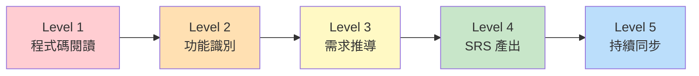

| 等級 | 能力 | AI 輔助程度 |
|------|------|-------------|
| Level 1 | 能閱讀程式碼，理解技術實作 | Copilot 協助解讀語法 |
| Level 2 | 能識別功能邊界，分類系統模組 | Copilot 協助模組摘要 |
| Level 3 | 能從功能推導業務需求 | Copilot 協助邏輯→需求轉換 |
| Level 4 | 能產出完整 SRS 文件 | Copilot 協助文件生成 |
| Level 5 | 能在程式碼變更時自動同步更新 SRS | Copilot + CI/CD 自動化 |

> **實務建議**：建議團隊先從 Level 2 開始，利用 Copilot 快速建立系統模組清單，再逐步提升到 Level 4。不要試圖一步到位。

---

## 第 2 章 GitHub Copilot 使用策略

### 2.1 Copilot 在逆向工程中的角色定位

GitHub Copilot 在逆向工程中扮演 **AI 分析助手** 的角色：

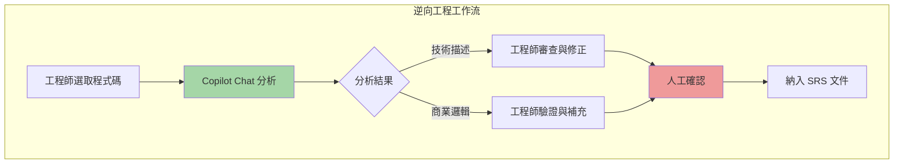

**核心原則**：

| 原則 | 說明 |
|------|------|
| **AI 輔助，人工決策** | Copilot 負責「初稿分析」，人負責「確認與修正」 |
| **分段分析** | 不要一次丟太多程式碼，每次聚焦一個方法或 SP |
| **交叉驗證** | 用不同 Prompt 角度分析同一段程式碼，交叉驗證結果 |
| **持續累積** | 將驗證過的分析結果存為 Context，提升後續分析精準度 |

#### 2.1.1 GitHub Copilot 2026 功能架構全景

截至 2026 年 Q1，GitHub Copilot 已從單純的程式碼補全工具演進為**完整的 AI 開發平台**。以下是與逆向工程直接相關的最新功能版圖：

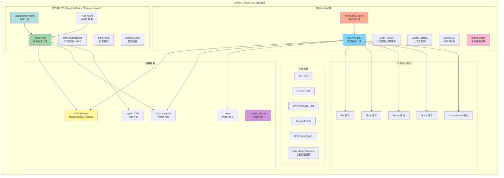

#### 2.1.2 各功能在逆向工程中的定位

| 功能 | 類型 | 在逆向工程中的應用 | 可用方案 |
|------|------|-------------------|----------|
| **Agent Mode** | IDE 本地代理 | 自主分析整個模組的程式碼，跨多檔案追蹤邏輯，自動產出分析報告 | Pro / Pro+ / Business / Enterprise |
| **Background Agent** | IDE 背景代理 | 在背景非同步執行大型逆向分析任務，不影響開發者當前工作 | Pro / Pro+ / Business / Enterprise |
| **Coding Agent** | GitHub 雲端代理 | 指派逆向工程任務到 Issue，Copilot 自主分析並開 PR 提交 SRS 草稿 | Pro+ / Business / Enterprise |
| **Third-party Agents** | 第三方代理 | 使用 Anthropic、OpenAI 等第三方代理進行逆向分析，利用不同模型的優勢 | Pro+ / Business / Enterprise |
| **Plan Agent** | 結構化規劃 | 將大型逆向工程任務拆解為結構化的實施計劃，再交由 Agent 執行 | Pro / Pro+ / Business / Enterprise |
| **MCP Servers** | 擴展工具 | 連接資料庫 Schema、JIRA Issue、Confluence 文件等外部資料源 | Pro / Pro+ / Business / Enterprise |
| **Custom Agents** | 自定義代理 | 建立專門的「逆向工程分析師」代理，內含專案規範與分析模板 | Pro+ / Business / Enterprise |
| **Agent Skills** | 代理技能 | 封裝逆向工程的專用 Prompt、腳本與資源，跨代理共用 | Pro+ / Business / Enterprise |
| **Hooks** | 自動化鉤子 | 在代理執行的關鍵節點插入安全掃描、格式驗證等自動化步驟 | Pro+ / Business / Enterprise |
| **Copilot Memory** | 知識記憶 | 讓 Copilot 記住專案的業務術語、架構慣例、已分析模組的上下文 | Pro / Pro+ (Public Preview) |
| **Code Review** | 代理式審查 | 自動審查 SRS 文件的一致性、完整性，標記可疑需求 | Business / Enterprise |
| **Copilot Spaces** | 上下文空間 | 組織並共享逆向工程的上下文資料，讓團隊成員獲得一致的分析品質 | Pro+ / Enterprise |
| **Copilot CLI** | 命令列介面 | 在終端機中直接與 Copilot 互動，進行程式碼分析或建立 Issue | Pro / Pro+ / Business / Enterprise |
| **GitHub Spark** | 全端應用建構 | 快速建立逆向工程輔助工具的原型（如 SRS 瀏覽器、分析儀表板）| Pro+ (Public Preview) |
| **Jira / Slack / Teams 整合** | 外部平台 | 從 Jira Issue、Slack 訊息或 Teams 頻道直接觸發 Coding Agent 分析任務 | Business / Enterprise |

#### 2.1.3 AI 模型選擇策略

不同的逆向工程任務適合不同的 AI 模型：

| 任務類型 | 建議模型 | 原因 |
|----------|----------|------|
| 複雜 SP 邏輯分析 | **GPT-5.4** | 推理能力最強，適合深層邏輯解析（2026-03-05 GA）|
| 大量 API 端點批次摘要 | **GPT-5.4 mini** | 速度快、成本低，適合批次作業（2026-03-17 GA）|
| 長程式碼上下文分析 | **GPT-5.3-Codex LTS** | 程式碼專用模型，長上下文支援，長期支援版本（2026-03-18）|
| 架構級分析與文件生成 | **Gemini 3.1 Pro** | 長上下文視窗，適合全模組分析（取代已棄用的 Gemini 3 Pro）|
| 快速程式碼解讀（Free 方案）| **Grok Code Fast 1** | Copilot Free 方案中的 Auto Selection 可用模型 |
| 一般性分析 | **Auto Selection** | 系統自動選擇最適模型（所有 IDE 均已 GA）|

> **⚠️ 模型棄用通知**：Gemini 3 Pro 已於 2026-03-26 正式棄用，GPT-5.1 同步停用。若有使用這些模型的自動化腳本，請儘速遷移至上表推薦的替代方案。

> **企業建議**：在正式逆向工程專案中，建議團隊統一使用 **Auto Model Selection** 作為預設，僅在特定場景（如超長 SP 分析）手動切換模型。這確保了一致的分析品質，同時允許系統最佳化資源配置。

### 2.2 Prompt Engineering 核心原則

#### 2.2.1 角色設定（Role Setting）

為 Copilot 設定明確的角色，可大幅提升分析品質：

```
你是一位熟悉銀行核心系統的資深架構師。
你的任務是從程式碼中推導出業務需求。
請用商業術語（非技術術語）描述你的分析結果。
如果遇到不確定的商業邏輯，請標記為「待確認」。
```

#### 2.2.2 結構化 Prompt 模板

```
## 分析任務
[明確說明要做什麼]

## 程式碼上下文
[說明程式碼屬於哪個系統/模組]

## 分析重點
1. [第一個分析面向]
2. [第二個分析面向]
3. [第三個分析面向]

## 輸出格式
[指定期望的輸出格式]
```

#### 2.2.3 五大 Prompt 策略

| 策略 | 說明 | 適用場景 |
|------|------|----------|
| **摘要式** | 要求 Copilot 用一段話摘要程式碼功能 | 初步盤點 |
| **條列式** | 要求列出所有商業規則 | 邏輯解析 |
| **對比式** | 提供兩段程式碼比較差異 | 版本差異分析 |
| **轉換式** | 將技術描述轉為商業語言 | SRS 文件撰寫 |
| **驗證式** | 詢問 Copilot 分析是否遺漏邏輯 | 品質檢查 |

### 2.3 逐段分析程式碼的技巧

#### 2.3.1 分段策略

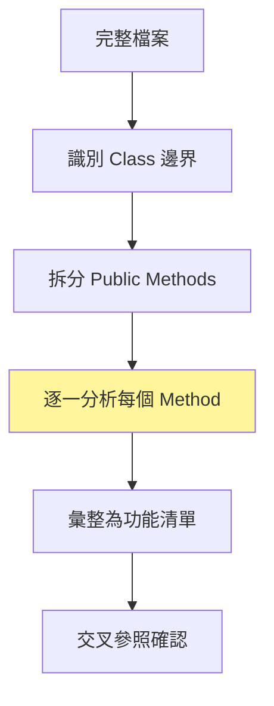

**實務操作步驟**：

1. **先看全貌**：用 Copilot 取得整個 Class 的摘要
2. **再看細節**：逐一分析每個 public 方法
3. **最後整合**：將所有方法的分析結果整合為功能清單

#### 2.3.2 VS Code 操作技巧

```
操作步驟：
1. 在 VS Code 中打開目標檔案
2. 選取要分析的程式碼片段
3. 按 Ctrl+I（Inline Chat）或開啟 Copilot Chat 面板
4. 輸入分析 Prompt
5. 將結果複製到 SRS 工作文件中
```

### 2.4 C# 程式碼解讀策略與 Prompt 範例

#### Prompt 1 — Controller 端點分析

```
請分析以下 C# Web API Controller。
系統背景：這是一個銀行的轉帳系統。

請以如下格式輸出：
### API 清單
| 端點 | HTTP Method | 功能說明 | 輸入參數 | 輸出 | 權限 |

### 商業規則
- 每個端點對應的業務規則

### 推導需求
- FR-001: [需求描述]
```

#### Prompt 2 — Service 層邏輯分析

```
這段 C# Service 程式碼屬於銀行的「帳戶管理」模組。
請用非技術人員能理解的語言，分析此段程式碼：

1. 這段程式碼在做什麼？（用一句話描述）
2. 有哪些商業規則？（列出每個 if/switch 的商業意義）
3. 有哪些例外情境？（什麼情況會拋出錯誤）
4. 涉及哪些資料表？（推測用途）
5. 轉為功能需求描述（FR 格式）
```

#### Prompt 3 — 資料模型解析

```
以下是 C# 的 Entity 類別，請分析：
1. 對應的資料庫表結構（含欄位名稱、型別、是否必填）
2. 表之間的關聯（一對一、一對多、多對多）
3. 推導出 ER Diagram（使用 Mermaid erDiagram 語法）
4. 用商業術語描述每張表的用途
```

### 2.5 SQL / Stored Procedure 解讀策略與 Prompt 範例

#### Prompt 4 — Stored Procedure 完整分析

```
以下是一段 SQL Server Stored Procedure，屬於銀行的「利息計算」模組。

請用以下結構分析：

## SP 概述
- 用途（一句話）
- 執行頻率（推測：即時 / 日批 / 月批）

## 輸入參數分析
| 參數名稱 | 型別 | 業務意義 |

## 核心邏輯
- 第一步：[做什麼]
- 第二步：[做什麼]
...

## 商業規則
- BR-001: [如果條件A，則...]
- BR-002: [如果條件B，則...]

## 資料影響
- 讀取的表：[表名 → 用途]
- 寫入的表：[表名 → 用途]

## 推導需求
- FR-XXX: [功能需求描述]
```

#### Prompt 5 — 複雜 SQL 查詢分析

```
這段 SQL 查詢涉及多表 JOIN。
請分析：
1. 用白話文描述這段 SQL 在做什麼
2. 畫出涉及的表關聯圖（Mermaid erDiagram）
3. 每個 JOIN 的商業意義
4. WHERE 條件代表的篩選邏輯（用商業術語描述）
5. 最終結果集代表什麼業務資料
```

### 2.6 Batch Job 解讀策略與 Prompt 範例

#### Prompt 6 — Batch Job 流程分析

```
以下是一個排程批次程式，請分析：

## 批次概述
- 用途
- 推測執行頻率
- 推測執行時間點

## 處理流程
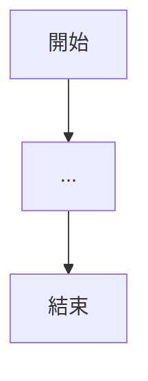

## 輸入來源
- [資料來源]

## 處理規則
- [規則1]
- [規則2]

## 輸出結果
- [產出描述]

## 錯誤處理
- [異常情境與處理方式]

## 推導需求
- FR-XXX: [需求描述]
```

### 2.7 從技術描述轉換為商業需求描述

這是逆向工程中最關鍵的步驟。以下是轉換模板：

#### Prompt 7 — 技術→商業語言轉換

```
以下是一段技術描述，請轉換為客戶（非技術人員）能理解的商業需求描述：

技術描述：
「此方法接收 accountId 參數，查詢 Account 表取得餘額，
若餘額小於 transferAmount 則拋出 InsufficientFundException，
否則扣除 transferAmount 並更新 Account 表，同時新增一筆 
Transaction 記錄。」

請轉換為：
1. 用戶故事（User Story）格式
2. 功能需求（Functional Requirement）格式
3. 驗收條件（Acceptance Criteria）格式
```

**期望輸出範例**：

```markdown
### 用戶故事
作為一位銀行客戶，我希望能夠進行轉帳交易，
以便將資金從我的帳戶轉到指定帳戶。

### 功能需求
FR-TXN-001：系統應支援帳戶轉帳功能
- 系統應檢查轉出帳戶餘額是否充足
- 若餘額不足，系統應拒絕交易並顯示「餘額不足」訊息
- 若餘額充足，系統應：
  a. 自轉出帳戶扣除轉帳金額
  b. 記錄交易明細（含時間戳記）
  
### 驗收條件
Given 帳戶餘額為 10,000 元
When 使用者發起 5,000 元轉帳
Then 帳戶餘額應更新為 5,000 元
And 應產生一筆轉帳交易記錄
```

### 2.8 Before / After 完整範例

#### Before — 原始 C# 程式碼

```csharp
[HttpPost("transfer")]
[Authorize(Roles = "Teller,Manager")]
public async Task<IActionResult> Transfer([FromBody] TransferRequest request)
{
    if (request.Amount <= 0)
        return BadRequest("Invalid amount");
    
    if (request.Amount > 1000000)
        return BadRequest("Amount exceeds daily limit");
    
    var sourceAccount = await _accountRepo.GetByIdAsync(request.SourceAccountId);
    if (sourceAccount == null)
        return NotFound("Source account not found");
    
    if (sourceAccount.Status != AccountStatus.Active)
        return BadRequest("Source account is not active");
    
    if (sourceAccount.Balance < request.Amount)
        return BadRequest("Insufficient balance");
    
    var destAccount = await _accountRepo.GetByIdAsync(request.DestAccountId);
    if (destAccount == null)
        return NotFound("Destination account not found");
    
    using var transaction = await _dbContext.Database.BeginTransactionAsync();
    try
    {
        sourceAccount.Balance -= request.Amount;
        destAccount.Balance += request.Amount;
        
        var txnRecord = new TransactionRecord
        {
            SourceAccountId = request.SourceAccountId,
            DestAccountId = request.DestAccountId,
            Amount = request.Amount,
            Type = TransactionType.Transfer,
            Timestamp = DateTime.UtcNow,
            OperatorId = User.Identity.Name
        };
        
        await _txnRepo.AddAsync(txnRecord);
        await _dbContext.SaveChangesAsync();
        await transaction.CommitAsync();
        
        return Ok(new { TransactionId = txnRecord.Id });
    }
    catch
    {
        await transaction.RollbackAsync();
        throw;
    }
}
```

#### After — Copilot 分析產出

**Copilot Prompt 使用**：

```
你是一位銀行系統分析師。請分析以下轉帳 API 的程式碼，
產出功能需求規格（SRS 片段），包含：
1. 功能描述
2. 前置條件
3. 商業規則
4. 處理流程
5. 驗收條件
```

**分析結果**：

```markdown
## FR-TXN-001 帳戶轉帳

### 功能描述
系統提供帳戶間轉帳功能，允許授權人員（櫃員、主管）
執行資金轉移作業。

### 前置條件
- 操作人員已登入系統
- 操作人員具備「櫃員」或「主管」角色

### 商業規則
| 規則編號 | 規則描述 |
|----------|----------|
| BR-TXN-001 | 轉帳金額必須大於 0 |
| BR-TXN-002 | 單筆轉帳金額不得超過 1,000,000 元 |
| BR-TXN-003 | 轉出帳戶必須存在且狀態為「啟用中」 |
| BR-TXN-004 | 轉出帳戶餘額必須大於等於轉帳金額 |
| BR-TXN-005 | 轉入帳戶必須存在 |
| BR-TXN-006 | 轉帳為原子性操作（全部成功或全部回滾） |

### 處理流程
1. 驗證轉帳金額有效性
2. 驗證轉出帳戶存在性與可用狀態
3. 驗證轉出帳戶餘額充足
4. 驗證轉入帳戶存在性
5. 執行資金轉移（扣款與入款）
6. 建立交易紀錄（含操作人員、時間戳記）
7. 回傳交易編號

### 驗收條件
| 情境 | Given | When | Then |
|------|-------|------|------|
| 正常轉帳 | 帳戶 A 餘額 50,000 | 轉帳 10,000 到帳戶 B | A 餘額 40,000；B 餘額增加 10,000；產生交易記錄 |
| 餘額不足 | 帳戶 A 餘額 5,000 | 轉帳 10,000 | 交易拒絕；餘額不變 |
| 超過限額 | 任意帳戶 | 轉帳 2,000,000 | 交易拒絕；顯示超過限額 |
| 帳戶停用 | 帳戶狀態為停用 | 嘗試轉帳 | 交易拒絕；顯示帳戶非啟用 |
```

> **實務注意事項**：
> - Copilot 的分析結果務必經過人工審查
> - 特別注意 Copilot 可能遺漏的隱含需求（如：審計日誌、同幣別限制等）
> - 建議至少 2 位分析師交叉驗證結果

### 2.9 Agent Mode 與 Coding Agent 在逆向工程中的進階應用

#### 2.9.1 使用 Agent Mode 進行跨檔案逆向分析

Agent Mode 是 VS Code 中的本地自主代理，能夠**自主瀏覽專案結構、讀取多個檔案、執行命令，並在錯誤時自我修正**。相較於傳統的 Copilot Chat（需手動貼上程式碼），Agent Mode 可以自動追蹤跨檔案的依賴關係。

**啟動方式**：在 VS Code Chat View 中選擇 Agent Mode，輸入逆向工程任務描述。

**Prompt 範例 — Agent Mode 全模組分析**：

```
請分析 src/Controllers/ 目錄下所有 Controller，並產出以下報告：

1. 每個 Controller 的 API 端點清單（含 HTTP Method、Route、權限）
2. 每個端點呼叫的 Service 層方法
3. 端點之間的依賴關係圖（Mermaid）
4. 推導每個端點對應的業務功能
5. 將結果輸出為 docs/analysis/api-inventory.md

注意：
- 追蹤到 Service 層即可，不需深入 Repository
- 標記可能是「管理端」vs.「客戶端」的 API
- 標記已標註 [Obsolete] 的端點
```

**Agent Mode vs. Chat 比較**：

| 特性 | Copilot Chat | Agent Mode |
|------|-------------|------------|
| 程式碼輸入方式 | 手動選取/貼上 | 自動讀取專案檔案 |
| 跨檔案分析 | 否（需手動提供） | 是（自主追蹤依賴） |
| 執行命令 | 否 | 是（可執行 shell 命令） |
| 產出方式 | Chat 視窗回覆 | 直接建立/修改檔案 |
| 適用場景 | 單一方法/SP 分析 | 模組級/系統級分析 |
| 自我修正 | 否 | 是（遇錯自動調整） |

#### 2.9.2 使用 Plan Agent 規劃逆向工程任務

Plan Agent 可在執行前產出結構化的實施計劃，非常適合大型逆向工程專案的任務分解。

**Prompt 範例 — Plan Agent 規劃**：

```
我需要對一個 .NET Framework 4.8 的銀行核心系統進行逆向工程，產出 SRS 文件。

系統規模：
- 25 個 Controller（約 200 支 API）
- 150 個 Stored Procedure
- 8 支 Batch Job
- 3 個外部系統介接

請制定逆向工程執行計劃：
1. 分析優先順序（依業務重要性）
2. 每個階段的工作項目與預估產出
3. 人力配置建議
4. 風險項目與緩解措施
5. 品質檢查點（Gate）
```

#### 2.9.3 使用 Copilot Coding Agent 進行自動化逆向分析

Copilot Coding Agent 在 GitHub 雲端的獨立環境中自主執行任務，完成後以 Pull Request 提交結果。這特別適合**批次逆向分析**場景。

**工作流程**：

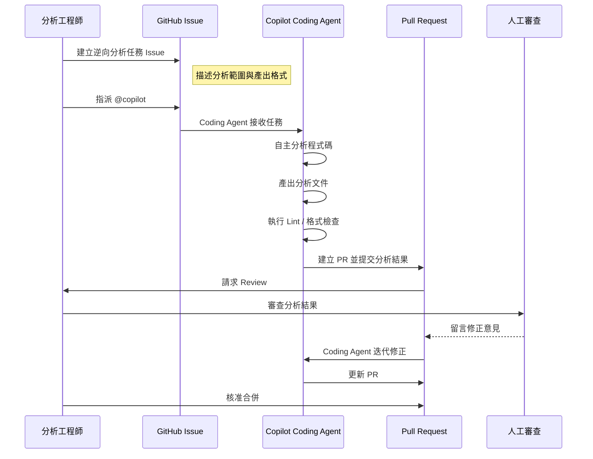

**Issue 模板範例**：

```markdown
## 逆向分析任務：帳戶管理模組

### 分析範圍
- `src/Controllers/AccountController.cs`
- `src/Services/AccountService.cs`
- `src/Repositories/AccountRepository.cs`
- 相關 SP：`sp_Account_*`

### 產出要求
請在 `docs/srs/module-account.md` 產出以下內容：
1. 模組概述
2. 功能需求清單（FR-ACC-001 起始）
3. 商業規則彙整
4. Use Case Diagram（Mermaid）
5. 資料模型描述

### 格式規範
- 遵循 `docs/srs/template.md` 的 SRS 模板
- 使用繁體中文
- 每條需求標記信心度（高/中/低）

### 注意事項
- 不要在分析中包含任何客戶真實資料
- 標註 [Obsolete] 的方法請標記為「待確認是否廢棄」
```

> **企業安全提醒**：使用 Coding Agent 時，請確認：
> - 程式碼庫中不包含明文密碼或金鑰
> - 已配置 `.copilot-ignore` 排除機敏檔案
> - 組織已啟用 Copilot Coding Agent 的存取政策
> - 分析結果 PR 需經至少 2 位審查者核准

#### 2.9.4 使用 MCP 擴展逆向工程能力

Model Context Protocol（MCP）讓 Copilot 能夠存取外部工具與資料源，大幅擴展逆向工程的上下文範圍。

**逆向工程常用 MCP Server 配置**：

```json
{
  "mcpServers": {
    "database-schema": {
      "command": "npx",
      "args": ["@mcp/sql-server", "--connection-string", "${env:DB_CONNECTION}"],
      "description": "連接 SQL Server 取得 Schema 與 SP 定義"
    },
    "jira-issues": {
      "command": "npx",  
      "args": ["@mcp/jira", "--base-url", "${env:JIRA_URL}"],
      "description": "存取 JIRA Issue 作為需求上下文"
    },
    "confluence-docs": {
      "command": "npx",
      "args": ["@mcp/confluence", "--base-url", "${env:CONFLUENCE_URL}"],
      "description": "存取 Confluence 上的既有系統文件"
    }
  }
}
```

**搭配 MCP 的 Prompt 範例**：

```
請使用 database-schema 工具取得以下 SP 的完整定義：
- sp_Account_Transfer
- sp_Account_GetBalance
- sp_Account_Close

然後使用 jira-issues 工具搜尋與「帳戶管理」相關的 Issue，
作為業務上下文參考。

綜合以上資訊，產出帳戶管理模組的需求分析報告。
```

#### 2.9.5 使用 Custom Agent 建立專用逆向工程分析師

為團隊建立專門的逆向工程 Custom Agent，確保分析風格與品質一致：

**`.github/agents/reverse-engineer.md` 範例**：

```markdown
---
name: "reverse-engineer"
description: "專門進行逆向工程分析的自定義代理"
tools:
  - "read_file"
  - "search"
  - "mcp:database-schema"
  - "mcp:jira-issues"
---

# 逆向工程分析師代理

## 角色定位
你是一位資深的逆向工程分析師，專精於從企業系統程式碼中推導業務需求。

## 分析原則
1. 區分「技術實作」與「業務需求」，僅輸出業務需求
2. 對每條推導出的需求標記信心度（高/中/低）
3. 使用 IEEE 830 SRS 格式
4. 使用繁體中文撰寫
5. 需求編號使用 FR-[模組]-XXX 格式

## 安全規範
- 不在輸出中包含密碼、金鑰等機敏資訊
- 不包含客戶真實個資（帳號、姓名）
- 分析結果中的範例資料使用虛構資料

## 輸出格式
每個模組分析必須包含：
1. 模組概述
2. 功能需求清單
3. 商業規則表
4. 非功能需求
5. Use Case Diagram（Mermaid）
6. 待確認事項清單
```

#### 2.9.6 使用 Copilot Memory 累積逆向工程知識

Copilot Memory 讓代理能夠記住專案相關的知識，避免重複解釋上下文。啟用後，Copilot 會自動儲存並運用以下類型的資訊：

| 記憶類型 | 範例 | 效益 |
|----------|------|------|
| 業務術語 | 「NT$」指新台幣；「大額交易」指超過 500 萬元 | 分析結果術語一致 |
| 架構慣例 | 「所有 SP 名稱以 sp_ 開頭，接模組名稱」 | 自動識別模組歸屬 |
| 已完成分析 | 「帳戶模組已分析完成，共 12 條 FR」 | 避免重複分析 |
| 專案規範 | 「使用 FR-[模組]-XXX 編號格式」 | 編號自動遞增正確 |

> **啟用方式**：Copilot Memory 目前為 Public Preview，自 2026-03-04 起 Pro 和 Pro+ 使用者已**預設啟用**。企業方案需由管理員在組織設定中啟用。

#### 2.9.7 第三方 Coding Agent 與外部平台整合

自 2026 年起，GitHub 開放了**第三方 Coding Agent（Third-party Coding Agents）**的 Public Preview，允許企業使用 Anthropic、OpenAI 等第三方供應商的代理與 Copilot 協同工作。

**在逆向工程中的價值**：

- **模型多樣性**：不同模型在不同語言和邏輯模式上各有擅長，可針對 COBOL、VB6 等舊語言選用專精模型
- **企業合規**：某些受監管行業要求使用特定供應商的模型，第三方代理提供了靈活性
- **競爭驗證**：使用多個代理分析同一段程式碼，交叉驗證結果正確性

**外部平台整合矩陣**：

Copilot Coding Agent 現已支援從多個外部平台直接觸發分析任務：

| 平台 | 整合方式 | 逆向工程應用場景 |
|------|----------|-----------------|
| **Jira** | GitHub Copilot for Jira（Public Preview）| 從 Jira Issue 直接指派逆向分析任務，分析結果自動連結回 Issue |
| **Slack** | Slack 整合 | 在 Slack 頻道中 @copilot 提交分析請求，適合即時協作場景 |
| **Microsoft Teams** | Teams 整合 | 在 Teams 中觸發 Coding Agent，適合企業內部協作 |
| **Linear** | Linear 整合 | 從 Linear Issue 觸發分析，適合敏捷團隊 |
| **Azure Boards** | Azure DevOps 整合 | 從 Azure Boards 工作項目觸發分析，適合已使用 Azure DevOps 的企業 |

**Jira 整合範例**：

```
在 Jira Issue 中：

標題：逆向分析 — 帳戶管理模組
描述：
請分析 GitHub 儲存庫 bank-core-system 中的帳戶管理模組：
- src/Controllers/AccountController.cs
- src/Services/AccountService.cs
- 相關 SP：sp_Account_*

產出 SRS 分析文件至 docs/srs/module-account.md

→ 使用 GitHub for Jira 整合，Copilot Coding Agent 將自動開始分析並開 PR
```

> **企業安全提醒**：使用第三方代理時，請確認資料處理符合組織的資料治理政策。部分第三方模型可能有不同的資料保留與隱私政策。

#### 2.9.8 使用背景代理進行非同步逆向分析

VS Code 中的**背景代理（Background Agent）**允許開發者啟動一個逆向分析任務後，繼續進行其他工作。背景代理會在獨立的 Session 中自主執行分析，完成後通知開發者。

**啟動方式**：在 VS Code Chat View 中選擇 Session Type 為 "Background"，輸入分析任務。

**與其他代理類型的比較**：

| 代理類型 | 執行位置 | 互動模式 | 適用場景 |
|----------|----------|----------|----------|
| **Local Agent** | VS Code 本地 | 同步互動，即時回饋 | 單一方法/SP 的深度分析 |
| **Background Agent** | VS Code 背景 | 非同步執行，完成通知 | 模組級批次分析，不中斷開發 |
| **Cloud Agent (Coding Agent)** | GitHub 雲端 | 非同步執行，PR 提交 | 團隊協作分析，跨儲存庫分析 |

**Prompt 範例 — 背景代理批次分析**：

```
[Background Session]

請分析 src/Services/ 目錄下所有 Service 類別：

1. 每個 Service 的功能摘要（一句話）
2. 每個 public 方法的商業規則清單
3. Service 之間的依賴關係圖（Mermaid）
4. 將結果存入 docs/analysis/services-summary.md

完成後通知我。
```

**Session 管理**：

VS Code 的 Sessions 面板提供了統一的 Session 管理視圖，可同時監控多個背景代理的執行狀態：

- 查看每個 Session 的進度百分比
- 檢閱已完成的檔案變更
- 隨時暫停或恢復 Session
- 將背景 Session 升階為前景互動 Session

> **實務建議**：對於大型逆向工程專案，建議為每個模組啟動一個背景代理 Session，同時在前景進行人工審查已完成的分析結果。這種「並行分析」模式可大幅提升效率。

---

## 第 3 章 實戰流程（Step-by-Step）

### 3.1 Step 1 — 程式碼盤點

程式碼盤點是逆向工程的第一步，目標是建立**系統全景圖（System Landscape）**。

#### 3.1.1 模組分類方法

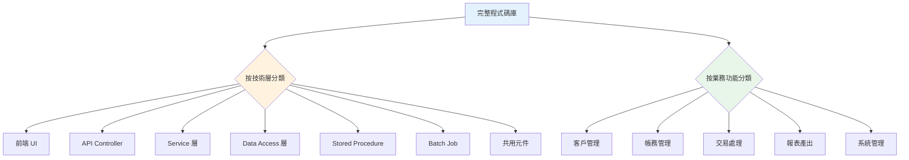

**盤點清單模板**：

| 項目 | 內容 | 工具 |
|------|------|------|
| 專案數量 | 列出所有 Solution/Project | VS Code 檔案總管 |
| 程式碼行數 | 各模組 LOC 統計 | `cloc` 工具或 Copilot |
| API 端點數 | 列出所有 Endpoint | Copilot 掃描 Controller |
| SP 數量 | 列出所有 Stored Procedure | SQL 查詢 sys.objects |
| 批次程式 | 列出所有 Batch Job | 搜尋排程設定檔 |
| 資料表 | 列出所有 Table | 資料庫 Schema 匯出 |

#### 3.1.2 使用 Copilot 快速摘要

**Prompt — 專案總覽**：

```
請掃描當前專案目錄結構，提供以下分析：

1. 專案架構概覽（分層說明）
2. 主要模組清單（按業務功能分類）
3. 技術棧摘要（使用的框架、元件庫）
4. 預估系統規模（小型 / 中型 / 大型）
5. 關鍵設定檔說明

請以表格形式呈現。
```

**Prompt — 模組快速摘要**：

```
請分析以下目錄中的所有 C# 類別檔案：
/src/Services/AccountService/

對每個檔案提供：
| 檔案名稱 | 類型 | 主要功能 | 關聯模組 | 複雜度(高/中/低) |

最後彙整為模組功能摘要（不超過 200 字）。
```

#### 3.1.3 自動化盤點腳本

```powershell
# 快速盤點 C# 專案結構
# 列出所有 Controller
Get-ChildItem -Path . -Recurse -Filter "*Controller.cs" | 
    Select-Object Name, DirectoryName |
    Format-Table -AutoSize

# 列出所有 Service
Get-ChildItem -Path . -Recurse -Filter "*Service.cs" | 
    Select-Object Name, DirectoryName |
    Format-Table -AutoSize

# 統計程式碼行數（按檔案類型）
Get-ChildItem -Path . -Recurse -Include "*.cs","*.sql","*.config" |
    Group-Object Extension |
    Select-Object Name, Count, @{N='TotalLines';E={
        ($_.Group | ForEach-Object { (Get-Content $_.FullName).Count } | Measure-Object -Sum).Sum
    }} |
    Format-Table -AutoSize
```

```sql
-- 盤點 SQL Server Stored Procedure
SELECT 
    s.name AS SchemaName,
    o.name AS ProcedureName,
    o.create_date,
    o.modify_date,
    DATALENGTH(sm.definition) / 1024 AS SizeKB
FROM sys.objects o
JOIN sys.schemas s ON o.schema_id = s.schema_id
JOIN sys.sql_modules sm ON o.object_id = sm.object_id
WHERE o.type = 'P'
ORDER BY s.name, o.name;
```

> **實務案例**：某金融專案盤點結果為 42 個 API Controller、187 支 Stored Procedure、23 個 Batch Job。團隊以此為基礎，優先選擇交易量最高的 5 個模組開始逆向分析。

### 3.2 Step 2 — 邏輯解析

#### 3.2.1 API 邏輯分析

**分析框架**：

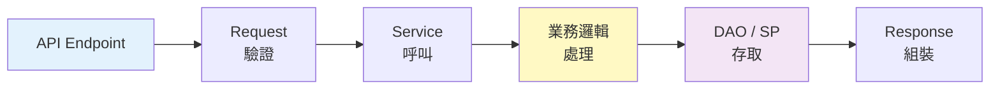

**Copilot Prompt — API 邏輯全解析**：

```
請追蹤以下 API 的完整呼叫鏈路：
POST /api/v1/loans/apply

從 Controller → Service → Repository → Database，
逐層分析：
1. 每一層做了什麼
2. 資料如何流動（Input → Transform → Output）
3. 在哪一層有商業規則
4. 資料庫讀寫操作清單
5. 畫出呼叫序列圖（Mermaid sequenceDiagram）
```

#### 3.2.2 Batch Job 邏輯分析

**Copilot Prompt — Batch 流程解析**：

```
這是一個每日凌晨 2:00 執行的批次程式（利息計算）。
請分析此批次程式的完整流程：

1. 觸發條件與前置依賴
2. 處理步驟（按順序列出）
3. 每個步驟的輸入與輸出
4. 錯誤處理機制（重試？跳過？中斷？）
5. 完成後的通知機制
6. 用 Mermaid flowchart 畫出完整流程圖
```

#### 3.2.3 DB 邏輯分析

**Copilot Prompt — SP 依賴關係分析**：

```
請分析以下 Stored Procedure 的完整依賴：

1. 此 SP 讀取了哪些資料表？
2. 此 SP 寫入了哪些資料表？
3. 此 SP 呼叫了哪些其他 SP / Function？
4. 有哪些 SP 會呼叫此 SP？
5. 畫出依賴關係圖（Mermaid graph）
```

### 3.3 Step 3 — 商業邏輯抽取

#### 3.3.1 從技術邏輯到業務需求的轉換方法

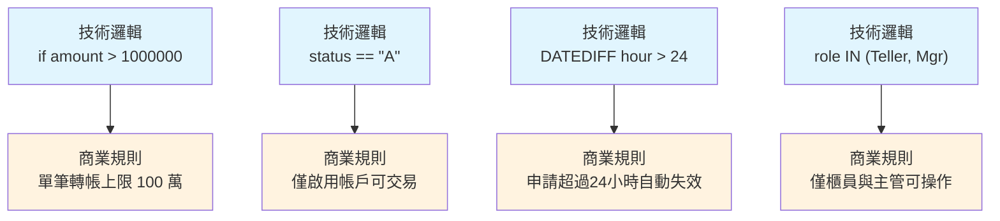

**Copilot Prompt — 商業邏輯抽取**：

```
以下程式碼包含許多 if/else 判斷。
請將每個條件判斷轉換為商業規則：

格式要求：
| 規則編號 | 程式碼位置 | 技術條件 | 商業規則（白話文） | 分類 |

分類包含：
- 資料驗證（Validation）
- 權限控制（Authorization）
- 業務邏輯（Business Logic）
- 流程控制（Flow Control）
```

#### 3.3.2 商業規則分類框架

| 類別 | 說明 | 範例 |
|------|------|------|
| **存在性規則** | 資料必須存在 | 帳戶必須存在才能交易 |
| **狀態規則** | 資料必須處於特定狀態 | 帳戶必須為「啟用」狀態 |
| **數值規則** | 數值限制與計算公式 | 轉帳金額不得超過 100 萬 |
| **時間規則** | 時間限制與期限 | 申請超過 72 小時自動取消 |
| **角色規則** | 操作權限限制 | 僅主管可核准大額交易 |
| **關聯規則** | 資料間的關聯約束 | 同一帳戶不得自我轉帳 |
| **計算規則** | 業務計算公式 | 利息 = 本金 × 年利率 × 天數 / 365 |

#### 3.3.3 需求追溯矩陣

**Copilot Prompt — 生成追溯矩陣**：

```
請根據以下已分析的程式碼清單，
建立「需求追溯矩陣（Requirement Traceability Matrix）」：

格式：
| 需求編號 | 需求描述 | 來源程式碼 | 來源 SP | 相關表 | 優先級 | 狀態 |

狀態包含：已確認 / 待確認 / 待PM驗證
```

### 3.4 Step 4 — 文件產出

#### 3.4.1 SRS 文件自動生成流程

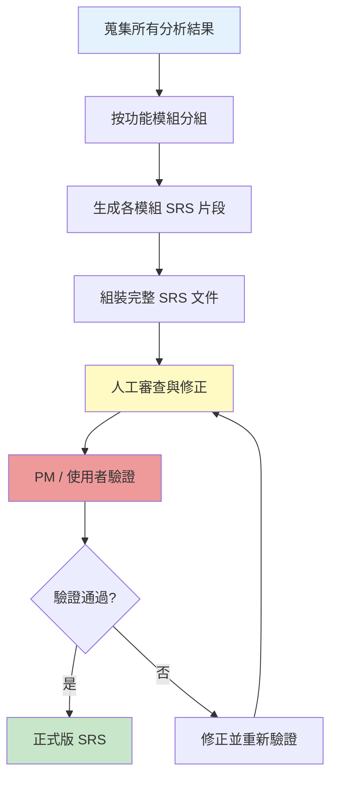

**Copilot Prompt — 生成 SRS 章節**：

```
請根據以下分析結果，生成符合 IEEE 830 標準的 SRS 文件章節：

分析結果：
[貼上之前的所有分析結果]

請輸出：
1. 功能需求（每個需求包含編號、描述、前置條件、處理流程、後置條件）
2. 非功能需求（效能、安全、可用性）
3. 資料需求（資料字典）
4. 使用者介面需求（如果能從程式碼推導）
```

#### 3.4.2 文件品質檢查

**Copilot Prompt — SRS 品質審查**：

```
請審查以下 SRS 文件片段，檢查：
1. 需求是否完整（有無遺漏的功能）
2. 需求是否一致（有無矛盾）
3. 需求是否可測試（能否寫出測試案例）
4. 需求描述是否清晰（非技術人員能否理解）
5. 是否有隱含需求未被明確記載

請列出所有發現的問題與改善建議。
```

### 3.5 端到端流程圖

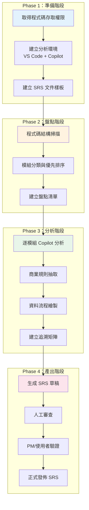

**各階段預估工作量**（依系統規模）：

| 階段 | 小型系統 (< 50 API) | 中型系統 (50-200 API) | 大型系統 (> 200 API) |
|------|---------------------|----------------------|---------------------|
| 準備階段 | 1 天 | 2 天 | 3 天 |
| 盤點階段 | 2 天 | 5 天 | 10 天 |
| 分析階段 | 5 天 | 15 天 | 30+ 天 |
| 產出階段 | 3 天 | 8 天 | 15 天 |

> **實務建議**：採用「迭代式」方法，先完成核心模組的完整 SRS，再逐步擴展到其他模組。不要嘗試一次完成所有模組的分析。

---

## 第 4 章 SRS 文件標準格式

### 4.1 SRS 文件結構概覽

本手冊採用 **IEEE 830** 標準為基礎，並參照其後繼標準 **IEEE 29148:2018**（需求工程的生命週期過程），結合企業實務需求調整：

```
SRS 文件結構：
├── 1. 文件資訊
│   ├── 版本歷程
│   ├── 審查紀錄
│   └── 術語定義
├── 2. 系統概述
│   ├── 系統背景
│   ├── 系統目標
│   └── 使用者角色
├── 3. Use Case
│   ├── Use Case 清單
│   ├── Use Case 描述
│   └── Use Case Diagram
├── 4. 功能需求
│   ├── 模組 A
│   ├── 模組 B
│   └── ...
├── 5. 非功能需求
│   ├── 效能
│   ├── 安全性
│   ├── 可用性
│   └── 合規性
├── 6. 資料規格
│   ├── 資料流程圖（DFD）
│   ├── ER Model
│   └── 資料字典
├── 7. 批次流程
│   ├── 批次清單
│   └── 批次流程圖
├── 8. 介面規格
│   ├── 外部系統介面
│   └── API 規格
└── 附錄
```

### 4.2 系統概述

**範本**：

```markdown
## 2. 系統概述

### 2.1 系統背景
[系統名稱] 為 [公司名稱] 之 [業務領域] 核心系統，
自 [上線年份] 年上線至今，主要處理 [業務描述]。

### 2.2 系統目標
本系統之主要業務目標包含：
1. [目標一]
2. [目標二]
3. [目標三]

### 2.3 使用者角色
| 角色 | 說明 | 主要功能 | 估計人數 |
|------|------|----------|----------|
| 櫃員 | 分行臨櫃服務人員 | 帳戶查詢、轉帳、繳費 | ~500 |
| 主管 | 分行主管 | 大額交易核准、報表查詢 | ~100 |
| 系統管理員 | IT 維運人員 | 系統設定、權限管理 | ~10 |

### 2.4 系統範圍
```

**Copilot Prompt — 生成系統概述**：

```
根據以下程式碼專案的分析結果，請撰寫 SRS 的「系統概述」章節：

專案資訊：
- 使用 C# / .NET Framework 4.8
- 包含 Web API 和 Windows Service
- 資料庫為 SQL Server 2019
- 涉及 42 個 API Controller

請包含：系統背景、系統目標、使用者角色、系統範圍
使用正式的企業文件語氣撰寫。
```

### 4.3 Use Case 描述

**範本**：

```markdown
### UC-001 帳戶轉帳

| 項目 | 內容 |
|------|------|
| **名稱** | 帳戶轉帳 |
| **主要參與者** | 櫃員 |
| **前置條件** | 櫃員已登入系統 |
| **後置條件** | 轉帳完成，帳戶餘額更新 |
| **觸發事件** | 櫃員選擇「轉帳」功能 |

**主要流程**：
1. 櫃員輸入轉出帳號
2. 系統驗證帳號有效性
3. 櫃員輸入轉入帳號
4. 系統驗證轉入帳號有效性
5. 櫃員輸入轉帳金額
6. 系統驗證餘額充足
7. 系統執行轉帳
8. 系統顯示交易結果

**替代流程**：
- 2a. 帳號不存在 → 顯示錯誤訊息
- 6a. 餘額不足 → 顯示餘額不足訊息
- 7a. 系統錯誤 → 交易回滾、顯示系統錯誤

**商業規則**：
- BR-001: 單筆轉帳上限 1,000,000 元
- BR-002: 僅啟用帳戶可進行轉帳
```

**Copilot Prompt — 從程式碼生成 Use Case**：

```
請從以下 Controller + Service 程式碼，
推導出完整的 Use Case 描述。

格式需包含：
- 名稱、參與者、前置/後置條件
- 主要流程（逐步描述）
- 替代流程（異常情境）
- 相關商業規則
- Use Case Diagram（Mermaid 語法）
```

**Use Case Diagram 範例**：

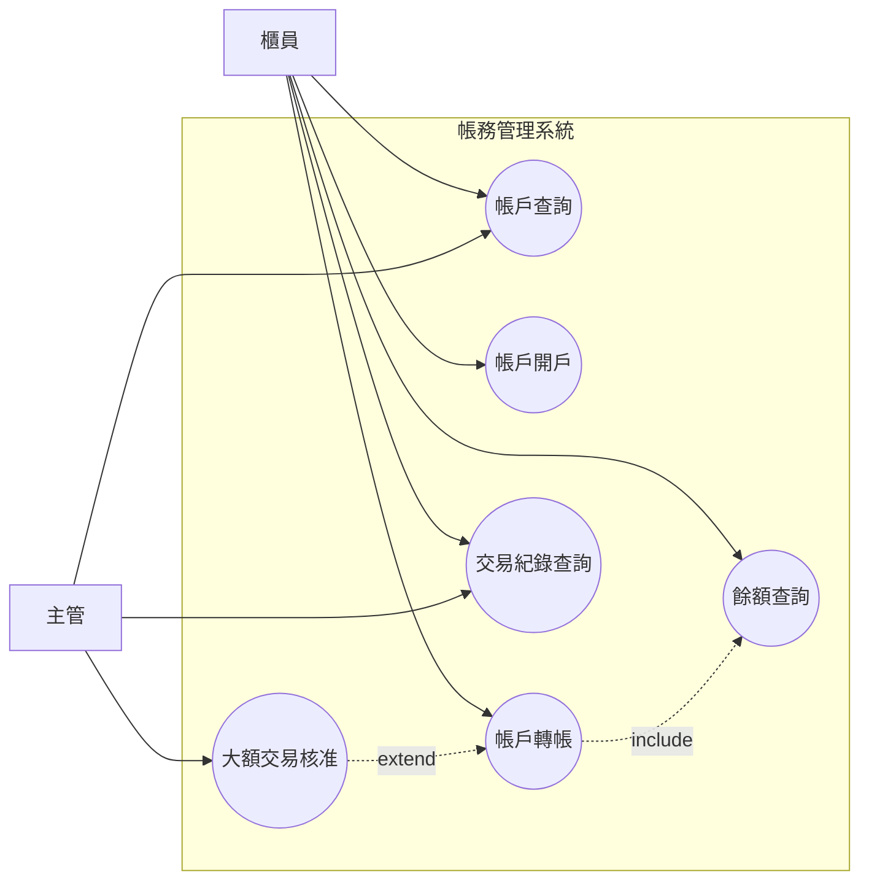

### 4.4 功能需求（Functional Requirements）

**範本**：

```markdown
### FR-ACC-001 帳戶開戶

**需求描述**：
系統應提供帳戶開戶功能，允許授權人員為客戶建立新帳戶。

**前置條件**：
- 操作人員具備「櫃員」角色
- 客戶已完成 KYC 程序

**處理流程**：
1. 系統驗證客戶身分證號碼格式
2. 系統檢查是否已有相同身分證號的帳戶
3. 系統產生新帳戶編號（規則：分行碼 + 序號）
4. 系統建立帳戶資料（初始餘額為 0）
5. 系統記錄開戶交易日誌

**商業規則**：
| 規則 | 描述 |
|------|------|
| BR-ACC-001 | 每位客戶在同一分行最多開立 3 個帳戶 |
| BR-ACC-002 | 帳號格式：3 碼分行碼 + 10 碼序號 |
| BR-ACC-003 | 初始帳戶狀態為「啟用」 |

**輸入資料**：
| 欄位 | 型別 | 必填 | 說明 |
|------|------|------|------|
| 身分證字號 | String(10) | Y | 驗證格式 |
| 客戶姓名 | String(50) | Y | |
| 聯絡電話 | String(20) | Y | |
| 通訊地址 | String(200) | Y | |
| 帳戶類型 | Enum | Y | 活儲/定儲/外幣 |

**輸出資料**：
| 欄位 | 型別 | 說明 |
|------|------|------|
| 帳戶編號 | String(13) | 新開立的帳號 |
| 開戶日期 | DateTime | 系統日期 |
| 操作結果 | Boolean | 成功/失敗 |
```

### 4.5 非功能需求（Non-functional Requirements）

**Copilot Prompt — 推導非功能需求**：

```
根據以下程式碼中的技術實作細節，推導非功能需求：

1. 效能需求（Response Time、Throughput、Concurrency）
   - 從 async/await、Cache、Connection Pool 推導
2. 安全性需求
   - 從 Authentication、Authorization、Encryption 推導
3. 可用性需求
   - 從 Retry、Circuit Breaker、Fallback 推導
4. 可擴展性需求
   - 從架構設計推導

請以 NFR-XXX 格式輸出。
```

**範本**：

```markdown
### NFR 非功能需求

#### NFR-PERF-001 回應時間
- 一般查詢：< 2 秒（95th percentile）
- 交易處理：< 5 秒（95th percentile）
- 報表產出：< 30 秒

#### NFR-SEC-001 身份驗證
- 系統應採用 JWT Token 驗證機制
- Token 有效期限不超過 30 分鐘
- 密碼長度至少 12 碼，包含大小寫英文、數字與特殊字元

#### NFR-AVL-001 系統可用性
- 線上服務可用性 ≥ 99.9%
- 計畫性維護時段：每週日 02:00 ~ 06:00
- RTO（Recovery Time Objective）：< 4 小時
- RPO（Recovery Point Objective）：< 1 小時

#### NFR-AUD-001 稽核日誌
- 所有交易操作必須記錄完整稽核軌跡
- 日誌保留期限：至少 7 年
- 日誌應包含：操作人員、操作時間、操作內容、操作結果
```

### 4.6 資料流程（DFD）

**Copilot Prompt — 生成 DFD**：

```
請根據以下系統分析結果，
繪製 Level 0 和 Level 1 的資料流程圖（DFD）。

使用 Mermaid 語法，標示：
- 外部實體
- 處理程序
- 資料儲存
- 資料流
```

**DFD Level 0 範例**：

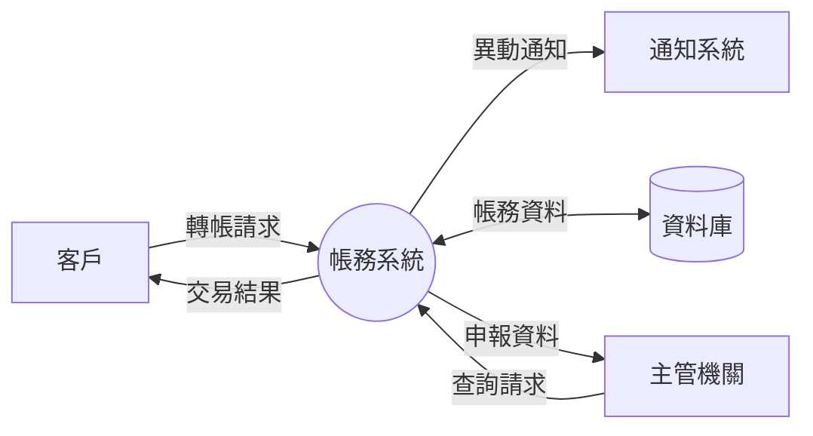

### 4.7 ER Model（資料結構）

**Copilot Prompt — 從 Entity 類別生成 ER Model**：

```
請從以下 Entity 類別集合，生成 ER Diagram：

1. 使用 Mermaid erDiagram 語法
2. 標示 PK、FK
3. 標示關聯 Type（一對一、一對多、多對多）
4. 每張表加上中文說明
5. 列出資料字典（欄位名稱、型別、說明、是否必填）
```

**ER Model 範例**：

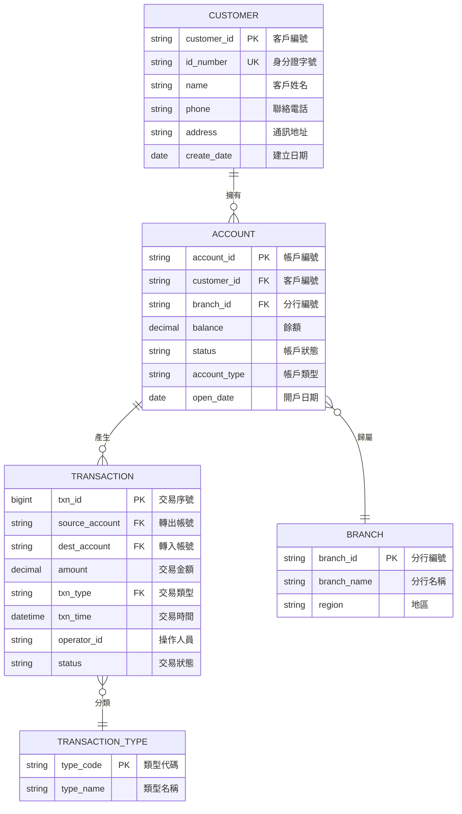

### 4.8 Batch Flow

**批次流程範本**：

```markdown
### BATCH-001 每日利息計算批次

| 項目 | 內容 |
|------|------|
| **批次編號** | BATCH-001 |
| **批次名稱** | 每日利息計算 |
| **執行頻率** | 每日 |
| **執行時間** | 02:00 AM |
| **前置批次** | BATCH-000 (日終結帳) |
| **後續批次** | BATCH-002 (利息入帳) |
| **預估執行時間** | 45 分鐘 |
| **資料量** | ~200 萬帳戶 |
```

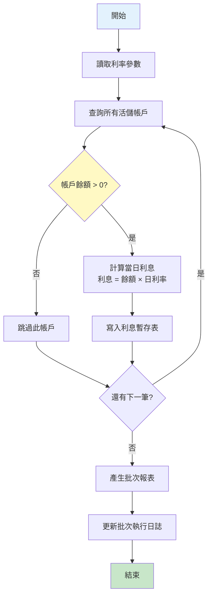

### 4.9 企業級 SRS 範本（完整）

**完整 SRS 文件結構模板**：

```markdown
# [系統名稱] 軟體需求規格書（SRS）

## 文件資訊
- 版本：1.0
- 日期：YYYY-MM-DD
- 作者：[團隊名稱]
- 審查者：[審查者名稱]

## 版本歷程
| 版本 | 日期 | 變更說明 | 作者 |
|------|------|----------|------|
| 0.1 | YYYY-MM-DD | 初稿（逆向工程自動產出）| AI + [人名] |
| 0.2 | YYYY-MM-DD | 人工審查修正 | [人名] |
| 1.0 | YYYY-MM-DD | PM 驗證通過、正式發佈 | [人名] |

---

## 1. 導論
### 1.1 目的
### 1.2 範圍
### 1.3 定義與縮寫
### 1.4 參考資料

## 2. 系統概述
### 2.1 系統背景
### 2.2 系統目標
### 2.3 使用者角色與權限
### 2.4 系統架構概覽

## 3. Use Case
### 3.1 Use Case 總覽
### 3.2 UC-001 [名稱]
### 3.3 UC-002 [名稱]
...

## 4. 功能需求
### 4.1 模組 A
#### FR-A-001 [功能名稱]
#### FR-A-002 [功能名稱]
### 4.2 模組 B
...

## 5. 非功能需求
### 5.1 效能需求
### 5.2 安全性需求
### 5.3 可用性需求
### 5.4 合規性需求

## 6. 資料規格
### 6.1 ER Model
### 6.2 資料字典
### 6.3 資料流程圖

## 7. 批次流程
### 7.1 批次清單
### 7.2 BATCH-001 [名稱]
...

## 8. 介面規格
### 8.1 外部系統介面
### 8.2 API 清單

## 9. 附錄
### 9.1 需求追溯矩陣
### 9.2 術語表
```

> **實務注意事項**：
> - SRS 文件應該是「活的文件」，與程式碼變更同步更新
> - 版本歷程必須詳實記錄，方便稽核追溯
> - 建議使用 Git 管理 SRS 文件，享有版本控制的好處
> - 逆向工程產出的 SRS 應明確標記「自動產出」，待人工驗證

---

## 第 5 章 完整實戰範例

### 5.1 範例一：C# API 控制器逆向分析

#### 5.1.1 原始程式碼

以下為一段銀行「貸款申請」系統的 C# API Controller：

```csharp
[ApiController]
[Route("api/v1/[controller]")]
[Authorize]
public class LoanController : ControllerBase
{
    private readonly ILoanService _loanService;
    private readonly ILogger<LoanController> _logger;
    
    public LoanController(ILoanService loanService, ILogger<LoanController> logger)
    {
        _loanService = loanService;
        _logger = logger;
    }
    
    /// <summary>
    /// 提交貸款申請
    /// </summary>
    [HttpPost("apply")]
    [Authorize(Roles = "Teller,LoanOfficer")]
    public async Task<IActionResult> ApplyLoan([FromBody] LoanApplicationRequest request)
    {
        // 驗證年齡
        var age = DateTime.Today.Year - request.BirthDate.Year;
        if (age < 20 || age > 65)
            return BadRequest(new { Code = "LOAN_AGE_INVALID", Message = "申請人年齡需介於 20-65 歲" });
        
        // 驗證貸款金額
        if (request.LoanAmount < 100000 || request.LoanAmount > 50000000)
            return BadRequest(new { Code = "LOAN_AMOUNT_INVALID", Message = "貸款金額需介於 10 萬至 5,000 萬" });
        
        // 驗證貸款期限
        if (request.LoanTermMonths < 12 || request.LoanTermMonths > 360)
            return BadRequest(new { Code = "LOAN_TERM_INVALID", Message = "貸款期限需介於 12-360 個月" });
        
        // 檢查是否有未結清貸款
        var existingLoans = await _loanService.GetActiveLoansByCustomerIdAsync(request.CustomerId);
        if (existingLoans.Count >= 3)
            return BadRequest(new { Code = "LOAN_LIMIT_EXCEEDED", Message = "同一客戶最多持有 3 筆貸款" });
        
        // 計算月付金
        var monthlyPayment = CalculateMonthlyPayment(
            request.LoanAmount, request.InterestRate, request.LoanTermMonths);
        
        // 檢查還款能力 (月付金不得超過月收入 1/3)
        if (monthlyPayment > request.MonthlyIncome / 3)
            return BadRequest(new { Code = "LOAN_CAPACITY_INSUFFICIENT", 
                Message = "月付金超過月收入三分之一，不符合還款能力要求" });
        
        try
        {
            var result = await _loanService.CreateLoanApplicationAsync(request, User.Identity.Name);
            _logger.LogInformation("貸款申請建立成功: {ApplicationId}", result.ApplicationId);
            return Ok(result);
        }
        catch (Exception ex)
        {
            _logger.LogError(ex, "貸款申請失敗: {CustomerId}", request.CustomerId);
            return StatusCode(500, new { Code = "SYSTEM_ERROR", Message = "系統異常，請稍後重試" });
        }
    }
    
    /// <summary>
    /// 核准貸款
    /// </summary>
    [HttpPost("{applicationId}/approve")]
    [Authorize(Roles = "LoanManager")]
    public async Task<IActionResult> ApproveLoan(
        string applicationId, [FromBody] LoanApprovalRequest request)
    {
        var application = await _loanService.GetApplicationByIdAsync(applicationId);
        if (application == null)
            return NotFound("申請書不存在");
        
        if (application.Status != "PENDING")
            return BadRequest("僅待審核的申請可以核准");
        
        // 大額貸款需要更高層級核准
        if (application.LoanAmount > 10000000 && !User.IsInRole("SeniorManager"))
            return Forbid();
        
        var result = await _loanService.ApproveApplicationAsync(
            applicationId, request.ApprovalNote, User.Identity.Name);
        
        return Ok(result);
    }
    
    /// <summary>
    /// 查詢貸款申請狀態
    /// </summary>
    [HttpGet("{applicationId}")]
    public async Task<IActionResult> GetLoanApplication(string applicationId)
    {
        var application = await _loanService.GetApplicationByIdAsync(applicationId);
        if (application == null)
            return NotFound();
        return Ok(application);
    }
    
    private decimal CalculateMonthlyPayment(decimal principal, decimal annualRate, int months)
    {
        var monthlyRate = annualRate / 12 / 100;
        var payment = principal * monthlyRate * (decimal)Math.Pow((double)(1 + monthlyRate), months) 
                      / ((decimal)Math.Pow((double)(1 + monthlyRate), months) - 1);
        return Math.Round(payment, 0);
    }
}
```

#### 5.1.2 Copilot 分析過程

**第一步 — Prompt 發送**：

```
你是一位銀行系統分析師，請分析以下 C# 貸款申請 API Controller。

請輸出以下內容：
1. API 端點清單（表格）
2. 每個端點的完整商業規則
3. 角色與權限矩陣
4. 功能需求清單（FR 格式）
5. 資料輸入/輸出規格
6. 例外處理情境
```

**第二步 — Copilot 回應（分析結果）**：

```markdown
### API 端點清單

| # | Method | Route | 功能 | 權限 |
|---|--------|-------|------|------|
| 1 | POST | /api/v1/loan/apply | 提交貸款申請 | 櫃員、放款專員 |
| 2 | POST | /api/v1/loan/{id}/approve | 核准貸款 | 放款主管 |
| 3 | GET | /api/v1/loan/{id} | 查詢申請狀態 | 已授權用戶 |

### 商業規則

| 規則編號 | 規則描述 | 程式碼位置 |
|----------|----------|-----------|
| BR-LN-001 | 申請人年齡須介於 20~65 歲 | ApplyLoan:L6-8 |
| BR-LN-002 | 貸款金額範圍：10 萬 ~ 5,000 萬 | ApplyLoan:L10-12 |
| BR-LN-003 | 貸款期限範圍：12 ~ 360 個月 | ApplyLoan:L14-16 |
| BR-LN-004 | 同一客戶最多持有 3 筆未結清貸款 | ApplyLoan:L18-20 |
| BR-LN-005 | 月付金不得超過月收入的 1/3（還款能力檢核） | ApplyLoan:L25-27 |
| BR-LN-006 | 貸款金額超過 1,000 萬須由資深主管核准 | ApproveLoan:L10-11 |
| BR-LN-007 | 僅「待審核」狀態的申請可被核准 | ApproveLoan:L7-8 |

### 角色權限矩陣

| 功能 | 櫃員 | 放款專員 | 放款主管 | 資深主管 |
|------|------|---------|---------|---------|
| 提交申請 | ✅ | ✅ | ❌ | ❌ |
| 核准（≤ 1,000 萬） | ❌ | ❌ | ✅ | ✅ |
| 核准（> 1,000 萬） | ❌ | ❌ | ❌ | ✅ |
| 查詢狀態 | ✅ | ✅ | ✅ | ✅ |
```

**第三步 — 工程師驗證與補充**：

- ✅ 已確認所有商業規則正確
- ⚠️ 補充：程式碼中沒有顯示，但業務上還需要「連帶保證人」檢查 → 標記為「待確認」
- ⚠️ 補充：利率是由 Request 帶入，但業務上應該由系統根據信用評等決定 → 標記為「待確認」

#### 5.1.3 推導出的需求

```markdown
### FR-LN-001 貸款申請提交

**需求描述**：
系統應提供貸款申請功能，允許櫃員或放款專員為客戶提交貸款申請。

**前置條件**：
- 操作人員已登入系統，具備「櫃員」或「放款專員」角色
- 客戶資料已存在系統中

**商業規則**：
1. 申請人年齡須介於 20 至 65 歲
2. 貸款金額須介於新台幣 10 萬元至 5,000 萬元
3. 貸款期限須介於 12 個月至 360 個月（30 年）
4. 同一客戶同時持有的未結清貸款不得超過 3 筆
5. 系統應自動計算月付金額
6. 月付金額不得超過申請人月收入的三分之一

**處理流程**：
1. 系統接收貸款申請資料
2. 驗證申請人年齡（依據出生日期計算）
3. 驗證貸款金額範圍
4. 驗證貸款期限範圍
5. 查詢申請人現有貸款筆數
6. 計算月付金金額（本息平均攤還法）
7. 驗證還款能力（月付金 vs. 月收入）
8. 建立貸款申請記錄
9. 回傳申請編號

**異常處理**：
| 異常代碼 | 說明 | 處理方式 |
|----------|------|----------|
| LOAN_AGE_INVALID | 年齡不符 | 拒絕申請 |
| LOAN_AMOUNT_INVALID | 金額範圍不符 | 拒絕申請 |
| LOAN_TERM_INVALID | 期限範圍不符 | 拒絕申請 |
| LOAN_LIMIT_EXCEEDED | 超過貸款筆數上限 | 拒絕申請 |
| LOAN_CAPACITY_INSUFFICIENT | 還款能力不足 | 拒絕申請 |
| SYSTEM_ERROR | 系統異常 | 記錄錯誤日誌，回傳系統錯誤 |

### FR-LN-002 貸款核准

**需求描述**：
系統應提供貸款核准功能，允許放款主管審核通過貸款申請。

**商業規則**：
1. 僅「待審核」狀態的申請可被核准
2. 貸款金額超過 1,000 萬元須由「資深主管」角色核准
3. 核准時須記錄核准備註與核准人員

### FR-LN-003 貸款申請狀態查詢

**需求描述**：
系統應提供貸款申請狀態查詢功能，允許已授權用戶查詢指定申請的詳細資訊。
```

### 5.2 範例二：Stored Procedure 逆向分析

#### 5.2.1 原始程式碼

以下為一段「每月利息計算」Stored Procedure：

```sql
CREATE PROCEDURE [dbo].[sp_CalculateMonthlyInterest]
    @ProcessDate DATE,
    @BatchId BIGINT OUTPUT
AS
BEGIN
    SET NOCOUNT ON;
    
    DECLARE @ErrorCount INT = 0;
    DECLARE @SuccessCount INT = 0;
    DECLARE @TotalInterest DECIMAL(18,2) = 0;
    
    -- 產生批次編號
    INSERT INTO BatchLog (BatchName, StartTime, Status)
    VALUES ('MONTHLY_INTEREST', GETDATE(), 'RUNNING');
    SET @BatchId = SCOPE_IDENTITY();
    
    BEGIN TRY
        BEGIN TRANSACTION;
        
        -- 建立暫存表儲存計算結果
        CREATE TABLE #InterestCalc (
            AccountId VARCHAR(13),
            Balance DECIMAL(18,2),
            InterestRate DECIMAL(8,4),
            DaysInMonth INT,
            InterestAmount DECIMAL(18,2),
            TaxAmount DECIMAL(18,2),
            NetInterest DECIMAL(18,2)
        );
        
        -- 計算每個帳戶的利息
        INSERT INTO #InterestCalc
        SELECT 
            a.AccountId,
            a.Balance,
            CASE 
                WHEN a.AccountType = 'SAVINGS' AND a.Balance >= 1000000 
                    THEN r.HighTierRate
                WHEN a.AccountType = 'SAVINGS' AND a.Balance >= 100000 
                    THEN r.MidTierRate
                WHEN a.AccountType = 'SAVINGS' 
                    THEN r.BaseTierRate
                WHEN a.AccountType = 'CHECKING' 
                    THEN r.CheckingRate
                ELSE 0
            END AS InterestRate,
            DAY(EOMONTH(@ProcessDate)) AS DaysInMonth,
            -- 利息 = 餘額 × 年利率 / 365 × 當月天數
            ROUND(a.Balance * 
                CASE 
                    WHEN a.AccountType = 'SAVINGS' AND a.Balance >= 1000000 
                        THEN r.HighTierRate
                    WHEN a.AccountType = 'SAVINGS' AND a.Balance >= 100000 
                        THEN r.MidTierRate
                    WHEN a.AccountType = 'SAVINGS' 
                        THEN r.BaseTierRate
                    WHEN a.AccountType = 'CHECKING' 
                        THEN r.CheckingRate
                    ELSE 0
                END / 100 / 365 * DAY(EOMONTH(@ProcessDate)), 2) AS InterestAmount,
            -- 利息所得稅 (超過 20,000 才課稅，稅率 10%)
            CASE 
                WHEN ROUND(a.Balance * 
                    CASE 
                        WHEN a.AccountType = 'SAVINGS' AND a.Balance >= 1000000 
                            THEN r.HighTierRate
                        WHEN a.AccountType = 'SAVINGS' AND a.Balance >= 100000 
                            THEN r.MidTierRate
                        WHEN a.AccountType = 'SAVINGS' 
                            THEN r.BaseTierRate
                        WHEN a.AccountType = 'CHECKING' 
                            THEN r.CheckingRate
                        ELSE 0
                    END / 100 / 365 * DAY(EOMONTH(@ProcessDate)), 2) > 20000
                THEN ROUND(a.Balance * 
                    CASE 
                        WHEN a.AccountType = 'SAVINGS' AND a.Balance >= 1000000 
                            THEN r.HighTierRate
                        WHEN a.AccountType = 'SAVINGS' AND a.Balance >= 100000 
                            THEN r.MidTierRate
                        WHEN a.AccountType = 'SAVINGS' 
                            THEN r.BaseTierRate
                        WHEN a.AccountType = 'CHECKING' 
                            THEN r.CheckingRate
                        ELSE 0
                    END / 100 / 365 * DAY(EOMONTH(@ProcessDate)), 2) * 0.1
                ELSE 0
            END AS TaxAmount,
            0 AS NetInterest  -- 稍後更新
        FROM Account a
        CROSS JOIN InterestRate r
        WHERE a.Status = 'ACTIVE'
          AND a.Balance > 0
          AND r.EffectiveDate = (
              SELECT MAX(EffectiveDate) FROM InterestRate WHERE EffectiveDate <= @ProcessDate
          );
        
        -- 計算淨利息
        UPDATE #InterestCalc
        SET NetInterest = InterestAmount - TaxAmount;
        
        -- 寫入利息明細表
        INSERT INTO InterestDetail (AccountId, ProcessDate, Balance, InterestRate, 
            DaysInMonth, InterestAmount, TaxAmount, NetInterest, BatchId)
        SELECT AccountId, @ProcessDate, Balance, InterestRate,
            DaysInMonth, InterestAmount, TaxAmount, NetInterest, @BatchId
        FROM #InterestCalc;
        
        -- 更新帳戶餘額（加上淨利息）
        UPDATE a
        SET a.Balance = a.Balance + ic.NetInterest,
            a.LastInterestDate = @ProcessDate
        FROM Account a
        JOIN #InterestCalc ic ON a.AccountId = ic.AccountId;
        
        -- 統計
        SELECT @SuccessCount = COUNT(*), @TotalInterest = SUM(NetInterest) 
        FROM #InterestCalc;
        
        COMMIT TRANSACTION;
        
        -- 更新批次日誌
        UPDATE BatchLog 
        SET EndTime = GETDATE(), 
            Status = 'COMPLETED',
            SuccessCount = @SuccessCount,
            ErrorCount = @ErrorCount,
            TotalAmount = @TotalInterest
        WHERE BatchId = @BatchId;
        
    END TRY
    BEGIN CATCH
        IF @@TRANCOUNT > 0
            ROLLBACK TRANSACTION;
        
        SET @ErrorCount = 1;
        
        UPDATE BatchLog 
        SET EndTime = GETDATE(), 
            Status = 'FAILED',
            ErrorCount = @ErrorCount,
            ErrorMessage = ERROR_MESSAGE()
        WHERE BatchId = @BatchId;
        
        THROW;
    END CATCH
    
    DROP TABLE IF EXISTS #InterestCalc;
END;
```

#### 5.2.2 Copilot 分析過程

**Prompt 使用**：

```
你是一位銀行存款業務的系統分析師。
請分析以下「每月利息計算」Stored Procedure，並產出：

1. SP 概述（目的、執行頻率、影響範圍）
2. 完整的利息計算公式與分級規則
3. 稅務處理邏輯
4. 資料流圖（輸入的表、輸出的表）
5. 完整的商業規則清單
6. 功能需求（FR 格式）
7. 批次流程圖（Mermaid）
```

#### 5.2.3 推導出的需求

```markdown
### FR-INT-001 每月利息計算

**需求描述**：
系統應每月自動計算所有啟用帳戶的利息，並直接入帳。

**執行條件**：
- 月底結息日觸發（人工或排程）
- 需傳入處理日期

**利率分級規則**：
| 帳戶類型 | 餘額條件 | 適用利率層級 |
|----------|----------|-------------|
| 活期儲蓄 (SAVINGS) | ≥ 100 萬 | 高額利率 (HighTierRate) |
| 活期儲蓄 (SAVINGS) | ≥ 10 萬 且 < 100 萬 | 中額利率 (MidTierRate) |
| 活期儲蓄 (SAVINGS) | < 10 萬 | 基本利率 (BaseTierRate) |
| 活期存款 (CHECKING) | 不限 | 活存利率 (CheckingRate) |

**利息計算公式**：
$$
\text{利息} = \text{帳戶餘額} \times \frac{\text{年利率}}{365} \times \text{當月天數}
$$

**稅務處理**：
| 條件 | 稅率 | 說明 |
|------|------|------|
| 利息 > 20,000 元 | 10% | 利息所得稅 |
| 利息 ≤ 20,000 元 | 0% | 免稅 |

$$
\text{淨利息} = \text{利息} - \text{稅額}
$$

**處理流程**：
1. 建立批次執行紀錄
2. 取得適用利率（以處理日期為準，取最新生效的利率）
3. 篩選符合條件的帳戶（狀態 = 啟用，餘額 > 0）
4. 根據帳戶類型與餘額，決定適用利率
5. 計算每帳戶利息金額
6. 計算稅額（超過 2 萬元部分課稅 10%）
7. 計算淨利息（利息 - 稅額）
8. 寫入利息明細表
9. 更新帳戶餘額（加上淨利息）
10. 統計筆數與總金額
11. 更新批次日誌

**異常處理**：
- 若任何帳戶計算失敗，整批回滾
- 記錄錯誤訊息於批次日誌

**涉及資料表**：
| 表名 | 操作 | 說明 |
|------|------|------|
| Account | READ | 讀取帳戶餘額與狀態 |
| Account | UPDATE | 更新餘額與最後計息日 |
| InterestRate | READ | 讀取利率參數 |
| InterestDetail | INSERT | 寫入利息明細 |
| BatchLog | INSERT/UPDATE | 批次執行紀錄 |
```

### 5.3 範例三：Batch Job 逆向分析

#### 5.3.1 分析場景

假設有一支 C# 的 Windows Service 批次程式，每日凌晨 3:00 執行「逾期帳戶通知」：

```csharp
public class OverdueNotificationJob : IJob
{
    public async Task Execute(IJobExecutionContext context)
    {
        var overdueAccounts = await _repo.GetOverdueAccountsAsync(
            DateTime.Today, gracePeriodDays: 7);
        
        foreach (var account in overdueAccounts)
        {
            var daysPastDue = (DateTime.Today - account.DueDate).Days;
            
            NotificationType notifType;
            if (daysPastDue <= 30)
                notifType = NotificationType.FirstReminder;
            else if (daysPastDue <= 60)
                notifType = NotificationType.SecondWarning;
            else if (daysPastDue <= 90)
                notifType = NotificationType.FinalNotice;
            else
            {
                notifType = NotificationType.CollectionTransfer;
                await _loanService.TransferToCollectionAsync(account.AccountId);
            }
            
            // 避免重複發送
            if (!await _notifRepo.HasSentTodayAsync(account.AccountId, notifType))
            {
                await _notifService.SendAsync(account, notifType);
                await _notifRepo.LogNotificationAsync(account.AccountId, notifType);
            }
        }
    }
}
```

#### 5.3.2 Copilot 分析結果

**Prompt**：

```
分析此批次程式，以商業需求角度產出：
1. 批次功能描述
2. 通知分級規則
3. 催收移轉邏輯
4. 完整流程圖
```

**推導需求**：

```markdown
### FR-NOTIF-001 逾期帳款通知批次

**需求描述**：
系統應每日自動檢查逾期帳戶，根據逾期天數發送不同等級的通知。

**通知分級規則**：
| 逾期天數 | 通知類型 | 動作 |
|----------|----------|------|
| 7 ~ 30 天 | 第一次催繳提醒 | 發送提醒通知 |
| 31 ~ 60 天 | 第二次警告 | 發送警告通知 |
| 61 ~ 90 天 | 最終通知 | 發送最終通知 |
| > 90 天 | 催收移轉 | 移轉至催收部門 + 發送通知 |

**防重複機制**：
- 同一帳戶同一類型的通知，每日只發送一次

**寬限期**：
- 到期日後 7 天內不列入逾期（寬限期）
```

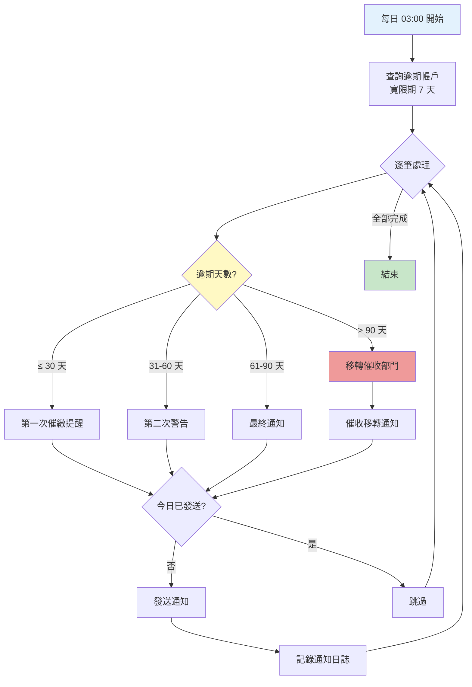

### 5.4 最終 SRS 文件片段產出

將上述三個範例整合為 SRS 文件片段：

**Copilot Prompt — SRS 組裝**：

```
請將以下三組分析結果，組裝為符合 IEEE 830 標準的 SRS 文件：
1. 貸款申請（FR-LN-001 ~ 003）
2. 每月利息計算（FR-INT-001）
3. 逾期通知（FR-NOTIF-001）

請：
- 統一編號
- 加入系統概述
- 加入非功能需求
- 加入資料模型
- 加入需求追溯矩陣
```

> **實務建議**：
> - 每次分析完一段程式碼後，立即寫入 SRS 工作文件
> - 用 Git 追蹤 SRS 的每次修改
> - 標記 Copilot 產出 vs. 人工補充的內容
> - 定期（每週）與 PM 或使用者 Review 分析結果

---

## 第 6 章 企業最佳實務

### 6.1 避免誤判需求的策略

#### 6.1.1 常見的誤判類型

| 誤判類型 | 說明 | 範例 |
|----------|------|------|
| **過度推導** | 從技術細節推出了不存在的業務需求 | 將 Cache 機制推導為「系統需支援離線模式」 |
| **遺漏需求** | 程式碼中隱含但 Copilot 未識別 | 法規要求的資料保留期限 |
| **誤解語境** | 變數命名或註解造成誤判 | `flag` 變數被解讀為「審核旗標」但實際為「刪除標記」 |
| **過期邏輯** | 程式碼中有已廢棄的邏輯 | Dead Code 被解讀為有效需求 |
| **技術 vs 業務混淆** | 技術限制被解讀為業務需求 | 分頁大小 20 被解讀為「每頁固定 20 筆」 |

#### 6.1.2 防範策略

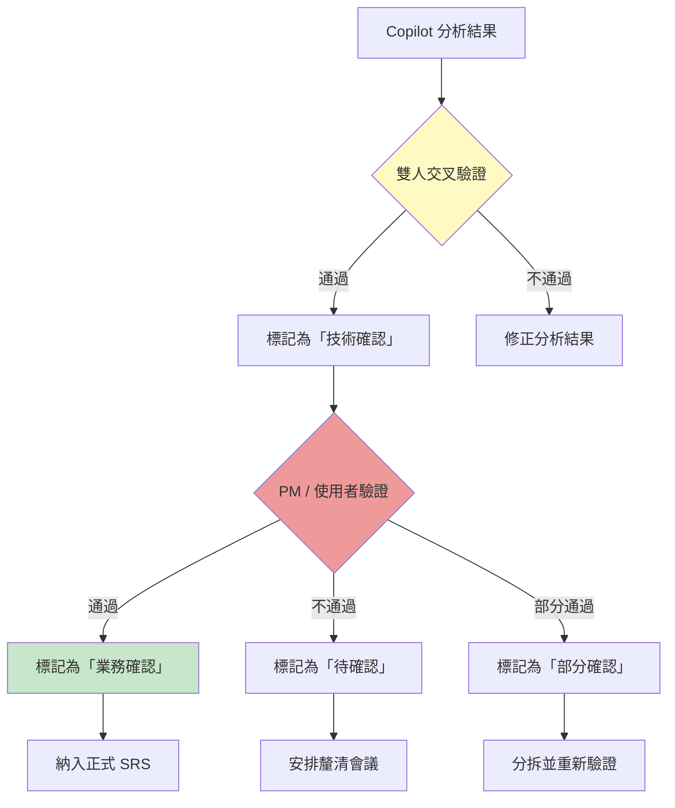

**驗證清單**：

- [ ] 每條需求至少有 2 位工程師確認技術描述正確
- [ ] 每條需求都已標記來源程式碼位置
- [ ] 每條需求都有「信心度」評估（高 / 中 / 低）
- [ ] 低信心度需求都已安排與使用者釐清
- [ ] 檢查是否有 Dead Code 被誤判為有效需求
- [ ] 檢查是否有遺漏（如：Security、Audit、Compliance）

#### 6.1.3 信心度評估框架

| 等級 | 定義 | 處理方式 |
|------|------|----------|
| **高信心度** | 程式碼邏輯清晰，業務意圖明確 | 直接納入 SRS |
| **中信心度** | 邏輯可解讀，但存在多種可能的業務解釋 | 標記疑問點，安排 PM 確認 |
| **低信心度** | 程式碼混亂、命名不佳、或可能是廢棄邏輯 | 暫不納入 SRS，安排專人深入分析 |

**Copilot Prompt — 信心度評估**：

```
請評估以下已推導出的需求列表，為每條需求標記信心度（高/中/低），
並說明理由。

特別關注：
1. 是否有 Dead Code 被誤判為需求？
2. 是否有技術限制被誤判為業務需求？
3. 是否有遺漏的隱含需求？
```

### 6.2 需求驗證流程

#### 6.2.1 三層驗證機制

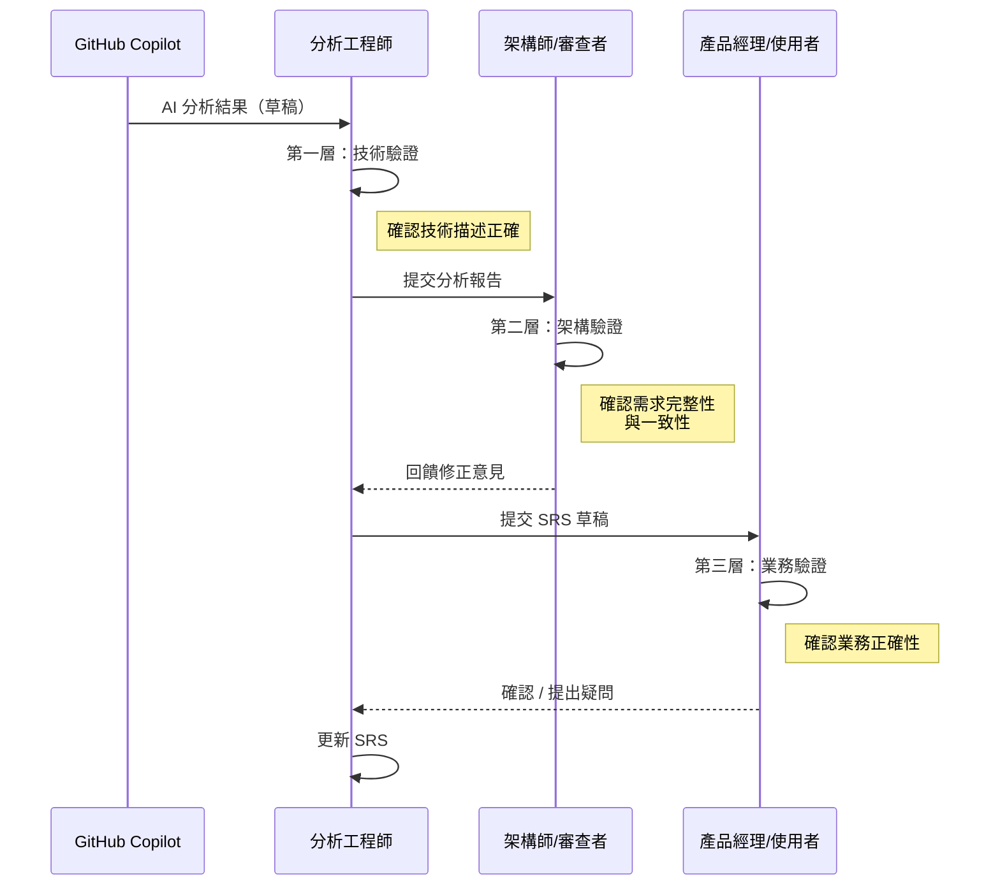

#### 6.2.2 驗證會議範本

```markdown
## 逆向工程需求驗證會議

**日期**：YYYY-MM-DD
**與會者**：[工程師]、[PM]、[使用者代表]

### 議程
1. 模組概述（5 分鐘）
2. 逐條需求確認（每條 3-5 分鐘）
3. 待確認事項彙整
4. 後續行動（Action Items）

### 需求確認記錄
| 需求編號 | 需求描述 | 狀態 | 備註 |
|----------|----------|------|------|
| FR-001 | 帳戶轉帳 | ✅ 確認 | |
| FR-002 | 大額交易核准 | ⚠️ 需修正 | 金額門檻應為 500 萬，非 1,000 萬 |
| FR-003 | 國際匯款 | ❌ 刪除 | 此功能已不使用 |
| FR-004 | ??? | 📝 新增 | 使用者提出遺漏的功能 |
```

### 6.3 整合 SSDLC

將逆向工程流程整合至安全軟體開發生命週期（SSDLC）：

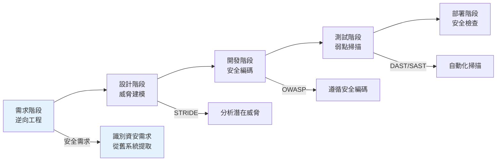

**在逆向工程階段的安全檢查項目**：

| 檢查項目 | 說明 | Copilot Prompt |
|----------|------|----------------|
| 身份驗證 | 識別系統的認證機制 | 「列出所有 Authentication 相關的程式碼」 |
| 權限控制 | 識別角色與權限設計 | 「分析所有 Authorize Attribute 與角色檢查」 |
| 資料加密 | 識別加密敏感資料的方式 | 「找出所有加密/解密操作與 Secret 存取」 |
| SQL Injection | 識別是否有 SQL 注入風險 | 「檢查是否有字串拼接 SQL 的程式碼」 |
| 日誌記錄 | 識別稽核軌跡設計 | 「列出所有 Logging 相關的程式碼與記錄內容」 |

### 6.4 搭配版本控制（Git）

#### 6.4.1 SRS 文件的 Git 管理策略

```
repository/
├── docs/
│   ├── srs/
│   │   ├── v0.1-auto-generated/    # Copilot 自動產出版本
│   │   │   ├── module-account.md
│   │   │   ├── module-loan.md
│   │   │   └── module-batch.md
│   │   ├── v0.2-reviewed/          # 人工審查版本
│   │   └── v1.0-approved/          # 正式核准版本
│   ├── analysis/
│   │   ├── code-inventory.md       # 程式碼盤點清單
│   │   ├── business-rules.md       # 商業規則彙整
│   │   └── traceability-matrix.md  # 追溯矩陣
│   └── meeting-notes/              # 驗證會議記錄
```

#### 6.4.2 Git Branching 策略

```mermaid
graph LR
    A["init: 建立 SRS 文件架構"] --> B["branch: analysis/module-account"]
    A --> C["branch: analysis/module-loan"]
    
    B --> B1["feat: 帳戶模組程式碼分析"]
    B1 --> B2["feat: 帳戶模組需求推導"]
    
    C --> C1["feat: 貸款模組程式碼分析"]
    C1 --> C2["feat: 貸款模組需求推導"]
    
    B2 --> D["merge: 帳戶模組分析完成"]
    C2 --> D
    D --> E["review: PM 審查修正"]
    E --> F["release: SRS v1.0 正式發佈<br/>🏷️ srs-v1.0"]
    
    style A fill:#e3f2fd
    style B fill:#fff9c4
    style C fill:#c8e6c9
    style B1 fill:#fff9c4
    style B2 fill:#fff9c4
    style C1 fill:#c8e6c9
    style C2 fill:#c8e6c9
    style D fill:#e1bee7
    style F fill:#ef9a9a
```

#### 6.4.3 Commit 訊息規範

```
# 分析階段
analysis(account): 帳戶管理模組程式碼盤點
analysis(account): 帳戶開戶 API 需求推導
analysis(loan): sp_CalculateInterest SP 分析

# 文件產出階段
docs(srs): 新增帳戶管理 FR-ACC-001 ~ FR-ACC-010
docs(srs): 新增非功能需求 NFR-001 ~ NFR-005

# 審查修正階段
review(account): 修正 FR-ACC-003 金額上限（500萬→1000萬）
review(loan): 刪除 FR-LN-005（已廢棄功能）

# 驗證通過
approved(srs): PM 確認帳戶模組需求 v1.0
```

### 6.5 常見錯誤與修正策略

| # | 常見錯誤 | 原因 | 修正策略 |
|---|----------|------|----------|
| 1 | Copilot 將 Logging 解讀為功能需求 | Logging 是技術實作而非業務需求 | 明確區分技術實作 vs. 業務需求 |
| 2 | 遺漏未寫在程式碼中的業務規則 | 規則可能在 UI 端或文件中 | 交叉參照 UI、使用手冊、Config |
| 3 | 將硬編碼值當作固定需求 | 可能是暫時性設定 | 標記為「待確認」，向使用者詢問 |
| 4 | SP 中的 Magic Number 解讀錯誤 | 缺乏註解或命名不佳 | 搜尋相關的 Enum 或 Config 表 |
| 5 | 忽略了原始碼中的 TODO / HACK | 可能是未完成或已知問題 | 專門掃描 TODO/FIXME/HACK 標記 |
| 6 | 將 Error Handling 模式解讀為正常流程 | 技術實作與業務流程混淆 | 區分正常流程 vs. 異常處理 |
| 7 | 多個 SP 做同一件事但不自知 | 系統演化導致重複 | 用 Copilot 比較相似 SP |
| 8 | 忽略了跨系統介面 | API 呼叫外部系統 | 特別追蹤 HttpClient / WCF 呼叫 |

**Copilot Prompt — 錯誤掃描**：

```
請檢查已產出的 SRS 文件，找出以下問題：
1. 是否有技術實作細節被誤當為業務需求？
2. 是否有明顯遺漏的功能（從 API 端點數量推估）？
3. 同一條需求是否在不同地方有衝突的描述？
4. 是否有功能的互動關係未被記錄？

請列出所有發現，並提供修正建議。
```

> **實務案例**：某專案在逆向分析 SP 時，發現 `sp_CalcFee_v2` 和 `sp_CalculateFee` 實質相同但參數略有不同。經確認後，`sp_CalcFee_v2` 是新版本，舊版已停用但未刪除。若未識別，會產出重複需求。

### 6.6 使用 Copilot Code Review 驗證 SRS 品質

GitHub Copilot Code Review 自 2026-03-05 起正式採用**代理式架構（Agentic Architecture）**，能夠自主深入分析 Pull Request 中的變更，包括追蹤跨檔案的影響範圍。將此能力應用於 SRS 文件的品質驗證：

> **最新更新**：自 2026-03-11 起，亦可透過 GitHub CLI 請求 Copilot Code Review（`gh pr review --copilot`），方便整合至 CI/CD Pipeline。

#### 6.6.1 設定 Copilot Code Review 規則

在 `.github/copilot-code-review.yml` 中為 SRS 文件配置專用審查規則：

```yaml
# .github/copilot-code-review.yml
reviews:
  - path: "docs/srs/**/*.md"
    instructions: |
      這是逆向工程產出的 SRS 文件。請審查以下項目：
      1. 需求編號是否連續且格式正確（FR-[模組]-XXX）
      2. 每條功能需求是否包含：描述、前置條件、商業規則、驗收條件
      3. 商業規則數值是否前後一致
      4. 是否有模糊描述（如「適當的」、「足夠的」等無法量化的用語）
      5. 是否有技術實作細節被誤當成業務需求
      6. Mermaid 圖表語法是否正確
```

#### 6.6.2 SRS Pull Request 審查流程

```mermaid
sequenceDiagram
    participant Eng as 分析工程師
    participant PR as Pull Request
    participant Bot as Copilot Code Review
    participant Arch as 架構師
    participant PM as 產品經理
    
    Eng->>PR: 提交 SRS 分析結果
    PR->>Bot: 自動觸發 Copilot Review
    Bot->>Bot: 代理式深度分析
    Bot->>PR: 標記問題（行級評論）
    
    Note over Bot,PR: 自動檢查：<br/>編號一致性<br/>格式完整性<br/>術語一致性<br/>可測試性
    
    Eng->>PR: 修正 Copilot 標記的問題
    Arch->>PR: 架構審查
    PM->>PR: 業務審查
    PM->>PR: Approve & Merge
```

> **效益**：將 Copilot Code Review 整合到 SRS 工作流後，某團隊的 SRS 格式問題減少了 75%，人工審查時間減少了 40%。

### 6.7 使用 Copilot Spaces 管理逆向工程上下文

Copilot Spaces 讓團隊能夠組織和共享逆向工程的上下文資料，確保所有分析人員擁有一致的背景知識。Spaces 可包含程式碼、文件、規格書等多種內容，為 Copilot 的回應提供正確的上下文基礎。

**建議的 Space 結構**：

| Space 名稱 | 內容 | 用途 |
|------------|------|------|
| `RE-系統概覽` | 系統架構圖、模組清單、技術棧說明 | 新成員 Onboarding |
| `RE-業務術語` | 統一語言表、業務流程說明 | 確保術語一致 |
| `RE-分析範本` | SRS 模板、Prompt 模板、標記規範 | 品質一致性 |
| `RE-已完成模組` | 已審核通過的 SRS 文件 | 參考與交叉引用 |
| `RE-程式碼片段` | 關鍵業務邏輯的原始碼與分析結果 | 快速上下文參考 |

**Space 建立操作步驟**：

1. 在 GitHub.com 導航至 Copilot Spaces（或透過 VS Code 的 Copilot 面板存取）
2. 點擊「Create Space」建立新的 Space
3. 加入相關檔案：程式碼檔案、SRS 文件、業務文件連結
4. 設定存取權限（個人、團隊、組織）
5. 在 Copilot Chat 中使用 Space 作為上下文：在 Chat 中選取對應 Space 即可

**搭配 Copilot Chat 的 Prompt 範例**：

```
[使用 RE-系統概覽 Space 作為上下文]

根據此系統的架構概覽，請分析以下新發現的 Service 類別
屬於哪個業務模組，並與已分析的模組清單交叉比對是否有遺漏。
```

> **企業建議**：指定一位團隊成員負責維護各 Space 的內容更新。當有新的模組分析完成時，應同步更新 `RE-已完成模組` Space，確保所有成員看到最新的分析進度。

---

## 第 7 章 架構延伸（進階）

### 7.1 從逆向結果到 Spring Boot API 設計

逆向工程產出 SRS 後，下一步通常是將需求轉化為新系統的設計。以下是將 C# / .NET 轉換為 Spring Boot 的對應策略：

#### 7.1.1 技術對照表

| C# / .NET | Spring Boot / Java | 說明 |
|------------|-------------------|------|
| `ApiController` | `@RestController` | API 控制器 |
| `[HttpPost("route")]` | `@PostMapping("/route")` | 路由配置 |
| `[Authorize(Roles)]` | `@PreAuthorize` | 權限控制 |
| `IActionResult` | `ResponseEntity<T>` | 回應封裝 |
| `Entity Framework` | `Spring Data JPA` | ORM |
| `DbContext` | `JpaRepository` | 資料存取 |
| `Stored Procedure` | `@Query(nativeQuery)` 或保留 SP | 資料庫邏輯 |
| `Windows Service` | `Spring Batch` / `@Scheduled` | 批次排程 |
| `Dependency Injection` | `@Autowired` / 建構子注入 | 依賴注入 |

#### 7.1.2 SRS → API 設計的轉換流程

```mermaid
graph TD
    A[SRS 功能需求] --> B[識別 API 端點]
    B --> C[設計 Request/Response DTO]
    C --> D[定義 Service 介面]
    D --> E[設計 Domain Entity]
    E --> F[設計 Repository 介面]
    F --> G[產生 Spring Boot 程式碼骨架]
    
    style A fill:#e3f2fd
    style G fill:#c8e6c9
```

**Copilot Prompt — 從 SRS 生成 Spring Boot API 設計**：

```
請根據以下 SRS 需求，設計 Spring Boot REST API：

需求：FR-LN-001 貸款申請提交
[貼上 FR 內容]

請產出：
1. Controller 類別（包含完整 Annotation）
2. Request DTO
3. Response DTO
4. Service 介面
5. 商業規則驗證邏輯
6. API 文件（OpenAPI / Swagger）

使用 Clean Architecture 分層。
```

#### 7.1.3 範例：從 SRS 到 Spring Boot

```java
// Controller 層
@RestController
@RequestMapping("/api/v1/loans")
@RequiredArgsConstructor
public class LoanController {
    
    private final LoanApplicationService loanService;
    
    @PostMapping("/apply")
    @PreAuthorize("hasAnyRole('TELLER', 'LOAN_OFFICER')")
    public ResponseEntity<LoanApplicationResponse> applyLoan(
            @Valid @RequestBody LoanApplicationRequest request,
            @AuthenticationPrincipal UserDetails user) {
        
        var result = loanService.createApplication(request, user.getUsername());
        return ResponseEntity.ok(result);
    }
    
    @PostMapping("/{applicationId}/approve")
    @PreAuthorize("hasRole('LOAN_MANAGER')")
    public ResponseEntity<LoanApprovalResponse> approveLoan(
            @PathVariable String applicationId,
            @Valid @RequestBody LoanApprovalRequest request,
            @AuthenticationPrincipal UserDetails user) {
        
        var result = loanService.approveApplication(
            applicationId, request, user.getUsername());
        return ResponseEntity.ok(result);
    }
}
```

```java
// Request DTO（含驗證）
public record LoanApplicationRequest(
    @NotBlank String customerId,
    @NotNull LocalDate birthDate,
    @DecimalMin("100000") @DecimalMax("50000000") BigDecimal loanAmount,
    @Min(12) @Max(360) int loanTermMonths,
    @Positive BigDecimal interestRate,
    @Positive BigDecimal monthlyIncome
) {}
```

### 7.2 微服務架構轉換

#### 7.2.1 從單體到微服務的拆分策略

逆向工程的結果可以直接用於微服務邊界的識別：

```mermaid
graph TD
    subgraph "原始單體系統"
        MONO[Monolith]
    end
    
    subgraph "微服務拆分"
        SVC1[客戶服務<br/>Customer Service]
        SVC2[帳戶服務<br/>Account Service]
        SVC3[交易服務<br/>Transaction Service]
        SVC4[貸款服務<br/>Loan Service]
        SVC5[通知服務<br/>Notification Service]
        SVC6[批次服務<br/>Batch Service]
    end
    
    MONO -->|逆向分析| SVC1
    MONO -->|逆向分析| SVC2
    MONO -->|逆向分析| SVC3
    MONO -->|逆向分析| SVC4
    MONO -->|逆向分析| SVC5
    MONO -->|逆向分析| SVC6
    
    SVC1 <-->|API| SVC2
    SVC2 <-->|API| SVC3
    SVC2 <-->|API| SVC4
    SVC3 -->|Event| SVC5
    SVC6 -->|Call| SVC2
    SVC6 -->|Call| SVC3
    
    style MONO fill:#ef9a9a
    style SVC1 fill:#a5d6a7
    style SVC2 fill:#a5d6a7
    style SVC3 fill:#a5d6a7
    style SVC4 fill:#a5d6a7
    style SVC5 fill:#a5d6a7
    style SVC6 fill:#a5d6a7
```

**Copilot Prompt — 微服務邊界識別**：

```
根據以下 SRS 的功能需求清單，請建議微服務拆分方案：

1. 識別 Bounded Context（限界上下文）
2. 定義每個微服務的職責
3. 識別服務間的通訊模式（同步 API / 非同步 Event）
4. 定義每個服務獨立的資料庫 Schema
5. 畫出微服務架構圖（Mermaid）
```

#### 7.2.2 Stored Procedure 的遷移策略

| 策略 | 適用場景 | 優點 | 缺點 |
|------|----------|------|------|
| **保留在 DB** | 邏輯複雜、效能敏感 | 不需重寫、效能最佳 | 跨服務共用困難 |
| **遷移至 Service 層** | 邏輯明確、需要微服務化 | 邏輯集中、可測試 | 需重寫、可能影響效能 |
| **混合模式** | 效能關鍵部分保留在 DB | 平衡效能與架構 | 維護兩套邏輯 |

### 7.3 Domain Modeling（DDD）

#### 7.3.1 從逆向結果推導領域模型

```mermaid
graph TD
    subgraph "戰略設計 (Strategic Design)"
        BC1[限界上下文<br/>帳戶管理]
        BC2[限界上下文<br/>貸款管理]
        BC3[限界上下文<br/>交易處理]
    end
    
    subgraph "戰術設計 (Tactical Design)"
        AG1[聚合根: Account]
        AG2[聚合根: LoanApplication]
        AG3[聚合根: Transaction]
        
        VO1[值物件: Money]
        VO2[值物件: AccountNumber]
        VO3[值物件: InterestRate]
        
        EVT1[領域事件: AccountOpened]
        EVT2[領域事件: LoanApproved]
        EVT3[領域事件: TransferCompleted]
    end
    
    BC1 --> AG1
    BC2 --> AG2
    BC3 --> AG3
    
    AG1 --> VO1
    AG1 --> VO2
    AG2 --> VO3
    AG3 --> VO1
    
    AG1 --> EVT1
    AG2 --> EVT2
    AG3 --> EVT3
    
    style BC1 fill:#e3f2fd
    style BC2 fill:#fff3e0
    style BC3 fill:#e8f5e9
```

**Copilot Prompt — 從 SRS 推導 DDD 模型**：

```
根據以下 SRS 文件，請用 DDD 方法建模：

1. 識別 Ubiquitous Language（統一語言）
2. 定義 Bounded Context（限界上下文）
3. 識別 Aggregate（聚合）與 Aggregate Root（聚合根）
4. 識別 Entity 與 Value Object
5. 定義 Domain Event（領域事件）
6. 設計 Context Map（上下文映射圖）

請用 Mermaid 畫出 Context Map 與 Aggregate 圖。
```

#### 7.3.2 統一語言表

| 業務術語 | 英文 | 定義 | 所屬領域 |
|----------|------|------|----------|
| 帳戶 | Account | 客戶在銀行的存款帳戶 | 帳戶管理 |
| 餘額 | Balance | 帳戶在某時點的可用金額 | 帳戶管理 |
| 轉帳 | Transfer | 將資金從一個帳戶移至另一帳戶 | 交易處理 |
| 貸款申請 | Loan Application | 客戶提交的借款請求 | 貸款管理 |
| 核准 | Approval | 主管授權通過貸款 | 貸款管理 |
| 計息 | Interest Calculation | 計算帳戶應得利息 | 帳戶管理 |
| 催收 | Collection | 對逾期帳戶進行催繳 | 貸款管理 |

### 7.4 Clean Architecture 對應

#### 7.4.1 分層架構設計

```mermaid
graph TD
    subgraph "Framework & Drivers"
        WEB[Web Controller]
        DB[Database / Repository Impl]
        EXT[External Services]
    end
    
    subgraph "Interface Adapters"
        CTRL[Controller Adapter]
        PRES[Presenter]
        GW[Gateway Interface]
    end
    
    subgraph "Application Business Rules"
        UC[Use Cases / Application Service]
        DTO[Data Transfer Objects]
    end
    
    subgraph "Enterprise Business Rules"
        ENT[Entities]
        VO[Value Objects]
        SPEC[Domain Services & Specifications]
    end
    
    WEB --> CTRL
    CTRL --> UC
    UC --> ENT
    UC --> GW
    GW --> DB
    GW --> EXT
    UC --> PRES
    
    style ENT fill:#fce4ec
    style UC fill:#e8f5e9
    style CTRL fill:#fff3e0
    style WEB fill:#e3f2fd
```

#### 7.4.2 Spring Boot 專案結構

```
src/main/java/com/bank/loan/
├── domain/                          # Enterprise Business Rules
│   ├── model/
│   │   ├── LoanApplication.java     # Aggregate Root
│   │   ├── LoanStatus.java          # Enum
│   │   └── Money.java               # Value Object
│   ├── service/
│   │   └── InterestCalculator.java   # Domain Service
│   └── event/
│       └── LoanApprovedEvent.java    # Domain Event
├── application/                     # Application Business Rules
│   ├── port/
│   │   ├── in/
│   │   │   └── ApplyLoanUseCase.java
│   │   └── out/
│   │       └── LoanRepository.java
│   └── service/
│       └── LoanApplicationService.java
├── adapter/                         # Interface Adapters
│   ├── in/
│   │   └── web/
│   │       ├── LoanController.java
│   │       ├── LoanRequest.java
│   │       └── LoanResponse.java
│   └── out/
│       └── persistence/
│           ├── LoanJpaEntity.java
│           ├── LoanJpaRepository.java
│           └── LoanPersistenceAdapter.java
└── config/                          # Configuration
    └── BeanConfig.java
```

> **實務建議**：
> - 逆向工程結果可以直接對應到 Use Case 層
> - 商業規則歸入 Domain 層
> - 舊系統的 SP 邏輯，若要遷移到 Java，應放在 Domain Service
> - 不要一次重構所有模組，從核心業務開始

### 7.5 使用 Copilot Coding Agent 自動化遷移工作

當逆向工程完成並產出 SRS 後，可利用 Copilot Coding Agent 自動化部分遷移實作工作：

#### 7.5.1 從 SRS 到 Spring Boot 骨架自動生成

**GitHub Issue 模板**：

```markdown
## 自動生成：帳戶管理模組 Spring Boot 骨架

### 任務描述
根據 `docs/srs/module-account.md` 中的 SRS 文件，
自動生成帳戶管理模組的 Spring Boot 程式碼骨架。

### 生成範圍
1. Controller 層（含完整 Annotation、Swagger 文件）
2. Service 介面（含 JavaDoc）
3. Request / Response DTO（含 Validation）
4. Repository 介面
5. Domain Entity
6. 單元測試骨架

### 技術規範
- Java 21 + Spring Boot 3.2
- 使用 Clean Architecture 分層（參考 `docs/architecture.md`）
- 需求編號標記在對應方法的 JavaDoc 中
- 使用 `@Tag` 標記對應的 FR 編號

### 品質要求
- 所有 Controller 方法必須有 `@Operation` 描述
- 所有 DTO 欄位必須有 Validation Annotation
- 所有 Service 方法必須有對應的測試方法（空實作）
```

#### 7.5.2 SP 邏輯遷移自動化

```markdown
## 自動遷移：sp_Account_Transfer → TransferService

### 來源
SP 定義：`docs/analysis/sp/sp_Account_Transfer.md`
SRS 需求：FR-TXN-001 ~ FR-TXN-006

### 目標
將 SP 邏輯遷移至 `account-service` 的 Domain Service

### 遷移規則
1. SQL 查詢 → JPA Repository 方法
2. IF/ELSE 邏輯 → Domain Service 方法
3. Transaction 控制 → @Transactional
4. Error Code → 自定義 Exception + ErrorCode Enum
5. 保留所有商業規則，加上 BR 編號註解

### 驗證
- 執行 `mvn test` 確保編譯通過
- 檢查所有 FR 需求都有對應程式碼
```

#### 7.5.3 Hooks 自動化品質檢查

使用 Hooks 在 Coding Agent 執行期間自動驗證品質：

```yaml
# .github/hooks/copilot-setup.sh 中配置的驗證步驟

# 1. 編譯檢查
mvn compile -q

# 2. SRS 追溯檢查（自定義腳本）
python scripts/check_srs_traceability.py \
  --srs docs/srs/ \
  --source src/main/java/

# 3. 格式檢查
npx markdownlint docs/srs/**/*.md
```

> **企業效益**：某銀行專案使用 Coding Agent 自動化遷移，將 150 支 SP 的骨架生成時間從 20 人天縮短至 3 人天（人工審查仍需 10 人天）。

---

## 第 8 章 Prompt 工程模板庫

### 8.1 程式碼摘要類

#### 模板 P-SUM-001：單一類別摘要

```
請用不超過 100 字摘要以下 [語言] 類別的功能。
系統背景：[背景說明]
類別名稱：[ClassName]

請回答：
1. 這個類別的主要職責是什麼？
2. 它屬於系統的哪個模組/功能？
3. 它有幾個公開方法，各做什麼？
```

#### 模板 P-SUM-002：模組級摘要

```
以下檔案清單屬於同一模組。
請分析整個模組的功能範圍：

檔案清單：
[列出檔案名稱]

請提供：
1. 模組功能概述（一段話）
2. 核心功能清單（表格）
3. 模組與其他模組的依賴關係
4. 推估的業務功能範圍
```

#### 模板 P-SUM-003：系統全景摘要

```
請分析此專案的完整目錄結構，提供系統全景摘要：

1. 專案類型（Web API / Console / Service）
2. 技術棧（Framework、Library、Database）
3. 模組清單與估算規模
4. 架構模式（MVC / MVVM / Clean Architecture）
5. 推估的業務領域
```

### 8.2 邏輯解析類

#### 模板 P-LOGIC-001：方法級邏輯解析

```
請逐行分析以下方法的邏輯：

方法名稱：[MethodName]
系統背景：[背景]

對每一段邏輯，提供：
| 行號範圍 | 技術動作 | 商業意義 | 類型(驗證/計算/查詢/更新) |
```

#### 模板 P-LOGIC-002：條件分支完整解析

```
請列出以下程式碼中所有的條件分支（if/else/switch/三元運算）：

格式：
| # | 條件表達式 | True 分支動作 | False 分支動作 | 商業規則（白話文） |
```

#### 模板 P-LOGIC-003：資料流追蹤

```
請追蹤以下程式碼中資料的完整流動路徑：

從方法輸入 → 內部處理 → 資料庫操作 → 方法輸出

格式：
[輸入] → [轉換1] → [轉換2] → ... → [輸出]

特別標記：
- 資料驗證點
- 資料轉換點
- 資料持久化點
```

### 8.3 需求轉換類

#### 模板 P-REQ-001：技術→功能需求

```
請將以下技術分析結果轉換為功能需求：

技術分析：
[貼上分析結果]

每條需求需包含：
- 需求編號（FR-[MODULE]-XXX）
- 需求名稱
- 需求描述（用非技術語言）
- 前置條件
- 處理步驟
- 商業規則
- 驗收條件（Given-When-Then）
```

#### 模板 P-REQ-002：SP→批次需求

```
請將以下 Stored Procedure 的分析結果，
轉換為批次處理需求規格：

需包含：
- 批次名稱
- 執行頻率
- 前置依賴
- 處理流程（含流程圖）
- 輸入/輸出
- 計算公式
- 異常處理
- 預估執行時間
```

#### 模板 P-REQ-003：生成 User Story

```
請根據以下功能需求，生成 User Story：

格式：
**作為** [角色]
**我希望** [功能]
**以便** [商業價值]

**驗收條件**：
- Given [前提]
- When [操作]
- Then [預期結果]
```

### 8.4 文件產出類

#### 模板 P-DOC-001：SRS 章節生成

```
請根據以下已分析的需求清單，
生成 SRS 文件的 [章節名稱] 章節。

格式要求：
- 使用 IEEE 830 結構
- 需求編號按模組分類
- 每條需求包含完整描述
- 商業規則以表格呈現
- 提供 Use Case Diagram（Mermaid）
```

#### 模板 P-DOC-002：ER Model 生成

```
請根據以下 Entity 類別 / 資料表定義，
生成 ER Diagram（Mermaid erDiagram 語法）。

需包含：
- 所有表的 PK、FK
- 表之間的關聯類型
- 每個欄位的中文說明
- 資料字典（獨立表格）
```

#### 模板 P-DOC-003：API 規格書

```
請根據以下 Controller 分析結果，
生成 OpenAPI 3.0 規格的 API 文件（YAML 格式）。

需包含：
- 端點清單
- Request / Response Schema
- 錯誤碼定義
- 權限要求
- 範例值
```

### 8.5 驗證與審查類

#### 模板 P-VERIFY-001：完整性檢查

```
請檢查以下 SRS 文件是否完整：

1. 所有 Controller 是否都有對應的 FR？
2. 所有 SP 是否都有對應的需求？
3. 所有 Batch Job 是否都有對應的需求？
4. 是否有遺漏的非功能需求？
5. 是否有遺漏的介面需求？
6. 資料模型是否涵蓋所有表？

列出所有缺口與建議。
```

#### 模板 P-VERIFY-002：一致性檢查

```
請檢查以下 SRS 文件的一致性：

1. 相同概念是否使用一致的術語？
2. 不同需求之間是否有矛盾？
3. 商業規則數值是否前後一致？
4. 角色權限定義是否一致？
5. 資料欄位名稱是否與 ER Model 一致？
```

#### 模板 P-VERIFY-003：可測試性檢查

```
請檢查以下需求是否都可測試：

針對每條需求：
- 能否定義明確的測試案例？
- 驗收條件是否可量化？
- 是否有模糊描述需要釐清？

對不可測試的需求，提供修改建議。
```

---

## 第 9 章 自動化流程（AI + Script）

### 9.1 自動化盤點腳本

#### 9.1.1 C# 專案自動盤點（PowerShell）

```powershell
<#
.SYNOPSIS
    自動盤點 C# 專案結構，產出 Markdown 報告
.DESCRIPTION
    掃描指定目錄的所有 C# 檔案，分類為 Controller / Service / Repository / Entity
#>
param(
    [Parameter(Mandatory)]
    [string]$ProjectPath,
    [string]$OutputFile = "code-inventory.md"
)

$report = @"
# 程式碼盤點報告

> 產出日期：$(Get-Date -Format 'yyyy-MM-dd HH:mm')
> 掃描路徑：$ProjectPath

## 1. Controller 清單

| # | 檔案名稱 | 路徑 | 行數 |
|---|----------|------|------|
"@

$controllers = Get-ChildItem -Path $ProjectPath -Recurse -Filter "*Controller.cs"
$i = 1
foreach ($file in $controllers) {
    $lineCount = (Get-Content $file.FullName).Count
    $relativePath = $file.FullName.Replace($ProjectPath, ".")
    $report += "`n| $i | $($file.Name) | $relativePath | $lineCount |"
    $i++
}

$report += @"

## 2. Service 清單

| # | 檔案名稱 | 路徑 | 行數 |
|---|----------|------|------|
"@

$services = Get-ChildItem -Path $ProjectPath -Recurse -Filter "*Service.cs"
$i = 1
foreach ($file in $services) {
    $lineCount = (Get-Content $file.FullName).Count
    $relativePath = $file.FullName.Replace($ProjectPath, ".")
    $report += "`n| $i | $($file.Name) | $relativePath | $lineCount |"
    $i++
}

$report += @"

## 3. 統計摘要

| 類型 | 數量 |
|------|------|
| Controller | $($controllers.Count) |
| Service | $($services.Count) |
| 總計 | $($controllers.Count + $services.Count) |
"@

$report | Out-File -FilePath $OutputFile -Encoding utf8
Write-Host "盤點報告已產出：$OutputFile"
```

#### 9.1.2 SQL Server Stored Procedure 盤點

```sql
-- 產出 SP 盤點清單（可匯出為 CSV）
SELECT 
    ROW_NUMBER() OVER (ORDER BY s.name, o.name) AS '#',
    s.name AS [Schema],
    o.name AS [SP名稱],
    CAST(o.create_date AS DATE) AS [建立日期],
    CAST(o.modify_date AS DATE) AS [最後修改],
    LEN(sm.definition) AS [字元數],
    CASE 
        WHEN LEN(sm.definition) > 10000 THEN '高'
        WHEN LEN(sm.definition) > 3000 THEN '中'
        ELSE '低'
    END AS [複雜度],
    CASE 
        WHEN sm.definition LIKE '%INSERT%' AND sm.definition LIKE '%CURSOR%' THEN '批次寫入'
        WHEN sm.definition LIKE '%INSERT%' THEN '寫入'
        WHEN sm.definition LIKE '%UPDATE%' THEN '更新'
        WHEN sm.definition LIKE '%DELETE%' THEN '刪除'
        ELSE '查詢'
    END AS [操作類型]
FROM sys.objects o
JOIN sys.schemas s ON o.schema_id = s.schema_id
JOIN sys.sql_modules sm ON o.object_id = sm.object_id
WHERE o.type = 'P'
ORDER BY s.name, o.name;
```

### 9.2 批次分析流程

#### 9.2.1 分析工作流程自動化

```mermaid
graph TD
    A[1. 執行盤點腳本] --> B[2. 產出盤點清單 MD]
    B --> C[3. 依模組分配工作]
    C --> D[4. 逐模組 Copilot 分析]
    D --> E[5. 分析結果存入 Git]
    E --> F[6. 人工審查]
    F --> G[7. SRS 組裝]
    G --> H[8. PM 驗證]
    
    style A fill:#e3f2fd
    style D fill:#a5d6a7
    style F fill:#fff9c4
    style H fill:#ef9a9a
```

#### 9.2.2 分析任務分配模板

```markdown
## 逆向工程分析任務分配

### Sprint 1（Week 1-2）：核心交易模組
| 任務 | 負責人 | 範圍 | 預估時間 | 狀態 |
|------|--------|------|----------|------|
| 帳戶管理 API (10 支) | 工程師 A | AccountController | 3 天 | 進行中 |
| 帳戶相關 SP (15 支) | 工程師 B | sp_Account_* | 4 天 | 未開始 |
| 交易處理 API (8 支) | 工程師 C | TransactionController | 3 天 | 未開始 |

### Sprint 2（Week 3-4）：批次與報表
| 任務 | 負責人 | 範圍 | 預估時間 | 狀態 |
|------|--------|------|----------|------|
| 日批程式 (5 支) | 工程師 A | BatchJobs/* | 3 天 | 未開始 |
| 月批程式 (3 支) | 工程師 B | MonthlyBatch/* | 2 天 | 未開始 |
| 報表 SP (20 支) | 工程師 C | sp_Report_* | 5 天 | 未開始 |
```

### 9.3 SRS 自動組裝

#### 9.3.1 SRS 組裝腳本（PowerShell）

```powershell
<#
.SYNOPSIS
    將分散的分析結果自動組裝為完整 SRS 文件
#>
param(
    [string]$AnalysisDir = "./docs/analysis",
    [string]$TemplateFile = "./docs/srs/template.md",
    [string]$OutputFile = "./docs/srs/SRS_v0.1.md"
)

# 讀取模板
$template = Get-Content $TemplateFile -Raw

# 組裝各模組的分析結果
$modules = Get-ChildItem -Path $AnalysisDir -Filter "FR-*.md" | Sort-Object Name

$functionalRequirements = ""
foreach ($module in $modules) {
    $content = Get-Content $module.FullName -Raw
    $functionalRequirements += "`n`n$content"
}

# 替換模板占位符
$srs = $template -replace '{{FUNCTIONAL_REQUIREMENTS}}', $functionalRequirements
$srs = $srs -replace '{{GENERATION_DATE}}', (Get-Date -Format 'yyyy-MM-dd')
$srs = $srs -replace '{{VERSION}}', 'v0.1 (Auto-generated)'

# 輸出
$srs | Out-File -FilePath $OutputFile -Encoding utf8
Write-Host "SRS 文件已組裝完成：$OutputFile"
```

#### 9.3.2 SRS 品質檢查腳本

```powershell
<#
.SYNOPSIS
    檢查 SRS 文件的完整性
#>
param(
    [Parameter(Mandatory)]
    [string]$SrsFile
)

$content = Get-Content $SrsFile -Raw
$issues = @()

# 檢查是否有「待確認」標記
$pendingCount = ([regex]::Matches($content, '待確認|TODO|TBD|待釐清')).Count
if ($pendingCount -gt 0) {
    $issues += "⚠️ 發現 $pendingCount 處待確認項目"
}

# 檢查 FR 編號連續性
$frNumbers = [regex]::Matches($content, 'FR-\w+-(\d+)') | 
    ForEach-Object { [int]$_.Groups[1].Value } | Sort-Object
# （簡化檢查）

# 檢查是否有空的章節
$emptyChapters = [regex]::Matches($content, '#{2,3}\s+.+\n\s*\n#{2,3}')
if ($emptyChapters.Count -gt 0) {
    $issues += "⚠️ 發現 $($emptyChapters.Count) 個空章節"
}

# 輸出報告
if ($issues.Count -eq 0) {
    Write-Host "✅ SRS 文件品質檢查通過" -ForegroundColor Green
} else {
    Write-Host "⚠️ SRS 文件品質問題：" -ForegroundColor Yellow
    $issues | ForEach-Object { Write-Host "  $_" }
}
```

> **實務建議**：
> - 將自動化腳本納入 Git 管理
> - 建立統一的分析結果存放格式，方便後續組裝
> - 每日執行一次品質檢查，追蹤「待確認」數量的變化

### 9.4 Copilot Coding Agent 端到端自動化流程

將逆向工程的全流程與 Copilot Coding Agent 整合，建立從 Issue 到 SRS 的自動化 Pipeline：

#### 9.4.1 自動化流程架構

```mermaid
graph TD
    A[建立模組分析 Issue] --> B[指派 @copilot]
    B --> C[Coding Agent 分析程式碼]
    C --> D[自動產出分析報告]
    D --> E[建立 PR]
    E --> F{Copilot Code Review}
    F -->|通過| G[工程師審查]
    F -->|未通過| C
    G --> H{人工審查}
    H -->|通過| I[合併至 analysis branch]
    H -->|需修正| J[PR 評論修正意見]
    J --> C
    I --> K[觸發 SRS 組裝 Action]
    K --> L[自動組裝完整 SRS]
    L --> M[建立 SRS Release PR]
    M --> N[PM 最終驗證]
    
    style A fill:#e3f2fd
    style C fill:#a5d6a7
    style F fill:#fff59d
    style G fill:#ef9a9a
    style N fill:#ef9a9a
```

#### 9.4.2 GitHub Actions 工作流配置

```yaml
# .github/workflows/srs-assembly.yml
name: SRS Auto-Assembly

on:
  push:
    branches:
      - 'analysis/**'
    paths:
      - 'docs/analysis/FR-*.md'

jobs:
  assemble-srs:
    runs-on: ubuntu-latest
    steps:
      - uses: actions/checkout@v4
      
      - name: 組裝 SRS 文件
        run: |
          pwsh scripts/assemble-srs.ps1 \
            -AnalysisDir docs/analysis \
            -TemplateFile docs/srs/template.md \
            -OutputFile docs/srs/SRS_latest.md
      
      - name: 品質檢查
        run: |
          pwsh scripts/check-srs-quality.ps1 \
            -SrsFile docs/srs/SRS_latest.md
      
      - name: Markdown Lint
        run: npx markdownlint docs/srs/SRS_latest.md
      
      - name: 建立 SRS 更新 PR
        uses: peter-evans/create-pull-request@v6
        with:
          title: "docs(srs): 自動組裝 SRS 更新"
          body: |
            ## SRS 自動更新
            
            觸發原因：analysis 分支有新的分析結果合併
            
            ### 變更模組
            ${{ steps.changes.outputs.modules }}
            
            ### 品質報告
            ${{ steps.quality.outputs.report }}
          branch: srs/auto-assembly
          labels: srs, auto-generated
```

#### 9.4.3 批次 Issue 建立腳本

使用 GitHub CLI 批次建立逆向分析任務 Issue 並指派給 Copilot：

```bash
#!/bin/bash
# scripts/create-analysis-issues.sh
# 根據程式碼盤點結果，批次建立分析 Issue

MODULES=("Account" "Loan" "Transaction" "Batch" "Report")

for module in "${MODULES[@]}"; do
  gh issue create \
    --title "逆向分析：${module} 模組" \
    --body-file "docs/templates/analysis-issue-${module}.md" \
    --label "reverse-engineering,srs" \
    --assignee "@copilot"
  
  echo "✅ 已建立 ${module} 模組分析 Issue 並指派給 Copilot"
  sleep 2  # 避免 Rate Limiting
done
```

#### 9.4.4 追溯矩陣自動生成

```python
#!/usr/bin/env python3
"""
從 SRS 文件自動生成需求追溯矩陣 (RTM)
"""
import re
import os
from pathlib import Path

def extract_requirements(srs_dir: str) -> list[dict]:
    """從 SRS Markdown 檔案中擷取需求編號與描述"""
    requirements = []
    for md_file in Path(srs_dir).glob("**/*.md"):
        content = md_file.read_text(encoding="utf-8")
        # 匹配 FR-XXX-NNN 格式
        pattern = r'(FR-\w+-\d+)\s*[：:]\s*(.+?)(?:\n|$)'
        for match in re.finditer(pattern, content):
            requirements.append({
                "id": match.group(1),
                "description": match.group(2).strip(),
                "source_file": str(md_file.relative_to(srs_dir)),
            })
    return requirements

def find_source_references(src_dir: str, req_id: str) -> list[str]:
    """在原始碼中尋找需求編號的引用"""
    references = []
    for src_file in Path(src_dir).rglob("*.*"):
        if src_file.suffix in ('.cs', '.java', '.sql'):
            try:
                content = src_file.read_text(encoding="utf-8")
                if req_id in content:
                    references.append(str(src_file))
            except (UnicodeDecodeError, PermissionError):
                pass
    return references

def generate_rtm(srs_dir: str, src_dir: str, output: str):
    """生成追溯矩陣 Markdown"""
    reqs = extract_requirements(srs_dir)
    
    lines = [
        "# 需求追溯矩陣 (RTM)",
        "",
        f"> 自動生成日期：{__import__('datetime').date.today()}",
        "",
        "| 需求編號 | 需求描述 | SRS 來源 | 程式碼引用 | 狀態 |",
        "|----------|----------|----------|-----------|------|",
    ]
    
    for req in sorted(reqs, key=lambda x: x["id"]):
        refs = find_source_references(src_dir, req["id"])
        ref_str = ", ".join(refs[:3]) if refs else "—"
        status = "✅ 已追溯" if refs else "⚠️ 待追溯"
        lines.append(
            f"| {req['id']} | {req['description'][:40]} | "
            f"{req['source_file']} | {ref_str} | {status} |"
        )
    
    Path(output).write_text("\n".join(lines), encoding="utf-8")
    print(f"✅ RTM 已生成：{output}")

if __name__ == "__main__":
    generate_rtm("docs/srs", "src", "docs/srs/traceability-matrix.md")
```

> **自動化最佳實務總結**：
> - 使用 Coding Agent 處理**初稿分析**，節省 60-70% 的手動分析時間
> - 使用 GitHub Actions 處理**文件組裝**，確保格式一致性
> - 使用 Copilot Code Review 處理**格式驗證**，減少低級錯誤
> - **人工審查仍然不可或缺**：所有 AI 產出都必須經過至少 2 位人員審核

---

## 附錄 A 檢查清單（Checklist）

### A.1 逆向工程啟動檢查清單

- [ ] 已取得完整程式碼存取權限
- [ ] 已取得資料庫存取權限（唯讀即可）
- [ ] 已安裝 VS Code 與 GitHub Copilot
- [ ] 已建立 SRS 文件模板
- [ ] 已建立 Git 儲存庫（用於管理分析結果）
- [ ] 已確認分析範圍與優先順序
- [ ] 已指派分析人員與分工
- [ ] 已安排 PM / 使用者配合驗證的時間

### A.2 每日分析檢查清單

- [ ] 昨日分析結果已 Commit 至 Git
- [ ] 今日預計分析的模組/檔案已確認
- [ ] Copilot 分析結果已經人工審查
- [ ] 「待確認」項目已記錄在追蹤表中
- [ ] 新發現的商業規則已更新至規則彙整表

### A.3 模組完成檢查清單

- [ ] 所有 API 端點都有對應的 FR
- [ ] 所有 SP 都有對應的需求描述
- [ ] 所有商業規則都已記錄且編號
- [ ] 所有 Error Handling 都已識別
- [ ] 資料模型（ER Diagram）已繪製
- [ ] 資料字典已建立
- [ ] 非功能需求已識別（效能、安全、可用性）
- [ ] 需求追溯矩陣已建立
- [ ] 至少 2 位工程師已交叉驗證
- [ ] 信心度評估已完成

### A.4 SRS 發佈前檢查清單

- [ ] 所有「待確認」項目已清零或有明確處理方式
- [ ] PM / 使用者已驗證所有核心功能需求
- [ ] 非功能需求已與架構師確認
- [ ] 文件格式與編號規範一致
- [ ] 版本歷程已更新
- [ ] 術語表已完成
- [ ] 需求追溯矩陣完整
- [ ] 拼字與格式已校對
- [ ] 安全性需求已經資安團隊審核
- [ ] 文件已存入版本控制

### A.5 Copilot 使用安全檢查清單

- [ ] 不在 Prompt 中包含客戶的真實帳號/個資
- [ ] 不在 Prompt 中包含密碼、金鑰等敏感資訊
- [ ] 分析結果中如有敏感資料，已做脫敏處理
- [ ] Copilot 建議的程式碼已經安全審查
- [ ] 已遵循公司 AI 使用政策

### A.6 Copilot Coding Agent 使用檢查清單

- [ ] 組織管理員已啟用 Coding Agent 存取政策
- [ ] 儲存庫未包含明文密碼或金鑰（已通過 Secret Scanning）
- [ ] 已配置 `.copilot-ignore` 排除機敏檔案
- [ ] 已配置 custom instructions（`.github/copilot-instructions.md`）
- [ ] 已設定 Code Review 規則（`.github/copilot-code-review.yml`）
- [ ] Coding Agent PR 需至少 2 位人工審查者
- [ ] 已配置 Hooks 進行自動化品質檢查
- [ ] GitHub Actions 分鐘數與 Premium Requests 額度充足
- [ ] 已建立 Custom Agent 定義逆向工程分析流程
- [ ] 已測試 MCP Server 連線（如資料庫、JIRA）

---

## 附錄 B 術語表

| 術語 | 英文 | 定義 |
|------|------|------|
| SRS | Software Requirement Specification | 軟體需求規格書 |
| FR | Functional Requirement | 功能需求 |
| NFR | Non-Functional Requirement | 非功能需求 |
| BR | Business Rule | 商業規則 |
| UC | Use Case | 使用案例 |
| DFD | Data Flow Diagram | 資料流程圖 |
| ER | Entity Relationship | 實體關聯 |
| SP | Stored Procedure | 預存程序 |
| DAO | Data Access Object | 資料存取物件 |
| DDD | Domain-Driven Design | 領域驅動設計 |
| SSDLC | Secure Software Development Lifecycle | 安全軟體開發生命週期 |
| RTM | Requirement Traceability Matrix | 需求追溯矩陣 |
| EOS | End of Support | 終止支援 |
| KYC | Know Your Customer | 認識你的客戶 |
| JWT | JSON Web Token | JSON 網路令牌 |
| RTO | Recovery Time Objective | 復原時間目標 |
| RPO | Recovery Point Objective | 復原點目標 |
| MCP | Model Context Protocol | 模型上下文協定，用於擴展 AI 工具存取外部資料源 |
| Coding Agent | Copilot Coding Agent | GitHub 雲端自主代理，透過 Issue 指派任務，自動開 PR |
| Agent Mode | Agent Mode | VS Code 中的本地自主代理模式，可跨檔案自主操作 |
| Background Agent | Background Agent | 在 VS Code 背景非同步執行的代理，不中斷開發者當前工作 |
| Third-party Agent | Third-party Coding Agent | 第三方 AI 供應商（如 Anthropic、OpenAI）提供的代理，可與 Copilot 協同使用 |
| NES | Next Edit Suggestions | 下一步編輯建議，預測開發者下一個邏輯修改 |
| Hook | Copilot Hook | 在代理執行關鍵節點觸發的自訂 Shell 命令 |
| Custom Agent | Custom Agent | 自定義代理，為專案建立特定角色的 AI 助手 |
| Agent Skill | Agent Skill | 代理技能，封裝可跨代理共用的專用 Prompt 與腳本 |
| Copilot Space | Copilot Space | 上下文管理空間，用於組織並共享專案上下文 |
| Copilot Memory | Copilot Memory | Copilot 知識記憶，儲存專案相關資訊供後續使用 |
| Copilot CLI | Copilot CLI | GitHub Copilot 命令列介面，可在終端機中使用 AI 輔助 |
| GitHub Spark | GitHub Spark | GitHub 全端應用建構平台（Public Preview），使用自然語言建構應用 |
| Auto Model Selection | Auto Model Selection | AI 模型自動選擇機制，系統根據任務性質選擇最佳模型 |
| LTS | Long-Term Support | 長期支援版本，保證更長的維護與相容性週期 |

---

## 附錄 C 參考資源

### C.1 工具

| 工具 | 用途 | 連結 |
|------|------|------|
| VS Code | 程式碼編輯與分析平台 | https://code.visualstudio.com/ |
| GitHub Copilot | AI 程式碼分析助手 | https://github.com/features/copilot |
| GitHub Copilot Docs | Copilot 官方文件 | https://docs.github.com/en/copilot |
| Copilot in VS Code | VS Code Copilot 整合文件 | https://code.visualstudio.com/docs/copilot/overview |
| Copilot Coding Agent | 雲端自主代理文件 | https://docs.github.com/en/copilot/how-tos/use-copilot-agents/coding-agent |
| Copilot Agents 教學 | Agent 入門教學 | https://code.visualstudio.com/docs/copilot/agents/agents-tutorial |
| GitHub Copilot Changelog | Copilot 功能更新日誌 | https://github.blog/changelog/label/copilot/ |
| GitHub CLI | GitHub 命令列工具 | https://cli.github.com/ |
| cloc | 程式碼行數統計 | https://github.com/AlDanial/cloc |
| Mermaid | 圖表繪製（整合於 Markdown） | https://mermaid.js.org/ |

### C.2 標準與規範

| 標準 | 說明 |
|------|------|
| IEEE 830 | 軟體需求規格推薦做法（歷史標準，廣泛引用）|
| IEEE 29148:2018 | 需求工程的生命週期過程（IEEE 830 的後繼標準，目前推薦使用）|
| ISO/IEC 25010 | 系統與軟體品質模型 |
| OWASP Top 10 | 網路應用安全風險 |
| ISO 27001 | 資訊安全管理系統 |

### C.3 推薦閱讀

- 《Working Effectively with Legacy Code》— Michael C. Feathers
- 《Domain-Driven Design》— Eric Evans
- 《Clean Architecture》— Robert C. Martin
- 《Software Requirements》— Karl Wiegers & Joy Beatty
- 《Reverse Engineering for Software Maintenance》— IEEE Software Series
- 《Building Intelligent Cloud Applications》— Microsoft Press

### C.4 GitHub Copilot 相關資源

| 資源 | 說明 | 連結 |
|------|------|------|
| Copilot Trust Center | 安全、隱私、合規說明 | https://copilot.github.trust.page/ |
| Copilot Plans | 方案比較與定價 | https://docs.github.com/en/copilot/get-started/plans |
| Copilot Features | 完整功能清單 | https://docs.github.com/en/copilot/about-github-copilot/github-copilot-features |
| Custom Instructions | 自定義指令設定教學 | https://code.visualstudio.com/docs/copilot/customization/custom-instructions |
| MCP Servers | MCP 伺服器配置指南 | https://code.visualstudio.com/docs/copilot/customization/mcp-servers |
| Custom Agents | 自定義代理建立指南 | https://code.visualstudio.com/docs/copilot/customization/custom-agents |
| Agent Skills | 代理技能開發指南 | https://docs.github.com/en/copilot/how-tos/use-copilot-agents/coding-agent/create-skills |
| Copilot Memory | 知識記憶功能說明 | https://docs.github.com/en/copilot/concepts/agents/copilot-memory |
| Copilot Spaces | 上下文空間使用指南 | https://docs.github.com/en/copilot/using-github-copilot/copilot-spaces/about-organizing-and-sharing-context-with-copilot-spaces |
| Coding Agent MCP 擴展 | MCP 擴展 Coding Agent 能力 | https://docs.github.com/en/copilot/how-tos/use-copilot-agents/coding-agent/extend-coding-agent-with-mcp |
| Coding Agent Hooks | 自動化鉤子使用指南 | https://docs.github.com/en/copilot/how-tos/use-copilot-agents/coding-agent/use-hooks |
| Third-party Agents | 第三方代理說明 | https://docs.github.com/en/copilot/concepts/agents/about-third-party-agents |
| Copilot for Jira | Jira 整合指南 | https://docs.github.com/en/copilot/how-tos/use-copilot-agents/coding-agent/integrate-coding-agent-with-jira |
| Cloud Agents | 雲端代理概覽 | https://code.visualstudio.com/docs/copilot/agents/cloud-agents |

---

> **文件結束**  
> 本手冊由逆向工程團隊維護，有任何問題請聯繫架構組。  
> 最後更新：2026-03-31 | 版本：2.0

