+++
date = '2026-03-18T14:15:23+08:00'
draft = false
title = '使用github Copilot下的Prompt Engineering vs Context Engineering vs Harness Engineering教學手冊'
tags = ['教學', 'AI開發']
categories = ['教學']
+++

# 使用github copilot下的Prompt Engineering vs Context Engineering vs Harness Engineering教學手冊

> **版本**：2.0.0  
> **最後更新**：2026-03-18  
> **適用對象**：資深工程師、技術主管、AI 輔助開發導入團隊  
> **技術情境**：Java / Spring Boot / GitHub Copilot / 銀行級 Web Application  
> **文件等級**：企業標準技術白皮書

---

## 目錄

- [第一章：核心概念說明](#第一章核心概念說明)
  - [1.1 三者定義](#11-三者定義)
  - [1.2 演進關係](#12-演進關係)
  - [1.3 一句話理解](#13-一句話理解)
  - [1.4 歷史脈絡與業界趨勢](#14-歷史脈絡與業界趨勢)
  - [1.5 三者的互補與協同關係](#15-三者的互補與協同關係)
- [第二章：詳細比較表](#第二章詳細比較表)
  - [2.1 七大面向比較](#21-七大面向比較)
  - [2.2 成熟度模型](#22-成熟度模型)
  - [2.3 投入與回報分析](#23-投入與回報分析)
  - [2.4 學習曲線與導入難度](#24-學習曲線與導入難度)
  - [2.5 適用場景矩陣](#25-適用場景矩陣)
- [第三章：實務案例（Web Application）](#第三章實務案例web-application)
  - [3.1 案例一：REST API 開發](#31-案例一rest-api-開發)
  - [3.2 案例二：Batch Job 資料處理](#32-案例二batch-job-資料處理)
  - [3.3 案例三：前端 UI 開發](#33-案例三前端-ui-開發)
  - [3.4 案例四：除錯（Debug）](#34-案例四除錯debug)
  - [3.5 案例五：微服務通訊設計](#35-案例五微服務通訊設計)
  - [3.6 案例六：安全性漏洞修復](#36-案例六安全性漏洞修復)
  - [3.7 案例總結比較](#37-案例總結比較)
- [第四章：GitHub Copilot 實戰應用](#第四章github-copilot-實戰應用)
  - [4.1 Prompt Engineering 在 Copilot 中的實踐](#41-prompt-engineering-在-copilot-中的實踐)
  - [4.2 Context Engineering 在 Copilot 中的實踐](#42-context-engineering-在-copilot-中的實踐)
  - [4.3 Harness Engineering 在 Copilot 中的實踐](#43-harness-engineering-在-copilot-中的實踐)
  - [4.4 三者整合實戰工作流](#44-三者整合實戰工作流)
- [第五章：工具與技術建議](#第五章工具與技術建議)
  - [5.1 各層級對應工具](#51-各層級對應工具)
  - [5.2 工具選型決策矩陣](#52-工具選型決策矩陣)
  - [5.3 2026 年最新工具生態](#53-2026-年最新工具生態)
  - [5.4 工具整合架構](#54-工具整合架構)
- [第六章：架構設計觀點](#第六章架構設計觀點)
  - [6.1 三層演進模型](#61-三層演進模型)
  - [6.2 大型系統 AI 能力分層設計](#62-大型系統-ai-能力分層設計)
  - [6.3 Anti-pattern 架構分析](#63-anti-pattern-架構分析)
  - [6.4 企業級 AI 能力成熟度評估框架](#64-企業級-ai-能力成熟度評估框架)
  - [6.5 多系統 AI 策略設計](#65-多系統-ai-策略設計)
- [第七章：最佳實務（Best Practices）](#第七章最佳實務best-practices)
  - [7.1 團隊開發規範](#71-團隊開發規範)
  - [7.2 文件設計方式](#72-文件設計方式)
  - [7.3 Prompt Template 設計](#73-prompt-template-設計)
  - [7.4 AI 使用治理（Governance）](#74-ai-使用治理governance)
  - [7.5 KPI 與成效衡量](#75-kpi-與成效衡量)
- [第八章：常見錯誤（Anti-pattern）](#第八章常見錯誤anti-pattern)
  - [8.1 Prompt 層 Anti-pattern](#81-prompt-層-anti-pattern)
  - [8.2 Context 層 Anti-pattern](#82-context-層-anti-pattern)
  - [8.3 Harness 層 Anti-pattern](#83-harness-層-anti-pattern)
  - [8.4 跨層 Anti-pattern](#84-跨層-anti-pattern)
  - [8.5 Anti-pattern 速查表](#85-anti-pattern-速查表)
- [第九章：結論與展望](#第九章結論與展望)
  - [9.1 架構思維總結](#91-架構思維總結)
  - [9.2 團隊落地路徑](#92-團隊落地路徑)
  - [9.3 ROI 量化框架](#93-roi-量化框架)
  - [9.4 未來展望（2026-2028）](#94-未來展望2026-2028)
- [附錄 A：檢查清單（Checklist）](#附錄-a檢查清單checklist)
- [附錄 B：詞彙表](#附錄-b詞彙表)
- [附錄 C：參考資源](#附錄-c參考資源)
- [附錄 D：Prompt Engineering 進階技巧手冊](#附錄-dprompt-engineering-進階技巧手冊)
- [附錄 E：Context Engineering 設計模式](#附錄-econtext-engineering-設計模式)

---

## 第一章：核心概念說明

> **章節摘要**：本章定義 Prompt Engineering、Context Engineering 與 Harness Engineering 三者的核心概念，並說明它們從「單次對話」到「系統化 AI 能力」的演進脈絡。

### 1.1 三者定義

#### Prompt Engineering（提示工程）—— 怎麼說

**定義**：透過精心設計輸入給 AI 模型的文字指令（Prompt），引導模型產生更精確、更符合需求的輸出。

**核心關注**：
- 單次互動的品質最大化
- 指令的措辭、結構、範例設計
- 輸出格式的控制

**類比**：就像對一位新來的同事說明任務——你怎麼說，決定他做出什麼。

```text
// 不好的 Prompt
寫一個 API

// 好的 Prompt
請使用 Java 17 + Spring Boot 3.2 撰寫一個符合 RESTful 規範的
帳戶查詢 API（GET /api/v1/accounts/{accountId}），
回傳 JSON 格式，包含帳號、餘額、幣別欄位，
需包含 @Valid 驗證與全域例外處理。
```

#### Context Engineering（情境工程）—— 知道什麼

**定義**：系統性地設計、管理和提供 AI 模型在執行任務時所需的所有背景資訊（Context），使模型在正確的知識基礎上工作。

**核心關注**：
- AI 可存取的知識範圍
- 資訊的結構化與優先排序
- 跨對話 / 跨任務的記憶與一致性

**類比**：就像為新同事準備完整的文件資料夾——他知道什麼，決定他做得好不好。

```text
情境工程的作用：
├── 專案架構文件（README.md, ADR）
├── 命名規範（coding standards）
├── 相關模組的介面定義（Interface）
├── 資料庫 Schema
├── 歷史決策記錄
└── 領域知識（Domain Knowledge）
```

#### Harness Engineering（線束工程 / 系統工程）—— 在什麼環境做事

**定義**：建構 AI 運作的完整系統環境，包括工具鏈、自動化流程、驗證機制、安全護欄（Guardrails）與回饋迴路，使 AI 能在受控、可觀測、可重現的環境中持續運作。

**核心關注**：
- AI 能使用哪些工具
- 輸出如何被驗證與部署
- 錯誤如何被偵測與修復
- 整個流程如何自動化與治理

**類比**：就像為同事建立完整的工作環境——有 IDE、有 CI/CD、有 Code Review 流程、有監控——他在什麼環境做事，決定成果的可靠度。

```text
Harness（系統環境）：
├── 開發框架（Spring Boot Starter）
├── 測試工具（JUnit, Mockito, ArchUnit）
├── CI/CD Pipeline（GitHub Actions）
├── 靜態分析（SonarQube, SpotBugs）
├── AI Agent / MCP Server
├── 安全護欄（Guardrails）
└── 監控與回饋（Logging, Metrics）
```

### 1.2 演進關係

三者代表了 AI 輔助開發的成熟度演進：

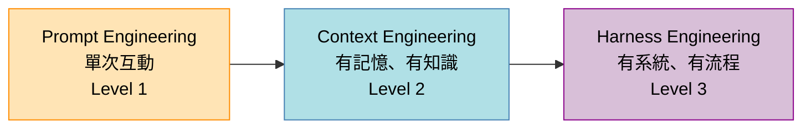

**演進階段說明**：

| 階段 | 特徵 | 銀行系統範例 |
|------|------|------------|
| **Level 1：Prompt** | 開發者個人技巧，一問一答 | 工程師在 Copilot Chat 中問「怎麼寫轉帳 API」 |
| **Level 2：Context** | 團隊知識共享，AI 理解專案脈絡 | Copilot 透過 `copilot-instructions.md` 知道要用 Clean Architecture、要符合金管會規範 |
| **Level 3：Harness** | 系統化 AI 能力，有驗證與治理 | AI 產生的程式碼自動經過 ArchUnit 架構驗證、SonarQube 掃描、安全性測試後才能合併 |

### 1.3 一句話理解

```text
Prompt Engineering  → 你怎麼「問」AI（Interface Layer）
Context Engineering → AI「知道」什麼（Data Layer）
Harness Engineering → AI 在什麼「系統」裡工作（System Layer）
```

> **💡 實務提示**：大多數團隊停留在 Level 1，以為「寫好 Prompt」就夠了。但真正要在企業級系統（如銀行核心系統）中安全使用 AI，必須至少達到 Level 2，並朝 Level 3 演進。

### 1.4 歷史脈絡與業界趨勢

#### 1.4.1 演進時間軸

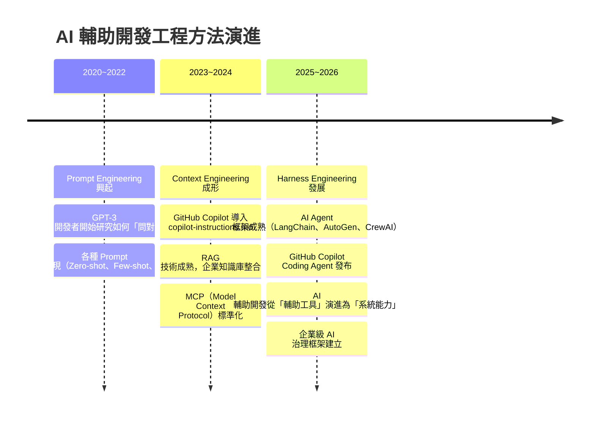

#### 1.4.2 業界趨勢觀察

| 趨勢 | 說明 | 對三者的影響 |
|------|------|------------|
| **AI Agent 化** | AI 從被動回答轉向主動執行任務 | Harness 重要性大幅提升 |
| **Context Window 擴大** | 主流模型支援 100K+ Token | Context Engineering 能提供更多知識 |
| **MCP 標準化** | Anthropic 主導的工具通訊協定被廣泛採用 | Harness 層的工具整合更標準化 |
| **AI 治理法規** | 歐盟 AI Act、各國 AI 監管加嚴 | 三者都需符合合規要求 |
| **多模態 AI** | AI 可理解圖片、語音、影片 | Context 可包含設計稿、流程圖 |
| **AI 原生開發** | 從「AI 輔助」到「AI 原生」的開發模式轉變 | Harness 成為基礎設施的核心 |

#### 1.4.3 關鍵術語起源

- **Prompt Engineering**：源自 2020 年 GPT-3 發布後，研究者發現模型輸出品質高度依賴輸入提示的設計。OpenAI 率先系統化此領域。
- **Context Engineering**：由 Andrej Karpathy（前 Tesla AI 主管、OpenAI 共同創辦人）在 2024 年提出系統性論述，強調「真正的瓶頸不是 Prompt，而是 Context」。核心觀點是：與其花時間打磨措辭，不如設計好 AI 能存取的知識系統。
- **Harness Engineering**：隨著 AI Agent 框架（LangChain、AutoGen）在 2024-2025 年成熟而發展，強調 AI 不能「裸奔」——需要在受約束、可驗證、可觀測的系統框架中運作。
  
> **⚠️ 注意**：這三個詞並非嚴格的學術定義，不同文獻可能有細微差異。本手冊採用的定義以「企業級 AI 輔助開發」為基準，與純學術研究的範疇可能不完全一致。

### 1.5 三者的互補與協同關係

三者並非互斥的選項，而是互補的層次。成熟的 AI 輔助開發必須三者並行：

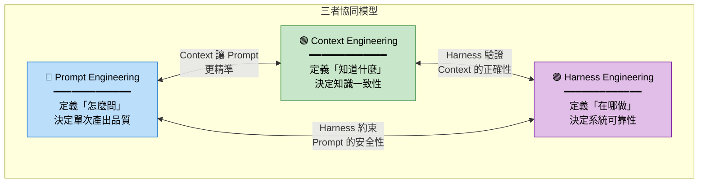

**協同關係說明**：

| 關係 | 說明 | 銀行系統範例 |
|------|------|------------|
| **Prompt ↔ Context** | 有了好的 Context，Prompt 可以更簡短精準；反之，Prompt 也可以動態調用 Context | 有了 `copilot-instructions.md` 定義架構規則，Prompt 只需說「建立轉帳 API」即可 |
| **Context ↔ Harness** | Harness 驗證 AI 產出時，會參照 Context 中的規範；Context 的更新也應經過 Harness 驗證 | ArchUnit 依據 ADR 中定義的架構規則進行自動驗證 |
| **Prompt ↔ Harness** | Harness 可以約束 Prompt 的使用方式（如禁止輸入敏感資料），也可以自動補充 Prompt 缺少的約束 | CI/CD 自動攔截 AI 產生的不安全程式碼，即使 Prompt 遺漏了安全要求 |

**協同成熟度等級**：

| 等級 | 狀態 | 特徵 |
|------|------|------|
| **L1 — 孤立** | 三者各自獨立 | 團隊分別學 Prompt、讀文件、跑 CI，但彼此不連動 |
| **L2 — 連結** | 三者有基本連結 | Prompt 模板引用 Context 規範，CI 檢查 Context 定義的規則 |
| **L3 — 整合** | 三者深度協同 | AI Agent 自動讀取 Context、產出符合規範的程式碼、並觸發 Harness 驗證 |
| **L4 — 自適應** | 三者動態調整 | Harness 驗證結果回饋至 Context（更新規則），並自動調整 Prompt Template |

> **💡 實務提示**：目標不是「三者都做到完美」，而是「三者能有效協同」。一個好的 Context 可以彌補普通的 Prompt，一個好的 Harness 可以攔截不好的 Context 帶來的問題。

---

## 第二章：詳細比較表

> **章節摘要**：本章以多維度表格呈現三者的差異，並提供成熟度模型與投入回報分析，協助團隊評估自身現況與規劃演進路徑。

### 2.1 七大面向比較

| 面向 | Prompt Engineering | Context Engineering | Harness Engineering |
|------|-------------------|-------------------|-------------------|
| **定義** | 設計最佳化的文字指令，引導 AI 產生期望輸出 | 系統性管理 AI 所需的知識、記憶與背景資訊 | 建構 AI 運作的完整系統環境，含工具鏈、驗證與治理 |
| **關注重點** | 怎麼問（措辭、格式、範例） | 知道什麼（知識範圍、結構、更新） | 在什麼環境做事（工具、流程、護欄） |
| **控制範圍** | 單次輸入/輸出 | 跨對話的知識與記憶 | 完整開發生命週期 |
| **複雜度** | ⭐ 低 | ⭐⭐ 中 | ⭐⭐⭐ 高 |
| **使用時機** | 快速原型、個人生產力提升 | 團隊協作、專案一致性要求 | 企業級系統、合規要求、持續交付 |
| **對開發流程影響** | 個人層級，不改變流程 | 團隊層級，需建立知識管理機制 | 組織層級，需調整 CI/CD、Code Review、治理流程 |
| **GitHub Copilot 應用** | Copilot Chat 對話、程式碼註解 | `copilot-instructions.md`、`.github/` 設定、開啟相關檔案 | Custom Agent、MCP Server、GitHub Actions 整合 |

### 2.2 成熟度模型

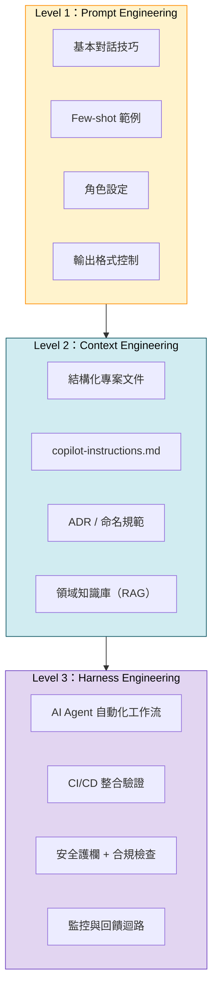

**成熟度自評表**：

| 指標 | Level 1 (Prompt) | Level 2 (Context) | Level 3 (Harness) |
|------|------------------|--------------------|--------------------|
| AI 使用方式 | 個別開發者自行使用 | 團隊有統一規範 | 組織級自動化流程 |
| 知識管理 | 無 | 有文件、有規範 | 有知識庫、有 RAG |
| 品質保證 | 人工 Code Review | AI 輸出經規範驗證 | 自動化測試 + 安全掃描 |
| 可重現性 | 低（依賴個人經驗） | 中（團隊規範一致） | 高（系統自動化） |
| 合規性 | 無法保證 | 部分保證 | 可稽核、可追蹤 |

### 2.3 投入與回報分析

| 面向 | Prompt Engineering | Context Engineering | Harness Engineering |
|------|-------------------|-------------------|-------------------|
| **初始投入** | 低（學習 Prompt 技巧） | 中（建立文件、規範） | 高（建構系統、工具鏈） |
| **維護成本** | 極低 | 中（文件需持續更新） | 中高（系統需持續維運） |
| **效益規模** | 個人 | 團隊 | 組織 |
| **效益持續性** | 短期 | 中期 | 長期 |
| **風險控管** | 弱 | 中 | 強 |
| **適用團隊規模** | 1-5 人 | 5-20 人 | 20+ 人 |

> **💡 實務提示**：銀行系統因合規與安全要求，建議至少達到 Level 2，並在核心系統逐步推進 Level 3。

### 2.4 學習曲線與導入難度

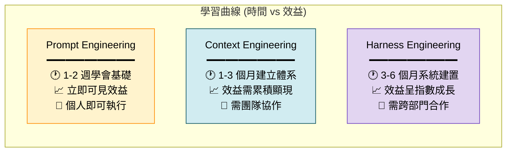

**導入難度詳細分析**：

| 維度 | Prompt Engineering | Context Engineering | Harness Engineering |
|------|-------------------|-------------------|-------------------|
| **所需技能** | AI 對話技巧、領域知識 | 文件撰寫、架構設計、知識管理 | DevOps、CI/CD、測試框架、系統整合 |
| **所需人力** | 個人即可 | 架構師 + Tech Lead | 架構師 + DevOps + QA |
| **所需時間** | 1-2 週 | 1-3 個月 | 3-6 個月 |
| **前置條件** | AI 工具授權 | 已有 Prompt 基礎 + 團隊共識 | 已有 Context 基礎 + CI/CD 基礎設施 |
| **常見阻力** | 「AI 不可靠」的心理障礙 | 「寫文件太花時間」的態度 | 「太複雜、ROI 不明確」的質疑 |
| **克服策略** | 內部培訓 + Show Case | 證明 Context 提升了 AI 產出品質 | 試點專案量化 ROI |

### 2.5 適用場景矩陣

以下矩陣幫助團隊根據專案特性，決定該聚焦哪個層級：

| 專案特性 | Prompt 優先 | Context 優先 | Harness 優先 |
|---------|:-----------:|:-----------:|:-----------:|
| **Prototype / POC** | ✅ | ⚪ | ⚪ |
| **內部工具（低風險）** | ✅ | ✅ | ⚪ |
| **客戶端產品（中風險）** | ✅ | ✅ | ✅ |
| **核心銀行系統（高風險）** | ✅ | ✅ | ✅✅ |
| **法規要求系統（合規）** | ✅ | ✅ | ✅✅✅ |
| **個人開發（1人）** | ✅✅ | ⚪ | ⚪ |
| **小型團隊（2-5人）** | ✅ | ✅ | ⚪ |
| **中型團隊（5-20人）** | ✅ | ✅✅ | ✅ |
| **大型團隊（20+人）** | ✅ | ✅ | ✅✅ |

> ✅ = 建議導入，✅✅ = 重點投資，✅✅✅ = 必須完整建置，⚪ = 可選

**場景決策流程圖**：

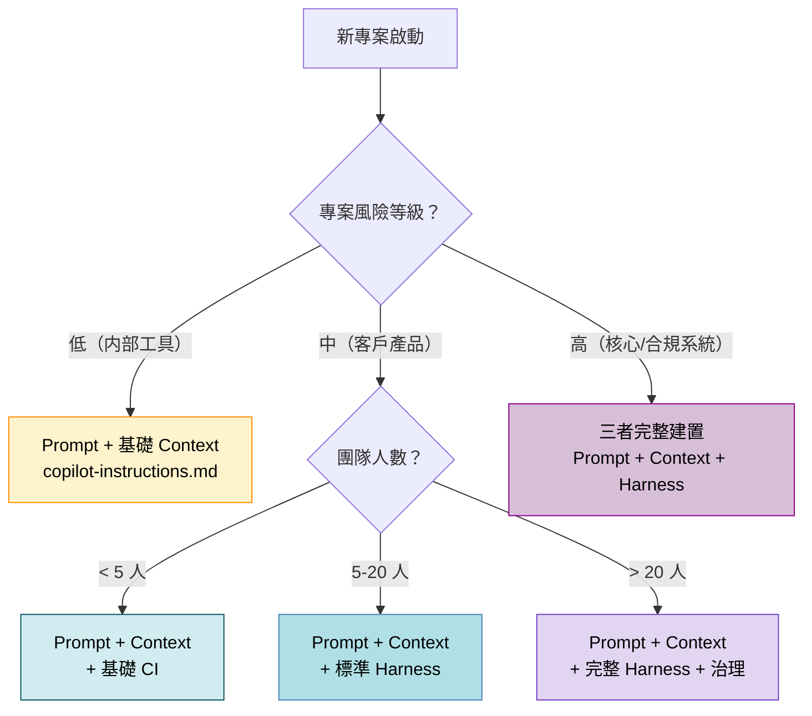

> **⚠️ 注意**：即使是 Prototype，若涉及真實客戶資料或金融交易模擬，仍需建立基本的安全 Context 與護欄（如禁止真實資料進入 AI）。

---

## 第三章：實務案例（Web Application）

> **章節摘要**：本章以銀行系統的四個實際開發場景，具體示範三種工程方法的差異。每個案例包含做法比較與實際範例。

### 3.1 案例一：REST API 開發

**場景**：開發銀行帳戶查詢 API（`GET /api/v1/accounts/{accountId}`）

#### Prompt Engineering 做法

直接在 Copilot Chat 中下指令：

```text
使用 Spring Boot 3.2 + Java 17 撰寫一個 RESTful API：
- Endpoint: GET /api/v1/accounts/{accountId}
- 回傳 JSON：{ accountId, balance, currency, status }
- 使用 @RestController, @GetMapping
- 加入 @Valid 參數驗證
- 使用 ResponseEntity 包裝回傳
- 加入 Swagger/OpenAPI 3.0 註解
```

**優點**：快速產出  
**缺點**：AI 不知道專案的分層架構、命名慣例、例外處理方式

#### Context Engineering 做法

先建立情境，再引導 AI：

**步驟 1**：確保以下檔案存在且 Copilot 可存取

```text
專案結構（AI 需知道的情境）：
├── .github/copilot-instructions.md    ← 專案開發規範
├── docs/adr/                          ← 架構決策記錄
│   ├── ADR-001-clean-architecture.md
│   └── ADR-005-error-handling.md
├── src/main/java/com/bank/
│   ├── controller/                    ← Presentation Layer
│   ├── usecase/                       ← Application Layer（Use Case）
│   ├── domain/                        ← Domain Layer
│   └── infrastructure/                ← Infrastructure Layer
└── docs/api-spec/
    └── account-api.yaml               ← OpenAPI Spec
```

**步驟 2**：`copilot-instructions.md` 提供規範

```markdown
## 架構規範
- 採用 Clean Architecture：Controller → UseCase → Domain → Infrastructure
- Controller 只做 HTTP 映射，不含商業邏輯
- UseCase 透過介面與 Infrastructure 解耦

## 命名規範
- Controller: XxxController
- UseCase: XxxUseCase / XxxUseCaseImpl
- Domain Entity: 放在 domain/model/
- Repository Interface: 放在 domain/repository/

## 例外處理
- 使用 @ControllerAdvice 全域處理
- 自定義 BusinessException, NotFoundException
- 錯誤回傳格式：{ code, message, timestamp }
```

**步驟 3**：在相關檔案開啟的狀態下，使用 Prompt

```text
依照 Clean Architecture 規範，建立帳戶查詢功能的所有分層程式碼，
包含 Controller、UseCase Interface/Impl、Domain Entity、Repository Interface。
```

**效果**：AI 產出的程式碼符合專案架構、命名規範與例外處理模式。

#### Harness Engineering 做法

在 Context 基礎上，加入系統化的驗證與自動化：

**步驟 1**：ArchUnit 架構測試（自動驗證 AI 產出是否符合 Clean Architecture）

```java
@AnalyzeClasses(packages = "com.bank")
public class ArchitectureTest {

    @ArchTest
    static final ArchRule controller_should_not_access_infrastructure =
        noClasses().that().resideInAPackage("..controller..")
            .should().accessClassesThat().resideInAPackage("..infrastructure..");

    @ArchTest
    static final ArchRule usecase_should_not_depend_on_controller =
        noClasses().that().resideInAPackage("..usecase..")
            .should().dependOnClassesThat().resideInAPackage("..controller..");

    @ArchTest
    static final ArchRule domain_should_not_depend_on_outer_layers =
        noClasses().that().resideInAPackage("..domain..")
            .should().dependOnClassesThat()
            .resideInAnyPackage("..controller..", "..usecase..", "..infrastructure..");
}
```

**步驟 2**：GitHub Actions CI 驗證

```yaml
# .github/workflows/ai-code-validation.yml
name: AI Code Validation

on: [pull_request]

jobs:
  validate:
    runs-on: ubuntu-latest
    steps:
      - uses: actions/checkout@v4
      
      - name: Set up JDK 17
        uses: actions/setup-java@v4
        with:
          distribution: 'temurin'
          java-version: '17'
      
      - name: Run Architecture Tests
        run: mvn test -Dtest=ArchitectureTest
      
      - name: Run SonarQube Scan
        run: mvn sonar:sonar -Dsonar.qualitygate.wait=true
      
      - name: Run Security Scan (OWASP)
        run: mvn dependency-check:check
      
      - name: Validate API Spec Compliance
        run: |
          # 驗證實作與 OpenAPI Spec 一致
          mvn verify -P api-spec-validation
```

**步驟 3**：MCP Server 提供即時工具（進階）

```json
{
  "mcpServers": {
    "sonarqube": {
      "command": "sonarqube-mcp-server",
      "args": ["--project-key", "bank-core"]
    },
    "database-schema": {
      "command": "db-schema-mcp-server",
      "args": ["--connection", "jdbc:postgresql://localhost:5432/bank"]
    }
  }
}
```

**效果**：AI 產出 → 自動驗證架構 → 自動掃描安全性 → 自動檢查合規 → 合格才能合併。

### 3.2 案例二：Batch Job 資料處理

**場景**：每日跑批處理，計算所有帳戶利息並更新餘額

#### 三種做法比較

| 面向 | Prompt Engineering | Context Engineering | Harness Engineering |
|------|-------------------|-------------------|-------------------|
| **做法** | 直接要求 AI 寫利息計算邏輯 | 提供利率規則文件、帳戶 Schema、批次處理規範 | 建立 Spring Batch 框架 + 自動測試 + 監控 |
| **品質** | 可能遺漏邊界案例（閏年、跨幣別） | 涵蓋規則但缺乏驗證 | 完整驗證 + 自動重試 + 異常監控 |
| **可靠度** | 低 | 中 | 高 |

#### Prompt Engineering 範例

```text
寫一個 Spring Batch Job，每日計算帳戶利息：
- 讀取所有活躍帳戶
- 依據年利率計算日息
- 更新帳戶餘額
- 記錄異動日誌
```

#### Context Engineering 範例

提供 AI 以下情境：

```markdown
## 利息計算規則（domain-rules/interest-calculation.md）
- 日息公式：餘額 × 年利率 ÷ 365（平年）或 366（閏年）
- 幣別：TWD 四捨五入至整數、USD 四捨五入至小數第二位
- 帳戶狀態：僅「ACTIVE」帳戶計息
- 凍結帳戶不計息但需記錄
- 利率來源：利率主檔（rate_master 表）
- 異動日誌需記錄：帳號、計息前餘額、利息金額、計息後餘額、利率、日期
```

#### Harness Engineering 範例

```java
// 框架層自動驗證
@SpringBatchTest
@SpringBootTest
class InterestBatchJobTest {

    @Autowired
    private JobLauncherTestUtils jobLauncherTestUtils;

    @Test
    void shouldCalculateInterestCorrectly() {
        // Given: 測試資料
        insertTestAccount("ACC001", new BigDecimal("1000000"), "TWD");
        insertTestRate("TWD", new BigDecimal("0.015")); // 1.5%

        // When: 執行批次
        JobExecution execution = jobLauncherTestUtils.launchJob();

        // Then: 驗證
        assertThat(execution.getStatus()).isEqualTo(BatchStatus.COMPLETED);
        assertThat(getBalance("ACC001")).isEqualTo(new BigDecimal("1000041")); // 四捨五入
        assertThat(getAuditLog("ACC001")).isNotEmpty();
    }

    @Test
    void shouldSkipFrozenAccount() {
        insertTestAccount("ACC002", new BigDecimal("500000"), "TWD");
        setAccountStatus("ACC002", "FROZEN");
        
        JobExecution execution = jobLauncherTestUtils.launchJob();
        
        assertThat(execution.getStatus()).isEqualTo(BatchStatus.COMPLETED);
        assertThat(getBalance("ACC002")).isEqualTo(new BigDecimal("500000")); // 未變動
        assertThat(getSkipLog("ACC002")).contains("FROZEN");
    }
}
```

### 3.3 案例三：前端 UI 開發

**場景**：開發帳戶查詢頁面（含搜尋、列表、分頁）

| 做法 | Prompt Engineering | Context Engineering | Harness Engineering |
|------|-------------------|-------------------|-------------------|
| **實作** | 要求 AI 「寫一個帳戶查詢畫面」 | 提供設計稿、元件庫規範、API 介面定義 | Storybook + E2E 測試 + 設計系統自動檢查 |
| **範例 Prompt** | `用 React + Tailwind 寫帳戶查詢頁` | `依照設計系統規範，使用 BankUI 元件庫開發帳戶查詢頁，API 規格如 account-api.yaml` | 不需 Prompt——CI/CD 自動偵測並建議修正 |

#### Context Engineering — 提供的情境

```markdown
## 設計系統規範（design-system.md）
- 主色：#1A365D（深藍），輔色：#2B6CB0
- 表格元件：使用 <BankTable>，支援排序、分頁
- 搜尋：使用 <SearchBar>，debounce 300ms
- 載入狀態：使用 <Skeleton> 骨架屏
- 錯誤狀態：使用 <ErrorBanner>

## API 介面（account-api.yaml）
GET /api/v1/accounts?keyword={keyword}&page={page}&size={size}
Response: { content: Account[], totalElements: number, totalPages: number }
```

#### Harness Engineering — 自動化驗證

```javascript
// Playwright E2E 測試（自動驗證 AI 產出的 UI）
test('帳戶查詢頁面功能驗證', async ({ page }) => {
  await page.goto('/accounts');
  
  // 搜尋功能
  await page.fill('[data-testid="search-input"]', 'ACC001');
  await page.waitForResponse('**/api/v1/accounts**');
  
  // 列表顯示
  const rows = page.locator('[data-testid="account-row"]');
  await expect(rows).toHaveCount(1);
  
  // 分頁功能
  await page.click('[data-testid="next-page"]');
  await expect(page.locator('[data-testid="page-indicator"]')).toContainText('2');
});
```

### 3.4 案例四：除錯（Debug）

**場景**：轉帳 API 在高併發時偶爾出現金額不一致的問題

#### Prompt Engineering 做法

```text
下面這段轉帳程式碼在高併發時會出現金額不一致的問題，請幫我找出原因並修正：
[貼上程式碼]
```

#### Context Engineering 做法

```text
# 提供完整情境
## 系統架構
- Spring Boot 3.2 + PostgreSQL 15
- 使用 JPA / Hibernate
- 部署 3 個 Pod（Kubernetes）

## 問題現象
- 同一帳戶同時收到兩筆轉入時，最終餘額只增加一筆的金額
- 發生頻率約 0.1%（高峰時段）

## 相關程式碼
[TransferService.java + AccountRepository.java + 資料庫隔離級別設定]

## 已嘗試的方案
- 加了 @Transactional(isolation = Isolation.SERIALIZABLE) → 效能大幅下降
- 加了 synchronized → 多 Pod 環境無效
```

#### Harness Engineering 做法

```yaml
# 自動化壓力測試（Harness 的一部分）
# locust 或 JMeter 測試自動執行
stress-test:
  scenario: concurrent-transfer
  config:
    users: 100
    duration: 60s
    target-account: ACC001
  assertions:
    - final-balance-equals: expected-sum
    - no-lost-updates: true
  alerts:
    - type: slack
      channel: "#bank-core-team"
      when: assertion-failed
```

```java
// 透過 Optimistic Locking 解決（Harness 中的設計模式內建方案）
@Entity
public class Account {
    @Id
    private String accountId;
    
    @Version  // Optimistic Locking
    private Long version;
    
    private BigDecimal balance;
}

// Service 層自動重試
@Retryable(value = OptimisticLockingFailureException.class, maxAttempts = 3)
@Transactional
public TransferResult transfer(TransferCommand command) {
    Account from = accountRepository.findByIdForUpdate(command.getFromAccountId());
    Account to = accountRepository.findByIdForUpdate(command.getToAccountId());
    
    from.debit(command.getAmount());
    to.credit(command.getAmount());
    
    auditLogService.log(command, from, to);
    return TransferResult.success();
}
```

> **⚠️ 注意**：在銀行系統中，除錯需要完整的情境（Context）才能準確診斷。單純的 Prompt 通常只能發現表面問題，難以觸及併發、分散式等深層議題。Harness 層面的壓力測試與自動化驗證是防止問題復發的關鍵。

### 3.5 案例五：微服務通訊設計

**場景**：設計帳戶服務（Account Service）與通知服務（Notification Service）之間的事件驅動通訊

#### 三種做法比較

| 面向 | Prompt Engineering | Context Engineering | Harness Engineering |
|------|-------------------|-------------------|-------------------|
| **做法** | 請 AI 寫兩個微服務之間的 REST 呼叫 | 提供微服務架構圖、事件契約（Event Schema）、通訊規範 | 建立 Contract Test + 事件追蹤 + 斷路器 + 監控 |
| **品質** | 可能用同步 REST，忽略服務降級 | 符合架構規範但缺乏韌性驗證 | 完整的韌性、可觀測性與契約驗證 |
| **可靠度** | 低 | 中 | 高 |

#### Prompt Engineering 範例

```text
設計帳戶服務呼叫通知服務的 API，
當帳戶餘額低於門檻時發送通知。
用 Spring Boot + RestTemplate。
```

**問題**：AI 可能生成同步 REST 呼叫，若通知服務掛掉會拖垮帳戶服務。

#### Context Engineering 範例

在 Context 中提供：

```markdown
## 微服務通訊規範（docs/adr/ADR-012-service-communication.md）

### 決策
- 服務間通訊採用「Event-Driven」模式（非同步）
- 使用 Apache Kafka 作為事件匯流排
- 事件格式遵循 CloudEvents 規範 (v1.0.2)
- 事件名稱慣例：{aggregate}.{action}.{version}
  例：account.balance-low.v1

### 事件契約（Event Schema）
```json
{
  "specversion": "1.0",
  "type": "com.bank.account.balance-low.v1",
  "source": "/account-service",
  "subject": "ACC001",
  "data": {
    "accountId": "ACC001",
    "currentBalance": 5000,
    "threshold": 10000,
    "currency": "TWD"
  }
}
```

### 韌性要求
- 事件發送失敗需有重試機制（最多 3 次，指數退避）
- 消費端需實作 Idempotent Consumer
- 使用 Dead Letter Queue (DLQ) 處理無法消費的事件
```

#### Harness Engineering 範例

```java
// Contract Test — 驗證事件生產者與消費者契約一致
@SpringBootTest
@EmbeddedKafka(partitions = 1, topics = "account.balance-low.v1")
class BalanceLowEventContractTest {

    @Autowired
    private KafkaTemplate<String, CloudEvent> kafkaTemplate;

    @Test
    void shouldProduceValidCloudEvent() {
        // Given
        BalanceLowEvent event = new BalanceLowEvent("ACC001", 
            new BigDecimal("5000"), new BigDecimal("10000"), "TWD");
        
        // When
        CloudEvent cloudEvent = eventPublisher.publish(event);
        
        // Then: 驗證事件結構符合契約
        assertThat(cloudEvent.getType())
            .isEqualTo("com.bank.account.balance-low.v1");
        assertThat(cloudEvent.getSpecVersion())
            .isEqualTo(SpecVersion.V1);
        assertThat(cloudEvent.getSource().toString())
            .isEqualTo("/account-service");
        
        // 驗證 JSON Schema
        JsonSchemaValidator.validate(cloudEvent.getData(), 
            "schemas/balance-low-event-v1.json");
    }
}
```

```yaml
# 監控與斷路器配置（application.yml）
resilience4j:
  circuitbreaker:
    instances:
      notificationService:
        slidingWindowSize: 10
        failureRateThreshold: 50
        waitDurationInOpenState: 30s
        
management:
  endpoints:
    web:
      exposure:
        include: health,metrics,circuitbreakers
  metrics:
    tags:
      application: account-service
    export:
      prometheus:
        enabled: true
```

### 3.6 案例六：安全性漏洞修復

**場景**：弱掃報告發現帳戶查詢 API 存在 IDOR（Insecure Direct Object Reference）漏洞

#### 三種做法比較

| 面向 | Prompt Engineering | Context Engineering | Harness Engineering |
|------|-------------------|-------------------|-------------------|
| **做法** | 詢問 AI「如何修復 IDOR 漏洞」 | 提供安全規範、認證架構、權限模型文件 | 自動化安全測試 + DAST 掃描 + 權限測試框架 |
| **品質** | AI 可能給出通用建議，不符合現有架構 | AI 產出符合團隊安全架構的修復方案 | 修復後自動驗證，確保不再復發 |
| **可靠度** | 低 | 中 | 高 |

#### Prompt Engineering 範例

```text
我的帳戶查詢 API 有 IDOR 漏洞，
用戶可以查詢任何帳戶的資料。
請問如何修復？
```

**AI 可能回應**：加一個 `if (account.getOwner().equals(currentUser))` 檢查。  
**問題**：方式粗糙，且不知道現有的權限框架。

#### Context Engineering 範例

提供 AI 以下情境：

```markdown
## 安全架構（docs/adr/ADR-003-authorization.md）
- 使用 Spring Security + JWT
- 角色：CUSTOMER, TELLER, MANAGER, ADMIN
- 權限模型：RBAC + ABAC（Attribute-Based Access Control）
- 帳戶存取規則：
  - CUSTOMER 只能存取名下帳戶
  - TELLER 可存取所屬分行的帳戶
  - MANAGER 可存取所屬區域的帳戶
  - ADMIN 可存取所有帳戶
- 安全檢查統一在 UseCase 層（非 Controller）
- 使用自定義 @PreAuthorize + SpEL 表達式
```

#### Harness Engineering 範例

```java
// 自動化安全測試 — 驗證 IDOR 修復
@SpringBootTest(webEnvironment = WebEnvironment.RANDOM_PORT)
@AutoConfigureMockMvc
class AccountApiSecurityTest {

    @Autowired
    private MockMvc mockMvc;

    @Test
    @WithMockUser(username = "customer_A", roles = {"CUSTOMER"})
    void customerShouldAccessOwnAccount() throws Exception {
        mockMvc.perform(get("/api/v1/accounts/ACC_A001"))
            .andExpect(status().isOk())
            .andExpect(jsonPath("$.accountId").value("ACC_A001"));
    }

    @Test
    @WithMockUser(username = "customer_A", roles = {"CUSTOMER"})
    void customerShouldNotAccessOtherAccount() throws Exception {
        // IDOR 測試：客戶 A 嘗試存取客戶 B 的帳戶
        mockMvc.perform(get("/api/v1/accounts/ACC_B001"))
            .andExpect(status().isForbidden())
            .andExpect(jsonPath("$.errorCode").value("AUTH_003"));
    }

    @Test
    @WithMockUser(username = "teller_branch_01", roles = {"TELLER"})
    void tellerShouldAccessSameBranchAccount() throws Exception {
        mockMvc.perform(get("/api/v1/accounts/ACC_BRANCH01_001"))
            .andExpect(status().isOk());
    }

    @Test
    @WithMockUser(username = "teller_branch_01", roles = {"TELLER"})
    void tellerShouldNotAccessOtherBranchAccount() throws Exception {
        mockMvc.perform(get("/api/v1/accounts/ACC_BRANCH02_001"))
            .andExpect(status().isForbidden());
    }
}
```

```yaml
# DAST 自動掃描（GitHub Actions）
security-scan:
  runs-on: ubuntu-latest
  steps:
    - name: OWASP ZAP DAST Scan
      uses: zaproxy/action-full-scan@v0.10.0
      with:
        target: 'http://localhost:8080'
        rules_file_name: '.zap/rules.tsv'
        
    - name: Validate No IDOR Issues
      run: |
        # 解析 ZAP 報告，確認無 IDOR 相關 Alert
        python scripts/parse_zap_report.py --check IDOR
```

> **💡 實務提示**：安全性修復是 Harness Engineering 價值最明顯的場景。單靠 Prompt 問 AI 如何修復，往往只能得到教科書式的答案。透過 Context 提供現有安全架構，再用 Harness 自動驗證修復效果，才能確保漏洞真正被修復且不再復發。

### 3.7 案例總結比較

| 案例 | Prompt 效益 | Context 效益 | Harness 效益 | 建議優先級 |
|------|:----------:|:----------:|:----------:|:--------:|
| REST API 開發 | 快速出原型 | 符合架構規範 | 自動驗證架構合規 | Context > Harness > Prompt |
| Batch Job | 快速出框架 | 涵蓋業務規則 | 自動驗證計算正確性 | Context > Harness > Prompt |
| 前端 UI | 快速出畫面 | 符合設計系統 | E2E 自動驗證 | Context > Prompt > Harness |
| 除錯 | 初步方向 | 精準診斷 | 防止復發 | Context > Harness > Prompt |
| 微服務通訊 | 快速出框架 | 符合通訊契約 | 契約測試 + 韌性驗證 | Context ≈ Harness > Prompt |
| 安全修復 | 通用建議 | 符合安全架構 | 自動驗證安全性 | Harness > Context > Prompt |

---

## 第四章：GitHub Copilot 實戰應用

> **章節摘要**：本章說明如何在 GitHub Copilot 中實踐三種工程方法，從 Prompt 技巧到 Context 設計再到 Harness 建構，提供具體操作步驟。

### 4.1 Prompt Engineering 在 Copilot 中的實踐

#### 4.1.1 高品質程式碼註解引導

在程式碼中撰寫精確的註解，引導 Copilot 自動補全：

```java
/**
 * 執行帳戶間轉帳作業。
 * 
 * <p>業務規則：
 * <ul>
 *   <li>轉出帳戶餘額必須大於等於轉帳金額</li>
 *   <li>同幣別帳戶直接轉帳，跨幣別需匯率轉換</li>
 *   <li>單筆轉帳上限：TWD 3,000,000 / USD 100,000</li>
 *   <li>需記錄完整異動日誌（含轉出/轉入雙方）</li>
 * </ul>
 * 
 * @param command 轉帳指令（含來源帳號、目標帳號、金額、幣別）
 * @return TransferResult 轉帳結果（含交易序號、狀態）
 * @throws InsufficientBalanceException 餘額不足
 * @throws TransferLimitExceededException 超過轉帳限額
 * @throws AccountNotFoundException 帳戶不存在
 */
public TransferResult executeTransfer(TransferCommand command) {
    // Copilot 會根據上方 JavaDoc 產生符合規則的實作
}
```

#### 4.1.2 Copilot Chat Prompt 模板

```text
# 模板：API 開發
角色：你是銀行核心系統的 Java 資深工程師
技術棧：Java 17 + Spring Boot 3.2 + JPA + PostgreSQL
架構：Clean Architecture（Controller → UseCase → Domain → Infrastructure）
要求：
1. [具體功能描述]
2. 包含完整的例外處理
3. 包含 JavaDoc 註解
4. 包含對應的單元測試
5. 符合 OWASP 安全規範
```

```text
# 模板：Code Review
請審查以下程式碼，從這些面向提供建議：
1. 安全性（SQL Injection, XSS, CSRF）
2. 效能（N+1 Query, 記憶體洩漏）
3. 可維護性（SOLID 原則）
4. 銀行業合規性（交易一致性、稽核日誌）
```

#### 4.1.3 進階 Prompt 技巧

在企業級開發中，以下進階 Prompt 技巧特別有價值：

**技巧 1：Chain-of-Thought（思維鏈）**

引導 AI 逐步推理，適用於複雜業務邏輯：

```text
請逐步分析並實作跨幣別轉帳的匯率轉換邏輯：

步驟 1：確認來源帳戶幣別和目標帳戶幣別
步驟 2：從匯率主檔查詢即時匯率
步驟 3：計算轉出金額（考慮手續費）
步驟 4：計算轉入金額（依匯率轉換，TWD 四捨五入至整數）
步驟 5：驗證轉出帳戶餘額是否足夠（含手續費）
步驟 6：執行轉帳（在同一交易中完成扣款、入帳、手續費）
步驟 7：記錄異動日誌（含匯率、手續費明細）

請依照上述步驟，使用 Java 17 + Spring Boot 3.2 撰寫完整實作。
```

**技巧 2：Few-shot（少量範例）**

提供範例讓 AI 產出一致的風格：

```text
請依照以下範例風格，為帳戶凍結 UseCase 撰寫實作：

### 範例：帳戶查詢 UseCase
```java
public interface GetAccountUseCase {
    AccountResponse execute(GetAccountCommand command);
}

@RequiredArgsConstructor
@Service
public class GetAccountUseCaseImpl implements GetAccountUseCase {
    private final AccountRepository accountRepository;
    private final AccountMapper mapper;
    
    @Override
    @Transactional(readOnly = true)
    public AccountResponse execute(GetAccountCommand command) {
        Account account = accountRepository.findById(command.getAccountId())
            .orElseThrow(() -> new NotFoundException("ACC_001", "帳戶不存在"));
        return mapper.toResponse(account);
    }
}
```

### 請撰寫：帳戶凍結 UseCase
- 商業規則：已凍結帳戶不可重複凍結、需記錄凍結原因與操作人員
```

**技巧 3：Constraint-based Prompting（約束導向）**

明確列出硬性約束，防止 AI 產出違規程式碼：

```text
## 硬性約束（違反即不合格）
❌ 禁止使用 float/double 處理金額（必須 BigDecimal）
❌ 禁止在 Controller 層寫商業邏輯
❌ 禁止硬編碼密碼、連線字串
❌ 禁止使用 String concatenation 組 SQL
❌ 禁止在日誌中輸出身分證字號、密碼

## 軟性約束（建議遵循）
⚠️ 方法長度建議不超過 30 行
⚠️ 類別職責應單一（SRP）
⚠️ 使用 Optional 而非 null 檢查
```

**技巧 4：Role-Play + Adversarial Thinking（角色扮演 + 對抗思維）**

```text
你現在扮演兩個角色：

角色 1 — 資深 Java 工程師：
請設計帳戶解鎖的 API。

角色 2 — 資安滲透測試工程師：
請檢查角色 1 的設計，找出潛在安全漏洞，
包括但不限於：暴力破解、權限提升、資訊洩漏。

最後，請結合兩個角色的觀點，產出安全且完整的實作。
```

### 4.2 Context Engineering 在 Copilot 中的實踐

#### 4.2.1 `.github/copilot-instructions.md` 設計

```markdown
# 銀行核心系統 — Copilot 開發規範

## 架構
- 採用 Clean Architecture
- 分層：Presentation → Application → Domain → Infrastructure
- Domain Layer 不依賴任何外部框架

## 技術棧
- Java 17, Spring Boot 3.2, Spring Data JPA
- PostgreSQL 15, Redis 7
- JUnit 5 + Mockito + ArchUnit

## 命名規範
- Controller: `XxxController`
- UseCase: `XxxUseCase` (Interface) / `XxxUseCaseImpl` (Implementation)
- Entity: `XxxEntity`（JPA）/ `Xxx`（Domain Model）
- Repository: `XxxRepository` (Interface in Domain) / `XxxRepositoryImpl` (Infrastructure)
- DTO: `XxxRequest`, `XxxResponse`

## 例外處理
- 自定義 `BusinessException(ErrorCode, message)`
- 使用 `@ControllerAdvice` 全域攔截
- 錯誤回傳：`{ "errorCode": "ACC_001", "message": "...", "timestamp": "..." }`

## 安全規範
- 所有 API 需 JWT 認證（除 /api/v1/auth/**）
- 敏感欄位（身分證字號、帳號）需脫敏處理
- SQL 操作一律使用 Parameterized Query
- 禁止在日誌中輸出密碼、Token 等機密資訊

## 交易規範
- 涉及金額的操作必須使用 BigDecimal
- 帳務異動需寫入 audit_log 表
- 轉帳操作需使用 Pessimistic/Optimistic Locking
```

#### 4.2.2 檔案結構即情境

開啟相關檔案讓 Copilot 可存取：

```text
在開發「轉帳功能」時，確保以下檔案已開啟：
├── TransferController.java     ← AI 知道 HTTP 入口點
├── TransferUseCase.java        ← AI 知道介面定義
├── Account.java                ← AI 知道 Domain Model
├── AccountRepository.java      ← AI 知道資料存取介面
└── TransferRequest.java        ← AI 知道輸入格式
```

#### 4.2.3 ADR（Architecture Decision Records）

```markdown
# ADR-007: 帳務交易一致性策略

## 狀態
已採納（2025-06-15）

## 決策
帳務相關交易全部使用 Pessimistic Locking（SELECT FOR UPDATE），
非帳務交易使用 Optimistic Locking（@Version）。

## 原因
- 銀行帳務不允許任何金額不一致
- Pessimistic Locking 在帳務場景中可確保強一致性
- 效能影響可接受（帳務 TPS < 1000）

## 影響
- 所有涉及餘額變動的 Repository 方法需加 @Lock(LockModeType.PESSIMISTIC_WRITE)
- 超時設定：5 秒
```

#### 4.2.4 `.prompt.md` 與 Prompt Files

GitHub Copilot 支援 `.prompt.md` 檔案，作為可重用的 Prompt 指令，這是 Context Engineering 的重要工具：

```text
專案中的 Prompt Files 結構：
.github/
├── copilot-instructions.md          ← 全域 Context
└── prompts/                         ← 可重用 Prompt 集合
    ├── create-api.prompt.md         ← API 開發 Prompt
    ├── create-test.prompt.md        ← 測試生成 Prompt
    ├── code-review.prompt.md        ← Code Review Prompt
    ├── refactor.prompt.md           ← 重構 Prompt
    └── security-check.prompt.md     ← 安全審查 Prompt
```

**範例：`create-api.prompt.md`**

```markdown
---
mode: 'agent'
description: '依照 Clean Architecture 建立新的 REST API'
tools: ['file_search', 'terminal', 'sonarqube']
---

# 建立新 REST API

## 前置作業
1. 讀取 `.github/copilot-instructions.md` 了解架構規範
2. 讀取 `docs/adr/` 了解相關架構決策
3. 搜尋現有類似 API 作為參考

## 產出要求
依照 Clean Architecture 產出以下檔案：
- `src/main/java/.../controller/{Name}Controller.java`
- `src/main/java/.../usecase/{Name}UseCase.java`
- `src/main/java/.../usecase/impl/{Name}UseCaseImpl.java`
- `src/main/java/.../domain/model/{Name}.java`
- `src/main/java/.../domain/repository/{Name}Repository.java`
- `src/test/java/.../usecase/impl/{Name}UseCaseImplTest.java`

## 品質標準
- 所有公開方法必須有 JavaDoc
- 金額處理使用 BigDecimal
- 包含 @Valid 驗證
- 包含完整的例外處理
```

#### 4.2.5 Context 分層策略

在大型專案中，Context 應按層級組織：

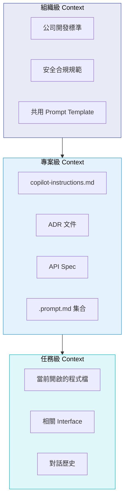

| 層級 | 內容 | 管理者 | 更新頻率 |
|------|------|--------|---------|
| **組織級** | 語言、框架、安全標準 | 架構委員會 | 每季 |
| **專案級** | 架構決策、命名規範、API 規格 | Tech Lead | 每次重大決策 |
| **任務級** | 當前相關檔案、對話脈絡 | 開發者 | 即時 |

### 4.3 Harness Engineering 在 Copilot 中的實踐

#### 4.3.1 Custom Agent Mode（自訂代理模式）

```json
// .vscode/agents.json — 建立銀行系統專用 Agent
{
  "bank-api-agent": {
    "description": "銀行 API 開發專用 Agent",
    "instructions": "你是銀行核心系統的 API 開發專家...",
    "tools": ["file_search", "terminal", "sonarqube", "db-schema"]
  },
  "bank-security-agent": {
    "description": "銀行安全審查 Agent",
    "instructions": "你是資安審查專家，專注於 OWASP Top 10...",
    "tools": ["sonarqube", "owasp-check", "code-review"]
  }
}
```

#### 4.3.2 MCP Server 整合

```json
// .vscode/mcp.json
{
  "servers": {
    "sonarqube": {
      "type": "stdio",
      "command": "npx",
      "args": ["sonarqube-mcp-server", "--project-key", "bank-core"]
    },
    "postgres": {
      "type": "stdio",
      "command": "npx",
      "args": ["postgres-mcp-server", "--connection-string", "${DB_URL}"]
    }
  }
}
```

**效果**：Copilot Agent 可以即時查詢資料庫 Schema、執行 SonarQube 掃描、查看程式碼品質報告。

#### 4.3.3 GitHub Actions 護欄

```yaml
# .github/workflows/copilot-guardrails.yml
name: AI Code Guardrails

on:
  pull_request:
    paths: ['src/**']

jobs:
  architecture-check:
    runs-on: ubuntu-latest
    steps:
      - uses: actions/checkout@v4
      - name: ArchUnit Tests
        run: mvn test -Dtest="*ArchitectureTest"

  security-check:
    runs-on: ubuntu-latest
    steps:
      - uses: actions/checkout@v4
      - name: OWASP Dependency Check
        run: mvn dependency-check:check
      - name: SpotBugs Security
        run: mvn spotbugs:check

  code-quality:
    runs-on: ubuntu-latest
    steps:
      - uses: actions/checkout@v4
      - name: SonarQube Analysis
        run: mvn sonar:sonar
      - name: Quality Gate
        run: |
          # 若品質門檻未通過，阻擋合併
          curl -s "$SONAR_URL/api/qualitygates/project_status?projectKey=bank-core" \
            | jq -e '.projectStatus.status == "OK"'
```

#### 4.3.4 完整 Harness 架構圖

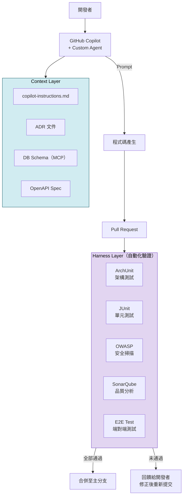

> **💡 實務提示**：在導入初期，建議先完成 Context Engineering（建立 `copilot-instructions.md` 和命名規範），再逐步加入 Harness（ArchUnit → SonarQube → CI/CD 整合）。不需要一次到位。

#### 4.3.5 GitHub Copilot Coding Agent（2025-2026 新功能）

GitHub Copilot Coding Agent 是 Harness Engineering 的最新實踐，它能自主完成開發任務：

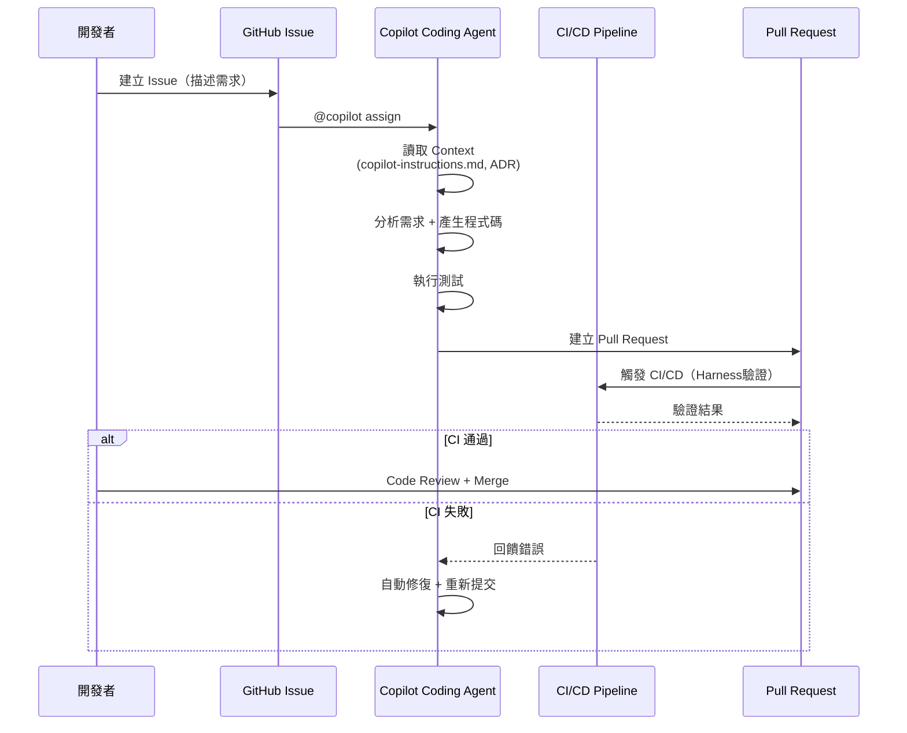

**Coding Agent 的三層協同**：

| 層級 | Coding Agent 如何運用 |
|------|---------------------|
| **Prompt** | 從 Issue 描述中理解需求（Issue 即 Prompt） |
| **Context** | 自動讀取 `copilot-instructions.md`、ADR、現有程式碼結構 |
| **Harness** | 在 CI/CD 中運行，自動執行測試，失敗時自動修復 |

**配置範例**：

```yaml
# .github/copilot-coding-agent.yml
agent:
  enabled: true
  auto-assign-labels: ["copilot-task"]
  
  context:
    files:
      - ".github/copilot-instructions.md"
      - "docs/adr/*.md"
      - "docs/domain-rules/*.md"
    
  guardrails:
    require-ci-pass: true
    require-review: true
    max-files-changed: 20
    blocked-paths:
      - "src/main/resources/application-prod.yml"
      - "*.key"
      - "*.pem"
```

### 4.4 三者整合實戰工作流

以下是一個完整的企業級開發工作流，展示三者如何協同運作：

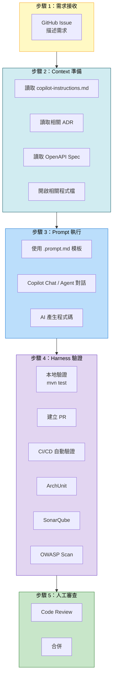

**工作流腳本化範例**：

```bash
#!/bin/bash
# ai-dev-workflow.sh — 標準 AI 輔助開發流程

echo "=== Step 1: 確認 Context 就緒 ==="
# 檢查必要 Context 檔案是否存在
test -f .github/copilot-instructions.md || echo "❌ 缺少 copilot-instructions.md"
test -d docs/adr/ || echo "⚠️ 缺少 ADR 目錄"

echo "=== Step 2: 開發（使用 AI）==="
echo "請在 VS Code 中使用 Copilot 開發功能..."

echo "=== Step 3: 本地 Harness 驗證 ==="
mvn compile                           # 編譯檢查
mvn test                              # 單元測試
mvn test -Dtest="*ArchitectureTest"   # 架構驗證
mvn spotbugs:check                     # 程式碼品質

echo "=== Step 4: 提交 PR ==="
git add -A
git commit -m "feat: [功能描述]"
git push origin feature/xxx

echo "=== CI/CD 將自動執行完整 Harness 驗證 ==="
```

> **💡 實務提示**：將此工作流製作成 VS Code Task 或 Shell Script，讓團隊成員每次開發都遵循相同流程。流程標準化是 Harness Engineering 的核心精神。

---

## 第五章：工具與技術建議

> **章節摘要**：本章列出三種工程方法對應的工具與技術，並提供選型建議。

### 5.1 各層級對應工具

| 層級 | 工具類型 | 工具名稱 | 說明 |
|------|---------|---------|------|
| **Prompt** | AI 對話 | GitHub Copilot Chat | IDE 內原生整合 |
| | AI 對話 | ChatGPT / Claude | 複雜設計討論 |
| | Prompt 管理 | Prompt Template 檔案 | 團隊共用模板 |
| **Context** | 專案規範 | `copilot-instructions.md` | Copilot 專用規範檔 |
| | 架構決策 | ADR（Architecture Decision Records） | 記錄為什麼如此設計 |
| | 知識庫 | RAG（Retrieval-Augmented Generation） | 搜尋企業內部知識 |
| | 向量資料庫 | Pinecone / Weaviate / pgvector | 儲存向量化文件 |
| | 文件系統 | README.md / Wiki | 基礎文件 |
| | MCP Server | Database Schema MCP | 提供即時 DB 資訊 |
| **Harness** | 架構驗證 | ArchUnit | 確保分層架構合規 |
| | 程式碼品質 | SonarQube + SpotBugs | 靜態分析 |
| | 安全掃描 | OWASP Dependency Check | 弱點掃描 |
| | 單元測試 | JUnit 5 + Mockito | 自動化測試 |
| | E2E 測試 | Playwright / Selenium | 端對端測試 |
| | CI/CD | GitHub Actions / Jenkins | 自動化流水線 |
| | AI Agent | GitHub Copilot Agent Mode | 自訂 Agent |
| | Agent 框架 | LangChain / AutoGen / CrewAI | 多 Agent 協作 |
| | 容器化 | Docker + Kubernetes | 部署環境一致性 |

### 5.2 工具選型決策矩陣

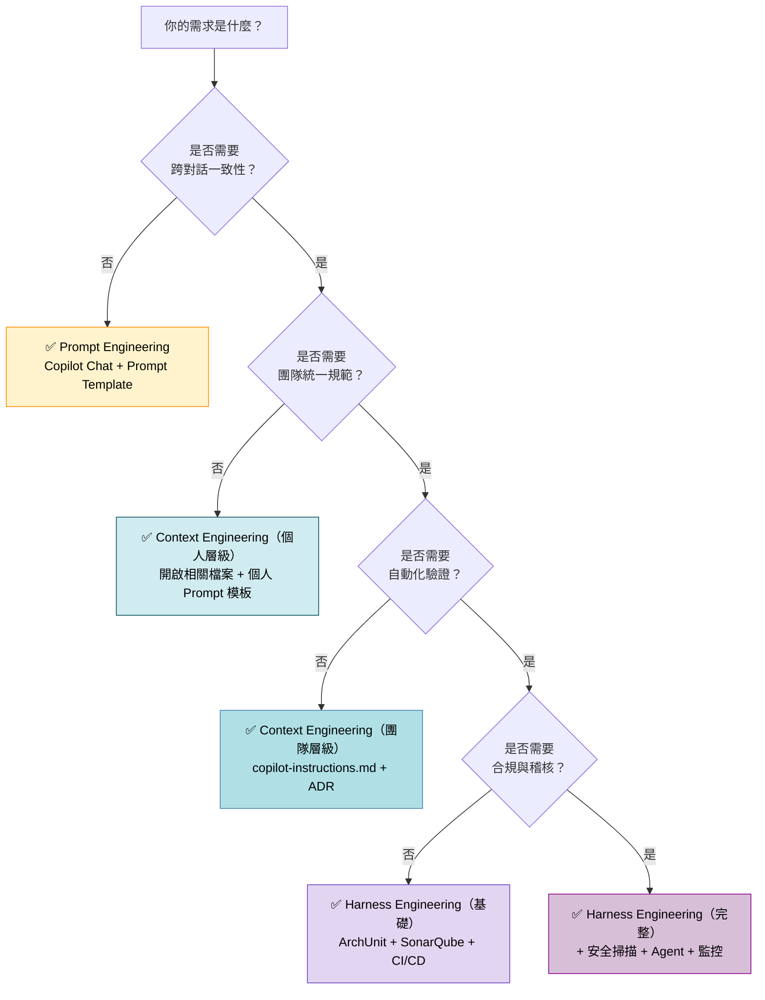

> **⚠️ 注意**：工具選型應根據團隊規模、專案複雜度、合規要求來決定。不要為了技術而技術——小型內部工具專案不需要完整的 Harness，但核心銀行系統則必須具備。

### 5.3 2026 年最新工具生態

隨著 AI 輔助開發快速發展，2026 年的工具生態已大幅擴展：

#### 5.3.1 AI Coding 工具比較

| 工具 | 定位 | Prompt 支援 | Context 支援 | Harness 支援 | 適用場景 |
|------|------|:-----------:|:-----------:|:-----------:|---------|
| **GitHub Copilot** | IDE 原生整合 | ✅ Chat + 自動補全 | ✅ copilot-instructions.md + MCP | ✅ Agent Mode + Coding Agent | 企業首選，生態完整 |
| **Claude Code** | Terminal AI Agent | ✅ 對話 + Plan/Build | ✅ CLAUDE.md + Memory | ✅ Agent + Sub-Agent + Hooks | 複雜任務、架構設計 |
| **Cursor** | AI-native IDE | ✅ Chat + Composer | ✅ .cursorrules + Docs | ⚪ 部分整合 | 快速開發、個人生產力 |
| **OpenCode** | 開源 Terminal Agent | ✅ Chat + Plan/Build | ✅ 設定檔 | ⚪ 基礎 | 開源替代方案 |
| **Windsurf (Codeium)** | AI IDE | ✅ Cascade 對話 | ✅ 自動索引 | ⚪ 部分整合 | 個人/小型團隊 |
| **Amazon Q Developer** | AWS 整合 | ✅ Chat | ✅ AWS 資源 Context | ✅ 程式碼掃描 | AWS 專案 |

#### 5.3.2 MCP Server 生態（2026 最新）

MCP（Model Context Protocol）是 Context Engineering 與 Harness Engineering 的關鍵基礎設施：

| MCP Server | 功能 | 層級 | 銀行系統應用 |
|-----------|------|------|------------|
| **PostgreSQL MCP** | 查詢 DB Schema、資料樣本 | Context | AI 了解帳務資料表結構 |
| **SonarQube MCP** | 即時程式碼品質掃描 | Harness | AI 開發時即時得到品質回饋 |
| **GitHub MCP** | 存取 Issue、PR、Wiki | Context | AI 了解需求與歷史討論 |
| **Filesystem MCP** | 文件搜尋與讀取 | Context | AI 搜尋大型專案的相關檔案 |
| **Kubernetes MCP** | 查詢叢集狀態 | Harness | AI 了解部署環境 |
| **Sentry MCP** | 錯誤追蹤 | Harness | AI 了解線上錯誤，輔助除錯 |
| **Swagger/OpenAPI MCP** | API 規格查詢 | Context | AI 了解現有 API 介面定義 |

#### 5.3.3 AI Agent 框架比較

| 框架 | 語言 | 特色 | 適合場景 |
|------|------|------|---------|
| **LangChain / LangGraph** | Python / TypeScript | 最成熟的 Agent 框架，支援複雜工作流 | 多步驟自動化流程 |
| **AutoGen** | Python | 微軟開發，支援多 Agent 對話 | 多角色協作（如 Coder + Reviewer） |
| **CrewAI** | Python | 角色導向 Agent 框架 | 團隊模擬（如 PM + Dev + QA） |
| **Spring AI** | Java | Spring 生態整合 | Java/Spring Boot 專案首選 |
| **Semantic Kernel** | C# / Python / Java | 微軟開發，企業級 | .NET / Azure 生態 |

### 5.4 工具整合架構

以下是銀行級 Web Application 的完整 AI 工具整合架構：

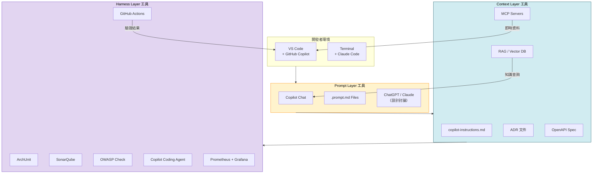

**工具整合建議**：

| 整合項目 | 工具組合 | 效益 | 優先級 |
|---------|---------|------|:------:|
| IDE + Copilot | VS Code + GitHub Copilot | 基礎 AI 輔助開發 | P0 |
| Copilot + Instructions | Copilot + copilot-instructions.md | 統一團隊 AI 產出風格 | P0 |
| CI + ArchUnit | GitHub Actions + ArchUnit | 自動架構驗證 | P1 |
| CI + SonarQube | GitHub Actions + SonarQube | 自動品質掃描 | P1 |
| CI + OWASP | GitHub Actions + OWASP Check | 自動安全掃描 | P1 |
| IDE + MCP | VS Code + PostgreSQL MCP | AI 即時了解 DB Schema | P2 |
| Coding Agent | Copilot Coding Agent + CI | 自主完成開發任務 | P2 |
| RAG | Vector DB + 企業知識庫 | AI 存取企業專屬知識 | P3 |

> **💡 實務提示**：工具整合應循序漸進。P0 項目在第一週完成，P1 在第一個月完成，P2 和 P3 根據團隊成熟度逐步導入。切勿一次導入所有工具。

---

## 第六章：架構設計觀點

> **章節摘要**：本章從系統架構師的視角，說明如何在大型企業系統中分層設計 AI 能力，以及如何從 Prompt 逐步演進到 Harness。

### 6.1 三層演進模型

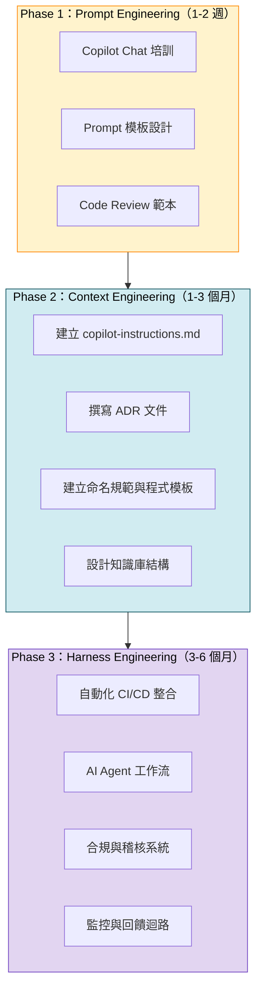

**各階段具體任務**：

| 階段 | 時間 | 交付物 | 負責人 |
|------|------|--------|--------|
| Phase 1 | 1-2 週 | Prompt 範本庫、培訓教材 | Tech Lead |
| Phase 2 | 1-3 個月 | `copilot-instructions.md`、ADR、命名規範 | 架構師 + Tech Lead |
| Phase 3 | 3-6 個月 | CI/CD 整合、ArchUnit、SonarQube、Agent 配置 | 架構師 + DevOps |

### 6.2 大型系統 AI 能力分層設計

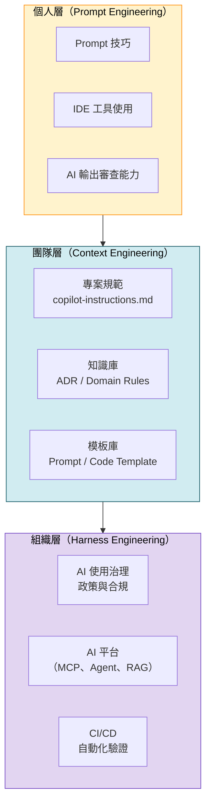

**各層職責**：

| 層級 | 負責人 | 職責 |
|------|--------|------|
| **組織層** | CTO / 架構委員會 | 制定 AI 使用政策、建構平台、建立護欄 |
| **團隊層** | 架構師 / Tech Lead | 建立專案規範、維護知識庫、設計 Context |
| **個人層** | 全體開發者 | 掌握 Prompt 技巧、善用 Context、遵守規範 |

### 6.3 Anti-pattern 架構分析

#### Anti-pattern 1：只有 Prompt，沒有 Context 和 Harness

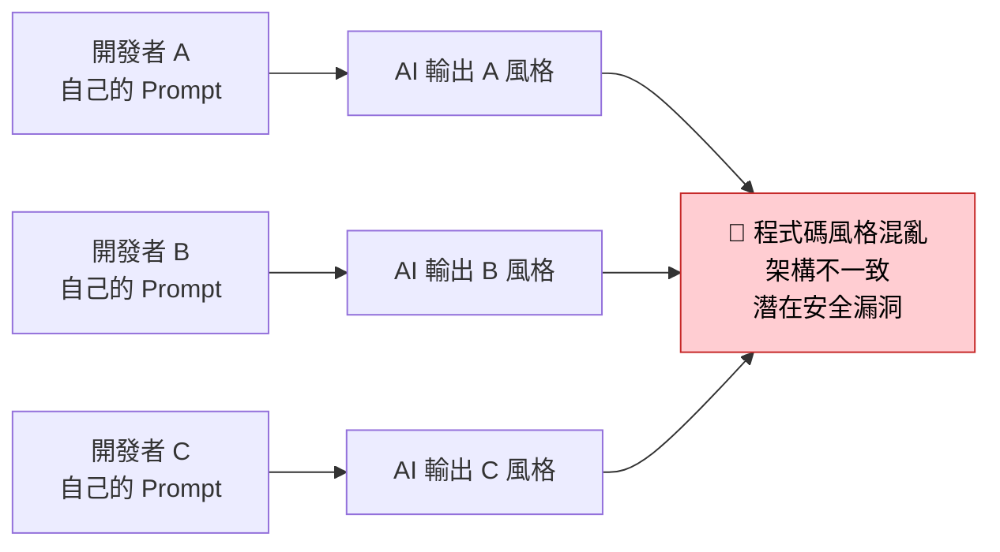

**問題**：每個開發者用不同的 Prompt 風格，AI 產出的程式碼架構不一致、命名混亂、安全性參差不齊。

#### Anti-pattern 2：有 Context 但沒有 Harness

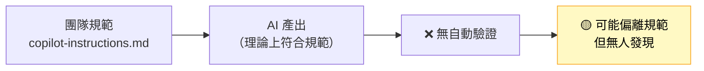

**問題**：有規範但沒有自動化驗證，AI 仍可能產出不符合規範的程式碼，人工 Review 容易遺漏。

#### 正確架構：三層完整覆蓋

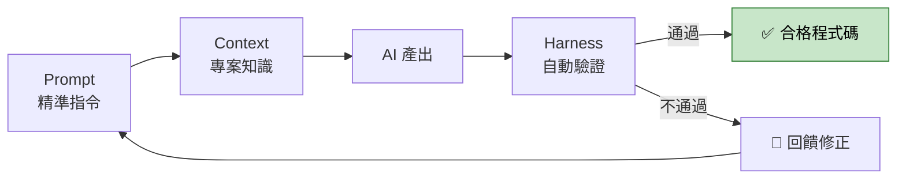

> **💡 建議**：將三者視為一個閉環系統。Prompt 是入口、Context 是知識基礎、Harness 是品質保證，缺一都會降低 AI 輔助開發的可靠性。

### 6.4 企業級 AI 能力成熟度評估框架

以下框架幫助企業評估自身 AI 輔助開發的成熟度，並規劃演進路徑：

#### 6.4.1 五級成熟度模型（AI-CMM）

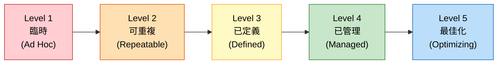

| 等級 | Prompt 狀態 | Context 狀態 | Harness 狀態 | 特徵 |
|------|-----------|------------|------------|------|
| **L1 臨時** | 個人自由使用 | 無文件 | 無 CI | 每人用法不同，品質不可預期 |
| **L2 可重複** | 有 Prompt 模板 | 有 copilot-instructions.md | 基本 CI（編譯+測試） | 團隊有基本共識 |
| **L3 已定義** | 完整模板庫 | ADR + 命名規範 + API Spec | ArchUnit + SonarQube + CI/CD | 組織有標準流程 |
| **L4 已管理** | 模板持續優化 | 知識庫 + RAG + MCP | 安全掃描 + Agent + 監控 | 可量化、可追蹤 |
| **L5 最佳化** | AI 自動調整 Prompt | Context 自動更新 | Harness 自適應 | 閉環系統、持續改善 |

#### 6.4.2 成熟度評估問卷

```markdown
## AI 輔助開發成熟度自我評估

### Prompt Engineering（每題 0-3 分）
1. 團隊是否有共用的 Prompt 模板？
2. 團隊成員是否接受過 Prompt 培訓？
3. 是否有 Prompt 效果評估機制？
4. 是否有禁止使用敏感資料的規範？

### Context Engineering（每題 0-3 分）
5. 是否有 copilot-instructions.md？
6. 是否有 ADR 文件機制？
7. 命名規範是否明確且統一？
8. Context 文件是否定期更新？
9. 是否使用 MCP Server 或 RAG？

### Harness Engineering（每題 0-3 分）
10. CI/CD 是否包含自動化測試？
11. 是否有架構驗證（如 ArchUnit）？
12. 是否有程式碼品質掃描？
13. 是否有安全性掃描？
14. 是否有 AI 使用治理政策？
15. 是否有監控與回饋機制？

### 評分標準
- 0-12 分：Level 1（臨時）
- 13-21 分：Level 2（可重複）
- 22-30 分：Level 3（已定義）
- 31-38 分：Level 4（已管理）
- 39-45 分：Level 5（最佳化）
```

### 6.5 多系統 AI 策略設計

大型企業通常有多個系統同時開發，需要制定跨系統的 AI 策略：

#### 6.5.1 依系統風險分級設定 AI 策略

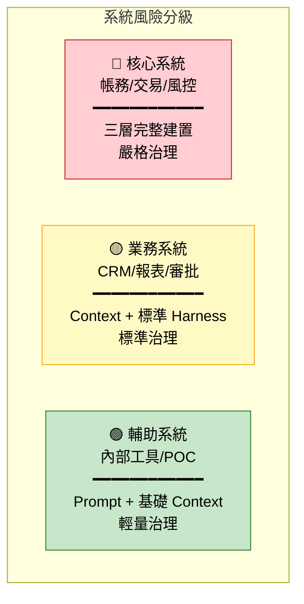

#### 6.5.2 跨系統 Context 共享策略

| 層級 | 共享方式 | 內容 | 管理 |
|------|---------|------|------|
| **企業級** | 共用 Git Repo（company-standards） | 安全規範、命名標準、Prompt 禁令 | 架構委員會 |
| **產品線級** | Git Submodule 或 NPM Package | 產品線架構規範、共用 ADR | 產品線架構師 |
| **專案級** | copilot-instructions.md | 專案特定架構與規則 | Tech Lead |

```text
跨系統 Context 繼承關係：
公司標準（company-standards/copilot-instructions.md）
  └── 產品線規範（banking-platform/copilot-instructions.md）
      ├── 核心銀行系統（core-banking/copilot-instructions.md）
      ├── CRM 系統（crm-system/copilot-instructions.md）
      └── 報表系統（reporting/copilot-instructions.md）
```

#### 6.5.3 跨系統 Harness 共享策略

```yaml
# 共用 CI/CD Template（.github/workflows/共用模板）
# reusable-ai-validation.yml
name: Reusable AI Code Validation

on:
  workflow_call:
    inputs:
      risk-level:
        required: true
        type: string  # core | business | utility
      java-version:
        required: false
        type: string
        default: '17'

jobs:
  basic-validation:
    # 所有系統都執行
    runs-on: ubuntu-latest
    steps:
      - uses: actions/checkout@v4
      - name: Compile
        run: mvn compile
      - name: Unit Tests
        run: mvn test

  architecture-validation:
    # core 和 business 系統執行
    if: inputs.risk-level == 'core' || inputs.risk-level == 'business'
    runs-on: ubuntu-latest
    steps:
      - name: ArchUnit Tests
        run: mvn test -Dtest="*ArchitectureTest"
      - name: SonarQube
        run: mvn sonar:sonar

  security-validation:
    # 僅 core 系統執行
    if: inputs.risk-level == 'core'
    runs-on: ubuntu-latest
    steps:
      - name: OWASP Check
        run: mvn dependency-check:check
      - name: SpotBugs Security
        run: mvn spotbugs:check
      - name: DAST Scan
        run: ./scripts/run-zap-scan.sh
```

> **💡 實務提示**：跨系統策略的關鍵是「統一標準但分級執行」。不要對所有系統套用相同的 Harness 強度——核心系統需要最嚴格的驗證，而內部工具可以更敏捷。

---

## 第七章：最佳實務（Best Practices）

> **章節摘要**：本章提供可直接落地的團隊規範、文件設計、Prompt 模板與 AI 治理建議。

### 7.1 團隊開發規範

#### 7.1.1 AI 使用四原則

1. **AI 產出必須被審查**：所有 AI 生成的程式碼必須經過人工 Code Review
2. **以 Context 代替重複 Prompt**：團隊知識應寫入文件，而非每次口述給 AI
3. **以 Harness 代替人工驗證**：可自動化的檢查不依賴人工
4. **敏感資訊不進 Prompt**：禁止在 Prompt 中包含密碼、金鑰、客戶資料

#### 7.1.2 開發流程規範

```text
標準開發流程：

1. 確認需求 → 更新 TASK.md
2. 開啟相關 Context 檔案（copilot-instructions.md、ADR、Interface）
3. 使用 Prompt Template 引導 AI 開發
4. AI 產出 → 自行初步 Review
5. 提交 PR → 自動化 Harness 驗證（ArchUnit + SonarQube + Test）
6. 通過驗證 → 人工 Code Review
7. 合併 → 部署
```

### 7.2 文件設計方式

#### 7.2.1 必備文件清單

| 文件 | 用途 | 更新頻率 |
|------|------|---------|
| `.github/copilot-instructions.md` | Copilot 專案規範 | 每次架構變更 |
| `docs/adr/ADR-xxx.md` | 架構決策記錄 | 每次重要決策 |
| `docs/domain-rules/` | 領域業務規則 | 需求變更時 |
| `docs/api-spec/*.yaml` | OpenAPI 規格 | API 變更時 |
| `README.md` | 專案總覽 | 隨時更新 |
| `.github/PROMPT_TEMPLATES.md` | Prompt 範本庫 | 定期優化 |

#### 7.2.2 文件撰寫原則

```markdown
## 文件撰寫原則（供 AI 理解的文件格式）

1. **結構化**：使用清楚的標題層級和條列
2. **具體化**：要寫「使用 BigDecimal」而非「使用適當型別」
3. **範例化**：每條規則附上 Good/Bad 範例
4. **可機器讀取**：避免純敘述，多用表格、列表、程式碼區塊
5. **保持精簡**：Context Window 有限，文件要精準不冗贅
```

### 7.3 Prompt Template 設計

#### 7.3.1 Prompt 模板結構

```markdown
# [功能名稱] Prompt 模板

## 角色
你是 [角色描述]

## 技術棧
- [技術 1]
- [技術 2]

## 架構規範
- [規範 1]
- [規範 2]

## 任務
[具體任務描述]

## 輸出要求
- [要求 1]
- [要求 2]

## 範例
[參考範例]
```

#### 7.3.2 常用 Prompt 模板

**模板 1：API 開發**

```text
## 角色
你是銀行核心系統資深 Java 工程師，熟悉 Clean Architecture。

## 任務
依照 Clean Architecture 開發 [功能名稱] API：
- Endpoint: [METHOD] [PATH]
- 功能：[描述]
- 商業規則：[規則列表]

## 輸出
請產出以下檔案：
1. Controller（Presentation Layer）
2. UseCase Interface + Implementation（Application Layer）
3. Domain Entity / Value Object（Domain Layer）
4. Repository Interface（Domain Layer）
5. 對應的 JUnit 測試

## 約束
- 使用 BigDecimal 處理金額
- 包含 @Valid 驗證
- 包含 JavaDoc
- 遵循 copilot-instructions.md 中的命名規範
```

**模板 2：Code Review**

```text
## 角色
你是銀行系統資深架構師，專注於安全與效能。

## 任務
審查以下程式碼，檢查：
1. 安全性：SQL Injection, XSS, 敏感資訊洩漏
2. 效能：N+1 Query, 不必要的記憶體分配
3. 架構：是否符合 Clean Architecture 分層規範
4. 業務邏輯：金額計算是否使用 BigDecimal
5. 可維護性：命名是否清楚、職責是否單一

## 輸出格式
| 行號 | 嚴重度 | 類別 | 問題描述 | 建議修正 |
```

**模板 3：Test 生成**

```text
## 角色
你是 QA 工程師，擅長設計邊界測試案例。

## 任務
為 [類別名稱] 生成完整的 JUnit 5 測試，需涵蓋：
1. Happy Path（正常流程）
2. Edge Case（邊界值：null、空值、最大值、最小值）
3. Error Path（例外情境：餘額不足、帳戶不存在、超過限額）
4. Concurrent（併發情境，若適用）

## 技術要求
- 使用 @ExtendWith(MockitoExtension.class)
- Mock 外部依賴（Repository, 第三方 API）
- 使用 AssertJ 斷言
- 測試方法命名：should_[預期結果]_when_[條件]
```

### 7.4 AI 使用治理（Governance）

#### 7.4.1 治理框架

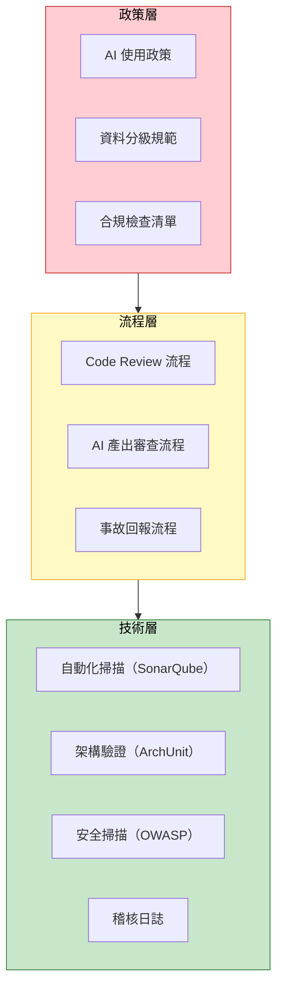

#### 7.4.2 資料分級與 AI 使用限制

| 資料等級 | 說明 | AI 使用限制 |
|---------|------|-----------|
| **公開** | 公開 API 文件、開源範例 | 可自由使用 AI |
| **內部** | 架構文件、技術規範 | 可使用 AI，但不含客戶資料 |
| **機密** | 客戶資料、交易記錄 | 禁止將真實資料輸入 AI |
| **最高機密** | 加密金鑰、根憑證 | 完全禁止使用 AI |

#### 7.4.3 AI 產出審查清單

```markdown
## AI 產出審查 Checklist

### 安全性
- [ ] 無 SQL Injection 風險（使用 Parameterized Query）
- [ ] 無 XSS 風險（輸入已驗證、輸出已編碼）
- [ ] 無敏感資訊硬編碼（密碼、金鑰）
- [ ] 日誌中無敏感資料

### 架構合規
- [ ] 符合 Clean Architecture 分層
- [ ] Domain Layer 無外部依賴
- [ ] Controller 無商業邏輯

### 業務邏輯
- [ ] 金額使用 BigDecimal
- [ ] 涉及帳務的操作有交易控制
- [ ] 有完整的異動日誌

### 測試
- [ ] 有對應的單元測試
- [ ] 覆蓋率 ≥ 80%
- [ ] 包含邊界案例

### 效能
- [ ] 無 N+1 Query
- [ ] 批次操作使用 Batch Processing
- [ ] 大量資料使用分頁查詢
```

> **💡 實務提示**：在團隊導入初期，將此 Checklist 印出貼在每位開發者的桌上，養成習慣後再逐步自動化。

### 7.5 KPI 與成效衡量

#### 7.5.1 AI 輔助開發效果衡量指標

量化 AI 輔助開發的成效對持續投資和改善至關重要：

| 類別 | KPI 指標 | 衡量方式 | 目標值 |
|------|---------|---------|--------|
| **生產力** | 程式碼產出速度 | PR 從建立到合併的平均時間 | 較導入前縮短 30%+ |
| **生產力** | AI Acceptance Rate | Copilot 建議被採納的比率 | ≥ 30% |
| **生產力** | Issue Close Time | Issue 從開到關的平均時間 | 較導入前縮短 25%+ |
| **品質** | Bug Rate | 每千行程式碼的 Bug 數量 | 較導入前降低 20%+ |
| **品質** | Code Coverage | 單元測試覆蓋率 | ≥ 80% |
| **品質** | SonarQube Rating | 程式碼品質等級 | A |
| **安全** | 弱掃發現數量 | OWASP/SpotBugs 發現數 | 0 Critical, 0 High |
| **安全** | 安全事故數 | AI 導致的安全問題數量 | 0 |
| **體驗** | 開發者滿意度 | 季度問卷調查 | ≥ 4.0/5.0 |
| **架構** | Architecture Violation | ArchUnit 違規數量 | 0 |

#### 7.5.2 各層級 KPI 追蹤

```mermaid
graph LR
    subgraph PromptKPI["Prompt KPI"]
        PK1["AI Acceptance Rate"]
        PK2["Prompt 模板使用率"]
        PK3["敏感資料洩漏事件: 0"]
    end
    
    subgraph ContextKPI["Context KPI"]
        CK1["copilot-instructions.md 更新頻率"]
        CK2["ADR 覆蓋率"]
        CK3["AI 產出架構一致性"]
    end
    
    subgraph HarnessKPI["Harness KPI"]
        HK1["CI 通過率"]
        HK2["架構違規數: 0"]
        HK3["安全弱掃 Critical: 0"]
        HK4["PR 驗證時間 < 10min"]
    end
    
    style PromptKPI fill:#FFF3CD,stroke:#FF8C00,color:#000
    style ContextKPI fill:#D1ECF1,stroke:#0C5460,color:#000
    style HarnessKPI fill:#E2D5F1,stroke:#6F42C1,color:#000
```

#### 7.5.3 成效報告模板

```markdown
# AI 輔助開發月報 — [YYYY-MM]

## 📊 關鍵指標摘要

| 指標 | 本月 | 上月 | 變化 | 目標 |
|------|------|------|------|------|
| PR 合併平均時間 | 2.3 天 | 3.1 天 | ↓ 25.8% | < 3 天 |
| AI Acceptance Rate | 35% | 28% | ↑ 7% | ≥ 30% |
| Bug Rate (per KLOC) | 1.2 | 1.8 | ↓ 33.3% | < 2.0 |
| Code Coverage | 82% | 78% | ↑ 4% | ≥ 80% |
| Architecture Violations | 0 | 2 | ↓ 100% | 0 |
| Security Critical Issues | 0 | 0 | — | 0 |

## 📈 趨勢圖（建議使用 Grafana Dashboard）

## 💡 改善行動
- [行動 1]
- [行動 2]

## ⚠️ 待解決問題
- [問題 1]
```

> **💡 實務提示**：KPI 數據應自動收集（透過 GitHub API + SonarQube API + CI 日誌），避免人工統計帶來的偏差與額外負擔。建議建立 Grafana Dashboard 進行可視化追蹤。

---

## 第八章：常見錯誤（Anti-pattern）

> **章節摘要**：本章列出在三個層級中最常見的錯誤模式，並提供修正建議。

### 8.1 Prompt 層 Anti-pattern

#### ❌ Anti-pattern 1：模糊 Prompt

```text
// 錯誤
幫我寫一個 API

// 正確
使用 Java 17 + Spring Boot 3.2，依照 Clean Architecture 撰寫
帳戶查詢 API（GET /api/v1/accounts/{accountId}），
Controller 只做 HTTP 映射，商業邏輯放在 UseCase，
回傳 AccountResponse（含 accountId, balance, currency, status）。
```

#### ❌ Anti-pattern 2：Prompt 中包含敏感資訊

```text
// 錯誤 ⚠️
幫我連接資料庫，連線字串是 jdbc:postgresql://prod-db:5432/bank?user=admin&password=P@ssw0rd123

// 正確
幫我撰寫 Spring Boot 的資料庫連線設定，
使用環境變數 ${DB_URL}, ${DB_USERNAME}, ${DB_PASSWORD}
```

#### ❌ Anti-pattern 3：過度依賴 AI 直接產出

```text
// 錯誤（直接複製貼上 AI 產出，不審查）
AI 說什麼就用什麼

// 正確
1. AI 產出 → 2. 理解程式碼邏輯 → 3. 對照規範檢查 → 4. 修正不合規之處 → 5. 提交
```

### 8.2 Context 層 Anti-pattern

#### ❌ Anti-pattern 4：Context 過載

```text
// 錯誤：將整個專案所有文件都塞進 Context
把所有 100+ 個 Java 檔案全部打開讓 Copilot 讀

// 正確：只提供與當前任務相關的 Context
開發轉帳 API 時，只開啟：
- TransferController.java
- TransferUseCase.java
- Account.java (Domain Model)
- copilot-instructions.md
```

#### ❌ Anti-pattern 5：Context 過時

```text
// 錯誤
copilot-instructions.md 半年沒更新，
但團隊已從 Java 11 升到 Java 17，
AI 仍按照 Java 11 風格產出程式碼。

// 正確
設定定期（每月/每季）Review copilot-instructions.md
指定專人負責維護
```

#### ❌ Anti-pattern 6：Context 矛盾

```text
// 錯誤
copilot-instructions.md 說用 UUID 當主鍵，
但 ADR-003 說用 BIGINT 自增主鍵。
AI 產出的程式碼時而 UUID 時而 BIGINT。

// 正確
維護單一事實來源（Single Source of Truth），
文件之間不能有矛盾。定期執行一致性 Review。
```

### 8.3 Harness 層 Anti-pattern

#### ❌ Anti-pattern 7：無 Harness（裸奔模式）

```text
// 錯誤
AI 產出的程式碼直接 push，沒有 CI、沒有測試、沒有掃描。

// 正確
至少有：
1. 編譯檢查（mvn compile）
2. 單元測試（mvn test）
3. 架構測試（ArchUnit）
4. 程式碼品質（SonarQube）
```

#### ❌ Anti-pattern 8：Harness 過重

```text
// 錯誤
每次 PR 要跑 45 分鐘的完整掃描（含壓力測試、E2E、安全掃描），
導致開發效率極低。

// 正確
分層驗證：
- PR 階段：快速檢查（編譯 + 單元測試 + ArchUnit）< 5 分鐘
- Merge 後：完整掃描（SonarQube + 安全掃描）< 15 分鐘
- 部署前：E2E + 壓力測試 < 30 分鐘
```

#### ❌ Anti-pattern 9：Harness 不回饋

```text
// 錯誤
CI 失敗了，只顯示 "BUILD FAILED"，
開發者不知道哪裡違規，也不知道如何修正。

// 正確
失敗訊息應清楚指出：
- 哪條規則被違反
- 違規的程式碼位置
- 如何修正（提供修正建議或參考文件連結）
```

> **⚠️ 注意**：最危險的 Anti-pattern 是「只停留在 Level 1(Prompt) 就以為導入了 AI 輔助開發」。這會導致團隊產出品質參差不齊，並在安全與合規方面埋下隱患。

### 8.4 跨層 Anti-pattern

#### ❌ Anti-pattern 10：Context 與 Harness 脫節

```text
// 錯誤
copilot-instructions.md 要求使用 Clean Architecture，
但 CI/CD 中沒有 ArchUnit 測試來驗證。
AI 產出的程式碼可能違反分層規則，卻順利通過 CI。

// 正確
Context 中定義的每條架構規則，Harness 中都有對應的自動驗證：
- Context: "Controller 不做商業邏輯" → Harness: ArchUnit rule
- Context: "金額用 BigDecimal" → Harness: SpotBugs custom rule
- Context: "API 需 JWT 認證" → Harness: Security integration test
```

#### ❌ Anti-pattern 11：Prompt Template 無人維護

```text
// 錯誤
半年前建立了 10 個 Prompt Template，但：
- 技術棧已從 Java 11 升到 Java 17
- 架構從 MVC 改為 Clean Architecture
- 模板仍然是舊版內容
團隊繼續使用舊模板，AI 產出的程式碼風格混亂

// 正確
建立 Template 維護機制：
1. 指定 Template Owner
2. 每次架構變更同步更新 Template
3. Template 版本控制（放在 Git 中）
4. 定期（每季）Review 所有 Template
```

#### ❌ Anti-pattern 12：工具導入後缺乏培訓

```text
// 錯誤
花了大量資源建立完整的 Context + Harness：
- copilot-instructions.md ✅
- ADR 文件 ✅
- ArchUnit + SonarQube + CI/CD ✅
但團隊成員不知道如何使用：
- 不知道有 Prompt Template
- 不知道有 copilot-instructions.md
- 不知道 CI 失敗該怎麼修
結果：工具利用率 < 20%

// 正確
1. 導入前：培訓計畫（至少 2 小時 Workshop）
2. 導入後：定期 Office Hour（每週 30 分鐘 Q&A）
3. 持續：建立內部 FAQ + Troubleshooting 文件
4. 量化：追蹤 Copilot Acceptance Rate 和模板使用率
```

#### ❌ Anti-pattern 13：AI 產出未經理解直接合併

```text
// 錯誤（最危險的跨層 Anti-pattern）
1. 使用 Prompt 讓 AI 生成一段程式碼
2. 通過了 Context 規範的檢查（命名正確、結構正確）
3. 通過了 Harness 驗證（CI 綠燈）
4. Code Reviewer 因為「AI 寫的應該沒問題」而快速 Approve
5. 結果：程式碼中存在邏輯錯誤（如匯率計算方向反轉）

// 正確
三層驗證都通過後，人工 Review 仍然是必要的：
- 理解程式碼邏輯（不只看風格）
- 對照需求驗證業務邏輯
- 特別檢查 AI 常犯的邏輯反轉、邊界遺漏
```

### 8.5 Anti-pattern 速查表

| 編號 | Anti-pattern | 層級 | 風險等級 | 修正成本 |
|:----:|-------------|------|:-------:|:-------:|
| 1 | 模糊 Prompt | Prompt | 🟡 中 | 低 |
| 2 | Prompt 含敏感資訊 | Prompt | 🔴 高 | 低 |
| 3 | 過度依賴 AI 直接產出 | Prompt | 🔴 高 | 中 |
| 4 | Context 過載 | Context | 🟡 中 | 低 |
| 5 | Context 過時 | Context | 🟡 中 | 中 |
| 6 | Context 矛盾 | Context | 🔴 高 | 中 |
| 7 | 無 Harness（裸奔模式） | Harness | 🔴 高 | 高 |
| 8 | Harness 過重 | Harness | 🟡 中 | 中 |
| 9 | Harness 不回饋 | Harness | 🟡 中 | 低 |
| 10 | Context 與 Harness 脫節 | 跨層 | 🔴 高 | 高 |
| 11 | Template 無人維護 | 跨層 | 🟡 中 | 低 |
| 12 | 導入後缺乏培訓 | 跨層 | 🟡 中 | 中 |
| 13 | AI 產出未經理解直接合併 | 跨層 | 🔴 高 | 低 |

> **⚠️ 銀行系統特別提醒**：Anti-pattern #2（Prompt 含敏感資訊）和 #7（無 Harness）在金融系統中屬於「零容忍」等級，一旦發現應立即修正並進行安全審查。

---

## 第九章：結論與展望

> **章節摘要**：以架構思維總結三者定位，並提供團隊落地的具體路徑。

### 9.1 架構思維總結

```mermaid
graph TB
    subgraph System["AI 輔助開發系統"]
        subgraph HarnessLayer["System Layer — Harness Engineering"]
            CI["CI/CD"]
            Agent["AI Agent"]
            Guard["Guardrails"]
            Monitor["監控"]
        end
        
        subgraph ContextLayer["Data Layer — Context Engineering"]
            Docs["專案文件"]
            Rules["領域規則"]
            Knowledge["知識庫"]
            Memory["記憶"]
        end
        
        subgraph PromptLayer["Interface Layer — Prompt Engineering"]
            Chat["對話指令"]
            Comment["程式碼註解"]
            Template["模板"]
        end
    end
    
    Developer["開發者"] --> PromptLayer
    PromptLayer --> ContextLayer
    ContextLayer --> HarnessLayer
    HarnessLayer --> Output["可靠的<br/>AI 輔助產出"]
    
    style PromptLayer fill:#FFF3CD,stroke:#FF8C00,color:#000
    style ContextLayer fill:#D1ECF1,stroke:#0C5460,color:#000
    style HarnessLayer fill:#E2D5F1,stroke:#6F42C1,color:#000
    style Output fill:#C8E6C9,stroke:#2E7D32,color:#000
```

**核心對應關係**：

| 軟體架構層 | AI 工程方法 | 核心職責 |
|-----------|-----------|---------|
| **Interface Layer**（介面層） | Prompt Engineering | 定義與 AI 互動的方式 |
| **Data Layer**（資料層） | Context Engineering | 提供 AI 運作所需的知識 |
| **System Layer**（系統層） | Harness Engineering | 確保 AI 在受控環境中運作 |

**一句話總結**：

> **Prompt 是入口，Context 是基礎，Harness 是保障。三者缺一，AI 輔助開發就不完整。**

### 9.2 團隊落地路徑

#### 階段 1：Quick Win（1-2 週）

```text
目標：全員具備基本 AI 使用能力

✅ 完成 Copilot Chat 基礎培訓
✅ 建立 3-5 個常用 Prompt 模板
✅ 制定「AI 產出必須 Review」規則
✅ 禁止在 Prompt 中輸入敏感資料
```

#### 階段 2：建立規範（1-3 個月）

```text
目標：團隊有統一的 AI 使用規範

✅ 撰寫 copilot-instructions.md
✅ 建立 ADR 文件機制
✅ 設計命名規範與程式模板
✅ 建立 Prompt 模板庫
✅ 定期 Review Context 文件一致性
```

#### 階段 3：系統化（3-6 個月）

```text
目標：AI 輔助開發有完整的驗證與治理

✅ 導入 ArchUnit 架構測試
✅ 整合 SonarQube 品質分析
✅ 建立 CI/CD 自動化驗證流程
✅ 導入 OWASP 安全掃描
✅ 建立 AI 使用治理政策
✅ 設定 MCP Server（視需求）
```

#### 階段 4：持續優化（持續進行）

```text
目標：AI 能力持續演進

🔄 定期 Review 並優化 Prompt 模板
🔄 更新 Context 文件
🔄 增強 Harness 驗證範圍
🔄 收集團隊回饋並改善流程
🔄 追蹤 AI 工具新功能並評估導入
```

### 9.3 ROI 量化框架

#### 9.3.1 成本項目

| 成本類別 | 項目 | 估算方式 |
|---------|------|---------|
| **工具成本** | GitHub Copilot Business 授權 | $19/人/月 × 團隊人數 |
| **建置成本** | Context 文件撰寫 | 架構師工時 × 單位成本 |
| **建置成本** | Harness 系統建置 | DevOps 工時 × 單位成本 |
| **維護成本** | Context 文件更新 | 每月 2-4 人時 |
| **維護成本** | Harness 系統維護 | 每月 4-8 人時 |
| **培訓成本** | 初始培訓 + 持續學習 | 培訓時數 × 團隊人數 × 單位成本 |

#### 9.3.2 效益項目

| 效益類別 | 項目 | 估算方式 |
|---------|------|---------|
| **生產力提升** | 程式碼開發加速 | （節省工時 × 時薪）per 月 |
| **品質提升** | Bug 減少帶來的修復成本節省 | （減少 Bug 數 × 平均修復成本）per 月 |
| **安全性提升** | 安全事故減少 | （避免的事故數 × 平均事故成本） |
| **知識轉移** | 新人 Onboarding 加速 | （節省 Onboarding 天數 × 日薪） |
| **一致性** | 減少架構偏移修復成本 | （節省重構工時 × 時薪） |

#### 9.3.3 ROI 計算公式

```text
年度 ROI = ((年度效益總額 - 年度成本總額) / 年度成本總額) × 100%

範例估算（20人團隊）：
━━━━━━━━━━━━━━━━━━━━━━━━━━━━━━━━━━━━━━
成本：
  Copilot 授權：$19 × 20 × 12 = $4,560/年
  建置成本（攤提）：$15,000/年
  維護成本：$12,000/年
  培訓成本：$5,000/年
  合計：$36,560/年

效益：
  生產力提升（保守估計 20%）：
    20 人 × $80,000 年薪 × 20% = $320,000/年
  Bug 減少（保守估計 15%）：
    100 bugs/年 × $500/bug × 15% = $7,500/年
  新人加速（平均加速 1 週）：
    3 新人/年 × $2,000/週 = $6,000/年
  合計：$333,500/年

ROI = ($333,500 - $36,560) / $36,560 × 100% = 812%
━━━━━━━━━━━━━━━━━━━━━━━━━━━━━━━━━━━━━━
```

> **⚠️ 注意**：以上為保守估算。實際 ROI 取決於團隊規模、專案複雜度、AI 使用熟練度。建議先以 3 個月試點測量實際數據後再推算全年效益。

### 9.4 未來展望（2026-2028）

#### 9.4.1 技術演進預測

```mermaid
timeline
    title AI 輔助開發未來演進
    2026 : AI Coding Agent 成為標準
         : Context Engineering 自動化（RAG + MCP 成熟）
         : Harness 整合 AI Agent 進行自動修復
    2027 : AI 原生開發模式（AI-Native Development）
         : 多 Agent 協作開發框架成熟
         : AI 驅動的持續架構演進
         : 自適應 Harness（AI 自動調整驗證策略）
    2028 : 自主開發 Agent（Autonomous Dev Agent）
         : AI 能獨立完成完整功能開發
         : 人類角色轉變：從「寫程式碼」到「定義意圖與審查」
         : Harness Engineering 成為 AI 治理的核心基礎設施
```

#### 9.4.2 三者的未來角色轉變

| 時期 | Prompt Engineering | Context Engineering | Harness Engineering |
|------|-------------------|-------------------|-------------------|
| **2024-2025** | 核心技能 | 新興技能 | 早期採用 |
| **2026（現在）** | 基礎技能 | 核心技能 | 關鍵技能 |
| **2027-2028** | AI 自動最佳化 | AI 自動維護 | 最核心的基礎設施 |

**趨勢研判**：
1. **Prompt Engineering 的重要性會逐漸降低**：隨著 AI 模型越來越聰明，對 Prompt 的依賴會減少，最終由 AI 自動最佳化 Prompt。
2. **Context Engineering 會被自動化**：RAG、MCP、Knowledge Graph 等技術會讓 Context 的建立和維護更自動化，但「定義什麼知識是重要的」仍需人工決策。
3. **Harness Engineering 會成為最核心的投資**：當 AI 能力越強，確保 AI 在受控環境中運作就越重要。Harness 從「工具」演進為「基礎設施」。

#### 9.4.3 團隊角色轉變建議

| 現有角色 | 未來演進方向 | 需要強化的能力 |
|---------|------------|--------------|
| **初級工程師** | AI 輔助的高效開發者 | Prompt 技巧 → AI 產出審查能力 |
| **資深工程師** | AI 產出的品質把關者 | Context 設計 + Harness 配置 |
| **架構師** | AI 能力的系統設計者 | 三層策略設計 + AI 治理 |
| **Tech Lead** | AI 輔助開發流程的推動者 | 團隊培訓 + KPI 追蹤 |
| **DevOps** | AI Harness 基礎設施建構者 | MCP/Agent/CI 整合 |

> **💡 核心建議**：
> 
> **對個人**：學會 Prompt Engineering 是入門，但真正的競爭力在於 Context Design 和 Harness Architecture。
> 
> **對團隊**：不要只訓練「怎麼問 AI」，要建立「讓 AI 在正確環境中工作」的系統。
> 
> **對組織**：AI 不是工具導入問題，而是系統工程問題。投資 Harness 的回報遠大於投資 Prompt。

---

## 附錄 A：檢查清單（Checklist）

### Prompt Engineering Checklist

- [ ] Prompt 是否具體明確（非模糊描述）
- [ ] 是否指定了技術棧和架構
- [ ] 是否包含輸出格式要求
- [ ] 是否提供了 Good/Bad 範例
- [ ] 是否使用了角色設定
- [ ] 是否避免了敏感資訊
- [ ] 是否使用團隊的 Prompt 模板

### Context Engineering Checklist

- [ ] `copilot-instructions.md` 是否存在且最新
- [ ] ADR 文件是否完整
- [ ] 命名規範是否明確且無矛盾
- [ ] 領域業務規則是否文件化
- [ ] OpenAPI Spec 是否與實作一致
- [ ] 相關的 Interface / Domain Model 是否可被 AI 存取
- [ ] Context 文件是否有定期 Review 機制

### Harness Engineering Checklist

- [ ] 是否有 ArchUnit 架構測試
- [ ] 是否有 SonarQube 品質掃描
- [ ] 是否有 OWASP 安全掃描
- [ ] CI/CD 是否整合上述驗證
- [ ] 失敗訊息是否清楚（含修正建議）
- [ ] PR 驗證時間是否在可接受範圍內（< 10 分鐘）
- [ ] 是否有監控與告警機制
- [ ] AI 使用治理政策是否已制定

### 新進成員快速上手 Checklist

- [ ] 閱讀 `copilot-instructions.md`
- [ ] 閱讀主要 ADR 文件
- [ ] 熟悉 Prompt 模板庫
- [ ] 了解 CI/CD 驗證流程
- [ ] 了解資料分級與 AI 使用限制
- [ ] 完成至少一個小功能的 AI 輔助開發（含完整流程）
- [ ] 通過 Code Review

---

## 附錄 B：詞彙表

| 術語 | 英文 | 說明 |
|------|------|------|
| 提示工程 | Prompt Engineering | 設計有效的 AI 輸入指令 |
| 情境工程 | Context Engineering | 管理 AI 所需的知識與背景 |
| 線束工程 | Harness Engineering | 建構 AI 運作的系統環境 |
| 護欄 | Guardrails | 約束 AI 行為的安全機制 |
| 架構決策記錄 | ADR (Architecture Decision Records) | 記錄重要技術決策的文件 |
| 潔淨架構 | Clean Architecture | 依賴反轉的分層架構模式 |
| 回饋迴路 | Feedback Loop | 輸出結果回饋至輸入改善的循環 |
| 單一事實來源 | Single Source of Truth | 資訊只有一個權威來源 |
| 可觀測性 | Observability | 系統可被監控和診斷的能力 |
| 靜態分析 | Static Analysis | 不執行程式碼便分析程式碼品質 |
| RAG | Retrieval-Augmented Generation | 檢索增強生成技術 |
| MCP | Model Context Protocol | AI 模型與外部工具的通訊協定 |
| 幻覺 | Hallucination | AI 產生看似合理但錯誤的內容 |

---

## 附錄 C：參考資源

### 官方文件
- [GitHub Copilot 文件](https://docs.github.com/en/copilot)
- [GitHub Copilot Custom Instructions](https://code.visualstudio.com/docs/copilot/copilot-customization)
- [VS Code Copilot Agent Mode](https://code.visualstudio.com/docs/copilot/chat/chat-agent-mode)

### 架構與工具
- [ArchUnit](https://www.archunit.org/)
- [SonarQube](https://www.sonarqube.org/)
- [OWASP Dependency-Check](https://owasp.org/www-project-dependency-check/)
- [Spring Boot](https://spring.io/projects/spring-boot)

### 延伸閱讀
- Clean Architecture — Robert C. Martin
- 提示工程指南 — OpenAI
- Context Engineering for AI — Andrej Karpathy
- Model Context Protocol (MCP) — Anthropic
- GitHub Copilot Coding Agent — GitHub Blog

---

## 附錄 D：Prompt Engineering 進階技巧手冊

### D.1 Chain-of-Thought（CoT）思維鏈

**原理**：引導 AI 逐步推理，而非直接給出答案，提高複雜任務的準確性。

**適用場景**：
- 複雜的業務邏輯實作
- 多步驟的重構任務
- 效能分析與最佳化

**範例：銀行利息計算邏輯**

```text
請幫我實作銀行定存利息計算邏輯，請一步一步思考：

第一步：分析需求
- 定存金額（principal）
- 存期（months）
- 年利率（annualRate）
- 計息方式：單利 vs 複利
- 提前解約的利率折扣

第二步：設計類別結構
- DepositCalculator 作為策略介面
- SimpleInterestCalculator 實作單利
- CompoundInterestCalculator 實作複利
- EarlyTerminationCalculator 處理提前解約

第三步：實作計算公式
- 單利：interest = principal × rate × time
- 複利：amount = principal × (1 + rate/n)^(n×t)

第四步：加入邊界條件
- 金額不得為負數
- 存期至少 1 個月
- 利率在合理範圍（0% - 20%）

請使用 Java 17 + Spring Boot 3.2 實作，
遵循 Clean Architecture 分層。
```

### D.2 Few-shot Prompting 範例引導

**原理**：提供幾個「輸入-輸出」範例，讓 AI 學習你期望的模式。

**範例：統一的 DTO 轉換風格**

```text
請依照以下範例風格，為 LoanApplication 建立 DTO 轉換：

範例 1：Account → AccountDTO
public record AccountDTO(
    String accountId,
    String accountType,
    BigDecimal balance,
    LocalDateTime lastUpdated
) {
    public static AccountDTO from(Account entity) {
        return new AccountDTO(
            entity.getId().value(),
            entity.getType().name(),
            entity.getBalance().amount(),
            entity.getLastUpdated()
        );
    }
}

範例 2：Customer → CustomerDTO
public record CustomerDTO(
    String customerId,
    String fullName,
    String email,
    String tier
) {
    public static CustomerDTO from(Customer entity) {
        return new CustomerDTO(
            entity.getId().value(),
            entity.getFullName(),
            entity.getEmail().value(),
            entity.getTier().name()
        );
    }
}

現在請為 LoanApplication 實體建立 LoanApplicationDTO，
LoanApplication 包含：loanId, applicantId, amount, term, 
status, applicationDate, approvedDate（可為 null）
```

### D.3 Constraint-based Prompting 約束導向

**原理**：明確列出約束條件，減少 AI 產生不符合要求的程式碼。

**範例：金融合規 API 開發**

```text
開發帳戶餘額查詢 API，必須遵守以下約束：

【安全約束】
- ❌ 禁止在日誌中記錄完整帳號，只顯示末 4 碼
- ❌ 禁止在 URL 路徑中暴露帳號
- ✅ 必須驗證請求者有權存取該帳戶（RBAC）
- ✅ 必須實作 Rate Limiting（每秒 100 次/用戶）

【架構約束】
- Controller → UseCase → Repository 三層分離
- 使用 Value Object 包裝帳號、金額
- 所有外部呼叫必須有 Circuit Breaker（Resilience4j）
- 回應時間 < 200ms（P99）

【測試約束】
- 單元測試覆蓋率 > 80%
- 必須包含：正常查詢、無權限、帳戶不存在、服務中斷 四種測試案例

【技術棧】
- Java 17, Spring Boot 3.2, Spring Security 6
- 資料庫：PostgreSQL + Spring Data JPA
```

### D.4 Role-Play Prompting 角色扮演

**原理**：讓 AI 扮演特定角色，產生更專業和有深度的回應。

**範例：架構審查**

```text
你是一位擁有 15 年金融系統經驗的首席架構師。
你正在審查一個 Junior 工程師提交的帳戶轉帳 Service：

[貼上程式碼]

請從以下角度進行 Code Review：
1. ACID 事務一致性：轉帳的原子性是否保證？
2. 併發控制：多人同時轉出是否會造成超額？
3. 安全性：有無 IDOR 或 Race Condition 風險？
4. 可觀測性：Log/Metrics/Tracing 是否足夠？
5. 效能：是否有 N+1 查詢或不必要的鎖？

對每個問題，請給出：
- 嚴重度（Critical / Major / Minor）
- 具體問題描述
- 修復建議（含程式碼）
```

### D.5 Tree-of-Thought（ToT）樹狀思維

**原理**：讓 AI 從多個角度探索解法，然後選擇最佳方案。

**範例：系統設計決策**

```text
我們需要為即時交易通知系統選擇訊息佇列方案。

請用以下步驟分析：

方案 A：使用 Apache Kafka
- 分析優點（至少 3 點）
- 分析缺點（至少 3 點）
- 適合的場景
- 營運複雜度評估

方案 B：使用 RabbitMQ
- 分析優點（至少 3 點）
- 分析缺點（至少 3 點）
- 適合的場景
- 營運複雜度評估

方案 C：使用 AWS SQS + SNS
- 分析優點（至少 3 點）
- 分析缺點（至少 3 點）
- 適合的場景
- 營運複雜度評估

基於以下條件選擇最佳方案：
- 每日交易量 50 萬筆
- 延遲要求 < 500ms
- 團隊只有 3 人維運
- 必須支援訊息重試與死信佇列
```

### D.6 Prompt 技巧速查表

| 技巧名稱 | 核心概念 | 適用場景 | 範例開頭 |
|---------|---------|---------|---------|
| **Zero-shot** | 直接提問不給範例 | 簡單、明確的任務 | "請實作一個..." |
| **Few-shot** | 提供 2-3 個範例 | 需要統一風格 | "參考以下範例..." |
| **CoT** | 逐步推理 | 複雜邏輯實作 | "請一步一步思考..." |
| **ToT** | 多方案探索 | 設計決策、選型 | "請比較以下方案..." |
| **Role-Play** | 角色扮演 | Code Review、架構審查 | "你是一位資深..." |
| **Constraint** | 約束導向 | 合規開發、高品質要求 | "必須遵守以下約束..." |
| **Self-Consistency** | 多次生成取共識 | 不確定的問題 | "請提供 3 種不同實作..." |
| **ReAct** | 推理+行動交替 | Agent 模式的任務 | "觀察 → 思考 → 行動..." |

---

## 附錄 E：Context Engineering 設計模式

### E.1 Context Layering Pattern（上下文分層模式）

**意圖**：將上下文資訊按層級組織，確保 AI 總是先取得最重要的資訊。

**結構**：

```text
Layer 0（Always loaded）
├── copilot-instructions.md     # 專案規範、架構原則
├── 技術棧版本資訊              # Java 17, Spring Boot 3.2 等
└── 安全性基本要求              # 金融合規底線

Layer 1（Task-triggered）
├── .prompt.md                  # 任務特定的 Prompt 模板
├── 相關的 Domain Model         # 當前修改涉及的領域模型
└── API 規格                    # OpenAPI spec 片段

Layer 2（On-demand）
├── 相似案例的歷史程式碼         # 參考實作
├── 測試案例範例                # 測試風格指引
└── 架構決策記錄（ADR）         # 歷史決策的背景原因
```

**實作範例**：

```markdown
<!-- .github/copilot-instructions.md (Layer 0) -->
# 全域 Context

## 架構原則
- Clean Architecture: Controller → UseCase → Domain → Infrastructure
- 所有 Domain Entity 必須是 Immutable

## 技術棧
- Java 17, Spring Boot 3.2, Spring Security 6
- PostgreSQL 15, Redis 7
- JUnit 5, Mockito 5, ArchUnit 1.2

## 安全要求
- 所有 API 必須 JWT 認證
- PII 資料 AES-256 加密
- SQL 參數化查詢，禁止字串串接
```

### E.2 Context Refresh Pattern（上下文刷新模式）

**意圖**：確保 AI 取得的上下文資訊不過時，特別是快速變化的架構。

**問題**：Context 文件可能與實際程式碼脫節，導致 AI 產生過時的程式碼。

**解法**：

```yaml
# .github/workflows/context-refresh.yml
name: Context Refresh Check

on:
  pull_request:
    paths:
      - 'pom.xml'
      - 'src/main/java/**/domain/**'
      - 'src/main/java/**/config/**'

jobs:
  check-context:
    runs-on: ubuntu-latest
    steps:
      - uses: actions/checkout@v4
      
      - name: Check context staleness
        run: |
          # 比對 copilot-instructions.md 中的版本與 pom.xml
          POM_JAVA=$(grep -oP '<java.version>\K[^<]+' pom.xml)
          CONTEXT_JAVA=$(grep -oP 'Java \K\d+' .github/copilot-instructions.md)
          
          if [ "$POM_JAVA" != "$CONTEXT_JAVA" ]; then
            echo "::warning::Context 中的 Java 版本 ($CONTEXT_JAVA) 與 pom.xml ($POM_JAVA) 不一致！"
          fi
      
      - name: Notify on staleness
        if: failure()
        run: echo "請更新 .github/copilot-instructions.md 以反映最新架構變更"
```

### E.3 Context Scoping Pattern（上下文範圍模式）

**意圖**：根據不同任務類型提供精確範圍的上下文，避免資訊過載。

**問題**：提供過多不相關的上下文會稀釋重要資訊，降低 AI 的準確性。

**實作**：

```text
專案結構：
.github/
├── copilot-instructions.md           # 全域共用
├── prompts/
│   ├── new-api-endpoint.prompt.md    # 開發新 API 時觸發
│   ├── bug-fix.prompt.md             # 修 Bug 時觸發
│   ├── security-review.prompt.md     # 安全審查時觸發
│   ├── database-migration.prompt.md  # DB 變更時觸發
│   └── performance-tuning.prompt.md  # 效能調校時觸發
```

```markdown
<!-- .github/prompts/new-api-endpoint.prompt.md -->
---
mode: agent
description: "建立新的 REST API 端點"
---

## 任務 Context

你正在為銀行核心系統建立新的 API 端點。

### 必須遵循的 API 規範
- RESTful 命名：`/api/v1/{resource}`
- 統一回應格式：`ApiResponse<T>`
- HTTP Status: 200(成功), 400(驗證失敗), 401(未認證), 403(無權限), 404(不存在), 500(系統錯誤)

### 必須產出的檔案
1. Controller (src/main/java/.../controller/)
2. UseCase (src/main/java/.../usecase/)
3. Request/Response DTO (src/main/java/.../dto/)
4. Unit Tests (src/test/java/...)
5. Integration Test (src/test/java/.../integration/)

### 參考現有 API
@workspace 參考 AccountController 的實作風格
```

### E.4 Context Validation Pattern（上下文驗證模式）

**意圖**：在 CI/CD 中自動驗證 Context 文件的正確性和完整性。

**實作**：

```java
/**
 * ArchUnit 規則：驗證 Context 文件中的架構約束是否一致
 */
@AnalyzeClasses(packages = "com.tutorial")
public class ContextConsistencyTest {

    @ArchTest
    static final ArchRule context_claims_clean_architecture =
        classes().that().resideInAPackage("..controller..")
            .should().onlyDependOnClassesThat()
            .resideInAnyPackage(
                "..controller..", "..usecase..", "..dto..",
                "org.springframework..", "java.."
            )
            .as("copilot-instructions.md 宣稱 Clean Architecture，" +
                "Controller 不應直接依賴 Repository");

    @ArchTest
    static final ArchRule context_claims_immutable_domain =
        classes().that().resideInAPackage("..domain..")
            .should().haveOnlyFinalFields()
            .as("copilot-instructions.md 宣稱 Domain Entity 為 Immutable，" +
                "所有欄位應為 final");
}
```

### E.5 設計模式速查表

| 模式名稱 | 解決的問題 | 適用時機 | 關鍵實作 |
|---------|-----------|---------|---------|
| **Context Layering** | 資訊優先順序混亂 | 專案初始設定 | Layer 0/1/2 分層結構 |
| **Context Refresh** | Context 與程式碼脫節 | CI/CD 整合 | PR 觸發自動檢查 |
| **Context Scoping** | 資訊過載降低準確性 | 多類型任務專案 | 任務型 .prompt.md |
| **Context Validation** | Context 宣稱與實際不符 | 品質保證 | ArchUnit 驗證規則 |
| **Context Sharing** | 跨團隊知識孤島 | 多團隊協作 | Git submodule 共享 |
| **Context Versioning** | Context 變更追溯困難 | 長期維護 | Git 版本控制 + CHANGELOG |

---

> **文件版本**：2.0.0  
> **作者**：架構團隊  
> **最後更新**：2026-03-18  
> **適用範圍**：全團隊  
> **下次 Review 日期**：2026-06-18

