+++
date = '2026-05-14T16:57:32+08:00'
draft = false
title = 'Jakarta EE 12 教學手冊'
tags = ['教學', 'framework']
categories = ['教學']
+++

# Jakarta EE 12 教學手冊

## 文件資訊

| 項目 | 說明 |
|------|------|
| **文件名稱** | Jakarta EE 12 教學手冊 |
| **版本** | 2.0.0 |
| **更新日期** | 2026-05-14 |
| **作者** | 架構團隊 |
| **目標對象** | Java 後端工程師、架構師、DevOps 工程師、Tech Lead |
| **前置知識** | Java SE 基礎、Maven 基礎、SQL 基礎、HTTP 協定基礎 |
| **Jakarta EE 12 狀態** | 開發中（WIP），預計 2026 年下半年正式發布 |
| **Java 最低版本** | Java SE 21 |
| **官方網站** | [jakarta.ee](https://jakarta.ee/) |
| **規格發布頁** | [Jakarta EE 12 Release](https://jakarta.ee/release/12/) |

---

## 目錄

1. [Jakarta EE 12 概觀](#1-jakarta-ee-12-概觀)
   - 1.1 [Jakarta EE 歷史與演進](#11-jakarta-ee-歷史與演進)
   - 1.2 [Jakarta EE 12 定位 — Data Age](#12-jakarta-ee-12-定位--data-age)
   - 1.3 [Jakarta EE 12 核心特色](#13-jakarta-ee-12-核心特色)
   - 1.4 [Jakarta EE 12 治理模式與社群驅動](#14-jakarta-ee-12-治理模式與社群驅動)
   - 1.5 [與 Spring Boot 比較](#15-與-spring-boot-比較)
   - 1.6 [適合與不適合的應用場景](#16-適合與不適合的應用場景)
   - 1.7 [實務注意事項](#17-實務注意事項)
2. [Jakarta EE 12 核心架構](#2-jakarta-ee-12-核心架構)
   - 2.1 [Platform、Web Profile、Core Profile](#21-platformweb-profilecore-profile)
   - 2.2 [模組化架構與規格關係圖](#22-模組化架構與規格關係圖)
   - 2.3 [Jakarta EE Runtime](#23-jakarta-ee-runtime)
   - 2.4 [Jakarta EE 12 完整規格清單](#24-jakarta-ee-12-完整規格清單)
   - 2.5 [候選與前瞻規格](#25-候選與前瞻規格)
   - 2.6 [TCK 認證與相容實作](#26-tck-認證與相容實作)
   - 2.7 [實務注意事項](#27-實務注意事項)
3. [Java 21 與 Java 25](#3-java-21-與-java-25)
   - 3.1 [為何 Jakarta EE 12 要求 Java 21](#31-為何-jakarta-ee-12-要求-java-21)
   - 3.2 [Virtual Thread（虛擬執行緒）](#32-virtual-thread虛擬執行緒)
   - 3.3 [Structured Concurrency（結構化並行）](#33-structured-concurrency結構化並行)
   - 3.4 [Record 與 Pattern Matching](#34-record-與-pattern-matching)
   - 3.5 [Sequenced Collection 與 Scoped Values](#35-sequenced-collection-與-scoped-values)
   - 3.6 [Java 25 新特性](#36-java-25-新特性)
   - 3.7 [JVM 調校建議](#37-jvm-調校建議)
   - 3.8 [實務注意事項](#38-實務注意事項)
4. [開發環境建置](#4-開發環境建置)
   - 4.1 [JDK 21 安裝](#41-jdk-21-安裝)
   - 4.2 [Maven 與 Gradle 安裝](#42-maven-與-gradle-安裝)
   - 4.3 [IDE 設定 — VS Code 與 IntelliJ IDEA](#43-ide-設定--vs-code-與-intellij-idea)
   - 4.4 [Docker Desktop 與 Podman](#44-docker-desktop-與-podman)
   - 4.5 [Kubernetes 與 kubectl](#45-kubernetes-與-kubectl)
   - 4.6 [Jakarta EE Starter 快速建立](#46-jakarta-ee-starter-快速建立)
   - 4.7 [實務注意事項](#47-實務注意事項)
5. [Jakarta EE 12 Application Server](#5-jakarta-ee-12-application-server)
   - 5.1 [Open Liberty](#51-open-liberty)
   - 5.2 [Payara](#52-payara)
   - 5.3 [WildFly](#53-wildfly)
   - 5.4 [GlassFish](#54-glassfish)
   - 5.5 [四大 Server 比較表](#55-四大-server-比較表)
   - 5.6 [選型建議](#56-選型建議)
   - 5.7 [實務注意事項](#57-實務注意事項)
6. [Maven 專案建立](#6-maven-專案建立)
   - 6.1 [Multi Module 專案架構](#61-multi-module-專案架構)
   - 6.2 [Parent POM 設計](#62-parent-pom-設計)
   - 6.3 [各層模組 POM](#63-各層模組-pom)
   - 6.4 [dependencyManagement 與 pluginManagement](#64-dependencymanagement-與-pluginmanagement)
   - 6.5 [Maven Archetype](#65-maven-archetype)
   - 6.6 [實務注意事項](#66-實務注意事項)
7. [Clean Architecture](#7-clean-architecture)
   - 7.1 [Domain Driven Design（DDD）](#71-domain-driven-designddd)
   - 7.2 [Hexagonal Architecture](#72-hexagonal-architecture)
   - 7.3 [Clean Architecture 原則](#73-clean-architecture-原則)
   - 7.4 [Ports and Adapters](#74-ports-and-adapters)
   - 7.5 [Repository Pattern 與 Service Layer](#75-repository-pattern-與-service-layer)
   - 7.6 [完整專案目錄結構](#76-完整專案目錄結構)
   - 7.7 [實務注意事項](#77-實務注意事項)
8. [Jakarta CDI 5.0](#8-jakarta-cdi-50)
   - 8.1 [Dependency Injection 基礎](#81-dependency-injection-基礎)
   - 8.2 [Bean Scope](#82-bean-scope)
   - 8.3 [Eager Initialization](#83-eager-initialization)
   - 8.4 [Producer 與 Qualifier](#84-producer-與-qualifier)
   - 8.5 [Interceptor 與 Decorator](#85-interceptor-與-decorator)
   - 8.6 [Event 機制](#86-event-機制)
   - 8.7 [BuildCompatibleExtension](#87-buildcompatibleextension)
   - 8.8 [實務注意事項](#88-實務注意事項)
9. [Jakarta RESTful Web Services 5.0](#9-jakarta-restful-web-services-50)
   - 9.1 [REST API 設計原則](#91-rest-api-設計原則)
   - 9.2 [JSON-B 3.1 與資料綁定](#92-json-b-31-與資料綁定)
   - 9.3 [Bean Validation 4.0](#93-bean-validation-40)
   - 9.4 [Exception Handling](#94-exception-handling)
   - 9.5 [CRUD API 完整實作](#95-crud-api-完整實作)
   - 9.6 [分頁、排序與過濾](#96-分頁排序與過濾)
   - 9.7 [OpenAPI 整合](#97-openapi-整合)
   - 9.8 [JWT Security](#98-jwt-security)
   - 9.9 [實務注意事項](#99-實務注意事項)
10. [Jakarta Persistence 4.0](#10-jakarta-persistence-40)
    - 10.1 [JPA 核心概念](#101-jpa-核心概念)
    - 10.2 [Entity 設計](#102-entity-設計)
    - 10.3 [Repository Pattern 實作](#103-repository-pattern-實作)
    - 10.4 [Transaction 管理](#104-transaction-管理)
    - 10.5 [Lock 策略](#105-lock-策略)
    - 10.6 [Lazy Loading 與效能](#106-lazy-loading-與效能)
    - 10.7 [Query 最佳化](#107-query-最佳化)
    - 10.8 [實務注意事項](#108-實務注意事項)
11. [Jakarta Data 1.1](#11-jakarta-data-11)
    - 11.1 [Jakarta Query 1.0 統一查詢語言](#111-jakarta-query-10-統一查詢語言)
    - 11.2 [Fluent Query 與動態限制條件](#112-fluent-query-與動態限制條件)
    - 11.3 [Repository 抽象化與狀態管理](#113-repository-抽象化與狀態管理)
    - 11.4 [Record Projection 與 NoSQL 支援](#114-record-projection-與-nosql-支援)
    - 11.5 [與 Spring Data JPA 比較](#115-與-spring-data-jpa-比較)
    - 11.6 [實務注意事項](#116-實務注意事項)
12. [Jakarta Security 5.0](#12-jakarta-security-50)
    - 12.1 [Security 5.0 架構重構](#121-security-50-架構重構)
    - 12.2 [JWT 實作](#122-jwt-實作)
    - 12.3 [OAuth2 與 OpenID Connect](#123-oauth2-與-openid-connect)
    - 12.4 [RBAC 角色存取控制與 Permission Store](#124-rbac-角色存取控制與-permission-store)
    - 12.5 [多重認證機制](#125-多重認證機制)
    - 12.6 [API Security](#126-api-security)
    - 12.7 [OWASP Top 10 防護](#127-owasp-top-10-防護)
    - 12.8 [Secure Coding 實務](#128-secure-coding-實務)
    - 12.9 [實務注意事項](#129-實務注意事項)
13. [Jakarta Concurrency 3.2](#13-jakarta-concurrency-32)
    - 13.1 [ManagedExecutorService](#131-managedexecutorservice)
    - 13.2 [Async Processing](#132-async-processing)
    - 13.3 [Virtual Thread 整合](#133-virtual-thread-整合)
    - 13.4 [高併發設計模式](#134-高併發設計模式)
    - 13.5 [實務注意事項](#135-實務注意事項)
14. [Jakarta Batch 2.2](#14-jakarta-batch-22)
    - 14.1 [批次架構概觀](#141-批次架構概觀)
    - 14.2 [Job 與 Step 設計](#142-job-與-step-設計)
    - 14.3 [Chunk Processing](#143-chunk-processing)
    - 14.4 [Retry 與 Skip 策略](#144-retry-與-skip-策略)
    - 14.5 [Parallel Processing](#145-parallel-processing)
    - 14.6 [實務注意事項](#146-實務注意事項)
15. [Cache 與 MQ](#15-cache-與-mq)
    - 15.1 [Redis 整合](#151-redis-整合)
    - 15.2 [Kafka 整合](#152-kafka-整合)
    - 15.3 [RabbitMQ 整合](#153-rabbitmq-整合)
    - 15.4 [Jakarta Messaging 3.1](#154-jakarta-messaging-31)
    - 15.5 [實務注意事項](#155-實務注意事項)
16. [Kubernetes 與雲原生](#16-kubernetes-與雲原生)
    - 16.1 [Dockerfile 設計](#161-dockerfile-設計)
    - 16.2 [Kubernetes Deployment](#162-kubernetes-deployment)
    - 16.3 [Service 與 Ingress](#163-service-與-ingress)
    - 16.4 [ConfigMap 與 Secret](#164-configmap-與-secret)
    - 16.5 [HPA 與 Rolling Update](#165-hpa-與-rolling-update)
    - 16.6 [HTTP/3 支援](#166-http3-支援)
    - 16.7 [實務注意事項](#167-實務注意事項)
17. [MicroProfile 與 Jakarta Config](#17-microprofile-與-jakarta-config)
    - 17.1 [Config](#171-config)
    - 17.2 [Jakarta Config 1.0（候選）](#172-jakarta-config-10候選)
    - 17.3 [Health](#173-health)
    - 17.4 [Metrics](#174-metrics)
    - 17.5 [OpenAPI](#175-openapi)
    - 17.6 [JWT Propagation](#176-jwt-propagation)
    - 17.7 [Fault Tolerance](#177-fault-tolerance)
    - 17.8 [實務注意事項](#178-實務注意事項)
18. [CI/CD](#18-cicd)
    - 18.1 [GitHub Actions](#181-github-actions)
    - 18.2 [Jenkins Pipeline](#182-jenkins-pipeline)
    - 18.3 [SonarQube 整合](#183-sonarqube-整合)
    - 18.4 [Trivy 與 OWASP Dependency Check](#184-trivy-與-owasp-dependency-check)
    - 18.5 [SBOM 產生與 CRA 合規](#185-sbom-產生與-cra-合規)
    - 18.6 [實務注意事項](#186-實務注意事項)
19. [SSDLC](#19-ssdlc)
    - 19.1 [Secure SDLC 概觀](#191-secure-sdlc-概觀)
    - 19.2 [SAST 靜態分析](#192-sast-靜態分析)
    - 19.3 [DAST 動態測試](#193-dast-動態測試)
    - 19.4 [Dependency Scan](#194-dependency-scan)
    - 19.5 [Container Scan 與 Secret Scan](#195-container-scan-與-secret-scan)
    - 19.6 [實務注意事項](#196-實務注意事項)
20. [AI 協作開發](#20-ai-協作開發)
    - 20.1 [Jakarta Agentic AI 1.0（前瞻規格）](#201-jakarta-agentic-ai-10前瞻規格)
    - 20.2 [GitHub Copilot 整合](#202-github-copilot-整合)
    - 20.3 [Claude 與 ChatGPT 協作](#203-claude-與-chatgpt-協作)
    - 20.4 [Gemini 整合](#204-gemini-整合)
    - 20.5 [AI 輔助開發工作流](#205-ai-輔助開發工作流)
    - 20.6 [實務注意事項](#206-實務注意事項)
21. [Monitoring 與維運](#21-monitoring-與維運)
    - 21.1 [Prometheus 監控](#211-prometheus-監控)
    - 21.2 [Grafana 視覺化](#212-grafana-視覺化)
    - 21.3 [ELK Stack](#213-elk-stack)
    - 21.4 [OpenTelemetry 與 Distributed Tracing](#214-opentelemetry-與-distributed-tracing)
    - 21.5 [實務注意事項](#215-實務注意事項)
22. [Testing](#22-testing)
    - 22.1 [JUnit 5](#221-junit-5)
    - 22.2 [Mockito](#222-mockito)
    - 22.3 [Testcontainers](#223-testcontainers)
    - 22.4 [Integration Test](#224-integration-test)
    - 22.5 [API Test](#225-api-test)
    - 22.6 [實務注意事項](#226-實務注意事項)
23. [Migration](#23-migration)
    - 23.1 [Java EE → Jakarta EE](#231-java-ee--jakarta-ee)
    - 23.2 [Jakarta EE 10/11 → Jakarta EE 12](#232-jakarta-ee-1011--jakarta-ee-12)
    - 23.3 [Spring Boot → Jakarta EE](#233-spring-boot--jakarta-ee)
    - 23.4 [Eclipse Transformer 工具](#234-eclipse-transformer-工具)
    - 23.5 [實務注意事項](#235-實務注意事項)
24. [大型企業最佳實務](#24-大型企業最佳實務)
    - 24.1 [銀行業案例](#241-銀行業案例)
    - 24.2 [保險業案例](#242-保險業案例)
    - 24.3 [電商平台案例](#243-電商平台案例)
    - 24.4 [政府系統案例](#244-政府系統案例)
    - 24.5 [SaaS 平台案例](#245-saas-平台案例)
    - 24.6 [實務注意事項](#246-實務注意事項)
25. [團隊建立指南](#25-團隊建立指南)
    - 25.1 [Team Topology](#251-team-topology)
    - 25.2 [技能矩陣與學習路線](#252-技能矩陣與學習路線)
    - 25.3 [培訓方式與 Code Review 規範](#253-培訓方式與-code-review-規範)
    - 25.4 [實務注意事項](#254-實務注意事項)
26. [DevSecOps 與 Git Flow](#26-devsecops-與-git-flow)
    - 26.1 [Branch Strategy](#261-branch-strategy)
    - 26.2 [Git Flow vs Trunk Based Development](#262-git-flow-vs-trunk-based-development)
    - 26.3 [Release Strategy](#263-release-strategy)
    - 26.4 [實務注意事項](#264-實務注意事項)
27. [上線與維運](#27-上線與維運)
    - 27.1 [Production Deployment](#271-production-deployment)
    - 27.2 [Blue-Green 與 Canary 部署](#272-blue-green-與-canary-部署)
    - 27.3 [Rollback 策略](#273-rollback-策略)
    - 27.4 [DR、Backup 與 HA](#274-drbackup-與-ha)
    - 27.5 [實務注意事項](#275-實務注意事項)
28. [效能調校](#28-效能調校)
    - 28.1 [JVM Tuning](#281-jvm-tuning)
    - 28.2 [GC Tuning](#282-gc-tuning)
    - 28.3 [Connection Pool 調校](#283-connection-pool-調校)
    - 28.4 [SQL Optimization](#284-sql-optimization)
    - 28.5 [Thread Pool 設計](#285-thread-pool-設計)
    - 28.6 [實務注意事項](#286-實務注意事項)
29. [常見問題 FAQ](#29-常見問題-faq)
30. [Troubleshooting](#30-troubleshooting)
    - 30.1 [啟動問題](#301-啟動問題)
    - 30.2 [記憶體問題](#302-記憶體問題)
    - 30.3 [Kubernetes 問題](#303-kubernetes-問題)
    - 30.4 [JDBC 問題](#304-jdbc-問題)
    - 30.5 [Transaction 問題](#305-transaction-問題)
31. [Appendix](#31-appendix)
    - 31.1 [完整 Parent POM](#311-完整-parent-pom)
    - 31.2 [Dockerfile](#312-dockerfile)
    - 31.3 [docker-compose.yml](#313-docker-composeyml)
    - 31.4 [Kubernetes YAML](#314-kubernetes-yaml)
    - 31.5 [GitHub Actions YAML](#315-github-actions-yaml)
    - 31.6 [Jenkinsfile](#316-jenkinsfile)
    - 31.7 [Logging Configuration](#317-logging-configuration)
32. [Jakarta EE 12 框架比較](#32-jakarta-ee-12-框架比較)
    - 32.1 [Jakarta EE 12 vs Spring Boot 4](#321-jakarta-ee-12-vs-spring-boot-4)
    - 32.2 [Jakarta EE 12 vs Quarkus](#322-jakarta-ee-12-vs-quarkus)
    - 32.3 [Jakarta EE 12 vs Micronaut](#323-jakarta-ee-12-vs-micronaut)
    - 32.4 [Jakarta EE 12 vs Helidon](#324-jakarta-ee-12-vs-helidon)
    - 32.5 [選型建議](#325-選型建議)
33. [檢查清單（Checklist）](#33-檢查清單checklist)

---

## 1. Jakarta EE 12 概觀

### 1.1 Jakarta EE 歷史與演進

#### 從 J2EE 到 Jakarta EE 的二十年旅程

企業級 Java 的歷史可以追溯到 1999 年 Sun Microsystems 推出的 J2EE（Java 2 Platform, Enterprise Edition）。這二十多年的演進歷程，是理解 Jakarta EE 12 定位的關鍵脈絡。

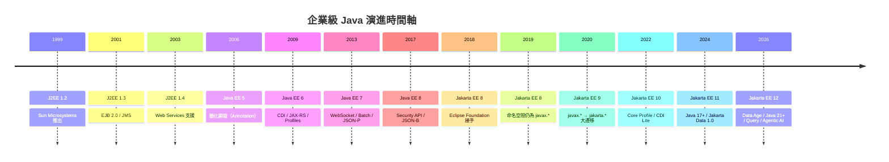

#### 關鍵轉折點

| 時期 | 事件 | 影響 |
|------|------|------|
| 2017 | Oracle 將 Java EE 移交 Eclipse Foundation | 開源治理轉型，社群主導開發。Oracle 保留 Java SE，企業規格層移至中立基金會 |
| 2018 | 更名為 Jakarta EE | 因 Oracle 保留 javax 商標，必須改名。此事件反而提升了開發者對企業 Java 規格依賴程度的認知 |
| 2020 | Jakarta EE 9 命名空間遷移 | 所有 `javax.*` 變更為 `jakarta.*`，影響所有既有程式。Eclipse Transformer 工具應運而生，協助自動化遷移 |
| 2022 | Jakarta EE 10 推出 Core Profile | 為雲原生微服務提供輕量級規格集，引入 CDI Lite |
| 2024 | Jakarta EE 11 現代化 | Java 17+ 基準、Jakarta Data 1.0 首次納入、CDI 中心化程式設計模型強化 |
| 2026 | Jakarta EE 12 進入 Data Age | 統一數據存取（Jakarta Query 1.0）、Security 5.0 架構重構、Agentic AI 前瞻規格啟動 |

> **企業實務觀點**：許多大型金融機構至今仍運行 Java EE 7/8 系統。理解演進歷程有助於規劃漸進式遷移策略，而非冒險進行大爆炸式升級。OCX 2026 大會明確指出：在多數情境下，僅升級 Java 版本就能在不修改應用程式碼的前提下顯著提升效能。

### 1.2 Jakarta EE 12 定位 — Data Age

Jakarta EE 12 被 Eclipse Foundation 定位為企業級 Java 的**「數據時代（Data Age）」**，其官方核心訴求為「**robust and flexible enterprise Java — 支援可靠應用程式的同時，實現模組化、互通性與架構選擇的彈性**」。這意味著此版本不僅從平台層級解決企業最普遍的痛點——**數據存取的一致性、統一性與效能**，同時也重塑安全架構、擁抱 AI 整合標準化，並強化開發者體驗。

根據 OCX 2026 大會 Eclipse Foundation 領導人 Ivar Grimstad 與 Tanja Obradovic 的闡述，Jakarta EE 12 的設計哲學是「**在不破壞既有價值的前提下漸進式現代化**」——這與 Jakarta EE 長年作為企業級 Java 可攜性與互通性基石的定位一脈相承。

#### Data Age 四大支柱

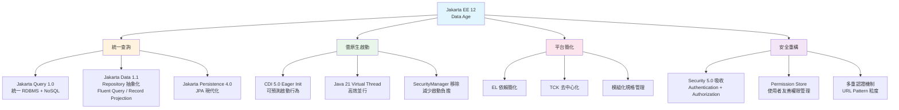

#### 核心底層變更

1. **Java 21 最低基準**：所有 Jakarta EE 12 規格要求 Java SE 21 為最低執行環境，確保 Virtual Thread、Pattern Matching、Record 等關鍵語言特性可用
2. **支援 Java 25**：TCK 已同步更新以支援最新的 Java SE 25，涵蓋 Stable Structured Concurrency（JEP 505）與 Stable Scoped Values（JEP 507）等正式穩定特性
3. **移除 SecurityManager**：全面移除所有 Jakarta 組件 API 中對舊版 Java SecurityManager 的依賴與引用，回應 JDK 本身對 SecurityManager 的棄用策略
4. **TCK 去中心化**：各組件的 TCK 測試持續從集中式 `platform-tck` 倉庫遷移至各自的組件倉庫中維護，加速獨立迭代與社群貢獻
5. **HTTP/3 支援要求**：平台層級新增 HTTP/3 協定支援需求
6. **Virtual Thread 程式設計模型擴展**：新增虛擬執行緒在平台層級的擴展程式設計模型支援
7. **Application Client 棄用**：Jakarta EE 12 正式棄用 Application Client 的支援要求，預計 Jakarta EE 13 移除
8. **Authorization 重組**：Jakarta Authorization 正隨 Jakarta Security 5.0 整合，可能移至 Web Profile 層級

### 1.3 Jakarta EE 12 核心特色

#### 關鍵規格升級一覽

| 規範分類 | 核心規格版本 | 重點更新摘要 |
|----------|-------------|-------------|
| 資料與持久化 | Jakarta Data 1.1、Jakarta Persistence 4.0 | 引入 Jakarta Query 作為統一查詢語言，Fluent Query 建構、Record Projection、Stateful Repository |
| 統一查詢 | Jakarta Query 1.0（**新增**） | 全新規格，從 Jakarta Persistence 抽取並統一 JPQL/JDQL 為跨資料來源查詢語法標準（Core 子集 + Extended 完整版） |
| 依賴注入 | Jakarta CDI 5.0 | 支援 Eager Initialization、移除 BeanManager 中已棄用的 EL 相關方法、Sealed Class 不可代理性測試 |
| RESTful 服務 | Jakarta RESTful Web Services 5.0 | 優化 REST 雲原生微服務整合效能 |
| 安全（重大重構） | Jakarta Security 5.0 | **吸收 Authentication 3.1 與 Authorization 3.0 為子規格**、Permission Store、多重認證機制（URL Pattern 粒度）、DIGEST/CLIENT-CERT 認證 |
| 驗證 | Jakarta Validation 4.0 | Bean Validation 升級，強化驗證框架 |
| 並行與排程 | Jakarta Concurrency 3.2、Jakarta Batch 2.2 | 增強異步任務管理與批次處理配置彈性，Virtual Thread 擴展支援 |
| 網頁介面 | Jakarta Faces 5.0、Jakarta Pages 4.1、Jakarta Servlet 6.2 | Servlet 升級支援 HTTP/3、組件化 UI 整合優化 |
| 交易管理 | Jakarta Transactions 2.1 | 交易管理升級，與 Virtual Thread 更好整合 |
| NoSQL（候選） | Jakarta NoSQL 1.1* | 候選納入 Platform，統一 NoSQL 存取模式 |
| AI（前瞻） | Jakarta Agentic AI 1.0* | **全新規格**，定義企業 Java 應用與 AI 服務/代理的標準化整合介面 |
| 基礎設施 | Jakarta Activation 2.2、Jakarta Mail 2.2、Jakarta Connectors 2.2 | 基礎規格更新至 EE 12 相容版本 |

#### 三大 Profile 規格對照

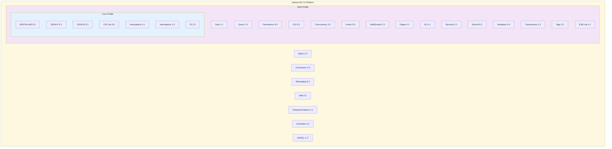

> **注意**：Jakarta Security 5.0 已吸收 Jakarta Authentication 與 Jakarta Authorization 為子規格。星號（*）標記為候選規格，尚待平台委員會最終核准。

### 1.4 Jakarta EE 12 治理模式與社群驅動

Jakarta EE 作為企業 Java 的開放規格平台，其治理模式本身就是選擇它的重要原因之一。理解治理機制有助於評估平台的長期可行性與風險。

#### 治理架構

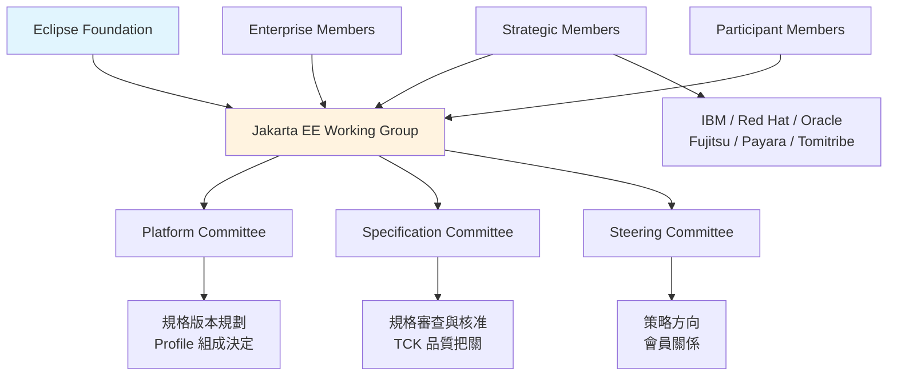

#### 規格發展流程

每個 Jakarta 規格從提案到發布都遵循透明的社群流程：

1. **Creation Review**：新規格提案審查（如 Jakarta Agentic AI 1.0）
2. **Plan Review**：版本規劃審查，定義範圍與時程
3. **Progress Review**：開發階段進度審查
4. **Release Review**：最終發布審查，包含 TCK 通過驗證
5. **Ratification Ballot**：規格委員會投票批准

#### 為何治理模式重要

| 維度 | Jakarta EE（開放規格） | 專有框架 |
|------|----------------------|---------|
| 規格制定 | 多廠商共同參與、公開審查 | 單一廠商決定 |
| 向後相容承諾 | 規格層級保障，跨實作一致 | 依廠商政策，可能變動 |
| 廠商鎖定風險 | 極低（可切換 GlassFish / Liberty / WildFly / Payara） | 中至高 |
| 長期維護保證 | 基金會永久存續，不受單一公司併購影響 | 依公司營運狀況 |
| 合規與採購 | 開放標準有利於政府採購法規與金融監管要求 | 需逐案評估 |

> **企業實務觀點**：2024 年 Broadcom 完成 VMware 收購後，Spring 框架的授權與商業模式引發市場疑慮。相較之下，Jakarta EE 的治理架構確保了即使某個成員公司發生變動，規格本身的持續性與中立性不受影響。這是金融業與政府機關偏好開放標準的核心原因。

### 1.5 與 Spring Boot 比較

這是企業選型時最常見的問題。兩者並非完全競爭關係，而是有著不同的定位與優勢。

| 比較維度 | Jakarta EE 12 | Spring Boot 4 |
|----------|---------------|---------------|
| **治理模式** | Eclipse Foundation 開放規格 | VMware/Broadcom 主導 |
| **規格 vs 實作** | 規格標準，多廠商實作 | 框架實作，單一生態系 |
| **Application Server** | 需要（Liberty/Payara/WildFly/GlassFish） | 內嵌 Tomcat/Jetty/Undertow |
| **廠商鎖定** | 低（可切換 Server） | 中（Spring 生態系綁定） |
| **啟動速度** | 中（EE 12 CDI Eager Init 改善） | 快（尤其 Native Image） |
| **學習曲線** | 較陡（規格多） | 較平緩（Convention over Configuration） |
| **雲原生支援** | MicroProfile 整合 | Spring Cloud 生態系 |
| **AI 整合** | Jakarta Agentic AI 規格制定中 | Spring AI 已可用 |
| **企業合規** | 高（開放標準） | 中 |
| **社群活躍度** | 中 | 高 |
| **適合場景** | 金融/政府/長期維護系統 | 快速開發/新創/微服務 |
| **Java 版本** | Java 21+（強制） | Java 17+（建議 21） |
| **測試生態** | Arquillian / JUnit | Spring Test / JUnit |

> **架構師建議**：在金融業、政府機關等對廠商鎖定敏感、需要長期維護（10 年以上）的場景，Jakarta EE 的開放規格優勢明顯。若追求快速交付且團隊已熟悉 Spring 生態系，Spring Boot 仍是務實選擇。兩者也可在同一企業內共存——例如前端 BFF 使用 Spring Boot，核心業務系統使用 Jakarta EE。

### 1.6 適合與不適合的應用場景

#### 適合的應用場景

| 場景 | 原因 |
|------|------|
| 大型銀行核心系統 | 開放標準、廠商中立、長期維護、合規要求 |
| 政府資訊系統 | 合規要求、避免廠商鎖定、符合政府採購法規 |
| 保險理賠系統 | Batch Processing、Transaction 管理、長期穩定性 |
| 企業 ERP/CRM | 複雜業務邏輯、多模組架構 |
| 跨國集團系統 | 多 Application Server 廠商支援、區域合規 |
| 需要長期維護的系統 | 規格穩定、向後相容承諾、治理透明 |
| 需要 AI 整合標準化的系統 | Jakarta Agentic AI 提供廠商中立的 AI 服務整合 |

#### 不適合的場景

| 場景 | 原因 |
|------|------|
| MVP / 快速原型 | 初始設定較重，不如 Spring Boot 輕量 |
| 純前端 BFF | 過度工程化 |
| Serverless Function | 冷啟動較慢（雖 EE 12 已改善） |
| 小型團隊快速迭代 | 學習曲線較陡 |
| 純 NoSQL 應用 | Jakarta NoSQL 仍為候選規格，尚未正式納入 |

### 1.7 實務注意事項

> **重要提醒**
> 1. Jakarta EE 12 預計 2026 年下半年正式發布，在規格正式定案前，API 可能有微調
> 2. 現有 Java 8/11/17 系統必須先升級至 JDK 21 才能運行 Jakarta EE 12
> 3. 若從 Java EE 遷移，需處理 `javax.*` → `jakarta.*` 的命名空間變更。Eclipse Transformer 工具可自動化此流程
> 4. 建議在新專案中直接採用 Jakarta EE 12，既有系統則制定漸進式遷移計畫
> 5. 評估 Application Server 時，確認廠商已通過 Jakarta EE 12 TCK 認證
> 6. Jakarta Security 5.0 的架構重構（吸收 Authentication 與 Authorization）可能影響既有安全實作，遷移時須特別留意
> 7. 關注 Jakarta EE 12 的候選規格（Jakarta Config、Jakarta NoSQL、Jakarta MVC）的最終納入決定，避免過早依賴尚未核准的 API

---

## 2. Jakarta EE 12 核心架構

### 2.1 Platform、Web Profile、Core Profile

Jakarta EE 12 採用三層 Profile 架構，讓開發者依據需求選擇適當的規格集合，避免引入不必要的複雜度。

#### Profile 定位

```mermaid
graph LR
    subgraph Core["Core Profile<br/>雲原生微服務"]
        direction TB
        C1[REST API]
        C2[JSON 處理]
        C3[CDI Lite]
        C4[基礎注入]
    end
    
    subgraph Web["Web Profile<br/>Web 應用"]
        direction TB
        W1[Core Profile 全部]
        W2[JPA / Data]
        W3[CDI Full]
        W4[Web UI]
        W5[Concurrency]
    end
    
    subgraph Full["Full Platform<br/>企業完整方案"]
        direction TB
        F1[Web Profile 全部]
        F2[Batch]
        F3[Messaging]
        F4[Connectors]
        F5[EJB]
    end
    
    Core -->|包含於| Web
    Web -->|包含於| Full
    
    style Core fill:#e8f5e9
    style Web fill:#e3f2fd
    style Full fill:#fff3e0
```

| Profile | 目標場景 | 規格數量 | 典型用途 |
|---------|---------|---------|---------|
| **Core Profile** | 雲原生微服務 | ~7 | REST API 微服務、Sidecar 服務 |
| **Web Profile** | Web 應用 | ~20 | 企業 Web 應用、CRUD 系統 |
| **Full Platform** | 企業完整方案 | ~30+ | 銀行核心、ERP、需要 JMS/Batch 的系統 |

#### 選擇建議

```
新建 REST API 微服務 → Core Profile
新建含資料庫的 Web 應用 → Web Profile
既有大型企業系統 / 需要 Batch + MQ → Full Platform
```

### 2.2 模組化架構與規格關係圖

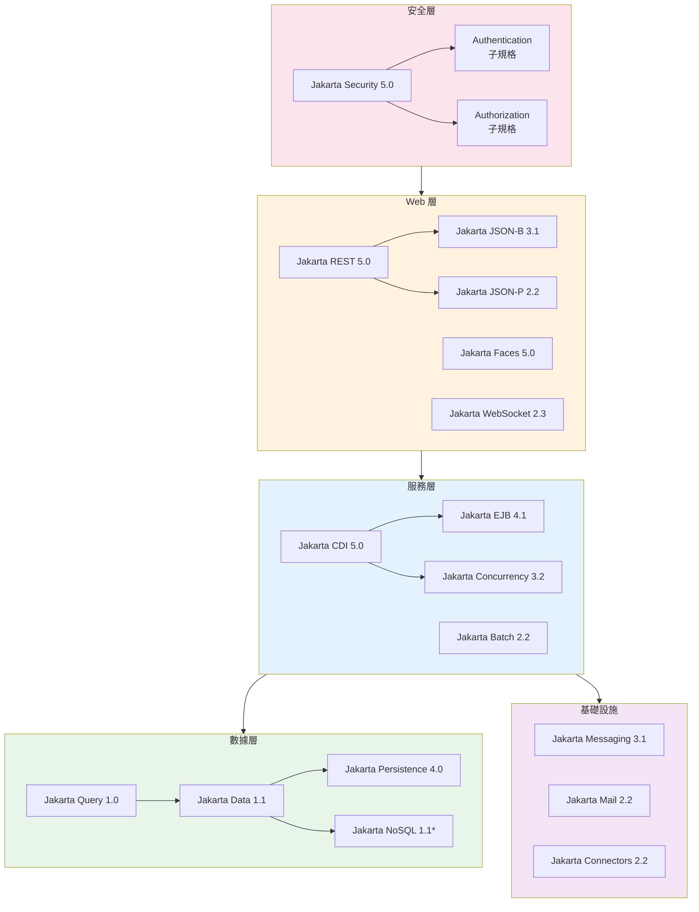

### 2.3 Jakarta EE Runtime

Jakarta EE 的 Runtime 模型與 Spring Boot 的嵌入式模型有本質差異：

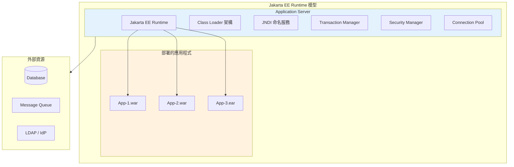

#### Runtime 關鍵元件

| 元件 | 說明 | Jakarta EE 12 變更 |
|------|------|-------------------|
| CDI Container | 管理 Bean 生命週期與依賴注入 | CDI 5.0 支援 Eager Init |
| Transaction Manager | JTA 交易管理 | 與 Virtual Thread 更好整合 |
| Security Context | 認證與授權 | 移除 SecurityManager 依賴 |
| Connection Pool | JDBC/JCA 連線池管理 | 效能最佳化 |
| Class Loader | 應用隔離的類別載入機制 | 模組化改進 |

### 2.4 Jakarta EE 12 完整規格清單

#### Core Profile 規格

| 規格 | 版本 | 狀態 |
|------|------|------|
| Jakarta RESTful Web Services | 5.0 | 已更新 |
| Jakarta JSON Processing | 2.2 | 已更新 |
| Jakarta JSON Binding | 3.1 | 已更新 |
| Jakarta Annotations | 3.1 | 已更新 |
| Jakarta Interceptors | 2.2 | 已更新 |
| Jakarta Dependency Injection | 2.0 | 未更新 |
| Jakarta CDI Lite | 5.0 | 已更新 |

#### Web Profile 額外規格

| 規格 | 版本 | 狀態 |
|------|------|------|
| Jakarta Query | 1.0 | **新增** |
| Jakarta Data | 1.1 | 已更新 |
| Jakarta Persistence | 4.0 | 已更新 |
| Jakarta CDI (Full) | 5.0 | 已更新 |
| Jakarta Security | 5.0 | 已更新（**重大重構**，吸收 Authentication + Authorization） |
| Jakarta Servlet | 6.2 | 已更新 |
| Jakarta Concurrency | 3.2 | 已更新 |
| Jakarta Faces | 5.0 | 已更新 |
| Jakarta Pages | 4.1 | 已更新 |
| Jakarta Expression Language | 6.1 | 已更新 |
| Jakarta Standard Tag Library | 3.1 | 已更新 |
| Jakarta WebSocket | 2.3 | 已更新 |
| Jakarta Validation | 4.0 | 已更新 |
| Jakarta Transactions | 2.1 | 已更新 |
| Jakarta Enterprise Beans Lite | 4.1 | 已更新 |

#### Platform 額外規格

| 規格 | 版本 | 狀態 |
|------|------|------|
| Jakarta Batch | 2.2 | 已更新 |
| Jakarta Connectors | 2.2 | 已更新 |
| Jakarta Enterprise Beans (Full) | 4.1 | 已更新 |
| Jakarta Messaging | 3.1 | 未更新 |
| Jakarta Mail | 2.2 | 已更新 |
| Jakarta Activation | 2.2 | 已更新 |
| Jakarta NoSQL | 1.1 | **候選納入** |

### 2.5 候選與前瞻規格

以下規格正在進行 Creation Review 或尚待平台委員會最終核准，開發者應關注其發展狀態，但避免在生產環境中過早依賴：

| 規格 | 版本 | 目標 Profile | 狀態說明 |
|------|------|-------------|---------|
| Jakarta Config | 1.0 | Core Profile | 基於 MicroProfile Config，提供標準化配置 API。若核准，將成為 Core Profile 的組成部分 |
| Jakarta HTTP | 1.0 | Core Profile | 提供標準化 HTTP 客戶端與伺服器 API |
| Jakarta MVC | 3.1 | Web Profile | Action-based Web 框架（類似 Spring MVC），補充 Faces 的 Component-based 模型 |
| Jakarta NoSQL | 1.1 | Web Profile | 統一 NoSQL 資料庫存取模式，與 Jakarta Data 整合 |
| Jakarta Query | 1.0 | Web Profile | 已確認納入，定義跨資料來源的統一查詢語法 |
| Jakarta Agentic AI | 1.0 | 待定 | **全新前瞻規格**，定義企業 Java 應用與 AI 代理的標準化整合。處於早期 Creation Review 階段，預計 Jakarta EE 13+ 正式納入 |

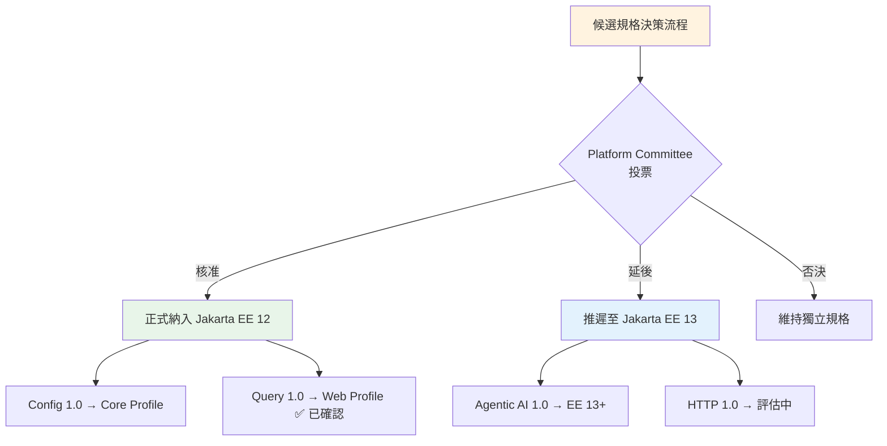

> **企業實務觀點**：在候選規格正式核准前，建議使用對應的 MicroProfile 規格（如 MicroProfile Config）或廠商特定 API 作為過渡方案，並透過介面抽象化隔離依賴，以利未來無縫切換至正式 Jakarta 規格。

### 2.6 TCK 認證與相容實作

TCK（Technology Compatibility Kit）是 Jakarta EE 生態系的基石——只有通過 TCK 認證的實作才能宣稱自己相容於特定版本的 Jakarta EE。

#### TCK 去中心化

Jakarta EE 12 持續推動 TCK 從集中式 `platform-tck` 倉庫遷移至各組件自有倉庫。這一架構變更帶來多項好處：

| 面向 | 集中式 TCK（舊） | 去中心化 TCK（新） |
|------|----------------|-------------------|
| 迭代速度 | 需等待整體發布 | 各組件可獨立發布 TCK 更新 |
| 社群貢獻 | 門檻較高 | 貢獻者可專注特定組件 |
| 維護負擔 | 集中於少數維護者 | 分散至各規格團隊 |
| CI/CD 整合 | 需執行完整測試套件 | 可選擇性執行特定組件測試 |

#### 相容實作（Compatible Implementation）

Jakarta EE 12 的參考實作（Reference Implementation）為 **Eclipse GlassFish**。以下為主要相容實作的預期支援狀態：

| 實作 | 廠商 | 預期 EE 12 認證時程 | 備註 |
|------|------|-------------------|------|
| Eclipse GlassFish | Eclipse Foundation | 隨規格同步 | 參考實作，率先通過認證 |
| Open Liberty | IBM | 規格發布後數月 | 通常為最早的商業認證實作之一 |
| WildFly | Red Hat | 規格發布後數月 | 社群版免費，EAP 為商業版 |
| Payara Server | Payara | 規格發布後數月 | 基於 GlassFish，企業級增值功能 |

> **注意**：上表時程為預期推測，最終認證時程取決於各廠商的開發排程與 TCK 測試結果。

### 2.7 實務注意事項

> **架構選型建議**
> 1. **新建微服務**：從 Core Profile 開始，按需引入 Web Profile 規格
> 2. **既有系統維護**：維持 Full Platform，漸進式移除不需要的規格
> 3. **混合架構**：同一企業內可以有 Core Profile 微服務 + Full Platform 核心系統並存
> 4. Jakarta NoSQL 1.1 仍為候選規格，生產環境使用需評估風險
> 5. 選擇 Application Server 時確認其支援的 Profile 層級，以及是否已通過 Jakarta EE 12 TCK 認證
> 6. **Security 5.0 遷移影響**：若既有系統直接使用 Jakarta Authentication 或 Jakarta Authorization API，需規劃向 Jakarta Security 5.0 統一 API 的遷移
> 7. **Activation 與 Mail 版本注意**：Jakarta Activation 已更新至 2.2、Jakarta Mail 已更新至 2.2，若有直接依賴需同步升級
> 8. **TCK 認證查詢**：可至 [jakarta.ee/compatibility/](https://jakarta.ee/compatibility/) 查詢各實作的最新認證狀態

---

## 3. Java 21 與 Java 25

### 3.1 為何 Jakarta EE 12 要求 Java 21

Jakarta EE 12 將最低 Java 版本從 Java 17 提升至 Java 21，這是一個**具戰略意義的決定**。Java 21 是 LTS（Long-Term Support）版本，帶來了多項對企業開發至關重要的語言和平台特性。

#### 升級驅動因素

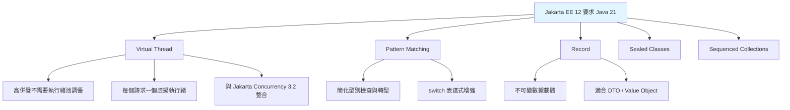

### 3.2 Virtual Thread（虛擬執行緒）

Virtual Thread 是 Java 21 最重要的特性之一（JEP 444），對 Jakarta EE 12 的企業應用有深遠影響。

#### 傳統執行緒 vs Virtual Thread

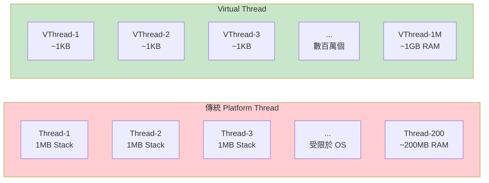

#### 程式碼範例

```java
// === 傳統方式：使用執行緒池處理請求 ===
@ApplicationScoped
public class TraditionalOrderService {

    @Resource
    private ManagedExecutorService executorService;

    public CompletableFuture<OrderResult> processOrder(OrderRequest request) {
        return CompletableFuture.supplyAsync(() -> {
            // 受限於執行緒池大小（通常 50-200）
            return doProcessOrder(request);
        }, executorService);
    }
}

// === Jakarta EE 12 + Virtual Thread：每個請求一個虛擬執行緒 ===
@ApplicationScoped
public class ModernOrderService {

    @Resource
    private ManagedExecutorService virtualExecutor; // 配置為 Virtual Thread

    /**
     * 使用 Virtual Thread 處理訂單。
     * 不再受限於執行緒池大小，可輕鬆處理數萬並行請求。
     */
    public OrderResult processOrder(OrderRequest request) {
        try (var scope = new StructuredTaskScope.ShutdownOnFailure()) {
            // 同時查詢庫存、計算價格、檢查風控
            Subtask<Inventory> inventory = scope.fork(() -> checkInventory(request));
            Subtask<Price> price = scope.fork(() -> calculatePrice(request));
            Subtask<RiskResult> risk = scope.fork(() -> checkRisk(request));

            scope.join();
            scope.throwIfFailed();

            return new OrderResult(
                inventory.get(),
                price.get(),
                risk.get()
            );
        } catch (Exception e) {
            throw new OrderProcessingException("訂單處理失敗", e);
        }
    }
}
```

#### Application Server 配置（Open Liberty）

```xml
<!-- server.xml - 啟用 Virtual Thread -->
<featureManager>
    <feature>concurrent-3.2</feature>
    <feature>restfulWS-5.0</feature>
</featureManager>

<!-- 配置 Virtual Thread Executor -->
<managedExecutorService jndiName="concurrent/virtualExecutor">
    <contextService>
        <contextInfo>AllContextTypes</contextInfo>
    </contextService>
    <!-- Virtual Thread 不需要指定 maxAsync -->
    <virtualThreads>true</virtualThreads>
</managedExecutorService>
```

### 3.3 Structured Concurrency（結構化並行）

Structured Concurrency（JEP 462）讓並行程式的錯誤處理和取消機制更加可靠。

```java
/**
 * 結構化並行：銀行轉帳風控檢查範例。
 * 同時執行多項檢查，任一失敗則全部取消。
 */
public TransferDecision evaluateTransfer(TransferRequest request) 
        throws InterruptedException, ExecutionException {
    
    try (var scope = new StructuredTaskScope.ShutdownOnFailure()) {
        
        // 並行執行四項風控檢查
        Subtask<AmlResult> amlCheck = scope.fork(
            () -> antiMoneyLaunderingCheck(request));
        Subtask<FraudResult> fraudCheck = scope.fork(
            () -> fraudDetection(request));
        Subtask<LimitResult> limitCheck = scope.fork(
            () -> dailyLimitCheck(request));
        Subtask<SanctionResult> sanctionCheck = scope.fork(
            () -> sanctionScreening(request));

        // 等待所有子任務完成，任一失敗自動取消其他
        scope.join();
        scope.throwIfFailed();

        return TransferDecision.approve(
            amlCheck.get(),
            fraudCheck.get(),
            limitCheck.get(),
            sanctionCheck.get()
        );
    }
}
```

### 3.4 Record 與 Pattern Matching

#### Record — 不可變數據載體

```java
/**
 * 使用 Record 定義 API 回應物件。
 * 自動產生 constructor、equals、hashCode、toString。
 */
public record ApiResponse<T>(
    int status,
    String message,
    T data,
    Instant timestamp
) {
    // Compact Constructor 驗證
    public ApiResponse {
        if (status < 100 || status > 599) {
            throw new IllegalArgumentException("無效的 HTTP 狀態碼: " + status);
        }
        if (timestamp == null) {
            timestamp = Instant.now();
        }
    }

    // 便利工廠方法
    public static <T> ApiResponse<T> success(T data) {
        return new ApiResponse<>(200, "成功", data, Instant.now());
    }

    public static <T> ApiResponse<T> error(int status, String message) {
        return new ApiResponse<>(status, message, null, Instant.now());
    }
}

/**
 * 使用 Record 定義 DTO。
 */
public record CreateOrderRequest(
    @NotBlank String customerId,
    @NotEmpty List<OrderItem> items,
    @Valid ShippingAddress address
) {}

public record OrderItem(
    @NotBlank String productId,
    @Positive int quantity,
    @PositiveOrZero BigDecimal unitPrice
) {}
```

#### Pattern Matching — 簡化型別處理

```java
/**
 * Pattern Matching for switch（JEP 441）
 * 取代冗長的 instanceof 鏈。
 */
public String handlePayment(PaymentMethod payment) {
    return switch (payment) {
        case CreditCard cc when cc.isExpired() -> 
            "信用卡已過期: " + cc.maskedNumber();
        case CreditCard cc -> 
            "信用卡付款: " + cc.maskedNumber();
        case BankTransfer bt -> 
            "銀行轉帳: " + bt.bankCode() + " " + bt.accountNumber();
        case DigitalWallet dw -> 
            "電子錢包: " + dw.provider();
        case null -> 
            throw new IllegalArgumentException("付款方式不可為 null");
    };
}

/**
 * Record Pattern（JEP 440）解構。
 */
public void processTransaction(Transaction tx) {
    if (tx instanceof Transfer(var from, var to, var amount) 
            && amount.compareTo(BigDecimal.valueOf(1_000_000)) > 0) {
        logger.warn("大額轉帳警示: {} -> {}, 金額: {}", from, to, amount);
        notifyCompliance(tx);
    }
}
```

### 3.5 Sequenced Collection 與 Scoped Values

#### Sequenced Collection（JEP 431）

```java
// Java 21 新增有序集合介面
SequencedCollection<Transaction> recentTx = getRecentTransactions();

// 取得第一筆和最後一筆
Transaction first = recentTx.getFirst();
Transaction last = recentTx.getLast();

// 反轉順序
SequencedCollection<Transaction> reversed = recentTx.reversed();

// SequencedMap
SequencedMap<String, BigDecimal> dailyBalances = getDailyBalances();
Map.Entry<String, BigDecimal> earliest = dailyBalances.firstEntry();
Map.Entry<String, BigDecimal> latest = dailyBalances.lastEntry();
```

#### Scoped Values（JEP 446 Preview → JEP 481）

```java
/**
 * Scoped Values 取代 ThreadLocal，更適合 Virtual Thread。
 */
public class RequestContext {

    // 定義 Scoped Value
    public static final ScopedValue<UserPrincipal> CURRENT_USER = ScopedValue.newInstance();
    public static final ScopedValue<String> CORRELATION_ID = ScopedValue.newInstance();

    /**
     * 在請求處理鏈中綁定上下文。
     */
    public Response handleRequest(UserPrincipal user, String correlationId) {
        return ScopedValue
            .where(CURRENT_USER, user)
            .where(CORRELATION_ID, correlationId)
            .call(() -> {
                // 在此 scope 內的所有程式碼都能存取這些值
                return processBusinessLogic();
            });
    }
}

// 在服務層中使用
@ApplicationScoped
public class AuditService {

    public void logAction(String action) {
        UserPrincipal user = RequestContext.CURRENT_USER.get();
        String corrId = RequestContext.CORRELATION_ID.get();
        logger.info("[{}] 使用者 {} 執行: {}", corrId, user.getName(), action);
    }
}
```

### 3.6 Java 25 新特性

Jakarta EE 12 TCK 已同步支援 Java 25。以下是對企業開發有影響的關鍵特性：

| 特性 | JEP | 企業應用價值 |
|------|-----|-------------|
| Primitive Types in Patterns | JEP 488 | switch 支援 primitive 型別，簡化數值處理 |
| Flexible Constructor Bodies | JEP 492 | 更靈活的建構子初始化邏輯 |
| Stable Structured Concurrency | JEP 505 | 結構化並行正式穩定，企業可放心使用 |
| Stable Scoped Values | JEP 507 | ScopedValue 正式穩定，取代 ThreadLocal |
| Key Derivation Function API | JEP 478 | 安全的金鑰衍生，強化加密基礎設施 |
| Compact Source Files | JEP 495 | 簡化小型程式與腳本開發 |
| Module Import Declarations | JEP 494 | 簡化模組匯入語法 |

```java
// Java 25: Primitive Types in Patterns
public String classifyTransaction(double amount) {
    return switch (amount) {
        case double a when a < 0 -> "退款";
        case double a when a == 0 -> "零額交易";
        case double a when a < 10_000 -> "一般交易";
        case double a when a < 1_000_000 -> "大額交易";
        default -> "超大額交易 — 需人工審核";
    };
}

// Java 25: Flexible Constructor Bodies
public class BankAccount {
    private final String accountId;
    private final BigDecimal initialBalance;
    
    public BankAccount(String accountId, BigDecimal initialBalance) {
        // Java 25 允許在 super() 之前執行驗證
        if (accountId == null || accountId.isBlank()) {
            throw new IllegalArgumentException("帳號不可為空");
        }
        if (initialBalance.compareTo(BigDecimal.ZERO) < 0) {
            throw new IllegalArgumentException("初始餘額不可為負");
        }
        this.accountId = accountId;
        this.initialBalance = initialBalance;
    }
}
```

### 3.7 JVM 調校建議

#### 生產環境 JVM 參數範本

```bash
# === Jakarta EE 12 + Java 21 生產環境 JVM 參數 ===

JAVA_OPTS=" \
  # 記憶體配置
  -Xms2g -Xmx4g \
  -XX:MetaspaceSize=256m \
  -XX:MaxMetaspaceSize=512m \
  
  # GC 策略 — 推薦 G1GC（通用場景）
  -XX:+UseG1GC \
  -XX:MaxGCPauseMillis=200 \
  -XX:G1HeapRegionSize=16m \
  -XX:+G1UseAdaptiveIHOP \
  
  # 或使用 ZGC（低延遲場景，如交易系統）
  # -XX:+UseZGC \
  # -XX:+ZGenerational \
  
  # Virtual Thread 調校
  -Djdk.virtualThreadScheduler.parallelism=8 \
  -Djdk.virtualThreadScheduler.maxPoolSize=256 \
  
  # 安全性
  -Djava.security.egd=file:/dev/urandom \
  
  # Diagnostics
  -XX:+HeapDumpOnOutOfMemoryError \
  -XX:HeapDumpPath=/var/log/app/heapdump.hprof \
  -Xlog:gc*:file=/var/log/app/gc.log:time,uptime,level,tags:filecount=10,filesize=50m \
  
  # Container 支援（Kubernetes 環境）
  -XX:+UseContainerSupport \
  -XX:MaxRAMPercentage=75.0 \
"
```

#### GC 策略選擇指南

| GC 策略 | 適用場景 | 延遲 | 吞吐量 | 記憶體開銷 |
|---------|---------|------|--------|-----------|
| **G1GC** | 通用企業應用 | 中 | 高 | 中 |
| **ZGC** | 低延遲交易系統 | 極低（<1ms） | 中高 | 高 |
| **Shenandoah** | 低延遲替代方案 | 極低 | 中 | 高 |
| **Parallel GC** | 批次處理、高吞吐量 | 高 | 極高 | 低 |

### 3.8 實務注意事項

> **升級建議**
> 1. **優先使用 Java 21 LTS**，Java 25 作為技術預覽評估
> 2. **Virtual Thread 不是萬能藥**：CPU 密集型任務仍需 Platform Thread
> 3. Virtual Thread 中避免使用 `synchronized`，改用 `ReentrantLock`
> 4. **ThreadLocal → ScopedValue**：新程式碼優先使用 ScopedValue
> 5. **Record 取代 POJO DTO**：API 的 Request/Response 物件適合用 Record
> 6. 生產環境務必啟用 GC Log 和 HeapDump 設定

---

## 4. 開發環境建置

### 4.1 JDK 21 安裝

#### Windows

```powershell
# 方法一：使用 winget（推薦）
winget install EclipseAdoptium.Temurin.21.JDK

# 方法二：使用 Scoop
scoop bucket add java
scoop install temurin21-jdk

# 方法三：使用 SDKMAN!（WSL 環境）
sdk install java 21.0.5-tem

# 驗證安裝
java --version
# openjdk 21.0.5 2024-10-15 LTS

# 設定環境變數
[System.Environment]::SetEnvironmentVariable("JAVA_HOME", "C:\Program Files\Eclipse Adoptium\jdk-21", "Machine")
[System.Environment]::SetEnvironmentVariable("Path", "$env:JAVA_HOME\bin;$env:Path", "Machine")
```

#### Linux（Ubuntu/Debian）

```bash
# 方法一：APT
sudo apt update
sudo apt install -y temurin-21-jdk

# 方法二：SDKMAN!（推薦，支援多版本管理）
curl -s "https://get.sdkman.io" | bash
source "$HOME/.sdkman/bin/sdkman-init.sh"
sdk install java 21.0.5-tem

# 設定 JAVA_HOME
echo 'export JAVA_HOME=$(sdk home java current)' >> ~/.bashrc
source ~/.bashrc

# 驗證
java --version
javac --version
```

#### macOS

```bash
# 方法一：Homebrew
brew install --cask temurin@21

# 方法二：SDKMAN!
sdk install java 21.0.5-tem

# 驗證
java --version
/usr/libexec/java_home -V
```

### 4.2 Maven 與 Gradle 安裝

#### Maven 安裝（推薦 3.9+）

```bash
# Windows (winget)
winget install Apache.Maven

# Linux / macOS (SDKMAN!)
sdk install maven 3.9.9

# 驗證
mvn --version

# Maven settings.xml 企業級設定範本（~/.m2/settings.xml）
```

```xml
<?xml version="1.0" encoding="UTF-8"?>
<settings xmlns="http://maven.apache.org/SETTINGS/1.2.0"
          xmlns:xsi="http://www.w3.org/2001/XMLSchema-instance"
          xsi:schemaLocation="http://maven.apache.org/SETTINGS/1.2.0 
          https://maven.apache.org/xsd/settings-1.2.0.xsd">
    
    <!-- 企業 Proxy 設定 -->
    <proxies>
        <proxy>
            <id>corp-proxy</id>
            <active>true</active>
            <protocol>https</protocol>
            <host>proxy.company.com</host>
            <port>8080</port>
            <nonProxyHosts>localhost|*.company.com</nonProxyHosts>
        </proxy>
    </proxies>
    
    <!-- 企業私有 Repository -->
    <mirrors>
        <mirror>
            <id>nexus</id>
            <mirrorOf>*</mirrorOf>
            <url>https://nexus.company.com/repository/maven-public/</url>
        </mirror>
    </mirrors>
    
    <profiles>
        <profile>
            <id>jakarta-ee-12</id>
            <properties>
                <maven.compiler.source>21</maven.compiler.source>
                <maven.compiler.target>21</maven.compiler.target>
                <maven.compiler.release>21</maven.compiler.release>
                <project.build.sourceEncoding>UTF-8</project.build.sourceEncoding>
            </properties>
        </profile>
    </profiles>
    
    <activeProfiles>
        <activeProfile>jakarta-ee-12</activeProfile>
    </activeProfiles>
</settings>
```

#### Gradle 安裝

```bash
# SDKMAN!
sdk install gradle 8.10

# 驗證
gradle --version
```

### 4.3 IDE 設定 — VS Code 與 IntelliJ IDEA

#### VS Code 擴充套件

```json
// .vscode/extensions.json — 推薦擴充套件
{
    "recommendations": [
        "redhat.java",
        "vscjava.vscode-java-pack",
        "vscjava.vscode-maven",
        "vscjava.vscode-java-debug",
        "vscjava.vscode-java-test",
        "vscjava.vscode-java-dependency",
        "redhat.vscode-xml",
        "redhat.vscode-yaml",
        "ms-azuretools.vscode-docker",
        "ms-kubernetes-tools.vscode-kubernetes-tools",
        "github.copilot",
        "github.copilot-chat"
    ]
}
```

```json
// .vscode/settings.json — 專案設定
{
    "java.configuration.runtimes": [
        {
            "name": "JavaSE-21",
            "path": "/path/to/jdk-21",
            "default": true
        }
    ],
    "java.compile.nullAnalysis.mode": "automatic",
    "java.format.settings.url": ".vscode/java-formatter.xml",
    "java.saveActions.organizeImports": true,
    "editor.formatOnSave": true,
    "files.encoding": "utf8"
}
```

#### IntelliJ IDEA 設定要點

1. **Project SDK**：設定為 JDK 21
2. **Language Level**：21（Pattern matching, Record patterns）
3. **Jakarta EE Plugin**：安裝 Jakarta EE 支援外掛
4. **Application Server**：配置 Open Liberty / WildFly
5. **Code Style**：匯入團隊統一的 Code Style XML

### 4.4 Docker Desktop 與 Podman

```bash
# Windows — Docker Desktop
winget install Docker.DockerDesktop

# Linux — Podman（無 Daemon，更適合企業環境）
sudo apt install -y podman podman-compose

# 驗證
docker --version   # 或 podman --version
docker compose version

# 建立開發用 docker-compose.yml
```

```yaml
# docker-compose-dev.yml — 開發環境基礎設施
version: '3.9'
services:
  postgres:
    image: postgres:16-alpine
    environment:
      POSTGRES_DB: appdb
      POSTGRES_USER: appuser
      POSTGRES_PASSWORD: ${DB_PASSWORD:-devpassword}
    ports:
      - "5432:5432"
    volumes:
      - pgdata:/var/lib/postgresql/data
    healthcheck:
      test: ["CMD-SHELL", "pg_isready -U appuser -d appdb"]
      interval: 10s
      timeout: 5s
      retries: 5

  redis:
    image: redis:7-alpine
    ports:
      - "6379:6379"
    command: redis-server --requirepass ${REDIS_PASSWORD:-devpassword}

  kafka:
    image: confluentinc/cp-kafka:7.7.0
    environment:
      KAFKA_NODE_ID: 1
      KAFKA_PROCESS_ROLES: broker,controller
      KAFKA_LISTENERS: PLAINTEXT://0.0.0.0:9092,CONTROLLER://0.0.0.0:9093
      KAFKA_ADVERTISED_LISTENERS: PLAINTEXT://localhost:9092
      KAFKA_CONTROLLER_LISTENER_NAMES: CONTROLLER
      KAFKA_CONTROLLER_QUORUM_VOTERS: 1@localhost:9093
      CLUSTER_ID: 'MkU3OEVBNTcwNTJENDM2Qk'
    ports:
      - "9092:9092"

volumes:
  pgdata:
```

### 4.5 Kubernetes 與 kubectl

```bash
# 安裝 kubectl
# Windows
winget install Kubernetes.kubectl

# Linux
curl -LO "https://dl.k8s.io/release/$(curl -L -s https://dl.k8s.io/release/stable.txt)/bin/linux/amd64/kubectl"
sudo install -o root -g root -m 0755 kubectl /usr/local/bin/kubectl

# macOS
brew install kubectl

# 安裝本地 K8s 叢集（開發用）
# 方法一：minikube
winget install Kubernetes.minikube
minikube start --cpus=4 --memory=8192 --driver=docker

# 方法二：kind（Kubernetes in Docker）
go install sigs.k8s.io/kind@latest
kind create cluster --name jakarta-dev

# 驗證
kubectl cluster-info
kubectl get nodes
```

### 4.6 Jakarta EE Starter 快速建立

Jakarta EE Starter（[start.jakarta.ee](https://start.jakarta.ee/)）是 Eclipse Foundation 官方提供的專案產生器，類似 Spring Initializr。

#### 使用方式

1. 前往 [start.jakarta.ee](https://start.jakarta.ee/)
2. 選擇 Jakarta EE 版本（12）、Profile（Core/Web/Platform）、Java 版本（21）
3. 選擇 Runtime（GlassFish、Open Liberty、WildFly、Payara）
4. 下載產生的 Maven 專案骨架

#### 命令列方式（Maven Archetype）

```bash
# 使用 Jakarta EE Starter Maven Archetype
mvn archetype:generate \
  -DarchetypeGroupId=org.eclipse.starter \
  -DarchetypeArtifactId=jakarta-starter \
  -DarchetypeVersion=2.2.0 \
  -DgroupId=com.company.app \
  -DartifactId=my-jakarta-app \
  -Dversion=1.0.0-SNAPSHOT \
  -Dprofile=web \
  -DjakartaVersion=12 \
  -Druntime=open-liberty \
  -DinteractiveMode=false
```

#### 產生的專案結構

```
my-jakarta-app/
├── pom.xml                          # Jakarta EE 12 BOM 已配置
├── src/
│   ├── main/
│   │   ├── java/
│   │   │   └── com/company/app/
│   │   │       ├── RestApplication.java   # JAX-RS Application
│   │   │       └── HelloResource.java     # 範例 REST 端點
│   │   ├── resources/
│   │   │   └── META-INF/
│   │   │       ├── beans.xml              # CDI 配置
│   │   │       └── persistence.xml        # JPA 配置（Web Profile）
│   │   └── webapp/
│   │       └── WEB-INF/
│   └── test/
│       └── java/
└── README.md
```

> **提示**：Jakarta EE Starter 產生的是最小可運行專案，適合作為起點。實際企業專案應參考第 6 章的 Multi Module 架構進行擴展。

### 4.7 實務注意事項

> **環境建置最佳實務**
> 1. **統一 JDK 版本**：全團隊使用相同 JDK 發行版（推薦 Eclipse Temurin）
> 2. **SDKMAN! 管理多版本**：避免手動設定環境變數
> 3. **企業 Proxy**：務必在 Maven、Docker、npm 等工具中正確設定 Proxy
> 4. **開發環境容器化**：使用 docker-compose 統一開發環境的基礎設施
> 5. **Podman 替代 Docker**：在安全要求較高的企業環境中，Podman 無 Daemon 架構更安全
> 6. **IDE 設定版本控制**：將 `.vscode/settings.json`、`.editorconfig` 納入 Git

---

## 5. Jakarta EE 12 Application Server

### 5.1 Open Liberty

Open Liberty 是 IBM 主導的開源 Application Server，也是 Jakarta EE 和 MicroProfile 規格的領先實作者。

#### 架構特色

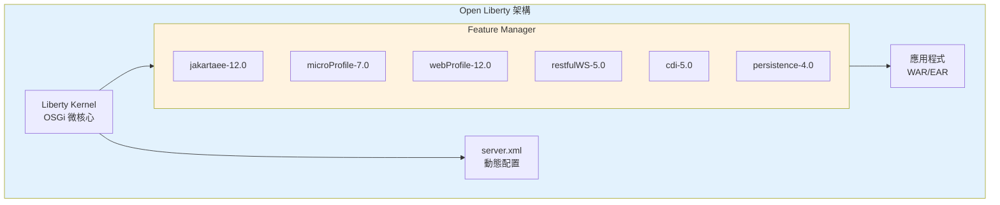

#### 快速啟動

```xml
<!-- server.xml — Open Liberty 基本配置 -->
<server description="Jakarta EE 12 Application">

    <!-- 功能選擇：按需載入，不載入不需要的 -->
    <featureManager>
        <feature>jakartaee-12.0</feature>
        <feature>microProfile-7.0</feature>
    </featureManager>

    <!-- HTTP 端點 -->
    <httpEndpoint id="defaultHttpEndpoint"
                  httpPort="9080"
                  httpsPort="9443" />

    <!-- 資料來源 -->
    <dataSource id="DefaultDataSource" jndiName="jdbc/appDB">
        <jdbcDriver libraryRef="postgresql-lib" />
        <properties.postgresql serverName="localhost"
                               portNumber="5432"
                               databaseName="appdb"
                               user="appuser"
                               password="${env.DB_PASSWORD}" />
        <connectionManager maxPoolSize="50"
                          minPoolSize="10"
                          connectionTimeout="30s" />
    </dataSource>

    <library id="postgresql-lib">
        <fileset dir="${server.config.dir}/lib" includes="postgresql-*.jar" />
    </library>

    <!-- 應用程式 -->
    <webApplication id="myapp" location="myapp.war"
                    contextRoot="/">
        <classloader apiTypeVisibility="spec,ibm-api,third-party" />
    </webApplication>

</server>
```

#### Open Liberty 優勢

- **零遷移功能管理**：只載入需要的 Feature，啟動極快（<2 秒）
- **動態配置**：修改 `server.xml` 無需重啟
- **InstantOn**：搭配 CRIU 實現毫秒級冷啟動（適合 Serverless）
- **MicroProfile 領先實作**：通常第一個支援最新 MicroProfile 規格
- **Liberty Operator**：原生 Kubernetes Operator 支援

### 5.2 Payara

Payara 是基於 GlassFish 的商業級 Application Server，由 Payara Services 維護。

#### 架構特色

- **Payara Server**：Full Platform 實作，適合傳統企業部署
- **Payara Micro**：嵌入式微型 Server，適合微服務（可直接執行 WAR）
- **基於 GlassFish 6.x**：繼承 GlassFish 的成熟架構

#### 啟動方式

```bash
# Payara Server
asadmin start-domain

# Payara Micro — 直接執行 WAR
java -jar payara-micro.jar --deploy myapp.war --port 8080

# Payara Micro — Docker
docker run -p 8080:8080 -v ./myapp.war:/opt/payara/deployments/myapp.war \
  payara/micro:6.2024.12-jdk21
```

#### 配置範例

```xml
<!-- web.xml 或 glassfish-web.xml -->
<!-- Payara 資料來源配置 -->
<resource-ref>
    <res-ref-name>jdbc/appDB</res-ref-name>
    <res-type>javax.sql.DataSource</res-type>
</resource-ref>
```

### 5.3 WildFly

WildFly 是 Red Hat 主導的開源 Application Server（JBoss 的社群版）。

#### 架構特色

- **模組化 Class Loading**：基於 JBoss Modules，強隔離
- **管理控制台**：Web-based 管理界面
- **Domain Mode**：支援多 Server 叢集管理
- **WildFly Glow**：自動偵測應用所需功能，產生精簡 Server

#### 啟動方式

```bash
# Standalone 模式
./standalone.sh -c standalone-full.xml

# 使用 Galleon 精簡安裝
galleon.sh install wildfly:current \
  --layers=ee-core-profile-server,jpa,jms \
  --dir=my-wildfly

# Docker
docker run -p 8080:8080 -p 9990:9990 \
  quay.io/wildfly/wildfly:latest-jdk21
```

#### 配置範例（standalone.xml）

```xml
<subsystem xmlns="urn:jboss:domain:datasources:7.1">
    <datasources>
        <datasource jndi-name="java:jboss/datasources/AppDS"
                    pool-name="AppDS">
            <connection-url>jdbc:postgresql://localhost:5432/appdb</connection-url>
            <driver>postgresql</driver>
            <security user-name="appuser" password="${env.DB_PASSWORD}" />
            <pool>
                <min-pool-size>10</min-pool-size>
                <max-pool-size>50</max-pool-size>
            </pool>
        </datasource>
    </datasources>
</subsystem>
```

### 5.4 GlassFish

Eclipse GlassFish 是 Jakarta EE 的**參考實作（Reference Implementation）**，由 Eclipse Foundation 直接維護。GlassFish 8 將是首個通過 Jakarta EE 12 TCK 認證的實作。

#### 定位與角色

- **參考實作**：每個 Jakarta EE 版本的規格發布必須附帶至少一個通過 TCK 的參考實作，GlassFish 承擔此角色
- **規格驗證基準**：規格制定者使用 GlassFish 驗證規格的可行性與一致性
- **開發與測試**：適合開發環境與概念驗證，但商業生產環境建議評估 Payara（GlassFish 衍生版加上企業級增值功能）

#### 啟動方式

```bash
# 下載 Eclipse GlassFish 8
# 啟動 Domain
./bin/asadmin start-domain

# 部署應用
./bin/asadmin deploy myapp.war

# Docker
docker run -p 8080:8080 -p 4848:4848 \
  eclipse/glassfish:8.0.0-jdk21
```

### 5.5 四大 Server 比較表

| 比較維度 | Open Liberty | Payara | WildFly | GlassFish |
|----------|-------------|--------|---------|-----------|
| **維護組織** | IBM | Payara Services | Red Hat | Eclipse Foundation |
| **開源授權** | EPL 1.0 | CDDL + GPL v2 | LGPL 2.1 | EPL 2.0 |
| **啟動速度** | ⭐⭐⭐⭐⭐（<2s） | ⭐⭐⭐（3-5s） | ⭐⭐⭐（3-5s） | ⭐⭐⭐（3-5s） |
| **記憶體佔用** | 低（按需載入） | 中 | 中 | 中 |
| **Jakarta EE 12** | 預計首批認證 | 預計支援 | 預計支援 | **參考實作**（首個認證） |
| **MicroProfile** | 領先支援 | 完整支援 | 部分支援 | 不支援 |
| **Kubernetes** | Liberty Operator | Payara Cloud | WildFly Operator | 無原生 Operator |
| **InstantOn / 快速啟動** | 支援（CRIU） | 不支援 | 不支援 | 不支援 |
| **商業支援** | IBM WebSphere Liberty | Payara Enterprise | Red Hat JBoss EAP | 無（社群維護） |
| **管理界面** | Admin Center | Admin Console | Admin Console | Admin Console |
| **動態配置** | 支援（server.xml 熱載入） | 部分支援 | 部分支援 | 部分支援 |
| **Docker Image 大小** | ~200MB | ~350MB | ~350MB | ~350MB |
| **適合場景** | 雲原生微服務、K8s | 傳統企業應用 | Red Hat 生態系 | 開發測試、規格驗證 |

### 5.6 選型建議

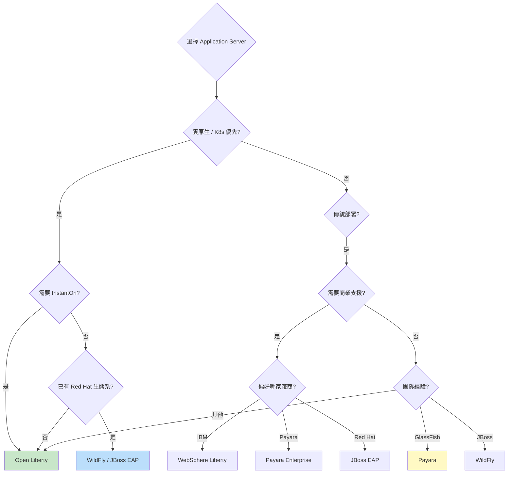

| 場景 | 推薦 | 理由 |
|------|------|------|
| 新建雲原生微服務 | **Open Liberty** | 啟動快、Feature 按需載入、K8s Operator |
| 銀行核心系統遷移 | **Open Liberty / Payara** | 穩定性、商業支援 |
| Red Hat 企業客戶 | **WildFly / JBoss EAP** | 生態系整合、統一支援 |
| 開發/測試環境 | **Open Liberty / GlassFish** | 啟動快速、配置簡單。GlassFish 作為 RI 可驗證規格合規性 |
| 既有 GlassFish 用戶 | **Payara** | 平滑遷移、企業級增值功能 |
| 規格合規性驗證 | **GlassFish** | 參考實作，規格行為最權威的驗證基準 |

### 5.7 實務注意事項

> **Application Server 選型要點**
> 1. **先確認 Jakarta EE 12 TCK 認證**：選擇已通過認證的版本
> 2. **評估商業支援**：生產環境建議購買商業支援合約
> 3. **Docker Image 大小**：影響 K8s 部署速度和 Registry 儲存成本
> 4. **Liberty 的 Feature 機制**：只載入需要的功能，可顯著減少攻擊面
> 5. **Payara Micro vs Payara Server**：微服務用 Micro，傳統部署用 Server
> 6. **WildFly Glow**：可自動分析 WAR 並產生最精簡的 Server 設定
> 7. **統一團隊標準**：同一專案組應使用相同的 Application Server

---

## 6. Maven 專案建立

### 6.1 Multi Module 專案架構

企業級 Jakarta EE 12 專案建議採用 Multi Module 架構，將關注點分離至不同模組，遵循 Clean Architecture 原則。

#### 專案模組結構

```
jakarta-enterprise-app/
├── pom.xml                          # Parent POM
├── app-domain/                      # Domain Layer（核心業務邏輯）
│   ├── pom.xml
│   └── src/main/java/
│       └── com/company/app/domain/
│           ├── model/               # Entity、Value Object、Aggregate
│           ├── repository/          # Repository 介面（Port）
│           ├── service/             # Domain Service
│           └── event/               # Domain Event
├── app-application/                 # Application Layer（Use Case）
│   ├── pom.xml
│   └── src/main/java/
│       └── com/company/app/application/
│           ├── usecase/             # Use Case 實作
│           ├── dto/                 # DTO / Command / Query
│           └── port/                # Input/Output Port
├── app-infrastructure/              # Infrastructure Layer（技術實作）
│   ├── pom.xml
│   └── src/main/java/
│       └── com/company/app/infrastructure/
│           ├── persistence/         # JPA Repository 實作
│           ├── messaging/           # Kafka/RabbitMQ Adapter
│           ├── cache/               # Redis Adapter
│           ├── external/            # 外部 API Client
│           └── config/              # CDI Producer、Configuration
├── app-api/                         # API Layer（REST 端點）
│   ├── pom.xml
│   └── src/
│       ├── main/
│       │   ├── java/
│       │   │   └── com/company/app/api/
│       │   │       ├── resource/    # JAX-RS Resource
│       │   │       ├── filter/      # Request/Response Filter
│       │   │       ├── mapper/      # Exception Mapper
│       │   │       └── config/      # Application Config
│       │   ├── resources/
│       │   │   └── META-INF/
│       │   │       ├── beans.xml
│       │   │       └── persistence.xml
│       │   └── webapp/
│       │       └── WEB-INF/
│       └── test/
└── app-ear/                         # EAR 打包（可選）
    └── pom.xml
```

#### 模組依賴關係

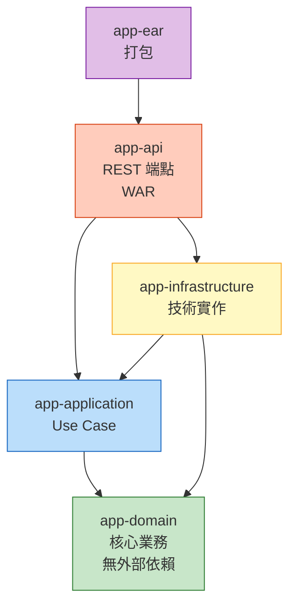

> **關鍵原則**：`app-domain` 模組不依賴任何外部框架（純 Java），確保業務邏輯的可測試性和可移植性。

### 6.2 Parent POM 設計

```xml
<?xml version="1.0" encoding="UTF-8"?>
<project xmlns="http://maven.apache.org/POM/4.0.0"
         xmlns:xsi="http://www.w3.org/2001/XMLSchema-instance"
         xsi:schemaLocation="http://maven.apache.org/POM/4.0.0 
         https://maven.apache.org/xsd/maven-4.0.0.xsd">
    <modelVersion>4.0.0</modelVersion>

    <groupId>com.company.app</groupId>
    <artifactId>jakarta-enterprise-app</artifactId>
    <version>1.0.0-SNAPSHOT</version>
    <packaging>pom</packaging>

    <name>Jakarta EE 12 Enterprise Application</name>
    <description>企業級 Jakarta EE 12 Multi Module 專案</description>

    <!-- 子模組 -->
    <modules>
        <module>app-domain</module>
        <module>app-application</module>
        <module>app-infrastructure</module>
        <module>app-api</module>
    </modules>

    <!-- 版本統一管理 -->
    <properties>
        <!-- Java -->
        <java.version>21</java.version>
        <maven.compiler.release>${java.version}</maven.compiler.release>
        <project.build.sourceEncoding>UTF-8</project.build.sourceEncoding>
        <project.reporting.outputEncoding>UTF-8</project.reporting.outputEncoding>

        <!-- Jakarta EE 12 -->
        <jakarta.ee.version>12.0.0</jakarta.ee.version>

        <!-- MicroProfile -->
        <microprofile.version>7.0</microprofile.version>

        <!-- Testing -->
        <junit.version>5.11.4</junit.version>
        <mockito.version>5.14.2</mockito.version>
        <testcontainers.version>1.20.4</testcontainers.version>
        <arquillian.version>1.9.1.Final</arquillian.version>
        <rest-assured.version>5.5.0</rest-assured.version>

        <!-- Logging -->
        <slf4j.version>2.0.16</slf4j.version>
        <logback.version>1.5.12</logback.version>

        <!-- Database -->
        <postgresql.version>42.7.4</postgresql.version>
        <flyway.version>10.21.0</flyway.version>

        <!-- Plugins -->
        <maven-compiler-plugin.version>3.14.1</maven-compiler-plugin.version>
        <maven-surefire-plugin.version>3.5.2</maven-surefire-plugin.version>
        <maven-failsafe-plugin.version>3.5.2</maven-failsafe-plugin.version>
        <maven-war-plugin.version>3.4.0</maven-war-plugin.version>
        <liberty-maven-plugin.version>3.11.3</liberty-maven-plugin.version>
        <jacoco-plugin.version>0.8.12</jacoco-plugin.version>
        <spotbugs-plugin.version>4.8.6.6</spotbugs-plugin.version>
    </properties>

    <!-- 依賴版本管理 -->
    <dependencyManagement>
        <dependencies>
            <!-- Jakarta EE 12 BOM -->
            <dependency>
                <groupId>jakarta.platform</groupId>
                <artifactId>jakarta.jakartaee-bom</artifactId>
                <version>${jakarta.ee.version}</version>
                <type>pom</type>
                <scope>import</scope>
            </dependency>

            <!-- MicroProfile BOM -->
            <dependency>
                <groupId>org.eclipse.microprofile</groupId>
                <artifactId>microprofile</artifactId>
                <version>${microprofile.version}</version>
                <type>pom</type>
                <scope>import</scope>
            </dependency>

            <!-- JUnit 5 BOM -->
            <dependency>
                <groupId>org.junit</groupId>
                <artifactId>junit-bom</artifactId>
                <version>${junit.version}</version>
                <type>pom</type>
                <scope>import</scope>
            </dependency>

            <!-- Testcontainers BOM -->
            <dependency>
                <groupId>org.testcontainers</groupId>
                <artifactId>testcontainers-bom</artifactId>
                <version>${testcontainers.version}</version>
                <type>pom</type>
                <scope>import</scope>
            </dependency>

            <!-- 內部模組版本 -->
            <dependency>
                <groupId>${project.groupId}</groupId>
                <artifactId>app-domain</artifactId>
                <version>${project.version}</version>
            </dependency>
            <dependency>
                <groupId>${project.groupId}</groupId>
                <artifactId>app-application</artifactId>
                <version>${project.version}</version>
            </dependency>
            <dependency>
                <groupId>${project.groupId}</groupId>
                <artifactId>app-infrastructure</artifactId>
                <version>${project.version}</version>
            </dependency>

            <!-- Database -->
            <dependency>
                <groupId>org.postgresql</groupId>
                <artifactId>postgresql</artifactId>
                <version>${postgresql.version}</version>
            </dependency>
            <dependency>
                <groupId>org.flywaydb</groupId>
                <artifactId>flyway-core</artifactId>
                <version>${flyway.version}</version>
            </dependency>

            <!-- Logging -->
            <dependency>
                <groupId>org.slf4j</groupId>
                <artifactId>slf4j-api</artifactId>
                <version>${slf4j.version}</version>
            </dependency>
        </dependencies>
    </dependencyManagement>

    <!-- 所有模組共用的依賴 -->
    <dependencies>
        <!-- Jakarta EE API（由 Application Server 提供） -->
        <dependency>
            <groupId>jakarta.platform</groupId>
            <artifactId>jakarta.jakartaee-api</artifactId>
            <version>${jakarta.ee.version}</version>
            <scope>provided</scope>
        </dependency>

        <!-- Testing -->
        <dependency>
            <groupId>org.junit.jupiter</groupId>
            <artifactId>junit-jupiter</artifactId>
            <scope>test</scope>
        </dependency>
        <dependency>
            <groupId>org.mockito</groupId>
            <artifactId>mockito-core</artifactId>
            <version>${mockito.version}</version>
            <scope>test</scope>
        </dependency>
        <dependency>
            <groupId>org.mockito</groupId>
            <artifactId>mockito-junit-jupiter</artifactId>
            <version>${mockito.version}</version>
            <scope>test</scope>
        </dependency>
    </dependencies>

    <!-- Plugin 管理 -->
    <build>
        <pluginManagement>
            <plugins>
                <plugin>
                    <groupId>org.apache.maven.plugins</groupId>
                    <artifactId>maven-compiler-plugin</artifactId>
                    <version>${maven-compiler-plugin.version}</version>
                    <configuration>
                        <release>${java.version}</release>
                        <compilerArgs>
                            <arg>-parameters</arg>
                        </compilerArgs>
                    </configuration>
                </plugin>
                <plugin>
                    <groupId>org.apache.maven.plugins</groupId>
                    <artifactId>maven-surefire-plugin</artifactId>
                    <version>${maven-surefire-plugin.version}</version>
                </plugin>
                <plugin>
                    <groupId>org.apache.maven.plugins</groupId>
                    <artifactId>maven-failsafe-plugin</artifactId>
                    <version>${maven-failsafe-plugin.version}</version>
                    <executions>
                        <execution>
                            <goals>
                                <goal>integration-test</goal>
                                <goal>verify</goal>
                            </goals>
                        </execution>
                    </executions>
                </plugin>
                <plugin>
                    <groupId>org.apache.maven.plugins</groupId>
                    <artifactId>maven-war-plugin</artifactId>
                    <version>${maven-war-plugin.version}</version>
                    <configuration>
                        <failOnMissingWebXml>false</failOnMissingWebXml>
                    </configuration>
                </plugin>
                <plugin>
                    <groupId>io.openliberty.tools</groupId>
                    <artifactId>liberty-maven-plugin</artifactId>
                    <version>${liberty-maven-plugin.version}</version>
                </plugin>
                <plugin>
                    <groupId>org.jacoco</groupId>
                    <artifactId>jacoco-maven-plugin</artifactId>
                    <version>${jacoco-plugin.version}</version>
                    <executions>
                        <execution>
                            <goals>
                                <goal>prepare-agent</goal>
                            </goals>
                        </execution>
                        <execution>
                            <id>report</id>
                            <phase>test</phase>
                            <goals>
                                <goal>report</goal>
                            </goals>
                        </execution>
                    </executions>
                </plugin>
            </plugins>
        </pluginManagement>

        <plugins>
            <plugin>
                <groupId>org.apache.maven.plugins</groupId>
                <artifactId>maven-compiler-plugin</artifactId>
            </plugin>
            <plugin>
                <groupId>org.jacoco</groupId>
                <artifactId>jacoco-maven-plugin</artifactId>
            </plugin>
        </plugins>
    </build>

    <!-- Profiles -->
    <profiles>
        <!-- 開發環境 -->
        <profile>
            <id>dev</id>
            <activation>
                <activeByDefault>true</activeByDefault>
            </activation>
            <properties>
                <env>dev</env>
            </properties>
        </profile>
        <!-- 測試環境 -->
        <profile>
            <id>staging</id>
            <properties>
                <env>staging</env>
            </properties>
        </profile>
        <!-- 生產環境 -->
        <profile>
            <id>prod</id>
            <properties>
                <env>prod</env>
            </properties>
        </profile>
        <!-- 安全掃描 -->
        <profile>
            <id>security</id>
            <build>
                <plugins>
                    <plugin>
                        <groupId>org.owasp</groupId>
                        <artifactId>dependency-check-maven</artifactId>
                        <version>10.0.4</version>
                        <executions>
                            <execution>
                                <goals>
                                    <goal>check</goal>
                                </goals>
                            </execution>
                        </executions>
                        <configuration>
                            <failBuildOnCVSS>7</failBuildOnCVSS>
                        </configuration>
                    </plugin>
                </plugins>
            </build>
        </profile>
    </profiles>
</project>
```

### 6.3 各層模組 POM

#### app-domain/pom.xml（核心業務 — 零外部依賴）

```xml
<?xml version="1.0" encoding="UTF-8"?>
<project xmlns="http://maven.apache.org/POM/4.0.0"
         xmlns:xsi="http://www.w3.org/2001/XMLSchema-instance"
         xsi:schemaLocation="http://maven.apache.org/POM/4.0.0 
         https://maven.apache.org/xsd/maven-4.0.0.xsd">
    <modelVersion>4.0.0</modelVersion>

    <parent>
        <groupId>com.company.app</groupId>
        <artifactId>jakarta-enterprise-app</artifactId>
        <version>1.0.0-SNAPSHOT</version>
    </parent>

    <artifactId>app-domain</artifactId>
    <packaging>jar</packaging>
    <name>Domain Layer</name>
    <description>核心業務邏輯 — 不依賴任何外部框架</description>

    <dependencies>
        <!-- Domain Layer 只依賴 Jakarta Validation 和 Jakarta Persistence API -->
        <dependency>
            <groupId>jakarta.validation</groupId>
            <artifactId>jakarta.validation-api</artifactId>
            <scope>provided</scope>
        </dependency>
        <dependency>
            <groupId>jakarta.persistence</groupId>
            <artifactId>jakarta.persistence-api</artifactId>
            <scope>provided</scope>
        </dependency>
    </dependencies>
</project>
```

#### app-application/pom.xml（Use Case 層）

```xml
<?xml version="1.0" encoding="UTF-8"?>
<project xmlns="http://maven.apache.org/POM/4.0.0"
         xmlns:xsi="http://www.w3.org/2001/XMLSchema-instance"
         xsi:schemaLocation="http://maven.apache.org/POM/4.0.0 
         https://maven.apache.org/xsd/maven-4.0.0.xsd">
    <modelVersion>4.0.0</modelVersion>

    <parent>
        <groupId>com.company.app</groupId>
        <artifactId>jakarta-enterprise-app</artifactId>
        <version>1.0.0-SNAPSHOT</version>
    </parent>

    <artifactId>app-application</artifactId>
    <packaging>jar</packaging>
    <name>Application Layer</name>

    <dependencies>
        <dependency>
            <groupId>${project.groupId}</groupId>
            <artifactId>app-domain</artifactId>
        </dependency>
    </dependencies>
</project>
```

#### app-infrastructure/pom.xml（技術實作層）

```xml
<?xml version="1.0" encoding="UTF-8"?>
<project xmlns="http://maven.apache.org/POM/4.0.0"
         xmlns:xsi="http://www.w3.org/2001/XMLSchema-instance"
         xsi:schemaLocation="http://maven.apache.org/POM/4.0.0 
         https://maven.apache.org/xsd/maven-4.0.0.xsd">
    <modelVersion>4.0.0</modelVersion>

    <parent>
        <groupId>com.company.app</groupId>
        <artifactId>jakarta-enterprise-app</artifactId>
        <version>1.0.0-SNAPSHOT</version>
    </parent>

    <artifactId>app-infrastructure</artifactId>
    <packaging>jar</packaging>
    <name>Infrastructure Layer</name>

    <dependencies>
        <dependency>
            <groupId>${project.groupId}</groupId>
            <artifactId>app-domain</artifactId>
        </dependency>
        <dependency>
            <groupId>${project.groupId}</groupId>
            <artifactId>app-application</artifactId>
        </dependency>
        <!-- Database -->
        <dependency>
            <groupId>org.postgresql</groupId>
            <artifactId>postgresql</artifactId>
            <scope>runtime</scope>
        </dependency>
        <dependency>
            <groupId>org.flywaydb</groupId>
            <artifactId>flyway-core</artifactId>
        </dependency>
        <!-- Testcontainers -->
        <dependency>
            <groupId>org.testcontainers</groupId>
            <artifactId>postgresql</artifactId>
            <scope>test</scope>
        </dependency>
    </dependencies>
</project>
```

#### app-api/pom.xml（REST API 層 — WAR 打包）

```xml
<?xml version="1.0" encoding="UTF-8"?>
<project xmlns="http://maven.apache.org/POM/4.0.0"
         xmlns:xsi="http://www.w3.org/2001/XMLSchema-instance"
         xsi:schemaLocation="http://maven.apache.org/POM/4.0.0 
         https://maven.apache.org/xsd/maven-4.0.0.xsd">
    <modelVersion>4.0.0</modelVersion>

    <parent>
        <groupId>com.company.app</groupId>
        <artifactId>jakarta-enterprise-app</artifactId>
        <version>1.0.0-SNAPSHOT</version>
    </parent>

    <artifactId>app-api</artifactId>
    <packaging>war</packaging>
    <name>API Layer</name>

    <dependencies>
        <dependency>
            <groupId>${project.groupId}</groupId>
            <artifactId>app-application</artifactId>
        </dependency>
        <dependency>
            <groupId>${project.groupId}</groupId>
            <artifactId>app-infrastructure</artifactId>
        </dependency>
        <!-- MicroProfile -->
        <dependency>
            <groupId>org.eclipse.microprofile</groupId>
            <artifactId>microprofile</artifactId>
            <type>pom</type>
            <scope>provided</scope>
        </dependency>
        <!-- Integration Test -->
        <dependency>
            <groupId>io.rest-assured</groupId>
            <artifactId>rest-assured</artifactId>
            <version>${rest-assured.version}</version>
            <scope>test</scope>
        </dependency>
    </dependencies>

    <build>
        <finalName>${project.artifactId}</finalName>
        <plugins>
            <plugin>
                <groupId>org.apache.maven.plugins</groupId>
                <artifactId>maven-war-plugin</artifactId>
            </plugin>
            <!-- Open Liberty 開發模式 -->
            <plugin>
                <groupId>io.openliberty.tools</groupId>
                <artifactId>liberty-maven-plugin</artifactId>
                <configuration>
                    <serverName>defaultServer</serverName>
                    <deployPackages>all</deployPackages>
                </configuration>
            </plugin>
        </plugins>
    </build>
</project>
```

### 6.4 dependencyManagement 與 pluginManagement

#### 關鍵設計原則

| 原則 | 說明 |
|------|------|
| **BOM Import** | 使用 `jakarta.jakartaee-bom` 統一管理所有 Jakarta EE API 版本 |
| **Scope 控制** | Jakarta EE API 為 `provided`（由 Server 提供） |
| **版本集中** | 所有版本號定義在 Parent POM 的 `<properties>` |
| **Plugin 繼承** | 透過 `pluginManagement` 統一 Plugin 版本，子模組按需引用 |
| **Profile 分離** | dev/staging/prod 環境透過 Maven Profile 切換 |

### 6.5 Maven Archetype

建立團隊專用的 Maven Archetype 模板，加速新專案建立：

```bash
# 使用 archetype 建立新專案
mvn archetype:generate \
  -DarchetypeGroupId=com.company.archetype \
  -DarchetypeArtifactId=jakarta-ee12-archetype \
  -DarchetypeVersion=1.0.0 \
  -DgroupId=com.company.newapp \
  -DartifactId=my-new-service \
  -Dversion=1.0.0-SNAPSHOT

# 常用 Maven 指令
mvn clean compile              # 編譯
mvn test                       # 執行單元測試
mvn verify                     # 執行整合測試
mvn package                    # 打包 WAR
mvn liberty:dev                # Open Liberty 開發模式（熱部署）
mvn liberty:run                # 啟動 Liberty Server
mvn -Psecurity verify          # 執行安全掃描
```

### 6.6 實務注意事項

> **Maven 專案管理要點**
> 1. **BOM 優先**：使用 `jakarta.jakartaee-bom` 避免版本衝突
> 2. **Scope 嚴格管控**：Jakarta EE API 必須是 `provided`，否則會與 Server 衝突
> 3. **Domain 模組零依賴**：`app-domain` 只允許 Jakarta Validation/Persistence API
> 4. **`-parameters` 編譯參數**：JAX-RS 和 CDI 需要保留方法參數名稱
> 5. **統一 Encoding**：全部使用 UTF-8
> 6. **Maven Wrapper**：將 `mvnw`/`mvnw.cmd` 納入版本控制，確保建置環境一致

---

## 7. Clean Architecture

### 7.1 Domain Driven Design（DDD）

DDD 與 Jakarta EE 12 結合，可以建立業務導向的系統架構。

#### DDD 戰略設計

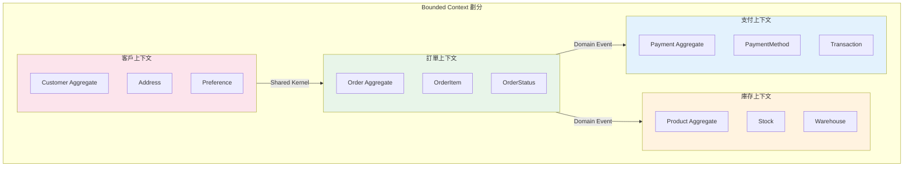

#### DDD 戰術設計元素對應

| DDD 概念 | Jakarta EE 12 實作 |
|----------|-------------------|
| Entity | `@Entity` + JPA |
| Value Object | Java Record |
| Aggregate Root | Entity + `@Version` 樂觀鎖 |
| Repository | `@Repository`（Jakarta Data）或自定義 Interface |
| Domain Service | CDI `@ApplicationScoped` Bean |
| Domain Event | CDI Event（`@Observes`） |
| Application Service | CDI Bean + `@Transactional` |
| Factory | CDI `@Produces` |

### 7.2 Hexagonal Architecture

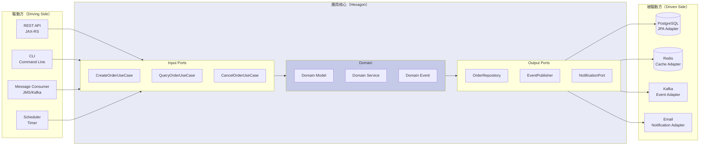

### 7.3 Clean Architecture 原則

#### 依賴方向：由外向內

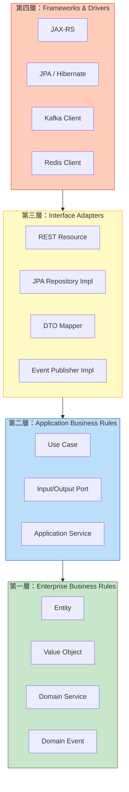

### 7.4 Ports and Adapters

#### Input Port（Use Case 介面）

```java
/**
 * Input Port：建立訂單的 Use Case 介面。
 * 定義在 Application Layer，由 API Layer 呼叫。
 */
public interface CreateOrderUseCase {
    
    /**
     * 建立訂單。
     * @param command 建立訂單命令
     * @return 訂單 ID
     */
    OrderId execute(CreateOrderCommand command);
}

/**
 * Command 物件使用 Record 定義。
 */
public record CreateOrderCommand(
    CustomerId customerId,
    List<OrderItemCommand> items,
    ShippingAddress shippingAddress
) {
    public CreateOrderCommand {
        Objects.requireNonNull(customerId, "customerId 不可為 null");
        if (items == null || items.isEmpty()) {
            throw new IllegalArgumentException("訂單項目不可為空");
        }
    }
}
```

#### Output Port（Repository 介面）

```java
/**
 * Output Port：訂單 Repository 介面。
 * 定義在 Domain Layer，由 Infrastructure Layer 實作。
 */
public interface OrderRepository {
    
    Optional<Order> findById(OrderId id);
    
    Order save(Order order);
    
    List<Order> findByCustomerId(CustomerId customerId);
    
    void delete(OrderId id);
}
```

#### Adapter 實作（Infrastructure Layer）

```java
/**
 * Output Adapter：JPA 實作的 OrderRepository。
 */
@ApplicationScoped
public class JpaOrderRepository implements OrderRepository {

    @PersistenceContext
    private EntityManager em;

    @Override
    public Optional<Order> findById(OrderId id) {
        return Optional.ofNullable(em.find(OrderEntity.class, id.value()))
            .map(OrderMapper::toDomain);
    }

    @Override
    @Transactional
    public Order save(Order order) {
        OrderEntity entity = OrderMapper.toEntity(order);
        if (entity.getId() == null) {
            em.persist(entity);
        } else {
            entity = em.merge(entity);
        }
        return OrderMapper.toDomain(entity);
    }

    @Override
    public List<Order> findByCustomerId(CustomerId customerId) {
        return em.createQuery(
                "SELECT o FROM OrderEntity o WHERE o.customerId = :customerId", 
                OrderEntity.class)
            .setParameter("customerId", customerId.value())
            .getResultList()
            .stream()
            .map(OrderMapper::toDomain)
            .toList();
    }

    @Override
    @Transactional
    public void delete(OrderId id) {
        em.createQuery("DELETE FROM OrderEntity o WHERE o.id = :id")
            .setParameter("id", id.value())
            .executeUpdate();
    }
}
```

### 7.5 Repository Pattern 與 Service Layer

#### Application Service（Use Case 實作）

```java
/**
 * Application Service：建立訂單 Use Case 的具體實作。
 */
@ApplicationScoped
@Transactional
public class CreateOrderService implements CreateOrderUseCase {

    private static final Logger logger = Logger.getLogger(CreateOrderService.class.getName());

    @Inject
    private OrderRepository orderRepository;

    @Inject
    private InventoryPort inventoryPort;

    @Inject
    private Event<OrderCreatedEvent> orderCreatedEvent;

    @Override
    public OrderId execute(CreateOrderCommand command) {
        logger.info("建立訂單: customerId=" + command.customerId());

        // 1. 檢查庫存
        for (OrderItemCommand item : command.items()) {
            if (!inventoryPort.checkAvailability(item.productId(), item.quantity())) {
                throw new InsufficientStockException(item.productId());
            }
        }

        // 2. 建立 Domain 物件
        Order order = Order.create(
            command.customerId(),
            command.items().stream()
                .map(i -> new OrderItem(i.productId(), i.quantity(), i.unitPrice()))
                .toList(),
            command.shippingAddress()
        );

        // 3. 持久化
        Order savedOrder = orderRepository.save(order);

        // 4. 發布 Domain Event
        orderCreatedEvent.fire(new OrderCreatedEvent(
            savedOrder.getId(),
            savedOrder.getCustomerId(),
            savedOrder.getTotalAmount(),
            Instant.now()
        ));

        logger.info("訂單建立成功: orderId=" + savedOrder.getId());
        return savedOrder.getId();
    }
}
```

### 7.6 完整專案目錄結構

```
jakarta-enterprise-app/
├── pom.xml
│
├── app-domain/
│   ├── pom.xml
│   └── src/
│       ├── main/java/com/company/app/domain/
│       │   ├── model/
│       │   │   ├── order/
│       │   │   │   ├── Order.java              # Aggregate Root
│       │   │   │   ├── OrderId.java             # Value Object (Record)
│       │   │   │   ├── OrderItem.java           # Entity
│       │   │   │   ├── OrderStatus.java         # Enum
│       │   │   │   └── Money.java               # Value Object (Record)
│       │   │   ├── customer/
│       │   │   │   ├── Customer.java
│       │   │   │   ├── CustomerId.java
│       │   │   │   └── ShippingAddress.java
│       │   │   └── common/
│       │   │       └── AuditInfo.java
│       │   ├── repository/
│       │   │   ├── OrderRepository.java         # Output Port
│       │   │   └── CustomerRepository.java
│       │   ├── service/
│       │   │   ├── OrderDomainService.java      # Domain Service
│       │   │   └── PricingService.java
│       │   ├── event/
│       │   │   ├── OrderCreatedEvent.java
│       │   │   └── OrderCancelledEvent.java
│       │   └── exception/
│       │       ├── InsufficientStockException.java
│       │       └── OrderNotFoundException.java
│       └── test/java/com/company/app/domain/
│           ├── model/order/OrderTest.java
│           └── service/PricingServiceTest.java
│
├── app-application/
│   ├── pom.xml
│   └── src/
│       ├── main/java/com/company/app/application/
│       │   ├── usecase/
│       │   │   ├── CreateOrderUseCase.java      # Input Port
│       │   │   ├── CreateOrderService.java      # Use Case 實作
│       │   │   ├── QueryOrderUseCase.java
│       │   │   └── CancelOrderUseCase.java
│       │   ├── dto/
│       │   │   ├── CreateOrderCommand.java      # Command (Record)
│       │   │   ├── OrderResponse.java           # Response (Record)
│       │   │   └── PageResponse.java
│       │   └── port/
│       │       ├── InventoryPort.java           # Output Port
│       │       └── NotificationPort.java
│       └── test/java/
│
├── app-infrastructure/
│   ├── pom.xml
│   └── src/
│       ├── main/java/com/company/app/infrastructure/
│       │   ├── persistence/
│       │   │   ├── entity/
│       │   │   │   ├── OrderEntity.java         # JPA Entity
│       │   │   │   └── CustomerEntity.java
│       │   │   ├── repository/
│       │   │   │   ├── JpaOrderRepository.java  # Adapter
│       │   │   │   └── JpaCustomerRepository.java
│       │   │   └── mapper/
│       │   │       └── OrderMapper.java
│       │   ├── messaging/
│       │   │   ├── KafkaEventPublisher.java
│       │   │   └── KafkaOrderConsumer.java
│       │   ├── cache/
│       │   │   └── RedisInventoryAdapter.java
│       │   ├── external/
│       │   │   └── PaymentGatewayClient.java
│       │   └── config/
│       │       ├── DatabaseProducer.java
│       │       └── CacheProducer.java
│       ├── main/resources/
│       │   └── META-INF/
│       │       └── persistence.xml
│       └── test/java/
│
├── app-api/
│   ├── pom.xml
│   └── src/
│       ├── main/java/com/company/app/api/
│       │   ├── resource/
│       │   │   ├── OrderResource.java           # JAX-RS Resource
│       │   │   ├── CustomerResource.java
│       │   │   └── HealthResource.java
│       │   ├── filter/
│       │   │   ├── CorsFilter.java
│       │   │   ├── LoggingFilter.java
│       │   │   └── AuthenticationFilter.java
│       │   ├── mapper/
│       │   │   ├── GlobalExceptionMapper.java
│       │   │   └── ValidationExceptionMapper.java
│       │   └── config/
│       │       └── JakartaRestApplication.java  # Application 配置
│       ├── main/resources/
│       │   └── META-INF/
│       │       ├── beans.xml
│       │       └── microprofile-config.properties
│       ├── main/webapp/WEB-INF/
│       └── test/java/
│
└── docs/
    ├── architecture/
    │   ├── adr/                                  # Architecture Decision Records
    │   └── diagrams/
    └── api/
        └── openapi.yaml
```

### 7.7 實務注意事項

> **Clean Architecture 落地建議**
> 1. **Domain 模組不可依賴框架**：app-domain 只用純 Java + Jakarta API（provided scope）
> 2. **依賴方向嚴格單向**：外層 → 內層，絕對不可反向依賴
> 3. **使用 Record 定義 DTO/Command/Event**：不可變、自動產生 equals/hashCode
> 4. **Domain Event 透過 CDI Event**：鬆耦合的跨模組通訊
> 5. **Mapper 層明確分離**：Domain Model ↔ JPA Entity ↔ API DTO 三層轉換
> 6. **不要過度設計**：小型 CRUD 系統不需要完整四層，可簡化為兩層
> 7. **ADR（Architecture Decision Records）**：記錄重要架構決策的理由

---

## 8. Jakarta CDI 5.0

### 8.1 Dependency Injection 基礎

CDI（Contexts and Dependency Injection）是 Jakarta EE 的核心基礎設施，負責管理 Bean 的生命週期與依賴注入。CDI 5.0 是 Jakarta EE 12 中最重要的更新之一。

#### CDI 5.0 核心變更

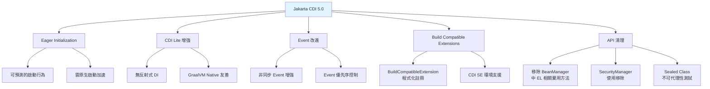

#### 基礎注入方式

```java
/**
 * 欄位注入（Field Injection）— 最常見但不推薦用於測試。
 */
@ApplicationScoped
public class OrderService {

    @Inject
    private OrderRepository orderRepository;

    @Inject
    private NotificationService notificationService;
}

/**
 * 建構子注入（Constructor Injection）— 推薦方式，易於測試。
 */
@ApplicationScoped
public class OrderService {

    private final OrderRepository orderRepository;
    private final NotificationService notificationService;

    @Inject
    public OrderService(OrderRepository orderRepository,
                        NotificationService notificationService) {
        this.orderRepository = orderRepository;
        this.notificationService = notificationService;
    }
}

/**
 * 方法注入（Method Injection）。
 */
@ApplicationScoped
public class OrderService {

    private OrderRepository orderRepository;

    @Inject
    public void setOrderRepository(OrderRepository orderRepository) {
        this.orderRepository = orderRepository;
    }
}
```

### 8.2 Bean Scope

| Scope | 註解 | 生命週期 | 適用場景 |
|-------|------|---------|---------|
| **Application** | `@ApplicationScoped` | 整個應用程式 | Service、Repository |
| **Session** | `@SessionScoped` | HTTP Session | 使用者會話狀態 |
| **Request** | `@RequestScoped` | 單一 HTTP 請求 | 請求相關資料 |
| **Dependent** | `@Dependent` | 跟隨注入點 | 輕量工具類 |
| **Conversation** | `@ConversationScoped` | 多請求對話 | 多步驟表單 |
| **Singleton** | `@Singleton` | JVM 唯一 | 全域配置 |
| **Transaction** | `@TransactionScoped` | 單一交易 | 交易範圍的上下文 |

```java
/**
 * 請求範圍的審計上下文。
 * 每次 HTTP 請求建立新的實例，請求結束自動銷毀。
 */
@RequestScoped
public class AuditContext {

    private String correlationId;
    private String userId;
    private Instant requestTime;

    @PostConstruct
    public void init() {
        this.correlationId = UUID.randomUUID().toString();
        this.requestTime = Instant.now();
    }

    // getter / setter
    public String getCorrelationId() { return correlationId; }
    public void setUserId(String userId) { this.userId = userId; }
    public String getUserId() { return userId; }
    public Instant getRequestTime() { return requestTime; }
}
```

### 8.3 Eager Initialization

CDI 5.0 最重要的新特性 — **Eager Initialization**。解決雲原生環境中 Lazy Init 導致的不可預測啟動行為。

```java
/**
 * CDI 5.0: @Startup 讓 Bean 在容器啟動時立即初始化。
 * 適合：快取預載、連線池預熱、配置驗證。
 */
@ApplicationScoped
@Startup  // CDI 5.0 新增
public class CacheWarmupService {

    private static final Logger logger = Logger.getLogger(CacheWarmupService.class.getName());

    @Inject
    private ProductRepository productRepository;

    @Inject
    private CacheService cacheService;

    @PostConstruct
    public void warmup() {
        logger.info("應用啟動 — 開始預載快取...");
        
        List<Product> hotProducts = productRepository.findTopProducts(1000);
        hotProducts.forEach(p -> cacheService.put("product:" + p.getId(), p));
        
        logger.info("快取預載完成: " + hotProducts.size() + " 項產品");
    }
}

/**
 * 啟動時驗證外部服務連線。
 */
@ApplicationScoped
@Startup
public class StartupHealthCheck {

    @Inject
    private DataSource dataSource;

    @PostConstruct
    public void validateConnections() {
        // 啟動時驗證資料庫連線
        try (Connection conn = dataSource.getConnection()) {
            if (!conn.isValid(5)) {
                throw new RuntimeException("資料庫連線驗證失敗");
            }
        } catch (SQLException e) {
            throw new RuntimeException("無法連線至資料庫", e);
        }
    }
}
```

### 8.4 Producer 與 Qualifier

#### Producer — 工廠方法

```java
/**
 * CDI Producer：建立非 CDI 管理的物件。
 */
@ApplicationScoped
public class ConfigProducer {

    @Produces
    @ApplicationScoped
    @Named("objectMapper")
    public ObjectMapper createObjectMapper() {
        return new ObjectMapper()
            .registerModule(new JavaTimeModule())
            .disable(SerializationFeature.WRITE_DATES_AS_TIMESTAMPS)
            .setSerializationInclusion(JsonInclude.Include.NON_NULL);
    }

    @Produces
    @RequestScoped
    @Named("correlationId")
    public String createCorrelationId() {
        return UUID.randomUUID().toString();
    }
}
```

#### Qualifier — 區分同型別的多個實作

```java
/**
 * 自定義 Qualifier 標註。
 */
@Qualifier
@Retention(RUNTIME)
@Target({FIELD, METHOD, PARAMETER, TYPE})
public @interface CacheType {
    CacheProvider value();
    
    enum CacheProvider {
        REDIS, LOCAL, DISTRIBUTED
    }
}

/**
 * 使用 Qualifier 區分不同快取實作。
 */
@ApplicationScoped
@CacheType(CacheProvider.REDIS)
public class RedisCacheService implements CacheService {
    // Redis 實作
}

@ApplicationScoped
@CacheType(CacheProvider.LOCAL)
public class LocalCacheService implements CacheService {
    // 本地記憶體快取實作
}

// 注入時指定
@ApplicationScoped
public class ProductService {
    
    @Inject
    @CacheType(CacheProvider.REDIS)
    private CacheService cacheService;
}
```

### 8.5 Interceptor 與 Decorator

#### Interceptor — AOP 橫切關注點

```java
/**
 * 自定義 Interceptor Binding。
 */
@InterceptorBinding
@Retention(RUNTIME)
@Target({TYPE, METHOD})
public @interface Logged {}

/**
 * 日誌記錄 Interceptor。
 */
@Interceptor
@Logged
@Priority(Interceptor.Priority.APPLICATION)
public class LoggingInterceptor {

    private static final Logger logger = Logger.getLogger(LoggingInterceptor.class.getName());

    @AroundInvoke
    public Object logMethodCall(InvocationContext ctx) throws Exception {
        String method = ctx.getMethod().getDeclaringClass().getSimpleName() 
                       + "." + ctx.getMethod().getName();
        long start = System.nanoTime();
        
        logger.info("→ " + method + " 開始");
        try {
            Object result = ctx.proceed();
            long elapsed = (System.nanoTime() - start) / 1_000_000;
            logger.info("← " + method + " 完成 (" + elapsed + "ms)");
            return result;
        } catch (Exception e) {
            long elapsed = (System.nanoTime() - start) / 1_000_000;
            logger.severe("✗ " + method + " 失敗 (" + elapsed + "ms): " + e.getMessage());
            throw e;
        }
    }
}

// 使用
@ApplicationScoped
public class OrderService {
    
    @Logged
    public Order createOrder(CreateOrderCommand command) {
        // 自動記錄進出日誌
        return doCreateOrder(command);
    }
}
```

#### 交易重試 Interceptor

```java
@InterceptorBinding
@Retention(RUNTIME)
@Target({TYPE, METHOD})
public @interface Retry {
    int maxAttempts() default 3;
    long delayMs() default 1000;
}

@Interceptor
@Retry
@Priority(Interceptor.Priority.APPLICATION + 10)
public class RetryInterceptor {

    @AroundInvoke
    public Object retry(InvocationContext ctx) throws Exception {
        Retry config = ctx.getMethod().getAnnotation(Retry.class);
        int maxAttempts = config != null ? config.maxAttempts() : 3;
        long delayMs = config != null ? config.delayMs() : 1000;
        
        Exception lastException = null;
        for (int attempt = 1; attempt <= maxAttempts; attempt++) {
            try {
                return ctx.proceed();
            } catch (OptimisticLockException | PessimisticLockException e) {
                lastException = e;
                if (attempt < maxAttempts) {
                    Thread.sleep(delayMs * attempt); // 指數退避
                }
            }
        }
        throw lastException;
    }
}
```

### 8.6 Event 機制

```java
/**
 * Domain Event 定義。
 */
public record OrderCreatedEvent(
    OrderId orderId,
    CustomerId customerId,
    BigDecimal totalAmount,
    Instant createdAt
) {}

/**
 * 發布 Event。
 */
@ApplicationScoped
public class OrderService {

    @Inject
    private Event<OrderCreatedEvent> orderCreatedEvent;

    @Transactional
    public Order createOrder(CreateOrderCommand command) {
        Order order = /* ... 建立訂單 ... */;
        
        // 同步發布事件
        orderCreatedEvent.fire(new OrderCreatedEvent(
            order.getId(), order.getCustomerId(),
            order.getTotalAmount(), Instant.now()
        ));
        
        // 非同步發布事件
        orderCreatedEvent.fireAsync(new OrderCreatedEvent(
            order.getId(), order.getCustomerId(),
            order.getTotalAmount(), Instant.now()
        ));
        
        return order;
    }
}

/**
 * 觀察（訂閱）Event。
 */
@ApplicationScoped
public class OrderEventHandler {

    @Inject
    private NotificationService notificationService;

    @Inject
    private InventoryService inventoryService;

    /**
     * 同步處理：在同一交易中執行。
     */
    public void onOrderCreated(@Observes OrderCreatedEvent event) {
        inventoryService.reserveStock(event.orderId());
    }

    /**
     * 非同步處理：在獨立執行緒中執行。
     */
    public void onOrderCreatedAsync(@ObservesAsync OrderCreatedEvent event) {
        notificationService.sendOrderConfirmation(event.customerId(), event.orderId());
    }
}
```

### 8.7 BuildCompatibleExtension

CDI 5.0 強化了 Build Compatible Extension（建構時相容擴展），並新增在 CDI SE 環境中以程式化方式註冊 Extension 的能力。

#### 傳統 Portable Extension vs Build Compatible Extension

| 維度 | Portable Extension（CDI 1.x+） | Build Compatible Extension（CDI 4.0+） |
|------|-------------------------------|----------------------------------------|
| 執行時機 | Runtime（反射式） | Build Time（可編譯時處理） |
| GraalVM Native | 不友善 | 友善 |
| 效能影響 | 啟動時有開銷 | 建構時處理，啟動無負擔 |
| CDI Lite 支援 | 不支援 | 支援 |
| 複雜度 | 高（需理解 Container 生命週期） | 中（聲明式 API） |

```java
/**
 * CDI 5.0 Build Compatible Extension 範例：
 * 自動為所有 @Audited 註解的 Bean 註冊攔截器。
 */
public class AuditExtension implements BuildCompatibleExtension {

    @Enhancement(types = Object.class, withAnnotations = Audited.class)
    public void addAuditInterceptor(ClassConfig config) {
        config.addAnnotation(AuditInterceptorBinding.class);
    }

    @Registration(types = Object.class)
    public void registerAuditBeans(BeanInfo bean, Messages messages) {
        if (bean.isClassBean() && bean.hasAnnotation(Audited.class)) {
            messages.info("已註冊審計攔截器: " + bean.beanClass().name());
        }
    }

    @Synthesis
    public void synthesizeBeans(SyntheticComponents components) {
        // 合成一個計數器 Bean，統計已審計的 Bean 數量
        components.addBean(AuditCounter.class)
            .type(AuditCounter.class)
            .scope(ApplicationScoped.class)
            .createWith(AuditCounterCreator.class);
    }
}
```

```java
/**
 * CDI 5.0 新增：在 CDI SE 中程式化註冊 BuildCompatibleExtension。
 */
public class AppMain {
    public static void main(String[] args) {
        try (SeContainer container = SeContainerInitializer.newInstance()
                .addBuildCompatibleExtensions(new AuditExtension())  // CDI 5.0 新增
                .initialize()) {
            
            var service = container.select(OrderService.class).get();
            service.processOrders();
        }
    }
}
```

### 8.8 實務注意事項

> **CDI 最佳實務**
> 1. **優先使用 Constructor Injection**：更易於單元測試
> 2. **`@ApplicationScoped` 是預設首選**：除非有明確理由使用其他 Scope
> 3. **`@Startup` 適度使用**：過多 Eager Init 會拖慢啟動時間
> 4. **beans.xml 配置**：建議使用 `bean-discovery-mode="annotated"`
> 5. **避免在 `@PostConstruct` 中拋出未檢查例外**：會導致應用啟動失敗
> 6. **Event 的同步 vs 非同步**：同步用於必須在同一交易中完成的操作

---

## 9. Jakarta RESTful Web Services 5.0

### 9.1 REST API 設計原則

#### RESTful API 設計規範

| 原則 | 說明 | 範例 |
|------|------|------|
| 名詞複數 | 資源使用複數名詞 | `/api/v1/orders` |
| HTTP Method 語意 | GET 查詢、POST 建立、PUT 更新、DELETE 刪除 | `GET /orders/{id}` |
| 版本化 | URL 路徑或 Header 版本控制 | `/api/v1/` |
| HATEOAS | 回應中包含相關資源連結 | `_links` 欄位 |
| 一致的錯誤格式 | 統一的錯誤回應結構 | `{ code, message, details }` |
| 狀態碼語意化 | 正確使用 HTTP 狀態碼 | 201 Created, 404 Not Found |

#### Application 配置

```java
/**
 * Jakarta REST Application 配置。
 */
@ApplicationPath("/api/v1")
public class JakartaRestApplication extends Application {
    // 不需要覆寫任何方法 — CDI 自動掃描 Resource
}
```

### 9.2 JSON-B 3.1 與資料綁定

```java
/**
 * JSON-B 配置自訂。
 */
@ApplicationScoped
public class JsonbConfigurator {

    @Produces
    public Jsonb createJsonb() {
        JsonbConfig config = new JsonbConfig()
            .withFormatting(true)
            .withNullValues(false)
            .withDateFormat("yyyy-MM-dd'T'HH:mm:ss.SSSZ", Locale.getDefault())
            .withPropertyNamingStrategy(PropertyNamingStrategy.LOWER_CASE_WITH_UNDERSCORES);
        return JsonbBuilder.create(config);
    }
}

/**
 * API Response 封裝。
 */
public record ApiResponse<T>(
    @JsonbProperty("status_code") int statusCode,
    String message,
    T data,
    @JsonbProperty("timestamp") Instant timestamp,
    @JsonbTransient String internalNote  // 不序列化
) {
    public static <T> ApiResponse<T> ok(T data) {
        return new ApiResponse<>(200, "成功", data, Instant.now(), null);
    }

    public static <T> ApiResponse<T> created(T data) {
        return new ApiResponse<>(201, "建立成功", data, Instant.now(), null);
    }

    public static ApiResponse<Void> error(int code, String message) {
        return new ApiResponse<>(code, message, null, Instant.now(), null);
    }
}
```

### 9.3 Bean Validation 4.0

```java
/**
 * 使用 Bean Validation 驗證請求參數。
 */
public record CreateOrderRequest(
    @NotBlank(message = "客戶 ID 不可為空")
    @Size(max = 36, message = "客戶 ID 長度不可超過 36")
    String customerId,

    @NotEmpty(message = "訂單項目不可為空")
    @Size(max = 100, message = "單筆訂單最多 100 項商品")
    List<@Valid OrderItemRequest> items,

    @Valid
    @NotNull(message = "收貨地址不可為空")
    AddressRequest shippingAddress,

    @Size(max = 500, message = "備註不可超過 500 字")
    String notes
) {}

public record OrderItemRequest(
    @NotBlank String productId,
    @Min(value = 1, message = "數量至少為 1")
    @Max(value = 9999, message = "數量不可超過 9999")
    int quantity
) {}

public record AddressRequest(
    @NotBlank String city,
    @NotBlank String district,
    @NotBlank String street,
    @Pattern(regexp = "\\d{3,5}", message = "郵遞區號格式錯誤")
    String zipCode
) {}
```

### 9.4 Exception Handling

```java
/**
 * 統一錯誤回應格式。
 */
public record ErrorResponse(
    int status,
    String error,
    String message,
    String path,
    Instant timestamp,
    List<FieldError> fieldErrors
) {
    public record FieldError(String field, String message, Object rejectedValue) {}
}

/**
 * 全域 Exception Mapper。
 */
@Provider
public class GlobalExceptionMapper implements ExceptionMapper<Exception> {

    private static final Logger logger = Logger.getLogger(GlobalExceptionMapper.class.getName());

    @Context
    private UriInfo uriInfo;

    @Override
    public Response toResponse(Exception exception) {
        return switch (exception) {
            case ConstraintViolationException cve -> handleValidation(cve);
            case WebApplicationException wae -> handleWebApp(wae);
            case OrderNotFoundException nfe -> handleNotFound(nfe);
            case InsufficientStockException ise -> handleConflict(ise);
            default -> handleUnexpected(exception);
        };
    }

    private Response handleValidation(ConstraintViolationException e) {
        List<ErrorResponse.FieldError> fieldErrors = e.getConstraintViolations()
            .stream()
            .map(v -> new ErrorResponse.FieldError(
                v.getPropertyPath().toString(),
                v.getMessage(),
                v.getInvalidValue()))
            .toList();

        ErrorResponse error = new ErrorResponse(
            400, "Validation Error", "請求參數驗證失敗",
            uriInfo.getPath(), Instant.now(), fieldErrors);

        return Response.status(400).entity(error).build();
    }

    private Response handleNotFound(OrderNotFoundException e) {
        ErrorResponse error = new ErrorResponse(
            404, "Not Found", e.getMessage(),
            uriInfo.getPath(), Instant.now(), null);
        return Response.status(404).entity(error).build();
    }

    private Response handleConflict(InsufficientStockException e) {
        ErrorResponse error = new ErrorResponse(
            409, "Conflict", e.getMessage(),
            uriInfo.getPath(), Instant.now(), null);
        return Response.status(409).entity(error).build();
    }

    private Response handleWebApp(WebApplicationException e) {
        ErrorResponse error = new ErrorResponse(
            e.getResponse().getStatus(), "Error", e.getMessage(),
            uriInfo.getPath(), Instant.now(), null);
        return Response.status(e.getResponse().getStatus()).entity(error).build();
    }

    private Response handleUnexpected(Exception e) {
        logger.severe("未預期的錯誤: " + e.getMessage());
        ErrorResponse error = new ErrorResponse(
            500, "Internal Server Error", "伺服器內部錯誤，請聯繫系統管理員",
            uriInfo.getPath(), Instant.now(), null);
        return Response.status(500).entity(error).build();
    }
}
```

### 9.5 CRUD API 完整實作

```java
/**
 * 訂單 REST Resource — 完整 CRUD API。
 */
@Path("/orders")
@Produces(MediaType.APPLICATION_JSON)
@Consumes(MediaType.APPLICATION_JSON)
@ApplicationScoped
public class OrderResource {

    @Inject
    private CreateOrderUseCase createOrderUseCase;

    @Inject
    private QueryOrderUseCase queryOrderUseCase;

    @Inject
    private CancelOrderUseCase cancelOrderUseCase;

    /**
     * 建立訂單。
     * POST /api/v1/orders
     */
    @POST
    public Response createOrder(@Valid CreateOrderRequest request) {
        CreateOrderCommand command = new CreateOrderCommand(
            new CustomerId(request.customerId()),
            request.items().stream()
                .map(i -> new OrderItemCommand(
                    new ProductId(i.productId()), i.quantity()))
                .toList(),
            mapAddress(request.shippingAddress())
        );

        OrderId orderId = createOrderUseCase.execute(command);

        return Response
            .status(Response.Status.CREATED)
            .entity(ApiResponse.created(Map.of("orderId", orderId.value())))
            .header("Location", "/api/v1/orders/" + orderId.value())
            .build();
    }

    /**
     * 查詢單一訂單。
     * GET /api/v1/orders/{id}
     */
    @GET
    @Path("/{id}")
    public Response getOrder(@PathParam("id") String id) {
        OrderResponse order = queryOrderUseCase.findById(new OrderId(id));
        return Response.ok(ApiResponse.ok(order)).build();
    }

    /**
     * 查詢訂單清單（分頁）。
     * GET /api/v1/orders?page=0&size=20&sort=createdAt,desc
     */
    @GET
    public Response listOrders(
            @QueryParam("page") @DefaultValue("0") int page,
            @QueryParam("size") @DefaultValue("20") int size,
            @QueryParam("sort") @DefaultValue("createdAt,desc") String sort,
            @QueryParam("status") String status,
            @QueryParam("customerId") String customerId) {

        OrderQuery query = new OrderQuery(page, size, sort, status, customerId);
        PageResponse<OrderResponse> result = queryOrderUseCase.findAll(query);
        return Response.ok(ApiResponse.ok(result)).build();
    }

    /**
     * 取消訂單。
     * DELETE /api/v1/orders/{id}
     */
    @DELETE
    @Path("/{id}")
    public Response cancelOrder(@PathParam("id") String id) {
        cancelOrderUseCase.execute(new OrderId(id));
        return Response.noContent().build();
    }
}
```

### 9.6 分頁、排序與過濾

```java
/**
 * 通用分頁回應物件。
 */
public record PageResponse<T>(
    List<T> content,
    int page,
    int size,
    long totalElements,
    int totalPages,
    boolean first,
    boolean last
) {
    public static <T> PageResponse<T> of(List<T> content, int page, int size, long total) {
        int totalPages = (int) Math.ceil((double) total / size);
        return new PageResponse<>(
            content, page, size, total, totalPages,
            page == 0, page >= totalPages - 1
        );
    }
}

/**
 * 排序工具類。
 */
public class SortParser {

    /**
     * 解析排序字串。
     * @param sort 格式: "field,direction" 例如 "createdAt,desc"
     */
    public static String toJpql(String sort, Set<String> allowedFields) {
        if (sort == null || sort.isBlank()) {
            return "o.createdAt DESC";
        }
        String[] parts = sort.split(",");
        String field = parts[0].trim();
        String direction = parts.length > 1 ? parts[1].trim().toUpperCase() : "ASC";

        // 白名單驗證 — 防止 SQL Injection
        if (!allowedFields.contains(field)) {
            throw new IllegalArgumentException("不支援的排序欄位: " + field);
        }
        if (!"ASC".equals(direction) && !"DESC".equals(direction)) {
            throw new IllegalArgumentException("不支援的排序方向: " + direction);
        }

        return "o." + field + " " + direction;
    }
}
```

### 9.7 OpenAPI 整合

```java
/**
 * 使用 MicroProfile OpenAPI 註解描述 API。
 */
@Path("/orders")
@Produces(MediaType.APPLICATION_JSON)
@Consumes(MediaType.APPLICATION_JSON)
@Tag(name = "Orders", description = "訂單管理 API")
@ApplicationScoped
public class OrderResource {

    @POST
    @Operation(summary = "建立訂單", description = "建立新的訂單")
    @APIResponse(responseCode = "201", description = "訂單建立成功",
        content = @Content(schema = @Schema(implementation = ApiResponse.class)))
    @APIResponse(responseCode = "400", description = "請求參數錯誤",
        content = @Content(schema = @Schema(implementation = ErrorResponse.class)))
    @APIResponse(responseCode = "409", description = "庫存不足")
    public Response createOrder(
            @RequestBody(description = "訂單建立請求", required = true,
                content = @Content(schema = @Schema(implementation = CreateOrderRequest.class)))
            @Valid CreateOrderRequest request) {
        // ... 實作
    }

    @GET
    @Path("/{id}")
    @Operation(summary = "查詢訂單", description = "依據訂單 ID 查詢訂單詳情")
    @APIResponse(responseCode = "200", description = "查詢成功")
    @APIResponse(responseCode = "404", description = "訂單不存在")
    public Response getOrder(
            @Parameter(description = "訂單 ID", required = true, example = "ORD-20260101-001")
            @PathParam("id") String id) {
        // ... 實作
    }
}
```

### 9.8 JWT Security

```java
/**
 * JWT 認證過濾器。
 */
@Provider
@Priority(Priorities.AUTHENTICATION)
public class JwtAuthenticationFilter implements ContainerRequestFilter {

    @Inject
    private JsonWebToken jwt;

    @Override
    public void filter(ContainerRequestContext requestContext) {
        // 跳過公開端點
        if (isPublicEndpoint(requestContext)) {
            return;
        }

        String authHeader = requestContext.getHeaderString(HttpHeaders.AUTHORIZATION);
        if (authHeader == null || !authHeader.startsWith("Bearer ")) {
            requestContext.abortWith(
                Response.status(Response.Status.UNAUTHORIZED)
                    .entity(ApiResponse.error(401, "缺少認證 Token"))
                    .build());
        }
    }

    private boolean isPublicEndpoint(ContainerRequestContext ctx) {
        return ctx.getUriInfo().getPath().startsWith("health")
            || ctx.getUriInfo().getPath().startsWith("openapi");
    }
}

/**
 * 角色授權控制。
 */
@Path("/admin/orders")
@RolesAllowed({"ADMIN", "MANAGER"})
@ApplicationScoped
public class AdminOrderResource {

    @GET
    @RolesAllowed("ADMIN")
    public Response getAllOrders() {
        // 僅 ADMIN 可存取
    }

    @DELETE
    @Path("/{id}")
    @RolesAllowed("ADMIN")
    public Response forceDeleteOrder(@PathParam("id") String id) {
        // 僅 ADMIN 可存取
    }
}
```

### 9.9 實務注意事項

> **REST API 開發要點**
> 1. **統一錯誤格式**：全域 ExceptionMapper 確保所有錯誤回應結構一致
> 2. **Bean Validation**：所有 Request DTO 必須加上驗證註解
> 3. **分頁預設限制**：限制 `size` 最大值（如 100），防止一次回傳過多資料
> 4. **排序欄位白名單**：必須驗證排序欄位，防止 JPQL/SQL Injection
> 5. **OpenAPI 文件化**：所有公開 API 必須有 OpenAPI 註解
> 6. **版本策略**：URL Path Versioning（`/api/v1/`）最簡單明瞭
> 7. **CORS**：生產環境必須嚴格設定允許的 Origin

---

## 10. Jakarta Persistence 4.0

### 10.1 JPA 核心概念

Jakarta Persistence 4.0 是 Jakarta EE 12 中資料存取的核心規格，提供物件關聯映射（ORM）能力。

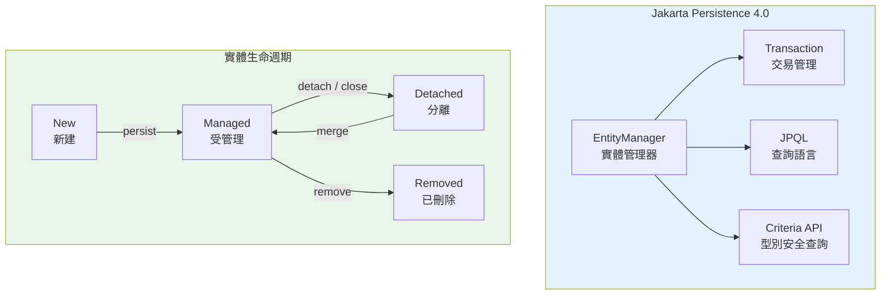

### 10.2 Entity 設計

```java
/**
 * 基礎實體：共用的審計欄位。
 */
@MappedSuperclass
public abstract class BaseEntity {

    @Column(name = "created_at", nullable = false, updatable = false)
    private Instant createdAt;

    @Column(name = "updated_at")
    private Instant updatedAt;

    @Column(name = "created_by", length = 100)
    private String createdBy;

    @Version
    @Column(name = "version")
    private Long version;

    @PrePersist
    protected void onCreate() {
        this.createdAt = Instant.now();
        this.updatedAt = this.createdAt;
    }

    @PreUpdate
    protected void onUpdate() {
        this.updatedAt = Instant.now();
    }

    // getter
    public Instant getCreatedAt() { return createdAt; }
    public Instant getUpdatedAt() { return updatedAt; }
    public Long getVersion() { return version; }
}

/**
 * 訂單實體 — Aggregate Root。
 */
@Entity
@Table(name = "orders", indexes = {
    @Index(name = "idx_order_customer", columnList = "customer_id"),
    @Index(name = "idx_order_status", columnList = "status"),
    @Index(name = "idx_order_created", columnList = "created_at")
})
@NamedQuery(
    name = "Order.findByStatus",
    query = "SELECT o FROM OrderEntity o WHERE o.status = :status ORDER BY o.createdAt DESC"
)
public class OrderEntity extends BaseEntity {

    @Id
    @Column(name = "id", length = 36)
    private String id;

    @Column(name = "customer_id", nullable = false, length = 36)
    private String customerId;

    @Enumerated(EnumType.STRING)
    @Column(name = "status", nullable = false, length = 20)
    private OrderStatus status;

    @Column(name = "total_amount", precision = 19, scale = 4)
    private BigDecimal totalAmount;

    @OneToMany(mappedBy = "order", cascade = CascadeType.ALL, orphanRemoval = true,
               fetch = FetchType.LAZY)
    @OrderBy("lineNumber ASC")
    private List<OrderItemEntity> items = new ArrayList<>();

    @Embedded
    private ShippingAddressEmbeddable shippingAddress;

    // === Domain 方法 ===

    public void addItem(OrderItemEntity item) {
        items.add(item);
        item.setOrder(this);
        recalculateTotal();
    }

    public void removeItem(OrderItemEntity item) {
        items.remove(item);
        item.setOrder(null);
        recalculateTotal();
    }

    private void recalculateTotal() {
        this.totalAmount = items.stream()
            .map(i -> i.getUnitPrice().multiply(BigDecimal.valueOf(i.getQuantity())))
            .reduce(BigDecimal.ZERO, BigDecimal::add);
    }

    // getter / setter 略
}

/**
 * 嵌入式 Value Object。
 */
@Embeddable
public class ShippingAddressEmbeddable {

    @Column(name = "ship_city", length = 50)
    private String city;

    @Column(name = "ship_district", length = 50)
    private String district;

    @Column(name = "ship_street", length = 200)
    private String street;

    @Column(name = "ship_zip", length = 10)
    private String zipCode;

    // 建構子、getter
}
```

### 10.3 Repository Pattern 實作

```java
/**
 * 抽象 Repository — 通用 CRUD。
 */
@Dependent
public abstract class AbstractRepository<T, ID> {

    @PersistenceContext
    protected EntityManager em;

    private final Class<T> entityClass;

    protected AbstractRepository(Class<T> entityClass) {
        this.entityClass = entityClass;
    }

    public Optional<T> findById(ID id) {
        return Optional.ofNullable(em.find(entityClass, id));
    }

    @Transactional
    public T save(T entity) {
        em.persist(entity);
        return entity;
    }

    @Transactional
    public T update(T entity) {
        return em.merge(entity);
    }

    @Transactional
    public void delete(T entity) {
        em.remove(em.contains(entity) ? entity : em.merge(entity));
    }

    public List<T> findAll(int offset, int limit) {
        CriteriaQuery<T> cq = em.getCriteriaBuilder().createQuery(entityClass);
        cq.select(cq.from(entityClass));
        return em.createQuery(cq)
            .setFirstResult(offset)
            .setMaxResults(limit)
            .getResultList();
    }

    public long count() {
        CriteriaBuilder cb = em.getCriteriaBuilder();
        CriteriaQuery<Long> cq = cb.createQuery(Long.class);
        cq.select(cb.count(cq.from(entityClass)));
        return em.createQuery(cq).getSingleResult();
    }
}
```

### 10.4 Transaction 管理

```java
/**
 * 交易管理範例。
 */
@ApplicationScoped
public class TransferService {

    @PersistenceContext
    private EntityManager em;

    /**
     * 帳戶轉帳 — 必須在同一交易中完成。
     */
    @Transactional(Transactional.TxType.REQUIRED)
    public TransferResult transfer(String fromAccountId, String toAccountId, BigDecimal amount) {
        AccountEntity from = em.find(AccountEntity.class, fromAccountId, 
            LockModeType.PESSIMISTIC_WRITE);
        AccountEntity to = em.find(AccountEntity.class, toAccountId,
            LockModeType.PESSIMISTIC_WRITE);

        if (from == null || to == null) {
            throw new AccountNotFoundException("帳戶不存在");
        }
        if (from.getBalance().compareTo(amount) < 0) {
            throw new InsufficientBalanceException("餘額不足");
        }

        from.debit(amount);
        to.credit(amount);

        // 記錄交易紀錄
        TransactionRecord record = new TransactionRecord(
            fromAccountId, toAccountId, amount, Instant.now());
        em.persist(record);

        return new TransferResult(record.getId(), "轉帳成功");
    }
}
```

#### Transaction 類型說明

| TxType | 說明 | 適用場景 |
|--------|------|---------|
| `REQUIRED` | 有交易就加入，沒有就開新的 | 大多數業務方法（預設） |
| `REQUIRES_NEW` | 永遠開啟新交易 | 審計日誌、獨立操作 |
| `MANDATORY` | 必須在既有交易中 | 必須由上層呼叫的方法 |
| `NOT_SUPPORTED` | 暫停當前交易 | 唯讀查詢、快取讀取 |
| `NEVER` | 不允許在交易中呼叫 | 特殊場景 |

### 10.5 Lock 策略

```java
/**
 * 樂觀鎖：使用 @Version 欄位。
 * 適合讀多寫少的場景。
 */
@Entity
public class ProductEntity {
    
    @Id
    private String id;
    
    @Version
    private Long version;  // 每次更新自動遞增
    
    private int stockQuantity;
    
    public void decreaseStock(int quantity) {
        if (this.stockQuantity < quantity) {
            throw new InsufficientStockException("庫存不足");
        }
        this.stockQuantity -= quantity;
        // 若同時有其他交易修改，commit 時 @Version 檢查會丟出 OptimisticLockException
    }
}

/**
 * 悲觀鎖：在查詢時鎖定資料列。
 * 適合寫多或資金相關的高一致性場景。
 */
@ApplicationScoped
public class AccountRepository {

    @PersistenceContext
    private EntityManager em;

    public AccountEntity findForUpdate(String accountId) {
        return em.find(AccountEntity.class, accountId, LockModeType.PESSIMISTIC_WRITE);
    }

    /**
     * 使用 JPQL 悲觀鎖。
     */
    public List<AccountEntity> findOverdueForProcessing() {
        return em.createQuery(
                "SELECT a FROM AccountEntity a WHERE a.status = 'OVERDUE'", 
                AccountEntity.class)
            .setLockMode(LockModeType.PESSIMISTIC_WRITE)
            .setHint("jakarta.persistence.lock.timeout", 5000) // 等待 5 秒
            .getResultList();
    }
}
```

### 10.6 Lazy Loading 與效能

```java
/**
 * 使用 Entity Graph 解決 N+1 查詢問題。
 */
@Entity
@NamedEntityGraph(
    name = "Order.withItems",
    attributeNodes = {
        @NamedAttributeNode("items"),
        @NamedAttributeNode("shippingAddress")
    }
)
public class OrderEntity extends BaseEntity {
    // ...
}

// 使用 Entity Graph
@ApplicationScoped
public class OrderRepository {

    @PersistenceContext
    private EntityManager em;

    public Optional<OrderEntity> findByIdWithItems(String orderId) {
        EntityGraph<?> graph = em.getEntityGraph("Order.withItems");
        
        return Optional.ofNullable(
            em.find(OrderEntity.class, orderId, 
                Map.of("jakarta.persistence.fetchgraph", graph))
        );
    }

    /**
     * 動態 Entity Graph。
     */
    public List<OrderEntity> findByCustomerWithItems(String customerId) {
        EntityGraph<OrderEntity> graph = em.createEntityGraph(OrderEntity.class);
        graph.addAttributeNodes("items", "shippingAddress");

        return em.createQuery(
                "SELECT o FROM OrderEntity o WHERE o.customerId = :cid", OrderEntity.class)
            .setParameter("cid", customerId)
            .setHint("jakarta.persistence.fetchgraph", graph)
            .getResultList();
    }
}
```

### 10.7 Query 最佳化

```java
/**
 * Criteria API — 動態查詢建構。
 */
@ApplicationScoped
public class OrderSearchRepository {

    @PersistenceContext
    private EntityManager em;

    /**
     * 動態條件查詢。
     */
    public PageResponse<OrderEntity> search(OrderSearchCriteria criteria) {
        CriteriaBuilder cb = em.getCriteriaBuilder();
        
        // Count Query
        CriteriaQuery<Long> countQuery = cb.createQuery(Long.class);
        Root<OrderEntity> countRoot = countQuery.from(OrderEntity.class);
        countQuery.select(cb.count(countRoot));
        countQuery.where(buildPredicates(cb, countRoot, criteria));
        long total = em.createQuery(countQuery).getSingleResult();

        // Data Query
        CriteriaQuery<OrderEntity> dataQuery = cb.createQuery(OrderEntity.class);
        Root<OrderEntity> dataRoot = dataQuery.from(OrderEntity.class);
        dataQuery.where(buildPredicates(cb, dataRoot, criteria));
        dataQuery.orderBy(cb.desc(dataRoot.get("createdAt")));

        List<OrderEntity> results = em.createQuery(dataQuery)
            .setFirstResult(criteria.page() * criteria.size())
            .setMaxResults(criteria.size())
            .getResultList();

        return PageResponse.of(results, criteria.page(), criteria.size(), total);
    }

    private Predicate[] buildPredicates(CriteriaBuilder cb, Root<OrderEntity> root,
                                         OrderSearchCriteria criteria) {
        List<Predicate> predicates = new ArrayList<>();

        if (criteria.status() != null) {
            predicates.add(cb.equal(root.get("status"), criteria.status()));
        }
        if (criteria.customerId() != null) {
            predicates.add(cb.equal(root.get("customerId"), criteria.customerId()));
        }
        if (criteria.fromDate() != null) {
            predicates.add(cb.greaterThanOrEqualTo(root.get("createdAt"), criteria.fromDate()));
        }
        if (criteria.toDate() != null) {
            predicates.add(cb.lessThanOrEqualTo(root.get("createdAt"), criteria.toDate()));
        }
        if (criteria.minAmount() != null) {
            predicates.add(cb.greaterThanOrEqualTo(root.get("totalAmount"), criteria.minAmount()));
        }

        return predicates.toArray(new Predicate[0]);
    }
}
```

### 10.8 實務注意事項

> **JPA 效能與設計要點**
> 1. **一律使用 LAZY Loading**：`@OneToMany` 預設 LAZY，`@ManyToOne` 需手動設定 `LAZY`
> 2. **Entity Graph 解決 N+1**：查詢時明確指定需要的關聯
> 3. **@Version 樂觀鎖**：所有 Entity 都應加上 `@Version` 欄位
> 4. **批次操作用 JPQL/SQL**：大量更新不要逐筆 `merge`，用 `UPDATE` 語句
> 5. **分頁必加排序**：沒有排序的分頁結果不穩定
> 6. **Criteria API 用於動態查詢**：固定查詢用 `@NamedQuery`
> 7. **persistence.xml 設定**：生產環境關閉 `show-sql`，啟用 Statement Batching

---

## 11. Jakarta Data 1.1

### 11.1 Jakarta Query 1.0 統一查詢語言

Jakarta Query 1.0 是 Jakarta EE 12 的**全新規格**，從 Jakarta Persistence 中抽取 JPQL 並統一定義為獨立的跨資料來源查詢語法標準。

#### 設計理念

Jakarta Query 1.0 定義了兩個層級的查詢語言：

| 層級 | 名稱 | 適用場景 | 說明 |
|------|------|---------|------|
| **Core** | JDQL（Jakarta Data Query Language）子集 | NoSQL + RDBMS | 最小通用查詢語法，所有資料來源都支援 |
| **Extended** | 完整 JPQL | RDBMS | 完整關聯式查詢功能（JOIN、子查詢、聚合函數等） |

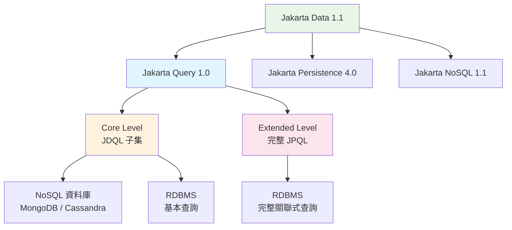

```java
// Jakarta Query 1.0 — Core Level (JDQL): 所有資料來源通用
@Query("SELECT o FROM Order o WHERE o.status = :status")
List<Order> findByStatus(@Param("status") String status);

// Jakarta Query 1.0 — Extended Level: 僅 RDBMS
@Query("SELECT o FROM Order o JOIN o.items i " +
       "WHERE i.product.category = :category " +
       "GROUP BY o HAVING SUM(i.quantity) > :minQuantity")
List<Order> findBulkOrders(@Param("category") String category,
                           @Param("minQuantity") int minQuantity);
```

> **與既有 JPQL 的關係**：Jakarta Query 1.0 與既有 JPQL 和 JDQL **完全向後相容**。對於已使用 JPA 的專案，無需修改現有查詢語法。

### 11.2 Fluent Query 與動態限制條件

Jakarta Data 1.1 引入了**Fluent Query Construction（流暢查詢建構）**，透過靜態元模型（Static Metamodel）實現型別安全的動態查詢。

#### 靜態元模型

```java
// 自動產生的靜態元模型類別（類似 JPA Metamodel）
// _Product 由 annotation processor 產生
@StaticMetamodel(Product.class)
public interface _Product {
    TextAttribute<Product> name = null;    // 編譯時注入
    TextAttribute<Product> category = null;
    ComparableAttribute<Product, BigDecimal> price = null;
    ComparableAttribute<Product, Integer> stock = null;
}
```

#### Fluent Query 範例

```java
@Repository
public interface ProductRepository extends CrudRepository<Product, String> {

    /**
     * Fluent Query：使用靜態元模型建構型別安全的查詢條件。
     */
    List<Product> findAll(Restriction<Product> restriction, 
                          Order<Product> order);
}

@ApplicationScoped
public class ProductSearchService {

    @Inject
    private ProductRepository productRepository;

    /**
     * 動態搜尋：根據使用者輸入條件動態組合查詢。
     */
    public List<Product> search(ProductSearchCriteria criteria) {
        // 使用靜態元模型建構型別安全的限制條件
        List<Restriction<Product>> restrictions = new ArrayList<>();
        
        if (criteria.category() != null) {
            restrictions.add(_Product.category.equalTo(criteria.category()));
        }
        if (criteria.minPrice() != null) {
            restrictions.add(_Product.price.greaterThanEqual(criteria.minPrice()));
        }
        if (criteria.maxPrice() != null) {
            restrictions.add(_Product.price.lessThanEqual(criteria.maxPrice()));
        }
        if (criteria.keyword() != null) {
            restrictions.add(_Product.name.contains(criteria.keyword()));
        }
        
        // 組合所有條件（AND）
        Restriction<Product> combined = Restriction.all(restrictions);
        
        // 排序
        Order<Product> order = _Product.price.asc();
        
        return productRepository.findAll(combined, order);
    }
}
```

### 11.3 Repository 抽象化與狀態管理

Jakarta Data 1.1 不僅延續 Repository 抽象化，更引入了**Stateful Repository Operations（狀態感知操作）**，提供更精細的持久化控制。

#### 狀態感知操作註解

| 註解 | 說明 | 對應 JPA 操作 |
|------|------|-------------|
| `@Persist` | 持久化新實體 | `EntityManager.persist()` |
| `@Merge` | 合併已分離的實體 | `EntityManager.merge()` |
| `@Remove` | 刪除實體 | `EntityManager.remove()` |
| `@Refresh` | 從資料庫重新讀取實體狀態 | `EntityManager.refresh()` |
| `@Detach` | 將實體從持久化上下文中分離 | `EntityManager.detach()` |

```java
@Repository
public interface OrderRepository extends CrudRepository<OrderEntity, String> {

    /**
     * 方法名稱衍生查詢。
     */
    List<OrderEntity> findByStatus(OrderStatus status);

    List<OrderEntity> findByCustomerIdOrderByCreatedAtDesc(String customerId);

    /**
     * 分頁查詢。
     */
    Page<OrderEntity> findByStatus(OrderStatus status, PageRequest pageRequest);

    /**
     * 使用 @Query 自訂查詢（Jakarta Query 語法）。
     */
    @Query("SELECT o FROM OrderEntity o WHERE o.totalAmount > :minAmount AND o.status = :status")
    List<OrderEntity> findHighValueOrders(
        @Param("minAmount") BigDecimal minAmount,
        @Param("status") OrderStatus status);

    /**
     * Jakarta Data 1.1 — Stateful Operations。
     */
    @Persist
    OrderEntity save(OrderEntity order);
    
    @Merge
    OrderEntity update(OrderEntity order);
    
    @Remove
    void remove(OrderEntity order);
    
    @Refresh
    void refresh(OrderEntity order);

    /**
     * 計數查詢。
     */
    long countByStatus(OrderStatus status);

    /**
     * 刪除操作。
     */
    @Delete
    void deleteByStatusAndCreatedAtBefore(OrderStatus status, Instant before);
}

// 使用 Repository
@ApplicationScoped
public class OrderQueryService {

    @Inject
    private OrderRepository orderRepository;

    public PageResponse<OrderResponse> findOrders(int page, int size, OrderStatus status) {
        PageRequest pageRequest = PageRequest.ofPage(page + 1).size(size);
        Page<OrderEntity> result = orderRepository.findByStatus(status, pageRequest);

        List<OrderResponse> content = result.content().stream()
            .map(OrderMapper::toResponse)
            .toList();

        return PageResponse.of(content, page, size, result.totalElements());
    }
}
```

### 11.4 Record Projection 與 NoSQL 支援

#### Record Projection

Jakarta Data 1.1 正式支援 Java Record 作為查詢投影結果，減少不必要的資料傳輸。

```java
/**
 * Record Projection — 只查詢需要的欄位。
 */
public record OrderSummary(
    String orderId,
    String customerName,
    BigDecimal totalAmount,
    OrderStatus status
) {}

@Repository
public interface OrderRepository extends CrudRepository<OrderEntity, String> {

    /**
     * Record Projection 查詢：只回傳摘要欄位，避免載入完整 Entity。
     */
    List<OrderSummary> findSummaryByStatus(OrderStatus status);
    
    Page<OrderSummary> findSummaryByCustomerId(String customerId, PageRequest pageRequest);
}
```

#### NoSQL 支援

```java
/**
 * Jakarta NoSQL 1.1 — MongoDB 範例。
 * 與 Jakarta Data Repository 整合，使用相同的 Repository 模式。
 */
@Entity
public class ProductDocument {

    @Id
    private String id;

    @Column("product_name")
    private String name;

    @Column("category")
    private String category;

    @Column("tags")
    private List<String> tags;

    @Column("specifications")
    private Map<String, String> specifications;
}

/**
 * NoSQL Repository — 語法與 RDBMS Repository 一致。
 * Jakarta Query Core Level 語法通用於 NoSQL。
 */
@Repository
public interface ProductDocumentRepository extends CrudRepository<ProductDocument, String> {
    List<ProductDocument> findByCategory(String category);
    List<ProductDocument> findByTagsContaining(String tag);
}
```

### 11.5 與 Spring Data JPA 比較

| 比較維度 | Jakarta Data 1.1 | Spring Data JPA |
|----------|------------------|-----------------|
| **標準** | Jakarta EE 開放規格 | Spring 專屬 |
| **Repository 介面** | `CrudRepository`, `BasicRepository` | `JpaRepository`, `CrudRepository` |
| **方法名衍生查詢** | 支援 | 支援（更成熟） |
| **自訂查詢** | `@Query`（Jakarta Query 語法） | `@Query`（JPQL/Native SQL） |
| **動態查詢** | Fluent Query + 靜態元模型 | `Specification` / QueryDSL |
| **分頁** | `PageRequest` / `Page` | `Pageable` / `Page` |
| **排序** | `Order` | `Sort` |
| **Record Projection** | 原生支援（1.1） | 支援（較新版本） |
| **NoSQL 支援** | 透過 Jakarta NoSQL 原生支援 | 需要 Spring Data MongoDB 等 |
| **狀態管理** | `@Persist` / `@Merge` / `@Remove` / `@Refresh` | 透過 `JpaRepository` 方法 |
| **反應式** | 與 Jakarta Concurrency 非同步整合 | Spring Data Reactive |
| **Application Server** | 需要 Jakarta EE Server | 嵌入式 |
| **遷移成本** | — | 語法高度相似，遷移成本低 |

```java
// Jakarta Data 1.1 風格
@Repository
public interface ProductRepository extends CrudRepository<Product, String> {
    List<Product> findByCategoryOrderByPriceAsc(String category);
}

// Spring Data JPA 對照
// public interface ProductRepository extends JpaRepository<Product, String> {
//     List<Product> findByCategoryOrderByPriceAsc(String category);
// }
// 語法幾乎相同，遷移成本極低
```

### 11.6 實務注意事項

> **Jakarta Data 使用建議**
> 1. **簡單查詢用方法名衍生**：避免寫不必要的 JPQL
> 2. **複雜查詢用 Fluent Query**：利用靜態元模型建構型別安全的動態查詢
> 3. **超複雜查詢用 `@Query`**：涉及多表 JOIN、子查詢時使用 Jakarta Query Extended Level
> 4. **Record Projection 減少資料傳輸**：列表查詢應使用 Projection，避免載入完整 Entity
> 5. **@Persist vs @Merge 語義區分**：新建實體用 `@Persist`，更新已分離實體用 `@Merge`
> 6. **Jakarta Data 仍在快速演進**：部分 API 可能在後續版本微調
> 7. **與 JPA 共存**：Jakarta Data 底層仍使用 JPA，可混合使用 `EntityManager` 處理特殊情況
> 8. **Spring Data 遷移評估**：語法高度相似，建議先遷移 Repository 介面，再處理自訂查詢

---

## 12. Jakarta Security 5.0

### 12.1 Security 5.0 架構重構

Jakarta Security 5.0 是 Jakarta EE 12 中**最重大的架構變更之一**。此版本將原本分散的安全規格統一整合，大幅簡化企業安全實作。

#### 架構變更總覽

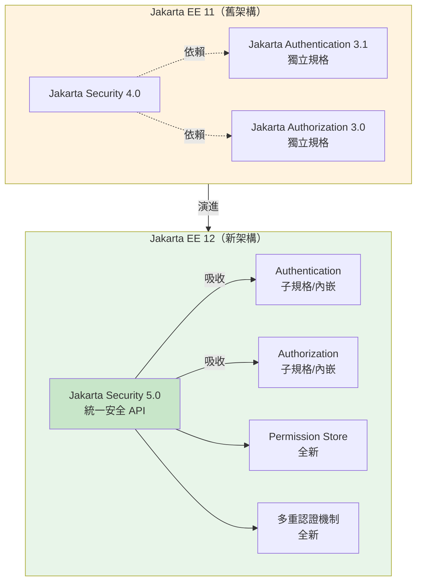

#### 核心變更清單

| 變更項目 | 說明 | 影響範圍 |
|---------|------|---------|
| Authentication 吸收 | Jakarta Authentication 作為 Security 5.0 的子規格 | 認證機制實作方式變更 |
| Authorization 吸收 | Jakarta Authorization 作為 Security 5.0 的子規格，可能移至 Web Profile | 授權策略配置方式調整 |
| Permission Store | 全新的權限儲存抽象化，提供使用者友善的權限管理 API | 簡化角色與權限設定 |
| 多重認證機制 | 支援以 URL Pattern 粒度配置不同的認證機制 | 複雜應用的安全架構設計 |
| DIGEST 認證 | 新增 HTTP Digest 認證支援 | 特殊安全需求場景 |
| CLIENT-CERT 認證 | 新增客戶端憑證認證支援 | 雙向 TLS（mTLS）場景 |
| `@RolesAllowed` 替代方案 | 提供更靈活的方法級授權控制 | 超越角色的細粒度權限控制 |

### 12.2 JWT 實作

```java
/**
 * JWT Token 工具類。
 */
@ApplicationScoped
public class JwtTokenService {

    @Inject
    @ConfigProperty(name = "jwt.issuer")
    private String issuer;

    @Inject
    @ConfigProperty(name = "jwt.expiration-minutes", defaultValue = "30")
    private int expirationMinutes;

    private PrivateKey privateKey;
    private PublicKey publicKey;

    @PostConstruct
    public void init() {
        try {
            KeyPairGenerator keyGen = KeyPairGenerator.getInstance("RSA");
            keyGen.initialize(2048);
            KeyPair keyPair = keyGen.generateKeyPair();
            this.privateKey = keyPair.getPrivate();
            this.publicKey = keyPair.getPublic();
        } catch (NoSuchAlgorithmException e) {
            throw new RuntimeException("無法初始化 JWT 金鑰", e);
        }
    }

    /**
     * 產生 JWT Token。
     */
    public String generateToken(String userId, Set<String> roles, Map<String, Object> claims) {
        Instant now = Instant.now();
        Instant expiry = now.plus(expirationMinutes, ChronoUnit.MINUTES);

        return Jwts.builder()
            .setIssuer(issuer)
            .setSubject(userId)
            .setIssuedAt(Date.from(now))
            .setExpiration(Date.from(expiry))
            .claim("groups", roles)
            .claim("upn", userId)
            .addClaims(claims)
            .signWith(privateKey, SignatureAlgorithm.RS256)
            .compact();
    }
}
```

### 12.3 OAuth2 與 OpenID Connect

```mermaid
graph LR
    Client[Client App] -->|1. Authorization Request| AuthServer[Authorization Server<br/>Keycloak / Azure AD]
    AuthServer -->|2. Authorization Code| Client
    Client -->|3. Token Request + Code| AuthServer
    AuthServer -->|4. Access Token + ID Token| Client
    Client -->|5. API Request + Bearer Token| Resource[Jakarta EE<br/>Resource Server]
    Resource -->|6. Verify Token| AuthServer
    Resource -->|7. Response| Client
    
    style AuthServer fill:#fff3e0
    style Resource fill:#e8f5e9
```

#### Open Liberty OIDC 配置

```xml
<!-- server.xml — OpenID Connect 配置 -->
<featureManager>
    <feature>socialLogin-1.0</feature>
    <feature>jwt-1.0</feature>
    <feature>mpJwt-2.1</feature>
</featureManager>

<oidcLogin id="keycloak"
    clientId="${env.OIDC_CLIENT_ID}"
    clientSecret="${env.OIDC_CLIENT_SECRET}"
    discoveryEndpoint="https://keycloak.company.com/realms/app/.well-known/openid-configuration"
    scope="openid profile email"
    signatureAlgorithm="RS256">
</oidcLogin>

<mpJwt id="myMpJwt"
    issuer="https://keycloak.company.com/realms/app"
    jwksUri="https://keycloak.company.com/realms/app/protocol/openid-connect/certs"
    audiences="my-app" />
```

### 12.4 RBAC 角色存取控制與 Permission Store

#### 傳統 RBAC

```java
/**
 * 角色定義。
 */
public final class Roles {
    public static final String ADMIN = "ADMIN";
    public static final String MANAGER = "MANAGER";
    public static final String USER = "USER";
    public static final String AUDITOR = "AUDITOR";
    
    private Roles() {}
}

/**
 * 方法級角色控制（傳統方式）。
 */
@Path("/users")
@ApplicationScoped
public class UserResource {

    @Inject
    private JsonWebToken jwt;

    @Inject
    private SecurityContext securityContext;

    @GET
    @RolesAllowed({Roles.ADMIN, Roles.MANAGER})
    public Response listUsers() {
        String currentUser = jwt.getSubject();
        Set<String> groups = jwt.getGroups();
        // ...
    }

    @GET
    @Path("/me")
    @RolesAllowed({Roles.USER, Roles.ADMIN, Roles.MANAGER})
    public Response getCurrentUser() {
        Principal principal = securityContext.getCallerPrincipal();
        return Response.ok(Map.of("userId", principal.getName())).build();
    }

    @DELETE
    @Path("/{id}")
    @RolesAllowed(Roles.ADMIN)
    public Response deleteUser(@PathParam("id") String id) {
        // 僅 ADMIN 可刪除使用者
    }
}
```

#### Permission Store（Security 5.0 新增）

Jakarta Security 5.0 引入 Permission Store 概念，提供比 `@RolesAllowed` 更靈活的權限管理。

```java
/**
 * Security 5.0 Permission Store — 使用者友善的權限管理。
 * 權限不再僅綁定角色，可以定義更細粒度的操作權限。
 */
// Permission Store 允許定義如下的權限映射：
// ROLE:ADMIN  -> permission:user:delete, permission:user:create, permission:order:cancel
// ROLE:MANAGER -> permission:order:approve, permission:report:view
// ROLE:USER   -> permission:order:create, permission:order:view:own

/**
 * 基於權限（而非角色）的存取控制。
 */
@Path("/orders")
@ApplicationScoped
public class OrderResource {

    @Inject
    private SecurityContext securityContext;

    @POST
    @Path("/{id}/approve")
    // Security 5.0: 可結合 Permission Store 做細粒度控制
    @RolesAllowed({Roles.MANAGER, Roles.ADMIN})
    public Response approveOrder(@PathParam("id") String orderId) {
        // Permission Store 背後可查詢使用者是否擁有 "order:approve" 權限
        // 而非僅檢查角色
    }
}
```

### 12.5 多重認證機制

Jakarta Security 5.0 允許在同一應用中以 **URL Pattern 粒度**配置不同的認證機制。

```java
/**
 * Security 5.0: 多重認證機制配置。
 * 不同 URL 可使用不同的認證方式。
 */
// /api/** -> JWT Bearer Token 認證
// /admin/** -> Form-based 認證 + MFA
// /internal/** -> CLIENT-CERT 雙向 TLS 認證
// /health/** -> 無認證（公開端點）

/**
 * 認證機制定義（Security 5.0）。
 */
@BasicAuthenticationMechanismDefinition(realmName = "admin-realm")
@FormAuthenticationMechanismDefinition(
    loginToContinue = @LoginToContinue(
        loginPage = "/login.xhtml",
        errorPage = "/login-error.xhtml"
    )
)
@ApplicationScoped
public class SecurityConfig {
    // Security 5.0 允許多重認證機制共存
    // 根據 URL Pattern 自動選擇適當的認證方式
}

/**
 * CLIENT-CERT 認證（Security 5.0 新增）。
 * 適用於服務間通訊的 mTLS 場景。
 */
// Open Liberty 配置範例：
// <ssl id="internalSSL" keyStoreRef="serverKeyStore" 
//      trustStoreRef="clientTrustStore" clientAuthentication="true"/>
```

### 12.6 API Security

```java
/**
 * Rate Limiting Filter — 防止 API 濫用。
 */
@Provider
@Priority(Priorities.USER - 100)
public class RateLimitFilter implements ContainerRequestFilter {

    private final ConcurrentHashMap<String, AtomicInteger> requestCounts 
        = new ConcurrentHashMap<>();

    private static final int MAX_REQUESTS_PER_MINUTE = 100;

    @Override
    public void filter(ContainerRequestContext requestContext) {
        String clientId = extractClientId(requestContext);
        AtomicInteger count = requestCounts.computeIfAbsent(clientId, k -> new AtomicInteger(0));

        if (count.incrementAndGet() > MAX_REQUESTS_PER_MINUTE) {
            requestContext.abortWith(
                Response.status(429)
                    .header("Retry-After", "60")
                    .entity(ApiResponse.error(429, "請求過於頻繁，請稍後再試"))
                    .build());
        }
    }

    private String extractClientId(ContainerRequestContext ctx) {
        String auth = ctx.getHeaderString(HttpHeaders.AUTHORIZATION);
        if (auth != null && auth.startsWith("Bearer ")) {
            return "jwt:" + auth.hashCode();
        }
        return "ip:" + ctx.getHeaderString("X-Forwarded-For");
    }
}

/**
 * Security Headers Filter。
 */
@Provider
public class SecurityHeadersFilter implements ContainerResponseFilter {

    @Override
    public void filter(ContainerRequestContext requestContext, 
                       ContainerResponseContext responseContext) {
        responseContext.getHeaders().putSingle(
            "X-Content-Type-Options", "nosniff");
        responseContext.getHeaders().putSingle(
            "X-Frame-Options", "DENY");
        responseContext.getHeaders().putSingle(
            "X-XSS-Protection", "0");  // 現代瀏覽器建議設為 0，改用 CSP
        responseContext.getHeaders().putSingle(
            "Strict-Transport-Security", "max-age=31536000; includeSubDomains");
        responseContext.getHeaders().putSingle(
            "Cache-Control", "no-store");
        responseContext.getHeaders().putSingle(
            "Content-Security-Policy", "default-src 'self'");
        responseContext.getHeaders().putSingle(
            "Referrer-Policy", "strict-origin-when-cross-origin");
        responseContext.getHeaders().putSingle(
            "Permissions-Policy", "camera=(), microphone=(), geolocation=()");
    }
}
```

### 12.7 OWASP Top 10 防護

| OWASP 風險 | 防護措施 | Jakarta EE 12 實作 |
|------------|---------|-------------------|
| **A01 權限控制失效** | RBAC + Permission Store + 方法級授權 | `@RolesAllowed`、Security 5.0 Permission Store |
| **A02 加密失效** | TLS 1.3、敏感資料加密 | HTTPS、CLIENT-CERT 認證（Security 5.0） |
| **A03 注入攻擊** | 參數化查詢 | JPA Named Parameters、Jakarta Query |
| **A04 不安全設計** | 威脅建模、安全設計審查 | Security Architecture Review |
| **A05 安全設定錯誤** | 安全基線、自動化檢查 | SecurityManager 移除（減少攻擊面）、CI/CD 掃描 |
| **A06 易受攻擊元件** | 依賴掃描、SBOM | OWASP Dependency Check、CycloneDX |
| **A07 認證失敗** | 多重認證機制、Token 管理 | Security 5.0 多重認證 + JWT + OIDC |
| **A08 軟體完整性失敗** | 簽章驗證、CI/CD 安全 | Maven 簽章、GitHub Actions |
| **A09 日誌與監控不足** | 結構化日誌、告警 | SLF4J + ELK + Prometheus |
| **A10 SSRF** | URL 白名單、網路隔離 | 輸入驗證 + K8s 網路策略 |

### 12.8 Secure Coding 實務

```java
/**
 * 安全的輸入驗證範例。
 */
@ApplicationScoped
public class InputValidator {

    private static final Pattern SAFE_STRING = Pattern.compile("^[a-zA-Z0-9\\-_]{1,100}$");
    private static final Pattern EMAIL_PATTERN = Pattern.compile(
        "^[a-zA-Z0-9._%+-]+@[a-zA-Z0-9.-]+\\.[a-zA-Z]{2,}$");

    /**
     * 驗證輸入字串是否安全。
     */
    public String sanitize(String input) {
        if (input == null) return null;
        return input.replaceAll("[<>\"'&]", "");
    }

    /**
     * 驗證 ID 格式（防止注入）。
     */
    public boolean isValidId(String id) {
        return id != null && SAFE_STRING.matcher(id).matches();
    }
}
```

### 12.9 實務注意事項

> **Security 5.0 最佳實務**
> 1. **永遠使用參數化查詢**：嚴禁字串拼接 SQL/JPQL/Jakarta Query
> 2. **JWT 過期時間不要太長**：Access Token 建議 15-30 分鐘
> 3. **敏感資料不放 JWT Payload**：JWT 可被 Base64 解碼讀取
> 4. **Security Headers 必加**：所有 Response 加上安全標頭（注意 X-XSS-Protection 在現代瀏覽器中建議設為 0）
> 5. **Rate Limiting**：所有公開 API 必須限流（生產環境用 Redis 實作）
> 6. **定期執行依賴掃描**：每次 CI Build 自動執行 OWASP Dependency Check
> 7. **最小權限原則**：預設拒絕所有存取，明確授權每個端點
> 8. **Security 5.0 遷移注意**：若既有系統直接使用 `jakarta.security.auth.message.*` 或 `jakarta.security.jacc.*` API，需評估遷移至 Security 5.0 統一 API 的影響
> 9. **多重認證機制規劃**：利用 URL Pattern 粒度為不同端點選擇最適當的認證方式（API→JWT、管理界面→Form+MFA、服務間→mTLS）

---

## 13. Jakarta Concurrency 3.2

### 13.1 ManagedExecutorService

Jakarta Concurrency 3.2 提供在企業環境中安全使用並行處理的標準 API。

```java
/**
 * 使用 ManagedExecutorService 執行並行任務。
 */
@ApplicationScoped
public class ReportService {

    @Resource(name = "concurrent/reportExecutor")
    private ManagedExecutorService executor;

    /**
     * 並行產生多份報表。
     */
    public Map<String, ReportResult> generateReports(List<String> reportTypes) {
        Map<String, Future<ReportResult>> futures = new HashMap<>();

        for (String type : reportTypes) {
            futures.put(type, executor.submit(() -> generateReport(type)));
        }

        Map<String, ReportResult> results = new HashMap<>();
        for (Map.Entry<String, Future<ReportResult>> entry : futures.entrySet()) {
            try {
                results.put(entry.getKey(), entry.getValue().get(30, TimeUnit.SECONDS));
            } catch (Exception e) {
                results.put(entry.getKey(), ReportResult.error(e.getMessage()));
            }
        }
        return results;
    }
}
```

### 13.2 Async Processing

```java
/**
 * 非同步 REST 處理。
 */
@Path("/reports")
@ApplicationScoped
public class ReportResource {

    @Resource
    private ManagedExecutorService executor;

    @Inject
    private ReportService reportService;

    /**
     * 非同步生成報表。
     */
    @POST
    @Path("/generate")
    public void generateReportAsync(
            @QueryParam("type") String type,
            @Suspended AsyncResponse asyncResponse) {

        // 設定超時
        asyncResponse.setTimeout(60, TimeUnit.SECONDS);
        asyncResponse.setTimeoutHandler(ar ->
            ar.resume(Response.status(408)
                .entity(ApiResponse.error(408, "報表生成超時"))
                .build()));

        executor.submit(() -> {
            try {
                ReportResult result = reportService.generateReport(type);
                asyncResponse.resume(Response.ok(ApiResponse.ok(result)).build());
            } catch (Exception e) {
                asyncResponse.resume(Response.serverError()
                    .entity(ApiResponse.error(500, "報表生成失敗"))
                    .build());
            }
        });
    }
}
```

### 13.3 Virtual Thread 整合

```java
/**
 * Jakarta Concurrency 3.2 + Virtual Thread。
 * 配置 ManagedExecutorService 使用 Virtual Thread。
 */
// Open Liberty server.xml
// <managedExecutorService jndiName="concurrent/virtualExecutor">
//     <virtualThreads>true</virtualThreads>
// </managedExecutorService>

@ApplicationScoped
public class HighConcurrencyService {

    @Resource(name = "concurrent/virtualExecutor")
    private ManagedExecutorService virtualExecutor;

    /**
     * 使用 Virtual Thread 批次處理。
     * 可同時處理數千個任務，不受執行緒池大小限制。
     */
    public List<ProcessResult> batchProcess(List<Task> tasks) {
        List<Future<ProcessResult>> futures = tasks.stream()
            .map(task -> virtualExecutor.submit(() -> processTask(task)))
            .toList();

        return futures.stream()
            .map(f -> {
                try {
                    return f.get(10, TimeUnit.SECONDS);
                } catch (Exception e) {
                    return ProcessResult.error(e.getMessage());
                }
            })
            .toList();
    }
}
```

### 13.4 高併發設計模式

```java
/**
 * Bulkhead Pattern（艙壁模式）：隔離不同類型的任務。
 */
@ApplicationScoped
public class BulkheadService {

    @Resource(name = "concurrent/orderExecutor")
    private ManagedExecutorService orderExecutor;    // 訂單處理專用

    @Resource(name = "concurrent/reportExecutor")
    private ManagedExecutorService reportExecutor;   // 報表專用

    @Resource(name = "concurrent/notifyExecutor")
    private ManagedExecutorService notifyExecutor;   // 通知專用

    /**
     * 訂單處理不會因報表生成佔用而受影響。
     */
    public Future<OrderResult> processOrder(Order order) {
        return orderExecutor.submit(() -> doProcessOrder(order));
    }

    public Future<ReportResult> generateReport(String type) {
        return reportExecutor.submit(() -> doGenerateReport(type));
    }
}
```

### 13.5 實務注意事項

> **並行處理要點**
> 1. **禁止使用 `new Thread()`**：在 Jakarta EE 環境中必須使用 `ManagedExecutorService`
> 2. **Virtual Thread 適合 I/O 密集**：CPU 密集型任務仍需 Platform Thread
> 3. **Bulkhead 隔離**：不同業務場景使用不同的 ExecutorService
> 4. **設定合理的超時**：所有 Future.get() 必須設定超時時間
> 5. **Context Propagation**：確保 Security Context 和 Transaction 正確傳播

---

## 14. Jakarta Batch 2.2

### 14.1 批次架構概觀

```mermaid
graph TB
    subgraph BatchArch["Jakarta Batch 2.2 架構"]
        JR[JobRepository<br/>Job 執行紀錄] --> JO[JobOperator<br/>Job 控制]
        JO --> JOB[Job]
        
        JOB --> S1[Step 1<br/>Chunk]
        JOB --> S2[Step 2<br/>Batchlet]
        JOB --> S3[Step 3<br/>Chunk]
        
        S1 --> R[Reader]
        S1 --> P[Processor]
        S1 --> W[Writer]
    end
    
    style BatchArch fill:#e8f5e9
```

### 14.2 Job 與 Step 設計

```xml
<!-- META-INF/batch-jobs/daily-settlement.xml -->
<job id="dailySettlement" xmlns="https://jakarta.ee/xml/ns/jakartaee"
     restartable="true">
    
    <step id="validateData" next="processSettlement">
        <batchlet ref="dataValidationBatchlet" />
    </step>
    
    <step id="processSettlement" next="generateReport">
        <chunk item-count="100" retry-limit="3" skip-limit="10">
            <reader ref="settlementReader" />
            <processor ref="settlementProcessor" />
            <writer ref="settlementWriter" />
            <retryable-exception-classes>
                <include class="java.sql.SQLTransientException" />
            </retryable-exception-classes>
            <skippable-exception-classes>
                <include class="com.company.app.InvalidRecordException" />
            </skippable-exception-classes>
        </chunk>
    </step>
    
    <step id="generateReport">
        <batchlet ref="reportBatchlet" />
    </step>
</job>
```

### 14.3 Chunk Processing

```java
/**
 * ItemReader：讀取待結算交易。
 */
@Dependent
@Named("settlementReader")
public class SettlementReader implements ItemReader {

    @PersistenceContext
    private EntityManager em;

    private List<TransactionEntity> transactions;
    private int index;

    @Override
    public void open(Serializable checkpoint) {
        index = checkpoint != null ? (int) checkpoint : 0;
        transactions = em.createQuery(
                "SELECT t FROM TransactionEntity t WHERE t.status = 'PENDING' ORDER BY t.id",
                TransactionEntity.class)
            .getResultList();
    }

    @Override
    public TransactionEntity readItem() {
        if (index >= transactions.size()) return null;
        return transactions.get(index++);
    }

    @Override
    public Serializable checkpointInfo() {
        return index;
    }
}

/**
 * ItemProcessor：計算結算金額。
 */
@Dependent
@Named("settlementProcessor")
public class SettlementProcessor implements ItemProcessor {

    @Inject
    private FeeCalculator feeCalculator;

    @Override
    public SettlementResult processItem(Object item) {
        TransactionEntity tx = (TransactionEntity) item;
        BigDecimal fee = feeCalculator.calculate(tx);
        BigDecimal netAmount = tx.getAmount().subtract(fee);
        return new SettlementResult(tx.getId(), netAmount, fee);
    }
}

/**
 * ItemWriter：批次寫入結算結果。
 */
@Dependent
@Named("settlementWriter")
public class SettlementWriter implements ItemWriter {

    @PersistenceContext
    private EntityManager em;

    @Override
    public void writeItems(List<Object> items) {
        for (Object item : items) {
            SettlementResult result = (SettlementResult) item;
            em.persist(result.toEntity());
        }
        em.flush();
    }
}
```

### 14.4 Retry 與 Skip 策略

| 策略 | 適用場景 | 設定 |
|------|---------|------|
| **Retry** | 暫時性錯誤（網路超時、DB 鎖） | `retry-limit="3"` + `retryable-exception-classes` |
| **Skip** | 可忽略的資料錯誤 | `skip-limit="10"` + `skippable-exception-classes` |
| **Checkpoint** | 大量資料分批提交 | `item-count="100"` |
| **Restart** | 從上次失敗點重新開始 | `restartable="true"` + `checkpointInfo()` |

### 14.5 Parallel Processing

```xml
<!-- 使用 Partition 實現平行處理 -->
<step id="parallelProcess">
    <chunk item-count="50">
        <reader ref="partitionedReader" />
        <processor ref="settlementProcessor" />
        <writer ref="settlementWriter" />
    </chunk>
    <partition>
        <mapper ref="settlementPartitionMapper" />
    </partition>
</step>
```

```java
/**
 * Partition Mapper：將資料分成多個分區並行處理。
 */
@Dependent
@Named("settlementPartitionMapper")
public class SettlementPartitionMapper implements PartitionMapper {

    @PersistenceContext
    private EntityManager em;

    @Override
    public PartitionPlan mapPartitions() {
        long totalRecords = em.createQuery(
            "SELECT COUNT(t) FROM TransactionEntity t WHERE t.status = 'PENDING'", Long.class)
            .getSingleResult();

        int partitions = Math.min(10, (int) Math.ceil(totalRecords / 1000.0));
        long batchSize = totalRecords / partitions;

        PartitionPlanImpl plan = new PartitionPlanImpl();
        plan.setPartitions(partitions);
        plan.setThreads(partitions);

        Properties[] props = new Properties[partitions];
        for (int i = 0; i < partitions; i++) {
            props[i] = new Properties();
            props[i].setProperty("startId", String.valueOf(i * batchSize));
            props[i].setProperty("endId", String.valueOf((i + 1) * batchSize));
        }
        plan.setPartitionProperties(props);
        return plan;
    }
}
```

### 14.6 實務注意事項

> **Batch 處理要點**
> 1. **Chunk Size 調校**：`item-count` 建議 50-200，太大影響記憶體，太小影響效能
> 2. **Checkpoint 必須實作**：確保失敗時可從上次成功點重新開始
> 3. **Retry vs Skip**：暫時性錯誤用 Retry，資料問題用 Skip
> 4. **Partition 不是越多越好**：分區數應考慮 DB 連線池大小
> 5. **排程整合**：使用 `@Schedule` 或外部排程器（如 Kubernetes CronJob）觸發

---

## 15. Cache 與 MQ

### 15.1 Redis 整合

```java
/**
 * Redis 快取服務 — 使用 Jedis Client。
 */
@ApplicationScoped
public class RedisCacheService {

    private JedisPool jedisPool;

    @Inject
    @ConfigProperty(name = "redis.host", defaultValue = "localhost")
    private String redisHost;

    @Inject
    @ConfigProperty(name = "redis.port", defaultValue = "6379")
    private int redisPort;

    @PostConstruct
    public void init() {
        JedisPoolConfig config = new JedisPoolConfig();
        config.setMaxTotal(50);
        config.setMaxIdle(20);
        config.setMinIdle(5);
        config.setTestOnBorrow(true);
        jedisPool = new JedisPool(config, redisHost, redisPort);
    }

    @PreDestroy
    public void destroy() {
        if (jedisPool != null) jedisPool.close();
    }

    /**
     * 快取查詢結果。
     */
    public <T> Optional<T> get(String key, Class<T> type) {
        try (Jedis jedis = jedisPool.getResource()) {
            String value = jedis.get(key);
            if (value == null) return Optional.empty();
            return Optional.of(JsonbBuilder.create().fromJson(value, type));
        }
    }

    public void put(String key, Object value, int ttlSeconds) {
        try (Jedis jedis = jedisPool.getResource()) {
            String json = JsonbBuilder.create().toJson(value);
            jedis.setex(key, ttlSeconds, json);
        }
    }

    public void evict(String key) {
        try (Jedis jedis = jedisPool.getResource()) {
            jedis.del(key);
        }
    }
}

/**
 * Cache Aside Pattern 實作。
 */
@ApplicationScoped
public class CachedProductService {

    @Inject
    private RedisCacheService cache;

    @Inject
    private ProductRepository productRepository;

    private static final int CACHE_TTL = 3600; // 1 小時

    public ProductResponse getProduct(String productId) {
        String cacheKey = "product:" + productId;

        // 1. 先查快取
        Optional<ProductResponse> cached = cache.get(cacheKey, ProductResponse.class);
        if (cached.isPresent()) return cached.get();

        // 2. 查資料庫
        ProductEntity entity = productRepository.findById(productId)
            .orElseThrow(() -> new ProductNotFoundException(productId));
        ProductResponse response = ProductMapper.toResponse(entity);

        // 3. 寫入快取
        cache.put(cacheKey, response, CACHE_TTL);
        return response;
    }

    @Transactional
    public void updateProduct(String productId, UpdateProductRequest request) {
        // 更新資料庫
        productRepository.update(productId, request);
        // 清除快取
        cache.evict("product:" + productId);
    }
}
```

### 15.2 Kafka 整合

```java
/**
 * Kafka Producer — 發送領域事件。
 */
@ApplicationScoped
public class KafkaEventPublisher {

    private KafkaProducer<String, String> producer;

    @Inject
    @ConfigProperty(name = "kafka.bootstrap.servers")
    private String bootstrapServers;

    @PostConstruct
    public void init() {
        Properties props = new Properties();
        props.put(ProducerConfig.BOOTSTRAP_SERVERS_CONFIG, bootstrapServers);
        props.put(ProducerConfig.KEY_SERIALIZER_CLASS_CONFIG, StringSerializer.class.getName());
        props.put(ProducerConfig.VALUE_SERIALIZER_CLASS_CONFIG, StringSerializer.class.getName());
        props.put(ProducerConfig.ACKS_CONFIG, "all");
        props.put(ProducerConfig.RETRIES_CONFIG, 3);
        props.put(ProducerConfig.ENABLE_IDEMPOTENCE_CONFIG, true);
        producer = new KafkaProducer<>(props);
    }

    public void publish(String topic, String key, Object event) {
        String json = JsonbBuilder.create().toJson(event);
        ProducerRecord<String, String> record = new ProducerRecord<>(topic, key, json);
        producer.send(record, (metadata, exception) -> {
            if (exception != null) {
                Logger.getLogger(getClass().getName())
                    .severe("Kafka 發送失敗: " + exception.getMessage());
            }
        });
    }

    @PreDestroy
    public void close() {
        if (producer != null) producer.close();
    }
}

/**
 * Kafka Consumer — 使用 MicroProfile Reactive Messaging（推薦）。
 */
@ApplicationScoped
public class OrderEventConsumer {

    @Inject
    private InventoryService inventoryService;

    @Incoming("order-events")
    public CompletionStage<Void> onOrderEvent(Message<String> message) {
        try {
            OrderCreatedEvent event = JsonbBuilder.create()
                .fromJson(message.getPayload(), OrderCreatedEvent.class);
            inventoryService.reserveStock(event.orderId());
            return message.ack();
        } catch (Exception e) {
            return message.nack(e);
        }
    }
}
```

### 15.3 RabbitMQ 整合

```java
/**
 * JMS + RabbitMQ 整合（使用 Jakarta Messaging 3.1）。
 */
@ApplicationScoped
public class JmsNotificationSender {

    @Resource(lookup = "jms/notificationQueue")
    private Queue notificationQueue;

    @Inject
    private JMSContext jmsContext;

    /**
     * 發送通知訊息到 Queue。
     */
    public void sendNotification(NotificationMessage notification) {
        String json = JsonbBuilder.create().toJson(notification);
        jmsContext.createProducer()
            .setDeliveryMode(DeliveryMode.PERSISTENT)
            .setTimeToLive(3600_000) // 1 小時後過期
            .send(notificationQueue, json);
    }
}

/**
 * MDB（Message Driven Bean）— 訊息消費者。
 */
@MessageDriven(activationConfig = {
    @ActivationConfigProperty(propertyName = "destinationLookup", propertyValue = "jms/notificationQueue"),
    @ActivationConfigProperty(propertyName = "destinationType", propertyValue = "jakarta.jms.Queue"),
    @ActivationConfigProperty(propertyName = "maxSession", propertyValue = "10")
})
public class NotificationMDB implements MessageListener {

    @Inject
    private EmailService emailService;

    @Override
    public void onMessage(Message message) {
        try {
            String json = message.getBody(String.class);
            NotificationMessage notification = JsonbBuilder.create()
                .fromJson(json, NotificationMessage.class);
            emailService.send(notification);
        } catch (JMSException e) {
            Logger.getLogger(getClass().getName()).severe("訊息處理失敗: " + e.getMessage());
        }
    }
}
```

### 15.4 Jakarta Messaging 3.1

Jakarta Messaging（前身 JMS）在 3.1 版本中強化了與雲原生環境的整合能力。

#### 核心特性

| 特性 | 說明 |
|------|------|
| **簡化 API** | `JMSContext` 取代傳統 `Connection` / `Session` 樣板程式碼 |
| **CDI 整合** | 透過 `@Inject` 直接注入 `JMSContext` |
| **異步傳送** | `CompletionListener` 非同步回呼 |
| **共享訂閱** | 多個 Consumer 共享 Topic 訂閱，實現負載均衡 |
| **延遲傳送** | `setDeliveryDelay()` 支援延遲投遞 |

```java
/**
 * Jakarta Messaging 3.1 — 簡化 API 範例。
 */
@ApplicationScoped
public class MessagingService {

    @Inject
    private JMSContext jmsContext;

    @Resource(lookup = "jms/orderTopic")
    private Topic orderTopic;

    @Resource(lookup = "jms/deadLetterQueue")
    private Queue deadLetterQueue;

    /**
     * 發送訊息至 Topic（簡化 API）。
     */
    public void publishOrderEvent(OrderEvent event) {
        String json = JsonbBuilder.create().toJson(event);
        jmsContext.createProducer()
            .setDeliveryMode(DeliveryMode.PERSISTENT)
            .setProperty("eventType", event.type().name())
            .send(orderTopic, json);
    }

    /**
     * 延遲傳送 — 例如 30 分鐘後自動取消未付款訂單。
     */
    public void scheduleOrderTimeout(String orderId, long delayMillis) {
        jmsContext.createProducer()
            .setDeliveryDelay(delayMillis)
            .send(deadLetterQueue, orderId);
    }
}

/**
 * 共享持久訂閱 — 多個 Consumer 共享同一 Topic 訂閱。
 * 適用於微服務水平擴展場景。
 */
@MessageDriven(activationConfig = {
    @ActivationConfigProperty(
        propertyName = "destinationLookup", propertyValue = "jms/orderTopic"),
    @ActivationConfigProperty(
        propertyName = "destinationType", propertyValue = "jakarta.jms.Topic"),
    @ActivationConfigProperty(
        propertyName = "subscriptionDurability", propertyValue = "Durable"),
    @ActivationConfigProperty(
        propertyName = "subscriptionName", propertyValue = "orderProcessing"),
    @ActivationConfigProperty(
        propertyName = "shareSubscriptions", propertyValue = "true")
})
public class SharedOrderSubscriber implements MessageListener {

    @Override
    public void onMessage(Message message) {
        try {
            String json = message.getBody(String.class);
            // 多個 Pod 共享訂閱，每條訊息只被一個 Consumer 處理
        } catch (JMSException e) {
            throw new RuntimeException("訊息處理失敗", e);
        }
    }
}
```

#### Jakarta Messaging vs Kafka vs RabbitMQ

| 維度 | Jakarta Messaging 3.1 | Apache Kafka | RabbitMQ |
|------|----------------------|-------------|----------|
| **標準** | Jakarta EE 規格 | 開源專案 | 開源專案 |
| **協定** | 廠商實作（JMS Wire Protocol 不統一） | 自有協定 | AMQP |
| **模型** | Queue + Topic | Partition Log | Queue + Exchange |
| **順序保證** | Queue: 保證 / Topic: 不保證 | Partition 內保證 | 不保證 |
| **吞吐量** | 中 | 極高 | 高 |
| **持久化** | 可選 | 預設持久化 | 可選 |
| **適用場景** | 企業 Application Server 內整合 | 大規模事件串流 | 複雜路由需求 |

### 15.5 實務注意事項

> **Cache 與 MQ 要點**
> 1. **Cache Aside Pattern**：讀取先查快取，更新時先寫 DB 再清快取
> 2. **快取穿透防護**：不存在的資料也快取空值（短 TTL）
> 3. **Kafka Idempotency**：啟用冪等性 Producer 防止重複發送
> 4. **Consumer Group 設計**：同一業務的 Consumer 使用相同 Group ID
> 5. **Dead Letter Queue**：處理失敗的訊息送入 DLQ 人工檢視
> 6. **Connection Pool 管理**：Redis/Kafka 連線池大小需配合應用並發量
> 7. **Jakarta Messaging 與 Kafka 選擇**：企業內部整合優先使用 Jakarta Messaging；大規模事件串流使用 Kafka
> 8. **共享訂閱**：微服務水平擴展時使用 Shared Subscription 實現 Topic 負載均衡

---

## 16. Kubernetes 與雲原生

### 16.1 Dockerfile 設計

```dockerfile
# === Multi-Stage Build — Jakarta EE 12 Application ===

# Stage 1: Build
FROM maven:3.9-eclipse-temurin-21 AS builder
WORKDIR /build
COPY pom.xml .
COPY app-domain/pom.xml app-domain/
COPY app-application/pom.xml app-application/
COPY app-infrastructure/pom.xml app-infrastructure/
COPY app-api/pom.xml app-api/
# 先下載依賴（利用 Docker Layer Cache）
RUN mvn dependency:go-offline -B
COPY . .
RUN mvn clean package -DskipTests -B

# Stage 2: Runtime
FROM icr.io/appcafe/open-liberty:24.0.0.12-kernel-slim-java21-openj9-ubi-minimal

# 安裝需要的 Feature
COPY --chown=1001:0 src/main/liberty/config/server.xml /config/
RUN features.sh

# 複製應用程式
COPY --from=builder --chown=1001:0 /build/app-api/target/app-api.war /config/apps/

# 複製 JDBC Driver
COPY --chown=1001:0 lib/postgresql-*.jar /config/lib/

# 健康檢查
HEALTHCHECK --interval=30s --timeout=10s --retries=3 \
    CMD curl -f http://localhost:9080/health/ready || exit 1

# 安全性：使用非 root 使用者
USER 1001

EXPOSE 9080 9443
```

#### Dockerfile 最佳實務

| 原則 | 說明 |
|------|------|
| **Multi-Stage Build** | 建構環境與執行環境分離，減少 Image 大小 |
| **Layer Cache** | 先複製 `pom.xml` 下載依賴，再複製原始碼 |
| **最小化 Base Image** | 使用 `-slim` 或 `-minimal` 變體 |
| **非 Root 執行** | 以 `USER 1001` 執行，降低安全風險 |
| **Health Check** | 內建健康檢查，K8s 可直接使用 |

### 16.2 Kubernetes Deployment

```yaml
# k8s/deployment.yaml
apiVersion: apps/v1
kind: Deployment
metadata:
  name: jakarta-app
  namespace: production
  labels:
    app: jakarta-app
    version: v1.0.0
spec:
  replicas: 3
  selector:
    matchLabels:
      app: jakarta-app
  strategy:
    type: RollingUpdate
    rollingUpdate:
      maxSurge: 1
      maxUnavailable: 0
  template:
    metadata:
      labels:
        app: jakarta-app
        version: v1.0.0
      annotations:
        prometheus.io/scrape: "true"
        prometheus.io/port: "9080"
        prometheus.io/path: "/metrics"
    spec:
      serviceAccountName: jakarta-app-sa
      securityContext:
        runAsNonRoot: true
        runAsUser: 1001
        fsGroup: 1001
      containers:
        - name: jakarta-app
          image: registry.company.com/jakarta-app:1.0.0
          imagePullPolicy: IfNotPresent
          ports:
            - containerPort: 9080
              name: http
              protocol: TCP
            - containerPort: 9443
              name: https
              protocol: TCP
          env:
            - name: DB_HOST
              valueFrom:
                configMapKeyRef:
                  name: jakarta-app-config
                  key: db.host
            - name: DB_PASSWORD
              valueFrom:
                secretKeyRef:
                  name: jakarta-app-secrets
                  key: db.password
            - name: JAVA_OPTS
              value: >-
                -Xms512m -Xmx1g
                -XX:+UseG1GC
                -XX:+UseContainerSupport
                -XX:MaxRAMPercentage=75.0
          resources:
            requests:
              cpu: "500m"
              memory: "1Gi"
            limits:
              cpu: "2000m"
              memory: "2Gi"
          livenessProbe:
            httpGet:
              path: /health/live
              port: 9080
            initialDelaySeconds: 30
            periodSeconds: 10
            failureThreshold: 3
          readinessProbe:
            httpGet:
              path: /health/ready
              port: 9080
            initialDelaySeconds: 15
            periodSeconds: 5
            failureThreshold: 3
          startupProbe:
            httpGet:
              path: /health/started
              port: 9080
            initialDelaySeconds: 10
            periodSeconds: 5
            failureThreshold: 30
          volumeMounts:
            - name: config-volume
              mountPath: /config/configDropins/overrides
              readOnly: true
      volumes:
        - name: config-volume
          configMap:
            name: jakarta-app-liberty-config
```

### 16.3 Service 與 Ingress

```yaml
# k8s/service.yaml
apiVersion: v1
kind: Service
metadata:
  name: jakarta-app-service
  namespace: production
spec:
  selector:
    app: jakarta-app
  ports:
    - name: http
      port: 80
      targetPort: 9080
      protocol: TCP
  type: ClusterIP
---
# k8s/ingress.yaml
apiVersion: networking.k8s.io/v1
kind: Ingress
metadata:
  name: jakarta-app-ingress
  namespace: production
  annotations:
    nginx.ingress.kubernetes.io/ssl-redirect: "true"
    nginx.ingress.kubernetes.io/rate-limit: "100"
    nginx.ingress.kubernetes.io/rate-limit-window: "1m"
    cert-manager.io/cluster-issuer: "letsencrypt-prod"
spec:
  ingressClassName: nginx
  tls:
    - hosts:
        - api.company.com
      secretName: api-tls-secret
  rules:
    - host: api.company.com
      http:
        paths:
          - path: /api
            pathType: Prefix
            backend:
              service:
                name: jakarta-app-service
                port:
                  number: 80
```

### 16.4 ConfigMap 與 Secret

```yaml
# k8s/configmap.yaml
apiVersion: v1
kind: ConfigMap
metadata:
  name: jakarta-app-config
  namespace: production
data:
  db.host: "postgres-service.database.svc.cluster.local"
  db.port: "5432"
  db.name: "appdb"
  kafka.bootstrap.servers: "kafka-0.kafka.messaging.svc.cluster.local:9092"
  redis.host: "redis-service.cache.svc.cluster.local"
---
# k8s/secret.yaml（使用 SealedSecret 或 External Secrets Operator）
apiVersion: v1
kind: Secret
metadata:
  name: jakarta-app-secrets
  namespace: production
type: Opaque
data:
  db.password: <base64-encoded>
  jwt.secret: <base64-encoded>
  redis.password: <base64-encoded>
```

### 16.5 HPA 與 Rolling Update

```yaml
# k8s/hpa.yaml
apiVersion: autoscaling/v2
kind: HorizontalPodAutoscaler
metadata:
  name: jakarta-app-hpa
  namespace: production
spec:
  scaleTargetRef:
    apiVersion: apps/v1
    kind: Deployment
    name: jakarta-app
  minReplicas: 3
  maxReplicas: 20
  metrics:
    - type: Resource
      resource:
        name: cpu
        target:
          type: Utilization
          averageUtilization: 70
    - type: Resource
      resource:
        name: memory
        target:
          type: Utilization
          averageUtilization: 80
  behavior:
    scaleUp:
      stabilizationWindowSeconds: 60
      policies:
        - type: Percent
          value: 50
          periodSeconds: 60
    scaleDown:
      stabilizationWindowSeconds: 300
      policies:
        - type: Percent
          value: 10
          periodSeconds: 120
```

### 16.6 HTTP/3 支援

Jakarta EE 12 在平台層級探索 HTTP/3（基於 QUIC 協定）的支援，為雲原生應用帶來更好的網路效能。

#### HTTP/3 vs HTTP/2 vs HTTP/1.1

| 特性 | HTTP/1.1 | HTTP/2 | HTTP/3 |
|------|---------|--------|--------|
| **傳輸層** | TCP | TCP | QUIC (UDP) |
| **多路復用** | 不支援 | 支援（但有 HOL Blocking） | 支援（無 HOL Blocking） |
| **連線建立** | 1-3 RTT | 1-3 RTT | 0-1 RTT |
| **TLS** | 可選 | 實務必須 | 內建（TLS 1.3） |
| **連線遷移** | 不支援 | 不支援 | 支援（手機 WiFi ↔ 行動網路） |

```mermaid
graph LR
    subgraph HTTP2["HTTP/2 (TCP)"]
        S1[Stream 1] --> TCP[TCP 連線]
        S2[Stream 2] --> TCP
        S3[Stream 3] --> TCP
        TCP -->|HOL Blocking| Problem[一個封包遺失<br/>阻塞所有 Stream]
    end
    
    subgraph HTTP3["HTTP/3 (QUIC)"]
        Q1[Stream 1] --> QUIC1[獨立 QUIC Stream]
        Q2[Stream 2] --> QUIC2[獨立 QUIC Stream]
        Q3[Stream 3] --> QUIC3[獨立 QUIC Stream]
        QUIC1 -->|互不影響| OK[封包遺失只影響<br/>該 Stream]
    end
    
    style Problem fill:#fce4ec
    style OK fill:#e8f5e9
```

#### Application Server HTTP/3 支援現況

| Server | HTTP/3 狀態 | 說明 |
|--------|-----------|------|
| **Open Liberty** | 實驗性支援 | 需啟用 `servlet-6.1` + QUIC transport |
| **WildFly** | 開發中 | Undertow 正在整合 QUIC |
| **Payara** | 規劃中 | 依賴 Grizzly/Netty QUIC 支援 |
| **GlassFish** | 規劃中 | 跟隨 Jakarta Servlet 規格 |

#### Kubernetes Ingress HTTP/3 配置

```yaml
# Ingress 啟用 HTTP/3（以 nginx-ingress 為例）
apiVersion: networking.k8s.io/v1
kind: Ingress
metadata:
  name: jakarta-app-ingress
  annotations:
    nginx.ingress.kubernetes.io/enable-http3: "true"
    nginx.ingress.kubernetes.io/quic: "true"
spec:
  ingressClassName: nginx
  tls:
    - hosts:
        - api.company.com
      secretName: api-tls-secret
  rules:
    - host: api.company.com
      http:
        paths:
          - path: /api
            pathType: Prefix
            backend:
              service:
                name: jakarta-app-service
                port:
                  number: 80
```

> **HTTP/3 注意事項**：HTTP/3 在 Jakarta EE 12 時程中仍屬於**前瞻性支援**。建議先在 Ingress/Load Balancer 層啟用 HTTP/3，後端 Application Server 仍使用 HTTP/2。待 Servlet 規格正式納入 QUIC 支援後再全面啟用。

### 16.7 實務注意事項

> **Kubernetes 部署要點**
> 1. **三個 Probe 都要設定**：liveness（存活）、readiness（就緒）、startup（啟動）
> 2. **Resource Limits 必設**：防止單一 Pod 耗盡節點資源
> 3. **MaxRAMPercentage=75%**：容器記憶體需保留給 OS 和 Non-Heap
> 4. **Secret 管理**：使用 External Secrets Operator 或 Sealed Secrets，不要將敏感資料存入 Git
> 5. **HPA 緩衝**：Scale Down 的穩定窗口設長一點（5 分鐘），避免頻繁縮放
> 6. **Rolling Update**：`maxUnavailable: 0` 確保更新過程中服務不中斷
> 7. **HTTP/3 漸進啟用**：先在 Ingress 層啟用 HTTP/3 終端，後端保持 HTTP/2

---

## 17. MicroProfile 與 Jakarta Config

### 17.1 Config

```java
/**
 * MicroProfile Config — 外部化配置。
 */
@ApplicationScoped
public class AppConfig {

    // 簡單型別注入
    @Inject
    @ConfigProperty(name = "app.name", defaultValue = "Jakarta App")
    private String appName;

    @Inject
    @ConfigProperty(name = "app.max-retry", defaultValue = "3")
    private int maxRetry;

    @Inject
    @ConfigProperty(name = "app.features.cache-enabled", defaultValue = "true")
    private boolean cacheEnabled;

    // Optional 型別 — 配置可能不存在
    @Inject
    @ConfigProperty(name = "app.custom-header")
    private Optional<String> customHeader;

    // Provider 型別 — 動態取值
    @Inject
    @ConfigProperty(name = "app.rate-limit")
    private Provider<Integer> rateLimit;

    public int getCurrentRateLimit() {
        return rateLimit.get(); // 每次呼叫都取最新值
    }
}
```

```properties
# META-INF/microprofile-config.properties
app.name=Jakarta EE 12 Demo
app.max-retry=3
app.features.cache-enabled=true
app.rate-limit=100

# 資料庫配置
db.host=${DB_HOST:localhost}
db.port=${DB_PORT:5432}
db.name=${DB_NAME:appdb}

# JWT 配置
jwt.issuer=https://auth.company.com
jwt.expiration-minutes=30
```

### 17.2 Jakarta Config 1.0（候選）

Jakarta Config 1.0 是 Jakarta EE 12 的**候選規格**，目標是將 MicroProfile Config 的核心功能標準化為 Jakarta EE 平台規格。

#### MicroProfile Config vs Jakarta Config

| 維度 | MicroProfile Config | Jakarta Config 1.0（候選） |
|------|--------------------|-----------------------|
| **歸屬** | Eclipse MicroProfile 專案 | Jakarta EE 平台規格 |
| **適用範圍** | 微服務架構 | 全平台通用 |
| **ConfigSource 優先順序** | env > properties > default | 與 MP Config 一致 |
| **型別轉換** | 內建基礎型別 + Converter SPI | 內建 + 標準化 Converter |
| **Profile 支援** | `%profile` 語法 | 規格化 Profile 概念 |
| **動態更新** | `Provider<T>` | 標準化觀察者模式 |
| **整合目標** | MicroProfile Runtime | Jakarta EE Application Server |

```java
/**
 * Jakarta Config 1.0（候選規格）— 概念示範。
 * 若正式納入 Jakarta EE 12，將標準化配置注入。
 */
@ApplicationScoped
public class JakartaConfigExample {

    // 與 MicroProfile Config 語法高度一致
    @Inject
    @ConfigProperty(name = "app.database.url")
    private String databaseUrl;

    // Profile 支援：dev / staging / production
    @Inject
    @ConfigProperty(name = "app.cache.ttl-seconds", defaultValue = "3600")
    private int cacheTtlSeconds;

    // 動態配置觀察
    @Inject
    @ConfigProperty(name = "app.feature.new-ui-enabled")
    private Provider<Boolean> newUiEnabled;

    public boolean isNewUiEnabled() {
        return newUiEnabled.get(); // 每次呼叫取得最新值
    }
}
```

> **Jakarta Config 現狀**：截至 2026 年，Jakarta Config 仍為候選規格。目前建議使用 MicroProfile Config，未來 Jakarta Config 正式發布後可無痛遷移（API 高度一致）。

### 17.3 Health

```java
/**
 * 就緒探針 — 檢查外部依賴。
 */
@Readiness
@ApplicationScoped
public class DatabaseHealthCheck implements HealthCheck {

    @Resource(lookup = "jdbc/appDB")
    private DataSource dataSource;

    @Override
    public HealthCheckResponse call() {
        try (Connection conn = dataSource.getConnection()) {
            boolean valid = conn.isValid(5);
            return HealthCheckResponse.named("database")
                .status(valid)
                .withData("vendor", conn.getMetaData().getDatabaseProductName())
                .withData("url", conn.getMetaData().getURL())
                .build();
        } catch (SQLException e) {
            return HealthCheckResponse.named("database")
                .down()
                .withData("error", e.getMessage())
                .build();
        }
    }
}

/**
 * 存活探針 — 檢查應用基本狀態。
 */
@Liveness
@ApplicationScoped
public class AppLivenessCheck implements HealthCheck {

    @Override
    public HealthCheckResponse call() {
        long freeMemory = Runtime.getRuntime().freeMemory();
        long totalMemory = Runtime.getRuntime().totalMemory();
        double memoryUsage = 1.0 - ((double) freeMemory / totalMemory);

        return HealthCheckResponse.named("app-liveness")
            .status(memoryUsage < 0.95) // 記憶體使用率 < 95%
            .withData("memoryUsage", String.format("%.1f%%", memoryUsage * 100))
            .build();
    }
}

/**
 * 啟動探針。
 */
@Startup
@ApplicationScoped
public class AppStartupCheck implements HealthCheck {

    private volatile boolean ready = false;

    @PostConstruct
    public void init() {
        ready = true;
    }

    @Override
    public HealthCheckResponse call() {
        return HealthCheckResponse.named("app-startup")
            .status(ready)
            .build();
    }
}
```

### 17.4 Metrics

```java
/**
 * MicroProfile Metrics — 自訂業務指標。
 */
@ApplicationScoped
public class OrderMetricsService {

    @Inject
    private MetricRegistry metricRegistry;

    @Counted(name = "orders_created_total", description = "建立的訂單總數")
    @Timed(name = "order_creation_duration", description = "訂單建立耗時")
    public Order createOrder(CreateOrderCommand command) {
        // 自動計數和計時
        return doCreateOrder(command);
    }

    /**
     * 手動操作 Gauge。
     */
    @PostConstruct
    public void registerGauges() {
        metricRegistry.gauge("orders_pending_count", 
            () -> countPendingOrders());
    }

    /**
     * Histogram — 記錄訂單金額分佈。
     */
    public void recordOrderAmount(BigDecimal amount) {
        Histogram histogram = metricRegistry.histogram("order_amount_distribution");
        histogram.update(amount.longValue());
    }
}
```

### 17.5 OpenAPI

```java
/**
 * OpenAPI 全域設定。
 */
@OpenAPIDefinition(
    info = @Info(
        title = "Jakarta EE 12 企業應用 API",
        version = "1.0.0",
        description = "企業級訂單管理系統 REST API",
        contact = @Contact(name = "架構團隊", email = "arch@company.com")
    ),
    servers = {
        @Server(url = "https://api.company.com", description = "Production"),
        @Server(url = "https://staging-api.company.com", description = "Staging"),
        @Server(url = "http://localhost:9080", description = "Development")
    },
    security = @SecurityRequirement(name = "bearerAuth")
)
@SecurityScheme(
    securitySchemeName = "bearerAuth",
    type = SecuritySchemeType.HTTP,
    scheme = "bearer",
    bearerFormat = "JWT"
)
public class OpenApiConfig {
}
```

### 17.6 JWT Propagation

```java
/**
 * MicroProfile JWT — 在微服務間傳播 Token。
 */
@ApplicationScoped
public class InventoryClient {

    @Inject
    @RestClient
    private InventoryServiceApi inventoryApi;

    @Inject
    private JsonWebToken jwt;

    /**
     * 呼叫庫存服務時自動傳播 JWT。
     */
    public StockInfo checkStock(String productId) {
        return inventoryApi.getStock(productId);
    }
}

/**
 * MicroProfile Rest Client 定義。
 */
@RegisterRestClient(configKey = "inventory-service")
@Path("/api/v1/inventory")
public interface InventoryServiceApi {

    @GET
    @Path("/{productId}/stock")
    @Produces(MediaType.APPLICATION_JSON)
    StockInfo getStock(@PathParam("productId") String productId);
}
```

```properties
# microprofile-config.properties
inventory-service/mp-rest/url=http://inventory-service:9080
inventory-service/mp-rest/scope=jakarta.enterprise.context.RequestScoped
```

### 17.7 Fault Tolerance

```java
/**
 * MicroProfile Fault Tolerance — 容錯機制。
 */
@ApplicationScoped
public class ResilientPaymentService {

    @Inject
    @RestClient
    private PaymentGatewayApi paymentGateway;

    /**
     * 重試 + 超時 + 斷路器 + 降級。
     */
    @Retry(maxRetries = 3, delay = 1000, jitter = 200,
           retryOn = {ConnectException.class, TimeoutException.class})
    @Timeout(value = 5, unit = ChronoUnit.SECONDS)
    @CircuitBreaker(
        requestVolumeThreshold = 10,
        failureRatio = 0.5,
        delay = 30, delayUnit = ChronoUnit.SECONDS,
        successThreshold = 3
    )
    @Fallback(fallbackMethod = "paymentFallback")
    @Bulkhead(value = 20, waitingTaskQueue = 50)
    public PaymentResult processPayment(PaymentRequest request) {
        return paymentGateway.charge(request);
    }

    /**
     * 降級方法 — 當主要方法失敗時呼叫。
     */
    public PaymentResult paymentFallback(PaymentRequest request) {
        return new PaymentResult("PENDING", "付款閘道暫時不可用，已排入重試佇列");
    }
}
```

### 17.8 實務注意事項

> **MicroProfile 要點**
> 1. **Config 優先順序**：系統環境變數 > microprofile-config.properties
> 2. **Health 三個探針**：Liveness（App 是否存活）、Readiness（是否準備好接收流量）、Startup（啟動完成）
> 3. **Metrics 命名規範**：使用 snake_case，加上業務前綴
> 4. **Circuit Breaker 參數調校**：先在 Staging 環境驗證閾值
> 5. **REST Client + JWT Propagation**：確保 Security Context 在微服務間正確傳播

---

## 18. CI/CD

### 18.1 GitHub Actions

```yaml
# .github/workflows/ci-cd.yaml
name: Jakarta EE 12 CI/CD

on:
  push:
    branches: [main, develop]
  pull_request:
    branches: [main]

permissions:
  contents: read
  packages: write
  security-events: write

env:
  REGISTRY: ghcr.io
  IMAGE_NAME: ${{ github.repository }}
  JAVA_VERSION: '21'

jobs:
  # === Stage 1: Build & Test ===
  build:
    runs-on: ubuntu-latest
    steps:
      - uses: actions/checkout@v4

      - name: Set up JDK 21
        uses: actions/setup-java@v4
        with:
          java-version: ${{ env.JAVA_VERSION }}
          distribution: 'temurin'
          cache: 'maven'

      - name: Build & Unit Test
        run: mvn clean verify -B

      - name: Upload Test Reports
        if: always()
        uses: actions/upload-artifact@v4
        with:
          name: test-reports
          path: '**/target/surefire-reports/'

      - name: Upload Coverage
        uses: actions/upload-artifact@v4
        with:
          name: coverage-report
          path: '**/target/site/jacoco/'

  # === Stage 2: Code Quality ===
  quality:
    needs: build
    runs-on: ubuntu-latest
    steps:
      - uses: actions/checkout@v4
        with:
          fetch-depth: 0

      - name: Set up JDK 21
        uses: actions/setup-java@v4
        with:
          java-version: ${{ env.JAVA_VERSION }}
          distribution: 'temurin'
          cache: 'maven'

      - name: SonarQube Scan
        env:
          SONAR_TOKEN: ${{ secrets.SONAR_TOKEN }}
        run: |
          mvn sonar:sonar \
            -Dsonar.host.url=${{ secrets.SONAR_URL }} \
            -Dsonar.token=${{ secrets.SONAR_TOKEN }} \
            -Dsonar.projectKey=jakarta-app

  # === Stage 3: Security Scan ===
  security:
    needs: build
    runs-on: ubuntu-latest
    steps:
      - uses: actions/checkout@v4

      - name: OWASP Dependency Check
        run: |
          mvn org.owasp:dependency-check-maven:check \
            -DfailBuildOnCVSS=7 -B

      - name: Upload OWASP Report
        if: always()
        uses: actions/upload-artifact@v4
        with:
          name: dependency-check-report
          path: '**/target/dependency-check-report.html'

  # === Stage 4: Build & Push Docker Image ===
  docker:
    needs: [build, quality, security]
    if: github.ref == 'refs/heads/main'
    runs-on: ubuntu-latest
    steps:
      - uses: actions/checkout@v4

      - name: Set up JDK 21
        uses: actions/setup-java@v4
        with:
          java-version: ${{ env.JAVA_VERSION }}
          distribution: 'temurin'
          cache: 'maven'

      - name: Build WAR
        run: mvn clean package -DskipTests -B

      - name: Log in to Container Registry
        uses: docker/login-action@v3
        with:
          registry: ${{ env.REGISTRY }}
          username: ${{ github.actor }}
          password: ${{ secrets.GITHUB_TOKEN }}

      - name: Build and Push Docker Image
        uses: docker/build-push-action@v6
        with:
          context: .
          push: true
          tags: |
            ${{ env.REGISTRY }}/${{ env.IMAGE_NAME }}:${{ github.sha }}
            ${{ env.REGISTRY }}/${{ env.IMAGE_NAME }}:latest

      - name: Trivy Container Scan
        uses: aquasecurity/trivy-action@master
        with:
          image-ref: '${{ env.REGISTRY }}/${{ env.IMAGE_NAME }}:${{ github.sha }}'
          format: 'sarif'
          output: 'trivy-results.sarif'
          severity: 'CRITICAL,HIGH'

      - name: Upload Trivy Results
        uses: github/codeql-action/upload-sarif@v3
        with:
          sarif_file: 'trivy-results.sarif'

  # === Stage 5: Deploy to Staging ===
  deploy-staging:
    needs: docker
    runs-on: ubuntu-latest
    environment: staging
    steps:
      - uses: actions/checkout@v4

      - name: Deploy to Kubernetes (Staging)
        run: |
          kubectl set image deployment/jakarta-app \
            jakarta-app=${{ env.REGISTRY }}/${{ env.IMAGE_NAME }}:${{ github.sha }} \
            --namespace staging
          kubectl rollout status deployment/jakarta-app --namespace staging --timeout=300s
```

### 18.2 Jenkins Pipeline

```groovy
// Jenkinsfile
pipeline {
    agent {
        kubernetes {
            yaml """
apiVersion: v1
kind: Pod
spec:
  containers:
  - name: maven
    image: maven:3.9-eclipse-temurin-21
    command: ['sleep', 'infinity']
  - name: docker
    image: docker:dind
    securityContext:
      privileged: true
"""
        }
    }

    environment {
        REGISTRY = 'registry.company.com'
        IMAGE_NAME = 'jakarta-app'
    }

    stages {
        stage('Build & Test') {
            steps {
                container('maven') {
                    sh 'mvn clean verify -B'
                }
            }
            post {
                always {
                    junit '**/target/surefire-reports/*.xml'
                    jacoco execPattern: '**/target/jacoco.exec'
                }
            }
        }

        stage('Security Scan') {
            steps {
                container('maven') {
                    sh 'mvn org.owasp:dependency-check-maven:check -DfailBuildOnCVSS=7'
                }
            }
        }

        stage('Docker Build & Push') {
            when { branch 'main' }
            steps {
                container('docker') {
                    sh """
                        docker build -t ${REGISTRY}/${IMAGE_NAME}:${BUILD_NUMBER} .
                        docker push ${REGISTRY}/${IMAGE_NAME}:${BUILD_NUMBER}
                    """
                }
            }
        }

        stage('Deploy Staging') {
            when { branch 'main' }
            steps {
                sh """
                    kubectl set image deployment/jakarta-app \
                      jakarta-app=${REGISTRY}/${IMAGE_NAME}:${BUILD_NUMBER} \
                      --namespace staging
                """
            }
        }
    }
}
```

### 18.3 SonarQube 整合

```xml
<!-- Parent POM — SonarQube Plugin 設定 -->
<properties>
    <sonar.projectKey>jakarta-enterprise-app</sonar.projectKey>
    <sonar.organization>company</sonar.organization>
    <sonar.java.source>${java.version}</sonar.java.source>
    <sonar.coverage.jacoco.xmlReportPaths>
        ${project.basedir}/target/site/jacoco/jacoco.xml
    </sonar.coverage.jacoco.xmlReportPaths>
    <sonar.exclusions>
        **/dto/**,**/config/**,**/entity/**
    </sonar.exclusions>
</properties>
```

### 18.4 Trivy 與 OWASP Dependency Check

```bash
# Trivy — Container Image 掃描
trivy image --severity CRITICAL,HIGH \
  registry.company.com/jakarta-app:latest

# Trivy — 檔案系統掃描
trivy fs --severity CRITICAL,HIGH .

# OWASP Dependency Check — Maven Plugin
mvn org.owasp:dependency-check-maven:check \
  -DfailBuildOnCVSS=7 \
  -DsuppressionFile=owasp-suppressions.xml
```

### 18.5 SBOM 產生與 CRA 合規

SBOM（Software Bill of Materials）是歐盟 **Cyber Resilience Act（CRA）** 的關鍵合規要求。所有在歐盟市場銷售的含數位元件產品，必須提供完整的軟體物料清單。

#### CRA 合規要求

| CRA 要求 | 對應措施 | 工具 |
|---------|---------|------|
| **SBOM 提供** | 每個 Release 產生 CycloneDX / SPDX 格式 SBOM | `cyclonedx-maven-plugin` |
| **漏洞管理** | 持續掃描已知漏洞（CVE） | OWASP Dependency Check、Trivy |
| **安全更新** | 漏洞修補時程管理（Critical: 24h, High: 7d） | Dependabot、Renovate |
| **事件通報** | 安全事件 24 小時內通報 ENISA | Incident Response Process |

#### SBOM 產生

```xml
<!-- pom.xml — CycloneDX SBOM Plugin -->
<plugin>
    <groupId>org.cyclonedx</groupId>
    <artifactId>cyclonedx-maven-plugin</artifactId>
    <version>2.8.2</version>
    <configuration>
        <projectType>application</projectType>
        <schemaVersion>1.5</schemaVersion>
        <includeBomSerialNumber>true</includeBomSerialNumber>
        <includeCompileScope>true</includeCompileScope>
        <includeRuntimeScope>true</includeRuntimeScope>
        <includeTestScope>false</includeTestScope>
        <outputFormat>json</outputFormat>
    </configuration>
    <executions>
        <execution>
            <phase>package</phase>
            <goals>
                <goal>makeBom</goal>
            </goals>
        </execution>
    </executions>
</plugin>
```

```bash
# 產生 SBOM
mvn package  # SBOM 自動產生於 target/bom.json

# 手動產生 CycloneDX SBOM
mvn org.cyclonedx:cyclonedx-maven-plugin:makeBom

# 產生 SPDX 格式 SBOM
mvn org.spdx:spdx-maven-plugin:createSPDX
```

#### CI/CD 整合 SBOM

```yaml
# GitHub Actions — SBOM 產生與上傳
- name: Generate SBOM
  run: mvn org.cyclonedx:cyclonedx-maven-plugin:makeBom -B

- name: Upload SBOM as Release Asset
  uses: actions/upload-artifact@v4
  with:
    name: sbom
    path: '**/target/bom.json'

- name: SBOM 漏洞掃描
  run: |
    trivy sbom target/bom.json --severity CRITICAL,HIGH --exit-code 1
```

### 18.6 實務注意事項

> **CI/CD 要點**
> 1. **Pipeline 即程式碼**：Jenkinsfile / GitHub Actions YAML 必須存入版本控制
> 2. **分階段執行**：Build → Test → Quality → Security → Docker → Deploy
> 3. **安全掃描阻斷**：CVSS ≥ 7 的漏洞阻斷建置
> 4. **Coverage 門檻**：建議設定 80% 行覆蓋率門檻
> 5. **環境隔離**：GitHub Actions 的 `environment` 功能設定審核機制
> 6. **Secret 管理**：不要將敏感資訊硬編碼在 Pipeline 中
> 7. **SBOM 每個 Release 必產生**：CycloneDX JSON 格式，附帶至 Release Asset
> 8. **CRA 合規**：歐盟市場產品必須符合 Cyber Resilience Act，SBOM 是基本要求

---

## 19. SSDLC

### 19.1 Secure SDLC 概觀

```mermaid
graph LR
    P[Planning<br/>規劃] --> D[Design<br/>設計]
    D --> I[Implementation<br/>實作]
    I --> T[Testing<br/>測試]
    T --> R[Release<br/>發布]
    R --> O[Operations<br/>維運]
    O --> P
    
    P -.- P1[威脅建模<br/>安全需求]
    D -.- D1[安全設計審查<br/>架構安全]
    I -.- I1[安全編碼<br/>Code Review]
    T -.- T1[SAST / DAST<br/>滲透測試]
    R -.- R1[簽章驗證<br/>部署安全]
    O -.- O1[安全監控<br/>事件回應]
    
    style P fill:#e3f2fd
    style D fill:#e8f5e9
    style I fill:#fff3e0
    style T fill:#fce4ec
    style R fill:#f3e5f5
    style O fill:#e0f2f1
```

### 19.2 SAST 靜態分析

| 階段 | 安全活動 | 工具 / 產出 |
|------|---------|------------|
| **規劃** | 安全需求定義、風險評估 | 安全需求清單、STRIDE 威脅模型 |
| **設計** | 架構安全審查、威脅建模 | Threat Model Diagram、安全設計文件 |
| **實作** | 安全編碼標準、Peer Review | SonarQube（SAST）、Checkstyle |
| **測試** | SAST、DAST、SCA、滲透測試 | OWASP ZAP、Trivy、Dependency Check |
| **發布** | 簽章驗證、Security Gate | Sigstore、SBOM 產生 |
| **維運** | 安全監控、漏洞管理 | Prometheus + Grafana、CVE 掃描 |

### 19.3 DAST 動態測試

| 威脅類型 | 說明 | 防禦措施 |
|---------|------|---------|
| **Spoofing（偽冒）** | 冒充合法使用者/系統 | JWT + OIDC 認證 |
| **Tampering（竄改）** | 未授權修改資料 | HMAC 簽章、`@Version` 樂觀鎖 |
| **Repudiation（否認）** | 否認執行過的操作 | 審計日誌、不可變 Event Log |
| **Information Disclosure（資訊洩漏）** | 洩漏敏感資料 | 加密傳輸（TLS）、最小曝露 |
| **Denial of Service（阻斷服務）** | 癱瘓系統 | Rate Limiting、HPA 自動擴展 |
| **Elevation of Privilege（權限提升）** | 取得未授權權限 | RBAC、最小權限原則 |

### 19.4 Dependency Scan

```yaml
# .github/workflows/security-scan.yaml
name: Security Scan

on:
  schedule:
    - cron: '0 2 * * 1' # 每週一凌晨 2 點
  push:
    branches: [main]

jobs:
  sast:
    runs-on: ubuntu-latest
    steps:
      - uses: actions/checkout@v4
      - name: Run SonarQube SAST
        run: mvn sonar:sonar -Dsonar.qualitygate.wait=true

  sca:
    runs-on: ubuntu-latest
    steps:
      - uses: actions/checkout@v4
      - name: OWASP Dependency Check
        run: mvn org.owasp:dependency-check-maven:check -DfailBuildOnCVSS=7

  container-scan:
    runs-on: ubuntu-latest
    steps:
      - uses: actions/checkout@v4
      - name: Trivy Container Scan
        uses: aquasecurity/trivy-action@master
        with:
          scan-type: 'image'
          image-ref: 'registry.company.com/jakarta-app:latest'
          severity: 'CRITICAL,HIGH'
          exit-code: '1'

  dast:
    runs-on: ubuntu-latest
    needs: [sast, sca]
    steps:
      - name: OWASP ZAP Full Scan
        uses: zaproxy/action-full-scan@v0.10.0
        with:
          target: 'https://staging-api.company.com'
          rules_file_name: 'zap-rules.tsv'
```

### 19.5 Container Scan 與 Secret Scan

```bash
# 產生 SBOM（CycloneDX 格式）
mvn org.cyclonedx:cyclonedx-maven-plugin:makeBom

# 產生 SBOM（SPDX 格式）
mvn org.spdx:spdx-maven-plugin:createSPDX
```

```xml
<!-- pom.xml — CycloneDX Plugin -->
<plugin>
    <groupId>org.cyclonedx</groupId>
    <artifactId>cyclonedx-maven-plugin</artifactId>
    <version>2.8.2</version>
    <executions>
        <execution>
            <phase>package</phase>
            <goals>
                <goal>makeBom</goal>
            </goals>
        </execution>
    </executions>
</plugin>
```

### 19.6 實務注意事項

> **SSDLC 要點**
> 1. **Shift Left**：安全越早介入成本越低
> 2. **自動化為主**：SAST/SCA/DAST 全部整合進 CI/CD Pipeline
> 3. **SBOM 必須產生**：每個 Release 附帶 SBOM，供應鏈安全需求
> 4. **安全門檻（Security Gate）**：CVSS ≥ 7 的漏洞阻斷建置
> 5. **定期滲透測試**：每季至少一次外部滲透測試

---

## 20. AI 協作開發

### 20.1 Jakarta Agentic AI 1.0（前瞻規格）

Jakarta Agentic AI 1.0 是 Jakarta EE 12 的**前瞻候選規格**，目標是為企業 Java 應用提供標準化的 AI 服務整合框架。

#### 設計哲學

Jakarta EE 的 AI 策略是**「標準化整合，而非標準化模型」**（Standardize the integration, not the model）。Jakarta EE 不重新發明 AI 框架，而是提供廠商中立的標準化 API，讓企業應用安全、可治理地與 AI 服務互動。

```mermaid
graph TB
    subgraph App["Jakarta EE 12 Application"]
        SVC[Business Service]
        AGT[Jakarta Agentic AI API<br/>標準化介面]
        SVC --> AGT
    end
    
    subgraph Providers["AI Service Providers"]
        OAI[OpenAI / Azure OpenAI]
        ANT[Anthropic Claude]
        GEM[Google Gemini]
        LLM[自建 LLM<br/>Ollama / vLLM]
    end
    
    AGT -->|廠商中立 SPI| OAI
    AGT -->|廠商中立 SPI| ANT
    AGT -->|廠商中立 SPI| GEM
    AGT -->|廠商中立 SPI| LLM
    
    subgraph Governance["企業治理"]
        AUD[審計日誌]
        POL[使用政策]
        COST[成本控制]
        SEC[安全邊界]
    end
    
    AGT --> Governance
    
    style AGT fill:#e1f5fe
    style Governance fill:#fff3e0
```

#### 核心概念

| 概念 | 說明 |
|------|------|
| **Secure Invocation** | 安全的 AI 服務呼叫：Token 管理、輸入驗證、輸出過濾 |
| **Governed Orchestration** | 受治理的 AI 編排：使用政策、成本控制、審計追蹤 |
| **Vendor Neutrality** | 廠商中立：透過 SPI 切換不同 AI 提供者，應用程式碼不變 |
| **Agent Pattern** | AI Agent 模式：自主任務分解、工具呼叫、多步推理 |

```java
/**
 * Jakarta Agentic AI 1.0（概念示範 — 前瞻規格）。
 * 以下 API 為概念性示意，正式規格發布後可能有所調整。
 */
@ApplicationScoped
public class AiAssistedOrderService {

    // 概念：透過標準化 API 注入 AI 服務
    // @Inject
    // @AiModel(provider = "azure-openai", model = "gpt-4o")
    // private AiCompletionService aiService;

    /**
     * AI 輔助的訂單分析 — 概念範例。
     */
    public OrderAnalysis analyzeOrder(OrderEntity order) {
        // 實務上目前使用各 AI SDK 直接整合
        // Jakarta Agentic AI 的目標是標準化此類整合模式
        
        // 概念性 API 示意：
        // AiRequest request = AiRequest.builder()
        //     .systemPrompt("你是一個訂單風險分析助手...")
        //     .userMessage("分析以下訂單: " + order.toSummary())
        //     .maxTokens(500)
        //     .temperature(0.3)
        //     .build();
        // AiResponse response = aiService.complete(request);
        
        return new OrderAnalysis(order.getId(), "待 Jakarta Agentic AI 正式發布");
    }
}
```

> **重要提示**：Jakarta Agentic AI 1.0 截至 2026 年仍為前瞻規格，尚未正式納入 Jakarta EE 12 Platform。目前建議使用 LangChain4j 或各 AI 提供者的 Java SDK 進行整合，待規格穩定後再遷移至標準化 API。

### 20.2 GitHub Copilot 整合

```mermaid
graph TB
    DEV[開發者] <-->|Prompt / Code| AI[AI 助手<br/>GitHub Copilot]
    
    AI --> GEN[程式碼生成]
    AI --> REV[Code Review]
    AI --> TEST[測試生成]
    AI --> DOC[文件生成]
    AI --> DEBUG[除錯輔助]
    
    GEN --> QA[人工審查<br/>品質把關]
    REV --> QA
    TEST --> QA
    DOC --> QA
    DEBUG --> QA
    
    style DEV fill:#e3f2fd
    style AI fill:#fff3e0
    style QA fill:#e8f5e9
```

### 20.3 Claude 與 ChatGPT 協作

#### 有效的 Prompt 範例

```markdown
## 範例 1: 生成 Repository
Prompt: "使用 Jakarta Data 1.1 建立 OrderRepository，
需支援：依狀態分頁查詢、依客戶 ID 查詢最近 30 天訂單、
統計各狀態訂單數量。使用 CrudRepository 介面。"

## 範例 2: 生成測試
Prompt: "為 OrderService.createOrder() 方法撰寫 JUnit 5 
單元測試，使用 Mockito mock OrderRepository 和 
NotificationService。涵蓋：正常建立、庫存不足例外、
無效客戶 ID 三個情境。"

## 範例 3: 安全審查
Prompt: "審查以下 Jakarta REST Resource 的安全性，
檢查 OWASP Top 10 相關問題，特別注意注入攻擊、
認證/授權、敏感資料曝露。提供修改建議。"
```

### 20.4 Gemini 整合

| 檢查項目 | AI 可協助 | 人工必審 |
|---------|----------|---------|
| 語法正確性 | ✅ | |
| 命名規範 | ✅ | |
| 設計模式適用性 | ✅ | ✅ |
| 安全漏洞 | ✅ 初篩 | ✅ 最終確認 |
| 效能影響 | ✅ 建議 | ✅ 實測 |
| 業務邏輯正確性 | ❌ | ✅ |
| 架構一致性 | ✅ 建議 | ✅ 決策 |
| 授權/合規性 | ❌ | ✅ |

### 20.5 AI 輔助開發工作流

```java
/**
 * AI 生成的測試（經人工審查修正）。
 * Prompt: "為 TransferService.transfer() 生成完整測試"
 */
@ExtendWith(MockitoExtension.class)
class TransferServiceTest {

    @InjectMocks
    private TransferService transferService;

    @Mock
    private EntityManager em;

    @Test
    @DisplayName("正常轉帳 — 雙方餘額正確更新")
    void shouldTransferSuccessfully() {
        // Given
        AccountEntity from = new AccountEntity("A001", new BigDecimal("10000"));
        AccountEntity to = new AccountEntity("A002", new BigDecimal("5000"));
        
        when(em.find(eq(AccountEntity.class), eq("A001"), any(LockModeType.class)))
            .thenReturn(from);
        when(em.find(eq(AccountEntity.class), eq("A002"), any(LockModeType.class)))
            .thenReturn(to);

        // When
        TransferResult result = transferService.transfer("A001", "A002", new BigDecimal("3000"));

        // Then
        assertNotNull(result);
        assertEquals(new BigDecimal("7000"), from.getBalance());
        assertEquals(new BigDecimal("8000"), to.getBalance());
        verify(em).persist(any(TransactionRecord.class));
    }

    @Test
    @DisplayName("餘額不足 — 拋出例外")
    void shouldThrowWhenInsufficientBalance() {
        AccountEntity from = new AccountEntity("A001", new BigDecimal("100"));
        AccountEntity to = new AccountEntity("A002", new BigDecimal("5000"));
        
        when(em.find(eq(AccountEntity.class), eq("A001"), any(LockModeType.class)))
            .thenReturn(from);
        when(em.find(eq(AccountEntity.class), eq("A002"), any(LockModeType.class)))
            .thenReturn(to);

        assertThrows(InsufficientBalanceException.class, 
            () -> transferService.transfer("A001", "A002", new BigDecimal("500")));
    }

    @Test
    @DisplayName("帳戶不存在 — 拋出例外")
    void shouldThrowWhenAccountNotFound() {
        when(em.find(eq(AccountEntity.class), eq("INVALID"), any(LockModeType.class)))
            .thenReturn(null);

        assertThrows(AccountNotFoundException.class, 
            () -> transferService.transfer("INVALID", "A002", new BigDecimal("100")));
    }
}
```

### 20.6 實務注意事項

> **AI 協作開發原則**
> 1. **AI 是助手不是決策者**：所有 AI 生成的程式碼必須經過人工審查
> 2. **不要盲信 AI 的安全建議**：AI 可能遺漏上下文相關的安全風險
> 3. **敏感資訊不要餵給 AI**：密碼、API Key、客戶資料不可作為 Prompt
> 4. **提供足夠上下文**：Prompt 越具體，生成品質越好
> 5. **驗證測試的正確性**：AI 生成的測試可能「看起來對但驗證錯誤的東西」

---

## 21. Monitoring 與維運

### 21.1 Prometheus 監控

```mermaid
graph TB
    OBS[可觀測性<br/>Observability] --> LOG[Logs<br/>日誌]
    OBS --> MET[Metrics<br/>指標]
    OBS --> TRC[Traces<br/>追蹤]
    
    LOG --> ELK[ELK Stack<br/>Elasticsearch + Logstash + Kibana]
    MET --> PROM[Prometheus<br/>+ Grafana]
    TRC --> JAEG[Jaeger<br/>/ Zipkin]
    
    LOG -.- L1[結構化日誌<br/>JSON 格式]
    MET -.- M1[RED 指標<br/>Rate/Errors/Duration]
    TRC -.- T1[分散式追蹤<br/>TraceId / SpanId]
    
    style OBS fill:#e3f2fd
```

### 21.2 Grafana 視覺化

```java
/**
 * 結構化日誌 — JSON 格式。
 */
@ApplicationScoped
public class StructuredLogger {

    private static final Logger logger = Logger.getLogger(StructuredLogger.class.getName());

    @Inject
    private AuditContext auditContext;

    /**
     * 記錄業務事件。
     */
    public void logBusinessEvent(String eventType, String message, Map<String, Object> data) {
        Map<String, Object> logEntry = new LinkedHashMap<>();
        logEntry.put("timestamp", Instant.now().toString());
        logEntry.put("level", "INFO");
        logEntry.put("correlationId", auditContext.getCorrelationId());
        logEntry.put("userId", auditContext.getUserId());
        logEntry.put("eventType", eventType);
        logEntry.put("message", message);
        logEntry.put("data", data);

        logger.info(JsonbBuilder.create().toJson(logEntry));
    }
}
```

```xml
<!-- log4j2.xml — JSON Layout -->
<Configuration status="WARN">
    <Appenders>
        <Console name="Console" target="SYSTEM_OUT">
            <JsonTemplateLayout eventTemplateUri="classpath:EcsLayout.json">
                <EventTemplateAdditionalField
                    key="service.name" value="jakarta-app" />
                <EventTemplateAdditionalField
                    key="service.version" value="1.0.0" />
            </JsonTemplateLayout>
        </Console>
    </Appenders>
    <Loggers>
        <Root level="INFO">
            <AppenderRef ref="Console" />
        </Root>
    </Loggers>
</Configuration>
```

### 21.3 ELK Stack

```java
/**
 * 自訂 Prometheus 指標。
 */
@ApplicationScoped
public class BusinessMetrics {

    @Inject
    private MetricRegistry metricRegistry;

    private Counter orderCounter;
    private Histogram orderDuration;
    private Gauge pendingOrders;

    @PostConstruct
    public void init() {
        Metadata counterMeta = Metadata.builder()
            .withName("business_orders_total")
            .withDescription("Total number of orders processed")
            .build();
        orderCounter = metricRegistry.counter(counterMeta);

        Metadata histMeta = Metadata.builder()
            .withName("business_order_processing_seconds")
            .withDescription("Order processing duration")
            .build();
        orderDuration = metricRegistry.histogram(histMeta);
    }

    public void recordOrderCreated() {
        orderCounter.inc();
    }

    public void recordProcessingTime(long durationMs) {
        orderDuration.update(durationMs);
    }
}
```

### 21.4 OpenTelemetry 與 Distributed Tracing

```java
/**
 * OpenTelemetry 手動追蹤（補充自動追蹤不足）。
 */
@ApplicationScoped
public class TracedOrderService {

    @Inject
    private Tracer tracer;

    @Inject
    private OrderRepository orderRepository;

    public Order createOrder(CreateOrderCommand command) {
        Span span = tracer.buildSpan("createOrder")
            .withTag("customerId", command.customerId())
            .start();

        try (Scope scope = tracer.activateSpan(span)) {
            // 子 Span: 驗證
            Span validateSpan = tracer.buildSpan("validateOrder").start();
            validateOrder(command);
            validateSpan.finish();

            // 子 Span: 持久化
            Span persistSpan = tracer.buildSpan("persistOrder").start();
            Order order = orderRepository.save(mapToEntity(command));
            persistSpan.finish();

            span.setTag("orderId", order.getId());
            return order;
        } catch (Exception e) {
            span.setTag("error", true);
            span.log(Map.of("error.message", e.getMessage()));
            throw e;
        } finally {
            span.finish();
        }
    }
}
```

#### Grafana Dashboard 設計

| Dashboard | 用途 | 關鍵指標 |
|-----------|------|---------|
| **系統概覽** | 整體健康狀態 | CPU、Memory、Pod 數量、錯誤率 |
| **API 效能** | REST API 效能 | 回應時間 P50/P95/P99、QPS、錯誤率 |
| **業務指標** | 業務健康度 | 訂單數、轉換率、營收 |
| **JVM 監控** | JVM 狀態 | Heap、GC 次數/時間、Thread 數 |
| **資料庫** | DB 效能 | 連線池使用率、查詢時間、慢查詢 |

#### 告警規則

```yaml
# prometheus-alerts.yaml
groups:
  - name: jakarta-app-alerts
    rules:
      - alert: HighErrorRate
        expr: rate(http_server_requests_total{status=~"5.."}[5m]) > 0.05
        for: 5m
        labels:
          severity: critical
        annotations:
          summary: "API 5xx 錯誤率超過 5%"
          description: "{{ $labels.instance }} 的 5xx 錯誤率 {{ $value | humanizePercentage }}"

      - alert: HighLatency
        expr: histogram_quantile(0.95, rate(http_server_request_duration_seconds_bucket[5m])) > 2
        for: 10m
        labels:
          severity: warning
        annotations:
          summary: "API P95 回應時間超過 2 秒"

      - alert: PodRestart
        expr: increase(kube_pod_container_status_restarts_total[1h]) > 3
        labels:
          severity: warning
        annotations:
          summary: "Pod 在 1 小時內重啟超過 3 次"
```

### 21.5 實務注意事項

> **Monitoring 與維運要點**
> 1. **結構化日誌是基礎**：所有日誌使用 JSON 格式，方便 ELK 解析
> 2. **CorrelationId 貫穿全鏈路**：每個請求從入口開始帶上唯一 ID
> 3. **RED 指標必備**：Rate（請求率）、Errors（錯誤率）、Duration（延遲）
> 4. **告警不要太靈敏**：設定合理的 `for` 持續時間，避免告警風暴
> 5. **Dashboard 分層**：系統層 → 應用層 → 業務層
> 6. **日誌等級紀律**：ERROR 用於需要立即處理的錯誤，WARN 用於可預期的問題

---

## 22. Testing

### 22.1 JUnit 5

```mermaid
graph TB
    subgraph Pyramid["測試金字塔"]
        E2E[E2E 測試<br/>少量 / 慢]
        INT[整合測試<br/>適量 / 中]
        UNIT[單元測試<br/>大量 / 快]
    end
    
    E2E --> |Selenium / Playwright| UI[UI 驗證]
    INT --> |Testcontainers| DB[DB / MQ / Cache]
    UNIT --> |JUnit 5 + Mockito| BIZ[業務邏輯]
    
    style E2E fill:#fce4ec
    style INT fill:#fff3e0
    style UNIT fill:#e8f5e9
```

### 22.2 Mockito

```java
/**
 * 單元測試 — JUnit 5 + Mockito。
 */
@ExtendWith(MockitoExtension.class)
class OrderServiceTest {

    @InjectMocks
    private OrderServiceImpl orderService;

    @Mock
    private OrderRepository orderRepository;

    @Mock
    private InventoryService inventoryService;

    @Mock
    private Event<OrderCreatedEvent> orderCreatedEvent;

    @Test
    @DisplayName("建立訂單 — 正常流程")
    void createOrder_shouldSucceed() {
        // Given
        CreateOrderCommand command = new CreateOrderCommand(
            new CustomerId("C001"),
            List.of(new OrderItemCommand(new ProductId("P001"), 2)),
            new Address("台北市", "信義區", "信義路", "110")
        );
        when(inventoryService.checkStock("P001", 2)).thenReturn(true);
        when(orderRepository.save(any())).thenAnswer(inv -> inv.getArgument(0));

        // When
        Order result = orderService.createOrder(command);

        // Then
        assertNotNull(result);
        assertEquals("C001", result.getCustomerId().value());
        verify(orderRepository).save(any());
        verify(orderCreatedEvent).fire(any());
    }

    @Test
    @DisplayName("建立訂單 — 庫存不足應拋出例外")
    void createOrder_insufficientStock_shouldThrow() {
        CreateOrderCommand command = new CreateOrderCommand(
            new CustomerId("C001"),
            List.of(new OrderItemCommand(new ProductId("P001"), 999)),
            new Address("台北市", "信義區", "信義路", "110")
        );
        when(inventoryService.checkStock("P001", 999)).thenReturn(false);

        assertThrows(InsufficientStockException.class, 
            () -> orderService.createOrder(command));
        verify(orderRepository, never()).save(any());
    }

    @ParameterizedTest
    @CsvSource({
        "100, 10, 90",
        "500, 500, 0",
        "1000, 1, 999"
    })
    @DisplayName("庫存扣減 — 參數化測試")
    void decreaseStock_shouldCalculateCorrectly(int initial, int decrease, int expected) {
        ProductEntity product = new ProductEntity("P001", initial);
        product.decreaseStock(decrease);
        assertEquals(expected, product.getStockQuantity());
    }
}
```

### 22.3 Testcontainers

```java
/**
 * 整合測試 — 使用 Testcontainers 啟動真實資料庫。
 */
@Testcontainers
@ExtendWith(MockitoExtension.class)
class OrderRepositoryIT {

    @Container
    static PostgreSQLContainer<?> postgres = new PostgreSQLContainer<>("postgres:16-alpine")
        .withDatabaseName("testdb")
        .withUsername("test")
        .withPassword("test");

    @Container
    static GenericContainer<?> redis = new GenericContainer<>("redis:7-alpine")
        .withExposedPorts(6379);

    private static EntityManagerFactory emf;

    @BeforeAll
    static void setup() {
        Map<String, Object> props = Map.of(
            "jakarta.persistence.jdbc.url", postgres.getJdbcUrl(),
            "jakarta.persistence.jdbc.user", postgres.getUsername(),
            "jakarta.persistence.jdbc.password", postgres.getPassword(),
            "jakarta.persistence.schema-generation.database.action", "create"
        );
        emf = Persistence.createEntityManagerFactory("test-pu", props);
    }

    @Test
    @DisplayName("訂單 CRUD — 整合測試")
    void shouldPerformCrudOperations() {
        EntityManager em = emf.createEntityManager();
        em.getTransaction().begin();

        OrderEntity order = new OrderEntity();
        order.setId(UUID.randomUUID().toString());
        order.setCustomerId("C001");
        order.setStatus(OrderStatus.PENDING);
        order.setTotalAmount(new BigDecimal("1500.00"));
        em.persist(order);
        em.getTransaction().commit();

        // 查詢
        OrderEntity found = em.find(OrderEntity.class, order.getId());
        assertNotNull(found);
        assertEquals("C001", found.getCustomerId());
        assertEquals(OrderStatus.PENDING, found.getStatus());

        em.close();
    }

    @AfterAll
    static void tearDown() {
        if (emf != null) emf.close();
    }
}
```

### 22.4 Integration Test

```java
/**
 * ArchUnit — 架構規範自動化驗證。
 */
@AnalyzeClasses(packages = "com.company.app")
class ArchitectureTest {

    @ArchTest
    static final ArchRule domain_should_not_depend_on_infrastructure =
        noClasses().that().resideInAPackage("..domain..")
            .should().dependOnClassesThat().resideInAPackage("..infrastructure..")
            .because("Domain 層不能依賴 Infrastructure 層");

    @ArchTest
    static final ArchRule controllers_should_only_call_services =
        classes().that().resideInAPackage("..api..")
            .should().onlyDependOnClassesThat()
            .resideInAnyPackage("..api..", "..application..", "..domain..",
                "jakarta..", "java..", "org.eclipse..")
            .because("API 層只能依賴 Application 和 Domain 層");

    @ArchTest
    static final ArchRule services_should_be_annotated =
        classes().that().resideInAPackage("..application.service..")
            .should().beAnnotatedWith(ApplicationScoped.class)
            .because("Application Service 必須標註 @ApplicationScoped");

    @ArchTest
    static final ArchRule entities_should_be_in_domain =
        classes().that().areAnnotatedWith(Entity.class)
            .should().resideInAPackage("..domain..")
            .because("JPA Entity 必須在 Domain 層");
}
```

### 22.5 API Test

```java
/**
 * Pact 契約測試 — Consumer 端。
 */
@ExtendWith(PactConsumerTestExt.class)
@PactTestFor(providerName = "inventory-service", port = "8888")
class InventoryClientPactTest {

    @Pact(consumer = "order-service")
    public V4Pact checkStockPact(PactDslWithProvider builder) {
        return builder
            .given("product P001 has 50 units in stock")
            .uponReceiving("a request to check stock for P001")
            .path("/api/v1/inventory/P001/stock")
            .method("GET")
            .willRespondWith()
            .status(200)
            .body(new PactDslJsonBody()
                .stringValue("productId", "P001")
                .integerType("quantity", 50)
                .booleanType("available", true))
            .toPact(V4Pact.class);
    }

    @Test
    @PactTestFor(pactMethod = "checkStockPact")
    void shouldCheckStock(MockServer mockServer) {
        // 使用 Mock Server 測試 Client
        InventoryClient client = new InventoryClient(mockServer.getUrl());
        StockInfo result = client.checkStock("P001");
        
        assertEquals("P001", result.productId());
        assertTrue(result.available());
    }
}
```

#### 測試覆蓋率標準

| 測試類型 | 覆蓋率目標 | 工具 |
|---------|----------|------|
| **單元測試** | ≥ 80% Line Coverage | JaCoCo |
| **整合測試** | 核心流程 100% | Testcontainers |
| **契約測試** | 所有跨服務 API | Pact |
| **架構測試** | 所有層級規則 | ArchUnit |
| **Mutation 測試** | ≥ 60% Mutation Score | PITest |

### 22.6 實務注意事項

> **測試策略要點**
> 1. **測試金字塔**：單元測試最多、E2E 最少
> 2. **Given-When-Then**：所有測試遵循 AAA / GWT 結構
> 3. **測試命名**：使用 `@DisplayName` 描述測試場景（中文可）
> 4. **Testcontainers**：整合測試用真實 DB，不要用 H2 代替 PostgreSQL
> 5. **ArchUnit 必須有**：自動驗證架構規範，防止架構腐化
> 6. **CI 中執行所有測試**：每次 Commit 至少跑單元 + 整合測試

---

## 23. Migration

### 23.1 Java EE → Jakarta EE

```mermaid
graph LR
    subgraph From["現有系統"]
        JEE8[Java EE 8<br/>javax.*]
        BOOT2[Spring Boot 2.x]
        JEE10[Jakarta EE 10]
    end

    subgraph To["目標系統"]
        JEE12[Jakarta EE 12<br/>jakarta.*]
    end
    
    JEE8 -->|Namespace 遷移| JEE10
    JEE10 -->|API 更新| JEE12
    BOOT2 -->|架構轉換| JEE12
    
    style JEE12 fill:#e8f5e9
```

### 23.2 Jakarta EE 10/11 → Jakarta EE 12

| 遷移步驟 | 工作項目 | 工具 |
|---------|---------|------|
| **Step 1** | `javax.*` → `jakarta.*` 命名空間 | Eclipse Transformer、IntelliJ 重構 |
| **Step 2** | 升級 Java 版本至 21 | JDK 21 + `--release 21` |
| **Step 3** | 更新 Servlet / JSP / JPA API 版本 | Maven BOM |
| **Step 4** | 替換已移除的 API | Jakarta 對應替代方案 |
| **Step 5** | 測試與驗證 | 逐模組回歸測試 |

```bash
# Eclipse Transformer — 自動轉換 javax → jakarta
java -jar org.eclipse.transformer.cli.jar \
  input.war output.war \
  -tr jakarta-renames.properties
```

#### Namespace 變更對照

```java
// Java EE 8 (javax)
import javax.persistence.Entity;
import javax.inject.Inject;
import javax.ws.rs.GET;
import javax.servlet.http.HttpServletRequest;
import javax.enterprise.context.ApplicationScoped;

// Jakarta EE 12 (jakarta)
import jakarta.persistence.Entity;
import jakarta.inject.Inject;
import jakarta.ws.rs.GET;
import jakarta.servlet.http.HttpServletRequest;
import jakarta.enterprise.context.ApplicationScoped;
```

### 23.3 Spring Boot → Jakarta EE

| Spring Boot | Jakarta EE 12 對應 |
|------------|-------------------|
| `@RestController` | `@Path` + `@Produces` |
| `@Autowired` | `@Inject` |
| `@Service` | `@ApplicationScoped` |
| `@Repository` (Spring Data) | `@Repository` (Jakarta Data) |
| `@Transactional` (Spring) | `@Transactional` (Jakarta) |
| `application.yml` | `microprofile-config.properties` |
| Spring Security | Jakarta Security + MicroProfile JWT |
| Spring Boot Actuator | MicroProfile Health + Metrics |

### 23.4 Eclipse Transformer 工具

Eclipse Transformer 是 Jakarta EE 遷移的核心自動化工具，可將 `javax.*` 命名空間批量轉換為 `jakarta.*`。

#### 支援的轉換目標

| 輸入格式 | 說明 |
|---------|------|
| **JAR / WAR / EAR** | 二進位元組件直接轉換 |
| **Java 原始碼** | `.java` 檔案的 import / 完整限定名 |
| **XML 配置檔** | `persistence.xml`、`web.xml` 等描述檔 |
| **Properties 檔** | 含 `javax.*` 的配置屬性 |
| **文字檔** | 任意含 `javax.*` 參照的檔案 |

#### 使用方式

```bash
# CLI 模式 — 轉換 WAR 檔
java -jar org.eclipse.transformer.cli.jar \
  input.war output.war \
  -tr jakarta-renames.properties

# CLI 模式 — 轉換整個目錄
java -jar org.eclipse.transformer.cli.jar \
  src/ transformed-src/ \
  -tr jakarta-renames.properties \
  -o  # 覆蓋模式
```

```xml
<!-- Maven Plugin 整合 -->
<plugin>
    <groupId>org.eclipse.transformer</groupId>
    <artifactId>transformer-maven-plugin</artifactId>
    <version>0.5.0</version>
    <executions>
        <execution>
            <phase>package</phase>
            <goals>
                <goal>jar</goal>
            </goals>
        </execution>
    </executions>
</plugin>
```

#### 遷移風險管理

| 風險 | 影響 | 緩解措施 |
|------|------|---------|
| Namespace 遺漏 | 編譯失敗 | Eclipse Transformer 全量掃描 + CI 驗證 |
| 第三方函式庫不相容 | 運行時錯誤 | 預先驗證相容性矩陣 |
| 效能回退 | 上線後效能問題 | 遷移前後效能基準測試 |
| 功能缺失 | 部分功能無法實現 | 提前識別 Gap 並制定替代方案 |

### 23.5 實務注意事項

> **遷移要點**
> 1. **漸進式遷移**：模組化逐步遷移，不要一次全改
> 2. **自動化轉換工具**：Eclipse Transformer 處理 80% 的 namespace 變更
> 3. **迴歸測試覆蓋**：遷移前確保測試覆蓋率 ≥ 80%
> 4. **平行運行**：新舊系統並行運行一段時間，逐步切換流量
> 5. **文件記錄**：每個遷移決策都記錄 ADR

---

## 24. 大型企業最佳實務

### 24.1 銀行業案例

#### 架構需求

| 需求 | 說明 | Jakarta EE 12 對應 |
|------|------|-------------------|
| **高可用性** | 99.99% SLA（年停機 < 52 分鐘） | Multi-AZ 部署 + HPA + Health Probe |
| **交易一致性** | 資金異動零容錯 | JTA 分散式交易 + 悲觀鎖 + Event Sourcing |
| **安全合規** | PCI DSS、金管會規範 | Security 5.0 + mTLS + 審計日誌 |
| **效能** | 核心交易 P99 < 200ms | Virtual Thread + Connection Pool 調校 |
| **資料保護** | 個資加密、存取日誌 | TLS 1.3 + 欄位加密 + CorrelationId |

#### 典型架構

```mermaid
graph TB
    LB[Load Balancer<br/>F5 / Azure App Gateway] --> GW[API Gateway<br/>Kong / APIM]
    GW --> AUTH[認證服務<br/>Jakarta Security 5.0 + OIDC]
    GW --> ORDER[交易服務<br/>Jakarta EE 12]
    GW --> ACCT[帳務服務<br/>Jakarta EE 12]
    
    ORDER --> DB1[(主資料庫<br/>Oracle RAC)]
    ACCT --> DB2[(帳務資料庫<br/>PostgreSQL HA)]
    ORDER --> MQ[訊息佇列<br/>IBM MQ / Kafka]
    MQ --> BATCH[批次服務<br/>Jakarta Batch 2.2]
    
    style GW fill:#e1f5fe
    style AUTH fill:#fff3e0
```

### 24.2 保險業案例

| 系統類型 | 技術選型 | Jakarta EE 12 實作重點 |
|---------|---------|---------------------|
| **核心保單系統** | Jakarta EE 12 Full Platform | JPA 4.0 複雜 Entity 關係、Jakarta Batch 理賠批次處理 |
| **客戶入口網站** | Web Profile + REST API | Jakarta REST 5.0 + Security 5.0 OIDC |
| **精算引擎** | Concurrency 3.2 + Virtual Thread | 高運算密度平行處理 |
| **理賠影像系統** | 整合外部 AI OCR | Jakarta Agentic AI（前瞻）、REST Client |

### 24.3 電商平台案例

| 模組 | 關鍵技術 | 設計要點 |
|------|---------|---------|
| **商品目錄** | Jakarta NoSQL 1.1 + Redis | 讀多寫少，分散式快取 + NoSQL |
| **訂單處理** | Jakarta Data 1.1 + JTA | SAGA Pattern 跨服務交易 |
| **支付** | Jakarta REST + Fault Tolerance | Circuit Breaker + 重試 + 冪等鍵 |
| **庫存** | Pessimistic Lock + Kafka | 即時扣減 + 事件驅動庫存同步 |
| **推薦系統** | REST Client + AI 整合 | 呼叫外部 ML 服務、回應快取 |
| **搜尋** | Jakarta Query Core Level | 跨 RDBMS + Elasticsearch 統一查詢 |

### 24.4 政府系統案例

| 需求 | 說明 | 實作策略 |
|------|------|---------|
| **長期維護** | 系統壽命 10-20 年 | 採用開放標準（Jakarta EE），避免廠商鎖定 |
| **安全等級** | 政府資安等級分類 | Security 5.0 + mTLS + 網路隔離 |
| **無障礙** | 前端無障礙規範 | Server-side Rendering + ARIA |
| **大量批次** | 年度報稅、福利發放 | Jakarta Batch 2.2 Chunk Processing |
| **多機關整合** | 跨機關資料交換 | REST API + SOAP（舊系統）+ MQ |

### 24.5 SaaS 平台案例

```mermaid
graph TB
    subgraph Multi-Tenant["多租戶架構"]
        ROUTE[租戶路由<br/>Header / Subdomain]
        ROUTE --> T1[租戶 A 資料隔離]
        ROUTE --> T2[租戶 B 資料隔離]
        ROUTE --> T3[租戶 C 資料隔離]
    end
    
    subgraph Isolation["資料隔離策略"]
        S1[Schema per Tenant<br/>中等隔離 / 中等成本]
        S2[Database per Tenant<br/>強隔離 / 高成本]
        S3[Row-Level Security<br/>弱隔離 / 低成本]
    end
    
    T1 --> S1
    T2 --> S2
    T3 --> S3
    
    style Multi-Tenant fill:#e8f5e9
```

| SaaS 需求 | Jakarta EE 12 實作 |
|----------|-------------------|
| **多租戶** | CDI `@RequestScoped` TenantContext + Hibernate 多租戶 filter |
| **計費** | Interceptor 統計 API 呼叫次數、MicroProfile Metrics |
| **自助服務** | REST API + OpenAPI 自動文件 |
| **水平擴展** | K8s HPA + Stateless 設計 + Redis Session |
| **SLA 保證** | Health Probe + Circuit Breaker + Multi-AZ |

### 24.6 實務注意事項

> **大型企業實務要點**
> 1. **統一錯誤碼體系**：跨系統定義全域錯誤碼對照表
> 2. **Feature Toggle**：大型功能使用開關控制，降低部署風險
> 3. **API 向後相容**：新版 API 不能破壞舊版客戶端
> 4. **設定外部化**：所有環境差異透過環境變數注入
> 5. **Domain Exception**：業務例外必須繼承統一基礎類別
> 6. **產業合規**：金融業（PCI DSS）、政府（資安等級）、醫療（HIPAA）需額外安全措施
> 7. **多租戶架構**：SaaS 產品優先考量資料隔離層級與成本平衡

---

## 25. 團隊建立指南

### 25.1 Team Topology

```mermaid
graph TB
    subgraph Teams["團隊拓撲"]
        ST[Stream-aligned Team<br/>依業務流對齊]
        PT[Platform Team<br/>平台團隊]
        EN[Enabling Team<br/>賦能團隊]
        CS[Complicated Subsystem Team<br/>複雜子系統團隊]
    end
    
    ST -->|使用| PT
    EN -->|輔導| ST
    CS -->|提供| ST
    
    style ST fill:#e8f5e9
    style PT fill:#e1f5fe
    style EN fill:#fff3e0
    style CS fill:#fce4ec
```

| 團隊類型 | 職責 | Jakarta EE 12 專案對應 |
|---------|------|----------------------|
| **Stream-aligned** | 負責業務功能端到端交付 | 訂單團隊、客戶團隊、支付團隊 |
| **Platform** | 提供開發平台、CI/CD、基礎設施 | DevOps 團隊、提供 K8s/監控/CI Pipeline |
| **Enabling** | 協助其他團隊學習新技術 | 架構團隊、導入 Jakarta EE 12 技術棧 |
| **Complicated Subsystem** | 處理需要專業知識的複雜元件 | 安全團隊（Security 5.0）、DBA 團隊 |

### 25.2 技能矩陣與學習路線

#### Jakarta EE 12 技能矩陣

| 技能領域 | Junior | Mid | Senior | Architect |
|---------|--------|-----|--------|-----------|
| **Java 21** | 基礎語法 | Record/Pattern | Virtual Thread | 語言演進策略 |
| **CDI 5.0** | `@Inject` 基礎 | Scope/Event | Extension/Producer | CDI 架構設計 |
| **Jakarta REST** | CRUD API | Validation/Filter | 版本管理/安全 | API 治理策略 |
| **JPA 4.0** | Entity/CRUD | Lock/Query | 效能調校 | 資料架構設計 |
| **Jakarta Data** | Repository 基礎 | Fluent Query | 自訂 Extension | 資料存取策略 |
| **Security 5.0** | 角色控制 | JWT/OIDC | Permission Store | 安全架構設計 |
| **K8s** | kubectl 基礎 | Deployment/HPA | Helm/Operator | 平台架構設計 |
| **CI/CD** | Pipeline 使用 | Pipeline 撰寫 | Security Gate 設計 | DevSecOps 策略 |

#### 建議學習路線

```
Phase 1（1-2 月）：Java 21 → CDI 5.0 → Jakarta REST 5.0 → JPA 4.0
Phase 2（2-3 月）：Jakarta Data → Security 5.0 → MicroProfile
Phase 3（3-4 月）：Docker → K8s → CI/CD → 可觀測性
Phase 4（持續）  ：Clean Architecture → DDD → 效能調校 → 安全深化
```

### 25.3 培訓方式與 Code Review 規範

#### 培訓方式

| 方式 | 頻率 | 內容 |
|------|------|------|
| **Tech Talk** | 每週 1 次 | 單一主題深入分享（30 分鐘） |
| **Mob Programming** | 每月 2 次 | 全組共同解決一個技術問題 |
| **Code Review 教學** | 持續 | Senior 於 PR Review 中指導 |
| **Hackathon** | 每季 1 次 | 探索新技術（如 Jakarta Data、Agentic AI） |
| **讀書會** | 每月 2 次 | 閱讀 Jakarta EE 規格文件 / 技術書籍 |

#### Code Review 規範

| 審查項目 | 優先級 | 說明 |
|---------|-------|------|
| **功能正確性** | P0 | 邏輯是否正確，邊界條件是否處理 |
| **安全性** | P0 | 注入風險、認證授權、敏感資料 |
| **測試充分性** | P1 | 是否涵蓋主要路徑和例外路徑 |
| **設計品質** | P1 | 是否符合 SOLID、Clean Architecture |
| **效能** | P2 | N+1 查詢、不必要的迴圈、大量記憶體 |
| **可讀性** | P2 | 命名、註解、方法長度 |
| **程式碼風格** | P3 | 由 Checkstyle 自動化處理 |

### 25.4 實務注意事項

> **團隊建立要點**
> 1. **PR 不超過 400 行**：大 PR 拆分成多個小 PR
> 2. **至少 2 人審查**：重要模組需要 Senior Review
> 3. **CI 通過才能合併**：所有測試和品質門檻通過
> 4. **Commit Message 規範**：遵循 Conventional Commits
> 5. **技能矩陣每季更新**：追蹤團隊成長與缺口
> 6. **Enabling Team 主導技術導入**：避免各團隊各自摸索重複踩坑

---

## 26. DevSecOps 與 Git Flow

### 26.1 Branch Strategy

| Branch | 用途 | 合併目標 |
|--------|------|---------|
| `main` | 生產環境程式碼 | — |
| `develop` | 開發整合 | `main`（透過 release） |
| `feature/*` | 功能開發 | `develop` |
| `release/*` | 發版準備 | `main` + `develop` |
| `hotfix/*` | 緊急修復 | `main` + `develop` |

```mermaid
gitGraph
    commit id: "init"
    branch develop
    commit id: "feat: base"
    branch feature/order-api
    commit id: "feat: order entity"
    commit id: "feat: order service"
    commit id: "test: order tests"
    checkout develop
    merge feature/order-api id: "merge: order-api"
    branch release/1.0
    commit id: "fix: validation"
    checkout main
    merge release/1.0 id: "v1.0.0" tag: "v1.0.0"
    checkout develop
    merge release/1.0 id: "sync release"
```

### 26.2 Git Flow vs Trunk Based Development

| 比較維度 | Git Flow | Trunk Based Development |
|---------|----------|------------------------|
| **分支模型** | 多長期分支（main/develop/feature/release/hotfix） | 單一主幹（main）+ 短期 feature branch |
| **合併頻率** | 功能完成後合併 | 每天至少合併一次 |
| **發版方式** | release branch 準備 | 主幹隨時可部署 |
| **適合團隊** | 大型團隊、多版本並行 | 小型團隊、持續部署 |
| **衝突頻率** | 較高（長期分支） | 較低（頻繁整合） |
| **Feature Toggle** | 較少使用 | 大量使用 |
| **CI/CD 成熟度** | 中等即可 | 需要高度自動化 |
| **回滾方式** | revert merge commit | Feature Toggle 關閉 |

#### 選型建議

```
Git Flow      → 企業產品（銀行、保險）、需要多版本並行維護
Trunk Based   → 網路服務（SaaS、電商）、追求快速迭代部署
GitHub Flow   → 開源專案、小型團隊、簡化的 Git Flow
```

### 26.3 Release Strategy

| 策略 | 說明 | 適用場景 |
|------|------|---------|
| **Semantic Versioning** | `MAJOR.MINOR.PATCH`（如 `2.1.3`） | 所有 API、Library 版本 |
| **Calendar Versioning** | `YYYY.MM.DD`（如 `2025.06.15`） | 內部服務、文件 |
| **Release Train** | 固定週期發版（如每兩週） | 多團隊協作、SaaS 產品 |
| **Continuous Deployment** | 每次 merge 自動部署 | 高度自動化的微服務 |

#### DevSecOps Pipeline 整合

```mermaid
graph LR
    CODE[Code Commit] --> BUILD[Build]
    BUILD --> SAST[SAST<br/>靜態分析]
    SAST --> TEST[Unit & Integration<br/>Tests]
    TEST --> SCA[SCA<br/>依賴掃描]
    SCA --> IMAGE[Container<br/>Build]
    IMAGE --> CSCAN[Container<br/>Scan]
    CSCAN --> GATE{Security Gate<br/>CVSS < 7?}
    GATE -->|Pass| PUSH[Push to Registry]
    GATE -->|Fail| BLOCK[阻斷建置]
    PUSH --> DEPLOY[Deploy to K8s]
    
    style SAST fill:#fff3e0
    style SCA fill:#fff3e0
    style CSCAN fill:#fff3e0
    style GATE fill:#fce4ec
```

#### Security Gate 標準

| 檢查項目 | 通過標準 | 阻斷等級 |
|---------|---------|---------|
| SAST（SonarQube） | 無新增 Critical/Blocker | Build 阻斷 |
| SCA（Dependency Check） | CVSS < 7 | Build 阻斷 |
| Container Scan（Trivy） | 無 Critical 漏洞 | Deploy 阻斷 |
| DAST（ZAP） | 無 High 風險 | Release 阻斷 |
| Secrets Detection | 無敏感資訊 | Build 阻斷 |

### 26.4 實務注意事項

> **DevSecOps 與 Git Flow 要點**
> 1. **Branch 策略與團隊規模匹配**：10 人以下考慮 Trunk Based
> 2. **安全門檻不可跳過**：CVSS ≥ 7 必須阻斷建置
> 3. **Release Tag 不可變更**：發版後只能 hotfix，不可修改 Tag
> 4. **Secret 不入版控**：使用 GitHub Secrets / HashiCorp Vault
> 5. **Pipeline as Code**：CI/CD 設定檔與程式碼同版控
> 6. **漏洞修復 SLA**：Critical — 24h、High — 7 天、Medium — 30 天

---

## 27. 上線與維運

### 27.1 Production Deployment

| 步驟 | 驗證項目 | 負責人 |
|------|---------|-------|
| 1 | CI/CD Pipeline 全部通過 | DevOps |
| 2 | 安全掃描無 Critical 漏洞 | Security |
| 3 | 效能測試通過基準線 | QA |
| 4 | 資料庫遷移腳本審查 | DBA |
| 5 | Rollback 計畫準備 | DevOps |
| 6 | 監控告警規則更新 | SRE |
| 7 | 變更通知發送 | PM |

#### 日常維運任務

| 任務 | 頻率 | 工具 |
|------|------|------|
| 日誌檢視 | 每日 | Kibana Dashboard |
| 效能指標檢視 | 每日 | Grafana Dashboard |
| 資料庫備份驗證 | 每週 | pg_dump + 還原測試 |
| SSL 憑證到期檢查 | 每月 | cert-manager / 腳本 |
| 依賴漏洞掃描 | 每週 | OWASP Dependency Check |
| 容量規劃 | 每月 | Prometheus 趨勢分析 |

### 27.2 Blue-Green 與 Canary 部署

| 部署策略 | 說明 | 風險 | 回滾速度 |
|---------|------|------|---------|
| **Rolling Update** | 逐步替換 Pod | 新舊版本短暫共存 | 中（等待回滾完成） |
| **Blue-Green** | 完整備援環境切換 | 資源成本加倍 | 極快（切換流量） |
| **Canary** | 小比例流量導向新版 | 需要流量管理能力 | 快（停止導流） |
| **A/B Testing** | 依用戶群組導流 | 需要功能標記系統 | 快 |

```yaml
# Istio Canary 部署範例
apiVersion: networking.istio.io/v1
kind: VirtualService
metadata:
  name: jakarta-app
spec:
  hosts:
    - jakarta-app
  http:
    - route:
        - destination:
            host: jakarta-app
            subset: v1
          weight: 90
        - destination:
            host: jakarta-app
            subset: v2
          weight: 10    # 10% Canary 流量
```

### 27.3 Rollback 策略

```bash
# Kubernetes Rolling Update Rollback
kubectl rollout undo deployment/jakarta-app --namespace production

# 確認 Rollback 狀態
kubectl rollout status deployment/jakarta-app --namespace production

# 回到特定版本
kubectl rollout undo deployment/jakarta-app --to-revision=3 --namespace production

# 檢視部署歷史
kubectl rollout history deployment/jakarta-app --namespace production
```

#### 資料庫 Rollback 注意事項

| 情境 | 策略 |
|------|------|
| **Schema 新增欄位** | 向後相容設計，Rollback 不需還原 Schema |
| **Schema 刪除欄位** | 先停用（標記 deprecated），下個版本再刪除 |
| **資料遷移** | 保留舊資料格式直到確認新版穩定 |
| **不可逆變更** | 必須有資料備份，並記錄還原步驟 |

### 27.4 DR、Backup 與 HA

```mermaid
graph TB
    subgraph Primary["主要區域（Region A）"]
        LB1[Load Balancer] --> APP1[App Cluster<br/>3+ Pods]
        APP1 --> DB1[(Primary DB<br/>PostgreSQL)]
        DB1 -->|Streaming<br/>Replication| DB1S[(Standby DB)]
    end
    
    subgraph DR["災備區域（Region B）"]
        LB2[Load Balancer] --> APP2[App Cluster<br/>2+ Pods]
        APP2 --> DB2[(DR DB<br/>PostgreSQL)]
    end
    
    DB1 -->|Async<br/>Replication| DB2
    
    style Primary fill:#e8f5e9
    style DR fill:#fff3e0
```

| HA/DR 項目 | 建議設定 |
|-----------|---------|
| **RPO**（資料遺失容忍） | 同步複寫 0、非同步複寫 < 1 分鐘 |
| **RTO**（恢復時間目標） | < 15 分鐘（自動容錯移轉） |
| **備份頻率** | 每日全量 + 每小時增量 |
| **備份保留** | 30 天（符合法規要求） |
| **災備演練** | 每季一次 |
| **Incident Response** | P0 — War Room 全員、P1 — On-Call 處理 |

### 27.5 實務注意事項

> **上線與維運要點**
> 1. **Rollback 永遠是第一選項**：先恢復服務，再追查根因
> 2. **Post-Mortem 不究責**：聚焦系統改善，不追究個人責任
> 3. **Canary 部署降低風險**：生產環境先導入 10% 流量驗證
> 4. **DR 演練不可省**：沒演練過的 DR 計畫等於沒有計畫
> 5. **On-Call 輪值明確**：清楚的升級流程和聯繫管道

---

## 28. 效能調校

### 28.1 JVM Tuning

```bash
# 容器環境 JVM 參數
JAVA_OPTS="\
  -Xms512m -Xmx1g \
  -XX:+UseContainerSupport \
  -XX:MaxRAMPercentage=75.0 \
  -XX:+HeapDumpOnOutOfMemoryError \
  -XX:HeapDumpPath=/logs/heapdump.hprof \
  -XX:+UseStringDeduplication \
  -Xlog:gc*:file=/logs/gc.log:time,uptime,level,tags:filecount=5,filesize=10m"
```

| JVM 參數 | 說明 | 建議值 |
|---------|------|-------|
| `-Xms` / `-Xmx` | 堆記憶體最小/最大 | 相同值（避免動態調整） |
| `-XX:MaxRAMPercentage` | 容器記憶體使用比例 | 75%（預留 Metaspace、Thread Stack） |
| `-XX:+UseStringDeduplication` | 字串去重 | 適合大量重複字串場景 |
| `-XX:MetaspaceSize` | Metaspace 初始大小 | 256m（避免啟動期間 Full GC） |
| `-XX:MaxMetaspaceSize` | Metaspace 上限 | 512m |

#### 效能基準目標

| 指標 | 目標值 | 量測工具 |
|------|-------|---------|
| **API P95 回應時間** | < 500ms | JMeter / Gatling |
| **API P99 回應時間** | < 1s | JMeter / Gatling |
| **Throughput** | > 1000 RPS | JMeter / Gatling |
| **Error Rate** | < 0.1% | Prometheus |
| **啟動時間** | < 30s | Application Log |

### 28.2 GC Tuning

| GC 類型 | 適用場景 | 特性 |
|--------|---------|------|
| **G1GC** | 通用預設 | 暫停 < 200ms，堆 4-16GB |
| **ZGC** | 低延遲需求 | 暫停 < 1ms，堆 > 8GB |
| **Shenandoah** | 低延遲替代方案 | 暫停 < 10ms，OpenJDK |
| **Parallel GC** | 批次處理、吞吐優先 | 最大吞吐量，較長暫停 |

```bash
# G1GC 調校（通用場景）
-XX:+UseG1GC \
-XX:MaxGCPauseMillis=200 \
-XX:G1HeapRegionSize=4m \
-XX:InitiatingHeapOccupancyPercent=45

# ZGC 調校（低延遲場景）
-XX:+UseZGC \
-XX:+ZGenerational \
-XX:SoftMaxHeapSize=1g

# GC 日誌（生產環境必開）
-Xlog:gc*:file=/logs/gc.log:time,uptime,level,tags:filecount=5,filesize=10m
```

#### GC 問題診斷

```bash
# 觀察 GC 行為
jstat -gcutil <pid> 1000

# 分析 GC 日誌
# 使用 GCViewer 或 gceasy.io 線上分析

# JFR 效能紀錄
jcmd <pid> JFR.start duration=60s filename=/tmp/recording.jfr
```

### 28.3 Connection Pool 調校

| 參數 | 說明 | 建議值 |
|------|------|-------|
| `maxPoolSize` | 最大連線數 | `(core_count × 2) + disk_count` |
| `minPoolSize` | 最小連線數 | maxPoolSize 的 50% |
| `connectionTimeout` | 等待連線超時 | 30s |
| `maxIdleTime` | 閒置連線回收 | 10m |
| `validationTimeout` | 連線驗證超時 | 5s |
| `leakDetectionThreshold` | 洩漏偵測 | 60s |

```xml
<!-- Open Liberty server.xml 連線池設定 -->
<dataSource jndiName="jdbc/appDB" connectionSharing="MatchOriginalRequest">
    <connectionManager
        maxPoolSize="${env.DB_MAX_POOL:20}"
        minPoolSize="${env.DB_MIN_POOL:5}"
        connectionTimeout="30s"
        maxIdleTime="10m"
        reapTime="3m" />
    <jdbcDriver libraryRef="postgresql-lib" />
    <properties.postgresql
        serverName="${env.DB_HOST}"
        portNumber="${env.DB_PORT:5432}"
        databaseName="${env.DB_NAME}"
        user="${env.DB_USER}"
        password="${env.DB_PASSWORD}" />
</dataSource>
```

> **注意**：K8s 環境需考量 Pod 數量。若 maxPoolSize=20、Pod=5，則資料庫需承受 100 條連線。

### 28.4 SQL Optimization

| 優化手段 | 說明 | 適用場景 |
|---------|------|---------|
| **Entity Graph** | 明確指定載入的關聯 | 解決 N+1 查詢問題 |
| **Batch Insert/Update** | 批次操作減少 Round Trip | 大量資料寫入 |
| **索引策略** | WHERE/JOIN 欄位建立索引 | 查詢效能提升 |
| **查詢快取** | 快取頻繁查詢結果 | 讀多寫少的參考資料 |
| **分頁查詢** | Keyset Pagination | 深度分頁效能 |

```java
/**
 * 慢查詢檢測 Interceptor。
 */
@Interceptor
@ApplicationScoped
public class SlowQueryMonitor {

    private static final Logger logger = Logger.getLogger(SlowQueryMonitor.class.getName());
    private static final long SLOW_QUERY_THRESHOLD_MS = 500;

    @AroundInvoke
    public Object monitorQuery(InvocationContext ctx) throws Exception {
        long start = System.nanoTime();
        Object result = ctx.proceed();
        long durationMs = (System.nanoTime() - start) / 1_000_000;
        
        if (durationMs > SLOW_QUERY_THRESHOLD_MS) {
            logger.warning("慢查詢偵測: " + ctx.getMethod().getName() 
                + " 耗時 " + durationMs + "ms");
        }
        return result;
    }
}
```

```bash
# PostgreSQL 慢查詢分析
SELECT query, calls, total_exec_time, mean_exec_time
FROM pg_stat_statements
ORDER BY mean_exec_time DESC
LIMIT 20;
```

### 28.5 Thread Pool 設計

| 用途 | Thread Pool 類型 | 建議大小 |
|------|-----------------|---------|
| **HTTP 請求處理** | Platform Thread | CPU Core × 2 |
| **I/O 密集任務** | Virtual Thread | 不限（JVM 管理） |
| **CPU 密集運算** | Platform Thread | CPU Core 數 |
| **排程任務** | ScheduledExecutorService | 2-4 |
| **批次處理** | ManagedExecutorService | 依業務負載 |

```java
/**
 * Thread Pool 隔離設計 — Bulkhead Pattern。
 */
@ApplicationScoped
public class ThreadPoolConfig {

    // 訂單處理專用 — I/O 密集，使用 Virtual Thread
    @Resource(lookup = "concurrent/orderExecutor")
    private ManagedExecutorService orderExecutor;

    // 報表產生專用 — CPU 密集，限制 Thread 數量
    @Resource(lookup = "concurrent/reportExecutor")
    private ManagedExecutorService reportExecutor;
}
```

```xml
<!-- Open Liberty Thread Pool 設定 -->
<managedExecutorService jndiName="concurrent/orderExecutor"
    maxAsync="50"
    virtualThreads="true" />

<managedExecutorService jndiName="concurrent/reportExecutor"
    maxAsync="4" />
```

### 28.6 實務注意事項

> **效能調校要點**
> 1. **先量測再優化**：用 JMeter / Gatling 建立效能基準線
> 2. **GC 日誌必須開啟**：生產環境永遠開啟 GC 日誌
> 3. **ZGC 用於低延遲**：P99 < 10ms 的場景考慮 ZGC
> 4. **連線池不是越大越好**：過大的 Pool 反而增加 DB 壓力
> 5. **Thread Pool 隔離**：不同業務用不同 Thread Pool（Bulkhead）
> 6. **Heap Dump 自動化**：OOM 時自動產生 Heap Dump 以利事後分析
> 7. **壓力測試在 Staging**：永遠不要在生產環境執行壓力測試

---

## 29. 常見問題 FAQ

### 基礎概念

**Q1: Jakarta EE 12 和 Java EE 8 有什麼關係？**
Jakarta EE 是 Java EE 的繼承者。Oracle 於 2017 年將 Java EE 捐贈給 Eclipse Foundation，並更名為 Jakarta EE。主要差異是命名空間從 `javax.*` 改為 `jakarta.*`。Jakarta EE 12 是目前最新版本。

**Q2: Jakarta EE 12 要求最低 Java 版本是什麼？**
最低 Java SE 21，TCK 支援 Java 25。建議使用 Java 21 LTS 作為生產環境版本。

**Q3: 什麼是 Core Profile、Web Profile、Full Platform？**
三種不同規模的規格集合：Core Profile（~7 specs，微服務）、Web Profile（~20 specs，網頁應用）、Full Platform（30+ specs，完整企業應用）。Web Profile 包含 Core Profile，Full Platform 包含 Web Profile。

**Q4: Jakarta EE 12 的「Data Age」定位是什麼意思？**
Jakarta EE 12 將重心放在資料處理能力：Jakarta Data 1.1（Repository 抽象化）、Jakarta Query 1.0（統一查詢語法）、Jakarta NoSQL 1.1（NoSQL 支援）、Jakarta Persistence 4.0（JPA 增強）。

**Q5: 為什麼要從 Spring Boot 遷移到 Jakarta EE？**
主要考量：避免廠商鎖定（Jakarta EE 是開放標準）、多 Application Server 選擇、長期穩定性、企業支援合約。但不是所有場景都需要遷移。

### CDI 與依賴注入

**Q6: `@Inject` 和 `@Autowired` 有什麼差別？**
`@Inject` 是 Jakarta 標準（CDI），`@Autowired` 是 Spring 專屬。功能類似，但 `@Inject` 無 `required` 屬性，需搭配 `Optional<T>` 或 `Instance<T>` 處理可選依賴。

**Q7: CDI 5.0 的 Eager Initialization 解決什麼問題？**
傳統 CDI 使用 Lazy Init，Bean 在首次被存取時才初始化。在雲原生環境中，這會導致第一個請求延遲高（Cold Start）。`@Startup` 讓 Bean 在容器啟動時就初始化。

**Q8: Constructor Injection 和 Field Injection 哪個好？**
推薦 Constructor Injection。理由：易於測試（不需反射）、物件建立時依賴就已就緒、可用 `final` 確保不可變。

**Q9: 什麼時候用 `@ApplicationScoped`，什麼時候用 `@RequestScoped`？**
`@ApplicationScoped`：無狀態 Service、Repository、工具類。`@RequestScoped`：請求相關的上下文資料（如 AuditContext、當前使用者資訊）。

**Q10: CDI Event 的同步和非同步差別？**
`fire()` 同步發布，在同一交易中執行，Observer 的例外會傳播到發布者。`fireAsync()` 非同步發布，在獨立執行緒中執行，不影響發布者。

### REST API

**Q11: Jakarta REST 和 Spring MVC 語法差異大嗎？**
有差異但概念相同。Jakarta REST 用 `@Path`/`@GET`/`@POST`；Spring MVC 用 `@RequestMapping`/`@GetMapping`/`@PostMapping`。回應方式不同：Jakarta 用 `Response.ok().build()`。

**Q12: 如何實作全域錯誤處理？**
實作 `ExceptionMapper<Exception>` 並標註 `@Provider`。可使用 Java 21 的 Pattern Matching switch 針對不同例外類型回傳不同回應。

**Q13: REST API 的版本策略推薦哪種？**
推薦 URL Path Versioning（`/api/v1/`）。最簡單明瞭，方便路由和文件化。Header Versioning 和 Query Parameter Versioning 較少見。

**Q14: 如何防止 API 濫用？**
實作 Rate Limiting Filter（`ContainerRequestFilter`），搭配 Redis 計數。建議每分鐘 100 次/IP，並回傳 429 Too Many Requests。

**Q15: OpenAPI 文件怎麼產生？**
使用 MicroProfile OpenAPI 註解（`@Operation`、`@APIResponse`、`@Schema`）。Application Server 自動在 `/openapi` 端點產生 OpenAPI 3.x 文件。

### JPA 與資料

**Q16: `@Version` 樂觀鎖怎麼運作？**
JPA 在 UPDATE 時自動比較 `version` 欄位。若 DB 中的值與 Entity 的值不一致（表示有其他交易已更新），拋出 `OptimisticLockException`。

**Q17: N+1 查詢問題怎麼解決？**
使用 Entity Graph（`@NamedEntityGraph` 或動態 `EntityGraph`），在查詢時明確指定需要載入的關聯。或使用 JOIN FETCH JPQL。

**Q18: Jakarta Data 和 Spring Data 有什麼差別？**
語法非常相似（都支援方法名衍生查詢、`@Query`、分頁排序）。主要差別：Jakarta Data 是開放標準，原生支援 NoSQL，但目前功能成熟度不如 Spring Data。

**Q19: 什麼時候用悲觀鎖？**
資金相關操作（轉帳、扣款）、庫存扣減等高一致性場景。讀多寫少場景用樂觀鎖（`@Version`），寫多或衝突頻繁場景用悲觀鎖（`PESSIMISTIC_WRITE`）。

**Q20: Criteria API 和 JPQL 怎麼選？**
固定查詢用 `@NamedQuery` / JPQL（簡潔明瞭）。動態條件查詢用 Criteria API（類型安全、可組合條件）。

### 安全

**Q21: JWT Token 過期時間建議多長？**
Access Token：15-30 分鐘。Refresh Token：7-30 天。Token 越短越安全，但使用者需更頻繁重新取得。

**Q22: 為什麼不能把敏感資料放在 JWT Payload？**
JWT Payload 只是 Base64 編碼（不是加密），任何人都可以解碼讀取。JWT 的簽章只保證完整性，不保證機密性。

**Q23: RBAC 怎麼設計角色？**
遵循最小權限原則。基本角色：USER、MANAGER、ADMIN。使用 `@RolesAllowed` 標註每個 API。不要使用過於細粒度的權限（會導致管理複雜）。

**Q24: 怎麼防止 SQL Injection？**
永遠使用 JPA Named Parameters（`:param`）或 Criteria API。絕不使用字串拼接。排序欄位使用白名單驗證。

**Q25: Security Headers 有哪些必加的？**
`X-Content-Type-Options: nosniff`、`X-Frame-Options: DENY`、`Strict-Transport-Security`、`Content-Security-Policy`、`Cache-Control: no-store`（敏感 API）。

### 並行與批次

**Q26: 為什麼不能在 Jakarta EE 中使用 `new Thread()`？**
Jakarta EE 的 Managed Environment 需要管理執行緒的 Security Context、Transaction Context。`new Thread()` 會脫離容器管理，導致 Context 遺失。使用 `ManagedExecutorService`。

**Q27: Virtual Thread 適合所有場景嗎？**
不適合 CPU 密集型任務（如加密運算、影像處理）。Virtual Thread 最適合 I/O 密集型任務（如 HTTP 呼叫、DB 查詢、檔案讀寫）。

**Q28: Batch Job 的 Chunk Size 怎麼決定？**
起始值 100，根據實測調整。太大：記憶體壓力、失敗重試成本高。太小：交易提交頻繁、效能低。考量：DB 連線池大小、記憶體、單筆處理時間。

**Q29: Batch Job 失敗了怎麼恢復？**
如果 Job 設定 `restartable="true"` 且 ItemReader 實作 `checkpointInfo()`，可使用 `JobOperator.restart(executionId)` 從上次成功的 Checkpoint 繼續執行。

**Q30: Bulkhead Pattern 有什麼好處？**
隔離不同業務的執行緒池。例如：訂單處理和報表生成使用不同的 ManagedExecutorService，報表的高負載不會影響訂單處理。

### 部署與 Kubernetes

**Q31: 為什麼 Dockerfile 要用 Multi-Stage Build？**
減少 Image 大小（只包含 Runtime，不包含 Maven/JDK Build Tools）。生產 Image 通常從 ~1GB 降至 ~300MB。

**Q32: K8s 的 Liveness、Readiness、Startup Probe 差別？**
Liveness：應用是否存活（失敗 → 重啟 Pod）。Readiness：是否準備好接收流量（失敗 → 從 Service 移除）。Startup：啟動是否完成（完成前不檢查 Liveness/Readiness）。

**Q33: HPA 的 Scale Down 為什麼要設穩定窗口？**
避免流量短暫下降就立即縮容，然後流量回升又要擴容（Flapping）。建議 Scale Down 穩定窗口 5 分鐘。

**Q34: ConfigMap 和 Secret 的差別？**
ConfigMap 存放非敏感設定（DB Host、Port）。Secret 存放敏感資料（密碼、API Key），以 Base64 編碼存放。生產環境建議使用 External Secrets Operator 整合 Vault。

**Q35: 容器記憶體設定 MaxRAMPercentage=75% 的原因？**
JVM Heap 不是唯一消耗記憶體的元素。Metaspace、Thread Stack、Direct Memory、GC Overhead 都需要記憶體。75% 留 25% 給 Non-Heap。

### MicroProfile

**Q36: MicroProfile Config 的配置優先順序？**
（高到低）系統屬性 → 環境變數 → `microprofile-config.properties`。高優先級覆蓋低優先級。容器化環境中，環境變數通常優先。

**Q37: Circuit Breaker 的參數怎麼調？**
`requestVolumeThreshold`（觸發評估的最小請求數）= 10-20。`failureRatio`（失敗率閾值）= 0.5。`delay`（斷路器開啟持續時間）= 30-60s。先在 Staging 驗證。

**Q38: MicroProfile REST Client 和 HttpClient 哪個好？**
MicroProfile REST Client。理由：宣告式介面、自動 JSON 序列化/反序列化、整合 JWT Propagation、整合 Fault Tolerance。

**Q39: MicroProfile Health 要檢查哪些項目？**
Liveness：JVM 記憶體使用率、Thread Deadlock 檢測。Readiness：資料庫連線、Redis 連線、Kafka Broker 連線、外部 API 可達性。

**Q40: Metrics 命名有什麼規範？**
使用 snake_case，加上業務前綴，包含單位後綴。範例：`business_orders_created_total`、`business_order_processing_seconds`。

### CI/CD 與安全

**Q41: CI Pipeline 最少要包含哪些步驟？**
Build → Unit Test → Integration Test → SAST（SonarQube）→ SCA（Dependency Check）→ Docker Build → Container Scan。

**Q42: CVSS ≥ 7 阻斷建置會不會太嚴格？**
不會。CVSS 7+ 是 High/Critical 等級，通常有已知的 Exploit。可搭配 suppression file 暫時排除已知誤報或已有補償控制的漏洞。

**Q43: SBOM 是什麼？為什麼需要？**
Software Bill of Materials — 軟體物料清單，列出所有依賴。供應鏈安全需求（如 Log4Shell 事件），可快速檢查是否受影響。CycloneDX 和 SPDX 是兩個主流格式。

**Q44: SonarQube Quality Gate 建議設定？**
Coverage ≥ 80%、Duplicated Lines < 3%、Maintainability Rating A、Reliability Rating A、Security Rating A、No new Critical/Blocker issues。

**Q45: Secret 怎麼安全地管理？**
不存入 Git。使用 GitHub Secrets、Vault、Azure Key Vault 等。CI 中透過環境變數注入。K8s 使用 External Secrets Operator。

### 效能與維運

**Q46: API P95 回應時間目標應該設多少？**
一般 Web API：< 500ms。高頻交易 API：< 100ms。報表 API：< 5s。視業務 SLA 而定。

**Q47: 什麼時候該用 Redis 快取？**
頻繁讀取、不常變動的資料（商品資訊、設定、排行榜）。TTL 設定：很少變動的資料 1-24 小時，經常變動的資料 1-15 分鐘。

**Q48: 連線池大小怎麼設定？**
HikariCP 建議公式：`maxPoolSize = (core_count * 2) + disk_count`。4 核心機器 ≈ 10 個連線。K8s 環境需乘以 Pod 數量，不超過 DB 最大連線數。

**Q49: 什麼時候用 G1GC vs ZGC？**
G1GC：通用場景、Throughput 優先（預設選擇）。ZGC：低延遲需求（GC Pause < 1ms）、大堆記憶體（> 8GB）。

**Q50: Incident Response 的第一步是什麼？**
Rollback。先回復服務（MTTR），再追查根因。如果是資料問題無法 Rollback，第一步是隔離問題（關閉有問題的功能）。

### 團隊與流程

**Q51: PR 多大算太大？**
超過 400 行（不含測試）就太大了。大 PR 審查品質下降、合併衝突增加。建議拆分為功能獨立的小 PR。

**Q52: Code Review 誰來做？**
至少 2 位 Reviewer：1 位同儕 + 1 位 Senior。安全敏感的程式碼需要 Security Champion Review。

**Q53: Conventional Commits 的格式？**
`type(scope): description`。類型：`feat`（功能）、`fix`（修復）、`docs`（文件）、`refactor`（重構）、`test`（測試）、`chore`（雜項）。

---

## 30. Troubleshooting

### 30.1 啟動問題

| 錯誤 | 原因 | 解法 |
|------|------|------|
| `CWWKZ0002E: An exception occurred while starting the application` | 應用啟動失敗 | 檢查 `messages.log` 中的 Root Cause |
| `ClassNotFoundException: javax.inject.Inject` | 命名空間未遷移 | 改為 `jakarta.inject.Inject` |
| `WELD-001408: Unsatisfied dependencies` | CDI 找不到 Bean | 檢查 `beans.xml`、`@ApplicationScoped` 標註 |
| `No MessageBodyWriter has been found for class` | JSON 序列化失敗 | 加入 JSON-B 依賴、檢查 `@Produces` MediaType |
| `Feature not found` | server.xml 功能名稱錯誤 | 確認 `jakartaee-12.0` 功能名稱正確 |
| `Port already in use` | 連接埠衝突 | 檢查 `httpPort` 設定或停止佔用程序 |

```mermaid
graph TD
    START[應用啟動失敗] --> LOG[檢查 messages.log]
    LOG --> DEP{依賴問題?}
    DEP -->|ClassNotFound| FIX1[檢查 pom.xml 依賴]
    DEP -->|CDI Error| FIX2[檢查 beans.xml / 標註]
    DEP -->|Config Error| FIX3[檢查 server.xml / env]
    DEP -->|其他| FIX4[Google 錯誤訊息]
```

### 30.2 記憶體問題

| 症狀 | 診斷指令 | 解法 |
|------|---------|------|
| `OutOfMemoryError: Java heap space` | `jcmd <pid> GC.heap_dump /tmp/heap.hprof` | 增加 `-Xmx`、分析 Heap Dump 找洩漏 |
| `OutOfMemoryError: Metaspace` | `jstat -gcmetacapacity <pid>` | 加入 `-XX:MaxMetaspaceSize=512m` |
| `OOMKilled`（K8s） | `kubectl describe pod <name>` | 調高 `resources.limits.memory`、降低 `MaxRAMPercentage` |
| GC 頻繁但記憶體不降 | `jstat -gcutil <pid> 1000` | 可能有記憶體洩漏，取 Heap Dump 分析 |
| Direct Memory 超限 | JFR 分析 NIO Buffer | 檢查未關閉的 Channel/Buffer |

```bash
# 記憶體問題診斷流程
# 1. Heap Dump
jcmd <pid> GC.heap_dump /tmp/heapdump.hprof

# 2. 用 Eclipse MAT 或 VisualVM 分析
# 重點：Dominator Tree → 找最大物件 → Shortest Paths to GC Roots

# 3. JFR 持續監控
jcmd <pid> JFR.start duration=300s filename=/tmp/memory.jfr
```

### 30.3 Kubernetes 問題

| 症狀 | 診斷指令 | 解法 |
|------|---------|------|
| `CrashLoopBackOff` | `kubectl logs <pod> --previous` | 檢查應用啟動錯誤，調整 Probe |
| `ImagePullBackOff` | `kubectl describe pod <pod>` | 檢查 Image 名稱、Registry 認證 |
| `Pending` | `kubectl describe pod <pod>` | 資源不足，檢查 Node 容量 |
| Readiness Probe 失敗 | `kubectl describe pod <pod>` | 調整 `initialDelaySeconds` |
| Service 無法連線 | `kubectl get endpoints <svc>` | 確認 Selector 匹配、Port 正確 |

```bash
# K8s 診斷三步驟
kubectl logs <pod-name> --tail=100
kubectl describe pod <pod-name>
kubectl get events --namespace <ns> --sort-by=.metadata.creationTimestamp
```

### 30.4 JDBC 問題

| 症狀 | 原因 | 解法 |
|------|------|------|
| `Connection pool exhausted` | 連線池耗盡 | 增加 `maxPoolSize`、檢查連線洩漏 |
| `Connection refused` | DB 未啟動或網路不通 | 確認 DB Host/Port、Network Policy |
| `Slow query` | 缺少索引或不當查詢 | 開啟 `pg_stat_statements`、分析執行計畫 |
| `OptimisticLockException` | 並發修改衝突 | 加入 Retry 機制或改用悲觀鎖 |
| `Too many connections` | DB 連線上限 | 降低 Pool Size 或增加 DB `max_connections` |
| `Statement timeout` | 查詢超時 | 優化 SQL、加索引、調高 `queryTimeout` |

### 30.5 Transaction 問題

| 症狀 | 原因 | 解法 |
|------|------|------|
| `Transaction timed out` | 交易執行過久 | 拆分大交易、調高 `transaction.timeout` |
| `RollbackException` | 交易被標記 rollback | 檢查是否有 RuntimeException 被拋出 |
| `Deadlock detected` | 資料庫死鎖 | 統一存取順序、縮短交易範圍 |
| 資料不一致 | 缺少交易保護 | 確認 `@Transactional` 標註範圍 |
| 分散式交易失敗 | 兩階段提交失敗 | 考慮 SAGA Pattern 替代 2PC |

> **Troubleshooting 總結**
> 1. **CorrelationId 是追查利器**：從 Kibana 搜尋整條請求鏈路
> 2. **GC Log 永遠開啟**：不影響效能但問題時不可或缺
> 3. **Thread Dump 連續三次**：間隔 5 秒，對比分析 Thread 狀態變化
> 4. **JFR 是效能分析首選**：低開銷、全面的效能資料收集
> 5. **`kubectl describe` 優先**：比 `kubectl logs` 能看到更多 K8s 層面的資訊

---

## 31. Appendix

### 31.1 完整 Parent POM

```xml
<?xml version="1.0" encoding="UTF-8"?>
<project xmlns="http://maven.apache.org/POM/4.0.0"
         xmlns:xsi="http://www.w3.org/2001/XMLSchema-instance"
         xsi:schemaLocation="http://maven.apache.org/POM/4.0.0
         http://maven.apache.org/xsd/maven-4.0.0.xsd">
    <modelVersion>4.0.0</modelVersion>

    <groupId>com.example</groupId>
    <artifactId>jakarta-app-parent</artifactId>
    <version>1.0.0-SNAPSHOT</version>
    <packaging>pom</packaging>

    <properties>
        <maven.compiler.source>21</maven.compiler.source>
        <maven.compiler.target>21</maven.compiler.target>
        <project.build.sourceEncoding>UTF-8</project.build.sourceEncoding>
        <jakarta.ee.version>12.0.0</jakarta.ee.version>
        <microprofile.version>7.0</microprofile.version>
    </properties>

    <modules>
        <module>domain</module>
        <module>application</module>
        <module>infrastructure</module>
        <module>api</module>
    </modules>

    <dependencyManagement>
        <dependencies>
            <!-- Jakarta EE 12 BOM -->
            <dependency>
                <groupId>jakarta.platform</groupId>
                <artifactId>jakarta.jakartaee-bom</artifactId>
                <version>${jakarta.ee.version}</version>
                <type>pom</type>
                <scope>import</scope>
            </dependency>
            <!-- MicroProfile BOM -->
            <dependency>
                <groupId>org.eclipse.microprofile</groupId>
                <artifactId>microprofile</artifactId>
                <version>${microprofile.version}</version>
                <type>pom</type>
                <scope>import</scope>
            </dependency>
            <!-- Test -->
            <dependency>
                <groupId>org.junit</groupId>
                <artifactId>junit-bom</artifactId>
                <version>5.11.0</version>
                <type>pom</type>
                <scope>import</scope>
            </dependency>
        </dependencies>
    </dependencyManagement>

    <build>
        <pluginManagement>
            <plugins>
                <plugin>
                    <groupId>org.apache.maven.plugins</groupId>
                    <artifactId>maven-compiler-plugin</artifactId>
                    <version>3.13.0</version>
                    <configuration>
                        <release>21</release>
                    </configuration>
                </plugin>
                <plugin>
                    <groupId>org.apache.maven.plugins</groupId>
                    <artifactId>maven-war-plugin</artifactId>
                    <version>3.4.0</version>
                    <configuration>
                        <failOnMissingWebXml>false</failOnMissingWebXml>
                    </configuration>
                </plugin>
                <plugin>
                    <groupId>io.openliberty.tools</groupId>
                    <artifactId>liberty-maven-plugin</artifactId>
                    <version>3.10</version>
                </plugin>
            </plugins>
        </pluginManagement>
    </build>
</project>
```

### 31.2 Dockerfile

```dockerfile
# === Stage 1: Build ===
FROM maven:3.9-eclipse-temurin-21 AS build
WORKDIR /app
COPY pom.xml .
RUN mvn dependency:go-offline -B
COPY src ./src
RUN mvn clean package -DskipTests -B

# === Stage 2: Runtime ===
FROM icr.io/appcafe/open-liberty:kernel-slim-java21-openj9-ubi
ARG VERSION=1.0.0

# 安裝 Features
COPY --chown=1001:0 src/main/liberty/config /config/
RUN features.sh

# 複製 WAR
COPY --from=build --chown=1001:0 /app/target/*.war /config/apps/

# 健康檢查
HEALTHCHECK --interval=30s --timeout=10s --retries=3 \
    CMD curl -f http://localhost:9080/health/ready || exit 1

# 非 Root 使用者
USER 1001

EXPOSE 9080 9443
```

### 31.3 docker-compose.yml

```yaml
# docker-compose.yml — 本地開發環境
version: '3.9'

services:
  # Jakarta EE Application
  app:
    build:
      context: .
      dockerfile: Dockerfile
    ports:
      - "9080:9080"
      - "9443:9443"
    environment:
      - DB_HOST=postgres
      - DB_PORT=5432
      - DB_NAME=appdb
      - DB_USER=app
      - DB_PASSWORD=secret
      - REDIS_HOST=redis
      - KAFKA_BOOTSTRAP_SERVERS=kafka:9092
      - JAVA_OPTS=-Xms512m -Xmx1g -XX:+UseG1GC
    depends_on:
      postgres:
        condition: service_healthy
      redis:
        condition: service_started
      kafka:
        condition: service_started
    healthcheck:
      test: ["CMD", "curl", "-f", "http://localhost:9080/health/ready"]
      interval: 30s
      timeout: 10s
      retries: 5

  # PostgreSQL
  postgres:
    image: postgres:16-alpine
    ports:
      - "5432:5432"
    environment:
      POSTGRES_DB: appdb
      POSTGRES_USER: app
      POSTGRES_PASSWORD: secret
    volumes:
      - postgres_data:/var/lib/postgresql/data
      - ./sql/init.sql:/docker-entrypoint-initdb.d/init.sql
    healthcheck:
      test: ["CMD-SHELL", "pg_isready -U app -d appdb"]
      interval: 10s
      timeout: 5s
      retries: 5

  # Redis
  redis:
    image: redis:7-alpine
    ports:
      - "6379:6379"
    command: redis-server --appendonly yes --maxmemory 256mb --maxmemory-policy allkeys-lru

  # Kafka (KRaft mode)
  kafka:
    image: apache/kafka:3.7.0
    ports:
      - "9092:9092"
    environment:
      KAFKA_NODE_ID: 1
      KAFKA_PROCESS_ROLES: broker,controller
      KAFKA_LISTENERS: PLAINTEXT://0.0.0.0:9092,CONTROLLER://0.0.0.0:9093
      KAFKA_CONTROLLER_QUORUM_VOTERS: 1@kafka:9093
      KAFKA_LOG_DIRS: /var/lib/kafka/data

  # Prometheus
  prometheus:
    image: prom/prometheus:latest
    ports:
      - "9090:9090"
    volumes:
      - ./monitoring/prometheus.yml:/etc/prometheus/prometheus.yml

  # Grafana
  grafana:
    image: grafana/grafana:latest
    ports:
      - "3000:3000"
    environment:
      GF_SECURITY_ADMIN_PASSWORD: admin
    volumes:
      - grafana_data:/var/lib/grafana

  # Jaeger (Distributed Tracing)
  jaeger:
    image: jaegertracing/all-in-one:latest
    ports:
      - "16686:16686"
      - "4317:4317"

volumes:
  postgres_data:
  grafana_data:
```

### 31.4 Kubernetes YAML

```yaml
# k8s/namespace.yaml
apiVersion: v1
kind: Namespace
metadata:
  name: jakarta-app
  labels:
    app.kubernetes.io/name: jakarta-app
---
# k8s/deployment.yaml
apiVersion: apps/v1
kind: Deployment
metadata:
  name: jakarta-app
  namespace: jakarta-app
spec:
  replicas: 3
  selector:
    matchLabels:
      app: jakarta-app
  template:
    metadata:
      labels:
        app: jakarta-app
    spec:
      serviceAccountName: jakarta-app-sa
      containers:
        - name: app
          image: registry.example.com/jakarta-app:latest
          ports:
            - containerPort: 9080
          resources:
            requests:
              memory: "512Mi"
              cpu: "250m"
            limits:
              memory: "1Gi"
              cpu: "1000m"
          livenessProbe:
            httpGet:
              path: /health/live
              port: 9080
            initialDelaySeconds: 30
            periodSeconds: 10
          readinessProbe:
            httpGet:
              path: /health/ready
              port: 9080
            initialDelaySeconds: 15
            periodSeconds: 5
          startupProbe:
            httpGet:
              path: /health/started
              port: 9080
            failureThreshold: 30
            periodSeconds: 10
---
# k8s/networkpolicy.yaml
apiVersion: networking.k8s.io/v1
kind: NetworkPolicy
metadata:
  name: jakarta-app-netpol
  namespace: jakarta-app
spec:
  podSelector:
    matchLabels:
      app: jakarta-app
  policyTypes:
    - Ingress
    - Egress
  ingress:
    - from:
        - namespaceSelector:
            matchLabels:
              name: ingress-nginx
      ports:
        - protocol: TCP
          port: 9080
  egress:
    - to:
        - namespaceSelector:
            matchLabels:
              name: database
      ports:
        - protocol: TCP
          port: 5432
```

### 31.5 GitHub Actions YAML

```yaml
# .github/workflows/ci-cd.yaml
name: CI/CD Pipeline

on:
  push:
    branches: [main, develop]
  pull_request:
    branches: [main]

jobs:
  build-and-test:
    runs-on: ubuntu-latest
    steps:
      - uses: actions/checkout@v4

      - name: Setup JDK 21
        uses: actions/setup-java@v4
        with:
          distribution: 'temurin'
          java-version: '21'
          cache: 'maven'

      - name: Build & Test
        run: mvn clean verify -B

      - name: SonarQube Scan
        run: mvn sonar:sonar -Dsonar.projectKey=jakarta-app
        env:
          SONAR_TOKEN: ${{ secrets.SONAR_TOKEN }}

      - name: OWASP Dependency Check
        run: mvn dependency-check:check -DfailBuildOnCVSS=7

      - name: Build Docker Image
        run: docker build -t jakarta-app:${{ github.sha }} .

      - name: Trivy Container Scan
        uses: aquasecurity/trivy-action@master
        with:
          image-ref: jakarta-app:${{ github.sha }}
          severity: 'CRITICAL,HIGH'
          exit-code: '1'

      - name: SBOM Generation
        run: mvn org.cyclonedx:cyclonedx-maven-plugin:makeBom

      - name: Push to Registry
        if: github.ref == 'refs/heads/main'
        run: |
          docker tag jakarta-app:${{ github.sha }} registry.example.com/jakarta-app:latest
          docker push registry.example.com/jakarta-app:latest
```

### 31.6 Jenkinsfile

```groovy
// Jenkinsfile — Declarative Pipeline
pipeline {
    agent { label 'java21' }

    environment {
        JAVA_HOME = tool('JDK-21')
        MAVEN_HOME = tool('Maven-3.9')
    }

    stages {
        stage('Build') {
            steps {
                sh 'mvn clean compile -B'
            }
        }
        stage('Test') {
            steps {
                sh 'mvn test -B'
            }
            post {
                always {
                    junit '**/target/surefire-reports/*.xml'
                }
            }
        }
        stage('SAST') {
            steps {
                withSonarQubeEnv('SonarQube') {
                    sh 'mvn sonar:sonar'
                }
            }
        }
        stage('SCA') {
            steps {
                sh 'mvn dependency-check:check -DfailBuildOnCVSS=7'
            }
        }
        stage('Package') {
            steps {
                sh 'mvn package -DskipTests -B'
            }
        }
        stage('Docker Build & Scan') {
            steps {
                sh "docker build -t jakarta-app:${BUILD_NUMBER} ."
                sh "trivy image --severity HIGH,CRITICAL --exit-code 1 jakarta-app:${BUILD_NUMBER}"
            }
        }
        stage('Deploy') {
            when { branch 'main' }
            steps {
                sh "kubectl set image deployment/jakarta-app app=jakarta-app:${BUILD_NUMBER}"
            }
        }
    }
}
```

### 31.7 Logging Configuration

```xml
<!-- Open Liberty server.xml Logging 設定 -->
<logging traceSpecification="*=info"
    maxFileSize="50"
    maxFiles="10"
    messageFormat="JSON"
    consoleFormat="JSON"
    consoleLogLevel="INFO" />
```

```xml
<!-- Log4j2 設定（如在應用內使用） -->
<?xml version="1.0" encoding="UTF-8"?>
<Configuration status="WARN">
    <Appenders>
        <Console name="Console" target="SYSTEM_OUT">
            <JsonLayout compact="true" eventEol="true"
                properties="true" stacktraceAsString="true">
                <KeyValuePair key="service" value="jakarta-app" />
                <KeyValuePair key="environment" value="${env:APP_ENV:-dev}" />
            </JsonLayout>
        </Console>
        <RollingFile name="File"
            fileName="logs/app.log"
            filePattern="logs/app-%d{yyyy-MM-dd}-%i.log.gz">
            <JsonLayout compact="true" eventEol="true" />
            <Policies>
                <TimeBasedTriggeringPolicy interval="1" />
                <SizeBasedTriggeringPolicy size="50MB" />
            </Policies>
            <DefaultRolloverStrategy max="30" />
        </RollingFile>
    </Appenders>
    <Loggers>
        <Logger name="com.example" level="DEBUG" />
        <Root level="INFO">
            <AppenderRef ref="Console" />
            <AppenderRef ref="File" />
        </Root>
    </Loggers>
</Configuration>
```

#### 參考資源

| 資源 | URL | 說明 |
|------|-----|------|
| Jakarta EE 官方 | https://jakarta.ee | 規格文件、下載 |
| Eclipse Starter for Jakarta EE | https://start.jakarta.ee | 專案產生器 |
| Open Liberty 文件 | https://openliberty.io/docs | 完整設定指南 |
| MicroProfile 官方 | https://microprofile.io | 規格與教學 |
| Jakarta EE Tutorial | https://eclipse-ee4j.github.io/jakartaee-tutorial | 官方教學 |

---

## 32. Jakarta EE 12 框架比較

### 32.1 Jakarta EE 12 vs Spring Boot 4

| 比較維度 | Jakarta EE 12 | Spring Boot 4 |
|---------|--------------|---------------|
| **定位** | 開放標準規格 | 商業框架（VMware/Broadcom） |
| **啟動模式** | Application Server | 嵌入式 Tomcat/Netty |
| **DI** | CDI 5.0 | Spring IoC |
| **REST** | Jakarta REST 5.0 | Spring MVC / WebFlux |
| **ORM** | Jakarta Persistence 4.0 | Spring Data JPA |
| **Security** | Jakarta Security + MicroProfile JWT | Spring Security |
| **Config** | MicroProfile Config | Spring Boot Configuration |
| **Reactive** | — | Project Reactor (WebFlux) |
| **Native** | CDI Lite + GraalVM | Spring AOT + GraalVM |
| **社群** | Eclipse Foundation 開放治理 | Broadcom 主導 |
| **學習曲線** | 中等 | 較低（文件豐富） |
| **生態系** | 標準化但較小 | 極其龐大 |
| **授權** | 完全開放 | 開源（可能有商業授權風險） |
| **廠商鎖定** | 無（多廠商實作） | 高（Spring 專屬） |

### 32.2 Jakarta EE 12 vs Quarkus

| 比較維度 | Jakarta EE 12 | Quarkus |
|---------|--------------|---------|
| **定位** | 標準規格 | 雲原生 Java 框架 |
| **底層** | CDI + Jakarta API | CDI + Jakarta API（子集） |
| **啟動時間** | 中（Server 啟動） | 極快（毫秒級） |
| **記憶體** | 較高 | 極低（Native Image） |
| **GraalVM Native** | 部分支援 | 一級支援 |
| **Dev Mode** | — | 熱重載開發模式 |
| **相容性** | 完整 Jakarta EE 規格 | Jakarta EE 子集 |
| **適用場景** | 傳統企業應用 | Serverless、微服務 |

### 32.3 Jakarta EE 12 vs Micronaut

| 比較維度 | Jakarta EE 12 | Micronaut |
|---------|--------------|-----------|
| **DI** | 運行時反射 | 編譯時 DI（AOT） |
| **啟動時間** | 中 | 快 |
| **記憶體** | 較高 | 低 |
| **Jakarta 相容** | 完整 | 部分 |
| **雲原生** | 需搭配 MicroProfile | 原生支援 |
| **學習曲線** | 中 | 中 |

### 32.4 Jakarta EE 12 vs Helidon

| 比較維度 | Jakarta EE 12 | Helidon |
|---------|--------------|---------|
| **維護方** | Eclipse Foundation | Oracle |
| **兩種模式** | — | SE（輕量）/ MP（MicroProfile） |
| **Jakarta 相容** | 完整 | Helidon MP 支援 MicroProfile |
| **Virtual Thread** | 支援（Java 21+） | 原生整合 |
| **適用場景** | 全方位企業應用 | 微服務（Oracle 雲端） |

### 32.5 選型建議

```mermaid
graph TD
    START[專案需求] --> Q1{需要完整<br/>Jakarta EE 規格?}
    
    Q1 -->|是| Q2{需要多廠商<br/>Application Server?}
    Q1 -->|否| Q3{Serverless /<br/>極速啟動?}
    
    Q2 -->|是| JEE[Jakarta EE 12<br/>Open Liberty / WildFly]
    Q2 -->|否| SPRING[Spring Boot 4]
    
    Q3 -->|是| Q4{偏好 Jakarta API?}
    Q3 -->|否| SPRING
    
    Q4 -->|是| QUARKUS[Quarkus]
    Q4 -->|否| MICRO[Micronaut]
    
    style JEE fill:#e8f5e9
    style SPRING fill:#e3f2fd
    style QUARKUS fill:#fff3e0
    style MICRO fill:#f3e5f5
```

---

## 33. 檢查清單（Checklist）

### 33.1 專案啟動 Checklist

- [ ] JDK 21+ 安裝完成
- [ ] Maven 3.9+ 安裝完成
- [ ] VS Code + Extension Pack for Java 安裝
- [ ] Application Server 選定（Open Liberty / WildFly / Payara）
- [ ] Docker Desktop 安裝
- [ ] Git 環境設定完成
- [ ] Maven Parent POM 建立（Jakarta EE 12 BOM）
- [ ] Multi-Module 結構建立（Domain / Application / Infrastructure / API）
- [ ] CI/CD Pipeline 模板建立
- [ ] 團隊 Git 工作流確認

### 33.2 開發階段 Checklist

- [ ] Clean Architecture 分層遵循
- [ ] CDI 5.0 依賴注入（Constructor Injection 優先）
- [ ] REST API 設計規範（複數名詞、版本化、統一錯誤格式）
- [ ] Bean Validation 所有 Request DTO
- [ ] JPA Entity 加上 `@Version` 欄位
- [ ] OpenAPI 註解完整
- [ ] 結構化日誌（JSON 格式）
- [ ] CorrelationId 貫穿全鏈路
- [ ] 單元測試覆蓋率 ≥ 80%
- [ ] 整合測試（Testcontainers）
- [ ] ArchUnit 架構測試

### 33.3 安全 Checklist

- [ ] JWT / OIDC 認證機制
- [ ] RBAC 角色存取控制（`@RolesAllowed`）
- [ ] 所有 API 加上 Rate Limiting
- [ ] Security Headers 配置
- [ ] 參數化查詢（禁止字串拼接 SQL）
- [ ] 排序欄位白名單驗證
- [ ] 敏感資料不存入 Log
- [ ] Secret 外部化管理（不存入 Git）
- [ ] OWASP Dependency Check 通過
- [ ] SAST（SonarQube）通過
- [ ] SBOM 產生

### 33.4 部署 Checklist

- [ ] Dockerfile Multi-Stage Build
- [ ] 非 Root 使用者執行
- [ ] K8s Liveness / Readiness / Startup Probe 設定
- [ ] Resource Requests & Limits 設定
- [ ] HPA 自動擴展設定
- [ ] ConfigMap & Secret 設定
- [ ] Network Policy 設定
- [ ] Rollback 計畫準備
- [ ] 監控告警規則設定
- [ ] Grafana Dashboard 建立

### 33.5 上線前 Checklist

- [ ] 效能測試通過基準線（P95 < 500ms）
- [ ] 壓力測試確認容量（支撐 2 倍預期流量）
- [ ] 安全掃描全部通過（SAST + SCA + DAST + Container Scan）
- [ ] 資料庫遷移腳本審查
- [ ] Rollback 演練完成
- [ ] 維運手冊更新
- [ ] On-Call 輪值確認
- [ ] 變更通知發送
- [ ] SBOM 歸檔

---

> **文件結尾**
> 
> 本手冊由架構團隊維護。Jakarta EE 12 規格仍在發展中（預計 2026 年中發布），
> 文件內容將隨規格正式發布後更新。
> 
> 如有問題或建議，請透過 GitHub Issue 回報。
> 
> **最後更新**：2026-05-14 | **版本**：1.0.0


