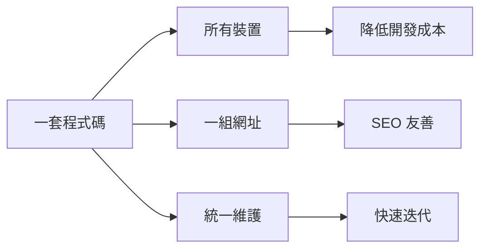
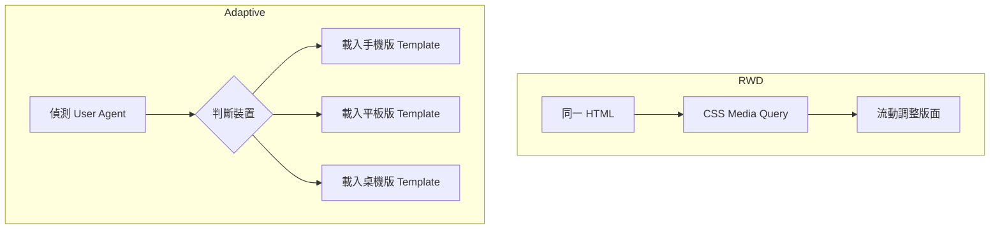
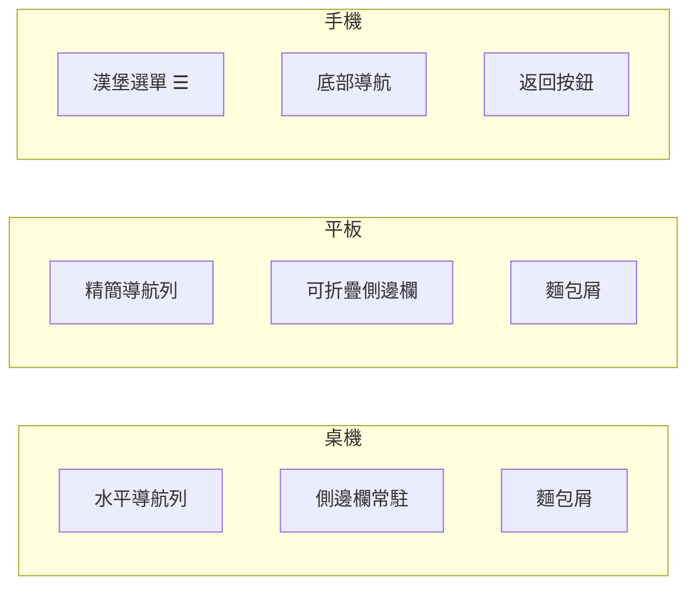
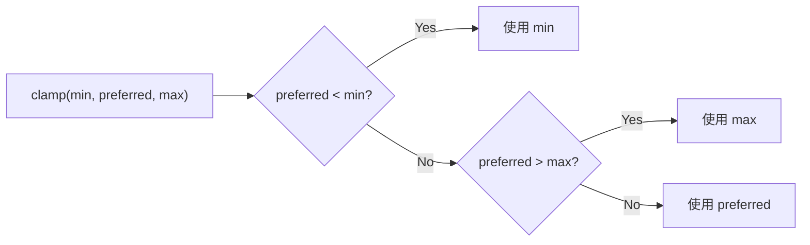
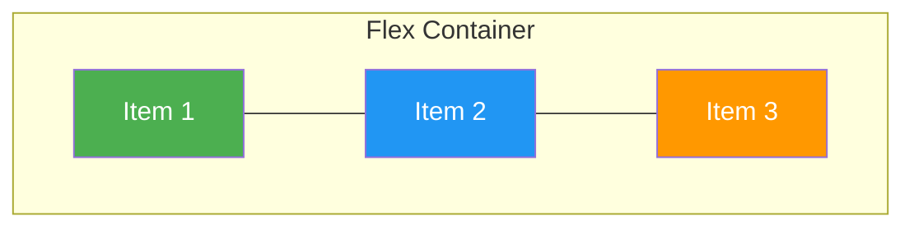
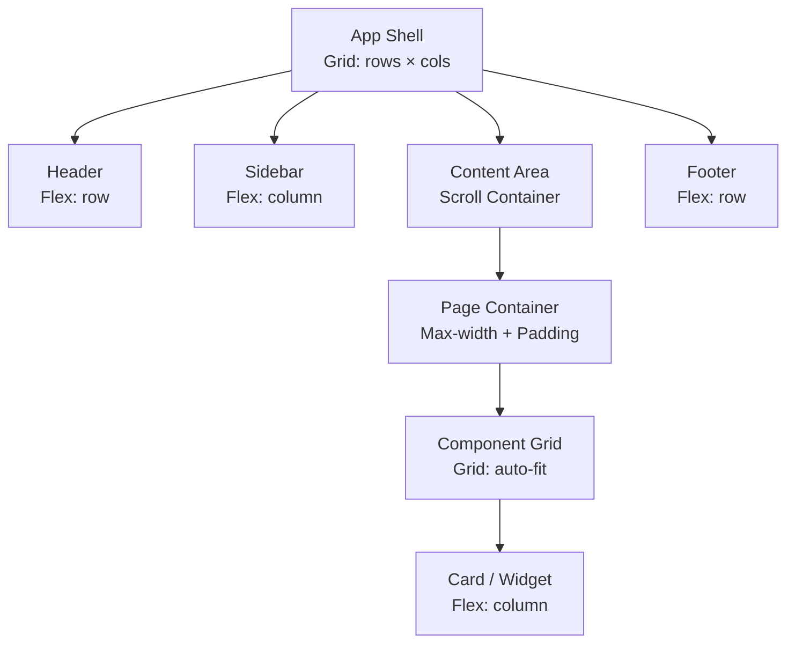
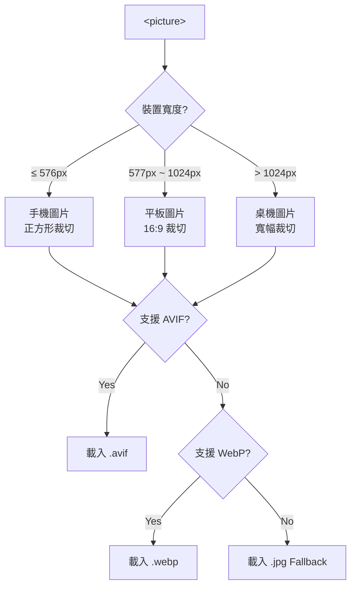
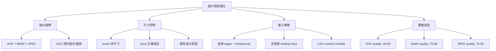
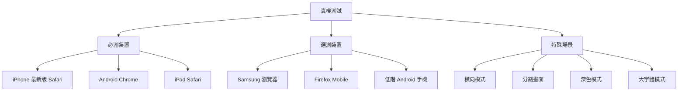
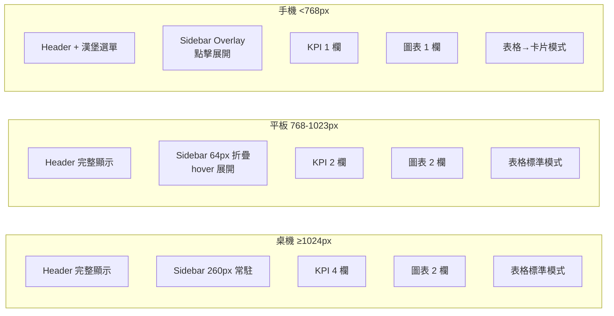

+++
date = '2026-02-14T11:43:22+08:00'
draft = false
title = 'RWD（Responsive Web Design）企業級教學手冊'
tags = ['教學', 'framework','RWD']
categories = ['教學']
+++

# RWD（Responsive Web Design）企業級教學手冊

> **版本**：v1.0（2026 年 2 月）  
> **適用對象**：資深前端工程師、全端工程師、UI/UX 設計師、技術主管  
> **技術標準**：HTML5 · CSS3（2024+）· JavaScript ES2025 · Vue 3.5+ · React 19+ · Angular 19+ · Tailwind CSS 4.x · Bootstrap 5.3+  

---

## 目錄

- [第 1 章 RWD 核心概念](#第-1-章-rwd-核心概念)
  - [1.1 為什麼需要 RWD？](#11-為什麼需要-rwd)
  - [1.2 RWD vs Adaptive Design 差異](#12-rwd-vs-adaptive-design-差異)
  - [1.3 Mobile First 設計哲學](#13-mobile-first-設計哲學)
  - [1.4 UX 與效能考量](#14-ux-與效能考量)
  - [1.5 SEO 對 RWD 的影響](#15-seo-對-rwd-的影響)
- [第 2 章 RWD 技術基礎](#第-2-章-rwd-技術基礎)
  - [2.1 Viewport 設定](#21-viewport-設定)
  - [2.2 Flexible Layout](#22-flexible-layout)
  - [2.3 CSS Media Queries](#23-css-media-queries)
  - [2.4 Flexbox 詳解](#24-flexbox-詳解)
  - [2.5 CSS Grid 詳解](#25-css-grid-詳解)
- [第 3 章 現代 RWD 架構設計（企業級）](#第-3-章-現代-rwd-架構設計企業級)
  - [3.1 Layout 分層設計](#31-layout-分層設計)
  - [3.2 Header / Sidebar / Content 響應式設計](#32-header--sidebar--content-響應式設計)
  - [3.3 Dashboard 響應式實務](#33-dashboard-響應式實務)
  - [3.4 表單 RWD 設計策略](#34-表單-rwd-設計策略)
  - [3.5 表格（Data Table）在手機的處理方式](#35-表格data-table在手機的處理方式)
  - [3.6 Modal / Drawer 在不同裝置設計](#36-modal--drawer-在不同裝置設計)
- [第 4 章 與現代框架整合](#第-4-章-與現代框架整合)
  - [4.1 Vue 3 + RWD](#41-vue-3--rwd)
  - [4.2 Tailwind CSS 響應式設計](#42-tailwind-css-響應式設計)
  - [4.3 Bootstrap 5 Grid System](#43-bootstrap-5-grid-system)
  - [4.4 React 19 + RWD 整合](#44-react-19--rwd-整合)
  - [4.5 CSS 新特性整合（2025+）](#45-css-新特性整合2025)
  - [4.6 Angular 19 + RWD 整合](#46-angular-19--rwd-整合)
- [第 5 章 圖片與媒體最佳化](#第-5-章-圖片與媒體最佳化)
  - [5.1 Responsive Image（srcset / sizes）](#51-responsive-imagesrcset--sizes)
  - [5.2 Picture 元素](#52-picture-元素)
  - [5.3 WebP / AVIF 現代圖片格式](#53-webp--avif-現代圖片格式)
  - [5.4 Lazy Loading](#54-lazy-loading)
  - [5.5 效能優化策略總整理](#55-效能優化策略總整理)
  - [5.6 響應式影片與嵌入媒體](#56-響應式影片與嵌入媒體)
- [第 6 章 RWD 效能優化](#第-6-章-rwd-效能優化)
  - [6.1 減少重排（Reflow）](#61-減少重排reflow)
  - [6.2 減少重繪（Repaint）](#62-減少重繪repaint)
  - [6.3 Critical CSS](#63-critical-css)
  - [6.4 避免不必要的 Media Query](#64-避免不必要的-media-query)
  - [6.5 Lighthouse 指標優化](#65-lighthouse-指標優化)
- [第 7 章 常見錯誤與反模式](#第-7-章-常見錯誤與反模式)
  - [7.1 固定寬度設計](#71-固定寬度設計)
  - [7.2 使用 px 當作主要單位](#72-使用-px-當作主要單位)
  - [7.3 忽略觸控可點擊範圍](#73-忽略觸控可點擊範圍)
  - [7.4 忽略觸控裝置特性](#74-忽略觸控裝置特性)
  - [7.5 表格未優化](#75-表格未優化)
  - [7.6 字體過小](#76-字體過小)
  - [7.7 反模式總結](#77-反模式總結)
- [第 8 章 企業級 RWD 開發標準規範](#第-8-章-企業級-rwd-開發標準規範)
  - [8.1 Breakpoint 標準](#81-breakpoint-標準)
  - [8.2 命名規範](#82-命名規範)
  - [8.3 Layout 架構規範](#83-layout-架構規範)
  - [8.4 元件設計原則](#84-元件設計原則)
  - [8.5 Code Review 檢查清單](#85-code-review-檢查清單)
  - [8.6 UI/UX 檢核表](#86-uiux-檢核表)
- [第 9 章 測試與驗證](#第-9-章-測試與驗證)
  - [9.1 Chrome DevTools 模擬](#91-chrome-devtools-模擬)
  - [9.2 真機測試](#92-真機測試)
  - [9.3 自動化測試建議](#93-自動化測試建議)
  - [9.4 視覺回歸測試（Visual Regression）](#94-視覺回歸測試visual-regression)
- [第 10 章 範例專案（完整實戰範例）](#第-10-章-範例專案完整實戰範例)
  - [10.1 完整 Dashboard Layout 範例](#101-完整-dashboard-layout-範例)
  - [10.2 關鍵響應式行為說明](#102-關鍵響應式行為說明)
  - [10.3 範例操作說明](#103-範例操作說明)
- [附錄 A 企業級 RWD 開發檢查清單（Checklist）](#附錄-a-企業級-rwd-開發檢查清單checklist)
  - [A.1 專案設定](#a1-專案設定)
  - [A.2 佈局（Layout）](#a2-佈局layout)
  - [A.3 文字與字體](#a3-文字與字體)
  - [A.4 互動與觸控](#a4-互動與觸控)
  - [A.5 圖片與媒體](#a5-圖片與媒體)
  - [A.6 表格](#a6-表格)
  - [A.7 效能](#a7-效能)
  - [A.8 無障礙（A11y）](#a8-無障礙a11y)
  - [A.9 跨瀏覽器](#a9-跨瀏覽器)
  - [A.10 測試](#a10-測試)

---

## 第 1 章 RWD 核心概念

### 1.1 為什麼需要 RWD？

#### 背景

在 2026 年的今天，全球行動裝置（手機 + 平板）流量佔比已超過 **65%**，企業面對的使用者橫跨多種裝置：

| 裝置類型 | 螢幕尺寸範例 | 使用情境 |
|----------|-------------|---------|
| 手機 | 320px ~ 430px | 通勤、即時查詢 |
| 平板 | 768px ~ 1024px | 會議、簽核、報表 |
| 筆電 | 1280px ~ 1440px | 日常辦公 |
| 桌機 | 1920px+ | 設計、資料分析 |
| 大螢幕/TV | 2560px+ | Dashboard 看板 |

#### RWD 的核心價值



1. **成本效益**：維護一套 codebase，不需針對手機版 / 桌機版各自開發
2. **SEO 統一**：Google 推薦使用 RWD，單一 URL 有利搜尋排名
3. **使用者體驗一致**：品牌體驗在各裝置保持一致
4. **維護效率**：修改一次、全裝置生效
5. **未來擴展**：新裝置問世時，只需調整少量 CSS

#### 企業實務案例

> **情境**：某銀行內部系統原本只支援 1920×1080 桌機，後因業務需求需在平板上進行客戶簽核。
> 
> - ❌ 傳統做法：另外開發一套平板版本 → 維護兩套系統 → 成本翻倍
> - ✅ RWD 做法：基於現有系統加入 RWD → 一套程式碼支援桌機 + 平板

---

### 1.2 RWD vs Adaptive Design 差異

| 比較項目 | RWD（響應式設計） | Adaptive Design（自適應設計） |
|---------|------------------|---------------------------|
| **核心原理** | 流動佈局 + Media Query | 偵測裝置 → 載入對應版面 |
| **斷點設計** | 流動過渡（Fluid） | 固定斷點切換 |
| **程式碼** | 一套 HTML + CSS | 多套 Template |
| **維護成本** | 低 | 高（每個版本獨立維護） |
| **效能** | 全部 CSS 都會下載 | 只下載對應版本 |
| **彈性** | 高，任意尺寸皆可適配 | 中，僅在預設斷點最佳 |
| **適用場景** | 通用 Web Application | 差異極大的裝置體驗 |



> ✅ **企業建議**：除非存在極端的裝置差異需求（如 IoT 面板），否則一律採用 RWD。

---

### 1.3 Mobile First 設計哲學

#### 核心理念

「先為最小螢幕設計，再逐步增強」──這不僅是 CSS 的寫法順序，更是一種 **設計思維**。

```css
/* ✅ Mobile First（推薦） */
.container {
  padding: 1rem;          /* 手機預設 */
}

@media (min-width: 768px) {
  .container {
    padding: 2rem;        /* 平板增強 */
  }
}

@media (min-width: 1280px) {
  .container {
    padding: 3rem;        /* 桌機增強 */
    max-width: 1200px;
    margin: 0 auto;
  }
}
```

```css
/* ❌ Desktop First（不推薦） */
.container {
  padding: 3rem;
  max-width: 1200px;
  margin: 0 auto;
}

@media (max-width: 1279px) {
  .container {
    padding: 2rem;
    max-width: none;
  }
}

@media (max-width: 767px) {
  .container {
    padding: 1rem;
  }
}
```

#### Mobile First 的優勢

| 優勢 | 說明 |
|------|------|
| **效能優先** | 手機只載入基礎樣式，避免下載不必要的 CSS |
| **內容優先** | 迫使設計者精簡內容，聚焦核心功能 |
| **漸進增強** | 從簡單到複雜，確保基礎體驗可用 |
| **CSS 更精簡** | `min-width` 寫法的 CSS 通常更乾淨 |

---

### 1.4 UX 與效能考量

#### UX 設計原則

1. **觸控友善**
   - 可點擊元素最小尺寸：**44×44px**（Apple HIG）/ **48×48dp**（Material Design）
   - 按鈕間距至少 **8px**

2. **內容優先**
   - 手機版隱藏非關鍵功能到選單中
   - 關鍵操作（CTA）保持可見

3. **閱讀體驗**
   - 最佳行寬：**45~75 字元**
   - 字體大小不低於 **16px**（避免 iOS 自動放大）

4. **導航設計**



#### 效能考量

| 指標 | 目標值 | 說明 |
|------|-------|------|
| **FCP**（First Contentful Paint） | < 1.8s | 首次有內容的繪製 |
| **LCP**（Largest Contentful Paint） | < 2.5s | 最大內容繪製 |
| **INP**（Interaction to Next Paint） | < 200ms | 互動回應延遲 |
| **CLS**（Cumulative Layout Shift） | < 0.1 | 累積版面偏移 |

> ⚠️ **注意**：RWD 不當實作（如載入過大圖片、未優化 CSS）會嚴重影響行動裝置效能。

---

### 1.5 SEO 對 RWD 的影響

#### Google 對 RWD 的態度

Google 從 2019 年起採用「**Mobile-First Indexing**」，即 Google 爬蟲以行動版為主要索引依據：

| SEO 因素 | RWD 優勢 |
|---------|---------|
| **單一 URL** | 避免重複內容問題（Canonical） |
| **行動友善** | 通過 Google Mobile-Friendly Test |
| **載入速度** | 配合效能優化提升排名 |
| **結構化數據** | 一份 Schema Markup 通用 |
| **用戶體驗** | Core Web Vitals 信號加分 |

#### 關鍵 SEO 檢查項目

```html
<!-- 必須設定 -->
<meta name="viewport" content="width=device-width, initial-scale=1.0">

<!-- 確保不會阻擋行動裝置爬蟲 -->
<!-- robots.txt 中不要阻擋 CSS/JS 資源 -->

<!-- 結構化數據 -->
<script type="application/ld+json">
{
  "@context": "https://schema.org",
  "@type": "WebApplication",
  "name": "企業管理系統",
  "operatingSystem": "All"
}
</script>
```

> ✅ **實務建議**：即使是企業內部系統（不需 SEO），也建議遵循 RWD 標準——養成好習慣，且未來系統可能對外開放。

---

## 第 2 章 RWD 技術基礎

### 2.1 Viewport 設定

#### 什麼是 Viewport？

Viewport 是瀏覽器中用來顯示網頁的「可視區域」。在行動裝置上，若未設定 viewport，瀏覽器會以桌機寬度（通常 980px）渲染頁面，然後縮放到螢幕上，導致內容極小。

#### 標準設定

```html
<!-- ✅ 標準 RWD viewport 設定 -->
<meta name="viewport" content="width=device-width, initial-scale=1.0">
```

#### 參數詳解

| 參數 | 值 | 說明 |
|------|-----|------|
| `width` | `device-width` | viewport 寬度等於裝置寬度 |
| `initial-scale` | `1.0` | 初始縮放比例 100% |
| `maximum-scale` | `1.0`（不建議） | 最大縮放比例 |
| `user-scalable` | `no`（不建議） | 禁止用戶縮放 |
| `viewport-fit` | `cover` | 針對 iPhone 瀏海屏適配 |

```html
<!-- ✅ 完整的企業級設定（含 iPhone 安全區域） -->
<meta name="viewport" content="width=device-width, initial-scale=1.0, viewport-fit=cover">
```

> ⚠️ **重要**：**不要** 設定 `maximum-scale=1.0` 或 `user-scalable=no`，這會影響無障礙性（Accessibility），導致視力不佳的使用者無法放大頁面。
>
> 若需避免雙擊放大，使用 `touch-action: manipulation;` 替代。

#### Safe Area 處理（iPhone 瀏海屏）

```css
/* 使用環境變數處理安全區域 */
.app-header {
  padding-top: env(safe-area-inset-top);
  padding-left: env(safe-area-inset-left);
  padding-right: env(safe-area-inset-right);
}

.app-footer {
  padding-bottom: env(safe-area-inset-bottom);
}
```

---

### 2.2 Flexible Layout

#### 2.2.1 百分比佈局

```css
/* 兩欄式佈局 */
.sidebar {
  width: 25%;        /* 固定比例 */
  min-width: 200px;  /* 最小寬度保護 */
}

.main-content {
  width: 75%;
}
```

> ⚠️ 純百分比佈局的問題：元素間距不好控制。建議搭配 `calc()` 或 Flexbox 使用。

#### 2.2.2 rem 與 em

| 單位 | 基準 | 適用場景 |
|------|------|---------|
| `rem` | 根元素（`<html>`）字體大小 | 全局間距、字體大小 |
| `em` | 父元素字體大小 | 元件內相對大小 |
| `px` | 固定像素 | 邊框、細微裝飾 |

```css
/* ✅ 推薦的 rem 設計系統 */
:root {
  font-size: 16px; /* 1rem = 16px */
}

/* 間距系統（基於 4px 網格） */
.spacing-xs { margin: 0.25rem; }  /* 4px */
.spacing-sm { margin: 0.5rem; }   /* 8px */
.spacing-md { margin: 1rem; }     /* 16px */
.spacing-lg { margin: 1.5rem; }   /* 24px */
.spacing-xl { margin: 2rem; }     /* 32px */

/* 字體系統 */
.text-xs   { font-size: 0.75rem; }   /* 12px */
.text-sm   { font-size: 0.875rem; }  /* 14px */
.text-base { font-size: 1rem; }      /* 16px */
.text-lg   { font-size: 1.125rem; }  /* 18px */
.text-xl   { font-size: 1.25rem; }   /* 20px */
.text-2xl  { font-size: 1.5rem; }    /* 24px */
```

#### 2.2.3 vw / vh（Viewport Units）

```css
/* 全屏 Hero 區塊 */
.hero {
  height: 100vh;           /* 佔滿整個螢幕高度 */
  height: 100dvh;          /* ✅ 推薦：動態 viewport 高度（處理手機瀏覽器地址欄） */
}

/* 響應式字體（不建議單獨使用，建議搭配 clamp） */
.hero-title {
  font-size: 5vw;          /* ❌ 過大或過小 */
  font-size: clamp(1.5rem, 4vw, 3rem); /* ✅ 有上下限 */
}
```

> ⚠️ **`100vh` 在手機上的問題**：手機瀏覽器的地址欄會影響 `100vh` 的計算。使用 `100dvh`（Dynamic Viewport Height）或 `100svh`（Small Viewport Height）替代。

| Viewport 單位 | 說明 | 支援度（2026） |
|--------------|------|-------------|
| `vh` / `vw` | 傳統 viewport 單位 | ✅ 全支援 |
| `dvh` / `dvw` | 動態（含地址欄變化） | ✅ 全支援 |
| `svh` / `svw` | 小 viewport（地址欄展開） | ✅ 全支援 |
| `lvh` / `lvw` | 大 viewport（地址欄隱藏） | ✅ 全支援 |

#### 2.2.4 clamp()：響應式設計的利器

```css
/* 語法：clamp(最小值, 推薦值, 最大值) */

/* ✅ 響應式字體 */
h1 { font-size: clamp(1.5rem, 2.5vw + 1rem, 3rem); }
h2 { font-size: clamp(1.25rem, 2vw + 0.75rem, 2.25rem); }
p  { font-size: clamp(1rem, 1.2vw + 0.5rem, 1.25rem); }

/* ✅ 響應式間距 */
.section {
  padding: clamp(1rem, 3vw, 3rem);
}

/* ✅ 響應式容器寬度 */
.container {
  width: clamp(320px, 90vw, 1200px);
  margin: 0 auto;
}
```



> ✅ **企業實務**：使用 `clamp()` 可大幅減少 Media Query 的數量，讓字體與間距在各種尺寸間平滑過渡。

---

### 2.3 CSS Media Queries

#### 2.3.1 基本語法

```css
/* 語法結構 */
@media <media-type> and (<media-feature>) {
  /* 樣式規則 */
}

/* 常用範例 */
@media screen and (min-width: 768px) {
  .sidebar { display: block; }
}

/* 多條件組合 */
@media screen and (min-width: 768px) and (max-width: 1279px) {
  .sidebar { width: 200px; }
}

/* 暗色模式 */
@media (prefers-color-scheme: dark) {
  :root { --bg-color: #1a1a1a; }
}

/* 減少動畫（無障礙） */
@media (prefers-reduced-motion: reduce) {
  * { animation: none !important; transition-duration: 0.01ms !important; }
}

/* 高解析度螢幕 */
@media (min-resolution: 2dppx) {
  .logo { background-image: url('logo@2x.png'); }
}
```

#### 2.3.2 現代 Media Query 特性（Level 4+）

```css
/* ✅ 範圍語法（Range Syntax） - 更直覺 */
@media (width >= 768px) {
  .sidebar { display: block; }
}

@media (768px <= width <= 1279px) {
  .sidebar { width: 200px; }
}

/* ✅ Container Queries - 基於容器尺寸 */
.card-container {
  container-type: inline-size;
  container-name: card;
}

@container card (min-width: 400px) {
  .card { flex-direction: row; }
}

@container card (max-width: 399px) {
  .card { flex-direction: column; }
}
```

#### 2.3.3 企業建議 Breakpoint 規範表

| 名稱 | 代號 | min-width | 典型裝置 | 使用情境 |
|------|------|-----------|---------|---------|
| Extra Small | `xs` | 0px | 小螢幕手機 | 基礎樣式（不需 Media Query） |
| Small | `sm` | 576px | 大螢幕手機（橫向） | 微調手機橫向 |
| Medium | `md` | 768px | 平板直向 | 平板佈局調整 |
| Large | `lg` | 1024px | 平板橫向 / 小筆電 | 側邊欄顯示 |
| Extra Large | `xl` | 1280px | 標準桌機 | 全功能桌機佈局 |
| 2X Large | `2xl` | 1536px | 大螢幕桌機 | 寬版佈局 |

```css
/* ✅ 企業標準 Breakpoint 定義（CSS Custom Properties） */
:root {
  --breakpoint-sm: 576px;
  --breakpoint-md: 768px;
  --breakpoint-lg: 1024px;
  --breakpoint-xl: 1280px;
  --breakpoint-2xl: 1536px;
}

/* ✅ SCSS/SASS Mixin（推薦） */
/*
$breakpoints: (
  'sm':  576px,
  'md':  768px,
  'lg':  1024px,
  'xl':  1280px,
  '2xl': 1536px,
);

@mixin respond-to($breakpoint) {
  @media (min-width: map-get($breakpoints, $breakpoint)) {
    @content;
  }
}

// 使用方式
.sidebar {
  display: none;
  @include respond-to('lg') {
    display: block;
    width: 280px;
  }
}
*/
```

> ⚠️ **關鍵決策**：Breakpoint 並非固定答案。應根據實際 **內容** 需求來決定斷點，而非只追隨裝置尺寸。上表是「起點」，專案應根據實際 UI 調整。

---

### 2.4 Flexbox 詳解

#### 2.4.1 核心概念



**主軸（Main Axis）** 與 **交叉軸（Cross Axis）**：

| 屬性 | 說明 | 常用值 |
|------|------|-------|
| `flex-direction` | 主軸方向 | `row`（預設）、`column` |
| `justify-content` | 主軸對齊 | `flex-start`、`center`、`space-between`、`space-evenly` |
| `align-items` | 交叉軸對齊 | `stretch`（預設）、`center`、`flex-start` |
| `flex-wrap` | 換行行為 | `nowrap`（預設）、`wrap` |
| `gap` | 項目間距 | `1rem`、`8px 16px` |

#### 2.4.2 Flex 子項目屬性

```css
.flex-item {
  flex: 1;              /* flex-grow: 1; flex-shrink: 1; flex-basis: 0%; */
  flex: 0 0 auto;       /* 不伸展、不收縮、自然寬度 */
  flex: 0 0 300px;      /* 固定 300px */
  flex: 1 1 0%;         /* 等分空間 */
}
```

| 簡寫 | 等同於 | 使用情境 |
|------|--------|---------|
| `flex: 1` | `1 1 0%` | 等分可用空間 |
| `flex: auto` | `1 1 auto` | 依內容分配後等分剩餘 |
| `flex: none` | `0 0 auto` | 不伸縮，保持原始大小 |
| `flex: 0 0 250px` | - | 固定寬度的側邊欄 |

#### 2.4.3 常見 Layout Pattern

**Pattern 1：Holy Grail Layout（聖杯佈局）**

```css
.layout {
  display: flex;
  flex-direction: column;
  min-height: 100dvh;
}

.layout-header {
  flex: none;               /* 固定高度 */
  height: 64px;
}

.layout-body {
  display: flex;
  flex: 1;                  /* 填滿剩餘空間 */
}

.layout-sidebar {
  flex: 0 0 280px;          /* 固定寬度 */
}

.layout-content {
  flex: 1;                  /* 填滿 */
  overflow-y: auto;
}

.layout-footer {
  flex: none;
  height: 48px;
}

/* 手機版 */
@media (width < 1024px) {
  .layout-body {
    flex-direction: column;
  }
  .layout-sidebar {
    flex: none;
    width: 100%;
  }
}
```

**Pattern 2：卡片列表（均等分佈）**

```css
.card-grid {
  display: flex;
  flex-wrap: wrap;
  gap: 1rem;
}

.card {
  flex: 1 1 calc(33.333% - 1rem);  /* 三欄 */
  min-width: 280px;                 /* 最小寬度保護 */
}

/* 自動換行：當卡片低於 280px 時自動變為更少欄數 */
```

**Pattern 3：水平居中 + 垂直居中**

```css
.center-box {
  display: flex;
  justify-content: center;
  align-items: center;
  min-height: 100dvh;
}
```

---

### 2.5 CSS Grid 詳解

#### 2.5.1 核心屬性

```css
.grid-container {
  display: grid;
  
  /* 定義欄數與寬度 */
  grid-template-columns: repeat(12, 1fr);  /* 12 欄網格 */
  
  /* 定義行高 */
  grid-template-rows: auto 1fr auto;
  
  /* 間距 */
  gap: 1rem;
  
  /* 命名區域（企業常用） */
  grid-template-areas:
    "header  header  header"
    "sidebar content content"
    "footer  footer  footer";
}

.header  { grid-area: header; }
.sidebar { grid-area: sidebar; }
.content { grid-area: content; }
.footer  { grid-area: footer; }
```

#### 2.5.2 auto-fit 與 auto-fill

```css
/* ✅ auto-fit：自動適配，剩餘空間平分給現有項目 */
.auto-fit-grid {
  display: grid;
  grid-template-columns: repeat(auto-fit, minmax(280px, 1fr));
  gap: 1rem;
}

/* auto-fill：保留空欄位位置 */
.auto-fill-grid {
  display: grid;
  grid-template-columns: repeat(auto-fill, minmax(280px, 1fr));
  gap: 1rem;
}
```

| 比較 | auto-fit | auto-fill |
|------|----------|-----------|
| **空間處理** | 剩餘空間分配給現有項目 | 保留空的網格軌道 |
| **適用場景** | 卡片列表（自動填滿） | 固定佈局結構 |
| **推薦度** | ✅ 更常用 | 特殊需求 |

#### 2.5.3 Subgrid

```css
/* ✅ Subgrid：子網格繼承父網格的軌道（2025+ 全面支援） */
.parent-grid {
  display: grid;
  grid-template-columns: repeat(3, 1fr);
  gap: 1rem;
}

.child-spanning-all {
  grid-column: 1 / -1;
  display: grid;
  grid-template-columns: subgrid; /* 繼承父網格的欄定義 */
}
```

#### 2.5.4 真實案例：Dashboard 網格佈局

```css
/* 企業 Dashboard 佈局 */
.dashboard {
  display: grid;
  gap: 1rem;
  padding: 1rem;
  
  /* 桌機：4 欄 */
  grid-template-columns: repeat(4, 1fr);
  grid-template-rows: auto;
  grid-template-areas:
    "kpi1    kpi2    kpi3    kpi4"
    "chart1  chart1  chart2  chart2"
    "table   table   table   table";
}

.kpi-1    { grid-area: kpi1; }
.kpi-2    { grid-area: kpi2; }
.kpi-3    { grid-area: kpi3; }
.kpi-4    { grid-area: kpi4; }
.chart-1  { grid-area: chart1; }
.chart-2  { grid-area: chart2; }
.data-table { grid-area: table; }

/* 平板：2 欄 */
@media (width < 1024px) {
  .dashboard {
    grid-template-columns: repeat(2, 1fr);
    grid-template-areas:
      "kpi1    kpi2"
      "kpi3    kpi4"
      "chart1  chart1"
      "chart2  chart2"
      "table   table";
  }
}

/* 手機：1 欄 */
@media (width < 576px) {
  .dashboard {
    grid-template-columns: 1fr;
    grid-template-areas:
      "kpi1"
      "kpi2"
      "kpi3"
      "kpi4"
      "chart1"
      "chart2"
      "table";
  }
}
```

> ✅ **企業最佳實務**：
> - 對於複雜的頁面級佈局（Header / Sidebar / Content），使用 **CSS Grid**
> - 對於元件內的一維排列（按鈕列、導航項目），使用 **Flexbox**
> - 兩者混合使用才是最佳方案

---

> 📌 **第 1-2 章小結**
> 
> | 主題 | 關鍵要點 |
> |------|---------|
> | RWD 定位 | 一套程式碼，一組 URL，全裝置適配 |
> | Mobile First | `min-width` 寫法，從小到大漸進增強 |
> | Viewport | `width=device-width, initial-scale=1.0` 必設 |
> | 單位系統 | `rem` 為主，`clamp()` 做響應式，`px` 僅用於細微裝飾 |
> | Media Query | 使用現代範圍語法、搭配 Container Queries |
> | 佈局工具 | Grid 用於頁面佈局，Flexbox 用於元件排列 |

---

## 第 3 章 現代 RWD 架構設計（企業級）

### 3.1 Layout 分層設計

企業級 Web Application 的佈局通常具有 **多層嵌套結構**，良好的分層設計是 RWD 成功的基礎。

#### 佈局分層架構

```
┌──────────────────────────────────────────────┐
│                 App Shell                     │ ← 最外層容器
│  ┌────────────────────────────────────────┐  │
│  │              Header                    │  │ ← 固定頂部
│  ├────────┬───────────────────────────────┤  │
│  │        │                               │  │
│  │ Side-  │        Content Area           │  │
│  │  bar   │  ┌─────────────────────────┐  │  │
│  │        │  │    Page Container        │  │  │ ← 頁面容器
│  │        │  │  ┌───────────────────┐   │  │  │
│  │        │  │  │  Component Grid    │   │  │  │ ← 元件網格
│  │        │  │  └───────────────────┘   │  │  │
│  │        │  └─────────────────────────┘  │  │
│  ├────────┴───────────────────────────────┤  │
│  │              Footer                    │  │ ← 底部
│  └────────────────────────────────────────┘  │
└──────────────────────────────────────────────┘
```

#### 分層 CSS 架構

```css
/* Layer 1: App Shell */
.app-shell {
  display: grid;
  grid-template-rows: auto 1fr auto;
  grid-template-columns: auto 1fr;
  grid-template-areas:
    "header  header"
    "sidebar content"
    "footer  footer";
  min-height: 100dvh;
}

/* Layer 2: Page Container */
.page-container {
  grid-area: content;
  padding: clamp(1rem, 3vw, 2rem);
  overflow-y: auto;
  max-width: 1440px;
}

/* Layer 3: Component Grid */
.component-grid {
  display: grid;
  grid-template-columns: repeat(auto-fit, minmax(300px, 1fr));
  gap: 1rem;
}

/* Layer 4: Component Internal */
.component-card {
  display: flex;
  flex-direction: column;
  gap: 0.75rem;
}
```



> ✅ **設計原則**：
> 1. 每一層只負責自己的佈局邏輯
> 2. 響應式斷點在 **合適的層級** 處理（不要在元件內部處理應用級佈局）
> 3. 使用 CSS Custom Properties 統一間距與寬度

---

### 3.2 Header / Sidebar / Content 響應式設計

#### Header 響應式設計

```css
/* Header 基礎樣式 */
.app-header {
  grid-area: header;
  display: flex;
  align-items: center;
  justify-content: space-between;
  padding: 0 1rem;
  height: 56px;
  background: var(--header-bg, #ffffff);
  border-bottom: 1px solid var(--border-color, #e0e0e0);
  position: sticky;
  top: 0;
  z-index: 100;
}

.header-logo {
  flex: 0 0 auto;
}

.header-nav {
  display: flex;
  gap: 1.5rem;
  align-items: center;
}

.header-nav-item {
  white-space: nowrap;
  padding: 0.5rem 1rem;
  border-radius: 4px;
  text-decoration: none;
  color: var(--text-primary);
}

.header-actions {
  display: flex;
  gap: 0.5rem;
  align-items: center;
}

/* 漢堡選單按鈕（手機版） */
.menu-toggle {
  display: none;
  background: none;
  border: none;
  padding: 0.5rem;
  cursor: pointer;
  font-size: 1.5rem;
}

/* 手機版 Header */
@media (width < 1024px) {
  .header-nav {
    display: none;    /* 隱藏水平導航 */
  }
  .menu-toggle {
    display: block;   /* 顯示漢堡選單 */
  }
}
```

#### Sidebar 響應式設計

```css
/* Sidebar 基礎樣式 */
.app-sidebar {
  grid-area: sidebar;
  width: 260px;
  background: var(--sidebar-bg, #f5f5f5);
  border-right: 1px solid var(--border-color, #e0e0e0);
  overflow-y: auto;
  transition: transform 0.3s ease, width 0.3s ease;
  display: flex;
  flex-direction: column;
}

.sidebar-nav {
  padding: 1rem 0;
  flex: 1;
}

.sidebar-nav-item {
  display: flex;
  align-items: center;
  gap: 0.75rem;
  padding: 0.75rem 1.25rem;
  color: var(--text-primary);
  text-decoration: none;
  border-radius: 0 24px 24px 0;
  margin-right: 0.75rem;
}

.sidebar-nav-item:hover {
  background: var(--hover-bg, rgba(0, 0, 0, 0.04));
}

.sidebar-nav-item.active {
  background: var(--primary-light, #e3f2fd);
  color: var(--primary, #1976d2);
  font-weight: 600;
}

/* 折疊模式（平板） */
@media (768px <= width < 1024px) {
  .app-sidebar {
    width: 64px;           /* 只顯示圖示 */
  }
  .sidebar-nav-item span {
    display: none;         /* 隱藏文字 */
  }
  .app-sidebar:hover {
    width: 260px;
    position: absolute;
    height: 100%;
    z-index: 50;
    box-shadow: 4px 0 8px rgba(0, 0, 0, 0.1);
  }
  .app-sidebar:hover .sidebar-nav-item span {
    display: inline;
  }
}

/* 手機版：Sidebar 變成 Overlay */
@media (width < 768px) {
  .app-shell {
    grid-template-columns: 1fr;
    grid-template-areas:
      "header"
      "content"
      "footer";
  }

  .app-sidebar {
    position: fixed;
    top: 0;
    left: 0;
    height: 100dvh;
    width: 280px;
    z-index: 200;
    transform: translateX(-100%);   /* 預設隱藏 */
  }
  
  .app-sidebar.is-open {
    transform: translateX(0);       /* 展開 */
  }

  /* 遮罩層 */
  .sidebar-overlay {
    position: fixed;
    inset: 0;
    background: rgba(0, 0, 0, 0.5);
    z-index: 199;
    opacity: 0;
    pointer-events: none;
    transition: opacity 0.3s;
  }
  
  .sidebar-overlay.is-visible {
    opacity: 1;
    pointer-events: auto;
  }
}
```

#### Content Area 響應式設計

```css
.app-content {
  grid-area: content;
  overflow-y: auto;
  background: var(--content-bg, #fafafa);
}

.page-wrapper {
  max-width: 1440px;
  margin: 0 auto;
  padding: clamp(1rem, 3vw, 2rem);
}

/* 頁面標題列 */
.page-header {
  display: flex;
  justify-content: space-between;
  align-items: center;
  flex-wrap: wrap;
  gap: 1rem;
  margin-bottom: 1.5rem;
}

@media (width < 576px) {
  .page-header {
    flex-direction: column;
    align-items: flex-start;
  }
  .page-header-actions {
    width: 100%;
  }
  .page-header-actions .btn {
    width: 100%;        /* 按鈕全寬 */
  }
}
```

---

### 3.3 Dashboard 響應式實務

```css
/* Dashboard 統計卡片 */
.kpi-grid {
  display: grid;
  grid-template-columns: repeat(4, 1fr);
  gap: 1rem;
}

@media (width < 1024px) {
  .kpi-grid {
    grid-template-columns: repeat(2, 1fr);
  }
}

@media (width < 576px) {
  .kpi-grid {
    grid-template-columns: 1fr;
  }
}

/* KPI 卡片 */
.kpi-card {
  background: white;
  border-radius: 8px;
  padding: 1.25rem;
  box-shadow: 0 1px 3px rgba(0, 0, 0, 0.08);
  display: flex;
  flex-direction: column;
  gap: 0.5rem;
}

.kpi-value {
  font-size: clamp(1.5rem, 3vw, 2.5rem);
  font-weight: 700;
  color: var(--text-primary);
}

.kpi-label {
  font-size: 0.875rem;
  color: var(--text-secondary);
}

/* 圖表區域 */
.chart-grid {
  display: grid;
  grid-template-columns: repeat(2, 1fr);
  gap: 1rem;
  margin-top: 1rem;
}

@media (width < 768px) {
  .chart-grid {
    grid-template-columns: 1fr;
  }
}

.chart-card {
  background: white;
  border-radius: 8px;
  padding: 1.25rem;
  box-shadow: 0 1px 3px rgba(0, 0, 0, 0.08);
}

/* 圖表容器需保持比例 */
.chart-container {
  width: 100%;
  aspect-ratio: 16 / 9;     /* ✅ 使用 aspect-ratio 保持比例 */
  min-height: 200px;
}
```

---

### 3.4 表單 RWD 設計策略

#### 表單佈局模式

```css
/* ✅ 基礎表單 Grid 佈局 */
.form-grid {
  display: grid;
  grid-template-columns: repeat(2, 1fr);
  gap: 1rem 1.5rem;
}

/* 單欄模式（手機） */
@media (width < 768px) {
  .form-grid {
    grid-template-columns: 1fr;
  }
}

/* 全寬欄位 */
.form-field--full {
  grid-column: 1 / -1;
}

/* 表單欄位 */
.form-field {
  display: flex;
  flex-direction: column;
  gap: 0.375rem;
}

.form-field label {
  font-size: 0.875rem;
  font-weight: 500;
  color: var(--text-secondary);
}

.form-field input,
.form-field select,
.form-field textarea {
  padding: 0.625rem 0.75rem;
  border: 1px solid var(--border-color, #d0d0d0);
  border-radius: 6px;
  font-size: 1rem;             /* ✅ 至少 16px 避免 iOS 自動放大 */
  width: 100%;
  box-sizing: border-box;
  transition: border-color 0.2s;
}

.form-field input:focus,
.form-field select:focus {
  outline: none;
  border-color: var(--primary, #1976d2);
  box-shadow: 0 0 0 3px rgba(25, 118, 210, 0.15);
}

/* 表單按鈕列 */
.form-actions {
  grid-column: 1 / -1;
  display: flex;
  justify-content: flex-end;
  gap: 0.75rem;
  padding-top: 1rem;
  border-top: 1px solid var(--border-color);
}

@media (width < 576px) {
  .form-actions {
    flex-direction: column-reverse;
  }
  .form-actions .btn {
    width: 100%;
  }
}
```

#### Label 位置策略

```css
/* 桌機：Label 在左側（水平排列） */
@media (width >= 1024px) {
  .form-field--horizontal {
    display: grid;
    grid-template-columns: 180px 1fr;
    align-items: start;
    gap: 0.75rem;
  }
  .form-field--horizontal label {
    text-align: right;
    padding-top: 0.625rem;
  }
}

/* 平板 & 手機：Label 在上方（垂直排列） */
@media (width < 1024px) {
  .form-field--horizontal {
    display: flex;
    flex-direction: column;
    gap: 0.375rem;
  }
}
```

> ⚠️ **重要提醒**：
> - 表單 `input` 的 `font-size` 不可低於 **16px**，否則 iOS Safari 會在聚焦時自動放大頁面
> - 觸控裝置的 Input 高度建議至少 **44px**

---

### 3.5 表格（Data Table）在手機的處理方式

企業系統中表格是最常見也是 RWD 中最具挑戰性的元素。

#### 策略比較

| 策略 | 原理 | 適用場景 | 優缺點 |
|------|------|---------|-------|
| 水平捲動 | 表格保持原始結構，外層可橫向滾動 | 欄位少（5~8 欄） | 簡單但體驗一般 |
| 卡片式 | 每一行變成一張卡片 | 資料量不大 | 體驗好但佔空間 |
| 隱藏欄位 | 手機只顯示關鍵欄位 | 欄位多 | 需決定優先序 |
| 展開行 | 點擊行展開詳細資料 | 欄位很多 | 常見企業方案 |

#### 策略 1：水平捲動

```css
.table-responsive {
  width: 100%;
  overflow-x: auto;
  -webkit-overflow-scrolling: touch;       /* iOS 慣性捲動 */
}

.table-responsive table {
  min-width: 800px;                        /* 確保不被壓縮 */
}

/* 捲動提示影子 */
.table-responsive {
  background:
    linear-gradient(to right, white 30%, transparent),
    linear-gradient(to left, white 30%, transparent),
    linear-gradient(to right, rgba(0,0,0,.1), transparent),
    linear-gradient(to left, rgba(0,0,0,.1), transparent);
  background-position: left, right, left, right;
  background-size: 40px 100%, 40px 100%, 15px 100%, 15px 100%;
  background-repeat: no-repeat;
  background-attachment: local, local, scroll, scroll;
}
```

#### 策略 2：卡片式變換

```css
/* 桌機：標準表格 */
.data-table {
  width: 100%;
  border-collapse: collapse;
}

.data-table th,
.data-table td {
  padding: 0.75rem 1rem;
  border-bottom: 1px solid var(--border-color);
  text-align: left;
}

.data-table th {
  background: var(--table-header-bg, #f5f5f5);
  font-weight: 600;
  font-size: 0.875rem;
  color: var(--text-secondary);
  position: sticky;
  top: 0;
}

/* ✅ 手機：變為卡片 */
@media (width < 768px) {
  .data-table thead {
    display: none;                   /* 隱藏表頭 */
  }
  
  .data-table tbody tr {
    display: block;
    background: white;
    border-radius: 8px;
    padding: 1rem;
    margin-bottom: 0.75rem;
    box-shadow: 0 1px 3px rgba(0, 0, 0, 0.08);
  }
  
  .data-table td {
    display: flex;
    justify-content: space-between;
    align-items: center;
    padding: 0.5rem 0;
    border-bottom: 1px solid var(--border-color);
  }
  
  .data-table td:last-child {
    border-bottom: none;
  }
  
  /* 使用 data-label 屬性顯示欄位名稱 */
  .data-table td::before {
    content: attr(data-label);
    font-weight: 600;
    font-size: 0.8125rem;
    color: var(--text-secondary);
    flex: 0 0 40%;
  }
}
```

```html
<!-- HTML 需加上 data-label -->
<table class="data-table">
  <thead>
    <tr>
      <th>訂單編號</th>
      <th>客戶名稱</th>
      <th>金額</th>
      <th>狀態</th>
    </tr>
  </thead>
  <tbody>
    <tr>
      <td data-label="訂單編號">ORD-2026-001</td>
      <td data-label="客戶名稱">台灣銀行</td>
      <td data-label="金額">NT$ 1,500,000</td>
      <td data-label="狀態"><span class="badge badge--success">已完成</span></td>
    </tr>
  </tbody>
</table>
```

#### 策略 3：優先欄位 + 展開行

```css
/* 非關鍵欄位在手機隱藏 */
@media (width < 768px) {
  .col-priority-low {
    display: none;
  }
}

@media (width < 576px) {
  .col-priority-medium {
    display: none;
  }
}

/* 展開按鈕 */
.expand-btn {
  display: none;
}

@media (width < 768px) {
  .expand-btn {
    display: inline-flex;
  }
  .expand-content {
    display: none;
  }
  .expand-content.is-expanded {
    display: block;
    padding: 0.75rem;
    background: var(--bg-secondary);
    border-radius: 4px;
    margin-top: 0.5rem;
  }
}
```

---

### 3.6 Modal / Drawer 在不同裝置設計

```css
/* ✅ Modal：桌機居中，手機全屏 */
.modal-overlay {
  position: fixed;
  inset: 0;
  background: rgba(0, 0, 0, 0.5);
  display: flex;
  justify-content: center;
  align-items: center;
  z-index: 1000;
  padding: 1rem;
}

.modal {
  background: white;
  border-radius: 12px;
  width: min(600px, 100%);
  max-height: 85dvh;
  display: flex;
  flex-direction: column;
  box-shadow: 0 20px 60px rgba(0, 0, 0, 0.15);
}

.modal-header {
  display: flex;
  justify-content: space-between;
  align-items: center;
  padding: 1.25rem 1.5rem;
  border-bottom: 1px solid var(--border-color);
  flex: none;
}

.modal-body {
  padding: 1.5rem;
  overflow-y: auto;
  flex: 1;
}

.modal-footer {
  display: flex;
  justify-content: flex-end;
  gap: 0.75rem;
  padding: 1rem 1.5rem;
  border-top: 1px solid var(--border-color);
  flex: none;
}

/* 手機全屏 Modal */
@media (width < 576px) {
  .modal-overlay {
    padding: 0;
    align-items: flex-end;        /* 從底部彈出 */
  }
  .modal {
    width: 100%;
    max-height: 95dvh;
    border-radius: 16px 16px 0 0;
    animation: modal-slide-up 0.3s ease;
  }
  .modal-footer {
    flex-direction: column-reverse;
    padding-bottom: calc(1rem + env(safe-area-inset-bottom));
  }
  .modal-footer .btn {
    width: 100%;
  }
}

@keyframes modal-slide-up {
  from { transform: translateY(100%); }
  to { transform: translateY(0); }
}
```

```css
/* ✅ Drawer：桌機從右側滑出，手機全屏 */
.drawer-overlay {
  position: fixed;
  inset: 0;
  background: rgba(0, 0, 0, 0.5);
  z-index: 1000;
}

.drawer {
  position: fixed;
  top: 0;
  right: 0;
  height: 100dvh;
  width: min(480px, 100%);
  background: white;
  box-shadow: -4px 0 20px rgba(0, 0, 0, 0.1);
  display: flex;
  flex-direction: column;
  transform: translateX(100%);
  transition: transform 0.3s ease;
  z-index: 1001;
}

.drawer.is-open {
  transform: translateX(0);
}

/* 手機版 Drawer 全寬 */
@media (width < 576px) {
  .drawer {
    width: 100%;
  }
}
```

> ✅ **企業設計建議**：
> 
> | 元件 | 桌機 | 平板 | 手機 |
> |------|------|------|------|
> | 確認/警告 | 居中 Modal | 居中 Modal | 底部彈出 Sheet |
> | 表單編輯 | 右側 Drawer | 右側 Drawer | 全屏頁面 |
> | 篩選條件 | 側邊面板 | 頂部展開 | 全屏 Modal |
> | 詳情查看 | 右側 Drawer | 右側 Drawer | 新頁面 |

---

## 第 4 章 與現代框架整合

### 4.1 Vue 3 + RWD

#### 4.1.1 響應式 Composable

```typescript
// composables/useBreakpoint.ts
import { ref, onMounted, onUnmounted, computed } from 'vue'

interface Breakpoints {
  sm: number
  md: number
  lg: number
  xl: number
  '2xl': number
}

const DEFAULT_BREAKPOINTS: Breakpoints = {
  sm: 576,
  md: 768,
  lg: 1024,
  xl: 1280,
  '2xl': 1536,
}

export function useBreakpoint(customBreakpoints?: Partial<Breakpoints>) {
  const breakpoints = { ...DEFAULT_BREAKPOINTS, ...customBreakpoints }
  const windowWidth = ref(0)

  const updateWidth = () => {
    windowWidth.value = window.innerWidth
  }

  onMounted(() => {
    updateWidth()
    window.addEventListener('resize', updateWidth, { passive: true })
  })

  onUnmounted(() => {
    window.removeEventListener('resize', updateWidth)
  })

  const isMobile = computed(() => windowWidth.value < breakpoints.md)
  const isTablet = computed(() => 
    windowWidth.value >= breakpoints.md && windowWidth.value < breakpoints.lg
  )
  const isDesktop = computed(() => windowWidth.value >= breakpoints.lg)
  
  const current = computed(() => {
    if (windowWidth.value >= breakpoints['2xl']) return '2xl'
    if (windowWidth.value >= breakpoints.xl) return 'xl'
    if (windowWidth.value >= breakpoints.lg) return 'lg'
    if (windowWidth.value >= breakpoints.md) return 'md'
    if (windowWidth.value >= breakpoints.sm) return 'sm'
    return 'xs'
  })

  // 比較函式
  const isAbove = (bp: keyof Breakpoints) => windowWidth.value >= breakpoints[bp]
  const isBelow = (bp: keyof Breakpoints) => windowWidth.value < breakpoints[bp]

  return {
    windowWidth,
    isMobile,
    isTablet,
    isDesktop,
    current,
    isAbove,
    isBelow,
  }
}
```

#### 4.1.2 響應式 Layout 元件

```vue
<!-- layouts/AppLayout.vue -->
<template>
  <div class="app-shell">
    <AppHeader @toggle-sidebar="toggleSidebar" />
    
    <!-- Sidebar Overlay (手機) -->
    <Transition name="fade">
      <div
        v-if="isMobile && sidebarOpen"
        class="sidebar-overlay"
        @click="sidebarOpen = false"
      />
    </Transition>
    
    <!-- Sidebar -->
    <Transition :name="isMobile ? 'slide-left' : undefined">
      <AppSidebar
        v-if="!isMobile || sidebarOpen"
        :collapsed="isTablet && !sidebarHovered"
        @mouseenter="sidebarHovered = true"
        @mouseleave="sidebarHovered = false"
      />
    </Transition>
    
    <!-- Main Content -->
    <main class="app-content">
      <div class="page-wrapper">
        <RouterView />
      </div>
    </main>
  </div>
</template>

<script setup lang="ts">
import { ref } from 'vue'
import { useBreakpoint } from '@/composables/useBreakpoint'
import AppHeader from '@/components/layout/AppHeader.vue'
import AppSidebar from '@/components/layout/AppSidebar.vue'

const { isMobile, isTablet } = useBreakpoint()

const sidebarOpen = ref(false)
const sidebarHovered = ref(false)

const toggleSidebar = () => {
  sidebarOpen.value = !sidebarOpen.value
}
</script>

<style scoped>
.app-shell {
  display: grid;
  grid-template-rows: auto 1fr;
  grid-template-columns: auto 1fr;
  grid-template-areas:
    "header header"
    "sidebar content";
  min-height: 100dvh;
}

@media (width < 768px) {
  .app-shell {
    grid-template-columns: 1fr;
    grid-template-areas:
      "header"
      "content";
  }
}

.app-content {
  grid-area: content;
  overflow-y: auto;
}

/* Transitions */
.fade-enter-active,
.fade-leave-active {
  transition: opacity 0.3s;
}
.fade-enter-from,
.fade-leave-to {
  opacity: 0;
}

.slide-left-enter-active,
.slide-left-leave-active {
  transition: transform 0.3s ease;
}
.slide-left-enter-from,
.slide-left-leave-to {
  transform: translateX(-100%);
}
</style>
```

#### 4.1.3 響應式 Data Table 元件

```vue
<!-- components/ResponsiveTable.vue -->
<template>
  <div>
    <!-- 桌機版：標準表格 -->
    <div v-if="!isMobile" class="table-responsive">
      <table class="data-table">
        <thead>
          <tr>
            <th v-for="col in columns" :key="col.key">
              {{ col.label }}
            </th>
          </tr>
        </thead>
        <tbody>
          <tr v-for="row in data" :key="row.id">
            <td v-for="col in columns" :key="col.key">
              <slot :name="`cell-${col.key}`" :row="row" :value="row[col.key]">
                {{ row[col.key] }}
              </slot>
            </td>
          </tr>
        </tbody>
      </table>
    </div>

    <!-- 手機版：卡片式 -->
    <div v-else class="card-list">
      <div v-for="row in data" :key="row.id" class="card-item">
        <div v-for="col in columns" :key="col.key" class="card-row">
          <span class="card-label">{{ col.label }}</span>
          <span class="card-value">
            <slot :name="`cell-${col.key}`" :row="row" :value="row[col.key]">
              {{ row[col.key] }}
            </slot>
          </span>
        </div>
      </div>
    </div>
  </div>
</template>

<script setup lang="ts">
import { useBreakpoint } from '@/composables/useBreakpoint'

interface Column {
  key: string
  label: string
}

defineProps<{
  columns: Column[]
  data: Record<string, any>[]
}>()

const { isMobile } = useBreakpoint()
</script>
```

---

### 4.2 Tailwind CSS 響應式設計

#### 4.2.1 Breakpoint 系統

Tailwind CSS 4.x 預設使用 **Mobile First** 的 breakpoint：

| 前綴 | min-width | 說明 |
|------|-----------|------|
| （無） | 0px | 基礎樣式（手機） |
| `sm:` | 640px | 大螢幕手機 |
| `md:` | 768px | 平板 |
| `lg:` | 1024px | 筆電 |
| `xl:` | 1280px | 桌機 |
| `2xl:` | 1536px | 大螢幕 |

```html
<!-- ✅ Mobile First 寫法 -->
<div class="
  grid grid-cols-1          /* 手機：1 欄 */
  sm:grid-cols-2           /* sm+：2 欄 */
  lg:grid-cols-3           /* lg+：3 欄 */
  xl:grid-cols-4           /* xl+：4 欄 */
  gap-4
">
  <div class="bg-white p-4 rounded-lg shadow-sm">Card 1</div>
  <div class="bg-white p-4 rounded-lg shadow-sm">Card 2</div>
  <div class="bg-white p-4 rounded-lg shadow-sm">Card 3</div>
  <div class="bg-white p-4 rounded-lg shadow-sm">Card 4</div>
</div>
```

#### 4.2.2 Tailwind 4.x 自訂 Breakpoint

```css
/* tailwind.css (v4 使用 CSS 定義) */
@import "tailwindcss";

@theme {
  --breakpoint-sm: 576px;
  --breakpoint-md: 768px;
  --breakpoint-lg: 1024px;
  --breakpoint-xl: 1280px;
  --breakpoint-2xl: 1536px;
}
```

#### 4.2.3 實戰範例：企業 Dashboard

```html
<!-- 企業 Dashboard Header -->
<header class="
  sticky top-0 z-50
  flex items-center justify-between
  h-14 px-4
  bg-white border-b border-gray-200
  dark:bg-gray-900 dark:border-gray-700
">
  <!-- 漢堡選單（手機顯示） -->
  <button class="lg:hidden p-2 rounded-md hover:bg-gray-100">
    <svg class="w-6 h-6"><!-- menu icon --></svg>
  </button>
  
  <!-- Logo -->
  <div class="flex items-center gap-2">
    
    <span class="hidden sm:inline font-semibold text-lg">企業管理系統</span>
  </div>
  
  <!-- 搜尋列 -->
  <div class="hidden md:flex flex-1 max-w-md mx-4">
    <input
      type="search"
      placeholder="搜尋..."
      class="w-full px-4 py-2 rounded-lg border border-gray-300 focus:ring-2 focus:ring-blue-500"
    />
  </div>
  
  <!-- 使用者選單 -->
  <div class="flex items-center gap-2">
    <button class="md:hidden p-2"><!-- 手機搜尋按鈕 --></button>
    <button class="p-2 relative"><!-- 通知 --></button>
    <div class="flex items-center gap-2">
      
      <span class="hidden lg:inline text-sm">王小明</span>
    </div>
  </div>
</header>

<!-- KPI 卡片區 -->
<section class="p-4 lg:p-6">
  <div class="
    grid
    grid-cols-1
    sm:grid-cols-2
    xl:grid-cols-4
    gap-4
  ">
    <div class="bg-white rounded-xl p-5 shadow-sm border border-gray-100">
      <p class="text-sm text-gray-500">本月營收</p>
      <p class="text-2xl lg:text-3xl font-bold text-gray-900 mt-1">NT$ 12.5M</p>
      <p class="text-sm text-green-600 mt-2">↑ 12.3%</p>
    </div>
    <!-- 更多 KPI 卡片... -->
  </div>
</section>
```

#### 4.2.4 Tailwind CSS Container Queries

```html
<!-- Tailwind v4 支援 Container Queries -->
<div class="@container">
  <div class="
    flex flex-col
    @md:flex-row
    gap-4
  ">
    
    <div class="flex-1">
      <h3 class="
        text-base
        @lg:text-xl
        font-semibold
      ">產品名稱</h3>
      <p class="text-sm text-gray-600 mt-1">產品描述...</p>
    </div>
  </div>
</div>
```

---

### 4.3 Bootstrap 5 Grid System

#### 4.3.1 Grid 系統概覽

Bootstrap 5.3 使用 **12 欄網格系統**：

| 前綴 | Breakpoint | 容器 max-width |
|------|-----------|---------------|
| （無） | < 576px | 100% |
| `sm` | ≥ 576px | 540px |
| `md` | ≥ 768px | 720px |
| `lg` | ≥ 992px | 960px |
| `xl` | ≥ 1200px | 1140px |
| `xxl` | ≥ 1400px | 1320px |

```html
<!-- 基礎 Grid -->
<div class="container">
  <div class="row g-3">
    <!-- 手機全寬，平板半寬，桌機三分之一 -->
    <div class="col-12 col-md-6 col-lg-4">
      <div class="card">Card 1</div>
    </div>
    <div class="col-12 col-md-6 col-lg-4">
      <div class="card">Card 2</div>
    </div>
    <div class="col-12 col-md-12 col-lg-4">
      <div class="card">Card 3</div>
    </div>
  </div>
</div>
```

#### 4.3.2 Container 類型

```html
<!-- 固定寬度（有 max-width） -->
<div class="container">...</div>

<!-- 全寬 -->
<div class="container-fluid">...</div>

<!-- 在特定 breakpoint 變為全寬 -->
<div class="container-lg">...</div>
<!-- lg 以下全寬，lg 以上有 max-width -->
```

#### 4.3.3 實用的 Bootstrap RWD 工具類

```html
<!-- 顯示/隱藏 -->
<div class="d-none d-md-block">平板以上才顯示</div>
<div class="d-block d-md-none">只在手機顯示</div>

<!-- Flex 方向 -->
<div class="d-flex flex-column flex-md-row gap-3">
  <div>Item 1</div>
  <div>Item 2</div>
</div>

<!-- 文字對齊 -->
<p class="text-center text-md-start">手機置中，桌機靠左</p>

<!-- 間距 -->
<div class="p-2 p-md-4 p-lg-5">響應式 padding</div>
```

#### 4.3.4 Bootstrap vs Tailwind 選擇建議

| 考量面向 | Bootstrap 5 | Tailwind CSS 4.x |
|---------|-------------|-------------------|
| **學習曲線** | 低（預設元件多） | 中（需熟悉 utility class） |
| **檔案大小** | 較大（含完整元件 CSS） | 極小（只打包使用的） |
| **自訂彈性** | 中（需覆蓋變數） | 高（完全自訂） |
| **UI 一致性** | 高（預設風格統一） | 看團隊規範 |
| **適合專案** | 快速建置、後台系統 | 高度客製、品牌設計 |
| **生態系** | 豐富的第三方元件 | 搭配 Headless UI |

> ✅ **企業建議**：
> - **後台管理系統 / 快速原型**：Bootstrap 5（開發效率高）
> - **品牌官網 / 高度客製 UI**：Tailwind CSS（彈性大）
> - **大型企業應用**：兩者皆可，關鍵在團隊統一標準

---

### 4.4 React 19 + RWD 整合

React 19 引入了多項與響應式設計高度相關的新功能，包括 Server Components、改善的 Suspense 機制以及更高效的渲染管線。

#### 4.4.1 useMediaQuery 自定義 Hook

```tsx
// hooks/useMediaQuery.ts
import { useSyncExternalStore, useCallback } from 'react'

/**
 * 響應式 Media Query Hook（React 19 推薦寫法）
 * 使用 useSyncExternalStore 確保 SSR 安全性
 */
export function useMediaQuery(query: string): boolean {
  const subscribe = useCallback(
    (callback: () => void) => {
      const mql = window.matchMedia(query)
      mql.addEventListener('change', callback)
      return () => mql.removeEventListener('change', callback)
    },
    [query]
  )

  const getSnapshot = () => window.matchMedia(query).matches

  // SSR 預設回傳 false（避免 hydration mismatch）
  const getServerSnapshot = () => false

  return useSyncExternalStore(subscribe, getSnapshot, getServerSnapshot)
}

// ✅ 使用範例
function ResponsiveNav() {
  const isMobile = useMediaQuery('(max-width: 767px)')
  const isTablet = useMediaQuery('(min-width: 768px) and (max-width: 1023px)')
  const isDesktop = useMediaQuery('(min-width: 1024px)')
  const prefersReducedMotion = useMediaQuery('(prefers-reduced-motion: reduce)')

  if (isMobile) return <MobileNav />
  if (isTablet) return <TabletNav />
  return <DesktopNav animated={!prefersReducedMotion} />
}
```

#### 4.4.2 useBreakpoint Hook（斷點管理）

```tsx
// hooks/useBreakpoint.ts
import { useMediaQuery } from './useMediaQuery'

type Breakpoint = 'xs' | 'sm' | 'md' | 'lg' | 'xl' | '2xl'

const BREAKPOINTS: Record<Breakpoint, string> = {
  xs: '(max-width: 639px)',
  sm: '(min-width: 640px)',
  md: '(min-width: 768px)',
  lg: '(min-width: 1024px)',
  xl: '(min-width: 1280px)',
  '2xl': '(min-width: 1536px)',
}

/**
 * 企業級斷點 Hook
 * @returns 當前斷點狀態與工具方法
 */
export function useBreakpoint() {
  const matches: Record<Breakpoint, boolean> = {
    xs: useMediaQuery(BREAKPOINTS.xs),
    sm: useMediaQuery(BREAKPOINTS.sm),
    md: useMediaQuery(BREAKPOINTS.md),
    lg: useMediaQuery(BREAKPOINTS.lg),
    xl: useMediaQuery(BREAKPOINTS.xl),
    '2xl': useMediaQuery(BREAKPOINTS['2xl']),
  }

  const current: Breakpoint = matches['2xl']
    ? '2xl'
    : matches.xl
    ? 'xl'
    : matches.lg
    ? 'lg'
    : matches.md
    ? 'md'
    : matches.sm
    ? 'sm'
    : 'xs'

  /** 斷點是否 >= 指定值 */
  const gte = (bp: Breakpoint) => matches[bp]

  return { current, matches, gte }
}
```

#### 4.4.3 React Server Components 與 RWD

React 19 的 Server Components 對響應式設計帶來新的考量：

```tsx
// ✅ Server Component — 不含 client-side 響應式邏輯
// app/dashboard/page.tsx (Server Component)
export default async function DashboardPage() {
  const data = await fetchDashboardData()

  return (
    <div className="dashboard-layout">
      {/* 使用 CSS 處理響應式佈局，不依賴 JS */}
      <aside className="sidebar">
        <DashboardSidebar data={data.menu} />
      </aside>
      <main className="main-content">
        {/* 僅需要互動的部分使用 Client Component */}
        <ResponsiveDataGrid data={data.items} />
      </main>
    </div>
  )
}

// ✅ Client Component — 處理響應式互動
// components/ResponsiveDataGrid.tsx
'use client'

import { useBreakpoint } from '@/hooks/useBreakpoint'
import { Suspense, lazy } from 'react'

const DataTable = lazy(() => import('./DataTable'))
const DataCards = lazy(() => import('./DataCards'))

export function ResponsiveDataGrid({ data }: { data: Item[] }) {
  const { gte } = useBreakpoint()
  
  return (
    <Suspense fallback={<DataGridSkeleton />}>
      {gte('md') ? (
        <DataTable data={data} />
      ) : (
        <DataCards data={data} />
      )}
    </Suspense>
  )
}
```

```css
/* ✅ Server Component 的 RWD 由純 CSS 控制 */
.dashboard-layout {
  display: grid;
  grid-template-columns: 1fr;
  gap: 1rem;
}

@media (min-width: 1024px) {
  .dashboard-layout {
    grid-template-columns: 280px 1fr;
  }
}

.sidebar {
  display: none;
}

@media (min-width: 1024px) {
  .sidebar {
    display: block;
  }
}
```

> ⚠️ **Server Components RWD 設計原則**：
> 1. Server Component **無法**使用 `useMediaQuery`（沒有瀏覽器 API）
> 2. Server Component 的響應式**必須用純 CSS**（Media Queries、Container Queries）
> 3. 需要 JS 響應式邏輯的部分，拆成 `'use client'` Client Component
> 4. 使用 `Suspense` + `lazy` 延遲載入裝置專用元件，避免手機下載桌機版程式碼

#### 4.4.4 Vue 3 vs React 19 RWD 比較

| 面向 | Vue 3.5+ | React 19 |
|------|----------|----------|
| **響應式偵測** | `useBreakpoint()` Composable | `useMediaQuery()` Hook |
| **SSR 安全性** | `onMounted` 內判斷 | `useSyncExternalStore` 配合 `getServerSnapshot` |
| **元件拆分** | `<script setup>` 單檔元件 | Server / Client Component 分離 |
| **CSS 方案** | Scoped CSS / Tailwind | CSS Modules / Tailwind / CSS-in-JS |
| **條件渲染** | `v-if` / `v-show` | 三元運算 / `&&` |
| **程式碼分割** | `defineAsyncComponent` | `lazy()` + `Suspense` |
| **狀態管理** | `ref` / `reactive` 自動追蹤 | `useState` / `useReducer` 手動設定 |

> ✅ **企業建議**：
> - Vue 3 與 React 19 的 RWD 做法**本質相同**，差異主要在語法風格
> - React 19 的 Server Components 對 RWD 有額外的架構考量
> - 選擇框架後，**統一封裝響應式 Hook / Composable**，避免在業務元件中直接寫 Media Query 邏輯

---

### 4.5 CSS 新特性整合（2025+）

現代 CSS 持續演進，以下特性對 RWD 架構有重大影響，2025 年起已獲得主流瀏覽器（Chrome 120+、Firefox 121+、Safari 17.2+）支援。

#### 4.5.1 CSS Nesting（原生巢狀語法）

```css
/* ✅ 原生 CSS Nesting — 無需預處理器 */
.card {
  padding: 1rem;
  background: var(--surface);

  /* 巢狀選擇器 */
  & .card-header {
    font-size: 1.25rem;
    font-weight: 600;
  }

  & .card-body {
    line-height: 1.6;
  }

  /* 巢狀 Media Query */
  @media (min-width: 768px) {
    padding: 2rem;
    display: grid;
    grid-template-columns: 200px 1fr;

    & .card-header {
      font-size: 1.5rem;
    }
  }

  /* 巢狀 Container Query */
  @container card (min-width: 400px) {
    display: flex;
    gap: 1.5rem;
  }
}
```

> ✅ **優點**：減少重複選擇器、提升可讀性、Media Query 就近放置更直覺

#### 4.5.2 @layer — Cascade Layer（層疊層）

`@layer` 讓開發者精確控制 CSS 的層疊順序，在大型 RWD 專案中避免樣式覆蓋衝突。

```css
/* ✅ 定義層疊順序（先宣告的優先度最低） */
@layer reset, base, layout, components, utilities, overrides;

/* reset 層 — 最低優先度 */
@layer reset {
  *, *::before, *::after {
    box-sizing: border-box;
    margin: 0;
  }
}

/* base 層 — 基礎排版 */
@layer base {
  :root {
    --breakpoint-sm: 640px;
    --breakpoint-md: 768px;
    --breakpoint-lg: 1024px;
  }
  
  body {
    font-family: system-ui, sans-serif;
    font-size: clamp(0.875rem, 0.8rem + 0.25vw, 1rem);
    line-height: 1.6;
  }
}

/* layout 層 — 響應式佈局 */
@layer layout {
  .container {
    width: min(100% - 2rem, 1200px);
    margin-inline: auto;
  }

  .grid-auto {
    display: grid;
    grid-template-columns: repeat(auto-fill, minmax(min(100%, 300px), 1fr));
    gap: 1.5rem;
  }
}

/* components 層 — 元件樣式 */
@layer components {
  .btn {
    padding: 0.75rem 1.5rem;
    min-height: 44px; /* 觸控友善 */
  }
}

/* utilities 層 — 工具類（高優先度） */
@layer utilities {
  .hidden-mobile {
    @media (max-width: 767px) { display: none !important; }
  }
  .hidden-desktop {
    @media (min-width: 1024px) { display: none !important; }
  }
}
```

> ✅ **企業場景**：
> - 第三方 CSS 框架放在低層級 `@layer vendor`，企業樣式放在高層級 `@layer app`
> - 避免 `!important` 濫用，用 `@layer` 控制優先順序

#### 4.5.3 @scope — 作用域樣式

`@scope` 將樣式限定在 DOM 子樹範圍內，比 BEM 更精確，適合元件化 RWD 開發。

```css
/* ✅ @scope — 限定樣式作用範圍 */
@scope (.dashboard-widget) to (.widget-footer) {
  /* 只影響 .dashboard-widget 內、.widget-footer 之前的元素 */
  h3 {
    font-size: clamp(1rem, 2.5cqi, 1.5rem);
    margin-bottom: 0.5rem;
  }
  
  p {
    color: var(--text-secondary);
    line-height: 1.6;
  }

  /* 搭配 Container Query */
  @container (min-width: 500px) {
    .content-grid {
      grid-template-columns: 1fr 1fr;
    }
  }
}

/* ✅ 與 @layer 搭配使用 */
@layer components {
  @scope (.sidebar-nav) {
    a {
      display: block;
      padding: 0.75rem 1rem;
      min-height: 44px;
    }

    @media (max-width: 1023px) {
      :scope {
        position: fixed;
        inset-block: 0;
        inset-inline-start: 0;
        transform: translateX(-100%);
        transition: transform 0.3s ease;
      }
      :scope.open {
        transform: translateX(0);
      }
    }
  }
}
```

#### 4.5.4 @starting-style — 進場動畫

`@starting-style` 定義元素首次渲染時的起始樣式，啟用純 CSS 進場動畫，取代部分 JavaScript 動畫。

```css
/* ✅ 對話框進場動畫（純 CSS，無需 JS） */
dialog[open] {
  opacity: 1;
  transform: translateY(0);
  transition: opacity 0.3s ease, transform 0.3s ease;

  @starting-style {
    opacity: 0;
    transform: translateY(20px);
  }
}

/* ✅ 響應式進場動畫 — 搭配 prefers-reduced-motion */
.fade-in-card {
  opacity: 1;
  transform: translateY(0);
  transition: opacity 0.4s ease, transform 0.4s ease;

  @starting-style {
    opacity: 0;
    transform: translateY(30px);
  }

  /* 減少動態偏好 */
  @media (prefers-reduced-motion: reduce) {
    transition: none;

    @starting-style {
      opacity: 1;
      transform: none;
    }
  }
}
```

#### 4.5.5 Anchor Positioning（錨點定位）

CSS Anchor Positioning 讓 Tooltip、Popover 等浮動元件可以純 CSS 錨定到目標元素，在響應式環境中自動調整位置。

```css
/* ✅ CSS Anchor Positioning — 純 CSS Tooltip */
.tooltip-trigger {
  anchor-name: --my-trigger;
}

.tooltip {
  position: fixed;
  position-anchor: --my-trigger;

  /* 預設定位在上方 */
  inset-area: top;
  margin-bottom: 8px;
  
  /* 空間不足時自動翻轉到下方 */
  position-try-fallbacks: flip-block;

  /* 樣式 */
  background: var(--tooltip-bg, #333);
  color: white;
  padding: 0.5rem 1rem;
  border-radius: 6px;
  font-size: 0.875rem;
  max-width: min(300px, 90vw);
  width: max-content;
}

/* ✅ 響應式調整 — 手機改為底部 Sheet */
@media (max-width: 767px) {
  .tooltip {
    position: fixed;
    position-anchor: auto;
    inset: auto 0 0 0;
    max-width: 100%;
    border-radius: 12px 12px 0 0;
    padding: 1rem;
  }
}
```

> ⚠️ **瀏覽器支援**（截至 2025 年）：
> - CSS Nesting：✅ Chrome 120+、Firefox 117+、Safari 17.2+
> - `@layer`：✅ Chrome 99+、Firefox 97+、Safari 15.4+（已廣泛支援）
> - `@scope`：✅ Chrome 118+、⚠️ Firefox 128+（需 flag）、❌ Safari 尚未支援
> - `@starting-style`：✅ Chrome 117+、⚠️ Firefox 129+、❌ Safari 尚未支援
> - Anchor Positioning：✅ Chrome 125+、❌ Firefox / Safari 尚未支援
>
> **企業策略**：`@layer` 和 CSS Nesting 可直接使用；`@scope`、`@starting-style`、Anchor Positioning 建議搭配 `@supports` 漸進增強。

```css
/* ✅ 使用 @supports 漸進增強 */
@supports (anchor-name: --test) {
  .tooltip {
    position: fixed;
    position-anchor: --trigger;
    inset-area: top;
  }
}

@supports not (anchor-name: --test) {
  /* Fallback：使用 JS 定位 */
  .tooltip {
    position: absolute;
    top: 0;
    left: 50%;
    transform: translate(-50%, -100%);
  }
}
```

---

### 4.6 Angular 19 + RWD 整合

Angular 19 帶來了 **Signals**（穩定版）、**Standalone Components**（預設）、**Deferrable Views**（`@defer`）等重大更新，對 RWD 架構設計有深遠影響。Angular 的強型別特性特別適合大型企業 RWD 專案。

#### 4.6.1 BreakpointObserver Service（Angular CDK）

Angular CDK 提供內建的 `BreakpointObserver`，搭配 RxJS 可優雅處理響應式邏輯。

```typescript
// services/responsive.service.ts
import { Injectable, Signal, computed, signal } from '@angular/core'
import { toSignal } from '@angular/core/rxjs-interop'
import { BreakpointObserver, Breakpoints } from '@angular/cdk/layout'
import { map } from 'rxjs/operators'

/**
 * 企業級響應式服務（Angular 19 Signals 版）
 * 集中管理所有斷點狀態
 */
@Injectable({ providedIn: 'root' })
export class ResponsiveService {
  /** 自定義斷點（與 Tailwind / 企業標準統一） */
  private readonly BREAKPOINTS = {
    mobile: '(max-width: 767px)',
    tablet: '(min-width: 768px) and (max-width: 1023px)',
    desktop: '(min-width: 1024px)',
    wide: '(min-width: 1440px)',
  } as const

  /** Signal-based 斷點狀態（Angular 19 推薦） */
  readonly isMobile: Signal<boolean>
  readonly isTablet: Signal<boolean>
  readonly isDesktop: Signal<boolean>
  readonly isWide: Signal<boolean>

  /** 計算屬性 */
  readonly currentBreakpoint: Signal<string>
  readonly isMobileOrTablet: Signal<boolean>

  constructor(private breakpointObserver: BreakpointObserver) {
    this.isMobile = toSignal(
      this.breakpointObserver
        .observe(this.BREAKPOINTS.mobile)
        .pipe(map(result => result.matches)),
      { initialValue: false }
    )

    this.isTablet = toSignal(
      this.breakpointObserver
        .observe(this.BREAKPOINTS.tablet)
        .pipe(map(result => result.matches)),
      { initialValue: false }
    )

    this.isDesktop = toSignal(
      this.breakpointObserver
        .observe(this.BREAKPOINTS.desktop)
        .pipe(map(result => result.matches)),
      { initialValue: true }
    )

    this.isWide = toSignal(
      this.breakpointObserver
        .observe(this.BREAKPOINTS.wide)
        .pipe(map(result => result.matches)),
      { initialValue: false }
    )

    this.currentBreakpoint = computed(() => {
      if (this.isWide()) return 'wide'
      if (this.isDesktop()) return 'desktop'
      if (this.isTablet()) return 'tablet'
      return 'mobile'
    })

    this.isMobileOrTablet = computed(
      () => this.isMobile() || this.isTablet()
    )
  }

  /** 預設 Material Breakpoints（可搭配 Angular Material 使用） */
  readonly isHandset = toSignal(
    this.breakpointObserver
      .observe(Breakpoints.Handset)
      .pipe(map(r => r.matches)),
    { initialValue: false }
  )
}
```

#### 4.6.2 Standalone Responsive Component

Angular 19 預設使用 Standalone Components，RWD 元件更加精簡。

```typescript
// components/responsive-nav.component.ts
import { Component, inject } from '@angular/core'
import { NgTemplateOutlet } from '@angular/common'
import { RouterLink, RouterLinkActive } from '@angular/router'
import { ResponsiveService } from '../services/responsive.service'

@Component({
  selector: 'app-responsive-nav',
  standalone: true,
  imports: [NgTemplateOutlet, RouterLink, RouterLinkActive],
  template: `
    @if (responsive.isMobile()) {
      <!-- 手機：漢堡選單 -->
      <nav class="mobile-nav">
        <button
          class="hamburger-btn"
          (click)="menuOpen = !menuOpen"
          [attr.aria-expanded]="menuOpen"
          aria-label="開啟導航選單"
        >
          <span class="hamburger-icon"></span>
        </button>

        @if (menuOpen) {
          <div class="mobile-menu-overlay" (click)="menuOpen = false">
            <div class="mobile-menu" (click)="$event.stopPropagation()">
              <ng-container *ngTemplateOutlet="navLinks" />
            </div>
          </div>
        }
      </nav>
    } @else {
      <!-- 平板 / 桌機：水平導航 -->
      <nav class="desktop-nav">
        <ng-container *ngTemplateOutlet="navLinks" />
      </nav>
    }

    <ng-template #navLinks>
      <a routerLink="/dashboard" routerLinkActive="active">Dashboard</a>
      <a routerLink="/reports" routerLinkActive="active">報表</a>
      <a routerLink="/settings" routerLinkActive="active">設定</a>
    </ng-template>
  `,
  styles: [`
    .mobile-nav {
      position: relative;
    }

    .hamburger-btn {
      display: flex;
      align-items: center;
      justify-content: center;
      width: 44px;
      height: 44px;
      background: none;
      border: none;
      cursor: pointer;
    }

    .mobile-menu-overlay {
      position: fixed;
      inset: 0;
      background: rgba(0, 0, 0, 0.5);
      z-index: 100;
    }

    .mobile-menu {
      position: fixed;
      top: 0;
      left: 0;
      bottom: 0;
      width: min(280px, 80vw);
      background: var(--surface, #fff);
      padding: 1rem;
      overflow-y: auto;
      animation: slideIn 0.3s ease;
    }

    @keyframes slideIn {
      from { transform: translateX(-100%); }
      to { transform: translateX(0); }
    }

    .desktop-nav {
      display: flex;
      gap: 1rem;
      align-items: center;
    }

    .desktop-nav a,
    .mobile-menu a {
      padding: 0.75rem 1rem;
      text-decoration: none;
      color: var(--text, #333);
      border-radius: 6px;
      min-height: 44px;
      display: flex;
      align-items: center;
    }

    .desktop-nav a:hover {
      background: var(--hover, #f0f0f0);
    }

    a.active {
      color: var(--primary, #1976d2);
      font-weight: 600;
    }
  `],
})
export class ResponsiveNavComponent {
  readonly responsive = inject(ResponsiveService)
  menuOpen = false
}
```

#### 4.6.3 @defer 延遲載入（RWD 效能優化利器）

Angular 19 的 `@defer` 語法讓條件載入元件內建在模板中，非常適合 RWD 場景。

```typescript
// components/dashboard.component.ts
import { Component, inject } from '@angular/core'
import { ResponsiveService } from '../services/responsive.service'

@Component({
  selector: 'app-dashboard',
  standalone: true,
  template: `
    <div class="dashboard-layout" [class.is-mobile]="responsive.isMobile()">

      <!-- Sidebar：桌機直接顯示，手機延遲載入 -->
      @if (responsive.isDesktop()) {
        <aside class="sidebar">
          <app-sidebar-menu />
        </aside>
      } @else {
        @defer (on interaction) {
          <app-mobile-drawer />
        } @placeholder {
          <button class="sidebar-toggle" aria-label="開啟側邊欄">
            ☰
          </button>
        }
      }

      <main class="main-content">
        <!-- 資料表格：桌機用表格，手機用卡片 -->
        @if (responsive.isDesktop()) {
          @defer (on viewport) {
            <app-data-table [data]="tableData" />
          } @loading (minimum 200ms) {
            <app-table-skeleton />
          }
        } @else {
          @defer (on viewport) {
            <app-data-cards [data]="tableData" />
          } @loading (minimum 200ms) {
            <app-card-skeleton />
          }
        }

        <!-- 圖表：只在桌機載入完整圖表庫 -->
        @defer (when responsive.isDesktop(); on viewport) {
          <app-chart-panel [data]="chartData" />
        } @placeholder {
          <div class="chart-placeholder">
            <p>📊 展開桌機版查看完整圖表</p>
          </div>
        }
      </main>
    </div>
  `,
  styles: [`
    .dashboard-layout {
      display: grid;
      grid-template-columns: 280px 1fr;
      min-height: 100dvh;
    }

    .dashboard-layout.is-mobile {
      grid-template-columns: 1fr;
    }

    .sidebar {
      border-right: 1px solid var(--border, #e0e0e0);
      padding: 1rem;
    }

    .main-content {
      padding: clamp(1rem, 3vw, 2rem);
      overflow-y: auto;
    }

    .chart-placeholder {
      padding: 2rem;
      text-align: center;
      background: var(--surface-variant, #f5f5f5);
      border-radius: 8px;
    }
  `],
})
export class DashboardComponent {
  readonly responsive = inject(ResponsiveService)
  tableData: any[] = []
  chartData: any[] = []
}
```

> ✅ **`@defer` vs 傳統 Lazy Loading**：
> | 特性 | `@defer`（Angular 19） | 傳統 `loadChildren` |
> |------|----------------------|-------------------|
> | 粒度 | 元件級別 | 路由/模組級別 |
> | 觸發條件 | `on viewport`、`on interaction`、`when` 條件 | 路由導航 |
> | RWD 應用 | 依裝置條件載入元件 | 僅依頁面載入 |
> | Bundle 影響 | 自動產生獨立 chunk | 需手動規劃 |

#### 4.6.4 Responsive Directive（自定義結構指令）

```typescript
// directives/responsive-if.directive.ts
import {
  Directive,
  Input,
  TemplateRef,
  ViewContainerRef,
  inject,
  effect,
} from '@angular/core'
import { ResponsiveService } from '../services/responsive.service'

type BreakpointKey = 'mobile' | 'tablet' | 'desktop' | 'wide'

/**
 * 結構指令：依斷點條件渲染模板
 *
 * @example
 * <div *responsiveIf="'desktop'">桌機專屬內容</div>
 * <div *responsiveIf="'mobile'">手機專屬內容</div>
 */
@Directive({
  selector: '[responsiveIf]',
  standalone: true,
})
export class ResponsiveIfDirective {
  private readonly responsive = inject(ResponsiveService)
  private readonly templateRef = inject(TemplateRef)
  private readonly viewContainer = inject(ViewContainerRef)
  private hasView = false

  @Input()
  set responsiveIf(breakpoint: BreakpointKey) {
    effect(() => {
      const shouldShow = this.checkBreakpoint(breakpoint)

      if (shouldShow && !this.hasView) {
        this.viewContainer.createEmbeddedView(this.templateRef)
        this.hasView = true
      } else if (!shouldShow && this.hasView) {
        this.viewContainer.clear()
        this.hasView = false
      }
    })
  }

  private checkBreakpoint(bp: BreakpointKey): boolean {
    switch (bp) {
      case 'mobile': return this.responsive.isMobile()
      case 'tablet': return this.responsive.isTablet()
      case 'desktop': return this.responsive.isDesktop()
      case 'wide': return this.responsive.isWide()
    }
  }
}
```

```html
<!-- 使用範例 -->
<app-data-table *responsiveIf="'desktop'" [data]="items" />
<app-data-cards *responsiveIf="'mobile'" [data]="items" />

<!-- 搭配 @defer 進一步優化 -->
<ng-container *responsiveIf="'desktop'">
  @defer (on viewport) {
    <app-advanced-chart [config]="chartConfig" />
  } @placeholder {
    <app-chart-skeleton />
  }
</ng-container>
```

#### 4.6.5 Angular SSR 與 RWD

Angular 19 的 SSR（搭配 `@angular/ssr`）與響應式設計需要注意 hydration 差異。

```typescript
// ✅ SSR-safe 響應式判斷
import { isPlatformBrowser } from '@angular/common'
import {
  Injectable,
  PLATFORM_ID,
  Signal,
  computed,
  inject,
  signal,
} from '@angular/core'

@Injectable({ providedIn: 'root' })
export class SsrResponsiveService {
  private readonly platformId = inject(PLATFORM_ID)
  private readonly isBrowser = isPlatformBrowser(this.platformId)

  /** SSR 預設桌機寬度（避免 hydration mismatch） */
  private readonly ssrWidth = signal(1280)

  /** 當前視窗寬度 */
  readonly viewportWidth: Signal<number> = computed(() => {
    if (!this.isBrowser) return this.ssrWidth()
    return window.innerWidth
  })

  /** SSR 安全的斷點判斷 */
  readonly isMobile = computed(
    () => this.isBrowser
      ? window.matchMedia('(max-width: 767px)').matches
      : false
  )

  readonly isDesktop = computed(
    () => this.isBrowser
      ? window.matchMedia('(min-width: 1024px)').matches
      : true  // SSR 預設桌機
  )
}
```

> ⚠️ **Angular SSR RWD 注意事項**：
> 1. SSR 渲染時**無法取得 `window` 物件**，必須使用 `isPlatformBrowser` 判斷
> 2. SSR 預設以桌機版渲染，Client 端 hydration 後才切換至正確斷點
> 3. 使用 CSS 處理基礎 RWD（Media Queries），JS 僅處理進階互動邏輯
> 4. `@defer` 區塊在 SSR 時會渲染 `@placeholder`，確保 placeholder 語義正確

#### 4.6.6 Angular vs Vue vs React RWD 比較

| 面向 | Angular 19 | Vue 3.5+ | React 19 |
|------|-----------|----------|----------|
| **響應式偵測** | `BreakpointObserver` + Signals | `useBreakpoint()` Composable | `useMediaQuery()` Hook |
| **元件架構** | Standalone Components + DI | `<script setup>` SFC | Server / Client Components |
| **延遲載入** | `@defer` 模板語法 | `defineAsyncComponent` | `lazy()` + `Suspense` |
| **SSR** | `@angular/ssr` + hydration | Nuxt 3 / `onMounted` 判斷 | Next.js / `useSyncExternalStore` |
| **響應式狀態** | Signals（自動追蹤） | `ref` / `reactive`（自動追蹤） | `useState`（手動設定） |
| **CSS 方案** | Component Style + ViewEncapsulation | Scoped CSS / Tailwind | CSS Modules / Tailwind |
| **型別安全** | 原生 TypeScript | 可選 TypeScript | 可選 TypeScript |
| **適合場景** | 大型企業應用、嚴格規範 | 漸進式整合、中小型專案 | 彈性架構、全端應用 |
| **結構指令** | `*responsiveIf` 自定義 | `v-if` / `v-show` | 三元運算 / `&&` |
| **DI 支援** | 內建依賴注入 | `provide` / `inject` | React Context |

> ✅ **企業建議**：
> - **Angular 19** 適合對**型別安全**與**架構一致性**有嚴格要求的大型企業
> - `@defer` 是 Angular 獨有的模板級 Lazy Loading，**RWD 效能優化最直覺**
> - 搭配 Angular CDK 的 `BreakpointObserver`，無需自行實作 Media Query 監聽
> - Angular Material 提供完整的 RWD 元件庫（Sidenav、Table、Stepper 等）

---

> 📌 **第 3-4 章小結**
> 
> | 主題 | 關鍵要點 |
> |------|---------|
> | Layout 分層 | App Shell → Page Container → Component Grid → Component |
> | Sidebar 策略 | 桌機常駐 → 平板折疊 → 手機 Overlay |
> | 表格 RWD | 優先使用卡片式變換，搭配欄位優先級 |
> | Modal / Drawer | 桌機居中/右側 → 手機底部 Sheet / 全屏 |
> | Vue 3 整合 | `useBreakpoint()` Composable 封裝響應式邏輯 |
> | React 19 整合 | `useMediaQuery()` Hook + Server / Client Component 分離 |
> | Angular 19 整合 | `BreakpointObserver` + Signals + `@defer` 延遲載入 |
> | Tailwind CSS | Mobile First + Container Queries |
> | Bootstrap 5 | 12 欄網格 + 響應式工具類 |
> | CSS 新特性 | `@layer` 層疊控制、`@scope` 元件化、CSS Nesting 巢狀語法 |

---

## 第 5 章 圖片與媒體最佳化

### 5.1 Responsive Image（srcset / sizes）

#### 5.1.1 為什麼需要響應式圖片？

| 問題 | 影響 |
|------|------|
| 手機載入桌機尺寸圖片 | 浪費頻寬，增加載入時間 |
| 桌機顯示手機尺寸圖片 | 圖片模糊，體驗差 |
| 高 DPI 螢幕（Retina） | 需要 2x / 3x 解析度圖片 |
| 不同裝置不同裁切 | 手機需要不同構圖 |

#### 5.1.2 srcset + sizes

```html
<!-- ✅ 根據螢幕寬度選擇最佳圖片 -->

```

**解析**：

| 屬性 | 說明 |
|------|------|
| `srcset` | 提供不同尺寸的圖片候選 |
| `sizes` | 告訴瀏覽器圖片在不同 viewport 中的顯示寬度 |
| `width` / `height` | 防止 CLS（版面偏移），瀏覽器可預先計算空間 |
| `loading="lazy"` | 延遲載入（進入 viewport 才載入） |
| `decoding="async"` | 非同步解碼，不阻塞渲染 |

#### 5.1.3 DPI 適配

```html
<!-- 針對高 DPI 螢幕（Retina） -->

```

---

### 5.2 Picture 元素

`<picture>` 元素提供更強大的控制，支援 **Art Direction**（不同裝置使用不同裁切/構圖的圖片）。

```html
<!-- ✅ Art Direction：不同裝置使用不同裁切 -->
<picture>
  <!-- 手機：正方形裁切 -->
  <source
    media="(max-width: 576px)"
    srcset="banner-mobile.avif"
    type="image/avif"
  />
  <source
    media="(max-width: 576px)"
    srcset="banner-mobile.webp"
    type="image/webp"
  />
  
  <!-- 平板：16:9 裁切 -->
  <source
    media="(max-width: 1024px)"
    srcset="banner-tablet.avif"
    type="image/avif"
  />
  <source
    media="(max-width: 1024px)"
    srcset="banner-tablet.webp"
    type="image/webp"
  />
  
  <!-- 桌機：超寬裁切 -->
  <source
    srcset="banner-desktop.avif"
    type="image/avif"
  />
  <source
    srcset="banner-desktop.webp"
    type="image/webp"
  />
  
  <!-- Fallback -->
  
</picture>
```



---

### 5.3 WebP / AVIF 現代圖片格式

| 格式 | 壓縮率（vs JPEG） | 透明度 | 動畫 | 瀏覽器支援（2026） |
|------|-----------------|--------|------|-----------------|
| **JPEG** | 基準 | ❌ | ❌ | ✅ 100% |
| **PNG** | 較大 | ✅ | ❌ | ✅ 100% |
| **WebP** | -25~35% | ✅ | ✅ | ✅ 98%+ |
| **AVIF** | -50~60% | ✅ | ✅ | ✅ 95%+ |

> ✅ **企業建議**：
> - 優先使用 **AVIF**，回退到 **WebP**，最終回退到 **JPEG**
> - 使用建置工具自動產生多格式圖片（如 `sharp`、`imagemin`）

```javascript
// 使用 sharp 批次產生多格式圖片（Node.js 建置腳本）
import sharp from 'sharp'

const sizes = [400, 800, 1200, 1600, 2400]
const formats = ['avif', 'webp', 'jpeg']

async function generateResponsiveImages(inputPath, outputDir) {
  for (const size of sizes) {
    for (const format of formats) {
      await sharp(inputPath)
        .resize(size)
        .toFormat(format, {
          quality: format === 'avif' ? 50 : format === 'webp' ? 75 : 80,
        })
        .toFile(`${outputDir}/image-${size}.${format}`)
    }
  }
}
```

---

### 5.4 Lazy Loading

#### 原生 Lazy Loading

```html
<!-- ✅ 原生 lazy loading（推薦） -->


<!-- ❌ 首屏圖片不要 lazy loading -->

```

#### Lazy Loading 策略

| 圖片位置 | 策略 | 屬性 |
|---------|------|------|
| 首屏 Hero / Banner | 立即載入 | `loading="eager"` `fetchpriority="high"` |
| 首屏 Logo / Icon | 立即載入 | `loading="eager"` |
| 首屏以下的內容 | 延遲載入 | `loading="lazy"` |
| 列表圖片 | 延遲載入 | `loading="lazy"` |
| 背景裝飾圖 | 延遲載入 | CSS `content-visibility: auto` |

#### 使用 Intersection Observer（進階控制）

```javascript
// 進階 Lazy Loading with Intersection Observer
class LazyLoader {
  constructor(options = {}) {
    this.observer = new IntersectionObserver(
      (entries) => {
        entries.forEach((entry) => {
          if (entry.isIntersecting) {
            this.loadImage(entry.target)
            this.observer.unobserve(entry.target)
          }
        })
      },
      {
        rootMargin: options.rootMargin || '200px 0px', // 提前 200px 開始載入
        threshold: options.threshold || 0,
      }
    )
  }

  observe(selector) {
    document.querySelectorAll(selector).forEach((el) => {
      this.observer.observe(el)
    })
  }

  loadImage(el) {
    if (el.dataset.src) {
      el.src = el.dataset.src
    }
    if (el.dataset.srcset) {
      el.srcset = el.dataset.srcset
    }
    el.classList.add('loaded')
  }
}

// 使用
const lazyLoader = new LazyLoader({ rootMargin: '300px 0px' })
lazyLoader.observe('img[data-src]')
```

---

### 5.5 效能優化策略總整理



> ⚠️ **常見錯誤**：
> 1. 所有圖片都使用 `loading="lazy"` → 首屏圖片載入延遲
> 2. 忘記設定 `width` / `height` → 造成 CLS
> 3. 只提供一個尺寸 → 手機下載過大圖片
> 4. 忘記設定 `alt` → 無障礙問題 + SEO 扣分

---

### 5.6 響應式影片與嵌入媒體

影片和嵌入媒體（YouTube、Vimeo、Google Maps）的響應式處理與圖片不同，需要特別處理等比縮放和效能。

#### 5.6.1 HTML5 `<video>` 響應式處理

```html
<!-- ✅ 基本響應式影片 -->
<video
  controls
  preload="metadata"
  width="1920"
  height="1080"
  poster="/images/video-poster.webp"
  style="width: 100%; height: auto; aspect-ratio: 16 / 9;"
>
  <source src="/videos/demo.webm" type="video/webm" />
  <source src="/videos/demo.mp4" type="video/mp4" />
  <track
    kind="subtitles"
    src="/videos/demo-zh.vtt"
    srclang="zh-Hant"
    label="繁體中文"
    default
  />
  您的瀏覽器不支援 HTML5 影片。
</video>
```

```css
/* ✅ 響應式影片 CSS */
video {
  max-width: 100%;
  height: auto;
  aspect-ratio: 16 / 9;
  object-fit: cover;
  border-radius: 8px;
}

/* ✅ 手機版調整 */
@media (max-width: 767px) {
  video {
    border-radius: 0;
    /* 手機全寬 */
    margin-inline: -1rem;
    width: calc(100% + 2rem);
    max-width: none;
  }
}
```

#### 5.6.2 嵌入式影片（YouTube / Vimeo）

```html
<!-- ✅ 現代做法：使用 aspect-ratio -->
<div class="video-embed">
  <iframe
    src="https://www.youtube-nocookie.com/embed/VIDEO_ID"
    title="教學影片標題"
    allow="accelerometer; autoplay; clipboard-write; encrypted-media; gyroscope; picture-in-picture"
    allowfullscreen
    loading="lazy"
  ></iframe>
</div>
```

```css
/* ✅ 現代寫法 — 使用 aspect-ratio（推薦） */
.video-embed {
  position: relative;
  width: 100%;
  max-width: 960px;
  margin-inline: auto;
}

.video-embed iframe {
  width: 100%;
  aspect-ratio: 16 / 9;
  border: none;
  border-radius: 8px;
}

/* ✅ Fallback — 傳統 padding-bottom 技巧（較舊瀏覽器） */
@supports not (aspect-ratio: 16 / 9) {
  .video-embed {
    position: relative;
    padding-bottom: 56.25%; /* 16:9 = 9/16 = 0.5625 */
    height: 0;
    overflow: hidden;
  }

  .video-embed iframe {
    position: absolute;
    top: 0;
    left: 0;
    width: 100%;
    height: 100%;
  }
}
```

#### 5.6.3 Lite YouTube Embed（效能優化）

直接嵌入 YouTube `<iframe>` 會載入 ~800KB 資源。使用 Lite Embed 模式，點擊後才載入。

```html
<!-- ✅ Lite YouTube Embed — 點擊才載入 iframe -->
<div class="youtube-lite" data-video-id="VIDEO_ID">
  <picture>
    <source
      type="image/webp"
      srcset="https://i.ytimg.com/vi_webp/VIDEO_ID/maxresdefault.webp"
    />
    
  </picture>
  <button class="play-btn" aria-label="播放影片">
    <svg viewBox="0 0 68 48" width="68" height="48">
      <path d="M66.5 7.7c-.8-2.9-2.5-5.4-5.4-6.2C55.8.1 34 0 34 0S12.2.1 6.9 1.6c-3 .7-4.6 3.2-5.4 6.1C.1 13 0 24 0 24s.1 11 1.5 16.3c.8 2.9 2.5 5.4 5.4 6.2C12.2 47.9 34 48 34 48s21.8-.1 27.1-1.6c3-.7 4.6-3.2 5.4-6.1C67.9 35 68 24 68 24s-.1-11-1.5-16.3z" fill="red"/>
      <path d="M45 24 27 14v20z" fill="white"/>
    </svg>
  </button>
</div>
```

```javascript
// ✅ Lite YouTube Embed — JavaScript
document.querySelectorAll('.youtube-lite').forEach(container => {
  container.addEventListener('click', function() {
    const videoId = this.dataset.videoId
    const iframe = document.createElement('iframe')
    iframe.src = `https://www.youtube-nocookie.com/embed/${videoId}?autoplay=1`
    iframe.title = this.querySelector('img')?.alt || '影片'
    iframe.allow = 'accelerometer; autoplay; clipboard-write; encrypted-media; gyroscope; picture-in-picture'
    iframe.allowFullscreen = true
    iframe.style.cssText = 'width:100%; aspect-ratio:16/9; border:none; border-radius:8px;'
    this.replaceWith(iframe)
  })
})
```

```css
/* ✅ Lite Embed 樣式 */
.youtube-lite {
  position: relative;
  width: 100%;
  max-width: 960px;
  margin-inline: auto;
  cursor: pointer;
  aspect-ratio: 16 / 9;
  overflow: hidden;
  border-radius: 8px;
  background: #000;
}

.youtube-lite img {
  width: 100%;
  height: 100%;
  object-fit: cover;
  transition: opacity 0.2s;
}

.youtube-lite:hover img {
  opacity: 0.85;
}

.youtube-lite .play-btn {
  position: absolute;
  top: 50%;
  left: 50%;
  transform: translate(-50%, -50%);
  background: none;
  border: none;
  cursor: pointer;
  filter: drop-shadow(0 2px 8px rgba(0,0,0,0.4));
  transition: transform 0.2s;
}

.youtube-lite:hover .play-btn {
  transform: translate(-50%, -50%) scale(1.1);
}
```

#### 5.6.4 Google Maps / iframe 嵌入

```css
/* ✅ 響應式 iframe（Google Maps 等） */
.map-embed {
  width: 100%;
  max-width: 100%;
}

.map-embed iframe {
  width: 100%;
  aspect-ratio: 4 / 3;
  border: none;
  border-radius: 8px;
}

@media (max-width: 767px) {
  .map-embed iframe {
    aspect-ratio: 1 / 1; /* 手機正方形較適合 */
    border-radius: 0;
  }
}

@media (min-width: 1024px) {
  .map-embed iframe {
    aspect-ratio: 21 / 9; /* 桌機寬螢幕比例 */
  }
}
```

> ✅ **影片與嵌入媒體最佳實務**：
>
> | 項目 | 建議 |
> |------|------|
> | 等比縮放 | 使用 `aspect-ratio: 16 / 9` 取代 padding-bottom hack |
> | YouTube 效能 | 使用 Lite Embed 模式，點擊才載入 iframe |
> | `<video>` 標籤 | 提供 WebM + MP4 雙格式，設定 `poster` 預覽圖 |
> | 字幕 | 使用 `<track>` 提供 `.vtt` 字幕檔（無障礙要求） |
> | 隱私 | YouTube 使用 `youtube-nocookie.com` 網域 |
> | loading | iframe 加上 `loading="lazy"` 延遲載入 |
> | 手機 | 考慮簡化影片品質或改為靜態預覽圖 + 連結 |

---

## 第 6 章 RWD 效能優化

### 6.1 減少重排（Reflow）

**重排**：瀏覽器重新計算元素的位置和幾何屬性，代價昂貴。

#### 常見觸發重排的操作

```javascript
// ❌ 頻繁觸發重排
for (let i = 0; i < items.length; i++) {
  element.style.width = items[i].width + 'px'   // 重排
  element.style.height = items[i].height + 'px'  // 重排
  const rect = element.getBoundingClientRect()    // 強制重排
}

// ✅ 批次操作，減少重排
const fragment = document.createDocumentFragment()
items.forEach(item => {
  const el = document.createElement('div')
  el.className = 'item'
  el.textContent = item.text
  fragment.appendChild(el)
})
container.appendChild(fragment)  // 只重排一次
```

#### 避免 Layout Thrashing

```javascript
// ❌ Layout Thrashing（讀寫交替）
elements.forEach(el => {
  const height = el.offsetHeight        // 讀（觸發佈局計算）
  el.style.height = height * 2 + 'px'  // 寫（使佈局無效）
})

// ✅ 先批次讀取，再批次寫入
const heights = elements.map(el => el.offsetHeight) // 批次讀
elements.forEach((el, i) => {
  el.style.height = heights[i] * 2 + 'px'          // 批次寫
})

// ✅ 或使用 requestAnimationFrame
function batchUpdate() {
  requestAnimationFrame(() => {
    elements.forEach(el => {
      el.style.transform = `translateY(${calculateOffset(el)}px)`
    })
  })
}
```

#### RWD 中避免重排的技巧

```css
/* ✅ 使用 transform 代替改變位置屬性 */
.sidebar {
  /* ❌ */
  /* left: -280px; */
  /* ✅ */
  transform: translateX(-100%);
  transition: transform 0.3s ease;
}
.sidebar.is-open {
  transform: translateX(0);
}

/* ✅ 預留空間避免 CLS */
img, video {
  aspect-ratio: 16 / 9;     /* 預設比例 */
  width: 100%;
  height: auto;
}

/* ✅ 使用 contain 限制重排範圍 */
.card {
  contain: layout style;     /* 告訴瀏覽器此元素不會影響外部佈局 */
}

/* ✅ 使用 content-visibility 跳過非可視區域的渲染 */
.below-fold-section {
  content-visibility: auto;
  contain-intrinsic-size: auto 500px;  /* 預估高度 */
}
```

---

### 6.2 減少重繪（Repaint）

```css
/* ✅ 觸發 GPU 加速的屬性（只觸發合成，不觸發重排重繪） */
.animated-element {
  /* 以下屬性不觸發 Layout 或 Paint */
  transform: translateX(100px);
  opacity: 0.5;
  filter: blur(2px);
}

/* ❌ 觸發重繪的屬性 */
.animated-element {
  /* 以下屬性會觸發 Paint */
  background-color: red;
  box-shadow: 0 2px 8px rgba(0,0,0,0.2);
  border-radius: 8px;
}
```

| CSS 屬性 | 觸發 Layout | 觸發 Paint | 觸發 Composite |
|---------|:-----------:|:----------:|:--------------:|
| `width`, `height` | ✅ | ✅ | ✅ |
| `padding`, `margin` | ✅ | ✅ | ✅ |
| `background-color` | ❌ | ✅ | ✅ |
| `box-shadow` | ❌ | ✅ | ✅ |
| `transform` | ❌ | ❌ | ✅ |
| `opacity` | ❌ | ❌ | ✅ |
| `filter` | ❌ | ❌ | ✅ |

> ✅ **規則**：動畫只使用 `transform`、`opacity`、`filter`，避免觸發 Layout 和 Paint。

---

### 6.3 Critical CSS

Critical CSS 是指「首屏渲染所需的最低限度 CSS」，內嵌到 HTML 中可大幅加速 FCP。

```html
<!DOCTYPE html>
<html lang="zh-TW">
<head>
  <!-- ✅ Critical CSS：內嵌到 <head> -->
  <style>
    /* 只包含首屏需要的樣式 */
    *,*::before,*::after{box-sizing:border-box;margin:0}
    body{font-family:system-ui,sans-serif;line-height:1.5}
    .app-shell{display:grid;grid-template-rows:56px 1fr;min-height:100dvh}
    .app-header{display:flex;align-items:center;padding:0 1rem;background:#fff;border-bottom:1px solid #e0e0e0}
    .app-content{padding:1rem}
    .hero{padding:3rem 1rem;text-align:center}
    .hero h1{font-size:clamp(1.5rem,4vw,3rem)}
  </style>
  
  <!-- ✅ 非首屏 CSS：異步載入 -->
  <link rel="preload" href="/css/main.css" as="style" onload="this.onload=null;this.rel='stylesheet'">
  <noscript><link rel="stylesheet" href="/css/main.css"></noscript>
</head>
```

#### 自動化提取 Critical CSS

```javascript
// 使用 critical 套件（建置時提取）
import critical from 'critical'

await critical.generate({
  base: 'dist/',
  src: 'index.html',
  target: {
    html: 'index-critical.html',
    css: 'critical.css',
  },
  width: 1300,
  height: 900,
  dimensions: [
    { width: 375, height: 812 },    // iPhone
    { width: 768, height: 1024 },   // iPad
    { width: 1440, height: 900 },   // Desktop
  ],
  inline: true,
})
```

---

### 6.4 避免不必要的 Media Query

```css
/* ❌ 過多冗餘的 Media Query */
.card { padding: 1rem; }
@media (min-width: 576px) { .card { padding: 1.1rem; } }
@media (min-width: 768px) { .card { padding: 1.2rem; } }
@media (min-width: 1024px) { .card { padding: 1.3rem; } }
@media (min-width: 1280px) { .card { padding: 1.5rem; } }

/* ✅ 使用 clamp() 一行搞定 */
.card { padding: clamp(1rem, 2vw, 1.5rem); }
```

```css
/* ❌ 每個 breakpoint 寫一次佈局 */
.grid { display: flex; flex-wrap: wrap; }
.grid-item { width: 100%; }
@media (min-width: 576px) { .grid-item { width: 50%; } }
@media (min-width: 768px) { .grid-item { width: 33.333%; } }
@media (min-width: 1024px) { .grid-item { width: 25%; } }

/* ✅ 使用 CSS Grid auto-fit 自動適配 */
.grid {
  display: grid;
  grid-template-columns: repeat(auto-fit, minmax(280px, 1fr));
  gap: 1rem;
}
```

> ✅ **原則**：能用 `clamp()`、`auto-fit`、`flex-wrap` 解決的，就不要寫 Media Query。Media Query 保留給 **佈局結構性變更**（如 Sidebar 顯隱、導航模式切換）。

---

### 6.5 Lighthouse 指標優化

#### 核心 Web Vitals 對 RWD 的影響

| 指標 | 全稱 | 良好 | 待改進 | 差 | RWD 重點 |
|------|------|:----:|:------:|:-:|---------|
| **LCP** | Largest Contentful Paint | ≤ 2.5s | ≤ 4s | > 4s | 響應式圖片、Critical CSS |
| **INP** | Interaction to Next Paint | ≤ 200ms | ≤ 500ms | > 500ms | 事件處理效能 |
| **CLS** | Cumulative Layout Shift | ≤ 0.1 | ≤ 0.25 | > 0.25 | 圖片/廣告預留空間 |

#### RWD 常見的 CLS 問題與修復

```css
/* 問題 1：圖片載入後版面跳動 */
/* ❌ */
img { width: 100%; }

/* ✅ 預設比例 */
img {
  width: 100%;
  height: auto;
  aspect-ratio: 16 / 9;     /* 預留比例空間 */
}

/* 問題 2：Web Font 載入造成 FOUT */
/* ✅ 設定 font-display */
@font-face {
  font-family: 'CustomFont';
  src: url('/fonts/custom.woff2') format('woff2');
  font-display: swap;        /* 先顯示系統字體，字體載入後切換 */
}

/* ✅ 使用 size-adjust 減少切換時的版面偏移 */
@font-face {
  font-family: 'CustomFont';
  src: url('/fonts/custom.woff2') format('woff2');
  font-display: swap;
  size-adjust: 105%;
  ascent-override: 90%;
  descent-override: 20%;
}

/* 問題 3：動態內容插入造成跳動 */
/* ✅ 預留空間 */
.ad-slot {
  min-height: 250px;     /* 預留廣告位高度 */
  contain: layout;
}

.skeleton-loader {
  min-height: 200px;     /* 骨架屏預留高度 */
  background: linear-gradient(90deg, #f0f0f0 25%, #e0e0e0 50%, #f0f0f0 75%);
  background-size: 200% 100%;
  animation: shimmer 1.5s infinite;
}

@keyframes shimmer {
  0% { background-position: -200% 0; }
  100% { background-position: 200% 0; }
}
```

#### Lighthouse RWD 檢測清單

##### Lighthouse RWD 優化檢查項目

- [ ] Viewport meta tag 正確設定
- [ ] 所有圖片設定 `width` / `height` 或 `aspect-ratio`
- [ ] 首屏圖片使用 `fetchpriority="high"`
- [ ] 非首屏圖片使用 `loading="lazy"`
- [ ] Critical CSS 已內嵌
- [ ] 非首屏 CSS 異步載入
- [ ] Web Font 使用 `font-display: swap`
- [ ] 所有觸控目標 ≥ 44×44px
- [ ] 文字大小 ≥ 16px
- [ ] 無水平滾動條
- [ ] CLS < 0.1
- [ ] LCP < 2.5s
- [ ] INP < 200ms

---

## 第 7 章 常見錯誤與反模式

### 7.1 固定寬度設計

```css
/* ❌ 反模式：固定寬度 */
.container {
  width: 1200px;     /* 小螢幕出現水平捲動 */
}

.card {
  width: 350px;      /* 手機無法完整顯示 */
}

/* ✅ 正確做法 */
.container {
  width: 100%;
  max-width: 1200px;
  margin: 0 auto;
  padding: 0 1rem;
}

.card {
  width: 100%;
  max-width: 350px;
}
```

---

### 7.2 使用 px 當作主要單位

```css
/* ❌ 全部用 px */
.content {
  font-size: 14px;
  padding: 20px;
  margin-bottom: 30px;
  line-height: 22px;
}

/* ✅ 混合使用適當單位 */
.content {
  font-size: 0.875rem;           /* 相對字體大小 */
  padding: clamp(1rem, 2vw, 1.5rem); /* 響應式間距 */
  margin-bottom: 1.5rem;         /* 相對間距 */
  line-height: 1.6;              /* 無單位行高 */
}
```

#### 單位使用建議

| 場景 | 建議單位 | 原因 |
|------|---------|------|
| 字體大小 | `rem` | 尊重使用者瀏覽器設定 |
| 間距（margin/padding） | `rem` / `clamp()` | 一致且可響應 |
| 行高 | 無單位（如 `1.5`） | 依字體大小自動計算 |
| 邊框 | `px` | 通常 1px 即可 |
| 圓角 | `px` / `rem` | 視覺一致 |
| 容器寬度 | `%` / `max-width` | 流動佈局 |
| 圖示大小 | `em` / `rem` | 與文字等比 |

---

### 7.3 忽略觸控可點擊範圍

```css
/* ❌ 點擊區域太小 */
.nav-link {
  font-size: 12px;
  padding: 2px 4px;     /* 實際可點擊區域很小 */
}

/* ✅ 確保足夠的觸控面積 */
.nav-link {
  font-size: 0.875rem;
  padding: 0.75rem 1rem;
  min-height: 44px;       /* Apple HIG 標準 */
  display: inline-flex;
  align-items: center;
}

/* ✅ 小元素擴大點擊區域 */
.icon-button {
  position: relative;
  width: 24px;
  height: 24px;
}
.icon-button::before {
  content: '';
  position: absolute;
  inset: -10px;          /* 向外擴展 10px */
}
```

---

### 7.4 忽略觸控裝置特性

```css
/* ❌ 只考慮 hover */
.btn:hover {
  background: var(--primary-dark);
}

/* ✅ 區分 hover 與 touch 裝置 */
@media (hover: hover) {
  .btn:hover {
    background: var(--primary-dark);
  }
}

@media (hover: none) {
  .btn:active {
    background: var(--primary-dark);
  }
}

/* ✅ 混合使用 */
.btn {
  transition: background 0.2s;
}

@media (hover: hover) and (pointer: fine) {
  /* 桌機：有 hover + 精確指標 */
  .btn:hover { background: var(--primary-light); }
}

@media (pointer: coarse) {
  /* 觸控裝置：加大點擊區域 */
  .btn { min-height: 48px; min-width: 48px; }
}
```

---

### 7.5 表格未優化

```css
/* ❌ 表格在手機上直接溢出 */
table {
  width: 100%;
  /* 沒有任何手機處理 */
}

/* ✅ 至少加上水平捲動 */
.table-wrapper {
  overflow-x: auto;
  -webkit-overflow-scrolling: touch;
}

/* ✅ 或使用前面第 3.5 節的卡片式變換 */
```

---

### 7.6 字體過小

```css
/* ❌ 字體太小 */
body { font-size: 12px; }
.small-text { font-size: 10px; }

/* ✅ 最小 16px，且使用相對單位 */
body { font-size: 1rem; }         /* 16px */
.small-text { font-size: 0.875rem; } /* 14px，這是最小建議值 */

/* ✅ 使用 clamp 讓字體在不同裝置流暢變化 */
body {
  font-size: clamp(1rem, 0.95rem + 0.25vw, 1.125rem);
}
```

> ⚠️ **iOS Safari 重要提醒**：
> - 當 `<input>` 或 `<textarea>` 的 `font-size` 小於 **16px** 時，iOS Safari 會在聚焦時自動放大頁面
> - 這是非常常見的 RWD 問題，解決方式：確保所有表單元素 `font-size >= 16px`（即 `1rem`）

---

### 7.7 反模式總結

| 反模式 | 正確做法 | 嚴重度 |
|-------|---------|:------:|
| 固定寬度（px） | `%` + `max-width` | 🔴 高 |
| 全部用 px | `rem` + `clamp()` | 🟡 中 |
| 觸控區域過小 | `min-height: 44px` | 🔴 高 |
| 只寫 `:hover` | `@media (hover: hover)` | 🟡 中 |
| 表格不處理 | 捲動 / 卡片式 / 隱藏欄位 | 🔴 高 |
| 字體過小 | `>= 1rem (16px)` | 🟡 中 |
| 忘記 viewport meta | 必須設定 | 🔴 高 |
| 圖片無 width/height | 加上 `aspect-ratio` | 🟡 中 |
| 全部圖片 lazy load | 首屏用 `eager` | 🟡 中 |
| 禁止用戶縮放 | 不設 `user-scalable=no` | 🔴 高 |

---

> 📌 **第 5-7 章小結**
> 
> | 主題 | 關鍵要點 |
> |------|---------|
> | 響應式圖片 | `srcset` + `sizes` + `<picture>` 三層策略 |
> | 圖片格式 | AVIF > WebP > JPEG，使用 `<source>` 降級 |
> | Lazy Loading | 首屏 `eager`，非首屏 `lazy`，加 `fetchpriority` |
> | 效能重排 | 使用 `transform` 動畫，避免 Layout Thrashing |
> | Critical CSS | 首屏 CSS 內嵌，非首屏異步載入 |
> | Media Query 精簡 | `clamp()` + `auto-fit` 取代大量 Media Query |
> | 常見錯誤 | 固定寬度、px 誤用、觸控忽略、字體過小 |

---

## 第 8 章 企業級 RWD 開發標準規範

### 8.1 Breakpoint 標準

#### 標準斷點定義

所有專案統一使用以下斷點，不得自行新增或修改：

```css
/* ========================================
 * 企業 Breakpoint 標準（CSS Custom Properties）
 * ======================================== */
:root {
  --bp-sm:  576px;
  --bp-md:  768px;
  --bp-lg:  1024px;
  --bp-xl:  1280px;
  --bp-2xl: 1536px;
}
```

```scss
// SCSS 版本
$breakpoints: (
  'sm':  576px,
  'md':  768px,
  'lg':  1024px,
  'xl':  1280px,
  '2xl': 1536px,
) !default;

@mixin respond-to($bp) {
  @media (min-width: map-get($breakpoints, $bp)) {
    @content;
  }
}

@mixin respond-below($bp) {
  @media (max-width: #{map-get($breakpoints, $bp) - 0.02px}) {
    @content;
  }
}

@mixin respond-between($lower, $upper) {
  @media (min-width: map-get($breakpoints, $lower)) and (max-width: #{map-get($breakpoints, $upper) - 0.02px}) {
    @content;
  }
}
```

| 裝置類型 | 斷點範圍 | 主要用途 |
|---------|---------|---------|
| 手機（直向） | 0 ~ 575px | 單欄、漢堡選單、卡片式表格 |
| 手機（橫向） | 576px ~ 767px | 微調手機橫向 |
| 平板（直向） | 768px ~ 1023px | 雙欄、折疊 Sidebar |
| 平板/筆電 | 1024px ~ 1279px | 展開 Sidebar、三欄佈局 |
| 桌機 | 1280px ~ 1535px | 全功能佈局 |
| 大螢幕 | 1536px+ | 寬版佈局、額外資訊面板 |

---

### 8.2 命名規範

#### CSS 類別命名（BEM + RWD）

```css
/* BEM 命名 + 響應式修飾詞 */
.card {}                          /* Block */
.card__header {}                  /* Element */
.card__body {}
.card__footer {}
.card--featured {}                /* Modifier */
.card--compact {}

/* 響應式工具類命名規範 */
.d-none {}                        /* display: none */
.d-block {}
.d-flex {}
.md\:d-none {}                    /* md 以上隱藏 */
.md\:d-flex {}                    /* md 以上使用 flex */

/* 間距工具類 */
.p-{size} {}                      /* padding */
.m-{size} {}                      /* margin */
.gap-{size} {}                    /* gap */
```

#### 檔案命名規範

```
styles/
├── _variables.css          /* 變數（含 breakpoint） */
├── _reset.css              /* CSS Reset / Normalize */
├── _typography.css         /* 字體系統 */
├── _utilities.css          /* 工具類 */
├── layout/
│   ├── _app-shell.css      /* 應用外殼 */
│   ├── _header.css         /* 頂部 */
│   ├── _sidebar.css        /* 側邊欄 */
│   └── _footer.css         /* 底部 */
├── components/
│   ├── _button.css         /* 按鈕 */
│   ├── _card.css           /* 卡片 */
│   ├── _form.css           /* 表單 */
│   ├── _modal.css          /* Modal */
│   ├── _table.css          /* 表格 */
│   └── _nav.css            /* 導航 */
└── pages/
    ├── _dashboard.css      /* Dashboard 頁面 */
    └── _login.css          /* 登入頁面 */
```

---

### 8.3 Layout 架構規範

#### 佈局層級規則

```
規則 1：App Shell 使用 CSS Grid
規則 2：頁面內容區使用 CSS Grid 或 Flexbox
規則 3：元件內部使用 Flexbox
規則 4：不允許使用 float 進行佈局
規則 5：不允許使用 table 元素進行佈局
規則 6：z-index 統一管理
```

#### z-index 管理標準

```css
:root {
  --z-dropdown:    1000;
  --z-sticky:      1020;
  --z-fixed:       1030;
  --z-sidebar:     1040;
  --z-modal-bg:    1050;
  --z-modal:       1060;
  --z-popover:     1070;
  --z-tooltip:     1080;
  --z-toast:       1090;
}
```

---

### 8.4 元件設計原則

#### 響應式元件設計準則

1. **內容優先原則（Content First）**
   - 元件的響應式設計以內容的可讀性為優先
   - 不為響應式犧牲關鍵資訊

2. **容器獨立原則（Container Independence）**
   - 元件不應假設自己在頁面的位置
   - 優先使用 Container Queries 取代 Media Queries

3. **漸進增強原則（Progressive Enhancement）**
   - 先確保基礎功能在所有裝置可用
   - 大螢幕額外增加功能/資訊

4. **觸控優先原則（Touch First）**
   - 所有互動元素預設支援觸控
   - 桌機 hover 效果額外增加

5. **效能優先原則（Performance First）**
   - 手機版不載入不需要的 CSS/JS
   - 圖片使用響應式策略

---

### 8.5 Code Review 檢查清單

#### RWD Code Review Checklist

##### 佈局（Layout）

- [ ] 使用 Mobile First（min-width）撰寫 Media Query
- [ ] 不使用固定寬度（px），使用 `%` / `max-width` / `clamp()`
- [ ] 佈局使用 Flexbox 或 CSS Grid
- [ ] 無 float 佈局（除非特殊浮動需求）
- [ ] `z-index` 使用 CSS Custom Properties 統一管理

##### 文字與間距

- [ ] 字體大小使用 `rem`，且 ≥ 0.875rem（14px）
- [ ] 間距使用 `rem` 或 `clamp()`
- [ ] 行高使用無單位數值
- [ ] 容器寬度有 `max-width` 限制

##### 互動（Interaction）

- [ ] 觸控目標面積 ≥ 44×44px
- [ ] hover 效果包在 `@media (hover: hover)` 中
- [ ] 表單 input `font-size` ≥ 16px

##### 圖片（Image）

- [ ] 圖片設定 `width` + `height` 或 `aspect-ratio`
- [ ] 使用 `srcset` / `sizes` 或 `<picture>`
- [ ] 首屏圖片 `loading="eager"` + `fetchpriority="high"`
- [ ] 非首屏圖片 `loading="lazy"`
- [ ] 提供 WebP / AVIF 格式

##### 效能（Performance）

- [ ] Critical CSS 已內嵌
- [ ] 動畫只使用 `transform` / `opacity`
- [ ] 使用 `contain` 屬性隔離重排
- [ ] 無 Layout Thrashing

##### 無障礙（Accessibility）

- [ ] 未禁用使用者縮放（無 `user-scalable=no`）
- [ ] 色彩對比度符合 WCAG AA（4.5:1）
- [ ] 支援 `prefers-reduced-motion`
- [ ] 支援 `prefers-color-scheme`

---

### 8.6 UI/UX 檢核表

#### 視覺檢核

##### 手機版（375px）

- [ ] 無水平捲動條
- [ ] 文字可閱讀（不需放大）
- [ ] 導航可使用（漢堡選單或底部導航）
- [ ] 按鈕可輕鬆點擊
- [ ] 表格已轉為卡片或可捲動
- [ ] Modal / Drawer 適配螢幕

##### 平板版（768px）

- [ ] 佈局合理利用空間
- [ ] Sidebar 折疊或隱藏
- [ ] 表單欄位合理排列

##### 桌機版（1280px）

- [ ] 內容寬度有 `max-width` 限制
- [ ] Sidebar 完整顯示
- [ ] 充分利用桌面空間

##### 通用

- [ ] 不同斷點間過渡自然
- [ ] 字體大小在各裝置合理
- [ ] 間距在各裝置一致
- [ ] 圖片在各裝置清晰
- [ ] 暗色模式正確（如有支援）

---

## 第 9 章 測試與驗證

### 9.1 Chrome DevTools 模擬

#### 裝置模擬操作步驟

1. 開啟 Chrome DevTools（`F12` 或 `Ctrl+Shift+I`）
2. 點擊 **Toggle Device Toolbar**（`Ctrl+Shift+M`）
3. 選擇預設裝置或自訂尺寸

#### 建議測試的裝置尺寸

| 裝置 | 寬度 | 高度 | DPR | 優先級 |
|------|------|------|-----|:------:|
| iPhone SE | 375 | 667 | 2 | 🔴 必測 |
| iPhone 15 Pro | 393 | 852 | 3 | 🔴 必測 |
| iPhone 15 Pro Max | 430 | 932 | 3 | 🟡 建議 |
| iPad | 768 | 1024 | 2 | 🔴 必測 |
| iPad Pro 12.9 | 1024 | 1366 | 2 | 🟡 建議 |
| Galaxy S24 | 360 | 780 | 3 | 🟡 建議 |
| 筆電 | 1366 | 768 | 1 | 🔴 必測 |
| 桌機 FHD | 1920 | 1080 | 1 | 🔴 必測 |
| 桌機 2K | 2560 | 1440 | 1 | 🟢 選測 |

#### DevTools 進階功能

1. **Network Throttling**：模擬 3G/4G 網速測試載入速度
2. **CPU Throttling**：測試在低階裝置的效能
3. **Show Media Queries**：視覺化斷點
4. **Screenshot**：各裝置截圖比較
5. **Coverage**：檢查未使用的 CSS 佔比
6. **Rendering Panel**：觀察重繪區域（Paint flashing）

---

### 9.2 真機測試

#### 真機測試策略



#### 真機測試重點

1. **觸控操作**
   - 按鈕是否容易點擊
   - 捲動是否流暢
   - 手勢操作（滑動、捏合）是否正常

2. **鍵盤行為**
   - 虛擬鍵盤彈出時佈局是否正確
   - 輸入欄位是否被鍵盤遮擋
   - 數字鍵盤是否正確觸發（`inputmode="numeric"`）

3. **瀏覽器特性**
   - iOS Safari 地址欄自動隱藏/顯示
   - Android Chrome 下拉更新
   - 刺海屏（Notch）Safe Area

4. **效能感知**
   - 動畫是否流暢（60fps）
   - 頁面切換是否有延遲
   - 圖片載入是否有閃爍

---

### 9.3 自動化測試建議

#### Playwright 響應式測試

```typescript
// tests/responsive.spec.ts
import { test, expect } from '@playwright/test'

const viewports = [
  { name: 'mobile', width: 375, height: 812 },
  { name: 'tablet', width: 768, height: 1024 },
  { name: 'desktop', width: 1280, height: 800 },
  { name: 'wide', width: 1920, height: 1080 },
]

for (const viewport of viewports) {
  test.describe(`${viewport.name} (${viewport.width}x${viewport.height})`, () => {
    test.beforeEach(async ({ page }) => {
      await page.setViewportSize({ 
        width: viewport.width, 
        height: viewport.height 
      })
    })

    test('no horizontal scrollbar', async ({ page }) => {
      await page.goto('/')
      const scrollWidth = await page.evaluate(
        () => document.documentElement.scrollWidth
      )
      const clientWidth = await page.evaluate(
        () => document.documentElement.clientWidth
      )
      expect(scrollWidth).toBeLessThanOrEqual(clientWidth)
    })

    test('navigation is accessible', async ({ page }) => {
      await page.goto('/')
      if (viewport.width < 1024) {
        // 手機/平板：漢堡選單應該存在
        const menuBtn = page.locator('[data-testid="menu-toggle"]')
        await expect(menuBtn).toBeVisible()
        
        // 點擊後側邊欄展開
        await menuBtn.click()
        const sidebar = page.locator('[data-testid="sidebar"]')
        await expect(sidebar).toBeVisible()
      } else {
        // 桌機：側邊欄永遠可見
        const sidebar = page.locator('[data-testid="sidebar"]')
        await expect(sidebar).toBeVisible()
      }
    })

    test('touch targets are large enough', async ({ page }) => {
      await page.goto('/')
      const buttons = await page.locator('button, a, [role="button"]').all()
      
      for (const button of buttons) {
        if (await button.isVisible()) {
          const box = await button.boundingBox()
          if (box) {
            expect(box.width).toBeGreaterThanOrEqual(44)
            expect(box.height).toBeGreaterThanOrEqual(44)
          }
        }
      }
    })

    test('text is readable', async ({ page }) => {
      await page.goto('/')
      const bodyFontSize = await page.evaluate(() => {
        return parseFloat(
          window.getComputedStyle(document.body).fontSize
        )
      })
      expect(bodyFontSize).toBeGreaterThanOrEqual(16)
    })

    test('screenshot comparison', async ({ page }) => {
      await page.goto('/')
      await expect(page).toHaveScreenshot(
        `homepage-${viewport.name}.png`,
        { fullPage: true }
      )
    })
  })
}
```

#### Cypress 響應式測試

```typescript
// cypress/e2e/responsive.cy.ts
const viewports: Cypress.ViewportPreset[] = [
  'iphone-x',
  'ipad-2',
  'macbook-15',
]

viewports.forEach((viewport) => {
  describe(`Responsive (${viewport})`, () => {
    beforeEach(() => {
      cy.viewport(viewport)
      cy.visit('/')
    })

    it('should not have horizontal overflow', () => {
      cy.document().then((doc) => {
        expect(doc.documentElement.scrollWidth)
          .to.be.at.most(doc.documentElement.clientWidth)
      })
    })

    it('should display navigation correctly', () => {
      if (viewport === 'iphone-x') {
        cy.get('[data-testid="menu-toggle"]').should('be.visible')
        cy.get('[data-testid="desktop-nav"]').should('not.be.visible')
      } else if (viewport === 'macbook-15') {
        cy.get('[data-testid="menu-toggle"]').should('not.be.visible')
        cy.get('[data-testid="desktop-nav"]').should('be.visible')
      }
    })
  })
})
```

---

### 9.4 視覺回歸測試（Visual Regression）

#### 工具選擇

| 工具 | 特點 | 適用場景 |
|------|------|---------|
| **Playwright Screenshots** | 內建、免費 | 基礎視覺比對 |
| **Percy (BrowserStack)** | 雲端服務、CI 整合 | 企業級視覺回歸 |
| **Chromatic** | 搭配 Storybook | 元件級視覺測試 |
| **BackstopJS** | 開源、可自架 | 中小型專案 |
| **reg-suit** | 開源、GitHub 整合 | 搭配 Storybook |

#### BackstopJS 設定範例

```json
{
  "id": "enterprise-app",
  "viewports": [
    { "label": "phone", "width": 375, "height": 812 },
    { "label": "tablet", "width": 768, "height": 1024 },
    { "label": "desktop", "width": 1280, "height": 800 }
  ],
  "scenarios": [
    {
      "label": "Homepage",
      "url": "http://localhost:3000",
      "delay": 1000,
      "misMatchThreshold": 0.1
    },
    {
      "label": "Dashboard",
      "url": "http://localhost:3000/dashboard",
      "delay": 2000,
      "misMatchThreshold": 0.1
    },
    {
      "label": "Login Form",
      "url": "http://localhost:3000/login",
      "delay": 500,
      "misMatchThreshold": 0.05
    },
    {
      "label": "Mobile Menu Open",
      "url": "http://localhost:3000",
      "viewports": [{ "label": "phone", "width": 375, "height": 812 }],
      "clickSelector": "[data-testid='menu-toggle']",
      "postInteractionWait": 500,
      "misMatchThreshold": 0.1
    }
  ],
  "paths": {
    "bitmaps_reference": "backstop_data/bitmaps_reference",
    "bitmaps_test": "backstop_data/bitmaps_test",
    "html_report": "backstop_data/html_report"
  },
  "engine": "playwright",
  "engineOptions": {
    "browser": "chromium"
  },
  "report": ["browser"]
}
```

```bash
# 建立基準截圖
npx backstop reference

# 執行視覺比對
npx backstop test

# 若新截圖正確，更新基準
npx backstop approve
```

#### CI/CD 整合

```yaml
# .github/workflows/visual-regression.yml
name: Visual Regression Test

on:
  pull_request:
    paths:
      - 'src/**/*.css'
      - 'src/**/*.scss'
      - 'src/**/*.vue'
      - 'src/**/*.tsx'

jobs:
  visual-test:
    runs-on: ubuntu-latest
    steps:
      - uses: actions/checkout@v4
      - uses: actions/setup-node@v4
        with:
          node-version: '22'
      
      - name: Install dependencies
        run: npm ci
      
      - name: Build application
        run: npm run build
      
      - name: Start preview server
        run: npx serve dist -l 3000 &
      
      - name: Wait for server
        run: npx wait-on http://localhost:3000
      
      - name: Run BackstopJS
        run: npx backstop test
      
      - name: Upload report
        if: failure()
        uses: actions/upload-artifact@v4
        with:
          name: backstop-report
          path: backstop_data/html_report
```

---

## 第 10 章 範例專案（完整實戰範例）

### 10.1 完整 Dashboard Layout 範例

以下是一個可直接執行的企業級 Dashboard 範例，包含：
- 響應式 Header + Sidebar + Content
- 手機版漢堡選單展開 Sidebar
- KPI 卡片自動適配
- 表格在手機變為卡片顯示

```html
<!DOCTYPE html>
<html lang="zh-TW">
<head>
  <meta charset="UTF-8">
  <meta name="viewport" content="width=device-width, initial-scale=1.0, viewport-fit=cover">
  <title>企業管理系統 - Dashboard</title>
  <style>
    /* =============================================
     * CSS Reset & Variables
     * ============================================= */
    *, *::before, *::after {
      box-sizing: border-box;
      margin: 0;
      padding: 0;
    }

    :root {
      /* Colors */
      --primary: #1976d2;
      --primary-light: #e3f2fd;
      --primary-dark: #1565c0;
      --success: #2e7d32;
      --warning: #f57f17;
      --danger: #c62828;
      --text-primary: #212121;
      --text-secondary: #757575;
      --bg-primary: #ffffff;
      --bg-secondary: #f5f5f5;
      --bg-page: #fafafa;
      --border-color: #e0e0e0;
      --shadow-sm: 0 1px 3px rgba(0, 0, 0, 0.08);
      --shadow-md: 0 4px 12px rgba(0, 0, 0, 0.1);
      
      /* Layout */
      --header-height: 56px;
      --sidebar-width: 260px;
      --sidebar-collapsed-width: 64px;
      
      /* Typography */
      font-family: -apple-system, BlinkMacSystemFont, "Segoe UI", Roboto, 
                   "Noto Sans TC", "Microsoft JhengHei", sans-serif;
      font-size: 16px;
      line-height: 1.5;
      color: var(--text-primary);
    }

    /* =============================================
     * App Shell (CSS Grid)
     * ============================================= */
    .app-shell {
      display: grid;
      grid-template-rows: var(--header-height) 1fr;
      grid-template-columns: var(--sidebar-width) 1fr;
      grid-template-areas:
        "header  header"
        "sidebar content";
      min-height: 100dvh;
    }

    /* 平板：Sidebar 折疊 */
    @media (768px <= width < 1024px) {
      .app-shell {
        grid-template-columns: var(--sidebar-collapsed-width) 1fr;
      }
    }

    /* 手機：單欄 */
    @media (width < 768px) {
      .app-shell {
        grid-template-columns: 1fr;
        grid-template-areas:
          "header"
          "content";
      }
    }

    /* =============================================
     * Header
     * ============================================= */
    .header {
      grid-area: header;
      display: flex;
      align-items: center;
      justify-content: space-between;
      padding: 0 1rem;
      background: var(--bg-primary);
      border-bottom: 1px solid var(--border-color);
      position: sticky;
      top: 0;
      z-index: 100;
    }

    .header-left {
      display: flex;
      align-items: center;
      gap: 0.75rem;
    }

    .menu-toggle {
      display: none;
      background: none;
      border: none;
      padding: 0.5rem;
      cursor: pointer;
      font-size: 1.5rem;
      color: var(--text-primary);
      border-radius: 4px;
      min-width: 44px;
      min-height: 44px;
      align-items: center;
      justify-content: center;
    }

    @media (width < 768px) {
      .menu-toggle {
        display: inline-flex;
      }
    }

    .header-logo {
      font-size: 1.125rem;
      font-weight: 700;
      color: var(--primary);
    }

    .header-right {
      display: flex;
      align-items: center;
      gap: 0.5rem;
    }

    .header-avatar {
      width: 36px;
      height: 36px;
      border-radius: 50%;
      background: var(--primary-light);
      color: var(--primary);
      display: flex;
      align-items: center;
      justify-content: center;
      font-weight: 600;
      font-size: 0.875rem;
    }

    .header-user-name {
      font-size: 0.875rem;
      color: var(--text-secondary);
    }

    @media (width < 576px) {
      .header-user-name {
        display: none;
      }
    }

    /* =============================================
     * Sidebar
     * ============================================= */
    .sidebar {
      grid-area: sidebar;
      background: var(--bg-primary);
      border-right: 1px solid var(--border-color);
      overflow-y: auto;
      display: flex;
      flex-direction: column;
      transition: width 0.3s ease;
    }

    .sidebar-nav {
      padding: 0.75rem 0;
      list-style: none;
      flex: 1;
    }

    .sidebar-nav-item {
      display: flex;
      align-items: center;
      gap: 0.75rem;
      padding: 0.75rem 1.25rem;
      color: var(--text-primary);
      text-decoration: none;
      border-left: 3px solid transparent;
      transition: all 0.2s;
      min-height: 44px;
    }

    .sidebar-nav-item:hover {
      background: var(--bg-secondary);
    }

    .sidebar-nav-item.active {
      background: var(--primary-light);
      border-left-color: var(--primary);
      color: var(--primary);
      font-weight: 600;
    }

    .sidebar-nav-item .icon {
      width: 20px;
      text-align: center;
      flex-shrink: 0;
    }

    .sidebar-nav-item .label {
      white-space: nowrap;
      overflow: hidden;
    }

    /* 平板：折疊 Sidebar */
    @media (768px <= width < 1024px) {
      .sidebar {
        width: var(--sidebar-collapsed-width);
        overflow: visible;
      }
      .sidebar-nav-item .label {
        display: none;
      }
      .sidebar-nav-item {
        justify-content: center;
        padding: 0.75rem;
      }
      .sidebar:hover {
        width: var(--sidebar-width);
        position: absolute;
        height: calc(100dvh - var(--header-height));
        top: var(--header-height);
        z-index: 50;
        box-shadow: var(--shadow-md);
      }
      .sidebar:hover .sidebar-nav-item .label {
        display: inline;
      }
      .sidebar:hover .sidebar-nav-item {
        justify-content: flex-start;
        padding: 0.75rem 1.25rem;
      }
    }

    /* 手機：Overlay Sidebar */
    @media (width < 768px) {
      .sidebar {
        position: fixed;
        top: 0;
        left: 0;
        width: 280px;
        height: 100dvh;
        z-index: 200;
        transform: translateX(-100%);
        transition: transform 0.3s ease;
        box-shadow: var(--shadow-md);
      }
      .sidebar.is-open {
        transform: translateX(0);
      }
    }

    .sidebar-overlay {
      display: none;
    }

    @media (width < 768px) {
      .sidebar-overlay {
        display: block;
        position: fixed;
        inset: 0;
        background: rgba(0, 0, 0, 0.5);
        z-index: 199;
        opacity: 0;
        pointer-events: none;
        transition: opacity 0.3s;
      }
      .sidebar-overlay.is-visible {
        opacity: 1;
        pointer-events: auto;
      }
    }

    /* =============================================
     * Content Area
     * ============================================= */
    .content {
      grid-area: content;
      background: var(--bg-page);
      overflow-y: auto;
      padding: clamp(1rem, 3vw, 2rem);
    }

    .page-header {
      display: flex;
      justify-content: space-between;
      align-items: center;
      flex-wrap: wrap;
      gap: 1rem;
      margin-bottom: 1.5rem;
    }

    .page-title {
      font-size: clamp(1.25rem, 2.5vw, 1.75rem);
      font-weight: 700;
      color: var(--text-primary);
    }

    @media (width < 576px) {
      .page-header {
        flex-direction: column;
        align-items: stretch;
      }
    }

    /* =============================================
     * KPI Cards
     * ============================================= */
    .kpi-grid {
      display: grid;
      grid-template-columns: repeat(4, 1fr);
      gap: 1rem;
      margin-bottom: 1.5rem;
    }

    @media (width < 1024px) {
      .kpi-grid {
        grid-template-columns: repeat(2, 1fr);
      }
    }

    @media (width < 576px) {
      .kpi-grid {
        grid-template-columns: 1fr;
      }
    }

    .kpi-card {
      background: var(--bg-primary);
      border-radius: 8px;
      padding: 1.25rem;
      box-shadow: var(--shadow-sm);
      display: flex;
      flex-direction: column;
      gap: 0.5rem;
    }

    .kpi-label {
      font-size: 0.8125rem;
      color: var(--text-secondary);
      font-weight: 500;
    }

    .kpi-value {
      font-size: clamp(1.5rem, 3vw, 2rem);
      font-weight: 700;
    }

    .kpi-change {
      font-size: 0.8125rem;
      font-weight: 500;
    }

    .kpi-change.positive { color: var(--success); }
    .kpi-change.negative { color: var(--danger); }

    /* =============================================
     * Chart Grid
     * ============================================= */
    .chart-grid {
      display: grid;
      grid-template-columns: repeat(2, 1fr);
      gap: 1rem;
      margin-bottom: 1.5rem;
    }

    @media (width < 768px) {
      .chart-grid {
        grid-template-columns: 1fr;
      }
    }

    .chart-card {
      background: var(--bg-primary);
      border-radius: 8px;
      padding: 1.25rem;
      box-shadow: var(--shadow-sm);
    }

    .chart-card h3 {
      font-size: 1rem;
      margin-bottom: 1rem;
      color: var(--text-primary);
    }

    .chart-placeholder {
      width: 100%;
      aspect-ratio: 16 / 9;
      background: linear-gradient(135deg, var(--primary-light) 0%, #f3e5f5 100%);
      border-radius: 4px;
      display: flex;
      align-items: center;
      justify-content: center;
      color: var(--text-secondary);
      font-size: 0.875rem;
    }

    /* =============================================
     * Data Table (Responsive)
     * ============================================= */
    .table-section {
      background: var(--bg-primary);
      border-radius: 8px;
      box-shadow: var(--shadow-sm);
      overflow: hidden;
    }

    .table-header {
      display: flex;
      justify-content: space-between;
      align-items: center;
      padding: 1rem 1.25rem;
      border-bottom: 1px solid var(--border-color);
      flex-wrap: wrap;
      gap: 0.75rem;
    }

    .table-header h3 {
      font-size: 1rem;
    }

    .data-table {
      width: 100%;
      border-collapse: collapse;
    }

    .data-table th,
    .data-table td {
      padding: 0.75rem 1.25rem;
      text-align: left;
      border-bottom: 1px solid var(--border-color);
    }

    .data-table th {
      font-size: 0.8125rem;
      font-weight: 600;
      color: var(--text-secondary);
      background: var(--bg-secondary);
      white-space: nowrap;
    }

    .data-table td {
      font-size: 0.875rem;
    }

    .data-table tbody tr:hover {
      background: var(--bg-secondary);
    }

    /* 狀態標籤 */
    .badge {
      display: inline-flex;
      align-items: center;
      padding: 0.25rem 0.625rem;
      border-radius: 999px;
      font-size: 0.75rem;
      font-weight: 600;
    }

    .badge--success {
      background: #e8f5e9;
      color: var(--success);
    }

    .badge--warning {
      background: #fff8e1;
      color: var(--warning);
    }

    .badge--danger {
      background: #ffebee;
      color: var(--danger);
    }

    .badge--info {
      background: var(--primary-light);
      color: var(--primary);
    }

    /* ✅ 手機：表格 → 卡片 */
    @media (width < 768px) {
      .data-table thead {
        display: none;
      }
      .data-table tbody tr {
        display: block;
        padding: 1rem 1.25rem;
        border-bottom: 1px solid var(--border-color);
      }
      .data-table tbody tr:last-child {
        border-bottom: none;
      }
      .data-table td {
        display: flex;
        justify-content: space-between;
        align-items: center;
        padding: 0.375rem 0;
        border: none;
        font-size: 0.875rem;
      }
      .data-table td::before {
        content: attr(data-label);
        font-weight: 600;
        font-size: 0.8125rem;
        color: var(--text-secondary);
        flex: 0 0 40%;
      }
    }

    /* =============================================
     * Buttons
     * ============================================= */
    .btn {
      display: inline-flex;
      align-items: center;
      justify-content: center;
      gap: 0.5rem;
      padding: 0.625rem 1.25rem;
      border: none;
      border-radius: 6px;
      font-size: 0.875rem;
      font-weight: 500;
      cursor: pointer;
      transition: all 0.2s;
      min-height: 44px;
      text-decoration: none;
      white-space: nowrap;
    }

    .btn--primary {
      background: var(--primary);
      color: white;
    }

    @media (hover: hover) {
      .btn--primary:hover {
        background: var(--primary-dark);
      }
    }

    .btn--outline {
      background: transparent;
      color: var(--primary);
      border: 1px solid var(--primary);
    }

    @media (width < 576px) {
      .btn {
        width: 100%;
      }
    }

    /* =============================================
     * Utilities
     * ============================================= */
    .sr-only {
      position: absolute;
      width: 1px;
      height: 1px;
      padding: 0;
      margin: -1px;
      overflow: hidden;
      clip: rect(0, 0, 0, 0);
      white-space: nowrap;
      border: 0;
    }
  </style>
</head>
<body>
  <div class="app-shell">
    <!-- ===== Header ===== -->
    <header class="header">
      <div class="header-left">
        <button class="menu-toggle" id="menuToggle" aria-label="展開選單">☰</button>
        <span class="header-logo">📊 企業管理系統</span>
      </div>
      <div class="header-right">
        <span class="header-user-name">王小明</span>
        <div class="header-avatar">王</div>
      </div>
    </header>

    <!-- ===== Sidebar Overlay ===== -->
    <div class="sidebar-overlay" id="sidebarOverlay"></div>

    <!-- ===== Sidebar ===== -->
    <nav class="sidebar" id="sidebar">
      <ul class="sidebar-nav">
        <li>
          <a href="#" class="sidebar-nav-item active">
            <span class="icon">📊</span>
            <span class="label">儀表板</span>
          </a>
        </li>
        <li>
          <a href="#" class="sidebar-nav-item">
            <span class="icon">📋</span>
            <span class="label">訂單管理</span>
          </a>
        </li>
        <li>
          <a href="#" class="sidebar-nav-item">
            <span class="icon">👥</span>
            <span class="label">客戶管理</span>
          </a>
        </li>
        <li>
          <a href="#" class="sidebar-nav-item">
            <span class="icon">📦</span>
            <span class="label">庫存管理</span>
          </a>
        </li>
        <li>
          <a href="#" class="sidebar-nav-item">
            <span class="icon">📈</span>
            <span class="label">報表分析</span>
          </a>
        </li>
        <li>
          <a href="#" class="sidebar-nav-item">
            <span class="icon">⚙️</span>
            <span class="label">系統設定</span>
          </a>
        </li>
      </ul>
    </nav>

    <!-- ===== Main Content ===== -->
    <main class="content">
      <!-- Page Header -->
      <div class="page-header">
        <h1 class="page-title">儀表板</h1>
        <div style="display: flex; gap: 0.5rem; flex-wrap: wrap;">
          <button class="btn btn--outline">匯出報表</button>
          <button class="btn btn--primary">+ 新增訂單</button>
        </div>
      </div>

      <!-- KPI Cards -->
      <section class="kpi-grid">
        <div class="kpi-card">
          <span class="kpi-label">本月營收</span>
          <span class="kpi-value">NT$ 12.5M</span>
          <span class="kpi-change positive">↑ 12.3% vs 上月</span>
        </div>
        <div class="kpi-card">
          <span class="kpi-label">訂單數量</span>
          <span class="kpi-value">1,284</span>
          <span class="kpi-change positive">↑ 8.7% vs 上月</span>
        </div>
        <div class="kpi-card">
          <span class="kpi-label">客戶數</span>
          <span class="kpi-value">3,456</span>
          <span class="kpi-change positive">↑ 5.2% vs 上月</span>
        </div>
        <div class="kpi-card">
          <span class="kpi-label">退貨率</span>
          <span class="kpi-value">2.1%</span>
          <span class="kpi-change negative">↑ 0.3% vs 上月</span>
        </div>
      </section>

      <!-- Charts -->
      <section class="chart-grid">
        <div class="chart-card">
          <h3>每月營收趨勢</h3>
          <div class="chart-placeholder">📊 營收折線圖</div>
        </div>
        <div class="chart-card">
          <h3>產品類別分佈</h3>
          <div class="chart-placeholder">🥧 產品圓餅圖</div>
        </div>
      </section>

      <!-- Data Table -->
      <section class="table-section">
        <div class="table-header">
          <h3>近期訂單</h3>
          <button class="btn btn--outline" style="width: auto; min-height: 36px; padding: 0.375rem 0.75rem;">
            查看全部 →
          </button>
        </div>
        <table class="data-table">
          <thead>
            <tr>
              <th>訂單編號</th>
              <th>客戶名稱</th>
              <th>金額</th>
              <th>日期</th>
              <th>狀態</th>
            </tr>
          </thead>
          <tbody>
            <tr>
              <td data-label="訂單編號">ORD-2026-0142</td>
              <td data-label="客戶名稱">台灣銀行</td>
              <td data-label="金額">NT$ 1,500,000</td>
              <td data-label="日期">2026/02/14</td>
              <td data-label="狀態"><span class="badge badge--success">已完成</span></td>
            </tr>
            <tr>
              <td data-label="訂單編號">ORD-2026-0141</td>
              <td data-label="客戶名稱">中華電信</td>
              <td data-label="金額">NT$ 890,000</td>
              <td data-label="日期">2026/02/13</td>
              <td data-label="狀態"><span class="badge badge--info">處理中</span></td>
            </tr>
            <tr>
              <td data-label="訂單編號">ORD-2026-0140</td>
              <td data-label="客戶名稱">台積電</td>
              <td data-label="金額">NT$ 3,200,000</td>
              <td data-label="日期">2026/02/12</td>
              <td data-label="狀態"><span class="badge badge--success">已完成</span></td>
            </tr>
            <tr>
              <td data-label="訂單編號">ORD-2026-0139</td>
              <td data-label="客戶名稱">鴻海精密</td>
              <td data-label="金額">NT$ 2,100,000</td>
              <td data-label="日期">2026/02/11</td>
              <td data-label="狀態"><span class="badge badge--warning">待確認</span></td>
            </tr>
            <tr>
              <td data-label="訂單編號">ORD-2026-0138</td>
              <td data-label="客戶名稱">統一企業</td>
              <td data-label="金額">NT$ 750,000</td>
              <td data-label="日期">2026/02/10</td>
              <td data-label="狀態"><span class="badge badge--danger">已取消</span></td>
            </tr>
          </tbody>
        </table>
      </section>
    </main>
  </div>

  <script>
    // =============================================
    // Sidebar Toggle (手機版)
    // =============================================
    const menuToggle = document.getElementById('menuToggle')
    const sidebar = document.getElementById('sidebar')
    const overlay = document.getElementById('sidebarOverlay')

    function openSidebar() {
      sidebar.classList.add('is-open')
      overlay.classList.add('is-visible')
      document.body.style.overflow = 'hidden'
    }

    function closeSidebar() {
      sidebar.classList.remove('is-open')
      overlay.classList.remove('is-visible')
      document.body.style.overflow = ''
    }

    menuToggle.addEventListener('click', () => {
      if (sidebar.classList.contains('is-open')) {
        closeSidebar()
      } else {
        openSidebar()
      }
    })

    overlay.addEventListener('click', closeSidebar)

    // 視窗大小變化時自動關閉手機 Sidebar
    window.addEventListener('resize', () => {
      if (window.innerWidth >= 768) {
        closeSidebar()
      }
    })

    // ESC 鍵關閉
    document.addEventListener('keydown', (e) => {
      if (e.key === 'Escape') {
        closeSidebar()
      }
    })
  </script>
</body>
</html>
```

### 10.2 關鍵響應式行為說明



### 10.3 範例操作說明

| 操作 | 桌機 | 平板 | 手機 |
|------|------|------|------|
| 導航 | 左側 Sidebar 常駐 | 圖示模式，hover 展開 | 點擊 ☰ 滑出 |
| KPI | 4 欄排列 | 2 欄排列 | 1 欄堆疊 |
| 圖表 | 2 欄並排 | 2 欄並排 | 1 欄堆疊 |
| 表格 | 標準表格 | 標準表格 | 卡片式顯示 |
| 按鈕 | 內容寬度 | 內容寬度 | 全寬 |

> ✅ 將上述 HTML 存為 `.html` 檔案，直接在瀏覽器中開啟即可預覽完整效果。使用 Chrome DevTools 切換不同裝置尺寸進行測試。

---

## 附錄 A 企業級 RWD 開發檢查清單（Checklist）

> 本清單供新進成員與 Code Review 使用，確保交付的 RWD 頁面符合企業標準。

### A.1 專案設定

- [ ] `<meta name="viewport">` 已設定 `width=device-width, initial-scale=1.0`
- [ ] 未設定 `maximum-scale=1` 或 `user-scalable=no`（保留使用者縮放權限）
- [ ] CSS Reset / Normalize 已載入
- [ ] `box-sizing: border-box` 已全域套用
- [ ] 標準 Breakpoint 已定義（sm/md/lg/xl/2xl）
- [ ] CSS Custom Properties 已設定（顏色、間距、字體）

### A.2 佈局（Layout）

- [ ] Mobile First 開發（使用 `min-width` Media Query）
- [ ] App Shell 使用 CSS Grid
- [ ] 元件內部使用 Flexbox
- [ ] 不使用 `float` 進行佈局
- [ ] 不使用固定 `width`（使用 `max-width` + `%` + `clamp()`）
- [ ] `z-index` 使用 CSS Custom Properties 統一管理
- [ ] Sidebar 支援三階段（桌機常駐 → 平板折疊 → 手機 Overlay）
- [ ] 內容區有合理的 `max-width` 限制

### A.3 文字與字體

- [ ] 字體大小使用 `rem`，且最小 ≥ `0.875rem`（14px）
- [ ] 行高使用無單位數值（如 `1.5`）
- [ ] 標題使用 `clamp()` 實現流體縮放
- [ ] 表單 `input` / `select` / `textarea` 的 `font-size ≥ 16px`
- [ ] 字體系統包含 `Noto Sans TC` 或 `Microsoft JhengHei` 中文備援

### A.4 互動與觸控

- [ ] 所有可互動元素觸控面積 ≥ `44×44px`
- [ ] `hover` 效果使用 `@media (hover: hover)` 包覆
- [ ] 觸控間距 ≥ `8px`
- [ ] 漢堡選單按鈕有 `aria-label`
- [ ] Modal 可用 ESC 鍵關閉
- [ ] 支援 `prefers-reduced-motion`

### A.5 圖片與媒體

- [ ] 所有圖片設定 `width` + `height`（或 `aspect-ratio`）
- [ ] 使用 `srcset` / `sizes` 或 `<picture>` 提供多尺寸
- [ ] 提供 WebP/AVIF 格式
- [ ] 首屏圖片使用 `loading="eager"` + `fetchpriority="high"`
- [ ] 非首屏圖片使用 `loading="lazy"`
- [ ] 影片使用 `preload="none"` 或 `preload="metadata"`

### A.6 表格

- [ ] 手機版實作卡片式或水平捲動方案
- [ ] 若使用卡片模式，每個 `<td>` 有 `data-label` 屬性
- [ ] 表格容器有 `overflow-x: auto`（水平捲動方案）

### A.7 效能

- [ ] Critical CSS 已內嵌至 `<head>`
- [ ] 動畫只使用 `transform` / `opacity`
- [ ] 使用 `contain` 屬性隔離重排
- [ ] 長列表使用 `content-visibility: auto`
- [ ] 無 Layout Thrashing（未在迴圈中交替讀寫 DOM 幾何屬性）
- [ ] Lighthouse Performance 分數 ≥ 90
- [ ] LCP ≤ 2.5s, INP ≤ 200ms, CLS ≤ 0.1

### A.8 無障礙（A11y）

- [ ] 語意化 HTML（header/nav/main/footer/section）
- [ ] ARIA 標籤完整（`aria-label`, `aria-expanded`, `role`）
- [ ] 色彩對比度符合 WCAG AA（4.5:1）
- [ ] 支援 `prefers-color-scheme`
- [ ] Tab 鍵盤導航正常
- [ ] Skip to content 連結

### A.9 跨瀏覽器

- [ ] Chrome 最新版測試通過
- [ ] Safari（iOS）最新版測試通過
- [ ] Firefox 最新版測試通過
- [ ] Edge 最新版測試通過
- [ ] Samsung Internet 測試通過（如需支援）

### A.10 測試

- [ ] Chrome DevTools 375px 無水平捲軸
- [ ] Chrome DevTools 768px 佈局正確
- [ ] Chrome DevTools 1280px 佈局正確
- [ ] 至少在一台 iOS 真機測試
- [ ] 至少在一台 Android 真機測試
- [ ] 視覺回歸測試已設定（BackstopJS / Percy）
- [ ] 自動化響應式測試已通過（Playwright / Cypress）

---

> 📌 **全文總結**
> 
> 本手冊系統性涵蓋了企業級 RWD 開發的所有面向：
> 
> | 章節 | 核心主題 |
> |------|---------|
> | 第 1 章 | RWD 核心觀念、Mobile First 思維 |
> | 第 2 章 | 技術基礎（Viewport、單位、Media/Container Queries、Flexbox、Grid） |
> | 第 3 章 | 企業級佈局架構（Header、Sidebar、表格、表單、Modal） |
> | 第 4 章 | 現代框架整合（Vue 3、React 19、Angular 19、Tailwind CSS 4、Bootstrap 5、CSS 新特性） |
> | 第 5 章 | 圖片與媒體最佳化（srcset、picture、WebP/AVIF、Lazy Loading、響應式影片） |
> | 第 6 章 | 效能最佳化（Reflow/Repaint、Critical CSS、Core Web Vitals） |
> | 第 7 章 | 常見錯誤與反模式 |
> | 第 8 章 | 企業開發規範（Breakpoint、命名、z-index、Code Review Checklist） |
> | 第 9 章 | 測試與驗證（DevTools、真機、自動化、視覺回歸） |
> | 第 10 章 | 完整 Dashboard 實戰範例（可直接執行） |
> | 附錄 A | 開發檢查清單（新人必備） |

